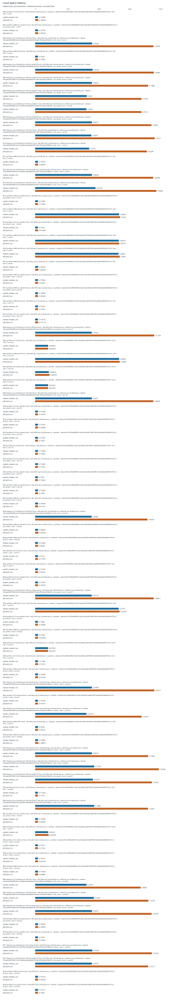
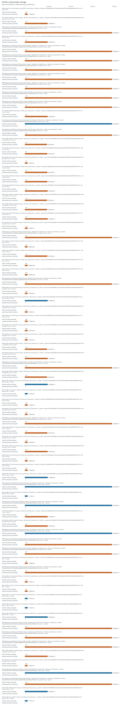
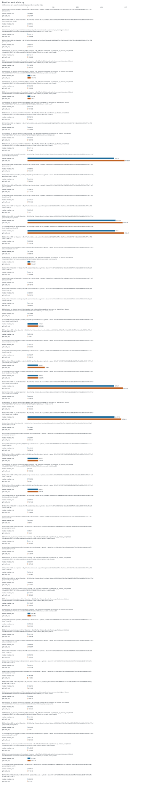

# Supplementary experiment report

Recorded run profile: paper. Results describe the measured platform and dataset recorded on each row. Desktop and loopback smoke runs are not Raspberry Pi or remote-host evidence. Synthetic fixtures are not real chain workloads. Ethereum RPC JSON replay does not validate native finality or integrate sharded consensus. Verifier-local offloading is not compression or a system-wide storage saving; provider state must be counted separately.

Valid records: 483. Successful records: 480. Failed records: 0. Malformed lines: 0.

## Reviewer coverage

Exactly seven whole-comment rows are retained. Statuses describe this run's evidence, not acceptance of the manuscript.

| Comment | Whole-comment scope | Status | Missing evidence |
|---|---|---|---|
| R1-1 | Storage accounting and provider-side overhead | measured_here |  |
| R1-2 | IoT deployment and blockchain integration scope | partial | real_pi_platform; remote_tcp; energy; service_disconnect; native_finality |
| R2-1 | Evaluation on constrained hardware | partial | real_pi_platform |
| R2-2 | CPU, RAM and latency measurements | measured_here |  |
| R2-3 | Presentation of experimental evidence | measured_here |  |
| R2-4 | Reproducible repository, real data and hardware evidence | partial | real_pi_platform |
| R2-8 | Real-world benchmarking | partial | real_pi_platform |

## Evidence and limitations

- **real_pi_platform: missing** — No successful measurement is backed by a Raspberry Pi system device model; a platform label or desktop smoke run is insufficient.
- **remote_tcp: missing** — No successful TCP measurement records distinct client/server hostnames or device IDs; loopback does not establish a remote deployment.
- **real_data: measured_here** — Real-data measurements record source metadata and an input hash.
- **energy: missing** — No measured energy in joules is present; CPU time and estimated power are not energy measurements.
- **filesystem: measured_here** — Storage experiment includes actual allocated/filesystem byte measurements.
- **memory_pressure: measured_here** — Memory-pressure experiment records an enforced limit or pressure configuration.
- **service_disconnect: missing** — No observed service-disconnection test on distinct TCP hosts is present; in-process fault injection does not establish this evidence.
- **native_finality: missing** — Native finality and sharded-consensus integration are absent. Ethereum RPC JSON replay is an ingestion/verification adapter, not native finality validation or consensus integration.
- **storage_accounting: measured_here** — Verifier and provider byte accounting is available.
- **provider_latency: measured_here** — Provider latency is measured.
- **cpu: measured_here** — CPU-time or CPU-utilization metrics are present.
- **ram: measured_here** — Resident/peak memory metrics are present.
- **local_latency: measured_here** — Local latency metrics are present.
- **presentation: measured_here** — This run provides machine-readable tables, escaped LaTeX and an offline report; manuscript revision and reviewer acceptance are not assessed.
- **repository_metadata: measured_here** — Run metadata records a code version and configuration; public repository availability is not verified.

## Experiment inventory

| Experiment | Records | Successful |
|---|---:|---:|
| original_e2 | 40 | 40 |
| local | 75 | 75 |
| archive_retrieval | 15 | 15 |
| network | 1 | 0 |
| storage | 75 | 75 |
| provider | 75 | 75 |
| migration | 60 | 60 |
| integrity | 75 | 75 |
| memory_pressure | 60 | 60 |
| disconnect | 0 | 0 |
| energy_workload | 5 | 5 |
| energy | 1 | 0 |
| real_dataset | 0 | 0 |
| native_finality | 1 | 0 |

## Figures

Individual records are plotted without pooling cases, platforms, datasets or modes. Median and p95 are within-record metrics; no confidence intervals are inferred from summary statistics.








## Warnings

- Insufficient independent trials: 1 identified for [&quot;storage&quot;, &quot;0000-synthetic-n512-full-t2-storage&quot;, &quot;hpc&quot;, {&quot;architecture&quot;: &quot;x86_64&quot;, &quot;cpu_count&quot;: 96, &quot;hostname&quot;: &quot;ltu-hpc-2.latrobe.edu.au&quot;, &quot;kernel&quot;: &quot;4.18.0-553.120.1.el8_10.x86_64&quot;, &quot;machine_id&quot;: &quot;fd4458b75367f59ff7c09494ea573e5e7a5263a2584218cc99f37f023a3aa2d8&quot;, &quot;machine_id_source&quot;: &quot;linux_machine_id_sha256&quot;, &quot;mem_total_bytes&quot;: 403783344128, &quot;network&quot;: {&quot;available&quot;: true, &quot;interfaces&quot;: [{&quot;is_wireless&quot;: false, &quot;name&quot;: &quot;enp63s0&quot;, &quot;operstate&quot;: &quot;up&quot;}, {&quot;is_wireless&quot;: false, &quot;name&quot;: &quot;lo&quot;, &quot;operstate&quot;: &quot;unknown&quot;}]}, &quot;openssl&quot;: &quot;OpenSSL 1.1.1k  FIPS 25 Mar 2021&quot;, &quot;os&quot;: {&quot;id&quot;: &quot;rhel&quot;, &quot;name&quot;: &quot;Red Hat Enterprise Linux&quot;, &quot;pretty_name&quot;: &quot;Red Hat Enterprise Linux 8.10 (Ootpa)&quot;, &quot;version&quot;: &quot;8.10 (Ootpa)&quot;, &quot;version_id&quot;: &quot;8.10&quot;}, &quot;pi_model&quot;: null, &quot;platform&quot;: &quot;Linux&quot;, &quot;python&quot;: &quot;3.11.5&quot;, &quot;python_implementation&quot;: &quot;CPython&quot;, &quot;result_storage&quot;: {&quot;block_device&quot;: null, &quot;device&quot;: null, &quot;filesystem&quot;: &quot;nfs4&quot;, &quot;free_bytes&quot;: 530464112640, &quot;mountpoint&quot;: &quot;/data/group&quot;, &quot;path&quot;: &quot;/data/group/xulab/home/zxu/msi_pi_suite/outputs/hpc_real_422175&quot;, &quot;total_bytes&quot;: 536870912000, &quot;used_bytes&quot;: 6406799360}, &quot;storage&quot;: {&quot;block_device&quot;: null, &quot;device&quot;: null, &quot;filesystem&quot;: &quot;nfs4&quot;, &quot;free_bytes&quot;: 530464112640, &quot;mountpoint&quot;: &quot;/data/group&quot;, &quot;path&quot;: &quot;/data/group/xulab/home/zxu/msi_pi_suite&quot;, &quot;total_bytes&quot;: 536870912000, &quot;used_bytes&quot;: 6406799360}}, &quot;synthetic&quot;, null, null, &quot;full&quot;, null, &quot;b016c29f4de90f5b1cf3a216da5a605c33b87f5b41cbb2b6bd5568949c797cef&quot;]; at least 3 recommended. Per-query samples do not substitute for independent trials.
- Insufficient independent trials: 1 identified for [&quot;provider&quot;, &quot;0000-synthetic-n512-full-t2-provider&quot;, &quot;provider&quot;, {&quot;architecture&quot;: &quot;x86_64&quot;, &quot;cpu_count&quot;: 96, &quot;hostname&quot;: &quot;ltu-hpc-2.latrobe.edu.au&quot;, &quot;kernel&quot;: &quot;4.18.0-553.120.1.el8_10.x86_64&quot;, &quot;machine_id&quot;: &quot;fd4458b75367f59ff7c09494ea573e5e7a5263a2584218cc99f37f023a3aa2d8&quot;, &quot;machine_id_source&quot;: &quot;linux_machine_id_sha256&quot;, &quot;mem_total_bytes&quot;: 403783344128, &quot;network&quot;: {&quot;available&quot;: true, &quot;interfaces&quot;: [{&quot;is_wireless&quot;: false, &quot;name&quot;: &quot;enp63s0&quot;, &quot;operstate&quot;: &quot;up&quot;}, {&quot;is_wireless&quot;: false, &quot;name&quot;: &quot;lo&quot;, &quot;operstate&quot;: &quot;unknown&quot;}]}, &quot;openssl&quot;: &quot;OpenSSL 1.1.1k  FIPS 25 Mar 2021&quot;, &quot;os&quot;: {&quot;id&quot;: &quot;rhel&quot;, &quot;name&quot;: &quot;Red Hat Enterprise Linux&quot;, &quot;pretty_name&quot;: &quot;Red Hat Enterprise Linux 8.10 (Ootpa)&quot;, &quot;version&quot;: &quot;8.10 (Ootpa)&quot;, &quot;version_id&quot;: &quot;8.10&quot;}, &quot;pi_model&quot;: null, &quot;platform&quot;: &quot;Linux&quot;, &quot;python&quot;: &quot;3.11.5&quot;, &quot;python_implementation&quot;: &quot;CPython&quot;, &quot;result_storage&quot;: {&quot;block_device&quot;: null, &quot;device&quot;: null, &quot;filesystem&quot;: &quot;nfs4&quot;, &quot;free_bytes&quot;: 530464112640, &quot;mountpoint&quot;: &quot;/data/group&quot;, &quot;path&quot;: &quot;/data/group/xulab/home/zxu/msi_pi_suite/outputs/hpc_real_422175&quot;, &quot;total_bytes&quot;: 536870912000, &quot;used_bytes&quot;: 6406799360}, &quot;storage&quot;: {&quot;block_device&quot;: null, &quot;device&quot;: null, &quot;filesystem&quot;: &quot;nfs4&quot;, &quot;free_bytes&quot;: 530464112640, &quot;mountpoint&quot;: &quot;/data/group&quot;, &quot;path&quot;: &quot;/data/group/xulab/home/zxu/msi_pi_suite&quot;, &quot;total_bytes&quot;: 536870912000, &quot;used_bytes&quot;: 6406799360}}, &quot;synthetic&quot;, null, null, &quot;full&quot;, null, &quot;b016c29f4de90f5b1cf3a216da5a605c33b87f5b41cbb2b6bd5568949c797cef&quot;]; at least 3 recommended. Per-query samples do not substitute for independent trials.
- Insufficient independent trials: 1 identified for [&quot;local&quot;, &quot;0000-synthetic-n512-full-t2-local&quot;, &quot;hpc&quot;, {&quot;architecture&quot;: &quot;x86_64&quot;, &quot;cpu_count&quot;: 96, &quot;hostname&quot;: &quot;ltu-hpc-2.latrobe.edu.au&quot;, &quot;kernel&quot;: &quot;4.18.0-553.120.1.el8_10.x86_64&quot;, &quot;machine_id&quot;: &quot;fd4458b75367f59ff7c09494ea573e5e7a5263a2584218cc99f37f023a3aa2d8&quot;, &quot;machine_id_source&quot;: &quot;linux_machine_id_sha256&quot;, &quot;mem_total_bytes&quot;: 403783344128, &quot;network&quot;: {&quot;available&quot;: true, &quot;interfaces&quot;: [{&quot;is_wireless&quot;: false, &quot;name&quot;: &quot;enp63s0&quot;, &quot;operstate&quot;: &quot;up&quot;}, {&quot;is_wireless&quot;: false, &quot;name&quot;: &quot;lo&quot;, &quot;operstate&quot;: &quot;unknown&quot;}]}, &quot;openssl&quot;: &quot;OpenSSL 1.1.1k  FIPS 25 Mar 2021&quot;, &quot;os&quot;: {&quot;id&quot;: &quot;rhel&quot;, &quot;name&quot;: &quot;Red Hat Enterprise Linux&quot;, &quot;pretty_name&quot;: &quot;Red Hat Enterprise Linux 8.10 (Ootpa)&quot;, &quot;version&quot;: &quot;8.10 (Ootpa)&quot;, &quot;version_id&quot;: &quot;8.10&quot;}, &quot;pi_model&quot;: null, &quot;platform&quot;: &quot;Linux&quot;, &quot;python&quot;: &quot;3.11.5&quot;, &quot;python_implementation&quot;: &quot;CPython&quot;, &quot;result_storage&quot;: {&quot;block_device&quot;: null, &quot;device&quot;: null, &quot;filesystem&quot;: &quot;nfs4&quot;, &quot;free_bytes&quot;: 530464112640, &quot;mountpoint&quot;: &quot;/data/group&quot;, &quot;path&quot;: &quot;/data/group/xulab/home/zxu/msi_pi_suite/outputs/hpc_real_422175&quot;, &quot;total_bytes&quot;: 536870912000, &quot;used_bytes&quot;: 6406799360}, &quot;storage&quot;: {&quot;block_device&quot;: null, &quot;device&quot;: null, &quot;filesystem&quot;: &quot;nfs4&quot;, &quot;free_bytes&quot;: 530464112640, &quot;mountpoint&quot;: &quot;/data/group&quot;, &quot;path&quot;: &quot;/data/group/xulab/home/zxu/msi_pi_suite&quot;, &quot;total_bytes&quot;: 536870912000, &quot;used_bytes&quot;: 6406799360}}, &quot;synthetic&quot;, null, null, &quot;full&quot;, null, &quot;b016c29f4de90f5b1cf3a216da5a605c33b87f5b41cbb2b6bd5568949c797cef&quot;]; at least 3 recommended. Per-query samples do not substitute for independent trials.
- Insufficient independent trials: 1 identified for [&quot;memory_pressure&quot;, &quot;0000-synthetic-n512-full-t2-memory_pressure&quot;, &quot;hpc&quot;, {&quot;architecture&quot;: &quot;x86_64&quot;, &quot;cpu_count&quot;: 96, &quot;hostname&quot;: &quot;ltu-hpc-2.latrobe.edu.au&quot;, &quot;kernel&quot;: &quot;4.18.0-553.120.1.el8_10.x86_64&quot;, &quot;machine_id&quot;: &quot;fd4458b75367f59ff7c09494ea573e5e7a5263a2584218cc99f37f023a3aa2d8&quot;, &quot;machine_id_source&quot;: &quot;linux_machine_id_sha256&quot;, &quot;mem_total_bytes&quot;: 403783344128, &quot;network&quot;: {&quot;available&quot;: true, &quot;interfaces&quot;: [{&quot;is_wireless&quot;: false, &quot;name&quot;: &quot;enp63s0&quot;, &quot;operstate&quot;: &quot;up&quot;}, {&quot;is_wireless&quot;: false, &quot;name&quot;: &quot;lo&quot;, &quot;operstate&quot;: &quot;unknown&quot;}]}, &quot;openssl&quot;: &quot;OpenSSL 1.1.1k  FIPS 25 Mar 2021&quot;, &quot;os&quot;: {&quot;id&quot;: &quot;rhel&quot;, &quot;name&quot;: &quot;Red Hat Enterprise Linux&quot;, &quot;pretty_name&quot;: &quot;Red Hat Enterprise Linux 8.10 (Ootpa)&quot;, &quot;version&quot;: &quot;8.10 (Ootpa)&quot;, &quot;version_id&quot;: &quot;8.10&quot;}, &quot;pi_model&quot;: null, &quot;platform&quot;: &quot;Linux&quot;, &quot;python&quot;: &quot;3.11.5&quot;, &quot;python_implementation&quot;: &quot;CPython&quot;, &quot;result_storage&quot;: {&quot;block_device&quot;: null, &quot;device&quot;: null, &quot;filesystem&quot;: &quot;nfs4&quot;, &quot;free_bytes&quot;: 530464112640, &quot;mountpoint&quot;: &quot;/data/group&quot;, &quot;path&quot;: &quot;/data/group/xulab/home/zxu/msi_pi_suite/outputs/hpc_real_422175&quot;, &quot;total_bytes&quot;: 536870912000, &quot;used_bytes&quot;: 6406799360}, &quot;storage&quot;: {&quot;block_device&quot;: null, &quot;device&quot;: null, &quot;filesystem&quot;: &quot;nfs4&quot;, &quot;free_bytes&quot;: 530464112640, &quot;mountpoint&quot;: &quot;/data/group&quot;, &quot;path&quot;: &quot;/data/group/xulab/home/zxu/msi_pi_suite&quot;, &quot;total_bytes&quot;: 536870912000, &quot;used_bytes&quot;: 6406799360}}, &quot;synthetic&quot;, null, null, &quot;full&quot;, null, &quot;b016c29f4de90f5b1cf3a216da5a605c33b87f5b41cbb2b6bd5568949c797cef&quot;]; at least 3 recommended. Per-query samples do not substitute for independent trials.
- Insufficient independent trials: 1 identified for [&quot;integrity&quot;, &quot;0000-synthetic-n512-full-t2-integrity&quot;, &quot;hpc&quot;, {&quot;architecture&quot;: &quot;x86_64&quot;, &quot;cpu_count&quot;: 96, &quot;hostname&quot;: &quot;ltu-hpc-2.latrobe.edu.au&quot;, &quot;kernel&quot;: &quot;4.18.0-553.120.1.el8_10.x86_64&quot;, &quot;machine_id&quot;: &quot;fd4458b75367f59ff7c09494ea573e5e7a5263a2584218cc99f37f023a3aa2d8&quot;, &quot;machine_id_source&quot;: &quot;linux_machine_id_sha256&quot;, &quot;mem_total_bytes&quot;: 403783344128, &quot;network&quot;: {&quot;available&quot;: true, &quot;interfaces&quot;: [{&quot;is_wireless&quot;: false, &quot;name&quot;: &quot;enp63s0&quot;, &quot;operstate&quot;: &quot;up&quot;}, {&quot;is_wireless&quot;: false, &quot;name&quot;: &quot;lo&quot;, &quot;operstate&quot;: &quot;unknown&quot;}]}, &quot;openssl&quot;: &quot;OpenSSL 1.1.1k  FIPS 25 Mar 2021&quot;, &quot;os&quot;: {&quot;id&quot;: &quot;rhel&quot;, &quot;name&quot;: &quot;Red Hat Enterprise Linux&quot;, &quot;pretty_name&quot;: &quot;Red Hat Enterprise Linux 8.10 (Ootpa)&quot;, &quot;version&quot;: &quot;8.10 (Ootpa)&quot;, &quot;version_id&quot;: &quot;8.10&quot;}, &quot;pi_model&quot;: null, &quot;platform&quot;: &quot;Linux&quot;, &quot;python&quot;: &quot;3.11.5&quot;, &quot;python_implementation&quot;: &quot;CPython&quot;, &quot;result_storage&quot;: {&quot;block_device&quot;: null, &quot;device&quot;: null, &quot;filesystem&quot;: &quot;nfs4&quot;, &quot;free_bytes&quot;: 530464112640, &quot;mountpoint&quot;: &quot;/data/group&quot;, &quot;path&quot;: &quot;/data/group/xulab/home/zxu/msi_pi_suite/outputs/hpc_real_422175&quot;, &quot;total_bytes&quot;: 536870912000, &quot;used_bytes&quot;: 6406799360}, &quot;storage&quot;: {&quot;block_device&quot;: null, &quot;device&quot;: null, &quot;filesystem&quot;: &quot;nfs4&quot;, &quot;free_bytes&quot;: 530464112640, &quot;mountpoint&quot;: &quot;/data/group&quot;, &quot;path&quot;: &quot;/data/group/xulab/home/zxu/msi_pi_suite&quot;, &quot;total_bytes&quot;: 536870912000, &quot;used_bytes&quot;: 6406799360}}, &quot;synthetic&quot;, null, null, &quot;full&quot;, null, &quot;b016c29f4de90f5b1cf3a216da5a605c33b87f5b41cbb2b6bd5568949c797cef&quot;]; at least 3 recommended. Per-query samples do not substitute for independent trials.
- Insufficient independent trials: 1 identified for [&quot;storage&quot;, &quot;0001-synthetic-n4096-ext_cached-t1-storage&quot;, &quot;hpc&quot;, {&quot;architecture&quot;: &quot;x86_64&quot;, &quot;cpu_count&quot;: 96, &quot;hostname&quot;: &quot;ltu-hpc-2.latrobe.edu.au&quot;, &quot;kernel&quot;: &quot;4.18.0-553.120.1.el8_10.x86_64&quot;, &quot;machine_id&quot;: &quot;fd4458b75367f59ff7c09494ea573e5e7a5263a2584218cc99f37f023a3aa2d8&quot;, &quot;machine_id_source&quot;: &quot;linux_machine_id_sha256&quot;, &quot;mem_total_bytes&quot;: 403783344128, &quot;network&quot;: {&quot;available&quot;: true, &quot;interfaces&quot;: [{&quot;is_wireless&quot;: false, &quot;name&quot;: &quot;enp63s0&quot;, &quot;operstate&quot;: &quot;up&quot;}, {&quot;is_wireless&quot;: false, &quot;name&quot;: &quot;lo&quot;, &quot;operstate&quot;: &quot;unknown&quot;}]}, &quot;openssl&quot;: &quot;OpenSSL 1.1.1k  FIPS 25 Mar 2021&quot;, &quot;os&quot;: {&quot;id&quot;: &quot;rhel&quot;, &quot;name&quot;: &quot;Red Hat Enterprise Linux&quot;, &quot;pretty_name&quot;: &quot;Red Hat Enterprise Linux 8.10 (Ootpa)&quot;, &quot;version&quot;: &quot;8.10 (Ootpa)&quot;, &quot;version_id&quot;: &quot;8.10&quot;}, &quot;pi_model&quot;: null, &quot;platform&quot;: &quot;Linux&quot;, &quot;python&quot;: &quot;3.11.5&quot;, &quot;python_implementation&quot;: &quot;CPython&quot;, &quot;result_storage&quot;: {&quot;block_device&quot;: null, &quot;device&quot;: null, &quot;filesystem&quot;: &quot;nfs4&quot;, &quot;free_bytes&quot;: 530464112640, &quot;mountpoint&quot;: &quot;/data/group&quot;, &quot;path&quot;: &quot;/data/group/xulab/home/zxu/msi_pi_suite/outputs/hpc_real_422175&quot;, &quot;total_bytes&quot;: 536870912000, &quot;used_bytes&quot;: 6406799360}, &quot;storage&quot;: {&quot;block_device&quot;: null, &quot;device&quot;: null, &quot;filesystem&quot;: &quot;nfs4&quot;, &quot;free_bytes&quot;: 530464112640, &quot;mountpoint&quot;: &quot;/data/group&quot;, &quot;path&quot;: &quot;/data/group/xulab/home/zxu/msi_pi_suite&quot;, &quot;total_bytes&quot;: 536870912000, &quot;used_bytes&quot;: 6406799360}}, &quot;synthetic&quot;, null, null, &quot;ext_cached&quot;, null, &quot;b016c29f4de90f5b1cf3a216da5a605c33b87f5b41cbb2b6bd5568949c797cef&quot;]; at least 3 recommended. Per-query samples do not substitute for independent trials.
- Insufficient independent trials: 1 identified for [&quot;provider&quot;, &quot;0001-synthetic-n4096-ext_cached-t1-provider&quot;, &quot;provider&quot;, {&quot;architecture&quot;: &quot;x86_64&quot;, &quot;cpu_count&quot;: 96, &quot;hostname&quot;: &quot;ltu-hpc-2.latrobe.edu.au&quot;, &quot;kernel&quot;: &quot;4.18.0-553.120.1.el8_10.x86_64&quot;, &quot;machine_id&quot;: &quot;fd4458b75367f59ff7c09494ea573e5e7a5263a2584218cc99f37f023a3aa2d8&quot;, &quot;machine_id_source&quot;: &quot;linux_machine_id_sha256&quot;, &quot;mem_total_bytes&quot;: 403783344128, &quot;network&quot;: {&quot;available&quot;: true, &quot;interfaces&quot;: [{&quot;is_wireless&quot;: false, &quot;name&quot;: &quot;enp63s0&quot;, &quot;operstate&quot;: &quot;up&quot;}, {&quot;is_wireless&quot;: false, &quot;name&quot;: &quot;lo&quot;, &quot;operstate&quot;: &quot;unknown&quot;}]}, &quot;openssl&quot;: &quot;OpenSSL 1.1.1k  FIPS 25 Mar 2021&quot;, &quot;os&quot;: {&quot;id&quot;: &quot;rhel&quot;, &quot;name&quot;: &quot;Red Hat Enterprise Linux&quot;, &quot;pretty_name&quot;: &quot;Red Hat Enterprise Linux 8.10 (Ootpa)&quot;, &quot;version&quot;: &quot;8.10 (Ootpa)&quot;, &quot;version_id&quot;: &quot;8.10&quot;}, &quot;pi_model&quot;: null, &quot;platform&quot;: &quot;Linux&quot;, &quot;python&quot;: &quot;3.11.5&quot;, &quot;python_implementation&quot;: &quot;CPython&quot;, &quot;result_storage&quot;: {&quot;block_device&quot;: null, &quot;device&quot;: null, &quot;filesystem&quot;: &quot;nfs4&quot;, &quot;free_bytes&quot;: 530464112640, &quot;mountpoint&quot;: &quot;/data/group&quot;, &quot;path&quot;: &quot;/data/group/xulab/home/zxu/msi_pi_suite/outputs/hpc_real_422175&quot;, &quot;total_bytes&quot;: 536870912000, &quot;used_bytes&quot;: 6406799360}, &quot;storage&quot;: {&quot;block_device&quot;: null, &quot;device&quot;: null, &quot;filesystem&quot;: &quot;nfs4&quot;, &quot;free_bytes&quot;: 530464112640, &quot;mountpoint&quot;: &quot;/data/group&quot;, &quot;path&quot;: &quot;/data/group/xulab/home/zxu/msi_pi_suite&quot;, &quot;total_bytes&quot;: 536870912000, &quot;used_bytes&quot;: 6406799360}}, &quot;synthetic&quot;, null, null, &quot;ext_cached&quot;, null, &quot;b016c29f4de90f5b1cf3a216da5a605c33b87f5b41cbb2b6bd5568949c797cef&quot;]; at least 3 recommended. Per-query samples do not substitute for independent trials.
- Insufficient independent trials: 1 identified for [&quot;local&quot;, &quot;0001-synthetic-n4096-ext_cached-t1-local&quot;, &quot;hpc&quot;, {&quot;architecture&quot;: &quot;x86_64&quot;, &quot;cpu_count&quot;: 96, &quot;hostname&quot;: &quot;ltu-hpc-2.latrobe.edu.au&quot;, &quot;kernel&quot;: &quot;4.18.0-553.120.1.el8_10.x86_64&quot;, &quot;machine_id&quot;: &quot;fd4458b75367f59ff7c09494ea573e5e7a5263a2584218cc99f37f023a3aa2d8&quot;, &quot;machine_id_source&quot;: &quot;linux_machine_id_sha256&quot;, &quot;mem_total_bytes&quot;: 403783344128, &quot;network&quot;: {&quot;available&quot;: true, &quot;interfaces&quot;: [{&quot;is_wireless&quot;: false, &quot;name&quot;: &quot;enp63s0&quot;, &quot;operstate&quot;: &quot;up&quot;}, {&quot;is_wireless&quot;: false, &quot;name&quot;: &quot;lo&quot;, &quot;operstate&quot;: &quot;unknown&quot;}]}, &quot;openssl&quot;: &quot;OpenSSL 1.1.1k  FIPS 25 Mar 2021&quot;, &quot;os&quot;: {&quot;id&quot;: &quot;rhel&quot;, &quot;name&quot;: &quot;Red Hat Enterprise Linux&quot;, &quot;pretty_name&quot;: &quot;Red Hat Enterprise Linux 8.10 (Ootpa)&quot;, &quot;version&quot;: &quot;8.10 (Ootpa)&quot;, &quot;version_id&quot;: &quot;8.10&quot;}, &quot;pi_model&quot;: null, &quot;platform&quot;: &quot;Linux&quot;, &quot;python&quot;: &quot;3.11.5&quot;, &quot;python_implementation&quot;: &quot;CPython&quot;, &quot;result_storage&quot;: {&quot;block_device&quot;: null, &quot;device&quot;: null, &quot;filesystem&quot;: &quot;nfs4&quot;, &quot;free_bytes&quot;: 530464112640, &quot;mountpoint&quot;: &quot;/data/group&quot;, &quot;path&quot;: &quot;/data/group/xulab/home/zxu/msi_pi_suite/outputs/hpc_real_422175&quot;, &quot;total_bytes&quot;: 536870912000, &quot;used_bytes&quot;: 6406799360}, &quot;storage&quot;: {&quot;block_device&quot;: null, &quot;device&quot;: null, &quot;filesystem&quot;: &quot;nfs4&quot;, &quot;free_bytes&quot;: 530464112640, &quot;mountpoint&quot;: &quot;/data/group&quot;, &quot;path&quot;: &quot;/data/group/xulab/home/zxu/msi_pi_suite&quot;, &quot;total_bytes&quot;: 536870912000, &quot;used_bytes&quot;: 6406799360}}, &quot;synthetic&quot;, null, null, &quot;ext_cached&quot;, null, &quot;b016c29f4de90f5b1cf3a216da5a605c33b87f5b41cbb2b6bd5568949c797cef&quot;]; at least 3 recommended. Per-query samples do not substitute for independent trials.
- Insufficient independent trials: 1 identified for [&quot;memory_pressure&quot;, &quot;0001-synthetic-n4096-ext_cached-t1-memory_pressure&quot;, &quot;hpc&quot;, {&quot;architecture&quot;: &quot;x86_64&quot;, &quot;cpu_count&quot;: 96, &quot;hostname&quot;: &quot;ltu-hpc-2.latrobe.edu.au&quot;, &quot;kernel&quot;: &quot;4.18.0-553.120.1.el8_10.x86_64&quot;, &quot;machine_id&quot;: &quot;fd4458b75367f59ff7c09494ea573e5e7a5263a2584218cc99f37f023a3aa2d8&quot;, &quot;machine_id_source&quot;: &quot;linux_machine_id_sha256&quot;, &quot;mem_total_bytes&quot;: 403783344128, &quot;network&quot;: {&quot;available&quot;: true, &quot;interfaces&quot;: [{&quot;is_wireless&quot;: false, &quot;name&quot;: &quot;enp63s0&quot;, &quot;operstate&quot;: &quot;up&quot;}, {&quot;is_wireless&quot;: false, &quot;name&quot;: &quot;lo&quot;, &quot;operstate&quot;: &quot;unknown&quot;}]}, &quot;openssl&quot;: &quot;OpenSSL 1.1.1k  FIPS 25 Mar 2021&quot;, &quot;os&quot;: {&quot;id&quot;: &quot;rhel&quot;, &quot;name&quot;: &quot;Red Hat Enterprise Linux&quot;, &quot;pretty_name&quot;: &quot;Red Hat Enterprise Linux 8.10 (Ootpa)&quot;, &quot;version&quot;: &quot;8.10 (Ootpa)&quot;, &quot;version_id&quot;: &quot;8.10&quot;}, &quot;pi_model&quot;: null, &quot;platform&quot;: &quot;Linux&quot;, &quot;python&quot;: &quot;3.11.5&quot;, &quot;python_implementation&quot;: &quot;CPython&quot;, &quot;result_storage&quot;: {&quot;block_device&quot;: null, &quot;device&quot;: null, &quot;filesystem&quot;: &quot;nfs4&quot;, &quot;free_bytes&quot;: 530464112640, &quot;mountpoint&quot;: &quot;/data/group&quot;, &quot;path&quot;: &quot;/data/group/xulab/home/zxu/msi_pi_suite/outputs/hpc_real_422175&quot;, &quot;total_bytes&quot;: 536870912000, &quot;used_bytes&quot;: 6406799360}, &quot;storage&quot;: {&quot;block_device&quot;: null, &quot;device&quot;: null, &quot;filesystem&quot;: &quot;nfs4&quot;, &quot;free_bytes&quot;: 530464112640, &quot;mountpoint&quot;: &quot;/data/group&quot;, &quot;path&quot;: &quot;/data/group/xulab/home/zxu/msi_pi_suite&quot;, &quot;total_bytes&quot;: 536870912000, &quot;used_bytes&quot;: 6406799360}}, &quot;synthetic&quot;, null, null, &quot;ext_cached&quot;, null, &quot;b016c29f4de90f5b1cf3a216da5a605c33b87f5b41cbb2b6bd5568949c797cef&quot;]; at least 3 recommended. Per-query samples do not substitute for independent trials.
- Insufficient independent trials: 1 identified for [&quot;integrity&quot;, &quot;0001-synthetic-n4096-ext_cached-t1-integrity&quot;, &quot;hpc&quot;, {&quot;architecture&quot;: &quot;x86_64&quot;, &quot;cpu_count&quot;: 96, &quot;hostname&quot;: &quot;ltu-hpc-2.latrobe.edu.au&quot;, &quot;kernel&quot;: &quot;4.18.0-553.120.1.el8_10.x86_64&quot;, &quot;machine_id&quot;: &quot;fd4458b75367f59ff7c09494ea573e5e7a5263a2584218cc99f37f023a3aa2d8&quot;, &quot;machine_id_source&quot;: &quot;linux_machine_id_sha256&quot;, &quot;mem_total_bytes&quot;: 403783344128, &quot;network&quot;: {&quot;available&quot;: true, &quot;interfaces&quot;: [{&quot;is_wireless&quot;: false, &quot;name&quot;: &quot;enp63s0&quot;, &quot;operstate&quot;: &quot;up&quot;}, {&quot;is_wireless&quot;: false, &quot;name&quot;: &quot;lo&quot;, &quot;operstate&quot;: &quot;unknown&quot;}]}, &quot;openssl&quot;: &quot;OpenSSL 1.1.1k  FIPS 25 Mar 2021&quot;, &quot;os&quot;: {&quot;id&quot;: &quot;rhel&quot;, &quot;name&quot;: &quot;Red Hat Enterprise Linux&quot;, &quot;pretty_name&quot;: &quot;Red Hat Enterprise Linux 8.10 (Ootpa)&quot;, &quot;version&quot;: &quot;8.10 (Ootpa)&quot;, &quot;version_id&quot;: &quot;8.10&quot;}, &quot;pi_model&quot;: null, &quot;platform&quot;: &quot;Linux&quot;, &quot;python&quot;: &quot;3.11.5&quot;, &quot;python_implementation&quot;: &quot;CPython&quot;, &quot;result_storage&quot;: {&quot;block_device&quot;: null, &quot;device&quot;: null, &quot;filesystem&quot;: &quot;nfs4&quot;, &quot;free_bytes&quot;: 530464112640, &quot;mountpoint&quot;: &quot;/data/group&quot;, &quot;path&quot;: &quot;/data/group/xulab/home/zxu/msi_pi_suite/outputs/hpc_real_422175&quot;, &quot;total_bytes&quot;: 536870912000, &quot;used_bytes&quot;: 6406799360}, &quot;storage&quot;: {&quot;block_device&quot;: null, &quot;device&quot;: null, &quot;filesystem&quot;: &quot;nfs4&quot;, &quot;free_bytes&quot;: 530464112640, &quot;mountpoint&quot;: &quot;/data/group&quot;, &quot;path&quot;: &quot;/data/group/xulab/home/zxu/msi_pi_suite&quot;, &quot;total_bytes&quot;: 536870912000, &quot;used_bytes&quot;: 6406799360}}, &quot;synthetic&quot;, null, null, &quot;ext_cached&quot;, null, &quot;b016c29f4de90f5b1cf3a216da5a605c33b87f5b41cbb2b6bd5568949c797cef&quot;]; at least 3 recommended. Per-query samples do not substitute for independent trials.
- Insufficient independent trials: 1 identified for [&quot;storage&quot;, &quot;0002-ethereum_rpc_finalized_json-n69-full-t3-storage&quot;, &quot;hpc&quot;, {&quot;architecture&quot;: &quot;x86_64&quot;, &quot;cpu_count&quot;: 96, &quot;hostname&quot;: &quot;ltu-hpc-2.latrobe.edu.au&quot;, &quot;kernel&quot;: &quot;4.18.0-553.120.1.el8_10.x86_64&quot;, &quot;machine_id&quot;: &quot;fd4458b75367f59ff7c09494ea573e5e7a5263a2584218cc99f37f023a3aa2d8&quot;, &quot;machine_id_source&quot;: &quot;linux_machine_id_sha256&quot;, &quot;mem_total_bytes&quot;: 403783344128, &quot;network&quot;: {&quot;available&quot;: true, &quot;interfaces&quot;: [{&quot;is_wireless&quot;: false, &quot;name&quot;: &quot;enp63s0&quot;, &quot;operstate&quot;: &quot;up&quot;}, {&quot;is_wireless&quot;: false, &quot;name&quot;: &quot;lo&quot;, &quot;operstate&quot;: &quot;unknown&quot;}]}, &quot;openssl&quot;: &quot;OpenSSL 1.1.1k  FIPS 25 Mar 2021&quot;, &quot;os&quot;: {&quot;id&quot;: &quot;rhel&quot;, &quot;name&quot;: &quot;Red Hat Enterprise Linux&quot;, &quot;pretty_name&quot;: &quot;Red Hat Enterprise Linux 8.10 (Ootpa)&quot;, &quot;version&quot;: &quot;8.10 (Ootpa)&quot;, &quot;version_id&quot;: &quot;8.10&quot;}, &quot;pi_model&quot;: null, &quot;platform&quot;: &quot;Linux&quot;, &quot;python&quot;: &quot;3.11.5&quot;, &quot;python_implementation&quot;: &quot;CPython&quot;, &quot;result_storage&quot;: {&quot;block_device&quot;: null, &quot;device&quot;: null, &quot;filesystem&quot;: &quot;nfs4&quot;, &quot;free_bytes&quot;: 530464112640, &quot;mountpoint&quot;: &quot;/data/group&quot;, &quot;path&quot;: &quot;/data/group/xulab/home/zxu/msi_pi_suite/outputs/hpc_real_422175&quot;, &quot;total_bytes&quot;: 536870912000, &quot;used_bytes&quot;: 6406799360}, &quot;storage&quot;: {&quot;block_device&quot;: null, &quot;device&quot;: null, &quot;filesystem&quot;: &quot;nfs4&quot;, &quot;free_bytes&quot;: 530464112640, &quot;mountpoint&quot;: &quot;/data/group&quot;, &quot;path&quot;: &quot;/data/group/xulab/home/zxu/msi_pi_suite&quot;, &quot;total_bytes&quot;: 536870912000, &quot;used_bytes&quot;: 6406799360}}, &quot;ethereum_rpc_finalized_json&quot;, null, null, &quot;full&quot;, null, &quot;190ca4433f979dfd137e27c9ee04c0c9edd85b97027e9e1ff5322ba67f38fc60&quot;]; at least 3 recommended. Per-query samples do not substitute for independent trials.
- Insufficient independent trials: 1 identified for [&quot;provider&quot;, &quot;0002-ethereum_rpc_finalized_json-n69-full-t3-provider&quot;, &quot;provider&quot;, {&quot;architecture&quot;: &quot;x86_64&quot;, &quot;cpu_count&quot;: 96, &quot;hostname&quot;: &quot;ltu-hpc-2.latrobe.edu.au&quot;, &quot;kernel&quot;: &quot;4.18.0-553.120.1.el8_10.x86_64&quot;, &quot;machine_id&quot;: &quot;fd4458b75367f59ff7c09494ea573e5e7a5263a2584218cc99f37f023a3aa2d8&quot;, &quot;machine_id_source&quot;: &quot;linux_machine_id_sha256&quot;, &quot;mem_total_bytes&quot;: 403783344128, &quot;network&quot;: {&quot;available&quot;: true, &quot;interfaces&quot;: [{&quot;is_wireless&quot;: false, &quot;name&quot;: &quot;enp63s0&quot;, &quot;operstate&quot;: &quot;up&quot;}, {&quot;is_wireless&quot;: false, &quot;name&quot;: &quot;lo&quot;, &quot;operstate&quot;: &quot;unknown&quot;}]}, &quot;openssl&quot;: &quot;OpenSSL 1.1.1k  FIPS 25 Mar 2021&quot;, &quot;os&quot;: {&quot;id&quot;: &quot;rhel&quot;, &quot;name&quot;: &quot;Red Hat Enterprise Linux&quot;, &quot;pretty_name&quot;: &quot;Red Hat Enterprise Linux 8.10 (Ootpa)&quot;, &quot;version&quot;: &quot;8.10 (Ootpa)&quot;, &quot;version_id&quot;: &quot;8.10&quot;}, &quot;pi_model&quot;: null, &quot;platform&quot;: &quot;Linux&quot;, &quot;python&quot;: &quot;3.11.5&quot;, &quot;python_implementation&quot;: &quot;CPython&quot;, &quot;result_storage&quot;: {&quot;block_device&quot;: null, &quot;device&quot;: null, &quot;filesystem&quot;: &quot;nfs4&quot;, &quot;free_bytes&quot;: 530464112640, &quot;mountpoint&quot;: &quot;/data/group&quot;, &quot;path&quot;: &quot;/data/group/xulab/home/zxu/msi_pi_suite/outputs/hpc_real_422175&quot;, &quot;total_bytes&quot;: 536870912000, &quot;used_bytes&quot;: 6406799360}, &quot;storage&quot;: {&quot;block_device&quot;: null, &quot;device&quot;: null, &quot;filesystem&quot;: &quot;nfs4&quot;, &quot;free_bytes&quot;: 530464112640, &quot;mountpoint&quot;: &quot;/data/group&quot;, &quot;path&quot;: &quot;/data/group/xulab/home/zxu/msi_pi_suite&quot;, &quot;total_bytes&quot;: 536870912000, &quot;used_bytes&quot;: 6406799360}}, &quot;ethereum_rpc_finalized_json&quot;, null, null, &quot;full&quot;, null, &quot;190ca4433f979dfd137e27c9ee04c0c9edd85b97027e9e1ff5322ba67f38fc60&quot;]; at least 3 recommended. Per-query samples do not substitute for independent trials.
- Insufficient independent trials: 1 identified for [&quot;local&quot;, &quot;0002-ethereum_rpc_finalized_json-n69-full-t3-local&quot;, &quot;hpc&quot;, {&quot;architecture&quot;: &quot;x86_64&quot;, &quot;cpu_count&quot;: 96, &quot;hostname&quot;: &quot;ltu-hpc-2.latrobe.edu.au&quot;, &quot;kernel&quot;: &quot;4.18.0-553.120.1.el8_10.x86_64&quot;, &quot;machine_id&quot;: &quot;fd4458b75367f59ff7c09494ea573e5e7a5263a2584218cc99f37f023a3aa2d8&quot;, &quot;machine_id_source&quot;: &quot;linux_machine_id_sha256&quot;, &quot;mem_total_bytes&quot;: 403783344128, &quot;network&quot;: {&quot;available&quot;: true, &quot;interfaces&quot;: [{&quot;is_wireless&quot;: false, &quot;name&quot;: &quot;enp63s0&quot;, &quot;operstate&quot;: &quot;up&quot;}, {&quot;is_wireless&quot;: false, &quot;name&quot;: &quot;lo&quot;, &quot;operstate&quot;: &quot;unknown&quot;}]}, &quot;openssl&quot;: &quot;OpenSSL 1.1.1k  FIPS 25 Mar 2021&quot;, &quot;os&quot;: {&quot;id&quot;: &quot;rhel&quot;, &quot;name&quot;: &quot;Red Hat Enterprise Linux&quot;, &quot;pretty_name&quot;: &quot;Red Hat Enterprise Linux 8.10 (Ootpa)&quot;, &quot;version&quot;: &quot;8.10 (Ootpa)&quot;, &quot;version_id&quot;: &quot;8.10&quot;}, &quot;pi_model&quot;: null, &quot;platform&quot;: &quot;Linux&quot;, &quot;python&quot;: &quot;3.11.5&quot;, &quot;python_implementation&quot;: &quot;CPython&quot;, &quot;result_storage&quot;: {&quot;block_device&quot;: null, &quot;device&quot;: null, &quot;filesystem&quot;: &quot;nfs4&quot;, &quot;free_bytes&quot;: 530464112640, &quot;mountpoint&quot;: &quot;/data/group&quot;, &quot;path&quot;: &quot;/data/group/xulab/home/zxu/msi_pi_suite/outputs/hpc_real_422175&quot;, &quot;total_bytes&quot;: 536870912000, &quot;used_bytes&quot;: 6406799360}, &quot;storage&quot;: {&quot;block_device&quot;: null, &quot;device&quot;: null, &quot;filesystem&quot;: &quot;nfs4&quot;, &quot;free_bytes&quot;: 530464112640, &quot;mountpoint&quot;: &quot;/data/group&quot;, &quot;path&quot;: &quot;/data/group/xulab/home/zxu/msi_pi_suite&quot;, &quot;total_bytes&quot;: 536870912000, &quot;used_bytes&quot;: 6406799360}}, &quot;ethereum_rpc_finalized_json&quot;, null, null, &quot;full&quot;, null, &quot;190ca4433f979dfd137e27c9ee04c0c9edd85b97027e9e1ff5322ba67f38fc60&quot;]; at least 3 recommended. Per-query samples do not substitute for independent trials.
- Insufficient independent trials: 1 identified for [&quot;memory_pressure&quot;, &quot;0002-ethereum_rpc_finalized_json-n69-full-t3-memory_pressure&quot;, &quot;hpc&quot;, {&quot;architecture&quot;: &quot;x86_64&quot;, &quot;cpu_count&quot;: 96, &quot;hostname&quot;: &quot;ltu-hpc-2.latrobe.edu.au&quot;, &quot;kernel&quot;: &quot;4.18.0-553.120.1.el8_10.x86_64&quot;, &quot;machine_id&quot;: &quot;fd4458b75367f59ff7c09494ea573e5e7a5263a2584218cc99f37f023a3aa2d8&quot;, &quot;machine_id_source&quot;: &quot;linux_machine_id_sha256&quot;, &quot;mem_total_bytes&quot;: 403783344128, &quot;network&quot;: {&quot;available&quot;: true, &quot;interfaces&quot;: [{&quot;is_wireless&quot;: false, &quot;name&quot;: &quot;enp63s0&quot;, &quot;operstate&quot;: &quot;up&quot;}, {&quot;is_wireless&quot;: false, &quot;name&quot;: &quot;lo&quot;, &quot;operstate&quot;: &quot;unknown&quot;}]}, &quot;openssl&quot;: &quot;OpenSSL 1.1.1k  FIPS 25 Mar 2021&quot;, &quot;os&quot;: {&quot;id&quot;: &quot;rhel&quot;, &quot;name&quot;: &quot;Red Hat Enterprise Linux&quot;, &quot;pretty_name&quot;: &quot;Red Hat Enterprise Linux 8.10 (Ootpa)&quot;, &quot;version&quot;: &quot;8.10 (Ootpa)&quot;, &quot;version_id&quot;: &quot;8.10&quot;}, &quot;pi_model&quot;: null, &quot;platform&quot;: &quot;Linux&quot;, &quot;python&quot;: &quot;3.11.5&quot;, &quot;python_implementation&quot;: &quot;CPython&quot;, &quot;result_storage&quot;: {&quot;block_device&quot;: null, &quot;device&quot;: null, &quot;filesystem&quot;: &quot;nfs4&quot;, &quot;free_bytes&quot;: 530464112640, &quot;mountpoint&quot;: &quot;/data/group&quot;, &quot;path&quot;: &quot;/data/group/xulab/home/zxu/msi_pi_suite/outputs/hpc_real_422175&quot;, &quot;total_bytes&quot;: 536870912000, &quot;used_bytes&quot;: 6406799360}, &quot;storage&quot;: {&quot;block_device&quot;: null, &quot;device&quot;: null, &quot;filesystem&quot;: &quot;nfs4&quot;, &quot;free_bytes&quot;: 530464112640, &quot;mountpoint&quot;: &quot;/data/group&quot;, &quot;path&quot;: &quot;/data/group/xulab/home/zxu/msi_pi_suite&quot;, &quot;total_bytes&quot;: 536870912000, &quot;used_bytes&quot;: 6406799360}}, &quot;ethereum_rpc_finalized_json&quot;, null, null, &quot;full&quot;, null, &quot;190ca4433f979dfd137e27c9ee04c0c9edd85b97027e9e1ff5322ba67f38fc60&quot;]; at least 3 recommended. Per-query samples do not substitute for independent trials.
- Insufficient independent trials: 1 identified for [&quot;integrity&quot;, &quot;0002-ethereum_rpc_finalized_json-n69-full-t3-integrity&quot;, &quot;hpc&quot;, {&quot;architecture&quot;: &quot;x86_64&quot;, &quot;cpu_count&quot;: 96, &quot;hostname&quot;: &quot;ltu-hpc-2.latrobe.edu.au&quot;, &quot;kernel&quot;: &quot;4.18.0-553.120.1.el8_10.x86_64&quot;, &quot;machine_id&quot;: &quot;fd4458b75367f59ff7c09494ea573e5e7a5263a2584218cc99f37f023a3aa2d8&quot;, &quot;machine_id_source&quot;: &quot;linux_machine_id_sha256&quot;, &quot;mem_total_bytes&quot;: 403783344128, &quot;network&quot;: {&quot;available&quot;: true, &quot;interfaces&quot;: [{&quot;is_wireless&quot;: false, &quot;name&quot;: &quot;enp63s0&quot;, &quot;operstate&quot;: &quot;up&quot;}, {&quot;is_wireless&quot;: false, &quot;name&quot;: &quot;lo&quot;, &quot;operstate&quot;: &quot;unknown&quot;}]}, &quot;openssl&quot;: &quot;OpenSSL 1.1.1k  FIPS 25 Mar 2021&quot;, &quot;os&quot;: {&quot;id&quot;: &quot;rhel&quot;, &quot;name&quot;: &quot;Red Hat Enterprise Linux&quot;, &quot;pretty_name&quot;: &quot;Red Hat Enterprise Linux 8.10 (Ootpa)&quot;, &quot;version&quot;: &quot;8.10 (Ootpa)&quot;, &quot;version_id&quot;: &quot;8.10&quot;}, &quot;pi_model&quot;: null, &quot;platform&quot;: &quot;Linux&quot;, &quot;python&quot;: &quot;3.11.5&quot;, &quot;python_implementation&quot;: &quot;CPython&quot;, &quot;result_storage&quot;: {&quot;block_device&quot;: null, &quot;device&quot;: null, &quot;filesystem&quot;: &quot;nfs4&quot;, &quot;free_bytes&quot;: 530464112640, &quot;mountpoint&quot;: &quot;/data/group&quot;, &quot;path&quot;: &quot;/data/group/xulab/home/zxu/msi_pi_suite/outputs/hpc_real_422175&quot;, &quot;total_bytes&quot;: 536870912000, &quot;used_bytes&quot;: 6406799360}, &quot;storage&quot;: {&quot;block_device&quot;: null, &quot;device&quot;: null, &quot;filesystem&quot;: &quot;nfs4&quot;, &quot;free_bytes&quot;: 530464112640, &quot;mountpoint&quot;: &quot;/data/group&quot;, &quot;path&quot;: &quot;/data/group/xulab/home/zxu/msi_pi_suite&quot;, &quot;total_bytes&quot;: 536870912000, &quot;used_bytes&quot;: 6406799360}}, &quot;ethereum_rpc_finalized_json&quot;, null, null, &quot;full&quot;, null, &quot;190ca4433f979dfd137e27c9ee04c0c9edd85b97027e9e1ff5322ba67f38fc60&quot;]; at least 3 recommended. Per-query samples do not substitute for independent trials.
- Insufficient independent trials: 1 identified for [&quot;storage&quot;, &quot;0003-synthetic-n4096-full-t3-storage&quot;, &quot;hpc&quot;, {&quot;architecture&quot;: &quot;x86_64&quot;, &quot;cpu_count&quot;: 96, &quot;hostname&quot;: &quot;ltu-hpc-2.latrobe.edu.au&quot;, &quot;kernel&quot;: &quot;4.18.0-553.120.1.el8_10.x86_64&quot;, &quot;machine_id&quot;: &quot;fd4458b75367f59ff7c09494ea573e5e7a5263a2584218cc99f37f023a3aa2d8&quot;, &quot;machine_id_source&quot;: &quot;linux_machine_id_sha256&quot;, &quot;mem_total_bytes&quot;: 403783344128, &quot;network&quot;: {&quot;available&quot;: true, &quot;interfaces&quot;: [{&quot;is_wireless&quot;: false, &quot;name&quot;: &quot;enp63s0&quot;, &quot;operstate&quot;: &quot;up&quot;}, {&quot;is_wireless&quot;: false, &quot;name&quot;: &quot;lo&quot;, &quot;operstate&quot;: &quot;unknown&quot;}]}, &quot;openssl&quot;: &quot;OpenSSL 1.1.1k  FIPS 25 Mar 2021&quot;, &quot;os&quot;: {&quot;id&quot;: &quot;rhel&quot;, &quot;name&quot;: &quot;Red Hat Enterprise Linux&quot;, &quot;pretty_name&quot;: &quot;Red Hat Enterprise Linux 8.10 (Ootpa)&quot;, &quot;version&quot;: &quot;8.10 (Ootpa)&quot;, &quot;version_id&quot;: &quot;8.10&quot;}, &quot;pi_model&quot;: null, &quot;platform&quot;: &quot;Linux&quot;, &quot;python&quot;: &quot;3.11.5&quot;, &quot;python_implementation&quot;: &quot;CPython&quot;, &quot;result_storage&quot;: {&quot;block_device&quot;: null, &quot;device&quot;: null, &quot;filesystem&quot;: &quot;nfs4&quot;, &quot;free_bytes&quot;: 530464112640, &quot;mountpoint&quot;: &quot;/data/group&quot;, &quot;path&quot;: &quot;/data/group/xulab/home/zxu/msi_pi_suite/outputs/hpc_real_422175&quot;, &quot;total_bytes&quot;: 536870912000, &quot;used_bytes&quot;: 6406799360}, &quot;storage&quot;: {&quot;block_device&quot;: null, &quot;device&quot;: null, &quot;filesystem&quot;: &quot;nfs4&quot;, &quot;free_bytes&quot;: 530464112640, &quot;mountpoint&quot;: &quot;/data/group&quot;, &quot;path&quot;: &quot;/data/group/xulab/home/zxu/msi_pi_suite&quot;, &quot;total_bytes&quot;: 536870912000, &quot;used_bytes&quot;: 6406799360}}, &quot;synthetic&quot;, null, null, &quot;full&quot;, null, &quot;b016c29f4de90f5b1cf3a216da5a605c33b87f5b41cbb2b6bd5568949c797cef&quot;]; at least 3 recommended. Per-query samples do not substitute for independent trials.
- Insufficient independent trials: 1 identified for [&quot;provider&quot;, &quot;0003-synthetic-n4096-full-t3-provider&quot;, &quot;provider&quot;, {&quot;architecture&quot;: &quot;x86_64&quot;, &quot;cpu_count&quot;: 96, &quot;hostname&quot;: &quot;ltu-hpc-2.latrobe.edu.au&quot;, &quot;kernel&quot;: &quot;4.18.0-553.120.1.el8_10.x86_64&quot;, &quot;machine_id&quot;: &quot;fd4458b75367f59ff7c09494ea573e5e7a5263a2584218cc99f37f023a3aa2d8&quot;, &quot;machine_id_source&quot;: &quot;linux_machine_id_sha256&quot;, &quot;mem_total_bytes&quot;: 403783344128, &quot;network&quot;: {&quot;available&quot;: true, &quot;interfaces&quot;: [{&quot;is_wireless&quot;: false, &quot;name&quot;: &quot;enp63s0&quot;, &quot;operstate&quot;: &quot;up&quot;}, {&quot;is_wireless&quot;: false, &quot;name&quot;: &quot;lo&quot;, &quot;operstate&quot;: &quot;unknown&quot;}]}, &quot;openssl&quot;: &quot;OpenSSL 1.1.1k  FIPS 25 Mar 2021&quot;, &quot;os&quot;: {&quot;id&quot;: &quot;rhel&quot;, &quot;name&quot;: &quot;Red Hat Enterprise Linux&quot;, &quot;pretty_name&quot;: &quot;Red Hat Enterprise Linux 8.10 (Ootpa)&quot;, &quot;version&quot;: &quot;8.10 (Ootpa)&quot;, &quot;version_id&quot;: &quot;8.10&quot;}, &quot;pi_model&quot;: null, &quot;platform&quot;: &quot;Linux&quot;, &quot;python&quot;: &quot;3.11.5&quot;, &quot;python_implementation&quot;: &quot;CPython&quot;, &quot;result_storage&quot;: {&quot;block_device&quot;: null, &quot;device&quot;: null, &quot;filesystem&quot;: &quot;nfs4&quot;, &quot;free_bytes&quot;: 530464112640, &quot;mountpoint&quot;: &quot;/data/group&quot;, &quot;path&quot;: &quot;/data/group/xulab/home/zxu/msi_pi_suite/outputs/hpc_real_422175&quot;, &quot;total_bytes&quot;: 536870912000, &quot;used_bytes&quot;: 6406799360}, &quot;storage&quot;: {&quot;block_device&quot;: null, &quot;device&quot;: null, &quot;filesystem&quot;: &quot;nfs4&quot;, &quot;free_bytes&quot;: 530464112640, &quot;mountpoint&quot;: &quot;/data/group&quot;, &quot;path&quot;: &quot;/data/group/xulab/home/zxu/msi_pi_suite&quot;, &quot;total_bytes&quot;: 536870912000, &quot;used_bytes&quot;: 6406799360}}, &quot;synthetic&quot;, null, null, &quot;full&quot;, null, &quot;b016c29f4de90f5b1cf3a216da5a605c33b87f5b41cbb2b6bd5568949c797cef&quot;]; at least 3 recommended. Per-query samples do not substitute for independent trials.
- Insufficient independent trials: 1 identified for [&quot;local&quot;, &quot;0003-synthetic-n4096-full-t3-local&quot;, &quot;hpc&quot;, {&quot;architecture&quot;: &quot;x86_64&quot;, &quot;cpu_count&quot;: 96, &quot;hostname&quot;: &quot;ltu-hpc-2.latrobe.edu.au&quot;, &quot;kernel&quot;: &quot;4.18.0-553.120.1.el8_10.x86_64&quot;, &quot;machine_id&quot;: &quot;fd4458b75367f59ff7c09494ea573e5e7a5263a2584218cc99f37f023a3aa2d8&quot;, &quot;machine_id_source&quot;: &quot;linux_machine_id_sha256&quot;, &quot;mem_total_bytes&quot;: 403783344128, &quot;network&quot;: {&quot;available&quot;: true, &quot;interfaces&quot;: [{&quot;is_wireless&quot;: false, &quot;name&quot;: &quot;enp63s0&quot;, &quot;operstate&quot;: &quot;up&quot;}, {&quot;is_wireless&quot;: false, &quot;name&quot;: &quot;lo&quot;, &quot;operstate&quot;: &quot;unknown&quot;}]}, &quot;openssl&quot;: &quot;OpenSSL 1.1.1k  FIPS 25 Mar 2021&quot;, &quot;os&quot;: {&quot;id&quot;: &quot;rhel&quot;, &quot;name&quot;: &quot;Red Hat Enterprise Linux&quot;, &quot;pretty_name&quot;: &quot;Red Hat Enterprise Linux 8.10 (Ootpa)&quot;, &quot;version&quot;: &quot;8.10 (Ootpa)&quot;, &quot;version_id&quot;: &quot;8.10&quot;}, &quot;pi_model&quot;: null, &quot;platform&quot;: &quot;Linux&quot;, &quot;python&quot;: &quot;3.11.5&quot;, &quot;python_implementation&quot;: &quot;CPython&quot;, &quot;result_storage&quot;: {&quot;block_device&quot;: null, &quot;device&quot;: null, &quot;filesystem&quot;: &quot;nfs4&quot;, &quot;free_bytes&quot;: 530464112640, &quot;mountpoint&quot;: &quot;/data/group&quot;, &quot;path&quot;: &quot;/data/group/xulab/home/zxu/msi_pi_suite/outputs/hpc_real_422175&quot;, &quot;total_bytes&quot;: 536870912000, &quot;used_bytes&quot;: 6406799360}, &quot;storage&quot;: {&quot;block_device&quot;: null, &quot;device&quot;: null, &quot;filesystem&quot;: &quot;nfs4&quot;, &quot;free_bytes&quot;: 530464112640, &quot;mountpoint&quot;: &quot;/data/group&quot;, &quot;path&quot;: &quot;/data/group/xulab/home/zxu/msi_pi_suite&quot;, &quot;total_bytes&quot;: 536870912000, &quot;used_bytes&quot;: 6406799360}}, &quot;synthetic&quot;, null, null, &quot;full&quot;, null, &quot;b016c29f4de90f5b1cf3a216da5a605c33b87f5b41cbb2b6bd5568949c797cef&quot;]; at least 3 recommended. Per-query samples do not substitute for independent trials.
- Insufficient independent trials: 1 identified for [&quot;memory_pressure&quot;, &quot;0003-synthetic-n4096-full-t3-memory_pressure&quot;, &quot;hpc&quot;, {&quot;architecture&quot;: &quot;x86_64&quot;, &quot;cpu_count&quot;: 96, &quot;hostname&quot;: &quot;ltu-hpc-2.latrobe.edu.au&quot;, &quot;kernel&quot;: &quot;4.18.0-553.120.1.el8_10.x86_64&quot;, &quot;machine_id&quot;: &quot;fd4458b75367f59ff7c09494ea573e5e7a5263a2584218cc99f37f023a3aa2d8&quot;, &quot;machine_id_source&quot;: &quot;linux_machine_id_sha256&quot;, &quot;mem_total_bytes&quot;: 403783344128, &quot;network&quot;: {&quot;available&quot;: true, &quot;interfaces&quot;: [{&quot;is_wireless&quot;: false, &quot;name&quot;: &quot;enp63s0&quot;, &quot;operstate&quot;: &quot;up&quot;}, {&quot;is_wireless&quot;: false, &quot;name&quot;: &quot;lo&quot;, &quot;operstate&quot;: &quot;unknown&quot;}]}, &quot;openssl&quot;: &quot;OpenSSL 1.1.1k  FIPS 25 Mar 2021&quot;, &quot;os&quot;: {&quot;id&quot;: &quot;rhel&quot;, &quot;name&quot;: &quot;Red Hat Enterprise Linux&quot;, &quot;pretty_name&quot;: &quot;Red Hat Enterprise Linux 8.10 (Ootpa)&quot;, &quot;version&quot;: &quot;8.10 (Ootpa)&quot;, &quot;version_id&quot;: &quot;8.10&quot;}, &quot;pi_model&quot;: null, &quot;platform&quot;: &quot;Linux&quot;, &quot;python&quot;: &quot;3.11.5&quot;, &quot;python_implementation&quot;: &quot;CPython&quot;, &quot;result_storage&quot;: {&quot;block_device&quot;: null, &quot;device&quot;: null, &quot;filesystem&quot;: &quot;nfs4&quot;, &quot;free_bytes&quot;: 530464112640, &quot;mountpoint&quot;: &quot;/data/group&quot;, &quot;path&quot;: &quot;/data/group/xulab/home/zxu/msi_pi_suite/outputs/hpc_real_422175&quot;, &quot;total_bytes&quot;: 536870912000, &quot;used_bytes&quot;: 6406799360}, &quot;storage&quot;: {&quot;block_device&quot;: null, &quot;device&quot;: null, &quot;filesystem&quot;: &quot;nfs4&quot;, &quot;free_bytes&quot;: 530464112640, &quot;mountpoint&quot;: &quot;/data/group&quot;, &quot;path&quot;: &quot;/data/group/xulab/home/zxu/msi_pi_suite&quot;, &quot;total_bytes&quot;: 536870912000, &quot;used_bytes&quot;: 6406799360}}, &quot;synthetic&quot;, null, null, &quot;full&quot;, null, &quot;b016c29f4de90f5b1cf3a216da5a605c33b87f5b41cbb2b6bd5568949c797cef&quot;]; at least 3 recommended. Per-query samples do not substitute for independent trials.
- Insufficient independent trials: 1 identified for [&quot;integrity&quot;, &quot;0003-synthetic-n4096-full-t3-integrity&quot;, &quot;hpc&quot;, {&quot;architecture&quot;: &quot;x86_64&quot;, &quot;cpu_count&quot;: 96, &quot;hostname&quot;: &quot;ltu-hpc-2.latrobe.edu.au&quot;, &quot;kernel&quot;: &quot;4.18.0-553.120.1.el8_10.x86_64&quot;, &quot;machine_id&quot;: &quot;fd4458b75367f59ff7c09494ea573e5e7a5263a2584218cc99f37f023a3aa2d8&quot;, &quot;machine_id_source&quot;: &quot;linux_machine_id_sha256&quot;, &quot;mem_total_bytes&quot;: 403783344128, &quot;network&quot;: {&quot;available&quot;: true, &quot;interfaces&quot;: [{&quot;is_wireless&quot;: false, &quot;name&quot;: &quot;enp63s0&quot;, &quot;operstate&quot;: &quot;up&quot;}, {&quot;is_wireless&quot;: false, &quot;name&quot;: &quot;lo&quot;, &quot;operstate&quot;: &quot;unknown&quot;}]}, &quot;openssl&quot;: &quot;OpenSSL 1.1.1k  FIPS 25 Mar 2021&quot;, &quot;os&quot;: {&quot;id&quot;: &quot;rhel&quot;, &quot;name&quot;: &quot;Red Hat Enterprise Linux&quot;, &quot;pretty_name&quot;: &quot;Red Hat Enterprise Linux 8.10 (Ootpa)&quot;, &quot;version&quot;: &quot;8.10 (Ootpa)&quot;, &quot;version_id&quot;: &quot;8.10&quot;}, &quot;pi_model&quot;: null, &quot;platform&quot;: &quot;Linux&quot;, &quot;python&quot;: &quot;3.11.5&quot;, &quot;python_implementation&quot;: &quot;CPython&quot;, &quot;result_storage&quot;: {&quot;block_device&quot;: null, &quot;device&quot;: null, &quot;filesystem&quot;: &quot;nfs4&quot;, &quot;free_bytes&quot;: 530464112640, &quot;mountpoint&quot;: &quot;/data/group&quot;, &quot;path&quot;: &quot;/data/group/xulab/home/zxu/msi_pi_suite/outputs/hpc_real_422175&quot;, &quot;total_bytes&quot;: 536870912000, &quot;used_bytes&quot;: 6406799360}, &quot;storage&quot;: {&quot;block_device&quot;: null, &quot;device&quot;: null, &quot;filesystem&quot;: &quot;nfs4&quot;, &quot;free_bytes&quot;: 530464112640, &quot;mountpoint&quot;: &quot;/data/group&quot;, &quot;path&quot;: &quot;/data/group/xulab/home/zxu/msi_pi_suite&quot;, &quot;total_bytes&quot;: 536870912000, &quot;used_bytes&quot;: 6406799360}}, &quot;synthetic&quot;, null, null, &quot;full&quot;, null, &quot;b016c29f4de90f5b1cf3a216da5a605c33b87f5b41cbb2b6bd5568949c797cef&quot;]; at least 3 recommended. Per-query samples do not substitute for independent trials.
- Insufficient independent trials: 1 identified for [&quot;storage&quot;, &quot;0004-ethereum_rpc_finalized_json-n69-ext_cached-t3-storage&quot;, &quot;hpc&quot;, {&quot;architecture&quot;: &quot;x86_64&quot;, &quot;cpu_count&quot;: 96, &quot;hostname&quot;: &quot;ltu-hpc-2.latrobe.edu.au&quot;, &quot;kernel&quot;: &quot;4.18.0-553.120.1.el8_10.x86_64&quot;, &quot;machine_id&quot;: &quot;fd4458b75367f59ff7c09494ea573e5e7a5263a2584218cc99f37f023a3aa2d8&quot;, &quot;machine_id_source&quot;: &quot;linux_machine_id_sha256&quot;, &quot;mem_total_bytes&quot;: 403783344128, &quot;network&quot;: {&quot;available&quot;: true, &quot;interfaces&quot;: [{&quot;is_wireless&quot;: false, &quot;name&quot;: &quot;enp63s0&quot;, &quot;operstate&quot;: &quot;up&quot;}, {&quot;is_wireless&quot;: false, &quot;name&quot;: &quot;lo&quot;, &quot;operstate&quot;: &quot;unknown&quot;}]}, &quot;openssl&quot;: &quot;OpenSSL 1.1.1k  FIPS 25 Mar 2021&quot;, &quot;os&quot;: {&quot;id&quot;: &quot;rhel&quot;, &quot;name&quot;: &quot;Red Hat Enterprise Linux&quot;, &quot;pretty_name&quot;: &quot;Red Hat Enterprise Linux 8.10 (Ootpa)&quot;, &quot;version&quot;: &quot;8.10 (Ootpa)&quot;, &quot;version_id&quot;: &quot;8.10&quot;}, &quot;pi_model&quot;: null, &quot;platform&quot;: &quot;Linux&quot;, &quot;python&quot;: &quot;3.11.5&quot;, &quot;python_implementation&quot;: &quot;CPython&quot;, &quot;result_storage&quot;: {&quot;block_device&quot;: null, &quot;device&quot;: null, &quot;filesystem&quot;: &quot;nfs4&quot;, &quot;free_bytes&quot;: 530464112640, &quot;mountpoint&quot;: &quot;/data/group&quot;, &quot;path&quot;: &quot;/data/group/xulab/home/zxu/msi_pi_suite/outputs/hpc_real_422175&quot;, &quot;total_bytes&quot;: 536870912000, &quot;used_bytes&quot;: 6406799360}, &quot;storage&quot;: {&quot;block_device&quot;: null, &quot;device&quot;: null, &quot;filesystem&quot;: &quot;nfs4&quot;, &quot;free_bytes&quot;: 530464112640, &quot;mountpoint&quot;: &quot;/data/group&quot;, &quot;path&quot;: &quot;/data/group/xulab/home/zxu/msi_pi_suite&quot;, &quot;total_bytes&quot;: 536870912000, &quot;used_bytes&quot;: 6406799360}}, &quot;ethereum_rpc_finalized_json&quot;, null, null, &quot;ext_cached&quot;, null, &quot;190ca4433f979dfd137e27c9ee04c0c9edd85b97027e9e1ff5322ba67f38fc60&quot;]; at least 3 recommended. Per-query samples do not substitute for independent trials.
- Insufficient independent trials: 1 identified for [&quot;provider&quot;, &quot;0004-ethereum_rpc_finalized_json-n69-ext_cached-t3-provider&quot;, &quot;provider&quot;, {&quot;architecture&quot;: &quot;x86_64&quot;, &quot;cpu_count&quot;: 96, &quot;hostname&quot;: &quot;ltu-hpc-2.latrobe.edu.au&quot;, &quot;kernel&quot;: &quot;4.18.0-553.120.1.el8_10.x86_64&quot;, &quot;machine_id&quot;: &quot;fd4458b75367f59ff7c09494ea573e5e7a5263a2584218cc99f37f023a3aa2d8&quot;, &quot;machine_id_source&quot;: &quot;linux_machine_id_sha256&quot;, &quot;mem_total_bytes&quot;: 403783344128, &quot;network&quot;: {&quot;available&quot;: true, &quot;interfaces&quot;: [{&quot;is_wireless&quot;: false, &quot;name&quot;: &quot;enp63s0&quot;, &quot;operstate&quot;: &quot;up&quot;}, {&quot;is_wireless&quot;: false, &quot;name&quot;: &quot;lo&quot;, &quot;operstate&quot;: &quot;unknown&quot;}]}, &quot;openssl&quot;: &quot;OpenSSL 1.1.1k  FIPS 25 Mar 2021&quot;, &quot;os&quot;: {&quot;id&quot;: &quot;rhel&quot;, &quot;name&quot;: &quot;Red Hat Enterprise Linux&quot;, &quot;pretty_name&quot;: &quot;Red Hat Enterprise Linux 8.10 (Ootpa)&quot;, &quot;version&quot;: &quot;8.10 (Ootpa)&quot;, &quot;version_id&quot;: &quot;8.10&quot;}, &quot;pi_model&quot;: null, &quot;platform&quot;: &quot;Linux&quot;, &quot;python&quot;: &quot;3.11.5&quot;, &quot;python_implementation&quot;: &quot;CPython&quot;, &quot;result_storage&quot;: {&quot;block_device&quot;: null, &quot;device&quot;: null, &quot;filesystem&quot;: &quot;nfs4&quot;, &quot;free_bytes&quot;: 530464112640, &quot;mountpoint&quot;: &quot;/data/group&quot;, &quot;path&quot;: &quot;/data/group/xulab/home/zxu/msi_pi_suite/outputs/hpc_real_422175&quot;, &quot;total_bytes&quot;: 536870912000, &quot;used_bytes&quot;: 6406799360}, &quot;storage&quot;: {&quot;block_device&quot;: null, &quot;device&quot;: null, &quot;filesystem&quot;: &quot;nfs4&quot;, &quot;free_bytes&quot;: 530464112640, &quot;mountpoint&quot;: &quot;/data/group&quot;, &quot;path&quot;: &quot;/data/group/xulab/home/zxu/msi_pi_suite&quot;, &quot;total_bytes&quot;: 536870912000, &quot;used_bytes&quot;: 6406799360}}, &quot;ethereum_rpc_finalized_json&quot;, null, null, &quot;ext_cached&quot;, null, &quot;190ca4433f979dfd137e27c9ee04c0c9edd85b97027e9e1ff5322ba67f38fc60&quot;]; at least 3 recommended. Per-query samples do not substitute for independent trials.
- Insufficient independent trials: 1 identified for [&quot;local&quot;, &quot;0004-ethereum_rpc_finalized_json-n69-ext_cached-t3-local&quot;, &quot;hpc&quot;, {&quot;architecture&quot;: &quot;x86_64&quot;, &quot;cpu_count&quot;: 96, &quot;hostname&quot;: &quot;ltu-hpc-2.latrobe.edu.au&quot;, &quot;kernel&quot;: &quot;4.18.0-553.120.1.el8_10.x86_64&quot;, &quot;machine_id&quot;: &quot;fd4458b75367f59ff7c09494ea573e5e7a5263a2584218cc99f37f023a3aa2d8&quot;, &quot;machine_id_source&quot;: &quot;linux_machine_id_sha256&quot;, &quot;mem_total_bytes&quot;: 403783344128, &quot;network&quot;: {&quot;available&quot;: true, &quot;interfaces&quot;: [{&quot;is_wireless&quot;: false, &quot;name&quot;: &quot;enp63s0&quot;, &quot;operstate&quot;: &quot;up&quot;}, {&quot;is_wireless&quot;: false, &quot;name&quot;: &quot;lo&quot;, &quot;operstate&quot;: &quot;unknown&quot;}]}, &quot;openssl&quot;: &quot;OpenSSL 1.1.1k  FIPS 25 Mar 2021&quot;, &quot;os&quot;: {&quot;id&quot;: &quot;rhel&quot;, &quot;name&quot;: &quot;Red Hat Enterprise Linux&quot;, &quot;pretty_name&quot;: &quot;Red Hat Enterprise Linux 8.10 (Ootpa)&quot;, &quot;version&quot;: &quot;8.10 (Ootpa)&quot;, &quot;version_id&quot;: &quot;8.10&quot;}, &quot;pi_model&quot;: null, &quot;platform&quot;: &quot;Linux&quot;, &quot;python&quot;: &quot;3.11.5&quot;, &quot;python_implementation&quot;: &quot;CPython&quot;, &quot;result_storage&quot;: {&quot;block_device&quot;: null, &quot;device&quot;: null, &quot;filesystem&quot;: &quot;nfs4&quot;, &quot;free_bytes&quot;: 530464112640, &quot;mountpoint&quot;: &quot;/data/group&quot;, &quot;path&quot;: &quot;/data/group/xulab/home/zxu/msi_pi_suite/outputs/hpc_real_422175&quot;, &quot;total_bytes&quot;: 536870912000, &quot;used_bytes&quot;: 6406799360}, &quot;storage&quot;: {&quot;block_device&quot;: null, &quot;device&quot;: null, &quot;filesystem&quot;: &quot;nfs4&quot;, &quot;free_bytes&quot;: 530464112640, &quot;mountpoint&quot;: &quot;/data/group&quot;, &quot;path&quot;: &quot;/data/group/xulab/home/zxu/msi_pi_suite&quot;, &quot;total_bytes&quot;: 536870912000, &quot;used_bytes&quot;: 6406799360}}, &quot;ethereum_rpc_finalized_json&quot;, null, null, &quot;ext_cached&quot;, null, &quot;190ca4433f979dfd137e27c9ee04c0c9edd85b97027e9e1ff5322ba67f38fc60&quot;]; at least 3 recommended. Per-query samples do not substitute for independent trials.
- Insufficient independent trials: 1 identified for [&quot;memory_pressure&quot;, &quot;0004-ethereum_rpc_finalized_json-n69-ext_cached-t3-memory_pressure&quot;, &quot;hpc&quot;, {&quot;architecture&quot;: &quot;x86_64&quot;, &quot;cpu_count&quot;: 96, &quot;hostname&quot;: &quot;ltu-hpc-2.latrobe.edu.au&quot;, &quot;kernel&quot;: &quot;4.18.0-553.120.1.el8_10.x86_64&quot;, &quot;machine_id&quot;: &quot;fd4458b75367f59ff7c09494ea573e5e7a5263a2584218cc99f37f023a3aa2d8&quot;, &quot;machine_id_source&quot;: &quot;linux_machine_id_sha256&quot;, &quot;mem_total_bytes&quot;: 403783344128, &quot;network&quot;: {&quot;available&quot;: true, &quot;interfaces&quot;: [{&quot;is_wireless&quot;: false, &quot;name&quot;: &quot;enp63s0&quot;, &quot;operstate&quot;: &quot;up&quot;}, {&quot;is_wireless&quot;: false, &quot;name&quot;: &quot;lo&quot;, &quot;operstate&quot;: &quot;unknown&quot;}]}, &quot;openssl&quot;: &quot;OpenSSL 1.1.1k  FIPS 25 Mar 2021&quot;, &quot;os&quot;: {&quot;id&quot;: &quot;rhel&quot;, &quot;name&quot;: &quot;Red Hat Enterprise Linux&quot;, &quot;pretty_name&quot;: &quot;Red Hat Enterprise Linux 8.10 (Ootpa)&quot;, &quot;version&quot;: &quot;8.10 (Ootpa)&quot;, &quot;version_id&quot;: &quot;8.10&quot;}, &quot;pi_model&quot;: null, &quot;platform&quot;: &quot;Linux&quot;, &quot;python&quot;: &quot;3.11.5&quot;, &quot;python_implementation&quot;: &quot;CPython&quot;, &quot;result_storage&quot;: {&quot;block_device&quot;: null, &quot;device&quot;: null, &quot;filesystem&quot;: &quot;nfs4&quot;, &quot;free_bytes&quot;: 530464112640, &quot;mountpoint&quot;: &quot;/data/group&quot;, &quot;path&quot;: &quot;/data/group/xulab/home/zxu/msi_pi_suite/outputs/hpc_real_422175&quot;, &quot;total_bytes&quot;: 536870912000, &quot;used_bytes&quot;: 6406799360}, &quot;storage&quot;: {&quot;block_device&quot;: null, &quot;device&quot;: null, &quot;filesystem&quot;: &quot;nfs4&quot;, &quot;free_bytes&quot;: 530464112640, &quot;mountpoint&quot;: &quot;/data/group&quot;, &quot;path&quot;: &quot;/data/group/xulab/home/zxu/msi_pi_suite&quot;, &quot;total_bytes&quot;: 536870912000, &quot;used_bytes&quot;: 6406799360}}, &quot;ethereum_rpc_finalized_json&quot;, null, null, &quot;ext_cached&quot;, null, &quot;190ca4433f979dfd137e27c9ee04c0c9edd85b97027e9e1ff5322ba67f38fc60&quot;]; at least 3 recommended. Per-query samples do not substitute for independent trials.
- Insufficient independent trials: 1 identified for [&quot;integrity&quot;, &quot;0004-ethereum_rpc_finalized_json-n69-ext_cached-t3-integrity&quot;, &quot;hpc&quot;, {&quot;architecture&quot;: &quot;x86_64&quot;, &quot;cpu_count&quot;: 96, &quot;hostname&quot;: &quot;ltu-hpc-2.latrobe.edu.au&quot;, &quot;kernel&quot;: &quot;4.18.0-553.120.1.el8_10.x86_64&quot;, &quot;machine_id&quot;: &quot;fd4458b75367f59ff7c09494ea573e5e7a5263a2584218cc99f37f023a3aa2d8&quot;, &quot;machine_id_source&quot;: &quot;linux_machine_id_sha256&quot;, &quot;mem_total_bytes&quot;: 403783344128, &quot;network&quot;: {&quot;available&quot;: true, &quot;interfaces&quot;: [{&quot;is_wireless&quot;: false, &quot;name&quot;: &quot;enp63s0&quot;, &quot;operstate&quot;: &quot;up&quot;}, {&quot;is_wireless&quot;: false, &quot;name&quot;: &quot;lo&quot;, &quot;operstate&quot;: &quot;unknown&quot;}]}, &quot;openssl&quot;: &quot;OpenSSL 1.1.1k  FIPS 25 Mar 2021&quot;, &quot;os&quot;: {&quot;id&quot;: &quot;rhel&quot;, &quot;name&quot;: &quot;Red Hat Enterprise Linux&quot;, &quot;pretty_name&quot;: &quot;Red Hat Enterprise Linux 8.10 (Ootpa)&quot;, &quot;version&quot;: &quot;8.10 (Ootpa)&quot;, &quot;version_id&quot;: &quot;8.10&quot;}, &quot;pi_model&quot;: null, &quot;platform&quot;: &quot;Linux&quot;, &quot;python&quot;: &quot;3.11.5&quot;, &quot;python_implementation&quot;: &quot;CPython&quot;, &quot;result_storage&quot;: {&quot;block_device&quot;: null, &quot;device&quot;: null, &quot;filesystem&quot;: &quot;nfs4&quot;, &quot;free_bytes&quot;: 530464112640, &quot;mountpoint&quot;: &quot;/data/group&quot;, &quot;path&quot;: &quot;/data/group/xulab/home/zxu/msi_pi_suite/outputs/hpc_real_422175&quot;, &quot;total_bytes&quot;: 536870912000, &quot;used_bytes&quot;: 6406799360}, &quot;storage&quot;: {&quot;block_device&quot;: null, &quot;device&quot;: null, &quot;filesystem&quot;: &quot;nfs4&quot;, &quot;free_bytes&quot;: 530464112640, &quot;mountpoint&quot;: &quot;/data/group&quot;, &quot;path&quot;: &quot;/data/group/xulab/home/zxu/msi_pi_suite&quot;, &quot;total_bytes&quot;: 536870912000, &quot;used_bytes&quot;: 6406799360}}, &quot;ethereum_rpc_finalized_json&quot;, null, null, &quot;ext_cached&quot;, null, &quot;190ca4433f979dfd137e27c9ee04c0c9edd85b97027e9e1ff5322ba67f38fc60&quot;]; at least 3 recommended. Per-query samples do not substitute for independent trials.
- Insufficient independent trials: 1 identified for [&quot;storage&quot;, &quot;0005-ethereum_rpc_finalized_json-n69-ext_cached-t2-storage&quot;, &quot;hpc&quot;, {&quot;architecture&quot;: &quot;x86_64&quot;, &quot;cpu_count&quot;: 96, &quot;hostname&quot;: &quot;ltu-hpc-2.latrobe.edu.au&quot;, &quot;kernel&quot;: &quot;4.18.0-553.120.1.el8_10.x86_64&quot;, &quot;machine_id&quot;: &quot;fd4458b75367f59ff7c09494ea573e5e7a5263a2584218cc99f37f023a3aa2d8&quot;, &quot;machine_id_source&quot;: &quot;linux_machine_id_sha256&quot;, &quot;mem_total_bytes&quot;: 403783344128, &quot;network&quot;: {&quot;available&quot;: true, &quot;interfaces&quot;: [{&quot;is_wireless&quot;: false, &quot;name&quot;: &quot;enp63s0&quot;, &quot;operstate&quot;: &quot;up&quot;}, {&quot;is_wireless&quot;: false, &quot;name&quot;: &quot;lo&quot;, &quot;operstate&quot;: &quot;unknown&quot;}]}, &quot;openssl&quot;: &quot;OpenSSL 1.1.1k  FIPS 25 Mar 2021&quot;, &quot;os&quot;: {&quot;id&quot;: &quot;rhel&quot;, &quot;name&quot;: &quot;Red Hat Enterprise Linux&quot;, &quot;pretty_name&quot;: &quot;Red Hat Enterprise Linux 8.10 (Ootpa)&quot;, &quot;version&quot;: &quot;8.10 (Ootpa)&quot;, &quot;version_id&quot;: &quot;8.10&quot;}, &quot;pi_model&quot;: null, &quot;platform&quot;: &quot;Linux&quot;, &quot;python&quot;: &quot;3.11.5&quot;, &quot;python_implementation&quot;: &quot;CPython&quot;, &quot;result_storage&quot;: {&quot;block_device&quot;: null, &quot;device&quot;: null, &quot;filesystem&quot;: &quot;nfs4&quot;, &quot;free_bytes&quot;: 530464112640, &quot;mountpoint&quot;: &quot;/data/group&quot;, &quot;path&quot;: &quot;/data/group/xulab/home/zxu/msi_pi_suite/outputs/hpc_real_422175&quot;, &quot;total_bytes&quot;: 536870912000, &quot;used_bytes&quot;: 6406799360}, &quot;storage&quot;: {&quot;block_device&quot;: null, &quot;device&quot;: null, &quot;filesystem&quot;: &quot;nfs4&quot;, &quot;free_bytes&quot;: 530464112640, &quot;mountpoint&quot;: &quot;/data/group&quot;, &quot;path&quot;: &quot;/data/group/xulab/home/zxu/msi_pi_suite&quot;, &quot;total_bytes&quot;: 536870912000, &quot;used_bytes&quot;: 6406799360}}, &quot;ethereum_rpc_finalized_json&quot;, null, null, &quot;ext_cached&quot;, null, &quot;190ca4433f979dfd137e27c9ee04c0c9edd85b97027e9e1ff5322ba67f38fc60&quot;]; at least 3 recommended. Per-query samples do not substitute for independent trials.
- Insufficient independent trials: 1 identified for [&quot;provider&quot;, &quot;0005-ethereum_rpc_finalized_json-n69-ext_cached-t2-provider&quot;, &quot;provider&quot;, {&quot;architecture&quot;: &quot;x86_64&quot;, &quot;cpu_count&quot;: 96, &quot;hostname&quot;: &quot;ltu-hpc-2.latrobe.edu.au&quot;, &quot;kernel&quot;: &quot;4.18.0-553.120.1.el8_10.x86_64&quot;, &quot;machine_id&quot;: &quot;fd4458b75367f59ff7c09494ea573e5e7a5263a2584218cc99f37f023a3aa2d8&quot;, &quot;machine_id_source&quot;: &quot;linux_machine_id_sha256&quot;, &quot;mem_total_bytes&quot;: 403783344128, &quot;network&quot;: {&quot;available&quot;: true, &quot;interfaces&quot;: [{&quot;is_wireless&quot;: false, &quot;name&quot;: &quot;enp63s0&quot;, &quot;operstate&quot;: &quot;up&quot;}, {&quot;is_wireless&quot;: false, &quot;name&quot;: &quot;lo&quot;, &quot;operstate&quot;: &quot;unknown&quot;}]}, &quot;openssl&quot;: &quot;OpenSSL 1.1.1k  FIPS 25 Mar 2021&quot;, &quot;os&quot;: {&quot;id&quot;: &quot;rhel&quot;, &quot;name&quot;: &quot;Red Hat Enterprise Linux&quot;, &quot;pretty_name&quot;: &quot;Red Hat Enterprise Linux 8.10 (Ootpa)&quot;, &quot;version&quot;: &quot;8.10 (Ootpa)&quot;, &quot;version_id&quot;: &quot;8.10&quot;}, &quot;pi_model&quot;: null, &quot;platform&quot;: &quot;Linux&quot;, &quot;python&quot;: &quot;3.11.5&quot;, &quot;python_implementation&quot;: &quot;CPython&quot;, &quot;result_storage&quot;: {&quot;block_device&quot;: null, &quot;device&quot;: null, &quot;filesystem&quot;: &quot;nfs4&quot;, &quot;free_bytes&quot;: 530464112640, &quot;mountpoint&quot;: &quot;/data/group&quot;, &quot;path&quot;: &quot;/data/group/xulab/home/zxu/msi_pi_suite/outputs/hpc_real_422175&quot;, &quot;total_bytes&quot;: 536870912000, &quot;used_bytes&quot;: 6406799360}, &quot;storage&quot;: {&quot;block_device&quot;: null, &quot;device&quot;: null, &quot;filesystem&quot;: &quot;nfs4&quot;, &quot;free_bytes&quot;: 530464112640, &quot;mountpoint&quot;: &quot;/data/group&quot;, &quot;path&quot;: &quot;/data/group/xulab/home/zxu/msi_pi_suite&quot;, &quot;total_bytes&quot;: 536870912000, &quot;used_bytes&quot;: 6406799360}}, &quot;ethereum_rpc_finalized_json&quot;, null, null, &quot;ext_cached&quot;, null, &quot;190ca4433f979dfd137e27c9ee04c0c9edd85b97027e9e1ff5322ba67f38fc60&quot;]; at least 3 recommended. Per-query samples do not substitute for independent trials.
- Insufficient independent trials: 1 identified for [&quot;local&quot;, &quot;0005-ethereum_rpc_finalized_json-n69-ext_cached-t2-local&quot;, &quot;hpc&quot;, {&quot;architecture&quot;: &quot;x86_64&quot;, &quot;cpu_count&quot;: 96, &quot;hostname&quot;: &quot;ltu-hpc-2.latrobe.edu.au&quot;, &quot;kernel&quot;: &quot;4.18.0-553.120.1.el8_10.x86_64&quot;, &quot;machine_id&quot;: &quot;fd4458b75367f59ff7c09494ea573e5e7a5263a2584218cc99f37f023a3aa2d8&quot;, &quot;machine_id_source&quot;: &quot;linux_machine_id_sha256&quot;, &quot;mem_total_bytes&quot;: 403783344128, &quot;network&quot;: {&quot;available&quot;: true, &quot;interfaces&quot;: [{&quot;is_wireless&quot;: false, &quot;name&quot;: &quot;enp63s0&quot;, &quot;operstate&quot;: &quot;up&quot;}, {&quot;is_wireless&quot;: false, &quot;name&quot;: &quot;lo&quot;, &quot;operstate&quot;: &quot;unknown&quot;}]}, &quot;openssl&quot;: &quot;OpenSSL 1.1.1k  FIPS 25 Mar 2021&quot;, &quot;os&quot;: {&quot;id&quot;: &quot;rhel&quot;, &quot;name&quot;: &quot;Red Hat Enterprise Linux&quot;, &quot;pretty_name&quot;: &quot;Red Hat Enterprise Linux 8.10 (Ootpa)&quot;, &quot;version&quot;: &quot;8.10 (Ootpa)&quot;, &quot;version_id&quot;: &quot;8.10&quot;}, &quot;pi_model&quot;: null, &quot;platform&quot;: &quot;Linux&quot;, &quot;python&quot;: &quot;3.11.5&quot;, &quot;python_implementation&quot;: &quot;CPython&quot;, &quot;result_storage&quot;: {&quot;block_device&quot;: null, &quot;device&quot;: null, &quot;filesystem&quot;: &quot;nfs4&quot;, &quot;free_bytes&quot;: 530464112640, &quot;mountpoint&quot;: &quot;/data/group&quot;, &quot;path&quot;: &quot;/data/group/xulab/home/zxu/msi_pi_suite/outputs/hpc_real_422175&quot;, &quot;total_bytes&quot;: 536870912000, &quot;used_bytes&quot;: 6406799360}, &quot;storage&quot;: {&quot;block_device&quot;: null, &quot;device&quot;: null, &quot;filesystem&quot;: &quot;nfs4&quot;, &quot;free_bytes&quot;: 530464112640, &quot;mountpoint&quot;: &quot;/data/group&quot;, &quot;path&quot;: &quot;/data/group/xulab/home/zxu/msi_pi_suite&quot;, &quot;total_bytes&quot;: 536870912000, &quot;used_bytes&quot;: 6406799360}}, &quot;ethereum_rpc_finalized_json&quot;, null, null, &quot;ext_cached&quot;, null, &quot;190ca4433f979dfd137e27c9ee04c0c9edd85b97027e9e1ff5322ba67f38fc60&quot;]; at least 3 recommended. Per-query samples do not substitute for independent trials.
- Insufficient independent trials: 1 identified for [&quot;memory_pressure&quot;, &quot;0005-ethereum_rpc_finalized_json-n69-ext_cached-t2-memory_pressure&quot;, &quot;hpc&quot;, {&quot;architecture&quot;: &quot;x86_64&quot;, &quot;cpu_count&quot;: 96, &quot;hostname&quot;: &quot;ltu-hpc-2.latrobe.edu.au&quot;, &quot;kernel&quot;: &quot;4.18.0-553.120.1.el8_10.x86_64&quot;, &quot;machine_id&quot;: &quot;fd4458b75367f59ff7c09494ea573e5e7a5263a2584218cc99f37f023a3aa2d8&quot;, &quot;machine_id_source&quot;: &quot;linux_machine_id_sha256&quot;, &quot;mem_total_bytes&quot;: 403783344128, &quot;network&quot;: {&quot;available&quot;: true, &quot;interfaces&quot;: [{&quot;is_wireless&quot;: false, &quot;name&quot;: &quot;enp63s0&quot;, &quot;operstate&quot;: &quot;up&quot;}, {&quot;is_wireless&quot;: false, &quot;name&quot;: &quot;lo&quot;, &quot;operstate&quot;: &quot;unknown&quot;}]}, &quot;openssl&quot;: &quot;OpenSSL 1.1.1k  FIPS 25 Mar 2021&quot;, &quot;os&quot;: {&quot;id&quot;: &quot;rhel&quot;, &quot;name&quot;: &quot;Red Hat Enterprise Linux&quot;, &quot;pretty_name&quot;: &quot;Red Hat Enterprise Linux 8.10 (Ootpa)&quot;, &quot;version&quot;: &quot;8.10 (Ootpa)&quot;, &quot;version_id&quot;: &quot;8.10&quot;}, &quot;pi_model&quot;: null, &quot;platform&quot;: &quot;Linux&quot;, &quot;python&quot;: &quot;3.11.5&quot;, &quot;python_implementation&quot;: &quot;CPython&quot;, &quot;result_storage&quot;: {&quot;block_device&quot;: null, &quot;device&quot;: null, &quot;filesystem&quot;: &quot;nfs4&quot;, &quot;free_bytes&quot;: 530464112640, &quot;mountpoint&quot;: &quot;/data/group&quot;, &quot;path&quot;: &quot;/data/group/xulab/home/zxu/msi_pi_suite/outputs/hpc_real_422175&quot;, &quot;total_bytes&quot;: 536870912000, &quot;used_bytes&quot;: 6406799360}, &quot;storage&quot;: {&quot;block_device&quot;: null, &quot;device&quot;: null, &quot;filesystem&quot;: &quot;nfs4&quot;, &quot;free_bytes&quot;: 530464112640, &quot;mountpoint&quot;: &quot;/data/group&quot;, &quot;path&quot;: &quot;/data/group/xulab/home/zxu/msi_pi_suite&quot;, &quot;total_bytes&quot;: 536870912000, &quot;used_bytes&quot;: 6406799360}}, &quot;ethereum_rpc_finalized_json&quot;, null, null, &quot;ext_cached&quot;, null, &quot;190ca4433f979dfd137e27c9ee04c0c9edd85b97027e9e1ff5322ba67f38fc60&quot;]; at least 3 recommended. Per-query samples do not substitute for independent trials.
- Insufficient independent trials: 1 identified for [&quot;integrity&quot;, &quot;0005-ethereum_rpc_finalized_json-n69-ext_cached-t2-integrity&quot;, &quot;hpc&quot;, {&quot;architecture&quot;: &quot;x86_64&quot;, &quot;cpu_count&quot;: 96, &quot;hostname&quot;: &quot;ltu-hpc-2.latrobe.edu.au&quot;, &quot;kernel&quot;: &quot;4.18.0-553.120.1.el8_10.x86_64&quot;, &quot;machine_id&quot;: &quot;fd4458b75367f59ff7c09494ea573e5e7a5263a2584218cc99f37f023a3aa2d8&quot;, &quot;machine_id_source&quot;: &quot;linux_machine_id_sha256&quot;, &quot;mem_total_bytes&quot;: 403783344128, &quot;network&quot;: {&quot;available&quot;: true, &quot;interfaces&quot;: [{&quot;is_wireless&quot;: false, &quot;name&quot;: &quot;enp63s0&quot;, &quot;operstate&quot;: &quot;up&quot;}, {&quot;is_wireless&quot;: false, &quot;name&quot;: &quot;lo&quot;, &quot;operstate&quot;: &quot;unknown&quot;}]}, &quot;openssl&quot;: &quot;OpenSSL 1.1.1k  FIPS 25 Mar 2021&quot;, &quot;os&quot;: {&quot;id&quot;: &quot;rhel&quot;, &quot;name&quot;: &quot;Red Hat Enterprise Linux&quot;, &quot;pretty_name&quot;: &quot;Red Hat Enterprise Linux 8.10 (Ootpa)&quot;, &quot;version&quot;: &quot;8.10 (Ootpa)&quot;, &quot;version_id&quot;: &quot;8.10&quot;}, &quot;pi_model&quot;: null, &quot;platform&quot;: &quot;Linux&quot;, &quot;python&quot;: &quot;3.11.5&quot;, &quot;python_implementation&quot;: &quot;CPython&quot;, &quot;result_storage&quot;: {&quot;block_device&quot;: null, &quot;device&quot;: null, &quot;filesystem&quot;: &quot;nfs4&quot;, &quot;free_bytes&quot;: 530464112640, &quot;mountpoint&quot;: &quot;/data/group&quot;, &quot;path&quot;: &quot;/data/group/xulab/home/zxu/msi_pi_suite/outputs/hpc_real_422175&quot;, &quot;total_bytes&quot;: 536870912000, &quot;used_bytes&quot;: 6406799360}, &quot;storage&quot;: {&quot;block_device&quot;: null, &quot;device&quot;: null, &quot;filesystem&quot;: &quot;nfs4&quot;, &quot;free_bytes&quot;: 530464112640, &quot;mountpoint&quot;: &quot;/data/group&quot;, &quot;path&quot;: &quot;/data/group/xulab/home/zxu/msi_pi_suite&quot;, &quot;total_bytes&quot;: 536870912000, &quot;used_bytes&quot;: 6406799360}}, &quot;ethereum_rpc_finalized_json&quot;, null, null, &quot;ext_cached&quot;, null, &quot;190ca4433f979dfd137e27c9ee04c0c9edd85b97027e9e1ff5322ba67f38fc60&quot;]; at least 3 recommended. Per-query samples do not substitute for independent trials.
- Insufficient independent trials: 1 identified for [&quot;storage&quot;, &quot;0006-ethereum_rpc_finalized_json-n69-ext_rebuild-t1-storage&quot;, &quot;hpc&quot;, {&quot;architecture&quot;: &quot;x86_64&quot;, &quot;cpu_count&quot;: 96, &quot;hostname&quot;: &quot;ltu-hpc-2.latrobe.edu.au&quot;, &quot;kernel&quot;: &quot;4.18.0-553.120.1.el8_10.x86_64&quot;, &quot;machine_id&quot;: &quot;fd4458b75367f59ff7c09494ea573e5e7a5263a2584218cc99f37f023a3aa2d8&quot;, &quot;machine_id_source&quot;: &quot;linux_machine_id_sha256&quot;, &quot;mem_total_bytes&quot;: 403783344128, &quot;network&quot;: {&quot;available&quot;: true, &quot;interfaces&quot;: [{&quot;is_wireless&quot;: false, &quot;name&quot;: &quot;enp63s0&quot;, &quot;operstate&quot;: &quot;up&quot;}, {&quot;is_wireless&quot;: false, &quot;name&quot;: &quot;lo&quot;, &quot;operstate&quot;: &quot;unknown&quot;}]}, &quot;openssl&quot;: &quot;OpenSSL 1.1.1k  FIPS 25 Mar 2021&quot;, &quot;os&quot;: {&quot;id&quot;: &quot;rhel&quot;, &quot;name&quot;: &quot;Red Hat Enterprise Linux&quot;, &quot;pretty_name&quot;: &quot;Red Hat Enterprise Linux 8.10 (Ootpa)&quot;, &quot;version&quot;: &quot;8.10 (Ootpa)&quot;, &quot;version_id&quot;: &quot;8.10&quot;}, &quot;pi_model&quot;: null, &quot;platform&quot;: &quot;Linux&quot;, &quot;python&quot;: &quot;3.11.5&quot;, &quot;python_implementation&quot;: &quot;CPython&quot;, &quot;result_storage&quot;: {&quot;block_device&quot;: null, &quot;device&quot;: null, &quot;filesystem&quot;: &quot;nfs4&quot;, &quot;free_bytes&quot;: 530464112640, &quot;mountpoint&quot;: &quot;/data/group&quot;, &quot;path&quot;: &quot;/data/group/xulab/home/zxu/msi_pi_suite/outputs/hpc_real_422175&quot;, &quot;total_bytes&quot;: 536870912000, &quot;used_bytes&quot;: 6406799360}, &quot;storage&quot;: {&quot;block_device&quot;: null, &quot;device&quot;: null, &quot;filesystem&quot;: &quot;nfs4&quot;, &quot;free_bytes&quot;: 530464112640, &quot;mountpoint&quot;: &quot;/data/group&quot;, &quot;path&quot;: &quot;/data/group/xulab/home/zxu/msi_pi_suite&quot;, &quot;total_bytes&quot;: 536870912000, &quot;used_bytes&quot;: 6406799360}}, &quot;ethereum_rpc_finalized_json&quot;, null, null, &quot;ext_rebuild&quot;, null, &quot;190ca4433f979dfd137e27c9ee04c0c9edd85b97027e9e1ff5322ba67f38fc60&quot;]; at least 3 recommended. Per-query samples do not substitute for independent trials.
- Insufficient independent trials: 1 identified for [&quot;provider&quot;, &quot;0006-ethereum_rpc_finalized_json-n69-ext_rebuild-t1-provider&quot;, &quot;provider&quot;, {&quot;architecture&quot;: &quot;x86_64&quot;, &quot;cpu_count&quot;: 96, &quot;hostname&quot;: &quot;ltu-hpc-2.latrobe.edu.au&quot;, &quot;kernel&quot;: &quot;4.18.0-553.120.1.el8_10.x86_64&quot;, &quot;machine_id&quot;: &quot;fd4458b75367f59ff7c09494ea573e5e7a5263a2584218cc99f37f023a3aa2d8&quot;, &quot;machine_id_source&quot;: &quot;linux_machine_id_sha256&quot;, &quot;mem_total_bytes&quot;: 403783344128, &quot;network&quot;: {&quot;available&quot;: true, &quot;interfaces&quot;: [{&quot;is_wireless&quot;: false, &quot;name&quot;: &quot;enp63s0&quot;, &quot;operstate&quot;: &quot;up&quot;}, {&quot;is_wireless&quot;: false, &quot;name&quot;: &quot;lo&quot;, &quot;operstate&quot;: &quot;unknown&quot;}]}, &quot;openssl&quot;: &quot;OpenSSL 1.1.1k  FIPS 25 Mar 2021&quot;, &quot;os&quot;: {&quot;id&quot;: &quot;rhel&quot;, &quot;name&quot;: &quot;Red Hat Enterprise Linux&quot;, &quot;pretty_name&quot;: &quot;Red Hat Enterprise Linux 8.10 (Ootpa)&quot;, &quot;version&quot;: &quot;8.10 (Ootpa)&quot;, &quot;version_id&quot;: &quot;8.10&quot;}, &quot;pi_model&quot;: null, &quot;platform&quot;: &quot;Linux&quot;, &quot;python&quot;: &quot;3.11.5&quot;, &quot;python_implementation&quot;: &quot;CPython&quot;, &quot;result_storage&quot;: {&quot;block_device&quot;: null, &quot;device&quot;: null, &quot;filesystem&quot;: &quot;nfs4&quot;, &quot;free_bytes&quot;: 530464112640, &quot;mountpoint&quot;: &quot;/data/group&quot;, &quot;path&quot;: &quot;/data/group/xulab/home/zxu/msi_pi_suite/outputs/hpc_real_422175&quot;, &quot;total_bytes&quot;: 536870912000, &quot;used_bytes&quot;: 6406799360}, &quot;storage&quot;: {&quot;block_device&quot;: null, &quot;device&quot;: null, &quot;filesystem&quot;: &quot;nfs4&quot;, &quot;free_bytes&quot;: 530464112640, &quot;mountpoint&quot;: &quot;/data/group&quot;, &quot;path&quot;: &quot;/data/group/xulab/home/zxu/msi_pi_suite&quot;, &quot;total_bytes&quot;: 536870912000, &quot;used_bytes&quot;: 6406799360}}, &quot;ethereum_rpc_finalized_json&quot;, null, null, &quot;ext_rebuild&quot;, null, &quot;190ca4433f979dfd137e27c9ee04c0c9edd85b97027e9e1ff5322ba67f38fc60&quot;]; at least 3 recommended. Per-query samples do not substitute for independent trials.
- Insufficient independent trials: 1 identified for [&quot;local&quot;, &quot;0006-ethereum_rpc_finalized_json-n69-ext_rebuild-t1-local&quot;, &quot;hpc&quot;, {&quot;architecture&quot;: &quot;x86_64&quot;, &quot;cpu_count&quot;: 96, &quot;hostname&quot;: &quot;ltu-hpc-2.latrobe.edu.au&quot;, &quot;kernel&quot;: &quot;4.18.0-553.120.1.el8_10.x86_64&quot;, &quot;machine_id&quot;: &quot;fd4458b75367f59ff7c09494ea573e5e7a5263a2584218cc99f37f023a3aa2d8&quot;, &quot;machine_id_source&quot;: &quot;linux_machine_id_sha256&quot;, &quot;mem_total_bytes&quot;: 403783344128, &quot;network&quot;: {&quot;available&quot;: true, &quot;interfaces&quot;: [{&quot;is_wireless&quot;: false, &quot;name&quot;: &quot;enp63s0&quot;, &quot;operstate&quot;: &quot;up&quot;}, {&quot;is_wireless&quot;: false, &quot;name&quot;: &quot;lo&quot;, &quot;operstate&quot;: &quot;unknown&quot;}]}, &quot;openssl&quot;: &quot;OpenSSL 1.1.1k  FIPS 25 Mar 2021&quot;, &quot;os&quot;: {&quot;id&quot;: &quot;rhel&quot;, &quot;name&quot;: &quot;Red Hat Enterprise Linux&quot;, &quot;pretty_name&quot;: &quot;Red Hat Enterprise Linux 8.10 (Ootpa)&quot;, &quot;version&quot;: &quot;8.10 (Ootpa)&quot;, &quot;version_id&quot;: &quot;8.10&quot;}, &quot;pi_model&quot;: null, &quot;platform&quot;: &quot;Linux&quot;, &quot;python&quot;: &quot;3.11.5&quot;, &quot;python_implementation&quot;: &quot;CPython&quot;, &quot;result_storage&quot;: {&quot;block_device&quot;: null, &quot;device&quot;: null, &quot;filesystem&quot;: &quot;nfs4&quot;, &quot;free_bytes&quot;: 530464112640, &quot;mountpoint&quot;: &quot;/data/group&quot;, &quot;path&quot;: &quot;/data/group/xulab/home/zxu/msi_pi_suite/outputs/hpc_real_422175&quot;, &quot;total_bytes&quot;: 536870912000, &quot;used_bytes&quot;: 6406799360}, &quot;storage&quot;: {&quot;block_device&quot;: null, &quot;device&quot;: null, &quot;filesystem&quot;: &quot;nfs4&quot;, &quot;free_bytes&quot;: 530464112640, &quot;mountpoint&quot;: &quot;/data/group&quot;, &quot;path&quot;: &quot;/data/group/xulab/home/zxu/msi_pi_suite&quot;, &quot;total_bytes&quot;: 536870912000, &quot;used_bytes&quot;: 6406799360}}, &quot;ethereum_rpc_finalized_json&quot;, null, null, &quot;ext_rebuild&quot;, null, &quot;190ca4433f979dfd137e27c9ee04c0c9edd85b97027e9e1ff5322ba67f38fc60&quot;]; at least 3 recommended. Per-query samples do not substitute for independent trials.
- Insufficient independent trials: 1 identified for [&quot;memory_pressure&quot;, &quot;0006-ethereum_rpc_finalized_json-n69-ext_rebuild-t1-memory_pressure&quot;, &quot;hpc&quot;, {&quot;architecture&quot;: &quot;x86_64&quot;, &quot;cpu_count&quot;: 96, &quot;hostname&quot;: &quot;ltu-hpc-2.latrobe.edu.au&quot;, &quot;kernel&quot;: &quot;4.18.0-553.120.1.el8_10.x86_64&quot;, &quot;machine_id&quot;: &quot;fd4458b75367f59ff7c09494ea573e5e7a5263a2584218cc99f37f023a3aa2d8&quot;, &quot;machine_id_source&quot;: &quot;linux_machine_id_sha256&quot;, &quot;mem_total_bytes&quot;: 403783344128, &quot;network&quot;: {&quot;available&quot;: true, &quot;interfaces&quot;: [{&quot;is_wireless&quot;: false, &quot;name&quot;: &quot;enp63s0&quot;, &quot;operstate&quot;: &quot;up&quot;}, {&quot;is_wireless&quot;: false, &quot;name&quot;: &quot;lo&quot;, &quot;operstate&quot;: &quot;unknown&quot;}]}, &quot;openssl&quot;: &quot;OpenSSL 1.1.1k  FIPS 25 Mar 2021&quot;, &quot;os&quot;: {&quot;id&quot;: &quot;rhel&quot;, &quot;name&quot;: &quot;Red Hat Enterprise Linux&quot;, &quot;pretty_name&quot;: &quot;Red Hat Enterprise Linux 8.10 (Ootpa)&quot;, &quot;version&quot;: &quot;8.10 (Ootpa)&quot;, &quot;version_id&quot;: &quot;8.10&quot;}, &quot;pi_model&quot;: null, &quot;platform&quot;: &quot;Linux&quot;, &quot;python&quot;: &quot;3.11.5&quot;, &quot;python_implementation&quot;: &quot;CPython&quot;, &quot;result_storage&quot;: {&quot;block_device&quot;: null, &quot;device&quot;: null, &quot;filesystem&quot;: &quot;nfs4&quot;, &quot;free_bytes&quot;: 530464112640, &quot;mountpoint&quot;: &quot;/data/group&quot;, &quot;path&quot;: &quot;/data/group/xulab/home/zxu/msi_pi_suite/outputs/hpc_real_422175&quot;, &quot;total_bytes&quot;: 536870912000, &quot;used_bytes&quot;: 6406799360}, &quot;storage&quot;: {&quot;block_device&quot;: null, &quot;device&quot;: null, &quot;filesystem&quot;: &quot;nfs4&quot;, &quot;free_bytes&quot;: 530464112640, &quot;mountpoint&quot;: &quot;/data/group&quot;, &quot;path&quot;: &quot;/data/group/xulab/home/zxu/msi_pi_suite&quot;, &quot;total_bytes&quot;: 536870912000, &quot;used_bytes&quot;: 6406799360}}, &quot;ethereum_rpc_finalized_json&quot;, null, null, &quot;ext_rebuild&quot;, null, &quot;190ca4433f979dfd137e27c9ee04c0c9edd85b97027e9e1ff5322ba67f38fc60&quot;]; at least 3 recommended. Per-query samples do not substitute for independent trials.
- Insufficient independent trials: 1 identified for [&quot;integrity&quot;, &quot;0006-ethereum_rpc_finalized_json-n69-ext_rebuild-t1-integrity&quot;, &quot;hpc&quot;, {&quot;architecture&quot;: &quot;x86_64&quot;, &quot;cpu_count&quot;: 96, &quot;hostname&quot;: &quot;ltu-hpc-2.latrobe.edu.au&quot;, &quot;kernel&quot;: &quot;4.18.0-553.120.1.el8_10.x86_64&quot;, &quot;machine_id&quot;: &quot;fd4458b75367f59ff7c09494ea573e5e7a5263a2584218cc99f37f023a3aa2d8&quot;, &quot;machine_id_source&quot;: &quot;linux_machine_id_sha256&quot;, &quot;mem_total_bytes&quot;: 403783344128, &quot;network&quot;: {&quot;available&quot;: true, &quot;interfaces&quot;: [{&quot;is_wireless&quot;: false, &quot;name&quot;: &quot;enp63s0&quot;, &quot;operstate&quot;: &quot;up&quot;}, {&quot;is_wireless&quot;: false, &quot;name&quot;: &quot;lo&quot;, &quot;operstate&quot;: &quot;unknown&quot;}]}, &quot;openssl&quot;: &quot;OpenSSL 1.1.1k  FIPS 25 Mar 2021&quot;, &quot;os&quot;: {&quot;id&quot;: &quot;rhel&quot;, &quot;name&quot;: &quot;Red Hat Enterprise Linux&quot;, &quot;pretty_name&quot;: &quot;Red Hat Enterprise Linux 8.10 (Ootpa)&quot;, &quot;version&quot;: &quot;8.10 (Ootpa)&quot;, &quot;version_id&quot;: &quot;8.10&quot;}, &quot;pi_model&quot;: null, &quot;platform&quot;: &quot;Linux&quot;, &quot;python&quot;: &quot;3.11.5&quot;, &quot;python_implementation&quot;: &quot;CPython&quot;, &quot;result_storage&quot;: {&quot;block_device&quot;: null, &quot;device&quot;: null, &quot;filesystem&quot;: &quot;nfs4&quot;, &quot;free_bytes&quot;: 530464112640, &quot;mountpoint&quot;: &quot;/data/group&quot;, &quot;path&quot;: &quot;/data/group/xulab/home/zxu/msi_pi_suite/outputs/hpc_real_422175&quot;, &quot;total_bytes&quot;: 536870912000, &quot;used_bytes&quot;: 6406799360}, &quot;storage&quot;: {&quot;block_device&quot;: null, &quot;device&quot;: null, &quot;filesystem&quot;: &quot;nfs4&quot;, &quot;free_bytes&quot;: 530464112640, &quot;mountpoint&quot;: &quot;/data/group&quot;, &quot;path&quot;: &quot;/data/group/xulab/home/zxu/msi_pi_suite&quot;, &quot;total_bytes&quot;: 536870912000, &quot;used_bytes&quot;: 6406799360}}, &quot;ethereum_rpc_finalized_json&quot;, null, null, &quot;ext_rebuild&quot;, null, &quot;190ca4433f979dfd137e27c9ee04c0c9edd85b97027e9e1ff5322ba67f38fc60&quot;]; at least 3 recommended. Per-query samples do not substitute for independent trials.
- Insufficient independent trials: 1 identified for [&quot;storage&quot;, &quot;0007-ethereum_rpc_finalized_json-n69-ext_cached-t1-storage&quot;, &quot;hpc&quot;, {&quot;architecture&quot;: &quot;x86_64&quot;, &quot;cpu_count&quot;: 96, &quot;hostname&quot;: &quot;ltu-hpc-2.latrobe.edu.au&quot;, &quot;kernel&quot;: &quot;4.18.0-553.120.1.el8_10.x86_64&quot;, &quot;machine_id&quot;: &quot;fd4458b75367f59ff7c09494ea573e5e7a5263a2584218cc99f37f023a3aa2d8&quot;, &quot;machine_id_source&quot;: &quot;linux_machine_id_sha256&quot;, &quot;mem_total_bytes&quot;: 403783344128, &quot;network&quot;: {&quot;available&quot;: true, &quot;interfaces&quot;: [{&quot;is_wireless&quot;: false, &quot;name&quot;: &quot;enp63s0&quot;, &quot;operstate&quot;: &quot;up&quot;}, {&quot;is_wireless&quot;: false, &quot;name&quot;: &quot;lo&quot;, &quot;operstate&quot;: &quot;unknown&quot;}]}, &quot;openssl&quot;: &quot;OpenSSL 1.1.1k  FIPS 25 Mar 2021&quot;, &quot;os&quot;: {&quot;id&quot;: &quot;rhel&quot;, &quot;name&quot;: &quot;Red Hat Enterprise Linux&quot;, &quot;pretty_name&quot;: &quot;Red Hat Enterprise Linux 8.10 (Ootpa)&quot;, &quot;version&quot;: &quot;8.10 (Ootpa)&quot;, &quot;version_id&quot;: &quot;8.10&quot;}, &quot;pi_model&quot;: null, &quot;platform&quot;: &quot;Linux&quot;, &quot;python&quot;: &quot;3.11.5&quot;, &quot;python_implementation&quot;: &quot;CPython&quot;, &quot;result_storage&quot;: {&quot;block_device&quot;: null, &quot;device&quot;: null, &quot;filesystem&quot;: &quot;nfs4&quot;, &quot;free_bytes&quot;: 530464112640, &quot;mountpoint&quot;: &quot;/data/group&quot;, &quot;path&quot;: &quot;/data/group/xulab/home/zxu/msi_pi_suite/outputs/hpc_real_422175&quot;, &quot;total_bytes&quot;: 536870912000, &quot;used_bytes&quot;: 6406799360}, &quot;storage&quot;: {&quot;block_device&quot;: null, &quot;device&quot;: null, &quot;filesystem&quot;: &quot;nfs4&quot;, &quot;free_bytes&quot;: 530464112640, &quot;mountpoint&quot;: &quot;/data/group&quot;, &quot;path&quot;: &quot;/data/group/xulab/home/zxu/msi_pi_suite&quot;, &quot;total_bytes&quot;: 536870912000, &quot;used_bytes&quot;: 6406799360}}, &quot;ethereum_rpc_finalized_json&quot;, null, null, &quot;ext_cached&quot;, null, &quot;190ca4433f979dfd137e27c9ee04c0c9edd85b97027e9e1ff5322ba67f38fc60&quot;]; at least 3 recommended. Per-query samples do not substitute for independent trials.
- Insufficient independent trials: 1 identified for [&quot;provider&quot;, &quot;0007-ethereum_rpc_finalized_json-n69-ext_cached-t1-provider&quot;, &quot;provider&quot;, {&quot;architecture&quot;: &quot;x86_64&quot;, &quot;cpu_count&quot;: 96, &quot;hostname&quot;: &quot;ltu-hpc-2.latrobe.edu.au&quot;, &quot;kernel&quot;: &quot;4.18.0-553.120.1.el8_10.x86_64&quot;, &quot;machine_id&quot;: &quot;fd4458b75367f59ff7c09494ea573e5e7a5263a2584218cc99f37f023a3aa2d8&quot;, &quot;machine_id_source&quot;: &quot;linux_machine_id_sha256&quot;, &quot;mem_total_bytes&quot;: 403783344128, &quot;network&quot;: {&quot;available&quot;: true, &quot;interfaces&quot;: [{&quot;is_wireless&quot;: false, &quot;name&quot;: &quot;enp63s0&quot;, &quot;operstate&quot;: &quot;up&quot;}, {&quot;is_wireless&quot;: false, &quot;name&quot;: &quot;lo&quot;, &quot;operstate&quot;: &quot;unknown&quot;}]}, &quot;openssl&quot;: &quot;OpenSSL 1.1.1k  FIPS 25 Mar 2021&quot;, &quot;os&quot;: {&quot;id&quot;: &quot;rhel&quot;, &quot;name&quot;: &quot;Red Hat Enterprise Linux&quot;, &quot;pretty_name&quot;: &quot;Red Hat Enterprise Linux 8.10 (Ootpa)&quot;, &quot;version&quot;: &quot;8.10 (Ootpa)&quot;, &quot;version_id&quot;: &quot;8.10&quot;}, &quot;pi_model&quot;: null, &quot;platform&quot;: &quot;Linux&quot;, &quot;python&quot;: &quot;3.11.5&quot;, &quot;python_implementation&quot;: &quot;CPython&quot;, &quot;result_storage&quot;: {&quot;block_device&quot;: null, &quot;device&quot;: null, &quot;filesystem&quot;: &quot;nfs4&quot;, &quot;free_bytes&quot;: 530464112640, &quot;mountpoint&quot;: &quot;/data/group&quot;, &quot;path&quot;: &quot;/data/group/xulab/home/zxu/msi_pi_suite/outputs/hpc_real_422175&quot;, &quot;total_bytes&quot;: 536870912000, &quot;used_bytes&quot;: 6406799360}, &quot;storage&quot;: {&quot;block_device&quot;: null, &quot;device&quot;: null, &quot;filesystem&quot;: &quot;nfs4&quot;, &quot;free_bytes&quot;: 530464112640, &quot;mountpoint&quot;: &quot;/data/group&quot;, &quot;path&quot;: &quot;/data/group/xulab/home/zxu/msi_pi_suite&quot;, &quot;total_bytes&quot;: 536870912000, &quot;used_bytes&quot;: 6406799360}}, &quot;ethereum_rpc_finalized_json&quot;, null, null, &quot;ext_cached&quot;, null, &quot;190ca4433f979dfd137e27c9ee04c0c9edd85b97027e9e1ff5322ba67f38fc60&quot;]; at least 3 recommended. Per-query samples do not substitute for independent trials.
- Insufficient independent trials: 1 identified for [&quot;local&quot;, &quot;0007-ethereum_rpc_finalized_json-n69-ext_cached-t1-local&quot;, &quot;hpc&quot;, {&quot;architecture&quot;: &quot;x86_64&quot;, &quot;cpu_count&quot;: 96, &quot;hostname&quot;: &quot;ltu-hpc-2.latrobe.edu.au&quot;, &quot;kernel&quot;: &quot;4.18.0-553.120.1.el8_10.x86_64&quot;, &quot;machine_id&quot;: &quot;fd4458b75367f59ff7c09494ea573e5e7a5263a2584218cc99f37f023a3aa2d8&quot;, &quot;machine_id_source&quot;: &quot;linux_machine_id_sha256&quot;, &quot;mem_total_bytes&quot;: 403783344128, &quot;network&quot;: {&quot;available&quot;: true, &quot;interfaces&quot;: [{&quot;is_wireless&quot;: false, &quot;name&quot;: &quot;enp63s0&quot;, &quot;operstate&quot;: &quot;up&quot;}, {&quot;is_wireless&quot;: false, &quot;name&quot;: &quot;lo&quot;, &quot;operstate&quot;: &quot;unknown&quot;}]}, &quot;openssl&quot;: &quot;OpenSSL 1.1.1k  FIPS 25 Mar 2021&quot;, &quot;os&quot;: {&quot;id&quot;: &quot;rhel&quot;, &quot;name&quot;: &quot;Red Hat Enterprise Linux&quot;, &quot;pretty_name&quot;: &quot;Red Hat Enterprise Linux 8.10 (Ootpa)&quot;, &quot;version&quot;: &quot;8.10 (Ootpa)&quot;, &quot;version_id&quot;: &quot;8.10&quot;}, &quot;pi_model&quot;: null, &quot;platform&quot;: &quot;Linux&quot;, &quot;python&quot;: &quot;3.11.5&quot;, &quot;python_implementation&quot;: &quot;CPython&quot;, &quot;result_storage&quot;: {&quot;block_device&quot;: null, &quot;device&quot;: null, &quot;filesystem&quot;: &quot;nfs4&quot;, &quot;free_bytes&quot;: 530464112640, &quot;mountpoint&quot;: &quot;/data/group&quot;, &quot;path&quot;: &quot;/data/group/xulab/home/zxu/msi_pi_suite/outputs/hpc_real_422175&quot;, &quot;total_bytes&quot;: 536870912000, &quot;used_bytes&quot;: 6406799360}, &quot;storage&quot;: {&quot;block_device&quot;: null, &quot;device&quot;: null, &quot;filesystem&quot;: &quot;nfs4&quot;, &quot;free_bytes&quot;: 530464112640, &quot;mountpoint&quot;: &quot;/data/group&quot;, &quot;path&quot;: &quot;/data/group/xulab/home/zxu/msi_pi_suite&quot;, &quot;total_bytes&quot;: 536870912000, &quot;used_bytes&quot;: 6406799360}}, &quot;ethereum_rpc_finalized_json&quot;, null, null, &quot;ext_cached&quot;, null, &quot;190ca4433f979dfd137e27c9ee04c0c9edd85b97027e9e1ff5322ba67f38fc60&quot;]; at least 3 recommended. Per-query samples do not substitute for independent trials.
- Insufficient independent trials: 1 identified for [&quot;memory_pressure&quot;, &quot;0007-ethereum_rpc_finalized_json-n69-ext_cached-t1-memory_pressure&quot;, &quot;hpc&quot;, {&quot;architecture&quot;: &quot;x86_64&quot;, &quot;cpu_count&quot;: 96, &quot;hostname&quot;: &quot;ltu-hpc-2.latrobe.edu.au&quot;, &quot;kernel&quot;: &quot;4.18.0-553.120.1.el8_10.x86_64&quot;, &quot;machine_id&quot;: &quot;fd4458b75367f59ff7c09494ea573e5e7a5263a2584218cc99f37f023a3aa2d8&quot;, &quot;machine_id_source&quot;: &quot;linux_machine_id_sha256&quot;, &quot;mem_total_bytes&quot;: 403783344128, &quot;network&quot;: {&quot;available&quot;: true, &quot;interfaces&quot;: [{&quot;is_wireless&quot;: false, &quot;name&quot;: &quot;enp63s0&quot;, &quot;operstate&quot;: &quot;up&quot;}, {&quot;is_wireless&quot;: false, &quot;name&quot;: &quot;lo&quot;, &quot;operstate&quot;: &quot;unknown&quot;}]}, &quot;openssl&quot;: &quot;OpenSSL 1.1.1k  FIPS 25 Mar 2021&quot;, &quot;os&quot;: {&quot;id&quot;: &quot;rhel&quot;, &quot;name&quot;: &quot;Red Hat Enterprise Linux&quot;, &quot;pretty_name&quot;: &quot;Red Hat Enterprise Linux 8.10 (Ootpa)&quot;, &quot;version&quot;: &quot;8.10 (Ootpa)&quot;, &quot;version_id&quot;: &quot;8.10&quot;}, &quot;pi_model&quot;: null, &quot;platform&quot;: &quot;Linux&quot;, &quot;python&quot;: &quot;3.11.5&quot;, &quot;python_implementation&quot;: &quot;CPython&quot;, &quot;result_storage&quot;: {&quot;block_device&quot;: null, &quot;device&quot;: null, &quot;filesystem&quot;: &quot;nfs4&quot;, &quot;free_bytes&quot;: 530464112640, &quot;mountpoint&quot;: &quot;/data/group&quot;, &quot;path&quot;: &quot;/data/group/xulab/home/zxu/msi_pi_suite/outputs/hpc_real_422175&quot;, &quot;total_bytes&quot;: 536870912000, &quot;used_bytes&quot;: 6406799360}, &quot;storage&quot;: {&quot;block_device&quot;: null, &quot;device&quot;: null, &quot;filesystem&quot;: &quot;nfs4&quot;, &quot;free_bytes&quot;: 530464112640, &quot;mountpoint&quot;: &quot;/data/group&quot;, &quot;path&quot;: &quot;/data/group/xulab/home/zxu/msi_pi_suite&quot;, &quot;total_bytes&quot;: 536870912000, &quot;used_bytes&quot;: 6406799360}}, &quot;ethereum_rpc_finalized_json&quot;, null, null, &quot;ext_cached&quot;, null, &quot;190ca4433f979dfd137e27c9ee04c0c9edd85b97027e9e1ff5322ba67f38fc60&quot;]; at least 3 recommended. Per-query samples do not substitute for independent trials.
- Insufficient independent trials: 1 identified for [&quot;integrity&quot;, &quot;0007-ethereum_rpc_finalized_json-n69-ext_cached-t1-integrity&quot;, &quot;hpc&quot;, {&quot;architecture&quot;: &quot;x86_64&quot;, &quot;cpu_count&quot;: 96, &quot;hostname&quot;: &quot;ltu-hpc-2.latrobe.edu.au&quot;, &quot;kernel&quot;: &quot;4.18.0-553.120.1.el8_10.x86_64&quot;, &quot;machine_id&quot;: &quot;fd4458b75367f59ff7c09494ea573e5e7a5263a2584218cc99f37f023a3aa2d8&quot;, &quot;machine_id_source&quot;: &quot;linux_machine_id_sha256&quot;, &quot;mem_total_bytes&quot;: 403783344128, &quot;network&quot;: {&quot;available&quot;: true, &quot;interfaces&quot;: [{&quot;is_wireless&quot;: false, &quot;name&quot;: &quot;enp63s0&quot;, &quot;operstate&quot;: &quot;up&quot;}, {&quot;is_wireless&quot;: false, &quot;name&quot;: &quot;lo&quot;, &quot;operstate&quot;: &quot;unknown&quot;}]}, &quot;openssl&quot;: &quot;OpenSSL 1.1.1k  FIPS 25 Mar 2021&quot;, &quot;os&quot;: {&quot;id&quot;: &quot;rhel&quot;, &quot;name&quot;: &quot;Red Hat Enterprise Linux&quot;, &quot;pretty_name&quot;: &quot;Red Hat Enterprise Linux 8.10 (Ootpa)&quot;, &quot;version&quot;: &quot;8.10 (Ootpa)&quot;, &quot;version_id&quot;: &quot;8.10&quot;}, &quot;pi_model&quot;: null, &quot;platform&quot;: &quot;Linux&quot;, &quot;python&quot;: &quot;3.11.5&quot;, &quot;python_implementation&quot;: &quot;CPython&quot;, &quot;result_storage&quot;: {&quot;block_device&quot;: null, &quot;device&quot;: null, &quot;filesystem&quot;: &quot;nfs4&quot;, &quot;free_bytes&quot;: 530464112640, &quot;mountpoint&quot;: &quot;/data/group&quot;, &quot;path&quot;: &quot;/data/group/xulab/home/zxu/msi_pi_suite/outputs/hpc_real_422175&quot;, &quot;total_bytes&quot;: 536870912000, &quot;used_bytes&quot;: 6406799360}, &quot;storage&quot;: {&quot;block_device&quot;: null, &quot;device&quot;: null, &quot;filesystem&quot;: &quot;nfs4&quot;, &quot;free_bytes&quot;: 530464112640, &quot;mountpoint&quot;: &quot;/data/group&quot;, &quot;path&quot;: &quot;/data/group/xulab/home/zxu/msi_pi_suite&quot;, &quot;total_bytes&quot;: 536870912000, &quot;used_bytes&quot;: 6406799360}}, &quot;ethereum_rpc_finalized_json&quot;, null, null, &quot;ext_cached&quot;, null, &quot;190ca4433f979dfd137e27c9ee04c0c9edd85b97027e9e1ff5322ba67f38fc60&quot;]; at least 3 recommended. Per-query samples do not substitute for independent trials.
- Insufficient independent trials: 1 identified for [&quot;storage&quot;, &quot;0008-ethereum_rpc_finalized_json-n69-ext_rebuild-t0-storage&quot;, &quot;hpc&quot;, {&quot;architecture&quot;: &quot;x86_64&quot;, &quot;cpu_count&quot;: 96, &quot;hostname&quot;: &quot;ltu-hpc-2.latrobe.edu.au&quot;, &quot;kernel&quot;: &quot;4.18.0-553.120.1.el8_10.x86_64&quot;, &quot;machine_id&quot;: &quot;fd4458b75367f59ff7c09494ea573e5e7a5263a2584218cc99f37f023a3aa2d8&quot;, &quot;machine_id_source&quot;: &quot;linux_machine_id_sha256&quot;, &quot;mem_total_bytes&quot;: 403783344128, &quot;network&quot;: {&quot;available&quot;: true, &quot;interfaces&quot;: [{&quot;is_wireless&quot;: false, &quot;name&quot;: &quot;enp63s0&quot;, &quot;operstate&quot;: &quot;up&quot;}, {&quot;is_wireless&quot;: false, &quot;name&quot;: &quot;lo&quot;, &quot;operstate&quot;: &quot;unknown&quot;}]}, &quot;openssl&quot;: &quot;OpenSSL 1.1.1k  FIPS 25 Mar 2021&quot;, &quot;os&quot;: {&quot;id&quot;: &quot;rhel&quot;, &quot;name&quot;: &quot;Red Hat Enterprise Linux&quot;, &quot;pretty_name&quot;: &quot;Red Hat Enterprise Linux 8.10 (Ootpa)&quot;, &quot;version&quot;: &quot;8.10 (Ootpa)&quot;, &quot;version_id&quot;: &quot;8.10&quot;}, &quot;pi_model&quot;: null, &quot;platform&quot;: &quot;Linux&quot;, &quot;python&quot;: &quot;3.11.5&quot;, &quot;python_implementation&quot;: &quot;CPython&quot;, &quot;result_storage&quot;: {&quot;block_device&quot;: null, &quot;device&quot;: null, &quot;filesystem&quot;: &quot;nfs4&quot;, &quot;free_bytes&quot;: 530464112640, &quot;mountpoint&quot;: &quot;/data/group&quot;, &quot;path&quot;: &quot;/data/group/xulab/home/zxu/msi_pi_suite/outputs/hpc_real_422175&quot;, &quot;total_bytes&quot;: 536870912000, &quot;used_bytes&quot;: 6406799360}, &quot;storage&quot;: {&quot;block_device&quot;: null, &quot;device&quot;: null, &quot;filesystem&quot;: &quot;nfs4&quot;, &quot;free_bytes&quot;: 530464112640, &quot;mountpoint&quot;: &quot;/data/group&quot;, &quot;path&quot;: &quot;/data/group/xulab/home/zxu/msi_pi_suite&quot;, &quot;total_bytes&quot;: 536870912000, &quot;used_bytes&quot;: 6406799360}}, &quot;ethereum_rpc_finalized_json&quot;, null, null, &quot;ext_rebuild&quot;, null, &quot;190ca4433f979dfd137e27c9ee04c0c9edd85b97027e9e1ff5322ba67f38fc60&quot;]; at least 3 recommended. Per-query samples do not substitute for independent trials.
- Insufficient independent trials: 1 identified for [&quot;provider&quot;, &quot;0008-ethereum_rpc_finalized_json-n69-ext_rebuild-t0-provider&quot;, &quot;provider&quot;, {&quot;architecture&quot;: &quot;x86_64&quot;, &quot;cpu_count&quot;: 96, &quot;hostname&quot;: &quot;ltu-hpc-2.latrobe.edu.au&quot;, &quot;kernel&quot;: &quot;4.18.0-553.120.1.el8_10.x86_64&quot;, &quot;machine_id&quot;: &quot;fd4458b75367f59ff7c09494ea573e5e7a5263a2584218cc99f37f023a3aa2d8&quot;, &quot;machine_id_source&quot;: &quot;linux_machine_id_sha256&quot;, &quot;mem_total_bytes&quot;: 403783344128, &quot;network&quot;: {&quot;available&quot;: true, &quot;interfaces&quot;: [{&quot;is_wireless&quot;: false, &quot;name&quot;: &quot;enp63s0&quot;, &quot;operstate&quot;: &quot;up&quot;}, {&quot;is_wireless&quot;: false, &quot;name&quot;: &quot;lo&quot;, &quot;operstate&quot;: &quot;unknown&quot;}]}, &quot;openssl&quot;: &quot;OpenSSL 1.1.1k  FIPS 25 Mar 2021&quot;, &quot;os&quot;: {&quot;id&quot;: &quot;rhel&quot;, &quot;name&quot;: &quot;Red Hat Enterprise Linux&quot;, &quot;pretty_name&quot;: &quot;Red Hat Enterprise Linux 8.10 (Ootpa)&quot;, &quot;version&quot;: &quot;8.10 (Ootpa)&quot;, &quot;version_id&quot;: &quot;8.10&quot;}, &quot;pi_model&quot;: null, &quot;platform&quot;: &quot;Linux&quot;, &quot;python&quot;: &quot;3.11.5&quot;, &quot;python_implementation&quot;: &quot;CPython&quot;, &quot;result_storage&quot;: {&quot;block_device&quot;: null, &quot;device&quot;: null, &quot;filesystem&quot;: &quot;nfs4&quot;, &quot;free_bytes&quot;: 530464112640, &quot;mountpoint&quot;: &quot;/data/group&quot;, &quot;path&quot;: &quot;/data/group/xulab/home/zxu/msi_pi_suite/outputs/hpc_real_422175&quot;, &quot;total_bytes&quot;: 536870912000, &quot;used_bytes&quot;: 6406799360}, &quot;storage&quot;: {&quot;block_device&quot;: null, &quot;device&quot;: null, &quot;filesystem&quot;: &quot;nfs4&quot;, &quot;free_bytes&quot;: 530464112640, &quot;mountpoint&quot;: &quot;/data/group&quot;, &quot;path&quot;: &quot;/data/group/xulab/home/zxu/msi_pi_suite&quot;, &quot;total_bytes&quot;: 536870912000, &quot;used_bytes&quot;: 6406799360}}, &quot;ethereum_rpc_finalized_json&quot;, null, null, &quot;ext_rebuild&quot;, null, &quot;190ca4433f979dfd137e27c9ee04c0c9edd85b97027e9e1ff5322ba67f38fc60&quot;]; at least 3 recommended. Per-query samples do not substitute for independent trials.
- Insufficient independent trials: 1 identified for [&quot;local&quot;, &quot;0008-ethereum_rpc_finalized_json-n69-ext_rebuild-t0-local&quot;, &quot;hpc&quot;, {&quot;architecture&quot;: &quot;x86_64&quot;, &quot;cpu_count&quot;: 96, &quot;hostname&quot;: &quot;ltu-hpc-2.latrobe.edu.au&quot;, &quot;kernel&quot;: &quot;4.18.0-553.120.1.el8_10.x86_64&quot;, &quot;machine_id&quot;: &quot;fd4458b75367f59ff7c09494ea573e5e7a5263a2584218cc99f37f023a3aa2d8&quot;, &quot;machine_id_source&quot;: &quot;linux_machine_id_sha256&quot;, &quot;mem_total_bytes&quot;: 403783344128, &quot;network&quot;: {&quot;available&quot;: true, &quot;interfaces&quot;: [{&quot;is_wireless&quot;: false, &quot;name&quot;: &quot;enp63s0&quot;, &quot;operstate&quot;: &quot;up&quot;}, {&quot;is_wireless&quot;: false, &quot;name&quot;: &quot;lo&quot;, &quot;operstate&quot;: &quot;unknown&quot;}]}, &quot;openssl&quot;: &quot;OpenSSL 1.1.1k  FIPS 25 Mar 2021&quot;, &quot;os&quot;: {&quot;id&quot;: &quot;rhel&quot;, &quot;name&quot;: &quot;Red Hat Enterprise Linux&quot;, &quot;pretty_name&quot;: &quot;Red Hat Enterprise Linux 8.10 (Ootpa)&quot;, &quot;version&quot;: &quot;8.10 (Ootpa)&quot;, &quot;version_id&quot;: &quot;8.10&quot;}, &quot;pi_model&quot;: null, &quot;platform&quot;: &quot;Linux&quot;, &quot;python&quot;: &quot;3.11.5&quot;, &quot;python_implementation&quot;: &quot;CPython&quot;, &quot;result_storage&quot;: {&quot;block_device&quot;: null, &quot;device&quot;: null, &quot;filesystem&quot;: &quot;nfs4&quot;, &quot;free_bytes&quot;: 530464112640, &quot;mountpoint&quot;: &quot;/data/group&quot;, &quot;path&quot;: &quot;/data/group/xulab/home/zxu/msi_pi_suite/outputs/hpc_real_422175&quot;, &quot;total_bytes&quot;: 536870912000, &quot;used_bytes&quot;: 6406799360}, &quot;storage&quot;: {&quot;block_device&quot;: null, &quot;device&quot;: null, &quot;filesystem&quot;: &quot;nfs4&quot;, &quot;free_bytes&quot;: 530464112640, &quot;mountpoint&quot;: &quot;/data/group&quot;, &quot;path&quot;: &quot;/data/group/xulab/home/zxu/msi_pi_suite&quot;, &quot;total_bytes&quot;: 536870912000, &quot;used_bytes&quot;: 6406799360}}, &quot;ethereum_rpc_finalized_json&quot;, null, null, &quot;ext_rebuild&quot;, null, &quot;190ca4433f979dfd137e27c9ee04c0c9edd85b97027e9e1ff5322ba67f38fc60&quot;]; at least 3 recommended. Per-query samples do not substitute for independent trials.
- Insufficient independent trials: 1 identified for [&quot;memory_pressure&quot;, &quot;0008-ethereum_rpc_finalized_json-n69-ext_rebuild-t0-memory_pressure&quot;, &quot;hpc&quot;, {&quot;architecture&quot;: &quot;x86_64&quot;, &quot;cpu_count&quot;: 96, &quot;hostname&quot;: &quot;ltu-hpc-2.latrobe.edu.au&quot;, &quot;kernel&quot;: &quot;4.18.0-553.120.1.el8_10.x86_64&quot;, &quot;machine_id&quot;: &quot;fd4458b75367f59ff7c09494ea573e5e7a5263a2584218cc99f37f023a3aa2d8&quot;, &quot;machine_id_source&quot;: &quot;linux_machine_id_sha256&quot;, &quot;mem_total_bytes&quot;: 403783344128, &quot;network&quot;: {&quot;available&quot;: true, &quot;interfaces&quot;: [{&quot;is_wireless&quot;: false, &quot;name&quot;: &quot;enp63s0&quot;, &quot;operstate&quot;: &quot;up&quot;}, {&quot;is_wireless&quot;: false, &quot;name&quot;: &quot;lo&quot;, &quot;operstate&quot;: &quot;unknown&quot;}]}, &quot;openssl&quot;: &quot;OpenSSL 1.1.1k  FIPS 25 Mar 2021&quot;, &quot;os&quot;: {&quot;id&quot;: &quot;rhel&quot;, &quot;name&quot;: &quot;Red Hat Enterprise Linux&quot;, &quot;pretty_name&quot;: &quot;Red Hat Enterprise Linux 8.10 (Ootpa)&quot;, &quot;version&quot;: &quot;8.10 (Ootpa)&quot;, &quot;version_id&quot;: &quot;8.10&quot;}, &quot;pi_model&quot;: null, &quot;platform&quot;: &quot;Linux&quot;, &quot;python&quot;: &quot;3.11.5&quot;, &quot;python_implementation&quot;: &quot;CPython&quot;, &quot;result_storage&quot;: {&quot;block_device&quot;: null, &quot;device&quot;: null, &quot;filesystem&quot;: &quot;nfs4&quot;, &quot;free_bytes&quot;: 530464112640, &quot;mountpoint&quot;: &quot;/data/group&quot;, &quot;path&quot;: &quot;/data/group/xulab/home/zxu/msi_pi_suite/outputs/hpc_real_422175&quot;, &quot;total_bytes&quot;: 536870912000, &quot;used_bytes&quot;: 6406799360}, &quot;storage&quot;: {&quot;block_device&quot;: null, &quot;device&quot;: null, &quot;filesystem&quot;: &quot;nfs4&quot;, &quot;free_bytes&quot;: 530464112640, &quot;mountpoint&quot;: &quot;/data/group&quot;, &quot;path&quot;: &quot;/data/group/xulab/home/zxu/msi_pi_suite&quot;, &quot;total_bytes&quot;: 536870912000, &quot;used_bytes&quot;: 6406799360}}, &quot;ethereum_rpc_finalized_json&quot;, null, null, &quot;ext_rebuild&quot;, null, &quot;190ca4433f979dfd137e27c9ee04c0c9edd85b97027e9e1ff5322ba67f38fc60&quot;]; at least 3 recommended. Per-query samples do not substitute for independent trials.
- Insufficient independent trials: 1 identified for [&quot;integrity&quot;, &quot;0008-ethereum_rpc_finalized_json-n69-ext_rebuild-t0-integrity&quot;, &quot;hpc&quot;, {&quot;architecture&quot;: &quot;x86_64&quot;, &quot;cpu_count&quot;: 96, &quot;hostname&quot;: &quot;ltu-hpc-2.latrobe.edu.au&quot;, &quot;kernel&quot;: &quot;4.18.0-553.120.1.el8_10.x86_64&quot;, &quot;machine_id&quot;: &quot;fd4458b75367f59ff7c09494ea573e5e7a5263a2584218cc99f37f023a3aa2d8&quot;, &quot;machine_id_source&quot;: &quot;linux_machine_id_sha256&quot;, &quot;mem_total_bytes&quot;: 403783344128, &quot;network&quot;: {&quot;available&quot;: true, &quot;interfaces&quot;: [{&quot;is_wireless&quot;: false, &quot;name&quot;: &quot;enp63s0&quot;, &quot;operstate&quot;: &quot;up&quot;}, {&quot;is_wireless&quot;: false, &quot;name&quot;: &quot;lo&quot;, &quot;operstate&quot;: &quot;unknown&quot;}]}, &quot;openssl&quot;: &quot;OpenSSL 1.1.1k  FIPS 25 Mar 2021&quot;, &quot;os&quot;: {&quot;id&quot;: &quot;rhel&quot;, &quot;name&quot;: &quot;Red Hat Enterprise Linux&quot;, &quot;pretty_name&quot;: &quot;Red Hat Enterprise Linux 8.10 (Ootpa)&quot;, &quot;version&quot;: &quot;8.10 (Ootpa)&quot;, &quot;version_id&quot;: &quot;8.10&quot;}, &quot;pi_model&quot;: null, &quot;platform&quot;: &quot;Linux&quot;, &quot;python&quot;: &quot;3.11.5&quot;, &quot;python_implementation&quot;: &quot;CPython&quot;, &quot;result_storage&quot;: {&quot;block_device&quot;: null, &quot;device&quot;: null, &quot;filesystem&quot;: &quot;nfs4&quot;, &quot;free_bytes&quot;: 530464112640, &quot;mountpoint&quot;: &quot;/data/group&quot;, &quot;path&quot;: &quot;/data/group/xulab/home/zxu/msi_pi_suite/outputs/hpc_real_422175&quot;, &quot;total_bytes&quot;: 536870912000, &quot;used_bytes&quot;: 6406799360}, &quot;storage&quot;: {&quot;block_device&quot;: null, &quot;device&quot;: null, &quot;filesystem&quot;: &quot;nfs4&quot;, &quot;free_bytes&quot;: 530464112640, &quot;mountpoint&quot;: &quot;/data/group&quot;, &quot;path&quot;: &quot;/data/group/xulab/home/zxu/msi_pi_suite&quot;, &quot;total_bytes&quot;: 536870912000, &quot;used_bytes&quot;: 6406799360}}, &quot;ethereum_rpc_finalized_json&quot;, null, null, &quot;ext_rebuild&quot;, null, &quot;190ca4433f979dfd137e27c9ee04c0c9edd85b97027e9e1ff5322ba67f38fc60&quot;]; at least 3 recommended. Per-query samples do not substitute for independent trials.
- Insufficient independent trials: 1 identified for [&quot;storage&quot;, &quot;0009-ethereum_rpc_finalized_json-n69-full-t4-storage&quot;, &quot;hpc&quot;, {&quot;architecture&quot;: &quot;x86_64&quot;, &quot;cpu_count&quot;: 96, &quot;hostname&quot;: &quot;ltu-hpc-2.latrobe.edu.au&quot;, &quot;kernel&quot;: &quot;4.18.0-553.120.1.el8_10.x86_64&quot;, &quot;machine_id&quot;: &quot;fd4458b75367f59ff7c09494ea573e5e7a5263a2584218cc99f37f023a3aa2d8&quot;, &quot;machine_id_source&quot;: &quot;linux_machine_id_sha256&quot;, &quot;mem_total_bytes&quot;: 403783344128, &quot;network&quot;: {&quot;available&quot;: true, &quot;interfaces&quot;: [{&quot;is_wireless&quot;: false, &quot;name&quot;: &quot;enp63s0&quot;, &quot;operstate&quot;: &quot;up&quot;}, {&quot;is_wireless&quot;: false, &quot;name&quot;: &quot;lo&quot;, &quot;operstate&quot;: &quot;unknown&quot;}]}, &quot;openssl&quot;: &quot;OpenSSL 1.1.1k  FIPS 25 Mar 2021&quot;, &quot;os&quot;: {&quot;id&quot;: &quot;rhel&quot;, &quot;name&quot;: &quot;Red Hat Enterprise Linux&quot;, &quot;pretty_name&quot;: &quot;Red Hat Enterprise Linux 8.10 (Ootpa)&quot;, &quot;version&quot;: &quot;8.10 (Ootpa)&quot;, &quot;version_id&quot;: &quot;8.10&quot;}, &quot;pi_model&quot;: null, &quot;platform&quot;: &quot;Linux&quot;, &quot;python&quot;: &quot;3.11.5&quot;, &quot;python_implementation&quot;: &quot;CPython&quot;, &quot;result_storage&quot;: {&quot;block_device&quot;: null, &quot;device&quot;: null, &quot;filesystem&quot;: &quot;nfs4&quot;, &quot;free_bytes&quot;: 530464112640, &quot;mountpoint&quot;: &quot;/data/group&quot;, &quot;path&quot;: &quot;/data/group/xulab/home/zxu/msi_pi_suite/outputs/hpc_real_422175&quot;, &quot;total_bytes&quot;: 536870912000, &quot;used_bytes&quot;: 6406799360}, &quot;storage&quot;: {&quot;block_device&quot;: null, &quot;device&quot;: null, &quot;filesystem&quot;: &quot;nfs4&quot;, &quot;free_bytes&quot;: 530464112640, &quot;mountpoint&quot;: &quot;/data/group&quot;, &quot;path&quot;: &quot;/data/group/xulab/home/zxu/msi_pi_suite&quot;, &quot;total_bytes&quot;: 536870912000, &quot;used_bytes&quot;: 6406799360}}, &quot;ethereum_rpc_finalized_json&quot;, null, null, &quot;full&quot;, null, &quot;190ca4433f979dfd137e27c9ee04c0c9edd85b97027e9e1ff5322ba67f38fc60&quot;]; at least 3 recommended. Per-query samples do not substitute for independent trials.
- Insufficient independent trials: 1 identified for [&quot;provider&quot;, &quot;0009-ethereum_rpc_finalized_json-n69-full-t4-provider&quot;, &quot;provider&quot;, {&quot;architecture&quot;: &quot;x86_64&quot;, &quot;cpu_count&quot;: 96, &quot;hostname&quot;: &quot;ltu-hpc-2.latrobe.edu.au&quot;, &quot;kernel&quot;: &quot;4.18.0-553.120.1.el8_10.x86_64&quot;, &quot;machine_id&quot;: &quot;fd4458b75367f59ff7c09494ea573e5e7a5263a2584218cc99f37f023a3aa2d8&quot;, &quot;machine_id_source&quot;: &quot;linux_machine_id_sha256&quot;, &quot;mem_total_bytes&quot;: 403783344128, &quot;network&quot;: {&quot;available&quot;: true, &quot;interfaces&quot;: [{&quot;is_wireless&quot;: false, &quot;name&quot;: &quot;enp63s0&quot;, &quot;operstate&quot;: &quot;up&quot;}, {&quot;is_wireless&quot;: false, &quot;name&quot;: &quot;lo&quot;, &quot;operstate&quot;: &quot;unknown&quot;}]}, &quot;openssl&quot;: &quot;OpenSSL 1.1.1k  FIPS 25 Mar 2021&quot;, &quot;os&quot;: {&quot;id&quot;: &quot;rhel&quot;, &quot;name&quot;: &quot;Red Hat Enterprise Linux&quot;, &quot;pretty_name&quot;: &quot;Red Hat Enterprise Linux 8.10 (Ootpa)&quot;, &quot;version&quot;: &quot;8.10 (Ootpa)&quot;, &quot;version_id&quot;: &quot;8.10&quot;}, &quot;pi_model&quot;: null, &quot;platform&quot;: &quot;Linux&quot;, &quot;python&quot;: &quot;3.11.5&quot;, &quot;python_implementation&quot;: &quot;CPython&quot;, &quot;result_storage&quot;: {&quot;block_device&quot;: null, &quot;device&quot;: null, &quot;filesystem&quot;: &quot;nfs4&quot;, &quot;free_bytes&quot;: 530464112640, &quot;mountpoint&quot;: &quot;/data/group&quot;, &quot;path&quot;: &quot;/data/group/xulab/home/zxu/msi_pi_suite/outputs/hpc_real_422175&quot;, &quot;total_bytes&quot;: 536870912000, &quot;used_bytes&quot;: 6406799360}, &quot;storage&quot;: {&quot;block_device&quot;: null, &quot;device&quot;: null, &quot;filesystem&quot;: &quot;nfs4&quot;, &quot;free_bytes&quot;: 530464112640, &quot;mountpoint&quot;: &quot;/data/group&quot;, &quot;path&quot;: &quot;/data/group/xulab/home/zxu/msi_pi_suite&quot;, &quot;total_bytes&quot;: 536870912000, &quot;used_bytes&quot;: 6406799360}}, &quot;ethereum_rpc_finalized_json&quot;, null, null, &quot;full&quot;, null, &quot;190ca4433f979dfd137e27c9ee04c0c9edd85b97027e9e1ff5322ba67f38fc60&quot;]; at least 3 recommended. Per-query samples do not substitute for independent trials.
- Insufficient independent trials: 1 identified for [&quot;local&quot;, &quot;0009-ethereum_rpc_finalized_json-n69-full-t4-local&quot;, &quot;hpc&quot;, {&quot;architecture&quot;: &quot;x86_64&quot;, &quot;cpu_count&quot;: 96, &quot;hostname&quot;: &quot;ltu-hpc-2.latrobe.edu.au&quot;, &quot;kernel&quot;: &quot;4.18.0-553.120.1.el8_10.x86_64&quot;, &quot;machine_id&quot;: &quot;fd4458b75367f59ff7c09494ea573e5e7a5263a2584218cc99f37f023a3aa2d8&quot;, &quot;machine_id_source&quot;: &quot;linux_machine_id_sha256&quot;, &quot;mem_total_bytes&quot;: 403783344128, &quot;network&quot;: {&quot;available&quot;: true, &quot;interfaces&quot;: [{&quot;is_wireless&quot;: false, &quot;name&quot;: &quot;enp63s0&quot;, &quot;operstate&quot;: &quot;up&quot;}, {&quot;is_wireless&quot;: false, &quot;name&quot;: &quot;lo&quot;, &quot;operstate&quot;: &quot;unknown&quot;}]}, &quot;openssl&quot;: &quot;OpenSSL 1.1.1k  FIPS 25 Mar 2021&quot;, &quot;os&quot;: {&quot;id&quot;: &quot;rhel&quot;, &quot;name&quot;: &quot;Red Hat Enterprise Linux&quot;, &quot;pretty_name&quot;: &quot;Red Hat Enterprise Linux 8.10 (Ootpa)&quot;, &quot;version&quot;: &quot;8.10 (Ootpa)&quot;, &quot;version_id&quot;: &quot;8.10&quot;}, &quot;pi_model&quot;: null, &quot;platform&quot;: &quot;Linux&quot;, &quot;python&quot;: &quot;3.11.5&quot;, &quot;python_implementation&quot;: &quot;CPython&quot;, &quot;result_storage&quot;: {&quot;block_device&quot;: null, &quot;device&quot;: null, &quot;filesystem&quot;: &quot;nfs4&quot;, &quot;free_bytes&quot;: 530464112640, &quot;mountpoint&quot;: &quot;/data/group&quot;, &quot;path&quot;: &quot;/data/group/xulab/home/zxu/msi_pi_suite/outputs/hpc_real_422175&quot;, &quot;total_bytes&quot;: 536870912000, &quot;used_bytes&quot;: 6406799360}, &quot;storage&quot;: {&quot;block_device&quot;: null, &quot;device&quot;: null, &quot;filesystem&quot;: &quot;nfs4&quot;, &quot;free_bytes&quot;: 530464112640, &quot;mountpoint&quot;: &quot;/data/group&quot;, &quot;path&quot;: &quot;/data/group/xulab/home/zxu/msi_pi_suite&quot;, &quot;total_bytes&quot;: 536870912000, &quot;used_bytes&quot;: 6406799360}}, &quot;ethereum_rpc_finalized_json&quot;, null, null, &quot;full&quot;, null, &quot;190ca4433f979dfd137e27c9ee04c0c9edd85b97027e9e1ff5322ba67f38fc60&quot;]; at least 3 recommended. Per-query samples do not substitute for independent trials.
- Insufficient independent trials: 1 identified for [&quot;memory_pressure&quot;, &quot;0009-ethereum_rpc_finalized_json-n69-full-t4-memory_pressure&quot;, &quot;hpc&quot;, {&quot;architecture&quot;: &quot;x86_64&quot;, &quot;cpu_count&quot;: 96, &quot;hostname&quot;: &quot;ltu-hpc-2.latrobe.edu.au&quot;, &quot;kernel&quot;: &quot;4.18.0-553.120.1.el8_10.x86_64&quot;, &quot;machine_id&quot;: &quot;fd4458b75367f59ff7c09494ea573e5e7a5263a2584218cc99f37f023a3aa2d8&quot;, &quot;machine_id_source&quot;: &quot;linux_machine_id_sha256&quot;, &quot;mem_total_bytes&quot;: 403783344128, &quot;network&quot;: {&quot;available&quot;: true, &quot;interfaces&quot;: [{&quot;is_wireless&quot;: false, &quot;name&quot;: &quot;enp63s0&quot;, &quot;operstate&quot;: &quot;up&quot;}, {&quot;is_wireless&quot;: false, &quot;name&quot;: &quot;lo&quot;, &quot;operstate&quot;: &quot;unknown&quot;}]}, &quot;openssl&quot;: &quot;OpenSSL 1.1.1k  FIPS 25 Mar 2021&quot;, &quot;os&quot;: {&quot;id&quot;: &quot;rhel&quot;, &quot;name&quot;: &quot;Red Hat Enterprise Linux&quot;, &quot;pretty_name&quot;: &quot;Red Hat Enterprise Linux 8.10 (Ootpa)&quot;, &quot;version&quot;: &quot;8.10 (Ootpa)&quot;, &quot;version_id&quot;: &quot;8.10&quot;}, &quot;pi_model&quot;: null, &quot;platform&quot;: &quot;Linux&quot;, &quot;python&quot;: &quot;3.11.5&quot;, &quot;python_implementation&quot;: &quot;CPython&quot;, &quot;result_storage&quot;: {&quot;block_device&quot;: null, &quot;device&quot;: null, &quot;filesystem&quot;: &quot;nfs4&quot;, &quot;free_bytes&quot;: 530464112640, &quot;mountpoint&quot;: &quot;/data/group&quot;, &quot;path&quot;: &quot;/data/group/xulab/home/zxu/msi_pi_suite/outputs/hpc_real_422175&quot;, &quot;total_bytes&quot;: 536870912000, &quot;used_bytes&quot;: 6406799360}, &quot;storage&quot;: {&quot;block_device&quot;: null, &quot;device&quot;: null, &quot;filesystem&quot;: &quot;nfs4&quot;, &quot;free_bytes&quot;: 530464112640, &quot;mountpoint&quot;: &quot;/data/group&quot;, &quot;path&quot;: &quot;/data/group/xulab/home/zxu/msi_pi_suite&quot;, &quot;total_bytes&quot;: 536870912000, &quot;used_bytes&quot;: 6406799360}}, &quot;ethereum_rpc_finalized_json&quot;, null, null, &quot;full&quot;, null, &quot;190ca4433f979dfd137e27c9ee04c0c9edd85b97027e9e1ff5322ba67f38fc60&quot;]; at least 3 recommended. Per-query samples do not substitute for independent trials.
- Insufficient independent trials: 1 identified for [&quot;integrity&quot;, &quot;0009-ethereum_rpc_finalized_json-n69-full-t4-integrity&quot;, &quot;hpc&quot;, {&quot;architecture&quot;: &quot;x86_64&quot;, &quot;cpu_count&quot;: 96, &quot;hostname&quot;: &quot;ltu-hpc-2.latrobe.edu.au&quot;, &quot;kernel&quot;: &quot;4.18.0-553.120.1.el8_10.x86_64&quot;, &quot;machine_id&quot;: &quot;fd4458b75367f59ff7c09494ea573e5e7a5263a2584218cc99f37f023a3aa2d8&quot;, &quot;machine_id_source&quot;: &quot;linux_machine_id_sha256&quot;, &quot;mem_total_bytes&quot;: 403783344128, &quot;network&quot;: {&quot;available&quot;: true, &quot;interfaces&quot;: [{&quot;is_wireless&quot;: false, &quot;name&quot;: &quot;enp63s0&quot;, &quot;operstate&quot;: &quot;up&quot;}, {&quot;is_wireless&quot;: false, &quot;name&quot;: &quot;lo&quot;, &quot;operstate&quot;: &quot;unknown&quot;}]}, &quot;openssl&quot;: &quot;OpenSSL 1.1.1k  FIPS 25 Mar 2021&quot;, &quot;os&quot;: {&quot;id&quot;: &quot;rhel&quot;, &quot;name&quot;: &quot;Red Hat Enterprise Linux&quot;, &quot;pretty_name&quot;: &quot;Red Hat Enterprise Linux 8.10 (Ootpa)&quot;, &quot;version&quot;: &quot;8.10 (Ootpa)&quot;, &quot;version_id&quot;: &quot;8.10&quot;}, &quot;pi_model&quot;: null, &quot;platform&quot;: &quot;Linux&quot;, &quot;python&quot;: &quot;3.11.5&quot;, &quot;python_implementation&quot;: &quot;CPython&quot;, &quot;result_storage&quot;: {&quot;block_device&quot;: null, &quot;device&quot;: null, &quot;filesystem&quot;: &quot;nfs4&quot;, &quot;free_bytes&quot;: 530464112640, &quot;mountpoint&quot;: &quot;/data/group&quot;, &quot;path&quot;: &quot;/data/group/xulab/home/zxu/msi_pi_suite/outputs/hpc_real_422175&quot;, &quot;total_bytes&quot;: 536870912000, &quot;used_bytes&quot;: 6406799360}, &quot;storage&quot;: {&quot;block_device&quot;: null, &quot;device&quot;: null, &quot;filesystem&quot;: &quot;nfs4&quot;, &quot;free_bytes&quot;: 530464112640, &quot;mountpoint&quot;: &quot;/data/group&quot;, &quot;path&quot;: &quot;/data/group/xulab/home/zxu/msi_pi_suite&quot;, &quot;total_bytes&quot;: 536870912000, &quot;used_bytes&quot;: 6406799360}}, &quot;ethereum_rpc_finalized_json&quot;, null, null, &quot;full&quot;, null, &quot;190ca4433f979dfd137e27c9ee04c0c9edd85b97027e9e1ff5322ba67f38fc60&quot;]; at least 3 recommended. Per-query samples do not substitute for independent trials.
- Insufficient independent trials: 1 identified for [&quot;storage&quot;, &quot;0010-ethereum_rpc_finalized_json-n69-leaf-t1-storage&quot;, &quot;hpc&quot;, {&quot;architecture&quot;: &quot;x86_64&quot;, &quot;cpu_count&quot;: 96, &quot;hostname&quot;: &quot;ltu-hpc-2.latrobe.edu.au&quot;, &quot;kernel&quot;: &quot;4.18.0-553.120.1.el8_10.x86_64&quot;, &quot;machine_id&quot;: &quot;fd4458b75367f59ff7c09494ea573e5e7a5263a2584218cc99f37f023a3aa2d8&quot;, &quot;machine_id_source&quot;: &quot;linux_machine_id_sha256&quot;, &quot;mem_total_bytes&quot;: 403783344128, &quot;network&quot;: {&quot;available&quot;: true, &quot;interfaces&quot;: [{&quot;is_wireless&quot;: false, &quot;name&quot;: &quot;enp63s0&quot;, &quot;operstate&quot;: &quot;up&quot;}, {&quot;is_wireless&quot;: false, &quot;name&quot;: &quot;lo&quot;, &quot;operstate&quot;: &quot;unknown&quot;}]}, &quot;openssl&quot;: &quot;OpenSSL 1.1.1k  FIPS 25 Mar 2021&quot;, &quot;os&quot;: {&quot;id&quot;: &quot;rhel&quot;, &quot;name&quot;: &quot;Red Hat Enterprise Linux&quot;, &quot;pretty_name&quot;: &quot;Red Hat Enterprise Linux 8.10 (Ootpa)&quot;, &quot;version&quot;: &quot;8.10 (Ootpa)&quot;, &quot;version_id&quot;: &quot;8.10&quot;}, &quot;pi_model&quot;: null, &quot;platform&quot;: &quot;Linux&quot;, &quot;python&quot;: &quot;3.11.5&quot;, &quot;python_implementation&quot;: &quot;CPython&quot;, &quot;result_storage&quot;: {&quot;block_device&quot;: null, &quot;device&quot;: null, &quot;filesystem&quot;: &quot;nfs4&quot;, &quot;free_bytes&quot;: 530464112640, &quot;mountpoint&quot;: &quot;/data/group&quot;, &quot;path&quot;: &quot;/data/group/xulab/home/zxu/msi_pi_suite/outputs/hpc_real_422175&quot;, &quot;total_bytes&quot;: 536870912000, &quot;used_bytes&quot;: 6406799360}, &quot;storage&quot;: {&quot;block_device&quot;: null, &quot;device&quot;: null, &quot;filesystem&quot;: &quot;nfs4&quot;, &quot;free_bytes&quot;: 530464112640, &quot;mountpoint&quot;: &quot;/data/group&quot;, &quot;path&quot;: &quot;/data/group/xulab/home/zxu/msi_pi_suite&quot;, &quot;total_bytes&quot;: 536870912000, &quot;used_bytes&quot;: 6406799360}}, &quot;ethereum_rpc_finalized_json&quot;, null, null, &quot;leaf&quot;, null, &quot;190ca4433f979dfd137e27c9ee04c0c9edd85b97027e9e1ff5322ba67f38fc60&quot;]; at least 3 recommended. Per-query samples do not substitute for independent trials.
- Insufficient independent trials: 1 identified for [&quot;provider&quot;, &quot;0010-ethereum_rpc_finalized_json-n69-leaf-t1-provider&quot;, &quot;provider&quot;, {&quot;architecture&quot;: &quot;x86_64&quot;, &quot;cpu_count&quot;: 96, &quot;hostname&quot;: &quot;ltu-hpc-2.latrobe.edu.au&quot;, &quot;kernel&quot;: &quot;4.18.0-553.120.1.el8_10.x86_64&quot;, &quot;machine_id&quot;: &quot;fd4458b75367f59ff7c09494ea573e5e7a5263a2584218cc99f37f023a3aa2d8&quot;, &quot;machine_id_source&quot;: &quot;linux_machine_id_sha256&quot;, &quot;mem_total_bytes&quot;: 403783344128, &quot;network&quot;: {&quot;available&quot;: true, &quot;interfaces&quot;: [{&quot;is_wireless&quot;: false, &quot;name&quot;: &quot;enp63s0&quot;, &quot;operstate&quot;: &quot;up&quot;}, {&quot;is_wireless&quot;: false, &quot;name&quot;: &quot;lo&quot;, &quot;operstate&quot;: &quot;unknown&quot;}]}, &quot;openssl&quot;: &quot;OpenSSL 1.1.1k  FIPS 25 Mar 2021&quot;, &quot;os&quot;: {&quot;id&quot;: &quot;rhel&quot;, &quot;name&quot;: &quot;Red Hat Enterprise Linux&quot;, &quot;pretty_name&quot;: &quot;Red Hat Enterprise Linux 8.10 (Ootpa)&quot;, &quot;version&quot;: &quot;8.10 (Ootpa)&quot;, &quot;version_id&quot;: &quot;8.10&quot;}, &quot;pi_model&quot;: null, &quot;platform&quot;: &quot;Linux&quot;, &quot;python&quot;: &quot;3.11.5&quot;, &quot;python_implementation&quot;: &quot;CPython&quot;, &quot;result_storage&quot;: {&quot;block_device&quot;: null, &quot;device&quot;: null, &quot;filesystem&quot;: &quot;nfs4&quot;, &quot;free_bytes&quot;: 530464112640, &quot;mountpoint&quot;: &quot;/data/group&quot;, &quot;path&quot;: &quot;/data/group/xulab/home/zxu/msi_pi_suite/outputs/hpc_real_422175&quot;, &quot;total_bytes&quot;: 536870912000, &quot;used_bytes&quot;: 6406799360}, &quot;storage&quot;: {&quot;block_device&quot;: null, &quot;device&quot;: null, &quot;filesystem&quot;: &quot;nfs4&quot;, &quot;free_bytes&quot;: 530464112640, &quot;mountpoint&quot;: &quot;/data/group&quot;, &quot;path&quot;: &quot;/data/group/xulab/home/zxu/msi_pi_suite&quot;, &quot;total_bytes&quot;: 536870912000, &quot;used_bytes&quot;: 6406799360}}, &quot;ethereum_rpc_finalized_json&quot;, null, null, &quot;leaf&quot;, null, &quot;190ca4433f979dfd137e27c9ee04c0c9edd85b97027e9e1ff5322ba67f38fc60&quot;]; at least 3 recommended. Per-query samples do not substitute for independent trials.
- Insufficient independent trials: 1 identified for [&quot;local&quot;, &quot;0010-ethereum_rpc_finalized_json-n69-leaf-t1-local&quot;, &quot;hpc&quot;, {&quot;architecture&quot;: &quot;x86_64&quot;, &quot;cpu_count&quot;: 96, &quot;hostname&quot;: &quot;ltu-hpc-2.latrobe.edu.au&quot;, &quot;kernel&quot;: &quot;4.18.0-553.120.1.el8_10.x86_64&quot;, &quot;machine_id&quot;: &quot;fd4458b75367f59ff7c09494ea573e5e7a5263a2584218cc99f37f023a3aa2d8&quot;, &quot;machine_id_source&quot;: &quot;linux_machine_id_sha256&quot;, &quot;mem_total_bytes&quot;: 403783344128, &quot;network&quot;: {&quot;available&quot;: true, &quot;interfaces&quot;: [{&quot;is_wireless&quot;: false, &quot;name&quot;: &quot;enp63s0&quot;, &quot;operstate&quot;: &quot;up&quot;}, {&quot;is_wireless&quot;: false, &quot;name&quot;: &quot;lo&quot;, &quot;operstate&quot;: &quot;unknown&quot;}]}, &quot;openssl&quot;: &quot;OpenSSL 1.1.1k  FIPS 25 Mar 2021&quot;, &quot;os&quot;: {&quot;id&quot;: &quot;rhel&quot;, &quot;name&quot;: &quot;Red Hat Enterprise Linux&quot;, &quot;pretty_name&quot;: &quot;Red Hat Enterprise Linux 8.10 (Ootpa)&quot;, &quot;version&quot;: &quot;8.10 (Ootpa)&quot;, &quot;version_id&quot;: &quot;8.10&quot;}, &quot;pi_model&quot;: null, &quot;platform&quot;: &quot;Linux&quot;, &quot;python&quot;: &quot;3.11.5&quot;, &quot;python_implementation&quot;: &quot;CPython&quot;, &quot;result_storage&quot;: {&quot;block_device&quot;: null, &quot;device&quot;: null, &quot;filesystem&quot;: &quot;nfs4&quot;, &quot;free_bytes&quot;: 530464112640, &quot;mountpoint&quot;: &quot;/data/group&quot;, &quot;path&quot;: &quot;/data/group/xulab/home/zxu/msi_pi_suite/outputs/hpc_real_422175&quot;, &quot;total_bytes&quot;: 536870912000, &quot;used_bytes&quot;: 6406799360}, &quot;storage&quot;: {&quot;block_device&quot;: null, &quot;device&quot;: null, &quot;filesystem&quot;: &quot;nfs4&quot;, &quot;free_bytes&quot;: 530464112640, &quot;mountpoint&quot;: &quot;/data/group&quot;, &quot;path&quot;: &quot;/data/group/xulab/home/zxu/msi_pi_suite&quot;, &quot;total_bytes&quot;: 536870912000, &quot;used_bytes&quot;: 6406799360}}, &quot;ethereum_rpc_finalized_json&quot;, null, null, &quot;leaf&quot;, null, &quot;190ca4433f979dfd137e27c9ee04c0c9edd85b97027e9e1ff5322ba67f38fc60&quot;]; at least 3 recommended. Per-query samples do not substitute for independent trials.
- Insufficient independent trials: 1 identified for [&quot;memory_pressure&quot;, &quot;0010-ethereum_rpc_finalized_json-n69-leaf-t1-memory_pressure&quot;, &quot;hpc&quot;, {&quot;architecture&quot;: &quot;x86_64&quot;, &quot;cpu_count&quot;: 96, &quot;hostname&quot;: &quot;ltu-hpc-2.latrobe.edu.au&quot;, &quot;kernel&quot;: &quot;4.18.0-553.120.1.el8_10.x86_64&quot;, &quot;machine_id&quot;: &quot;fd4458b75367f59ff7c09494ea573e5e7a5263a2584218cc99f37f023a3aa2d8&quot;, &quot;machine_id_source&quot;: &quot;linux_machine_id_sha256&quot;, &quot;mem_total_bytes&quot;: 403783344128, &quot;network&quot;: {&quot;available&quot;: true, &quot;interfaces&quot;: [{&quot;is_wireless&quot;: false, &quot;name&quot;: &quot;enp63s0&quot;, &quot;operstate&quot;: &quot;up&quot;}, {&quot;is_wireless&quot;: false, &quot;name&quot;: &quot;lo&quot;, &quot;operstate&quot;: &quot;unknown&quot;}]}, &quot;openssl&quot;: &quot;OpenSSL 1.1.1k  FIPS 25 Mar 2021&quot;, &quot;os&quot;: {&quot;id&quot;: &quot;rhel&quot;, &quot;name&quot;: &quot;Red Hat Enterprise Linux&quot;, &quot;pretty_name&quot;: &quot;Red Hat Enterprise Linux 8.10 (Ootpa)&quot;, &quot;version&quot;: &quot;8.10 (Ootpa)&quot;, &quot;version_id&quot;: &quot;8.10&quot;}, &quot;pi_model&quot;: null, &quot;platform&quot;: &quot;Linux&quot;, &quot;python&quot;: &quot;3.11.5&quot;, &quot;python_implementation&quot;: &quot;CPython&quot;, &quot;result_storage&quot;: {&quot;block_device&quot;: null, &quot;device&quot;: null, &quot;filesystem&quot;: &quot;nfs4&quot;, &quot;free_bytes&quot;: 530464112640, &quot;mountpoint&quot;: &quot;/data/group&quot;, &quot;path&quot;: &quot;/data/group/xulab/home/zxu/msi_pi_suite/outputs/hpc_real_422175&quot;, &quot;total_bytes&quot;: 536870912000, &quot;used_bytes&quot;: 6406799360}, &quot;storage&quot;: {&quot;block_device&quot;: null, &quot;device&quot;: null, &quot;filesystem&quot;: &quot;nfs4&quot;, &quot;free_bytes&quot;: 530464112640, &quot;mountpoint&quot;: &quot;/data/group&quot;, &quot;path&quot;: &quot;/data/group/xulab/home/zxu/msi_pi_suite&quot;, &quot;total_bytes&quot;: 536870912000, &quot;used_bytes&quot;: 6406799360}}, &quot;ethereum_rpc_finalized_json&quot;, null, null, &quot;leaf&quot;, null, &quot;190ca4433f979dfd137e27c9ee04c0c9edd85b97027e9e1ff5322ba67f38fc60&quot;]; at least 3 recommended. Per-query samples do not substitute for independent trials.
- Insufficient independent trials: 1 identified for [&quot;integrity&quot;, &quot;0010-ethereum_rpc_finalized_json-n69-leaf-t1-integrity&quot;, &quot;hpc&quot;, {&quot;architecture&quot;: &quot;x86_64&quot;, &quot;cpu_count&quot;: 96, &quot;hostname&quot;: &quot;ltu-hpc-2.latrobe.edu.au&quot;, &quot;kernel&quot;: &quot;4.18.0-553.120.1.el8_10.x86_64&quot;, &quot;machine_id&quot;: &quot;fd4458b75367f59ff7c09494ea573e5e7a5263a2584218cc99f37f023a3aa2d8&quot;, &quot;machine_id_source&quot;: &quot;linux_machine_id_sha256&quot;, &quot;mem_total_bytes&quot;: 403783344128, &quot;network&quot;: {&quot;available&quot;: true, &quot;interfaces&quot;: [{&quot;is_wireless&quot;: false, &quot;name&quot;: &quot;enp63s0&quot;, &quot;operstate&quot;: &quot;up&quot;}, {&quot;is_wireless&quot;: false, &quot;name&quot;: &quot;lo&quot;, &quot;operstate&quot;: &quot;unknown&quot;}]}, &quot;openssl&quot;: &quot;OpenSSL 1.1.1k  FIPS 25 Mar 2021&quot;, &quot;os&quot;: {&quot;id&quot;: &quot;rhel&quot;, &quot;name&quot;: &quot;Red Hat Enterprise Linux&quot;, &quot;pretty_name&quot;: &quot;Red Hat Enterprise Linux 8.10 (Ootpa)&quot;, &quot;version&quot;: &quot;8.10 (Ootpa)&quot;, &quot;version_id&quot;: &quot;8.10&quot;}, &quot;pi_model&quot;: null, &quot;platform&quot;: &quot;Linux&quot;, &quot;python&quot;: &quot;3.11.5&quot;, &quot;python_implementation&quot;: &quot;CPython&quot;, &quot;result_storage&quot;: {&quot;block_device&quot;: null, &quot;device&quot;: null, &quot;filesystem&quot;: &quot;nfs4&quot;, &quot;free_bytes&quot;: 530464112640, &quot;mountpoint&quot;: &quot;/data/group&quot;, &quot;path&quot;: &quot;/data/group/xulab/home/zxu/msi_pi_suite/outputs/hpc_real_422175&quot;, &quot;total_bytes&quot;: 536870912000, &quot;used_bytes&quot;: 6406799360}, &quot;storage&quot;: {&quot;block_device&quot;: null, &quot;device&quot;: null, &quot;filesystem&quot;: &quot;nfs4&quot;, &quot;free_bytes&quot;: 530464112640, &quot;mountpoint&quot;: &quot;/data/group&quot;, &quot;path&quot;: &quot;/data/group/xulab/home/zxu/msi_pi_suite&quot;, &quot;total_bytes&quot;: 536870912000, &quot;used_bytes&quot;: 6406799360}}, &quot;ethereum_rpc_finalized_json&quot;, null, null, &quot;leaf&quot;, null, &quot;190ca4433f979dfd137e27c9ee04c0c9edd85b97027e9e1ff5322ba67f38fc60&quot;]; at least 3 recommended. Per-query samples do not substitute for independent trials.
- Insufficient independent trials: 1 identified for [&quot;storage&quot;, &quot;0011-synthetic-n4096-full-t0-storage&quot;, &quot;hpc&quot;, {&quot;architecture&quot;: &quot;x86_64&quot;, &quot;cpu_count&quot;: 96, &quot;hostname&quot;: &quot;ltu-hpc-2.latrobe.edu.au&quot;, &quot;kernel&quot;: &quot;4.18.0-553.120.1.el8_10.x86_64&quot;, &quot;machine_id&quot;: &quot;fd4458b75367f59ff7c09494ea573e5e7a5263a2584218cc99f37f023a3aa2d8&quot;, &quot;machine_id_source&quot;: &quot;linux_machine_id_sha256&quot;, &quot;mem_total_bytes&quot;: 403783344128, &quot;network&quot;: {&quot;available&quot;: true, &quot;interfaces&quot;: [{&quot;is_wireless&quot;: false, &quot;name&quot;: &quot;enp63s0&quot;, &quot;operstate&quot;: &quot;up&quot;}, {&quot;is_wireless&quot;: false, &quot;name&quot;: &quot;lo&quot;, &quot;operstate&quot;: &quot;unknown&quot;}]}, &quot;openssl&quot;: &quot;OpenSSL 1.1.1k  FIPS 25 Mar 2021&quot;, &quot;os&quot;: {&quot;id&quot;: &quot;rhel&quot;, &quot;name&quot;: &quot;Red Hat Enterprise Linux&quot;, &quot;pretty_name&quot;: &quot;Red Hat Enterprise Linux 8.10 (Ootpa)&quot;, &quot;version&quot;: &quot;8.10 (Ootpa)&quot;, &quot;version_id&quot;: &quot;8.10&quot;}, &quot;pi_model&quot;: null, &quot;platform&quot;: &quot;Linux&quot;, &quot;python&quot;: &quot;3.11.5&quot;, &quot;python_implementation&quot;: &quot;CPython&quot;, &quot;result_storage&quot;: {&quot;block_device&quot;: null, &quot;device&quot;: null, &quot;filesystem&quot;: &quot;nfs4&quot;, &quot;free_bytes&quot;: 530464112640, &quot;mountpoint&quot;: &quot;/data/group&quot;, &quot;path&quot;: &quot;/data/group/xulab/home/zxu/msi_pi_suite/outputs/hpc_real_422175&quot;, &quot;total_bytes&quot;: 536870912000, &quot;used_bytes&quot;: 6406799360}, &quot;storage&quot;: {&quot;block_device&quot;: null, &quot;device&quot;: null, &quot;filesystem&quot;: &quot;nfs4&quot;, &quot;free_bytes&quot;: 530464112640, &quot;mountpoint&quot;: &quot;/data/group&quot;, &quot;path&quot;: &quot;/data/group/xulab/home/zxu/msi_pi_suite&quot;, &quot;total_bytes&quot;: 536870912000, &quot;used_bytes&quot;: 6406799360}}, &quot;synthetic&quot;, null, null, &quot;full&quot;, null, &quot;b016c29f4de90f5b1cf3a216da5a605c33b87f5b41cbb2b6bd5568949c797cef&quot;]; at least 3 recommended. Per-query samples do not substitute for independent trials.
- Insufficient independent trials: 1 identified for [&quot;provider&quot;, &quot;0011-synthetic-n4096-full-t0-provider&quot;, &quot;provider&quot;, {&quot;architecture&quot;: &quot;x86_64&quot;, &quot;cpu_count&quot;: 96, &quot;hostname&quot;: &quot;ltu-hpc-2.latrobe.edu.au&quot;, &quot;kernel&quot;: &quot;4.18.0-553.120.1.el8_10.x86_64&quot;, &quot;machine_id&quot;: &quot;fd4458b75367f59ff7c09494ea573e5e7a5263a2584218cc99f37f023a3aa2d8&quot;, &quot;machine_id_source&quot;: &quot;linux_machine_id_sha256&quot;, &quot;mem_total_bytes&quot;: 403783344128, &quot;network&quot;: {&quot;available&quot;: true, &quot;interfaces&quot;: [{&quot;is_wireless&quot;: false, &quot;name&quot;: &quot;enp63s0&quot;, &quot;operstate&quot;: &quot;up&quot;}, {&quot;is_wireless&quot;: false, &quot;name&quot;: &quot;lo&quot;, &quot;operstate&quot;: &quot;unknown&quot;}]}, &quot;openssl&quot;: &quot;OpenSSL 1.1.1k  FIPS 25 Mar 2021&quot;, &quot;os&quot;: {&quot;id&quot;: &quot;rhel&quot;, &quot;name&quot;: &quot;Red Hat Enterprise Linux&quot;, &quot;pretty_name&quot;: &quot;Red Hat Enterprise Linux 8.10 (Ootpa)&quot;, &quot;version&quot;: &quot;8.10 (Ootpa)&quot;, &quot;version_id&quot;: &quot;8.10&quot;}, &quot;pi_model&quot;: null, &quot;platform&quot;: &quot;Linux&quot;, &quot;python&quot;: &quot;3.11.5&quot;, &quot;python_implementation&quot;: &quot;CPython&quot;, &quot;result_storage&quot;: {&quot;block_device&quot;: null, &quot;device&quot;: null, &quot;filesystem&quot;: &quot;nfs4&quot;, &quot;free_bytes&quot;: 530464112640, &quot;mountpoint&quot;: &quot;/data/group&quot;, &quot;path&quot;: &quot;/data/group/xulab/home/zxu/msi_pi_suite/outputs/hpc_real_422175&quot;, &quot;total_bytes&quot;: 536870912000, &quot;used_bytes&quot;: 6406799360}, &quot;storage&quot;: {&quot;block_device&quot;: null, &quot;device&quot;: null, &quot;filesystem&quot;: &quot;nfs4&quot;, &quot;free_bytes&quot;: 530464112640, &quot;mountpoint&quot;: &quot;/data/group&quot;, &quot;path&quot;: &quot;/data/group/xulab/home/zxu/msi_pi_suite&quot;, &quot;total_bytes&quot;: 536870912000, &quot;used_bytes&quot;: 6406799360}}, &quot;synthetic&quot;, null, null, &quot;full&quot;, null, &quot;b016c29f4de90f5b1cf3a216da5a605c33b87f5b41cbb2b6bd5568949c797cef&quot;]; at least 3 recommended. Per-query samples do not substitute for independent trials.
- Insufficient independent trials: 1 identified for [&quot;local&quot;, &quot;0011-synthetic-n4096-full-t0-local&quot;, &quot;hpc&quot;, {&quot;architecture&quot;: &quot;x86_64&quot;, &quot;cpu_count&quot;: 96, &quot;hostname&quot;: &quot;ltu-hpc-2.latrobe.edu.au&quot;, &quot;kernel&quot;: &quot;4.18.0-553.120.1.el8_10.x86_64&quot;, &quot;machine_id&quot;: &quot;fd4458b75367f59ff7c09494ea573e5e7a5263a2584218cc99f37f023a3aa2d8&quot;, &quot;machine_id_source&quot;: &quot;linux_machine_id_sha256&quot;, &quot;mem_total_bytes&quot;: 403783344128, &quot;network&quot;: {&quot;available&quot;: true, &quot;interfaces&quot;: [{&quot;is_wireless&quot;: false, &quot;name&quot;: &quot;enp63s0&quot;, &quot;operstate&quot;: &quot;up&quot;}, {&quot;is_wireless&quot;: false, &quot;name&quot;: &quot;lo&quot;, &quot;operstate&quot;: &quot;unknown&quot;}]}, &quot;openssl&quot;: &quot;OpenSSL 1.1.1k  FIPS 25 Mar 2021&quot;, &quot;os&quot;: {&quot;id&quot;: &quot;rhel&quot;, &quot;name&quot;: &quot;Red Hat Enterprise Linux&quot;, &quot;pretty_name&quot;: &quot;Red Hat Enterprise Linux 8.10 (Ootpa)&quot;, &quot;version&quot;: &quot;8.10 (Ootpa)&quot;, &quot;version_id&quot;: &quot;8.10&quot;}, &quot;pi_model&quot;: null, &quot;platform&quot;: &quot;Linux&quot;, &quot;python&quot;: &quot;3.11.5&quot;, &quot;python_implementation&quot;: &quot;CPython&quot;, &quot;result_storage&quot;: {&quot;block_device&quot;: null, &quot;device&quot;: null, &quot;filesystem&quot;: &quot;nfs4&quot;, &quot;free_bytes&quot;: 530464112640, &quot;mountpoint&quot;: &quot;/data/group&quot;, &quot;path&quot;: &quot;/data/group/xulab/home/zxu/msi_pi_suite/outputs/hpc_real_422175&quot;, &quot;total_bytes&quot;: 536870912000, &quot;used_bytes&quot;: 6406799360}, &quot;storage&quot;: {&quot;block_device&quot;: null, &quot;device&quot;: null, &quot;filesystem&quot;: &quot;nfs4&quot;, &quot;free_bytes&quot;: 530464112640, &quot;mountpoint&quot;: &quot;/data/group&quot;, &quot;path&quot;: &quot;/data/group/xulab/home/zxu/msi_pi_suite&quot;, &quot;total_bytes&quot;: 536870912000, &quot;used_bytes&quot;: 6406799360}}, &quot;synthetic&quot;, null, null, &quot;full&quot;, null, &quot;b016c29f4de90f5b1cf3a216da5a605c33b87f5b41cbb2b6bd5568949c797cef&quot;]; at least 3 recommended. Per-query samples do not substitute for independent trials.
- Insufficient independent trials: 1 identified for [&quot;memory_pressure&quot;, &quot;0011-synthetic-n4096-full-t0-memory_pressure&quot;, &quot;hpc&quot;, {&quot;architecture&quot;: &quot;x86_64&quot;, &quot;cpu_count&quot;: 96, &quot;hostname&quot;: &quot;ltu-hpc-2.latrobe.edu.au&quot;, &quot;kernel&quot;: &quot;4.18.0-553.120.1.el8_10.x86_64&quot;, &quot;machine_id&quot;: &quot;fd4458b75367f59ff7c09494ea573e5e7a5263a2584218cc99f37f023a3aa2d8&quot;, &quot;machine_id_source&quot;: &quot;linux_machine_id_sha256&quot;, &quot;mem_total_bytes&quot;: 403783344128, &quot;network&quot;: {&quot;available&quot;: true, &quot;interfaces&quot;: [{&quot;is_wireless&quot;: false, &quot;name&quot;: &quot;enp63s0&quot;, &quot;operstate&quot;: &quot;up&quot;}, {&quot;is_wireless&quot;: false, &quot;name&quot;: &quot;lo&quot;, &quot;operstate&quot;: &quot;unknown&quot;}]}, &quot;openssl&quot;: &quot;OpenSSL 1.1.1k  FIPS 25 Mar 2021&quot;, &quot;os&quot;: {&quot;id&quot;: &quot;rhel&quot;, &quot;name&quot;: &quot;Red Hat Enterprise Linux&quot;, &quot;pretty_name&quot;: &quot;Red Hat Enterprise Linux 8.10 (Ootpa)&quot;, &quot;version&quot;: &quot;8.10 (Ootpa)&quot;, &quot;version_id&quot;: &quot;8.10&quot;}, &quot;pi_model&quot;: null, &quot;platform&quot;: &quot;Linux&quot;, &quot;python&quot;: &quot;3.11.5&quot;, &quot;python_implementation&quot;: &quot;CPython&quot;, &quot;result_storage&quot;: {&quot;block_device&quot;: null, &quot;device&quot;: null, &quot;filesystem&quot;: &quot;nfs4&quot;, &quot;free_bytes&quot;: 530464112640, &quot;mountpoint&quot;: &quot;/data/group&quot;, &quot;path&quot;: &quot;/data/group/xulab/home/zxu/msi_pi_suite/outputs/hpc_real_422175&quot;, &quot;total_bytes&quot;: 536870912000, &quot;used_bytes&quot;: 6406799360}, &quot;storage&quot;: {&quot;block_device&quot;: null, &quot;device&quot;: null, &quot;filesystem&quot;: &quot;nfs4&quot;, &quot;free_bytes&quot;: 530464112640, &quot;mountpoint&quot;: &quot;/data/group&quot;, &quot;path&quot;: &quot;/data/group/xulab/home/zxu/msi_pi_suite&quot;, &quot;total_bytes&quot;: 536870912000, &quot;used_bytes&quot;: 6406799360}}, &quot;synthetic&quot;, null, null, &quot;full&quot;, null, &quot;b016c29f4de90f5b1cf3a216da5a605c33b87f5b41cbb2b6bd5568949c797cef&quot;]; at least 3 recommended. Per-query samples do not substitute for independent trials.
- Insufficient independent trials: 1 identified for [&quot;integrity&quot;, &quot;0011-synthetic-n4096-full-t0-integrity&quot;, &quot;hpc&quot;, {&quot;architecture&quot;: &quot;x86_64&quot;, &quot;cpu_count&quot;: 96, &quot;hostname&quot;: &quot;ltu-hpc-2.latrobe.edu.au&quot;, &quot;kernel&quot;: &quot;4.18.0-553.120.1.el8_10.x86_64&quot;, &quot;machine_id&quot;: &quot;fd4458b75367f59ff7c09494ea573e5e7a5263a2584218cc99f37f023a3aa2d8&quot;, &quot;machine_id_source&quot;: &quot;linux_machine_id_sha256&quot;, &quot;mem_total_bytes&quot;: 403783344128, &quot;network&quot;: {&quot;available&quot;: true, &quot;interfaces&quot;: [{&quot;is_wireless&quot;: false, &quot;name&quot;: &quot;enp63s0&quot;, &quot;operstate&quot;: &quot;up&quot;}, {&quot;is_wireless&quot;: false, &quot;name&quot;: &quot;lo&quot;, &quot;operstate&quot;: &quot;unknown&quot;}]}, &quot;openssl&quot;: &quot;OpenSSL 1.1.1k  FIPS 25 Mar 2021&quot;, &quot;os&quot;: {&quot;id&quot;: &quot;rhel&quot;, &quot;name&quot;: &quot;Red Hat Enterprise Linux&quot;, &quot;pretty_name&quot;: &quot;Red Hat Enterprise Linux 8.10 (Ootpa)&quot;, &quot;version&quot;: &quot;8.10 (Ootpa)&quot;, &quot;version_id&quot;: &quot;8.10&quot;}, &quot;pi_model&quot;: null, &quot;platform&quot;: &quot;Linux&quot;, &quot;python&quot;: &quot;3.11.5&quot;, &quot;python_implementation&quot;: &quot;CPython&quot;, &quot;result_storage&quot;: {&quot;block_device&quot;: null, &quot;device&quot;: null, &quot;filesystem&quot;: &quot;nfs4&quot;, &quot;free_bytes&quot;: 530464112640, &quot;mountpoint&quot;: &quot;/data/group&quot;, &quot;path&quot;: &quot;/data/group/xulab/home/zxu/msi_pi_suite/outputs/hpc_real_422175&quot;, &quot;total_bytes&quot;: 536870912000, &quot;used_bytes&quot;: 6406799360}, &quot;storage&quot;: {&quot;block_device&quot;: null, &quot;device&quot;: null, &quot;filesystem&quot;: &quot;nfs4&quot;, &quot;free_bytes&quot;: 530464112640, &quot;mountpoint&quot;: &quot;/data/group&quot;, &quot;path&quot;: &quot;/data/group/xulab/home/zxu/msi_pi_suite&quot;, &quot;total_bytes&quot;: 536870912000, &quot;used_bytes&quot;: 6406799360}}, &quot;synthetic&quot;, null, null, &quot;full&quot;, null, &quot;b016c29f4de90f5b1cf3a216da5a605c33b87f5b41cbb2b6bd5568949c797cef&quot;]; at least 3 recommended. Per-query samples do not substitute for independent trials.
- Insufficient independent trials: 1 identified for [&quot;storage&quot;, &quot;0012-ethereum_rpc_finalized_json-n69-archive-t0-storage&quot;, &quot;hpc&quot;, {&quot;architecture&quot;: &quot;x86_64&quot;, &quot;cpu_count&quot;: 96, &quot;hostname&quot;: &quot;ltu-hpc-2.latrobe.edu.au&quot;, &quot;kernel&quot;: &quot;4.18.0-553.120.1.el8_10.x86_64&quot;, &quot;machine_id&quot;: &quot;fd4458b75367f59ff7c09494ea573e5e7a5263a2584218cc99f37f023a3aa2d8&quot;, &quot;machine_id_source&quot;: &quot;linux_machine_id_sha256&quot;, &quot;mem_total_bytes&quot;: 403783344128, &quot;network&quot;: {&quot;available&quot;: true, &quot;interfaces&quot;: [{&quot;is_wireless&quot;: false, &quot;name&quot;: &quot;enp63s0&quot;, &quot;operstate&quot;: &quot;up&quot;}, {&quot;is_wireless&quot;: false, &quot;name&quot;: &quot;lo&quot;, &quot;operstate&quot;: &quot;unknown&quot;}]}, &quot;openssl&quot;: &quot;OpenSSL 1.1.1k  FIPS 25 Mar 2021&quot;, &quot;os&quot;: {&quot;id&quot;: &quot;rhel&quot;, &quot;name&quot;: &quot;Red Hat Enterprise Linux&quot;, &quot;pretty_name&quot;: &quot;Red Hat Enterprise Linux 8.10 (Ootpa)&quot;, &quot;version&quot;: &quot;8.10 (Ootpa)&quot;, &quot;version_id&quot;: &quot;8.10&quot;}, &quot;pi_model&quot;: null, &quot;platform&quot;: &quot;Linux&quot;, &quot;python&quot;: &quot;3.11.5&quot;, &quot;python_implementation&quot;: &quot;CPython&quot;, &quot;result_storage&quot;: {&quot;block_device&quot;: null, &quot;device&quot;: null, &quot;filesystem&quot;: &quot;nfs4&quot;, &quot;free_bytes&quot;: 530464112640, &quot;mountpoint&quot;: &quot;/data/group&quot;, &quot;path&quot;: &quot;/data/group/xulab/home/zxu/msi_pi_suite/outputs/hpc_real_422175&quot;, &quot;total_bytes&quot;: 536870912000, &quot;used_bytes&quot;: 6406799360}, &quot;storage&quot;: {&quot;block_device&quot;: null, &quot;device&quot;: null, &quot;filesystem&quot;: &quot;nfs4&quot;, &quot;free_bytes&quot;: 530464112640, &quot;mountpoint&quot;: &quot;/data/group&quot;, &quot;path&quot;: &quot;/data/group/xulab/home/zxu/msi_pi_suite&quot;, &quot;total_bytes&quot;: 536870912000, &quot;used_bytes&quot;: 6406799360}}, &quot;ethereum_rpc_finalized_json&quot;, null, null, &quot;archive&quot;, null, &quot;190ca4433f979dfd137e27c9ee04c0c9edd85b97027e9e1ff5322ba67f38fc60&quot;]; at least 3 recommended. Per-query samples do not substitute for independent trials.
- Insufficient independent trials: 1 identified for [&quot;provider&quot;, &quot;0012-ethereum_rpc_finalized_json-n69-archive-t0-provider&quot;, &quot;provider&quot;, {&quot;architecture&quot;: &quot;x86_64&quot;, &quot;cpu_count&quot;: 96, &quot;hostname&quot;: &quot;ltu-hpc-2.latrobe.edu.au&quot;, &quot;kernel&quot;: &quot;4.18.0-553.120.1.el8_10.x86_64&quot;, &quot;machine_id&quot;: &quot;fd4458b75367f59ff7c09494ea573e5e7a5263a2584218cc99f37f023a3aa2d8&quot;, &quot;machine_id_source&quot;: &quot;linux_machine_id_sha256&quot;, &quot;mem_total_bytes&quot;: 403783344128, &quot;network&quot;: {&quot;available&quot;: true, &quot;interfaces&quot;: [{&quot;is_wireless&quot;: false, &quot;name&quot;: &quot;enp63s0&quot;, &quot;operstate&quot;: &quot;up&quot;}, {&quot;is_wireless&quot;: false, &quot;name&quot;: &quot;lo&quot;, &quot;operstate&quot;: &quot;unknown&quot;}]}, &quot;openssl&quot;: &quot;OpenSSL 1.1.1k  FIPS 25 Mar 2021&quot;, &quot;os&quot;: {&quot;id&quot;: &quot;rhel&quot;, &quot;name&quot;: &quot;Red Hat Enterprise Linux&quot;, &quot;pretty_name&quot;: &quot;Red Hat Enterprise Linux 8.10 (Ootpa)&quot;, &quot;version&quot;: &quot;8.10 (Ootpa)&quot;, &quot;version_id&quot;: &quot;8.10&quot;}, &quot;pi_model&quot;: null, &quot;platform&quot;: &quot;Linux&quot;, &quot;python&quot;: &quot;3.11.5&quot;, &quot;python_implementation&quot;: &quot;CPython&quot;, &quot;result_storage&quot;: {&quot;block_device&quot;: null, &quot;device&quot;: null, &quot;filesystem&quot;: &quot;nfs4&quot;, &quot;free_bytes&quot;: 530464112640, &quot;mountpoint&quot;: &quot;/data/group&quot;, &quot;path&quot;: &quot;/data/group/xulab/home/zxu/msi_pi_suite/outputs/hpc_real_422175&quot;, &quot;total_bytes&quot;: 536870912000, &quot;used_bytes&quot;: 6406799360}, &quot;storage&quot;: {&quot;block_device&quot;: null, &quot;device&quot;: null, &quot;filesystem&quot;: &quot;nfs4&quot;, &quot;free_bytes&quot;: 530464112640, &quot;mountpoint&quot;: &quot;/data/group&quot;, &quot;path&quot;: &quot;/data/group/xulab/home/zxu/msi_pi_suite&quot;, &quot;total_bytes&quot;: 536870912000, &quot;used_bytes&quot;: 6406799360}}, &quot;ethereum_rpc_finalized_json&quot;, null, null, &quot;archive&quot;, null, &quot;190ca4433f979dfd137e27c9ee04c0c9edd85b97027e9e1ff5322ba67f38fc60&quot;]; at least 3 recommended. Per-query samples do not substitute for independent trials.
- Insufficient independent trials: 1 identified for [&quot;local&quot;, &quot;0012-ethereum_rpc_finalized_json-n69-archive-t0-local&quot;, &quot;hpc&quot;, {&quot;architecture&quot;: &quot;x86_64&quot;, &quot;cpu_count&quot;: 96, &quot;hostname&quot;: &quot;ltu-hpc-2.latrobe.edu.au&quot;, &quot;kernel&quot;: &quot;4.18.0-553.120.1.el8_10.x86_64&quot;, &quot;machine_id&quot;: &quot;fd4458b75367f59ff7c09494ea573e5e7a5263a2584218cc99f37f023a3aa2d8&quot;, &quot;machine_id_source&quot;: &quot;linux_machine_id_sha256&quot;, &quot;mem_total_bytes&quot;: 403783344128, &quot;network&quot;: {&quot;available&quot;: true, &quot;interfaces&quot;: [{&quot;is_wireless&quot;: false, &quot;name&quot;: &quot;enp63s0&quot;, &quot;operstate&quot;: &quot;up&quot;}, {&quot;is_wireless&quot;: false, &quot;name&quot;: &quot;lo&quot;, &quot;operstate&quot;: &quot;unknown&quot;}]}, &quot;openssl&quot;: &quot;OpenSSL 1.1.1k  FIPS 25 Mar 2021&quot;, &quot;os&quot;: {&quot;id&quot;: &quot;rhel&quot;, &quot;name&quot;: &quot;Red Hat Enterprise Linux&quot;, &quot;pretty_name&quot;: &quot;Red Hat Enterprise Linux 8.10 (Ootpa)&quot;, &quot;version&quot;: &quot;8.10 (Ootpa)&quot;, &quot;version_id&quot;: &quot;8.10&quot;}, &quot;pi_model&quot;: null, &quot;platform&quot;: &quot;Linux&quot;, &quot;python&quot;: &quot;3.11.5&quot;, &quot;python_implementation&quot;: &quot;CPython&quot;, &quot;result_storage&quot;: {&quot;block_device&quot;: null, &quot;device&quot;: null, &quot;filesystem&quot;: &quot;nfs4&quot;, &quot;free_bytes&quot;: 530464112640, &quot;mountpoint&quot;: &quot;/data/group&quot;, &quot;path&quot;: &quot;/data/group/xulab/home/zxu/msi_pi_suite/outputs/hpc_real_422175&quot;, &quot;total_bytes&quot;: 536870912000, &quot;used_bytes&quot;: 6406799360}, &quot;storage&quot;: {&quot;block_device&quot;: null, &quot;device&quot;: null, &quot;filesystem&quot;: &quot;nfs4&quot;, &quot;free_bytes&quot;: 530464112640, &quot;mountpoint&quot;: &quot;/data/group&quot;, &quot;path&quot;: &quot;/data/group/xulab/home/zxu/msi_pi_suite&quot;, &quot;total_bytes&quot;: 536870912000, &quot;used_bytes&quot;: 6406799360}}, &quot;ethereum_rpc_finalized_json&quot;, null, null, &quot;archive&quot;, null, &quot;190ca4433f979dfd137e27c9ee04c0c9edd85b97027e9e1ff5322ba67f38fc60&quot;]; at least 3 recommended. Per-query samples do not substitute for independent trials.
- Insufficient independent trials: 1 identified for [&quot;archive_retrieval&quot;, &quot;0012-ethereum_rpc_finalized_json-n69-archive-t0-archive_retrieval&quot;, &quot;hpc&quot;, {&quot;architecture&quot;: &quot;x86_64&quot;, &quot;cpu_count&quot;: 96, &quot;hostname&quot;: &quot;ltu-hpc-2.latrobe.edu.au&quot;, &quot;kernel&quot;: &quot;4.18.0-553.120.1.el8_10.x86_64&quot;, &quot;machine_id&quot;: &quot;fd4458b75367f59ff7c09494ea573e5e7a5263a2584218cc99f37f023a3aa2d8&quot;, &quot;machine_id_source&quot;: &quot;linux_machine_id_sha256&quot;, &quot;mem_total_bytes&quot;: 403783344128, &quot;network&quot;: {&quot;available&quot;: true, &quot;interfaces&quot;: [{&quot;is_wireless&quot;: false, &quot;name&quot;: &quot;enp63s0&quot;, &quot;operstate&quot;: &quot;up&quot;}, {&quot;is_wireless&quot;: false, &quot;name&quot;: &quot;lo&quot;, &quot;operstate&quot;: &quot;unknown&quot;}]}, &quot;openssl&quot;: &quot;OpenSSL 1.1.1k  FIPS 25 Mar 2021&quot;, &quot;os&quot;: {&quot;id&quot;: &quot;rhel&quot;, &quot;name&quot;: &quot;Red Hat Enterprise Linux&quot;, &quot;pretty_name&quot;: &quot;Red Hat Enterprise Linux 8.10 (Ootpa)&quot;, &quot;version&quot;: &quot;8.10 (Ootpa)&quot;, &quot;version_id&quot;: &quot;8.10&quot;}, &quot;pi_model&quot;: null, &quot;platform&quot;: &quot;Linux&quot;, &quot;python&quot;: &quot;3.11.5&quot;, &quot;python_implementation&quot;: &quot;CPython&quot;, &quot;result_storage&quot;: {&quot;block_device&quot;: null, &quot;device&quot;: null, &quot;filesystem&quot;: &quot;nfs4&quot;, &quot;free_bytes&quot;: 530464112640, &quot;mountpoint&quot;: &quot;/data/group&quot;, &quot;path&quot;: &quot;/data/group/xulab/home/zxu/msi_pi_suite/outputs/hpc_real_422175&quot;, &quot;total_bytes&quot;: 536870912000, &quot;used_bytes&quot;: 6406799360}, &quot;storage&quot;: {&quot;block_device&quot;: null, &quot;device&quot;: null, &quot;filesystem&quot;: &quot;nfs4&quot;, &quot;free_bytes&quot;: 530464112640, &quot;mountpoint&quot;: &quot;/data/group&quot;, &quot;path&quot;: &quot;/data/group/xulab/home/zxu/msi_pi_suite&quot;, &quot;total_bytes&quot;: 536870912000, &quot;used_bytes&quot;: 6406799360}}, &quot;ethereum_rpc_finalized_json&quot;, null, null, &quot;archive&quot;, null, &quot;190ca4433f979dfd137e27c9ee04c0c9edd85b97027e9e1ff5322ba67f38fc60&quot;]; at least 3 recommended. Per-query samples do not substitute for independent trials.
- Insufficient independent trials: 1 identified for [&quot;integrity&quot;, &quot;0012-ethereum_rpc_finalized_json-n69-archive-t0-integrity&quot;, &quot;hpc&quot;, {&quot;architecture&quot;: &quot;x86_64&quot;, &quot;cpu_count&quot;: 96, &quot;hostname&quot;: &quot;ltu-hpc-2.latrobe.edu.au&quot;, &quot;kernel&quot;: &quot;4.18.0-553.120.1.el8_10.x86_64&quot;, &quot;machine_id&quot;: &quot;fd4458b75367f59ff7c09494ea573e5e7a5263a2584218cc99f37f023a3aa2d8&quot;, &quot;machine_id_source&quot;: &quot;linux_machine_id_sha256&quot;, &quot;mem_total_bytes&quot;: 403783344128, &quot;network&quot;: {&quot;available&quot;: true, &quot;interfaces&quot;: [{&quot;is_wireless&quot;: false, &quot;name&quot;: &quot;enp63s0&quot;, &quot;operstate&quot;: &quot;up&quot;}, {&quot;is_wireless&quot;: false, &quot;name&quot;: &quot;lo&quot;, &quot;operstate&quot;: &quot;unknown&quot;}]}, &quot;openssl&quot;: &quot;OpenSSL 1.1.1k  FIPS 25 Mar 2021&quot;, &quot;os&quot;: {&quot;id&quot;: &quot;rhel&quot;, &quot;name&quot;: &quot;Red Hat Enterprise Linux&quot;, &quot;pretty_name&quot;: &quot;Red Hat Enterprise Linux 8.10 (Ootpa)&quot;, &quot;version&quot;: &quot;8.10 (Ootpa)&quot;, &quot;version_id&quot;: &quot;8.10&quot;}, &quot;pi_model&quot;: null, &quot;platform&quot;: &quot;Linux&quot;, &quot;python&quot;: &quot;3.11.5&quot;, &quot;python_implementation&quot;: &quot;CPython&quot;, &quot;result_storage&quot;: {&quot;block_device&quot;: null, &quot;device&quot;: null, &quot;filesystem&quot;: &quot;nfs4&quot;, &quot;free_bytes&quot;: 530464112640, &quot;mountpoint&quot;: &quot;/data/group&quot;, &quot;path&quot;: &quot;/data/group/xulab/home/zxu/msi_pi_suite/outputs/hpc_real_422175&quot;, &quot;total_bytes&quot;: 536870912000, &quot;used_bytes&quot;: 6406799360}, &quot;storage&quot;: {&quot;block_device&quot;: null, &quot;device&quot;: null, &quot;filesystem&quot;: &quot;nfs4&quot;, &quot;free_bytes&quot;: 530464112640, &quot;mountpoint&quot;: &quot;/data/group&quot;, &quot;path&quot;: &quot;/data/group/xulab/home/zxu/msi_pi_suite&quot;, &quot;total_bytes&quot;: 536870912000, &quot;used_bytes&quot;: 6406799360}}, &quot;ethereum_rpc_finalized_json&quot;, null, null, &quot;archive&quot;, null, &quot;190ca4433f979dfd137e27c9ee04c0c9edd85b97027e9e1ff5322ba67f38fc60&quot;]; at least 3 recommended. Per-query samples do not substitute for independent trials.
- Insufficient independent trials: 1 identified for [&quot;storage&quot;, &quot;0013-ethereum_rpc_finalized_json-n69-leaf-t3-storage&quot;, &quot;hpc&quot;, {&quot;architecture&quot;: &quot;x86_64&quot;, &quot;cpu_count&quot;: 96, &quot;hostname&quot;: &quot;ltu-hpc-2.latrobe.edu.au&quot;, &quot;kernel&quot;: &quot;4.18.0-553.120.1.el8_10.x86_64&quot;, &quot;machine_id&quot;: &quot;fd4458b75367f59ff7c09494ea573e5e7a5263a2584218cc99f37f023a3aa2d8&quot;, &quot;machine_id_source&quot;: &quot;linux_machine_id_sha256&quot;, &quot;mem_total_bytes&quot;: 403783344128, &quot;network&quot;: {&quot;available&quot;: true, &quot;interfaces&quot;: [{&quot;is_wireless&quot;: false, &quot;name&quot;: &quot;enp63s0&quot;, &quot;operstate&quot;: &quot;up&quot;}, {&quot;is_wireless&quot;: false, &quot;name&quot;: &quot;lo&quot;, &quot;operstate&quot;: &quot;unknown&quot;}]}, &quot;openssl&quot;: &quot;OpenSSL 1.1.1k  FIPS 25 Mar 2021&quot;, &quot;os&quot;: {&quot;id&quot;: &quot;rhel&quot;, &quot;name&quot;: &quot;Red Hat Enterprise Linux&quot;, &quot;pretty_name&quot;: &quot;Red Hat Enterprise Linux 8.10 (Ootpa)&quot;, &quot;version&quot;: &quot;8.10 (Ootpa)&quot;, &quot;version_id&quot;: &quot;8.10&quot;}, &quot;pi_model&quot;: null, &quot;platform&quot;: &quot;Linux&quot;, &quot;python&quot;: &quot;3.11.5&quot;, &quot;python_implementation&quot;: &quot;CPython&quot;, &quot;result_storage&quot;: {&quot;block_device&quot;: null, &quot;device&quot;: null, &quot;filesystem&quot;: &quot;nfs4&quot;, &quot;free_bytes&quot;: 530464112640, &quot;mountpoint&quot;: &quot;/data/group&quot;, &quot;path&quot;: &quot;/data/group/xulab/home/zxu/msi_pi_suite/outputs/hpc_real_422175&quot;, &quot;total_bytes&quot;: 536870912000, &quot;used_bytes&quot;: 6406799360}, &quot;storage&quot;: {&quot;block_device&quot;: null, &quot;device&quot;: null, &quot;filesystem&quot;: &quot;nfs4&quot;, &quot;free_bytes&quot;: 530464112640, &quot;mountpoint&quot;: &quot;/data/group&quot;, &quot;path&quot;: &quot;/data/group/xulab/home/zxu/msi_pi_suite&quot;, &quot;total_bytes&quot;: 536870912000, &quot;used_bytes&quot;: 6406799360}}, &quot;ethereum_rpc_finalized_json&quot;, null, null, &quot;leaf&quot;, null, &quot;190ca4433f979dfd137e27c9ee04c0c9edd85b97027e9e1ff5322ba67f38fc60&quot;]; at least 3 recommended. Per-query samples do not substitute for independent trials.
- Insufficient independent trials: 1 identified for [&quot;provider&quot;, &quot;0013-ethereum_rpc_finalized_json-n69-leaf-t3-provider&quot;, &quot;provider&quot;, {&quot;architecture&quot;: &quot;x86_64&quot;, &quot;cpu_count&quot;: 96, &quot;hostname&quot;: &quot;ltu-hpc-2.latrobe.edu.au&quot;, &quot;kernel&quot;: &quot;4.18.0-553.120.1.el8_10.x86_64&quot;, &quot;machine_id&quot;: &quot;fd4458b75367f59ff7c09494ea573e5e7a5263a2584218cc99f37f023a3aa2d8&quot;, &quot;machine_id_source&quot;: &quot;linux_machine_id_sha256&quot;, &quot;mem_total_bytes&quot;: 403783344128, &quot;network&quot;: {&quot;available&quot;: true, &quot;interfaces&quot;: [{&quot;is_wireless&quot;: false, &quot;name&quot;: &quot;enp63s0&quot;, &quot;operstate&quot;: &quot;up&quot;}, {&quot;is_wireless&quot;: false, &quot;name&quot;: &quot;lo&quot;, &quot;operstate&quot;: &quot;unknown&quot;}]}, &quot;openssl&quot;: &quot;OpenSSL 1.1.1k  FIPS 25 Mar 2021&quot;, &quot;os&quot;: {&quot;id&quot;: &quot;rhel&quot;, &quot;name&quot;: &quot;Red Hat Enterprise Linux&quot;, &quot;pretty_name&quot;: &quot;Red Hat Enterprise Linux 8.10 (Ootpa)&quot;, &quot;version&quot;: &quot;8.10 (Ootpa)&quot;, &quot;version_id&quot;: &quot;8.10&quot;}, &quot;pi_model&quot;: null, &quot;platform&quot;: &quot;Linux&quot;, &quot;python&quot;: &quot;3.11.5&quot;, &quot;python_implementation&quot;: &quot;CPython&quot;, &quot;result_storage&quot;: {&quot;block_device&quot;: null, &quot;device&quot;: null, &quot;filesystem&quot;: &quot;nfs4&quot;, &quot;free_bytes&quot;: 530464112640, &quot;mountpoint&quot;: &quot;/data/group&quot;, &quot;path&quot;: &quot;/data/group/xulab/home/zxu/msi_pi_suite/outputs/hpc_real_422175&quot;, &quot;total_bytes&quot;: 536870912000, &quot;used_bytes&quot;: 6406799360}, &quot;storage&quot;: {&quot;block_device&quot;: null, &quot;device&quot;: null, &quot;filesystem&quot;: &quot;nfs4&quot;, &quot;free_bytes&quot;: 530464112640, &quot;mountpoint&quot;: &quot;/data/group&quot;, &quot;path&quot;: &quot;/data/group/xulab/home/zxu/msi_pi_suite&quot;, &quot;total_bytes&quot;: 536870912000, &quot;used_bytes&quot;: 6406799360}}, &quot;ethereum_rpc_finalized_json&quot;, null, null, &quot;leaf&quot;, null, &quot;190ca4433f979dfd137e27c9ee04c0c9edd85b97027e9e1ff5322ba67f38fc60&quot;]; at least 3 recommended. Per-query samples do not substitute for independent trials.
- Insufficient independent trials: 1 identified for [&quot;local&quot;, &quot;0013-ethereum_rpc_finalized_json-n69-leaf-t3-local&quot;, &quot;hpc&quot;, {&quot;architecture&quot;: &quot;x86_64&quot;, &quot;cpu_count&quot;: 96, &quot;hostname&quot;: &quot;ltu-hpc-2.latrobe.edu.au&quot;, &quot;kernel&quot;: &quot;4.18.0-553.120.1.el8_10.x86_64&quot;, &quot;machine_id&quot;: &quot;fd4458b75367f59ff7c09494ea573e5e7a5263a2584218cc99f37f023a3aa2d8&quot;, &quot;machine_id_source&quot;: &quot;linux_machine_id_sha256&quot;, &quot;mem_total_bytes&quot;: 403783344128, &quot;network&quot;: {&quot;available&quot;: true, &quot;interfaces&quot;: [{&quot;is_wireless&quot;: false, &quot;name&quot;: &quot;enp63s0&quot;, &quot;operstate&quot;: &quot;up&quot;}, {&quot;is_wireless&quot;: false, &quot;name&quot;: &quot;lo&quot;, &quot;operstate&quot;: &quot;unknown&quot;}]}, &quot;openssl&quot;: &quot;OpenSSL 1.1.1k  FIPS 25 Mar 2021&quot;, &quot;os&quot;: {&quot;id&quot;: &quot;rhel&quot;, &quot;name&quot;: &quot;Red Hat Enterprise Linux&quot;, &quot;pretty_name&quot;: &quot;Red Hat Enterprise Linux 8.10 (Ootpa)&quot;, &quot;version&quot;: &quot;8.10 (Ootpa)&quot;, &quot;version_id&quot;: &quot;8.10&quot;}, &quot;pi_model&quot;: null, &quot;platform&quot;: &quot;Linux&quot;, &quot;python&quot;: &quot;3.11.5&quot;, &quot;python_implementation&quot;: &quot;CPython&quot;, &quot;result_storage&quot;: {&quot;block_device&quot;: null, &quot;device&quot;: null, &quot;filesystem&quot;: &quot;nfs4&quot;, &quot;free_bytes&quot;: 530464112640, &quot;mountpoint&quot;: &quot;/data/group&quot;, &quot;path&quot;: &quot;/data/group/xulab/home/zxu/msi_pi_suite/outputs/hpc_real_422175&quot;, &quot;total_bytes&quot;: 536870912000, &quot;used_bytes&quot;: 6406799360}, &quot;storage&quot;: {&quot;block_device&quot;: null, &quot;device&quot;: null, &quot;filesystem&quot;: &quot;nfs4&quot;, &quot;free_bytes&quot;: 530464112640, &quot;mountpoint&quot;: &quot;/data/group&quot;, &quot;path&quot;: &quot;/data/group/xulab/home/zxu/msi_pi_suite&quot;, &quot;total_bytes&quot;: 536870912000, &quot;used_bytes&quot;: 6406799360}}, &quot;ethereum_rpc_finalized_json&quot;, null, null, &quot;leaf&quot;, null, &quot;190ca4433f979dfd137e27c9ee04c0c9edd85b97027e9e1ff5322ba67f38fc60&quot;]; at least 3 recommended. Per-query samples do not substitute for independent trials.
- Insufficient independent trials: 1 identified for [&quot;memory_pressure&quot;, &quot;0013-ethereum_rpc_finalized_json-n69-leaf-t3-memory_pressure&quot;, &quot;hpc&quot;, {&quot;architecture&quot;: &quot;x86_64&quot;, &quot;cpu_count&quot;: 96, &quot;hostname&quot;: &quot;ltu-hpc-2.latrobe.edu.au&quot;, &quot;kernel&quot;: &quot;4.18.0-553.120.1.el8_10.x86_64&quot;, &quot;machine_id&quot;: &quot;fd4458b75367f59ff7c09494ea573e5e7a5263a2584218cc99f37f023a3aa2d8&quot;, &quot;machine_id_source&quot;: &quot;linux_machine_id_sha256&quot;, &quot;mem_total_bytes&quot;: 403783344128, &quot;network&quot;: {&quot;available&quot;: true, &quot;interfaces&quot;: [{&quot;is_wireless&quot;: false, &quot;name&quot;: &quot;enp63s0&quot;, &quot;operstate&quot;: &quot;up&quot;}, {&quot;is_wireless&quot;: false, &quot;name&quot;: &quot;lo&quot;, &quot;operstate&quot;: &quot;unknown&quot;}]}, &quot;openssl&quot;: &quot;OpenSSL 1.1.1k  FIPS 25 Mar 2021&quot;, &quot;os&quot;: {&quot;id&quot;: &quot;rhel&quot;, &quot;name&quot;: &quot;Red Hat Enterprise Linux&quot;, &quot;pretty_name&quot;: &quot;Red Hat Enterprise Linux 8.10 (Ootpa)&quot;, &quot;version&quot;: &quot;8.10 (Ootpa)&quot;, &quot;version_id&quot;: &quot;8.10&quot;}, &quot;pi_model&quot;: null, &quot;platform&quot;: &quot;Linux&quot;, &quot;python&quot;: &quot;3.11.5&quot;, &quot;python_implementation&quot;: &quot;CPython&quot;, &quot;result_storage&quot;: {&quot;block_device&quot;: null, &quot;device&quot;: null, &quot;filesystem&quot;: &quot;nfs4&quot;, &quot;free_bytes&quot;: 530464112640, &quot;mountpoint&quot;: &quot;/data/group&quot;, &quot;path&quot;: &quot;/data/group/xulab/home/zxu/msi_pi_suite/outputs/hpc_real_422175&quot;, &quot;total_bytes&quot;: 536870912000, &quot;used_bytes&quot;: 6406799360}, &quot;storage&quot;: {&quot;block_device&quot;: null, &quot;device&quot;: null, &quot;filesystem&quot;: &quot;nfs4&quot;, &quot;free_bytes&quot;: 530464112640, &quot;mountpoint&quot;: &quot;/data/group&quot;, &quot;path&quot;: &quot;/data/group/xulab/home/zxu/msi_pi_suite&quot;, &quot;total_bytes&quot;: 536870912000, &quot;used_bytes&quot;: 6406799360}}, &quot;ethereum_rpc_finalized_json&quot;, null, null, &quot;leaf&quot;, null, &quot;190ca4433f979dfd137e27c9ee04c0c9edd85b97027e9e1ff5322ba67f38fc60&quot;]; at least 3 recommended. Per-query samples do not substitute for independent trials.
- Insufficient independent trials: 1 identified for [&quot;integrity&quot;, &quot;0013-ethereum_rpc_finalized_json-n69-leaf-t3-integrity&quot;, &quot;hpc&quot;, {&quot;architecture&quot;: &quot;x86_64&quot;, &quot;cpu_count&quot;: 96, &quot;hostname&quot;: &quot;ltu-hpc-2.latrobe.edu.au&quot;, &quot;kernel&quot;: &quot;4.18.0-553.120.1.el8_10.x86_64&quot;, &quot;machine_id&quot;: &quot;fd4458b75367f59ff7c09494ea573e5e7a5263a2584218cc99f37f023a3aa2d8&quot;, &quot;machine_id_source&quot;: &quot;linux_machine_id_sha256&quot;, &quot;mem_total_bytes&quot;: 403783344128, &quot;network&quot;: {&quot;available&quot;: true, &quot;interfaces&quot;: [{&quot;is_wireless&quot;: false, &quot;name&quot;: &quot;enp63s0&quot;, &quot;operstate&quot;: &quot;up&quot;}, {&quot;is_wireless&quot;: false, &quot;name&quot;: &quot;lo&quot;, &quot;operstate&quot;: &quot;unknown&quot;}]}, &quot;openssl&quot;: &quot;OpenSSL 1.1.1k  FIPS 25 Mar 2021&quot;, &quot;os&quot;: {&quot;id&quot;: &quot;rhel&quot;, &quot;name&quot;: &quot;Red Hat Enterprise Linux&quot;, &quot;pretty_name&quot;: &quot;Red Hat Enterprise Linux 8.10 (Ootpa)&quot;, &quot;version&quot;: &quot;8.10 (Ootpa)&quot;, &quot;version_id&quot;: &quot;8.10&quot;}, &quot;pi_model&quot;: null, &quot;platform&quot;: &quot;Linux&quot;, &quot;python&quot;: &quot;3.11.5&quot;, &quot;python_implementation&quot;: &quot;CPython&quot;, &quot;result_storage&quot;: {&quot;block_device&quot;: null, &quot;device&quot;: null, &quot;filesystem&quot;: &quot;nfs4&quot;, &quot;free_bytes&quot;: 530464112640, &quot;mountpoint&quot;: &quot;/data/group&quot;, &quot;path&quot;: &quot;/data/group/xulab/home/zxu/msi_pi_suite/outputs/hpc_real_422175&quot;, &quot;total_bytes&quot;: 536870912000, &quot;used_bytes&quot;: 6406799360}, &quot;storage&quot;: {&quot;block_device&quot;: null, &quot;device&quot;: null, &quot;filesystem&quot;: &quot;nfs4&quot;, &quot;free_bytes&quot;: 530464112640, &quot;mountpoint&quot;: &quot;/data/group&quot;, &quot;path&quot;: &quot;/data/group/xulab/home/zxu/msi_pi_suite&quot;, &quot;total_bytes&quot;: 536870912000, &quot;used_bytes&quot;: 6406799360}}, &quot;ethereum_rpc_finalized_json&quot;, null, null, &quot;leaf&quot;, null, &quot;190ca4433f979dfd137e27c9ee04c0c9edd85b97027e9e1ff5322ba67f38fc60&quot;]; at least 3 recommended. Per-query samples do not substitute for independent trials.
- Insufficient independent trials: 1 identified for [&quot;storage&quot;, &quot;0014-synthetic-n4096-ext_rebuild-t3-storage&quot;, &quot;hpc&quot;, {&quot;architecture&quot;: &quot;x86_64&quot;, &quot;cpu_count&quot;: 96, &quot;hostname&quot;: &quot;ltu-hpc-2.latrobe.edu.au&quot;, &quot;kernel&quot;: &quot;4.18.0-553.120.1.el8_10.x86_64&quot;, &quot;machine_id&quot;: &quot;fd4458b75367f59ff7c09494ea573e5e7a5263a2584218cc99f37f023a3aa2d8&quot;, &quot;machine_id_source&quot;: &quot;linux_machine_id_sha256&quot;, &quot;mem_total_bytes&quot;: 403783344128, &quot;network&quot;: {&quot;available&quot;: true, &quot;interfaces&quot;: [{&quot;is_wireless&quot;: false, &quot;name&quot;: &quot;enp63s0&quot;, &quot;operstate&quot;: &quot;up&quot;}, {&quot;is_wireless&quot;: false, &quot;name&quot;: &quot;lo&quot;, &quot;operstate&quot;: &quot;unknown&quot;}]}, &quot;openssl&quot;: &quot;OpenSSL 1.1.1k  FIPS 25 Mar 2021&quot;, &quot;os&quot;: {&quot;id&quot;: &quot;rhel&quot;, &quot;name&quot;: &quot;Red Hat Enterprise Linux&quot;, &quot;pretty_name&quot;: &quot;Red Hat Enterprise Linux 8.10 (Ootpa)&quot;, &quot;version&quot;: &quot;8.10 (Ootpa)&quot;, &quot;version_id&quot;: &quot;8.10&quot;}, &quot;pi_model&quot;: null, &quot;platform&quot;: &quot;Linux&quot;, &quot;python&quot;: &quot;3.11.5&quot;, &quot;python_implementation&quot;: &quot;CPython&quot;, &quot;result_storage&quot;: {&quot;block_device&quot;: null, &quot;device&quot;: null, &quot;filesystem&quot;: &quot;nfs4&quot;, &quot;free_bytes&quot;: 530464112640, &quot;mountpoint&quot;: &quot;/data/group&quot;, &quot;path&quot;: &quot;/data/group/xulab/home/zxu/msi_pi_suite/outputs/hpc_real_422175&quot;, &quot;total_bytes&quot;: 536870912000, &quot;used_bytes&quot;: 6406799360}, &quot;storage&quot;: {&quot;block_device&quot;: null, &quot;device&quot;: null, &quot;filesystem&quot;: &quot;nfs4&quot;, &quot;free_bytes&quot;: 530464112640, &quot;mountpoint&quot;: &quot;/data/group&quot;, &quot;path&quot;: &quot;/data/group/xulab/home/zxu/msi_pi_suite&quot;, &quot;total_bytes&quot;: 536870912000, &quot;used_bytes&quot;: 6406799360}}, &quot;synthetic&quot;, null, null, &quot;ext_rebuild&quot;, null, &quot;b016c29f4de90f5b1cf3a216da5a605c33b87f5b41cbb2b6bd5568949c797cef&quot;]; at least 3 recommended. Per-query samples do not substitute for independent trials.
- Insufficient independent trials: 1 identified for [&quot;provider&quot;, &quot;0014-synthetic-n4096-ext_rebuild-t3-provider&quot;, &quot;provider&quot;, {&quot;architecture&quot;: &quot;x86_64&quot;, &quot;cpu_count&quot;: 96, &quot;hostname&quot;: &quot;ltu-hpc-2.latrobe.edu.au&quot;, &quot;kernel&quot;: &quot;4.18.0-553.120.1.el8_10.x86_64&quot;, &quot;machine_id&quot;: &quot;fd4458b75367f59ff7c09494ea573e5e7a5263a2584218cc99f37f023a3aa2d8&quot;, &quot;machine_id_source&quot;: &quot;linux_machine_id_sha256&quot;, &quot;mem_total_bytes&quot;: 403783344128, &quot;network&quot;: {&quot;available&quot;: true, &quot;interfaces&quot;: [{&quot;is_wireless&quot;: false, &quot;name&quot;: &quot;enp63s0&quot;, &quot;operstate&quot;: &quot;up&quot;}, {&quot;is_wireless&quot;: false, &quot;name&quot;: &quot;lo&quot;, &quot;operstate&quot;: &quot;unknown&quot;}]}, &quot;openssl&quot;: &quot;OpenSSL 1.1.1k  FIPS 25 Mar 2021&quot;, &quot;os&quot;: {&quot;id&quot;: &quot;rhel&quot;, &quot;name&quot;: &quot;Red Hat Enterprise Linux&quot;, &quot;pretty_name&quot;: &quot;Red Hat Enterprise Linux 8.10 (Ootpa)&quot;, &quot;version&quot;: &quot;8.10 (Ootpa)&quot;, &quot;version_id&quot;: &quot;8.10&quot;}, &quot;pi_model&quot;: null, &quot;platform&quot;: &quot;Linux&quot;, &quot;python&quot;: &quot;3.11.5&quot;, &quot;python_implementation&quot;: &quot;CPython&quot;, &quot;result_storage&quot;: {&quot;block_device&quot;: null, &quot;device&quot;: null, &quot;filesystem&quot;: &quot;nfs4&quot;, &quot;free_bytes&quot;: 530464112640, &quot;mountpoint&quot;: &quot;/data/group&quot;, &quot;path&quot;: &quot;/data/group/xulab/home/zxu/msi_pi_suite/outputs/hpc_real_422175&quot;, &quot;total_bytes&quot;: 536870912000, &quot;used_bytes&quot;: 6406799360}, &quot;storage&quot;: {&quot;block_device&quot;: null, &quot;device&quot;: null, &quot;filesystem&quot;: &quot;nfs4&quot;, &quot;free_bytes&quot;: 530464112640, &quot;mountpoint&quot;: &quot;/data/group&quot;, &quot;path&quot;: &quot;/data/group/xulab/home/zxu/msi_pi_suite&quot;, &quot;total_bytes&quot;: 536870912000, &quot;used_bytes&quot;: 6406799360}}, &quot;synthetic&quot;, null, null, &quot;ext_rebuild&quot;, null, &quot;b016c29f4de90f5b1cf3a216da5a605c33b87f5b41cbb2b6bd5568949c797cef&quot;]; at least 3 recommended. Per-query samples do not substitute for independent trials.
- Insufficient independent trials: 1 identified for [&quot;local&quot;, &quot;0014-synthetic-n4096-ext_rebuild-t3-local&quot;, &quot;hpc&quot;, {&quot;architecture&quot;: &quot;x86_64&quot;, &quot;cpu_count&quot;: 96, &quot;hostname&quot;: &quot;ltu-hpc-2.latrobe.edu.au&quot;, &quot;kernel&quot;: &quot;4.18.0-553.120.1.el8_10.x86_64&quot;, &quot;machine_id&quot;: &quot;fd4458b75367f59ff7c09494ea573e5e7a5263a2584218cc99f37f023a3aa2d8&quot;, &quot;machine_id_source&quot;: &quot;linux_machine_id_sha256&quot;, &quot;mem_total_bytes&quot;: 403783344128, &quot;network&quot;: {&quot;available&quot;: true, &quot;interfaces&quot;: [{&quot;is_wireless&quot;: false, &quot;name&quot;: &quot;enp63s0&quot;, &quot;operstate&quot;: &quot;up&quot;}, {&quot;is_wireless&quot;: false, &quot;name&quot;: &quot;lo&quot;, &quot;operstate&quot;: &quot;unknown&quot;}]}, &quot;openssl&quot;: &quot;OpenSSL 1.1.1k  FIPS 25 Mar 2021&quot;, &quot;os&quot;: {&quot;id&quot;: &quot;rhel&quot;, &quot;name&quot;: &quot;Red Hat Enterprise Linux&quot;, &quot;pretty_name&quot;: &quot;Red Hat Enterprise Linux 8.10 (Ootpa)&quot;, &quot;version&quot;: &quot;8.10 (Ootpa)&quot;, &quot;version_id&quot;: &quot;8.10&quot;}, &quot;pi_model&quot;: null, &quot;platform&quot;: &quot;Linux&quot;, &quot;python&quot;: &quot;3.11.5&quot;, &quot;python_implementation&quot;: &quot;CPython&quot;, &quot;result_storage&quot;: {&quot;block_device&quot;: null, &quot;device&quot;: null, &quot;filesystem&quot;: &quot;nfs4&quot;, &quot;free_bytes&quot;: 530464112640, &quot;mountpoint&quot;: &quot;/data/group&quot;, &quot;path&quot;: &quot;/data/group/xulab/home/zxu/msi_pi_suite/outputs/hpc_real_422175&quot;, &quot;total_bytes&quot;: 536870912000, &quot;used_bytes&quot;: 6406799360}, &quot;storage&quot;: {&quot;block_device&quot;: null, &quot;device&quot;: null, &quot;filesystem&quot;: &quot;nfs4&quot;, &quot;free_bytes&quot;: 530464112640, &quot;mountpoint&quot;: &quot;/data/group&quot;, &quot;path&quot;: &quot;/data/group/xulab/home/zxu/msi_pi_suite&quot;, &quot;total_bytes&quot;: 536870912000, &quot;used_bytes&quot;: 6406799360}}, &quot;synthetic&quot;, null, null, &quot;ext_rebuild&quot;, null, &quot;b016c29f4de90f5b1cf3a216da5a605c33b87f5b41cbb2b6bd5568949c797cef&quot;]; at least 3 recommended. Per-query samples do not substitute for independent trials.
- Insufficient independent trials: 1 identified for [&quot;memory_pressure&quot;, &quot;0014-synthetic-n4096-ext_rebuild-t3-memory_pressure&quot;, &quot;hpc&quot;, {&quot;architecture&quot;: &quot;x86_64&quot;, &quot;cpu_count&quot;: 96, &quot;hostname&quot;: &quot;ltu-hpc-2.latrobe.edu.au&quot;, &quot;kernel&quot;: &quot;4.18.0-553.120.1.el8_10.x86_64&quot;, &quot;machine_id&quot;: &quot;fd4458b75367f59ff7c09494ea573e5e7a5263a2584218cc99f37f023a3aa2d8&quot;, &quot;machine_id_source&quot;: &quot;linux_machine_id_sha256&quot;, &quot;mem_total_bytes&quot;: 403783344128, &quot;network&quot;: {&quot;available&quot;: true, &quot;interfaces&quot;: [{&quot;is_wireless&quot;: false, &quot;name&quot;: &quot;enp63s0&quot;, &quot;operstate&quot;: &quot;up&quot;}, {&quot;is_wireless&quot;: false, &quot;name&quot;: &quot;lo&quot;, &quot;operstate&quot;: &quot;unknown&quot;}]}, &quot;openssl&quot;: &quot;OpenSSL 1.1.1k  FIPS 25 Mar 2021&quot;, &quot;os&quot;: {&quot;id&quot;: &quot;rhel&quot;, &quot;name&quot;: &quot;Red Hat Enterprise Linux&quot;, &quot;pretty_name&quot;: &quot;Red Hat Enterprise Linux 8.10 (Ootpa)&quot;, &quot;version&quot;: &quot;8.10 (Ootpa)&quot;, &quot;version_id&quot;: &quot;8.10&quot;}, &quot;pi_model&quot;: null, &quot;platform&quot;: &quot;Linux&quot;, &quot;python&quot;: &quot;3.11.5&quot;, &quot;python_implementation&quot;: &quot;CPython&quot;, &quot;result_storage&quot;: {&quot;block_device&quot;: null, &quot;device&quot;: null, &quot;filesystem&quot;: &quot;nfs4&quot;, &quot;free_bytes&quot;: 530464112640, &quot;mountpoint&quot;: &quot;/data/group&quot;, &quot;path&quot;: &quot;/data/group/xulab/home/zxu/msi_pi_suite/outputs/hpc_real_422175&quot;, &quot;total_bytes&quot;: 536870912000, &quot;used_bytes&quot;: 6406799360}, &quot;storage&quot;: {&quot;block_device&quot;: null, &quot;device&quot;: null, &quot;filesystem&quot;: &quot;nfs4&quot;, &quot;free_bytes&quot;: 530464112640, &quot;mountpoint&quot;: &quot;/data/group&quot;, &quot;path&quot;: &quot;/data/group/xulab/home/zxu/msi_pi_suite&quot;, &quot;total_bytes&quot;: 536870912000, &quot;used_bytes&quot;: 6406799360}}, &quot;synthetic&quot;, null, null, &quot;ext_rebuild&quot;, null, &quot;b016c29f4de90f5b1cf3a216da5a605c33b87f5b41cbb2b6bd5568949c797cef&quot;]; at least 3 recommended. Per-query samples do not substitute for independent trials.
- Insufficient independent trials: 1 identified for [&quot;integrity&quot;, &quot;0014-synthetic-n4096-ext_rebuild-t3-integrity&quot;, &quot;hpc&quot;, {&quot;architecture&quot;: &quot;x86_64&quot;, &quot;cpu_count&quot;: 96, &quot;hostname&quot;: &quot;ltu-hpc-2.latrobe.edu.au&quot;, &quot;kernel&quot;: &quot;4.18.0-553.120.1.el8_10.x86_64&quot;, &quot;machine_id&quot;: &quot;fd4458b75367f59ff7c09494ea573e5e7a5263a2584218cc99f37f023a3aa2d8&quot;, &quot;machine_id_source&quot;: &quot;linux_machine_id_sha256&quot;, &quot;mem_total_bytes&quot;: 403783344128, &quot;network&quot;: {&quot;available&quot;: true, &quot;interfaces&quot;: [{&quot;is_wireless&quot;: false, &quot;name&quot;: &quot;enp63s0&quot;, &quot;operstate&quot;: &quot;up&quot;}, {&quot;is_wireless&quot;: false, &quot;name&quot;: &quot;lo&quot;, &quot;operstate&quot;: &quot;unknown&quot;}]}, &quot;openssl&quot;: &quot;OpenSSL 1.1.1k  FIPS 25 Mar 2021&quot;, &quot;os&quot;: {&quot;id&quot;: &quot;rhel&quot;, &quot;name&quot;: &quot;Red Hat Enterprise Linux&quot;, &quot;pretty_name&quot;: &quot;Red Hat Enterprise Linux 8.10 (Ootpa)&quot;, &quot;version&quot;: &quot;8.10 (Ootpa)&quot;, &quot;version_id&quot;: &quot;8.10&quot;}, &quot;pi_model&quot;: null, &quot;platform&quot;: &quot;Linux&quot;, &quot;python&quot;: &quot;3.11.5&quot;, &quot;python_implementation&quot;: &quot;CPython&quot;, &quot;result_storage&quot;: {&quot;block_device&quot;: null, &quot;device&quot;: null, &quot;filesystem&quot;: &quot;nfs4&quot;, &quot;free_bytes&quot;: 530464112640, &quot;mountpoint&quot;: &quot;/data/group&quot;, &quot;path&quot;: &quot;/data/group/xulab/home/zxu/msi_pi_suite/outputs/hpc_real_422175&quot;, &quot;total_bytes&quot;: 536870912000, &quot;used_bytes&quot;: 6406799360}, &quot;storage&quot;: {&quot;block_device&quot;: null, &quot;device&quot;: null, &quot;filesystem&quot;: &quot;nfs4&quot;, &quot;free_bytes&quot;: 530464112640, &quot;mountpoint&quot;: &quot;/data/group&quot;, &quot;path&quot;: &quot;/data/group/xulab/home/zxu/msi_pi_suite&quot;, &quot;total_bytes&quot;: 536870912000, &quot;used_bytes&quot;: 6406799360}}, &quot;synthetic&quot;, null, null, &quot;ext_rebuild&quot;, null, &quot;b016c29f4de90f5b1cf3a216da5a605c33b87f5b41cbb2b6bd5568949c797cef&quot;]; at least 3 recommended. Per-query samples do not substitute for independent trials.
- Insufficient independent trials: 1 identified for [&quot;storage&quot;, &quot;0015-synthetic-n4096-leaf-t4-storage&quot;, &quot;hpc&quot;, {&quot;architecture&quot;: &quot;x86_64&quot;, &quot;cpu_count&quot;: 96, &quot;hostname&quot;: &quot;ltu-hpc-2.latrobe.edu.au&quot;, &quot;kernel&quot;: &quot;4.18.0-553.120.1.el8_10.x86_64&quot;, &quot;machine_id&quot;: &quot;fd4458b75367f59ff7c09494ea573e5e7a5263a2584218cc99f37f023a3aa2d8&quot;, &quot;machine_id_source&quot;: &quot;linux_machine_id_sha256&quot;, &quot;mem_total_bytes&quot;: 403783344128, &quot;network&quot;: {&quot;available&quot;: true, &quot;interfaces&quot;: [{&quot;is_wireless&quot;: false, &quot;name&quot;: &quot;enp63s0&quot;, &quot;operstate&quot;: &quot;up&quot;}, {&quot;is_wireless&quot;: false, &quot;name&quot;: &quot;lo&quot;, &quot;operstate&quot;: &quot;unknown&quot;}]}, &quot;openssl&quot;: &quot;OpenSSL 1.1.1k  FIPS 25 Mar 2021&quot;, &quot;os&quot;: {&quot;id&quot;: &quot;rhel&quot;, &quot;name&quot;: &quot;Red Hat Enterprise Linux&quot;, &quot;pretty_name&quot;: &quot;Red Hat Enterprise Linux 8.10 (Ootpa)&quot;, &quot;version&quot;: &quot;8.10 (Ootpa)&quot;, &quot;version_id&quot;: &quot;8.10&quot;}, &quot;pi_model&quot;: null, &quot;platform&quot;: &quot;Linux&quot;, &quot;python&quot;: &quot;3.11.5&quot;, &quot;python_implementation&quot;: &quot;CPython&quot;, &quot;result_storage&quot;: {&quot;block_device&quot;: null, &quot;device&quot;: null, &quot;filesystem&quot;: &quot;nfs4&quot;, &quot;free_bytes&quot;: 530464112640, &quot;mountpoint&quot;: &quot;/data/group&quot;, &quot;path&quot;: &quot;/data/group/xulab/home/zxu/msi_pi_suite/outputs/hpc_real_422175&quot;, &quot;total_bytes&quot;: 536870912000, &quot;used_bytes&quot;: 6406799360}, &quot;storage&quot;: {&quot;block_device&quot;: null, &quot;device&quot;: null, &quot;filesystem&quot;: &quot;nfs4&quot;, &quot;free_bytes&quot;: 530464112640, &quot;mountpoint&quot;: &quot;/data/group&quot;, &quot;path&quot;: &quot;/data/group/xulab/home/zxu/msi_pi_suite&quot;, &quot;total_bytes&quot;: 536870912000, &quot;used_bytes&quot;: 6406799360}}, &quot;synthetic&quot;, null, null, &quot;leaf&quot;, null, &quot;b016c29f4de90f5b1cf3a216da5a605c33b87f5b41cbb2b6bd5568949c797cef&quot;]; at least 3 recommended. Per-query samples do not substitute for independent trials.
- Insufficient independent trials: 1 identified for [&quot;provider&quot;, &quot;0015-synthetic-n4096-leaf-t4-provider&quot;, &quot;provider&quot;, {&quot;architecture&quot;: &quot;x86_64&quot;, &quot;cpu_count&quot;: 96, &quot;hostname&quot;: &quot;ltu-hpc-2.latrobe.edu.au&quot;, &quot;kernel&quot;: &quot;4.18.0-553.120.1.el8_10.x86_64&quot;, &quot;machine_id&quot;: &quot;fd4458b75367f59ff7c09494ea573e5e7a5263a2584218cc99f37f023a3aa2d8&quot;, &quot;machine_id_source&quot;: &quot;linux_machine_id_sha256&quot;, &quot;mem_total_bytes&quot;: 403783344128, &quot;network&quot;: {&quot;available&quot;: true, &quot;interfaces&quot;: [{&quot;is_wireless&quot;: false, &quot;name&quot;: &quot;enp63s0&quot;, &quot;operstate&quot;: &quot;up&quot;}, {&quot;is_wireless&quot;: false, &quot;name&quot;: &quot;lo&quot;, &quot;operstate&quot;: &quot;unknown&quot;}]}, &quot;openssl&quot;: &quot;OpenSSL 1.1.1k  FIPS 25 Mar 2021&quot;, &quot;os&quot;: {&quot;id&quot;: &quot;rhel&quot;, &quot;name&quot;: &quot;Red Hat Enterprise Linux&quot;, &quot;pretty_name&quot;: &quot;Red Hat Enterprise Linux 8.10 (Ootpa)&quot;, &quot;version&quot;: &quot;8.10 (Ootpa)&quot;, &quot;version_id&quot;: &quot;8.10&quot;}, &quot;pi_model&quot;: null, &quot;platform&quot;: &quot;Linux&quot;, &quot;python&quot;: &quot;3.11.5&quot;, &quot;python_implementation&quot;: &quot;CPython&quot;, &quot;result_storage&quot;: {&quot;block_device&quot;: null, &quot;device&quot;: null, &quot;filesystem&quot;: &quot;nfs4&quot;, &quot;free_bytes&quot;: 530464112640, &quot;mountpoint&quot;: &quot;/data/group&quot;, &quot;path&quot;: &quot;/data/group/xulab/home/zxu/msi_pi_suite/outputs/hpc_real_422175&quot;, &quot;total_bytes&quot;: 536870912000, &quot;used_bytes&quot;: 6406799360}, &quot;storage&quot;: {&quot;block_device&quot;: null, &quot;device&quot;: null, &quot;filesystem&quot;: &quot;nfs4&quot;, &quot;free_bytes&quot;: 530464112640, &quot;mountpoint&quot;: &quot;/data/group&quot;, &quot;path&quot;: &quot;/data/group/xulab/home/zxu/msi_pi_suite&quot;, &quot;total_bytes&quot;: 536870912000, &quot;used_bytes&quot;: 6406799360}}, &quot;synthetic&quot;, null, null, &quot;leaf&quot;, null, &quot;b016c29f4de90f5b1cf3a216da5a605c33b87f5b41cbb2b6bd5568949c797cef&quot;]; at least 3 recommended. Per-query samples do not substitute for independent trials.
- Insufficient independent trials: 1 identified for [&quot;local&quot;, &quot;0015-synthetic-n4096-leaf-t4-local&quot;, &quot;hpc&quot;, {&quot;architecture&quot;: &quot;x86_64&quot;, &quot;cpu_count&quot;: 96, &quot;hostname&quot;: &quot;ltu-hpc-2.latrobe.edu.au&quot;, &quot;kernel&quot;: &quot;4.18.0-553.120.1.el8_10.x86_64&quot;, &quot;machine_id&quot;: &quot;fd4458b75367f59ff7c09494ea573e5e7a5263a2584218cc99f37f023a3aa2d8&quot;, &quot;machine_id_source&quot;: &quot;linux_machine_id_sha256&quot;, &quot;mem_total_bytes&quot;: 403783344128, &quot;network&quot;: {&quot;available&quot;: true, &quot;interfaces&quot;: [{&quot;is_wireless&quot;: false, &quot;name&quot;: &quot;enp63s0&quot;, &quot;operstate&quot;: &quot;up&quot;}, {&quot;is_wireless&quot;: false, &quot;name&quot;: &quot;lo&quot;, &quot;operstate&quot;: &quot;unknown&quot;}]}, &quot;openssl&quot;: &quot;OpenSSL 1.1.1k  FIPS 25 Mar 2021&quot;, &quot;os&quot;: {&quot;id&quot;: &quot;rhel&quot;, &quot;name&quot;: &quot;Red Hat Enterprise Linux&quot;, &quot;pretty_name&quot;: &quot;Red Hat Enterprise Linux 8.10 (Ootpa)&quot;, &quot;version&quot;: &quot;8.10 (Ootpa)&quot;, &quot;version_id&quot;: &quot;8.10&quot;}, &quot;pi_model&quot;: null, &quot;platform&quot;: &quot;Linux&quot;, &quot;python&quot;: &quot;3.11.5&quot;, &quot;python_implementation&quot;: &quot;CPython&quot;, &quot;result_storage&quot;: {&quot;block_device&quot;: null, &quot;device&quot;: null, &quot;filesystem&quot;: &quot;nfs4&quot;, &quot;free_bytes&quot;: 530464112640, &quot;mountpoint&quot;: &quot;/data/group&quot;, &quot;path&quot;: &quot;/data/group/xulab/home/zxu/msi_pi_suite/outputs/hpc_real_422175&quot;, &quot;total_bytes&quot;: 536870912000, &quot;used_bytes&quot;: 6406799360}, &quot;storage&quot;: {&quot;block_device&quot;: null, &quot;device&quot;: null, &quot;filesystem&quot;: &quot;nfs4&quot;, &quot;free_bytes&quot;: 530464112640, &quot;mountpoint&quot;: &quot;/data/group&quot;, &quot;path&quot;: &quot;/data/group/xulab/home/zxu/msi_pi_suite&quot;, &quot;total_bytes&quot;: 536870912000, &quot;used_bytes&quot;: 6406799360}}, &quot;synthetic&quot;, null, null, &quot;leaf&quot;, null, &quot;b016c29f4de90f5b1cf3a216da5a605c33b87f5b41cbb2b6bd5568949c797cef&quot;]; at least 3 recommended. Per-query samples do not substitute for independent trials.
- Insufficient independent trials: 1 identified for [&quot;memory_pressure&quot;, &quot;0015-synthetic-n4096-leaf-t4-memory_pressure&quot;, &quot;hpc&quot;, {&quot;architecture&quot;: &quot;x86_64&quot;, &quot;cpu_count&quot;: 96, &quot;hostname&quot;: &quot;ltu-hpc-2.latrobe.edu.au&quot;, &quot;kernel&quot;: &quot;4.18.0-553.120.1.el8_10.x86_64&quot;, &quot;machine_id&quot;: &quot;fd4458b75367f59ff7c09494ea573e5e7a5263a2584218cc99f37f023a3aa2d8&quot;, &quot;machine_id_source&quot;: &quot;linux_machine_id_sha256&quot;, &quot;mem_total_bytes&quot;: 403783344128, &quot;network&quot;: {&quot;available&quot;: true, &quot;interfaces&quot;: [{&quot;is_wireless&quot;: false, &quot;name&quot;: &quot;enp63s0&quot;, &quot;operstate&quot;: &quot;up&quot;}, {&quot;is_wireless&quot;: false, &quot;name&quot;: &quot;lo&quot;, &quot;operstate&quot;: &quot;unknown&quot;}]}, &quot;openssl&quot;: &quot;OpenSSL 1.1.1k  FIPS 25 Mar 2021&quot;, &quot;os&quot;: {&quot;id&quot;: &quot;rhel&quot;, &quot;name&quot;: &quot;Red Hat Enterprise Linux&quot;, &quot;pretty_name&quot;: &quot;Red Hat Enterprise Linux 8.10 (Ootpa)&quot;, &quot;version&quot;: &quot;8.10 (Ootpa)&quot;, &quot;version_id&quot;: &quot;8.10&quot;}, &quot;pi_model&quot;: null, &quot;platform&quot;: &quot;Linux&quot;, &quot;python&quot;: &quot;3.11.5&quot;, &quot;python_implementation&quot;: &quot;CPython&quot;, &quot;result_storage&quot;: {&quot;block_device&quot;: null, &quot;device&quot;: null, &quot;filesystem&quot;: &quot;nfs4&quot;, &quot;free_bytes&quot;: 530464112640, &quot;mountpoint&quot;: &quot;/data/group&quot;, &quot;path&quot;: &quot;/data/group/xulab/home/zxu/msi_pi_suite/outputs/hpc_real_422175&quot;, &quot;total_bytes&quot;: 536870912000, &quot;used_bytes&quot;: 6406799360}, &quot;storage&quot;: {&quot;block_device&quot;: null, &quot;device&quot;: null, &quot;filesystem&quot;: &quot;nfs4&quot;, &quot;free_bytes&quot;: 530464112640, &quot;mountpoint&quot;: &quot;/data/group&quot;, &quot;path&quot;: &quot;/data/group/xulab/home/zxu/msi_pi_suite&quot;, &quot;total_bytes&quot;: 536870912000, &quot;used_bytes&quot;: 6406799360}}, &quot;synthetic&quot;, null, null, &quot;leaf&quot;, null, &quot;b016c29f4de90f5b1cf3a216da5a605c33b87f5b41cbb2b6bd5568949c797cef&quot;]; at least 3 recommended. Per-query samples do not substitute for independent trials.
- Insufficient independent trials: 1 identified for [&quot;integrity&quot;, &quot;0015-synthetic-n4096-leaf-t4-integrity&quot;, &quot;hpc&quot;, {&quot;architecture&quot;: &quot;x86_64&quot;, &quot;cpu_count&quot;: 96, &quot;hostname&quot;: &quot;ltu-hpc-2.latrobe.edu.au&quot;, &quot;kernel&quot;: &quot;4.18.0-553.120.1.el8_10.x86_64&quot;, &quot;machine_id&quot;: &quot;fd4458b75367f59ff7c09494ea573e5e7a5263a2584218cc99f37f023a3aa2d8&quot;, &quot;machine_id_source&quot;: &quot;linux_machine_id_sha256&quot;, &quot;mem_total_bytes&quot;: 403783344128, &quot;network&quot;: {&quot;available&quot;: true, &quot;interfaces&quot;: [{&quot;is_wireless&quot;: false, &quot;name&quot;: &quot;enp63s0&quot;, &quot;operstate&quot;: &quot;up&quot;}, {&quot;is_wireless&quot;: false, &quot;name&quot;: &quot;lo&quot;, &quot;operstate&quot;: &quot;unknown&quot;}]}, &quot;openssl&quot;: &quot;OpenSSL 1.1.1k  FIPS 25 Mar 2021&quot;, &quot;os&quot;: {&quot;id&quot;: &quot;rhel&quot;, &quot;name&quot;: &quot;Red Hat Enterprise Linux&quot;, &quot;pretty_name&quot;: &quot;Red Hat Enterprise Linux 8.10 (Ootpa)&quot;, &quot;version&quot;: &quot;8.10 (Ootpa)&quot;, &quot;version_id&quot;: &quot;8.10&quot;}, &quot;pi_model&quot;: null, &quot;platform&quot;: &quot;Linux&quot;, &quot;python&quot;: &quot;3.11.5&quot;, &quot;python_implementation&quot;: &quot;CPython&quot;, &quot;result_storage&quot;: {&quot;block_device&quot;: null, &quot;device&quot;: null, &quot;filesystem&quot;: &quot;nfs4&quot;, &quot;free_bytes&quot;: 530464112640, &quot;mountpoint&quot;: &quot;/data/group&quot;, &quot;path&quot;: &quot;/data/group/xulab/home/zxu/msi_pi_suite/outputs/hpc_real_422175&quot;, &quot;total_bytes&quot;: 536870912000, &quot;used_bytes&quot;: 6406799360}, &quot;storage&quot;: {&quot;block_device&quot;: null, &quot;device&quot;: null, &quot;filesystem&quot;: &quot;nfs4&quot;, &quot;free_bytes&quot;: 530464112640, &quot;mountpoint&quot;: &quot;/data/group&quot;, &quot;path&quot;: &quot;/data/group/xulab/home/zxu/msi_pi_suite&quot;, &quot;total_bytes&quot;: 536870912000, &quot;used_bytes&quot;: 6406799360}}, &quot;synthetic&quot;, null, null, &quot;leaf&quot;, null, &quot;b016c29f4de90f5b1cf3a216da5a605c33b87f5b41cbb2b6bd5568949c797cef&quot;]; at least 3 recommended. Per-query samples do not substitute for independent trials.
- Insufficient independent trials: 1 identified for [&quot;storage&quot;, &quot;0016-synthetic-n512-ext_cached-t1-storage&quot;, &quot;hpc&quot;, {&quot;architecture&quot;: &quot;x86_64&quot;, &quot;cpu_count&quot;: 96, &quot;hostname&quot;: &quot;ltu-hpc-2.latrobe.edu.au&quot;, &quot;kernel&quot;: &quot;4.18.0-553.120.1.el8_10.x86_64&quot;, &quot;machine_id&quot;: &quot;fd4458b75367f59ff7c09494ea573e5e7a5263a2584218cc99f37f023a3aa2d8&quot;, &quot;machine_id_source&quot;: &quot;linux_machine_id_sha256&quot;, &quot;mem_total_bytes&quot;: 403783344128, &quot;network&quot;: {&quot;available&quot;: true, &quot;interfaces&quot;: [{&quot;is_wireless&quot;: false, &quot;name&quot;: &quot;enp63s0&quot;, &quot;operstate&quot;: &quot;up&quot;}, {&quot;is_wireless&quot;: false, &quot;name&quot;: &quot;lo&quot;, &quot;operstate&quot;: &quot;unknown&quot;}]}, &quot;openssl&quot;: &quot;OpenSSL 1.1.1k  FIPS 25 Mar 2021&quot;, &quot;os&quot;: {&quot;id&quot;: &quot;rhel&quot;, &quot;name&quot;: &quot;Red Hat Enterprise Linux&quot;, &quot;pretty_name&quot;: &quot;Red Hat Enterprise Linux 8.10 (Ootpa)&quot;, &quot;version&quot;: &quot;8.10 (Ootpa)&quot;, &quot;version_id&quot;: &quot;8.10&quot;}, &quot;pi_model&quot;: null, &quot;platform&quot;: &quot;Linux&quot;, &quot;python&quot;: &quot;3.11.5&quot;, &quot;python_implementation&quot;: &quot;CPython&quot;, &quot;result_storage&quot;: {&quot;block_device&quot;: null, &quot;device&quot;: null, &quot;filesystem&quot;: &quot;nfs4&quot;, &quot;free_bytes&quot;: 530464112640, &quot;mountpoint&quot;: &quot;/data/group&quot;, &quot;path&quot;: &quot;/data/group/xulab/home/zxu/msi_pi_suite/outputs/hpc_real_422175&quot;, &quot;total_bytes&quot;: 536870912000, &quot;used_bytes&quot;: 6406799360}, &quot;storage&quot;: {&quot;block_device&quot;: null, &quot;device&quot;: null, &quot;filesystem&quot;: &quot;nfs4&quot;, &quot;free_bytes&quot;: 530464112640, &quot;mountpoint&quot;: &quot;/data/group&quot;, &quot;path&quot;: &quot;/data/group/xulab/home/zxu/msi_pi_suite&quot;, &quot;total_bytes&quot;: 536870912000, &quot;used_bytes&quot;: 6406799360}}, &quot;synthetic&quot;, null, null, &quot;ext_cached&quot;, null, &quot;b016c29f4de90f5b1cf3a216da5a605c33b87f5b41cbb2b6bd5568949c797cef&quot;]; at least 3 recommended. Per-query samples do not substitute for independent trials.
- Insufficient independent trials: 1 identified for [&quot;provider&quot;, &quot;0016-synthetic-n512-ext_cached-t1-provider&quot;, &quot;provider&quot;, {&quot;architecture&quot;: &quot;x86_64&quot;, &quot;cpu_count&quot;: 96, &quot;hostname&quot;: &quot;ltu-hpc-2.latrobe.edu.au&quot;, &quot;kernel&quot;: &quot;4.18.0-553.120.1.el8_10.x86_64&quot;, &quot;machine_id&quot;: &quot;fd4458b75367f59ff7c09494ea573e5e7a5263a2584218cc99f37f023a3aa2d8&quot;, &quot;machine_id_source&quot;: &quot;linux_machine_id_sha256&quot;, &quot;mem_total_bytes&quot;: 403783344128, &quot;network&quot;: {&quot;available&quot;: true, &quot;interfaces&quot;: [{&quot;is_wireless&quot;: false, &quot;name&quot;: &quot;enp63s0&quot;, &quot;operstate&quot;: &quot;up&quot;}, {&quot;is_wireless&quot;: false, &quot;name&quot;: &quot;lo&quot;, &quot;operstate&quot;: &quot;unknown&quot;}]}, &quot;openssl&quot;: &quot;OpenSSL 1.1.1k  FIPS 25 Mar 2021&quot;, &quot;os&quot;: {&quot;id&quot;: &quot;rhel&quot;, &quot;name&quot;: &quot;Red Hat Enterprise Linux&quot;, &quot;pretty_name&quot;: &quot;Red Hat Enterprise Linux 8.10 (Ootpa)&quot;, &quot;version&quot;: &quot;8.10 (Ootpa)&quot;, &quot;version_id&quot;: &quot;8.10&quot;}, &quot;pi_model&quot;: null, &quot;platform&quot;: &quot;Linux&quot;, &quot;python&quot;: &quot;3.11.5&quot;, &quot;python_implementation&quot;: &quot;CPython&quot;, &quot;result_storage&quot;: {&quot;block_device&quot;: null, &quot;device&quot;: null, &quot;filesystem&quot;: &quot;nfs4&quot;, &quot;free_bytes&quot;: 530464112640, &quot;mountpoint&quot;: &quot;/data/group&quot;, &quot;path&quot;: &quot;/data/group/xulab/home/zxu/msi_pi_suite/outputs/hpc_real_422175&quot;, &quot;total_bytes&quot;: 536870912000, &quot;used_bytes&quot;: 6406799360}, &quot;storage&quot;: {&quot;block_device&quot;: null, &quot;device&quot;: null, &quot;filesystem&quot;: &quot;nfs4&quot;, &quot;free_bytes&quot;: 530464112640, &quot;mountpoint&quot;: &quot;/data/group&quot;, &quot;path&quot;: &quot;/data/group/xulab/home/zxu/msi_pi_suite&quot;, &quot;total_bytes&quot;: 536870912000, &quot;used_bytes&quot;: 6406799360}}, &quot;synthetic&quot;, null, null, &quot;ext_cached&quot;, null, &quot;b016c29f4de90f5b1cf3a216da5a605c33b87f5b41cbb2b6bd5568949c797cef&quot;]; at least 3 recommended. Per-query samples do not substitute for independent trials.
- Insufficient independent trials: 1 identified for [&quot;local&quot;, &quot;0016-synthetic-n512-ext_cached-t1-local&quot;, &quot;hpc&quot;, {&quot;architecture&quot;: &quot;x86_64&quot;, &quot;cpu_count&quot;: 96, &quot;hostname&quot;: &quot;ltu-hpc-2.latrobe.edu.au&quot;, &quot;kernel&quot;: &quot;4.18.0-553.120.1.el8_10.x86_64&quot;, &quot;machine_id&quot;: &quot;fd4458b75367f59ff7c09494ea573e5e7a5263a2584218cc99f37f023a3aa2d8&quot;, &quot;machine_id_source&quot;: &quot;linux_machine_id_sha256&quot;, &quot;mem_total_bytes&quot;: 403783344128, &quot;network&quot;: {&quot;available&quot;: true, &quot;interfaces&quot;: [{&quot;is_wireless&quot;: false, &quot;name&quot;: &quot;enp63s0&quot;, &quot;operstate&quot;: &quot;up&quot;}, {&quot;is_wireless&quot;: false, &quot;name&quot;: &quot;lo&quot;, &quot;operstate&quot;: &quot;unknown&quot;}]}, &quot;openssl&quot;: &quot;OpenSSL 1.1.1k  FIPS 25 Mar 2021&quot;, &quot;os&quot;: {&quot;id&quot;: &quot;rhel&quot;, &quot;name&quot;: &quot;Red Hat Enterprise Linux&quot;, &quot;pretty_name&quot;: &quot;Red Hat Enterprise Linux 8.10 (Ootpa)&quot;, &quot;version&quot;: &quot;8.10 (Ootpa)&quot;, &quot;version_id&quot;: &quot;8.10&quot;}, &quot;pi_model&quot;: null, &quot;platform&quot;: &quot;Linux&quot;, &quot;python&quot;: &quot;3.11.5&quot;, &quot;python_implementation&quot;: &quot;CPython&quot;, &quot;result_storage&quot;: {&quot;block_device&quot;: null, &quot;device&quot;: null, &quot;filesystem&quot;: &quot;nfs4&quot;, &quot;free_bytes&quot;: 530464112640, &quot;mountpoint&quot;: &quot;/data/group&quot;, &quot;path&quot;: &quot;/data/group/xulab/home/zxu/msi_pi_suite/outputs/hpc_real_422175&quot;, &quot;total_bytes&quot;: 536870912000, &quot;used_bytes&quot;: 6406799360}, &quot;storage&quot;: {&quot;block_device&quot;: null, &quot;device&quot;: null, &quot;filesystem&quot;: &quot;nfs4&quot;, &quot;free_bytes&quot;: 530464112640, &quot;mountpoint&quot;: &quot;/data/group&quot;, &quot;path&quot;: &quot;/data/group/xulab/home/zxu/msi_pi_suite&quot;, &quot;total_bytes&quot;: 536870912000, &quot;used_bytes&quot;: 6406799360}}, &quot;synthetic&quot;, null, null, &quot;ext_cached&quot;, null, &quot;b016c29f4de90f5b1cf3a216da5a605c33b87f5b41cbb2b6bd5568949c797cef&quot;]; at least 3 recommended. Per-query samples do not substitute for independent trials.
- Insufficient independent trials: 1 identified for [&quot;memory_pressure&quot;, &quot;0016-synthetic-n512-ext_cached-t1-memory_pressure&quot;, &quot;hpc&quot;, {&quot;architecture&quot;: &quot;x86_64&quot;, &quot;cpu_count&quot;: 96, &quot;hostname&quot;: &quot;ltu-hpc-2.latrobe.edu.au&quot;, &quot;kernel&quot;: &quot;4.18.0-553.120.1.el8_10.x86_64&quot;, &quot;machine_id&quot;: &quot;fd4458b75367f59ff7c09494ea573e5e7a5263a2584218cc99f37f023a3aa2d8&quot;, &quot;machine_id_source&quot;: &quot;linux_machine_id_sha256&quot;, &quot;mem_total_bytes&quot;: 403783344128, &quot;network&quot;: {&quot;available&quot;: true, &quot;interfaces&quot;: [{&quot;is_wireless&quot;: false, &quot;name&quot;: &quot;enp63s0&quot;, &quot;operstate&quot;: &quot;up&quot;}, {&quot;is_wireless&quot;: false, &quot;name&quot;: &quot;lo&quot;, &quot;operstate&quot;: &quot;unknown&quot;}]}, &quot;openssl&quot;: &quot;OpenSSL 1.1.1k  FIPS 25 Mar 2021&quot;, &quot;os&quot;: {&quot;id&quot;: &quot;rhel&quot;, &quot;name&quot;: &quot;Red Hat Enterprise Linux&quot;, &quot;pretty_name&quot;: &quot;Red Hat Enterprise Linux 8.10 (Ootpa)&quot;, &quot;version&quot;: &quot;8.10 (Ootpa)&quot;, &quot;version_id&quot;: &quot;8.10&quot;}, &quot;pi_model&quot;: null, &quot;platform&quot;: &quot;Linux&quot;, &quot;python&quot;: &quot;3.11.5&quot;, &quot;python_implementation&quot;: &quot;CPython&quot;, &quot;result_storage&quot;: {&quot;block_device&quot;: null, &quot;device&quot;: null, &quot;filesystem&quot;: &quot;nfs4&quot;, &quot;free_bytes&quot;: 530464112640, &quot;mountpoint&quot;: &quot;/data/group&quot;, &quot;path&quot;: &quot;/data/group/xulab/home/zxu/msi_pi_suite/outputs/hpc_real_422175&quot;, &quot;total_bytes&quot;: 536870912000, &quot;used_bytes&quot;: 6406799360}, &quot;storage&quot;: {&quot;block_device&quot;: null, &quot;device&quot;: null, &quot;filesystem&quot;: &quot;nfs4&quot;, &quot;free_bytes&quot;: 530464112640, &quot;mountpoint&quot;: &quot;/data/group&quot;, &quot;path&quot;: &quot;/data/group/xulab/home/zxu/msi_pi_suite&quot;, &quot;total_bytes&quot;: 536870912000, &quot;used_bytes&quot;: 6406799360}}, &quot;synthetic&quot;, null, null, &quot;ext_cached&quot;, null, &quot;b016c29f4de90f5b1cf3a216da5a605c33b87f5b41cbb2b6bd5568949c797cef&quot;]; at least 3 recommended. Per-query samples do not substitute for independent trials.
- Insufficient independent trials: 1 identified for [&quot;integrity&quot;, &quot;0016-synthetic-n512-ext_cached-t1-integrity&quot;, &quot;hpc&quot;, {&quot;architecture&quot;: &quot;x86_64&quot;, &quot;cpu_count&quot;: 96, &quot;hostname&quot;: &quot;ltu-hpc-2.latrobe.edu.au&quot;, &quot;kernel&quot;: &quot;4.18.0-553.120.1.el8_10.x86_64&quot;, &quot;machine_id&quot;: &quot;fd4458b75367f59ff7c09494ea573e5e7a5263a2584218cc99f37f023a3aa2d8&quot;, &quot;machine_id_source&quot;: &quot;linux_machine_id_sha256&quot;, &quot;mem_total_bytes&quot;: 403783344128, &quot;network&quot;: {&quot;available&quot;: true, &quot;interfaces&quot;: [{&quot;is_wireless&quot;: false, &quot;name&quot;: &quot;enp63s0&quot;, &quot;operstate&quot;: &quot;up&quot;}, {&quot;is_wireless&quot;: false, &quot;name&quot;: &quot;lo&quot;, &quot;operstate&quot;: &quot;unknown&quot;}]}, &quot;openssl&quot;: &quot;OpenSSL 1.1.1k  FIPS 25 Mar 2021&quot;, &quot;os&quot;: {&quot;id&quot;: &quot;rhel&quot;, &quot;name&quot;: &quot;Red Hat Enterprise Linux&quot;, &quot;pretty_name&quot;: &quot;Red Hat Enterprise Linux 8.10 (Ootpa)&quot;, &quot;version&quot;: &quot;8.10 (Ootpa)&quot;, &quot;version_id&quot;: &quot;8.10&quot;}, &quot;pi_model&quot;: null, &quot;platform&quot;: &quot;Linux&quot;, &quot;python&quot;: &quot;3.11.5&quot;, &quot;python_implementation&quot;: &quot;CPython&quot;, &quot;result_storage&quot;: {&quot;block_device&quot;: null, &quot;device&quot;: null, &quot;filesystem&quot;: &quot;nfs4&quot;, &quot;free_bytes&quot;: 530464112640, &quot;mountpoint&quot;: &quot;/data/group&quot;, &quot;path&quot;: &quot;/data/group/xulab/home/zxu/msi_pi_suite/outputs/hpc_real_422175&quot;, &quot;total_bytes&quot;: 536870912000, &quot;used_bytes&quot;: 6406799360}, &quot;storage&quot;: {&quot;block_device&quot;: null, &quot;device&quot;: null, &quot;filesystem&quot;: &quot;nfs4&quot;, &quot;free_bytes&quot;: 530464112640, &quot;mountpoint&quot;: &quot;/data/group&quot;, &quot;path&quot;: &quot;/data/group/xulab/home/zxu/msi_pi_suite&quot;, &quot;total_bytes&quot;: 536870912000, &quot;used_bytes&quot;: 6406799360}}, &quot;synthetic&quot;, null, null, &quot;ext_cached&quot;, null, &quot;b016c29f4de90f5b1cf3a216da5a605c33b87f5b41cbb2b6bd5568949c797cef&quot;]; at least 3 recommended. Per-query samples do not substitute for independent trials.
- Insufficient independent trials: 1 identified for [&quot;storage&quot;, &quot;0017-synthetic-n4096-leaf-t3-storage&quot;, &quot;hpc&quot;, {&quot;architecture&quot;: &quot;x86_64&quot;, &quot;cpu_count&quot;: 96, &quot;hostname&quot;: &quot;ltu-hpc-2.latrobe.edu.au&quot;, &quot;kernel&quot;: &quot;4.18.0-553.120.1.el8_10.x86_64&quot;, &quot;machine_id&quot;: &quot;fd4458b75367f59ff7c09494ea573e5e7a5263a2584218cc99f37f023a3aa2d8&quot;, &quot;machine_id_source&quot;: &quot;linux_machine_id_sha256&quot;, &quot;mem_total_bytes&quot;: 403783344128, &quot;network&quot;: {&quot;available&quot;: true, &quot;interfaces&quot;: [{&quot;is_wireless&quot;: false, &quot;name&quot;: &quot;enp63s0&quot;, &quot;operstate&quot;: &quot;up&quot;}, {&quot;is_wireless&quot;: false, &quot;name&quot;: &quot;lo&quot;, &quot;operstate&quot;: &quot;unknown&quot;}]}, &quot;openssl&quot;: &quot;OpenSSL 1.1.1k  FIPS 25 Mar 2021&quot;, &quot;os&quot;: {&quot;id&quot;: &quot;rhel&quot;, &quot;name&quot;: &quot;Red Hat Enterprise Linux&quot;, &quot;pretty_name&quot;: &quot;Red Hat Enterprise Linux 8.10 (Ootpa)&quot;, &quot;version&quot;: &quot;8.10 (Ootpa)&quot;, &quot;version_id&quot;: &quot;8.10&quot;}, &quot;pi_model&quot;: null, &quot;platform&quot;: &quot;Linux&quot;, &quot;python&quot;: &quot;3.11.5&quot;, &quot;python_implementation&quot;: &quot;CPython&quot;, &quot;result_storage&quot;: {&quot;block_device&quot;: null, &quot;device&quot;: null, &quot;filesystem&quot;: &quot;nfs4&quot;, &quot;free_bytes&quot;: 530464112640, &quot;mountpoint&quot;: &quot;/data/group&quot;, &quot;path&quot;: &quot;/data/group/xulab/home/zxu/msi_pi_suite/outputs/hpc_real_422175&quot;, &quot;total_bytes&quot;: 536870912000, &quot;used_bytes&quot;: 6406799360}, &quot;storage&quot;: {&quot;block_device&quot;: null, &quot;device&quot;: null, &quot;filesystem&quot;: &quot;nfs4&quot;, &quot;free_bytes&quot;: 530464112640, &quot;mountpoint&quot;: &quot;/data/group&quot;, &quot;path&quot;: &quot;/data/group/xulab/home/zxu/msi_pi_suite&quot;, &quot;total_bytes&quot;: 536870912000, &quot;used_bytes&quot;: 6406799360}}, &quot;synthetic&quot;, null, null, &quot;leaf&quot;, null, &quot;b016c29f4de90f5b1cf3a216da5a605c33b87f5b41cbb2b6bd5568949c797cef&quot;]; at least 3 recommended. Per-query samples do not substitute for independent trials.
- Insufficient independent trials: 1 identified for [&quot;provider&quot;, &quot;0017-synthetic-n4096-leaf-t3-provider&quot;, &quot;provider&quot;, {&quot;architecture&quot;: &quot;x86_64&quot;, &quot;cpu_count&quot;: 96, &quot;hostname&quot;: &quot;ltu-hpc-2.latrobe.edu.au&quot;, &quot;kernel&quot;: &quot;4.18.0-553.120.1.el8_10.x86_64&quot;, &quot;machine_id&quot;: &quot;fd4458b75367f59ff7c09494ea573e5e7a5263a2584218cc99f37f023a3aa2d8&quot;, &quot;machine_id_source&quot;: &quot;linux_machine_id_sha256&quot;, &quot;mem_total_bytes&quot;: 403783344128, &quot;network&quot;: {&quot;available&quot;: true, &quot;interfaces&quot;: [{&quot;is_wireless&quot;: false, &quot;name&quot;: &quot;enp63s0&quot;, &quot;operstate&quot;: &quot;up&quot;}, {&quot;is_wireless&quot;: false, &quot;name&quot;: &quot;lo&quot;, &quot;operstate&quot;: &quot;unknown&quot;}]}, &quot;openssl&quot;: &quot;OpenSSL 1.1.1k  FIPS 25 Mar 2021&quot;, &quot;os&quot;: {&quot;id&quot;: &quot;rhel&quot;, &quot;name&quot;: &quot;Red Hat Enterprise Linux&quot;, &quot;pretty_name&quot;: &quot;Red Hat Enterprise Linux 8.10 (Ootpa)&quot;, &quot;version&quot;: &quot;8.10 (Ootpa)&quot;, &quot;version_id&quot;: &quot;8.10&quot;}, &quot;pi_model&quot;: null, &quot;platform&quot;: &quot;Linux&quot;, &quot;python&quot;: &quot;3.11.5&quot;, &quot;python_implementation&quot;: &quot;CPython&quot;, &quot;result_storage&quot;: {&quot;block_device&quot;: null, &quot;device&quot;: null, &quot;filesystem&quot;: &quot;nfs4&quot;, &quot;free_bytes&quot;: 530464112640, &quot;mountpoint&quot;: &quot;/data/group&quot;, &quot;path&quot;: &quot;/data/group/xulab/home/zxu/msi_pi_suite/outputs/hpc_real_422175&quot;, &quot;total_bytes&quot;: 536870912000, &quot;used_bytes&quot;: 6406799360}, &quot;storage&quot;: {&quot;block_device&quot;: null, &quot;device&quot;: null, &quot;filesystem&quot;: &quot;nfs4&quot;, &quot;free_bytes&quot;: 530464112640, &quot;mountpoint&quot;: &quot;/data/group&quot;, &quot;path&quot;: &quot;/data/group/xulab/home/zxu/msi_pi_suite&quot;, &quot;total_bytes&quot;: 536870912000, &quot;used_bytes&quot;: 6406799360}}, &quot;synthetic&quot;, null, null, &quot;leaf&quot;, null, &quot;b016c29f4de90f5b1cf3a216da5a605c33b87f5b41cbb2b6bd5568949c797cef&quot;]; at least 3 recommended. Per-query samples do not substitute for independent trials.
- Insufficient independent trials: 1 identified for [&quot;local&quot;, &quot;0017-synthetic-n4096-leaf-t3-local&quot;, &quot;hpc&quot;, {&quot;architecture&quot;: &quot;x86_64&quot;, &quot;cpu_count&quot;: 96, &quot;hostname&quot;: &quot;ltu-hpc-2.latrobe.edu.au&quot;, &quot;kernel&quot;: &quot;4.18.0-553.120.1.el8_10.x86_64&quot;, &quot;machine_id&quot;: &quot;fd4458b75367f59ff7c09494ea573e5e7a5263a2584218cc99f37f023a3aa2d8&quot;, &quot;machine_id_source&quot;: &quot;linux_machine_id_sha256&quot;, &quot;mem_total_bytes&quot;: 403783344128, &quot;network&quot;: {&quot;available&quot;: true, &quot;interfaces&quot;: [{&quot;is_wireless&quot;: false, &quot;name&quot;: &quot;enp63s0&quot;, &quot;operstate&quot;: &quot;up&quot;}, {&quot;is_wireless&quot;: false, &quot;name&quot;: &quot;lo&quot;, &quot;operstate&quot;: &quot;unknown&quot;}]}, &quot;openssl&quot;: &quot;OpenSSL 1.1.1k  FIPS 25 Mar 2021&quot;, &quot;os&quot;: {&quot;id&quot;: &quot;rhel&quot;, &quot;name&quot;: &quot;Red Hat Enterprise Linux&quot;, &quot;pretty_name&quot;: &quot;Red Hat Enterprise Linux 8.10 (Ootpa)&quot;, &quot;version&quot;: &quot;8.10 (Ootpa)&quot;, &quot;version_id&quot;: &quot;8.10&quot;}, &quot;pi_model&quot;: null, &quot;platform&quot;: &quot;Linux&quot;, &quot;python&quot;: &quot;3.11.5&quot;, &quot;python_implementation&quot;: &quot;CPython&quot;, &quot;result_storage&quot;: {&quot;block_device&quot;: null, &quot;device&quot;: null, &quot;filesystem&quot;: &quot;nfs4&quot;, &quot;free_bytes&quot;: 530464112640, &quot;mountpoint&quot;: &quot;/data/group&quot;, &quot;path&quot;: &quot;/data/group/xulab/home/zxu/msi_pi_suite/outputs/hpc_real_422175&quot;, &quot;total_bytes&quot;: 536870912000, &quot;used_bytes&quot;: 6406799360}, &quot;storage&quot;: {&quot;block_device&quot;: null, &quot;device&quot;: null, &quot;filesystem&quot;: &quot;nfs4&quot;, &quot;free_bytes&quot;: 530464112640, &quot;mountpoint&quot;: &quot;/data/group&quot;, &quot;path&quot;: &quot;/data/group/xulab/home/zxu/msi_pi_suite&quot;, &quot;total_bytes&quot;: 536870912000, &quot;used_bytes&quot;: 6406799360}}, &quot;synthetic&quot;, null, null, &quot;leaf&quot;, null, &quot;b016c29f4de90f5b1cf3a216da5a605c33b87f5b41cbb2b6bd5568949c797cef&quot;]; at least 3 recommended. Per-query samples do not substitute for independent trials.
- Insufficient independent trials: 1 identified for [&quot;memory_pressure&quot;, &quot;0017-synthetic-n4096-leaf-t3-memory_pressure&quot;, &quot;hpc&quot;, {&quot;architecture&quot;: &quot;x86_64&quot;, &quot;cpu_count&quot;: 96, &quot;hostname&quot;: &quot;ltu-hpc-2.latrobe.edu.au&quot;, &quot;kernel&quot;: &quot;4.18.0-553.120.1.el8_10.x86_64&quot;, &quot;machine_id&quot;: &quot;fd4458b75367f59ff7c09494ea573e5e7a5263a2584218cc99f37f023a3aa2d8&quot;, &quot;machine_id_source&quot;: &quot;linux_machine_id_sha256&quot;, &quot;mem_total_bytes&quot;: 403783344128, &quot;network&quot;: {&quot;available&quot;: true, &quot;interfaces&quot;: [{&quot;is_wireless&quot;: false, &quot;name&quot;: &quot;enp63s0&quot;, &quot;operstate&quot;: &quot;up&quot;}, {&quot;is_wireless&quot;: false, &quot;name&quot;: &quot;lo&quot;, &quot;operstate&quot;: &quot;unknown&quot;}]}, &quot;openssl&quot;: &quot;OpenSSL 1.1.1k  FIPS 25 Mar 2021&quot;, &quot;os&quot;: {&quot;id&quot;: &quot;rhel&quot;, &quot;name&quot;: &quot;Red Hat Enterprise Linux&quot;, &quot;pretty_name&quot;: &quot;Red Hat Enterprise Linux 8.10 (Ootpa)&quot;, &quot;version&quot;: &quot;8.10 (Ootpa)&quot;, &quot;version_id&quot;: &quot;8.10&quot;}, &quot;pi_model&quot;: null, &quot;platform&quot;: &quot;Linux&quot;, &quot;python&quot;: &quot;3.11.5&quot;, &quot;python_implementation&quot;: &quot;CPython&quot;, &quot;result_storage&quot;: {&quot;block_device&quot;: null, &quot;device&quot;: null, &quot;filesystem&quot;: &quot;nfs4&quot;, &quot;free_bytes&quot;: 530464112640, &quot;mountpoint&quot;: &quot;/data/group&quot;, &quot;path&quot;: &quot;/data/group/xulab/home/zxu/msi_pi_suite/outputs/hpc_real_422175&quot;, &quot;total_bytes&quot;: 536870912000, &quot;used_bytes&quot;: 6406799360}, &quot;storage&quot;: {&quot;block_device&quot;: null, &quot;device&quot;: null, &quot;filesystem&quot;: &quot;nfs4&quot;, &quot;free_bytes&quot;: 530464112640, &quot;mountpoint&quot;: &quot;/data/group&quot;, &quot;path&quot;: &quot;/data/group/xulab/home/zxu/msi_pi_suite&quot;, &quot;total_bytes&quot;: 536870912000, &quot;used_bytes&quot;: 6406799360}}, &quot;synthetic&quot;, null, null, &quot;leaf&quot;, null, &quot;b016c29f4de90f5b1cf3a216da5a605c33b87f5b41cbb2b6bd5568949c797cef&quot;]; at least 3 recommended. Per-query samples do not substitute for independent trials.
- Insufficient independent trials: 1 identified for [&quot;integrity&quot;, &quot;0017-synthetic-n4096-leaf-t3-integrity&quot;, &quot;hpc&quot;, {&quot;architecture&quot;: &quot;x86_64&quot;, &quot;cpu_count&quot;: 96, &quot;hostname&quot;: &quot;ltu-hpc-2.latrobe.edu.au&quot;, &quot;kernel&quot;: &quot;4.18.0-553.120.1.el8_10.x86_64&quot;, &quot;machine_id&quot;: &quot;fd4458b75367f59ff7c09494ea573e5e7a5263a2584218cc99f37f023a3aa2d8&quot;, &quot;machine_id_source&quot;: &quot;linux_machine_id_sha256&quot;, &quot;mem_total_bytes&quot;: 403783344128, &quot;network&quot;: {&quot;available&quot;: true, &quot;interfaces&quot;: [{&quot;is_wireless&quot;: false, &quot;name&quot;: &quot;enp63s0&quot;, &quot;operstate&quot;: &quot;up&quot;}, {&quot;is_wireless&quot;: false, &quot;name&quot;: &quot;lo&quot;, &quot;operstate&quot;: &quot;unknown&quot;}]}, &quot;openssl&quot;: &quot;OpenSSL 1.1.1k  FIPS 25 Mar 2021&quot;, &quot;os&quot;: {&quot;id&quot;: &quot;rhel&quot;, &quot;name&quot;: &quot;Red Hat Enterprise Linux&quot;, &quot;pretty_name&quot;: &quot;Red Hat Enterprise Linux 8.10 (Ootpa)&quot;, &quot;version&quot;: &quot;8.10 (Ootpa)&quot;, &quot;version_id&quot;: &quot;8.10&quot;}, &quot;pi_model&quot;: null, &quot;platform&quot;: &quot;Linux&quot;, &quot;python&quot;: &quot;3.11.5&quot;, &quot;python_implementation&quot;: &quot;CPython&quot;, &quot;result_storage&quot;: {&quot;block_device&quot;: null, &quot;device&quot;: null, &quot;filesystem&quot;: &quot;nfs4&quot;, &quot;free_bytes&quot;: 530464112640, &quot;mountpoint&quot;: &quot;/data/group&quot;, &quot;path&quot;: &quot;/data/group/xulab/home/zxu/msi_pi_suite/outputs/hpc_real_422175&quot;, &quot;total_bytes&quot;: 536870912000, &quot;used_bytes&quot;: 6406799360}, &quot;storage&quot;: {&quot;block_device&quot;: null, &quot;device&quot;: null, &quot;filesystem&quot;: &quot;nfs4&quot;, &quot;free_bytes&quot;: 530464112640, &quot;mountpoint&quot;: &quot;/data/group&quot;, &quot;path&quot;: &quot;/data/group/xulab/home/zxu/msi_pi_suite&quot;, &quot;total_bytes&quot;: 536870912000, &quot;used_bytes&quot;: 6406799360}}, &quot;synthetic&quot;, null, null, &quot;leaf&quot;, null, &quot;b016c29f4de90f5b1cf3a216da5a605c33b87f5b41cbb2b6bd5568949c797cef&quot;]; at least 3 recommended. Per-query samples do not substitute for independent trials.
- Insufficient independent trials: 1 identified for [&quot;storage&quot;, &quot;0018-synthetic-n4096-leaf-t0-storage&quot;, &quot;hpc&quot;, {&quot;architecture&quot;: &quot;x86_64&quot;, &quot;cpu_count&quot;: 96, &quot;hostname&quot;: &quot;ltu-hpc-2.latrobe.edu.au&quot;, &quot;kernel&quot;: &quot;4.18.0-553.120.1.el8_10.x86_64&quot;, &quot;machine_id&quot;: &quot;fd4458b75367f59ff7c09494ea573e5e7a5263a2584218cc99f37f023a3aa2d8&quot;, &quot;machine_id_source&quot;: &quot;linux_machine_id_sha256&quot;, &quot;mem_total_bytes&quot;: 403783344128, &quot;network&quot;: {&quot;available&quot;: true, &quot;interfaces&quot;: [{&quot;is_wireless&quot;: false, &quot;name&quot;: &quot;enp63s0&quot;, &quot;operstate&quot;: &quot;up&quot;}, {&quot;is_wireless&quot;: false, &quot;name&quot;: &quot;lo&quot;, &quot;operstate&quot;: &quot;unknown&quot;}]}, &quot;openssl&quot;: &quot;OpenSSL 1.1.1k  FIPS 25 Mar 2021&quot;, &quot;os&quot;: {&quot;id&quot;: &quot;rhel&quot;, &quot;name&quot;: &quot;Red Hat Enterprise Linux&quot;, &quot;pretty_name&quot;: &quot;Red Hat Enterprise Linux 8.10 (Ootpa)&quot;, &quot;version&quot;: &quot;8.10 (Ootpa)&quot;, &quot;version_id&quot;: &quot;8.10&quot;}, &quot;pi_model&quot;: null, &quot;platform&quot;: &quot;Linux&quot;, &quot;python&quot;: &quot;3.11.5&quot;, &quot;python_implementation&quot;: &quot;CPython&quot;, &quot;result_storage&quot;: {&quot;block_device&quot;: null, &quot;device&quot;: null, &quot;filesystem&quot;: &quot;nfs4&quot;, &quot;free_bytes&quot;: 530464112640, &quot;mountpoint&quot;: &quot;/data/group&quot;, &quot;path&quot;: &quot;/data/group/xulab/home/zxu/msi_pi_suite/outputs/hpc_real_422175&quot;, &quot;total_bytes&quot;: 536870912000, &quot;used_bytes&quot;: 6406799360}, &quot;storage&quot;: {&quot;block_device&quot;: null, &quot;device&quot;: null, &quot;filesystem&quot;: &quot;nfs4&quot;, &quot;free_bytes&quot;: 530464112640, &quot;mountpoint&quot;: &quot;/data/group&quot;, &quot;path&quot;: &quot;/data/group/xulab/home/zxu/msi_pi_suite&quot;, &quot;total_bytes&quot;: 536870912000, &quot;used_bytes&quot;: 6406799360}}, &quot;synthetic&quot;, null, null, &quot;leaf&quot;, null, &quot;b016c29f4de90f5b1cf3a216da5a605c33b87f5b41cbb2b6bd5568949c797cef&quot;]; at least 3 recommended. Per-query samples do not substitute for independent trials.
- Insufficient independent trials: 1 identified for [&quot;provider&quot;, &quot;0018-synthetic-n4096-leaf-t0-provider&quot;, &quot;provider&quot;, {&quot;architecture&quot;: &quot;x86_64&quot;, &quot;cpu_count&quot;: 96, &quot;hostname&quot;: &quot;ltu-hpc-2.latrobe.edu.au&quot;, &quot;kernel&quot;: &quot;4.18.0-553.120.1.el8_10.x86_64&quot;, &quot;machine_id&quot;: &quot;fd4458b75367f59ff7c09494ea573e5e7a5263a2584218cc99f37f023a3aa2d8&quot;, &quot;machine_id_source&quot;: &quot;linux_machine_id_sha256&quot;, &quot;mem_total_bytes&quot;: 403783344128, &quot;network&quot;: {&quot;available&quot;: true, &quot;interfaces&quot;: [{&quot;is_wireless&quot;: false, &quot;name&quot;: &quot;enp63s0&quot;, &quot;operstate&quot;: &quot;up&quot;}, {&quot;is_wireless&quot;: false, &quot;name&quot;: &quot;lo&quot;, &quot;operstate&quot;: &quot;unknown&quot;}]}, &quot;openssl&quot;: &quot;OpenSSL 1.1.1k  FIPS 25 Mar 2021&quot;, &quot;os&quot;: {&quot;id&quot;: &quot;rhel&quot;, &quot;name&quot;: &quot;Red Hat Enterprise Linux&quot;, &quot;pretty_name&quot;: &quot;Red Hat Enterprise Linux 8.10 (Ootpa)&quot;, &quot;version&quot;: &quot;8.10 (Ootpa)&quot;, &quot;version_id&quot;: &quot;8.10&quot;}, &quot;pi_model&quot;: null, &quot;platform&quot;: &quot;Linux&quot;, &quot;python&quot;: &quot;3.11.5&quot;, &quot;python_implementation&quot;: &quot;CPython&quot;, &quot;result_storage&quot;: {&quot;block_device&quot;: null, &quot;device&quot;: null, &quot;filesystem&quot;: &quot;nfs4&quot;, &quot;free_bytes&quot;: 530464112640, &quot;mountpoint&quot;: &quot;/data/group&quot;, &quot;path&quot;: &quot;/data/group/xulab/home/zxu/msi_pi_suite/outputs/hpc_real_422175&quot;, &quot;total_bytes&quot;: 536870912000, &quot;used_bytes&quot;: 6406799360}, &quot;storage&quot;: {&quot;block_device&quot;: null, &quot;device&quot;: null, &quot;filesystem&quot;: &quot;nfs4&quot;, &quot;free_bytes&quot;: 530464112640, &quot;mountpoint&quot;: &quot;/data/group&quot;, &quot;path&quot;: &quot;/data/group/xulab/home/zxu/msi_pi_suite&quot;, &quot;total_bytes&quot;: 536870912000, &quot;used_bytes&quot;: 6406799360}}, &quot;synthetic&quot;, null, null, &quot;leaf&quot;, null, &quot;b016c29f4de90f5b1cf3a216da5a605c33b87f5b41cbb2b6bd5568949c797cef&quot;]; at least 3 recommended. Per-query samples do not substitute for independent trials.
- Insufficient independent trials: 1 identified for [&quot;local&quot;, &quot;0018-synthetic-n4096-leaf-t0-local&quot;, &quot;hpc&quot;, {&quot;architecture&quot;: &quot;x86_64&quot;, &quot;cpu_count&quot;: 96, &quot;hostname&quot;: &quot;ltu-hpc-2.latrobe.edu.au&quot;, &quot;kernel&quot;: &quot;4.18.0-553.120.1.el8_10.x86_64&quot;, &quot;machine_id&quot;: &quot;fd4458b75367f59ff7c09494ea573e5e7a5263a2584218cc99f37f023a3aa2d8&quot;, &quot;machine_id_source&quot;: &quot;linux_machine_id_sha256&quot;, &quot;mem_total_bytes&quot;: 403783344128, &quot;network&quot;: {&quot;available&quot;: true, &quot;interfaces&quot;: [{&quot;is_wireless&quot;: false, &quot;name&quot;: &quot;enp63s0&quot;, &quot;operstate&quot;: &quot;up&quot;}, {&quot;is_wireless&quot;: false, &quot;name&quot;: &quot;lo&quot;, &quot;operstate&quot;: &quot;unknown&quot;}]}, &quot;openssl&quot;: &quot;OpenSSL 1.1.1k  FIPS 25 Mar 2021&quot;, &quot;os&quot;: {&quot;id&quot;: &quot;rhel&quot;, &quot;name&quot;: &quot;Red Hat Enterprise Linux&quot;, &quot;pretty_name&quot;: &quot;Red Hat Enterprise Linux 8.10 (Ootpa)&quot;, &quot;version&quot;: &quot;8.10 (Ootpa)&quot;, &quot;version_id&quot;: &quot;8.10&quot;}, &quot;pi_model&quot;: null, &quot;platform&quot;: &quot;Linux&quot;, &quot;python&quot;: &quot;3.11.5&quot;, &quot;python_implementation&quot;: &quot;CPython&quot;, &quot;result_storage&quot;: {&quot;block_device&quot;: null, &quot;device&quot;: null, &quot;filesystem&quot;: &quot;nfs4&quot;, &quot;free_bytes&quot;: 530464112640, &quot;mountpoint&quot;: &quot;/data/group&quot;, &quot;path&quot;: &quot;/data/group/xulab/home/zxu/msi_pi_suite/outputs/hpc_real_422175&quot;, &quot;total_bytes&quot;: 536870912000, &quot;used_bytes&quot;: 6406799360}, &quot;storage&quot;: {&quot;block_device&quot;: null, &quot;device&quot;: null, &quot;filesystem&quot;: &quot;nfs4&quot;, &quot;free_bytes&quot;: 530464112640, &quot;mountpoint&quot;: &quot;/data/group&quot;, &quot;path&quot;: &quot;/data/group/xulab/home/zxu/msi_pi_suite&quot;, &quot;total_bytes&quot;: 536870912000, &quot;used_bytes&quot;: 6406799360}}, &quot;synthetic&quot;, null, null, &quot;leaf&quot;, null, &quot;b016c29f4de90f5b1cf3a216da5a605c33b87f5b41cbb2b6bd5568949c797cef&quot;]; at least 3 recommended. Per-query samples do not substitute for independent trials.
- Insufficient independent trials: 1 identified for [&quot;memory_pressure&quot;, &quot;0018-synthetic-n4096-leaf-t0-memory_pressure&quot;, &quot;hpc&quot;, {&quot;architecture&quot;: &quot;x86_64&quot;, &quot;cpu_count&quot;: 96, &quot;hostname&quot;: &quot;ltu-hpc-2.latrobe.edu.au&quot;, &quot;kernel&quot;: &quot;4.18.0-553.120.1.el8_10.x86_64&quot;, &quot;machine_id&quot;: &quot;fd4458b75367f59ff7c09494ea573e5e7a5263a2584218cc99f37f023a3aa2d8&quot;, &quot;machine_id_source&quot;: &quot;linux_machine_id_sha256&quot;, &quot;mem_total_bytes&quot;: 403783344128, &quot;network&quot;: {&quot;available&quot;: true, &quot;interfaces&quot;: [{&quot;is_wireless&quot;: false, &quot;name&quot;: &quot;enp63s0&quot;, &quot;operstate&quot;: &quot;up&quot;}, {&quot;is_wireless&quot;: false, &quot;name&quot;: &quot;lo&quot;, &quot;operstate&quot;: &quot;unknown&quot;}]}, &quot;openssl&quot;: &quot;OpenSSL 1.1.1k  FIPS 25 Mar 2021&quot;, &quot;os&quot;: {&quot;id&quot;: &quot;rhel&quot;, &quot;name&quot;: &quot;Red Hat Enterprise Linux&quot;, &quot;pretty_name&quot;: &quot;Red Hat Enterprise Linux 8.10 (Ootpa)&quot;, &quot;version&quot;: &quot;8.10 (Ootpa)&quot;, &quot;version_id&quot;: &quot;8.10&quot;}, &quot;pi_model&quot;: null, &quot;platform&quot;: &quot;Linux&quot;, &quot;python&quot;: &quot;3.11.5&quot;, &quot;python_implementation&quot;: &quot;CPython&quot;, &quot;result_storage&quot;: {&quot;block_device&quot;: null, &quot;device&quot;: null, &quot;filesystem&quot;: &quot;nfs4&quot;, &quot;free_bytes&quot;: 530464112640, &quot;mountpoint&quot;: &quot;/data/group&quot;, &quot;path&quot;: &quot;/data/group/xulab/home/zxu/msi_pi_suite/outputs/hpc_real_422175&quot;, &quot;total_bytes&quot;: 536870912000, &quot;used_bytes&quot;: 6406799360}, &quot;storage&quot;: {&quot;block_device&quot;: null, &quot;device&quot;: null, &quot;filesystem&quot;: &quot;nfs4&quot;, &quot;free_bytes&quot;: 530464112640, &quot;mountpoint&quot;: &quot;/data/group&quot;, &quot;path&quot;: &quot;/data/group/xulab/home/zxu/msi_pi_suite&quot;, &quot;total_bytes&quot;: 536870912000, &quot;used_bytes&quot;: 6406799360}}, &quot;synthetic&quot;, null, null, &quot;leaf&quot;, null, &quot;b016c29f4de90f5b1cf3a216da5a605c33b87f5b41cbb2b6bd5568949c797cef&quot;]; at least 3 recommended. Per-query samples do not substitute for independent trials.
- Insufficient independent trials: 1 identified for [&quot;integrity&quot;, &quot;0018-synthetic-n4096-leaf-t0-integrity&quot;, &quot;hpc&quot;, {&quot;architecture&quot;: &quot;x86_64&quot;, &quot;cpu_count&quot;: 96, &quot;hostname&quot;: &quot;ltu-hpc-2.latrobe.edu.au&quot;, &quot;kernel&quot;: &quot;4.18.0-553.120.1.el8_10.x86_64&quot;, &quot;machine_id&quot;: &quot;fd4458b75367f59ff7c09494ea573e5e7a5263a2584218cc99f37f023a3aa2d8&quot;, &quot;machine_id_source&quot;: &quot;linux_machine_id_sha256&quot;, &quot;mem_total_bytes&quot;: 403783344128, &quot;network&quot;: {&quot;available&quot;: true, &quot;interfaces&quot;: [{&quot;is_wireless&quot;: false, &quot;name&quot;: &quot;enp63s0&quot;, &quot;operstate&quot;: &quot;up&quot;}, {&quot;is_wireless&quot;: false, &quot;name&quot;: &quot;lo&quot;, &quot;operstate&quot;: &quot;unknown&quot;}]}, &quot;openssl&quot;: &quot;OpenSSL 1.1.1k  FIPS 25 Mar 2021&quot;, &quot;os&quot;: {&quot;id&quot;: &quot;rhel&quot;, &quot;name&quot;: &quot;Red Hat Enterprise Linux&quot;, &quot;pretty_name&quot;: &quot;Red Hat Enterprise Linux 8.10 (Ootpa)&quot;, &quot;version&quot;: &quot;8.10 (Ootpa)&quot;, &quot;version_id&quot;: &quot;8.10&quot;}, &quot;pi_model&quot;: null, &quot;platform&quot;: &quot;Linux&quot;, &quot;python&quot;: &quot;3.11.5&quot;, &quot;python_implementation&quot;: &quot;CPython&quot;, &quot;result_storage&quot;: {&quot;block_device&quot;: null, &quot;device&quot;: null, &quot;filesystem&quot;: &quot;nfs4&quot;, &quot;free_bytes&quot;: 530464112640, &quot;mountpoint&quot;: &quot;/data/group&quot;, &quot;path&quot;: &quot;/data/group/xulab/home/zxu/msi_pi_suite/outputs/hpc_real_422175&quot;, &quot;total_bytes&quot;: 536870912000, &quot;used_bytes&quot;: 6406799360}, &quot;storage&quot;: {&quot;block_device&quot;: null, &quot;device&quot;: null, &quot;filesystem&quot;: &quot;nfs4&quot;, &quot;free_bytes&quot;: 530464112640, &quot;mountpoint&quot;: &quot;/data/group&quot;, &quot;path&quot;: &quot;/data/group/xulab/home/zxu/msi_pi_suite&quot;, &quot;total_bytes&quot;: 536870912000, &quot;used_bytes&quot;: 6406799360}}, &quot;synthetic&quot;, null, null, &quot;leaf&quot;, null, &quot;b016c29f4de90f5b1cf3a216da5a605c33b87f5b41cbb2b6bd5568949c797cef&quot;]; at least 3 recommended. Per-query samples do not substitute for independent trials.
- Insufficient independent trials: 1 identified for [&quot;storage&quot;, &quot;0019-synthetic-n4096-full-t4-storage&quot;, &quot;hpc&quot;, {&quot;architecture&quot;: &quot;x86_64&quot;, &quot;cpu_count&quot;: 96, &quot;hostname&quot;: &quot;ltu-hpc-2.latrobe.edu.au&quot;, &quot;kernel&quot;: &quot;4.18.0-553.120.1.el8_10.x86_64&quot;, &quot;machine_id&quot;: &quot;fd4458b75367f59ff7c09494ea573e5e7a5263a2584218cc99f37f023a3aa2d8&quot;, &quot;machine_id_source&quot;: &quot;linux_machine_id_sha256&quot;, &quot;mem_total_bytes&quot;: 403783344128, &quot;network&quot;: {&quot;available&quot;: true, &quot;interfaces&quot;: [{&quot;is_wireless&quot;: false, &quot;name&quot;: &quot;enp63s0&quot;, &quot;operstate&quot;: &quot;up&quot;}, {&quot;is_wireless&quot;: false, &quot;name&quot;: &quot;lo&quot;, &quot;operstate&quot;: &quot;unknown&quot;}]}, &quot;openssl&quot;: &quot;OpenSSL 1.1.1k  FIPS 25 Mar 2021&quot;, &quot;os&quot;: {&quot;id&quot;: &quot;rhel&quot;, &quot;name&quot;: &quot;Red Hat Enterprise Linux&quot;, &quot;pretty_name&quot;: &quot;Red Hat Enterprise Linux 8.10 (Ootpa)&quot;, &quot;version&quot;: &quot;8.10 (Ootpa)&quot;, &quot;version_id&quot;: &quot;8.10&quot;}, &quot;pi_model&quot;: null, &quot;platform&quot;: &quot;Linux&quot;, &quot;python&quot;: &quot;3.11.5&quot;, &quot;python_implementation&quot;: &quot;CPython&quot;, &quot;result_storage&quot;: {&quot;block_device&quot;: null, &quot;device&quot;: null, &quot;filesystem&quot;: &quot;nfs4&quot;, &quot;free_bytes&quot;: 530464112640, &quot;mountpoint&quot;: &quot;/data/group&quot;, &quot;path&quot;: &quot;/data/group/xulab/home/zxu/msi_pi_suite/outputs/hpc_real_422175&quot;, &quot;total_bytes&quot;: 536870912000, &quot;used_bytes&quot;: 6406799360}, &quot;storage&quot;: {&quot;block_device&quot;: null, &quot;device&quot;: null, &quot;filesystem&quot;: &quot;nfs4&quot;, &quot;free_bytes&quot;: 530464112640, &quot;mountpoint&quot;: &quot;/data/group&quot;, &quot;path&quot;: &quot;/data/group/xulab/home/zxu/msi_pi_suite&quot;, &quot;total_bytes&quot;: 536870912000, &quot;used_bytes&quot;: 6406799360}}, &quot;synthetic&quot;, null, null, &quot;full&quot;, null, &quot;b016c29f4de90f5b1cf3a216da5a605c33b87f5b41cbb2b6bd5568949c797cef&quot;]; at least 3 recommended. Per-query samples do not substitute for independent trials.
- Insufficient independent trials: 1 identified for [&quot;provider&quot;, &quot;0019-synthetic-n4096-full-t4-provider&quot;, &quot;provider&quot;, {&quot;architecture&quot;: &quot;x86_64&quot;, &quot;cpu_count&quot;: 96, &quot;hostname&quot;: &quot;ltu-hpc-2.latrobe.edu.au&quot;, &quot;kernel&quot;: &quot;4.18.0-553.120.1.el8_10.x86_64&quot;, &quot;machine_id&quot;: &quot;fd4458b75367f59ff7c09494ea573e5e7a5263a2584218cc99f37f023a3aa2d8&quot;, &quot;machine_id_source&quot;: &quot;linux_machine_id_sha256&quot;, &quot;mem_total_bytes&quot;: 403783344128, &quot;network&quot;: {&quot;available&quot;: true, &quot;interfaces&quot;: [{&quot;is_wireless&quot;: false, &quot;name&quot;: &quot;enp63s0&quot;, &quot;operstate&quot;: &quot;up&quot;}, {&quot;is_wireless&quot;: false, &quot;name&quot;: &quot;lo&quot;, &quot;operstate&quot;: &quot;unknown&quot;}]}, &quot;openssl&quot;: &quot;OpenSSL 1.1.1k  FIPS 25 Mar 2021&quot;, &quot;os&quot;: {&quot;id&quot;: &quot;rhel&quot;, &quot;name&quot;: &quot;Red Hat Enterprise Linux&quot;, &quot;pretty_name&quot;: &quot;Red Hat Enterprise Linux 8.10 (Ootpa)&quot;, &quot;version&quot;: &quot;8.10 (Ootpa)&quot;, &quot;version_id&quot;: &quot;8.10&quot;}, &quot;pi_model&quot;: null, &quot;platform&quot;: &quot;Linux&quot;, &quot;python&quot;: &quot;3.11.5&quot;, &quot;python_implementation&quot;: &quot;CPython&quot;, &quot;result_storage&quot;: {&quot;block_device&quot;: null, &quot;device&quot;: null, &quot;filesystem&quot;: &quot;nfs4&quot;, &quot;free_bytes&quot;: 530464112640, &quot;mountpoint&quot;: &quot;/data/group&quot;, &quot;path&quot;: &quot;/data/group/xulab/home/zxu/msi_pi_suite/outputs/hpc_real_422175&quot;, &quot;total_bytes&quot;: 536870912000, &quot;used_bytes&quot;: 6406799360}, &quot;storage&quot;: {&quot;block_device&quot;: null, &quot;device&quot;: null, &quot;filesystem&quot;: &quot;nfs4&quot;, &quot;free_bytes&quot;: 530464112640, &quot;mountpoint&quot;: &quot;/data/group&quot;, &quot;path&quot;: &quot;/data/group/xulab/home/zxu/msi_pi_suite&quot;, &quot;total_bytes&quot;: 536870912000, &quot;used_bytes&quot;: 6406799360}}, &quot;synthetic&quot;, null, null, &quot;full&quot;, null, &quot;b016c29f4de90f5b1cf3a216da5a605c33b87f5b41cbb2b6bd5568949c797cef&quot;]; at least 3 recommended. Per-query samples do not substitute for independent trials.
- Insufficient independent trials: 1 identified for [&quot;local&quot;, &quot;0019-synthetic-n4096-full-t4-local&quot;, &quot;hpc&quot;, {&quot;architecture&quot;: &quot;x86_64&quot;, &quot;cpu_count&quot;: 96, &quot;hostname&quot;: &quot;ltu-hpc-2.latrobe.edu.au&quot;, &quot;kernel&quot;: &quot;4.18.0-553.120.1.el8_10.x86_64&quot;, &quot;machine_id&quot;: &quot;fd4458b75367f59ff7c09494ea573e5e7a5263a2584218cc99f37f023a3aa2d8&quot;, &quot;machine_id_source&quot;: &quot;linux_machine_id_sha256&quot;, &quot;mem_total_bytes&quot;: 403783344128, &quot;network&quot;: {&quot;available&quot;: true, &quot;interfaces&quot;: [{&quot;is_wireless&quot;: false, &quot;name&quot;: &quot;enp63s0&quot;, &quot;operstate&quot;: &quot;up&quot;}, {&quot;is_wireless&quot;: false, &quot;name&quot;: &quot;lo&quot;, &quot;operstate&quot;: &quot;unknown&quot;}]}, &quot;openssl&quot;: &quot;OpenSSL 1.1.1k  FIPS 25 Mar 2021&quot;, &quot;os&quot;: {&quot;id&quot;: &quot;rhel&quot;, &quot;name&quot;: &quot;Red Hat Enterprise Linux&quot;, &quot;pretty_name&quot;: &quot;Red Hat Enterprise Linux 8.10 (Ootpa)&quot;, &quot;version&quot;: &quot;8.10 (Ootpa)&quot;, &quot;version_id&quot;: &quot;8.10&quot;}, &quot;pi_model&quot;: null, &quot;platform&quot;: &quot;Linux&quot;, &quot;python&quot;: &quot;3.11.5&quot;, &quot;python_implementation&quot;: &quot;CPython&quot;, &quot;result_storage&quot;: {&quot;block_device&quot;: null, &quot;device&quot;: null, &quot;filesystem&quot;: &quot;nfs4&quot;, &quot;free_bytes&quot;: 530464112640, &quot;mountpoint&quot;: &quot;/data/group&quot;, &quot;path&quot;: &quot;/data/group/xulab/home/zxu/msi_pi_suite/outputs/hpc_real_422175&quot;, &quot;total_bytes&quot;: 536870912000, &quot;used_bytes&quot;: 6406799360}, &quot;storage&quot;: {&quot;block_device&quot;: null, &quot;device&quot;: null, &quot;filesystem&quot;: &quot;nfs4&quot;, &quot;free_bytes&quot;: 530464112640, &quot;mountpoint&quot;: &quot;/data/group&quot;, &quot;path&quot;: &quot;/data/group/xulab/home/zxu/msi_pi_suite&quot;, &quot;total_bytes&quot;: 536870912000, &quot;used_bytes&quot;: 6406799360}}, &quot;synthetic&quot;, null, null, &quot;full&quot;, null, &quot;b016c29f4de90f5b1cf3a216da5a605c33b87f5b41cbb2b6bd5568949c797cef&quot;]; at least 3 recommended. Per-query samples do not substitute for independent trials.
- Insufficient independent trials: 1 identified for [&quot;memory_pressure&quot;, &quot;0019-synthetic-n4096-full-t4-memory_pressure&quot;, &quot;hpc&quot;, {&quot;architecture&quot;: &quot;x86_64&quot;, &quot;cpu_count&quot;: 96, &quot;hostname&quot;: &quot;ltu-hpc-2.latrobe.edu.au&quot;, &quot;kernel&quot;: &quot;4.18.0-553.120.1.el8_10.x86_64&quot;, &quot;machine_id&quot;: &quot;fd4458b75367f59ff7c09494ea573e5e7a5263a2584218cc99f37f023a3aa2d8&quot;, &quot;machine_id_source&quot;: &quot;linux_machine_id_sha256&quot;, &quot;mem_total_bytes&quot;: 403783344128, &quot;network&quot;: {&quot;available&quot;: true, &quot;interfaces&quot;: [{&quot;is_wireless&quot;: false, &quot;name&quot;: &quot;enp63s0&quot;, &quot;operstate&quot;: &quot;up&quot;}, {&quot;is_wireless&quot;: false, &quot;name&quot;: &quot;lo&quot;, &quot;operstate&quot;: &quot;unknown&quot;}]}, &quot;openssl&quot;: &quot;OpenSSL 1.1.1k  FIPS 25 Mar 2021&quot;, &quot;os&quot;: {&quot;id&quot;: &quot;rhel&quot;, &quot;name&quot;: &quot;Red Hat Enterprise Linux&quot;, &quot;pretty_name&quot;: &quot;Red Hat Enterprise Linux 8.10 (Ootpa)&quot;, &quot;version&quot;: &quot;8.10 (Ootpa)&quot;, &quot;version_id&quot;: &quot;8.10&quot;}, &quot;pi_model&quot;: null, &quot;platform&quot;: &quot;Linux&quot;, &quot;python&quot;: &quot;3.11.5&quot;, &quot;python_implementation&quot;: &quot;CPython&quot;, &quot;result_storage&quot;: {&quot;block_device&quot;: null, &quot;device&quot;: null, &quot;filesystem&quot;: &quot;nfs4&quot;, &quot;free_bytes&quot;: 530464112640, &quot;mountpoint&quot;: &quot;/data/group&quot;, &quot;path&quot;: &quot;/data/group/xulab/home/zxu/msi_pi_suite/outputs/hpc_real_422175&quot;, &quot;total_bytes&quot;: 536870912000, &quot;used_bytes&quot;: 6406799360}, &quot;storage&quot;: {&quot;block_device&quot;: null, &quot;device&quot;: null, &quot;filesystem&quot;: &quot;nfs4&quot;, &quot;free_bytes&quot;: 530464112640, &quot;mountpoint&quot;: &quot;/data/group&quot;, &quot;path&quot;: &quot;/data/group/xulab/home/zxu/msi_pi_suite&quot;, &quot;total_bytes&quot;: 536870912000, &quot;used_bytes&quot;: 6406799360}}, &quot;synthetic&quot;, null, null, &quot;full&quot;, null, &quot;b016c29f4de90f5b1cf3a216da5a605c33b87f5b41cbb2b6bd5568949c797cef&quot;]; at least 3 recommended. Per-query samples do not substitute for independent trials.
- Insufficient independent trials: 1 identified for [&quot;integrity&quot;, &quot;0019-synthetic-n4096-full-t4-integrity&quot;, &quot;hpc&quot;, {&quot;architecture&quot;: &quot;x86_64&quot;, &quot;cpu_count&quot;: 96, &quot;hostname&quot;: &quot;ltu-hpc-2.latrobe.edu.au&quot;, &quot;kernel&quot;: &quot;4.18.0-553.120.1.el8_10.x86_64&quot;, &quot;machine_id&quot;: &quot;fd4458b75367f59ff7c09494ea573e5e7a5263a2584218cc99f37f023a3aa2d8&quot;, &quot;machine_id_source&quot;: &quot;linux_machine_id_sha256&quot;, &quot;mem_total_bytes&quot;: 403783344128, &quot;network&quot;: {&quot;available&quot;: true, &quot;interfaces&quot;: [{&quot;is_wireless&quot;: false, &quot;name&quot;: &quot;enp63s0&quot;, &quot;operstate&quot;: &quot;up&quot;}, {&quot;is_wireless&quot;: false, &quot;name&quot;: &quot;lo&quot;, &quot;operstate&quot;: &quot;unknown&quot;}]}, &quot;openssl&quot;: &quot;OpenSSL 1.1.1k  FIPS 25 Mar 2021&quot;, &quot;os&quot;: {&quot;id&quot;: &quot;rhel&quot;, &quot;name&quot;: &quot;Red Hat Enterprise Linux&quot;, &quot;pretty_name&quot;: &quot;Red Hat Enterprise Linux 8.10 (Ootpa)&quot;, &quot;version&quot;: &quot;8.10 (Ootpa)&quot;, &quot;version_id&quot;: &quot;8.10&quot;}, &quot;pi_model&quot;: null, &quot;platform&quot;: &quot;Linux&quot;, &quot;python&quot;: &quot;3.11.5&quot;, &quot;python_implementation&quot;: &quot;CPython&quot;, &quot;result_storage&quot;: {&quot;block_device&quot;: null, &quot;device&quot;: null, &quot;filesystem&quot;: &quot;nfs4&quot;, &quot;free_bytes&quot;: 530464112640, &quot;mountpoint&quot;: &quot;/data/group&quot;, &quot;path&quot;: &quot;/data/group/xulab/home/zxu/msi_pi_suite/outputs/hpc_real_422175&quot;, &quot;total_bytes&quot;: 536870912000, &quot;used_bytes&quot;: 6406799360}, &quot;storage&quot;: {&quot;block_device&quot;: null, &quot;device&quot;: null, &quot;filesystem&quot;: &quot;nfs4&quot;, &quot;free_bytes&quot;: 530464112640, &quot;mountpoint&quot;: &quot;/data/group&quot;, &quot;path&quot;: &quot;/data/group/xulab/home/zxu/msi_pi_suite&quot;, &quot;total_bytes&quot;: 536870912000, &quot;used_bytes&quot;: 6406799360}}, &quot;synthetic&quot;, null, null, &quot;full&quot;, null, &quot;b016c29f4de90f5b1cf3a216da5a605c33b87f5b41cbb2b6bd5568949c797cef&quot;]; at least 3 recommended. Per-query samples do not substitute for independent trials.
- Insufficient independent trials: 1 identified for [&quot;storage&quot;, &quot;0020-synthetic-n4096-ext_rebuild-t2-storage&quot;, &quot;hpc&quot;, {&quot;architecture&quot;: &quot;x86_64&quot;, &quot;cpu_count&quot;: 96, &quot;hostname&quot;: &quot;ltu-hpc-2.latrobe.edu.au&quot;, &quot;kernel&quot;: &quot;4.18.0-553.120.1.el8_10.x86_64&quot;, &quot;machine_id&quot;: &quot;fd4458b75367f59ff7c09494ea573e5e7a5263a2584218cc99f37f023a3aa2d8&quot;, &quot;machine_id_source&quot;: &quot;linux_machine_id_sha256&quot;, &quot;mem_total_bytes&quot;: 403783344128, &quot;network&quot;: {&quot;available&quot;: true, &quot;interfaces&quot;: [{&quot;is_wireless&quot;: false, &quot;name&quot;: &quot;enp63s0&quot;, &quot;operstate&quot;: &quot;up&quot;}, {&quot;is_wireless&quot;: false, &quot;name&quot;: &quot;lo&quot;, &quot;operstate&quot;: &quot;unknown&quot;}]}, &quot;openssl&quot;: &quot;OpenSSL 1.1.1k  FIPS 25 Mar 2021&quot;, &quot;os&quot;: {&quot;id&quot;: &quot;rhel&quot;, &quot;name&quot;: &quot;Red Hat Enterprise Linux&quot;, &quot;pretty_name&quot;: &quot;Red Hat Enterprise Linux 8.10 (Ootpa)&quot;, &quot;version&quot;: &quot;8.10 (Ootpa)&quot;, &quot;version_id&quot;: &quot;8.10&quot;}, &quot;pi_model&quot;: null, &quot;platform&quot;: &quot;Linux&quot;, &quot;python&quot;: &quot;3.11.5&quot;, &quot;python_implementation&quot;: &quot;CPython&quot;, &quot;result_storage&quot;: {&quot;block_device&quot;: null, &quot;device&quot;: null, &quot;filesystem&quot;: &quot;nfs4&quot;, &quot;free_bytes&quot;: 530464112640, &quot;mountpoint&quot;: &quot;/data/group&quot;, &quot;path&quot;: &quot;/data/group/xulab/home/zxu/msi_pi_suite/outputs/hpc_real_422175&quot;, &quot;total_bytes&quot;: 536870912000, &quot;used_bytes&quot;: 6406799360}, &quot;storage&quot;: {&quot;block_device&quot;: null, &quot;device&quot;: null, &quot;filesystem&quot;: &quot;nfs4&quot;, &quot;free_bytes&quot;: 530464112640, &quot;mountpoint&quot;: &quot;/data/group&quot;, &quot;path&quot;: &quot;/data/group/xulab/home/zxu/msi_pi_suite&quot;, &quot;total_bytes&quot;: 536870912000, &quot;used_bytes&quot;: 6406799360}}, &quot;synthetic&quot;, null, null, &quot;ext_rebuild&quot;, null, &quot;b016c29f4de90f5b1cf3a216da5a605c33b87f5b41cbb2b6bd5568949c797cef&quot;]; at least 3 recommended. Per-query samples do not substitute for independent trials.
- Insufficient independent trials: 1 identified for [&quot;provider&quot;, &quot;0020-synthetic-n4096-ext_rebuild-t2-provider&quot;, &quot;provider&quot;, {&quot;architecture&quot;: &quot;x86_64&quot;, &quot;cpu_count&quot;: 96, &quot;hostname&quot;: &quot;ltu-hpc-2.latrobe.edu.au&quot;, &quot;kernel&quot;: &quot;4.18.0-553.120.1.el8_10.x86_64&quot;, &quot;machine_id&quot;: &quot;fd4458b75367f59ff7c09494ea573e5e7a5263a2584218cc99f37f023a3aa2d8&quot;, &quot;machine_id_source&quot;: &quot;linux_machine_id_sha256&quot;, &quot;mem_total_bytes&quot;: 403783344128, &quot;network&quot;: {&quot;available&quot;: true, &quot;interfaces&quot;: [{&quot;is_wireless&quot;: false, &quot;name&quot;: &quot;enp63s0&quot;, &quot;operstate&quot;: &quot;up&quot;}, {&quot;is_wireless&quot;: false, &quot;name&quot;: &quot;lo&quot;, &quot;operstate&quot;: &quot;unknown&quot;}]}, &quot;openssl&quot;: &quot;OpenSSL 1.1.1k  FIPS 25 Mar 2021&quot;, &quot;os&quot;: {&quot;id&quot;: &quot;rhel&quot;, &quot;name&quot;: &quot;Red Hat Enterprise Linux&quot;, &quot;pretty_name&quot;: &quot;Red Hat Enterprise Linux 8.10 (Ootpa)&quot;, &quot;version&quot;: &quot;8.10 (Ootpa)&quot;, &quot;version_id&quot;: &quot;8.10&quot;}, &quot;pi_model&quot;: null, &quot;platform&quot;: &quot;Linux&quot;, &quot;python&quot;: &quot;3.11.5&quot;, &quot;python_implementation&quot;: &quot;CPython&quot;, &quot;result_storage&quot;: {&quot;block_device&quot;: null, &quot;device&quot;: null, &quot;filesystem&quot;: &quot;nfs4&quot;, &quot;free_bytes&quot;: 530464112640, &quot;mountpoint&quot;: &quot;/data/group&quot;, &quot;path&quot;: &quot;/data/group/xulab/home/zxu/msi_pi_suite/outputs/hpc_real_422175&quot;, &quot;total_bytes&quot;: 536870912000, &quot;used_bytes&quot;: 6406799360}, &quot;storage&quot;: {&quot;block_device&quot;: null, &quot;device&quot;: null, &quot;filesystem&quot;: &quot;nfs4&quot;, &quot;free_bytes&quot;: 530464112640, &quot;mountpoint&quot;: &quot;/data/group&quot;, &quot;path&quot;: &quot;/data/group/xulab/home/zxu/msi_pi_suite&quot;, &quot;total_bytes&quot;: 536870912000, &quot;used_bytes&quot;: 6406799360}}, &quot;synthetic&quot;, null, null, &quot;ext_rebuild&quot;, null, &quot;b016c29f4de90f5b1cf3a216da5a605c33b87f5b41cbb2b6bd5568949c797cef&quot;]; at least 3 recommended. Per-query samples do not substitute for independent trials.
- Insufficient independent trials: 1 identified for [&quot;local&quot;, &quot;0020-synthetic-n4096-ext_rebuild-t2-local&quot;, &quot;hpc&quot;, {&quot;architecture&quot;: &quot;x86_64&quot;, &quot;cpu_count&quot;: 96, &quot;hostname&quot;: &quot;ltu-hpc-2.latrobe.edu.au&quot;, &quot;kernel&quot;: &quot;4.18.0-553.120.1.el8_10.x86_64&quot;, &quot;machine_id&quot;: &quot;fd4458b75367f59ff7c09494ea573e5e7a5263a2584218cc99f37f023a3aa2d8&quot;, &quot;machine_id_source&quot;: &quot;linux_machine_id_sha256&quot;, &quot;mem_total_bytes&quot;: 403783344128, &quot;network&quot;: {&quot;available&quot;: true, &quot;interfaces&quot;: [{&quot;is_wireless&quot;: false, &quot;name&quot;: &quot;enp63s0&quot;, &quot;operstate&quot;: &quot;up&quot;}, {&quot;is_wireless&quot;: false, &quot;name&quot;: &quot;lo&quot;, &quot;operstate&quot;: &quot;unknown&quot;}]}, &quot;openssl&quot;: &quot;OpenSSL 1.1.1k  FIPS 25 Mar 2021&quot;, &quot;os&quot;: {&quot;id&quot;: &quot;rhel&quot;, &quot;name&quot;: &quot;Red Hat Enterprise Linux&quot;, &quot;pretty_name&quot;: &quot;Red Hat Enterprise Linux 8.10 (Ootpa)&quot;, &quot;version&quot;: &quot;8.10 (Ootpa)&quot;, &quot;version_id&quot;: &quot;8.10&quot;}, &quot;pi_model&quot;: null, &quot;platform&quot;: &quot;Linux&quot;, &quot;python&quot;: &quot;3.11.5&quot;, &quot;python_implementation&quot;: &quot;CPython&quot;, &quot;result_storage&quot;: {&quot;block_device&quot;: null, &quot;device&quot;: null, &quot;filesystem&quot;: &quot;nfs4&quot;, &quot;free_bytes&quot;: 530464112640, &quot;mountpoint&quot;: &quot;/data/group&quot;, &quot;path&quot;: &quot;/data/group/xulab/home/zxu/msi_pi_suite/outputs/hpc_real_422175&quot;, &quot;total_bytes&quot;: 536870912000, &quot;used_bytes&quot;: 6406799360}, &quot;storage&quot;: {&quot;block_device&quot;: null, &quot;device&quot;: null, &quot;filesystem&quot;: &quot;nfs4&quot;, &quot;free_bytes&quot;: 530464112640, &quot;mountpoint&quot;: &quot;/data/group&quot;, &quot;path&quot;: &quot;/data/group/xulab/home/zxu/msi_pi_suite&quot;, &quot;total_bytes&quot;: 536870912000, &quot;used_bytes&quot;: 6406799360}}, &quot;synthetic&quot;, null, null, &quot;ext_rebuild&quot;, null, &quot;b016c29f4de90f5b1cf3a216da5a605c33b87f5b41cbb2b6bd5568949c797cef&quot;]; at least 3 recommended. Per-query samples do not substitute for independent trials.
- Insufficient independent trials: 1 identified for [&quot;memory_pressure&quot;, &quot;0020-synthetic-n4096-ext_rebuild-t2-memory_pressure&quot;, &quot;hpc&quot;, {&quot;architecture&quot;: &quot;x86_64&quot;, &quot;cpu_count&quot;: 96, &quot;hostname&quot;: &quot;ltu-hpc-2.latrobe.edu.au&quot;, &quot;kernel&quot;: &quot;4.18.0-553.120.1.el8_10.x86_64&quot;, &quot;machine_id&quot;: &quot;fd4458b75367f59ff7c09494ea573e5e7a5263a2584218cc99f37f023a3aa2d8&quot;, &quot;machine_id_source&quot;: &quot;linux_machine_id_sha256&quot;, &quot;mem_total_bytes&quot;: 403783344128, &quot;network&quot;: {&quot;available&quot;: true, &quot;interfaces&quot;: [{&quot;is_wireless&quot;: false, &quot;name&quot;: &quot;enp63s0&quot;, &quot;operstate&quot;: &quot;up&quot;}, {&quot;is_wireless&quot;: false, &quot;name&quot;: &quot;lo&quot;, &quot;operstate&quot;: &quot;unknown&quot;}]}, &quot;openssl&quot;: &quot;OpenSSL 1.1.1k  FIPS 25 Mar 2021&quot;, &quot;os&quot;: {&quot;id&quot;: &quot;rhel&quot;, &quot;name&quot;: &quot;Red Hat Enterprise Linux&quot;, &quot;pretty_name&quot;: &quot;Red Hat Enterprise Linux 8.10 (Ootpa)&quot;, &quot;version&quot;: &quot;8.10 (Ootpa)&quot;, &quot;version_id&quot;: &quot;8.10&quot;}, &quot;pi_model&quot;: null, &quot;platform&quot;: &quot;Linux&quot;, &quot;python&quot;: &quot;3.11.5&quot;, &quot;python_implementation&quot;: &quot;CPython&quot;, &quot;result_storage&quot;: {&quot;block_device&quot;: null, &quot;device&quot;: null, &quot;filesystem&quot;: &quot;nfs4&quot;, &quot;free_bytes&quot;: 530464112640, &quot;mountpoint&quot;: &quot;/data/group&quot;, &quot;path&quot;: &quot;/data/group/xulab/home/zxu/msi_pi_suite/outputs/hpc_real_422175&quot;, &quot;total_bytes&quot;: 536870912000, &quot;used_bytes&quot;: 6406799360}, &quot;storage&quot;: {&quot;block_device&quot;: null, &quot;device&quot;: null, &quot;filesystem&quot;: &quot;nfs4&quot;, &quot;free_bytes&quot;: 530464112640, &quot;mountpoint&quot;: &quot;/data/group&quot;, &quot;path&quot;: &quot;/data/group/xulab/home/zxu/msi_pi_suite&quot;, &quot;total_bytes&quot;: 536870912000, &quot;used_bytes&quot;: 6406799360}}, &quot;synthetic&quot;, null, null, &quot;ext_rebuild&quot;, null, &quot;b016c29f4de90f5b1cf3a216da5a605c33b87f5b41cbb2b6bd5568949c797cef&quot;]; at least 3 recommended. Per-query samples do not substitute for independent trials.
- Insufficient independent trials: 1 identified for [&quot;integrity&quot;, &quot;0020-synthetic-n4096-ext_rebuild-t2-integrity&quot;, &quot;hpc&quot;, {&quot;architecture&quot;: &quot;x86_64&quot;, &quot;cpu_count&quot;: 96, &quot;hostname&quot;: &quot;ltu-hpc-2.latrobe.edu.au&quot;, &quot;kernel&quot;: &quot;4.18.0-553.120.1.el8_10.x86_64&quot;, &quot;machine_id&quot;: &quot;fd4458b75367f59ff7c09494ea573e5e7a5263a2584218cc99f37f023a3aa2d8&quot;, &quot;machine_id_source&quot;: &quot;linux_machine_id_sha256&quot;, &quot;mem_total_bytes&quot;: 403783344128, &quot;network&quot;: {&quot;available&quot;: true, &quot;interfaces&quot;: [{&quot;is_wireless&quot;: false, &quot;name&quot;: &quot;enp63s0&quot;, &quot;operstate&quot;: &quot;up&quot;}, {&quot;is_wireless&quot;: false, &quot;name&quot;: &quot;lo&quot;, &quot;operstate&quot;: &quot;unknown&quot;}]}, &quot;openssl&quot;: &quot;OpenSSL 1.1.1k  FIPS 25 Mar 2021&quot;, &quot;os&quot;: {&quot;id&quot;: &quot;rhel&quot;, &quot;name&quot;: &quot;Red Hat Enterprise Linux&quot;, &quot;pretty_name&quot;: &quot;Red Hat Enterprise Linux 8.10 (Ootpa)&quot;, &quot;version&quot;: &quot;8.10 (Ootpa)&quot;, &quot;version_id&quot;: &quot;8.10&quot;}, &quot;pi_model&quot;: null, &quot;platform&quot;: &quot;Linux&quot;, &quot;python&quot;: &quot;3.11.5&quot;, &quot;python_implementation&quot;: &quot;CPython&quot;, &quot;result_storage&quot;: {&quot;block_device&quot;: null, &quot;device&quot;: null, &quot;filesystem&quot;: &quot;nfs4&quot;, &quot;free_bytes&quot;: 530464112640, &quot;mountpoint&quot;: &quot;/data/group&quot;, &quot;path&quot;: &quot;/data/group/xulab/home/zxu/msi_pi_suite/outputs/hpc_real_422175&quot;, &quot;total_bytes&quot;: 536870912000, &quot;used_bytes&quot;: 6406799360}, &quot;storage&quot;: {&quot;block_device&quot;: null, &quot;device&quot;: null, &quot;filesystem&quot;: &quot;nfs4&quot;, &quot;free_bytes&quot;: 530464112640, &quot;mountpoint&quot;: &quot;/data/group&quot;, &quot;path&quot;: &quot;/data/group/xulab/home/zxu/msi_pi_suite&quot;, &quot;total_bytes&quot;: 536870912000, &quot;used_bytes&quot;: 6406799360}}, &quot;synthetic&quot;, null, null, &quot;ext_rebuild&quot;, null, &quot;b016c29f4de90f5b1cf3a216da5a605c33b87f5b41cbb2b6bd5568949c797cef&quot;]; at least 3 recommended. Per-query samples do not substitute for independent trials.
- Insufficient independent trials: 1 identified for [&quot;storage&quot;, &quot;0021-synthetic-n4096-ext_rebuild-t4-storage&quot;, &quot;hpc&quot;, {&quot;architecture&quot;: &quot;x86_64&quot;, &quot;cpu_count&quot;: 96, &quot;hostname&quot;: &quot;ltu-hpc-2.latrobe.edu.au&quot;, &quot;kernel&quot;: &quot;4.18.0-553.120.1.el8_10.x86_64&quot;, &quot;machine_id&quot;: &quot;fd4458b75367f59ff7c09494ea573e5e7a5263a2584218cc99f37f023a3aa2d8&quot;, &quot;machine_id_source&quot;: &quot;linux_machine_id_sha256&quot;, &quot;mem_total_bytes&quot;: 403783344128, &quot;network&quot;: {&quot;available&quot;: true, &quot;interfaces&quot;: [{&quot;is_wireless&quot;: false, &quot;name&quot;: &quot;enp63s0&quot;, &quot;operstate&quot;: &quot;up&quot;}, {&quot;is_wireless&quot;: false, &quot;name&quot;: &quot;lo&quot;, &quot;operstate&quot;: &quot;unknown&quot;}]}, &quot;openssl&quot;: &quot;OpenSSL 1.1.1k  FIPS 25 Mar 2021&quot;, &quot;os&quot;: {&quot;id&quot;: &quot;rhel&quot;, &quot;name&quot;: &quot;Red Hat Enterprise Linux&quot;, &quot;pretty_name&quot;: &quot;Red Hat Enterprise Linux 8.10 (Ootpa)&quot;, &quot;version&quot;: &quot;8.10 (Ootpa)&quot;, &quot;version_id&quot;: &quot;8.10&quot;}, &quot;pi_model&quot;: null, &quot;platform&quot;: &quot;Linux&quot;, &quot;python&quot;: &quot;3.11.5&quot;, &quot;python_implementation&quot;: &quot;CPython&quot;, &quot;result_storage&quot;: {&quot;block_device&quot;: null, &quot;device&quot;: null, &quot;filesystem&quot;: &quot;nfs4&quot;, &quot;free_bytes&quot;: 530464112640, &quot;mountpoint&quot;: &quot;/data/group&quot;, &quot;path&quot;: &quot;/data/group/xulab/home/zxu/msi_pi_suite/outputs/hpc_real_422175&quot;, &quot;total_bytes&quot;: 536870912000, &quot;used_bytes&quot;: 6406799360}, &quot;storage&quot;: {&quot;block_device&quot;: null, &quot;device&quot;: null, &quot;filesystem&quot;: &quot;nfs4&quot;, &quot;free_bytes&quot;: 530464112640, &quot;mountpoint&quot;: &quot;/data/group&quot;, &quot;path&quot;: &quot;/data/group/xulab/home/zxu/msi_pi_suite&quot;, &quot;total_bytes&quot;: 536870912000, &quot;used_bytes&quot;: 6406799360}}, &quot;synthetic&quot;, null, null, &quot;ext_rebuild&quot;, null, &quot;b016c29f4de90f5b1cf3a216da5a605c33b87f5b41cbb2b6bd5568949c797cef&quot;]; at least 3 recommended. Per-query samples do not substitute for independent trials.
- Insufficient independent trials: 1 identified for [&quot;provider&quot;, &quot;0021-synthetic-n4096-ext_rebuild-t4-provider&quot;, &quot;provider&quot;, {&quot;architecture&quot;: &quot;x86_64&quot;, &quot;cpu_count&quot;: 96, &quot;hostname&quot;: &quot;ltu-hpc-2.latrobe.edu.au&quot;, &quot;kernel&quot;: &quot;4.18.0-553.120.1.el8_10.x86_64&quot;, &quot;machine_id&quot;: &quot;fd4458b75367f59ff7c09494ea573e5e7a5263a2584218cc99f37f023a3aa2d8&quot;, &quot;machine_id_source&quot;: &quot;linux_machine_id_sha256&quot;, &quot;mem_total_bytes&quot;: 403783344128, &quot;network&quot;: {&quot;available&quot;: true, &quot;interfaces&quot;: [{&quot;is_wireless&quot;: false, &quot;name&quot;: &quot;enp63s0&quot;, &quot;operstate&quot;: &quot;up&quot;}, {&quot;is_wireless&quot;: false, &quot;name&quot;: &quot;lo&quot;, &quot;operstate&quot;: &quot;unknown&quot;}]}, &quot;openssl&quot;: &quot;OpenSSL 1.1.1k  FIPS 25 Mar 2021&quot;, &quot;os&quot;: {&quot;id&quot;: &quot;rhel&quot;, &quot;name&quot;: &quot;Red Hat Enterprise Linux&quot;, &quot;pretty_name&quot;: &quot;Red Hat Enterprise Linux 8.10 (Ootpa)&quot;, &quot;version&quot;: &quot;8.10 (Ootpa)&quot;, &quot;version_id&quot;: &quot;8.10&quot;}, &quot;pi_model&quot;: null, &quot;platform&quot;: &quot;Linux&quot;, &quot;python&quot;: &quot;3.11.5&quot;, &quot;python_implementation&quot;: &quot;CPython&quot;, &quot;result_storage&quot;: {&quot;block_device&quot;: null, &quot;device&quot;: null, &quot;filesystem&quot;: &quot;nfs4&quot;, &quot;free_bytes&quot;: 530464112640, &quot;mountpoint&quot;: &quot;/data/group&quot;, &quot;path&quot;: &quot;/data/group/xulab/home/zxu/msi_pi_suite/outputs/hpc_real_422175&quot;, &quot;total_bytes&quot;: 536870912000, &quot;used_bytes&quot;: 6406799360}, &quot;storage&quot;: {&quot;block_device&quot;: null, &quot;device&quot;: null, &quot;filesystem&quot;: &quot;nfs4&quot;, &quot;free_bytes&quot;: 530464112640, &quot;mountpoint&quot;: &quot;/data/group&quot;, &quot;path&quot;: &quot;/data/group/xulab/home/zxu/msi_pi_suite&quot;, &quot;total_bytes&quot;: 536870912000, &quot;used_bytes&quot;: 6406799360}}, &quot;synthetic&quot;, null, null, &quot;ext_rebuild&quot;, null, &quot;b016c29f4de90f5b1cf3a216da5a605c33b87f5b41cbb2b6bd5568949c797cef&quot;]; at least 3 recommended. Per-query samples do not substitute for independent trials.
- Insufficient independent trials: 1 identified for [&quot;local&quot;, &quot;0021-synthetic-n4096-ext_rebuild-t4-local&quot;, &quot;hpc&quot;, {&quot;architecture&quot;: &quot;x86_64&quot;, &quot;cpu_count&quot;: 96, &quot;hostname&quot;: &quot;ltu-hpc-2.latrobe.edu.au&quot;, &quot;kernel&quot;: &quot;4.18.0-553.120.1.el8_10.x86_64&quot;, &quot;machine_id&quot;: &quot;fd4458b75367f59ff7c09494ea573e5e7a5263a2584218cc99f37f023a3aa2d8&quot;, &quot;machine_id_source&quot;: &quot;linux_machine_id_sha256&quot;, &quot;mem_total_bytes&quot;: 403783344128, &quot;network&quot;: {&quot;available&quot;: true, &quot;interfaces&quot;: [{&quot;is_wireless&quot;: false, &quot;name&quot;: &quot;enp63s0&quot;, &quot;operstate&quot;: &quot;up&quot;}, {&quot;is_wireless&quot;: false, &quot;name&quot;: &quot;lo&quot;, &quot;operstate&quot;: &quot;unknown&quot;}]}, &quot;openssl&quot;: &quot;OpenSSL 1.1.1k  FIPS 25 Mar 2021&quot;, &quot;os&quot;: {&quot;id&quot;: &quot;rhel&quot;, &quot;name&quot;: &quot;Red Hat Enterprise Linux&quot;, &quot;pretty_name&quot;: &quot;Red Hat Enterprise Linux 8.10 (Ootpa)&quot;, &quot;version&quot;: &quot;8.10 (Ootpa)&quot;, &quot;version_id&quot;: &quot;8.10&quot;}, &quot;pi_model&quot;: null, &quot;platform&quot;: &quot;Linux&quot;, &quot;python&quot;: &quot;3.11.5&quot;, &quot;python_implementation&quot;: &quot;CPython&quot;, &quot;result_storage&quot;: {&quot;block_device&quot;: null, &quot;device&quot;: null, &quot;filesystem&quot;: &quot;nfs4&quot;, &quot;free_bytes&quot;: 530464112640, &quot;mountpoint&quot;: &quot;/data/group&quot;, &quot;path&quot;: &quot;/data/group/xulab/home/zxu/msi_pi_suite/outputs/hpc_real_422175&quot;, &quot;total_bytes&quot;: 536870912000, &quot;used_bytes&quot;: 6406799360}, &quot;storage&quot;: {&quot;block_device&quot;: null, &quot;device&quot;: null, &quot;filesystem&quot;: &quot;nfs4&quot;, &quot;free_bytes&quot;: 530464112640, &quot;mountpoint&quot;: &quot;/data/group&quot;, &quot;path&quot;: &quot;/data/group/xulab/home/zxu/msi_pi_suite&quot;, &quot;total_bytes&quot;: 536870912000, &quot;used_bytes&quot;: 6406799360}}, &quot;synthetic&quot;, null, null, &quot;ext_rebuild&quot;, null, &quot;b016c29f4de90f5b1cf3a216da5a605c33b87f5b41cbb2b6bd5568949c797cef&quot;]; at least 3 recommended. Per-query samples do not substitute for independent trials.
- Insufficient independent trials: 1 identified for [&quot;memory_pressure&quot;, &quot;0021-synthetic-n4096-ext_rebuild-t4-memory_pressure&quot;, &quot;hpc&quot;, {&quot;architecture&quot;: &quot;x86_64&quot;, &quot;cpu_count&quot;: 96, &quot;hostname&quot;: &quot;ltu-hpc-2.latrobe.edu.au&quot;, &quot;kernel&quot;: &quot;4.18.0-553.120.1.el8_10.x86_64&quot;, &quot;machine_id&quot;: &quot;fd4458b75367f59ff7c09494ea573e5e7a5263a2584218cc99f37f023a3aa2d8&quot;, &quot;machine_id_source&quot;: &quot;linux_machine_id_sha256&quot;, &quot;mem_total_bytes&quot;: 403783344128, &quot;network&quot;: {&quot;available&quot;: true, &quot;interfaces&quot;: [{&quot;is_wireless&quot;: false, &quot;name&quot;: &quot;enp63s0&quot;, &quot;operstate&quot;: &quot;up&quot;}, {&quot;is_wireless&quot;: false, &quot;name&quot;: &quot;lo&quot;, &quot;operstate&quot;: &quot;unknown&quot;}]}, &quot;openssl&quot;: &quot;OpenSSL 1.1.1k  FIPS 25 Mar 2021&quot;, &quot;os&quot;: {&quot;id&quot;: &quot;rhel&quot;, &quot;name&quot;: &quot;Red Hat Enterprise Linux&quot;, &quot;pretty_name&quot;: &quot;Red Hat Enterprise Linux 8.10 (Ootpa)&quot;, &quot;version&quot;: &quot;8.10 (Ootpa)&quot;, &quot;version_id&quot;: &quot;8.10&quot;}, &quot;pi_model&quot;: null, &quot;platform&quot;: &quot;Linux&quot;, &quot;python&quot;: &quot;3.11.5&quot;, &quot;python_implementation&quot;: &quot;CPython&quot;, &quot;result_storage&quot;: {&quot;block_device&quot;: null, &quot;device&quot;: null, &quot;filesystem&quot;: &quot;nfs4&quot;, &quot;free_bytes&quot;: 530464112640, &quot;mountpoint&quot;: &quot;/data/group&quot;, &quot;path&quot;: &quot;/data/group/xulab/home/zxu/msi_pi_suite/outputs/hpc_real_422175&quot;, &quot;total_bytes&quot;: 536870912000, &quot;used_bytes&quot;: 6406799360}, &quot;storage&quot;: {&quot;block_device&quot;: null, &quot;device&quot;: null, &quot;filesystem&quot;: &quot;nfs4&quot;, &quot;free_bytes&quot;: 530464112640, &quot;mountpoint&quot;: &quot;/data/group&quot;, &quot;path&quot;: &quot;/data/group/xulab/home/zxu/msi_pi_suite&quot;, &quot;total_bytes&quot;: 536870912000, &quot;used_bytes&quot;: 6406799360}}, &quot;synthetic&quot;, null, null, &quot;ext_rebuild&quot;, null, &quot;b016c29f4de90f5b1cf3a216da5a605c33b87f5b41cbb2b6bd5568949c797cef&quot;]; at least 3 recommended. Per-query samples do not substitute for independent trials.
- Insufficient independent trials: 1 identified for [&quot;integrity&quot;, &quot;0021-synthetic-n4096-ext_rebuild-t4-integrity&quot;, &quot;hpc&quot;, {&quot;architecture&quot;: &quot;x86_64&quot;, &quot;cpu_count&quot;: 96, &quot;hostname&quot;: &quot;ltu-hpc-2.latrobe.edu.au&quot;, &quot;kernel&quot;: &quot;4.18.0-553.120.1.el8_10.x86_64&quot;, &quot;machine_id&quot;: &quot;fd4458b75367f59ff7c09494ea573e5e7a5263a2584218cc99f37f023a3aa2d8&quot;, &quot;machine_id_source&quot;: &quot;linux_machine_id_sha256&quot;, &quot;mem_total_bytes&quot;: 403783344128, &quot;network&quot;: {&quot;available&quot;: true, &quot;interfaces&quot;: [{&quot;is_wireless&quot;: false, &quot;name&quot;: &quot;enp63s0&quot;, &quot;operstate&quot;: &quot;up&quot;}, {&quot;is_wireless&quot;: false, &quot;name&quot;: &quot;lo&quot;, &quot;operstate&quot;: &quot;unknown&quot;}]}, &quot;openssl&quot;: &quot;OpenSSL 1.1.1k  FIPS 25 Mar 2021&quot;, &quot;os&quot;: {&quot;id&quot;: &quot;rhel&quot;, &quot;name&quot;: &quot;Red Hat Enterprise Linux&quot;, &quot;pretty_name&quot;: &quot;Red Hat Enterprise Linux 8.10 (Ootpa)&quot;, &quot;version&quot;: &quot;8.10 (Ootpa)&quot;, &quot;version_id&quot;: &quot;8.10&quot;}, &quot;pi_model&quot;: null, &quot;platform&quot;: &quot;Linux&quot;, &quot;python&quot;: &quot;3.11.5&quot;, &quot;python_implementation&quot;: &quot;CPython&quot;, &quot;result_storage&quot;: {&quot;block_device&quot;: null, &quot;device&quot;: null, &quot;filesystem&quot;: &quot;nfs4&quot;, &quot;free_bytes&quot;: 530464112640, &quot;mountpoint&quot;: &quot;/data/group&quot;, &quot;path&quot;: &quot;/data/group/xulab/home/zxu/msi_pi_suite/outputs/hpc_real_422175&quot;, &quot;total_bytes&quot;: 536870912000, &quot;used_bytes&quot;: 6406799360}, &quot;storage&quot;: {&quot;block_device&quot;: null, &quot;device&quot;: null, &quot;filesystem&quot;: &quot;nfs4&quot;, &quot;free_bytes&quot;: 530464112640, &quot;mountpoint&quot;: &quot;/data/group&quot;, &quot;path&quot;: &quot;/data/group/xulab/home/zxu/msi_pi_suite&quot;, &quot;total_bytes&quot;: 536870912000, &quot;used_bytes&quot;: 6406799360}}, &quot;synthetic&quot;, null, null, &quot;ext_rebuild&quot;, null, &quot;b016c29f4de90f5b1cf3a216da5a605c33b87f5b41cbb2b6bd5568949c797cef&quot;]; at least 3 recommended. Per-query samples do not substitute for independent trials.
- Insufficient independent trials: 1 identified for [&quot;storage&quot;, &quot;0022-synthetic-n4096-full-t2-storage&quot;, &quot;hpc&quot;, {&quot;architecture&quot;: &quot;x86_64&quot;, &quot;cpu_count&quot;: 96, &quot;hostname&quot;: &quot;ltu-hpc-2.latrobe.edu.au&quot;, &quot;kernel&quot;: &quot;4.18.0-553.120.1.el8_10.x86_64&quot;, &quot;machine_id&quot;: &quot;fd4458b75367f59ff7c09494ea573e5e7a5263a2584218cc99f37f023a3aa2d8&quot;, &quot;machine_id_source&quot;: &quot;linux_machine_id_sha256&quot;, &quot;mem_total_bytes&quot;: 403783344128, &quot;network&quot;: {&quot;available&quot;: true, &quot;interfaces&quot;: [{&quot;is_wireless&quot;: false, &quot;name&quot;: &quot;enp63s0&quot;, &quot;operstate&quot;: &quot;up&quot;}, {&quot;is_wireless&quot;: false, &quot;name&quot;: &quot;lo&quot;, &quot;operstate&quot;: &quot;unknown&quot;}]}, &quot;openssl&quot;: &quot;OpenSSL 1.1.1k  FIPS 25 Mar 2021&quot;, &quot;os&quot;: {&quot;id&quot;: &quot;rhel&quot;, &quot;name&quot;: &quot;Red Hat Enterprise Linux&quot;, &quot;pretty_name&quot;: &quot;Red Hat Enterprise Linux 8.10 (Ootpa)&quot;, &quot;version&quot;: &quot;8.10 (Ootpa)&quot;, &quot;version_id&quot;: &quot;8.10&quot;}, &quot;pi_model&quot;: null, &quot;platform&quot;: &quot;Linux&quot;, &quot;python&quot;: &quot;3.11.5&quot;, &quot;python_implementation&quot;: &quot;CPython&quot;, &quot;result_storage&quot;: {&quot;block_device&quot;: null, &quot;device&quot;: null, &quot;filesystem&quot;: &quot;nfs4&quot;, &quot;free_bytes&quot;: 530464112640, &quot;mountpoint&quot;: &quot;/data/group&quot;, &quot;path&quot;: &quot;/data/group/xulab/home/zxu/msi_pi_suite/outputs/hpc_real_422175&quot;, &quot;total_bytes&quot;: 536870912000, &quot;used_bytes&quot;: 6406799360}, &quot;storage&quot;: {&quot;block_device&quot;: null, &quot;device&quot;: null, &quot;filesystem&quot;: &quot;nfs4&quot;, &quot;free_bytes&quot;: 530464112640, &quot;mountpoint&quot;: &quot;/data/group&quot;, &quot;path&quot;: &quot;/data/group/xulab/home/zxu/msi_pi_suite&quot;, &quot;total_bytes&quot;: 536870912000, &quot;used_bytes&quot;: 6406799360}}, &quot;synthetic&quot;, null, null, &quot;full&quot;, null, &quot;b016c29f4de90f5b1cf3a216da5a605c33b87f5b41cbb2b6bd5568949c797cef&quot;]; at least 3 recommended. Per-query samples do not substitute for independent trials.
- Insufficient independent trials: 1 identified for [&quot;provider&quot;, &quot;0022-synthetic-n4096-full-t2-provider&quot;, &quot;provider&quot;, {&quot;architecture&quot;: &quot;x86_64&quot;, &quot;cpu_count&quot;: 96, &quot;hostname&quot;: &quot;ltu-hpc-2.latrobe.edu.au&quot;, &quot;kernel&quot;: &quot;4.18.0-553.120.1.el8_10.x86_64&quot;, &quot;machine_id&quot;: &quot;fd4458b75367f59ff7c09494ea573e5e7a5263a2584218cc99f37f023a3aa2d8&quot;, &quot;machine_id_source&quot;: &quot;linux_machine_id_sha256&quot;, &quot;mem_total_bytes&quot;: 403783344128, &quot;network&quot;: {&quot;available&quot;: true, &quot;interfaces&quot;: [{&quot;is_wireless&quot;: false, &quot;name&quot;: &quot;enp63s0&quot;, &quot;operstate&quot;: &quot;up&quot;}, {&quot;is_wireless&quot;: false, &quot;name&quot;: &quot;lo&quot;, &quot;operstate&quot;: &quot;unknown&quot;}]}, &quot;openssl&quot;: &quot;OpenSSL 1.1.1k  FIPS 25 Mar 2021&quot;, &quot;os&quot;: {&quot;id&quot;: &quot;rhel&quot;, &quot;name&quot;: &quot;Red Hat Enterprise Linux&quot;, &quot;pretty_name&quot;: &quot;Red Hat Enterprise Linux 8.10 (Ootpa)&quot;, &quot;version&quot;: &quot;8.10 (Ootpa)&quot;, &quot;version_id&quot;: &quot;8.10&quot;}, &quot;pi_model&quot;: null, &quot;platform&quot;: &quot;Linux&quot;, &quot;python&quot;: &quot;3.11.5&quot;, &quot;python_implementation&quot;: &quot;CPython&quot;, &quot;result_storage&quot;: {&quot;block_device&quot;: null, &quot;device&quot;: null, &quot;filesystem&quot;: &quot;nfs4&quot;, &quot;free_bytes&quot;: 530464112640, &quot;mountpoint&quot;: &quot;/data/group&quot;, &quot;path&quot;: &quot;/data/group/xulab/home/zxu/msi_pi_suite/outputs/hpc_real_422175&quot;, &quot;total_bytes&quot;: 536870912000, &quot;used_bytes&quot;: 6406799360}, &quot;storage&quot;: {&quot;block_device&quot;: null, &quot;device&quot;: null, &quot;filesystem&quot;: &quot;nfs4&quot;, &quot;free_bytes&quot;: 530464112640, &quot;mountpoint&quot;: &quot;/data/group&quot;, &quot;path&quot;: &quot;/data/group/xulab/home/zxu/msi_pi_suite&quot;, &quot;total_bytes&quot;: 536870912000, &quot;used_bytes&quot;: 6406799360}}, &quot;synthetic&quot;, null, null, &quot;full&quot;, null, &quot;b016c29f4de90f5b1cf3a216da5a605c33b87f5b41cbb2b6bd5568949c797cef&quot;]; at least 3 recommended. Per-query samples do not substitute for independent trials.
- Insufficient independent trials: 1 identified for [&quot;local&quot;, &quot;0022-synthetic-n4096-full-t2-local&quot;, &quot;hpc&quot;, {&quot;architecture&quot;: &quot;x86_64&quot;, &quot;cpu_count&quot;: 96, &quot;hostname&quot;: &quot;ltu-hpc-2.latrobe.edu.au&quot;, &quot;kernel&quot;: &quot;4.18.0-553.120.1.el8_10.x86_64&quot;, &quot;machine_id&quot;: &quot;fd4458b75367f59ff7c09494ea573e5e7a5263a2584218cc99f37f023a3aa2d8&quot;, &quot;machine_id_source&quot;: &quot;linux_machine_id_sha256&quot;, &quot;mem_total_bytes&quot;: 403783344128, &quot;network&quot;: {&quot;available&quot;: true, &quot;interfaces&quot;: [{&quot;is_wireless&quot;: false, &quot;name&quot;: &quot;enp63s0&quot;, &quot;operstate&quot;: &quot;up&quot;}, {&quot;is_wireless&quot;: false, &quot;name&quot;: &quot;lo&quot;, &quot;operstate&quot;: &quot;unknown&quot;}]}, &quot;openssl&quot;: &quot;OpenSSL 1.1.1k  FIPS 25 Mar 2021&quot;, &quot;os&quot;: {&quot;id&quot;: &quot;rhel&quot;, &quot;name&quot;: &quot;Red Hat Enterprise Linux&quot;, &quot;pretty_name&quot;: &quot;Red Hat Enterprise Linux 8.10 (Ootpa)&quot;, &quot;version&quot;: &quot;8.10 (Ootpa)&quot;, &quot;version_id&quot;: &quot;8.10&quot;}, &quot;pi_model&quot;: null, &quot;platform&quot;: &quot;Linux&quot;, &quot;python&quot;: &quot;3.11.5&quot;, &quot;python_implementation&quot;: &quot;CPython&quot;, &quot;result_storage&quot;: {&quot;block_device&quot;: null, &quot;device&quot;: null, &quot;filesystem&quot;: &quot;nfs4&quot;, &quot;free_bytes&quot;: 530464112640, &quot;mountpoint&quot;: &quot;/data/group&quot;, &quot;path&quot;: &quot;/data/group/xulab/home/zxu/msi_pi_suite/outputs/hpc_real_422175&quot;, &quot;total_bytes&quot;: 536870912000, &quot;used_bytes&quot;: 6406799360}, &quot;storage&quot;: {&quot;block_device&quot;: null, &quot;device&quot;: null, &quot;filesystem&quot;: &quot;nfs4&quot;, &quot;free_bytes&quot;: 530464112640, &quot;mountpoint&quot;: &quot;/data/group&quot;, &quot;path&quot;: &quot;/data/group/xulab/home/zxu/msi_pi_suite&quot;, &quot;total_bytes&quot;: 536870912000, &quot;used_bytes&quot;: 6406799360}}, &quot;synthetic&quot;, null, null, &quot;full&quot;, null, &quot;b016c29f4de90f5b1cf3a216da5a605c33b87f5b41cbb2b6bd5568949c797cef&quot;]; at least 3 recommended. Per-query samples do not substitute for independent trials.
- Insufficient independent trials: 1 identified for [&quot;memory_pressure&quot;, &quot;0022-synthetic-n4096-full-t2-memory_pressure&quot;, &quot;hpc&quot;, {&quot;architecture&quot;: &quot;x86_64&quot;, &quot;cpu_count&quot;: 96, &quot;hostname&quot;: &quot;ltu-hpc-2.latrobe.edu.au&quot;, &quot;kernel&quot;: &quot;4.18.0-553.120.1.el8_10.x86_64&quot;, &quot;machine_id&quot;: &quot;fd4458b75367f59ff7c09494ea573e5e7a5263a2584218cc99f37f023a3aa2d8&quot;, &quot;machine_id_source&quot;: &quot;linux_machine_id_sha256&quot;, &quot;mem_total_bytes&quot;: 403783344128, &quot;network&quot;: {&quot;available&quot;: true, &quot;interfaces&quot;: [{&quot;is_wireless&quot;: false, &quot;name&quot;: &quot;enp63s0&quot;, &quot;operstate&quot;: &quot;up&quot;}, {&quot;is_wireless&quot;: false, &quot;name&quot;: &quot;lo&quot;, &quot;operstate&quot;: &quot;unknown&quot;}]}, &quot;openssl&quot;: &quot;OpenSSL 1.1.1k  FIPS 25 Mar 2021&quot;, &quot;os&quot;: {&quot;id&quot;: &quot;rhel&quot;, &quot;name&quot;: &quot;Red Hat Enterprise Linux&quot;, &quot;pretty_name&quot;: &quot;Red Hat Enterprise Linux 8.10 (Ootpa)&quot;, &quot;version&quot;: &quot;8.10 (Ootpa)&quot;, &quot;version_id&quot;: &quot;8.10&quot;}, &quot;pi_model&quot;: null, &quot;platform&quot;: &quot;Linux&quot;, &quot;python&quot;: &quot;3.11.5&quot;, &quot;python_implementation&quot;: &quot;CPython&quot;, &quot;result_storage&quot;: {&quot;block_device&quot;: null, &quot;device&quot;: null, &quot;filesystem&quot;: &quot;nfs4&quot;, &quot;free_bytes&quot;: 530464112640, &quot;mountpoint&quot;: &quot;/data/group&quot;, &quot;path&quot;: &quot;/data/group/xulab/home/zxu/msi_pi_suite/outputs/hpc_real_422175&quot;, &quot;total_bytes&quot;: 536870912000, &quot;used_bytes&quot;: 6406799360}, &quot;storage&quot;: {&quot;block_device&quot;: null, &quot;device&quot;: null, &quot;filesystem&quot;: &quot;nfs4&quot;, &quot;free_bytes&quot;: 530464112640, &quot;mountpoint&quot;: &quot;/data/group&quot;, &quot;path&quot;: &quot;/data/group/xulab/home/zxu/msi_pi_suite&quot;, &quot;total_bytes&quot;: 536870912000, &quot;used_bytes&quot;: 6406799360}}, &quot;synthetic&quot;, null, null, &quot;full&quot;, null, &quot;b016c29f4de90f5b1cf3a216da5a605c33b87f5b41cbb2b6bd5568949c797cef&quot;]; at least 3 recommended. Per-query samples do not substitute for independent trials.
- Insufficient independent trials: 1 identified for [&quot;integrity&quot;, &quot;0022-synthetic-n4096-full-t2-integrity&quot;, &quot;hpc&quot;, {&quot;architecture&quot;: &quot;x86_64&quot;, &quot;cpu_count&quot;: 96, &quot;hostname&quot;: &quot;ltu-hpc-2.latrobe.edu.au&quot;, &quot;kernel&quot;: &quot;4.18.0-553.120.1.el8_10.x86_64&quot;, &quot;machine_id&quot;: &quot;fd4458b75367f59ff7c09494ea573e5e7a5263a2584218cc99f37f023a3aa2d8&quot;, &quot;machine_id_source&quot;: &quot;linux_machine_id_sha256&quot;, &quot;mem_total_bytes&quot;: 403783344128, &quot;network&quot;: {&quot;available&quot;: true, &quot;interfaces&quot;: [{&quot;is_wireless&quot;: false, &quot;name&quot;: &quot;enp63s0&quot;, &quot;operstate&quot;: &quot;up&quot;}, {&quot;is_wireless&quot;: false, &quot;name&quot;: &quot;lo&quot;, &quot;operstate&quot;: &quot;unknown&quot;}]}, &quot;openssl&quot;: &quot;OpenSSL 1.1.1k  FIPS 25 Mar 2021&quot;, &quot;os&quot;: {&quot;id&quot;: &quot;rhel&quot;, &quot;name&quot;: &quot;Red Hat Enterprise Linux&quot;, &quot;pretty_name&quot;: &quot;Red Hat Enterprise Linux 8.10 (Ootpa)&quot;, &quot;version&quot;: &quot;8.10 (Ootpa)&quot;, &quot;version_id&quot;: &quot;8.10&quot;}, &quot;pi_model&quot;: null, &quot;platform&quot;: &quot;Linux&quot;, &quot;python&quot;: &quot;3.11.5&quot;, &quot;python_implementation&quot;: &quot;CPython&quot;, &quot;result_storage&quot;: {&quot;block_device&quot;: null, &quot;device&quot;: null, &quot;filesystem&quot;: &quot;nfs4&quot;, &quot;free_bytes&quot;: 530464112640, &quot;mountpoint&quot;: &quot;/data/group&quot;, &quot;path&quot;: &quot;/data/group/xulab/home/zxu/msi_pi_suite/outputs/hpc_real_422175&quot;, &quot;total_bytes&quot;: 536870912000, &quot;used_bytes&quot;: 6406799360}, &quot;storage&quot;: {&quot;block_device&quot;: null, &quot;device&quot;: null, &quot;filesystem&quot;: &quot;nfs4&quot;, &quot;free_bytes&quot;: 530464112640, &quot;mountpoint&quot;: &quot;/data/group&quot;, &quot;path&quot;: &quot;/data/group/xulab/home/zxu/msi_pi_suite&quot;, &quot;total_bytes&quot;: 536870912000, &quot;used_bytes&quot;: 6406799360}}, &quot;synthetic&quot;, null, null, &quot;full&quot;, null, &quot;b016c29f4de90f5b1cf3a216da5a605c33b87f5b41cbb2b6bd5568949c797cef&quot;]; at least 3 recommended. Per-query samples do not substitute for independent trials.
- Insufficient independent trials: 1 identified for [&quot;storage&quot;, &quot;0023-synthetic-n512-ext_cached-t0-storage&quot;, &quot;hpc&quot;, {&quot;architecture&quot;: &quot;x86_64&quot;, &quot;cpu_count&quot;: 96, &quot;hostname&quot;: &quot;ltu-hpc-2.latrobe.edu.au&quot;, &quot;kernel&quot;: &quot;4.18.0-553.120.1.el8_10.x86_64&quot;, &quot;machine_id&quot;: &quot;fd4458b75367f59ff7c09494ea573e5e7a5263a2584218cc99f37f023a3aa2d8&quot;, &quot;machine_id_source&quot;: &quot;linux_machine_id_sha256&quot;, &quot;mem_total_bytes&quot;: 403783344128, &quot;network&quot;: {&quot;available&quot;: true, &quot;interfaces&quot;: [{&quot;is_wireless&quot;: false, &quot;name&quot;: &quot;enp63s0&quot;, &quot;operstate&quot;: &quot;up&quot;}, {&quot;is_wireless&quot;: false, &quot;name&quot;: &quot;lo&quot;, &quot;operstate&quot;: &quot;unknown&quot;}]}, &quot;openssl&quot;: &quot;OpenSSL 1.1.1k  FIPS 25 Mar 2021&quot;, &quot;os&quot;: {&quot;id&quot;: &quot;rhel&quot;, &quot;name&quot;: &quot;Red Hat Enterprise Linux&quot;, &quot;pretty_name&quot;: &quot;Red Hat Enterprise Linux 8.10 (Ootpa)&quot;, &quot;version&quot;: &quot;8.10 (Ootpa)&quot;, &quot;version_id&quot;: &quot;8.10&quot;}, &quot;pi_model&quot;: null, &quot;platform&quot;: &quot;Linux&quot;, &quot;python&quot;: &quot;3.11.5&quot;, &quot;python_implementation&quot;: &quot;CPython&quot;, &quot;result_storage&quot;: {&quot;block_device&quot;: null, &quot;device&quot;: null, &quot;filesystem&quot;: &quot;nfs4&quot;, &quot;free_bytes&quot;: 530464112640, &quot;mountpoint&quot;: &quot;/data/group&quot;, &quot;path&quot;: &quot;/data/group/xulab/home/zxu/msi_pi_suite/outputs/hpc_real_422175&quot;, &quot;total_bytes&quot;: 536870912000, &quot;used_bytes&quot;: 6406799360}, &quot;storage&quot;: {&quot;block_device&quot;: null, &quot;device&quot;: null, &quot;filesystem&quot;: &quot;nfs4&quot;, &quot;free_bytes&quot;: 530464112640, &quot;mountpoint&quot;: &quot;/data/group&quot;, &quot;path&quot;: &quot;/data/group/xulab/home/zxu/msi_pi_suite&quot;, &quot;total_bytes&quot;: 536870912000, &quot;used_bytes&quot;: 6406799360}}, &quot;synthetic&quot;, null, null, &quot;ext_cached&quot;, null, &quot;b016c29f4de90f5b1cf3a216da5a605c33b87f5b41cbb2b6bd5568949c797cef&quot;]; at least 3 recommended. Per-query samples do not substitute for independent trials.
- Insufficient independent trials: 1 identified for [&quot;provider&quot;, &quot;0023-synthetic-n512-ext_cached-t0-provider&quot;, &quot;provider&quot;, {&quot;architecture&quot;: &quot;x86_64&quot;, &quot;cpu_count&quot;: 96, &quot;hostname&quot;: &quot;ltu-hpc-2.latrobe.edu.au&quot;, &quot;kernel&quot;: &quot;4.18.0-553.120.1.el8_10.x86_64&quot;, &quot;machine_id&quot;: &quot;fd4458b75367f59ff7c09494ea573e5e7a5263a2584218cc99f37f023a3aa2d8&quot;, &quot;machine_id_source&quot;: &quot;linux_machine_id_sha256&quot;, &quot;mem_total_bytes&quot;: 403783344128, &quot;network&quot;: {&quot;available&quot;: true, &quot;interfaces&quot;: [{&quot;is_wireless&quot;: false, &quot;name&quot;: &quot;enp63s0&quot;, &quot;operstate&quot;: &quot;up&quot;}, {&quot;is_wireless&quot;: false, &quot;name&quot;: &quot;lo&quot;, &quot;operstate&quot;: &quot;unknown&quot;}]}, &quot;openssl&quot;: &quot;OpenSSL 1.1.1k  FIPS 25 Mar 2021&quot;, &quot;os&quot;: {&quot;id&quot;: &quot;rhel&quot;, &quot;name&quot;: &quot;Red Hat Enterprise Linux&quot;, &quot;pretty_name&quot;: &quot;Red Hat Enterprise Linux 8.10 (Ootpa)&quot;, &quot;version&quot;: &quot;8.10 (Ootpa)&quot;, &quot;version_id&quot;: &quot;8.10&quot;}, &quot;pi_model&quot;: null, &quot;platform&quot;: &quot;Linux&quot;, &quot;python&quot;: &quot;3.11.5&quot;, &quot;python_implementation&quot;: &quot;CPython&quot;, &quot;result_storage&quot;: {&quot;block_device&quot;: null, &quot;device&quot;: null, &quot;filesystem&quot;: &quot;nfs4&quot;, &quot;free_bytes&quot;: 530464112640, &quot;mountpoint&quot;: &quot;/data/group&quot;, &quot;path&quot;: &quot;/data/group/xulab/home/zxu/msi_pi_suite/outputs/hpc_real_422175&quot;, &quot;total_bytes&quot;: 536870912000, &quot;used_bytes&quot;: 6406799360}, &quot;storage&quot;: {&quot;block_device&quot;: null, &quot;device&quot;: null, &quot;filesystem&quot;: &quot;nfs4&quot;, &quot;free_bytes&quot;: 530464112640, &quot;mountpoint&quot;: &quot;/data/group&quot;, &quot;path&quot;: &quot;/data/group/xulab/home/zxu/msi_pi_suite&quot;, &quot;total_bytes&quot;: 536870912000, &quot;used_bytes&quot;: 6406799360}}, &quot;synthetic&quot;, null, null, &quot;ext_cached&quot;, null, &quot;b016c29f4de90f5b1cf3a216da5a605c33b87f5b41cbb2b6bd5568949c797cef&quot;]; at least 3 recommended. Per-query samples do not substitute for independent trials.
- Insufficient independent trials: 1 identified for [&quot;local&quot;, &quot;0023-synthetic-n512-ext_cached-t0-local&quot;, &quot;hpc&quot;, {&quot;architecture&quot;: &quot;x86_64&quot;, &quot;cpu_count&quot;: 96, &quot;hostname&quot;: &quot;ltu-hpc-2.latrobe.edu.au&quot;, &quot;kernel&quot;: &quot;4.18.0-553.120.1.el8_10.x86_64&quot;, &quot;machine_id&quot;: &quot;fd4458b75367f59ff7c09494ea573e5e7a5263a2584218cc99f37f023a3aa2d8&quot;, &quot;machine_id_source&quot;: &quot;linux_machine_id_sha256&quot;, &quot;mem_total_bytes&quot;: 403783344128, &quot;network&quot;: {&quot;available&quot;: true, &quot;interfaces&quot;: [{&quot;is_wireless&quot;: false, &quot;name&quot;: &quot;enp63s0&quot;, &quot;operstate&quot;: &quot;up&quot;}, {&quot;is_wireless&quot;: false, &quot;name&quot;: &quot;lo&quot;, &quot;operstate&quot;: &quot;unknown&quot;}]}, &quot;openssl&quot;: &quot;OpenSSL 1.1.1k  FIPS 25 Mar 2021&quot;, &quot;os&quot;: {&quot;id&quot;: &quot;rhel&quot;, &quot;name&quot;: &quot;Red Hat Enterprise Linux&quot;, &quot;pretty_name&quot;: &quot;Red Hat Enterprise Linux 8.10 (Ootpa)&quot;, &quot;version&quot;: &quot;8.10 (Ootpa)&quot;, &quot;version_id&quot;: &quot;8.10&quot;}, &quot;pi_model&quot;: null, &quot;platform&quot;: &quot;Linux&quot;, &quot;python&quot;: &quot;3.11.5&quot;, &quot;python_implementation&quot;: &quot;CPython&quot;, &quot;result_storage&quot;: {&quot;block_device&quot;: null, &quot;device&quot;: null, &quot;filesystem&quot;: &quot;nfs4&quot;, &quot;free_bytes&quot;: 530464112640, &quot;mountpoint&quot;: &quot;/data/group&quot;, &quot;path&quot;: &quot;/data/group/xulab/home/zxu/msi_pi_suite/outputs/hpc_real_422175&quot;, &quot;total_bytes&quot;: 536870912000, &quot;used_bytes&quot;: 6406799360}, &quot;storage&quot;: {&quot;block_device&quot;: null, &quot;device&quot;: null, &quot;filesystem&quot;: &quot;nfs4&quot;, &quot;free_bytes&quot;: 530464112640, &quot;mountpoint&quot;: &quot;/data/group&quot;, &quot;path&quot;: &quot;/data/group/xulab/home/zxu/msi_pi_suite&quot;, &quot;total_bytes&quot;: 536870912000, &quot;used_bytes&quot;: 6406799360}}, &quot;synthetic&quot;, null, null, &quot;ext_cached&quot;, null, &quot;b016c29f4de90f5b1cf3a216da5a605c33b87f5b41cbb2b6bd5568949c797cef&quot;]; at least 3 recommended. Per-query samples do not substitute for independent trials.
- Insufficient independent trials: 1 identified for [&quot;memory_pressure&quot;, &quot;0023-synthetic-n512-ext_cached-t0-memory_pressure&quot;, &quot;hpc&quot;, {&quot;architecture&quot;: &quot;x86_64&quot;, &quot;cpu_count&quot;: 96, &quot;hostname&quot;: &quot;ltu-hpc-2.latrobe.edu.au&quot;, &quot;kernel&quot;: &quot;4.18.0-553.120.1.el8_10.x86_64&quot;, &quot;machine_id&quot;: &quot;fd4458b75367f59ff7c09494ea573e5e7a5263a2584218cc99f37f023a3aa2d8&quot;, &quot;machine_id_source&quot;: &quot;linux_machine_id_sha256&quot;, &quot;mem_total_bytes&quot;: 403783344128, &quot;network&quot;: {&quot;available&quot;: true, &quot;interfaces&quot;: [{&quot;is_wireless&quot;: false, &quot;name&quot;: &quot;enp63s0&quot;, &quot;operstate&quot;: &quot;up&quot;}, {&quot;is_wireless&quot;: false, &quot;name&quot;: &quot;lo&quot;, &quot;operstate&quot;: &quot;unknown&quot;}]}, &quot;openssl&quot;: &quot;OpenSSL 1.1.1k  FIPS 25 Mar 2021&quot;, &quot;os&quot;: {&quot;id&quot;: &quot;rhel&quot;, &quot;name&quot;: &quot;Red Hat Enterprise Linux&quot;, &quot;pretty_name&quot;: &quot;Red Hat Enterprise Linux 8.10 (Ootpa)&quot;, &quot;version&quot;: &quot;8.10 (Ootpa)&quot;, &quot;version_id&quot;: &quot;8.10&quot;}, &quot;pi_model&quot;: null, &quot;platform&quot;: &quot;Linux&quot;, &quot;python&quot;: &quot;3.11.5&quot;, &quot;python_implementation&quot;: &quot;CPython&quot;, &quot;result_storage&quot;: {&quot;block_device&quot;: null, &quot;device&quot;: null, &quot;filesystem&quot;: &quot;nfs4&quot;, &quot;free_bytes&quot;: 530464112640, &quot;mountpoint&quot;: &quot;/data/group&quot;, &quot;path&quot;: &quot;/data/group/xulab/home/zxu/msi_pi_suite/outputs/hpc_real_422175&quot;, &quot;total_bytes&quot;: 536870912000, &quot;used_bytes&quot;: 6406799360}, &quot;storage&quot;: {&quot;block_device&quot;: null, &quot;device&quot;: null, &quot;filesystem&quot;: &quot;nfs4&quot;, &quot;free_bytes&quot;: 530464112640, &quot;mountpoint&quot;: &quot;/data/group&quot;, &quot;path&quot;: &quot;/data/group/xulab/home/zxu/msi_pi_suite&quot;, &quot;total_bytes&quot;: 536870912000, &quot;used_bytes&quot;: 6406799360}}, &quot;synthetic&quot;, null, null, &quot;ext_cached&quot;, null, &quot;b016c29f4de90f5b1cf3a216da5a605c33b87f5b41cbb2b6bd5568949c797cef&quot;]; at least 3 recommended. Per-query samples do not substitute for independent trials.
- Insufficient independent trials: 1 identified for [&quot;energy_workload&quot;, &quot;0023-synthetic-n512-ext_cached-t0-energy_workload&quot;, &quot;hpc&quot;, {&quot;architecture&quot;: &quot;x86_64&quot;, &quot;cpu_count&quot;: 96, &quot;hostname&quot;: &quot;ltu-hpc-2.latrobe.edu.au&quot;, &quot;kernel&quot;: &quot;4.18.0-553.120.1.el8_10.x86_64&quot;, &quot;machine_id&quot;: &quot;fd4458b75367f59ff7c09494ea573e5e7a5263a2584218cc99f37f023a3aa2d8&quot;, &quot;machine_id_source&quot;: &quot;linux_machine_id_sha256&quot;, &quot;mem_total_bytes&quot;: 403783344128, &quot;network&quot;: {&quot;available&quot;: true, &quot;interfaces&quot;: [{&quot;is_wireless&quot;: false, &quot;name&quot;: &quot;enp63s0&quot;, &quot;operstate&quot;: &quot;up&quot;}, {&quot;is_wireless&quot;: false, &quot;name&quot;: &quot;lo&quot;, &quot;operstate&quot;: &quot;unknown&quot;}]}, &quot;openssl&quot;: &quot;OpenSSL 1.1.1k  FIPS 25 Mar 2021&quot;, &quot;os&quot;: {&quot;id&quot;: &quot;rhel&quot;, &quot;name&quot;: &quot;Red Hat Enterprise Linux&quot;, &quot;pretty_name&quot;: &quot;Red Hat Enterprise Linux 8.10 (Ootpa)&quot;, &quot;version&quot;: &quot;8.10 (Ootpa)&quot;, &quot;version_id&quot;: &quot;8.10&quot;}, &quot;pi_model&quot;: null, &quot;platform&quot;: &quot;Linux&quot;, &quot;python&quot;: &quot;3.11.5&quot;, &quot;python_implementation&quot;: &quot;CPython&quot;, &quot;result_storage&quot;: {&quot;block_device&quot;: null, &quot;device&quot;: null, &quot;filesystem&quot;: &quot;nfs4&quot;, &quot;free_bytes&quot;: 530464112640, &quot;mountpoint&quot;: &quot;/data/group&quot;, &quot;path&quot;: &quot;/data/group/xulab/home/zxu/msi_pi_suite/outputs/hpc_real_422175&quot;, &quot;total_bytes&quot;: 536870912000, &quot;used_bytes&quot;: 6406799360}, &quot;storage&quot;: {&quot;block_device&quot;: null, &quot;device&quot;: null, &quot;filesystem&quot;: &quot;nfs4&quot;, &quot;free_bytes&quot;: 530464112640, &quot;mountpoint&quot;: &quot;/data/group&quot;, &quot;path&quot;: &quot;/data/group/xulab/home/zxu/msi_pi_suite&quot;, &quot;total_bytes&quot;: 536870912000, &quot;used_bytes&quot;: 6406799360}}, &quot;synthetic&quot;, null, null, &quot;ext_cached&quot;, null, &quot;b016c29f4de90f5b1cf3a216da5a605c33b87f5b41cbb2b6bd5568949c797cef&quot;]; at least 3 recommended. Per-query samples do not substitute for independent trials.
- Insufficient independent trials: 1 identified for [&quot;integrity&quot;, &quot;0023-synthetic-n512-ext_cached-t0-integrity&quot;, &quot;hpc&quot;, {&quot;architecture&quot;: &quot;x86_64&quot;, &quot;cpu_count&quot;: 96, &quot;hostname&quot;: &quot;ltu-hpc-2.latrobe.edu.au&quot;, &quot;kernel&quot;: &quot;4.18.0-553.120.1.el8_10.x86_64&quot;, &quot;machine_id&quot;: &quot;fd4458b75367f59ff7c09494ea573e5e7a5263a2584218cc99f37f023a3aa2d8&quot;, &quot;machine_id_source&quot;: &quot;linux_machine_id_sha256&quot;, &quot;mem_total_bytes&quot;: 403783344128, &quot;network&quot;: {&quot;available&quot;: true, &quot;interfaces&quot;: [{&quot;is_wireless&quot;: false, &quot;name&quot;: &quot;enp63s0&quot;, &quot;operstate&quot;: &quot;up&quot;}, {&quot;is_wireless&quot;: false, &quot;name&quot;: &quot;lo&quot;, &quot;operstate&quot;: &quot;unknown&quot;}]}, &quot;openssl&quot;: &quot;OpenSSL 1.1.1k  FIPS 25 Mar 2021&quot;, &quot;os&quot;: {&quot;id&quot;: &quot;rhel&quot;, &quot;name&quot;: &quot;Red Hat Enterprise Linux&quot;, &quot;pretty_name&quot;: &quot;Red Hat Enterprise Linux 8.10 (Ootpa)&quot;, &quot;version&quot;: &quot;8.10 (Ootpa)&quot;, &quot;version_id&quot;: &quot;8.10&quot;}, &quot;pi_model&quot;: null, &quot;platform&quot;: &quot;Linux&quot;, &quot;python&quot;: &quot;3.11.5&quot;, &quot;python_implementation&quot;: &quot;CPython&quot;, &quot;result_storage&quot;: {&quot;block_device&quot;: null, &quot;device&quot;: null, &quot;filesystem&quot;: &quot;nfs4&quot;, &quot;free_bytes&quot;: 530464112640, &quot;mountpoint&quot;: &quot;/data/group&quot;, &quot;path&quot;: &quot;/data/group/xulab/home/zxu/msi_pi_suite/outputs/hpc_real_422175&quot;, &quot;total_bytes&quot;: 536870912000, &quot;used_bytes&quot;: 6406799360}, &quot;storage&quot;: {&quot;block_device&quot;: null, &quot;device&quot;: null, &quot;filesystem&quot;: &quot;nfs4&quot;, &quot;free_bytes&quot;: 530464112640, &quot;mountpoint&quot;: &quot;/data/group&quot;, &quot;path&quot;: &quot;/data/group/xulab/home/zxu/msi_pi_suite&quot;, &quot;total_bytes&quot;: 536870912000, &quot;used_bytes&quot;: 6406799360}}, &quot;synthetic&quot;, null, null, &quot;ext_cached&quot;, null, &quot;b016c29f4de90f5b1cf3a216da5a605c33b87f5b41cbb2b6bd5568949c797cef&quot;]; at least 3 recommended. Per-query samples do not substitute for independent trials.
- Insufficient independent trials: 1 identified for [&quot;storage&quot;, &quot;0024-ethereum_rpc_finalized_json-n69-ext_rebuild-t4-storage&quot;, &quot;hpc&quot;, {&quot;architecture&quot;: &quot;x86_64&quot;, &quot;cpu_count&quot;: 96, &quot;hostname&quot;: &quot;ltu-hpc-2.latrobe.edu.au&quot;, &quot;kernel&quot;: &quot;4.18.0-553.120.1.el8_10.x86_64&quot;, &quot;machine_id&quot;: &quot;fd4458b75367f59ff7c09494ea573e5e7a5263a2584218cc99f37f023a3aa2d8&quot;, &quot;machine_id_source&quot;: &quot;linux_machine_id_sha256&quot;, &quot;mem_total_bytes&quot;: 403783344128, &quot;network&quot;: {&quot;available&quot;: true, &quot;interfaces&quot;: [{&quot;is_wireless&quot;: false, &quot;name&quot;: &quot;enp63s0&quot;, &quot;operstate&quot;: &quot;up&quot;}, {&quot;is_wireless&quot;: false, &quot;name&quot;: &quot;lo&quot;, &quot;operstate&quot;: &quot;unknown&quot;}]}, &quot;openssl&quot;: &quot;OpenSSL 1.1.1k  FIPS 25 Mar 2021&quot;, &quot;os&quot;: {&quot;id&quot;: &quot;rhel&quot;, &quot;name&quot;: &quot;Red Hat Enterprise Linux&quot;, &quot;pretty_name&quot;: &quot;Red Hat Enterprise Linux 8.10 (Ootpa)&quot;, &quot;version&quot;: &quot;8.10 (Ootpa)&quot;, &quot;version_id&quot;: &quot;8.10&quot;}, &quot;pi_model&quot;: null, &quot;platform&quot;: &quot;Linux&quot;, &quot;python&quot;: &quot;3.11.5&quot;, &quot;python_implementation&quot;: &quot;CPython&quot;, &quot;result_storage&quot;: {&quot;block_device&quot;: null, &quot;device&quot;: null, &quot;filesystem&quot;: &quot;nfs4&quot;, &quot;free_bytes&quot;: 530464112640, &quot;mountpoint&quot;: &quot;/data/group&quot;, &quot;path&quot;: &quot;/data/group/xulab/home/zxu/msi_pi_suite/outputs/hpc_real_422175&quot;, &quot;total_bytes&quot;: 536870912000, &quot;used_bytes&quot;: 6406799360}, &quot;storage&quot;: {&quot;block_device&quot;: null, &quot;device&quot;: null, &quot;filesystem&quot;: &quot;nfs4&quot;, &quot;free_bytes&quot;: 530464112640, &quot;mountpoint&quot;: &quot;/data/group&quot;, &quot;path&quot;: &quot;/data/group/xulab/home/zxu/msi_pi_suite&quot;, &quot;total_bytes&quot;: 536870912000, &quot;used_bytes&quot;: 6406799360}}, &quot;ethereum_rpc_finalized_json&quot;, null, null, &quot;ext_rebuild&quot;, null, &quot;190ca4433f979dfd137e27c9ee04c0c9edd85b97027e9e1ff5322ba67f38fc60&quot;]; at least 3 recommended. Per-query samples do not substitute for independent trials.
- Insufficient independent trials: 1 identified for [&quot;provider&quot;, &quot;0024-ethereum_rpc_finalized_json-n69-ext_rebuild-t4-provider&quot;, &quot;provider&quot;, {&quot;architecture&quot;: &quot;x86_64&quot;, &quot;cpu_count&quot;: 96, &quot;hostname&quot;: &quot;ltu-hpc-2.latrobe.edu.au&quot;, &quot;kernel&quot;: &quot;4.18.0-553.120.1.el8_10.x86_64&quot;, &quot;machine_id&quot;: &quot;fd4458b75367f59ff7c09494ea573e5e7a5263a2584218cc99f37f023a3aa2d8&quot;, &quot;machine_id_source&quot;: &quot;linux_machine_id_sha256&quot;, &quot;mem_total_bytes&quot;: 403783344128, &quot;network&quot;: {&quot;available&quot;: true, &quot;interfaces&quot;: [{&quot;is_wireless&quot;: false, &quot;name&quot;: &quot;enp63s0&quot;, &quot;operstate&quot;: &quot;up&quot;}, {&quot;is_wireless&quot;: false, &quot;name&quot;: &quot;lo&quot;, &quot;operstate&quot;: &quot;unknown&quot;}]}, &quot;openssl&quot;: &quot;OpenSSL 1.1.1k  FIPS 25 Mar 2021&quot;, &quot;os&quot;: {&quot;id&quot;: &quot;rhel&quot;, &quot;name&quot;: &quot;Red Hat Enterprise Linux&quot;, &quot;pretty_name&quot;: &quot;Red Hat Enterprise Linux 8.10 (Ootpa)&quot;, &quot;version&quot;: &quot;8.10 (Ootpa)&quot;, &quot;version_id&quot;: &quot;8.10&quot;}, &quot;pi_model&quot;: null, &quot;platform&quot;: &quot;Linux&quot;, &quot;python&quot;: &quot;3.11.5&quot;, &quot;python_implementation&quot;: &quot;CPython&quot;, &quot;result_storage&quot;: {&quot;block_device&quot;: null, &quot;device&quot;: null, &quot;filesystem&quot;: &quot;nfs4&quot;, &quot;free_bytes&quot;: 530464112640, &quot;mountpoint&quot;: &quot;/data/group&quot;, &quot;path&quot;: &quot;/data/group/xulab/home/zxu/msi_pi_suite/outputs/hpc_real_422175&quot;, &quot;total_bytes&quot;: 536870912000, &quot;used_bytes&quot;: 6406799360}, &quot;storage&quot;: {&quot;block_device&quot;: null, &quot;device&quot;: null, &quot;filesystem&quot;: &quot;nfs4&quot;, &quot;free_bytes&quot;: 530464112640, &quot;mountpoint&quot;: &quot;/data/group&quot;, &quot;path&quot;: &quot;/data/group/xulab/home/zxu/msi_pi_suite&quot;, &quot;total_bytes&quot;: 536870912000, &quot;used_bytes&quot;: 6406799360}}, &quot;ethereum_rpc_finalized_json&quot;, null, null, &quot;ext_rebuild&quot;, null, &quot;190ca4433f979dfd137e27c9ee04c0c9edd85b97027e9e1ff5322ba67f38fc60&quot;]; at least 3 recommended. Per-query samples do not substitute for independent trials.
- Insufficient independent trials: 1 identified for [&quot;local&quot;, &quot;0024-ethereum_rpc_finalized_json-n69-ext_rebuild-t4-local&quot;, &quot;hpc&quot;, {&quot;architecture&quot;: &quot;x86_64&quot;, &quot;cpu_count&quot;: 96, &quot;hostname&quot;: &quot;ltu-hpc-2.latrobe.edu.au&quot;, &quot;kernel&quot;: &quot;4.18.0-553.120.1.el8_10.x86_64&quot;, &quot;machine_id&quot;: &quot;fd4458b75367f59ff7c09494ea573e5e7a5263a2584218cc99f37f023a3aa2d8&quot;, &quot;machine_id_source&quot;: &quot;linux_machine_id_sha256&quot;, &quot;mem_total_bytes&quot;: 403783344128, &quot;network&quot;: {&quot;available&quot;: true, &quot;interfaces&quot;: [{&quot;is_wireless&quot;: false, &quot;name&quot;: &quot;enp63s0&quot;, &quot;operstate&quot;: &quot;up&quot;}, {&quot;is_wireless&quot;: false, &quot;name&quot;: &quot;lo&quot;, &quot;operstate&quot;: &quot;unknown&quot;}]}, &quot;openssl&quot;: &quot;OpenSSL 1.1.1k  FIPS 25 Mar 2021&quot;, &quot;os&quot;: {&quot;id&quot;: &quot;rhel&quot;, &quot;name&quot;: &quot;Red Hat Enterprise Linux&quot;, &quot;pretty_name&quot;: &quot;Red Hat Enterprise Linux 8.10 (Ootpa)&quot;, &quot;version&quot;: &quot;8.10 (Ootpa)&quot;, &quot;version_id&quot;: &quot;8.10&quot;}, &quot;pi_model&quot;: null, &quot;platform&quot;: &quot;Linux&quot;, &quot;python&quot;: &quot;3.11.5&quot;, &quot;python_implementation&quot;: &quot;CPython&quot;, &quot;result_storage&quot;: {&quot;block_device&quot;: null, &quot;device&quot;: null, &quot;filesystem&quot;: &quot;nfs4&quot;, &quot;free_bytes&quot;: 530464112640, &quot;mountpoint&quot;: &quot;/data/group&quot;, &quot;path&quot;: &quot;/data/group/xulab/home/zxu/msi_pi_suite/outputs/hpc_real_422175&quot;, &quot;total_bytes&quot;: 536870912000, &quot;used_bytes&quot;: 6406799360}, &quot;storage&quot;: {&quot;block_device&quot;: null, &quot;device&quot;: null, &quot;filesystem&quot;: &quot;nfs4&quot;, &quot;free_bytes&quot;: 530464112640, &quot;mountpoint&quot;: &quot;/data/group&quot;, &quot;path&quot;: &quot;/data/group/xulab/home/zxu/msi_pi_suite&quot;, &quot;total_bytes&quot;: 536870912000, &quot;used_bytes&quot;: 6406799360}}, &quot;ethereum_rpc_finalized_json&quot;, null, null, &quot;ext_rebuild&quot;, null, &quot;190ca4433f979dfd137e27c9ee04c0c9edd85b97027e9e1ff5322ba67f38fc60&quot;]; at least 3 recommended. Per-query samples do not substitute for independent trials.
- Insufficient independent trials: 1 identified for [&quot;memory_pressure&quot;, &quot;0024-ethereum_rpc_finalized_json-n69-ext_rebuild-t4-memory_pressure&quot;, &quot;hpc&quot;, {&quot;architecture&quot;: &quot;x86_64&quot;, &quot;cpu_count&quot;: 96, &quot;hostname&quot;: &quot;ltu-hpc-2.latrobe.edu.au&quot;, &quot;kernel&quot;: &quot;4.18.0-553.120.1.el8_10.x86_64&quot;, &quot;machine_id&quot;: &quot;fd4458b75367f59ff7c09494ea573e5e7a5263a2584218cc99f37f023a3aa2d8&quot;, &quot;machine_id_source&quot;: &quot;linux_machine_id_sha256&quot;, &quot;mem_total_bytes&quot;: 403783344128, &quot;network&quot;: {&quot;available&quot;: true, &quot;interfaces&quot;: [{&quot;is_wireless&quot;: false, &quot;name&quot;: &quot;enp63s0&quot;, &quot;operstate&quot;: &quot;up&quot;}, {&quot;is_wireless&quot;: false, &quot;name&quot;: &quot;lo&quot;, &quot;operstate&quot;: &quot;unknown&quot;}]}, &quot;openssl&quot;: &quot;OpenSSL 1.1.1k  FIPS 25 Mar 2021&quot;, &quot;os&quot;: {&quot;id&quot;: &quot;rhel&quot;, &quot;name&quot;: &quot;Red Hat Enterprise Linux&quot;, &quot;pretty_name&quot;: &quot;Red Hat Enterprise Linux 8.10 (Ootpa)&quot;, &quot;version&quot;: &quot;8.10 (Ootpa)&quot;, &quot;version_id&quot;: &quot;8.10&quot;}, &quot;pi_model&quot;: null, &quot;platform&quot;: &quot;Linux&quot;, &quot;python&quot;: &quot;3.11.5&quot;, &quot;python_implementation&quot;: &quot;CPython&quot;, &quot;result_storage&quot;: {&quot;block_device&quot;: null, &quot;device&quot;: null, &quot;filesystem&quot;: &quot;nfs4&quot;, &quot;free_bytes&quot;: 530464112640, &quot;mountpoint&quot;: &quot;/data/group&quot;, &quot;path&quot;: &quot;/data/group/xulab/home/zxu/msi_pi_suite/outputs/hpc_real_422175&quot;, &quot;total_bytes&quot;: 536870912000, &quot;used_bytes&quot;: 6406799360}, &quot;storage&quot;: {&quot;block_device&quot;: null, &quot;device&quot;: null, &quot;filesystem&quot;: &quot;nfs4&quot;, &quot;free_bytes&quot;: 530464112640, &quot;mountpoint&quot;: &quot;/data/group&quot;, &quot;path&quot;: &quot;/data/group/xulab/home/zxu/msi_pi_suite&quot;, &quot;total_bytes&quot;: 536870912000, &quot;used_bytes&quot;: 6406799360}}, &quot;ethereum_rpc_finalized_json&quot;, null, null, &quot;ext_rebuild&quot;, null, &quot;190ca4433f979dfd137e27c9ee04c0c9edd85b97027e9e1ff5322ba67f38fc60&quot;]; at least 3 recommended. Per-query samples do not substitute for independent trials.
- Insufficient independent trials: 1 identified for [&quot;integrity&quot;, &quot;0024-ethereum_rpc_finalized_json-n69-ext_rebuild-t4-integrity&quot;, &quot;hpc&quot;, {&quot;architecture&quot;: &quot;x86_64&quot;, &quot;cpu_count&quot;: 96, &quot;hostname&quot;: &quot;ltu-hpc-2.latrobe.edu.au&quot;, &quot;kernel&quot;: &quot;4.18.0-553.120.1.el8_10.x86_64&quot;, &quot;machine_id&quot;: &quot;fd4458b75367f59ff7c09494ea573e5e7a5263a2584218cc99f37f023a3aa2d8&quot;, &quot;machine_id_source&quot;: &quot;linux_machine_id_sha256&quot;, &quot;mem_total_bytes&quot;: 403783344128, &quot;network&quot;: {&quot;available&quot;: true, &quot;interfaces&quot;: [{&quot;is_wireless&quot;: false, &quot;name&quot;: &quot;enp63s0&quot;, &quot;operstate&quot;: &quot;up&quot;}, {&quot;is_wireless&quot;: false, &quot;name&quot;: &quot;lo&quot;, &quot;operstate&quot;: &quot;unknown&quot;}]}, &quot;openssl&quot;: &quot;OpenSSL 1.1.1k  FIPS 25 Mar 2021&quot;, &quot;os&quot;: {&quot;id&quot;: &quot;rhel&quot;, &quot;name&quot;: &quot;Red Hat Enterprise Linux&quot;, &quot;pretty_name&quot;: &quot;Red Hat Enterprise Linux 8.10 (Ootpa)&quot;, &quot;version&quot;: &quot;8.10 (Ootpa)&quot;, &quot;version_id&quot;: &quot;8.10&quot;}, &quot;pi_model&quot;: null, &quot;platform&quot;: &quot;Linux&quot;, &quot;python&quot;: &quot;3.11.5&quot;, &quot;python_implementation&quot;: &quot;CPython&quot;, &quot;result_storage&quot;: {&quot;block_device&quot;: null, &quot;device&quot;: null, &quot;filesystem&quot;: &quot;nfs4&quot;, &quot;free_bytes&quot;: 530464112640, &quot;mountpoint&quot;: &quot;/data/group&quot;, &quot;path&quot;: &quot;/data/group/xulab/home/zxu/msi_pi_suite/outputs/hpc_real_422175&quot;, &quot;total_bytes&quot;: 536870912000, &quot;used_bytes&quot;: 6406799360}, &quot;storage&quot;: {&quot;block_device&quot;: null, &quot;device&quot;: null, &quot;filesystem&quot;: &quot;nfs4&quot;, &quot;free_bytes&quot;: 530464112640, &quot;mountpoint&quot;: &quot;/data/group&quot;, &quot;path&quot;: &quot;/data/group/xulab/home/zxu/msi_pi_suite&quot;, &quot;total_bytes&quot;: 536870912000, &quot;used_bytes&quot;: 6406799360}}, &quot;ethereum_rpc_finalized_json&quot;, null, null, &quot;ext_rebuild&quot;, null, &quot;190ca4433f979dfd137e27c9ee04c0c9edd85b97027e9e1ff5322ba67f38fc60&quot;]; at least 3 recommended. Per-query samples do not substitute for independent trials.
- Insufficient independent trials: 1 identified for [&quot;storage&quot;, &quot;0025-synthetic-n512-leaf-t3-storage&quot;, &quot;hpc&quot;, {&quot;architecture&quot;: &quot;x86_64&quot;, &quot;cpu_count&quot;: 96, &quot;hostname&quot;: &quot;ltu-hpc-2.latrobe.edu.au&quot;, &quot;kernel&quot;: &quot;4.18.0-553.120.1.el8_10.x86_64&quot;, &quot;machine_id&quot;: &quot;fd4458b75367f59ff7c09494ea573e5e7a5263a2584218cc99f37f023a3aa2d8&quot;, &quot;machine_id_source&quot;: &quot;linux_machine_id_sha256&quot;, &quot;mem_total_bytes&quot;: 403783344128, &quot;network&quot;: {&quot;available&quot;: true, &quot;interfaces&quot;: [{&quot;is_wireless&quot;: false, &quot;name&quot;: &quot;enp63s0&quot;, &quot;operstate&quot;: &quot;up&quot;}, {&quot;is_wireless&quot;: false, &quot;name&quot;: &quot;lo&quot;, &quot;operstate&quot;: &quot;unknown&quot;}]}, &quot;openssl&quot;: &quot;OpenSSL 1.1.1k  FIPS 25 Mar 2021&quot;, &quot;os&quot;: {&quot;id&quot;: &quot;rhel&quot;, &quot;name&quot;: &quot;Red Hat Enterprise Linux&quot;, &quot;pretty_name&quot;: &quot;Red Hat Enterprise Linux 8.10 (Ootpa)&quot;, &quot;version&quot;: &quot;8.10 (Ootpa)&quot;, &quot;version_id&quot;: &quot;8.10&quot;}, &quot;pi_model&quot;: null, &quot;platform&quot;: &quot;Linux&quot;, &quot;python&quot;: &quot;3.11.5&quot;, &quot;python_implementation&quot;: &quot;CPython&quot;, &quot;result_storage&quot;: {&quot;block_device&quot;: null, &quot;device&quot;: null, &quot;filesystem&quot;: &quot;nfs4&quot;, &quot;free_bytes&quot;: 530464112640, &quot;mountpoint&quot;: &quot;/data/group&quot;, &quot;path&quot;: &quot;/data/group/xulab/home/zxu/msi_pi_suite/outputs/hpc_real_422175&quot;, &quot;total_bytes&quot;: 536870912000, &quot;used_bytes&quot;: 6406799360}, &quot;storage&quot;: {&quot;block_device&quot;: null, &quot;device&quot;: null, &quot;filesystem&quot;: &quot;nfs4&quot;, &quot;free_bytes&quot;: 530464112640, &quot;mountpoint&quot;: &quot;/data/group&quot;, &quot;path&quot;: &quot;/data/group/xulab/home/zxu/msi_pi_suite&quot;, &quot;total_bytes&quot;: 536870912000, &quot;used_bytes&quot;: 6406799360}}, &quot;synthetic&quot;, null, null, &quot;leaf&quot;, null, &quot;b016c29f4de90f5b1cf3a216da5a605c33b87f5b41cbb2b6bd5568949c797cef&quot;]; at least 3 recommended. Per-query samples do not substitute for independent trials.
- Insufficient independent trials: 1 identified for [&quot;provider&quot;, &quot;0025-synthetic-n512-leaf-t3-provider&quot;, &quot;provider&quot;, {&quot;architecture&quot;: &quot;x86_64&quot;, &quot;cpu_count&quot;: 96, &quot;hostname&quot;: &quot;ltu-hpc-2.latrobe.edu.au&quot;, &quot;kernel&quot;: &quot;4.18.0-553.120.1.el8_10.x86_64&quot;, &quot;machine_id&quot;: &quot;fd4458b75367f59ff7c09494ea573e5e7a5263a2584218cc99f37f023a3aa2d8&quot;, &quot;machine_id_source&quot;: &quot;linux_machine_id_sha256&quot;, &quot;mem_total_bytes&quot;: 403783344128, &quot;network&quot;: {&quot;available&quot;: true, &quot;interfaces&quot;: [{&quot;is_wireless&quot;: false, &quot;name&quot;: &quot;enp63s0&quot;, &quot;operstate&quot;: &quot;up&quot;}, {&quot;is_wireless&quot;: false, &quot;name&quot;: &quot;lo&quot;, &quot;operstate&quot;: &quot;unknown&quot;}]}, &quot;openssl&quot;: &quot;OpenSSL 1.1.1k  FIPS 25 Mar 2021&quot;, &quot;os&quot;: {&quot;id&quot;: &quot;rhel&quot;, &quot;name&quot;: &quot;Red Hat Enterprise Linux&quot;, &quot;pretty_name&quot;: &quot;Red Hat Enterprise Linux 8.10 (Ootpa)&quot;, &quot;version&quot;: &quot;8.10 (Ootpa)&quot;, &quot;version_id&quot;: &quot;8.10&quot;}, &quot;pi_model&quot;: null, &quot;platform&quot;: &quot;Linux&quot;, &quot;python&quot;: &quot;3.11.5&quot;, &quot;python_implementation&quot;: &quot;CPython&quot;, &quot;result_storage&quot;: {&quot;block_device&quot;: null, &quot;device&quot;: null, &quot;filesystem&quot;: &quot;nfs4&quot;, &quot;free_bytes&quot;: 530464112640, &quot;mountpoint&quot;: &quot;/data/group&quot;, &quot;path&quot;: &quot;/data/group/xulab/home/zxu/msi_pi_suite/outputs/hpc_real_422175&quot;, &quot;total_bytes&quot;: 536870912000, &quot;used_bytes&quot;: 6406799360}, &quot;storage&quot;: {&quot;block_device&quot;: null, &quot;device&quot;: null, &quot;filesystem&quot;: &quot;nfs4&quot;, &quot;free_bytes&quot;: 530464112640, &quot;mountpoint&quot;: &quot;/data/group&quot;, &quot;path&quot;: &quot;/data/group/xulab/home/zxu/msi_pi_suite&quot;, &quot;total_bytes&quot;: 536870912000, &quot;used_bytes&quot;: 6406799360}}, &quot;synthetic&quot;, null, null, &quot;leaf&quot;, null, &quot;b016c29f4de90f5b1cf3a216da5a605c33b87f5b41cbb2b6bd5568949c797cef&quot;]; at least 3 recommended. Per-query samples do not substitute for independent trials.
- Insufficient independent trials: 1 identified for [&quot;local&quot;, &quot;0025-synthetic-n512-leaf-t3-local&quot;, &quot;hpc&quot;, {&quot;architecture&quot;: &quot;x86_64&quot;, &quot;cpu_count&quot;: 96, &quot;hostname&quot;: &quot;ltu-hpc-2.latrobe.edu.au&quot;, &quot;kernel&quot;: &quot;4.18.0-553.120.1.el8_10.x86_64&quot;, &quot;machine_id&quot;: &quot;fd4458b75367f59ff7c09494ea573e5e7a5263a2584218cc99f37f023a3aa2d8&quot;, &quot;machine_id_source&quot;: &quot;linux_machine_id_sha256&quot;, &quot;mem_total_bytes&quot;: 403783344128, &quot;network&quot;: {&quot;available&quot;: true, &quot;interfaces&quot;: [{&quot;is_wireless&quot;: false, &quot;name&quot;: &quot;enp63s0&quot;, &quot;operstate&quot;: &quot;up&quot;}, {&quot;is_wireless&quot;: false, &quot;name&quot;: &quot;lo&quot;, &quot;operstate&quot;: &quot;unknown&quot;}]}, &quot;openssl&quot;: &quot;OpenSSL 1.1.1k  FIPS 25 Mar 2021&quot;, &quot;os&quot;: {&quot;id&quot;: &quot;rhel&quot;, &quot;name&quot;: &quot;Red Hat Enterprise Linux&quot;, &quot;pretty_name&quot;: &quot;Red Hat Enterprise Linux 8.10 (Ootpa)&quot;, &quot;version&quot;: &quot;8.10 (Ootpa)&quot;, &quot;version_id&quot;: &quot;8.10&quot;}, &quot;pi_model&quot;: null, &quot;platform&quot;: &quot;Linux&quot;, &quot;python&quot;: &quot;3.11.5&quot;, &quot;python_implementation&quot;: &quot;CPython&quot;, &quot;result_storage&quot;: {&quot;block_device&quot;: null, &quot;device&quot;: null, &quot;filesystem&quot;: &quot;nfs4&quot;, &quot;free_bytes&quot;: 530464112640, &quot;mountpoint&quot;: &quot;/data/group&quot;, &quot;path&quot;: &quot;/data/group/xulab/home/zxu/msi_pi_suite/outputs/hpc_real_422175&quot;, &quot;total_bytes&quot;: 536870912000, &quot;used_bytes&quot;: 6406799360}, &quot;storage&quot;: {&quot;block_device&quot;: null, &quot;device&quot;: null, &quot;filesystem&quot;: &quot;nfs4&quot;, &quot;free_bytes&quot;: 530464112640, &quot;mountpoint&quot;: &quot;/data/group&quot;, &quot;path&quot;: &quot;/data/group/xulab/home/zxu/msi_pi_suite&quot;, &quot;total_bytes&quot;: 536870912000, &quot;used_bytes&quot;: 6406799360}}, &quot;synthetic&quot;, null, null, &quot;leaf&quot;, null, &quot;b016c29f4de90f5b1cf3a216da5a605c33b87f5b41cbb2b6bd5568949c797cef&quot;]; at least 3 recommended. Per-query samples do not substitute for independent trials.
- Insufficient independent trials: 1 identified for [&quot;memory_pressure&quot;, &quot;0025-synthetic-n512-leaf-t3-memory_pressure&quot;, &quot;hpc&quot;, {&quot;architecture&quot;: &quot;x86_64&quot;, &quot;cpu_count&quot;: 96, &quot;hostname&quot;: &quot;ltu-hpc-2.latrobe.edu.au&quot;, &quot;kernel&quot;: &quot;4.18.0-553.120.1.el8_10.x86_64&quot;, &quot;machine_id&quot;: &quot;fd4458b75367f59ff7c09494ea573e5e7a5263a2584218cc99f37f023a3aa2d8&quot;, &quot;machine_id_source&quot;: &quot;linux_machine_id_sha256&quot;, &quot;mem_total_bytes&quot;: 403783344128, &quot;network&quot;: {&quot;available&quot;: true, &quot;interfaces&quot;: [{&quot;is_wireless&quot;: false, &quot;name&quot;: &quot;enp63s0&quot;, &quot;operstate&quot;: &quot;up&quot;}, {&quot;is_wireless&quot;: false, &quot;name&quot;: &quot;lo&quot;, &quot;operstate&quot;: &quot;unknown&quot;}]}, &quot;openssl&quot;: &quot;OpenSSL 1.1.1k  FIPS 25 Mar 2021&quot;, &quot;os&quot;: {&quot;id&quot;: &quot;rhel&quot;, &quot;name&quot;: &quot;Red Hat Enterprise Linux&quot;, &quot;pretty_name&quot;: &quot;Red Hat Enterprise Linux 8.10 (Ootpa)&quot;, &quot;version&quot;: &quot;8.10 (Ootpa)&quot;, &quot;version_id&quot;: &quot;8.10&quot;}, &quot;pi_model&quot;: null, &quot;platform&quot;: &quot;Linux&quot;, &quot;python&quot;: &quot;3.11.5&quot;, &quot;python_implementation&quot;: &quot;CPython&quot;, &quot;result_storage&quot;: {&quot;block_device&quot;: null, &quot;device&quot;: null, &quot;filesystem&quot;: &quot;nfs4&quot;, &quot;free_bytes&quot;: 530464112640, &quot;mountpoint&quot;: &quot;/data/group&quot;, &quot;path&quot;: &quot;/data/group/xulab/home/zxu/msi_pi_suite/outputs/hpc_real_422175&quot;, &quot;total_bytes&quot;: 536870912000, &quot;used_bytes&quot;: 6406799360}, &quot;storage&quot;: {&quot;block_device&quot;: null, &quot;device&quot;: null, &quot;filesystem&quot;: &quot;nfs4&quot;, &quot;free_bytes&quot;: 530464112640, &quot;mountpoint&quot;: &quot;/data/group&quot;, &quot;path&quot;: &quot;/data/group/xulab/home/zxu/msi_pi_suite&quot;, &quot;total_bytes&quot;: 536870912000, &quot;used_bytes&quot;: 6406799360}}, &quot;synthetic&quot;, null, null, &quot;leaf&quot;, null, &quot;b016c29f4de90f5b1cf3a216da5a605c33b87f5b41cbb2b6bd5568949c797cef&quot;]; at least 3 recommended. Per-query samples do not substitute for independent trials.
- Insufficient independent trials: 1 identified for [&quot;integrity&quot;, &quot;0025-synthetic-n512-leaf-t3-integrity&quot;, &quot;hpc&quot;, {&quot;architecture&quot;: &quot;x86_64&quot;, &quot;cpu_count&quot;: 96, &quot;hostname&quot;: &quot;ltu-hpc-2.latrobe.edu.au&quot;, &quot;kernel&quot;: &quot;4.18.0-553.120.1.el8_10.x86_64&quot;, &quot;machine_id&quot;: &quot;fd4458b75367f59ff7c09494ea573e5e7a5263a2584218cc99f37f023a3aa2d8&quot;, &quot;machine_id_source&quot;: &quot;linux_machine_id_sha256&quot;, &quot;mem_total_bytes&quot;: 403783344128, &quot;network&quot;: {&quot;available&quot;: true, &quot;interfaces&quot;: [{&quot;is_wireless&quot;: false, &quot;name&quot;: &quot;enp63s0&quot;, &quot;operstate&quot;: &quot;up&quot;}, {&quot;is_wireless&quot;: false, &quot;name&quot;: &quot;lo&quot;, &quot;operstate&quot;: &quot;unknown&quot;}]}, &quot;openssl&quot;: &quot;OpenSSL 1.1.1k  FIPS 25 Mar 2021&quot;, &quot;os&quot;: {&quot;id&quot;: &quot;rhel&quot;, &quot;name&quot;: &quot;Red Hat Enterprise Linux&quot;, &quot;pretty_name&quot;: &quot;Red Hat Enterprise Linux 8.10 (Ootpa)&quot;, &quot;version&quot;: &quot;8.10 (Ootpa)&quot;, &quot;version_id&quot;: &quot;8.10&quot;}, &quot;pi_model&quot;: null, &quot;platform&quot;: &quot;Linux&quot;, &quot;python&quot;: &quot;3.11.5&quot;, &quot;python_implementation&quot;: &quot;CPython&quot;, &quot;result_storage&quot;: {&quot;block_device&quot;: null, &quot;device&quot;: null, &quot;filesystem&quot;: &quot;nfs4&quot;, &quot;free_bytes&quot;: 530464112640, &quot;mountpoint&quot;: &quot;/data/group&quot;, &quot;path&quot;: &quot;/data/group/xulab/home/zxu/msi_pi_suite/outputs/hpc_real_422175&quot;, &quot;total_bytes&quot;: 536870912000, &quot;used_bytes&quot;: 6406799360}, &quot;storage&quot;: {&quot;block_device&quot;: null, &quot;device&quot;: null, &quot;filesystem&quot;: &quot;nfs4&quot;, &quot;free_bytes&quot;: 530464112640, &quot;mountpoint&quot;: &quot;/data/group&quot;, &quot;path&quot;: &quot;/data/group/xulab/home/zxu/msi_pi_suite&quot;, &quot;total_bytes&quot;: 536870912000, &quot;used_bytes&quot;: 6406799360}}, &quot;synthetic&quot;, null, null, &quot;leaf&quot;, null, &quot;b016c29f4de90f5b1cf3a216da5a605c33b87f5b41cbb2b6bd5568949c797cef&quot;]; at least 3 recommended. Per-query samples do not substitute for independent trials.
- Insufficient independent trials: 1 identified for [&quot;storage&quot;, &quot;0026-synthetic-n4096-leaf-t2-storage&quot;, &quot;hpc&quot;, {&quot;architecture&quot;: &quot;x86_64&quot;, &quot;cpu_count&quot;: 96, &quot;hostname&quot;: &quot;ltu-hpc-2.latrobe.edu.au&quot;, &quot;kernel&quot;: &quot;4.18.0-553.120.1.el8_10.x86_64&quot;, &quot;machine_id&quot;: &quot;fd4458b75367f59ff7c09494ea573e5e7a5263a2584218cc99f37f023a3aa2d8&quot;, &quot;machine_id_source&quot;: &quot;linux_machine_id_sha256&quot;, &quot;mem_total_bytes&quot;: 403783344128, &quot;network&quot;: {&quot;available&quot;: true, &quot;interfaces&quot;: [{&quot;is_wireless&quot;: false, &quot;name&quot;: &quot;enp63s0&quot;, &quot;operstate&quot;: &quot;up&quot;}, {&quot;is_wireless&quot;: false, &quot;name&quot;: &quot;lo&quot;, &quot;operstate&quot;: &quot;unknown&quot;}]}, &quot;openssl&quot;: &quot;OpenSSL 1.1.1k  FIPS 25 Mar 2021&quot;, &quot;os&quot;: {&quot;id&quot;: &quot;rhel&quot;, &quot;name&quot;: &quot;Red Hat Enterprise Linux&quot;, &quot;pretty_name&quot;: &quot;Red Hat Enterprise Linux 8.10 (Ootpa)&quot;, &quot;version&quot;: &quot;8.10 (Ootpa)&quot;, &quot;version_id&quot;: &quot;8.10&quot;}, &quot;pi_model&quot;: null, &quot;platform&quot;: &quot;Linux&quot;, &quot;python&quot;: &quot;3.11.5&quot;, &quot;python_implementation&quot;: &quot;CPython&quot;, &quot;result_storage&quot;: {&quot;block_device&quot;: null, &quot;device&quot;: null, &quot;filesystem&quot;: &quot;nfs4&quot;, &quot;free_bytes&quot;: 530464112640, &quot;mountpoint&quot;: &quot;/data/group&quot;, &quot;path&quot;: &quot;/data/group/xulab/home/zxu/msi_pi_suite/outputs/hpc_real_422175&quot;, &quot;total_bytes&quot;: 536870912000, &quot;used_bytes&quot;: 6406799360}, &quot;storage&quot;: {&quot;block_device&quot;: null, &quot;device&quot;: null, &quot;filesystem&quot;: &quot;nfs4&quot;, &quot;free_bytes&quot;: 530464112640, &quot;mountpoint&quot;: &quot;/data/group&quot;, &quot;path&quot;: &quot;/data/group/xulab/home/zxu/msi_pi_suite&quot;, &quot;total_bytes&quot;: 536870912000, &quot;used_bytes&quot;: 6406799360}}, &quot;synthetic&quot;, null, null, &quot;leaf&quot;, null, &quot;b016c29f4de90f5b1cf3a216da5a605c33b87f5b41cbb2b6bd5568949c797cef&quot;]; at least 3 recommended. Per-query samples do not substitute for independent trials.
- Insufficient independent trials: 1 identified for [&quot;provider&quot;, &quot;0026-synthetic-n4096-leaf-t2-provider&quot;, &quot;provider&quot;, {&quot;architecture&quot;: &quot;x86_64&quot;, &quot;cpu_count&quot;: 96, &quot;hostname&quot;: &quot;ltu-hpc-2.latrobe.edu.au&quot;, &quot;kernel&quot;: &quot;4.18.0-553.120.1.el8_10.x86_64&quot;, &quot;machine_id&quot;: &quot;fd4458b75367f59ff7c09494ea573e5e7a5263a2584218cc99f37f023a3aa2d8&quot;, &quot;machine_id_source&quot;: &quot;linux_machine_id_sha256&quot;, &quot;mem_total_bytes&quot;: 403783344128, &quot;network&quot;: {&quot;available&quot;: true, &quot;interfaces&quot;: [{&quot;is_wireless&quot;: false, &quot;name&quot;: &quot;enp63s0&quot;, &quot;operstate&quot;: &quot;up&quot;}, {&quot;is_wireless&quot;: false, &quot;name&quot;: &quot;lo&quot;, &quot;operstate&quot;: &quot;unknown&quot;}]}, &quot;openssl&quot;: &quot;OpenSSL 1.1.1k  FIPS 25 Mar 2021&quot;, &quot;os&quot;: {&quot;id&quot;: &quot;rhel&quot;, &quot;name&quot;: &quot;Red Hat Enterprise Linux&quot;, &quot;pretty_name&quot;: &quot;Red Hat Enterprise Linux 8.10 (Ootpa)&quot;, &quot;version&quot;: &quot;8.10 (Ootpa)&quot;, &quot;version_id&quot;: &quot;8.10&quot;}, &quot;pi_model&quot;: null, &quot;platform&quot;: &quot;Linux&quot;, &quot;python&quot;: &quot;3.11.5&quot;, &quot;python_implementation&quot;: &quot;CPython&quot;, &quot;result_storage&quot;: {&quot;block_device&quot;: null, &quot;device&quot;: null, &quot;filesystem&quot;: &quot;nfs4&quot;, &quot;free_bytes&quot;: 530464112640, &quot;mountpoint&quot;: &quot;/data/group&quot;, &quot;path&quot;: &quot;/data/group/xulab/home/zxu/msi_pi_suite/outputs/hpc_real_422175&quot;, &quot;total_bytes&quot;: 536870912000, &quot;used_bytes&quot;: 6406799360}, &quot;storage&quot;: {&quot;block_device&quot;: null, &quot;device&quot;: null, &quot;filesystem&quot;: &quot;nfs4&quot;, &quot;free_bytes&quot;: 530464112640, &quot;mountpoint&quot;: &quot;/data/group&quot;, &quot;path&quot;: &quot;/data/group/xulab/home/zxu/msi_pi_suite&quot;, &quot;total_bytes&quot;: 536870912000, &quot;used_bytes&quot;: 6406799360}}, &quot;synthetic&quot;, null, null, &quot;leaf&quot;, null, &quot;b016c29f4de90f5b1cf3a216da5a605c33b87f5b41cbb2b6bd5568949c797cef&quot;]; at least 3 recommended. Per-query samples do not substitute for independent trials.
- Insufficient independent trials: 1 identified for [&quot;local&quot;, &quot;0026-synthetic-n4096-leaf-t2-local&quot;, &quot;hpc&quot;, {&quot;architecture&quot;: &quot;x86_64&quot;, &quot;cpu_count&quot;: 96, &quot;hostname&quot;: &quot;ltu-hpc-2.latrobe.edu.au&quot;, &quot;kernel&quot;: &quot;4.18.0-553.120.1.el8_10.x86_64&quot;, &quot;machine_id&quot;: &quot;fd4458b75367f59ff7c09494ea573e5e7a5263a2584218cc99f37f023a3aa2d8&quot;, &quot;machine_id_source&quot;: &quot;linux_machine_id_sha256&quot;, &quot;mem_total_bytes&quot;: 403783344128, &quot;network&quot;: {&quot;available&quot;: true, &quot;interfaces&quot;: [{&quot;is_wireless&quot;: false, &quot;name&quot;: &quot;enp63s0&quot;, &quot;operstate&quot;: &quot;up&quot;}, {&quot;is_wireless&quot;: false, &quot;name&quot;: &quot;lo&quot;, &quot;operstate&quot;: &quot;unknown&quot;}]}, &quot;openssl&quot;: &quot;OpenSSL 1.1.1k  FIPS 25 Mar 2021&quot;, &quot;os&quot;: {&quot;id&quot;: &quot;rhel&quot;, &quot;name&quot;: &quot;Red Hat Enterprise Linux&quot;, &quot;pretty_name&quot;: &quot;Red Hat Enterprise Linux 8.10 (Ootpa)&quot;, &quot;version&quot;: &quot;8.10 (Ootpa)&quot;, &quot;version_id&quot;: &quot;8.10&quot;}, &quot;pi_model&quot;: null, &quot;platform&quot;: &quot;Linux&quot;, &quot;python&quot;: &quot;3.11.5&quot;, &quot;python_implementation&quot;: &quot;CPython&quot;, &quot;result_storage&quot;: {&quot;block_device&quot;: null, &quot;device&quot;: null, &quot;filesystem&quot;: &quot;nfs4&quot;, &quot;free_bytes&quot;: 530464112640, &quot;mountpoint&quot;: &quot;/data/group&quot;, &quot;path&quot;: &quot;/data/group/xulab/home/zxu/msi_pi_suite/outputs/hpc_real_422175&quot;, &quot;total_bytes&quot;: 536870912000, &quot;used_bytes&quot;: 6406799360}, &quot;storage&quot;: {&quot;block_device&quot;: null, &quot;device&quot;: null, &quot;filesystem&quot;: &quot;nfs4&quot;, &quot;free_bytes&quot;: 530464112640, &quot;mountpoint&quot;: &quot;/data/group&quot;, &quot;path&quot;: &quot;/data/group/xulab/home/zxu/msi_pi_suite&quot;, &quot;total_bytes&quot;: 536870912000, &quot;used_bytes&quot;: 6406799360}}, &quot;synthetic&quot;, null, null, &quot;leaf&quot;, null, &quot;b016c29f4de90f5b1cf3a216da5a605c33b87f5b41cbb2b6bd5568949c797cef&quot;]; at least 3 recommended. Per-query samples do not substitute for independent trials.
- Insufficient independent trials: 1 identified for [&quot;memory_pressure&quot;, &quot;0026-synthetic-n4096-leaf-t2-memory_pressure&quot;, &quot;hpc&quot;, {&quot;architecture&quot;: &quot;x86_64&quot;, &quot;cpu_count&quot;: 96, &quot;hostname&quot;: &quot;ltu-hpc-2.latrobe.edu.au&quot;, &quot;kernel&quot;: &quot;4.18.0-553.120.1.el8_10.x86_64&quot;, &quot;machine_id&quot;: &quot;fd4458b75367f59ff7c09494ea573e5e7a5263a2584218cc99f37f023a3aa2d8&quot;, &quot;machine_id_source&quot;: &quot;linux_machine_id_sha256&quot;, &quot;mem_total_bytes&quot;: 403783344128, &quot;network&quot;: {&quot;available&quot;: true, &quot;interfaces&quot;: [{&quot;is_wireless&quot;: false, &quot;name&quot;: &quot;enp63s0&quot;, &quot;operstate&quot;: &quot;up&quot;}, {&quot;is_wireless&quot;: false, &quot;name&quot;: &quot;lo&quot;, &quot;operstate&quot;: &quot;unknown&quot;}]}, &quot;openssl&quot;: &quot;OpenSSL 1.1.1k  FIPS 25 Mar 2021&quot;, &quot;os&quot;: {&quot;id&quot;: &quot;rhel&quot;, &quot;name&quot;: &quot;Red Hat Enterprise Linux&quot;, &quot;pretty_name&quot;: &quot;Red Hat Enterprise Linux 8.10 (Ootpa)&quot;, &quot;version&quot;: &quot;8.10 (Ootpa)&quot;, &quot;version_id&quot;: &quot;8.10&quot;}, &quot;pi_model&quot;: null, &quot;platform&quot;: &quot;Linux&quot;, &quot;python&quot;: &quot;3.11.5&quot;, &quot;python_implementation&quot;: &quot;CPython&quot;, &quot;result_storage&quot;: {&quot;block_device&quot;: null, &quot;device&quot;: null, &quot;filesystem&quot;: &quot;nfs4&quot;, &quot;free_bytes&quot;: 530464112640, &quot;mountpoint&quot;: &quot;/data/group&quot;, &quot;path&quot;: &quot;/data/group/xulab/home/zxu/msi_pi_suite/outputs/hpc_real_422175&quot;, &quot;total_bytes&quot;: 536870912000, &quot;used_bytes&quot;: 6406799360}, &quot;storage&quot;: {&quot;block_device&quot;: null, &quot;device&quot;: null, &quot;filesystem&quot;: &quot;nfs4&quot;, &quot;free_bytes&quot;: 530464112640, &quot;mountpoint&quot;: &quot;/data/group&quot;, &quot;path&quot;: &quot;/data/group/xulab/home/zxu/msi_pi_suite&quot;, &quot;total_bytes&quot;: 536870912000, &quot;used_bytes&quot;: 6406799360}}, &quot;synthetic&quot;, null, null, &quot;leaf&quot;, null, &quot;b016c29f4de90f5b1cf3a216da5a605c33b87f5b41cbb2b6bd5568949c797cef&quot;]; at least 3 recommended. Per-query samples do not substitute for independent trials.
- Insufficient independent trials: 1 identified for [&quot;integrity&quot;, &quot;0026-synthetic-n4096-leaf-t2-integrity&quot;, &quot;hpc&quot;, {&quot;architecture&quot;: &quot;x86_64&quot;, &quot;cpu_count&quot;: 96, &quot;hostname&quot;: &quot;ltu-hpc-2.latrobe.edu.au&quot;, &quot;kernel&quot;: &quot;4.18.0-553.120.1.el8_10.x86_64&quot;, &quot;machine_id&quot;: &quot;fd4458b75367f59ff7c09494ea573e5e7a5263a2584218cc99f37f023a3aa2d8&quot;, &quot;machine_id_source&quot;: &quot;linux_machine_id_sha256&quot;, &quot;mem_total_bytes&quot;: 403783344128, &quot;network&quot;: {&quot;available&quot;: true, &quot;interfaces&quot;: [{&quot;is_wireless&quot;: false, &quot;name&quot;: &quot;enp63s0&quot;, &quot;operstate&quot;: &quot;up&quot;}, {&quot;is_wireless&quot;: false, &quot;name&quot;: &quot;lo&quot;, &quot;operstate&quot;: &quot;unknown&quot;}]}, &quot;openssl&quot;: &quot;OpenSSL 1.1.1k  FIPS 25 Mar 2021&quot;, &quot;os&quot;: {&quot;id&quot;: &quot;rhel&quot;, &quot;name&quot;: &quot;Red Hat Enterprise Linux&quot;, &quot;pretty_name&quot;: &quot;Red Hat Enterprise Linux 8.10 (Ootpa)&quot;, &quot;version&quot;: &quot;8.10 (Ootpa)&quot;, &quot;version_id&quot;: &quot;8.10&quot;}, &quot;pi_model&quot;: null, &quot;platform&quot;: &quot;Linux&quot;, &quot;python&quot;: &quot;3.11.5&quot;, &quot;python_implementation&quot;: &quot;CPython&quot;, &quot;result_storage&quot;: {&quot;block_device&quot;: null, &quot;device&quot;: null, &quot;filesystem&quot;: &quot;nfs4&quot;, &quot;free_bytes&quot;: 530464112640, &quot;mountpoint&quot;: &quot;/data/group&quot;, &quot;path&quot;: &quot;/data/group/xulab/home/zxu/msi_pi_suite/outputs/hpc_real_422175&quot;, &quot;total_bytes&quot;: 536870912000, &quot;used_bytes&quot;: 6406799360}, &quot;storage&quot;: {&quot;block_device&quot;: null, &quot;device&quot;: null, &quot;filesystem&quot;: &quot;nfs4&quot;, &quot;free_bytes&quot;: 530464112640, &quot;mountpoint&quot;: &quot;/data/group&quot;, &quot;path&quot;: &quot;/data/group/xulab/home/zxu/msi_pi_suite&quot;, &quot;total_bytes&quot;: 536870912000, &quot;used_bytes&quot;: 6406799360}}, &quot;synthetic&quot;, null, null, &quot;leaf&quot;, null, &quot;b016c29f4de90f5b1cf3a216da5a605c33b87f5b41cbb2b6bd5568949c797cef&quot;]; at least 3 recommended. Per-query samples do not substitute for independent trials.
- Insufficient independent trials: 1 identified for [&quot;storage&quot;, &quot;0027-synthetic-n512-leaf-t2-storage&quot;, &quot;hpc&quot;, {&quot;architecture&quot;: &quot;x86_64&quot;, &quot;cpu_count&quot;: 96, &quot;hostname&quot;: &quot;ltu-hpc-2.latrobe.edu.au&quot;, &quot;kernel&quot;: &quot;4.18.0-553.120.1.el8_10.x86_64&quot;, &quot;machine_id&quot;: &quot;fd4458b75367f59ff7c09494ea573e5e7a5263a2584218cc99f37f023a3aa2d8&quot;, &quot;machine_id_source&quot;: &quot;linux_machine_id_sha256&quot;, &quot;mem_total_bytes&quot;: 403783344128, &quot;network&quot;: {&quot;available&quot;: true, &quot;interfaces&quot;: [{&quot;is_wireless&quot;: false, &quot;name&quot;: &quot;enp63s0&quot;, &quot;operstate&quot;: &quot;up&quot;}, {&quot;is_wireless&quot;: false, &quot;name&quot;: &quot;lo&quot;, &quot;operstate&quot;: &quot;unknown&quot;}]}, &quot;openssl&quot;: &quot;OpenSSL 1.1.1k  FIPS 25 Mar 2021&quot;, &quot;os&quot;: {&quot;id&quot;: &quot;rhel&quot;, &quot;name&quot;: &quot;Red Hat Enterprise Linux&quot;, &quot;pretty_name&quot;: &quot;Red Hat Enterprise Linux 8.10 (Ootpa)&quot;, &quot;version&quot;: &quot;8.10 (Ootpa)&quot;, &quot;version_id&quot;: &quot;8.10&quot;}, &quot;pi_model&quot;: null, &quot;platform&quot;: &quot;Linux&quot;, &quot;python&quot;: &quot;3.11.5&quot;, &quot;python_implementation&quot;: &quot;CPython&quot;, &quot;result_storage&quot;: {&quot;block_device&quot;: null, &quot;device&quot;: null, &quot;filesystem&quot;: &quot;nfs4&quot;, &quot;free_bytes&quot;: 530464112640, &quot;mountpoint&quot;: &quot;/data/group&quot;, &quot;path&quot;: &quot;/data/group/xulab/home/zxu/msi_pi_suite/outputs/hpc_real_422175&quot;, &quot;total_bytes&quot;: 536870912000, &quot;used_bytes&quot;: 6406799360}, &quot;storage&quot;: {&quot;block_device&quot;: null, &quot;device&quot;: null, &quot;filesystem&quot;: &quot;nfs4&quot;, &quot;free_bytes&quot;: 530464112640, &quot;mountpoint&quot;: &quot;/data/group&quot;, &quot;path&quot;: &quot;/data/group/xulab/home/zxu/msi_pi_suite&quot;, &quot;total_bytes&quot;: 536870912000, &quot;used_bytes&quot;: 6406799360}}, &quot;synthetic&quot;, null, null, &quot;leaf&quot;, null, &quot;b016c29f4de90f5b1cf3a216da5a605c33b87f5b41cbb2b6bd5568949c797cef&quot;]; at least 3 recommended. Per-query samples do not substitute for independent trials.
- Insufficient independent trials: 1 identified for [&quot;provider&quot;, &quot;0027-synthetic-n512-leaf-t2-provider&quot;, &quot;provider&quot;, {&quot;architecture&quot;: &quot;x86_64&quot;, &quot;cpu_count&quot;: 96, &quot;hostname&quot;: &quot;ltu-hpc-2.latrobe.edu.au&quot;, &quot;kernel&quot;: &quot;4.18.0-553.120.1.el8_10.x86_64&quot;, &quot;machine_id&quot;: &quot;fd4458b75367f59ff7c09494ea573e5e7a5263a2584218cc99f37f023a3aa2d8&quot;, &quot;machine_id_source&quot;: &quot;linux_machine_id_sha256&quot;, &quot;mem_total_bytes&quot;: 403783344128, &quot;network&quot;: {&quot;available&quot;: true, &quot;interfaces&quot;: [{&quot;is_wireless&quot;: false, &quot;name&quot;: &quot;enp63s0&quot;, &quot;operstate&quot;: &quot;up&quot;}, {&quot;is_wireless&quot;: false, &quot;name&quot;: &quot;lo&quot;, &quot;operstate&quot;: &quot;unknown&quot;}]}, &quot;openssl&quot;: &quot;OpenSSL 1.1.1k  FIPS 25 Mar 2021&quot;, &quot;os&quot;: {&quot;id&quot;: &quot;rhel&quot;, &quot;name&quot;: &quot;Red Hat Enterprise Linux&quot;, &quot;pretty_name&quot;: &quot;Red Hat Enterprise Linux 8.10 (Ootpa)&quot;, &quot;version&quot;: &quot;8.10 (Ootpa)&quot;, &quot;version_id&quot;: &quot;8.10&quot;}, &quot;pi_model&quot;: null, &quot;platform&quot;: &quot;Linux&quot;, &quot;python&quot;: &quot;3.11.5&quot;, &quot;python_implementation&quot;: &quot;CPython&quot;, &quot;result_storage&quot;: {&quot;block_device&quot;: null, &quot;device&quot;: null, &quot;filesystem&quot;: &quot;nfs4&quot;, &quot;free_bytes&quot;: 530464112640, &quot;mountpoint&quot;: &quot;/data/group&quot;, &quot;path&quot;: &quot;/data/group/xulab/home/zxu/msi_pi_suite/outputs/hpc_real_422175&quot;, &quot;total_bytes&quot;: 536870912000, &quot;used_bytes&quot;: 6406799360}, &quot;storage&quot;: {&quot;block_device&quot;: null, &quot;device&quot;: null, &quot;filesystem&quot;: &quot;nfs4&quot;, &quot;free_bytes&quot;: 530464112640, &quot;mountpoint&quot;: &quot;/data/group&quot;, &quot;path&quot;: &quot;/data/group/xulab/home/zxu/msi_pi_suite&quot;, &quot;total_bytes&quot;: 536870912000, &quot;used_bytes&quot;: 6406799360}}, &quot;synthetic&quot;, null, null, &quot;leaf&quot;, null, &quot;b016c29f4de90f5b1cf3a216da5a605c33b87f5b41cbb2b6bd5568949c797cef&quot;]; at least 3 recommended. Per-query samples do not substitute for independent trials.
- Insufficient independent trials: 1 identified for [&quot;local&quot;, &quot;0027-synthetic-n512-leaf-t2-local&quot;, &quot;hpc&quot;, {&quot;architecture&quot;: &quot;x86_64&quot;, &quot;cpu_count&quot;: 96, &quot;hostname&quot;: &quot;ltu-hpc-2.latrobe.edu.au&quot;, &quot;kernel&quot;: &quot;4.18.0-553.120.1.el8_10.x86_64&quot;, &quot;machine_id&quot;: &quot;fd4458b75367f59ff7c09494ea573e5e7a5263a2584218cc99f37f023a3aa2d8&quot;, &quot;machine_id_source&quot;: &quot;linux_machine_id_sha256&quot;, &quot;mem_total_bytes&quot;: 403783344128, &quot;network&quot;: {&quot;available&quot;: true, &quot;interfaces&quot;: [{&quot;is_wireless&quot;: false, &quot;name&quot;: &quot;enp63s0&quot;, &quot;operstate&quot;: &quot;up&quot;}, {&quot;is_wireless&quot;: false, &quot;name&quot;: &quot;lo&quot;, &quot;operstate&quot;: &quot;unknown&quot;}]}, &quot;openssl&quot;: &quot;OpenSSL 1.1.1k  FIPS 25 Mar 2021&quot;, &quot;os&quot;: {&quot;id&quot;: &quot;rhel&quot;, &quot;name&quot;: &quot;Red Hat Enterprise Linux&quot;, &quot;pretty_name&quot;: &quot;Red Hat Enterprise Linux 8.10 (Ootpa)&quot;, &quot;version&quot;: &quot;8.10 (Ootpa)&quot;, &quot;version_id&quot;: &quot;8.10&quot;}, &quot;pi_model&quot;: null, &quot;platform&quot;: &quot;Linux&quot;, &quot;python&quot;: &quot;3.11.5&quot;, &quot;python_implementation&quot;: &quot;CPython&quot;, &quot;result_storage&quot;: {&quot;block_device&quot;: null, &quot;device&quot;: null, &quot;filesystem&quot;: &quot;nfs4&quot;, &quot;free_bytes&quot;: 530464112640, &quot;mountpoint&quot;: &quot;/data/group&quot;, &quot;path&quot;: &quot;/data/group/xulab/home/zxu/msi_pi_suite/outputs/hpc_real_422175&quot;, &quot;total_bytes&quot;: 536870912000, &quot;used_bytes&quot;: 6406799360}, &quot;storage&quot;: {&quot;block_device&quot;: null, &quot;device&quot;: null, &quot;filesystem&quot;: &quot;nfs4&quot;, &quot;free_bytes&quot;: 530464112640, &quot;mountpoint&quot;: &quot;/data/group&quot;, &quot;path&quot;: &quot;/data/group/xulab/home/zxu/msi_pi_suite&quot;, &quot;total_bytes&quot;: 536870912000, &quot;used_bytes&quot;: 6406799360}}, &quot;synthetic&quot;, null, null, &quot;leaf&quot;, null, &quot;b016c29f4de90f5b1cf3a216da5a605c33b87f5b41cbb2b6bd5568949c797cef&quot;]; at least 3 recommended. Per-query samples do not substitute for independent trials.
- Insufficient independent trials: 1 identified for [&quot;memory_pressure&quot;, &quot;0027-synthetic-n512-leaf-t2-memory_pressure&quot;, &quot;hpc&quot;, {&quot;architecture&quot;: &quot;x86_64&quot;, &quot;cpu_count&quot;: 96, &quot;hostname&quot;: &quot;ltu-hpc-2.latrobe.edu.au&quot;, &quot;kernel&quot;: &quot;4.18.0-553.120.1.el8_10.x86_64&quot;, &quot;machine_id&quot;: &quot;fd4458b75367f59ff7c09494ea573e5e7a5263a2584218cc99f37f023a3aa2d8&quot;, &quot;machine_id_source&quot;: &quot;linux_machine_id_sha256&quot;, &quot;mem_total_bytes&quot;: 403783344128, &quot;network&quot;: {&quot;available&quot;: true, &quot;interfaces&quot;: [{&quot;is_wireless&quot;: false, &quot;name&quot;: &quot;enp63s0&quot;, &quot;operstate&quot;: &quot;up&quot;}, {&quot;is_wireless&quot;: false, &quot;name&quot;: &quot;lo&quot;, &quot;operstate&quot;: &quot;unknown&quot;}]}, &quot;openssl&quot;: &quot;OpenSSL 1.1.1k  FIPS 25 Mar 2021&quot;, &quot;os&quot;: {&quot;id&quot;: &quot;rhel&quot;, &quot;name&quot;: &quot;Red Hat Enterprise Linux&quot;, &quot;pretty_name&quot;: &quot;Red Hat Enterprise Linux 8.10 (Ootpa)&quot;, &quot;version&quot;: &quot;8.10 (Ootpa)&quot;, &quot;version_id&quot;: &quot;8.10&quot;}, &quot;pi_model&quot;: null, &quot;platform&quot;: &quot;Linux&quot;, &quot;python&quot;: &quot;3.11.5&quot;, &quot;python_implementation&quot;: &quot;CPython&quot;, &quot;result_storage&quot;: {&quot;block_device&quot;: null, &quot;device&quot;: null, &quot;filesystem&quot;: &quot;nfs4&quot;, &quot;free_bytes&quot;: 530464112640, &quot;mountpoint&quot;: &quot;/data/group&quot;, &quot;path&quot;: &quot;/data/group/xulab/home/zxu/msi_pi_suite/outputs/hpc_real_422175&quot;, &quot;total_bytes&quot;: 536870912000, &quot;used_bytes&quot;: 6406799360}, &quot;storage&quot;: {&quot;block_device&quot;: null, &quot;device&quot;: null, &quot;filesystem&quot;: &quot;nfs4&quot;, &quot;free_bytes&quot;: 530464112640, &quot;mountpoint&quot;: &quot;/data/group&quot;, &quot;path&quot;: &quot;/data/group/xulab/home/zxu/msi_pi_suite&quot;, &quot;total_bytes&quot;: 536870912000, &quot;used_bytes&quot;: 6406799360}}, &quot;synthetic&quot;, null, null, &quot;leaf&quot;, null, &quot;b016c29f4de90f5b1cf3a216da5a605c33b87f5b41cbb2b6bd5568949c797cef&quot;]; at least 3 recommended. Per-query samples do not substitute for independent trials.
- Insufficient independent trials: 1 identified for [&quot;integrity&quot;, &quot;0027-synthetic-n512-leaf-t2-integrity&quot;, &quot;hpc&quot;, {&quot;architecture&quot;: &quot;x86_64&quot;, &quot;cpu_count&quot;: 96, &quot;hostname&quot;: &quot;ltu-hpc-2.latrobe.edu.au&quot;, &quot;kernel&quot;: &quot;4.18.0-553.120.1.el8_10.x86_64&quot;, &quot;machine_id&quot;: &quot;fd4458b75367f59ff7c09494ea573e5e7a5263a2584218cc99f37f023a3aa2d8&quot;, &quot;machine_id_source&quot;: &quot;linux_machine_id_sha256&quot;, &quot;mem_total_bytes&quot;: 403783344128, &quot;network&quot;: {&quot;available&quot;: true, &quot;interfaces&quot;: [{&quot;is_wireless&quot;: false, &quot;name&quot;: &quot;enp63s0&quot;, &quot;operstate&quot;: &quot;up&quot;}, {&quot;is_wireless&quot;: false, &quot;name&quot;: &quot;lo&quot;, &quot;operstate&quot;: &quot;unknown&quot;}]}, &quot;openssl&quot;: &quot;OpenSSL 1.1.1k  FIPS 25 Mar 2021&quot;, &quot;os&quot;: {&quot;id&quot;: &quot;rhel&quot;, &quot;name&quot;: &quot;Red Hat Enterprise Linux&quot;, &quot;pretty_name&quot;: &quot;Red Hat Enterprise Linux 8.10 (Ootpa)&quot;, &quot;version&quot;: &quot;8.10 (Ootpa)&quot;, &quot;version_id&quot;: &quot;8.10&quot;}, &quot;pi_model&quot;: null, &quot;platform&quot;: &quot;Linux&quot;, &quot;python&quot;: &quot;3.11.5&quot;, &quot;python_implementation&quot;: &quot;CPython&quot;, &quot;result_storage&quot;: {&quot;block_device&quot;: null, &quot;device&quot;: null, &quot;filesystem&quot;: &quot;nfs4&quot;, &quot;free_bytes&quot;: 530464112640, &quot;mountpoint&quot;: &quot;/data/group&quot;, &quot;path&quot;: &quot;/data/group/xulab/home/zxu/msi_pi_suite/outputs/hpc_real_422175&quot;, &quot;total_bytes&quot;: 536870912000, &quot;used_bytes&quot;: 6406799360}, &quot;storage&quot;: {&quot;block_device&quot;: null, &quot;device&quot;: null, &quot;filesystem&quot;: &quot;nfs4&quot;, &quot;free_bytes&quot;: 530464112640, &quot;mountpoint&quot;: &quot;/data/group&quot;, &quot;path&quot;: &quot;/data/group/xulab/home/zxu/msi_pi_suite&quot;, &quot;total_bytes&quot;: 536870912000, &quot;used_bytes&quot;: 6406799360}}, &quot;synthetic&quot;, null, null, &quot;leaf&quot;, null, &quot;b016c29f4de90f5b1cf3a216da5a605c33b87f5b41cbb2b6bd5568949c797cef&quot;]; at least 3 recommended. Per-query samples do not substitute for independent trials.
- Insufficient independent trials: 1 identified for [&quot;storage&quot;, &quot;0028-synthetic-n512-leaf-t0-storage&quot;, &quot;hpc&quot;, {&quot;architecture&quot;: &quot;x86_64&quot;, &quot;cpu_count&quot;: 96, &quot;hostname&quot;: &quot;ltu-hpc-2.latrobe.edu.au&quot;, &quot;kernel&quot;: &quot;4.18.0-553.120.1.el8_10.x86_64&quot;, &quot;machine_id&quot;: &quot;fd4458b75367f59ff7c09494ea573e5e7a5263a2584218cc99f37f023a3aa2d8&quot;, &quot;machine_id_source&quot;: &quot;linux_machine_id_sha256&quot;, &quot;mem_total_bytes&quot;: 403783344128, &quot;network&quot;: {&quot;available&quot;: true, &quot;interfaces&quot;: [{&quot;is_wireless&quot;: false, &quot;name&quot;: &quot;enp63s0&quot;, &quot;operstate&quot;: &quot;up&quot;}, {&quot;is_wireless&quot;: false, &quot;name&quot;: &quot;lo&quot;, &quot;operstate&quot;: &quot;unknown&quot;}]}, &quot;openssl&quot;: &quot;OpenSSL 1.1.1k  FIPS 25 Mar 2021&quot;, &quot;os&quot;: {&quot;id&quot;: &quot;rhel&quot;, &quot;name&quot;: &quot;Red Hat Enterprise Linux&quot;, &quot;pretty_name&quot;: &quot;Red Hat Enterprise Linux 8.10 (Ootpa)&quot;, &quot;version&quot;: &quot;8.10 (Ootpa)&quot;, &quot;version_id&quot;: &quot;8.10&quot;}, &quot;pi_model&quot;: null, &quot;platform&quot;: &quot;Linux&quot;, &quot;python&quot;: &quot;3.11.5&quot;, &quot;python_implementation&quot;: &quot;CPython&quot;, &quot;result_storage&quot;: {&quot;block_device&quot;: null, &quot;device&quot;: null, &quot;filesystem&quot;: &quot;nfs4&quot;, &quot;free_bytes&quot;: 530464112640, &quot;mountpoint&quot;: &quot;/data/group&quot;, &quot;path&quot;: &quot;/data/group/xulab/home/zxu/msi_pi_suite/outputs/hpc_real_422175&quot;, &quot;total_bytes&quot;: 536870912000, &quot;used_bytes&quot;: 6406799360}, &quot;storage&quot;: {&quot;block_device&quot;: null, &quot;device&quot;: null, &quot;filesystem&quot;: &quot;nfs4&quot;, &quot;free_bytes&quot;: 530464112640, &quot;mountpoint&quot;: &quot;/data/group&quot;, &quot;path&quot;: &quot;/data/group/xulab/home/zxu/msi_pi_suite&quot;, &quot;total_bytes&quot;: 536870912000, &quot;used_bytes&quot;: 6406799360}}, &quot;synthetic&quot;, null, null, &quot;leaf&quot;, null, &quot;b016c29f4de90f5b1cf3a216da5a605c33b87f5b41cbb2b6bd5568949c797cef&quot;]; at least 3 recommended. Per-query samples do not substitute for independent trials.
- Insufficient independent trials: 1 identified for [&quot;provider&quot;, &quot;0028-synthetic-n512-leaf-t0-provider&quot;, &quot;provider&quot;, {&quot;architecture&quot;: &quot;x86_64&quot;, &quot;cpu_count&quot;: 96, &quot;hostname&quot;: &quot;ltu-hpc-2.latrobe.edu.au&quot;, &quot;kernel&quot;: &quot;4.18.0-553.120.1.el8_10.x86_64&quot;, &quot;machine_id&quot;: &quot;fd4458b75367f59ff7c09494ea573e5e7a5263a2584218cc99f37f023a3aa2d8&quot;, &quot;machine_id_source&quot;: &quot;linux_machine_id_sha256&quot;, &quot;mem_total_bytes&quot;: 403783344128, &quot;network&quot;: {&quot;available&quot;: true, &quot;interfaces&quot;: [{&quot;is_wireless&quot;: false, &quot;name&quot;: &quot;enp63s0&quot;, &quot;operstate&quot;: &quot;up&quot;}, {&quot;is_wireless&quot;: false, &quot;name&quot;: &quot;lo&quot;, &quot;operstate&quot;: &quot;unknown&quot;}]}, &quot;openssl&quot;: &quot;OpenSSL 1.1.1k  FIPS 25 Mar 2021&quot;, &quot;os&quot;: {&quot;id&quot;: &quot;rhel&quot;, &quot;name&quot;: &quot;Red Hat Enterprise Linux&quot;, &quot;pretty_name&quot;: &quot;Red Hat Enterprise Linux 8.10 (Ootpa)&quot;, &quot;version&quot;: &quot;8.10 (Ootpa)&quot;, &quot;version_id&quot;: &quot;8.10&quot;}, &quot;pi_model&quot;: null, &quot;platform&quot;: &quot;Linux&quot;, &quot;python&quot;: &quot;3.11.5&quot;, &quot;python_implementation&quot;: &quot;CPython&quot;, &quot;result_storage&quot;: {&quot;block_device&quot;: null, &quot;device&quot;: null, &quot;filesystem&quot;: &quot;nfs4&quot;, &quot;free_bytes&quot;: 530464112640, &quot;mountpoint&quot;: &quot;/data/group&quot;, &quot;path&quot;: &quot;/data/group/xulab/home/zxu/msi_pi_suite/outputs/hpc_real_422175&quot;, &quot;total_bytes&quot;: 536870912000, &quot;used_bytes&quot;: 6406799360}, &quot;storage&quot;: {&quot;block_device&quot;: null, &quot;device&quot;: null, &quot;filesystem&quot;: &quot;nfs4&quot;, &quot;free_bytes&quot;: 530464112640, &quot;mountpoint&quot;: &quot;/data/group&quot;, &quot;path&quot;: &quot;/data/group/xulab/home/zxu/msi_pi_suite&quot;, &quot;total_bytes&quot;: 536870912000, &quot;used_bytes&quot;: 6406799360}}, &quot;synthetic&quot;, null, null, &quot;leaf&quot;, null, &quot;b016c29f4de90f5b1cf3a216da5a605c33b87f5b41cbb2b6bd5568949c797cef&quot;]; at least 3 recommended. Per-query samples do not substitute for independent trials.
- Insufficient independent trials: 1 identified for [&quot;local&quot;, &quot;0028-synthetic-n512-leaf-t0-local&quot;, &quot;hpc&quot;, {&quot;architecture&quot;: &quot;x86_64&quot;, &quot;cpu_count&quot;: 96, &quot;hostname&quot;: &quot;ltu-hpc-2.latrobe.edu.au&quot;, &quot;kernel&quot;: &quot;4.18.0-553.120.1.el8_10.x86_64&quot;, &quot;machine_id&quot;: &quot;fd4458b75367f59ff7c09494ea573e5e7a5263a2584218cc99f37f023a3aa2d8&quot;, &quot;machine_id_source&quot;: &quot;linux_machine_id_sha256&quot;, &quot;mem_total_bytes&quot;: 403783344128, &quot;network&quot;: {&quot;available&quot;: true, &quot;interfaces&quot;: [{&quot;is_wireless&quot;: false, &quot;name&quot;: &quot;enp63s0&quot;, &quot;operstate&quot;: &quot;up&quot;}, {&quot;is_wireless&quot;: false, &quot;name&quot;: &quot;lo&quot;, &quot;operstate&quot;: &quot;unknown&quot;}]}, &quot;openssl&quot;: &quot;OpenSSL 1.1.1k  FIPS 25 Mar 2021&quot;, &quot;os&quot;: {&quot;id&quot;: &quot;rhel&quot;, &quot;name&quot;: &quot;Red Hat Enterprise Linux&quot;, &quot;pretty_name&quot;: &quot;Red Hat Enterprise Linux 8.10 (Ootpa)&quot;, &quot;version&quot;: &quot;8.10 (Ootpa)&quot;, &quot;version_id&quot;: &quot;8.10&quot;}, &quot;pi_model&quot;: null, &quot;platform&quot;: &quot;Linux&quot;, &quot;python&quot;: &quot;3.11.5&quot;, &quot;python_implementation&quot;: &quot;CPython&quot;, &quot;result_storage&quot;: {&quot;block_device&quot;: null, &quot;device&quot;: null, &quot;filesystem&quot;: &quot;nfs4&quot;, &quot;free_bytes&quot;: 530464112640, &quot;mountpoint&quot;: &quot;/data/group&quot;, &quot;path&quot;: &quot;/data/group/xulab/home/zxu/msi_pi_suite/outputs/hpc_real_422175&quot;, &quot;total_bytes&quot;: 536870912000, &quot;used_bytes&quot;: 6406799360}, &quot;storage&quot;: {&quot;block_device&quot;: null, &quot;device&quot;: null, &quot;filesystem&quot;: &quot;nfs4&quot;, &quot;free_bytes&quot;: 530464112640, &quot;mountpoint&quot;: &quot;/data/group&quot;, &quot;path&quot;: &quot;/data/group/xulab/home/zxu/msi_pi_suite&quot;, &quot;total_bytes&quot;: 536870912000, &quot;used_bytes&quot;: 6406799360}}, &quot;synthetic&quot;, null, null, &quot;leaf&quot;, null, &quot;b016c29f4de90f5b1cf3a216da5a605c33b87f5b41cbb2b6bd5568949c797cef&quot;]; at least 3 recommended. Per-query samples do not substitute for independent trials.
- Insufficient independent trials: 1 identified for [&quot;memory_pressure&quot;, &quot;0028-synthetic-n512-leaf-t0-memory_pressure&quot;, &quot;hpc&quot;, {&quot;architecture&quot;: &quot;x86_64&quot;, &quot;cpu_count&quot;: 96, &quot;hostname&quot;: &quot;ltu-hpc-2.latrobe.edu.au&quot;, &quot;kernel&quot;: &quot;4.18.0-553.120.1.el8_10.x86_64&quot;, &quot;machine_id&quot;: &quot;fd4458b75367f59ff7c09494ea573e5e7a5263a2584218cc99f37f023a3aa2d8&quot;, &quot;machine_id_source&quot;: &quot;linux_machine_id_sha256&quot;, &quot;mem_total_bytes&quot;: 403783344128, &quot;network&quot;: {&quot;available&quot;: true, &quot;interfaces&quot;: [{&quot;is_wireless&quot;: false, &quot;name&quot;: &quot;enp63s0&quot;, &quot;operstate&quot;: &quot;up&quot;}, {&quot;is_wireless&quot;: false, &quot;name&quot;: &quot;lo&quot;, &quot;operstate&quot;: &quot;unknown&quot;}]}, &quot;openssl&quot;: &quot;OpenSSL 1.1.1k  FIPS 25 Mar 2021&quot;, &quot;os&quot;: {&quot;id&quot;: &quot;rhel&quot;, &quot;name&quot;: &quot;Red Hat Enterprise Linux&quot;, &quot;pretty_name&quot;: &quot;Red Hat Enterprise Linux 8.10 (Ootpa)&quot;, &quot;version&quot;: &quot;8.10 (Ootpa)&quot;, &quot;version_id&quot;: &quot;8.10&quot;}, &quot;pi_model&quot;: null, &quot;platform&quot;: &quot;Linux&quot;, &quot;python&quot;: &quot;3.11.5&quot;, &quot;python_implementation&quot;: &quot;CPython&quot;, &quot;result_storage&quot;: {&quot;block_device&quot;: null, &quot;device&quot;: null, &quot;filesystem&quot;: &quot;nfs4&quot;, &quot;free_bytes&quot;: 530464112640, &quot;mountpoint&quot;: &quot;/data/group&quot;, &quot;path&quot;: &quot;/data/group/xulab/home/zxu/msi_pi_suite/outputs/hpc_real_422175&quot;, &quot;total_bytes&quot;: 536870912000, &quot;used_bytes&quot;: 6406799360}, &quot;storage&quot;: {&quot;block_device&quot;: null, &quot;device&quot;: null, &quot;filesystem&quot;: &quot;nfs4&quot;, &quot;free_bytes&quot;: 530464112640, &quot;mountpoint&quot;: &quot;/data/group&quot;, &quot;path&quot;: &quot;/data/group/xulab/home/zxu/msi_pi_suite&quot;, &quot;total_bytes&quot;: 536870912000, &quot;used_bytes&quot;: 6406799360}}, &quot;synthetic&quot;, null, null, &quot;leaf&quot;, null, &quot;b016c29f4de90f5b1cf3a216da5a605c33b87f5b41cbb2b6bd5568949c797cef&quot;]; at least 3 recommended. Per-query samples do not substitute for independent trials.
- Insufficient independent trials: 1 identified for [&quot;energy_workload&quot;, &quot;0028-synthetic-n512-leaf-t0-energy_workload&quot;, &quot;hpc&quot;, {&quot;architecture&quot;: &quot;x86_64&quot;, &quot;cpu_count&quot;: 96, &quot;hostname&quot;: &quot;ltu-hpc-2.latrobe.edu.au&quot;, &quot;kernel&quot;: &quot;4.18.0-553.120.1.el8_10.x86_64&quot;, &quot;machine_id&quot;: &quot;fd4458b75367f59ff7c09494ea573e5e7a5263a2584218cc99f37f023a3aa2d8&quot;, &quot;machine_id_source&quot;: &quot;linux_machine_id_sha256&quot;, &quot;mem_total_bytes&quot;: 403783344128, &quot;network&quot;: {&quot;available&quot;: true, &quot;interfaces&quot;: [{&quot;is_wireless&quot;: false, &quot;name&quot;: &quot;enp63s0&quot;, &quot;operstate&quot;: &quot;up&quot;}, {&quot;is_wireless&quot;: false, &quot;name&quot;: &quot;lo&quot;, &quot;operstate&quot;: &quot;unknown&quot;}]}, &quot;openssl&quot;: &quot;OpenSSL 1.1.1k  FIPS 25 Mar 2021&quot;, &quot;os&quot;: {&quot;id&quot;: &quot;rhel&quot;, &quot;name&quot;: &quot;Red Hat Enterprise Linux&quot;, &quot;pretty_name&quot;: &quot;Red Hat Enterprise Linux 8.10 (Ootpa)&quot;, &quot;version&quot;: &quot;8.10 (Ootpa)&quot;, &quot;version_id&quot;: &quot;8.10&quot;}, &quot;pi_model&quot;: null, &quot;platform&quot;: &quot;Linux&quot;, &quot;python&quot;: &quot;3.11.5&quot;, &quot;python_implementation&quot;: &quot;CPython&quot;, &quot;result_storage&quot;: {&quot;block_device&quot;: null, &quot;device&quot;: null, &quot;filesystem&quot;: &quot;nfs4&quot;, &quot;free_bytes&quot;: 530464112640, &quot;mountpoint&quot;: &quot;/data/group&quot;, &quot;path&quot;: &quot;/data/group/xulab/home/zxu/msi_pi_suite/outputs/hpc_real_422175&quot;, &quot;total_bytes&quot;: 536870912000, &quot;used_bytes&quot;: 6406799360}, &quot;storage&quot;: {&quot;block_device&quot;: null, &quot;device&quot;: null, &quot;filesystem&quot;: &quot;nfs4&quot;, &quot;free_bytes&quot;: 530464112640, &quot;mountpoint&quot;: &quot;/data/group&quot;, &quot;path&quot;: &quot;/data/group/xulab/home/zxu/msi_pi_suite&quot;, &quot;total_bytes&quot;: 536870912000, &quot;used_bytes&quot;: 6406799360}}, &quot;synthetic&quot;, null, null, &quot;leaf&quot;, null, &quot;b016c29f4de90f5b1cf3a216da5a605c33b87f5b41cbb2b6bd5568949c797cef&quot;]; at least 3 recommended. Per-query samples do not substitute for independent trials.
- Insufficient independent trials: 1 identified for [&quot;integrity&quot;, &quot;0028-synthetic-n512-leaf-t0-integrity&quot;, &quot;hpc&quot;, {&quot;architecture&quot;: &quot;x86_64&quot;, &quot;cpu_count&quot;: 96, &quot;hostname&quot;: &quot;ltu-hpc-2.latrobe.edu.au&quot;, &quot;kernel&quot;: &quot;4.18.0-553.120.1.el8_10.x86_64&quot;, &quot;machine_id&quot;: &quot;fd4458b75367f59ff7c09494ea573e5e7a5263a2584218cc99f37f023a3aa2d8&quot;, &quot;machine_id_source&quot;: &quot;linux_machine_id_sha256&quot;, &quot;mem_total_bytes&quot;: 403783344128, &quot;network&quot;: {&quot;available&quot;: true, &quot;interfaces&quot;: [{&quot;is_wireless&quot;: false, &quot;name&quot;: &quot;enp63s0&quot;, &quot;operstate&quot;: &quot;up&quot;}, {&quot;is_wireless&quot;: false, &quot;name&quot;: &quot;lo&quot;, &quot;operstate&quot;: &quot;unknown&quot;}]}, &quot;openssl&quot;: &quot;OpenSSL 1.1.1k  FIPS 25 Mar 2021&quot;, &quot;os&quot;: {&quot;id&quot;: &quot;rhel&quot;, &quot;name&quot;: &quot;Red Hat Enterprise Linux&quot;, &quot;pretty_name&quot;: &quot;Red Hat Enterprise Linux 8.10 (Ootpa)&quot;, &quot;version&quot;: &quot;8.10 (Ootpa)&quot;, &quot;version_id&quot;: &quot;8.10&quot;}, &quot;pi_model&quot;: null, &quot;platform&quot;: &quot;Linux&quot;, &quot;python&quot;: &quot;3.11.5&quot;, &quot;python_implementation&quot;: &quot;CPython&quot;, &quot;result_storage&quot;: {&quot;block_device&quot;: null, &quot;device&quot;: null, &quot;filesystem&quot;: &quot;nfs4&quot;, &quot;free_bytes&quot;: 530464112640, &quot;mountpoint&quot;: &quot;/data/group&quot;, &quot;path&quot;: &quot;/data/group/xulab/home/zxu/msi_pi_suite/outputs/hpc_real_422175&quot;, &quot;total_bytes&quot;: 536870912000, &quot;used_bytes&quot;: 6406799360}, &quot;storage&quot;: {&quot;block_device&quot;: null, &quot;device&quot;: null, &quot;filesystem&quot;: &quot;nfs4&quot;, &quot;free_bytes&quot;: 530464112640, &quot;mountpoint&quot;: &quot;/data/group&quot;, &quot;path&quot;: &quot;/data/group/xulab/home/zxu/msi_pi_suite&quot;, &quot;total_bytes&quot;: 536870912000, &quot;used_bytes&quot;: 6406799360}}, &quot;synthetic&quot;, null, null, &quot;leaf&quot;, null, &quot;b016c29f4de90f5b1cf3a216da5a605c33b87f5b41cbb2b6bd5568949c797cef&quot;]; at least 3 recommended. Per-query samples do not substitute for independent trials.
- Insufficient independent trials: 1 identified for [&quot;storage&quot;, &quot;0029-ethereum_rpc_finalized_json-n69-full-t0-storage&quot;, &quot;hpc&quot;, {&quot;architecture&quot;: &quot;x86_64&quot;, &quot;cpu_count&quot;: 96, &quot;hostname&quot;: &quot;ltu-hpc-2.latrobe.edu.au&quot;, &quot;kernel&quot;: &quot;4.18.0-553.120.1.el8_10.x86_64&quot;, &quot;machine_id&quot;: &quot;fd4458b75367f59ff7c09494ea573e5e7a5263a2584218cc99f37f023a3aa2d8&quot;, &quot;machine_id_source&quot;: &quot;linux_machine_id_sha256&quot;, &quot;mem_total_bytes&quot;: 403783344128, &quot;network&quot;: {&quot;available&quot;: true, &quot;interfaces&quot;: [{&quot;is_wireless&quot;: false, &quot;name&quot;: &quot;enp63s0&quot;, &quot;operstate&quot;: &quot;up&quot;}, {&quot;is_wireless&quot;: false, &quot;name&quot;: &quot;lo&quot;, &quot;operstate&quot;: &quot;unknown&quot;}]}, &quot;openssl&quot;: &quot;OpenSSL 1.1.1k  FIPS 25 Mar 2021&quot;, &quot;os&quot;: {&quot;id&quot;: &quot;rhel&quot;, &quot;name&quot;: &quot;Red Hat Enterprise Linux&quot;, &quot;pretty_name&quot;: &quot;Red Hat Enterprise Linux 8.10 (Ootpa)&quot;, &quot;version&quot;: &quot;8.10 (Ootpa)&quot;, &quot;version_id&quot;: &quot;8.10&quot;}, &quot;pi_model&quot;: null, &quot;platform&quot;: &quot;Linux&quot;, &quot;python&quot;: &quot;3.11.5&quot;, &quot;python_implementation&quot;: &quot;CPython&quot;, &quot;result_storage&quot;: {&quot;block_device&quot;: null, &quot;device&quot;: null, &quot;filesystem&quot;: &quot;nfs4&quot;, &quot;free_bytes&quot;: 530464112640, &quot;mountpoint&quot;: &quot;/data/group&quot;, &quot;path&quot;: &quot;/data/group/xulab/home/zxu/msi_pi_suite/outputs/hpc_real_422175&quot;, &quot;total_bytes&quot;: 536870912000, &quot;used_bytes&quot;: 6406799360}, &quot;storage&quot;: {&quot;block_device&quot;: null, &quot;device&quot;: null, &quot;filesystem&quot;: &quot;nfs4&quot;, &quot;free_bytes&quot;: 530464112640, &quot;mountpoint&quot;: &quot;/data/group&quot;, &quot;path&quot;: &quot;/data/group/xulab/home/zxu/msi_pi_suite&quot;, &quot;total_bytes&quot;: 536870912000, &quot;used_bytes&quot;: 6406799360}}, &quot;ethereum_rpc_finalized_json&quot;, null, null, &quot;full&quot;, null, &quot;190ca4433f979dfd137e27c9ee04c0c9edd85b97027e9e1ff5322ba67f38fc60&quot;]; at least 3 recommended. Per-query samples do not substitute for independent trials.
- Insufficient independent trials: 1 identified for [&quot;provider&quot;, &quot;0029-ethereum_rpc_finalized_json-n69-full-t0-provider&quot;, &quot;provider&quot;, {&quot;architecture&quot;: &quot;x86_64&quot;, &quot;cpu_count&quot;: 96, &quot;hostname&quot;: &quot;ltu-hpc-2.latrobe.edu.au&quot;, &quot;kernel&quot;: &quot;4.18.0-553.120.1.el8_10.x86_64&quot;, &quot;machine_id&quot;: &quot;fd4458b75367f59ff7c09494ea573e5e7a5263a2584218cc99f37f023a3aa2d8&quot;, &quot;machine_id_source&quot;: &quot;linux_machine_id_sha256&quot;, &quot;mem_total_bytes&quot;: 403783344128, &quot;network&quot;: {&quot;available&quot;: true, &quot;interfaces&quot;: [{&quot;is_wireless&quot;: false, &quot;name&quot;: &quot;enp63s0&quot;, &quot;operstate&quot;: &quot;up&quot;}, {&quot;is_wireless&quot;: false, &quot;name&quot;: &quot;lo&quot;, &quot;operstate&quot;: &quot;unknown&quot;}]}, &quot;openssl&quot;: &quot;OpenSSL 1.1.1k  FIPS 25 Mar 2021&quot;, &quot;os&quot;: {&quot;id&quot;: &quot;rhel&quot;, &quot;name&quot;: &quot;Red Hat Enterprise Linux&quot;, &quot;pretty_name&quot;: &quot;Red Hat Enterprise Linux 8.10 (Ootpa)&quot;, &quot;version&quot;: &quot;8.10 (Ootpa)&quot;, &quot;version_id&quot;: &quot;8.10&quot;}, &quot;pi_model&quot;: null, &quot;platform&quot;: &quot;Linux&quot;, &quot;python&quot;: &quot;3.11.5&quot;, &quot;python_implementation&quot;: &quot;CPython&quot;, &quot;result_storage&quot;: {&quot;block_device&quot;: null, &quot;device&quot;: null, &quot;filesystem&quot;: &quot;nfs4&quot;, &quot;free_bytes&quot;: 530464112640, &quot;mountpoint&quot;: &quot;/data/group&quot;, &quot;path&quot;: &quot;/data/group/xulab/home/zxu/msi_pi_suite/outputs/hpc_real_422175&quot;, &quot;total_bytes&quot;: 536870912000, &quot;used_bytes&quot;: 6406799360}, &quot;storage&quot;: {&quot;block_device&quot;: null, &quot;device&quot;: null, &quot;filesystem&quot;: &quot;nfs4&quot;, &quot;free_bytes&quot;: 530464112640, &quot;mountpoint&quot;: &quot;/data/group&quot;, &quot;path&quot;: &quot;/data/group/xulab/home/zxu/msi_pi_suite&quot;, &quot;total_bytes&quot;: 536870912000, &quot;used_bytes&quot;: 6406799360}}, &quot;ethereum_rpc_finalized_json&quot;, null, null, &quot;full&quot;, null, &quot;190ca4433f979dfd137e27c9ee04c0c9edd85b97027e9e1ff5322ba67f38fc60&quot;]; at least 3 recommended. Per-query samples do not substitute for independent trials.
- Insufficient independent trials: 1 identified for [&quot;local&quot;, &quot;0029-ethereum_rpc_finalized_json-n69-full-t0-local&quot;, &quot;hpc&quot;, {&quot;architecture&quot;: &quot;x86_64&quot;, &quot;cpu_count&quot;: 96, &quot;hostname&quot;: &quot;ltu-hpc-2.latrobe.edu.au&quot;, &quot;kernel&quot;: &quot;4.18.0-553.120.1.el8_10.x86_64&quot;, &quot;machine_id&quot;: &quot;fd4458b75367f59ff7c09494ea573e5e7a5263a2584218cc99f37f023a3aa2d8&quot;, &quot;machine_id_source&quot;: &quot;linux_machine_id_sha256&quot;, &quot;mem_total_bytes&quot;: 403783344128, &quot;network&quot;: {&quot;available&quot;: true, &quot;interfaces&quot;: [{&quot;is_wireless&quot;: false, &quot;name&quot;: &quot;enp63s0&quot;, &quot;operstate&quot;: &quot;up&quot;}, {&quot;is_wireless&quot;: false, &quot;name&quot;: &quot;lo&quot;, &quot;operstate&quot;: &quot;unknown&quot;}]}, &quot;openssl&quot;: &quot;OpenSSL 1.1.1k  FIPS 25 Mar 2021&quot;, &quot;os&quot;: {&quot;id&quot;: &quot;rhel&quot;, &quot;name&quot;: &quot;Red Hat Enterprise Linux&quot;, &quot;pretty_name&quot;: &quot;Red Hat Enterprise Linux 8.10 (Ootpa)&quot;, &quot;version&quot;: &quot;8.10 (Ootpa)&quot;, &quot;version_id&quot;: &quot;8.10&quot;}, &quot;pi_model&quot;: null, &quot;platform&quot;: &quot;Linux&quot;, &quot;python&quot;: &quot;3.11.5&quot;, &quot;python_implementation&quot;: &quot;CPython&quot;, &quot;result_storage&quot;: {&quot;block_device&quot;: null, &quot;device&quot;: null, &quot;filesystem&quot;: &quot;nfs4&quot;, &quot;free_bytes&quot;: 530464112640, &quot;mountpoint&quot;: &quot;/data/group&quot;, &quot;path&quot;: &quot;/data/group/xulab/home/zxu/msi_pi_suite/outputs/hpc_real_422175&quot;, &quot;total_bytes&quot;: 536870912000, &quot;used_bytes&quot;: 6406799360}, &quot;storage&quot;: {&quot;block_device&quot;: null, &quot;device&quot;: null, &quot;filesystem&quot;: &quot;nfs4&quot;, &quot;free_bytes&quot;: 530464112640, &quot;mountpoint&quot;: &quot;/data/group&quot;, &quot;path&quot;: &quot;/data/group/xulab/home/zxu/msi_pi_suite&quot;, &quot;total_bytes&quot;: 536870912000, &quot;used_bytes&quot;: 6406799360}}, &quot;ethereum_rpc_finalized_json&quot;, null, null, &quot;full&quot;, null, &quot;190ca4433f979dfd137e27c9ee04c0c9edd85b97027e9e1ff5322ba67f38fc60&quot;]; at least 3 recommended. Per-query samples do not substitute for independent trials.
- Insufficient independent trials: 1 identified for [&quot;memory_pressure&quot;, &quot;0029-ethereum_rpc_finalized_json-n69-full-t0-memory_pressure&quot;, &quot;hpc&quot;, {&quot;architecture&quot;: &quot;x86_64&quot;, &quot;cpu_count&quot;: 96, &quot;hostname&quot;: &quot;ltu-hpc-2.latrobe.edu.au&quot;, &quot;kernel&quot;: &quot;4.18.0-553.120.1.el8_10.x86_64&quot;, &quot;machine_id&quot;: &quot;fd4458b75367f59ff7c09494ea573e5e7a5263a2584218cc99f37f023a3aa2d8&quot;, &quot;machine_id_source&quot;: &quot;linux_machine_id_sha256&quot;, &quot;mem_total_bytes&quot;: 403783344128, &quot;network&quot;: {&quot;available&quot;: true, &quot;interfaces&quot;: [{&quot;is_wireless&quot;: false, &quot;name&quot;: &quot;enp63s0&quot;, &quot;operstate&quot;: &quot;up&quot;}, {&quot;is_wireless&quot;: false, &quot;name&quot;: &quot;lo&quot;, &quot;operstate&quot;: &quot;unknown&quot;}]}, &quot;openssl&quot;: &quot;OpenSSL 1.1.1k  FIPS 25 Mar 2021&quot;, &quot;os&quot;: {&quot;id&quot;: &quot;rhel&quot;, &quot;name&quot;: &quot;Red Hat Enterprise Linux&quot;, &quot;pretty_name&quot;: &quot;Red Hat Enterprise Linux 8.10 (Ootpa)&quot;, &quot;version&quot;: &quot;8.10 (Ootpa)&quot;, &quot;version_id&quot;: &quot;8.10&quot;}, &quot;pi_model&quot;: null, &quot;platform&quot;: &quot;Linux&quot;, &quot;python&quot;: &quot;3.11.5&quot;, &quot;python_implementation&quot;: &quot;CPython&quot;, &quot;result_storage&quot;: {&quot;block_device&quot;: null, &quot;device&quot;: null, &quot;filesystem&quot;: &quot;nfs4&quot;, &quot;free_bytes&quot;: 530464112640, &quot;mountpoint&quot;: &quot;/data/group&quot;, &quot;path&quot;: &quot;/data/group/xulab/home/zxu/msi_pi_suite/outputs/hpc_real_422175&quot;, &quot;total_bytes&quot;: 536870912000, &quot;used_bytes&quot;: 6406799360}, &quot;storage&quot;: {&quot;block_device&quot;: null, &quot;device&quot;: null, &quot;filesystem&quot;: &quot;nfs4&quot;, &quot;free_bytes&quot;: 530464112640, &quot;mountpoint&quot;: &quot;/data/group&quot;, &quot;path&quot;: &quot;/data/group/xulab/home/zxu/msi_pi_suite&quot;, &quot;total_bytes&quot;: 536870912000, &quot;used_bytes&quot;: 6406799360}}, &quot;ethereum_rpc_finalized_json&quot;, null, null, &quot;full&quot;, null, &quot;190ca4433f979dfd137e27c9ee04c0c9edd85b97027e9e1ff5322ba67f38fc60&quot;]; at least 3 recommended. Per-query samples do not substitute for independent trials.
- Insufficient independent trials: 1 identified for [&quot;integrity&quot;, &quot;0029-ethereum_rpc_finalized_json-n69-full-t0-integrity&quot;, &quot;hpc&quot;, {&quot;architecture&quot;: &quot;x86_64&quot;, &quot;cpu_count&quot;: 96, &quot;hostname&quot;: &quot;ltu-hpc-2.latrobe.edu.au&quot;, &quot;kernel&quot;: &quot;4.18.0-553.120.1.el8_10.x86_64&quot;, &quot;machine_id&quot;: &quot;fd4458b75367f59ff7c09494ea573e5e7a5263a2584218cc99f37f023a3aa2d8&quot;, &quot;machine_id_source&quot;: &quot;linux_machine_id_sha256&quot;, &quot;mem_total_bytes&quot;: 403783344128, &quot;network&quot;: {&quot;available&quot;: true, &quot;interfaces&quot;: [{&quot;is_wireless&quot;: false, &quot;name&quot;: &quot;enp63s0&quot;, &quot;operstate&quot;: &quot;up&quot;}, {&quot;is_wireless&quot;: false, &quot;name&quot;: &quot;lo&quot;, &quot;operstate&quot;: &quot;unknown&quot;}]}, &quot;openssl&quot;: &quot;OpenSSL 1.1.1k  FIPS 25 Mar 2021&quot;, &quot;os&quot;: {&quot;id&quot;: &quot;rhel&quot;, &quot;name&quot;: &quot;Red Hat Enterprise Linux&quot;, &quot;pretty_name&quot;: &quot;Red Hat Enterprise Linux 8.10 (Ootpa)&quot;, &quot;version&quot;: &quot;8.10 (Ootpa)&quot;, &quot;version_id&quot;: &quot;8.10&quot;}, &quot;pi_model&quot;: null, &quot;platform&quot;: &quot;Linux&quot;, &quot;python&quot;: &quot;3.11.5&quot;, &quot;python_implementation&quot;: &quot;CPython&quot;, &quot;result_storage&quot;: {&quot;block_device&quot;: null, &quot;device&quot;: null, &quot;filesystem&quot;: &quot;nfs4&quot;, &quot;free_bytes&quot;: 530464112640, &quot;mountpoint&quot;: &quot;/data/group&quot;, &quot;path&quot;: &quot;/data/group/xulab/home/zxu/msi_pi_suite/outputs/hpc_real_422175&quot;, &quot;total_bytes&quot;: 536870912000, &quot;used_bytes&quot;: 6406799360}, &quot;storage&quot;: {&quot;block_device&quot;: null, &quot;device&quot;: null, &quot;filesystem&quot;: &quot;nfs4&quot;, &quot;free_bytes&quot;: 530464112640, &quot;mountpoint&quot;: &quot;/data/group&quot;, &quot;path&quot;: &quot;/data/group/xulab/home/zxu/msi_pi_suite&quot;, &quot;total_bytes&quot;: 536870912000, &quot;used_bytes&quot;: 6406799360}}, &quot;ethereum_rpc_finalized_json&quot;, null, null, &quot;full&quot;, null, &quot;190ca4433f979dfd137e27c9ee04c0c9edd85b97027e9e1ff5322ba67f38fc60&quot;]; at least 3 recommended. Per-query samples do not substitute for independent trials.
- Insufficient independent trials: 1 identified for [&quot;storage&quot;, &quot;0030-synthetic-n512-ext_rebuild-t2-storage&quot;, &quot;hpc&quot;, {&quot;architecture&quot;: &quot;x86_64&quot;, &quot;cpu_count&quot;: 96, &quot;hostname&quot;: &quot;ltu-hpc-2.latrobe.edu.au&quot;, &quot;kernel&quot;: &quot;4.18.0-553.120.1.el8_10.x86_64&quot;, &quot;machine_id&quot;: &quot;fd4458b75367f59ff7c09494ea573e5e7a5263a2584218cc99f37f023a3aa2d8&quot;, &quot;machine_id_source&quot;: &quot;linux_machine_id_sha256&quot;, &quot;mem_total_bytes&quot;: 403783344128, &quot;network&quot;: {&quot;available&quot;: true, &quot;interfaces&quot;: [{&quot;is_wireless&quot;: false, &quot;name&quot;: &quot;enp63s0&quot;, &quot;operstate&quot;: &quot;up&quot;}, {&quot;is_wireless&quot;: false, &quot;name&quot;: &quot;lo&quot;, &quot;operstate&quot;: &quot;unknown&quot;}]}, &quot;openssl&quot;: &quot;OpenSSL 1.1.1k  FIPS 25 Mar 2021&quot;, &quot;os&quot;: {&quot;id&quot;: &quot;rhel&quot;, &quot;name&quot;: &quot;Red Hat Enterprise Linux&quot;, &quot;pretty_name&quot;: &quot;Red Hat Enterprise Linux 8.10 (Ootpa)&quot;, &quot;version&quot;: &quot;8.10 (Ootpa)&quot;, &quot;version_id&quot;: &quot;8.10&quot;}, &quot;pi_model&quot;: null, &quot;platform&quot;: &quot;Linux&quot;, &quot;python&quot;: &quot;3.11.5&quot;, &quot;python_implementation&quot;: &quot;CPython&quot;, &quot;result_storage&quot;: {&quot;block_device&quot;: null, &quot;device&quot;: null, &quot;filesystem&quot;: &quot;nfs4&quot;, &quot;free_bytes&quot;: 530464112640, &quot;mountpoint&quot;: &quot;/data/group&quot;, &quot;path&quot;: &quot;/data/group/xulab/home/zxu/msi_pi_suite/outputs/hpc_real_422175&quot;, &quot;total_bytes&quot;: 536870912000, &quot;used_bytes&quot;: 6406799360}, &quot;storage&quot;: {&quot;block_device&quot;: null, &quot;device&quot;: null, &quot;filesystem&quot;: &quot;nfs4&quot;, &quot;free_bytes&quot;: 530464112640, &quot;mountpoint&quot;: &quot;/data/group&quot;, &quot;path&quot;: &quot;/data/group/xulab/home/zxu/msi_pi_suite&quot;, &quot;total_bytes&quot;: 536870912000, &quot;used_bytes&quot;: 6406799360}}, &quot;synthetic&quot;, null, null, &quot;ext_rebuild&quot;, null, &quot;b016c29f4de90f5b1cf3a216da5a605c33b87f5b41cbb2b6bd5568949c797cef&quot;]; at least 3 recommended. Per-query samples do not substitute for independent trials.
- Insufficient independent trials: 1 identified for [&quot;provider&quot;, &quot;0030-synthetic-n512-ext_rebuild-t2-provider&quot;, &quot;provider&quot;, {&quot;architecture&quot;: &quot;x86_64&quot;, &quot;cpu_count&quot;: 96, &quot;hostname&quot;: &quot;ltu-hpc-2.latrobe.edu.au&quot;, &quot;kernel&quot;: &quot;4.18.0-553.120.1.el8_10.x86_64&quot;, &quot;machine_id&quot;: &quot;fd4458b75367f59ff7c09494ea573e5e7a5263a2584218cc99f37f023a3aa2d8&quot;, &quot;machine_id_source&quot;: &quot;linux_machine_id_sha256&quot;, &quot;mem_total_bytes&quot;: 403783344128, &quot;network&quot;: {&quot;available&quot;: true, &quot;interfaces&quot;: [{&quot;is_wireless&quot;: false, &quot;name&quot;: &quot;enp63s0&quot;, &quot;operstate&quot;: &quot;up&quot;}, {&quot;is_wireless&quot;: false, &quot;name&quot;: &quot;lo&quot;, &quot;operstate&quot;: &quot;unknown&quot;}]}, &quot;openssl&quot;: &quot;OpenSSL 1.1.1k  FIPS 25 Mar 2021&quot;, &quot;os&quot;: {&quot;id&quot;: &quot;rhel&quot;, &quot;name&quot;: &quot;Red Hat Enterprise Linux&quot;, &quot;pretty_name&quot;: &quot;Red Hat Enterprise Linux 8.10 (Ootpa)&quot;, &quot;version&quot;: &quot;8.10 (Ootpa)&quot;, &quot;version_id&quot;: &quot;8.10&quot;}, &quot;pi_model&quot;: null, &quot;platform&quot;: &quot;Linux&quot;, &quot;python&quot;: &quot;3.11.5&quot;, &quot;python_implementation&quot;: &quot;CPython&quot;, &quot;result_storage&quot;: {&quot;block_device&quot;: null, &quot;device&quot;: null, &quot;filesystem&quot;: &quot;nfs4&quot;, &quot;free_bytes&quot;: 530464112640, &quot;mountpoint&quot;: &quot;/data/group&quot;, &quot;path&quot;: &quot;/data/group/xulab/home/zxu/msi_pi_suite/outputs/hpc_real_422175&quot;, &quot;total_bytes&quot;: 536870912000, &quot;used_bytes&quot;: 6406799360}, &quot;storage&quot;: {&quot;block_device&quot;: null, &quot;device&quot;: null, &quot;filesystem&quot;: &quot;nfs4&quot;, &quot;free_bytes&quot;: 530464112640, &quot;mountpoint&quot;: &quot;/data/group&quot;, &quot;path&quot;: &quot;/data/group/xulab/home/zxu/msi_pi_suite&quot;, &quot;total_bytes&quot;: 536870912000, &quot;used_bytes&quot;: 6406799360}}, &quot;synthetic&quot;, null, null, &quot;ext_rebuild&quot;, null, &quot;b016c29f4de90f5b1cf3a216da5a605c33b87f5b41cbb2b6bd5568949c797cef&quot;]; at least 3 recommended. Per-query samples do not substitute for independent trials.
- Insufficient independent trials: 1 identified for [&quot;local&quot;, &quot;0030-synthetic-n512-ext_rebuild-t2-local&quot;, &quot;hpc&quot;, {&quot;architecture&quot;: &quot;x86_64&quot;, &quot;cpu_count&quot;: 96, &quot;hostname&quot;: &quot;ltu-hpc-2.latrobe.edu.au&quot;, &quot;kernel&quot;: &quot;4.18.0-553.120.1.el8_10.x86_64&quot;, &quot;machine_id&quot;: &quot;fd4458b75367f59ff7c09494ea573e5e7a5263a2584218cc99f37f023a3aa2d8&quot;, &quot;machine_id_source&quot;: &quot;linux_machine_id_sha256&quot;, &quot;mem_total_bytes&quot;: 403783344128, &quot;network&quot;: {&quot;available&quot;: true, &quot;interfaces&quot;: [{&quot;is_wireless&quot;: false, &quot;name&quot;: &quot;enp63s0&quot;, &quot;operstate&quot;: &quot;up&quot;}, {&quot;is_wireless&quot;: false, &quot;name&quot;: &quot;lo&quot;, &quot;operstate&quot;: &quot;unknown&quot;}]}, &quot;openssl&quot;: &quot;OpenSSL 1.1.1k  FIPS 25 Mar 2021&quot;, &quot;os&quot;: {&quot;id&quot;: &quot;rhel&quot;, &quot;name&quot;: &quot;Red Hat Enterprise Linux&quot;, &quot;pretty_name&quot;: &quot;Red Hat Enterprise Linux 8.10 (Ootpa)&quot;, &quot;version&quot;: &quot;8.10 (Ootpa)&quot;, &quot;version_id&quot;: &quot;8.10&quot;}, &quot;pi_model&quot;: null, &quot;platform&quot;: &quot;Linux&quot;, &quot;python&quot;: &quot;3.11.5&quot;, &quot;python_implementation&quot;: &quot;CPython&quot;, &quot;result_storage&quot;: {&quot;block_device&quot;: null, &quot;device&quot;: null, &quot;filesystem&quot;: &quot;nfs4&quot;, &quot;free_bytes&quot;: 530464112640, &quot;mountpoint&quot;: &quot;/data/group&quot;, &quot;path&quot;: &quot;/data/group/xulab/home/zxu/msi_pi_suite/outputs/hpc_real_422175&quot;, &quot;total_bytes&quot;: 536870912000, &quot;used_bytes&quot;: 6406799360}, &quot;storage&quot;: {&quot;block_device&quot;: null, &quot;device&quot;: null, &quot;filesystem&quot;: &quot;nfs4&quot;, &quot;free_bytes&quot;: 530464112640, &quot;mountpoint&quot;: &quot;/data/group&quot;, &quot;path&quot;: &quot;/data/group/xulab/home/zxu/msi_pi_suite&quot;, &quot;total_bytes&quot;: 536870912000, &quot;used_bytes&quot;: 6406799360}}, &quot;synthetic&quot;, null, null, &quot;ext_rebuild&quot;, null, &quot;b016c29f4de90f5b1cf3a216da5a605c33b87f5b41cbb2b6bd5568949c797cef&quot;]; at least 3 recommended. Per-query samples do not substitute for independent trials.
- Insufficient independent trials: 1 identified for [&quot;memory_pressure&quot;, &quot;0030-synthetic-n512-ext_rebuild-t2-memory_pressure&quot;, &quot;hpc&quot;, {&quot;architecture&quot;: &quot;x86_64&quot;, &quot;cpu_count&quot;: 96, &quot;hostname&quot;: &quot;ltu-hpc-2.latrobe.edu.au&quot;, &quot;kernel&quot;: &quot;4.18.0-553.120.1.el8_10.x86_64&quot;, &quot;machine_id&quot;: &quot;fd4458b75367f59ff7c09494ea573e5e7a5263a2584218cc99f37f023a3aa2d8&quot;, &quot;machine_id_source&quot;: &quot;linux_machine_id_sha256&quot;, &quot;mem_total_bytes&quot;: 403783344128, &quot;network&quot;: {&quot;available&quot;: true, &quot;interfaces&quot;: [{&quot;is_wireless&quot;: false, &quot;name&quot;: &quot;enp63s0&quot;, &quot;operstate&quot;: &quot;up&quot;}, {&quot;is_wireless&quot;: false, &quot;name&quot;: &quot;lo&quot;, &quot;operstate&quot;: &quot;unknown&quot;}]}, &quot;openssl&quot;: &quot;OpenSSL 1.1.1k  FIPS 25 Mar 2021&quot;, &quot;os&quot;: {&quot;id&quot;: &quot;rhel&quot;, &quot;name&quot;: &quot;Red Hat Enterprise Linux&quot;, &quot;pretty_name&quot;: &quot;Red Hat Enterprise Linux 8.10 (Ootpa)&quot;, &quot;version&quot;: &quot;8.10 (Ootpa)&quot;, &quot;version_id&quot;: &quot;8.10&quot;}, &quot;pi_model&quot;: null, &quot;platform&quot;: &quot;Linux&quot;, &quot;python&quot;: &quot;3.11.5&quot;, &quot;python_implementation&quot;: &quot;CPython&quot;, &quot;result_storage&quot;: {&quot;block_device&quot;: null, &quot;device&quot;: null, &quot;filesystem&quot;: &quot;nfs4&quot;, &quot;free_bytes&quot;: 530464112640, &quot;mountpoint&quot;: &quot;/data/group&quot;, &quot;path&quot;: &quot;/data/group/xulab/home/zxu/msi_pi_suite/outputs/hpc_real_422175&quot;, &quot;total_bytes&quot;: 536870912000, &quot;used_bytes&quot;: 6406799360}, &quot;storage&quot;: {&quot;block_device&quot;: null, &quot;device&quot;: null, &quot;filesystem&quot;: &quot;nfs4&quot;, &quot;free_bytes&quot;: 530464112640, &quot;mountpoint&quot;: &quot;/data/group&quot;, &quot;path&quot;: &quot;/data/group/xulab/home/zxu/msi_pi_suite&quot;, &quot;total_bytes&quot;: 536870912000, &quot;used_bytes&quot;: 6406799360}}, &quot;synthetic&quot;, null, null, &quot;ext_rebuild&quot;, null, &quot;b016c29f4de90f5b1cf3a216da5a605c33b87f5b41cbb2b6bd5568949c797cef&quot;]; at least 3 recommended. Per-query samples do not substitute for independent trials.
- Insufficient independent trials: 1 identified for [&quot;integrity&quot;, &quot;0030-synthetic-n512-ext_rebuild-t2-integrity&quot;, &quot;hpc&quot;, {&quot;architecture&quot;: &quot;x86_64&quot;, &quot;cpu_count&quot;: 96, &quot;hostname&quot;: &quot;ltu-hpc-2.latrobe.edu.au&quot;, &quot;kernel&quot;: &quot;4.18.0-553.120.1.el8_10.x86_64&quot;, &quot;machine_id&quot;: &quot;fd4458b75367f59ff7c09494ea573e5e7a5263a2584218cc99f37f023a3aa2d8&quot;, &quot;machine_id_source&quot;: &quot;linux_machine_id_sha256&quot;, &quot;mem_total_bytes&quot;: 403783344128, &quot;network&quot;: {&quot;available&quot;: true, &quot;interfaces&quot;: [{&quot;is_wireless&quot;: false, &quot;name&quot;: &quot;enp63s0&quot;, &quot;operstate&quot;: &quot;up&quot;}, {&quot;is_wireless&quot;: false, &quot;name&quot;: &quot;lo&quot;, &quot;operstate&quot;: &quot;unknown&quot;}]}, &quot;openssl&quot;: &quot;OpenSSL 1.1.1k  FIPS 25 Mar 2021&quot;, &quot;os&quot;: {&quot;id&quot;: &quot;rhel&quot;, &quot;name&quot;: &quot;Red Hat Enterprise Linux&quot;, &quot;pretty_name&quot;: &quot;Red Hat Enterprise Linux 8.10 (Ootpa)&quot;, &quot;version&quot;: &quot;8.10 (Ootpa)&quot;, &quot;version_id&quot;: &quot;8.10&quot;}, &quot;pi_model&quot;: null, &quot;platform&quot;: &quot;Linux&quot;, &quot;python&quot;: &quot;3.11.5&quot;, &quot;python_implementation&quot;: &quot;CPython&quot;, &quot;result_storage&quot;: {&quot;block_device&quot;: null, &quot;device&quot;: null, &quot;filesystem&quot;: &quot;nfs4&quot;, &quot;free_bytes&quot;: 530464112640, &quot;mountpoint&quot;: &quot;/data/group&quot;, &quot;path&quot;: &quot;/data/group/xulab/home/zxu/msi_pi_suite/outputs/hpc_real_422175&quot;, &quot;total_bytes&quot;: 536870912000, &quot;used_bytes&quot;: 6406799360}, &quot;storage&quot;: {&quot;block_device&quot;: null, &quot;device&quot;: null, &quot;filesystem&quot;: &quot;nfs4&quot;, &quot;free_bytes&quot;: 530464112640, &quot;mountpoint&quot;: &quot;/data/group&quot;, &quot;path&quot;: &quot;/data/group/xulab/home/zxu/msi_pi_suite&quot;, &quot;total_bytes&quot;: 536870912000, &quot;used_bytes&quot;: 6406799360}}, &quot;synthetic&quot;, null, null, &quot;ext_rebuild&quot;, null, &quot;b016c29f4de90f5b1cf3a216da5a605c33b87f5b41cbb2b6bd5568949c797cef&quot;]; at least 3 recommended. Per-query samples do not substitute for independent trials.
- Insufficient independent trials: 1 identified for [&quot;storage&quot;, &quot;0031-synthetic-n4096-archive-t4-storage&quot;, &quot;hpc&quot;, {&quot;architecture&quot;: &quot;x86_64&quot;, &quot;cpu_count&quot;: 96, &quot;hostname&quot;: &quot;ltu-hpc-2.latrobe.edu.au&quot;, &quot;kernel&quot;: &quot;4.18.0-553.120.1.el8_10.x86_64&quot;, &quot;machine_id&quot;: &quot;fd4458b75367f59ff7c09494ea573e5e7a5263a2584218cc99f37f023a3aa2d8&quot;, &quot;machine_id_source&quot;: &quot;linux_machine_id_sha256&quot;, &quot;mem_total_bytes&quot;: 403783344128, &quot;network&quot;: {&quot;available&quot;: true, &quot;interfaces&quot;: [{&quot;is_wireless&quot;: false, &quot;name&quot;: &quot;enp63s0&quot;, &quot;operstate&quot;: &quot;up&quot;}, {&quot;is_wireless&quot;: false, &quot;name&quot;: &quot;lo&quot;, &quot;operstate&quot;: &quot;unknown&quot;}]}, &quot;openssl&quot;: &quot;OpenSSL 1.1.1k  FIPS 25 Mar 2021&quot;, &quot;os&quot;: {&quot;id&quot;: &quot;rhel&quot;, &quot;name&quot;: &quot;Red Hat Enterprise Linux&quot;, &quot;pretty_name&quot;: &quot;Red Hat Enterprise Linux 8.10 (Ootpa)&quot;, &quot;version&quot;: &quot;8.10 (Ootpa)&quot;, &quot;version_id&quot;: &quot;8.10&quot;}, &quot;pi_model&quot;: null, &quot;platform&quot;: &quot;Linux&quot;, &quot;python&quot;: &quot;3.11.5&quot;, &quot;python_implementation&quot;: &quot;CPython&quot;, &quot;result_storage&quot;: {&quot;block_device&quot;: null, &quot;device&quot;: null, &quot;filesystem&quot;: &quot;nfs4&quot;, &quot;free_bytes&quot;: 530464112640, &quot;mountpoint&quot;: &quot;/data/group&quot;, &quot;path&quot;: &quot;/data/group/xulab/home/zxu/msi_pi_suite/outputs/hpc_real_422175&quot;, &quot;total_bytes&quot;: 536870912000, &quot;used_bytes&quot;: 6406799360}, &quot;storage&quot;: {&quot;block_device&quot;: null, &quot;device&quot;: null, &quot;filesystem&quot;: &quot;nfs4&quot;, &quot;free_bytes&quot;: 530464112640, &quot;mountpoint&quot;: &quot;/data/group&quot;, &quot;path&quot;: &quot;/data/group/xulab/home/zxu/msi_pi_suite&quot;, &quot;total_bytes&quot;: 536870912000, &quot;used_bytes&quot;: 6406799360}}, &quot;synthetic&quot;, null, null, &quot;archive&quot;, null, &quot;b016c29f4de90f5b1cf3a216da5a605c33b87f5b41cbb2b6bd5568949c797cef&quot;]; at least 3 recommended. Per-query samples do not substitute for independent trials.
- Insufficient independent trials: 1 identified for [&quot;provider&quot;, &quot;0031-synthetic-n4096-archive-t4-provider&quot;, &quot;provider&quot;, {&quot;architecture&quot;: &quot;x86_64&quot;, &quot;cpu_count&quot;: 96, &quot;hostname&quot;: &quot;ltu-hpc-2.latrobe.edu.au&quot;, &quot;kernel&quot;: &quot;4.18.0-553.120.1.el8_10.x86_64&quot;, &quot;machine_id&quot;: &quot;fd4458b75367f59ff7c09494ea573e5e7a5263a2584218cc99f37f023a3aa2d8&quot;, &quot;machine_id_source&quot;: &quot;linux_machine_id_sha256&quot;, &quot;mem_total_bytes&quot;: 403783344128, &quot;network&quot;: {&quot;available&quot;: true, &quot;interfaces&quot;: [{&quot;is_wireless&quot;: false, &quot;name&quot;: &quot;enp63s0&quot;, &quot;operstate&quot;: &quot;up&quot;}, {&quot;is_wireless&quot;: false, &quot;name&quot;: &quot;lo&quot;, &quot;operstate&quot;: &quot;unknown&quot;}]}, &quot;openssl&quot;: &quot;OpenSSL 1.1.1k  FIPS 25 Mar 2021&quot;, &quot;os&quot;: {&quot;id&quot;: &quot;rhel&quot;, &quot;name&quot;: &quot;Red Hat Enterprise Linux&quot;, &quot;pretty_name&quot;: &quot;Red Hat Enterprise Linux 8.10 (Ootpa)&quot;, &quot;version&quot;: &quot;8.10 (Ootpa)&quot;, &quot;version_id&quot;: &quot;8.10&quot;}, &quot;pi_model&quot;: null, &quot;platform&quot;: &quot;Linux&quot;, &quot;python&quot;: &quot;3.11.5&quot;, &quot;python_implementation&quot;: &quot;CPython&quot;, &quot;result_storage&quot;: {&quot;block_device&quot;: null, &quot;device&quot;: null, &quot;filesystem&quot;: &quot;nfs4&quot;, &quot;free_bytes&quot;: 530464112640, &quot;mountpoint&quot;: &quot;/data/group&quot;, &quot;path&quot;: &quot;/data/group/xulab/home/zxu/msi_pi_suite/outputs/hpc_real_422175&quot;, &quot;total_bytes&quot;: 536870912000, &quot;used_bytes&quot;: 6406799360}, &quot;storage&quot;: {&quot;block_device&quot;: null, &quot;device&quot;: null, &quot;filesystem&quot;: &quot;nfs4&quot;, &quot;free_bytes&quot;: 530464112640, &quot;mountpoint&quot;: &quot;/data/group&quot;, &quot;path&quot;: &quot;/data/group/xulab/home/zxu/msi_pi_suite&quot;, &quot;total_bytes&quot;: 536870912000, &quot;used_bytes&quot;: 6406799360}}, &quot;synthetic&quot;, null, null, &quot;archive&quot;, null, &quot;b016c29f4de90f5b1cf3a216da5a605c33b87f5b41cbb2b6bd5568949c797cef&quot;]; at least 3 recommended. Per-query samples do not substitute for independent trials.
- Insufficient independent trials: 1 identified for [&quot;local&quot;, &quot;0031-synthetic-n4096-archive-t4-local&quot;, &quot;hpc&quot;, {&quot;architecture&quot;: &quot;x86_64&quot;, &quot;cpu_count&quot;: 96, &quot;hostname&quot;: &quot;ltu-hpc-2.latrobe.edu.au&quot;, &quot;kernel&quot;: &quot;4.18.0-553.120.1.el8_10.x86_64&quot;, &quot;machine_id&quot;: &quot;fd4458b75367f59ff7c09494ea573e5e7a5263a2584218cc99f37f023a3aa2d8&quot;, &quot;machine_id_source&quot;: &quot;linux_machine_id_sha256&quot;, &quot;mem_total_bytes&quot;: 403783344128, &quot;network&quot;: {&quot;available&quot;: true, &quot;interfaces&quot;: [{&quot;is_wireless&quot;: false, &quot;name&quot;: &quot;enp63s0&quot;, &quot;operstate&quot;: &quot;up&quot;}, {&quot;is_wireless&quot;: false, &quot;name&quot;: &quot;lo&quot;, &quot;operstate&quot;: &quot;unknown&quot;}]}, &quot;openssl&quot;: &quot;OpenSSL 1.1.1k  FIPS 25 Mar 2021&quot;, &quot;os&quot;: {&quot;id&quot;: &quot;rhel&quot;, &quot;name&quot;: &quot;Red Hat Enterprise Linux&quot;, &quot;pretty_name&quot;: &quot;Red Hat Enterprise Linux 8.10 (Ootpa)&quot;, &quot;version&quot;: &quot;8.10 (Ootpa)&quot;, &quot;version_id&quot;: &quot;8.10&quot;}, &quot;pi_model&quot;: null, &quot;platform&quot;: &quot;Linux&quot;, &quot;python&quot;: &quot;3.11.5&quot;, &quot;python_implementation&quot;: &quot;CPython&quot;, &quot;result_storage&quot;: {&quot;block_device&quot;: null, &quot;device&quot;: null, &quot;filesystem&quot;: &quot;nfs4&quot;, &quot;free_bytes&quot;: 530464112640, &quot;mountpoint&quot;: &quot;/data/group&quot;, &quot;path&quot;: &quot;/data/group/xulab/home/zxu/msi_pi_suite/outputs/hpc_real_422175&quot;, &quot;total_bytes&quot;: 536870912000, &quot;used_bytes&quot;: 6406799360}, &quot;storage&quot;: {&quot;block_device&quot;: null, &quot;device&quot;: null, &quot;filesystem&quot;: &quot;nfs4&quot;, &quot;free_bytes&quot;: 530464112640, &quot;mountpoint&quot;: &quot;/data/group&quot;, &quot;path&quot;: &quot;/data/group/xulab/home/zxu/msi_pi_suite&quot;, &quot;total_bytes&quot;: 536870912000, &quot;used_bytes&quot;: 6406799360}}, &quot;synthetic&quot;, null, null, &quot;archive&quot;, null, &quot;b016c29f4de90f5b1cf3a216da5a605c33b87f5b41cbb2b6bd5568949c797cef&quot;]; at least 3 recommended. Per-query samples do not substitute for independent trials.
- Insufficient independent trials: 1 identified for [&quot;archive_retrieval&quot;, &quot;0031-synthetic-n4096-archive-t4-archive_retrieval&quot;, &quot;hpc&quot;, {&quot;architecture&quot;: &quot;x86_64&quot;, &quot;cpu_count&quot;: 96, &quot;hostname&quot;: &quot;ltu-hpc-2.latrobe.edu.au&quot;, &quot;kernel&quot;: &quot;4.18.0-553.120.1.el8_10.x86_64&quot;, &quot;machine_id&quot;: &quot;fd4458b75367f59ff7c09494ea573e5e7a5263a2584218cc99f37f023a3aa2d8&quot;, &quot;machine_id_source&quot;: &quot;linux_machine_id_sha256&quot;, &quot;mem_total_bytes&quot;: 403783344128, &quot;network&quot;: {&quot;available&quot;: true, &quot;interfaces&quot;: [{&quot;is_wireless&quot;: false, &quot;name&quot;: &quot;enp63s0&quot;, &quot;operstate&quot;: &quot;up&quot;}, {&quot;is_wireless&quot;: false, &quot;name&quot;: &quot;lo&quot;, &quot;operstate&quot;: &quot;unknown&quot;}]}, &quot;openssl&quot;: &quot;OpenSSL 1.1.1k  FIPS 25 Mar 2021&quot;, &quot;os&quot;: {&quot;id&quot;: &quot;rhel&quot;, &quot;name&quot;: &quot;Red Hat Enterprise Linux&quot;, &quot;pretty_name&quot;: &quot;Red Hat Enterprise Linux 8.10 (Ootpa)&quot;, &quot;version&quot;: &quot;8.10 (Ootpa)&quot;, &quot;version_id&quot;: &quot;8.10&quot;}, &quot;pi_model&quot;: null, &quot;platform&quot;: &quot;Linux&quot;, &quot;python&quot;: &quot;3.11.5&quot;, &quot;python_implementation&quot;: &quot;CPython&quot;, &quot;result_storage&quot;: {&quot;block_device&quot;: null, &quot;device&quot;: null, &quot;filesystem&quot;: &quot;nfs4&quot;, &quot;free_bytes&quot;: 530464112640, &quot;mountpoint&quot;: &quot;/data/group&quot;, &quot;path&quot;: &quot;/data/group/xulab/home/zxu/msi_pi_suite/outputs/hpc_real_422175&quot;, &quot;total_bytes&quot;: 536870912000, &quot;used_bytes&quot;: 6406799360}, &quot;storage&quot;: {&quot;block_device&quot;: null, &quot;device&quot;: null, &quot;filesystem&quot;: &quot;nfs4&quot;, &quot;free_bytes&quot;: 530464112640, &quot;mountpoint&quot;: &quot;/data/group&quot;, &quot;path&quot;: &quot;/data/group/xulab/home/zxu/msi_pi_suite&quot;, &quot;total_bytes&quot;: 536870912000, &quot;used_bytes&quot;: 6406799360}}, &quot;synthetic&quot;, null, null, &quot;archive&quot;, null, &quot;b016c29f4de90f5b1cf3a216da5a605c33b87f5b41cbb2b6bd5568949c797cef&quot;]; at least 3 recommended. Per-query samples do not substitute for independent trials.
- Insufficient independent trials: 1 identified for [&quot;integrity&quot;, &quot;0031-synthetic-n4096-archive-t4-integrity&quot;, &quot;hpc&quot;, {&quot;architecture&quot;: &quot;x86_64&quot;, &quot;cpu_count&quot;: 96, &quot;hostname&quot;: &quot;ltu-hpc-2.latrobe.edu.au&quot;, &quot;kernel&quot;: &quot;4.18.0-553.120.1.el8_10.x86_64&quot;, &quot;machine_id&quot;: &quot;fd4458b75367f59ff7c09494ea573e5e7a5263a2584218cc99f37f023a3aa2d8&quot;, &quot;machine_id_source&quot;: &quot;linux_machine_id_sha256&quot;, &quot;mem_total_bytes&quot;: 403783344128, &quot;network&quot;: {&quot;available&quot;: true, &quot;interfaces&quot;: [{&quot;is_wireless&quot;: false, &quot;name&quot;: &quot;enp63s0&quot;, &quot;operstate&quot;: &quot;up&quot;}, {&quot;is_wireless&quot;: false, &quot;name&quot;: &quot;lo&quot;, &quot;operstate&quot;: &quot;unknown&quot;}]}, &quot;openssl&quot;: &quot;OpenSSL 1.1.1k  FIPS 25 Mar 2021&quot;, &quot;os&quot;: {&quot;id&quot;: &quot;rhel&quot;, &quot;name&quot;: &quot;Red Hat Enterprise Linux&quot;, &quot;pretty_name&quot;: &quot;Red Hat Enterprise Linux 8.10 (Ootpa)&quot;, &quot;version&quot;: &quot;8.10 (Ootpa)&quot;, &quot;version_id&quot;: &quot;8.10&quot;}, &quot;pi_model&quot;: null, &quot;platform&quot;: &quot;Linux&quot;, &quot;python&quot;: &quot;3.11.5&quot;, &quot;python_implementation&quot;: &quot;CPython&quot;, &quot;result_storage&quot;: {&quot;block_device&quot;: null, &quot;device&quot;: null, &quot;filesystem&quot;: &quot;nfs4&quot;, &quot;free_bytes&quot;: 530464112640, &quot;mountpoint&quot;: &quot;/data/group&quot;, &quot;path&quot;: &quot;/data/group/xulab/home/zxu/msi_pi_suite/outputs/hpc_real_422175&quot;, &quot;total_bytes&quot;: 536870912000, &quot;used_bytes&quot;: 6406799360}, &quot;storage&quot;: {&quot;block_device&quot;: null, &quot;device&quot;: null, &quot;filesystem&quot;: &quot;nfs4&quot;, &quot;free_bytes&quot;: 530464112640, &quot;mountpoint&quot;: &quot;/data/group&quot;, &quot;path&quot;: &quot;/data/group/xulab/home/zxu/msi_pi_suite&quot;, &quot;total_bytes&quot;: 536870912000, &quot;used_bytes&quot;: 6406799360}}, &quot;synthetic&quot;, null, null, &quot;archive&quot;, null, &quot;b016c29f4de90f5b1cf3a216da5a605c33b87f5b41cbb2b6bd5568949c797cef&quot;]; at least 3 recommended. Per-query samples do not substitute for independent trials.
- Insufficient independent trials: 1 identified for [&quot;storage&quot;, &quot;0032-synthetic-n512-ext_cached-t4-storage&quot;, &quot;hpc&quot;, {&quot;architecture&quot;: &quot;x86_64&quot;, &quot;cpu_count&quot;: 96, &quot;hostname&quot;: &quot;ltu-hpc-2.latrobe.edu.au&quot;, &quot;kernel&quot;: &quot;4.18.0-553.120.1.el8_10.x86_64&quot;, &quot;machine_id&quot;: &quot;fd4458b75367f59ff7c09494ea573e5e7a5263a2584218cc99f37f023a3aa2d8&quot;, &quot;machine_id_source&quot;: &quot;linux_machine_id_sha256&quot;, &quot;mem_total_bytes&quot;: 403783344128, &quot;network&quot;: {&quot;available&quot;: true, &quot;interfaces&quot;: [{&quot;is_wireless&quot;: false, &quot;name&quot;: &quot;enp63s0&quot;, &quot;operstate&quot;: &quot;up&quot;}, {&quot;is_wireless&quot;: false, &quot;name&quot;: &quot;lo&quot;, &quot;operstate&quot;: &quot;unknown&quot;}]}, &quot;openssl&quot;: &quot;OpenSSL 1.1.1k  FIPS 25 Mar 2021&quot;, &quot;os&quot;: {&quot;id&quot;: &quot;rhel&quot;, &quot;name&quot;: &quot;Red Hat Enterprise Linux&quot;, &quot;pretty_name&quot;: &quot;Red Hat Enterprise Linux 8.10 (Ootpa)&quot;, &quot;version&quot;: &quot;8.10 (Ootpa)&quot;, &quot;version_id&quot;: &quot;8.10&quot;}, &quot;pi_model&quot;: null, &quot;platform&quot;: &quot;Linux&quot;, &quot;python&quot;: &quot;3.11.5&quot;, &quot;python_implementation&quot;: &quot;CPython&quot;, &quot;result_storage&quot;: {&quot;block_device&quot;: null, &quot;device&quot;: null, &quot;filesystem&quot;: &quot;nfs4&quot;, &quot;free_bytes&quot;: 530464112640, &quot;mountpoint&quot;: &quot;/data/group&quot;, &quot;path&quot;: &quot;/data/group/xulab/home/zxu/msi_pi_suite/outputs/hpc_real_422175&quot;, &quot;total_bytes&quot;: 536870912000, &quot;used_bytes&quot;: 6406799360}, &quot;storage&quot;: {&quot;block_device&quot;: null, &quot;device&quot;: null, &quot;filesystem&quot;: &quot;nfs4&quot;, &quot;free_bytes&quot;: 530464112640, &quot;mountpoint&quot;: &quot;/data/group&quot;, &quot;path&quot;: &quot;/data/group/xulab/home/zxu/msi_pi_suite&quot;, &quot;total_bytes&quot;: 536870912000, &quot;used_bytes&quot;: 6406799360}}, &quot;synthetic&quot;, null, null, &quot;ext_cached&quot;, null, &quot;b016c29f4de90f5b1cf3a216da5a605c33b87f5b41cbb2b6bd5568949c797cef&quot;]; at least 3 recommended. Per-query samples do not substitute for independent trials.
- Insufficient independent trials: 1 identified for [&quot;provider&quot;, &quot;0032-synthetic-n512-ext_cached-t4-provider&quot;, &quot;provider&quot;, {&quot;architecture&quot;: &quot;x86_64&quot;, &quot;cpu_count&quot;: 96, &quot;hostname&quot;: &quot;ltu-hpc-2.latrobe.edu.au&quot;, &quot;kernel&quot;: &quot;4.18.0-553.120.1.el8_10.x86_64&quot;, &quot;machine_id&quot;: &quot;fd4458b75367f59ff7c09494ea573e5e7a5263a2584218cc99f37f023a3aa2d8&quot;, &quot;machine_id_source&quot;: &quot;linux_machine_id_sha256&quot;, &quot;mem_total_bytes&quot;: 403783344128, &quot;network&quot;: {&quot;available&quot;: true, &quot;interfaces&quot;: [{&quot;is_wireless&quot;: false, &quot;name&quot;: &quot;enp63s0&quot;, &quot;operstate&quot;: &quot;up&quot;}, {&quot;is_wireless&quot;: false, &quot;name&quot;: &quot;lo&quot;, &quot;operstate&quot;: &quot;unknown&quot;}]}, &quot;openssl&quot;: &quot;OpenSSL 1.1.1k  FIPS 25 Mar 2021&quot;, &quot;os&quot;: {&quot;id&quot;: &quot;rhel&quot;, &quot;name&quot;: &quot;Red Hat Enterprise Linux&quot;, &quot;pretty_name&quot;: &quot;Red Hat Enterprise Linux 8.10 (Ootpa)&quot;, &quot;version&quot;: &quot;8.10 (Ootpa)&quot;, &quot;version_id&quot;: &quot;8.10&quot;}, &quot;pi_model&quot;: null, &quot;platform&quot;: &quot;Linux&quot;, &quot;python&quot;: &quot;3.11.5&quot;, &quot;python_implementation&quot;: &quot;CPython&quot;, &quot;result_storage&quot;: {&quot;block_device&quot;: null, &quot;device&quot;: null, &quot;filesystem&quot;: &quot;nfs4&quot;, &quot;free_bytes&quot;: 530464112640, &quot;mountpoint&quot;: &quot;/data/group&quot;, &quot;path&quot;: &quot;/data/group/xulab/home/zxu/msi_pi_suite/outputs/hpc_real_422175&quot;, &quot;total_bytes&quot;: 536870912000, &quot;used_bytes&quot;: 6406799360}, &quot;storage&quot;: {&quot;block_device&quot;: null, &quot;device&quot;: null, &quot;filesystem&quot;: &quot;nfs4&quot;, &quot;free_bytes&quot;: 530464112640, &quot;mountpoint&quot;: &quot;/data/group&quot;, &quot;path&quot;: &quot;/data/group/xulab/home/zxu/msi_pi_suite&quot;, &quot;total_bytes&quot;: 536870912000, &quot;used_bytes&quot;: 6406799360}}, &quot;synthetic&quot;, null, null, &quot;ext_cached&quot;, null, &quot;b016c29f4de90f5b1cf3a216da5a605c33b87f5b41cbb2b6bd5568949c797cef&quot;]; at least 3 recommended. Per-query samples do not substitute for independent trials.
- Insufficient independent trials: 1 identified for [&quot;local&quot;, &quot;0032-synthetic-n512-ext_cached-t4-local&quot;, &quot;hpc&quot;, {&quot;architecture&quot;: &quot;x86_64&quot;, &quot;cpu_count&quot;: 96, &quot;hostname&quot;: &quot;ltu-hpc-2.latrobe.edu.au&quot;, &quot;kernel&quot;: &quot;4.18.0-553.120.1.el8_10.x86_64&quot;, &quot;machine_id&quot;: &quot;fd4458b75367f59ff7c09494ea573e5e7a5263a2584218cc99f37f023a3aa2d8&quot;, &quot;machine_id_source&quot;: &quot;linux_machine_id_sha256&quot;, &quot;mem_total_bytes&quot;: 403783344128, &quot;network&quot;: {&quot;available&quot;: true, &quot;interfaces&quot;: [{&quot;is_wireless&quot;: false, &quot;name&quot;: &quot;enp63s0&quot;, &quot;operstate&quot;: &quot;up&quot;}, {&quot;is_wireless&quot;: false, &quot;name&quot;: &quot;lo&quot;, &quot;operstate&quot;: &quot;unknown&quot;}]}, &quot;openssl&quot;: &quot;OpenSSL 1.1.1k  FIPS 25 Mar 2021&quot;, &quot;os&quot;: {&quot;id&quot;: &quot;rhel&quot;, &quot;name&quot;: &quot;Red Hat Enterprise Linux&quot;, &quot;pretty_name&quot;: &quot;Red Hat Enterprise Linux 8.10 (Ootpa)&quot;, &quot;version&quot;: &quot;8.10 (Ootpa)&quot;, &quot;version_id&quot;: &quot;8.10&quot;}, &quot;pi_model&quot;: null, &quot;platform&quot;: &quot;Linux&quot;, &quot;python&quot;: &quot;3.11.5&quot;, &quot;python_implementation&quot;: &quot;CPython&quot;, &quot;result_storage&quot;: {&quot;block_device&quot;: null, &quot;device&quot;: null, &quot;filesystem&quot;: &quot;nfs4&quot;, &quot;free_bytes&quot;: 530464112640, &quot;mountpoint&quot;: &quot;/data/group&quot;, &quot;path&quot;: &quot;/data/group/xulab/home/zxu/msi_pi_suite/outputs/hpc_real_422175&quot;, &quot;total_bytes&quot;: 536870912000, &quot;used_bytes&quot;: 6406799360}, &quot;storage&quot;: {&quot;block_device&quot;: null, &quot;device&quot;: null, &quot;filesystem&quot;: &quot;nfs4&quot;, &quot;free_bytes&quot;: 530464112640, &quot;mountpoint&quot;: &quot;/data/group&quot;, &quot;path&quot;: &quot;/data/group/xulab/home/zxu/msi_pi_suite&quot;, &quot;total_bytes&quot;: 536870912000, &quot;used_bytes&quot;: 6406799360}}, &quot;synthetic&quot;, null, null, &quot;ext_cached&quot;, null, &quot;b016c29f4de90f5b1cf3a216da5a605c33b87f5b41cbb2b6bd5568949c797cef&quot;]; at least 3 recommended. Per-query samples do not substitute for independent trials.
- Insufficient independent trials: 1 identified for [&quot;memory_pressure&quot;, &quot;0032-synthetic-n512-ext_cached-t4-memory_pressure&quot;, &quot;hpc&quot;, {&quot;architecture&quot;: &quot;x86_64&quot;, &quot;cpu_count&quot;: 96, &quot;hostname&quot;: &quot;ltu-hpc-2.latrobe.edu.au&quot;, &quot;kernel&quot;: &quot;4.18.0-553.120.1.el8_10.x86_64&quot;, &quot;machine_id&quot;: &quot;fd4458b75367f59ff7c09494ea573e5e7a5263a2584218cc99f37f023a3aa2d8&quot;, &quot;machine_id_source&quot;: &quot;linux_machine_id_sha256&quot;, &quot;mem_total_bytes&quot;: 403783344128, &quot;network&quot;: {&quot;available&quot;: true, &quot;interfaces&quot;: [{&quot;is_wireless&quot;: false, &quot;name&quot;: &quot;enp63s0&quot;, &quot;operstate&quot;: &quot;up&quot;}, {&quot;is_wireless&quot;: false, &quot;name&quot;: &quot;lo&quot;, &quot;operstate&quot;: &quot;unknown&quot;}]}, &quot;openssl&quot;: &quot;OpenSSL 1.1.1k  FIPS 25 Mar 2021&quot;, &quot;os&quot;: {&quot;id&quot;: &quot;rhel&quot;, &quot;name&quot;: &quot;Red Hat Enterprise Linux&quot;, &quot;pretty_name&quot;: &quot;Red Hat Enterprise Linux 8.10 (Ootpa)&quot;, &quot;version&quot;: &quot;8.10 (Ootpa)&quot;, &quot;version_id&quot;: &quot;8.10&quot;}, &quot;pi_model&quot;: null, &quot;platform&quot;: &quot;Linux&quot;, &quot;python&quot;: &quot;3.11.5&quot;, &quot;python_implementation&quot;: &quot;CPython&quot;, &quot;result_storage&quot;: {&quot;block_device&quot;: null, &quot;device&quot;: null, &quot;filesystem&quot;: &quot;nfs4&quot;, &quot;free_bytes&quot;: 530464112640, &quot;mountpoint&quot;: &quot;/data/group&quot;, &quot;path&quot;: &quot;/data/group/xulab/home/zxu/msi_pi_suite/outputs/hpc_real_422175&quot;, &quot;total_bytes&quot;: 536870912000, &quot;used_bytes&quot;: 6406799360}, &quot;storage&quot;: {&quot;block_device&quot;: null, &quot;device&quot;: null, &quot;filesystem&quot;: &quot;nfs4&quot;, &quot;free_bytes&quot;: 530464112640, &quot;mountpoint&quot;: &quot;/data/group&quot;, &quot;path&quot;: &quot;/data/group/xulab/home/zxu/msi_pi_suite&quot;, &quot;total_bytes&quot;: 536870912000, &quot;used_bytes&quot;: 6406799360}}, &quot;synthetic&quot;, null, null, &quot;ext_cached&quot;, null, &quot;b016c29f4de90f5b1cf3a216da5a605c33b87f5b41cbb2b6bd5568949c797cef&quot;]; at least 3 recommended. Per-query samples do not substitute for independent trials.
- Insufficient independent trials: 1 identified for [&quot;integrity&quot;, &quot;0032-synthetic-n512-ext_cached-t4-integrity&quot;, &quot;hpc&quot;, {&quot;architecture&quot;: &quot;x86_64&quot;, &quot;cpu_count&quot;: 96, &quot;hostname&quot;: &quot;ltu-hpc-2.latrobe.edu.au&quot;, &quot;kernel&quot;: &quot;4.18.0-553.120.1.el8_10.x86_64&quot;, &quot;machine_id&quot;: &quot;fd4458b75367f59ff7c09494ea573e5e7a5263a2584218cc99f37f023a3aa2d8&quot;, &quot;machine_id_source&quot;: &quot;linux_machine_id_sha256&quot;, &quot;mem_total_bytes&quot;: 403783344128, &quot;network&quot;: {&quot;available&quot;: true, &quot;interfaces&quot;: [{&quot;is_wireless&quot;: false, &quot;name&quot;: &quot;enp63s0&quot;, &quot;operstate&quot;: &quot;up&quot;}, {&quot;is_wireless&quot;: false, &quot;name&quot;: &quot;lo&quot;, &quot;operstate&quot;: &quot;unknown&quot;}]}, &quot;openssl&quot;: &quot;OpenSSL 1.1.1k  FIPS 25 Mar 2021&quot;, &quot;os&quot;: {&quot;id&quot;: &quot;rhel&quot;, &quot;name&quot;: &quot;Red Hat Enterprise Linux&quot;, &quot;pretty_name&quot;: &quot;Red Hat Enterprise Linux 8.10 (Ootpa)&quot;, &quot;version&quot;: &quot;8.10 (Ootpa)&quot;, &quot;version_id&quot;: &quot;8.10&quot;}, &quot;pi_model&quot;: null, &quot;platform&quot;: &quot;Linux&quot;, &quot;python&quot;: &quot;3.11.5&quot;, &quot;python_implementation&quot;: &quot;CPython&quot;, &quot;result_storage&quot;: {&quot;block_device&quot;: null, &quot;device&quot;: null, &quot;filesystem&quot;: &quot;nfs4&quot;, &quot;free_bytes&quot;: 530464112640, &quot;mountpoint&quot;: &quot;/data/group&quot;, &quot;path&quot;: &quot;/data/group/xulab/home/zxu/msi_pi_suite/outputs/hpc_real_422175&quot;, &quot;total_bytes&quot;: 536870912000, &quot;used_bytes&quot;: 6406799360}, &quot;storage&quot;: {&quot;block_device&quot;: null, &quot;device&quot;: null, &quot;filesystem&quot;: &quot;nfs4&quot;, &quot;free_bytes&quot;: 530464112640, &quot;mountpoint&quot;: &quot;/data/group&quot;, &quot;path&quot;: &quot;/data/group/xulab/home/zxu/msi_pi_suite&quot;, &quot;total_bytes&quot;: 536870912000, &quot;used_bytes&quot;: 6406799360}}, &quot;synthetic&quot;, null, null, &quot;ext_cached&quot;, null, &quot;b016c29f4de90f5b1cf3a216da5a605c33b87f5b41cbb2b6bd5568949c797cef&quot;]; at least 3 recommended. Per-query samples do not substitute for independent trials.
- Insufficient independent trials: 1 identified for [&quot;storage&quot;, &quot;0033-synthetic-n512-full-t0-storage&quot;, &quot;hpc&quot;, {&quot;architecture&quot;: &quot;x86_64&quot;, &quot;cpu_count&quot;: 96, &quot;hostname&quot;: &quot;ltu-hpc-2.latrobe.edu.au&quot;, &quot;kernel&quot;: &quot;4.18.0-553.120.1.el8_10.x86_64&quot;, &quot;machine_id&quot;: &quot;fd4458b75367f59ff7c09494ea573e5e7a5263a2584218cc99f37f023a3aa2d8&quot;, &quot;machine_id_source&quot;: &quot;linux_machine_id_sha256&quot;, &quot;mem_total_bytes&quot;: 403783344128, &quot;network&quot;: {&quot;available&quot;: true, &quot;interfaces&quot;: [{&quot;is_wireless&quot;: false, &quot;name&quot;: &quot;enp63s0&quot;, &quot;operstate&quot;: &quot;up&quot;}, {&quot;is_wireless&quot;: false, &quot;name&quot;: &quot;lo&quot;, &quot;operstate&quot;: &quot;unknown&quot;}]}, &quot;openssl&quot;: &quot;OpenSSL 1.1.1k  FIPS 25 Mar 2021&quot;, &quot;os&quot;: {&quot;id&quot;: &quot;rhel&quot;, &quot;name&quot;: &quot;Red Hat Enterprise Linux&quot;, &quot;pretty_name&quot;: &quot;Red Hat Enterprise Linux 8.10 (Ootpa)&quot;, &quot;version&quot;: &quot;8.10 (Ootpa)&quot;, &quot;version_id&quot;: &quot;8.10&quot;}, &quot;pi_model&quot;: null, &quot;platform&quot;: &quot;Linux&quot;, &quot;python&quot;: &quot;3.11.5&quot;, &quot;python_implementation&quot;: &quot;CPython&quot;, &quot;result_storage&quot;: {&quot;block_device&quot;: null, &quot;device&quot;: null, &quot;filesystem&quot;: &quot;nfs4&quot;, &quot;free_bytes&quot;: 530464112640, &quot;mountpoint&quot;: &quot;/data/group&quot;, &quot;path&quot;: &quot;/data/group/xulab/home/zxu/msi_pi_suite/outputs/hpc_real_422175&quot;, &quot;total_bytes&quot;: 536870912000, &quot;used_bytes&quot;: 6406799360}, &quot;storage&quot;: {&quot;block_device&quot;: null, &quot;device&quot;: null, &quot;filesystem&quot;: &quot;nfs4&quot;, &quot;free_bytes&quot;: 530464112640, &quot;mountpoint&quot;: &quot;/data/group&quot;, &quot;path&quot;: &quot;/data/group/xulab/home/zxu/msi_pi_suite&quot;, &quot;total_bytes&quot;: 536870912000, &quot;used_bytes&quot;: 6406799360}}, &quot;synthetic&quot;, null, null, &quot;full&quot;, null, &quot;b016c29f4de90f5b1cf3a216da5a605c33b87f5b41cbb2b6bd5568949c797cef&quot;]; at least 3 recommended. Per-query samples do not substitute for independent trials.
- Insufficient independent trials: 1 identified for [&quot;provider&quot;, &quot;0033-synthetic-n512-full-t0-provider&quot;, &quot;provider&quot;, {&quot;architecture&quot;: &quot;x86_64&quot;, &quot;cpu_count&quot;: 96, &quot;hostname&quot;: &quot;ltu-hpc-2.latrobe.edu.au&quot;, &quot;kernel&quot;: &quot;4.18.0-553.120.1.el8_10.x86_64&quot;, &quot;machine_id&quot;: &quot;fd4458b75367f59ff7c09494ea573e5e7a5263a2584218cc99f37f023a3aa2d8&quot;, &quot;machine_id_source&quot;: &quot;linux_machine_id_sha256&quot;, &quot;mem_total_bytes&quot;: 403783344128, &quot;network&quot;: {&quot;available&quot;: true, &quot;interfaces&quot;: [{&quot;is_wireless&quot;: false, &quot;name&quot;: &quot;enp63s0&quot;, &quot;operstate&quot;: &quot;up&quot;}, {&quot;is_wireless&quot;: false, &quot;name&quot;: &quot;lo&quot;, &quot;operstate&quot;: &quot;unknown&quot;}]}, &quot;openssl&quot;: &quot;OpenSSL 1.1.1k  FIPS 25 Mar 2021&quot;, &quot;os&quot;: {&quot;id&quot;: &quot;rhel&quot;, &quot;name&quot;: &quot;Red Hat Enterprise Linux&quot;, &quot;pretty_name&quot;: &quot;Red Hat Enterprise Linux 8.10 (Ootpa)&quot;, &quot;version&quot;: &quot;8.10 (Ootpa)&quot;, &quot;version_id&quot;: &quot;8.10&quot;}, &quot;pi_model&quot;: null, &quot;platform&quot;: &quot;Linux&quot;, &quot;python&quot;: &quot;3.11.5&quot;, &quot;python_implementation&quot;: &quot;CPython&quot;, &quot;result_storage&quot;: {&quot;block_device&quot;: null, &quot;device&quot;: null, &quot;filesystem&quot;: &quot;nfs4&quot;, &quot;free_bytes&quot;: 530464112640, &quot;mountpoint&quot;: &quot;/data/group&quot;, &quot;path&quot;: &quot;/data/group/xulab/home/zxu/msi_pi_suite/outputs/hpc_real_422175&quot;, &quot;total_bytes&quot;: 536870912000, &quot;used_bytes&quot;: 6406799360}, &quot;storage&quot;: {&quot;block_device&quot;: null, &quot;device&quot;: null, &quot;filesystem&quot;: &quot;nfs4&quot;, &quot;free_bytes&quot;: 530464112640, &quot;mountpoint&quot;: &quot;/data/group&quot;, &quot;path&quot;: &quot;/data/group/xulab/home/zxu/msi_pi_suite&quot;, &quot;total_bytes&quot;: 536870912000, &quot;used_bytes&quot;: 6406799360}}, &quot;synthetic&quot;, null, null, &quot;full&quot;, null, &quot;b016c29f4de90f5b1cf3a216da5a605c33b87f5b41cbb2b6bd5568949c797cef&quot;]; at least 3 recommended. Per-query samples do not substitute for independent trials.
- Insufficient independent trials: 1 identified for [&quot;local&quot;, &quot;0033-synthetic-n512-full-t0-local&quot;, &quot;hpc&quot;, {&quot;architecture&quot;: &quot;x86_64&quot;, &quot;cpu_count&quot;: 96, &quot;hostname&quot;: &quot;ltu-hpc-2.latrobe.edu.au&quot;, &quot;kernel&quot;: &quot;4.18.0-553.120.1.el8_10.x86_64&quot;, &quot;machine_id&quot;: &quot;fd4458b75367f59ff7c09494ea573e5e7a5263a2584218cc99f37f023a3aa2d8&quot;, &quot;machine_id_source&quot;: &quot;linux_machine_id_sha256&quot;, &quot;mem_total_bytes&quot;: 403783344128, &quot;network&quot;: {&quot;available&quot;: true, &quot;interfaces&quot;: [{&quot;is_wireless&quot;: false, &quot;name&quot;: &quot;enp63s0&quot;, &quot;operstate&quot;: &quot;up&quot;}, {&quot;is_wireless&quot;: false, &quot;name&quot;: &quot;lo&quot;, &quot;operstate&quot;: &quot;unknown&quot;}]}, &quot;openssl&quot;: &quot;OpenSSL 1.1.1k  FIPS 25 Mar 2021&quot;, &quot;os&quot;: {&quot;id&quot;: &quot;rhel&quot;, &quot;name&quot;: &quot;Red Hat Enterprise Linux&quot;, &quot;pretty_name&quot;: &quot;Red Hat Enterprise Linux 8.10 (Ootpa)&quot;, &quot;version&quot;: &quot;8.10 (Ootpa)&quot;, &quot;version_id&quot;: &quot;8.10&quot;}, &quot;pi_model&quot;: null, &quot;platform&quot;: &quot;Linux&quot;, &quot;python&quot;: &quot;3.11.5&quot;, &quot;python_implementation&quot;: &quot;CPython&quot;, &quot;result_storage&quot;: {&quot;block_device&quot;: null, &quot;device&quot;: null, &quot;filesystem&quot;: &quot;nfs4&quot;, &quot;free_bytes&quot;: 530464112640, &quot;mountpoint&quot;: &quot;/data/group&quot;, &quot;path&quot;: &quot;/data/group/xulab/home/zxu/msi_pi_suite/outputs/hpc_real_422175&quot;, &quot;total_bytes&quot;: 536870912000, &quot;used_bytes&quot;: 6406799360}, &quot;storage&quot;: {&quot;block_device&quot;: null, &quot;device&quot;: null, &quot;filesystem&quot;: &quot;nfs4&quot;, &quot;free_bytes&quot;: 530464112640, &quot;mountpoint&quot;: &quot;/data/group&quot;, &quot;path&quot;: &quot;/data/group/xulab/home/zxu/msi_pi_suite&quot;, &quot;total_bytes&quot;: 536870912000, &quot;used_bytes&quot;: 6406799360}}, &quot;synthetic&quot;, null, null, &quot;full&quot;, null, &quot;b016c29f4de90f5b1cf3a216da5a605c33b87f5b41cbb2b6bd5568949c797cef&quot;]; at least 3 recommended. Per-query samples do not substitute for independent trials.
- Insufficient independent trials: 1 identified for [&quot;memory_pressure&quot;, &quot;0033-synthetic-n512-full-t0-memory_pressure&quot;, &quot;hpc&quot;, {&quot;architecture&quot;: &quot;x86_64&quot;, &quot;cpu_count&quot;: 96, &quot;hostname&quot;: &quot;ltu-hpc-2.latrobe.edu.au&quot;, &quot;kernel&quot;: &quot;4.18.0-553.120.1.el8_10.x86_64&quot;, &quot;machine_id&quot;: &quot;fd4458b75367f59ff7c09494ea573e5e7a5263a2584218cc99f37f023a3aa2d8&quot;, &quot;machine_id_source&quot;: &quot;linux_machine_id_sha256&quot;, &quot;mem_total_bytes&quot;: 403783344128, &quot;network&quot;: {&quot;available&quot;: true, &quot;interfaces&quot;: [{&quot;is_wireless&quot;: false, &quot;name&quot;: &quot;enp63s0&quot;, &quot;operstate&quot;: &quot;up&quot;}, {&quot;is_wireless&quot;: false, &quot;name&quot;: &quot;lo&quot;, &quot;operstate&quot;: &quot;unknown&quot;}]}, &quot;openssl&quot;: &quot;OpenSSL 1.1.1k  FIPS 25 Mar 2021&quot;, &quot;os&quot;: {&quot;id&quot;: &quot;rhel&quot;, &quot;name&quot;: &quot;Red Hat Enterprise Linux&quot;, &quot;pretty_name&quot;: &quot;Red Hat Enterprise Linux 8.10 (Ootpa)&quot;, &quot;version&quot;: &quot;8.10 (Ootpa)&quot;, &quot;version_id&quot;: &quot;8.10&quot;}, &quot;pi_model&quot;: null, &quot;platform&quot;: &quot;Linux&quot;, &quot;python&quot;: &quot;3.11.5&quot;, &quot;python_implementation&quot;: &quot;CPython&quot;, &quot;result_storage&quot;: {&quot;block_device&quot;: null, &quot;device&quot;: null, &quot;filesystem&quot;: &quot;nfs4&quot;, &quot;free_bytes&quot;: 530464112640, &quot;mountpoint&quot;: &quot;/data/group&quot;, &quot;path&quot;: &quot;/data/group/xulab/home/zxu/msi_pi_suite/outputs/hpc_real_422175&quot;, &quot;total_bytes&quot;: 536870912000, &quot;used_bytes&quot;: 6406799360}, &quot;storage&quot;: {&quot;block_device&quot;: null, &quot;device&quot;: null, &quot;filesystem&quot;: &quot;nfs4&quot;, &quot;free_bytes&quot;: 530464112640, &quot;mountpoint&quot;: &quot;/data/group&quot;, &quot;path&quot;: &quot;/data/group/xulab/home/zxu/msi_pi_suite&quot;, &quot;total_bytes&quot;: 536870912000, &quot;used_bytes&quot;: 6406799360}}, &quot;synthetic&quot;, null, null, &quot;full&quot;, null, &quot;b016c29f4de90f5b1cf3a216da5a605c33b87f5b41cbb2b6bd5568949c797cef&quot;]; at least 3 recommended. Per-query samples do not substitute for independent trials.
- Insufficient independent trials: 1 identified for [&quot;energy_workload&quot;, &quot;0033-synthetic-n512-full-t0-energy_workload&quot;, &quot;hpc&quot;, {&quot;architecture&quot;: &quot;x86_64&quot;, &quot;cpu_count&quot;: 96, &quot;hostname&quot;: &quot;ltu-hpc-2.latrobe.edu.au&quot;, &quot;kernel&quot;: &quot;4.18.0-553.120.1.el8_10.x86_64&quot;, &quot;machine_id&quot;: &quot;fd4458b75367f59ff7c09494ea573e5e7a5263a2584218cc99f37f023a3aa2d8&quot;, &quot;machine_id_source&quot;: &quot;linux_machine_id_sha256&quot;, &quot;mem_total_bytes&quot;: 403783344128, &quot;network&quot;: {&quot;available&quot;: true, &quot;interfaces&quot;: [{&quot;is_wireless&quot;: false, &quot;name&quot;: &quot;enp63s0&quot;, &quot;operstate&quot;: &quot;up&quot;}, {&quot;is_wireless&quot;: false, &quot;name&quot;: &quot;lo&quot;, &quot;operstate&quot;: &quot;unknown&quot;}]}, &quot;openssl&quot;: &quot;OpenSSL 1.1.1k  FIPS 25 Mar 2021&quot;, &quot;os&quot;: {&quot;id&quot;: &quot;rhel&quot;, &quot;name&quot;: &quot;Red Hat Enterprise Linux&quot;, &quot;pretty_name&quot;: &quot;Red Hat Enterprise Linux 8.10 (Ootpa)&quot;, &quot;version&quot;: &quot;8.10 (Ootpa)&quot;, &quot;version_id&quot;: &quot;8.10&quot;}, &quot;pi_model&quot;: null, &quot;platform&quot;: &quot;Linux&quot;, &quot;python&quot;: &quot;3.11.5&quot;, &quot;python_implementation&quot;: &quot;CPython&quot;, &quot;result_storage&quot;: {&quot;block_device&quot;: null, &quot;device&quot;: null, &quot;filesystem&quot;: &quot;nfs4&quot;, &quot;free_bytes&quot;: 530464112640, &quot;mountpoint&quot;: &quot;/data/group&quot;, &quot;path&quot;: &quot;/data/group/xulab/home/zxu/msi_pi_suite/outputs/hpc_real_422175&quot;, &quot;total_bytes&quot;: 536870912000, &quot;used_bytes&quot;: 6406799360}, &quot;storage&quot;: {&quot;block_device&quot;: null, &quot;device&quot;: null, &quot;filesystem&quot;: &quot;nfs4&quot;, &quot;free_bytes&quot;: 530464112640, &quot;mountpoint&quot;: &quot;/data/group&quot;, &quot;path&quot;: &quot;/data/group/xulab/home/zxu/msi_pi_suite&quot;, &quot;total_bytes&quot;: 536870912000, &quot;used_bytes&quot;: 6406799360}}, &quot;synthetic&quot;, null, null, &quot;full&quot;, null, &quot;b016c29f4de90f5b1cf3a216da5a605c33b87f5b41cbb2b6bd5568949c797cef&quot;]; at least 3 recommended. Per-query samples do not substitute for independent trials.
- Insufficient independent trials: 1 identified for [&quot;integrity&quot;, &quot;0033-synthetic-n512-full-t0-integrity&quot;, &quot;hpc&quot;, {&quot;architecture&quot;: &quot;x86_64&quot;, &quot;cpu_count&quot;: 96, &quot;hostname&quot;: &quot;ltu-hpc-2.latrobe.edu.au&quot;, &quot;kernel&quot;: &quot;4.18.0-553.120.1.el8_10.x86_64&quot;, &quot;machine_id&quot;: &quot;fd4458b75367f59ff7c09494ea573e5e7a5263a2584218cc99f37f023a3aa2d8&quot;, &quot;machine_id_source&quot;: &quot;linux_machine_id_sha256&quot;, &quot;mem_total_bytes&quot;: 403783344128, &quot;network&quot;: {&quot;available&quot;: true, &quot;interfaces&quot;: [{&quot;is_wireless&quot;: false, &quot;name&quot;: &quot;enp63s0&quot;, &quot;operstate&quot;: &quot;up&quot;}, {&quot;is_wireless&quot;: false, &quot;name&quot;: &quot;lo&quot;, &quot;operstate&quot;: &quot;unknown&quot;}]}, &quot;openssl&quot;: &quot;OpenSSL 1.1.1k  FIPS 25 Mar 2021&quot;, &quot;os&quot;: {&quot;id&quot;: &quot;rhel&quot;, &quot;name&quot;: &quot;Red Hat Enterprise Linux&quot;, &quot;pretty_name&quot;: &quot;Red Hat Enterprise Linux 8.10 (Ootpa)&quot;, &quot;version&quot;: &quot;8.10 (Ootpa)&quot;, &quot;version_id&quot;: &quot;8.10&quot;}, &quot;pi_model&quot;: null, &quot;platform&quot;: &quot;Linux&quot;, &quot;python&quot;: &quot;3.11.5&quot;, &quot;python_implementation&quot;: &quot;CPython&quot;, &quot;result_storage&quot;: {&quot;block_device&quot;: null, &quot;device&quot;: null, &quot;filesystem&quot;: &quot;nfs4&quot;, &quot;free_bytes&quot;: 530464112640, &quot;mountpoint&quot;: &quot;/data/group&quot;, &quot;path&quot;: &quot;/data/group/xulab/home/zxu/msi_pi_suite/outputs/hpc_real_422175&quot;, &quot;total_bytes&quot;: 536870912000, &quot;used_bytes&quot;: 6406799360}, &quot;storage&quot;: {&quot;block_device&quot;: null, &quot;device&quot;: null, &quot;filesystem&quot;: &quot;nfs4&quot;, &quot;free_bytes&quot;: 530464112640, &quot;mountpoint&quot;: &quot;/data/group&quot;, &quot;path&quot;: &quot;/data/group/xulab/home/zxu/msi_pi_suite&quot;, &quot;total_bytes&quot;: 536870912000, &quot;used_bytes&quot;: 6406799360}}, &quot;synthetic&quot;, null, null, &quot;full&quot;, null, &quot;b016c29f4de90f5b1cf3a216da5a605c33b87f5b41cbb2b6bd5568949c797cef&quot;]; at least 3 recommended. Per-query samples do not substitute for independent trials.
- Insufficient independent trials: 1 identified for [&quot;storage&quot;, &quot;0034-synthetic-n512-ext_rebuild-t3-storage&quot;, &quot;hpc&quot;, {&quot;architecture&quot;: &quot;x86_64&quot;, &quot;cpu_count&quot;: 96, &quot;hostname&quot;: &quot;ltu-hpc-2.latrobe.edu.au&quot;, &quot;kernel&quot;: &quot;4.18.0-553.120.1.el8_10.x86_64&quot;, &quot;machine_id&quot;: &quot;fd4458b75367f59ff7c09494ea573e5e7a5263a2584218cc99f37f023a3aa2d8&quot;, &quot;machine_id_source&quot;: &quot;linux_machine_id_sha256&quot;, &quot;mem_total_bytes&quot;: 403783344128, &quot;network&quot;: {&quot;available&quot;: true, &quot;interfaces&quot;: [{&quot;is_wireless&quot;: false, &quot;name&quot;: &quot;enp63s0&quot;, &quot;operstate&quot;: &quot;up&quot;}, {&quot;is_wireless&quot;: false, &quot;name&quot;: &quot;lo&quot;, &quot;operstate&quot;: &quot;unknown&quot;}]}, &quot;openssl&quot;: &quot;OpenSSL 1.1.1k  FIPS 25 Mar 2021&quot;, &quot;os&quot;: {&quot;id&quot;: &quot;rhel&quot;, &quot;name&quot;: &quot;Red Hat Enterprise Linux&quot;, &quot;pretty_name&quot;: &quot;Red Hat Enterprise Linux 8.10 (Ootpa)&quot;, &quot;version&quot;: &quot;8.10 (Ootpa)&quot;, &quot;version_id&quot;: &quot;8.10&quot;}, &quot;pi_model&quot;: null, &quot;platform&quot;: &quot;Linux&quot;, &quot;python&quot;: &quot;3.11.5&quot;, &quot;python_implementation&quot;: &quot;CPython&quot;, &quot;result_storage&quot;: {&quot;block_device&quot;: null, &quot;device&quot;: null, &quot;filesystem&quot;: &quot;nfs4&quot;, &quot;free_bytes&quot;: 530464112640, &quot;mountpoint&quot;: &quot;/data/group&quot;, &quot;path&quot;: &quot;/data/group/xulab/home/zxu/msi_pi_suite/outputs/hpc_real_422175&quot;, &quot;total_bytes&quot;: 536870912000, &quot;used_bytes&quot;: 6406799360}, &quot;storage&quot;: {&quot;block_device&quot;: null, &quot;device&quot;: null, &quot;filesystem&quot;: &quot;nfs4&quot;, &quot;free_bytes&quot;: 530464112640, &quot;mountpoint&quot;: &quot;/data/group&quot;, &quot;path&quot;: &quot;/data/group/xulab/home/zxu/msi_pi_suite&quot;, &quot;total_bytes&quot;: 536870912000, &quot;used_bytes&quot;: 6406799360}}, &quot;synthetic&quot;, null, null, &quot;ext_rebuild&quot;, null, &quot;b016c29f4de90f5b1cf3a216da5a605c33b87f5b41cbb2b6bd5568949c797cef&quot;]; at least 3 recommended. Per-query samples do not substitute for independent trials.
- Insufficient independent trials: 1 identified for [&quot;provider&quot;, &quot;0034-synthetic-n512-ext_rebuild-t3-provider&quot;, &quot;provider&quot;, {&quot;architecture&quot;: &quot;x86_64&quot;, &quot;cpu_count&quot;: 96, &quot;hostname&quot;: &quot;ltu-hpc-2.latrobe.edu.au&quot;, &quot;kernel&quot;: &quot;4.18.0-553.120.1.el8_10.x86_64&quot;, &quot;machine_id&quot;: &quot;fd4458b75367f59ff7c09494ea573e5e7a5263a2584218cc99f37f023a3aa2d8&quot;, &quot;machine_id_source&quot;: &quot;linux_machine_id_sha256&quot;, &quot;mem_total_bytes&quot;: 403783344128, &quot;network&quot;: {&quot;available&quot;: true, &quot;interfaces&quot;: [{&quot;is_wireless&quot;: false, &quot;name&quot;: &quot;enp63s0&quot;, &quot;operstate&quot;: &quot;up&quot;}, {&quot;is_wireless&quot;: false, &quot;name&quot;: &quot;lo&quot;, &quot;operstate&quot;: &quot;unknown&quot;}]}, &quot;openssl&quot;: &quot;OpenSSL 1.1.1k  FIPS 25 Mar 2021&quot;, &quot;os&quot;: {&quot;id&quot;: &quot;rhel&quot;, &quot;name&quot;: &quot;Red Hat Enterprise Linux&quot;, &quot;pretty_name&quot;: &quot;Red Hat Enterprise Linux 8.10 (Ootpa)&quot;, &quot;version&quot;: &quot;8.10 (Ootpa)&quot;, &quot;version_id&quot;: &quot;8.10&quot;}, &quot;pi_model&quot;: null, &quot;platform&quot;: &quot;Linux&quot;, &quot;python&quot;: &quot;3.11.5&quot;, &quot;python_implementation&quot;: &quot;CPython&quot;, &quot;result_storage&quot;: {&quot;block_device&quot;: null, &quot;device&quot;: null, &quot;filesystem&quot;: &quot;nfs4&quot;, &quot;free_bytes&quot;: 530464112640, &quot;mountpoint&quot;: &quot;/data/group&quot;, &quot;path&quot;: &quot;/data/group/xulab/home/zxu/msi_pi_suite/outputs/hpc_real_422175&quot;, &quot;total_bytes&quot;: 536870912000, &quot;used_bytes&quot;: 6406799360}, &quot;storage&quot;: {&quot;block_device&quot;: null, &quot;device&quot;: null, &quot;filesystem&quot;: &quot;nfs4&quot;, &quot;free_bytes&quot;: 530464112640, &quot;mountpoint&quot;: &quot;/data/group&quot;, &quot;path&quot;: &quot;/data/group/xulab/home/zxu/msi_pi_suite&quot;, &quot;total_bytes&quot;: 536870912000, &quot;used_bytes&quot;: 6406799360}}, &quot;synthetic&quot;, null, null, &quot;ext_rebuild&quot;, null, &quot;b016c29f4de90f5b1cf3a216da5a605c33b87f5b41cbb2b6bd5568949c797cef&quot;]; at least 3 recommended. Per-query samples do not substitute for independent trials.
- Insufficient independent trials: 1 identified for [&quot;local&quot;, &quot;0034-synthetic-n512-ext_rebuild-t3-local&quot;, &quot;hpc&quot;, {&quot;architecture&quot;: &quot;x86_64&quot;, &quot;cpu_count&quot;: 96, &quot;hostname&quot;: &quot;ltu-hpc-2.latrobe.edu.au&quot;, &quot;kernel&quot;: &quot;4.18.0-553.120.1.el8_10.x86_64&quot;, &quot;machine_id&quot;: &quot;fd4458b75367f59ff7c09494ea573e5e7a5263a2584218cc99f37f023a3aa2d8&quot;, &quot;machine_id_source&quot;: &quot;linux_machine_id_sha256&quot;, &quot;mem_total_bytes&quot;: 403783344128, &quot;network&quot;: {&quot;available&quot;: true, &quot;interfaces&quot;: [{&quot;is_wireless&quot;: false, &quot;name&quot;: &quot;enp63s0&quot;, &quot;operstate&quot;: &quot;up&quot;}, {&quot;is_wireless&quot;: false, &quot;name&quot;: &quot;lo&quot;, &quot;operstate&quot;: &quot;unknown&quot;}]}, &quot;openssl&quot;: &quot;OpenSSL 1.1.1k  FIPS 25 Mar 2021&quot;, &quot;os&quot;: {&quot;id&quot;: &quot;rhel&quot;, &quot;name&quot;: &quot;Red Hat Enterprise Linux&quot;, &quot;pretty_name&quot;: &quot;Red Hat Enterprise Linux 8.10 (Ootpa)&quot;, &quot;version&quot;: &quot;8.10 (Ootpa)&quot;, &quot;version_id&quot;: &quot;8.10&quot;}, &quot;pi_model&quot;: null, &quot;platform&quot;: &quot;Linux&quot;, &quot;python&quot;: &quot;3.11.5&quot;, &quot;python_implementation&quot;: &quot;CPython&quot;, &quot;result_storage&quot;: {&quot;block_device&quot;: null, &quot;device&quot;: null, &quot;filesystem&quot;: &quot;nfs4&quot;, &quot;free_bytes&quot;: 530464112640, &quot;mountpoint&quot;: &quot;/data/group&quot;, &quot;path&quot;: &quot;/data/group/xulab/home/zxu/msi_pi_suite/outputs/hpc_real_422175&quot;, &quot;total_bytes&quot;: 536870912000, &quot;used_bytes&quot;: 6406799360}, &quot;storage&quot;: {&quot;block_device&quot;: null, &quot;device&quot;: null, &quot;filesystem&quot;: &quot;nfs4&quot;, &quot;free_bytes&quot;: 530464112640, &quot;mountpoint&quot;: &quot;/data/group&quot;, &quot;path&quot;: &quot;/data/group/xulab/home/zxu/msi_pi_suite&quot;, &quot;total_bytes&quot;: 536870912000, &quot;used_bytes&quot;: 6406799360}}, &quot;synthetic&quot;, null, null, &quot;ext_rebuild&quot;, null, &quot;b016c29f4de90f5b1cf3a216da5a605c33b87f5b41cbb2b6bd5568949c797cef&quot;]; at least 3 recommended. Per-query samples do not substitute for independent trials.
- Insufficient independent trials: 1 identified for [&quot;memory_pressure&quot;, &quot;0034-synthetic-n512-ext_rebuild-t3-memory_pressure&quot;, &quot;hpc&quot;, {&quot;architecture&quot;: &quot;x86_64&quot;, &quot;cpu_count&quot;: 96, &quot;hostname&quot;: &quot;ltu-hpc-2.latrobe.edu.au&quot;, &quot;kernel&quot;: &quot;4.18.0-553.120.1.el8_10.x86_64&quot;, &quot;machine_id&quot;: &quot;fd4458b75367f59ff7c09494ea573e5e7a5263a2584218cc99f37f023a3aa2d8&quot;, &quot;machine_id_source&quot;: &quot;linux_machine_id_sha256&quot;, &quot;mem_total_bytes&quot;: 403783344128, &quot;network&quot;: {&quot;available&quot;: true, &quot;interfaces&quot;: [{&quot;is_wireless&quot;: false, &quot;name&quot;: &quot;enp63s0&quot;, &quot;operstate&quot;: &quot;up&quot;}, {&quot;is_wireless&quot;: false, &quot;name&quot;: &quot;lo&quot;, &quot;operstate&quot;: &quot;unknown&quot;}]}, &quot;openssl&quot;: &quot;OpenSSL 1.1.1k  FIPS 25 Mar 2021&quot;, &quot;os&quot;: {&quot;id&quot;: &quot;rhel&quot;, &quot;name&quot;: &quot;Red Hat Enterprise Linux&quot;, &quot;pretty_name&quot;: &quot;Red Hat Enterprise Linux 8.10 (Ootpa)&quot;, &quot;version&quot;: &quot;8.10 (Ootpa)&quot;, &quot;version_id&quot;: &quot;8.10&quot;}, &quot;pi_model&quot;: null, &quot;platform&quot;: &quot;Linux&quot;, &quot;python&quot;: &quot;3.11.5&quot;, &quot;python_implementation&quot;: &quot;CPython&quot;, &quot;result_storage&quot;: {&quot;block_device&quot;: null, &quot;device&quot;: null, &quot;filesystem&quot;: &quot;nfs4&quot;, &quot;free_bytes&quot;: 530464112640, &quot;mountpoint&quot;: &quot;/data/group&quot;, &quot;path&quot;: &quot;/data/group/xulab/home/zxu/msi_pi_suite/outputs/hpc_real_422175&quot;, &quot;total_bytes&quot;: 536870912000, &quot;used_bytes&quot;: 6406799360}, &quot;storage&quot;: {&quot;block_device&quot;: null, &quot;device&quot;: null, &quot;filesystem&quot;: &quot;nfs4&quot;, &quot;free_bytes&quot;: 530464112640, &quot;mountpoint&quot;: &quot;/data/group&quot;, &quot;path&quot;: &quot;/data/group/xulab/home/zxu/msi_pi_suite&quot;, &quot;total_bytes&quot;: 536870912000, &quot;used_bytes&quot;: 6406799360}}, &quot;synthetic&quot;, null, null, &quot;ext_rebuild&quot;, null, &quot;b016c29f4de90f5b1cf3a216da5a605c33b87f5b41cbb2b6bd5568949c797cef&quot;]; at least 3 recommended. Per-query samples do not substitute for independent trials.
- Insufficient independent trials: 1 identified for [&quot;integrity&quot;, &quot;0034-synthetic-n512-ext_rebuild-t3-integrity&quot;, &quot;hpc&quot;, {&quot;architecture&quot;: &quot;x86_64&quot;, &quot;cpu_count&quot;: 96, &quot;hostname&quot;: &quot;ltu-hpc-2.latrobe.edu.au&quot;, &quot;kernel&quot;: &quot;4.18.0-553.120.1.el8_10.x86_64&quot;, &quot;machine_id&quot;: &quot;fd4458b75367f59ff7c09494ea573e5e7a5263a2584218cc99f37f023a3aa2d8&quot;, &quot;machine_id_source&quot;: &quot;linux_machine_id_sha256&quot;, &quot;mem_total_bytes&quot;: 403783344128, &quot;network&quot;: {&quot;available&quot;: true, &quot;interfaces&quot;: [{&quot;is_wireless&quot;: false, &quot;name&quot;: &quot;enp63s0&quot;, &quot;operstate&quot;: &quot;up&quot;}, {&quot;is_wireless&quot;: false, &quot;name&quot;: &quot;lo&quot;, &quot;operstate&quot;: &quot;unknown&quot;}]}, &quot;openssl&quot;: &quot;OpenSSL 1.1.1k  FIPS 25 Mar 2021&quot;, &quot;os&quot;: {&quot;id&quot;: &quot;rhel&quot;, &quot;name&quot;: &quot;Red Hat Enterprise Linux&quot;, &quot;pretty_name&quot;: &quot;Red Hat Enterprise Linux 8.10 (Ootpa)&quot;, &quot;version&quot;: &quot;8.10 (Ootpa)&quot;, &quot;version_id&quot;: &quot;8.10&quot;}, &quot;pi_model&quot;: null, &quot;platform&quot;: &quot;Linux&quot;, &quot;python&quot;: &quot;3.11.5&quot;, &quot;python_implementation&quot;: &quot;CPython&quot;, &quot;result_storage&quot;: {&quot;block_device&quot;: null, &quot;device&quot;: null, &quot;filesystem&quot;: &quot;nfs4&quot;, &quot;free_bytes&quot;: 530464112640, &quot;mountpoint&quot;: &quot;/data/group&quot;, &quot;path&quot;: &quot;/data/group/xulab/home/zxu/msi_pi_suite/outputs/hpc_real_422175&quot;, &quot;total_bytes&quot;: 536870912000, &quot;used_bytes&quot;: 6406799360}, &quot;storage&quot;: {&quot;block_device&quot;: null, &quot;device&quot;: null, &quot;filesystem&quot;: &quot;nfs4&quot;, &quot;free_bytes&quot;: 530464112640, &quot;mountpoint&quot;: &quot;/data/group&quot;, &quot;path&quot;: &quot;/data/group/xulab/home/zxu/msi_pi_suite&quot;, &quot;total_bytes&quot;: 536870912000, &quot;used_bytes&quot;: 6406799360}}, &quot;synthetic&quot;, null, null, &quot;ext_rebuild&quot;, null, &quot;b016c29f4de90f5b1cf3a216da5a605c33b87f5b41cbb2b6bd5568949c797cef&quot;]; at least 3 recommended. Per-query samples do not substitute for independent trials.
- Insufficient independent trials: 1 identified for [&quot;storage&quot;, &quot;0035-synthetic-n512-ext_rebuild-t1-storage&quot;, &quot;hpc&quot;, {&quot;architecture&quot;: &quot;x86_64&quot;, &quot;cpu_count&quot;: 96, &quot;hostname&quot;: &quot;ltu-hpc-2.latrobe.edu.au&quot;, &quot;kernel&quot;: &quot;4.18.0-553.120.1.el8_10.x86_64&quot;, &quot;machine_id&quot;: &quot;fd4458b75367f59ff7c09494ea573e5e7a5263a2584218cc99f37f023a3aa2d8&quot;, &quot;machine_id_source&quot;: &quot;linux_machine_id_sha256&quot;, &quot;mem_total_bytes&quot;: 403783344128, &quot;network&quot;: {&quot;available&quot;: true, &quot;interfaces&quot;: [{&quot;is_wireless&quot;: false, &quot;name&quot;: &quot;enp63s0&quot;, &quot;operstate&quot;: &quot;up&quot;}, {&quot;is_wireless&quot;: false, &quot;name&quot;: &quot;lo&quot;, &quot;operstate&quot;: &quot;unknown&quot;}]}, &quot;openssl&quot;: &quot;OpenSSL 1.1.1k  FIPS 25 Mar 2021&quot;, &quot;os&quot;: {&quot;id&quot;: &quot;rhel&quot;, &quot;name&quot;: &quot;Red Hat Enterprise Linux&quot;, &quot;pretty_name&quot;: &quot;Red Hat Enterprise Linux 8.10 (Ootpa)&quot;, &quot;version&quot;: &quot;8.10 (Ootpa)&quot;, &quot;version_id&quot;: &quot;8.10&quot;}, &quot;pi_model&quot;: null, &quot;platform&quot;: &quot;Linux&quot;, &quot;python&quot;: &quot;3.11.5&quot;, &quot;python_implementation&quot;: &quot;CPython&quot;, &quot;result_storage&quot;: {&quot;block_device&quot;: null, &quot;device&quot;: null, &quot;filesystem&quot;: &quot;nfs4&quot;, &quot;free_bytes&quot;: 530464112640, &quot;mountpoint&quot;: &quot;/data/group&quot;, &quot;path&quot;: &quot;/data/group/xulab/home/zxu/msi_pi_suite/outputs/hpc_real_422175&quot;, &quot;total_bytes&quot;: 536870912000, &quot;used_bytes&quot;: 6406799360}, &quot;storage&quot;: {&quot;block_device&quot;: null, &quot;device&quot;: null, &quot;filesystem&quot;: &quot;nfs4&quot;, &quot;free_bytes&quot;: 530464112640, &quot;mountpoint&quot;: &quot;/data/group&quot;, &quot;path&quot;: &quot;/data/group/xulab/home/zxu/msi_pi_suite&quot;, &quot;total_bytes&quot;: 536870912000, &quot;used_bytes&quot;: 6406799360}}, &quot;synthetic&quot;, null, null, &quot;ext_rebuild&quot;, null, &quot;b016c29f4de90f5b1cf3a216da5a605c33b87f5b41cbb2b6bd5568949c797cef&quot;]; at least 3 recommended. Per-query samples do not substitute for independent trials.
- Insufficient independent trials: 1 identified for [&quot;provider&quot;, &quot;0035-synthetic-n512-ext_rebuild-t1-provider&quot;, &quot;provider&quot;, {&quot;architecture&quot;: &quot;x86_64&quot;, &quot;cpu_count&quot;: 96, &quot;hostname&quot;: &quot;ltu-hpc-2.latrobe.edu.au&quot;, &quot;kernel&quot;: &quot;4.18.0-553.120.1.el8_10.x86_64&quot;, &quot;machine_id&quot;: &quot;fd4458b75367f59ff7c09494ea573e5e7a5263a2584218cc99f37f023a3aa2d8&quot;, &quot;machine_id_source&quot;: &quot;linux_machine_id_sha256&quot;, &quot;mem_total_bytes&quot;: 403783344128, &quot;network&quot;: {&quot;available&quot;: true, &quot;interfaces&quot;: [{&quot;is_wireless&quot;: false, &quot;name&quot;: &quot;enp63s0&quot;, &quot;operstate&quot;: &quot;up&quot;}, {&quot;is_wireless&quot;: false, &quot;name&quot;: &quot;lo&quot;, &quot;operstate&quot;: &quot;unknown&quot;}]}, &quot;openssl&quot;: &quot;OpenSSL 1.1.1k  FIPS 25 Mar 2021&quot;, &quot;os&quot;: {&quot;id&quot;: &quot;rhel&quot;, &quot;name&quot;: &quot;Red Hat Enterprise Linux&quot;, &quot;pretty_name&quot;: &quot;Red Hat Enterprise Linux 8.10 (Ootpa)&quot;, &quot;version&quot;: &quot;8.10 (Ootpa)&quot;, &quot;version_id&quot;: &quot;8.10&quot;}, &quot;pi_model&quot;: null, &quot;platform&quot;: &quot;Linux&quot;, &quot;python&quot;: &quot;3.11.5&quot;, &quot;python_implementation&quot;: &quot;CPython&quot;, &quot;result_storage&quot;: {&quot;block_device&quot;: null, &quot;device&quot;: null, &quot;filesystem&quot;: &quot;nfs4&quot;, &quot;free_bytes&quot;: 530464112640, &quot;mountpoint&quot;: &quot;/data/group&quot;, &quot;path&quot;: &quot;/data/group/xulab/home/zxu/msi_pi_suite/outputs/hpc_real_422175&quot;, &quot;total_bytes&quot;: 536870912000, &quot;used_bytes&quot;: 6406799360}, &quot;storage&quot;: {&quot;block_device&quot;: null, &quot;device&quot;: null, &quot;filesystem&quot;: &quot;nfs4&quot;, &quot;free_bytes&quot;: 530464112640, &quot;mountpoint&quot;: &quot;/data/group&quot;, &quot;path&quot;: &quot;/data/group/xulab/home/zxu/msi_pi_suite&quot;, &quot;total_bytes&quot;: 536870912000, &quot;used_bytes&quot;: 6406799360}}, &quot;synthetic&quot;, null, null, &quot;ext_rebuild&quot;, null, &quot;b016c29f4de90f5b1cf3a216da5a605c33b87f5b41cbb2b6bd5568949c797cef&quot;]; at least 3 recommended. Per-query samples do not substitute for independent trials.
- Insufficient independent trials: 1 identified for [&quot;local&quot;, &quot;0035-synthetic-n512-ext_rebuild-t1-local&quot;, &quot;hpc&quot;, {&quot;architecture&quot;: &quot;x86_64&quot;, &quot;cpu_count&quot;: 96, &quot;hostname&quot;: &quot;ltu-hpc-2.latrobe.edu.au&quot;, &quot;kernel&quot;: &quot;4.18.0-553.120.1.el8_10.x86_64&quot;, &quot;machine_id&quot;: &quot;fd4458b75367f59ff7c09494ea573e5e7a5263a2584218cc99f37f023a3aa2d8&quot;, &quot;machine_id_source&quot;: &quot;linux_machine_id_sha256&quot;, &quot;mem_total_bytes&quot;: 403783344128, &quot;network&quot;: {&quot;available&quot;: true, &quot;interfaces&quot;: [{&quot;is_wireless&quot;: false, &quot;name&quot;: &quot;enp63s0&quot;, &quot;operstate&quot;: &quot;up&quot;}, {&quot;is_wireless&quot;: false, &quot;name&quot;: &quot;lo&quot;, &quot;operstate&quot;: &quot;unknown&quot;}]}, &quot;openssl&quot;: &quot;OpenSSL 1.1.1k  FIPS 25 Mar 2021&quot;, &quot;os&quot;: {&quot;id&quot;: &quot;rhel&quot;, &quot;name&quot;: &quot;Red Hat Enterprise Linux&quot;, &quot;pretty_name&quot;: &quot;Red Hat Enterprise Linux 8.10 (Ootpa)&quot;, &quot;version&quot;: &quot;8.10 (Ootpa)&quot;, &quot;version_id&quot;: &quot;8.10&quot;}, &quot;pi_model&quot;: null, &quot;platform&quot;: &quot;Linux&quot;, &quot;python&quot;: &quot;3.11.5&quot;, &quot;python_implementation&quot;: &quot;CPython&quot;, &quot;result_storage&quot;: {&quot;block_device&quot;: null, &quot;device&quot;: null, &quot;filesystem&quot;: &quot;nfs4&quot;, &quot;free_bytes&quot;: 530464112640, &quot;mountpoint&quot;: &quot;/data/group&quot;, &quot;path&quot;: &quot;/data/group/xulab/home/zxu/msi_pi_suite/outputs/hpc_real_422175&quot;, &quot;total_bytes&quot;: 536870912000, &quot;used_bytes&quot;: 6406799360}, &quot;storage&quot;: {&quot;block_device&quot;: null, &quot;device&quot;: null, &quot;filesystem&quot;: &quot;nfs4&quot;, &quot;free_bytes&quot;: 530464112640, &quot;mountpoint&quot;: &quot;/data/group&quot;, &quot;path&quot;: &quot;/data/group/xulab/home/zxu/msi_pi_suite&quot;, &quot;total_bytes&quot;: 536870912000, &quot;used_bytes&quot;: 6406799360}}, &quot;synthetic&quot;, null, null, &quot;ext_rebuild&quot;, null, &quot;b016c29f4de90f5b1cf3a216da5a605c33b87f5b41cbb2b6bd5568949c797cef&quot;]; at least 3 recommended. Per-query samples do not substitute for independent trials.
- Insufficient independent trials: 1 identified for [&quot;memory_pressure&quot;, &quot;0035-synthetic-n512-ext_rebuild-t1-memory_pressure&quot;, &quot;hpc&quot;, {&quot;architecture&quot;: &quot;x86_64&quot;, &quot;cpu_count&quot;: 96, &quot;hostname&quot;: &quot;ltu-hpc-2.latrobe.edu.au&quot;, &quot;kernel&quot;: &quot;4.18.0-553.120.1.el8_10.x86_64&quot;, &quot;machine_id&quot;: &quot;fd4458b75367f59ff7c09494ea573e5e7a5263a2584218cc99f37f023a3aa2d8&quot;, &quot;machine_id_source&quot;: &quot;linux_machine_id_sha256&quot;, &quot;mem_total_bytes&quot;: 403783344128, &quot;network&quot;: {&quot;available&quot;: true, &quot;interfaces&quot;: [{&quot;is_wireless&quot;: false, &quot;name&quot;: &quot;enp63s0&quot;, &quot;operstate&quot;: &quot;up&quot;}, {&quot;is_wireless&quot;: false, &quot;name&quot;: &quot;lo&quot;, &quot;operstate&quot;: &quot;unknown&quot;}]}, &quot;openssl&quot;: &quot;OpenSSL 1.1.1k  FIPS 25 Mar 2021&quot;, &quot;os&quot;: {&quot;id&quot;: &quot;rhel&quot;, &quot;name&quot;: &quot;Red Hat Enterprise Linux&quot;, &quot;pretty_name&quot;: &quot;Red Hat Enterprise Linux 8.10 (Ootpa)&quot;, &quot;version&quot;: &quot;8.10 (Ootpa)&quot;, &quot;version_id&quot;: &quot;8.10&quot;}, &quot;pi_model&quot;: null, &quot;platform&quot;: &quot;Linux&quot;, &quot;python&quot;: &quot;3.11.5&quot;, &quot;python_implementation&quot;: &quot;CPython&quot;, &quot;result_storage&quot;: {&quot;block_device&quot;: null, &quot;device&quot;: null, &quot;filesystem&quot;: &quot;nfs4&quot;, &quot;free_bytes&quot;: 530464112640, &quot;mountpoint&quot;: &quot;/data/group&quot;, &quot;path&quot;: &quot;/data/group/xulab/home/zxu/msi_pi_suite/outputs/hpc_real_422175&quot;, &quot;total_bytes&quot;: 536870912000, &quot;used_bytes&quot;: 6406799360}, &quot;storage&quot;: {&quot;block_device&quot;: null, &quot;device&quot;: null, &quot;filesystem&quot;: &quot;nfs4&quot;, &quot;free_bytes&quot;: 530464112640, &quot;mountpoint&quot;: &quot;/data/group&quot;, &quot;path&quot;: &quot;/data/group/xulab/home/zxu/msi_pi_suite&quot;, &quot;total_bytes&quot;: 536870912000, &quot;used_bytes&quot;: 6406799360}}, &quot;synthetic&quot;, null, null, &quot;ext_rebuild&quot;, null, &quot;b016c29f4de90f5b1cf3a216da5a605c33b87f5b41cbb2b6bd5568949c797cef&quot;]; at least 3 recommended. Per-query samples do not substitute for independent trials.
- Insufficient independent trials: 1 identified for [&quot;integrity&quot;, &quot;0035-synthetic-n512-ext_rebuild-t1-integrity&quot;, &quot;hpc&quot;, {&quot;architecture&quot;: &quot;x86_64&quot;, &quot;cpu_count&quot;: 96, &quot;hostname&quot;: &quot;ltu-hpc-2.latrobe.edu.au&quot;, &quot;kernel&quot;: &quot;4.18.0-553.120.1.el8_10.x86_64&quot;, &quot;machine_id&quot;: &quot;fd4458b75367f59ff7c09494ea573e5e7a5263a2584218cc99f37f023a3aa2d8&quot;, &quot;machine_id_source&quot;: &quot;linux_machine_id_sha256&quot;, &quot;mem_total_bytes&quot;: 403783344128, &quot;network&quot;: {&quot;available&quot;: true, &quot;interfaces&quot;: [{&quot;is_wireless&quot;: false, &quot;name&quot;: &quot;enp63s0&quot;, &quot;operstate&quot;: &quot;up&quot;}, {&quot;is_wireless&quot;: false, &quot;name&quot;: &quot;lo&quot;, &quot;operstate&quot;: &quot;unknown&quot;}]}, &quot;openssl&quot;: &quot;OpenSSL 1.1.1k  FIPS 25 Mar 2021&quot;, &quot;os&quot;: {&quot;id&quot;: &quot;rhel&quot;, &quot;name&quot;: &quot;Red Hat Enterprise Linux&quot;, &quot;pretty_name&quot;: &quot;Red Hat Enterprise Linux 8.10 (Ootpa)&quot;, &quot;version&quot;: &quot;8.10 (Ootpa)&quot;, &quot;version_id&quot;: &quot;8.10&quot;}, &quot;pi_model&quot;: null, &quot;platform&quot;: &quot;Linux&quot;, &quot;python&quot;: &quot;3.11.5&quot;, &quot;python_implementation&quot;: &quot;CPython&quot;, &quot;result_storage&quot;: {&quot;block_device&quot;: null, &quot;device&quot;: null, &quot;filesystem&quot;: &quot;nfs4&quot;, &quot;free_bytes&quot;: 530464112640, &quot;mountpoint&quot;: &quot;/data/group&quot;, &quot;path&quot;: &quot;/data/group/xulab/home/zxu/msi_pi_suite/outputs/hpc_real_422175&quot;, &quot;total_bytes&quot;: 536870912000, &quot;used_bytes&quot;: 6406799360}, &quot;storage&quot;: {&quot;block_device&quot;: null, &quot;device&quot;: null, &quot;filesystem&quot;: &quot;nfs4&quot;, &quot;free_bytes&quot;: 530464112640, &quot;mountpoint&quot;: &quot;/data/group&quot;, &quot;path&quot;: &quot;/data/group/xulab/home/zxu/msi_pi_suite&quot;, &quot;total_bytes&quot;: 536870912000, &quot;used_bytes&quot;: 6406799360}}, &quot;synthetic&quot;, null, null, &quot;ext_rebuild&quot;, null, &quot;b016c29f4de90f5b1cf3a216da5a605c33b87f5b41cbb2b6bd5568949c797cef&quot;]; at least 3 recommended. Per-query samples do not substitute for independent trials.
- Insufficient independent trials: 1 identified for [&quot;storage&quot;, &quot;0036-synthetic-n4096-ext_rebuild-t0-storage&quot;, &quot;hpc&quot;, {&quot;architecture&quot;: &quot;x86_64&quot;, &quot;cpu_count&quot;: 96, &quot;hostname&quot;: &quot;ltu-hpc-2.latrobe.edu.au&quot;, &quot;kernel&quot;: &quot;4.18.0-553.120.1.el8_10.x86_64&quot;, &quot;machine_id&quot;: &quot;fd4458b75367f59ff7c09494ea573e5e7a5263a2584218cc99f37f023a3aa2d8&quot;, &quot;machine_id_source&quot;: &quot;linux_machine_id_sha256&quot;, &quot;mem_total_bytes&quot;: 403783344128, &quot;network&quot;: {&quot;available&quot;: true, &quot;interfaces&quot;: [{&quot;is_wireless&quot;: false, &quot;name&quot;: &quot;enp63s0&quot;, &quot;operstate&quot;: &quot;up&quot;}, {&quot;is_wireless&quot;: false, &quot;name&quot;: &quot;lo&quot;, &quot;operstate&quot;: &quot;unknown&quot;}]}, &quot;openssl&quot;: &quot;OpenSSL 1.1.1k  FIPS 25 Mar 2021&quot;, &quot;os&quot;: {&quot;id&quot;: &quot;rhel&quot;, &quot;name&quot;: &quot;Red Hat Enterprise Linux&quot;, &quot;pretty_name&quot;: &quot;Red Hat Enterprise Linux 8.10 (Ootpa)&quot;, &quot;version&quot;: &quot;8.10 (Ootpa)&quot;, &quot;version_id&quot;: &quot;8.10&quot;}, &quot;pi_model&quot;: null, &quot;platform&quot;: &quot;Linux&quot;, &quot;python&quot;: &quot;3.11.5&quot;, &quot;python_implementation&quot;: &quot;CPython&quot;, &quot;result_storage&quot;: {&quot;block_device&quot;: null, &quot;device&quot;: null, &quot;filesystem&quot;: &quot;nfs4&quot;, &quot;free_bytes&quot;: 530464112640, &quot;mountpoint&quot;: &quot;/data/group&quot;, &quot;path&quot;: &quot;/data/group/xulab/home/zxu/msi_pi_suite/outputs/hpc_real_422175&quot;, &quot;total_bytes&quot;: 536870912000, &quot;used_bytes&quot;: 6406799360}, &quot;storage&quot;: {&quot;block_device&quot;: null, &quot;device&quot;: null, &quot;filesystem&quot;: &quot;nfs4&quot;, &quot;free_bytes&quot;: 530464112640, &quot;mountpoint&quot;: &quot;/data/group&quot;, &quot;path&quot;: &quot;/data/group/xulab/home/zxu/msi_pi_suite&quot;, &quot;total_bytes&quot;: 536870912000, &quot;used_bytes&quot;: 6406799360}}, &quot;synthetic&quot;, null, null, &quot;ext_rebuild&quot;, null, &quot;b016c29f4de90f5b1cf3a216da5a605c33b87f5b41cbb2b6bd5568949c797cef&quot;]; at least 3 recommended. Per-query samples do not substitute for independent trials.
- Insufficient independent trials: 1 identified for [&quot;provider&quot;, &quot;0036-synthetic-n4096-ext_rebuild-t0-provider&quot;, &quot;provider&quot;, {&quot;architecture&quot;: &quot;x86_64&quot;, &quot;cpu_count&quot;: 96, &quot;hostname&quot;: &quot;ltu-hpc-2.latrobe.edu.au&quot;, &quot;kernel&quot;: &quot;4.18.0-553.120.1.el8_10.x86_64&quot;, &quot;machine_id&quot;: &quot;fd4458b75367f59ff7c09494ea573e5e7a5263a2584218cc99f37f023a3aa2d8&quot;, &quot;machine_id_source&quot;: &quot;linux_machine_id_sha256&quot;, &quot;mem_total_bytes&quot;: 403783344128, &quot;network&quot;: {&quot;available&quot;: true, &quot;interfaces&quot;: [{&quot;is_wireless&quot;: false, &quot;name&quot;: &quot;enp63s0&quot;, &quot;operstate&quot;: &quot;up&quot;}, {&quot;is_wireless&quot;: false, &quot;name&quot;: &quot;lo&quot;, &quot;operstate&quot;: &quot;unknown&quot;}]}, &quot;openssl&quot;: &quot;OpenSSL 1.1.1k  FIPS 25 Mar 2021&quot;, &quot;os&quot;: {&quot;id&quot;: &quot;rhel&quot;, &quot;name&quot;: &quot;Red Hat Enterprise Linux&quot;, &quot;pretty_name&quot;: &quot;Red Hat Enterprise Linux 8.10 (Ootpa)&quot;, &quot;version&quot;: &quot;8.10 (Ootpa)&quot;, &quot;version_id&quot;: &quot;8.10&quot;}, &quot;pi_model&quot;: null, &quot;platform&quot;: &quot;Linux&quot;, &quot;python&quot;: &quot;3.11.5&quot;, &quot;python_implementation&quot;: &quot;CPython&quot;, &quot;result_storage&quot;: {&quot;block_device&quot;: null, &quot;device&quot;: null, &quot;filesystem&quot;: &quot;nfs4&quot;, &quot;free_bytes&quot;: 530464112640, &quot;mountpoint&quot;: &quot;/data/group&quot;, &quot;path&quot;: &quot;/data/group/xulab/home/zxu/msi_pi_suite/outputs/hpc_real_422175&quot;, &quot;total_bytes&quot;: 536870912000, &quot;used_bytes&quot;: 6406799360}, &quot;storage&quot;: {&quot;block_device&quot;: null, &quot;device&quot;: null, &quot;filesystem&quot;: &quot;nfs4&quot;, &quot;free_bytes&quot;: 530464112640, &quot;mountpoint&quot;: &quot;/data/group&quot;, &quot;path&quot;: &quot;/data/group/xulab/home/zxu/msi_pi_suite&quot;, &quot;total_bytes&quot;: 536870912000, &quot;used_bytes&quot;: 6406799360}}, &quot;synthetic&quot;, null, null, &quot;ext_rebuild&quot;, null, &quot;b016c29f4de90f5b1cf3a216da5a605c33b87f5b41cbb2b6bd5568949c797cef&quot;]; at least 3 recommended. Per-query samples do not substitute for independent trials.
- Insufficient independent trials: 1 identified for [&quot;local&quot;, &quot;0036-synthetic-n4096-ext_rebuild-t0-local&quot;, &quot;hpc&quot;, {&quot;architecture&quot;: &quot;x86_64&quot;, &quot;cpu_count&quot;: 96, &quot;hostname&quot;: &quot;ltu-hpc-2.latrobe.edu.au&quot;, &quot;kernel&quot;: &quot;4.18.0-553.120.1.el8_10.x86_64&quot;, &quot;machine_id&quot;: &quot;fd4458b75367f59ff7c09494ea573e5e7a5263a2584218cc99f37f023a3aa2d8&quot;, &quot;machine_id_source&quot;: &quot;linux_machine_id_sha256&quot;, &quot;mem_total_bytes&quot;: 403783344128, &quot;network&quot;: {&quot;available&quot;: true, &quot;interfaces&quot;: [{&quot;is_wireless&quot;: false, &quot;name&quot;: &quot;enp63s0&quot;, &quot;operstate&quot;: &quot;up&quot;}, {&quot;is_wireless&quot;: false, &quot;name&quot;: &quot;lo&quot;, &quot;operstate&quot;: &quot;unknown&quot;}]}, &quot;openssl&quot;: &quot;OpenSSL 1.1.1k  FIPS 25 Mar 2021&quot;, &quot;os&quot;: {&quot;id&quot;: &quot;rhel&quot;, &quot;name&quot;: &quot;Red Hat Enterprise Linux&quot;, &quot;pretty_name&quot;: &quot;Red Hat Enterprise Linux 8.10 (Ootpa)&quot;, &quot;version&quot;: &quot;8.10 (Ootpa)&quot;, &quot;version_id&quot;: &quot;8.10&quot;}, &quot;pi_model&quot;: null, &quot;platform&quot;: &quot;Linux&quot;, &quot;python&quot;: &quot;3.11.5&quot;, &quot;python_implementation&quot;: &quot;CPython&quot;, &quot;result_storage&quot;: {&quot;block_device&quot;: null, &quot;device&quot;: null, &quot;filesystem&quot;: &quot;nfs4&quot;, &quot;free_bytes&quot;: 530464112640, &quot;mountpoint&quot;: &quot;/data/group&quot;, &quot;path&quot;: &quot;/data/group/xulab/home/zxu/msi_pi_suite/outputs/hpc_real_422175&quot;, &quot;total_bytes&quot;: 536870912000, &quot;used_bytes&quot;: 6406799360}, &quot;storage&quot;: {&quot;block_device&quot;: null, &quot;device&quot;: null, &quot;filesystem&quot;: &quot;nfs4&quot;, &quot;free_bytes&quot;: 530464112640, &quot;mountpoint&quot;: &quot;/data/group&quot;, &quot;path&quot;: &quot;/data/group/xulab/home/zxu/msi_pi_suite&quot;, &quot;total_bytes&quot;: 536870912000, &quot;used_bytes&quot;: 6406799360}}, &quot;synthetic&quot;, null, null, &quot;ext_rebuild&quot;, null, &quot;b016c29f4de90f5b1cf3a216da5a605c33b87f5b41cbb2b6bd5568949c797cef&quot;]; at least 3 recommended. Per-query samples do not substitute for independent trials.
- Insufficient independent trials: 1 identified for [&quot;memory_pressure&quot;, &quot;0036-synthetic-n4096-ext_rebuild-t0-memory_pressure&quot;, &quot;hpc&quot;, {&quot;architecture&quot;: &quot;x86_64&quot;, &quot;cpu_count&quot;: 96, &quot;hostname&quot;: &quot;ltu-hpc-2.latrobe.edu.au&quot;, &quot;kernel&quot;: &quot;4.18.0-553.120.1.el8_10.x86_64&quot;, &quot;machine_id&quot;: &quot;fd4458b75367f59ff7c09494ea573e5e7a5263a2584218cc99f37f023a3aa2d8&quot;, &quot;machine_id_source&quot;: &quot;linux_machine_id_sha256&quot;, &quot;mem_total_bytes&quot;: 403783344128, &quot;network&quot;: {&quot;available&quot;: true, &quot;interfaces&quot;: [{&quot;is_wireless&quot;: false, &quot;name&quot;: &quot;enp63s0&quot;, &quot;operstate&quot;: &quot;up&quot;}, {&quot;is_wireless&quot;: false, &quot;name&quot;: &quot;lo&quot;, &quot;operstate&quot;: &quot;unknown&quot;}]}, &quot;openssl&quot;: &quot;OpenSSL 1.1.1k  FIPS 25 Mar 2021&quot;, &quot;os&quot;: {&quot;id&quot;: &quot;rhel&quot;, &quot;name&quot;: &quot;Red Hat Enterprise Linux&quot;, &quot;pretty_name&quot;: &quot;Red Hat Enterprise Linux 8.10 (Ootpa)&quot;, &quot;version&quot;: &quot;8.10 (Ootpa)&quot;, &quot;version_id&quot;: &quot;8.10&quot;}, &quot;pi_model&quot;: null, &quot;platform&quot;: &quot;Linux&quot;, &quot;python&quot;: &quot;3.11.5&quot;, &quot;python_implementation&quot;: &quot;CPython&quot;, &quot;result_storage&quot;: {&quot;block_device&quot;: null, &quot;device&quot;: null, &quot;filesystem&quot;: &quot;nfs4&quot;, &quot;free_bytes&quot;: 530464112640, &quot;mountpoint&quot;: &quot;/data/group&quot;, &quot;path&quot;: &quot;/data/group/xulab/home/zxu/msi_pi_suite/outputs/hpc_real_422175&quot;, &quot;total_bytes&quot;: 536870912000, &quot;used_bytes&quot;: 6406799360}, &quot;storage&quot;: {&quot;block_device&quot;: null, &quot;device&quot;: null, &quot;filesystem&quot;: &quot;nfs4&quot;, &quot;free_bytes&quot;: 530464112640, &quot;mountpoint&quot;: &quot;/data/group&quot;, &quot;path&quot;: &quot;/data/group/xulab/home/zxu/msi_pi_suite&quot;, &quot;total_bytes&quot;: 536870912000, &quot;used_bytes&quot;: 6406799360}}, &quot;synthetic&quot;, null, null, &quot;ext_rebuild&quot;, null, &quot;b016c29f4de90f5b1cf3a216da5a605c33b87f5b41cbb2b6bd5568949c797cef&quot;]; at least 3 recommended. Per-query samples do not substitute for independent trials.
- Insufficient independent trials: 1 identified for [&quot;integrity&quot;, &quot;0036-synthetic-n4096-ext_rebuild-t0-integrity&quot;, &quot;hpc&quot;, {&quot;architecture&quot;: &quot;x86_64&quot;, &quot;cpu_count&quot;: 96, &quot;hostname&quot;: &quot;ltu-hpc-2.latrobe.edu.au&quot;, &quot;kernel&quot;: &quot;4.18.0-553.120.1.el8_10.x86_64&quot;, &quot;machine_id&quot;: &quot;fd4458b75367f59ff7c09494ea573e5e7a5263a2584218cc99f37f023a3aa2d8&quot;, &quot;machine_id_source&quot;: &quot;linux_machine_id_sha256&quot;, &quot;mem_total_bytes&quot;: 403783344128, &quot;network&quot;: {&quot;available&quot;: true, &quot;interfaces&quot;: [{&quot;is_wireless&quot;: false, &quot;name&quot;: &quot;enp63s0&quot;, &quot;operstate&quot;: &quot;up&quot;}, {&quot;is_wireless&quot;: false, &quot;name&quot;: &quot;lo&quot;, &quot;operstate&quot;: &quot;unknown&quot;}]}, &quot;openssl&quot;: &quot;OpenSSL 1.1.1k  FIPS 25 Mar 2021&quot;, &quot;os&quot;: {&quot;id&quot;: &quot;rhel&quot;, &quot;name&quot;: &quot;Red Hat Enterprise Linux&quot;, &quot;pretty_name&quot;: &quot;Red Hat Enterprise Linux 8.10 (Ootpa)&quot;, &quot;version&quot;: &quot;8.10 (Ootpa)&quot;, &quot;version_id&quot;: &quot;8.10&quot;}, &quot;pi_model&quot;: null, &quot;platform&quot;: &quot;Linux&quot;, &quot;python&quot;: &quot;3.11.5&quot;, &quot;python_implementation&quot;: &quot;CPython&quot;, &quot;result_storage&quot;: {&quot;block_device&quot;: null, &quot;device&quot;: null, &quot;filesystem&quot;: &quot;nfs4&quot;, &quot;free_bytes&quot;: 530464112640, &quot;mountpoint&quot;: &quot;/data/group&quot;, &quot;path&quot;: &quot;/data/group/xulab/home/zxu/msi_pi_suite/outputs/hpc_real_422175&quot;, &quot;total_bytes&quot;: 536870912000, &quot;used_bytes&quot;: 6406799360}, &quot;storage&quot;: {&quot;block_device&quot;: null, &quot;device&quot;: null, &quot;filesystem&quot;: &quot;nfs4&quot;, &quot;free_bytes&quot;: 530464112640, &quot;mountpoint&quot;: &quot;/data/group&quot;, &quot;path&quot;: &quot;/data/group/xulab/home/zxu/msi_pi_suite&quot;, &quot;total_bytes&quot;: 536870912000, &quot;used_bytes&quot;: 6406799360}}, &quot;synthetic&quot;, null, null, &quot;ext_rebuild&quot;, null, &quot;b016c29f4de90f5b1cf3a216da5a605c33b87f5b41cbb2b6bd5568949c797cef&quot;]; at least 3 recommended. Per-query samples do not substitute for independent trials.
- Insufficient independent trials: 1 identified for [&quot;storage&quot;, &quot;0037-synthetic-n4096-ext_cached-t2-storage&quot;, &quot;hpc&quot;, {&quot;architecture&quot;: &quot;x86_64&quot;, &quot;cpu_count&quot;: 96, &quot;hostname&quot;: &quot;ltu-hpc-2.latrobe.edu.au&quot;, &quot;kernel&quot;: &quot;4.18.0-553.120.1.el8_10.x86_64&quot;, &quot;machine_id&quot;: &quot;fd4458b75367f59ff7c09494ea573e5e7a5263a2584218cc99f37f023a3aa2d8&quot;, &quot;machine_id_source&quot;: &quot;linux_machine_id_sha256&quot;, &quot;mem_total_bytes&quot;: 403783344128, &quot;network&quot;: {&quot;available&quot;: true, &quot;interfaces&quot;: [{&quot;is_wireless&quot;: false, &quot;name&quot;: &quot;enp63s0&quot;, &quot;operstate&quot;: &quot;up&quot;}, {&quot;is_wireless&quot;: false, &quot;name&quot;: &quot;lo&quot;, &quot;operstate&quot;: &quot;unknown&quot;}]}, &quot;openssl&quot;: &quot;OpenSSL 1.1.1k  FIPS 25 Mar 2021&quot;, &quot;os&quot;: {&quot;id&quot;: &quot;rhel&quot;, &quot;name&quot;: &quot;Red Hat Enterprise Linux&quot;, &quot;pretty_name&quot;: &quot;Red Hat Enterprise Linux 8.10 (Ootpa)&quot;, &quot;version&quot;: &quot;8.10 (Ootpa)&quot;, &quot;version_id&quot;: &quot;8.10&quot;}, &quot;pi_model&quot;: null, &quot;platform&quot;: &quot;Linux&quot;, &quot;python&quot;: &quot;3.11.5&quot;, &quot;python_implementation&quot;: &quot;CPython&quot;, &quot;result_storage&quot;: {&quot;block_device&quot;: null, &quot;device&quot;: null, &quot;filesystem&quot;: &quot;nfs4&quot;, &quot;free_bytes&quot;: 530464112640, &quot;mountpoint&quot;: &quot;/data/group&quot;, &quot;path&quot;: &quot;/data/group/xulab/home/zxu/msi_pi_suite/outputs/hpc_real_422175&quot;, &quot;total_bytes&quot;: 536870912000, &quot;used_bytes&quot;: 6406799360}, &quot;storage&quot;: {&quot;block_device&quot;: null, &quot;device&quot;: null, &quot;filesystem&quot;: &quot;nfs4&quot;, &quot;free_bytes&quot;: 530464112640, &quot;mountpoint&quot;: &quot;/data/group&quot;, &quot;path&quot;: &quot;/data/group/xulab/home/zxu/msi_pi_suite&quot;, &quot;total_bytes&quot;: 536870912000, &quot;used_bytes&quot;: 6406799360}}, &quot;synthetic&quot;, null, null, &quot;ext_cached&quot;, null, &quot;b016c29f4de90f5b1cf3a216da5a605c33b87f5b41cbb2b6bd5568949c797cef&quot;]; at least 3 recommended. Per-query samples do not substitute for independent trials.
- Insufficient independent trials: 1 identified for [&quot;provider&quot;, &quot;0037-synthetic-n4096-ext_cached-t2-provider&quot;, &quot;provider&quot;, {&quot;architecture&quot;: &quot;x86_64&quot;, &quot;cpu_count&quot;: 96, &quot;hostname&quot;: &quot;ltu-hpc-2.latrobe.edu.au&quot;, &quot;kernel&quot;: &quot;4.18.0-553.120.1.el8_10.x86_64&quot;, &quot;machine_id&quot;: &quot;fd4458b75367f59ff7c09494ea573e5e7a5263a2584218cc99f37f023a3aa2d8&quot;, &quot;machine_id_source&quot;: &quot;linux_machine_id_sha256&quot;, &quot;mem_total_bytes&quot;: 403783344128, &quot;network&quot;: {&quot;available&quot;: true, &quot;interfaces&quot;: [{&quot;is_wireless&quot;: false, &quot;name&quot;: &quot;enp63s0&quot;, &quot;operstate&quot;: &quot;up&quot;}, {&quot;is_wireless&quot;: false, &quot;name&quot;: &quot;lo&quot;, &quot;operstate&quot;: &quot;unknown&quot;}]}, &quot;openssl&quot;: &quot;OpenSSL 1.1.1k  FIPS 25 Mar 2021&quot;, &quot;os&quot;: {&quot;id&quot;: &quot;rhel&quot;, &quot;name&quot;: &quot;Red Hat Enterprise Linux&quot;, &quot;pretty_name&quot;: &quot;Red Hat Enterprise Linux 8.10 (Ootpa)&quot;, &quot;version&quot;: &quot;8.10 (Ootpa)&quot;, &quot;version_id&quot;: &quot;8.10&quot;}, &quot;pi_model&quot;: null, &quot;platform&quot;: &quot;Linux&quot;, &quot;python&quot;: &quot;3.11.5&quot;, &quot;python_implementation&quot;: &quot;CPython&quot;, &quot;result_storage&quot;: {&quot;block_device&quot;: null, &quot;device&quot;: null, &quot;filesystem&quot;: &quot;nfs4&quot;, &quot;free_bytes&quot;: 530464112640, &quot;mountpoint&quot;: &quot;/data/group&quot;, &quot;path&quot;: &quot;/data/group/xulab/home/zxu/msi_pi_suite/outputs/hpc_real_422175&quot;, &quot;total_bytes&quot;: 536870912000, &quot;used_bytes&quot;: 6406799360}, &quot;storage&quot;: {&quot;block_device&quot;: null, &quot;device&quot;: null, &quot;filesystem&quot;: &quot;nfs4&quot;, &quot;free_bytes&quot;: 530464112640, &quot;mountpoint&quot;: &quot;/data/group&quot;, &quot;path&quot;: &quot;/data/group/xulab/home/zxu/msi_pi_suite&quot;, &quot;total_bytes&quot;: 536870912000, &quot;used_bytes&quot;: 6406799360}}, &quot;synthetic&quot;, null, null, &quot;ext_cached&quot;, null, &quot;b016c29f4de90f5b1cf3a216da5a605c33b87f5b41cbb2b6bd5568949c797cef&quot;]; at least 3 recommended. Per-query samples do not substitute for independent trials.
- Insufficient independent trials: 1 identified for [&quot;local&quot;, &quot;0037-synthetic-n4096-ext_cached-t2-local&quot;, &quot;hpc&quot;, {&quot;architecture&quot;: &quot;x86_64&quot;, &quot;cpu_count&quot;: 96, &quot;hostname&quot;: &quot;ltu-hpc-2.latrobe.edu.au&quot;, &quot;kernel&quot;: &quot;4.18.0-553.120.1.el8_10.x86_64&quot;, &quot;machine_id&quot;: &quot;fd4458b75367f59ff7c09494ea573e5e7a5263a2584218cc99f37f023a3aa2d8&quot;, &quot;machine_id_source&quot;: &quot;linux_machine_id_sha256&quot;, &quot;mem_total_bytes&quot;: 403783344128, &quot;network&quot;: {&quot;available&quot;: true, &quot;interfaces&quot;: [{&quot;is_wireless&quot;: false, &quot;name&quot;: &quot;enp63s0&quot;, &quot;operstate&quot;: &quot;up&quot;}, {&quot;is_wireless&quot;: false, &quot;name&quot;: &quot;lo&quot;, &quot;operstate&quot;: &quot;unknown&quot;}]}, &quot;openssl&quot;: &quot;OpenSSL 1.1.1k  FIPS 25 Mar 2021&quot;, &quot;os&quot;: {&quot;id&quot;: &quot;rhel&quot;, &quot;name&quot;: &quot;Red Hat Enterprise Linux&quot;, &quot;pretty_name&quot;: &quot;Red Hat Enterprise Linux 8.10 (Ootpa)&quot;, &quot;version&quot;: &quot;8.10 (Ootpa)&quot;, &quot;version_id&quot;: &quot;8.10&quot;}, &quot;pi_model&quot;: null, &quot;platform&quot;: &quot;Linux&quot;, &quot;python&quot;: &quot;3.11.5&quot;, &quot;python_implementation&quot;: &quot;CPython&quot;, &quot;result_storage&quot;: {&quot;block_device&quot;: null, &quot;device&quot;: null, &quot;filesystem&quot;: &quot;nfs4&quot;, &quot;free_bytes&quot;: 530464112640, &quot;mountpoint&quot;: &quot;/data/group&quot;, &quot;path&quot;: &quot;/data/group/xulab/home/zxu/msi_pi_suite/outputs/hpc_real_422175&quot;, &quot;total_bytes&quot;: 536870912000, &quot;used_bytes&quot;: 6406799360}, &quot;storage&quot;: {&quot;block_device&quot;: null, &quot;device&quot;: null, &quot;filesystem&quot;: &quot;nfs4&quot;, &quot;free_bytes&quot;: 530464112640, &quot;mountpoint&quot;: &quot;/data/group&quot;, &quot;path&quot;: &quot;/data/group/xulab/home/zxu/msi_pi_suite&quot;, &quot;total_bytes&quot;: 536870912000, &quot;used_bytes&quot;: 6406799360}}, &quot;synthetic&quot;, null, null, &quot;ext_cached&quot;, null, &quot;b016c29f4de90f5b1cf3a216da5a605c33b87f5b41cbb2b6bd5568949c797cef&quot;]; at least 3 recommended. Per-query samples do not substitute for independent trials.
- Insufficient independent trials: 1 identified for [&quot;memory_pressure&quot;, &quot;0037-synthetic-n4096-ext_cached-t2-memory_pressure&quot;, &quot;hpc&quot;, {&quot;architecture&quot;: &quot;x86_64&quot;, &quot;cpu_count&quot;: 96, &quot;hostname&quot;: &quot;ltu-hpc-2.latrobe.edu.au&quot;, &quot;kernel&quot;: &quot;4.18.0-553.120.1.el8_10.x86_64&quot;, &quot;machine_id&quot;: &quot;fd4458b75367f59ff7c09494ea573e5e7a5263a2584218cc99f37f023a3aa2d8&quot;, &quot;machine_id_source&quot;: &quot;linux_machine_id_sha256&quot;, &quot;mem_total_bytes&quot;: 403783344128, &quot;network&quot;: {&quot;available&quot;: true, &quot;interfaces&quot;: [{&quot;is_wireless&quot;: false, &quot;name&quot;: &quot;enp63s0&quot;, &quot;operstate&quot;: &quot;up&quot;}, {&quot;is_wireless&quot;: false, &quot;name&quot;: &quot;lo&quot;, &quot;operstate&quot;: &quot;unknown&quot;}]}, &quot;openssl&quot;: &quot;OpenSSL 1.1.1k  FIPS 25 Mar 2021&quot;, &quot;os&quot;: {&quot;id&quot;: &quot;rhel&quot;, &quot;name&quot;: &quot;Red Hat Enterprise Linux&quot;, &quot;pretty_name&quot;: &quot;Red Hat Enterprise Linux 8.10 (Ootpa)&quot;, &quot;version&quot;: &quot;8.10 (Ootpa)&quot;, &quot;version_id&quot;: &quot;8.10&quot;}, &quot;pi_model&quot;: null, &quot;platform&quot;: &quot;Linux&quot;, &quot;python&quot;: &quot;3.11.5&quot;, &quot;python_implementation&quot;: &quot;CPython&quot;, &quot;result_storage&quot;: {&quot;block_device&quot;: null, &quot;device&quot;: null, &quot;filesystem&quot;: &quot;nfs4&quot;, &quot;free_bytes&quot;: 530464112640, &quot;mountpoint&quot;: &quot;/data/group&quot;, &quot;path&quot;: &quot;/data/group/xulab/home/zxu/msi_pi_suite/outputs/hpc_real_422175&quot;, &quot;total_bytes&quot;: 536870912000, &quot;used_bytes&quot;: 6406799360}, &quot;storage&quot;: {&quot;block_device&quot;: null, &quot;device&quot;: null, &quot;filesystem&quot;: &quot;nfs4&quot;, &quot;free_bytes&quot;: 530464112640, &quot;mountpoint&quot;: &quot;/data/group&quot;, &quot;path&quot;: &quot;/data/group/xulab/home/zxu/msi_pi_suite&quot;, &quot;total_bytes&quot;: 536870912000, &quot;used_bytes&quot;: 6406799360}}, &quot;synthetic&quot;, null, null, &quot;ext_cached&quot;, null, &quot;b016c29f4de90f5b1cf3a216da5a605c33b87f5b41cbb2b6bd5568949c797cef&quot;]; at least 3 recommended. Per-query samples do not substitute for independent trials.
- Insufficient independent trials: 1 identified for [&quot;integrity&quot;, &quot;0037-synthetic-n4096-ext_cached-t2-integrity&quot;, &quot;hpc&quot;, {&quot;architecture&quot;: &quot;x86_64&quot;, &quot;cpu_count&quot;: 96, &quot;hostname&quot;: &quot;ltu-hpc-2.latrobe.edu.au&quot;, &quot;kernel&quot;: &quot;4.18.0-553.120.1.el8_10.x86_64&quot;, &quot;machine_id&quot;: &quot;fd4458b75367f59ff7c09494ea573e5e7a5263a2584218cc99f37f023a3aa2d8&quot;, &quot;machine_id_source&quot;: &quot;linux_machine_id_sha256&quot;, &quot;mem_total_bytes&quot;: 403783344128, &quot;network&quot;: {&quot;available&quot;: true, &quot;interfaces&quot;: [{&quot;is_wireless&quot;: false, &quot;name&quot;: &quot;enp63s0&quot;, &quot;operstate&quot;: &quot;up&quot;}, {&quot;is_wireless&quot;: false, &quot;name&quot;: &quot;lo&quot;, &quot;operstate&quot;: &quot;unknown&quot;}]}, &quot;openssl&quot;: &quot;OpenSSL 1.1.1k  FIPS 25 Mar 2021&quot;, &quot;os&quot;: {&quot;id&quot;: &quot;rhel&quot;, &quot;name&quot;: &quot;Red Hat Enterprise Linux&quot;, &quot;pretty_name&quot;: &quot;Red Hat Enterprise Linux 8.10 (Ootpa)&quot;, &quot;version&quot;: &quot;8.10 (Ootpa)&quot;, &quot;version_id&quot;: &quot;8.10&quot;}, &quot;pi_model&quot;: null, &quot;platform&quot;: &quot;Linux&quot;, &quot;python&quot;: &quot;3.11.5&quot;, &quot;python_implementation&quot;: &quot;CPython&quot;, &quot;result_storage&quot;: {&quot;block_device&quot;: null, &quot;device&quot;: null, &quot;filesystem&quot;: &quot;nfs4&quot;, &quot;free_bytes&quot;: 530464112640, &quot;mountpoint&quot;: &quot;/data/group&quot;, &quot;path&quot;: &quot;/data/group/xulab/home/zxu/msi_pi_suite/outputs/hpc_real_422175&quot;, &quot;total_bytes&quot;: 536870912000, &quot;used_bytes&quot;: 6406799360}, &quot;storage&quot;: {&quot;block_device&quot;: null, &quot;device&quot;: null, &quot;filesystem&quot;: &quot;nfs4&quot;, &quot;free_bytes&quot;: 530464112640, &quot;mountpoint&quot;: &quot;/data/group&quot;, &quot;path&quot;: &quot;/data/group/xulab/home/zxu/msi_pi_suite&quot;, &quot;total_bytes&quot;: 536870912000, &quot;used_bytes&quot;: 6406799360}}, &quot;synthetic&quot;, null, null, &quot;ext_cached&quot;, null, &quot;b016c29f4de90f5b1cf3a216da5a605c33b87f5b41cbb2b6bd5568949c797cef&quot;]; at least 3 recommended. Per-query samples do not substitute for independent trials.
- Insufficient independent trials: 1 identified for [&quot;storage&quot;, &quot;0038-ethereum_rpc_finalized_json-n69-full-t2-storage&quot;, &quot;hpc&quot;, {&quot;architecture&quot;: &quot;x86_64&quot;, &quot;cpu_count&quot;: 96, &quot;hostname&quot;: &quot;ltu-hpc-2.latrobe.edu.au&quot;, &quot;kernel&quot;: &quot;4.18.0-553.120.1.el8_10.x86_64&quot;, &quot;machine_id&quot;: &quot;fd4458b75367f59ff7c09494ea573e5e7a5263a2584218cc99f37f023a3aa2d8&quot;, &quot;machine_id_source&quot;: &quot;linux_machine_id_sha256&quot;, &quot;mem_total_bytes&quot;: 403783344128, &quot;network&quot;: {&quot;available&quot;: true, &quot;interfaces&quot;: [{&quot;is_wireless&quot;: false, &quot;name&quot;: &quot;enp63s0&quot;, &quot;operstate&quot;: &quot;up&quot;}, {&quot;is_wireless&quot;: false, &quot;name&quot;: &quot;lo&quot;, &quot;operstate&quot;: &quot;unknown&quot;}]}, &quot;openssl&quot;: &quot;OpenSSL 1.1.1k  FIPS 25 Mar 2021&quot;, &quot;os&quot;: {&quot;id&quot;: &quot;rhel&quot;, &quot;name&quot;: &quot;Red Hat Enterprise Linux&quot;, &quot;pretty_name&quot;: &quot;Red Hat Enterprise Linux 8.10 (Ootpa)&quot;, &quot;version&quot;: &quot;8.10 (Ootpa)&quot;, &quot;version_id&quot;: &quot;8.10&quot;}, &quot;pi_model&quot;: null, &quot;platform&quot;: &quot;Linux&quot;, &quot;python&quot;: &quot;3.11.5&quot;, &quot;python_implementation&quot;: &quot;CPython&quot;, &quot;result_storage&quot;: {&quot;block_device&quot;: null, &quot;device&quot;: null, &quot;filesystem&quot;: &quot;nfs4&quot;, &quot;free_bytes&quot;: 530464112640, &quot;mountpoint&quot;: &quot;/data/group&quot;, &quot;path&quot;: &quot;/data/group/xulab/home/zxu/msi_pi_suite/outputs/hpc_real_422175&quot;, &quot;total_bytes&quot;: 536870912000, &quot;used_bytes&quot;: 6406799360}, &quot;storage&quot;: {&quot;block_device&quot;: null, &quot;device&quot;: null, &quot;filesystem&quot;: &quot;nfs4&quot;, &quot;free_bytes&quot;: 530464112640, &quot;mountpoint&quot;: &quot;/data/group&quot;, &quot;path&quot;: &quot;/data/group/xulab/home/zxu/msi_pi_suite&quot;, &quot;total_bytes&quot;: 536870912000, &quot;used_bytes&quot;: 6406799360}}, &quot;ethereum_rpc_finalized_json&quot;, null, null, &quot;full&quot;, null, &quot;190ca4433f979dfd137e27c9ee04c0c9edd85b97027e9e1ff5322ba67f38fc60&quot;]; at least 3 recommended. Per-query samples do not substitute for independent trials.
- Insufficient independent trials: 1 identified for [&quot;provider&quot;, &quot;0038-ethereum_rpc_finalized_json-n69-full-t2-provider&quot;, &quot;provider&quot;, {&quot;architecture&quot;: &quot;x86_64&quot;, &quot;cpu_count&quot;: 96, &quot;hostname&quot;: &quot;ltu-hpc-2.latrobe.edu.au&quot;, &quot;kernel&quot;: &quot;4.18.0-553.120.1.el8_10.x86_64&quot;, &quot;machine_id&quot;: &quot;fd4458b75367f59ff7c09494ea573e5e7a5263a2584218cc99f37f023a3aa2d8&quot;, &quot;machine_id_source&quot;: &quot;linux_machine_id_sha256&quot;, &quot;mem_total_bytes&quot;: 403783344128, &quot;network&quot;: {&quot;available&quot;: true, &quot;interfaces&quot;: [{&quot;is_wireless&quot;: false, &quot;name&quot;: &quot;enp63s0&quot;, &quot;operstate&quot;: &quot;up&quot;}, {&quot;is_wireless&quot;: false, &quot;name&quot;: &quot;lo&quot;, &quot;operstate&quot;: &quot;unknown&quot;}]}, &quot;openssl&quot;: &quot;OpenSSL 1.1.1k  FIPS 25 Mar 2021&quot;, &quot;os&quot;: {&quot;id&quot;: &quot;rhel&quot;, &quot;name&quot;: &quot;Red Hat Enterprise Linux&quot;, &quot;pretty_name&quot;: &quot;Red Hat Enterprise Linux 8.10 (Ootpa)&quot;, &quot;version&quot;: &quot;8.10 (Ootpa)&quot;, &quot;version_id&quot;: &quot;8.10&quot;}, &quot;pi_model&quot;: null, &quot;platform&quot;: &quot;Linux&quot;, &quot;python&quot;: &quot;3.11.5&quot;, &quot;python_implementation&quot;: &quot;CPython&quot;, &quot;result_storage&quot;: {&quot;block_device&quot;: null, &quot;device&quot;: null, &quot;filesystem&quot;: &quot;nfs4&quot;, &quot;free_bytes&quot;: 530464112640, &quot;mountpoint&quot;: &quot;/data/group&quot;, &quot;path&quot;: &quot;/data/group/xulab/home/zxu/msi_pi_suite/outputs/hpc_real_422175&quot;, &quot;total_bytes&quot;: 536870912000, &quot;used_bytes&quot;: 6406799360}, &quot;storage&quot;: {&quot;block_device&quot;: null, &quot;device&quot;: null, &quot;filesystem&quot;: &quot;nfs4&quot;, &quot;free_bytes&quot;: 530464112640, &quot;mountpoint&quot;: &quot;/data/group&quot;, &quot;path&quot;: &quot;/data/group/xulab/home/zxu/msi_pi_suite&quot;, &quot;total_bytes&quot;: 536870912000, &quot;used_bytes&quot;: 6406799360}}, &quot;ethereum_rpc_finalized_json&quot;, null, null, &quot;full&quot;, null, &quot;190ca4433f979dfd137e27c9ee04c0c9edd85b97027e9e1ff5322ba67f38fc60&quot;]; at least 3 recommended. Per-query samples do not substitute for independent trials.
- Insufficient independent trials: 1 identified for [&quot;local&quot;, &quot;0038-ethereum_rpc_finalized_json-n69-full-t2-local&quot;, &quot;hpc&quot;, {&quot;architecture&quot;: &quot;x86_64&quot;, &quot;cpu_count&quot;: 96, &quot;hostname&quot;: &quot;ltu-hpc-2.latrobe.edu.au&quot;, &quot;kernel&quot;: &quot;4.18.0-553.120.1.el8_10.x86_64&quot;, &quot;machine_id&quot;: &quot;fd4458b75367f59ff7c09494ea573e5e7a5263a2584218cc99f37f023a3aa2d8&quot;, &quot;machine_id_source&quot;: &quot;linux_machine_id_sha256&quot;, &quot;mem_total_bytes&quot;: 403783344128, &quot;network&quot;: {&quot;available&quot;: true, &quot;interfaces&quot;: [{&quot;is_wireless&quot;: false, &quot;name&quot;: &quot;enp63s0&quot;, &quot;operstate&quot;: &quot;up&quot;}, {&quot;is_wireless&quot;: false, &quot;name&quot;: &quot;lo&quot;, &quot;operstate&quot;: &quot;unknown&quot;}]}, &quot;openssl&quot;: &quot;OpenSSL 1.1.1k  FIPS 25 Mar 2021&quot;, &quot;os&quot;: {&quot;id&quot;: &quot;rhel&quot;, &quot;name&quot;: &quot;Red Hat Enterprise Linux&quot;, &quot;pretty_name&quot;: &quot;Red Hat Enterprise Linux 8.10 (Ootpa)&quot;, &quot;version&quot;: &quot;8.10 (Ootpa)&quot;, &quot;version_id&quot;: &quot;8.10&quot;}, &quot;pi_model&quot;: null, &quot;platform&quot;: &quot;Linux&quot;, &quot;python&quot;: &quot;3.11.5&quot;, &quot;python_implementation&quot;: &quot;CPython&quot;, &quot;result_storage&quot;: {&quot;block_device&quot;: null, &quot;device&quot;: null, &quot;filesystem&quot;: &quot;nfs4&quot;, &quot;free_bytes&quot;: 530464112640, &quot;mountpoint&quot;: &quot;/data/group&quot;, &quot;path&quot;: &quot;/data/group/xulab/home/zxu/msi_pi_suite/outputs/hpc_real_422175&quot;, &quot;total_bytes&quot;: 536870912000, &quot;used_bytes&quot;: 6406799360}, &quot;storage&quot;: {&quot;block_device&quot;: null, &quot;device&quot;: null, &quot;filesystem&quot;: &quot;nfs4&quot;, &quot;free_bytes&quot;: 530464112640, &quot;mountpoint&quot;: &quot;/data/group&quot;, &quot;path&quot;: &quot;/data/group/xulab/home/zxu/msi_pi_suite&quot;, &quot;total_bytes&quot;: 536870912000, &quot;used_bytes&quot;: 6406799360}}, &quot;ethereum_rpc_finalized_json&quot;, null, null, &quot;full&quot;, null, &quot;190ca4433f979dfd137e27c9ee04c0c9edd85b97027e9e1ff5322ba67f38fc60&quot;]; at least 3 recommended. Per-query samples do not substitute for independent trials.
- Insufficient independent trials: 1 identified for [&quot;memory_pressure&quot;, &quot;0038-ethereum_rpc_finalized_json-n69-full-t2-memory_pressure&quot;, &quot;hpc&quot;, {&quot;architecture&quot;: &quot;x86_64&quot;, &quot;cpu_count&quot;: 96, &quot;hostname&quot;: &quot;ltu-hpc-2.latrobe.edu.au&quot;, &quot;kernel&quot;: &quot;4.18.0-553.120.1.el8_10.x86_64&quot;, &quot;machine_id&quot;: &quot;fd4458b75367f59ff7c09494ea573e5e7a5263a2584218cc99f37f023a3aa2d8&quot;, &quot;machine_id_source&quot;: &quot;linux_machine_id_sha256&quot;, &quot;mem_total_bytes&quot;: 403783344128, &quot;network&quot;: {&quot;available&quot;: true, &quot;interfaces&quot;: [{&quot;is_wireless&quot;: false, &quot;name&quot;: &quot;enp63s0&quot;, &quot;operstate&quot;: &quot;up&quot;}, {&quot;is_wireless&quot;: false, &quot;name&quot;: &quot;lo&quot;, &quot;operstate&quot;: &quot;unknown&quot;}]}, &quot;openssl&quot;: &quot;OpenSSL 1.1.1k  FIPS 25 Mar 2021&quot;, &quot;os&quot;: {&quot;id&quot;: &quot;rhel&quot;, &quot;name&quot;: &quot;Red Hat Enterprise Linux&quot;, &quot;pretty_name&quot;: &quot;Red Hat Enterprise Linux 8.10 (Ootpa)&quot;, &quot;version&quot;: &quot;8.10 (Ootpa)&quot;, &quot;version_id&quot;: &quot;8.10&quot;}, &quot;pi_model&quot;: null, &quot;platform&quot;: &quot;Linux&quot;, &quot;python&quot;: &quot;3.11.5&quot;, &quot;python_implementation&quot;: &quot;CPython&quot;, &quot;result_storage&quot;: {&quot;block_device&quot;: null, &quot;device&quot;: null, &quot;filesystem&quot;: &quot;nfs4&quot;, &quot;free_bytes&quot;: 530464112640, &quot;mountpoint&quot;: &quot;/data/group&quot;, &quot;path&quot;: &quot;/data/group/xulab/home/zxu/msi_pi_suite/outputs/hpc_real_422175&quot;, &quot;total_bytes&quot;: 536870912000, &quot;used_bytes&quot;: 6406799360}, &quot;storage&quot;: {&quot;block_device&quot;: null, &quot;device&quot;: null, &quot;filesystem&quot;: &quot;nfs4&quot;, &quot;free_bytes&quot;: 530464112640, &quot;mountpoint&quot;: &quot;/data/group&quot;, &quot;path&quot;: &quot;/data/group/xulab/home/zxu/msi_pi_suite&quot;, &quot;total_bytes&quot;: 536870912000, &quot;used_bytes&quot;: 6406799360}}, &quot;ethereum_rpc_finalized_json&quot;, null, null, &quot;full&quot;, null, &quot;190ca4433f979dfd137e27c9ee04c0c9edd85b97027e9e1ff5322ba67f38fc60&quot;]; at least 3 recommended. Per-query samples do not substitute for independent trials.
- Insufficient independent trials: 1 identified for [&quot;integrity&quot;, &quot;0038-ethereum_rpc_finalized_json-n69-full-t2-integrity&quot;, &quot;hpc&quot;, {&quot;architecture&quot;: &quot;x86_64&quot;, &quot;cpu_count&quot;: 96, &quot;hostname&quot;: &quot;ltu-hpc-2.latrobe.edu.au&quot;, &quot;kernel&quot;: &quot;4.18.0-553.120.1.el8_10.x86_64&quot;, &quot;machine_id&quot;: &quot;fd4458b75367f59ff7c09494ea573e5e7a5263a2584218cc99f37f023a3aa2d8&quot;, &quot;machine_id_source&quot;: &quot;linux_machine_id_sha256&quot;, &quot;mem_total_bytes&quot;: 403783344128, &quot;network&quot;: {&quot;available&quot;: true, &quot;interfaces&quot;: [{&quot;is_wireless&quot;: false, &quot;name&quot;: &quot;enp63s0&quot;, &quot;operstate&quot;: &quot;up&quot;}, {&quot;is_wireless&quot;: false, &quot;name&quot;: &quot;lo&quot;, &quot;operstate&quot;: &quot;unknown&quot;}]}, &quot;openssl&quot;: &quot;OpenSSL 1.1.1k  FIPS 25 Mar 2021&quot;, &quot;os&quot;: {&quot;id&quot;: &quot;rhel&quot;, &quot;name&quot;: &quot;Red Hat Enterprise Linux&quot;, &quot;pretty_name&quot;: &quot;Red Hat Enterprise Linux 8.10 (Ootpa)&quot;, &quot;version&quot;: &quot;8.10 (Ootpa)&quot;, &quot;version_id&quot;: &quot;8.10&quot;}, &quot;pi_model&quot;: null, &quot;platform&quot;: &quot;Linux&quot;, &quot;python&quot;: &quot;3.11.5&quot;, &quot;python_implementation&quot;: &quot;CPython&quot;, &quot;result_storage&quot;: {&quot;block_device&quot;: null, &quot;device&quot;: null, &quot;filesystem&quot;: &quot;nfs4&quot;, &quot;free_bytes&quot;: 530464112640, &quot;mountpoint&quot;: &quot;/data/group&quot;, &quot;path&quot;: &quot;/data/group/xulab/home/zxu/msi_pi_suite/outputs/hpc_real_422175&quot;, &quot;total_bytes&quot;: 536870912000, &quot;used_bytes&quot;: 6406799360}, &quot;storage&quot;: {&quot;block_device&quot;: null, &quot;device&quot;: null, &quot;filesystem&quot;: &quot;nfs4&quot;, &quot;free_bytes&quot;: 530464112640, &quot;mountpoint&quot;: &quot;/data/group&quot;, &quot;path&quot;: &quot;/data/group/xulab/home/zxu/msi_pi_suite&quot;, &quot;total_bytes&quot;: 536870912000, &quot;used_bytes&quot;: 6406799360}}, &quot;ethereum_rpc_finalized_json&quot;, null, null, &quot;full&quot;, null, &quot;190ca4433f979dfd137e27c9ee04c0c9edd85b97027e9e1ff5322ba67f38fc60&quot;]; at least 3 recommended. Per-query samples do not substitute for independent trials.
- Insufficient independent trials: 1 identified for [&quot;storage&quot;, &quot;0039-synthetic-n4096-ext_rebuild-t1-storage&quot;, &quot;hpc&quot;, {&quot;architecture&quot;: &quot;x86_64&quot;, &quot;cpu_count&quot;: 96, &quot;hostname&quot;: &quot;ltu-hpc-2.latrobe.edu.au&quot;, &quot;kernel&quot;: &quot;4.18.0-553.120.1.el8_10.x86_64&quot;, &quot;machine_id&quot;: &quot;fd4458b75367f59ff7c09494ea573e5e7a5263a2584218cc99f37f023a3aa2d8&quot;, &quot;machine_id_source&quot;: &quot;linux_machine_id_sha256&quot;, &quot;mem_total_bytes&quot;: 403783344128, &quot;network&quot;: {&quot;available&quot;: true, &quot;interfaces&quot;: [{&quot;is_wireless&quot;: false, &quot;name&quot;: &quot;enp63s0&quot;, &quot;operstate&quot;: &quot;up&quot;}, {&quot;is_wireless&quot;: false, &quot;name&quot;: &quot;lo&quot;, &quot;operstate&quot;: &quot;unknown&quot;}]}, &quot;openssl&quot;: &quot;OpenSSL 1.1.1k  FIPS 25 Mar 2021&quot;, &quot;os&quot;: {&quot;id&quot;: &quot;rhel&quot;, &quot;name&quot;: &quot;Red Hat Enterprise Linux&quot;, &quot;pretty_name&quot;: &quot;Red Hat Enterprise Linux 8.10 (Ootpa)&quot;, &quot;version&quot;: &quot;8.10 (Ootpa)&quot;, &quot;version_id&quot;: &quot;8.10&quot;}, &quot;pi_model&quot;: null, &quot;platform&quot;: &quot;Linux&quot;, &quot;python&quot;: &quot;3.11.5&quot;, &quot;python_implementation&quot;: &quot;CPython&quot;, &quot;result_storage&quot;: {&quot;block_device&quot;: null, &quot;device&quot;: null, &quot;filesystem&quot;: &quot;nfs4&quot;, &quot;free_bytes&quot;: 530464112640, &quot;mountpoint&quot;: &quot;/data/group&quot;, &quot;path&quot;: &quot;/data/group/xulab/home/zxu/msi_pi_suite/outputs/hpc_real_422175&quot;, &quot;total_bytes&quot;: 536870912000, &quot;used_bytes&quot;: 6406799360}, &quot;storage&quot;: {&quot;block_device&quot;: null, &quot;device&quot;: null, &quot;filesystem&quot;: &quot;nfs4&quot;, &quot;free_bytes&quot;: 530464112640, &quot;mountpoint&quot;: &quot;/data/group&quot;, &quot;path&quot;: &quot;/data/group/xulab/home/zxu/msi_pi_suite&quot;, &quot;total_bytes&quot;: 536870912000, &quot;used_bytes&quot;: 6406799360}}, &quot;synthetic&quot;, null, null, &quot;ext_rebuild&quot;, null, &quot;b016c29f4de90f5b1cf3a216da5a605c33b87f5b41cbb2b6bd5568949c797cef&quot;]; at least 3 recommended. Per-query samples do not substitute for independent trials.
- Insufficient independent trials: 1 identified for [&quot;provider&quot;, &quot;0039-synthetic-n4096-ext_rebuild-t1-provider&quot;, &quot;provider&quot;, {&quot;architecture&quot;: &quot;x86_64&quot;, &quot;cpu_count&quot;: 96, &quot;hostname&quot;: &quot;ltu-hpc-2.latrobe.edu.au&quot;, &quot;kernel&quot;: &quot;4.18.0-553.120.1.el8_10.x86_64&quot;, &quot;machine_id&quot;: &quot;fd4458b75367f59ff7c09494ea573e5e7a5263a2584218cc99f37f023a3aa2d8&quot;, &quot;machine_id_source&quot;: &quot;linux_machine_id_sha256&quot;, &quot;mem_total_bytes&quot;: 403783344128, &quot;network&quot;: {&quot;available&quot;: true, &quot;interfaces&quot;: [{&quot;is_wireless&quot;: false, &quot;name&quot;: &quot;enp63s0&quot;, &quot;operstate&quot;: &quot;up&quot;}, {&quot;is_wireless&quot;: false, &quot;name&quot;: &quot;lo&quot;, &quot;operstate&quot;: &quot;unknown&quot;}]}, &quot;openssl&quot;: &quot;OpenSSL 1.1.1k  FIPS 25 Mar 2021&quot;, &quot;os&quot;: {&quot;id&quot;: &quot;rhel&quot;, &quot;name&quot;: &quot;Red Hat Enterprise Linux&quot;, &quot;pretty_name&quot;: &quot;Red Hat Enterprise Linux 8.10 (Ootpa)&quot;, &quot;version&quot;: &quot;8.10 (Ootpa)&quot;, &quot;version_id&quot;: &quot;8.10&quot;}, &quot;pi_model&quot;: null, &quot;platform&quot;: &quot;Linux&quot;, &quot;python&quot;: &quot;3.11.5&quot;, &quot;python_implementation&quot;: &quot;CPython&quot;, &quot;result_storage&quot;: {&quot;block_device&quot;: null, &quot;device&quot;: null, &quot;filesystem&quot;: &quot;nfs4&quot;, &quot;free_bytes&quot;: 530464112640, &quot;mountpoint&quot;: &quot;/data/group&quot;, &quot;path&quot;: &quot;/data/group/xulab/home/zxu/msi_pi_suite/outputs/hpc_real_422175&quot;, &quot;total_bytes&quot;: 536870912000, &quot;used_bytes&quot;: 6406799360}, &quot;storage&quot;: {&quot;block_device&quot;: null, &quot;device&quot;: null, &quot;filesystem&quot;: &quot;nfs4&quot;, &quot;free_bytes&quot;: 530464112640, &quot;mountpoint&quot;: &quot;/data/group&quot;, &quot;path&quot;: &quot;/data/group/xulab/home/zxu/msi_pi_suite&quot;, &quot;total_bytes&quot;: 536870912000, &quot;used_bytes&quot;: 6406799360}}, &quot;synthetic&quot;, null, null, &quot;ext_rebuild&quot;, null, &quot;b016c29f4de90f5b1cf3a216da5a605c33b87f5b41cbb2b6bd5568949c797cef&quot;]; at least 3 recommended. Per-query samples do not substitute for independent trials.
- Insufficient independent trials: 1 identified for [&quot;local&quot;, &quot;0039-synthetic-n4096-ext_rebuild-t1-local&quot;, &quot;hpc&quot;, {&quot;architecture&quot;: &quot;x86_64&quot;, &quot;cpu_count&quot;: 96, &quot;hostname&quot;: &quot;ltu-hpc-2.latrobe.edu.au&quot;, &quot;kernel&quot;: &quot;4.18.0-553.120.1.el8_10.x86_64&quot;, &quot;machine_id&quot;: &quot;fd4458b75367f59ff7c09494ea573e5e7a5263a2584218cc99f37f023a3aa2d8&quot;, &quot;machine_id_source&quot;: &quot;linux_machine_id_sha256&quot;, &quot;mem_total_bytes&quot;: 403783344128, &quot;network&quot;: {&quot;available&quot;: true, &quot;interfaces&quot;: [{&quot;is_wireless&quot;: false, &quot;name&quot;: &quot;enp63s0&quot;, &quot;operstate&quot;: &quot;up&quot;}, {&quot;is_wireless&quot;: false, &quot;name&quot;: &quot;lo&quot;, &quot;operstate&quot;: &quot;unknown&quot;}]}, &quot;openssl&quot;: &quot;OpenSSL 1.1.1k  FIPS 25 Mar 2021&quot;, &quot;os&quot;: {&quot;id&quot;: &quot;rhel&quot;, &quot;name&quot;: &quot;Red Hat Enterprise Linux&quot;, &quot;pretty_name&quot;: &quot;Red Hat Enterprise Linux 8.10 (Ootpa)&quot;, &quot;version&quot;: &quot;8.10 (Ootpa)&quot;, &quot;version_id&quot;: &quot;8.10&quot;}, &quot;pi_model&quot;: null, &quot;platform&quot;: &quot;Linux&quot;, &quot;python&quot;: &quot;3.11.5&quot;, &quot;python_implementation&quot;: &quot;CPython&quot;, &quot;result_storage&quot;: {&quot;block_device&quot;: null, &quot;device&quot;: null, &quot;filesystem&quot;: &quot;nfs4&quot;, &quot;free_bytes&quot;: 530464112640, &quot;mountpoint&quot;: &quot;/data/group&quot;, &quot;path&quot;: &quot;/data/group/xulab/home/zxu/msi_pi_suite/outputs/hpc_real_422175&quot;, &quot;total_bytes&quot;: 536870912000, &quot;used_bytes&quot;: 6406799360}, &quot;storage&quot;: {&quot;block_device&quot;: null, &quot;device&quot;: null, &quot;filesystem&quot;: &quot;nfs4&quot;, &quot;free_bytes&quot;: 530464112640, &quot;mountpoint&quot;: &quot;/data/group&quot;, &quot;path&quot;: &quot;/data/group/xulab/home/zxu/msi_pi_suite&quot;, &quot;total_bytes&quot;: 536870912000, &quot;used_bytes&quot;: 6406799360}}, &quot;synthetic&quot;, null, null, &quot;ext_rebuild&quot;, null, &quot;b016c29f4de90f5b1cf3a216da5a605c33b87f5b41cbb2b6bd5568949c797cef&quot;]; at least 3 recommended. Per-query samples do not substitute for independent trials.
- Insufficient independent trials: 1 identified for [&quot;memory_pressure&quot;, &quot;0039-synthetic-n4096-ext_rebuild-t1-memory_pressure&quot;, &quot;hpc&quot;, {&quot;architecture&quot;: &quot;x86_64&quot;, &quot;cpu_count&quot;: 96, &quot;hostname&quot;: &quot;ltu-hpc-2.latrobe.edu.au&quot;, &quot;kernel&quot;: &quot;4.18.0-553.120.1.el8_10.x86_64&quot;, &quot;machine_id&quot;: &quot;fd4458b75367f59ff7c09494ea573e5e7a5263a2584218cc99f37f023a3aa2d8&quot;, &quot;machine_id_source&quot;: &quot;linux_machine_id_sha256&quot;, &quot;mem_total_bytes&quot;: 403783344128, &quot;network&quot;: {&quot;available&quot;: true, &quot;interfaces&quot;: [{&quot;is_wireless&quot;: false, &quot;name&quot;: &quot;enp63s0&quot;, &quot;operstate&quot;: &quot;up&quot;}, {&quot;is_wireless&quot;: false, &quot;name&quot;: &quot;lo&quot;, &quot;operstate&quot;: &quot;unknown&quot;}]}, &quot;openssl&quot;: &quot;OpenSSL 1.1.1k  FIPS 25 Mar 2021&quot;, &quot;os&quot;: {&quot;id&quot;: &quot;rhel&quot;, &quot;name&quot;: &quot;Red Hat Enterprise Linux&quot;, &quot;pretty_name&quot;: &quot;Red Hat Enterprise Linux 8.10 (Ootpa)&quot;, &quot;version&quot;: &quot;8.10 (Ootpa)&quot;, &quot;version_id&quot;: &quot;8.10&quot;}, &quot;pi_model&quot;: null, &quot;platform&quot;: &quot;Linux&quot;, &quot;python&quot;: &quot;3.11.5&quot;, &quot;python_implementation&quot;: &quot;CPython&quot;, &quot;result_storage&quot;: {&quot;block_device&quot;: null, &quot;device&quot;: null, &quot;filesystem&quot;: &quot;nfs4&quot;, &quot;free_bytes&quot;: 530464112640, &quot;mountpoint&quot;: &quot;/data/group&quot;, &quot;path&quot;: &quot;/data/group/xulab/home/zxu/msi_pi_suite/outputs/hpc_real_422175&quot;, &quot;total_bytes&quot;: 536870912000, &quot;used_bytes&quot;: 6406799360}, &quot;storage&quot;: {&quot;block_device&quot;: null, &quot;device&quot;: null, &quot;filesystem&quot;: &quot;nfs4&quot;, &quot;free_bytes&quot;: 530464112640, &quot;mountpoint&quot;: &quot;/data/group&quot;, &quot;path&quot;: &quot;/data/group/xulab/home/zxu/msi_pi_suite&quot;, &quot;total_bytes&quot;: 536870912000, &quot;used_bytes&quot;: 6406799360}}, &quot;synthetic&quot;, null, null, &quot;ext_rebuild&quot;, null, &quot;b016c29f4de90f5b1cf3a216da5a605c33b87f5b41cbb2b6bd5568949c797cef&quot;]; at least 3 recommended. Per-query samples do not substitute for independent trials.
- Insufficient independent trials: 1 identified for [&quot;integrity&quot;, &quot;0039-synthetic-n4096-ext_rebuild-t1-integrity&quot;, &quot;hpc&quot;, {&quot;architecture&quot;: &quot;x86_64&quot;, &quot;cpu_count&quot;: 96, &quot;hostname&quot;: &quot;ltu-hpc-2.latrobe.edu.au&quot;, &quot;kernel&quot;: &quot;4.18.0-553.120.1.el8_10.x86_64&quot;, &quot;machine_id&quot;: &quot;fd4458b75367f59ff7c09494ea573e5e7a5263a2584218cc99f37f023a3aa2d8&quot;, &quot;machine_id_source&quot;: &quot;linux_machine_id_sha256&quot;, &quot;mem_total_bytes&quot;: 403783344128, &quot;network&quot;: {&quot;available&quot;: true, &quot;interfaces&quot;: [{&quot;is_wireless&quot;: false, &quot;name&quot;: &quot;enp63s0&quot;, &quot;operstate&quot;: &quot;up&quot;}, {&quot;is_wireless&quot;: false, &quot;name&quot;: &quot;lo&quot;, &quot;operstate&quot;: &quot;unknown&quot;}]}, &quot;openssl&quot;: &quot;OpenSSL 1.1.1k  FIPS 25 Mar 2021&quot;, &quot;os&quot;: {&quot;id&quot;: &quot;rhel&quot;, &quot;name&quot;: &quot;Red Hat Enterprise Linux&quot;, &quot;pretty_name&quot;: &quot;Red Hat Enterprise Linux 8.10 (Ootpa)&quot;, &quot;version&quot;: &quot;8.10 (Ootpa)&quot;, &quot;version_id&quot;: &quot;8.10&quot;}, &quot;pi_model&quot;: null, &quot;platform&quot;: &quot;Linux&quot;, &quot;python&quot;: &quot;3.11.5&quot;, &quot;python_implementation&quot;: &quot;CPython&quot;, &quot;result_storage&quot;: {&quot;block_device&quot;: null, &quot;device&quot;: null, &quot;filesystem&quot;: &quot;nfs4&quot;, &quot;free_bytes&quot;: 530464112640, &quot;mountpoint&quot;: &quot;/data/group&quot;, &quot;path&quot;: &quot;/data/group/xulab/home/zxu/msi_pi_suite/outputs/hpc_real_422175&quot;, &quot;total_bytes&quot;: 536870912000, &quot;used_bytes&quot;: 6406799360}, &quot;storage&quot;: {&quot;block_device&quot;: null, &quot;device&quot;: null, &quot;filesystem&quot;: &quot;nfs4&quot;, &quot;free_bytes&quot;: 530464112640, &quot;mountpoint&quot;: &quot;/data/group&quot;, &quot;path&quot;: &quot;/data/group/xulab/home/zxu/msi_pi_suite&quot;, &quot;total_bytes&quot;: 536870912000, &quot;used_bytes&quot;: 6406799360}}, &quot;synthetic&quot;, null, null, &quot;ext_rebuild&quot;, null, &quot;b016c29f4de90f5b1cf3a216da5a605c33b87f5b41cbb2b6bd5568949c797cef&quot;]; at least 3 recommended. Per-query samples do not substitute for independent trials.
- Insufficient independent trials: 1 identified for [&quot;storage&quot;, &quot;0040-synthetic-n4096-archive-t2-storage&quot;, &quot;hpc&quot;, {&quot;architecture&quot;: &quot;x86_64&quot;, &quot;cpu_count&quot;: 96, &quot;hostname&quot;: &quot;ltu-hpc-2.latrobe.edu.au&quot;, &quot;kernel&quot;: &quot;4.18.0-553.120.1.el8_10.x86_64&quot;, &quot;machine_id&quot;: &quot;fd4458b75367f59ff7c09494ea573e5e7a5263a2584218cc99f37f023a3aa2d8&quot;, &quot;machine_id_source&quot;: &quot;linux_machine_id_sha256&quot;, &quot;mem_total_bytes&quot;: 403783344128, &quot;network&quot;: {&quot;available&quot;: true, &quot;interfaces&quot;: [{&quot;is_wireless&quot;: false, &quot;name&quot;: &quot;enp63s0&quot;, &quot;operstate&quot;: &quot;up&quot;}, {&quot;is_wireless&quot;: false, &quot;name&quot;: &quot;lo&quot;, &quot;operstate&quot;: &quot;unknown&quot;}]}, &quot;openssl&quot;: &quot;OpenSSL 1.1.1k  FIPS 25 Mar 2021&quot;, &quot;os&quot;: {&quot;id&quot;: &quot;rhel&quot;, &quot;name&quot;: &quot;Red Hat Enterprise Linux&quot;, &quot;pretty_name&quot;: &quot;Red Hat Enterprise Linux 8.10 (Ootpa)&quot;, &quot;version&quot;: &quot;8.10 (Ootpa)&quot;, &quot;version_id&quot;: &quot;8.10&quot;}, &quot;pi_model&quot;: null, &quot;platform&quot;: &quot;Linux&quot;, &quot;python&quot;: &quot;3.11.5&quot;, &quot;python_implementation&quot;: &quot;CPython&quot;, &quot;result_storage&quot;: {&quot;block_device&quot;: null, &quot;device&quot;: null, &quot;filesystem&quot;: &quot;nfs4&quot;, &quot;free_bytes&quot;: 530464112640, &quot;mountpoint&quot;: &quot;/data/group&quot;, &quot;path&quot;: &quot;/data/group/xulab/home/zxu/msi_pi_suite/outputs/hpc_real_422175&quot;, &quot;total_bytes&quot;: 536870912000, &quot;used_bytes&quot;: 6406799360}, &quot;storage&quot;: {&quot;block_device&quot;: null, &quot;device&quot;: null, &quot;filesystem&quot;: &quot;nfs4&quot;, &quot;free_bytes&quot;: 530464112640, &quot;mountpoint&quot;: &quot;/data/group&quot;, &quot;path&quot;: &quot;/data/group/xulab/home/zxu/msi_pi_suite&quot;, &quot;total_bytes&quot;: 536870912000, &quot;used_bytes&quot;: 6406799360}}, &quot;synthetic&quot;, null, null, &quot;archive&quot;, null, &quot;b016c29f4de90f5b1cf3a216da5a605c33b87f5b41cbb2b6bd5568949c797cef&quot;]; at least 3 recommended. Per-query samples do not substitute for independent trials.
- Insufficient independent trials: 1 identified for [&quot;provider&quot;, &quot;0040-synthetic-n4096-archive-t2-provider&quot;, &quot;provider&quot;, {&quot;architecture&quot;: &quot;x86_64&quot;, &quot;cpu_count&quot;: 96, &quot;hostname&quot;: &quot;ltu-hpc-2.latrobe.edu.au&quot;, &quot;kernel&quot;: &quot;4.18.0-553.120.1.el8_10.x86_64&quot;, &quot;machine_id&quot;: &quot;fd4458b75367f59ff7c09494ea573e5e7a5263a2584218cc99f37f023a3aa2d8&quot;, &quot;machine_id_source&quot;: &quot;linux_machine_id_sha256&quot;, &quot;mem_total_bytes&quot;: 403783344128, &quot;network&quot;: {&quot;available&quot;: true, &quot;interfaces&quot;: [{&quot;is_wireless&quot;: false, &quot;name&quot;: &quot;enp63s0&quot;, &quot;operstate&quot;: &quot;up&quot;}, {&quot;is_wireless&quot;: false, &quot;name&quot;: &quot;lo&quot;, &quot;operstate&quot;: &quot;unknown&quot;}]}, &quot;openssl&quot;: &quot;OpenSSL 1.1.1k  FIPS 25 Mar 2021&quot;, &quot;os&quot;: {&quot;id&quot;: &quot;rhel&quot;, &quot;name&quot;: &quot;Red Hat Enterprise Linux&quot;, &quot;pretty_name&quot;: &quot;Red Hat Enterprise Linux 8.10 (Ootpa)&quot;, &quot;version&quot;: &quot;8.10 (Ootpa)&quot;, &quot;version_id&quot;: &quot;8.10&quot;}, &quot;pi_model&quot;: null, &quot;platform&quot;: &quot;Linux&quot;, &quot;python&quot;: &quot;3.11.5&quot;, &quot;python_implementation&quot;: &quot;CPython&quot;, &quot;result_storage&quot;: {&quot;block_device&quot;: null, &quot;device&quot;: null, &quot;filesystem&quot;: &quot;nfs4&quot;, &quot;free_bytes&quot;: 530464112640, &quot;mountpoint&quot;: &quot;/data/group&quot;, &quot;path&quot;: &quot;/data/group/xulab/home/zxu/msi_pi_suite/outputs/hpc_real_422175&quot;, &quot;total_bytes&quot;: 536870912000, &quot;used_bytes&quot;: 6406799360}, &quot;storage&quot;: {&quot;block_device&quot;: null, &quot;device&quot;: null, &quot;filesystem&quot;: &quot;nfs4&quot;, &quot;free_bytes&quot;: 530464112640, &quot;mountpoint&quot;: &quot;/data/group&quot;, &quot;path&quot;: &quot;/data/group/xulab/home/zxu/msi_pi_suite&quot;, &quot;total_bytes&quot;: 536870912000, &quot;used_bytes&quot;: 6406799360}}, &quot;synthetic&quot;, null, null, &quot;archive&quot;, null, &quot;b016c29f4de90f5b1cf3a216da5a605c33b87f5b41cbb2b6bd5568949c797cef&quot;]; at least 3 recommended. Per-query samples do not substitute for independent trials.
- Insufficient independent trials: 1 identified for [&quot;local&quot;, &quot;0040-synthetic-n4096-archive-t2-local&quot;, &quot;hpc&quot;, {&quot;architecture&quot;: &quot;x86_64&quot;, &quot;cpu_count&quot;: 96, &quot;hostname&quot;: &quot;ltu-hpc-2.latrobe.edu.au&quot;, &quot;kernel&quot;: &quot;4.18.0-553.120.1.el8_10.x86_64&quot;, &quot;machine_id&quot;: &quot;fd4458b75367f59ff7c09494ea573e5e7a5263a2584218cc99f37f023a3aa2d8&quot;, &quot;machine_id_source&quot;: &quot;linux_machine_id_sha256&quot;, &quot;mem_total_bytes&quot;: 403783344128, &quot;network&quot;: {&quot;available&quot;: true, &quot;interfaces&quot;: [{&quot;is_wireless&quot;: false, &quot;name&quot;: &quot;enp63s0&quot;, &quot;operstate&quot;: &quot;up&quot;}, {&quot;is_wireless&quot;: false, &quot;name&quot;: &quot;lo&quot;, &quot;operstate&quot;: &quot;unknown&quot;}]}, &quot;openssl&quot;: &quot;OpenSSL 1.1.1k  FIPS 25 Mar 2021&quot;, &quot;os&quot;: {&quot;id&quot;: &quot;rhel&quot;, &quot;name&quot;: &quot;Red Hat Enterprise Linux&quot;, &quot;pretty_name&quot;: &quot;Red Hat Enterprise Linux 8.10 (Ootpa)&quot;, &quot;version&quot;: &quot;8.10 (Ootpa)&quot;, &quot;version_id&quot;: &quot;8.10&quot;}, &quot;pi_model&quot;: null, &quot;platform&quot;: &quot;Linux&quot;, &quot;python&quot;: &quot;3.11.5&quot;, &quot;python_implementation&quot;: &quot;CPython&quot;, &quot;result_storage&quot;: {&quot;block_device&quot;: null, &quot;device&quot;: null, &quot;filesystem&quot;: &quot;nfs4&quot;, &quot;free_bytes&quot;: 530464112640, &quot;mountpoint&quot;: &quot;/data/group&quot;, &quot;path&quot;: &quot;/data/group/xulab/home/zxu/msi_pi_suite/outputs/hpc_real_422175&quot;, &quot;total_bytes&quot;: 536870912000, &quot;used_bytes&quot;: 6406799360}, &quot;storage&quot;: {&quot;block_device&quot;: null, &quot;device&quot;: null, &quot;filesystem&quot;: &quot;nfs4&quot;, &quot;free_bytes&quot;: 530464112640, &quot;mountpoint&quot;: &quot;/data/group&quot;, &quot;path&quot;: &quot;/data/group/xulab/home/zxu/msi_pi_suite&quot;, &quot;total_bytes&quot;: 536870912000, &quot;used_bytes&quot;: 6406799360}}, &quot;synthetic&quot;, null, null, &quot;archive&quot;, null, &quot;b016c29f4de90f5b1cf3a216da5a605c33b87f5b41cbb2b6bd5568949c797cef&quot;]; at least 3 recommended. Per-query samples do not substitute for independent trials.
- Insufficient independent trials: 1 identified for [&quot;archive_retrieval&quot;, &quot;0040-synthetic-n4096-archive-t2-archive_retrieval&quot;, &quot;hpc&quot;, {&quot;architecture&quot;: &quot;x86_64&quot;, &quot;cpu_count&quot;: 96, &quot;hostname&quot;: &quot;ltu-hpc-2.latrobe.edu.au&quot;, &quot;kernel&quot;: &quot;4.18.0-553.120.1.el8_10.x86_64&quot;, &quot;machine_id&quot;: &quot;fd4458b75367f59ff7c09494ea573e5e7a5263a2584218cc99f37f023a3aa2d8&quot;, &quot;machine_id_source&quot;: &quot;linux_machine_id_sha256&quot;, &quot;mem_total_bytes&quot;: 403783344128, &quot;network&quot;: {&quot;available&quot;: true, &quot;interfaces&quot;: [{&quot;is_wireless&quot;: false, &quot;name&quot;: &quot;enp63s0&quot;, &quot;operstate&quot;: &quot;up&quot;}, {&quot;is_wireless&quot;: false, &quot;name&quot;: &quot;lo&quot;, &quot;operstate&quot;: &quot;unknown&quot;}]}, &quot;openssl&quot;: &quot;OpenSSL 1.1.1k  FIPS 25 Mar 2021&quot;, &quot;os&quot;: {&quot;id&quot;: &quot;rhel&quot;, &quot;name&quot;: &quot;Red Hat Enterprise Linux&quot;, &quot;pretty_name&quot;: &quot;Red Hat Enterprise Linux 8.10 (Ootpa)&quot;, &quot;version&quot;: &quot;8.10 (Ootpa)&quot;, &quot;version_id&quot;: &quot;8.10&quot;}, &quot;pi_model&quot;: null, &quot;platform&quot;: &quot;Linux&quot;, &quot;python&quot;: &quot;3.11.5&quot;, &quot;python_implementation&quot;: &quot;CPython&quot;, &quot;result_storage&quot;: {&quot;block_device&quot;: null, &quot;device&quot;: null, &quot;filesystem&quot;: &quot;nfs4&quot;, &quot;free_bytes&quot;: 530464112640, &quot;mountpoint&quot;: &quot;/data/group&quot;, &quot;path&quot;: &quot;/data/group/xulab/home/zxu/msi_pi_suite/outputs/hpc_real_422175&quot;, &quot;total_bytes&quot;: 536870912000, &quot;used_bytes&quot;: 6406799360}, &quot;storage&quot;: {&quot;block_device&quot;: null, &quot;device&quot;: null, &quot;filesystem&quot;: &quot;nfs4&quot;, &quot;free_bytes&quot;: 530464112640, &quot;mountpoint&quot;: &quot;/data/group&quot;, &quot;path&quot;: &quot;/data/group/xulab/home/zxu/msi_pi_suite&quot;, &quot;total_bytes&quot;: 536870912000, &quot;used_bytes&quot;: 6406799360}}, &quot;synthetic&quot;, null, null, &quot;archive&quot;, null, &quot;b016c29f4de90f5b1cf3a216da5a605c33b87f5b41cbb2b6bd5568949c797cef&quot;]; at least 3 recommended. Per-query samples do not substitute for independent trials.
- Insufficient independent trials: 1 identified for [&quot;integrity&quot;, &quot;0040-synthetic-n4096-archive-t2-integrity&quot;, &quot;hpc&quot;, {&quot;architecture&quot;: &quot;x86_64&quot;, &quot;cpu_count&quot;: 96, &quot;hostname&quot;: &quot;ltu-hpc-2.latrobe.edu.au&quot;, &quot;kernel&quot;: &quot;4.18.0-553.120.1.el8_10.x86_64&quot;, &quot;machine_id&quot;: &quot;fd4458b75367f59ff7c09494ea573e5e7a5263a2584218cc99f37f023a3aa2d8&quot;, &quot;machine_id_source&quot;: &quot;linux_machine_id_sha256&quot;, &quot;mem_total_bytes&quot;: 403783344128, &quot;network&quot;: {&quot;available&quot;: true, &quot;interfaces&quot;: [{&quot;is_wireless&quot;: false, &quot;name&quot;: &quot;enp63s0&quot;, &quot;operstate&quot;: &quot;up&quot;}, {&quot;is_wireless&quot;: false, &quot;name&quot;: &quot;lo&quot;, &quot;operstate&quot;: &quot;unknown&quot;}]}, &quot;openssl&quot;: &quot;OpenSSL 1.1.1k  FIPS 25 Mar 2021&quot;, &quot;os&quot;: {&quot;id&quot;: &quot;rhel&quot;, &quot;name&quot;: &quot;Red Hat Enterprise Linux&quot;, &quot;pretty_name&quot;: &quot;Red Hat Enterprise Linux 8.10 (Ootpa)&quot;, &quot;version&quot;: &quot;8.10 (Ootpa)&quot;, &quot;version_id&quot;: &quot;8.10&quot;}, &quot;pi_model&quot;: null, &quot;platform&quot;: &quot;Linux&quot;, &quot;python&quot;: &quot;3.11.5&quot;, &quot;python_implementation&quot;: &quot;CPython&quot;, &quot;result_storage&quot;: {&quot;block_device&quot;: null, &quot;device&quot;: null, &quot;filesystem&quot;: &quot;nfs4&quot;, &quot;free_bytes&quot;: 530464112640, &quot;mountpoint&quot;: &quot;/data/group&quot;, &quot;path&quot;: &quot;/data/group/xulab/home/zxu/msi_pi_suite/outputs/hpc_real_422175&quot;, &quot;total_bytes&quot;: 536870912000, &quot;used_bytes&quot;: 6406799360}, &quot;storage&quot;: {&quot;block_device&quot;: null, &quot;device&quot;: null, &quot;filesystem&quot;: &quot;nfs4&quot;, &quot;free_bytes&quot;: 530464112640, &quot;mountpoint&quot;: &quot;/data/group&quot;, &quot;path&quot;: &quot;/data/group/xulab/home/zxu/msi_pi_suite&quot;, &quot;total_bytes&quot;: 536870912000, &quot;used_bytes&quot;: 6406799360}}, &quot;synthetic&quot;, null, null, &quot;archive&quot;, null, &quot;b016c29f4de90f5b1cf3a216da5a605c33b87f5b41cbb2b6bd5568949c797cef&quot;]; at least 3 recommended. Per-query samples do not substitute for independent trials.
- Insufficient independent trials: 1 identified for [&quot;storage&quot;, &quot;0041-synthetic-n512-archive-t1-storage&quot;, &quot;hpc&quot;, {&quot;architecture&quot;: &quot;x86_64&quot;, &quot;cpu_count&quot;: 96, &quot;hostname&quot;: &quot;ltu-hpc-2.latrobe.edu.au&quot;, &quot;kernel&quot;: &quot;4.18.0-553.120.1.el8_10.x86_64&quot;, &quot;machine_id&quot;: &quot;fd4458b75367f59ff7c09494ea573e5e7a5263a2584218cc99f37f023a3aa2d8&quot;, &quot;machine_id_source&quot;: &quot;linux_machine_id_sha256&quot;, &quot;mem_total_bytes&quot;: 403783344128, &quot;network&quot;: {&quot;available&quot;: true, &quot;interfaces&quot;: [{&quot;is_wireless&quot;: false, &quot;name&quot;: &quot;enp63s0&quot;, &quot;operstate&quot;: &quot;up&quot;}, {&quot;is_wireless&quot;: false, &quot;name&quot;: &quot;lo&quot;, &quot;operstate&quot;: &quot;unknown&quot;}]}, &quot;openssl&quot;: &quot;OpenSSL 1.1.1k  FIPS 25 Mar 2021&quot;, &quot;os&quot;: {&quot;id&quot;: &quot;rhel&quot;, &quot;name&quot;: &quot;Red Hat Enterprise Linux&quot;, &quot;pretty_name&quot;: &quot;Red Hat Enterprise Linux 8.10 (Ootpa)&quot;, &quot;version&quot;: &quot;8.10 (Ootpa)&quot;, &quot;version_id&quot;: &quot;8.10&quot;}, &quot;pi_model&quot;: null, &quot;platform&quot;: &quot;Linux&quot;, &quot;python&quot;: &quot;3.11.5&quot;, &quot;python_implementation&quot;: &quot;CPython&quot;, &quot;result_storage&quot;: {&quot;block_device&quot;: null, &quot;device&quot;: null, &quot;filesystem&quot;: &quot;nfs4&quot;, &quot;free_bytes&quot;: 530464112640, &quot;mountpoint&quot;: &quot;/data/group&quot;, &quot;path&quot;: &quot;/data/group/xulab/home/zxu/msi_pi_suite/outputs/hpc_real_422175&quot;, &quot;total_bytes&quot;: 536870912000, &quot;used_bytes&quot;: 6406799360}, &quot;storage&quot;: {&quot;block_device&quot;: null, &quot;device&quot;: null, &quot;filesystem&quot;: &quot;nfs4&quot;, &quot;free_bytes&quot;: 530464112640, &quot;mountpoint&quot;: &quot;/data/group&quot;, &quot;path&quot;: &quot;/data/group/xulab/home/zxu/msi_pi_suite&quot;, &quot;total_bytes&quot;: 536870912000, &quot;used_bytes&quot;: 6406799360}}, &quot;synthetic&quot;, null, null, &quot;archive&quot;, null, &quot;b016c29f4de90f5b1cf3a216da5a605c33b87f5b41cbb2b6bd5568949c797cef&quot;]; at least 3 recommended. Per-query samples do not substitute for independent trials.
- Insufficient independent trials: 1 identified for [&quot;provider&quot;, &quot;0041-synthetic-n512-archive-t1-provider&quot;, &quot;provider&quot;, {&quot;architecture&quot;: &quot;x86_64&quot;, &quot;cpu_count&quot;: 96, &quot;hostname&quot;: &quot;ltu-hpc-2.latrobe.edu.au&quot;, &quot;kernel&quot;: &quot;4.18.0-553.120.1.el8_10.x86_64&quot;, &quot;machine_id&quot;: &quot;fd4458b75367f59ff7c09494ea573e5e7a5263a2584218cc99f37f023a3aa2d8&quot;, &quot;machine_id_source&quot;: &quot;linux_machine_id_sha256&quot;, &quot;mem_total_bytes&quot;: 403783344128, &quot;network&quot;: {&quot;available&quot;: true, &quot;interfaces&quot;: [{&quot;is_wireless&quot;: false, &quot;name&quot;: &quot;enp63s0&quot;, &quot;operstate&quot;: &quot;up&quot;}, {&quot;is_wireless&quot;: false, &quot;name&quot;: &quot;lo&quot;, &quot;operstate&quot;: &quot;unknown&quot;}]}, &quot;openssl&quot;: &quot;OpenSSL 1.1.1k  FIPS 25 Mar 2021&quot;, &quot;os&quot;: {&quot;id&quot;: &quot;rhel&quot;, &quot;name&quot;: &quot;Red Hat Enterprise Linux&quot;, &quot;pretty_name&quot;: &quot;Red Hat Enterprise Linux 8.10 (Ootpa)&quot;, &quot;version&quot;: &quot;8.10 (Ootpa)&quot;, &quot;version_id&quot;: &quot;8.10&quot;}, &quot;pi_model&quot;: null, &quot;platform&quot;: &quot;Linux&quot;, &quot;python&quot;: &quot;3.11.5&quot;, &quot;python_implementation&quot;: &quot;CPython&quot;, &quot;result_storage&quot;: {&quot;block_device&quot;: null, &quot;device&quot;: null, &quot;filesystem&quot;: &quot;nfs4&quot;, &quot;free_bytes&quot;: 530464112640, &quot;mountpoint&quot;: &quot;/data/group&quot;, &quot;path&quot;: &quot;/data/group/xulab/home/zxu/msi_pi_suite/outputs/hpc_real_422175&quot;, &quot;total_bytes&quot;: 536870912000, &quot;used_bytes&quot;: 6406799360}, &quot;storage&quot;: {&quot;block_device&quot;: null, &quot;device&quot;: null, &quot;filesystem&quot;: &quot;nfs4&quot;, &quot;free_bytes&quot;: 530464112640, &quot;mountpoint&quot;: &quot;/data/group&quot;, &quot;path&quot;: &quot;/data/group/xulab/home/zxu/msi_pi_suite&quot;, &quot;total_bytes&quot;: 536870912000, &quot;used_bytes&quot;: 6406799360}}, &quot;synthetic&quot;, null, null, &quot;archive&quot;, null, &quot;b016c29f4de90f5b1cf3a216da5a605c33b87f5b41cbb2b6bd5568949c797cef&quot;]; at least 3 recommended. Per-query samples do not substitute for independent trials.
- Insufficient independent trials: 1 identified for [&quot;local&quot;, &quot;0041-synthetic-n512-archive-t1-local&quot;, &quot;hpc&quot;, {&quot;architecture&quot;: &quot;x86_64&quot;, &quot;cpu_count&quot;: 96, &quot;hostname&quot;: &quot;ltu-hpc-2.latrobe.edu.au&quot;, &quot;kernel&quot;: &quot;4.18.0-553.120.1.el8_10.x86_64&quot;, &quot;machine_id&quot;: &quot;fd4458b75367f59ff7c09494ea573e5e7a5263a2584218cc99f37f023a3aa2d8&quot;, &quot;machine_id_source&quot;: &quot;linux_machine_id_sha256&quot;, &quot;mem_total_bytes&quot;: 403783344128, &quot;network&quot;: {&quot;available&quot;: true, &quot;interfaces&quot;: [{&quot;is_wireless&quot;: false, &quot;name&quot;: &quot;enp63s0&quot;, &quot;operstate&quot;: &quot;up&quot;}, {&quot;is_wireless&quot;: false, &quot;name&quot;: &quot;lo&quot;, &quot;operstate&quot;: &quot;unknown&quot;}]}, &quot;openssl&quot;: &quot;OpenSSL 1.1.1k  FIPS 25 Mar 2021&quot;, &quot;os&quot;: {&quot;id&quot;: &quot;rhel&quot;, &quot;name&quot;: &quot;Red Hat Enterprise Linux&quot;, &quot;pretty_name&quot;: &quot;Red Hat Enterprise Linux 8.10 (Ootpa)&quot;, &quot;version&quot;: &quot;8.10 (Ootpa)&quot;, &quot;version_id&quot;: &quot;8.10&quot;}, &quot;pi_model&quot;: null, &quot;platform&quot;: &quot;Linux&quot;, &quot;python&quot;: &quot;3.11.5&quot;, &quot;python_implementation&quot;: &quot;CPython&quot;, &quot;result_storage&quot;: {&quot;block_device&quot;: null, &quot;device&quot;: null, &quot;filesystem&quot;: &quot;nfs4&quot;, &quot;free_bytes&quot;: 530464112640, &quot;mountpoint&quot;: &quot;/data/group&quot;, &quot;path&quot;: &quot;/data/group/xulab/home/zxu/msi_pi_suite/outputs/hpc_real_422175&quot;, &quot;total_bytes&quot;: 536870912000, &quot;used_bytes&quot;: 6406799360}, &quot;storage&quot;: {&quot;block_device&quot;: null, &quot;device&quot;: null, &quot;filesystem&quot;: &quot;nfs4&quot;, &quot;free_bytes&quot;: 530464112640, &quot;mountpoint&quot;: &quot;/data/group&quot;, &quot;path&quot;: &quot;/data/group/xulab/home/zxu/msi_pi_suite&quot;, &quot;total_bytes&quot;: 536870912000, &quot;used_bytes&quot;: 6406799360}}, &quot;synthetic&quot;, null, null, &quot;archive&quot;, null, &quot;b016c29f4de90f5b1cf3a216da5a605c33b87f5b41cbb2b6bd5568949c797cef&quot;]; at least 3 recommended. Per-query samples do not substitute for independent trials.
- Insufficient independent trials: 1 identified for [&quot;archive_retrieval&quot;, &quot;0041-synthetic-n512-archive-t1-archive_retrieval&quot;, &quot;hpc&quot;, {&quot;architecture&quot;: &quot;x86_64&quot;, &quot;cpu_count&quot;: 96, &quot;hostname&quot;: &quot;ltu-hpc-2.latrobe.edu.au&quot;, &quot;kernel&quot;: &quot;4.18.0-553.120.1.el8_10.x86_64&quot;, &quot;machine_id&quot;: &quot;fd4458b75367f59ff7c09494ea573e5e7a5263a2584218cc99f37f023a3aa2d8&quot;, &quot;machine_id_source&quot;: &quot;linux_machine_id_sha256&quot;, &quot;mem_total_bytes&quot;: 403783344128, &quot;network&quot;: {&quot;available&quot;: true, &quot;interfaces&quot;: [{&quot;is_wireless&quot;: false, &quot;name&quot;: &quot;enp63s0&quot;, &quot;operstate&quot;: &quot;up&quot;}, {&quot;is_wireless&quot;: false, &quot;name&quot;: &quot;lo&quot;, &quot;operstate&quot;: &quot;unknown&quot;}]}, &quot;openssl&quot;: &quot;OpenSSL 1.1.1k  FIPS 25 Mar 2021&quot;, &quot;os&quot;: {&quot;id&quot;: &quot;rhel&quot;, &quot;name&quot;: &quot;Red Hat Enterprise Linux&quot;, &quot;pretty_name&quot;: &quot;Red Hat Enterprise Linux 8.10 (Ootpa)&quot;, &quot;version&quot;: &quot;8.10 (Ootpa)&quot;, &quot;version_id&quot;: &quot;8.10&quot;}, &quot;pi_model&quot;: null, &quot;platform&quot;: &quot;Linux&quot;, &quot;python&quot;: &quot;3.11.5&quot;, &quot;python_implementation&quot;: &quot;CPython&quot;, &quot;result_storage&quot;: {&quot;block_device&quot;: null, &quot;device&quot;: null, &quot;filesystem&quot;: &quot;nfs4&quot;, &quot;free_bytes&quot;: 530464112640, &quot;mountpoint&quot;: &quot;/data/group&quot;, &quot;path&quot;: &quot;/data/group/xulab/home/zxu/msi_pi_suite/outputs/hpc_real_422175&quot;, &quot;total_bytes&quot;: 536870912000, &quot;used_bytes&quot;: 6406799360}, &quot;storage&quot;: {&quot;block_device&quot;: null, &quot;device&quot;: null, &quot;filesystem&quot;: &quot;nfs4&quot;, &quot;free_bytes&quot;: 530464112640, &quot;mountpoint&quot;: &quot;/data/group&quot;, &quot;path&quot;: &quot;/data/group/xulab/home/zxu/msi_pi_suite&quot;, &quot;total_bytes&quot;: 536870912000, &quot;used_bytes&quot;: 6406799360}}, &quot;synthetic&quot;, null, null, &quot;archive&quot;, null, &quot;b016c29f4de90f5b1cf3a216da5a605c33b87f5b41cbb2b6bd5568949c797cef&quot;]; at least 3 recommended. Per-query samples do not substitute for independent trials.
- Insufficient independent trials: 1 identified for [&quot;integrity&quot;, &quot;0041-synthetic-n512-archive-t1-integrity&quot;, &quot;hpc&quot;, {&quot;architecture&quot;: &quot;x86_64&quot;, &quot;cpu_count&quot;: 96, &quot;hostname&quot;: &quot;ltu-hpc-2.latrobe.edu.au&quot;, &quot;kernel&quot;: &quot;4.18.0-553.120.1.el8_10.x86_64&quot;, &quot;machine_id&quot;: &quot;fd4458b75367f59ff7c09494ea573e5e7a5263a2584218cc99f37f023a3aa2d8&quot;, &quot;machine_id_source&quot;: &quot;linux_machine_id_sha256&quot;, &quot;mem_total_bytes&quot;: 403783344128, &quot;network&quot;: {&quot;available&quot;: true, &quot;interfaces&quot;: [{&quot;is_wireless&quot;: false, &quot;name&quot;: &quot;enp63s0&quot;, &quot;operstate&quot;: &quot;up&quot;}, {&quot;is_wireless&quot;: false, &quot;name&quot;: &quot;lo&quot;, &quot;operstate&quot;: &quot;unknown&quot;}]}, &quot;openssl&quot;: &quot;OpenSSL 1.1.1k  FIPS 25 Mar 2021&quot;, &quot;os&quot;: {&quot;id&quot;: &quot;rhel&quot;, &quot;name&quot;: &quot;Red Hat Enterprise Linux&quot;, &quot;pretty_name&quot;: &quot;Red Hat Enterprise Linux 8.10 (Ootpa)&quot;, &quot;version&quot;: &quot;8.10 (Ootpa)&quot;, &quot;version_id&quot;: &quot;8.10&quot;}, &quot;pi_model&quot;: null, &quot;platform&quot;: &quot;Linux&quot;, &quot;python&quot;: &quot;3.11.5&quot;, &quot;python_implementation&quot;: &quot;CPython&quot;, &quot;result_storage&quot;: {&quot;block_device&quot;: null, &quot;device&quot;: null, &quot;filesystem&quot;: &quot;nfs4&quot;, &quot;free_bytes&quot;: 530464112640, &quot;mountpoint&quot;: &quot;/data/group&quot;, &quot;path&quot;: &quot;/data/group/xulab/home/zxu/msi_pi_suite/outputs/hpc_real_422175&quot;, &quot;total_bytes&quot;: 536870912000, &quot;used_bytes&quot;: 6406799360}, &quot;storage&quot;: {&quot;block_device&quot;: null, &quot;device&quot;: null, &quot;filesystem&quot;: &quot;nfs4&quot;, &quot;free_bytes&quot;: 530464112640, &quot;mountpoint&quot;: &quot;/data/group&quot;, &quot;path&quot;: &quot;/data/group/xulab/home/zxu/msi_pi_suite&quot;, &quot;total_bytes&quot;: 536870912000, &quot;used_bytes&quot;: 6406799360}}, &quot;synthetic&quot;, null, null, &quot;archive&quot;, null, &quot;b016c29f4de90f5b1cf3a216da5a605c33b87f5b41cbb2b6bd5568949c797cef&quot;]; at least 3 recommended. Per-query samples do not substitute for independent trials.
- Insufficient independent trials: 1 identified for [&quot;storage&quot;, &quot;0042-synthetic-n512-full-t4-storage&quot;, &quot;hpc&quot;, {&quot;architecture&quot;: &quot;x86_64&quot;, &quot;cpu_count&quot;: 96, &quot;hostname&quot;: &quot;ltu-hpc-2.latrobe.edu.au&quot;, &quot;kernel&quot;: &quot;4.18.0-553.120.1.el8_10.x86_64&quot;, &quot;machine_id&quot;: &quot;fd4458b75367f59ff7c09494ea573e5e7a5263a2584218cc99f37f023a3aa2d8&quot;, &quot;machine_id_source&quot;: &quot;linux_machine_id_sha256&quot;, &quot;mem_total_bytes&quot;: 403783344128, &quot;network&quot;: {&quot;available&quot;: true, &quot;interfaces&quot;: [{&quot;is_wireless&quot;: false, &quot;name&quot;: &quot;enp63s0&quot;, &quot;operstate&quot;: &quot;up&quot;}, {&quot;is_wireless&quot;: false, &quot;name&quot;: &quot;lo&quot;, &quot;operstate&quot;: &quot;unknown&quot;}]}, &quot;openssl&quot;: &quot;OpenSSL 1.1.1k  FIPS 25 Mar 2021&quot;, &quot;os&quot;: {&quot;id&quot;: &quot;rhel&quot;, &quot;name&quot;: &quot;Red Hat Enterprise Linux&quot;, &quot;pretty_name&quot;: &quot;Red Hat Enterprise Linux 8.10 (Ootpa)&quot;, &quot;version&quot;: &quot;8.10 (Ootpa)&quot;, &quot;version_id&quot;: &quot;8.10&quot;}, &quot;pi_model&quot;: null, &quot;platform&quot;: &quot;Linux&quot;, &quot;python&quot;: &quot;3.11.5&quot;, &quot;python_implementation&quot;: &quot;CPython&quot;, &quot;result_storage&quot;: {&quot;block_device&quot;: null, &quot;device&quot;: null, &quot;filesystem&quot;: &quot;nfs4&quot;, &quot;free_bytes&quot;: 530464112640, &quot;mountpoint&quot;: &quot;/data/group&quot;, &quot;path&quot;: &quot;/data/group/xulab/home/zxu/msi_pi_suite/outputs/hpc_real_422175&quot;, &quot;total_bytes&quot;: 536870912000, &quot;used_bytes&quot;: 6406799360}, &quot;storage&quot;: {&quot;block_device&quot;: null, &quot;device&quot;: null, &quot;filesystem&quot;: &quot;nfs4&quot;, &quot;free_bytes&quot;: 530464112640, &quot;mountpoint&quot;: &quot;/data/group&quot;, &quot;path&quot;: &quot;/data/group/xulab/home/zxu/msi_pi_suite&quot;, &quot;total_bytes&quot;: 536870912000, &quot;used_bytes&quot;: 6406799360}}, &quot;synthetic&quot;, null, null, &quot;full&quot;, null, &quot;b016c29f4de90f5b1cf3a216da5a605c33b87f5b41cbb2b6bd5568949c797cef&quot;]; at least 3 recommended. Per-query samples do not substitute for independent trials.
- Insufficient independent trials: 1 identified for [&quot;provider&quot;, &quot;0042-synthetic-n512-full-t4-provider&quot;, &quot;provider&quot;, {&quot;architecture&quot;: &quot;x86_64&quot;, &quot;cpu_count&quot;: 96, &quot;hostname&quot;: &quot;ltu-hpc-2.latrobe.edu.au&quot;, &quot;kernel&quot;: &quot;4.18.0-553.120.1.el8_10.x86_64&quot;, &quot;machine_id&quot;: &quot;fd4458b75367f59ff7c09494ea573e5e7a5263a2584218cc99f37f023a3aa2d8&quot;, &quot;machine_id_source&quot;: &quot;linux_machine_id_sha256&quot;, &quot;mem_total_bytes&quot;: 403783344128, &quot;network&quot;: {&quot;available&quot;: true, &quot;interfaces&quot;: [{&quot;is_wireless&quot;: false, &quot;name&quot;: &quot;enp63s0&quot;, &quot;operstate&quot;: &quot;up&quot;}, {&quot;is_wireless&quot;: false, &quot;name&quot;: &quot;lo&quot;, &quot;operstate&quot;: &quot;unknown&quot;}]}, &quot;openssl&quot;: &quot;OpenSSL 1.1.1k  FIPS 25 Mar 2021&quot;, &quot;os&quot;: {&quot;id&quot;: &quot;rhel&quot;, &quot;name&quot;: &quot;Red Hat Enterprise Linux&quot;, &quot;pretty_name&quot;: &quot;Red Hat Enterprise Linux 8.10 (Ootpa)&quot;, &quot;version&quot;: &quot;8.10 (Ootpa)&quot;, &quot;version_id&quot;: &quot;8.10&quot;}, &quot;pi_model&quot;: null, &quot;platform&quot;: &quot;Linux&quot;, &quot;python&quot;: &quot;3.11.5&quot;, &quot;python_implementation&quot;: &quot;CPython&quot;, &quot;result_storage&quot;: {&quot;block_device&quot;: null, &quot;device&quot;: null, &quot;filesystem&quot;: &quot;nfs4&quot;, &quot;free_bytes&quot;: 530464112640, &quot;mountpoint&quot;: &quot;/data/group&quot;, &quot;path&quot;: &quot;/data/group/xulab/home/zxu/msi_pi_suite/outputs/hpc_real_422175&quot;, &quot;total_bytes&quot;: 536870912000, &quot;used_bytes&quot;: 6406799360}, &quot;storage&quot;: {&quot;block_device&quot;: null, &quot;device&quot;: null, &quot;filesystem&quot;: &quot;nfs4&quot;, &quot;free_bytes&quot;: 530464112640, &quot;mountpoint&quot;: &quot;/data/group&quot;, &quot;path&quot;: &quot;/data/group/xulab/home/zxu/msi_pi_suite&quot;, &quot;total_bytes&quot;: 536870912000, &quot;used_bytes&quot;: 6406799360}}, &quot;synthetic&quot;, null, null, &quot;full&quot;, null, &quot;b016c29f4de90f5b1cf3a216da5a605c33b87f5b41cbb2b6bd5568949c797cef&quot;]; at least 3 recommended. Per-query samples do not substitute for independent trials.
- Insufficient independent trials: 1 identified for [&quot;local&quot;, &quot;0042-synthetic-n512-full-t4-local&quot;, &quot;hpc&quot;, {&quot;architecture&quot;: &quot;x86_64&quot;, &quot;cpu_count&quot;: 96, &quot;hostname&quot;: &quot;ltu-hpc-2.latrobe.edu.au&quot;, &quot;kernel&quot;: &quot;4.18.0-553.120.1.el8_10.x86_64&quot;, &quot;machine_id&quot;: &quot;fd4458b75367f59ff7c09494ea573e5e7a5263a2584218cc99f37f023a3aa2d8&quot;, &quot;machine_id_source&quot;: &quot;linux_machine_id_sha256&quot;, &quot;mem_total_bytes&quot;: 403783344128, &quot;network&quot;: {&quot;available&quot;: true, &quot;interfaces&quot;: [{&quot;is_wireless&quot;: false, &quot;name&quot;: &quot;enp63s0&quot;, &quot;operstate&quot;: &quot;up&quot;}, {&quot;is_wireless&quot;: false, &quot;name&quot;: &quot;lo&quot;, &quot;operstate&quot;: &quot;unknown&quot;}]}, &quot;openssl&quot;: &quot;OpenSSL 1.1.1k  FIPS 25 Mar 2021&quot;, &quot;os&quot;: {&quot;id&quot;: &quot;rhel&quot;, &quot;name&quot;: &quot;Red Hat Enterprise Linux&quot;, &quot;pretty_name&quot;: &quot;Red Hat Enterprise Linux 8.10 (Ootpa)&quot;, &quot;version&quot;: &quot;8.10 (Ootpa)&quot;, &quot;version_id&quot;: &quot;8.10&quot;}, &quot;pi_model&quot;: null, &quot;platform&quot;: &quot;Linux&quot;, &quot;python&quot;: &quot;3.11.5&quot;, &quot;python_implementation&quot;: &quot;CPython&quot;, &quot;result_storage&quot;: {&quot;block_device&quot;: null, &quot;device&quot;: null, &quot;filesystem&quot;: &quot;nfs4&quot;, &quot;free_bytes&quot;: 530464112640, &quot;mountpoint&quot;: &quot;/data/group&quot;, &quot;path&quot;: &quot;/data/group/xulab/home/zxu/msi_pi_suite/outputs/hpc_real_422175&quot;, &quot;total_bytes&quot;: 536870912000, &quot;used_bytes&quot;: 6406799360}, &quot;storage&quot;: {&quot;block_device&quot;: null, &quot;device&quot;: null, &quot;filesystem&quot;: &quot;nfs4&quot;, &quot;free_bytes&quot;: 530464112640, &quot;mountpoint&quot;: &quot;/data/group&quot;, &quot;path&quot;: &quot;/data/group/xulab/home/zxu/msi_pi_suite&quot;, &quot;total_bytes&quot;: 536870912000, &quot;used_bytes&quot;: 6406799360}}, &quot;synthetic&quot;, null, null, &quot;full&quot;, null, &quot;b016c29f4de90f5b1cf3a216da5a605c33b87f5b41cbb2b6bd5568949c797cef&quot;]; at least 3 recommended. Per-query samples do not substitute for independent trials.
- Insufficient independent trials: 1 identified for [&quot;memory_pressure&quot;, &quot;0042-synthetic-n512-full-t4-memory_pressure&quot;, &quot;hpc&quot;, {&quot;architecture&quot;: &quot;x86_64&quot;, &quot;cpu_count&quot;: 96, &quot;hostname&quot;: &quot;ltu-hpc-2.latrobe.edu.au&quot;, &quot;kernel&quot;: &quot;4.18.0-553.120.1.el8_10.x86_64&quot;, &quot;machine_id&quot;: &quot;fd4458b75367f59ff7c09494ea573e5e7a5263a2584218cc99f37f023a3aa2d8&quot;, &quot;machine_id_source&quot;: &quot;linux_machine_id_sha256&quot;, &quot;mem_total_bytes&quot;: 403783344128, &quot;network&quot;: {&quot;available&quot;: true, &quot;interfaces&quot;: [{&quot;is_wireless&quot;: false, &quot;name&quot;: &quot;enp63s0&quot;, &quot;operstate&quot;: &quot;up&quot;}, {&quot;is_wireless&quot;: false, &quot;name&quot;: &quot;lo&quot;, &quot;operstate&quot;: &quot;unknown&quot;}]}, &quot;openssl&quot;: &quot;OpenSSL 1.1.1k  FIPS 25 Mar 2021&quot;, &quot;os&quot;: {&quot;id&quot;: &quot;rhel&quot;, &quot;name&quot;: &quot;Red Hat Enterprise Linux&quot;, &quot;pretty_name&quot;: &quot;Red Hat Enterprise Linux 8.10 (Ootpa)&quot;, &quot;version&quot;: &quot;8.10 (Ootpa)&quot;, &quot;version_id&quot;: &quot;8.10&quot;}, &quot;pi_model&quot;: null, &quot;platform&quot;: &quot;Linux&quot;, &quot;python&quot;: &quot;3.11.5&quot;, &quot;python_implementation&quot;: &quot;CPython&quot;, &quot;result_storage&quot;: {&quot;block_device&quot;: null, &quot;device&quot;: null, &quot;filesystem&quot;: &quot;nfs4&quot;, &quot;free_bytes&quot;: 530464112640, &quot;mountpoint&quot;: &quot;/data/group&quot;, &quot;path&quot;: &quot;/data/group/xulab/home/zxu/msi_pi_suite/outputs/hpc_real_422175&quot;, &quot;total_bytes&quot;: 536870912000, &quot;used_bytes&quot;: 6406799360}, &quot;storage&quot;: {&quot;block_device&quot;: null, &quot;device&quot;: null, &quot;filesystem&quot;: &quot;nfs4&quot;, &quot;free_bytes&quot;: 530464112640, &quot;mountpoint&quot;: &quot;/data/group&quot;, &quot;path&quot;: &quot;/data/group/xulab/home/zxu/msi_pi_suite&quot;, &quot;total_bytes&quot;: 536870912000, &quot;used_bytes&quot;: 6406799360}}, &quot;synthetic&quot;, null, null, &quot;full&quot;, null, &quot;b016c29f4de90f5b1cf3a216da5a605c33b87f5b41cbb2b6bd5568949c797cef&quot;]; at least 3 recommended. Per-query samples do not substitute for independent trials.
- Insufficient independent trials: 1 identified for [&quot;integrity&quot;, &quot;0042-synthetic-n512-full-t4-integrity&quot;, &quot;hpc&quot;, {&quot;architecture&quot;: &quot;x86_64&quot;, &quot;cpu_count&quot;: 96, &quot;hostname&quot;: &quot;ltu-hpc-2.latrobe.edu.au&quot;, &quot;kernel&quot;: &quot;4.18.0-553.120.1.el8_10.x86_64&quot;, &quot;machine_id&quot;: &quot;fd4458b75367f59ff7c09494ea573e5e7a5263a2584218cc99f37f023a3aa2d8&quot;, &quot;machine_id_source&quot;: &quot;linux_machine_id_sha256&quot;, &quot;mem_total_bytes&quot;: 403783344128, &quot;network&quot;: {&quot;available&quot;: true, &quot;interfaces&quot;: [{&quot;is_wireless&quot;: false, &quot;name&quot;: &quot;enp63s0&quot;, &quot;operstate&quot;: &quot;up&quot;}, {&quot;is_wireless&quot;: false, &quot;name&quot;: &quot;lo&quot;, &quot;operstate&quot;: &quot;unknown&quot;}]}, &quot;openssl&quot;: &quot;OpenSSL 1.1.1k  FIPS 25 Mar 2021&quot;, &quot;os&quot;: {&quot;id&quot;: &quot;rhel&quot;, &quot;name&quot;: &quot;Red Hat Enterprise Linux&quot;, &quot;pretty_name&quot;: &quot;Red Hat Enterprise Linux 8.10 (Ootpa)&quot;, &quot;version&quot;: &quot;8.10 (Ootpa)&quot;, &quot;version_id&quot;: &quot;8.10&quot;}, &quot;pi_model&quot;: null, &quot;platform&quot;: &quot;Linux&quot;, &quot;python&quot;: &quot;3.11.5&quot;, &quot;python_implementation&quot;: &quot;CPython&quot;, &quot;result_storage&quot;: {&quot;block_device&quot;: null, &quot;device&quot;: null, &quot;filesystem&quot;: &quot;nfs4&quot;, &quot;free_bytes&quot;: 530464112640, &quot;mountpoint&quot;: &quot;/data/group&quot;, &quot;path&quot;: &quot;/data/group/xulab/home/zxu/msi_pi_suite/outputs/hpc_real_422175&quot;, &quot;total_bytes&quot;: 536870912000, &quot;used_bytes&quot;: 6406799360}, &quot;storage&quot;: {&quot;block_device&quot;: null, &quot;device&quot;: null, &quot;filesystem&quot;: &quot;nfs4&quot;, &quot;free_bytes&quot;: 530464112640, &quot;mountpoint&quot;: &quot;/data/group&quot;, &quot;path&quot;: &quot;/data/group/xulab/home/zxu/msi_pi_suite&quot;, &quot;total_bytes&quot;: 536870912000, &quot;used_bytes&quot;: 6406799360}}, &quot;synthetic&quot;, null, null, &quot;full&quot;, null, &quot;b016c29f4de90f5b1cf3a216da5a605c33b87f5b41cbb2b6bd5568949c797cef&quot;]; at least 3 recommended. Per-query samples do not substitute for independent trials.
- Insufficient independent trials: 1 identified for [&quot;storage&quot;, &quot;0043-synthetic-n512-ext_rebuild-t0-storage&quot;, &quot;hpc&quot;, {&quot;architecture&quot;: &quot;x86_64&quot;, &quot;cpu_count&quot;: 96, &quot;hostname&quot;: &quot;ltu-hpc-2.latrobe.edu.au&quot;, &quot;kernel&quot;: &quot;4.18.0-553.120.1.el8_10.x86_64&quot;, &quot;machine_id&quot;: &quot;fd4458b75367f59ff7c09494ea573e5e7a5263a2584218cc99f37f023a3aa2d8&quot;, &quot;machine_id_source&quot;: &quot;linux_machine_id_sha256&quot;, &quot;mem_total_bytes&quot;: 403783344128, &quot;network&quot;: {&quot;available&quot;: true, &quot;interfaces&quot;: [{&quot;is_wireless&quot;: false, &quot;name&quot;: &quot;enp63s0&quot;, &quot;operstate&quot;: &quot;up&quot;}, {&quot;is_wireless&quot;: false, &quot;name&quot;: &quot;lo&quot;, &quot;operstate&quot;: &quot;unknown&quot;}]}, &quot;openssl&quot;: &quot;OpenSSL 1.1.1k  FIPS 25 Mar 2021&quot;, &quot;os&quot;: {&quot;id&quot;: &quot;rhel&quot;, &quot;name&quot;: &quot;Red Hat Enterprise Linux&quot;, &quot;pretty_name&quot;: &quot;Red Hat Enterprise Linux 8.10 (Ootpa)&quot;, &quot;version&quot;: &quot;8.10 (Ootpa)&quot;, &quot;version_id&quot;: &quot;8.10&quot;}, &quot;pi_model&quot;: null, &quot;platform&quot;: &quot;Linux&quot;, &quot;python&quot;: &quot;3.11.5&quot;, &quot;python_implementation&quot;: &quot;CPython&quot;, &quot;result_storage&quot;: {&quot;block_device&quot;: null, &quot;device&quot;: null, &quot;filesystem&quot;: &quot;nfs4&quot;, &quot;free_bytes&quot;: 530464112640, &quot;mountpoint&quot;: &quot;/data/group&quot;, &quot;path&quot;: &quot;/data/group/xulab/home/zxu/msi_pi_suite/outputs/hpc_real_422175&quot;, &quot;total_bytes&quot;: 536870912000, &quot;used_bytes&quot;: 6406799360}, &quot;storage&quot;: {&quot;block_device&quot;: null, &quot;device&quot;: null, &quot;filesystem&quot;: &quot;nfs4&quot;, &quot;free_bytes&quot;: 530464112640, &quot;mountpoint&quot;: &quot;/data/group&quot;, &quot;path&quot;: &quot;/data/group/xulab/home/zxu/msi_pi_suite&quot;, &quot;total_bytes&quot;: 536870912000, &quot;used_bytes&quot;: 6406799360}}, &quot;synthetic&quot;, null, null, &quot;ext_rebuild&quot;, null, &quot;b016c29f4de90f5b1cf3a216da5a605c33b87f5b41cbb2b6bd5568949c797cef&quot;]; at least 3 recommended. Per-query samples do not substitute for independent trials.
- Insufficient independent trials: 1 identified for [&quot;provider&quot;, &quot;0043-synthetic-n512-ext_rebuild-t0-provider&quot;, &quot;provider&quot;, {&quot;architecture&quot;: &quot;x86_64&quot;, &quot;cpu_count&quot;: 96, &quot;hostname&quot;: &quot;ltu-hpc-2.latrobe.edu.au&quot;, &quot;kernel&quot;: &quot;4.18.0-553.120.1.el8_10.x86_64&quot;, &quot;machine_id&quot;: &quot;fd4458b75367f59ff7c09494ea573e5e7a5263a2584218cc99f37f023a3aa2d8&quot;, &quot;machine_id_source&quot;: &quot;linux_machine_id_sha256&quot;, &quot;mem_total_bytes&quot;: 403783344128, &quot;network&quot;: {&quot;available&quot;: true, &quot;interfaces&quot;: [{&quot;is_wireless&quot;: false, &quot;name&quot;: &quot;enp63s0&quot;, &quot;operstate&quot;: &quot;up&quot;}, {&quot;is_wireless&quot;: false, &quot;name&quot;: &quot;lo&quot;, &quot;operstate&quot;: &quot;unknown&quot;}]}, &quot;openssl&quot;: &quot;OpenSSL 1.1.1k  FIPS 25 Mar 2021&quot;, &quot;os&quot;: {&quot;id&quot;: &quot;rhel&quot;, &quot;name&quot;: &quot;Red Hat Enterprise Linux&quot;, &quot;pretty_name&quot;: &quot;Red Hat Enterprise Linux 8.10 (Ootpa)&quot;, &quot;version&quot;: &quot;8.10 (Ootpa)&quot;, &quot;version_id&quot;: &quot;8.10&quot;}, &quot;pi_model&quot;: null, &quot;platform&quot;: &quot;Linux&quot;, &quot;python&quot;: &quot;3.11.5&quot;, &quot;python_implementation&quot;: &quot;CPython&quot;, &quot;result_storage&quot;: {&quot;block_device&quot;: null, &quot;device&quot;: null, &quot;filesystem&quot;: &quot;nfs4&quot;, &quot;free_bytes&quot;: 530464112640, &quot;mountpoint&quot;: &quot;/data/group&quot;, &quot;path&quot;: &quot;/data/group/xulab/home/zxu/msi_pi_suite/outputs/hpc_real_422175&quot;, &quot;total_bytes&quot;: 536870912000, &quot;used_bytes&quot;: 6406799360}, &quot;storage&quot;: {&quot;block_device&quot;: null, &quot;device&quot;: null, &quot;filesystem&quot;: &quot;nfs4&quot;, &quot;free_bytes&quot;: 530464112640, &quot;mountpoint&quot;: &quot;/data/group&quot;, &quot;path&quot;: &quot;/data/group/xulab/home/zxu/msi_pi_suite&quot;, &quot;total_bytes&quot;: 536870912000, &quot;used_bytes&quot;: 6406799360}}, &quot;synthetic&quot;, null, null, &quot;ext_rebuild&quot;, null, &quot;b016c29f4de90f5b1cf3a216da5a605c33b87f5b41cbb2b6bd5568949c797cef&quot;]; at least 3 recommended. Per-query samples do not substitute for independent trials.
- Insufficient independent trials: 1 identified for [&quot;local&quot;, &quot;0043-synthetic-n512-ext_rebuild-t0-local&quot;, &quot;hpc&quot;, {&quot;architecture&quot;: &quot;x86_64&quot;, &quot;cpu_count&quot;: 96, &quot;hostname&quot;: &quot;ltu-hpc-2.latrobe.edu.au&quot;, &quot;kernel&quot;: &quot;4.18.0-553.120.1.el8_10.x86_64&quot;, &quot;machine_id&quot;: &quot;fd4458b75367f59ff7c09494ea573e5e7a5263a2584218cc99f37f023a3aa2d8&quot;, &quot;machine_id_source&quot;: &quot;linux_machine_id_sha256&quot;, &quot;mem_total_bytes&quot;: 403783344128, &quot;network&quot;: {&quot;available&quot;: true, &quot;interfaces&quot;: [{&quot;is_wireless&quot;: false, &quot;name&quot;: &quot;enp63s0&quot;, &quot;operstate&quot;: &quot;up&quot;}, {&quot;is_wireless&quot;: false, &quot;name&quot;: &quot;lo&quot;, &quot;operstate&quot;: &quot;unknown&quot;}]}, &quot;openssl&quot;: &quot;OpenSSL 1.1.1k  FIPS 25 Mar 2021&quot;, &quot;os&quot;: {&quot;id&quot;: &quot;rhel&quot;, &quot;name&quot;: &quot;Red Hat Enterprise Linux&quot;, &quot;pretty_name&quot;: &quot;Red Hat Enterprise Linux 8.10 (Ootpa)&quot;, &quot;version&quot;: &quot;8.10 (Ootpa)&quot;, &quot;version_id&quot;: &quot;8.10&quot;}, &quot;pi_model&quot;: null, &quot;platform&quot;: &quot;Linux&quot;, &quot;python&quot;: &quot;3.11.5&quot;, &quot;python_implementation&quot;: &quot;CPython&quot;, &quot;result_storage&quot;: {&quot;block_device&quot;: null, &quot;device&quot;: null, &quot;filesystem&quot;: &quot;nfs4&quot;, &quot;free_bytes&quot;: 530464112640, &quot;mountpoint&quot;: &quot;/data/group&quot;, &quot;path&quot;: &quot;/data/group/xulab/home/zxu/msi_pi_suite/outputs/hpc_real_422175&quot;, &quot;total_bytes&quot;: 536870912000, &quot;used_bytes&quot;: 6406799360}, &quot;storage&quot;: {&quot;block_device&quot;: null, &quot;device&quot;: null, &quot;filesystem&quot;: &quot;nfs4&quot;, &quot;free_bytes&quot;: 530464112640, &quot;mountpoint&quot;: &quot;/data/group&quot;, &quot;path&quot;: &quot;/data/group/xulab/home/zxu/msi_pi_suite&quot;, &quot;total_bytes&quot;: 536870912000, &quot;used_bytes&quot;: 6406799360}}, &quot;synthetic&quot;, null, null, &quot;ext_rebuild&quot;, null, &quot;b016c29f4de90f5b1cf3a216da5a605c33b87f5b41cbb2b6bd5568949c797cef&quot;]; at least 3 recommended. Per-query samples do not substitute for independent trials.
- Insufficient independent trials: 1 identified for [&quot;memory_pressure&quot;, &quot;0043-synthetic-n512-ext_rebuild-t0-memory_pressure&quot;, &quot;hpc&quot;, {&quot;architecture&quot;: &quot;x86_64&quot;, &quot;cpu_count&quot;: 96, &quot;hostname&quot;: &quot;ltu-hpc-2.latrobe.edu.au&quot;, &quot;kernel&quot;: &quot;4.18.0-553.120.1.el8_10.x86_64&quot;, &quot;machine_id&quot;: &quot;fd4458b75367f59ff7c09494ea573e5e7a5263a2584218cc99f37f023a3aa2d8&quot;, &quot;machine_id_source&quot;: &quot;linux_machine_id_sha256&quot;, &quot;mem_total_bytes&quot;: 403783344128, &quot;network&quot;: {&quot;available&quot;: true, &quot;interfaces&quot;: [{&quot;is_wireless&quot;: false, &quot;name&quot;: &quot;enp63s0&quot;, &quot;operstate&quot;: &quot;up&quot;}, {&quot;is_wireless&quot;: false, &quot;name&quot;: &quot;lo&quot;, &quot;operstate&quot;: &quot;unknown&quot;}]}, &quot;openssl&quot;: &quot;OpenSSL 1.1.1k  FIPS 25 Mar 2021&quot;, &quot;os&quot;: {&quot;id&quot;: &quot;rhel&quot;, &quot;name&quot;: &quot;Red Hat Enterprise Linux&quot;, &quot;pretty_name&quot;: &quot;Red Hat Enterprise Linux 8.10 (Ootpa)&quot;, &quot;version&quot;: &quot;8.10 (Ootpa)&quot;, &quot;version_id&quot;: &quot;8.10&quot;}, &quot;pi_model&quot;: null, &quot;platform&quot;: &quot;Linux&quot;, &quot;python&quot;: &quot;3.11.5&quot;, &quot;python_implementation&quot;: &quot;CPython&quot;, &quot;result_storage&quot;: {&quot;block_device&quot;: null, &quot;device&quot;: null, &quot;filesystem&quot;: &quot;nfs4&quot;, &quot;free_bytes&quot;: 530464112640, &quot;mountpoint&quot;: &quot;/data/group&quot;, &quot;path&quot;: &quot;/data/group/xulab/home/zxu/msi_pi_suite/outputs/hpc_real_422175&quot;, &quot;total_bytes&quot;: 536870912000, &quot;used_bytes&quot;: 6406799360}, &quot;storage&quot;: {&quot;block_device&quot;: null, &quot;device&quot;: null, &quot;filesystem&quot;: &quot;nfs4&quot;, &quot;free_bytes&quot;: 530464112640, &quot;mountpoint&quot;: &quot;/data/group&quot;, &quot;path&quot;: &quot;/data/group/xulab/home/zxu/msi_pi_suite&quot;, &quot;total_bytes&quot;: 536870912000, &quot;used_bytes&quot;: 6406799360}}, &quot;synthetic&quot;, null, null, &quot;ext_rebuild&quot;, null, &quot;b016c29f4de90f5b1cf3a216da5a605c33b87f5b41cbb2b6bd5568949c797cef&quot;]; at least 3 recommended. Per-query samples do not substitute for independent trials.
- Insufficient independent trials: 1 identified for [&quot;energy_workload&quot;, &quot;0043-synthetic-n512-ext_rebuild-t0-energy_workload&quot;, &quot;hpc&quot;, {&quot;architecture&quot;: &quot;x86_64&quot;, &quot;cpu_count&quot;: 96, &quot;hostname&quot;: &quot;ltu-hpc-2.latrobe.edu.au&quot;, &quot;kernel&quot;: &quot;4.18.0-553.120.1.el8_10.x86_64&quot;, &quot;machine_id&quot;: &quot;fd4458b75367f59ff7c09494ea573e5e7a5263a2584218cc99f37f023a3aa2d8&quot;, &quot;machine_id_source&quot;: &quot;linux_machine_id_sha256&quot;, &quot;mem_total_bytes&quot;: 403783344128, &quot;network&quot;: {&quot;available&quot;: true, &quot;interfaces&quot;: [{&quot;is_wireless&quot;: false, &quot;name&quot;: &quot;enp63s0&quot;, &quot;operstate&quot;: &quot;up&quot;}, {&quot;is_wireless&quot;: false, &quot;name&quot;: &quot;lo&quot;, &quot;operstate&quot;: &quot;unknown&quot;}]}, &quot;openssl&quot;: &quot;OpenSSL 1.1.1k  FIPS 25 Mar 2021&quot;, &quot;os&quot;: {&quot;id&quot;: &quot;rhel&quot;, &quot;name&quot;: &quot;Red Hat Enterprise Linux&quot;, &quot;pretty_name&quot;: &quot;Red Hat Enterprise Linux 8.10 (Ootpa)&quot;, &quot;version&quot;: &quot;8.10 (Ootpa)&quot;, &quot;version_id&quot;: &quot;8.10&quot;}, &quot;pi_model&quot;: null, &quot;platform&quot;: &quot;Linux&quot;, &quot;python&quot;: &quot;3.11.5&quot;, &quot;python_implementation&quot;: &quot;CPython&quot;, &quot;result_storage&quot;: {&quot;block_device&quot;: null, &quot;device&quot;: null, &quot;filesystem&quot;: &quot;nfs4&quot;, &quot;free_bytes&quot;: 530464112640, &quot;mountpoint&quot;: &quot;/data/group&quot;, &quot;path&quot;: &quot;/data/group/xulab/home/zxu/msi_pi_suite/outputs/hpc_real_422175&quot;, &quot;total_bytes&quot;: 536870912000, &quot;used_bytes&quot;: 6406799360}, &quot;storage&quot;: {&quot;block_device&quot;: null, &quot;device&quot;: null, &quot;filesystem&quot;: &quot;nfs4&quot;, &quot;free_bytes&quot;: 530464112640, &quot;mountpoint&quot;: &quot;/data/group&quot;, &quot;path&quot;: &quot;/data/group/xulab/home/zxu/msi_pi_suite&quot;, &quot;total_bytes&quot;: 536870912000, &quot;used_bytes&quot;: 6406799360}}, &quot;synthetic&quot;, null, null, &quot;ext_rebuild&quot;, null, &quot;b016c29f4de90f5b1cf3a216da5a605c33b87f5b41cbb2b6bd5568949c797cef&quot;]; at least 3 recommended. Per-query samples do not substitute for independent trials.
- Insufficient independent trials: 1 identified for [&quot;integrity&quot;, &quot;0043-synthetic-n512-ext_rebuild-t0-integrity&quot;, &quot;hpc&quot;, {&quot;architecture&quot;: &quot;x86_64&quot;, &quot;cpu_count&quot;: 96, &quot;hostname&quot;: &quot;ltu-hpc-2.latrobe.edu.au&quot;, &quot;kernel&quot;: &quot;4.18.0-553.120.1.el8_10.x86_64&quot;, &quot;machine_id&quot;: &quot;fd4458b75367f59ff7c09494ea573e5e7a5263a2584218cc99f37f023a3aa2d8&quot;, &quot;machine_id_source&quot;: &quot;linux_machine_id_sha256&quot;, &quot;mem_total_bytes&quot;: 403783344128, &quot;network&quot;: {&quot;available&quot;: true, &quot;interfaces&quot;: [{&quot;is_wireless&quot;: false, &quot;name&quot;: &quot;enp63s0&quot;, &quot;operstate&quot;: &quot;up&quot;}, {&quot;is_wireless&quot;: false, &quot;name&quot;: &quot;lo&quot;, &quot;operstate&quot;: &quot;unknown&quot;}]}, &quot;openssl&quot;: &quot;OpenSSL 1.1.1k  FIPS 25 Mar 2021&quot;, &quot;os&quot;: {&quot;id&quot;: &quot;rhel&quot;, &quot;name&quot;: &quot;Red Hat Enterprise Linux&quot;, &quot;pretty_name&quot;: &quot;Red Hat Enterprise Linux 8.10 (Ootpa)&quot;, &quot;version&quot;: &quot;8.10 (Ootpa)&quot;, &quot;version_id&quot;: &quot;8.10&quot;}, &quot;pi_model&quot;: null, &quot;platform&quot;: &quot;Linux&quot;, &quot;python&quot;: &quot;3.11.5&quot;, &quot;python_implementation&quot;: &quot;CPython&quot;, &quot;result_storage&quot;: {&quot;block_device&quot;: null, &quot;device&quot;: null, &quot;filesystem&quot;: &quot;nfs4&quot;, &quot;free_bytes&quot;: 530464112640, &quot;mountpoint&quot;: &quot;/data/group&quot;, &quot;path&quot;: &quot;/data/group/xulab/home/zxu/msi_pi_suite/outputs/hpc_real_422175&quot;, &quot;total_bytes&quot;: 536870912000, &quot;used_bytes&quot;: 6406799360}, &quot;storage&quot;: {&quot;block_device&quot;: null, &quot;device&quot;: null, &quot;filesystem&quot;: &quot;nfs4&quot;, &quot;free_bytes&quot;: 530464112640, &quot;mountpoint&quot;: &quot;/data/group&quot;, &quot;path&quot;: &quot;/data/group/xulab/home/zxu/msi_pi_suite&quot;, &quot;total_bytes&quot;: 536870912000, &quot;used_bytes&quot;: 6406799360}}, &quot;synthetic&quot;, null, null, &quot;ext_rebuild&quot;, null, &quot;b016c29f4de90f5b1cf3a216da5a605c33b87f5b41cbb2b6bd5568949c797cef&quot;]; at least 3 recommended. Per-query samples do not substitute for independent trials.
- Insufficient independent trials: 1 identified for [&quot;storage&quot;, &quot;0044-ethereum_rpc_finalized_json-n69-ext_cached-t4-storage&quot;, &quot;hpc&quot;, {&quot;architecture&quot;: &quot;x86_64&quot;, &quot;cpu_count&quot;: 96, &quot;hostname&quot;: &quot;ltu-hpc-2.latrobe.edu.au&quot;, &quot;kernel&quot;: &quot;4.18.0-553.120.1.el8_10.x86_64&quot;, &quot;machine_id&quot;: &quot;fd4458b75367f59ff7c09494ea573e5e7a5263a2584218cc99f37f023a3aa2d8&quot;, &quot;machine_id_source&quot;: &quot;linux_machine_id_sha256&quot;, &quot;mem_total_bytes&quot;: 403783344128, &quot;network&quot;: {&quot;available&quot;: true, &quot;interfaces&quot;: [{&quot;is_wireless&quot;: false, &quot;name&quot;: &quot;enp63s0&quot;, &quot;operstate&quot;: &quot;up&quot;}, {&quot;is_wireless&quot;: false, &quot;name&quot;: &quot;lo&quot;, &quot;operstate&quot;: &quot;unknown&quot;}]}, &quot;openssl&quot;: &quot;OpenSSL 1.1.1k  FIPS 25 Mar 2021&quot;, &quot;os&quot;: {&quot;id&quot;: &quot;rhel&quot;, &quot;name&quot;: &quot;Red Hat Enterprise Linux&quot;, &quot;pretty_name&quot;: &quot;Red Hat Enterprise Linux 8.10 (Ootpa)&quot;, &quot;version&quot;: &quot;8.10 (Ootpa)&quot;, &quot;version_id&quot;: &quot;8.10&quot;}, &quot;pi_model&quot;: null, &quot;platform&quot;: &quot;Linux&quot;, &quot;python&quot;: &quot;3.11.5&quot;, &quot;python_implementation&quot;: &quot;CPython&quot;, &quot;result_storage&quot;: {&quot;block_device&quot;: null, &quot;device&quot;: null, &quot;filesystem&quot;: &quot;nfs4&quot;, &quot;free_bytes&quot;: 530464112640, &quot;mountpoint&quot;: &quot;/data/group&quot;, &quot;path&quot;: &quot;/data/group/xulab/home/zxu/msi_pi_suite/outputs/hpc_real_422175&quot;, &quot;total_bytes&quot;: 536870912000, &quot;used_bytes&quot;: 6406799360}, &quot;storage&quot;: {&quot;block_device&quot;: null, &quot;device&quot;: null, &quot;filesystem&quot;: &quot;nfs4&quot;, &quot;free_bytes&quot;: 530464112640, &quot;mountpoint&quot;: &quot;/data/group&quot;, &quot;path&quot;: &quot;/data/group/xulab/home/zxu/msi_pi_suite&quot;, &quot;total_bytes&quot;: 536870912000, &quot;used_bytes&quot;: 6406799360}}, &quot;ethereum_rpc_finalized_json&quot;, null, null, &quot;ext_cached&quot;, null, &quot;190ca4433f979dfd137e27c9ee04c0c9edd85b97027e9e1ff5322ba67f38fc60&quot;]; at least 3 recommended. Per-query samples do not substitute for independent trials.
- Insufficient independent trials: 1 identified for [&quot;provider&quot;, &quot;0044-ethereum_rpc_finalized_json-n69-ext_cached-t4-provider&quot;, &quot;provider&quot;, {&quot;architecture&quot;: &quot;x86_64&quot;, &quot;cpu_count&quot;: 96, &quot;hostname&quot;: &quot;ltu-hpc-2.latrobe.edu.au&quot;, &quot;kernel&quot;: &quot;4.18.0-553.120.1.el8_10.x86_64&quot;, &quot;machine_id&quot;: &quot;fd4458b75367f59ff7c09494ea573e5e7a5263a2584218cc99f37f023a3aa2d8&quot;, &quot;machine_id_source&quot;: &quot;linux_machine_id_sha256&quot;, &quot;mem_total_bytes&quot;: 403783344128, &quot;network&quot;: {&quot;available&quot;: true, &quot;interfaces&quot;: [{&quot;is_wireless&quot;: false, &quot;name&quot;: &quot;enp63s0&quot;, &quot;operstate&quot;: &quot;up&quot;}, {&quot;is_wireless&quot;: false, &quot;name&quot;: &quot;lo&quot;, &quot;operstate&quot;: &quot;unknown&quot;}]}, &quot;openssl&quot;: &quot;OpenSSL 1.1.1k  FIPS 25 Mar 2021&quot;, &quot;os&quot;: {&quot;id&quot;: &quot;rhel&quot;, &quot;name&quot;: &quot;Red Hat Enterprise Linux&quot;, &quot;pretty_name&quot;: &quot;Red Hat Enterprise Linux 8.10 (Ootpa)&quot;, &quot;version&quot;: &quot;8.10 (Ootpa)&quot;, &quot;version_id&quot;: &quot;8.10&quot;}, &quot;pi_model&quot;: null, &quot;platform&quot;: &quot;Linux&quot;, &quot;python&quot;: &quot;3.11.5&quot;, &quot;python_implementation&quot;: &quot;CPython&quot;, &quot;result_storage&quot;: {&quot;block_device&quot;: null, &quot;device&quot;: null, &quot;filesystem&quot;: &quot;nfs4&quot;, &quot;free_bytes&quot;: 530464112640, &quot;mountpoint&quot;: &quot;/data/group&quot;, &quot;path&quot;: &quot;/data/group/xulab/home/zxu/msi_pi_suite/outputs/hpc_real_422175&quot;, &quot;total_bytes&quot;: 536870912000, &quot;used_bytes&quot;: 6406799360}, &quot;storage&quot;: {&quot;block_device&quot;: null, &quot;device&quot;: null, &quot;filesystem&quot;: &quot;nfs4&quot;, &quot;free_bytes&quot;: 530464112640, &quot;mountpoint&quot;: &quot;/data/group&quot;, &quot;path&quot;: &quot;/data/group/xulab/home/zxu/msi_pi_suite&quot;, &quot;total_bytes&quot;: 536870912000, &quot;used_bytes&quot;: 6406799360}}, &quot;ethereum_rpc_finalized_json&quot;, null, null, &quot;ext_cached&quot;, null, &quot;190ca4433f979dfd137e27c9ee04c0c9edd85b97027e9e1ff5322ba67f38fc60&quot;]; at least 3 recommended. Per-query samples do not substitute for independent trials.
- Insufficient independent trials: 1 identified for [&quot;local&quot;, &quot;0044-ethereum_rpc_finalized_json-n69-ext_cached-t4-local&quot;, &quot;hpc&quot;, {&quot;architecture&quot;: &quot;x86_64&quot;, &quot;cpu_count&quot;: 96, &quot;hostname&quot;: &quot;ltu-hpc-2.latrobe.edu.au&quot;, &quot;kernel&quot;: &quot;4.18.0-553.120.1.el8_10.x86_64&quot;, &quot;machine_id&quot;: &quot;fd4458b75367f59ff7c09494ea573e5e7a5263a2584218cc99f37f023a3aa2d8&quot;, &quot;machine_id_source&quot;: &quot;linux_machine_id_sha256&quot;, &quot;mem_total_bytes&quot;: 403783344128, &quot;network&quot;: {&quot;available&quot;: true, &quot;interfaces&quot;: [{&quot;is_wireless&quot;: false, &quot;name&quot;: &quot;enp63s0&quot;, &quot;operstate&quot;: &quot;up&quot;}, {&quot;is_wireless&quot;: false, &quot;name&quot;: &quot;lo&quot;, &quot;operstate&quot;: &quot;unknown&quot;}]}, &quot;openssl&quot;: &quot;OpenSSL 1.1.1k  FIPS 25 Mar 2021&quot;, &quot;os&quot;: {&quot;id&quot;: &quot;rhel&quot;, &quot;name&quot;: &quot;Red Hat Enterprise Linux&quot;, &quot;pretty_name&quot;: &quot;Red Hat Enterprise Linux 8.10 (Ootpa)&quot;, &quot;version&quot;: &quot;8.10 (Ootpa)&quot;, &quot;version_id&quot;: &quot;8.10&quot;}, &quot;pi_model&quot;: null, &quot;platform&quot;: &quot;Linux&quot;, &quot;python&quot;: &quot;3.11.5&quot;, &quot;python_implementation&quot;: &quot;CPython&quot;, &quot;result_storage&quot;: {&quot;block_device&quot;: null, &quot;device&quot;: null, &quot;filesystem&quot;: &quot;nfs4&quot;, &quot;free_bytes&quot;: 530464112640, &quot;mountpoint&quot;: &quot;/data/group&quot;, &quot;path&quot;: &quot;/data/group/xulab/home/zxu/msi_pi_suite/outputs/hpc_real_422175&quot;, &quot;total_bytes&quot;: 536870912000, &quot;used_bytes&quot;: 6406799360}, &quot;storage&quot;: {&quot;block_device&quot;: null, &quot;device&quot;: null, &quot;filesystem&quot;: &quot;nfs4&quot;, &quot;free_bytes&quot;: 530464112640, &quot;mountpoint&quot;: &quot;/data/group&quot;, &quot;path&quot;: &quot;/data/group/xulab/home/zxu/msi_pi_suite&quot;, &quot;total_bytes&quot;: 536870912000, &quot;used_bytes&quot;: 6406799360}}, &quot;ethereum_rpc_finalized_json&quot;, null, null, &quot;ext_cached&quot;, null, &quot;190ca4433f979dfd137e27c9ee04c0c9edd85b97027e9e1ff5322ba67f38fc60&quot;]; at least 3 recommended. Per-query samples do not substitute for independent trials.
- Insufficient independent trials: 1 identified for [&quot;memory_pressure&quot;, &quot;0044-ethereum_rpc_finalized_json-n69-ext_cached-t4-memory_pressure&quot;, &quot;hpc&quot;, {&quot;architecture&quot;: &quot;x86_64&quot;, &quot;cpu_count&quot;: 96, &quot;hostname&quot;: &quot;ltu-hpc-2.latrobe.edu.au&quot;, &quot;kernel&quot;: &quot;4.18.0-553.120.1.el8_10.x86_64&quot;, &quot;machine_id&quot;: &quot;fd4458b75367f59ff7c09494ea573e5e7a5263a2584218cc99f37f023a3aa2d8&quot;, &quot;machine_id_source&quot;: &quot;linux_machine_id_sha256&quot;, &quot;mem_total_bytes&quot;: 403783344128, &quot;network&quot;: {&quot;available&quot;: true, &quot;interfaces&quot;: [{&quot;is_wireless&quot;: false, &quot;name&quot;: &quot;enp63s0&quot;, &quot;operstate&quot;: &quot;up&quot;}, {&quot;is_wireless&quot;: false, &quot;name&quot;: &quot;lo&quot;, &quot;operstate&quot;: &quot;unknown&quot;}]}, &quot;openssl&quot;: &quot;OpenSSL 1.1.1k  FIPS 25 Mar 2021&quot;, &quot;os&quot;: {&quot;id&quot;: &quot;rhel&quot;, &quot;name&quot;: &quot;Red Hat Enterprise Linux&quot;, &quot;pretty_name&quot;: &quot;Red Hat Enterprise Linux 8.10 (Ootpa)&quot;, &quot;version&quot;: &quot;8.10 (Ootpa)&quot;, &quot;version_id&quot;: &quot;8.10&quot;}, &quot;pi_model&quot;: null, &quot;platform&quot;: &quot;Linux&quot;, &quot;python&quot;: &quot;3.11.5&quot;, &quot;python_implementation&quot;: &quot;CPython&quot;, &quot;result_storage&quot;: {&quot;block_device&quot;: null, &quot;device&quot;: null, &quot;filesystem&quot;: &quot;nfs4&quot;, &quot;free_bytes&quot;: 530464112640, &quot;mountpoint&quot;: &quot;/data/group&quot;, &quot;path&quot;: &quot;/data/group/xulab/home/zxu/msi_pi_suite/outputs/hpc_real_422175&quot;, &quot;total_bytes&quot;: 536870912000, &quot;used_bytes&quot;: 6406799360}, &quot;storage&quot;: {&quot;block_device&quot;: null, &quot;device&quot;: null, &quot;filesystem&quot;: &quot;nfs4&quot;, &quot;free_bytes&quot;: 530464112640, &quot;mountpoint&quot;: &quot;/data/group&quot;, &quot;path&quot;: &quot;/data/group/xulab/home/zxu/msi_pi_suite&quot;, &quot;total_bytes&quot;: 536870912000, &quot;used_bytes&quot;: 6406799360}}, &quot;ethereum_rpc_finalized_json&quot;, null, null, &quot;ext_cached&quot;, null, &quot;190ca4433f979dfd137e27c9ee04c0c9edd85b97027e9e1ff5322ba67f38fc60&quot;]; at least 3 recommended. Per-query samples do not substitute for independent trials.
- Insufficient independent trials: 1 identified for [&quot;integrity&quot;, &quot;0044-ethereum_rpc_finalized_json-n69-ext_cached-t4-integrity&quot;, &quot;hpc&quot;, {&quot;architecture&quot;: &quot;x86_64&quot;, &quot;cpu_count&quot;: 96, &quot;hostname&quot;: &quot;ltu-hpc-2.latrobe.edu.au&quot;, &quot;kernel&quot;: &quot;4.18.0-553.120.1.el8_10.x86_64&quot;, &quot;machine_id&quot;: &quot;fd4458b75367f59ff7c09494ea573e5e7a5263a2584218cc99f37f023a3aa2d8&quot;, &quot;machine_id_source&quot;: &quot;linux_machine_id_sha256&quot;, &quot;mem_total_bytes&quot;: 403783344128, &quot;network&quot;: {&quot;available&quot;: true, &quot;interfaces&quot;: [{&quot;is_wireless&quot;: false, &quot;name&quot;: &quot;enp63s0&quot;, &quot;operstate&quot;: &quot;up&quot;}, {&quot;is_wireless&quot;: false, &quot;name&quot;: &quot;lo&quot;, &quot;operstate&quot;: &quot;unknown&quot;}]}, &quot;openssl&quot;: &quot;OpenSSL 1.1.1k  FIPS 25 Mar 2021&quot;, &quot;os&quot;: {&quot;id&quot;: &quot;rhel&quot;, &quot;name&quot;: &quot;Red Hat Enterprise Linux&quot;, &quot;pretty_name&quot;: &quot;Red Hat Enterprise Linux 8.10 (Ootpa)&quot;, &quot;version&quot;: &quot;8.10 (Ootpa)&quot;, &quot;version_id&quot;: &quot;8.10&quot;}, &quot;pi_model&quot;: null, &quot;platform&quot;: &quot;Linux&quot;, &quot;python&quot;: &quot;3.11.5&quot;, &quot;python_implementation&quot;: &quot;CPython&quot;, &quot;result_storage&quot;: {&quot;block_device&quot;: null, &quot;device&quot;: null, &quot;filesystem&quot;: &quot;nfs4&quot;, &quot;free_bytes&quot;: 530464112640, &quot;mountpoint&quot;: &quot;/data/group&quot;, &quot;path&quot;: &quot;/data/group/xulab/home/zxu/msi_pi_suite/outputs/hpc_real_422175&quot;, &quot;total_bytes&quot;: 536870912000, &quot;used_bytes&quot;: 6406799360}, &quot;storage&quot;: {&quot;block_device&quot;: null, &quot;device&quot;: null, &quot;filesystem&quot;: &quot;nfs4&quot;, &quot;free_bytes&quot;: 530464112640, &quot;mountpoint&quot;: &quot;/data/group&quot;, &quot;path&quot;: &quot;/data/group/xulab/home/zxu/msi_pi_suite&quot;, &quot;total_bytes&quot;: 536870912000, &quot;used_bytes&quot;: 6406799360}}, &quot;ethereum_rpc_finalized_json&quot;, null, null, &quot;ext_cached&quot;, null, &quot;190ca4433f979dfd137e27c9ee04c0c9edd85b97027e9e1ff5322ba67f38fc60&quot;]; at least 3 recommended. Per-query samples do not substitute for independent trials.
- Insufficient independent trials: 1 identified for [&quot;storage&quot;, &quot;0045-synthetic-n4096-leaf-t1-storage&quot;, &quot;hpc&quot;, {&quot;architecture&quot;: &quot;x86_64&quot;, &quot;cpu_count&quot;: 96, &quot;hostname&quot;: &quot;ltu-hpc-2.latrobe.edu.au&quot;, &quot;kernel&quot;: &quot;4.18.0-553.120.1.el8_10.x86_64&quot;, &quot;machine_id&quot;: &quot;fd4458b75367f59ff7c09494ea573e5e7a5263a2584218cc99f37f023a3aa2d8&quot;, &quot;machine_id_source&quot;: &quot;linux_machine_id_sha256&quot;, &quot;mem_total_bytes&quot;: 403783344128, &quot;network&quot;: {&quot;available&quot;: true, &quot;interfaces&quot;: [{&quot;is_wireless&quot;: false, &quot;name&quot;: &quot;enp63s0&quot;, &quot;operstate&quot;: &quot;up&quot;}, {&quot;is_wireless&quot;: false, &quot;name&quot;: &quot;lo&quot;, &quot;operstate&quot;: &quot;unknown&quot;}]}, &quot;openssl&quot;: &quot;OpenSSL 1.1.1k  FIPS 25 Mar 2021&quot;, &quot;os&quot;: {&quot;id&quot;: &quot;rhel&quot;, &quot;name&quot;: &quot;Red Hat Enterprise Linux&quot;, &quot;pretty_name&quot;: &quot;Red Hat Enterprise Linux 8.10 (Ootpa)&quot;, &quot;version&quot;: &quot;8.10 (Ootpa)&quot;, &quot;version_id&quot;: &quot;8.10&quot;}, &quot;pi_model&quot;: null, &quot;platform&quot;: &quot;Linux&quot;, &quot;python&quot;: &quot;3.11.5&quot;, &quot;python_implementation&quot;: &quot;CPython&quot;, &quot;result_storage&quot;: {&quot;block_device&quot;: null, &quot;device&quot;: null, &quot;filesystem&quot;: &quot;nfs4&quot;, &quot;free_bytes&quot;: 530464112640, &quot;mountpoint&quot;: &quot;/data/group&quot;, &quot;path&quot;: &quot;/data/group/xulab/home/zxu/msi_pi_suite/outputs/hpc_real_422175&quot;, &quot;total_bytes&quot;: 536870912000, &quot;used_bytes&quot;: 6406799360}, &quot;storage&quot;: {&quot;block_device&quot;: null, &quot;device&quot;: null, &quot;filesystem&quot;: &quot;nfs4&quot;, &quot;free_bytes&quot;: 530464112640, &quot;mountpoint&quot;: &quot;/data/group&quot;, &quot;path&quot;: &quot;/data/group/xulab/home/zxu/msi_pi_suite&quot;, &quot;total_bytes&quot;: 536870912000, &quot;used_bytes&quot;: 6406799360}}, &quot;synthetic&quot;, null, null, &quot;leaf&quot;, null, &quot;b016c29f4de90f5b1cf3a216da5a605c33b87f5b41cbb2b6bd5568949c797cef&quot;]; at least 3 recommended. Per-query samples do not substitute for independent trials.
- Insufficient independent trials: 1 identified for [&quot;provider&quot;, &quot;0045-synthetic-n4096-leaf-t1-provider&quot;, &quot;provider&quot;, {&quot;architecture&quot;: &quot;x86_64&quot;, &quot;cpu_count&quot;: 96, &quot;hostname&quot;: &quot;ltu-hpc-2.latrobe.edu.au&quot;, &quot;kernel&quot;: &quot;4.18.0-553.120.1.el8_10.x86_64&quot;, &quot;machine_id&quot;: &quot;fd4458b75367f59ff7c09494ea573e5e7a5263a2584218cc99f37f023a3aa2d8&quot;, &quot;machine_id_source&quot;: &quot;linux_machine_id_sha256&quot;, &quot;mem_total_bytes&quot;: 403783344128, &quot;network&quot;: {&quot;available&quot;: true, &quot;interfaces&quot;: [{&quot;is_wireless&quot;: false, &quot;name&quot;: &quot;enp63s0&quot;, &quot;operstate&quot;: &quot;up&quot;}, {&quot;is_wireless&quot;: false, &quot;name&quot;: &quot;lo&quot;, &quot;operstate&quot;: &quot;unknown&quot;}]}, &quot;openssl&quot;: &quot;OpenSSL 1.1.1k  FIPS 25 Mar 2021&quot;, &quot;os&quot;: {&quot;id&quot;: &quot;rhel&quot;, &quot;name&quot;: &quot;Red Hat Enterprise Linux&quot;, &quot;pretty_name&quot;: &quot;Red Hat Enterprise Linux 8.10 (Ootpa)&quot;, &quot;version&quot;: &quot;8.10 (Ootpa)&quot;, &quot;version_id&quot;: &quot;8.10&quot;}, &quot;pi_model&quot;: null, &quot;platform&quot;: &quot;Linux&quot;, &quot;python&quot;: &quot;3.11.5&quot;, &quot;python_implementation&quot;: &quot;CPython&quot;, &quot;result_storage&quot;: {&quot;block_device&quot;: null, &quot;device&quot;: null, &quot;filesystem&quot;: &quot;nfs4&quot;, &quot;free_bytes&quot;: 530464112640, &quot;mountpoint&quot;: &quot;/data/group&quot;, &quot;path&quot;: &quot;/data/group/xulab/home/zxu/msi_pi_suite/outputs/hpc_real_422175&quot;, &quot;total_bytes&quot;: 536870912000, &quot;used_bytes&quot;: 6406799360}, &quot;storage&quot;: {&quot;block_device&quot;: null, &quot;device&quot;: null, &quot;filesystem&quot;: &quot;nfs4&quot;, &quot;free_bytes&quot;: 530464112640, &quot;mountpoint&quot;: &quot;/data/group&quot;, &quot;path&quot;: &quot;/data/group/xulab/home/zxu/msi_pi_suite&quot;, &quot;total_bytes&quot;: 536870912000, &quot;used_bytes&quot;: 6406799360}}, &quot;synthetic&quot;, null, null, &quot;leaf&quot;, null, &quot;b016c29f4de90f5b1cf3a216da5a605c33b87f5b41cbb2b6bd5568949c797cef&quot;]; at least 3 recommended. Per-query samples do not substitute for independent trials.
- Insufficient independent trials: 1 identified for [&quot;local&quot;, &quot;0045-synthetic-n4096-leaf-t1-local&quot;, &quot;hpc&quot;, {&quot;architecture&quot;: &quot;x86_64&quot;, &quot;cpu_count&quot;: 96, &quot;hostname&quot;: &quot;ltu-hpc-2.latrobe.edu.au&quot;, &quot;kernel&quot;: &quot;4.18.0-553.120.1.el8_10.x86_64&quot;, &quot;machine_id&quot;: &quot;fd4458b75367f59ff7c09494ea573e5e7a5263a2584218cc99f37f023a3aa2d8&quot;, &quot;machine_id_source&quot;: &quot;linux_machine_id_sha256&quot;, &quot;mem_total_bytes&quot;: 403783344128, &quot;network&quot;: {&quot;available&quot;: true, &quot;interfaces&quot;: [{&quot;is_wireless&quot;: false, &quot;name&quot;: &quot;enp63s0&quot;, &quot;operstate&quot;: &quot;up&quot;}, {&quot;is_wireless&quot;: false, &quot;name&quot;: &quot;lo&quot;, &quot;operstate&quot;: &quot;unknown&quot;}]}, &quot;openssl&quot;: &quot;OpenSSL 1.1.1k  FIPS 25 Mar 2021&quot;, &quot;os&quot;: {&quot;id&quot;: &quot;rhel&quot;, &quot;name&quot;: &quot;Red Hat Enterprise Linux&quot;, &quot;pretty_name&quot;: &quot;Red Hat Enterprise Linux 8.10 (Ootpa)&quot;, &quot;version&quot;: &quot;8.10 (Ootpa)&quot;, &quot;version_id&quot;: &quot;8.10&quot;}, &quot;pi_model&quot;: null, &quot;platform&quot;: &quot;Linux&quot;, &quot;python&quot;: &quot;3.11.5&quot;, &quot;python_implementation&quot;: &quot;CPython&quot;, &quot;result_storage&quot;: {&quot;block_device&quot;: null, &quot;device&quot;: null, &quot;filesystem&quot;: &quot;nfs4&quot;, &quot;free_bytes&quot;: 530464112640, &quot;mountpoint&quot;: &quot;/data/group&quot;, &quot;path&quot;: &quot;/data/group/xulab/home/zxu/msi_pi_suite/outputs/hpc_real_422175&quot;, &quot;total_bytes&quot;: 536870912000, &quot;used_bytes&quot;: 6406799360}, &quot;storage&quot;: {&quot;block_device&quot;: null, &quot;device&quot;: null, &quot;filesystem&quot;: &quot;nfs4&quot;, &quot;free_bytes&quot;: 530464112640, &quot;mountpoint&quot;: &quot;/data/group&quot;, &quot;path&quot;: &quot;/data/group/xulab/home/zxu/msi_pi_suite&quot;, &quot;total_bytes&quot;: 536870912000, &quot;used_bytes&quot;: 6406799360}}, &quot;synthetic&quot;, null, null, &quot;leaf&quot;, null, &quot;b016c29f4de90f5b1cf3a216da5a605c33b87f5b41cbb2b6bd5568949c797cef&quot;]; at least 3 recommended. Per-query samples do not substitute for independent trials.
- Insufficient independent trials: 1 identified for [&quot;memory_pressure&quot;, &quot;0045-synthetic-n4096-leaf-t1-memory_pressure&quot;, &quot;hpc&quot;, {&quot;architecture&quot;: &quot;x86_64&quot;, &quot;cpu_count&quot;: 96, &quot;hostname&quot;: &quot;ltu-hpc-2.latrobe.edu.au&quot;, &quot;kernel&quot;: &quot;4.18.0-553.120.1.el8_10.x86_64&quot;, &quot;machine_id&quot;: &quot;fd4458b75367f59ff7c09494ea573e5e7a5263a2584218cc99f37f023a3aa2d8&quot;, &quot;machine_id_source&quot;: &quot;linux_machine_id_sha256&quot;, &quot;mem_total_bytes&quot;: 403783344128, &quot;network&quot;: {&quot;available&quot;: true, &quot;interfaces&quot;: [{&quot;is_wireless&quot;: false, &quot;name&quot;: &quot;enp63s0&quot;, &quot;operstate&quot;: &quot;up&quot;}, {&quot;is_wireless&quot;: false, &quot;name&quot;: &quot;lo&quot;, &quot;operstate&quot;: &quot;unknown&quot;}]}, &quot;openssl&quot;: &quot;OpenSSL 1.1.1k  FIPS 25 Mar 2021&quot;, &quot;os&quot;: {&quot;id&quot;: &quot;rhel&quot;, &quot;name&quot;: &quot;Red Hat Enterprise Linux&quot;, &quot;pretty_name&quot;: &quot;Red Hat Enterprise Linux 8.10 (Ootpa)&quot;, &quot;version&quot;: &quot;8.10 (Ootpa)&quot;, &quot;version_id&quot;: &quot;8.10&quot;}, &quot;pi_model&quot;: null, &quot;platform&quot;: &quot;Linux&quot;, &quot;python&quot;: &quot;3.11.5&quot;, &quot;python_implementation&quot;: &quot;CPython&quot;, &quot;result_storage&quot;: {&quot;block_device&quot;: null, &quot;device&quot;: null, &quot;filesystem&quot;: &quot;nfs4&quot;, &quot;free_bytes&quot;: 530464112640, &quot;mountpoint&quot;: &quot;/data/group&quot;, &quot;path&quot;: &quot;/data/group/xulab/home/zxu/msi_pi_suite/outputs/hpc_real_422175&quot;, &quot;total_bytes&quot;: 536870912000, &quot;used_bytes&quot;: 6406799360}, &quot;storage&quot;: {&quot;block_device&quot;: null, &quot;device&quot;: null, &quot;filesystem&quot;: &quot;nfs4&quot;, &quot;free_bytes&quot;: 530464112640, &quot;mountpoint&quot;: &quot;/data/group&quot;, &quot;path&quot;: &quot;/data/group/xulab/home/zxu/msi_pi_suite&quot;, &quot;total_bytes&quot;: 536870912000, &quot;used_bytes&quot;: 6406799360}}, &quot;synthetic&quot;, null, null, &quot;leaf&quot;, null, &quot;b016c29f4de90f5b1cf3a216da5a605c33b87f5b41cbb2b6bd5568949c797cef&quot;]; at least 3 recommended. Per-query samples do not substitute for independent trials.
- Insufficient independent trials: 1 identified for [&quot;integrity&quot;, &quot;0045-synthetic-n4096-leaf-t1-integrity&quot;, &quot;hpc&quot;, {&quot;architecture&quot;: &quot;x86_64&quot;, &quot;cpu_count&quot;: 96, &quot;hostname&quot;: &quot;ltu-hpc-2.latrobe.edu.au&quot;, &quot;kernel&quot;: &quot;4.18.0-553.120.1.el8_10.x86_64&quot;, &quot;machine_id&quot;: &quot;fd4458b75367f59ff7c09494ea573e5e7a5263a2584218cc99f37f023a3aa2d8&quot;, &quot;machine_id_source&quot;: &quot;linux_machine_id_sha256&quot;, &quot;mem_total_bytes&quot;: 403783344128, &quot;network&quot;: {&quot;available&quot;: true, &quot;interfaces&quot;: [{&quot;is_wireless&quot;: false, &quot;name&quot;: &quot;enp63s0&quot;, &quot;operstate&quot;: &quot;up&quot;}, {&quot;is_wireless&quot;: false, &quot;name&quot;: &quot;lo&quot;, &quot;operstate&quot;: &quot;unknown&quot;}]}, &quot;openssl&quot;: &quot;OpenSSL 1.1.1k  FIPS 25 Mar 2021&quot;, &quot;os&quot;: {&quot;id&quot;: &quot;rhel&quot;, &quot;name&quot;: &quot;Red Hat Enterprise Linux&quot;, &quot;pretty_name&quot;: &quot;Red Hat Enterprise Linux 8.10 (Ootpa)&quot;, &quot;version&quot;: &quot;8.10 (Ootpa)&quot;, &quot;version_id&quot;: &quot;8.10&quot;}, &quot;pi_model&quot;: null, &quot;platform&quot;: &quot;Linux&quot;, &quot;python&quot;: &quot;3.11.5&quot;, &quot;python_implementation&quot;: &quot;CPython&quot;, &quot;result_storage&quot;: {&quot;block_device&quot;: null, &quot;device&quot;: null, &quot;filesystem&quot;: &quot;nfs4&quot;, &quot;free_bytes&quot;: 530464112640, &quot;mountpoint&quot;: &quot;/data/group&quot;, &quot;path&quot;: &quot;/data/group/xulab/home/zxu/msi_pi_suite/outputs/hpc_real_422175&quot;, &quot;total_bytes&quot;: 536870912000, &quot;used_bytes&quot;: 6406799360}, &quot;storage&quot;: {&quot;block_device&quot;: null, &quot;device&quot;: null, &quot;filesystem&quot;: &quot;nfs4&quot;, &quot;free_bytes&quot;: 530464112640, &quot;mountpoint&quot;: &quot;/data/group&quot;, &quot;path&quot;: &quot;/data/group/xulab/home/zxu/msi_pi_suite&quot;, &quot;total_bytes&quot;: 536870912000, &quot;used_bytes&quot;: 6406799360}}, &quot;synthetic&quot;, null, null, &quot;leaf&quot;, null, &quot;b016c29f4de90f5b1cf3a216da5a605c33b87f5b41cbb2b6bd5568949c797cef&quot;]; at least 3 recommended. Per-query samples do not substitute for independent trials.
- Insufficient independent trials: 1 identified for [&quot;storage&quot;, &quot;0046-synthetic-n512-ext_rebuild-t4-storage&quot;, &quot;hpc&quot;, {&quot;architecture&quot;: &quot;x86_64&quot;, &quot;cpu_count&quot;: 96, &quot;hostname&quot;: &quot;ltu-hpc-2.latrobe.edu.au&quot;, &quot;kernel&quot;: &quot;4.18.0-553.120.1.el8_10.x86_64&quot;, &quot;machine_id&quot;: &quot;fd4458b75367f59ff7c09494ea573e5e7a5263a2584218cc99f37f023a3aa2d8&quot;, &quot;machine_id_source&quot;: &quot;linux_machine_id_sha256&quot;, &quot;mem_total_bytes&quot;: 403783344128, &quot;network&quot;: {&quot;available&quot;: true, &quot;interfaces&quot;: [{&quot;is_wireless&quot;: false, &quot;name&quot;: &quot;enp63s0&quot;, &quot;operstate&quot;: &quot;up&quot;}, {&quot;is_wireless&quot;: false, &quot;name&quot;: &quot;lo&quot;, &quot;operstate&quot;: &quot;unknown&quot;}]}, &quot;openssl&quot;: &quot;OpenSSL 1.1.1k  FIPS 25 Mar 2021&quot;, &quot;os&quot;: {&quot;id&quot;: &quot;rhel&quot;, &quot;name&quot;: &quot;Red Hat Enterprise Linux&quot;, &quot;pretty_name&quot;: &quot;Red Hat Enterprise Linux 8.10 (Ootpa)&quot;, &quot;version&quot;: &quot;8.10 (Ootpa)&quot;, &quot;version_id&quot;: &quot;8.10&quot;}, &quot;pi_model&quot;: null, &quot;platform&quot;: &quot;Linux&quot;, &quot;python&quot;: &quot;3.11.5&quot;, &quot;python_implementation&quot;: &quot;CPython&quot;, &quot;result_storage&quot;: {&quot;block_device&quot;: null, &quot;device&quot;: null, &quot;filesystem&quot;: &quot;nfs4&quot;, &quot;free_bytes&quot;: 530464112640, &quot;mountpoint&quot;: &quot;/data/group&quot;, &quot;path&quot;: &quot;/data/group/xulab/home/zxu/msi_pi_suite/outputs/hpc_real_422175&quot;, &quot;total_bytes&quot;: 536870912000, &quot;used_bytes&quot;: 6406799360}, &quot;storage&quot;: {&quot;block_device&quot;: null, &quot;device&quot;: null, &quot;filesystem&quot;: &quot;nfs4&quot;, &quot;free_bytes&quot;: 530464112640, &quot;mountpoint&quot;: &quot;/data/group&quot;, &quot;path&quot;: &quot;/data/group/xulab/home/zxu/msi_pi_suite&quot;, &quot;total_bytes&quot;: 536870912000, &quot;used_bytes&quot;: 6406799360}}, &quot;synthetic&quot;, null, null, &quot;ext_rebuild&quot;, null, &quot;b016c29f4de90f5b1cf3a216da5a605c33b87f5b41cbb2b6bd5568949c797cef&quot;]; at least 3 recommended. Per-query samples do not substitute for independent trials.
- Insufficient independent trials: 1 identified for [&quot;provider&quot;, &quot;0046-synthetic-n512-ext_rebuild-t4-provider&quot;, &quot;provider&quot;, {&quot;architecture&quot;: &quot;x86_64&quot;, &quot;cpu_count&quot;: 96, &quot;hostname&quot;: &quot;ltu-hpc-2.latrobe.edu.au&quot;, &quot;kernel&quot;: &quot;4.18.0-553.120.1.el8_10.x86_64&quot;, &quot;machine_id&quot;: &quot;fd4458b75367f59ff7c09494ea573e5e7a5263a2584218cc99f37f023a3aa2d8&quot;, &quot;machine_id_source&quot;: &quot;linux_machine_id_sha256&quot;, &quot;mem_total_bytes&quot;: 403783344128, &quot;network&quot;: {&quot;available&quot;: true, &quot;interfaces&quot;: [{&quot;is_wireless&quot;: false, &quot;name&quot;: &quot;enp63s0&quot;, &quot;operstate&quot;: &quot;up&quot;}, {&quot;is_wireless&quot;: false, &quot;name&quot;: &quot;lo&quot;, &quot;operstate&quot;: &quot;unknown&quot;}]}, &quot;openssl&quot;: &quot;OpenSSL 1.1.1k  FIPS 25 Mar 2021&quot;, &quot;os&quot;: {&quot;id&quot;: &quot;rhel&quot;, &quot;name&quot;: &quot;Red Hat Enterprise Linux&quot;, &quot;pretty_name&quot;: &quot;Red Hat Enterprise Linux 8.10 (Ootpa)&quot;, &quot;version&quot;: &quot;8.10 (Ootpa)&quot;, &quot;version_id&quot;: &quot;8.10&quot;}, &quot;pi_model&quot;: null, &quot;platform&quot;: &quot;Linux&quot;, &quot;python&quot;: &quot;3.11.5&quot;, &quot;python_implementation&quot;: &quot;CPython&quot;, &quot;result_storage&quot;: {&quot;block_device&quot;: null, &quot;device&quot;: null, &quot;filesystem&quot;: &quot;nfs4&quot;, &quot;free_bytes&quot;: 530464112640, &quot;mountpoint&quot;: &quot;/data/group&quot;, &quot;path&quot;: &quot;/data/group/xulab/home/zxu/msi_pi_suite/outputs/hpc_real_422175&quot;, &quot;total_bytes&quot;: 536870912000, &quot;used_bytes&quot;: 6406799360}, &quot;storage&quot;: {&quot;block_device&quot;: null, &quot;device&quot;: null, &quot;filesystem&quot;: &quot;nfs4&quot;, &quot;free_bytes&quot;: 530464112640, &quot;mountpoint&quot;: &quot;/data/group&quot;, &quot;path&quot;: &quot;/data/group/xulab/home/zxu/msi_pi_suite&quot;, &quot;total_bytes&quot;: 536870912000, &quot;used_bytes&quot;: 6406799360}}, &quot;synthetic&quot;, null, null, &quot;ext_rebuild&quot;, null, &quot;b016c29f4de90f5b1cf3a216da5a605c33b87f5b41cbb2b6bd5568949c797cef&quot;]; at least 3 recommended. Per-query samples do not substitute for independent trials.
- Insufficient independent trials: 1 identified for [&quot;local&quot;, &quot;0046-synthetic-n512-ext_rebuild-t4-local&quot;, &quot;hpc&quot;, {&quot;architecture&quot;: &quot;x86_64&quot;, &quot;cpu_count&quot;: 96, &quot;hostname&quot;: &quot;ltu-hpc-2.latrobe.edu.au&quot;, &quot;kernel&quot;: &quot;4.18.0-553.120.1.el8_10.x86_64&quot;, &quot;machine_id&quot;: &quot;fd4458b75367f59ff7c09494ea573e5e7a5263a2584218cc99f37f023a3aa2d8&quot;, &quot;machine_id_source&quot;: &quot;linux_machine_id_sha256&quot;, &quot;mem_total_bytes&quot;: 403783344128, &quot;network&quot;: {&quot;available&quot;: true, &quot;interfaces&quot;: [{&quot;is_wireless&quot;: false, &quot;name&quot;: &quot;enp63s0&quot;, &quot;operstate&quot;: &quot;up&quot;}, {&quot;is_wireless&quot;: false, &quot;name&quot;: &quot;lo&quot;, &quot;operstate&quot;: &quot;unknown&quot;}]}, &quot;openssl&quot;: &quot;OpenSSL 1.1.1k  FIPS 25 Mar 2021&quot;, &quot;os&quot;: {&quot;id&quot;: &quot;rhel&quot;, &quot;name&quot;: &quot;Red Hat Enterprise Linux&quot;, &quot;pretty_name&quot;: &quot;Red Hat Enterprise Linux 8.10 (Ootpa)&quot;, &quot;version&quot;: &quot;8.10 (Ootpa)&quot;, &quot;version_id&quot;: &quot;8.10&quot;}, &quot;pi_model&quot;: null, &quot;platform&quot;: &quot;Linux&quot;, &quot;python&quot;: &quot;3.11.5&quot;, &quot;python_implementation&quot;: &quot;CPython&quot;, &quot;result_storage&quot;: {&quot;block_device&quot;: null, &quot;device&quot;: null, &quot;filesystem&quot;: &quot;nfs4&quot;, &quot;free_bytes&quot;: 530464112640, &quot;mountpoint&quot;: &quot;/data/group&quot;, &quot;path&quot;: &quot;/data/group/xulab/home/zxu/msi_pi_suite/outputs/hpc_real_422175&quot;, &quot;total_bytes&quot;: 536870912000, &quot;used_bytes&quot;: 6406799360}, &quot;storage&quot;: {&quot;block_device&quot;: null, &quot;device&quot;: null, &quot;filesystem&quot;: &quot;nfs4&quot;, &quot;free_bytes&quot;: 530464112640, &quot;mountpoint&quot;: &quot;/data/group&quot;, &quot;path&quot;: &quot;/data/group/xulab/home/zxu/msi_pi_suite&quot;, &quot;total_bytes&quot;: 536870912000, &quot;used_bytes&quot;: 6406799360}}, &quot;synthetic&quot;, null, null, &quot;ext_rebuild&quot;, null, &quot;b016c29f4de90f5b1cf3a216da5a605c33b87f5b41cbb2b6bd5568949c797cef&quot;]; at least 3 recommended. Per-query samples do not substitute for independent trials.
- Insufficient independent trials: 1 identified for [&quot;memory_pressure&quot;, &quot;0046-synthetic-n512-ext_rebuild-t4-memory_pressure&quot;, &quot;hpc&quot;, {&quot;architecture&quot;: &quot;x86_64&quot;, &quot;cpu_count&quot;: 96, &quot;hostname&quot;: &quot;ltu-hpc-2.latrobe.edu.au&quot;, &quot;kernel&quot;: &quot;4.18.0-553.120.1.el8_10.x86_64&quot;, &quot;machine_id&quot;: &quot;fd4458b75367f59ff7c09494ea573e5e7a5263a2584218cc99f37f023a3aa2d8&quot;, &quot;machine_id_source&quot;: &quot;linux_machine_id_sha256&quot;, &quot;mem_total_bytes&quot;: 403783344128, &quot;network&quot;: {&quot;available&quot;: true, &quot;interfaces&quot;: [{&quot;is_wireless&quot;: false, &quot;name&quot;: &quot;enp63s0&quot;, &quot;operstate&quot;: &quot;up&quot;}, {&quot;is_wireless&quot;: false, &quot;name&quot;: &quot;lo&quot;, &quot;operstate&quot;: &quot;unknown&quot;}]}, &quot;openssl&quot;: &quot;OpenSSL 1.1.1k  FIPS 25 Mar 2021&quot;, &quot;os&quot;: {&quot;id&quot;: &quot;rhel&quot;, &quot;name&quot;: &quot;Red Hat Enterprise Linux&quot;, &quot;pretty_name&quot;: &quot;Red Hat Enterprise Linux 8.10 (Ootpa)&quot;, &quot;version&quot;: &quot;8.10 (Ootpa)&quot;, &quot;version_id&quot;: &quot;8.10&quot;}, &quot;pi_model&quot;: null, &quot;platform&quot;: &quot;Linux&quot;, &quot;python&quot;: &quot;3.11.5&quot;, &quot;python_implementation&quot;: &quot;CPython&quot;, &quot;result_storage&quot;: {&quot;block_device&quot;: null, &quot;device&quot;: null, &quot;filesystem&quot;: &quot;nfs4&quot;, &quot;free_bytes&quot;: 530464112640, &quot;mountpoint&quot;: &quot;/data/group&quot;, &quot;path&quot;: &quot;/data/group/xulab/home/zxu/msi_pi_suite/outputs/hpc_real_422175&quot;, &quot;total_bytes&quot;: 536870912000, &quot;used_bytes&quot;: 6406799360}, &quot;storage&quot;: {&quot;block_device&quot;: null, &quot;device&quot;: null, &quot;filesystem&quot;: &quot;nfs4&quot;, &quot;free_bytes&quot;: 530464112640, &quot;mountpoint&quot;: &quot;/data/group&quot;, &quot;path&quot;: &quot;/data/group/xulab/home/zxu/msi_pi_suite&quot;, &quot;total_bytes&quot;: 536870912000, &quot;used_bytes&quot;: 6406799360}}, &quot;synthetic&quot;, null, null, &quot;ext_rebuild&quot;, null, &quot;b016c29f4de90f5b1cf3a216da5a605c33b87f5b41cbb2b6bd5568949c797cef&quot;]; at least 3 recommended. Per-query samples do not substitute for independent trials.
- Insufficient independent trials: 1 identified for [&quot;integrity&quot;, &quot;0046-synthetic-n512-ext_rebuild-t4-integrity&quot;, &quot;hpc&quot;, {&quot;architecture&quot;: &quot;x86_64&quot;, &quot;cpu_count&quot;: 96, &quot;hostname&quot;: &quot;ltu-hpc-2.latrobe.edu.au&quot;, &quot;kernel&quot;: &quot;4.18.0-553.120.1.el8_10.x86_64&quot;, &quot;machine_id&quot;: &quot;fd4458b75367f59ff7c09494ea573e5e7a5263a2584218cc99f37f023a3aa2d8&quot;, &quot;machine_id_source&quot;: &quot;linux_machine_id_sha256&quot;, &quot;mem_total_bytes&quot;: 403783344128, &quot;network&quot;: {&quot;available&quot;: true, &quot;interfaces&quot;: [{&quot;is_wireless&quot;: false, &quot;name&quot;: &quot;enp63s0&quot;, &quot;operstate&quot;: &quot;up&quot;}, {&quot;is_wireless&quot;: false, &quot;name&quot;: &quot;lo&quot;, &quot;operstate&quot;: &quot;unknown&quot;}]}, &quot;openssl&quot;: &quot;OpenSSL 1.1.1k  FIPS 25 Mar 2021&quot;, &quot;os&quot;: {&quot;id&quot;: &quot;rhel&quot;, &quot;name&quot;: &quot;Red Hat Enterprise Linux&quot;, &quot;pretty_name&quot;: &quot;Red Hat Enterprise Linux 8.10 (Ootpa)&quot;, &quot;version&quot;: &quot;8.10 (Ootpa)&quot;, &quot;version_id&quot;: &quot;8.10&quot;}, &quot;pi_model&quot;: null, &quot;platform&quot;: &quot;Linux&quot;, &quot;python&quot;: &quot;3.11.5&quot;, &quot;python_implementation&quot;: &quot;CPython&quot;, &quot;result_storage&quot;: {&quot;block_device&quot;: null, &quot;device&quot;: null, &quot;filesystem&quot;: &quot;nfs4&quot;, &quot;free_bytes&quot;: 530464112640, &quot;mountpoint&quot;: &quot;/data/group&quot;, &quot;path&quot;: &quot;/data/group/xulab/home/zxu/msi_pi_suite/outputs/hpc_real_422175&quot;, &quot;total_bytes&quot;: 536870912000, &quot;used_bytes&quot;: 6406799360}, &quot;storage&quot;: {&quot;block_device&quot;: null, &quot;device&quot;: null, &quot;filesystem&quot;: &quot;nfs4&quot;, &quot;free_bytes&quot;: 530464112640, &quot;mountpoint&quot;: &quot;/data/group&quot;, &quot;path&quot;: &quot;/data/group/xulab/home/zxu/msi_pi_suite&quot;, &quot;total_bytes&quot;: 536870912000, &quot;used_bytes&quot;: 6406799360}}, &quot;synthetic&quot;, null, null, &quot;ext_rebuild&quot;, null, &quot;b016c29f4de90f5b1cf3a216da5a605c33b87f5b41cbb2b6bd5568949c797cef&quot;]; at least 3 recommended. Per-query samples do not substitute for independent trials.
- Insufficient independent trials: 1 identified for [&quot;storage&quot;, &quot;0047-synthetic-n4096-ext_cached-t4-storage&quot;, &quot;hpc&quot;, {&quot;architecture&quot;: &quot;x86_64&quot;, &quot;cpu_count&quot;: 96, &quot;hostname&quot;: &quot;ltu-hpc-2.latrobe.edu.au&quot;, &quot;kernel&quot;: &quot;4.18.0-553.120.1.el8_10.x86_64&quot;, &quot;machine_id&quot;: &quot;fd4458b75367f59ff7c09494ea573e5e7a5263a2584218cc99f37f023a3aa2d8&quot;, &quot;machine_id_source&quot;: &quot;linux_machine_id_sha256&quot;, &quot;mem_total_bytes&quot;: 403783344128, &quot;network&quot;: {&quot;available&quot;: true, &quot;interfaces&quot;: [{&quot;is_wireless&quot;: false, &quot;name&quot;: &quot;enp63s0&quot;, &quot;operstate&quot;: &quot;up&quot;}, {&quot;is_wireless&quot;: false, &quot;name&quot;: &quot;lo&quot;, &quot;operstate&quot;: &quot;unknown&quot;}]}, &quot;openssl&quot;: &quot;OpenSSL 1.1.1k  FIPS 25 Mar 2021&quot;, &quot;os&quot;: {&quot;id&quot;: &quot;rhel&quot;, &quot;name&quot;: &quot;Red Hat Enterprise Linux&quot;, &quot;pretty_name&quot;: &quot;Red Hat Enterprise Linux 8.10 (Ootpa)&quot;, &quot;version&quot;: &quot;8.10 (Ootpa)&quot;, &quot;version_id&quot;: &quot;8.10&quot;}, &quot;pi_model&quot;: null, &quot;platform&quot;: &quot;Linux&quot;, &quot;python&quot;: &quot;3.11.5&quot;, &quot;python_implementation&quot;: &quot;CPython&quot;, &quot;result_storage&quot;: {&quot;block_device&quot;: null, &quot;device&quot;: null, &quot;filesystem&quot;: &quot;nfs4&quot;, &quot;free_bytes&quot;: 530464112640, &quot;mountpoint&quot;: &quot;/data/group&quot;, &quot;path&quot;: &quot;/data/group/xulab/home/zxu/msi_pi_suite/outputs/hpc_real_422175&quot;, &quot;total_bytes&quot;: 536870912000, &quot;used_bytes&quot;: 6406799360}, &quot;storage&quot;: {&quot;block_device&quot;: null, &quot;device&quot;: null, &quot;filesystem&quot;: &quot;nfs4&quot;, &quot;free_bytes&quot;: 530464112640, &quot;mountpoint&quot;: &quot;/data/group&quot;, &quot;path&quot;: &quot;/data/group/xulab/home/zxu/msi_pi_suite&quot;, &quot;total_bytes&quot;: 536870912000, &quot;used_bytes&quot;: 6406799360}}, &quot;synthetic&quot;, null, null, &quot;ext_cached&quot;, null, &quot;b016c29f4de90f5b1cf3a216da5a605c33b87f5b41cbb2b6bd5568949c797cef&quot;]; at least 3 recommended. Per-query samples do not substitute for independent trials.
- Insufficient independent trials: 1 identified for [&quot;provider&quot;, &quot;0047-synthetic-n4096-ext_cached-t4-provider&quot;, &quot;provider&quot;, {&quot;architecture&quot;: &quot;x86_64&quot;, &quot;cpu_count&quot;: 96, &quot;hostname&quot;: &quot;ltu-hpc-2.latrobe.edu.au&quot;, &quot;kernel&quot;: &quot;4.18.0-553.120.1.el8_10.x86_64&quot;, &quot;machine_id&quot;: &quot;fd4458b75367f59ff7c09494ea573e5e7a5263a2584218cc99f37f023a3aa2d8&quot;, &quot;machine_id_source&quot;: &quot;linux_machine_id_sha256&quot;, &quot;mem_total_bytes&quot;: 403783344128, &quot;network&quot;: {&quot;available&quot;: true, &quot;interfaces&quot;: [{&quot;is_wireless&quot;: false, &quot;name&quot;: &quot;enp63s0&quot;, &quot;operstate&quot;: &quot;up&quot;}, {&quot;is_wireless&quot;: false, &quot;name&quot;: &quot;lo&quot;, &quot;operstate&quot;: &quot;unknown&quot;}]}, &quot;openssl&quot;: &quot;OpenSSL 1.1.1k  FIPS 25 Mar 2021&quot;, &quot;os&quot;: {&quot;id&quot;: &quot;rhel&quot;, &quot;name&quot;: &quot;Red Hat Enterprise Linux&quot;, &quot;pretty_name&quot;: &quot;Red Hat Enterprise Linux 8.10 (Ootpa)&quot;, &quot;version&quot;: &quot;8.10 (Ootpa)&quot;, &quot;version_id&quot;: &quot;8.10&quot;}, &quot;pi_model&quot;: null, &quot;platform&quot;: &quot;Linux&quot;, &quot;python&quot;: &quot;3.11.5&quot;, &quot;python_implementation&quot;: &quot;CPython&quot;, &quot;result_storage&quot;: {&quot;block_device&quot;: null, &quot;device&quot;: null, &quot;filesystem&quot;: &quot;nfs4&quot;, &quot;free_bytes&quot;: 530464112640, &quot;mountpoint&quot;: &quot;/data/group&quot;, &quot;path&quot;: &quot;/data/group/xulab/home/zxu/msi_pi_suite/outputs/hpc_real_422175&quot;, &quot;total_bytes&quot;: 536870912000, &quot;used_bytes&quot;: 6406799360}, &quot;storage&quot;: {&quot;block_device&quot;: null, &quot;device&quot;: null, &quot;filesystem&quot;: &quot;nfs4&quot;, &quot;free_bytes&quot;: 530464112640, &quot;mountpoint&quot;: &quot;/data/group&quot;, &quot;path&quot;: &quot;/data/group/xulab/home/zxu/msi_pi_suite&quot;, &quot;total_bytes&quot;: 536870912000, &quot;used_bytes&quot;: 6406799360}}, &quot;synthetic&quot;, null, null, &quot;ext_cached&quot;, null, &quot;b016c29f4de90f5b1cf3a216da5a605c33b87f5b41cbb2b6bd5568949c797cef&quot;]; at least 3 recommended. Per-query samples do not substitute for independent trials.
- Insufficient independent trials: 1 identified for [&quot;local&quot;, &quot;0047-synthetic-n4096-ext_cached-t4-local&quot;, &quot;hpc&quot;, {&quot;architecture&quot;: &quot;x86_64&quot;, &quot;cpu_count&quot;: 96, &quot;hostname&quot;: &quot;ltu-hpc-2.latrobe.edu.au&quot;, &quot;kernel&quot;: &quot;4.18.0-553.120.1.el8_10.x86_64&quot;, &quot;machine_id&quot;: &quot;fd4458b75367f59ff7c09494ea573e5e7a5263a2584218cc99f37f023a3aa2d8&quot;, &quot;machine_id_source&quot;: &quot;linux_machine_id_sha256&quot;, &quot;mem_total_bytes&quot;: 403783344128, &quot;network&quot;: {&quot;available&quot;: true, &quot;interfaces&quot;: [{&quot;is_wireless&quot;: false, &quot;name&quot;: &quot;enp63s0&quot;, &quot;operstate&quot;: &quot;up&quot;}, {&quot;is_wireless&quot;: false, &quot;name&quot;: &quot;lo&quot;, &quot;operstate&quot;: &quot;unknown&quot;}]}, &quot;openssl&quot;: &quot;OpenSSL 1.1.1k  FIPS 25 Mar 2021&quot;, &quot;os&quot;: {&quot;id&quot;: &quot;rhel&quot;, &quot;name&quot;: &quot;Red Hat Enterprise Linux&quot;, &quot;pretty_name&quot;: &quot;Red Hat Enterprise Linux 8.10 (Ootpa)&quot;, &quot;version&quot;: &quot;8.10 (Ootpa)&quot;, &quot;version_id&quot;: &quot;8.10&quot;}, &quot;pi_model&quot;: null, &quot;platform&quot;: &quot;Linux&quot;, &quot;python&quot;: &quot;3.11.5&quot;, &quot;python_implementation&quot;: &quot;CPython&quot;, &quot;result_storage&quot;: {&quot;block_device&quot;: null, &quot;device&quot;: null, &quot;filesystem&quot;: &quot;nfs4&quot;, &quot;free_bytes&quot;: 530464112640, &quot;mountpoint&quot;: &quot;/data/group&quot;, &quot;path&quot;: &quot;/data/group/xulab/home/zxu/msi_pi_suite/outputs/hpc_real_422175&quot;, &quot;total_bytes&quot;: 536870912000, &quot;used_bytes&quot;: 6406799360}, &quot;storage&quot;: {&quot;block_device&quot;: null, &quot;device&quot;: null, &quot;filesystem&quot;: &quot;nfs4&quot;, &quot;free_bytes&quot;: 530464112640, &quot;mountpoint&quot;: &quot;/data/group&quot;, &quot;path&quot;: &quot;/data/group/xulab/home/zxu/msi_pi_suite&quot;, &quot;total_bytes&quot;: 536870912000, &quot;used_bytes&quot;: 6406799360}}, &quot;synthetic&quot;, null, null, &quot;ext_cached&quot;, null, &quot;b016c29f4de90f5b1cf3a216da5a605c33b87f5b41cbb2b6bd5568949c797cef&quot;]; at least 3 recommended. Per-query samples do not substitute for independent trials.
- Insufficient independent trials: 1 identified for [&quot;memory_pressure&quot;, &quot;0047-synthetic-n4096-ext_cached-t4-memory_pressure&quot;, &quot;hpc&quot;, {&quot;architecture&quot;: &quot;x86_64&quot;, &quot;cpu_count&quot;: 96, &quot;hostname&quot;: &quot;ltu-hpc-2.latrobe.edu.au&quot;, &quot;kernel&quot;: &quot;4.18.0-553.120.1.el8_10.x86_64&quot;, &quot;machine_id&quot;: &quot;fd4458b75367f59ff7c09494ea573e5e7a5263a2584218cc99f37f023a3aa2d8&quot;, &quot;machine_id_source&quot;: &quot;linux_machine_id_sha256&quot;, &quot;mem_total_bytes&quot;: 403783344128, &quot;network&quot;: {&quot;available&quot;: true, &quot;interfaces&quot;: [{&quot;is_wireless&quot;: false, &quot;name&quot;: &quot;enp63s0&quot;, &quot;operstate&quot;: &quot;up&quot;}, {&quot;is_wireless&quot;: false, &quot;name&quot;: &quot;lo&quot;, &quot;operstate&quot;: &quot;unknown&quot;}]}, &quot;openssl&quot;: &quot;OpenSSL 1.1.1k  FIPS 25 Mar 2021&quot;, &quot;os&quot;: {&quot;id&quot;: &quot;rhel&quot;, &quot;name&quot;: &quot;Red Hat Enterprise Linux&quot;, &quot;pretty_name&quot;: &quot;Red Hat Enterprise Linux 8.10 (Ootpa)&quot;, &quot;version&quot;: &quot;8.10 (Ootpa)&quot;, &quot;version_id&quot;: &quot;8.10&quot;}, &quot;pi_model&quot;: null, &quot;platform&quot;: &quot;Linux&quot;, &quot;python&quot;: &quot;3.11.5&quot;, &quot;python_implementation&quot;: &quot;CPython&quot;, &quot;result_storage&quot;: {&quot;block_device&quot;: null, &quot;device&quot;: null, &quot;filesystem&quot;: &quot;nfs4&quot;, &quot;free_bytes&quot;: 530464112640, &quot;mountpoint&quot;: &quot;/data/group&quot;, &quot;path&quot;: &quot;/data/group/xulab/home/zxu/msi_pi_suite/outputs/hpc_real_422175&quot;, &quot;total_bytes&quot;: 536870912000, &quot;used_bytes&quot;: 6406799360}, &quot;storage&quot;: {&quot;block_device&quot;: null, &quot;device&quot;: null, &quot;filesystem&quot;: &quot;nfs4&quot;, &quot;free_bytes&quot;: 530464112640, &quot;mountpoint&quot;: &quot;/data/group&quot;, &quot;path&quot;: &quot;/data/group/xulab/home/zxu/msi_pi_suite&quot;, &quot;total_bytes&quot;: 536870912000, &quot;used_bytes&quot;: 6406799360}}, &quot;synthetic&quot;, null, null, &quot;ext_cached&quot;, null, &quot;b016c29f4de90f5b1cf3a216da5a605c33b87f5b41cbb2b6bd5568949c797cef&quot;]; at least 3 recommended. Per-query samples do not substitute for independent trials.
- Insufficient independent trials: 1 identified for [&quot;integrity&quot;, &quot;0047-synthetic-n4096-ext_cached-t4-integrity&quot;, &quot;hpc&quot;, {&quot;architecture&quot;: &quot;x86_64&quot;, &quot;cpu_count&quot;: 96, &quot;hostname&quot;: &quot;ltu-hpc-2.latrobe.edu.au&quot;, &quot;kernel&quot;: &quot;4.18.0-553.120.1.el8_10.x86_64&quot;, &quot;machine_id&quot;: &quot;fd4458b75367f59ff7c09494ea573e5e7a5263a2584218cc99f37f023a3aa2d8&quot;, &quot;machine_id_source&quot;: &quot;linux_machine_id_sha256&quot;, &quot;mem_total_bytes&quot;: 403783344128, &quot;network&quot;: {&quot;available&quot;: true, &quot;interfaces&quot;: [{&quot;is_wireless&quot;: false, &quot;name&quot;: &quot;enp63s0&quot;, &quot;operstate&quot;: &quot;up&quot;}, {&quot;is_wireless&quot;: false, &quot;name&quot;: &quot;lo&quot;, &quot;operstate&quot;: &quot;unknown&quot;}]}, &quot;openssl&quot;: &quot;OpenSSL 1.1.1k  FIPS 25 Mar 2021&quot;, &quot;os&quot;: {&quot;id&quot;: &quot;rhel&quot;, &quot;name&quot;: &quot;Red Hat Enterprise Linux&quot;, &quot;pretty_name&quot;: &quot;Red Hat Enterprise Linux 8.10 (Ootpa)&quot;, &quot;version&quot;: &quot;8.10 (Ootpa)&quot;, &quot;version_id&quot;: &quot;8.10&quot;}, &quot;pi_model&quot;: null, &quot;platform&quot;: &quot;Linux&quot;, &quot;python&quot;: &quot;3.11.5&quot;, &quot;python_implementation&quot;: &quot;CPython&quot;, &quot;result_storage&quot;: {&quot;block_device&quot;: null, &quot;device&quot;: null, &quot;filesystem&quot;: &quot;nfs4&quot;, &quot;free_bytes&quot;: 530464112640, &quot;mountpoint&quot;: &quot;/data/group&quot;, &quot;path&quot;: &quot;/data/group/xulab/home/zxu/msi_pi_suite/outputs/hpc_real_422175&quot;, &quot;total_bytes&quot;: 536870912000, &quot;used_bytes&quot;: 6406799360}, &quot;storage&quot;: {&quot;block_device&quot;: null, &quot;device&quot;: null, &quot;filesystem&quot;: &quot;nfs4&quot;, &quot;free_bytes&quot;: 530464112640, &quot;mountpoint&quot;: &quot;/data/group&quot;, &quot;path&quot;: &quot;/data/group/xulab/home/zxu/msi_pi_suite&quot;, &quot;total_bytes&quot;: 536870912000, &quot;used_bytes&quot;: 6406799360}}, &quot;synthetic&quot;, null, null, &quot;ext_cached&quot;, null, &quot;b016c29f4de90f5b1cf3a216da5a605c33b87f5b41cbb2b6bd5568949c797cef&quot;]; at least 3 recommended. Per-query samples do not substitute for independent trials.
- Insufficient independent trials: 1 identified for [&quot;storage&quot;, &quot;0048-synthetic-n512-leaf-t4-storage&quot;, &quot;hpc&quot;, {&quot;architecture&quot;: &quot;x86_64&quot;, &quot;cpu_count&quot;: 96, &quot;hostname&quot;: &quot;ltu-hpc-2.latrobe.edu.au&quot;, &quot;kernel&quot;: &quot;4.18.0-553.120.1.el8_10.x86_64&quot;, &quot;machine_id&quot;: &quot;fd4458b75367f59ff7c09494ea573e5e7a5263a2584218cc99f37f023a3aa2d8&quot;, &quot;machine_id_source&quot;: &quot;linux_machine_id_sha256&quot;, &quot;mem_total_bytes&quot;: 403783344128, &quot;network&quot;: {&quot;available&quot;: true, &quot;interfaces&quot;: [{&quot;is_wireless&quot;: false, &quot;name&quot;: &quot;enp63s0&quot;, &quot;operstate&quot;: &quot;up&quot;}, {&quot;is_wireless&quot;: false, &quot;name&quot;: &quot;lo&quot;, &quot;operstate&quot;: &quot;unknown&quot;}]}, &quot;openssl&quot;: &quot;OpenSSL 1.1.1k  FIPS 25 Mar 2021&quot;, &quot;os&quot;: {&quot;id&quot;: &quot;rhel&quot;, &quot;name&quot;: &quot;Red Hat Enterprise Linux&quot;, &quot;pretty_name&quot;: &quot;Red Hat Enterprise Linux 8.10 (Ootpa)&quot;, &quot;version&quot;: &quot;8.10 (Ootpa)&quot;, &quot;version_id&quot;: &quot;8.10&quot;}, &quot;pi_model&quot;: null, &quot;platform&quot;: &quot;Linux&quot;, &quot;python&quot;: &quot;3.11.5&quot;, &quot;python_implementation&quot;: &quot;CPython&quot;, &quot;result_storage&quot;: {&quot;block_device&quot;: null, &quot;device&quot;: null, &quot;filesystem&quot;: &quot;nfs4&quot;, &quot;free_bytes&quot;: 530464112640, &quot;mountpoint&quot;: &quot;/data/group&quot;, &quot;path&quot;: &quot;/data/group/xulab/home/zxu/msi_pi_suite/outputs/hpc_real_422175&quot;, &quot;total_bytes&quot;: 536870912000, &quot;used_bytes&quot;: 6406799360}, &quot;storage&quot;: {&quot;block_device&quot;: null, &quot;device&quot;: null, &quot;filesystem&quot;: &quot;nfs4&quot;, &quot;free_bytes&quot;: 530464112640, &quot;mountpoint&quot;: &quot;/data/group&quot;, &quot;path&quot;: &quot;/data/group/xulab/home/zxu/msi_pi_suite&quot;, &quot;total_bytes&quot;: 536870912000, &quot;used_bytes&quot;: 6406799360}}, &quot;synthetic&quot;, null, null, &quot;leaf&quot;, null, &quot;b016c29f4de90f5b1cf3a216da5a605c33b87f5b41cbb2b6bd5568949c797cef&quot;]; at least 3 recommended. Per-query samples do not substitute for independent trials.
- Insufficient independent trials: 1 identified for [&quot;provider&quot;, &quot;0048-synthetic-n512-leaf-t4-provider&quot;, &quot;provider&quot;, {&quot;architecture&quot;: &quot;x86_64&quot;, &quot;cpu_count&quot;: 96, &quot;hostname&quot;: &quot;ltu-hpc-2.latrobe.edu.au&quot;, &quot;kernel&quot;: &quot;4.18.0-553.120.1.el8_10.x86_64&quot;, &quot;machine_id&quot;: &quot;fd4458b75367f59ff7c09494ea573e5e7a5263a2584218cc99f37f023a3aa2d8&quot;, &quot;machine_id_source&quot;: &quot;linux_machine_id_sha256&quot;, &quot;mem_total_bytes&quot;: 403783344128, &quot;network&quot;: {&quot;available&quot;: true, &quot;interfaces&quot;: [{&quot;is_wireless&quot;: false, &quot;name&quot;: &quot;enp63s0&quot;, &quot;operstate&quot;: &quot;up&quot;}, {&quot;is_wireless&quot;: false, &quot;name&quot;: &quot;lo&quot;, &quot;operstate&quot;: &quot;unknown&quot;}]}, &quot;openssl&quot;: &quot;OpenSSL 1.1.1k  FIPS 25 Mar 2021&quot;, &quot;os&quot;: {&quot;id&quot;: &quot;rhel&quot;, &quot;name&quot;: &quot;Red Hat Enterprise Linux&quot;, &quot;pretty_name&quot;: &quot;Red Hat Enterprise Linux 8.10 (Ootpa)&quot;, &quot;version&quot;: &quot;8.10 (Ootpa)&quot;, &quot;version_id&quot;: &quot;8.10&quot;}, &quot;pi_model&quot;: null, &quot;platform&quot;: &quot;Linux&quot;, &quot;python&quot;: &quot;3.11.5&quot;, &quot;python_implementation&quot;: &quot;CPython&quot;, &quot;result_storage&quot;: {&quot;block_device&quot;: null, &quot;device&quot;: null, &quot;filesystem&quot;: &quot;nfs4&quot;, &quot;free_bytes&quot;: 530464112640, &quot;mountpoint&quot;: &quot;/data/group&quot;, &quot;path&quot;: &quot;/data/group/xulab/home/zxu/msi_pi_suite/outputs/hpc_real_422175&quot;, &quot;total_bytes&quot;: 536870912000, &quot;used_bytes&quot;: 6406799360}, &quot;storage&quot;: {&quot;block_device&quot;: null, &quot;device&quot;: null, &quot;filesystem&quot;: &quot;nfs4&quot;, &quot;free_bytes&quot;: 530464112640, &quot;mountpoint&quot;: &quot;/data/group&quot;, &quot;path&quot;: &quot;/data/group/xulab/home/zxu/msi_pi_suite&quot;, &quot;total_bytes&quot;: 536870912000, &quot;used_bytes&quot;: 6406799360}}, &quot;synthetic&quot;, null, null, &quot;leaf&quot;, null, &quot;b016c29f4de90f5b1cf3a216da5a605c33b87f5b41cbb2b6bd5568949c797cef&quot;]; at least 3 recommended. Per-query samples do not substitute for independent trials.
- Insufficient independent trials: 1 identified for [&quot;local&quot;, &quot;0048-synthetic-n512-leaf-t4-local&quot;, &quot;hpc&quot;, {&quot;architecture&quot;: &quot;x86_64&quot;, &quot;cpu_count&quot;: 96, &quot;hostname&quot;: &quot;ltu-hpc-2.latrobe.edu.au&quot;, &quot;kernel&quot;: &quot;4.18.0-553.120.1.el8_10.x86_64&quot;, &quot;machine_id&quot;: &quot;fd4458b75367f59ff7c09494ea573e5e7a5263a2584218cc99f37f023a3aa2d8&quot;, &quot;machine_id_source&quot;: &quot;linux_machine_id_sha256&quot;, &quot;mem_total_bytes&quot;: 403783344128, &quot;network&quot;: {&quot;available&quot;: true, &quot;interfaces&quot;: [{&quot;is_wireless&quot;: false, &quot;name&quot;: &quot;enp63s0&quot;, &quot;operstate&quot;: &quot;up&quot;}, {&quot;is_wireless&quot;: false, &quot;name&quot;: &quot;lo&quot;, &quot;operstate&quot;: &quot;unknown&quot;}]}, &quot;openssl&quot;: &quot;OpenSSL 1.1.1k  FIPS 25 Mar 2021&quot;, &quot;os&quot;: {&quot;id&quot;: &quot;rhel&quot;, &quot;name&quot;: &quot;Red Hat Enterprise Linux&quot;, &quot;pretty_name&quot;: &quot;Red Hat Enterprise Linux 8.10 (Ootpa)&quot;, &quot;version&quot;: &quot;8.10 (Ootpa)&quot;, &quot;version_id&quot;: &quot;8.10&quot;}, &quot;pi_model&quot;: null, &quot;platform&quot;: &quot;Linux&quot;, &quot;python&quot;: &quot;3.11.5&quot;, &quot;python_implementation&quot;: &quot;CPython&quot;, &quot;result_storage&quot;: {&quot;block_device&quot;: null, &quot;device&quot;: null, &quot;filesystem&quot;: &quot;nfs4&quot;, &quot;free_bytes&quot;: 530464112640, &quot;mountpoint&quot;: &quot;/data/group&quot;, &quot;path&quot;: &quot;/data/group/xulab/home/zxu/msi_pi_suite/outputs/hpc_real_422175&quot;, &quot;total_bytes&quot;: 536870912000, &quot;used_bytes&quot;: 6406799360}, &quot;storage&quot;: {&quot;block_device&quot;: null, &quot;device&quot;: null, &quot;filesystem&quot;: &quot;nfs4&quot;, &quot;free_bytes&quot;: 530464112640, &quot;mountpoint&quot;: &quot;/data/group&quot;, &quot;path&quot;: &quot;/data/group/xulab/home/zxu/msi_pi_suite&quot;, &quot;total_bytes&quot;: 536870912000, &quot;used_bytes&quot;: 6406799360}}, &quot;synthetic&quot;, null, null, &quot;leaf&quot;, null, &quot;b016c29f4de90f5b1cf3a216da5a605c33b87f5b41cbb2b6bd5568949c797cef&quot;]; at least 3 recommended. Per-query samples do not substitute for independent trials.
- Insufficient independent trials: 1 identified for [&quot;memory_pressure&quot;, &quot;0048-synthetic-n512-leaf-t4-memory_pressure&quot;, &quot;hpc&quot;, {&quot;architecture&quot;: &quot;x86_64&quot;, &quot;cpu_count&quot;: 96, &quot;hostname&quot;: &quot;ltu-hpc-2.latrobe.edu.au&quot;, &quot;kernel&quot;: &quot;4.18.0-553.120.1.el8_10.x86_64&quot;, &quot;machine_id&quot;: &quot;fd4458b75367f59ff7c09494ea573e5e7a5263a2584218cc99f37f023a3aa2d8&quot;, &quot;machine_id_source&quot;: &quot;linux_machine_id_sha256&quot;, &quot;mem_total_bytes&quot;: 403783344128, &quot;network&quot;: {&quot;available&quot;: true, &quot;interfaces&quot;: [{&quot;is_wireless&quot;: false, &quot;name&quot;: &quot;enp63s0&quot;, &quot;operstate&quot;: &quot;up&quot;}, {&quot;is_wireless&quot;: false, &quot;name&quot;: &quot;lo&quot;, &quot;operstate&quot;: &quot;unknown&quot;}]}, &quot;openssl&quot;: &quot;OpenSSL 1.1.1k  FIPS 25 Mar 2021&quot;, &quot;os&quot;: {&quot;id&quot;: &quot;rhel&quot;, &quot;name&quot;: &quot;Red Hat Enterprise Linux&quot;, &quot;pretty_name&quot;: &quot;Red Hat Enterprise Linux 8.10 (Ootpa)&quot;, &quot;version&quot;: &quot;8.10 (Ootpa)&quot;, &quot;version_id&quot;: &quot;8.10&quot;}, &quot;pi_model&quot;: null, &quot;platform&quot;: &quot;Linux&quot;, &quot;python&quot;: &quot;3.11.5&quot;, &quot;python_implementation&quot;: &quot;CPython&quot;, &quot;result_storage&quot;: {&quot;block_device&quot;: null, &quot;device&quot;: null, &quot;filesystem&quot;: &quot;nfs4&quot;, &quot;free_bytes&quot;: 530464112640, &quot;mountpoint&quot;: &quot;/data/group&quot;, &quot;path&quot;: &quot;/data/group/xulab/home/zxu/msi_pi_suite/outputs/hpc_real_422175&quot;, &quot;total_bytes&quot;: 536870912000, &quot;used_bytes&quot;: 6406799360}, &quot;storage&quot;: {&quot;block_device&quot;: null, &quot;device&quot;: null, &quot;filesystem&quot;: &quot;nfs4&quot;, &quot;free_bytes&quot;: 530464112640, &quot;mountpoint&quot;: &quot;/data/group&quot;, &quot;path&quot;: &quot;/data/group/xulab/home/zxu/msi_pi_suite&quot;, &quot;total_bytes&quot;: 536870912000, &quot;used_bytes&quot;: 6406799360}}, &quot;synthetic&quot;, null, null, &quot;leaf&quot;, null, &quot;b016c29f4de90f5b1cf3a216da5a605c33b87f5b41cbb2b6bd5568949c797cef&quot;]; at least 3 recommended. Per-query samples do not substitute for independent trials.
- Insufficient independent trials: 1 identified for [&quot;integrity&quot;, &quot;0048-synthetic-n512-leaf-t4-integrity&quot;, &quot;hpc&quot;, {&quot;architecture&quot;: &quot;x86_64&quot;, &quot;cpu_count&quot;: 96, &quot;hostname&quot;: &quot;ltu-hpc-2.latrobe.edu.au&quot;, &quot;kernel&quot;: &quot;4.18.0-553.120.1.el8_10.x86_64&quot;, &quot;machine_id&quot;: &quot;fd4458b75367f59ff7c09494ea573e5e7a5263a2584218cc99f37f023a3aa2d8&quot;, &quot;machine_id_source&quot;: &quot;linux_machine_id_sha256&quot;, &quot;mem_total_bytes&quot;: 403783344128, &quot;network&quot;: {&quot;available&quot;: true, &quot;interfaces&quot;: [{&quot;is_wireless&quot;: false, &quot;name&quot;: &quot;enp63s0&quot;, &quot;operstate&quot;: &quot;up&quot;}, {&quot;is_wireless&quot;: false, &quot;name&quot;: &quot;lo&quot;, &quot;operstate&quot;: &quot;unknown&quot;}]}, &quot;openssl&quot;: &quot;OpenSSL 1.1.1k  FIPS 25 Mar 2021&quot;, &quot;os&quot;: {&quot;id&quot;: &quot;rhel&quot;, &quot;name&quot;: &quot;Red Hat Enterprise Linux&quot;, &quot;pretty_name&quot;: &quot;Red Hat Enterprise Linux 8.10 (Ootpa)&quot;, &quot;version&quot;: &quot;8.10 (Ootpa)&quot;, &quot;version_id&quot;: &quot;8.10&quot;}, &quot;pi_model&quot;: null, &quot;platform&quot;: &quot;Linux&quot;, &quot;python&quot;: &quot;3.11.5&quot;, &quot;python_implementation&quot;: &quot;CPython&quot;, &quot;result_storage&quot;: {&quot;block_device&quot;: null, &quot;device&quot;: null, &quot;filesystem&quot;: &quot;nfs4&quot;, &quot;free_bytes&quot;: 530464112640, &quot;mountpoint&quot;: &quot;/data/group&quot;, &quot;path&quot;: &quot;/data/group/xulab/home/zxu/msi_pi_suite/outputs/hpc_real_422175&quot;, &quot;total_bytes&quot;: 536870912000, &quot;used_bytes&quot;: 6406799360}, &quot;storage&quot;: {&quot;block_device&quot;: null, &quot;device&quot;: null, &quot;filesystem&quot;: &quot;nfs4&quot;, &quot;free_bytes&quot;: 530464112640, &quot;mountpoint&quot;: &quot;/data/group&quot;, &quot;path&quot;: &quot;/data/group/xulab/home/zxu/msi_pi_suite&quot;, &quot;total_bytes&quot;: 536870912000, &quot;used_bytes&quot;: 6406799360}}, &quot;synthetic&quot;, null, null, &quot;leaf&quot;, null, &quot;b016c29f4de90f5b1cf3a216da5a605c33b87f5b41cbb2b6bd5568949c797cef&quot;]; at least 3 recommended. Per-query samples do not substitute for independent trials.
- Insufficient independent trials: 1 identified for [&quot;storage&quot;, &quot;0049-synthetic-n512-full-t3-storage&quot;, &quot;hpc&quot;, {&quot;architecture&quot;: &quot;x86_64&quot;, &quot;cpu_count&quot;: 96, &quot;hostname&quot;: &quot;ltu-hpc-2.latrobe.edu.au&quot;, &quot;kernel&quot;: &quot;4.18.0-553.120.1.el8_10.x86_64&quot;, &quot;machine_id&quot;: &quot;fd4458b75367f59ff7c09494ea573e5e7a5263a2584218cc99f37f023a3aa2d8&quot;, &quot;machine_id_source&quot;: &quot;linux_machine_id_sha256&quot;, &quot;mem_total_bytes&quot;: 403783344128, &quot;network&quot;: {&quot;available&quot;: true, &quot;interfaces&quot;: [{&quot;is_wireless&quot;: false, &quot;name&quot;: &quot;enp63s0&quot;, &quot;operstate&quot;: &quot;up&quot;}, {&quot;is_wireless&quot;: false, &quot;name&quot;: &quot;lo&quot;, &quot;operstate&quot;: &quot;unknown&quot;}]}, &quot;openssl&quot;: &quot;OpenSSL 1.1.1k  FIPS 25 Mar 2021&quot;, &quot;os&quot;: {&quot;id&quot;: &quot;rhel&quot;, &quot;name&quot;: &quot;Red Hat Enterprise Linux&quot;, &quot;pretty_name&quot;: &quot;Red Hat Enterprise Linux 8.10 (Ootpa)&quot;, &quot;version&quot;: &quot;8.10 (Ootpa)&quot;, &quot;version_id&quot;: &quot;8.10&quot;}, &quot;pi_model&quot;: null, &quot;platform&quot;: &quot;Linux&quot;, &quot;python&quot;: &quot;3.11.5&quot;, &quot;python_implementation&quot;: &quot;CPython&quot;, &quot;result_storage&quot;: {&quot;block_device&quot;: null, &quot;device&quot;: null, &quot;filesystem&quot;: &quot;nfs4&quot;, &quot;free_bytes&quot;: 530464112640, &quot;mountpoint&quot;: &quot;/data/group&quot;, &quot;path&quot;: &quot;/data/group/xulab/home/zxu/msi_pi_suite/outputs/hpc_real_422175&quot;, &quot;total_bytes&quot;: 536870912000, &quot;used_bytes&quot;: 6406799360}, &quot;storage&quot;: {&quot;block_device&quot;: null, &quot;device&quot;: null, &quot;filesystem&quot;: &quot;nfs4&quot;, &quot;free_bytes&quot;: 530464112640, &quot;mountpoint&quot;: &quot;/data/group&quot;, &quot;path&quot;: &quot;/data/group/xulab/home/zxu/msi_pi_suite&quot;, &quot;total_bytes&quot;: 536870912000, &quot;used_bytes&quot;: 6406799360}}, &quot;synthetic&quot;, null, null, &quot;full&quot;, null, &quot;b016c29f4de90f5b1cf3a216da5a605c33b87f5b41cbb2b6bd5568949c797cef&quot;]; at least 3 recommended. Per-query samples do not substitute for independent trials.
- Insufficient independent trials: 1 identified for [&quot;provider&quot;, &quot;0049-synthetic-n512-full-t3-provider&quot;, &quot;provider&quot;, {&quot;architecture&quot;: &quot;x86_64&quot;, &quot;cpu_count&quot;: 96, &quot;hostname&quot;: &quot;ltu-hpc-2.latrobe.edu.au&quot;, &quot;kernel&quot;: &quot;4.18.0-553.120.1.el8_10.x86_64&quot;, &quot;machine_id&quot;: &quot;fd4458b75367f59ff7c09494ea573e5e7a5263a2584218cc99f37f023a3aa2d8&quot;, &quot;machine_id_source&quot;: &quot;linux_machine_id_sha256&quot;, &quot;mem_total_bytes&quot;: 403783344128, &quot;network&quot;: {&quot;available&quot;: true, &quot;interfaces&quot;: [{&quot;is_wireless&quot;: false, &quot;name&quot;: &quot;enp63s0&quot;, &quot;operstate&quot;: &quot;up&quot;}, {&quot;is_wireless&quot;: false, &quot;name&quot;: &quot;lo&quot;, &quot;operstate&quot;: &quot;unknown&quot;}]}, &quot;openssl&quot;: &quot;OpenSSL 1.1.1k  FIPS 25 Mar 2021&quot;, &quot;os&quot;: {&quot;id&quot;: &quot;rhel&quot;, &quot;name&quot;: &quot;Red Hat Enterprise Linux&quot;, &quot;pretty_name&quot;: &quot;Red Hat Enterprise Linux 8.10 (Ootpa)&quot;, &quot;version&quot;: &quot;8.10 (Ootpa)&quot;, &quot;version_id&quot;: &quot;8.10&quot;}, &quot;pi_model&quot;: null, &quot;platform&quot;: &quot;Linux&quot;, &quot;python&quot;: &quot;3.11.5&quot;, &quot;python_implementation&quot;: &quot;CPython&quot;, &quot;result_storage&quot;: {&quot;block_device&quot;: null, &quot;device&quot;: null, &quot;filesystem&quot;: &quot;nfs4&quot;, &quot;free_bytes&quot;: 530464112640, &quot;mountpoint&quot;: &quot;/data/group&quot;, &quot;path&quot;: &quot;/data/group/xulab/home/zxu/msi_pi_suite/outputs/hpc_real_422175&quot;, &quot;total_bytes&quot;: 536870912000, &quot;used_bytes&quot;: 6406799360}, &quot;storage&quot;: {&quot;block_device&quot;: null, &quot;device&quot;: null, &quot;filesystem&quot;: &quot;nfs4&quot;, &quot;free_bytes&quot;: 530464112640, &quot;mountpoint&quot;: &quot;/data/group&quot;, &quot;path&quot;: &quot;/data/group/xulab/home/zxu/msi_pi_suite&quot;, &quot;total_bytes&quot;: 536870912000, &quot;used_bytes&quot;: 6406799360}}, &quot;synthetic&quot;, null, null, &quot;full&quot;, null, &quot;b016c29f4de90f5b1cf3a216da5a605c33b87f5b41cbb2b6bd5568949c797cef&quot;]; at least 3 recommended. Per-query samples do not substitute for independent trials.
- Insufficient independent trials: 1 identified for [&quot;local&quot;, &quot;0049-synthetic-n512-full-t3-local&quot;, &quot;hpc&quot;, {&quot;architecture&quot;: &quot;x86_64&quot;, &quot;cpu_count&quot;: 96, &quot;hostname&quot;: &quot;ltu-hpc-2.latrobe.edu.au&quot;, &quot;kernel&quot;: &quot;4.18.0-553.120.1.el8_10.x86_64&quot;, &quot;machine_id&quot;: &quot;fd4458b75367f59ff7c09494ea573e5e7a5263a2584218cc99f37f023a3aa2d8&quot;, &quot;machine_id_source&quot;: &quot;linux_machine_id_sha256&quot;, &quot;mem_total_bytes&quot;: 403783344128, &quot;network&quot;: {&quot;available&quot;: true, &quot;interfaces&quot;: [{&quot;is_wireless&quot;: false, &quot;name&quot;: &quot;enp63s0&quot;, &quot;operstate&quot;: &quot;up&quot;}, {&quot;is_wireless&quot;: false, &quot;name&quot;: &quot;lo&quot;, &quot;operstate&quot;: &quot;unknown&quot;}]}, &quot;openssl&quot;: &quot;OpenSSL 1.1.1k  FIPS 25 Mar 2021&quot;, &quot;os&quot;: {&quot;id&quot;: &quot;rhel&quot;, &quot;name&quot;: &quot;Red Hat Enterprise Linux&quot;, &quot;pretty_name&quot;: &quot;Red Hat Enterprise Linux 8.10 (Ootpa)&quot;, &quot;version&quot;: &quot;8.10 (Ootpa)&quot;, &quot;version_id&quot;: &quot;8.10&quot;}, &quot;pi_model&quot;: null, &quot;platform&quot;: &quot;Linux&quot;, &quot;python&quot;: &quot;3.11.5&quot;, &quot;python_implementation&quot;: &quot;CPython&quot;, &quot;result_storage&quot;: {&quot;block_device&quot;: null, &quot;device&quot;: null, &quot;filesystem&quot;: &quot;nfs4&quot;, &quot;free_bytes&quot;: 530464112640, &quot;mountpoint&quot;: &quot;/data/group&quot;, &quot;path&quot;: &quot;/data/group/xulab/home/zxu/msi_pi_suite/outputs/hpc_real_422175&quot;, &quot;total_bytes&quot;: 536870912000, &quot;used_bytes&quot;: 6406799360}, &quot;storage&quot;: {&quot;block_device&quot;: null, &quot;device&quot;: null, &quot;filesystem&quot;: &quot;nfs4&quot;, &quot;free_bytes&quot;: 530464112640, &quot;mountpoint&quot;: &quot;/data/group&quot;, &quot;path&quot;: &quot;/data/group/xulab/home/zxu/msi_pi_suite&quot;, &quot;total_bytes&quot;: 536870912000, &quot;used_bytes&quot;: 6406799360}}, &quot;synthetic&quot;, null, null, &quot;full&quot;, null, &quot;b016c29f4de90f5b1cf3a216da5a605c33b87f5b41cbb2b6bd5568949c797cef&quot;]; at least 3 recommended. Per-query samples do not substitute for independent trials.
- Insufficient independent trials: 1 identified for [&quot;memory_pressure&quot;, &quot;0049-synthetic-n512-full-t3-memory_pressure&quot;, &quot;hpc&quot;, {&quot;architecture&quot;: &quot;x86_64&quot;, &quot;cpu_count&quot;: 96, &quot;hostname&quot;: &quot;ltu-hpc-2.latrobe.edu.au&quot;, &quot;kernel&quot;: &quot;4.18.0-553.120.1.el8_10.x86_64&quot;, &quot;machine_id&quot;: &quot;fd4458b75367f59ff7c09494ea573e5e7a5263a2584218cc99f37f023a3aa2d8&quot;, &quot;machine_id_source&quot;: &quot;linux_machine_id_sha256&quot;, &quot;mem_total_bytes&quot;: 403783344128, &quot;network&quot;: {&quot;available&quot;: true, &quot;interfaces&quot;: [{&quot;is_wireless&quot;: false, &quot;name&quot;: &quot;enp63s0&quot;, &quot;operstate&quot;: &quot;up&quot;}, {&quot;is_wireless&quot;: false, &quot;name&quot;: &quot;lo&quot;, &quot;operstate&quot;: &quot;unknown&quot;}]}, &quot;openssl&quot;: &quot;OpenSSL 1.1.1k  FIPS 25 Mar 2021&quot;, &quot;os&quot;: {&quot;id&quot;: &quot;rhel&quot;, &quot;name&quot;: &quot;Red Hat Enterprise Linux&quot;, &quot;pretty_name&quot;: &quot;Red Hat Enterprise Linux 8.10 (Ootpa)&quot;, &quot;version&quot;: &quot;8.10 (Ootpa)&quot;, &quot;version_id&quot;: &quot;8.10&quot;}, &quot;pi_model&quot;: null, &quot;platform&quot;: &quot;Linux&quot;, &quot;python&quot;: &quot;3.11.5&quot;, &quot;python_implementation&quot;: &quot;CPython&quot;, &quot;result_storage&quot;: {&quot;block_device&quot;: null, &quot;device&quot;: null, &quot;filesystem&quot;: &quot;nfs4&quot;, &quot;free_bytes&quot;: 530464112640, &quot;mountpoint&quot;: &quot;/data/group&quot;, &quot;path&quot;: &quot;/data/group/xulab/home/zxu/msi_pi_suite/outputs/hpc_real_422175&quot;, &quot;total_bytes&quot;: 536870912000, &quot;used_bytes&quot;: 6406799360}, &quot;storage&quot;: {&quot;block_device&quot;: null, &quot;device&quot;: null, &quot;filesystem&quot;: &quot;nfs4&quot;, &quot;free_bytes&quot;: 530464112640, &quot;mountpoint&quot;: &quot;/data/group&quot;, &quot;path&quot;: &quot;/data/group/xulab/home/zxu/msi_pi_suite&quot;, &quot;total_bytes&quot;: 536870912000, &quot;used_bytes&quot;: 6406799360}}, &quot;synthetic&quot;, null, null, &quot;full&quot;, null, &quot;b016c29f4de90f5b1cf3a216da5a605c33b87f5b41cbb2b6bd5568949c797cef&quot;]; at least 3 recommended. Per-query samples do not substitute for independent trials.
- Insufficient independent trials: 1 identified for [&quot;integrity&quot;, &quot;0049-synthetic-n512-full-t3-integrity&quot;, &quot;hpc&quot;, {&quot;architecture&quot;: &quot;x86_64&quot;, &quot;cpu_count&quot;: 96, &quot;hostname&quot;: &quot;ltu-hpc-2.latrobe.edu.au&quot;, &quot;kernel&quot;: &quot;4.18.0-553.120.1.el8_10.x86_64&quot;, &quot;machine_id&quot;: &quot;fd4458b75367f59ff7c09494ea573e5e7a5263a2584218cc99f37f023a3aa2d8&quot;, &quot;machine_id_source&quot;: &quot;linux_machine_id_sha256&quot;, &quot;mem_total_bytes&quot;: 403783344128, &quot;network&quot;: {&quot;available&quot;: true, &quot;interfaces&quot;: [{&quot;is_wireless&quot;: false, &quot;name&quot;: &quot;enp63s0&quot;, &quot;operstate&quot;: &quot;up&quot;}, {&quot;is_wireless&quot;: false, &quot;name&quot;: &quot;lo&quot;, &quot;operstate&quot;: &quot;unknown&quot;}]}, &quot;openssl&quot;: &quot;OpenSSL 1.1.1k  FIPS 25 Mar 2021&quot;, &quot;os&quot;: {&quot;id&quot;: &quot;rhel&quot;, &quot;name&quot;: &quot;Red Hat Enterprise Linux&quot;, &quot;pretty_name&quot;: &quot;Red Hat Enterprise Linux 8.10 (Ootpa)&quot;, &quot;version&quot;: &quot;8.10 (Ootpa)&quot;, &quot;version_id&quot;: &quot;8.10&quot;}, &quot;pi_model&quot;: null, &quot;platform&quot;: &quot;Linux&quot;, &quot;python&quot;: &quot;3.11.5&quot;, &quot;python_implementation&quot;: &quot;CPython&quot;, &quot;result_storage&quot;: {&quot;block_device&quot;: null, &quot;device&quot;: null, &quot;filesystem&quot;: &quot;nfs4&quot;, &quot;free_bytes&quot;: 530464112640, &quot;mountpoint&quot;: &quot;/data/group&quot;, &quot;path&quot;: &quot;/data/group/xulab/home/zxu/msi_pi_suite/outputs/hpc_real_422175&quot;, &quot;total_bytes&quot;: 536870912000, &quot;used_bytes&quot;: 6406799360}, &quot;storage&quot;: {&quot;block_device&quot;: null, &quot;device&quot;: null, &quot;filesystem&quot;: &quot;nfs4&quot;, &quot;free_bytes&quot;: 530464112640, &quot;mountpoint&quot;: &quot;/data/group&quot;, &quot;path&quot;: &quot;/data/group/xulab/home/zxu/msi_pi_suite&quot;, &quot;total_bytes&quot;: 536870912000, &quot;used_bytes&quot;: 6406799360}}, &quot;synthetic&quot;, null, null, &quot;full&quot;, null, &quot;b016c29f4de90f5b1cf3a216da5a605c33b87f5b41cbb2b6bd5568949c797cef&quot;]; at least 3 recommended. Per-query samples do not substitute for independent trials.
- Insufficient independent trials: 1 identified for [&quot;storage&quot;, &quot;0050-synthetic-n4096-archive-t0-storage&quot;, &quot;hpc&quot;, {&quot;architecture&quot;: &quot;x86_64&quot;, &quot;cpu_count&quot;: 96, &quot;hostname&quot;: &quot;ltu-hpc-2.latrobe.edu.au&quot;, &quot;kernel&quot;: &quot;4.18.0-553.120.1.el8_10.x86_64&quot;, &quot;machine_id&quot;: &quot;fd4458b75367f59ff7c09494ea573e5e7a5263a2584218cc99f37f023a3aa2d8&quot;, &quot;machine_id_source&quot;: &quot;linux_machine_id_sha256&quot;, &quot;mem_total_bytes&quot;: 403783344128, &quot;network&quot;: {&quot;available&quot;: true, &quot;interfaces&quot;: [{&quot;is_wireless&quot;: false, &quot;name&quot;: &quot;enp63s0&quot;, &quot;operstate&quot;: &quot;up&quot;}, {&quot;is_wireless&quot;: false, &quot;name&quot;: &quot;lo&quot;, &quot;operstate&quot;: &quot;unknown&quot;}]}, &quot;openssl&quot;: &quot;OpenSSL 1.1.1k  FIPS 25 Mar 2021&quot;, &quot;os&quot;: {&quot;id&quot;: &quot;rhel&quot;, &quot;name&quot;: &quot;Red Hat Enterprise Linux&quot;, &quot;pretty_name&quot;: &quot;Red Hat Enterprise Linux 8.10 (Ootpa)&quot;, &quot;version&quot;: &quot;8.10 (Ootpa)&quot;, &quot;version_id&quot;: &quot;8.10&quot;}, &quot;pi_model&quot;: null, &quot;platform&quot;: &quot;Linux&quot;, &quot;python&quot;: &quot;3.11.5&quot;, &quot;python_implementation&quot;: &quot;CPython&quot;, &quot;result_storage&quot;: {&quot;block_device&quot;: null, &quot;device&quot;: null, &quot;filesystem&quot;: &quot;nfs4&quot;, &quot;free_bytes&quot;: 530464112640, &quot;mountpoint&quot;: &quot;/data/group&quot;, &quot;path&quot;: &quot;/data/group/xulab/home/zxu/msi_pi_suite/outputs/hpc_real_422175&quot;, &quot;total_bytes&quot;: 536870912000, &quot;used_bytes&quot;: 6406799360}, &quot;storage&quot;: {&quot;block_device&quot;: null, &quot;device&quot;: null, &quot;filesystem&quot;: &quot;nfs4&quot;, &quot;free_bytes&quot;: 530464112640, &quot;mountpoint&quot;: &quot;/data/group&quot;, &quot;path&quot;: &quot;/data/group/xulab/home/zxu/msi_pi_suite&quot;, &quot;total_bytes&quot;: 536870912000, &quot;used_bytes&quot;: 6406799360}}, &quot;synthetic&quot;, null, null, &quot;archive&quot;, null, &quot;b016c29f4de90f5b1cf3a216da5a605c33b87f5b41cbb2b6bd5568949c797cef&quot;]; at least 3 recommended. Per-query samples do not substitute for independent trials.
- Insufficient independent trials: 1 identified for [&quot;provider&quot;, &quot;0050-synthetic-n4096-archive-t0-provider&quot;, &quot;provider&quot;, {&quot;architecture&quot;: &quot;x86_64&quot;, &quot;cpu_count&quot;: 96, &quot;hostname&quot;: &quot;ltu-hpc-2.latrobe.edu.au&quot;, &quot;kernel&quot;: &quot;4.18.0-553.120.1.el8_10.x86_64&quot;, &quot;machine_id&quot;: &quot;fd4458b75367f59ff7c09494ea573e5e7a5263a2584218cc99f37f023a3aa2d8&quot;, &quot;machine_id_source&quot;: &quot;linux_machine_id_sha256&quot;, &quot;mem_total_bytes&quot;: 403783344128, &quot;network&quot;: {&quot;available&quot;: true, &quot;interfaces&quot;: [{&quot;is_wireless&quot;: false, &quot;name&quot;: &quot;enp63s0&quot;, &quot;operstate&quot;: &quot;up&quot;}, {&quot;is_wireless&quot;: false, &quot;name&quot;: &quot;lo&quot;, &quot;operstate&quot;: &quot;unknown&quot;}]}, &quot;openssl&quot;: &quot;OpenSSL 1.1.1k  FIPS 25 Mar 2021&quot;, &quot;os&quot;: {&quot;id&quot;: &quot;rhel&quot;, &quot;name&quot;: &quot;Red Hat Enterprise Linux&quot;, &quot;pretty_name&quot;: &quot;Red Hat Enterprise Linux 8.10 (Ootpa)&quot;, &quot;version&quot;: &quot;8.10 (Ootpa)&quot;, &quot;version_id&quot;: &quot;8.10&quot;}, &quot;pi_model&quot;: null, &quot;platform&quot;: &quot;Linux&quot;, &quot;python&quot;: &quot;3.11.5&quot;, &quot;python_implementation&quot;: &quot;CPython&quot;, &quot;result_storage&quot;: {&quot;block_device&quot;: null, &quot;device&quot;: null, &quot;filesystem&quot;: &quot;nfs4&quot;, &quot;free_bytes&quot;: 530464112640, &quot;mountpoint&quot;: &quot;/data/group&quot;, &quot;path&quot;: &quot;/data/group/xulab/home/zxu/msi_pi_suite/outputs/hpc_real_422175&quot;, &quot;total_bytes&quot;: 536870912000, &quot;used_bytes&quot;: 6406799360}, &quot;storage&quot;: {&quot;block_device&quot;: null, &quot;device&quot;: null, &quot;filesystem&quot;: &quot;nfs4&quot;, &quot;free_bytes&quot;: 530464112640, &quot;mountpoint&quot;: &quot;/data/group&quot;, &quot;path&quot;: &quot;/data/group/xulab/home/zxu/msi_pi_suite&quot;, &quot;total_bytes&quot;: 536870912000, &quot;used_bytes&quot;: 6406799360}}, &quot;synthetic&quot;, null, null, &quot;archive&quot;, null, &quot;b016c29f4de90f5b1cf3a216da5a605c33b87f5b41cbb2b6bd5568949c797cef&quot;]; at least 3 recommended. Per-query samples do not substitute for independent trials.
- Insufficient independent trials: 1 identified for [&quot;local&quot;, &quot;0050-synthetic-n4096-archive-t0-local&quot;, &quot;hpc&quot;, {&quot;architecture&quot;: &quot;x86_64&quot;, &quot;cpu_count&quot;: 96, &quot;hostname&quot;: &quot;ltu-hpc-2.latrobe.edu.au&quot;, &quot;kernel&quot;: &quot;4.18.0-553.120.1.el8_10.x86_64&quot;, &quot;machine_id&quot;: &quot;fd4458b75367f59ff7c09494ea573e5e7a5263a2584218cc99f37f023a3aa2d8&quot;, &quot;machine_id_source&quot;: &quot;linux_machine_id_sha256&quot;, &quot;mem_total_bytes&quot;: 403783344128, &quot;network&quot;: {&quot;available&quot;: true, &quot;interfaces&quot;: [{&quot;is_wireless&quot;: false, &quot;name&quot;: &quot;enp63s0&quot;, &quot;operstate&quot;: &quot;up&quot;}, {&quot;is_wireless&quot;: false, &quot;name&quot;: &quot;lo&quot;, &quot;operstate&quot;: &quot;unknown&quot;}]}, &quot;openssl&quot;: &quot;OpenSSL 1.1.1k  FIPS 25 Mar 2021&quot;, &quot;os&quot;: {&quot;id&quot;: &quot;rhel&quot;, &quot;name&quot;: &quot;Red Hat Enterprise Linux&quot;, &quot;pretty_name&quot;: &quot;Red Hat Enterprise Linux 8.10 (Ootpa)&quot;, &quot;version&quot;: &quot;8.10 (Ootpa)&quot;, &quot;version_id&quot;: &quot;8.10&quot;}, &quot;pi_model&quot;: null, &quot;platform&quot;: &quot;Linux&quot;, &quot;python&quot;: &quot;3.11.5&quot;, &quot;python_implementation&quot;: &quot;CPython&quot;, &quot;result_storage&quot;: {&quot;block_device&quot;: null, &quot;device&quot;: null, &quot;filesystem&quot;: &quot;nfs4&quot;, &quot;free_bytes&quot;: 530464112640, &quot;mountpoint&quot;: &quot;/data/group&quot;, &quot;path&quot;: &quot;/data/group/xulab/home/zxu/msi_pi_suite/outputs/hpc_real_422175&quot;, &quot;total_bytes&quot;: 536870912000, &quot;used_bytes&quot;: 6406799360}, &quot;storage&quot;: {&quot;block_device&quot;: null, &quot;device&quot;: null, &quot;filesystem&quot;: &quot;nfs4&quot;, &quot;free_bytes&quot;: 530464112640, &quot;mountpoint&quot;: &quot;/data/group&quot;, &quot;path&quot;: &quot;/data/group/xulab/home/zxu/msi_pi_suite&quot;, &quot;total_bytes&quot;: 536870912000, &quot;used_bytes&quot;: 6406799360}}, &quot;synthetic&quot;, null, null, &quot;archive&quot;, null, &quot;b016c29f4de90f5b1cf3a216da5a605c33b87f5b41cbb2b6bd5568949c797cef&quot;]; at least 3 recommended. Per-query samples do not substitute for independent trials.
- Insufficient independent trials: 1 identified for [&quot;archive_retrieval&quot;, &quot;0050-synthetic-n4096-archive-t0-archive_retrieval&quot;, &quot;hpc&quot;, {&quot;architecture&quot;: &quot;x86_64&quot;, &quot;cpu_count&quot;: 96, &quot;hostname&quot;: &quot;ltu-hpc-2.latrobe.edu.au&quot;, &quot;kernel&quot;: &quot;4.18.0-553.120.1.el8_10.x86_64&quot;, &quot;machine_id&quot;: &quot;fd4458b75367f59ff7c09494ea573e5e7a5263a2584218cc99f37f023a3aa2d8&quot;, &quot;machine_id_source&quot;: &quot;linux_machine_id_sha256&quot;, &quot;mem_total_bytes&quot;: 403783344128, &quot;network&quot;: {&quot;available&quot;: true, &quot;interfaces&quot;: [{&quot;is_wireless&quot;: false, &quot;name&quot;: &quot;enp63s0&quot;, &quot;operstate&quot;: &quot;up&quot;}, {&quot;is_wireless&quot;: false, &quot;name&quot;: &quot;lo&quot;, &quot;operstate&quot;: &quot;unknown&quot;}]}, &quot;openssl&quot;: &quot;OpenSSL 1.1.1k  FIPS 25 Mar 2021&quot;, &quot;os&quot;: {&quot;id&quot;: &quot;rhel&quot;, &quot;name&quot;: &quot;Red Hat Enterprise Linux&quot;, &quot;pretty_name&quot;: &quot;Red Hat Enterprise Linux 8.10 (Ootpa)&quot;, &quot;version&quot;: &quot;8.10 (Ootpa)&quot;, &quot;version_id&quot;: &quot;8.10&quot;}, &quot;pi_model&quot;: null, &quot;platform&quot;: &quot;Linux&quot;, &quot;python&quot;: &quot;3.11.5&quot;, &quot;python_implementation&quot;: &quot;CPython&quot;, &quot;result_storage&quot;: {&quot;block_device&quot;: null, &quot;device&quot;: null, &quot;filesystem&quot;: &quot;nfs4&quot;, &quot;free_bytes&quot;: 530464112640, &quot;mountpoint&quot;: &quot;/data/group&quot;, &quot;path&quot;: &quot;/data/group/xulab/home/zxu/msi_pi_suite/outputs/hpc_real_422175&quot;, &quot;total_bytes&quot;: 536870912000, &quot;used_bytes&quot;: 6406799360}, &quot;storage&quot;: {&quot;block_device&quot;: null, &quot;device&quot;: null, &quot;filesystem&quot;: &quot;nfs4&quot;, &quot;free_bytes&quot;: 530464112640, &quot;mountpoint&quot;: &quot;/data/group&quot;, &quot;path&quot;: &quot;/data/group/xulab/home/zxu/msi_pi_suite&quot;, &quot;total_bytes&quot;: 536870912000, &quot;used_bytes&quot;: 6406799360}}, &quot;synthetic&quot;, null, null, &quot;archive&quot;, null, &quot;b016c29f4de90f5b1cf3a216da5a605c33b87f5b41cbb2b6bd5568949c797cef&quot;]; at least 3 recommended. Per-query samples do not substitute for independent trials.
- Insufficient independent trials: 1 identified for [&quot;integrity&quot;, &quot;0050-synthetic-n4096-archive-t0-integrity&quot;, &quot;hpc&quot;, {&quot;architecture&quot;: &quot;x86_64&quot;, &quot;cpu_count&quot;: 96, &quot;hostname&quot;: &quot;ltu-hpc-2.latrobe.edu.au&quot;, &quot;kernel&quot;: &quot;4.18.0-553.120.1.el8_10.x86_64&quot;, &quot;machine_id&quot;: &quot;fd4458b75367f59ff7c09494ea573e5e7a5263a2584218cc99f37f023a3aa2d8&quot;, &quot;machine_id_source&quot;: &quot;linux_machine_id_sha256&quot;, &quot;mem_total_bytes&quot;: 403783344128, &quot;network&quot;: {&quot;available&quot;: true, &quot;interfaces&quot;: [{&quot;is_wireless&quot;: false, &quot;name&quot;: &quot;enp63s0&quot;, &quot;operstate&quot;: &quot;up&quot;}, {&quot;is_wireless&quot;: false, &quot;name&quot;: &quot;lo&quot;, &quot;operstate&quot;: &quot;unknown&quot;}]}, &quot;openssl&quot;: &quot;OpenSSL 1.1.1k  FIPS 25 Mar 2021&quot;, &quot;os&quot;: {&quot;id&quot;: &quot;rhel&quot;, &quot;name&quot;: &quot;Red Hat Enterprise Linux&quot;, &quot;pretty_name&quot;: &quot;Red Hat Enterprise Linux 8.10 (Ootpa)&quot;, &quot;version&quot;: &quot;8.10 (Ootpa)&quot;, &quot;version_id&quot;: &quot;8.10&quot;}, &quot;pi_model&quot;: null, &quot;platform&quot;: &quot;Linux&quot;, &quot;python&quot;: &quot;3.11.5&quot;, &quot;python_implementation&quot;: &quot;CPython&quot;, &quot;result_storage&quot;: {&quot;block_device&quot;: null, &quot;device&quot;: null, &quot;filesystem&quot;: &quot;nfs4&quot;, &quot;free_bytes&quot;: 530464112640, &quot;mountpoint&quot;: &quot;/data/group&quot;, &quot;path&quot;: &quot;/data/group/xulab/home/zxu/msi_pi_suite/outputs/hpc_real_422175&quot;, &quot;total_bytes&quot;: 536870912000, &quot;used_bytes&quot;: 6406799360}, &quot;storage&quot;: {&quot;block_device&quot;: null, &quot;device&quot;: null, &quot;filesystem&quot;: &quot;nfs4&quot;, &quot;free_bytes&quot;: 530464112640, &quot;mountpoint&quot;: &quot;/data/group&quot;, &quot;path&quot;: &quot;/data/group/xulab/home/zxu/msi_pi_suite&quot;, &quot;total_bytes&quot;: 536870912000, &quot;used_bytes&quot;: 6406799360}}, &quot;synthetic&quot;, null, null, &quot;archive&quot;, null, &quot;b016c29f4de90f5b1cf3a216da5a605c33b87f5b41cbb2b6bd5568949c797cef&quot;]; at least 3 recommended. Per-query samples do not substitute for independent trials.
- Insufficient independent trials: 1 identified for [&quot;storage&quot;, &quot;0051-ethereum_rpc_finalized_json-n69-archive-t4-storage&quot;, &quot;hpc&quot;, {&quot;architecture&quot;: &quot;x86_64&quot;, &quot;cpu_count&quot;: 96, &quot;hostname&quot;: &quot;ltu-hpc-2.latrobe.edu.au&quot;, &quot;kernel&quot;: &quot;4.18.0-553.120.1.el8_10.x86_64&quot;, &quot;machine_id&quot;: &quot;fd4458b75367f59ff7c09494ea573e5e7a5263a2584218cc99f37f023a3aa2d8&quot;, &quot;machine_id_source&quot;: &quot;linux_machine_id_sha256&quot;, &quot;mem_total_bytes&quot;: 403783344128, &quot;network&quot;: {&quot;available&quot;: true, &quot;interfaces&quot;: [{&quot;is_wireless&quot;: false, &quot;name&quot;: &quot;enp63s0&quot;, &quot;operstate&quot;: &quot;up&quot;}, {&quot;is_wireless&quot;: false, &quot;name&quot;: &quot;lo&quot;, &quot;operstate&quot;: &quot;unknown&quot;}]}, &quot;openssl&quot;: &quot;OpenSSL 1.1.1k  FIPS 25 Mar 2021&quot;, &quot;os&quot;: {&quot;id&quot;: &quot;rhel&quot;, &quot;name&quot;: &quot;Red Hat Enterprise Linux&quot;, &quot;pretty_name&quot;: &quot;Red Hat Enterprise Linux 8.10 (Ootpa)&quot;, &quot;version&quot;: &quot;8.10 (Ootpa)&quot;, &quot;version_id&quot;: &quot;8.10&quot;}, &quot;pi_model&quot;: null, &quot;platform&quot;: &quot;Linux&quot;, &quot;python&quot;: &quot;3.11.5&quot;, &quot;python_implementation&quot;: &quot;CPython&quot;, &quot;result_storage&quot;: {&quot;block_device&quot;: null, &quot;device&quot;: null, &quot;filesystem&quot;: &quot;nfs4&quot;, &quot;free_bytes&quot;: 530464112640, &quot;mountpoint&quot;: &quot;/data/group&quot;, &quot;path&quot;: &quot;/data/group/xulab/home/zxu/msi_pi_suite/outputs/hpc_real_422175&quot;, &quot;total_bytes&quot;: 536870912000, &quot;used_bytes&quot;: 6406799360}, &quot;storage&quot;: {&quot;block_device&quot;: null, &quot;device&quot;: null, &quot;filesystem&quot;: &quot;nfs4&quot;, &quot;free_bytes&quot;: 530464112640, &quot;mountpoint&quot;: &quot;/data/group&quot;, &quot;path&quot;: &quot;/data/group/xulab/home/zxu/msi_pi_suite&quot;, &quot;total_bytes&quot;: 536870912000, &quot;used_bytes&quot;: 6406799360}}, &quot;ethereum_rpc_finalized_json&quot;, null, null, &quot;archive&quot;, null, &quot;190ca4433f979dfd137e27c9ee04c0c9edd85b97027e9e1ff5322ba67f38fc60&quot;]; at least 3 recommended. Per-query samples do not substitute for independent trials.
- Insufficient independent trials: 1 identified for [&quot;provider&quot;, &quot;0051-ethereum_rpc_finalized_json-n69-archive-t4-provider&quot;, &quot;provider&quot;, {&quot;architecture&quot;: &quot;x86_64&quot;, &quot;cpu_count&quot;: 96, &quot;hostname&quot;: &quot;ltu-hpc-2.latrobe.edu.au&quot;, &quot;kernel&quot;: &quot;4.18.0-553.120.1.el8_10.x86_64&quot;, &quot;machine_id&quot;: &quot;fd4458b75367f59ff7c09494ea573e5e7a5263a2584218cc99f37f023a3aa2d8&quot;, &quot;machine_id_source&quot;: &quot;linux_machine_id_sha256&quot;, &quot;mem_total_bytes&quot;: 403783344128, &quot;network&quot;: {&quot;available&quot;: true, &quot;interfaces&quot;: [{&quot;is_wireless&quot;: false, &quot;name&quot;: &quot;enp63s0&quot;, &quot;operstate&quot;: &quot;up&quot;}, {&quot;is_wireless&quot;: false, &quot;name&quot;: &quot;lo&quot;, &quot;operstate&quot;: &quot;unknown&quot;}]}, &quot;openssl&quot;: &quot;OpenSSL 1.1.1k  FIPS 25 Mar 2021&quot;, &quot;os&quot;: {&quot;id&quot;: &quot;rhel&quot;, &quot;name&quot;: &quot;Red Hat Enterprise Linux&quot;, &quot;pretty_name&quot;: &quot;Red Hat Enterprise Linux 8.10 (Ootpa)&quot;, &quot;version&quot;: &quot;8.10 (Ootpa)&quot;, &quot;version_id&quot;: &quot;8.10&quot;}, &quot;pi_model&quot;: null, &quot;platform&quot;: &quot;Linux&quot;, &quot;python&quot;: &quot;3.11.5&quot;, &quot;python_implementation&quot;: &quot;CPython&quot;, &quot;result_storage&quot;: {&quot;block_device&quot;: null, &quot;device&quot;: null, &quot;filesystem&quot;: &quot;nfs4&quot;, &quot;free_bytes&quot;: 530464112640, &quot;mountpoint&quot;: &quot;/data/group&quot;, &quot;path&quot;: &quot;/data/group/xulab/home/zxu/msi_pi_suite/outputs/hpc_real_422175&quot;, &quot;total_bytes&quot;: 536870912000, &quot;used_bytes&quot;: 6406799360}, &quot;storage&quot;: {&quot;block_device&quot;: null, &quot;device&quot;: null, &quot;filesystem&quot;: &quot;nfs4&quot;, &quot;free_bytes&quot;: 530464112640, &quot;mountpoint&quot;: &quot;/data/group&quot;, &quot;path&quot;: &quot;/data/group/xulab/home/zxu/msi_pi_suite&quot;, &quot;total_bytes&quot;: 536870912000, &quot;used_bytes&quot;: 6406799360}}, &quot;ethereum_rpc_finalized_json&quot;, null, null, &quot;archive&quot;, null, &quot;190ca4433f979dfd137e27c9ee04c0c9edd85b97027e9e1ff5322ba67f38fc60&quot;]; at least 3 recommended. Per-query samples do not substitute for independent trials.
- Insufficient independent trials: 1 identified for [&quot;local&quot;, &quot;0051-ethereum_rpc_finalized_json-n69-archive-t4-local&quot;, &quot;hpc&quot;, {&quot;architecture&quot;: &quot;x86_64&quot;, &quot;cpu_count&quot;: 96, &quot;hostname&quot;: &quot;ltu-hpc-2.latrobe.edu.au&quot;, &quot;kernel&quot;: &quot;4.18.0-553.120.1.el8_10.x86_64&quot;, &quot;machine_id&quot;: &quot;fd4458b75367f59ff7c09494ea573e5e7a5263a2584218cc99f37f023a3aa2d8&quot;, &quot;machine_id_source&quot;: &quot;linux_machine_id_sha256&quot;, &quot;mem_total_bytes&quot;: 403783344128, &quot;network&quot;: {&quot;available&quot;: true, &quot;interfaces&quot;: [{&quot;is_wireless&quot;: false, &quot;name&quot;: &quot;enp63s0&quot;, &quot;operstate&quot;: &quot;up&quot;}, {&quot;is_wireless&quot;: false, &quot;name&quot;: &quot;lo&quot;, &quot;operstate&quot;: &quot;unknown&quot;}]}, &quot;openssl&quot;: &quot;OpenSSL 1.1.1k  FIPS 25 Mar 2021&quot;, &quot;os&quot;: {&quot;id&quot;: &quot;rhel&quot;, &quot;name&quot;: &quot;Red Hat Enterprise Linux&quot;, &quot;pretty_name&quot;: &quot;Red Hat Enterprise Linux 8.10 (Ootpa)&quot;, &quot;version&quot;: &quot;8.10 (Ootpa)&quot;, &quot;version_id&quot;: &quot;8.10&quot;}, &quot;pi_model&quot;: null, &quot;platform&quot;: &quot;Linux&quot;, &quot;python&quot;: &quot;3.11.5&quot;, &quot;python_implementation&quot;: &quot;CPython&quot;, &quot;result_storage&quot;: {&quot;block_device&quot;: null, &quot;device&quot;: null, &quot;filesystem&quot;: &quot;nfs4&quot;, &quot;free_bytes&quot;: 530464112640, &quot;mountpoint&quot;: &quot;/data/group&quot;, &quot;path&quot;: &quot;/data/group/xulab/home/zxu/msi_pi_suite/outputs/hpc_real_422175&quot;, &quot;total_bytes&quot;: 536870912000, &quot;used_bytes&quot;: 6406799360}, &quot;storage&quot;: {&quot;block_device&quot;: null, &quot;device&quot;: null, &quot;filesystem&quot;: &quot;nfs4&quot;, &quot;free_bytes&quot;: 530464112640, &quot;mountpoint&quot;: &quot;/data/group&quot;, &quot;path&quot;: &quot;/data/group/xulab/home/zxu/msi_pi_suite&quot;, &quot;total_bytes&quot;: 536870912000, &quot;used_bytes&quot;: 6406799360}}, &quot;ethereum_rpc_finalized_json&quot;, null, null, &quot;archive&quot;, null, &quot;190ca4433f979dfd137e27c9ee04c0c9edd85b97027e9e1ff5322ba67f38fc60&quot;]; at least 3 recommended. Per-query samples do not substitute for independent trials.
- Insufficient independent trials: 1 identified for [&quot;archive_retrieval&quot;, &quot;0051-ethereum_rpc_finalized_json-n69-archive-t4-archive_retrieval&quot;, &quot;hpc&quot;, {&quot;architecture&quot;: &quot;x86_64&quot;, &quot;cpu_count&quot;: 96, &quot;hostname&quot;: &quot;ltu-hpc-2.latrobe.edu.au&quot;, &quot;kernel&quot;: &quot;4.18.0-553.120.1.el8_10.x86_64&quot;, &quot;machine_id&quot;: &quot;fd4458b75367f59ff7c09494ea573e5e7a5263a2584218cc99f37f023a3aa2d8&quot;, &quot;machine_id_source&quot;: &quot;linux_machine_id_sha256&quot;, &quot;mem_total_bytes&quot;: 403783344128, &quot;network&quot;: {&quot;available&quot;: true, &quot;interfaces&quot;: [{&quot;is_wireless&quot;: false, &quot;name&quot;: &quot;enp63s0&quot;, &quot;operstate&quot;: &quot;up&quot;}, {&quot;is_wireless&quot;: false, &quot;name&quot;: &quot;lo&quot;, &quot;operstate&quot;: &quot;unknown&quot;}]}, &quot;openssl&quot;: &quot;OpenSSL 1.1.1k  FIPS 25 Mar 2021&quot;, &quot;os&quot;: {&quot;id&quot;: &quot;rhel&quot;, &quot;name&quot;: &quot;Red Hat Enterprise Linux&quot;, &quot;pretty_name&quot;: &quot;Red Hat Enterprise Linux 8.10 (Ootpa)&quot;, &quot;version&quot;: &quot;8.10 (Ootpa)&quot;, &quot;version_id&quot;: &quot;8.10&quot;}, &quot;pi_model&quot;: null, &quot;platform&quot;: &quot;Linux&quot;, &quot;python&quot;: &quot;3.11.5&quot;, &quot;python_implementation&quot;: &quot;CPython&quot;, &quot;result_storage&quot;: {&quot;block_device&quot;: null, &quot;device&quot;: null, &quot;filesystem&quot;: &quot;nfs4&quot;, &quot;free_bytes&quot;: 530464112640, &quot;mountpoint&quot;: &quot;/data/group&quot;, &quot;path&quot;: &quot;/data/group/xulab/home/zxu/msi_pi_suite/outputs/hpc_real_422175&quot;, &quot;total_bytes&quot;: 536870912000, &quot;used_bytes&quot;: 6406799360}, &quot;storage&quot;: {&quot;block_device&quot;: null, &quot;device&quot;: null, &quot;filesystem&quot;: &quot;nfs4&quot;, &quot;free_bytes&quot;: 530464112640, &quot;mountpoint&quot;: &quot;/data/group&quot;, &quot;path&quot;: &quot;/data/group/xulab/home/zxu/msi_pi_suite&quot;, &quot;total_bytes&quot;: 536870912000, &quot;used_bytes&quot;: 6406799360}}, &quot;ethereum_rpc_finalized_json&quot;, null, null, &quot;archive&quot;, null, &quot;190ca4433f979dfd137e27c9ee04c0c9edd85b97027e9e1ff5322ba67f38fc60&quot;]; at least 3 recommended. Per-query samples do not substitute for independent trials.
- Insufficient independent trials: 1 identified for [&quot;integrity&quot;, &quot;0051-ethereum_rpc_finalized_json-n69-archive-t4-integrity&quot;, &quot;hpc&quot;, {&quot;architecture&quot;: &quot;x86_64&quot;, &quot;cpu_count&quot;: 96, &quot;hostname&quot;: &quot;ltu-hpc-2.latrobe.edu.au&quot;, &quot;kernel&quot;: &quot;4.18.0-553.120.1.el8_10.x86_64&quot;, &quot;machine_id&quot;: &quot;fd4458b75367f59ff7c09494ea573e5e7a5263a2584218cc99f37f023a3aa2d8&quot;, &quot;machine_id_source&quot;: &quot;linux_machine_id_sha256&quot;, &quot;mem_total_bytes&quot;: 403783344128, &quot;network&quot;: {&quot;available&quot;: true, &quot;interfaces&quot;: [{&quot;is_wireless&quot;: false, &quot;name&quot;: &quot;enp63s0&quot;, &quot;operstate&quot;: &quot;up&quot;}, {&quot;is_wireless&quot;: false, &quot;name&quot;: &quot;lo&quot;, &quot;operstate&quot;: &quot;unknown&quot;}]}, &quot;openssl&quot;: &quot;OpenSSL 1.1.1k  FIPS 25 Mar 2021&quot;, &quot;os&quot;: {&quot;id&quot;: &quot;rhel&quot;, &quot;name&quot;: &quot;Red Hat Enterprise Linux&quot;, &quot;pretty_name&quot;: &quot;Red Hat Enterprise Linux 8.10 (Ootpa)&quot;, &quot;version&quot;: &quot;8.10 (Ootpa)&quot;, &quot;version_id&quot;: &quot;8.10&quot;}, &quot;pi_model&quot;: null, &quot;platform&quot;: &quot;Linux&quot;, &quot;python&quot;: &quot;3.11.5&quot;, &quot;python_implementation&quot;: &quot;CPython&quot;, &quot;result_storage&quot;: {&quot;block_device&quot;: null, &quot;device&quot;: null, &quot;filesystem&quot;: &quot;nfs4&quot;, &quot;free_bytes&quot;: 530464112640, &quot;mountpoint&quot;: &quot;/data/group&quot;, &quot;path&quot;: &quot;/data/group/xulab/home/zxu/msi_pi_suite/outputs/hpc_real_422175&quot;, &quot;total_bytes&quot;: 536870912000, &quot;used_bytes&quot;: 6406799360}, &quot;storage&quot;: {&quot;block_device&quot;: null, &quot;device&quot;: null, &quot;filesystem&quot;: &quot;nfs4&quot;, &quot;free_bytes&quot;: 530464112640, &quot;mountpoint&quot;: &quot;/data/group&quot;, &quot;path&quot;: &quot;/data/group/xulab/home/zxu/msi_pi_suite&quot;, &quot;total_bytes&quot;: 536870912000, &quot;used_bytes&quot;: 6406799360}}, &quot;ethereum_rpc_finalized_json&quot;, null, null, &quot;archive&quot;, null, &quot;190ca4433f979dfd137e27c9ee04c0c9edd85b97027e9e1ff5322ba67f38fc60&quot;]; at least 3 recommended. Per-query samples do not substitute for independent trials.
- Insufficient independent trials: 1 identified for [&quot;storage&quot;, &quot;0052-synthetic-n512-archive-t4-storage&quot;, &quot;hpc&quot;, {&quot;architecture&quot;: &quot;x86_64&quot;, &quot;cpu_count&quot;: 96, &quot;hostname&quot;: &quot;ltu-hpc-2.latrobe.edu.au&quot;, &quot;kernel&quot;: &quot;4.18.0-553.120.1.el8_10.x86_64&quot;, &quot;machine_id&quot;: &quot;fd4458b75367f59ff7c09494ea573e5e7a5263a2584218cc99f37f023a3aa2d8&quot;, &quot;machine_id_source&quot;: &quot;linux_machine_id_sha256&quot;, &quot;mem_total_bytes&quot;: 403783344128, &quot;network&quot;: {&quot;available&quot;: true, &quot;interfaces&quot;: [{&quot;is_wireless&quot;: false, &quot;name&quot;: &quot;enp63s0&quot;, &quot;operstate&quot;: &quot;up&quot;}, {&quot;is_wireless&quot;: false, &quot;name&quot;: &quot;lo&quot;, &quot;operstate&quot;: &quot;unknown&quot;}]}, &quot;openssl&quot;: &quot;OpenSSL 1.1.1k  FIPS 25 Mar 2021&quot;, &quot;os&quot;: {&quot;id&quot;: &quot;rhel&quot;, &quot;name&quot;: &quot;Red Hat Enterprise Linux&quot;, &quot;pretty_name&quot;: &quot;Red Hat Enterprise Linux 8.10 (Ootpa)&quot;, &quot;version&quot;: &quot;8.10 (Ootpa)&quot;, &quot;version_id&quot;: &quot;8.10&quot;}, &quot;pi_model&quot;: null, &quot;platform&quot;: &quot;Linux&quot;, &quot;python&quot;: &quot;3.11.5&quot;, &quot;python_implementation&quot;: &quot;CPython&quot;, &quot;result_storage&quot;: {&quot;block_device&quot;: null, &quot;device&quot;: null, &quot;filesystem&quot;: &quot;nfs4&quot;, &quot;free_bytes&quot;: 530464112640, &quot;mountpoint&quot;: &quot;/data/group&quot;, &quot;path&quot;: &quot;/data/group/xulab/home/zxu/msi_pi_suite/outputs/hpc_real_422175&quot;, &quot;total_bytes&quot;: 536870912000, &quot;used_bytes&quot;: 6406799360}, &quot;storage&quot;: {&quot;block_device&quot;: null, &quot;device&quot;: null, &quot;filesystem&quot;: &quot;nfs4&quot;, &quot;free_bytes&quot;: 530464112640, &quot;mountpoint&quot;: &quot;/data/group&quot;, &quot;path&quot;: &quot;/data/group/xulab/home/zxu/msi_pi_suite&quot;, &quot;total_bytes&quot;: 536870912000, &quot;used_bytes&quot;: 6406799360}}, &quot;synthetic&quot;, null, null, &quot;archive&quot;, null, &quot;b016c29f4de90f5b1cf3a216da5a605c33b87f5b41cbb2b6bd5568949c797cef&quot;]; at least 3 recommended. Per-query samples do not substitute for independent trials.
- Insufficient independent trials: 1 identified for [&quot;provider&quot;, &quot;0052-synthetic-n512-archive-t4-provider&quot;, &quot;provider&quot;, {&quot;architecture&quot;: &quot;x86_64&quot;, &quot;cpu_count&quot;: 96, &quot;hostname&quot;: &quot;ltu-hpc-2.latrobe.edu.au&quot;, &quot;kernel&quot;: &quot;4.18.0-553.120.1.el8_10.x86_64&quot;, &quot;machine_id&quot;: &quot;fd4458b75367f59ff7c09494ea573e5e7a5263a2584218cc99f37f023a3aa2d8&quot;, &quot;machine_id_source&quot;: &quot;linux_machine_id_sha256&quot;, &quot;mem_total_bytes&quot;: 403783344128, &quot;network&quot;: {&quot;available&quot;: true, &quot;interfaces&quot;: [{&quot;is_wireless&quot;: false, &quot;name&quot;: &quot;enp63s0&quot;, &quot;operstate&quot;: &quot;up&quot;}, {&quot;is_wireless&quot;: false, &quot;name&quot;: &quot;lo&quot;, &quot;operstate&quot;: &quot;unknown&quot;}]}, &quot;openssl&quot;: &quot;OpenSSL 1.1.1k  FIPS 25 Mar 2021&quot;, &quot;os&quot;: {&quot;id&quot;: &quot;rhel&quot;, &quot;name&quot;: &quot;Red Hat Enterprise Linux&quot;, &quot;pretty_name&quot;: &quot;Red Hat Enterprise Linux 8.10 (Ootpa)&quot;, &quot;version&quot;: &quot;8.10 (Ootpa)&quot;, &quot;version_id&quot;: &quot;8.10&quot;}, &quot;pi_model&quot;: null, &quot;platform&quot;: &quot;Linux&quot;, &quot;python&quot;: &quot;3.11.5&quot;, &quot;python_implementation&quot;: &quot;CPython&quot;, &quot;result_storage&quot;: {&quot;block_device&quot;: null, &quot;device&quot;: null, &quot;filesystem&quot;: &quot;nfs4&quot;, &quot;free_bytes&quot;: 530464112640, &quot;mountpoint&quot;: &quot;/data/group&quot;, &quot;path&quot;: &quot;/data/group/xulab/home/zxu/msi_pi_suite/outputs/hpc_real_422175&quot;, &quot;total_bytes&quot;: 536870912000, &quot;used_bytes&quot;: 6406799360}, &quot;storage&quot;: {&quot;block_device&quot;: null, &quot;device&quot;: null, &quot;filesystem&quot;: &quot;nfs4&quot;, &quot;free_bytes&quot;: 530464112640, &quot;mountpoint&quot;: &quot;/data/group&quot;, &quot;path&quot;: &quot;/data/group/xulab/home/zxu/msi_pi_suite&quot;, &quot;total_bytes&quot;: 536870912000, &quot;used_bytes&quot;: 6406799360}}, &quot;synthetic&quot;, null, null, &quot;archive&quot;, null, &quot;b016c29f4de90f5b1cf3a216da5a605c33b87f5b41cbb2b6bd5568949c797cef&quot;]; at least 3 recommended. Per-query samples do not substitute for independent trials.
- Insufficient independent trials: 1 identified for [&quot;local&quot;, &quot;0052-synthetic-n512-archive-t4-local&quot;, &quot;hpc&quot;, {&quot;architecture&quot;: &quot;x86_64&quot;, &quot;cpu_count&quot;: 96, &quot;hostname&quot;: &quot;ltu-hpc-2.latrobe.edu.au&quot;, &quot;kernel&quot;: &quot;4.18.0-553.120.1.el8_10.x86_64&quot;, &quot;machine_id&quot;: &quot;fd4458b75367f59ff7c09494ea573e5e7a5263a2584218cc99f37f023a3aa2d8&quot;, &quot;machine_id_source&quot;: &quot;linux_machine_id_sha256&quot;, &quot;mem_total_bytes&quot;: 403783344128, &quot;network&quot;: {&quot;available&quot;: true, &quot;interfaces&quot;: [{&quot;is_wireless&quot;: false, &quot;name&quot;: &quot;enp63s0&quot;, &quot;operstate&quot;: &quot;up&quot;}, {&quot;is_wireless&quot;: false, &quot;name&quot;: &quot;lo&quot;, &quot;operstate&quot;: &quot;unknown&quot;}]}, &quot;openssl&quot;: &quot;OpenSSL 1.1.1k  FIPS 25 Mar 2021&quot;, &quot;os&quot;: {&quot;id&quot;: &quot;rhel&quot;, &quot;name&quot;: &quot;Red Hat Enterprise Linux&quot;, &quot;pretty_name&quot;: &quot;Red Hat Enterprise Linux 8.10 (Ootpa)&quot;, &quot;version&quot;: &quot;8.10 (Ootpa)&quot;, &quot;version_id&quot;: &quot;8.10&quot;}, &quot;pi_model&quot;: null, &quot;platform&quot;: &quot;Linux&quot;, &quot;python&quot;: &quot;3.11.5&quot;, &quot;python_implementation&quot;: &quot;CPython&quot;, &quot;result_storage&quot;: {&quot;block_device&quot;: null, &quot;device&quot;: null, &quot;filesystem&quot;: &quot;nfs4&quot;, &quot;free_bytes&quot;: 530464112640, &quot;mountpoint&quot;: &quot;/data/group&quot;, &quot;path&quot;: &quot;/data/group/xulab/home/zxu/msi_pi_suite/outputs/hpc_real_422175&quot;, &quot;total_bytes&quot;: 536870912000, &quot;used_bytes&quot;: 6406799360}, &quot;storage&quot;: {&quot;block_device&quot;: null, &quot;device&quot;: null, &quot;filesystem&quot;: &quot;nfs4&quot;, &quot;free_bytes&quot;: 530464112640, &quot;mountpoint&quot;: &quot;/data/group&quot;, &quot;path&quot;: &quot;/data/group/xulab/home/zxu/msi_pi_suite&quot;, &quot;total_bytes&quot;: 536870912000, &quot;used_bytes&quot;: 6406799360}}, &quot;synthetic&quot;, null, null, &quot;archive&quot;, null, &quot;b016c29f4de90f5b1cf3a216da5a605c33b87f5b41cbb2b6bd5568949c797cef&quot;]; at least 3 recommended. Per-query samples do not substitute for independent trials.
- Insufficient independent trials: 1 identified for [&quot;archive_retrieval&quot;, &quot;0052-synthetic-n512-archive-t4-archive_retrieval&quot;, &quot;hpc&quot;, {&quot;architecture&quot;: &quot;x86_64&quot;, &quot;cpu_count&quot;: 96, &quot;hostname&quot;: &quot;ltu-hpc-2.latrobe.edu.au&quot;, &quot;kernel&quot;: &quot;4.18.0-553.120.1.el8_10.x86_64&quot;, &quot;machine_id&quot;: &quot;fd4458b75367f59ff7c09494ea573e5e7a5263a2584218cc99f37f023a3aa2d8&quot;, &quot;machine_id_source&quot;: &quot;linux_machine_id_sha256&quot;, &quot;mem_total_bytes&quot;: 403783344128, &quot;network&quot;: {&quot;available&quot;: true, &quot;interfaces&quot;: [{&quot;is_wireless&quot;: false, &quot;name&quot;: &quot;enp63s0&quot;, &quot;operstate&quot;: &quot;up&quot;}, {&quot;is_wireless&quot;: false, &quot;name&quot;: &quot;lo&quot;, &quot;operstate&quot;: &quot;unknown&quot;}]}, &quot;openssl&quot;: &quot;OpenSSL 1.1.1k  FIPS 25 Mar 2021&quot;, &quot;os&quot;: {&quot;id&quot;: &quot;rhel&quot;, &quot;name&quot;: &quot;Red Hat Enterprise Linux&quot;, &quot;pretty_name&quot;: &quot;Red Hat Enterprise Linux 8.10 (Ootpa)&quot;, &quot;version&quot;: &quot;8.10 (Ootpa)&quot;, &quot;version_id&quot;: &quot;8.10&quot;}, &quot;pi_model&quot;: null, &quot;platform&quot;: &quot;Linux&quot;, &quot;python&quot;: &quot;3.11.5&quot;, &quot;python_implementation&quot;: &quot;CPython&quot;, &quot;result_storage&quot;: {&quot;block_device&quot;: null, &quot;device&quot;: null, &quot;filesystem&quot;: &quot;nfs4&quot;, &quot;free_bytes&quot;: 530464112640, &quot;mountpoint&quot;: &quot;/data/group&quot;, &quot;path&quot;: &quot;/data/group/xulab/home/zxu/msi_pi_suite/outputs/hpc_real_422175&quot;, &quot;total_bytes&quot;: 536870912000, &quot;used_bytes&quot;: 6406799360}, &quot;storage&quot;: {&quot;block_device&quot;: null, &quot;device&quot;: null, &quot;filesystem&quot;: &quot;nfs4&quot;, &quot;free_bytes&quot;: 530464112640, &quot;mountpoint&quot;: &quot;/data/group&quot;, &quot;path&quot;: &quot;/data/group/xulab/home/zxu/msi_pi_suite&quot;, &quot;total_bytes&quot;: 536870912000, &quot;used_bytes&quot;: 6406799360}}, &quot;synthetic&quot;, null, null, &quot;archive&quot;, null, &quot;b016c29f4de90f5b1cf3a216da5a605c33b87f5b41cbb2b6bd5568949c797cef&quot;]; at least 3 recommended. Per-query samples do not substitute for independent trials.
- Insufficient independent trials: 1 identified for [&quot;integrity&quot;, &quot;0052-synthetic-n512-archive-t4-integrity&quot;, &quot;hpc&quot;, {&quot;architecture&quot;: &quot;x86_64&quot;, &quot;cpu_count&quot;: 96, &quot;hostname&quot;: &quot;ltu-hpc-2.latrobe.edu.au&quot;, &quot;kernel&quot;: &quot;4.18.0-553.120.1.el8_10.x86_64&quot;, &quot;machine_id&quot;: &quot;fd4458b75367f59ff7c09494ea573e5e7a5263a2584218cc99f37f023a3aa2d8&quot;, &quot;machine_id_source&quot;: &quot;linux_machine_id_sha256&quot;, &quot;mem_total_bytes&quot;: 403783344128, &quot;network&quot;: {&quot;available&quot;: true, &quot;interfaces&quot;: [{&quot;is_wireless&quot;: false, &quot;name&quot;: &quot;enp63s0&quot;, &quot;operstate&quot;: &quot;up&quot;}, {&quot;is_wireless&quot;: false, &quot;name&quot;: &quot;lo&quot;, &quot;operstate&quot;: &quot;unknown&quot;}]}, &quot;openssl&quot;: &quot;OpenSSL 1.1.1k  FIPS 25 Mar 2021&quot;, &quot;os&quot;: {&quot;id&quot;: &quot;rhel&quot;, &quot;name&quot;: &quot;Red Hat Enterprise Linux&quot;, &quot;pretty_name&quot;: &quot;Red Hat Enterprise Linux 8.10 (Ootpa)&quot;, &quot;version&quot;: &quot;8.10 (Ootpa)&quot;, &quot;version_id&quot;: &quot;8.10&quot;}, &quot;pi_model&quot;: null, &quot;platform&quot;: &quot;Linux&quot;, &quot;python&quot;: &quot;3.11.5&quot;, &quot;python_implementation&quot;: &quot;CPython&quot;, &quot;result_storage&quot;: {&quot;block_device&quot;: null, &quot;device&quot;: null, &quot;filesystem&quot;: &quot;nfs4&quot;, &quot;free_bytes&quot;: 530464112640, &quot;mountpoint&quot;: &quot;/data/group&quot;, &quot;path&quot;: &quot;/data/group/xulab/home/zxu/msi_pi_suite/outputs/hpc_real_422175&quot;, &quot;total_bytes&quot;: 536870912000, &quot;used_bytes&quot;: 6406799360}, &quot;storage&quot;: {&quot;block_device&quot;: null, &quot;device&quot;: null, &quot;filesystem&quot;: &quot;nfs4&quot;, &quot;free_bytes&quot;: 530464112640, &quot;mountpoint&quot;: &quot;/data/group&quot;, &quot;path&quot;: &quot;/data/group/xulab/home/zxu/msi_pi_suite&quot;, &quot;total_bytes&quot;: 536870912000, &quot;used_bytes&quot;: 6406799360}}, &quot;synthetic&quot;, null, null, &quot;archive&quot;, null, &quot;b016c29f4de90f5b1cf3a216da5a605c33b87f5b41cbb2b6bd5568949c797cef&quot;]; at least 3 recommended. Per-query samples do not substitute for independent trials.
- Insufficient independent trials: 1 identified for [&quot;storage&quot;, &quot;0053-ethereum_rpc_finalized_json-n69-archive-t1-storage&quot;, &quot;hpc&quot;, {&quot;architecture&quot;: &quot;x86_64&quot;, &quot;cpu_count&quot;: 96, &quot;hostname&quot;: &quot;ltu-hpc-2.latrobe.edu.au&quot;, &quot;kernel&quot;: &quot;4.18.0-553.120.1.el8_10.x86_64&quot;, &quot;machine_id&quot;: &quot;fd4458b75367f59ff7c09494ea573e5e7a5263a2584218cc99f37f023a3aa2d8&quot;, &quot;machine_id_source&quot;: &quot;linux_machine_id_sha256&quot;, &quot;mem_total_bytes&quot;: 403783344128, &quot;network&quot;: {&quot;available&quot;: true, &quot;interfaces&quot;: [{&quot;is_wireless&quot;: false, &quot;name&quot;: &quot;enp63s0&quot;, &quot;operstate&quot;: &quot;up&quot;}, {&quot;is_wireless&quot;: false, &quot;name&quot;: &quot;lo&quot;, &quot;operstate&quot;: &quot;unknown&quot;}]}, &quot;openssl&quot;: &quot;OpenSSL 1.1.1k  FIPS 25 Mar 2021&quot;, &quot;os&quot;: {&quot;id&quot;: &quot;rhel&quot;, &quot;name&quot;: &quot;Red Hat Enterprise Linux&quot;, &quot;pretty_name&quot;: &quot;Red Hat Enterprise Linux 8.10 (Ootpa)&quot;, &quot;version&quot;: &quot;8.10 (Ootpa)&quot;, &quot;version_id&quot;: &quot;8.10&quot;}, &quot;pi_model&quot;: null, &quot;platform&quot;: &quot;Linux&quot;, &quot;python&quot;: &quot;3.11.5&quot;, &quot;python_implementation&quot;: &quot;CPython&quot;, &quot;result_storage&quot;: {&quot;block_device&quot;: null, &quot;device&quot;: null, &quot;filesystem&quot;: &quot;nfs4&quot;, &quot;free_bytes&quot;: 530464112640, &quot;mountpoint&quot;: &quot;/data/group&quot;, &quot;path&quot;: &quot;/data/group/xulab/home/zxu/msi_pi_suite/outputs/hpc_real_422175&quot;, &quot;total_bytes&quot;: 536870912000, &quot;used_bytes&quot;: 6406799360}, &quot;storage&quot;: {&quot;block_device&quot;: null, &quot;device&quot;: null, &quot;filesystem&quot;: &quot;nfs4&quot;, &quot;free_bytes&quot;: 530464112640, &quot;mountpoint&quot;: &quot;/data/group&quot;, &quot;path&quot;: &quot;/data/group/xulab/home/zxu/msi_pi_suite&quot;, &quot;total_bytes&quot;: 536870912000, &quot;used_bytes&quot;: 6406799360}}, &quot;ethereum_rpc_finalized_json&quot;, null, null, &quot;archive&quot;, null, &quot;190ca4433f979dfd137e27c9ee04c0c9edd85b97027e9e1ff5322ba67f38fc60&quot;]; at least 3 recommended. Per-query samples do not substitute for independent trials.
- Insufficient independent trials: 1 identified for [&quot;provider&quot;, &quot;0053-ethereum_rpc_finalized_json-n69-archive-t1-provider&quot;, &quot;provider&quot;, {&quot;architecture&quot;: &quot;x86_64&quot;, &quot;cpu_count&quot;: 96, &quot;hostname&quot;: &quot;ltu-hpc-2.latrobe.edu.au&quot;, &quot;kernel&quot;: &quot;4.18.0-553.120.1.el8_10.x86_64&quot;, &quot;machine_id&quot;: &quot;fd4458b75367f59ff7c09494ea573e5e7a5263a2584218cc99f37f023a3aa2d8&quot;, &quot;machine_id_source&quot;: &quot;linux_machine_id_sha256&quot;, &quot;mem_total_bytes&quot;: 403783344128, &quot;network&quot;: {&quot;available&quot;: true, &quot;interfaces&quot;: [{&quot;is_wireless&quot;: false, &quot;name&quot;: &quot;enp63s0&quot;, &quot;operstate&quot;: &quot;up&quot;}, {&quot;is_wireless&quot;: false, &quot;name&quot;: &quot;lo&quot;, &quot;operstate&quot;: &quot;unknown&quot;}]}, &quot;openssl&quot;: &quot;OpenSSL 1.1.1k  FIPS 25 Mar 2021&quot;, &quot;os&quot;: {&quot;id&quot;: &quot;rhel&quot;, &quot;name&quot;: &quot;Red Hat Enterprise Linux&quot;, &quot;pretty_name&quot;: &quot;Red Hat Enterprise Linux 8.10 (Ootpa)&quot;, &quot;version&quot;: &quot;8.10 (Ootpa)&quot;, &quot;version_id&quot;: &quot;8.10&quot;}, &quot;pi_model&quot;: null, &quot;platform&quot;: &quot;Linux&quot;, &quot;python&quot;: &quot;3.11.5&quot;, &quot;python_implementation&quot;: &quot;CPython&quot;, &quot;result_storage&quot;: {&quot;block_device&quot;: null, &quot;device&quot;: null, &quot;filesystem&quot;: &quot;nfs4&quot;, &quot;free_bytes&quot;: 530464112640, &quot;mountpoint&quot;: &quot;/data/group&quot;, &quot;path&quot;: &quot;/data/group/xulab/home/zxu/msi_pi_suite/outputs/hpc_real_422175&quot;, &quot;total_bytes&quot;: 536870912000, &quot;used_bytes&quot;: 6406799360}, &quot;storage&quot;: {&quot;block_device&quot;: null, &quot;device&quot;: null, &quot;filesystem&quot;: &quot;nfs4&quot;, &quot;free_bytes&quot;: 530464112640, &quot;mountpoint&quot;: &quot;/data/group&quot;, &quot;path&quot;: &quot;/data/group/xulab/home/zxu/msi_pi_suite&quot;, &quot;total_bytes&quot;: 536870912000, &quot;used_bytes&quot;: 6406799360}}, &quot;ethereum_rpc_finalized_json&quot;, null, null, &quot;archive&quot;, null, &quot;190ca4433f979dfd137e27c9ee04c0c9edd85b97027e9e1ff5322ba67f38fc60&quot;]; at least 3 recommended. Per-query samples do not substitute for independent trials.
- Insufficient independent trials: 1 identified for [&quot;local&quot;, &quot;0053-ethereum_rpc_finalized_json-n69-archive-t1-local&quot;, &quot;hpc&quot;, {&quot;architecture&quot;: &quot;x86_64&quot;, &quot;cpu_count&quot;: 96, &quot;hostname&quot;: &quot;ltu-hpc-2.latrobe.edu.au&quot;, &quot;kernel&quot;: &quot;4.18.0-553.120.1.el8_10.x86_64&quot;, &quot;machine_id&quot;: &quot;fd4458b75367f59ff7c09494ea573e5e7a5263a2584218cc99f37f023a3aa2d8&quot;, &quot;machine_id_source&quot;: &quot;linux_machine_id_sha256&quot;, &quot;mem_total_bytes&quot;: 403783344128, &quot;network&quot;: {&quot;available&quot;: true, &quot;interfaces&quot;: [{&quot;is_wireless&quot;: false, &quot;name&quot;: &quot;enp63s0&quot;, &quot;operstate&quot;: &quot;up&quot;}, {&quot;is_wireless&quot;: false, &quot;name&quot;: &quot;lo&quot;, &quot;operstate&quot;: &quot;unknown&quot;}]}, &quot;openssl&quot;: &quot;OpenSSL 1.1.1k  FIPS 25 Mar 2021&quot;, &quot;os&quot;: {&quot;id&quot;: &quot;rhel&quot;, &quot;name&quot;: &quot;Red Hat Enterprise Linux&quot;, &quot;pretty_name&quot;: &quot;Red Hat Enterprise Linux 8.10 (Ootpa)&quot;, &quot;version&quot;: &quot;8.10 (Ootpa)&quot;, &quot;version_id&quot;: &quot;8.10&quot;}, &quot;pi_model&quot;: null, &quot;platform&quot;: &quot;Linux&quot;, &quot;python&quot;: &quot;3.11.5&quot;, &quot;python_implementation&quot;: &quot;CPython&quot;, &quot;result_storage&quot;: {&quot;block_device&quot;: null, &quot;device&quot;: null, &quot;filesystem&quot;: &quot;nfs4&quot;, &quot;free_bytes&quot;: 530464112640, &quot;mountpoint&quot;: &quot;/data/group&quot;, &quot;path&quot;: &quot;/data/group/xulab/home/zxu/msi_pi_suite/outputs/hpc_real_422175&quot;, &quot;total_bytes&quot;: 536870912000, &quot;used_bytes&quot;: 6406799360}, &quot;storage&quot;: {&quot;block_device&quot;: null, &quot;device&quot;: null, &quot;filesystem&quot;: &quot;nfs4&quot;, &quot;free_bytes&quot;: 530464112640, &quot;mountpoint&quot;: &quot;/data/group&quot;, &quot;path&quot;: &quot;/data/group/xulab/home/zxu/msi_pi_suite&quot;, &quot;total_bytes&quot;: 536870912000, &quot;used_bytes&quot;: 6406799360}}, &quot;ethereum_rpc_finalized_json&quot;, null, null, &quot;archive&quot;, null, &quot;190ca4433f979dfd137e27c9ee04c0c9edd85b97027e9e1ff5322ba67f38fc60&quot;]; at least 3 recommended. Per-query samples do not substitute for independent trials.
- Insufficient independent trials: 1 identified for [&quot;archive_retrieval&quot;, &quot;0053-ethereum_rpc_finalized_json-n69-archive-t1-archive_retrieval&quot;, &quot;hpc&quot;, {&quot;architecture&quot;: &quot;x86_64&quot;, &quot;cpu_count&quot;: 96, &quot;hostname&quot;: &quot;ltu-hpc-2.latrobe.edu.au&quot;, &quot;kernel&quot;: &quot;4.18.0-553.120.1.el8_10.x86_64&quot;, &quot;machine_id&quot;: &quot;fd4458b75367f59ff7c09494ea573e5e7a5263a2584218cc99f37f023a3aa2d8&quot;, &quot;machine_id_source&quot;: &quot;linux_machine_id_sha256&quot;, &quot;mem_total_bytes&quot;: 403783344128, &quot;network&quot;: {&quot;available&quot;: true, &quot;interfaces&quot;: [{&quot;is_wireless&quot;: false, &quot;name&quot;: &quot;enp63s0&quot;, &quot;operstate&quot;: &quot;up&quot;}, {&quot;is_wireless&quot;: false, &quot;name&quot;: &quot;lo&quot;, &quot;operstate&quot;: &quot;unknown&quot;}]}, &quot;openssl&quot;: &quot;OpenSSL 1.1.1k  FIPS 25 Mar 2021&quot;, &quot;os&quot;: {&quot;id&quot;: &quot;rhel&quot;, &quot;name&quot;: &quot;Red Hat Enterprise Linux&quot;, &quot;pretty_name&quot;: &quot;Red Hat Enterprise Linux 8.10 (Ootpa)&quot;, &quot;version&quot;: &quot;8.10 (Ootpa)&quot;, &quot;version_id&quot;: &quot;8.10&quot;}, &quot;pi_model&quot;: null, &quot;platform&quot;: &quot;Linux&quot;, &quot;python&quot;: &quot;3.11.5&quot;, &quot;python_implementation&quot;: &quot;CPython&quot;, &quot;result_storage&quot;: {&quot;block_device&quot;: null, &quot;device&quot;: null, &quot;filesystem&quot;: &quot;nfs4&quot;, &quot;free_bytes&quot;: 530464112640, &quot;mountpoint&quot;: &quot;/data/group&quot;, &quot;path&quot;: &quot;/data/group/xulab/home/zxu/msi_pi_suite/outputs/hpc_real_422175&quot;, &quot;total_bytes&quot;: 536870912000, &quot;used_bytes&quot;: 6406799360}, &quot;storage&quot;: {&quot;block_device&quot;: null, &quot;device&quot;: null, &quot;filesystem&quot;: &quot;nfs4&quot;, &quot;free_bytes&quot;: 530464112640, &quot;mountpoint&quot;: &quot;/data/group&quot;, &quot;path&quot;: &quot;/data/group/xulab/home/zxu/msi_pi_suite&quot;, &quot;total_bytes&quot;: 536870912000, &quot;used_bytes&quot;: 6406799360}}, &quot;ethereum_rpc_finalized_json&quot;, null, null, &quot;archive&quot;, null, &quot;190ca4433f979dfd137e27c9ee04c0c9edd85b97027e9e1ff5322ba67f38fc60&quot;]; at least 3 recommended. Per-query samples do not substitute for independent trials.
- Insufficient independent trials: 1 identified for [&quot;integrity&quot;, &quot;0053-ethereum_rpc_finalized_json-n69-archive-t1-integrity&quot;, &quot;hpc&quot;, {&quot;architecture&quot;: &quot;x86_64&quot;, &quot;cpu_count&quot;: 96, &quot;hostname&quot;: &quot;ltu-hpc-2.latrobe.edu.au&quot;, &quot;kernel&quot;: &quot;4.18.0-553.120.1.el8_10.x86_64&quot;, &quot;machine_id&quot;: &quot;fd4458b75367f59ff7c09494ea573e5e7a5263a2584218cc99f37f023a3aa2d8&quot;, &quot;machine_id_source&quot;: &quot;linux_machine_id_sha256&quot;, &quot;mem_total_bytes&quot;: 403783344128, &quot;network&quot;: {&quot;available&quot;: true, &quot;interfaces&quot;: [{&quot;is_wireless&quot;: false, &quot;name&quot;: &quot;enp63s0&quot;, &quot;operstate&quot;: &quot;up&quot;}, {&quot;is_wireless&quot;: false, &quot;name&quot;: &quot;lo&quot;, &quot;operstate&quot;: &quot;unknown&quot;}]}, &quot;openssl&quot;: &quot;OpenSSL 1.1.1k  FIPS 25 Mar 2021&quot;, &quot;os&quot;: {&quot;id&quot;: &quot;rhel&quot;, &quot;name&quot;: &quot;Red Hat Enterprise Linux&quot;, &quot;pretty_name&quot;: &quot;Red Hat Enterprise Linux 8.10 (Ootpa)&quot;, &quot;version&quot;: &quot;8.10 (Ootpa)&quot;, &quot;version_id&quot;: &quot;8.10&quot;}, &quot;pi_model&quot;: null, &quot;platform&quot;: &quot;Linux&quot;, &quot;python&quot;: &quot;3.11.5&quot;, &quot;python_implementation&quot;: &quot;CPython&quot;, &quot;result_storage&quot;: {&quot;block_device&quot;: null, &quot;device&quot;: null, &quot;filesystem&quot;: &quot;nfs4&quot;, &quot;free_bytes&quot;: 530464112640, &quot;mountpoint&quot;: &quot;/data/group&quot;, &quot;path&quot;: &quot;/data/group/xulab/home/zxu/msi_pi_suite/outputs/hpc_real_422175&quot;, &quot;total_bytes&quot;: 536870912000, &quot;used_bytes&quot;: 6406799360}, &quot;storage&quot;: {&quot;block_device&quot;: null, &quot;device&quot;: null, &quot;filesystem&quot;: &quot;nfs4&quot;, &quot;free_bytes&quot;: 530464112640, &quot;mountpoint&quot;: &quot;/data/group&quot;, &quot;path&quot;: &quot;/data/group/xulab/home/zxu/msi_pi_suite&quot;, &quot;total_bytes&quot;: 536870912000, &quot;used_bytes&quot;: 6406799360}}, &quot;ethereum_rpc_finalized_json&quot;, null, null, &quot;archive&quot;, null, &quot;190ca4433f979dfd137e27c9ee04c0c9edd85b97027e9e1ff5322ba67f38fc60&quot;]; at least 3 recommended. Per-query samples do not substitute for independent trials.
- Insufficient independent trials: 1 identified for [&quot;storage&quot;, &quot;0054-synthetic-n4096-full-t1-storage&quot;, &quot;hpc&quot;, {&quot;architecture&quot;: &quot;x86_64&quot;, &quot;cpu_count&quot;: 96, &quot;hostname&quot;: &quot;ltu-hpc-2.latrobe.edu.au&quot;, &quot;kernel&quot;: &quot;4.18.0-553.120.1.el8_10.x86_64&quot;, &quot;machine_id&quot;: &quot;fd4458b75367f59ff7c09494ea573e5e7a5263a2584218cc99f37f023a3aa2d8&quot;, &quot;machine_id_source&quot;: &quot;linux_machine_id_sha256&quot;, &quot;mem_total_bytes&quot;: 403783344128, &quot;network&quot;: {&quot;available&quot;: true, &quot;interfaces&quot;: [{&quot;is_wireless&quot;: false, &quot;name&quot;: &quot;enp63s0&quot;, &quot;operstate&quot;: &quot;up&quot;}, {&quot;is_wireless&quot;: false, &quot;name&quot;: &quot;lo&quot;, &quot;operstate&quot;: &quot;unknown&quot;}]}, &quot;openssl&quot;: &quot;OpenSSL 1.1.1k  FIPS 25 Mar 2021&quot;, &quot;os&quot;: {&quot;id&quot;: &quot;rhel&quot;, &quot;name&quot;: &quot;Red Hat Enterprise Linux&quot;, &quot;pretty_name&quot;: &quot;Red Hat Enterprise Linux 8.10 (Ootpa)&quot;, &quot;version&quot;: &quot;8.10 (Ootpa)&quot;, &quot;version_id&quot;: &quot;8.10&quot;}, &quot;pi_model&quot;: null, &quot;platform&quot;: &quot;Linux&quot;, &quot;python&quot;: &quot;3.11.5&quot;, &quot;python_implementation&quot;: &quot;CPython&quot;, &quot;result_storage&quot;: {&quot;block_device&quot;: null, &quot;device&quot;: null, &quot;filesystem&quot;: &quot;nfs4&quot;, &quot;free_bytes&quot;: 530464112640, &quot;mountpoint&quot;: &quot;/data/group&quot;, &quot;path&quot;: &quot;/data/group/xulab/home/zxu/msi_pi_suite/outputs/hpc_real_422175&quot;, &quot;total_bytes&quot;: 536870912000, &quot;used_bytes&quot;: 6406799360}, &quot;storage&quot;: {&quot;block_device&quot;: null, &quot;device&quot;: null, &quot;filesystem&quot;: &quot;nfs4&quot;, &quot;free_bytes&quot;: 530464112640, &quot;mountpoint&quot;: &quot;/data/group&quot;, &quot;path&quot;: &quot;/data/group/xulab/home/zxu/msi_pi_suite&quot;, &quot;total_bytes&quot;: 536870912000, &quot;used_bytes&quot;: 6406799360}}, &quot;synthetic&quot;, null, null, &quot;full&quot;, null, &quot;b016c29f4de90f5b1cf3a216da5a605c33b87f5b41cbb2b6bd5568949c797cef&quot;]; at least 3 recommended. Per-query samples do not substitute for independent trials.
- Insufficient independent trials: 1 identified for [&quot;provider&quot;, &quot;0054-synthetic-n4096-full-t1-provider&quot;, &quot;provider&quot;, {&quot;architecture&quot;: &quot;x86_64&quot;, &quot;cpu_count&quot;: 96, &quot;hostname&quot;: &quot;ltu-hpc-2.latrobe.edu.au&quot;, &quot;kernel&quot;: &quot;4.18.0-553.120.1.el8_10.x86_64&quot;, &quot;machine_id&quot;: &quot;fd4458b75367f59ff7c09494ea573e5e7a5263a2584218cc99f37f023a3aa2d8&quot;, &quot;machine_id_source&quot;: &quot;linux_machine_id_sha256&quot;, &quot;mem_total_bytes&quot;: 403783344128, &quot;network&quot;: {&quot;available&quot;: true, &quot;interfaces&quot;: [{&quot;is_wireless&quot;: false, &quot;name&quot;: &quot;enp63s0&quot;, &quot;operstate&quot;: &quot;up&quot;}, {&quot;is_wireless&quot;: false, &quot;name&quot;: &quot;lo&quot;, &quot;operstate&quot;: &quot;unknown&quot;}]}, &quot;openssl&quot;: &quot;OpenSSL 1.1.1k  FIPS 25 Mar 2021&quot;, &quot;os&quot;: {&quot;id&quot;: &quot;rhel&quot;, &quot;name&quot;: &quot;Red Hat Enterprise Linux&quot;, &quot;pretty_name&quot;: &quot;Red Hat Enterprise Linux 8.10 (Ootpa)&quot;, &quot;version&quot;: &quot;8.10 (Ootpa)&quot;, &quot;version_id&quot;: &quot;8.10&quot;}, &quot;pi_model&quot;: null, &quot;platform&quot;: &quot;Linux&quot;, &quot;python&quot;: &quot;3.11.5&quot;, &quot;python_implementation&quot;: &quot;CPython&quot;, &quot;result_storage&quot;: {&quot;block_device&quot;: null, &quot;device&quot;: null, &quot;filesystem&quot;: &quot;nfs4&quot;, &quot;free_bytes&quot;: 530464112640, &quot;mountpoint&quot;: &quot;/data/group&quot;, &quot;path&quot;: &quot;/data/group/xulab/home/zxu/msi_pi_suite/outputs/hpc_real_422175&quot;, &quot;total_bytes&quot;: 536870912000, &quot;used_bytes&quot;: 6406799360}, &quot;storage&quot;: {&quot;block_device&quot;: null, &quot;device&quot;: null, &quot;filesystem&quot;: &quot;nfs4&quot;, &quot;free_bytes&quot;: 530464112640, &quot;mountpoint&quot;: &quot;/data/group&quot;, &quot;path&quot;: &quot;/data/group/xulab/home/zxu/msi_pi_suite&quot;, &quot;total_bytes&quot;: 536870912000, &quot;used_bytes&quot;: 6406799360}}, &quot;synthetic&quot;, null, null, &quot;full&quot;, null, &quot;b016c29f4de90f5b1cf3a216da5a605c33b87f5b41cbb2b6bd5568949c797cef&quot;]; at least 3 recommended. Per-query samples do not substitute for independent trials.
- Insufficient independent trials: 1 identified for [&quot;local&quot;, &quot;0054-synthetic-n4096-full-t1-local&quot;, &quot;hpc&quot;, {&quot;architecture&quot;: &quot;x86_64&quot;, &quot;cpu_count&quot;: 96, &quot;hostname&quot;: &quot;ltu-hpc-2.latrobe.edu.au&quot;, &quot;kernel&quot;: &quot;4.18.0-553.120.1.el8_10.x86_64&quot;, &quot;machine_id&quot;: &quot;fd4458b75367f59ff7c09494ea573e5e7a5263a2584218cc99f37f023a3aa2d8&quot;, &quot;machine_id_source&quot;: &quot;linux_machine_id_sha256&quot;, &quot;mem_total_bytes&quot;: 403783344128, &quot;network&quot;: {&quot;available&quot;: true, &quot;interfaces&quot;: [{&quot;is_wireless&quot;: false, &quot;name&quot;: &quot;enp63s0&quot;, &quot;operstate&quot;: &quot;up&quot;}, {&quot;is_wireless&quot;: false, &quot;name&quot;: &quot;lo&quot;, &quot;operstate&quot;: &quot;unknown&quot;}]}, &quot;openssl&quot;: &quot;OpenSSL 1.1.1k  FIPS 25 Mar 2021&quot;, &quot;os&quot;: {&quot;id&quot;: &quot;rhel&quot;, &quot;name&quot;: &quot;Red Hat Enterprise Linux&quot;, &quot;pretty_name&quot;: &quot;Red Hat Enterprise Linux 8.10 (Ootpa)&quot;, &quot;version&quot;: &quot;8.10 (Ootpa)&quot;, &quot;version_id&quot;: &quot;8.10&quot;}, &quot;pi_model&quot;: null, &quot;platform&quot;: &quot;Linux&quot;, &quot;python&quot;: &quot;3.11.5&quot;, &quot;python_implementation&quot;: &quot;CPython&quot;, &quot;result_storage&quot;: {&quot;block_device&quot;: null, &quot;device&quot;: null, &quot;filesystem&quot;: &quot;nfs4&quot;, &quot;free_bytes&quot;: 530464112640, &quot;mountpoint&quot;: &quot;/data/group&quot;, &quot;path&quot;: &quot;/data/group/xulab/home/zxu/msi_pi_suite/outputs/hpc_real_422175&quot;, &quot;total_bytes&quot;: 536870912000, &quot;used_bytes&quot;: 6406799360}, &quot;storage&quot;: {&quot;block_device&quot;: null, &quot;device&quot;: null, &quot;filesystem&quot;: &quot;nfs4&quot;, &quot;free_bytes&quot;: 530464112640, &quot;mountpoint&quot;: &quot;/data/group&quot;, &quot;path&quot;: &quot;/data/group/xulab/home/zxu/msi_pi_suite&quot;, &quot;total_bytes&quot;: 536870912000, &quot;used_bytes&quot;: 6406799360}}, &quot;synthetic&quot;, null, null, &quot;full&quot;, null, &quot;b016c29f4de90f5b1cf3a216da5a605c33b87f5b41cbb2b6bd5568949c797cef&quot;]; at least 3 recommended. Per-query samples do not substitute for independent trials.
- Insufficient independent trials: 1 identified for [&quot;memory_pressure&quot;, &quot;0054-synthetic-n4096-full-t1-memory_pressure&quot;, &quot;hpc&quot;, {&quot;architecture&quot;: &quot;x86_64&quot;, &quot;cpu_count&quot;: 96, &quot;hostname&quot;: &quot;ltu-hpc-2.latrobe.edu.au&quot;, &quot;kernel&quot;: &quot;4.18.0-553.120.1.el8_10.x86_64&quot;, &quot;machine_id&quot;: &quot;fd4458b75367f59ff7c09494ea573e5e7a5263a2584218cc99f37f023a3aa2d8&quot;, &quot;machine_id_source&quot;: &quot;linux_machine_id_sha256&quot;, &quot;mem_total_bytes&quot;: 403783344128, &quot;network&quot;: {&quot;available&quot;: true, &quot;interfaces&quot;: [{&quot;is_wireless&quot;: false, &quot;name&quot;: &quot;enp63s0&quot;, &quot;operstate&quot;: &quot;up&quot;}, {&quot;is_wireless&quot;: false, &quot;name&quot;: &quot;lo&quot;, &quot;operstate&quot;: &quot;unknown&quot;}]}, &quot;openssl&quot;: &quot;OpenSSL 1.1.1k  FIPS 25 Mar 2021&quot;, &quot;os&quot;: {&quot;id&quot;: &quot;rhel&quot;, &quot;name&quot;: &quot;Red Hat Enterprise Linux&quot;, &quot;pretty_name&quot;: &quot;Red Hat Enterprise Linux 8.10 (Ootpa)&quot;, &quot;version&quot;: &quot;8.10 (Ootpa)&quot;, &quot;version_id&quot;: &quot;8.10&quot;}, &quot;pi_model&quot;: null, &quot;platform&quot;: &quot;Linux&quot;, &quot;python&quot;: &quot;3.11.5&quot;, &quot;python_implementation&quot;: &quot;CPython&quot;, &quot;result_storage&quot;: {&quot;block_device&quot;: null, &quot;device&quot;: null, &quot;filesystem&quot;: &quot;nfs4&quot;, &quot;free_bytes&quot;: 530464112640, &quot;mountpoint&quot;: &quot;/data/group&quot;, &quot;path&quot;: &quot;/data/group/xulab/home/zxu/msi_pi_suite/outputs/hpc_real_422175&quot;, &quot;total_bytes&quot;: 536870912000, &quot;used_bytes&quot;: 6406799360}, &quot;storage&quot;: {&quot;block_device&quot;: null, &quot;device&quot;: null, &quot;filesystem&quot;: &quot;nfs4&quot;, &quot;free_bytes&quot;: 530464112640, &quot;mountpoint&quot;: &quot;/data/group&quot;, &quot;path&quot;: &quot;/data/group/xulab/home/zxu/msi_pi_suite&quot;, &quot;total_bytes&quot;: 536870912000, &quot;used_bytes&quot;: 6406799360}}, &quot;synthetic&quot;, null, null, &quot;full&quot;, null, &quot;b016c29f4de90f5b1cf3a216da5a605c33b87f5b41cbb2b6bd5568949c797cef&quot;]; at least 3 recommended. Per-query samples do not substitute for independent trials.
- Insufficient independent trials: 1 identified for [&quot;integrity&quot;, &quot;0054-synthetic-n4096-full-t1-integrity&quot;, &quot;hpc&quot;, {&quot;architecture&quot;: &quot;x86_64&quot;, &quot;cpu_count&quot;: 96, &quot;hostname&quot;: &quot;ltu-hpc-2.latrobe.edu.au&quot;, &quot;kernel&quot;: &quot;4.18.0-553.120.1.el8_10.x86_64&quot;, &quot;machine_id&quot;: &quot;fd4458b75367f59ff7c09494ea573e5e7a5263a2584218cc99f37f023a3aa2d8&quot;, &quot;machine_id_source&quot;: &quot;linux_machine_id_sha256&quot;, &quot;mem_total_bytes&quot;: 403783344128, &quot;network&quot;: {&quot;available&quot;: true, &quot;interfaces&quot;: [{&quot;is_wireless&quot;: false, &quot;name&quot;: &quot;enp63s0&quot;, &quot;operstate&quot;: &quot;up&quot;}, {&quot;is_wireless&quot;: false, &quot;name&quot;: &quot;lo&quot;, &quot;operstate&quot;: &quot;unknown&quot;}]}, &quot;openssl&quot;: &quot;OpenSSL 1.1.1k  FIPS 25 Mar 2021&quot;, &quot;os&quot;: {&quot;id&quot;: &quot;rhel&quot;, &quot;name&quot;: &quot;Red Hat Enterprise Linux&quot;, &quot;pretty_name&quot;: &quot;Red Hat Enterprise Linux 8.10 (Ootpa)&quot;, &quot;version&quot;: &quot;8.10 (Ootpa)&quot;, &quot;version_id&quot;: &quot;8.10&quot;}, &quot;pi_model&quot;: null, &quot;platform&quot;: &quot;Linux&quot;, &quot;python&quot;: &quot;3.11.5&quot;, &quot;python_implementation&quot;: &quot;CPython&quot;, &quot;result_storage&quot;: {&quot;block_device&quot;: null, &quot;device&quot;: null, &quot;filesystem&quot;: &quot;nfs4&quot;, &quot;free_bytes&quot;: 530464112640, &quot;mountpoint&quot;: &quot;/data/group&quot;, &quot;path&quot;: &quot;/data/group/xulab/home/zxu/msi_pi_suite/outputs/hpc_real_422175&quot;, &quot;total_bytes&quot;: 536870912000, &quot;used_bytes&quot;: 6406799360}, &quot;storage&quot;: {&quot;block_device&quot;: null, &quot;device&quot;: null, &quot;filesystem&quot;: &quot;nfs4&quot;, &quot;free_bytes&quot;: 530464112640, &quot;mountpoint&quot;: &quot;/data/group&quot;, &quot;path&quot;: &quot;/data/group/xulab/home/zxu/msi_pi_suite&quot;, &quot;total_bytes&quot;: 536870912000, &quot;used_bytes&quot;: 6406799360}}, &quot;synthetic&quot;, null, null, &quot;full&quot;, null, &quot;b016c29f4de90f5b1cf3a216da5a605c33b87f5b41cbb2b6bd5568949c797cef&quot;]; at least 3 recommended. Per-query samples do not substitute for independent trials.
- Insufficient independent trials: 1 identified for [&quot;storage&quot;, &quot;0055-synthetic-n4096-ext_cached-t3-storage&quot;, &quot;hpc&quot;, {&quot;architecture&quot;: &quot;x86_64&quot;, &quot;cpu_count&quot;: 96, &quot;hostname&quot;: &quot;ltu-hpc-2.latrobe.edu.au&quot;, &quot;kernel&quot;: &quot;4.18.0-553.120.1.el8_10.x86_64&quot;, &quot;machine_id&quot;: &quot;fd4458b75367f59ff7c09494ea573e5e7a5263a2584218cc99f37f023a3aa2d8&quot;, &quot;machine_id_source&quot;: &quot;linux_machine_id_sha256&quot;, &quot;mem_total_bytes&quot;: 403783344128, &quot;network&quot;: {&quot;available&quot;: true, &quot;interfaces&quot;: [{&quot;is_wireless&quot;: false, &quot;name&quot;: &quot;enp63s0&quot;, &quot;operstate&quot;: &quot;up&quot;}, {&quot;is_wireless&quot;: false, &quot;name&quot;: &quot;lo&quot;, &quot;operstate&quot;: &quot;unknown&quot;}]}, &quot;openssl&quot;: &quot;OpenSSL 1.1.1k  FIPS 25 Mar 2021&quot;, &quot;os&quot;: {&quot;id&quot;: &quot;rhel&quot;, &quot;name&quot;: &quot;Red Hat Enterprise Linux&quot;, &quot;pretty_name&quot;: &quot;Red Hat Enterprise Linux 8.10 (Ootpa)&quot;, &quot;version&quot;: &quot;8.10 (Ootpa)&quot;, &quot;version_id&quot;: &quot;8.10&quot;}, &quot;pi_model&quot;: null, &quot;platform&quot;: &quot;Linux&quot;, &quot;python&quot;: &quot;3.11.5&quot;, &quot;python_implementation&quot;: &quot;CPython&quot;, &quot;result_storage&quot;: {&quot;block_device&quot;: null, &quot;device&quot;: null, &quot;filesystem&quot;: &quot;nfs4&quot;, &quot;free_bytes&quot;: 530464112640, &quot;mountpoint&quot;: &quot;/data/group&quot;, &quot;path&quot;: &quot;/data/group/xulab/home/zxu/msi_pi_suite/outputs/hpc_real_422175&quot;, &quot;total_bytes&quot;: 536870912000, &quot;used_bytes&quot;: 6406799360}, &quot;storage&quot;: {&quot;block_device&quot;: null, &quot;device&quot;: null, &quot;filesystem&quot;: &quot;nfs4&quot;, &quot;free_bytes&quot;: 530464112640, &quot;mountpoint&quot;: &quot;/data/group&quot;, &quot;path&quot;: &quot;/data/group/xulab/home/zxu/msi_pi_suite&quot;, &quot;total_bytes&quot;: 536870912000, &quot;used_bytes&quot;: 6406799360}}, &quot;synthetic&quot;, null, null, &quot;ext_cached&quot;, null, &quot;b016c29f4de90f5b1cf3a216da5a605c33b87f5b41cbb2b6bd5568949c797cef&quot;]; at least 3 recommended. Per-query samples do not substitute for independent trials.
- Insufficient independent trials: 1 identified for [&quot;provider&quot;, &quot;0055-synthetic-n4096-ext_cached-t3-provider&quot;, &quot;provider&quot;, {&quot;architecture&quot;: &quot;x86_64&quot;, &quot;cpu_count&quot;: 96, &quot;hostname&quot;: &quot;ltu-hpc-2.latrobe.edu.au&quot;, &quot;kernel&quot;: &quot;4.18.0-553.120.1.el8_10.x86_64&quot;, &quot;machine_id&quot;: &quot;fd4458b75367f59ff7c09494ea573e5e7a5263a2584218cc99f37f023a3aa2d8&quot;, &quot;machine_id_source&quot;: &quot;linux_machine_id_sha256&quot;, &quot;mem_total_bytes&quot;: 403783344128, &quot;network&quot;: {&quot;available&quot;: true, &quot;interfaces&quot;: [{&quot;is_wireless&quot;: false, &quot;name&quot;: &quot;enp63s0&quot;, &quot;operstate&quot;: &quot;up&quot;}, {&quot;is_wireless&quot;: false, &quot;name&quot;: &quot;lo&quot;, &quot;operstate&quot;: &quot;unknown&quot;}]}, &quot;openssl&quot;: &quot;OpenSSL 1.1.1k  FIPS 25 Mar 2021&quot;, &quot;os&quot;: {&quot;id&quot;: &quot;rhel&quot;, &quot;name&quot;: &quot;Red Hat Enterprise Linux&quot;, &quot;pretty_name&quot;: &quot;Red Hat Enterprise Linux 8.10 (Ootpa)&quot;, &quot;version&quot;: &quot;8.10 (Ootpa)&quot;, &quot;version_id&quot;: &quot;8.10&quot;}, &quot;pi_model&quot;: null, &quot;platform&quot;: &quot;Linux&quot;, &quot;python&quot;: &quot;3.11.5&quot;, &quot;python_implementation&quot;: &quot;CPython&quot;, &quot;result_storage&quot;: {&quot;block_device&quot;: null, &quot;device&quot;: null, &quot;filesystem&quot;: &quot;nfs4&quot;, &quot;free_bytes&quot;: 530464112640, &quot;mountpoint&quot;: &quot;/data/group&quot;, &quot;path&quot;: &quot;/data/group/xulab/home/zxu/msi_pi_suite/outputs/hpc_real_422175&quot;, &quot;total_bytes&quot;: 536870912000, &quot;used_bytes&quot;: 6406799360}, &quot;storage&quot;: {&quot;block_device&quot;: null, &quot;device&quot;: null, &quot;filesystem&quot;: &quot;nfs4&quot;, &quot;free_bytes&quot;: 530464112640, &quot;mountpoint&quot;: &quot;/data/group&quot;, &quot;path&quot;: &quot;/data/group/xulab/home/zxu/msi_pi_suite&quot;, &quot;total_bytes&quot;: 536870912000, &quot;used_bytes&quot;: 6406799360}}, &quot;synthetic&quot;, null, null, &quot;ext_cached&quot;, null, &quot;b016c29f4de90f5b1cf3a216da5a605c33b87f5b41cbb2b6bd5568949c797cef&quot;]; at least 3 recommended. Per-query samples do not substitute for independent trials.
- Insufficient independent trials: 1 identified for [&quot;local&quot;, &quot;0055-synthetic-n4096-ext_cached-t3-local&quot;, &quot;hpc&quot;, {&quot;architecture&quot;: &quot;x86_64&quot;, &quot;cpu_count&quot;: 96, &quot;hostname&quot;: &quot;ltu-hpc-2.latrobe.edu.au&quot;, &quot;kernel&quot;: &quot;4.18.0-553.120.1.el8_10.x86_64&quot;, &quot;machine_id&quot;: &quot;fd4458b75367f59ff7c09494ea573e5e7a5263a2584218cc99f37f023a3aa2d8&quot;, &quot;machine_id_source&quot;: &quot;linux_machine_id_sha256&quot;, &quot;mem_total_bytes&quot;: 403783344128, &quot;network&quot;: {&quot;available&quot;: true, &quot;interfaces&quot;: [{&quot;is_wireless&quot;: false, &quot;name&quot;: &quot;enp63s0&quot;, &quot;operstate&quot;: &quot;up&quot;}, {&quot;is_wireless&quot;: false, &quot;name&quot;: &quot;lo&quot;, &quot;operstate&quot;: &quot;unknown&quot;}]}, &quot;openssl&quot;: &quot;OpenSSL 1.1.1k  FIPS 25 Mar 2021&quot;, &quot;os&quot;: {&quot;id&quot;: &quot;rhel&quot;, &quot;name&quot;: &quot;Red Hat Enterprise Linux&quot;, &quot;pretty_name&quot;: &quot;Red Hat Enterprise Linux 8.10 (Ootpa)&quot;, &quot;version&quot;: &quot;8.10 (Ootpa)&quot;, &quot;version_id&quot;: &quot;8.10&quot;}, &quot;pi_model&quot;: null, &quot;platform&quot;: &quot;Linux&quot;, &quot;python&quot;: &quot;3.11.5&quot;, &quot;python_implementation&quot;: &quot;CPython&quot;, &quot;result_storage&quot;: {&quot;block_device&quot;: null, &quot;device&quot;: null, &quot;filesystem&quot;: &quot;nfs4&quot;, &quot;free_bytes&quot;: 530464112640, &quot;mountpoint&quot;: &quot;/data/group&quot;, &quot;path&quot;: &quot;/data/group/xulab/home/zxu/msi_pi_suite/outputs/hpc_real_422175&quot;, &quot;total_bytes&quot;: 536870912000, &quot;used_bytes&quot;: 6406799360}, &quot;storage&quot;: {&quot;block_device&quot;: null, &quot;device&quot;: null, &quot;filesystem&quot;: &quot;nfs4&quot;, &quot;free_bytes&quot;: 530464112640, &quot;mountpoint&quot;: &quot;/data/group&quot;, &quot;path&quot;: &quot;/data/group/xulab/home/zxu/msi_pi_suite&quot;, &quot;total_bytes&quot;: 536870912000, &quot;used_bytes&quot;: 6406799360}}, &quot;synthetic&quot;, null, null, &quot;ext_cached&quot;, null, &quot;b016c29f4de90f5b1cf3a216da5a605c33b87f5b41cbb2b6bd5568949c797cef&quot;]; at least 3 recommended. Per-query samples do not substitute for independent trials.
- Insufficient independent trials: 1 identified for [&quot;memory_pressure&quot;, &quot;0055-synthetic-n4096-ext_cached-t3-memory_pressure&quot;, &quot;hpc&quot;, {&quot;architecture&quot;: &quot;x86_64&quot;, &quot;cpu_count&quot;: 96, &quot;hostname&quot;: &quot;ltu-hpc-2.latrobe.edu.au&quot;, &quot;kernel&quot;: &quot;4.18.0-553.120.1.el8_10.x86_64&quot;, &quot;machine_id&quot;: &quot;fd4458b75367f59ff7c09494ea573e5e7a5263a2584218cc99f37f023a3aa2d8&quot;, &quot;machine_id_source&quot;: &quot;linux_machine_id_sha256&quot;, &quot;mem_total_bytes&quot;: 403783344128, &quot;network&quot;: {&quot;available&quot;: true, &quot;interfaces&quot;: [{&quot;is_wireless&quot;: false, &quot;name&quot;: &quot;enp63s0&quot;, &quot;operstate&quot;: &quot;up&quot;}, {&quot;is_wireless&quot;: false, &quot;name&quot;: &quot;lo&quot;, &quot;operstate&quot;: &quot;unknown&quot;}]}, &quot;openssl&quot;: &quot;OpenSSL 1.1.1k  FIPS 25 Mar 2021&quot;, &quot;os&quot;: {&quot;id&quot;: &quot;rhel&quot;, &quot;name&quot;: &quot;Red Hat Enterprise Linux&quot;, &quot;pretty_name&quot;: &quot;Red Hat Enterprise Linux 8.10 (Ootpa)&quot;, &quot;version&quot;: &quot;8.10 (Ootpa)&quot;, &quot;version_id&quot;: &quot;8.10&quot;}, &quot;pi_model&quot;: null, &quot;platform&quot;: &quot;Linux&quot;, &quot;python&quot;: &quot;3.11.5&quot;, &quot;python_implementation&quot;: &quot;CPython&quot;, &quot;result_storage&quot;: {&quot;block_device&quot;: null, &quot;device&quot;: null, &quot;filesystem&quot;: &quot;nfs4&quot;, &quot;free_bytes&quot;: 530464112640, &quot;mountpoint&quot;: &quot;/data/group&quot;, &quot;path&quot;: &quot;/data/group/xulab/home/zxu/msi_pi_suite/outputs/hpc_real_422175&quot;, &quot;total_bytes&quot;: 536870912000, &quot;used_bytes&quot;: 6406799360}, &quot;storage&quot;: {&quot;block_device&quot;: null, &quot;device&quot;: null, &quot;filesystem&quot;: &quot;nfs4&quot;, &quot;free_bytes&quot;: 530464112640, &quot;mountpoint&quot;: &quot;/data/group&quot;, &quot;path&quot;: &quot;/data/group/xulab/home/zxu/msi_pi_suite&quot;, &quot;total_bytes&quot;: 536870912000, &quot;used_bytes&quot;: 6406799360}}, &quot;synthetic&quot;, null, null, &quot;ext_cached&quot;, null, &quot;b016c29f4de90f5b1cf3a216da5a605c33b87f5b41cbb2b6bd5568949c797cef&quot;]; at least 3 recommended. Per-query samples do not substitute for independent trials.
- Insufficient independent trials: 1 identified for [&quot;integrity&quot;, &quot;0055-synthetic-n4096-ext_cached-t3-integrity&quot;, &quot;hpc&quot;, {&quot;architecture&quot;: &quot;x86_64&quot;, &quot;cpu_count&quot;: 96, &quot;hostname&quot;: &quot;ltu-hpc-2.latrobe.edu.au&quot;, &quot;kernel&quot;: &quot;4.18.0-553.120.1.el8_10.x86_64&quot;, &quot;machine_id&quot;: &quot;fd4458b75367f59ff7c09494ea573e5e7a5263a2584218cc99f37f023a3aa2d8&quot;, &quot;machine_id_source&quot;: &quot;linux_machine_id_sha256&quot;, &quot;mem_total_bytes&quot;: 403783344128, &quot;network&quot;: {&quot;available&quot;: true, &quot;interfaces&quot;: [{&quot;is_wireless&quot;: false, &quot;name&quot;: &quot;enp63s0&quot;, &quot;operstate&quot;: &quot;up&quot;}, {&quot;is_wireless&quot;: false, &quot;name&quot;: &quot;lo&quot;, &quot;operstate&quot;: &quot;unknown&quot;}]}, &quot;openssl&quot;: &quot;OpenSSL 1.1.1k  FIPS 25 Mar 2021&quot;, &quot;os&quot;: {&quot;id&quot;: &quot;rhel&quot;, &quot;name&quot;: &quot;Red Hat Enterprise Linux&quot;, &quot;pretty_name&quot;: &quot;Red Hat Enterprise Linux 8.10 (Ootpa)&quot;, &quot;version&quot;: &quot;8.10 (Ootpa)&quot;, &quot;version_id&quot;: &quot;8.10&quot;}, &quot;pi_model&quot;: null, &quot;platform&quot;: &quot;Linux&quot;, &quot;python&quot;: &quot;3.11.5&quot;, &quot;python_implementation&quot;: &quot;CPython&quot;, &quot;result_storage&quot;: {&quot;block_device&quot;: null, &quot;device&quot;: null, &quot;filesystem&quot;: &quot;nfs4&quot;, &quot;free_bytes&quot;: 530464112640, &quot;mountpoint&quot;: &quot;/data/group&quot;, &quot;path&quot;: &quot;/data/group/xulab/home/zxu/msi_pi_suite/outputs/hpc_real_422175&quot;, &quot;total_bytes&quot;: 536870912000, &quot;used_bytes&quot;: 6406799360}, &quot;storage&quot;: {&quot;block_device&quot;: null, &quot;device&quot;: null, &quot;filesystem&quot;: &quot;nfs4&quot;, &quot;free_bytes&quot;: 530464112640, &quot;mountpoint&quot;: &quot;/data/group&quot;, &quot;path&quot;: &quot;/data/group/xulab/home/zxu/msi_pi_suite&quot;, &quot;total_bytes&quot;: 536870912000, &quot;used_bytes&quot;: 6406799360}}, &quot;synthetic&quot;, null, null, &quot;ext_cached&quot;, null, &quot;b016c29f4de90f5b1cf3a216da5a605c33b87f5b41cbb2b6bd5568949c797cef&quot;]; at least 3 recommended. Per-query samples do not substitute for independent trials.
- Insufficient independent trials: 1 identified for [&quot;storage&quot;, &quot;0056-ethereum_rpc_finalized_json-n69-archive-t2-storage&quot;, &quot;hpc&quot;, {&quot;architecture&quot;: &quot;x86_64&quot;, &quot;cpu_count&quot;: 96, &quot;hostname&quot;: &quot;ltu-hpc-2.latrobe.edu.au&quot;, &quot;kernel&quot;: &quot;4.18.0-553.120.1.el8_10.x86_64&quot;, &quot;machine_id&quot;: &quot;fd4458b75367f59ff7c09494ea573e5e7a5263a2584218cc99f37f023a3aa2d8&quot;, &quot;machine_id_source&quot;: &quot;linux_machine_id_sha256&quot;, &quot;mem_total_bytes&quot;: 403783344128, &quot;network&quot;: {&quot;available&quot;: true, &quot;interfaces&quot;: [{&quot;is_wireless&quot;: false, &quot;name&quot;: &quot;enp63s0&quot;, &quot;operstate&quot;: &quot;up&quot;}, {&quot;is_wireless&quot;: false, &quot;name&quot;: &quot;lo&quot;, &quot;operstate&quot;: &quot;unknown&quot;}]}, &quot;openssl&quot;: &quot;OpenSSL 1.1.1k  FIPS 25 Mar 2021&quot;, &quot;os&quot;: {&quot;id&quot;: &quot;rhel&quot;, &quot;name&quot;: &quot;Red Hat Enterprise Linux&quot;, &quot;pretty_name&quot;: &quot;Red Hat Enterprise Linux 8.10 (Ootpa)&quot;, &quot;version&quot;: &quot;8.10 (Ootpa)&quot;, &quot;version_id&quot;: &quot;8.10&quot;}, &quot;pi_model&quot;: null, &quot;platform&quot;: &quot;Linux&quot;, &quot;python&quot;: &quot;3.11.5&quot;, &quot;python_implementation&quot;: &quot;CPython&quot;, &quot;result_storage&quot;: {&quot;block_device&quot;: null, &quot;device&quot;: null, &quot;filesystem&quot;: &quot;nfs4&quot;, &quot;free_bytes&quot;: 530464112640, &quot;mountpoint&quot;: &quot;/data/group&quot;, &quot;path&quot;: &quot;/data/group/xulab/home/zxu/msi_pi_suite/outputs/hpc_real_422175&quot;, &quot;total_bytes&quot;: 536870912000, &quot;used_bytes&quot;: 6406799360}, &quot;storage&quot;: {&quot;block_device&quot;: null, &quot;device&quot;: null, &quot;filesystem&quot;: &quot;nfs4&quot;, &quot;free_bytes&quot;: 530464112640, &quot;mountpoint&quot;: &quot;/data/group&quot;, &quot;path&quot;: &quot;/data/group/xulab/home/zxu/msi_pi_suite&quot;, &quot;total_bytes&quot;: 536870912000, &quot;used_bytes&quot;: 6406799360}}, &quot;ethereum_rpc_finalized_json&quot;, null, null, &quot;archive&quot;, null, &quot;190ca4433f979dfd137e27c9ee04c0c9edd85b97027e9e1ff5322ba67f38fc60&quot;]; at least 3 recommended. Per-query samples do not substitute for independent trials.
- Insufficient independent trials: 1 identified for [&quot;provider&quot;, &quot;0056-ethereum_rpc_finalized_json-n69-archive-t2-provider&quot;, &quot;provider&quot;, {&quot;architecture&quot;: &quot;x86_64&quot;, &quot;cpu_count&quot;: 96, &quot;hostname&quot;: &quot;ltu-hpc-2.latrobe.edu.au&quot;, &quot;kernel&quot;: &quot;4.18.0-553.120.1.el8_10.x86_64&quot;, &quot;machine_id&quot;: &quot;fd4458b75367f59ff7c09494ea573e5e7a5263a2584218cc99f37f023a3aa2d8&quot;, &quot;machine_id_source&quot;: &quot;linux_machine_id_sha256&quot;, &quot;mem_total_bytes&quot;: 403783344128, &quot;network&quot;: {&quot;available&quot;: true, &quot;interfaces&quot;: [{&quot;is_wireless&quot;: false, &quot;name&quot;: &quot;enp63s0&quot;, &quot;operstate&quot;: &quot;up&quot;}, {&quot;is_wireless&quot;: false, &quot;name&quot;: &quot;lo&quot;, &quot;operstate&quot;: &quot;unknown&quot;}]}, &quot;openssl&quot;: &quot;OpenSSL 1.1.1k  FIPS 25 Mar 2021&quot;, &quot;os&quot;: {&quot;id&quot;: &quot;rhel&quot;, &quot;name&quot;: &quot;Red Hat Enterprise Linux&quot;, &quot;pretty_name&quot;: &quot;Red Hat Enterprise Linux 8.10 (Ootpa)&quot;, &quot;version&quot;: &quot;8.10 (Ootpa)&quot;, &quot;version_id&quot;: &quot;8.10&quot;}, &quot;pi_model&quot;: null, &quot;platform&quot;: &quot;Linux&quot;, &quot;python&quot;: &quot;3.11.5&quot;, &quot;python_implementation&quot;: &quot;CPython&quot;, &quot;result_storage&quot;: {&quot;block_device&quot;: null, &quot;device&quot;: null, &quot;filesystem&quot;: &quot;nfs4&quot;, &quot;free_bytes&quot;: 530464112640, &quot;mountpoint&quot;: &quot;/data/group&quot;, &quot;path&quot;: &quot;/data/group/xulab/home/zxu/msi_pi_suite/outputs/hpc_real_422175&quot;, &quot;total_bytes&quot;: 536870912000, &quot;used_bytes&quot;: 6406799360}, &quot;storage&quot;: {&quot;block_device&quot;: null, &quot;device&quot;: null, &quot;filesystem&quot;: &quot;nfs4&quot;, &quot;free_bytes&quot;: 530464112640, &quot;mountpoint&quot;: &quot;/data/group&quot;, &quot;path&quot;: &quot;/data/group/xulab/home/zxu/msi_pi_suite&quot;, &quot;total_bytes&quot;: 536870912000, &quot;used_bytes&quot;: 6406799360}}, &quot;ethereum_rpc_finalized_json&quot;, null, null, &quot;archive&quot;, null, &quot;190ca4433f979dfd137e27c9ee04c0c9edd85b97027e9e1ff5322ba67f38fc60&quot;]; at least 3 recommended. Per-query samples do not substitute for independent trials.
- Insufficient independent trials: 1 identified for [&quot;local&quot;, &quot;0056-ethereum_rpc_finalized_json-n69-archive-t2-local&quot;, &quot;hpc&quot;, {&quot;architecture&quot;: &quot;x86_64&quot;, &quot;cpu_count&quot;: 96, &quot;hostname&quot;: &quot;ltu-hpc-2.latrobe.edu.au&quot;, &quot;kernel&quot;: &quot;4.18.0-553.120.1.el8_10.x86_64&quot;, &quot;machine_id&quot;: &quot;fd4458b75367f59ff7c09494ea573e5e7a5263a2584218cc99f37f023a3aa2d8&quot;, &quot;machine_id_source&quot;: &quot;linux_machine_id_sha256&quot;, &quot;mem_total_bytes&quot;: 403783344128, &quot;network&quot;: {&quot;available&quot;: true, &quot;interfaces&quot;: [{&quot;is_wireless&quot;: false, &quot;name&quot;: &quot;enp63s0&quot;, &quot;operstate&quot;: &quot;up&quot;}, {&quot;is_wireless&quot;: false, &quot;name&quot;: &quot;lo&quot;, &quot;operstate&quot;: &quot;unknown&quot;}]}, &quot;openssl&quot;: &quot;OpenSSL 1.1.1k  FIPS 25 Mar 2021&quot;, &quot;os&quot;: {&quot;id&quot;: &quot;rhel&quot;, &quot;name&quot;: &quot;Red Hat Enterprise Linux&quot;, &quot;pretty_name&quot;: &quot;Red Hat Enterprise Linux 8.10 (Ootpa)&quot;, &quot;version&quot;: &quot;8.10 (Ootpa)&quot;, &quot;version_id&quot;: &quot;8.10&quot;}, &quot;pi_model&quot;: null, &quot;platform&quot;: &quot;Linux&quot;, &quot;python&quot;: &quot;3.11.5&quot;, &quot;python_implementation&quot;: &quot;CPython&quot;, &quot;result_storage&quot;: {&quot;block_device&quot;: null, &quot;device&quot;: null, &quot;filesystem&quot;: &quot;nfs4&quot;, &quot;free_bytes&quot;: 530464112640, &quot;mountpoint&quot;: &quot;/data/group&quot;, &quot;path&quot;: &quot;/data/group/xulab/home/zxu/msi_pi_suite/outputs/hpc_real_422175&quot;, &quot;total_bytes&quot;: 536870912000, &quot;used_bytes&quot;: 6406799360}, &quot;storage&quot;: {&quot;block_device&quot;: null, &quot;device&quot;: null, &quot;filesystem&quot;: &quot;nfs4&quot;, &quot;free_bytes&quot;: 530464112640, &quot;mountpoint&quot;: &quot;/data/group&quot;, &quot;path&quot;: &quot;/data/group/xulab/home/zxu/msi_pi_suite&quot;, &quot;total_bytes&quot;: 536870912000, &quot;used_bytes&quot;: 6406799360}}, &quot;ethereum_rpc_finalized_json&quot;, null, null, &quot;archive&quot;, null, &quot;190ca4433f979dfd137e27c9ee04c0c9edd85b97027e9e1ff5322ba67f38fc60&quot;]; at least 3 recommended. Per-query samples do not substitute for independent trials.
- Insufficient independent trials: 1 identified for [&quot;archive_retrieval&quot;, &quot;0056-ethereum_rpc_finalized_json-n69-archive-t2-archive_retrieval&quot;, &quot;hpc&quot;, {&quot;architecture&quot;: &quot;x86_64&quot;, &quot;cpu_count&quot;: 96, &quot;hostname&quot;: &quot;ltu-hpc-2.latrobe.edu.au&quot;, &quot;kernel&quot;: &quot;4.18.0-553.120.1.el8_10.x86_64&quot;, &quot;machine_id&quot;: &quot;fd4458b75367f59ff7c09494ea573e5e7a5263a2584218cc99f37f023a3aa2d8&quot;, &quot;machine_id_source&quot;: &quot;linux_machine_id_sha256&quot;, &quot;mem_total_bytes&quot;: 403783344128, &quot;network&quot;: {&quot;available&quot;: true, &quot;interfaces&quot;: [{&quot;is_wireless&quot;: false, &quot;name&quot;: &quot;enp63s0&quot;, &quot;operstate&quot;: &quot;up&quot;}, {&quot;is_wireless&quot;: false, &quot;name&quot;: &quot;lo&quot;, &quot;operstate&quot;: &quot;unknown&quot;}]}, &quot;openssl&quot;: &quot;OpenSSL 1.1.1k  FIPS 25 Mar 2021&quot;, &quot;os&quot;: {&quot;id&quot;: &quot;rhel&quot;, &quot;name&quot;: &quot;Red Hat Enterprise Linux&quot;, &quot;pretty_name&quot;: &quot;Red Hat Enterprise Linux 8.10 (Ootpa)&quot;, &quot;version&quot;: &quot;8.10 (Ootpa)&quot;, &quot;version_id&quot;: &quot;8.10&quot;}, &quot;pi_model&quot;: null, &quot;platform&quot;: &quot;Linux&quot;, &quot;python&quot;: &quot;3.11.5&quot;, &quot;python_implementation&quot;: &quot;CPython&quot;, &quot;result_storage&quot;: {&quot;block_device&quot;: null, &quot;device&quot;: null, &quot;filesystem&quot;: &quot;nfs4&quot;, &quot;free_bytes&quot;: 530464112640, &quot;mountpoint&quot;: &quot;/data/group&quot;, &quot;path&quot;: &quot;/data/group/xulab/home/zxu/msi_pi_suite/outputs/hpc_real_422175&quot;, &quot;total_bytes&quot;: 536870912000, &quot;used_bytes&quot;: 6406799360}, &quot;storage&quot;: {&quot;block_device&quot;: null, &quot;device&quot;: null, &quot;filesystem&quot;: &quot;nfs4&quot;, &quot;free_bytes&quot;: 530464112640, &quot;mountpoint&quot;: &quot;/data/group&quot;, &quot;path&quot;: &quot;/data/group/xulab/home/zxu/msi_pi_suite&quot;, &quot;total_bytes&quot;: 536870912000, &quot;used_bytes&quot;: 6406799360}}, &quot;ethereum_rpc_finalized_json&quot;, null, null, &quot;archive&quot;, null, &quot;190ca4433f979dfd137e27c9ee04c0c9edd85b97027e9e1ff5322ba67f38fc60&quot;]; at least 3 recommended. Per-query samples do not substitute for independent trials.
- Insufficient independent trials: 1 identified for [&quot;integrity&quot;, &quot;0056-ethereum_rpc_finalized_json-n69-archive-t2-integrity&quot;, &quot;hpc&quot;, {&quot;architecture&quot;: &quot;x86_64&quot;, &quot;cpu_count&quot;: 96, &quot;hostname&quot;: &quot;ltu-hpc-2.latrobe.edu.au&quot;, &quot;kernel&quot;: &quot;4.18.0-553.120.1.el8_10.x86_64&quot;, &quot;machine_id&quot;: &quot;fd4458b75367f59ff7c09494ea573e5e7a5263a2584218cc99f37f023a3aa2d8&quot;, &quot;machine_id_source&quot;: &quot;linux_machine_id_sha256&quot;, &quot;mem_total_bytes&quot;: 403783344128, &quot;network&quot;: {&quot;available&quot;: true, &quot;interfaces&quot;: [{&quot;is_wireless&quot;: false, &quot;name&quot;: &quot;enp63s0&quot;, &quot;operstate&quot;: &quot;up&quot;}, {&quot;is_wireless&quot;: false, &quot;name&quot;: &quot;lo&quot;, &quot;operstate&quot;: &quot;unknown&quot;}]}, &quot;openssl&quot;: &quot;OpenSSL 1.1.1k  FIPS 25 Mar 2021&quot;, &quot;os&quot;: {&quot;id&quot;: &quot;rhel&quot;, &quot;name&quot;: &quot;Red Hat Enterprise Linux&quot;, &quot;pretty_name&quot;: &quot;Red Hat Enterprise Linux 8.10 (Ootpa)&quot;, &quot;version&quot;: &quot;8.10 (Ootpa)&quot;, &quot;version_id&quot;: &quot;8.10&quot;}, &quot;pi_model&quot;: null, &quot;platform&quot;: &quot;Linux&quot;, &quot;python&quot;: &quot;3.11.5&quot;, &quot;python_implementation&quot;: &quot;CPython&quot;, &quot;result_storage&quot;: {&quot;block_device&quot;: null, &quot;device&quot;: null, &quot;filesystem&quot;: &quot;nfs4&quot;, &quot;free_bytes&quot;: 530464112640, &quot;mountpoint&quot;: &quot;/data/group&quot;, &quot;path&quot;: &quot;/data/group/xulab/home/zxu/msi_pi_suite/outputs/hpc_real_422175&quot;, &quot;total_bytes&quot;: 536870912000, &quot;used_bytes&quot;: 6406799360}, &quot;storage&quot;: {&quot;block_device&quot;: null, &quot;device&quot;: null, &quot;filesystem&quot;: &quot;nfs4&quot;, &quot;free_bytes&quot;: 530464112640, &quot;mountpoint&quot;: &quot;/data/group&quot;, &quot;path&quot;: &quot;/data/group/xulab/home/zxu/msi_pi_suite&quot;, &quot;total_bytes&quot;: 536870912000, &quot;used_bytes&quot;: 6406799360}}, &quot;ethereum_rpc_finalized_json&quot;, null, null, &quot;archive&quot;, null, &quot;190ca4433f979dfd137e27c9ee04c0c9edd85b97027e9e1ff5322ba67f38fc60&quot;]; at least 3 recommended. Per-query samples do not substitute for independent trials.
- Insufficient independent trials: 1 identified for [&quot;storage&quot;, &quot;0057-ethereum_rpc_finalized_json-n69-leaf-t4-storage&quot;, &quot;hpc&quot;, {&quot;architecture&quot;: &quot;x86_64&quot;, &quot;cpu_count&quot;: 96, &quot;hostname&quot;: &quot;ltu-hpc-2.latrobe.edu.au&quot;, &quot;kernel&quot;: &quot;4.18.0-553.120.1.el8_10.x86_64&quot;, &quot;machine_id&quot;: &quot;fd4458b75367f59ff7c09494ea573e5e7a5263a2584218cc99f37f023a3aa2d8&quot;, &quot;machine_id_source&quot;: &quot;linux_machine_id_sha256&quot;, &quot;mem_total_bytes&quot;: 403783344128, &quot;network&quot;: {&quot;available&quot;: true, &quot;interfaces&quot;: [{&quot;is_wireless&quot;: false, &quot;name&quot;: &quot;enp63s0&quot;, &quot;operstate&quot;: &quot;up&quot;}, {&quot;is_wireless&quot;: false, &quot;name&quot;: &quot;lo&quot;, &quot;operstate&quot;: &quot;unknown&quot;}]}, &quot;openssl&quot;: &quot;OpenSSL 1.1.1k  FIPS 25 Mar 2021&quot;, &quot;os&quot;: {&quot;id&quot;: &quot;rhel&quot;, &quot;name&quot;: &quot;Red Hat Enterprise Linux&quot;, &quot;pretty_name&quot;: &quot;Red Hat Enterprise Linux 8.10 (Ootpa)&quot;, &quot;version&quot;: &quot;8.10 (Ootpa)&quot;, &quot;version_id&quot;: &quot;8.10&quot;}, &quot;pi_model&quot;: null, &quot;platform&quot;: &quot;Linux&quot;, &quot;python&quot;: &quot;3.11.5&quot;, &quot;python_implementation&quot;: &quot;CPython&quot;, &quot;result_storage&quot;: {&quot;block_device&quot;: null, &quot;device&quot;: null, &quot;filesystem&quot;: &quot;nfs4&quot;, &quot;free_bytes&quot;: 530464112640, &quot;mountpoint&quot;: &quot;/data/group&quot;, &quot;path&quot;: &quot;/data/group/xulab/home/zxu/msi_pi_suite/outputs/hpc_real_422175&quot;, &quot;total_bytes&quot;: 536870912000, &quot;used_bytes&quot;: 6406799360}, &quot;storage&quot;: {&quot;block_device&quot;: null, &quot;device&quot;: null, &quot;filesystem&quot;: &quot;nfs4&quot;, &quot;free_bytes&quot;: 530464112640, &quot;mountpoint&quot;: &quot;/data/group&quot;, &quot;path&quot;: &quot;/data/group/xulab/home/zxu/msi_pi_suite&quot;, &quot;total_bytes&quot;: 536870912000, &quot;used_bytes&quot;: 6406799360}}, &quot;ethereum_rpc_finalized_json&quot;, null, null, &quot;leaf&quot;, null, &quot;190ca4433f979dfd137e27c9ee04c0c9edd85b97027e9e1ff5322ba67f38fc60&quot;]; at least 3 recommended. Per-query samples do not substitute for independent trials.
- Insufficient independent trials: 1 identified for [&quot;provider&quot;, &quot;0057-ethereum_rpc_finalized_json-n69-leaf-t4-provider&quot;, &quot;provider&quot;, {&quot;architecture&quot;: &quot;x86_64&quot;, &quot;cpu_count&quot;: 96, &quot;hostname&quot;: &quot;ltu-hpc-2.latrobe.edu.au&quot;, &quot;kernel&quot;: &quot;4.18.0-553.120.1.el8_10.x86_64&quot;, &quot;machine_id&quot;: &quot;fd4458b75367f59ff7c09494ea573e5e7a5263a2584218cc99f37f023a3aa2d8&quot;, &quot;machine_id_source&quot;: &quot;linux_machine_id_sha256&quot;, &quot;mem_total_bytes&quot;: 403783344128, &quot;network&quot;: {&quot;available&quot;: true, &quot;interfaces&quot;: [{&quot;is_wireless&quot;: false, &quot;name&quot;: &quot;enp63s0&quot;, &quot;operstate&quot;: &quot;up&quot;}, {&quot;is_wireless&quot;: false, &quot;name&quot;: &quot;lo&quot;, &quot;operstate&quot;: &quot;unknown&quot;}]}, &quot;openssl&quot;: &quot;OpenSSL 1.1.1k  FIPS 25 Mar 2021&quot;, &quot;os&quot;: {&quot;id&quot;: &quot;rhel&quot;, &quot;name&quot;: &quot;Red Hat Enterprise Linux&quot;, &quot;pretty_name&quot;: &quot;Red Hat Enterprise Linux 8.10 (Ootpa)&quot;, &quot;version&quot;: &quot;8.10 (Ootpa)&quot;, &quot;version_id&quot;: &quot;8.10&quot;}, &quot;pi_model&quot;: null, &quot;platform&quot;: &quot;Linux&quot;, &quot;python&quot;: &quot;3.11.5&quot;, &quot;python_implementation&quot;: &quot;CPython&quot;, &quot;result_storage&quot;: {&quot;block_device&quot;: null, &quot;device&quot;: null, &quot;filesystem&quot;: &quot;nfs4&quot;, &quot;free_bytes&quot;: 530464112640, &quot;mountpoint&quot;: &quot;/data/group&quot;, &quot;path&quot;: &quot;/data/group/xulab/home/zxu/msi_pi_suite/outputs/hpc_real_422175&quot;, &quot;total_bytes&quot;: 536870912000, &quot;used_bytes&quot;: 6406799360}, &quot;storage&quot;: {&quot;block_device&quot;: null, &quot;device&quot;: null, &quot;filesystem&quot;: &quot;nfs4&quot;, &quot;free_bytes&quot;: 530464112640, &quot;mountpoint&quot;: &quot;/data/group&quot;, &quot;path&quot;: &quot;/data/group/xulab/home/zxu/msi_pi_suite&quot;, &quot;total_bytes&quot;: 536870912000, &quot;used_bytes&quot;: 6406799360}}, &quot;ethereum_rpc_finalized_json&quot;, null, null, &quot;leaf&quot;, null, &quot;190ca4433f979dfd137e27c9ee04c0c9edd85b97027e9e1ff5322ba67f38fc60&quot;]; at least 3 recommended. Per-query samples do not substitute for independent trials.
- Insufficient independent trials: 1 identified for [&quot;local&quot;, &quot;0057-ethereum_rpc_finalized_json-n69-leaf-t4-local&quot;, &quot;hpc&quot;, {&quot;architecture&quot;: &quot;x86_64&quot;, &quot;cpu_count&quot;: 96, &quot;hostname&quot;: &quot;ltu-hpc-2.latrobe.edu.au&quot;, &quot;kernel&quot;: &quot;4.18.0-553.120.1.el8_10.x86_64&quot;, &quot;machine_id&quot;: &quot;fd4458b75367f59ff7c09494ea573e5e7a5263a2584218cc99f37f023a3aa2d8&quot;, &quot;machine_id_source&quot;: &quot;linux_machine_id_sha256&quot;, &quot;mem_total_bytes&quot;: 403783344128, &quot;network&quot;: {&quot;available&quot;: true, &quot;interfaces&quot;: [{&quot;is_wireless&quot;: false, &quot;name&quot;: &quot;enp63s0&quot;, &quot;operstate&quot;: &quot;up&quot;}, {&quot;is_wireless&quot;: false, &quot;name&quot;: &quot;lo&quot;, &quot;operstate&quot;: &quot;unknown&quot;}]}, &quot;openssl&quot;: &quot;OpenSSL 1.1.1k  FIPS 25 Mar 2021&quot;, &quot;os&quot;: {&quot;id&quot;: &quot;rhel&quot;, &quot;name&quot;: &quot;Red Hat Enterprise Linux&quot;, &quot;pretty_name&quot;: &quot;Red Hat Enterprise Linux 8.10 (Ootpa)&quot;, &quot;version&quot;: &quot;8.10 (Ootpa)&quot;, &quot;version_id&quot;: &quot;8.10&quot;}, &quot;pi_model&quot;: null, &quot;platform&quot;: &quot;Linux&quot;, &quot;python&quot;: &quot;3.11.5&quot;, &quot;python_implementation&quot;: &quot;CPython&quot;, &quot;result_storage&quot;: {&quot;block_device&quot;: null, &quot;device&quot;: null, &quot;filesystem&quot;: &quot;nfs4&quot;, &quot;free_bytes&quot;: 530464112640, &quot;mountpoint&quot;: &quot;/data/group&quot;, &quot;path&quot;: &quot;/data/group/xulab/home/zxu/msi_pi_suite/outputs/hpc_real_422175&quot;, &quot;total_bytes&quot;: 536870912000, &quot;used_bytes&quot;: 6406799360}, &quot;storage&quot;: {&quot;block_device&quot;: null, &quot;device&quot;: null, &quot;filesystem&quot;: &quot;nfs4&quot;, &quot;free_bytes&quot;: 530464112640, &quot;mountpoint&quot;: &quot;/data/group&quot;, &quot;path&quot;: &quot;/data/group/xulab/home/zxu/msi_pi_suite&quot;, &quot;total_bytes&quot;: 536870912000, &quot;used_bytes&quot;: 6406799360}}, &quot;ethereum_rpc_finalized_json&quot;, null, null, &quot;leaf&quot;, null, &quot;190ca4433f979dfd137e27c9ee04c0c9edd85b97027e9e1ff5322ba67f38fc60&quot;]; at least 3 recommended. Per-query samples do not substitute for independent trials.
- Insufficient independent trials: 1 identified for [&quot;memory_pressure&quot;, &quot;0057-ethereum_rpc_finalized_json-n69-leaf-t4-memory_pressure&quot;, &quot;hpc&quot;, {&quot;architecture&quot;: &quot;x86_64&quot;, &quot;cpu_count&quot;: 96, &quot;hostname&quot;: &quot;ltu-hpc-2.latrobe.edu.au&quot;, &quot;kernel&quot;: &quot;4.18.0-553.120.1.el8_10.x86_64&quot;, &quot;machine_id&quot;: &quot;fd4458b75367f59ff7c09494ea573e5e7a5263a2584218cc99f37f023a3aa2d8&quot;, &quot;machine_id_source&quot;: &quot;linux_machine_id_sha256&quot;, &quot;mem_total_bytes&quot;: 403783344128, &quot;network&quot;: {&quot;available&quot;: true, &quot;interfaces&quot;: [{&quot;is_wireless&quot;: false, &quot;name&quot;: &quot;enp63s0&quot;, &quot;operstate&quot;: &quot;up&quot;}, {&quot;is_wireless&quot;: false, &quot;name&quot;: &quot;lo&quot;, &quot;operstate&quot;: &quot;unknown&quot;}]}, &quot;openssl&quot;: &quot;OpenSSL 1.1.1k  FIPS 25 Mar 2021&quot;, &quot;os&quot;: {&quot;id&quot;: &quot;rhel&quot;, &quot;name&quot;: &quot;Red Hat Enterprise Linux&quot;, &quot;pretty_name&quot;: &quot;Red Hat Enterprise Linux 8.10 (Ootpa)&quot;, &quot;version&quot;: &quot;8.10 (Ootpa)&quot;, &quot;version_id&quot;: &quot;8.10&quot;}, &quot;pi_model&quot;: null, &quot;platform&quot;: &quot;Linux&quot;, &quot;python&quot;: &quot;3.11.5&quot;, &quot;python_implementation&quot;: &quot;CPython&quot;, &quot;result_storage&quot;: {&quot;block_device&quot;: null, &quot;device&quot;: null, &quot;filesystem&quot;: &quot;nfs4&quot;, &quot;free_bytes&quot;: 530464112640, &quot;mountpoint&quot;: &quot;/data/group&quot;, &quot;path&quot;: &quot;/data/group/xulab/home/zxu/msi_pi_suite/outputs/hpc_real_422175&quot;, &quot;total_bytes&quot;: 536870912000, &quot;used_bytes&quot;: 6406799360}, &quot;storage&quot;: {&quot;block_device&quot;: null, &quot;device&quot;: null, &quot;filesystem&quot;: &quot;nfs4&quot;, &quot;free_bytes&quot;: 530464112640, &quot;mountpoint&quot;: &quot;/data/group&quot;, &quot;path&quot;: &quot;/data/group/xulab/home/zxu/msi_pi_suite&quot;, &quot;total_bytes&quot;: 536870912000, &quot;used_bytes&quot;: 6406799360}}, &quot;ethereum_rpc_finalized_json&quot;, null, null, &quot;leaf&quot;, null, &quot;190ca4433f979dfd137e27c9ee04c0c9edd85b97027e9e1ff5322ba67f38fc60&quot;]; at least 3 recommended. Per-query samples do not substitute for independent trials.
- Insufficient independent trials: 1 identified for [&quot;integrity&quot;, &quot;0057-ethereum_rpc_finalized_json-n69-leaf-t4-integrity&quot;, &quot;hpc&quot;, {&quot;architecture&quot;: &quot;x86_64&quot;, &quot;cpu_count&quot;: 96, &quot;hostname&quot;: &quot;ltu-hpc-2.latrobe.edu.au&quot;, &quot;kernel&quot;: &quot;4.18.0-553.120.1.el8_10.x86_64&quot;, &quot;machine_id&quot;: &quot;fd4458b75367f59ff7c09494ea573e5e7a5263a2584218cc99f37f023a3aa2d8&quot;, &quot;machine_id_source&quot;: &quot;linux_machine_id_sha256&quot;, &quot;mem_total_bytes&quot;: 403783344128, &quot;network&quot;: {&quot;available&quot;: true, &quot;interfaces&quot;: [{&quot;is_wireless&quot;: false, &quot;name&quot;: &quot;enp63s0&quot;, &quot;operstate&quot;: &quot;up&quot;}, {&quot;is_wireless&quot;: false, &quot;name&quot;: &quot;lo&quot;, &quot;operstate&quot;: &quot;unknown&quot;}]}, &quot;openssl&quot;: &quot;OpenSSL 1.1.1k  FIPS 25 Mar 2021&quot;, &quot;os&quot;: {&quot;id&quot;: &quot;rhel&quot;, &quot;name&quot;: &quot;Red Hat Enterprise Linux&quot;, &quot;pretty_name&quot;: &quot;Red Hat Enterprise Linux 8.10 (Ootpa)&quot;, &quot;version&quot;: &quot;8.10 (Ootpa)&quot;, &quot;version_id&quot;: &quot;8.10&quot;}, &quot;pi_model&quot;: null, &quot;platform&quot;: &quot;Linux&quot;, &quot;python&quot;: &quot;3.11.5&quot;, &quot;python_implementation&quot;: &quot;CPython&quot;, &quot;result_storage&quot;: {&quot;block_device&quot;: null, &quot;device&quot;: null, &quot;filesystem&quot;: &quot;nfs4&quot;, &quot;free_bytes&quot;: 530464112640, &quot;mountpoint&quot;: &quot;/data/group&quot;, &quot;path&quot;: &quot;/data/group/xulab/home/zxu/msi_pi_suite/outputs/hpc_real_422175&quot;, &quot;total_bytes&quot;: 536870912000, &quot;used_bytes&quot;: 6406799360}, &quot;storage&quot;: {&quot;block_device&quot;: null, &quot;device&quot;: null, &quot;filesystem&quot;: &quot;nfs4&quot;, &quot;free_bytes&quot;: 530464112640, &quot;mountpoint&quot;: &quot;/data/group&quot;, &quot;path&quot;: &quot;/data/group/xulab/home/zxu/msi_pi_suite&quot;, &quot;total_bytes&quot;: 536870912000, &quot;used_bytes&quot;: 6406799360}}, &quot;ethereum_rpc_finalized_json&quot;, null, null, &quot;leaf&quot;, null, &quot;190ca4433f979dfd137e27c9ee04c0c9edd85b97027e9e1ff5322ba67f38fc60&quot;]; at least 3 recommended. Per-query samples do not substitute for independent trials.
- Insufficient independent trials: 1 identified for [&quot;storage&quot;, &quot;0058-ethereum_rpc_finalized_json-n69-ext_rebuild-t3-storage&quot;, &quot;hpc&quot;, {&quot;architecture&quot;: &quot;x86_64&quot;, &quot;cpu_count&quot;: 96, &quot;hostname&quot;: &quot;ltu-hpc-2.latrobe.edu.au&quot;, &quot;kernel&quot;: &quot;4.18.0-553.120.1.el8_10.x86_64&quot;, &quot;machine_id&quot;: &quot;fd4458b75367f59ff7c09494ea573e5e7a5263a2584218cc99f37f023a3aa2d8&quot;, &quot;machine_id_source&quot;: &quot;linux_machine_id_sha256&quot;, &quot;mem_total_bytes&quot;: 403783344128, &quot;network&quot;: {&quot;available&quot;: true, &quot;interfaces&quot;: [{&quot;is_wireless&quot;: false, &quot;name&quot;: &quot;enp63s0&quot;, &quot;operstate&quot;: &quot;up&quot;}, {&quot;is_wireless&quot;: false, &quot;name&quot;: &quot;lo&quot;, &quot;operstate&quot;: &quot;unknown&quot;}]}, &quot;openssl&quot;: &quot;OpenSSL 1.1.1k  FIPS 25 Mar 2021&quot;, &quot;os&quot;: {&quot;id&quot;: &quot;rhel&quot;, &quot;name&quot;: &quot;Red Hat Enterprise Linux&quot;, &quot;pretty_name&quot;: &quot;Red Hat Enterprise Linux 8.10 (Ootpa)&quot;, &quot;version&quot;: &quot;8.10 (Ootpa)&quot;, &quot;version_id&quot;: &quot;8.10&quot;}, &quot;pi_model&quot;: null, &quot;platform&quot;: &quot;Linux&quot;, &quot;python&quot;: &quot;3.11.5&quot;, &quot;python_implementation&quot;: &quot;CPython&quot;, &quot;result_storage&quot;: {&quot;block_device&quot;: null, &quot;device&quot;: null, &quot;filesystem&quot;: &quot;nfs4&quot;, &quot;free_bytes&quot;: 530464112640, &quot;mountpoint&quot;: &quot;/data/group&quot;, &quot;path&quot;: &quot;/data/group/xulab/home/zxu/msi_pi_suite/outputs/hpc_real_422175&quot;, &quot;total_bytes&quot;: 536870912000, &quot;used_bytes&quot;: 6406799360}, &quot;storage&quot;: {&quot;block_device&quot;: null, &quot;device&quot;: null, &quot;filesystem&quot;: &quot;nfs4&quot;, &quot;free_bytes&quot;: 530464112640, &quot;mountpoint&quot;: &quot;/data/group&quot;, &quot;path&quot;: &quot;/data/group/xulab/home/zxu/msi_pi_suite&quot;, &quot;total_bytes&quot;: 536870912000, &quot;used_bytes&quot;: 6406799360}}, &quot;ethereum_rpc_finalized_json&quot;, null, null, &quot;ext_rebuild&quot;, null, &quot;190ca4433f979dfd137e27c9ee04c0c9edd85b97027e9e1ff5322ba67f38fc60&quot;]; at least 3 recommended. Per-query samples do not substitute for independent trials.
- Insufficient independent trials: 1 identified for [&quot;provider&quot;, &quot;0058-ethereum_rpc_finalized_json-n69-ext_rebuild-t3-provider&quot;, &quot;provider&quot;, {&quot;architecture&quot;: &quot;x86_64&quot;, &quot;cpu_count&quot;: 96, &quot;hostname&quot;: &quot;ltu-hpc-2.latrobe.edu.au&quot;, &quot;kernel&quot;: &quot;4.18.0-553.120.1.el8_10.x86_64&quot;, &quot;machine_id&quot;: &quot;fd4458b75367f59ff7c09494ea573e5e7a5263a2584218cc99f37f023a3aa2d8&quot;, &quot;machine_id_source&quot;: &quot;linux_machine_id_sha256&quot;, &quot;mem_total_bytes&quot;: 403783344128, &quot;network&quot;: {&quot;available&quot;: true, &quot;interfaces&quot;: [{&quot;is_wireless&quot;: false, &quot;name&quot;: &quot;enp63s0&quot;, &quot;operstate&quot;: &quot;up&quot;}, {&quot;is_wireless&quot;: false, &quot;name&quot;: &quot;lo&quot;, &quot;operstate&quot;: &quot;unknown&quot;}]}, &quot;openssl&quot;: &quot;OpenSSL 1.1.1k  FIPS 25 Mar 2021&quot;, &quot;os&quot;: {&quot;id&quot;: &quot;rhel&quot;, &quot;name&quot;: &quot;Red Hat Enterprise Linux&quot;, &quot;pretty_name&quot;: &quot;Red Hat Enterprise Linux 8.10 (Ootpa)&quot;, &quot;version&quot;: &quot;8.10 (Ootpa)&quot;, &quot;version_id&quot;: &quot;8.10&quot;}, &quot;pi_model&quot;: null, &quot;platform&quot;: &quot;Linux&quot;, &quot;python&quot;: &quot;3.11.5&quot;, &quot;python_implementation&quot;: &quot;CPython&quot;, &quot;result_storage&quot;: {&quot;block_device&quot;: null, &quot;device&quot;: null, &quot;filesystem&quot;: &quot;nfs4&quot;, &quot;free_bytes&quot;: 530464112640, &quot;mountpoint&quot;: &quot;/data/group&quot;, &quot;path&quot;: &quot;/data/group/xulab/home/zxu/msi_pi_suite/outputs/hpc_real_422175&quot;, &quot;total_bytes&quot;: 536870912000, &quot;used_bytes&quot;: 6406799360}, &quot;storage&quot;: {&quot;block_device&quot;: null, &quot;device&quot;: null, &quot;filesystem&quot;: &quot;nfs4&quot;, &quot;free_bytes&quot;: 530464112640, &quot;mountpoint&quot;: &quot;/data/group&quot;, &quot;path&quot;: &quot;/data/group/xulab/home/zxu/msi_pi_suite&quot;, &quot;total_bytes&quot;: 536870912000, &quot;used_bytes&quot;: 6406799360}}, &quot;ethereum_rpc_finalized_json&quot;, null, null, &quot;ext_rebuild&quot;, null, &quot;190ca4433f979dfd137e27c9ee04c0c9edd85b97027e9e1ff5322ba67f38fc60&quot;]; at least 3 recommended. Per-query samples do not substitute for independent trials.
- Insufficient independent trials: 1 identified for [&quot;local&quot;, &quot;0058-ethereum_rpc_finalized_json-n69-ext_rebuild-t3-local&quot;, &quot;hpc&quot;, {&quot;architecture&quot;: &quot;x86_64&quot;, &quot;cpu_count&quot;: 96, &quot;hostname&quot;: &quot;ltu-hpc-2.latrobe.edu.au&quot;, &quot;kernel&quot;: &quot;4.18.0-553.120.1.el8_10.x86_64&quot;, &quot;machine_id&quot;: &quot;fd4458b75367f59ff7c09494ea573e5e7a5263a2584218cc99f37f023a3aa2d8&quot;, &quot;machine_id_source&quot;: &quot;linux_machine_id_sha256&quot;, &quot;mem_total_bytes&quot;: 403783344128, &quot;network&quot;: {&quot;available&quot;: true, &quot;interfaces&quot;: [{&quot;is_wireless&quot;: false, &quot;name&quot;: &quot;enp63s0&quot;, &quot;operstate&quot;: &quot;up&quot;}, {&quot;is_wireless&quot;: false, &quot;name&quot;: &quot;lo&quot;, &quot;operstate&quot;: &quot;unknown&quot;}]}, &quot;openssl&quot;: &quot;OpenSSL 1.1.1k  FIPS 25 Mar 2021&quot;, &quot;os&quot;: {&quot;id&quot;: &quot;rhel&quot;, &quot;name&quot;: &quot;Red Hat Enterprise Linux&quot;, &quot;pretty_name&quot;: &quot;Red Hat Enterprise Linux 8.10 (Ootpa)&quot;, &quot;version&quot;: &quot;8.10 (Ootpa)&quot;, &quot;version_id&quot;: &quot;8.10&quot;}, &quot;pi_model&quot;: null, &quot;platform&quot;: &quot;Linux&quot;, &quot;python&quot;: &quot;3.11.5&quot;, &quot;python_implementation&quot;: &quot;CPython&quot;, &quot;result_storage&quot;: {&quot;block_device&quot;: null, &quot;device&quot;: null, &quot;filesystem&quot;: &quot;nfs4&quot;, &quot;free_bytes&quot;: 530464112640, &quot;mountpoint&quot;: &quot;/data/group&quot;, &quot;path&quot;: &quot;/data/group/xulab/home/zxu/msi_pi_suite/outputs/hpc_real_422175&quot;, &quot;total_bytes&quot;: 536870912000, &quot;used_bytes&quot;: 6406799360}, &quot;storage&quot;: {&quot;block_device&quot;: null, &quot;device&quot;: null, &quot;filesystem&quot;: &quot;nfs4&quot;, &quot;free_bytes&quot;: 530464112640, &quot;mountpoint&quot;: &quot;/data/group&quot;, &quot;path&quot;: &quot;/data/group/xulab/home/zxu/msi_pi_suite&quot;, &quot;total_bytes&quot;: 536870912000, &quot;used_bytes&quot;: 6406799360}}, &quot;ethereum_rpc_finalized_json&quot;, null, null, &quot;ext_rebuild&quot;, null, &quot;190ca4433f979dfd137e27c9ee04c0c9edd85b97027e9e1ff5322ba67f38fc60&quot;]; at least 3 recommended. Per-query samples do not substitute for independent trials.
- Insufficient independent trials: 1 identified for [&quot;memory_pressure&quot;, &quot;0058-ethereum_rpc_finalized_json-n69-ext_rebuild-t3-memory_pressure&quot;, &quot;hpc&quot;, {&quot;architecture&quot;: &quot;x86_64&quot;, &quot;cpu_count&quot;: 96, &quot;hostname&quot;: &quot;ltu-hpc-2.latrobe.edu.au&quot;, &quot;kernel&quot;: &quot;4.18.0-553.120.1.el8_10.x86_64&quot;, &quot;machine_id&quot;: &quot;fd4458b75367f59ff7c09494ea573e5e7a5263a2584218cc99f37f023a3aa2d8&quot;, &quot;machine_id_source&quot;: &quot;linux_machine_id_sha256&quot;, &quot;mem_total_bytes&quot;: 403783344128, &quot;network&quot;: {&quot;available&quot;: true, &quot;interfaces&quot;: [{&quot;is_wireless&quot;: false, &quot;name&quot;: &quot;enp63s0&quot;, &quot;operstate&quot;: &quot;up&quot;}, {&quot;is_wireless&quot;: false, &quot;name&quot;: &quot;lo&quot;, &quot;operstate&quot;: &quot;unknown&quot;}]}, &quot;openssl&quot;: &quot;OpenSSL 1.1.1k  FIPS 25 Mar 2021&quot;, &quot;os&quot;: {&quot;id&quot;: &quot;rhel&quot;, &quot;name&quot;: &quot;Red Hat Enterprise Linux&quot;, &quot;pretty_name&quot;: &quot;Red Hat Enterprise Linux 8.10 (Ootpa)&quot;, &quot;version&quot;: &quot;8.10 (Ootpa)&quot;, &quot;version_id&quot;: &quot;8.10&quot;}, &quot;pi_model&quot;: null, &quot;platform&quot;: &quot;Linux&quot;, &quot;python&quot;: &quot;3.11.5&quot;, &quot;python_implementation&quot;: &quot;CPython&quot;, &quot;result_storage&quot;: {&quot;block_device&quot;: null, &quot;device&quot;: null, &quot;filesystem&quot;: &quot;nfs4&quot;, &quot;free_bytes&quot;: 530464112640, &quot;mountpoint&quot;: &quot;/data/group&quot;, &quot;path&quot;: &quot;/data/group/xulab/home/zxu/msi_pi_suite/outputs/hpc_real_422175&quot;, &quot;total_bytes&quot;: 536870912000, &quot;used_bytes&quot;: 6406799360}, &quot;storage&quot;: {&quot;block_device&quot;: null, &quot;device&quot;: null, &quot;filesystem&quot;: &quot;nfs4&quot;, &quot;free_bytes&quot;: 530464112640, &quot;mountpoint&quot;: &quot;/data/group&quot;, &quot;path&quot;: &quot;/data/group/xulab/home/zxu/msi_pi_suite&quot;, &quot;total_bytes&quot;: 536870912000, &quot;used_bytes&quot;: 6406799360}}, &quot;ethereum_rpc_finalized_json&quot;, null, null, &quot;ext_rebuild&quot;, null, &quot;190ca4433f979dfd137e27c9ee04c0c9edd85b97027e9e1ff5322ba67f38fc60&quot;]; at least 3 recommended. Per-query samples do not substitute for independent trials.
- Insufficient independent trials: 1 identified for [&quot;integrity&quot;, &quot;0058-ethereum_rpc_finalized_json-n69-ext_rebuild-t3-integrity&quot;, &quot;hpc&quot;, {&quot;architecture&quot;: &quot;x86_64&quot;, &quot;cpu_count&quot;: 96, &quot;hostname&quot;: &quot;ltu-hpc-2.latrobe.edu.au&quot;, &quot;kernel&quot;: &quot;4.18.0-553.120.1.el8_10.x86_64&quot;, &quot;machine_id&quot;: &quot;fd4458b75367f59ff7c09494ea573e5e7a5263a2584218cc99f37f023a3aa2d8&quot;, &quot;machine_id_source&quot;: &quot;linux_machine_id_sha256&quot;, &quot;mem_total_bytes&quot;: 403783344128, &quot;network&quot;: {&quot;available&quot;: true, &quot;interfaces&quot;: [{&quot;is_wireless&quot;: false, &quot;name&quot;: &quot;enp63s0&quot;, &quot;operstate&quot;: &quot;up&quot;}, {&quot;is_wireless&quot;: false, &quot;name&quot;: &quot;lo&quot;, &quot;operstate&quot;: &quot;unknown&quot;}]}, &quot;openssl&quot;: &quot;OpenSSL 1.1.1k  FIPS 25 Mar 2021&quot;, &quot;os&quot;: {&quot;id&quot;: &quot;rhel&quot;, &quot;name&quot;: &quot;Red Hat Enterprise Linux&quot;, &quot;pretty_name&quot;: &quot;Red Hat Enterprise Linux 8.10 (Ootpa)&quot;, &quot;version&quot;: &quot;8.10 (Ootpa)&quot;, &quot;version_id&quot;: &quot;8.10&quot;}, &quot;pi_model&quot;: null, &quot;platform&quot;: &quot;Linux&quot;, &quot;python&quot;: &quot;3.11.5&quot;, &quot;python_implementation&quot;: &quot;CPython&quot;, &quot;result_storage&quot;: {&quot;block_device&quot;: null, &quot;device&quot;: null, &quot;filesystem&quot;: &quot;nfs4&quot;, &quot;free_bytes&quot;: 530464112640, &quot;mountpoint&quot;: &quot;/data/group&quot;, &quot;path&quot;: &quot;/data/group/xulab/home/zxu/msi_pi_suite/outputs/hpc_real_422175&quot;, &quot;total_bytes&quot;: 536870912000, &quot;used_bytes&quot;: 6406799360}, &quot;storage&quot;: {&quot;block_device&quot;: null, &quot;device&quot;: null, &quot;filesystem&quot;: &quot;nfs4&quot;, &quot;free_bytes&quot;: 530464112640, &quot;mountpoint&quot;: &quot;/data/group&quot;, &quot;path&quot;: &quot;/data/group/xulab/home/zxu/msi_pi_suite&quot;, &quot;total_bytes&quot;: 536870912000, &quot;used_bytes&quot;: 6406799360}}, &quot;ethereum_rpc_finalized_json&quot;, null, null, &quot;ext_rebuild&quot;, null, &quot;190ca4433f979dfd137e27c9ee04c0c9edd85b97027e9e1ff5322ba67f38fc60&quot;]; at least 3 recommended. Per-query samples do not substitute for independent trials.
- Insufficient independent trials: 1 identified for [&quot;storage&quot;, &quot;0059-synthetic-n512-full-t1-storage&quot;, &quot;hpc&quot;, {&quot;architecture&quot;: &quot;x86_64&quot;, &quot;cpu_count&quot;: 96, &quot;hostname&quot;: &quot;ltu-hpc-2.latrobe.edu.au&quot;, &quot;kernel&quot;: &quot;4.18.0-553.120.1.el8_10.x86_64&quot;, &quot;machine_id&quot;: &quot;fd4458b75367f59ff7c09494ea573e5e7a5263a2584218cc99f37f023a3aa2d8&quot;, &quot;machine_id_source&quot;: &quot;linux_machine_id_sha256&quot;, &quot;mem_total_bytes&quot;: 403783344128, &quot;network&quot;: {&quot;available&quot;: true, &quot;interfaces&quot;: [{&quot;is_wireless&quot;: false, &quot;name&quot;: &quot;enp63s0&quot;, &quot;operstate&quot;: &quot;up&quot;}, {&quot;is_wireless&quot;: false, &quot;name&quot;: &quot;lo&quot;, &quot;operstate&quot;: &quot;unknown&quot;}]}, &quot;openssl&quot;: &quot;OpenSSL 1.1.1k  FIPS 25 Mar 2021&quot;, &quot;os&quot;: {&quot;id&quot;: &quot;rhel&quot;, &quot;name&quot;: &quot;Red Hat Enterprise Linux&quot;, &quot;pretty_name&quot;: &quot;Red Hat Enterprise Linux 8.10 (Ootpa)&quot;, &quot;version&quot;: &quot;8.10 (Ootpa)&quot;, &quot;version_id&quot;: &quot;8.10&quot;}, &quot;pi_model&quot;: null, &quot;platform&quot;: &quot;Linux&quot;, &quot;python&quot;: &quot;3.11.5&quot;, &quot;python_implementation&quot;: &quot;CPython&quot;, &quot;result_storage&quot;: {&quot;block_device&quot;: null, &quot;device&quot;: null, &quot;filesystem&quot;: &quot;nfs4&quot;, &quot;free_bytes&quot;: 530464112640, &quot;mountpoint&quot;: &quot;/data/group&quot;, &quot;path&quot;: &quot;/data/group/xulab/home/zxu/msi_pi_suite/outputs/hpc_real_422175&quot;, &quot;total_bytes&quot;: 536870912000, &quot;used_bytes&quot;: 6406799360}, &quot;storage&quot;: {&quot;block_device&quot;: null, &quot;device&quot;: null, &quot;filesystem&quot;: &quot;nfs4&quot;, &quot;free_bytes&quot;: 530464112640, &quot;mountpoint&quot;: &quot;/data/group&quot;, &quot;path&quot;: &quot;/data/group/xulab/home/zxu/msi_pi_suite&quot;, &quot;total_bytes&quot;: 536870912000, &quot;used_bytes&quot;: 6406799360}}, &quot;synthetic&quot;, null, null, &quot;full&quot;, null, &quot;b016c29f4de90f5b1cf3a216da5a605c33b87f5b41cbb2b6bd5568949c797cef&quot;]; at least 3 recommended. Per-query samples do not substitute for independent trials.
- Insufficient independent trials: 1 identified for [&quot;provider&quot;, &quot;0059-synthetic-n512-full-t1-provider&quot;, &quot;provider&quot;, {&quot;architecture&quot;: &quot;x86_64&quot;, &quot;cpu_count&quot;: 96, &quot;hostname&quot;: &quot;ltu-hpc-2.latrobe.edu.au&quot;, &quot;kernel&quot;: &quot;4.18.0-553.120.1.el8_10.x86_64&quot;, &quot;machine_id&quot;: &quot;fd4458b75367f59ff7c09494ea573e5e7a5263a2584218cc99f37f023a3aa2d8&quot;, &quot;machine_id_source&quot;: &quot;linux_machine_id_sha256&quot;, &quot;mem_total_bytes&quot;: 403783344128, &quot;network&quot;: {&quot;available&quot;: true, &quot;interfaces&quot;: [{&quot;is_wireless&quot;: false, &quot;name&quot;: &quot;enp63s0&quot;, &quot;operstate&quot;: &quot;up&quot;}, {&quot;is_wireless&quot;: false, &quot;name&quot;: &quot;lo&quot;, &quot;operstate&quot;: &quot;unknown&quot;}]}, &quot;openssl&quot;: &quot;OpenSSL 1.1.1k  FIPS 25 Mar 2021&quot;, &quot;os&quot;: {&quot;id&quot;: &quot;rhel&quot;, &quot;name&quot;: &quot;Red Hat Enterprise Linux&quot;, &quot;pretty_name&quot;: &quot;Red Hat Enterprise Linux 8.10 (Ootpa)&quot;, &quot;version&quot;: &quot;8.10 (Ootpa)&quot;, &quot;version_id&quot;: &quot;8.10&quot;}, &quot;pi_model&quot;: null, &quot;platform&quot;: &quot;Linux&quot;, &quot;python&quot;: &quot;3.11.5&quot;, &quot;python_implementation&quot;: &quot;CPython&quot;, &quot;result_storage&quot;: {&quot;block_device&quot;: null, &quot;device&quot;: null, &quot;filesystem&quot;: &quot;nfs4&quot;, &quot;free_bytes&quot;: 530464112640, &quot;mountpoint&quot;: &quot;/data/group&quot;, &quot;path&quot;: &quot;/data/group/xulab/home/zxu/msi_pi_suite/outputs/hpc_real_422175&quot;, &quot;total_bytes&quot;: 536870912000, &quot;used_bytes&quot;: 6406799360}, &quot;storage&quot;: {&quot;block_device&quot;: null, &quot;device&quot;: null, &quot;filesystem&quot;: &quot;nfs4&quot;, &quot;free_bytes&quot;: 530464112640, &quot;mountpoint&quot;: &quot;/data/group&quot;, &quot;path&quot;: &quot;/data/group/xulab/home/zxu/msi_pi_suite&quot;, &quot;total_bytes&quot;: 536870912000, &quot;used_bytes&quot;: 6406799360}}, &quot;synthetic&quot;, null, null, &quot;full&quot;, null, &quot;b016c29f4de90f5b1cf3a216da5a605c33b87f5b41cbb2b6bd5568949c797cef&quot;]; at least 3 recommended. Per-query samples do not substitute for independent trials.
- Insufficient independent trials: 1 identified for [&quot;local&quot;, &quot;0059-synthetic-n512-full-t1-local&quot;, &quot;hpc&quot;, {&quot;architecture&quot;: &quot;x86_64&quot;, &quot;cpu_count&quot;: 96, &quot;hostname&quot;: &quot;ltu-hpc-2.latrobe.edu.au&quot;, &quot;kernel&quot;: &quot;4.18.0-553.120.1.el8_10.x86_64&quot;, &quot;machine_id&quot;: &quot;fd4458b75367f59ff7c09494ea573e5e7a5263a2584218cc99f37f023a3aa2d8&quot;, &quot;machine_id_source&quot;: &quot;linux_machine_id_sha256&quot;, &quot;mem_total_bytes&quot;: 403783344128, &quot;network&quot;: {&quot;available&quot;: true, &quot;interfaces&quot;: [{&quot;is_wireless&quot;: false, &quot;name&quot;: &quot;enp63s0&quot;, &quot;operstate&quot;: &quot;up&quot;}, {&quot;is_wireless&quot;: false, &quot;name&quot;: &quot;lo&quot;, &quot;operstate&quot;: &quot;unknown&quot;}]}, &quot;openssl&quot;: &quot;OpenSSL 1.1.1k  FIPS 25 Mar 2021&quot;, &quot;os&quot;: {&quot;id&quot;: &quot;rhel&quot;, &quot;name&quot;: &quot;Red Hat Enterprise Linux&quot;, &quot;pretty_name&quot;: &quot;Red Hat Enterprise Linux 8.10 (Ootpa)&quot;, &quot;version&quot;: &quot;8.10 (Ootpa)&quot;, &quot;version_id&quot;: &quot;8.10&quot;}, &quot;pi_model&quot;: null, &quot;platform&quot;: &quot;Linux&quot;, &quot;python&quot;: &quot;3.11.5&quot;, &quot;python_implementation&quot;: &quot;CPython&quot;, &quot;result_storage&quot;: {&quot;block_device&quot;: null, &quot;device&quot;: null, &quot;filesystem&quot;: &quot;nfs4&quot;, &quot;free_bytes&quot;: 530464112640, &quot;mountpoint&quot;: &quot;/data/group&quot;, &quot;path&quot;: &quot;/data/group/xulab/home/zxu/msi_pi_suite/outputs/hpc_real_422175&quot;, &quot;total_bytes&quot;: 536870912000, &quot;used_bytes&quot;: 6406799360}, &quot;storage&quot;: {&quot;block_device&quot;: null, &quot;device&quot;: null, &quot;filesystem&quot;: &quot;nfs4&quot;, &quot;free_bytes&quot;: 530464112640, &quot;mountpoint&quot;: &quot;/data/group&quot;, &quot;path&quot;: &quot;/data/group/xulab/home/zxu/msi_pi_suite&quot;, &quot;total_bytes&quot;: 536870912000, &quot;used_bytes&quot;: 6406799360}}, &quot;synthetic&quot;, null, null, &quot;full&quot;, null, &quot;b016c29f4de90f5b1cf3a216da5a605c33b87f5b41cbb2b6bd5568949c797cef&quot;]; at least 3 recommended. Per-query samples do not substitute for independent trials.
- Insufficient independent trials: 1 identified for [&quot;memory_pressure&quot;, &quot;0059-synthetic-n512-full-t1-memory_pressure&quot;, &quot;hpc&quot;, {&quot;architecture&quot;: &quot;x86_64&quot;, &quot;cpu_count&quot;: 96, &quot;hostname&quot;: &quot;ltu-hpc-2.latrobe.edu.au&quot;, &quot;kernel&quot;: &quot;4.18.0-553.120.1.el8_10.x86_64&quot;, &quot;machine_id&quot;: &quot;fd4458b75367f59ff7c09494ea573e5e7a5263a2584218cc99f37f023a3aa2d8&quot;, &quot;machine_id_source&quot;: &quot;linux_machine_id_sha256&quot;, &quot;mem_total_bytes&quot;: 403783344128, &quot;network&quot;: {&quot;available&quot;: true, &quot;interfaces&quot;: [{&quot;is_wireless&quot;: false, &quot;name&quot;: &quot;enp63s0&quot;, &quot;operstate&quot;: &quot;up&quot;}, {&quot;is_wireless&quot;: false, &quot;name&quot;: &quot;lo&quot;, &quot;operstate&quot;: &quot;unknown&quot;}]}, &quot;openssl&quot;: &quot;OpenSSL 1.1.1k  FIPS 25 Mar 2021&quot;, &quot;os&quot;: {&quot;id&quot;: &quot;rhel&quot;, &quot;name&quot;: &quot;Red Hat Enterprise Linux&quot;, &quot;pretty_name&quot;: &quot;Red Hat Enterprise Linux 8.10 (Ootpa)&quot;, &quot;version&quot;: &quot;8.10 (Ootpa)&quot;, &quot;version_id&quot;: &quot;8.10&quot;}, &quot;pi_model&quot;: null, &quot;platform&quot;: &quot;Linux&quot;, &quot;python&quot;: &quot;3.11.5&quot;, &quot;python_implementation&quot;: &quot;CPython&quot;, &quot;result_storage&quot;: {&quot;block_device&quot;: null, &quot;device&quot;: null, &quot;filesystem&quot;: &quot;nfs4&quot;, &quot;free_bytes&quot;: 530464112640, &quot;mountpoint&quot;: &quot;/data/group&quot;, &quot;path&quot;: &quot;/data/group/xulab/home/zxu/msi_pi_suite/outputs/hpc_real_422175&quot;, &quot;total_bytes&quot;: 536870912000, &quot;used_bytes&quot;: 6406799360}, &quot;storage&quot;: {&quot;block_device&quot;: null, &quot;device&quot;: null, &quot;filesystem&quot;: &quot;nfs4&quot;, &quot;free_bytes&quot;: 530464112640, &quot;mountpoint&quot;: &quot;/data/group&quot;, &quot;path&quot;: &quot;/data/group/xulab/home/zxu/msi_pi_suite&quot;, &quot;total_bytes&quot;: 536870912000, &quot;used_bytes&quot;: 6406799360}}, &quot;synthetic&quot;, null, null, &quot;full&quot;, null, &quot;b016c29f4de90f5b1cf3a216da5a605c33b87f5b41cbb2b6bd5568949c797cef&quot;]; at least 3 recommended. Per-query samples do not substitute for independent trials.
- Insufficient independent trials: 1 identified for [&quot;integrity&quot;, &quot;0059-synthetic-n512-full-t1-integrity&quot;, &quot;hpc&quot;, {&quot;architecture&quot;: &quot;x86_64&quot;, &quot;cpu_count&quot;: 96, &quot;hostname&quot;: &quot;ltu-hpc-2.latrobe.edu.au&quot;, &quot;kernel&quot;: &quot;4.18.0-553.120.1.el8_10.x86_64&quot;, &quot;machine_id&quot;: &quot;fd4458b75367f59ff7c09494ea573e5e7a5263a2584218cc99f37f023a3aa2d8&quot;, &quot;machine_id_source&quot;: &quot;linux_machine_id_sha256&quot;, &quot;mem_total_bytes&quot;: 403783344128, &quot;network&quot;: {&quot;available&quot;: true, &quot;interfaces&quot;: [{&quot;is_wireless&quot;: false, &quot;name&quot;: &quot;enp63s0&quot;, &quot;operstate&quot;: &quot;up&quot;}, {&quot;is_wireless&quot;: false, &quot;name&quot;: &quot;lo&quot;, &quot;operstate&quot;: &quot;unknown&quot;}]}, &quot;openssl&quot;: &quot;OpenSSL 1.1.1k  FIPS 25 Mar 2021&quot;, &quot;os&quot;: {&quot;id&quot;: &quot;rhel&quot;, &quot;name&quot;: &quot;Red Hat Enterprise Linux&quot;, &quot;pretty_name&quot;: &quot;Red Hat Enterprise Linux 8.10 (Ootpa)&quot;, &quot;version&quot;: &quot;8.10 (Ootpa)&quot;, &quot;version_id&quot;: &quot;8.10&quot;}, &quot;pi_model&quot;: null, &quot;platform&quot;: &quot;Linux&quot;, &quot;python&quot;: &quot;3.11.5&quot;, &quot;python_implementation&quot;: &quot;CPython&quot;, &quot;result_storage&quot;: {&quot;block_device&quot;: null, &quot;device&quot;: null, &quot;filesystem&quot;: &quot;nfs4&quot;, &quot;free_bytes&quot;: 530464112640, &quot;mountpoint&quot;: &quot;/data/group&quot;, &quot;path&quot;: &quot;/data/group/xulab/home/zxu/msi_pi_suite/outputs/hpc_real_422175&quot;, &quot;total_bytes&quot;: 536870912000, &quot;used_bytes&quot;: 6406799360}, &quot;storage&quot;: {&quot;block_device&quot;: null, &quot;device&quot;: null, &quot;filesystem&quot;: &quot;nfs4&quot;, &quot;free_bytes&quot;: 530464112640, &quot;mountpoint&quot;: &quot;/data/group&quot;, &quot;path&quot;: &quot;/data/group/xulab/home/zxu/msi_pi_suite&quot;, &quot;total_bytes&quot;: 536870912000, &quot;used_bytes&quot;: 6406799360}}, &quot;synthetic&quot;, null, null, &quot;full&quot;, null, &quot;b016c29f4de90f5b1cf3a216da5a605c33b87f5b41cbb2b6bd5568949c797cef&quot;]; at least 3 recommended. Per-query samples do not substitute for independent trials.
- Insufficient independent trials: 1 identified for [&quot;storage&quot;, &quot;0060-ethereum_rpc_finalized_json-n69-leaf-t0-storage&quot;, &quot;hpc&quot;, {&quot;architecture&quot;: &quot;x86_64&quot;, &quot;cpu_count&quot;: 96, &quot;hostname&quot;: &quot;ltu-hpc-2.latrobe.edu.au&quot;, &quot;kernel&quot;: &quot;4.18.0-553.120.1.el8_10.x86_64&quot;, &quot;machine_id&quot;: &quot;fd4458b75367f59ff7c09494ea573e5e7a5263a2584218cc99f37f023a3aa2d8&quot;, &quot;machine_id_source&quot;: &quot;linux_machine_id_sha256&quot;, &quot;mem_total_bytes&quot;: 403783344128, &quot;network&quot;: {&quot;available&quot;: true, &quot;interfaces&quot;: [{&quot;is_wireless&quot;: false, &quot;name&quot;: &quot;enp63s0&quot;, &quot;operstate&quot;: &quot;up&quot;}, {&quot;is_wireless&quot;: false, &quot;name&quot;: &quot;lo&quot;, &quot;operstate&quot;: &quot;unknown&quot;}]}, &quot;openssl&quot;: &quot;OpenSSL 1.1.1k  FIPS 25 Mar 2021&quot;, &quot;os&quot;: {&quot;id&quot;: &quot;rhel&quot;, &quot;name&quot;: &quot;Red Hat Enterprise Linux&quot;, &quot;pretty_name&quot;: &quot;Red Hat Enterprise Linux 8.10 (Ootpa)&quot;, &quot;version&quot;: &quot;8.10 (Ootpa)&quot;, &quot;version_id&quot;: &quot;8.10&quot;}, &quot;pi_model&quot;: null, &quot;platform&quot;: &quot;Linux&quot;, &quot;python&quot;: &quot;3.11.5&quot;, &quot;python_implementation&quot;: &quot;CPython&quot;, &quot;result_storage&quot;: {&quot;block_device&quot;: null, &quot;device&quot;: null, &quot;filesystem&quot;: &quot;nfs4&quot;, &quot;free_bytes&quot;: 530464112640, &quot;mountpoint&quot;: &quot;/data/group&quot;, &quot;path&quot;: &quot;/data/group/xulab/home/zxu/msi_pi_suite/outputs/hpc_real_422175&quot;, &quot;total_bytes&quot;: 536870912000, &quot;used_bytes&quot;: 6406799360}, &quot;storage&quot;: {&quot;block_device&quot;: null, &quot;device&quot;: null, &quot;filesystem&quot;: &quot;nfs4&quot;, &quot;free_bytes&quot;: 530464112640, &quot;mountpoint&quot;: &quot;/data/group&quot;, &quot;path&quot;: &quot;/data/group/xulab/home/zxu/msi_pi_suite&quot;, &quot;total_bytes&quot;: 536870912000, &quot;used_bytes&quot;: 6406799360}}, &quot;ethereum_rpc_finalized_json&quot;, null, null, &quot;leaf&quot;, null, &quot;190ca4433f979dfd137e27c9ee04c0c9edd85b97027e9e1ff5322ba67f38fc60&quot;]; at least 3 recommended. Per-query samples do not substitute for independent trials.
- Insufficient independent trials: 1 identified for [&quot;provider&quot;, &quot;0060-ethereum_rpc_finalized_json-n69-leaf-t0-provider&quot;, &quot;provider&quot;, {&quot;architecture&quot;: &quot;x86_64&quot;, &quot;cpu_count&quot;: 96, &quot;hostname&quot;: &quot;ltu-hpc-2.latrobe.edu.au&quot;, &quot;kernel&quot;: &quot;4.18.0-553.120.1.el8_10.x86_64&quot;, &quot;machine_id&quot;: &quot;fd4458b75367f59ff7c09494ea573e5e7a5263a2584218cc99f37f023a3aa2d8&quot;, &quot;machine_id_source&quot;: &quot;linux_machine_id_sha256&quot;, &quot;mem_total_bytes&quot;: 403783344128, &quot;network&quot;: {&quot;available&quot;: true, &quot;interfaces&quot;: [{&quot;is_wireless&quot;: false, &quot;name&quot;: &quot;enp63s0&quot;, &quot;operstate&quot;: &quot;up&quot;}, {&quot;is_wireless&quot;: false, &quot;name&quot;: &quot;lo&quot;, &quot;operstate&quot;: &quot;unknown&quot;}]}, &quot;openssl&quot;: &quot;OpenSSL 1.1.1k  FIPS 25 Mar 2021&quot;, &quot;os&quot;: {&quot;id&quot;: &quot;rhel&quot;, &quot;name&quot;: &quot;Red Hat Enterprise Linux&quot;, &quot;pretty_name&quot;: &quot;Red Hat Enterprise Linux 8.10 (Ootpa)&quot;, &quot;version&quot;: &quot;8.10 (Ootpa)&quot;, &quot;version_id&quot;: &quot;8.10&quot;}, &quot;pi_model&quot;: null, &quot;platform&quot;: &quot;Linux&quot;, &quot;python&quot;: &quot;3.11.5&quot;, &quot;python_implementation&quot;: &quot;CPython&quot;, &quot;result_storage&quot;: {&quot;block_device&quot;: null, &quot;device&quot;: null, &quot;filesystem&quot;: &quot;nfs4&quot;, &quot;free_bytes&quot;: 530464112640, &quot;mountpoint&quot;: &quot;/data/group&quot;, &quot;path&quot;: &quot;/data/group/xulab/home/zxu/msi_pi_suite/outputs/hpc_real_422175&quot;, &quot;total_bytes&quot;: 536870912000, &quot;used_bytes&quot;: 6406799360}, &quot;storage&quot;: {&quot;block_device&quot;: null, &quot;device&quot;: null, &quot;filesystem&quot;: &quot;nfs4&quot;, &quot;free_bytes&quot;: 530464112640, &quot;mountpoint&quot;: &quot;/data/group&quot;, &quot;path&quot;: &quot;/data/group/xulab/home/zxu/msi_pi_suite&quot;, &quot;total_bytes&quot;: 536870912000, &quot;used_bytes&quot;: 6406799360}}, &quot;ethereum_rpc_finalized_json&quot;, null, null, &quot;leaf&quot;, null, &quot;190ca4433f979dfd137e27c9ee04c0c9edd85b97027e9e1ff5322ba67f38fc60&quot;]; at least 3 recommended. Per-query samples do not substitute for independent trials.
- Insufficient independent trials: 1 identified for [&quot;local&quot;, &quot;0060-ethereum_rpc_finalized_json-n69-leaf-t0-local&quot;, &quot;hpc&quot;, {&quot;architecture&quot;: &quot;x86_64&quot;, &quot;cpu_count&quot;: 96, &quot;hostname&quot;: &quot;ltu-hpc-2.latrobe.edu.au&quot;, &quot;kernel&quot;: &quot;4.18.0-553.120.1.el8_10.x86_64&quot;, &quot;machine_id&quot;: &quot;fd4458b75367f59ff7c09494ea573e5e7a5263a2584218cc99f37f023a3aa2d8&quot;, &quot;machine_id_source&quot;: &quot;linux_machine_id_sha256&quot;, &quot;mem_total_bytes&quot;: 403783344128, &quot;network&quot;: {&quot;available&quot;: true, &quot;interfaces&quot;: [{&quot;is_wireless&quot;: false, &quot;name&quot;: &quot;enp63s0&quot;, &quot;operstate&quot;: &quot;up&quot;}, {&quot;is_wireless&quot;: false, &quot;name&quot;: &quot;lo&quot;, &quot;operstate&quot;: &quot;unknown&quot;}]}, &quot;openssl&quot;: &quot;OpenSSL 1.1.1k  FIPS 25 Mar 2021&quot;, &quot;os&quot;: {&quot;id&quot;: &quot;rhel&quot;, &quot;name&quot;: &quot;Red Hat Enterprise Linux&quot;, &quot;pretty_name&quot;: &quot;Red Hat Enterprise Linux 8.10 (Ootpa)&quot;, &quot;version&quot;: &quot;8.10 (Ootpa)&quot;, &quot;version_id&quot;: &quot;8.10&quot;}, &quot;pi_model&quot;: null, &quot;platform&quot;: &quot;Linux&quot;, &quot;python&quot;: &quot;3.11.5&quot;, &quot;python_implementation&quot;: &quot;CPython&quot;, &quot;result_storage&quot;: {&quot;block_device&quot;: null, &quot;device&quot;: null, &quot;filesystem&quot;: &quot;nfs4&quot;, &quot;free_bytes&quot;: 530464112640, &quot;mountpoint&quot;: &quot;/data/group&quot;, &quot;path&quot;: &quot;/data/group/xulab/home/zxu/msi_pi_suite/outputs/hpc_real_422175&quot;, &quot;total_bytes&quot;: 536870912000, &quot;used_bytes&quot;: 6406799360}, &quot;storage&quot;: {&quot;block_device&quot;: null, &quot;device&quot;: null, &quot;filesystem&quot;: &quot;nfs4&quot;, &quot;free_bytes&quot;: 530464112640, &quot;mountpoint&quot;: &quot;/data/group&quot;, &quot;path&quot;: &quot;/data/group/xulab/home/zxu/msi_pi_suite&quot;, &quot;total_bytes&quot;: 536870912000, &quot;used_bytes&quot;: 6406799360}}, &quot;ethereum_rpc_finalized_json&quot;, null, null, &quot;leaf&quot;, null, &quot;190ca4433f979dfd137e27c9ee04c0c9edd85b97027e9e1ff5322ba67f38fc60&quot;]; at least 3 recommended. Per-query samples do not substitute for independent trials.
- Insufficient independent trials: 1 identified for [&quot;memory_pressure&quot;, &quot;0060-ethereum_rpc_finalized_json-n69-leaf-t0-memory_pressure&quot;, &quot;hpc&quot;, {&quot;architecture&quot;: &quot;x86_64&quot;, &quot;cpu_count&quot;: 96, &quot;hostname&quot;: &quot;ltu-hpc-2.latrobe.edu.au&quot;, &quot;kernel&quot;: &quot;4.18.0-553.120.1.el8_10.x86_64&quot;, &quot;machine_id&quot;: &quot;fd4458b75367f59ff7c09494ea573e5e7a5263a2584218cc99f37f023a3aa2d8&quot;, &quot;machine_id_source&quot;: &quot;linux_machine_id_sha256&quot;, &quot;mem_total_bytes&quot;: 403783344128, &quot;network&quot;: {&quot;available&quot;: true, &quot;interfaces&quot;: [{&quot;is_wireless&quot;: false, &quot;name&quot;: &quot;enp63s0&quot;, &quot;operstate&quot;: &quot;up&quot;}, {&quot;is_wireless&quot;: false, &quot;name&quot;: &quot;lo&quot;, &quot;operstate&quot;: &quot;unknown&quot;}]}, &quot;openssl&quot;: &quot;OpenSSL 1.1.1k  FIPS 25 Mar 2021&quot;, &quot;os&quot;: {&quot;id&quot;: &quot;rhel&quot;, &quot;name&quot;: &quot;Red Hat Enterprise Linux&quot;, &quot;pretty_name&quot;: &quot;Red Hat Enterprise Linux 8.10 (Ootpa)&quot;, &quot;version&quot;: &quot;8.10 (Ootpa)&quot;, &quot;version_id&quot;: &quot;8.10&quot;}, &quot;pi_model&quot;: null, &quot;platform&quot;: &quot;Linux&quot;, &quot;python&quot;: &quot;3.11.5&quot;, &quot;python_implementation&quot;: &quot;CPython&quot;, &quot;result_storage&quot;: {&quot;block_device&quot;: null, &quot;device&quot;: null, &quot;filesystem&quot;: &quot;nfs4&quot;, &quot;free_bytes&quot;: 530464112640, &quot;mountpoint&quot;: &quot;/data/group&quot;, &quot;path&quot;: &quot;/data/group/xulab/home/zxu/msi_pi_suite/outputs/hpc_real_422175&quot;, &quot;total_bytes&quot;: 536870912000, &quot;used_bytes&quot;: 6406799360}, &quot;storage&quot;: {&quot;block_device&quot;: null, &quot;device&quot;: null, &quot;filesystem&quot;: &quot;nfs4&quot;, &quot;free_bytes&quot;: 530464112640, &quot;mountpoint&quot;: &quot;/data/group&quot;, &quot;path&quot;: &quot;/data/group/xulab/home/zxu/msi_pi_suite&quot;, &quot;total_bytes&quot;: 536870912000, &quot;used_bytes&quot;: 6406799360}}, &quot;ethereum_rpc_finalized_json&quot;, null, null, &quot;leaf&quot;, null, &quot;190ca4433f979dfd137e27c9ee04c0c9edd85b97027e9e1ff5322ba67f38fc60&quot;]; at least 3 recommended. Per-query samples do not substitute for independent trials.
- Insufficient independent trials: 1 identified for [&quot;integrity&quot;, &quot;0060-ethereum_rpc_finalized_json-n69-leaf-t0-integrity&quot;, &quot;hpc&quot;, {&quot;architecture&quot;: &quot;x86_64&quot;, &quot;cpu_count&quot;: 96, &quot;hostname&quot;: &quot;ltu-hpc-2.latrobe.edu.au&quot;, &quot;kernel&quot;: &quot;4.18.0-553.120.1.el8_10.x86_64&quot;, &quot;machine_id&quot;: &quot;fd4458b75367f59ff7c09494ea573e5e7a5263a2584218cc99f37f023a3aa2d8&quot;, &quot;machine_id_source&quot;: &quot;linux_machine_id_sha256&quot;, &quot;mem_total_bytes&quot;: 403783344128, &quot;network&quot;: {&quot;available&quot;: true, &quot;interfaces&quot;: [{&quot;is_wireless&quot;: false, &quot;name&quot;: &quot;enp63s0&quot;, &quot;operstate&quot;: &quot;up&quot;}, {&quot;is_wireless&quot;: false, &quot;name&quot;: &quot;lo&quot;, &quot;operstate&quot;: &quot;unknown&quot;}]}, &quot;openssl&quot;: &quot;OpenSSL 1.1.1k  FIPS 25 Mar 2021&quot;, &quot;os&quot;: {&quot;id&quot;: &quot;rhel&quot;, &quot;name&quot;: &quot;Red Hat Enterprise Linux&quot;, &quot;pretty_name&quot;: &quot;Red Hat Enterprise Linux 8.10 (Ootpa)&quot;, &quot;version&quot;: &quot;8.10 (Ootpa)&quot;, &quot;version_id&quot;: &quot;8.10&quot;}, &quot;pi_model&quot;: null, &quot;platform&quot;: &quot;Linux&quot;, &quot;python&quot;: &quot;3.11.5&quot;, &quot;python_implementation&quot;: &quot;CPython&quot;, &quot;result_storage&quot;: {&quot;block_device&quot;: null, &quot;device&quot;: null, &quot;filesystem&quot;: &quot;nfs4&quot;, &quot;free_bytes&quot;: 530464112640, &quot;mountpoint&quot;: &quot;/data/group&quot;, &quot;path&quot;: &quot;/data/group/xulab/home/zxu/msi_pi_suite/outputs/hpc_real_422175&quot;, &quot;total_bytes&quot;: 536870912000, &quot;used_bytes&quot;: 6406799360}, &quot;storage&quot;: {&quot;block_device&quot;: null, &quot;device&quot;: null, &quot;filesystem&quot;: &quot;nfs4&quot;, &quot;free_bytes&quot;: 530464112640, &quot;mountpoint&quot;: &quot;/data/group&quot;, &quot;path&quot;: &quot;/data/group/xulab/home/zxu/msi_pi_suite&quot;, &quot;total_bytes&quot;: 536870912000, &quot;used_bytes&quot;: 6406799360}}, &quot;ethereum_rpc_finalized_json&quot;, null, null, &quot;leaf&quot;, null, &quot;190ca4433f979dfd137e27c9ee04c0c9edd85b97027e9e1ff5322ba67f38fc60&quot;]; at least 3 recommended. Per-query samples do not substitute for independent trials.
- Insufficient independent trials: 1 identified for [&quot;storage&quot;, &quot;0061-synthetic-n512-ext_cached-t3-storage&quot;, &quot;hpc&quot;, {&quot;architecture&quot;: &quot;x86_64&quot;, &quot;cpu_count&quot;: 96, &quot;hostname&quot;: &quot;ltu-hpc-2.latrobe.edu.au&quot;, &quot;kernel&quot;: &quot;4.18.0-553.120.1.el8_10.x86_64&quot;, &quot;machine_id&quot;: &quot;fd4458b75367f59ff7c09494ea573e5e7a5263a2584218cc99f37f023a3aa2d8&quot;, &quot;machine_id_source&quot;: &quot;linux_machine_id_sha256&quot;, &quot;mem_total_bytes&quot;: 403783344128, &quot;network&quot;: {&quot;available&quot;: true, &quot;interfaces&quot;: [{&quot;is_wireless&quot;: false, &quot;name&quot;: &quot;enp63s0&quot;, &quot;operstate&quot;: &quot;up&quot;}, {&quot;is_wireless&quot;: false, &quot;name&quot;: &quot;lo&quot;, &quot;operstate&quot;: &quot;unknown&quot;}]}, &quot;openssl&quot;: &quot;OpenSSL 1.1.1k  FIPS 25 Mar 2021&quot;, &quot;os&quot;: {&quot;id&quot;: &quot;rhel&quot;, &quot;name&quot;: &quot;Red Hat Enterprise Linux&quot;, &quot;pretty_name&quot;: &quot;Red Hat Enterprise Linux 8.10 (Ootpa)&quot;, &quot;version&quot;: &quot;8.10 (Ootpa)&quot;, &quot;version_id&quot;: &quot;8.10&quot;}, &quot;pi_model&quot;: null, &quot;platform&quot;: &quot;Linux&quot;, &quot;python&quot;: &quot;3.11.5&quot;, &quot;python_implementation&quot;: &quot;CPython&quot;, &quot;result_storage&quot;: {&quot;block_device&quot;: null, &quot;device&quot;: null, &quot;filesystem&quot;: &quot;nfs4&quot;, &quot;free_bytes&quot;: 530464112640, &quot;mountpoint&quot;: &quot;/data/group&quot;, &quot;path&quot;: &quot;/data/group/xulab/home/zxu/msi_pi_suite/outputs/hpc_real_422175&quot;, &quot;total_bytes&quot;: 536870912000, &quot;used_bytes&quot;: 6406799360}, &quot;storage&quot;: {&quot;block_device&quot;: null, &quot;device&quot;: null, &quot;filesystem&quot;: &quot;nfs4&quot;, &quot;free_bytes&quot;: 530464112640, &quot;mountpoint&quot;: &quot;/data/group&quot;, &quot;path&quot;: &quot;/data/group/xulab/home/zxu/msi_pi_suite&quot;, &quot;total_bytes&quot;: 536870912000, &quot;used_bytes&quot;: 6406799360}}, &quot;synthetic&quot;, null, null, &quot;ext_cached&quot;, null, &quot;b016c29f4de90f5b1cf3a216da5a605c33b87f5b41cbb2b6bd5568949c797cef&quot;]; at least 3 recommended. Per-query samples do not substitute for independent trials.
- Insufficient independent trials: 1 identified for [&quot;provider&quot;, &quot;0061-synthetic-n512-ext_cached-t3-provider&quot;, &quot;provider&quot;, {&quot;architecture&quot;: &quot;x86_64&quot;, &quot;cpu_count&quot;: 96, &quot;hostname&quot;: &quot;ltu-hpc-2.latrobe.edu.au&quot;, &quot;kernel&quot;: &quot;4.18.0-553.120.1.el8_10.x86_64&quot;, &quot;machine_id&quot;: &quot;fd4458b75367f59ff7c09494ea573e5e7a5263a2584218cc99f37f023a3aa2d8&quot;, &quot;machine_id_source&quot;: &quot;linux_machine_id_sha256&quot;, &quot;mem_total_bytes&quot;: 403783344128, &quot;network&quot;: {&quot;available&quot;: true, &quot;interfaces&quot;: [{&quot;is_wireless&quot;: false, &quot;name&quot;: &quot;enp63s0&quot;, &quot;operstate&quot;: &quot;up&quot;}, {&quot;is_wireless&quot;: false, &quot;name&quot;: &quot;lo&quot;, &quot;operstate&quot;: &quot;unknown&quot;}]}, &quot;openssl&quot;: &quot;OpenSSL 1.1.1k  FIPS 25 Mar 2021&quot;, &quot;os&quot;: {&quot;id&quot;: &quot;rhel&quot;, &quot;name&quot;: &quot;Red Hat Enterprise Linux&quot;, &quot;pretty_name&quot;: &quot;Red Hat Enterprise Linux 8.10 (Ootpa)&quot;, &quot;version&quot;: &quot;8.10 (Ootpa)&quot;, &quot;version_id&quot;: &quot;8.10&quot;}, &quot;pi_model&quot;: null, &quot;platform&quot;: &quot;Linux&quot;, &quot;python&quot;: &quot;3.11.5&quot;, &quot;python_implementation&quot;: &quot;CPython&quot;, &quot;result_storage&quot;: {&quot;block_device&quot;: null, &quot;device&quot;: null, &quot;filesystem&quot;: &quot;nfs4&quot;, &quot;free_bytes&quot;: 530464112640, &quot;mountpoint&quot;: &quot;/data/group&quot;, &quot;path&quot;: &quot;/data/group/xulab/home/zxu/msi_pi_suite/outputs/hpc_real_422175&quot;, &quot;total_bytes&quot;: 536870912000, &quot;used_bytes&quot;: 6406799360}, &quot;storage&quot;: {&quot;block_device&quot;: null, &quot;device&quot;: null, &quot;filesystem&quot;: &quot;nfs4&quot;, &quot;free_bytes&quot;: 530464112640, &quot;mountpoint&quot;: &quot;/data/group&quot;, &quot;path&quot;: &quot;/data/group/xulab/home/zxu/msi_pi_suite&quot;, &quot;total_bytes&quot;: 536870912000, &quot;used_bytes&quot;: 6406799360}}, &quot;synthetic&quot;, null, null, &quot;ext_cached&quot;, null, &quot;b016c29f4de90f5b1cf3a216da5a605c33b87f5b41cbb2b6bd5568949c797cef&quot;]; at least 3 recommended. Per-query samples do not substitute for independent trials.
- Insufficient independent trials: 1 identified for [&quot;local&quot;, &quot;0061-synthetic-n512-ext_cached-t3-local&quot;, &quot;hpc&quot;, {&quot;architecture&quot;: &quot;x86_64&quot;, &quot;cpu_count&quot;: 96, &quot;hostname&quot;: &quot;ltu-hpc-2.latrobe.edu.au&quot;, &quot;kernel&quot;: &quot;4.18.0-553.120.1.el8_10.x86_64&quot;, &quot;machine_id&quot;: &quot;fd4458b75367f59ff7c09494ea573e5e7a5263a2584218cc99f37f023a3aa2d8&quot;, &quot;machine_id_source&quot;: &quot;linux_machine_id_sha256&quot;, &quot;mem_total_bytes&quot;: 403783344128, &quot;network&quot;: {&quot;available&quot;: true, &quot;interfaces&quot;: [{&quot;is_wireless&quot;: false, &quot;name&quot;: &quot;enp63s0&quot;, &quot;operstate&quot;: &quot;up&quot;}, {&quot;is_wireless&quot;: false, &quot;name&quot;: &quot;lo&quot;, &quot;operstate&quot;: &quot;unknown&quot;}]}, &quot;openssl&quot;: &quot;OpenSSL 1.1.1k  FIPS 25 Mar 2021&quot;, &quot;os&quot;: {&quot;id&quot;: &quot;rhel&quot;, &quot;name&quot;: &quot;Red Hat Enterprise Linux&quot;, &quot;pretty_name&quot;: &quot;Red Hat Enterprise Linux 8.10 (Ootpa)&quot;, &quot;version&quot;: &quot;8.10 (Ootpa)&quot;, &quot;version_id&quot;: &quot;8.10&quot;}, &quot;pi_model&quot;: null, &quot;platform&quot;: &quot;Linux&quot;, &quot;python&quot;: &quot;3.11.5&quot;, &quot;python_implementation&quot;: &quot;CPython&quot;, &quot;result_storage&quot;: {&quot;block_device&quot;: null, &quot;device&quot;: null, &quot;filesystem&quot;: &quot;nfs4&quot;, &quot;free_bytes&quot;: 530464112640, &quot;mountpoint&quot;: &quot;/data/group&quot;, &quot;path&quot;: &quot;/data/group/xulab/home/zxu/msi_pi_suite/outputs/hpc_real_422175&quot;, &quot;total_bytes&quot;: 536870912000, &quot;used_bytes&quot;: 6406799360}, &quot;storage&quot;: {&quot;block_device&quot;: null, &quot;device&quot;: null, &quot;filesystem&quot;: &quot;nfs4&quot;, &quot;free_bytes&quot;: 530464112640, &quot;mountpoint&quot;: &quot;/data/group&quot;, &quot;path&quot;: &quot;/data/group/xulab/home/zxu/msi_pi_suite&quot;, &quot;total_bytes&quot;: 536870912000, &quot;used_bytes&quot;: 6406799360}}, &quot;synthetic&quot;, null, null, &quot;ext_cached&quot;, null, &quot;b016c29f4de90f5b1cf3a216da5a605c33b87f5b41cbb2b6bd5568949c797cef&quot;]; at least 3 recommended. Per-query samples do not substitute for independent trials.
- Insufficient independent trials: 1 identified for [&quot;memory_pressure&quot;, &quot;0061-synthetic-n512-ext_cached-t3-memory_pressure&quot;, &quot;hpc&quot;, {&quot;architecture&quot;: &quot;x86_64&quot;, &quot;cpu_count&quot;: 96, &quot;hostname&quot;: &quot;ltu-hpc-2.latrobe.edu.au&quot;, &quot;kernel&quot;: &quot;4.18.0-553.120.1.el8_10.x86_64&quot;, &quot;machine_id&quot;: &quot;fd4458b75367f59ff7c09494ea573e5e7a5263a2584218cc99f37f023a3aa2d8&quot;, &quot;machine_id_source&quot;: &quot;linux_machine_id_sha256&quot;, &quot;mem_total_bytes&quot;: 403783344128, &quot;network&quot;: {&quot;available&quot;: true, &quot;interfaces&quot;: [{&quot;is_wireless&quot;: false, &quot;name&quot;: &quot;enp63s0&quot;, &quot;operstate&quot;: &quot;up&quot;}, {&quot;is_wireless&quot;: false, &quot;name&quot;: &quot;lo&quot;, &quot;operstate&quot;: &quot;unknown&quot;}]}, &quot;openssl&quot;: &quot;OpenSSL 1.1.1k  FIPS 25 Mar 2021&quot;, &quot;os&quot;: {&quot;id&quot;: &quot;rhel&quot;, &quot;name&quot;: &quot;Red Hat Enterprise Linux&quot;, &quot;pretty_name&quot;: &quot;Red Hat Enterprise Linux 8.10 (Ootpa)&quot;, &quot;version&quot;: &quot;8.10 (Ootpa)&quot;, &quot;version_id&quot;: &quot;8.10&quot;}, &quot;pi_model&quot;: null, &quot;platform&quot;: &quot;Linux&quot;, &quot;python&quot;: &quot;3.11.5&quot;, &quot;python_implementation&quot;: &quot;CPython&quot;, &quot;result_storage&quot;: {&quot;block_device&quot;: null, &quot;device&quot;: null, &quot;filesystem&quot;: &quot;nfs4&quot;, &quot;free_bytes&quot;: 530464112640, &quot;mountpoint&quot;: &quot;/data/group&quot;, &quot;path&quot;: &quot;/data/group/xulab/home/zxu/msi_pi_suite/outputs/hpc_real_422175&quot;, &quot;total_bytes&quot;: 536870912000, &quot;used_bytes&quot;: 6406799360}, &quot;storage&quot;: {&quot;block_device&quot;: null, &quot;device&quot;: null, &quot;filesystem&quot;: &quot;nfs4&quot;, &quot;free_bytes&quot;: 530464112640, &quot;mountpoint&quot;: &quot;/data/group&quot;, &quot;path&quot;: &quot;/data/group/xulab/home/zxu/msi_pi_suite&quot;, &quot;total_bytes&quot;: 536870912000, &quot;used_bytes&quot;: 6406799360}}, &quot;synthetic&quot;, null, null, &quot;ext_cached&quot;, null, &quot;b016c29f4de90f5b1cf3a216da5a605c33b87f5b41cbb2b6bd5568949c797cef&quot;]; at least 3 recommended. Per-query samples do not substitute for independent trials.
- Insufficient independent trials: 1 identified for [&quot;integrity&quot;, &quot;0061-synthetic-n512-ext_cached-t3-integrity&quot;, &quot;hpc&quot;, {&quot;architecture&quot;: &quot;x86_64&quot;, &quot;cpu_count&quot;: 96, &quot;hostname&quot;: &quot;ltu-hpc-2.latrobe.edu.au&quot;, &quot;kernel&quot;: &quot;4.18.0-553.120.1.el8_10.x86_64&quot;, &quot;machine_id&quot;: &quot;fd4458b75367f59ff7c09494ea573e5e7a5263a2584218cc99f37f023a3aa2d8&quot;, &quot;machine_id_source&quot;: &quot;linux_machine_id_sha256&quot;, &quot;mem_total_bytes&quot;: 403783344128, &quot;network&quot;: {&quot;available&quot;: true, &quot;interfaces&quot;: [{&quot;is_wireless&quot;: false, &quot;name&quot;: &quot;enp63s0&quot;, &quot;operstate&quot;: &quot;up&quot;}, {&quot;is_wireless&quot;: false, &quot;name&quot;: &quot;lo&quot;, &quot;operstate&quot;: &quot;unknown&quot;}]}, &quot;openssl&quot;: &quot;OpenSSL 1.1.1k  FIPS 25 Mar 2021&quot;, &quot;os&quot;: {&quot;id&quot;: &quot;rhel&quot;, &quot;name&quot;: &quot;Red Hat Enterprise Linux&quot;, &quot;pretty_name&quot;: &quot;Red Hat Enterprise Linux 8.10 (Ootpa)&quot;, &quot;version&quot;: &quot;8.10 (Ootpa)&quot;, &quot;version_id&quot;: &quot;8.10&quot;}, &quot;pi_model&quot;: null, &quot;platform&quot;: &quot;Linux&quot;, &quot;python&quot;: &quot;3.11.5&quot;, &quot;python_implementation&quot;: &quot;CPython&quot;, &quot;result_storage&quot;: {&quot;block_device&quot;: null, &quot;device&quot;: null, &quot;filesystem&quot;: &quot;nfs4&quot;, &quot;free_bytes&quot;: 530464112640, &quot;mountpoint&quot;: &quot;/data/group&quot;, &quot;path&quot;: &quot;/data/group/xulab/home/zxu/msi_pi_suite/outputs/hpc_real_422175&quot;, &quot;total_bytes&quot;: 536870912000, &quot;used_bytes&quot;: 6406799360}, &quot;storage&quot;: {&quot;block_device&quot;: null, &quot;device&quot;: null, &quot;filesystem&quot;: &quot;nfs4&quot;, &quot;free_bytes&quot;: 530464112640, &quot;mountpoint&quot;: &quot;/data/group&quot;, &quot;path&quot;: &quot;/data/group/xulab/home/zxu/msi_pi_suite&quot;, &quot;total_bytes&quot;: 536870912000, &quot;used_bytes&quot;: 6406799360}}, &quot;synthetic&quot;, null, null, &quot;ext_cached&quot;, null, &quot;b016c29f4de90f5b1cf3a216da5a605c33b87f5b41cbb2b6bd5568949c797cef&quot;]; at least 3 recommended. Per-query samples do not substitute for independent trials.
- Insufficient independent trials: 1 identified for [&quot;storage&quot;, &quot;0062-synthetic-n512-leaf-t1-storage&quot;, &quot;hpc&quot;, {&quot;architecture&quot;: &quot;x86_64&quot;, &quot;cpu_count&quot;: 96, &quot;hostname&quot;: &quot;ltu-hpc-2.latrobe.edu.au&quot;, &quot;kernel&quot;: &quot;4.18.0-553.120.1.el8_10.x86_64&quot;, &quot;machine_id&quot;: &quot;fd4458b75367f59ff7c09494ea573e5e7a5263a2584218cc99f37f023a3aa2d8&quot;, &quot;machine_id_source&quot;: &quot;linux_machine_id_sha256&quot;, &quot;mem_total_bytes&quot;: 403783344128, &quot;network&quot;: {&quot;available&quot;: true, &quot;interfaces&quot;: [{&quot;is_wireless&quot;: false, &quot;name&quot;: &quot;enp63s0&quot;, &quot;operstate&quot;: &quot;up&quot;}, {&quot;is_wireless&quot;: false, &quot;name&quot;: &quot;lo&quot;, &quot;operstate&quot;: &quot;unknown&quot;}]}, &quot;openssl&quot;: &quot;OpenSSL 1.1.1k  FIPS 25 Mar 2021&quot;, &quot;os&quot;: {&quot;id&quot;: &quot;rhel&quot;, &quot;name&quot;: &quot;Red Hat Enterprise Linux&quot;, &quot;pretty_name&quot;: &quot;Red Hat Enterprise Linux 8.10 (Ootpa)&quot;, &quot;version&quot;: &quot;8.10 (Ootpa)&quot;, &quot;version_id&quot;: &quot;8.10&quot;}, &quot;pi_model&quot;: null, &quot;platform&quot;: &quot;Linux&quot;, &quot;python&quot;: &quot;3.11.5&quot;, &quot;python_implementation&quot;: &quot;CPython&quot;, &quot;result_storage&quot;: {&quot;block_device&quot;: null, &quot;device&quot;: null, &quot;filesystem&quot;: &quot;nfs4&quot;, &quot;free_bytes&quot;: 530464112640, &quot;mountpoint&quot;: &quot;/data/group&quot;, &quot;path&quot;: &quot;/data/group/xulab/home/zxu/msi_pi_suite/outputs/hpc_real_422175&quot;, &quot;total_bytes&quot;: 536870912000, &quot;used_bytes&quot;: 6406799360}, &quot;storage&quot;: {&quot;block_device&quot;: null, &quot;device&quot;: null, &quot;filesystem&quot;: &quot;nfs4&quot;, &quot;free_bytes&quot;: 530464112640, &quot;mountpoint&quot;: &quot;/data/group&quot;, &quot;path&quot;: &quot;/data/group/xulab/home/zxu/msi_pi_suite&quot;, &quot;total_bytes&quot;: 536870912000, &quot;used_bytes&quot;: 6406799360}}, &quot;synthetic&quot;, null, null, &quot;leaf&quot;, null, &quot;b016c29f4de90f5b1cf3a216da5a605c33b87f5b41cbb2b6bd5568949c797cef&quot;]; at least 3 recommended. Per-query samples do not substitute for independent trials.
- Insufficient independent trials: 1 identified for [&quot;provider&quot;, &quot;0062-synthetic-n512-leaf-t1-provider&quot;, &quot;provider&quot;, {&quot;architecture&quot;: &quot;x86_64&quot;, &quot;cpu_count&quot;: 96, &quot;hostname&quot;: &quot;ltu-hpc-2.latrobe.edu.au&quot;, &quot;kernel&quot;: &quot;4.18.0-553.120.1.el8_10.x86_64&quot;, &quot;machine_id&quot;: &quot;fd4458b75367f59ff7c09494ea573e5e7a5263a2584218cc99f37f023a3aa2d8&quot;, &quot;machine_id_source&quot;: &quot;linux_machine_id_sha256&quot;, &quot;mem_total_bytes&quot;: 403783344128, &quot;network&quot;: {&quot;available&quot;: true, &quot;interfaces&quot;: [{&quot;is_wireless&quot;: false, &quot;name&quot;: &quot;enp63s0&quot;, &quot;operstate&quot;: &quot;up&quot;}, {&quot;is_wireless&quot;: false, &quot;name&quot;: &quot;lo&quot;, &quot;operstate&quot;: &quot;unknown&quot;}]}, &quot;openssl&quot;: &quot;OpenSSL 1.1.1k  FIPS 25 Mar 2021&quot;, &quot;os&quot;: {&quot;id&quot;: &quot;rhel&quot;, &quot;name&quot;: &quot;Red Hat Enterprise Linux&quot;, &quot;pretty_name&quot;: &quot;Red Hat Enterprise Linux 8.10 (Ootpa)&quot;, &quot;version&quot;: &quot;8.10 (Ootpa)&quot;, &quot;version_id&quot;: &quot;8.10&quot;}, &quot;pi_model&quot;: null, &quot;platform&quot;: &quot;Linux&quot;, &quot;python&quot;: &quot;3.11.5&quot;, &quot;python_implementation&quot;: &quot;CPython&quot;, &quot;result_storage&quot;: {&quot;block_device&quot;: null, &quot;device&quot;: null, &quot;filesystem&quot;: &quot;nfs4&quot;, &quot;free_bytes&quot;: 530464112640, &quot;mountpoint&quot;: &quot;/data/group&quot;, &quot;path&quot;: &quot;/data/group/xulab/home/zxu/msi_pi_suite/outputs/hpc_real_422175&quot;, &quot;total_bytes&quot;: 536870912000, &quot;used_bytes&quot;: 6406799360}, &quot;storage&quot;: {&quot;block_device&quot;: null, &quot;device&quot;: null, &quot;filesystem&quot;: &quot;nfs4&quot;, &quot;free_bytes&quot;: 530464112640, &quot;mountpoint&quot;: &quot;/data/group&quot;, &quot;path&quot;: &quot;/data/group/xulab/home/zxu/msi_pi_suite&quot;, &quot;total_bytes&quot;: 536870912000, &quot;used_bytes&quot;: 6406799360}}, &quot;synthetic&quot;, null, null, &quot;leaf&quot;, null, &quot;b016c29f4de90f5b1cf3a216da5a605c33b87f5b41cbb2b6bd5568949c797cef&quot;]; at least 3 recommended. Per-query samples do not substitute for independent trials.
- Insufficient independent trials: 1 identified for [&quot;local&quot;, &quot;0062-synthetic-n512-leaf-t1-local&quot;, &quot;hpc&quot;, {&quot;architecture&quot;: &quot;x86_64&quot;, &quot;cpu_count&quot;: 96, &quot;hostname&quot;: &quot;ltu-hpc-2.latrobe.edu.au&quot;, &quot;kernel&quot;: &quot;4.18.0-553.120.1.el8_10.x86_64&quot;, &quot;machine_id&quot;: &quot;fd4458b75367f59ff7c09494ea573e5e7a5263a2584218cc99f37f023a3aa2d8&quot;, &quot;machine_id_source&quot;: &quot;linux_machine_id_sha256&quot;, &quot;mem_total_bytes&quot;: 403783344128, &quot;network&quot;: {&quot;available&quot;: true, &quot;interfaces&quot;: [{&quot;is_wireless&quot;: false, &quot;name&quot;: &quot;enp63s0&quot;, &quot;operstate&quot;: &quot;up&quot;}, {&quot;is_wireless&quot;: false, &quot;name&quot;: &quot;lo&quot;, &quot;operstate&quot;: &quot;unknown&quot;}]}, &quot;openssl&quot;: &quot;OpenSSL 1.1.1k  FIPS 25 Mar 2021&quot;, &quot;os&quot;: {&quot;id&quot;: &quot;rhel&quot;, &quot;name&quot;: &quot;Red Hat Enterprise Linux&quot;, &quot;pretty_name&quot;: &quot;Red Hat Enterprise Linux 8.10 (Ootpa)&quot;, &quot;version&quot;: &quot;8.10 (Ootpa)&quot;, &quot;version_id&quot;: &quot;8.10&quot;}, &quot;pi_model&quot;: null, &quot;platform&quot;: &quot;Linux&quot;, &quot;python&quot;: &quot;3.11.5&quot;, &quot;python_implementation&quot;: &quot;CPython&quot;, &quot;result_storage&quot;: {&quot;block_device&quot;: null, &quot;device&quot;: null, &quot;filesystem&quot;: &quot;nfs4&quot;, &quot;free_bytes&quot;: 530464112640, &quot;mountpoint&quot;: &quot;/data/group&quot;, &quot;path&quot;: &quot;/data/group/xulab/home/zxu/msi_pi_suite/outputs/hpc_real_422175&quot;, &quot;total_bytes&quot;: 536870912000, &quot;used_bytes&quot;: 6406799360}, &quot;storage&quot;: {&quot;block_device&quot;: null, &quot;device&quot;: null, &quot;filesystem&quot;: &quot;nfs4&quot;, &quot;free_bytes&quot;: 530464112640, &quot;mountpoint&quot;: &quot;/data/group&quot;, &quot;path&quot;: &quot;/data/group/xulab/home/zxu/msi_pi_suite&quot;, &quot;total_bytes&quot;: 536870912000, &quot;used_bytes&quot;: 6406799360}}, &quot;synthetic&quot;, null, null, &quot;leaf&quot;, null, &quot;b016c29f4de90f5b1cf3a216da5a605c33b87f5b41cbb2b6bd5568949c797cef&quot;]; at least 3 recommended. Per-query samples do not substitute for independent trials.
- Insufficient independent trials: 1 identified for [&quot;memory_pressure&quot;, &quot;0062-synthetic-n512-leaf-t1-memory_pressure&quot;, &quot;hpc&quot;, {&quot;architecture&quot;: &quot;x86_64&quot;, &quot;cpu_count&quot;: 96, &quot;hostname&quot;: &quot;ltu-hpc-2.latrobe.edu.au&quot;, &quot;kernel&quot;: &quot;4.18.0-553.120.1.el8_10.x86_64&quot;, &quot;machine_id&quot;: &quot;fd4458b75367f59ff7c09494ea573e5e7a5263a2584218cc99f37f023a3aa2d8&quot;, &quot;machine_id_source&quot;: &quot;linux_machine_id_sha256&quot;, &quot;mem_total_bytes&quot;: 403783344128, &quot;network&quot;: {&quot;available&quot;: true, &quot;interfaces&quot;: [{&quot;is_wireless&quot;: false, &quot;name&quot;: &quot;enp63s0&quot;, &quot;operstate&quot;: &quot;up&quot;}, {&quot;is_wireless&quot;: false, &quot;name&quot;: &quot;lo&quot;, &quot;operstate&quot;: &quot;unknown&quot;}]}, &quot;openssl&quot;: &quot;OpenSSL 1.1.1k  FIPS 25 Mar 2021&quot;, &quot;os&quot;: {&quot;id&quot;: &quot;rhel&quot;, &quot;name&quot;: &quot;Red Hat Enterprise Linux&quot;, &quot;pretty_name&quot;: &quot;Red Hat Enterprise Linux 8.10 (Ootpa)&quot;, &quot;version&quot;: &quot;8.10 (Ootpa)&quot;, &quot;version_id&quot;: &quot;8.10&quot;}, &quot;pi_model&quot;: null, &quot;platform&quot;: &quot;Linux&quot;, &quot;python&quot;: &quot;3.11.5&quot;, &quot;python_implementation&quot;: &quot;CPython&quot;, &quot;result_storage&quot;: {&quot;block_device&quot;: null, &quot;device&quot;: null, &quot;filesystem&quot;: &quot;nfs4&quot;, &quot;free_bytes&quot;: 530464112640, &quot;mountpoint&quot;: &quot;/data/group&quot;, &quot;path&quot;: &quot;/data/group/xulab/home/zxu/msi_pi_suite/outputs/hpc_real_422175&quot;, &quot;total_bytes&quot;: 536870912000, &quot;used_bytes&quot;: 6406799360}, &quot;storage&quot;: {&quot;block_device&quot;: null, &quot;device&quot;: null, &quot;filesystem&quot;: &quot;nfs4&quot;, &quot;free_bytes&quot;: 530464112640, &quot;mountpoint&quot;: &quot;/data/group&quot;, &quot;path&quot;: &quot;/data/group/xulab/home/zxu/msi_pi_suite&quot;, &quot;total_bytes&quot;: 536870912000, &quot;used_bytes&quot;: 6406799360}}, &quot;synthetic&quot;, null, null, &quot;leaf&quot;, null, &quot;b016c29f4de90f5b1cf3a216da5a605c33b87f5b41cbb2b6bd5568949c797cef&quot;]; at least 3 recommended. Per-query samples do not substitute for independent trials.
- Insufficient independent trials: 1 identified for [&quot;integrity&quot;, &quot;0062-synthetic-n512-leaf-t1-integrity&quot;, &quot;hpc&quot;, {&quot;architecture&quot;: &quot;x86_64&quot;, &quot;cpu_count&quot;: 96, &quot;hostname&quot;: &quot;ltu-hpc-2.latrobe.edu.au&quot;, &quot;kernel&quot;: &quot;4.18.0-553.120.1.el8_10.x86_64&quot;, &quot;machine_id&quot;: &quot;fd4458b75367f59ff7c09494ea573e5e7a5263a2584218cc99f37f023a3aa2d8&quot;, &quot;machine_id_source&quot;: &quot;linux_machine_id_sha256&quot;, &quot;mem_total_bytes&quot;: 403783344128, &quot;network&quot;: {&quot;available&quot;: true, &quot;interfaces&quot;: [{&quot;is_wireless&quot;: false, &quot;name&quot;: &quot;enp63s0&quot;, &quot;operstate&quot;: &quot;up&quot;}, {&quot;is_wireless&quot;: false, &quot;name&quot;: &quot;lo&quot;, &quot;operstate&quot;: &quot;unknown&quot;}]}, &quot;openssl&quot;: &quot;OpenSSL 1.1.1k  FIPS 25 Mar 2021&quot;, &quot;os&quot;: {&quot;id&quot;: &quot;rhel&quot;, &quot;name&quot;: &quot;Red Hat Enterprise Linux&quot;, &quot;pretty_name&quot;: &quot;Red Hat Enterprise Linux 8.10 (Ootpa)&quot;, &quot;version&quot;: &quot;8.10 (Ootpa)&quot;, &quot;version_id&quot;: &quot;8.10&quot;}, &quot;pi_model&quot;: null, &quot;platform&quot;: &quot;Linux&quot;, &quot;python&quot;: &quot;3.11.5&quot;, &quot;python_implementation&quot;: &quot;CPython&quot;, &quot;result_storage&quot;: {&quot;block_device&quot;: null, &quot;device&quot;: null, &quot;filesystem&quot;: &quot;nfs4&quot;, &quot;free_bytes&quot;: 530464112640, &quot;mountpoint&quot;: &quot;/data/group&quot;, &quot;path&quot;: &quot;/data/group/xulab/home/zxu/msi_pi_suite/outputs/hpc_real_422175&quot;, &quot;total_bytes&quot;: 536870912000, &quot;used_bytes&quot;: 6406799360}, &quot;storage&quot;: {&quot;block_device&quot;: null, &quot;device&quot;: null, &quot;filesystem&quot;: &quot;nfs4&quot;, &quot;free_bytes&quot;: 530464112640, &quot;mountpoint&quot;: &quot;/data/group&quot;, &quot;path&quot;: &quot;/data/group/xulab/home/zxu/msi_pi_suite&quot;, &quot;total_bytes&quot;: 536870912000, &quot;used_bytes&quot;: 6406799360}}, &quot;synthetic&quot;, null, null, &quot;leaf&quot;, null, &quot;b016c29f4de90f5b1cf3a216da5a605c33b87f5b41cbb2b6bd5568949c797cef&quot;]; at least 3 recommended. Per-query samples do not substitute for independent trials.
- Insufficient independent trials: 1 identified for [&quot;storage&quot;, &quot;0063-synthetic-n512-archive-t2-storage&quot;, &quot;hpc&quot;, {&quot;architecture&quot;: &quot;x86_64&quot;, &quot;cpu_count&quot;: 96, &quot;hostname&quot;: &quot;ltu-hpc-2.latrobe.edu.au&quot;, &quot;kernel&quot;: &quot;4.18.0-553.120.1.el8_10.x86_64&quot;, &quot;machine_id&quot;: &quot;fd4458b75367f59ff7c09494ea573e5e7a5263a2584218cc99f37f023a3aa2d8&quot;, &quot;machine_id_source&quot;: &quot;linux_machine_id_sha256&quot;, &quot;mem_total_bytes&quot;: 403783344128, &quot;network&quot;: {&quot;available&quot;: true, &quot;interfaces&quot;: [{&quot;is_wireless&quot;: false, &quot;name&quot;: &quot;enp63s0&quot;, &quot;operstate&quot;: &quot;up&quot;}, {&quot;is_wireless&quot;: false, &quot;name&quot;: &quot;lo&quot;, &quot;operstate&quot;: &quot;unknown&quot;}]}, &quot;openssl&quot;: &quot;OpenSSL 1.1.1k  FIPS 25 Mar 2021&quot;, &quot;os&quot;: {&quot;id&quot;: &quot;rhel&quot;, &quot;name&quot;: &quot;Red Hat Enterprise Linux&quot;, &quot;pretty_name&quot;: &quot;Red Hat Enterprise Linux 8.10 (Ootpa)&quot;, &quot;version&quot;: &quot;8.10 (Ootpa)&quot;, &quot;version_id&quot;: &quot;8.10&quot;}, &quot;pi_model&quot;: null, &quot;platform&quot;: &quot;Linux&quot;, &quot;python&quot;: &quot;3.11.5&quot;, &quot;python_implementation&quot;: &quot;CPython&quot;, &quot;result_storage&quot;: {&quot;block_device&quot;: null, &quot;device&quot;: null, &quot;filesystem&quot;: &quot;nfs4&quot;, &quot;free_bytes&quot;: 530464112640, &quot;mountpoint&quot;: &quot;/data/group&quot;, &quot;path&quot;: &quot;/data/group/xulab/home/zxu/msi_pi_suite/outputs/hpc_real_422175&quot;, &quot;total_bytes&quot;: 536870912000, &quot;used_bytes&quot;: 6406799360}, &quot;storage&quot;: {&quot;block_device&quot;: null, &quot;device&quot;: null, &quot;filesystem&quot;: &quot;nfs4&quot;, &quot;free_bytes&quot;: 530464112640, &quot;mountpoint&quot;: &quot;/data/group&quot;, &quot;path&quot;: &quot;/data/group/xulab/home/zxu/msi_pi_suite&quot;, &quot;total_bytes&quot;: 536870912000, &quot;used_bytes&quot;: 6406799360}}, &quot;synthetic&quot;, null, null, &quot;archive&quot;, null, &quot;b016c29f4de90f5b1cf3a216da5a605c33b87f5b41cbb2b6bd5568949c797cef&quot;]; at least 3 recommended. Per-query samples do not substitute for independent trials.
- Insufficient independent trials: 1 identified for [&quot;provider&quot;, &quot;0063-synthetic-n512-archive-t2-provider&quot;, &quot;provider&quot;, {&quot;architecture&quot;: &quot;x86_64&quot;, &quot;cpu_count&quot;: 96, &quot;hostname&quot;: &quot;ltu-hpc-2.latrobe.edu.au&quot;, &quot;kernel&quot;: &quot;4.18.0-553.120.1.el8_10.x86_64&quot;, &quot;machine_id&quot;: &quot;fd4458b75367f59ff7c09494ea573e5e7a5263a2584218cc99f37f023a3aa2d8&quot;, &quot;machine_id_source&quot;: &quot;linux_machine_id_sha256&quot;, &quot;mem_total_bytes&quot;: 403783344128, &quot;network&quot;: {&quot;available&quot;: true, &quot;interfaces&quot;: [{&quot;is_wireless&quot;: false, &quot;name&quot;: &quot;enp63s0&quot;, &quot;operstate&quot;: &quot;up&quot;}, {&quot;is_wireless&quot;: false, &quot;name&quot;: &quot;lo&quot;, &quot;operstate&quot;: &quot;unknown&quot;}]}, &quot;openssl&quot;: &quot;OpenSSL 1.1.1k  FIPS 25 Mar 2021&quot;, &quot;os&quot;: {&quot;id&quot;: &quot;rhel&quot;, &quot;name&quot;: &quot;Red Hat Enterprise Linux&quot;, &quot;pretty_name&quot;: &quot;Red Hat Enterprise Linux 8.10 (Ootpa)&quot;, &quot;version&quot;: &quot;8.10 (Ootpa)&quot;, &quot;version_id&quot;: &quot;8.10&quot;}, &quot;pi_model&quot;: null, &quot;platform&quot;: &quot;Linux&quot;, &quot;python&quot;: &quot;3.11.5&quot;, &quot;python_implementation&quot;: &quot;CPython&quot;, &quot;result_storage&quot;: {&quot;block_device&quot;: null, &quot;device&quot;: null, &quot;filesystem&quot;: &quot;nfs4&quot;, &quot;free_bytes&quot;: 530464112640, &quot;mountpoint&quot;: &quot;/data/group&quot;, &quot;path&quot;: &quot;/data/group/xulab/home/zxu/msi_pi_suite/outputs/hpc_real_422175&quot;, &quot;total_bytes&quot;: 536870912000, &quot;used_bytes&quot;: 6406799360}, &quot;storage&quot;: {&quot;block_device&quot;: null, &quot;device&quot;: null, &quot;filesystem&quot;: &quot;nfs4&quot;, &quot;free_bytes&quot;: 530464112640, &quot;mountpoint&quot;: &quot;/data/group&quot;, &quot;path&quot;: &quot;/data/group/xulab/home/zxu/msi_pi_suite&quot;, &quot;total_bytes&quot;: 536870912000, &quot;used_bytes&quot;: 6406799360}}, &quot;synthetic&quot;, null, null, &quot;archive&quot;, null, &quot;b016c29f4de90f5b1cf3a216da5a605c33b87f5b41cbb2b6bd5568949c797cef&quot;]; at least 3 recommended. Per-query samples do not substitute for independent trials.
- Insufficient independent trials: 1 identified for [&quot;local&quot;, &quot;0063-synthetic-n512-archive-t2-local&quot;, &quot;hpc&quot;, {&quot;architecture&quot;: &quot;x86_64&quot;, &quot;cpu_count&quot;: 96, &quot;hostname&quot;: &quot;ltu-hpc-2.latrobe.edu.au&quot;, &quot;kernel&quot;: &quot;4.18.0-553.120.1.el8_10.x86_64&quot;, &quot;machine_id&quot;: &quot;fd4458b75367f59ff7c09494ea573e5e7a5263a2584218cc99f37f023a3aa2d8&quot;, &quot;machine_id_source&quot;: &quot;linux_machine_id_sha256&quot;, &quot;mem_total_bytes&quot;: 403783344128, &quot;network&quot;: {&quot;available&quot;: true, &quot;interfaces&quot;: [{&quot;is_wireless&quot;: false, &quot;name&quot;: &quot;enp63s0&quot;, &quot;operstate&quot;: &quot;up&quot;}, {&quot;is_wireless&quot;: false, &quot;name&quot;: &quot;lo&quot;, &quot;operstate&quot;: &quot;unknown&quot;}]}, &quot;openssl&quot;: &quot;OpenSSL 1.1.1k  FIPS 25 Mar 2021&quot;, &quot;os&quot;: {&quot;id&quot;: &quot;rhel&quot;, &quot;name&quot;: &quot;Red Hat Enterprise Linux&quot;, &quot;pretty_name&quot;: &quot;Red Hat Enterprise Linux 8.10 (Ootpa)&quot;, &quot;version&quot;: &quot;8.10 (Ootpa)&quot;, &quot;version_id&quot;: &quot;8.10&quot;}, &quot;pi_model&quot;: null, &quot;platform&quot;: &quot;Linux&quot;, &quot;python&quot;: &quot;3.11.5&quot;, &quot;python_implementation&quot;: &quot;CPython&quot;, &quot;result_storage&quot;: {&quot;block_device&quot;: null, &quot;device&quot;: null, &quot;filesystem&quot;: &quot;nfs4&quot;, &quot;free_bytes&quot;: 530464112640, &quot;mountpoint&quot;: &quot;/data/group&quot;, &quot;path&quot;: &quot;/data/group/xulab/home/zxu/msi_pi_suite/outputs/hpc_real_422175&quot;, &quot;total_bytes&quot;: 536870912000, &quot;used_bytes&quot;: 6406799360}, &quot;storage&quot;: {&quot;block_device&quot;: null, &quot;device&quot;: null, &quot;filesystem&quot;: &quot;nfs4&quot;, &quot;free_bytes&quot;: 530464112640, &quot;mountpoint&quot;: &quot;/data/group&quot;, &quot;path&quot;: &quot;/data/group/xulab/home/zxu/msi_pi_suite&quot;, &quot;total_bytes&quot;: 536870912000, &quot;used_bytes&quot;: 6406799360}}, &quot;synthetic&quot;, null, null, &quot;archive&quot;, null, &quot;b016c29f4de90f5b1cf3a216da5a605c33b87f5b41cbb2b6bd5568949c797cef&quot;]; at least 3 recommended. Per-query samples do not substitute for independent trials.
- Insufficient independent trials: 1 identified for [&quot;archive_retrieval&quot;, &quot;0063-synthetic-n512-archive-t2-archive_retrieval&quot;, &quot;hpc&quot;, {&quot;architecture&quot;: &quot;x86_64&quot;, &quot;cpu_count&quot;: 96, &quot;hostname&quot;: &quot;ltu-hpc-2.latrobe.edu.au&quot;, &quot;kernel&quot;: &quot;4.18.0-553.120.1.el8_10.x86_64&quot;, &quot;machine_id&quot;: &quot;fd4458b75367f59ff7c09494ea573e5e7a5263a2584218cc99f37f023a3aa2d8&quot;, &quot;machine_id_source&quot;: &quot;linux_machine_id_sha256&quot;, &quot;mem_total_bytes&quot;: 403783344128, &quot;network&quot;: {&quot;available&quot;: true, &quot;interfaces&quot;: [{&quot;is_wireless&quot;: false, &quot;name&quot;: &quot;enp63s0&quot;, &quot;operstate&quot;: &quot;up&quot;}, {&quot;is_wireless&quot;: false, &quot;name&quot;: &quot;lo&quot;, &quot;operstate&quot;: &quot;unknown&quot;}]}, &quot;openssl&quot;: &quot;OpenSSL 1.1.1k  FIPS 25 Mar 2021&quot;, &quot;os&quot;: {&quot;id&quot;: &quot;rhel&quot;, &quot;name&quot;: &quot;Red Hat Enterprise Linux&quot;, &quot;pretty_name&quot;: &quot;Red Hat Enterprise Linux 8.10 (Ootpa)&quot;, &quot;version&quot;: &quot;8.10 (Ootpa)&quot;, &quot;version_id&quot;: &quot;8.10&quot;}, &quot;pi_model&quot;: null, &quot;platform&quot;: &quot;Linux&quot;, &quot;python&quot;: &quot;3.11.5&quot;, &quot;python_implementation&quot;: &quot;CPython&quot;, &quot;result_storage&quot;: {&quot;block_device&quot;: null, &quot;device&quot;: null, &quot;filesystem&quot;: &quot;nfs4&quot;, &quot;free_bytes&quot;: 530464112640, &quot;mountpoint&quot;: &quot;/data/group&quot;, &quot;path&quot;: &quot;/data/group/xulab/home/zxu/msi_pi_suite/outputs/hpc_real_422175&quot;, &quot;total_bytes&quot;: 536870912000, &quot;used_bytes&quot;: 6406799360}, &quot;storage&quot;: {&quot;block_device&quot;: null, &quot;device&quot;: null, &quot;filesystem&quot;: &quot;nfs4&quot;, &quot;free_bytes&quot;: 530464112640, &quot;mountpoint&quot;: &quot;/data/group&quot;, &quot;path&quot;: &quot;/data/group/xulab/home/zxu/msi_pi_suite&quot;, &quot;total_bytes&quot;: 536870912000, &quot;used_bytes&quot;: 6406799360}}, &quot;synthetic&quot;, null, null, &quot;archive&quot;, null, &quot;b016c29f4de90f5b1cf3a216da5a605c33b87f5b41cbb2b6bd5568949c797cef&quot;]; at least 3 recommended. Per-query samples do not substitute for independent trials.
- Insufficient independent trials: 1 identified for [&quot;integrity&quot;, &quot;0063-synthetic-n512-archive-t2-integrity&quot;, &quot;hpc&quot;, {&quot;architecture&quot;: &quot;x86_64&quot;, &quot;cpu_count&quot;: 96, &quot;hostname&quot;: &quot;ltu-hpc-2.latrobe.edu.au&quot;, &quot;kernel&quot;: &quot;4.18.0-553.120.1.el8_10.x86_64&quot;, &quot;machine_id&quot;: &quot;fd4458b75367f59ff7c09494ea573e5e7a5263a2584218cc99f37f023a3aa2d8&quot;, &quot;machine_id_source&quot;: &quot;linux_machine_id_sha256&quot;, &quot;mem_total_bytes&quot;: 403783344128, &quot;network&quot;: {&quot;available&quot;: true, &quot;interfaces&quot;: [{&quot;is_wireless&quot;: false, &quot;name&quot;: &quot;enp63s0&quot;, &quot;operstate&quot;: &quot;up&quot;}, {&quot;is_wireless&quot;: false, &quot;name&quot;: &quot;lo&quot;, &quot;operstate&quot;: &quot;unknown&quot;}]}, &quot;openssl&quot;: &quot;OpenSSL 1.1.1k  FIPS 25 Mar 2021&quot;, &quot;os&quot;: {&quot;id&quot;: &quot;rhel&quot;, &quot;name&quot;: &quot;Red Hat Enterprise Linux&quot;, &quot;pretty_name&quot;: &quot;Red Hat Enterprise Linux 8.10 (Ootpa)&quot;, &quot;version&quot;: &quot;8.10 (Ootpa)&quot;, &quot;version_id&quot;: &quot;8.10&quot;}, &quot;pi_model&quot;: null, &quot;platform&quot;: &quot;Linux&quot;, &quot;python&quot;: &quot;3.11.5&quot;, &quot;python_implementation&quot;: &quot;CPython&quot;, &quot;result_storage&quot;: {&quot;block_device&quot;: null, &quot;device&quot;: null, &quot;filesystem&quot;: &quot;nfs4&quot;, &quot;free_bytes&quot;: 530464112640, &quot;mountpoint&quot;: &quot;/data/group&quot;, &quot;path&quot;: &quot;/data/group/xulab/home/zxu/msi_pi_suite/outputs/hpc_real_422175&quot;, &quot;total_bytes&quot;: 536870912000, &quot;used_bytes&quot;: 6406799360}, &quot;storage&quot;: {&quot;block_device&quot;: null, &quot;device&quot;: null, &quot;filesystem&quot;: &quot;nfs4&quot;, &quot;free_bytes&quot;: 530464112640, &quot;mountpoint&quot;: &quot;/data/group&quot;, &quot;path&quot;: &quot;/data/group/xulab/home/zxu/msi_pi_suite&quot;, &quot;total_bytes&quot;: 536870912000, &quot;used_bytes&quot;: 6406799360}}, &quot;synthetic&quot;, null, null, &quot;archive&quot;, null, &quot;b016c29f4de90f5b1cf3a216da5a605c33b87f5b41cbb2b6bd5568949c797cef&quot;]; at least 3 recommended. Per-query samples do not substitute for independent trials.
- Insufficient independent trials: 1 identified for [&quot;storage&quot;, &quot;0064-synthetic-n512-archive-t0-storage&quot;, &quot;hpc&quot;, {&quot;architecture&quot;: &quot;x86_64&quot;, &quot;cpu_count&quot;: 96, &quot;hostname&quot;: &quot;ltu-hpc-2.latrobe.edu.au&quot;, &quot;kernel&quot;: &quot;4.18.0-553.120.1.el8_10.x86_64&quot;, &quot;machine_id&quot;: &quot;fd4458b75367f59ff7c09494ea573e5e7a5263a2584218cc99f37f023a3aa2d8&quot;, &quot;machine_id_source&quot;: &quot;linux_machine_id_sha256&quot;, &quot;mem_total_bytes&quot;: 403783344128, &quot;network&quot;: {&quot;available&quot;: true, &quot;interfaces&quot;: [{&quot;is_wireless&quot;: false, &quot;name&quot;: &quot;enp63s0&quot;, &quot;operstate&quot;: &quot;up&quot;}, {&quot;is_wireless&quot;: false, &quot;name&quot;: &quot;lo&quot;, &quot;operstate&quot;: &quot;unknown&quot;}]}, &quot;openssl&quot;: &quot;OpenSSL 1.1.1k  FIPS 25 Mar 2021&quot;, &quot;os&quot;: {&quot;id&quot;: &quot;rhel&quot;, &quot;name&quot;: &quot;Red Hat Enterprise Linux&quot;, &quot;pretty_name&quot;: &quot;Red Hat Enterprise Linux 8.10 (Ootpa)&quot;, &quot;version&quot;: &quot;8.10 (Ootpa)&quot;, &quot;version_id&quot;: &quot;8.10&quot;}, &quot;pi_model&quot;: null, &quot;platform&quot;: &quot;Linux&quot;, &quot;python&quot;: &quot;3.11.5&quot;, &quot;python_implementation&quot;: &quot;CPython&quot;, &quot;result_storage&quot;: {&quot;block_device&quot;: null, &quot;device&quot;: null, &quot;filesystem&quot;: &quot;nfs4&quot;, &quot;free_bytes&quot;: 530464112640, &quot;mountpoint&quot;: &quot;/data/group&quot;, &quot;path&quot;: &quot;/data/group/xulab/home/zxu/msi_pi_suite/outputs/hpc_real_422175&quot;, &quot;total_bytes&quot;: 536870912000, &quot;used_bytes&quot;: 6406799360}, &quot;storage&quot;: {&quot;block_device&quot;: null, &quot;device&quot;: null, &quot;filesystem&quot;: &quot;nfs4&quot;, &quot;free_bytes&quot;: 530464112640, &quot;mountpoint&quot;: &quot;/data/group&quot;, &quot;path&quot;: &quot;/data/group/xulab/home/zxu/msi_pi_suite&quot;, &quot;total_bytes&quot;: 536870912000, &quot;used_bytes&quot;: 6406799360}}, &quot;synthetic&quot;, null, null, &quot;archive&quot;, null, &quot;b016c29f4de90f5b1cf3a216da5a605c33b87f5b41cbb2b6bd5568949c797cef&quot;]; at least 3 recommended. Per-query samples do not substitute for independent trials.
- Insufficient independent trials: 1 identified for [&quot;provider&quot;, &quot;0064-synthetic-n512-archive-t0-provider&quot;, &quot;provider&quot;, {&quot;architecture&quot;: &quot;x86_64&quot;, &quot;cpu_count&quot;: 96, &quot;hostname&quot;: &quot;ltu-hpc-2.latrobe.edu.au&quot;, &quot;kernel&quot;: &quot;4.18.0-553.120.1.el8_10.x86_64&quot;, &quot;machine_id&quot;: &quot;fd4458b75367f59ff7c09494ea573e5e7a5263a2584218cc99f37f023a3aa2d8&quot;, &quot;machine_id_source&quot;: &quot;linux_machine_id_sha256&quot;, &quot;mem_total_bytes&quot;: 403783344128, &quot;network&quot;: {&quot;available&quot;: true, &quot;interfaces&quot;: [{&quot;is_wireless&quot;: false, &quot;name&quot;: &quot;enp63s0&quot;, &quot;operstate&quot;: &quot;up&quot;}, {&quot;is_wireless&quot;: false, &quot;name&quot;: &quot;lo&quot;, &quot;operstate&quot;: &quot;unknown&quot;}]}, &quot;openssl&quot;: &quot;OpenSSL 1.1.1k  FIPS 25 Mar 2021&quot;, &quot;os&quot;: {&quot;id&quot;: &quot;rhel&quot;, &quot;name&quot;: &quot;Red Hat Enterprise Linux&quot;, &quot;pretty_name&quot;: &quot;Red Hat Enterprise Linux 8.10 (Ootpa)&quot;, &quot;version&quot;: &quot;8.10 (Ootpa)&quot;, &quot;version_id&quot;: &quot;8.10&quot;}, &quot;pi_model&quot;: null, &quot;platform&quot;: &quot;Linux&quot;, &quot;python&quot;: &quot;3.11.5&quot;, &quot;python_implementation&quot;: &quot;CPython&quot;, &quot;result_storage&quot;: {&quot;block_device&quot;: null, &quot;device&quot;: null, &quot;filesystem&quot;: &quot;nfs4&quot;, &quot;free_bytes&quot;: 530464112640, &quot;mountpoint&quot;: &quot;/data/group&quot;, &quot;path&quot;: &quot;/data/group/xulab/home/zxu/msi_pi_suite/outputs/hpc_real_422175&quot;, &quot;total_bytes&quot;: 536870912000, &quot;used_bytes&quot;: 6406799360}, &quot;storage&quot;: {&quot;block_device&quot;: null, &quot;device&quot;: null, &quot;filesystem&quot;: &quot;nfs4&quot;, &quot;free_bytes&quot;: 530464112640, &quot;mountpoint&quot;: &quot;/data/group&quot;, &quot;path&quot;: &quot;/data/group/xulab/home/zxu/msi_pi_suite&quot;, &quot;total_bytes&quot;: 536870912000, &quot;used_bytes&quot;: 6406799360}}, &quot;synthetic&quot;, null, null, &quot;archive&quot;, null, &quot;b016c29f4de90f5b1cf3a216da5a605c33b87f5b41cbb2b6bd5568949c797cef&quot;]; at least 3 recommended. Per-query samples do not substitute for independent trials.
- Insufficient independent trials: 1 identified for [&quot;local&quot;, &quot;0064-synthetic-n512-archive-t0-local&quot;, &quot;hpc&quot;, {&quot;architecture&quot;: &quot;x86_64&quot;, &quot;cpu_count&quot;: 96, &quot;hostname&quot;: &quot;ltu-hpc-2.latrobe.edu.au&quot;, &quot;kernel&quot;: &quot;4.18.0-553.120.1.el8_10.x86_64&quot;, &quot;machine_id&quot;: &quot;fd4458b75367f59ff7c09494ea573e5e7a5263a2584218cc99f37f023a3aa2d8&quot;, &quot;machine_id_source&quot;: &quot;linux_machine_id_sha256&quot;, &quot;mem_total_bytes&quot;: 403783344128, &quot;network&quot;: {&quot;available&quot;: true, &quot;interfaces&quot;: [{&quot;is_wireless&quot;: false, &quot;name&quot;: &quot;enp63s0&quot;, &quot;operstate&quot;: &quot;up&quot;}, {&quot;is_wireless&quot;: false, &quot;name&quot;: &quot;lo&quot;, &quot;operstate&quot;: &quot;unknown&quot;}]}, &quot;openssl&quot;: &quot;OpenSSL 1.1.1k  FIPS 25 Mar 2021&quot;, &quot;os&quot;: {&quot;id&quot;: &quot;rhel&quot;, &quot;name&quot;: &quot;Red Hat Enterprise Linux&quot;, &quot;pretty_name&quot;: &quot;Red Hat Enterprise Linux 8.10 (Ootpa)&quot;, &quot;version&quot;: &quot;8.10 (Ootpa)&quot;, &quot;version_id&quot;: &quot;8.10&quot;}, &quot;pi_model&quot;: null, &quot;platform&quot;: &quot;Linux&quot;, &quot;python&quot;: &quot;3.11.5&quot;, &quot;python_implementation&quot;: &quot;CPython&quot;, &quot;result_storage&quot;: {&quot;block_device&quot;: null, &quot;device&quot;: null, &quot;filesystem&quot;: &quot;nfs4&quot;, &quot;free_bytes&quot;: 530464112640, &quot;mountpoint&quot;: &quot;/data/group&quot;, &quot;path&quot;: &quot;/data/group/xulab/home/zxu/msi_pi_suite/outputs/hpc_real_422175&quot;, &quot;total_bytes&quot;: 536870912000, &quot;used_bytes&quot;: 6406799360}, &quot;storage&quot;: {&quot;block_device&quot;: null, &quot;device&quot;: null, &quot;filesystem&quot;: &quot;nfs4&quot;, &quot;free_bytes&quot;: 530464112640, &quot;mountpoint&quot;: &quot;/data/group&quot;, &quot;path&quot;: &quot;/data/group/xulab/home/zxu/msi_pi_suite&quot;, &quot;total_bytes&quot;: 536870912000, &quot;used_bytes&quot;: 6406799360}}, &quot;synthetic&quot;, null, null, &quot;archive&quot;, null, &quot;b016c29f4de90f5b1cf3a216da5a605c33b87f5b41cbb2b6bd5568949c797cef&quot;]; at least 3 recommended. Per-query samples do not substitute for independent trials.
- Insufficient independent trials: 1 identified for [&quot;archive_retrieval&quot;, &quot;0064-synthetic-n512-archive-t0-archive_retrieval&quot;, &quot;hpc&quot;, {&quot;architecture&quot;: &quot;x86_64&quot;, &quot;cpu_count&quot;: 96, &quot;hostname&quot;: &quot;ltu-hpc-2.latrobe.edu.au&quot;, &quot;kernel&quot;: &quot;4.18.0-553.120.1.el8_10.x86_64&quot;, &quot;machine_id&quot;: &quot;fd4458b75367f59ff7c09494ea573e5e7a5263a2584218cc99f37f023a3aa2d8&quot;, &quot;machine_id_source&quot;: &quot;linux_machine_id_sha256&quot;, &quot;mem_total_bytes&quot;: 403783344128, &quot;network&quot;: {&quot;available&quot;: true, &quot;interfaces&quot;: [{&quot;is_wireless&quot;: false, &quot;name&quot;: &quot;enp63s0&quot;, &quot;operstate&quot;: &quot;up&quot;}, {&quot;is_wireless&quot;: false, &quot;name&quot;: &quot;lo&quot;, &quot;operstate&quot;: &quot;unknown&quot;}]}, &quot;openssl&quot;: &quot;OpenSSL 1.1.1k  FIPS 25 Mar 2021&quot;, &quot;os&quot;: {&quot;id&quot;: &quot;rhel&quot;, &quot;name&quot;: &quot;Red Hat Enterprise Linux&quot;, &quot;pretty_name&quot;: &quot;Red Hat Enterprise Linux 8.10 (Ootpa)&quot;, &quot;version&quot;: &quot;8.10 (Ootpa)&quot;, &quot;version_id&quot;: &quot;8.10&quot;}, &quot;pi_model&quot;: null, &quot;platform&quot;: &quot;Linux&quot;, &quot;python&quot;: &quot;3.11.5&quot;, &quot;python_implementation&quot;: &quot;CPython&quot;, &quot;result_storage&quot;: {&quot;block_device&quot;: null, &quot;device&quot;: null, &quot;filesystem&quot;: &quot;nfs4&quot;, &quot;free_bytes&quot;: 530464112640, &quot;mountpoint&quot;: &quot;/data/group&quot;, &quot;path&quot;: &quot;/data/group/xulab/home/zxu/msi_pi_suite/outputs/hpc_real_422175&quot;, &quot;total_bytes&quot;: 536870912000, &quot;used_bytes&quot;: 6406799360}, &quot;storage&quot;: {&quot;block_device&quot;: null, &quot;device&quot;: null, &quot;filesystem&quot;: &quot;nfs4&quot;, &quot;free_bytes&quot;: 530464112640, &quot;mountpoint&quot;: &quot;/data/group&quot;, &quot;path&quot;: &quot;/data/group/xulab/home/zxu/msi_pi_suite&quot;, &quot;total_bytes&quot;: 536870912000, &quot;used_bytes&quot;: 6406799360}}, &quot;synthetic&quot;, null, null, &quot;archive&quot;, null, &quot;b016c29f4de90f5b1cf3a216da5a605c33b87f5b41cbb2b6bd5568949c797cef&quot;]; at least 3 recommended. Per-query samples do not substitute for independent trials.
- Insufficient independent trials: 1 identified for [&quot;energy_workload&quot;, &quot;0064-synthetic-n512-archive-t0-energy_workload&quot;, &quot;hpc&quot;, {&quot;architecture&quot;: &quot;x86_64&quot;, &quot;cpu_count&quot;: 96, &quot;hostname&quot;: &quot;ltu-hpc-2.latrobe.edu.au&quot;, &quot;kernel&quot;: &quot;4.18.0-553.120.1.el8_10.x86_64&quot;, &quot;machine_id&quot;: &quot;fd4458b75367f59ff7c09494ea573e5e7a5263a2584218cc99f37f023a3aa2d8&quot;, &quot;machine_id_source&quot;: &quot;linux_machine_id_sha256&quot;, &quot;mem_total_bytes&quot;: 403783344128, &quot;network&quot;: {&quot;available&quot;: true, &quot;interfaces&quot;: [{&quot;is_wireless&quot;: false, &quot;name&quot;: &quot;enp63s0&quot;, &quot;operstate&quot;: &quot;up&quot;}, {&quot;is_wireless&quot;: false, &quot;name&quot;: &quot;lo&quot;, &quot;operstate&quot;: &quot;unknown&quot;}]}, &quot;openssl&quot;: &quot;OpenSSL 1.1.1k  FIPS 25 Mar 2021&quot;, &quot;os&quot;: {&quot;id&quot;: &quot;rhel&quot;, &quot;name&quot;: &quot;Red Hat Enterprise Linux&quot;, &quot;pretty_name&quot;: &quot;Red Hat Enterprise Linux 8.10 (Ootpa)&quot;, &quot;version&quot;: &quot;8.10 (Ootpa)&quot;, &quot;version_id&quot;: &quot;8.10&quot;}, &quot;pi_model&quot;: null, &quot;platform&quot;: &quot;Linux&quot;, &quot;python&quot;: &quot;3.11.5&quot;, &quot;python_implementation&quot;: &quot;CPython&quot;, &quot;result_storage&quot;: {&quot;block_device&quot;: null, &quot;device&quot;: null, &quot;filesystem&quot;: &quot;nfs4&quot;, &quot;free_bytes&quot;: 530464112640, &quot;mountpoint&quot;: &quot;/data/group&quot;, &quot;path&quot;: &quot;/data/group/xulab/home/zxu/msi_pi_suite/outputs/hpc_real_422175&quot;, &quot;total_bytes&quot;: 536870912000, &quot;used_bytes&quot;: 6406799360}, &quot;storage&quot;: {&quot;block_device&quot;: null, &quot;device&quot;: null, &quot;filesystem&quot;: &quot;nfs4&quot;, &quot;free_bytes&quot;: 530464112640, &quot;mountpoint&quot;: &quot;/data/group&quot;, &quot;path&quot;: &quot;/data/group/xulab/home/zxu/msi_pi_suite&quot;, &quot;total_bytes&quot;: 536870912000, &quot;used_bytes&quot;: 6406799360}}, &quot;synthetic&quot;, null, null, &quot;archive&quot;, null, &quot;b016c29f4de90f5b1cf3a216da5a605c33b87f5b41cbb2b6bd5568949c797cef&quot;]; at least 3 recommended. Per-query samples do not substitute for independent trials.
- Insufficient independent trials: 1 identified for [&quot;integrity&quot;, &quot;0064-synthetic-n512-archive-t0-integrity&quot;, &quot;hpc&quot;, {&quot;architecture&quot;: &quot;x86_64&quot;, &quot;cpu_count&quot;: 96, &quot;hostname&quot;: &quot;ltu-hpc-2.latrobe.edu.au&quot;, &quot;kernel&quot;: &quot;4.18.0-553.120.1.el8_10.x86_64&quot;, &quot;machine_id&quot;: &quot;fd4458b75367f59ff7c09494ea573e5e7a5263a2584218cc99f37f023a3aa2d8&quot;, &quot;machine_id_source&quot;: &quot;linux_machine_id_sha256&quot;, &quot;mem_total_bytes&quot;: 403783344128, &quot;network&quot;: {&quot;available&quot;: true, &quot;interfaces&quot;: [{&quot;is_wireless&quot;: false, &quot;name&quot;: &quot;enp63s0&quot;, &quot;operstate&quot;: &quot;up&quot;}, {&quot;is_wireless&quot;: false, &quot;name&quot;: &quot;lo&quot;, &quot;operstate&quot;: &quot;unknown&quot;}]}, &quot;openssl&quot;: &quot;OpenSSL 1.1.1k  FIPS 25 Mar 2021&quot;, &quot;os&quot;: {&quot;id&quot;: &quot;rhel&quot;, &quot;name&quot;: &quot;Red Hat Enterprise Linux&quot;, &quot;pretty_name&quot;: &quot;Red Hat Enterprise Linux 8.10 (Ootpa)&quot;, &quot;version&quot;: &quot;8.10 (Ootpa)&quot;, &quot;version_id&quot;: &quot;8.10&quot;}, &quot;pi_model&quot;: null, &quot;platform&quot;: &quot;Linux&quot;, &quot;python&quot;: &quot;3.11.5&quot;, &quot;python_implementation&quot;: &quot;CPython&quot;, &quot;result_storage&quot;: {&quot;block_device&quot;: null, &quot;device&quot;: null, &quot;filesystem&quot;: &quot;nfs4&quot;, &quot;free_bytes&quot;: 530464112640, &quot;mountpoint&quot;: &quot;/data/group&quot;, &quot;path&quot;: &quot;/data/group/xulab/home/zxu/msi_pi_suite/outputs/hpc_real_422175&quot;, &quot;total_bytes&quot;: 536870912000, &quot;used_bytes&quot;: 6406799360}, &quot;storage&quot;: {&quot;block_device&quot;: null, &quot;device&quot;: null, &quot;filesystem&quot;: &quot;nfs4&quot;, &quot;free_bytes&quot;: 530464112640, &quot;mountpoint&quot;: &quot;/data/group&quot;, &quot;path&quot;: &quot;/data/group/xulab/home/zxu/msi_pi_suite&quot;, &quot;total_bytes&quot;: 536870912000, &quot;used_bytes&quot;: 6406799360}}, &quot;synthetic&quot;, null, null, &quot;archive&quot;, null, &quot;b016c29f4de90f5b1cf3a216da5a605c33b87f5b41cbb2b6bd5568949c797cef&quot;]; at least 3 recommended. Per-query samples do not substitute for independent trials.
- Insufficient independent trials: 1 identified for [&quot;storage&quot;, &quot;0065-synthetic-n4096-archive-t1-storage&quot;, &quot;hpc&quot;, {&quot;architecture&quot;: &quot;x86_64&quot;, &quot;cpu_count&quot;: 96, &quot;hostname&quot;: &quot;ltu-hpc-2.latrobe.edu.au&quot;, &quot;kernel&quot;: &quot;4.18.0-553.120.1.el8_10.x86_64&quot;, &quot;machine_id&quot;: &quot;fd4458b75367f59ff7c09494ea573e5e7a5263a2584218cc99f37f023a3aa2d8&quot;, &quot;machine_id_source&quot;: &quot;linux_machine_id_sha256&quot;, &quot;mem_total_bytes&quot;: 403783344128, &quot;network&quot;: {&quot;available&quot;: true, &quot;interfaces&quot;: [{&quot;is_wireless&quot;: false, &quot;name&quot;: &quot;enp63s0&quot;, &quot;operstate&quot;: &quot;up&quot;}, {&quot;is_wireless&quot;: false, &quot;name&quot;: &quot;lo&quot;, &quot;operstate&quot;: &quot;unknown&quot;}]}, &quot;openssl&quot;: &quot;OpenSSL 1.1.1k  FIPS 25 Mar 2021&quot;, &quot;os&quot;: {&quot;id&quot;: &quot;rhel&quot;, &quot;name&quot;: &quot;Red Hat Enterprise Linux&quot;, &quot;pretty_name&quot;: &quot;Red Hat Enterprise Linux 8.10 (Ootpa)&quot;, &quot;version&quot;: &quot;8.10 (Ootpa)&quot;, &quot;version_id&quot;: &quot;8.10&quot;}, &quot;pi_model&quot;: null, &quot;platform&quot;: &quot;Linux&quot;, &quot;python&quot;: &quot;3.11.5&quot;, &quot;python_implementation&quot;: &quot;CPython&quot;, &quot;result_storage&quot;: {&quot;block_device&quot;: null, &quot;device&quot;: null, &quot;filesystem&quot;: &quot;nfs4&quot;, &quot;free_bytes&quot;: 530464112640, &quot;mountpoint&quot;: &quot;/data/group&quot;, &quot;path&quot;: &quot;/data/group/xulab/home/zxu/msi_pi_suite/outputs/hpc_real_422175&quot;, &quot;total_bytes&quot;: 536870912000, &quot;used_bytes&quot;: 6406799360}, &quot;storage&quot;: {&quot;block_device&quot;: null, &quot;device&quot;: null, &quot;filesystem&quot;: &quot;nfs4&quot;, &quot;free_bytes&quot;: 530464112640, &quot;mountpoint&quot;: &quot;/data/group&quot;, &quot;path&quot;: &quot;/data/group/xulab/home/zxu/msi_pi_suite&quot;, &quot;total_bytes&quot;: 536870912000, &quot;used_bytes&quot;: 6406799360}}, &quot;synthetic&quot;, null, null, &quot;archive&quot;, null, &quot;b016c29f4de90f5b1cf3a216da5a605c33b87f5b41cbb2b6bd5568949c797cef&quot;]; at least 3 recommended. Per-query samples do not substitute for independent trials.
- Insufficient independent trials: 1 identified for [&quot;provider&quot;, &quot;0065-synthetic-n4096-archive-t1-provider&quot;, &quot;provider&quot;, {&quot;architecture&quot;: &quot;x86_64&quot;, &quot;cpu_count&quot;: 96, &quot;hostname&quot;: &quot;ltu-hpc-2.latrobe.edu.au&quot;, &quot;kernel&quot;: &quot;4.18.0-553.120.1.el8_10.x86_64&quot;, &quot;machine_id&quot;: &quot;fd4458b75367f59ff7c09494ea573e5e7a5263a2584218cc99f37f023a3aa2d8&quot;, &quot;machine_id_source&quot;: &quot;linux_machine_id_sha256&quot;, &quot;mem_total_bytes&quot;: 403783344128, &quot;network&quot;: {&quot;available&quot;: true, &quot;interfaces&quot;: [{&quot;is_wireless&quot;: false, &quot;name&quot;: &quot;enp63s0&quot;, &quot;operstate&quot;: &quot;up&quot;}, {&quot;is_wireless&quot;: false, &quot;name&quot;: &quot;lo&quot;, &quot;operstate&quot;: &quot;unknown&quot;}]}, &quot;openssl&quot;: &quot;OpenSSL 1.1.1k  FIPS 25 Mar 2021&quot;, &quot;os&quot;: {&quot;id&quot;: &quot;rhel&quot;, &quot;name&quot;: &quot;Red Hat Enterprise Linux&quot;, &quot;pretty_name&quot;: &quot;Red Hat Enterprise Linux 8.10 (Ootpa)&quot;, &quot;version&quot;: &quot;8.10 (Ootpa)&quot;, &quot;version_id&quot;: &quot;8.10&quot;}, &quot;pi_model&quot;: null, &quot;platform&quot;: &quot;Linux&quot;, &quot;python&quot;: &quot;3.11.5&quot;, &quot;python_implementation&quot;: &quot;CPython&quot;, &quot;result_storage&quot;: {&quot;block_device&quot;: null, &quot;device&quot;: null, &quot;filesystem&quot;: &quot;nfs4&quot;, &quot;free_bytes&quot;: 530464112640, &quot;mountpoint&quot;: &quot;/data/group&quot;, &quot;path&quot;: &quot;/data/group/xulab/home/zxu/msi_pi_suite/outputs/hpc_real_422175&quot;, &quot;total_bytes&quot;: 536870912000, &quot;used_bytes&quot;: 6406799360}, &quot;storage&quot;: {&quot;block_device&quot;: null, &quot;device&quot;: null, &quot;filesystem&quot;: &quot;nfs4&quot;, &quot;free_bytes&quot;: 530464112640, &quot;mountpoint&quot;: &quot;/data/group&quot;, &quot;path&quot;: &quot;/data/group/xulab/home/zxu/msi_pi_suite&quot;, &quot;total_bytes&quot;: 536870912000, &quot;used_bytes&quot;: 6406799360}}, &quot;synthetic&quot;, null, null, &quot;archive&quot;, null, &quot;b016c29f4de90f5b1cf3a216da5a605c33b87f5b41cbb2b6bd5568949c797cef&quot;]; at least 3 recommended. Per-query samples do not substitute for independent trials.
- Insufficient independent trials: 1 identified for [&quot;local&quot;, &quot;0065-synthetic-n4096-archive-t1-local&quot;, &quot;hpc&quot;, {&quot;architecture&quot;: &quot;x86_64&quot;, &quot;cpu_count&quot;: 96, &quot;hostname&quot;: &quot;ltu-hpc-2.latrobe.edu.au&quot;, &quot;kernel&quot;: &quot;4.18.0-553.120.1.el8_10.x86_64&quot;, &quot;machine_id&quot;: &quot;fd4458b75367f59ff7c09494ea573e5e7a5263a2584218cc99f37f023a3aa2d8&quot;, &quot;machine_id_source&quot;: &quot;linux_machine_id_sha256&quot;, &quot;mem_total_bytes&quot;: 403783344128, &quot;network&quot;: {&quot;available&quot;: true, &quot;interfaces&quot;: [{&quot;is_wireless&quot;: false, &quot;name&quot;: &quot;enp63s0&quot;, &quot;operstate&quot;: &quot;up&quot;}, {&quot;is_wireless&quot;: false, &quot;name&quot;: &quot;lo&quot;, &quot;operstate&quot;: &quot;unknown&quot;}]}, &quot;openssl&quot;: &quot;OpenSSL 1.1.1k  FIPS 25 Mar 2021&quot;, &quot;os&quot;: {&quot;id&quot;: &quot;rhel&quot;, &quot;name&quot;: &quot;Red Hat Enterprise Linux&quot;, &quot;pretty_name&quot;: &quot;Red Hat Enterprise Linux 8.10 (Ootpa)&quot;, &quot;version&quot;: &quot;8.10 (Ootpa)&quot;, &quot;version_id&quot;: &quot;8.10&quot;}, &quot;pi_model&quot;: null, &quot;platform&quot;: &quot;Linux&quot;, &quot;python&quot;: &quot;3.11.5&quot;, &quot;python_implementation&quot;: &quot;CPython&quot;, &quot;result_storage&quot;: {&quot;block_device&quot;: null, &quot;device&quot;: null, &quot;filesystem&quot;: &quot;nfs4&quot;, &quot;free_bytes&quot;: 530464112640, &quot;mountpoint&quot;: &quot;/data/group&quot;, &quot;path&quot;: &quot;/data/group/xulab/home/zxu/msi_pi_suite/outputs/hpc_real_422175&quot;, &quot;total_bytes&quot;: 536870912000, &quot;used_bytes&quot;: 6406799360}, &quot;storage&quot;: {&quot;block_device&quot;: null, &quot;device&quot;: null, &quot;filesystem&quot;: &quot;nfs4&quot;, &quot;free_bytes&quot;: 530464112640, &quot;mountpoint&quot;: &quot;/data/group&quot;, &quot;path&quot;: &quot;/data/group/xulab/home/zxu/msi_pi_suite&quot;, &quot;total_bytes&quot;: 536870912000, &quot;used_bytes&quot;: 6406799360}}, &quot;synthetic&quot;, null, null, &quot;archive&quot;, null, &quot;b016c29f4de90f5b1cf3a216da5a605c33b87f5b41cbb2b6bd5568949c797cef&quot;]; at least 3 recommended. Per-query samples do not substitute for independent trials.
- Insufficient independent trials: 1 identified for [&quot;archive_retrieval&quot;, &quot;0065-synthetic-n4096-archive-t1-archive_retrieval&quot;, &quot;hpc&quot;, {&quot;architecture&quot;: &quot;x86_64&quot;, &quot;cpu_count&quot;: 96, &quot;hostname&quot;: &quot;ltu-hpc-2.latrobe.edu.au&quot;, &quot;kernel&quot;: &quot;4.18.0-553.120.1.el8_10.x86_64&quot;, &quot;machine_id&quot;: &quot;fd4458b75367f59ff7c09494ea573e5e7a5263a2584218cc99f37f023a3aa2d8&quot;, &quot;machine_id_source&quot;: &quot;linux_machine_id_sha256&quot;, &quot;mem_total_bytes&quot;: 403783344128, &quot;network&quot;: {&quot;available&quot;: true, &quot;interfaces&quot;: [{&quot;is_wireless&quot;: false, &quot;name&quot;: &quot;enp63s0&quot;, &quot;operstate&quot;: &quot;up&quot;}, {&quot;is_wireless&quot;: false, &quot;name&quot;: &quot;lo&quot;, &quot;operstate&quot;: &quot;unknown&quot;}]}, &quot;openssl&quot;: &quot;OpenSSL 1.1.1k  FIPS 25 Mar 2021&quot;, &quot;os&quot;: {&quot;id&quot;: &quot;rhel&quot;, &quot;name&quot;: &quot;Red Hat Enterprise Linux&quot;, &quot;pretty_name&quot;: &quot;Red Hat Enterprise Linux 8.10 (Ootpa)&quot;, &quot;version&quot;: &quot;8.10 (Ootpa)&quot;, &quot;version_id&quot;: &quot;8.10&quot;}, &quot;pi_model&quot;: null, &quot;platform&quot;: &quot;Linux&quot;, &quot;python&quot;: &quot;3.11.5&quot;, &quot;python_implementation&quot;: &quot;CPython&quot;, &quot;result_storage&quot;: {&quot;block_device&quot;: null, &quot;device&quot;: null, &quot;filesystem&quot;: &quot;nfs4&quot;, &quot;free_bytes&quot;: 530464112640, &quot;mountpoint&quot;: &quot;/data/group&quot;, &quot;path&quot;: &quot;/data/group/xulab/home/zxu/msi_pi_suite/outputs/hpc_real_422175&quot;, &quot;total_bytes&quot;: 536870912000, &quot;used_bytes&quot;: 6406799360}, &quot;storage&quot;: {&quot;block_device&quot;: null, &quot;device&quot;: null, &quot;filesystem&quot;: &quot;nfs4&quot;, &quot;free_bytes&quot;: 530464112640, &quot;mountpoint&quot;: &quot;/data/group&quot;, &quot;path&quot;: &quot;/data/group/xulab/home/zxu/msi_pi_suite&quot;, &quot;total_bytes&quot;: 536870912000, &quot;used_bytes&quot;: 6406799360}}, &quot;synthetic&quot;, null, null, &quot;archive&quot;, null, &quot;b016c29f4de90f5b1cf3a216da5a605c33b87f5b41cbb2b6bd5568949c797cef&quot;]; at least 3 recommended. Per-query samples do not substitute for independent trials.
- Insufficient independent trials: 1 identified for [&quot;integrity&quot;, &quot;0065-synthetic-n4096-archive-t1-integrity&quot;, &quot;hpc&quot;, {&quot;architecture&quot;: &quot;x86_64&quot;, &quot;cpu_count&quot;: 96, &quot;hostname&quot;: &quot;ltu-hpc-2.latrobe.edu.au&quot;, &quot;kernel&quot;: &quot;4.18.0-553.120.1.el8_10.x86_64&quot;, &quot;machine_id&quot;: &quot;fd4458b75367f59ff7c09494ea573e5e7a5263a2584218cc99f37f023a3aa2d8&quot;, &quot;machine_id_source&quot;: &quot;linux_machine_id_sha256&quot;, &quot;mem_total_bytes&quot;: 403783344128, &quot;network&quot;: {&quot;available&quot;: true, &quot;interfaces&quot;: [{&quot;is_wireless&quot;: false, &quot;name&quot;: &quot;enp63s0&quot;, &quot;operstate&quot;: &quot;up&quot;}, {&quot;is_wireless&quot;: false, &quot;name&quot;: &quot;lo&quot;, &quot;operstate&quot;: &quot;unknown&quot;}]}, &quot;openssl&quot;: &quot;OpenSSL 1.1.1k  FIPS 25 Mar 2021&quot;, &quot;os&quot;: {&quot;id&quot;: &quot;rhel&quot;, &quot;name&quot;: &quot;Red Hat Enterprise Linux&quot;, &quot;pretty_name&quot;: &quot;Red Hat Enterprise Linux 8.10 (Ootpa)&quot;, &quot;version&quot;: &quot;8.10 (Ootpa)&quot;, &quot;version_id&quot;: &quot;8.10&quot;}, &quot;pi_model&quot;: null, &quot;platform&quot;: &quot;Linux&quot;, &quot;python&quot;: &quot;3.11.5&quot;, &quot;python_implementation&quot;: &quot;CPython&quot;, &quot;result_storage&quot;: {&quot;block_device&quot;: null, &quot;device&quot;: null, &quot;filesystem&quot;: &quot;nfs4&quot;, &quot;free_bytes&quot;: 530464112640, &quot;mountpoint&quot;: &quot;/data/group&quot;, &quot;path&quot;: &quot;/data/group/xulab/home/zxu/msi_pi_suite/outputs/hpc_real_422175&quot;, &quot;total_bytes&quot;: 536870912000, &quot;used_bytes&quot;: 6406799360}, &quot;storage&quot;: {&quot;block_device&quot;: null, &quot;device&quot;: null, &quot;filesystem&quot;: &quot;nfs4&quot;, &quot;free_bytes&quot;: 530464112640, &quot;mountpoint&quot;: &quot;/data/group&quot;, &quot;path&quot;: &quot;/data/group/xulab/home/zxu/msi_pi_suite&quot;, &quot;total_bytes&quot;: 536870912000, &quot;used_bytes&quot;: 6406799360}}, &quot;synthetic&quot;, null, null, &quot;archive&quot;, null, &quot;b016c29f4de90f5b1cf3a216da5a605c33b87f5b41cbb2b6bd5568949c797cef&quot;]; at least 3 recommended. Per-query samples do not substitute for independent trials.
- Insufficient independent trials: 1 identified for [&quot;storage&quot;, &quot;0066-ethereum_rpc_finalized_json-n69-full-t1-storage&quot;, &quot;hpc&quot;, {&quot;architecture&quot;: &quot;x86_64&quot;, &quot;cpu_count&quot;: 96, &quot;hostname&quot;: &quot;ltu-hpc-2.latrobe.edu.au&quot;, &quot;kernel&quot;: &quot;4.18.0-553.120.1.el8_10.x86_64&quot;, &quot;machine_id&quot;: &quot;fd4458b75367f59ff7c09494ea573e5e7a5263a2584218cc99f37f023a3aa2d8&quot;, &quot;machine_id_source&quot;: &quot;linux_machine_id_sha256&quot;, &quot;mem_total_bytes&quot;: 403783344128, &quot;network&quot;: {&quot;available&quot;: true, &quot;interfaces&quot;: [{&quot;is_wireless&quot;: false, &quot;name&quot;: &quot;enp63s0&quot;, &quot;operstate&quot;: &quot;up&quot;}, {&quot;is_wireless&quot;: false, &quot;name&quot;: &quot;lo&quot;, &quot;operstate&quot;: &quot;unknown&quot;}]}, &quot;openssl&quot;: &quot;OpenSSL 1.1.1k  FIPS 25 Mar 2021&quot;, &quot;os&quot;: {&quot;id&quot;: &quot;rhel&quot;, &quot;name&quot;: &quot;Red Hat Enterprise Linux&quot;, &quot;pretty_name&quot;: &quot;Red Hat Enterprise Linux 8.10 (Ootpa)&quot;, &quot;version&quot;: &quot;8.10 (Ootpa)&quot;, &quot;version_id&quot;: &quot;8.10&quot;}, &quot;pi_model&quot;: null, &quot;platform&quot;: &quot;Linux&quot;, &quot;python&quot;: &quot;3.11.5&quot;, &quot;python_implementation&quot;: &quot;CPython&quot;, &quot;result_storage&quot;: {&quot;block_device&quot;: null, &quot;device&quot;: null, &quot;filesystem&quot;: &quot;nfs4&quot;, &quot;free_bytes&quot;: 530464112640, &quot;mountpoint&quot;: &quot;/data/group&quot;, &quot;path&quot;: &quot;/data/group/xulab/home/zxu/msi_pi_suite/outputs/hpc_real_422175&quot;, &quot;total_bytes&quot;: 536870912000, &quot;used_bytes&quot;: 6406799360}, &quot;storage&quot;: {&quot;block_device&quot;: null, &quot;device&quot;: null, &quot;filesystem&quot;: &quot;nfs4&quot;, &quot;free_bytes&quot;: 530464112640, &quot;mountpoint&quot;: &quot;/data/group&quot;, &quot;path&quot;: &quot;/data/group/xulab/home/zxu/msi_pi_suite&quot;, &quot;total_bytes&quot;: 536870912000, &quot;used_bytes&quot;: 6406799360}}, &quot;ethereum_rpc_finalized_json&quot;, null, null, &quot;full&quot;, null, &quot;190ca4433f979dfd137e27c9ee04c0c9edd85b97027e9e1ff5322ba67f38fc60&quot;]; at least 3 recommended. Per-query samples do not substitute for independent trials.
- Insufficient independent trials: 1 identified for [&quot;provider&quot;, &quot;0066-ethereum_rpc_finalized_json-n69-full-t1-provider&quot;, &quot;provider&quot;, {&quot;architecture&quot;: &quot;x86_64&quot;, &quot;cpu_count&quot;: 96, &quot;hostname&quot;: &quot;ltu-hpc-2.latrobe.edu.au&quot;, &quot;kernel&quot;: &quot;4.18.0-553.120.1.el8_10.x86_64&quot;, &quot;machine_id&quot;: &quot;fd4458b75367f59ff7c09494ea573e5e7a5263a2584218cc99f37f023a3aa2d8&quot;, &quot;machine_id_source&quot;: &quot;linux_machine_id_sha256&quot;, &quot;mem_total_bytes&quot;: 403783344128, &quot;network&quot;: {&quot;available&quot;: true, &quot;interfaces&quot;: [{&quot;is_wireless&quot;: false, &quot;name&quot;: &quot;enp63s0&quot;, &quot;operstate&quot;: &quot;up&quot;}, {&quot;is_wireless&quot;: false, &quot;name&quot;: &quot;lo&quot;, &quot;operstate&quot;: &quot;unknown&quot;}]}, &quot;openssl&quot;: &quot;OpenSSL 1.1.1k  FIPS 25 Mar 2021&quot;, &quot;os&quot;: {&quot;id&quot;: &quot;rhel&quot;, &quot;name&quot;: &quot;Red Hat Enterprise Linux&quot;, &quot;pretty_name&quot;: &quot;Red Hat Enterprise Linux 8.10 (Ootpa)&quot;, &quot;version&quot;: &quot;8.10 (Ootpa)&quot;, &quot;version_id&quot;: &quot;8.10&quot;}, &quot;pi_model&quot;: null, &quot;platform&quot;: &quot;Linux&quot;, &quot;python&quot;: &quot;3.11.5&quot;, &quot;python_implementation&quot;: &quot;CPython&quot;, &quot;result_storage&quot;: {&quot;block_device&quot;: null, &quot;device&quot;: null, &quot;filesystem&quot;: &quot;nfs4&quot;, &quot;free_bytes&quot;: 530464112640, &quot;mountpoint&quot;: &quot;/data/group&quot;, &quot;path&quot;: &quot;/data/group/xulab/home/zxu/msi_pi_suite/outputs/hpc_real_422175&quot;, &quot;total_bytes&quot;: 536870912000, &quot;used_bytes&quot;: 6406799360}, &quot;storage&quot;: {&quot;block_device&quot;: null, &quot;device&quot;: null, &quot;filesystem&quot;: &quot;nfs4&quot;, &quot;free_bytes&quot;: 530464112640, &quot;mountpoint&quot;: &quot;/data/group&quot;, &quot;path&quot;: &quot;/data/group/xulab/home/zxu/msi_pi_suite&quot;, &quot;total_bytes&quot;: 536870912000, &quot;used_bytes&quot;: 6406799360}}, &quot;ethereum_rpc_finalized_json&quot;, null, null, &quot;full&quot;, null, &quot;190ca4433f979dfd137e27c9ee04c0c9edd85b97027e9e1ff5322ba67f38fc60&quot;]; at least 3 recommended. Per-query samples do not substitute for independent trials.
- Insufficient independent trials: 1 identified for [&quot;local&quot;, &quot;0066-ethereum_rpc_finalized_json-n69-full-t1-local&quot;, &quot;hpc&quot;, {&quot;architecture&quot;: &quot;x86_64&quot;, &quot;cpu_count&quot;: 96, &quot;hostname&quot;: &quot;ltu-hpc-2.latrobe.edu.au&quot;, &quot;kernel&quot;: &quot;4.18.0-553.120.1.el8_10.x86_64&quot;, &quot;machine_id&quot;: &quot;fd4458b75367f59ff7c09494ea573e5e7a5263a2584218cc99f37f023a3aa2d8&quot;, &quot;machine_id_source&quot;: &quot;linux_machine_id_sha256&quot;, &quot;mem_total_bytes&quot;: 403783344128, &quot;network&quot;: {&quot;available&quot;: true, &quot;interfaces&quot;: [{&quot;is_wireless&quot;: false, &quot;name&quot;: &quot;enp63s0&quot;, &quot;operstate&quot;: &quot;up&quot;}, {&quot;is_wireless&quot;: false, &quot;name&quot;: &quot;lo&quot;, &quot;operstate&quot;: &quot;unknown&quot;}]}, &quot;openssl&quot;: &quot;OpenSSL 1.1.1k  FIPS 25 Mar 2021&quot;, &quot;os&quot;: {&quot;id&quot;: &quot;rhel&quot;, &quot;name&quot;: &quot;Red Hat Enterprise Linux&quot;, &quot;pretty_name&quot;: &quot;Red Hat Enterprise Linux 8.10 (Ootpa)&quot;, &quot;version&quot;: &quot;8.10 (Ootpa)&quot;, &quot;version_id&quot;: &quot;8.10&quot;}, &quot;pi_model&quot;: null, &quot;platform&quot;: &quot;Linux&quot;, &quot;python&quot;: &quot;3.11.5&quot;, &quot;python_implementation&quot;: &quot;CPython&quot;, &quot;result_storage&quot;: {&quot;block_device&quot;: null, &quot;device&quot;: null, &quot;filesystem&quot;: &quot;nfs4&quot;, &quot;free_bytes&quot;: 530464112640, &quot;mountpoint&quot;: &quot;/data/group&quot;, &quot;path&quot;: &quot;/data/group/xulab/home/zxu/msi_pi_suite/outputs/hpc_real_422175&quot;, &quot;total_bytes&quot;: 536870912000, &quot;used_bytes&quot;: 6406799360}, &quot;storage&quot;: {&quot;block_device&quot;: null, &quot;device&quot;: null, &quot;filesystem&quot;: &quot;nfs4&quot;, &quot;free_bytes&quot;: 530464112640, &quot;mountpoint&quot;: &quot;/data/group&quot;, &quot;path&quot;: &quot;/data/group/xulab/home/zxu/msi_pi_suite&quot;, &quot;total_bytes&quot;: 536870912000, &quot;used_bytes&quot;: 6406799360}}, &quot;ethereum_rpc_finalized_json&quot;, null, null, &quot;full&quot;, null, &quot;190ca4433f979dfd137e27c9ee04c0c9edd85b97027e9e1ff5322ba67f38fc60&quot;]; at least 3 recommended. Per-query samples do not substitute for independent trials.
- Insufficient independent trials: 1 identified for [&quot;memory_pressure&quot;, &quot;0066-ethereum_rpc_finalized_json-n69-full-t1-memory_pressure&quot;, &quot;hpc&quot;, {&quot;architecture&quot;: &quot;x86_64&quot;, &quot;cpu_count&quot;: 96, &quot;hostname&quot;: &quot;ltu-hpc-2.latrobe.edu.au&quot;, &quot;kernel&quot;: &quot;4.18.0-553.120.1.el8_10.x86_64&quot;, &quot;machine_id&quot;: &quot;fd4458b75367f59ff7c09494ea573e5e7a5263a2584218cc99f37f023a3aa2d8&quot;, &quot;machine_id_source&quot;: &quot;linux_machine_id_sha256&quot;, &quot;mem_total_bytes&quot;: 403783344128, &quot;network&quot;: {&quot;available&quot;: true, &quot;interfaces&quot;: [{&quot;is_wireless&quot;: false, &quot;name&quot;: &quot;enp63s0&quot;, &quot;operstate&quot;: &quot;up&quot;}, {&quot;is_wireless&quot;: false, &quot;name&quot;: &quot;lo&quot;, &quot;operstate&quot;: &quot;unknown&quot;}]}, &quot;openssl&quot;: &quot;OpenSSL 1.1.1k  FIPS 25 Mar 2021&quot;, &quot;os&quot;: {&quot;id&quot;: &quot;rhel&quot;, &quot;name&quot;: &quot;Red Hat Enterprise Linux&quot;, &quot;pretty_name&quot;: &quot;Red Hat Enterprise Linux 8.10 (Ootpa)&quot;, &quot;version&quot;: &quot;8.10 (Ootpa)&quot;, &quot;version_id&quot;: &quot;8.10&quot;}, &quot;pi_model&quot;: null, &quot;platform&quot;: &quot;Linux&quot;, &quot;python&quot;: &quot;3.11.5&quot;, &quot;python_implementation&quot;: &quot;CPython&quot;, &quot;result_storage&quot;: {&quot;block_device&quot;: null, &quot;device&quot;: null, &quot;filesystem&quot;: &quot;nfs4&quot;, &quot;free_bytes&quot;: 530464112640, &quot;mountpoint&quot;: &quot;/data/group&quot;, &quot;path&quot;: &quot;/data/group/xulab/home/zxu/msi_pi_suite/outputs/hpc_real_422175&quot;, &quot;total_bytes&quot;: 536870912000, &quot;used_bytes&quot;: 6406799360}, &quot;storage&quot;: {&quot;block_device&quot;: null, &quot;device&quot;: null, &quot;filesystem&quot;: &quot;nfs4&quot;, &quot;free_bytes&quot;: 530464112640, &quot;mountpoint&quot;: &quot;/data/group&quot;, &quot;path&quot;: &quot;/data/group/xulab/home/zxu/msi_pi_suite&quot;, &quot;total_bytes&quot;: 536870912000, &quot;used_bytes&quot;: 6406799360}}, &quot;ethereum_rpc_finalized_json&quot;, null, null, &quot;full&quot;, null, &quot;190ca4433f979dfd137e27c9ee04c0c9edd85b97027e9e1ff5322ba67f38fc60&quot;]; at least 3 recommended. Per-query samples do not substitute for independent trials.
- Insufficient independent trials: 1 identified for [&quot;integrity&quot;, &quot;0066-ethereum_rpc_finalized_json-n69-full-t1-integrity&quot;, &quot;hpc&quot;, {&quot;architecture&quot;: &quot;x86_64&quot;, &quot;cpu_count&quot;: 96, &quot;hostname&quot;: &quot;ltu-hpc-2.latrobe.edu.au&quot;, &quot;kernel&quot;: &quot;4.18.0-553.120.1.el8_10.x86_64&quot;, &quot;machine_id&quot;: &quot;fd4458b75367f59ff7c09494ea573e5e7a5263a2584218cc99f37f023a3aa2d8&quot;, &quot;machine_id_source&quot;: &quot;linux_machine_id_sha256&quot;, &quot;mem_total_bytes&quot;: 403783344128, &quot;network&quot;: {&quot;available&quot;: true, &quot;interfaces&quot;: [{&quot;is_wireless&quot;: false, &quot;name&quot;: &quot;enp63s0&quot;, &quot;operstate&quot;: &quot;up&quot;}, {&quot;is_wireless&quot;: false, &quot;name&quot;: &quot;lo&quot;, &quot;operstate&quot;: &quot;unknown&quot;}]}, &quot;openssl&quot;: &quot;OpenSSL 1.1.1k  FIPS 25 Mar 2021&quot;, &quot;os&quot;: {&quot;id&quot;: &quot;rhel&quot;, &quot;name&quot;: &quot;Red Hat Enterprise Linux&quot;, &quot;pretty_name&quot;: &quot;Red Hat Enterprise Linux 8.10 (Ootpa)&quot;, &quot;version&quot;: &quot;8.10 (Ootpa)&quot;, &quot;version_id&quot;: &quot;8.10&quot;}, &quot;pi_model&quot;: null, &quot;platform&quot;: &quot;Linux&quot;, &quot;python&quot;: &quot;3.11.5&quot;, &quot;python_implementation&quot;: &quot;CPython&quot;, &quot;result_storage&quot;: {&quot;block_device&quot;: null, &quot;device&quot;: null, &quot;filesystem&quot;: &quot;nfs4&quot;, &quot;free_bytes&quot;: 530464112640, &quot;mountpoint&quot;: &quot;/data/group&quot;, &quot;path&quot;: &quot;/data/group/xulab/home/zxu/msi_pi_suite/outputs/hpc_real_422175&quot;, &quot;total_bytes&quot;: 536870912000, &quot;used_bytes&quot;: 6406799360}, &quot;storage&quot;: {&quot;block_device&quot;: null, &quot;device&quot;: null, &quot;filesystem&quot;: &quot;nfs4&quot;, &quot;free_bytes&quot;: 530464112640, &quot;mountpoint&quot;: &quot;/data/group&quot;, &quot;path&quot;: &quot;/data/group/xulab/home/zxu/msi_pi_suite&quot;, &quot;total_bytes&quot;: 536870912000, &quot;used_bytes&quot;: 6406799360}}, &quot;ethereum_rpc_finalized_json&quot;, null, null, &quot;full&quot;, null, &quot;190ca4433f979dfd137e27c9ee04c0c9edd85b97027e9e1ff5322ba67f38fc60&quot;]; at least 3 recommended. Per-query samples do not substitute for independent trials.
- Insufficient independent trials: 1 identified for [&quot;storage&quot;, &quot;0067-ethereum_rpc_finalized_json-n69-leaf-t2-storage&quot;, &quot;hpc&quot;, {&quot;architecture&quot;: &quot;x86_64&quot;, &quot;cpu_count&quot;: 96, &quot;hostname&quot;: &quot;ltu-hpc-2.latrobe.edu.au&quot;, &quot;kernel&quot;: &quot;4.18.0-553.120.1.el8_10.x86_64&quot;, &quot;machine_id&quot;: &quot;fd4458b75367f59ff7c09494ea573e5e7a5263a2584218cc99f37f023a3aa2d8&quot;, &quot;machine_id_source&quot;: &quot;linux_machine_id_sha256&quot;, &quot;mem_total_bytes&quot;: 403783344128, &quot;network&quot;: {&quot;available&quot;: true, &quot;interfaces&quot;: [{&quot;is_wireless&quot;: false, &quot;name&quot;: &quot;enp63s0&quot;, &quot;operstate&quot;: &quot;up&quot;}, {&quot;is_wireless&quot;: false, &quot;name&quot;: &quot;lo&quot;, &quot;operstate&quot;: &quot;unknown&quot;}]}, &quot;openssl&quot;: &quot;OpenSSL 1.1.1k  FIPS 25 Mar 2021&quot;, &quot;os&quot;: {&quot;id&quot;: &quot;rhel&quot;, &quot;name&quot;: &quot;Red Hat Enterprise Linux&quot;, &quot;pretty_name&quot;: &quot;Red Hat Enterprise Linux 8.10 (Ootpa)&quot;, &quot;version&quot;: &quot;8.10 (Ootpa)&quot;, &quot;version_id&quot;: &quot;8.10&quot;}, &quot;pi_model&quot;: null, &quot;platform&quot;: &quot;Linux&quot;, &quot;python&quot;: &quot;3.11.5&quot;, &quot;python_implementation&quot;: &quot;CPython&quot;, &quot;result_storage&quot;: {&quot;block_device&quot;: null, &quot;device&quot;: null, &quot;filesystem&quot;: &quot;nfs4&quot;, &quot;free_bytes&quot;: 530464112640, &quot;mountpoint&quot;: &quot;/data/group&quot;, &quot;path&quot;: &quot;/data/group/xulab/home/zxu/msi_pi_suite/outputs/hpc_real_422175&quot;, &quot;total_bytes&quot;: 536870912000, &quot;used_bytes&quot;: 6406799360}, &quot;storage&quot;: {&quot;block_device&quot;: null, &quot;device&quot;: null, &quot;filesystem&quot;: &quot;nfs4&quot;, &quot;free_bytes&quot;: 530464112640, &quot;mountpoint&quot;: &quot;/data/group&quot;, &quot;path&quot;: &quot;/data/group/xulab/home/zxu/msi_pi_suite&quot;, &quot;total_bytes&quot;: 536870912000, &quot;used_bytes&quot;: 6406799360}}, &quot;ethereum_rpc_finalized_json&quot;, null, null, &quot;leaf&quot;, null, &quot;190ca4433f979dfd137e27c9ee04c0c9edd85b97027e9e1ff5322ba67f38fc60&quot;]; at least 3 recommended. Per-query samples do not substitute for independent trials.
- Insufficient independent trials: 1 identified for [&quot;provider&quot;, &quot;0067-ethereum_rpc_finalized_json-n69-leaf-t2-provider&quot;, &quot;provider&quot;, {&quot;architecture&quot;: &quot;x86_64&quot;, &quot;cpu_count&quot;: 96, &quot;hostname&quot;: &quot;ltu-hpc-2.latrobe.edu.au&quot;, &quot;kernel&quot;: &quot;4.18.0-553.120.1.el8_10.x86_64&quot;, &quot;machine_id&quot;: &quot;fd4458b75367f59ff7c09494ea573e5e7a5263a2584218cc99f37f023a3aa2d8&quot;, &quot;machine_id_source&quot;: &quot;linux_machine_id_sha256&quot;, &quot;mem_total_bytes&quot;: 403783344128, &quot;network&quot;: {&quot;available&quot;: true, &quot;interfaces&quot;: [{&quot;is_wireless&quot;: false, &quot;name&quot;: &quot;enp63s0&quot;, &quot;operstate&quot;: &quot;up&quot;}, {&quot;is_wireless&quot;: false, &quot;name&quot;: &quot;lo&quot;, &quot;operstate&quot;: &quot;unknown&quot;}]}, &quot;openssl&quot;: &quot;OpenSSL 1.1.1k  FIPS 25 Mar 2021&quot;, &quot;os&quot;: {&quot;id&quot;: &quot;rhel&quot;, &quot;name&quot;: &quot;Red Hat Enterprise Linux&quot;, &quot;pretty_name&quot;: &quot;Red Hat Enterprise Linux 8.10 (Ootpa)&quot;, &quot;version&quot;: &quot;8.10 (Ootpa)&quot;, &quot;version_id&quot;: &quot;8.10&quot;}, &quot;pi_model&quot;: null, &quot;platform&quot;: &quot;Linux&quot;, &quot;python&quot;: &quot;3.11.5&quot;, &quot;python_implementation&quot;: &quot;CPython&quot;, &quot;result_storage&quot;: {&quot;block_device&quot;: null, &quot;device&quot;: null, &quot;filesystem&quot;: &quot;nfs4&quot;, &quot;free_bytes&quot;: 530464112640, &quot;mountpoint&quot;: &quot;/data/group&quot;, &quot;path&quot;: &quot;/data/group/xulab/home/zxu/msi_pi_suite/outputs/hpc_real_422175&quot;, &quot;total_bytes&quot;: 536870912000, &quot;used_bytes&quot;: 6406799360}, &quot;storage&quot;: {&quot;block_device&quot;: null, &quot;device&quot;: null, &quot;filesystem&quot;: &quot;nfs4&quot;, &quot;free_bytes&quot;: 530464112640, &quot;mountpoint&quot;: &quot;/data/group&quot;, &quot;path&quot;: &quot;/data/group/xulab/home/zxu/msi_pi_suite&quot;, &quot;total_bytes&quot;: 536870912000, &quot;used_bytes&quot;: 6406799360}}, &quot;ethereum_rpc_finalized_json&quot;, null, null, &quot;leaf&quot;, null, &quot;190ca4433f979dfd137e27c9ee04c0c9edd85b97027e9e1ff5322ba67f38fc60&quot;]; at least 3 recommended. Per-query samples do not substitute for independent trials.
- Insufficient independent trials: 1 identified for [&quot;local&quot;, &quot;0067-ethereum_rpc_finalized_json-n69-leaf-t2-local&quot;, &quot;hpc&quot;, {&quot;architecture&quot;: &quot;x86_64&quot;, &quot;cpu_count&quot;: 96, &quot;hostname&quot;: &quot;ltu-hpc-2.latrobe.edu.au&quot;, &quot;kernel&quot;: &quot;4.18.0-553.120.1.el8_10.x86_64&quot;, &quot;machine_id&quot;: &quot;fd4458b75367f59ff7c09494ea573e5e7a5263a2584218cc99f37f023a3aa2d8&quot;, &quot;machine_id_source&quot;: &quot;linux_machine_id_sha256&quot;, &quot;mem_total_bytes&quot;: 403783344128, &quot;network&quot;: {&quot;available&quot;: true, &quot;interfaces&quot;: [{&quot;is_wireless&quot;: false, &quot;name&quot;: &quot;enp63s0&quot;, &quot;operstate&quot;: &quot;up&quot;}, {&quot;is_wireless&quot;: false, &quot;name&quot;: &quot;lo&quot;, &quot;operstate&quot;: &quot;unknown&quot;}]}, &quot;openssl&quot;: &quot;OpenSSL 1.1.1k  FIPS 25 Mar 2021&quot;, &quot;os&quot;: {&quot;id&quot;: &quot;rhel&quot;, &quot;name&quot;: &quot;Red Hat Enterprise Linux&quot;, &quot;pretty_name&quot;: &quot;Red Hat Enterprise Linux 8.10 (Ootpa)&quot;, &quot;version&quot;: &quot;8.10 (Ootpa)&quot;, &quot;version_id&quot;: &quot;8.10&quot;}, &quot;pi_model&quot;: null, &quot;platform&quot;: &quot;Linux&quot;, &quot;python&quot;: &quot;3.11.5&quot;, &quot;python_implementation&quot;: &quot;CPython&quot;, &quot;result_storage&quot;: {&quot;block_device&quot;: null, &quot;device&quot;: null, &quot;filesystem&quot;: &quot;nfs4&quot;, &quot;free_bytes&quot;: 530464112640, &quot;mountpoint&quot;: &quot;/data/group&quot;, &quot;path&quot;: &quot;/data/group/xulab/home/zxu/msi_pi_suite/outputs/hpc_real_422175&quot;, &quot;total_bytes&quot;: 536870912000, &quot;used_bytes&quot;: 6406799360}, &quot;storage&quot;: {&quot;block_device&quot;: null, &quot;device&quot;: null, &quot;filesystem&quot;: &quot;nfs4&quot;, &quot;free_bytes&quot;: 530464112640, &quot;mountpoint&quot;: &quot;/data/group&quot;, &quot;path&quot;: &quot;/data/group/xulab/home/zxu/msi_pi_suite&quot;, &quot;total_bytes&quot;: 536870912000, &quot;used_bytes&quot;: 6406799360}}, &quot;ethereum_rpc_finalized_json&quot;, null, null, &quot;leaf&quot;, null, &quot;190ca4433f979dfd137e27c9ee04c0c9edd85b97027e9e1ff5322ba67f38fc60&quot;]; at least 3 recommended. Per-query samples do not substitute for independent trials.
- Insufficient independent trials: 1 identified for [&quot;memory_pressure&quot;, &quot;0067-ethereum_rpc_finalized_json-n69-leaf-t2-memory_pressure&quot;, &quot;hpc&quot;, {&quot;architecture&quot;: &quot;x86_64&quot;, &quot;cpu_count&quot;: 96, &quot;hostname&quot;: &quot;ltu-hpc-2.latrobe.edu.au&quot;, &quot;kernel&quot;: &quot;4.18.0-553.120.1.el8_10.x86_64&quot;, &quot;machine_id&quot;: &quot;fd4458b75367f59ff7c09494ea573e5e7a5263a2584218cc99f37f023a3aa2d8&quot;, &quot;machine_id_source&quot;: &quot;linux_machine_id_sha256&quot;, &quot;mem_total_bytes&quot;: 403783344128, &quot;network&quot;: {&quot;available&quot;: true, &quot;interfaces&quot;: [{&quot;is_wireless&quot;: false, &quot;name&quot;: &quot;enp63s0&quot;, &quot;operstate&quot;: &quot;up&quot;}, {&quot;is_wireless&quot;: false, &quot;name&quot;: &quot;lo&quot;, &quot;operstate&quot;: &quot;unknown&quot;}]}, &quot;openssl&quot;: &quot;OpenSSL 1.1.1k  FIPS 25 Mar 2021&quot;, &quot;os&quot;: {&quot;id&quot;: &quot;rhel&quot;, &quot;name&quot;: &quot;Red Hat Enterprise Linux&quot;, &quot;pretty_name&quot;: &quot;Red Hat Enterprise Linux 8.10 (Ootpa)&quot;, &quot;version&quot;: &quot;8.10 (Ootpa)&quot;, &quot;version_id&quot;: &quot;8.10&quot;}, &quot;pi_model&quot;: null, &quot;platform&quot;: &quot;Linux&quot;, &quot;python&quot;: &quot;3.11.5&quot;, &quot;python_implementation&quot;: &quot;CPython&quot;, &quot;result_storage&quot;: {&quot;block_device&quot;: null, &quot;device&quot;: null, &quot;filesystem&quot;: &quot;nfs4&quot;, &quot;free_bytes&quot;: 530464112640, &quot;mountpoint&quot;: &quot;/data/group&quot;, &quot;path&quot;: &quot;/data/group/xulab/home/zxu/msi_pi_suite/outputs/hpc_real_422175&quot;, &quot;total_bytes&quot;: 536870912000, &quot;used_bytes&quot;: 6406799360}, &quot;storage&quot;: {&quot;block_device&quot;: null, &quot;device&quot;: null, &quot;filesystem&quot;: &quot;nfs4&quot;, &quot;free_bytes&quot;: 530464112640, &quot;mountpoint&quot;: &quot;/data/group&quot;, &quot;path&quot;: &quot;/data/group/xulab/home/zxu/msi_pi_suite&quot;, &quot;total_bytes&quot;: 536870912000, &quot;used_bytes&quot;: 6406799360}}, &quot;ethereum_rpc_finalized_json&quot;, null, null, &quot;leaf&quot;, null, &quot;190ca4433f979dfd137e27c9ee04c0c9edd85b97027e9e1ff5322ba67f38fc60&quot;]; at least 3 recommended. Per-query samples do not substitute for independent trials.
- Insufficient independent trials: 1 identified for [&quot;integrity&quot;, &quot;0067-ethereum_rpc_finalized_json-n69-leaf-t2-integrity&quot;, &quot;hpc&quot;, {&quot;architecture&quot;: &quot;x86_64&quot;, &quot;cpu_count&quot;: 96, &quot;hostname&quot;: &quot;ltu-hpc-2.latrobe.edu.au&quot;, &quot;kernel&quot;: &quot;4.18.0-553.120.1.el8_10.x86_64&quot;, &quot;machine_id&quot;: &quot;fd4458b75367f59ff7c09494ea573e5e7a5263a2584218cc99f37f023a3aa2d8&quot;, &quot;machine_id_source&quot;: &quot;linux_machine_id_sha256&quot;, &quot;mem_total_bytes&quot;: 403783344128, &quot;network&quot;: {&quot;available&quot;: true, &quot;interfaces&quot;: [{&quot;is_wireless&quot;: false, &quot;name&quot;: &quot;enp63s0&quot;, &quot;operstate&quot;: &quot;up&quot;}, {&quot;is_wireless&quot;: false, &quot;name&quot;: &quot;lo&quot;, &quot;operstate&quot;: &quot;unknown&quot;}]}, &quot;openssl&quot;: &quot;OpenSSL 1.1.1k  FIPS 25 Mar 2021&quot;, &quot;os&quot;: {&quot;id&quot;: &quot;rhel&quot;, &quot;name&quot;: &quot;Red Hat Enterprise Linux&quot;, &quot;pretty_name&quot;: &quot;Red Hat Enterprise Linux 8.10 (Ootpa)&quot;, &quot;version&quot;: &quot;8.10 (Ootpa)&quot;, &quot;version_id&quot;: &quot;8.10&quot;}, &quot;pi_model&quot;: null, &quot;platform&quot;: &quot;Linux&quot;, &quot;python&quot;: &quot;3.11.5&quot;, &quot;python_implementation&quot;: &quot;CPython&quot;, &quot;result_storage&quot;: {&quot;block_device&quot;: null, &quot;device&quot;: null, &quot;filesystem&quot;: &quot;nfs4&quot;, &quot;free_bytes&quot;: 530464112640, &quot;mountpoint&quot;: &quot;/data/group&quot;, &quot;path&quot;: &quot;/data/group/xulab/home/zxu/msi_pi_suite/outputs/hpc_real_422175&quot;, &quot;total_bytes&quot;: 536870912000, &quot;used_bytes&quot;: 6406799360}, &quot;storage&quot;: {&quot;block_device&quot;: null, &quot;device&quot;: null, &quot;filesystem&quot;: &quot;nfs4&quot;, &quot;free_bytes&quot;: 530464112640, &quot;mountpoint&quot;: &quot;/data/group&quot;, &quot;path&quot;: &quot;/data/group/xulab/home/zxu/msi_pi_suite&quot;, &quot;total_bytes&quot;: 536870912000, &quot;used_bytes&quot;: 6406799360}}, &quot;ethereum_rpc_finalized_json&quot;, null, null, &quot;leaf&quot;, null, &quot;190ca4433f979dfd137e27c9ee04c0c9edd85b97027e9e1ff5322ba67f38fc60&quot;]; at least 3 recommended. Per-query samples do not substitute for independent trials.
- Insufficient independent trials: 1 identified for [&quot;storage&quot;, &quot;0068-ethereum_rpc_finalized_json-n69-ext_cached-t0-storage&quot;, &quot;hpc&quot;, {&quot;architecture&quot;: &quot;x86_64&quot;, &quot;cpu_count&quot;: 96, &quot;hostname&quot;: &quot;ltu-hpc-2.latrobe.edu.au&quot;, &quot;kernel&quot;: &quot;4.18.0-553.120.1.el8_10.x86_64&quot;, &quot;machine_id&quot;: &quot;fd4458b75367f59ff7c09494ea573e5e7a5263a2584218cc99f37f023a3aa2d8&quot;, &quot;machine_id_source&quot;: &quot;linux_machine_id_sha256&quot;, &quot;mem_total_bytes&quot;: 403783344128, &quot;network&quot;: {&quot;available&quot;: true, &quot;interfaces&quot;: [{&quot;is_wireless&quot;: false, &quot;name&quot;: &quot;enp63s0&quot;, &quot;operstate&quot;: &quot;up&quot;}, {&quot;is_wireless&quot;: false, &quot;name&quot;: &quot;lo&quot;, &quot;operstate&quot;: &quot;unknown&quot;}]}, &quot;openssl&quot;: &quot;OpenSSL 1.1.1k  FIPS 25 Mar 2021&quot;, &quot;os&quot;: {&quot;id&quot;: &quot;rhel&quot;, &quot;name&quot;: &quot;Red Hat Enterprise Linux&quot;, &quot;pretty_name&quot;: &quot;Red Hat Enterprise Linux 8.10 (Ootpa)&quot;, &quot;version&quot;: &quot;8.10 (Ootpa)&quot;, &quot;version_id&quot;: &quot;8.10&quot;}, &quot;pi_model&quot;: null, &quot;platform&quot;: &quot;Linux&quot;, &quot;python&quot;: &quot;3.11.5&quot;, &quot;python_implementation&quot;: &quot;CPython&quot;, &quot;result_storage&quot;: {&quot;block_device&quot;: null, &quot;device&quot;: null, &quot;filesystem&quot;: &quot;nfs4&quot;, &quot;free_bytes&quot;: 530464112640, &quot;mountpoint&quot;: &quot;/data/group&quot;, &quot;path&quot;: &quot;/data/group/xulab/home/zxu/msi_pi_suite/outputs/hpc_real_422175&quot;, &quot;total_bytes&quot;: 536870912000, &quot;used_bytes&quot;: 6406799360}, &quot;storage&quot;: {&quot;block_device&quot;: null, &quot;device&quot;: null, &quot;filesystem&quot;: &quot;nfs4&quot;, &quot;free_bytes&quot;: 530464112640, &quot;mountpoint&quot;: &quot;/data/group&quot;, &quot;path&quot;: &quot;/data/group/xulab/home/zxu/msi_pi_suite&quot;, &quot;total_bytes&quot;: 536870912000, &quot;used_bytes&quot;: 6406799360}}, &quot;ethereum_rpc_finalized_json&quot;, null, null, &quot;ext_cached&quot;, null, &quot;190ca4433f979dfd137e27c9ee04c0c9edd85b97027e9e1ff5322ba67f38fc60&quot;]; at least 3 recommended. Per-query samples do not substitute for independent trials.
- Insufficient independent trials: 1 identified for [&quot;provider&quot;, &quot;0068-ethereum_rpc_finalized_json-n69-ext_cached-t0-provider&quot;, &quot;provider&quot;, {&quot;architecture&quot;: &quot;x86_64&quot;, &quot;cpu_count&quot;: 96, &quot;hostname&quot;: &quot;ltu-hpc-2.latrobe.edu.au&quot;, &quot;kernel&quot;: &quot;4.18.0-553.120.1.el8_10.x86_64&quot;, &quot;machine_id&quot;: &quot;fd4458b75367f59ff7c09494ea573e5e7a5263a2584218cc99f37f023a3aa2d8&quot;, &quot;machine_id_source&quot;: &quot;linux_machine_id_sha256&quot;, &quot;mem_total_bytes&quot;: 403783344128, &quot;network&quot;: {&quot;available&quot;: true, &quot;interfaces&quot;: [{&quot;is_wireless&quot;: false, &quot;name&quot;: &quot;enp63s0&quot;, &quot;operstate&quot;: &quot;up&quot;}, {&quot;is_wireless&quot;: false, &quot;name&quot;: &quot;lo&quot;, &quot;operstate&quot;: &quot;unknown&quot;}]}, &quot;openssl&quot;: &quot;OpenSSL 1.1.1k  FIPS 25 Mar 2021&quot;, &quot;os&quot;: {&quot;id&quot;: &quot;rhel&quot;, &quot;name&quot;: &quot;Red Hat Enterprise Linux&quot;, &quot;pretty_name&quot;: &quot;Red Hat Enterprise Linux 8.10 (Ootpa)&quot;, &quot;version&quot;: &quot;8.10 (Ootpa)&quot;, &quot;version_id&quot;: &quot;8.10&quot;}, &quot;pi_model&quot;: null, &quot;platform&quot;: &quot;Linux&quot;, &quot;python&quot;: &quot;3.11.5&quot;, &quot;python_implementation&quot;: &quot;CPython&quot;, &quot;result_storage&quot;: {&quot;block_device&quot;: null, &quot;device&quot;: null, &quot;filesystem&quot;: &quot;nfs4&quot;, &quot;free_bytes&quot;: 530464112640, &quot;mountpoint&quot;: &quot;/data/group&quot;, &quot;path&quot;: &quot;/data/group/xulab/home/zxu/msi_pi_suite/outputs/hpc_real_422175&quot;, &quot;total_bytes&quot;: 536870912000, &quot;used_bytes&quot;: 6406799360}, &quot;storage&quot;: {&quot;block_device&quot;: null, &quot;device&quot;: null, &quot;filesystem&quot;: &quot;nfs4&quot;, &quot;free_bytes&quot;: 530464112640, &quot;mountpoint&quot;: &quot;/data/group&quot;, &quot;path&quot;: &quot;/data/group/xulab/home/zxu/msi_pi_suite&quot;, &quot;total_bytes&quot;: 536870912000, &quot;used_bytes&quot;: 6406799360}}, &quot;ethereum_rpc_finalized_json&quot;, null, null, &quot;ext_cached&quot;, null, &quot;190ca4433f979dfd137e27c9ee04c0c9edd85b97027e9e1ff5322ba67f38fc60&quot;]; at least 3 recommended. Per-query samples do not substitute for independent trials.
- Insufficient independent trials: 1 identified for [&quot;local&quot;, &quot;0068-ethereum_rpc_finalized_json-n69-ext_cached-t0-local&quot;, &quot;hpc&quot;, {&quot;architecture&quot;: &quot;x86_64&quot;, &quot;cpu_count&quot;: 96, &quot;hostname&quot;: &quot;ltu-hpc-2.latrobe.edu.au&quot;, &quot;kernel&quot;: &quot;4.18.0-553.120.1.el8_10.x86_64&quot;, &quot;machine_id&quot;: &quot;fd4458b75367f59ff7c09494ea573e5e7a5263a2584218cc99f37f023a3aa2d8&quot;, &quot;machine_id_source&quot;: &quot;linux_machine_id_sha256&quot;, &quot;mem_total_bytes&quot;: 403783344128, &quot;network&quot;: {&quot;available&quot;: true, &quot;interfaces&quot;: [{&quot;is_wireless&quot;: false, &quot;name&quot;: &quot;enp63s0&quot;, &quot;operstate&quot;: &quot;up&quot;}, {&quot;is_wireless&quot;: false, &quot;name&quot;: &quot;lo&quot;, &quot;operstate&quot;: &quot;unknown&quot;}]}, &quot;openssl&quot;: &quot;OpenSSL 1.1.1k  FIPS 25 Mar 2021&quot;, &quot;os&quot;: {&quot;id&quot;: &quot;rhel&quot;, &quot;name&quot;: &quot;Red Hat Enterprise Linux&quot;, &quot;pretty_name&quot;: &quot;Red Hat Enterprise Linux 8.10 (Ootpa)&quot;, &quot;version&quot;: &quot;8.10 (Ootpa)&quot;, &quot;version_id&quot;: &quot;8.10&quot;}, &quot;pi_model&quot;: null, &quot;platform&quot;: &quot;Linux&quot;, &quot;python&quot;: &quot;3.11.5&quot;, &quot;python_implementation&quot;: &quot;CPython&quot;, &quot;result_storage&quot;: {&quot;block_device&quot;: null, &quot;device&quot;: null, &quot;filesystem&quot;: &quot;nfs4&quot;, &quot;free_bytes&quot;: 530464112640, &quot;mountpoint&quot;: &quot;/data/group&quot;, &quot;path&quot;: &quot;/data/group/xulab/home/zxu/msi_pi_suite/outputs/hpc_real_422175&quot;, &quot;total_bytes&quot;: 536870912000, &quot;used_bytes&quot;: 6406799360}, &quot;storage&quot;: {&quot;block_device&quot;: null, &quot;device&quot;: null, &quot;filesystem&quot;: &quot;nfs4&quot;, &quot;free_bytes&quot;: 530464112640, &quot;mountpoint&quot;: &quot;/data/group&quot;, &quot;path&quot;: &quot;/data/group/xulab/home/zxu/msi_pi_suite&quot;, &quot;total_bytes&quot;: 536870912000, &quot;used_bytes&quot;: 6406799360}}, &quot;ethereum_rpc_finalized_json&quot;, null, null, &quot;ext_cached&quot;, null, &quot;190ca4433f979dfd137e27c9ee04c0c9edd85b97027e9e1ff5322ba67f38fc60&quot;]; at least 3 recommended. Per-query samples do not substitute for independent trials.
- Insufficient independent trials: 1 identified for [&quot;memory_pressure&quot;, &quot;0068-ethereum_rpc_finalized_json-n69-ext_cached-t0-memory_pressure&quot;, &quot;hpc&quot;, {&quot;architecture&quot;: &quot;x86_64&quot;, &quot;cpu_count&quot;: 96, &quot;hostname&quot;: &quot;ltu-hpc-2.latrobe.edu.au&quot;, &quot;kernel&quot;: &quot;4.18.0-553.120.1.el8_10.x86_64&quot;, &quot;machine_id&quot;: &quot;fd4458b75367f59ff7c09494ea573e5e7a5263a2584218cc99f37f023a3aa2d8&quot;, &quot;machine_id_source&quot;: &quot;linux_machine_id_sha256&quot;, &quot;mem_total_bytes&quot;: 403783344128, &quot;network&quot;: {&quot;available&quot;: true, &quot;interfaces&quot;: [{&quot;is_wireless&quot;: false, &quot;name&quot;: &quot;enp63s0&quot;, &quot;operstate&quot;: &quot;up&quot;}, {&quot;is_wireless&quot;: false, &quot;name&quot;: &quot;lo&quot;, &quot;operstate&quot;: &quot;unknown&quot;}]}, &quot;openssl&quot;: &quot;OpenSSL 1.1.1k  FIPS 25 Mar 2021&quot;, &quot;os&quot;: {&quot;id&quot;: &quot;rhel&quot;, &quot;name&quot;: &quot;Red Hat Enterprise Linux&quot;, &quot;pretty_name&quot;: &quot;Red Hat Enterprise Linux 8.10 (Ootpa)&quot;, &quot;version&quot;: &quot;8.10 (Ootpa)&quot;, &quot;version_id&quot;: &quot;8.10&quot;}, &quot;pi_model&quot;: null, &quot;platform&quot;: &quot;Linux&quot;, &quot;python&quot;: &quot;3.11.5&quot;, &quot;python_implementation&quot;: &quot;CPython&quot;, &quot;result_storage&quot;: {&quot;block_device&quot;: null, &quot;device&quot;: null, &quot;filesystem&quot;: &quot;nfs4&quot;, &quot;free_bytes&quot;: 530464112640, &quot;mountpoint&quot;: &quot;/data/group&quot;, &quot;path&quot;: &quot;/data/group/xulab/home/zxu/msi_pi_suite/outputs/hpc_real_422175&quot;, &quot;total_bytes&quot;: 536870912000, &quot;used_bytes&quot;: 6406799360}, &quot;storage&quot;: {&quot;block_device&quot;: null, &quot;device&quot;: null, &quot;filesystem&quot;: &quot;nfs4&quot;, &quot;free_bytes&quot;: 530464112640, &quot;mountpoint&quot;: &quot;/data/group&quot;, &quot;path&quot;: &quot;/data/group/xulab/home/zxu/msi_pi_suite&quot;, &quot;total_bytes&quot;: 536870912000, &quot;used_bytes&quot;: 6406799360}}, &quot;ethereum_rpc_finalized_json&quot;, null, null, &quot;ext_cached&quot;, null, &quot;190ca4433f979dfd137e27c9ee04c0c9edd85b97027e9e1ff5322ba67f38fc60&quot;]; at least 3 recommended. Per-query samples do not substitute for independent trials.
- Insufficient independent trials: 1 identified for [&quot;integrity&quot;, &quot;0068-ethereum_rpc_finalized_json-n69-ext_cached-t0-integrity&quot;, &quot;hpc&quot;, {&quot;architecture&quot;: &quot;x86_64&quot;, &quot;cpu_count&quot;: 96, &quot;hostname&quot;: &quot;ltu-hpc-2.latrobe.edu.au&quot;, &quot;kernel&quot;: &quot;4.18.0-553.120.1.el8_10.x86_64&quot;, &quot;machine_id&quot;: &quot;fd4458b75367f59ff7c09494ea573e5e7a5263a2584218cc99f37f023a3aa2d8&quot;, &quot;machine_id_source&quot;: &quot;linux_machine_id_sha256&quot;, &quot;mem_total_bytes&quot;: 403783344128, &quot;network&quot;: {&quot;available&quot;: true, &quot;interfaces&quot;: [{&quot;is_wireless&quot;: false, &quot;name&quot;: &quot;enp63s0&quot;, &quot;operstate&quot;: &quot;up&quot;}, {&quot;is_wireless&quot;: false, &quot;name&quot;: &quot;lo&quot;, &quot;operstate&quot;: &quot;unknown&quot;}]}, &quot;openssl&quot;: &quot;OpenSSL 1.1.1k  FIPS 25 Mar 2021&quot;, &quot;os&quot;: {&quot;id&quot;: &quot;rhel&quot;, &quot;name&quot;: &quot;Red Hat Enterprise Linux&quot;, &quot;pretty_name&quot;: &quot;Red Hat Enterprise Linux 8.10 (Ootpa)&quot;, &quot;version&quot;: &quot;8.10 (Ootpa)&quot;, &quot;version_id&quot;: &quot;8.10&quot;}, &quot;pi_model&quot;: null, &quot;platform&quot;: &quot;Linux&quot;, &quot;python&quot;: &quot;3.11.5&quot;, &quot;python_implementation&quot;: &quot;CPython&quot;, &quot;result_storage&quot;: {&quot;block_device&quot;: null, &quot;device&quot;: null, &quot;filesystem&quot;: &quot;nfs4&quot;, &quot;free_bytes&quot;: 530464112640, &quot;mountpoint&quot;: &quot;/data/group&quot;, &quot;path&quot;: &quot;/data/group/xulab/home/zxu/msi_pi_suite/outputs/hpc_real_422175&quot;, &quot;total_bytes&quot;: 536870912000, &quot;used_bytes&quot;: 6406799360}, &quot;storage&quot;: {&quot;block_device&quot;: null, &quot;device&quot;: null, &quot;filesystem&quot;: &quot;nfs4&quot;, &quot;free_bytes&quot;: 530464112640, &quot;mountpoint&quot;: &quot;/data/group&quot;, &quot;path&quot;: &quot;/data/group/xulab/home/zxu/msi_pi_suite&quot;, &quot;total_bytes&quot;: 536870912000, &quot;used_bytes&quot;: 6406799360}}, &quot;ethereum_rpc_finalized_json&quot;, null, null, &quot;ext_cached&quot;, null, &quot;190ca4433f979dfd137e27c9ee04c0c9edd85b97027e9e1ff5322ba67f38fc60&quot;]; at least 3 recommended. Per-query samples do not substitute for independent trials.
- Insufficient independent trials: 1 identified for [&quot;storage&quot;, &quot;0069-synthetic-n4096-ext_cached-t0-storage&quot;, &quot;hpc&quot;, {&quot;architecture&quot;: &quot;x86_64&quot;, &quot;cpu_count&quot;: 96, &quot;hostname&quot;: &quot;ltu-hpc-2.latrobe.edu.au&quot;, &quot;kernel&quot;: &quot;4.18.0-553.120.1.el8_10.x86_64&quot;, &quot;machine_id&quot;: &quot;fd4458b75367f59ff7c09494ea573e5e7a5263a2584218cc99f37f023a3aa2d8&quot;, &quot;machine_id_source&quot;: &quot;linux_machine_id_sha256&quot;, &quot;mem_total_bytes&quot;: 403783344128, &quot;network&quot;: {&quot;available&quot;: true, &quot;interfaces&quot;: [{&quot;is_wireless&quot;: false, &quot;name&quot;: &quot;enp63s0&quot;, &quot;operstate&quot;: &quot;up&quot;}, {&quot;is_wireless&quot;: false, &quot;name&quot;: &quot;lo&quot;, &quot;operstate&quot;: &quot;unknown&quot;}]}, &quot;openssl&quot;: &quot;OpenSSL 1.1.1k  FIPS 25 Mar 2021&quot;, &quot;os&quot;: {&quot;id&quot;: &quot;rhel&quot;, &quot;name&quot;: &quot;Red Hat Enterprise Linux&quot;, &quot;pretty_name&quot;: &quot;Red Hat Enterprise Linux 8.10 (Ootpa)&quot;, &quot;version&quot;: &quot;8.10 (Ootpa)&quot;, &quot;version_id&quot;: &quot;8.10&quot;}, &quot;pi_model&quot;: null, &quot;platform&quot;: &quot;Linux&quot;, &quot;python&quot;: &quot;3.11.5&quot;, &quot;python_implementation&quot;: &quot;CPython&quot;, &quot;result_storage&quot;: {&quot;block_device&quot;: null, &quot;device&quot;: null, &quot;filesystem&quot;: &quot;nfs4&quot;, &quot;free_bytes&quot;: 530464112640, &quot;mountpoint&quot;: &quot;/data/group&quot;, &quot;path&quot;: &quot;/data/group/xulab/home/zxu/msi_pi_suite/outputs/hpc_real_422175&quot;, &quot;total_bytes&quot;: 536870912000, &quot;used_bytes&quot;: 6406799360}, &quot;storage&quot;: {&quot;block_device&quot;: null, &quot;device&quot;: null, &quot;filesystem&quot;: &quot;nfs4&quot;, &quot;free_bytes&quot;: 530464112640, &quot;mountpoint&quot;: &quot;/data/group&quot;, &quot;path&quot;: &quot;/data/group/xulab/home/zxu/msi_pi_suite&quot;, &quot;total_bytes&quot;: 536870912000, &quot;used_bytes&quot;: 6406799360}}, &quot;synthetic&quot;, null, null, &quot;ext_cached&quot;, null, &quot;b016c29f4de90f5b1cf3a216da5a605c33b87f5b41cbb2b6bd5568949c797cef&quot;]; at least 3 recommended. Per-query samples do not substitute for independent trials.
- Insufficient independent trials: 1 identified for [&quot;provider&quot;, &quot;0069-synthetic-n4096-ext_cached-t0-provider&quot;, &quot;provider&quot;, {&quot;architecture&quot;: &quot;x86_64&quot;, &quot;cpu_count&quot;: 96, &quot;hostname&quot;: &quot;ltu-hpc-2.latrobe.edu.au&quot;, &quot;kernel&quot;: &quot;4.18.0-553.120.1.el8_10.x86_64&quot;, &quot;machine_id&quot;: &quot;fd4458b75367f59ff7c09494ea573e5e7a5263a2584218cc99f37f023a3aa2d8&quot;, &quot;machine_id_source&quot;: &quot;linux_machine_id_sha256&quot;, &quot;mem_total_bytes&quot;: 403783344128, &quot;network&quot;: {&quot;available&quot;: true, &quot;interfaces&quot;: [{&quot;is_wireless&quot;: false, &quot;name&quot;: &quot;enp63s0&quot;, &quot;operstate&quot;: &quot;up&quot;}, {&quot;is_wireless&quot;: false, &quot;name&quot;: &quot;lo&quot;, &quot;operstate&quot;: &quot;unknown&quot;}]}, &quot;openssl&quot;: &quot;OpenSSL 1.1.1k  FIPS 25 Mar 2021&quot;, &quot;os&quot;: {&quot;id&quot;: &quot;rhel&quot;, &quot;name&quot;: &quot;Red Hat Enterprise Linux&quot;, &quot;pretty_name&quot;: &quot;Red Hat Enterprise Linux 8.10 (Ootpa)&quot;, &quot;version&quot;: &quot;8.10 (Ootpa)&quot;, &quot;version_id&quot;: &quot;8.10&quot;}, &quot;pi_model&quot;: null, &quot;platform&quot;: &quot;Linux&quot;, &quot;python&quot;: &quot;3.11.5&quot;, &quot;python_implementation&quot;: &quot;CPython&quot;, &quot;result_storage&quot;: {&quot;block_device&quot;: null, &quot;device&quot;: null, &quot;filesystem&quot;: &quot;nfs4&quot;, &quot;free_bytes&quot;: 530464112640, &quot;mountpoint&quot;: &quot;/data/group&quot;, &quot;path&quot;: &quot;/data/group/xulab/home/zxu/msi_pi_suite/outputs/hpc_real_422175&quot;, &quot;total_bytes&quot;: 536870912000, &quot;used_bytes&quot;: 6406799360}, &quot;storage&quot;: {&quot;block_device&quot;: null, &quot;device&quot;: null, &quot;filesystem&quot;: &quot;nfs4&quot;, &quot;free_bytes&quot;: 530464112640, &quot;mountpoint&quot;: &quot;/data/group&quot;, &quot;path&quot;: &quot;/data/group/xulab/home/zxu/msi_pi_suite&quot;, &quot;total_bytes&quot;: 536870912000, &quot;used_bytes&quot;: 6406799360}}, &quot;synthetic&quot;, null, null, &quot;ext_cached&quot;, null, &quot;b016c29f4de90f5b1cf3a216da5a605c33b87f5b41cbb2b6bd5568949c797cef&quot;]; at least 3 recommended. Per-query samples do not substitute for independent trials.
- Insufficient independent trials: 1 identified for [&quot;local&quot;, &quot;0069-synthetic-n4096-ext_cached-t0-local&quot;, &quot;hpc&quot;, {&quot;architecture&quot;: &quot;x86_64&quot;, &quot;cpu_count&quot;: 96, &quot;hostname&quot;: &quot;ltu-hpc-2.latrobe.edu.au&quot;, &quot;kernel&quot;: &quot;4.18.0-553.120.1.el8_10.x86_64&quot;, &quot;machine_id&quot;: &quot;fd4458b75367f59ff7c09494ea573e5e7a5263a2584218cc99f37f023a3aa2d8&quot;, &quot;machine_id_source&quot;: &quot;linux_machine_id_sha256&quot;, &quot;mem_total_bytes&quot;: 403783344128, &quot;network&quot;: {&quot;available&quot;: true, &quot;interfaces&quot;: [{&quot;is_wireless&quot;: false, &quot;name&quot;: &quot;enp63s0&quot;, &quot;operstate&quot;: &quot;up&quot;}, {&quot;is_wireless&quot;: false, &quot;name&quot;: &quot;lo&quot;, &quot;operstate&quot;: &quot;unknown&quot;}]}, &quot;openssl&quot;: &quot;OpenSSL 1.1.1k  FIPS 25 Mar 2021&quot;, &quot;os&quot;: {&quot;id&quot;: &quot;rhel&quot;, &quot;name&quot;: &quot;Red Hat Enterprise Linux&quot;, &quot;pretty_name&quot;: &quot;Red Hat Enterprise Linux 8.10 (Ootpa)&quot;, &quot;version&quot;: &quot;8.10 (Ootpa)&quot;, &quot;version_id&quot;: &quot;8.10&quot;}, &quot;pi_model&quot;: null, &quot;platform&quot;: &quot;Linux&quot;, &quot;python&quot;: &quot;3.11.5&quot;, &quot;python_implementation&quot;: &quot;CPython&quot;, &quot;result_storage&quot;: {&quot;block_device&quot;: null, &quot;device&quot;: null, &quot;filesystem&quot;: &quot;nfs4&quot;, &quot;free_bytes&quot;: 530464112640, &quot;mountpoint&quot;: &quot;/data/group&quot;, &quot;path&quot;: &quot;/data/group/xulab/home/zxu/msi_pi_suite/outputs/hpc_real_422175&quot;, &quot;total_bytes&quot;: 536870912000, &quot;used_bytes&quot;: 6406799360}, &quot;storage&quot;: {&quot;block_device&quot;: null, &quot;device&quot;: null, &quot;filesystem&quot;: &quot;nfs4&quot;, &quot;free_bytes&quot;: 530464112640, &quot;mountpoint&quot;: &quot;/data/group&quot;, &quot;path&quot;: &quot;/data/group/xulab/home/zxu/msi_pi_suite&quot;, &quot;total_bytes&quot;: 536870912000, &quot;used_bytes&quot;: 6406799360}}, &quot;synthetic&quot;, null, null, &quot;ext_cached&quot;, null, &quot;b016c29f4de90f5b1cf3a216da5a605c33b87f5b41cbb2b6bd5568949c797cef&quot;]; at least 3 recommended. Per-query samples do not substitute for independent trials.
- Insufficient independent trials: 1 identified for [&quot;memory_pressure&quot;, &quot;0069-synthetic-n4096-ext_cached-t0-memory_pressure&quot;, &quot;hpc&quot;, {&quot;architecture&quot;: &quot;x86_64&quot;, &quot;cpu_count&quot;: 96, &quot;hostname&quot;: &quot;ltu-hpc-2.latrobe.edu.au&quot;, &quot;kernel&quot;: &quot;4.18.0-553.120.1.el8_10.x86_64&quot;, &quot;machine_id&quot;: &quot;fd4458b75367f59ff7c09494ea573e5e7a5263a2584218cc99f37f023a3aa2d8&quot;, &quot;machine_id_source&quot;: &quot;linux_machine_id_sha256&quot;, &quot;mem_total_bytes&quot;: 403783344128, &quot;network&quot;: {&quot;available&quot;: true, &quot;interfaces&quot;: [{&quot;is_wireless&quot;: false, &quot;name&quot;: &quot;enp63s0&quot;, &quot;operstate&quot;: &quot;up&quot;}, {&quot;is_wireless&quot;: false, &quot;name&quot;: &quot;lo&quot;, &quot;operstate&quot;: &quot;unknown&quot;}]}, &quot;openssl&quot;: &quot;OpenSSL 1.1.1k  FIPS 25 Mar 2021&quot;, &quot;os&quot;: {&quot;id&quot;: &quot;rhel&quot;, &quot;name&quot;: &quot;Red Hat Enterprise Linux&quot;, &quot;pretty_name&quot;: &quot;Red Hat Enterprise Linux 8.10 (Ootpa)&quot;, &quot;version&quot;: &quot;8.10 (Ootpa)&quot;, &quot;version_id&quot;: &quot;8.10&quot;}, &quot;pi_model&quot;: null, &quot;platform&quot;: &quot;Linux&quot;, &quot;python&quot;: &quot;3.11.5&quot;, &quot;python_implementation&quot;: &quot;CPython&quot;, &quot;result_storage&quot;: {&quot;block_device&quot;: null, &quot;device&quot;: null, &quot;filesystem&quot;: &quot;nfs4&quot;, &quot;free_bytes&quot;: 530464112640, &quot;mountpoint&quot;: &quot;/data/group&quot;, &quot;path&quot;: &quot;/data/group/xulab/home/zxu/msi_pi_suite/outputs/hpc_real_422175&quot;, &quot;total_bytes&quot;: 536870912000, &quot;used_bytes&quot;: 6406799360}, &quot;storage&quot;: {&quot;block_device&quot;: null, &quot;device&quot;: null, &quot;filesystem&quot;: &quot;nfs4&quot;, &quot;free_bytes&quot;: 530464112640, &quot;mountpoint&quot;: &quot;/data/group&quot;, &quot;path&quot;: &quot;/data/group/xulab/home/zxu/msi_pi_suite&quot;, &quot;total_bytes&quot;: 536870912000, &quot;used_bytes&quot;: 6406799360}}, &quot;synthetic&quot;, null, null, &quot;ext_cached&quot;, null, &quot;b016c29f4de90f5b1cf3a216da5a605c33b87f5b41cbb2b6bd5568949c797cef&quot;]; at least 3 recommended. Per-query samples do not substitute for independent trials.
- Insufficient independent trials: 1 identified for [&quot;integrity&quot;, &quot;0069-synthetic-n4096-ext_cached-t0-integrity&quot;, &quot;hpc&quot;, {&quot;architecture&quot;: &quot;x86_64&quot;, &quot;cpu_count&quot;: 96, &quot;hostname&quot;: &quot;ltu-hpc-2.latrobe.edu.au&quot;, &quot;kernel&quot;: &quot;4.18.0-553.120.1.el8_10.x86_64&quot;, &quot;machine_id&quot;: &quot;fd4458b75367f59ff7c09494ea573e5e7a5263a2584218cc99f37f023a3aa2d8&quot;, &quot;machine_id_source&quot;: &quot;linux_machine_id_sha256&quot;, &quot;mem_total_bytes&quot;: 403783344128, &quot;network&quot;: {&quot;available&quot;: true, &quot;interfaces&quot;: [{&quot;is_wireless&quot;: false, &quot;name&quot;: &quot;enp63s0&quot;, &quot;operstate&quot;: &quot;up&quot;}, {&quot;is_wireless&quot;: false, &quot;name&quot;: &quot;lo&quot;, &quot;operstate&quot;: &quot;unknown&quot;}]}, &quot;openssl&quot;: &quot;OpenSSL 1.1.1k  FIPS 25 Mar 2021&quot;, &quot;os&quot;: {&quot;id&quot;: &quot;rhel&quot;, &quot;name&quot;: &quot;Red Hat Enterprise Linux&quot;, &quot;pretty_name&quot;: &quot;Red Hat Enterprise Linux 8.10 (Ootpa)&quot;, &quot;version&quot;: &quot;8.10 (Ootpa)&quot;, &quot;version_id&quot;: &quot;8.10&quot;}, &quot;pi_model&quot;: null, &quot;platform&quot;: &quot;Linux&quot;, &quot;python&quot;: &quot;3.11.5&quot;, &quot;python_implementation&quot;: &quot;CPython&quot;, &quot;result_storage&quot;: {&quot;block_device&quot;: null, &quot;device&quot;: null, &quot;filesystem&quot;: &quot;nfs4&quot;, &quot;free_bytes&quot;: 530464112640, &quot;mountpoint&quot;: &quot;/data/group&quot;, &quot;path&quot;: &quot;/data/group/xulab/home/zxu/msi_pi_suite/outputs/hpc_real_422175&quot;, &quot;total_bytes&quot;: 536870912000, &quot;used_bytes&quot;: 6406799360}, &quot;storage&quot;: {&quot;block_device&quot;: null, &quot;device&quot;: null, &quot;filesystem&quot;: &quot;nfs4&quot;, &quot;free_bytes&quot;: 530464112640, &quot;mountpoint&quot;: &quot;/data/group&quot;, &quot;path&quot;: &quot;/data/group/xulab/home/zxu/msi_pi_suite&quot;, &quot;total_bytes&quot;: 536870912000, &quot;used_bytes&quot;: 6406799360}}, &quot;synthetic&quot;, null, null, &quot;ext_cached&quot;, null, &quot;b016c29f4de90f5b1cf3a216da5a605c33b87f5b41cbb2b6bd5568949c797cef&quot;]; at least 3 recommended. Per-query samples do not substitute for independent trials.
- Insufficient independent trials: 1 identified for [&quot;storage&quot;, &quot;0070-synthetic-n512-ext_cached-t2-storage&quot;, &quot;hpc&quot;, {&quot;architecture&quot;: &quot;x86_64&quot;, &quot;cpu_count&quot;: 96, &quot;hostname&quot;: &quot;ltu-hpc-2.latrobe.edu.au&quot;, &quot;kernel&quot;: &quot;4.18.0-553.120.1.el8_10.x86_64&quot;, &quot;machine_id&quot;: &quot;fd4458b75367f59ff7c09494ea573e5e7a5263a2584218cc99f37f023a3aa2d8&quot;, &quot;machine_id_source&quot;: &quot;linux_machine_id_sha256&quot;, &quot;mem_total_bytes&quot;: 403783344128, &quot;network&quot;: {&quot;available&quot;: true, &quot;interfaces&quot;: [{&quot;is_wireless&quot;: false, &quot;name&quot;: &quot;enp63s0&quot;, &quot;operstate&quot;: &quot;up&quot;}, {&quot;is_wireless&quot;: false, &quot;name&quot;: &quot;lo&quot;, &quot;operstate&quot;: &quot;unknown&quot;}]}, &quot;openssl&quot;: &quot;OpenSSL 1.1.1k  FIPS 25 Mar 2021&quot;, &quot;os&quot;: {&quot;id&quot;: &quot;rhel&quot;, &quot;name&quot;: &quot;Red Hat Enterprise Linux&quot;, &quot;pretty_name&quot;: &quot;Red Hat Enterprise Linux 8.10 (Ootpa)&quot;, &quot;version&quot;: &quot;8.10 (Ootpa)&quot;, &quot;version_id&quot;: &quot;8.10&quot;}, &quot;pi_model&quot;: null, &quot;platform&quot;: &quot;Linux&quot;, &quot;python&quot;: &quot;3.11.5&quot;, &quot;python_implementation&quot;: &quot;CPython&quot;, &quot;result_storage&quot;: {&quot;block_device&quot;: null, &quot;device&quot;: null, &quot;filesystem&quot;: &quot;nfs4&quot;, &quot;free_bytes&quot;: 530464112640, &quot;mountpoint&quot;: &quot;/data/group&quot;, &quot;path&quot;: &quot;/data/group/xulab/home/zxu/msi_pi_suite/outputs/hpc_real_422175&quot;, &quot;total_bytes&quot;: 536870912000, &quot;used_bytes&quot;: 6406799360}, &quot;storage&quot;: {&quot;block_device&quot;: null, &quot;device&quot;: null, &quot;filesystem&quot;: &quot;nfs4&quot;, &quot;free_bytes&quot;: 530464112640, &quot;mountpoint&quot;: &quot;/data/group&quot;, &quot;path&quot;: &quot;/data/group/xulab/home/zxu/msi_pi_suite&quot;, &quot;total_bytes&quot;: 536870912000, &quot;used_bytes&quot;: 6406799360}}, &quot;synthetic&quot;, null, null, &quot;ext_cached&quot;, null, &quot;b016c29f4de90f5b1cf3a216da5a605c33b87f5b41cbb2b6bd5568949c797cef&quot;]; at least 3 recommended. Per-query samples do not substitute for independent trials.
- Insufficient independent trials: 1 identified for [&quot;provider&quot;, &quot;0070-synthetic-n512-ext_cached-t2-provider&quot;, &quot;provider&quot;, {&quot;architecture&quot;: &quot;x86_64&quot;, &quot;cpu_count&quot;: 96, &quot;hostname&quot;: &quot;ltu-hpc-2.latrobe.edu.au&quot;, &quot;kernel&quot;: &quot;4.18.0-553.120.1.el8_10.x86_64&quot;, &quot;machine_id&quot;: &quot;fd4458b75367f59ff7c09494ea573e5e7a5263a2584218cc99f37f023a3aa2d8&quot;, &quot;machine_id_source&quot;: &quot;linux_machine_id_sha256&quot;, &quot;mem_total_bytes&quot;: 403783344128, &quot;network&quot;: {&quot;available&quot;: true, &quot;interfaces&quot;: [{&quot;is_wireless&quot;: false, &quot;name&quot;: &quot;enp63s0&quot;, &quot;operstate&quot;: &quot;up&quot;}, {&quot;is_wireless&quot;: false, &quot;name&quot;: &quot;lo&quot;, &quot;operstate&quot;: &quot;unknown&quot;}]}, &quot;openssl&quot;: &quot;OpenSSL 1.1.1k  FIPS 25 Mar 2021&quot;, &quot;os&quot;: {&quot;id&quot;: &quot;rhel&quot;, &quot;name&quot;: &quot;Red Hat Enterprise Linux&quot;, &quot;pretty_name&quot;: &quot;Red Hat Enterprise Linux 8.10 (Ootpa)&quot;, &quot;version&quot;: &quot;8.10 (Ootpa)&quot;, &quot;version_id&quot;: &quot;8.10&quot;}, &quot;pi_model&quot;: null, &quot;platform&quot;: &quot;Linux&quot;, &quot;python&quot;: &quot;3.11.5&quot;, &quot;python_implementation&quot;: &quot;CPython&quot;, &quot;result_storage&quot;: {&quot;block_device&quot;: null, &quot;device&quot;: null, &quot;filesystem&quot;: &quot;nfs4&quot;, &quot;free_bytes&quot;: 530464112640, &quot;mountpoint&quot;: &quot;/data/group&quot;, &quot;path&quot;: &quot;/data/group/xulab/home/zxu/msi_pi_suite/outputs/hpc_real_422175&quot;, &quot;total_bytes&quot;: 536870912000, &quot;used_bytes&quot;: 6406799360}, &quot;storage&quot;: {&quot;block_device&quot;: null, &quot;device&quot;: null, &quot;filesystem&quot;: &quot;nfs4&quot;, &quot;free_bytes&quot;: 530464112640, &quot;mountpoint&quot;: &quot;/data/group&quot;, &quot;path&quot;: &quot;/data/group/xulab/home/zxu/msi_pi_suite&quot;, &quot;total_bytes&quot;: 536870912000, &quot;used_bytes&quot;: 6406799360}}, &quot;synthetic&quot;, null, null, &quot;ext_cached&quot;, null, &quot;b016c29f4de90f5b1cf3a216da5a605c33b87f5b41cbb2b6bd5568949c797cef&quot;]; at least 3 recommended. Per-query samples do not substitute for independent trials.
- Insufficient independent trials: 1 identified for [&quot;local&quot;, &quot;0070-synthetic-n512-ext_cached-t2-local&quot;, &quot;hpc&quot;, {&quot;architecture&quot;: &quot;x86_64&quot;, &quot;cpu_count&quot;: 96, &quot;hostname&quot;: &quot;ltu-hpc-2.latrobe.edu.au&quot;, &quot;kernel&quot;: &quot;4.18.0-553.120.1.el8_10.x86_64&quot;, &quot;machine_id&quot;: &quot;fd4458b75367f59ff7c09494ea573e5e7a5263a2584218cc99f37f023a3aa2d8&quot;, &quot;machine_id_source&quot;: &quot;linux_machine_id_sha256&quot;, &quot;mem_total_bytes&quot;: 403783344128, &quot;network&quot;: {&quot;available&quot;: true, &quot;interfaces&quot;: [{&quot;is_wireless&quot;: false, &quot;name&quot;: &quot;enp63s0&quot;, &quot;operstate&quot;: &quot;up&quot;}, {&quot;is_wireless&quot;: false, &quot;name&quot;: &quot;lo&quot;, &quot;operstate&quot;: &quot;unknown&quot;}]}, &quot;openssl&quot;: &quot;OpenSSL 1.1.1k  FIPS 25 Mar 2021&quot;, &quot;os&quot;: {&quot;id&quot;: &quot;rhel&quot;, &quot;name&quot;: &quot;Red Hat Enterprise Linux&quot;, &quot;pretty_name&quot;: &quot;Red Hat Enterprise Linux 8.10 (Ootpa)&quot;, &quot;version&quot;: &quot;8.10 (Ootpa)&quot;, &quot;version_id&quot;: &quot;8.10&quot;}, &quot;pi_model&quot;: null, &quot;platform&quot;: &quot;Linux&quot;, &quot;python&quot;: &quot;3.11.5&quot;, &quot;python_implementation&quot;: &quot;CPython&quot;, &quot;result_storage&quot;: {&quot;block_device&quot;: null, &quot;device&quot;: null, &quot;filesystem&quot;: &quot;nfs4&quot;, &quot;free_bytes&quot;: 530464112640, &quot;mountpoint&quot;: &quot;/data/group&quot;, &quot;path&quot;: &quot;/data/group/xulab/home/zxu/msi_pi_suite/outputs/hpc_real_422175&quot;, &quot;total_bytes&quot;: 536870912000, &quot;used_bytes&quot;: 6406799360}, &quot;storage&quot;: {&quot;block_device&quot;: null, &quot;device&quot;: null, &quot;filesystem&quot;: &quot;nfs4&quot;, &quot;free_bytes&quot;: 530464112640, &quot;mountpoint&quot;: &quot;/data/group&quot;, &quot;path&quot;: &quot;/data/group/xulab/home/zxu/msi_pi_suite&quot;, &quot;total_bytes&quot;: 536870912000, &quot;used_bytes&quot;: 6406799360}}, &quot;synthetic&quot;, null, null, &quot;ext_cached&quot;, null, &quot;b016c29f4de90f5b1cf3a216da5a605c33b87f5b41cbb2b6bd5568949c797cef&quot;]; at least 3 recommended. Per-query samples do not substitute for independent trials.
- Insufficient independent trials: 1 identified for [&quot;memory_pressure&quot;, &quot;0070-synthetic-n512-ext_cached-t2-memory_pressure&quot;, &quot;hpc&quot;, {&quot;architecture&quot;: &quot;x86_64&quot;, &quot;cpu_count&quot;: 96, &quot;hostname&quot;: &quot;ltu-hpc-2.latrobe.edu.au&quot;, &quot;kernel&quot;: &quot;4.18.0-553.120.1.el8_10.x86_64&quot;, &quot;machine_id&quot;: &quot;fd4458b75367f59ff7c09494ea573e5e7a5263a2584218cc99f37f023a3aa2d8&quot;, &quot;machine_id_source&quot;: &quot;linux_machine_id_sha256&quot;, &quot;mem_total_bytes&quot;: 403783344128, &quot;network&quot;: {&quot;available&quot;: true, &quot;interfaces&quot;: [{&quot;is_wireless&quot;: false, &quot;name&quot;: &quot;enp63s0&quot;, &quot;operstate&quot;: &quot;up&quot;}, {&quot;is_wireless&quot;: false, &quot;name&quot;: &quot;lo&quot;, &quot;operstate&quot;: &quot;unknown&quot;}]}, &quot;openssl&quot;: &quot;OpenSSL 1.1.1k  FIPS 25 Mar 2021&quot;, &quot;os&quot;: {&quot;id&quot;: &quot;rhel&quot;, &quot;name&quot;: &quot;Red Hat Enterprise Linux&quot;, &quot;pretty_name&quot;: &quot;Red Hat Enterprise Linux 8.10 (Ootpa)&quot;, &quot;version&quot;: &quot;8.10 (Ootpa)&quot;, &quot;version_id&quot;: &quot;8.10&quot;}, &quot;pi_model&quot;: null, &quot;platform&quot;: &quot;Linux&quot;, &quot;python&quot;: &quot;3.11.5&quot;, &quot;python_implementation&quot;: &quot;CPython&quot;, &quot;result_storage&quot;: {&quot;block_device&quot;: null, &quot;device&quot;: null, &quot;filesystem&quot;: &quot;nfs4&quot;, &quot;free_bytes&quot;: 530464112640, &quot;mountpoint&quot;: &quot;/data/group&quot;, &quot;path&quot;: &quot;/data/group/xulab/home/zxu/msi_pi_suite/outputs/hpc_real_422175&quot;, &quot;total_bytes&quot;: 536870912000, &quot;used_bytes&quot;: 6406799360}, &quot;storage&quot;: {&quot;block_device&quot;: null, &quot;device&quot;: null, &quot;filesystem&quot;: &quot;nfs4&quot;, &quot;free_bytes&quot;: 530464112640, &quot;mountpoint&quot;: &quot;/data/group&quot;, &quot;path&quot;: &quot;/data/group/xulab/home/zxu/msi_pi_suite&quot;, &quot;total_bytes&quot;: 536870912000, &quot;used_bytes&quot;: 6406799360}}, &quot;synthetic&quot;, null, null, &quot;ext_cached&quot;, null, &quot;b016c29f4de90f5b1cf3a216da5a605c33b87f5b41cbb2b6bd5568949c797cef&quot;]; at least 3 recommended. Per-query samples do not substitute for independent trials.
- Insufficient independent trials: 1 identified for [&quot;integrity&quot;, &quot;0070-synthetic-n512-ext_cached-t2-integrity&quot;, &quot;hpc&quot;, {&quot;architecture&quot;: &quot;x86_64&quot;, &quot;cpu_count&quot;: 96, &quot;hostname&quot;: &quot;ltu-hpc-2.latrobe.edu.au&quot;, &quot;kernel&quot;: &quot;4.18.0-553.120.1.el8_10.x86_64&quot;, &quot;machine_id&quot;: &quot;fd4458b75367f59ff7c09494ea573e5e7a5263a2584218cc99f37f023a3aa2d8&quot;, &quot;machine_id_source&quot;: &quot;linux_machine_id_sha256&quot;, &quot;mem_total_bytes&quot;: 403783344128, &quot;network&quot;: {&quot;available&quot;: true, &quot;interfaces&quot;: [{&quot;is_wireless&quot;: false, &quot;name&quot;: &quot;enp63s0&quot;, &quot;operstate&quot;: &quot;up&quot;}, {&quot;is_wireless&quot;: false, &quot;name&quot;: &quot;lo&quot;, &quot;operstate&quot;: &quot;unknown&quot;}]}, &quot;openssl&quot;: &quot;OpenSSL 1.1.1k  FIPS 25 Mar 2021&quot;, &quot;os&quot;: {&quot;id&quot;: &quot;rhel&quot;, &quot;name&quot;: &quot;Red Hat Enterprise Linux&quot;, &quot;pretty_name&quot;: &quot;Red Hat Enterprise Linux 8.10 (Ootpa)&quot;, &quot;version&quot;: &quot;8.10 (Ootpa)&quot;, &quot;version_id&quot;: &quot;8.10&quot;}, &quot;pi_model&quot;: null, &quot;platform&quot;: &quot;Linux&quot;, &quot;python&quot;: &quot;3.11.5&quot;, &quot;python_implementation&quot;: &quot;CPython&quot;, &quot;result_storage&quot;: {&quot;block_device&quot;: null, &quot;device&quot;: null, &quot;filesystem&quot;: &quot;nfs4&quot;, &quot;free_bytes&quot;: 530464112640, &quot;mountpoint&quot;: &quot;/data/group&quot;, &quot;path&quot;: &quot;/data/group/xulab/home/zxu/msi_pi_suite/outputs/hpc_real_422175&quot;, &quot;total_bytes&quot;: 536870912000, &quot;used_bytes&quot;: 6406799360}, &quot;storage&quot;: {&quot;block_device&quot;: null, &quot;device&quot;: null, &quot;filesystem&quot;: &quot;nfs4&quot;, &quot;free_bytes&quot;: 530464112640, &quot;mountpoint&quot;: &quot;/data/group&quot;, &quot;path&quot;: &quot;/data/group/xulab/home/zxu/msi_pi_suite&quot;, &quot;total_bytes&quot;: 536870912000, &quot;used_bytes&quot;: 6406799360}}, &quot;synthetic&quot;, null, null, &quot;ext_cached&quot;, null, &quot;b016c29f4de90f5b1cf3a216da5a605c33b87f5b41cbb2b6bd5568949c797cef&quot;]; at least 3 recommended. Per-query samples do not substitute for independent trials.
- Insufficient independent trials: 1 identified for [&quot;storage&quot;, &quot;0071-ethereum_rpc_finalized_json-n69-archive-t3-storage&quot;, &quot;hpc&quot;, {&quot;architecture&quot;: &quot;x86_64&quot;, &quot;cpu_count&quot;: 96, &quot;hostname&quot;: &quot;ltu-hpc-2.latrobe.edu.au&quot;, &quot;kernel&quot;: &quot;4.18.0-553.120.1.el8_10.x86_64&quot;, &quot;machine_id&quot;: &quot;fd4458b75367f59ff7c09494ea573e5e7a5263a2584218cc99f37f023a3aa2d8&quot;, &quot;machine_id_source&quot;: &quot;linux_machine_id_sha256&quot;, &quot;mem_total_bytes&quot;: 403783344128, &quot;network&quot;: {&quot;available&quot;: true, &quot;interfaces&quot;: [{&quot;is_wireless&quot;: false, &quot;name&quot;: &quot;enp63s0&quot;, &quot;operstate&quot;: &quot;up&quot;}, {&quot;is_wireless&quot;: false, &quot;name&quot;: &quot;lo&quot;, &quot;operstate&quot;: &quot;unknown&quot;}]}, &quot;openssl&quot;: &quot;OpenSSL 1.1.1k  FIPS 25 Mar 2021&quot;, &quot;os&quot;: {&quot;id&quot;: &quot;rhel&quot;, &quot;name&quot;: &quot;Red Hat Enterprise Linux&quot;, &quot;pretty_name&quot;: &quot;Red Hat Enterprise Linux 8.10 (Ootpa)&quot;, &quot;version&quot;: &quot;8.10 (Ootpa)&quot;, &quot;version_id&quot;: &quot;8.10&quot;}, &quot;pi_model&quot;: null, &quot;platform&quot;: &quot;Linux&quot;, &quot;python&quot;: &quot;3.11.5&quot;, &quot;python_implementation&quot;: &quot;CPython&quot;, &quot;result_storage&quot;: {&quot;block_device&quot;: null, &quot;device&quot;: null, &quot;filesystem&quot;: &quot;nfs4&quot;, &quot;free_bytes&quot;: 530464112640, &quot;mountpoint&quot;: &quot;/data/group&quot;, &quot;path&quot;: &quot;/data/group/xulab/home/zxu/msi_pi_suite/outputs/hpc_real_422175&quot;, &quot;total_bytes&quot;: 536870912000, &quot;used_bytes&quot;: 6406799360}, &quot;storage&quot;: {&quot;block_device&quot;: null, &quot;device&quot;: null, &quot;filesystem&quot;: &quot;nfs4&quot;, &quot;free_bytes&quot;: 530464112640, &quot;mountpoint&quot;: &quot;/data/group&quot;, &quot;path&quot;: &quot;/data/group/xulab/home/zxu/msi_pi_suite&quot;, &quot;total_bytes&quot;: 536870912000, &quot;used_bytes&quot;: 6406799360}}, &quot;ethereum_rpc_finalized_json&quot;, null, null, &quot;archive&quot;, null, &quot;190ca4433f979dfd137e27c9ee04c0c9edd85b97027e9e1ff5322ba67f38fc60&quot;]; at least 3 recommended. Per-query samples do not substitute for independent trials.
- Insufficient independent trials: 1 identified for [&quot;provider&quot;, &quot;0071-ethereum_rpc_finalized_json-n69-archive-t3-provider&quot;, &quot;provider&quot;, {&quot;architecture&quot;: &quot;x86_64&quot;, &quot;cpu_count&quot;: 96, &quot;hostname&quot;: &quot;ltu-hpc-2.latrobe.edu.au&quot;, &quot;kernel&quot;: &quot;4.18.0-553.120.1.el8_10.x86_64&quot;, &quot;machine_id&quot;: &quot;fd4458b75367f59ff7c09494ea573e5e7a5263a2584218cc99f37f023a3aa2d8&quot;, &quot;machine_id_source&quot;: &quot;linux_machine_id_sha256&quot;, &quot;mem_total_bytes&quot;: 403783344128, &quot;network&quot;: {&quot;available&quot;: true, &quot;interfaces&quot;: [{&quot;is_wireless&quot;: false, &quot;name&quot;: &quot;enp63s0&quot;, &quot;operstate&quot;: &quot;up&quot;}, {&quot;is_wireless&quot;: false, &quot;name&quot;: &quot;lo&quot;, &quot;operstate&quot;: &quot;unknown&quot;}]}, &quot;openssl&quot;: &quot;OpenSSL 1.1.1k  FIPS 25 Mar 2021&quot;, &quot;os&quot;: {&quot;id&quot;: &quot;rhel&quot;, &quot;name&quot;: &quot;Red Hat Enterprise Linux&quot;, &quot;pretty_name&quot;: &quot;Red Hat Enterprise Linux 8.10 (Ootpa)&quot;, &quot;version&quot;: &quot;8.10 (Ootpa)&quot;, &quot;version_id&quot;: &quot;8.10&quot;}, &quot;pi_model&quot;: null, &quot;platform&quot;: &quot;Linux&quot;, &quot;python&quot;: &quot;3.11.5&quot;, &quot;python_implementation&quot;: &quot;CPython&quot;, &quot;result_storage&quot;: {&quot;block_device&quot;: null, &quot;device&quot;: null, &quot;filesystem&quot;: &quot;nfs4&quot;, &quot;free_bytes&quot;: 530464112640, &quot;mountpoint&quot;: &quot;/data/group&quot;, &quot;path&quot;: &quot;/data/group/xulab/home/zxu/msi_pi_suite/outputs/hpc_real_422175&quot;, &quot;total_bytes&quot;: 536870912000, &quot;used_bytes&quot;: 6406799360}, &quot;storage&quot;: {&quot;block_device&quot;: null, &quot;device&quot;: null, &quot;filesystem&quot;: &quot;nfs4&quot;, &quot;free_bytes&quot;: 530464112640, &quot;mountpoint&quot;: &quot;/data/group&quot;, &quot;path&quot;: &quot;/data/group/xulab/home/zxu/msi_pi_suite&quot;, &quot;total_bytes&quot;: 536870912000, &quot;used_bytes&quot;: 6406799360}}, &quot;ethereum_rpc_finalized_json&quot;, null, null, &quot;archive&quot;, null, &quot;190ca4433f979dfd137e27c9ee04c0c9edd85b97027e9e1ff5322ba67f38fc60&quot;]; at least 3 recommended. Per-query samples do not substitute for independent trials.
- Insufficient independent trials: 1 identified for [&quot;local&quot;, &quot;0071-ethereum_rpc_finalized_json-n69-archive-t3-local&quot;, &quot;hpc&quot;, {&quot;architecture&quot;: &quot;x86_64&quot;, &quot;cpu_count&quot;: 96, &quot;hostname&quot;: &quot;ltu-hpc-2.latrobe.edu.au&quot;, &quot;kernel&quot;: &quot;4.18.0-553.120.1.el8_10.x86_64&quot;, &quot;machine_id&quot;: &quot;fd4458b75367f59ff7c09494ea573e5e7a5263a2584218cc99f37f023a3aa2d8&quot;, &quot;machine_id_source&quot;: &quot;linux_machine_id_sha256&quot;, &quot;mem_total_bytes&quot;: 403783344128, &quot;network&quot;: {&quot;available&quot;: true, &quot;interfaces&quot;: [{&quot;is_wireless&quot;: false, &quot;name&quot;: &quot;enp63s0&quot;, &quot;operstate&quot;: &quot;up&quot;}, {&quot;is_wireless&quot;: false, &quot;name&quot;: &quot;lo&quot;, &quot;operstate&quot;: &quot;unknown&quot;}]}, &quot;openssl&quot;: &quot;OpenSSL 1.1.1k  FIPS 25 Mar 2021&quot;, &quot;os&quot;: {&quot;id&quot;: &quot;rhel&quot;, &quot;name&quot;: &quot;Red Hat Enterprise Linux&quot;, &quot;pretty_name&quot;: &quot;Red Hat Enterprise Linux 8.10 (Ootpa)&quot;, &quot;version&quot;: &quot;8.10 (Ootpa)&quot;, &quot;version_id&quot;: &quot;8.10&quot;}, &quot;pi_model&quot;: null, &quot;platform&quot;: &quot;Linux&quot;, &quot;python&quot;: &quot;3.11.5&quot;, &quot;python_implementation&quot;: &quot;CPython&quot;, &quot;result_storage&quot;: {&quot;block_device&quot;: null, &quot;device&quot;: null, &quot;filesystem&quot;: &quot;nfs4&quot;, &quot;free_bytes&quot;: 530464112640, &quot;mountpoint&quot;: &quot;/data/group&quot;, &quot;path&quot;: &quot;/data/group/xulab/home/zxu/msi_pi_suite/outputs/hpc_real_422175&quot;, &quot;total_bytes&quot;: 536870912000, &quot;used_bytes&quot;: 6406799360}, &quot;storage&quot;: {&quot;block_device&quot;: null, &quot;device&quot;: null, &quot;filesystem&quot;: &quot;nfs4&quot;, &quot;free_bytes&quot;: 530464112640, &quot;mountpoint&quot;: &quot;/data/group&quot;, &quot;path&quot;: &quot;/data/group/xulab/home/zxu/msi_pi_suite&quot;, &quot;total_bytes&quot;: 536870912000, &quot;used_bytes&quot;: 6406799360}}, &quot;ethereum_rpc_finalized_json&quot;, null, null, &quot;archive&quot;, null, &quot;190ca4433f979dfd137e27c9ee04c0c9edd85b97027e9e1ff5322ba67f38fc60&quot;]; at least 3 recommended. Per-query samples do not substitute for independent trials.
- Insufficient independent trials: 1 identified for [&quot;archive_retrieval&quot;, &quot;0071-ethereum_rpc_finalized_json-n69-archive-t3-archive_retrieval&quot;, &quot;hpc&quot;, {&quot;architecture&quot;: &quot;x86_64&quot;, &quot;cpu_count&quot;: 96, &quot;hostname&quot;: &quot;ltu-hpc-2.latrobe.edu.au&quot;, &quot;kernel&quot;: &quot;4.18.0-553.120.1.el8_10.x86_64&quot;, &quot;machine_id&quot;: &quot;fd4458b75367f59ff7c09494ea573e5e7a5263a2584218cc99f37f023a3aa2d8&quot;, &quot;machine_id_source&quot;: &quot;linux_machine_id_sha256&quot;, &quot;mem_total_bytes&quot;: 403783344128, &quot;network&quot;: {&quot;available&quot;: true, &quot;interfaces&quot;: [{&quot;is_wireless&quot;: false, &quot;name&quot;: &quot;enp63s0&quot;, &quot;operstate&quot;: &quot;up&quot;}, {&quot;is_wireless&quot;: false, &quot;name&quot;: &quot;lo&quot;, &quot;operstate&quot;: &quot;unknown&quot;}]}, &quot;openssl&quot;: &quot;OpenSSL 1.1.1k  FIPS 25 Mar 2021&quot;, &quot;os&quot;: {&quot;id&quot;: &quot;rhel&quot;, &quot;name&quot;: &quot;Red Hat Enterprise Linux&quot;, &quot;pretty_name&quot;: &quot;Red Hat Enterprise Linux 8.10 (Ootpa)&quot;, &quot;version&quot;: &quot;8.10 (Ootpa)&quot;, &quot;version_id&quot;: &quot;8.10&quot;}, &quot;pi_model&quot;: null, &quot;platform&quot;: &quot;Linux&quot;, &quot;python&quot;: &quot;3.11.5&quot;, &quot;python_implementation&quot;: &quot;CPython&quot;, &quot;result_storage&quot;: {&quot;block_device&quot;: null, &quot;device&quot;: null, &quot;filesystem&quot;: &quot;nfs4&quot;, &quot;free_bytes&quot;: 530464112640, &quot;mountpoint&quot;: &quot;/data/group&quot;, &quot;path&quot;: &quot;/data/group/xulab/home/zxu/msi_pi_suite/outputs/hpc_real_422175&quot;, &quot;total_bytes&quot;: 536870912000, &quot;used_bytes&quot;: 6406799360}, &quot;storage&quot;: {&quot;block_device&quot;: null, &quot;device&quot;: null, &quot;filesystem&quot;: &quot;nfs4&quot;, &quot;free_bytes&quot;: 530464112640, &quot;mountpoint&quot;: &quot;/data/group&quot;, &quot;path&quot;: &quot;/data/group/xulab/home/zxu/msi_pi_suite&quot;, &quot;total_bytes&quot;: 536870912000, &quot;used_bytes&quot;: 6406799360}}, &quot;ethereum_rpc_finalized_json&quot;, null, null, &quot;archive&quot;, null, &quot;190ca4433f979dfd137e27c9ee04c0c9edd85b97027e9e1ff5322ba67f38fc60&quot;]; at least 3 recommended. Per-query samples do not substitute for independent trials.
- Insufficient independent trials: 1 identified for [&quot;integrity&quot;, &quot;0071-ethereum_rpc_finalized_json-n69-archive-t3-integrity&quot;, &quot;hpc&quot;, {&quot;architecture&quot;: &quot;x86_64&quot;, &quot;cpu_count&quot;: 96, &quot;hostname&quot;: &quot;ltu-hpc-2.latrobe.edu.au&quot;, &quot;kernel&quot;: &quot;4.18.0-553.120.1.el8_10.x86_64&quot;, &quot;machine_id&quot;: &quot;fd4458b75367f59ff7c09494ea573e5e7a5263a2584218cc99f37f023a3aa2d8&quot;, &quot;machine_id_source&quot;: &quot;linux_machine_id_sha256&quot;, &quot;mem_total_bytes&quot;: 403783344128, &quot;network&quot;: {&quot;available&quot;: true, &quot;interfaces&quot;: [{&quot;is_wireless&quot;: false, &quot;name&quot;: &quot;enp63s0&quot;, &quot;operstate&quot;: &quot;up&quot;}, {&quot;is_wireless&quot;: false, &quot;name&quot;: &quot;lo&quot;, &quot;operstate&quot;: &quot;unknown&quot;}]}, &quot;openssl&quot;: &quot;OpenSSL 1.1.1k  FIPS 25 Mar 2021&quot;, &quot;os&quot;: {&quot;id&quot;: &quot;rhel&quot;, &quot;name&quot;: &quot;Red Hat Enterprise Linux&quot;, &quot;pretty_name&quot;: &quot;Red Hat Enterprise Linux 8.10 (Ootpa)&quot;, &quot;version&quot;: &quot;8.10 (Ootpa)&quot;, &quot;version_id&quot;: &quot;8.10&quot;}, &quot;pi_model&quot;: null, &quot;platform&quot;: &quot;Linux&quot;, &quot;python&quot;: &quot;3.11.5&quot;, &quot;python_implementation&quot;: &quot;CPython&quot;, &quot;result_storage&quot;: {&quot;block_device&quot;: null, &quot;device&quot;: null, &quot;filesystem&quot;: &quot;nfs4&quot;, &quot;free_bytes&quot;: 530464112640, &quot;mountpoint&quot;: &quot;/data/group&quot;, &quot;path&quot;: &quot;/data/group/xulab/home/zxu/msi_pi_suite/outputs/hpc_real_422175&quot;, &quot;total_bytes&quot;: 536870912000, &quot;used_bytes&quot;: 6406799360}, &quot;storage&quot;: {&quot;block_device&quot;: null, &quot;device&quot;: null, &quot;filesystem&quot;: &quot;nfs4&quot;, &quot;free_bytes&quot;: 530464112640, &quot;mountpoint&quot;: &quot;/data/group&quot;, &quot;path&quot;: &quot;/data/group/xulab/home/zxu/msi_pi_suite&quot;, &quot;total_bytes&quot;: 536870912000, &quot;used_bytes&quot;: 6406799360}}, &quot;ethereum_rpc_finalized_json&quot;, null, null, &quot;archive&quot;, null, &quot;190ca4433f979dfd137e27c9ee04c0c9edd85b97027e9e1ff5322ba67f38fc60&quot;]; at least 3 recommended. Per-query samples do not substitute for independent trials.
- Insufficient independent trials: 1 identified for [&quot;storage&quot;, &quot;0072-ethereum_rpc_finalized_json-n69-ext_rebuild-t2-storage&quot;, &quot;hpc&quot;, {&quot;architecture&quot;: &quot;x86_64&quot;, &quot;cpu_count&quot;: 96, &quot;hostname&quot;: &quot;ltu-hpc-2.latrobe.edu.au&quot;, &quot;kernel&quot;: &quot;4.18.0-553.120.1.el8_10.x86_64&quot;, &quot;machine_id&quot;: &quot;fd4458b75367f59ff7c09494ea573e5e7a5263a2584218cc99f37f023a3aa2d8&quot;, &quot;machine_id_source&quot;: &quot;linux_machine_id_sha256&quot;, &quot;mem_total_bytes&quot;: 403783344128, &quot;network&quot;: {&quot;available&quot;: true, &quot;interfaces&quot;: [{&quot;is_wireless&quot;: false, &quot;name&quot;: &quot;enp63s0&quot;, &quot;operstate&quot;: &quot;up&quot;}, {&quot;is_wireless&quot;: false, &quot;name&quot;: &quot;lo&quot;, &quot;operstate&quot;: &quot;unknown&quot;}]}, &quot;openssl&quot;: &quot;OpenSSL 1.1.1k  FIPS 25 Mar 2021&quot;, &quot;os&quot;: {&quot;id&quot;: &quot;rhel&quot;, &quot;name&quot;: &quot;Red Hat Enterprise Linux&quot;, &quot;pretty_name&quot;: &quot;Red Hat Enterprise Linux 8.10 (Ootpa)&quot;, &quot;version&quot;: &quot;8.10 (Ootpa)&quot;, &quot;version_id&quot;: &quot;8.10&quot;}, &quot;pi_model&quot;: null, &quot;platform&quot;: &quot;Linux&quot;, &quot;python&quot;: &quot;3.11.5&quot;, &quot;python_implementation&quot;: &quot;CPython&quot;, &quot;result_storage&quot;: {&quot;block_device&quot;: null, &quot;device&quot;: null, &quot;filesystem&quot;: &quot;nfs4&quot;, &quot;free_bytes&quot;: 530464112640, &quot;mountpoint&quot;: &quot;/data/group&quot;, &quot;path&quot;: &quot;/data/group/xulab/home/zxu/msi_pi_suite/outputs/hpc_real_422175&quot;, &quot;total_bytes&quot;: 536870912000, &quot;used_bytes&quot;: 6406799360}, &quot;storage&quot;: {&quot;block_device&quot;: null, &quot;device&quot;: null, &quot;filesystem&quot;: &quot;nfs4&quot;, &quot;free_bytes&quot;: 530464112640, &quot;mountpoint&quot;: &quot;/data/group&quot;, &quot;path&quot;: &quot;/data/group/xulab/home/zxu/msi_pi_suite&quot;, &quot;total_bytes&quot;: 536870912000, &quot;used_bytes&quot;: 6406799360}}, &quot;ethereum_rpc_finalized_json&quot;, null, null, &quot;ext_rebuild&quot;, null, &quot;190ca4433f979dfd137e27c9ee04c0c9edd85b97027e9e1ff5322ba67f38fc60&quot;]; at least 3 recommended. Per-query samples do not substitute for independent trials.
- Insufficient independent trials: 1 identified for [&quot;provider&quot;, &quot;0072-ethereum_rpc_finalized_json-n69-ext_rebuild-t2-provider&quot;, &quot;provider&quot;, {&quot;architecture&quot;: &quot;x86_64&quot;, &quot;cpu_count&quot;: 96, &quot;hostname&quot;: &quot;ltu-hpc-2.latrobe.edu.au&quot;, &quot;kernel&quot;: &quot;4.18.0-553.120.1.el8_10.x86_64&quot;, &quot;machine_id&quot;: &quot;fd4458b75367f59ff7c09494ea573e5e7a5263a2584218cc99f37f023a3aa2d8&quot;, &quot;machine_id_source&quot;: &quot;linux_machine_id_sha256&quot;, &quot;mem_total_bytes&quot;: 403783344128, &quot;network&quot;: {&quot;available&quot;: true, &quot;interfaces&quot;: [{&quot;is_wireless&quot;: false, &quot;name&quot;: &quot;enp63s0&quot;, &quot;operstate&quot;: &quot;up&quot;}, {&quot;is_wireless&quot;: false, &quot;name&quot;: &quot;lo&quot;, &quot;operstate&quot;: &quot;unknown&quot;}]}, &quot;openssl&quot;: &quot;OpenSSL 1.1.1k  FIPS 25 Mar 2021&quot;, &quot;os&quot;: {&quot;id&quot;: &quot;rhel&quot;, &quot;name&quot;: &quot;Red Hat Enterprise Linux&quot;, &quot;pretty_name&quot;: &quot;Red Hat Enterprise Linux 8.10 (Ootpa)&quot;, &quot;version&quot;: &quot;8.10 (Ootpa)&quot;, &quot;version_id&quot;: &quot;8.10&quot;}, &quot;pi_model&quot;: null, &quot;platform&quot;: &quot;Linux&quot;, &quot;python&quot;: &quot;3.11.5&quot;, &quot;python_implementation&quot;: &quot;CPython&quot;, &quot;result_storage&quot;: {&quot;block_device&quot;: null, &quot;device&quot;: null, &quot;filesystem&quot;: &quot;nfs4&quot;, &quot;free_bytes&quot;: 530464112640, &quot;mountpoint&quot;: &quot;/data/group&quot;, &quot;path&quot;: &quot;/data/group/xulab/home/zxu/msi_pi_suite/outputs/hpc_real_422175&quot;, &quot;total_bytes&quot;: 536870912000, &quot;used_bytes&quot;: 6406799360}, &quot;storage&quot;: {&quot;block_device&quot;: null, &quot;device&quot;: null, &quot;filesystem&quot;: &quot;nfs4&quot;, &quot;free_bytes&quot;: 530464112640, &quot;mountpoint&quot;: &quot;/data/group&quot;, &quot;path&quot;: &quot;/data/group/xulab/home/zxu/msi_pi_suite&quot;, &quot;total_bytes&quot;: 536870912000, &quot;used_bytes&quot;: 6406799360}}, &quot;ethereum_rpc_finalized_json&quot;, null, null, &quot;ext_rebuild&quot;, null, &quot;190ca4433f979dfd137e27c9ee04c0c9edd85b97027e9e1ff5322ba67f38fc60&quot;]; at least 3 recommended. Per-query samples do not substitute for independent trials.
- Insufficient independent trials: 1 identified for [&quot;local&quot;, &quot;0072-ethereum_rpc_finalized_json-n69-ext_rebuild-t2-local&quot;, &quot;hpc&quot;, {&quot;architecture&quot;: &quot;x86_64&quot;, &quot;cpu_count&quot;: 96, &quot;hostname&quot;: &quot;ltu-hpc-2.latrobe.edu.au&quot;, &quot;kernel&quot;: &quot;4.18.0-553.120.1.el8_10.x86_64&quot;, &quot;machine_id&quot;: &quot;fd4458b75367f59ff7c09494ea573e5e7a5263a2584218cc99f37f023a3aa2d8&quot;, &quot;machine_id_source&quot;: &quot;linux_machine_id_sha256&quot;, &quot;mem_total_bytes&quot;: 403783344128, &quot;network&quot;: {&quot;available&quot;: true, &quot;interfaces&quot;: [{&quot;is_wireless&quot;: false, &quot;name&quot;: &quot;enp63s0&quot;, &quot;operstate&quot;: &quot;up&quot;}, {&quot;is_wireless&quot;: false, &quot;name&quot;: &quot;lo&quot;, &quot;operstate&quot;: &quot;unknown&quot;}]}, &quot;openssl&quot;: &quot;OpenSSL 1.1.1k  FIPS 25 Mar 2021&quot;, &quot;os&quot;: {&quot;id&quot;: &quot;rhel&quot;, &quot;name&quot;: &quot;Red Hat Enterprise Linux&quot;, &quot;pretty_name&quot;: &quot;Red Hat Enterprise Linux 8.10 (Ootpa)&quot;, &quot;version&quot;: &quot;8.10 (Ootpa)&quot;, &quot;version_id&quot;: &quot;8.10&quot;}, &quot;pi_model&quot;: null, &quot;platform&quot;: &quot;Linux&quot;, &quot;python&quot;: &quot;3.11.5&quot;, &quot;python_implementation&quot;: &quot;CPython&quot;, &quot;result_storage&quot;: {&quot;block_device&quot;: null, &quot;device&quot;: null, &quot;filesystem&quot;: &quot;nfs4&quot;, &quot;free_bytes&quot;: 530464112640, &quot;mountpoint&quot;: &quot;/data/group&quot;, &quot;path&quot;: &quot;/data/group/xulab/home/zxu/msi_pi_suite/outputs/hpc_real_422175&quot;, &quot;total_bytes&quot;: 536870912000, &quot;used_bytes&quot;: 6406799360}, &quot;storage&quot;: {&quot;block_device&quot;: null, &quot;device&quot;: null, &quot;filesystem&quot;: &quot;nfs4&quot;, &quot;free_bytes&quot;: 530464112640, &quot;mountpoint&quot;: &quot;/data/group&quot;, &quot;path&quot;: &quot;/data/group/xulab/home/zxu/msi_pi_suite&quot;, &quot;total_bytes&quot;: 536870912000, &quot;used_bytes&quot;: 6406799360}}, &quot;ethereum_rpc_finalized_json&quot;, null, null, &quot;ext_rebuild&quot;, null, &quot;190ca4433f979dfd137e27c9ee04c0c9edd85b97027e9e1ff5322ba67f38fc60&quot;]; at least 3 recommended. Per-query samples do not substitute for independent trials.
- Insufficient independent trials: 1 identified for [&quot;memory_pressure&quot;, &quot;0072-ethereum_rpc_finalized_json-n69-ext_rebuild-t2-memory_pressure&quot;, &quot;hpc&quot;, {&quot;architecture&quot;: &quot;x86_64&quot;, &quot;cpu_count&quot;: 96, &quot;hostname&quot;: &quot;ltu-hpc-2.latrobe.edu.au&quot;, &quot;kernel&quot;: &quot;4.18.0-553.120.1.el8_10.x86_64&quot;, &quot;machine_id&quot;: &quot;fd4458b75367f59ff7c09494ea573e5e7a5263a2584218cc99f37f023a3aa2d8&quot;, &quot;machine_id_source&quot;: &quot;linux_machine_id_sha256&quot;, &quot;mem_total_bytes&quot;: 403783344128, &quot;network&quot;: {&quot;available&quot;: true, &quot;interfaces&quot;: [{&quot;is_wireless&quot;: false, &quot;name&quot;: &quot;enp63s0&quot;, &quot;operstate&quot;: &quot;up&quot;}, {&quot;is_wireless&quot;: false, &quot;name&quot;: &quot;lo&quot;, &quot;operstate&quot;: &quot;unknown&quot;}]}, &quot;openssl&quot;: &quot;OpenSSL 1.1.1k  FIPS 25 Mar 2021&quot;, &quot;os&quot;: {&quot;id&quot;: &quot;rhel&quot;, &quot;name&quot;: &quot;Red Hat Enterprise Linux&quot;, &quot;pretty_name&quot;: &quot;Red Hat Enterprise Linux 8.10 (Ootpa)&quot;, &quot;version&quot;: &quot;8.10 (Ootpa)&quot;, &quot;version_id&quot;: &quot;8.10&quot;}, &quot;pi_model&quot;: null, &quot;platform&quot;: &quot;Linux&quot;, &quot;python&quot;: &quot;3.11.5&quot;, &quot;python_implementation&quot;: &quot;CPython&quot;, &quot;result_storage&quot;: {&quot;block_device&quot;: null, &quot;device&quot;: null, &quot;filesystem&quot;: &quot;nfs4&quot;, &quot;free_bytes&quot;: 530464112640, &quot;mountpoint&quot;: &quot;/data/group&quot;, &quot;path&quot;: &quot;/data/group/xulab/home/zxu/msi_pi_suite/outputs/hpc_real_422175&quot;, &quot;total_bytes&quot;: 536870912000, &quot;used_bytes&quot;: 6406799360}, &quot;storage&quot;: {&quot;block_device&quot;: null, &quot;device&quot;: null, &quot;filesystem&quot;: &quot;nfs4&quot;, &quot;free_bytes&quot;: 530464112640, &quot;mountpoint&quot;: &quot;/data/group&quot;, &quot;path&quot;: &quot;/data/group/xulab/home/zxu/msi_pi_suite&quot;, &quot;total_bytes&quot;: 536870912000, &quot;used_bytes&quot;: 6406799360}}, &quot;ethereum_rpc_finalized_json&quot;, null, null, &quot;ext_rebuild&quot;, null, &quot;190ca4433f979dfd137e27c9ee04c0c9edd85b97027e9e1ff5322ba67f38fc60&quot;]; at least 3 recommended. Per-query samples do not substitute for independent trials.
- Insufficient independent trials: 1 identified for [&quot;integrity&quot;, &quot;0072-ethereum_rpc_finalized_json-n69-ext_rebuild-t2-integrity&quot;, &quot;hpc&quot;, {&quot;architecture&quot;: &quot;x86_64&quot;, &quot;cpu_count&quot;: 96, &quot;hostname&quot;: &quot;ltu-hpc-2.latrobe.edu.au&quot;, &quot;kernel&quot;: &quot;4.18.0-553.120.1.el8_10.x86_64&quot;, &quot;machine_id&quot;: &quot;fd4458b75367f59ff7c09494ea573e5e7a5263a2584218cc99f37f023a3aa2d8&quot;, &quot;machine_id_source&quot;: &quot;linux_machine_id_sha256&quot;, &quot;mem_total_bytes&quot;: 403783344128, &quot;network&quot;: {&quot;available&quot;: true, &quot;interfaces&quot;: [{&quot;is_wireless&quot;: false, &quot;name&quot;: &quot;enp63s0&quot;, &quot;operstate&quot;: &quot;up&quot;}, {&quot;is_wireless&quot;: false, &quot;name&quot;: &quot;lo&quot;, &quot;operstate&quot;: &quot;unknown&quot;}]}, &quot;openssl&quot;: &quot;OpenSSL 1.1.1k  FIPS 25 Mar 2021&quot;, &quot;os&quot;: {&quot;id&quot;: &quot;rhel&quot;, &quot;name&quot;: &quot;Red Hat Enterprise Linux&quot;, &quot;pretty_name&quot;: &quot;Red Hat Enterprise Linux 8.10 (Ootpa)&quot;, &quot;version&quot;: &quot;8.10 (Ootpa)&quot;, &quot;version_id&quot;: &quot;8.10&quot;}, &quot;pi_model&quot;: null, &quot;platform&quot;: &quot;Linux&quot;, &quot;python&quot;: &quot;3.11.5&quot;, &quot;python_implementation&quot;: &quot;CPython&quot;, &quot;result_storage&quot;: {&quot;block_device&quot;: null, &quot;device&quot;: null, &quot;filesystem&quot;: &quot;nfs4&quot;, &quot;free_bytes&quot;: 530464112640, &quot;mountpoint&quot;: &quot;/data/group&quot;, &quot;path&quot;: &quot;/data/group/xulab/home/zxu/msi_pi_suite/outputs/hpc_real_422175&quot;, &quot;total_bytes&quot;: 536870912000, &quot;used_bytes&quot;: 6406799360}, &quot;storage&quot;: {&quot;block_device&quot;: null, &quot;device&quot;: null, &quot;filesystem&quot;: &quot;nfs4&quot;, &quot;free_bytes&quot;: 530464112640, &quot;mountpoint&quot;: &quot;/data/group&quot;, &quot;path&quot;: &quot;/data/group/xulab/home/zxu/msi_pi_suite&quot;, &quot;total_bytes&quot;: 536870912000, &quot;used_bytes&quot;: 6406799360}}, &quot;ethereum_rpc_finalized_json&quot;, null, null, &quot;ext_rebuild&quot;, null, &quot;190ca4433f979dfd137e27c9ee04c0c9edd85b97027e9e1ff5322ba67f38fc60&quot;]; at least 3 recommended. Per-query samples do not substitute for independent trials.
- Insufficient independent trials: 1 identified for [&quot;storage&quot;, &quot;0073-synthetic-n4096-archive-t3-storage&quot;, &quot;hpc&quot;, {&quot;architecture&quot;: &quot;x86_64&quot;, &quot;cpu_count&quot;: 96, &quot;hostname&quot;: &quot;ltu-hpc-2.latrobe.edu.au&quot;, &quot;kernel&quot;: &quot;4.18.0-553.120.1.el8_10.x86_64&quot;, &quot;machine_id&quot;: &quot;fd4458b75367f59ff7c09494ea573e5e7a5263a2584218cc99f37f023a3aa2d8&quot;, &quot;machine_id_source&quot;: &quot;linux_machine_id_sha256&quot;, &quot;mem_total_bytes&quot;: 403783344128, &quot;network&quot;: {&quot;available&quot;: true, &quot;interfaces&quot;: [{&quot;is_wireless&quot;: false, &quot;name&quot;: &quot;enp63s0&quot;, &quot;operstate&quot;: &quot;up&quot;}, {&quot;is_wireless&quot;: false, &quot;name&quot;: &quot;lo&quot;, &quot;operstate&quot;: &quot;unknown&quot;}]}, &quot;openssl&quot;: &quot;OpenSSL 1.1.1k  FIPS 25 Mar 2021&quot;, &quot;os&quot;: {&quot;id&quot;: &quot;rhel&quot;, &quot;name&quot;: &quot;Red Hat Enterprise Linux&quot;, &quot;pretty_name&quot;: &quot;Red Hat Enterprise Linux 8.10 (Ootpa)&quot;, &quot;version&quot;: &quot;8.10 (Ootpa)&quot;, &quot;version_id&quot;: &quot;8.10&quot;}, &quot;pi_model&quot;: null, &quot;platform&quot;: &quot;Linux&quot;, &quot;python&quot;: &quot;3.11.5&quot;, &quot;python_implementation&quot;: &quot;CPython&quot;, &quot;result_storage&quot;: {&quot;block_device&quot;: null, &quot;device&quot;: null, &quot;filesystem&quot;: &quot;nfs4&quot;, &quot;free_bytes&quot;: 530464112640, &quot;mountpoint&quot;: &quot;/data/group&quot;, &quot;path&quot;: &quot;/data/group/xulab/home/zxu/msi_pi_suite/outputs/hpc_real_422175&quot;, &quot;total_bytes&quot;: 536870912000, &quot;used_bytes&quot;: 6406799360}, &quot;storage&quot;: {&quot;block_device&quot;: null, &quot;device&quot;: null, &quot;filesystem&quot;: &quot;nfs4&quot;, &quot;free_bytes&quot;: 530464112640, &quot;mountpoint&quot;: &quot;/data/group&quot;, &quot;path&quot;: &quot;/data/group/xulab/home/zxu/msi_pi_suite&quot;, &quot;total_bytes&quot;: 536870912000, &quot;used_bytes&quot;: 6406799360}}, &quot;synthetic&quot;, null, null, &quot;archive&quot;, null, &quot;b016c29f4de90f5b1cf3a216da5a605c33b87f5b41cbb2b6bd5568949c797cef&quot;]; at least 3 recommended. Per-query samples do not substitute for independent trials.
- Insufficient independent trials: 1 identified for [&quot;provider&quot;, &quot;0073-synthetic-n4096-archive-t3-provider&quot;, &quot;provider&quot;, {&quot;architecture&quot;: &quot;x86_64&quot;, &quot;cpu_count&quot;: 96, &quot;hostname&quot;: &quot;ltu-hpc-2.latrobe.edu.au&quot;, &quot;kernel&quot;: &quot;4.18.0-553.120.1.el8_10.x86_64&quot;, &quot;machine_id&quot;: &quot;fd4458b75367f59ff7c09494ea573e5e7a5263a2584218cc99f37f023a3aa2d8&quot;, &quot;machine_id_source&quot;: &quot;linux_machine_id_sha256&quot;, &quot;mem_total_bytes&quot;: 403783344128, &quot;network&quot;: {&quot;available&quot;: true, &quot;interfaces&quot;: [{&quot;is_wireless&quot;: false, &quot;name&quot;: &quot;enp63s0&quot;, &quot;operstate&quot;: &quot;up&quot;}, {&quot;is_wireless&quot;: false, &quot;name&quot;: &quot;lo&quot;, &quot;operstate&quot;: &quot;unknown&quot;}]}, &quot;openssl&quot;: &quot;OpenSSL 1.1.1k  FIPS 25 Mar 2021&quot;, &quot;os&quot;: {&quot;id&quot;: &quot;rhel&quot;, &quot;name&quot;: &quot;Red Hat Enterprise Linux&quot;, &quot;pretty_name&quot;: &quot;Red Hat Enterprise Linux 8.10 (Ootpa)&quot;, &quot;version&quot;: &quot;8.10 (Ootpa)&quot;, &quot;version_id&quot;: &quot;8.10&quot;}, &quot;pi_model&quot;: null, &quot;platform&quot;: &quot;Linux&quot;, &quot;python&quot;: &quot;3.11.5&quot;, &quot;python_implementation&quot;: &quot;CPython&quot;, &quot;result_storage&quot;: {&quot;block_device&quot;: null, &quot;device&quot;: null, &quot;filesystem&quot;: &quot;nfs4&quot;, &quot;free_bytes&quot;: 530464112640, &quot;mountpoint&quot;: &quot;/data/group&quot;, &quot;path&quot;: &quot;/data/group/xulab/home/zxu/msi_pi_suite/outputs/hpc_real_422175&quot;, &quot;total_bytes&quot;: 536870912000, &quot;used_bytes&quot;: 6406799360}, &quot;storage&quot;: {&quot;block_device&quot;: null, &quot;device&quot;: null, &quot;filesystem&quot;: &quot;nfs4&quot;, &quot;free_bytes&quot;: 530464112640, &quot;mountpoint&quot;: &quot;/data/group&quot;, &quot;path&quot;: &quot;/data/group/xulab/home/zxu/msi_pi_suite&quot;, &quot;total_bytes&quot;: 536870912000, &quot;used_bytes&quot;: 6406799360}}, &quot;synthetic&quot;, null, null, &quot;archive&quot;, null, &quot;b016c29f4de90f5b1cf3a216da5a605c33b87f5b41cbb2b6bd5568949c797cef&quot;]; at least 3 recommended. Per-query samples do not substitute for independent trials.
- Insufficient independent trials: 1 identified for [&quot;local&quot;, &quot;0073-synthetic-n4096-archive-t3-local&quot;, &quot;hpc&quot;, {&quot;architecture&quot;: &quot;x86_64&quot;, &quot;cpu_count&quot;: 96, &quot;hostname&quot;: &quot;ltu-hpc-2.latrobe.edu.au&quot;, &quot;kernel&quot;: &quot;4.18.0-553.120.1.el8_10.x86_64&quot;, &quot;machine_id&quot;: &quot;fd4458b75367f59ff7c09494ea573e5e7a5263a2584218cc99f37f023a3aa2d8&quot;, &quot;machine_id_source&quot;: &quot;linux_machine_id_sha256&quot;, &quot;mem_total_bytes&quot;: 403783344128, &quot;network&quot;: {&quot;available&quot;: true, &quot;interfaces&quot;: [{&quot;is_wireless&quot;: false, &quot;name&quot;: &quot;enp63s0&quot;, &quot;operstate&quot;: &quot;up&quot;}, {&quot;is_wireless&quot;: false, &quot;name&quot;: &quot;lo&quot;, &quot;operstate&quot;: &quot;unknown&quot;}]}, &quot;openssl&quot;: &quot;OpenSSL 1.1.1k  FIPS 25 Mar 2021&quot;, &quot;os&quot;: {&quot;id&quot;: &quot;rhel&quot;, &quot;name&quot;: &quot;Red Hat Enterprise Linux&quot;, &quot;pretty_name&quot;: &quot;Red Hat Enterprise Linux 8.10 (Ootpa)&quot;, &quot;version&quot;: &quot;8.10 (Ootpa)&quot;, &quot;version_id&quot;: &quot;8.10&quot;}, &quot;pi_model&quot;: null, &quot;platform&quot;: &quot;Linux&quot;, &quot;python&quot;: &quot;3.11.5&quot;, &quot;python_implementation&quot;: &quot;CPython&quot;, &quot;result_storage&quot;: {&quot;block_device&quot;: null, &quot;device&quot;: null, &quot;filesystem&quot;: &quot;nfs4&quot;, &quot;free_bytes&quot;: 530464112640, &quot;mountpoint&quot;: &quot;/data/group&quot;, &quot;path&quot;: &quot;/data/group/xulab/home/zxu/msi_pi_suite/outputs/hpc_real_422175&quot;, &quot;total_bytes&quot;: 536870912000, &quot;used_bytes&quot;: 6406799360}, &quot;storage&quot;: {&quot;block_device&quot;: null, &quot;device&quot;: null, &quot;filesystem&quot;: &quot;nfs4&quot;, &quot;free_bytes&quot;: 530464112640, &quot;mountpoint&quot;: &quot;/data/group&quot;, &quot;path&quot;: &quot;/data/group/xulab/home/zxu/msi_pi_suite&quot;, &quot;total_bytes&quot;: 536870912000, &quot;used_bytes&quot;: 6406799360}}, &quot;synthetic&quot;, null, null, &quot;archive&quot;, null, &quot;b016c29f4de90f5b1cf3a216da5a605c33b87f5b41cbb2b6bd5568949c797cef&quot;]; at least 3 recommended. Per-query samples do not substitute for independent trials.
- Insufficient independent trials: 1 identified for [&quot;archive_retrieval&quot;, &quot;0073-synthetic-n4096-archive-t3-archive_retrieval&quot;, &quot;hpc&quot;, {&quot;architecture&quot;: &quot;x86_64&quot;, &quot;cpu_count&quot;: 96, &quot;hostname&quot;: &quot;ltu-hpc-2.latrobe.edu.au&quot;, &quot;kernel&quot;: &quot;4.18.0-553.120.1.el8_10.x86_64&quot;, &quot;machine_id&quot;: &quot;fd4458b75367f59ff7c09494ea573e5e7a5263a2584218cc99f37f023a3aa2d8&quot;, &quot;machine_id_source&quot;: &quot;linux_machine_id_sha256&quot;, &quot;mem_total_bytes&quot;: 403783344128, &quot;network&quot;: {&quot;available&quot;: true, &quot;interfaces&quot;: [{&quot;is_wireless&quot;: false, &quot;name&quot;: &quot;enp63s0&quot;, &quot;operstate&quot;: &quot;up&quot;}, {&quot;is_wireless&quot;: false, &quot;name&quot;: &quot;lo&quot;, &quot;operstate&quot;: &quot;unknown&quot;}]}, &quot;openssl&quot;: &quot;OpenSSL 1.1.1k  FIPS 25 Mar 2021&quot;, &quot;os&quot;: {&quot;id&quot;: &quot;rhel&quot;, &quot;name&quot;: &quot;Red Hat Enterprise Linux&quot;, &quot;pretty_name&quot;: &quot;Red Hat Enterprise Linux 8.10 (Ootpa)&quot;, &quot;version&quot;: &quot;8.10 (Ootpa)&quot;, &quot;version_id&quot;: &quot;8.10&quot;}, &quot;pi_model&quot;: null, &quot;platform&quot;: &quot;Linux&quot;, &quot;python&quot;: &quot;3.11.5&quot;, &quot;python_implementation&quot;: &quot;CPython&quot;, &quot;result_storage&quot;: {&quot;block_device&quot;: null, &quot;device&quot;: null, &quot;filesystem&quot;: &quot;nfs4&quot;, &quot;free_bytes&quot;: 530464112640, &quot;mountpoint&quot;: &quot;/data/group&quot;, &quot;path&quot;: &quot;/data/group/xulab/home/zxu/msi_pi_suite/outputs/hpc_real_422175&quot;, &quot;total_bytes&quot;: 536870912000, &quot;used_bytes&quot;: 6406799360}, &quot;storage&quot;: {&quot;block_device&quot;: null, &quot;device&quot;: null, &quot;filesystem&quot;: &quot;nfs4&quot;, &quot;free_bytes&quot;: 530464112640, &quot;mountpoint&quot;: &quot;/data/group&quot;, &quot;path&quot;: &quot;/data/group/xulab/home/zxu/msi_pi_suite&quot;, &quot;total_bytes&quot;: 536870912000, &quot;used_bytes&quot;: 6406799360}}, &quot;synthetic&quot;, null, null, &quot;archive&quot;, null, &quot;b016c29f4de90f5b1cf3a216da5a605c33b87f5b41cbb2b6bd5568949c797cef&quot;]; at least 3 recommended. Per-query samples do not substitute for independent trials.
- Insufficient independent trials: 1 identified for [&quot;integrity&quot;, &quot;0073-synthetic-n4096-archive-t3-integrity&quot;, &quot;hpc&quot;, {&quot;architecture&quot;: &quot;x86_64&quot;, &quot;cpu_count&quot;: 96, &quot;hostname&quot;: &quot;ltu-hpc-2.latrobe.edu.au&quot;, &quot;kernel&quot;: &quot;4.18.0-553.120.1.el8_10.x86_64&quot;, &quot;machine_id&quot;: &quot;fd4458b75367f59ff7c09494ea573e5e7a5263a2584218cc99f37f023a3aa2d8&quot;, &quot;machine_id_source&quot;: &quot;linux_machine_id_sha256&quot;, &quot;mem_total_bytes&quot;: 403783344128, &quot;network&quot;: {&quot;available&quot;: true, &quot;interfaces&quot;: [{&quot;is_wireless&quot;: false, &quot;name&quot;: &quot;enp63s0&quot;, &quot;operstate&quot;: &quot;up&quot;}, {&quot;is_wireless&quot;: false, &quot;name&quot;: &quot;lo&quot;, &quot;operstate&quot;: &quot;unknown&quot;}]}, &quot;openssl&quot;: &quot;OpenSSL 1.1.1k  FIPS 25 Mar 2021&quot;, &quot;os&quot;: {&quot;id&quot;: &quot;rhel&quot;, &quot;name&quot;: &quot;Red Hat Enterprise Linux&quot;, &quot;pretty_name&quot;: &quot;Red Hat Enterprise Linux 8.10 (Ootpa)&quot;, &quot;version&quot;: &quot;8.10 (Ootpa)&quot;, &quot;version_id&quot;: &quot;8.10&quot;}, &quot;pi_model&quot;: null, &quot;platform&quot;: &quot;Linux&quot;, &quot;python&quot;: &quot;3.11.5&quot;, &quot;python_implementation&quot;: &quot;CPython&quot;, &quot;result_storage&quot;: {&quot;block_device&quot;: null, &quot;device&quot;: null, &quot;filesystem&quot;: &quot;nfs4&quot;, &quot;free_bytes&quot;: 530464112640, &quot;mountpoint&quot;: &quot;/data/group&quot;, &quot;path&quot;: &quot;/data/group/xulab/home/zxu/msi_pi_suite/outputs/hpc_real_422175&quot;, &quot;total_bytes&quot;: 536870912000, &quot;used_bytes&quot;: 6406799360}, &quot;storage&quot;: {&quot;block_device&quot;: null, &quot;device&quot;: null, &quot;filesystem&quot;: &quot;nfs4&quot;, &quot;free_bytes&quot;: 530464112640, &quot;mountpoint&quot;: &quot;/data/group&quot;, &quot;path&quot;: &quot;/data/group/xulab/home/zxu/msi_pi_suite&quot;, &quot;total_bytes&quot;: 536870912000, &quot;used_bytes&quot;: 6406799360}}, &quot;synthetic&quot;, null, null, &quot;archive&quot;, null, &quot;b016c29f4de90f5b1cf3a216da5a605c33b87f5b41cbb2b6bd5568949c797cef&quot;]; at least 3 recommended. Per-query samples do not substitute for independent trials.
- Insufficient independent trials: 1 identified for [&quot;storage&quot;, &quot;0074-synthetic-n512-archive-t3-storage&quot;, &quot;hpc&quot;, {&quot;architecture&quot;: &quot;x86_64&quot;, &quot;cpu_count&quot;: 96, &quot;hostname&quot;: &quot;ltu-hpc-2.latrobe.edu.au&quot;, &quot;kernel&quot;: &quot;4.18.0-553.120.1.el8_10.x86_64&quot;, &quot;machine_id&quot;: &quot;fd4458b75367f59ff7c09494ea573e5e7a5263a2584218cc99f37f023a3aa2d8&quot;, &quot;machine_id_source&quot;: &quot;linux_machine_id_sha256&quot;, &quot;mem_total_bytes&quot;: 403783344128, &quot;network&quot;: {&quot;available&quot;: true, &quot;interfaces&quot;: [{&quot;is_wireless&quot;: false, &quot;name&quot;: &quot;enp63s0&quot;, &quot;operstate&quot;: &quot;up&quot;}, {&quot;is_wireless&quot;: false, &quot;name&quot;: &quot;lo&quot;, &quot;operstate&quot;: &quot;unknown&quot;}]}, &quot;openssl&quot;: &quot;OpenSSL 1.1.1k  FIPS 25 Mar 2021&quot;, &quot;os&quot;: {&quot;id&quot;: &quot;rhel&quot;, &quot;name&quot;: &quot;Red Hat Enterprise Linux&quot;, &quot;pretty_name&quot;: &quot;Red Hat Enterprise Linux 8.10 (Ootpa)&quot;, &quot;version&quot;: &quot;8.10 (Ootpa)&quot;, &quot;version_id&quot;: &quot;8.10&quot;}, &quot;pi_model&quot;: null, &quot;platform&quot;: &quot;Linux&quot;, &quot;python&quot;: &quot;3.11.5&quot;, &quot;python_implementation&quot;: &quot;CPython&quot;, &quot;result_storage&quot;: {&quot;block_device&quot;: null, &quot;device&quot;: null, &quot;filesystem&quot;: &quot;nfs4&quot;, &quot;free_bytes&quot;: 530464112640, &quot;mountpoint&quot;: &quot;/data/group&quot;, &quot;path&quot;: &quot;/data/group/xulab/home/zxu/msi_pi_suite/outputs/hpc_real_422175&quot;, &quot;total_bytes&quot;: 536870912000, &quot;used_bytes&quot;: 6406799360}, &quot;storage&quot;: {&quot;block_device&quot;: null, &quot;device&quot;: null, &quot;filesystem&quot;: &quot;nfs4&quot;, &quot;free_bytes&quot;: 530464112640, &quot;mountpoint&quot;: &quot;/data/group&quot;, &quot;path&quot;: &quot;/data/group/xulab/home/zxu/msi_pi_suite&quot;, &quot;total_bytes&quot;: 536870912000, &quot;used_bytes&quot;: 6406799360}}, &quot;synthetic&quot;, null, null, &quot;archive&quot;, null, &quot;b016c29f4de90f5b1cf3a216da5a605c33b87f5b41cbb2b6bd5568949c797cef&quot;]; at least 3 recommended. Per-query samples do not substitute for independent trials.
- Insufficient independent trials: 1 identified for [&quot;provider&quot;, &quot;0074-synthetic-n512-archive-t3-provider&quot;, &quot;provider&quot;, {&quot;architecture&quot;: &quot;x86_64&quot;, &quot;cpu_count&quot;: 96, &quot;hostname&quot;: &quot;ltu-hpc-2.latrobe.edu.au&quot;, &quot;kernel&quot;: &quot;4.18.0-553.120.1.el8_10.x86_64&quot;, &quot;machine_id&quot;: &quot;fd4458b75367f59ff7c09494ea573e5e7a5263a2584218cc99f37f023a3aa2d8&quot;, &quot;machine_id_source&quot;: &quot;linux_machine_id_sha256&quot;, &quot;mem_total_bytes&quot;: 403783344128, &quot;network&quot;: {&quot;available&quot;: true, &quot;interfaces&quot;: [{&quot;is_wireless&quot;: false, &quot;name&quot;: &quot;enp63s0&quot;, &quot;operstate&quot;: &quot;up&quot;}, {&quot;is_wireless&quot;: false, &quot;name&quot;: &quot;lo&quot;, &quot;operstate&quot;: &quot;unknown&quot;}]}, &quot;openssl&quot;: &quot;OpenSSL 1.1.1k  FIPS 25 Mar 2021&quot;, &quot;os&quot;: {&quot;id&quot;: &quot;rhel&quot;, &quot;name&quot;: &quot;Red Hat Enterprise Linux&quot;, &quot;pretty_name&quot;: &quot;Red Hat Enterprise Linux 8.10 (Ootpa)&quot;, &quot;version&quot;: &quot;8.10 (Ootpa)&quot;, &quot;version_id&quot;: &quot;8.10&quot;}, &quot;pi_model&quot;: null, &quot;platform&quot;: &quot;Linux&quot;, &quot;python&quot;: &quot;3.11.5&quot;, &quot;python_implementation&quot;: &quot;CPython&quot;, &quot;result_storage&quot;: {&quot;block_device&quot;: null, &quot;device&quot;: null, &quot;filesystem&quot;: &quot;nfs4&quot;, &quot;free_bytes&quot;: 530464112640, &quot;mountpoint&quot;: &quot;/data/group&quot;, &quot;path&quot;: &quot;/data/group/xulab/home/zxu/msi_pi_suite/outputs/hpc_real_422175&quot;, &quot;total_bytes&quot;: 536870912000, &quot;used_bytes&quot;: 6406799360}, &quot;storage&quot;: {&quot;block_device&quot;: null, &quot;device&quot;: null, &quot;filesystem&quot;: &quot;nfs4&quot;, &quot;free_bytes&quot;: 530464112640, &quot;mountpoint&quot;: &quot;/data/group&quot;, &quot;path&quot;: &quot;/data/group/xulab/home/zxu/msi_pi_suite&quot;, &quot;total_bytes&quot;: 536870912000, &quot;used_bytes&quot;: 6406799360}}, &quot;synthetic&quot;, null, null, &quot;archive&quot;, null, &quot;b016c29f4de90f5b1cf3a216da5a605c33b87f5b41cbb2b6bd5568949c797cef&quot;]; at least 3 recommended. Per-query samples do not substitute for independent trials.
- Insufficient independent trials: 1 identified for [&quot;local&quot;, &quot;0074-synthetic-n512-archive-t3-local&quot;, &quot;hpc&quot;, {&quot;architecture&quot;: &quot;x86_64&quot;, &quot;cpu_count&quot;: 96, &quot;hostname&quot;: &quot;ltu-hpc-2.latrobe.edu.au&quot;, &quot;kernel&quot;: &quot;4.18.0-553.120.1.el8_10.x86_64&quot;, &quot;machine_id&quot;: &quot;fd4458b75367f59ff7c09494ea573e5e7a5263a2584218cc99f37f023a3aa2d8&quot;, &quot;machine_id_source&quot;: &quot;linux_machine_id_sha256&quot;, &quot;mem_total_bytes&quot;: 403783344128, &quot;network&quot;: {&quot;available&quot;: true, &quot;interfaces&quot;: [{&quot;is_wireless&quot;: false, &quot;name&quot;: &quot;enp63s0&quot;, &quot;operstate&quot;: &quot;up&quot;}, {&quot;is_wireless&quot;: false, &quot;name&quot;: &quot;lo&quot;, &quot;operstate&quot;: &quot;unknown&quot;}]}, &quot;openssl&quot;: &quot;OpenSSL 1.1.1k  FIPS 25 Mar 2021&quot;, &quot;os&quot;: {&quot;id&quot;: &quot;rhel&quot;, &quot;name&quot;: &quot;Red Hat Enterprise Linux&quot;, &quot;pretty_name&quot;: &quot;Red Hat Enterprise Linux 8.10 (Ootpa)&quot;, &quot;version&quot;: &quot;8.10 (Ootpa)&quot;, &quot;version_id&quot;: &quot;8.10&quot;}, &quot;pi_model&quot;: null, &quot;platform&quot;: &quot;Linux&quot;, &quot;python&quot;: &quot;3.11.5&quot;, &quot;python_implementation&quot;: &quot;CPython&quot;, &quot;result_storage&quot;: {&quot;block_device&quot;: null, &quot;device&quot;: null, &quot;filesystem&quot;: &quot;nfs4&quot;, &quot;free_bytes&quot;: 530464112640, &quot;mountpoint&quot;: &quot;/data/group&quot;, &quot;path&quot;: &quot;/data/group/xulab/home/zxu/msi_pi_suite/outputs/hpc_real_422175&quot;, &quot;total_bytes&quot;: 536870912000, &quot;used_bytes&quot;: 6406799360}, &quot;storage&quot;: {&quot;block_device&quot;: null, &quot;device&quot;: null, &quot;filesystem&quot;: &quot;nfs4&quot;, &quot;free_bytes&quot;: 530464112640, &quot;mountpoint&quot;: &quot;/data/group&quot;, &quot;path&quot;: &quot;/data/group/xulab/home/zxu/msi_pi_suite&quot;, &quot;total_bytes&quot;: 536870912000, &quot;used_bytes&quot;: 6406799360}}, &quot;synthetic&quot;, null, null, &quot;archive&quot;, null, &quot;b016c29f4de90f5b1cf3a216da5a605c33b87f5b41cbb2b6bd5568949c797cef&quot;]; at least 3 recommended. Per-query samples do not substitute for independent trials.
- Insufficient independent trials: 1 identified for [&quot;archive_retrieval&quot;, &quot;0074-synthetic-n512-archive-t3-archive_retrieval&quot;, &quot;hpc&quot;, {&quot;architecture&quot;: &quot;x86_64&quot;, &quot;cpu_count&quot;: 96, &quot;hostname&quot;: &quot;ltu-hpc-2.latrobe.edu.au&quot;, &quot;kernel&quot;: &quot;4.18.0-553.120.1.el8_10.x86_64&quot;, &quot;machine_id&quot;: &quot;fd4458b75367f59ff7c09494ea573e5e7a5263a2584218cc99f37f023a3aa2d8&quot;, &quot;machine_id_source&quot;: &quot;linux_machine_id_sha256&quot;, &quot;mem_total_bytes&quot;: 403783344128, &quot;network&quot;: {&quot;available&quot;: true, &quot;interfaces&quot;: [{&quot;is_wireless&quot;: false, &quot;name&quot;: &quot;enp63s0&quot;, &quot;operstate&quot;: &quot;up&quot;}, {&quot;is_wireless&quot;: false, &quot;name&quot;: &quot;lo&quot;, &quot;operstate&quot;: &quot;unknown&quot;}]}, &quot;openssl&quot;: &quot;OpenSSL 1.1.1k  FIPS 25 Mar 2021&quot;, &quot;os&quot;: {&quot;id&quot;: &quot;rhel&quot;, &quot;name&quot;: &quot;Red Hat Enterprise Linux&quot;, &quot;pretty_name&quot;: &quot;Red Hat Enterprise Linux 8.10 (Ootpa)&quot;, &quot;version&quot;: &quot;8.10 (Ootpa)&quot;, &quot;version_id&quot;: &quot;8.10&quot;}, &quot;pi_model&quot;: null, &quot;platform&quot;: &quot;Linux&quot;, &quot;python&quot;: &quot;3.11.5&quot;, &quot;python_implementation&quot;: &quot;CPython&quot;, &quot;result_storage&quot;: {&quot;block_device&quot;: null, &quot;device&quot;: null, &quot;filesystem&quot;: &quot;nfs4&quot;, &quot;free_bytes&quot;: 530464112640, &quot;mountpoint&quot;: &quot;/data/group&quot;, &quot;path&quot;: &quot;/data/group/xulab/home/zxu/msi_pi_suite/outputs/hpc_real_422175&quot;, &quot;total_bytes&quot;: 536870912000, &quot;used_bytes&quot;: 6406799360}, &quot;storage&quot;: {&quot;block_device&quot;: null, &quot;device&quot;: null, &quot;filesystem&quot;: &quot;nfs4&quot;, &quot;free_bytes&quot;: 530464112640, &quot;mountpoint&quot;: &quot;/data/group&quot;, &quot;path&quot;: &quot;/data/group/xulab/home/zxu/msi_pi_suite&quot;, &quot;total_bytes&quot;: 536870912000, &quot;used_bytes&quot;: 6406799360}}, &quot;synthetic&quot;, null, null, &quot;archive&quot;, null, &quot;b016c29f4de90f5b1cf3a216da5a605c33b87f5b41cbb2b6bd5568949c797cef&quot;]; at least 3 recommended. Per-query samples do not substitute for independent trials.
- Insufficient independent trials: 1 identified for [&quot;integrity&quot;, &quot;0074-synthetic-n512-archive-t3-integrity&quot;, &quot;hpc&quot;, {&quot;architecture&quot;: &quot;x86_64&quot;, &quot;cpu_count&quot;: 96, &quot;hostname&quot;: &quot;ltu-hpc-2.latrobe.edu.au&quot;, &quot;kernel&quot;: &quot;4.18.0-553.120.1.el8_10.x86_64&quot;, &quot;machine_id&quot;: &quot;fd4458b75367f59ff7c09494ea573e5e7a5263a2584218cc99f37f023a3aa2d8&quot;, &quot;machine_id_source&quot;: &quot;linux_machine_id_sha256&quot;, &quot;mem_total_bytes&quot;: 403783344128, &quot;network&quot;: {&quot;available&quot;: true, &quot;interfaces&quot;: [{&quot;is_wireless&quot;: false, &quot;name&quot;: &quot;enp63s0&quot;, &quot;operstate&quot;: &quot;up&quot;}, {&quot;is_wireless&quot;: false, &quot;name&quot;: &quot;lo&quot;, &quot;operstate&quot;: &quot;unknown&quot;}]}, &quot;openssl&quot;: &quot;OpenSSL 1.1.1k  FIPS 25 Mar 2021&quot;, &quot;os&quot;: {&quot;id&quot;: &quot;rhel&quot;, &quot;name&quot;: &quot;Red Hat Enterprise Linux&quot;, &quot;pretty_name&quot;: &quot;Red Hat Enterprise Linux 8.10 (Ootpa)&quot;, &quot;version&quot;: &quot;8.10 (Ootpa)&quot;, &quot;version_id&quot;: &quot;8.10&quot;}, &quot;pi_model&quot;: null, &quot;platform&quot;: &quot;Linux&quot;, &quot;python&quot;: &quot;3.11.5&quot;, &quot;python_implementation&quot;: &quot;CPython&quot;, &quot;result_storage&quot;: {&quot;block_device&quot;: null, &quot;device&quot;: null, &quot;filesystem&quot;: &quot;nfs4&quot;, &quot;free_bytes&quot;: 530464112640, &quot;mountpoint&quot;: &quot;/data/group&quot;, &quot;path&quot;: &quot;/data/group/xulab/home/zxu/msi_pi_suite/outputs/hpc_real_422175&quot;, &quot;total_bytes&quot;: 536870912000, &quot;used_bytes&quot;: 6406799360}, &quot;storage&quot;: {&quot;block_device&quot;: null, &quot;device&quot;: null, &quot;filesystem&quot;: &quot;nfs4&quot;, &quot;free_bytes&quot;: 530464112640, &quot;mountpoint&quot;: &quot;/data/group&quot;, &quot;path&quot;: &quot;/data/group/xulab/home/zxu/msi_pi_suite&quot;, &quot;total_bytes&quot;: 536870912000, &quot;used_bytes&quot;: 6406799360}}, &quot;synthetic&quot;, null, null, &quot;archive&quot;, null, &quot;b016c29f4de90f5b1cf3a216da5a605c33b87f5b41cbb2b6bd5568949c797cef&quot;]; at least 3 recommended. Per-query samples do not substitute for independent trials.
- Insufficient independent trials: 1 identified for [&quot;original_e2&quot;, &quot;original-n512-B1_verified-t0&quot;, &quot;hpc&quot;, {&quot;architecture&quot;: &quot;x86_64&quot;, &quot;cpu_count&quot;: 96, &quot;hostname&quot;: &quot;ltu-hpc-2.latrobe.edu.au&quot;, &quot;kernel&quot;: &quot;4.18.0-553.120.1.el8_10.x86_64&quot;, &quot;machine_id&quot;: &quot;fd4458b75367f59ff7c09494ea573e5e7a5263a2584218cc99f37f023a3aa2d8&quot;, &quot;machine_id_source&quot;: &quot;linux_machine_id_sha256&quot;, &quot;mem_total_bytes&quot;: 403783344128, &quot;network&quot;: {&quot;available&quot;: true, &quot;interfaces&quot;: [{&quot;is_wireless&quot;: false, &quot;name&quot;: &quot;enp63s0&quot;, &quot;operstate&quot;: &quot;up&quot;}, {&quot;is_wireless&quot;: false, &quot;name&quot;: &quot;lo&quot;, &quot;operstate&quot;: &quot;unknown&quot;}]}, &quot;openssl&quot;: &quot;OpenSSL 1.1.1k  FIPS 25 Mar 2021&quot;, &quot;os&quot;: {&quot;id&quot;: &quot;rhel&quot;, &quot;name&quot;: &quot;Red Hat Enterprise Linux&quot;, &quot;pretty_name&quot;: &quot;Red Hat Enterprise Linux 8.10 (Ootpa)&quot;, &quot;version&quot;: &quot;8.10 (Ootpa)&quot;, &quot;version_id&quot;: &quot;8.10&quot;}, &quot;pi_model&quot;: null, &quot;platform&quot;: &quot;Linux&quot;, &quot;python&quot;: &quot;3.11.5&quot;, &quot;python_implementation&quot;: &quot;CPython&quot;, &quot;result_storage&quot;: {&quot;block_device&quot;: null, &quot;device&quot;: null, &quot;filesystem&quot;: &quot;nfs4&quot;, &quot;free_bytes&quot;: 530464112640, &quot;mountpoint&quot;: &quot;/data/group&quot;, &quot;path&quot;: &quot;/data/group/xulab/home/zxu/msi_pi_suite/outputs/hpc_real_422175&quot;, &quot;total_bytes&quot;: 536870912000, &quot;used_bytes&quot;: 6406799360}, &quot;storage&quot;: {&quot;block_device&quot;: null, &quot;device&quot;: null, &quot;filesystem&quot;: &quot;nfs4&quot;, &quot;free_bytes&quot;: 530464112640, &quot;mountpoint&quot;: &quot;/data/group&quot;, &quot;path&quot;: &quot;/data/group/xulab/home/zxu/msi_pi_suite&quot;, &quot;total_bytes&quot;: 536870912000, &quot;used_bytes&quot;: 6406799360}}, &quot;synthetic&quot;, null, null, null, null, null]; at least 3 recommended. Per-query samples do not substitute for independent trials.
- Insufficient independent trials: 1 identified for [&quot;original_e2&quot;, &quot;original-n512-B3_leaf-t0&quot;, &quot;hpc&quot;, {&quot;architecture&quot;: &quot;x86_64&quot;, &quot;cpu_count&quot;: 96, &quot;hostname&quot;: &quot;ltu-hpc-2.latrobe.edu.au&quot;, &quot;kernel&quot;: &quot;4.18.0-553.120.1.el8_10.x86_64&quot;, &quot;machine_id&quot;: &quot;fd4458b75367f59ff7c09494ea573e5e7a5263a2584218cc99f37f023a3aa2d8&quot;, &quot;machine_id_source&quot;: &quot;linux_machine_id_sha256&quot;, &quot;mem_total_bytes&quot;: 403783344128, &quot;network&quot;: {&quot;available&quot;: true, &quot;interfaces&quot;: [{&quot;is_wireless&quot;: false, &quot;name&quot;: &quot;enp63s0&quot;, &quot;operstate&quot;: &quot;up&quot;}, {&quot;is_wireless&quot;: false, &quot;name&quot;: &quot;lo&quot;, &quot;operstate&quot;: &quot;unknown&quot;}]}, &quot;openssl&quot;: &quot;OpenSSL 1.1.1k  FIPS 25 Mar 2021&quot;, &quot;os&quot;: {&quot;id&quot;: &quot;rhel&quot;, &quot;name&quot;: &quot;Red Hat Enterprise Linux&quot;, &quot;pretty_name&quot;: &quot;Red Hat Enterprise Linux 8.10 (Ootpa)&quot;, &quot;version&quot;: &quot;8.10 (Ootpa)&quot;, &quot;version_id&quot;: &quot;8.10&quot;}, &quot;pi_model&quot;: null, &quot;platform&quot;: &quot;Linux&quot;, &quot;python&quot;: &quot;3.11.5&quot;, &quot;python_implementation&quot;: &quot;CPython&quot;, &quot;result_storage&quot;: {&quot;block_device&quot;: null, &quot;device&quot;: null, &quot;filesystem&quot;: &quot;nfs4&quot;, &quot;free_bytes&quot;: 530464112640, &quot;mountpoint&quot;: &quot;/data/group&quot;, &quot;path&quot;: &quot;/data/group/xulab/home/zxu/msi_pi_suite/outputs/hpc_real_422175&quot;, &quot;total_bytes&quot;: 536870912000, &quot;used_bytes&quot;: 6406799360}, &quot;storage&quot;: {&quot;block_device&quot;: null, &quot;device&quot;: null, &quot;filesystem&quot;: &quot;nfs4&quot;, &quot;free_bytes&quot;: 530464112640, &quot;mountpoint&quot;: &quot;/data/group&quot;, &quot;path&quot;: &quot;/data/group/xulab/home/zxu/msi_pi_suite&quot;, &quot;total_bytes&quot;: 536870912000, &quot;used_bytes&quot;: 6406799360}}, &quot;synthetic&quot;, null, null, null, null, null]; at least 3 recommended. Per-query samples do not substitute for independent trials.
- Insufficient independent trials: 1 identified for [&quot;original_e2&quot;, &quot;original-n512-B2_full-t0&quot;, &quot;hpc&quot;, {&quot;architecture&quot;: &quot;x86_64&quot;, &quot;cpu_count&quot;: 96, &quot;hostname&quot;: &quot;ltu-hpc-2.latrobe.edu.au&quot;, &quot;kernel&quot;: &quot;4.18.0-553.120.1.el8_10.x86_64&quot;, &quot;machine_id&quot;: &quot;fd4458b75367f59ff7c09494ea573e5e7a5263a2584218cc99f37f023a3aa2d8&quot;, &quot;machine_id_source&quot;: &quot;linux_machine_id_sha256&quot;, &quot;mem_total_bytes&quot;: 403783344128, &quot;network&quot;: {&quot;available&quot;: true, &quot;interfaces&quot;: [{&quot;is_wireless&quot;: false, &quot;name&quot;: &quot;enp63s0&quot;, &quot;operstate&quot;: &quot;up&quot;}, {&quot;is_wireless&quot;: false, &quot;name&quot;: &quot;lo&quot;, &quot;operstate&quot;: &quot;unknown&quot;}]}, &quot;openssl&quot;: &quot;OpenSSL 1.1.1k  FIPS 25 Mar 2021&quot;, &quot;os&quot;: {&quot;id&quot;: &quot;rhel&quot;, &quot;name&quot;: &quot;Red Hat Enterprise Linux&quot;, &quot;pretty_name&quot;: &quot;Red Hat Enterprise Linux 8.10 (Ootpa)&quot;, &quot;version&quot;: &quot;8.10 (Ootpa)&quot;, &quot;version_id&quot;: &quot;8.10&quot;}, &quot;pi_model&quot;: null, &quot;platform&quot;: &quot;Linux&quot;, &quot;python&quot;: &quot;3.11.5&quot;, &quot;python_implementation&quot;: &quot;CPython&quot;, &quot;result_storage&quot;: {&quot;block_device&quot;: null, &quot;device&quot;: null, &quot;filesystem&quot;: &quot;nfs4&quot;, &quot;free_bytes&quot;: 530464112640, &quot;mountpoint&quot;: &quot;/data/group&quot;, &quot;path&quot;: &quot;/data/group/xulab/home/zxu/msi_pi_suite/outputs/hpc_real_422175&quot;, &quot;total_bytes&quot;: 536870912000, &quot;used_bytes&quot;: 6406799360}, &quot;storage&quot;: {&quot;block_device&quot;: null, &quot;device&quot;: null, &quot;filesystem&quot;: &quot;nfs4&quot;, &quot;free_bytes&quot;: 530464112640, &quot;mountpoint&quot;: &quot;/data/group&quot;, &quot;path&quot;: &quot;/data/group/xulab/home/zxu/msi_pi_suite&quot;, &quot;total_bytes&quot;: 536870912000, &quot;used_bytes&quot;: 6406799360}}, &quot;synthetic&quot;, null, null, null, null, null]; at least 3 recommended. Per-query samples do not substitute for independent trials.
- Insufficient independent trials: 1 identified for [&quot;original_e2&quot;, &quot;original-n512-B4_ext-t0&quot;, &quot;hpc&quot;, {&quot;architecture&quot;: &quot;x86_64&quot;, &quot;cpu_count&quot;: 96, &quot;hostname&quot;: &quot;ltu-hpc-2.latrobe.edu.au&quot;, &quot;kernel&quot;: &quot;4.18.0-553.120.1.el8_10.x86_64&quot;, &quot;machine_id&quot;: &quot;fd4458b75367f59ff7c09494ea573e5e7a5263a2584218cc99f37f023a3aa2d8&quot;, &quot;machine_id_source&quot;: &quot;linux_machine_id_sha256&quot;, &quot;mem_total_bytes&quot;: 403783344128, &quot;network&quot;: {&quot;available&quot;: true, &quot;interfaces&quot;: [{&quot;is_wireless&quot;: false, &quot;name&quot;: &quot;enp63s0&quot;, &quot;operstate&quot;: &quot;up&quot;}, {&quot;is_wireless&quot;: false, &quot;name&quot;: &quot;lo&quot;, &quot;operstate&quot;: &quot;unknown&quot;}]}, &quot;openssl&quot;: &quot;OpenSSL 1.1.1k  FIPS 25 Mar 2021&quot;, &quot;os&quot;: {&quot;id&quot;: &quot;rhel&quot;, &quot;name&quot;: &quot;Red Hat Enterprise Linux&quot;, &quot;pretty_name&quot;: &quot;Red Hat Enterprise Linux 8.10 (Ootpa)&quot;, &quot;version&quot;: &quot;8.10 (Ootpa)&quot;, &quot;version_id&quot;: &quot;8.10&quot;}, &quot;pi_model&quot;: null, &quot;platform&quot;: &quot;Linux&quot;, &quot;python&quot;: &quot;3.11.5&quot;, &quot;python_implementation&quot;: &quot;CPython&quot;, &quot;result_storage&quot;: {&quot;block_device&quot;: null, &quot;device&quot;: null, &quot;filesystem&quot;: &quot;nfs4&quot;, &quot;free_bytes&quot;: 530464112640, &quot;mountpoint&quot;: &quot;/data/group&quot;, &quot;path&quot;: &quot;/data/group/xulab/home/zxu/msi_pi_suite/outputs/hpc_real_422175&quot;, &quot;total_bytes&quot;: 536870912000, &quot;used_bytes&quot;: 6406799360}, &quot;storage&quot;: {&quot;block_device&quot;: null, &quot;device&quot;: null, &quot;filesystem&quot;: &quot;nfs4&quot;, &quot;free_bytes&quot;: 530464112640, &quot;mountpoint&quot;: &quot;/data/group&quot;, &quot;path&quot;: &quot;/data/group/xulab/home/zxu/msi_pi_suite&quot;, &quot;total_bytes&quot;: 536870912000, &quot;used_bytes&quot;: 6406799360}}, &quot;synthetic&quot;, null, null, null, null, null]; at least 3 recommended. Per-query samples do not substitute for independent trials.
- Insufficient independent trials: 1 identified for [&quot;original_e2&quot;, &quot;original-n512-B2_full-t1&quot;, &quot;hpc&quot;, {&quot;architecture&quot;: &quot;x86_64&quot;, &quot;cpu_count&quot;: 96, &quot;hostname&quot;: &quot;ltu-hpc-2.latrobe.edu.au&quot;, &quot;kernel&quot;: &quot;4.18.0-553.120.1.el8_10.x86_64&quot;, &quot;machine_id&quot;: &quot;fd4458b75367f59ff7c09494ea573e5e7a5263a2584218cc99f37f023a3aa2d8&quot;, &quot;machine_id_source&quot;: &quot;linux_machine_id_sha256&quot;, &quot;mem_total_bytes&quot;: 403783344128, &quot;network&quot;: {&quot;available&quot;: true, &quot;interfaces&quot;: [{&quot;is_wireless&quot;: false, &quot;name&quot;: &quot;enp63s0&quot;, &quot;operstate&quot;: &quot;up&quot;}, {&quot;is_wireless&quot;: false, &quot;name&quot;: &quot;lo&quot;, &quot;operstate&quot;: &quot;unknown&quot;}]}, &quot;openssl&quot;: &quot;OpenSSL 1.1.1k  FIPS 25 Mar 2021&quot;, &quot;os&quot;: {&quot;id&quot;: &quot;rhel&quot;, &quot;name&quot;: &quot;Red Hat Enterprise Linux&quot;, &quot;pretty_name&quot;: &quot;Red Hat Enterprise Linux 8.10 (Ootpa)&quot;, &quot;version&quot;: &quot;8.10 (Ootpa)&quot;, &quot;version_id&quot;: &quot;8.10&quot;}, &quot;pi_model&quot;: null, &quot;platform&quot;: &quot;Linux&quot;, &quot;python&quot;: &quot;3.11.5&quot;, &quot;python_implementation&quot;: &quot;CPython&quot;, &quot;result_storage&quot;: {&quot;block_device&quot;: null, &quot;device&quot;: null, &quot;filesystem&quot;: &quot;nfs4&quot;, &quot;free_bytes&quot;: 530464112640, &quot;mountpoint&quot;: &quot;/data/group&quot;, &quot;path&quot;: &quot;/data/group/xulab/home/zxu/msi_pi_suite/outputs/hpc_real_422175&quot;, &quot;total_bytes&quot;: 536870912000, &quot;used_bytes&quot;: 6406799360}, &quot;storage&quot;: {&quot;block_device&quot;: null, &quot;device&quot;: null, &quot;filesystem&quot;: &quot;nfs4&quot;, &quot;free_bytes&quot;: 530464112640, &quot;mountpoint&quot;: &quot;/data/group&quot;, &quot;path&quot;: &quot;/data/group/xulab/home/zxu/msi_pi_suite&quot;, &quot;total_bytes&quot;: 536870912000, &quot;used_bytes&quot;: 6406799360}}, &quot;synthetic&quot;, null, null, null, null, null]; at least 3 recommended. Per-query samples do not substitute for independent trials.
- Insufficient independent trials: 1 identified for [&quot;original_e2&quot;, &quot;original-n512-B1_verified-t1&quot;, &quot;hpc&quot;, {&quot;architecture&quot;: &quot;x86_64&quot;, &quot;cpu_count&quot;: 96, &quot;hostname&quot;: &quot;ltu-hpc-2.latrobe.edu.au&quot;, &quot;kernel&quot;: &quot;4.18.0-553.120.1.el8_10.x86_64&quot;, &quot;machine_id&quot;: &quot;fd4458b75367f59ff7c09494ea573e5e7a5263a2584218cc99f37f023a3aa2d8&quot;, &quot;machine_id_source&quot;: &quot;linux_machine_id_sha256&quot;, &quot;mem_total_bytes&quot;: 403783344128, &quot;network&quot;: {&quot;available&quot;: true, &quot;interfaces&quot;: [{&quot;is_wireless&quot;: false, &quot;name&quot;: &quot;enp63s0&quot;, &quot;operstate&quot;: &quot;up&quot;}, {&quot;is_wireless&quot;: false, &quot;name&quot;: &quot;lo&quot;, &quot;operstate&quot;: &quot;unknown&quot;}]}, &quot;openssl&quot;: &quot;OpenSSL 1.1.1k  FIPS 25 Mar 2021&quot;, &quot;os&quot;: {&quot;id&quot;: &quot;rhel&quot;, &quot;name&quot;: &quot;Red Hat Enterprise Linux&quot;, &quot;pretty_name&quot;: &quot;Red Hat Enterprise Linux 8.10 (Ootpa)&quot;, &quot;version&quot;: &quot;8.10 (Ootpa)&quot;, &quot;version_id&quot;: &quot;8.10&quot;}, &quot;pi_model&quot;: null, &quot;platform&quot;: &quot;Linux&quot;, &quot;python&quot;: &quot;3.11.5&quot;, &quot;python_implementation&quot;: &quot;CPython&quot;, &quot;result_storage&quot;: {&quot;block_device&quot;: null, &quot;device&quot;: null, &quot;filesystem&quot;: &quot;nfs4&quot;, &quot;free_bytes&quot;: 530464112640, &quot;mountpoint&quot;: &quot;/data/group&quot;, &quot;path&quot;: &quot;/data/group/xulab/home/zxu/msi_pi_suite/outputs/hpc_real_422175&quot;, &quot;total_bytes&quot;: 536870912000, &quot;used_bytes&quot;: 6406799360}, &quot;storage&quot;: {&quot;block_device&quot;: null, &quot;device&quot;: null, &quot;filesystem&quot;: &quot;nfs4&quot;, &quot;free_bytes&quot;: 530464112640, &quot;mountpoint&quot;: &quot;/data/group&quot;, &quot;path&quot;: &quot;/data/group/xulab/home/zxu/msi_pi_suite&quot;, &quot;total_bytes&quot;: 536870912000, &quot;used_bytes&quot;: 6406799360}}, &quot;synthetic&quot;, null, null, null, null, null]; at least 3 recommended. Per-query samples do not substitute for independent trials.
- Insufficient independent trials: 1 identified for [&quot;original_e2&quot;, &quot;original-n512-B3_leaf-t1&quot;, &quot;hpc&quot;, {&quot;architecture&quot;: &quot;x86_64&quot;, &quot;cpu_count&quot;: 96, &quot;hostname&quot;: &quot;ltu-hpc-2.latrobe.edu.au&quot;, &quot;kernel&quot;: &quot;4.18.0-553.120.1.el8_10.x86_64&quot;, &quot;machine_id&quot;: &quot;fd4458b75367f59ff7c09494ea573e5e7a5263a2584218cc99f37f023a3aa2d8&quot;, &quot;machine_id_source&quot;: &quot;linux_machine_id_sha256&quot;, &quot;mem_total_bytes&quot;: 403783344128, &quot;network&quot;: {&quot;available&quot;: true, &quot;interfaces&quot;: [{&quot;is_wireless&quot;: false, &quot;name&quot;: &quot;enp63s0&quot;, &quot;operstate&quot;: &quot;up&quot;}, {&quot;is_wireless&quot;: false, &quot;name&quot;: &quot;lo&quot;, &quot;operstate&quot;: &quot;unknown&quot;}]}, &quot;openssl&quot;: &quot;OpenSSL 1.1.1k  FIPS 25 Mar 2021&quot;, &quot;os&quot;: {&quot;id&quot;: &quot;rhel&quot;, &quot;name&quot;: &quot;Red Hat Enterprise Linux&quot;, &quot;pretty_name&quot;: &quot;Red Hat Enterprise Linux 8.10 (Ootpa)&quot;, &quot;version&quot;: &quot;8.10 (Ootpa)&quot;, &quot;version_id&quot;: &quot;8.10&quot;}, &quot;pi_model&quot;: null, &quot;platform&quot;: &quot;Linux&quot;, &quot;python&quot;: &quot;3.11.5&quot;, &quot;python_implementation&quot;: &quot;CPython&quot;, &quot;result_storage&quot;: {&quot;block_device&quot;: null, &quot;device&quot;: null, &quot;filesystem&quot;: &quot;nfs4&quot;, &quot;free_bytes&quot;: 530464112640, &quot;mountpoint&quot;: &quot;/data/group&quot;, &quot;path&quot;: &quot;/data/group/xulab/home/zxu/msi_pi_suite/outputs/hpc_real_422175&quot;, &quot;total_bytes&quot;: 536870912000, &quot;used_bytes&quot;: 6406799360}, &quot;storage&quot;: {&quot;block_device&quot;: null, &quot;device&quot;: null, &quot;filesystem&quot;: &quot;nfs4&quot;, &quot;free_bytes&quot;: 530464112640, &quot;mountpoint&quot;: &quot;/data/group&quot;, &quot;path&quot;: &quot;/data/group/xulab/home/zxu/msi_pi_suite&quot;, &quot;total_bytes&quot;: 536870912000, &quot;used_bytes&quot;: 6406799360}}, &quot;synthetic&quot;, null, null, null, null, null]; at least 3 recommended. Per-query samples do not substitute for independent trials.
- Insufficient independent trials: 1 identified for [&quot;original_e2&quot;, &quot;original-n512-B4_ext-t1&quot;, &quot;hpc&quot;, {&quot;architecture&quot;: &quot;x86_64&quot;, &quot;cpu_count&quot;: 96, &quot;hostname&quot;: &quot;ltu-hpc-2.latrobe.edu.au&quot;, &quot;kernel&quot;: &quot;4.18.0-553.120.1.el8_10.x86_64&quot;, &quot;machine_id&quot;: &quot;fd4458b75367f59ff7c09494ea573e5e7a5263a2584218cc99f37f023a3aa2d8&quot;, &quot;machine_id_source&quot;: &quot;linux_machine_id_sha256&quot;, &quot;mem_total_bytes&quot;: 403783344128, &quot;network&quot;: {&quot;available&quot;: true, &quot;interfaces&quot;: [{&quot;is_wireless&quot;: false, &quot;name&quot;: &quot;enp63s0&quot;, &quot;operstate&quot;: &quot;up&quot;}, {&quot;is_wireless&quot;: false, &quot;name&quot;: &quot;lo&quot;, &quot;operstate&quot;: &quot;unknown&quot;}]}, &quot;openssl&quot;: &quot;OpenSSL 1.1.1k  FIPS 25 Mar 2021&quot;, &quot;os&quot;: {&quot;id&quot;: &quot;rhel&quot;, &quot;name&quot;: &quot;Red Hat Enterprise Linux&quot;, &quot;pretty_name&quot;: &quot;Red Hat Enterprise Linux 8.10 (Ootpa)&quot;, &quot;version&quot;: &quot;8.10 (Ootpa)&quot;, &quot;version_id&quot;: &quot;8.10&quot;}, &quot;pi_model&quot;: null, &quot;platform&quot;: &quot;Linux&quot;, &quot;python&quot;: &quot;3.11.5&quot;, &quot;python_implementation&quot;: &quot;CPython&quot;, &quot;result_storage&quot;: {&quot;block_device&quot;: null, &quot;device&quot;: null, &quot;filesystem&quot;: &quot;nfs4&quot;, &quot;free_bytes&quot;: 530464112640, &quot;mountpoint&quot;: &quot;/data/group&quot;, &quot;path&quot;: &quot;/data/group/xulab/home/zxu/msi_pi_suite/outputs/hpc_real_422175&quot;, &quot;total_bytes&quot;: 536870912000, &quot;used_bytes&quot;: 6406799360}, &quot;storage&quot;: {&quot;block_device&quot;: null, &quot;device&quot;: null, &quot;filesystem&quot;: &quot;nfs4&quot;, &quot;free_bytes&quot;: 530464112640, &quot;mountpoint&quot;: &quot;/data/group&quot;, &quot;path&quot;: &quot;/data/group/xulab/home/zxu/msi_pi_suite&quot;, &quot;total_bytes&quot;: 536870912000, &quot;used_bytes&quot;: 6406799360}}, &quot;synthetic&quot;, null, null, null, null, null]; at least 3 recommended. Per-query samples do not substitute for independent trials.
- Insufficient independent trials: 1 identified for [&quot;original_e2&quot;, &quot;original-n512-B3_leaf-t2&quot;, &quot;hpc&quot;, {&quot;architecture&quot;: &quot;x86_64&quot;, &quot;cpu_count&quot;: 96, &quot;hostname&quot;: &quot;ltu-hpc-2.latrobe.edu.au&quot;, &quot;kernel&quot;: &quot;4.18.0-553.120.1.el8_10.x86_64&quot;, &quot;machine_id&quot;: &quot;fd4458b75367f59ff7c09494ea573e5e7a5263a2584218cc99f37f023a3aa2d8&quot;, &quot;machine_id_source&quot;: &quot;linux_machine_id_sha256&quot;, &quot;mem_total_bytes&quot;: 403783344128, &quot;network&quot;: {&quot;available&quot;: true, &quot;interfaces&quot;: [{&quot;is_wireless&quot;: false, &quot;name&quot;: &quot;enp63s0&quot;, &quot;operstate&quot;: &quot;up&quot;}, {&quot;is_wireless&quot;: false, &quot;name&quot;: &quot;lo&quot;, &quot;operstate&quot;: &quot;unknown&quot;}]}, &quot;openssl&quot;: &quot;OpenSSL 1.1.1k  FIPS 25 Mar 2021&quot;, &quot;os&quot;: {&quot;id&quot;: &quot;rhel&quot;, &quot;name&quot;: &quot;Red Hat Enterprise Linux&quot;, &quot;pretty_name&quot;: &quot;Red Hat Enterprise Linux 8.10 (Ootpa)&quot;, &quot;version&quot;: &quot;8.10 (Ootpa)&quot;, &quot;version_id&quot;: &quot;8.10&quot;}, &quot;pi_model&quot;: null, &quot;platform&quot;: &quot;Linux&quot;, &quot;python&quot;: &quot;3.11.5&quot;, &quot;python_implementation&quot;: &quot;CPython&quot;, &quot;result_storage&quot;: {&quot;block_device&quot;: null, &quot;device&quot;: null, &quot;filesystem&quot;: &quot;nfs4&quot;, &quot;free_bytes&quot;: 530464112640, &quot;mountpoint&quot;: &quot;/data/group&quot;, &quot;path&quot;: &quot;/data/group/xulab/home/zxu/msi_pi_suite/outputs/hpc_real_422175&quot;, &quot;total_bytes&quot;: 536870912000, &quot;used_bytes&quot;: 6406799360}, &quot;storage&quot;: {&quot;block_device&quot;: null, &quot;device&quot;: null, &quot;filesystem&quot;: &quot;nfs4&quot;, &quot;free_bytes&quot;: 530464112640, &quot;mountpoint&quot;: &quot;/data/group&quot;, &quot;path&quot;: &quot;/data/group/xulab/home/zxu/msi_pi_suite&quot;, &quot;total_bytes&quot;: 536870912000, &quot;used_bytes&quot;: 6406799360}}, &quot;synthetic&quot;, null, null, null, null, null]; at least 3 recommended. Per-query samples do not substitute for independent trials.
- Insufficient independent trials: 1 identified for [&quot;original_e2&quot;, &quot;original-n512-B4_ext-t2&quot;, &quot;hpc&quot;, {&quot;architecture&quot;: &quot;x86_64&quot;, &quot;cpu_count&quot;: 96, &quot;hostname&quot;: &quot;ltu-hpc-2.latrobe.edu.au&quot;, &quot;kernel&quot;: &quot;4.18.0-553.120.1.el8_10.x86_64&quot;, &quot;machine_id&quot;: &quot;fd4458b75367f59ff7c09494ea573e5e7a5263a2584218cc99f37f023a3aa2d8&quot;, &quot;machine_id_source&quot;: &quot;linux_machine_id_sha256&quot;, &quot;mem_total_bytes&quot;: 403783344128, &quot;network&quot;: {&quot;available&quot;: true, &quot;interfaces&quot;: [{&quot;is_wireless&quot;: false, &quot;name&quot;: &quot;enp63s0&quot;, &quot;operstate&quot;: &quot;up&quot;}, {&quot;is_wireless&quot;: false, &quot;name&quot;: &quot;lo&quot;, &quot;operstate&quot;: &quot;unknown&quot;}]}, &quot;openssl&quot;: &quot;OpenSSL 1.1.1k  FIPS 25 Mar 2021&quot;, &quot;os&quot;: {&quot;id&quot;: &quot;rhel&quot;, &quot;name&quot;: &quot;Red Hat Enterprise Linux&quot;, &quot;pretty_name&quot;: &quot;Red Hat Enterprise Linux 8.10 (Ootpa)&quot;, &quot;version&quot;: &quot;8.10 (Ootpa)&quot;, &quot;version_id&quot;: &quot;8.10&quot;}, &quot;pi_model&quot;: null, &quot;platform&quot;: &quot;Linux&quot;, &quot;python&quot;: &quot;3.11.5&quot;, &quot;python_implementation&quot;: &quot;CPython&quot;, &quot;result_storage&quot;: {&quot;block_device&quot;: null, &quot;device&quot;: null, &quot;filesystem&quot;: &quot;nfs4&quot;, &quot;free_bytes&quot;: 530464112640, &quot;mountpoint&quot;: &quot;/data/group&quot;, &quot;path&quot;: &quot;/data/group/xulab/home/zxu/msi_pi_suite/outputs/hpc_real_422175&quot;, &quot;total_bytes&quot;: 536870912000, &quot;used_bytes&quot;: 6406799360}, &quot;storage&quot;: {&quot;block_device&quot;: null, &quot;device&quot;: null, &quot;filesystem&quot;: &quot;nfs4&quot;, &quot;free_bytes&quot;: 530464112640, &quot;mountpoint&quot;: &quot;/data/group&quot;, &quot;path&quot;: &quot;/data/group/xulab/home/zxu/msi_pi_suite&quot;, &quot;total_bytes&quot;: 536870912000, &quot;used_bytes&quot;: 6406799360}}, &quot;synthetic&quot;, null, null, null, null, null]; at least 3 recommended. Per-query samples do not substitute for independent trials.
- Insufficient independent trials: 1 identified for [&quot;original_e2&quot;, &quot;original-n512-B2_full-t2&quot;, &quot;hpc&quot;, {&quot;architecture&quot;: &quot;x86_64&quot;, &quot;cpu_count&quot;: 96, &quot;hostname&quot;: &quot;ltu-hpc-2.latrobe.edu.au&quot;, &quot;kernel&quot;: &quot;4.18.0-553.120.1.el8_10.x86_64&quot;, &quot;machine_id&quot;: &quot;fd4458b75367f59ff7c09494ea573e5e7a5263a2584218cc99f37f023a3aa2d8&quot;, &quot;machine_id_source&quot;: &quot;linux_machine_id_sha256&quot;, &quot;mem_total_bytes&quot;: 403783344128, &quot;network&quot;: {&quot;available&quot;: true, &quot;interfaces&quot;: [{&quot;is_wireless&quot;: false, &quot;name&quot;: &quot;enp63s0&quot;, &quot;operstate&quot;: &quot;up&quot;}, {&quot;is_wireless&quot;: false, &quot;name&quot;: &quot;lo&quot;, &quot;operstate&quot;: &quot;unknown&quot;}]}, &quot;openssl&quot;: &quot;OpenSSL 1.1.1k  FIPS 25 Mar 2021&quot;, &quot;os&quot;: {&quot;id&quot;: &quot;rhel&quot;, &quot;name&quot;: &quot;Red Hat Enterprise Linux&quot;, &quot;pretty_name&quot;: &quot;Red Hat Enterprise Linux 8.10 (Ootpa)&quot;, &quot;version&quot;: &quot;8.10 (Ootpa)&quot;, &quot;version_id&quot;: &quot;8.10&quot;}, &quot;pi_model&quot;: null, &quot;platform&quot;: &quot;Linux&quot;, &quot;python&quot;: &quot;3.11.5&quot;, &quot;python_implementation&quot;: &quot;CPython&quot;, &quot;result_storage&quot;: {&quot;block_device&quot;: null, &quot;device&quot;: null, &quot;filesystem&quot;: &quot;nfs4&quot;, &quot;free_bytes&quot;: 530464112640, &quot;mountpoint&quot;: &quot;/data/group&quot;, &quot;path&quot;: &quot;/data/group/xulab/home/zxu/msi_pi_suite/outputs/hpc_real_422175&quot;, &quot;total_bytes&quot;: 536870912000, &quot;used_bytes&quot;: 6406799360}, &quot;storage&quot;: {&quot;block_device&quot;: null, &quot;device&quot;: null, &quot;filesystem&quot;: &quot;nfs4&quot;, &quot;free_bytes&quot;: 530464112640, &quot;mountpoint&quot;: &quot;/data/group&quot;, &quot;path&quot;: &quot;/data/group/xulab/home/zxu/msi_pi_suite&quot;, &quot;total_bytes&quot;: 536870912000, &quot;used_bytes&quot;: 6406799360}}, &quot;synthetic&quot;, null, null, null, null, null]; at least 3 recommended. Per-query samples do not substitute for independent trials.
- Insufficient independent trials: 1 identified for [&quot;original_e2&quot;, &quot;original-n512-B1_verified-t2&quot;, &quot;hpc&quot;, {&quot;architecture&quot;: &quot;x86_64&quot;, &quot;cpu_count&quot;: 96, &quot;hostname&quot;: &quot;ltu-hpc-2.latrobe.edu.au&quot;, &quot;kernel&quot;: &quot;4.18.0-553.120.1.el8_10.x86_64&quot;, &quot;machine_id&quot;: &quot;fd4458b75367f59ff7c09494ea573e5e7a5263a2584218cc99f37f023a3aa2d8&quot;, &quot;machine_id_source&quot;: &quot;linux_machine_id_sha256&quot;, &quot;mem_total_bytes&quot;: 403783344128, &quot;network&quot;: {&quot;available&quot;: true, &quot;interfaces&quot;: [{&quot;is_wireless&quot;: false, &quot;name&quot;: &quot;enp63s0&quot;, &quot;operstate&quot;: &quot;up&quot;}, {&quot;is_wireless&quot;: false, &quot;name&quot;: &quot;lo&quot;, &quot;operstate&quot;: &quot;unknown&quot;}]}, &quot;openssl&quot;: &quot;OpenSSL 1.1.1k  FIPS 25 Mar 2021&quot;, &quot;os&quot;: {&quot;id&quot;: &quot;rhel&quot;, &quot;name&quot;: &quot;Red Hat Enterprise Linux&quot;, &quot;pretty_name&quot;: &quot;Red Hat Enterprise Linux 8.10 (Ootpa)&quot;, &quot;version&quot;: &quot;8.10 (Ootpa)&quot;, &quot;version_id&quot;: &quot;8.10&quot;}, &quot;pi_model&quot;: null, &quot;platform&quot;: &quot;Linux&quot;, &quot;python&quot;: &quot;3.11.5&quot;, &quot;python_implementation&quot;: &quot;CPython&quot;, &quot;result_storage&quot;: {&quot;block_device&quot;: null, &quot;device&quot;: null, &quot;filesystem&quot;: &quot;nfs4&quot;, &quot;free_bytes&quot;: 530464112640, &quot;mountpoint&quot;: &quot;/data/group&quot;, &quot;path&quot;: &quot;/data/group/xulab/home/zxu/msi_pi_suite/outputs/hpc_real_422175&quot;, &quot;total_bytes&quot;: 536870912000, &quot;used_bytes&quot;: 6406799360}, &quot;storage&quot;: {&quot;block_device&quot;: null, &quot;device&quot;: null, &quot;filesystem&quot;: &quot;nfs4&quot;, &quot;free_bytes&quot;: 530464112640, &quot;mountpoint&quot;: &quot;/data/group&quot;, &quot;path&quot;: &quot;/data/group/xulab/home/zxu/msi_pi_suite&quot;, &quot;total_bytes&quot;: 536870912000, &quot;used_bytes&quot;: 6406799360}}, &quot;synthetic&quot;, null, null, null, null, null]; at least 3 recommended. Per-query samples do not substitute for independent trials.
- Insufficient independent trials: 1 identified for [&quot;original_e2&quot;, &quot;original-n512-B1_verified-t3&quot;, &quot;hpc&quot;, {&quot;architecture&quot;: &quot;x86_64&quot;, &quot;cpu_count&quot;: 96, &quot;hostname&quot;: &quot;ltu-hpc-2.latrobe.edu.au&quot;, &quot;kernel&quot;: &quot;4.18.0-553.120.1.el8_10.x86_64&quot;, &quot;machine_id&quot;: &quot;fd4458b75367f59ff7c09494ea573e5e7a5263a2584218cc99f37f023a3aa2d8&quot;, &quot;machine_id_source&quot;: &quot;linux_machine_id_sha256&quot;, &quot;mem_total_bytes&quot;: 403783344128, &quot;network&quot;: {&quot;available&quot;: true, &quot;interfaces&quot;: [{&quot;is_wireless&quot;: false, &quot;name&quot;: &quot;enp63s0&quot;, &quot;operstate&quot;: &quot;up&quot;}, {&quot;is_wireless&quot;: false, &quot;name&quot;: &quot;lo&quot;, &quot;operstate&quot;: &quot;unknown&quot;}]}, &quot;openssl&quot;: &quot;OpenSSL 1.1.1k  FIPS 25 Mar 2021&quot;, &quot;os&quot;: {&quot;id&quot;: &quot;rhel&quot;, &quot;name&quot;: &quot;Red Hat Enterprise Linux&quot;, &quot;pretty_name&quot;: &quot;Red Hat Enterprise Linux 8.10 (Ootpa)&quot;, &quot;version&quot;: &quot;8.10 (Ootpa)&quot;, &quot;version_id&quot;: &quot;8.10&quot;}, &quot;pi_model&quot;: null, &quot;platform&quot;: &quot;Linux&quot;, &quot;python&quot;: &quot;3.11.5&quot;, &quot;python_implementation&quot;: &quot;CPython&quot;, &quot;result_storage&quot;: {&quot;block_device&quot;: null, &quot;device&quot;: null, &quot;filesystem&quot;: &quot;nfs4&quot;, &quot;free_bytes&quot;: 530464112640, &quot;mountpoint&quot;: &quot;/data/group&quot;, &quot;path&quot;: &quot;/data/group/xulab/home/zxu/msi_pi_suite/outputs/hpc_real_422175&quot;, &quot;total_bytes&quot;: 536870912000, &quot;used_bytes&quot;: 6406799360}, &quot;storage&quot;: {&quot;block_device&quot;: null, &quot;device&quot;: null, &quot;filesystem&quot;: &quot;nfs4&quot;, &quot;free_bytes&quot;: 530464112640, &quot;mountpoint&quot;: &quot;/data/group&quot;, &quot;path&quot;: &quot;/data/group/xulab/home/zxu/msi_pi_suite&quot;, &quot;total_bytes&quot;: 536870912000, &quot;used_bytes&quot;: 6406799360}}, &quot;synthetic&quot;, null, null, null, null, null]; at least 3 recommended. Per-query samples do not substitute for independent trials.
- Insufficient independent trials: 1 identified for [&quot;original_e2&quot;, &quot;original-n512-B2_full-t3&quot;, &quot;hpc&quot;, {&quot;architecture&quot;: &quot;x86_64&quot;, &quot;cpu_count&quot;: 96, &quot;hostname&quot;: &quot;ltu-hpc-2.latrobe.edu.au&quot;, &quot;kernel&quot;: &quot;4.18.0-553.120.1.el8_10.x86_64&quot;, &quot;machine_id&quot;: &quot;fd4458b75367f59ff7c09494ea573e5e7a5263a2584218cc99f37f023a3aa2d8&quot;, &quot;machine_id_source&quot;: &quot;linux_machine_id_sha256&quot;, &quot;mem_total_bytes&quot;: 403783344128, &quot;network&quot;: {&quot;available&quot;: true, &quot;interfaces&quot;: [{&quot;is_wireless&quot;: false, &quot;name&quot;: &quot;enp63s0&quot;, &quot;operstate&quot;: &quot;up&quot;}, {&quot;is_wireless&quot;: false, &quot;name&quot;: &quot;lo&quot;, &quot;operstate&quot;: &quot;unknown&quot;}]}, &quot;openssl&quot;: &quot;OpenSSL 1.1.1k  FIPS 25 Mar 2021&quot;, &quot;os&quot;: {&quot;id&quot;: &quot;rhel&quot;, &quot;name&quot;: &quot;Red Hat Enterprise Linux&quot;, &quot;pretty_name&quot;: &quot;Red Hat Enterprise Linux 8.10 (Ootpa)&quot;, &quot;version&quot;: &quot;8.10 (Ootpa)&quot;, &quot;version_id&quot;: &quot;8.10&quot;}, &quot;pi_model&quot;: null, &quot;platform&quot;: &quot;Linux&quot;, &quot;python&quot;: &quot;3.11.5&quot;, &quot;python_implementation&quot;: &quot;CPython&quot;, &quot;result_storage&quot;: {&quot;block_device&quot;: null, &quot;device&quot;: null, &quot;filesystem&quot;: &quot;nfs4&quot;, &quot;free_bytes&quot;: 530464112640, &quot;mountpoint&quot;: &quot;/data/group&quot;, &quot;path&quot;: &quot;/data/group/xulab/home/zxu/msi_pi_suite/outputs/hpc_real_422175&quot;, &quot;total_bytes&quot;: 536870912000, &quot;used_bytes&quot;: 6406799360}, &quot;storage&quot;: {&quot;block_device&quot;: null, &quot;device&quot;: null, &quot;filesystem&quot;: &quot;nfs4&quot;, &quot;free_bytes&quot;: 530464112640, &quot;mountpoint&quot;: &quot;/data/group&quot;, &quot;path&quot;: &quot;/data/group/xulab/home/zxu/msi_pi_suite&quot;, &quot;total_bytes&quot;: 536870912000, &quot;used_bytes&quot;: 6406799360}}, &quot;synthetic&quot;, null, null, null, null, null]; at least 3 recommended. Per-query samples do not substitute for independent trials.
- Insufficient independent trials: 1 identified for [&quot;original_e2&quot;, &quot;original-n512-B3_leaf-t3&quot;, &quot;hpc&quot;, {&quot;architecture&quot;: &quot;x86_64&quot;, &quot;cpu_count&quot;: 96, &quot;hostname&quot;: &quot;ltu-hpc-2.latrobe.edu.au&quot;, &quot;kernel&quot;: &quot;4.18.0-553.120.1.el8_10.x86_64&quot;, &quot;machine_id&quot;: &quot;fd4458b75367f59ff7c09494ea573e5e7a5263a2584218cc99f37f023a3aa2d8&quot;, &quot;machine_id_source&quot;: &quot;linux_machine_id_sha256&quot;, &quot;mem_total_bytes&quot;: 403783344128, &quot;network&quot;: {&quot;available&quot;: true, &quot;interfaces&quot;: [{&quot;is_wireless&quot;: false, &quot;name&quot;: &quot;enp63s0&quot;, &quot;operstate&quot;: &quot;up&quot;}, {&quot;is_wireless&quot;: false, &quot;name&quot;: &quot;lo&quot;, &quot;operstate&quot;: &quot;unknown&quot;}]}, &quot;openssl&quot;: &quot;OpenSSL 1.1.1k  FIPS 25 Mar 2021&quot;, &quot;os&quot;: {&quot;id&quot;: &quot;rhel&quot;, &quot;name&quot;: &quot;Red Hat Enterprise Linux&quot;, &quot;pretty_name&quot;: &quot;Red Hat Enterprise Linux 8.10 (Ootpa)&quot;, &quot;version&quot;: &quot;8.10 (Ootpa)&quot;, &quot;version_id&quot;: &quot;8.10&quot;}, &quot;pi_model&quot;: null, &quot;platform&quot;: &quot;Linux&quot;, &quot;python&quot;: &quot;3.11.5&quot;, &quot;python_implementation&quot;: &quot;CPython&quot;, &quot;result_storage&quot;: {&quot;block_device&quot;: null, &quot;device&quot;: null, &quot;filesystem&quot;: &quot;nfs4&quot;, &quot;free_bytes&quot;: 530464112640, &quot;mountpoint&quot;: &quot;/data/group&quot;, &quot;path&quot;: &quot;/data/group/xulab/home/zxu/msi_pi_suite/outputs/hpc_real_422175&quot;, &quot;total_bytes&quot;: 536870912000, &quot;used_bytes&quot;: 6406799360}, &quot;storage&quot;: {&quot;block_device&quot;: null, &quot;device&quot;: null, &quot;filesystem&quot;: &quot;nfs4&quot;, &quot;free_bytes&quot;: 530464112640, &quot;mountpoint&quot;: &quot;/data/group&quot;, &quot;path&quot;: &quot;/data/group/xulab/home/zxu/msi_pi_suite&quot;, &quot;total_bytes&quot;: 536870912000, &quot;used_bytes&quot;: 6406799360}}, &quot;synthetic&quot;, null, null, null, null, null]; at least 3 recommended. Per-query samples do not substitute for independent trials.
- Insufficient independent trials: 1 identified for [&quot;original_e2&quot;, &quot;original-n512-B4_ext-t3&quot;, &quot;hpc&quot;, {&quot;architecture&quot;: &quot;x86_64&quot;, &quot;cpu_count&quot;: 96, &quot;hostname&quot;: &quot;ltu-hpc-2.latrobe.edu.au&quot;, &quot;kernel&quot;: &quot;4.18.0-553.120.1.el8_10.x86_64&quot;, &quot;machine_id&quot;: &quot;fd4458b75367f59ff7c09494ea573e5e7a5263a2584218cc99f37f023a3aa2d8&quot;, &quot;machine_id_source&quot;: &quot;linux_machine_id_sha256&quot;, &quot;mem_total_bytes&quot;: 403783344128, &quot;network&quot;: {&quot;available&quot;: true, &quot;interfaces&quot;: [{&quot;is_wireless&quot;: false, &quot;name&quot;: &quot;enp63s0&quot;, &quot;operstate&quot;: &quot;up&quot;}, {&quot;is_wireless&quot;: false, &quot;name&quot;: &quot;lo&quot;, &quot;operstate&quot;: &quot;unknown&quot;}]}, &quot;openssl&quot;: &quot;OpenSSL 1.1.1k  FIPS 25 Mar 2021&quot;, &quot;os&quot;: {&quot;id&quot;: &quot;rhel&quot;, &quot;name&quot;: &quot;Red Hat Enterprise Linux&quot;, &quot;pretty_name&quot;: &quot;Red Hat Enterprise Linux 8.10 (Ootpa)&quot;, &quot;version&quot;: &quot;8.10 (Ootpa)&quot;, &quot;version_id&quot;: &quot;8.10&quot;}, &quot;pi_model&quot;: null, &quot;platform&quot;: &quot;Linux&quot;, &quot;python&quot;: &quot;3.11.5&quot;, &quot;python_implementation&quot;: &quot;CPython&quot;, &quot;result_storage&quot;: {&quot;block_device&quot;: null, &quot;device&quot;: null, &quot;filesystem&quot;: &quot;nfs4&quot;, &quot;free_bytes&quot;: 530464112640, &quot;mountpoint&quot;: &quot;/data/group&quot;, &quot;path&quot;: &quot;/data/group/xulab/home/zxu/msi_pi_suite/outputs/hpc_real_422175&quot;, &quot;total_bytes&quot;: 536870912000, &quot;used_bytes&quot;: 6406799360}, &quot;storage&quot;: {&quot;block_device&quot;: null, &quot;device&quot;: null, &quot;filesystem&quot;: &quot;nfs4&quot;, &quot;free_bytes&quot;: 530464112640, &quot;mountpoint&quot;: &quot;/data/group&quot;, &quot;path&quot;: &quot;/data/group/xulab/home/zxu/msi_pi_suite&quot;, &quot;total_bytes&quot;: 536870912000, &quot;used_bytes&quot;: 6406799360}}, &quot;synthetic&quot;, null, null, null, null, null]; at least 3 recommended. Per-query samples do not substitute for independent trials.
- Insufficient independent trials: 1 identified for [&quot;original_e2&quot;, &quot;original-n512-B2_full-t4&quot;, &quot;hpc&quot;, {&quot;architecture&quot;: &quot;x86_64&quot;, &quot;cpu_count&quot;: 96, &quot;hostname&quot;: &quot;ltu-hpc-2.latrobe.edu.au&quot;, &quot;kernel&quot;: &quot;4.18.0-553.120.1.el8_10.x86_64&quot;, &quot;machine_id&quot;: &quot;fd4458b75367f59ff7c09494ea573e5e7a5263a2584218cc99f37f023a3aa2d8&quot;, &quot;machine_id_source&quot;: &quot;linux_machine_id_sha256&quot;, &quot;mem_total_bytes&quot;: 403783344128, &quot;network&quot;: {&quot;available&quot;: true, &quot;interfaces&quot;: [{&quot;is_wireless&quot;: false, &quot;name&quot;: &quot;enp63s0&quot;, &quot;operstate&quot;: &quot;up&quot;}, {&quot;is_wireless&quot;: false, &quot;name&quot;: &quot;lo&quot;, &quot;operstate&quot;: &quot;unknown&quot;}]}, &quot;openssl&quot;: &quot;OpenSSL 1.1.1k  FIPS 25 Mar 2021&quot;, &quot;os&quot;: {&quot;id&quot;: &quot;rhel&quot;, &quot;name&quot;: &quot;Red Hat Enterprise Linux&quot;, &quot;pretty_name&quot;: &quot;Red Hat Enterprise Linux 8.10 (Ootpa)&quot;, &quot;version&quot;: &quot;8.10 (Ootpa)&quot;, &quot;version_id&quot;: &quot;8.10&quot;}, &quot;pi_model&quot;: null, &quot;platform&quot;: &quot;Linux&quot;, &quot;python&quot;: &quot;3.11.5&quot;, &quot;python_implementation&quot;: &quot;CPython&quot;, &quot;result_storage&quot;: {&quot;block_device&quot;: null, &quot;device&quot;: null, &quot;filesystem&quot;: &quot;nfs4&quot;, &quot;free_bytes&quot;: 530464112640, &quot;mountpoint&quot;: &quot;/data/group&quot;, &quot;path&quot;: &quot;/data/group/xulab/home/zxu/msi_pi_suite/outputs/hpc_real_422175&quot;, &quot;total_bytes&quot;: 536870912000, &quot;used_bytes&quot;: 6406799360}, &quot;storage&quot;: {&quot;block_device&quot;: null, &quot;device&quot;: null, &quot;filesystem&quot;: &quot;nfs4&quot;, &quot;free_bytes&quot;: 530464112640, &quot;mountpoint&quot;: &quot;/data/group&quot;, &quot;path&quot;: &quot;/data/group/xulab/home/zxu/msi_pi_suite&quot;, &quot;total_bytes&quot;: 536870912000, &quot;used_bytes&quot;: 6406799360}}, &quot;synthetic&quot;, null, null, null, null, null]; at least 3 recommended. Per-query samples do not substitute for independent trials.
- Insufficient independent trials: 1 identified for [&quot;original_e2&quot;, &quot;original-n512-B3_leaf-t4&quot;, &quot;hpc&quot;, {&quot;architecture&quot;: &quot;x86_64&quot;, &quot;cpu_count&quot;: 96, &quot;hostname&quot;: &quot;ltu-hpc-2.latrobe.edu.au&quot;, &quot;kernel&quot;: &quot;4.18.0-553.120.1.el8_10.x86_64&quot;, &quot;machine_id&quot;: &quot;fd4458b75367f59ff7c09494ea573e5e7a5263a2584218cc99f37f023a3aa2d8&quot;, &quot;machine_id_source&quot;: &quot;linux_machine_id_sha256&quot;, &quot;mem_total_bytes&quot;: 403783344128, &quot;network&quot;: {&quot;available&quot;: true, &quot;interfaces&quot;: [{&quot;is_wireless&quot;: false, &quot;name&quot;: &quot;enp63s0&quot;, &quot;operstate&quot;: &quot;up&quot;}, {&quot;is_wireless&quot;: false, &quot;name&quot;: &quot;lo&quot;, &quot;operstate&quot;: &quot;unknown&quot;}]}, &quot;openssl&quot;: &quot;OpenSSL 1.1.1k  FIPS 25 Mar 2021&quot;, &quot;os&quot;: {&quot;id&quot;: &quot;rhel&quot;, &quot;name&quot;: &quot;Red Hat Enterprise Linux&quot;, &quot;pretty_name&quot;: &quot;Red Hat Enterprise Linux 8.10 (Ootpa)&quot;, &quot;version&quot;: &quot;8.10 (Ootpa)&quot;, &quot;version_id&quot;: &quot;8.10&quot;}, &quot;pi_model&quot;: null, &quot;platform&quot;: &quot;Linux&quot;, &quot;python&quot;: &quot;3.11.5&quot;, &quot;python_implementation&quot;: &quot;CPython&quot;, &quot;result_storage&quot;: {&quot;block_device&quot;: null, &quot;device&quot;: null, &quot;filesystem&quot;: &quot;nfs4&quot;, &quot;free_bytes&quot;: 530464112640, &quot;mountpoint&quot;: &quot;/data/group&quot;, &quot;path&quot;: &quot;/data/group/xulab/home/zxu/msi_pi_suite/outputs/hpc_real_422175&quot;, &quot;total_bytes&quot;: 536870912000, &quot;used_bytes&quot;: 6406799360}, &quot;storage&quot;: {&quot;block_device&quot;: null, &quot;device&quot;: null, &quot;filesystem&quot;: &quot;nfs4&quot;, &quot;free_bytes&quot;: 530464112640, &quot;mountpoint&quot;: &quot;/data/group&quot;, &quot;path&quot;: &quot;/data/group/xulab/home/zxu/msi_pi_suite&quot;, &quot;total_bytes&quot;: 536870912000, &quot;used_bytes&quot;: 6406799360}}, &quot;synthetic&quot;, null, null, null, null, null]; at least 3 recommended. Per-query samples do not substitute for independent trials.
- Insufficient independent trials: 1 identified for [&quot;original_e2&quot;, &quot;original-n512-B4_ext-t4&quot;, &quot;hpc&quot;, {&quot;architecture&quot;: &quot;x86_64&quot;, &quot;cpu_count&quot;: 96, &quot;hostname&quot;: &quot;ltu-hpc-2.latrobe.edu.au&quot;, &quot;kernel&quot;: &quot;4.18.0-553.120.1.el8_10.x86_64&quot;, &quot;machine_id&quot;: &quot;fd4458b75367f59ff7c09494ea573e5e7a5263a2584218cc99f37f023a3aa2d8&quot;, &quot;machine_id_source&quot;: &quot;linux_machine_id_sha256&quot;, &quot;mem_total_bytes&quot;: 403783344128, &quot;network&quot;: {&quot;available&quot;: true, &quot;interfaces&quot;: [{&quot;is_wireless&quot;: false, &quot;name&quot;: &quot;enp63s0&quot;, &quot;operstate&quot;: &quot;up&quot;}, {&quot;is_wireless&quot;: false, &quot;name&quot;: &quot;lo&quot;, &quot;operstate&quot;: &quot;unknown&quot;}]}, &quot;openssl&quot;: &quot;OpenSSL 1.1.1k  FIPS 25 Mar 2021&quot;, &quot;os&quot;: {&quot;id&quot;: &quot;rhel&quot;, &quot;name&quot;: &quot;Red Hat Enterprise Linux&quot;, &quot;pretty_name&quot;: &quot;Red Hat Enterprise Linux 8.10 (Ootpa)&quot;, &quot;version&quot;: &quot;8.10 (Ootpa)&quot;, &quot;version_id&quot;: &quot;8.10&quot;}, &quot;pi_model&quot;: null, &quot;platform&quot;: &quot;Linux&quot;, &quot;python&quot;: &quot;3.11.5&quot;, &quot;python_implementation&quot;: &quot;CPython&quot;, &quot;result_storage&quot;: {&quot;block_device&quot;: null, &quot;device&quot;: null, &quot;filesystem&quot;: &quot;nfs4&quot;, &quot;free_bytes&quot;: 530464112640, &quot;mountpoint&quot;: &quot;/data/group&quot;, &quot;path&quot;: &quot;/data/group/xulab/home/zxu/msi_pi_suite/outputs/hpc_real_422175&quot;, &quot;total_bytes&quot;: 536870912000, &quot;used_bytes&quot;: 6406799360}, &quot;storage&quot;: {&quot;block_device&quot;: null, &quot;device&quot;: null, &quot;filesystem&quot;: &quot;nfs4&quot;, &quot;free_bytes&quot;: 530464112640, &quot;mountpoint&quot;: &quot;/data/group&quot;, &quot;path&quot;: &quot;/data/group/xulab/home/zxu/msi_pi_suite&quot;, &quot;total_bytes&quot;: 536870912000, &quot;used_bytes&quot;: 6406799360}}, &quot;synthetic&quot;, null, null, null, null, null]; at least 3 recommended. Per-query samples do not substitute for independent trials.
- Insufficient independent trials: 1 identified for [&quot;original_e2&quot;, &quot;original-n512-B1_verified-t4&quot;, &quot;hpc&quot;, {&quot;architecture&quot;: &quot;x86_64&quot;, &quot;cpu_count&quot;: 96, &quot;hostname&quot;: &quot;ltu-hpc-2.latrobe.edu.au&quot;, &quot;kernel&quot;: &quot;4.18.0-553.120.1.el8_10.x86_64&quot;, &quot;machine_id&quot;: &quot;fd4458b75367f59ff7c09494ea573e5e7a5263a2584218cc99f37f023a3aa2d8&quot;, &quot;machine_id_source&quot;: &quot;linux_machine_id_sha256&quot;, &quot;mem_total_bytes&quot;: 403783344128, &quot;network&quot;: {&quot;available&quot;: true, &quot;interfaces&quot;: [{&quot;is_wireless&quot;: false, &quot;name&quot;: &quot;enp63s0&quot;, &quot;operstate&quot;: &quot;up&quot;}, {&quot;is_wireless&quot;: false, &quot;name&quot;: &quot;lo&quot;, &quot;operstate&quot;: &quot;unknown&quot;}]}, &quot;openssl&quot;: &quot;OpenSSL 1.1.1k  FIPS 25 Mar 2021&quot;, &quot;os&quot;: {&quot;id&quot;: &quot;rhel&quot;, &quot;name&quot;: &quot;Red Hat Enterprise Linux&quot;, &quot;pretty_name&quot;: &quot;Red Hat Enterprise Linux 8.10 (Ootpa)&quot;, &quot;version&quot;: &quot;8.10 (Ootpa)&quot;, &quot;version_id&quot;: &quot;8.10&quot;}, &quot;pi_model&quot;: null, &quot;platform&quot;: &quot;Linux&quot;, &quot;python&quot;: &quot;3.11.5&quot;, &quot;python_implementation&quot;: &quot;CPython&quot;, &quot;result_storage&quot;: {&quot;block_device&quot;: null, &quot;device&quot;: null, &quot;filesystem&quot;: &quot;nfs4&quot;, &quot;free_bytes&quot;: 530464112640, &quot;mountpoint&quot;: &quot;/data/group&quot;, &quot;path&quot;: &quot;/data/group/xulab/home/zxu/msi_pi_suite/outputs/hpc_real_422175&quot;, &quot;total_bytes&quot;: 536870912000, &quot;used_bytes&quot;: 6406799360}, &quot;storage&quot;: {&quot;block_device&quot;: null, &quot;device&quot;: null, &quot;filesystem&quot;: &quot;nfs4&quot;, &quot;free_bytes&quot;: 530464112640, &quot;mountpoint&quot;: &quot;/data/group&quot;, &quot;path&quot;: &quot;/data/group/xulab/home/zxu/msi_pi_suite&quot;, &quot;total_bytes&quot;: 536870912000, &quot;used_bytes&quot;: 6406799360}}, &quot;synthetic&quot;, null, null, null, null, null]; at least 3 recommended. Per-query samples do not substitute for independent trials.
- Insufficient independent trials: 1 identified for [&quot;original_e2&quot;, &quot;original-n4096-B3_leaf-t0&quot;, &quot;hpc&quot;, {&quot;architecture&quot;: &quot;x86_64&quot;, &quot;cpu_count&quot;: 96, &quot;hostname&quot;: &quot;ltu-hpc-2.latrobe.edu.au&quot;, &quot;kernel&quot;: &quot;4.18.0-553.120.1.el8_10.x86_64&quot;, &quot;machine_id&quot;: &quot;fd4458b75367f59ff7c09494ea573e5e7a5263a2584218cc99f37f023a3aa2d8&quot;, &quot;machine_id_source&quot;: &quot;linux_machine_id_sha256&quot;, &quot;mem_total_bytes&quot;: 403783344128, &quot;network&quot;: {&quot;available&quot;: true, &quot;interfaces&quot;: [{&quot;is_wireless&quot;: false, &quot;name&quot;: &quot;enp63s0&quot;, &quot;operstate&quot;: &quot;up&quot;}, {&quot;is_wireless&quot;: false, &quot;name&quot;: &quot;lo&quot;, &quot;operstate&quot;: &quot;unknown&quot;}]}, &quot;openssl&quot;: &quot;OpenSSL 1.1.1k  FIPS 25 Mar 2021&quot;, &quot;os&quot;: {&quot;id&quot;: &quot;rhel&quot;, &quot;name&quot;: &quot;Red Hat Enterprise Linux&quot;, &quot;pretty_name&quot;: &quot;Red Hat Enterprise Linux 8.10 (Ootpa)&quot;, &quot;version&quot;: &quot;8.10 (Ootpa)&quot;, &quot;version_id&quot;: &quot;8.10&quot;}, &quot;pi_model&quot;: null, &quot;platform&quot;: &quot;Linux&quot;, &quot;python&quot;: &quot;3.11.5&quot;, &quot;python_implementation&quot;: &quot;CPython&quot;, &quot;result_storage&quot;: {&quot;block_device&quot;: null, &quot;device&quot;: null, &quot;filesystem&quot;: &quot;nfs4&quot;, &quot;free_bytes&quot;: 530464112640, &quot;mountpoint&quot;: &quot;/data/group&quot;, &quot;path&quot;: &quot;/data/group/xulab/home/zxu/msi_pi_suite/outputs/hpc_real_422175&quot;, &quot;total_bytes&quot;: 536870912000, &quot;used_bytes&quot;: 6406799360}, &quot;storage&quot;: {&quot;block_device&quot;: null, &quot;device&quot;: null, &quot;filesystem&quot;: &quot;nfs4&quot;, &quot;free_bytes&quot;: 530464112640, &quot;mountpoint&quot;: &quot;/data/group&quot;, &quot;path&quot;: &quot;/data/group/xulab/home/zxu/msi_pi_suite&quot;, &quot;total_bytes&quot;: 536870912000, &quot;used_bytes&quot;: 6406799360}}, &quot;synthetic&quot;, null, null, null, null, null]; at least 3 recommended. Per-query samples do not substitute for independent trials.
- Insufficient independent trials: 1 identified for [&quot;original_e2&quot;, &quot;original-n4096-B4_ext-t0&quot;, &quot;hpc&quot;, {&quot;architecture&quot;: &quot;x86_64&quot;, &quot;cpu_count&quot;: 96, &quot;hostname&quot;: &quot;ltu-hpc-2.latrobe.edu.au&quot;, &quot;kernel&quot;: &quot;4.18.0-553.120.1.el8_10.x86_64&quot;, &quot;machine_id&quot;: &quot;fd4458b75367f59ff7c09494ea573e5e7a5263a2584218cc99f37f023a3aa2d8&quot;, &quot;machine_id_source&quot;: &quot;linux_machine_id_sha256&quot;, &quot;mem_total_bytes&quot;: 403783344128, &quot;network&quot;: {&quot;available&quot;: true, &quot;interfaces&quot;: [{&quot;is_wireless&quot;: false, &quot;name&quot;: &quot;enp63s0&quot;, &quot;operstate&quot;: &quot;up&quot;}, {&quot;is_wireless&quot;: false, &quot;name&quot;: &quot;lo&quot;, &quot;operstate&quot;: &quot;unknown&quot;}]}, &quot;openssl&quot;: &quot;OpenSSL 1.1.1k  FIPS 25 Mar 2021&quot;, &quot;os&quot;: {&quot;id&quot;: &quot;rhel&quot;, &quot;name&quot;: &quot;Red Hat Enterprise Linux&quot;, &quot;pretty_name&quot;: &quot;Red Hat Enterprise Linux 8.10 (Ootpa)&quot;, &quot;version&quot;: &quot;8.10 (Ootpa)&quot;, &quot;version_id&quot;: &quot;8.10&quot;}, &quot;pi_model&quot;: null, &quot;platform&quot;: &quot;Linux&quot;, &quot;python&quot;: &quot;3.11.5&quot;, &quot;python_implementation&quot;: &quot;CPython&quot;, &quot;result_storage&quot;: {&quot;block_device&quot;: null, &quot;device&quot;: null, &quot;filesystem&quot;: &quot;nfs4&quot;, &quot;free_bytes&quot;: 530464112640, &quot;mountpoint&quot;: &quot;/data/group&quot;, &quot;path&quot;: &quot;/data/group/xulab/home/zxu/msi_pi_suite/outputs/hpc_real_422175&quot;, &quot;total_bytes&quot;: 536870912000, &quot;used_bytes&quot;: 6406799360}, &quot;storage&quot;: {&quot;block_device&quot;: null, &quot;device&quot;: null, &quot;filesystem&quot;: &quot;nfs4&quot;, &quot;free_bytes&quot;: 530464112640, &quot;mountpoint&quot;: &quot;/data/group&quot;, &quot;path&quot;: &quot;/data/group/xulab/home/zxu/msi_pi_suite&quot;, &quot;total_bytes&quot;: 536870912000, &quot;used_bytes&quot;: 6406799360}}, &quot;synthetic&quot;, null, null, null, null, null]; at least 3 recommended. Per-query samples do not substitute for independent trials.
- Insufficient independent trials: 1 identified for [&quot;original_e2&quot;, &quot;original-n4096-B1_verified-t0&quot;, &quot;hpc&quot;, {&quot;architecture&quot;: &quot;x86_64&quot;, &quot;cpu_count&quot;: 96, &quot;hostname&quot;: &quot;ltu-hpc-2.latrobe.edu.au&quot;, &quot;kernel&quot;: &quot;4.18.0-553.120.1.el8_10.x86_64&quot;, &quot;machine_id&quot;: &quot;fd4458b75367f59ff7c09494ea573e5e7a5263a2584218cc99f37f023a3aa2d8&quot;, &quot;machine_id_source&quot;: &quot;linux_machine_id_sha256&quot;, &quot;mem_total_bytes&quot;: 403783344128, &quot;network&quot;: {&quot;available&quot;: true, &quot;interfaces&quot;: [{&quot;is_wireless&quot;: false, &quot;name&quot;: &quot;enp63s0&quot;, &quot;operstate&quot;: &quot;up&quot;}, {&quot;is_wireless&quot;: false, &quot;name&quot;: &quot;lo&quot;, &quot;operstate&quot;: &quot;unknown&quot;}]}, &quot;openssl&quot;: &quot;OpenSSL 1.1.1k  FIPS 25 Mar 2021&quot;, &quot;os&quot;: {&quot;id&quot;: &quot;rhel&quot;, &quot;name&quot;: &quot;Red Hat Enterprise Linux&quot;, &quot;pretty_name&quot;: &quot;Red Hat Enterprise Linux 8.10 (Ootpa)&quot;, &quot;version&quot;: &quot;8.10 (Ootpa)&quot;, &quot;version_id&quot;: &quot;8.10&quot;}, &quot;pi_model&quot;: null, &quot;platform&quot;: &quot;Linux&quot;, &quot;python&quot;: &quot;3.11.5&quot;, &quot;python_implementation&quot;: &quot;CPython&quot;, &quot;result_storage&quot;: {&quot;block_device&quot;: null, &quot;device&quot;: null, &quot;filesystem&quot;: &quot;nfs4&quot;, &quot;free_bytes&quot;: 530464112640, &quot;mountpoint&quot;: &quot;/data/group&quot;, &quot;path&quot;: &quot;/data/group/xulab/home/zxu/msi_pi_suite/outputs/hpc_real_422175&quot;, &quot;total_bytes&quot;: 536870912000, &quot;used_bytes&quot;: 6406799360}, &quot;storage&quot;: {&quot;block_device&quot;: null, &quot;device&quot;: null, &quot;filesystem&quot;: &quot;nfs4&quot;, &quot;free_bytes&quot;: 530464112640, &quot;mountpoint&quot;: &quot;/data/group&quot;, &quot;path&quot;: &quot;/data/group/xulab/home/zxu/msi_pi_suite&quot;, &quot;total_bytes&quot;: 536870912000, &quot;used_bytes&quot;: 6406799360}}, &quot;synthetic&quot;, null, null, null, null, null]; at least 3 recommended. Per-query samples do not substitute for independent trials.
- Insufficient independent trials: 1 identified for [&quot;original_e2&quot;, &quot;original-n4096-B2_full-t0&quot;, &quot;hpc&quot;, {&quot;architecture&quot;: &quot;x86_64&quot;, &quot;cpu_count&quot;: 96, &quot;hostname&quot;: &quot;ltu-hpc-2.latrobe.edu.au&quot;, &quot;kernel&quot;: &quot;4.18.0-553.120.1.el8_10.x86_64&quot;, &quot;machine_id&quot;: &quot;fd4458b75367f59ff7c09494ea573e5e7a5263a2584218cc99f37f023a3aa2d8&quot;, &quot;machine_id_source&quot;: &quot;linux_machine_id_sha256&quot;, &quot;mem_total_bytes&quot;: 403783344128, &quot;network&quot;: {&quot;available&quot;: true, &quot;interfaces&quot;: [{&quot;is_wireless&quot;: false, &quot;name&quot;: &quot;enp63s0&quot;, &quot;operstate&quot;: &quot;up&quot;}, {&quot;is_wireless&quot;: false, &quot;name&quot;: &quot;lo&quot;, &quot;operstate&quot;: &quot;unknown&quot;}]}, &quot;openssl&quot;: &quot;OpenSSL 1.1.1k  FIPS 25 Mar 2021&quot;, &quot;os&quot;: {&quot;id&quot;: &quot;rhel&quot;, &quot;name&quot;: &quot;Red Hat Enterprise Linux&quot;, &quot;pretty_name&quot;: &quot;Red Hat Enterprise Linux 8.10 (Ootpa)&quot;, &quot;version&quot;: &quot;8.10 (Ootpa)&quot;, &quot;version_id&quot;: &quot;8.10&quot;}, &quot;pi_model&quot;: null, &quot;platform&quot;: &quot;Linux&quot;, &quot;python&quot;: &quot;3.11.5&quot;, &quot;python_implementation&quot;: &quot;CPython&quot;, &quot;result_storage&quot;: {&quot;block_device&quot;: null, &quot;device&quot;: null, &quot;filesystem&quot;: &quot;nfs4&quot;, &quot;free_bytes&quot;: 530464112640, &quot;mountpoint&quot;: &quot;/data/group&quot;, &quot;path&quot;: &quot;/data/group/xulab/home/zxu/msi_pi_suite/outputs/hpc_real_422175&quot;, &quot;total_bytes&quot;: 536870912000, &quot;used_bytes&quot;: 6406799360}, &quot;storage&quot;: {&quot;block_device&quot;: null, &quot;device&quot;: null, &quot;filesystem&quot;: &quot;nfs4&quot;, &quot;free_bytes&quot;: 530464112640, &quot;mountpoint&quot;: &quot;/data/group&quot;, &quot;path&quot;: &quot;/data/group/xulab/home/zxu/msi_pi_suite&quot;, &quot;total_bytes&quot;: 536870912000, &quot;used_bytes&quot;: 6406799360}}, &quot;synthetic&quot;, null, null, null, null, null]; at least 3 recommended. Per-query samples do not substitute for independent trials.
- Insufficient independent trials: 1 identified for [&quot;original_e2&quot;, &quot;original-n4096-B4_ext-t1&quot;, &quot;hpc&quot;, {&quot;architecture&quot;: &quot;x86_64&quot;, &quot;cpu_count&quot;: 96, &quot;hostname&quot;: &quot;ltu-hpc-2.latrobe.edu.au&quot;, &quot;kernel&quot;: &quot;4.18.0-553.120.1.el8_10.x86_64&quot;, &quot;machine_id&quot;: &quot;fd4458b75367f59ff7c09494ea573e5e7a5263a2584218cc99f37f023a3aa2d8&quot;, &quot;machine_id_source&quot;: &quot;linux_machine_id_sha256&quot;, &quot;mem_total_bytes&quot;: 403783344128, &quot;network&quot;: {&quot;available&quot;: true, &quot;interfaces&quot;: [{&quot;is_wireless&quot;: false, &quot;name&quot;: &quot;enp63s0&quot;, &quot;operstate&quot;: &quot;up&quot;}, {&quot;is_wireless&quot;: false, &quot;name&quot;: &quot;lo&quot;, &quot;operstate&quot;: &quot;unknown&quot;}]}, &quot;openssl&quot;: &quot;OpenSSL 1.1.1k  FIPS 25 Mar 2021&quot;, &quot;os&quot;: {&quot;id&quot;: &quot;rhel&quot;, &quot;name&quot;: &quot;Red Hat Enterprise Linux&quot;, &quot;pretty_name&quot;: &quot;Red Hat Enterprise Linux 8.10 (Ootpa)&quot;, &quot;version&quot;: &quot;8.10 (Ootpa)&quot;, &quot;version_id&quot;: &quot;8.10&quot;}, &quot;pi_model&quot;: null, &quot;platform&quot;: &quot;Linux&quot;, &quot;python&quot;: &quot;3.11.5&quot;, &quot;python_implementation&quot;: &quot;CPython&quot;, &quot;result_storage&quot;: {&quot;block_device&quot;: null, &quot;device&quot;: null, &quot;filesystem&quot;: &quot;nfs4&quot;, &quot;free_bytes&quot;: 530464112640, &quot;mountpoint&quot;: &quot;/data/group&quot;, &quot;path&quot;: &quot;/data/group/xulab/home/zxu/msi_pi_suite/outputs/hpc_real_422175&quot;, &quot;total_bytes&quot;: 536870912000, &quot;used_bytes&quot;: 6406799360}, &quot;storage&quot;: {&quot;block_device&quot;: null, &quot;device&quot;: null, &quot;filesystem&quot;: &quot;nfs4&quot;, &quot;free_bytes&quot;: 530464112640, &quot;mountpoint&quot;: &quot;/data/group&quot;, &quot;path&quot;: &quot;/data/group/xulab/home/zxu/msi_pi_suite&quot;, &quot;total_bytes&quot;: 536870912000, &quot;used_bytes&quot;: 6406799360}}, &quot;synthetic&quot;, null, null, null, null, null]; at least 3 recommended. Per-query samples do not substitute for independent trials.
- Insufficient independent trials: 1 identified for [&quot;original_e2&quot;, &quot;original-n4096-B2_full-t1&quot;, &quot;hpc&quot;, {&quot;architecture&quot;: &quot;x86_64&quot;, &quot;cpu_count&quot;: 96, &quot;hostname&quot;: &quot;ltu-hpc-2.latrobe.edu.au&quot;, &quot;kernel&quot;: &quot;4.18.0-553.120.1.el8_10.x86_64&quot;, &quot;machine_id&quot;: &quot;fd4458b75367f59ff7c09494ea573e5e7a5263a2584218cc99f37f023a3aa2d8&quot;, &quot;machine_id_source&quot;: &quot;linux_machine_id_sha256&quot;, &quot;mem_total_bytes&quot;: 403783344128, &quot;network&quot;: {&quot;available&quot;: true, &quot;interfaces&quot;: [{&quot;is_wireless&quot;: false, &quot;name&quot;: &quot;enp63s0&quot;, &quot;operstate&quot;: &quot;up&quot;}, {&quot;is_wireless&quot;: false, &quot;name&quot;: &quot;lo&quot;, &quot;operstate&quot;: &quot;unknown&quot;}]}, &quot;openssl&quot;: &quot;OpenSSL 1.1.1k  FIPS 25 Mar 2021&quot;, &quot;os&quot;: {&quot;id&quot;: &quot;rhel&quot;, &quot;name&quot;: &quot;Red Hat Enterprise Linux&quot;, &quot;pretty_name&quot;: &quot;Red Hat Enterprise Linux 8.10 (Ootpa)&quot;, &quot;version&quot;: &quot;8.10 (Ootpa)&quot;, &quot;version_id&quot;: &quot;8.10&quot;}, &quot;pi_model&quot;: null, &quot;platform&quot;: &quot;Linux&quot;, &quot;python&quot;: &quot;3.11.5&quot;, &quot;python_implementation&quot;: &quot;CPython&quot;, &quot;result_storage&quot;: {&quot;block_device&quot;: null, &quot;device&quot;: null, &quot;filesystem&quot;: &quot;nfs4&quot;, &quot;free_bytes&quot;: 530464112640, &quot;mountpoint&quot;: &quot;/data/group&quot;, &quot;path&quot;: &quot;/data/group/xulab/home/zxu/msi_pi_suite/outputs/hpc_real_422175&quot;, &quot;total_bytes&quot;: 536870912000, &quot;used_bytes&quot;: 6406799360}, &quot;storage&quot;: {&quot;block_device&quot;: null, &quot;device&quot;: null, &quot;filesystem&quot;: &quot;nfs4&quot;, &quot;free_bytes&quot;: 530464112640, &quot;mountpoint&quot;: &quot;/data/group&quot;, &quot;path&quot;: &quot;/data/group/xulab/home/zxu/msi_pi_suite&quot;, &quot;total_bytes&quot;: 536870912000, &quot;used_bytes&quot;: 6406799360}}, &quot;synthetic&quot;, null, null, null, null, null]; at least 3 recommended. Per-query samples do not substitute for independent trials.
- Insufficient independent trials: 1 identified for [&quot;original_e2&quot;, &quot;original-n4096-B3_leaf-t1&quot;, &quot;hpc&quot;, {&quot;architecture&quot;: &quot;x86_64&quot;, &quot;cpu_count&quot;: 96, &quot;hostname&quot;: &quot;ltu-hpc-2.latrobe.edu.au&quot;, &quot;kernel&quot;: &quot;4.18.0-553.120.1.el8_10.x86_64&quot;, &quot;machine_id&quot;: &quot;fd4458b75367f59ff7c09494ea573e5e7a5263a2584218cc99f37f023a3aa2d8&quot;, &quot;machine_id_source&quot;: &quot;linux_machine_id_sha256&quot;, &quot;mem_total_bytes&quot;: 403783344128, &quot;network&quot;: {&quot;available&quot;: true, &quot;interfaces&quot;: [{&quot;is_wireless&quot;: false, &quot;name&quot;: &quot;enp63s0&quot;, &quot;operstate&quot;: &quot;up&quot;}, {&quot;is_wireless&quot;: false, &quot;name&quot;: &quot;lo&quot;, &quot;operstate&quot;: &quot;unknown&quot;}]}, &quot;openssl&quot;: &quot;OpenSSL 1.1.1k  FIPS 25 Mar 2021&quot;, &quot;os&quot;: {&quot;id&quot;: &quot;rhel&quot;, &quot;name&quot;: &quot;Red Hat Enterprise Linux&quot;, &quot;pretty_name&quot;: &quot;Red Hat Enterprise Linux 8.10 (Ootpa)&quot;, &quot;version&quot;: &quot;8.10 (Ootpa)&quot;, &quot;version_id&quot;: &quot;8.10&quot;}, &quot;pi_model&quot;: null, &quot;platform&quot;: &quot;Linux&quot;, &quot;python&quot;: &quot;3.11.5&quot;, &quot;python_implementation&quot;: &quot;CPython&quot;, &quot;result_storage&quot;: {&quot;block_device&quot;: null, &quot;device&quot;: null, &quot;filesystem&quot;: &quot;nfs4&quot;, &quot;free_bytes&quot;: 530464112640, &quot;mountpoint&quot;: &quot;/data/group&quot;, &quot;path&quot;: &quot;/data/group/xulab/home/zxu/msi_pi_suite/outputs/hpc_real_422175&quot;, &quot;total_bytes&quot;: 536870912000, &quot;used_bytes&quot;: 6406799360}, &quot;storage&quot;: {&quot;block_device&quot;: null, &quot;device&quot;: null, &quot;filesystem&quot;: &quot;nfs4&quot;, &quot;free_bytes&quot;: 530464112640, &quot;mountpoint&quot;: &quot;/data/group&quot;, &quot;path&quot;: &quot;/data/group/xulab/home/zxu/msi_pi_suite&quot;, &quot;total_bytes&quot;: 536870912000, &quot;used_bytes&quot;: 6406799360}}, &quot;synthetic&quot;, null, null, null, null, null]; at least 3 recommended. Per-query samples do not substitute for independent trials.
- Insufficient independent trials: 1 identified for [&quot;original_e2&quot;, &quot;original-n4096-B1_verified-t1&quot;, &quot;hpc&quot;, {&quot;architecture&quot;: &quot;x86_64&quot;, &quot;cpu_count&quot;: 96, &quot;hostname&quot;: &quot;ltu-hpc-2.latrobe.edu.au&quot;, &quot;kernel&quot;: &quot;4.18.0-553.120.1.el8_10.x86_64&quot;, &quot;machine_id&quot;: &quot;fd4458b75367f59ff7c09494ea573e5e7a5263a2584218cc99f37f023a3aa2d8&quot;, &quot;machine_id_source&quot;: &quot;linux_machine_id_sha256&quot;, &quot;mem_total_bytes&quot;: 403783344128, &quot;network&quot;: {&quot;available&quot;: true, &quot;interfaces&quot;: [{&quot;is_wireless&quot;: false, &quot;name&quot;: &quot;enp63s0&quot;, &quot;operstate&quot;: &quot;up&quot;}, {&quot;is_wireless&quot;: false, &quot;name&quot;: &quot;lo&quot;, &quot;operstate&quot;: &quot;unknown&quot;}]}, &quot;openssl&quot;: &quot;OpenSSL 1.1.1k  FIPS 25 Mar 2021&quot;, &quot;os&quot;: {&quot;id&quot;: &quot;rhel&quot;, &quot;name&quot;: &quot;Red Hat Enterprise Linux&quot;, &quot;pretty_name&quot;: &quot;Red Hat Enterprise Linux 8.10 (Ootpa)&quot;, &quot;version&quot;: &quot;8.10 (Ootpa)&quot;, &quot;version_id&quot;: &quot;8.10&quot;}, &quot;pi_model&quot;: null, &quot;platform&quot;: &quot;Linux&quot;, &quot;python&quot;: &quot;3.11.5&quot;, &quot;python_implementation&quot;: &quot;CPython&quot;, &quot;result_storage&quot;: {&quot;block_device&quot;: null, &quot;device&quot;: null, &quot;filesystem&quot;: &quot;nfs4&quot;, &quot;free_bytes&quot;: 530464112640, &quot;mountpoint&quot;: &quot;/data/group&quot;, &quot;path&quot;: &quot;/data/group/xulab/home/zxu/msi_pi_suite/outputs/hpc_real_422175&quot;, &quot;total_bytes&quot;: 536870912000, &quot;used_bytes&quot;: 6406799360}, &quot;storage&quot;: {&quot;block_device&quot;: null, &quot;device&quot;: null, &quot;filesystem&quot;: &quot;nfs4&quot;, &quot;free_bytes&quot;: 530464112640, &quot;mountpoint&quot;: &quot;/data/group&quot;, &quot;path&quot;: &quot;/data/group/xulab/home/zxu/msi_pi_suite&quot;, &quot;total_bytes&quot;: 536870912000, &quot;used_bytes&quot;: 6406799360}}, &quot;synthetic&quot;, null, null, null, null, null]; at least 3 recommended. Per-query samples do not substitute for independent trials.
- Insufficient independent trials: 1 identified for [&quot;original_e2&quot;, &quot;original-n4096-B2_full-t2&quot;, &quot;hpc&quot;, {&quot;architecture&quot;: &quot;x86_64&quot;, &quot;cpu_count&quot;: 96, &quot;hostname&quot;: &quot;ltu-hpc-2.latrobe.edu.au&quot;, &quot;kernel&quot;: &quot;4.18.0-553.120.1.el8_10.x86_64&quot;, &quot;machine_id&quot;: &quot;fd4458b75367f59ff7c09494ea573e5e7a5263a2584218cc99f37f023a3aa2d8&quot;, &quot;machine_id_source&quot;: &quot;linux_machine_id_sha256&quot;, &quot;mem_total_bytes&quot;: 403783344128, &quot;network&quot;: {&quot;available&quot;: true, &quot;interfaces&quot;: [{&quot;is_wireless&quot;: false, &quot;name&quot;: &quot;enp63s0&quot;, &quot;operstate&quot;: &quot;up&quot;}, {&quot;is_wireless&quot;: false, &quot;name&quot;: &quot;lo&quot;, &quot;operstate&quot;: &quot;unknown&quot;}]}, &quot;openssl&quot;: &quot;OpenSSL 1.1.1k  FIPS 25 Mar 2021&quot;, &quot;os&quot;: {&quot;id&quot;: &quot;rhel&quot;, &quot;name&quot;: &quot;Red Hat Enterprise Linux&quot;, &quot;pretty_name&quot;: &quot;Red Hat Enterprise Linux 8.10 (Ootpa)&quot;, &quot;version&quot;: &quot;8.10 (Ootpa)&quot;, &quot;version_id&quot;: &quot;8.10&quot;}, &quot;pi_model&quot;: null, &quot;platform&quot;: &quot;Linux&quot;, &quot;python&quot;: &quot;3.11.5&quot;, &quot;python_implementation&quot;: &quot;CPython&quot;, &quot;result_storage&quot;: {&quot;block_device&quot;: null, &quot;device&quot;: null, &quot;filesystem&quot;: &quot;nfs4&quot;, &quot;free_bytes&quot;: 530464112640, &quot;mountpoint&quot;: &quot;/data/group&quot;, &quot;path&quot;: &quot;/data/group/xulab/home/zxu/msi_pi_suite/outputs/hpc_real_422175&quot;, &quot;total_bytes&quot;: 536870912000, &quot;used_bytes&quot;: 6406799360}, &quot;storage&quot;: {&quot;block_device&quot;: null, &quot;device&quot;: null, &quot;filesystem&quot;: &quot;nfs4&quot;, &quot;free_bytes&quot;: 530464112640, &quot;mountpoint&quot;: &quot;/data/group&quot;, &quot;path&quot;: &quot;/data/group/xulab/home/zxu/msi_pi_suite&quot;, &quot;total_bytes&quot;: 536870912000, &quot;used_bytes&quot;: 6406799360}}, &quot;synthetic&quot;, null, null, null, null, null]; at least 3 recommended. Per-query samples do not substitute for independent trials.
- Insufficient independent trials: 1 identified for [&quot;original_e2&quot;, &quot;original-n4096-B1_verified-t2&quot;, &quot;hpc&quot;, {&quot;architecture&quot;: &quot;x86_64&quot;, &quot;cpu_count&quot;: 96, &quot;hostname&quot;: &quot;ltu-hpc-2.latrobe.edu.au&quot;, &quot;kernel&quot;: &quot;4.18.0-553.120.1.el8_10.x86_64&quot;, &quot;machine_id&quot;: &quot;fd4458b75367f59ff7c09494ea573e5e7a5263a2584218cc99f37f023a3aa2d8&quot;, &quot;machine_id_source&quot;: &quot;linux_machine_id_sha256&quot;, &quot;mem_total_bytes&quot;: 403783344128, &quot;network&quot;: {&quot;available&quot;: true, &quot;interfaces&quot;: [{&quot;is_wireless&quot;: false, &quot;name&quot;: &quot;enp63s0&quot;, &quot;operstate&quot;: &quot;up&quot;}, {&quot;is_wireless&quot;: false, &quot;name&quot;: &quot;lo&quot;, &quot;operstate&quot;: &quot;unknown&quot;}]}, &quot;openssl&quot;: &quot;OpenSSL 1.1.1k  FIPS 25 Mar 2021&quot;, &quot;os&quot;: {&quot;id&quot;: &quot;rhel&quot;, &quot;name&quot;: &quot;Red Hat Enterprise Linux&quot;, &quot;pretty_name&quot;: &quot;Red Hat Enterprise Linux 8.10 (Ootpa)&quot;, &quot;version&quot;: &quot;8.10 (Ootpa)&quot;, &quot;version_id&quot;: &quot;8.10&quot;}, &quot;pi_model&quot;: null, &quot;platform&quot;: &quot;Linux&quot;, &quot;python&quot;: &quot;3.11.5&quot;, &quot;python_implementation&quot;: &quot;CPython&quot;, &quot;result_storage&quot;: {&quot;block_device&quot;: null, &quot;device&quot;: null, &quot;filesystem&quot;: &quot;nfs4&quot;, &quot;free_bytes&quot;: 530464112640, &quot;mountpoint&quot;: &quot;/data/group&quot;, &quot;path&quot;: &quot;/data/group/xulab/home/zxu/msi_pi_suite/outputs/hpc_real_422175&quot;, &quot;total_bytes&quot;: 536870912000, &quot;used_bytes&quot;: 6406799360}, &quot;storage&quot;: {&quot;block_device&quot;: null, &quot;device&quot;: null, &quot;filesystem&quot;: &quot;nfs4&quot;, &quot;free_bytes&quot;: 530464112640, &quot;mountpoint&quot;: &quot;/data/group&quot;, &quot;path&quot;: &quot;/data/group/xulab/home/zxu/msi_pi_suite&quot;, &quot;total_bytes&quot;: 536870912000, &quot;used_bytes&quot;: 6406799360}}, &quot;synthetic&quot;, null, null, null, null, null]; at least 3 recommended. Per-query samples do not substitute for independent trials.
- Insufficient independent trials: 1 identified for [&quot;original_e2&quot;, &quot;original-n4096-B3_leaf-t2&quot;, &quot;hpc&quot;, {&quot;architecture&quot;: &quot;x86_64&quot;, &quot;cpu_count&quot;: 96, &quot;hostname&quot;: &quot;ltu-hpc-2.latrobe.edu.au&quot;, &quot;kernel&quot;: &quot;4.18.0-553.120.1.el8_10.x86_64&quot;, &quot;machine_id&quot;: &quot;fd4458b75367f59ff7c09494ea573e5e7a5263a2584218cc99f37f023a3aa2d8&quot;, &quot;machine_id_source&quot;: &quot;linux_machine_id_sha256&quot;, &quot;mem_total_bytes&quot;: 403783344128, &quot;network&quot;: {&quot;available&quot;: true, &quot;interfaces&quot;: [{&quot;is_wireless&quot;: false, &quot;name&quot;: &quot;enp63s0&quot;, &quot;operstate&quot;: &quot;up&quot;}, {&quot;is_wireless&quot;: false, &quot;name&quot;: &quot;lo&quot;, &quot;operstate&quot;: &quot;unknown&quot;}]}, &quot;openssl&quot;: &quot;OpenSSL 1.1.1k  FIPS 25 Mar 2021&quot;, &quot;os&quot;: {&quot;id&quot;: &quot;rhel&quot;, &quot;name&quot;: &quot;Red Hat Enterprise Linux&quot;, &quot;pretty_name&quot;: &quot;Red Hat Enterprise Linux 8.10 (Ootpa)&quot;, &quot;version&quot;: &quot;8.10 (Ootpa)&quot;, &quot;version_id&quot;: &quot;8.10&quot;}, &quot;pi_model&quot;: null, &quot;platform&quot;: &quot;Linux&quot;, &quot;python&quot;: &quot;3.11.5&quot;, &quot;python_implementation&quot;: &quot;CPython&quot;, &quot;result_storage&quot;: {&quot;block_device&quot;: null, &quot;device&quot;: null, &quot;filesystem&quot;: &quot;nfs4&quot;, &quot;free_bytes&quot;: 530464112640, &quot;mountpoint&quot;: &quot;/data/group&quot;, &quot;path&quot;: &quot;/data/group/xulab/home/zxu/msi_pi_suite/outputs/hpc_real_422175&quot;, &quot;total_bytes&quot;: 536870912000, &quot;used_bytes&quot;: 6406799360}, &quot;storage&quot;: {&quot;block_device&quot;: null, &quot;device&quot;: null, &quot;filesystem&quot;: &quot;nfs4&quot;, &quot;free_bytes&quot;: 530464112640, &quot;mountpoint&quot;: &quot;/data/group&quot;, &quot;path&quot;: &quot;/data/group/xulab/home/zxu/msi_pi_suite&quot;, &quot;total_bytes&quot;: 536870912000, &quot;used_bytes&quot;: 6406799360}}, &quot;synthetic&quot;, null, null, null, null, null]; at least 3 recommended. Per-query samples do not substitute for independent trials.
- Insufficient independent trials: 1 identified for [&quot;original_e2&quot;, &quot;original-n4096-B4_ext-t2&quot;, &quot;hpc&quot;, {&quot;architecture&quot;: &quot;x86_64&quot;, &quot;cpu_count&quot;: 96, &quot;hostname&quot;: &quot;ltu-hpc-2.latrobe.edu.au&quot;, &quot;kernel&quot;: &quot;4.18.0-553.120.1.el8_10.x86_64&quot;, &quot;machine_id&quot;: &quot;fd4458b75367f59ff7c09494ea573e5e7a5263a2584218cc99f37f023a3aa2d8&quot;, &quot;machine_id_source&quot;: &quot;linux_machine_id_sha256&quot;, &quot;mem_total_bytes&quot;: 403783344128, &quot;network&quot;: {&quot;available&quot;: true, &quot;interfaces&quot;: [{&quot;is_wireless&quot;: false, &quot;name&quot;: &quot;enp63s0&quot;, &quot;operstate&quot;: &quot;up&quot;}, {&quot;is_wireless&quot;: false, &quot;name&quot;: &quot;lo&quot;, &quot;operstate&quot;: &quot;unknown&quot;}]}, &quot;openssl&quot;: &quot;OpenSSL 1.1.1k  FIPS 25 Mar 2021&quot;, &quot;os&quot;: {&quot;id&quot;: &quot;rhel&quot;, &quot;name&quot;: &quot;Red Hat Enterprise Linux&quot;, &quot;pretty_name&quot;: &quot;Red Hat Enterprise Linux 8.10 (Ootpa)&quot;, &quot;version&quot;: &quot;8.10 (Ootpa)&quot;, &quot;version_id&quot;: &quot;8.10&quot;}, &quot;pi_model&quot;: null, &quot;platform&quot;: &quot;Linux&quot;, &quot;python&quot;: &quot;3.11.5&quot;, &quot;python_implementation&quot;: &quot;CPython&quot;, &quot;result_storage&quot;: {&quot;block_device&quot;: null, &quot;device&quot;: null, &quot;filesystem&quot;: &quot;nfs4&quot;, &quot;free_bytes&quot;: 530464112640, &quot;mountpoint&quot;: &quot;/data/group&quot;, &quot;path&quot;: &quot;/data/group/xulab/home/zxu/msi_pi_suite/outputs/hpc_real_422175&quot;, &quot;total_bytes&quot;: 536870912000, &quot;used_bytes&quot;: 6406799360}, &quot;storage&quot;: {&quot;block_device&quot;: null, &quot;device&quot;: null, &quot;filesystem&quot;: &quot;nfs4&quot;, &quot;free_bytes&quot;: 530464112640, &quot;mountpoint&quot;: &quot;/data/group&quot;, &quot;path&quot;: &quot;/data/group/xulab/home/zxu/msi_pi_suite&quot;, &quot;total_bytes&quot;: 536870912000, &quot;used_bytes&quot;: 6406799360}}, &quot;synthetic&quot;, null, null, null, null, null]; at least 3 recommended. Per-query samples do not substitute for independent trials.
- Insufficient independent trials: 1 identified for [&quot;original_e2&quot;, &quot;original-n4096-B3_leaf-t3&quot;, &quot;hpc&quot;, {&quot;architecture&quot;: &quot;x86_64&quot;, &quot;cpu_count&quot;: 96, &quot;hostname&quot;: &quot;ltu-hpc-2.latrobe.edu.au&quot;, &quot;kernel&quot;: &quot;4.18.0-553.120.1.el8_10.x86_64&quot;, &quot;machine_id&quot;: &quot;fd4458b75367f59ff7c09494ea573e5e7a5263a2584218cc99f37f023a3aa2d8&quot;, &quot;machine_id_source&quot;: &quot;linux_machine_id_sha256&quot;, &quot;mem_total_bytes&quot;: 403783344128, &quot;network&quot;: {&quot;available&quot;: true, &quot;interfaces&quot;: [{&quot;is_wireless&quot;: false, &quot;name&quot;: &quot;enp63s0&quot;, &quot;operstate&quot;: &quot;up&quot;}, {&quot;is_wireless&quot;: false, &quot;name&quot;: &quot;lo&quot;, &quot;operstate&quot;: &quot;unknown&quot;}]}, &quot;openssl&quot;: &quot;OpenSSL 1.1.1k  FIPS 25 Mar 2021&quot;, &quot;os&quot;: {&quot;id&quot;: &quot;rhel&quot;, &quot;name&quot;: &quot;Red Hat Enterprise Linux&quot;, &quot;pretty_name&quot;: &quot;Red Hat Enterprise Linux 8.10 (Ootpa)&quot;, &quot;version&quot;: &quot;8.10 (Ootpa)&quot;, &quot;version_id&quot;: &quot;8.10&quot;}, &quot;pi_model&quot;: null, &quot;platform&quot;: &quot;Linux&quot;, &quot;python&quot;: &quot;3.11.5&quot;, &quot;python_implementation&quot;: &quot;CPython&quot;, &quot;result_storage&quot;: {&quot;block_device&quot;: null, &quot;device&quot;: null, &quot;filesystem&quot;: &quot;nfs4&quot;, &quot;free_bytes&quot;: 530464112640, &quot;mountpoint&quot;: &quot;/data/group&quot;, &quot;path&quot;: &quot;/data/group/xulab/home/zxu/msi_pi_suite/outputs/hpc_real_422175&quot;, &quot;total_bytes&quot;: 536870912000, &quot;used_bytes&quot;: 6406799360}, &quot;storage&quot;: {&quot;block_device&quot;: null, &quot;device&quot;: null, &quot;filesystem&quot;: &quot;nfs4&quot;, &quot;free_bytes&quot;: 530464112640, &quot;mountpoint&quot;: &quot;/data/group&quot;, &quot;path&quot;: &quot;/data/group/xulab/home/zxu/msi_pi_suite&quot;, &quot;total_bytes&quot;: 536870912000, &quot;used_bytes&quot;: 6406799360}}, &quot;synthetic&quot;, null, null, null, null, null]; at least 3 recommended. Per-query samples do not substitute for independent trials.
- Insufficient independent trials: 1 identified for [&quot;original_e2&quot;, &quot;original-n4096-B1_verified-t3&quot;, &quot;hpc&quot;, {&quot;architecture&quot;: &quot;x86_64&quot;, &quot;cpu_count&quot;: 96, &quot;hostname&quot;: &quot;ltu-hpc-2.latrobe.edu.au&quot;, &quot;kernel&quot;: &quot;4.18.0-553.120.1.el8_10.x86_64&quot;, &quot;machine_id&quot;: &quot;fd4458b75367f59ff7c09494ea573e5e7a5263a2584218cc99f37f023a3aa2d8&quot;, &quot;machine_id_source&quot;: &quot;linux_machine_id_sha256&quot;, &quot;mem_total_bytes&quot;: 403783344128, &quot;network&quot;: {&quot;available&quot;: true, &quot;interfaces&quot;: [{&quot;is_wireless&quot;: false, &quot;name&quot;: &quot;enp63s0&quot;, &quot;operstate&quot;: &quot;up&quot;}, {&quot;is_wireless&quot;: false, &quot;name&quot;: &quot;lo&quot;, &quot;operstate&quot;: &quot;unknown&quot;}]}, &quot;openssl&quot;: &quot;OpenSSL 1.1.1k  FIPS 25 Mar 2021&quot;, &quot;os&quot;: {&quot;id&quot;: &quot;rhel&quot;, &quot;name&quot;: &quot;Red Hat Enterprise Linux&quot;, &quot;pretty_name&quot;: &quot;Red Hat Enterprise Linux 8.10 (Ootpa)&quot;, &quot;version&quot;: &quot;8.10 (Ootpa)&quot;, &quot;version_id&quot;: &quot;8.10&quot;}, &quot;pi_model&quot;: null, &quot;platform&quot;: &quot;Linux&quot;, &quot;python&quot;: &quot;3.11.5&quot;, &quot;python_implementation&quot;: &quot;CPython&quot;, &quot;result_storage&quot;: {&quot;block_device&quot;: null, &quot;device&quot;: null, &quot;filesystem&quot;: &quot;nfs4&quot;, &quot;free_bytes&quot;: 530464112640, &quot;mountpoint&quot;: &quot;/data/group&quot;, &quot;path&quot;: &quot;/data/group/xulab/home/zxu/msi_pi_suite/outputs/hpc_real_422175&quot;, &quot;total_bytes&quot;: 536870912000, &quot;used_bytes&quot;: 6406799360}, &quot;storage&quot;: {&quot;block_device&quot;: null, &quot;device&quot;: null, &quot;filesystem&quot;: &quot;nfs4&quot;, &quot;free_bytes&quot;: 530464112640, &quot;mountpoint&quot;: &quot;/data/group&quot;, &quot;path&quot;: &quot;/data/group/xulab/home/zxu/msi_pi_suite&quot;, &quot;total_bytes&quot;: 536870912000, &quot;used_bytes&quot;: 6406799360}}, &quot;synthetic&quot;, null, null, null, null, null]; at least 3 recommended. Per-query samples do not substitute for independent trials.
- Insufficient independent trials: 1 identified for [&quot;original_e2&quot;, &quot;original-n4096-B4_ext-t3&quot;, &quot;hpc&quot;, {&quot;architecture&quot;: &quot;x86_64&quot;, &quot;cpu_count&quot;: 96, &quot;hostname&quot;: &quot;ltu-hpc-2.latrobe.edu.au&quot;, &quot;kernel&quot;: &quot;4.18.0-553.120.1.el8_10.x86_64&quot;, &quot;machine_id&quot;: &quot;fd4458b75367f59ff7c09494ea573e5e7a5263a2584218cc99f37f023a3aa2d8&quot;, &quot;machine_id_source&quot;: &quot;linux_machine_id_sha256&quot;, &quot;mem_total_bytes&quot;: 403783344128, &quot;network&quot;: {&quot;available&quot;: true, &quot;interfaces&quot;: [{&quot;is_wireless&quot;: false, &quot;name&quot;: &quot;enp63s0&quot;, &quot;operstate&quot;: &quot;up&quot;}, {&quot;is_wireless&quot;: false, &quot;name&quot;: &quot;lo&quot;, &quot;operstate&quot;: &quot;unknown&quot;}]}, &quot;openssl&quot;: &quot;OpenSSL 1.1.1k  FIPS 25 Mar 2021&quot;, &quot;os&quot;: {&quot;id&quot;: &quot;rhel&quot;, &quot;name&quot;: &quot;Red Hat Enterprise Linux&quot;, &quot;pretty_name&quot;: &quot;Red Hat Enterprise Linux 8.10 (Ootpa)&quot;, &quot;version&quot;: &quot;8.10 (Ootpa)&quot;, &quot;version_id&quot;: &quot;8.10&quot;}, &quot;pi_model&quot;: null, &quot;platform&quot;: &quot;Linux&quot;, &quot;python&quot;: &quot;3.11.5&quot;, &quot;python_implementation&quot;: &quot;CPython&quot;, &quot;result_storage&quot;: {&quot;block_device&quot;: null, &quot;device&quot;: null, &quot;filesystem&quot;: &quot;nfs4&quot;, &quot;free_bytes&quot;: 530464112640, &quot;mountpoint&quot;: &quot;/data/group&quot;, &quot;path&quot;: &quot;/data/group/xulab/home/zxu/msi_pi_suite/outputs/hpc_real_422175&quot;, &quot;total_bytes&quot;: 536870912000, &quot;used_bytes&quot;: 6406799360}, &quot;storage&quot;: {&quot;block_device&quot;: null, &quot;device&quot;: null, &quot;filesystem&quot;: &quot;nfs4&quot;, &quot;free_bytes&quot;: 530464112640, &quot;mountpoint&quot;: &quot;/data/group&quot;, &quot;path&quot;: &quot;/data/group/xulab/home/zxu/msi_pi_suite&quot;, &quot;total_bytes&quot;: 536870912000, &quot;used_bytes&quot;: 6406799360}}, &quot;synthetic&quot;, null, null, null, null, null]; at least 3 recommended. Per-query samples do not substitute for independent trials.
- Insufficient independent trials: 1 identified for [&quot;original_e2&quot;, &quot;original-n4096-B2_full-t3&quot;, &quot;hpc&quot;, {&quot;architecture&quot;: &quot;x86_64&quot;, &quot;cpu_count&quot;: 96, &quot;hostname&quot;: &quot;ltu-hpc-2.latrobe.edu.au&quot;, &quot;kernel&quot;: &quot;4.18.0-553.120.1.el8_10.x86_64&quot;, &quot;machine_id&quot;: &quot;fd4458b75367f59ff7c09494ea573e5e7a5263a2584218cc99f37f023a3aa2d8&quot;, &quot;machine_id_source&quot;: &quot;linux_machine_id_sha256&quot;, &quot;mem_total_bytes&quot;: 403783344128, &quot;network&quot;: {&quot;available&quot;: true, &quot;interfaces&quot;: [{&quot;is_wireless&quot;: false, &quot;name&quot;: &quot;enp63s0&quot;, &quot;operstate&quot;: &quot;up&quot;}, {&quot;is_wireless&quot;: false, &quot;name&quot;: &quot;lo&quot;, &quot;operstate&quot;: &quot;unknown&quot;}]}, &quot;openssl&quot;: &quot;OpenSSL 1.1.1k  FIPS 25 Mar 2021&quot;, &quot;os&quot;: {&quot;id&quot;: &quot;rhel&quot;, &quot;name&quot;: &quot;Red Hat Enterprise Linux&quot;, &quot;pretty_name&quot;: &quot;Red Hat Enterprise Linux 8.10 (Ootpa)&quot;, &quot;version&quot;: &quot;8.10 (Ootpa)&quot;, &quot;version_id&quot;: &quot;8.10&quot;}, &quot;pi_model&quot;: null, &quot;platform&quot;: &quot;Linux&quot;, &quot;python&quot;: &quot;3.11.5&quot;, &quot;python_implementation&quot;: &quot;CPython&quot;, &quot;result_storage&quot;: {&quot;block_device&quot;: null, &quot;device&quot;: null, &quot;filesystem&quot;: &quot;nfs4&quot;, &quot;free_bytes&quot;: 530464112640, &quot;mountpoint&quot;: &quot;/data/group&quot;, &quot;path&quot;: &quot;/data/group/xulab/home/zxu/msi_pi_suite/outputs/hpc_real_422175&quot;, &quot;total_bytes&quot;: 536870912000, &quot;used_bytes&quot;: 6406799360}, &quot;storage&quot;: {&quot;block_device&quot;: null, &quot;device&quot;: null, &quot;filesystem&quot;: &quot;nfs4&quot;, &quot;free_bytes&quot;: 530464112640, &quot;mountpoint&quot;: &quot;/data/group&quot;, &quot;path&quot;: &quot;/data/group/xulab/home/zxu/msi_pi_suite&quot;, &quot;total_bytes&quot;: 536870912000, &quot;used_bytes&quot;: 6406799360}}, &quot;synthetic&quot;, null, null, null, null, null]; at least 3 recommended. Per-query samples do not substitute for independent trials.
- Insufficient independent trials: 1 identified for [&quot;original_e2&quot;, &quot;original-n4096-B2_full-t4&quot;, &quot;hpc&quot;, {&quot;architecture&quot;: &quot;x86_64&quot;, &quot;cpu_count&quot;: 96, &quot;hostname&quot;: &quot;ltu-hpc-2.latrobe.edu.au&quot;, &quot;kernel&quot;: &quot;4.18.0-553.120.1.el8_10.x86_64&quot;, &quot;machine_id&quot;: &quot;fd4458b75367f59ff7c09494ea573e5e7a5263a2584218cc99f37f023a3aa2d8&quot;, &quot;machine_id_source&quot;: &quot;linux_machine_id_sha256&quot;, &quot;mem_total_bytes&quot;: 403783344128, &quot;network&quot;: {&quot;available&quot;: true, &quot;interfaces&quot;: [{&quot;is_wireless&quot;: false, &quot;name&quot;: &quot;enp63s0&quot;, &quot;operstate&quot;: &quot;up&quot;}, {&quot;is_wireless&quot;: false, &quot;name&quot;: &quot;lo&quot;, &quot;operstate&quot;: &quot;unknown&quot;}]}, &quot;openssl&quot;: &quot;OpenSSL 1.1.1k  FIPS 25 Mar 2021&quot;, &quot;os&quot;: {&quot;id&quot;: &quot;rhel&quot;, &quot;name&quot;: &quot;Red Hat Enterprise Linux&quot;, &quot;pretty_name&quot;: &quot;Red Hat Enterprise Linux 8.10 (Ootpa)&quot;, &quot;version&quot;: &quot;8.10 (Ootpa)&quot;, &quot;version_id&quot;: &quot;8.10&quot;}, &quot;pi_model&quot;: null, &quot;platform&quot;: &quot;Linux&quot;, &quot;python&quot;: &quot;3.11.5&quot;, &quot;python_implementation&quot;: &quot;CPython&quot;, &quot;result_storage&quot;: {&quot;block_device&quot;: null, &quot;device&quot;: null, &quot;filesystem&quot;: &quot;nfs4&quot;, &quot;free_bytes&quot;: 530464112640, &quot;mountpoint&quot;: &quot;/data/group&quot;, &quot;path&quot;: &quot;/data/group/xulab/home/zxu/msi_pi_suite/outputs/hpc_real_422175&quot;, &quot;total_bytes&quot;: 536870912000, &quot;used_bytes&quot;: 6406799360}, &quot;storage&quot;: {&quot;block_device&quot;: null, &quot;device&quot;: null, &quot;filesystem&quot;: &quot;nfs4&quot;, &quot;free_bytes&quot;: 530464112640, &quot;mountpoint&quot;: &quot;/data/group&quot;, &quot;path&quot;: &quot;/data/group/xulab/home/zxu/msi_pi_suite&quot;, &quot;total_bytes&quot;: 536870912000, &quot;used_bytes&quot;: 6406799360}}, &quot;synthetic&quot;, null, null, null, null, null]; at least 3 recommended. Per-query samples do not substitute for independent trials.
- Insufficient independent trials: 1 identified for [&quot;original_e2&quot;, &quot;original-n4096-B3_leaf-t4&quot;, &quot;hpc&quot;, {&quot;architecture&quot;: &quot;x86_64&quot;, &quot;cpu_count&quot;: 96, &quot;hostname&quot;: &quot;ltu-hpc-2.latrobe.edu.au&quot;, &quot;kernel&quot;: &quot;4.18.0-553.120.1.el8_10.x86_64&quot;, &quot;machine_id&quot;: &quot;fd4458b75367f59ff7c09494ea573e5e7a5263a2584218cc99f37f023a3aa2d8&quot;, &quot;machine_id_source&quot;: &quot;linux_machine_id_sha256&quot;, &quot;mem_total_bytes&quot;: 403783344128, &quot;network&quot;: {&quot;available&quot;: true, &quot;interfaces&quot;: [{&quot;is_wireless&quot;: false, &quot;name&quot;: &quot;enp63s0&quot;, &quot;operstate&quot;: &quot;up&quot;}, {&quot;is_wireless&quot;: false, &quot;name&quot;: &quot;lo&quot;, &quot;operstate&quot;: &quot;unknown&quot;}]}, &quot;openssl&quot;: &quot;OpenSSL 1.1.1k  FIPS 25 Mar 2021&quot;, &quot;os&quot;: {&quot;id&quot;: &quot;rhel&quot;, &quot;name&quot;: &quot;Red Hat Enterprise Linux&quot;, &quot;pretty_name&quot;: &quot;Red Hat Enterprise Linux 8.10 (Ootpa)&quot;, &quot;version&quot;: &quot;8.10 (Ootpa)&quot;, &quot;version_id&quot;: &quot;8.10&quot;}, &quot;pi_model&quot;: null, &quot;platform&quot;: &quot;Linux&quot;, &quot;python&quot;: &quot;3.11.5&quot;, &quot;python_implementation&quot;: &quot;CPython&quot;, &quot;result_storage&quot;: {&quot;block_device&quot;: null, &quot;device&quot;: null, &quot;filesystem&quot;: &quot;nfs4&quot;, &quot;free_bytes&quot;: 530464112640, &quot;mountpoint&quot;: &quot;/data/group&quot;, &quot;path&quot;: &quot;/data/group/xulab/home/zxu/msi_pi_suite/outputs/hpc_real_422175&quot;, &quot;total_bytes&quot;: 536870912000, &quot;used_bytes&quot;: 6406799360}, &quot;storage&quot;: {&quot;block_device&quot;: null, &quot;device&quot;: null, &quot;filesystem&quot;: &quot;nfs4&quot;, &quot;free_bytes&quot;: 530464112640, &quot;mountpoint&quot;: &quot;/data/group&quot;, &quot;path&quot;: &quot;/data/group/xulab/home/zxu/msi_pi_suite&quot;, &quot;total_bytes&quot;: 536870912000, &quot;used_bytes&quot;: 6406799360}}, &quot;synthetic&quot;, null, null, null, null, null]; at least 3 recommended. Per-query samples do not substitute for independent trials.
- Insufficient independent trials: 1 identified for [&quot;original_e2&quot;, &quot;original-n4096-B1_verified-t4&quot;, &quot;hpc&quot;, {&quot;architecture&quot;: &quot;x86_64&quot;, &quot;cpu_count&quot;: 96, &quot;hostname&quot;: &quot;ltu-hpc-2.latrobe.edu.au&quot;, &quot;kernel&quot;: &quot;4.18.0-553.120.1.el8_10.x86_64&quot;, &quot;machine_id&quot;: &quot;fd4458b75367f59ff7c09494ea573e5e7a5263a2584218cc99f37f023a3aa2d8&quot;, &quot;machine_id_source&quot;: &quot;linux_machine_id_sha256&quot;, &quot;mem_total_bytes&quot;: 403783344128, &quot;network&quot;: {&quot;available&quot;: true, &quot;interfaces&quot;: [{&quot;is_wireless&quot;: false, &quot;name&quot;: &quot;enp63s0&quot;, &quot;operstate&quot;: &quot;up&quot;}, {&quot;is_wireless&quot;: false, &quot;name&quot;: &quot;lo&quot;, &quot;operstate&quot;: &quot;unknown&quot;}]}, &quot;openssl&quot;: &quot;OpenSSL 1.1.1k  FIPS 25 Mar 2021&quot;, &quot;os&quot;: {&quot;id&quot;: &quot;rhel&quot;, &quot;name&quot;: &quot;Red Hat Enterprise Linux&quot;, &quot;pretty_name&quot;: &quot;Red Hat Enterprise Linux 8.10 (Ootpa)&quot;, &quot;version&quot;: &quot;8.10 (Ootpa)&quot;, &quot;version_id&quot;: &quot;8.10&quot;}, &quot;pi_model&quot;: null, &quot;platform&quot;: &quot;Linux&quot;, &quot;python&quot;: &quot;3.11.5&quot;, &quot;python_implementation&quot;: &quot;CPython&quot;, &quot;result_storage&quot;: {&quot;block_device&quot;: null, &quot;device&quot;: null, &quot;filesystem&quot;: &quot;nfs4&quot;, &quot;free_bytes&quot;: 530464112640, &quot;mountpoint&quot;: &quot;/data/group&quot;, &quot;path&quot;: &quot;/data/group/xulab/home/zxu/msi_pi_suite/outputs/hpc_real_422175&quot;, &quot;total_bytes&quot;: 536870912000, &quot;used_bytes&quot;: 6406799360}, &quot;storage&quot;: {&quot;block_device&quot;: null, &quot;device&quot;: null, &quot;filesystem&quot;: &quot;nfs4&quot;, &quot;free_bytes&quot;: 530464112640, &quot;mountpoint&quot;: &quot;/data/group&quot;, &quot;path&quot;: &quot;/data/group/xulab/home/zxu/msi_pi_suite&quot;, &quot;total_bytes&quot;: 536870912000, &quot;used_bytes&quot;: 6406799360}}, &quot;synthetic&quot;, null, null, null, null, null]; at least 3 recommended. Per-query samples do not substitute for independent trials.
- Insufficient independent trials: 1 identified for [&quot;original_e2&quot;, &quot;original-n4096-B4_ext-t4&quot;, &quot;hpc&quot;, {&quot;architecture&quot;: &quot;x86_64&quot;, &quot;cpu_count&quot;: 96, &quot;hostname&quot;: &quot;ltu-hpc-2.latrobe.edu.au&quot;, &quot;kernel&quot;: &quot;4.18.0-553.120.1.el8_10.x86_64&quot;, &quot;machine_id&quot;: &quot;fd4458b75367f59ff7c09494ea573e5e7a5263a2584218cc99f37f023a3aa2d8&quot;, &quot;machine_id_source&quot;: &quot;linux_machine_id_sha256&quot;, &quot;mem_total_bytes&quot;: 403783344128, &quot;network&quot;: {&quot;available&quot;: true, &quot;interfaces&quot;: [{&quot;is_wireless&quot;: false, &quot;name&quot;: &quot;enp63s0&quot;, &quot;operstate&quot;: &quot;up&quot;}, {&quot;is_wireless&quot;: false, &quot;name&quot;: &quot;lo&quot;, &quot;operstate&quot;: &quot;unknown&quot;}]}, &quot;openssl&quot;: &quot;OpenSSL 1.1.1k  FIPS 25 Mar 2021&quot;, &quot;os&quot;: {&quot;id&quot;: &quot;rhel&quot;, &quot;name&quot;: &quot;Red Hat Enterprise Linux&quot;, &quot;pretty_name&quot;: &quot;Red Hat Enterprise Linux 8.10 (Ootpa)&quot;, &quot;version&quot;: &quot;8.10 (Ootpa)&quot;, &quot;version_id&quot;: &quot;8.10&quot;}, &quot;pi_model&quot;: null, &quot;platform&quot;: &quot;Linux&quot;, &quot;python&quot;: &quot;3.11.5&quot;, &quot;python_implementation&quot;: &quot;CPython&quot;, &quot;result_storage&quot;: {&quot;block_device&quot;: null, &quot;device&quot;: null, &quot;filesystem&quot;: &quot;nfs4&quot;, &quot;free_bytes&quot;: 530464112640, &quot;mountpoint&quot;: &quot;/data/group&quot;, &quot;path&quot;: &quot;/data/group/xulab/home/zxu/msi_pi_suite/outputs/hpc_real_422175&quot;, &quot;total_bytes&quot;: 536870912000, &quot;used_bytes&quot;: 6406799360}, &quot;storage&quot;: {&quot;block_device&quot;: null, &quot;device&quot;: null, &quot;filesystem&quot;: &quot;nfs4&quot;, &quot;free_bytes&quot;: 530464112640, &quot;mountpoint&quot;: &quot;/data/group&quot;, &quot;path&quot;: &quot;/data/group/xulab/home/zxu/msi_pi_suite&quot;, &quot;total_bytes&quot;: 536870912000, &quot;used_bytes&quot;: 6406799360}}, &quot;synthetic&quot;, null, null, null, null, null]; at least 3 recommended. Per-query samples do not substitute for independent trials.
- Insufficient independent trials: 0 identified for [&quot;migration&quot;, &quot;migration-full-to-leaf-none-r0&quot;, &quot;hpc&quot;, {&quot;architecture&quot;: &quot;x86_64&quot;, &quot;cpu_count&quot;: 96, &quot;filesystem&quot;: {&quot;block_size&quot;: 524288, &quot;blocks_available&quot;: 1007751, &quot;device&quot;: 55, &quot;filesystem_type&quot;: &quot;nfs4&quot;, &quot;fragment_size&quot;: 524288, &quot;mount_point&quot;: &quot;/data/group&quot;, &quot;path&quot;: &quot;/data/group/xulab/home/zxu/msi_pi_suite/outputs/hpc_real_422175/migration/migration-of9vtrm6/work/e6-migration-full-to-leaf-none-r0-2328759-1789500184048975790&quot;}, &quot;hostname&quot;: &quot;ltu-hpc-2.latrobe.edu.au&quot;, &quot;kernel&quot;: &quot;4.18.0-553.120.1.el8_10.x86_64&quot;, &quot;machine_id&quot;: &quot;fd4458b75367f59ff7c09494ea573e5e7a5263a2584218cc99f37f023a3aa2d8&quot;, &quot;machine_id_source&quot;: &quot;linux_machine_id_sha256&quot;, &quot;mem_total_bytes&quot;: 403783344128, &quot;network&quot;: {&quot;available&quot;: true, &quot;interfaces&quot;: [{&quot;is_wireless&quot;: false, &quot;name&quot;: &quot;enp63s0&quot;, &quot;operstate&quot;: &quot;up&quot;}, {&quot;is_wireless&quot;: false, &quot;name&quot;: &quot;lo&quot;, &quot;operstate&quot;: &quot;unknown&quot;}]}, &quot;openssl&quot;: &quot;OpenSSL 1.1.1k  FIPS 25 Mar 2021&quot;, &quot;os&quot;: {&quot;id&quot;: &quot;rhel&quot;, &quot;name&quot;: &quot;Red Hat Enterprise Linux&quot;, &quot;pretty_name&quot;: &quot;Red Hat Enterprise Linux 8.10 (Ootpa)&quot;, &quot;version&quot;: &quot;8.10 (Ootpa)&quot;, &quot;version_id&quot;: &quot;8.10&quot;}, &quot;pi_model&quot;: null, &quot;platform&quot;: &quot;Linux&quot;, &quot;python&quot;: &quot;3.11.5&quot;, &quot;python_implementation&quot;: &quot;CPython&quot;, &quot;result_storage&quot;: {&quot;block_device&quot;: null, &quot;device&quot;: null, &quot;filesystem&quot;: &quot;nfs4&quot;, &quot;free_bytes&quot;: 530464112640, &quot;mountpoint&quot;: &quot;/data/group&quot;, &quot;path&quot;: &quot;/data/group/xulab/home/zxu/msi_pi_suite/outputs/hpc_real_422175&quot;, &quot;total_bytes&quot;: 536870912000, &quot;used_bytes&quot;: 6406799360}, &quot;storage&quot;: {&quot;block_device&quot;: null, &quot;device&quot;: null, &quot;filesystem&quot;: &quot;nfs4&quot;, &quot;free_bytes&quot;: 528351756288, &quot;mountpoint&quot;: &quot;/data/group&quot;, &quot;path&quot;: &quot;/data/group/xulab/home/zxu/msi_pi_suite&quot;, &quot;total_bytes&quot;: 536870912000, &quot;used_bytes&quot;: 8519155712}}, &quot;synthetic&quot;, null, null, null, &quot;ds-795e554c5407158f&quot;, null]; at least 3 recommended. Per-query samples do not substitute for independent trials.
- Insufficient independent trials: 0 identified for [&quot;migration&quot;, &quot;migration-full-to-leaf-none-r1&quot;, &quot;hpc&quot;, {&quot;architecture&quot;: &quot;x86_64&quot;, &quot;cpu_count&quot;: 96, &quot;filesystem&quot;: {&quot;block_size&quot;: 524288, &quot;blocks_available&quot;: 1007738, &quot;device&quot;: 55, &quot;filesystem_type&quot;: &quot;nfs4&quot;, &quot;fragment_size&quot;: 524288, &quot;mount_point&quot;: &quot;/data/group&quot;, &quot;path&quot;: &quot;/data/group/xulab/home/zxu/msi_pi_suite/outputs/hpc_real_422175/migration/migration-of9vtrm6/work/e6-migration-full-to-leaf-none-r1-2328764-1789500185803568005&quot;}, &quot;hostname&quot;: &quot;ltu-hpc-2.latrobe.edu.au&quot;, &quot;kernel&quot;: &quot;4.18.0-553.120.1.el8_10.x86_64&quot;, &quot;machine_id&quot;: &quot;fd4458b75367f59ff7c09494ea573e5e7a5263a2584218cc99f37f023a3aa2d8&quot;, &quot;machine_id_source&quot;: &quot;linux_machine_id_sha256&quot;, &quot;mem_total_bytes&quot;: 403783344128, &quot;network&quot;: {&quot;available&quot;: true, &quot;interfaces&quot;: [{&quot;is_wireless&quot;: false, &quot;name&quot;: &quot;enp63s0&quot;, &quot;operstate&quot;: &quot;up&quot;}, {&quot;is_wireless&quot;: false, &quot;name&quot;: &quot;lo&quot;, &quot;operstate&quot;: &quot;unknown&quot;}]}, &quot;openssl&quot;: &quot;OpenSSL 1.1.1k  FIPS 25 Mar 2021&quot;, &quot;os&quot;: {&quot;id&quot;: &quot;rhel&quot;, &quot;name&quot;: &quot;Red Hat Enterprise Linux&quot;, &quot;pretty_name&quot;: &quot;Red Hat Enterprise Linux 8.10 (Ootpa)&quot;, &quot;version&quot;: &quot;8.10 (Ootpa)&quot;, &quot;version_id&quot;: &quot;8.10&quot;}, &quot;pi_model&quot;: null, &quot;platform&quot;: &quot;Linux&quot;, &quot;python&quot;: &quot;3.11.5&quot;, &quot;python_implementation&quot;: &quot;CPython&quot;, &quot;result_storage&quot;: {&quot;block_device&quot;: null, &quot;device&quot;: null, &quot;filesystem&quot;: &quot;nfs4&quot;, &quot;free_bytes&quot;: 530464112640, &quot;mountpoint&quot;: &quot;/data/group&quot;, &quot;path&quot;: &quot;/data/group/xulab/home/zxu/msi_pi_suite/outputs/hpc_real_422175&quot;, &quot;total_bytes&quot;: 536870912000, &quot;used_bytes&quot;: 6406799360}, &quot;storage&quot;: {&quot;block_device&quot;: null, &quot;device&quot;: null, &quot;filesystem&quot;: &quot;nfs4&quot;, &quot;free_bytes&quot;: 528351756288, &quot;mountpoint&quot;: &quot;/data/group&quot;, &quot;path&quot;: &quot;/data/group/xulab/home/zxu/msi_pi_suite&quot;, &quot;total_bytes&quot;: 536870912000, &quot;used_bytes&quot;: 8519155712}}, &quot;synthetic&quot;, null, null, null, &quot;ds-795e554c5407158f&quot;, null]; at least 3 recommended. Per-query samples do not substitute for independent trials.
- Insufficient independent trials: 0 identified for [&quot;migration&quot;, &quot;migration-full-to-leaf-none-r2&quot;, &quot;hpc&quot;, {&quot;architecture&quot;: &quot;x86_64&quot;, &quot;cpu_count&quot;: 96, &quot;filesystem&quot;: {&quot;block_size&quot;: 524288, &quot;blocks_available&quot;: 1007738, &quot;device&quot;: 55, &quot;filesystem_type&quot;: &quot;nfs4&quot;, &quot;fragment_size&quot;: 524288, &quot;mount_point&quot;: &quot;/data/group&quot;, &quot;path&quot;: &quot;/data/group/xulab/home/zxu/msi_pi_suite/outputs/hpc_real_422175/migration/migration-of9vtrm6/work/e6-migration-full-to-leaf-none-r2-2328768-1789500187582396493&quot;}, &quot;hostname&quot;: &quot;ltu-hpc-2.latrobe.edu.au&quot;, &quot;kernel&quot;: &quot;4.18.0-553.120.1.el8_10.x86_64&quot;, &quot;machine_id&quot;: &quot;fd4458b75367f59ff7c09494ea573e5e7a5263a2584218cc99f37f023a3aa2d8&quot;, &quot;machine_id_source&quot;: &quot;linux_machine_id_sha256&quot;, &quot;mem_total_bytes&quot;: 403783344128, &quot;network&quot;: {&quot;available&quot;: true, &quot;interfaces&quot;: [{&quot;is_wireless&quot;: false, &quot;name&quot;: &quot;enp63s0&quot;, &quot;operstate&quot;: &quot;up&quot;}, {&quot;is_wireless&quot;: false, &quot;name&quot;: &quot;lo&quot;, &quot;operstate&quot;: &quot;unknown&quot;}]}, &quot;openssl&quot;: &quot;OpenSSL 1.1.1k  FIPS 25 Mar 2021&quot;, &quot;os&quot;: {&quot;id&quot;: &quot;rhel&quot;, &quot;name&quot;: &quot;Red Hat Enterprise Linux&quot;, &quot;pretty_name&quot;: &quot;Red Hat Enterprise Linux 8.10 (Ootpa)&quot;, &quot;version&quot;: &quot;8.10 (Ootpa)&quot;, &quot;version_id&quot;: &quot;8.10&quot;}, &quot;pi_model&quot;: null, &quot;platform&quot;: &quot;Linux&quot;, &quot;python&quot;: &quot;3.11.5&quot;, &quot;python_implementation&quot;: &quot;CPython&quot;, &quot;result_storage&quot;: {&quot;block_device&quot;: null, &quot;device&quot;: null, &quot;filesystem&quot;: &quot;nfs4&quot;, &quot;free_bytes&quot;: 530464112640, &quot;mountpoint&quot;: &quot;/data/group&quot;, &quot;path&quot;: &quot;/data/group/xulab/home/zxu/msi_pi_suite/outputs/hpc_real_422175&quot;, &quot;total_bytes&quot;: 536870912000, &quot;used_bytes&quot;: 6406799360}, &quot;storage&quot;: {&quot;block_device&quot;: null, &quot;device&quot;: null, &quot;filesystem&quot;: &quot;nfs4&quot;, &quot;free_bytes&quot;: 528351756288, &quot;mountpoint&quot;: &quot;/data/group&quot;, &quot;path&quot;: &quot;/data/group/xulab/home/zxu/msi_pi_suite&quot;, &quot;total_bytes&quot;: 536870912000, &quot;used_bytes&quot;: 8519155712}}, &quot;synthetic&quot;, null, null, null, &quot;ds-795e554c5407158f&quot;, null]; at least 3 recommended. Per-query samples do not substitute for independent trials.
- Insufficient independent trials: 0 identified for [&quot;migration&quot;, &quot;migration-full-to-leaf-none-r3&quot;, &quot;hpc&quot;, {&quot;architecture&quot;: &quot;x86_64&quot;, &quot;cpu_count&quot;: 96, &quot;filesystem&quot;: {&quot;block_size&quot;: 524288, &quot;blocks_available&quot;: 1007738, &quot;device&quot;: 55, &quot;filesystem_type&quot;: &quot;nfs4&quot;, &quot;fragment_size&quot;: 524288, &quot;mount_point&quot;: &quot;/data/group&quot;, &quot;path&quot;: &quot;/data/group/xulab/home/zxu/msi_pi_suite/outputs/hpc_real_422175/migration/migration-of9vtrm6/work/e6-migration-full-to-leaf-none-r3-2328773-1789500189342935069&quot;}, &quot;hostname&quot;: &quot;ltu-hpc-2.latrobe.edu.au&quot;, &quot;kernel&quot;: &quot;4.18.0-553.120.1.el8_10.x86_64&quot;, &quot;machine_id&quot;: &quot;fd4458b75367f59ff7c09494ea573e5e7a5263a2584218cc99f37f023a3aa2d8&quot;, &quot;machine_id_source&quot;: &quot;linux_machine_id_sha256&quot;, &quot;mem_total_bytes&quot;: 403783344128, &quot;network&quot;: {&quot;available&quot;: true, &quot;interfaces&quot;: [{&quot;is_wireless&quot;: false, &quot;name&quot;: &quot;enp63s0&quot;, &quot;operstate&quot;: &quot;up&quot;}, {&quot;is_wireless&quot;: false, &quot;name&quot;: &quot;lo&quot;, &quot;operstate&quot;: &quot;unknown&quot;}]}, &quot;openssl&quot;: &quot;OpenSSL 1.1.1k  FIPS 25 Mar 2021&quot;, &quot;os&quot;: {&quot;id&quot;: &quot;rhel&quot;, &quot;name&quot;: &quot;Red Hat Enterprise Linux&quot;, &quot;pretty_name&quot;: &quot;Red Hat Enterprise Linux 8.10 (Ootpa)&quot;, &quot;version&quot;: &quot;8.10 (Ootpa)&quot;, &quot;version_id&quot;: &quot;8.10&quot;}, &quot;pi_model&quot;: null, &quot;platform&quot;: &quot;Linux&quot;, &quot;python&quot;: &quot;3.11.5&quot;, &quot;python_implementation&quot;: &quot;CPython&quot;, &quot;result_storage&quot;: {&quot;block_device&quot;: null, &quot;device&quot;: null, &quot;filesystem&quot;: &quot;nfs4&quot;, &quot;free_bytes&quot;: 530464112640, &quot;mountpoint&quot;: &quot;/data/group&quot;, &quot;path&quot;: &quot;/data/group/xulab/home/zxu/msi_pi_suite/outputs/hpc_real_422175&quot;, &quot;total_bytes&quot;: 536870912000, &quot;used_bytes&quot;: 6406799360}, &quot;storage&quot;: {&quot;block_device&quot;: null, &quot;device&quot;: null, &quot;filesystem&quot;: &quot;nfs4&quot;, &quot;free_bytes&quot;: 528351756288, &quot;mountpoint&quot;: &quot;/data/group&quot;, &quot;path&quot;: &quot;/data/group/xulab/home/zxu/msi_pi_suite&quot;, &quot;total_bytes&quot;: 536870912000, &quot;used_bytes&quot;: 8519155712}}, &quot;synthetic&quot;, null, null, null, &quot;ds-795e554c5407158f&quot;, null]; at least 3 recommended. Per-query samples do not substitute for independent trials.
- Insufficient independent trials: 0 identified for [&quot;migration&quot;, &quot;migration-full-to-leaf-none-r4&quot;, &quot;hpc&quot;, {&quot;architecture&quot;: &quot;x86_64&quot;, &quot;cpu_count&quot;: 96, &quot;filesystem&quot;: {&quot;block_size&quot;: 524288, &quot;blocks_available&quot;: 1007738, &quot;device&quot;: 55, &quot;filesystem_type&quot;: &quot;nfs4&quot;, &quot;fragment_size&quot;: 524288, &quot;mount_point&quot;: &quot;/data/group&quot;, &quot;path&quot;: &quot;/data/group/xulab/home/zxu/msi_pi_suite/outputs/hpc_real_422175/migration/migration-of9vtrm6/work/e6-migration-full-to-leaf-none-r4-2328778-1789500191086260744&quot;}, &quot;hostname&quot;: &quot;ltu-hpc-2.latrobe.edu.au&quot;, &quot;kernel&quot;: &quot;4.18.0-553.120.1.el8_10.x86_64&quot;, &quot;machine_id&quot;: &quot;fd4458b75367f59ff7c09494ea573e5e7a5263a2584218cc99f37f023a3aa2d8&quot;, &quot;machine_id_source&quot;: &quot;linux_machine_id_sha256&quot;, &quot;mem_total_bytes&quot;: 403783344128, &quot;network&quot;: {&quot;available&quot;: true, &quot;interfaces&quot;: [{&quot;is_wireless&quot;: false, &quot;name&quot;: &quot;enp63s0&quot;, &quot;operstate&quot;: &quot;up&quot;}, {&quot;is_wireless&quot;: false, &quot;name&quot;: &quot;lo&quot;, &quot;operstate&quot;: &quot;unknown&quot;}]}, &quot;openssl&quot;: &quot;OpenSSL 1.1.1k  FIPS 25 Mar 2021&quot;, &quot;os&quot;: {&quot;id&quot;: &quot;rhel&quot;, &quot;name&quot;: &quot;Red Hat Enterprise Linux&quot;, &quot;pretty_name&quot;: &quot;Red Hat Enterprise Linux 8.10 (Ootpa)&quot;, &quot;version&quot;: &quot;8.10 (Ootpa)&quot;, &quot;version_id&quot;: &quot;8.10&quot;}, &quot;pi_model&quot;: null, &quot;platform&quot;: &quot;Linux&quot;, &quot;python&quot;: &quot;3.11.5&quot;, &quot;python_implementation&quot;: &quot;CPython&quot;, &quot;result_storage&quot;: {&quot;block_device&quot;: null, &quot;device&quot;: null, &quot;filesystem&quot;: &quot;nfs4&quot;, &quot;free_bytes&quot;: 530464112640, &quot;mountpoint&quot;: &quot;/data/group&quot;, &quot;path&quot;: &quot;/data/group/xulab/home/zxu/msi_pi_suite/outputs/hpc_real_422175&quot;, &quot;total_bytes&quot;: 536870912000, &quot;used_bytes&quot;: 6406799360}, &quot;storage&quot;: {&quot;block_device&quot;: null, &quot;device&quot;: null, &quot;filesystem&quot;: &quot;nfs4&quot;, &quot;free_bytes&quot;: 528351756288, &quot;mountpoint&quot;: &quot;/data/group&quot;, &quot;path&quot;: &quot;/data/group/xulab/home/zxu/msi_pi_suite&quot;, &quot;total_bytes&quot;: 536870912000, &quot;used_bytes&quot;: 8519155712}}, &quot;synthetic&quot;, null, null, null, &quot;ds-795e554c5407158f&quot;, null]; at least 3 recommended. Per-query samples do not substitute for independent trials.
- Insufficient independent trials: 0 identified for [&quot;migration&quot;, &quot;migration-full-to-leaf-crash_after_root_verify-r0&quot;, &quot;hpc&quot;, {&quot;architecture&quot;: &quot;x86_64&quot;, &quot;cpu_count&quot;: 96, &quot;filesystem&quot;: {&quot;block_size&quot;: 524288, &quot;blocks_available&quot;: 1007738, &quot;device&quot;: 55, &quot;filesystem_type&quot;: &quot;nfs4&quot;, &quot;fragment_size&quot;: 524288, &quot;mount_point&quot;: &quot;/data/group&quot;, &quot;path&quot;: &quot;/data/group/xulab/home/zxu/msi_pi_suite/outputs/hpc_real_422175/migration/migration-of9vtrm6/work/e6-migration-full-to-leaf-crash_after_root_verify-r0-2328804-1789500192870586401&quot;}, &quot;hostname&quot;: &quot;ltu-hpc-2.latrobe.edu.au&quot;, &quot;kernel&quot;: &quot;4.18.0-553.120.1.el8_10.x86_64&quot;, &quot;machine_id&quot;: &quot;fd4458b75367f59ff7c09494ea573e5e7a5263a2584218cc99f37f023a3aa2d8&quot;, &quot;machine_id_source&quot;: &quot;linux_machine_id_sha256&quot;, &quot;mem_total_bytes&quot;: 403783344128, &quot;network&quot;: {&quot;available&quot;: true, &quot;interfaces&quot;: [{&quot;is_wireless&quot;: false, &quot;name&quot;: &quot;enp63s0&quot;, &quot;operstate&quot;: &quot;up&quot;}, {&quot;is_wireless&quot;: false, &quot;name&quot;: &quot;lo&quot;, &quot;operstate&quot;: &quot;unknown&quot;}]}, &quot;openssl&quot;: &quot;OpenSSL 1.1.1k  FIPS 25 Mar 2021&quot;, &quot;os&quot;: {&quot;id&quot;: &quot;rhel&quot;, &quot;name&quot;: &quot;Red Hat Enterprise Linux&quot;, &quot;pretty_name&quot;: &quot;Red Hat Enterprise Linux 8.10 (Ootpa)&quot;, &quot;version&quot;: &quot;8.10 (Ootpa)&quot;, &quot;version_id&quot;: &quot;8.10&quot;}, &quot;pi_model&quot;: null, &quot;platform&quot;: &quot;Linux&quot;, &quot;python&quot;: &quot;3.11.5&quot;, &quot;python_implementation&quot;: &quot;CPython&quot;, &quot;result_storage&quot;: {&quot;block_device&quot;: null, &quot;device&quot;: null, &quot;filesystem&quot;: &quot;nfs4&quot;, &quot;free_bytes&quot;: 530464112640, &quot;mountpoint&quot;: &quot;/data/group&quot;, &quot;path&quot;: &quot;/data/group/xulab/home/zxu/msi_pi_suite/outputs/hpc_real_422175&quot;, &quot;total_bytes&quot;: 536870912000, &quot;used_bytes&quot;: 6406799360}, &quot;storage&quot;: {&quot;block_device&quot;: null, &quot;device&quot;: null, &quot;filesystem&quot;: &quot;nfs4&quot;, &quot;free_bytes&quot;: 528351756288, &quot;mountpoint&quot;: &quot;/data/group&quot;, &quot;path&quot;: &quot;/data/group/xulab/home/zxu/msi_pi_suite&quot;, &quot;total_bytes&quot;: 536870912000, &quot;used_bytes&quot;: 8519155712}}, &quot;synthetic&quot;, null, null, null, &quot;ds-795e554c5407158f&quot;, null]; at least 3 recommended. Per-query samples do not substitute for independent trials.
- Insufficient independent trials: 0 identified for [&quot;migration&quot;, &quot;migration-full-to-leaf-crash_after_target_create-r0&quot;, &quot;hpc&quot;, {&quot;architecture&quot;: &quot;x86_64&quot;, &quot;cpu_count&quot;: 96, &quot;filesystem&quot;: {&quot;block_size&quot;: 524288, &quot;blocks_available&quot;: 1007737, &quot;device&quot;: 55, &quot;filesystem_type&quot;: &quot;nfs4&quot;, &quot;fragment_size&quot;: 524288, &quot;mount_point&quot;: &quot;/data/group&quot;, &quot;path&quot;: &quot;/data/group/xulab/home/zxu/msi_pi_suite/outputs/hpc_real_422175/migration/migration-of9vtrm6/work/e6-migration-full-to-leaf-crash_after_target_create-r0-2328812-1789500194782568055&quot;}, &quot;hostname&quot;: &quot;ltu-hpc-2.latrobe.edu.au&quot;, &quot;kernel&quot;: &quot;4.18.0-553.120.1.el8_10.x86_64&quot;, &quot;machine_id&quot;: &quot;fd4458b75367f59ff7c09494ea573e5e7a5263a2584218cc99f37f023a3aa2d8&quot;, &quot;machine_id_source&quot;: &quot;linux_machine_id_sha256&quot;, &quot;mem_total_bytes&quot;: 403783344128, &quot;network&quot;: {&quot;available&quot;: true, &quot;interfaces&quot;: [{&quot;is_wireless&quot;: false, &quot;name&quot;: &quot;enp63s0&quot;, &quot;operstate&quot;: &quot;up&quot;}, {&quot;is_wireless&quot;: false, &quot;name&quot;: &quot;lo&quot;, &quot;operstate&quot;: &quot;unknown&quot;}]}, &quot;openssl&quot;: &quot;OpenSSL 1.1.1k  FIPS 25 Mar 2021&quot;, &quot;os&quot;: {&quot;id&quot;: &quot;rhel&quot;, &quot;name&quot;: &quot;Red Hat Enterprise Linux&quot;, &quot;pretty_name&quot;: &quot;Red Hat Enterprise Linux 8.10 (Ootpa)&quot;, &quot;version&quot;: &quot;8.10 (Ootpa)&quot;, &quot;version_id&quot;: &quot;8.10&quot;}, &quot;pi_model&quot;: null, &quot;platform&quot;: &quot;Linux&quot;, &quot;python&quot;: &quot;3.11.5&quot;, &quot;python_implementation&quot;: &quot;CPython&quot;, &quot;result_storage&quot;: {&quot;block_device&quot;: null, &quot;device&quot;: null, &quot;filesystem&quot;: &quot;nfs4&quot;, &quot;free_bytes&quot;: 530464112640, &quot;mountpoint&quot;: &quot;/data/group&quot;, &quot;path&quot;: &quot;/data/group/xulab/home/zxu/msi_pi_suite/outputs/hpc_real_422175&quot;, &quot;total_bytes&quot;: 536870912000, &quot;used_bytes&quot;: 6406799360}, &quot;storage&quot;: {&quot;block_device&quot;: null, &quot;device&quot;: null, &quot;filesystem&quot;: &quot;nfs4&quot;, &quot;free_bytes&quot;: 528351756288, &quot;mountpoint&quot;: &quot;/data/group&quot;, &quot;path&quot;: &quot;/data/group/xulab/home/zxu/msi_pi_suite&quot;, &quot;total_bytes&quot;: 536870912000, &quot;used_bytes&quot;: 8519155712}}, &quot;synthetic&quot;, null, null, null, &quot;ds-795e554c5407158f&quot;, null]; at least 3 recommended. Per-query samples do not substitute for independent trials.
- Insufficient independent trials: 0 identified for [&quot;migration&quot;, &quot;migration-full-to-leaf-crash_before_metadata_swap-r0&quot;, &quot;hpc&quot;, {&quot;architecture&quot;: &quot;x86_64&quot;, &quot;cpu_count&quot;: 96, &quot;filesystem&quot;: {&quot;block_size&quot;: 524288, &quot;blocks_available&quot;: 1007737, &quot;device&quot;: 55, &quot;filesystem_type&quot;: &quot;nfs4&quot;, &quot;fragment_size&quot;: 524288, &quot;mount_point&quot;: &quot;/data/group&quot;, &quot;path&quot;: &quot;/data/group/xulab/home/zxu/msi_pi_suite/outputs/hpc_real_422175/migration/migration-of9vtrm6/work/e6-migration-full-to-leaf-crash_before_metadata_swap-r0-2328821-1789500196665655038&quot;}, &quot;hostname&quot;: &quot;ltu-hpc-2.latrobe.edu.au&quot;, &quot;kernel&quot;: &quot;4.18.0-553.120.1.el8_10.x86_64&quot;, &quot;machine_id&quot;: &quot;fd4458b75367f59ff7c09494ea573e5e7a5263a2584218cc99f37f023a3aa2d8&quot;, &quot;machine_id_source&quot;: &quot;linux_machine_id_sha256&quot;, &quot;mem_total_bytes&quot;: 403783344128, &quot;network&quot;: {&quot;available&quot;: true, &quot;interfaces&quot;: [{&quot;is_wireless&quot;: false, &quot;name&quot;: &quot;enp63s0&quot;, &quot;operstate&quot;: &quot;up&quot;}, {&quot;is_wireless&quot;: false, &quot;name&quot;: &quot;lo&quot;, &quot;operstate&quot;: &quot;unknown&quot;}]}, &quot;openssl&quot;: &quot;OpenSSL 1.1.1k  FIPS 25 Mar 2021&quot;, &quot;os&quot;: {&quot;id&quot;: &quot;rhel&quot;, &quot;name&quot;: &quot;Red Hat Enterprise Linux&quot;, &quot;pretty_name&quot;: &quot;Red Hat Enterprise Linux 8.10 (Ootpa)&quot;, &quot;version&quot;: &quot;8.10 (Ootpa)&quot;, &quot;version_id&quot;: &quot;8.10&quot;}, &quot;pi_model&quot;: null, &quot;platform&quot;: &quot;Linux&quot;, &quot;python&quot;: &quot;3.11.5&quot;, &quot;python_implementation&quot;: &quot;CPython&quot;, &quot;result_storage&quot;: {&quot;block_device&quot;: null, &quot;device&quot;: null, &quot;filesystem&quot;: &quot;nfs4&quot;, &quot;free_bytes&quot;: 530464112640, &quot;mountpoint&quot;: &quot;/data/group&quot;, &quot;path&quot;: &quot;/data/group/xulab/home/zxu/msi_pi_suite/outputs/hpc_real_422175&quot;, &quot;total_bytes&quot;: 536870912000, &quot;used_bytes&quot;: 6406799360}, &quot;storage&quot;: {&quot;block_device&quot;: null, &quot;device&quot;: null, &quot;filesystem&quot;: &quot;nfs4&quot;, &quot;free_bytes&quot;: 528351756288, &quot;mountpoint&quot;: &quot;/data/group&quot;, &quot;path&quot;: &quot;/data/group/xulab/home/zxu/msi_pi_suite&quot;, &quot;total_bytes&quot;: 536870912000, &quot;used_bytes&quot;: 8519155712}}, &quot;synthetic&quot;, null, null, null, &quot;ds-795e554c5407158f&quot;, null]; at least 3 recommended. Per-query samples do not substitute for independent trials.
- Insufficient independent trials: 0 identified for [&quot;migration&quot;, &quot;migration-full-to-leaf-crash_during_metadata_write-r0&quot;, &quot;hpc&quot;, {&quot;architecture&quot;: &quot;x86_64&quot;, &quot;cpu_count&quot;: 96, &quot;filesystem&quot;: {&quot;block_size&quot;: 524288, &quot;blocks_available&quot;: 1007737, &quot;device&quot;: 55, &quot;filesystem_type&quot;: &quot;nfs4&quot;, &quot;fragment_size&quot;: 524288, &quot;mount_point&quot;: &quot;/data/group&quot;, &quot;path&quot;: &quot;/data/group/xulab/home/zxu/msi_pi_suite/outputs/hpc_real_422175/migration/migration-of9vtrm6/work/e6-migration-full-to-leaf-crash_during_metadata_write-r0-2328829-1789500198564264545&quot;}, &quot;hostname&quot;: &quot;ltu-hpc-2.latrobe.edu.au&quot;, &quot;kernel&quot;: &quot;4.18.0-553.120.1.el8_10.x86_64&quot;, &quot;machine_id&quot;: &quot;fd4458b75367f59ff7c09494ea573e5e7a5263a2584218cc99f37f023a3aa2d8&quot;, &quot;machine_id_source&quot;: &quot;linux_machine_id_sha256&quot;, &quot;mem_total_bytes&quot;: 403783344128, &quot;network&quot;: {&quot;available&quot;: true, &quot;interfaces&quot;: [{&quot;is_wireless&quot;: false, &quot;name&quot;: &quot;enp63s0&quot;, &quot;operstate&quot;: &quot;up&quot;}, {&quot;is_wireless&quot;: false, &quot;name&quot;: &quot;lo&quot;, &quot;operstate&quot;: &quot;unknown&quot;}]}, &quot;openssl&quot;: &quot;OpenSSL 1.1.1k  FIPS 25 Mar 2021&quot;, &quot;os&quot;: {&quot;id&quot;: &quot;rhel&quot;, &quot;name&quot;: &quot;Red Hat Enterprise Linux&quot;, &quot;pretty_name&quot;: &quot;Red Hat Enterprise Linux 8.10 (Ootpa)&quot;, &quot;version&quot;: &quot;8.10 (Ootpa)&quot;, &quot;version_id&quot;: &quot;8.10&quot;}, &quot;pi_model&quot;: null, &quot;platform&quot;: &quot;Linux&quot;, &quot;python&quot;: &quot;3.11.5&quot;, &quot;python_implementation&quot;: &quot;CPython&quot;, &quot;result_storage&quot;: {&quot;block_device&quot;: null, &quot;device&quot;: null, &quot;filesystem&quot;: &quot;nfs4&quot;, &quot;free_bytes&quot;: 530464112640, &quot;mountpoint&quot;: &quot;/data/group&quot;, &quot;path&quot;: &quot;/data/group/xulab/home/zxu/msi_pi_suite/outputs/hpc_real_422175&quot;, &quot;total_bytes&quot;: 536870912000, &quot;used_bytes&quot;: 6406799360}, &quot;storage&quot;: {&quot;block_device&quot;: null, &quot;device&quot;: null, &quot;filesystem&quot;: &quot;nfs4&quot;, &quot;free_bytes&quot;: 528351756288, &quot;mountpoint&quot;: &quot;/data/group&quot;, &quot;path&quot;: &quot;/data/group/xulab/home/zxu/msi_pi_suite&quot;, &quot;total_bytes&quot;: 536870912000, &quot;used_bytes&quot;: 8519155712}}, &quot;synthetic&quot;, null, null, null, &quot;ds-795e554c5407158f&quot;, null]; at least 3 recommended. Per-query samples do not substitute for independent trials.
- Insufficient independent trials: 0 identified for [&quot;migration&quot;, &quot;migration-full-to-leaf-crash_after_metadata_swap-r0&quot;, &quot;hpc&quot;, {&quot;architecture&quot;: &quot;x86_64&quot;, &quot;cpu_count&quot;: 96, &quot;filesystem&quot;: {&quot;block_size&quot;: 524288, &quot;blocks_available&quot;: 1007737, &quot;device&quot;: 55, &quot;filesystem_type&quot;: &quot;nfs4&quot;, &quot;fragment_size&quot;: 524288, &quot;mount_point&quot;: &quot;/data/group&quot;, &quot;path&quot;: &quot;/data/group/xulab/home/zxu/msi_pi_suite/outputs/hpc_real_422175/migration/migration-of9vtrm6/work/e6-migration-full-to-leaf-crash_after_metadata_swap-r0-2328837-1789500200469256860&quot;}, &quot;hostname&quot;: &quot;ltu-hpc-2.latrobe.edu.au&quot;, &quot;kernel&quot;: &quot;4.18.0-553.120.1.el8_10.x86_64&quot;, &quot;machine_id&quot;: &quot;fd4458b75367f59ff7c09494ea573e5e7a5263a2584218cc99f37f023a3aa2d8&quot;, &quot;machine_id_source&quot;: &quot;linux_machine_id_sha256&quot;, &quot;mem_total_bytes&quot;: 403783344128, &quot;network&quot;: {&quot;available&quot;: true, &quot;interfaces&quot;: [{&quot;is_wireless&quot;: false, &quot;name&quot;: &quot;enp63s0&quot;, &quot;operstate&quot;: &quot;up&quot;}, {&quot;is_wireless&quot;: false, &quot;name&quot;: &quot;lo&quot;, &quot;operstate&quot;: &quot;unknown&quot;}]}, &quot;openssl&quot;: &quot;OpenSSL 1.1.1k  FIPS 25 Mar 2021&quot;, &quot;os&quot;: {&quot;id&quot;: &quot;rhel&quot;, &quot;name&quot;: &quot;Red Hat Enterprise Linux&quot;, &quot;pretty_name&quot;: &quot;Red Hat Enterprise Linux 8.10 (Ootpa)&quot;, &quot;version&quot;: &quot;8.10 (Ootpa)&quot;, &quot;version_id&quot;: &quot;8.10&quot;}, &quot;pi_model&quot;: null, &quot;platform&quot;: &quot;Linux&quot;, &quot;python&quot;: &quot;3.11.5&quot;, &quot;python_implementation&quot;: &quot;CPython&quot;, &quot;result_storage&quot;: {&quot;block_device&quot;: null, &quot;device&quot;: null, &quot;filesystem&quot;: &quot;nfs4&quot;, &quot;free_bytes&quot;: 530464112640, &quot;mountpoint&quot;: &quot;/data/group&quot;, &quot;path&quot;: &quot;/data/group/xulab/home/zxu/msi_pi_suite/outputs/hpc_real_422175&quot;, &quot;total_bytes&quot;: 536870912000, &quot;used_bytes&quot;: 6406799360}, &quot;storage&quot;: {&quot;block_device&quot;: null, &quot;device&quot;: null, &quot;filesystem&quot;: &quot;nfs4&quot;, &quot;free_bytes&quot;: 528351756288, &quot;mountpoint&quot;: &quot;/data/group&quot;, &quot;path&quot;: &quot;/data/group/xulab/home/zxu/msi_pi_suite&quot;, &quot;total_bytes&quot;: 536870912000, &quot;used_bytes&quot;: 8519155712}}, &quot;synthetic&quot;, null, null, null, &quot;ds-795e554c5407158f&quot;, null]; at least 3 recommended. Per-query samples do not substitute for independent trials.
- Insufficient independent trials: 0 identified for [&quot;migration&quot;, &quot;migration-leaf-to-full-none-r0&quot;, &quot;hpc&quot;, {&quot;architecture&quot;: &quot;x86_64&quot;, &quot;cpu_count&quot;: 96, &quot;filesystem&quot;: {&quot;block_size&quot;: 524288, &quot;blocks_available&quot;: 1007736, &quot;device&quot;: 55, &quot;filesystem_type&quot;: &quot;nfs4&quot;, &quot;fragment_size&quot;: 524288, &quot;mount_point&quot;: &quot;/data/group&quot;, &quot;path&quot;: &quot;/data/group/xulab/home/zxu/msi_pi_suite/outputs/hpc_real_422175/migration/migration-of9vtrm6/work/e6-migration-leaf-to-full-none-r0-2328847-1789500202429365151&quot;}, &quot;hostname&quot;: &quot;ltu-hpc-2.latrobe.edu.au&quot;, &quot;kernel&quot;: &quot;4.18.0-553.120.1.el8_10.x86_64&quot;, &quot;machine_id&quot;: &quot;fd4458b75367f59ff7c09494ea573e5e7a5263a2584218cc99f37f023a3aa2d8&quot;, &quot;machine_id_source&quot;: &quot;linux_machine_id_sha256&quot;, &quot;mem_total_bytes&quot;: 403783344128, &quot;network&quot;: {&quot;available&quot;: true, &quot;interfaces&quot;: [{&quot;is_wireless&quot;: false, &quot;name&quot;: &quot;enp63s0&quot;, &quot;operstate&quot;: &quot;up&quot;}, {&quot;is_wireless&quot;: false, &quot;name&quot;: &quot;lo&quot;, &quot;operstate&quot;: &quot;unknown&quot;}]}, &quot;openssl&quot;: &quot;OpenSSL 1.1.1k  FIPS 25 Mar 2021&quot;, &quot;os&quot;: {&quot;id&quot;: &quot;rhel&quot;, &quot;name&quot;: &quot;Red Hat Enterprise Linux&quot;, &quot;pretty_name&quot;: &quot;Red Hat Enterprise Linux 8.10 (Ootpa)&quot;, &quot;version&quot;: &quot;8.10 (Ootpa)&quot;, &quot;version_id&quot;: &quot;8.10&quot;}, &quot;pi_model&quot;: null, &quot;platform&quot;: &quot;Linux&quot;, &quot;python&quot;: &quot;3.11.5&quot;, &quot;python_implementation&quot;: &quot;CPython&quot;, &quot;result_storage&quot;: {&quot;block_device&quot;: null, &quot;device&quot;: null, &quot;filesystem&quot;: &quot;nfs4&quot;, &quot;free_bytes&quot;: 530464112640, &quot;mountpoint&quot;: &quot;/data/group&quot;, &quot;path&quot;: &quot;/data/group/xulab/home/zxu/msi_pi_suite/outputs/hpc_real_422175&quot;, &quot;total_bytes&quot;: 536870912000, &quot;used_bytes&quot;: 6406799360}, &quot;storage&quot;: {&quot;block_device&quot;: null, &quot;device&quot;: null, &quot;filesystem&quot;: &quot;nfs4&quot;, &quot;free_bytes&quot;: 528351756288, &quot;mountpoint&quot;: &quot;/data/group&quot;, &quot;path&quot;: &quot;/data/group/xulab/home/zxu/msi_pi_suite&quot;, &quot;total_bytes&quot;: 536870912000, &quot;used_bytes&quot;: 8519155712}}, &quot;synthetic&quot;, null, null, null, &quot;ds-795e554c5407158f&quot;, null]; at least 3 recommended. Per-query samples do not substitute for independent trials.
- Insufficient independent trials: 0 identified for [&quot;migration&quot;, &quot;migration-leaf-to-full-none-r1&quot;, &quot;hpc&quot;, {&quot;architecture&quot;: &quot;x86_64&quot;, &quot;cpu_count&quot;: 96, &quot;filesystem&quot;: {&quot;block_size&quot;: 524288, &quot;blocks_available&quot;: 1007736, &quot;device&quot;: 55, &quot;filesystem_type&quot;: &quot;nfs4&quot;, &quot;fragment_size&quot;: 524288, &quot;mount_point&quot;: &quot;/data/group&quot;, &quot;path&quot;: &quot;/data/group/xulab/home/zxu/msi_pi_suite/outputs/hpc_real_422175/migration/migration-of9vtrm6/work/e6-migration-leaf-to-full-none-r1-2328852-1789500204187219870&quot;}, &quot;hostname&quot;: &quot;ltu-hpc-2.latrobe.edu.au&quot;, &quot;kernel&quot;: &quot;4.18.0-553.120.1.el8_10.x86_64&quot;, &quot;machine_id&quot;: &quot;fd4458b75367f59ff7c09494ea573e5e7a5263a2584218cc99f37f023a3aa2d8&quot;, &quot;machine_id_source&quot;: &quot;linux_machine_id_sha256&quot;, &quot;mem_total_bytes&quot;: 403783344128, &quot;network&quot;: {&quot;available&quot;: true, &quot;interfaces&quot;: [{&quot;is_wireless&quot;: false, &quot;name&quot;: &quot;enp63s0&quot;, &quot;operstate&quot;: &quot;up&quot;}, {&quot;is_wireless&quot;: false, &quot;name&quot;: &quot;lo&quot;, &quot;operstate&quot;: &quot;unknown&quot;}]}, &quot;openssl&quot;: &quot;OpenSSL 1.1.1k  FIPS 25 Mar 2021&quot;, &quot;os&quot;: {&quot;id&quot;: &quot;rhel&quot;, &quot;name&quot;: &quot;Red Hat Enterprise Linux&quot;, &quot;pretty_name&quot;: &quot;Red Hat Enterprise Linux 8.10 (Ootpa)&quot;, &quot;version&quot;: &quot;8.10 (Ootpa)&quot;, &quot;version_id&quot;: &quot;8.10&quot;}, &quot;pi_model&quot;: null, &quot;platform&quot;: &quot;Linux&quot;, &quot;python&quot;: &quot;3.11.5&quot;, &quot;python_implementation&quot;: &quot;CPython&quot;, &quot;result_storage&quot;: {&quot;block_device&quot;: null, &quot;device&quot;: null, &quot;filesystem&quot;: &quot;nfs4&quot;, &quot;free_bytes&quot;: 530464112640, &quot;mountpoint&quot;: &quot;/data/group&quot;, &quot;path&quot;: &quot;/data/group/xulab/home/zxu/msi_pi_suite/outputs/hpc_real_422175&quot;, &quot;total_bytes&quot;: 536870912000, &quot;used_bytes&quot;: 6406799360}, &quot;storage&quot;: {&quot;block_device&quot;: null, &quot;device&quot;: null, &quot;filesystem&quot;: &quot;nfs4&quot;, &quot;free_bytes&quot;: 528351756288, &quot;mountpoint&quot;: &quot;/data/group&quot;, &quot;path&quot;: &quot;/data/group/xulab/home/zxu/msi_pi_suite&quot;, &quot;total_bytes&quot;: 536870912000, &quot;used_bytes&quot;: 8519155712}}, &quot;synthetic&quot;, null, null, null, &quot;ds-795e554c5407158f&quot;, null]; at least 3 recommended. Per-query samples do not substitute for independent trials.
- Insufficient independent trials: 0 identified for [&quot;migration&quot;, &quot;migration-leaf-to-full-none-r2&quot;, &quot;hpc&quot;, {&quot;architecture&quot;: &quot;x86_64&quot;, &quot;cpu_count&quot;: 96, &quot;filesystem&quot;: {&quot;block_size&quot;: 524288, &quot;blocks_available&quot;: 1007736, &quot;device&quot;: 55, &quot;filesystem_type&quot;: &quot;nfs4&quot;, &quot;fragment_size&quot;: 524288, &quot;mount_point&quot;: &quot;/data/group&quot;, &quot;path&quot;: &quot;/data/group/xulab/home/zxu/msi_pi_suite/outputs/hpc_real_422175/migration/migration-of9vtrm6/work/e6-migration-leaf-to-full-none-r2-2328856-1789500205959198677&quot;}, &quot;hostname&quot;: &quot;ltu-hpc-2.latrobe.edu.au&quot;, &quot;kernel&quot;: &quot;4.18.0-553.120.1.el8_10.x86_64&quot;, &quot;machine_id&quot;: &quot;fd4458b75367f59ff7c09494ea573e5e7a5263a2584218cc99f37f023a3aa2d8&quot;, &quot;machine_id_source&quot;: &quot;linux_machine_id_sha256&quot;, &quot;mem_total_bytes&quot;: 403783344128, &quot;network&quot;: {&quot;available&quot;: true, &quot;interfaces&quot;: [{&quot;is_wireless&quot;: false, &quot;name&quot;: &quot;enp63s0&quot;, &quot;operstate&quot;: &quot;up&quot;}, {&quot;is_wireless&quot;: false, &quot;name&quot;: &quot;lo&quot;, &quot;operstate&quot;: &quot;unknown&quot;}]}, &quot;openssl&quot;: &quot;OpenSSL 1.1.1k  FIPS 25 Mar 2021&quot;, &quot;os&quot;: {&quot;id&quot;: &quot;rhel&quot;, &quot;name&quot;: &quot;Red Hat Enterprise Linux&quot;, &quot;pretty_name&quot;: &quot;Red Hat Enterprise Linux 8.10 (Ootpa)&quot;, &quot;version&quot;: &quot;8.10 (Ootpa)&quot;, &quot;version_id&quot;: &quot;8.10&quot;}, &quot;pi_model&quot;: null, &quot;platform&quot;: &quot;Linux&quot;, &quot;python&quot;: &quot;3.11.5&quot;, &quot;python_implementation&quot;: &quot;CPython&quot;, &quot;result_storage&quot;: {&quot;block_device&quot;: null, &quot;device&quot;: null, &quot;filesystem&quot;: &quot;nfs4&quot;, &quot;free_bytes&quot;: 530464112640, &quot;mountpoint&quot;: &quot;/data/group&quot;, &quot;path&quot;: &quot;/data/group/xulab/home/zxu/msi_pi_suite/outputs/hpc_real_422175&quot;, &quot;total_bytes&quot;: 536870912000, &quot;used_bytes&quot;: 6406799360}, &quot;storage&quot;: {&quot;block_device&quot;: null, &quot;device&quot;: null, &quot;filesystem&quot;: &quot;nfs4&quot;, &quot;free_bytes&quot;: 528351756288, &quot;mountpoint&quot;: &quot;/data/group&quot;, &quot;path&quot;: &quot;/data/group/xulab/home/zxu/msi_pi_suite&quot;, &quot;total_bytes&quot;: 536870912000, &quot;used_bytes&quot;: 8519155712}}, &quot;synthetic&quot;, null, null, null, &quot;ds-795e554c5407158f&quot;, null]; at least 3 recommended. Per-query samples do not substitute for independent trials.
- Insufficient independent trials: 0 identified for [&quot;migration&quot;, &quot;migration-leaf-to-full-none-r3&quot;, &quot;hpc&quot;, {&quot;architecture&quot;: &quot;x86_64&quot;, &quot;cpu_count&quot;: 96, &quot;filesystem&quot;: {&quot;block_size&quot;: 524288, &quot;blocks_available&quot;: 1007736, &quot;device&quot;: 55, &quot;filesystem_type&quot;: &quot;nfs4&quot;, &quot;fragment_size&quot;: 524288, &quot;mount_point&quot;: &quot;/data/group&quot;, &quot;path&quot;: &quot;/data/group/xulab/home/zxu/msi_pi_suite/outputs/hpc_real_422175/migration/migration-of9vtrm6/work/e6-migration-leaf-to-full-none-r3-2328861-1789500207746606059&quot;}, &quot;hostname&quot;: &quot;ltu-hpc-2.latrobe.edu.au&quot;, &quot;kernel&quot;: &quot;4.18.0-553.120.1.el8_10.x86_64&quot;, &quot;machine_id&quot;: &quot;fd4458b75367f59ff7c09494ea573e5e7a5263a2584218cc99f37f023a3aa2d8&quot;, &quot;machine_id_source&quot;: &quot;linux_machine_id_sha256&quot;, &quot;mem_total_bytes&quot;: 403783344128, &quot;network&quot;: {&quot;available&quot;: true, &quot;interfaces&quot;: [{&quot;is_wireless&quot;: false, &quot;name&quot;: &quot;enp63s0&quot;, &quot;operstate&quot;: &quot;up&quot;}, {&quot;is_wireless&quot;: false, &quot;name&quot;: &quot;lo&quot;, &quot;operstate&quot;: &quot;unknown&quot;}]}, &quot;openssl&quot;: &quot;OpenSSL 1.1.1k  FIPS 25 Mar 2021&quot;, &quot;os&quot;: {&quot;id&quot;: &quot;rhel&quot;, &quot;name&quot;: &quot;Red Hat Enterprise Linux&quot;, &quot;pretty_name&quot;: &quot;Red Hat Enterprise Linux 8.10 (Ootpa)&quot;, &quot;version&quot;: &quot;8.10 (Ootpa)&quot;, &quot;version_id&quot;: &quot;8.10&quot;}, &quot;pi_model&quot;: null, &quot;platform&quot;: &quot;Linux&quot;, &quot;python&quot;: &quot;3.11.5&quot;, &quot;python_implementation&quot;: &quot;CPython&quot;, &quot;result_storage&quot;: {&quot;block_device&quot;: null, &quot;device&quot;: null, &quot;filesystem&quot;: &quot;nfs4&quot;, &quot;free_bytes&quot;: 530464112640, &quot;mountpoint&quot;: &quot;/data/group&quot;, &quot;path&quot;: &quot;/data/group/xulab/home/zxu/msi_pi_suite/outputs/hpc_real_422175&quot;, &quot;total_bytes&quot;: 536870912000, &quot;used_bytes&quot;: 6406799360}, &quot;storage&quot;: {&quot;block_device&quot;: null, &quot;device&quot;: null, &quot;filesystem&quot;: &quot;nfs4&quot;, &quot;free_bytes&quot;: 528351756288, &quot;mountpoint&quot;: &quot;/data/group&quot;, &quot;path&quot;: &quot;/data/group/xulab/home/zxu/msi_pi_suite&quot;, &quot;total_bytes&quot;: 536870912000, &quot;used_bytes&quot;: 8519155712}}, &quot;synthetic&quot;, null, null, null, &quot;ds-795e554c5407158f&quot;, null]; at least 3 recommended. Per-query samples do not substitute for independent trials.
- Insufficient independent trials: 0 identified for [&quot;migration&quot;, &quot;migration-leaf-to-full-none-r4&quot;, &quot;hpc&quot;, {&quot;architecture&quot;: &quot;x86_64&quot;, &quot;cpu_count&quot;: 96, &quot;filesystem&quot;: {&quot;block_size&quot;: 524288, &quot;blocks_available&quot;: 1007736, &quot;device&quot;: 55, &quot;filesystem_type&quot;: &quot;nfs4&quot;, &quot;fragment_size&quot;: 524288, &quot;mount_point&quot;: &quot;/data/group&quot;, &quot;path&quot;: &quot;/data/group/xulab/home/zxu/msi_pi_suite/outputs/hpc_real_422175/migration/migration-of9vtrm6/work/e6-migration-leaf-to-full-none-r4-2328866-1789500209510920228&quot;}, &quot;hostname&quot;: &quot;ltu-hpc-2.latrobe.edu.au&quot;, &quot;kernel&quot;: &quot;4.18.0-553.120.1.el8_10.x86_64&quot;, &quot;machine_id&quot;: &quot;fd4458b75367f59ff7c09494ea573e5e7a5263a2584218cc99f37f023a3aa2d8&quot;, &quot;machine_id_source&quot;: &quot;linux_machine_id_sha256&quot;, &quot;mem_total_bytes&quot;: 403783344128, &quot;network&quot;: {&quot;available&quot;: true, &quot;interfaces&quot;: [{&quot;is_wireless&quot;: false, &quot;name&quot;: &quot;enp63s0&quot;, &quot;operstate&quot;: &quot;up&quot;}, {&quot;is_wireless&quot;: false, &quot;name&quot;: &quot;lo&quot;, &quot;operstate&quot;: &quot;unknown&quot;}]}, &quot;openssl&quot;: &quot;OpenSSL 1.1.1k  FIPS 25 Mar 2021&quot;, &quot;os&quot;: {&quot;id&quot;: &quot;rhel&quot;, &quot;name&quot;: &quot;Red Hat Enterprise Linux&quot;, &quot;pretty_name&quot;: &quot;Red Hat Enterprise Linux 8.10 (Ootpa)&quot;, &quot;version&quot;: &quot;8.10 (Ootpa)&quot;, &quot;version_id&quot;: &quot;8.10&quot;}, &quot;pi_model&quot;: null, &quot;platform&quot;: &quot;Linux&quot;, &quot;python&quot;: &quot;3.11.5&quot;, &quot;python_implementation&quot;: &quot;CPython&quot;, &quot;result_storage&quot;: {&quot;block_device&quot;: null, &quot;device&quot;: null, &quot;filesystem&quot;: &quot;nfs4&quot;, &quot;free_bytes&quot;: 530464112640, &quot;mountpoint&quot;: &quot;/data/group&quot;, &quot;path&quot;: &quot;/data/group/xulab/home/zxu/msi_pi_suite/outputs/hpc_real_422175&quot;, &quot;total_bytes&quot;: 536870912000, &quot;used_bytes&quot;: 6406799360}, &quot;storage&quot;: {&quot;block_device&quot;: null, &quot;device&quot;: null, &quot;filesystem&quot;: &quot;nfs4&quot;, &quot;free_bytes&quot;: 528351756288, &quot;mountpoint&quot;: &quot;/data/group&quot;, &quot;path&quot;: &quot;/data/group/xulab/home/zxu/msi_pi_suite&quot;, &quot;total_bytes&quot;: 536870912000, &quot;used_bytes&quot;: 8519155712}}, &quot;synthetic&quot;, null, null, null, &quot;ds-795e554c5407158f&quot;, null]; at least 3 recommended. Per-query samples do not substitute for independent trials.
- Insufficient independent trials: 0 identified for [&quot;migration&quot;, &quot;migration-leaf-to-full-crash_after_root_verify-r0&quot;, &quot;hpc&quot;, {&quot;architecture&quot;: &quot;x86_64&quot;, &quot;cpu_count&quot;: 96, &quot;filesystem&quot;: {&quot;block_size&quot;: 524288, &quot;blocks_available&quot;: 1007736, &quot;device&quot;: 55, &quot;filesystem_type&quot;: &quot;nfs4&quot;, &quot;fragment_size&quot;: 524288, &quot;mount_point&quot;: &quot;/data/group&quot;, &quot;path&quot;: &quot;/data/group/xulab/home/zxu/msi_pi_suite/outputs/hpc_real_422175/migration/migration-of9vtrm6/work/e6-migration-leaf-to-full-crash_after_root_verify-r0-2328870-1789500211268143191&quot;}, &quot;hostname&quot;: &quot;ltu-hpc-2.latrobe.edu.au&quot;, &quot;kernel&quot;: &quot;4.18.0-553.120.1.el8_10.x86_64&quot;, &quot;machine_id&quot;: &quot;fd4458b75367f59ff7c09494ea573e5e7a5263a2584218cc99f37f023a3aa2d8&quot;, &quot;machine_id_source&quot;: &quot;linux_machine_id_sha256&quot;, &quot;mem_total_bytes&quot;: 403783344128, &quot;network&quot;: {&quot;available&quot;: true, &quot;interfaces&quot;: [{&quot;is_wireless&quot;: false, &quot;name&quot;: &quot;enp63s0&quot;, &quot;operstate&quot;: &quot;up&quot;}, {&quot;is_wireless&quot;: false, &quot;name&quot;: &quot;lo&quot;, &quot;operstate&quot;: &quot;unknown&quot;}]}, &quot;openssl&quot;: &quot;OpenSSL 1.1.1k  FIPS 25 Mar 2021&quot;, &quot;os&quot;: {&quot;id&quot;: &quot;rhel&quot;, &quot;name&quot;: &quot;Red Hat Enterprise Linux&quot;, &quot;pretty_name&quot;: &quot;Red Hat Enterprise Linux 8.10 (Ootpa)&quot;, &quot;version&quot;: &quot;8.10 (Ootpa)&quot;, &quot;version_id&quot;: &quot;8.10&quot;}, &quot;pi_model&quot;: null, &quot;platform&quot;: &quot;Linux&quot;, &quot;python&quot;: &quot;3.11.5&quot;, &quot;python_implementation&quot;: &quot;CPython&quot;, &quot;result_storage&quot;: {&quot;block_device&quot;: null, &quot;device&quot;: null, &quot;filesystem&quot;: &quot;nfs4&quot;, &quot;free_bytes&quot;: 530464112640, &quot;mountpoint&quot;: &quot;/data/group&quot;, &quot;path&quot;: &quot;/data/group/xulab/home/zxu/msi_pi_suite/outputs/hpc_real_422175&quot;, &quot;total_bytes&quot;: 536870912000, &quot;used_bytes&quot;: 6406799360}, &quot;storage&quot;: {&quot;block_device&quot;: null, &quot;device&quot;: null, &quot;filesystem&quot;: &quot;nfs4&quot;, &quot;free_bytes&quot;: 528351756288, &quot;mountpoint&quot;: &quot;/data/group&quot;, &quot;path&quot;: &quot;/data/group/xulab/home/zxu/msi_pi_suite&quot;, &quot;total_bytes&quot;: 536870912000, &quot;used_bytes&quot;: 8519155712}}, &quot;synthetic&quot;, null, null, null, &quot;ds-795e554c5407158f&quot;, null]; at least 3 recommended. Per-query samples do not substitute for independent trials.
- Insufficient independent trials: 0 identified for [&quot;migration&quot;, &quot;migration-leaf-to-full-crash_after_target_create-r0&quot;, &quot;hpc&quot;, {&quot;architecture&quot;: &quot;x86_64&quot;, &quot;cpu_count&quot;: 96, &quot;filesystem&quot;: {&quot;block_size&quot;: 524288, &quot;blocks_available&quot;: 1007736, &quot;device&quot;: 55, &quot;filesystem_type&quot;: &quot;nfs4&quot;, &quot;fragment_size&quot;: 524288, &quot;mount_point&quot;: &quot;/data/group&quot;, &quot;path&quot;: &quot;/data/group/xulab/home/zxu/msi_pi_suite/outputs/hpc_real_422175/migration/migration-of9vtrm6/work/e6-migration-leaf-to-full-crash_after_target_create-r0-2328880-1789500213277075071&quot;}, &quot;hostname&quot;: &quot;ltu-hpc-2.latrobe.edu.au&quot;, &quot;kernel&quot;: &quot;4.18.0-553.120.1.el8_10.x86_64&quot;, &quot;machine_id&quot;: &quot;fd4458b75367f59ff7c09494ea573e5e7a5263a2584218cc99f37f023a3aa2d8&quot;, &quot;machine_id_source&quot;: &quot;linux_machine_id_sha256&quot;, &quot;mem_total_bytes&quot;: 403783344128, &quot;network&quot;: {&quot;available&quot;: true, &quot;interfaces&quot;: [{&quot;is_wireless&quot;: false, &quot;name&quot;: &quot;enp63s0&quot;, &quot;operstate&quot;: &quot;up&quot;}, {&quot;is_wireless&quot;: false, &quot;name&quot;: &quot;lo&quot;, &quot;operstate&quot;: &quot;unknown&quot;}]}, &quot;openssl&quot;: &quot;OpenSSL 1.1.1k  FIPS 25 Mar 2021&quot;, &quot;os&quot;: {&quot;id&quot;: &quot;rhel&quot;, &quot;name&quot;: &quot;Red Hat Enterprise Linux&quot;, &quot;pretty_name&quot;: &quot;Red Hat Enterprise Linux 8.10 (Ootpa)&quot;, &quot;version&quot;: &quot;8.10 (Ootpa)&quot;, &quot;version_id&quot;: &quot;8.10&quot;}, &quot;pi_model&quot;: null, &quot;platform&quot;: &quot;Linux&quot;, &quot;python&quot;: &quot;3.11.5&quot;, &quot;python_implementation&quot;: &quot;CPython&quot;, &quot;result_storage&quot;: {&quot;block_device&quot;: null, &quot;device&quot;: null, &quot;filesystem&quot;: &quot;nfs4&quot;, &quot;free_bytes&quot;: 530464112640, &quot;mountpoint&quot;: &quot;/data/group&quot;, &quot;path&quot;: &quot;/data/group/xulab/home/zxu/msi_pi_suite/outputs/hpc_real_422175&quot;, &quot;total_bytes&quot;: 536870912000, &quot;used_bytes&quot;: 6406799360}, &quot;storage&quot;: {&quot;block_device&quot;: null, &quot;device&quot;: null, &quot;filesystem&quot;: &quot;nfs4&quot;, &quot;free_bytes&quot;: 528351756288, &quot;mountpoint&quot;: &quot;/data/group&quot;, &quot;path&quot;: &quot;/data/group/xulab/home/zxu/msi_pi_suite&quot;, &quot;total_bytes&quot;: 536870912000, &quot;used_bytes&quot;: 8519155712}}, &quot;synthetic&quot;, null, null, null, &quot;ds-795e554c5407158f&quot;, null]; at least 3 recommended. Per-query samples do not substitute for independent trials.
- Insufficient independent trials: 0 identified for [&quot;migration&quot;, &quot;migration-leaf-to-full-crash_before_metadata_swap-r0&quot;, &quot;hpc&quot;, {&quot;architecture&quot;: &quot;x86_64&quot;, &quot;cpu_count&quot;: 96, &quot;filesystem&quot;: {&quot;block_size&quot;: 524288, &quot;blocks_available&quot;: 1007735, &quot;device&quot;: 55, &quot;filesystem_type&quot;: &quot;nfs4&quot;, &quot;fragment_size&quot;: 524288, &quot;mount_point&quot;: &quot;/data/group&quot;, &quot;path&quot;: &quot;/data/group/xulab/home/zxu/msi_pi_suite/outputs/hpc_real_422175/migration/migration-of9vtrm6/work/e6-migration-leaf-to-full-crash_before_metadata_swap-r0-2328888-1789500215286811145&quot;}, &quot;hostname&quot;: &quot;ltu-hpc-2.latrobe.edu.au&quot;, &quot;kernel&quot;: &quot;4.18.0-553.120.1.el8_10.x86_64&quot;, &quot;machine_id&quot;: &quot;fd4458b75367f59ff7c09494ea573e5e7a5263a2584218cc99f37f023a3aa2d8&quot;, &quot;machine_id_source&quot;: &quot;linux_machine_id_sha256&quot;, &quot;mem_total_bytes&quot;: 403783344128, &quot;network&quot;: {&quot;available&quot;: true, &quot;interfaces&quot;: [{&quot;is_wireless&quot;: false, &quot;name&quot;: &quot;enp63s0&quot;, &quot;operstate&quot;: &quot;up&quot;}, {&quot;is_wireless&quot;: false, &quot;name&quot;: &quot;lo&quot;, &quot;operstate&quot;: &quot;unknown&quot;}]}, &quot;openssl&quot;: &quot;OpenSSL 1.1.1k  FIPS 25 Mar 2021&quot;, &quot;os&quot;: {&quot;id&quot;: &quot;rhel&quot;, &quot;name&quot;: &quot;Red Hat Enterprise Linux&quot;, &quot;pretty_name&quot;: &quot;Red Hat Enterprise Linux 8.10 (Ootpa)&quot;, &quot;version&quot;: &quot;8.10 (Ootpa)&quot;, &quot;version_id&quot;: &quot;8.10&quot;}, &quot;pi_model&quot;: null, &quot;platform&quot;: &quot;Linux&quot;, &quot;python&quot;: &quot;3.11.5&quot;, &quot;python_implementation&quot;: &quot;CPython&quot;, &quot;result_storage&quot;: {&quot;block_device&quot;: null, &quot;device&quot;: null, &quot;filesystem&quot;: &quot;nfs4&quot;, &quot;free_bytes&quot;: 530464112640, &quot;mountpoint&quot;: &quot;/data/group&quot;, &quot;path&quot;: &quot;/data/group/xulab/home/zxu/msi_pi_suite/outputs/hpc_real_422175&quot;, &quot;total_bytes&quot;: 536870912000, &quot;used_bytes&quot;: 6406799360}, &quot;storage&quot;: {&quot;block_device&quot;: null, &quot;device&quot;: null, &quot;filesystem&quot;: &quot;nfs4&quot;, &quot;free_bytes&quot;: 528351756288, &quot;mountpoint&quot;: &quot;/data/group&quot;, &quot;path&quot;: &quot;/data/group/xulab/home/zxu/msi_pi_suite&quot;, &quot;total_bytes&quot;: 536870912000, &quot;used_bytes&quot;: 8519155712}}, &quot;synthetic&quot;, null, null, null, &quot;ds-795e554c5407158f&quot;, null]; at least 3 recommended. Per-query samples do not substitute for independent trials.
- Insufficient independent trials: 0 identified for [&quot;migration&quot;, &quot;migration-leaf-to-full-crash_during_metadata_write-r0&quot;, &quot;hpc&quot;, {&quot;architecture&quot;: &quot;x86_64&quot;, &quot;cpu_count&quot;: 96, &quot;filesystem&quot;: {&quot;block_size&quot;: 524288, &quot;blocks_available&quot;: 1007735, &quot;device&quot;: 55, &quot;filesystem_type&quot;: &quot;nfs4&quot;, &quot;fragment_size&quot;: 524288, &quot;mount_point&quot;: &quot;/data/group&quot;, &quot;path&quot;: &quot;/data/group/xulab/home/zxu/msi_pi_suite/outputs/hpc_real_422175/migration/migration-of9vtrm6/work/e6-migration-leaf-to-full-crash_during_metadata_write-r0-2328895-1789500217347472553&quot;}, &quot;hostname&quot;: &quot;ltu-hpc-2.latrobe.edu.au&quot;, &quot;kernel&quot;: &quot;4.18.0-553.120.1.el8_10.x86_64&quot;, &quot;machine_id&quot;: &quot;fd4458b75367f59ff7c09494ea573e5e7a5263a2584218cc99f37f023a3aa2d8&quot;, &quot;machine_id_source&quot;: &quot;linux_machine_id_sha256&quot;, &quot;mem_total_bytes&quot;: 403783344128, &quot;network&quot;: {&quot;available&quot;: true, &quot;interfaces&quot;: [{&quot;is_wireless&quot;: false, &quot;name&quot;: &quot;enp63s0&quot;, &quot;operstate&quot;: &quot;up&quot;}, {&quot;is_wireless&quot;: false, &quot;name&quot;: &quot;lo&quot;, &quot;operstate&quot;: &quot;unknown&quot;}]}, &quot;openssl&quot;: &quot;OpenSSL 1.1.1k  FIPS 25 Mar 2021&quot;, &quot;os&quot;: {&quot;id&quot;: &quot;rhel&quot;, &quot;name&quot;: &quot;Red Hat Enterprise Linux&quot;, &quot;pretty_name&quot;: &quot;Red Hat Enterprise Linux 8.10 (Ootpa)&quot;, &quot;version&quot;: &quot;8.10 (Ootpa)&quot;, &quot;version_id&quot;: &quot;8.10&quot;}, &quot;pi_model&quot;: null, &quot;platform&quot;: &quot;Linux&quot;, &quot;python&quot;: &quot;3.11.5&quot;, &quot;python_implementation&quot;: &quot;CPython&quot;, &quot;result_storage&quot;: {&quot;block_device&quot;: null, &quot;device&quot;: null, &quot;filesystem&quot;: &quot;nfs4&quot;, &quot;free_bytes&quot;: 530464112640, &quot;mountpoint&quot;: &quot;/data/group&quot;, &quot;path&quot;: &quot;/data/group/xulab/home/zxu/msi_pi_suite/outputs/hpc_real_422175&quot;, &quot;total_bytes&quot;: 536870912000, &quot;used_bytes&quot;: 6406799360}, &quot;storage&quot;: {&quot;block_device&quot;: null, &quot;device&quot;: null, &quot;filesystem&quot;: &quot;nfs4&quot;, &quot;free_bytes&quot;: 528351756288, &quot;mountpoint&quot;: &quot;/data/group&quot;, &quot;path&quot;: &quot;/data/group/xulab/home/zxu/msi_pi_suite&quot;, &quot;total_bytes&quot;: 536870912000, &quot;used_bytes&quot;: 8519155712}}, &quot;synthetic&quot;, null, null, null, &quot;ds-795e554c5407158f&quot;, null]; at least 3 recommended. Per-query samples do not substitute for independent trials.
- Insufficient independent trials: 0 identified for [&quot;migration&quot;, &quot;migration-leaf-to-full-crash_after_metadata_swap-r0&quot;, &quot;hpc&quot;, {&quot;architecture&quot;: &quot;x86_64&quot;, &quot;cpu_count&quot;: 96, &quot;filesystem&quot;: {&quot;block_size&quot;: 524288, &quot;blocks_available&quot;: 1007735, &quot;device&quot;: 55, &quot;filesystem_type&quot;: &quot;nfs4&quot;, &quot;fragment_size&quot;: 524288, &quot;mount_point&quot;: &quot;/data/group&quot;, &quot;path&quot;: &quot;/data/group/xulab/home/zxu/msi_pi_suite/outputs/hpc_real_422175/migration/migration-of9vtrm6/work/e6-migration-leaf-to-full-crash_after_metadata_swap-r0-2329046-1789500224384595988&quot;}, &quot;hostname&quot;: &quot;ltu-hpc-2.latrobe.edu.au&quot;, &quot;kernel&quot;: &quot;4.18.0-553.120.1.el8_10.x86_64&quot;, &quot;machine_id&quot;: &quot;fd4458b75367f59ff7c09494ea573e5e7a5263a2584218cc99f37f023a3aa2d8&quot;, &quot;machine_id_source&quot;: &quot;linux_machine_id_sha256&quot;, &quot;mem_total_bytes&quot;: 403783344128, &quot;network&quot;: {&quot;available&quot;: true, &quot;interfaces&quot;: [{&quot;is_wireless&quot;: false, &quot;name&quot;: &quot;enp63s0&quot;, &quot;operstate&quot;: &quot;up&quot;}, {&quot;is_wireless&quot;: false, &quot;name&quot;: &quot;lo&quot;, &quot;operstate&quot;: &quot;unknown&quot;}]}, &quot;openssl&quot;: &quot;OpenSSL 1.1.1k  FIPS 25 Mar 2021&quot;, &quot;os&quot;: {&quot;id&quot;: &quot;rhel&quot;, &quot;name&quot;: &quot;Red Hat Enterprise Linux&quot;, &quot;pretty_name&quot;: &quot;Red Hat Enterprise Linux 8.10 (Ootpa)&quot;, &quot;version&quot;: &quot;8.10 (Ootpa)&quot;, &quot;version_id&quot;: &quot;8.10&quot;}, &quot;pi_model&quot;: null, &quot;platform&quot;: &quot;Linux&quot;, &quot;python&quot;: &quot;3.11.5&quot;, &quot;python_implementation&quot;: &quot;CPython&quot;, &quot;result_storage&quot;: {&quot;block_device&quot;: null, &quot;device&quot;: null, &quot;filesystem&quot;: &quot;nfs4&quot;, &quot;free_bytes&quot;: 530464112640, &quot;mountpoint&quot;: &quot;/data/group&quot;, &quot;path&quot;: &quot;/data/group/xulab/home/zxu/msi_pi_suite/outputs/hpc_real_422175&quot;, &quot;total_bytes&quot;: 536870912000, &quot;used_bytes&quot;: 6406799360}, &quot;storage&quot;: {&quot;block_device&quot;: null, &quot;device&quot;: null, &quot;filesystem&quot;: &quot;nfs4&quot;, &quot;free_bytes&quot;: 528351756288, &quot;mountpoint&quot;: &quot;/data/group&quot;, &quot;path&quot;: &quot;/data/group/xulab/home/zxu/msi_pi_suite&quot;, &quot;total_bytes&quot;: 536870912000, &quot;used_bytes&quot;: 8519155712}}, &quot;synthetic&quot;, null, null, null, &quot;ds-795e554c5407158f&quot;, null]; at least 3 recommended. Per-query samples do not substitute for independent trials.
- Insufficient independent trials: 0 identified for [&quot;migration&quot;, &quot;migration-full-to-ext-none-r0&quot;, &quot;hpc&quot;, {&quot;architecture&quot;: &quot;x86_64&quot;, &quot;cpu_count&quot;: 96, &quot;filesystem&quot;: {&quot;block_size&quot;: 524288, &quot;blocks_available&quot;: 1007735, &quot;device&quot;: 55, &quot;filesystem_type&quot;: &quot;nfs4&quot;, &quot;fragment_size&quot;: 524288, &quot;mount_point&quot;: &quot;/data/group&quot;, &quot;path&quot;: &quot;/data/group/xulab/home/zxu/msi_pi_suite/outputs/hpc_real_422175/migration/migration-of9vtrm6/work/e6-migration-full-to-ext-none-r0-2329055-1789500227666205412&quot;}, &quot;hostname&quot;: &quot;ltu-hpc-2.latrobe.edu.au&quot;, &quot;kernel&quot;: &quot;4.18.0-553.120.1.el8_10.x86_64&quot;, &quot;machine_id&quot;: &quot;fd4458b75367f59ff7c09494ea573e5e7a5263a2584218cc99f37f023a3aa2d8&quot;, &quot;machine_id_source&quot;: &quot;linux_machine_id_sha256&quot;, &quot;mem_total_bytes&quot;: 403783344128, &quot;network&quot;: {&quot;available&quot;: true, &quot;interfaces&quot;: [{&quot;is_wireless&quot;: false, &quot;name&quot;: &quot;enp63s0&quot;, &quot;operstate&quot;: &quot;up&quot;}, {&quot;is_wireless&quot;: false, &quot;name&quot;: &quot;lo&quot;, &quot;operstate&quot;: &quot;unknown&quot;}]}, &quot;openssl&quot;: &quot;OpenSSL 1.1.1k  FIPS 25 Mar 2021&quot;, &quot;os&quot;: {&quot;id&quot;: &quot;rhel&quot;, &quot;name&quot;: &quot;Red Hat Enterprise Linux&quot;, &quot;pretty_name&quot;: &quot;Red Hat Enterprise Linux 8.10 (Ootpa)&quot;, &quot;version&quot;: &quot;8.10 (Ootpa)&quot;, &quot;version_id&quot;: &quot;8.10&quot;}, &quot;pi_model&quot;: null, &quot;platform&quot;: &quot;Linux&quot;, &quot;python&quot;: &quot;3.11.5&quot;, &quot;python_implementation&quot;: &quot;CPython&quot;, &quot;result_storage&quot;: {&quot;block_device&quot;: null, &quot;device&quot;: null, &quot;filesystem&quot;: &quot;nfs4&quot;, &quot;free_bytes&quot;: 530464112640, &quot;mountpoint&quot;: &quot;/data/group&quot;, &quot;path&quot;: &quot;/data/group/xulab/home/zxu/msi_pi_suite/outputs/hpc_real_422175&quot;, &quot;total_bytes&quot;: 536870912000, &quot;used_bytes&quot;: 6406799360}, &quot;storage&quot;: {&quot;block_device&quot;: null, &quot;device&quot;: null, &quot;filesystem&quot;: &quot;nfs4&quot;, &quot;free_bytes&quot;: 528351756288, &quot;mountpoint&quot;: &quot;/data/group&quot;, &quot;path&quot;: &quot;/data/group/xulab/home/zxu/msi_pi_suite&quot;, &quot;total_bytes&quot;: 536870912000, &quot;used_bytes&quot;: 8519155712}}, &quot;synthetic&quot;, null, null, null, &quot;ds-795e554c5407158f&quot;, null]; at least 3 recommended. Per-query samples do not substitute for independent trials.
- Insufficient independent trials: 0 identified for [&quot;migration&quot;, &quot;migration-full-to-ext-none-r1&quot;, &quot;hpc&quot;, {&quot;architecture&quot;: &quot;x86_64&quot;, &quot;cpu_count&quot;: 96, &quot;filesystem&quot;: {&quot;block_size&quot;: 524288, &quot;blocks_available&quot;: 1007735, &quot;device&quot;: 55, &quot;filesystem_type&quot;: &quot;nfs4&quot;, &quot;fragment_size&quot;: 524288, &quot;mount_point&quot;: &quot;/data/group&quot;, &quot;path&quot;: &quot;/data/group/xulab/home/zxu/msi_pi_suite/outputs/hpc_real_422175/migration/migration-of9vtrm6/work/e6-migration-full-to-ext-none-r1-2329059-1789500229422955521&quot;}, &quot;hostname&quot;: &quot;ltu-hpc-2.latrobe.edu.au&quot;, &quot;kernel&quot;: &quot;4.18.0-553.120.1.el8_10.x86_64&quot;, &quot;machine_id&quot;: &quot;fd4458b75367f59ff7c09494ea573e5e7a5263a2584218cc99f37f023a3aa2d8&quot;, &quot;machine_id_source&quot;: &quot;linux_machine_id_sha256&quot;, &quot;mem_total_bytes&quot;: 403783344128, &quot;network&quot;: {&quot;available&quot;: true, &quot;interfaces&quot;: [{&quot;is_wireless&quot;: false, &quot;name&quot;: &quot;enp63s0&quot;, &quot;operstate&quot;: &quot;up&quot;}, {&quot;is_wireless&quot;: false, &quot;name&quot;: &quot;lo&quot;, &quot;operstate&quot;: &quot;unknown&quot;}]}, &quot;openssl&quot;: &quot;OpenSSL 1.1.1k  FIPS 25 Mar 2021&quot;, &quot;os&quot;: {&quot;id&quot;: &quot;rhel&quot;, &quot;name&quot;: &quot;Red Hat Enterprise Linux&quot;, &quot;pretty_name&quot;: &quot;Red Hat Enterprise Linux 8.10 (Ootpa)&quot;, &quot;version&quot;: &quot;8.10 (Ootpa)&quot;, &quot;version_id&quot;: &quot;8.10&quot;}, &quot;pi_model&quot;: null, &quot;platform&quot;: &quot;Linux&quot;, &quot;python&quot;: &quot;3.11.5&quot;, &quot;python_implementation&quot;: &quot;CPython&quot;, &quot;result_storage&quot;: {&quot;block_device&quot;: null, &quot;device&quot;: null, &quot;filesystem&quot;: &quot;nfs4&quot;, &quot;free_bytes&quot;: 530464112640, &quot;mountpoint&quot;: &quot;/data/group&quot;, &quot;path&quot;: &quot;/data/group/xulab/home/zxu/msi_pi_suite/outputs/hpc_real_422175&quot;, &quot;total_bytes&quot;: 536870912000, &quot;used_bytes&quot;: 6406799360}, &quot;storage&quot;: {&quot;block_device&quot;: null, &quot;device&quot;: null, &quot;filesystem&quot;: &quot;nfs4&quot;, &quot;free_bytes&quot;: 528351756288, &quot;mountpoint&quot;: &quot;/data/group&quot;, &quot;path&quot;: &quot;/data/group/xulab/home/zxu/msi_pi_suite&quot;, &quot;total_bytes&quot;: 536870912000, &quot;used_bytes&quot;: 8519155712}}, &quot;synthetic&quot;, null, null, null, &quot;ds-795e554c5407158f&quot;, null]; at least 3 recommended. Per-query samples do not substitute for independent trials.
- Insufficient independent trials: 0 identified for [&quot;migration&quot;, &quot;migration-full-to-ext-none-r2&quot;, &quot;hpc&quot;, {&quot;architecture&quot;: &quot;x86_64&quot;, &quot;cpu_count&quot;: 96, &quot;filesystem&quot;: {&quot;block_size&quot;: 524288, &quot;blocks_available&quot;: 1007735, &quot;device&quot;: 55, &quot;filesystem_type&quot;: &quot;nfs4&quot;, &quot;fragment_size&quot;: 524288, &quot;mount_point&quot;: &quot;/data/group&quot;, &quot;path&quot;: &quot;/data/group/xulab/home/zxu/msi_pi_suite/outputs/hpc_real_422175/migration/migration-of9vtrm6/work/e6-migration-full-to-ext-none-r2-2329066-1789500231100836228&quot;}, &quot;hostname&quot;: &quot;ltu-hpc-2.latrobe.edu.au&quot;, &quot;kernel&quot;: &quot;4.18.0-553.120.1.el8_10.x86_64&quot;, &quot;machine_id&quot;: &quot;fd4458b75367f59ff7c09494ea573e5e7a5263a2584218cc99f37f023a3aa2d8&quot;, &quot;machine_id_source&quot;: &quot;linux_machine_id_sha256&quot;, &quot;mem_total_bytes&quot;: 403783344128, &quot;network&quot;: {&quot;available&quot;: true, &quot;interfaces&quot;: [{&quot;is_wireless&quot;: false, &quot;name&quot;: &quot;enp63s0&quot;, &quot;operstate&quot;: &quot;up&quot;}, {&quot;is_wireless&quot;: false, &quot;name&quot;: &quot;lo&quot;, &quot;operstate&quot;: &quot;unknown&quot;}]}, &quot;openssl&quot;: &quot;OpenSSL 1.1.1k  FIPS 25 Mar 2021&quot;, &quot;os&quot;: {&quot;id&quot;: &quot;rhel&quot;, &quot;name&quot;: &quot;Red Hat Enterprise Linux&quot;, &quot;pretty_name&quot;: &quot;Red Hat Enterprise Linux 8.10 (Ootpa)&quot;, &quot;version&quot;: &quot;8.10 (Ootpa)&quot;, &quot;version_id&quot;: &quot;8.10&quot;}, &quot;pi_model&quot;: null, &quot;platform&quot;: &quot;Linux&quot;, &quot;python&quot;: &quot;3.11.5&quot;, &quot;python_implementation&quot;: &quot;CPython&quot;, &quot;result_storage&quot;: {&quot;block_device&quot;: null, &quot;device&quot;: null, &quot;filesystem&quot;: &quot;nfs4&quot;, &quot;free_bytes&quot;: 530464112640, &quot;mountpoint&quot;: &quot;/data/group&quot;, &quot;path&quot;: &quot;/data/group/xulab/home/zxu/msi_pi_suite/outputs/hpc_real_422175&quot;, &quot;total_bytes&quot;: 536870912000, &quot;used_bytes&quot;: 6406799360}, &quot;storage&quot;: {&quot;block_device&quot;: null, &quot;device&quot;: null, &quot;filesystem&quot;: &quot;nfs4&quot;, &quot;free_bytes&quot;: 528351756288, &quot;mountpoint&quot;: &quot;/data/group&quot;, &quot;path&quot;: &quot;/data/group/xulab/home/zxu/msi_pi_suite&quot;, &quot;total_bytes&quot;: 536870912000, &quot;used_bytes&quot;: 8519155712}}, &quot;synthetic&quot;, null, null, null, &quot;ds-795e554c5407158f&quot;, null]; at least 3 recommended. Per-query samples do not substitute for independent trials.
- Insufficient independent trials: 0 identified for [&quot;migration&quot;, &quot;migration-full-to-ext-none-r3&quot;, &quot;hpc&quot;, {&quot;architecture&quot;: &quot;x86_64&quot;, &quot;cpu_count&quot;: 96, &quot;filesystem&quot;: {&quot;block_size&quot;: 524288, &quot;blocks_available&quot;: 1007734, &quot;device&quot;: 55, &quot;filesystem_type&quot;: &quot;nfs4&quot;, &quot;fragment_size&quot;: 524288, &quot;mount_point&quot;: &quot;/data/group&quot;, &quot;path&quot;: &quot;/data/group/xulab/home/zxu/msi_pi_suite/outputs/hpc_real_422175/migration/migration-of9vtrm6/work/e6-migration-full-to-ext-none-r3-2329070-1789500232816405609&quot;}, &quot;hostname&quot;: &quot;ltu-hpc-2.latrobe.edu.au&quot;, &quot;kernel&quot;: &quot;4.18.0-553.120.1.el8_10.x86_64&quot;, &quot;machine_id&quot;: &quot;fd4458b75367f59ff7c09494ea573e5e7a5263a2584218cc99f37f023a3aa2d8&quot;, &quot;machine_id_source&quot;: &quot;linux_machine_id_sha256&quot;, &quot;mem_total_bytes&quot;: 403783344128, &quot;network&quot;: {&quot;available&quot;: true, &quot;interfaces&quot;: [{&quot;is_wireless&quot;: false, &quot;name&quot;: &quot;enp63s0&quot;, &quot;operstate&quot;: &quot;up&quot;}, {&quot;is_wireless&quot;: false, &quot;name&quot;: &quot;lo&quot;, &quot;operstate&quot;: &quot;unknown&quot;}]}, &quot;openssl&quot;: &quot;OpenSSL 1.1.1k  FIPS 25 Mar 2021&quot;, &quot;os&quot;: {&quot;id&quot;: &quot;rhel&quot;, &quot;name&quot;: &quot;Red Hat Enterprise Linux&quot;, &quot;pretty_name&quot;: &quot;Red Hat Enterprise Linux 8.10 (Ootpa)&quot;, &quot;version&quot;: &quot;8.10 (Ootpa)&quot;, &quot;version_id&quot;: &quot;8.10&quot;}, &quot;pi_model&quot;: null, &quot;platform&quot;: &quot;Linux&quot;, &quot;python&quot;: &quot;3.11.5&quot;, &quot;python_implementation&quot;: &quot;CPython&quot;, &quot;result_storage&quot;: {&quot;block_device&quot;: null, &quot;device&quot;: null, &quot;filesystem&quot;: &quot;nfs4&quot;, &quot;free_bytes&quot;: 530464112640, &quot;mountpoint&quot;: &quot;/data/group&quot;, &quot;path&quot;: &quot;/data/group/xulab/home/zxu/msi_pi_suite/outputs/hpc_real_422175&quot;, &quot;total_bytes&quot;: 536870912000, &quot;used_bytes&quot;: 6406799360}, &quot;storage&quot;: {&quot;block_device&quot;: null, &quot;device&quot;: null, &quot;filesystem&quot;: &quot;nfs4&quot;, &quot;free_bytes&quot;: 528351756288, &quot;mountpoint&quot;: &quot;/data/group&quot;, &quot;path&quot;: &quot;/data/group/xulab/home/zxu/msi_pi_suite&quot;, &quot;total_bytes&quot;: 536870912000, &quot;used_bytes&quot;: 8519155712}}, &quot;synthetic&quot;, null, null, null, &quot;ds-795e554c5407158f&quot;, null]; at least 3 recommended. Per-query samples do not substitute for independent trials.
- Insufficient independent trials: 0 identified for [&quot;migration&quot;, &quot;migration-full-to-ext-none-r4&quot;, &quot;hpc&quot;, {&quot;architecture&quot;: &quot;x86_64&quot;, &quot;cpu_count&quot;: 96, &quot;filesystem&quot;: {&quot;block_size&quot;: 524288, &quot;blocks_available&quot;: 1007734, &quot;device&quot;: 55, &quot;filesystem_type&quot;: &quot;nfs4&quot;, &quot;fragment_size&quot;: 524288, &quot;mount_point&quot;: &quot;/data/group&quot;, &quot;path&quot;: &quot;/data/group/xulab/home/zxu/msi_pi_suite/outputs/hpc_real_422175/migration/migration-of9vtrm6/work/e6-migration-full-to-ext-none-r4-2329075-1789500234543634006&quot;}, &quot;hostname&quot;: &quot;ltu-hpc-2.latrobe.edu.au&quot;, &quot;kernel&quot;: &quot;4.18.0-553.120.1.el8_10.x86_64&quot;, &quot;machine_id&quot;: &quot;fd4458b75367f59ff7c09494ea573e5e7a5263a2584218cc99f37f023a3aa2d8&quot;, &quot;machine_id_source&quot;: &quot;linux_machine_id_sha256&quot;, &quot;mem_total_bytes&quot;: 403783344128, &quot;network&quot;: {&quot;available&quot;: true, &quot;interfaces&quot;: [{&quot;is_wireless&quot;: false, &quot;name&quot;: &quot;enp63s0&quot;, &quot;operstate&quot;: &quot;up&quot;}, {&quot;is_wireless&quot;: false, &quot;name&quot;: &quot;lo&quot;, &quot;operstate&quot;: &quot;unknown&quot;}]}, &quot;openssl&quot;: &quot;OpenSSL 1.1.1k  FIPS 25 Mar 2021&quot;, &quot;os&quot;: {&quot;id&quot;: &quot;rhel&quot;, &quot;name&quot;: &quot;Red Hat Enterprise Linux&quot;, &quot;pretty_name&quot;: &quot;Red Hat Enterprise Linux 8.10 (Ootpa)&quot;, &quot;version&quot;: &quot;8.10 (Ootpa)&quot;, &quot;version_id&quot;: &quot;8.10&quot;}, &quot;pi_model&quot;: null, &quot;platform&quot;: &quot;Linux&quot;, &quot;python&quot;: &quot;3.11.5&quot;, &quot;python_implementation&quot;: &quot;CPython&quot;, &quot;result_storage&quot;: {&quot;block_device&quot;: null, &quot;device&quot;: null, &quot;filesystem&quot;: &quot;nfs4&quot;, &quot;free_bytes&quot;: 530464112640, &quot;mountpoint&quot;: &quot;/data/group&quot;, &quot;path&quot;: &quot;/data/group/xulab/home/zxu/msi_pi_suite/outputs/hpc_real_422175&quot;, &quot;total_bytes&quot;: 536870912000, &quot;used_bytes&quot;: 6406799360}, &quot;storage&quot;: {&quot;block_device&quot;: null, &quot;device&quot;: null, &quot;filesystem&quot;: &quot;nfs4&quot;, &quot;free_bytes&quot;: 528351756288, &quot;mountpoint&quot;: &quot;/data/group&quot;, &quot;path&quot;: &quot;/data/group/xulab/home/zxu/msi_pi_suite&quot;, &quot;total_bytes&quot;: 536870912000, &quot;used_bytes&quot;: 8519155712}}, &quot;synthetic&quot;, null, null, null, &quot;ds-795e554c5407158f&quot;, null]; at least 3 recommended. Per-query samples do not substitute for independent trials.
- Insufficient independent trials: 0 identified for [&quot;migration&quot;, &quot;migration-full-to-ext-crash_after_root_verify-r0&quot;, &quot;hpc&quot;, {&quot;architecture&quot;: &quot;x86_64&quot;, &quot;cpu_count&quot;: 96, &quot;filesystem&quot;: {&quot;block_size&quot;: 524288, &quot;blocks_available&quot;: 1007734, &quot;device&quot;: 55, &quot;filesystem_type&quot;: &quot;nfs4&quot;, &quot;fragment_size&quot;: 524288, &quot;mount_point&quot;: &quot;/data/group&quot;, &quot;path&quot;: &quot;/data/group/xulab/home/zxu/msi_pi_suite/outputs/hpc_real_422175/migration/migration-of9vtrm6/work/e6-migration-full-to-ext-crash_after_root_verify-r0-2329080-1789500236230917223&quot;}, &quot;hostname&quot;: &quot;ltu-hpc-2.latrobe.edu.au&quot;, &quot;kernel&quot;: &quot;4.18.0-553.120.1.el8_10.x86_64&quot;, &quot;machine_id&quot;: &quot;fd4458b75367f59ff7c09494ea573e5e7a5263a2584218cc99f37f023a3aa2d8&quot;, &quot;machine_id_source&quot;: &quot;linux_machine_id_sha256&quot;, &quot;mem_total_bytes&quot;: 403783344128, &quot;network&quot;: {&quot;available&quot;: true, &quot;interfaces&quot;: [{&quot;is_wireless&quot;: false, &quot;name&quot;: &quot;enp63s0&quot;, &quot;operstate&quot;: &quot;up&quot;}, {&quot;is_wireless&quot;: false, &quot;name&quot;: &quot;lo&quot;, &quot;operstate&quot;: &quot;unknown&quot;}]}, &quot;openssl&quot;: &quot;OpenSSL 1.1.1k  FIPS 25 Mar 2021&quot;, &quot;os&quot;: {&quot;id&quot;: &quot;rhel&quot;, &quot;name&quot;: &quot;Red Hat Enterprise Linux&quot;, &quot;pretty_name&quot;: &quot;Red Hat Enterprise Linux 8.10 (Ootpa)&quot;, &quot;version&quot;: &quot;8.10 (Ootpa)&quot;, &quot;version_id&quot;: &quot;8.10&quot;}, &quot;pi_model&quot;: null, &quot;platform&quot;: &quot;Linux&quot;, &quot;python&quot;: &quot;3.11.5&quot;, &quot;python_implementation&quot;: &quot;CPython&quot;, &quot;result_storage&quot;: {&quot;block_device&quot;: null, &quot;device&quot;: null, &quot;filesystem&quot;: &quot;nfs4&quot;, &quot;free_bytes&quot;: 530464112640, &quot;mountpoint&quot;: &quot;/data/group&quot;, &quot;path&quot;: &quot;/data/group/xulab/home/zxu/msi_pi_suite/outputs/hpc_real_422175&quot;, &quot;total_bytes&quot;: 536870912000, &quot;used_bytes&quot;: 6406799360}, &quot;storage&quot;: {&quot;block_device&quot;: null, &quot;device&quot;: null, &quot;filesystem&quot;: &quot;nfs4&quot;, &quot;free_bytes&quot;: 528351756288, &quot;mountpoint&quot;: &quot;/data/group&quot;, &quot;path&quot;: &quot;/data/group/xulab/home/zxu/msi_pi_suite&quot;, &quot;total_bytes&quot;: 536870912000, &quot;used_bytes&quot;: 8519155712}}, &quot;synthetic&quot;, null, null, null, &quot;ds-795e554c5407158f&quot;, null]; at least 3 recommended. Per-query samples do not substitute for independent trials.
- Insufficient independent trials: 0 identified for [&quot;migration&quot;, &quot;migration-full-to-ext-crash_after_target_create-r0&quot;, &quot;hpc&quot;, {&quot;architecture&quot;: &quot;x86_64&quot;, &quot;cpu_count&quot;: 96, &quot;filesystem&quot;: {&quot;block_size&quot;: 524288, &quot;blocks_available&quot;: 1007734, &quot;device&quot;: 55, &quot;filesystem_type&quot;: &quot;nfs4&quot;, &quot;fragment_size&quot;: 524288, &quot;mount_point&quot;: &quot;/data/group&quot;, &quot;path&quot;: &quot;/data/group/xulab/home/zxu/msi_pi_suite/outputs/hpc_real_422175/migration/migration-of9vtrm6/work/e6-migration-full-to-ext-crash_after_target_create-r0-2329087-1789500238211875757&quot;}, &quot;hostname&quot;: &quot;ltu-hpc-2.latrobe.edu.au&quot;, &quot;kernel&quot;: &quot;4.18.0-553.120.1.el8_10.x86_64&quot;, &quot;machine_id&quot;: &quot;fd4458b75367f59ff7c09494ea573e5e7a5263a2584218cc99f37f023a3aa2d8&quot;, &quot;machine_id_source&quot;: &quot;linux_machine_id_sha256&quot;, &quot;mem_total_bytes&quot;: 403783344128, &quot;network&quot;: {&quot;available&quot;: true, &quot;interfaces&quot;: [{&quot;is_wireless&quot;: false, &quot;name&quot;: &quot;enp63s0&quot;, &quot;operstate&quot;: &quot;up&quot;}, {&quot;is_wireless&quot;: false, &quot;name&quot;: &quot;lo&quot;, &quot;operstate&quot;: &quot;unknown&quot;}]}, &quot;openssl&quot;: &quot;OpenSSL 1.1.1k  FIPS 25 Mar 2021&quot;, &quot;os&quot;: {&quot;id&quot;: &quot;rhel&quot;, &quot;name&quot;: &quot;Red Hat Enterprise Linux&quot;, &quot;pretty_name&quot;: &quot;Red Hat Enterprise Linux 8.10 (Ootpa)&quot;, &quot;version&quot;: &quot;8.10 (Ootpa)&quot;, &quot;version_id&quot;: &quot;8.10&quot;}, &quot;pi_model&quot;: null, &quot;platform&quot;: &quot;Linux&quot;, &quot;python&quot;: &quot;3.11.5&quot;, &quot;python_implementation&quot;: &quot;CPython&quot;, &quot;result_storage&quot;: {&quot;block_device&quot;: null, &quot;device&quot;: null, &quot;filesystem&quot;: &quot;nfs4&quot;, &quot;free_bytes&quot;: 530464112640, &quot;mountpoint&quot;: &quot;/data/group&quot;, &quot;path&quot;: &quot;/data/group/xulab/home/zxu/msi_pi_suite/outputs/hpc_real_422175&quot;, &quot;total_bytes&quot;: 536870912000, &quot;used_bytes&quot;: 6406799360}, &quot;storage&quot;: {&quot;block_device&quot;: null, &quot;device&quot;: null, &quot;filesystem&quot;: &quot;nfs4&quot;, &quot;free_bytes&quot;: 528351756288, &quot;mountpoint&quot;: &quot;/data/group&quot;, &quot;path&quot;: &quot;/data/group/xulab/home/zxu/msi_pi_suite&quot;, &quot;total_bytes&quot;: 536870912000, &quot;used_bytes&quot;: 8519155712}}, &quot;synthetic&quot;, null, null, null, &quot;ds-795e554c5407158f&quot;, null]; at least 3 recommended. Per-query samples do not substitute for independent trials.
- Insufficient independent trials: 0 identified for [&quot;migration&quot;, &quot;migration-full-to-ext-crash_before_metadata_swap-r0&quot;, &quot;hpc&quot;, {&quot;architecture&quot;: &quot;x86_64&quot;, &quot;cpu_count&quot;: 96, &quot;filesystem&quot;: {&quot;block_size&quot;: 524288, &quot;blocks_available&quot;: 1007734, &quot;device&quot;: 55, &quot;filesystem_type&quot;: &quot;nfs4&quot;, &quot;fragment_size&quot;: 524288, &quot;mount_point&quot;: &quot;/data/group&quot;, &quot;path&quot;: &quot;/data/group/xulab/home/zxu/msi_pi_suite/outputs/hpc_real_422175/migration/migration-of9vtrm6/work/e6-migration-full-to-ext-crash_before_metadata_swap-r0-2329097-1789500240127791771&quot;}, &quot;hostname&quot;: &quot;ltu-hpc-2.latrobe.edu.au&quot;, &quot;kernel&quot;: &quot;4.18.0-553.120.1.el8_10.x86_64&quot;, &quot;machine_id&quot;: &quot;fd4458b75367f59ff7c09494ea573e5e7a5263a2584218cc99f37f023a3aa2d8&quot;, &quot;machine_id_source&quot;: &quot;linux_machine_id_sha256&quot;, &quot;mem_total_bytes&quot;: 403783344128, &quot;network&quot;: {&quot;available&quot;: true, &quot;interfaces&quot;: [{&quot;is_wireless&quot;: false, &quot;name&quot;: &quot;enp63s0&quot;, &quot;operstate&quot;: &quot;up&quot;}, {&quot;is_wireless&quot;: false, &quot;name&quot;: &quot;lo&quot;, &quot;operstate&quot;: &quot;unknown&quot;}]}, &quot;openssl&quot;: &quot;OpenSSL 1.1.1k  FIPS 25 Mar 2021&quot;, &quot;os&quot;: {&quot;id&quot;: &quot;rhel&quot;, &quot;name&quot;: &quot;Red Hat Enterprise Linux&quot;, &quot;pretty_name&quot;: &quot;Red Hat Enterprise Linux 8.10 (Ootpa)&quot;, &quot;version&quot;: &quot;8.10 (Ootpa)&quot;, &quot;version_id&quot;: &quot;8.10&quot;}, &quot;pi_model&quot;: null, &quot;platform&quot;: &quot;Linux&quot;, &quot;python&quot;: &quot;3.11.5&quot;, &quot;python_implementation&quot;: &quot;CPython&quot;, &quot;result_storage&quot;: {&quot;block_device&quot;: null, &quot;device&quot;: null, &quot;filesystem&quot;: &quot;nfs4&quot;, &quot;free_bytes&quot;: 530464112640, &quot;mountpoint&quot;: &quot;/data/group&quot;, &quot;path&quot;: &quot;/data/group/xulab/home/zxu/msi_pi_suite/outputs/hpc_real_422175&quot;, &quot;total_bytes&quot;: 536870912000, &quot;used_bytes&quot;: 6406799360}, &quot;storage&quot;: {&quot;block_device&quot;: null, &quot;device&quot;: null, &quot;filesystem&quot;: &quot;nfs4&quot;, &quot;free_bytes&quot;: 528351756288, &quot;mountpoint&quot;: &quot;/data/group&quot;, &quot;path&quot;: &quot;/data/group/xulab/home/zxu/msi_pi_suite&quot;, &quot;total_bytes&quot;: 536870912000, &quot;used_bytes&quot;: 8519155712}}, &quot;synthetic&quot;, null, null, null, &quot;ds-795e554c5407158f&quot;, null]; at least 3 recommended. Per-query samples do not substitute for independent trials.
- Insufficient independent trials: 0 identified for [&quot;migration&quot;, &quot;migration-full-to-ext-crash_during_metadata_write-r0&quot;, &quot;hpc&quot;, {&quot;architecture&quot;: &quot;x86_64&quot;, &quot;cpu_count&quot;: 96, &quot;filesystem&quot;: {&quot;block_size&quot;: 524288, &quot;blocks_available&quot;: 1007734, &quot;device&quot;: 55, &quot;filesystem_type&quot;: &quot;nfs4&quot;, &quot;fragment_size&quot;: 524288, &quot;mount_point&quot;: &quot;/data/group&quot;, &quot;path&quot;: &quot;/data/group/xulab/home/zxu/msi_pi_suite/outputs/hpc_real_422175/migration/migration-of9vtrm6/work/e6-migration-full-to-ext-crash_during_metadata_write-r0-2329104-1789500241990180999&quot;}, &quot;hostname&quot;: &quot;ltu-hpc-2.latrobe.edu.au&quot;, &quot;kernel&quot;: &quot;4.18.0-553.120.1.el8_10.x86_64&quot;, &quot;machine_id&quot;: &quot;fd4458b75367f59ff7c09494ea573e5e7a5263a2584218cc99f37f023a3aa2d8&quot;, &quot;machine_id_source&quot;: &quot;linux_machine_id_sha256&quot;, &quot;mem_total_bytes&quot;: 403783344128, &quot;network&quot;: {&quot;available&quot;: true, &quot;interfaces&quot;: [{&quot;is_wireless&quot;: false, &quot;name&quot;: &quot;enp63s0&quot;, &quot;operstate&quot;: &quot;up&quot;}, {&quot;is_wireless&quot;: false, &quot;name&quot;: &quot;lo&quot;, &quot;operstate&quot;: &quot;unknown&quot;}]}, &quot;openssl&quot;: &quot;OpenSSL 1.1.1k  FIPS 25 Mar 2021&quot;, &quot;os&quot;: {&quot;id&quot;: &quot;rhel&quot;, &quot;name&quot;: &quot;Red Hat Enterprise Linux&quot;, &quot;pretty_name&quot;: &quot;Red Hat Enterprise Linux 8.10 (Ootpa)&quot;, &quot;version&quot;: &quot;8.10 (Ootpa)&quot;, &quot;version_id&quot;: &quot;8.10&quot;}, &quot;pi_model&quot;: null, &quot;platform&quot;: &quot;Linux&quot;, &quot;python&quot;: &quot;3.11.5&quot;, &quot;python_implementation&quot;: &quot;CPython&quot;, &quot;result_storage&quot;: {&quot;block_device&quot;: null, &quot;device&quot;: null, &quot;filesystem&quot;: &quot;nfs4&quot;, &quot;free_bytes&quot;: 530464112640, &quot;mountpoint&quot;: &quot;/data/group&quot;, &quot;path&quot;: &quot;/data/group/xulab/home/zxu/msi_pi_suite/outputs/hpc_real_422175&quot;, &quot;total_bytes&quot;: 536870912000, &quot;used_bytes&quot;: 6406799360}, &quot;storage&quot;: {&quot;block_device&quot;: null, &quot;device&quot;: null, &quot;filesystem&quot;: &quot;nfs4&quot;, &quot;free_bytes&quot;: 528351756288, &quot;mountpoint&quot;: &quot;/data/group&quot;, &quot;path&quot;: &quot;/data/group/xulab/home/zxu/msi_pi_suite&quot;, &quot;total_bytes&quot;: 536870912000, &quot;used_bytes&quot;: 8519155712}}, &quot;synthetic&quot;, null, null, null, &quot;ds-795e554c5407158f&quot;, null]; at least 3 recommended. Per-query samples do not substitute for independent trials.
- Insufficient independent trials: 0 identified for [&quot;migration&quot;, &quot;migration-full-to-ext-crash_after_metadata_swap-r0&quot;, &quot;hpc&quot;, {&quot;architecture&quot;: &quot;x86_64&quot;, &quot;cpu_count&quot;: 96, &quot;filesystem&quot;: {&quot;block_size&quot;: 524288, &quot;blocks_available&quot;: 1007734, &quot;device&quot;: 55, &quot;filesystem_type&quot;: &quot;nfs4&quot;, &quot;fragment_size&quot;: 524288, &quot;mount_point&quot;: &quot;/data/group&quot;, &quot;path&quot;: &quot;/data/group/xulab/home/zxu/msi_pi_suite/outputs/hpc_real_422175/migration/migration-of9vtrm6/work/e6-migration-full-to-ext-crash_after_metadata_swap-r0-2329110-1789500243870970529&quot;}, &quot;hostname&quot;: &quot;ltu-hpc-2.latrobe.edu.au&quot;, &quot;kernel&quot;: &quot;4.18.0-553.120.1.el8_10.x86_64&quot;, &quot;machine_id&quot;: &quot;fd4458b75367f59ff7c09494ea573e5e7a5263a2584218cc99f37f023a3aa2d8&quot;, &quot;machine_id_source&quot;: &quot;linux_machine_id_sha256&quot;, &quot;mem_total_bytes&quot;: 403783344128, &quot;network&quot;: {&quot;available&quot;: true, &quot;interfaces&quot;: [{&quot;is_wireless&quot;: false, &quot;name&quot;: &quot;enp63s0&quot;, &quot;operstate&quot;: &quot;up&quot;}, {&quot;is_wireless&quot;: false, &quot;name&quot;: &quot;lo&quot;, &quot;operstate&quot;: &quot;unknown&quot;}]}, &quot;openssl&quot;: &quot;OpenSSL 1.1.1k  FIPS 25 Mar 2021&quot;, &quot;os&quot;: {&quot;id&quot;: &quot;rhel&quot;, &quot;name&quot;: &quot;Red Hat Enterprise Linux&quot;, &quot;pretty_name&quot;: &quot;Red Hat Enterprise Linux 8.10 (Ootpa)&quot;, &quot;version&quot;: &quot;8.10 (Ootpa)&quot;, &quot;version_id&quot;: &quot;8.10&quot;}, &quot;pi_model&quot;: null, &quot;platform&quot;: &quot;Linux&quot;, &quot;python&quot;: &quot;3.11.5&quot;, &quot;python_implementation&quot;: &quot;CPython&quot;, &quot;result_storage&quot;: {&quot;block_device&quot;: null, &quot;device&quot;: null, &quot;filesystem&quot;: &quot;nfs4&quot;, &quot;free_bytes&quot;: 530464112640, &quot;mountpoint&quot;: &quot;/data/group&quot;, &quot;path&quot;: &quot;/data/group/xulab/home/zxu/msi_pi_suite/outputs/hpc_real_422175&quot;, &quot;total_bytes&quot;: 536870912000, &quot;used_bytes&quot;: 6406799360}, &quot;storage&quot;: {&quot;block_device&quot;: null, &quot;device&quot;: null, &quot;filesystem&quot;: &quot;nfs4&quot;, &quot;free_bytes&quot;: 528351756288, &quot;mountpoint&quot;: &quot;/data/group&quot;, &quot;path&quot;: &quot;/data/group/xulab/home/zxu/msi_pi_suite&quot;, &quot;total_bytes&quot;: 536870912000, &quot;used_bytes&quot;: 8519155712}}, &quot;synthetic&quot;, null, null, null, &quot;ds-795e554c5407158f&quot;, null]; at least 3 recommended. Per-query samples do not substitute for independent trials.
- Insufficient independent trials: 0 identified for [&quot;migration&quot;, &quot;migration-leaf-to-ext-none-r0&quot;, &quot;hpc&quot;, {&quot;architecture&quot;: &quot;x86_64&quot;, &quot;cpu_count&quot;: 96, &quot;filesystem&quot;: {&quot;block_size&quot;: 524288, &quot;blocks_available&quot;: 1007734, &quot;device&quot;: 55, &quot;filesystem_type&quot;: &quot;nfs4&quot;, &quot;fragment_size&quot;: 524288, &quot;mount_point&quot;: &quot;/data/group&quot;, &quot;path&quot;: &quot;/data/group/xulab/home/zxu/msi_pi_suite/outputs/hpc_real_422175/migration/migration-of9vtrm6/work/e6-migration-leaf-to-ext-none-r0-2329116-1789500245783730771&quot;}, &quot;hostname&quot;: &quot;ltu-hpc-2.latrobe.edu.au&quot;, &quot;kernel&quot;: &quot;4.18.0-553.120.1.el8_10.x86_64&quot;, &quot;machine_id&quot;: &quot;fd4458b75367f59ff7c09494ea573e5e7a5263a2584218cc99f37f023a3aa2d8&quot;, &quot;machine_id_source&quot;: &quot;linux_machine_id_sha256&quot;, &quot;mem_total_bytes&quot;: 403783344128, &quot;network&quot;: {&quot;available&quot;: true, &quot;interfaces&quot;: [{&quot;is_wireless&quot;: false, &quot;name&quot;: &quot;enp63s0&quot;, &quot;operstate&quot;: &quot;up&quot;}, {&quot;is_wireless&quot;: false, &quot;name&quot;: &quot;lo&quot;, &quot;operstate&quot;: &quot;unknown&quot;}]}, &quot;openssl&quot;: &quot;OpenSSL 1.1.1k  FIPS 25 Mar 2021&quot;, &quot;os&quot;: {&quot;id&quot;: &quot;rhel&quot;, &quot;name&quot;: &quot;Red Hat Enterprise Linux&quot;, &quot;pretty_name&quot;: &quot;Red Hat Enterprise Linux 8.10 (Ootpa)&quot;, &quot;version&quot;: &quot;8.10 (Ootpa)&quot;, &quot;version_id&quot;: &quot;8.10&quot;}, &quot;pi_model&quot;: null, &quot;platform&quot;: &quot;Linux&quot;, &quot;python&quot;: &quot;3.11.5&quot;, &quot;python_implementation&quot;: &quot;CPython&quot;, &quot;result_storage&quot;: {&quot;block_device&quot;: null, &quot;device&quot;: null, &quot;filesystem&quot;: &quot;nfs4&quot;, &quot;free_bytes&quot;: 530464112640, &quot;mountpoint&quot;: &quot;/data/group&quot;, &quot;path&quot;: &quot;/data/group/xulab/home/zxu/msi_pi_suite/outputs/hpc_real_422175&quot;, &quot;total_bytes&quot;: 536870912000, &quot;used_bytes&quot;: 6406799360}, &quot;storage&quot;: {&quot;block_device&quot;: null, &quot;device&quot;: null, &quot;filesystem&quot;: &quot;nfs4&quot;, &quot;free_bytes&quot;: 528351756288, &quot;mountpoint&quot;: &quot;/data/group&quot;, &quot;path&quot;: &quot;/data/group/xulab/home/zxu/msi_pi_suite&quot;, &quot;total_bytes&quot;: 536870912000, &quot;used_bytes&quot;: 8519155712}}, &quot;synthetic&quot;, null, null, null, &quot;ds-795e554c5407158f&quot;, null]; at least 3 recommended. Per-query samples do not substitute for independent trials.
- Insufficient independent trials: 0 identified for [&quot;migration&quot;, &quot;migration-leaf-to-ext-none-r1&quot;, &quot;hpc&quot;, {&quot;architecture&quot;: &quot;x86_64&quot;, &quot;cpu_count&quot;: 96, &quot;filesystem&quot;: {&quot;block_size&quot;: 524288, &quot;blocks_available&quot;: 1007734, &quot;device&quot;: 55, &quot;filesystem_type&quot;: &quot;nfs4&quot;, &quot;fragment_size&quot;: 524288, &quot;mount_point&quot;: &quot;/data/group&quot;, &quot;path&quot;: &quot;/data/group/xulab/home/zxu/msi_pi_suite/outputs/hpc_real_422175/migration/migration-of9vtrm6/work/e6-migration-leaf-to-ext-none-r1-2329139-1789500247601029398&quot;}, &quot;hostname&quot;: &quot;ltu-hpc-2.latrobe.edu.au&quot;, &quot;kernel&quot;: &quot;4.18.0-553.120.1.el8_10.x86_64&quot;, &quot;machine_id&quot;: &quot;fd4458b75367f59ff7c09494ea573e5e7a5263a2584218cc99f37f023a3aa2d8&quot;, &quot;machine_id_source&quot;: &quot;linux_machine_id_sha256&quot;, &quot;mem_total_bytes&quot;: 403783344128, &quot;network&quot;: {&quot;available&quot;: true, &quot;interfaces&quot;: [{&quot;is_wireless&quot;: false, &quot;name&quot;: &quot;enp63s0&quot;, &quot;operstate&quot;: &quot;up&quot;}, {&quot;is_wireless&quot;: false, &quot;name&quot;: &quot;lo&quot;, &quot;operstate&quot;: &quot;unknown&quot;}]}, &quot;openssl&quot;: &quot;OpenSSL 1.1.1k  FIPS 25 Mar 2021&quot;, &quot;os&quot;: {&quot;id&quot;: &quot;rhel&quot;, &quot;name&quot;: &quot;Red Hat Enterprise Linux&quot;, &quot;pretty_name&quot;: &quot;Red Hat Enterprise Linux 8.10 (Ootpa)&quot;, &quot;version&quot;: &quot;8.10 (Ootpa)&quot;, &quot;version_id&quot;: &quot;8.10&quot;}, &quot;pi_model&quot;: null, &quot;platform&quot;: &quot;Linux&quot;, &quot;python&quot;: &quot;3.11.5&quot;, &quot;python_implementation&quot;: &quot;CPython&quot;, &quot;result_storage&quot;: {&quot;block_device&quot;: null, &quot;device&quot;: null, &quot;filesystem&quot;: &quot;nfs4&quot;, &quot;free_bytes&quot;: 530464112640, &quot;mountpoint&quot;: &quot;/data/group&quot;, &quot;path&quot;: &quot;/data/group/xulab/home/zxu/msi_pi_suite/outputs/hpc_real_422175&quot;, &quot;total_bytes&quot;: 536870912000, &quot;used_bytes&quot;: 6406799360}, &quot;storage&quot;: {&quot;block_device&quot;: null, &quot;device&quot;: null, &quot;filesystem&quot;: &quot;nfs4&quot;, &quot;free_bytes&quot;: 528351756288, &quot;mountpoint&quot;: &quot;/data/group&quot;, &quot;path&quot;: &quot;/data/group/xulab/home/zxu/msi_pi_suite&quot;, &quot;total_bytes&quot;: 536870912000, &quot;used_bytes&quot;: 8519155712}}, &quot;synthetic&quot;, null, null, null, &quot;ds-795e554c5407158f&quot;, null]; at least 3 recommended. Per-query samples do not substitute for independent trials.
- Insufficient independent trials: 0 identified for [&quot;migration&quot;, &quot;migration-leaf-to-ext-none-r2&quot;, &quot;hpc&quot;, {&quot;architecture&quot;: &quot;x86_64&quot;, &quot;cpu_count&quot;: 96, &quot;filesystem&quot;: {&quot;block_size&quot;: 524288, &quot;blocks_available&quot;: 1007734, &quot;device&quot;: 55, &quot;filesystem_type&quot;: &quot;nfs4&quot;, &quot;fragment_size&quot;: 524288, &quot;mount_point&quot;: &quot;/data/group&quot;, &quot;path&quot;: &quot;/data/group/xulab/home/zxu/msi_pi_suite/outputs/hpc_real_422175/migration/migration-of9vtrm6/work/e6-migration-leaf-to-ext-none-r2-2329144-1789500249401168231&quot;}, &quot;hostname&quot;: &quot;ltu-hpc-2.latrobe.edu.au&quot;, &quot;kernel&quot;: &quot;4.18.0-553.120.1.el8_10.x86_64&quot;, &quot;machine_id&quot;: &quot;fd4458b75367f59ff7c09494ea573e5e7a5263a2584218cc99f37f023a3aa2d8&quot;, &quot;machine_id_source&quot;: &quot;linux_machine_id_sha256&quot;, &quot;mem_total_bytes&quot;: 403783344128, &quot;network&quot;: {&quot;available&quot;: true, &quot;interfaces&quot;: [{&quot;is_wireless&quot;: false, &quot;name&quot;: &quot;enp63s0&quot;, &quot;operstate&quot;: &quot;up&quot;}, {&quot;is_wireless&quot;: false, &quot;name&quot;: &quot;lo&quot;, &quot;operstate&quot;: &quot;unknown&quot;}]}, &quot;openssl&quot;: &quot;OpenSSL 1.1.1k  FIPS 25 Mar 2021&quot;, &quot;os&quot;: {&quot;id&quot;: &quot;rhel&quot;, &quot;name&quot;: &quot;Red Hat Enterprise Linux&quot;, &quot;pretty_name&quot;: &quot;Red Hat Enterprise Linux 8.10 (Ootpa)&quot;, &quot;version&quot;: &quot;8.10 (Ootpa)&quot;, &quot;version_id&quot;: &quot;8.10&quot;}, &quot;pi_model&quot;: null, &quot;platform&quot;: &quot;Linux&quot;, &quot;python&quot;: &quot;3.11.5&quot;, &quot;python_implementation&quot;: &quot;CPython&quot;, &quot;result_storage&quot;: {&quot;block_device&quot;: null, &quot;device&quot;: null, &quot;filesystem&quot;: &quot;nfs4&quot;, &quot;free_bytes&quot;: 530464112640, &quot;mountpoint&quot;: &quot;/data/group&quot;, &quot;path&quot;: &quot;/data/group/xulab/home/zxu/msi_pi_suite/outputs/hpc_real_422175&quot;, &quot;total_bytes&quot;: 536870912000, &quot;used_bytes&quot;: 6406799360}, &quot;storage&quot;: {&quot;block_device&quot;: null, &quot;device&quot;: null, &quot;filesystem&quot;: &quot;nfs4&quot;, &quot;free_bytes&quot;: 528351756288, &quot;mountpoint&quot;: &quot;/data/group&quot;, &quot;path&quot;: &quot;/data/group/xulab/home/zxu/msi_pi_suite&quot;, &quot;total_bytes&quot;: 536870912000, &quot;used_bytes&quot;: 8519155712}}, &quot;synthetic&quot;, null, null, null, &quot;ds-795e554c5407158f&quot;, null]; at least 3 recommended. Per-query samples do not substitute for independent trials.
- Insufficient independent trials: 0 identified for [&quot;migration&quot;, &quot;migration-leaf-to-ext-none-r3&quot;, &quot;hpc&quot;, {&quot;architecture&quot;: &quot;x86_64&quot;, &quot;cpu_count&quot;: 96, &quot;filesystem&quot;: {&quot;block_size&quot;: 524288, &quot;blocks_available&quot;: 1007734, &quot;device&quot;: 55, &quot;filesystem_type&quot;: &quot;nfs4&quot;, &quot;fragment_size&quot;: 524288, &quot;mount_point&quot;: &quot;/data/group&quot;, &quot;path&quot;: &quot;/data/group/xulab/home/zxu/msi_pi_suite/outputs/hpc_real_422175/migration/migration-of9vtrm6/work/e6-migration-leaf-to-ext-none-r3-2329149-1789500251179231442&quot;}, &quot;hostname&quot;: &quot;ltu-hpc-2.latrobe.edu.au&quot;, &quot;kernel&quot;: &quot;4.18.0-553.120.1.el8_10.x86_64&quot;, &quot;machine_id&quot;: &quot;fd4458b75367f59ff7c09494ea573e5e7a5263a2584218cc99f37f023a3aa2d8&quot;, &quot;machine_id_source&quot;: &quot;linux_machine_id_sha256&quot;, &quot;mem_total_bytes&quot;: 403783344128, &quot;network&quot;: {&quot;available&quot;: true, &quot;interfaces&quot;: [{&quot;is_wireless&quot;: false, &quot;name&quot;: &quot;enp63s0&quot;, &quot;operstate&quot;: &quot;up&quot;}, {&quot;is_wireless&quot;: false, &quot;name&quot;: &quot;lo&quot;, &quot;operstate&quot;: &quot;unknown&quot;}]}, &quot;openssl&quot;: &quot;OpenSSL 1.1.1k  FIPS 25 Mar 2021&quot;, &quot;os&quot;: {&quot;id&quot;: &quot;rhel&quot;, &quot;name&quot;: &quot;Red Hat Enterprise Linux&quot;, &quot;pretty_name&quot;: &quot;Red Hat Enterprise Linux 8.10 (Ootpa)&quot;, &quot;version&quot;: &quot;8.10 (Ootpa)&quot;, &quot;version_id&quot;: &quot;8.10&quot;}, &quot;pi_model&quot;: null, &quot;platform&quot;: &quot;Linux&quot;, &quot;python&quot;: &quot;3.11.5&quot;, &quot;python_implementation&quot;: &quot;CPython&quot;, &quot;result_storage&quot;: {&quot;block_device&quot;: null, &quot;device&quot;: null, &quot;filesystem&quot;: &quot;nfs4&quot;, &quot;free_bytes&quot;: 530464112640, &quot;mountpoint&quot;: &quot;/data/group&quot;, &quot;path&quot;: &quot;/data/group/xulab/home/zxu/msi_pi_suite/outputs/hpc_real_422175&quot;, &quot;total_bytes&quot;: 536870912000, &quot;used_bytes&quot;: 6406799360}, &quot;storage&quot;: {&quot;block_device&quot;: null, &quot;device&quot;: null, &quot;filesystem&quot;: &quot;nfs4&quot;, &quot;free_bytes&quot;: 528351756288, &quot;mountpoint&quot;: &quot;/data/group&quot;, &quot;path&quot;: &quot;/data/group/xulab/home/zxu/msi_pi_suite&quot;, &quot;total_bytes&quot;: 536870912000, &quot;used_bytes&quot;: 8519155712}}, &quot;synthetic&quot;, null, null, null, &quot;ds-795e554c5407158f&quot;, null]; at least 3 recommended. Per-query samples do not substitute for independent trials.
- Insufficient independent trials: 0 identified for [&quot;migration&quot;, &quot;migration-leaf-to-ext-none-r4&quot;, &quot;hpc&quot;, {&quot;architecture&quot;: &quot;x86_64&quot;, &quot;cpu_count&quot;: 96, &quot;filesystem&quot;: {&quot;block_size&quot;: 524288, &quot;blocks_available&quot;: 1007734, &quot;device&quot;: 55, &quot;filesystem_type&quot;: &quot;nfs4&quot;, &quot;fragment_size&quot;: 524288, &quot;mount_point&quot;: &quot;/data/group&quot;, &quot;path&quot;: &quot;/data/group/xulab/home/zxu/msi_pi_suite/outputs/hpc_real_422175/migration/migration-of9vtrm6/work/e6-migration-leaf-to-ext-none-r4-2329191-1789500252991853799&quot;}, &quot;hostname&quot;: &quot;ltu-hpc-2.latrobe.edu.au&quot;, &quot;kernel&quot;: &quot;4.18.0-553.120.1.el8_10.x86_64&quot;, &quot;machine_id&quot;: &quot;fd4458b75367f59ff7c09494ea573e5e7a5263a2584218cc99f37f023a3aa2d8&quot;, &quot;machine_id_source&quot;: &quot;linux_machine_id_sha256&quot;, &quot;mem_total_bytes&quot;: 403783344128, &quot;network&quot;: {&quot;available&quot;: true, &quot;interfaces&quot;: [{&quot;is_wireless&quot;: false, &quot;name&quot;: &quot;enp63s0&quot;, &quot;operstate&quot;: &quot;up&quot;}, {&quot;is_wireless&quot;: false, &quot;name&quot;: &quot;lo&quot;, &quot;operstate&quot;: &quot;unknown&quot;}]}, &quot;openssl&quot;: &quot;OpenSSL 1.1.1k  FIPS 25 Mar 2021&quot;, &quot;os&quot;: {&quot;id&quot;: &quot;rhel&quot;, &quot;name&quot;: &quot;Red Hat Enterprise Linux&quot;, &quot;pretty_name&quot;: &quot;Red Hat Enterprise Linux 8.10 (Ootpa)&quot;, &quot;version&quot;: &quot;8.10 (Ootpa)&quot;, &quot;version_id&quot;: &quot;8.10&quot;}, &quot;pi_model&quot;: null, &quot;platform&quot;: &quot;Linux&quot;, &quot;python&quot;: &quot;3.11.5&quot;, &quot;python_implementation&quot;: &quot;CPython&quot;, &quot;result_storage&quot;: {&quot;block_device&quot;: null, &quot;device&quot;: null, &quot;filesystem&quot;: &quot;nfs4&quot;, &quot;free_bytes&quot;: 530464112640, &quot;mountpoint&quot;: &quot;/data/group&quot;, &quot;path&quot;: &quot;/data/group/xulab/home/zxu/msi_pi_suite/outputs/hpc_real_422175&quot;, &quot;total_bytes&quot;: 536870912000, &quot;used_bytes&quot;: 6406799360}, &quot;storage&quot;: {&quot;block_device&quot;: null, &quot;device&quot;: null, &quot;filesystem&quot;: &quot;nfs4&quot;, &quot;free_bytes&quot;: 528351756288, &quot;mountpoint&quot;: &quot;/data/group&quot;, &quot;path&quot;: &quot;/data/group/xulab/home/zxu/msi_pi_suite&quot;, &quot;total_bytes&quot;: 536870912000, &quot;used_bytes&quot;: 8519155712}}, &quot;synthetic&quot;, null, null, null, &quot;ds-795e554c5407158f&quot;, null]; at least 3 recommended. Per-query samples do not substitute for independent trials.
- Insufficient independent trials: 0 identified for [&quot;migration&quot;, &quot;migration-leaf-to-ext-crash_after_root_verify-r0&quot;, &quot;hpc&quot;, {&quot;architecture&quot;: &quot;x86_64&quot;, &quot;cpu_count&quot;: 96, &quot;filesystem&quot;: {&quot;block_size&quot;: 524288, &quot;blocks_available&quot;: 1007733, &quot;device&quot;: 55, &quot;filesystem_type&quot;: &quot;nfs4&quot;, &quot;fragment_size&quot;: 524288, &quot;mount_point&quot;: &quot;/data/group&quot;, &quot;path&quot;: &quot;/data/group/xulab/home/zxu/msi_pi_suite/outputs/hpc_real_422175/migration/migration-of9vtrm6/work/e6-migration-leaf-to-ext-crash_after_root_verify-r0-2329197-1789500254772950396&quot;}, &quot;hostname&quot;: &quot;ltu-hpc-2.latrobe.edu.au&quot;, &quot;kernel&quot;: &quot;4.18.0-553.120.1.el8_10.x86_64&quot;, &quot;machine_id&quot;: &quot;fd4458b75367f59ff7c09494ea573e5e7a5263a2584218cc99f37f023a3aa2d8&quot;, &quot;machine_id_source&quot;: &quot;linux_machine_id_sha256&quot;, &quot;mem_total_bytes&quot;: 403783344128, &quot;network&quot;: {&quot;available&quot;: true, &quot;interfaces&quot;: [{&quot;is_wireless&quot;: false, &quot;name&quot;: &quot;enp63s0&quot;, &quot;operstate&quot;: &quot;up&quot;}, {&quot;is_wireless&quot;: false, &quot;name&quot;: &quot;lo&quot;, &quot;operstate&quot;: &quot;unknown&quot;}]}, &quot;openssl&quot;: &quot;OpenSSL 1.1.1k  FIPS 25 Mar 2021&quot;, &quot;os&quot;: {&quot;id&quot;: &quot;rhel&quot;, &quot;name&quot;: &quot;Red Hat Enterprise Linux&quot;, &quot;pretty_name&quot;: &quot;Red Hat Enterprise Linux 8.10 (Ootpa)&quot;, &quot;version&quot;: &quot;8.10 (Ootpa)&quot;, &quot;version_id&quot;: &quot;8.10&quot;}, &quot;pi_model&quot;: null, &quot;platform&quot;: &quot;Linux&quot;, &quot;python&quot;: &quot;3.11.5&quot;, &quot;python_implementation&quot;: &quot;CPython&quot;, &quot;result_storage&quot;: {&quot;block_device&quot;: null, &quot;device&quot;: null, &quot;filesystem&quot;: &quot;nfs4&quot;, &quot;free_bytes&quot;: 530464112640, &quot;mountpoint&quot;: &quot;/data/group&quot;, &quot;path&quot;: &quot;/data/group/xulab/home/zxu/msi_pi_suite/outputs/hpc_real_422175&quot;, &quot;total_bytes&quot;: 536870912000, &quot;used_bytes&quot;: 6406799360}, &quot;storage&quot;: {&quot;block_device&quot;: null, &quot;device&quot;: null, &quot;filesystem&quot;: &quot;nfs4&quot;, &quot;free_bytes&quot;: 528351756288, &quot;mountpoint&quot;: &quot;/data/group&quot;, &quot;path&quot;: &quot;/data/group/xulab/home/zxu/msi_pi_suite&quot;, &quot;total_bytes&quot;: 536870912000, &quot;used_bytes&quot;: 8519155712}}, &quot;synthetic&quot;, null, null, null, &quot;ds-795e554c5407158f&quot;, null]; at least 3 recommended. Per-query samples do not substitute for independent trials.
- Insufficient independent trials: 0 identified for [&quot;migration&quot;, &quot;migration-leaf-to-ext-crash_after_target_create-r0&quot;, &quot;hpc&quot;, {&quot;architecture&quot;: &quot;x86_64&quot;, &quot;cpu_count&quot;: 96, &quot;filesystem&quot;: {&quot;block_size&quot;: 524288, &quot;blocks_available&quot;: 1007733, &quot;device&quot;: 55, &quot;filesystem_type&quot;: &quot;nfs4&quot;, &quot;fragment_size&quot;: 524288, &quot;mount_point&quot;: &quot;/data/group&quot;, &quot;path&quot;: &quot;/data/group/xulab/home/zxu/msi_pi_suite/outputs/hpc_real_422175/migration/migration-of9vtrm6/work/e6-migration-leaf-to-ext-crash_after_target_create-r0-2329205-1789500256801602282&quot;}, &quot;hostname&quot;: &quot;ltu-hpc-2.latrobe.edu.au&quot;, &quot;kernel&quot;: &quot;4.18.0-553.120.1.el8_10.x86_64&quot;, &quot;machine_id&quot;: &quot;fd4458b75367f59ff7c09494ea573e5e7a5263a2584218cc99f37f023a3aa2d8&quot;, &quot;machine_id_source&quot;: &quot;linux_machine_id_sha256&quot;, &quot;mem_total_bytes&quot;: 403783344128, &quot;network&quot;: {&quot;available&quot;: true, &quot;interfaces&quot;: [{&quot;is_wireless&quot;: false, &quot;name&quot;: &quot;enp63s0&quot;, &quot;operstate&quot;: &quot;up&quot;}, {&quot;is_wireless&quot;: false, &quot;name&quot;: &quot;lo&quot;, &quot;operstate&quot;: &quot;unknown&quot;}]}, &quot;openssl&quot;: &quot;OpenSSL 1.1.1k  FIPS 25 Mar 2021&quot;, &quot;os&quot;: {&quot;id&quot;: &quot;rhel&quot;, &quot;name&quot;: &quot;Red Hat Enterprise Linux&quot;, &quot;pretty_name&quot;: &quot;Red Hat Enterprise Linux 8.10 (Ootpa)&quot;, &quot;version&quot;: &quot;8.10 (Ootpa)&quot;, &quot;version_id&quot;: &quot;8.10&quot;}, &quot;pi_model&quot;: null, &quot;platform&quot;: &quot;Linux&quot;, &quot;python&quot;: &quot;3.11.5&quot;, &quot;python_implementation&quot;: &quot;CPython&quot;, &quot;result_storage&quot;: {&quot;block_device&quot;: null, &quot;device&quot;: null, &quot;filesystem&quot;: &quot;nfs4&quot;, &quot;free_bytes&quot;: 530464112640, &quot;mountpoint&quot;: &quot;/data/group&quot;, &quot;path&quot;: &quot;/data/group/xulab/home/zxu/msi_pi_suite/outputs/hpc_real_422175&quot;, &quot;total_bytes&quot;: 536870912000, &quot;used_bytes&quot;: 6406799360}, &quot;storage&quot;: {&quot;block_device&quot;: null, &quot;device&quot;: null, &quot;filesystem&quot;: &quot;nfs4&quot;, &quot;free_bytes&quot;: 528351756288, &quot;mountpoint&quot;: &quot;/data/group&quot;, &quot;path&quot;: &quot;/data/group/xulab/home/zxu/msi_pi_suite&quot;, &quot;total_bytes&quot;: 536870912000, &quot;used_bytes&quot;: 8519155712}}, &quot;synthetic&quot;, null, null, null, &quot;ds-795e554c5407158f&quot;, null]; at least 3 recommended. Per-query samples do not substitute for independent trials.
- Insufficient independent trials: 0 identified for [&quot;migration&quot;, &quot;migration-leaf-to-ext-crash_before_metadata_swap-r0&quot;, &quot;hpc&quot;, {&quot;architecture&quot;: &quot;x86_64&quot;, &quot;cpu_count&quot;: 96, &quot;filesystem&quot;: {&quot;block_size&quot;: 524288, &quot;blocks_available&quot;: 1007733, &quot;device&quot;: 55, &quot;filesystem_type&quot;: &quot;nfs4&quot;, &quot;fragment_size&quot;: 524288, &quot;mount_point&quot;: &quot;/data/group&quot;, &quot;path&quot;: &quot;/data/group/xulab/home/zxu/msi_pi_suite/outputs/hpc_real_422175/migration/migration-of9vtrm6/work/e6-migration-leaf-to-ext-crash_before_metadata_swap-r0-2329217-1789500258852408402&quot;}, &quot;hostname&quot;: &quot;ltu-hpc-2.latrobe.edu.au&quot;, &quot;kernel&quot;: &quot;4.18.0-553.120.1.el8_10.x86_64&quot;, &quot;machine_id&quot;: &quot;fd4458b75367f59ff7c09494ea573e5e7a5263a2584218cc99f37f023a3aa2d8&quot;, &quot;machine_id_source&quot;: &quot;linux_machine_id_sha256&quot;, &quot;mem_total_bytes&quot;: 403783344128, &quot;network&quot;: {&quot;available&quot;: true, &quot;interfaces&quot;: [{&quot;is_wireless&quot;: false, &quot;name&quot;: &quot;enp63s0&quot;, &quot;operstate&quot;: &quot;up&quot;}, {&quot;is_wireless&quot;: false, &quot;name&quot;: &quot;lo&quot;, &quot;operstate&quot;: &quot;unknown&quot;}]}, &quot;openssl&quot;: &quot;OpenSSL 1.1.1k  FIPS 25 Mar 2021&quot;, &quot;os&quot;: {&quot;id&quot;: &quot;rhel&quot;, &quot;name&quot;: &quot;Red Hat Enterprise Linux&quot;, &quot;pretty_name&quot;: &quot;Red Hat Enterprise Linux 8.10 (Ootpa)&quot;, &quot;version&quot;: &quot;8.10 (Ootpa)&quot;, &quot;version_id&quot;: &quot;8.10&quot;}, &quot;pi_model&quot;: null, &quot;platform&quot;: &quot;Linux&quot;, &quot;python&quot;: &quot;3.11.5&quot;, &quot;python_implementation&quot;: &quot;CPython&quot;, &quot;result_storage&quot;: {&quot;block_device&quot;: null, &quot;device&quot;: null, &quot;filesystem&quot;: &quot;nfs4&quot;, &quot;free_bytes&quot;: 530464112640, &quot;mountpoint&quot;: &quot;/data/group&quot;, &quot;path&quot;: &quot;/data/group/xulab/home/zxu/msi_pi_suite/outputs/hpc_real_422175&quot;, &quot;total_bytes&quot;: 536870912000, &quot;used_bytes&quot;: 6406799360}, &quot;storage&quot;: {&quot;block_device&quot;: null, &quot;device&quot;: null, &quot;filesystem&quot;: &quot;nfs4&quot;, &quot;free_bytes&quot;: 528351756288, &quot;mountpoint&quot;: &quot;/data/group&quot;, &quot;path&quot;: &quot;/data/group/xulab/home/zxu/msi_pi_suite&quot;, &quot;total_bytes&quot;: 536870912000, &quot;used_bytes&quot;: 8519155712}}, &quot;synthetic&quot;, null, null, null, &quot;ds-795e554c5407158f&quot;, null]; at least 3 recommended. Per-query samples do not substitute for independent trials.
- Insufficient independent trials: 0 identified for [&quot;migration&quot;, &quot;migration-leaf-to-ext-crash_during_metadata_write-r0&quot;, &quot;hpc&quot;, {&quot;architecture&quot;: &quot;x86_64&quot;, &quot;cpu_count&quot;: 96, &quot;filesystem&quot;: {&quot;block_size&quot;: 524288, &quot;blocks_available&quot;: 1007733, &quot;device&quot;: 55, &quot;filesystem_type&quot;: &quot;nfs4&quot;, &quot;fragment_size&quot;: 524288, &quot;mount_point&quot;: &quot;/data/group&quot;, &quot;path&quot;: &quot;/data/group/xulab/home/zxu/msi_pi_suite/outputs/hpc_real_422175/migration/migration-of9vtrm6/work/e6-migration-leaf-to-ext-crash_during_metadata_write-r0-2329225-1789500260899741127&quot;}, &quot;hostname&quot;: &quot;ltu-hpc-2.latrobe.edu.au&quot;, &quot;kernel&quot;: &quot;4.18.0-553.120.1.el8_10.x86_64&quot;, &quot;machine_id&quot;: &quot;fd4458b75367f59ff7c09494ea573e5e7a5263a2584218cc99f37f023a3aa2d8&quot;, &quot;machine_id_source&quot;: &quot;linux_machine_id_sha256&quot;, &quot;mem_total_bytes&quot;: 403783344128, &quot;network&quot;: {&quot;available&quot;: true, &quot;interfaces&quot;: [{&quot;is_wireless&quot;: false, &quot;name&quot;: &quot;enp63s0&quot;, &quot;operstate&quot;: &quot;up&quot;}, {&quot;is_wireless&quot;: false, &quot;name&quot;: &quot;lo&quot;, &quot;operstate&quot;: &quot;unknown&quot;}]}, &quot;openssl&quot;: &quot;OpenSSL 1.1.1k  FIPS 25 Mar 2021&quot;, &quot;os&quot;: {&quot;id&quot;: &quot;rhel&quot;, &quot;name&quot;: &quot;Red Hat Enterprise Linux&quot;, &quot;pretty_name&quot;: &quot;Red Hat Enterprise Linux 8.10 (Ootpa)&quot;, &quot;version&quot;: &quot;8.10 (Ootpa)&quot;, &quot;version_id&quot;: &quot;8.10&quot;}, &quot;pi_model&quot;: null, &quot;platform&quot;: &quot;Linux&quot;, &quot;python&quot;: &quot;3.11.5&quot;, &quot;python_implementation&quot;: &quot;CPython&quot;, &quot;result_storage&quot;: {&quot;block_device&quot;: null, &quot;device&quot;: null, &quot;filesystem&quot;: &quot;nfs4&quot;, &quot;free_bytes&quot;: 530464112640, &quot;mountpoint&quot;: &quot;/data/group&quot;, &quot;path&quot;: &quot;/data/group/xulab/home/zxu/msi_pi_suite/outputs/hpc_real_422175&quot;, &quot;total_bytes&quot;: 536870912000, &quot;used_bytes&quot;: 6406799360}, &quot;storage&quot;: {&quot;block_device&quot;: null, &quot;device&quot;: null, &quot;filesystem&quot;: &quot;nfs4&quot;, &quot;free_bytes&quot;: 528351756288, &quot;mountpoint&quot;: &quot;/data/group&quot;, &quot;path&quot;: &quot;/data/group/xulab/home/zxu/msi_pi_suite&quot;, &quot;total_bytes&quot;: 536870912000, &quot;used_bytes&quot;: 8519155712}}, &quot;synthetic&quot;, null, null, null, &quot;ds-795e554c5407158f&quot;, null]; at least 3 recommended. Per-query samples do not substitute for independent trials.
- Insufficient independent trials: 0 identified for [&quot;migration&quot;, &quot;migration-leaf-to-ext-crash_after_metadata_swap-r0&quot;, &quot;hpc&quot;, {&quot;architecture&quot;: &quot;x86_64&quot;, &quot;cpu_count&quot;: 96, &quot;filesystem&quot;: {&quot;block_size&quot;: 524288, &quot;blocks_available&quot;: 1007733, &quot;device&quot;: 55, &quot;filesystem_type&quot;: &quot;nfs4&quot;, &quot;fragment_size&quot;: 524288, &quot;mount_point&quot;: &quot;/data/group&quot;, &quot;path&quot;: &quot;/data/group/xulab/home/zxu/msi_pi_suite/outputs/hpc_real_422175/migration/migration-of9vtrm6/work/e6-migration-leaf-to-ext-crash_after_metadata_swap-r0-2329236-1789500268423785740&quot;}, &quot;hostname&quot;: &quot;ltu-hpc-2.latrobe.edu.au&quot;, &quot;kernel&quot;: &quot;4.18.0-553.120.1.el8_10.x86_64&quot;, &quot;machine_id&quot;: &quot;fd4458b75367f59ff7c09494ea573e5e7a5263a2584218cc99f37f023a3aa2d8&quot;, &quot;machine_id_source&quot;: &quot;linux_machine_id_sha256&quot;, &quot;mem_total_bytes&quot;: 403783344128, &quot;network&quot;: {&quot;available&quot;: true, &quot;interfaces&quot;: [{&quot;is_wireless&quot;: false, &quot;name&quot;: &quot;enp63s0&quot;, &quot;operstate&quot;: &quot;up&quot;}, {&quot;is_wireless&quot;: false, &quot;name&quot;: &quot;lo&quot;, &quot;operstate&quot;: &quot;unknown&quot;}]}, &quot;openssl&quot;: &quot;OpenSSL 1.1.1k  FIPS 25 Mar 2021&quot;, &quot;os&quot;: {&quot;id&quot;: &quot;rhel&quot;, &quot;name&quot;: &quot;Red Hat Enterprise Linux&quot;, &quot;pretty_name&quot;: &quot;Red Hat Enterprise Linux 8.10 (Ootpa)&quot;, &quot;version&quot;: &quot;8.10 (Ootpa)&quot;, &quot;version_id&quot;: &quot;8.10&quot;}, &quot;pi_model&quot;: null, &quot;platform&quot;: &quot;Linux&quot;, &quot;python&quot;: &quot;3.11.5&quot;, &quot;python_implementation&quot;: &quot;CPython&quot;, &quot;result_storage&quot;: {&quot;block_device&quot;: null, &quot;device&quot;: null, &quot;filesystem&quot;: &quot;nfs4&quot;, &quot;free_bytes&quot;: 530464112640, &quot;mountpoint&quot;: &quot;/data/group&quot;, &quot;path&quot;: &quot;/data/group/xulab/home/zxu/msi_pi_suite/outputs/hpc_real_422175&quot;, &quot;total_bytes&quot;: 536870912000, &quot;used_bytes&quot;: 6406799360}, &quot;storage&quot;: {&quot;block_device&quot;: null, &quot;device&quot;: null, &quot;filesystem&quot;: &quot;nfs4&quot;, &quot;free_bytes&quot;: 528351756288, &quot;mountpoint&quot;: &quot;/data/group&quot;, &quot;path&quot;: &quot;/data/group/xulab/home/zxu/msi_pi_suite&quot;, &quot;total_bytes&quot;: 536870912000, &quot;used_bytes&quot;: 8519155712}}, &quot;synthetic&quot;, null, null, null, &quot;ds-795e554c5407158f&quot;, null]; at least 3 recommended. Per-query samples do not substitute for independent trials.
- Insufficient independent trials: 0 identified for [&quot;migration&quot;, &quot;migration-ext-to-leaf-none-r0&quot;, &quot;hpc&quot;, {&quot;architecture&quot;: &quot;x86_64&quot;, &quot;cpu_count&quot;: 96, &quot;filesystem&quot;: {&quot;block_size&quot;: 524288, &quot;blocks_available&quot;: 1007732, &quot;device&quot;: 55, &quot;filesystem_type&quot;: &quot;nfs4&quot;, &quot;fragment_size&quot;: 524288, &quot;mount_point&quot;: &quot;/data/group&quot;, &quot;path&quot;: &quot;/data/group/xulab/home/zxu/msi_pi_suite/outputs/hpc_real_422175/migration/migration-of9vtrm6/work/e6-migration-ext-to-leaf-none-r0-2329245-1789500270442712899&quot;}, &quot;hostname&quot;: &quot;ltu-hpc-2.latrobe.edu.au&quot;, &quot;kernel&quot;: &quot;4.18.0-553.120.1.el8_10.x86_64&quot;, &quot;machine_id&quot;: &quot;fd4458b75367f59ff7c09494ea573e5e7a5263a2584218cc99f37f023a3aa2d8&quot;, &quot;machine_id_source&quot;: &quot;linux_machine_id_sha256&quot;, &quot;mem_total_bytes&quot;: 403783344128, &quot;network&quot;: {&quot;available&quot;: true, &quot;interfaces&quot;: [{&quot;is_wireless&quot;: false, &quot;name&quot;: &quot;enp63s0&quot;, &quot;operstate&quot;: &quot;up&quot;}, {&quot;is_wireless&quot;: false, &quot;name&quot;: &quot;lo&quot;, &quot;operstate&quot;: &quot;unknown&quot;}]}, &quot;openssl&quot;: &quot;OpenSSL 1.1.1k  FIPS 25 Mar 2021&quot;, &quot;os&quot;: {&quot;id&quot;: &quot;rhel&quot;, &quot;name&quot;: &quot;Red Hat Enterprise Linux&quot;, &quot;pretty_name&quot;: &quot;Red Hat Enterprise Linux 8.10 (Ootpa)&quot;, &quot;version&quot;: &quot;8.10 (Ootpa)&quot;, &quot;version_id&quot;: &quot;8.10&quot;}, &quot;pi_model&quot;: null, &quot;platform&quot;: &quot;Linux&quot;, &quot;python&quot;: &quot;3.11.5&quot;, &quot;python_implementation&quot;: &quot;CPython&quot;, &quot;result_storage&quot;: {&quot;block_device&quot;: null, &quot;device&quot;: null, &quot;filesystem&quot;: &quot;nfs4&quot;, &quot;free_bytes&quot;: 530464112640, &quot;mountpoint&quot;: &quot;/data/group&quot;, &quot;path&quot;: &quot;/data/group/xulab/home/zxu/msi_pi_suite/outputs/hpc_real_422175&quot;, &quot;total_bytes&quot;: 536870912000, &quot;used_bytes&quot;: 6406799360}, &quot;storage&quot;: {&quot;block_device&quot;: null, &quot;device&quot;: null, &quot;filesystem&quot;: &quot;nfs4&quot;, &quot;free_bytes&quot;: 528351756288, &quot;mountpoint&quot;: &quot;/data/group&quot;, &quot;path&quot;: &quot;/data/group/xulab/home/zxu/msi_pi_suite&quot;, &quot;total_bytes&quot;: 536870912000, &quot;used_bytes&quot;: 8519155712}}, &quot;synthetic&quot;, null, null, null, &quot;ds-795e554c5407158f&quot;, null]; at least 3 recommended. Per-query samples do not substitute for independent trials.
- Insufficient independent trials: 0 identified for [&quot;migration&quot;, &quot;migration-ext-to-leaf-none-r1&quot;, &quot;hpc&quot;, {&quot;architecture&quot;: &quot;x86_64&quot;, &quot;cpu_count&quot;: 96, &quot;filesystem&quot;: {&quot;block_size&quot;: 524288, &quot;blocks_available&quot;: 1007732, &quot;device&quot;: 55, &quot;filesystem_type&quot;: &quot;nfs4&quot;, &quot;fragment_size&quot;: 524288, &quot;mount_point&quot;: &quot;/data/group&quot;, &quot;path&quot;: &quot;/data/group/xulab/home/zxu/msi_pi_suite/outputs/hpc_real_422175/migration/migration-of9vtrm6/work/e6-migration-ext-to-leaf-none-r1-2329250-1789500272932518176&quot;}, &quot;hostname&quot;: &quot;ltu-hpc-2.latrobe.edu.au&quot;, &quot;kernel&quot;: &quot;4.18.0-553.120.1.el8_10.x86_64&quot;, &quot;machine_id&quot;: &quot;fd4458b75367f59ff7c09494ea573e5e7a5263a2584218cc99f37f023a3aa2d8&quot;, &quot;machine_id_source&quot;: &quot;linux_machine_id_sha256&quot;, &quot;mem_total_bytes&quot;: 403783344128, &quot;network&quot;: {&quot;available&quot;: true, &quot;interfaces&quot;: [{&quot;is_wireless&quot;: false, &quot;name&quot;: &quot;enp63s0&quot;, &quot;operstate&quot;: &quot;up&quot;}, {&quot;is_wireless&quot;: false, &quot;name&quot;: &quot;lo&quot;, &quot;operstate&quot;: &quot;unknown&quot;}]}, &quot;openssl&quot;: &quot;OpenSSL 1.1.1k  FIPS 25 Mar 2021&quot;, &quot;os&quot;: {&quot;id&quot;: &quot;rhel&quot;, &quot;name&quot;: &quot;Red Hat Enterprise Linux&quot;, &quot;pretty_name&quot;: &quot;Red Hat Enterprise Linux 8.10 (Ootpa)&quot;, &quot;version&quot;: &quot;8.10 (Ootpa)&quot;, &quot;version_id&quot;: &quot;8.10&quot;}, &quot;pi_model&quot;: null, &quot;platform&quot;: &quot;Linux&quot;, &quot;python&quot;: &quot;3.11.5&quot;, &quot;python_implementation&quot;: &quot;CPython&quot;, &quot;result_storage&quot;: {&quot;block_device&quot;: null, &quot;device&quot;: null, &quot;filesystem&quot;: &quot;nfs4&quot;, &quot;free_bytes&quot;: 530464112640, &quot;mountpoint&quot;: &quot;/data/group&quot;, &quot;path&quot;: &quot;/data/group/xulab/home/zxu/msi_pi_suite/outputs/hpc_real_422175&quot;, &quot;total_bytes&quot;: 536870912000, &quot;used_bytes&quot;: 6406799360}, &quot;storage&quot;: {&quot;block_device&quot;: null, &quot;device&quot;: null, &quot;filesystem&quot;: &quot;nfs4&quot;, &quot;free_bytes&quot;: 528351756288, &quot;mountpoint&quot;: &quot;/data/group&quot;, &quot;path&quot;: &quot;/data/group/xulab/home/zxu/msi_pi_suite&quot;, &quot;total_bytes&quot;: 536870912000, &quot;used_bytes&quot;: 8519155712}}, &quot;synthetic&quot;, null, null, null, &quot;ds-795e554c5407158f&quot;, null]; at least 3 recommended. Per-query samples do not substitute for independent trials.
- Insufficient independent trials: 0 identified for [&quot;migration&quot;, &quot;migration-ext-to-leaf-none-r2&quot;, &quot;hpc&quot;, {&quot;architecture&quot;: &quot;x86_64&quot;, &quot;cpu_count&quot;: 96, &quot;filesystem&quot;: {&quot;block_size&quot;: 524288, &quot;blocks_available&quot;: 1007732, &quot;device&quot;: 55, &quot;filesystem_type&quot;: &quot;nfs4&quot;, &quot;fragment_size&quot;: 524288, &quot;mount_point&quot;: &quot;/data/group&quot;, &quot;path&quot;: &quot;/data/group/xulab/home/zxu/msi_pi_suite/outputs/hpc_real_422175/migration/migration-of9vtrm6/work/e6-migration-ext-to-leaf-none-r2-2329255-1789500275411190970&quot;}, &quot;hostname&quot;: &quot;ltu-hpc-2.latrobe.edu.au&quot;, &quot;kernel&quot;: &quot;4.18.0-553.120.1.el8_10.x86_64&quot;, &quot;machine_id&quot;: &quot;fd4458b75367f59ff7c09494ea573e5e7a5263a2584218cc99f37f023a3aa2d8&quot;, &quot;machine_id_source&quot;: &quot;linux_machine_id_sha256&quot;, &quot;mem_total_bytes&quot;: 403783344128, &quot;network&quot;: {&quot;available&quot;: true, &quot;interfaces&quot;: [{&quot;is_wireless&quot;: false, &quot;name&quot;: &quot;enp63s0&quot;, &quot;operstate&quot;: &quot;up&quot;}, {&quot;is_wireless&quot;: false, &quot;name&quot;: &quot;lo&quot;, &quot;operstate&quot;: &quot;unknown&quot;}]}, &quot;openssl&quot;: &quot;OpenSSL 1.1.1k  FIPS 25 Mar 2021&quot;, &quot;os&quot;: {&quot;id&quot;: &quot;rhel&quot;, &quot;name&quot;: &quot;Red Hat Enterprise Linux&quot;, &quot;pretty_name&quot;: &quot;Red Hat Enterprise Linux 8.10 (Ootpa)&quot;, &quot;version&quot;: &quot;8.10 (Ootpa)&quot;, &quot;version_id&quot;: &quot;8.10&quot;}, &quot;pi_model&quot;: null, &quot;platform&quot;: &quot;Linux&quot;, &quot;python&quot;: &quot;3.11.5&quot;, &quot;python_implementation&quot;: &quot;CPython&quot;, &quot;result_storage&quot;: {&quot;block_device&quot;: null, &quot;device&quot;: null, &quot;filesystem&quot;: &quot;nfs4&quot;, &quot;free_bytes&quot;: 530464112640, &quot;mountpoint&quot;: &quot;/data/group&quot;, &quot;path&quot;: &quot;/data/group/xulab/home/zxu/msi_pi_suite/outputs/hpc_real_422175&quot;, &quot;total_bytes&quot;: 536870912000, &quot;used_bytes&quot;: 6406799360}, &quot;storage&quot;: {&quot;block_device&quot;: null, &quot;device&quot;: null, &quot;filesystem&quot;: &quot;nfs4&quot;, &quot;free_bytes&quot;: 528351756288, &quot;mountpoint&quot;: &quot;/data/group&quot;, &quot;path&quot;: &quot;/data/group/xulab/home/zxu/msi_pi_suite&quot;, &quot;total_bytes&quot;: 536870912000, &quot;used_bytes&quot;: 8519155712}}, &quot;synthetic&quot;, null, null, null, &quot;ds-795e554c5407158f&quot;, null]; at least 3 recommended. Per-query samples do not substitute for independent trials.
- Insufficient independent trials: 0 identified for [&quot;migration&quot;, &quot;migration-ext-to-leaf-none-r3&quot;, &quot;hpc&quot;, {&quot;architecture&quot;: &quot;x86_64&quot;, &quot;cpu_count&quot;: 96, &quot;filesystem&quot;: {&quot;block_size&quot;: 524288, &quot;blocks_available&quot;: 1007732, &quot;device&quot;: 55, &quot;filesystem_type&quot;: &quot;nfs4&quot;, &quot;fragment_size&quot;: 524288, &quot;mount_point&quot;: &quot;/data/group&quot;, &quot;path&quot;: &quot;/data/group/xulab/home/zxu/msi_pi_suite/outputs/hpc_real_422175/migration/migration-of9vtrm6/work/e6-migration-ext-to-leaf-none-r3-2329259-1789500277882685670&quot;}, &quot;hostname&quot;: &quot;ltu-hpc-2.latrobe.edu.au&quot;, &quot;kernel&quot;: &quot;4.18.0-553.120.1.el8_10.x86_64&quot;, &quot;machine_id&quot;: &quot;fd4458b75367f59ff7c09494ea573e5e7a5263a2584218cc99f37f023a3aa2d8&quot;, &quot;machine_id_source&quot;: &quot;linux_machine_id_sha256&quot;, &quot;mem_total_bytes&quot;: 403783344128, &quot;network&quot;: {&quot;available&quot;: true, &quot;interfaces&quot;: [{&quot;is_wireless&quot;: false, &quot;name&quot;: &quot;enp63s0&quot;, &quot;operstate&quot;: &quot;up&quot;}, {&quot;is_wireless&quot;: false, &quot;name&quot;: &quot;lo&quot;, &quot;operstate&quot;: &quot;unknown&quot;}]}, &quot;openssl&quot;: &quot;OpenSSL 1.1.1k  FIPS 25 Mar 2021&quot;, &quot;os&quot;: {&quot;id&quot;: &quot;rhel&quot;, &quot;name&quot;: &quot;Red Hat Enterprise Linux&quot;, &quot;pretty_name&quot;: &quot;Red Hat Enterprise Linux 8.10 (Ootpa)&quot;, &quot;version&quot;: &quot;8.10 (Ootpa)&quot;, &quot;version_id&quot;: &quot;8.10&quot;}, &quot;pi_model&quot;: null, &quot;platform&quot;: &quot;Linux&quot;, &quot;python&quot;: &quot;3.11.5&quot;, &quot;python_implementation&quot;: &quot;CPython&quot;, &quot;result_storage&quot;: {&quot;block_device&quot;: null, &quot;device&quot;: null, &quot;filesystem&quot;: &quot;nfs4&quot;, &quot;free_bytes&quot;: 530464112640, &quot;mountpoint&quot;: &quot;/data/group&quot;, &quot;path&quot;: &quot;/data/group/xulab/home/zxu/msi_pi_suite/outputs/hpc_real_422175&quot;, &quot;total_bytes&quot;: 536870912000, &quot;used_bytes&quot;: 6406799360}, &quot;storage&quot;: {&quot;block_device&quot;: null, &quot;device&quot;: null, &quot;filesystem&quot;: &quot;nfs4&quot;, &quot;free_bytes&quot;: 528351756288, &quot;mountpoint&quot;: &quot;/data/group&quot;, &quot;path&quot;: &quot;/data/group/xulab/home/zxu/msi_pi_suite&quot;, &quot;total_bytes&quot;: 536870912000, &quot;used_bytes&quot;: 8519155712}}, &quot;synthetic&quot;, null, null, null, &quot;ds-795e554c5407158f&quot;, null]; at least 3 recommended. Per-query samples do not substitute for independent trials.
- Insufficient independent trials: 0 identified for [&quot;migration&quot;, &quot;migration-ext-to-leaf-none-r4&quot;, &quot;hpc&quot;, {&quot;architecture&quot;: &quot;x86_64&quot;, &quot;cpu_count&quot;: 96, &quot;filesystem&quot;: {&quot;block_size&quot;: 524288, &quot;blocks_available&quot;: 1007732, &quot;device&quot;: 55, &quot;filesystem_type&quot;: &quot;nfs4&quot;, &quot;fragment_size&quot;: 524288, &quot;mount_point&quot;: &quot;/data/group&quot;, &quot;path&quot;: &quot;/data/group/xulab/home/zxu/msi_pi_suite/outputs/hpc_real_422175/migration/migration-of9vtrm6/work/e6-migration-ext-to-leaf-none-r4-2329264-1789500280341350987&quot;}, &quot;hostname&quot;: &quot;ltu-hpc-2.latrobe.edu.au&quot;, &quot;kernel&quot;: &quot;4.18.0-553.120.1.el8_10.x86_64&quot;, &quot;machine_id&quot;: &quot;fd4458b75367f59ff7c09494ea573e5e7a5263a2584218cc99f37f023a3aa2d8&quot;, &quot;machine_id_source&quot;: &quot;linux_machine_id_sha256&quot;, &quot;mem_total_bytes&quot;: 403783344128, &quot;network&quot;: {&quot;available&quot;: true, &quot;interfaces&quot;: [{&quot;is_wireless&quot;: false, &quot;name&quot;: &quot;enp63s0&quot;, &quot;operstate&quot;: &quot;up&quot;}, {&quot;is_wireless&quot;: false, &quot;name&quot;: &quot;lo&quot;, &quot;operstate&quot;: &quot;unknown&quot;}]}, &quot;openssl&quot;: &quot;OpenSSL 1.1.1k  FIPS 25 Mar 2021&quot;, &quot;os&quot;: {&quot;id&quot;: &quot;rhel&quot;, &quot;name&quot;: &quot;Red Hat Enterprise Linux&quot;, &quot;pretty_name&quot;: &quot;Red Hat Enterprise Linux 8.10 (Ootpa)&quot;, &quot;version&quot;: &quot;8.10 (Ootpa)&quot;, &quot;version_id&quot;: &quot;8.10&quot;}, &quot;pi_model&quot;: null, &quot;platform&quot;: &quot;Linux&quot;, &quot;python&quot;: &quot;3.11.5&quot;, &quot;python_implementation&quot;: &quot;CPython&quot;, &quot;result_storage&quot;: {&quot;block_device&quot;: null, &quot;device&quot;: null, &quot;filesystem&quot;: &quot;nfs4&quot;, &quot;free_bytes&quot;: 530464112640, &quot;mountpoint&quot;: &quot;/data/group&quot;, &quot;path&quot;: &quot;/data/group/xulab/home/zxu/msi_pi_suite/outputs/hpc_real_422175&quot;, &quot;total_bytes&quot;: 536870912000, &quot;used_bytes&quot;: 6406799360}, &quot;storage&quot;: {&quot;block_device&quot;: null, &quot;device&quot;: null, &quot;filesystem&quot;: &quot;nfs4&quot;, &quot;free_bytes&quot;: 528351756288, &quot;mountpoint&quot;: &quot;/data/group&quot;, &quot;path&quot;: &quot;/data/group/xulab/home/zxu/msi_pi_suite&quot;, &quot;total_bytes&quot;: 536870912000, &quot;used_bytes&quot;: 8519155712}}, &quot;synthetic&quot;, null, null, null, &quot;ds-795e554c5407158f&quot;, null]; at least 3 recommended. Per-query samples do not substitute for independent trials.
- Insufficient independent trials: 0 identified for [&quot;migration&quot;, &quot;migration-ext-to-leaf-crash_after_root_verify-r0&quot;, &quot;hpc&quot;, {&quot;architecture&quot;: &quot;x86_64&quot;, &quot;cpu_count&quot;: 96, &quot;filesystem&quot;: {&quot;block_size&quot;: 524288, &quot;blocks_available&quot;: 1007732, &quot;device&quot;: 55, &quot;filesystem_type&quot;: &quot;nfs4&quot;, &quot;fragment_size&quot;: 524288, &quot;mount_point&quot;: &quot;/data/group&quot;, &quot;path&quot;: &quot;/data/group/xulab/home/zxu/msi_pi_suite/outputs/hpc_real_422175/migration/migration-of9vtrm6/work/e6-migration-ext-to-leaf-crash_after_root_verify-r0-2329392-1789500282802847455&quot;}, &quot;hostname&quot;: &quot;ltu-hpc-2.latrobe.edu.au&quot;, &quot;kernel&quot;: &quot;4.18.0-553.120.1.el8_10.x86_64&quot;, &quot;machine_id&quot;: &quot;fd4458b75367f59ff7c09494ea573e5e7a5263a2584218cc99f37f023a3aa2d8&quot;, &quot;machine_id_source&quot;: &quot;linux_machine_id_sha256&quot;, &quot;mem_total_bytes&quot;: 403783344128, &quot;network&quot;: {&quot;available&quot;: true, &quot;interfaces&quot;: [{&quot;is_wireless&quot;: false, &quot;name&quot;: &quot;enp63s0&quot;, &quot;operstate&quot;: &quot;up&quot;}, {&quot;is_wireless&quot;: false, &quot;name&quot;: &quot;lo&quot;, &quot;operstate&quot;: &quot;unknown&quot;}]}, &quot;openssl&quot;: &quot;OpenSSL 1.1.1k  FIPS 25 Mar 2021&quot;, &quot;os&quot;: {&quot;id&quot;: &quot;rhel&quot;, &quot;name&quot;: &quot;Red Hat Enterprise Linux&quot;, &quot;pretty_name&quot;: &quot;Red Hat Enterprise Linux 8.10 (Ootpa)&quot;, &quot;version&quot;: &quot;8.10 (Ootpa)&quot;, &quot;version_id&quot;: &quot;8.10&quot;}, &quot;pi_model&quot;: null, &quot;platform&quot;: &quot;Linux&quot;, &quot;python&quot;: &quot;3.11.5&quot;, &quot;python_implementation&quot;: &quot;CPython&quot;, &quot;result_storage&quot;: {&quot;block_device&quot;: null, &quot;device&quot;: null, &quot;filesystem&quot;: &quot;nfs4&quot;, &quot;free_bytes&quot;: 530464112640, &quot;mountpoint&quot;: &quot;/data/group&quot;, &quot;path&quot;: &quot;/data/group/xulab/home/zxu/msi_pi_suite/outputs/hpc_real_422175&quot;, &quot;total_bytes&quot;: 536870912000, &quot;used_bytes&quot;: 6406799360}, &quot;storage&quot;: {&quot;block_device&quot;: null, &quot;device&quot;: null, &quot;filesystem&quot;: &quot;nfs4&quot;, &quot;free_bytes&quot;: 528351756288, &quot;mountpoint&quot;: &quot;/data/group&quot;, &quot;path&quot;: &quot;/data/group/xulab/home/zxu/msi_pi_suite&quot;, &quot;total_bytes&quot;: 536870912000, &quot;used_bytes&quot;: 8519155712}}, &quot;synthetic&quot;, null, null, null, &quot;ds-795e554c5407158f&quot;, null]; at least 3 recommended. Per-query samples do not substitute for independent trials.
- Insufficient independent trials: 0 identified for [&quot;migration&quot;, &quot;migration-ext-to-leaf-crash_after_target_create-r0&quot;, &quot;hpc&quot;, {&quot;architecture&quot;: &quot;x86_64&quot;, &quot;cpu_count&quot;: 96, &quot;filesystem&quot;: {&quot;block_size&quot;: 524288, &quot;blocks_available&quot;: 1007732, &quot;device&quot;: 55, &quot;filesystem_type&quot;: &quot;nfs4&quot;, &quot;fragment_size&quot;: 524288, &quot;mount_point&quot;: &quot;/data/group&quot;, &quot;path&quot;: &quot;/data/group/xulab/home/zxu/msi_pi_suite/outputs/hpc_real_422175/migration/migration-of9vtrm6/work/e6-migration-ext-to-leaf-crash_after_target_create-r0-2329483-1789500285394054433&quot;}, &quot;hostname&quot;: &quot;ltu-hpc-2.latrobe.edu.au&quot;, &quot;kernel&quot;: &quot;4.18.0-553.120.1.el8_10.x86_64&quot;, &quot;machine_id&quot;: &quot;fd4458b75367f59ff7c09494ea573e5e7a5263a2584218cc99f37f023a3aa2d8&quot;, &quot;machine_id_source&quot;: &quot;linux_machine_id_sha256&quot;, &quot;mem_total_bytes&quot;: 403783344128, &quot;network&quot;: {&quot;available&quot;: true, &quot;interfaces&quot;: [{&quot;is_wireless&quot;: false, &quot;name&quot;: &quot;enp63s0&quot;, &quot;operstate&quot;: &quot;up&quot;}, {&quot;is_wireless&quot;: false, &quot;name&quot;: &quot;lo&quot;, &quot;operstate&quot;: &quot;unknown&quot;}]}, &quot;openssl&quot;: &quot;OpenSSL 1.1.1k  FIPS 25 Mar 2021&quot;, &quot;os&quot;: {&quot;id&quot;: &quot;rhel&quot;, &quot;name&quot;: &quot;Red Hat Enterprise Linux&quot;, &quot;pretty_name&quot;: &quot;Red Hat Enterprise Linux 8.10 (Ootpa)&quot;, &quot;version&quot;: &quot;8.10 (Ootpa)&quot;, &quot;version_id&quot;: &quot;8.10&quot;}, &quot;pi_model&quot;: null, &quot;platform&quot;: &quot;Linux&quot;, &quot;python&quot;: &quot;3.11.5&quot;, &quot;python_implementation&quot;: &quot;CPython&quot;, &quot;result_storage&quot;: {&quot;block_device&quot;: null, &quot;device&quot;: null, &quot;filesystem&quot;: &quot;nfs4&quot;, &quot;free_bytes&quot;: 530464112640, &quot;mountpoint&quot;: &quot;/data/group&quot;, &quot;path&quot;: &quot;/data/group/xulab/home/zxu/msi_pi_suite/outputs/hpc_real_422175&quot;, &quot;total_bytes&quot;: 536870912000, &quot;used_bytes&quot;: 6406799360}, &quot;storage&quot;: {&quot;block_device&quot;: null, &quot;device&quot;: null, &quot;filesystem&quot;: &quot;nfs4&quot;, &quot;free_bytes&quot;: 528351756288, &quot;mountpoint&quot;: &quot;/data/group&quot;, &quot;path&quot;: &quot;/data/group/xulab/home/zxu/msi_pi_suite&quot;, &quot;total_bytes&quot;: 536870912000, &quot;used_bytes&quot;: 8519155712}}, &quot;synthetic&quot;, null, null, null, &quot;ds-795e554c5407158f&quot;, null]; at least 3 recommended. Per-query samples do not substitute for independent trials.
- Insufficient independent trials: 0 identified for [&quot;migration&quot;, &quot;migration-ext-to-leaf-crash_before_metadata_swap-r0&quot;, &quot;hpc&quot;, {&quot;architecture&quot;: &quot;x86_64&quot;, &quot;cpu_count&quot;: 96, &quot;filesystem&quot;: {&quot;block_size&quot;: 524288, &quot;blocks_available&quot;: 1007732, &quot;device&quot;: 55, &quot;filesystem_type&quot;: &quot;nfs4&quot;, &quot;fragment_size&quot;: 524288, &quot;mount_point&quot;: &quot;/data/group&quot;, &quot;path&quot;: &quot;/data/group/xulab/home/zxu/msi_pi_suite/outputs/hpc_real_422175/migration/migration-of9vtrm6/work/e6-migration-ext-to-leaf-crash_before_metadata_swap-r0-2329493-1789500288007115628&quot;}, &quot;hostname&quot;: &quot;ltu-hpc-2.latrobe.edu.au&quot;, &quot;kernel&quot;: &quot;4.18.0-553.120.1.el8_10.x86_64&quot;, &quot;machine_id&quot;: &quot;fd4458b75367f59ff7c09494ea573e5e7a5263a2584218cc99f37f023a3aa2d8&quot;, &quot;machine_id_source&quot;: &quot;linux_machine_id_sha256&quot;, &quot;mem_total_bytes&quot;: 403783344128, &quot;network&quot;: {&quot;available&quot;: true, &quot;interfaces&quot;: [{&quot;is_wireless&quot;: false, &quot;name&quot;: &quot;enp63s0&quot;, &quot;operstate&quot;: &quot;up&quot;}, {&quot;is_wireless&quot;: false, &quot;name&quot;: &quot;lo&quot;, &quot;operstate&quot;: &quot;unknown&quot;}]}, &quot;openssl&quot;: &quot;OpenSSL 1.1.1k  FIPS 25 Mar 2021&quot;, &quot;os&quot;: {&quot;id&quot;: &quot;rhel&quot;, &quot;name&quot;: &quot;Red Hat Enterprise Linux&quot;, &quot;pretty_name&quot;: &quot;Red Hat Enterprise Linux 8.10 (Ootpa)&quot;, &quot;version&quot;: &quot;8.10 (Ootpa)&quot;, &quot;version_id&quot;: &quot;8.10&quot;}, &quot;pi_model&quot;: null, &quot;platform&quot;: &quot;Linux&quot;, &quot;python&quot;: &quot;3.11.5&quot;, &quot;python_implementation&quot;: &quot;CPython&quot;, &quot;result_storage&quot;: {&quot;block_device&quot;: null, &quot;device&quot;: null, &quot;filesystem&quot;: &quot;nfs4&quot;, &quot;free_bytes&quot;: 530464112640, &quot;mountpoint&quot;: &quot;/data/group&quot;, &quot;path&quot;: &quot;/data/group/xulab/home/zxu/msi_pi_suite/outputs/hpc_real_422175&quot;, &quot;total_bytes&quot;: 536870912000, &quot;used_bytes&quot;: 6406799360}, &quot;storage&quot;: {&quot;block_device&quot;: null, &quot;device&quot;: null, &quot;filesystem&quot;: &quot;nfs4&quot;, &quot;free_bytes&quot;: 528351756288, &quot;mountpoint&quot;: &quot;/data/group&quot;, &quot;path&quot;: &quot;/data/group/xulab/home/zxu/msi_pi_suite&quot;, &quot;total_bytes&quot;: 536870912000, &quot;used_bytes&quot;: 8519155712}}, &quot;synthetic&quot;, null, null, null, &quot;ds-795e554c5407158f&quot;, null]; at least 3 recommended. Per-query samples do not substitute for independent trials.
- Insufficient independent trials: 0 identified for [&quot;migration&quot;, &quot;migration-ext-to-leaf-crash_during_metadata_write-r0&quot;, &quot;hpc&quot;, {&quot;architecture&quot;: &quot;x86_64&quot;, &quot;cpu_count&quot;: 96, &quot;filesystem&quot;: {&quot;block_size&quot;: 524288, &quot;blocks_available&quot;: 1007732, &quot;device&quot;: 55, &quot;filesystem_type&quot;: &quot;nfs4&quot;, &quot;fragment_size&quot;: 524288, &quot;mount_point&quot;: &quot;/data/group&quot;, &quot;path&quot;: &quot;/data/group/xulab/home/zxu/msi_pi_suite/outputs/hpc_real_422175/migration/migration-of9vtrm6/work/e6-migration-ext-to-leaf-crash_during_metadata_write-r0-2329503-1789500290632462051&quot;}, &quot;hostname&quot;: &quot;ltu-hpc-2.latrobe.edu.au&quot;, &quot;kernel&quot;: &quot;4.18.0-553.120.1.el8_10.x86_64&quot;, &quot;machine_id&quot;: &quot;fd4458b75367f59ff7c09494ea573e5e7a5263a2584218cc99f37f023a3aa2d8&quot;, &quot;machine_id_source&quot;: &quot;linux_machine_id_sha256&quot;, &quot;mem_total_bytes&quot;: 403783344128, &quot;network&quot;: {&quot;available&quot;: true, &quot;interfaces&quot;: [{&quot;is_wireless&quot;: false, &quot;name&quot;: &quot;enp63s0&quot;, &quot;operstate&quot;: &quot;up&quot;}, {&quot;is_wireless&quot;: false, &quot;name&quot;: &quot;lo&quot;, &quot;operstate&quot;: &quot;unknown&quot;}]}, &quot;openssl&quot;: &quot;OpenSSL 1.1.1k  FIPS 25 Mar 2021&quot;, &quot;os&quot;: {&quot;id&quot;: &quot;rhel&quot;, &quot;name&quot;: &quot;Red Hat Enterprise Linux&quot;, &quot;pretty_name&quot;: &quot;Red Hat Enterprise Linux 8.10 (Ootpa)&quot;, &quot;version&quot;: &quot;8.10 (Ootpa)&quot;, &quot;version_id&quot;: &quot;8.10&quot;}, &quot;pi_model&quot;: null, &quot;platform&quot;: &quot;Linux&quot;, &quot;python&quot;: &quot;3.11.5&quot;, &quot;python_implementation&quot;: &quot;CPython&quot;, &quot;result_storage&quot;: {&quot;block_device&quot;: null, &quot;device&quot;: null, &quot;filesystem&quot;: &quot;nfs4&quot;, &quot;free_bytes&quot;: 530464112640, &quot;mountpoint&quot;: &quot;/data/group&quot;, &quot;path&quot;: &quot;/data/group/xulab/home/zxu/msi_pi_suite/outputs/hpc_real_422175&quot;, &quot;total_bytes&quot;: 536870912000, &quot;used_bytes&quot;: 6406799360}, &quot;storage&quot;: {&quot;block_device&quot;: null, &quot;device&quot;: null, &quot;filesystem&quot;: &quot;nfs4&quot;, &quot;free_bytes&quot;: 528351756288, &quot;mountpoint&quot;: &quot;/data/group&quot;, &quot;path&quot;: &quot;/data/group/xulab/home/zxu/msi_pi_suite&quot;, &quot;total_bytes&quot;: 536870912000, &quot;used_bytes&quot;: 8519155712}}, &quot;synthetic&quot;, null, null, null, &quot;ds-795e554c5407158f&quot;, null]; at least 3 recommended. Per-query samples do not substitute for independent trials.
- Insufficient independent trials: 0 identified for [&quot;migration&quot;, &quot;migration-ext-to-leaf-crash_after_metadata_swap-r0&quot;, &quot;hpc&quot;, {&quot;architecture&quot;: &quot;x86_64&quot;, &quot;cpu_count&quot;: 96, &quot;filesystem&quot;: {&quot;block_size&quot;: 524288, &quot;blocks_available&quot;: 1007731, &quot;device&quot;: 55, &quot;filesystem_type&quot;: &quot;nfs4&quot;, &quot;fragment_size&quot;: 524288, &quot;mount_point&quot;: &quot;/data/group&quot;, &quot;path&quot;: &quot;/data/group/xulab/home/zxu/msi_pi_suite/outputs/hpc_real_422175/migration/migration-of9vtrm6/work/e6-migration-ext-to-leaf-crash_after_metadata_swap-r0-2329513-1789500293272145356&quot;}, &quot;hostname&quot;: &quot;ltu-hpc-2.latrobe.edu.au&quot;, &quot;kernel&quot;: &quot;4.18.0-553.120.1.el8_10.x86_64&quot;, &quot;machine_id&quot;: &quot;fd4458b75367f59ff7c09494ea573e5e7a5263a2584218cc99f37f023a3aa2d8&quot;, &quot;machine_id_source&quot;: &quot;linux_machine_id_sha256&quot;, &quot;mem_total_bytes&quot;: 403783344128, &quot;network&quot;: {&quot;available&quot;: true, &quot;interfaces&quot;: [{&quot;is_wireless&quot;: false, &quot;name&quot;: &quot;enp63s0&quot;, &quot;operstate&quot;: &quot;up&quot;}, {&quot;is_wireless&quot;: false, &quot;name&quot;: &quot;lo&quot;, &quot;operstate&quot;: &quot;unknown&quot;}]}, &quot;openssl&quot;: &quot;OpenSSL 1.1.1k  FIPS 25 Mar 2021&quot;, &quot;os&quot;: {&quot;id&quot;: &quot;rhel&quot;, &quot;name&quot;: &quot;Red Hat Enterprise Linux&quot;, &quot;pretty_name&quot;: &quot;Red Hat Enterprise Linux 8.10 (Ootpa)&quot;, &quot;version&quot;: &quot;8.10 (Ootpa)&quot;, &quot;version_id&quot;: &quot;8.10&quot;}, &quot;pi_model&quot;: null, &quot;platform&quot;: &quot;Linux&quot;, &quot;python&quot;: &quot;3.11.5&quot;, &quot;python_implementation&quot;: &quot;CPython&quot;, &quot;result_storage&quot;: {&quot;block_device&quot;: null, &quot;device&quot;: null, &quot;filesystem&quot;: &quot;nfs4&quot;, &quot;free_bytes&quot;: 530464112640, &quot;mountpoint&quot;: &quot;/data/group&quot;, &quot;path&quot;: &quot;/data/group/xulab/home/zxu/msi_pi_suite/outputs/hpc_real_422175&quot;, &quot;total_bytes&quot;: 536870912000, &quot;used_bytes&quot;: 6406799360}, &quot;storage&quot;: {&quot;block_device&quot;: null, &quot;device&quot;: null, &quot;filesystem&quot;: &quot;nfs4&quot;, &quot;free_bytes&quot;: 528351756288, &quot;mountpoint&quot;: &quot;/data/group&quot;, &quot;path&quot;: &quot;/data/group/xulab/home/zxu/msi_pi_suite&quot;, &quot;total_bytes&quot;: 536870912000, &quot;used_bytes&quot;: 8519155712}}, &quot;synthetic&quot;, null, null, null, &quot;ds-795e554c5407158f&quot;, null]; at least 3 recommended. Per-query samples do not substitute for independent trials.
- Insufficient independent trials: 0 identified for [&quot;migration&quot;, &quot;migration-ext-to-full-none-r0&quot;, &quot;hpc&quot;, {&quot;architecture&quot;: &quot;x86_64&quot;, &quot;cpu_count&quot;: 96, &quot;filesystem&quot;: {&quot;block_size&quot;: 524288, &quot;blocks_available&quot;: 1007731, &quot;device&quot;: 55, &quot;filesystem_type&quot;: &quot;nfs4&quot;, &quot;fragment_size&quot;: 524288, &quot;mount_point&quot;: &quot;/data/group&quot;, &quot;path&quot;: &quot;/data/group/xulab/home/zxu/msi_pi_suite/outputs/hpc_real_422175/migration/migration-of9vtrm6/work/e6-migration-ext-to-full-none-r0-2329527-1789500296073825567&quot;}, &quot;hostname&quot;: &quot;ltu-hpc-2.latrobe.edu.au&quot;, &quot;kernel&quot;: &quot;4.18.0-553.120.1.el8_10.x86_64&quot;, &quot;machine_id&quot;: &quot;fd4458b75367f59ff7c09494ea573e5e7a5263a2584218cc99f37f023a3aa2d8&quot;, &quot;machine_id_source&quot;: &quot;linux_machine_id_sha256&quot;, &quot;mem_total_bytes&quot;: 403783344128, &quot;network&quot;: {&quot;available&quot;: true, &quot;interfaces&quot;: [{&quot;is_wireless&quot;: false, &quot;name&quot;: &quot;enp63s0&quot;, &quot;operstate&quot;: &quot;up&quot;}, {&quot;is_wireless&quot;: false, &quot;name&quot;: &quot;lo&quot;, &quot;operstate&quot;: &quot;unknown&quot;}]}, &quot;openssl&quot;: &quot;OpenSSL 1.1.1k  FIPS 25 Mar 2021&quot;, &quot;os&quot;: {&quot;id&quot;: &quot;rhel&quot;, &quot;name&quot;: &quot;Red Hat Enterprise Linux&quot;, &quot;pretty_name&quot;: &quot;Red Hat Enterprise Linux 8.10 (Ootpa)&quot;, &quot;version&quot;: &quot;8.10 (Ootpa)&quot;, &quot;version_id&quot;: &quot;8.10&quot;}, &quot;pi_model&quot;: null, &quot;platform&quot;: &quot;Linux&quot;, &quot;python&quot;: &quot;3.11.5&quot;, &quot;python_implementation&quot;: &quot;CPython&quot;, &quot;result_storage&quot;: {&quot;block_device&quot;: null, &quot;device&quot;: null, &quot;filesystem&quot;: &quot;nfs4&quot;, &quot;free_bytes&quot;: 530464112640, &quot;mountpoint&quot;: &quot;/data/group&quot;, &quot;path&quot;: &quot;/data/group/xulab/home/zxu/msi_pi_suite/outputs/hpc_real_422175&quot;, &quot;total_bytes&quot;: 536870912000, &quot;used_bytes&quot;: 6406799360}, &quot;storage&quot;: {&quot;block_device&quot;: null, &quot;device&quot;: null, &quot;filesystem&quot;: &quot;nfs4&quot;, &quot;free_bytes&quot;: 528351756288, &quot;mountpoint&quot;: &quot;/data/group&quot;, &quot;path&quot;: &quot;/data/group/xulab/home/zxu/msi_pi_suite&quot;, &quot;total_bytes&quot;: 536870912000, &quot;used_bytes&quot;: 8519155712}}, &quot;synthetic&quot;, null, null, null, &quot;ds-795e554c5407158f&quot;, null]; at least 3 recommended. Per-query samples do not substitute for independent trials.
- Insufficient independent trials: 0 identified for [&quot;migration&quot;, &quot;migration-ext-to-full-none-r1&quot;, &quot;hpc&quot;, {&quot;architecture&quot;: &quot;x86_64&quot;, &quot;cpu_count&quot;: 96, &quot;filesystem&quot;: {&quot;block_size&quot;: 524288, &quot;blocks_available&quot;: 1007731, &quot;device&quot;: 55, &quot;filesystem_type&quot;: &quot;nfs4&quot;, &quot;fragment_size&quot;: 524288, &quot;mount_point&quot;: &quot;/data/group&quot;, &quot;path&quot;: &quot;/data/group/xulab/home/zxu/msi_pi_suite/outputs/hpc_real_422175/migration/migration-of9vtrm6/work/e6-migration-ext-to-full-none-r1-2329530-1789500298573276724&quot;}, &quot;hostname&quot;: &quot;ltu-hpc-2.latrobe.edu.au&quot;, &quot;kernel&quot;: &quot;4.18.0-553.120.1.el8_10.x86_64&quot;, &quot;machine_id&quot;: &quot;fd4458b75367f59ff7c09494ea573e5e7a5263a2584218cc99f37f023a3aa2d8&quot;, &quot;machine_id_source&quot;: &quot;linux_machine_id_sha256&quot;, &quot;mem_total_bytes&quot;: 403783344128, &quot;network&quot;: {&quot;available&quot;: true, &quot;interfaces&quot;: [{&quot;is_wireless&quot;: false, &quot;name&quot;: &quot;enp63s0&quot;, &quot;operstate&quot;: &quot;up&quot;}, {&quot;is_wireless&quot;: false, &quot;name&quot;: &quot;lo&quot;, &quot;operstate&quot;: &quot;unknown&quot;}]}, &quot;openssl&quot;: &quot;OpenSSL 1.1.1k  FIPS 25 Mar 2021&quot;, &quot;os&quot;: {&quot;id&quot;: &quot;rhel&quot;, &quot;name&quot;: &quot;Red Hat Enterprise Linux&quot;, &quot;pretty_name&quot;: &quot;Red Hat Enterprise Linux 8.10 (Ootpa)&quot;, &quot;version&quot;: &quot;8.10 (Ootpa)&quot;, &quot;version_id&quot;: &quot;8.10&quot;}, &quot;pi_model&quot;: null, &quot;platform&quot;: &quot;Linux&quot;, &quot;python&quot;: &quot;3.11.5&quot;, &quot;python_implementation&quot;: &quot;CPython&quot;, &quot;result_storage&quot;: {&quot;block_device&quot;: null, &quot;device&quot;: null, &quot;filesystem&quot;: &quot;nfs4&quot;, &quot;free_bytes&quot;: 530464112640, &quot;mountpoint&quot;: &quot;/data/group&quot;, &quot;path&quot;: &quot;/data/group/xulab/home/zxu/msi_pi_suite/outputs/hpc_real_422175&quot;, &quot;total_bytes&quot;: 536870912000, &quot;used_bytes&quot;: 6406799360}, &quot;storage&quot;: {&quot;block_device&quot;: null, &quot;device&quot;: null, &quot;filesystem&quot;: &quot;nfs4&quot;, &quot;free_bytes&quot;: 528351756288, &quot;mountpoint&quot;: &quot;/data/group&quot;, &quot;path&quot;: &quot;/data/group/xulab/home/zxu/msi_pi_suite&quot;, &quot;total_bytes&quot;: 536870912000, &quot;used_bytes&quot;: 8519155712}}, &quot;synthetic&quot;, null, null, null, &quot;ds-795e554c5407158f&quot;, null]; at least 3 recommended. Per-query samples do not substitute for independent trials.
- Insufficient independent trials: 0 identified for [&quot;migration&quot;, &quot;migration-ext-to-full-none-r2&quot;, &quot;hpc&quot;, {&quot;architecture&quot;: &quot;x86_64&quot;, &quot;cpu_count&quot;: 96, &quot;filesystem&quot;: {&quot;block_size&quot;: 524288, &quot;blocks_available&quot;: 1007731, &quot;device&quot;: 55, &quot;filesystem_type&quot;: &quot;nfs4&quot;, &quot;fragment_size&quot;: 524288, &quot;mount_point&quot;: &quot;/data/group&quot;, &quot;path&quot;: &quot;/data/group/xulab/home/zxu/msi_pi_suite/outputs/hpc_real_422175/migration/migration-of9vtrm6/work/e6-migration-ext-to-full-none-r2-2329534-1789500300990691067&quot;}, &quot;hostname&quot;: &quot;ltu-hpc-2.latrobe.edu.au&quot;, &quot;kernel&quot;: &quot;4.18.0-553.120.1.el8_10.x86_64&quot;, &quot;machine_id&quot;: &quot;fd4458b75367f59ff7c09494ea573e5e7a5263a2584218cc99f37f023a3aa2d8&quot;, &quot;machine_id_source&quot;: &quot;linux_machine_id_sha256&quot;, &quot;mem_total_bytes&quot;: 403783344128, &quot;network&quot;: {&quot;available&quot;: true, &quot;interfaces&quot;: [{&quot;is_wireless&quot;: false, &quot;name&quot;: &quot;enp63s0&quot;, &quot;operstate&quot;: &quot;up&quot;}, {&quot;is_wireless&quot;: false, &quot;name&quot;: &quot;lo&quot;, &quot;operstate&quot;: &quot;unknown&quot;}]}, &quot;openssl&quot;: &quot;OpenSSL 1.1.1k  FIPS 25 Mar 2021&quot;, &quot;os&quot;: {&quot;id&quot;: &quot;rhel&quot;, &quot;name&quot;: &quot;Red Hat Enterprise Linux&quot;, &quot;pretty_name&quot;: &quot;Red Hat Enterprise Linux 8.10 (Ootpa)&quot;, &quot;version&quot;: &quot;8.10 (Ootpa)&quot;, &quot;version_id&quot;: &quot;8.10&quot;}, &quot;pi_model&quot;: null, &quot;platform&quot;: &quot;Linux&quot;, &quot;python&quot;: &quot;3.11.5&quot;, &quot;python_implementation&quot;: &quot;CPython&quot;, &quot;result_storage&quot;: {&quot;block_device&quot;: null, &quot;device&quot;: null, &quot;filesystem&quot;: &quot;nfs4&quot;, &quot;free_bytes&quot;: 530464112640, &quot;mountpoint&quot;: &quot;/data/group&quot;, &quot;path&quot;: &quot;/data/group/xulab/home/zxu/msi_pi_suite/outputs/hpc_real_422175&quot;, &quot;total_bytes&quot;: 536870912000, &quot;used_bytes&quot;: 6406799360}, &quot;storage&quot;: {&quot;block_device&quot;: null, &quot;device&quot;: null, &quot;filesystem&quot;: &quot;nfs4&quot;, &quot;free_bytes&quot;: 528351756288, &quot;mountpoint&quot;: &quot;/data/group&quot;, &quot;path&quot;: &quot;/data/group/xulab/home/zxu/msi_pi_suite&quot;, &quot;total_bytes&quot;: 536870912000, &quot;used_bytes&quot;: 8519155712}}, &quot;synthetic&quot;, null, null, null, &quot;ds-795e554c5407158f&quot;, null]; at least 3 recommended. Per-query samples do not substitute for independent trials.
- Insufficient independent trials: 0 identified for [&quot;migration&quot;, &quot;migration-ext-to-full-none-r3&quot;, &quot;hpc&quot;, {&quot;architecture&quot;: &quot;x86_64&quot;, &quot;cpu_count&quot;: 96, &quot;filesystem&quot;: {&quot;block_size&quot;: 524288, &quot;blocks_available&quot;: 1007731, &quot;device&quot;: 55, &quot;filesystem_type&quot;: &quot;nfs4&quot;, &quot;fragment_size&quot;: 524288, &quot;mount_point&quot;: &quot;/data/group&quot;, &quot;path&quot;: &quot;/data/group/xulab/home/zxu/msi_pi_suite/outputs/hpc_real_422175/migration/migration-of9vtrm6/work/e6-migration-ext-to-full-none-r3-2329549-1789500303441562029&quot;}, &quot;hostname&quot;: &quot;ltu-hpc-2.latrobe.edu.au&quot;, &quot;kernel&quot;: &quot;4.18.0-553.120.1.el8_10.x86_64&quot;, &quot;machine_id&quot;: &quot;fd4458b75367f59ff7c09494ea573e5e7a5263a2584218cc99f37f023a3aa2d8&quot;, &quot;machine_id_source&quot;: &quot;linux_machine_id_sha256&quot;, &quot;mem_total_bytes&quot;: 403783344128, &quot;network&quot;: {&quot;available&quot;: true, &quot;interfaces&quot;: [{&quot;is_wireless&quot;: false, &quot;name&quot;: &quot;enp63s0&quot;, &quot;operstate&quot;: &quot;up&quot;}, {&quot;is_wireless&quot;: false, &quot;name&quot;: &quot;lo&quot;, &quot;operstate&quot;: &quot;unknown&quot;}]}, &quot;openssl&quot;: &quot;OpenSSL 1.1.1k  FIPS 25 Mar 2021&quot;, &quot;os&quot;: {&quot;id&quot;: &quot;rhel&quot;, &quot;name&quot;: &quot;Red Hat Enterprise Linux&quot;, &quot;pretty_name&quot;: &quot;Red Hat Enterprise Linux 8.10 (Ootpa)&quot;, &quot;version&quot;: &quot;8.10 (Ootpa)&quot;, &quot;version_id&quot;: &quot;8.10&quot;}, &quot;pi_model&quot;: null, &quot;platform&quot;: &quot;Linux&quot;, &quot;python&quot;: &quot;3.11.5&quot;, &quot;python_implementation&quot;: &quot;CPython&quot;, &quot;result_storage&quot;: {&quot;block_device&quot;: null, &quot;device&quot;: null, &quot;filesystem&quot;: &quot;nfs4&quot;, &quot;free_bytes&quot;: 530464112640, &quot;mountpoint&quot;: &quot;/data/group&quot;, &quot;path&quot;: &quot;/data/group/xulab/home/zxu/msi_pi_suite/outputs/hpc_real_422175&quot;, &quot;total_bytes&quot;: 536870912000, &quot;used_bytes&quot;: 6406799360}, &quot;storage&quot;: {&quot;block_device&quot;: null, &quot;device&quot;: null, &quot;filesystem&quot;: &quot;nfs4&quot;, &quot;free_bytes&quot;: 528351756288, &quot;mountpoint&quot;: &quot;/data/group&quot;, &quot;path&quot;: &quot;/data/group/xulab/home/zxu/msi_pi_suite&quot;, &quot;total_bytes&quot;: 536870912000, &quot;used_bytes&quot;: 8519155712}}, &quot;synthetic&quot;, null, null, null, &quot;ds-795e554c5407158f&quot;, null]; at least 3 recommended. Per-query samples do not substitute for independent trials.
- Insufficient independent trials: 0 identified for [&quot;migration&quot;, &quot;migration-ext-to-full-none-r4&quot;, &quot;hpc&quot;, {&quot;architecture&quot;: &quot;x86_64&quot;, &quot;cpu_count&quot;: 96, &quot;filesystem&quot;: {&quot;block_size&quot;: 524288, &quot;blocks_available&quot;: 1007731, &quot;device&quot;: 55, &quot;filesystem_type&quot;: &quot;nfs4&quot;, &quot;fragment_size&quot;: 524288, &quot;mount_point&quot;: &quot;/data/group&quot;, &quot;path&quot;: &quot;/data/group/xulab/home/zxu/msi_pi_suite/outputs/hpc_real_422175/migration/migration-of9vtrm6/work/e6-migration-ext-to-full-none-r4-2329554-1789500305870943840&quot;}, &quot;hostname&quot;: &quot;ltu-hpc-2.latrobe.edu.au&quot;, &quot;kernel&quot;: &quot;4.18.0-553.120.1.el8_10.x86_64&quot;, &quot;machine_id&quot;: &quot;fd4458b75367f59ff7c09494ea573e5e7a5263a2584218cc99f37f023a3aa2d8&quot;, &quot;machine_id_source&quot;: &quot;linux_machine_id_sha256&quot;, &quot;mem_total_bytes&quot;: 403783344128, &quot;network&quot;: {&quot;available&quot;: true, &quot;interfaces&quot;: [{&quot;is_wireless&quot;: false, &quot;name&quot;: &quot;enp63s0&quot;, &quot;operstate&quot;: &quot;up&quot;}, {&quot;is_wireless&quot;: false, &quot;name&quot;: &quot;lo&quot;, &quot;operstate&quot;: &quot;unknown&quot;}]}, &quot;openssl&quot;: &quot;OpenSSL 1.1.1k  FIPS 25 Mar 2021&quot;, &quot;os&quot;: {&quot;id&quot;: &quot;rhel&quot;, &quot;name&quot;: &quot;Red Hat Enterprise Linux&quot;, &quot;pretty_name&quot;: &quot;Red Hat Enterprise Linux 8.10 (Ootpa)&quot;, &quot;version&quot;: &quot;8.10 (Ootpa)&quot;, &quot;version_id&quot;: &quot;8.10&quot;}, &quot;pi_model&quot;: null, &quot;platform&quot;: &quot;Linux&quot;, &quot;python&quot;: &quot;3.11.5&quot;, &quot;python_implementation&quot;: &quot;CPython&quot;, &quot;result_storage&quot;: {&quot;block_device&quot;: null, &quot;device&quot;: null, &quot;filesystem&quot;: &quot;nfs4&quot;, &quot;free_bytes&quot;: 530464112640, &quot;mountpoint&quot;: &quot;/data/group&quot;, &quot;path&quot;: &quot;/data/group/xulab/home/zxu/msi_pi_suite/outputs/hpc_real_422175&quot;, &quot;total_bytes&quot;: 536870912000, &quot;used_bytes&quot;: 6406799360}, &quot;storage&quot;: {&quot;block_device&quot;: null, &quot;device&quot;: null, &quot;filesystem&quot;: &quot;nfs4&quot;, &quot;free_bytes&quot;: 528351756288, &quot;mountpoint&quot;: &quot;/data/group&quot;, &quot;path&quot;: &quot;/data/group/xulab/home/zxu/msi_pi_suite&quot;, &quot;total_bytes&quot;: 536870912000, &quot;used_bytes&quot;: 8519155712}}, &quot;synthetic&quot;, null, null, null, &quot;ds-795e554c5407158f&quot;, null]; at least 3 recommended. Per-query samples do not substitute for independent trials.
- Insufficient independent trials: 0 identified for [&quot;migration&quot;, &quot;migration-ext-to-full-crash_after_root_verify-r0&quot;, &quot;hpc&quot;, {&quot;architecture&quot;: &quot;x86_64&quot;, &quot;cpu_count&quot;: 96, &quot;filesystem&quot;: {&quot;block_size&quot;: 524288, &quot;blocks_available&quot;: 1007731, &quot;device&quot;: 55, &quot;filesystem_type&quot;: &quot;nfs4&quot;, &quot;fragment_size&quot;: 524288, &quot;mount_point&quot;: &quot;/data/group&quot;, &quot;path&quot;: &quot;/data/group/xulab/home/zxu/msi_pi_suite/outputs/hpc_real_422175/migration/migration-of9vtrm6/work/e6-migration-ext-to-full-crash_after_root_verify-r0-2329559-1789500308333388870&quot;}, &quot;hostname&quot;: &quot;ltu-hpc-2.latrobe.edu.au&quot;, &quot;kernel&quot;: &quot;4.18.0-553.120.1.el8_10.x86_64&quot;, &quot;machine_id&quot;: &quot;fd4458b75367f59ff7c09494ea573e5e7a5263a2584218cc99f37f023a3aa2d8&quot;, &quot;machine_id_source&quot;: &quot;linux_machine_id_sha256&quot;, &quot;mem_total_bytes&quot;: 403783344128, &quot;network&quot;: {&quot;available&quot;: true, &quot;interfaces&quot;: [{&quot;is_wireless&quot;: false, &quot;name&quot;: &quot;enp63s0&quot;, &quot;operstate&quot;: &quot;up&quot;}, {&quot;is_wireless&quot;: false, &quot;name&quot;: &quot;lo&quot;, &quot;operstate&quot;: &quot;unknown&quot;}]}, &quot;openssl&quot;: &quot;OpenSSL 1.1.1k  FIPS 25 Mar 2021&quot;, &quot;os&quot;: {&quot;id&quot;: &quot;rhel&quot;, &quot;name&quot;: &quot;Red Hat Enterprise Linux&quot;, &quot;pretty_name&quot;: &quot;Red Hat Enterprise Linux 8.10 (Ootpa)&quot;, &quot;version&quot;: &quot;8.10 (Ootpa)&quot;, &quot;version_id&quot;: &quot;8.10&quot;}, &quot;pi_model&quot;: null, &quot;platform&quot;: &quot;Linux&quot;, &quot;python&quot;: &quot;3.11.5&quot;, &quot;python_implementation&quot;: &quot;CPython&quot;, &quot;result_storage&quot;: {&quot;block_device&quot;: null, &quot;device&quot;: null, &quot;filesystem&quot;: &quot;nfs4&quot;, &quot;free_bytes&quot;: 530464112640, &quot;mountpoint&quot;: &quot;/data/group&quot;, &quot;path&quot;: &quot;/data/group/xulab/home/zxu/msi_pi_suite/outputs/hpc_real_422175&quot;, &quot;total_bytes&quot;: 536870912000, &quot;used_bytes&quot;: 6406799360}, &quot;storage&quot;: {&quot;block_device&quot;: null, &quot;device&quot;: null, &quot;filesystem&quot;: &quot;nfs4&quot;, &quot;free_bytes&quot;: 528351756288, &quot;mountpoint&quot;: &quot;/data/group&quot;, &quot;path&quot;: &quot;/data/group/xulab/home/zxu/msi_pi_suite&quot;, &quot;total_bytes&quot;: 536870912000, &quot;used_bytes&quot;: 8519155712}}, &quot;synthetic&quot;, null, null, null, &quot;ds-795e554c5407158f&quot;, null]; at least 3 recommended. Per-query samples do not substitute for independent trials.
- Insufficient independent trials: 0 identified for [&quot;migration&quot;, &quot;migration-ext-to-full-crash_after_target_create-r0&quot;, &quot;hpc&quot;, {&quot;architecture&quot;: &quot;x86_64&quot;, &quot;cpu_count&quot;: 96, &quot;filesystem&quot;: {&quot;block_size&quot;: 524288, &quot;blocks_available&quot;: 1007731, &quot;device&quot;: 55, &quot;filesystem_type&quot;: &quot;nfs4&quot;, &quot;fragment_size&quot;: 524288, &quot;mount_point&quot;: &quot;/data/group&quot;, &quot;path&quot;: &quot;/data/group/xulab/home/zxu/msi_pi_suite/outputs/hpc_real_422175/migration/migration-of9vtrm6/work/e6-migration-ext-to-full-crash_after_target_create-r0-2329567-1789500311011357989&quot;}, &quot;hostname&quot;: &quot;ltu-hpc-2.latrobe.edu.au&quot;, &quot;kernel&quot;: &quot;4.18.0-553.120.1.el8_10.x86_64&quot;, &quot;machine_id&quot;: &quot;fd4458b75367f59ff7c09494ea573e5e7a5263a2584218cc99f37f023a3aa2d8&quot;, &quot;machine_id_source&quot;: &quot;linux_machine_id_sha256&quot;, &quot;mem_total_bytes&quot;: 403783344128, &quot;network&quot;: {&quot;available&quot;: true, &quot;interfaces&quot;: [{&quot;is_wireless&quot;: false, &quot;name&quot;: &quot;enp63s0&quot;, &quot;operstate&quot;: &quot;up&quot;}, {&quot;is_wireless&quot;: false, &quot;name&quot;: &quot;lo&quot;, &quot;operstate&quot;: &quot;unknown&quot;}]}, &quot;openssl&quot;: &quot;OpenSSL 1.1.1k  FIPS 25 Mar 2021&quot;, &quot;os&quot;: {&quot;id&quot;: &quot;rhel&quot;, &quot;name&quot;: &quot;Red Hat Enterprise Linux&quot;, &quot;pretty_name&quot;: &quot;Red Hat Enterprise Linux 8.10 (Ootpa)&quot;, &quot;version&quot;: &quot;8.10 (Ootpa)&quot;, &quot;version_id&quot;: &quot;8.10&quot;}, &quot;pi_model&quot;: null, &quot;platform&quot;: &quot;Linux&quot;, &quot;python&quot;: &quot;3.11.5&quot;, &quot;python_implementation&quot;: &quot;CPython&quot;, &quot;result_storage&quot;: {&quot;block_device&quot;: null, &quot;device&quot;: null, &quot;filesystem&quot;: &quot;nfs4&quot;, &quot;free_bytes&quot;: 530464112640, &quot;mountpoint&quot;: &quot;/data/group&quot;, &quot;path&quot;: &quot;/data/group/xulab/home/zxu/msi_pi_suite/outputs/hpc_real_422175&quot;, &quot;total_bytes&quot;: 536870912000, &quot;used_bytes&quot;: 6406799360}, &quot;storage&quot;: {&quot;block_device&quot;: null, &quot;device&quot;: null, &quot;filesystem&quot;: &quot;nfs4&quot;, &quot;free_bytes&quot;: 528351756288, &quot;mountpoint&quot;: &quot;/data/group&quot;, &quot;path&quot;: &quot;/data/group/xulab/home/zxu/msi_pi_suite&quot;, &quot;total_bytes&quot;: 536870912000, &quot;used_bytes&quot;: 8519155712}}, &quot;synthetic&quot;, null, null, null, &quot;ds-795e554c5407158f&quot;, null]; at least 3 recommended. Per-query samples do not substitute for independent trials.
- Insufficient independent trials: 0 identified for [&quot;migration&quot;, &quot;migration-ext-to-full-crash_before_metadata_swap-r0&quot;, &quot;hpc&quot;, {&quot;architecture&quot;: &quot;x86_64&quot;, &quot;cpu_count&quot;: 96, &quot;filesystem&quot;: {&quot;block_size&quot;: 524288, &quot;blocks_available&quot;: 1007730, &quot;device&quot;: 55, &quot;filesystem_type&quot;: &quot;nfs4&quot;, &quot;fragment_size&quot;: 524288, &quot;mount_point&quot;: &quot;/data/group&quot;, &quot;path&quot;: &quot;/data/group/xulab/home/zxu/msi_pi_suite/outputs/hpc_real_422175/migration/migration-of9vtrm6/work/e6-migration-ext-to-full-crash_before_metadata_swap-r0-2329595-1789500313677419242&quot;}, &quot;hostname&quot;: &quot;ltu-hpc-2.latrobe.edu.au&quot;, &quot;kernel&quot;: &quot;4.18.0-553.120.1.el8_10.x86_64&quot;, &quot;machine_id&quot;: &quot;fd4458b75367f59ff7c09494ea573e5e7a5263a2584218cc99f37f023a3aa2d8&quot;, &quot;machine_id_source&quot;: &quot;linux_machine_id_sha256&quot;, &quot;mem_total_bytes&quot;: 403783344128, &quot;network&quot;: {&quot;available&quot;: true, &quot;interfaces&quot;: [{&quot;is_wireless&quot;: false, &quot;name&quot;: &quot;enp63s0&quot;, &quot;operstate&quot;: &quot;up&quot;}, {&quot;is_wireless&quot;: false, &quot;name&quot;: &quot;lo&quot;, &quot;operstate&quot;: &quot;unknown&quot;}]}, &quot;openssl&quot;: &quot;OpenSSL 1.1.1k  FIPS 25 Mar 2021&quot;, &quot;os&quot;: {&quot;id&quot;: &quot;rhel&quot;, &quot;name&quot;: &quot;Red Hat Enterprise Linux&quot;, &quot;pretty_name&quot;: &quot;Red Hat Enterprise Linux 8.10 (Ootpa)&quot;, &quot;version&quot;: &quot;8.10 (Ootpa)&quot;, &quot;version_id&quot;: &quot;8.10&quot;}, &quot;pi_model&quot;: null, &quot;platform&quot;: &quot;Linux&quot;, &quot;python&quot;: &quot;3.11.5&quot;, &quot;python_implementation&quot;: &quot;CPython&quot;, &quot;result_storage&quot;: {&quot;block_device&quot;: null, &quot;device&quot;: null, &quot;filesystem&quot;: &quot;nfs4&quot;, &quot;free_bytes&quot;: 530464112640, &quot;mountpoint&quot;: &quot;/data/group&quot;, &quot;path&quot;: &quot;/data/group/xulab/home/zxu/msi_pi_suite/outputs/hpc_real_422175&quot;, &quot;total_bytes&quot;: 536870912000, &quot;used_bytes&quot;: 6406799360}, &quot;storage&quot;: {&quot;block_device&quot;: null, &quot;device&quot;: null, &quot;filesystem&quot;: &quot;nfs4&quot;, &quot;free_bytes&quot;: 528351756288, &quot;mountpoint&quot;: &quot;/data/group&quot;, &quot;path&quot;: &quot;/data/group/xulab/home/zxu/msi_pi_suite&quot;, &quot;total_bytes&quot;: 536870912000, &quot;used_bytes&quot;: 8519155712}}, &quot;synthetic&quot;, null, null, null, &quot;ds-795e554c5407158f&quot;, null]; at least 3 recommended. Per-query samples do not substitute for independent trials.
- Insufficient independent trials: 0 identified for [&quot;migration&quot;, &quot;migration-ext-to-full-crash_during_metadata_write-r0&quot;, &quot;hpc&quot;, {&quot;architecture&quot;: &quot;x86_64&quot;, &quot;cpu_count&quot;: 96, &quot;filesystem&quot;: {&quot;block_size&quot;: 524288, &quot;blocks_available&quot;: 1007730, &quot;device&quot;: 55, &quot;filesystem_type&quot;: &quot;nfs4&quot;, &quot;fragment_size&quot;: 524288, &quot;mount_point&quot;: &quot;/data/group&quot;, &quot;path&quot;: &quot;/data/group/xulab/home/zxu/msi_pi_suite/outputs/hpc_real_422175/migration/migration-of9vtrm6/work/e6-migration-ext-to-full-crash_during_metadata_write-r0-2329609-1789500320186769562&quot;}, &quot;hostname&quot;: &quot;ltu-hpc-2.latrobe.edu.au&quot;, &quot;kernel&quot;: &quot;4.18.0-553.120.1.el8_10.x86_64&quot;, &quot;machine_id&quot;: &quot;fd4458b75367f59ff7c09494ea573e5e7a5263a2584218cc99f37f023a3aa2d8&quot;, &quot;machine_id_source&quot;: &quot;linux_machine_id_sha256&quot;, &quot;mem_total_bytes&quot;: 403783344128, &quot;network&quot;: {&quot;available&quot;: true, &quot;interfaces&quot;: [{&quot;is_wireless&quot;: false, &quot;name&quot;: &quot;enp63s0&quot;, &quot;operstate&quot;: &quot;up&quot;}, {&quot;is_wireless&quot;: false, &quot;name&quot;: &quot;lo&quot;, &quot;operstate&quot;: &quot;unknown&quot;}]}, &quot;openssl&quot;: &quot;OpenSSL 1.1.1k  FIPS 25 Mar 2021&quot;, &quot;os&quot;: {&quot;id&quot;: &quot;rhel&quot;, &quot;name&quot;: &quot;Red Hat Enterprise Linux&quot;, &quot;pretty_name&quot;: &quot;Red Hat Enterprise Linux 8.10 (Ootpa)&quot;, &quot;version&quot;: &quot;8.10 (Ootpa)&quot;, &quot;version_id&quot;: &quot;8.10&quot;}, &quot;pi_model&quot;: null, &quot;platform&quot;: &quot;Linux&quot;, &quot;python&quot;: &quot;3.11.5&quot;, &quot;python_implementation&quot;: &quot;CPython&quot;, &quot;result_storage&quot;: {&quot;block_device&quot;: null, &quot;device&quot;: null, &quot;filesystem&quot;: &quot;nfs4&quot;, &quot;free_bytes&quot;: 530464112640, &quot;mountpoint&quot;: &quot;/data/group&quot;, &quot;path&quot;: &quot;/data/group/xulab/home/zxu/msi_pi_suite/outputs/hpc_real_422175&quot;, &quot;total_bytes&quot;: 536870912000, &quot;used_bytes&quot;: 6406799360}, &quot;storage&quot;: {&quot;block_device&quot;: null, &quot;device&quot;: null, &quot;filesystem&quot;: &quot;nfs4&quot;, &quot;free_bytes&quot;: 528351756288, &quot;mountpoint&quot;: &quot;/data/group&quot;, &quot;path&quot;: &quot;/data/group/xulab/home/zxu/msi_pi_suite&quot;, &quot;total_bytes&quot;: 536870912000, &quot;used_bytes&quot;: 8519155712}}, &quot;synthetic&quot;, null, null, null, &quot;ds-795e554c5407158f&quot;, null]; at least 3 recommended. Per-query samples do not substitute for independent trials.
- Insufficient independent trials: 0 identified for [&quot;migration&quot;, &quot;migration-ext-to-full-crash_after_metadata_swap-r0&quot;, &quot;hpc&quot;, {&quot;architecture&quot;: &quot;x86_64&quot;, &quot;cpu_count&quot;: 96, &quot;filesystem&quot;: {&quot;block_size&quot;: 524288, &quot;blocks_available&quot;: 1007730, &quot;device&quot;: 55, &quot;filesystem_type&quot;: &quot;nfs4&quot;, &quot;fragment_size&quot;: 524288, &quot;mount_point&quot;: &quot;/data/group&quot;, &quot;path&quot;: &quot;/data/group/xulab/home/zxu/msi_pi_suite/outputs/hpc_real_422175/migration/migration-of9vtrm6/work/e6-migration-ext-to-full-crash_after_metadata_swap-r0-2329616-1789500322785436885&quot;}, &quot;hostname&quot;: &quot;ltu-hpc-2.latrobe.edu.au&quot;, &quot;kernel&quot;: &quot;4.18.0-553.120.1.el8_10.x86_64&quot;, &quot;machine_id&quot;: &quot;fd4458b75367f59ff7c09494ea573e5e7a5263a2584218cc99f37f023a3aa2d8&quot;, &quot;machine_id_source&quot;: &quot;linux_machine_id_sha256&quot;, &quot;mem_total_bytes&quot;: 403783344128, &quot;network&quot;: {&quot;available&quot;: true, &quot;interfaces&quot;: [{&quot;is_wireless&quot;: false, &quot;name&quot;: &quot;enp63s0&quot;, &quot;operstate&quot;: &quot;up&quot;}, {&quot;is_wireless&quot;: false, &quot;name&quot;: &quot;lo&quot;, &quot;operstate&quot;: &quot;unknown&quot;}]}, &quot;openssl&quot;: &quot;OpenSSL 1.1.1k  FIPS 25 Mar 2021&quot;, &quot;os&quot;: {&quot;id&quot;: &quot;rhel&quot;, &quot;name&quot;: &quot;Red Hat Enterprise Linux&quot;, &quot;pretty_name&quot;: &quot;Red Hat Enterprise Linux 8.10 (Ootpa)&quot;, &quot;version&quot;: &quot;8.10 (Ootpa)&quot;, &quot;version_id&quot;: &quot;8.10&quot;}, &quot;pi_model&quot;: null, &quot;platform&quot;: &quot;Linux&quot;, &quot;python&quot;: &quot;3.11.5&quot;, &quot;python_implementation&quot;: &quot;CPython&quot;, &quot;result_storage&quot;: {&quot;block_device&quot;: null, &quot;device&quot;: null, &quot;filesystem&quot;: &quot;nfs4&quot;, &quot;free_bytes&quot;: 530464112640, &quot;mountpoint&quot;: &quot;/data/group&quot;, &quot;path&quot;: &quot;/data/group/xulab/home/zxu/msi_pi_suite/outputs/hpc_real_422175&quot;, &quot;total_bytes&quot;: 536870912000, &quot;used_bytes&quot;: 6406799360}, &quot;storage&quot;: {&quot;block_device&quot;: null, &quot;device&quot;: null, &quot;filesystem&quot;: &quot;nfs4&quot;, &quot;free_bytes&quot;: 528351756288, &quot;mountpoint&quot;: &quot;/data/group&quot;, &quot;path&quot;: &quot;/data/group/xulab/home/zxu/msi_pi_suite&quot;, &quot;total_bytes&quot;: 536870912000, &quot;used_bytes&quot;: 8519155712}}, &quot;synthetic&quot;, null, null, null, &quot;ds-795e554c5407158f&quot;, null]; at least 3 recommended. Per-query samples do not substitute for independent trials.

## Reproducibility

Input SHA-256 values are in `input_hashes.json`; complete flattened values and provenance are in `summary.csv`. Input rows, including failures, remain separate. `tables.tex` uses plain LaTeX tabular environments and requires no external package.

```json
{
  "results.jsonl": {
    "sha256": "70a3a8ded24257e9e42f3e5708b3217413ff0c59114bb378cc06175c9b8b8b65",
    "bytes": 1840262
  },
  "run_manifest.json": {
    "sha256": "55927f319d8ec80cc72205c99baa48b0ad08b813a780d2fd2b95614543a2bfde",
    "bytes": 26170
  }
}
```

<!-- msi-trial-aggregation:start -->

Independent trial tables: [grouped_summary.csv](grouped_summary.csv) and [paired_platform_comparison.csv](paired_platform_comparison.csv). There are 73 groups and 0 matched platform pairs. The grouped values summarize per-trial metrics; query sample arrays are never pooled. Cross-platform ratios use only matching original E2 workloads and observed machine metadata; the other machine retains its recorded role. [Aggregation warnings](aggregation_warnings.json) document excluded duplicate imports, missing trials, and unmatched comparison conditions.

<!-- msi-trial-aggregation:end -->
