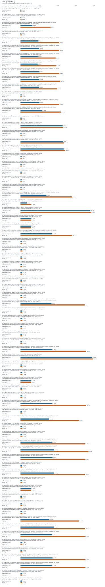
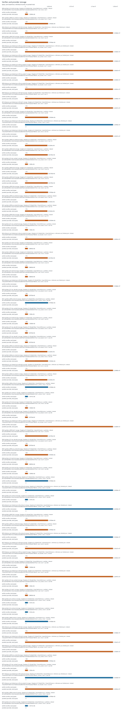
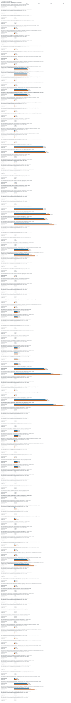

# Supplementary experiment report

Recorded run profile: paper. Results describe the measured platform and dataset recorded on each row. Desktop and loopback smoke runs are not Raspberry Pi or remote-host evidence. Synthetic fixtures are not real chain workloads. Ethereum RPC JSON replay does not validate native finality or integrate sharded consensus. Verifier-local offloading is not compression or a system-wide storage saving; provider state must be counted separately.

Valid records: 662. Successful records: 660. Failed records: 0. Malformed lines: 0.

## Reviewer coverage

Exactly seven whole-comment rows are retained. Statuses describe this run's evidence, not acceptance of the manuscript.

| Comment | Whole-comment scope | Status | Missing evidence |
|---|---|---|---|
| R1-1 | Storage accounting and provider-side overhead | measured_here |  |
| R1-2 | IoT deployment and blockchain integration scope | partial | energy; native_finality |
| R2-1 | Evaluation on constrained hardware | measured_here |  |
| R2-2 | CPU, RAM and latency measurements | measured_here |  |
| R2-3 | Presentation of experimental evidence | measured_here |  |
| R2-4 | Reproducible repository, real data and hardware evidence | partial | public_repository_availability_unverified |
| R2-8 | Real-world benchmarking | measured_here |  |

## Evidence and limitations

- **real_pi_platform: measured_here** — Successful measurement with a Raspberry Pi device model in system_info.
- **remote_tcp: measured_here** — TCP measurement records distinct client and server machine identities.
- **real_data: measured_here** — Real-data measurements record source metadata and an input hash.
- **energy: missing** — No measured energy in joules is present; CPU time and estimated power are not energy measurements.
- **filesystem: measured_here** — Storage experiment includes actual allocated/filesystem byte measurements.
- **memory_pressure: measured_here** — Memory-pressure experiment records an enforced limit or pressure configuration.
- **service_disconnect: measured_here** — Remote TCP service-disconnection experiment records observed detection or failure.
- **native_finality: missing** — Native finality and sharded-consensus integration are absent. Ethereum RPC JSON replay is an ingestion/verification adapter, not native finality validation or consensus integration.
- **storage_accounting: measured_here** — Verifier and provider byte accounting is available.
- **provider_latency: measured_here** — Provider latency is measured.
- **cpu: measured_here** — CPU-time or CPU-utilization metrics are present.
- **ram: measured_here** — Resident/peak memory metrics are present.
- **local_latency: measured_here** — Local latency metrics are present.
- **presentation: measured_here** — This run provides machine-readable tables, escaped LaTeX and an offline report; manuscript revision and reviewer acceptance are not assessed.
- **repository_metadata: measured_here** — Run metadata records a code version and configuration; public repository availability is not verified.

## Experiment inventory

| Experiment | Records | Successful |
|---|---:|---:|
| original_e2 | 40 | 40 |
| local | 75 | 75 |
| archive_retrieval | 15 | 15 |
| network | 60 | 60 |
| storage | 75 | 75 |
| provider | 135 | 135 |
| migration | 60 | 60 |
| integrity | 75 | 75 |
| memory_pressure | 60 | 60 |
| disconnect | 60 | 60 |
| energy_workload | 5 | 5 |
| energy | 1 | 0 |
| real_dataset | 0 | 0 |
| native_finality | 1 | 0 |

## Figures

Individual records are plotted without pooling cases, platforms, datasets or modes. Median and p95 are within-record metrics; no confidence intervals are inferred from summary statistics.








## Warnings

- Insufficient independent trials: 1 identified for [&quot;storage&quot;, &quot;0000-synthetic-n512-full-t2-storage&quot;, &quot;pi-verifier&quot;, {&quot;architecture&quot;: &quot;aarch64&quot;, &quot;cpu_count&quot;: 4, &quot;hostname&quot;: &quot;msi-pi-a&quot;, &quot;kernel&quot;: &quot;6.12.47+rpt-rpi-v8&quot;, &quot;machine_id&quot;: &quot;f8c5ed94511a0d7f7b74e6e55a8499bd265b7cfbe00e6c3af4400223a99102c0&quot;, &quot;machine_id_source&quot;: &quot;device_tree_serial_sha256&quot;, &quot;mem_total_bytes&quot;: 8200613888, &quot;network&quot;: {&quot;available&quot;: true, &quot;interfaces&quot;: [{&quot;is_wireless&quot;: false, &quot;name&quot;: &quot;eth0&quot;, &quot;operstate&quot;: &quot;up&quot;}, {&quot;is_wireless&quot;: false, &quot;name&quot;: &quot;lo&quot;, &quot;operstate&quot;: &quot;unknown&quot;}, {&quot;is_wireless&quot;: true, &quot;name&quot;: &quot;wlan0&quot;, &quot;operstate&quot;: &quot;down&quot;}]}, &quot;openssl&quot;: &quot;OpenSSL 3.5.7 9 Jun 2026&quot;, &quot;os&quot;: {&quot;id&quot;: &quot;debian&quot;, &quot;name&quot;: &quot;Debian GNU/Linux&quot;, &quot;pretty_name&quot;: &quot;Debian GNU/Linux 13 (trixie)&quot;, &quot;version&quot;: &quot;13 (trixie)&quot;, &quot;version_id&quot;: &quot;13&quot;}, &quot;pi_model&quot;: &quot;Raspberry Pi 4 Model B Rev 1.4&quot;, &quot;platform&quot;: &quot;Linux&quot;, &quot;python&quot;: &quot;3.13.5&quot;, &quot;python_implementation&quot;: &quot;CPython&quot;, &quot;result_storage&quot;: {&quot;block_device&quot;: &quot;/dev/mmcblk0p2&quot;, &quot;device&quot;: {&quot;capacity_bytes&quot;: 31914983424, &quot;model&quot;: null, &quot;name&quot;: &quot;mmcblk0&quot;, &quot;rotational&quot;: &quot;0&quot;, &quot;vendor&quot;: null}, &quot;filesystem&quot;: &quot;ext4&quot;, &quot;free_bytes&quot;: 21947817984, &quot;mountpoint&quot;: &quot;/&quot;, &quot;path&quot;: &quot;/home/reza/msi_pi_suite/outputs/pi-a-paper_ethereum_ethernet&quot;, &quot;total_bytes&quot;: 30794059776, &quot;used_bytes&quot;: 7515652096}, &quot;storage&quot;: {&quot;block_device&quot;: &quot;/dev/mmcblk0p2&quot;, &quot;device&quot;: {&quot;capacity_bytes&quot;: 31914983424, &quot;model&quot;: null, &quot;name&quot;: &quot;mmcblk0&quot;, &quot;rotational&quot;: &quot;0&quot;, &quot;vendor&quot;: null}, &quot;filesystem&quot;: &quot;ext4&quot;, &quot;free_bytes&quot;: 21947817984, &quot;mountpoint&quot;: &quot;/&quot;, &quot;path&quot;: &quot;/home/reza/msi_pi_suite&quot;, &quot;total_bytes&quot;: 30794059776, &quot;used_bytes&quot;: 7515652096}}, &quot;synthetic&quot;, null, null, &quot;full&quot;, null, &quot;b016c29f4de90f5b1cf3a216da5a605c33b87f5b41cbb2b6bd5568949c797cef&quot;]; at least 3 recommended. Per-query samples do not substitute for independent trials.
- Insufficient independent trials: 1 identified for [&quot;provider&quot;, &quot;0000-synthetic-n512-full-t2-provider&quot;, &quot;provider&quot;, {&quot;architecture&quot;: &quot;aarch64&quot;, &quot;cpu_count&quot;: 4, &quot;hostname&quot;: &quot;msi-pi-b&quot;, &quot;kernel&quot;: &quot;6.12.47+rpt-rpi-v8&quot;, &quot;machine_id&quot;: &quot;7e7e6946191efbf0784478e26f1c2325eba3d95d44cbbc419b2cf966290b4c94&quot;, &quot;machine_id_source&quot;: &quot;device_tree_serial_sha256&quot;, &quot;mem_total_bytes&quot;: 3981172736, &quot;network&quot;: {&quot;available&quot;: true, &quot;interfaces&quot;: [{&quot;is_wireless&quot;: false, &quot;name&quot;: &quot;eth0&quot;, &quot;operstate&quot;: &quot;up&quot;}, {&quot;is_wireless&quot;: false, &quot;name&quot;: &quot;lo&quot;, &quot;operstate&quot;: &quot;unknown&quot;}, {&quot;is_wireless&quot;: false, &quot;name&quot;: &quot;ovs-system&quot;, &quot;operstate&quot;: &quot;down&quot;}, {&quot;is_wireless&quot;: false, &quot;name&quot;: &quot;s1&quot;, &quot;operstate&quot;: &quot;down&quot;}, {&quot;is_wireless&quot;: false, &quot;name&quot;: &quot;s2&quot;, &quot;operstate&quot;: &quot;down&quot;}, {&quot;is_wireless&quot;: false, &quot;name&quot;: &quot;s3&quot;, &quot;operstate&quot;: &quot;down&quot;}, {&quot;is_wireless&quot;: true, &quot;name&quot;: &quot;wlan0&quot;, &quot;operstate&quot;: &quot;down&quot;}]}, &quot;openssl&quot;: &quot;OpenSSL 3.0.15 3 Sep 2024&quot;, &quot;os&quot;: {&quot;id&quot;: &quot;debian&quot;, &quot;name&quot;: &quot;Debian GNU/Linux&quot;, &quot;pretty_name&quot;: &quot;Debian GNU/Linux 13 (trixie)&quot;, &quot;version&quot;: &quot;13 (trixie)&quot;, &quot;version_id&quot;: &quot;13&quot;}, &quot;pi_model&quot;: &quot;Raspberry Pi 4 Model B Rev 1.4&quot;, &quot;platform&quot;: &quot;Linux&quot;, &quot;provider_storage&quot;: {&quot;block_device&quot;: &quot;/dev/mmcblk0p2&quot;, &quot;device&quot;: {&quot;capacity_bytes&quot;: 31914983424, &quot;model&quot;: null, &quot;name&quot;: &quot;mmcblk0&quot;, &quot;rotational&quot;: &quot;0&quot;, &quot;vendor&quot;: null}, &quot;filesystem&quot;: &quot;ext4&quot;, &quot;free_bytes&quot;: 12486815744, &quot;mountpoint&quot;: &quot;/&quot;, &quot;path&quot;: &quot;/home/reza/msi_pi_suite/provider-data&quot;, &quot;total_bytes&quot;: 30794059776, &quot;used_bytes&quot;: 16976654336}, &quot;python&quot;: &quot;3.12.7&quot;, &quot;python_implementation&quot;: &quot;CPython&quot;, &quot;storage&quot;: {&quot;block_device&quot;: &quot;/dev/mmcblk0p2&quot;, &quot;device&quot;: {&quot;capacity_bytes&quot;: 31914983424, &quot;model&quot;: null, &quot;name&quot;: &quot;mmcblk0&quot;, &quot;rotational&quot;: &quot;0&quot;, &quot;vendor&quot;: null}, &quot;filesystem&quot;: &quot;ext4&quot;, &quot;free_bytes&quot;: 12486815744, &quot;mountpoint&quot;: &quot;/&quot;, &quot;path&quot;: &quot;/home/reza/msi_pi_suite&quot;, &quot;total_bytes&quot;: 30794059776, &quot;used_bytes&quot;: 16976654336}}, &quot;synthetic&quot;, null, null, &quot;full&quot;, null, &quot;b016c29f4de90f5b1cf3a216da5a605c33b87f5b41cbb2b6bd5568949c797cef&quot;]; at least 3 recommended. Per-query samples do not substitute for independent trials.
- Insufficient independent trials: 1 identified for [&quot;local&quot;, &quot;0000-synthetic-n512-full-t2-local&quot;, &quot;pi-verifier&quot;, {&quot;architecture&quot;: &quot;aarch64&quot;, &quot;cpu_count&quot;: 4, &quot;hostname&quot;: &quot;msi-pi-a&quot;, &quot;kernel&quot;: &quot;6.12.47+rpt-rpi-v8&quot;, &quot;machine_id&quot;: &quot;f8c5ed94511a0d7f7b74e6e55a8499bd265b7cfbe00e6c3af4400223a99102c0&quot;, &quot;machine_id_source&quot;: &quot;device_tree_serial_sha256&quot;, &quot;mem_total_bytes&quot;: 8200613888, &quot;network&quot;: {&quot;available&quot;: true, &quot;interfaces&quot;: [{&quot;is_wireless&quot;: false, &quot;name&quot;: &quot;eth0&quot;, &quot;operstate&quot;: &quot;up&quot;}, {&quot;is_wireless&quot;: false, &quot;name&quot;: &quot;lo&quot;, &quot;operstate&quot;: &quot;unknown&quot;}, {&quot;is_wireless&quot;: true, &quot;name&quot;: &quot;wlan0&quot;, &quot;operstate&quot;: &quot;down&quot;}]}, &quot;openssl&quot;: &quot;OpenSSL 3.5.7 9 Jun 2026&quot;, &quot;os&quot;: {&quot;id&quot;: &quot;debian&quot;, &quot;name&quot;: &quot;Debian GNU/Linux&quot;, &quot;pretty_name&quot;: &quot;Debian GNU/Linux 13 (trixie)&quot;, &quot;version&quot;: &quot;13 (trixie)&quot;, &quot;version_id&quot;: &quot;13&quot;}, &quot;pi_model&quot;: &quot;Raspberry Pi 4 Model B Rev 1.4&quot;, &quot;platform&quot;: &quot;Linux&quot;, &quot;python&quot;: &quot;3.13.5&quot;, &quot;python_implementation&quot;: &quot;CPython&quot;, &quot;result_storage&quot;: {&quot;block_device&quot;: &quot;/dev/mmcblk0p2&quot;, &quot;device&quot;: {&quot;capacity_bytes&quot;: 31914983424, &quot;model&quot;: null, &quot;name&quot;: &quot;mmcblk0&quot;, &quot;rotational&quot;: &quot;0&quot;, &quot;vendor&quot;: null}, &quot;filesystem&quot;: &quot;ext4&quot;, &quot;free_bytes&quot;: 21947817984, &quot;mountpoint&quot;: &quot;/&quot;, &quot;path&quot;: &quot;/home/reza/msi_pi_suite/outputs/pi-a-paper_ethereum_ethernet&quot;, &quot;total_bytes&quot;: 30794059776, &quot;used_bytes&quot;: 7515652096}, &quot;storage&quot;: {&quot;block_device&quot;: &quot;/dev/mmcblk0p2&quot;, &quot;device&quot;: {&quot;capacity_bytes&quot;: 31914983424, &quot;model&quot;: null, &quot;name&quot;: &quot;mmcblk0&quot;, &quot;rotational&quot;: &quot;0&quot;, &quot;vendor&quot;: null}, &quot;filesystem&quot;: &quot;ext4&quot;, &quot;free_bytes&quot;: 21947817984, &quot;mountpoint&quot;: &quot;/&quot;, &quot;path&quot;: &quot;/home/reza/msi_pi_suite&quot;, &quot;total_bytes&quot;: 30794059776, &quot;used_bytes&quot;: 7515652096}}, &quot;synthetic&quot;, null, null, &quot;full&quot;, null, &quot;b016c29f4de90f5b1cf3a216da5a605c33b87f5b41cbb2b6bd5568949c797cef&quot;]; at least 3 recommended. Per-query samples do not substitute for independent trials.
- Insufficient independent trials: 1 identified for [&quot;memory_pressure&quot;, &quot;0000-synthetic-n512-full-t2-memory_pressure&quot;, &quot;pi-verifier&quot;, {&quot;architecture&quot;: &quot;aarch64&quot;, &quot;cpu_count&quot;: 4, &quot;hostname&quot;: &quot;msi-pi-a&quot;, &quot;kernel&quot;: &quot;6.12.47+rpt-rpi-v8&quot;, &quot;machine_id&quot;: &quot;f8c5ed94511a0d7f7b74e6e55a8499bd265b7cfbe00e6c3af4400223a99102c0&quot;, &quot;machine_id_source&quot;: &quot;device_tree_serial_sha256&quot;, &quot;mem_total_bytes&quot;: 8200613888, &quot;network&quot;: {&quot;available&quot;: true, &quot;interfaces&quot;: [{&quot;is_wireless&quot;: false, &quot;name&quot;: &quot;eth0&quot;, &quot;operstate&quot;: &quot;up&quot;}, {&quot;is_wireless&quot;: false, &quot;name&quot;: &quot;lo&quot;, &quot;operstate&quot;: &quot;unknown&quot;}, {&quot;is_wireless&quot;: true, &quot;name&quot;: &quot;wlan0&quot;, &quot;operstate&quot;: &quot;down&quot;}]}, &quot;openssl&quot;: &quot;OpenSSL 3.5.7 9 Jun 2026&quot;, &quot;os&quot;: {&quot;id&quot;: &quot;debian&quot;, &quot;name&quot;: &quot;Debian GNU/Linux&quot;, &quot;pretty_name&quot;: &quot;Debian GNU/Linux 13 (trixie)&quot;, &quot;version&quot;: &quot;13 (trixie)&quot;, &quot;version_id&quot;: &quot;13&quot;}, &quot;pi_model&quot;: &quot;Raspberry Pi 4 Model B Rev 1.4&quot;, &quot;platform&quot;: &quot;Linux&quot;, &quot;python&quot;: &quot;3.13.5&quot;, &quot;python_implementation&quot;: &quot;CPython&quot;, &quot;result_storage&quot;: {&quot;block_device&quot;: &quot;/dev/mmcblk0p2&quot;, &quot;device&quot;: {&quot;capacity_bytes&quot;: 31914983424, &quot;model&quot;: null, &quot;name&quot;: &quot;mmcblk0&quot;, &quot;rotational&quot;: &quot;0&quot;, &quot;vendor&quot;: null}, &quot;filesystem&quot;: &quot;ext4&quot;, &quot;free_bytes&quot;: 21947817984, &quot;mountpoint&quot;: &quot;/&quot;, &quot;path&quot;: &quot;/home/reza/msi_pi_suite/outputs/pi-a-paper_ethereum_ethernet&quot;, &quot;total_bytes&quot;: 30794059776, &quot;used_bytes&quot;: 7515652096}, &quot;storage&quot;: {&quot;block_device&quot;: &quot;/dev/mmcblk0p2&quot;, &quot;device&quot;: {&quot;capacity_bytes&quot;: 31914983424, &quot;model&quot;: null, &quot;name&quot;: &quot;mmcblk0&quot;, &quot;rotational&quot;: &quot;0&quot;, &quot;vendor&quot;: null}, &quot;filesystem&quot;: &quot;ext4&quot;, &quot;free_bytes&quot;: 21947817984, &quot;mountpoint&quot;: &quot;/&quot;, &quot;path&quot;: &quot;/home/reza/msi_pi_suite&quot;, &quot;total_bytes&quot;: 30794059776, &quot;used_bytes&quot;: 7515652096}}, &quot;synthetic&quot;, null, null, &quot;full&quot;, null, &quot;b016c29f4de90f5b1cf3a216da5a605c33b87f5b41cbb2b6bd5568949c797cef&quot;]; at least 3 recommended. Per-query samples do not substitute for independent trials.
- Insufficient independent trials: 1 identified for [&quot;network&quot;, &quot;0000-synthetic-n512-full-t2-network&quot;, &quot;pi-verifier&quot;, {&quot;architecture&quot;: &quot;aarch64&quot;, &quot;cpu_count&quot;: 4, &quot;hostname&quot;: &quot;msi-pi-a&quot;, &quot;kernel&quot;: &quot;6.12.47+rpt-rpi-v8&quot;, &quot;machine_id&quot;: &quot;f8c5ed94511a0d7f7b74e6e55a8499bd265b7cfbe00e6c3af4400223a99102c0&quot;, &quot;machine_id_source&quot;: &quot;device_tree_serial_sha256&quot;, &quot;mem_total_bytes&quot;: 8200613888, &quot;network&quot;: {&quot;available&quot;: true, &quot;interfaces&quot;: [{&quot;is_wireless&quot;: false, &quot;name&quot;: &quot;eth0&quot;, &quot;operstate&quot;: &quot;up&quot;}, {&quot;is_wireless&quot;: false, &quot;name&quot;: &quot;lo&quot;, &quot;operstate&quot;: &quot;unknown&quot;}, {&quot;is_wireless&quot;: true, &quot;name&quot;: &quot;wlan0&quot;, &quot;operstate&quot;: &quot;down&quot;}]}, &quot;openssl&quot;: &quot;OpenSSL 3.5.7 9 Jun 2026&quot;, &quot;os&quot;: {&quot;id&quot;: &quot;debian&quot;, &quot;name&quot;: &quot;Debian GNU/Linux&quot;, &quot;pretty_name&quot;: &quot;Debian GNU/Linux 13 (trixie)&quot;, &quot;version&quot;: &quot;13 (trixie)&quot;, &quot;version_id&quot;: &quot;13&quot;}, &quot;pi_model&quot;: &quot;Raspberry Pi 4 Model B Rev 1.4&quot;, &quot;platform&quot;: &quot;Linux&quot;, &quot;python&quot;: &quot;3.13.5&quot;, &quot;python_implementation&quot;: &quot;CPython&quot;, &quot;result_storage&quot;: {&quot;block_device&quot;: &quot;/dev/mmcblk0p2&quot;, &quot;device&quot;: {&quot;capacity_bytes&quot;: 31914983424, &quot;model&quot;: null, &quot;name&quot;: &quot;mmcblk0&quot;, &quot;rotational&quot;: &quot;0&quot;, &quot;vendor&quot;: null}, &quot;filesystem&quot;: &quot;ext4&quot;, &quot;free_bytes&quot;: 21947817984, &quot;mountpoint&quot;: &quot;/&quot;, &quot;path&quot;: &quot;/home/reza/msi_pi_suite/outputs/pi-a-paper_ethereum_ethernet&quot;, &quot;total_bytes&quot;: 30794059776, &quot;used_bytes&quot;: 7515652096}, &quot;storage&quot;: {&quot;block_device&quot;: &quot;/dev/mmcblk0p2&quot;, &quot;device&quot;: {&quot;capacity_bytes&quot;: 31914983424, &quot;model&quot;: null, &quot;name&quot;: &quot;mmcblk0&quot;, &quot;rotational&quot;: &quot;0&quot;, &quot;vendor&quot;: null}, &quot;filesystem&quot;: &quot;ext4&quot;, &quot;free_bytes&quot;: 21947817984, &quot;mountpoint&quot;: &quot;/&quot;, &quot;path&quot;: &quot;/home/reza/msi_pi_suite&quot;, &quot;total_bytes&quot;: 30794059776, &quot;used_bytes&quot;: 7515652096}}, &quot;synthetic&quot;, null, null, &quot;full&quot;, null, &quot;b016c29f4de90f5b1cf3a216da5a605c33b87f5b41cbb2b6bd5568949c797cef&quot;]; at least 3 recommended. Per-query samples do not substitute for independent trials.
- Insufficient independent trials: 1 identified for [&quot;provider&quot;, &quot;0000-synthetic-n512-full-t2-network-provider&quot;, &quot;provider&quot;, {&quot;architecture&quot;: &quot;aarch64&quot;, &quot;cpu_count&quot;: 4, &quot;hostname&quot;: &quot;msi-pi-b&quot;, &quot;kernel&quot;: &quot;6.12.47+rpt-rpi-v8&quot;, &quot;machine_id&quot;: &quot;7e7e6946191efbf0784478e26f1c2325eba3d95d44cbbc419b2cf966290b4c94&quot;, &quot;machine_id_source&quot;: &quot;device_tree_serial_sha256&quot;, &quot;mem_total_bytes&quot;: 3981172736, &quot;network&quot;: {&quot;available&quot;: true, &quot;interfaces&quot;: [{&quot;is_wireless&quot;: false, &quot;name&quot;: &quot;eth0&quot;, &quot;operstate&quot;: &quot;up&quot;}, {&quot;is_wireless&quot;: false, &quot;name&quot;: &quot;lo&quot;, &quot;operstate&quot;: &quot;unknown&quot;}, {&quot;is_wireless&quot;: false, &quot;name&quot;: &quot;ovs-system&quot;, &quot;operstate&quot;: &quot;down&quot;}, {&quot;is_wireless&quot;: false, &quot;name&quot;: &quot;s1&quot;, &quot;operstate&quot;: &quot;down&quot;}, {&quot;is_wireless&quot;: false, &quot;name&quot;: &quot;s2&quot;, &quot;operstate&quot;: &quot;down&quot;}, {&quot;is_wireless&quot;: false, &quot;name&quot;: &quot;s3&quot;, &quot;operstate&quot;: &quot;down&quot;}, {&quot;is_wireless&quot;: true, &quot;name&quot;: &quot;wlan0&quot;, &quot;operstate&quot;: &quot;down&quot;}]}, &quot;openssl&quot;: &quot;OpenSSL 3.0.15 3 Sep 2024&quot;, &quot;os&quot;: {&quot;id&quot;: &quot;debian&quot;, &quot;name&quot;: &quot;Debian GNU/Linux&quot;, &quot;pretty_name&quot;: &quot;Debian GNU/Linux 13 (trixie)&quot;, &quot;version&quot;: &quot;13 (trixie)&quot;, &quot;version_id&quot;: &quot;13&quot;}, &quot;pi_model&quot;: &quot;Raspberry Pi 4 Model B Rev 1.4&quot;, &quot;platform&quot;: &quot;Linux&quot;, &quot;provider_storage&quot;: {&quot;block_device&quot;: &quot;/dev/mmcblk0p2&quot;, &quot;device&quot;: {&quot;capacity_bytes&quot;: 31914983424, &quot;model&quot;: null, &quot;name&quot;: &quot;mmcblk0&quot;, &quot;rotational&quot;: &quot;0&quot;, &quot;vendor&quot;: null}, &quot;filesystem&quot;: &quot;ext4&quot;, &quot;free_bytes&quot;: 12486815744, &quot;mountpoint&quot;: &quot;/&quot;, &quot;path&quot;: &quot;/home/reza/msi_pi_suite/provider-data&quot;, &quot;total_bytes&quot;: 30794059776, &quot;used_bytes&quot;: 16976654336}, &quot;python&quot;: &quot;3.12.7&quot;, &quot;python_implementation&quot;: &quot;CPython&quot;, &quot;storage&quot;: {&quot;block_device&quot;: &quot;/dev/mmcblk0p2&quot;, &quot;device&quot;: {&quot;capacity_bytes&quot;: 31914983424, &quot;model&quot;: null, &quot;name&quot;: &quot;mmcblk0&quot;, &quot;rotational&quot;: &quot;0&quot;, &quot;vendor&quot;: null}, &quot;filesystem&quot;: &quot;ext4&quot;, &quot;free_bytes&quot;: 12486815744, &quot;mountpoint&quot;: &quot;/&quot;, &quot;path&quot;: &quot;/home/reza/msi_pi_suite&quot;, &quot;total_bytes&quot;: 30794059776, &quot;used_bytes&quot;: 16976654336}}, &quot;synthetic&quot;, null, null, &quot;full&quot;, null, &quot;b016c29f4de90f5b1cf3a216da5a605c33b87f5b41cbb2b6bd5568949c797cef&quot;]; at least 3 recommended. Per-query samples do not substitute for independent trials.
- Insufficient independent trials: 1 identified for [&quot;integrity&quot;, &quot;0000-synthetic-n512-full-t2-integrity&quot;, &quot;pi-verifier&quot;, {&quot;architecture&quot;: &quot;aarch64&quot;, &quot;cpu_count&quot;: 4, &quot;hostname&quot;: &quot;msi-pi-a&quot;, &quot;kernel&quot;: &quot;6.12.47+rpt-rpi-v8&quot;, &quot;machine_id&quot;: &quot;f8c5ed94511a0d7f7b74e6e55a8499bd265b7cfbe00e6c3af4400223a99102c0&quot;, &quot;machine_id_source&quot;: &quot;device_tree_serial_sha256&quot;, &quot;mem_total_bytes&quot;: 8200613888, &quot;network&quot;: {&quot;available&quot;: true, &quot;interfaces&quot;: [{&quot;is_wireless&quot;: false, &quot;name&quot;: &quot;eth0&quot;, &quot;operstate&quot;: &quot;up&quot;}, {&quot;is_wireless&quot;: false, &quot;name&quot;: &quot;lo&quot;, &quot;operstate&quot;: &quot;unknown&quot;}, {&quot;is_wireless&quot;: true, &quot;name&quot;: &quot;wlan0&quot;, &quot;operstate&quot;: &quot;down&quot;}]}, &quot;openssl&quot;: &quot;OpenSSL 3.5.7 9 Jun 2026&quot;, &quot;os&quot;: {&quot;id&quot;: &quot;debian&quot;, &quot;name&quot;: &quot;Debian GNU/Linux&quot;, &quot;pretty_name&quot;: &quot;Debian GNU/Linux 13 (trixie)&quot;, &quot;version&quot;: &quot;13 (trixie)&quot;, &quot;version_id&quot;: &quot;13&quot;}, &quot;pi_model&quot;: &quot;Raspberry Pi 4 Model B Rev 1.4&quot;, &quot;platform&quot;: &quot;Linux&quot;, &quot;python&quot;: &quot;3.13.5&quot;, &quot;python_implementation&quot;: &quot;CPython&quot;, &quot;result_storage&quot;: {&quot;block_device&quot;: &quot;/dev/mmcblk0p2&quot;, &quot;device&quot;: {&quot;capacity_bytes&quot;: 31914983424, &quot;model&quot;: null, &quot;name&quot;: &quot;mmcblk0&quot;, &quot;rotational&quot;: &quot;0&quot;, &quot;vendor&quot;: null}, &quot;filesystem&quot;: &quot;ext4&quot;, &quot;free_bytes&quot;: 21947817984, &quot;mountpoint&quot;: &quot;/&quot;, &quot;path&quot;: &quot;/home/reza/msi_pi_suite/outputs/pi-a-paper_ethereum_ethernet&quot;, &quot;total_bytes&quot;: 30794059776, &quot;used_bytes&quot;: 7515652096}, &quot;storage&quot;: {&quot;block_device&quot;: &quot;/dev/mmcblk0p2&quot;, &quot;device&quot;: {&quot;capacity_bytes&quot;: 31914983424, &quot;model&quot;: null, &quot;name&quot;: &quot;mmcblk0&quot;, &quot;rotational&quot;: &quot;0&quot;, &quot;vendor&quot;: null}, &quot;filesystem&quot;: &quot;ext4&quot;, &quot;free_bytes&quot;: 21947817984, &quot;mountpoint&quot;: &quot;/&quot;, &quot;path&quot;: &quot;/home/reza/msi_pi_suite&quot;, &quot;total_bytes&quot;: 30794059776, &quot;used_bytes&quot;: 7515652096}}, &quot;synthetic&quot;, null, null, &quot;full&quot;, null, &quot;b016c29f4de90f5b1cf3a216da5a605c33b87f5b41cbb2b6bd5568949c797cef&quot;]; at least 3 recommended. Per-query samples do not substitute for independent trials.
- Insufficient independent trials: 1 identified for [&quot;disconnect&quot;, &quot;0000-synthetic-n512-full-t2-disconnect&quot;, &quot;pi-verifier&quot;, {&quot;architecture&quot;: &quot;aarch64&quot;, &quot;cpu_count&quot;: 4, &quot;hostname&quot;: &quot;msi-pi-a&quot;, &quot;kernel&quot;: &quot;6.12.47+rpt-rpi-v8&quot;, &quot;machine_id&quot;: &quot;f8c5ed94511a0d7f7b74e6e55a8499bd265b7cfbe00e6c3af4400223a99102c0&quot;, &quot;machine_id_source&quot;: &quot;device_tree_serial_sha256&quot;, &quot;mem_total_bytes&quot;: 8200613888, &quot;network&quot;: {&quot;available&quot;: true, &quot;interfaces&quot;: [{&quot;is_wireless&quot;: false, &quot;name&quot;: &quot;eth0&quot;, &quot;operstate&quot;: &quot;up&quot;}, {&quot;is_wireless&quot;: false, &quot;name&quot;: &quot;lo&quot;, &quot;operstate&quot;: &quot;unknown&quot;}, {&quot;is_wireless&quot;: true, &quot;name&quot;: &quot;wlan0&quot;, &quot;operstate&quot;: &quot;down&quot;}]}, &quot;openssl&quot;: &quot;OpenSSL 3.5.7 9 Jun 2026&quot;, &quot;os&quot;: {&quot;id&quot;: &quot;debian&quot;, &quot;name&quot;: &quot;Debian GNU/Linux&quot;, &quot;pretty_name&quot;: &quot;Debian GNU/Linux 13 (trixie)&quot;, &quot;version&quot;: &quot;13 (trixie)&quot;, &quot;version_id&quot;: &quot;13&quot;}, &quot;pi_model&quot;: &quot;Raspberry Pi 4 Model B Rev 1.4&quot;, &quot;platform&quot;: &quot;Linux&quot;, &quot;python&quot;: &quot;3.13.5&quot;, &quot;python_implementation&quot;: &quot;CPython&quot;, &quot;result_storage&quot;: {&quot;block_device&quot;: &quot;/dev/mmcblk0p2&quot;, &quot;device&quot;: {&quot;capacity_bytes&quot;: 31914983424, &quot;model&quot;: null, &quot;name&quot;: &quot;mmcblk0&quot;, &quot;rotational&quot;: &quot;0&quot;, &quot;vendor&quot;: null}, &quot;filesystem&quot;: &quot;ext4&quot;, &quot;free_bytes&quot;: 21947817984, &quot;mountpoint&quot;: &quot;/&quot;, &quot;path&quot;: &quot;/home/reza/msi_pi_suite/outputs/pi-a-paper_ethereum_ethernet&quot;, &quot;total_bytes&quot;: 30794059776, &quot;used_bytes&quot;: 7515652096}, &quot;storage&quot;: {&quot;block_device&quot;: &quot;/dev/mmcblk0p2&quot;, &quot;device&quot;: {&quot;capacity_bytes&quot;: 31914983424, &quot;model&quot;: null, &quot;name&quot;: &quot;mmcblk0&quot;, &quot;rotational&quot;: &quot;0&quot;, &quot;vendor&quot;: null}, &quot;filesystem&quot;: &quot;ext4&quot;, &quot;free_bytes&quot;: 21947817984, &quot;mountpoint&quot;: &quot;/&quot;, &quot;path&quot;: &quot;/home/reza/msi_pi_suite&quot;, &quot;total_bytes&quot;: 30794059776, &quot;used_bytes&quot;: 7515652096}}, &quot;synthetic&quot;, null, null, &quot;full&quot;, null, &quot;b016c29f4de90f5b1cf3a216da5a605c33b87f5b41cbb2b6bd5568949c797cef&quot;]; at least 3 recommended. Per-query samples do not substitute for independent trials.
- Insufficient independent trials: 1 identified for [&quot;storage&quot;, &quot;0001-synthetic-n4096-ext_cached-t1-storage&quot;, &quot;pi-verifier&quot;, {&quot;architecture&quot;: &quot;aarch64&quot;, &quot;cpu_count&quot;: 4, &quot;hostname&quot;: &quot;msi-pi-a&quot;, &quot;kernel&quot;: &quot;6.12.47+rpt-rpi-v8&quot;, &quot;machine_id&quot;: &quot;f8c5ed94511a0d7f7b74e6e55a8499bd265b7cfbe00e6c3af4400223a99102c0&quot;, &quot;machine_id_source&quot;: &quot;device_tree_serial_sha256&quot;, &quot;mem_total_bytes&quot;: 8200613888, &quot;network&quot;: {&quot;available&quot;: true, &quot;interfaces&quot;: [{&quot;is_wireless&quot;: false, &quot;name&quot;: &quot;eth0&quot;, &quot;operstate&quot;: &quot;up&quot;}, {&quot;is_wireless&quot;: false, &quot;name&quot;: &quot;lo&quot;, &quot;operstate&quot;: &quot;unknown&quot;}, {&quot;is_wireless&quot;: true, &quot;name&quot;: &quot;wlan0&quot;, &quot;operstate&quot;: &quot;down&quot;}]}, &quot;openssl&quot;: &quot;OpenSSL 3.5.7 9 Jun 2026&quot;, &quot;os&quot;: {&quot;id&quot;: &quot;debian&quot;, &quot;name&quot;: &quot;Debian GNU/Linux&quot;, &quot;pretty_name&quot;: &quot;Debian GNU/Linux 13 (trixie)&quot;, &quot;version&quot;: &quot;13 (trixie)&quot;, &quot;version_id&quot;: &quot;13&quot;}, &quot;pi_model&quot;: &quot;Raspberry Pi 4 Model B Rev 1.4&quot;, &quot;platform&quot;: &quot;Linux&quot;, &quot;python&quot;: &quot;3.13.5&quot;, &quot;python_implementation&quot;: &quot;CPython&quot;, &quot;result_storage&quot;: {&quot;block_device&quot;: &quot;/dev/mmcblk0p2&quot;, &quot;device&quot;: {&quot;capacity_bytes&quot;: 31914983424, &quot;model&quot;: null, &quot;name&quot;: &quot;mmcblk0&quot;, &quot;rotational&quot;: &quot;0&quot;, &quot;vendor&quot;: null}, &quot;filesystem&quot;: &quot;ext4&quot;, &quot;free_bytes&quot;: 21947817984, &quot;mountpoint&quot;: &quot;/&quot;, &quot;path&quot;: &quot;/home/reza/msi_pi_suite/outputs/pi-a-paper_ethereum_ethernet&quot;, &quot;total_bytes&quot;: 30794059776, &quot;used_bytes&quot;: 7515652096}, &quot;storage&quot;: {&quot;block_device&quot;: &quot;/dev/mmcblk0p2&quot;, &quot;device&quot;: {&quot;capacity_bytes&quot;: 31914983424, &quot;model&quot;: null, &quot;name&quot;: &quot;mmcblk0&quot;, &quot;rotational&quot;: &quot;0&quot;, &quot;vendor&quot;: null}, &quot;filesystem&quot;: &quot;ext4&quot;, &quot;free_bytes&quot;: 21947817984, &quot;mountpoint&quot;: &quot;/&quot;, &quot;path&quot;: &quot;/home/reza/msi_pi_suite&quot;, &quot;total_bytes&quot;: 30794059776, &quot;used_bytes&quot;: 7515652096}}, &quot;synthetic&quot;, null, null, &quot;ext_cached&quot;, null, &quot;b016c29f4de90f5b1cf3a216da5a605c33b87f5b41cbb2b6bd5568949c797cef&quot;]; at least 3 recommended. Per-query samples do not substitute for independent trials.
- Insufficient independent trials: 1 identified for [&quot;provider&quot;, &quot;0001-synthetic-n4096-ext_cached-t1-provider&quot;, &quot;provider&quot;, {&quot;architecture&quot;: &quot;aarch64&quot;, &quot;cpu_count&quot;: 4, &quot;hostname&quot;: &quot;msi-pi-b&quot;, &quot;kernel&quot;: &quot;6.12.47+rpt-rpi-v8&quot;, &quot;machine_id&quot;: &quot;7e7e6946191efbf0784478e26f1c2325eba3d95d44cbbc419b2cf966290b4c94&quot;, &quot;machine_id_source&quot;: &quot;device_tree_serial_sha256&quot;, &quot;mem_total_bytes&quot;: 3981172736, &quot;network&quot;: {&quot;available&quot;: true, &quot;interfaces&quot;: [{&quot;is_wireless&quot;: false, &quot;name&quot;: &quot;eth0&quot;, &quot;operstate&quot;: &quot;up&quot;}, {&quot;is_wireless&quot;: false, &quot;name&quot;: &quot;lo&quot;, &quot;operstate&quot;: &quot;unknown&quot;}, {&quot;is_wireless&quot;: false, &quot;name&quot;: &quot;ovs-system&quot;, &quot;operstate&quot;: &quot;down&quot;}, {&quot;is_wireless&quot;: false, &quot;name&quot;: &quot;s1&quot;, &quot;operstate&quot;: &quot;down&quot;}, {&quot;is_wireless&quot;: false, &quot;name&quot;: &quot;s2&quot;, &quot;operstate&quot;: &quot;down&quot;}, {&quot;is_wireless&quot;: false, &quot;name&quot;: &quot;s3&quot;, &quot;operstate&quot;: &quot;down&quot;}, {&quot;is_wireless&quot;: true, &quot;name&quot;: &quot;wlan0&quot;, &quot;operstate&quot;: &quot;down&quot;}]}, &quot;openssl&quot;: &quot;OpenSSL 3.0.15 3 Sep 2024&quot;, &quot;os&quot;: {&quot;id&quot;: &quot;debian&quot;, &quot;name&quot;: &quot;Debian GNU/Linux&quot;, &quot;pretty_name&quot;: &quot;Debian GNU/Linux 13 (trixie)&quot;, &quot;version&quot;: &quot;13 (trixie)&quot;, &quot;version_id&quot;: &quot;13&quot;}, &quot;pi_model&quot;: &quot;Raspberry Pi 4 Model B Rev 1.4&quot;, &quot;platform&quot;: &quot;Linux&quot;, &quot;provider_storage&quot;: {&quot;block_device&quot;: &quot;/dev/mmcblk0p2&quot;, &quot;device&quot;: {&quot;capacity_bytes&quot;: 31914983424, &quot;model&quot;: null, &quot;name&quot;: &quot;mmcblk0&quot;, &quot;rotational&quot;: &quot;0&quot;, &quot;vendor&quot;: null}, &quot;filesystem&quot;: &quot;ext4&quot;, &quot;free_bytes&quot;: 12486815744, &quot;mountpoint&quot;: &quot;/&quot;, &quot;path&quot;: &quot;/home/reza/msi_pi_suite/provider-data&quot;, &quot;total_bytes&quot;: 30794059776, &quot;used_bytes&quot;: 16976654336}, &quot;python&quot;: &quot;3.12.7&quot;, &quot;python_implementation&quot;: &quot;CPython&quot;, &quot;storage&quot;: {&quot;block_device&quot;: &quot;/dev/mmcblk0p2&quot;, &quot;device&quot;: {&quot;capacity_bytes&quot;: 31914983424, &quot;model&quot;: null, &quot;name&quot;: &quot;mmcblk0&quot;, &quot;rotational&quot;: &quot;0&quot;, &quot;vendor&quot;: null}, &quot;filesystem&quot;: &quot;ext4&quot;, &quot;free_bytes&quot;: 12486815744, &quot;mountpoint&quot;: &quot;/&quot;, &quot;path&quot;: &quot;/home/reza/msi_pi_suite&quot;, &quot;total_bytes&quot;: 30794059776, &quot;used_bytes&quot;: 16976654336}}, &quot;synthetic&quot;, null, null, &quot;ext_cached&quot;, null, &quot;b016c29f4de90f5b1cf3a216da5a605c33b87f5b41cbb2b6bd5568949c797cef&quot;]; at least 3 recommended. Per-query samples do not substitute for independent trials.
- Insufficient independent trials: 1 identified for [&quot;local&quot;, &quot;0001-synthetic-n4096-ext_cached-t1-local&quot;, &quot;pi-verifier&quot;, {&quot;architecture&quot;: &quot;aarch64&quot;, &quot;cpu_count&quot;: 4, &quot;hostname&quot;: &quot;msi-pi-a&quot;, &quot;kernel&quot;: &quot;6.12.47+rpt-rpi-v8&quot;, &quot;machine_id&quot;: &quot;f8c5ed94511a0d7f7b74e6e55a8499bd265b7cfbe00e6c3af4400223a99102c0&quot;, &quot;machine_id_source&quot;: &quot;device_tree_serial_sha256&quot;, &quot;mem_total_bytes&quot;: 8200613888, &quot;network&quot;: {&quot;available&quot;: true, &quot;interfaces&quot;: [{&quot;is_wireless&quot;: false, &quot;name&quot;: &quot;eth0&quot;, &quot;operstate&quot;: &quot;up&quot;}, {&quot;is_wireless&quot;: false, &quot;name&quot;: &quot;lo&quot;, &quot;operstate&quot;: &quot;unknown&quot;}, {&quot;is_wireless&quot;: true, &quot;name&quot;: &quot;wlan0&quot;, &quot;operstate&quot;: &quot;down&quot;}]}, &quot;openssl&quot;: &quot;OpenSSL 3.5.7 9 Jun 2026&quot;, &quot;os&quot;: {&quot;id&quot;: &quot;debian&quot;, &quot;name&quot;: &quot;Debian GNU/Linux&quot;, &quot;pretty_name&quot;: &quot;Debian GNU/Linux 13 (trixie)&quot;, &quot;version&quot;: &quot;13 (trixie)&quot;, &quot;version_id&quot;: &quot;13&quot;}, &quot;pi_model&quot;: &quot;Raspberry Pi 4 Model B Rev 1.4&quot;, &quot;platform&quot;: &quot;Linux&quot;, &quot;python&quot;: &quot;3.13.5&quot;, &quot;python_implementation&quot;: &quot;CPython&quot;, &quot;result_storage&quot;: {&quot;block_device&quot;: &quot;/dev/mmcblk0p2&quot;, &quot;device&quot;: {&quot;capacity_bytes&quot;: 31914983424, &quot;model&quot;: null, &quot;name&quot;: &quot;mmcblk0&quot;, &quot;rotational&quot;: &quot;0&quot;, &quot;vendor&quot;: null}, &quot;filesystem&quot;: &quot;ext4&quot;, &quot;free_bytes&quot;: 21947817984, &quot;mountpoint&quot;: &quot;/&quot;, &quot;path&quot;: &quot;/home/reza/msi_pi_suite/outputs/pi-a-paper_ethereum_ethernet&quot;, &quot;total_bytes&quot;: 30794059776, &quot;used_bytes&quot;: 7515652096}, &quot;storage&quot;: {&quot;block_device&quot;: &quot;/dev/mmcblk0p2&quot;, &quot;device&quot;: {&quot;capacity_bytes&quot;: 31914983424, &quot;model&quot;: null, &quot;name&quot;: &quot;mmcblk0&quot;, &quot;rotational&quot;: &quot;0&quot;, &quot;vendor&quot;: null}, &quot;filesystem&quot;: &quot;ext4&quot;, &quot;free_bytes&quot;: 21947817984, &quot;mountpoint&quot;: &quot;/&quot;, &quot;path&quot;: &quot;/home/reza/msi_pi_suite&quot;, &quot;total_bytes&quot;: 30794059776, &quot;used_bytes&quot;: 7515652096}}, &quot;synthetic&quot;, null, null, &quot;ext_cached&quot;, null, &quot;b016c29f4de90f5b1cf3a216da5a605c33b87f5b41cbb2b6bd5568949c797cef&quot;]; at least 3 recommended. Per-query samples do not substitute for independent trials.
- Insufficient independent trials: 1 identified for [&quot;memory_pressure&quot;, &quot;0001-synthetic-n4096-ext_cached-t1-memory_pressure&quot;, &quot;pi-verifier&quot;, {&quot;architecture&quot;: &quot;aarch64&quot;, &quot;cpu_count&quot;: 4, &quot;hostname&quot;: &quot;msi-pi-a&quot;, &quot;kernel&quot;: &quot;6.12.47+rpt-rpi-v8&quot;, &quot;machine_id&quot;: &quot;f8c5ed94511a0d7f7b74e6e55a8499bd265b7cfbe00e6c3af4400223a99102c0&quot;, &quot;machine_id_source&quot;: &quot;device_tree_serial_sha256&quot;, &quot;mem_total_bytes&quot;: 8200613888, &quot;network&quot;: {&quot;available&quot;: true, &quot;interfaces&quot;: [{&quot;is_wireless&quot;: false, &quot;name&quot;: &quot;eth0&quot;, &quot;operstate&quot;: &quot;up&quot;}, {&quot;is_wireless&quot;: false, &quot;name&quot;: &quot;lo&quot;, &quot;operstate&quot;: &quot;unknown&quot;}, {&quot;is_wireless&quot;: true, &quot;name&quot;: &quot;wlan0&quot;, &quot;operstate&quot;: &quot;down&quot;}]}, &quot;openssl&quot;: &quot;OpenSSL 3.5.7 9 Jun 2026&quot;, &quot;os&quot;: {&quot;id&quot;: &quot;debian&quot;, &quot;name&quot;: &quot;Debian GNU/Linux&quot;, &quot;pretty_name&quot;: &quot;Debian GNU/Linux 13 (trixie)&quot;, &quot;version&quot;: &quot;13 (trixie)&quot;, &quot;version_id&quot;: &quot;13&quot;}, &quot;pi_model&quot;: &quot;Raspberry Pi 4 Model B Rev 1.4&quot;, &quot;platform&quot;: &quot;Linux&quot;, &quot;python&quot;: &quot;3.13.5&quot;, &quot;python_implementation&quot;: &quot;CPython&quot;, &quot;result_storage&quot;: {&quot;block_device&quot;: &quot;/dev/mmcblk0p2&quot;, &quot;device&quot;: {&quot;capacity_bytes&quot;: 31914983424, &quot;model&quot;: null, &quot;name&quot;: &quot;mmcblk0&quot;, &quot;rotational&quot;: &quot;0&quot;, &quot;vendor&quot;: null}, &quot;filesystem&quot;: &quot;ext4&quot;, &quot;free_bytes&quot;: 21947817984, &quot;mountpoint&quot;: &quot;/&quot;, &quot;path&quot;: &quot;/home/reza/msi_pi_suite/outputs/pi-a-paper_ethereum_ethernet&quot;, &quot;total_bytes&quot;: 30794059776, &quot;used_bytes&quot;: 7515652096}, &quot;storage&quot;: {&quot;block_device&quot;: &quot;/dev/mmcblk0p2&quot;, &quot;device&quot;: {&quot;capacity_bytes&quot;: 31914983424, &quot;model&quot;: null, &quot;name&quot;: &quot;mmcblk0&quot;, &quot;rotational&quot;: &quot;0&quot;, &quot;vendor&quot;: null}, &quot;filesystem&quot;: &quot;ext4&quot;, &quot;free_bytes&quot;: 21947817984, &quot;mountpoint&quot;: &quot;/&quot;, &quot;path&quot;: &quot;/home/reza/msi_pi_suite&quot;, &quot;total_bytes&quot;: 30794059776, &quot;used_bytes&quot;: 7515652096}}, &quot;synthetic&quot;, null, null, &quot;ext_cached&quot;, null, &quot;b016c29f4de90f5b1cf3a216da5a605c33b87f5b41cbb2b6bd5568949c797cef&quot;]; at least 3 recommended. Per-query samples do not substitute for independent trials.
- Insufficient independent trials: 1 identified for [&quot;network&quot;, &quot;0001-synthetic-n4096-ext_cached-t1-network&quot;, &quot;pi-verifier&quot;, {&quot;architecture&quot;: &quot;aarch64&quot;, &quot;cpu_count&quot;: 4, &quot;hostname&quot;: &quot;msi-pi-a&quot;, &quot;kernel&quot;: &quot;6.12.47+rpt-rpi-v8&quot;, &quot;machine_id&quot;: &quot;f8c5ed94511a0d7f7b74e6e55a8499bd265b7cfbe00e6c3af4400223a99102c0&quot;, &quot;machine_id_source&quot;: &quot;device_tree_serial_sha256&quot;, &quot;mem_total_bytes&quot;: 8200613888, &quot;network&quot;: {&quot;available&quot;: true, &quot;interfaces&quot;: [{&quot;is_wireless&quot;: false, &quot;name&quot;: &quot;eth0&quot;, &quot;operstate&quot;: &quot;up&quot;}, {&quot;is_wireless&quot;: false, &quot;name&quot;: &quot;lo&quot;, &quot;operstate&quot;: &quot;unknown&quot;}, {&quot;is_wireless&quot;: true, &quot;name&quot;: &quot;wlan0&quot;, &quot;operstate&quot;: &quot;down&quot;}]}, &quot;openssl&quot;: &quot;OpenSSL 3.5.7 9 Jun 2026&quot;, &quot;os&quot;: {&quot;id&quot;: &quot;debian&quot;, &quot;name&quot;: &quot;Debian GNU/Linux&quot;, &quot;pretty_name&quot;: &quot;Debian GNU/Linux 13 (trixie)&quot;, &quot;version&quot;: &quot;13 (trixie)&quot;, &quot;version_id&quot;: &quot;13&quot;}, &quot;pi_model&quot;: &quot;Raspberry Pi 4 Model B Rev 1.4&quot;, &quot;platform&quot;: &quot;Linux&quot;, &quot;python&quot;: &quot;3.13.5&quot;, &quot;python_implementation&quot;: &quot;CPython&quot;, &quot;result_storage&quot;: {&quot;block_device&quot;: &quot;/dev/mmcblk0p2&quot;, &quot;device&quot;: {&quot;capacity_bytes&quot;: 31914983424, &quot;model&quot;: null, &quot;name&quot;: &quot;mmcblk0&quot;, &quot;rotational&quot;: &quot;0&quot;, &quot;vendor&quot;: null}, &quot;filesystem&quot;: &quot;ext4&quot;, &quot;free_bytes&quot;: 21947817984, &quot;mountpoint&quot;: &quot;/&quot;, &quot;path&quot;: &quot;/home/reza/msi_pi_suite/outputs/pi-a-paper_ethereum_ethernet&quot;, &quot;total_bytes&quot;: 30794059776, &quot;used_bytes&quot;: 7515652096}, &quot;storage&quot;: {&quot;block_device&quot;: &quot;/dev/mmcblk0p2&quot;, &quot;device&quot;: {&quot;capacity_bytes&quot;: 31914983424, &quot;model&quot;: null, &quot;name&quot;: &quot;mmcblk0&quot;, &quot;rotational&quot;: &quot;0&quot;, &quot;vendor&quot;: null}, &quot;filesystem&quot;: &quot;ext4&quot;, &quot;free_bytes&quot;: 21947817984, &quot;mountpoint&quot;: &quot;/&quot;, &quot;path&quot;: &quot;/home/reza/msi_pi_suite&quot;, &quot;total_bytes&quot;: 30794059776, &quot;used_bytes&quot;: 7515652096}}, &quot;synthetic&quot;, null, null, &quot;ext_cached&quot;, null, &quot;b016c29f4de90f5b1cf3a216da5a605c33b87f5b41cbb2b6bd5568949c797cef&quot;]; at least 3 recommended. Per-query samples do not substitute for independent trials.
- Insufficient independent trials: 1 identified for [&quot;provider&quot;, &quot;0001-synthetic-n4096-ext_cached-t1-network-provider&quot;, &quot;provider&quot;, {&quot;architecture&quot;: &quot;aarch64&quot;, &quot;cpu_count&quot;: 4, &quot;hostname&quot;: &quot;msi-pi-b&quot;, &quot;kernel&quot;: &quot;6.12.47+rpt-rpi-v8&quot;, &quot;machine_id&quot;: &quot;7e7e6946191efbf0784478e26f1c2325eba3d95d44cbbc419b2cf966290b4c94&quot;, &quot;machine_id_source&quot;: &quot;device_tree_serial_sha256&quot;, &quot;mem_total_bytes&quot;: 3981172736, &quot;network&quot;: {&quot;available&quot;: true, &quot;interfaces&quot;: [{&quot;is_wireless&quot;: false, &quot;name&quot;: &quot;eth0&quot;, &quot;operstate&quot;: &quot;up&quot;}, {&quot;is_wireless&quot;: false, &quot;name&quot;: &quot;lo&quot;, &quot;operstate&quot;: &quot;unknown&quot;}, {&quot;is_wireless&quot;: false, &quot;name&quot;: &quot;ovs-system&quot;, &quot;operstate&quot;: &quot;down&quot;}, {&quot;is_wireless&quot;: false, &quot;name&quot;: &quot;s1&quot;, &quot;operstate&quot;: &quot;down&quot;}, {&quot;is_wireless&quot;: false, &quot;name&quot;: &quot;s2&quot;, &quot;operstate&quot;: &quot;down&quot;}, {&quot;is_wireless&quot;: false, &quot;name&quot;: &quot;s3&quot;, &quot;operstate&quot;: &quot;down&quot;}, {&quot;is_wireless&quot;: true, &quot;name&quot;: &quot;wlan0&quot;, &quot;operstate&quot;: &quot;down&quot;}]}, &quot;openssl&quot;: &quot;OpenSSL 3.0.15 3 Sep 2024&quot;, &quot;os&quot;: {&quot;id&quot;: &quot;debian&quot;, &quot;name&quot;: &quot;Debian GNU/Linux&quot;, &quot;pretty_name&quot;: &quot;Debian GNU/Linux 13 (trixie)&quot;, &quot;version&quot;: &quot;13 (trixie)&quot;, &quot;version_id&quot;: &quot;13&quot;}, &quot;pi_model&quot;: &quot;Raspberry Pi 4 Model B Rev 1.4&quot;, &quot;platform&quot;: &quot;Linux&quot;, &quot;provider_storage&quot;: {&quot;block_device&quot;: &quot;/dev/mmcblk0p2&quot;, &quot;device&quot;: {&quot;capacity_bytes&quot;: 31914983424, &quot;model&quot;: null, &quot;name&quot;: &quot;mmcblk0&quot;, &quot;rotational&quot;: &quot;0&quot;, &quot;vendor&quot;: null}, &quot;filesystem&quot;: &quot;ext4&quot;, &quot;free_bytes&quot;: 12486815744, &quot;mountpoint&quot;: &quot;/&quot;, &quot;path&quot;: &quot;/home/reza/msi_pi_suite/provider-data&quot;, &quot;total_bytes&quot;: 30794059776, &quot;used_bytes&quot;: 16976654336}, &quot;python&quot;: &quot;3.12.7&quot;, &quot;python_implementation&quot;: &quot;CPython&quot;, &quot;storage&quot;: {&quot;block_device&quot;: &quot;/dev/mmcblk0p2&quot;, &quot;device&quot;: {&quot;capacity_bytes&quot;: 31914983424, &quot;model&quot;: null, &quot;name&quot;: &quot;mmcblk0&quot;, &quot;rotational&quot;: &quot;0&quot;, &quot;vendor&quot;: null}, &quot;filesystem&quot;: &quot;ext4&quot;, &quot;free_bytes&quot;: 12486815744, &quot;mountpoint&quot;: &quot;/&quot;, &quot;path&quot;: &quot;/home/reza/msi_pi_suite&quot;, &quot;total_bytes&quot;: 30794059776, &quot;used_bytes&quot;: 16976654336}}, &quot;synthetic&quot;, null, null, &quot;ext_cached&quot;, null, &quot;b016c29f4de90f5b1cf3a216da5a605c33b87f5b41cbb2b6bd5568949c797cef&quot;]; at least 3 recommended. Per-query samples do not substitute for independent trials.
- Insufficient independent trials: 1 identified for [&quot;integrity&quot;, &quot;0001-synthetic-n4096-ext_cached-t1-integrity&quot;, &quot;pi-verifier&quot;, {&quot;architecture&quot;: &quot;aarch64&quot;, &quot;cpu_count&quot;: 4, &quot;hostname&quot;: &quot;msi-pi-a&quot;, &quot;kernel&quot;: &quot;6.12.47+rpt-rpi-v8&quot;, &quot;machine_id&quot;: &quot;f8c5ed94511a0d7f7b74e6e55a8499bd265b7cfbe00e6c3af4400223a99102c0&quot;, &quot;machine_id_source&quot;: &quot;device_tree_serial_sha256&quot;, &quot;mem_total_bytes&quot;: 8200613888, &quot;network&quot;: {&quot;available&quot;: true, &quot;interfaces&quot;: [{&quot;is_wireless&quot;: false, &quot;name&quot;: &quot;eth0&quot;, &quot;operstate&quot;: &quot;up&quot;}, {&quot;is_wireless&quot;: false, &quot;name&quot;: &quot;lo&quot;, &quot;operstate&quot;: &quot;unknown&quot;}, {&quot;is_wireless&quot;: true, &quot;name&quot;: &quot;wlan0&quot;, &quot;operstate&quot;: &quot;down&quot;}]}, &quot;openssl&quot;: &quot;OpenSSL 3.5.7 9 Jun 2026&quot;, &quot;os&quot;: {&quot;id&quot;: &quot;debian&quot;, &quot;name&quot;: &quot;Debian GNU/Linux&quot;, &quot;pretty_name&quot;: &quot;Debian GNU/Linux 13 (trixie)&quot;, &quot;version&quot;: &quot;13 (trixie)&quot;, &quot;version_id&quot;: &quot;13&quot;}, &quot;pi_model&quot;: &quot;Raspberry Pi 4 Model B Rev 1.4&quot;, &quot;platform&quot;: &quot;Linux&quot;, &quot;python&quot;: &quot;3.13.5&quot;, &quot;python_implementation&quot;: &quot;CPython&quot;, &quot;result_storage&quot;: {&quot;block_device&quot;: &quot;/dev/mmcblk0p2&quot;, &quot;device&quot;: {&quot;capacity_bytes&quot;: 31914983424, &quot;model&quot;: null, &quot;name&quot;: &quot;mmcblk0&quot;, &quot;rotational&quot;: &quot;0&quot;, &quot;vendor&quot;: null}, &quot;filesystem&quot;: &quot;ext4&quot;, &quot;free_bytes&quot;: 21947817984, &quot;mountpoint&quot;: &quot;/&quot;, &quot;path&quot;: &quot;/home/reza/msi_pi_suite/outputs/pi-a-paper_ethereum_ethernet&quot;, &quot;total_bytes&quot;: 30794059776, &quot;used_bytes&quot;: 7515652096}, &quot;storage&quot;: {&quot;block_device&quot;: &quot;/dev/mmcblk0p2&quot;, &quot;device&quot;: {&quot;capacity_bytes&quot;: 31914983424, &quot;model&quot;: null, &quot;name&quot;: &quot;mmcblk0&quot;, &quot;rotational&quot;: &quot;0&quot;, &quot;vendor&quot;: null}, &quot;filesystem&quot;: &quot;ext4&quot;, &quot;free_bytes&quot;: 21947817984, &quot;mountpoint&quot;: &quot;/&quot;, &quot;path&quot;: &quot;/home/reza/msi_pi_suite&quot;, &quot;total_bytes&quot;: 30794059776, &quot;used_bytes&quot;: 7515652096}}, &quot;synthetic&quot;, null, null, &quot;ext_cached&quot;, null, &quot;b016c29f4de90f5b1cf3a216da5a605c33b87f5b41cbb2b6bd5568949c797cef&quot;]; at least 3 recommended. Per-query samples do not substitute for independent trials.
- Insufficient independent trials: 1 identified for [&quot;disconnect&quot;, &quot;0001-synthetic-n4096-ext_cached-t1-disconnect&quot;, &quot;pi-verifier&quot;, {&quot;architecture&quot;: &quot;aarch64&quot;, &quot;cpu_count&quot;: 4, &quot;hostname&quot;: &quot;msi-pi-a&quot;, &quot;kernel&quot;: &quot;6.12.47+rpt-rpi-v8&quot;, &quot;machine_id&quot;: &quot;f8c5ed94511a0d7f7b74e6e55a8499bd265b7cfbe00e6c3af4400223a99102c0&quot;, &quot;machine_id_source&quot;: &quot;device_tree_serial_sha256&quot;, &quot;mem_total_bytes&quot;: 8200613888, &quot;network&quot;: {&quot;available&quot;: true, &quot;interfaces&quot;: [{&quot;is_wireless&quot;: false, &quot;name&quot;: &quot;eth0&quot;, &quot;operstate&quot;: &quot;up&quot;}, {&quot;is_wireless&quot;: false, &quot;name&quot;: &quot;lo&quot;, &quot;operstate&quot;: &quot;unknown&quot;}, {&quot;is_wireless&quot;: true, &quot;name&quot;: &quot;wlan0&quot;, &quot;operstate&quot;: &quot;down&quot;}]}, &quot;openssl&quot;: &quot;OpenSSL 3.5.7 9 Jun 2026&quot;, &quot;os&quot;: {&quot;id&quot;: &quot;debian&quot;, &quot;name&quot;: &quot;Debian GNU/Linux&quot;, &quot;pretty_name&quot;: &quot;Debian GNU/Linux 13 (trixie)&quot;, &quot;version&quot;: &quot;13 (trixie)&quot;, &quot;version_id&quot;: &quot;13&quot;}, &quot;pi_model&quot;: &quot;Raspberry Pi 4 Model B Rev 1.4&quot;, &quot;platform&quot;: &quot;Linux&quot;, &quot;python&quot;: &quot;3.13.5&quot;, &quot;python_implementation&quot;: &quot;CPython&quot;, &quot;result_storage&quot;: {&quot;block_device&quot;: &quot;/dev/mmcblk0p2&quot;, &quot;device&quot;: {&quot;capacity_bytes&quot;: 31914983424, &quot;model&quot;: null, &quot;name&quot;: &quot;mmcblk0&quot;, &quot;rotational&quot;: &quot;0&quot;, &quot;vendor&quot;: null}, &quot;filesystem&quot;: &quot;ext4&quot;, &quot;free_bytes&quot;: 21947817984, &quot;mountpoint&quot;: &quot;/&quot;, &quot;path&quot;: &quot;/home/reza/msi_pi_suite/outputs/pi-a-paper_ethereum_ethernet&quot;, &quot;total_bytes&quot;: 30794059776, &quot;used_bytes&quot;: 7515652096}, &quot;storage&quot;: {&quot;block_device&quot;: &quot;/dev/mmcblk0p2&quot;, &quot;device&quot;: {&quot;capacity_bytes&quot;: 31914983424, &quot;model&quot;: null, &quot;name&quot;: &quot;mmcblk0&quot;, &quot;rotational&quot;: &quot;0&quot;, &quot;vendor&quot;: null}, &quot;filesystem&quot;: &quot;ext4&quot;, &quot;free_bytes&quot;: 21947817984, &quot;mountpoint&quot;: &quot;/&quot;, &quot;path&quot;: &quot;/home/reza/msi_pi_suite&quot;, &quot;total_bytes&quot;: 30794059776, &quot;used_bytes&quot;: 7515652096}}, &quot;synthetic&quot;, null, null, &quot;ext_cached&quot;, null, &quot;b016c29f4de90f5b1cf3a216da5a605c33b87f5b41cbb2b6bd5568949c797cef&quot;]; at least 3 recommended. Per-query samples do not substitute for independent trials.
- Insufficient independent trials: 1 identified for [&quot;storage&quot;, &quot;0002-ethereum_rpc_finalized_json-n69-full-t3-storage&quot;, &quot;pi-verifier&quot;, {&quot;architecture&quot;: &quot;aarch64&quot;, &quot;cpu_count&quot;: 4, &quot;hostname&quot;: &quot;msi-pi-a&quot;, &quot;kernel&quot;: &quot;6.12.47+rpt-rpi-v8&quot;, &quot;machine_id&quot;: &quot;f8c5ed94511a0d7f7b74e6e55a8499bd265b7cfbe00e6c3af4400223a99102c0&quot;, &quot;machine_id_source&quot;: &quot;device_tree_serial_sha256&quot;, &quot;mem_total_bytes&quot;: 8200613888, &quot;network&quot;: {&quot;available&quot;: true, &quot;interfaces&quot;: [{&quot;is_wireless&quot;: false, &quot;name&quot;: &quot;eth0&quot;, &quot;operstate&quot;: &quot;up&quot;}, {&quot;is_wireless&quot;: false, &quot;name&quot;: &quot;lo&quot;, &quot;operstate&quot;: &quot;unknown&quot;}, {&quot;is_wireless&quot;: true, &quot;name&quot;: &quot;wlan0&quot;, &quot;operstate&quot;: &quot;down&quot;}]}, &quot;openssl&quot;: &quot;OpenSSL 3.5.7 9 Jun 2026&quot;, &quot;os&quot;: {&quot;id&quot;: &quot;debian&quot;, &quot;name&quot;: &quot;Debian GNU/Linux&quot;, &quot;pretty_name&quot;: &quot;Debian GNU/Linux 13 (trixie)&quot;, &quot;version&quot;: &quot;13 (trixie)&quot;, &quot;version_id&quot;: &quot;13&quot;}, &quot;pi_model&quot;: &quot;Raspberry Pi 4 Model B Rev 1.4&quot;, &quot;platform&quot;: &quot;Linux&quot;, &quot;python&quot;: &quot;3.13.5&quot;, &quot;python_implementation&quot;: &quot;CPython&quot;, &quot;result_storage&quot;: {&quot;block_device&quot;: &quot;/dev/mmcblk0p2&quot;, &quot;device&quot;: {&quot;capacity_bytes&quot;: 31914983424, &quot;model&quot;: null, &quot;name&quot;: &quot;mmcblk0&quot;, &quot;rotational&quot;: &quot;0&quot;, &quot;vendor&quot;: null}, &quot;filesystem&quot;: &quot;ext4&quot;, &quot;free_bytes&quot;: 21947817984, &quot;mountpoint&quot;: &quot;/&quot;, &quot;path&quot;: &quot;/home/reza/msi_pi_suite/outputs/pi-a-paper_ethereum_ethernet&quot;, &quot;total_bytes&quot;: 30794059776, &quot;used_bytes&quot;: 7515652096}, &quot;storage&quot;: {&quot;block_device&quot;: &quot;/dev/mmcblk0p2&quot;, &quot;device&quot;: {&quot;capacity_bytes&quot;: 31914983424, &quot;model&quot;: null, &quot;name&quot;: &quot;mmcblk0&quot;, &quot;rotational&quot;: &quot;0&quot;, &quot;vendor&quot;: null}, &quot;filesystem&quot;: &quot;ext4&quot;, &quot;free_bytes&quot;: 21947817984, &quot;mountpoint&quot;: &quot;/&quot;, &quot;path&quot;: &quot;/home/reza/msi_pi_suite&quot;, &quot;total_bytes&quot;: 30794059776, &quot;used_bytes&quot;: 7515652096}}, &quot;ethereum_rpc_finalized_json&quot;, null, null, &quot;full&quot;, null, &quot;190ca4433f979dfd137e27c9ee04c0c9edd85b97027e9e1ff5322ba67f38fc60&quot;]; at least 3 recommended. Per-query samples do not substitute for independent trials.
- Insufficient independent trials: 1 identified for [&quot;provider&quot;, &quot;0002-ethereum_rpc_finalized_json-n69-full-t3-provider&quot;, &quot;provider&quot;, {&quot;architecture&quot;: &quot;aarch64&quot;, &quot;cpu_count&quot;: 4, &quot;hostname&quot;: &quot;msi-pi-b&quot;, &quot;kernel&quot;: &quot;6.12.47+rpt-rpi-v8&quot;, &quot;machine_id&quot;: &quot;7e7e6946191efbf0784478e26f1c2325eba3d95d44cbbc419b2cf966290b4c94&quot;, &quot;machine_id_source&quot;: &quot;device_tree_serial_sha256&quot;, &quot;mem_total_bytes&quot;: 3981172736, &quot;network&quot;: {&quot;available&quot;: true, &quot;interfaces&quot;: [{&quot;is_wireless&quot;: false, &quot;name&quot;: &quot;eth0&quot;, &quot;operstate&quot;: &quot;up&quot;}, {&quot;is_wireless&quot;: false, &quot;name&quot;: &quot;lo&quot;, &quot;operstate&quot;: &quot;unknown&quot;}, {&quot;is_wireless&quot;: false, &quot;name&quot;: &quot;ovs-system&quot;, &quot;operstate&quot;: &quot;down&quot;}, {&quot;is_wireless&quot;: false, &quot;name&quot;: &quot;s1&quot;, &quot;operstate&quot;: &quot;down&quot;}, {&quot;is_wireless&quot;: false, &quot;name&quot;: &quot;s2&quot;, &quot;operstate&quot;: &quot;down&quot;}, {&quot;is_wireless&quot;: false, &quot;name&quot;: &quot;s3&quot;, &quot;operstate&quot;: &quot;down&quot;}, {&quot;is_wireless&quot;: true, &quot;name&quot;: &quot;wlan0&quot;, &quot;operstate&quot;: &quot;down&quot;}]}, &quot;openssl&quot;: &quot;OpenSSL 3.0.15 3 Sep 2024&quot;, &quot;os&quot;: {&quot;id&quot;: &quot;debian&quot;, &quot;name&quot;: &quot;Debian GNU/Linux&quot;, &quot;pretty_name&quot;: &quot;Debian GNU/Linux 13 (trixie)&quot;, &quot;version&quot;: &quot;13 (trixie)&quot;, &quot;version_id&quot;: &quot;13&quot;}, &quot;pi_model&quot;: &quot;Raspberry Pi 4 Model B Rev 1.4&quot;, &quot;platform&quot;: &quot;Linux&quot;, &quot;provider_storage&quot;: {&quot;block_device&quot;: &quot;/dev/mmcblk0p2&quot;, &quot;device&quot;: {&quot;capacity_bytes&quot;: 31914983424, &quot;model&quot;: null, &quot;name&quot;: &quot;mmcblk0&quot;, &quot;rotational&quot;: &quot;0&quot;, &quot;vendor&quot;: null}, &quot;filesystem&quot;: &quot;ext4&quot;, &quot;free_bytes&quot;: 12486815744, &quot;mountpoint&quot;: &quot;/&quot;, &quot;path&quot;: &quot;/home/reza/msi_pi_suite/provider-data&quot;, &quot;total_bytes&quot;: 30794059776, &quot;used_bytes&quot;: 16976654336}, &quot;python&quot;: &quot;3.12.7&quot;, &quot;python_implementation&quot;: &quot;CPython&quot;, &quot;storage&quot;: {&quot;block_device&quot;: &quot;/dev/mmcblk0p2&quot;, &quot;device&quot;: {&quot;capacity_bytes&quot;: 31914983424, &quot;model&quot;: null, &quot;name&quot;: &quot;mmcblk0&quot;, &quot;rotational&quot;: &quot;0&quot;, &quot;vendor&quot;: null}, &quot;filesystem&quot;: &quot;ext4&quot;, &quot;free_bytes&quot;: 12486815744, &quot;mountpoint&quot;: &quot;/&quot;, &quot;path&quot;: &quot;/home/reza/msi_pi_suite&quot;, &quot;total_bytes&quot;: 30794059776, &quot;used_bytes&quot;: 16976654336}}, &quot;ethereum_rpc_finalized_json&quot;, null, null, &quot;full&quot;, null, &quot;190ca4433f979dfd137e27c9ee04c0c9edd85b97027e9e1ff5322ba67f38fc60&quot;]; at least 3 recommended. Per-query samples do not substitute for independent trials.
- Insufficient independent trials: 1 identified for [&quot;local&quot;, &quot;0002-ethereum_rpc_finalized_json-n69-full-t3-local&quot;, &quot;pi-verifier&quot;, {&quot;architecture&quot;: &quot;aarch64&quot;, &quot;cpu_count&quot;: 4, &quot;hostname&quot;: &quot;msi-pi-a&quot;, &quot;kernel&quot;: &quot;6.12.47+rpt-rpi-v8&quot;, &quot;machine_id&quot;: &quot;f8c5ed94511a0d7f7b74e6e55a8499bd265b7cfbe00e6c3af4400223a99102c0&quot;, &quot;machine_id_source&quot;: &quot;device_tree_serial_sha256&quot;, &quot;mem_total_bytes&quot;: 8200613888, &quot;network&quot;: {&quot;available&quot;: true, &quot;interfaces&quot;: [{&quot;is_wireless&quot;: false, &quot;name&quot;: &quot;eth0&quot;, &quot;operstate&quot;: &quot;up&quot;}, {&quot;is_wireless&quot;: false, &quot;name&quot;: &quot;lo&quot;, &quot;operstate&quot;: &quot;unknown&quot;}, {&quot;is_wireless&quot;: true, &quot;name&quot;: &quot;wlan0&quot;, &quot;operstate&quot;: &quot;down&quot;}]}, &quot;openssl&quot;: &quot;OpenSSL 3.5.7 9 Jun 2026&quot;, &quot;os&quot;: {&quot;id&quot;: &quot;debian&quot;, &quot;name&quot;: &quot;Debian GNU/Linux&quot;, &quot;pretty_name&quot;: &quot;Debian GNU/Linux 13 (trixie)&quot;, &quot;version&quot;: &quot;13 (trixie)&quot;, &quot;version_id&quot;: &quot;13&quot;}, &quot;pi_model&quot;: &quot;Raspberry Pi 4 Model B Rev 1.4&quot;, &quot;platform&quot;: &quot;Linux&quot;, &quot;python&quot;: &quot;3.13.5&quot;, &quot;python_implementation&quot;: &quot;CPython&quot;, &quot;result_storage&quot;: {&quot;block_device&quot;: &quot;/dev/mmcblk0p2&quot;, &quot;device&quot;: {&quot;capacity_bytes&quot;: 31914983424, &quot;model&quot;: null, &quot;name&quot;: &quot;mmcblk0&quot;, &quot;rotational&quot;: &quot;0&quot;, &quot;vendor&quot;: null}, &quot;filesystem&quot;: &quot;ext4&quot;, &quot;free_bytes&quot;: 21947817984, &quot;mountpoint&quot;: &quot;/&quot;, &quot;path&quot;: &quot;/home/reza/msi_pi_suite/outputs/pi-a-paper_ethereum_ethernet&quot;, &quot;total_bytes&quot;: 30794059776, &quot;used_bytes&quot;: 7515652096}, &quot;storage&quot;: {&quot;block_device&quot;: &quot;/dev/mmcblk0p2&quot;, &quot;device&quot;: {&quot;capacity_bytes&quot;: 31914983424, &quot;model&quot;: null, &quot;name&quot;: &quot;mmcblk0&quot;, &quot;rotational&quot;: &quot;0&quot;, &quot;vendor&quot;: null}, &quot;filesystem&quot;: &quot;ext4&quot;, &quot;free_bytes&quot;: 21947817984, &quot;mountpoint&quot;: &quot;/&quot;, &quot;path&quot;: &quot;/home/reza/msi_pi_suite&quot;, &quot;total_bytes&quot;: 30794059776, &quot;used_bytes&quot;: 7515652096}}, &quot;ethereum_rpc_finalized_json&quot;, null, null, &quot;full&quot;, null, &quot;190ca4433f979dfd137e27c9ee04c0c9edd85b97027e9e1ff5322ba67f38fc60&quot;]; at least 3 recommended. Per-query samples do not substitute for independent trials.
- Insufficient independent trials: 1 identified for [&quot;memory_pressure&quot;, &quot;0002-ethereum_rpc_finalized_json-n69-full-t3-memory_pressure&quot;, &quot;pi-verifier&quot;, {&quot;architecture&quot;: &quot;aarch64&quot;, &quot;cpu_count&quot;: 4, &quot;hostname&quot;: &quot;msi-pi-a&quot;, &quot;kernel&quot;: &quot;6.12.47+rpt-rpi-v8&quot;, &quot;machine_id&quot;: &quot;f8c5ed94511a0d7f7b74e6e55a8499bd265b7cfbe00e6c3af4400223a99102c0&quot;, &quot;machine_id_source&quot;: &quot;device_tree_serial_sha256&quot;, &quot;mem_total_bytes&quot;: 8200613888, &quot;network&quot;: {&quot;available&quot;: true, &quot;interfaces&quot;: [{&quot;is_wireless&quot;: false, &quot;name&quot;: &quot;eth0&quot;, &quot;operstate&quot;: &quot;up&quot;}, {&quot;is_wireless&quot;: false, &quot;name&quot;: &quot;lo&quot;, &quot;operstate&quot;: &quot;unknown&quot;}, {&quot;is_wireless&quot;: true, &quot;name&quot;: &quot;wlan0&quot;, &quot;operstate&quot;: &quot;down&quot;}]}, &quot;openssl&quot;: &quot;OpenSSL 3.5.7 9 Jun 2026&quot;, &quot;os&quot;: {&quot;id&quot;: &quot;debian&quot;, &quot;name&quot;: &quot;Debian GNU/Linux&quot;, &quot;pretty_name&quot;: &quot;Debian GNU/Linux 13 (trixie)&quot;, &quot;version&quot;: &quot;13 (trixie)&quot;, &quot;version_id&quot;: &quot;13&quot;}, &quot;pi_model&quot;: &quot;Raspberry Pi 4 Model B Rev 1.4&quot;, &quot;platform&quot;: &quot;Linux&quot;, &quot;python&quot;: &quot;3.13.5&quot;, &quot;python_implementation&quot;: &quot;CPython&quot;, &quot;result_storage&quot;: {&quot;block_device&quot;: &quot;/dev/mmcblk0p2&quot;, &quot;device&quot;: {&quot;capacity_bytes&quot;: 31914983424, &quot;model&quot;: null, &quot;name&quot;: &quot;mmcblk0&quot;, &quot;rotational&quot;: &quot;0&quot;, &quot;vendor&quot;: null}, &quot;filesystem&quot;: &quot;ext4&quot;, &quot;free_bytes&quot;: 21947817984, &quot;mountpoint&quot;: &quot;/&quot;, &quot;path&quot;: &quot;/home/reza/msi_pi_suite/outputs/pi-a-paper_ethereum_ethernet&quot;, &quot;total_bytes&quot;: 30794059776, &quot;used_bytes&quot;: 7515652096}, &quot;storage&quot;: {&quot;block_device&quot;: &quot;/dev/mmcblk0p2&quot;, &quot;device&quot;: {&quot;capacity_bytes&quot;: 31914983424, &quot;model&quot;: null, &quot;name&quot;: &quot;mmcblk0&quot;, &quot;rotational&quot;: &quot;0&quot;, &quot;vendor&quot;: null}, &quot;filesystem&quot;: &quot;ext4&quot;, &quot;free_bytes&quot;: 21947817984, &quot;mountpoint&quot;: &quot;/&quot;, &quot;path&quot;: &quot;/home/reza/msi_pi_suite&quot;, &quot;total_bytes&quot;: 30794059776, &quot;used_bytes&quot;: 7515652096}}, &quot;ethereum_rpc_finalized_json&quot;, null, null, &quot;full&quot;, null, &quot;190ca4433f979dfd137e27c9ee04c0c9edd85b97027e9e1ff5322ba67f38fc60&quot;]; at least 3 recommended. Per-query samples do not substitute for independent trials.
- Insufficient independent trials: 1 identified for [&quot;network&quot;, &quot;0002-ethereum_rpc_finalized_json-n69-full-t3-network&quot;, &quot;pi-verifier&quot;, {&quot;architecture&quot;: &quot;aarch64&quot;, &quot;cpu_count&quot;: 4, &quot;hostname&quot;: &quot;msi-pi-a&quot;, &quot;kernel&quot;: &quot;6.12.47+rpt-rpi-v8&quot;, &quot;machine_id&quot;: &quot;f8c5ed94511a0d7f7b74e6e55a8499bd265b7cfbe00e6c3af4400223a99102c0&quot;, &quot;machine_id_source&quot;: &quot;device_tree_serial_sha256&quot;, &quot;mem_total_bytes&quot;: 8200613888, &quot;network&quot;: {&quot;available&quot;: true, &quot;interfaces&quot;: [{&quot;is_wireless&quot;: false, &quot;name&quot;: &quot;eth0&quot;, &quot;operstate&quot;: &quot;up&quot;}, {&quot;is_wireless&quot;: false, &quot;name&quot;: &quot;lo&quot;, &quot;operstate&quot;: &quot;unknown&quot;}, {&quot;is_wireless&quot;: true, &quot;name&quot;: &quot;wlan0&quot;, &quot;operstate&quot;: &quot;down&quot;}]}, &quot;openssl&quot;: &quot;OpenSSL 3.5.7 9 Jun 2026&quot;, &quot;os&quot;: {&quot;id&quot;: &quot;debian&quot;, &quot;name&quot;: &quot;Debian GNU/Linux&quot;, &quot;pretty_name&quot;: &quot;Debian GNU/Linux 13 (trixie)&quot;, &quot;version&quot;: &quot;13 (trixie)&quot;, &quot;version_id&quot;: &quot;13&quot;}, &quot;pi_model&quot;: &quot;Raspberry Pi 4 Model B Rev 1.4&quot;, &quot;platform&quot;: &quot;Linux&quot;, &quot;python&quot;: &quot;3.13.5&quot;, &quot;python_implementation&quot;: &quot;CPython&quot;, &quot;result_storage&quot;: {&quot;block_device&quot;: &quot;/dev/mmcblk0p2&quot;, &quot;device&quot;: {&quot;capacity_bytes&quot;: 31914983424, &quot;model&quot;: null, &quot;name&quot;: &quot;mmcblk0&quot;, &quot;rotational&quot;: &quot;0&quot;, &quot;vendor&quot;: null}, &quot;filesystem&quot;: &quot;ext4&quot;, &quot;free_bytes&quot;: 21947817984, &quot;mountpoint&quot;: &quot;/&quot;, &quot;path&quot;: &quot;/home/reza/msi_pi_suite/outputs/pi-a-paper_ethereum_ethernet&quot;, &quot;total_bytes&quot;: 30794059776, &quot;used_bytes&quot;: 7515652096}, &quot;storage&quot;: {&quot;block_device&quot;: &quot;/dev/mmcblk0p2&quot;, &quot;device&quot;: {&quot;capacity_bytes&quot;: 31914983424, &quot;model&quot;: null, &quot;name&quot;: &quot;mmcblk0&quot;, &quot;rotational&quot;: &quot;0&quot;, &quot;vendor&quot;: null}, &quot;filesystem&quot;: &quot;ext4&quot;, &quot;free_bytes&quot;: 21947817984, &quot;mountpoint&quot;: &quot;/&quot;, &quot;path&quot;: &quot;/home/reza/msi_pi_suite&quot;, &quot;total_bytes&quot;: 30794059776, &quot;used_bytes&quot;: 7515652096}}, &quot;ethereum_rpc_finalized_json&quot;, null, null, &quot;full&quot;, null, &quot;190ca4433f979dfd137e27c9ee04c0c9edd85b97027e9e1ff5322ba67f38fc60&quot;]; at least 3 recommended. Per-query samples do not substitute for independent trials.
- Insufficient independent trials: 1 identified for [&quot;provider&quot;, &quot;0002-ethereum_rpc_finalized_json-n69-full-t3-network-provider&quot;, &quot;provider&quot;, {&quot;architecture&quot;: &quot;aarch64&quot;, &quot;cpu_count&quot;: 4, &quot;hostname&quot;: &quot;msi-pi-b&quot;, &quot;kernel&quot;: &quot;6.12.47+rpt-rpi-v8&quot;, &quot;machine_id&quot;: &quot;7e7e6946191efbf0784478e26f1c2325eba3d95d44cbbc419b2cf966290b4c94&quot;, &quot;machine_id_source&quot;: &quot;device_tree_serial_sha256&quot;, &quot;mem_total_bytes&quot;: 3981172736, &quot;network&quot;: {&quot;available&quot;: true, &quot;interfaces&quot;: [{&quot;is_wireless&quot;: false, &quot;name&quot;: &quot;eth0&quot;, &quot;operstate&quot;: &quot;up&quot;}, {&quot;is_wireless&quot;: false, &quot;name&quot;: &quot;lo&quot;, &quot;operstate&quot;: &quot;unknown&quot;}, {&quot;is_wireless&quot;: false, &quot;name&quot;: &quot;ovs-system&quot;, &quot;operstate&quot;: &quot;down&quot;}, {&quot;is_wireless&quot;: false, &quot;name&quot;: &quot;s1&quot;, &quot;operstate&quot;: &quot;down&quot;}, {&quot;is_wireless&quot;: false, &quot;name&quot;: &quot;s2&quot;, &quot;operstate&quot;: &quot;down&quot;}, {&quot;is_wireless&quot;: false, &quot;name&quot;: &quot;s3&quot;, &quot;operstate&quot;: &quot;down&quot;}, {&quot;is_wireless&quot;: true, &quot;name&quot;: &quot;wlan0&quot;, &quot;operstate&quot;: &quot;down&quot;}]}, &quot;openssl&quot;: &quot;OpenSSL 3.0.15 3 Sep 2024&quot;, &quot;os&quot;: {&quot;id&quot;: &quot;debian&quot;, &quot;name&quot;: &quot;Debian GNU/Linux&quot;, &quot;pretty_name&quot;: &quot;Debian GNU/Linux 13 (trixie)&quot;, &quot;version&quot;: &quot;13 (trixie)&quot;, &quot;version_id&quot;: &quot;13&quot;}, &quot;pi_model&quot;: &quot;Raspberry Pi 4 Model B Rev 1.4&quot;, &quot;platform&quot;: &quot;Linux&quot;, &quot;provider_storage&quot;: {&quot;block_device&quot;: &quot;/dev/mmcblk0p2&quot;, &quot;device&quot;: {&quot;capacity_bytes&quot;: 31914983424, &quot;model&quot;: null, &quot;name&quot;: &quot;mmcblk0&quot;, &quot;rotational&quot;: &quot;0&quot;, &quot;vendor&quot;: null}, &quot;filesystem&quot;: &quot;ext4&quot;, &quot;free_bytes&quot;: 12486815744, &quot;mountpoint&quot;: &quot;/&quot;, &quot;path&quot;: &quot;/home/reza/msi_pi_suite/provider-data&quot;, &quot;total_bytes&quot;: 30794059776, &quot;used_bytes&quot;: 16976654336}, &quot;python&quot;: &quot;3.12.7&quot;, &quot;python_implementation&quot;: &quot;CPython&quot;, &quot;storage&quot;: {&quot;block_device&quot;: &quot;/dev/mmcblk0p2&quot;, &quot;device&quot;: {&quot;capacity_bytes&quot;: 31914983424, &quot;model&quot;: null, &quot;name&quot;: &quot;mmcblk0&quot;, &quot;rotational&quot;: &quot;0&quot;, &quot;vendor&quot;: null}, &quot;filesystem&quot;: &quot;ext4&quot;, &quot;free_bytes&quot;: 12486815744, &quot;mountpoint&quot;: &quot;/&quot;, &quot;path&quot;: &quot;/home/reza/msi_pi_suite&quot;, &quot;total_bytes&quot;: 30794059776, &quot;used_bytes&quot;: 16976654336}}, &quot;ethereum_rpc_finalized_json&quot;, null, null, &quot;full&quot;, null, &quot;190ca4433f979dfd137e27c9ee04c0c9edd85b97027e9e1ff5322ba67f38fc60&quot;]; at least 3 recommended. Per-query samples do not substitute for independent trials.
- Insufficient independent trials: 1 identified for [&quot;integrity&quot;, &quot;0002-ethereum_rpc_finalized_json-n69-full-t3-integrity&quot;, &quot;pi-verifier&quot;, {&quot;architecture&quot;: &quot;aarch64&quot;, &quot;cpu_count&quot;: 4, &quot;hostname&quot;: &quot;msi-pi-a&quot;, &quot;kernel&quot;: &quot;6.12.47+rpt-rpi-v8&quot;, &quot;machine_id&quot;: &quot;f8c5ed94511a0d7f7b74e6e55a8499bd265b7cfbe00e6c3af4400223a99102c0&quot;, &quot;machine_id_source&quot;: &quot;device_tree_serial_sha256&quot;, &quot;mem_total_bytes&quot;: 8200613888, &quot;network&quot;: {&quot;available&quot;: true, &quot;interfaces&quot;: [{&quot;is_wireless&quot;: false, &quot;name&quot;: &quot;eth0&quot;, &quot;operstate&quot;: &quot;up&quot;}, {&quot;is_wireless&quot;: false, &quot;name&quot;: &quot;lo&quot;, &quot;operstate&quot;: &quot;unknown&quot;}, {&quot;is_wireless&quot;: true, &quot;name&quot;: &quot;wlan0&quot;, &quot;operstate&quot;: &quot;down&quot;}]}, &quot;openssl&quot;: &quot;OpenSSL 3.5.7 9 Jun 2026&quot;, &quot;os&quot;: {&quot;id&quot;: &quot;debian&quot;, &quot;name&quot;: &quot;Debian GNU/Linux&quot;, &quot;pretty_name&quot;: &quot;Debian GNU/Linux 13 (trixie)&quot;, &quot;version&quot;: &quot;13 (trixie)&quot;, &quot;version_id&quot;: &quot;13&quot;}, &quot;pi_model&quot;: &quot;Raspberry Pi 4 Model B Rev 1.4&quot;, &quot;platform&quot;: &quot;Linux&quot;, &quot;python&quot;: &quot;3.13.5&quot;, &quot;python_implementation&quot;: &quot;CPython&quot;, &quot;result_storage&quot;: {&quot;block_device&quot;: &quot;/dev/mmcblk0p2&quot;, &quot;device&quot;: {&quot;capacity_bytes&quot;: 31914983424, &quot;model&quot;: null, &quot;name&quot;: &quot;mmcblk0&quot;, &quot;rotational&quot;: &quot;0&quot;, &quot;vendor&quot;: null}, &quot;filesystem&quot;: &quot;ext4&quot;, &quot;free_bytes&quot;: 21947817984, &quot;mountpoint&quot;: &quot;/&quot;, &quot;path&quot;: &quot;/home/reza/msi_pi_suite/outputs/pi-a-paper_ethereum_ethernet&quot;, &quot;total_bytes&quot;: 30794059776, &quot;used_bytes&quot;: 7515652096}, &quot;storage&quot;: {&quot;block_device&quot;: &quot;/dev/mmcblk0p2&quot;, &quot;device&quot;: {&quot;capacity_bytes&quot;: 31914983424, &quot;model&quot;: null, &quot;name&quot;: &quot;mmcblk0&quot;, &quot;rotational&quot;: &quot;0&quot;, &quot;vendor&quot;: null}, &quot;filesystem&quot;: &quot;ext4&quot;, &quot;free_bytes&quot;: 21947817984, &quot;mountpoint&quot;: &quot;/&quot;, &quot;path&quot;: &quot;/home/reza/msi_pi_suite&quot;, &quot;total_bytes&quot;: 30794059776, &quot;used_bytes&quot;: 7515652096}}, &quot;ethereum_rpc_finalized_json&quot;, null, null, &quot;full&quot;, null, &quot;190ca4433f979dfd137e27c9ee04c0c9edd85b97027e9e1ff5322ba67f38fc60&quot;]; at least 3 recommended. Per-query samples do not substitute for independent trials.
- Insufficient independent trials: 1 identified for [&quot;disconnect&quot;, &quot;0002-ethereum_rpc_finalized_json-n69-full-t3-disconnect&quot;, &quot;pi-verifier&quot;, {&quot;architecture&quot;: &quot;aarch64&quot;, &quot;cpu_count&quot;: 4, &quot;hostname&quot;: &quot;msi-pi-a&quot;, &quot;kernel&quot;: &quot;6.12.47+rpt-rpi-v8&quot;, &quot;machine_id&quot;: &quot;f8c5ed94511a0d7f7b74e6e55a8499bd265b7cfbe00e6c3af4400223a99102c0&quot;, &quot;machine_id_source&quot;: &quot;device_tree_serial_sha256&quot;, &quot;mem_total_bytes&quot;: 8200613888, &quot;network&quot;: {&quot;available&quot;: true, &quot;interfaces&quot;: [{&quot;is_wireless&quot;: false, &quot;name&quot;: &quot;eth0&quot;, &quot;operstate&quot;: &quot;up&quot;}, {&quot;is_wireless&quot;: false, &quot;name&quot;: &quot;lo&quot;, &quot;operstate&quot;: &quot;unknown&quot;}, {&quot;is_wireless&quot;: true, &quot;name&quot;: &quot;wlan0&quot;, &quot;operstate&quot;: &quot;down&quot;}]}, &quot;openssl&quot;: &quot;OpenSSL 3.5.7 9 Jun 2026&quot;, &quot;os&quot;: {&quot;id&quot;: &quot;debian&quot;, &quot;name&quot;: &quot;Debian GNU/Linux&quot;, &quot;pretty_name&quot;: &quot;Debian GNU/Linux 13 (trixie)&quot;, &quot;version&quot;: &quot;13 (trixie)&quot;, &quot;version_id&quot;: &quot;13&quot;}, &quot;pi_model&quot;: &quot;Raspberry Pi 4 Model B Rev 1.4&quot;, &quot;platform&quot;: &quot;Linux&quot;, &quot;python&quot;: &quot;3.13.5&quot;, &quot;python_implementation&quot;: &quot;CPython&quot;, &quot;result_storage&quot;: {&quot;block_device&quot;: &quot;/dev/mmcblk0p2&quot;, &quot;device&quot;: {&quot;capacity_bytes&quot;: 31914983424, &quot;model&quot;: null, &quot;name&quot;: &quot;mmcblk0&quot;, &quot;rotational&quot;: &quot;0&quot;, &quot;vendor&quot;: null}, &quot;filesystem&quot;: &quot;ext4&quot;, &quot;free_bytes&quot;: 21947817984, &quot;mountpoint&quot;: &quot;/&quot;, &quot;path&quot;: &quot;/home/reza/msi_pi_suite/outputs/pi-a-paper_ethereum_ethernet&quot;, &quot;total_bytes&quot;: 30794059776, &quot;used_bytes&quot;: 7515652096}, &quot;storage&quot;: {&quot;block_device&quot;: &quot;/dev/mmcblk0p2&quot;, &quot;device&quot;: {&quot;capacity_bytes&quot;: 31914983424, &quot;model&quot;: null, &quot;name&quot;: &quot;mmcblk0&quot;, &quot;rotational&quot;: &quot;0&quot;, &quot;vendor&quot;: null}, &quot;filesystem&quot;: &quot;ext4&quot;, &quot;free_bytes&quot;: 21947817984, &quot;mountpoint&quot;: &quot;/&quot;, &quot;path&quot;: &quot;/home/reza/msi_pi_suite&quot;, &quot;total_bytes&quot;: 30794059776, &quot;used_bytes&quot;: 7515652096}}, &quot;ethereum_rpc_finalized_json&quot;, null, null, &quot;full&quot;, null, &quot;190ca4433f979dfd137e27c9ee04c0c9edd85b97027e9e1ff5322ba67f38fc60&quot;]; at least 3 recommended. Per-query samples do not substitute for independent trials.
- Insufficient independent trials: 1 identified for [&quot;storage&quot;, &quot;0003-synthetic-n4096-full-t3-storage&quot;, &quot;pi-verifier&quot;, {&quot;architecture&quot;: &quot;aarch64&quot;, &quot;cpu_count&quot;: 4, &quot;hostname&quot;: &quot;msi-pi-a&quot;, &quot;kernel&quot;: &quot;6.12.47+rpt-rpi-v8&quot;, &quot;machine_id&quot;: &quot;f8c5ed94511a0d7f7b74e6e55a8499bd265b7cfbe00e6c3af4400223a99102c0&quot;, &quot;machine_id_source&quot;: &quot;device_tree_serial_sha256&quot;, &quot;mem_total_bytes&quot;: 8200613888, &quot;network&quot;: {&quot;available&quot;: true, &quot;interfaces&quot;: [{&quot;is_wireless&quot;: false, &quot;name&quot;: &quot;eth0&quot;, &quot;operstate&quot;: &quot;up&quot;}, {&quot;is_wireless&quot;: false, &quot;name&quot;: &quot;lo&quot;, &quot;operstate&quot;: &quot;unknown&quot;}, {&quot;is_wireless&quot;: true, &quot;name&quot;: &quot;wlan0&quot;, &quot;operstate&quot;: &quot;down&quot;}]}, &quot;openssl&quot;: &quot;OpenSSL 3.5.7 9 Jun 2026&quot;, &quot;os&quot;: {&quot;id&quot;: &quot;debian&quot;, &quot;name&quot;: &quot;Debian GNU/Linux&quot;, &quot;pretty_name&quot;: &quot;Debian GNU/Linux 13 (trixie)&quot;, &quot;version&quot;: &quot;13 (trixie)&quot;, &quot;version_id&quot;: &quot;13&quot;}, &quot;pi_model&quot;: &quot;Raspberry Pi 4 Model B Rev 1.4&quot;, &quot;platform&quot;: &quot;Linux&quot;, &quot;python&quot;: &quot;3.13.5&quot;, &quot;python_implementation&quot;: &quot;CPython&quot;, &quot;result_storage&quot;: {&quot;block_device&quot;: &quot;/dev/mmcblk0p2&quot;, &quot;device&quot;: {&quot;capacity_bytes&quot;: 31914983424, &quot;model&quot;: null, &quot;name&quot;: &quot;mmcblk0&quot;, &quot;rotational&quot;: &quot;0&quot;, &quot;vendor&quot;: null}, &quot;filesystem&quot;: &quot;ext4&quot;, &quot;free_bytes&quot;: 21947817984, &quot;mountpoint&quot;: &quot;/&quot;, &quot;path&quot;: &quot;/home/reza/msi_pi_suite/outputs/pi-a-paper_ethereum_ethernet&quot;, &quot;total_bytes&quot;: 30794059776, &quot;used_bytes&quot;: 7515652096}, &quot;storage&quot;: {&quot;block_device&quot;: &quot;/dev/mmcblk0p2&quot;, &quot;device&quot;: {&quot;capacity_bytes&quot;: 31914983424, &quot;model&quot;: null, &quot;name&quot;: &quot;mmcblk0&quot;, &quot;rotational&quot;: &quot;0&quot;, &quot;vendor&quot;: null}, &quot;filesystem&quot;: &quot;ext4&quot;, &quot;free_bytes&quot;: 21947817984, &quot;mountpoint&quot;: &quot;/&quot;, &quot;path&quot;: &quot;/home/reza/msi_pi_suite&quot;, &quot;total_bytes&quot;: 30794059776, &quot;used_bytes&quot;: 7515652096}}, &quot;synthetic&quot;, null, null, &quot;full&quot;, null, &quot;b016c29f4de90f5b1cf3a216da5a605c33b87f5b41cbb2b6bd5568949c797cef&quot;]; at least 3 recommended. Per-query samples do not substitute for independent trials.
- Insufficient independent trials: 1 identified for [&quot;provider&quot;, &quot;0003-synthetic-n4096-full-t3-provider&quot;, &quot;provider&quot;, {&quot;architecture&quot;: &quot;aarch64&quot;, &quot;cpu_count&quot;: 4, &quot;hostname&quot;: &quot;msi-pi-b&quot;, &quot;kernel&quot;: &quot;6.12.47+rpt-rpi-v8&quot;, &quot;machine_id&quot;: &quot;7e7e6946191efbf0784478e26f1c2325eba3d95d44cbbc419b2cf966290b4c94&quot;, &quot;machine_id_source&quot;: &quot;device_tree_serial_sha256&quot;, &quot;mem_total_bytes&quot;: 3981172736, &quot;network&quot;: {&quot;available&quot;: true, &quot;interfaces&quot;: [{&quot;is_wireless&quot;: false, &quot;name&quot;: &quot;eth0&quot;, &quot;operstate&quot;: &quot;up&quot;}, {&quot;is_wireless&quot;: false, &quot;name&quot;: &quot;lo&quot;, &quot;operstate&quot;: &quot;unknown&quot;}, {&quot;is_wireless&quot;: false, &quot;name&quot;: &quot;ovs-system&quot;, &quot;operstate&quot;: &quot;down&quot;}, {&quot;is_wireless&quot;: false, &quot;name&quot;: &quot;s1&quot;, &quot;operstate&quot;: &quot;down&quot;}, {&quot;is_wireless&quot;: false, &quot;name&quot;: &quot;s2&quot;, &quot;operstate&quot;: &quot;down&quot;}, {&quot;is_wireless&quot;: false, &quot;name&quot;: &quot;s3&quot;, &quot;operstate&quot;: &quot;down&quot;}, {&quot;is_wireless&quot;: true, &quot;name&quot;: &quot;wlan0&quot;, &quot;operstate&quot;: &quot;down&quot;}]}, &quot;openssl&quot;: &quot;OpenSSL 3.0.15 3 Sep 2024&quot;, &quot;os&quot;: {&quot;id&quot;: &quot;debian&quot;, &quot;name&quot;: &quot;Debian GNU/Linux&quot;, &quot;pretty_name&quot;: &quot;Debian GNU/Linux 13 (trixie)&quot;, &quot;version&quot;: &quot;13 (trixie)&quot;, &quot;version_id&quot;: &quot;13&quot;}, &quot;pi_model&quot;: &quot;Raspberry Pi 4 Model B Rev 1.4&quot;, &quot;platform&quot;: &quot;Linux&quot;, &quot;provider_storage&quot;: {&quot;block_device&quot;: &quot;/dev/mmcblk0p2&quot;, &quot;device&quot;: {&quot;capacity_bytes&quot;: 31914983424, &quot;model&quot;: null, &quot;name&quot;: &quot;mmcblk0&quot;, &quot;rotational&quot;: &quot;0&quot;, &quot;vendor&quot;: null}, &quot;filesystem&quot;: &quot;ext4&quot;, &quot;free_bytes&quot;: 12486815744, &quot;mountpoint&quot;: &quot;/&quot;, &quot;path&quot;: &quot;/home/reza/msi_pi_suite/provider-data&quot;, &quot;total_bytes&quot;: 30794059776, &quot;used_bytes&quot;: 16976654336}, &quot;python&quot;: &quot;3.12.7&quot;, &quot;python_implementation&quot;: &quot;CPython&quot;, &quot;storage&quot;: {&quot;block_device&quot;: &quot;/dev/mmcblk0p2&quot;, &quot;device&quot;: {&quot;capacity_bytes&quot;: 31914983424, &quot;model&quot;: null, &quot;name&quot;: &quot;mmcblk0&quot;, &quot;rotational&quot;: &quot;0&quot;, &quot;vendor&quot;: null}, &quot;filesystem&quot;: &quot;ext4&quot;, &quot;free_bytes&quot;: 12486815744, &quot;mountpoint&quot;: &quot;/&quot;, &quot;path&quot;: &quot;/home/reza/msi_pi_suite&quot;, &quot;total_bytes&quot;: 30794059776, &quot;used_bytes&quot;: 16976654336}}, &quot;synthetic&quot;, null, null, &quot;full&quot;, null, &quot;b016c29f4de90f5b1cf3a216da5a605c33b87f5b41cbb2b6bd5568949c797cef&quot;]; at least 3 recommended. Per-query samples do not substitute for independent trials.
- Insufficient independent trials: 1 identified for [&quot;local&quot;, &quot;0003-synthetic-n4096-full-t3-local&quot;, &quot;pi-verifier&quot;, {&quot;architecture&quot;: &quot;aarch64&quot;, &quot;cpu_count&quot;: 4, &quot;hostname&quot;: &quot;msi-pi-a&quot;, &quot;kernel&quot;: &quot;6.12.47+rpt-rpi-v8&quot;, &quot;machine_id&quot;: &quot;f8c5ed94511a0d7f7b74e6e55a8499bd265b7cfbe00e6c3af4400223a99102c0&quot;, &quot;machine_id_source&quot;: &quot;device_tree_serial_sha256&quot;, &quot;mem_total_bytes&quot;: 8200613888, &quot;network&quot;: {&quot;available&quot;: true, &quot;interfaces&quot;: [{&quot;is_wireless&quot;: false, &quot;name&quot;: &quot;eth0&quot;, &quot;operstate&quot;: &quot;up&quot;}, {&quot;is_wireless&quot;: false, &quot;name&quot;: &quot;lo&quot;, &quot;operstate&quot;: &quot;unknown&quot;}, {&quot;is_wireless&quot;: true, &quot;name&quot;: &quot;wlan0&quot;, &quot;operstate&quot;: &quot;down&quot;}]}, &quot;openssl&quot;: &quot;OpenSSL 3.5.7 9 Jun 2026&quot;, &quot;os&quot;: {&quot;id&quot;: &quot;debian&quot;, &quot;name&quot;: &quot;Debian GNU/Linux&quot;, &quot;pretty_name&quot;: &quot;Debian GNU/Linux 13 (trixie)&quot;, &quot;version&quot;: &quot;13 (trixie)&quot;, &quot;version_id&quot;: &quot;13&quot;}, &quot;pi_model&quot;: &quot;Raspberry Pi 4 Model B Rev 1.4&quot;, &quot;platform&quot;: &quot;Linux&quot;, &quot;python&quot;: &quot;3.13.5&quot;, &quot;python_implementation&quot;: &quot;CPython&quot;, &quot;result_storage&quot;: {&quot;block_device&quot;: &quot;/dev/mmcblk0p2&quot;, &quot;device&quot;: {&quot;capacity_bytes&quot;: 31914983424, &quot;model&quot;: null, &quot;name&quot;: &quot;mmcblk0&quot;, &quot;rotational&quot;: &quot;0&quot;, &quot;vendor&quot;: null}, &quot;filesystem&quot;: &quot;ext4&quot;, &quot;free_bytes&quot;: 21947817984, &quot;mountpoint&quot;: &quot;/&quot;, &quot;path&quot;: &quot;/home/reza/msi_pi_suite/outputs/pi-a-paper_ethereum_ethernet&quot;, &quot;total_bytes&quot;: 30794059776, &quot;used_bytes&quot;: 7515652096}, &quot;storage&quot;: {&quot;block_device&quot;: &quot;/dev/mmcblk0p2&quot;, &quot;device&quot;: {&quot;capacity_bytes&quot;: 31914983424, &quot;model&quot;: null, &quot;name&quot;: &quot;mmcblk0&quot;, &quot;rotational&quot;: &quot;0&quot;, &quot;vendor&quot;: null}, &quot;filesystem&quot;: &quot;ext4&quot;, &quot;free_bytes&quot;: 21947817984, &quot;mountpoint&quot;: &quot;/&quot;, &quot;path&quot;: &quot;/home/reza/msi_pi_suite&quot;, &quot;total_bytes&quot;: 30794059776, &quot;used_bytes&quot;: 7515652096}}, &quot;synthetic&quot;, null, null, &quot;full&quot;, null, &quot;b016c29f4de90f5b1cf3a216da5a605c33b87f5b41cbb2b6bd5568949c797cef&quot;]; at least 3 recommended. Per-query samples do not substitute for independent trials.
- Insufficient independent trials: 1 identified for [&quot;memory_pressure&quot;, &quot;0003-synthetic-n4096-full-t3-memory_pressure&quot;, &quot;pi-verifier&quot;, {&quot;architecture&quot;: &quot;aarch64&quot;, &quot;cpu_count&quot;: 4, &quot;hostname&quot;: &quot;msi-pi-a&quot;, &quot;kernel&quot;: &quot;6.12.47+rpt-rpi-v8&quot;, &quot;machine_id&quot;: &quot;f8c5ed94511a0d7f7b74e6e55a8499bd265b7cfbe00e6c3af4400223a99102c0&quot;, &quot;machine_id_source&quot;: &quot;device_tree_serial_sha256&quot;, &quot;mem_total_bytes&quot;: 8200613888, &quot;network&quot;: {&quot;available&quot;: true, &quot;interfaces&quot;: [{&quot;is_wireless&quot;: false, &quot;name&quot;: &quot;eth0&quot;, &quot;operstate&quot;: &quot;up&quot;}, {&quot;is_wireless&quot;: false, &quot;name&quot;: &quot;lo&quot;, &quot;operstate&quot;: &quot;unknown&quot;}, {&quot;is_wireless&quot;: true, &quot;name&quot;: &quot;wlan0&quot;, &quot;operstate&quot;: &quot;down&quot;}]}, &quot;openssl&quot;: &quot;OpenSSL 3.5.7 9 Jun 2026&quot;, &quot;os&quot;: {&quot;id&quot;: &quot;debian&quot;, &quot;name&quot;: &quot;Debian GNU/Linux&quot;, &quot;pretty_name&quot;: &quot;Debian GNU/Linux 13 (trixie)&quot;, &quot;version&quot;: &quot;13 (trixie)&quot;, &quot;version_id&quot;: &quot;13&quot;}, &quot;pi_model&quot;: &quot;Raspberry Pi 4 Model B Rev 1.4&quot;, &quot;platform&quot;: &quot;Linux&quot;, &quot;python&quot;: &quot;3.13.5&quot;, &quot;python_implementation&quot;: &quot;CPython&quot;, &quot;result_storage&quot;: {&quot;block_device&quot;: &quot;/dev/mmcblk0p2&quot;, &quot;device&quot;: {&quot;capacity_bytes&quot;: 31914983424, &quot;model&quot;: null, &quot;name&quot;: &quot;mmcblk0&quot;, &quot;rotational&quot;: &quot;0&quot;, &quot;vendor&quot;: null}, &quot;filesystem&quot;: &quot;ext4&quot;, &quot;free_bytes&quot;: 21947817984, &quot;mountpoint&quot;: &quot;/&quot;, &quot;path&quot;: &quot;/home/reza/msi_pi_suite/outputs/pi-a-paper_ethereum_ethernet&quot;, &quot;total_bytes&quot;: 30794059776, &quot;used_bytes&quot;: 7515652096}, &quot;storage&quot;: {&quot;block_device&quot;: &quot;/dev/mmcblk0p2&quot;, &quot;device&quot;: {&quot;capacity_bytes&quot;: 31914983424, &quot;model&quot;: null, &quot;name&quot;: &quot;mmcblk0&quot;, &quot;rotational&quot;: &quot;0&quot;, &quot;vendor&quot;: null}, &quot;filesystem&quot;: &quot;ext4&quot;, &quot;free_bytes&quot;: 21947817984, &quot;mountpoint&quot;: &quot;/&quot;, &quot;path&quot;: &quot;/home/reza/msi_pi_suite&quot;, &quot;total_bytes&quot;: 30794059776, &quot;used_bytes&quot;: 7515652096}}, &quot;synthetic&quot;, null, null, &quot;full&quot;, null, &quot;b016c29f4de90f5b1cf3a216da5a605c33b87f5b41cbb2b6bd5568949c797cef&quot;]; at least 3 recommended. Per-query samples do not substitute for independent trials.
- Insufficient independent trials: 1 identified for [&quot;network&quot;, &quot;0003-synthetic-n4096-full-t3-network&quot;, &quot;pi-verifier&quot;, {&quot;architecture&quot;: &quot;aarch64&quot;, &quot;cpu_count&quot;: 4, &quot;hostname&quot;: &quot;msi-pi-a&quot;, &quot;kernel&quot;: &quot;6.12.47+rpt-rpi-v8&quot;, &quot;machine_id&quot;: &quot;f8c5ed94511a0d7f7b74e6e55a8499bd265b7cfbe00e6c3af4400223a99102c0&quot;, &quot;machine_id_source&quot;: &quot;device_tree_serial_sha256&quot;, &quot;mem_total_bytes&quot;: 8200613888, &quot;network&quot;: {&quot;available&quot;: true, &quot;interfaces&quot;: [{&quot;is_wireless&quot;: false, &quot;name&quot;: &quot;eth0&quot;, &quot;operstate&quot;: &quot;up&quot;}, {&quot;is_wireless&quot;: false, &quot;name&quot;: &quot;lo&quot;, &quot;operstate&quot;: &quot;unknown&quot;}, {&quot;is_wireless&quot;: true, &quot;name&quot;: &quot;wlan0&quot;, &quot;operstate&quot;: &quot;down&quot;}]}, &quot;openssl&quot;: &quot;OpenSSL 3.5.7 9 Jun 2026&quot;, &quot;os&quot;: {&quot;id&quot;: &quot;debian&quot;, &quot;name&quot;: &quot;Debian GNU/Linux&quot;, &quot;pretty_name&quot;: &quot;Debian GNU/Linux 13 (trixie)&quot;, &quot;version&quot;: &quot;13 (trixie)&quot;, &quot;version_id&quot;: &quot;13&quot;}, &quot;pi_model&quot;: &quot;Raspberry Pi 4 Model B Rev 1.4&quot;, &quot;platform&quot;: &quot;Linux&quot;, &quot;python&quot;: &quot;3.13.5&quot;, &quot;python_implementation&quot;: &quot;CPython&quot;, &quot;result_storage&quot;: {&quot;block_device&quot;: &quot;/dev/mmcblk0p2&quot;, &quot;device&quot;: {&quot;capacity_bytes&quot;: 31914983424, &quot;model&quot;: null, &quot;name&quot;: &quot;mmcblk0&quot;, &quot;rotational&quot;: &quot;0&quot;, &quot;vendor&quot;: null}, &quot;filesystem&quot;: &quot;ext4&quot;, &quot;free_bytes&quot;: 21947817984, &quot;mountpoint&quot;: &quot;/&quot;, &quot;path&quot;: &quot;/home/reza/msi_pi_suite/outputs/pi-a-paper_ethereum_ethernet&quot;, &quot;total_bytes&quot;: 30794059776, &quot;used_bytes&quot;: 7515652096}, &quot;storage&quot;: {&quot;block_device&quot;: &quot;/dev/mmcblk0p2&quot;, &quot;device&quot;: {&quot;capacity_bytes&quot;: 31914983424, &quot;model&quot;: null, &quot;name&quot;: &quot;mmcblk0&quot;, &quot;rotational&quot;: &quot;0&quot;, &quot;vendor&quot;: null}, &quot;filesystem&quot;: &quot;ext4&quot;, &quot;free_bytes&quot;: 21947817984, &quot;mountpoint&quot;: &quot;/&quot;, &quot;path&quot;: &quot;/home/reza/msi_pi_suite&quot;, &quot;total_bytes&quot;: 30794059776, &quot;used_bytes&quot;: 7515652096}}, &quot;synthetic&quot;, null, null, &quot;full&quot;, null, &quot;b016c29f4de90f5b1cf3a216da5a605c33b87f5b41cbb2b6bd5568949c797cef&quot;]; at least 3 recommended. Per-query samples do not substitute for independent trials.
- Insufficient independent trials: 1 identified for [&quot;provider&quot;, &quot;0003-synthetic-n4096-full-t3-network-provider&quot;, &quot;provider&quot;, {&quot;architecture&quot;: &quot;aarch64&quot;, &quot;cpu_count&quot;: 4, &quot;hostname&quot;: &quot;msi-pi-b&quot;, &quot;kernel&quot;: &quot;6.12.47+rpt-rpi-v8&quot;, &quot;machine_id&quot;: &quot;7e7e6946191efbf0784478e26f1c2325eba3d95d44cbbc419b2cf966290b4c94&quot;, &quot;machine_id_source&quot;: &quot;device_tree_serial_sha256&quot;, &quot;mem_total_bytes&quot;: 3981172736, &quot;network&quot;: {&quot;available&quot;: true, &quot;interfaces&quot;: [{&quot;is_wireless&quot;: false, &quot;name&quot;: &quot;eth0&quot;, &quot;operstate&quot;: &quot;up&quot;}, {&quot;is_wireless&quot;: false, &quot;name&quot;: &quot;lo&quot;, &quot;operstate&quot;: &quot;unknown&quot;}, {&quot;is_wireless&quot;: false, &quot;name&quot;: &quot;ovs-system&quot;, &quot;operstate&quot;: &quot;down&quot;}, {&quot;is_wireless&quot;: false, &quot;name&quot;: &quot;s1&quot;, &quot;operstate&quot;: &quot;down&quot;}, {&quot;is_wireless&quot;: false, &quot;name&quot;: &quot;s2&quot;, &quot;operstate&quot;: &quot;down&quot;}, {&quot;is_wireless&quot;: false, &quot;name&quot;: &quot;s3&quot;, &quot;operstate&quot;: &quot;down&quot;}, {&quot;is_wireless&quot;: true, &quot;name&quot;: &quot;wlan0&quot;, &quot;operstate&quot;: &quot;down&quot;}]}, &quot;openssl&quot;: &quot;OpenSSL 3.0.15 3 Sep 2024&quot;, &quot;os&quot;: {&quot;id&quot;: &quot;debian&quot;, &quot;name&quot;: &quot;Debian GNU/Linux&quot;, &quot;pretty_name&quot;: &quot;Debian GNU/Linux 13 (trixie)&quot;, &quot;version&quot;: &quot;13 (trixie)&quot;, &quot;version_id&quot;: &quot;13&quot;}, &quot;pi_model&quot;: &quot;Raspberry Pi 4 Model B Rev 1.4&quot;, &quot;platform&quot;: &quot;Linux&quot;, &quot;provider_storage&quot;: {&quot;block_device&quot;: &quot;/dev/mmcblk0p2&quot;, &quot;device&quot;: {&quot;capacity_bytes&quot;: 31914983424, &quot;model&quot;: null, &quot;name&quot;: &quot;mmcblk0&quot;, &quot;rotational&quot;: &quot;0&quot;, &quot;vendor&quot;: null}, &quot;filesystem&quot;: &quot;ext4&quot;, &quot;free_bytes&quot;: 12486815744, &quot;mountpoint&quot;: &quot;/&quot;, &quot;path&quot;: &quot;/home/reza/msi_pi_suite/provider-data&quot;, &quot;total_bytes&quot;: 30794059776, &quot;used_bytes&quot;: 16976654336}, &quot;python&quot;: &quot;3.12.7&quot;, &quot;python_implementation&quot;: &quot;CPython&quot;, &quot;storage&quot;: {&quot;block_device&quot;: &quot;/dev/mmcblk0p2&quot;, &quot;device&quot;: {&quot;capacity_bytes&quot;: 31914983424, &quot;model&quot;: null, &quot;name&quot;: &quot;mmcblk0&quot;, &quot;rotational&quot;: &quot;0&quot;, &quot;vendor&quot;: null}, &quot;filesystem&quot;: &quot;ext4&quot;, &quot;free_bytes&quot;: 12486815744, &quot;mountpoint&quot;: &quot;/&quot;, &quot;path&quot;: &quot;/home/reza/msi_pi_suite&quot;, &quot;total_bytes&quot;: 30794059776, &quot;used_bytes&quot;: 16976654336}}, &quot;synthetic&quot;, null, null, &quot;full&quot;, null, &quot;b016c29f4de90f5b1cf3a216da5a605c33b87f5b41cbb2b6bd5568949c797cef&quot;]; at least 3 recommended. Per-query samples do not substitute for independent trials.
- Insufficient independent trials: 1 identified for [&quot;integrity&quot;, &quot;0003-synthetic-n4096-full-t3-integrity&quot;, &quot;pi-verifier&quot;, {&quot;architecture&quot;: &quot;aarch64&quot;, &quot;cpu_count&quot;: 4, &quot;hostname&quot;: &quot;msi-pi-a&quot;, &quot;kernel&quot;: &quot;6.12.47+rpt-rpi-v8&quot;, &quot;machine_id&quot;: &quot;f8c5ed94511a0d7f7b74e6e55a8499bd265b7cfbe00e6c3af4400223a99102c0&quot;, &quot;machine_id_source&quot;: &quot;device_tree_serial_sha256&quot;, &quot;mem_total_bytes&quot;: 8200613888, &quot;network&quot;: {&quot;available&quot;: true, &quot;interfaces&quot;: [{&quot;is_wireless&quot;: false, &quot;name&quot;: &quot;eth0&quot;, &quot;operstate&quot;: &quot;up&quot;}, {&quot;is_wireless&quot;: false, &quot;name&quot;: &quot;lo&quot;, &quot;operstate&quot;: &quot;unknown&quot;}, {&quot;is_wireless&quot;: true, &quot;name&quot;: &quot;wlan0&quot;, &quot;operstate&quot;: &quot;down&quot;}]}, &quot;openssl&quot;: &quot;OpenSSL 3.5.7 9 Jun 2026&quot;, &quot;os&quot;: {&quot;id&quot;: &quot;debian&quot;, &quot;name&quot;: &quot;Debian GNU/Linux&quot;, &quot;pretty_name&quot;: &quot;Debian GNU/Linux 13 (trixie)&quot;, &quot;version&quot;: &quot;13 (trixie)&quot;, &quot;version_id&quot;: &quot;13&quot;}, &quot;pi_model&quot;: &quot;Raspberry Pi 4 Model B Rev 1.4&quot;, &quot;platform&quot;: &quot;Linux&quot;, &quot;python&quot;: &quot;3.13.5&quot;, &quot;python_implementation&quot;: &quot;CPython&quot;, &quot;result_storage&quot;: {&quot;block_device&quot;: &quot;/dev/mmcblk0p2&quot;, &quot;device&quot;: {&quot;capacity_bytes&quot;: 31914983424, &quot;model&quot;: null, &quot;name&quot;: &quot;mmcblk0&quot;, &quot;rotational&quot;: &quot;0&quot;, &quot;vendor&quot;: null}, &quot;filesystem&quot;: &quot;ext4&quot;, &quot;free_bytes&quot;: 21947817984, &quot;mountpoint&quot;: &quot;/&quot;, &quot;path&quot;: &quot;/home/reza/msi_pi_suite/outputs/pi-a-paper_ethereum_ethernet&quot;, &quot;total_bytes&quot;: 30794059776, &quot;used_bytes&quot;: 7515652096}, &quot;storage&quot;: {&quot;block_device&quot;: &quot;/dev/mmcblk0p2&quot;, &quot;device&quot;: {&quot;capacity_bytes&quot;: 31914983424, &quot;model&quot;: null, &quot;name&quot;: &quot;mmcblk0&quot;, &quot;rotational&quot;: &quot;0&quot;, &quot;vendor&quot;: null}, &quot;filesystem&quot;: &quot;ext4&quot;, &quot;free_bytes&quot;: 21947817984, &quot;mountpoint&quot;: &quot;/&quot;, &quot;path&quot;: &quot;/home/reza/msi_pi_suite&quot;, &quot;total_bytes&quot;: 30794059776, &quot;used_bytes&quot;: 7515652096}}, &quot;synthetic&quot;, null, null, &quot;full&quot;, null, &quot;b016c29f4de90f5b1cf3a216da5a605c33b87f5b41cbb2b6bd5568949c797cef&quot;]; at least 3 recommended. Per-query samples do not substitute for independent trials.
- Insufficient independent trials: 1 identified for [&quot;disconnect&quot;, &quot;0003-synthetic-n4096-full-t3-disconnect&quot;, &quot;pi-verifier&quot;, {&quot;architecture&quot;: &quot;aarch64&quot;, &quot;cpu_count&quot;: 4, &quot;hostname&quot;: &quot;msi-pi-a&quot;, &quot;kernel&quot;: &quot;6.12.47+rpt-rpi-v8&quot;, &quot;machine_id&quot;: &quot;f8c5ed94511a0d7f7b74e6e55a8499bd265b7cfbe00e6c3af4400223a99102c0&quot;, &quot;machine_id_source&quot;: &quot;device_tree_serial_sha256&quot;, &quot;mem_total_bytes&quot;: 8200613888, &quot;network&quot;: {&quot;available&quot;: true, &quot;interfaces&quot;: [{&quot;is_wireless&quot;: false, &quot;name&quot;: &quot;eth0&quot;, &quot;operstate&quot;: &quot;up&quot;}, {&quot;is_wireless&quot;: false, &quot;name&quot;: &quot;lo&quot;, &quot;operstate&quot;: &quot;unknown&quot;}, {&quot;is_wireless&quot;: true, &quot;name&quot;: &quot;wlan0&quot;, &quot;operstate&quot;: &quot;down&quot;}]}, &quot;openssl&quot;: &quot;OpenSSL 3.5.7 9 Jun 2026&quot;, &quot;os&quot;: {&quot;id&quot;: &quot;debian&quot;, &quot;name&quot;: &quot;Debian GNU/Linux&quot;, &quot;pretty_name&quot;: &quot;Debian GNU/Linux 13 (trixie)&quot;, &quot;version&quot;: &quot;13 (trixie)&quot;, &quot;version_id&quot;: &quot;13&quot;}, &quot;pi_model&quot;: &quot;Raspberry Pi 4 Model B Rev 1.4&quot;, &quot;platform&quot;: &quot;Linux&quot;, &quot;python&quot;: &quot;3.13.5&quot;, &quot;python_implementation&quot;: &quot;CPython&quot;, &quot;result_storage&quot;: {&quot;block_device&quot;: &quot;/dev/mmcblk0p2&quot;, &quot;device&quot;: {&quot;capacity_bytes&quot;: 31914983424, &quot;model&quot;: null, &quot;name&quot;: &quot;mmcblk0&quot;, &quot;rotational&quot;: &quot;0&quot;, &quot;vendor&quot;: null}, &quot;filesystem&quot;: &quot;ext4&quot;, &quot;free_bytes&quot;: 21947817984, &quot;mountpoint&quot;: &quot;/&quot;, &quot;path&quot;: &quot;/home/reza/msi_pi_suite/outputs/pi-a-paper_ethereum_ethernet&quot;, &quot;total_bytes&quot;: 30794059776, &quot;used_bytes&quot;: 7515652096}, &quot;storage&quot;: {&quot;block_device&quot;: &quot;/dev/mmcblk0p2&quot;, &quot;device&quot;: {&quot;capacity_bytes&quot;: 31914983424, &quot;model&quot;: null, &quot;name&quot;: &quot;mmcblk0&quot;, &quot;rotational&quot;: &quot;0&quot;, &quot;vendor&quot;: null}, &quot;filesystem&quot;: &quot;ext4&quot;, &quot;free_bytes&quot;: 21947817984, &quot;mountpoint&quot;: &quot;/&quot;, &quot;path&quot;: &quot;/home/reza/msi_pi_suite&quot;, &quot;total_bytes&quot;: 30794059776, &quot;used_bytes&quot;: 7515652096}}, &quot;synthetic&quot;, null, null, &quot;full&quot;, null, &quot;b016c29f4de90f5b1cf3a216da5a605c33b87f5b41cbb2b6bd5568949c797cef&quot;]; at least 3 recommended. Per-query samples do not substitute for independent trials.
- Insufficient independent trials: 1 identified for [&quot;storage&quot;, &quot;0004-ethereum_rpc_finalized_json-n69-ext_cached-t3-storage&quot;, &quot;pi-verifier&quot;, {&quot;architecture&quot;: &quot;aarch64&quot;, &quot;cpu_count&quot;: 4, &quot;hostname&quot;: &quot;msi-pi-a&quot;, &quot;kernel&quot;: &quot;6.12.47+rpt-rpi-v8&quot;, &quot;machine_id&quot;: &quot;f8c5ed94511a0d7f7b74e6e55a8499bd265b7cfbe00e6c3af4400223a99102c0&quot;, &quot;machine_id_source&quot;: &quot;device_tree_serial_sha256&quot;, &quot;mem_total_bytes&quot;: 8200613888, &quot;network&quot;: {&quot;available&quot;: true, &quot;interfaces&quot;: [{&quot;is_wireless&quot;: false, &quot;name&quot;: &quot;eth0&quot;, &quot;operstate&quot;: &quot;up&quot;}, {&quot;is_wireless&quot;: false, &quot;name&quot;: &quot;lo&quot;, &quot;operstate&quot;: &quot;unknown&quot;}, {&quot;is_wireless&quot;: true, &quot;name&quot;: &quot;wlan0&quot;, &quot;operstate&quot;: &quot;down&quot;}]}, &quot;openssl&quot;: &quot;OpenSSL 3.5.7 9 Jun 2026&quot;, &quot;os&quot;: {&quot;id&quot;: &quot;debian&quot;, &quot;name&quot;: &quot;Debian GNU/Linux&quot;, &quot;pretty_name&quot;: &quot;Debian GNU/Linux 13 (trixie)&quot;, &quot;version&quot;: &quot;13 (trixie)&quot;, &quot;version_id&quot;: &quot;13&quot;}, &quot;pi_model&quot;: &quot;Raspberry Pi 4 Model B Rev 1.4&quot;, &quot;platform&quot;: &quot;Linux&quot;, &quot;python&quot;: &quot;3.13.5&quot;, &quot;python_implementation&quot;: &quot;CPython&quot;, &quot;result_storage&quot;: {&quot;block_device&quot;: &quot;/dev/mmcblk0p2&quot;, &quot;device&quot;: {&quot;capacity_bytes&quot;: 31914983424, &quot;model&quot;: null, &quot;name&quot;: &quot;mmcblk0&quot;, &quot;rotational&quot;: &quot;0&quot;, &quot;vendor&quot;: null}, &quot;filesystem&quot;: &quot;ext4&quot;, &quot;free_bytes&quot;: 21947817984, &quot;mountpoint&quot;: &quot;/&quot;, &quot;path&quot;: &quot;/home/reza/msi_pi_suite/outputs/pi-a-paper_ethereum_ethernet&quot;, &quot;total_bytes&quot;: 30794059776, &quot;used_bytes&quot;: 7515652096}, &quot;storage&quot;: {&quot;block_device&quot;: &quot;/dev/mmcblk0p2&quot;, &quot;device&quot;: {&quot;capacity_bytes&quot;: 31914983424, &quot;model&quot;: null, &quot;name&quot;: &quot;mmcblk0&quot;, &quot;rotational&quot;: &quot;0&quot;, &quot;vendor&quot;: null}, &quot;filesystem&quot;: &quot;ext4&quot;, &quot;free_bytes&quot;: 21947817984, &quot;mountpoint&quot;: &quot;/&quot;, &quot;path&quot;: &quot;/home/reza/msi_pi_suite&quot;, &quot;total_bytes&quot;: 30794059776, &quot;used_bytes&quot;: 7515652096}}, &quot;ethereum_rpc_finalized_json&quot;, null, null, &quot;ext_cached&quot;, null, &quot;190ca4433f979dfd137e27c9ee04c0c9edd85b97027e9e1ff5322ba67f38fc60&quot;]; at least 3 recommended. Per-query samples do not substitute for independent trials.
- Insufficient independent trials: 1 identified for [&quot;provider&quot;, &quot;0004-ethereum_rpc_finalized_json-n69-ext_cached-t3-provider&quot;, &quot;provider&quot;, {&quot;architecture&quot;: &quot;aarch64&quot;, &quot;cpu_count&quot;: 4, &quot;hostname&quot;: &quot;msi-pi-b&quot;, &quot;kernel&quot;: &quot;6.12.47+rpt-rpi-v8&quot;, &quot;machine_id&quot;: &quot;7e7e6946191efbf0784478e26f1c2325eba3d95d44cbbc419b2cf966290b4c94&quot;, &quot;machine_id_source&quot;: &quot;device_tree_serial_sha256&quot;, &quot;mem_total_bytes&quot;: 3981172736, &quot;network&quot;: {&quot;available&quot;: true, &quot;interfaces&quot;: [{&quot;is_wireless&quot;: false, &quot;name&quot;: &quot;eth0&quot;, &quot;operstate&quot;: &quot;up&quot;}, {&quot;is_wireless&quot;: false, &quot;name&quot;: &quot;lo&quot;, &quot;operstate&quot;: &quot;unknown&quot;}, {&quot;is_wireless&quot;: false, &quot;name&quot;: &quot;ovs-system&quot;, &quot;operstate&quot;: &quot;down&quot;}, {&quot;is_wireless&quot;: false, &quot;name&quot;: &quot;s1&quot;, &quot;operstate&quot;: &quot;down&quot;}, {&quot;is_wireless&quot;: false, &quot;name&quot;: &quot;s2&quot;, &quot;operstate&quot;: &quot;down&quot;}, {&quot;is_wireless&quot;: false, &quot;name&quot;: &quot;s3&quot;, &quot;operstate&quot;: &quot;down&quot;}, {&quot;is_wireless&quot;: true, &quot;name&quot;: &quot;wlan0&quot;, &quot;operstate&quot;: &quot;down&quot;}]}, &quot;openssl&quot;: &quot;OpenSSL 3.0.15 3 Sep 2024&quot;, &quot;os&quot;: {&quot;id&quot;: &quot;debian&quot;, &quot;name&quot;: &quot;Debian GNU/Linux&quot;, &quot;pretty_name&quot;: &quot;Debian GNU/Linux 13 (trixie)&quot;, &quot;version&quot;: &quot;13 (trixie)&quot;, &quot;version_id&quot;: &quot;13&quot;}, &quot;pi_model&quot;: &quot;Raspberry Pi 4 Model B Rev 1.4&quot;, &quot;platform&quot;: &quot;Linux&quot;, &quot;provider_storage&quot;: {&quot;block_device&quot;: &quot;/dev/mmcblk0p2&quot;, &quot;device&quot;: {&quot;capacity_bytes&quot;: 31914983424, &quot;model&quot;: null, &quot;name&quot;: &quot;mmcblk0&quot;, &quot;rotational&quot;: &quot;0&quot;, &quot;vendor&quot;: null}, &quot;filesystem&quot;: &quot;ext4&quot;, &quot;free_bytes&quot;: 12486815744, &quot;mountpoint&quot;: &quot;/&quot;, &quot;path&quot;: &quot;/home/reza/msi_pi_suite/provider-data&quot;, &quot;total_bytes&quot;: 30794059776, &quot;used_bytes&quot;: 16976654336}, &quot;python&quot;: &quot;3.12.7&quot;, &quot;python_implementation&quot;: &quot;CPython&quot;, &quot;storage&quot;: {&quot;block_device&quot;: &quot;/dev/mmcblk0p2&quot;, &quot;device&quot;: {&quot;capacity_bytes&quot;: 31914983424, &quot;model&quot;: null, &quot;name&quot;: &quot;mmcblk0&quot;, &quot;rotational&quot;: &quot;0&quot;, &quot;vendor&quot;: null}, &quot;filesystem&quot;: &quot;ext4&quot;, &quot;free_bytes&quot;: 12486815744, &quot;mountpoint&quot;: &quot;/&quot;, &quot;path&quot;: &quot;/home/reza/msi_pi_suite&quot;, &quot;total_bytes&quot;: 30794059776, &quot;used_bytes&quot;: 16976654336}}, &quot;ethereum_rpc_finalized_json&quot;, null, null, &quot;ext_cached&quot;, null, &quot;190ca4433f979dfd137e27c9ee04c0c9edd85b97027e9e1ff5322ba67f38fc60&quot;]; at least 3 recommended. Per-query samples do not substitute for independent trials.
- Insufficient independent trials: 1 identified for [&quot;local&quot;, &quot;0004-ethereum_rpc_finalized_json-n69-ext_cached-t3-local&quot;, &quot;pi-verifier&quot;, {&quot;architecture&quot;: &quot;aarch64&quot;, &quot;cpu_count&quot;: 4, &quot;hostname&quot;: &quot;msi-pi-a&quot;, &quot;kernel&quot;: &quot;6.12.47+rpt-rpi-v8&quot;, &quot;machine_id&quot;: &quot;f8c5ed94511a0d7f7b74e6e55a8499bd265b7cfbe00e6c3af4400223a99102c0&quot;, &quot;machine_id_source&quot;: &quot;device_tree_serial_sha256&quot;, &quot;mem_total_bytes&quot;: 8200613888, &quot;network&quot;: {&quot;available&quot;: true, &quot;interfaces&quot;: [{&quot;is_wireless&quot;: false, &quot;name&quot;: &quot;eth0&quot;, &quot;operstate&quot;: &quot;up&quot;}, {&quot;is_wireless&quot;: false, &quot;name&quot;: &quot;lo&quot;, &quot;operstate&quot;: &quot;unknown&quot;}, {&quot;is_wireless&quot;: true, &quot;name&quot;: &quot;wlan0&quot;, &quot;operstate&quot;: &quot;down&quot;}]}, &quot;openssl&quot;: &quot;OpenSSL 3.5.7 9 Jun 2026&quot;, &quot;os&quot;: {&quot;id&quot;: &quot;debian&quot;, &quot;name&quot;: &quot;Debian GNU/Linux&quot;, &quot;pretty_name&quot;: &quot;Debian GNU/Linux 13 (trixie)&quot;, &quot;version&quot;: &quot;13 (trixie)&quot;, &quot;version_id&quot;: &quot;13&quot;}, &quot;pi_model&quot;: &quot;Raspberry Pi 4 Model B Rev 1.4&quot;, &quot;platform&quot;: &quot;Linux&quot;, &quot;python&quot;: &quot;3.13.5&quot;, &quot;python_implementation&quot;: &quot;CPython&quot;, &quot;result_storage&quot;: {&quot;block_device&quot;: &quot;/dev/mmcblk0p2&quot;, &quot;device&quot;: {&quot;capacity_bytes&quot;: 31914983424, &quot;model&quot;: null, &quot;name&quot;: &quot;mmcblk0&quot;, &quot;rotational&quot;: &quot;0&quot;, &quot;vendor&quot;: null}, &quot;filesystem&quot;: &quot;ext4&quot;, &quot;free_bytes&quot;: 21947817984, &quot;mountpoint&quot;: &quot;/&quot;, &quot;path&quot;: &quot;/home/reza/msi_pi_suite/outputs/pi-a-paper_ethereum_ethernet&quot;, &quot;total_bytes&quot;: 30794059776, &quot;used_bytes&quot;: 7515652096}, &quot;storage&quot;: {&quot;block_device&quot;: &quot;/dev/mmcblk0p2&quot;, &quot;device&quot;: {&quot;capacity_bytes&quot;: 31914983424, &quot;model&quot;: null, &quot;name&quot;: &quot;mmcblk0&quot;, &quot;rotational&quot;: &quot;0&quot;, &quot;vendor&quot;: null}, &quot;filesystem&quot;: &quot;ext4&quot;, &quot;free_bytes&quot;: 21947817984, &quot;mountpoint&quot;: &quot;/&quot;, &quot;path&quot;: &quot;/home/reza/msi_pi_suite&quot;, &quot;total_bytes&quot;: 30794059776, &quot;used_bytes&quot;: 7515652096}}, &quot;ethereum_rpc_finalized_json&quot;, null, null, &quot;ext_cached&quot;, null, &quot;190ca4433f979dfd137e27c9ee04c0c9edd85b97027e9e1ff5322ba67f38fc60&quot;]; at least 3 recommended. Per-query samples do not substitute for independent trials.
- Insufficient independent trials: 1 identified for [&quot;memory_pressure&quot;, &quot;0004-ethereum_rpc_finalized_json-n69-ext_cached-t3-memory_pressure&quot;, &quot;pi-verifier&quot;, {&quot;architecture&quot;: &quot;aarch64&quot;, &quot;cpu_count&quot;: 4, &quot;hostname&quot;: &quot;msi-pi-a&quot;, &quot;kernel&quot;: &quot;6.12.47+rpt-rpi-v8&quot;, &quot;machine_id&quot;: &quot;f8c5ed94511a0d7f7b74e6e55a8499bd265b7cfbe00e6c3af4400223a99102c0&quot;, &quot;machine_id_source&quot;: &quot;device_tree_serial_sha256&quot;, &quot;mem_total_bytes&quot;: 8200613888, &quot;network&quot;: {&quot;available&quot;: true, &quot;interfaces&quot;: [{&quot;is_wireless&quot;: false, &quot;name&quot;: &quot;eth0&quot;, &quot;operstate&quot;: &quot;up&quot;}, {&quot;is_wireless&quot;: false, &quot;name&quot;: &quot;lo&quot;, &quot;operstate&quot;: &quot;unknown&quot;}, {&quot;is_wireless&quot;: true, &quot;name&quot;: &quot;wlan0&quot;, &quot;operstate&quot;: &quot;down&quot;}]}, &quot;openssl&quot;: &quot;OpenSSL 3.5.7 9 Jun 2026&quot;, &quot;os&quot;: {&quot;id&quot;: &quot;debian&quot;, &quot;name&quot;: &quot;Debian GNU/Linux&quot;, &quot;pretty_name&quot;: &quot;Debian GNU/Linux 13 (trixie)&quot;, &quot;version&quot;: &quot;13 (trixie)&quot;, &quot;version_id&quot;: &quot;13&quot;}, &quot;pi_model&quot;: &quot;Raspberry Pi 4 Model B Rev 1.4&quot;, &quot;platform&quot;: &quot;Linux&quot;, &quot;python&quot;: &quot;3.13.5&quot;, &quot;python_implementation&quot;: &quot;CPython&quot;, &quot;result_storage&quot;: {&quot;block_device&quot;: &quot;/dev/mmcblk0p2&quot;, &quot;device&quot;: {&quot;capacity_bytes&quot;: 31914983424, &quot;model&quot;: null, &quot;name&quot;: &quot;mmcblk0&quot;, &quot;rotational&quot;: &quot;0&quot;, &quot;vendor&quot;: null}, &quot;filesystem&quot;: &quot;ext4&quot;, &quot;free_bytes&quot;: 21947817984, &quot;mountpoint&quot;: &quot;/&quot;, &quot;path&quot;: &quot;/home/reza/msi_pi_suite/outputs/pi-a-paper_ethereum_ethernet&quot;, &quot;total_bytes&quot;: 30794059776, &quot;used_bytes&quot;: 7515652096}, &quot;storage&quot;: {&quot;block_device&quot;: &quot;/dev/mmcblk0p2&quot;, &quot;device&quot;: {&quot;capacity_bytes&quot;: 31914983424, &quot;model&quot;: null, &quot;name&quot;: &quot;mmcblk0&quot;, &quot;rotational&quot;: &quot;0&quot;, &quot;vendor&quot;: null}, &quot;filesystem&quot;: &quot;ext4&quot;, &quot;free_bytes&quot;: 21947817984, &quot;mountpoint&quot;: &quot;/&quot;, &quot;path&quot;: &quot;/home/reza/msi_pi_suite&quot;, &quot;total_bytes&quot;: 30794059776, &quot;used_bytes&quot;: 7515652096}}, &quot;ethereum_rpc_finalized_json&quot;, null, null, &quot;ext_cached&quot;, null, &quot;190ca4433f979dfd137e27c9ee04c0c9edd85b97027e9e1ff5322ba67f38fc60&quot;]; at least 3 recommended. Per-query samples do not substitute for independent trials.
- Insufficient independent trials: 1 identified for [&quot;network&quot;, &quot;0004-ethereum_rpc_finalized_json-n69-ext_cached-t3-network&quot;, &quot;pi-verifier&quot;, {&quot;architecture&quot;: &quot;aarch64&quot;, &quot;cpu_count&quot;: 4, &quot;hostname&quot;: &quot;msi-pi-a&quot;, &quot;kernel&quot;: &quot;6.12.47+rpt-rpi-v8&quot;, &quot;machine_id&quot;: &quot;f8c5ed94511a0d7f7b74e6e55a8499bd265b7cfbe00e6c3af4400223a99102c0&quot;, &quot;machine_id_source&quot;: &quot;device_tree_serial_sha256&quot;, &quot;mem_total_bytes&quot;: 8200613888, &quot;network&quot;: {&quot;available&quot;: true, &quot;interfaces&quot;: [{&quot;is_wireless&quot;: false, &quot;name&quot;: &quot;eth0&quot;, &quot;operstate&quot;: &quot;up&quot;}, {&quot;is_wireless&quot;: false, &quot;name&quot;: &quot;lo&quot;, &quot;operstate&quot;: &quot;unknown&quot;}, {&quot;is_wireless&quot;: true, &quot;name&quot;: &quot;wlan0&quot;, &quot;operstate&quot;: &quot;down&quot;}]}, &quot;openssl&quot;: &quot;OpenSSL 3.5.7 9 Jun 2026&quot;, &quot;os&quot;: {&quot;id&quot;: &quot;debian&quot;, &quot;name&quot;: &quot;Debian GNU/Linux&quot;, &quot;pretty_name&quot;: &quot;Debian GNU/Linux 13 (trixie)&quot;, &quot;version&quot;: &quot;13 (trixie)&quot;, &quot;version_id&quot;: &quot;13&quot;}, &quot;pi_model&quot;: &quot;Raspberry Pi 4 Model B Rev 1.4&quot;, &quot;platform&quot;: &quot;Linux&quot;, &quot;python&quot;: &quot;3.13.5&quot;, &quot;python_implementation&quot;: &quot;CPython&quot;, &quot;result_storage&quot;: {&quot;block_device&quot;: &quot;/dev/mmcblk0p2&quot;, &quot;device&quot;: {&quot;capacity_bytes&quot;: 31914983424, &quot;model&quot;: null, &quot;name&quot;: &quot;mmcblk0&quot;, &quot;rotational&quot;: &quot;0&quot;, &quot;vendor&quot;: null}, &quot;filesystem&quot;: &quot;ext4&quot;, &quot;free_bytes&quot;: 21947817984, &quot;mountpoint&quot;: &quot;/&quot;, &quot;path&quot;: &quot;/home/reza/msi_pi_suite/outputs/pi-a-paper_ethereum_ethernet&quot;, &quot;total_bytes&quot;: 30794059776, &quot;used_bytes&quot;: 7515652096}, &quot;storage&quot;: {&quot;block_device&quot;: &quot;/dev/mmcblk0p2&quot;, &quot;device&quot;: {&quot;capacity_bytes&quot;: 31914983424, &quot;model&quot;: null, &quot;name&quot;: &quot;mmcblk0&quot;, &quot;rotational&quot;: &quot;0&quot;, &quot;vendor&quot;: null}, &quot;filesystem&quot;: &quot;ext4&quot;, &quot;free_bytes&quot;: 21947817984, &quot;mountpoint&quot;: &quot;/&quot;, &quot;path&quot;: &quot;/home/reza/msi_pi_suite&quot;, &quot;total_bytes&quot;: 30794059776, &quot;used_bytes&quot;: 7515652096}}, &quot;ethereum_rpc_finalized_json&quot;, null, null, &quot;ext_cached&quot;, null, &quot;190ca4433f979dfd137e27c9ee04c0c9edd85b97027e9e1ff5322ba67f38fc60&quot;]; at least 3 recommended. Per-query samples do not substitute for independent trials.
- Insufficient independent trials: 1 identified for [&quot;provider&quot;, &quot;0004-ethereum_rpc_finalized_json-n69-ext_cached-t3-network-provider&quot;, &quot;provider&quot;, {&quot;architecture&quot;: &quot;aarch64&quot;, &quot;cpu_count&quot;: 4, &quot;hostname&quot;: &quot;msi-pi-b&quot;, &quot;kernel&quot;: &quot;6.12.47+rpt-rpi-v8&quot;, &quot;machine_id&quot;: &quot;7e7e6946191efbf0784478e26f1c2325eba3d95d44cbbc419b2cf966290b4c94&quot;, &quot;machine_id_source&quot;: &quot;device_tree_serial_sha256&quot;, &quot;mem_total_bytes&quot;: 3981172736, &quot;network&quot;: {&quot;available&quot;: true, &quot;interfaces&quot;: [{&quot;is_wireless&quot;: false, &quot;name&quot;: &quot;eth0&quot;, &quot;operstate&quot;: &quot;up&quot;}, {&quot;is_wireless&quot;: false, &quot;name&quot;: &quot;lo&quot;, &quot;operstate&quot;: &quot;unknown&quot;}, {&quot;is_wireless&quot;: false, &quot;name&quot;: &quot;ovs-system&quot;, &quot;operstate&quot;: &quot;down&quot;}, {&quot;is_wireless&quot;: false, &quot;name&quot;: &quot;s1&quot;, &quot;operstate&quot;: &quot;down&quot;}, {&quot;is_wireless&quot;: false, &quot;name&quot;: &quot;s2&quot;, &quot;operstate&quot;: &quot;down&quot;}, {&quot;is_wireless&quot;: false, &quot;name&quot;: &quot;s3&quot;, &quot;operstate&quot;: &quot;down&quot;}, {&quot;is_wireless&quot;: true, &quot;name&quot;: &quot;wlan0&quot;, &quot;operstate&quot;: &quot;down&quot;}]}, &quot;openssl&quot;: &quot;OpenSSL 3.0.15 3 Sep 2024&quot;, &quot;os&quot;: {&quot;id&quot;: &quot;debian&quot;, &quot;name&quot;: &quot;Debian GNU/Linux&quot;, &quot;pretty_name&quot;: &quot;Debian GNU/Linux 13 (trixie)&quot;, &quot;version&quot;: &quot;13 (trixie)&quot;, &quot;version_id&quot;: &quot;13&quot;}, &quot;pi_model&quot;: &quot;Raspberry Pi 4 Model B Rev 1.4&quot;, &quot;platform&quot;: &quot;Linux&quot;, &quot;provider_storage&quot;: {&quot;block_device&quot;: &quot;/dev/mmcblk0p2&quot;, &quot;device&quot;: {&quot;capacity_bytes&quot;: 31914983424, &quot;model&quot;: null, &quot;name&quot;: &quot;mmcblk0&quot;, &quot;rotational&quot;: &quot;0&quot;, &quot;vendor&quot;: null}, &quot;filesystem&quot;: &quot;ext4&quot;, &quot;free_bytes&quot;: 12486815744, &quot;mountpoint&quot;: &quot;/&quot;, &quot;path&quot;: &quot;/home/reza/msi_pi_suite/provider-data&quot;, &quot;total_bytes&quot;: 30794059776, &quot;used_bytes&quot;: 16976654336}, &quot;python&quot;: &quot;3.12.7&quot;, &quot;python_implementation&quot;: &quot;CPython&quot;, &quot;storage&quot;: {&quot;block_device&quot;: &quot;/dev/mmcblk0p2&quot;, &quot;device&quot;: {&quot;capacity_bytes&quot;: 31914983424, &quot;model&quot;: null, &quot;name&quot;: &quot;mmcblk0&quot;, &quot;rotational&quot;: &quot;0&quot;, &quot;vendor&quot;: null}, &quot;filesystem&quot;: &quot;ext4&quot;, &quot;free_bytes&quot;: 12486815744, &quot;mountpoint&quot;: &quot;/&quot;, &quot;path&quot;: &quot;/home/reza/msi_pi_suite&quot;, &quot;total_bytes&quot;: 30794059776, &quot;used_bytes&quot;: 16976654336}}, &quot;ethereum_rpc_finalized_json&quot;, null, null, &quot;ext_cached&quot;, null, &quot;190ca4433f979dfd137e27c9ee04c0c9edd85b97027e9e1ff5322ba67f38fc60&quot;]; at least 3 recommended. Per-query samples do not substitute for independent trials.
- Insufficient independent trials: 1 identified for [&quot;integrity&quot;, &quot;0004-ethereum_rpc_finalized_json-n69-ext_cached-t3-integrity&quot;, &quot;pi-verifier&quot;, {&quot;architecture&quot;: &quot;aarch64&quot;, &quot;cpu_count&quot;: 4, &quot;hostname&quot;: &quot;msi-pi-a&quot;, &quot;kernel&quot;: &quot;6.12.47+rpt-rpi-v8&quot;, &quot;machine_id&quot;: &quot;f8c5ed94511a0d7f7b74e6e55a8499bd265b7cfbe00e6c3af4400223a99102c0&quot;, &quot;machine_id_source&quot;: &quot;device_tree_serial_sha256&quot;, &quot;mem_total_bytes&quot;: 8200613888, &quot;network&quot;: {&quot;available&quot;: true, &quot;interfaces&quot;: [{&quot;is_wireless&quot;: false, &quot;name&quot;: &quot;eth0&quot;, &quot;operstate&quot;: &quot;up&quot;}, {&quot;is_wireless&quot;: false, &quot;name&quot;: &quot;lo&quot;, &quot;operstate&quot;: &quot;unknown&quot;}, {&quot;is_wireless&quot;: true, &quot;name&quot;: &quot;wlan0&quot;, &quot;operstate&quot;: &quot;down&quot;}]}, &quot;openssl&quot;: &quot;OpenSSL 3.5.7 9 Jun 2026&quot;, &quot;os&quot;: {&quot;id&quot;: &quot;debian&quot;, &quot;name&quot;: &quot;Debian GNU/Linux&quot;, &quot;pretty_name&quot;: &quot;Debian GNU/Linux 13 (trixie)&quot;, &quot;version&quot;: &quot;13 (trixie)&quot;, &quot;version_id&quot;: &quot;13&quot;}, &quot;pi_model&quot;: &quot;Raspberry Pi 4 Model B Rev 1.4&quot;, &quot;platform&quot;: &quot;Linux&quot;, &quot;python&quot;: &quot;3.13.5&quot;, &quot;python_implementation&quot;: &quot;CPython&quot;, &quot;result_storage&quot;: {&quot;block_device&quot;: &quot;/dev/mmcblk0p2&quot;, &quot;device&quot;: {&quot;capacity_bytes&quot;: 31914983424, &quot;model&quot;: null, &quot;name&quot;: &quot;mmcblk0&quot;, &quot;rotational&quot;: &quot;0&quot;, &quot;vendor&quot;: null}, &quot;filesystem&quot;: &quot;ext4&quot;, &quot;free_bytes&quot;: 21947817984, &quot;mountpoint&quot;: &quot;/&quot;, &quot;path&quot;: &quot;/home/reza/msi_pi_suite/outputs/pi-a-paper_ethereum_ethernet&quot;, &quot;total_bytes&quot;: 30794059776, &quot;used_bytes&quot;: 7515652096}, &quot;storage&quot;: {&quot;block_device&quot;: &quot;/dev/mmcblk0p2&quot;, &quot;device&quot;: {&quot;capacity_bytes&quot;: 31914983424, &quot;model&quot;: null, &quot;name&quot;: &quot;mmcblk0&quot;, &quot;rotational&quot;: &quot;0&quot;, &quot;vendor&quot;: null}, &quot;filesystem&quot;: &quot;ext4&quot;, &quot;free_bytes&quot;: 21947817984, &quot;mountpoint&quot;: &quot;/&quot;, &quot;path&quot;: &quot;/home/reza/msi_pi_suite&quot;, &quot;total_bytes&quot;: 30794059776, &quot;used_bytes&quot;: 7515652096}}, &quot;ethereum_rpc_finalized_json&quot;, null, null, &quot;ext_cached&quot;, null, &quot;190ca4433f979dfd137e27c9ee04c0c9edd85b97027e9e1ff5322ba67f38fc60&quot;]; at least 3 recommended. Per-query samples do not substitute for independent trials.
- Insufficient independent trials: 1 identified for [&quot;disconnect&quot;, &quot;0004-ethereum_rpc_finalized_json-n69-ext_cached-t3-disconnect&quot;, &quot;pi-verifier&quot;, {&quot;architecture&quot;: &quot;aarch64&quot;, &quot;cpu_count&quot;: 4, &quot;hostname&quot;: &quot;msi-pi-a&quot;, &quot;kernel&quot;: &quot;6.12.47+rpt-rpi-v8&quot;, &quot;machine_id&quot;: &quot;f8c5ed94511a0d7f7b74e6e55a8499bd265b7cfbe00e6c3af4400223a99102c0&quot;, &quot;machine_id_source&quot;: &quot;device_tree_serial_sha256&quot;, &quot;mem_total_bytes&quot;: 8200613888, &quot;network&quot;: {&quot;available&quot;: true, &quot;interfaces&quot;: [{&quot;is_wireless&quot;: false, &quot;name&quot;: &quot;eth0&quot;, &quot;operstate&quot;: &quot;up&quot;}, {&quot;is_wireless&quot;: false, &quot;name&quot;: &quot;lo&quot;, &quot;operstate&quot;: &quot;unknown&quot;}, {&quot;is_wireless&quot;: true, &quot;name&quot;: &quot;wlan0&quot;, &quot;operstate&quot;: &quot;down&quot;}]}, &quot;openssl&quot;: &quot;OpenSSL 3.5.7 9 Jun 2026&quot;, &quot;os&quot;: {&quot;id&quot;: &quot;debian&quot;, &quot;name&quot;: &quot;Debian GNU/Linux&quot;, &quot;pretty_name&quot;: &quot;Debian GNU/Linux 13 (trixie)&quot;, &quot;version&quot;: &quot;13 (trixie)&quot;, &quot;version_id&quot;: &quot;13&quot;}, &quot;pi_model&quot;: &quot;Raspberry Pi 4 Model B Rev 1.4&quot;, &quot;platform&quot;: &quot;Linux&quot;, &quot;python&quot;: &quot;3.13.5&quot;, &quot;python_implementation&quot;: &quot;CPython&quot;, &quot;result_storage&quot;: {&quot;block_device&quot;: &quot;/dev/mmcblk0p2&quot;, &quot;device&quot;: {&quot;capacity_bytes&quot;: 31914983424, &quot;model&quot;: null, &quot;name&quot;: &quot;mmcblk0&quot;, &quot;rotational&quot;: &quot;0&quot;, &quot;vendor&quot;: null}, &quot;filesystem&quot;: &quot;ext4&quot;, &quot;free_bytes&quot;: 21947817984, &quot;mountpoint&quot;: &quot;/&quot;, &quot;path&quot;: &quot;/home/reza/msi_pi_suite/outputs/pi-a-paper_ethereum_ethernet&quot;, &quot;total_bytes&quot;: 30794059776, &quot;used_bytes&quot;: 7515652096}, &quot;storage&quot;: {&quot;block_device&quot;: &quot;/dev/mmcblk0p2&quot;, &quot;device&quot;: {&quot;capacity_bytes&quot;: 31914983424, &quot;model&quot;: null, &quot;name&quot;: &quot;mmcblk0&quot;, &quot;rotational&quot;: &quot;0&quot;, &quot;vendor&quot;: null}, &quot;filesystem&quot;: &quot;ext4&quot;, &quot;free_bytes&quot;: 21947817984, &quot;mountpoint&quot;: &quot;/&quot;, &quot;path&quot;: &quot;/home/reza/msi_pi_suite&quot;, &quot;total_bytes&quot;: 30794059776, &quot;used_bytes&quot;: 7515652096}}, &quot;ethereum_rpc_finalized_json&quot;, null, null, &quot;ext_cached&quot;, null, &quot;190ca4433f979dfd137e27c9ee04c0c9edd85b97027e9e1ff5322ba67f38fc60&quot;]; at least 3 recommended. Per-query samples do not substitute for independent trials.
- Insufficient independent trials: 1 identified for [&quot;storage&quot;, &quot;0005-ethereum_rpc_finalized_json-n69-ext_cached-t2-storage&quot;, &quot;pi-verifier&quot;, {&quot;architecture&quot;: &quot;aarch64&quot;, &quot;cpu_count&quot;: 4, &quot;hostname&quot;: &quot;msi-pi-a&quot;, &quot;kernel&quot;: &quot;6.12.47+rpt-rpi-v8&quot;, &quot;machine_id&quot;: &quot;f8c5ed94511a0d7f7b74e6e55a8499bd265b7cfbe00e6c3af4400223a99102c0&quot;, &quot;machine_id_source&quot;: &quot;device_tree_serial_sha256&quot;, &quot;mem_total_bytes&quot;: 8200613888, &quot;network&quot;: {&quot;available&quot;: true, &quot;interfaces&quot;: [{&quot;is_wireless&quot;: false, &quot;name&quot;: &quot;eth0&quot;, &quot;operstate&quot;: &quot;up&quot;}, {&quot;is_wireless&quot;: false, &quot;name&quot;: &quot;lo&quot;, &quot;operstate&quot;: &quot;unknown&quot;}, {&quot;is_wireless&quot;: true, &quot;name&quot;: &quot;wlan0&quot;, &quot;operstate&quot;: &quot;down&quot;}]}, &quot;openssl&quot;: &quot;OpenSSL 3.5.7 9 Jun 2026&quot;, &quot;os&quot;: {&quot;id&quot;: &quot;debian&quot;, &quot;name&quot;: &quot;Debian GNU/Linux&quot;, &quot;pretty_name&quot;: &quot;Debian GNU/Linux 13 (trixie)&quot;, &quot;version&quot;: &quot;13 (trixie)&quot;, &quot;version_id&quot;: &quot;13&quot;}, &quot;pi_model&quot;: &quot;Raspberry Pi 4 Model B Rev 1.4&quot;, &quot;platform&quot;: &quot;Linux&quot;, &quot;python&quot;: &quot;3.13.5&quot;, &quot;python_implementation&quot;: &quot;CPython&quot;, &quot;result_storage&quot;: {&quot;block_device&quot;: &quot;/dev/mmcblk0p2&quot;, &quot;device&quot;: {&quot;capacity_bytes&quot;: 31914983424, &quot;model&quot;: null, &quot;name&quot;: &quot;mmcblk0&quot;, &quot;rotational&quot;: &quot;0&quot;, &quot;vendor&quot;: null}, &quot;filesystem&quot;: &quot;ext4&quot;, &quot;free_bytes&quot;: 21947817984, &quot;mountpoint&quot;: &quot;/&quot;, &quot;path&quot;: &quot;/home/reza/msi_pi_suite/outputs/pi-a-paper_ethereum_ethernet&quot;, &quot;total_bytes&quot;: 30794059776, &quot;used_bytes&quot;: 7515652096}, &quot;storage&quot;: {&quot;block_device&quot;: &quot;/dev/mmcblk0p2&quot;, &quot;device&quot;: {&quot;capacity_bytes&quot;: 31914983424, &quot;model&quot;: null, &quot;name&quot;: &quot;mmcblk0&quot;, &quot;rotational&quot;: &quot;0&quot;, &quot;vendor&quot;: null}, &quot;filesystem&quot;: &quot;ext4&quot;, &quot;free_bytes&quot;: 21947817984, &quot;mountpoint&quot;: &quot;/&quot;, &quot;path&quot;: &quot;/home/reza/msi_pi_suite&quot;, &quot;total_bytes&quot;: 30794059776, &quot;used_bytes&quot;: 7515652096}}, &quot;ethereum_rpc_finalized_json&quot;, null, null, &quot;ext_cached&quot;, null, &quot;190ca4433f979dfd137e27c9ee04c0c9edd85b97027e9e1ff5322ba67f38fc60&quot;]; at least 3 recommended. Per-query samples do not substitute for independent trials.
- Insufficient independent trials: 1 identified for [&quot;provider&quot;, &quot;0005-ethereum_rpc_finalized_json-n69-ext_cached-t2-provider&quot;, &quot;provider&quot;, {&quot;architecture&quot;: &quot;aarch64&quot;, &quot;cpu_count&quot;: 4, &quot;hostname&quot;: &quot;msi-pi-b&quot;, &quot;kernel&quot;: &quot;6.12.47+rpt-rpi-v8&quot;, &quot;machine_id&quot;: &quot;7e7e6946191efbf0784478e26f1c2325eba3d95d44cbbc419b2cf966290b4c94&quot;, &quot;machine_id_source&quot;: &quot;device_tree_serial_sha256&quot;, &quot;mem_total_bytes&quot;: 3981172736, &quot;network&quot;: {&quot;available&quot;: true, &quot;interfaces&quot;: [{&quot;is_wireless&quot;: false, &quot;name&quot;: &quot;eth0&quot;, &quot;operstate&quot;: &quot;up&quot;}, {&quot;is_wireless&quot;: false, &quot;name&quot;: &quot;lo&quot;, &quot;operstate&quot;: &quot;unknown&quot;}, {&quot;is_wireless&quot;: false, &quot;name&quot;: &quot;ovs-system&quot;, &quot;operstate&quot;: &quot;down&quot;}, {&quot;is_wireless&quot;: false, &quot;name&quot;: &quot;s1&quot;, &quot;operstate&quot;: &quot;down&quot;}, {&quot;is_wireless&quot;: false, &quot;name&quot;: &quot;s2&quot;, &quot;operstate&quot;: &quot;down&quot;}, {&quot;is_wireless&quot;: false, &quot;name&quot;: &quot;s3&quot;, &quot;operstate&quot;: &quot;down&quot;}, {&quot;is_wireless&quot;: true, &quot;name&quot;: &quot;wlan0&quot;, &quot;operstate&quot;: &quot;down&quot;}]}, &quot;openssl&quot;: &quot;OpenSSL 3.0.15 3 Sep 2024&quot;, &quot;os&quot;: {&quot;id&quot;: &quot;debian&quot;, &quot;name&quot;: &quot;Debian GNU/Linux&quot;, &quot;pretty_name&quot;: &quot;Debian GNU/Linux 13 (trixie)&quot;, &quot;version&quot;: &quot;13 (trixie)&quot;, &quot;version_id&quot;: &quot;13&quot;}, &quot;pi_model&quot;: &quot;Raspberry Pi 4 Model B Rev 1.4&quot;, &quot;platform&quot;: &quot;Linux&quot;, &quot;provider_storage&quot;: {&quot;block_device&quot;: &quot;/dev/mmcblk0p2&quot;, &quot;device&quot;: {&quot;capacity_bytes&quot;: 31914983424, &quot;model&quot;: null, &quot;name&quot;: &quot;mmcblk0&quot;, &quot;rotational&quot;: &quot;0&quot;, &quot;vendor&quot;: null}, &quot;filesystem&quot;: &quot;ext4&quot;, &quot;free_bytes&quot;: 12486815744, &quot;mountpoint&quot;: &quot;/&quot;, &quot;path&quot;: &quot;/home/reza/msi_pi_suite/provider-data&quot;, &quot;total_bytes&quot;: 30794059776, &quot;used_bytes&quot;: 16976654336}, &quot;python&quot;: &quot;3.12.7&quot;, &quot;python_implementation&quot;: &quot;CPython&quot;, &quot;storage&quot;: {&quot;block_device&quot;: &quot;/dev/mmcblk0p2&quot;, &quot;device&quot;: {&quot;capacity_bytes&quot;: 31914983424, &quot;model&quot;: null, &quot;name&quot;: &quot;mmcblk0&quot;, &quot;rotational&quot;: &quot;0&quot;, &quot;vendor&quot;: null}, &quot;filesystem&quot;: &quot;ext4&quot;, &quot;free_bytes&quot;: 12486815744, &quot;mountpoint&quot;: &quot;/&quot;, &quot;path&quot;: &quot;/home/reza/msi_pi_suite&quot;, &quot;total_bytes&quot;: 30794059776, &quot;used_bytes&quot;: 16976654336}}, &quot;ethereum_rpc_finalized_json&quot;, null, null, &quot;ext_cached&quot;, null, &quot;190ca4433f979dfd137e27c9ee04c0c9edd85b97027e9e1ff5322ba67f38fc60&quot;]; at least 3 recommended. Per-query samples do not substitute for independent trials.
- Insufficient independent trials: 1 identified for [&quot;local&quot;, &quot;0005-ethereum_rpc_finalized_json-n69-ext_cached-t2-local&quot;, &quot;pi-verifier&quot;, {&quot;architecture&quot;: &quot;aarch64&quot;, &quot;cpu_count&quot;: 4, &quot;hostname&quot;: &quot;msi-pi-a&quot;, &quot;kernel&quot;: &quot;6.12.47+rpt-rpi-v8&quot;, &quot;machine_id&quot;: &quot;f8c5ed94511a0d7f7b74e6e55a8499bd265b7cfbe00e6c3af4400223a99102c0&quot;, &quot;machine_id_source&quot;: &quot;device_tree_serial_sha256&quot;, &quot;mem_total_bytes&quot;: 8200613888, &quot;network&quot;: {&quot;available&quot;: true, &quot;interfaces&quot;: [{&quot;is_wireless&quot;: false, &quot;name&quot;: &quot;eth0&quot;, &quot;operstate&quot;: &quot;up&quot;}, {&quot;is_wireless&quot;: false, &quot;name&quot;: &quot;lo&quot;, &quot;operstate&quot;: &quot;unknown&quot;}, {&quot;is_wireless&quot;: true, &quot;name&quot;: &quot;wlan0&quot;, &quot;operstate&quot;: &quot;down&quot;}]}, &quot;openssl&quot;: &quot;OpenSSL 3.5.7 9 Jun 2026&quot;, &quot;os&quot;: {&quot;id&quot;: &quot;debian&quot;, &quot;name&quot;: &quot;Debian GNU/Linux&quot;, &quot;pretty_name&quot;: &quot;Debian GNU/Linux 13 (trixie)&quot;, &quot;version&quot;: &quot;13 (trixie)&quot;, &quot;version_id&quot;: &quot;13&quot;}, &quot;pi_model&quot;: &quot;Raspberry Pi 4 Model B Rev 1.4&quot;, &quot;platform&quot;: &quot;Linux&quot;, &quot;python&quot;: &quot;3.13.5&quot;, &quot;python_implementation&quot;: &quot;CPython&quot;, &quot;result_storage&quot;: {&quot;block_device&quot;: &quot;/dev/mmcblk0p2&quot;, &quot;device&quot;: {&quot;capacity_bytes&quot;: 31914983424, &quot;model&quot;: null, &quot;name&quot;: &quot;mmcblk0&quot;, &quot;rotational&quot;: &quot;0&quot;, &quot;vendor&quot;: null}, &quot;filesystem&quot;: &quot;ext4&quot;, &quot;free_bytes&quot;: 21947817984, &quot;mountpoint&quot;: &quot;/&quot;, &quot;path&quot;: &quot;/home/reza/msi_pi_suite/outputs/pi-a-paper_ethereum_ethernet&quot;, &quot;total_bytes&quot;: 30794059776, &quot;used_bytes&quot;: 7515652096}, &quot;storage&quot;: {&quot;block_device&quot;: &quot;/dev/mmcblk0p2&quot;, &quot;device&quot;: {&quot;capacity_bytes&quot;: 31914983424, &quot;model&quot;: null, &quot;name&quot;: &quot;mmcblk0&quot;, &quot;rotational&quot;: &quot;0&quot;, &quot;vendor&quot;: null}, &quot;filesystem&quot;: &quot;ext4&quot;, &quot;free_bytes&quot;: 21947817984, &quot;mountpoint&quot;: &quot;/&quot;, &quot;path&quot;: &quot;/home/reza/msi_pi_suite&quot;, &quot;total_bytes&quot;: 30794059776, &quot;used_bytes&quot;: 7515652096}}, &quot;ethereum_rpc_finalized_json&quot;, null, null, &quot;ext_cached&quot;, null, &quot;190ca4433f979dfd137e27c9ee04c0c9edd85b97027e9e1ff5322ba67f38fc60&quot;]; at least 3 recommended. Per-query samples do not substitute for independent trials.
- Insufficient independent trials: 1 identified for [&quot;memory_pressure&quot;, &quot;0005-ethereum_rpc_finalized_json-n69-ext_cached-t2-memory_pressure&quot;, &quot;pi-verifier&quot;, {&quot;architecture&quot;: &quot;aarch64&quot;, &quot;cpu_count&quot;: 4, &quot;hostname&quot;: &quot;msi-pi-a&quot;, &quot;kernel&quot;: &quot;6.12.47+rpt-rpi-v8&quot;, &quot;machine_id&quot;: &quot;f8c5ed94511a0d7f7b74e6e55a8499bd265b7cfbe00e6c3af4400223a99102c0&quot;, &quot;machine_id_source&quot;: &quot;device_tree_serial_sha256&quot;, &quot;mem_total_bytes&quot;: 8200613888, &quot;network&quot;: {&quot;available&quot;: true, &quot;interfaces&quot;: [{&quot;is_wireless&quot;: false, &quot;name&quot;: &quot;eth0&quot;, &quot;operstate&quot;: &quot;up&quot;}, {&quot;is_wireless&quot;: false, &quot;name&quot;: &quot;lo&quot;, &quot;operstate&quot;: &quot;unknown&quot;}, {&quot;is_wireless&quot;: true, &quot;name&quot;: &quot;wlan0&quot;, &quot;operstate&quot;: &quot;down&quot;}]}, &quot;openssl&quot;: &quot;OpenSSL 3.5.7 9 Jun 2026&quot;, &quot;os&quot;: {&quot;id&quot;: &quot;debian&quot;, &quot;name&quot;: &quot;Debian GNU/Linux&quot;, &quot;pretty_name&quot;: &quot;Debian GNU/Linux 13 (trixie)&quot;, &quot;version&quot;: &quot;13 (trixie)&quot;, &quot;version_id&quot;: &quot;13&quot;}, &quot;pi_model&quot;: &quot;Raspberry Pi 4 Model B Rev 1.4&quot;, &quot;platform&quot;: &quot;Linux&quot;, &quot;python&quot;: &quot;3.13.5&quot;, &quot;python_implementation&quot;: &quot;CPython&quot;, &quot;result_storage&quot;: {&quot;block_device&quot;: &quot;/dev/mmcblk0p2&quot;, &quot;device&quot;: {&quot;capacity_bytes&quot;: 31914983424, &quot;model&quot;: null, &quot;name&quot;: &quot;mmcblk0&quot;, &quot;rotational&quot;: &quot;0&quot;, &quot;vendor&quot;: null}, &quot;filesystem&quot;: &quot;ext4&quot;, &quot;free_bytes&quot;: 21947817984, &quot;mountpoint&quot;: &quot;/&quot;, &quot;path&quot;: &quot;/home/reza/msi_pi_suite/outputs/pi-a-paper_ethereum_ethernet&quot;, &quot;total_bytes&quot;: 30794059776, &quot;used_bytes&quot;: 7515652096}, &quot;storage&quot;: {&quot;block_device&quot;: &quot;/dev/mmcblk0p2&quot;, &quot;device&quot;: {&quot;capacity_bytes&quot;: 31914983424, &quot;model&quot;: null, &quot;name&quot;: &quot;mmcblk0&quot;, &quot;rotational&quot;: &quot;0&quot;, &quot;vendor&quot;: null}, &quot;filesystem&quot;: &quot;ext4&quot;, &quot;free_bytes&quot;: 21947817984, &quot;mountpoint&quot;: &quot;/&quot;, &quot;path&quot;: &quot;/home/reza/msi_pi_suite&quot;, &quot;total_bytes&quot;: 30794059776, &quot;used_bytes&quot;: 7515652096}}, &quot;ethereum_rpc_finalized_json&quot;, null, null, &quot;ext_cached&quot;, null, &quot;190ca4433f979dfd137e27c9ee04c0c9edd85b97027e9e1ff5322ba67f38fc60&quot;]; at least 3 recommended. Per-query samples do not substitute for independent trials.
- Insufficient independent trials: 1 identified for [&quot;network&quot;, &quot;0005-ethereum_rpc_finalized_json-n69-ext_cached-t2-network&quot;, &quot;pi-verifier&quot;, {&quot;architecture&quot;: &quot;aarch64&quot;, &quot;cpu_count&quot;: 4, &quot;hostname&quot;: &quot;msi-pi-a&quot;, &quot;kernel&quot;: &quot;6.12.47+rpt-rpi-v8&quot;, &quot;machine_id&quot;: &quot;f8c5ed94511a0d7f7b74e6e55a8499bd265b7cfbe00e6c3af4400223a99102c0&quot;, &quot;machine_id_source&quot;: &quot;device_tree_serial_sha256&quot;, &quot;mem_total_bytes&quot;: 8200613888, &quot;network&quot;: {&quot;available&quot;: true, &quot;interfaces&quot;: [{&quot;is_wireless&quot;: false, &quot;name&quot;: &quot;eth0&quot;, &quot;operstate&quot;: &quot;up&quot;}, {&quot;is_wireless&quot;: false, &quot;name&quot;: &quot;lo&quot;, &quot;operstate&quot;: &quot;unknown&quot;}, {&quot;is_wireless&quot;: true, &quot;name&quot;: &quot;wlan0&quot;, &quot;operstate&quot;: &quot;down&quot;}]}, &quot;openssl&quot;: &quot;OpenSSL 3.5.7 9 Jun 2026&quot;, &quot;os&quot;: {&quot;id&quot;: &quot;debian&quot;, &quot;name&quot;: &quot;Debian GNU/Linux&quot;, &quot;pretty_name&quot;: &quot;Debian GNU/Linux 13 (trixie)&quot;, &quot;version&quot;: &quot;13 (trixie)&quot;, &quot;version_id&quot;: &quot;13&quot;}, &quot;pi_model&quot;: &quot;Raspberry Pi 4 Model B Rev 1.4&quot;, &quot;platform&quot;: &quot;Linux&quot;, &quot;python&quot;: &quot;3.13.5&quot;, &quot;python_implementation&quot;: &quot;CPython&quot;, &quot;result_storage&quot;: {&quot;block_device&quot;: &quot;/dev/mmcblk0p2&quot;, &quot;device&quot;: {&quot;capacity_bytes&quot;: 31914983424, &quot;model&quot;: null, &quot;name&quot;: &quot;mmcblk0&quot;, &quot;rotational&quot;: &quot;0&quot;, &quot;vendor&quot;: null}, &quot;filesystem&quot;: &quot;ext4&quot;, &quot;free_bytes&quot;: 21947817984, &quot;mountpoint&quot;: &quot;/&quot;, &quot;path&quot;: &quot;/home/reza/msi_pi_suite/outputs/pi-a-paper_ethereum_ethernet&quot;, &quot;total_bytes&quot;: 30794059776, &quot;used_bytes&quot;: 7515652096}, &quot;storage&quot;: {&quot;block_device&quot;: &quot;/dev/mmcblk0p2&quot;, &quot;device&quot;: {&quot;capacity_bytes&quot;: 31914983424, &quot;model&quot;: null, &quot;name&quot;: &quot;mmcblk0&quot;, &quot;rotational&quot;: &quot;0&quot;, &quot;vendor&quot;: null}, &quot;filesystem&quot;: &quot;ext4&quot;, &quot;free_bytes&quot;: 21947817984, &quot;mountpoint&quot;: &quot;/&quot;, &quot;path&quot;: &quot;/home/reza/msi_pi_suite&quot;, &quot;total_bytes&quot;: 30794059776, &quot;used_bytes&quot;: 7515652096}}, &quot;ethereum_rpc_finalized_json&quot;, null, null, &quot;ext_cached&quot;, null, &quot;190ca4433f979dfd137e27c9ee04c0c9edd85b97027e9e1ff5322ba67f38fc60&quot;]; at least 3 recommended. Per-query samples do not substitute for independent trials.
- Insufficient independent trials: 1 identified for [&quot;provider&quot;, &quot;0005-ethereum_rpc_finalized_json-n69-ext_cached-t2-network-provider&quot;, &quot;provider&quot;, {&quot;architecture&quot;: &quot;aarch64&quot;, &quot;cpu_count&quot;: 4, &quot;hostname&quot;: &quot;msi-pi-b&quot;, &quot;kernel&quot;: &quot;6.12.47+rpt-rpi-v8&quot;, &quot;machine_id&quot;: &quot;7e7e6946191efbf0784478e26f1c2325eba3d95d44cbbc419b2cf966290b4c94&quot;, &quot;machine_id_source&quot;: &quot;device_tree_serial_sha256&quot;, &quot;mem_total_bytes&quot;: 3981172736, &quot;network&quot;: {&quot;available&quot;: true, &quot;interfaces&quot;: [{&quot;is_wireless&quot;: false, &quot;name&quot;: &quot;eth0&quot;, &quot;operstate&quot;: &quot;up&quot;}, {&quot;is_wireless&quot;: false, &quot;name&quot;: &quot;lo&quot;, &quot;operstate&quot;: &quot;unknown&quot;}, {&quot;is_wireless&quot;: false, &quot;name&quot;: &quot;ovs-system&quot;, &quot;operstate&quot;: &quot;down&quot;}, {&quot;is_wireless&quot;: false, &quot;name&quot;: &quot;s1&quot;, &quot;operstate&quot;: &quot;down&quot;}, {&quot;is_wireless&quot;: false, &quot;name&quot;: &quot;s2&quot;, &quot;operstate&quot;: &quot;down&quot;}, {&quot;is_wireless&quot;: false, &quot;name&quot;: &quot;s3&quot;, &quot;operstate&quot;: &quot;down&quot;}, {&quot;is_wireless&quot;: true, &quot;name&quot;: &quot;wlan0&quot;, &quot;operstate&quot;: &quot;down&quot;}]}, &quot;openssl&quot;: &quot;OpenSSL 3.0.15 3 Sep 2024&quot;, &quot;os&quot;: {&quot;id&quot;: &quot;debian&quot;, &quot;name&quot;: &quot;Debian GNU/Linux&quot;, &quot;pretty_name&quot;: &quot;Debian GNU/Linux 13 (trixie)&quot;, &quot;version&quot;: &quot;13 (trixie)&quot;, &quot;version_id&quot;: &quot;13&quot;}, &quot;pi_model&quot;: &quot;Raspberry Pi 4 Model B Rev 1.4&quot;, &quot;platform&quot;: &quot;Linux&quot;, &quot;provider_storage&quot;: {&quot;block_device&quot;: &quot;/dev/mmcblk0p2&quot;, &quot;device&quot;: {&quot;capacity_bytes&quot;: 31914983424, &quot;model&quot;: null, &quot;name&quot;: &quot;mmcblk0&quot;, &quot;rotational&quot;: &quot;0&quot;, &quot;vendor&quot;: null}, &quot;filesystem&quot;: &quot;ext4&quot;, &quot;free_bytes&quot;: 12486815744, &quot;mountpoint&quot;: &quot;/&quot;, &quot;path&quot;: &quot;/home/reza/msi_pi_suite/provider-data&quot;, &quot;total_bytes&quot;: 30794059776, &quot;used_bytes&quot;: 16976654336}, &quot;python&quot;: &quot;3.12.7&quot;, &quot;python_implementation&quot;: &quot;CPython&quot;, &quot;storage&quot;: {&quot;block_device&quot;: &quot;/dev/mmcblk0p2&quot;, &quot;device&quot;: {&quot;capacity_bytes&quot;: 31914983424, &quot;model&quot;: null, &quot;name&quot;: &quot;mmcblk0&quot;, &quot;rotational&quot;: &quot;0&quot;, &quot;vendor&quot;: null}, &quot;filesystem&quot;: &quot;ext4&quot;, &quot;free_bytes&quot;: 12486815744, &quot;mountpoint&quot;: &quot;/&quot;, &quot;path&quot;: &quot;/home/reza/msi_pi_suite&quot;, &quot;total_bytes&quot;: 30794059776, &quot;used_bytes&quot;: 16976654336}}, &quot;ethereum_rpc_finalized_json&quot;, null, null, &quot;ext_cached&quot;, null, &quot;190ca4433f979dfd137e27c9ee04c0c9edd85b97027e9e1ff5322ba67f38fc60&quot;]; at least 3 recommended. Per-query samples do not substitute for independent trials.
- Insufficient independent trials: 1 identified for [&quot;integrity&quot;, &quot;0005-ethereum_rpc_finalized_json-n69-ext_cached-t2-integrity&quot;, &quot;pi-verifier&quot;, {&quot;architecture&quot;: &quot;aarch64&quot;, &quot;cpu_count&quot;: 4, &quot;hostname&quot;: &quot;msi-pi-a&quot;, &quot;kernel&quot;: &quot;6.12.47+rpt-rpi-v8&quot;, &quot;machine_id&quot;: &quot;f8c5ed94511a0d7f7b74e6e55a8499bd265b7cfbe00e6c3af4400223a99102c0&quot;, &quot;machine_id_source&quot;: &quot;device_tree_serial_sha256&quot;, &quot;mem_total_bytes&quot;: 8200613888, &quot;network&quot;: {&quot;available&quot;: true, &quot;interfaces&quot;: [{&quot;is_wireless&quot;: false, &quot;name&quot;: &quot;eth0&quot;, &quot;operstate&quot;: &quot;up&quot;}, {&quot;is_wireless&quot;: false, &quot;name&quot;: &quot;lo&quot;, &quot;operstate&quot;: &quot;unknown&quot;}, {&quot;is_wireless&quot;: true, &quot;name&quot;: &quot;wlan0&quot;, &quot;operstate&quot;: &quot;down&quot;}]}, &quot;openssl&quot;: &quot;OpenSSL 3.5.7 9 Jun 2026&quot;, &quot;os&quot;: {&quot;id&quot;: &quot;debian&quot;, &quot;name&quot;: &quot;Debian GNU/Linux&quot;, &quot;pretty_name&quot;: &quot;Debian GNU/Linux 13 (trixie)&quot;, &quot;version&quot;: &quot;13 (trixie)&quot;, &quot;version_id&quot;: &quot;13&quot;}, &quot;pi_model&quot;: &quot;Raspberry Pi 4 Model B Rev 1.4&quot;, &quot;platform&quot;: &quot;Linux&quot;, &quot;python&quot;: &quot;3.13.5&quot;, &quot;python_implementation&quot;: &quot;CPython&quot;, &quot;result_storage&quot;: {&quot;block_device&quot;: &quot;/dev/mmcblk0p2&quot;, &quot;device&quot;: {&quot;capacity_bytes&quot;: 31914983424, &quot;model&quot;: null, &quot;name&quot;: &quot;mmcblk0&quot;, &quot;rotational&quot;: &quot;0&quot;, &quot;vendor&quot;: null}, &quot;filesystem&quot;: &quot;ext4&quot;, &quot;free_bytes&quot;: 21947817984, &quot;mountpoint&quot;: &quot;/&quot;, &quot;path&quot;: &quot;/home/reza/msi_pi_suite/outputs/pi-a-paper_ethereum_ethernet&quot;, &quot;total_bytes&quot;: 30794059776, &quot;used_bytes&quot;: 7515652096}, &quot;storage&quot;: {&quot;block_device&quot;: &quot;/dev/mmcblk0p2&quot;, &quot;device&quot;: {&quot;capacity_bytes&quot;: 31914983424, &quot;model&quot;: null, &quot;name&quot;: &quot;mmcblk0&quot;, &quot;rotational&quot;: &quot;0&quot;, &quot;vendor&quot;: null}, &quot;filesystem&quot;: &quot;ext4&quot;, &quot;free_bytes&quot;: 21947817984, &quot;mountpoint&quot;: &quot;/&quot;, &quot;path&quot;: &quot;/home/reza/msi_pi_suite&quot;, &quot;total_bytes&quot;: 30794059776, &quot;used_bytes&quot;: 7515652096}}, &quot;ethereum_rpc_finalized_json&quot;, null, null, &quot;ext_cached&quot;, null, &quot;190ca4433f979dfd137e27c9ee04c0c9edd85b97027e9e1ff5322ba67f38fc60&quot;]; at least 3 recommended. Per-query samples do not substitute for independent trials.
- Insufficient independent trials: 1 identified for [&quot;disconnect&quot;, &quot;0005-ethereum_rpc_finalized_json-n69-ext_cached-t2-disconnect&quot;, &quot;pi-verifier&quot;, {&quot;architecture&quot;: &quot;aarch64&quot;, &quot;cpu_count&quot;: 4, &quot;hostname&quot;: &quot;msi-pi-a&quot;, &quot;kernel&quot;: &quot;6.12.47+rpt-rpi-v8&quot;, &quot;machine_id&quot;: &quot;f8c5ed94511a0d7f7b74e6e55a8499bd265b7cfbe00e6c3af4400223a99102c0&quot;, &quot;machine_id_source&quot;: &quot;device_tree_serial_sha256&quot;, &quot;mem_total_bytes&quot;: 8200613888, &quot;network&quot;: {&quot;available&quot;: true, &quot;interfaces&quot;: [{&quot;is_wireless&quot;: false, &quot;name&quot;: &quot;eth0&quot;, &quot;operstate&quot;: &quot;up&quot;}, {&quot;is_wireless&quot;: false, &quot;name&quot;: &quot;lo&quot;, &quot;operstate&quot;: &quot;unknown&quot;}, {&quot;is_wireless&quot;: true, &quot;name&quot;: &quot;wlan0&quot;, &quot;operstate&quot;: &quot;down&quot;}]}, &quot;openssl&quot;: &quot;OpenSSL 3.5.7 9 Jun 2026&quot;, &quot;os&quot;: {&quot;id&quot;: &quot;debian&quot;, &quot;name&quot;: &quot;Debian GNU/Linux&quot;, &quot;pretty_name&quot;: &quot;Debian GNU/Linux 13 (trixie)&quot;, &quot;version&quot;: &quot;13 (trixie)&quot;, &quot;version_id&quot;: &quot;13&quot;}, &quot;pi_model&quot;: &quot;Raspberry Pi 4 Model B Rev 1.4&quot;, &quot;platform&quot;: &quot;Linux&quot;, &quot;python&quot;: &quot;3.13.5&quot;, &quot;python_implementation&quot;: &quot;CPython&quot;, &quot;result_storage&quot;: {&quot;block_device&quot;: &quot;/dev/mmcblk0p2&quot;, &quot;device&quot;: {&quot;capacity_bytes&quot;: 31914983424, &quot;model&quot;: null, &quot;name&quot;: &quot;mmcblk0&quot;, &quot;rotational&quot;: &quot;0&quot;, &quot;vendor&quot;: null}, &quot;filesystem&quot;: &quot;ext4&quot;, &quot;free_bytes&quot;: 21947817984, &quot;mountpoint&quot;: &quot;/&quot;, &quot;path&quot;: &quot;/home/reza/msi_pi_suite/outputs/pi-a-paper_ethereum_ethernet&quot;, &quot;total_bytes&quot;: 30794059776, &quot;used_bytes&quot;: 7515652096}, &quot;storage&quot;: {&quot;block_device&quot;: &quot;/dev/mmcblk0p2&quot;, &quot;device&quot;: {&quot;capacity_bytes&quot;: 31914983424, &quot;model&quot;: null, &quot;name&quot;: &quot;mmcblk0&quot;, &quot;rotational&quot;: &quot;0&quot;, &quot;vendor&quot;: null}, &quot;filesystem&quot;: &quot;ext4&quot;, &quot;free_bytes&quot;: 21947817984, &quot;mountpoint&quot;: &quot;/&quot;, &quot;path&quot;: &quot;/home/reza/msi_pi_suite&quot;, &quot;total_bytes&quot;: 30794059776, &quot;used_bytes&quot;: 7515652096}}, &quot;ethereum_rpc_finalized_json&quot;, null, null, &quot;ext_cached&quot;, null, &quot;190ca4433f979dfd137e27c9ee04c0c9edd85b97027e9e1ff5322ba67f38fc60&quot;]; at least 3 recommended. Per-query samples do not substitute for independent trials.
- Insufficient independent trials: 1 identified for [&quot;storage&quot;, &quot;0006-ethereum_rpc_finalized_json-n69-ext_rebuild-t1-storage&quot;, &quot;pi-verifier&quot;, {&quot;architecture&quot;: &quot;aarch64&quot;, &quot;cpu_count&quot;: 4, &quot;hostname&quot;: &quot;msi-pi-a&quot;, &quot;kernel&quot;: &quot;6.12.47+rpt-rpi-v8&quot;, &quot;machine_id&quot;: &quot;f8c5ed94511a0d7f7b74e6e55a8499bd265b7cfbe00e6c3af4400223a99102c0&quot;, &quot;machine_id_source&quot;: &quot;device_tree_serial_sha256&quot;, &quot;mem_total_bytes&quot;: 8200613888, &quot;network&quot;: {&quot;available&quot;: true, &quot;interfaces&quot;: [{&quot;is_wireless&quot;: false, &quot;name&quot;: &quot;eth0&quot;, &quot;operstate&quot;: &quot;up&quot;}, {&quot;is_wireless&quot;: false, &quot;name&quot;: &quot;lo&quot;, &quot;operstate&quot;: &quot;unknown&quot;}, {&quot;is_wireless&quot;: true, &quot;name&quot;: &quot;wlan0&quot;, &quot;operstate&quot;: &quot;down&quot;}]}, &quot;openssl&quot;: &quot;OpenSSL 3.5.7 9 Jun 2026&quot;, &quot;os&quot;: {&quot;id&quot;: &quot;debian&quot;, &quot;name&quot;: &quot;Debian GNU/Linux&quot;, &quot;pretty_name&quot;: &quot;Debian GNU/Linux 13 (trixie)&quot;, &quot;version&quot;: &quot;13 (trixie)&quot;, &quot;version_id&quot;: &quot;13&quot;}, &quot;pi_model&quot;: &quot;Raspberry Pi 4 Model B Rev 1.4&quot;, &quot;platform&quot;: &quot;Linux&quot;, &quot;python&quot;: &quot;3.13.5&quot;, &quot;python_implementation&quot;: &quot;CPython&quot;, &quot;result_storage&quot;: {&quot;block_device&quot;: &quot;/dev/mmcblk0p2&quot;, &quot;device&quot;: {&quot;capacity_bytes&quot;: 31914983424, &quot;model&quot;: null, &quot;name&quot;: &quot;mmcblk0&quot;, &quot;rotational&quot;: &quot;0&quot;, &quot;vendor&quot;: null}, &quot;filesystem&quot;: &quot;ext4&quot;, &quot;free_bytes&quot;: 21947817984, &quot;mountpoint&quot;: &quot;/&quot;, &quot;path&quot;: &quot;/home/reza/msi_pi_suite/outputs/pi-a-paper_ethereum_ethernet&quot;, &quot;total_bytes&quot;: 30794059776, &quot;used_bytes&quot;: 7515652096}, &quot;storage&quot;: {&quot;block_device&quot;: &quot;/dev/mmcblk0p2&quot;, &quot;device&quot;: {&quot;capacity_bytes&quot;: 31914983424, &quot;model&quot;: null, &quot;name&quot;: &quot;mmcblk0&quot;, &quot;rotational&quot;: &quot;0&quot;, &quot;vendor&quot;: null}, &quot;filesystem&quot;: &quot;ext4&quot;, &quot;free_bytes&quot;: 21947817984, &quot;mountpoint&quot;: &quot;/&quot;, &quot;path&quot;: &quot;/home/reza/msi_pi_suite&quot;, &quot;total_bytes&quot;: 30794059776, &quot;used_bytes&quot;: 7515652096}}, &quot;ethereum_rpc_finalized_json&quot;, null, null, &quot;ext_rebuild&quot;, null, &quot;190ca4433f979dfd137e27c9ee04c0c9edd85b97027e9e1ff5322ba67f38fc60&quot;]; at least 3 recommended. Per-query samples do not substitute for independent trials.
- Insufficient independent trials: 1 identified for [&quot;provider&quot;, &quot;0006-ethereum_rpc_finalized_json-n69-ext_rebuild-t1-provider&quot;, &quot;provider&quot;, {&quot;architecture&quot;: &quot;aarch64&quot;, &quot;cpu_count&quot;: 4, &quot;hostname&quot;: &quot;msi-pi-b&quot;, &quot;kernel&quot;: &quot;6.12.47+rpt-rpi-v8&quot;, &quot;machine_id&quot;: &quot;7e7e6946191efbf0784478e26f1c2325eba3d95d44cbbc419b2cf966290b4c94&quot;, &quot;machine_id_source&quot;: &quot;device_tree_serial_sha256&quot;, &quot;mem_total_bytes&quot;: 3981172736, &quot;network&quot;: {&quot;available&quot;: true, &quot;interfaces&quot;: [{&quot;is_wireless&quot;: false, &quot;name&quot;: &quot;eth0&quot;, &quot;operstate&quot;: &quot;up&quot;}, {&quot;is_wireless&quot;: false, &quot;name&quot;: &quot;lo&quot;, &quot;operstate&quot;: &quot;unknown&quot;}, {&quot;is_wireless&quot;: false, &quot;name&quot;: &quot;ovs-system&quot;, &quot;operstate&quot;: &quot;down&quot;}, {&quot;is_wireless&quot;: false, &quot;name&quot;: &quot;s1&quot;, &quot;operstate&quot;: &quot;down&quot;}, {&quot;is_wireless&quot;: false, &quot;name&quot;: &quot;s2&quot;, &quot;operstate&quot;: &quot;down&quot;}, {&quot;is_wireless&quot;: false, &quot;name&quot;: &quot;s3&quot;, &quot;operstate&quot;: &quot;down&quot;}, {&quot;is_wireless&quot;: true, &quot;name&quot;: &quot;wlan0&quot;, &quot;operstate&quot;: &quot;down&quot;}]}, &quot;openssl&quot;: &quot;OpenSSL 3.0.15 3 Sep 2024&quot;, &quot;os&quot;: {&quot;id&quot;: &quot;debian&quot;, &quot;name&quot;: &quot;Debian GNU/Linux&quot;, &quot;pretty_name&quot;: &quot;Debian GNU/Linux 13 (trixie)&quot;, &quot;version&quot;: &quot;13 (trixie)&quot;, &quot;version_id&quot;: &quot;13&quot;}, &quot;pi_model&quot;: &quot;Raspberry Pi 4 Model B Rev 1.4&quot;, &quot;platform&quot;: &quot;Linux&quot;, &quot;provider_storage&quot;: {&quot;block_device&quot;: &quot;/dev/mmcblk0p2&quot;, &quot;device&quot;: {&quot;capacity_bytes&quot;: 31914983424, &quot;model&quot;: null, &quot;name&quot;: &quot;mmcblk0&quot;, &quot;rotational&quot;: &quot;0&quot;, &quot;vendor&quot;: null}, &quot;filesystem&quot;: &quot;ext4&quot;, &quot;free_bytes&quot;: 12486815744, &quot;mountpoint&quot;: &quot;/&quot;, &quot;path&quot;: &quot;/home/reza/msi_pi_suite/provider-data&quot;, &quot;total_bytes&quot;: 30794059776, &quot;used_bytes&quot;: 16976654336}, &quot;python&quot;: &quot;3.12.7&quot;, &quot;python_implementation&quot;: &quot;CPython&quot;, &quot;storage&quot;: {&quot;block_device&quot;: &quot;/dev/mmcblk0p2&quot;, &quot;device&quot;: {&quot;capacity_bytes&quot;: 31914983424, &quot;model&quot;: null, &quot;name&quot;: &quot;mmcblk0&quot;, &quot;rotational&quot;: &quot;0&quot;, &quot;vendor&quot;: null}, &quot;filesystem&quot;: &quot;ext4&quot;, &quot;free_bytes&quot;: 12486815744, &quot;mountpoint&quot;: &quot;/&quot;, &quot;path&quot;: &quot;/home/reza/msi_pi_suite&quot;, &quot;total_bytes&quot;: 30794059776, &quot;used_bytes&quot;: 16976654336}}, &quot;ethereum_rpc_finalized_json&quot;, null, null, &quot;ext_rebuild&quot;, null, &quot;190ca4433f979dfd137e27c9ee04c0c9edd85b97027e9e1ff5322ba67f38fc60&quot;]; at least 3 recommended. Per-query samples do not substitute for independent trials.
- Insufficient independent trials: 1 identified for [&quot;local&quot;, &quot;0006-ethereum_rpc_finalized_json-n69-ext_rebuild-t1-local&quot;, &quot;pi-verifier&quot;, {&quot;architecture&quot;: &quot;aarch64&quot;, &quot;cpu_count&quot;: 4, &quot;hostname&quot;: &quot;msi-pi-a&quot;, &quot;kernel&quot;: &quot;6.12.47+rpt-rpi-v8&quot;, &quot;machine_id&quot;: &quot;f8c5ed94511a0d7f7b74e6e55a8499bd265b7cfbe00e6c3af4400223a99102c0&quot;, &quot;machine_id_source&quot;: &quot;device_tree_serial_sha256&quot;, &quot;mem_total_bytes&quot;: 8200613888, &quot;network&quot;: {&quot;available&quot;: true, &quot;interfaces&quot;: [{&quot;is_wireless&quot;: false, &quot;name&quot;: &quot;eth0&quot;, &quot;operstate&quot;: &quot;up&quot;}, {&quot;is_wireless&quot;: false, &quot;name&quot;: &quot;lo&quot;, &quot;operstate&quot;: &quot;unknown&quot;}, {&quot;is_wireless&quot;: true, &quot;name&quot;: &quot;wlan0&quot;, &quot;operstate&quot;: &quot;down&quot;}]}, &quot;openssl&quot;: &quot;OpenSSL 3.5.7 9 Jun 2026&quot;, &quot;os&quot;: {&quot;id&quot;: &quot;debian&quot;, &quot;name&quot;: &quot;Debian GNU/Linux&quot;, &quot;pretty_name&quot;: &quot;Debian GNU/Linux 13 (trixie)&quot;, &quot;version&quot;: &quot;13 (trixie)&quot;, &quot;version_id&quot;: &quot;13&quot;}, &quot;pi_model&quot;: &quot;Raspberry Pi 4 Model B Rev 1.4&quot;, &quot;platform&quot;: &quot;Linux&quot;, &quot;python&quot;: &quot;3.13.5&quot;, &quot;python_implementation&quot;: &quot;CPython&quot;, &quot;result_storage&quot;: {&quot;block_device&quot;: &quot;/dev/mmcblk0p2&quot;, &quot;device&quot;: {&quot;capacity_bytes&quot;: 31914983424, &quot;model&quot;: null, &quot;name&quot;: &quot;mmcblk0&quot;, &quot;rotational&quot;: &quot;0&quot;, &quot;vendor&quot;: null}, &quot;filesystem&quot;: &quot;ext4&quot;, &quot;free_bytes&quot;: 21947817984, &quot;mountpoint&quot;: &quot;/&quot;, &quot;path&quot;: &quot;/home/reza/msi_pi_suite/outputs/pi-a-paper_ethereum_ethernet&quot;, &quot;total_bytes&quot;: 30794059776, &quot;used_bytes&quot;: 7515652096}, &quot;storage&quot;: {&quot;block_device&quot;: &quot;/dev/mmcblk0p2&quot;, &quot;device&quot;: {&quot;capacity_bytes&quot;: 31914983424, &quot;model&quot;: null, &quot;name&quot;: &quot;mmcblk0&quot;, &quot;rotational&quot;: &quot;0&quot;, &quot;vendor&quot;: null}, &quot;filesystem&quot;: &quot;ext4&quot;, &quot;free_bytes&quot;: 21947817984, &quot;mountpoint&quot;: &quot;/&quot;, &quot;path&quot;: &quot;/home/reza/msi_pi_suite&quot;, &quot;total_bytes&quot;: 30794059776, &quot;used_bytes&quot;: 7515652096}}, &quot;ethereum_rpc_finalized_json&quot;, null, null, &quot;ext_rebuild&quot;, null, &quot;190ca4433f979dfd137e27c9ee04c0c9edd85b97027e9e1ff5322ba67f38fc60&quot;]; at least 3 recommended. Per-query samples do not substitute for independent trials.
- Insufficient independent trials: 1 identified for [&quot;memory_pressure&quot;, &quot;0006-ethereum_rpc_finalized_json-n69-ext_rebuild-t1-memory_pressure&quot;, &quot;pi-verifier&quot;, {&quot;architecture&quot;: &quot;aarch64&quot;, &quot;cpu_count&quot;: 4, &quot;hostname&quot;: &quot;msi-pi-a&quot;, &quot;kernel&quot;: &quot;6.12.47+rpt-rpi-v8&quot;, &quot;machine_id&quot;: &quot;f8c5ed94511a0d7f7b74e6e55a8499bd265b7cfbe00e6c3af4400223a99102c0&quot;, &quot;machine_id_source&quot;: &quot;device_tree_serial_sha256&quot;, &quot;mem_total_bytes&quot;: 8200613888, &quot;network&quot;: {&quot;available&quot;: true, &quot;interfaces&quot;: [{&quot;is_wireless&quot;: false, &quot;name&quot;: &quot;eth0&quot;, &quot;operstate&quot;: &quot;up&quot;}, {&quot;is_wireless&quot;: false, &quot;name&quot;: &quot;lo&quot;, &quot;operstate&quot;: &quot;unknown&quot;}, {&quot;is_wireless&quot;: true, &quot;name&quot;: &quot;wlan0&quot;, &quot;operstate&quot;: &quot;down&quot;}]}, &quot;openssl&quot;: &quot;OpenSSL 3.5.7 9 Jun 2026&quot;, &quot;os&quot;: {&quot;id&quot;: &quot;debian&quot;, &quot;name&quot;: &quot;Debian GNU/Linux&quot;, &quot;pretty_name&quot;: &quot;Debian GNU/Linux 13 (trixie)&quot;, &quot;version&quot;: &quot;13 (trixie)&quot;, &quot;version_id&quot;: &quot;13&quot;}, &quot;pi_model&quot;: &quot;Raspberry Pi 4 Model B Rev 1.4&quot;, &quot;platform&quot;: &quot;Linux&quot;, &quot;python&quot;: &quot;3.13.5&quot;, &quot;python_implementation&quot;: &quot;CPython&quot;, &quot;result_storage&quot;: {&quot;block_device&quot;: &quot;/dev/mmcblk0p2&quot;, &quot;device&quot;: {&quot;capacity_bytes&quot;: 31914983424, &quot;model&quot;: null, &quot;name&quot;: &quot;mmcblk0&quot;, &quot;rotational&quot;: &quot;0&quot;, &quot;vendor&quot;: null}, &quot;filesystem&quot;: &quot;ext4&quot;, &quot;free_bytes&quot;: 21947817984, &quot;mountpoint&quot;: &quot;/&quot;, &quot;path&quot;: &quot;/home/reza/msi_pi_suite/outputs/pi-a-paper_ethereum_ethernet&quot;, &quot;total_bytes&quot;: 30794059776, &quot;used_bytes&quot;: 7515652096}, &quot;storage&quot;: {&quot;block_device&quot;: &quot;/dev/mmcblk0p2&quot;, &quot;device&quot;: {&quot;capacity_bytes&quot;: 31914983424, &quot;model&quot;: null, &quot;name&quot;: &quot;mmcblk0&quot;, &quot;rotational&quot;: &quot;0&quot;, &quot;vendor&quot;: null}, &quot;filesystem&quot;: &quot;ext4&quot;, &quot;free_bytes&quot;: 21947817984, &quot;mountpoint&quot;: &quot;/&quot;, &quot;path&quot;: &quot;/home/reza/msi_pi_suite&quot;, &quot;total_bytes&quot;: 30794059776, &quot;used_bytes&quot;: 7515652096}}, &quot;ethereum_rpc_finalized_json&quot;, null, null, &quot;ext_rebuild&quot;, null, &quot;190ca4433f979dfd137e27c9ee04c0c9edd85b97027e9e1ff5322ba67f38fc60&quot;]; at least 3 recommended. Per-query samples do not substitute for independent trials.
- Insufficient independent trials: 1 identified for [&quot;network&quot;, &quot;0006-ethereum_rpc_finalized_json-n69-ext_rebuild-t1-network&quot;, &quot;pi-verifier&quot;, {&quot;architecture&quot;: &quot;aarch64&quot;, &quot;cpu_count&quot;: 4, &quot;hostname&quot;: &quot;msi-pi-a&quot;, &quot;kernel&quot;: &quot;6.12.47+rpt-rpi-v8&quot;, &quot;machine_id&quot;: &quot;f8c5ed94511a0d7f7b74e6e55a8499bd265b7cfbe00e6c3af4400223a99102c0&quot;, &quot;machine_id_source&quot;: &quot;device_tree_serial_sha256&quot;, &quot;mem_total_bytes&quot;: 8200613888, &quot;network&quot;: {&quot;available&quot;: true, &quot;interfaces&quot;: [{&quot;is_wireless&quot;: false, &quot;name&quot;: &quot;eth0&quot;, &quot;operstate&quot;: &quot;up&quot;}, {&quot;is_wireless&quot;: false, &quot;name&quot;: &quot;lo&quot;, &quot;operstate&quot;: &quot;unknown&quot;}, {&quot;is_wireless&quot;: true, &quot;name&quot;: &quot;wlan0&quot;, &quot;operstate&quot;: &quot;down&quot;}]}, &quot;openssl&quot;: &quot;OpenSSL 3.5.7 9 Jun 2026&quot;, &quot;os&quot;: {&quot;id&quot;: &quot;debian&quot;, &quot;name&quot;: &quot;Debian GNU/Linux&quot;, &quot;pretty_name&quot;: &quot;Debian GNU/Linux 13 (trixie)&quot;, &quot;version&quot;: &quot;13 (trixie)&quot;, &quot;version_id&quot;: &quot;13&quot;}, &quot;pi_model&quot;: &quot;Raspberry Pi 4 Model B Rev 1.4&quot;, &quot;platform&quot;: &quot;Linux&quot;, &quot;python&quot;: &quot;3.13.5&quot;, &quot;python_implementation&quot;: &quot;CPython&quot;, &quot;result_storage&quot;: {&quot;block_device&quot;: &quot;/dev/mmcblk0p2&quot;, &quot;device&quot;: {&quot;capacity_bytes&quot;: 31914983424, &quot;model&quot;: null, &quot;name&quot;: &quot;mmcblk0&quot;, &quot;rotational&quot;: &quot;0&quot;, &quot;vendor&quot;: null}, &quot;filesystem&quot;: &quot;ext4&quot;, &quot;free_bytes&quot;: 21947817984, &quot;mountpoint&quot;: &quot;/&quot;, &quot;path&quot;: &quot;/home/reza/msi_pi_suite/outputs/pi-a-paper_ethereum_ethernet&quot;, &quot;total_bytes&quot;: 30794059776, &quot;used_bytes&quot;: 7515652096}, &quot;storage&quot;: {&quot;block_device&quot;: &quot;/dev/mmcblk0p2&quot;, &quot;device&quot;: {&quot;capacity_bytes&quot;: 31914983424, &quot;model&quot;: null, &quot;name&quot;: &quot;mmcblk0&quot;, &quot;rotational&quot;: &quot;0&quot;, &quot;vendor&quot;: null}, &quot;filesystem&quot;: &quot;ext4&quot;, &quot;free_bytes&quot;: 21947817984, &quot;mountpoint&quot;: &quot;/&quot;, &quot;path&quot;: &quot;/home/reza/msi_pi_suite&quot;, &quot;total_bytes&quot;: 30794059776, &quot;used_bytes&quot;: 7515652096}}, &quot;ethereum_rpc_finalized_json&quot;, null, null, &quot;ext_rebuild&quot;, null, &quot;190ca4433f979dfd137e27c9ee04c0c9edd85b97027e9e1ff5322ba67f38fc60&quot;]; at least 3 recommended. Per-query samples do not substitute for independent trials.
- Insufficient independent trials: 1 identified for [&quot;provider&quot;, &quot;0006-ethereum_rpc_finalized_json-n69-ext_rebuild-t1-network-provider&quot;, &quot;provider&quot;, {&quot;architecture&quot;: &quot;aarch64&quot;, &quot;cpu_count&quot;: 4, &quot;hostname&quot;: &quot;msi-pi-b&quot;, &quot;kernel&quot;: &quot;6.12.47+rpt-rpi-v8&quot;, &quot;machine_id&quot;: &quot;7e7e6946191efbf0784478e26f1c2325eba3d95d44cbbc419b2cf966290b4c94&quot;, &quot;machine_id_source&quot;: &quot;device_tree_serial_sha256&quot;, &quot;mem_total_bytes&quot;: 3981172736, &quot;network&quot;: {&quot;available&quot;: true, &quot;interfaces&quot;: [{&quot;is_wireless&quot;: false, &quot;name&quot;: &quot;eth0&quot;, &quot;operstate&quot;: &quot;up&quot;}, {&quot;is_wireless&quot;: false, &quot;name&quot;: &quot;lo&quot;, &quot;operstate&quot;: &quot;unknown&quot;}, {&quot;is_wireless&quot;: false, &quot;name&quot;: &quot;ovs-system&quot;, &quot;operstate&quot;: &quot;down&quot;}, {&quot;is_wireless&quot;: false, &quot;name&quot;: &quot;s1&quot;, &quot;operstate&quot;: &quot;down&quot;}, {&quot;is_wireless&quot;: false, &quot;name&quot;: &quot;s2&quot;, &quot;operstate&quot;: &quot;down&quot;}, {&quot;is_wireless&quot;: false, &quot;name&quot;: &quot;s3&quot;, &quot;operstate&quot;: &quot;down&quot;}, {&quot;is_wireless&quot;: true, &quot;name&quot;: &quot;wlan0&quot;, &quot;operstate&quot;: &quot;down&quot;}]}, &quot;openssl&quot;: &quot;OpenSSL 3.0.15 3 Sep 2024&quot;, &quot;os&quot;: {&quot;id&quot;: &quot;debian&quot;, &quot;name&quot;: &quot;Debian GNU/Linux&quot;, &quot;pretty_name&quot;: &quot;Debian GNU/Linux 13 (trixie)&quot;, &quot;version&quot;: &quot;13 (trixie)&quot;, &quot;version_id&quot;: &quot;13&quot;}, &quot;pi_model&quot;: &quot;Raspberry Pi 4 Model B Rev 1.4&quot;, &quot;platform&quot;: &quot;Linux&quot;, &quot;provider_storage&quot;: {&quot;block_device&quot;: &quot;/dev/mmcblk0p2&quot;, &quot;device&quot;: {&quot;capacity_bytes&quot;: 31914983424, &quot;model&quot;: null, &quot;name&quot;: &quot;mmcblk0&quot;, &quot;rotational&quot;: &quot;0&quot;, &quot;vendor&quot;: null}, &quot;filesystem&quot;: &quot;ext4&quot;, &quot;free_bytes&quot;: 12486815744, &quot;mountpoint&quot;: &quot;/&quot;, &quot;path&quot;: &quot;/home/reza/msi_pi_suite/provider-data&quot;, &quot;total_bytes&quot;: 30794059776, &quot;used_bytes&quot;: 16976654336}, &quot;python&quot;: &quot;3.12.7&quot;, &quot;python_implementation&quot;: &quot;CPython&quot;, &quot;storage&quot;: {&quot;block_device&quot;: &quot;/dev/mmcblk0p2&quot;, &quot;device&quot;: {&quot;capacity_bytes&quot;: 31914983424, &quot;model&quot;: null, &quot;name&quot;: &quot;mmcblk0&quot;, &quot;rotational&quot;: &quot;0&quot;, &quot;vendor&quot;: null}, &quot;filesystem&quot;: &quot;ext4&quot;, &quot;free_bytes&quot;: 12486815744, &quot;mountpoint&quot;: &quot;/&quot;, &quot;path&quot;: &quot;/home/reza/msi_pi_suite&quot;, &quot;total_bytes&quot;: 30794059776, &quot;used_bytes&quot;: 16976654336}}, &quot;ethereum_rpc_finalized_json&quot;, null, null, &quot;ext_rebuild&quot;, null, &quot;190ca4433f979dfd137e27c9ee04c0c9edd85b97027e9e1ff5322ba67f38fc60&quot;]; at least 3 recommended. Per-query samples do not substitute for independent trials.
- Insufficient independent trials: 1 identified for [&quot;integrity&quot;, &quot;0006-ethereum_rpc_finalized_json-n69-ext_rebuild-t1-integrity&quot;, &quot;pi-verifier&quot;, {&quot;architecture&quot;: &quot;aarch64&quot;, &quot;cpu_count&quot;: 4, &quot;hostname&quot;: &quot;msi-pi-a&quot;, &quot;kernel&quot;: &quot;6.12.47+rpt-rpi-v8&quot;, &quot;machine_id&quot;: &quot;f8c5ed94511a0d7f7b74e6e55a8499bd265b7cfbe00e6c3af4400223a99102c0&quot;, &quot;machine_id_source&quot;: &quot;device_tree_serial_sha256&quot;, &quot;mem_total_bytes&quot;: 8200613888, &quot;network&quot;: {&quot;available&quot;: true, &quot;interfaces&quot;: [{&quot;is_wireless&quot;: false, &quot;name&quot;: &quot;eth0&quot;, &quot;operstate&quot;: &quot;up&quot;}, {&quot;is_wireless&quot;: false, &quot;name&quot;: &quot;lo&quot;, &quot;operstate&quot;: &quot;unknown&quot;}, {&quot;is_wireless&quot;: true, &quot;name&quot;: &quot;wlan0&quot;, &quot;operstate&quot;: &quot;down&quot;}]}, &quot;openssl&quot;: &quot;OpenSSL 3.5.7 9 Jun 2026&quot;, &quot;os&quot;: {&quot;id&quot;: &quot;debian&quot;, &quot;name&quot;: &quot;Debian GNU/Linux&quot;, &quot;pretty_name&quot;: &quot;Debian GNU/Linux 13 (trixie)&quot;, &quot;version&quot;: &quot;13 (trixie)&quot;, &quot;version_id&quot;: &quot;13&quot;}, &quot;pi_model&quot;: &quot;Raspberry Pi 4 Model B Rev 1.4&quot;, &quot;platform&quot;: &quot;Linux&quot;, &quot;python&quot;: &quot;3.13.5&quot;, &quot;python_implementation&quot;: &quot;CPython&quot;, &quot;result_storage&quot;: {&quot;block_device&quot;: &quot;/dev/mmcblk0p2&quot;, &quot;device&quot;: {&quot;capacity_bytes&quot;: 31914983424, &quot;model&quot;: null, &quot;name&quot;: &quot;mmcblk0&quot;, &quot;rotational&quot;: &quot;0&quot;, &quot;vendor&quot;: null}, &quot;filesystem&quot;: &quot;ext4&quot;, &quot;free_bytes&quot;: 21947817984, &quot;mountpoint&quot;: &quot;/&quot;, &quot;path&quot;: &quot;/home/reza/msi_pi_suite/outputs/pi-a-paper_ethereum_ethernet&quot;, &quot;total_bytes&quot;: 30794059776, &quot;used_bytes&quot;: 7515652096}, &quot;storage&quot;: {&quot;block_device&quot;: &quot;/dev/mmcblk0p2&quot;, &quot;device&quot;: {&quot;capacity_bytes&quot;: 31914983424, &quot;model&quot;: null, &quot;name&quot;: &quot;mmcblk0&quot;, &quot;rotational&quot;: &quot;0&quot;, &quot;vendor&quot;: null}, &quot;filesystem&quot;: &quot;ext4&quot;, &quot;free_bytes&quot;: 21947817984, &quot;mountpoint&quot;: &quot;/&quot;, &quot;path&quot;: &quot;/home/reza/msi_pi_suite&quot;, &quot;total_bytes&quot;: 30794059776, &quot;used_bytes&quot;: 7515652096}}, &quot;ethereum_rpc_finalized_json&quot;, null, null, &quot;ext_rebuild&quot;, null, &quot;190ca4433f979dfd137e27c9ee04c0c9edd85b97027e9e1ff5322ba67f38fc60&quot;]; at least 3 recommended. Per-query samples do not substitute for independent trials.
- Insufficient independent trials: 1 identified for [&quot;disconnect&quot;, &quot;0006-ethereum_rpc_finalized_json-n69-ext_rebuild-t1-disconnect&quot;, &quot;pi-verifier&quot;, {&quot;architecture&quot;: &quot;aarch64&quot;, &quot;cpu_count&quot;: 4, &quot;hostname&quot;: &quot;msi-pi-a&quot;, &quot;kernel&quot;: &quot;6.12.47+rpt-rpi-v8&quot;, &quot;machine_id&quot;: &quot;f8c5ed94511a0d7f7b74e6e55a8499bd265b7cfbe00e6c3af4400223a99102c0&quot;, &quot;machine_id_source&quot;: &quot;device_tree_serial_sha256&quot;, &quot;mem_total_bytes&quot;: 8200613888, &quot;network&quot;: {&quot;available&quot;: true, &quot;interfaces&quot;: [{&quot;is_wireless&quot;: false, &quot;name&quot;: &quot;eth0&quot;, &quot;operstate&quot;: &quot;up&quot;}, {&quot;is_wireless&quot;: false, &quot;name&quot;: &quot;lo&quot;, &quot;operstate&quot;: &quot;unknown&quot;}, {&quot;is_wireless&quot;: true, &quot;name&quot;: &quot;wlan0&quot;, &quot;operstate&quot;: &quot;down&quot;}]}, &quot;openssl&quot;: &quot;OpenSSL 3.5.7 9 Jun 2026&quot;, &quot;os&quot;: {&quot;id&quot;: &quot;debian&quot;, &quot;name&quot;: &quot;Debian GNU/Linux&quot;, &quot;pretty_name&quot;: &quot;Debian GNU/Linux 13 (trixie)&quot;, &quot;version&quot;: &quot;13 (trixie)&quot;, &quot;version_id&quot;: &quot;13&quot;}, &quot;pi_model&quot;: &quot;Raspberry Pi 4 Model B Rev 1.4&quot;, &quot;platform&quot;: &quot;Linux&quot;, &quot;python&quot;: &quot;3.13.5&quot;, &quot;python_implementation&quot;: &quot;CPython&quot;, &quot;result_storage&quot;: {&quot;block_device&quot;: &quot;/dev/mmcblk0p2&quot;, &quot;device&quot;: {&quot;capacity_bytes&quot;: 31914983424, &quot;model&quot;: null, &quot;name&quot;: &quot;mmcblk0&quot;, &quot;rotational&quot;: &quot;0&quot;, &quot;vendor&quot;: null}, &quot;filesystem&quot;: &quot;ext4&quot;, &quot;free_bytes&quot;: 21947817984, &quot;mountpoint&quot;: &quot;/&quot;, &quot;path&quot;: &quot;/home/reza/msi_pi_suite/outputs/pi-a-paper_ethereum_ethernet&quot;, &quot;total_bytes&quot;: 30794059776, &quot;used_bytes&quot;: 7515652096}, &quot;storage&quot;: {&quot;block_device&quot;: &quot;/dev/mmcblk0p2&quot;, &quot;device&quot;: {&quot;capacity_bytes&quot;: 31914983424, &quot;model&quot;: null, &quot;name&quot;: &quot;mmcblk0&quot;, &quot;rotational&quot;: &quot;0&quot;, &quot;vendor&quot;: null}, &quot;filesystem&quot;: &quot;ext4&quot;, &quot;free_bytes&quot;: 21947817984, &quot;mountpoint&quot;: &quot;/&quot;, &quot;path&quot;: &quot;/home/reza/msi_pi_suite&quot;, &quot;total_bytes&quot;: 30794059776, &quot;used_bytes&quot;: 7515652096}}, &quot;ethereum_rpc_finalized_json&quot;, null, null, &quot;ext_rebuild&quot;, null, &quot;190ca4433f979dfd137e27c9ee04c0c9edd85b97027e9e1ff5322ba67f38fc60&quot;]; at least 3 recommended. Per-query samples do not substitute for independent trials.
- Insufficient independent trials: 1 identified for [&quot;storage&quot;, &quot;0007-ethereum_rpc_finalized_json-n69-ext_cached-t1-storage&quot;, &quot;pi-verifier&quot;, {&quot;architecture&quot;: &quot;aarch64&quot;, &quot;cpu_count&quot;: 4, &quot;hostname&quot;: &quot;msi-pi-a&quot;, &quot;kernel&quot;: &quot;6.12.47+rpt-rpi-v8&quot;, &quot;machine_id&quot;: &quot;f8c5ed94511a0d7f7b74e6e55a8499bd265b7cfbe00e6c3af4400223a99102c0&quot;, &quot;machine_id_source&quot;: &quot;device_tree_serial_sha256&quot;, &quot;mem_total_bytes&quot;: 8200613888, &quot;network&quot;: {&quot;available&quot;: true, &quot;interfaces&quot;: [{&quot;is_wireless&quot;: false, &quot;name&quot;: &quot;eth0&quot;, &quot;operstate&quot;: &quot;up&quot;}, {&quot;is_wireless&quot;: false, &quot;name&quot;: &quot;lo&quot;, &quot;operstate&quot;: &quot;unknown&quot;}, {&quot;is_wireless&quot;: true, &quot;name&quot;: &quot;wlan0&quot;, &quot;operstate&quot;: &quot;down&quot;}]}, &quot;openssl&quot;: &quot;OpenSSL 3.5.7 9 Jun 2026&quot;, &quot;os&quot;: {&quot;id&quot;: &quot;debian&quot;, &quot;name&quot;: &quot;Debian GNU/Linux&quot;, &quot;pretty_name&quot;: &quot;Debian GNU/Linux 13 (trixie)&quot;, &quot;version&quot;: &quot;13 (trixie)&quot;, &quot;version_id&quot;: &quot;13&quot;}, &quot;pi_model&quot;: &quot;Raspberry Pi 4 Model B Rev 1.4&quot;, &quot;platform&quot;: &quot;Linux&quot;, &quot;python&quot;: &quot;3.13.5&quot;, &quot;python_implementation&quot;: &quot;CPython&quot;, &quot;result_storage&quot;: {&quot;block_device&quot;: &quot;/dev/mmcblk0p2&quot;, &quot;device&quot;: {&quot;capacity_bytes&quot;: 31914983424, &quot;model&quot;: null, &quot;name&quot;: &quot;mmcblk0&quot;, &quot;rotational&quot;: &quot;0&quot;, &quot;vendor&quot;: null}, &quot;filesystem&quot;: &quot;ext4&quot;, &quot;free_bytes&quot;: 21947817984, &quot;mountpoint&quot;: &quot;/&quot;, &quot;path&quot;: &quot;/home/reza/msi_pi_suite/outputs/pi-a-paper_ethereum_ethernet&quot;, &quot;total_bytes&quot;: 30794059776, &quot;used_bytes&quot;: 7515652096}, &quot;storage&quot;: {&quot;block_device&quot;: &quot;/dev/mmcblk0p2&quot;, &quot;device&quot;: {&quot;capacity_bytes&quot;: 31914983424, &quot;model&quot;: null, &quot;name&quot;: &quot;mmcblk0&quot;, &quot;rotational&quot;: &quot;0&quot;, &quot;vendor&quot;: null}, &quot;filesystem&quot;: &quot;ext4&quot;, &quot;free_bytes&quot;: 21947817984, &quot;mountpoint&quot;: &quot;/&quot;, &quot;path&quot;: &quot;/home/reza/msi_pi_suite&quot;, &quot;total_bytes&quot;: 30794059776, &quot;used_bytes&quot;: 7515652096}}, &quot;ethereum_rpc_finalized_json&quot;, null, null, &quot;ext_cached&quot;, null, &quot;190ca4433f979dfd137e27c9ee04c0c9edd85b97027e9e1ff5322ba67f38fc60&quot;]; at least 3 recommended. Per-query samples do not substitute for independent trials.
- Insufficient independent trials: 1 identified for [&quot;provider&quot;, &quot;0007-ethereum_rpc_finalized_json-n69-ext_cached-t1-provider&quot;, &quot;provider&quot;, {&quot;architecture&quot;: &quot;aarch64&quot;, &quot;cpu_count&quot;: 4, &quot;hostname&quot;: &quot;msi-pi-b&quot;, &quot;kernel&quot;: &quot;6.12.47+rpt-rpi-v8&quot;, &quot;machine_id&quot;: &quot;7e7e6946191efbf0784478e26f1c2325eba3d95d44cbbc419b2cf966290b4c94&quot;, &quot;machine_id_source&quot;: &quot;device_tree_serial_sha256&quot;, &quot;mem_total_bytes&quot;: 3981172736, &quot;network&quot;: {&quot;available&quot;: true, &quot;interfaces&quot;: [{&quot;is_wireless&quot;: false, &quot;name&quot;: &quot;eth0&quot;, &quot;operstate&quot;: &quot;up&quot;}, {&quot;is_wireless&quot;: false, &quot;name&quot;: &quot;lo&quot;, &quot;operstate&quot;: &quot;unknown&quot;}, {&quot;is_wireless&quot;: false, &quot;name&quot;: &quot;ovs-system&quot;, &quot;operstate&quot;: &quot;down&quot;}, {&quot;is_wireless&quot;: false, &quot;name&quot;: &quot;s1&quot;, &quot;operstate&quot;: &quot;down&quot;}, {&quot;is_wireless&quot;: false, &quot;name&quot;: &quot;s2&quot;, &quot;operstate&quot;: &quot;down&quot;}, {&quot;is_wireless&quot;: false, &quot;name&quot;: &quot;s3&quot;, &quot;operstate&quot;: &quot;down&quot;}, {&quot;is_wireless&quot;: true, &quot;name&quot;: &quot;wlan0&quot;, &quot;operstate&quot;: &quot;down&quot;}]}, &quot;openssl&quot;: &quot;OpenSSL 3.0.15 3 Sep 2024&quot;, &quot;os&quot;: {&quot;id&quot;: &quot;debian&quot;, &quot;name&quot;: &quot;Debian GNU/Linux&quot;, &quot;pretty_name&quot;: &quot;Debian GNU/Linux 13 (trixie)&quot;, &quot;version&quot;: &quot;13 (trixie)&quot;, &quot;version_id&quot;: &quot;13&quot;}, &quot;pi_model&quot;: &quot;Raspberry Pi 4 Model B Rev 1.4&quot;, &quot;platform&quot;: &quot;Linux&quot;, &quot;provider_storage&quot;: {&quot;block_device&quot;: &quot;/dev/mmcblk0p2&quot;, &quot;device&quot;: {&quot;capacity_bytes&quot;: 31914983424, &quot;model&quot;: null, &quot;name&quot;: &quot;mmcblk0&quot;, &quot;rotational&quot;: &quot;0&quot;, &quot;vendor&quot;: null}, &quot;filesystem&quot;: &quot;ext4&quot;, &quot;free_bytes&quot;: 12486815744, &quot;mountpoint&quot;: &quot;/&quot;, &quot;path&quot;: &quot;/home/reza/msi_pi_suite/provider-data&quot;, &quot;total_bytes&quot;: 30794059776, &quot;used_bytes&quot;: 16976654336}, &quot;python&quot;: &quot;3.12.7&quot;, &quot;python_implementation&quot;: &quot;CPython&quot;, &quot;storage&quot;: {&quot;block_device&quot;: &quot;/dev/mmcblk0p2&quot;, &quot;device&quot;: {&quot;capacity_bytes&quot;: 31914983424, &quot;model&quot;: null, &quot;name&quot;: &quot;mmcblk0&quot;, &quot;rotational&quot;: &quot;0&quot;, &quot;vendor&quot;: null}, &quot;filesystem&quot;: &quot;ext4&quot;, &quot;free_bytes&quot;: 12486815744, &quot;mountpoint&quot;: &quot;/&quot;, &quot;path&quot;: &quot;/home/reza/msi_pi_suite&quot;, &quot;total_bytes&quot;: 30794059776, &quot;used_bytes&quot;: 16976654336}}, &quot;ethereum_rpc_finalized_json&quot;, null, null, &quot;ext_cached&quot;, null, &quot;190ca4433f979dfd137e27c9ee04c0c9edd85b97027e9e1ff5322ba67f38fc60&quot;]; at least 3 recommended. Per-query samples do not substitute for independent trials.
- Insufficient independent trials: 1 identified for [&quot;local&quot;, &quot;0007-ethereum_rpc_finalized_json-n69-ext_cached-t1-local&quot;, &quot;pi-verifier&quot;, {&quot;architecture&quot;: &quot;aarch64&quot;, &quot;cpu_count&quot;: 4, &quot;hostname&quot;: &quot;msi-pi-a&quot;, &quot;kernel&quot;: &quot;6.12.47+rpt-rpi-v8&quot;, &quot;machine_id&quot;: &quot;f8c5ed94511a0d7f7b74e6e55a8499bd265b7cfbe00e6c3af4400223a99102c0&quot;, &quot;machine_id_source&quot;: &quot;device_tree_serial_sha256&quot;, &quot;mem_total_bytes&quot;: 8200613888, &quot;network&quot;: {&quot;available&quot;: true, &quot;interfaces&quot;: [{&quot;is_wireless&quot;: false, &quot;name&quot;: &quot;eth0&quot;, &quot;operstate&quot;: &quot;up&quot;}, {&quot;is_wireless&quot;: false, &quot;name&quot;: &quot;lo&quot;, &quot;operstate&quot;: &quot;unknown&quot;}, {&quot;is_wireless&quot;: true, &quot;name&quot;: &quot;wlan0&quot;, &quot;operstate&quot;: &quot;down&quot;}]}, &quot;openssl&quot;: &quot;OpenSSL 3.5.7 9 Jun 2026&quot;, &quot;os&quot;: {&quot;id&quot;: &quot;debian&quot;, &quot;name&quot;: &quot;Debian GNU/Linux&quot;, &quot;pretty_name&quot;: &quot;Debian GNU/Linux 13 (trixie)&quot;, &quot;version&quot;: &quot;13 (trixie)&quot;, &quot;version_id&quot;: &quot;13&quot;}, &quot;pi_model&quot;: &quot;Raspberry Pi 4 Model B Rev 1.4&quot;, &quot;platform&quot;: &quot;Linux&quot;, &quot;python&quot;: &quot;3.13.5&quot;, &quot;python_implementation&quot;: &quot;CPython&quot;, &quot;result_storage&quot;: {&quot;block_device&quot;: &quot;/dev/mmcblk0p2&quot;, &quot;device&quot;: {&quot;capacity_bytes&quot;: 31914983424, &quot;model&quot;: null, &quot;name&quot;: &quot;mmcblk0&quot;, &quot;rotational&quot;: &quot;0&quot;, &quot;vendor&quot;: null}, &quot;filesystem&quot;: &quot;ext4&quot;, &quot;free_bytes&quot;: 21947817984, &quot;mountpoint&quot;: &quot;/&quot;, &quot;path&quot;: &quot;/home/reza/msi_pi_suite/outputs/pi-a-paper_ethereum_ethernet&quot;, &quot;total_bytes&quot;: 30794059776, &quot;used_bytes&quot;: 7515652096}, &quot;storage&quot;: {&quot;block_device&quot;: &quot;/dev/mmcblk0p2&quot;, &quot;device&quot;: {&quot;capacity_bytes&quot;: 31914983424, &quot;model&quot;: null, &quot;name&quot;: &quot;mmcblk0&quot;, &quot;rotational&quot;: &quot;0&quot;, &quot;vendor&quot;: null}, &quot;filesystem&quot;: &quot;ext4&quot;, &quot;free_bytes&quot;: 21947817984, &quot;mountpoint&quot;: &quot;/&quot;, &quot;path&quot;: &quot;/home/reza/msi_pi_suite&quot;, &quot;total_bytes&quot;: 30794059776, &quot;used_bytes&quot;: 7515652096}}, &quot;ethereum_rpc_finalized_json&quot;, null, null, &quot;ext_cached&quot;, null, &quot;190ca4433f979dfd137e27c9ee04c0c9edd85b97027e9e1ff5322ba67f38fc60&quot;]; at least 3 recommended. Per-query samples do not substitute for independent trials.
- Insufficient independent trials: 1 identified for [&quot;memory_pressure&quot;, &quot;0007-ethereum_rpc_finalized_json-n69-ext_cached-t1-memory_pressure&quot;, &quot;pi-verifier&quot;, {&quot;architecture&quot;: &quot;aarch64&quot;, &quot;cpu_count&quot;: 4, &quot;hostname&quot;: &quot;msi-pi-a&quot;, &quot;kernel&quot;: &quot;6.12.47+rpt-rpi-v8&quot;, &quot;machine_id&quot;: &quot;f8c5ed94511a0d7f7b74e6e55a8499bd265b7cfbe00e6c3af4400223a99102c0&quot;, &quot;machine_id_source&quot;: &quot;device_tree_serial_sha256&quot;, &quot;mem_total_bytes&quot;: 8200613888, &quot;network&quot;: {&quot;available&quot;: true, &quot;interfaces&quot;: [{&quot;is_wireless&quot;: false, &quot;name&quot;: &quot;eth0&quot;, &quot;operstate&quot;: &quot;up&quot;}, {&quot;is_wireless&quot;: false, &quot;name&quot;: &quot;lo&quot;, &quot;operstate&quot;: &quot;unknown&quot;}, {&quot;is_wireless&quot;: true, &quot;name&quot;: &quot;wlan0&quot;, &quot;operstate&quot;: &quot;down&quot;}]}, &quot;openssl&quot;: &quot;OpenSSL 3.5.7 9 Jun 2026&quot;, &quot;os&quot;: {&quot;id&quot;: &quot;debian&quot;, &quot;name&quot;: &quot;Debian GNU/Linux&quot;, &quot;pretty_name&quot;: &quot;Debian GNU/Linux 13 (trixie)&quot;, &quot;version&quot;: &quot;13 (trixie)&quot;, &quot;version_id&quot;: &quot;13&quot;}, &quot;pi_model&quot;: &quot;Raspberry Pi 4 Model B Rev 1.4&quot;, &quot;platform&quot;: &quot;Linux&quot;, &quot;python&quot;: &quot;3.13.5&quot;, &quot;python_implementation&quot;: &quot;CPython&quot;, &quot;result_storage&quot;: {&quot;block_device&quot;: &quot;/dev/mmcblk0p2&quot;, &quot;device&quot;: {&quot;capacity_bytes&quot;: 31914983424, &quot;model&quot;: null, &quot;name&quot;: &quot;mmcblk0&quot;, &quot;rotational&quot;: &quot;0&quot;, &quot;vendor&quot;: null}, &quot;filesystem&quot;: &quot;ext4&quot;, &quot;free_bytes&quot;: 21947817984, &quot;mountpoint&quot;: &quot;/&quot;, &quot;path&quot;: &quot;/home/reza/msi_pi_suite/outputs/pi-a-paper_ethereum_ethernet&quot;, &quot;total_bytes&quot;: 30794059776, &quot;used_bytes&quot;: 7515652096}, &quot;storage&quot;: {&quot;block_device&quot;: &quot;/dev/mmcblk0p2&quot;, &quot;device&quot;: {&quot;capacity_bytes&quot;: 31914983424, &quot;model&quot;: null, &quot;name&quot;: &quot;mmcblk0&quot;, &quot;rotational&quot;: &quot;0&quot;, &quot;vendor&quot;: null}, &quot;filesystem&quot;: &quot;ext4&quot;, &quot;free_bytes&quot;: 21947817984, &quot;mountpoint&quot;: &quot;/&quot;, &quot;path&quot;: &quot;/home/reza/msi_pi_suite&quot;, &quot;total_bytes&quot;: 30794059776, &quot;used_bytes&quot;: 7515652096}}, &quot;ethereum_rpc_finalized_json&quot;, null, null, &quot;ext_cached&quot;, null, &quot;190ca4433f979dfd137e27c9ee04c0c9edd85b97027e9e1ff5322ba67f38fc60&quot;]; at least 3 recommended. Per-query samples do not substitute for independent trials.
- Insufficient independent trials: 1 identified for [&quot;network&quot;, &quot;0007-ethereum_rpc_finalized_json-n69-ext_cached-t1-network&quot;, &quot;pi-verifier&quot;, {&quot;architecture&quot;: &quot;aarch64&quot;, &quot;cpu_count&quot;: 4, &quot;hostname&quot;: &quot;msi-pi-a&quot;, &quot;kernel&quot;: &quot;6.12.47+rpt-rpi-v8&quot;, &quot;machine_id&quot;: &quot;f8c5ed94511a0d7f7b74e6e55a8499bd265b7cfbe00e6c3af4400223a99102c0&quot;, &quot;machine_id_source&quot;: &quot;device_tree_serial_sha256&quot;, &quot;mem_total_bytes&quot;: 8200613888, &quot;network&quot;: {&quot;available&quot;: true, &quot;interfaces&quot;: [{&quot;is_wireless&quot;: false, &quot;name&quot;: &quot;eth0&quot;, &quot;operstate&quot;: &quot;up&quot;}, {&quot;is_wireless&quot;: false, &quot;name&quot;: &quot;lo&quot;, &quot;operstate&quot;: &quot;unknown&quot;}, {&quot;is_wireless&quot;: true, &quot;name&quot;: &quot;wlan0&quot;, &quot;operstate&quot;: &quot;down&quot;}]}, &quot;openssl&quot;: &quot;OpenSSL 3.5.7 9 Jun 2026&quot;, &quot;os&quot;: {&quot;id&quot;: &quot;debian&quot;, &quot;name&quot;: &quot;Debian GNU/Linux&quot;, &quot;pretty_name&quot;: &quot;Debian GNU/Linux 13 (trixie)&quot;, &quot;version&quot;: &quot;13 (trixie)&quot;, &quot;version_id&quot;: &quot;13&quot;}, &quot;pi_model&quot;: &quot;Raspberry Pi 4 Model B Rev 1.4&quot;, &quot;platform&quot;: &quot;Linux&quot;, &quot;python&quot;: &quot;3.13.5&quot;, &quot;python_implementation&quot;: &quot;CPython&quot;, &quot;result_storage&quot;: {&quot;block_device&quot;: &quot;/dev/mmcblk0p2&quot;, &quot;device&quot;: {&quot;capacity_bytes&quot;: 31914983424, &quot;model&quot;: null, &quot;name&quot;: &quot;mmcblk0&quot;, &quot;rotational&quot;: &quot;0&quot;, &quot;vendor&quot;: null}, &quot;filesystem&quot;: &quot;ext4&quot;, &quot;free_bytes&quot;: 21947817984, &quot;mountpoint&quot;: &quot;/&quot;, &quot;path&quot;: &quot;/home/reza/msi_pi_suite/outputs/pi-a-paper_ethereum_ethernet&quot;, &quot;total_bytes&quot;: 30794059776, &quot;used_bytes&quot;: 7515652096}, &quot;storage&quot;: {&quot;block_device&quot;: &quot;/dev/mmcblk0p2&quot;, &quot;device&quot;: {&quot;capacity_bytes&quot;: 31914983424, &quot;model&quot;: null, &quot;name&quot;: &quot;mmcblk0&quot;, &quot;rotational&quot;: &quot;0&quot;, &quot;vendor&quot;: null}, &quot;filesystem&quot;: &quot;ext4&quot;, &quot;free_bytes&quot;: 21947817984, &quot;mountpoint&quot;: &quot;/&quot;, &quot;path&quot;: &quot;/home/reza/msi_pi_suite&quot;, &quot;total_bytes&quot;: 30794059776, &quot;used_bytes&quot;: 7515652096}}, &quot;ethereum_rpc_finalized_json&quot;, null, null, &quot;ext_cached&quot;, null, &quot;190ca4433f979dfd137e27c9ee04c0c9edd85b97027e9e1ff5322ba67f38fc60&quot;]; at least 3 recommended. Per-query samples do not substitute for independent trials.
- Insufficient independent trials: 1 identified for [&quot;provider&quot;, &quot;0007-ethereum_rpc_finalized_json-n69-ext_cached-t1-network-provider&quot;, &quot;provider&quot;, {&quot;architecture&quot;: &quot;aarch64&quot;, &quot;cpu_count&quot;: 4, &quot;hostname&quot;: &quot;msi-pi-b&quot;, &quot;kernel&quot;: &quot;6.12.47+rpt-rpi-v8&quot;, &quot;machine_id&quot;: &quot;7e7e6946191efbf0784478e26f1c2325eba3d95d44cbbc419b2cf966290b4c94&quot;, &quot;machine_id_source&quot;: &quot;device_tree_serial_sha256&quot;, &quot;mem_total_bytes&quot;: 3981172736, &quot;network&quot;: {&quot;available&quot;: true, &quot;interfaces&quot;: [{&quot;is_wireless&quot;: false, &quot;name&quot;: &quot;eth0&quot;, &quot;operstate&quot;: &quot;up&quot;}, {&quot;is_wireless&quot;: false, &quot;name&quot;: &quot;lo&quot;, &quot;operstate&quot;: &quot;unknown&quot;}, {&quot;is_wireless&quot;: false, &quot;name&quot;: &quot;ovs-system&quot;, &quot;operstate&quot;: &quot;down&quot;}, {&quot;is_wireless&quot;: false, &quot;name&quot;: &quot;s1&quot;, &quot;operstate&quot;: &quot;down&quot;}, {&quot;is_wireless&quot;: false, &quot;name&quot;: &quot;s2&quot;, &quot;operstate&quot;: &quot;down&quot;}, {&quot;is_wireless&quot;: false, &quot;name&quot;: &quot;s3&quot;, &quot;operstate&quot;: &quot;down&quot;}, {&quot;is_wireless&quot;: true, &quot;name&quot;: &quot;wlan0&quot;, &quot;operstate&quot;: &quot;down&quot;}]}, &quot;openssl&quot;: &quot;OpenSSL 3.0.15 3 Sep 2024&quot;, &quot;os&quot;: {&quot;id&quot;: &quot;debian&quot;, &quot;name&quot;: &quot;Debian GNU/Linux&quot;, &quot;pretty_name&quot;: &quot;Debian GNU/Linux 13 (trixie)&quot;, &quot;version&quot;: &quot;13 (trixie)&quot;, &quot;version_id&quot;: &quot;13&quot;}, &quot;pi_model&quot;: &quot;Raspberry Pi 4 Model B Rev 1.4&quot;, &quot;platform&quot;: &quot;Linux&quot;, &quot;provider_storage&quot;: {&quot;block_device&quot;: &quot;/dev/mmcblk0p2&quot;, &quot;device&quot;: {&quot;capacity_bytes&quot;: 31914983424, &quot;model&quot;: null, &quot;name&quot;: &quot;mmcblk0&quot;, &quot;rotational&quot;: &quot;0&quot;, &quot;vendor&quot;: null}, &quot;filesystem&quot;: &quot;ext4&quot;, &quot;free_bytes&quot;: 12486815744, &quot;mountpoint&quot;: &quot;/&quot;, &quot;path&quot;: &quot;/home/reza/msi_pi_suite/provider-data&quot;, &quot;total_bytes&quot;: 30794059776, &quot;used_bytes&quot;: 16976654336}, &quot;python&quot;: &quot;3.12.7&quot;, &quot;python_implementation&quot;: &quot;CPython&quot;, &quot;storage&quot;: {&quot;block_device&quot;: &quot;/dev/mmcblk0p2&quot;, &quot;device&quot;: {&quot;capacity_bytes&quot;: 31914983424, &quot;model&quot;: null, &quot;name&quot;: &quot;mmcblk0&quot;, &quot;rotational&quot;: &quot;0&quot;, &quot;vendor&quot;: null}, &quot;filesystem&quot;: &quot;ext4&quot;, &quot;free_bytes&quot;: 12486815744, &quot;mountpoint&quot;: &quot;/&quot;, &quot;path&quot;: &quot;/home/reza/msi_pi_suite&quot;, &quot;total_bytes&quot;: 30794059776, &quot;used_bytes&quot;: 16976654336}}, &quot;ethereum_rpc_finalized_json&quot;, null, null, &quot;ext_cached&quot;, null, &quot;190ca4433f979dfd137e27c9ee04c0c9edd85b97027e9e1ff5322ba67f38fc60&quot;]; at least 3 recommended. Per-query samples do not substitute for independent trials.
- Insufficient independent trials: 1 identified for [&quot;integrity&quot;, &quot;0007-ethereum_rpc_finalized_json-n69-ext_cached-t1-integrity&quot;, &quot;pi-verifier&quot;, {&quot;architecture&quot;: &quot;aarch64&quot;, &quot;cpu_count&quot;: 4, &quot;hostname&quot;: &quot;msi-pi-a&quot;, &quot;kernel&quot;: &quot;6.12.47+rpt-rpi-v8&quot;, &quot;machine_id&quot;: &quot;f8c5ed94511a0d7f7b74e6e55a8499bd265b7cfbe00e6c3af4400223a99102c0&quot;, &quot;machine_id_source&quot;: &quot;device_tree_serial_sha256&quot;, &quot;mem_total_bytes&quot;: 8200613888, &quot;network&quot;: {&quot;available&quot;: true, &quot;interfaces&quot;: [{&quot;is_wireless&quot;: false, &quot;name&quot;: &quot;eth0&quot;, &quot;operstate&quot;: &quot;up&quot;}, {&quot;is_wireless&quot;: false, &quot;name&quot;: &quot;lo&quot;, &quot;operstate&quot;: &quot;unknown&quot;}, {&quot;is_wireless&quot;: true, &quot;name&quot;: &quot;wlan0&quot;, &quot;operstate&quot;: &quot;down&quot;}]}, &quot;openssl&quot;: &quot;OpenSSL 3.5.7 9 Jun 2026&quot;, &quot;os&quot;: {&quot;id&quot;: &quot;debian&quot;, &quot;name&quot;: &quot;Debian GNU/Linux&quot;, &quot;pretty_name&quot;: &quot;Debian GNU/Linux 13 (trixie)&quot;, &quot;version&quot;: &quot;13 (trixie)&quot;, &quot;version_id&quot;: &quot;13&quot;}, &quot;pi_model&quot;: &quot;Raspberry Pi 4 Model B Rev 1.4&quot;, &quot;platform&quot;: &quot;Linux&quot;, &quot;python&quot;: &quot;3.13.5&quot;, &quot;python_implementation&quot;: &quot;CPython&quot;, &quot;result_storage&quot;: {&quot;block_device&quot;: &quot;/dev/mmcblk0p2&quot;, &quot;device&quot;: {&quot;capacity_bytes&quot;: 31914983424, &quot;model&quot;: null, &quot;name&quot;: &quot;mmcblk0&quot;, &quot;rotational&quot;: &quot;0&quot;, &quot;vendor&quot;: null}, &quot;filesystem&quot;: &quot;ext4&quot;, &quot;free_bytes&quot;: 21947817984, &quot;mountpoint&quot;: &quot;/&quot;, &quot;path&quot;: &quot;/home/reza/msi_pi_suite/outputs/pi-a-paper_ethereum_ethernet&quot;, &quot;total_bytes&quot;: 30794059776, &quot;used_bytes&quot;: 7515652096}, &quot;storage&quot;: {&quot;block_device&quot;: &quot;/dev/mmcblk0p2&quot;, &quot;device&quot;: {&quot;capacity_bytes&quot;: 31914983424, &quot;model&quot;: null, &quot;name&quot;: &quot;mmcblk0&quot;, &quot;rotational&quot;: &quot;0&quot;, &quot;vendor&quot;: null}, &quot;filesystem&quot;: &quot;ext4&quot;, &quot;free_bytes&quot;: 21947817984, &quot;mountpoint&quot;: &quot;/&quot;, &quot;path&quot;: &quot;/home/reza/msi_pi_suite&quot;, &quot;total_bytes&quot;: 30794059776, &quot;used_bytes&quot;: 7515652096}}, &quot;ethereum_rpc_finalized_json&quot;, null, null, &quot;ext_cached&quot;, null, &quot;190ca4433f979dfd137e27c9ee04c0c9edd85b97027e9e1ff5322ba67f38fc60&quot;]; at least 3 recommended. Per-query samples do not substitute for independent trials.
- Insufficient independent trials: 1 identified for [&quot;disconnect&quot;, &quot;0007-ethereum_rpc_finalized_json-n69-ext_cached-t1-disconnect&quot;, &quot;pi-verifier&quot;, {&quot;architecture&quot;: &quot;aarch64&quot;, &quot;cpu_count&quot;: 4, &quot;hostname&quot;: &quot;msi-pi-a&quot;, &quot;kernel&quot;: &quot;6.12.47+rpt-rpi-v8&quot;, &quot;machine_id&quot;: &quot;f8c5ed94511a0d7f7b74e6e55a8499bd265b7cfbe00e6c3af4400223a99102c0&quot;, &quot;machine_id_source&quot;: &quot;device_tree_serial_sha256&quot;, &quot;mem_total_bytes&quot;: 8200613888, &quot;network&quot;: {&quot;available&quot;: true, &quot;interfaces&quot;: [{&quot;is_wireless&quot;: false, &quot;name&quot;: &quot;eth0&quot;, &quot;operstate&quot;: &quot;up&quot;}, {&quot;is_wireless&quot;: false, &quot;name&quot;: &quot;lo&quot;, &quot;operstate&quot;: &quot;unknown&quot;}, {&quot;is_wireless&quot;: true, &quot;name&quot;: &quot;wlan0&quot;, &quot;operstate&quot;: &quot;down&quot;}]}, &quot;openssl&quot;: &quot;OpenSSL 3.5.7 9 Jun 2026&quot;, &quot;os&quot;: {&quot;id&quot;: &quot;debian&quot;, &quot;name&quot;: &quot;Debian GNU/Linux&quot;, &quot;pretty_name&quot;: &quot;Debian GNU/Linux 13 (trixie)&quot;, &quot;version&quot;: &quot;13 (trixie)&quot;, &quot;version_id&quot;: &quot;13&quot;}, &quot;pi_model&quot;: &quot;Raspberry Pi 4 Model B Rev 1.4&quot;, &quot;platform&quot;: &quot;Linux&quot;, &quot;python&quot;: &quot;3.13.5&quot;, &quot;python_implementation&quot;: &quot;CPython&quot;, &quot;result_storage&quot;: {&quot;block_device&quot;: &quot;/dev/mmcblk0p2&quot;, &quot;device&quot;: {&quot;capacity_bytes&quot;: 31914983424, &quot;model&quot;: null, &quot;name&quot;: &quot;mmcblk0&quot;, &quot;rotational&quot;: &quot;0&quot;, &quot;vendor&quot;: null}, &quot;filesystem&quot;: &quot;ext4&quot;, &quot;free_bytes&quot;: 21947817984, &quot;mountpoint&quot;: &quot;/&quot;, &quot;path&quot;: &quot;/home/reza/msi_pi_suite/outputs/pi-a-paper_ethereum_ethernet&quot;, &quot;total_bytes&quot;: 30794059776, &quot;used_bytes&quot;: 7515652096}, &quot;storage&quot;: {&quot;block_device&quot;: &quot;/dev/mmcblk0p2&quot;, &quot;device&quot;: {&quot;capacity_bytes&quot;: 31914983424, &quot;model&quot;: null, &quot;name&quot;: &quot;mmcblk0&quot;, &quot;rotational&quot;: &quot;0&quot;, &quot;vendor&quot;: null}, &quot;filesystem&quot;: &quot;ext4&quot;, &quot;free_bytes&quot;: 21947817984, &quot;mountpoint&quot;: &quot;/&quot;, &quot;path&quot;: &quot;/home/reza/msi_pi_suite&quot;, &quot;total_bytes&quot;: 30794059776, &quot;used_bytes&quot;: 7515652096}}, &quot;ethereum_rpc_finalized_json&quot;, null, null, &quot;ext_cached&quot;, null, &quot;190ca4433f979dfd137e27c9ee04c0c9edd85b97027e9e1ff5322ba67f38fc60&quot;]; at least 3 recommended. Per-query samples do not substitute for independent trials.
- Insufficient independent trials: 1 identified for [&quot;storage&quot;, &quot;0008-ethereum_rpc_finalized_json-n69-ext_rebuild-t0-storage&quot;, &quot;pi-verifier&quot;, {&quot;architecture&quot;: &quot;aarch64&quot;, &quot;cpu_count&quot;: 4, &quot;hostname&quot;: &quot;msi-pi-a&quot;, &quot;kernel&quot;: &quot;6.12.47+rpt-rpi-v8&quot;, &quot;machine_id&quot;: &quot;f8c5ed94511a0d7f7b74e6e55a8499bd265b7cfbe00e6c3af4400223a99102c0&quot;, &quot;machine_id_source&quot;: &quot;device_tree_serial_sha256&quot;, &quot;mem_total_bytes&quot;: 8200613888, &quot;network&quot;: {&quot;available&quot;: true, &quot;interfaces&quot;: [{&quot;is_wireless&quot;: false, &quot;name&quot;: &quot;eth0&quot;, &quot;operstate&quot;: &quot;up&quot;}, {&quot;is_wireless&quot;: false, &quot;name&quot;: &quot;lo&quot;, &quot;operstate&quot;: &quot;unknown&quot;}, {&quot;is_wireless&quot;: true, &quot;name&quot;: &quot;wlan0&quot;, &quot;operstate&quot;: &quot;down&quot;}]}, &quot;openssl&quot;: &quot;OpenSSL 3.5.7 9 Jun 2026&quot;, &quot;os&quot;: {&quot;id&quot;: &quot;debian&quot;, &quot;name&quot;: &quot;Debian GNU/Linux&quot;, &quot;pretty_name&quot;: &quot;Debian GNU/Linux 13 (trixie)&quot;, &quot;version&quot;: &quot;13 (trixie)&quot;, &quot;version_id&quot;: &quot;13&quot;}, &quot;pi_model&quot;: &quot;Raspberry Pi 4 Model B Rev 1.4&quot;, &quot;platform&quot;: &quot;Linux&quot;, &quot;python&quot;: &quot;3.13.5&quot;, &quot;python_implementation&quot;: &quot;CPython&quot;, &quot;result_storage&quot;: {&quot;block_device&quot;: &quot;/dev/mmcblk0p2&quot;, &quot;device&quot;: {&quot;capacity_bytes&quot;: 31914983424, &quot;model&quot;: null, &quot;name&quot;: &quot;mmcblk0&quot;, &quot;rotational&quot;: &quot;0&quot;, &quot;vendor&quot;: null}, &quot;filesystem&quot;: &quot;ext4&quot;, &quot;free_bytes&quot;: 21947817984, &quot;mountpoint&quot;: &quot;/&quot;, &quot;path&quot;: &quot;/home/reza/msi_pi_suite/outputs/pi-a-paper_ethereum_ethernet&quot;, &quot;total_bytes&quot;: 30794059776, &quot;used_bytes&quot;: 7515652096}, &quot;storage&quot;: {&quot;block_device&quot;: &quot;/dev/mmcblk0p2&quot;, &quot;device&quot;: {&quot;capacity_bytes&quot;: 31914983424, &quot;model&quot;: null, &quot;name&quot;: &quot;mmcblk0&quot;, &quot;rotational&quot;: &quot;0&quot;, &quot;vendor&quot;: null}, &quot;filesystem&quot;: &quot;ext4&quot;, &quot;free_bytes&quot;: 21947817984, &quot;mountpoint&quot;: &quot;/&quot;, &quot;path&quot;: &quot;/home/reza/msi_pi_suite&quot;, &quot;total_bytes&quot;: 30794059776, &quot;used_bytes&quot;: 7515652096}}, &quot;ethereum_rpc_finalized_json&quot;, null, null, &quot;ext_rebuild&quot;, null, &quot;190ca4433f979dfd137e27c9ee04c0c9edd85b97027e9e1ff5322ba67f38fc60&quot;]; at least 3 recommended. Per-query samples do not substitute for independent trials.
- Insufficient independent trials: 1 identified for [&quot;provider&quot;, &quot;0008-ethereum_rpc_finalized_json-n69-ext_rebuild-t0-provider&quot;, &quot;provider&quot;, {&quot;architecture&quot;: &quot;aarch64&quot;, &quot;cpu_count&quot;: 4, &quot;hostname&quot;: &quot;msi-pi-b&quot;, &quot;kernel&quot;: &quot;6.12.47+rpt-rpi-v8&quot;, &quot;machine_id&quot;: &quot;7e7e6946191efbf0784478e26f1c2325eba3d95d44cbbc419b2cf966290b4c94&quot;, &quot;machine_id_source&quot;: &quot;device_tree_serial_sha256&quot;, &quot;mem_total_bytes&quot;: 3981172736, &quot;network&quot;: {&quot;available&quot;: true, &quot;interfaces&quot;: [{&quot;is_wireless&quot;: false, &quot;name&quot;: &quot;eth0&quot;, &quot;operstate&quot;: &quot;up&quot;}, {&quot;is_wireless&quot;: false, &quot;name&quot;: &quot;lo&quot;, &quot;operstate&quot;: &quot;unknown&quot;}, {&quot;is_wireless&quot;: false, &quot;name&quot;: &quot;ovs-system&quot;, &quot;operstate&quot;: &quot;down&quot;}, {&quot;is_wireless&quot;: false, &quot;name&quot;: &quot;s1&quot;, &quot;operstate&quot;: &quot;down&quot;}, {&quot;is_wireless&quot;: false, &quot;name&quot;: &quot;s2&quot;, &quot;operstate&quot;: &quot;down&quot;}, {&quot;is_wireless&quot;: false, &quot;name&quot;: &quot;s3&quot;, &quot;operstate&quot;: &quot;down&quot;}, {&quot;is_wireless&quot;: true, &quot;name&quot;: &quot;wlan0&quot;, &quot;operstate&quot;: &quot;down&quot;}]}, &quot;openssl&quot;: &quot;OpenSSL 3.0.15 3 Sep 2024&quot;, &quot;os&quot;: {&quot;id&quot;: &quot;debian&quot;, &quot;name&quot;: &quot;Debian GNU/Linux&quot;, &quot;pretty_name&quot;: &quot;Debian GNU/Linux 13 (trixie)&quot;, &quot;version&quot;: &quot;13 (trixie)&quot;, &quot;version_id&quot;: &quot;13&quot;}, &quot;pi_model&quot;: &quot;Raspberry Pi 4 Model B Rev 1.4&quot;, &quot;platform&quot;: &quot;Linux&quot;, &quot;provider_storage&quot;: {&quot;block_device&quot;: &quot;/dev/mmcblk0p2&quot;, &quot;device&quot;: {&quot;capacity_bytes&quot;: 31914983424, &quot;model&quot;: null, &quot;name&quot;: &quot;mmcblk0&quot;, &quot;rotational&quot;: &quot;0&quot;, &quot;vendor&quot;: null}, &quot;filesystem&quot;: &quot;ext4&quot;, &quot;free_bytes&quot;: 12486815744, &quot;mountpoint&quot;: &quot;/&quot;, &quot;path&quot;: &quot;/home/reza/msi_pi_suite/provider-data&quot;, &quot;total_bytes&quot;: 30794059776, &quot;used_bytes&quot;: 16976654336}, &quot;python&quot;: &quot;3.12.7&quot;, &quot;python_implementation&quot;: &quot;CPython&quot;, &quot;storage&quot;: {&quot;block_device&quot;: &quot;/dev/mmcblk0p2&quot;, &quot;device&quot;: {&quot;capacity_bytes&quot;: 31914983424, &quot;model&quot;: null, &quot;name&quot;: &quot;mmcblk0&quot;, &quot;rotational&quot;: &quot;0&quot;, &quot;vendor&quot;: null}, &quot;filesystem&quot;: &quot;ext4&quot;, &quot;free_bytes&quot;: 12486815744, &quot;mountpoint&quot;: &quot;/&quot;, &quot;path&quot;: &quot;/home/reza/msi_pi_suite&quot;, &quot;total_bytes&quot;: 30794059776, &quot;used_bytes&quot;: 16976654336}}, &quot;ethereum_rpc_finalized_json&quot;, null, null, &quot;ext_rebuild&quot;, null, &quot;190ca4433f979dfd137e27c9ee04c0c9edd85b97027e9e1ff5322ba67f38fc60&quot;]; at least 3 recommended. Per-query samples do not substitute for independent trials.
- Insufficient independent trials: 1 identified for [&quot;local&quot;, &quot;0008-ethereum_rpc_finalized_json-n69-ext_rebuild-t0-local&quot;, &quot;pi-verifier&quot;, {&quot;architecture&quot;: &quot;aarch64&quot;, &quot;cpu_count&quot;: 4, &quot;hostname&quot;: &quot;msi-pi-a&quot;, &quot;kernel&quot;: &quot;6.12.47+rpt-rpi-v8&quot;, &quot;machine_id&quot;: &quot;f8c5ed94511a0d7f7b74e6e55a8499bd265b7cfbe00e6c3af4400223a99102c0&quot;, &quot;machine_id_source&quot;: &quot;device_tree_serial_sha256&quot;, &quot;mem_total_bytes&quot;: 8200613888, &quot;network&quot;: {&quot;available&quot;: true, &quot;interfaces&quot;: [{&quot;is_wireless&quot;: false, &quot;name&quot;: &quot;eth0&quot;, &quot;operstate&quot;: &quot;up&quot;}, {&quot;is_wireless&quot;: false, &quot;name&quot;: &quot;lo&quot;, &quot;operstate&quot;: &quot;unknown&quot;}, {&quot;is_wireless&quot;: true, &quot;name&quot;: &quot;wlan0&quot;, &quot;operstate&quot;: &quot;down&quot;}]}, &quot;openssl&quot;: &quot;OpenSSL 3.5.7 9 Jun 2026&quot;, &quot;os&quot;: {&quot;id&quot;: &quot;debian&quot;, &quot;name&quot;: &quot;Debian GNU/Linux&quot;, &quot;pretty_name&quot;: &quot;Debian GNU/Linux 13 (trixie)&quot;, &quot;version&quot;: &quot;13 (trixie)&quot;, &quot;version_id&quot;: &quot;13&quot;}, &quot;pi_model&quot;: &quot;Raspberry Pi 4 Model B Rev 1.4&quot;, &quot;platform&quot;: &quot;Linux&quot;, &quot;python&quot;: &quot;3.13.5&quot;, &quot;python_implementation&quot;: &quot;CPython&quot;, &quot;result_storage&quot;: {&quot;block_device&quot;: &quot;/dev/mmcblk0p2&quot;, &quot;device&quot;: {&quot;capacity_bytes&quot;: 31914983424, &quot;model&quot;: null, &quot;name&quot;: &quot;mmcblk0&quot;, &quot;rotational&quot;: &quot;0&quot;, &quot;vendor&quot;: null}, &quot;filesystem&quot;: &quot;ext4&quot;, &quot;free_bytes&quot;: 21947817984, &quot;mountpoint&quot;: &quot;/&quot;, &quot;path&quot;: &quot;/home/reza/msi_pi_suite/outputs/pi-a-paper_ethereum_ethernet&quot;, &quot;total_bytes&quot;: 30794059776, &quot;used_bytes&quot;: 7515652096}, &quot;storage&quot;: {&quot;block_device&quot;: &quot;/dev/mmcblk0p2&quot;, &quot;device&quot;: {&quot;capacity_bytes&quot;: 31914983424, &quot;model&quot;: null, &quot;name&quot;: &quot;mmcblk0&quot;, &quot;rotational&quot;: &quot;0&quot;, &quot;vendor&quot;: null}, &quot;filesystem&quot;: &quot;ext4&quot;, &quot;free_bytes&quot;: 21947817984, &quot;mountpoint&quot;: &quot;/&quot;, &quot;path&quot;: &quot;/home/reza/msi_pi_suite&quot;, &quot;total_bytes&quot;: 30794059776, &quot;used_bytes&quot;: 7515652096}}, &quot;ethereum_rpc_finalized_json&quot;, null, null, &quot;ext_rebuild&quot;, null, &quot;190ca4433f979dfd137e27c9ee04c0c9edd85b97027e9e1ff5322ba67f38fc60&quot;]; at least 3 recommended. Per-query samples do not substitute for independent trials.
- Insufficient independent trials: 1 identified for [&quot;memory_pressure&quot;, &quot;0008-ethereum_rpc_finalized_json-n69-ext_rebuild-t0-memory_pressure&quot;, &quot;pi-verifier&quot;, {&quot;architecture&quot;: &quot;aarch64&quot;, &quot;cpu_count&quot;: 4, &quot;hostname&quot;: &quot;msi-pi-a&quot;, &quot;kernel&quot;: &quot;6.12.47+rpt-rpi-v8&quot;, &quot;machine_id&quot;: &quot;f8c5ed94511a0d7f7b74e6e55a8499bd265b7cfbe00e6c3af4400223a99102c0&quot;, &quot;machine_id_source&quot;: &quot;device_tree_serial_sha256&quot;, &quot;mem_total_bytes&quot;: 8200613888, &quot;network&quot;: {&quot;available&quot;: true, &quot;interfaces&quot;: [{&quot;is_wireless&quot;: false, &quot;name&quot;: &quot;eth0&quot;, &quot;operstate&quot;: &quot;up&quot;}, {&quot;is_wireless&quot;: false, &quot;name&quot;: &quot;lo&quot;, &quot;operstate&quot;: &quot;unknown&quot;}, {&quot;is_wireless&quot;: true, &quot;name&quot;: &quot;wlan0&quot;, &quot;operstate&quot;: &quot;down&quot;}]}, &quot;openssl&quot;: &quot;OpenSSL 3.5.7 9 Jun 2026&quot;, &quot;os&quot;: {&quot;id&quot;: &quot;debian&quot;, &quot;name&quot;: &quot;Debian GNU/Linux&quot;, &quot;pretty_name&quot;: &quot;Debian GNU/Linux 13 (trixie)&quot;, &quot;version&quot;: &quot;13 (trixie)&quot;, &quot;version_id&quot;: &quot;13&quot;}, &quot;pi_model&quot;: &quot;Raspberry Pi 4 Model B Rev 1.4&quot;, &quot;platform&quot;: &quot;Linux&quot;, &quot;python&quot;: &quot;3.13.5&quot;, &quot;python_implementation&quot;: &quot;CPython&quot;, &quot;result_storage&quot;: {&quot;block_device&quot;: &quot;/dev/mmcblk0p2&quot;, &quot;device&quot;: {&quot;capacity_bytes&quot;: 31914983424, &quot;model&quot;: null, &quot;name&quot;: &quot;mmcblk0&quot;, &quot;rotational&quot;: &quot;0&quot;, &quot;vendor&quot;: null}, &quot;filesystem&quot;: &quot;ext4&quot;, &quot;free_bytes&quot;: 21947817984, &quot;mountpoint&quot;: &quot;/&quot;, &quot;path&quot;: &quot;/home/reza/msi_pi_suite/outputs/pi-a-paper_ethereum_ethernet&quot;, &quot;total_bytes&quot;: 30794059776, &quot;used_bytes&quot;: 7515652096}, &quot;storage&quot;: {&quot;block_device&quot;: &quot;/dev/mmcblk0p2&quot;, &quot;device&quot;: {&quot;capacity_bytes&quot;: 31914983424, &quot;model&quot;: null, &quot;name&quot;: &quot;mmcblk0&quot;, &quot;rotational&quot;: &quot;0&quot;, &quot;vendor&quot;: null}, &quot;filesystem&quot;: &quot;ext4&quot;, &quot;free_bytes&quot;: 21947817984, &quot;mountpoint&quot;: &quot;/&quot;, &quot;path&quot;: &quot;/home/reza/msi_pi_suite&quot;, &quot;total_bytes&quot;: 30794059776, &quot;used_bytes&quot;: 7515652096}}, &quot;ethereum_rpc_finalized_json&quot;, null, null, &quot;ext_rebuild&quot;, null, &quot;190ca4433f979dfd137e27c9ee04c0c9edd85b97027e9e1ff5322ba67f38fc60&quot;]; at least 3 recommended. Per-query samples do not substitute for independent trials.
- Insufficient independent trials: 1 identified for [&quot;network&quot;, &quot;0008-ethereum_rpc_finalized_json-n69-ext_rebuild-t0-network&quot;, &quot;pi-verifier&quot;, {&quot;architecture&quot;: &quot;aarch64&quot;, &quot;cpu_count&quot;: 4, &quot;hostname&quot;: &quot;msi-pi-a&quot;, &quot;kernel&quot;: &quot;6.12.47+rpt-rpi-v8&quot;, &quot;machine_id&quot;: &quot;f8c5ed94511a0d7f7b74e6e55a8499bd265b7cfbe00e6c3af4400223a99102c0&quot;, &quot;machine_id_source&quot;: &quot;device_tree_serial_sha256&quot;, &quot;mem_total_bytes&quot;: 8200613888, &quot;network&quot;: {&quot;available&quot;: true, &quot;interfaces&quot;: [{&quot;is_wireless&quot;: false, &quot;name&quot;: &quot;eth0&quot;, &quot;operstate&quot;: &quot;up&quot;}, {&quot;is_wireless&quot;: false, &quot;name&quot;: &quot;lo&quot;, &quot;operstate&quot;: &quot;unknown&quot;}, {&quot;is_wireless&quot;: true, &quot;name&quot;: &quot;wlan0&quot;, &quot;operstate&quot;: &quot;down&quot;}]}, &quot;openssl&quot;: &quot;OpenSSL 3.5.7 9 Jun 2026&quot;, &quot;os&quot;: {&quot;id&quot;: &quot;debian&quot;, &quot;name&quot;: &quot;Debian GNU/Linux&quot;, &quot;pretty_name&quot;: &quot;Debian GNU/Linux 13 (trixie)&quot;, &quot;version&quot;: &quot;13 (trixie)&quot;, &quot;version_id&quot;: &quot;13&quot;}, &quot;pi_model&quot;: &quot;Raspberry Pi 4 Model B Rev 1.4&quot;, &quot;platform&quot;: &quot;Linux&quot;, &quot;python&quot;: &quot;3.13.5&quot;, &quot;python_implementation&quot;: &quot;CPython&quot;, &quot;result_storage&quot;: {&quot;block_device&quot;: &quot;/dev/mmcblk0p2&quot;, &quot;device&quot;: {&quot;capacity_bytes&quot;: 31914983424, &quot;model&quot;: null, &quot;name&quot;: &quot;mmcblk0&quot;, &quot;rotational&quot;: &quot;0&quot;, &quot;vendor&quot;: null}, &quot;filesystem&quot;: &quot;ext4&quot;, &quot;free_bytes&quot;: 21947817984, &quot;mountpoint&quot;: &quot;/&quot;, &quot;path&quot;: &quot;/home/reza/msi_pi_suite/outputs/pi-a-paper_ethereum_ethernet&quot;, &quot;total_bytes&quot;: 30794059776, &quot;used_bytes&quot;: 7515652096}, &quot;storage&quot;: {&quot;block_device&quot;: &quot;/dev/mmcblk0p2&quot;, &quot;device&quot;: {&quot;capacity_bytes&quot;: 31914983424, &quot;model&quot;: null, &quot;name&quot;: &quot;mmcblk0&quot;, &quot;rotational&quot;: &quot;0&quot;, &quot;vendor&quot;: null}, &quot;filesystem&quot;: &quot;ext4&quot;, &quot;free_bytes&quot;: 21947817984, &quot;mountpoint&quot;: &quot;/&quot;, &quot;path&quot;: &quot;/home/reza/msi_pi_suite&quot;, &quot;total_bytes&quot;: 30794059776, &quot;used_bytes&quot;: 7515652096}}, &quot;ethereum_rpc_finalized_json&quot;, null, null, &quot;ext_rebuild&quot;, null, &quot;190ca4433f979dfd137e27c9ee04c0c9edd85b97027e9e1ff5322ba67f38fc60&quot;]; at least 3 recommended. Per-query samples do not substitute for independent trials.
- Insufficient independent trials: 1 identified for [&quot;provider&quot;, &quot;0008-ethereum_rpc_finalized_json-n69-ext_rebuild-t0-network-provider&quot;, &quot;provider&quot;, {&quot;architecture&quot;: &quot;aarch64&quot;, &quot;cpu_count&quot;: 4, &quot;hostname&quot;: &quot;msi-pi-b&quot;, &quot;kernel&quot;: &quot;6.12.47+rpt-rpi-v8&quot;, &quot;machine_id&quot;: &quot;7e7e6946191efbf0784478e26f1c2325eba3d95d44cbbc419b2cf966290b4c94&quot;, &quot;machine_id_source&quot;: &quot;device_tree_serial_sha256&quot;, &quot;mem_total_bytes&quot;: 3981172736, &quot;network&quot;: {&quot;available&quot;: true, &quot;interfaces&quot;: [{&quot;is_wireless&quot;: false, &quot;name&quot;: &quot;eth0&quot;, &quot;operstate&quot;: &quot;up&quot;}, {&quot;is_wireless&quot;: false, &quot;name&quot;: &quot;lo&quot;, &quot;operstate&quot;: &quot;unknown&quot;}, {&quot;is_wireless&quot;: false, &quot;name&quot;: &quot;ovs-system&quot;, &quot;operstate&quot;: &quot;down&quot;}, {&quot;is_wireless&quot;: false, &quot;name&quot;: &quot;s1&quot;, &quot;operstate&quot;: &quot;down&quot;}, {&quot;is_wireless&quot;: false, &quot;name&quot;: &quot;s2&quot;, &quot;operstate&quot;: &quot;down&quot;}, {&quot;is_wireless&quot;: false, &quot;name&quot;: &quot;s3&quot;, &quot;operstate&quot;: &quot;down&quot;}, {&quot;is_wireless&quot;: true, &quot;name&quot;: &quot;wlan0&quot;, &quot;operstate&quot;: &quot;down&quot;}]}, &quot;openssl&quot;: &quot;OpenSSL 3.0.15 3 Sep 2024&quot;, &quot;os&quot;: {&quot;id&quot;: &quot;debian&quot;, &quot;name&quot;: &quot;Debian GNU/Linux&quot;, &quot;pretty_name&quot;: &quot;Debian GNU/Linux 13 (trixie)&quot;, &quot;version&quot;: &quot;13 (trixie)&quot;, &quot;version_id&quot;: &quot;13&quot;}, &quot;pi_model&quot;: &quot;Raspberry Pi 4 Model B Rev 1.4&quot;, &quot;platform&quot;: &quot;Linux&quot;, &quot;provider_storage&quot;: {&quot;block_device&quot;: &quot;/dev/mmcblk0p2&quot;, &quot;device&quot;: {&quot;capacity_bytes&quot;: 31914983424, &quot;model&quot;: null, &quot;name&quot;: &quot;mmcblk0&quot;, &quot;rotational&quot;: &quot;0&quot;, &quot;vendor&quot;: null}, &quot;filesystem&quot;: &quot;ext4&quot;, &quot;free_bytes&quot;: 12486815744, &quot;mountpoint&quot;: &quot;/&quot;, &quot;path&quot;: &quot;/home/reza/msi_pi_suite/provider-data&quot;, &quot;total_bytes&quot;: 30794059776, &quot;used_bytes&quot;: 16976654336}, &quot;python&quot;: &quot;3.12.7&quot;, &quot;python_implementation&quot;: &quot;CPython&quot;, &quot;storage&quot;: {&quot;block_device&quot;: &quot;/dev/mmcblk0p2&quot;, &quot;device&quot;: {&quot;capacity_bytes&quot;: 31914983424, &quot;model&quot;: null, &quot;name&quot;: &quot;mmcblk0&quot;, &quot;rotational&quot;: &quot;0&quot;, &quot;vendor&quot;: null}, &quot;filesystem&quot;: &quot;ext4&quot;, &quot;free_bytes&quot;: 12486815744, &quot;mountpoint&quot;: &quot;/&quot;, &quot;path&quot;: &quot;/home/reza/msi_pi_suite&quot;, &quot;total_bytes&quot;: 30794059776, &quot;used_bytes&quot;: 16976654336}}, &quot;ethereum_rpc_finalized_json&quot;, null, null, &quot;ext_rebuild&quot;, null, &quot;190ca4433f979dfd137e27c9ee04c0c9edd85b97027e9e1ff5322ba67f38fc60&quot;]; at least 3 recommended. Per-query samples do not substitute for independent trials.
- Insufficient independent trials: 1 identified for [&quot;integrity&quot;, &quot;0008-ethereum_rpc_finalized_json-n69-ext_rebuild-t0-integrity&quot;, &quot;pi-verifier&quot;, {&quot;architecture&quot;: &quot;aarch64&quot;, &quot;cpu_count&quot;: 4, &quot;hostname&quot;: &quot;msi-pi-a&quot;, &quot;kernel&quot;: &quot;6.12.47+rpt-rpi-v8&quot;, &quot;machine_id&quot;: &quot;f8c5ed94511a0d7f7b74e6e55a8499bd265b7cfbe00e6c3af4400223a99102c0&quot;, &quot;machine_id_source&quot;: &quot;device_tree_serial_sha256&quot;, &quot;mem_total_bytes&quot;: 8200613888, &quot;network&quot;: {&quot;available&quot;: true, &quot;interfaces&quot;: [{&quot;is_wireless&quot;: false, &quot;name&quot;: &quot;eth0&quot;, &quot;operstate&quot;: &quot;up&quot;}, {&quot;is_wireless&quot;: false, &quot;name&quot;: &quot;lo&quot;, &quot;operstate&quot;: &quot;unknown&quot;}, {&quot;is_wireless&quot;: true, &quot;name&quot;: &quot;wlan0&quot;, &quot;operstate&quot;: &quot;down&quot;}]}, &quot;openssl&quot;: &quot;OpenSSL 3.5.7 9 Jun 2026&quot;, &quot;os&quot;: {&quot;id&quot;: &quot;debian&quot;, &quot;name&quot;: &quot;Debian GNU/Linux&quot;, &quot;pretty_name&quot;: &quot;Debian GNU/Linux 13 (trixie)&quot;, &quot;version&quot;: &quot;13 (trixie)&quot;, &quot;version_id&quot;: &quot;13&quot;}, &quot;pi_model&quot;: &quot;Raspberry Pi 4 Model B Rev 1.4&quot;, &quot;platform&quot;: &quot;Linux&quot;, &quot;python&quot;: &quot;3.13.5&quot;, &quot;python_implementation&quot;: &quot;CPython&quot;, &quot;result_storage&quot;: {&quot;block_device&quot;: &quot;/dev/mmcblk0p2&quot;, &quot;device&quot;: {&quot;capacity_bytes&quot;: 31914983424, &quot;model&quot;: null, &quot;name&quot;: &quot;mmcblk0&quot;, &quot;rotational&quot;: &quot;0&quot;, &quot;vendor&quot;: null}, &quot;filesystem&quot;: &quot;ext4&quot;, &quot;free_bytes&quot;: 21947817984, &quot;mountpoint&quot;: &quot;/&quot;, &quot;path&quot;: &quot;/home/reza/msi_pi_suite/outputs/pi-a-paper_ethereum_ethernet&quot;, &quot;total_bytes&quot;: 30794059776, &quot;used_bytes&quot;: 7515652096}, &quot;storage&quot;: {&quot;block_device&quot;: &quot;/dev/mmcblk0p2&quot;, &quot;device&quot;: {&quot;capacity_bytes&quot;: 31914983424, &quot;model&quot;: null, &quot;name&quot;: &quot;mmcblk0&quot;, &quot;rotational&quot;: &quot;0&quot;, &quot;vendor&quot;: null}, &quot;filesystem&quot;: &quot;ext4&quot;, &quot;free_bytes&quot;: 21947817984, &quot;mountpoint&quot;: &quot;/&quot;, &quot;path&quot;: &quot;/home/reza/msi_pi_suite&quot;, &quot;total_bytes&quot;: 30794059776, &quot;used_bytes&quot;: 7515652096}}, &quot;ethereum_rpc_finalized_json&quot;, null, null, &quot;ext_rebuild&quot;, null, &quot;190ca4433f979dfd137e27c9ee04c0c9edd85b97027e9e1ff5322ba67f38fc60&quot;]; at least 3 recommended. Per-query samples do not substitute for independent trials.
- Insufficient independent trials: 1 identified for [&quot;disconnect&quot;, &quot;0008-ethereum_rpc_finalized_json-n69-ext_rebuild-t0-disconnect&quot;, &quot;pi-verifier&quot;, {&quot;architecture&quot;: &quot;aarch64&quot;, &quot;cpu_count&quot;: 4, &quot;hostname&quot;: &quot;msi-pi-a&quot;, &quot;kernel&quot;: &quot;6.12.47+rpt-rpi-v8&quot;, &quot;machine_id&quot;: &quot;f8c5ed94511a0d7f7b74e6e55a8499bd265b7cfbe00e6c3af4400223a99102c0&quot;, &quot;machine_id_source&quot;: &quot;device_tree_serial_sha256&quot;, &quot;mem_total_bytes&quot;: 8200613888, &quot;network&quot;: {&quot;available&quot;: true, &quot;interfaces&quot;: [{&quot;is_wireless&quot;: false, &quot;name&quot;: &quot;eth0&quot;, &quot;operstate&quot;: &quot;up&quot;}, {&quot;is_wireless&quot;: false, &quot;name&quot;: &quot;lo&quot;, &quot;operstate&quot;: &quot;unknown&quot;}, {&quot;is_wireless&quot;: true, &quot;name&quot;: &quot;wlan0&quot;, &quot;operstate&quot;: &quot;down&quot;}]}, &quot;openssl&quot;: &quot;OpenSSL 3.5.7 9 Jun 2026&quot;, &quot;os&quot;: {&quot;id&quot;: &quot;debian&quot;, &quot;name&quot;: &quot;Debian GNU/Linux&quot;, &quot;pretty_name&quot;: &quot;Debian GNU/Linux 13 (trixie)&quot;, &quot;version&quot;: &quot;13 (trixie)&quot;, &quot;version_id&quot;: &quot;13&quot;}, &quot;pi_model&quot;: &quot;Raspberry Pi 4 Model B Rev 1.4&quot;, &quot;platform&quot;: &quot;Linux&quot;, &quot;python&quot;: &quot;3.13.5&quot;, &quot;python_implementation&quot;: &quot;CPython&quot;, &quot;result_storage&quot;: {&quot;block_device&quot;: &quot;/dev/mmcblk0p2&quot;, &quot;device&quot;: {&quot;capacity_bytes&quot;: 31914983424, &quot;model&quot;: null, &quot;name&quot;: &quot;mmcblk0&quot;, &quot;rotational&quot;: &quot;0&quot;, &quot;vendor&quot;: null}, &quot;filesystem&quot;: &quot;ext4&quot;, &quot;free_bytes&quot;: 21947817984, &quot;mountpoint&quot;: &quot;/&quot;, &quot;path&quot;: &quot;/home/reza/msi_pi_suite/outputs/pi-a-paper_ethereum_ethernet&quot;, &quot;total_bytes&quot;: 30794059776, &quot;used_bytes&quot;: 7515652096}, &quot;storage&quot;: {&quot;block_device&quot;: &quot;/dev/mmcblk0p2&quot;, &quot;device&quot;: {&quot;capacity_bytes&quot;: 31914983424, &quot;model&quot;: null, &quot;name&quot;: &quot;mmcblk0&quot;, &quot;rotational&quot;: &quot;0&quot;, &quot;vendor&quot;: null}, &quot;filesystem&quot;: &quot;ext4&quot;, &quot;free_bytes&quot;: 21947817984, &quot;mountpoint&quot;: &quot;/&quot;, &quot;path&quot;: &quot;/home/reza/msi_pi_suite&quot;, &quot;total_bytes&quot;: 30794059776, &quot;used_bytes&quot;: 7515652096}}, &quot;ethereum_rpc_finalized_json&quot;, null, null, &quot;ext_rebuild&quot;, null, &quot;190ca4433f979dfd137e27c9ee04c0c9edd85b97027e9e1ff5322ba67f38fc60&quot;]; at least 3 recommended. Per-query samples do not substitute for independent trials.
- Insufficient independent trials: 1 identified for [&quot;storage&quot;, &quot;0009-ethereum_rpc_finalized_json-n69-full-t4-storage&quot;, &quot;pi-verifier&quot;, {&quot;architecture&quot;: &quot;aarch64&quot;, &quot;cpu_count&quot;: 4, &quot;hostname&quot;: &quot;msi-pi-a&quot;, &quot;kernel&quot;: &quot;6.12.47+rpt-rpi-v8&quot;, &quot;machine_id&quot;: &quot;f8c5ed94511a0d7f7b74e6e55a8499bd265b7cfbe00e6c3af4400223a99102c0&quot;, &quot;machine_id_source&quot;: &quot;device_tree_serial_sha256&quot;, &quot;mem_total_bytes&quot;: 8200613888, &quot;network&quot;: {&quot;available&quot;: true, &quot;interfaces&quot;: [{&quot;is_wireless&quot;: false, &quot;name&quot;: &quot;eth0&quot;, &quot;operstate&quot;: &quot;up&quot;}, {&quot;is_wireless&quot;: false, &quot;name&quot;: &quot;lo&quot;, &quot;operstate&quot;: &quot;unknown&quot;}, {&quot;is_wireless&quot;: true, &quot;name&quot;: &quot;wlan0&quot;, &quot;operstate&quot;: &quot;down&quot;}]}, &quot;openssl&quot;: &quot;OpenSSL 3.5.7 9 Jun 2026&quot;, &quot;os&quot;: {&quot;id&quot;: &quot;debian&quot;, &quot;name&quot;: &quot;Debian GNU/Linux&quot;, &quot;pretty_name&quot;: &quot;Debian GNU/Linux 13 (trixie)&quot;, &quot;version&quot;: &quot;13 (trixie)&quot;, &quot;version_id&quot;: &quot;13&quot;}, &quot;pi_model&quot;: &quot;Raspberry Pi 4 Model B Rev 1.4&quot;, &quot;platform&quot;: &quot;Linux&quot;, &quot;python&quot;: &quot;3.13.5&quot;, &quot;python_implementation&quot;: &quot;CPython&quot;, &quot;result_storage&quot;: {&quot;block_device&quot;: &quot;/dev/mmcblk0p2&quot;, &quot;device&quot;: {&quot;capacity_bytes&quot;: 31914983424, &quot;model&quot;: null, &quot;name&quot;: &quot;mmcblk0&quot;, &quot;rotational&quot;: &quot;0&quot;, &quot;vendor&quot;: null}, &quot;filesystem&quot;: &quot;ext4&quot;, &quot;free_bytes&quot;: 21947817984, &quot;mountpoint&quot;: &quot;/&quot;, &quot;path&quot;: &quot;/home/reza/msi_pi_suite/outputs/pi-a-paper_ethereum_ethernet&quot;, &quot;total_bytes&quot;: 30794059776, &quot;used_bytes&quot;: 7515652096}, &quot;storage&quot;: {&quot;block_device&quot;: &quot;/dev/mmcblk0p2&quot;, &quot;device&quot;: {&quot;capacity_bytes&quot;: 31914983424, &quot;model&quot;: null, &quot;name&quot;: &quot;mmcblk0&quot;, &quot;rotational&quot;: &quot;0&quot;, &quot;vendor&quot;: null}, &quot;filesystem&quot;: &quot;ext4&quot;, &quot;free_bytes&quot;: 21947817984, &quot;mountpoint&quot;: &quot;/&quot;, &quot;path&quot;: &quot;/home/reza/msi_pi_suite&quot;, &quot;total_bytes&quot;: 30794059776, &quot;used_bytes&quot;: 7515652096}}, &quot;ethereum_rpc_finalized_json&quot;, null, null, &quot;full&quot;, null, &quot;190ca4433f979dfd137e27c9ee04c0c9edd85b97027e9e1ff5322ba67f38fc60&quot;]; at least 3 recommended. Per-query samples do not substitute for independent trials.
- Insufficient independent trials: 1 identified for [&quot;provider&quot;, &quot;0009-ethereum_rpc_finalized_json-n69-full-t4-provider&quot;, &quot;provider&quot;, {&quot;architecture&quot;: &quot;aarch64&quot;, &quot;cpu_count&quot;: 4, &quot;hostname&quot;: &quot;msi-pi-b&quot;, &quot;kernel&quot;: &quot;6.12.47+rpt-rpi-v8&quot;, &quot;machine_id&quot;: &quot;7e7e6946191efbf0784478e26f1c2325eba3d95d44cbbc419b2cf966290b4c94&quot;, &quot;machine_id_source&quot;: &quot;device_tree_serial_sha256&quot;, &quot;mem_total_bytes&quot;: 3981172736, &quot;network&quot;: {&quot;available&quot;: true, &quot;interfaces&quot;: [{&quot;is_wireless&quot;: false, &quot;name&quot;: &quot;eth0&quot;, &quot;operstate&quot;: &quot;up&quot;}, {&quot;is_wireless&quot;: false, &quot;name&quot;: &quot;lo&quot;, &quot;operstate&quot;: &quot;unknown&quot;}, {&quot;is_wireless&quot;: false, &quot;name&quot;: &quot;ovs-system&quot;, &quot;operstate&quot;: &quot;down&quot;}, {&quot;is_wireless&quot;: false, &quot;name&quot;: &quot;s1&quot;, &quot;operstate&quot;: &quot;down&quot;}, {&quot;is_wireless&quot;: false, &quot;name&quot;: &quot;s2&quot;, &quot;operstate&quot;: &quot;down&quot;}, {&quot;is_wireless&quot;: false, &quot;name&quot;: &quot;s3&quot;, &quot;operstate&quot;: &quot;down&quot;}, {&quot;is_wireless&quot;: true, &quot;name&quot;: &quot;wlan0&quot;, &quot;operstate&quot;: &quot;down&quot;}]}, &quot;openssl&quot;: &quot;OpenSSL 3.0.15 3 Sep 2024&quot;, &quot;os&quot;: {&quot;id&quot;: &quot;debian&quot;, &quot;name&quot;: &quot;Debian GNU/Linux&quot;, &quot;pretty_name&quot;: &quot;Debian GNU/Linux 13 (trixie)&quot;, &quot;version&quot;: &quot;13 (trixie)&quot;, &quot;version_id&quot;: &quot;13&quot;}, &quot;pi_model&quot;: &quot;Raspberry Pi 4 Model B Rev 1.4&quot;, &quot;platform&quot;: &quot;Linux&quot;, &quot;provider_storage&quot;: {&quot;block_device&quot;: &quot;/dev/mmcblk0p2&quot;, &quot;device&quot;: {&quot;capacity_bytes&quot;: 31914983424, &quot;model&quot;: null, &quot;name&quot;: &quot;mmcblk0&quot;, &quot;rotational&quot;: &quot;0&quot;, &quot;vendor&quot;: null}, &quot;filesystem&quot;: &quot;ext4&quot;, &quot;free_bytes&quot;: 12486815744, &quot;mountpoint&quot;: &quot;/&quot;, &quot;path&quot;: &quot;/home/reza/msi_pi_suite/provider-data&quot;, &quot;total_bytes&quot;: 30794059776, &quot;used_bytes&quot;: 16976654336}, &quot;python&quot;: &quot;3.12.7&quot;, &quot;python_implementation&quot;: &quot;CPython&quot;, &quot;storage&quot;: {&quot;block_device&quot;: &quot;/dev/mmcblk0p2&quot;, &quot;device&quot;: {&quot;capacity_bytes&quot;: 31914983424, &quot;model&quot;: null, &quot;name&quot;: &quot;mmcblk0&quot;, &quot;rotational&quot;: &quot;0&quot;, &quot;vendor&quot;: null}, &quot;filesystem&quot;: &quot;ext4&quot;, &quot;free_bytes&quot;: 12486815744, &quot;mountpoint&quot;: &quot;/&quot;, &quot;path&quot;: &quot;/home/reza/msi_pi_suite&quot;, &quot;total_bytes&quot;: 30794059776, &quot;used_bytes&quot;: 16976654336}}, &quot;ethereum_rpc_finalized_json&quot;, null, null, &quot;full&quot;, null, &quot;190ca4433f979dfd137e27c9ee04c0c9edd85b97027e9e1ff5322ba67f38fc60&quot;]; at least 3 recommended. Per-query samples do not substitute for independent trials.
- Insufficient independent trials: 1 identified for [&quot;local&quot;, &quot;0009-ethereum_rpc_finalized_json-n69-full-t4-local&quot;, &quot;pi-verifier&quot;, {&quot;architecture&quot;: &quot;aarch64&quot;, &quot;cpu_count&quot;: 4, &quot;hostname&quot;: &quot;msi-pi-a&quot;, &quot;kernel&quot;: &quot;6.12.47+rpt-rpi-v8&quot;, &quot;machine_id&quot;: &quot;f8c5ed94511a0d7f7b74e6e55a8499bd265b7cfbe00e6c3af4400223a99102c0&quot;, &quot;machine_id_source&quot;: &quot;device_tree_serial_sha256&quot;, &quot;mem_total_bytes&quot;: 8200613888, &quot;network&quot;: {&quot;available&quot;: true, &quot;interfaces&quot;: [{&quot;is_wireless&quot;: false, &quot;name&quot;: &quot;eth0&quot;, &quot;operstate&quot;: &quot;up&quot;}, {&quot;is_wireless&quot;: false, &quot;name&quot;: &quot;lo&quot;, &quot;operstate&quot;: &quot;unknown&quot;}, {&quot;is_wireless&quot;: true, &quot;name&quot;: &quot;wlan0&quot;, &quot;operstate&quot;: &quot;down&quot;}]}, &quot;openssl&quot;: &quot;OpenSSL 3.5.7 9 Jun 2026&quot;, &quot;os&quot;: {&quot;id&quot;: &quot;debian&quot;, &quot;name&quot;: &quot;Debian GNU/Linux&quot;, &quot;pretty_name&quot;: &quot;Debian GNU/Linux 13 (trixie)&quot;, &quot;version&quot;: &quot;13 (trixie)&quot;, &quot;version_id&quot;: &quot;13&quot;}, &quot;pi_model&quot;: &quot;Raspberry Pi 4 Model B Rev 1.4&quot;, &quot;platform&quot;: &quot;Linux&quot;, &quot;python&quot;: &quot;3.13.5&quot;, &quot;python_implementation&quot;: &quot;CPython&quot;, &quot;result_storage&quot;: {&quot;block_device&quot;: &quot;/dev/mmcblk0p2&quot;, &quot;device&quot;: {&quot;capacity_bytes&quot;: 31914983424, &quot;model&quot;: null, &quot;name&quot;: &quot;mmcblk0&quot;, &quot;rotational&quot;: &quot;0&quot;, &quot;vendor&quot;: null}, &quot;filesystem&quot;: &quot;ext4&quot;, &quot;free_bytes&quot;: 21947817984, &quot;mountpoint&quot;: &quot;/&quot;, &quot;path&quot;: &quot;/home/reza/msi_pi_suite/outputs/pi-a-paper_ethereum_ethernet&quot;, &quot;total_bytes&quot;: 30794059776, &quot;used_bytes&quot;: 7515652096}, &quot;storage&quot;: {&quot;block_device&quot;: &quot;/dev/mmcblk0p2&quot;, &quot;device&quot;: {&quot;capacity_bytes&quot;: 31914983424, &quot;model&quot;: null, &quot;name&quot;: &quot;mmcblk0&quot;, &quot;rotational&quot;: &quot;0&quot;, &quot;vendor&quot;: null}, &quot;filesystem&quot;: &quot;ext4&quot;, &quot;free_bytes&quot;: 21947817984, &quot;mountpoint&quot;: &quot;/&quot;, &quot;path&quot;: &quot;/home/reza/msi_pi_suite&quot;, &quot;total_bytes&quot;: 30794059776, &quot;used_bytes&quot;: 7515652096}}, &quot;ethereum_rpc_finalized_json&quot;, null, null, &quot;full&quot;, null, &quot;190ca4433f979dfd137e27c9ee04c0c9edd85b97027e9e1ff5322ba67f38fc60&quot;]; at least 3 recommended. Per-query samples do not substitute for independent trials.
- Insufficient independent trials: 1 identified for [&quot;memory_pressure&quot;, &quot;0009-ethereum_rpc_finalized_json-n69-full-t4-memory_pressure&quot;, &quot;pi-verifier&quot;, {&quot;architecture&quot;: &quot;aarch64&quot;, &quot;cpu_count&quot;: 4, &quot;hostname&quot;: &quot;msi-pi-a&quot;, &quot;kernel&quot;: &quot;6.12.47+rpt-rpi-v8&quot;, &quot;machine_id&quot;: &quot;f8c5ed94511a0d7f7b74e6e55a8499bd265b7cfbe00e6c3af4400223a99102c0&quot;, &quot;machine_id_source&quot;: &quot;device_tree_serial_sha256&quot;, &quot;mem_total_bytes&quot;: 8200613888, &quot;network&quot;: {&quot;available&quot;: true, &quot;interfaces&quot;: [{&quot;is_wireless&quot;: false, &quot;name&quot;: &quot;eth0&quot;, &quot;operstate&quot;: &quot;up&quot;}, {&quot;is_wireless&quot;: false, &quot;name&quot;: &quot;lo&quot;, &quot;operstate&quot;: &quot;unknown&quot;}, {&quot;is_wireless&quot;: true, &quot;name&quot;: &quot;wlan0&quot;, &quot;operstate&quot;: &quot;down&quot;}]}, &quot;openssl&quot;: &quot;OpenSSL 3.5.7 9 Jun 2026&quot;, &quot;os&quot;: {&quot;id&quot;: &quot;debian&quot;, &quot;name&quot;: &quot;Debian GNU/Linux&quot;, &quot;pretty_name&quot;: &quot;Debian GNU/Linux 13 (trixie)&quot;, &quot;version&quot;: &quot;13 (trixie)&quot;, &quot;version_id&quot;: &quot;13&quot;}, &quot;pi_model&quot;: &quot;Raspberry Pi 4 Model B Rev 1.4&quot;, &quot;platform&quot;: &quot;Linux&quot;, &quot;python&quot;: &quot;3.13.5&quot;, &quot;python_implementation&quot;: &quot;CPython&quot;, &quot;result_storage&quot;: {&quot;block_device&quot;: &quot;/dev/mmcblk0p2&quot;, &quot;device&quot;: {&quot;capacity_bytes&quot;: 31914983424, &quot;model&quot;: null, &quot;name&quot;: &quot;mmcblk0&quot;, &quot;rotational&quot;: &quot;0&quot;, &quot;vendor&quot;: null}, &quot;filesystem&quot;: &quot;ext4&quot;, &quot;free_bytes&quot;: 21947817984, &quot;mountpoint&quot;: &quot;/&quot;, &quot;path&quot;: &quot;/home/reza/msi_pi_suite/outputs/pi-a-paper_ethereum_ethernet&quot;, &quot;total_bytes&quot;: 30794059776, &quot;used_bytes&quot;: 7515652096}, &quot;storage&quot;: {&quot;block_device&quot;: &quot;/dev/mmcblk0p2&quot;, &quot;device&quot;: {&quot;capacity_bytes&quot;: 31914983424, &quot;model&quot;: null, &quot;name&quot;: &quot;mmcblk0&quot;, &quot;rotational&quot;: &quot;0&quot;, &quot;vendor&quot;: null}, &quot;filesystem&quot;: &quot;ext4&quot;, &quot;free_bytes&quot;: 21947817984, &quot;mountpoint&quot;: &quot;/&quot;, &quot;path&quot;: &quot;/home/reza/msi_pi_suite&quot;, &quot;total_bytes&quot;: 30794059776, &quot;used_bytes&quot;: 7515652096}}, &quot;ethereum_rpc_finalized_json&quot;, null, null, &quot;full&quot;, null, &quot;190ca4433f979dfd137e27c9ee04c0c9edd85b97027e9e1ff5322ba67f38fc60&quot;]; at least 3 recommended. Per-query samples do not substitute for independent trials.
- Insufficient independent trials: 1 identified for [&quot;network&quot;, &quot;0009-ethereum_rpc_finalized_json-n69-full-t4-network&quot;, &quot;pi-verifier&quot;, {&quot;architecture&quot;: &quot;aarch64&quot;, &quot;cpu_count&quot;: 4, &quot;hostname&quot;: &quot;msi-pi-a&quot;, &quot;kernel&quot;: &quot;6.12.47+rpt-rpi-v8&quot;, &quot;machine_id&quot;: &quot;f8c5ed94511a0d7f7b74e6e55a8499bd265b7cfbe00e6c3af4400223a99102c0&quot;, &quot;machine_id_source&quot;: &quot;device_tree_serial_sha256&quot;, &quot;mem_total_bytes&quot;: 8200613888, &quot;network&quot;: {&quot;available&quot;: true, &quot;interfaces&quot;: [{&quot;is_wireless&quot;: false, &quot;name&quot;: &quot;eth0&quot;, &quot;operstate&quot;: &quot;up&quot;}, {&quot;is_wireless&quot;: false, &quot;name&quot;: &quot;lo&quot;, &quot;operstate&quot;: &quot;unknown&quot;}, {&quot;is_wireless&quot;: true, &quot;name&quot;: &quot;wlan0&quot;, &quot;operstate&quot;: &quot;down&quot;}]}, &quot;openssl&quot;: &quot;OpenSSL 3.5.7 9 Jun 2026&quot;, &quot;os&quot;: {&quot;id&quot;: &quot;debian&quot;, &quot;name&quot;: &quot;Debian GNU/Linux&quot;, &quot;pretty_name&quot;: &quot;Debian GNU/Linux 13 (trixie)&quot;, &quot;version&quot;: &quot;13 (trixie)&quot;, &quot;version_id&quot;: &quot;13&quot;}, &quot;pi_model&quot;: &quot;Raspberry Pi 4 Model B Rev 1.4&quot;, &quot;platform&quot;: &quot;Linux&quot;, &quot;python&quot;: &quot;3.13.5&quot;, &quot;python_implementation&quot;: &quot;CPython&quot;, &quot;result_storage&quot;: {&quot;block_device&quot;: &quot;/dev/mmcblk0p2&quot;, &quot;device&quot;: {&quot;capacity_bytes&quot;: 31914983424, &quot;model&quot;: null, &quot;name&quot;: &quot;mmcblk0&quot;, &quot;rotational&quot;: &quot;0&quot;, &quot;vendor&quot;: null}, &quot;filesystem&quot;: &quot;ext4&quot;, &quot;free_bytes&quot;: 21947817984, &quot;mountpoint&quot;: &quot;/&quot;, &quot;path&quot;: &quot;/home/reza/msi_pi_suite/outputs/pi-a-paper_ethereum_ethernet&quot;, &quot;total_bytes&quot;: 30794059776, &quot;used_bytes&quot;: 7515652096}, &quot;storage&quot;: {&quot;block_device&quot;: &quot;/dev/mmcblk0p2&quot;, &quot;device&quot;: {&quot;capacity_bytes&quot;: 31914983424, &quot;model&quot;: null, &quot;name&quot;: &quot;mmcblk0&quot;, &quot;rotational&quot;: &quot;0&quot;, &quot;vendor&quot;: null}, &quot;filesystem&quot;: &quot;ext4&quot;, &quot;free_bytes&quot;: 21947817984, &quot;mountpoint&quot;: &quot;/&quot;, &quot;path&quot;: &quot;/home/reza/msi_pi_suite&quot;, &quot;total_bytes&quot;: 30794059776, &quot;used_bytes&quot;: 7515652096}}, &quot;ethereum_rpc_finalized_json&quot;, null, null, &quot;full&quot;, null, &quot;190ca4433f979dfd137e27c9ee04c0c9edd85b97027e9e1ff5322ba67f38fc60&quot;]; at least 3 recommended. Per-query samples do not substitute for independent trials.
- Insufficient independent trials: 1 identified for [&quot;provider&quot;, &quot;0009-ethereum_rpc_finalized_json-n69-full-t4-network-provider&quot;, &quot;provider&quot;, {&quot;architecture&quot;: &quot;aarch64&quot;, &quot;cpu_count&quot;: 4, &quot;hostname&quot;: &quot;msi-pi-b&quot;, &quot;kernel&quot;: &quot;6.12.47+rpt-rpi-v8&quot;, &quot;machine_id&quot;: &quot;7e7e6946191efbf0784478e26f1c2325eba3d95d44cbbc419b2cf966290b4c94&quot;, &quot;machine_id_source&quot;: &quot;device_tree_serial_sha256&quot;, &quot;mem_total_bytes&quot;: 3981172736, &quot;network&quot;: {&quot;available&quot;: true, &quot;interfaces&quot;: [{&quot;is_wireless&quot;: false, &quot;name&quot;: &quot;eth0&quot;, &quot;operstate&quot;: &quot;up&quot;}, {&quot;is_wireless&quot;: false, &quot;name&quot;: &quot;lo&quot;, &quot;operstate&quot;: &quot;unknown&quot;}, {&quot;is_wireless&quot;: false, &quot;name&quot;: &quot;ovs-system&quot;, &quot;operstate&quot;: &quot;down&quot;}, {&quot;is_wireless&quot;: false, &quot;name&quot;: &quot;s1&quot;, &quot;operstate&quot;: &quot;down&quot;}, {&quot;is_wireless&quot;: false, &quot;name&quot;: &quot;s2&quot;, &quot;operstate&quot;: &quot;down&quot;}, {&quot;is_wireless&quot;: false, &quot;name&quot;: &quot;s3&quot;, &quot;operstate&quot;: &quot;down&quot;}, {&quot;is_wireless&quot;: true, &quot;name&quot;: &quot;wlan0&quot;, &quot;operstate&quot;: &quot;down&quot;}]}, &quot;openssl&quot;: &quot;OpenSSL 3.0.15 3 Sep 2024&quot;, &quot;os&quot;: {&quot;id&quot;: &quot;debian&quot;, &quot;name&quot;: &quot;Debian GNU/Linux&quot;, &quot;pretty_name&quot;: &quot;Debian GNU/Linux 13 (trixie)&quot;, &quot;version&quot;: &quot;13 (trixie)&quot;, &quot;version_id&quot;: &quot;13&quot;}, &quot;pi_model&quot;: &quot;Raspberry Pi 4 Model B Rev 1.4&quot;, &quot;platform&quot;: &quot;Linux&quot;, &quot;provider_storage&quot;: {&quot;block_device&quot;: &quot;/dev/mmcblk0p2&quot;, &quot;device&quot;: {&quot;capacity_bytes&quot;: 31914983424, &quot;model&quot;: null, &quot;name&quot;: &quot;mmcblk0&quot;, &quot;rotational&quot;: &quot;0&quot;, &quot;vendor&quot;: null}, &quot;filesystem&quot;: &quot;ext4&quot;, &quot;free_bytes&quot;: 12486815744, &quot;mountpoint&quot;: &quot;/&quot;, &quot;path&quot;: &quot;/home/reza/msi_pi_suite/provider-data&quot;, &quot;total_bytes&quot;: 30794059776, &quot;used_bytes&quot;: 16976654336}, &quot;python&quot;: &quot;3.12.7&quot;, &quot;python_implementation&quot;: &quot;CPython&quot;, &quot;storage&quot;: {&quot;block_device&quot;: &quot;/dev/mmcblk0p2&quot;, &quot;device&quot;: {&quot;capacity_bytes&quot;: 31914983424, &quot;model&quot;: null, &quot;name&quot;: &quot;mmcblk0&quot;, &quot;rotational&quot;: &quot;0&quot;, &quot;vendor&quot;: null}, &quot;filesystem&quot;: &quot;ext4&quot;, &quot;free_bytes&quot;: 12486815744, &quot;mountpoint&quot;: &quot;/&quot;, &quot;path&quot;: &quot;/home/reza/msi_pi_suite&quot;, &quot;total_bytes&quot;: 30794059776, &quot;used_bytes&quot;: 16976654336}}, &quot;ethereum_rpc_finalized_json&quot;, null, null, &quot;full&quot;, null, &quot;190ca4433f979dfd137e27c9ee04c0c9edd85b97027e9e1ff5322ba67f38fc60&quot;]; at least 3 recommended. Per-query samples do not substitute for independent trials.
- Insufficient independent trials: 1 identified for [&quot;integrity&quot;, &quot;0009-ethereum_rpc_finalized_json-n69-full-t4-integrity&quot;, &quot;pi-verifier&quot;, {&quot;architecture&quot;: &quot;aarch64&quot;, &quot;cpu_count&quot;: 4, &quot;hostname&quot;: &quot;msi-pi-a&quot;, &quot;kernel&quot;: &quot;6.12.47+rpt-rpi-v8&quot;, &quot;machine_id&quot;: &quot;f8c5ed94511a0d7f7b74e6e55a8499bd265b7cfbe00e6c3af4400223a99102c0&quot;, &quot;machine_id_source&quot;: &quot;device_tree_serial_sha256&quot;, &quot;mem_total_bytes&quot;: 8200613888, &quot;network&quot;: {&quot;available&quot;: true, &quot;interfaces&quot;: [{&quot;is_wireless&quot;: false, &quot;name&quot;: &quot;eth0&quot;, &quot;operstate&quot;: &quot;up&quot;}, {&quot;is_wireless&quot;: false, &quot;name&quot;: &quot;lo&quot;, &quot;operstate&quot;: &quot;unknown&quot;}, {&quot;is_wireless&quot;: true, &quot;name&quot;: &quot;wlan0&quot;, &quot;operstate&quot;: &quot;down&quot;}]}, &quot;openssl&quot;: &quot;OpenSSL 3.5.7 9 Jun 2026&quot;, &quot;os&quot;: {&quot;id&quot;: &quot;debian&quot;, &quot;name&quot;: &quot;Debian GNU/Linux&quot;, &quot;pretty_name&quot;: &quot;Debian GNU/Linux 13 (trixie)&quot;, &quot;version&quot;: &quot;13 (trixie)&quot;, &quot;version_id&quot;: &quot;13&quot;}, &quot;pi_model&quot;: &quot;Raspberry Pi 4 Model B Rev 1.4&quot;, &quot;platform&quot;: &quot;Linux&quot;, &quot;python&quot;: &quot;3.13.5&quot;, &quot;python_implementation&quot;: &quot;CPython&quot;, &quot;result_storage&quot;: {&quot;block_device&quot;: &quot;/dev/mmcblk0p2&quot;, &quot;device&quot;: {&quot;capacity_bytes&quot;: 31914983424, &quot;model&quot;: null, &quot;name&quot;: &quot;mmcblk0&quot;, &quot;rotational&quot;: &quot;0&quot;, &quot;vendor&quot;: null}, &quot;filesystem&quot;: &quot;ext4&quot;, &quot;free_bytes&quot;: 21947817984, &quot;mountpoint&quot;: &quot;/&quot;, &quot;path&quot;: &quot;/home/reza/msi_pi_suite/outputs/pi-a-paper_ethereum_ethernet&quot;, &quot;total_bytes&quot;: 30794059776, &quot;used_bytes&quot;: 7515652096}, &quot;storage&quot;: {&quot;block_device&quot;: &quot;/dev/mmcblk0p2&quot;, &quot;device&quot;: {&quot;capacity_bytes&quot;: 31914983424, &quot;model&quot;: null, &quot;name&quot;: &quot;mmcblk0&quot;, &quot;rotational&quot;: &quot;0&quot;, &quot;vendor&quot;: null}, &quot;filesystem&quot;: &quot;ext4&quot;, &quot;free_bytes&quot;: 21947817984, &quot;mountpoint&quot;: &quot;/&quot;, &quot;path&quot;: &quot;/home/reza/msi_pi_suite&quot;, &quot;total_bytes&quot;: 30794059776, &quot;used_bytes&quot;: 7515652096}}, &quot;ethereum_rpc_finalized_json&quot;, null, null, &quot;full&quot;, null, &quot;190ca4433f979dfd137e27c9ee04c0c9edd85b97027e9e1ff5322ba67f38fc60&quot;]; at least 3 recommended. Per-query samples do not substitute for independent trials.
- Insufficient independent trials: 1 identified for [&quot;disconnect&quot;, &quot;0009-ethereum_rpc_finalized_json-n69-full-t4-disconnect&quot;, &quot;pi-verifier&quot;, {&quot;architecture&quot;: &quot;aarch64&quot;, &quot;cpu_count&quot;: 4, &quot;hostname&quot;: &quot;msi-pi-a&quot;, &quot;kernel&quot;: &quot;6.12.47+rpt-rpi-v8&quot;, &quot;machine_id&quot;: &quot;f8c5ed94511a0d7f7b74e6e55a8499bd265b7cfbe00e6c3af4400223a99102c0&quot;, &quot;machine_id_source&quot;: &quot;device_tree_serial_sha256&quot;, &quot;mem_total_bytes&quot;: 8200613888, &quot;network&quot;: {&quot;available&quot;: true, &quot;interfaces&quot;: [{&quot;is_wireless&quot;: false, &quot;name&quot;: &quot;eth0&quot;, &quot;operstate&quot;: &quot;up&quot;}, {&quot;is_wireless&quot;: false, &quot;name&quot;: &quot;lo&quot;, &quot;operstate&quot;: &quot;unknown&quot;}, {&quot;is_wireless&quot;: true, &quot;name&quot;: &quot;wlan0&quot;, &quot;operstate&quot;: &quot;down&quot;}]}, &quot;openssl&quot;: &quot;OpenSSL 3.5.7 9 Jun 2026&quot;, &quot;os&quot;: {&quot;id&quot;: &quot;debian&quot;, &quot;name&quot;: &quot;Debian GNU/Linux&quot;, &quot;pretty_name&quot;: &quot;Debian GNU/Linux 13 (trixie)&quot;, &quot;version&quot;: &quot;13 (trixie)&quot;, &quot;version_id&quot;: &quot;13&quot;}, &quot;pi_model&quot;: &quot;Raspberry Pi 4 Model B Rev 1.4&quot;, &quot;platform&quot;: &quot;Linux&quot;, &quot;python&quot;: &quot;3.13.5&quot;, &quot;python_implementation&quot;: &quot;CPython&quot;, &quot;result_storage&quot;: {&quot;block_device&quot;: &quot;/dev/mmcblk0p2&quot;, &quot;device&quot;: {&quot;capacity_bytes&quot;: 31914983424, &quot;model&quot;: null, &quot;name&quot;: &quot;mmcblk0&quot;, &quot;rotational&quot;: &quot;0&quot;, &quot;vendor&quot;: null}, &quot;filesystem&quot;: &quot;ext4&quot;, &quot;free_bytes&quot;: 21947817984, &quot;mountpoint&quot;: &quot;/&quot;, &quot;path&quot;: &quot;/home/reza/msi_pi_suite/outputs/pi-a-paper_ethereum_ethernet&quot;, &quot;total_bytes&quot;: 30794059776, &quot;used_bytes&quot;: 7515652096}, &quot;storage&quot;: {&quot;block_device&quot;: &quot;/dev/mmcblk0p2&quot;, &quot;device&quot;: {&quot;capacity_bytes&quot;: 31914983424, &quot;model&quot;: null, &quot;name&quot;: &quot;mmcblk0&quot;, &quot;rotational&quot;: &quot;0&quot;, &quot;vendor&quot;: null}, &quot;filesystem&quot;: &quot;ext4&quot;, &quot;free_bytes&quot;: 21947817984, &quot;mountpoint&quot;: &quot;/&quot;, &quot;path&quot;: &quot;/home/reza/msi_pi_suite&quot;, &quot;total_bytes&quot;: 30794059776, &quot;used_bytes&quot;: 7515652096}}, &quot;ethereum_rpc_finalized_json&quot;, null, null, &quot;full&quot;, null, &quot;190ca4433f979dfd137e27c9ee04c0c9edd85b97027e9e1ff5322ba67f38fc60&quot;]; at least 3 recommended. Per-query samples do not substitute for independent trials.
- Insufficient independent trials: 1 identified for [&quot;storage&quot;, &quot;0010-ethereum_rpc_finalized_json-n69-leaf-t1-storage&quot;, &quot;pi-verifier&quot;, {&quot;architecture&quot;: &quot;aarch64&quot;, &quot;cpu_count&quot;: 4, &quot;hostname&quot;: &quot;msi-pi-a&quot;, &quot;kernel&quot;: &quot;6.12.47+rpt-rpi-v8&quot;, &quot;machine_id&quot;: &quot;f8c5ed94511a0d7f7b74e6e55a8499bd265b7cfbe00e6c3af4400223a99102c0&quot;, &quot;machine_id_source&quot;: &quot;device_tree_serial_sha256&quot;, &quot;mem_total_bytes&quot;: 8200613888, &quot;network&quot;: {&quot;available&quot;: true, &quot;interfaces&quot;: [{&quot;is_wireless&quot;: false, &quot;name&quot;: &quot;eth0&quot;, &quot;operstate&quot;: &quot;up&quot;}, {&quot;is_wireless&quot;: false, &quot;name&quot;: &quot;lo&quot;, &quot;operstate&quot;: &quot;unknown&quot;}, {&quot;is_wireless&quot;: true, &quot;name&quot;: &quot;wlan0&quot;, &quot;operstate&quot;: &quot;down&quot;}]}, &quot;openssl&quot;: &quot;OpenSSL 3.5.7 9 Jun 2026&quot;, &quot;os&quot;: {&quot;id&quot;: &quot;debian&quot;, &quot;name&quot;: &quot;Debian GNU/Linux&quot;, &quot;pretty_name&quot;: &quot;Debian GNU/Linux 13 (trixie)&quot;, &quot;version&quot;: &quot;13 (trixie)&quot;, &quot;version_id&quot;: &quot;13&quot;}, &quot;pi_model&quot;: &quot;Raspberry Pi 4 Model B Rev 1.4&quot;, &quot;platform&quot;: &quot;Linux&quot;, &quot;python&quot;: &quot;3.13.5&quot;, &quot;python_implementation&quot;: &quot;CPython&quot;, &quot;result_storage&quot;: {&quot;block_device&quot;: &quot;/dev/mmcblk0p2&quot;, &quot;device&quot;: {&quot;capacity_bytes&quot;: 31914983424, &quot;model&quot;: null, &quot;name&quot;: &quot;mmcblk0&quot;, &quot;rotational&quot;: &quot;0&quot;, &quot;vendor&quot;: null}, &quot;filesystem&quot;: &quot;ext4&quot;, &quot;free_bytes&quot;: 21947817984, &quot;mountpoint&quot;: &quot;/&quot;, &quot;path&quot;: &quot;/home/reza/msi_pi_suite/outputs/pi-a-paper_ethereum_ethernet&quot;, &quot;total_bytes&quot;: 30794059776, &quot;used_bytes&quot;: 7515652096}, &quot;storage&quot;: {&quot;block_device&quot;: &quot;/dev/mmcblk0p2&quot;, &quot;device&quot;: {&quot;capacity_bytes&quot;: 31914983424, &quot;model&quot;: null, &quot;name&quot;: &quot;mmcblk0&quot;, &quot;rotational&quot;: &quot;0&quot;, &quot;vendor&quot;: null}, &quot;filesystem&quot;: &quot;ext4&quot;, &quot;free_bytes&quot;: 21947817984, &quot;mountpoint&quot;: &quot;/&quot;, &quot;path&quot;: &quot;/home/reza/msi_pi_suite&quot;, &quot;total_bytes&quot;: 30794059776, &quot;used_bytes&quot;: 7515652096}}, &quot;ethereum_rpc_finalized_json&quot;, null, null, &quot;leaf&quot;, null, &quot;190ca4433f979dfd137e27c9ee04c0c9edd85b97027e9e1ff5322ba67f38fc60&quot;]; at least 3 recommended. Per-query samples do not substitute for independent trials.
- Insufficient independent trials: 1 identified for [&quot;provider&quot;, &quot;0010-ethereum_rpc_finalized_json-n69-leaf-t1-provider&quot;, &quot;provider&quot;, {&quot;architecture&quot;: &quot;aarch64&quot;, &quot;cpu_count&quot;: 4, &quot;hostname&quot;: &quot;msi-pi-b&quot;, &quot;kernel&quot;: &quot;6.12.47+rpt-rpi-v8&quot;, &quot;machine_id&quot;: &quot;7e7e6946191efbf0784478e26f1c2325eba3d95d44cbbc419b2cf966290b4c94&quot;, &quot;machine_id_source&quot;: &quot;device_tree_serial_sha256&quot;, &quot;mem_total_bytes&quot;: 3981172736, &quot;network&quot;: {&quot;available&quot;: true, &quot;interfaces&quot;: [{&quot;is_wireless&quot;: false, &quot;name&quot;: &quot;eth0&quot;, &quot;operstate&quot;: &quot;up&quot;}, {&quot;is_wireless&quot;: false, &quot;name&quot;: &quot;lo&quot;, &quot;operstate&quot;: &quot;unknown&quot;}, {&quot;is_wireless&quot;: false, &quot;name&quot;: &quot;ovs-system&quot;, &quot;operstate&quot;: &quot;down&quot;}, {&quot;is_wireless&quot;: false, &quot;name&quot;: &quot;s1&quot;, &quot;operstate&quot;: &quot;down&quot;}, {&quot;is_wireless&quot;: false, &quot;name&quot;: &quot;s2&quot;, &quot;operstate&quot;: &quot;down&quot;}, {&quot;is_wireless&quot;: false, &quot;name&quot;: &quot;s3&quot;, &quot;operstate&quot;: &quot;down&quot;}, {&quot;is_wireless&quot;: true, &quot;name&quot;: &quot;wlan0&quot;, &quot;operstate&quot;: &quot;down&quot;}]}, &quot;openssl&quot;: &quot;OpenSSL 3.0.15 3 Sep 2024&quot;, &quot;os&quot;: {&quot;id&quot;: &quot;debian&quot;, &quot;name&quot;: &quot;Debian GNU/Linux&quot;, &quot;pretty_name&quot;: &quot;Debian GNU/Linux 13 (trixie)&quot;, &quot;version&quot;: &quot;13 (trixie)&quot;, &quot;version_id&quot;: &quot;13&quot;}, &quot;pi_model&quot;: &quot;Raspberry Pi 4 Model B Rev 1.4&quot;, &quot;platform&quot;: &quot;Linux&quot;, &quot;provider_storage&quot;: {&quot;block_device&quot;: &quot;/dev/mmcblk0p2&quot;, &quot;device&quot;: {&quot;capacity_bytes&quot;: 31914983424, &quot;model&quot;: null, &quot;name&quot;: &quot;mmcblk0&quot;, &quot;rotational&quot;: &quot;0&quot;, &quot;vendor&quot;: null}, &quot;filesystem&quot;: &quot;ext4&quot;, &quot;free_bytes&quot;: 12486815744, &quot;mountpoint&quot;: &quot;/&quot;, &quot;path&quot;: &quot;/home/reza/msi_pi_suite/provider-data&quot;, &quot;total_bytes&quot;: 30794059776, &quot;used_bytes&quot;: 16976654336}, &quot;python&quot;: &quot;3.12.7&quot;, &quot;python_implementation&quot;: &quot;CPython&quot;, &quot;storage&quot;: {&quot;block_device&quot;: &quot;/dev/mmcblk0p2&quot;, &quot;device&quot;: {&quot;capacity_bytes&quot;: 31914983424, &quot;model&quot;: null, &quot;name&quot;: &quot;mmcblk0&quot;, &quot;rotational&quot;: &quot;0&quot;, &quot;vendor&quot;: null}, &quot;filesystem&quot;: &quot;ext4&quot;, &quot;free_bytes&quot;: 12486815744, &quot;mountpoint&quot;: &quot;/&quot;, &quot;path&quot;: &quot;/home/reza/msi_pi_suite&quot;, &quot;total_bytes&quot;: 30794059776, &quot;used_bytes&quot;: 16976654336}}, &quot;ethereum_rpc_finalized_json&quot;, null, null, &quot;leaf&quot;, null, &quot;190ca4433f979dfd137e27c9ee04c0c9edd85b97027e9e1ff5322ba67f38fc60&quot;]; at least 3 recommended. Per-query samples do not substitute for independent trials.
- Insufficient independent trials: 1 identified for [&quot;local&quot;, &quot;0010-ethereum_rpc_finalized_json-n69-leaf-t1-local&quot;, &quot;pi-verifier&quot;, {&quot;architecture&quot;: &quot;aarch64&quot;, &quot;cpu_count&quot;: 4, &quot;hostname&quot;: &quot;msi-pi-a&quot;, &quot;kernel&quot;: &quot;6.12.47+rpt-rpi-v8&quot;, &quot;machine_id&quot;: &quot;f8c5ed94511a0d7f7b74e6e55a8499bd265b7cfbe00e6c3af4400223a99102c0&quot;, &quot;machine_id_source&quot;: &quot;device_tree_serial_sha256&quot;, &quot;mem_total_bytes&quot;: 8200613888, &quot;network&quot;: {&quot;available&quot;: true, &quot;interfaces&quot;: [{&quot;is_wireless&quot;: false, &quot;name&quot;: &quot;eth0&quot;, &quot;operstate&quot;: &quot;up&quot;}, {&quot;is_wireless&quot;: false, &quot;name&quot;: &quot;lo&quot;, &quot;operstate&quot;: &quot;unknown&quot;}, {&quot;is_wireless&quot;: true, &quot;name&quot;: &quot;wlan0&quot;, &quot;operstate&quot;: &quot;down&quot;}]}, &quot;openssl&quot;: &quot;OpenSSL 3.5.7 9 Jun 2026&quot;, &quot;os&quot;: {&quot;id&quot;: &quot;debian&quot;, &quot;name&quot;: &quot;Debian GNU/Linux&quot;, &quot;pretty_name&quot;: &quot;Debian GNU/Linux 13 (trixie)&quot;, &quot;version&quot;: &quot;13 (trixie)&quot;, &quot;version_id&quot;: &quot;13&quot;}, &quot;pi_model&quot;: &quot;Raspberry Pi 4 Model B Rev 1.4&quot;, &quot;platform&quot;: &quot;Linux&quot;, &quot;python&quot;: &quot;3.13.5&quot;, &quot;python_implementation&quot;: &quot;CPython&quot;, &quot;result_storage&quot;: {&quot;block_device&quot;: &quot;/dev/mmcblk0p2&quot;, &quot;device&quot;: {&quot;capacity_bytes&quot;: 31914983424, &quot;model&quot;: null, &quot;name&quot;: &quot;mmcblk0&quot;, &quot;rotational&quot;: &quot;0&quot;, &quot;vendor&quot;: null}, &quot;filesystem&quot;: &quot;ext4&quot;, &quot;free_bytes&quot;: 21947817984, &quot;mountpoint&quot;: &quot;/&quot;, &quot;path&quot;: &quot;/home/reza/msi_pi_suite/outputs/pi-a-paper_ethereum_ethernet&quot;, &quot;total_bytes&quot;: 30794059776, &quot;used_bytes&quot;: 7515652096}, &quot;storage&quot;: {&quot;block_device&quot;: &quot;/dev/mmcblk0p2&quot;, &quot;device&quot;: {&quot;capacity_bytes&quot;: 31914983424, &quot;model&quot;: null, &quot;name&quot;: &quot;mmcblk0&quot;, &quot;rotational&quot;: &quot;0&quot;, &quot;vendor&quot;: null}, &quot;filesystem&quot;: &quot;ext4&quot;, &quot;free_bytes&quot;: 21947817984, &quot;mountpoint&quot;: &quot;/&quot;, &quot;path&quot;: &quot;/home/reza/msi_pi_suite&quot;, &quot;total_bytes&quot;: 30794059776, &quot;used_bytes&quot;: 7515652096}}, &quot;ethereum_rpc_finalized_json&quot;, null, null, &quot;leaf&quot;, null, &quot;190ca4433f979dfd137e27c9ee04c0c9edd85b97027e9e1ff5322ba67f38fc60&quot;]; at least 3 recommended. Per-query samples do not substitute for independent trials.
- Insufficient independent trials: 1 identified for [&quot;memory_pressure&quot;, &quot;0010-ethereum_rpc_finalized_json-n69-leaf-t1-memory_pressure&quot;, &quot;pi-verifier&quot;, {&quot;architecture&quot;: &quot;aarch64&quot;, &quot;cpu_count&quot;: 4, &quot;hostname&quot;: &quot;msi-pi-a&quot;, &quot;kernel&quot;: &quot;6.12.47+rpt-rpi-v8&quot;, &quot;machine_id&quot;: &quot;f8c5ed94511a0d7f7b74e6e55a8499bd265b7cfbe00e6c3af4400223a99102c0&quot;, &quot;machine_id_source&quot;: &quot;device_tree_serial_sha256&quot;, &quot;mem_total_bytes&quot;: 8200613888, &quot;network&quot;: {&quot;available&quot;: true, &quot;interfaces&quot;: [{&quot;is_wireless&quot;: false, &quot;name&quot;: &quot;eth0&quot;, &quot;operstate&quot;: &quot;up&quot;}, {&quot;is_wireless&quot;: false, &quot;name&quot;: &quot;lo&quot;, &quot;operstate&quot;: &quot;unknown&quot;}, {&quot;is_wireless&quot;: true, &quot;name&quot;: &quot;wlan0&quot;, &quot;operstate&quot;: &quot;down&quot;}]}, &quot;openssl&quot;: &quot;OpenSSL 3.5.7 9 Jun 2026&quot;, &quot;os&quot;: {&quot;id&quot;: &quot;debian&quot;, &quot;name&quot;: &quot;Debian GNU/Linux&quot;, &quot;pretty_name&quot;: &quot;Debian GNU/Linux 13 (trixie)&quot;, &quot;version&quot;: &quot;13 (trixie)&quot;, &quot;version_id&quot;: &quot;13&quot;}, &quot;pi_model&quot;: &quot;Raspberry Pi 4 Model B Rev 1.4&quot;, &quot;platform&quot;: &quot;Linux&quot;, &quot;python&quot;: &quot;3.13.5&quot;, &quot;python_implementation&quot;: &quot;CPython&quot;, &quot;result_storage&quot;: {&quot;block_device&quot;: &quot;/dev/mmcblk0p2&quot;, &quot;device&quot;: {&quot;capacity_bytes&quot;: 31914983424, &quot;model&quot;: null, &quot;name&quot;: &quot;mmcblk0&quot;, &quot;rotational&quot;: &quot;0&quot;, &quot;vendor&quot;: null}, &quot;filesystem&quot;: &quot;ext4&quot;, &quot;free_bytes&quot;: 21947817984, &quot;mountpoint&quot;: &quot;/&quot;, &quot;path&quot;: &quot;/home/reza/msi_pi_suite/outputs/pi-a-paper_ethereum_ethernet&quot;, &quot;total_bytes&quot;: 30794059776, &quot;used_bytes&quot;: 7515652096}, &quot;storage&quot;: {&quot;block_device&quot;: &quot;/dev/mmcblk0p2&quot;, &quot;device&quot;: {&quot;capacity_bytes&quot;: 31914983424, &quot;model&quot;: null, &quot;name&quot;: &quot;mmcblk0&quot;, &quot;rotational&quot;: &quot;0&quot;, &quot;vendor&quot;: null}, &quot;filesystem&quot;: &quot;ext4&quot;, &quot;free_bytes&quot;: 21947817984, &quot;mountpoint&quot;: &quot;/&quot;, &quot;path&quot;: &quot;/home/reza/msi_pi_suite&quot;, &quot;total_bytes&quot;: 30794059776, &quot;used_bytes&quot;: 7515652096}}, &quot;ethereum_rpc_finalized_json&quot;, null, null, &quot;leaf&quot;, null, &quot;190ca4433f979dfd137e27c9ee04c0c9edd85b97027e9e1ff5322ba67f38fc60&quot;]; at least 3 recommended. Per-query samples do not substitute for independent trials.
- Insufficient independent trials: 1 identified for [&quot;network&quot;, &quot;0010-ethereum_rpc_finalized_json-n69-leaf-t1-network&quot;, &quot;pi-verifier&quot;, {&quot;architecture&quot;: &quot;aarch64&quot;, &quot;cpu_count&quot;: 4, &quot;hostname&quot;: &quot;msi-pi-a&quot;, &quot;kernel&quot;: &quot;6.12.47+rpt-rpi-v8&quot;, &quot;machine_id&quot;: &quot;f8c5ed94511a0d7f7b74e6e55a8499bd265b7cfbe00e6c3af4400223a99102c0&quot;, &quot;machine_id_source&quot;: &quot;device_tree_serial_sha256&quot;, &quot;mem_total_bytes&quot;: 8200613888, &quot;network&quot;: {&quot;available&quot;: true, &quot;interfaces&quot;: [{&quot;is_wireless&quot;: false, &quot;name&quot;: &quot;eth0&quot;, &quot;operstate&quot;: &quot;up&quot;}, {&quot;is_wireless&quot;: false, &quot;name&quot;: &quot;lo&quot;, &quot;operstate&quot;: &quot;unknown&quot;}, {&quot;is_wireless&quot;: true, &quot;name&quot;: &quot;wlan0&quot;, &quot;operstate&quot;: &quot;down&quot;}]}, &quot;openssl&quot;: &quot;OpenSSL 3.5.7 9 Jun 2026&quot;, &quot;os&quot;: {&quot;id&quot;: &quot;debian&quot;, &quot;name&quot;: &quot;Debian GNU/Linux&quot;, &quot;pretty_name&quot;: &quot;Debian GNU/Linux 13 (trixie)&quot;, &quot;version&quot;: &quot;13 (trixie)&quot;, &quot;version_id&quot;: &quot;13&quot;}, &quot;pi_model&quot;: &quot;Raspberry Pi 4 Model B Rev 1.4&quot;, &quot;platform&quot;: &quot;Linux&quot;, &quot;python&quot;: &quot;3.13.5&quot;, &quot;python_implementation&quot;: &quot;CPython&quot;, &quot;result_storage&quot;: {&quot;block_device&quot;: &quot;/dev/mmcblk0p2&quot;, &quot;device&quot;: {&quot;capacity_bytes&quot;: 31914983424, &quot;model&quot;: null, &quot;name&quot;: &quot;mmcblk0&quot;, &quot;rotational&quot;: &quot;0&quot;, &quot;vendor&quot;: null}, &quot;filesystem&quot;: &quot;ext4&quot;, &quot;free_bytes&quot;: 21947817984, &quot;mountpoint&quot;: &quot;/&quot;, &quot;path&quot;: &quot;/home/reza/msi_pi_suite/outputs/pi-a-paper_ethereum_ethernet&quot;, &quot;total_bytes&quot;: 30794059776, &quot;used_bytes&quot;: 7515652096}, &quot;storage&quot;: {&quot;block_device&quot;: &quot;/dev/mmcblk0p2&quot;, &quot;device&quot;: {&quot;capacity_bytes&quot;: 31914983424, &quot;model&quot;: null, &quot;name&quot;: &quot;mmcblk0&quot;, &quot;rotational&quot;: &quot;0&quot;, &quot;vendor&quot;: null}, &quot;filesystem&quot;: &quot;ext4&quot;, &quot;free_bytes&quot;: 21947817984, &quot;mountpoint&quot;: &quot;/&quot;, &quot;path&quot;: &quot;/home/reza/msi_pi_suite&quot;, &quot;total_bytes&quot;: 30794059776, &quot;used_bytes&quot;: 7515652096}}, &quot;ethereum_rpc_finalized_json&quot;, null, null, &quot;leaf&quot;, null, &quot;190ca4433f979dfd137e27c9ee04c0c9edd85b97027e9e1ff5322ba67f38fc60&quot;]; at least 3 recommended. Per-query samples do not substitute for independent trials.
- Insufficient independent trials: 1 identified for [&quot;provider&quot;, &quot;0010-ethereum_rpc_finalized_json-n69-leaf-t1-network-provider&quot;, &quot;provider&quot;, {&quot;architecture&quot;: &quot;aarch64&quot;, &quot;cpu_count&quot;: 4, &quot;hostname&quot;: &quot;msi-pi-b&quot;, &quot;kernel&quot;: &quot;6.12.47+rpt-rpi-v8&quot;, &quot;machine_id&quot;: &quot;7e7e6946191efbf0784478e26f1c2325eba3d95d44cbbc419b2cf966290b4c94&quot;, &quot;machine_id_source&quot;: &quot;device_tree_serial_sha256&quot;, &quot;mem_total_bytes&quot;: 3981172736, &quot;network&quot;: {&quot;available&quot;: true, &quot;interfaces&quot;: [{&quot;is_wireless&quot;: false, &quot;name&quot;: &quot;eth0&quot;, &quot;operstate&quot;: &quot;up&quot;}, {&quot;is_wireless&quot;: false, &quot;name&quot;: &quot;lo&quot;, &quot;operstate&quot;: &quot;unknown&quot;}, {&quot;is_wireless&quot;: false, &quot;name&quot;: &quot;ovs-system&quot;, &quot;operstate&quot;: &quot;down&quot;}, {&quot;is_wireless&quot;: false, &quot;name&quot;: &quot;s1&quot;, &quot;operstate&quot;: &quot;down&quot;}, {&quot;is_wireless&quot;: false, &quot;name&quot;: &quot;s2&quot;, &quot;operstate&quot;: &quot;down&quot;}, {&quot;is_wireless&quot;: false, &quot;name&quot;: &quot;s3&quot;, &quot;operstate&quot;: &quot;down&quot;}, {&quot;is_wireless&quot;: true, &quot;name&quot;: &quot;wlan0&quot;, &quot;operstate&quot;: &quot;down&quot;}]}, &quot;openssl&quot;: &quot;OpenSSL 3.0.15 3 Sep 2024&quot;, &quot;os&quot;: {&quot;id&quot;: &quot;debian&quot;, &quot;name&quot;: &quot;Debian GNU/Linux&quot;, &quot;pretty_name&quot;: &quot;Debian GNU/Linux 13 (trixie)&quot;, &quot;version&quot;: &quot;13 (trixie)&quot;, &quot;version_id&quot;: &quot;13&quot;}, &quot;pi_model&quot;: &quot;Raspberry Pi 4 Model B Rev 1.4&quot;, &quot;platform&quot;: &quot;Linux&quot;, &quot;provider_storage&quot;: {&quot;block_device&quot;: &quot;/dev/mmcblk0p2&quot;, &quot;device&quot;: {&quot;capacity_bytes&quot;: 31914983424, &quot;model&quot;: null, &quot;name&quot;: &quot;mmcblk0&quot;, &quot;rotational&quot;: &quot;0&quot;, &quot;vendor&quot;: null}, &quot;filesystem&quot;: &quot;ext4&quot;, &quot;free_bytes&quot;: 12486815744, &quot;mountpoint&quot;: &quot;/&quot;, &quot;path&quot;: &quot;/home/reza/msi_pi_suite/provider-data&quot;, &quot;total_bytes&quot;: 30794059776, &quot;used_bytes&quot;: 16976654336}, &quot;python&quot;: &quot;3.12.7&quot;, &quot;python_implementation&quot;: &quot;CPython&quot;, &quot;storage&quot;: {&quot;block_device&quot;: &quot;/dev/mmcblk0p2&quot;, &quot;device&quot;: {&quot;capacity_bytes&quot;: 31914983424, &quot;model&quot;: null, &quot;name&quot;: &quot;mmcblk0&quot;, &quot;rotational&quot;: &quot;0&quot;, &quot;vendor&quot;: null}, &quot;filesystem&quot;: &quot;ext4&quot;, &quot;free_bytes&quot;: 12486815744, &quot;mountpoint&quot;: &quot;/&quot;, &quot;path&quot;: &quot;/home/reza/msi_pi_suite&quot;, &quot;total_bytes&quot;: 30794059776, &quot;used_bytes&quot;: 16976654336}}, &quot;ethereum_rpc_finalized_json&quot;, null, null, &quot;leaf&quot;, null, &quot;190ca4433f979dfd137e27c9ee04c0c9edd85b97027e9e1ff5322ba67f38fc60&quot;]; at least 3 recommended. Per-query samples do not substitute for independent trials.
- Insufficient independent trials: 1 identified for [&quot;integrity&quot;, &quot;0010-ethereum_rpc_finalized_json-n69-leaf-t1-integrity&quot;, &quot;pi-verifier&quot;, {&quot;architecture&quot;: &quot;aarch64&quot;, &quot;cpu_count&quot;: 4, &quot;hostname&quot;: &quot;msi-pi-a&quot;, &quot;kernel&quot;: &quot;6.12.47+rpt-rpi-v8&quot;, &quot;machine_id&quot;: &quot;f8c5ed94511a0d7f7b74e6e55a8499bd265b7cfbe00e6c3af4400223a99102c0&quot;, &quot;machine_id_source&quot;: &quot;device_tree_serial_sha256&quot;, &quot;mem_total_bytes&quot;: 8200613888, &quot;network&quot;: {&quot;available&quot;: true, &quot;interfaces&quot;: [{&quot;is_wireless&quot;: false, &quot;name&quot;: &quot;eth0&quot;, &quot;operstate&quot;: &quot;up&quot;}, {&quot;is_wireless&quot;: false, &quot;name&quot;: &quot;lo&quot;, &quot;operstate&quot;: &quot;unknown&quot;}, {&quot;is_wireless&quot;: true, &quot;name&quot;: &quot;wlan0&quot;, &quot;operstate&quot;: &quot;down&quot;}]}, &quot;openssl&quot;: &quot;OpenSSL 3.5.7 9 Jun 2026&quot;, &quot;os&quot;: {&quot;id&quot;: &quot;debian&quot;, &quot;name&quot;: &quot;Debian GNU/Linux&quot;, &quot;pretty_name&quot;: &quot;Debian GNU/Linux 13 (trixie)&quot;, &quot;version&quot;: &quot;13 (trixie)&quot;, &quot;version_id&quot;: &quot;13&quot;}, &quot;pi_model&quot;: &quot;Raspberry Pi 4 Model B Rev 1.4&quot;, &quot;platform&quot;: &quot;Linux&quot;, &quot;python&quot;: &quot;3.13.5&quot;, &quot;python_implementation&quot;: &quot;CPython&quot;, &quot;result_storage&quot;: {&quot;block_device&quot;: &quot;/dev/mmcblk0p2&quot;, &quot;device&quot;: {&quot;capacity_bytes&quot;: 31914983424, &quot;model&quot;: null, &quot;name&quot;: &quot;mmcblk0&quot;, &quot;rotational&quot;: &quot;0&quot;, &quot;vendor&quot;: null}, &quot;filesystem&quot;: &quot;ext4&quot;, &quot;free_bytes&quot;: 21947817984, &quot;mountpoint&quot;: &quot;/&quot;, &quot;path&quot;: &quot;/home/reza/msi_pi_suite/outputs/pi-a-paper_ethereum_ethernet&quot;, &quot;total_bytes&quot;: 30794059776, &quot;used_bytes&quot;: 7515652096}, &quot;storage&quot;: {&quot;block_device&quot;: &quot;/dev/mmcblk0p2&quot;, &quot;device&quot;: {&quot;capacity_bytes&quot;: 31914983424, &quot;model&quot;: null, &quot;name&quot;: &quot;mmcblk0&quot;, &quot;rotational&quot;: &quot;0&quot;, &quot;vendor&quot;: null}, &quot;filesystem&quot;: &quot;ext4&quot;, &quot;free_bytes&quot;: 21947817984, &quot;mountpoint&quot;: &quot;/&quot;, &quot;path&quot;: &quot;/home/reza/msi_pi_suite&quot;, &quot;total_bytes&quot;: 30794059776, &quot;used_bytes&quot;: 7515652096}}, &quot;ethereum_rpc_finalized_json&quot;, null, null, &quot;leaf&quot;, null, &quot;190ca4433f979dfd137e27c9ee04c0c9edd85b97027e9e1ff5322ba67f38fc60&quot;]; at least 3 recommended. Per-query samples do not substitute for independent trials.
- Insufficient independent trials: 1 identified for [&quot;disconnect&quot;, &quot;0010-ethereum_rpc_finalized_json-n69-leaf-t1-disconnect&quot;, &quot;pi-verifier&quot;, {&quot;architecture&quot;: &quot;aarch64&quot;, &quot;cpu_count&quot;: 4, &quot;hostname&quot;: &quot;msi-pi-a&quot;, &quot;kernel&quot;: &quot;6.12.47+rpt-rpi-v8&quot;, &quot;machine_id&quot;: &quot;f8c5ed94511a0d7f7b74e6e55a8499bd265b7cfbe00e6c3af4400223a99102c0&quot;, &quot;machine_id_source&quot;: &quot;device_tree_serial_sha256&quot;, &quot;mem_total_bytes&quot;: 8200613888, &quot;network&quot;: {&quot;available&quot;: true, &quot;interfaces&quot;: [{&quot;is_wireless&quot;: false, &quot;name&quot;: &quot;eth0&quot;, &quot;operstate&quot;: &quot;up&quot;}, {&quot;is_wireless&quot;: false, &quot;name&quot;: &quot;lo&quot;, &quot;operstate&quot;: &quot;unknown&quot;}, {&quot;is_wireless&quot;: true, &quot;name&quot;: &quot;wlan0&quot;, &quot;operstate&quot;: &quot;down&quot;}]}, &quot;openssl&quot;: &quot;OpenSSL 3.5.7 9 Jun 2026&quot;, &quot;os&quot;: {&quot;id&quot;: &quot;debian&quot;, &quot;name&quot;: &quot;Debian GNU/Linux&quot;, &quot;pretty_name&quot;: &quot;Debian GNU/Linux 13 (trixie)&quot;, &quot;version&quot;: &quot;13 (trixie)&quot;, &quot;version_id&quot;: &quot;13&quot;}, &quot;pi_model&quot;: &quot;Raspberry Pi 4 Model B Rev 1.4&quot;, &quot;platform&quot;: &quot;Linux&quot;, &quot;python&quot;: &quot;3.13.5&quot;, &quot;python_implementation&quot;: &quot;CPython&quot;, &quot;result_storage&quot;: {&quot;block_device&quot;: &quot;/dev/mmcblk0p2&quot;, &quot;device&quot;: {&quot;capacity_bytes&quot;: 31914983424, &quot;model&quot;: null, &quot;name&quot;: &quot;mmcblk0&quot;, &quot;rotational&quot;: &quot;0&quot;, &quot;vendor&quot;: null}, &quot;filesystem&quot;: &quot;ext4&quot;, &quot;free_bytes&quot;: 21947817984, &quot;mountpoint&quot;: &quot;/&quot;, &quot;path&quot;: &quot;/home/reza/msi_pi_suite/outputs/pi-a-paper_ethereum_ethernet&quot;, &quot;total_bytes&quot;: 30794059776, &quot;used_bytes&quot;: 7515652096}, &quot;storage&quot;: {&quot;block_device&quot;: &quot;/dev/mmcblk0p2&quot;, &quot;device&quot;: {&quot;capacity_bytes&quot;: 31914983424, &quot;model&quot;: null, &quot;name&quot;: &quot;mmcblk0&quot;, &quot;rotational&quot;: &quot;0&quot;, &quot;vendor&quot;: null}, &quot;filesystem&quot;: &quot;ext4&quot;, &quot;free_bytes&quot;: 21947817984, &quot;mountpoint&quot;: &quot;/&quot;, &quot;path&quot;: &quot;/home/reza/msi_pi_suite&quot;, &quot;total_bytes&quot;: 30794059776, &quot;used_bytes&quot;: 7515652096}}, &quot;ethereum_rpc_finalized_json&quot;, null, null, &quot;leaf&quot;, null, &quot;190ca4433f979dfd137e27c9ee04c0c9edd85b97027e9e1ff5322ba67f38fc60&quot;]; at least 3 recommended. Per-query samples do not substitute for independent trials.
- Insufficient independent trials: 1 identified for [&quot;storage&quot;, &quot;0011-synthetic-n4096-full-t0-storage&quot;, &quot;pi-verifier&quot;, {&quot;architecture&quot;: &quot;aarch64&quot;, &quot;cpu_count&quot;: 4, &quot;hostname&quot;: &quot;msi-pi-a&quot;, &quot;kernel&quot;: &quot;6.12.47+rpt-rpi-v8&quot;, &quot;machine_id&quot;: &quot;f8c5ed94511a0d7f7b74e6e55a8499bd265b7cfbe00e6c3af4400223a99102c0&quot;, &quot;machine_id_source&quot;: &quot;device_tree_serial_sha256&quot;, &quot;mem_total_bytes&quot;: 8200613888, &quot;network&quot;: {&quot;available&quot;: true, &quot;interfaces&quot;: [{&quot;is_wireless&quot;: false, &quot;name&quot;: &quot;eth0&quot;, &quot;operstate&quot;: &quot;up&quot;}, {&quot;is_wireless&quot;: false, &quot;name&quot;: &quot;lo&quot;, &quot;operstate&quot;: &quot;unknown&quot;}, {&quot;is_wireless&quot;: true, &quot;name&quot;: &quot;wlan0&quot;, &quot;operstate&quot;: &quot;down&quot;}]}, &quot;openssl&quot;: &quot;OpenSSL 3.5.7 9 Jun 2026&quot;, &quot;os&quot;: {&quot;id&quot;: &quot;debian&quot;, &quot;name&quot;: &quot;Debian GNU/Linux&quot;, &quot;pretty_name&quot;: &quot;Debian GNU/Linux 13 (trixie)&quot;, &quot;version&quot;: &quot;13 (trixie)&quot;, &quot;version_id&quot;: &quot;13&quot;}, &quot;pi_model&quot;: &quot;Raspberry Pi 4 Model B Rev 1.4&quot;, &quot;platform&quot;: &quot;Linux&quot;, &quot;python&quot;: &quot;3.13.5&quot;, &quot;python_implementation&quot;: &quot;CPython&quot;, &quot;result_storage&quot;: {&quot;block_device&quot;: &quot;/dev/mmcblk0p2&quot;, &quot;device&quot;: {&quot;capacity_bytes&quot;: 31914983424, &quot;model&quot;: null, &quot;name&quot;: &quot;mmcblk0&quot;, &quot;rotational&quot;: &quot;0&quot;, &quot;vendor&quot;: null}, &quot;filesystem&quot;: &quot;ext4&quot;, &quot;free_bytes&quot;: 21947817984, &quot;mountpoint&quot;: &quot;/&quot;, &quot;path&quot;: &quot;/home/reza/msi_pi_suite/outputs/pi-a-paper_ethereum_ethernet&quot;, &quot;total_bytes&quot;: 30794059776, &quot;used_bytes&quot;: 7515652096}, &quot;storage&quot;: {&quot;block_device&quot;: &quot;/dev/mmcblk0p2&quot;, &quot;device&quot;: {&quot;capacity_bytes&quot;: 31914983424, &quot;model&quot;: null, &quot;name&quot;: &quot;mmcblk0&quot;, &quot;rotational&quot;: &quot;0&quot;, &quot;vendor&quot;: null}, &quot;filesystem&quot;: &quot;ext4&quot;, &quot;free_bytes&quot;: 21947817984, &quot;mountpoint&quot;: &quot;/&quot;, &quot;path&quot;: &quot;/home/reza/msi_pi_suite&quot;, &quot;total_bytes&quot;: 30794059776, &quot;used_bytes&quot;: 7515652096}}, &quot;synthetic&quot;, null, null, &quot;full&quot;, null, &quot;b016c29f4de90f5b1cf3a216da5a605c33b87f5b41cbb2b6bd5568949c797cef&quot;]; at least 3 recommended. Per-query samples do not substitute for independent trials.
- Insufficient independent trials: 1 identified for [&quot;provider&quot;, &quot;0011-synthetic-n4096-full-t0-provider&quot;, &quot;provider&quot;, {&quot;architecture&quot;: &quot;aarch64&quot;, &quot;cpu_count&quot;: 4, &quot;hostname&quot;: &quot;msi-pi-b&quot;, &quot;kernel&quot;: &quot;6.12.47+rpt-rpi-v8&quot;, &quot;machine_id&quot;: &quot;7e7e6946191efbf0784478e26f1c2325eba3d95d44cbbc419b2cf966290b4c94&quot;, &quot;machine_id_source&quot;: &quot;device_tree_serial_sha256&quot;, &quot;mem_total_bytes&quot;: 3981172736, &quot;network&quot;: {&quot;available&quot;: true, &quot;interfaces&quot;: [{&quot;is_wireless&quot;: false, &quot;name&quot;: &quot;eth0&quot;, &quot;operstate&quot;: &quot;up&quot;}, {&quot;is_wireless&quot;: false, &quot;name&quot;: &quot;lo&quot;, &quot;operstate&quot;: &quot;unknown&quot;}, {&quot;is_wireless&quot;: false, &quot;name&quot;: &quot;ovs-system&quot;, &quot;operstate&quot;: &quot;down&quot;}, {&quot;is_wireless&quot;: false, &quot;name&quot;: &quot;s1&quot;, &quot;operstate&quot;: &quot;down&quot;}, {&quot;is_wireless&quot;: false, &quot;name&quot;: &quot;s2&quot;, &quot;operstate&quot;: &quot;down&quot;}, {&quot;is_wireless&quot;: false, &quot;name&quot;: &quot;s3&quot;, &quot;operstate&quot;: &quot;down&quot;}, {&quot;is_wireless&quot;: true, &quot;name&quot;: &quot;wlan0&quot;, &quot;operstate&quot;: &quot;down&quot;}]}, &quot;openssl&quot;: &quot;OpenSSL 3.0.15 3 Sep 2024&quot;, &quot;os&quot;: {&quot;id&quot;: &quot;debian&quot;, &quot;name&quot;: &quot;Debian GNU/Linux&quot;, &quot;pretty_name&quot;: &quot;Debian GNU/Linux 13 (trixie)&quot;, &quot;version&quot;: &quot;13 (trixie)&quot;, &quot;version_id&quot;: &quot;13&quot;}, &quot;pi_model&quot;: &quot;Raspberry Pi 4 Model B Rev 1.4&quot;, &quot;platform&quot;: &quot;Linux&quot;, &quot;provider_storage&quot;: {&quot;block_device&quot;: &quot;/dev/mmcblk0p2&quot;, &quot;device&quot;: {&quot;capacity_bytes&quot;: 31914983424, &quot;model&quot;: null, &quot;name&quot;: &quot;mmcblk0&quot;, &quot;rotational&quot;: &quot;0&quot;, &quot;vendor&quot;: null}, &quot;filesystem&quot;: &quot;ext4&quot;, &quot;free_bytes&quot;: 12486815744, &quot;mountpoint&quot;: &quot;/&quot;, &quot;path&quot;: &quot;/home/reza/msi_pi_suite/provider-data&quot;, &quot;total_bytes&quot;: 30794059776, &quot;used_bytes&quot;: 16976654336}, &quot;python&quot;: &quot;3.12.7&quot;, &quot;python_implementation&quot;: &quot;CPython&quot;, &quot;storage&quot;: {&quot;block_device&quot;: &quot;/dev/mmcblk0p2&quot;, &quot;device&quot;: {&quot;capacity_bytes&quot;: 31914983424, &quot;model&quot;: null, &quot;name&quot;: &quot;mmcblk0&quot;, &quot;rotational&quot;: &quot;0&quot;, &quot;vendor&quot;: null}, &quot;filesystem&quot;: &quot;ext4&quot;, &quot;free_bytes&quot;: 12486815744, &quot;mountpoint&quot;: &quot;/&quot;, &quot;path&quot;: &quot;/home/reza/msi_pi_suite&quot;, &quot;total_bytes&quot;: 30794059776, &quot;used_bytes&quot;: 16976654336}}, &quot;synthetic&quot;, null, null, &quot;full&quot;, null, &quot;b016c29f4de90f5b1cf3a216da5a605c33b87f5b41cbb2b6bd5568949c797cef&quot;]; at least 3 recommended. Per-query samples do not substitute for independent trials.
- Insufficient independent trials: 1 identified for [&quot;local&quot;, &quot;0011-synthetic-n4096-full-t0-local&quot;, &quot;pi-verifier&quot;, {&quot;architecture&quot;: &quot;aarch64&quot;, &quot;cpu_count&quot;: 4, &quot;hostname&quot;: &quot;msi-pi-a&quot;, &quot;kernel&quot;: &quot;6.12.47+rpt-rpi-v8&quot;, &quot;machine_id&quot;: &quot;f8c5ed94511a0d7f7b74e6e55a8499bd265b7cfbe00e6c3af4400223a99102c0&quot;, &quot;machine_id_source&quot;: &quot;device_tree_serial_sha256&quot;, &quot;mem_total_bytes&quot;: 8200613888, &quot;network&quot;: {&quot;available&quot;: true, &quot;interfaces&quot;: [{&quot;is_wireless&quot;: false, &quot;name&quot;: &quot;eth0&quot;, &quot;operstate&quot;: &quot;up&quot;}, {&quot;is_wireless&quot;: false, &quot;name&quot;: &quot;lo&quot;, &quot;operstate&quot;: &quot;unknown&quot;}, {&quot;is_wireless&quot;: true, &quot;name&quot;: &quot;wlan0&quot;, &quot;operstate&quot;: &quot;down&quot;}]}, &quot;openssl&quot;: &quot;OpenSSL 3.5.7 9 Jun 2026&quot;, &quot;os&quot;: {&quot;id&quot;: &quot;debian&quot;, &quot;name&quot;: &quot;Debian GNU/Linux&quot;, &quot;pretty_name&quot;: &quot;Debian GNU/Linux 13 (trixie)&quot;, &quot;version&quot;: &quot;13 (trixie)&quot;, &quot;version_id&quot;: &quot;13&quot;}, &quot;pi_model&quot;: &quot;Raspberry Pi 4 Model B Rev 1.4&quot;, &quot;platform&quot;: &quot;Linux&quot;, &quot;python&quot;: &quot;3.13.5&quot;, &quot;python_implementation&quot;: &quot;CPython&quot;, &quot;result_storage&quot;: {&quot;block_device&quot;: &quot;/dev/mmcblk0p2&quot;, &quot;device&quot;: {&quot;capacity_bytes&quot;: 31914983424, &quot;model&quot;: null, &quot;name&quot;: &quot;mmcblk0&quot;, &quot;rotational&quot;: &quot;0&quot;, &quot;vendor&quot;: null}, &quot;filesystem&quot;: &quot;ext4&quot;, &quot;free_bytes&quot;: 21947817984, &quot;mountpoint&quot;: &quot;/&quot;, &quot;path&quot;: &quot;/home/reza/msi_pi_suite/outputs/pi-a-paper_ethereum_ethernet&quot;, &quot;total_bytes&quot;: 30794059776, &quot;used_bytes&quot;: 7515652096}, &quot;storage&quot;: {&quot;block_device&quot;: &quot;/dev/mmcblk0p2&quot;, &quot;device&quot;: {&quot;capacity_bytes&quot;: 31914983424, &quot;model&quot;: null, &quot;name&quot;: &quot;mmcblk0&quot;, &quot;rotational&quot;: &quot;0&quot;, &quot;vendor&quot;: null}, &quot;filesystem&quot;: &quot;ext4&quot;, &quot;free_bytes&quot;: 21947817984, &quot;mountpoint&quot;: &quot;/&quot;, &quot;path&quot;: &quot;/home/reza/msi_pi_suite&quot;, &quot;total_bytes&quot;: 30794059776, &quot;used_bytes&quot;: 7515652096}}, &quot;synthetic&quot;, null, null, &quot;full&quot;, null, &quot;b016c29f4de90f5b1cf3a216da5a605c33b87f5b41cbb2b6bd5568949c797cef&quot;]; at least 3 recommended. Per-query samples do not substitute for independent trials.
- Insufficient independent trials: 1 identified for [&quot;memory_pressure&quot;, &quot;0011-synthetic-n4096-full-t0-memory_pressure&quot;, &quot;pi-verifier&quot;, {&quot;architecture&quot;: &quot;aarch64&quot;, &quot;cpu_count&quot;: 4, &quot;hostname&quot;: &quot;msi-pi-a&quot;, &quot;kernel&quot;: &quot;6.12.47+rpt-rpi-v8&quot;, &quot;machine_id&quot;: &quot;f8c5ed94511a0d7f7b74e6e55a8499bd265b7cfbe00e6c3af4400223a99102c0&quot;, &quot;machine_id_source&quot;: &quot;device_tree_serial_sha256&quot;, &quot;mem_total_bytes&quot;: 8200613888, &quot;network&quot;: {&quot;available&quot;: true, &quot;interfaces&quot;: [{&quot;is_wireless&quot;: false, &quot;name&quot;: &quot;eth0&quot;, &quot;operstate&quot;: &quot;up&quot;}, {&quot;is_wireless&quot;: false, &quot;name&quot;: &quot;lo&quot;, &quot;operstate&quot;: &quot;unknown&quot;}, {&quot;is_wireless&quot;: true, &quot;name&quot;: &quot;wlan0&quot;, &quot;operstate&quot;: &quot;down&quot;}]}, &quot;openssl&quot;: &quot;OpenSSL 3.5.7 9 Jun 2026&quot;, &quot;os&quot;: {&quot;id&quot;: &quot;debian&quot;, &quot;name&quot;: &quot;Debian GNU/Linux&quot;, &quot;pretty_name&quot;: &quot;Debian GNU/Linux 13 (trixie)&quot;, &quot;version&quot;: &quot;13 (trixie)&quot;, &quot;version_id&quot;: &quot;13&quot;}, &quot;pi_model&quot;: &quot;Raspberry Pi 4 Model B Rev 1.4&quot;, &quot;platform&quot;: &quot;Linux&quot;, &quot;python&quot;: &quot;3.13.5&quot;, &quot;python_implementation&quot;: &quot;CPython&quot;, &quot;result_storage&quot;: {&quot;block_device&quot;: &quot;/dev/mmcblk0p2&quot;, &quot;device&quot;: {&quot;capacity_bytes&quot;: 31914983424, &quot;model&quot;: null, &quot;name&quot;: &quot;mmcblk0&quot;, &quot;rotational&quot;: &quot;0&quot;, &quot;vendor&quot;: null}, &quot;filesystem&quot;: &quot;ext4&quot;, &quot;free_bytes&quot;: 21947817984, &quot;mountpoint&quot;: &quot;/&quot;, &quot;path&quot;: &quot;/home/reza/msi_pi_suite/outputs/pi-a-paper_ethereum_ethernet&quot;, &quot;total_bytes&quot;: 30794059776, &quot;used_bytes&quot;: 7515652096}, &quot;storage&quot;: {&quot;block_device&quot;: &quot;/dev/mmcblk0p2&quot;, &quot;device&quot;: {&quot;capacity_bytes&quot;: 31914983424, &quot;model&quot;: null, &quot;name&quot;: &quot;mmcblk0&quot;, &quot;rotational&quot;: &quot;0&quot;, &quot;vendor&quot;: null}, &quot;filesystem&quot;: &quot;ext4&quot;, &quot;free_bytes&quot;: 21947817984, &quot;mountpoint&quot;: &quot;/&quot;, &quot;path&quot;: &quot;/home/reza/msi_pi_suite&quot;, &quot;total_bytes&quot;: 30794059776, &quot;used_bytes&quot;: 7515652096}}, &quot;synthetic&quot;, null, null, &quot;full&quot;, null, &quot;b016c29f4de90f5b1cf3a216da5a605c33b87f5b41cbb2b6bd5568949c797cef&quot;]; at least 3 recommended. Per-query samples do not substitute for independent trials.
- Insufficient independent trials: 1 identified for [&quot;network&quot;, &quot;0011-synthetic-n4096-full-t0-network&quot;, &quot;pi-verifier&quot;, {&quot;architecture&quot;: &quot;aarch64&quot;, &quot;cpu_count&quot;: 4, &quot;hostname&quot;: &quot;msi-pi-a&quot;, &quot;kernel&quot;: &quot;6.12.47+rpt-rpi-v8&quot;, &quot;machine_id&quot;: &quot;f8c5ed94511a0d7f7b74e6e55a8499bd265b7cfbe00e6c3af4400223a99102c0&quot;, &quot;machine_id_source&quot;: &quot;device_tree_serial_sha256&quot;, &quot;mem_total_bytes&quot;: 8200613888, &quot;network&quot;: {&quot;available&quot;: true, &quot;interfaces&quot;: [{&quot;is_wireless&quot;: false, &quot;name&quot;: &quot;eth0&quot;, &quot;operstate&quot;: &quot;up&quot;}, {&quot;is_wireless&quot;: false, &quot;name&quot;: &quot;lo&quot;, &quot;operstate&quot;: &quot;unknown&quot;}, {&quot;is_wireless&quot;: true, &quot;name&quot;: &quot;wlan0&quot;, &quot;operstate&quot;: &quot;down&quot;}]}, &quot;openssl&quot;: &quot;OpenSSL 3.5.7 9 Jun 2026&quot;, &quot;os&quot;: {&quot;id&quot;: &quot;debian&quot;, &quot;name&quot;: &quot;Debian GNU/Linux&quot;, &quot;pretty_name&quot;: &quot;Debian GNU/Linux 13 (trixie)&quot;, &quot;version&quot;: &quot;13 (trixie)&quot;, &quot;version_id&quot;: &quot;13&quot;}, &quot;pi_model&quot;: &quot;Raspberry Pi 4 Model B Rev 1.4&quot;, &quot;platform&quot;: &quot;Linux&quot;, &quot;python&quot;: &quot;3.13.5&quot;, &quot;python_implementation&quot;: &quot;CPython&quot;, &quot;result_storage&quot;: {&quot;block_device&quot;: &quot;/dev/mmcblk0p2&quot;, &quot;device&quot;: {&quot;capacity_bytes&quot;: 31914983424, &quot;model&quot;: null, &quot;name&quot;: &quot;mmcblk0&quot;, &quot;rotational&quot;: &quot;0&quot;, &quot;vendor&quot;: null}, &quot;filesystem&quot;: &quot;ext4&quot;, &quot;free_bytes&quot;: 21947817984, &quot;mountpoint&quot;: &quot;/&quot;, &quot;path&quot;: &quot;/home/reza/msi_pi_suite/outputs/pi-a-paper_ethereum_ethernet&quot;, &quot;total_bytes&quot;: 30794059776, &quot;used_bytes&quot;: 7515652096}, &quot;storage&quot;: {&quot;block_device&quot;: &quot;/dev/mmcblk0p2&quot;, &quot;device&quot;: {&quot;capacity_bytes&quot;: 31914983424, &quot;model&quot;: null, &quot;name&quot;: &quot;mmcblk0&quot;, &quot;rotational&quot;: &quot;0&quot;, &quot;vendor&quot;: null}, &quot;filesystem&quot;: &quot;ext4&quot;, &quot;free_bytes&quot;: 21947817984, &quot;mountpoint&quot;: &quot;/&quot;, &quot;path&quot;: &quot;/home/reza/msi_pi_suite&quot;, &quot;total_bytes&quot;: 30794059776, &quot;used_bytes&quot;: 7515652096}}, &quot;synthetic&quot;, null, null, &quot;full&quot;, null, &quot;b016c29f4de90f5b1cf3a216da5a605c33b87f5b41cbb2b6bd5568949c797cef&quot;]; at least 3 recommended. Per-query samples do not substitute for independent trials.
- Insufficient independent trials: 1 identified for [&quot;provider&quot;, &quot;0011-synthetic-n4096-full-t0-network-provider&quot;, &quot;provider&quot;, {&quot;architecture&quot;: &quot;aarch64&quot;, &quot;cpu_count&quot;: 4, &quot;hostname&quot;: &quot;msi-pi-b&quot;, &quot;kernel&quot;: &quot;6.12.47+rpt-rpi-v8&quot;, &quot;machine_id&quot;: &quot;7e7e6946191efbf0784478e26f1c2325eba3d95d44cbbc419b2cf966290b4c94&quot;, &quot;machine_id_source&quot;: &quot;device_tree_serial_sha256&quot;, &quot;mem_total_bytes&quot;: 3981172736, &quot;network&quot;: {&quot;available&quot;: true, &quot;interfaces&quot;: [{&quot;is_wireless&quot;: false, &quot;name&quot;: &quot;eth0&quot;, &quot;operstate&quot;: &quot;up&quot;}, {&quot;is_wireless&quot;: false, &quot;name&quot;: &quot;lo&quot;, &quot;operstate&quot;: &quot;unknown&quot;}, {&quot;is_wireless&quot;: false, &quot;name&quot;: &quot;ovs-system&quot;, &quot;operstate&quot;: &quot;down&quot;}, {&quot;is_wireless&quot;: false, &quot;name&quot;: &quot;s1&quot;, &quot;operstate&quot;: &quot;down&quot;}, {&quot;is_wireless&quot;: false, &quot;name&quot;: &quot;s2&quot;, &quot;operstate&quot;: &quot;down&quot;}, {&quot;is_wireless&quot;: false, &quot;name&quot;: &quot;s3&quot;, &quot;operstate&quot;: &quot;down&quot;}, {&quot;is_wireless&quot;: true, &quot;name&quot;: &quot;wlan0&quot;, &quot;operstate&quot;: &quot;down&quot;}]}, &quot;openssl&quot;: &quot;OpenSSL 3.0.15 3 Sep 2024&quot;, &quot;os&quot;: {&quot;id&quot;: &quot;debian&quot;, &quot;name&quot;: &quot;Debian GNU/Linux&quot;, &quot;pretty_name&quot;: &quot;Debian GNU/Linux 13 (trixie)&quot;, &quot;version&quot;: &quot;13 (trixie)&quot;, &quot;version_id&quot;: &quot;13&quot;}, &quot;pi_model&quot;: &quot;Raspberry Pi 4 Model B Rev 1.4&quot;, &quot;platform&quot;: &quot;Linux&quot;, &quot;provider_storage&quot;: {&quot;block_device&quot;: &quot;/dev/mmcblk0p2&quot;, &quot;device&quot;: {&quot;capacity_bytes&quot;: 31914983424, &quot;model&quot;: null, &quot;name&quot;: &quot;mmcblk0&quot;, &quot;rotational&quot;: &quot;0&quot;, &quot;vendor&quot;: null}, &quot;filesystem&quot;: &quot;ext4&quot;, &quot;free_bytes&quot;: 12486815744, &quot;mountpoint&quot;: &quot;/&quot;, &quot;path&quot;: &quot;/home/reza/msi_pi_suite/provider-data&quot;, &quot;total_bytes&quot;: 30794059776, &quot;used_bytes&quot;: 16976654336}, &quot;python&quot;: &quot;3.12.7&quot;, &quot;python_implementation&quot;: &quot;CPython&quot;, &quot;storage&quot;: {&quot;block_device&quot;: &quot;/dev/mmcblk0p2&quot;, &quot;device&quot;: {&quot;capacity_bytes&quot;: 31914983424, &quot;model&quot;: null, &quot;name&quot;: &quot;mmcblk0&quot;, &quot;rotational&quot;: &quot;0&quot;, &quot;vendor&quot;: null}, &quot;filesystem&quot;: &quot;ext4&quot;, &quot;free_bytes&quot;: 12486815744, &quot;mountpoint&quot;: &quot;/&quot;, &quot;path&quot;: &quot;/home/reza/msi_pi_suite&quot;, &quot;total_bytes&quot;: 30794059776, &quot;used_bytes&quot;: 16976654336}}, &quot;synthetic&quot;, null, null, &quot;full&quot;, null, &quot;b016c29f4de90f5b1cf3a216da5a605c33b87f5b41cbb2b6bd5568949c797cef&quot;]; at least 3 recommended. Per-query samples do not substitute for independent trials.
- Insufficient independent trials: 1 identified for [&quot;integrity&quot;, &quot;0011-synthetic-n4096-full-t0-integrity&quot;, &quot;pi-verifier&quot;, {&quot;architecture&quot;: &quot;aarch64&quot;, &quot;cpu_count&quot;: 4, &quot;hostname&quot;: &quot;msi-pi-a&quot;, &quot;kernel&quot;: &quot;6.12.47+rpt-rpi-v8&quot;, &quot;machine_id&quot;: &quot;f8c5ed94511a0d7f7b74e6e55a8499bd265b7cfbe00e6c3af4400223a99102c0&quot;, &quot;machine_id_source&quot;: &quot;device_tree_serial_sha256&quot;, &quot;mem_total_bytes&quot;: 8200613888, &quot;network&quot;: {&quot;available&quot;: true, &quot;interfaces&quot;: [{&quot;is_wireless&quot;: false, &quot;name&quot;: &quot;eth0&quot;, &quot;operstate&quot;: &quot;up&quot;}, {&quot;is_wireless&quot;: false, &quot;name&quot;: &quot;lo&quot;, &quot;operstate&quot;: &quot;unknown&quot;}, {&quot;is_wireless&quot;: true, &quot;name&quot;: &quot;wlan0&quot;, &quot;operstate&quot;: &quot;down&quot;}]}, &quot;openssl&quot;: &quot;OpenSSL 3.5.7 9 Jun 2026&quot;, &quot;os&quot;: {&quot;id&quot;: &quot;debian&quot;, &quot;name&quot;: &quot;Debian GNU/Linux&quot;, &quot;pretty_name&quot;: &quot;Debian GNU/Linux 13 (trixie)&quot;, &quot;version&quot;: &quot;13 (trixie)&quot;, &quot;version_id&quot;: &quot;13&quot;}, &quot;pi_model&quot;: &quot;Raspberry Pi 4 Model B Rev 1.4&quot;, &quot;platform&quot;: &quot;Linux&quot;, &quot;python&quot;: &quot;3.13.5&quot;, &quot;python_implementation&quot;: &quot;CPython&quot;, &quot;result_storage&quot;: {&quot;block_device&quot;: &quot;/dev/mmcblk0p2&quot;, &quot;device&quot;: {&quot;capacity_bytes&quot;: 31914983424, &quot;model&quot;: null, &quot;name&quot;: &quot;mmcblk0&quot;, &quot;rotational&quot;: &quot;0&quot;, &quot;vendor&quot;: null}, &quot;filesystem&quot;: &quot;ext4&quot;, &quot;free_bytes&quot;: 21947817984, &quot;mountpoint&quot;: &quot;/&quot;, &quot;path&quot;: &quot;/home/reza/msi_pi_suite/outputs/pi-a-paper_ethereum_ethernet&quot;, &quot;total_bytes&quot;: 30794059776, &quot;used_bytes&quot;: 7515652096}, &quot;storage&quot;: {&quot;block_device&quot;: &quot;/dev/mmcblk0p2&quot;, &quot;device&quot;: {&quot;capacity_bytes&quot;: 31914983424, &quot;model&quot;: null, &quot;name&quot;: &quot;mmcblk0&quot;, &quot;rotational&quot;: &quot;0&quot;, &quot;vendor&quot;: null}, &quot;filesystem&quot;: &quot;ext4&quot;, &quot;free_bytes&quot;: 21947817984, &quot;mountpoint&quot;: &quot;/&quot;, &quot;path&quot;: &quot;/home/reza/msi_pi_suite&quot;, &quot;total_bytes&quot;: 30794059776, &quot;used_bytes&quot;: 7515652096}}, &quot;synthetic&quot;, null, null, &quot;full&quot;, null, &quot;b016c29f4de90f5b1cf3a216da5a605c33b87f5b41cbb2b6bd5568949c797cef&quot;]; at least 3 recommended. Per-query samples do not substitute for independent trials.
- Insufficient independent trials: 1 identified for [&quot;disconnect&quot;, &quot;0011-synthetic-n4096-full-t0-disconnect&quot;, &quot;pi-verifier&quot;, {&quot;architecture&quot;: &quot;aarch64&quot;, &quot;cpu_count&quot;: 4, &quot;hostname&quot;: &quot;msi-pi-a&quot;, &quot;kernel&quot;: &quot;6.12.47+rpt-rpi-v8&quot;, &quot;machine_id&quot;: &quot;f8c5ed94511a0d7f7b74e6e55a8499bd265b7cfbe00e6c3af4400223a99102c0&quot;, &quot;machine_id_source&quot;: &quot;device_tree_serial_sha256&quot;, &quot;mem_total_bytes&quot;: 8200613888, &quot;network&quot;: {&quot;available&quot;: true, &quot;interfaces&quot;: [{&quot;is_wireless&quot;: false, &quot;name&quot;: &quot;eth0&quot;, &quot;operstate&quot;: &quot;up&quot;}, {&quot;is_wireless&quot;: false, &quot;name&quot;: &quot;lo&quot;, &quot;operstate&quot;: &quot;unknown&quot;}, {&quot;is_wireless&quot;: true, &quot;name&quot;: &quot;wlan0&quot;, &quot;operstate&quot;: &quot;down&quot;}]}, &quot;openssl&quot;: &quot;OpenSSL 3.5.7 9 Jun 2026&quot;, &quot;os&quot;: {&quot;id&quot;: &quot;debian&quot;, &quot;name&quot;: &quot;Debian GNU/Linux&quot;, &quot;pretty_name&quot;: &quot;Debian GNU/Linux 13 (trixie)&quot;, &quot;version&quot;: &quot;13 (trixie)&quot;, &quot;version_id&quot;: &quot;13&quot;}, &quot;pi_model&quot;: &quot;Raspberry Pi 4 Model B Rev 1.4&quot;, &quot;platform&quot;: &quot;Linux&quot;, &quot;python&quot;: &quot;3.13.5&quot;, &quot;python_implementation&quot;: &quot;CPython&quot;, &quot;result_storage&quot;: {&quot;block_device&quot;: &quot;/dev/mmcblk0p2&quot;, &quot;device&quot;: {&quot;capacity_bytes&quot;: 31914983424, &quot;model&quot;: null, &quot;name&quot;: &quot;mmcblk0&quot;, &quot;rotational&quot;: &quot;0&quot;, &quot;vendor&quot;: null}, &quot;filesystem&quot;: &quot;ext4&quot;, &quot;free_bytes&quot;: 21947817984, &quot;mountpoint&quot;: &quot;/&quot;, &quot;path&quot;: &quot;/home/reza/msi_pi_suite/outputs/pi-a-paper_ethereum_ethernet&quot;, &quot;total_bytes&quot;: 30794059776, &quot;used_bytes&quot;: 7515652096}, &quot;storage&quot;: {&quot;block_device&quot;: &quot;/dev/mmcblk0p2&quot;, &quot;device&quot;: {&quot;capacity_bytes&quot;: 31914983424, &quot;model&quot;: null, &quot;name&quot;: &quot;mmcblk0&quot;, &quot;rotational&quot;: &quot;0&quot;, &quot;vendor&quot;: null}, &quot;filesystem&quot;: &quot;ext4&quot;, &quot;free_bytes&quot;: 21947817984, &quot;mountpoint&quot;: &quot;/&quot;, &quot;path&quot;: &quot;/home/reza/msi_pi_suite&quot;, &quot;total_bytes&quot;: 30794059776, &quot;used_bytes&quot;: 7515652096}}, &quot;synthetic&quot;, null, null, &quot;full&quot;, null, &quot;b016c29f4de90f5b1cf3a216da5a605c33b87f5b41cbb2b6bd5568949c797cef&quot;]; at least 3 recommended. Per-query samples do not substitute for independent trials.
- Insufficient independent trials: 1 identified for [&quot;storage&quot;, &quot;0012-ethereum_rpc_finalized_json-n69-archive-t0-storage&quot;, &quot;pi-verifier&quot;, {&quot;architecture&quot;: &quot;aarch64&quot;, &quot;cpu_count&quot;: 4, &quot;hostname&quot;: &quot;msi-pi-a&quot;, &quot;kernel&quot;: &quot;6.12.47+rpt-rpi-v8&quot;, &quot;machine_id&quot;: &quot;f8c5ed94511a0d7f7b74e6e55a8499bd265b7cfbe00e6c3af4400223a99102c0&quot;, &quot;machine_id_source&quot;: &quot;device_tree_serial_sha256&quot;, &quot;mem_total_bytes&quot;: 8200613888, &quot;network&quot;: {&quot;available&quot;: true, &quot;interfaces&quot;: [{&quot;is_wireless&quot;: false, &quot;name&quot;: &quot;eth0&quot;, &quot;operstate&quot;: &quot;up&quot;}, {&quot;is_wireless&quot;: false, &quot;name&quot;: &quot;lo&quot;, &quot;operstate&quot;: &quot;unknown&quot;}, {&quot;is_wireless&quot;: true, &quot;name&quot;: &quot;wlan0&quot;, &quot;operstate&quot;: &quot;down&quot;}]}, &quot;openssl&quot;: &quot;OpenSSL 3.5.7 9 Jun 2026&quot;, &quot;os&quot;: {&quot;id&quot;: &quot;debian&quot;, &quot;name&quot;: &quot;Debian GNU/Linux&quot;, &quot;pretty_name&quot;: &quot;Debian GNU/Linux 13 (trixie)&quot;, &quot;version&quot;: &quot;13 (trixie)&quot;, &quot;version_id&quot;: &quot;13&quot;}, &quot;pi_model&quot;: &quot;Raspberry Pi 4 Model B Rev 1.4&quot;, &quot;platform&quot;: &quot;Linux&quot;, &quot;python&quot;: &quot;3.13.5&quot;, &quot;python_implementation&quot;: &quot;CPython&quot;, &quot;result_storage&quot;: {&quot;block_device&quot;: &quot;/dev/mmcblk0p2&quot;, &quot;device&quot;: {&quot;capacity_bytes&quot;: 31914983424, &quot;model&quot;: null, &quot;name&quot;: &quot;mmcblk0&quot;, &quot;rotational&quot;: &quot;0&quot;, &quot;vendor&quot;: null}, &quot;filesystem&quot;: &quot;ext4&quot;, &quot;free_bytes&quot;: 21947817984, &quot;mountpoint&quot;: &quot;/&quot;, &quot;path&quot;: &quot;/home/reza/msi_pi_suite/outputs/pi-a-paper_ethereum_ethernet&quot;, &quot;total_bytes&quot;: 30794059776, &quot;used_bytes&quot;: 7515652096}, &quot;storage&quot;: {&quot;block_device&quot;: &quot;/dev/mmcblk0p2&quot;, &quot;device&quot;: {&quot;capacity_bytes&quot;: 31914983424, &quot;model&quot;: null, &quot;name&quot;: &quot;mmcblk0&quot;, &quot;rotational&quot;: &quot;0&quot;, &quot;vendor&quot;: null}, &quot;filesystem&quot;: &quot;ext4&quot;, &quot;free_bytes&quot;: 21947817984, &quot;mountpoint&quot;: &quot;/&quot;, &quot;path&quot;: &quot;/home/reza/msi_pi_suite&quot;, &quot;total_bytes&quot;: 30794059776, &quot;used_bytes&quot;: 7515652096}}, &quot;ethereum_rpc_finalized_json&quot;, null, null, &quot;archive&quot;, null, &quot;190ca4433f979dfd137e27c9ee04c0c9edd85b97027e9e1ff5322ba67f38fc60&quot;]; at least 3 recommended. Per-query samples do not substitute for independent trials.
- Insufficient independent trials: 1 identified for [&quot;provider&quot;, &quot;0012-ethereum_rpc_finalized_json-n69-archive-t0-provider&quot;, &quot;provider&quot;, {&quot;architecture&quot;: &quot;aarch64&quot;, &quot;cpu_count&quot;: 4, &quot;hostname&quot;: &quot;msi-pi-a&quot;, &quot;kernel&quot;: &quot;6.12.47+rpt-rpi-v8&quot;, &quot;machine_id&quot;: &quot;f8c5ed94511a0d7f7b74e6e55a8499bd265b7cfbe00e6c3af4400223a99102c0&quot;, &quot;machine_id_source&quot;: &quot;device_tree_serial_sha256&quot;, &quot;mem_total_bytes&quot;: 8200613888, &quot;network&quot;: {&quot;available&quot;: true, &quot;interfaces&quot;: [{&quot;is_wireless&quot;: false, &quot;name&quot;: &quot;eth0&quot;, &quot;operstate&quot;: &quot;up&quot;}, {&quot;is_wireless&quot;: false, &quot;name&quot;: &quot;lo&quot;, &quot;operstate&quot;: &quot;unknown&quot;}, {&quot;is_wireless&quot;: true, &quot;name&quot;: &quot;wlan0&quot;, &quot;operstate&quot;: &quot;down&quot;}]}, &quot;openssl&quot;: &quot;OpenSSL 3.5.7 9 Jun 2026&quot;, &quot;os&quot;: {&quot;id&quot;: &quot;debian&quot;, &quot;name&quot;: &quot;Debian GNU/Linux&quot;, &quot;pretty_name&quot;: &quot;Debian GNU/Linux 13 (trixie)&quot;, &quot;version&quot;: &quot;13 (trixie)&quot;, &quot;version_id&quot;: &quot;13&quot;}, &quot;pi_model&quot;: &quot;Raspberry Pi 4 Model B Rev 1.4&quot;, &quot;platform&quot;: &quot;Linux&quot;, &quot;python&quot;: &quot;3.13.5&quot;, &quot;python_implementation&quot;: &quot;CPython&quot;, &quot;result_storage&quot;: {&quot;block_device&quot;: &quot;/dev/mmcblk0p2&quot;, &quot;device&quot;: {&quot;capacity_bytes&quot;: 31914983424, &quot;model&quot;: null, &quot;name&quot;: &quot;mmcblk0&quot;, &quot;rotational&quot;: &quot;0&quot;, &quot;vendor&quot;: null}, &quot;filesystem&quot;: &quot;ext4&quot;, &quot;free_bytes&quot;: 21947817984, &quot;mountpoint&quot;: &quot;/&quot;, &quot;path&quot;: &quot;/home/reza/msi_pi_suite/outputs/pi-a-paper_ethereum_ethernet&quot;, &quot;total_bytes&quot;: 30794059776, &quot;used_bytes&quot;: 7515652096}, &quot;storage&quot;: {&quot;block_device&quot;: &quot;/dev/mmcblk0p2&quot;, &quot;device&quot;: {&quot;capacity_bytes&quot;: 31914983424, &quot;model&quot;: null, &quot;name&quot;: &quot;mmcblk0&quot;, &quot;rotational&quot;: &quot;0&quot;, &quot;vendor&quot;: null}, &quot;filesystem&quot;: &quot;ext4&quot;, &quot;free_bytes&quot;: 21947817984, &quot;mountpoint&quot;: &quot;/&quot;, &quot;path&quot;: &quot;/home/reza/msi_pi_suite&quot;, &quot;total_bytes&quot;: 30794059776, &quot;used_bytes&quot;: 7515652096}}, &quot;ethereum_rpc_finalized_json&quot;, null, null, &quot;archive&quot;, null, &quot;190ca4433f979dfd137e27c9ee04c0c9edd85b97027e9e1ff5322ba67f38fc60&quot;]; at least 3 recommended. Per-query samples do not substitute for independent trials.
- Insufficient independent trials: 1 identified for [&quot;local&quot;, &quot;0012-ethereum_rpc_finalized_json-n69-archive-t0-local&quot;, &quot;pi-verifier&quot;, {&quot;architecture&quot;: &quot;aarch64&quot;, &quot;cpu_count&quot;: 4, &quot;hostname&quot;: &quot;msi-pi-a&quot;, &quot;kernel&quot;: &quot;6.12.47+rpt-rpi-v8&quot;, &quot;machine_id&quot;: &quot;f8c5ed94511a0d7f7b74e6e55a8499bd265b7cfbe00e6c3af4400223a99102c0&quot;, &quot;machine_id_source&quot;: &quot;device_tree_serial_sha256&quot;, &quot;mem_total_bytes&quot;: 8200613888, &quot;network&quot;: {&quot;available&quot;: true, &quot;interfaces&quot;: [{&quot;is_wireless&quot;: false, &quot;name&quot;: &quot;eth0&quot;, &quot;operstate&quot;: &quot;up&quot;}, {&quot;is_wireless&quot;: false, &quot;name&quot;: &quot;lo&quot;, &quot;operstate&quot;: &quot;unknown&quot;}, {&quot;is_wireless&quot;: true, &quot;name&quot;: &quot;wlan0&quot;, &quot;operstate&quot;: &quot;down&quot;}]}, &quot;openssl&quot;: &quot;OpenSSL 3.5.7 9 Jun 2026&quot;, &quot;os&quot;: {&quot;id&quot;: &quot;debian&quot;, &quot;name&quot;: &quot;Debian GNU/Linux&quot;, &quot;pretty_name&quot;: &quot;Debian GNU/Linux 13 (trixie)&quot;, &quot;version&quot;: &quot;13 (trixie)&quot;, &quot;version_id&quot;: &quot;13&quot;}, &quot;pi_model&quot;: &quot;Raspberry Pi 4 Model B Rev 1.4&quot;, &quot;platform&quot;: &quot;Linux&quot;, &quot;python&quot;: &quot;3.13.5&quot;, &quot;python_implementation&quot;: &quot;CPython&quot;, &quot;result_storage&quot;: {&quot;block_device&quot;: &quot;/dev/mmcblk0p2&quot;, &quot;device&quot;: {&quot;capacity_bytes&quot;: 31914983424, &quot;model&quot;: null, &quot;name&quot;: &quot;mmcblk0&quot;, &quot;rotational&quot;: &quot;0&quot;, &quot;vendor&quot;: null}, &quot;filesystem&quot;: &quot;ext4&quot;, &quot;free_bytes&quot;: 21947817984, &quot;mountpoint&quot;: &quot;/&quot;, &quot;path&quot;: &quot;/home/reza/msi_pi_suite/outputs/pi-a-paper_ethereum_ethernet&quot;, &quot;total_bytes&quot;: 30794059776, &quot;used_bytes&quot;: 7515652096}, &quot;storage&quot;: {&quot;block_device&quot;: &quot;/dev/mmcblk0p2&quot;, &quot;device&quot;: {&quot;capacity_bytes&quot;: 31914983424, &quot;model&quot;: null, &quot;name&quot;: &quot;mmcblk0&quot;, &quot;rotational&quot;: &quot;0&quot;, &quot;vendor&quot;: null}, &quot;filesystem&quot;: &quot;ext4&quot;, &quot;free_bytes&quot;: 21947817984, &quot;mountpoint&quot;: &quot;/&quot;, &quot;path&quot;: &quot;/home/reza/msi_pi_suite&quot;, &quot;total_bytes&quot;: 30794059776, &quot;used_bytes&quot;: 7515652096}}, &quot;ethereum_rpc_finalized_json&quot;, null, null, &quot;archive&quot;, null, &quot;190ca4433f979dfd137e27c9ee04c0c9edd85b97027e9e1ff5322ba67f38fc60&quot;]; at least 3 recommended. Per-query samples do not substitute for independent trials.
- Insufficient independent trials: 1 identified for [&quot;archive_retrieval&quot;, &quot;0012-ethereum_rpc_finalized_json-n69-archive-t0-archive_retrieval&quot;, &quot;pi-verifier&quot;, {&quot;architecture&quot;: &quot;aarch64&quot;, &quot;cpu_count&quot;: 4, &quot;hostname&quot;: &quot;msi-pi-a&quot;, &quot;kernel&quot;: &quot;6.12.47+rpt-rpi-v8&quot;, &quot;machine_id&quot;: &quot;f8c5ed94511a0d7f7b74e6e55a8499bd265b7cfbe00e6c3af4400223a99102c0&quot;, &quot;machine_id_source&quot;: &quot;device_tree_serial_sha256&quot;, &quot;mem_total_bytes&quot;: 8200613888, &quot;network&quot;: {&quot;available&quot;: true, &quot;interfaces&quot;: [{&quot;is_wireless&quot;: false, &quot;name&quot;: &quot;eth0&quot;, &quot;operstate&quot;: &quot;up&quot;}, {&quot;is_wireless&quot;: false, &quot;name&quot;: &quot;lo&quot;, &quot;operstate&quot;: &quot;unknown&quot;}, {&quot;is_wireless&quot;: true, &quot;name&quot;: &quot;wlan0&quot;, &quot;operstate&quot;: &quot;down&quot;}]}, &quot;openssl&quot;: &quot;OpenSSL 3.5.7 9 Jun 2026&quot;, &quot;os&quot;: {&quot;id&quot;: &quot;debian&quot;, &quot;name&quot;: &quot;Debian GNU/Linux&quot;, &quot;pretty_name&quot;: &quot;Debian GNU/Linux 13 (trixie)&quot;, &quot;version&quot;: &quot;13 (trixie)&quot;, &quot;version_id&quot;: &quot;13&quot;}, &quot;pi_model&quot;: &quot;Raspberry Pi 4 Model B Rev 1.4&quot;, &quot;platform&quot;: &quot;Linux&quot;, &quot;python&quot;: &quot;3.13.5&quot;, &quot;python_implementation&quot;: &quot;CPython&quot;, &quot;result_storage&quot;: {&quot;block_device&quot;: &quot;/dev/mmcblk0p2&quot;, &quot;device&quot;: {&quot;capacity_bytes&quot;: 31914983424, &quot;model&quot;: null, &quot;name&quot;: &quot;mmcblk0&quot;, &quot;rotational&quot;: &quot;0&quot;, &quot;vendor&quot;: null}, &quot;filesystem&quot;: &quot;ext4&quot;, &quot;free_bytes&quot;: 21947817984, &quot;mountpoint&quot;: &quot;/&quot;, &quot;path&quot;: &quot;/home/reza/msi_pi_suite/outputs/pi-a-paper_ethereum_ethernet&quot;, &quot;total_bytes&quot;: 30794059776, &quot;used_bytes&quot;: 7515652096}, &quot;storage&quot;: {&quot;block_device&quot;: &quot;/dev/mmcblk0p2&quot;, &quot;device&quot;: {&quot;capacity_bytes&quot;: 31914983424, &quot;model&quot;: null, &quot;name&quot;: &quot;mmcblk0&quot;, &quot;rotational&quot;: &quot;0&quot;, &quot;vendor&quot;: null}, &quot;filesystem&quot;: &quot;ext4&quot;, &quot;free_bytes&quot;: 21947817984, &quot;mountpoint&quot;: &quot;/&quot;, &quot;path&quot;: &quot;/home/reza/msi_pi_suite&quot;, &quot;total_bytes&quot;: 30794059776, &quot;used_bytes&quot;: 7515652096}}, &quot;ethereum_rpc_finalized_json&quot;, null, null, &quot;archive&quot;, null, &quot;190ca4433f979dfd137e27c9ee04c0c9edd85b97027e9e1ff5322ba67f38fc60&quot;]; at least 3 recommended. Per-query samples do not substitute for independent trials.
- Insufficient independent trials: 1 identified for [&quot;integrity&quot;, &quot;0012-ethereum_rpc_finalized_json-n69-archive-t0-integrity&quot;, &quot;pi-verifier&quot;, {&quot;architecture&quot;: &quot;aarch64&quot;, &quot;cpu_count&quot;: 4, &quot;hostname&quot;: &quot;msi-pi-a&quot;, &quot;kernel&quot;: &quot;6.12.47+rpt-rpi-v8&quot;, &quot;machine_id&quot;: &quot;f8c5ed94511a0d7f7b74e6e55a8499bd265b7cfbe00e6c3af4400223a99102c0&quot;, &quot;machine_id_source&quot;: &quot;device_tree_serial_sha256&quot;, &quot;mem_total_bytes&quot;: 8200613888, &quot;network&quot;: {&quot;available&quot;: true, &quot;interfaces&quot;: [{&quot;is_wireless&quot;: false, &quot;name&quot;: &quot;eth0&quot;, &quot;operstate&quot;: &quot;up&quot;}, {&quot;is_wireless&quot;: false, &quot;name&quot;: &quot;lo&quot;, &quot;operstate&quot;: &quot;unknown&quot;}, {&quot;is_wireless&quot;: true, &quot;name&quot;: &quot;wlan0&quot;, &quot;operstate&quot;: &quot;down&quot;}]}, &quot;openssl&quot;: &quot;OpenSSL 3.5.7 9 Jun 2026&quot;, &quot;os&quot;: {&quot;id&quot;: &quot;debian&quot;, &quot;name&quot;: &quot;Debian GNU/Linux&quot;, &quot;pretty_name&quot;: &quot;Debian GNU/Linux 13 (trixie)&quot;, &quot;version&quot;: &quot;13 (trixie)&quot;, &quot;version_id&quot;: &quot;13&quot;}, &quot;pi_model&quot;: &quot;Raspberry Pi 4 Model B Rev 1.4&quot;, &quot;platform&quot;: &quot;Linux&quot;, &quot;python&quot;: &quot;3.13.5&quot;, &quot;python_implementation&quot;: &quot;CPython&quot;, &quot;result_storage&quot;: {&quot;block_device&quot;: &quot;/dev/mmcblk0p2&quot;, &quot;device&quot;: {&quot;capacity_bytes&quot;: 31914983424, &quot;model&quot;: null, &quot;name&quot;: &quot;mmcblk0&quot;, &quot;rotational&quot;: &quot;0&quot;, &quot;vendor&quot;: null}, &quot;filesystem&quot;: &quot;ext4&quot;, &quot;free_bytes&quot;: 21947817984, &quot;mountpoint&quot;: &quot;/&quot;, &quot;path&quot;: &quot;/home/reza/msi_pi_suite/outputs/pi-a-paper_ethereum_ethernet&quot;, &quot;total_bytes&quot;: 30794059776, &quot;used_bytes&quot;: 7515652096}, &quot;storage&quot;: {&quot;block_device&quot;: &quot;/dev/mmcblk0p2&quot;, &quot;device&quot;: {&quot;capacity_bytes&quot;: 31914983424, &quot;model&quot;: null, &quot;name&quot;: &quot;mmcblk0&quot;, &quot;rotational&quot;: &quot;0&quot;, &quot;vendor&quot;: null}, &quot;filesystem&quot;: &quot;ext4&quot;, &quot;free_bytes&quot;: 21947817984, &quot;mountpoint&quot;: &quot;/&quot;, &quot;path&quot;: &quot;/home/reza/msi_pi_suite&quot;, &quot;total_bytes&quot;: 30794059776, &quot;used_bytes&quot;: 7515652096}}, &quot;ethereum_rpc_finalized_json&quot;, null, null, &quot;archive&quot;, null, &quot;190ca4433f979dfd137e27c9ee04c0c9edd85b97027e9e1ff5322ba67f38fc60&quot;]; at least 3 recommended. Per-query samples do not substitute for independent trials.
- Insufficient independent trials: 1 identified for [&quot;storage&quot;, &quot;0013-ethereum_rpc_finalized_json-n69-leaf-t3-storage&quot;, &quot;pi-verifier&quot;, {&quot;architecture&quot;: &quot;aarch64&quot;, &quot;cpu_count&quot;: 4, &quot;hostname&quot;: &quot;msi-pi-a&quot;, &quot;kernel&quot;: &quot;6.12.47+rpt-rpi-v8&quot;, &quot;machine_id&quot;: &quot;f8c5ed94511a0d7f7b74e6e55a8499bd265b7cfbe00e6c3af4400223a99102c0&quot;, &quot;machine_id_source&quot;: &quot;device_tree_serial_sha256&quot;, &quot;mem_total_bytes&quot;: 8200613888, &quot;network&quot;: {&quot;available&quot;: true, &quot;interfaces&quot;: [{&quot;is_wireless&quot;: false, &quot;name&quot;: &quot;eth0&quot;, &quot;operstate&quot;: &quot;up&quot;}, {&quot;is_wireless&quot;: false, &quot;name&quot;: &quot;lo&quot;, &quot;operstate&quot;: &quot;unknown&quot;}, {&quot;is_wireless&quot;: true, &quot;name&quot;: &quot;wlan0&quot;, &quot;operstate&quot;: &quot;down&quot;}]}, &quot;openssl&quot;: &quot;OpenSSL 3.5.7 9 Jun 2026&quot;, &quot;os&quot;: {&quot;id&quot;: &quot;debian&quot;, &quot;name&quot;: &quot;Debian GNU/Linux&quot;, &quot;pretty_name&quot;: &quot;Debian GNU/Linux 13 (trixie)&quot;, &quot;version&quot;: &quot;13 (trixie)&quot;, &quot;version_id&quot;: &quot;13&quot;}, &quot;pi_model&quot;: &quot;Raspberry Pi 4 Model B Rev 1.4&quot;, &quot;platform&quot;: &quot;Linux&quot;, &quot;python&quot;: &quot;3.13.5&quot;, &quot;python_implementation&quot;: &quot;CPython&quot;, &quot;result_storage&quot;: {&quot;block_device&quot;: &quot;/dev/mmcblk0p2&quot;, &quot;device&quot;: {&quot;capacity_bytes&quot;: 31914983424, &quot;model&quot;: null, &quot;name&quot;: &quot;mmcblk0&quot;, &quot;rotational&quot;: &quot;0&quot;, &quot;vendor&quot;: null}, &quot;filesystem&quot;: &quot;ext4&quot;, &quot;free_bytes&quot;: 21947817984, &quot;mountpoint&quot;: &quot;/&quot;, &quot;path&quot;: &quot;/home/reza/msi_pi_suite/outputs/pi-a-paper_ethereum_ethernet&quot;, &quot;total_bytes&quot;: 30794059776, &quot;used_bytes&quot;: 7515652096}, &quot;storage&quot;: {&quot;block_device&quot;: &quot;/dev/mmcblk0p2&quot;, &quot;device&quot;: {&quot;capacity_bytes&quot;: 31914983424, &quot;model&quot;: null, &quot;name&quot;: &quot;mmcblk0&quot;, &quot;rotational&quot;: &quot;0&quot;, &quot;vendor&quot;: null}, &quot;filesystem&quot;: &quot;ext4&quot;, &quot;free_bytes&quot;: 21947817984, &quot;mountpoint&quot;: &quot;/&quot;, &quot;path&quot;: &quot;/home/reza/msi_pi_suite&quot;, &quot;total_bytes&quot;: 30794059776, &quot;used_bytes&quot;: 7515652096}}, &quot;ethereum_rpc_finalized_json&quot;, null, null, &quot;leaf&quot;, null, &quot;190ca4433f979dfd137e27c9ee04c0c9edd85b97027e9e1ff5322ba67f38fc60&quot;]; at least 3 recommended. Per-query samples do not substitute for independent trials.
- Insufficient independent trials: 1 identified for [&quot;provider&quot;, &quot;0013-ethereum_rpc_finalized_json-n69-leaf-t3-provider&quot;, &quot;provider&quot;, {&quot;architecture&quot;: &quot;aarch64&quot;, &quot;cpu_count&quot;: 4, &quot;hostname&quot;: &quot;msi-pi-b&quot;, &quot;kernel&quot;: &quot;6.12.47+rpt-rpi-v8&quot;, &quot;machine_id&quot;: &quot;7e7e6946191efbf0784478e26f1c2325eba3d95d44cbbc419b2cf966290b4c94&quot;, &quot;machine_id_source&quot;: &quot;device_tree_serial_sha256&quot;, &quot;mem_total_bytes&quot;: 3981172736, &quot;network&quot;: {&quot;available&quot;: true, &quot;interfaces&quot;: [{&quot;is_wireless&quot;: false, &quot;name&quot;: &quot;eth0&quot;, &quot;operstate&quot;: &quot;up&quot;}, {&quot;is_wireless&quot;: false, &quot;name&quot;: &quot;lo&quot;, &quot;operstate&quot;: &quot;unknown&quot;}, {&quot;is_wireless&quot;: false, &quot;name&quot;: &quot;ovs-system&quot;, &quot;operstate&quot;: &quot;down&quot;}, {&quot;is_wireless&quot;: false, &quot;name&quot;: &quot;s1&quot;, &quot;operstate&quot;: &quot;down&quot;}, {&quot;is_wireless&quot;: false, &quot;name&quot;: &quot;s2&quot;, &quot;operstate&quot;: &quot;down&quot;}, {&quot;is_wireless&quot;: false, &quot;name&quot;: &quot;s3&quot;, &quot;operstate&quot;: &quot;down&quot;}, {&quot;is_wireless&quot;: true, &quot;name&quot;: &quot;wlan0&quot;, &quot;operstate&quot;: &quot;down&quot;}]}, &quot;openssl&quot;: &quot;OpenSSL 3.0.15 3 Sep 2024&quot;, &quot;os&quot;: {&quot;id&quot;: &quot;debian&quot;, &quot;name&quot;: &quot;Debian GNU/Linux&quot;, &quot;pretty_name&quot;: &quot;Debian GNU/Linux 13 (trixie)&quot;, &quot;version&quot;: &quot;13 (trixie)&quot;, &quot;version_id&quot;: &quot;13&quot;}, &quot;pi_model&quot;: &quot;Raspberry Pi 4 Model B Rev 1.4&quot;, &quot;platform&quot;: &quot;Linux&quot;, &quot;provider_storage&quot;: {&quot;block_device&quot;: &quot;/dev/mmcblk0p2&quot;, &quot;device&quot;: {&quot;capacity_bytes&quot;: 31914983424, &quot;model&quot;: null, &quot;name&quot;: &quot;mmcblk0&quot;, &quot;rotational&quot;: &quot;0&quot;, &quot;vendor&quot;: null}, &quot;filesystem&quot;: &quot;ext4&quot;, &quot;free_bytes&quot;: 12486815744, &quot;mountpoint&quot;: &quot;/&quot;, &quot;path&quot;: &quot;/home/reza/msi_pi_suite/provider-data&quot;, &quot;total_bytes&quot;: 30794059776, &quot;used_bytes&quot;: 16976654336}, &quot;python&quot;: &quot;3.12.7&quot;, &quot;python_implementation&quot;: &quot;CPython&quot;, &quot;storage&quot;: {&quot;block_device&quot;: &quot;/dev/mmcblk0p2&quot;, &quot;device&quot;: {&quot;capacity_bytes&quot;: 31914983424, &quot;model&quot;: null, &quot;name&quot;: &quot;mmcblk0&quot;, &quot;rotational&quot;: &quot;0&quot;, &quot;vendor&quot;: null}, &quot;filesystem&quot;: &quot;ext4&quot;, &quot;free_bytes&quot;: 12486815744, &quot;mountpoint&quot;: &quot;/&quot;, &quot;path&quot;: &quot;/home/reza/msi_pi_suite&quot;, &quot;total_bytes&quot;: 30794059776, &quot;used_bytes&quot;: 16976654336}}, &quot;ethereum_rpc_finalized_json&quot;, null, null, &quot;leaf&quot;, null, &quot;190ca4433f979dfd137e27c9ee04c0c9edd85b97027e9e1ff5322ba67f38fc60&quot;]; at least 3 recommended. Per-query samples do not substitute for independent trials.
- Insufficient independent trials: 1 identified for [&quot;local&quot;, &quot;0013-ethereum_rpc_finalized_json-n69-leaf-t3-local&quot;, &quot;pi-verifier&quot;, {&quot;architecture&quot;: &quot;aarch64&quot;, &quot;cpu_count&quot;: 4, &quot;hostname&quot;: &quot;msi-pi-a&quot;, &quot;kernel&quot;: &quot;6.12.47+rpt-rpi-v8&quot;, &quot;machine_id&quot;: &quot;f8c5ed94511a0d7f7b74e6e55a8499bd265b7cfbe00e6c3af4400223a99102c0&quot;, &quot;machine_id_source&quot;: &quot;device_tree_serial_sha256&quot;, &quot;mem_total_bytes&quot;: 8200613888, &quot;network&quot;: {&quot;available&quot;: true, &quot;interfaces&quot;: [{&quot;is_wireless&quot;: false, &quot;name&quot;: &quot;eth0&quot;, &quot;operstate&quot;: &quot;up&quot;}, {&quot;is_wireless&quot;: false, &quot;name&quot;: &quot;lo&quot;, &quot;operstate&quot;: &quot;unknown&quot;}, {&quot;is_wireless&quot;: true, &quot;name&quot;: &quot;wlan0&quot;, &quot;operstate&quot;: &quot;down&quot;}]}, &quot;openssl&quot;: &quot;OpenSSL 3.5.7 9 Jun 2026&quot;, &quot;os&quot;: {&quot;id&quot;: &quot;debian&quot;, &quot;name&quot;: &quot;Debian GNU/Linux&quot;, &quot;pretty_name&quot;: &quot;Debian GNU/Linux 13 (trixie)&quot;, &quot;version&quot;: &quot;13 (trixie)&quot;, &quot;version_id&quot;: &quot;13&quot;}, &quot;pi_model&quot;: &quot;Raspberry Pi 4 Model B Rev 1.4&quot;, &quot;platform&quot;: &quot;Linux&quot;, &quot;python&quot;: &quot;3.13.5&quot;, &quot;python_implementation&quot;: &quot;CPython&quot;, &quot;result_storage&quot;: {&quot;block_device&quot;: &quot;/dev/mmcblk0p2&quot;, &quot;device&quot;: {&quot;capacity_bytes&quot;: 31914983424, &quot;model&quot;: null, &quot;name&quot;: &quot;mmcblk0&quot;, &quot;rotational&quot;: &quot;0&quot;, &quot;vendor&quot;: null}, &quot;filesystem&quot;: &quot;ext4&quot;, &quot;free_bytes&quot;: 21947817984, &quot;mountpoint&quot;: &quot;/&quot;, &quot;path&quot;: &quot;/home/reza/msi_pi_suite/outputs/pi-a-paper_ethereum_ethernet&quot;, &quot;total_bytes&quot;: 30794059776, &quot;used_bytes&quot;: 7515652096}, &quot;storage&quot;: {&quot;block_device&quot;: &quot;/dev/mmcblk0p2&quot;, &quot;device&quot;: {&quot;capacity_bytes&quot;: 31914983424, &quot;model&quot;: null, &quot;name&quot;: &quot;mmcblk0&quot;, &quot;rotational&quot;: &quot;0&quot;, &quot;vendor&quot;: null}, &quot;filesystem&quot;: &quot;ext4&quot;, &quot;free_bytes&quot;: 21947817984, &quot;mountpoint&quot;: &quot;/&quot;, &quot;path&quot;: &quot;/home/reza/msi_pi_suite&quot;, &quot;total_bytes&quot;: 30794059776, &quot;used_bytes&quot;: 7515652096}}, &quot;ethereum_rpc_finalized_json&quot;, null, null, &quot;leaf&quot;, null, &quot;190ca4433f979dfd137e27c9ee04c0c9edd85b97027e9e1ff5322ba67f38fc60&quot;]; at least 3 recommended. Per-query samples do not substitute for independent trials.
- Insufficient independent trials: 1 identified for [&quot;memory_pressure&quot;, &quot;0013-ethereum_rpc_finalized_json-n69-leaf-t3-memory_pressure&quot;, &quot;pi-verifier&quot;, {&quot;architecture&quot;: &quot;aarch64&quot;, &quot;cpu_count&quot;: 4, &quot;hostname&quot;: &quot;msi-pi-a&quot;, &quot;kernel&quot;: &quot;6.12.47+rpt-rpi-v8&quot;, &quot;machine_id&quot;: &quot;f8c5ed94511a0d7f7b74e6e55a8499bd265b7cfbe00e6c3af4400223a99102c0&quot;, &quot;machine_id_source&quot;: &quot;device_tree_serial_sha256&quot;, &quot;mem_total_bytes&quot;: 8200613888, &quot;network&quot;: {&quot;available&quot;: true, &quot;interfaces&quot;: [{&quot;is_wireless&quot;: false, &quot;name&quot;: &quot;eth0&quot;, &quot;operstate&quot;: &quot;up&quot;}, {&quot;is_wireless&quot;: false, &quot;name&quot;: &quot;lo&quot;, &quot;operstate&quot;: &quot;unknown&quot;}, {&quot;is_wireless&quot;: true, &quot;name&quot;: &quot;wlan0&quot;, &quot;operstate&quot;: &quot;down&quot;}]}, &quot;openssl&quot;: &quot;OpenSSL 3.5.7 9 Jun 2026&quot;, &quot;os&quot;: {&quot;id&quot;: &quot;debian&quot;, &quot;name&quot;: &quot;Debian GNU/Linux&quot;, &quot;pretty_name&quot;: &quot;Debian GNU/Linux 13 (trixie)&quot;, &quot;version&quot;: &quot;13 (trixie)&quot;, &quot;version_id&quot;: &quot;13&quot;}, &quot;pi_model&quot;: &quot;Raspberry Pi 4 Model B Rev 1.4&quot;, &quot;platform&quot;: &quot;Linux&quot;, &quot;python&quot;: &quot;3.13.5&quot;, &quot;python_implementation&quot;: &quot;CPython&quot;, &quot;result_storage&quot;: {&quot;block_device&quot;: &quot;/dev/mmcblk0p2&quot;, &quot;device&quot;: {&quot;capacity_bytes&quot;: 31914983424, &quot;model&quot;: null, &quot;name&quot;: &quot;mmcblk0&quot;, &quot;rotational&quot;: &quot;0&quot;, &quot;vendor&quot;: null}, &quot;filesystem&quot;: &quot;ext4&quot;, &quot;free_bytes&quot;: 21947817984, &quot;mountpoint&quot;: &quot;/&quot;, &quot;path&quot;: &quot;/home/reza/msi_pi_suite/outputs/pi-a-paper_ethereum_ethernet&quot;, &quot;total_bytes&quot;: 30794059776, &quot;used_bytes&quot;: 7515652096}, &quot;storage&quot;: {&quot;block_device&quot;: &quot;/dev/mmcblk0p2&quot;, &quot;device&quot;: {&quot;capacity_bytes&quot;: 31914983424, &quot;model&quot;: null, &quot;name&quot;: &quot;mmcblk0&quot;, &quot;rotational&quot;: &quot;0&quot;, &quot;vendor&quot;: null}, &quot;filesystem&quot;: &quot;ext4&quot;, &quot;free_bytes&quot;: 21947817984, &quot;mountpoint&quot;: &quot;/&quot;, &quot;path&quot;: &quot;/home/reza/msi_pi_suite&quot;, &quot;total_bytes&quot;: 30794059776, &quot;used_bytes&quot;: 7515652096}}, &quot;ethereum_rpc_finalized_json&quot;, null, null, &quot;leaf&quot;, null, &quot;190ca4433f979dfd137e27c9ee04c0c9edd85b97027e9e1ff5322ba67f38fc60&quot;]; at least 3 recommended. Per-query samples do not substitute for independent trials.
- Insufficient independent trials: 1 identified for [&quot;network&quot;, &quot;0013-ethereum_rpc_finalized_json-n69-leaf-t3-network&quot;, &quot;pi-verifier&quot;, {&quot;architecture&quot;: &quot;aarch64&quot;, &quot;cpu_count&quot;: 4, &quot;hostname&quot;: &quot;msi-pi-a&quot;, &quot;kernel&quot;: &quot;6.12.47+rpt-rpi-v8&quot;, &quot;machine_id&quot;: &quot;f8c5ed94511a0d7f7b74e6e55a8499bd265b7cfbe00e6c3af4400223a99102c0&quot;, &quot;machine_id_source&quot;: &quot;device_tree_serial_sha256&quot;, &quot;mem_total_bytes&quot;: 8200613888, &quot;network&quot;: {&quot;available&quot;: true, &quot;interfaces&quot;: [{&quot;is_wireless&quot;: false, &quot;name&quot;: &quot;eth0&quot;, &quot;operstate&quot;: &quot;up&quot;}, {&quot;is_wireless&quot;: false, &quot;name&quot;: &quot;lo&quot;, &quot;operstate&quot;: &quot;unknown&quot;}, {&quot;is_wireless&quot;: true, &quot;name&quot;: &quot;wlan0&quot;, &quot;operstate&quot;: &quot;down&quot;}]}, &quot;openssl&quot;: &quot;OpenSSL 3.5.7 9 Jun 2026&quot;, &quot;os&quot;: {&quot;id&quot;: &quot;debian&quot;, &quot;name&quot;: &quot;Debian GNU/Linux&quot;, &quot;pretty_name&quot;: &quot;Debian GNU/Linux 13 (trixie)&quot;, &quot;version&quot;: &quot;13 (trixie)&quot;, &quot;version_id&quot;: &quot;13&quot;}, &quot;pi_model&quot;: &quot;Raspberry Pi 4 Model B Rev 1.4&quot;, &quot;platform&quot;: &quot;Linux&quot;, &quot;python&quot;: &quot;3.13.5&quot;, &quot;python_implementation&quot;: &quot;CPython&quot;, &quot;result_storage&quot;: {&quot;block_device&quot;: &quot;/dev/mmcblk0p2&quot;, &quot;device&quot;: {&quot;capacity_bytes&quot;: 31914983424, &quot;model&quot;: null, &quot;name&quot;: &quot;mmcblk0&quot;, &quot;rotational&quot;: &quot;0&quot;, &quot;vendor&quot;: null}, &quot;filesystem&quot;: &quot;ext4&quot;, &quot;free_bytes&quot;: 21947817984, &quot;mountpoint&quot;: &quot;/&quot;, &quot;path&quot;: &quot;/home/reza/msi_pi_suite/outputs/pi-a-paper_ethereum_ethernet&quot;, &quot;total_bytes&quot;: 30794059776, &quot;used_bytes&quot;: 7515652096}, &quot;storage&quot;: {&quot;block_device&quot;: &quot;/dev/mmcblk0p2&quot;, &quot;device&quot;: {&quot;capacity_bytes&quot;: 31914983424, &quot;model&quot;: null, &quot;name&quot;: &quot;mmcblk0&quot;, &quot;rotational&quot;: &quot;0&quot;, &quot;vendor&quot;: null}, &quot;filesystem&quot;: &quot;ext4&quot;, &quot;free_bytes&quot;: 21947817984, &quot;mountpoint&quot;: &quot;/&quot;, &quot;path&quot;: &quot;/home/reza/msi_pi_suite&quot;, &quot;total_bytes&quot;: 30794059776, &quot;used_bytes&quot;: 7515652096}}, &quot;ethereum_rpc_finalized_json&quot;, null, null, &quot;leaf&quot;, null, &quot;190ca4433f979dfd137e27c9ee04c0c9edd85b97027e9e1ff5322ba67f38fc60&quot;]; at least 3 recommended. Per-query samples do not substitute for independent trials.
- Insufficient independent trials: 1 identified for [&quot;provider&quot;, &quot;0013-ethereum_rpc_finalized_json-n69-leaf-t3-network-provider&quot;, &quot;provider&quot;, {&quot;architecture&quot;: &quot;aarch64&quot;, &quot;cpu_count&quot;: 4, &quot;hostname&quot;: &quot;msi-pi-b&quot;, &quot;kernel&quot;: &quot;6.12.47+rpt-rpi-v8&quot;, &quot;machine_id&quot;: &quot;7e7e6946191efbf0784478e26f1c2325eba3d95d44cbbc419b2cf966290b4c94&quot;, &quot;machine_id_source&quot;: &quot;device_tree_serial_sha256&quot;, &quot;mem_total_bytes&quot;: 3981172736, &quot;network&quot;: {&quot;available&quot;: true, &quot;interfaces&quot;: [{&quot;is_wireless&quot;: false, &quot;name&quot;: &quot;eth0&quot;, &quot;operstate&quot;: &quot;up&quot;}, {&quot;is_wireless&quot;: false, &quot;name&quot;: &quot;lo&quot;, &quot;operstate&quot;: &quot;unknown&quot;}, {&quot;is_wireless&quot;: false, &quot;name&quot;: &quot;ovs-system&quot;, &quot;operstate&quot;: &quot;down&quot;}, {&quot;is_wireless&quot;: false, &quot;name&quot;: &quot;s1&quot;, &quot;operstate&quot;: &quot;down&quot;}, {&quot;is_wireless&quot;: false, &quot;name&quot;: &quot;s2&quot;, &quot;operstate&quot;: &quot;down&quot;}, {&quot;is_wireless&quot;: false, &quot;name&quot;: &quot;s3&quot;, &quot;operstate&quot;: &quot;down&quot;}, {&quot;is_wireless&quot;: true, &quot;name&quot;: &quot;wlan0&quot;, &quot;operstate&quot;: &quot;down&quot;}]}, &quot;openssl&quot;: &quot;OpenSSL 3.0.15 3 Sep 2024&quot;, &quot;os&quot;: {&quot;id&quot;: &quot;debian&quot;, &quot;name&quot;: &quot;Debian GNU/Linux&quot;, &quot;pretty_name&quot;: &quot;Debian GNU/Linux 13 (trixie)&quot;, &quot;version&quot;: &quot;13 (trixie)&quot;, &quot;version_id&quot;: &quot;13&quot;}, &quot;pi_model&quot;: &quot;Raspberry Pi 4 Model B Rev 1.4&quot;, &quot;platform&quot;: &quot;Linux&quot;, &quot;provider_storage&quot;: {&quot;block_device&quot;: &quot;/dev/mmcblk0p2&quot;, &quot;device&quot;: {&quot;capacity_bytes&quot;: 31914983424, &quot;model&quot;: null, &quot;name&quot;: &quot;mmcblk0&quot;, &quot;rotational&quot;: &quot;0&quot;, &quot;vendor&quot;: null}, &quot;filesystem&quot;: &quot;ext4&quot;, &quot;free_bytes&quot;: 12486815744, &quot;mountpoint&quot;: &quot;/&quot;, &quot;path&quot;: &quot;/home/reza/msi_pi_suite/provider-data&quot;, &quot;total_bytes&quot;: 30794059776, &quot;used_bytes&quot;: 16976654336}, &quot;python&quot;: &quot;3.12.7&quot;, &quot;python_implementation&quot;: &quot;CPython&quot;, &quot;storage&quot;: {&quot;block_device&quot;: &quot;/dev/mmcblk0p2&quot;, &quot;device&quot;: {&quot;capacity_bytes&quot;: 31914983424, &quot;model&quot;: null, &quot;name&quot;: &quot;mmcblk0&quot;, &quot;rotational&quot;: &quot;0&quot;, &quot;vendor&quot;: null}, &quot;filesystem&quot;: &quot;ext4&quot;, &quot;free_bytes&quot;: 12486815744, &quot;mountpoint&quot;: &quot;/&quot;, &quot;path&quot;: &quot;/home/reza/msi_pi_suite&quot;, &quot;total_bytes&quot;: 30794059776, &quot;used_bytes&quot;: 16976654336}}, &quot;ethereum_rpc_finalized_json&quot;, null, null, &quot;leaf&quot;, null, &quot;190ca4433f979dfd137e27c9ee04c0c9edd85b97027e9e1ff5322ba67f38fc60&quot;]; at least 3 recommended. Per-query samples do not substitute for independent trials.
- Insufficient independent trials: 1 identified for [&quot;integrity&quot;, &quot;0013-ethereum_rpc_finalized_json-n69-leaf-t3-integrity&quot;, &quot;pi-verifier&quot;, {&quot;architecture&quot;: &quot;aarch64&quot;, &quot;cpu_count&quot;: 4, &quot;hostname&quot;: &quot;msi-pi-a&quot;, &quot;kernel&quot;: &quot;6.12.47+rpt-rpi-v8&quot;, &quot;machine_id&quot;: &quot;f8c5ed94511a0d7f7b74e6e55a8499bd265b7cfbe00e6c3af4400223a99102c0&quot;, &quot;machine_id_source&quot;: &quot;device_tree_serial_sha256&quot;, &quot;mem_total_bytes&quot;: 8200613888, &quot;network&quot;: {&quot;available&quot;: true, &quot;interfaces&quot;: [{&quot;is_wireless&quot;: false, &quot;name&quot;: &quot;eth0&quot;, &quot;operstate&quot;: &quot;up&quot;}, {&quot;is_wireless&quot;: false, &quot;name&quot;: &quot;lo&quot;, &quot;operstate&quot;: &quot;unknown&quot;}, {&quot;is_wireless&quot;: true, &quot;name&quot;: &quot;wlan0&quot;, &quot;operstate&quot;: &quot;down&quot;}]}, &quot;openssl&quot;: &quot;OpenSSL 3.5.7 9 Jun 2026&quot;, &quot;os&quot;: {&quot;id&quot;: &quot;debian&quot;, &quot;name&quot;: &quot;Debian GNU/Linux&quot;, &quot;pretty_name&quot;: &quot;Debian GNU/Linux 13 (trixie)&quot;, &quot;version&quot;: &quot;13 (trixie)&quot;, &quot;version_id&quot;: &quot;13&quot;}, &quot;pi_model&quot;: &quot;Raspberry Pi 4 Model B Rev 1.4&quot;, &quot;platform&quot;: &quot;Linux&quot;, &quot;python&quot;: &quot;3.13.5&quot;, &quot;python_implementation&quot;: &quot;CPython&quot;, &quot;result_storage&quot;: {&quot;block_device&quot;: &quot;/dev/mmcblk0p2&quot;, &quot;device&quot;: {&quot;capacity_bytes&quot;: 31914983424, &quot;model&quot;: null, &quot;name&quot;: &quot;mmcblk0&quot;, &quot;rotational&quot;: &quot;0&quot;, &quot;vendor&quot;: null}, &quot;filesystem&quot;: &quot;ext4&quot;, &quot;free_bytes&quot;: 21947817984, &quot;mountpoint&quot;: &quot;/&quot;, &quot;path&quot;: &quot;/home/reza/msi_pi_suite/outputs/pi-a-paper_ethereum_ethernet&quot;, &quot;total_bytes&quot;: 30794059776, &quot;used_bytes&quot;: 7515652096}, &quot;storage&quot;: {&quot;block_device&quot;: &quot;/dev/mmcblk0p2&quot;, &quot;device&quot;: {&quot;capacity_bytes&quot;: 31914983424, &quot;model&quot;: null, &quot;name&quot;: &quot;mmcblk0&quot;, &quot;rotational&quot;: &quot;0&quot;, &quot;vendor&quot;: null}, &quot;filesystem&quot;: &quot;ext4&quot;, &quot;free_bytes&quot;: 21947817984, &quot;mountpoint&quot;: &quot;/&quot;, &quot;path&quot;: &quot;/home/reza/msi_pi_suite&quot;, &quot;total_bytes&quot;: 30794059776, &quot;used_bytes&quot;: 7515652096}}, &quot;ethereum_rpc_finalized_json&quot;, null, null, &quot;leaf&quot;, null, &quot;190ca4433f979dfd137e27c9ee04c0c9edd85b97027e9e1ff5322ba67f38fc60&quot;]; at least 3 recommended. Per-query samples do not substitute for independent trials.
- Insufficient independent trials: 1 identified for [&quot;disconnect&quot;, &quot;0013-ethereum_rpc_finalized_json-n69-leaf-t3-disconnect&quot;, &quot;pi-verifier&quot;, {&quot;architecture&quot;: &quot;aarch64&quot;, &quot;cpu_count&quot;: 4, &quot;hostname&quot;: &quot;msi-pi-a&quot;, &quot;kernel&quot;: &quot;6.12.47+rpt-rpi-v8&quot;, &quot;machine_id&quot;: &quot;f8c5ed94511a0d7f7b74e6e55a8499bd265b7cfbe00e6c3af4400223a99102c0&quot;, &quot;machine_id_source&quot;: &quot;device_tree_serial_sha256&quot;, &quot;mem_total_bytes&quot;: 8200613888, &quot;network&quot;: {&quot;available&quot;: true, &quot;interfaces&quot;: [{&quot;is_wireless&quot;: false, &quot;name&quot;: &quot;eth0&quot;, &quot;operstate&quot;: &quot;up&quot;}, {&quot;is_wireless&quot;: false, &quot;name&quot;: &quot;lo&quot;, &quot;operstate&quot;: &quot;unknown&quot;}, {&quot;is_wireless&quot;: true, &quot;name&quot;: &quot;wlan0&quot;, &quot;operstate&quot;: &quot;down&quot;}]}, &quot;openssl&quot;: &quot;OpenSSL 3.5.7 9 Jun 2026&quot;, &quot;os&quot;: {&quot;id&quot;: &quot;debian&quot;, &quot;name&quot;: &quot;Debian GNU/Linux&quot;, &quot;pretty_name&quot;: &quot;Debian GNU/Linux 13 (trixie)&quot;, &quot;version&quot;: &quot;13 (trixie)&quot;, &quot;version_id&quot;: &quot;13&quot;}, &quot;pi_model&quot;: &quot;Raspberry Pi 4 Model B Rev 1.4&quot;, &quot;platform&quot;: &quot;Linux&quot;, &quot;python&quot;: &quot;3.13.5&quot;, &quot;python_implementation&quot;: &quot;CPython&quot;, &quot;result_storage&quot;: {&quot;block_device&quot;: &quot;/dev/mmcblk0p2&quot;, &quot;device&quot;: {&quot;capacity_bytes&quot;: 31914983424, &quot;model&quot;: null, &quot;name&quot;: &quot;mmcblk0&quot;, &quot;rotational&quot;: &quot;0&quot;, &quot;vendor&quot;: null}, &quot;filesystem&quot;: &quot;ext4&quot;, &quot;free_bytes&quot;: 21947817984, &quot;mountpoint&quot;: &quot;/&quot;, &quot;path&quot;: &quot;/home/reza/msi_pi_suite/outputs/pi-a-paper_ethereum_ethernet&quot;, &quot;total_bytes&quot;: 30794059776, &quot;used_bytes&quot;: 7515652096}, &quot;storage&quot;: {&quot;block_device&quot;: &quot;/dev/mmcblk0p2&quot;, &quot;device&quot;: {&quot;capacity_bytes&quot;: 31914983424, &quot;model&quot;: null, &quot;name&quot;: &quot;mmcblk0&quot;, &quot;rotational&quot;: &quot;0&quot;, &quot;vendor&quot;: null}, &quot;filesystem&quot;: &quot;ext4&quot;, &quot;free_bytes&quot;: 21947817984, &quot;mountpoint&quot;: &quot;/&quot;, &quot;path&quot;: &quot;/home/reza/msi_pi_suite&quot;, &quot;total_bytes&quot;: 30794059776, &quot;used_bytes&quot;: 7515652096}}, &quot;ethereum_rpc_finalized_json&quot;, null, null, &quot;leaf&quot;, null, &quot;190ca4433f979dfd137e27c9ee04c0c9edd85b97027e9e1ff5322ba67f38fc60&quot;]; at least 3 recommended. Per-query samples do not substitute for independent trials.
- Insufficient independent trials: 1 identified for [&quot;storage&quot;, &quot;0014-synthetic-n4096-ext_rebuild-t3-storage&quot;, &quot;pi-verifier&quot;, {&quot;architecture&quot;: &quot;aarch64&quot;, &quot;cpu_count&quot;: 4, &quot;hostname&quot;: &quot;msi-pi-a&quot;, &quot;kernel&quot;: &quot;6.12.47+rpt-rpi-v8&quot;, &quot;machine_id&quot;: &quot;f8c5ed94511a0d7f7b74e6e55a8499bd265b7cfbe00e6c3af4400223a99102c0&quot;, &quot;machine_id_source&quot;: &quot;device_tree_serial_sha256&quot;, &quot;mem_total_bytes&quot;: 8200613888, &quot;network&quot;: {&quot;available&quot;: true, &quot;interfaces&quot;: [{&quot;is_wireless&quot;: false, &quot;name&quot;: &quot;eth0&quot;, &quot;operstate&quot;: &quot;up&quot;}, {&quot;is_wireless&quot;: false, &quot;name&quot;: &quot;lo&quot;, &quot;operstate&quot;: &quot;unknown&quot;}, {&quot;is_wireless&quot;: true, &quot;name&quot;: &quot;wlan0&quot;, &quot;operstate&quot;: &quot;down&quot;}]}, &quot;openssl&quot;: &quot;OpenSSL 3.5.7 9 Jun 2026&quot;, &quot;os&quot;: {&quot;id&quot;: &quot;debian&quot;, &quot;name&quot;: &quot;Debian GNU/Linux&quot;, &quot;pretty_name&quot;: &quot;Debian GNU/Linux 13 (trixie)&quot;, &quot;version&quot;: &quot;13 (trixie)&quot;, &quot;version_id&quot;: &quot;13&quot;}, &quot;pi_model&quot;: &quot;Raspberry Pi 4 Model B Rev 1.4&quot;, &quot;platform&quot;: &quot;Linux&quot;, &quot;python&quot;: &quot;3.13.5&quot;, &quot;python_implementation&quot;: &quot;CPython&quot;, &quot;result_storage&quot;: {&quot;block_device&quot;: &quot;/dev/mmcblk0p2&quot;, &quot;device&quot;: {&quot;capacity_bytes&quot;: 31914983424, &quot;model&quot;: null, &quot;name&quot;: &quot;mmcblk0&quot;, &quot;rotational&quot;: &quot;0&quot;, &quot;vendor&quot;: null}, &quot;filesystem&quot;: &quot;ext4&quot;, &quot;free_bytes&quot;: 21947817984, &quot;mountpoint&quot;: &quot;/&quot;, &quot;path&quot;: &quot;/home/reza/msi_pi_suite/outputs/pi-a-paper_ethereum_ethernet&quot;, &quot;total_bytes&quot;: 30794059776, &quot;used_bytes&quot;: 7515652096}, &quot;storage&quot;: {&quot;block_device&quot;: &quot;/dev/mmcblk0p2&quot;, &quot;device&quot;: {&quot;capacity_bytes&quot;: 31914983424, &quot;model&quot;: null, &quot;name&quot;: &quot;mmcblk0&quot;, &quot;rotational&quot;: &quot;0&quot;, &quot;vendor&quot;: null}, &quot;filesystem&quot;: &quot;ext4&quot;, &quot;free_bytes&quot;: 21947817984, &quot;mountpoint&quot;: &quot;/&quot;, &quot;path&quot;: &quot;/home/reza/msi_pi_suite&quot;, &quot;total_bytes&quot;: 30794059776, &quot;used_bytes&quot;: 7515652096}}, &quot;synthetic&quot;, null, null, &quot;ext_rebuild&quot;, null, &quot;b016c29f4de90f5b1cf3a216da5a605c33b87f5b41cbb2b6bd5568949c797cef&quot;]; at least 3 recommended. Per-query samples do not substitute for independent trials.
- Insufficient independent trials: 1 identified for [&quot;provider&quot;, &quot;0014-synthetic-n4096-ext_rebuild-t3-provider&quot;, &quot;provider&quot;, {&quot;architecture&quot;: &quot;aarch64&quot;, &quot;cpu_count&quot;: 4, &quot;hostname&quot;: &quot;msi-pi-b&quot;, &quot;kernel&quot;: &quot;6.12.47+rpt-rpi-v8&quot;, &quot;machine_id&quot;: &quot;7e7e6946191efbf0784478e26f1c2325eba3d95d44cbbc419b2cf966290b4c94&quot;, &quot;machine_id_source&quot;: &quot;device_tree_serial_sha256&quot;, &quot;mem_total_bytes&quot;: 3981172736, &quot;network&quot;: {&quot;available&quot;: true, &quot;interfaces&quot;: [{&quot;is_wireless&quot;: false, &quot;name&quot;: &quot;eth0&quot;, &quot;operstate&quot;: &quot;up&quot;}, {&quot;is_wireless&quot;: false, &quot;name&quot;: &quot;lo&quot;, &quot;operstate&quot;: &quot;unknown&quot;}, {&quot;is_wireless&quot;: false, &quot;name&quot;: &quot;ovs-system&quot;, &quot;operstate&quot;: &quot;down&quot;}, {&quot;is_wireless&quot;: false, &quot;name&quot;: &quot;s1&quot;, &quot;operstate&quot;: &quot;down&quot;}, {&quot;is_wireless&quot;: false, &quot;name&quot;: &quot;s2&quot;, &quot;operstate&quot;: &quot;down&quot;}, {&quot;is_wireless&quot;: false, &quot;name&quot;: &quot;s3&quot;, &quot;operstate&quot;: &quot;down&quot;}, {&quot;is_wireless&quot;: true, &quot;name&quot;: &quot;wlan0&quot;, &quot;operstate&quot;: &quot;down&quot;}]}, &quot;openssl&quot;: &quot;OpenSSL 3.0.15 3 Sep 2024&quot;, &quot;os&quot;: {&quot;id&quot;: &quot;debian&quot;, &quot;name&quot;: &quot;Debian GNU/Linux&quot;, &quot;pretty_name&quot;: &quot;Debian GNU/Linux 13 (trixie)&quot;, &quot;version&quot;: &quot;13 (trixie)&quot;, &quot;version_id&quot;: &quot;13&quot;}, &quot;pi_model&quot;: &quot;Raspberry Pi 4 Model B Rev 1.4&quot;, &quot;platform&quot;: &quot;Linux&quot;, &quot;provider_storage&quot;: {&quot;block_device&quot;: &quot;/dev/mmcblk0p2&quot;, &quot;device&quot;: {&quot;capacity_bytes&quot;: 31914983424, &quot;model&quot;: null, &quot;name&quot;: &quot;mmcblk0&quot;, &quot;rotational&quot;: &quot;0&quot;, &quot;vendor&quot;: null}, &quot;filesystem&quot;: &quot;ext4&quot;, &quot;free_bytes&quot;: 12486815744, &quot;mountpoint&quot;: &quot;/&quot;, &quot;path&quot;: &quot;/home/reza/msi_pi_suite/provider-data&quot;, &quot;total_bytes&quot;: 30794059776, &quot;used_bytes&quot;: 16976654336}, &quot;python&quot;: &quot;3.12.7&quot;, &quot;python_implementation&quot;: &quot;CPython&quot;, &quot;storage&quot;: {&quot;block_device&quot;: &quot;/dev/mmcblk0p2&quot;, &quot;device&quot;: {&quot;capacity_bytes&quot;: 31914983424, &quot;model&quot;: null, &quot;name&quot;: &quot;mmcblk0&quot;, &quot;rotational&quot;: &quot;0&quot;, &quot;vendor&quot;: null}, &quot;filesystem&quot;: &quot;ext4&quot;, &quot;free_bytes&quot;: 12486815744, &quot;mountpoint&quot;: &quot;/&quot;, &quot;path&quot;: &quot;/home/reza/msi_pi_suite&quot;, &quot;total_bytes&quot;: 30794059776, &quot;used_bytes&quot;: 16976654336}}, &quot;synthetic&quot;, null, null, &quot;ext_rebuild&quot;, null, &quot;b016c29f4de90f5b1cf3a216da5a605c33b87f5b41cbb2b6bd5568949c797cef&quot;]; at least 3 recommended. Per-query samples do not substitute for independent trials.
- Insufficient independent trials: 1 identified for [&quot;local&quot;, &quot;0014-synthetic-n4096-ext_rebuild-t3-local&quot;, &quot;pi-verifier&quot;, {&quot;architecture&quot;: &quot;aarch64&quot;, &quot;cpu_count&quot;: 4, &quot;hostname&quot;: &quot;msi-pi-a&quot;, &quot;kernel&quot;: &quot;6.12.47+rpt-rpi-v8&quot;, &quot;machine_id&quot;: &quot;f8c5ed94511a0d7f7b74e6e55a8499bd265b7cfbe00e6c3af4400223a99102c0&quot;, &quot;machine_id_source&quot;: &quot;device_tree_serial_sha256&quot;, &quot;mem_total_bytes&quot;: 8200613888, &quot;network&quot;: {&quot;available&quot;: true, &quot;interfaces&quot;: [{&quot;is_wireless&quot;: false, &quot;name&quot;: &quot;eth0&quot;, &quot;operstate&quot;: &quot;up&quot;}, {&quot;is_wireless&quot;: false, &quot;name&quot;: &quot;lo&quot;, &quot;operstate&quot;: &quot;unknown&quot;}, {&quot;is_wireless&quot;: true, &quot;name&quot;: &quot;wlan0&quot;, &quot;operstate&quot;: &quot;down&quot;}]}, &quot;openssl&quot;: &quot;OpenSSL 3.5.7 9 Jun 2026&quot;, &quot;os&quot;: {&quot;id&quot;: &quot;debian&quot;, &quot;name&quot;: &quot;Debian GNU/Linux&quot;, &quot;pretty_name&quot;: &quot;Debian GNU/Linux 13 (trixie)&quot;, &quot;version&quot;: &quot;13 (trixie)&quot;, &quot;version_id&quot;: &quot;13&quot;}, &quot;pi_model&quot;: &quot;Raspberry Pi 4 Model B Rev 1.4&quot;, &quot;platform&quot;: &quot;Linux&quot;, &quot;python&quot;: &quot;3.13.5&quot;, &quot;python_implementation&quot;: &quot;CPython&quot;, &quot;result_storage&quot;: {&quot;block_device&quot;: &quot;/dev/mmcblk0p2&quot;, &quot;device&quot;: {&quot;capacity_bytes&quot;: 31914983424, &quot;model&quot;: null, &quot;name&quot;: &quot;mmcblk0&quot;, &quot;rotational&quot;: &quot;0&quot;, &quot;vendor&quot;: null}, &quot;filesystem&quot;: &quot;ext4&quot;, &quot;free_bytes&quot;: 21947817984, &quot;mountpoint&quot;: &quot;/&quot;, &quot;path&quot;: &quot;/home/reza/msi_pi_suite/outputs/pi-a-paper_ethereum_ethernet&quot;, &quot;total_bytes&quot;: 30794059776, &quot;used_bytes&quot;: 7515652096}, &quot;storage&quot;: {&quot;block_device&quot;: &quot;/dev/mmcblk0p2&quot;, &quot;device&quot;: {&quot;capacity_bytes&quot;: 31914983424, &quot;model&quot;: null, &quot;name&quot;: &quot;mmcblk0&quot;, &quot;rotational&quot;: &quot;0&quot;, &quot;vendor&quot;: null}, &quot;filesystem&quot;: &quot;ext4&quot;, &quot;free_bytes&quot;: 21947817984, &quot;mountpoint&quot;: &quot;/&quot;, &quot;path&quot;: &quot;/home/reza/msi_pi_suite&quot;, &quot;total_bytes&quot;: 30794059776, &quot;used_bytes&quot;: 7515652096}}, &quot;synthetic&quot;, null, null, &quot;ext_rebuild&quot;, null, &quot;b016c29f4de90f5b1cf3a216da5a605c33b87f5b41cbb2b6bd5568949c797cef&quot;]; at least 3 recommended. Per-query samples do not substitute for independent trials.
- Insufficient independent trials: 1 identified for [&quot;memory_pressure&quot;, &quot;0014-synthetic-n4096-ext_rebuild-t3-memory_pressure&quot;, &quot;pi-verifier&quot;, {&quot;architecture&quot;: &quot;aarch64&quot;, &quot;cpu_count&quot;: 4, &quot;hostname&quot;: &quot;msi-pi-a&quot;, &quot;kernel&quot;: &quot;6.12.47+rpt-rpi-v8&quot;, &quot;machine_id&quot;: &quot;f8c5ed94511a0d7f7b74e6e55a8499bd265b7cfbe00e6c3af4400223a99102c0&quot;, &quot;machine_id_source&quot;: &quot;device_tree_serial_sha256&quot;, &quot;mem_total_bytes&quot;: 8200613888, &quot;network&quot;: {&quot;available&quot;: true, &quot;interfaces&quot;: [{&quot;is_wireless&quot;: false, &quot;name&quot;: &quot;eth0&quot;, &quot;operstate&quot;: &quot;up&quot;}, {&quot;is_wireless&quot;: false, &quot;name&quot;: &quot;lo&quot;, &quot;operstate&quot;: &quot;unknown&quot;}, {&quot;is_wireless&quot;: true, &quot;name&quot;: &quot;wlan0&quot;, &quot;operstate&quot;: &quot;down&quot;}]}, &quot;openssl&quot;: &quot;OpenSSL 3.5.7 9 Jun 2026&quot;, &quot;os&quot;: {&quot;id&quot;: &quot;debian&quot;, &quot;name&quot;: &quot;Debian GNU/Linux&quot;, &quot;pretty_name&quot;: &quot;Debian GNU/Linux 13 (trixie)&quot;, &quot;version&quot;: &quot;13 (trixie)&quot;, &quot;version_id&quot;: &quot;13&quot;}, &quot;pi_model&quot;: &quot;Raspberry Pi 4 Model B Rev 1.4&quot;, &quot;platform&quot;: &quot;Linux&quot;, &quot;python&quot;: &quot;3.13.5&quot;, &quot;python_implementation&quot;: &quot;CPython&quot;, &quot;result_storage&quot;: {&quot;block_device&quot;: &quot;/dev/mmcblk0p2&quot;, &quot;device&quot;: {&quot;capacity_bytes&quot;: 31914983424, &quot;model&quot;: null, &quot;name&quot;: &quot;mmcblk0&quot;, &quot;rotational&quot;: &quot;0&quot;, &quot;vendor&quot;: null}, &quot;filesystem&quot;: &quot;ext4&quot;, &quot;free_bytes&quot;: 21947817984, &quot;mountpoint&quot;: &quot;/&quot;, &quot;path&quot;: &quot;/home/reza/msi_pi_suite/outputs/pi-a-paper_ethereum_ethernet&quot;, &quot;total_bytes&quot;: 30794059776, &quot;used_bytes&quot;: 7515652096}, &quot;storage&quot;: {&quot;block_device&quot;: &quot;/dev/mmcblk0p2&quot;, &quot;device&quot;: {&quot;capacity_bytes&quot;: 31914983424, &quot;model&quot;: null, &quot;name&quot;: &quot;mmcblk0&quot;, &quot;rotational&quot;: &quot;0&quot;, &quot;vendor&quot;: null}, &quot;filesystem&quot;: &quot;ext4&quot;, &quot;free_bytes&quot;: 21947817984, &quot;mountpoint&quot;: &quot;/&quot;, &quot;path&quot;: &quot;/home/reza/msi_pi_suite&quot;, &quot;total_bytes&quot;: 30794059776, &quot;used_bytes&quot;: 7515652096}}, &quot;synthetic&quot;, null, null, &quot;ext_rebuild&quot;, null, &quot;b016c29f4de90f5b1cf3a216da5a605c33b87f5b41cbb2b6bd5568949c797cef&quot;]; at least 3 recommended. Per-query samples do not substitute for independent trials.
- Insufficient independent trials: 1 identified for [&quot;network&quot;, &quot;0014-synthetic-n4096-ext_rebuild-t3-network&quot;, &quot;pi-verifier&quot;, {&quot;architecture&quot;: &quot;aarch64&quot;, &quot;cpu_count&quot;: 4, &quot;hostname&quot;: &quot;msi-pi-a&quot;, &quot;kernel&quot;: &quot;6.12.47+rpt-rpi-v8&quot;, &quot;machine_id&quot;: &quot;f8c5ed94511a0d7f7b74e6e55a8499bd265b7cfbe00e6c3af4400223a99102c0&quot;, &quot;machine_id_source&quot;: &quot;device_tree_serial_sha256&quot;, &quot;mem_total_bytes&quot;: 8200613888, &quot;network&quot;: {&quot;available&quot;: true, &quot;interfaces&quot;: [{&quot;is_wireless&quot;: false, &quot;name&quot;: &quot;eth0&quot;, &quot;operstate&quot;: &quot;up&quot;}, {&quot;is_wireless&quot;: false, &quot;name&quot;: &quot;lo&quot;, &quot;operstate&quot;: &quot;unknown&quot;}, {&quot;is_wireless&quot;: true, &quot;name&quot;: &quot;wlan0&quot;, &quot;operstate&quot;: &quot;down&quot;}]}, &quot;openssl&quot;: &quot;OpenSSL 3.5.7 9 Jun 2026&quot;, &quot;os&quot;: {&quot;id&quot;: &quot;debian&quot;, &quot;name&quot;: &quot;Debian GNU/Linux&quot;, &quot;pretty_name&quot;: &quot;Debian GNU/Linux 13 (trixie)&quot;, &quot;version&quot;: &quot;13 (trixie)&quot;, &quot;version_id&quot;: &quot;13&quot;}, &quot;pi_model&quot;: &quot;Raspberry Pi 4 Model B Rev 1.4&quot;, &quot;platform&quot;: &quot;Linux&quot;, &quot;python&quot;: &quot;3.13.5&quot;, &quot;python_implementation&quot;: &quot;CPython&quot;, &quot;result_storage&quot;: {&quot;block_device&quot;: &quot;/dev/mmcblk0p2&quot;, &quot;device&quot;: {&quot;capacity_bytes&quot;: 31914983424, &quot;model&quot;: null, &quot;name&quot;: &quot;mmcblk0&quot;, &quot;rotational&quot;: &quot;0&quot;, &quot;vendor&quot;: null}, &quot;filesystem&quot;: &quot;ext4&quot;, &quot;free_bytes&quot;: 21947817984, &quot;mountpoint&quot;: &quot;/&quot;, &quot;path&quot;: &quot;/home/reza/msi_pi_suite/outputs/pi-a-paper_ethereum_ethernet&quot;, &quot;total_bytes&quot;: 30794059776, &quot;used_bytes&quot;: 7515652096}, &quot;storage&quot;: {&quot;block_device&quot;: &quot;/dev/mmcblk0p2&quot;, &quot;device&quot;: {&quot;capacity_bytes&quot;: 31914983424, &quot;model&quot;: null, &quot;name&quot;: &quot;mmcblk0&quot;, &quot;rotational&quot;: &quot;0&quot;, &quot;vendor&quot;: null}, &quot;filesystem&quot;: &quot;ext4&quot;, &quot;free_bytes&quot;: 21947817984, &quot;mountpoint&quot;: &quot;/&quot;, &quot;path&quot;: &quot;/home/reza/msi_pi_suite&quot;, &quot;total_bytes&quot;: 30794059776, &quot;used_bytes&quot;: 7515652096}}, &quot;synthetic&quot;, null, null, &quot;ext_rebuild&quot;, null, &quot;b016c29f4de90f5b1cf3a216da5a605c33b87f5b41cbb2b6bd5568949c797cef&quot;]; at least 3 recommended. Per-query samples do not substitute for independent trials.
- Insufficient independent trials: 1 identified for [&quot;provider&quot;, &quot;0014-synthetic-n4096-ext_rebuild-t3-network-provider&quot;, &quot;provider&quot;, {&quot;architecture&quot;: &quot;aarch64&quot;, &quot;cpu_count&quot;: 4, &quot;hostname&quot;: &quot;msi-pi-b&quot;, &quot;kernel&quot;: &quot;6.12.47+rpt-rpi-v8&quot;, &quot;machine_id&quot;: &quot;7e7e6946191efbf0784478e26f1c2325eba3d95d44cbbc419b2cf966290b4c94&quot;, &quot;machine_id_source&quot;: &quot;device_tree_serial_sha256&quot;, &quot;mem_total_bytes&quot;: 3981172736, &quot;network&quot;: {&quot;available&quot;: true, &quot;interfaces&quot;: [{&quot;is_wireless&quot;: false, &quot;name&quot;: &quot;eth0&quot;, &quot;operstate&quot;: &quot;up&quot;}, {&quot;is_wireless&quot;: false, &quot;name&quot;: &quot;lo&quot;, &quot;operstate&quot;: &quot;unknown&quot;}, {&quot;is_wireless&quot;: false, &quot;name&quot;: &quot;ovs-system&quot;, &quot;operstate&quot;: &quot;down&quot;}, {&quot;is_wireless&quot;: false, &quot;name&quot;: &quot;s1&quot;, &quot;operstate&quot;: &quot;down&quot;}, {&quot;is_wireless&quot;: false, &quot;name&quot;: &quot;s2&quot;, &quot;operstate&quot;: &quot;down&quot;}, {&quot;is_wireless&quot;: false, &quot;name&quot;: &quot;s3&quot;, &quot;operstate&quot;: &quot;down&quot;}, {&quot;is_wireless&quot;: true, &quot;name&quot;: &quot;wlan0&quot;, &quot;operstate&quot;: &quot;down&quot;}]}, &quot;openssl&quot;: &quot;OpenSSL 3.0.15 3 Sep 2024&quot;, &quot;os&quot;: {&quot;id&quot;: &quot;debian&quot;, &quot;name&quot;: &quot;Debian GNU/Linux&quot;, &quot;pretty_name&quot;: &quot;Debian GNU/Linux 13 (trixie)&quot;, &quot;version&quot;: &quot;13 (trixie)&quot;, &quot;version_id&quot;: &quot;13&quot;}, &quot;pi_model&quot;: &quot;Raspberry Pi 4 Model B Rev 1.4&quot;, &quot;platform&quot;: &quot;Linux&quot;, &quot;provider_storage&quot;: {&quot;block_device&quot;: &quot;/dev/mmcblk0p2&quot;, &quot;device&quot;: {&quot;capacity_bytes&quot;: 31914983424, &quot;model&quot;: null, &quot;name&quot;: &quot;mmcblk0&quot;, &quot;rotational&quot;: &quot;0&quot;, &quot;vendor&quot;: null}, &quot;filesystem&quot;: &quot;ext4&quot;, &quot;free_bytes&quot;: 12486815744, &quot;mountpoint&quot;: &quot;/&quot;, &quot;path&quot;: &quot;/home/reza/msi_pi_suite/provider-data&quot;, &quot;total_bytes&quot;: 30794059776, &quot;used_bytes&quot;: 16976654336}, &quot;python&quot;: &quot;3.12.7&quot;, &quot;python_implementation&quot;: &quot;CPython&quot;, &quot;storage&quot;: {&quot;block_device&quot;: &quot;/dev/mmcblk0p2&quot;, &quot;device&quot;: {&quot;capacity_bytes&quot;: 31914983424, &quot;model&quot;: null, &quot;name&quot;: &quot;mmcblk0&quot;, &quot;rotational&quot;: &quot;0&quot;, &quot;vendor&quot;: null}, &quot;filesystem&quot;: &quot;ext4&quot;, &quot;free_bytes&quot;: 12486815744, &quot;mountpoint&quot;: &quot;/&quot;, &quot;path&quot;: &quot;/home/reza/msi_pi_suite&quot;, &quot;total_bytes&quot;: 30794059776, &quot;used_bytes&quot;: 16976654336}}, &quot;synthetic&quot;, null, null, &quot;ext_rebuild&quot;, null, &quot;b016c29f4de90f5b1cf3a216da5a605c33b87f5b41cbb2b6bd5568949c797cef&quot;]; at least 3 recommended. Per-query samples do not substitute for independent trials.
- Insufficient independent trials: 1 identified for [&quot;integrity&quot;, &quot;0014-synthetic-n4096-ext_rebuild-t3-integrity&quot;, &quot;pi-verifier&quot;, {&quot;architecture&quot;: &quot;aarch64&quot;, &quot;cpu_count&quot;: 4, &quot;hostname&quot;: &quot;msi-pi-a&quot;, &quot;kernel&quot;: &quot;6.12.47+rpt-rpi-v8&quot;, &quot;machine_id&quot;: &quot;f8c5ed94511a0d7f7b74e6e55a8499bd265b7cfbe00e6c3af4400223a99102c0&quot;, &quot;machine_id_source&quot;: &quot;device_tree_serial_sha256&quot;, &quot;mem_total_bytes&quot;: 8200613888, &quot;network&quot;: {&quot;available&quot;: true, &quot;interfaces&quot;: [{&quot;is_wireless&quot;: false, &quot;name&quot;: &quot;eth0&quot;, &quot;operstate&quot;: &quot;up&quot;}, {&quot;is_wireless&quot;: false, &quot;name&quot;: &quot;lo&quot;, &quot;operstate&quot;: &quot;unknown&quot;}, {&quot;is_wireless&quot;: true, &quot;name&quot;: &quot;wlan0&quot;, &quot;operstate&quot;: &quot;down&quot;}]}, &quot;openssl&quot;: &quot;OpenSSL 3.5.7 9 Jun 2026&quot;, &quot;os&quot;: {&quot;id&quot;: &quot;debian&quot;, &quot;name&quot;: &quot;Debian GNU/Linux&quot;, &quot;pretty_name&quot;: &quot;Debian GNU/Linux 13 (trixie)&quot;, &quot;version&quot;: &quot;13 (trixie)&quot;, &quot;version_id&quot;: &quot;13&quot;}, &quot;pi_model&quot;: &quot;Raspberry Pi 4 Model B Rev 1.4&quot;, &quot;platform&quot;: &quot;Linux&quot;, &quot;python&quot;: &quot;3.13.5&quot;, &quot;python_implementation&quot;: &quot;CPython&quot;, &quot;result_storage&quot;: {&quot;block_device&quot;: &quot;/dev/mmcblk0p2&quot;, &quot;device&quot;: {&quot;capacity_bytes&quot;: 31914983424, &quot;model&quot;: null, &quot;name&quot;: &quot;mmcblk0&quot;, &quot;rotational&quot;: &quot;0&quot;, &quot;vendor&quot;: null}, &quot;filesystem&quot;: &quot;ext4&quot;, &quot;free_bytes&quot;: 21947817984, &quot;mountpoint&quot;: &quot;/&quot;, &quot;path&quot;: &quot;/home/reza/msi_pi_suite/outputs/pi-a-paper_ethereum_ethernet&quot;, &quot;total_bytes&quot;: 30794059776, &quot;used_bytes&quot;: 7515652096}, &quot;storage&quot;: {&quot;block_device&quot;: &quot;/dev/mmcblk0p2&quot;, &quot;device&quot;: {&quot;capacity_bytes&quot;: 31914983424, &quot;model&quot;: null, &quot;name&quot;: &quot;mmcblk0&quot;, &quot;rotational&quot;: &quot;0&quot;, &quot;vendor&quot;: null}, &quot;filesystem&quot;: &quot;ext4&quot;, &quot;free_bytes&quot;: 21947817984, &quot;mountpoint&quot;: &quot;/&quot;, &quot;path&quot;: &quot;/home/reza/msi_pi_suite&quot;, &quot;total_bytes&quot;: 30794059776, &quot;used_bytes&quot;: 7515652096}}, &quot;synthetic&quot;, null, null, &quot;ext_rebuild&quot;, null, &quot;b016c29f4de90f5b1cf3a216da5a605c33b87f5b41cbb2b6bd5568949c797cef&quot;]; at least 3 recommended. Per-query samples do not substitute for independent trials.
- Insufficient independent trials: 1 identified for [&quot;disconnect&quot;, &quot;0014-synthetic-n4096-ext_rebuild-t3-disconnect&quot;, &quot;pi-verifier&quot;, {&quot;architecture&quot;: &quot;aarch64&quot;, &quot;cpu_count&quot;: 4, &quot;hostname&quot;: &quot;msi-pi-a&quot;, &quot;kernel&quot;: &quot;6.12.47+rpt-rpi-v8&quot;, &quot;machine_id&quot;: &quot;f8c5ed94511a0d7f7b74e6e55a8499bd265b7cfbe00e6c3af4400223a99102c0&quot;, &quot;machine_id_source&quot;: &quot;device_tree_serial_sha256&quot;, &quot;mem_total_bytes&quot;: 8200613888, &quot;network&quot;: {&quot;available&quot;: true, &quot;interfaces&quot;: [{&quot;is_wireless&quot;: false, &quot;name&quot;: &quot;eth0&quot;, &quot;operstate&quot;: &quot;up&quot;}, {&quot;is_wireless&quot;: false, &quot;name&quot;: &quot;lo&quot;, &quot;operstate&quot;: &quot;unknown&quot;}, {&quot;is_wireless&quot;: true, &quot;name&quot;: &quot;wlan0&quot;, &quot;operstate&quot;: &quot;down&quot;}]}, &quot;openssl&quot;: &quot;OpenSSL 3.5.7 9 Jun 2026&quot;, &quot;os&quot;: {&quot;id&quot;: &quot;debian&quot;, &quot;name&quot;: &quot;Debian GNU/Linux&quot;, &quot;pretty_name&quot;: &quot;Debian GNU/Linux 13 (trixie)&quot;, &quot;version&quot;: &quot;13 (trixie)&quot;, &quot;version_id&quot;: &quot;13&quot;}, &quot;pi_model&quot;: &quot;Raspberry Pi 4 Model B Rev 1.4&quot;, &quot;platform&quot;: &quot;Linux&quot;, &quot;python&quot;: &quot;3.13.5&quot;, &quot;python_implementation&quot;: &quot;CPython&quot;, &quot;result_storage&quot;: {&quot;block_device&quot;: &quot;/dev/mmcblk0p2&quot;, &quot;device&quot;: {&quot;capacity_bytes&quot;: 31914983424, &quot;model&quot;: null, &quot;name&quot;: &quot;mmcblk0&quot;, &quot;rotational&quot;: &quot;0&quot;, &quot;vendor&quot;: null}, &quot;filesystem&quot;: &quot;ext4&quot;, &quot;free_bytes&quot;: 21947817984, &quot;mountpoint&quot;: &quot;/&quot;, &quot;path&quot;: &quot;/home/reza/msi_pi_suite/outputs/pi-a-paper_ethereum_ethernet&quot;, &quot;total_bytes&quot;: 30794059776, &quot;used_bytes&quot;: 7515652096}, &quot;storage&quot;: {&quot;block_device&quot;: &quot;/dev/mmcblk0p2&quot;, &quot;device&quot;: {&quot;capacity_bytes&quot;: 31914983424, &quot;model&quot;: null, &quot;name&quot;: &quot;mmcblk0&quot;, &quot;rotational&quot;: &quot;0&quot;, &quot;vendor&quot;: null}, &quot;filesystem&quot;: &quot;ext4&quot;, &quot;free_bytes&quot;: 21947817984, &quot;mountpoint&quot;: &quot;/&quot;, &quot;path&quot;: &quot;/home/reza/msi_pi_suite&quot;, &quot;total_bytes&quot;: 30794059776, &quot;used_bytes&quot;: 7515652096}}, &quot;synthetic&quot;, null, null, &quot;ext_rebuild&quot;, null, &quot;b016c29f4de90f5b1cf3a216da5a605c33b87f5b41cbb2b6bd5568949c797cef&quot;]; at least 3 recommended. Per-query samples do not substitute for independent trials.
- Insufficient independent trials: 1 identified for [&quot;storage&quot;, &quot;0015-synthetic-n4096-leaf-t4-storage&quot;, &quot;pi-verifier&quot;, {&quot;architecture&quot;: &quot;aarch64&quot;, &quot;cpu_count&quot;: 4, &quot;hostname&quot;: &quot;msi-pi-a&quot;, &quot;kernel&quot;: &quot;6.12.47+rpt-rpi-v8&quot;, &quot;machine_id&quot;: &quot;f8c5ed94511a0d7f7b74e6e55a8499bd265b7cfbe00e6c3af4400223a99102c0&quot;, &quot;machine_id_source&quot;: &quot;device_tree_serial_sha256&quot;, &quot;mem_total_bytes&quot;: 8200613888, &quot;network&quot;: {&quot;available&quot;: true, &quot;interfaces&quot;: [{&quot;is_wireless&quot;: false, &quot;name&quot;: &quot;eth0&quot;, &quot;operstate&quot;: &quot;up&quot;}, {&quot;is_wireless&quot;: false, &quot;name&quot;: &quot;lo&quot;, &quot;operstate&quot;: &quot;unknown&quot;}, {&quot;is_wireless&quot;: true, &quot;name&quot;: &quot;wlan0&quot;, &quot;operstate&quot;: &quot;down&quot;}]}, &quot;openssl&quot;: &quot;OpenSSL 3.5.7 9 Jun 2026&quot;, &quot;os&quot;: {&quot;id&quot;: &quot;debian&quot;, &quot;name&quot;: &quot;Debian GNU/Linux&quot;, &quot;pretty_name&quot;: &quot;Debian GNU/Linux 13 (trixie)&quot;, &quot;version&quot;: &quot;13 (trixie)&quot;, &quot;version_id&quot;: &quot;13&quot;}, &quot;pi_model&quot;: &quot;Raspberry Pi 4 Model B Rev 1.4&quot;, &quot;platform&quot;: &quot;Linux&quot;, &quot;python&quot;: &quot;3.13.5&quot;, &quot;python_implementation&quot;: &quot;CPython&quot;, &quot;result_storage&quot;: {&quot;block_device&quot;: &quot;/dev/mmcblk0p2&quot;, &quot;device&quot;: {&quot;capacity_bytes&quot;: 31914983424, &quot;model&quot;: null, &quot;name&quot;: &quot;mmcblk0&quot;, &quot;rotational&quot;: &quot;0&quot;, &quot;vendor&quot;: null}, &quot;filesystem&quot;: &quot;ext4&quot;, &quot;free_bytes&quot;: 21947817984, &quot;mountpoint&quot;: &quot;/&quot;, &quot;path&quot;: &quot;/home/reza/msi_pi_suite/outputs/pi-a-paper_ethereum_ethernet&quot;, &quot;total_bytes&quot;: 30794059776, &quot;used_bytes&quot;: 7515652096}, &quot;storage&quot;: {&quot;block_device&quot;: &quot;/dev/mmcblk0p2&quot;, &quot;device&quot;: {&quot;capacity_bytes&quot;: 31914983424, &quot;model&quot;: null, &quot;name&quot;: &quot;mmcblk0&quot;, &quot;rotational&quot;: &quot;0&quot;, &quot;vendor&quot;: null}, &quot;filesystem&quot;: &quot;ext4&quot;, &quot;free_bytes&quot;: 21947817984, &quot;mountpoint&quot;: &quot;/&quot;, &quot;path&quot;: &quot;/home/reza/msi_pi_suite&quot;, &quot;total_bytes&quot;: 30794059776, &quot;used_bytes&quot;: 7515652096}}, &quot;synthetic&quot;, null, null, &quot;leaf&quot;, null, &quot;b016c29f4de90f5b1cf3a216da5a605c33b87f5b41cbb2b6bd5568949c797cef&quot;]; at least 3 recommended. Per-query samples do not substitute for independent trials.
- Insufficient independent trials: 1 identified for [&quot;provider&quot;, &quot;0015-synthetic-n4096-leaf-t4-provider&quot;, &quot;provider&quot;, {&quot;architecture&quot;: &quot;aarch64&quot;, &quot;cpu_count&quot;: 4, &quot;hostname&quot;: &quot;msi-pi-b&quot;, &quot;kernel&quot;: &quot;6.12.47+rpt-rpi-v8&quot;, &quot;machine_id&quot;: &quot;7e7e6946191efbf0784478e26f1c2325eba3d95d44cbbc419b2cf966290b4c94&quot;, &quot;machine_id_source&quot;: &quot;device_tree_serial_sha256&quot;, &quot;mem_total_bytes&quot;: 3981172736, &quot;network&quot;: {&quot;available&quot;: true, &quot;interfaces&quot;: [{&quot;is_wireless&quot;: false, &quot;name&quot;: &quot;eth0&quot;, &quot;operstate&quot;: &quot;up&quot;}, {&quot;is_wireless&quot;: false, &quot;name&quot;: &quot;lo&quot;, &quot;operstate&quot;: &quot;unknown&quot;}, {&quot;is_wireless&quot;: false, &quot;name&quot;: &quot;ovs-system&quot;, &quot;operstate&quot;: &quot;down&quot;}, {&quot;is_wireless&quot;: false, &quot;name&quot;: &quot;s1&quot;, &quot;operstate&quot;: &quot;down&quot;}, {&quot;is_wireless&quot;: false, &quot;name&quot;: &quot;s2&quot;, &quot;operstate&quot;: &quot;down&quot;}, {&quot;is_wireless&quot;: false, &quot;name&quot;: &quot;s3&quot;, &quot;operstate&quot;: &quot;down&quot;}, {&quot;is_wireless&quot;: true, &quot;name&quot;: &quot;wlan0&quot;, &quot;operstate&quot;: &quot;down&quot;}]}, &quot;openssl&quot;: &quot;OpenSSL 3.0.15 3 Sep 2024&quot;, &quot;os&quot;: {&quot;id&quot;: &quot;debian&quot;, &quot;name&quot;: &quot;Debian GNU/Linux&quot;, &quot;pretty_name&quot;: &quot;Debian GNU/Linux 13 (trixie)&quot;, &quot;version&quot;: &quot;13 (trixie)&quot;, &quot;version_id&quot;: &quot;13&quot;}, &quot;pi_model&quot;: &quot;Raspberry Pi 4 Model B Rev 1.4&quot;, &quot;platform&quot;: &quot;Linux&quot;, &quot;provider_storage&quot;: {&quot;block_device&quot;: &quot;/dev/mmcblk0p2&quot;, &quot;device&quot;: {&quot;capacity_bytes&quot;: 31914983424, &quot;model&quot;: null, &quot;name&quot;: &quot;mmcblk0&quot;, &quot;rotational&quot;: &quot;0&quot;, &quot;vendor&quot;: null}, &quot;filesystem&quot;: &quot;ext4&quot;, &quot;free_bytes&quot;: 12486815744, &quot;mountpoint&quot;: &quot;/&quot;, &quot;path&quot;: &quot;/home/reza/msi_pi_suite/provider-data&quot;, &quot;total_bytes&quot;: 30794059776, &quot;used_bytes&quot;: 16976654336}, &quot;python&quot;: &quot;3.12.7&quot;, &quot;python_implementation&quot;: &quot;CPython&quot;, &quot;storage&quot;: {&quot;block_device&quot;: &quot;/dev/mmcblk0p2&quot;, &quot;device&quot;: {&quot;capacity_bytes&quot;: 31914983424, &quot;model&quot;: null, &quot;name&quot;: &quot;mmcblk0&quot;, &quot;rotational&quot;: &quot;0&quot;, &quot;vendor&quot;: null}, &quot;filesystem&quot;: &quot;ext4&quot;, &quot;free_bytes&quot;: 12486815744, &quot;mountpoint&quot;: &quot;/&quot;, &quot;path&quot;: &quot;/home/reza/msi_pi_suite&quot;, &quot;total_bytes&quot;: 30794059776, &quot;used_bytes&quot;: 16976654336}}, &quot;synthetic&quot;, null, null, &quot;leaf&quot;, null, &quot;b016c29f4de90f5b1cf3a216da5a605c33b87f5b41cbb2b6bd5568949c797cef&quot;]; at least 3 recommended. Per-query samples do not substitute for independent trials.
- Insufficient independent trials: 1 identified for [&quot;local&quot;, &quot;0015-synthetic-n4096-leaf-t4-local&quot;, &quot;pi-verifier&quot;, {&quot;architecture&quot;: &quot;aarch64&quot;, &quot;cpu_count&quot;: 4, &quot;hostname&quot;: &quot;msi-pi-a&quot;, &quot;kernel&quot;: &quot;6.12.47+rpt-rpi-v8&quot;, &quot;machine_id&quot;: &quot;f8c5ed94511a0d7f7b74e6e55a8499bd265b7cfbe00e6c3af4400223a99102c0&quot;, &quot;machine_id_source&quot;: &quot;device_tree_serial_sha256&quot;, &quot;mem_total_bytes&quot;: 8200613888, &quot;network&quot;: {&quot;available&quot;: true, &quot;interfaces&quot;: [{&quot;is_wireless&quot;: false, &quot;name&quot;: &quot;eth0&quot;, &quot;operstate&quot;: &quot;up&quot;}, {&quot;is_wireless&quot;: false, &quot;name&quot;: &quot;lo&quot;, &quot;operstate&quot;: &quot;unknown&quot;}, {&quot;is_wireless&quot;: true, &quot;name&quot;: &quot;wlan0&quot;, &quot;operstate&quot;: &quot;down&quot;}]}, &quot;openssl&quot;: &quot;OpenSSL 3.5.7 9 Jun 2026&quot;, &quot;os&quot;: {&quot;id&quot;: &quot;debian&quot;, &quot;name&quot;: &quot;Debian GNU/Linux&quot;, &quot;pretty_name&quot;: &quot;Debian GNU/Linux 13 (trixie)&quot;, &quot;version&quot;: &quot;13 (trixie)&quot;, &quot;version_id&quot;: &quot;13&quot;}, &quot;pi_model&quot;: &quot;Raspberry Pi 4 Model B Rev 1.4&quot;, &quot;platform&quot;: &quot;Linux&quot;, &quot;python&quot;: &quot;3.13.5&quot;, &quot;python_implementation&quot;: &quot;CPython&quot;, &quot;result_storage&quot;: {&quot;block_device&quot;: &quot;/dev/mmcblk0p2&quot;, &quot;device&quot;: {&quot;capacity_bytes&quot;: 31914983424, &quot;model&quot;: null, &quot;name&quot;: &quot;mmcblk0&quot;, &quot;rotational&quot;: &quot;0&quot;, &quot;vendor&quot;: null}, &quot;filesystem&quot;: &quot;ext4&quot;, &quot;free_bytes&quot;: 21947817984, &quot;mountpoint&quot;: &quot;/&quot;, &quot;path&quot;: &quot;/home/reza/msi_pi_suite/outputs/pi-a-paper_ethereum_ethernet&quot;, &quot;total_bytes&quot;: 30794059776, &quot;used_bytes&quot;: 7515652096}, &quot;storage&quot;: {&quot;block_device&quot;: &quot;/dev/mmcblk0p2&quot;, &quot;device&quot;: {&quot;capacity_bytes&quot;: 31914983424, &quot;model&quot;: null, &quot;name&quot;: &quot;mmcblk0&quot;, &quot;rotational&quot;: &quot;0&quot;, &quot;vendor&quot;: null}, &quot;filesystem&quot;: &quot;ext4&quot;, &quot;free_bytes&quot;: 21947817984, &quot;mountpoint&quot;: &quot;/&quot;, &quot;path&quot;: &quot;/home/reza/msi_pi_suite&quot;, &quot;total_bytes&quot;: 30794059776, &quot;used_bytes&quot;: 7515652096}}, &quot;synthetic&quot;, null, null, &quot;leaf&quot;, null, &quot;b016c29f4de90f5b1cf3a216da5a605c33b87f5b41cbb2b6bd5568949c797cef&quot;]; at least 3 recommended. Per-query samples do not substitute for independent trials.
- Insufficient independent trials: 1 identified for [&quot;memory_pressure&quot;, &quot;0015-synthetic-n4096-leaf-t4-memory_pressure&quot;, &quot;pi-verifier&quot;, {&quot;architecture&quot;: &quot;aarch64&quot;, &quot;cpu_count&quot;: 4, &quot;hostname&quot;: &quot;msi-pi-a&quot;, &quot;kernel&quot;: &quot;6.12.47+rpt-rpi-v8&quot;, &quot;machine_id&quot;: &quot;f8c5ed94511a0d7f7b74e6e55a8499bd265b7cfbe00e6c3af4400223a99102c0&quot;, &quot;machine_id_source&quot;: &quot;device_tree_serial_sha256&quot;, &quot;mem_total_bytes&quot;: 8200613888, &quot;network&quot;: {&quot;available&quot;: true, &quot;interfaces&quot;: [{&quot;is_wireless&quot;: false, &quot;name&quot;: &quot;eth0&quot;, &quot;operstate&quot;: &quot;up&quot;}, {&quot;is_wireless&quot;: false, &quot;name&quot;: &quot;lo&quot;, &quot;operstate&quot;: &quot;unknown&quot;}, {&quot;is_wireless&quot;: true, &quot;name&quot;: &quot;wlan0&quot;, &quot;operstate&quot;: &quot;down&quot;}]}, &quot;openssl&quot;: &quot;OpenSSL 3.5.7 9 Jun 2026&quot;, &quot;os&quot;: {&quot;id&quot;: &quot;debian&quot;, &quot;name&quot;: &quot;Debian GNU/Linux&quot;, &quot;pretty_name&quot;: &quot;Debian GNU/Linux 13 (trixie)&quot;, &quot;version&quot;: &quot;13 (trixie)&quot;, &quot;version_id&quot;: &quot;13&quot;}, &quot;pi_model&quot;: &quot;Raspberry Pi 4 Model B Rev 1.4&quot;, &quot;platform&quot;: &quot;Linux&quot;, &quot;python&quot;: &quot;3.13.5&quot;, &quot;python_implementation&quot;: &quot;CPython&quot;, &quot;result_storage&quot;: {&quot;block_device&quot;: &quot;/dev/mmcblk0p2&quot;, &quot;device&quot;: {&quot;capacity_bytes&quot;: 31914983424, &quot;model&quot;: null, &quot;name&quot;: &quot;mmcblk0&quot;, &quot;rotational&quot;: &quot;0&quot;, &quot;vendor&quot;: null}, &quot;filesystem&quot;: &quot;ext4&quot;, &quot;free_bytes&quot;: 21947817984, &quot;mountpoint&quot;: &quot;/&quot;, &quot;path&quot;: &quot;/home/reza/msi_pi_suite/outputs/pi-a-paper_ethereum_ethernet&quot;, &quot;total_bytes&quot;: 30794059776, &quot;used_bytes&quot;: 7515652096}, &quot;storage&quot;: {&quot;block_device&quot;: &quot;/dev/mmcblk0p2&quot;, &quot;device&quot;: {&quot;capacity_bytes&quot;: 31914983424, &quot;model&quot;: null, &quot;name&quot;: &quot;mmcblk0&quot;, &quot;rotational&quot;: &quot;0&quot;, &quot;vendor&quot;: null}, &quot;filesystem&quot;: &quot;ext4&quot;, &quot;free_bytes&quot;: 21947817984, &quot;mountpoint&quot;: &quot;/&quot;, &quot;path&quot;: &quot;/home/reza/msi_pi_suite&quot;, &quot;total_bytes&quot;: 30794059776, &quot;used_bytes&quot;: 7515652096}}, &quot;synthetic&quot;, null, null, &quot;leaf&quot;, null, &quot;b016c29f4de90f5b1cf3a216da5a605c33b87f5b41cbb2b6bd5568949c797cef&quot;]; at least 3 recommended. Per-query samples do not substitute for independent trials.
- Insufficient independent trials: 1 identified for [&quot;network&quot;, &quot;0015-synthetic-n4096-leaf-t4-network&quot;, &quot;pi-verifier&quot;, {&quot;architecture&quot;: &quot;aarch64&quot;, &quot;cpu_count&quot;: 4, &quot;hostname&quot;: &quot;msi-pi-a&quot;, &quot;kernel&quot;: &quot;6.12.47+rpt-rpi-v8&quot;, &quot;machine_id&quot;: &quot;f8c5ed94511a0d7f7b74e6e55a8499bd265b7cfbe00e6c3af4400223a99102c0&quot;, &quot;machine_id_source&quot;: &quot;device_tree_serial_sha256&quot;, &quot;mem_total_bytes&quot;: 8200613888, &quot;network&quot;: {&quot;available&quot;: true, &quot;interfaces&quot;: [{&quot;is_wireless&quot;: false, &quot;name&quot;: &quot;eth0&quot;, &quot;operstate&quot;: &quot;up&quot;}, {&quot;is_wireless&quot;: false, &quot;name&quot;: &quot;lo&quot;, &quot;operstate&quot;: &quot;unknown&quot;}, {&quot;is_wireless&quot;: true, &quot;name&quot;: &quot;wlan0&quot;, &quot;operstate&quot;: &quot;down&quot;}]}, &quot;openssl&quot;: &quot;OpenSSL 3.5.7 9 Jun 2026&quot;, &quot;os&quot;: {&quot;id&quot;: &quot;debian&quot;, &quot;name&quot;: &quot;Debian GNU/Linux&quot;, &quot;pretty_name&quot;: &quot;Debian GNU/Linux 13 (trixie)&quot;, &quot;version&quot;: &quot;13 (trixie)&quot;, &quot;version_id&quot;: &quot;13&quot;}, &quot;pi_model&quot;: &quot;Raspberry Pi 4 Model B Rev 1.4&quot;, &quot;platform&quot;: &quot;Linux&quot;, &quot;python&quot;: &quot;3.13.5&quot;, &quot;python_implementation&quot;: &quot;CPython&quot;, &quot;result_storage&quot;: {&quot;block_device&quot;: &quot;/dev/mmcblk0p2&quot;, &quot;device&quot;: {&quot;capacity_bytes&quot;: 31914983424, &quot;model&quot;: null, &quot;name&quot;: &quot;mmcblk0&quot;, &quot;rotational&quot;: &quot;0&quot;, &quot;vendor&quot;: null}, &quot;filesystem&quot;: &quot;ext4&quot;, &quot;free_bytes&quot;: 21947817984, &quot;mountpoint&quot;: &quot;/&quot;, &quot;path&quot;: &quot;/home/reza/msi_pi_suite/outputs/pi-a-paper_ethereum_ethernet&quot;, &quot;total_bytes&quot;: 30794059776, &quot;used_bytes&quot;: 7515652096}, &quot;storage&quot;: {&quot;block_device&quot;: &quot;/dev/mmcblk0p2&quot;, &quot;device&quot;: {&quot;capacity_bytes&quot;: 31914983424, &quot;model&quot;: null, &quot;name&quot;: &quot;mmcblk0&quot;, &quot;rotational&quot;: &quot;0&quot;, &quot;vendor&quot;: null}, &quot;filesystem&quot;: &quot;ext4&quot;, &quot;free_bytes&quot;: 21947817984, &quot;mountpoint&quot;: &quot;/&quot;, &quot;path&quot;: &quot;/home/reza/msi_pi_suite&quot;, &quot;total_bytes&quot;: 30794059776, &quot;used_bytes&quot;: 7515652096}}, &quot;synthetic&quot;, null, null, &quot;leaf&quot;, null, &quot;b016c29f4de90f5b1cf3a216da5a605c33b87f5b41cbb2b6bd5568949c797cef&quot;]; at least 3 recommended. Per-query samples do not substitute for independent trials.
- Insufficient independent trials: 1 identified for [&quot;provider&quot;, &quot;0015-synthetic-n4096-leaf-t4-network-provider&quot;, &quot;provider&quot;, {&quot;architecture&quot;: &quot;aarch64&quot;, &quot;cpu_count&quot;: 4, &quot;hostname&quot;: &quot;msi-pi-b&quot;, &quot;kernel&quot;: &quot;6.12.47+rpt-rpi-v8&quot;, &quot;machine_id&quot;: &quot;7e7e6946191efbf0784478e26f1c2325eba3d95d44cbbc419b2cf966290b4c94&quot;, &quot;machine_id_source&quot;: &quot;device_tree_serial_sha256&quot;, &quot;mem_total_bytes&quot;: 3981172736, &quot;network&quot;: {&quot;available&quot;: true, &quot;interfaces&quot;: [{&quot;is_wireless&quot;: false, &quot;name&quot;: &quot;eth0&quot;, &quot;operstate&quot;: &quot;up&quot;}, {&quot;is_wireless&quot;: false, &quot;name&quot;: &quot;lo&quot;, &quot;operstate&quot;: &quot;unknown&quot;}, {&quot;is_wireless&quot;: false, &quot;name&quot;: &quot;ovs-system&quot;, &quot;operstate&quot;: &quot;down&quot;}, {&quot;is_wireless&quot;: false, &quot;name&quot;: &quot;s1&quot;, &quot;operstate&quot;: &quot;down&quot;}, {&quot;is_wireless&quot;: false, &quot;name&quot;: &quot;s2&quot;, &quot;operstate&quot;: &quot;down&quot;}, {&quot;is_wireless&quot;: false, &quot;name&quot;: &quot;s3&quot;, &quot;operstate&quot;: &quot;down&quot;}, {&quot;is_wireless&quot;: true, &quot;name&quot;: &quot;wlan0&quot;, &quot;operstate&quot;: &quot;down&quot;}]}, &quot;openssl&quot;: &quot;OpenSSL 3.0.15 3 Sep 2024&quot;, &quot;os&quot;: {&quot;id&quot;: &quot;debian&quot;, &quot;name&quot;: &quot;Debian GNU/Linux&quot;, &quot;pretty_name&quot;: &quot;Debian GNU/Linux 13 (trixie)&quot;, &quot;version&quot;: &quot;13 (trixie)&quot;, &quot;version_id&quot;: &quot;13&quot;}, &quot;pi_model&quot;: &quot;Raspberry Pi 4 Model B Rev 1.4&quot;, &quot;platform&quot;: &quot;Linux&quot;, &quot;provider_storage&quot;: {&quot;block_device&quot;: &quot;/dev/mmcblk0p2&quot;, &quot;device&quot;: {&quot;capacity_bytes&quot;: 31914983424, &quot;model&quot;: null, &quot;name&quot;: &quot;mmcblk0&quot;, &quot;rotational&quot;: &quot;0&quot;, &quot;vendor&quot;: null}, &quot;filesystem&quot;: &quot;ext4&quot;, &quot;free_bytes&quot;: 12486815744, &quot;mountpoint&quot;: &quot;/&quot;, &quot;path&quot;: &quot;/home/reza/msi_pi_suite/provider-data&quot;, &quot;total_bytes&quot;: 30794059776, &quot;used_bytes&quot;: 16976654336}, &quot;python&quot;: &quot;3.12.7&quot;, &quot;python_implementation&quot;: &quot;CPython&quot;, &quot;storage&quot;: {&quot;block_device&quot;: &quot;/dev/mmcblk0p2&quot;, &quot;device&quot;: {&quot;capacity_bytes&quot;: 31914983424, &quot;model&quot;: null, &quot;name&quot;: &quot;mmcblk0&quot;, &quot;rotational&quot;: &quot;0&quot;, &quot;vendor&quot;: null}, &quot;filesystem&quot;: &quot;ext4&quot;, &quot;free_bytes&quot;: 12486815744, &quot;mountpoint&quot;: &quot;/&quot;, &quot;path&quot;: &quot;/home/reza/msi_pi_suite&quot;, &quot;total_bytes&quot;: 30794059776, &quot;used_bytes&quot;: 16976654336}}, &quot;synthetic&quot;, null, null, &quot;leaf&quot;, null, &quot;b016c29f4de90f5b1cf3a216da5a605c33b87f5b41cbb2b6bd5568949c797cef&quot;]; at least 3 recommended. Per-query samples do not substitute for independent trials.
- Insufficient independent trials: 1 identified for [&quot;integrity&quot;, &quot;0015-synthetic-n4096-leaf-t4-integrity&quot;, &quot;pi-verifier&quot;, {&quot;architecture&quot;: &quot;aarch64&quot;, &quot;cpu_count&quot;: 4, &quot;hostname&quot;: &quot;msi-pi-a&quot;, &quot;kernel&quot;: &quot;6.12.47+rpt-rpi-v8&quot;, &quot;machine_id&quot;: &quot;f8c5ed94511a0d7f7b74e6e55a8499bd265b7cfbe00e6c3af4400223a99102c0&quot;, &quot;machine_id_source&quot;: &quot;device_tree_serial_sha256&quot;, &quot;mem_total_bytes&quot;: 8200613888, &quot;network&quot;: {&quot;available&quot;: true, &quot;interfaces&quot;: [{&quot;is_wireless&quot;: false, &quot;name&quot;: &quot;eth0&quot;, &quot;operstate&quot;: &quot;up&quot;}, {&quot;is_wireless&quot;: false, &quot;name&quot;: &quot;lo&quot;, &quot;operstate&quot;: &quot;unknown&quot;}, {&quot;is_wireless&quot;: true, &quot;name&quot;: &quot;wlan0&quot;, &quot;operstate&quot;: &quot;down&quot;}]}, &quot;openssl&quot;: &quot;OpenSSL 3.5.7 9 Jun 2026&quot;, &quot;os&quot;: {&quot;id&quot;: &quot;debian&quot;, &quot;name&quot;: &quot;Debian GNU/Linux&quot;, &quot;pretty_name&quot;: &quot;Debian GNU/Linux 13 (trixie)&quot;, &quot;version&quot;: &quot;13 (trixie)&quot;, &quot;version_id&quot;: &quot;13&quot;}, &quot;pi_model&quot;: &quot;Raspberry Pi 4 Model B Rev 1.4&quot;, &quot;platform&quot;: &quot;Linux&quot;, &quot;python&quot;: &quot;3.13.5&quot;, &quot;python_implementation&quot;: &quot;CPython&quot;, &quot;result_storage&quot;: {&quot;block_device&quot;: &quot;/dev/mmcblk0p2&quot;, &quot;device&quot;: {&quot;capacity_bytes&quot;: 31914983424, &quot;model&quot;: null, &quot;name&quot;: &quot;mmcblk0&quot;, &quot;rotational&quot;: &quot;0&quot;, &quot;vendor&quot;: null}, &quot;filesystem&quot;: &quot;ext4&quot;, &quot;free_bytes&quot;: 21947817984, &quot;mountpoint&quot;: &quot;/&quot;, &quot;path&quot;: &quot;/home/reza/msi_pi_suite/outputs/pi-a-paper_ethereum_ethernet&quot;, &quot;total_bytes&quot;: 30794059776, &quot;used_bytes&quot;: 7515652096}, &quot;storage&quot;: {&quot;block_device&quot;: &quot;/dev/mmcblk0p2&quot;, &quot;device&quot;: {&quot;capacity_bytes&quot;: 31914983424, &quot;model&quot;: null, &quot;name&quot;: &quot;mmcblk0&quot;, &quot;rotational&quot;: &quot;0&quot;, &quot;vendor&quot;: null}, &quot;filesystem&quot;: &quot;ext4&quot;, &quot;free_bytes&quot;: 21947817984, &quot;mountpoint&quot;: &quot;/&quot;, &quot;path&quot;: &quot;/home/reza/msi_pi_suite&quot;, &quot;total_bytes&quot;: 30794059776, &quot;used_bytes&quot;: 7515652096}}, &quot;synthetic&quot;, null, null, &quot;leaf&quot;, null, &quot;b016c29f4de90f5b1cf3a216da5a605c33b87f5b41cbb2b6bd5568949c797cef&quot;]; at least 3 recommended. Per-query samples do not substitute for independent trials.
- Insufficient independent trials: 1 identified for [&quot;disconnect&quot;, &quot;0015-synthetic-n4096-leaf-t4-disconnect&quot;, &quot;pi-verifier&quot;, {&quot;architecture&quot;: &quot;aarch64&quot;, &quot;cpu_count&quot;: 4, &quot;hostname&quot;: &quot;msi-pi-a&quot;, &quot;kernel&quot;: &quot;6.12.47+rpt-rpi-v8&quot;, &quot;machine_id&quot;: &quot;f8c5ed94511a0d7f7b74e6e55a8499bd265b7cfbe00e6c3af4400223a99102c0&quot;, &quot;machine_id_source&quot;: &quot;device_tree_serial_sha256&quot;, &quot;mem_total_bytes&quot;: 8200613888, &quot;network&quot;: {&quot;available&quot;: true, &quot;interfaces&quot;: [{&quot;is_wireless&quot;: false, &quot;name&quot;: &quot;eth0&quot;, &quot;operstate&quot;: &quot;up&quot;}, {&quot;is_wireless&quot;: false, &quot;name&quot;: &quot;lo&quot;, &quot;operstate&quot;: &quot;unknown&quot;}, {&quot;is_wireless&quot;: true, &quot;name&quot;: &quot;wlan0&quot;, &quot;operstate&quot;: &quot;down&quot;}]}, &quot;openssl&quot;: &quot;OpenSSL 3.5.7 9 Jun 2026&quot;, &quot;os&quot;: {&quot;id&quot;: &quot;debian&quot;, &quot;name&quot;: &quot;Debian GNU/Linux&quot;, &quot;pretty_name&quot;: &quot;Debian GNU/Linux 13 (trixie)&quot;, &quot;version&quot;: &quot;13 (trixie)&quot;, &quot;version_id&quot;: &quot;13&quot;}, &quot;pi_model&quot;: &quot;Raspberry Pi 4 Model B Rev 1.4&quot;, &quot;platform&quot;: &quot;Linux&quot;, &quot;python&quot;: &quot;3.13.5&quot;, &quot;python_implementation&quot;: &quot;CPython&quot;, &quot;result_storage&quot;: {&quot;block_device&quot;: &quot;/dev/mmcblk0p2&quot;, &quot;device&quot;: {&quot;capacity_bytes&quot;: 31914983424, &quot;model&quot;: null, &quot;name&quot;: &quot;mmcblk0&quot;, &quot;rotational&quot;: &quot;0&quot;, &quot;vendor&quot;: null}, &quot;filesystem&quot;: &quot;ext4&quot;, &quot;free_bytes&quot;: 21947817984, &quot;mountpoint&quot;: &quot;/&quot;, &quot;path&quot;: &quot;/home/reza/msi_pi_suite/outputs/pi-a-paper_ethereum_ethernet&quot;, &quot;total_bytes&quot;: 30794059776, &quot;used_bytes&quot;: 7515652096}, &quot;storage&quot;: {&quot;block_device&quot;: &quot;/dev/mmcblk0p2&quot;, &quot;device&quot;: {&quot;capacity_bytes&quot;: 31914983424, &quot;model&quot;: null, &quot;name&quot;: &quot;mmcblk0&quot;, &quot;rotational&quot;: &quot;0&quot;, &quot;vendor&quot;: null}, &quot;filesystem&quot;: &quot;ext4&quot;, &quot;free_bytes&quot;: 21947817984, &quot;mountpoint&quot;: &quot;/&quot;, &quot;path&quot;: &quot;/home/reza/msi_pi_suite&quot;, &quot;total_bytes&quot;: 30794059776, &quot;used_bytes&quot;: 7515652096}}, &quot;synthetic&quot;, null, null, &quot;leaf&quot;, null, &quot;b016c29f4de90f5b1cf3a216da5a605c33b87f5b41cbb2b6bd5568949c797cef&quot;]; at least 3 recommended. Per-query samples do not substitute for independent trials.
- Insufficient independent trials: 1 identified for [&quot;storage&quot;, &quot;0016-synthetic-n512-ext_cached-t1-storage&quot;, &quot;pi-verifier&quot;, {&quot;architecture&quot;: &quot;aarch64&quot;, &quot;cpu_count&quot;: 4, &quot;hostname&quot;: &quot;msi-pi-a&quot;, &quot;kernel&quot;: &quot;6.12.47+rpt-rpi-v8&quot;, &quot;machine_id&quot;: &quot;f8c5ed94511a0d7f7b74e6e55a8499bd265b7cfbe00e6c3af4400223a99102c0&quot;, &quot;machine_id_source&quot;: &quot;device_tree_serial_sha256&quot;, &quot;mem_total_bytes&quot;: 8200613888, &quot;network&quot;: {&quot;available&quot;: true, &quot;interfaces&quot;: [{&quot;is_wireless&quot;: false, &quot;name&quot;: &quot;eth0&quot;, &quot;operstate&quot;: &quot;up&quot;}, {&quot;is_wireless&quot;: false, &quot;name&quot;: &quot;lo&quot;, &quot;operstate&quot;: &quot;unknown&quot;}, {&quot;is_wireless&quot;: true, &quot;name&quot;: &quot;wlan0&quot;, &quot;operstate&quot;: &quot;down&quot;}]}, &quot;openssl&quot;: &quot;OpenSSL 3.5.7 9 Jun 2026&quot;, &quot;os&quot;: {&quot;id&quot;: &quot;debian&quot;, &quot;name&quot;: &quot;Debian GNU/Linux&quot;, &quot;pretty_name&quot;: &quot;Debian GNU/Linux 13 (trixie)&quot;, &quot;version&quot;: &quot;13 (trixie)&quot;, &quot;version_id&quot;: &quot;13&quot;}, &quot;pi_model&quot;: &quot;Raspberry Pi 4 Model B Rev 1.4&quot;, &quot;platform&quot;: &quot;Linux&quot;, &quot;python&quot;: &quot;3.13.5&quot;, &quot;python_implementation&quot;: &quot;CPython&quot;, &quot;result_storage&quot;: {&quot;block_device&quot;: &quot;/dev/mmcblk0p2&quot;, &quot;device&quot;: {&quot;capacity_bytes&quot;: 31914983424, &quot;model&quot;: null, &quot;name&quot;: &quot;mmcblk0&quot;, &quot;rotational&quot;: &quot;0&quot;, &quot;vendor&quot;: null}, &quot;filesystem&quot;: &quot;ext4&quot;, &quot;free_bytes&quot;: 21947817984, &quot;mountpoint&quot;: &quot;/&quot;, &quot;path&quot;: &quot;/home/reza/msi_pi_suite/outputs/pi-a-paper_ethereum_ethernet&quot;, &quot;total_bytes&quot;: 30794059776, &quot;used_bytes&quot;: 7515652096}, &quot;storage&quot;: {&quot;block_device&quot;: &quot;/dev/mmcblk0p2&quot;, &quot;device&quot;: {&quot;capacity_bytes&quot;: 31914983424, &quot;model&quot;: null, &quot;name&quot;: &quot;mmcblk0&quot;, &quot;rotational&quot;: &quot;0&quot;, &quot;vendor&quot;: null}, &quot;filesystem&quot;: &quot;ext4&quot;, &quot;free_bytes&quot;: 21947817984, &quot;mountpoint&quot;: &quot;/&quot;, &quot;path&quot;: &quot;/home/reza/msi_pi_suite&quot;, &quot;total_bytes&quot;: 30794059776, &quot;used_bytes&quot;: 7515652096}}, &quot;synthetic&quot;, null, null, &quot;ext_cached&quot;, null, &quot;b016c29f4de90f5b1cf3a216da5a605c33b87f5b41cbb2b6bd5568949c797cef&quot;]; at least 3 recommended. Per-query samples do not substitute for independent trials.
- Insufficient independent trials: 1 identified for [&quot;provider&quot;, &quot;0016-synthetic-n512-ext_cached-t1-provider&quot;, &quot;provider&quot;, {&quot;architecture&quot;: &quot;aarch64&quot;, &quot;cpu_count&quot;: 4, &quot;hostname&quot;: &quot;msi-pi-b&quot;, &quot;kernel&quot;: &quot;6.12.47+rpt-rpi-v8&quot;, &quot;machine_id&quot;: &quot;7e7e6946191efbf0784478e26f1c2325eba3d95d44cbbc419b2cf966290b4c94&quot;, &quot;machine_id_source&quot;: &quot;device_tree_serial_sha256&quot;, &quot;mem_total_bytes&quot;: 3981172736, &quot;network&quot;: {&quot;available&quot;: true, &quot;interfaces&quot;: [{&quot;is_wireless&quot;: false, &quot;name&quot;: &quot;eth0&quot;, &quot;operstate&quot;: &quot;up&quot;}, {&quot;is_wireless&quot;: false, &quot;name&quot;: &quot;lo&quot;, &quot;operstate&quot;: &quot;unknown&quot;}, {&quot;is_wireless&quot;: false, &quot;name&quot;: &quot;ovs-system&quot;, &quot;operstate&quot;: &quot;down&quot;}, {&quot;is_wireless&quot;: false, &quot;name&quot;: &quot;s1&quot;, &quot;operstate&quot;: &quot;down&quot;}, {&quot;is_wireless&quot;: false, &quot;name&quot;: &quot;s2&quot;, &quot;operstate&quot;: &quot;down&quot;}, {&quot;is_wireless&quot;: false, &quot;name&quot;: &quot;s3&quot;, &quot;operstate&quot;: &quot;down&quot;}, {&quot;is_wireless&quot;: true, &quot;name&quot;: &quot;wlan0&quot;, &quot;operstate&quot;: &quot;down&quot;}]}, &quot;openssl&quot;: &quot;OpenSSL 3.0.15 3 Sep 2024&quot;, &quot;os&quot;: {&quot;id&quot;: &quot;debian&quot;, &quot;name&quot;: &quot;Debian GNU/Linux&quot;, &quot;pretty_name&quot;: &quot;Debian GNU/Linux 13 (trixie)&quot;, &quot;version&quot;: &quot;13 (trixie)&quot;, &quot;version_id&quot;: &quot;13&quot;}, &quot;pi_model&quot;: &quot;Raspberry Pi 4 Model B Rev 1.4&quot;, &quot;platform&quot;: &quot;Linux&quot;, &quot;provider_storage&quot;: {&quot;block_device&quot;: &quot;/dev/mmcblk0p2&quot;, &quot;device&quot;: {&quot;capacity_bytes&quot;: 31914983424, &quot;model&quot;: null, &quot;name&quot;: &quot;mmcblk0&quot;, &quot;rotational&quot;: &quot;0&quot;, &quot;vendor&quot;: null}, &quot;filesystem&quot;: &quot;ext4&quot;, &quot;free_bytes&quot;: 12486815744, &quot;mountpoint&quot;: &quot;/&quot;, &quot;path&quot;: &quot;/home/reza/msi_pi_suite/provider-data&quot;, &quot;total_bytes&quot;: 30794059776, &quot;used_bytes&quot;: 16976654336}, &quot;python&quot;: &quot;3.12.7&quot;, &quot;python_implementation&quot;: &quot;CPython&quot;, &quot;storage&quot;: {&quot;block_device&quot;: &quot;/dev/mmcblk0p2&quot;, &quot;device&quot;: {&quot;capacity_bytes&quot;: 31914983424, &quot;model&quot;: null, &quot;name&quot;: &quot;mmcblk0&quot;, &quot;rotational&quot;: &quot;0&quot;, &quot;vendor&quot;: null}, &quot;filesystem&quot;: &quot;ext4&quot;, &quot;free_bytes&quot;: 12486815744, &quot;mountpoint&quot;: &quot;/&quot;, &quot;path&quot;: &quot;/home/reza/msi_pi_suite&quot;, &quot;total_bytes&quot;: 30794059776, &quot;used_bytes&quot;: 16976654336}}, &quot;synthetic&quot;, null, null, &quot;ext_cached&quot;, null, &quot;b016c29f4de90f5b1cf3a216da5a605c33b87f5b41cbb2b6bd5568949c797cef&quot;]; at least 3 recommended. Per-query samples do not substitute for independent trials.
- Insufficient independent trials: 1 identified for [&quot;local&quot;, &quot;0016-synthetic-n512-ext_cached-t1-local&quot;, &quot;pi-verifier&quot;, {&quot;architecture&quot;: &quot;aarch64&quot;, &quot;cpu_count&quot;: 4, &quot;hostname&quot;: &quot;msi-pi-a&quot;, &quot;kernel&quot;: &quot;6.12.47+rpt-rpi-v8&quot;, &quot;machine_id&quot;: &quot;f8c5ed94511a0d7f7b74e6e55a8499bd265b7cfbe00e6c3af4400223a99102c0&quot;, &quot;machine_id_source&quot;: &quot;device_tree_serial_sha256&quot;, &quot;mem_total_bytes&quot;: 8200613888, &quot;network&quot;: {&quot;available&quot;: true, &quot;interfaces&quot;: [{&quot;is_wireless&quot;: false, &quot;name&quot;: &quot;eth0&quot;, &quot;operstate&quot;: &quot;up&quot;}, {&quot;is_wireless&quot;: false, &quot;name&quot;: &quot;lo&quot;, &quot;operstate&quot;: &quot;unknown&quot;}, {&quot;is_wireless&quot;: true, &quot;name&quot;: &quot;wlan0&quot;, &quot;operstate&quot;: &quot;down&quot;}]}, &quot;openssl&quot;: &quot;OpenSSL 3.5.7 9 Jun 2026&quot;, &quot;os&quot;: {&quot;id&quot;: &quot;debian&quot;, &quot;name&quot;: &quot;Debian GNU/Linux&quot;, &quot;pretty_name&quot;: &quot;Debian GNU/Linux 13 (trixie)&quot;, &quot;version&quot;: &quot;13 (trixie)&quot;, &quot;version_id&quot;: &quot;13&quot;}, &quot;pi_model&quot;: &quot;Raspberry Pi 4 Model B Rev 1.4&quot;, &quot;platform&quot;: &quot;Linux&quot;, &quot;python&quot;: &quot;3.13.5&quot;, &quot;python_implementation&quot;: &quot;CPython&quot;, &quot;result_storage&quot;: {&quot;block_device&quot;: &quot;/dev/mmcblk0p2&quot;, &quot;device&quot;: {&quot;capacity_bytes&quot;: 31914983424, &quot;model&quot;: null, &quot;name&quot;: &quot;mmcblk0&quot;, &quot;rotational&quot;: &quot;0&quot;, &quot;vendor&quot;: null}, &quot;filesystem&quot;: &quot;ext4&quot;, &quot;free_bytes&quot;: 21947817984, &quot;mountpoint&quot;: &quot;/&quot;, &quot;path&quot;: &quot;/home/reza/msi_pi_suite/outputs/pi-a-paper_ethereum_ethernet&quot;, &quot;total_bytes&quot;: 30794059776, &quot;used_bytes&quot;: 7515652096}, &quot;storage&quot;: {&quot;block_device&quot;: &quot;/dev/mmcblk0p2&quot;, &quot;device&quot;: {&quot;capacity_bytes&quot;: 31914983424, &quot;model&quot;: null, &quot;name&quot;: &quot;mmcblk0&quot;, &quot;rotational&quot;: &quot;0&quot;, &quot;vendor&quot;: null}, &quot;filesystem&quot;: &quot;ext4&quot;, &quot;free_bytes&quot;: 21947817984, &quot;mountpoint&quot;: &quot;/&quot;, &quot;path&quot;: &quot;/home/reza/msi_pi_suite&quot;, &quot;total_bytes&quot;: 30794059776, &quot;used_bytes&quot;: 7515652096}}, &quot;synthetic&quot;, null, null, &quot;ext_cached&quot;, null, &quot;b016c29f4de90f5b1cf3a216da5a605c33b87f5b41cbb2b6bd5568949c797cef&quot;]; at least 3 recommended. Per-query samples do not substitute for independent trials.
- Insufficient independent trials: 1 identified for [&quot;memory_pressure&quot;, &quot;0016-synthetic-n512-ext_cached-t1-memory_pressure&quot;, &quot;pi-verifier&quot;, {&quot;architecture&quot;: &quot;aarch64&quot;, &quot;cpu_count&quot;: 4, &quot;hostname&quot;: &quot;msi-pi-a&quot;, &quot;kernel&quot;: &quot;6.12.47+rpt-rpi-v8&quot;, &quot;machine_id&quot;: &quot;f8c5ed94511a0d7f7b74e6e55a8499bd265b7cfbe00e6c3af4400223a99102c0&quot;, &quot;machine_id_source&quot;: &quot;device_tree_serial_sha256&quot;, &quot;mem_total_bytes&quot;: 8200613888, &quot;network&quot;: {&quot;available&quot;: true, &quot;interfaces&quot;: [{&quot;is_wireless&quot;: false, &quot;name&quot;: &quot;eth0&quot;, &quot;operstate&quot;: &quot;up&quot;}, {&quot;is_wireless&quot;: false, &quot;name&quot;: &quot;lo&quot;, &quot;operstate&quot;: &quot;unknown&quot;}, {&quot;is_wireless&quot;: true, &quot;name&quot;: &quot;wlan0&quot;, &quot;operstate&quot;: &quot;down&quot;}]}, &quot;openssl&quot;: &quot;OpenSSL 3.5.7 9 Jun 2026&quot;, &quot;os&quot;: {&quot;id&quot;: &quot;debian&quot;, &quot;name&quot;: &quot;Debian GNU/Linux&quot;, &quot;pretty_name&quot;: &quot;Debian GNU/Linux 13 (trixie)&quot;, &quot;version&quot;: &quot;13 (trixie)&quot;, &quot;version_id&quot;: &quot;13&quot;}, &quot;pi_model&quot;: &quot;Raspberry Pi 4 Model B Rev 1.4&quot;, &quot;platform&quot;: &quot;Linux&quot;, &quot;python&quot;: &quot;3.13.5&quot;, &quot;python_implementation&quot;: &quot;CPython&quot;, &quot;result_storage&quot;: {&quot;block_device&quot;: &quot;/dev/mmcblk0p2&quot;, &quot;device&quot;: {&quot;capacity_bytes&quot;: 31914983424, &quot;model&quot;: null, &quot;name&quot;: &quot;mmcblk0&quot;, &quot;rotational&quot;: &quot;0&quot;, &quot;vendor&quot;: null}, &quot;filesystem&quot;: &quot;ext4&quot;, &quot;free_bytes&quot;: 21947817984, &quot;mountpoint&quot;: &quot;/&quot;, &quot;path&quot;: &quot;/home/reza/msi_pi_suite/outputs/pi-a-paper_ethereum_ethernet&quot;, &quot;total_bytes&quot;: 30794059776, &quot;used_bytes&quot;: 7515652096}, &quot;storage&quot;: {&quot;block_device&quot;: &quot;/dev/mmcblk0p2&quot;, &quot;device&quot;: {&quot;capacity_bytes&quot;: 31914983424, &quot;model&quot;: null, &quot;name&quot;: &quot;mmcblk0&quot;, &quot;rotational&quot;: &quot;0&quot;, &quot;vendor&quot;: null}, &quot;filesystem&quot;: &quot;ext4&quot;, &quot;free_bytes&quot;: 21947817984, &quot;mountpoint&quot;: &quot;/&quot;, &quot;path&quot;: &quot;/home/reza/msi_pi_suite&quot;, &quot;total_bytes&quot;: 30794059776, &quot;used_bytes&quot;: 7515652096}}, &quot;synthetic&quot;, null, null, &quot;ext_cached&quot;, null, &quot;b016c29f4de90f5b1cf3a216da5a605c33b87f5b41cbb2b6bd5568949c797cef&quot;]; at least 3 recommended. Per-query samples do not substitute for independent trials.
- Insufficient independent trials: 1 identified for [&quot;network&quot;, &quot;0016-synthetic-n512-ext_cached-t1-network&quot;, &quot;pi-verifier&quot;, {&quot;architecture&quot;: &quot;aarch64&quot;, &quot;cpu_count&quot;: 4, &quot;hostname&quot;: &quot;msi-pi-a&quot;, &quot;kernel&quot;: &quot;6.12.47+rpt-rpi-v8&quot;, &quot;machine_id&quot;: &quot;f8c5ed94511a0d7f7b74e6e55a8499bd265b7cfbe00e6c3af4400223a99102c0&quot;, &quot;machine_id_source&quot;: &quot;device_tree_serial_sha256&quot;, &quot;mem_total_bytes&quot;: 8200613888, &quot;network&quot;: {&quot;available&quot;: true, &quot;interfaces&quot;: [{&quot;is_wireless&quot;: false, &quot;name&quot;: &quot;eth0&quot;, &quot;operstate&quot;: &quot;up&quot;}, {&quot;is_wireless&quot;: false, &quot;name&quot;: &quot;lo&quot;, &quot;operstate&quot;: &quot;unknown&quot;}, {&quot;is_wireless&quot;: true, &quot;name&quot;: &quot;wlan0&quot;, &quot;operstate&quot;: &quot;down&quot;}]}, &quot;openssl&quot;: &quot;OpenSSL 3.5.7 9 Jun 2026&quot;, &quot;os&quot;: {&quot;id&quot;: &quot;debian&quot;, &quot;name&quot;: &quot;Debian GNU/Linux&quot;, &quot;pretty_name&quot;: &quot;Debian GNU/Linux 13 (trixie)&quot;, &quot;version&quot;: &quot;13 (trixie)&quot;, &quot;version_id&quot;: &quot;13&quot;}, &quot;pi_model&quot;: &quot;Raspberry Pi 4 Model B Rev 1.4&quot;, &quot;platform&quot;: &quot;Linux&quot;, &quot;python&quot;: &quot;3.13.5&quot;, &quot;python_implementation&quot;: &quot;CPython&quot;, &quot;result_storage&quot;: {&quot;block_device&quot;: &quot;/dev/mmcblk0p2&quot;, &quot;device&quot;: {&quot;capacity_bytes&quot;: 31914983424, &quot;model&quot;: null, &quot;name&quot;: &quot;mmcblk0&quot;, &quot;rotational&quot;: &quot;0&quot;, &quot;vendor&quot;: null}, &quot;filesystem&quot;: &quot;ext4&quot;, &quot;free_bytes&quot;: 21947817984, &quot;mountpoint&quot;: &quot;/&quot;, &quot;path&quot;: &quot;/home/reza/msi_pi_suite/outputs/pi-a-paper_ethereum_ethernet&quot;, &quot;total_bytes&quot;: 30794059776, &quot;used_bytes&quot;: 7515652096}, &quot;storage&quot;: {&quot;block_device&quot;: &quot;/dev/mmcblk0p2&quot;, &quot;device&quot;: {&quot;capacity_bytes&quot;: 31914983424, &quot;model&quot;: null, &quot;name&quot;: &quot;mmcblk0&quot;, &quot;rotational&quot;: &quot;0&quot;, &quot;vendor&quot;: null}, &quot;filesystem&quot;: &quot;ext4&quot;, &quot;free_bytes&quot;: 21947817984, &quot;mountpoint&quot;: &quot;/&quot;, &quot;path&quot;: &quot;/home/reza/msi_pi_suite&quot;, &quot;total_bytes&quot;: 30794059776, &quot;used_bytes&quot;: 7515652096}}, &quot;synthetic&quot;, null, null, &quot;ext_cached&quot;, null, &quot;b016c29f4de90f5b1cf3a216da5a605c33b87f5b41cbb2b6bd5568949c797cef&quot;]; at least 3 recommended. Per-query samples do not substitute for independent trials.
- Insufficient independent trials: 1 identified for [&quot;provider&quot;, &quot;0016-synthetic-n512-ext_cached-t1-network-provider&quot;, &quot;provider&quot;, {&quot;architecture&quot;: &quot;aarch64&quot;, &quot;cpu_count&quot;: 4, &quot;hostname&quot;: &quot;msi-pi-b&quot;, &quot;kernel&quot;: &quot;6.12.47+rpt-rpi-v8&quot;, &quot;machine_id&quot;: &quot;7e7e6946191efbf0784478e26f1c2325eba3d95d44cbbc419b2cf966290b4c94&quot;, &quot;machine_id_source&quot;: &quot;device_tree_serial_sha256&quot;, &quot;mem_total_bytes&quot;: 3981172736, &quot;network&quot;: {&quot;available&quot;: true, &quot;interfaces&quot;: [{&quot;is_wireless&quot;: false, &quot;name&quot;: &quot;eth0&quot;, &quot;operstate&quot;: &quot;up&quot;}, {&quot;is_wireless&quot;: false, &quot;name&quot;: &quot;lo&quot;, &quot;operstate&quot;: &quot;unknown&quot;}, {&quot;is_wireless&quot;: false, &quot;name&quot;: &quot;ovs-system&quot;, &quot;operstate&quot;: &quot;down&quot;}, {&quot;is_wireless&quot;: false, &quot;name&quot;: &quot;s1&quot;, &quot;operstate&quot;: &quot;down&quot;}, {&quot;is_wireless&quot;: false, &quot;name&quot;: &quot;s2&quot;, &quot;operstate&quot;: &quot;down&quot;}, {&quot;is_wireless&quot;: false, &quot;name&quot;: &quot;s3&quot;, &quot;operstate&quot;: &quot;down&quot;}, {&quot;is_wireless&quot;: true, &quot;name&quot;: &quot;wlan0&quot;, &quot;operstate&quot;: &quot;down&quot;}]}, &quot;openssl&quot;: &quot;OpenSSL 3.0.15 3 Sep 2024&quot;, &quot;os&quot;: {&quot;id&quot;: &quot;debian&quot;, &quot;name&quot;: &quot;Debian GNU/Linux&quot;, &quot;pretty_name&quot;: &quot;Debian GNU/Linux 13 (trixie)&quot;, &quot;version&quot;: &quot;13 (trixie)&quot;, &quot;version_id&quot;: &quot;13&quot;}, &quot;pi_model&quot;: &quot;Raspberry Pi 4 Model B Rev 1.4&quot;, &quot;platform&quot;: &quot;Linux&quot;, &quot;provider_storage&quot;: {&quot;block_device&quot;: &quot;/dev/mmcblk0p2&quot;, &quot;device&quot;: {&quot;capacity_bytes&quot;: 31914983424, &quot;model&quot;: null, &quot;name&quot;: &quot;mmcblk0&quot;, &quot;rotational&quot;: &quot;0&quot;, &quot;vendor&quot;: null}, &quot;filesystem&quot;: &quot;ext4&quot;, &quot;free_bytes&quot;: 12486815744, &quot;mountpoint&quot;: &quot;/&quot;, &quot;path&quot;: &quot;/home/reza/msi_pi_suite/provider-data&quot;, &quot;total_bytes&quot;: 30794059776, &quot;used_bytes&quot;: 16976654336}, &quot;python&quot;: &quot;3.12.7&quot;, &quot;python_implementation&quot;: &quot;CPython&quot;, &quot;storage&quot;: {&quot;block_device&quot;: &quot;/dev/mmcblk0p2&quot;, &quot;device&quot;: {&quot;capacity_bytes&quot;: 31914983424, &quot;model&quot;: null, &quot;name&quot;: &quot;mmcblk0&quot;, &quot;rotational&quot;: &quot;0&quot;, &quot;vendor&quot;: null}, &quot;filesystem&quot;: &quot;ext4&quot;, &quot;free_bytes&quot;: 12486815744, &quot;mountpoint&quot;: &quot;/&quot;, &quot;path&quot;: &quot;/home/reza/msi_pi_suite&quot;, &quot;total_bytes&quot;: 30794059776, &quot;used_bytes&quot;: 16976654336}}, &quot;synthetic&quot;, null, null, &quot;ext_cached&quot;, null, &quot;b016c29f4de90f5b1cf3a216da5a605c33b87f5b41cbb2b6bd5568949c797cef&quot;]; at least 3 recommended. Per-query samples do not substitute for independent trials.
- Insufficient independent trials: 1 identified for [&quot;integrity&quot;, &quot;0016-synthetic-n512-ext_cached-t1-integrity&quot;, &quot;pi-verifier&quot;, {&quot;architecture&quot;: &quot;aarch64&quot;, &quot;cpu_count&quot;: 4, &quot;hostname&quot;: &quot;msi-pi-a&quot;, &quot;kernel&quot;: &quot;6.12.47+rpt-rpi-v8&quot;, &quot;machine_id&quot;: &quot;f8c5ed94511a0d7f7b74e6e55a8499bd265b7cfbe00e6c3af4400223a99102c0&quot;, &quot;machine_id_source&quot;: &quot;device_tree_serial_sha256&quot;, &quot;mem_total_bytes&quot;: 8200613888, &quot;network&quot;: {&quot;available&quot;: true, &quot;interfaces&quot;: [{&quot;is_wireless&quot;: false, &quot;name&quot;: &quot;eth0&quot;, &quot;operstate&quot;: &quot;up&quot;}, {&quot;is_wireless&quot;: false, &quot;name&quot;: &quot;lo&quot;, &quot;operstate&quot;: &quot;unknown&quot;}, {&quot;is_wireless&quot;: true, &quot;name&quot;: &quot;wlan0&quot;, &quot;operstate&quot;: &quot;down&quot;}]}, &quot;openssl&quot;: &quot;OpenSSL 3.5.7 9 Jun 2026&quot;, &quot;os&quot;: {&quot;id&quot;: &quot;debian&quot;, &quot;name&quot;: &quot;Debian GNU/Linux&quot;, &quot;pretty_name&quot;: &quot;Debian GNU/Linux 13 (trixie)&quot;, &quot;version&quot;: &quot;13 (trixie)&quot;, &quot;version_id&quot;: &quot;13&quot;}, &quot;pi_model&quot;: &quot;Raspberry Pi 4 Model B Rev 1.4&quot;, &quot;platform&quot;: &quot;Linux&quot;, &quot;python&quot;: &quot;3.13.5&quot;, &quot;python_implementation&quot;: &quot;CPython&quot;, &quot;result_storage&quot;: {&quot;block_device&quot;: &quot;/dev/mmcblk0p2&quot;, &quot;device&quot;: {&quot;capacity_bytes&quot;: 31914983424, &quot;model&quot;: null, &quot;name&quot;: &quot;mmcblk0&quot;, &quot;rotational&quot;: &quot;0&quot;, &quot;vendor&quot;: null}, &quot;filesystem&quot;: &quot;ext4&quot;, &quot;free_bytes&quot;: 21947817984, &quot;mountpoint&quot;: &quot;/&quot;, &quot;path&quot;: &quot;/home/reza/msi_pi_suite/outputs/pi-a-paper_ethereum_ethernet&quot;, &quot;total_bytes&quot;: 30794059776, &quot;used_bytes&quot;: 7515652096}, &quot;storage&quot;: {&quot;block_device&quot;: &quot;/dev/mmcblk0p2&quot;, &quot;device&quot;: {&quot;capacity_bytes&quot;: 31914983424, &quot;model&quot;: null, &quot;name&quot;: &quot;mmcblk0&quot;, &quot;rotational&quot;: &quot;0&quot;, &quot;vendor&quot;: null}, &quot;filesystem&quot;: &quot;ext4&quot;, &quot;free_bytes&quot;: 21947817984, &quot;mountpoint&quot;: &quot;/&quot;, &quot;path&quot;: &quot;/home/reza/msi_pi_suite&quot;, &quot;total_bytes&quot;: 30794059776, &quot;used_bytes&quot;: 7515652096}}, &quot;synthetic&quot;, null, null, &quot;ext_cached&quot;, null, &quot;b016c29f4de90f5b1cf3a216da5a605c33b87f5b41cbb2b6bd5568949c797cef&quot;]; at least 3 recommended. Per-query samples do not substitute for independent trials.
- Insufficient independent trials: 1 identified for [&quot;disconnect&quot;, &quot;0016-synthetic-n512-ext_cached-t1-disconnect&quot;, &quot;pi-verifier&quot;, {&quot;architecture&quot;: &quot;aarch64&quot;, &quot;cpu_count&quot;: 4, &quot;hostname&quot;: &quot;msi-pi-a&quot;, &quot;kernel&quot;: &quot;6.12.47+rpt-rpi-v8&quot;, &quot;machine_id&quot;: &quot;f8c5ed94511a0d7f7b74e6e55a8499bd265b7cfbe00e6c3af4400223a99102c0&quot;, &quot;machine_id_source&quot;: &quot;device_tree_serial_sha256&quot;, &quot;mem_total_bytes&quot;: 8200613888, &quot;network&quot;: {&quot;available&quot;: true, &quot;interfaces&quot;: [{&quot;is_wireless&quot;: false, &quot;name&quot;: &quot;eth0&quot;, &quot;operstate&quot;: &quot;up&quot;}, {&quot;is_wireless&quot;: false, &quot;name&quot;: &quot;lo&quot;, &quot;operstate&quot;: &quot;unknown&quot;}, {&quot;is_wireless&quot;: true, &quot;name&quot;: &quot;wlan0&quot;, &quot;operstate&quot;: &quot;down&quot;}]}, &quot;openssl&quot;: &quot;OpenSSL 3.5.7 9 Jun 2026&quot;, &quot;os&quot;: {&quot;id&quot;: &quot;debian&quot;, &quot;name&quot;: &quot;Debian GNU/Linux&quot;, &quot;pretty_name&quot;: &quot;Debian GNU/Linux 13 (trixie)&quot;, &quot;version&quot;: &quot;13 (trixie)&quot;, &quot;version_id&quot;: &quot;13&quot;}, &quot;pi_model&quot;: &quot;Raspberry Pi 4 Model B Rev 1.4&quot;, &quot;platform&quot;: &quot;Linux&quot;, &quot;python&quot;: &quot;3.13.5&quot;, &quot;python_implementation&quot;: &quot;CPython&quot;, &quot;result_storage&quot;: {&quot;block_device&quot;: &quot;/dev/mmcblk0p2&quot;, &quot;device&quot;: {&quot;capacity_bytes&quot;: 31914983424, &quot;model&quot;: null, &quot;name&quot;: &quot;mmcblk0&quot;, &quot;rotational&quot;: &quot;0&quot;, &quot;vendor&quot;: null}, &quot;filesystem&quot;: &quot;ext4&quot;, &quot;free_bytes&quot;: 21947817984, &quot;mountpoint&quot;: &quot;/&quot;, &quot;path&quot;: &quot;/home/reza/msi_pi_suite/outputs/pi-a-paper_ethereum_ethernet&quot;, &quot;total_bytes&quot;: 30794059776, &quot;used_bytes&quot;: 7515652096}, &quot;storage&quot;: {&quot;block_device&quot;: &quot;/dev/mmcblk0p2&quot;, &quot;device&quot;: {&quot;capacity_bytes&quot;: 31914983424, &quot;model&quot;: null, &quot;name&quot;: &quot;mmcblk0&quot;, &quot;rotational&quot;: &quot;0&quot;, &quot;vendor&quot;: null}, &quot;filesystem&quot;: &quot;ext4&quot;, &quot;free_bytes&quot;: 21947817984, &quot;mountpoint&quot;: &quot;/&quot;, &quot;path&quot;: &quot;/home/reza/msi_pi_suite&quot;, &quot;total_bytes&quot;: 30794059776, &quot;used_bytes&quot;: 7515652096}}, &quot;synthetic&quot;, null, null, &quot;ext_cached&quot;, null, &quot;b016c29f4de90f5b1cf3a216da5a605c33b87f5b41cbb2b6bd5568949c797cef&quot;]; at least 3 recommended. Per-query samples do not substitute for independent trials.
- Insufficient independent trials: 1 identified for [&quot;storage&quot;, &quot;0017-synthetic-n4096-leaf-t3-storage&quot;, &quot;pi-verifier&quot;, {&quot;architecture&quot;: &quot;aarch64&quot;, &quot;cpu_count&quot;: 4, &quot;hostname&quot;: &quot;msi-pi-a&quot;, &quot;kernel&quot;: &quot;6.12.47+rpt-rpi-v8&quot;, &quot;machine_id&quot;: &quot;f8c5ed94511a0d7f7b74e6e55a8499bd265b7cfbe00e6c3af4400223a99102c0&quot;, &quot;machine_id_source&quot;: &quot;device_tree_serial_sha256&quot;, &quot;mem_total_bytes&quot;: 8200613888, &quot;network&quot;: {&quot;available&quot;: true, &quot;interfaces&quot;: [{&quot;is_wireless&quot;: false, &quot;name&quot;: &quot;eth0&quot;, &quot;operstate&quot;: &quot;up&quot;}, {&quot;is_wireless&quot;: false, &quot;name&quot;: &quot;lo&quot;, &quot;operstate&quot;: &quot;unknown&quot;}, {&quot;is_wireless&quot;: true, &quot;name&quot;: &quot;wlan0&quot;, &quot;operstate&quot;: &quot;down&quot;}]}, &quot;openssl&quot;: &quot;OpenSSL 3.5.7 9 Jun 2026&quot;, &quot;os&quot;: {&quot;id&quot;: &quot;debian&quot;, &quot;name&quot;: &quot;Debian GNU/Linux&quot;, &quot;pretty_name&quot;: &quot;Debian GNU/Linux 13 (trixie)&quot;, &quot;version&quot;: &quot;13 (trixie)&quot;, &quot;version_id&quot;: &quot;13&quot;}, &quot;pi_model&quot;: &quot;Raspberry Pi 4 Model B Rev 1.4&quot;, &quot;platform&quot;: &quot;Linux&quot;, &quot;python&quot;: &quot;3.13.5&quot;, &quot;python_implementation&quot;: &quot;CPython&quot;, &quot;result_storage&quot;: {&quot;block_device&quot;: &quot;/dev/mmcblk0p2&quot;, &quot;device&quot;: {&quot;capacity_bytes&quot;: 31914983424, &quot;model&quot;: null, &quot;name&quot;: &quot;mmcblk0&quot;, &quot;rotational&quot;: &quot;0&quot;, &quot;vendor&quot;: null}, &quot;filesystem&quot;: &quot;ext4&quot;, &quot;free_bytes&quot;: 21947817984, &quot;mountpoint&quot;: &quot;/&quot;, &quot;path&quot;: &quot;/home/reza/msi_pi_suite/outputs/pi-a-paper_ethereum_ethernet&quot;, &quot;total_bytes&quot;: 30794059776, &quot;used_bytes&quot;: 7515652096}, &quot;storage&quot;: {&quot;block_device&quot;: &quot;/dev/mmcblk0p2&quot;, &quot;device&quot;: {&quot;capacity_bytes&quot;: 31914983424, &quot;model&quot;: null, &quot;name&quot;: &quot;mmcblk0&quot;, &quot;rotational&quot;: &quot;0&quot;, &quot;vendor&quot;: null}, &quot;filesystem&quot;: &quot;ext4&quot;, &quot;free_bytes&quot;: 21947817984, &quot;mountpoint&quot;: &quot;/&quot;, &quot;path&quot;: &quot;/home/reza/msi_pi_suite&quot;, &quot;total_bytes&quot;: 30794059776, &quot;used_bytes&quot;: 7515652096}}, &quot;synthetic&quot;, null, null, &quot;leaf&quot;, null, &quot;b016c29f4de90f5b1cf3a216da5a605c33b87f5b41cbb2b6bd5568949c797cef&quot;]; at least 3 recommended. Per-query samples do not substitute for independent trials.
- Insufficient independent trials: 1 identified for [&quot;provider&quot;, &quot;0017-synthetic-n4096-leaf-t3-provider&quot;, &quot;provider&quot;, {&quot;architecture&quot;: &quot;aarch64&quot;, &quot;cpu_count&quot;: 4, &quot;hostname&quot;: &quot;msi-pi-b&quot;, &quot;kernel&quot;: &quot;6.12.47+rpt-rpi-v8&quot;, &quot;machine_id&quot;: &quot;7e7e6946191efbf0784478e26f1c2325eba3d95d44cbbc419b2cf966290b4c94&quot;, &quot;machine_id_source&quot;: &quot;device_tree_serial_sha256&quot;, &quot;mem_total_bytes&quot;: 3981172736, &quot;network&quot;: {&quot;available&quot;: true, &quot;interfaces&quot;: [{&quot;is_wireless&quot;: false, &quot;name&quot;: &quot;eth0&quot;, &quot;operstate&quot;: &quot;up&quot;}, {&quot;is_wireless&quot;: false, &quot;name&quot;: &quot;lo&quot;, &quot;operstate&quot;: &quot;unknown&quot;}, {&quot;is_wireless&quot;: false, &quot;name&quot;: &quot;ovs-system&quot;, &quot;operstate&quot;: &quot;down&quot;}, {&quot;is_wireless&quot;: false, &quot;name&quot;: &quot;s1&quot;, &quot;operstate&quot;: &quot;down&quot;}, {&quot;is_wireless&quot;: false, &quot;name&quot;: &quot;s2&quot;, &quot;operstate&quot;: &quot;down&quot;}, {&quot;is_wireless&quot;: false, &quot;name&quot;: &quot;s3&quot;, &quot;operstate&quot;: &quot;down&quot;}, {&quot;is_wireless&quot;: true, &quot;name&quot;: &quot;wlan0&quot;, &quot;operstate&quot;: &quot;down&quot;}]}, &quot;openssl&quot;: &quot;OpenSSL 3.0.15 3 Sep 2024&quot;, &quot;os&quot;: {&quot;id&quot;: &quot;debian&quot;, &quot;name&quot;: &quot;Debian GNU/Linux&quot;, &quot;pretty_name&quot;: &quot;Debian GNU/Linux 13 (trixie)&quot;, &quot;version&quot;: &quot;13 (trixie)&quot;, &quot;version_id&quot;: &quot;13&quot;}, &quot;pi_model&quot;: &quot;Raspberry Pi 4 Model B Rev 1.4&quot;, &quot;platform&quot;: &quot;Linux&quot;, &quot;provider_storage&quot;: {&quot;block_device&quot;: &quot;/dev/mmcblk0p2&quot;, &quot;device&quot;: {&quot;capacity_bytes&quot;: 31914983424, &quot;model&quot;: null, &quot;name&quot;: &quot;mmcblk0&quot;, &quot;rotational&quot;: &quot;0&quot;, &quot;vendor&quot;: null}, &quot;filesystem&quot;: &quot;ext4&quot;, &quot;free_bytes&quot;: 12486815744, &quot;mountpoint&quot;: &quot;/&quot;, &quot;path&quot;: &quot;/home/reza/msi_pi_suite/provider-data&quot;, &quot;total_bytes&quot;: 30794059776, &quot;used_bytes&quot;: 16976654336}, &quot;python&quot;: &quot;3.12.7&quot;, &quot;python_implementation&quot;: &quot;CPython&quot;, &quot;storage&quot;: {&quot;block_device&quot;: &quot;/dev/mmcblk0p2&quot;, &quot;device&quot;: {&quot;capacity_bytes&quot;: 31914983424, &quot;model&quot;: null, &quot;name&quot;: &quot;mmcblk0&quot;, &quot;rotational&quot;: &quot;0&quot;, &quot;vendor&quot;: null}, &quot;filesystem&quot;: &quot;ext4&quot;, &quot;free_bytes&quot;: 12486815744, &quot;mountpoint&quot;: &quot;/&quot;, &quot;path&quot;: &quot;/home/reza/msi_pi_suite&quot;, &quot;total_bytes&quot;: 30794059776, &quot;used_bytes&quot;: 16976654336}}, &quot;synthetic&quot;, null, null, &quot;leaf&quot;, null, &quot;b016c29f4de90f5b1cf3a216da5a605c33b87f5b41cbb2b6bd5568949c797cef&quot;]; at least 3 recommended. Per-query samples do not substitute for independent trials.
- Insufficient independent trials: 1 identified for [&quot;local&quot;, &quot;0017-synthetic-n4096-leaf-t3-local&quot;, &quot;pi-verifier&quot;, {&quot;architecture&quot;: &quot;aarch64&quot;, &quot;cpu_count&quot;: 4, &quot;hostname&quot;: &quot;msi-pi-a&quot;, &quot;kernel&quot;: &quot;6.12.47+rpt-rpi-v8&quot;, &quot;machine_id&quot;: &quot;f8c5ed94511a0d7f7b74e6e55a8499bd265b7cfbe00e6c3af4400223a99102c0&quot;, &quot;machine_id_source&quot;: &quot;device_tree_serial_sha256&quot;, &quot;mem_total_bytes&quot;: 8200613888, &quot;network&quot;: {&quot;available&quot;: true, &quot;interfaces&quot;: [{&quot;is_wireless&quot;: false, &quot;name&quot;: &quot;eth0&quot;, &quot;operstate&quot;: &quot;up&quot;}, {&quot;is_wireless&quot;: false, &quot;name&quot;: &quot;lo&quot;, &quot;operstate&quot;: &quot;unknown&quot;}, {&quot;is_wireless&quot;: true, &quot;name&quot;: &quot;wlan0&quot;, &quot;operstate&quot;: &quot;down&quot;}]}, &quot;openssl&quot;: &quot;OpenSSL 3.5.7 9 Jun 2026&quot;, &quot;os&quot;: {&quot;id&quot;: &quot;debian&quot;, &quot;name&quot;: &quot;Debian GNU/Linux&quot;, &quot;pretty_name&quot;: &quot;Debian GNU/Linux 13 (trixie)&quot;, &quot;version&quot;: &quot;13 (trixie)&quot;, &quot;version_id&quot;: &quot;13&quot;}, &quot;pi_model&quot;: &quot;Raspberry Pi 4 Model B Rev 1.4&quot;, &quot;platform&quot;: &quot;Linux&quot;, &quot;python&quot;: &quot;3.13.5&quot;, &quot;python_implementation&quot;: &quot;CPython&quot;, &quot;result_storage&quot;: {&quot;block_device&quot;: &quot;/dev/mmcblk0p2&quot;, &quot;device&quot;: {&quot;capacity_bytes&quot;: 31914983424, &quot;model&quot;: null, &quot;name&quot;: &quot;mmcblk0&quot;, &quot;rotational&quot;: &quot;0&quot;, &quot;vendor&quot;: null}, &quot;filesystem&quot;: &quot;ext4&quot;, &quot;free_bytes&quot;: 21947817984, &quot;mountpoint&quot;: &quot;/&quot;, &quot;path&quot;: &quot;/home/reza/msi_pi_suite/outputs/pi-a-paper_ethereum_ethernet&quot;, &quot;total_bytes&quot;: 30794059776, &quot;used_bytes&quot;: 7515652096}, &quot;storage&quot;: {&quot;block_device&quot;: &quot;/dev/mmcblk0p2&quot;, &quot;device&quot;: {&quot;capacity_bytes&quot;: 31914983424, &quot;model&quot;: null, &quot;name&quot;: &quot;mmcblk0&quot;, &quot;rotational&quot;: &quot;0&quot;, &quot;vendor&quot;: null}, &quot;filesystem&quot;: &quot;ext4&quot;, &quot;free_bytes&quot;: 21947817984, &quot;mountpoint&quot;: &quot;/&quot;, &quot;path&quot;: &quot;/home/reza/msi_pi_suite&quot;, &quot;total_bytes&quot;: 30794059776, &quot;used_bytes&quot;: 7515652096}}, &quot;synthetic&quot;, null, null, &quot;leaf&quot;, null, &quot;b016c29f4de90f5b1cf3a216da5a605c33b87f5b41cbb2b6bd5568949c797cef&quot;]; at least 3 recommended. Per-query samples do not substitute for independent trials.
- Insufficient independent trials: 1 identified for [&quot;memory_pressure&quot;, &quot;0017-synthetic-n4096-leaf-t3-memory_pressure&quot;, &quot;pi-verifier&quot;, {&quot;architecture&quot;: &quot;aarch64&quot;, &quot;cpu_count&quot;: 4, &quot;hostname&quot;: &quot;msi-pi-a&quot;, &quot;kernel&quot;: &quot;6.12.47+rpt-rpi-v8&quot;, &quot;machine_id&quot;: &quot;f8c5ed94511a0d7f7b74e6e55a8499bd265b7cfbe00e6c3af4400223a99102c0&quot;, &quot;machine_id_source&quot;: &quot;device_tree_serial_sha256&quot;, &quot;mem_total_bytes&quot;: 8200613888, &quot;network&quot;: {&quot;available&quot;: true, &quot;interfaces&quot;: [{&quot;is_wireless&quot;: false, &quot;name&quot;: &quot;eth0&quot;, &quot;operstate&quot;: &quot;up&quot;}, {&quot;is_wireless&quot;: false, &quot;name&quot;: &quot;lo&quot;, &quot;operstate&quot;: &quot;unknown&quot;}, {&quot;is_wireless&quot;: true, &quot;name&quot;: &quot;wlan0&quot;, &quot;operstate&quot;: &quot;down&quot;}]}, &quot;openssl&quot;: &quot;OpenSSL 3.5.7 9 Jun 2026&quot;, &quot;os&quot;: {&quot;id&quot;: &quot;debian&quot;, &quot;name&quot;: &quot;Debian GNU/Linux&quot;, &quot;pretty_name&quot;: &quot;Debian GNU/Linux 13 (trixie)&quot;, &quot;version&quot;: &quot;13 (trixie)&quot;, &quot;version_id&quot;: &quot;13&quot;}, &quot;pi_model&quot;: &quot;Raspberry Pi 4 Model B Rev 1.4&quot;, &quot;platform&quot;: &quot;Linux&quot;, &quot;python&quot;: &quot;3.13.5&quot;, &quot;python_implementation&quot;: &quot;CPython&quot;, &quot;result_storage&quot;: {&quot;block_device&quot;: &quot;/dev/mmcblk0p2&quot;, &quot;device&quot;: {&quot;capacity_bytes&quot;: 31914983424, &quot;model&quot;: null, &quot;name&quot;: &quot;mmcblk0&quot;, &quot;rotational&quot;: &quot;0&quot;, &quot;vendor&quot;: null}, &quot;filesystem&quot;: &quot;ext4&quot;, &quot;free_bytes&quot;: 21947817984, &quot;mountpoint&quot;: &quot;/&quot;, &quot;path&quot;: &quot;/home/reza/msi_pi_suite/outputs/pi-a-paper_ethereum_ethernet&quot;, &quot;total_bytes&quot;: 30794059776, &quot;used_bytes&quot;: 7515652096}, &quot;storage&quot;: {&quot;block_device&quot;: &quot;/dev/mmcblk0p2&quot;, &quot;device&quot;: {&quot;capacity_bytes&quot;: 31914983424, &quot;model&quot;: null, &quot;name&quot;: &quot;mmcblk0&quot;, &quot;rotational&quot;: &quot;0&quot;, &quot;vendor&quot;: null}, &quot;filesystem&quot;: &quot;ext4&quot;, &quot;free_bytes&quot;: 21947817984, &quot;mountpoint&quot;: &quot;/&quot;, &quot;path&quot;: &quot;/home/reza/msi_pi_suite&quot;, &quot;total_bytes&quot;: 30794059776, &quot;used_bytes&quot;: 7515652096}}, &quot;synthetic&quot;, null, null, &quot;leaf&quot;, null, &quot;b016c29f4de90f5b1cf3a216da5a605c33b87f5b41cbb2b6bd5568949c797cef&quot;]; at least 3 recommended. Per-query samples do not substitute for independent trials.
- Insufficient independent trials: 1 identified for [&quot;network&quot;, &quot;0017-synthetic-n4096-leaf-t3-network&quot;, &quot;pi-verifier&quot;, {&quot;architecture&quot;: &quot;aarch64&quot;, &quot;cpu_count&quot;: 4, &quot;hostname&quot;: &quot;msi-pi-a&quot;, &quot;kernel&quot;: &quot;6.12.47+rpt-rpi-v8&quot;, &quot;machine_id&quot;: &quot;f8c5ed94511a0d7f7b74e6e55a8499bd265b7cfbe00e6c3af4400223a99102c0&quot;, &quot;machine_id_source&quot;: &quot;device_tree_serial_sha256&quot;, &quot;mem_total_bytes&quot;: 8200613888, &quot;network&quot;: {&quot;available&quot;: true, &quot;interfaces&quot;: [{&quot;is_wireless&quot;: false, &quot;name&quot;: &quot;eth0&quot;, &quot;operstate&quot;: &quot;up&quot;}, {&quot;is_wireless&quot;: false, &quot;name&quot;: &quot;lo&quot;, &quot;operstate&quot;: &quot;unknown&quot;}, {&quot;is_wireless&quot;: true, &quot;name&quot;: &quot;wlan0&quot;, &quot;operstate&quot;: &quot;down&quot;}]}, &quot;openssl&quot;: &quot;OpenSSL 3.5.7 9 Jun 2026&quot;, &quot;os&quot;: {&quot;id&quot;: &quot;debian&quot;, &quot;name&quot;: &quot;Debian GNU/Linux&quot;, &quot;pretty_name&quot;: &quot;Debian GNU/Linux 13 (trixie)&quot;, &quot;version&quot;: &quot;13 (trixie)&quot;, &quot;version_id&quot;: &quot;13&quot;}, &quot;pi_model&quot;: &quot;Raspberry Pi 4 Model B Rev 1.4&quot;, &quot;platform&quot;: &quot;Linux&quot;, &quot;python&quot;: &quot;3.13.5&quot;, &quot;python_implementation&quot;: &quot;CPython&quot;, &quot;result_storage&quot;: {&quot;block_device&quot;: &quot;/dev/mmcblk0p2&quot;, &quot;device&quot;: {&quot;capacity_bytes&quot;: 31914983424, &quot;model&quot;: null, &quot;name&quot;: &quot;mmcblk0&quot;, &quot;rotational&quot;: &quot;0&quot;, &quot;vendor&quot;: null}, &quot;filesystem&quot;: &quot;ext4&quot;, &quot;free_bytes&quot;: 21947817984, &quot;mountpoint&quot;: &quot;/&quot;, &quot;path&quot;: &quot;/home/reza/msi_pi_suite/outputs/pi-a-paper_ethereum_ethernet&quot;, &quot;total_bytes&quot;: 30794059776, &quot;used_bytes&quot;: 7515652096}, &quot;storage&quot;: {&quot;block_device&quot;: &quot;/dev/mmcblk0p2&quot;, &quot;device&quot;: {&quot;capacity_bytes&quot;: 31914983424, &quot;model&quot;: null, &quot;name&quot;: &quot;mmcblk0&quot;, &quot;rotational&quot;: &quot;0&quot;, &quot;vendor&quot;: null}, &quot;filesystem&quot;: &quot;ext4&quot;, &quot;free_bytes&quot;: 21947817984, &quot;mountpoint&quot;: &quot;/&quot;, &quot;path&quot;: &quot;/home/reza/msi_pi_suite&quot;, &quot;total_bytes&quot;: 30794059776, &quot;used_bytes&quot;: 7515652096}}, &quot;synthetic&quot;, null, null, &quot;leaf&quot;, null, &quot;b016c29f4de90f5b1cf3a216da5a605c33b87f5b41cbb2b6bd5568949c797cef&quot;]; at least 3 recommended. Per-query samples do not substitute for independent trials.
- Insufficient independent trials: 1 identified for [&quot;provider&quot;, &quot;0017-synthetic-n4096-leaf-t3-network-provider&quot;, &quot;provider&quot;, {&quot;architecture&quot;: &quot;aarch64&quot;, &quot;cpu_count&quot;: 4, &quot;hostname&quot;: &quot;msi-pi-b&quot;, &quot;kernel&quot;: &quot;6.12.47+rpt-rpi-v8&quot;, &quot;machine_id&quot;: &quot;7e7e6946191efbf0784478e26f1c2325eba3d95d44cbbc419b2cf966290b4c94&quot;, &quot;machine_id_source&quot;: &quot;device_tree_serial_sha256&quot;, &quot;mem_total_bytes&quot;: 3981172736, &quot;network&quot;: {&quot;available&quot;: true, &quot;interfaces&quot;: [{&quot;is_wireless&quot;: false, &quot;name&quot;: &quot;eth0&quot;, &quot;operstate&quot;: &quot;up&quot;}, {&quot;is_wireless&quot;: false, &quot;name&quot;: &quot;lo&quot;, &quot;operstate&quot;: &quot;unknown&quot;}, {&quot;is_wireless&quot;: false, &quot;name&quot;: &quot;ovs-system&quot;, &quot;operstate&quot;: &quot;down&quot;}, {&quot;is_wireless&quot;: false, &quot;name&quot;: &quot;s1&quot;, &quot;operstate&quot;: &quot;down&quot;}, {&quot;is_wireless&quot;: false, &quot;name&quot;: &quot;s2&quot;, &quot;operstate&quot;: &quot;down&quot;}, {&quot;is_wireless&quot;: false, &quot;name&quot;: &quot;s3&quot;, &quot;operstate&quot;: &quot;down&quot;}, {&quot;is_wireless&quot;: true, &quot;name&quot;: &quot;wlan0&quot;, &quot;operstate&quot;: &quot;down&quot;}]}, &quot;openssl&quot;: &quot;OpenSSL 3.0.15 3 Sep 2024&quot;, &quot;os&quot;: {&quot;id&quot;: &quot;debian&quot;, &quot;name&quot;: &quot;Debian GNU/Linux&quot;, &quot;pretty_name&quot;: &quot;Debian GNU/Linux 13 (trixie)&quot;, &quot;version&quot;: &quot;13 (trixie)&quot;, &quot;version_id&quot;: &quot;13&quot;}, &quot;pi_model&quot;: &quot;Raspberry Pi 4 Model B Rev 1.4&quot;, &quot;platform&quot;: &quot;Linux&quot;, &quot;provider_storage&quot;: {&quot;block_device&quot;: &quot;/dev/mmcblk0p2&quot;, &quot;device&quot;: {&quot;capacity_bytes&quot;: 31914983424, &quot;model&quot;: null, &quot;name&quot;: &quot;mmcblk0&quot;, &quot;rotational&quot;: &quot;0&quot;, &quot;vendor&quot;: null}, &quot;filesystem&quot;: &quot;ext4&quot;, &quot;free_bytes&quot;: 12486815744, &quot;mountpoint&quot;: &quot;/&quot;, &quot;path&quot;: &quot;/home/reza/msi_pi_suite/provider-data&quot;, &quot;total_bytes&quot;: 30794059776, &quot;used_bytes&quot;: 16976654336}, &quot;python&quot;: &quot;3.12.7&quot;, &quot;python_implementation&quot;: &quot;CPython&quot;, &quot;storage&quot;: {&quot;block_device&quot;: &quot;/dev/mmcblk0p2&quot;, &quot;device&quot;: {&quot;capacity_bytes&quot;: 31914983424, &quot;model&quot;: null, &quot;name&quot;: &quot;mmcblk0&quot;, &quot;rotational&quot;: &quot;0&quot;, &quot;vendor&quot;: null}, &quot;filesystem&quot;: &quot;ext4&quot;, &quot;free_bytes&quot;: 12486815744, &quot;mountpoint&quot;: &quot;/&quot;, &quot;path&quot;: &quot;/home/reza/msi_pi_suite&quot;, &quot;total_bytes&quot;: 30794059776, &quot;used_bytes&quot;: 16976654336}}, &quot;synthetic&quot;, null, null, &quot;leaf&quot;, null, &quot;b016c29f4de90f5b1cf3a216da5a605c33b87f5b41cbb2b6bd5568949c797cef&quot;]; at least 3 recommended. Per-query samples do not substitute for independent trials.
- Insufficient independent trials: 1 identified for [&quot;integrity&quot;, &quot;0017-synthetic-n4096-leaf-t3-integrity&quot;, &quot;pi-verifier&quot;, {&quot;architecture&quot;: &quot;aarch64&quot;, &quot;cpu_count&quot;: 4, &quot;hostname&quot;: &quot;msi-pi-a&quot;, &quot;kernel&quot;: &quot;6.12.47+rpt-rpi-v8&quot;, &quot;machine_id&quot;: &quot;f8c5ed94511a0d7f7b74e6e55a8499bd265b7cfbe00e6c3af4400223a99102c0&quot;, &quot;machine_id_source&quot;: &quot;device_tree_serial_sha256&quot;, &quot;mem_total_bytes&quot;: 8200613888, &quot;network&quot;: {&quot;available&quot;: true, &quot;interfaces&quot;: [{&quot;is_wireless&quot;: false, &quot;name&quot;: &quot;eth0&quot;, &quot;operstate&quot;: &quot;up&quot;}, {&quot;is_wireless&quot;: false, &quot;name&quot;: &quot;lo&quot;, &quot;operstate&quot;: &quot;unknown&quot;}, {&quot;is_wireless&quot;: true, &quot;name&quot;: &quot;wlan0&quot;, &quot;operstate&quot;: &quot;down&quot;}]}, &quot;openssl&quot;: &quot;OpenSSL 3.5.7 9 Jun 2026&quot;, &quot;os&quot;: {&quot;id&quot;: &quot;debian&quot;, &quot;name&quot;: &quot;Debian GNU/Linux&quot;, &quot;pretty_name&quot;: &quot;Debian GNU/Linux 13 (trixie)&quot;, &quot;version&quot;: &quot;13 (trixie)&quot;, &quot;version_id&quot;: &quot;13&quot;}, &quot;pi_model&quot;: &quot;Raspberry Pi 4 Model B Rev 1.4&quot;, &quot;platform&quot;: &quot;Linux&quot;, &quot;python&quot;: &quot;3.13.5&quot;, &quot;python_implementation&quot;: &quot;CPython&quot;, &quot;result_storage&quot;: {&quot;block_device&quot;: &quot;/dev/mmcblk0p2&quot;, &quot;device&quot;: {&quot;capacity_bytes&quot;: 31914983424, &quot;model&quot;: null, &quot;name&quot;: &quot;mmcblk0&quot;, &quot;rotational&quot;: &quot;0&quot;, &quot;vendor&quot;: null}, &quot;filesystem&quot;: &quot;ext4&quot;, &quot;free_bytes&quot;: 21947817984, &quot;mountpoint&quot;: &quot;/&quot;, &quot;path&quot;: &quot;/home/reza/msi_pi_suite/outputs/pi-a-paper_ethereum_ethernet&quot;, &quot;total_bytes&quot;: 30794059776, &quot;used_bytes&quot;: 7515652096}, &quot;storage&quot;: {&quot;block_device&quot;: &quot;/dev/mmcblk0p2&quot;, &quot;device&quot;: {&quot;capacity_bytes&quot;: 31914983424, &quot;model&quot;: null, &quot;name&quot;: &quot;mmcblk0&quot;, &quot;rotational&quot;: &quot;0&quot;, &quot;vendor&quot;: null}, &quot;filesystem&quot;: &quot;ext4&quot;, &quot;free_bytes&quot;: 21947817984, &quot;mountpoint&quot;: &quot;/&quot;, &quot;path&quot;: &quot;/home/reza/msi_pi_suite&quot;, &quot;total_bytes&quot;: 30794059776, &quot;used_bytes&quot;: 7515652096}}, &quot;synthetic&quot;, null, null, &quot;leaf&quot;, null, &quot;b016c29f4de90f5b1cf3a216da5a605c33b87f5b41cbb2b6bd5568949c797cef&quot;]; at least 3 recommended. Per-query samples do not substitute for independent trials.
- Insufficient independent trials: 1 identified for [&quot;disconnect&quot;, &quot;0017-synthetic-n4096-leaf-t3-disconnect&quot;, &quot;pi-verifier&quot;, {&quot;architecture&quot;: &quot;aarch64&quot;, &quot;cpu_count&quot;: 4, &quot;hostname&quot;: &quot;msi-pi-a&quot;, &quot;kernel&quot;: &quot;6.12.47+rpt-rpi-v8&quot;, &quot;machine_id&quot;: &quot;f8c5ed94511a0d7f7b74e6e55a8499bd265b7cfbe00e6c3af4400223a99102c0&quot;, &quot;machine_id_source&quot;: &quot;device_tree_serial_sha256&quot;, &quot;mem_total_bytes&quot;: 8200613888, &quot;network&quot;: {&quot;available&quot;: true, &quot;interfaces&quot;: [{&quot;is_wireless&quot;: false, &quot;name&quot;: &quot;eth0&quot;, &quot;operstate&quot;: &quot;up&quot;}, {&quot;is_wireless&quot;: false, &quot;name&quot;: &quot;lo&quot;, &quot;operstate&quot;: &quot;unknown&quot;}, {&quot;is_wireless&quot;: true, &quot;name&quot;: &quot;wlan0&quot;, &quot;operstate&quot;: &quot;down&quot;}]}, &quot;openssl&quot;: &quot;OpenSSL 3.5.7 9 Jun 2026&quot;, &quot;os&quot;: {&quot;id&quot;: &quot;debian&quot;, &quot;name&quot;: &quot;Debian GNU/Linux&quot;, &quot;pretty_name&quot;: &quot;Debian GNU/Linux 13 (trixie)&quot;, &quot;version&quot;: &quot;13 (trixie)&quot;, &quot;version_id&quot;: &quot;13&quot;}, &quot;pi_model&quot;: &quot;Raspberry Pi 4 Model B Rev 1.4&quot;, &quot;platform&quot;: &quot;Linux&quot;, &quot;python&quot;: &quot;3.13.5&quot;, &quot;python_implementation&quot;: &quot;CPython&quot;, &quot;result_storage&quot;: {&quot;block_device&quot;: &quot;/dev/mmcblk0p2&quot;, &quot;device&quot;: {&quot;capacity_bytes&quot;: 31914983424, &quot;model&quot;: null, &quot;name&quot;: &quot;mmcblk0&quot;, &quot;rotational&quot;: &quot;0&quot;, &quot;vendor&quot;: null}, &quot;filesystem&quot;: &quot;ext4&quot;, &quot;free_bytes&quot;: 21947817984, &quot;mountpoint&quot;: &quot;/&quot;, &quot;path&quot;: &quot;/home/reza/msi_pi_suite/outputs/pi-a-paper_ethereum_ethernet&quot;, &quot;total_bytes&quot;: 30794059776, &quot;used_bytes&quot;: 7515652096}, &quot;storage&quot;: {&quot;block_device&quot;: &quot;/dev/mmcblk0p2&quot;, &quot;device&quot;: {&quot;capacity_bytes&quot;: 31914983424, &quot;model&quot;: null, &quot;name&quot;: &quot;mmcblk0&quot;, &quot;rotational&quot;: &quot;0&quot;, &quot;vendor&quot;: null}, &quot;filesystem&quot;: &quot;ext4&quot;, &quot;free_bytes&quot;: 21947817984, &quot;mountpoint&quot;: &quot;/&quot;, &quot;path&quot;: &quot;/home/reza/msi_pi_suite&quot;, &quot;total_bytes&quot;: 30794059776, &quot;used_bytes&quot;: 7515652096}}, &quot;synthetic&quot;, null, null, &quot;leaf&quot;, null, &quot;b016c29f4de90f5b1cf3a216da5a605c33b87f5b41cbb2b6bd5568949c797cef&quot;]; at least 3 recommended. Per-query samples do not substitute for independent trials.
- Insufficient independent trials: 1 identified for [&quot;storage&quot;, &quot;0018-synthetic-n4096-leaf-t0-storage&quot;, &quot;pi-verifier&quot;, {&quot;architecture&quot;: &quot;aarch64&quot;, &quot;cpu_count&quot;: 4, &quot;hostname&quot;: &quot;msi-pi-a&quot;, &quot;kernel&quot;: &quot;6.12.47+rpt-rpi-v8&quot;, &quot;machine_id&quot;: &quot;f8c5ed94511a0d7f7b74e6e55a8499bd265b7cfbe00e6c3af4400223a99102c0&quot;, &quot;machine_id_source&quot;: &quot;device_tree_serial_sha256&quot;, &quot;mem_total_bytes&quot;: 8200613888, &quot;network&quot;: {&quot;available&quot;: true, &quot;interfaces&quot;: [{&quot;is_wireless&quot;: false, &quot;name&quot;: &quot;eth0&quot;, &quot;operstate&quot;: &quot;up&quot;}, {&quot;is_wireless&quot;: false, &quot;name&quot;: &quot;lo&quot;, &quot;operstate&quot;: &quot;unknown&quot;}, {&quot;is_wireless&quot;: true, &quot;name&quot;: &quot;wlan0&quot;, &quot;operstate&quot;: &quot;down&quot;}]}, &quot;openssl&quot;: &quot;OpenSSL 3.5.7 9 Jun 2026&quot;, &quot;os&quot;: {&quot;id&quot;: &quot;debian&quot;, &quot;name&quot;: &quot;Debian GNU/Linux&quot;, &quot;pretty_name&quot;: &quot;Debian GNU/Linux 13 (trixie)&quot;, &quot;version&quot;: &quot;13 (trixie)&quot;, &quot;version_id&quot;: &quot;13&quot;}, &quot;pi_model&quot;: &quot;Raspberry Pi 4 Model B Rev 1.4&quot;, &quot;platform&quot;: &quot;Linux&quot;, &quot;python&quot;: &quot;3.13.5&quot;, &quot;python_implementation&quot;: &quot;CPython&quot;, &quot;result_storage&quot;: {&quot;block_device&quot;: &quot;/dev/mmcblk0p2&quot;, &quot;device&quot;: {&quot;capacity_bytes&quot;: 31914983424, &quot;model&quot;: null, &quot;name&quot;: &quot;mmcblk0&quot;, &quot;rotational&quot;: &quot;0&quot;, &quot;vendor&quot;: null}, &quot;filesystem&quot;: &quot;ext4&quot;, &quot;free_bytes&quot;: 21947817984, &quot;mountpoint&quot;: &quot;/&quot;, &quot;path&quot;: &quot;/home/reza/msi_pi_suite/outputs/pi-a-paper_ethereum_ethernet&quot;, &quot;total_bytes&quot;: 30794059776, &quot;used_bytes&quot;: 7515652096}, &quot;storage&quot;: {&quot;block_device&quot;: &quot;/dev/mmcblk0p2&quot;, &quot;device&quot;: {&quot;capacity_bytes&quot;: 31914983424, &quot;model&quot;: null, &quot;name&quot;: &quot;mmcblk0&quot;, &quot;rotational&quot;: &quot;0&quot;, &quot;vendor&quot;: null}, &quot;filesystem&quot;: &quot;ext4&quot;, &quot;free_bytes&quot;: 21947817984, &quot;mountpoint&quot;: &quot;/&quot;, &quot;path&quot;: &quot;/home/reza/msi_pi_suite&quot;, &quot;total_bytes&quot;: 30794059776, &quot;used_bytes&quot;: 7515652096}}, &quot;synthetic&quot;, null, null, &quot;leaf&quot;, null, &quot;b016c29f4de90f5b1cf3a216da5a605c33b87f5b41cbb2b6bd5568949c797cef&quot;]; at least 3 recommended. Per-query samples do not substitute for independent trials.
- Insufficient independent trials: 1 identified for [&quot;provider&quot;, &quot;0018-synthetic-n4096-leaf-t0-provider&quot;, &quot;provider&quot;, {&quot;architecture&quot;: &quot;aarch64&quot;, &quot;cpu_count&quot;: 4, &quot;hostname&quot;: &quot;msi-pi-b&quot;, &quot;kernel&quot;: &quot;6.12.47+rpt-rpi-v8&quot;, &quot;machine_id&quot;: &quot;7e7e6946191efbf0784478e26f1c2325eba3d95d44cbbc419b2cf966290b4c94&quot;, &quot;machine_id_source&quot;: &quot;device_tree_serial_sha256&quot;, &quot;mem_total_bytes&quot;: 3981172736, &quot;network&quot;: {&quot;available&quot;: true, &quot;interfaces&quot;: [{&quot;is_wireless&quot;: false, &quot;name&quot;: &quot;eth0&quot;, &quot;operstate&quot;: &quot;up&quot;}, {&quot;is_wireless&quot;: false, &quot;name&quot;: &quot;lo&quot;, &quot;operstate&quot;: &quot;unknown&quot;}, {&quot;is_wireless&quot;: false, &quot;name&quot;: &quot;ovs-system&quot;, &quot;operstate&quot;: &quot;down&quot;}, {&quot;is_wireless&quot;: false, &quot;name&quot;: &quot;s1&quot;, &quot;operstate&quot;: &quot;down&quot;}, {&quot;is_wireless&quot;: false, &quot;name&quot;: &quot;s2&quot;, &quot;operstate&quot;: &quot;down&quot;}, {&quot;is_wireless&quot;: false, &quot;name&quot;: &quot;s3&quot;, &quot;operstate&quot;: &quot;down&quot;}, {&quot;is_wireless&quot;: true, &quot;name&quot;: &quot;wlan0&quot;, &quot;operstate&quot;: &quot;down&quot;}]}, &quot;openssl&quot;: &quot;OpenSSL 3.0.15 3 Sep 2024&quot;, &quot;os&quot;: {&quot;id&quot;: &quot;debian&quot;, &quot;name&quot;: &quot;Debian GNU/Linux&quot;, &quot;pretty_name&quot;: &quot;Debian GNU/Linux 13 (trixie)&quot;, &quot;version&quot;: &quot;13 (trixie)&quot;, &quot;version_id&quot;: &quot;13&quot;}, &quot;pi_model&quot;: &quot;Raspberry Pi 4 Model B Rev 1.4&quot;, &quot;platform&quot;: &quot;Linux&quot;, &quot;provider_storage&quot;: {&quot;block_device&quot;: &quot;/dev/mmcblk0p2&quot;, &quot;device&quot;: {&quot;capacity_bytes&quot;: 31914983424, &quot;model&quot;: null, &quot;name&quot;: &quot;mmcblk0&quot;, &quot;rotational&quot;: &quot;0&quot;, &quot;vendor&quot;: null}, &quot;filesystem&quot;: &quot;ext4&quot;, &quot;free_bytes&quot;: 12486815744, &quot;mountpoint&quot;: &quot;/&quot;, &quot;path&quot;: &quot;/home/reza/msi_pi_suite/provider-data&quot;, &quot;total_bytes&quot;: 30794059776, &quot;used_bytes&quot;: 16976654336}, &quot;python&quot;: &quot;3.12.7&quot;, &quot;python_implementation&quot;: &quot;CPython&quot;, &quot;storage&quot;: {&quot;block_device&quot;: &quot;/dev/mmcblk0p2&quot;, &quot;device&quot;: {&quot;capacity_bytes&quot;: 31914983424, &quot;model&quot;: null, &quot;name&quot;: &quot;mmcblk0&quot;, &quot;rotational&quot;: &quot;0&quot;, &quot;vendor&quot;: null}, &quot;filesystem&quot;: &quot;ext4&quot;, &quot;free_bytes&quot;: 12486815744, &quot;mountpoint&quot;: &quot;/&quot;, &quot;path&quot;: &quot;/home/reza/msi_pi_suite&quot;, &quot;total_bytes&quot;: 30794059776, &quot;used_bytes&quot;: 16976654336}}, &quot;synthetic&quot;, null, null, &quot;leaf&quot;, null, &quot;b016c29f4de90f5b1cf3a216da5a605c33b87f5b41cbb2b6bd5568949c797cef&quot;]; at least 3 recommended. Per-query samples do not substitute for independent trials.
- Insufficient independent trials: 1 identified for [&quot;local&quot;, &quot;0018-synthetic-n4096-leaf-t0-local&quot;, &quot;pi-verifier&quot;, {&quot;architecture&quot;: &quot;aarch64&quot;, &quot;cpu_count&quot;: 4, &quot;hostname&quot;: &quot;msi-pi-a&quot;, &quot;kernel&quot;: &quot;6.12.47+rpt-rpi-v8&quot;, &quot;machine_id&quot;: &quot;f8c5ed94511a0d7f7b74e6e55a8499bd265b7cfbe00e6c3af4400223a99102c0&quot;, &quot;machine_id_source&quot;: &quot;device_tree_serial_sha256&quot;, &quot;mem_total_bytes&quot;: 8200613888, &quot;network&quot;: {&quot;available&quot;: true, &quot;interfaces&quot;: [{&quot;is_wireless&quot;: false, &quot;name&quot;: &quot;eth0&quot;, &quot;operstate&quot;: &quot;up&quot;}, {&quot;is_wireless&quot;: false, &quot;name&quot;: &quot;lo&quot;, &quot;operstate&quot;: &quot;unknown&quot;}, {&quot;is_wireless&quot;: true, &quot;name&quot;: &quot;wlan0&quot;, &quot;operstate&quot;: &quot;down&quot;}]}, &quot;openssl&quot;: &quot;OpenSSL 3.5.7 9 Jun 2026&quot;, &quot;os&quot;: {&quot;id&quot;: &quot;debian&quot;, &quot;name&quot;: &quot;Debian GNU/Linux&quot;, &quot;pretty_name&quot;: &quot;Debian GNU/Linux 13 (trixie)&quot;, &quot;version&quot;: &quot;13 (trixie)&quot;, &quot;version_id&quot;: &quot;13&quot;}, &quot;pi_model&quot;: &quot;Raspberry Pi 4 Model B Rev 1.4&quot;, &quot;platform&quot;: &quot;Linux&quot;, &quot;python&quot;: &quot;3.13.5&quot;, &quot;python_implementation&quot;: &quot;CPython&quot;, &quot;result_storage&quot;: {&quot;block_device&quot;: &quot;/dev/mmcblk0p2&quot;, &quot;device&quot;: {&quot;capacity_bytes&quot;: 31914983424, &quot;model&quot;: null, &quot;name&quot;: &quot;mmcblk0&quot;, &quot;rotational&quot;: &quot;0&quot;, &quot;vendor&quot;: null}, &quot;filesystem&quot;: &quot;ext4&quot;, &quot;free_bytes&quot;: 21947817984, &quot;mountpoint&quot;: &quot;/&quot;, &quot;path&quot;: &quot;/home/reza/msi_pi_suite/outputs/pi-a-paper_ethereum_ethernet&quot;, &quot;total_bytes&quot;: 30794059776, &quot;used_bytes&quot;: 7515652096}, &quot;storage&quot;: {&quot;block_device&quot;: &quot;/dev/mmcblk0p2&quot;, &quot;device&quot;: {&quot;capacity_bytes&quot;: 31914983424, &quot;model&quot;: null, &quot;name&quot;: &quot;mmcblk0&quot;, &quot;rotational&quot;: &quot;0&quot;, &quot;vendor&quot;: null}, &quot;filesystem&quot;: &quot;ext4&quot;, &quot;free_bytes&quot;: 21947817984, &quot;mountpoint&quot;: &quot;/&quot;, &quot;path&quot;: &quot;/home/reza/msi_pi_suite&quot;, &quot;total_bytes&quot;: 30794059776, &quot;used_bytes&quot;: 7515652096}}, &quot;synthetic&quot;, null, null, &quot;leaf&quot;, null, &quot;b016c29f4de90f5b1cf3a216da5a605c33b87f5b41cbb2b6bd5568949c797cef&quot;]; at least 3 recommended. Per-query samples do not substitute for independent trials.
- Insufficient independent trials: 1 identified for [&quot;memory_pressure&quot;, &quot;0018-synthetic-n4096-leaf-t0-memory_pressure&quot;, &quot;pi-verifier&quot;, {&quot;architecture&quot;: &quot;aarch64&quot;, &quot;cpu_count&quot;: 4, &quot;hostname&quot;: &quot;msi-pi-a&quot;, &quot;kernel&quot;: &quot;6.12.47+rpt-rpi-v8&quot;, &quot;machine_id&quot;: &quot;f8c5ed94511a0d7f7b74e6e55a8499bd265b7cfbe00e6c3af4400223a99102c0&quot;, &quot;machine_id_source&quot;: &quot;device_tree_serial_sha256&quot;, &quot;mem_total_bytes&quot;: 8200613888, &quot;network&quot;: {&quot;available&quot;: true, &quot;interfaces&quot;: [{&quot;is_wireless&quot;: false, &quot;name&quot;: &quot;eth0&quot;, &quot;operstate&quot;: &quot;up&quot;}, {&quot;is_wireless&quot;: false, &quot;name&quot;: &quot;lo&quot;, &quot;operstate&quot;: &quot;unknown&quot;}, {&quot;is_wireless&quot;: true, &quot;name&quot;: &quot;wlan0&quot;, &quot;operstate&quot;: &quot;down&quot;}]}, &quot;openssl&quot;: &quot;OpenSSL 3.5.7 9 Jun 2026&quot;, &quot;os&quot;: {&quot;id&quot;: &quot;debian&quot;, &quot;name&quot;: &quot;Debian GNU/Linux&quot;, &quot;pretty_name&quot;: &quot;Debian GNU/Linux 13 (trixie)&quot;, &quot;version&quot;: &quot;13 (trixie)&quot;, &quot;version_id&quot;: &quot;13&quot;}, &quot;pi_model&quot;: &quot;Raspberry Pi 4 Model B Rev 1.4&quot;, &quot;platform&quot;: &quot;Linux&quot;, &quot;python&quot;: &quot;3.13.5&quot;, &quot;python_implementation&quot;: &quot;CPython&quot;, &quot;result_storage&quot;: {&quot;block_device&quot;: &quot;/dev/mmcblk0p2&quot;, &quot;device&quot;: {&quot;capacity_bytes&quot;: 31914983424, &quot;model&quot;: null, &quot;name&quot;: &quot;mmcblk0&quot;, &quot;rotational&quot;: &quot;0&quot;, &quot;vendor&quot;: null}, &quot;filesystem&quot;: &quot;ext4&quot;, &quot;free_bytes&quot;: 21947817984, &quot;mountpoint&quot;: &quot;/&quot;, &quot;path&quot;: &quot;/home/reza/msi_pi_suite/outputs/pi-a-paper_ethereum_ethernet&quot;, &quot;total_bytes&quot;: 30794059776, &quot;used_bytes&quot;: 7515652096}, &quot;storage&quot;: {&quot;block_device&quot;: &quot;/dev/mmcblk0p2&quot;, &quot;device&quot;: {&quot;capacity_bytes&quot;: 31914983424, &quot;model&quot;: null, &quot;name&quot;: &quot;mmcblk0&quot;, &quot;rotational&quot;: &quot;0&quot;, &quot;vendor&quot;: null}, &quot;filesystem&quot;: &quot;ext4&quot;, &quot;free_bytes&quot;: 21947817984, &quot;mountpoint&quot;: &quot;/&quot;, &quot;path&quot;: &quot;/home/reza/msi_pi_suite&quot;, &quot;total_bytes&quot;: 30794059776, &quot;used_bytes&quot;: 7515652096}}, &quot;synthetic&quot;, null, null, &quot;leaf&quot;, null, &quot;b016c29f4de90f5b1cf3a216da5a605c33b87f5b41cbb2b6bd5568949c797cef&quot;]; at least 3 recommended. Per-query samples do not substitute for independent trials.
- Insufficient independent trials: 1 identified for [&quot;network&quot;, &quot;0018-synthetic-n4096-leaf-t0-network&quot;, &quot;pi-verifier&quot;, {&quot;architecture&quot;: &quot;aarch64&quot;, &quot;cpu_count&quot;: 4, &quot;hostname&quot;: &quot;msi-pi-a&quot;, &quot;kernel&quot;: &quot;6.12.47+rpt-rpi-v8&quot;, &quot;machine_id&quot;: &quot;f8c5ed94511a0d7f7b74e6e55a8499bd265b7cfbe00e6c3af4400223a99102c0&quot;, &quot;machine_id_source&quot;: &quot;device_tree_serial_sha256&quot;, &quot;mem_total_bytes&quot;: 8200613888, &quot;network&quot;: {&quot;available&quot;: true, &quot;interfaces&quot;: [{&quot;is_wireless&quot;: false, &quot;name&quot;: &quot;eth0&quot;, &quot;operstate&quot;: &quot;up&quot;}, {&quot;is_wireless&quot;: false, &quot;name&quot;: &quot;lo&quot;, &quot;operstate&quot;: &quot;unknown&quot;}, {&quot;is_wireless&quot;: true, &quot;name&quot;: &quot;wlan0&quot;, &quot;operstate&quot;: &quot;down&quot;}]}, &quot;openssl&quot;: &quot;OpenSSL 3.5.7 9 Jun 2026&quot;, &quot;os&quot;: {&quot;id&quot;: &quot;debian&quot;, &quot;name&quot;: &quot;Debian GNU/Linux&quot;, &quot;pretty_name&quot;: &quot;Debian GNU/Linux 13 (trixie)&quot;, &quot;version&quot;: &quot;13 (trixie)&quot;, &quot;version_id&quot;: &quot;13&quot;}, &quot;pi_model&quot;: &quot;Raspberry Pi 4 Model B Rev 1.4&quot;, &quot;platform&quot;: &quot;Linux&quot;, &quot;python&quot;: &quot;3.13.5&quot;, &quot;python_implementation&quot;: &quot;CPython&quot;, &quot;result_storage&quot;: {&quot;block_device&quot;: &quot;/dev/mmcblk0p2&quot;, &quot;device&quot;: {&quot;capacity_bytes&quot;: 31914983424, &quot;model&quot;: null, &quot;name&quot;: &quot;mmcblk0&quot;, &quot;rotational&quot;: &quot;0&quot;, &quot;vendor&quot;: null}, &quot;filesystem&quot;: &quot;ext4&quot;, &quot;free_bytes&quot;: 21947817984, &quot;mountpoint&quot;: &quot;/&quot;, &quot;path&quot;: &quot;/home/reza/msi_pi_suite/outputs/pi-a-paper_ethereum_ethernet&quot;, &quot;total_bytes&quot;: 30794059776, &quot;used_bytes&quot;: 7515652096}, &quot;storage&quot;: {&quot;block_device&quot;: &quot;/dev/mmcblk0p2&quot;, &quot;device&quot;: {&quot;capacity_bytes&quot;: 31914983424, &quot;model&quot;: null, &quot;name&quot;: &quot;mmcblk0&quot;, &quot;rotational&quot;: &quot;0&quot;, &quot;vendor&quot;: null}, &quot;filesystem&quot;: &quot;ext4&quot;, &quot;free_bytes&quot;: 21947817984, &quot;mountpoint&quot;: &quot;/&quot;, &quot;path&quot;: &quot;/home/reza/msi_pi_suite&quot;, &quot;total_bytes&quot;: 30794059776, &quot;used_bytes&quot;: 7515652096}}, &quot;synthetic&quot;, null, null, &quot;leaf&quot;, null, &quot;b016c29f4de90f5b1cf3a216da5a605c33b87f5b41cbb2b6bd5568949c797cef&quot;]; at least 3 recommended. Per-query samples do not substitute for independent trials.
- Insufficient independent trials: 1 identified for [&quot;provider&quot;, &quot;0018-synthetic-n4096-leaf-t0-network-provider&quot;, &quot;provider&quot;, {&quot;architecture&quot;: &quot;aarch64&quot;, &quot;cpu_count&quot;: 4, &quot;hostname&quot;: &quot;msi-pi-b&quot;, &quot;kernel&quot;: &quot;6.12.47+rpt-rpi-v8&quot;, &quot;machine_id&quot;: &quot;7e7e6946191efbf0784478e26f1c2325eba3d95d44cbbc419b2cf966290b4c94&quot;, &quot;machine_id_source&quot;: &quot;device_tree_serial_sha256&quot;, &quot;mem_total_bytes&quot;: 3981172736, &quot;network&quot;: {&quot;available&quot;: true, &quot;interfaces&quot;: [{&quot;is_wireless&quot;: false, &quot;name&quot;: &quot;eth0&quot;, &quot;operstate&quot;: &quot;up&quot;}, {&quot;is_wireless&quot;: false, &quot;name&quot;: &quot;lo&quot;, &quot;operstate&quot;: &quot;unknown&quot;}, {&quot;is_wireless&quot;: false, &quot;name&quot;: &quot;ovs-system&quot;, &quot;operstate&quot;: &quot;down&quot;}, {&quot;is_wireless&quot;: false, &quot;name&quot;: &quot;s1&quot;, &quot;operstate&quot;: &quot;down&quot;}, {&quot;is_wireless&quot;: false, &quot;name&quot;: &quot;s2&quot;, &quot;operstate&quot;: &quot;down&quot;}, {&quot;is_wireless&quot;: false, &quot;name&quot;: &quot;s3&quot;, &quot;operstate&quot;: &quot;down&quot;}, {&quot;is_wireless&quot;: true, &quot;name&quot;: &quot;wlan0&quot;, &quot;operstate&quot;: &quot;down&quot;}]}, &quot;openssl&quot;: &quot;OpenSSL 3.0.15 3 Sep 2024&quot;, &quot;os&quot;: {&quot;id&quot;: &quot;debian&quot;, &quot;name&quot;: &quot;Debian GNU/Linux&quot;, &quot;pretty_name&quot;: &quot;Debian GNU/Linux 13 (trixie)&quot;, &quot;version&quot;: &quot;13 (trixie)&quot;, &quot;version_id&quot;: &quot;13&quot;}, &quot;pi_model&quot;: &quot;Raspberry Pi 4 Model B Rev 1.4&quot;, &quot;platform&quot;: &quot;Linux&quot;, &quot;provider_storage&quot;: {&quot;block_device&quot;: &quot;/dev/mmcblk0p2&quot;, &quot;device&quot;: {&quot;capacity_bytes&quot;: 31914983424, &quot;model&quot;: null, &quot;name&quot;: &quot;mmcblk0&quot;, &quot;rotational&quot;: &quot;0&quot;, &quot;vendor&quot;: null}, &quot;filesystem&quot;: &quot;ext4&quot;, &quot;free_bytes&quot;: 12486815744, &quot;mountpoint&quot;: &quot;/&quot;, &quot;path&quot;: &quot;/home/reza/msi_pi_suite/provider-data&quot;, &quot;total_bytes&quot;: 30794059776, &quot;used_bytes&quot;: 16976654336}, &quot;python&quot;: &quot;3.12.7&quot;, &quot;python_implementation&quot;: &quot;CPython&quot;, &quot;storage&quot;: {&quot;block_device&quot;: &quot;/dev/mmcblk0p2&quot;, &quot;device&quot;: {&quot;capacity_bytes&quot;: 31914983424, &quot;model&quot;: null, &quot;name&quot;: &quot;mmcblk0&quot;, &quot;rotational&quot;: &quot;0&quot;, &quot;vendor&quot;: null}, &quot;filesystem&quot;: &quot;ext4&quot;, &quot;free_bytes&quot;: 12486815744, &quot;mountpoint&quot;: &quot;/&quot;, &quot;path&quot;: &quot;/home/reza/msi_pi_suite&quot;, &quot;total_bytes&quot;: 30794059776, &quot;used_bytes&quot;: 16976654336}}, &quot;synthetic&quot;, null, null, &quot;leaf&quot;, null, &quot;b016c29f4de90f5b1cf3a216da5a605c33b87f5b41cbb2b6bd5568949c797cef&quot;]; at least 3 recommended. Per-query samples do not substitute for independent trials.
- Insufficient independent trials: 1 identified for [&quot;integrity&quot;, &quot;0018-synthetic-n4096-leaf-t0-integrity&quot;, &quot;pi-verifier&quot;, {&quot;architecture&quot;: &quot;aarch64&quot;, &quot;cpu_count&quot;: 4, &quot;hostname&quot;: &quot;msi-pi-a&quot;, &quot;kernel&quot;: &quot;6.12.47+rpt-rpi-v8&quot;, &quot;machine_id&quot;: &quot;f8c5ed94511a0d7f7b74e6e55a8499bd265b7cfbe00e6c3af4400223a99102c0&quot;, &quot;machine_id_source&quot;: &quot;device_tree_serial_sha256&quot;, &quot;mem_total_bytes&quot;: 8200613888, &quot;network&quot;: {&quot;available&quot;: true, &quot;interfaces&quot;: [{&quot;is_wireless&quot;: false, &quot;name&quot;: &quot;eth0&quot;, &quot;operstate&quot;: &quot;up&quot;}, {&quot;is_wireless&quot;: false, &quot;name&quot;: &quot;lo&quot;, &quot;operstate&quot;: &quot;unknown&quot;}, {&quot;is_wireless&quot;: true, &quot;name&quot;: &quot;wlan0&quot;, &quot;operstate&quot;: &quot;down&quot;}]}, &quot;openssl&quot;: &quot;OpenSSL 3.5.7 9 Jun 2026&quot;, &quot;os&quot;: {&quot;id&quot;: &quot;debian&quot;, &quot;name&quot;: &quot;Debian GNU/Linux&quot;, &quot;pretty_name&quot;: &quot;Debian GNU/Linux 13 (trixie)&quot;, &quot;version&quot;: &quot;13 (trixie)&quot;, &quot;version_id&quot;: &quot;13&quot;}, &quot;pi_model&quot;: &quot;Raspberry Pi 4 Model B Rev 1.4&quot;, &quot;platform&quot;: &quot;Linux&quot;, &quot;python&quot;: &quot;3.13.5&quot;, &quot;python_implementation&quot;: &quot;CPython&quot;, &quot;result_storage&quot;: {&quot;block_device&quot;: &quot;/dev/mmcblk0p2&quot;, &quot;device&quot;: {&quot;capacity_bytes&quot;: 31914983424, &quot;model&quot;: null, &quot;name&quot;: &quot;mmcblk0&quot;, &quot;rotational&quot;: &quot;0&quot;, &quot;vendor&quot;: null}, &quot;filesystem&quot;: &quot;ext4&quot;, &quot;free_bytes&quot;: 21947817984, &quot;mountpoint&quot;: &quot;/&quot;, &quot;path&quot;: &quot;/home/reza/msi_pi_suite/outputs/pi-a-paper_ethereum_ethernet&quot;, &quot;total_bytes&quot;: 30794059776, &quot;used_bytes&quot;: 7515652096}, &quot;storage&quot;: {&quot;block_device&quot;: &quot;/dev/mmcblk0p2&quot;, &quot;device&quot;: {&quot;capacity_bytes&quot;: 31914983424, &quot;model&quot;: null, &quot;name&quot;: &quot;mmcblk0&quot;, &quot;rotational&quot;: &quot;0&quot;, &quot;vendor&quot;: null}, &quot;filesystem&quot;: &quot;ext4&quot;, &quot;free_bytes&quot;: 21947817984, &quot;mountpoint&quot;: &quot;/&quot;, &quot;path&quot;: &quot;/home/reza/msi_pi_suite&quot;, &quot;total_bytes&quot;: 30794059776, &quot;used_bytes&quot;: 7515652096}}, &quot;synthetic&quot;, null, null, &quot;leaf&quot;, null, &quot;b016c29f4de90f5b1cf3a216da5a605c33b87f5b41cbb2b6bd5568949c797cef&quot;]; at least 3 recommended. Per-query samples do not substitute for independent trials.
- Insufficient independent trials: 1 identified for [&quot;disconnect&quot;, &quot;0018-synthetic-n4096-leaf-t0-disconnect&quot;, &quot;pi-verifier&quot;, {&quot;architecture&quot;: &quot;aarch64&quot;, &quot;cpu_count&quot;: 4, &quot;hostname&quot;: &quot;msi-pi-a&quot;, &quot;kernel&quot;: &quot;6.12.47+rpt-rpi-v8&quot;, &quot;machine_id&quot;: &quot;f8c5ed94511a0d7f7b74e6e55a8499bd265b7cfbe00e6c3af4400223a99102c0&quot;, &quot;machine_id_source&quot;: &quot;device_tree_serial_sha256&quot;, &quot;mem_total_bytes&quot;: 8200613888, &quot;network&quot;: {&quot;available&quot;: true, &quot;interfaces&quot;: [{&quot;is_wireless&quot;: false, &quot;name&quot;: &quot;eth0&quot;, &quot;operstate&quot;: &quot;up&quot;}, {&quot;is_wireless&quot;: false, &quot;name&quot;: &quot;lo&quot;, &quot;operstate&quot;: &quot;unknown&quot;}, {&quot;is_wireless&quot;: true, &quot;name&quot;: &quot;wlan0&quot;, &quot;operstate&quot;: &quot;down&quot;}]}, &quot;openssl&quot;: &quot;OpenSSL 3.5.7 9 Jun 2026&quot;, &quot;os&quot;: {&quot;id&quot;: &quot;debian&quot;, &quot;name&quot;: &quot;Debian GNU/Linux&quot;, &quot;pretty_name&quot;: &quot;Debian GNU/Linux 13 (trixie)&quot;, &quot;version&quot;: &quot;13 (trixie)&quot;, &quot;version_id&quot;: &quot;13&quot;}, &quot;pi_model&quot;: &quot;Raspberry Pi 4 Model B Rev 1.4&quot;, &quot;platform&quot;: &quot;Linux&quot;, &quot;python&quot;: &quot;3.13.5&quot;, &quot;python_implementation&quot;: &quot;CPython&quot;, &quot;result_storage&quot;: {&quot;block_device&quot;: &quot;/dev/mmcblk0p2&quot;, &quot;device&quot;: {&quot;capacity_bytes&quot;: 31914983424, &quot;model&quot;: null, &quot;name&quot;: &quot;mmcblk0&quot;, &quot;rotational&quot;: &quot;0&quot;, &quot;vendor&quot;: null}, &quot;filesystem&quot;: &quot;ext4&quot;, &quot;free_bytes&quot;: 21947817984, &quot;mountpoint&quot;: &quot;/&quot;, &quot;path&quot;: &quot;/home/reza/msi_pi_suite/outputs/pi-a-paper_ethereum_ethernet&quot;, &quot;total_bytes&quot;: 30794059776, &quot;used_bytes&quot;: 7515652096}, &quot;storage&quot;: {&quot;block_device&quot;: &quot;/dev/mmcblk0p2&quot;, &quot;device&quot;: {&quot;capacity_bytes&quot;: 31914983424, &quot;model&quot;: null, &quot;name&quot;: &quot;mmcblk0&quot;, &quot;rotational&quot;: &quot;0&quot;, &quot;vendor&quot;: null}, &quot;filesystem&quot;: &quot;ext4&quot;, &quot;free_bytes&quot;: 21947817984, &quot;mountpoint&quot;: &quot;/&quot;, &quot;path&quot;: &quot;/home/reza/msi_pi_suite&quot;, &quot;total_bytes&quot;: 30794059776, &quot;used_bytes&quot;: 7515652096}}, &quot;synthetic&quot;, null, null, &quot;leaf&quot;, null, &quot;b016c29f4de90f5b1cf3a216da5a605c33b87f5b41cbb2b6bd5568949c797cef&quot;]; at least 3 recommended. Per-query samples do not substitute for independent trials.
- Insufficient independent trials: 1 identified for [&quot;storage&quot;, &quot;0019-synthetic-n4096-full-t4-storage&quot;, &quot;pi-verifier&quot;, {&quot;architecture&quot;: &quot;aarch64&quot;, &quot;cpu_count&quot;: 4, &quot;hostname&quot;: &quot;msi-pi-a&quot;, &quot;kernel&quot;: &quot;6.12.47+rpt-rpi-v8&quot;, &quot;machine_id&quot;: &quot;f8c5ed94511a0d7f7b74e6e55a8499bd265b7cfbe00e6c3af4400223a99102c0&quot;, &quot;machine_id_source&quot;: &quot;device_tree_serial_sha256&quot;, &quot;mem_total_bytes&quot;: 8200613888, &quot;network&quot;: {&quot;available&quot;: true, &quot;interfaces&quot;: [{&quot;is_wireless&quot;: false, &quot;name&quot;: &quot;eth0&quot;, &quot;operstate&quot;: &quot;up&quot;}, {&quot;is_wireless&quot;: false, &quot;name&quot;: &quot;lo&quot;, &quot;operstate&quot;: &quot;unknown&quot;}, {&quot;is_wireless&quot;: true, &quot;name&quot;: &quot;wlan0&quot;, &quot;operstate&quot;: &quot;down&quot;}]}, &quot;openssl&quot;: &quot;OpenSSL 3.5.7 9 Jun 2026&quot;, &quot;os&quot;: {&quot;id&quot;: &quot;debian&quot;, &quot;name&quot;: &quot;Debian GNU/Linux&quot;, &quot;pretty_name&quot;: &quot;Debian GNU/Linux 13 (trixie)&quot;, &quot;version&quot;: &quot;13 (trixie)&quot;, &quot;version_id&quot;: &quot;13&quot;}, &quot;pi_model&quot;: &quot;Raspberry Pi 4 Model B Rev 1.4&quot;, &quot;platform&quot;: &quot;Linux&quot;, &quot;python&quot;: &quot;3.13.5&quot;, &quot;python_implementation&quot;: &quot;CPython&quot;, &quot;result_storage&quot;: {&quot;block_device&quot;: &quot;/dev/mmcblk0p2&quot;, &quot;device&quot;: {&quot;capacity_bytes&quot;: 31914983424, &quot;model&quot;: null, &quot;name&quot;: &quot;mmcblk0&quot;, &quot;rotational&quot;: &quot;0&quot;, &quot;vendor&quot;: null}, &quot;filesystem&quot;: &quot;ext4&quot;, &quot;free_bytes&quot;: 21947817984, &quot;mountpoint&quot;: &quot;/&quot;, &quot;path&quot;: &quot;/home/reza/msi_pi_suite/outputs/pi-a-paper_ethereum_ethernet&quot;, &quot;total_bytes&quot;: 30794059776, &quot;used_bytes&quot;: 7515652096}, &quot;storage&quot;: {&quot;block_device&quot;: &quot;/dev/mmcblk0p2&quot;, &quot;device&quot;: {&quot;capacity_bytes&quot;: 31914983424, &quot;model&quot;: null, &quot;name&quot;: &quot;mmcblk0&quot;, &quot;rotational&quot;: &quot;0&quot;, &quot;vendor&quot;: null}, &quot;filesystem&quot;: &quot;ext4&quot;, &quot;free_bytes&quot;: 21947817984, &quot;mountpoint&quot;: &quot;/&quot;, &quot;path&quot;: &quot;/home/reza/msi_pi_suite&quot;, &quot;total_bytes&quot;: 30794059776, &quot;used_bytes&quot;: 7515652096}}, &quot;synthetic&quot;, null, null, &quot;full&quot;, null, &quot;b016c29f4de90f5b1cf3a216da5a605c33b87f5b41cbb2b6bd5568949c797cef&quot;]; at least 3 recommended. Per-query samples do not substitute for independent trials.
- Insufficient independent trials: 1 identified for [&quot;provider&quot;, &quot;0019-synthetic-n4096-full-t4-provider&quot;, &quot;provider&quot;, {&quot;architecture&quot;: &quot;aarch64&quot;, &quot;cpu_count&quot;: 4, &quot;hostname&quot;: &quot;msi-pi-b&quot;, &quot;kernel&quot;: &quot;6.12.47+rpt-rpi-v8&quot;, &quot;machine_id&quot;: &quot;7e7e6946191efbf0784478e26f1c2325eba3d95d44cbbc419b2cf966290b4c94&quot;, &quot;machine_id_source&quot;: &quot;device_tree_serial_sha256&quot;, &quot;mem_total_bytes&quot;: 3981172736, &quot;network&quot;: {&quot;available&quot;: true, &quot;interfaces&quot;: [{&quot;is_wireless&quot;: false, &quot;name&quot;: &quot;eth0&quot;, &quot;operstate&quot;: &quot;up&quot;}, {&quot;is_wireless&quot;: false, &quot;name&quot;: &quot;lo&quot;, &quot;operstate&quot;: &quot;unknown&quot;}, {&quot;is_wireless&quot;: false, &quot;name&quot;: &quot;ovs-system&quot;, &quot;operstate&quot;: &quot;down&quot;}, {&quot;is_wireless&quot;: false, &quot;name&quot;: &quot;s1&quot;, &quot;operstate&quot;: &quot;down&quot;}, {&quot;is_wireless&quot;: false, &quot;name&quot;: &quot;s2&quot;, &quot;operstate&quot;: &quot;down&quot;}, {&quot;is_wireless&quot;: false, &quot;name&quot;: &quot;s3&quot;, &quot;operstate&quot;: &quot;down&quot;}, {&quot;is_wireless&quot;: true, &quot;name&quot;: &quot;wlan0&quot;, &quot;operstate&quot;: &quot;down&quot;}]}, &quot;openssl&quot;: &quot;OpenSSL 3.0.15 3 Sep 2024&quot;, &quot;os&quot;: {&quot;id&quot;: &quot;debian&quot;, &quot;name&quot;: &quot;Debian GNU/Linux&quot;, &quot;pretty_name&quot;: &quot;Debian GNU/Linux 13 (trixie)&quot;, &quot;version&quot;: &quot;13 (trixie)&quot;, &quot;version_id&quot;: &quot;13&quot;}, &quot;pi_model&quot;: &quot;Raspberry Pi 4 Model B Rev 1.4&quot;, &quot;platform&quot;: &quot;Linux&quot;, &quot;provider_storage&quot;: {&quot;block_device&quot;: &quot;/dev/mmcblk0p2&quot;, &quot;device&quot;: {&quot;capacity_bytes&quot;: 31914983424, &quot;model&quot;: null, &quot;name&quot;: &quot;mmcblk0&quot;, &quot;rotational&quot;: &quot;0&quot;, &quot;vendor&quot;: null}, &quot;filesystem&quot;: &quot;ext4&quot;, &quot;free_bytes&quot;: 12486815744, &quot;mountpoint&quot;: &quot;/&quot;, &quot;path&quot;: &quot;/home/reza/msi_pi_suite/provider-data&quot;, &quot;total_bytes&quot;: 30794059776, &quot;used_bytes&quot;: 16976654336}, &quot;python&quot;: &quot;3.12.7&quot;, &quot;python_implementation&quot;: &quot;CPython&quot;, &quot;storage&quot;: {&quot;block_device&quot;: &quot;/dev/mmcblk0p2&quot;, &quot;device&quot;: {&quot;capacity_bytes&quot;: 31914983424, &quot;model&quot;: null, &quot;name&quot;: &quot;mmcblk0&quot;, &quot;rotational&quot;: &quot;0&quot;, &quot;vendor&quot;: null}, &quot;filesystem&quot;: &quot;ext4&quot;, &quot;free_bytes&quot;: 12486815744, &quot;mountpoint&quot;: &quot;/&quot;, &quot;path&quot;: &quot;/home/reza/msi_pi_suite&quot;, &quot;total_bytes&quot;: 30794059776, &quot;used_bytes&quot;: 16976654336}}, &quot;synthetic&quot;, null, null, &quot;full&quot;, null, &quot;b016c29f4de90f5b1cf3a216da5a605c33b87f5b41cbb2b6bd5568949c797cef&quot;]; at least 3 recommended. Per-query samples do not substitute for independent trials.
- Insufficient independent trials: 1 identified for [&quot;local&quot;, &quot;0019-synthetic-n4096-full-t4-local&quot;, &quot;pi-verifier&quot;, {&quot;architecture&quot;: &quot;aarch64&quot;, &quot;cpu_count&quot;: 4, &quot;hostname&quot;: &quot;msi-pi-a&quot;, &quot;kernel&quot;: &quot;6.12.47+rpt-rpi-v8&quot;, &quot;machine_id&quot;: &quot;f8c5ed94511a0d7f7b74e6e55a8499bd265b7cfbe00e6c3af4400223a99102c0&quot;, &quot;machine_id_source&quot;: &quot;device_tree_serial_sha256&quot;, &quot;mem_total_bytes&quot;: 8200613888, &quot;network&quot;: {&quot;available&quot;: true, &quot;interfaces&quot;: [{&quot;is_wireless&quot;: false, &quot;name&quot;: &quot;eth0&quot;, &quot;operstate&quot;: &quot;up&quot;}, {&quot;is_wireless&quot;: false, &quot;name&quot;: &quot;lo&quot;, &quot;operstate&quot;: &quot;unknown&quot;}, {&quot;is_wireless&quot;: true, &quot;name&quot;: &quot;wlan0&quot;, &quot;operstate&quot;: &quot;down&quot;}]}, &quot;openssl&quot;: &quot;OpenSSL 3.5.7 9 Jun 2026&quot;, &quot;os&quot;: {&quot;id&quot;: &quot;debian&quot;, &quot;name&quot;: &quot;Debian GNU/Linux&quot;, &quot;pretty_name&quot;: &quot;Debian GNU/Linux 13 (trixie)&quot;, &quot;version&quot;: &quot;13 (trixie)&quot;, &quot;version_id&quot;: &quot;13&quot;}, &quot;pi_model&quot;: &quot;Raspberry Pi 4 Model B Rev 1.4&quot;, &quot;platform&quot;: &quot;Linux&quot;, &quot;python&quot;: &quot;3.13.5&quot;, &quot;python_implementation&quot;: &quot;CPython&quot;, &quot;result_storage&quot;: {&quot;block_device&quot;: &quot;/dev/mmcblk0p2&quot;, &quot;device&quot;: {&quot;capacity_bytes&quot;: 31914983424, &quot;model&quot;: null, &quot;name&quot;: &quot;mmcblk0&quot;, &quot;rotational&quot;: &quot;0&quot;, &quot;vendor&quot;: null}, &quot;filesystem&quot;: &quot;ext4&quot;, &quot;free_bytes&quot;: 21947817984, &quot;mountpoint&quot;: &quot;/&quot;, &quot;path&quot;: &quot;/home/reza/msi_pi_suite/outputs/pi-a-paper_ethereum_ethernet&quot;, &quot;total_bytes&quot;: 30794059776, &quot;used_bytes&quot;: 7515652096}, &quot;storage&quot;: {&quot;block_device&quot;: &quot;/dev/mmcblk0p2&quot;, &quot;device&quot;: {&quot;capacity_bytes&quot;: 31914983424, &quot;model&quot;: null, &quot;name&quot;: &quot;mmcblk0&quot;, &quot;rotational&quot;: &quot;0&quot;, &quot;vendor&quot;: null}, &quot;filesystem&quot;: &quot;ext4&quot;, &quot;free_bytes&quot;: 21947817984, &quot;mountpoint&quot;: &quot;/&quot;, &quot;path&quot;: &quot;/home/reza/msi_pi_suite&quot;, &quot;total_bytes&quot;: 30794059776, &quot;used_bytes&quot;: 7515652096}}, &quot;synthetic&quot;, null, null, &quot;full&quot;, null, &quot;b016c29f4de90f5b1cf3a216da5a605c33b87f5b41cbb2b6bd5568949c797cef&quot;]; at least 3 recommended. Per-query samples do not substitute for independent trials.
- Insufficient independent trials: 1 identified for [&quot;memory_pressure&quot;, &quot;0019-synthetic-n4096-full-t4-memory_pressure&quot;, &quot;pi-verifier&quot;, {&quot;architecture&quot;: &quot;aarch64&quot;, &quot;cpu_count&quot;: 4, &quot;hostname&quot;: &quot;msi-pi-a&quot;, &quot;kernel&quot;: &quot;6.12.47+rpt-rpi-v8&quot;, &quot;machine_id&quot;: &quot;f8c5ed94511a0d7f7b74e6e55a8499bd265b7cfbe00e6c3af4400223a99102c0&quot;, &quot;machine_id_source&quot;: &quot;device_tree_serial_sha256&quot;, &quot;mem_total_bytes&quot;: 8200613888, &quot;network&quot;: {&quot;available&quot;: true, &quot;interfaces&quot;: [{&quot;is_wireless&quot;: false, &quot;name&quot;: &quot;eth0&quot;, &quot;operstate&quot;: &quot;up&quot;}, {&quot;is_wireless&quot;: false, &quot;name&quot;: &quot;lo&quot;, &quot;operstate&quot;: &quot;unknown&quot;}, {&quot;is_wireless&quot;: true, &quot;name&quot;: &quot;wlan0&quot;, &quot;operstate&quot;: &quot;down&quot;}]}, &quot;openssl&quot;: &quot;OpenSSL 3.5.7 9 Jun 2026&quot;, &quot;os&quot;: {&quot;id&quot;: &quot;debian&quot;, &quot;name&quot;: &quot;Debian GNU/Linux&quot;, &quot;pretty_name&quot;: &quot;Debian GNU/Linux 13 (trixie)&quot;, &quot;version&quot;: &quot;13 (trixie)&quot;, &quot;version_id&quot;: &quot;13&quot;}, &quot;pi_model&quot;: &quot;Raspberry Pi 4 Model B Rev 1.4&quot;, &quot;platform&quot;: &quot;Linux&quot;, &quot;python&quot;: &quot;3.13.5&quot;, &quot;python_implementation&quot;: &quot;CPython&quot;, &quot;result_storage&quot;: {&quot;block_device&quot;: &quot;/dev/mmcblk0p2&quot;, &quot;device&quot;: {&quot;capacity_bytes&quot;: 31914983424, &quot;model&quot;: null, &quot;name&quot;: &quot;mmcblk0&quot;, &quot;rotational&quot;: &quot;0&quot;, &quot;vendor&quot;: null}, &quot;filesystem&quot;: &quot;ext4&quot;, &quot;free_bytes&quot;: 21947817984, &quot;mountpoint&quot;: &quot;/&quot;, &quot;path&quot;: &quot;/home/reza/msi_pi_suite/outputs/pi-a-paper_ethereum_ethernet&quot;, &quot;total_bytes&quot;: 30794059776, &quot;used_bytes&quot;: 7515652096}, &quot;storage&quot;: {&quot;block_device&quot;: &quot;/dev/mmcblk0p2&quot;, &quot;device&quot;: {&quot;capacity_bytes&quot;: 31914983424, &quot;model&quot;: null, &quot;name&quot;: &quot;mmcblk0&quot;, &quot;rotational&quot;: &quot;0&quot;, &quot;vendor&quot;: null}, &quot;filesystem&quot;: &quot;ext4&quot;, &quot;free_bytes&quot;: 21947817984, &quot;mountpoint&quot;: &quot;/&quot;, &quot;path&quot;: &quot;/home/reza/msi_pi_suite&quot;, &quot;total_bytes&quot;: 30794059776, &quot;used_bytes&quot;: 7515652096}}, &quot;synthetic&quot;, null, null, &quot;full&quot;, null, &quot;b016c29f4de90f5b1cf3a216da5a605c33b87f5b41cbb2b6bd5568949c797cef&quot;]; at least 3 recommended. Per-query samples do not substitute for independent trials.
- Insufficient independent trials: 1 identified for [&quot;network&quot;, &quot;0019-synthetic-n4096-full-t4-network&quot;, &quot;pi-verifier&quot;, {&quot;architecture&quot;: &quot;aarch64&quot;, &quot;cpu_count&quot;: 4, &quot;hostname&quot;: &quot;msi-pi-a&quot;, &quot;kernel&quot;: &quot;6.12.47+rpt-rpi-v8&quot;, &quot;machine_id&quot;: &quot;f8c5ed94511a0d7f7b74e6e55a8499bd265b7cfbe00e6c3af4400223a99102c0&quot;, &quot;machine_id_source&quot;: &quot;device_tree_serial_sha256&quot;, &quot;mem_total_bytes&quot;: 8200613888, &quot;network&quot;: {&quot;available&quot;: true, &quot;interfaces&quot;: [{&quot;is_wireless&quot;: false, &quot;name&quot;: &quot;eth0&quot;, &quot;operstate&quot;: &quot;up&quot;}, {&quot;is_wireless&quot;: false, &quot;name&quot;: &quot;lo&quot;, &quot;operstate&quot;: &quot;unknown&quot;}, {&quot;is_wireless&quot;: true, &quot;name&quot;: &quot;wlan0&quot;, &quot;operstate&quot;: &quot;down&quot;}]}, &quot;openssl&quot;: &quot;OpenSSL 3.5.7 9 Jun 2026&quot;, &quot;os&quot;: {&quot;id&quot;: &quot;debian&quot;, &quot;name&quot;: &quot;Debian GNU/Linux&quot;, &quot;pretty_name&quot;: &quot;Debian GNU/Linux 13 (trixie)&quot;, &quot;version&quot;: &quot;13 (trixie)&quot;, &quot;version_id&quot;: &quot;13&quot;}, &quot;pi_model&quot;: &quot;Raspberry Pi 4 Model B Rev 1.4&quot;, &quot;platform&quot;: &quot;Linux&quot;, &quot;python&quot;: &quot;3.13.5&quot;, &quot;python_implementation&quot;: &quot;CPython&quot;, &quot;result_storage&quot;: {&quot;block_device&quot;: &quot;/dev/mmcblk0p2&quot;, &quot;device&quot;: {&quot;capacity_bytes&quot;: 31914983424, &quot;model&quot;: null, &quot;name&quot;: &quot;mmcblk0&quot;, &quot;rotational&quot;: &quot;0&quot;, &quot;vendor&quot;: null}, &quot;filesystem&quot;: &quot;ext4&quot;, &quot;free_bytes&quot;: 21947817984, &quot;mountpoint&quot;: &quot;/&quot;, &quot;path&quot;: &quot;/home/reza/msi_pi_suite/outputs/pi-a-paper_ethereum_ethernet&quot;, &quot;total_bytes&quot;: 30794059776, &quot;used_bytes&quot;: 7515652096}, &quot;storage&quot;: {&quot;block_device&quot;: &quot;/dev/mmcblk0p2&quot;, &quot;device&quot;: {&quot;capacity_bytes&quot;: 31914983424, &quot;model&quot;: null, &quot;name&quot;: &quot;mmcblk0&quot;, &quot;rotational&quot;: &quot;0&quot;, &quot;vendor&quot;: null}, &quot;filesystem&quot;: &quot;ext4&quot;, &quot;free_bytes&quot;: 21947817984, &quot;mountpoint&quot;: &quot;/&quot;, &quot;path&quot;: &quot;/home/reza/msi_pi_suite&quot;, &quot;total_bytes&quot;: 30794059776, &quot;used_bytes&quot;: 7515652096}}, &quot;synthetic&quot;, null, null, &quot;full&quot;, null, &quot;b016c29f4de90f5b1cf3a216da5a605c33b87f5b41cbb2b6bd5568949c797cef&quot;]; at least 3 recommended. Per-query samples do not substitute for independent trials.
- Insufficient independent trials: 1 identified for [&quot;provider&quot;, &quot;0019-synthetic-n4096-full-t4-network-provider&quot;, &quot;provider&quot;, {&quot;architecture&quot;: &quot;aarch64&quot;, &quot;cpu_count&quot;: 4, &quot;hostname&quot;: &quot;msi-pi-b&quot;, &quot;kernel&quot;: &quot;6.12.47+rpt-rpi-v8&quot;, &quot;machine_id&quot;: &quot;7e7e6946191efbf0784478e26f1c2325eba3d95d44cbbc419b2cf966290b4c94&quot;, &quot;machine_id_source&quot;: &quot;device_tree_serial_sha256&quot;, &quot;mem_total_bytes&quot;: 3981172736, &quot;network&quot;: {&quot;available&quot;: true, &quot;interfaces&quot;: [{&quot;is_wireless&quot;: false, &quot;name&quot;: &quot;eth0&quot;, &quot;operstate&quot;: &quot;up&quot;}, {&quot;is_wireless&quot;: false, &quot;name&quot;: &quot;lo&quot;, &quot;operstate&quot;: &quot;unknown&quot;}, {&quot;is_wireless&quot;: false, &quot;name&quot;: &quot;ovs-system&quot;, &quot;operstate&quot;: &quot;down&quot;}, {&quot;is_wireless&quot;: false, &quot;name&quot;: &quot;s1&quot;, &quot;operstate&quot;: &quot;down&quot;}, {&quot;is_wireless&quot;: false, &quot;name&quot;: &quot;s2&quot;, &quot;operstate&quot;: &quot;down&quot;}, {&quot;is_wireless&quot;: false, &quot;name&quot;: &quot;s3&quot;, &quot;operstate&quot;: &quot;down&quot;}, {&quot;is_wireless&quot;: true, &quot;name&quot;: &quot;wlan0&quot;, &quot;operstate&quot;: &quot;down&quot;}]}, &quot;openssl&quot;: &quot;OpenSSL 3.0.15 3 Sep 2024&quot;, &quot;os&quot;: {&quot;id&quot;: &quot;debian&quot;, &quot;name&quot;: &quot;Debian GNU/Linux&quot;, &quot;pretty_name&quot;: &quot;Debian GNU/Linux 13 (trixie)&quot;, &quot;version&quot;: &quot;13 (trixie)&quot;, &quot;version_id&quot;: &quot;13&quot;}, &quot;pi_model&quot;: &quot;Raspberry Pi 4 Model B Rev 1.4&quot;, &quot;platform&quot;: &quot;Linux&quot;, &quot;provider_storage&quot;: {&quot;block_device&quot;: &quot;/dev/mmcblk0p2&quot;, &quot;device&quot;: {&quot;capacity_bytes&quot;: 31914983424, &quot;model&quot;: null, &quot;name&quot;: &quot;mmcblk0&quot;, &quot;rotational&quot;: &quot;0&quot;, &quot;vendor&quot;: null}, &quot;filesystem&quot;: &quot;ext4&quot;, &quot;free_bytes&quot;: 12486815744, &quot;mountpoint&quot;: &quot;/&quot;, &quot;path&quot;: &quot;/home/reza/msi_pi_suite/provider-data&quot;, &quot;total_bytes&quot;: 30794059776, &quot;used_bytes&quot;: 16976654336}, &quot;python&quot;: &quot;3.12.7&quot;, &quot;python_implementation&quot;: &quot;CPython&quot;, &quot;storage&quot;: {&quot;block_device&quot;: &quot;/dev/mmcblk0p2&quot;, &quot;device&quot;: {&quot;capacity_bytes&quot;: 31914983424, &quot;model&quot;: null, &quot;name&quot;: &quot;mmcblk0&quot;, &quot;rotational&quot;: &quot;0&quot;, &quot;vendor&quot;: null}, &quot;filesystem&quot;: &quot;ext4&quot;, &quot;free_bytes&quot;: 12486815744, &quot;mountpoint&quot;: &quot;/&quot;, &quot;path&quot;: &quot;/home/reza/msi_pi_suite&quot;, &quot;total_bytes&quot;: 30794059776, &quot;used_bytes&quot;: 16976654336}}, &quot;synthetic&quot;, null, null, &quot;full&quot;, null, &quot;b016c29f4de90f5b1cf3a216da5a605c33b87f5b41cbb2b6bd5568949c797cef&quot;]; at least 3 recommended. Per-query samples do not substitute for independent trials.
- Insufficient independent trials: 1 identified for [&quot;integrity&quot;, &quot;0019-synthetic-n4096-full-t4-integrity&quot;, &quot;pi-verifier&quot;, {&quot;architecture&quot;: &quot;aarch64&quot;, &quot;cpu_count&quot;: 4, &quot;hostname&quot;: &quot;msi-pi-a&quot;, &quot;kernel&quot;: &quot;6.12.47+rpt-rpi-v8&quot;, &quot;machine_id&quot;: &quot;f8c5ed94511a0d7f7b74e6e55a8499bd265b7cfbe00e6c3af4400223a99102c0&quot;, &quot;machine_id_source&quot;: &quot;device_tree_serial_sha256&quot;, &quot;mem_total_bytes&quot;: 8200613888, &quot;network&quot;: {&quot;available&quot;: true, &quot;interfaces&quot;: [{&quot;is_wireless&quot;: false, &quot;name&quot;: &quot;eth0&quot;, &quot;operstate&quot;: &quot;up&quot;}, {&quot;is_wireless&quot;: false, &quot;name&quot;: &quot;lo&quot;, &quot;operstate&quot;: &quot;unknown&quot;}, {&quot;is_wireless&quot;: true, &quot;name&quot;: &quot;wlan0&quot;, &quot;operstate&quot;: &quot;down&quot;}]}, &quot;openssl&quot;: &quot;OpenSSL 3.5.7 9 Jun 2026&quot;, &quot;os&quot;: {&quot;id&quot;: &quot;debian&quot;, &quot;name&quot;: &quot;Debian GNU/Linux&quot;, &quot;pretty_name&quot;: &quot;Debian GNU/Linux 13 (trixie)&quot;, &quot;version&quot;: &quot;13 (trixie)&quot;, &quot;version_id&quot;: &quot;13&quot;}, &quot;pi_model&quot;: &quot;Raspberry Pi 4 Model B Rev 1.4&quot;, &quot;platform&quot;: &quot;Linux&quot;, &quot;python&quot;: &quot;3.13.5&quot;, &quot;python_implementation&quot;: &quot;CPython&quot;, &quot;result_storage&quot;: {&quot;block_device&quot;: &quot;/dev/mmcblk0p2&quot;, &quot;device&quot;: {&quot;capacity_bytes&quot;: 31914983424, &quot;model&quot;: null, &quot;name&quot;: &quot;mmcblk0&quot;, &quot;rotational&quot;: &quot;0&quot;, &quot;vendor&quot;: null}, &quot;filesystem&quot;: &quot;ext4&quot;, &quot;free_bytes&quot;: 21947817984, &quot;mountpoint&quot;: &quot;/&quot;, &quot;path&quot;: &quot;/home/reza/msi_pi_suite/outputs/pi-a-paper_ethereum_ethernet&quot;, &quot;total_bytes&quot;: 30794059776, &quot;used_bytes&quot;: 7515652096}, &quot;storage&quot;: {&quot;block_device&quot;: &quot;/dev/mmcblk0p2&quot;, &quot;device&quot;: {&quot;capacity_bytes&quot;: 31914983424, &quot;model&quot;: null, &quot;name&quot;: &quot;mmcblk0&quot;, &quot;rotational&quot;: &quot;0&quot;, &quot;vendor&quot;: null}, &quot;filesystem&quot;: &quot;ext4&quot;, &quot;free_bytes&quot;: 21947817984, &quot;mountpoint&quot;: &quot;/&quot;, &quot;path&quot;: &quot;/home/reza/msi_pi_suite&quot;, &quot;total_bytes&quot;: 30794059776, &quot;used_bytes&quot;: 7515652096}}, &quot;synthetic&quot;, null, null, &quot;full&quot;, null, &quot;b016c29f4de90f5b1cf3a216da5a605c33b87f5b41cbb2b6bd5568949c797cef&quot;]; at least 3 recommended. Per-query samples do not substitute for independent trials.
- Insufficient independent trials: 1 identified for [&quot;disconnect&quot;, &quot;0019-synthetic-n4096-full-t4-disconnect&quot;, &quot;pi-verifier&quot;, {&quot;architecture&quot;: &quot;aarch64&quot;, &quot;cpu_count&quot;: 4, &quot;hostname&quot;: &quot;msi-pi-a&quot;, &quot;kernel&quot;: &quot;6.12.47+rpt-rpi-v8&quot;, &quot;machine_id&quot;: &quot;f8c5ed94511a0d7f7b74e6e55a8499bd265b7cfbe00e6c3af4400223a99102c0&quot;, &quot;machine_id_source&quot;: &quot;device_tree_serial_sha256&quot;, &quot;mem_total_bytes&quot;: 8200613888, &quot;network&quot;: {&quot;available&quot;: true, &quot;interfaces&quot;: [{&quot;is_wireless&quot;: false, &quot;name&quot;: &quot;eth0&quot;, &quot;operstate&quot;: &quot;up&quot;}, {&quot;is_wireless&quot;: false, &quot;name&quot;: &quot;lo&quot;, &quot;operstate&quot;: &quot;unknown&quot;}, {&quot;is_wireless&quot;: true, &quot;name&quot;: &quot;wlan0&quot;, &quot;operstate&quot;: &quot;down&quot;}]}, &quot;openssl&quot;: &quot;OpenSSL 3.5.7 9 Jun 2026&quot;, &quot;os&quot;: {&quot;id&quot;: &quot;debian&quot;, &quot;name&quot;: &quot;Debian GNU/Linux&quot;, &quot;pretty_name&quot;: &quot;Debian GNU/Linux 13 (trixie)&quot;, &quot;version&quot;: &quot;13 (trixie)&quot;, &quot;version_id&quot;: &quot;13&quot;}, &quot;pi_model&quot;: &quot;Raspberry Pi 4 Model B Rev 1.4&quot;, &quot;platform&quot;: &quot;Linux&quot;, &quot;python&quot;: &quot;3.13.5&quot;, &quot;python_implementation&quot;: &quot;CPython&quot;, &quot;result_storage&quot;: {&quot;block_device&quot;: &quot;/dev/mmcblk0p2&quot;, &quot;device&quot;: {&quot;capacity_bytes&quot;: 31914983424, &quot;model&quot;: null, &quot;name&quot;: &quot;mmcblk0&quot;, &quot;rotational&quot;: &quot;0&quot;, &quot;vendor&quot;: null}, &quot;filesystem&quot;: &quot;ext4&quot;, &quot;free_bytes&quot;: 21947817984, &quot;mountpoint&quot;: &quot;/&quot;, &quot;path&quot;: &quot;/home/reza/msi_pi_suite/outputs/pi-a-paper_ethereum_ethernet&quot;, &quot;total_bytes&quot;: 30794059776, &quot;used_bytes&quot;: 7515652096}, &quot;storage&quot;: {&quot;block_device&quot;: &quot;/dev/mmcblk0p2&quot;, &quot;device&quot;: {&quot;capacity_bytes&quot;: 31914983424, &quot;model&quot;: null, &quot;name&quot;: &quot;mmcblk0&quot;, &quot;rotational&quot;: &quot;0&quot;, &quot;vendor&quot;: null}, &quot;filesystem&quot;: &quot;ext4&quot;, &quot;free_bytes&quot;: 21947817984, &quot;mountpoint&quot;: &quot;/&quot;, &quot;path&quot;: &quot;/home/reza/msi_pi_suite&quot;, &quot;total_bytes&quot;: 30794059776, &quot;used_bytes&quot;: 7515652096}}, &quot;synthetic&quot;, null, null, &quot;full&quot;, null, &quot;b016c29f4de90f5b1cf3a216da5a605c33b87f5b41cbb2b6bd5568949c797cef&quot;]; at least 3 recommended. Per-query samples do not substitute for independent trials.
- Insufficient independent trials: 1 identified for [&quot;storage&quot;, &quot;0020-synthetic-n4096-ext_rebuild-t2-storage&quot;, &quot;pi-verifier&quot;, {&quot;architecture&quot;: &quot;aarch64&quot;, &quot;cpu_count&quot;: 4, &quot;hostname&quot;: &quot;msi-pi-a&quot;, &quot;kernel&quot;: &quot;6.12.47+rpt-rpi-v8&quot;, &quot;machine_id&quot;: &quot;f8c5ed94511a0d7f7b74e6e55a8499bd265b7cfbe00e6c3af4400223a99102c0&quot;, &quot;machine_id_source&quot;: &quot;device_tree_serial_sha256&quot;, &quot;mem_total_bytes&quot;: 8200613888, &quot;network&quot;: {&quot;available&quot;: true, &quot;interfaces&quot;: [{&quot;is_wireless&quot;: false, &quot;name&quot;: &quot;eth0&quot;, &quot;operstate&quot;: &quot;up&quot;}, {&quot;is_wireless&quot;: false, &quot;name&quot;: &quot;lo&quot;, &quot;operstate&quot;: &quot;unknown&quot;}, {&quot;is_wireless&quot;: true, &quot;name&quot;: &quot;wlan0&quot;, &quot;operstate&quot;: &quot;down&quot;}]}, &quot;openssl&quot;: &quot;OpenSSL 3.5.7 9 Jun 2026&quot;, &quot;os&quot;: {&quot;id&quot;: &quot;debian&quot;, &quot;name&quot;: &quot;Debian GNU/Linux&quot;, &quot;pretty_name&quot;: &quot;Debian GNU/Linux 13 (trixie)&quot;, &quot;version&quot;: &quot;13 (trixie)&quot;, &quot;version_id&quot;: &quot;13&quot;}, &quot;pi_model&quot;: &quot;Raspberry Pi 4 Model B Rev 1.4&quot;, &quot;platform&quot;: &quot;Linux&quot;, &quot;python&quot;: &quot;3.13.5&quot;, &quot;python_implementation&quot;: &quot;CPython&quot;, &quot;result_storage&quot;: {&quot;block_device&quot;: &quot;/dev/mmcblk0p2&quot;, &quot;device&quot;: {&quot;capacity_bytes&quot;: 31914983424, &quot;model&quot;: null, &quot;name&quot;: &quot;mmcblk0&quot;, &quot;rotational&quot;: &quot;0&quot;, &quot;vendor&quot;: null}, &quot;filesystem&quot;: &quot;ext4&quot;, &quot;free_bytes&quot;: 21947817984, &quot;mountpoint&quot;: &quot;/&quot;, &quot;path&quot;: &quot;/home/reza/msi_pi_suite/outputs/pi-a-paper_ethereum_ethernet&quot;, &quot;total_bytes&quot;: 30794059776, &quot;used_bytes&quot;: 7515652096}, &quot;storage&quot;: {&quot;block_device&quot;: &quot;/dev/mmcblk0p2&quot;, &quot;device&quot;: {&quot;capacity_bytes&quot;: 31914983424, &quot;model&quot;: null, &quot;name&quot;: &quot;mmcblk0&quot;, &quot;rotational&quot;: &quot;0&quot;, &quot;vendor&quot;: null}, &quot;filesystem&quot;: &quot;ext4&quot;, &quot;free_bytes&quot;: 21947817984, &quot;mountpoint&quot;: &quot;/&quot;, &quot;path&quot;: &quot;/home/reza/msi_pi_suite&quot;, &quot;total_bytes&quot;: 30794059776, &quot;used_bytes&quot;: 7515652096}}, &quot;synthetic&quot;, null, null, &quot;ext_rebuild&quot;, null, &quot;b016c29f4de90f5b1cf3a216da5a605c33b87f5b41cbb2b6bd5568949c797cef&quot;]; at least 3 recommended. Per-query samples do not substitute for independent trials.
- Insufficient independent trials: 1 identified for [&quot;provider&quot;, &quot;0020-synthetic-n4096-ext_rebuild-t2-provider&quot;, &quot;provider&quot;, {&quot;architecture&quot;: &quot;aarch64&quot;, &quot;cpu_count&quot;: 4, &quot;hostname&quot;: &quot;msi-pi-b&quot;, &quot;kernel&quot;: &quot;6.12.47+rpt-rpi-v8&quot;, &quot;machine_id&quot;: &quot;7e7e6946191efbf0784478e26f1c2325eba3d95d44cbbc419b2cf966290b4c94&quot;, &quot;machine_id_source&quot;: &quot;device_tree_serial_sha256&quot;, &quot;mem_total_bytes&quot;: 3981172736, &quot;network&quot;: {&quot;available&quot;: true, &quot;interfaces&quot;: [{&quot;is_wireless&quot;: false, &quot;name&quot;: &quot;eth0&quot;, &quot;operstate&quot;: &quot;up&quot;}, {&quot;is_wireless&quot;: false, &quot;name&quot;: &quot;lo&quot;, &quot;operstate&quot;: &quot;unknown&quot;}, {&quot;is_wireless&quot;: false, &quot;name&quot;: &quot;ovs-system&quot;, &quot;operstate&quot;: &quot;down&quot;}, {&quot;is_wireless&quot;: false, &quot;name&quot;: &quot;s1&quot;, &quot;operstate&quot;: &quot;down&quot;}, {&quot;is_wireless&quot;: false, &quot;name&quot;: &quot;s2&quot;, &quot;operstate&quot;: &quot;down&quot;}, {&quot;is_wireless&quot;: false, &quot;name&quot;: &quot;s3&quot;, &quot;operstate&quot;: &quot;down&quot;}, {&quot;is_wireless&quot;: true, &quot;name&quot;: &quot;wlan0&quot;, &quot;operstate&quot;: &quot;down&quot;}]}, &quot;openssl&quot;: &quot;OpenSSL 3.0.15 3 Sep 2024&quot;, &quot;os&quot;: {&quot;id&quot;: &quot;debian&quot;, &quot;name&quot;: &quot;Debian GNU/Linux&quot;, &quot;pretty_name&quot;: &quot;Debian GNU/Linux 13 (trixie)&quot;, &quot;version&quot;: &quot;13 (trixie)&quot;, &quot;version_id&quot;: &quot;13&quot;}, &quot;pi_model&quot;: &quot;Raspberry Pi 4 Model B Rev 1.4&quot;, &quot;platform&quot;: &quot;Linux&quot;, &quot;provider_storage&quot;: {&quot;block_device&quot;: &quot;/dev/mmcblk0p2&quot;, &quot;device&quot;: {&quot;capacity_bytes&quot;: 31914983424, &quot;model&quot;: null, &quot;name&quot;: &quot;mmcblk0&quot;, &quot;rotational&quot;: &quot;0&quot;, &quot;vendor&quot;: null}, &quot;filesystem&quot;: &quot;ext4&quot;, &quot;free_bytes&quot;: 12486815744, &quot;mountpoint&quot;: &quot;/&quot;, &quot;path&quot;: &quot;/home/reza/msi_pi_suite/provider-data&quot;, &quot;total_bytes&quot;: 30794059776, &quot;used_bytes&quot;: 16976654336}, &quot;python&quot;: &quot;3.12.7&quot;, &quot;python_implementation&quot;: &quot;CPython&quot;, &quot;storage&quot;: {&quot;block_device&quot;: &quot;/dev/mmcblk0p2&quot;, &quot;device&quot;: {&quot;capacity_bytes&quot;: 31914983424, &quot;model&quot;: null, &quot;name&quot;: &quot;mmcblk0&quot;, &quot;rotational&quot;: &quot;0&quot;, &quot;vendor&quot;: null}, &quot;filesystem&quot;: &quot;ext4&quot;, &quot;free_bytes&quot;: 12486815744, &quot;mountpoint&quot;: &quot;/&quot;, &quot;path&quot;: &quot;/home/reza/msi_pi_suite&quot;, &quot;total_bytes&quot;: 30794059776, &quot;used_bytes&quot;: 16976654336}}, &quot;synthetic&quot;, null, null, &quot;ext_rebuild&quot;, null, &quot;b016c29f4de90f5b1cf3a216da5a605c33b87f5b41cbb2b6bd5568949c797cef&quot;]; at least 3 recommended. Per-query samples do not substitute for independent trials.
- Insufficient independent trials: 1 identified for [&quot;local&quot;, &quot;0020-synthetic-n4096-ext_rebuild-t2-local&quot;, &quot;pi-verifier&quot;, {&quot;architecture&quot;: &quot;aarch64&quot;, &quot;cpu_count&quot;: 4, &quot;hostname&quot;: &quot;msi-pi-a&quot;, &quot;kernel&quot;: &quot;6.12.47+rpt-rpi-v8&quot;, &quot;machine_id&quot;: &quot;f8c5ed94511a0d7f7b74e6e55a8499bd265b7cfbe00e6c3af4400223a99102c0&quot;, &quot;machine_id_source&quot;: &quot;device_tree_serial_sha256&quot;, &quot;mem_total_bytes&quot;: 8200613888, &quot;network&quot;: {&quot;available&quot;: true, &quot;interfaces&quot;: [{&quot;is_wireless&quot;: false, &quot;name&quot;: &quot;eth0&quot;, &quot;operstate&quot;: &quot;up&quot;}, {&quot;is_wireless&quot;: false, &quot;name&quot;: &quot;lo&quot;, &quot;operstate&quot;: &quot;unknown&quot;}, {&quot;is_wireless&quot;: true, &quot;name&quot;: &quot;wlan0&quot;, &quot;operstate&quot;: &quot;down&quot;}]}, &quot;openssl&quot;: &quot;OpenSSL 3.5.7 9 Jun 2026&quot;, &quot;os&quot;: {&quot;id&quot;: &quot;debian&quot;, &quot;name&quot;: &quot;Debian GNU/Linux&quot;, &quot;pretty_name&quot;: &quot;Debian GNU/Linux 13 (trixie)&quot;, &quot;version&quot;: &quot;13 (trixie)&quot;, &quot;version_id&quot;: &quot;13&quot;}, &quot;pi_model&quot;: &quot;Raspberry Pi 4 Model B Rev 1.4&quot;, &quot;platform&quot;: &quot;Linux&quot;, &quot;python&quot;: &quot;3.13.5&quot;, &quot;python_implementation&quot;: &quot;CPython&quot;, &quot;result_storage&quot;: {&quot;block_device&quot;: &quot;/dev/mmcblk0p2&quot;, &quot;device&quot;: {&quot;capacity_bytes&quot;: 31914983424, &quot;model&quot;: null, &quot;name&quot;: &quot;mmcblk0&quot;, &quot;rotational&quot;: &quot;0&quot;, &quot;vendor&quot;: null}, &quot;filesystem&quot;: &quot;ext4&quot;, &quot;free_bytes&quot;: 21947817984, &quot;mountpoint&quot;: &quot;/&quot;, &quot;path&quot;: &quot;/home/reza/msi_pi_suite/outputs/pi-a-paper_ethereum_ethernet&quot;, &quot;total_bytes&quot;: 30794059776, &quot;used_bytes&quot;: 7515652096}, &quot;storage&quot;: {&quot;block_device&quot;: &quot;/dev/mmcblk0p2&quot;, &quot;device&quot;: {&quot;capacity_bytes&quot;: 31914983424, &quot;model&quot;: null, &quot;name&quot;: &quot;mmcblk0&quot;, &quot;rotational&quot;: &quot;0&quot;, &quot;vendor&quot;: null}, &quot;filesystem&quot;: &quot;ext4&quot;, &quot;free_bytes&quot;: 21947817984, &quot;mountpoint&quot;: &quot;/&quot;, &quot;path&quot;: &quot;/home/reza/msi_pi_suite&quot;, &quot;total_bytes&quot;: 30794059776, &quot;used_bytes&quot;: 7515652096}}, &quot;synthetic&quot;, null, null, &quot;ext_rebuild&quot;, null, &quot;b016c29f4de90f5b1cf3a216da5a605c33b87f5b41cbb2b6bd5568949c797cef&quot;]; at least 3 recommended. Per-query samples do not substitute for independent trials.
- Insufficient independent trials: 1 identified for [&quot;memory_pressure&quot;, &quot;0020-synthetic-n4096-ext_rebuild-t2-memory_pressure&quot;, &quot;pi-verifier&quot;, {&quot;architecture&quot;: &quot;aarch64&quot;, &quot;cpu_count&quot;: 4, &quot;hostname&quot;: &quot;msi-pi-a&quot;, &quot;kernel&quot;: &quot;6.12.47+rpt-rpi-v8&quot;, &quot;machine_id&quot;: &quot;f8c5ed94511a0d7f7b74e6e55a8499bd265b7cfbe00e6c3af4400223a99102c0&quot;, &quot;machine_id_source&quot;: &quot;device_tree_serial_sha256&quot;, &quot;mem_total_bytes&quot;: 8200613888, &quot;network&quot;: {&quot;available&quot;: true, &quot;interfaces&quot;: [{&quot;is_wireless&quot;: false, &quot;name&quot;: &quot;eth0&quot;, &quot;operstate&quot;: &quot;up&quot;}, {&quot;is_wireless&quot;: false, &quot;name&quot;: &quot;lo&quot;, &quot;operstate&quot;: &quot;unknown&quot;}, {&quot;is_wireless&quot;: true, &quot;name&quot;: &quot;wlan0&quot;, &quot;operstate&quot;: &quot;down&quot;}]}, &quot;openssl&quot;: &quot;OpenSSL 3.5.7 9 Jun 2026&quot;, &quot;os&quot;: {&quot;id&quot;: &quot;debian&quot;, &quot;name&quot;: &quot;Debian GNU/Linux&quot;, &quot;pretty_name&quot;: &quot;Debian GNU/Linux 13 (trixie)&quot;, &quot;version&quot;: &quot;13 (trixie)&quot;, &quot;version_id&quot;: &quot;13&quot;}, &quot;pi_model&quot;: &quot;Raspberry Pi 4 Model B Rev 1.4&quot;, &quot;platform&quot;: &quot;Linux&quot;, &quot;python&quot;: &quot;3.13.5&quot;, &quot;python_implementation&quot;: &quot;CPython&quot;, &quot;result_storage&quot;: {&quot;block_device&quot;: &quot;/dev/mmcblk0p2&quot;, &quot;device&quot;: {&quot;capacity_bytes&quot;: 31914983424, &quot;model&quot;: null, &quot;name&quot;: &quot;mmcblk0&quot;, &quot;rotational&quot;: &quot;0&quot;, &quot;vendor&quot;: null}, &quot;filesystem&quot;: &quot;ext4&quot;, &quot;free_bytes&quot;: 21947817984, &quot;mountpoint&quot;: &quot;/&quot;, &quot;path&quot;: &quot;/home/reza/msi_pi_suite/outputs/pi-a-paper_ethereum_ethernet&quot;, &quot;total_bytes&quot;: 30794059776, &quot;used_bytes&quot;: 7515652096}, &quot;storage&quot;: {&quot;block_device&quot;: &quot;/dev/mmcblk0p2&quot;, &quot;device&quot;: {&quot;capacity_bytes&quot;: 31914983424, &quot;model&quot;: null, &quot;name&quot;: &quot;mmcblk0&quot;, &quot;rotational&quot;: &quot;0&quot;, &quot;vendor&quot;: null}, &quot;filesystem&quot;: &quot;ext4&quot;, &quot;free_bytes&quot;: 21947817984, &quot;mountpoint&quot;: &quot;/&quot;, &quot;path&quot;: &quot;/home/reza/msi_pi_suite&quot;, &quot;total_bytes&quot;: 30794059776, &quot;used_bytes&quot;: 7515652096}}, &quot;synthetic&quot;, null, null, &quot;ext_rebuild&quot;, null, &quot;b016c29f4de90f5b1cf3a216da5a605c33b87f5b41cbb2b6bd5568949c797cef&quot;]; at least 3 recommended. Per-query samples do not substitute for independent trials.
- Insufficient independent trials: 1 identified for [&quot;network&quot;, &quot;0020-synthetic-n4096-ext_rebuild-t2-network&quot;, &quot;pi-verifier&quot;, {&quot;architecture&quot;: &quot;aarch64&quot;, &quot;cpu_count&quot;: 4, &quot;hostname&quot;: &quot;msi-pi-a&quot;, &quot;kernel&quot;: &quot;6.12.47+rpt-rpi-v8&quot;, &quot;machine_id&quot;: &quot;f8c5ed94511a0d7f7b74e6e55a8499bd265b7cfbe00e6c3af4400223a99102c0&quot;, &quot;machine_id_source&quot;: &quot;device_tree_serial_sha256&quot;, &quot;mem_total_bytes&quot;: 8200613888, &quot;network&quot;: {&quot;available&quot;: true, &quot;interfaces&quot;: [{&quot;is_wireless&quot;: false, &quot;name&quot;: &quot;eth0&quot;, &quot;operstate&quot;: &quot;up&quot;}, {&quot;is_wireless&quot;: false, &quot;name&quot;: &quot;lo&quot;, &quot;operstate&quot;: &quot;unknown&quot;}, {&quot;is_wireless&quot;: true, &quot;name&quot;: &quot;wlan0&quot;, &quot;operstate&quot;: &quot;down&quot;}]}, &quot;openssl&quot;: &quot;OpenSSL 3.5.7 9 Jun 2026&quot;, &quot;os&quot;: {&quot;id&quot;: &quot;debian&quot;, &quot;name&quot;: &quot;Debian GNU/Linux&quot;, &quot;pretty_name&quot;: &quot;Debian GNU/Linux 13 (trixie)&quot;, &quot;version&quot;: &quot;13 (trixie)&quot;, &quot;version_id&quot;: &quot;13&quot;}, &quot;pi_model&quot;: &quot;Raspberry Pi 4 Model B Rev 1.4&quot;, &quot;platform&quot;: &quot;Linux&quot;, &quot;python&quot;: &quot;3.13.5&quot;, &quot;python_implementation&quot;: &quot;CPython&quot;, &quot;result_storage&quot;: {&quot;block_device&quot;: &quot;/dev/mmcblk0p2&quot;, &quot;device&quot;: {&quot;capacity_bytes&quot;: 31914983424, &quot;model&quot;: null, &quot;name&quot;: &quot;mmcblk0&quot;, &quot;rotational&quot;: &quot;0&quot;, &quot;vendor&quot;: null}, &quot;filesystem&quot;: &quot;ext4&quot;, &quot;free_bytes&quot;: 21947817984, &quot;mountpoint&quot;: &quot;/&quot;, &quot;path&quot;: &quot;/home/reza/msi_pi_suite/outputs/pi-a-paper_ethereum_ethernet&quot;, &quot;total_bytes&quot;: 30794059776, &quot;used_bytes&quot;: 7515652096}, &quot;storage&quot;: {&quot;block_device&quot;: &quot;/dev/mmcblk0p2&quot;, &quot;device&quot;: {&quot;capacity_bytes&quot;: 31914983424, &quot;model&quot;: null, &quot;name&quot;: &quot;mmcblk0&quot;, &quot;rotational&quot;: &quot;0&quot;, &quot;vendor&quot;: null}, &quot;filesystem&quot;: &quot;ext4&quot;, &quot;free_bytes&quot;: 21947817984, &quot;mountpoint&quot;: &quot;/&quot;, &quot;path&quot;: &quot;/home/reza/msi_pi_suite&quot;, &quot;total_bytes&quot;: 30794059776, &quot;used_bytes&quot;: 7515652096}}, &quot;synthetic&quot;, null, null, &quot;ext_rebuild&quot;, null, &quot;b016c29f4de90f5b1cf3a216da5a605c33b87f5b41cbb2b6bd5568949c797cef&quot;]; at least 3 recommended. Per-query samples do not substitute for independent trials.
- Insufficient independent trials: 1 identified for [&quot;provider&quot;, &quot;0020-synthetic-n4096-ext_rebuild-t2-network-provider&quot;, &quot;provider&quot;, {&quot;architecture&quot;: &quot;aarch64&quot;, &quot;cpu_count&quot;: 4, &quot;hostname&quot;: &quot;msi-pi-b&quot;, &quot;kernel&quot;: &quot;6.12.47+rpt-rpi-v8&quot;, &quot;machine_id&quot;: &quot;7e7e6946191efbf0784478e26f1c2325eba3d95d44cbbc419b2cf966290b4c94&quot;, &quot;machine_id_source&quot;: &quot;device_tree_serial_sha256&quot;, &quot;mem_total_bytes&quot;: 3981172736, &quot;network&quot;: {&quot;available&quot;: true, &quot;interfaces&quot;: [{&quot;is_wireless&quot;: false, &quot;name&quot;: &quot;eth0&quot;, &quot;operstate&quot;: &quot;up&quot;}, {&quot;is_wireless&quot;: false, &quot;name&quot;: &quot;lo&quot;, &quot;operstate&quot;: &quot;unknown&quot;}, {&quot;is_wireless&quot;: false, &quot;name&quot;: &quot;ovs-system&quot;, &quot;operstate&quot;: &quot;down&quot;}, {&quot;is_wireless&quot;: false, &quot;name&quot;: &quot;s1&quot;, &quot;operstate&quot;: &quot;down&quot;}, {&quot;is_wireless&quot;: false, &quot;name&quot;: &quot;s2&quot;, &quot;operstate&quot;: &quot;down&quot;}, {&quot;is_wireless&quot;: false, &quot;name&quot;: &quot;s3&quot;, &quot;operstate&quot;: &quot;down&quot;}, {&quot;is_wireless&quot;: true, &quot;name&quot;: &quot;wlan0&quot;, &quot;operstate&quot;: &quot;down&quot;}]}, &quot;openssl&quot;: &quot;OpenSSL 3.0.15 3 Sep 2024&quot;, &quot;os&quot;: {&quot;id&quot;: &quot;debian&quot;, &quot;name&quot;: &quot;Debian GNU/Linux&quot;, &quot;pretty_name&quot;: &quot;Debian GNU/Linux 13 (trixie)&quot;, &quot;version&quot;: &quot;13 (trixie)&quot;, &quot;version_id&quot;: &quot;13&quot;}, &quot;pi_model&quot;: &quot;Raspberry Pi 4 Model B Rev 1.4&quot;, &quot;platform&quot;: &quot;Linux&quot;, &quot;provider_storage&quot;: {&quot;block_device&quot;: &quot;/dev/mmcblk0p2&quot;, &quot;device&quot;: {&quot;capacity_bytes&quot;: 31914983424, &quot;model&quot;: null, &quot;name&quot;: &quot;mmcblk0&quot;, &quot;rotational&quot;: &quot;0&quot;, &quot;vendor&quot;: null}, &quot;filesystem&quot;: &quot;ext4&quot;, &quot;free_bytes&quot;: 12486815744, &quot;mountpoint&quot;: &quot;/&quot;, &quot;path&quot;: &quot;/home/reza/msi_pi_suite/provider-data&quot;, &quot;total_bytes&quot;: 30794059776, &quot;used_bytes&quot;: 16976654336}, &quot;python&quot;: &quot;3.12.7&quot;, &quot;python_implementation&quot;: &quot;CPython&quot;, &quot;storage&quot;: {&quot;block_device&quot;: &quot;/dev/mmcblk0p2&quot;, &quot;device&quot;: {&quot;capacity_bytes&quot;: 31914983424, &quot;model&quot;: null, &quot;name&quot;: &quot;mmcblk0&quot;, &quot;rotational&quot;: &quot;0&quot;, &quot;vendor&quot;: null}, &quot;filesystem&quot;: &quot;ext4&quot;, &quot;free_bytes&quot;: 12486815744, &quot;mountpoint&quot;: &quot;/&quot;, &quot;path&quot;: &quot;/home/reza/msi_pi_suite&quot;, &quot;total_bytes&quot;: 30794059776, &quot;used_bytes&quot;: 16976654336}}, &quot;synthetic&quot;, null, null, &quot;ext_rebuild&quot;, null, &quot;b016c29f4de90f5b1cf3a216da5a605c33b87f5b41cbb2b6bd5568949c797cef&quot;]; at least 3 recommended. Per-query samples do not substitute for independent trials.
- Insufficient independent trials: 1 identified for [&quot;integrity&quot;, &quot;0020-synthetic-n4096-ext_rebuild-t2-integrity&quot;, &quot;pi-verifier&quot;, {&quot;architecture&quot;: &quot;aarch64&quot;, &quot;cpu_count&quot;: 4, &quot;hostname&quot;: &quot;msi-pi-a&quot;, &quot;kernel&quot;: &quot;6.12.47+rpt-rpi-v8&quot;, &quot;machine_id&quot;: &quot;f8c5ed94511a0d7f7b74e6e55a8499bd265b7cfbe00e6c3af4400223a99102c0&quot;, &quot;machine_id_source&quot;: &quot;device_tree_serial_sha256&quot;, &quot;mem_total_bytes&quot;: 8200613888, &quot;network&quot;: {&quot;available&quot;: true, &quot;interfaces&quot;: [{&quot;is_wireless&quot;: false, &quot;name&quot;: &quot;eth0&quot;, &quot;operstate&quot;: &quot;up&quot;}, {&quot;is_wireless&quot;: false, &quot;name&quot;: &quot;lo&quot;, &quot;operstate&quot;: &quot;unknown&quot;}, {&quot;is_wireless&quot;: true, &quot;name&quot;: &quot;wlan0&quot;, &quot;operstate&quot;: &quot;down&quot;}]}, &quot;openssl&quot;: &quot;OpenSSL 3.5.7 9 Jun 2026&quot;, &quot;os&quot;: {&quot;id&quot;: &quot;debian&quot;, &quot;name&quot;: &quot;Debian GNU/Linux&quot;, &quot;pretty_name&quot;: &quot;Debian GNU/Linux 13 (trixie)&quot;, &quot;version&quot;: &quot;13 (trixie)&quot;, &quot;version_id&quot;: &quot;13&quot;}, &quot;pi_model&quot;: &quot;Raspberry Pi 4 Model B Rev 1.4&quot;, &quot;platform&quot;: &quot;Linux&quot;, &quot;python&quot;: &quot;3.13.5&quot;, &quot;python_implementation&quot;: &quot;CPython&quot;, &quot;result_storage&quot;: {&quot;block_device&quot;: &quot;/dev/mmcblk0p2&quot;, &quot;device&quot;: {&quot;capacity_bytes&quot;: 31914983424, &quot;model&quot;: null, &quot;name&quot;: &quot;mmcblk0&quot;, &quot;rotational&quot;: &quot;0&quot;, &quot;vendor&quot;: null}, &quot;filesystem&quot;: &quot;ext4&quot;, &quot;free_bytes&quot;: 21947817984, &quot;mountpoint&quot;: &quot;/&quot;, &quot;path&quot;: &quot;/home/reza/msi_pi_suite/outputs/pi-a-paper_ethereum_ethernet&quot;, &quot;total_bytes&quot;: 30794059776, &quot;used_bytes&quot;: 7515652096}, &quot;storage&quot;: {&quot;block_device&quot;: &quot;/dev/mmcblk0p2&quot;, &quot;device&quot;: {&quot;capacity_bytes&quot;: 31914983424, &quot;model&quot;: null, &quot;name&quot;: &quot;mmcblk0&quot;, &quot;rotational&quot;: &quot;0&quot;, &quot;vendor&quot;: null}, &quot;filesystem&quot;: &quot;ext4&quot;, &quot;free_bytes&quot;: 21947817984, &quot;mountpoint&quot;: &quot;/&quot;, &quot;path&quot;: &quot;/home/reza/msi_pi_suite&quot;, &quot;total_bytes&quot;: 30794059776, &quot;used_bytes&quot;: 7515652096}}, &quot;synthetic&quot;, null, null, &quot;ext_rebuild&quot;, null, &quot;b016c29f4de90f5b1cf3a216da5a605c33b87f5b41cbb2b6bd5568949c797cef&quot;]; at least 3 recommended. Per-query samples do not substitute for independent trials.
- Insufficient independent trials: 1 identified for [&quot;disconnect&quot;, &quot;0020-synthetic-n4096-ext_rebuild-t2-disconnect&quot;, &quot;pi-verifier&quot;, {&quot;architecture&quot;: &quot;aarch64&quot;, &quot;cpu_count&quot;: 4, &quot;hostname&quot;: &quot;msi-pi-a&quot;, &quot;kernel&quot;: &quot;6.12.47+rpt-rpi-v8&quot;, &quot;machine_id&quot;: &quot;f8c5ed94511a0d7f7b74e6e55a8499bd265b7cfbe00e6c3af4400223a99102c0&quot;, &quot;machine_id_source&quot;: &quot;device_tree_serial_sha256&quot;, &quot;mem_total_bytes&quot;: 8200613888, &quot;network&quot;: {&quot;available&quot;: true, &quot;interfaces&quot;: [{&quot;is_wireless&quot;: false, &quot;name&quot;: &quot;eth0&quot;, &quot;operstate&quot;: &quot;up&quot;}, {&quot;is_wireless&quot;: false, &quot;name&quot;: &quot;lo&quot;, &quot;operstate&quot;: &quot;unknown&quot;}, {&quot;is_wireless&quot;: true, &quot;name&quot;: &quot;wlan0&quot;, &quot;operstate&quot;: &quot;down&quot;}]}, &quot;openssl&quot;: &quot;OpenSSL 3.5.7 9 Jun 2026&quot;, &quot;os&quot;: {&quot;id&quot;: &quot;debian&quot;, &quot;name&quot;: &quot;Debian GNU/Linux&quot;, &quot;pretty_name&quot;: &quot;Debian GNU/Linux 13 (trixie)&quot;, &quot;version&quot;: &quot;13 (trixie)&quot;, &quot;version_id&quot;: &quot;13&quot;}, &quot;pi_model&quot;: &quot;Raspberry Pi 4 Model B Rev 1.4&quot;, &quot;platform&quot;: &quot;Linux&quot;, &quot;python&quot;: &quot;3.13.5&quot;, &quot;python_implementation&quot;: &quot;CPython&quot;, &quot;result_storage&quot;: {&quot;block_device&quot;: &quot;/dev/mmcblk0p2&quot;, &quot;device&quot;: {&quot;capacity_bytes&quot;: 31914983424, &quot;model&quot;: null, &quot;name&quot;: &quot;mmcblk0&quot;, &quot;rotational&quot;: &quot;0&quot;, &quot;vendor&quot;: null}, &quot;filesystem&quot;: &quot;ext4&quot;, &quot;free_bytes&quot;: 21947817984, &quot;mountpoint&quot;: &quot;/&quot;, &quot;path&quot;: &quot;/home/reza/msi_pi_suite/outputs/pi-a-paper_ethereum_ethernet&quot;, &quot;total_bytes&quot;: 30794059776, &quot;used_bytes&quot;: 7515652096}, &quot;storage&quot;: {&quot;block_device&quot;: &quot;/dev/mmcblk0p2&quot;, &quot;device&quot;: {&quot;capacity_bytes&quot;: 31914983424, &quot;model&quot;: null, &quot;name&quot;: &quot;mmcblk0&quot;, &quot;rotational&quot;: &quot;0&quot;, &quot;vendor&quot;: null}, &quot;filesystem&quot;: &quot;ext4&quot;, &quot;free_bytes&quot;: 21947817984, &quot;mountpoint&quot;: &quot;/&quot;, &quot;path&quot;: &quot;/home/reza/msi_pi_suite&quot;, &quot;total_bytes&quot;: 30794059776, &quot;used_bytes&quot;: 7515652096}}, &quot;synthetic&quot;, null, null, &quot;ext_rebuild&quot;, null, &quot;b016c29f4de90f5b1cf3a216da5a605c33b87f5b41cbb2b6bd5568949c797cef&quot;]; at least 3 recommended. Per-query samples do not substitute for independent trials.
- Insufficient independent trials: 1 identified for [&quot;storage&quot;, &quot;0021-synthetic-n4096-ext_rebuild-t4-storage&quot;, &quot;pi-verifier&quot;, {&quot;architecture&quot;: &quot;aarch64&quot;, &quot;cpu_count&quot;: 4, &quot;hostname&quot;: &quot;msi-pi-a&quot;, &quot;kernel&quot;: &quot;6.12.47+rpt-rpi-v8&quot;, &quot;machine_id&quot;: &quot;f8c5ed94511a0d7f7b74e6e55a8499bd265b7cfbe00e6c3af4400223a99102c0&quot;, &quot;machine_id_source&quot;: &quot;device_tree_serial_sha256&quot;, &quot;mem_total_bytes&quot;: 8200613888, &quot;network&quot;: {&quot;available&quot;: true, &quot;interfaces&quot;: [{&quot;is_wireless&quot;: false, &quot;name&quot;: &quot;eth0&quot;, &quot;operstate&quot;: &quot;up&quot;}, {&quot;is_wireless&quot;: false, &quot;name&quot;: &quot;lo&quot;, &quot;operstate&quot;: &quot;unknown&quot;}, {&quot;is_wireless&quot;: true, &quot;name&quot;: &quot;wlan0&quot;, &quot;operstate&quot;: &quot;down&quot;}]}, &quot;openssl&quot;: &quot;OpenSSL 3.5.7 9 Jun 2026&quot;, &quot;os&quot;: {&quot;id&quot;: &quot;debian&quot;, &quot;name&quot;: &quot;Debian GNU/Linux&quot;, &quot;pretty_name&quot;: &quot;Debian GNU/Linux 13 (trixie)&quot;, &quot;version&quot;: &quot;13 (trixie)&quot;, &quot;version_id&quot;: &quot;13&quot;}, &quot;pi_model&quot;: &quot;Raspberry Pi 4 Model B Rev 1.4&quot;, &quot;platform&quot;: &quot;Linux&quot;, &quot;python&quot;: &quot;3.13.5&quot;, &quot;python_implementation&quot;: &quot;CPython&quot;, &quot;result_storage&quot;: {&quot;block_device&quot;: &quot;/dev/mmcblk0p2&quot;, &quot;device&quot;: {&quot;capacity_bytes&quot;: 31914983424, &quot;model&quot;: null, &quot;name&quot;: &quot;mmcblk0&quot;, &quot;rotational&quot;: &quot;0&quot;, &quot;vendor&quot;: null}, &quot;filesystem&quot;: &quot;ext4&quot;, &quot;free_bytes&quot;: 21947817984, &quot;mountpoint&quot;: &quot;/&quot;, &quot;path&quot;: &quot;/home/reza/msi_pi_suite/outputs/pi-a-paper_ethereum_ethernet&quot;, &quot;total_bytes&quot;: 30794059776, &quot;used_bytes&quot;: 7515652096}, &quot;storage&quot;: {&quot;block_device&quot;: &quot;/dev/mmcblk0p2&quot;, &quot;device&quot;: {&quot;capacity_bytes&quot;: 31914983424, &quot;model&quot;: null, &quot;name&quot;: &quot;mmcblk0&quot;, &quot;rotational&quot;: &quot;0&quot;, &quot;vendor&quot;: null}, &quot;filesystem&quot;: &quot;ext4&quot;, &quot;free_bytes&quot;: 21947817984, &quot;mountpoint&quot;: &quot;/&quot;, &quot;path&quot;: &quot;/home/reza/msi_pi_suite&quot;, &quot;total_bytes&quot;: 30794059776, &quot;used_bytes&quot;: 7515652096}}, &quot;synthetic&quot;, null, null, &quot;ext_rebuild&quot;, null, &quot;b016c29f4de90f5b1cf3a216da5a605c33b87f5b41cbb2b6bd5568949c797cef&quot;]; at least 3 recommended. Per-query samples do not substitute for independent trials.
- Insufficient independent trials: 1 identified for [&quot;provider&quot;, &quot;0021-synthetic-n4096-ext_rebuild-t4-provider&quot;, &quot;provider&quot;, {&quot;architecture&quot;: &quot;aarch64&quot;, &quot;cpu_count&quot;: 4, &quot;hostname&quot;: &quot;msi-pi-b&quot;, &quot;kernel&quot;: &quot;6.12.47+rpt-rpi-v8&quot;, &quot;machine_id&quot;: &quot;7e7e6946191efbf0784478e26f1c2325eba3d95d44cbbc419b2cf966290b4c94&quot;, &quot;machine_id_source&quot;: &quot;device_tree_serial_sha256&quot;, &quot;mem_total_bytes&quot;: 3981172736, &quot;network&quot;: {&quot;available&quot;: true, &quot;interfaces&quot;: [{&quot;is_wireless&quot;: false, &quot;name&quot;: &quot;eth0&quot;, &quot;operstate&quot;: &quot;up&quot;}, {&quot;is_wireless&quot;: false, &quot;name&quot;: &quot;lo&quot;, &quot;operstate&quot;: &quot;unknown&quot;}, {&quot;is_wireless&quot;: false, &quot;name&quot;: &quot;ovs-system&quot;, &quot;operstate&quot;: &quot;down&quot;}, {&quot;is_wireless&quot;: false, &quot;name&quot;: &quot;s1&quot;, &quot;operstate&quot;: &quot;down&quot;}, {&quot;is_wireless&quot;: false, &quot;name&quot;: &quot;s2&quot;, &quot;operstate&quot;: &quot;down&quot;}, {&quot;is_wireless&quot;: false, &quot;name&quot;: &quot;s3&quot;, &quot;operstate&quot;: &quot;down&quot;}, {&quot;is_wireless&quot;: true, &quot;name&quot;: &quot;wlan0&quot;, &quot;operstate&quot;: &quot;down&quot;}]}, &quot;openssl&quot;: &quot;OpenSSL 3.0.15 3 Sep 2024&quot;, &quot;os&quot;: {&quot;id&quot;: &quot;debian&quot;, &quot;name&quot;: &quot;Debian GNU/Linux&quot;, &quot;pretty_name&quot;: &quot;Debian GNU/Linux 13 (trixie)&quot;, &quot;version&quot;: &quot;13 (trixie)&quot;, &quot;version_id&quot;: &quot;13&quot;}, &quot;pi_model&quot;: &quot;Raspberry Pi 4 Model B Rev 1.4&quot;, &quot;platform&quot;: &quot;Linux&quot;, &quot;provider_storage&quot;: {&quot;block_device&quot;: &quot;/dev/mmcblk0p2&quot;, &quot;device&quot;: {&quot;capacity_bytes&quot;: 31914983424, &quot;model&quot;: null, &quot;name&quot;: &quot;mmcblk0&quot;, &quot;rotational&quot;: &quot;0&quot;, &quot;vendor&quot;: null}, &quot;filesystem&quot;: &quot;ext4&quot;, &quot;free_bytes&quot;: 12486815744, &quot;mountpoint&quot;: &quot;/&quot;, &quot;path&quot;: &quot;/home/reza/msi_pi_suite/provider-data&quot;, &quot;total_bytes&quot;: 30794059776, &quot;used_bytes&quot;: 16976654336}, &quot;python&quot;: &quot;3.12.7&quot;, &quot;python_implementation&quot;: &quot;CPython&quot;, &quot;storage&quot;: {&quot;block_device&quot;: &quot;/dev/mmcblk0p2&quot;, &quot;device&quot;: {&quot;capacity_bytes&quot;: 31914983424, &quot;model&quot;: null, &quot;name&quot;: &quot;mmcblk0&quot;, &quot;rotational&quot;: &quot;0&quot;, &quot;vendor&quot;: null}, &quot;filesystem&quot;: &quot;ext4&quot;, &quot;free_bytes&quot;: 12486815744, &quot;mountpoint&quot;: &quot;/&quot;, &quot;path&quot;: &quot;/home/reza/msi_pi_suite&quot;, &quot;total_bytes&quot;: 30794059776, &quot;used_bytes&quot;: 16976654336}}, &quot;synthetic&quot;, null, null, &quot;ext_rebuild&quot;, null, &quot;b016c29f4de90f5b1cf3a216da5a605c33b87f5b41cbb2b6bd5568949c797cef&quot;]; at least 3 recommended. Per-query samples do not substitute for independent trials.
- Insufficient independent trials: 1 identified for [&quot;local&quot;, &quot;0021-synthetic-n4096-ext_rebuild-t4-local&quot;, &quot;pi-verifier&quot;, {&quot;architecture&quot;: &quot;aarch64&quot;, &quot;cpu_count&quot;: 4, &quot;hostname&quot;: &quot;msi-pi-a&quot;, &quot;kernel&quot;: &quot;6.12.47+rpt-rpi-v8&quot;, &quot;machine_id&quot;: &quot;f8c5ed94511a0d7f7b74e6e55a8499bd265b7cfbe00e6c3af4400223a99102c0&quot;, &quot;machine_id_source&quot;: &quot;device_tree_serial_sha256&quot;, &quot;mem_total_bytes&quot;: 8200613888, &quot;network&quot;: {&quot;available&quot;: true, &quot;interfaces&quot;: [{&quot;is_wireless&quot;: false, &quot;name&quot;: &quot;eth0&quot;, &quot;operstate&quot;: &quot;up&quot;}, {&quot;is_wireless&quot;: false, &quot;name&quot;: &quot;lo&quot;, &quot;operstate&quot;: &quot;unknown&quot;}, {&quot;is_wireless&quot;: true, &quot;name&quot;: &quot;wlan0&quot;, &quot;operstate&quot;: &quot;down&quot;}]}, &quot;openssl&quot;: &quot;OpenSSL 3.5.7 9 Jun 2026&quot;, &quot;os&quot;: {&quot;id&quot;: &quot;debian&quot;, &quot;name&quot;: &quot;Debian GNU/Linux&quot;, &quot;pretty_name&quot;: &quot;Debian GNU/Linux 13 (trixie)&quot;, &quot;version&quot;: &quot;13 (trixie)&quot;, &quot;version_id&quot;: &quot;13&quot;}, &quot;pi_model&quot;: &quot;Raspberry Pi 4 Model B Rev 1.4&quot;, &quot;platform&quot;: &quot;Linux&quot;, &quot;python&quot;: &quot;3.13.5&quot;, &quot;python_implementation&quot;: &quot;CPython&quot;, &quot;result_storage&quot;: {&quot;block_device&quot;: &quot;/dev/mmcblk0p2&quot;, &quot;device&quot;: {&quot;capacity_bytes&quot;: 31914983424, &quot;model&quot;: null, &quot;name&quot;: &quot;mmcblk0&quot;, &quot;rotational&quot;: &quot;0&quot;, &quot;vendor&quot;: null}, &quot;filesystem&quot;: &quot;ext4&quot;, &quot;free_bytes&quot;: 21947817984, &quot;mountpoint&quot;: &quot;/&quot;, &quot;path&quot;: &quot;/home/reza/msi_pi_suite/outputs/pi-a-paper_ethereum_ethernet&quot;, &quot;total_bytes&quot;: 30794059776, &quot;used_bytes&quot;: 7515652096}, &quot;storage&quot;: {&quot;block_device&quot;: &quot;/dev/mmcblk0p2&quot;, &quot;device&quot;: {&quot;capacity_bytes&quot;: 31914983424, &quot;model&quot;: null, &quot;name&quot;: &quot;mmcblk0&quot;, &quot;rotational&quot;: &quot;0&quot;, &quot;vendor&quot;: null}, &quot;filesystem&quot;: &quot;ext4&quot;, &quot;free_bytes&quot;: 21947817984, &quot;mountpoint&quot;: &quot;/&quot;, &quot;path&quot;: &quot;/home/reza/msi_pi_suite&quot;, &quot;total_bytes&quot;: 30794059776, &quot;used_bytes&quot;: 7515652096}}, &quot;synthetic&quot;, null, null, &quot;ext_rebuild&quot;, null, &quot;b016c29f4de90f5b1cf3a216da5a605c33b87f5b41cbb2b6bd5568949c797cef&quot;]; at least 3 recommended. Per-query samples do not substitute for independent trials.
- Insufficient independent trials: 1 identified for [&quot;memory_pressure&quot;, &quot;0021-synthetic-n4096-ext_rebuild-t4-memory_pressure&quot;, &quot;pi-verifier&quot;, {&quot;architecture&quot;: &quot;aarch64&quot;, &quot;cpu_count&quot;: 4, &quot;hostname&quot;: &quot;msi-pi-a&quot;, &quot;kernel&quot;: &quot;6.12.47+rpt-rpi-v8&quot;, &quot;machine_id&quot;: &quot;f8c5ed94511a0d7f7b74e6e55a8499bd265b7cfbe00e6c3af4400223a99102c0&quot;, &quot;machine_id_source&quot;: &quot;device_tree_serial_sha256&quot;, &quot;mem_total_bytes&quot;: 8200613888, &quot;network&quot;: {&quot;available&quot;: true, &quot;interfaces&quot;: [{&quot;is_wireless&quot;: false, &quot;name&quot;: &quot;eth0&quot;, &quot;operstate&quot;: &quot;up&quot;}, {&quot;is_wireless&quot;: false, &quot;name&quot;: &quot;lo&quot;, &quot;operstate&quot;: &quot;unknown&quot;}, {&quot;is_wireless&quot;: true, &quot;name&quot;: &quot;wlan0&quot;, &quot;operstate&quot;: &quot;down&quot;}]}, &quot;openssl&quot;: &quot;OpenSSL 3.5.7 9 Jun 2026&quot;, &quot;os&quot;: {&quot;id&quot;: &quot;debian&quot;, &quot;name&quot;: &quot;Debian GNU/Linux&quot;, &quot;pretty_name&quot;: &quot;Debian GNU/Linux 13 (trixie)&quot;, &quot;version&quot;: &quot;13 (trixie)&quot;, &quot;version_id&quot;: &quot;13&quot;}, &quot;pi_model&quot;: &quot;Raspberry Pi 4 Model B Rev 1.4&quot;, &quot;platform&quot;: &quot;Linux&quot;, &quot;python&quot;: &quot;3.13.5&quot;, &quot;python_implementation&quot;: &quot;CPython&quot;, &quot;result_storage&quot;: {&quot;block_device&quot;: &quot;/dev/mmcblk0p2&quot;, &quot;device&quot;: {&quot;capacity_bytes&quot;: 31914983424, &quot;model&quot;: null, &quot;name&quot;: &quot;mmcblk0&quot;, &quot;rotational&quot;: &quot;0&quot;, &quot;vendor&quot;: null}, &quot;filesystem&quot;: &quot;ext4&quot;, &quot;free_bytes&quot;: 21947817984, &quot;mountpoint&quot;: &quot;/&quot;, &quot;path&quot;: &quot;/home/reza/msi_pi_suite/outputs/pi-a-paper_ethereum_ethernet&quot;, &quot;total_bytes&quot;: 30794059776, &quot;used_bytes&quot;: 7515652096}, &quot;storage&quot;: {&quot;block_device&quot;: &quot;/dev/mmcblk0p2&quot;, &quot;device&quot;: {&quot;capacity_bytes&quot;: 31914983424, &quot;model&quot;: null, &quot;name&quot;: &quot;mmcblk0&quot;, &quot;rotational&quot;: &quot;0&quot;, &quot;vendor&quot;: null}, &quot;filesystem&quot;: &quot;ext4&quot;, &quot;free_bytes&quot;: 21947817984, &quot;mountpoint&quot;: &quot;/&quot;, &quot;path&quot;: &quot;/home/reza/msi_pi_suite&quot;, &quot;total_bytes&quot;: 30794059776, &quot;used_bytes&quot;: 7515652096}}, &quot;synthetic&quot;, null, null, &quot;ext_rebuild&quot;, null, &quot;b016c29f4de90f5b1cf3a216da5a605c33b87f5b41cbb2b6bd5568949c797cef&quot;]; at least 3 recommended. Per-query samples do not substitute for independent trials.
- Insufficient independent trials: 1 identified for [&quot;network&quot;, &quot;0021-synthetic-n4096-ext_rebuild-t4-network&quot;, &quot;pi-verifier&quot;, {&quot;architecture&quot;: &quot;aarch64&quot;, &quot;cpu_count&quot;: 4, &quot;hostname&quot;: &quot;msi-pi-a&quot;, &quot;kernel&quot;: &quot;6.12.47+rpt-rpi-v8&quot;, &quot;machine_id&quot;: &quot;f8c5ed94511a0d7f7b74e6e55a8499bd265b7cfbe00e6c3af4400223a99102c0&quot;, &quot;machine_id_source&quot;: &quot;device_tree_serial_sha256&quot;, &quot;mem_total_bytes&quot;: 8200613888, &quot;network&quot;: {&quot;available&quot;: true, &quot;interfaces&quot;: [{&quot;is_wireless&quot;: false, &quot;name&quot;: &quot;eth0&quot;, &quot;operstate&quot;: &quot;up&quot;}, {&quot;is_wireless&quot;: false, &quot;name&quot;: &quot;lo&quot;, &quot;operstate&quot;: &quot;unknown&quot;}, {&quot;is_wireless&quot;: true, &quot;name&quot;: &quot;wlan0&quot;, &quot;operstate&quot;: &quot;down&quot;}]}, &quot;openssl&quot;: &quot;OpenSSL 3.5.7 9 Jun 2026&quot;, &quot;os&quot;: {&quot;id&quot;: &quot;debian&quot;, &quot;name&quot;: &quot;Debian GNU/Linux&quot;, &quot;pretty_name&quot;: &quot;Debian GNU/Linux 13 (trixie)&quot;, &quot;version&quot;: &quot;13 (trixie)&quot;, &quot;version_id&quot;: &quot;13&quot;}, &quot;pi_model&quot;: &quot;Raspberry Pi 4 Model B Rev 1.4&quot;, &quot;platform&quot;: &quot;Linux&quot;, &quot;python&quot;: &quot;3.13.5&quot;, &quot;python_implementation&quot;: &quot;CPython&quot;, &quot;result_storage&quot;: {&quot;block_device&quot;: &quot;/dev/mmcblk0p2&quot;, &quot;device&quot;: {&quot;capacity_bytes&quot;: 31914983424, &quot;model&quot;: null, &quot;name&quot;: &quot;mmcblk0&quot;, &quot;rotational&quot;: &quot;0&quot;, &quot;vendor&quot;: null}, &quot;filesystem&quot;: &quot;ext4&quot;, &quot;free_bytes&quot;: 21947817984, &quot;mountpoint&quot;: &quot;/&quot;, &quot;path&quot;: &quot;/home/reza/msi_pi_suite/outputs/pi-a-paper_ethereum_ethernet&quot;, &quot;total_bytes&quot;: 30794059776, &quot;used_bytes&quot;: 7515652096}, &quot;storage&quot;: {&quot;block_device&quot;: &quot;/dev/mmcblk0p2&quot;, &quot;device&quot;: {&quot;capacity_bytes&quot;: 31914983424, &quot;model&quot;: null, &quot;name&quot;: &quot;mmcblk0&quot;, &quot;rotational&quot;: &quot;0&quot;, &quot;vendor&quot;: null}, &quot;filesystem&quot;: &quot;ext4&quot;, &quot;free_bytes&quot;: 21947817984, &quot;mountpoint&quot;: &quot;/&quot;, &quot;path&quot;: &quot;/home/reza/msi_pi_suite&quot;, &quot;total_bytes&quot;: 30794059776, &quot;used_bytes&quot;: 7515652096}}, &quot;synthetic&quot;, null, null, &quot;ext_rebuild&quot;, null, &quot;b016c29f4de90f5b1cf3a216da5a605c33b87f5b41cbb2b6bd5568949c797cef&quot;]; at least 3 recommended. Per-query samples do not substitute for independent trials.
- Insufficient independent trials: 1 identified for [&quot;provider&quot;, &quot;0021-synthetic-n4096-ext_rebuild-t4-network-provider&quot;, &quot;provider&quot;, {&quot;architecture&quot;: &quot;aarch64&quot;, &quot;cpu_count&quot;: 4, &quot;hostname&quot;: &quot;msi-pi-b&quot;, &quot;kernel&quot;: &quot;6.12.47+rpt-rpi-v8&quot;, &quot;machine_id&quot;: &quot;7e7e6946191efbf0784478e26f1c2325eba3d95d44cbbc419b2cf966290b4c94&quot;, &quot;machine_id_source&quot;: &quot;device_tree_serial_sha256&quot;, &quot;mem_total_bytes&quot;: 3981172736, &quot;network&quot;: {&quot;available&quot;: true, &quot;interfaces&quot;: [{&quot;is_wireless&quot;: false, &quot;name&quot;: &quot;eth0&quot;, &quot;operstate&quot;: &quot;up&quot;}, {&quot;is_wireless&quot;: false, &quot;name&quot;: &quot;lo&quot;, &quot;operstate&quot;: &quot;unknown&quot;}, {&quot;is_wireless&quot;: false, &quot;name&quot;: &quot;ovs-system&quot;, &quot;operstate&quot;: &quot;down&quot;}, {&quot;is_wireless&quot;: false, &quot;name&quot;: &quot;s1&quot;, &quot;operstate&quot;: &quot;down&quot;}, {&quot;is_wireless&quot;: false, &quot;name&quot;: &quot;s2&quot;, &quot;operstate&quot;: &quot;down&quot;}, {&quot;is_wireless&quot;: false, &quot;name&quot;: &quot;s3&quot;, &quot;operstate&quot;: &quot;down&quot;}, {&quot;is_wireless&quot;: true, &quot;name&quot;: &quot;wlan0&quot;, &quot;operstate&quot;: &quot;down&quot;}]}, &quot;openssl&quot;: &quot;OpenSSL 3.0.15 3 Sep 2024&quot;, &quot;os&quot;: {&quot;id&quot;: &quot;debian&quot;, &quot;name&quot;: &quot;Debian GNU/Linux&quot;, &quot;pretty_name&quot;: &quot;Debian GNU/Linux 13 (trixie)&quot;, &quot;version&quot;: &quot;13 (trixie)&quot;, &quot;version_id&quot;: &quot;13&quot;}, &quot;pi_model&quot;: &quot;Raspberry Pi 4 Model B Rev 1.4&quot;, &quot;platform&quot;: &quot;Linux&quot;, &quot;provider_storage&quot;: {&quot;block_device&quot;: &quot;/dev/mmcblk0p2&quot;, &quot;device&quot;: {&quot;capacity_bytes&quot;: 31914983424, &quot;model&quot;: null, &quot;name&quot;: &quot;mmcblk0&quot;, &quot;rotational&quot;: &quot;0&quot;, &quot;vendor&quot;: null}, &quot;filesystem&quot;: &quot;ext4&quot;, &quot;free_bytes&quot;: 12486815744, &quot;mountpoint&quot;: &quot;/&quot;, &quot;path&quot;: &quot;/home/reza/msi_pi_suite/provider-data&quot;, &quot;total_bytes&quot;: 30794059776, &quot;used_bytes&quot;: 16976654336}, &quot;python&quot;: &quot;3.12.7&quot;, &quot;python_implementation&quot;: &quot;CPython&quot;, &quot;storage&quot;: {&quot;block_device&quot;: &quot;/dev/mmcblk0p2&quot;, &quot;device&quot;: {&quot;capacity_bytes&quot;: 31914983424, &quot;model&quot;: null, &quot;name&quot;: &quot;mmcblk0&quot;, &quot;rotational&quot;: &quot;0&quot;, &quot;vendor&quot;: null}, &quot;filesystem&quot;: &quot;ext4&quot;, &quot;free_bytes&quot;: 12486815744, &quot;mountpoint&quot;: &quot;/&quot;, &quot;path&quot;: &quot;/home/reza/msi_pi_suite&quot;, &quot;total_bytes&quot;: 30794059776, &quot;used_bytes&quot;: 16976654336}}, &quot;synthetic&quot;, null, null, &quot;ext_rebuild&quot;, null, &quot;b016c29f4de90f5b1cf3a216da5a605c33b87f5b41cbb2b6bd5568949c797cef&quot;]; at least 3 recommended. Per-query samples do not substitute for independent trials.
- Insufficient independent trials: 1 identified for [&quot;integrity&quot;, &quot;0021-synthetic-n4096-ext_rebuild-t4-integrity&quot;, &quot;pi-verifier&quot;, {&quot;architecture&quot;: &quot;aarch64&quot;, &quot;cpu_count&quot;: 4, &quot;hostname&quot;: &quot;msi-pi-a&quot;, &quot;kernel&quot;: &quot;6.12.47+rpt-rpi-v8&quot;, &quot;machine_id&quot;: &quot;f8c5ed94511a0d7f7b74e6e55a8499bd265b7cfbe00e6c3af4400223a99102c0&quot;, &quot;machine_id_source&quot;: &quot;device_tree_serial_sha256&quot;, &quot;mem_total_bytes&quot;: 8200613888, &quot;network&quot;: {&quot;available&quot;: true, &quot;interfaces&quot;: [{&quot;is_wireless&quot;: false, &quot;name&quot;: &quot;eth0&quot;, &quot;operstate&quot;: &quot;up&quot;}, {&quot;is_wireless&quot;: false, &quot;name&quot;: &quot;lo&quot;, &quot;operstate&quot;: &quot;unknown&quot;}, {&quot;is_wireless&quot;: true, &quot;name&quot;: &quot;wlan0&quot;, &quot;operstate&quot;: &quot;down&quot;}]}, &quot;openssl&quot;: &quot;OpenSSL 3.5.7 9 Jun 2026&quot;, &quot;os&quot;: {&quot;id&quot;: &quot;debian&quot;, &quot;name&quot;: &quot;Debian GNU/Linux&quot;, &quot;pretty_name&quot;: &quot;Debian GNU/Linux 13 (trixie)&quot;, &quot;version&quot;: &quot;13 (trixie)&quot;, &quot;version_id&quot;: &quot;13&quot;}, &quot;pi_model&quot;: &quot;Raspberry Pi 4 Model B Rev 1.4&quot;, &quot;platform&quot;: &quot;Linux&quot;, &quot;python&quot;: &quot;3.13.5&quot;, &quot;python_implementation&quot;: &quot;CPython&quot;, &quot;result_storage&quot;: {&quot;block_device&quot;: &quot;/dev/mmcblk0p2&quot;, &quot;device&quot;: {&quot;capacity_bytes&quot;: 31914983424, &quot;model&quot;: null, &quot;name&quot;: &quot;mmcblk0&quot;, &quot;rotational&quot;: &quot;0&quot;, &quot;vendor&quot;: null}, &quot;filesystem&quot;: &quot;ext4&quot;, &quot;free_bytes&quot;: 21947817984, &quot;mountpoint&quot;: &quot;/&quot;, &quot;path&quot;: &quot;/home/reza/msi_pi_suite/outputs/pi-a-paper_ethereum_ethernet&quot;, &quot;total_bytes&quot;: 30794059776, &quot;used_bytes&quot;: 7515652096}, &quot;storage&quot;: {&quot;block_device&quot;: &quot;/dev/mmcblk0p2&quot;, &quot;device&quot;: {&quot;capacity_bytes&quot;: 31914983424, &quot;model&quot;: null, &quot;name&quot;: &quot;mmcblk0&quot;, &quot;rotational&quot;: &quot;0&quot;, &quot;vendor&quot;: null}, &quot;filesystem&quot;: &quot;ext4&quot;, &quot;free_bytes&quot;: 21947817984, &quot;mountpoint&quot;: &quot;/&quot;, &quot;path&quot;: &quot;/home/reza/msi_pi_suite&quot;, &quot;total_bytes&quot;: 30794059776, &quot;used_bytes&quot;: 7515652096}}, &quot;synthetic&quot;, null, null, &quot;ext_rebuild&quot;, null, &quot;b016c29f4de90f5b1cf3a216da5a605c33b87f5b41cbb2b6bd5568949c797cef&quot;]; at least 3 recommended. Per-query samples do not substitute for independent trials.
- Insufficient independent trials: 1 identified for [&quot;disconnect&quot;, &quot;0021-synthetic-n4096-ext_rebuild-t4-disconnect&quot;, &quot;pi-verifier&quot;, {&quot;architecture&quot;: &quot;aarch64&quot;, &quot;cpu_count&quot;: 4, &quot;hostname&quot;: &quot;msi-pi-a&quot;, &quot;kernel&quot;: &quot;6.12.47+rpt-rpi-v8&quot;, &quot;machine_id&quot;: &quot;f8c5ed94511a0d7f7b74e6e55a8499bd265b7cfbe00e6c3af4400223a99102c0&quot;, &quot;machine_id_source&quot;: &quot;device_tree_serial_sha256&quot;, &quot;mem_total_bytes&quot;: 8200613888, &quot;network&quot;: {&quot;available&quot;: true, &quot;interfaces&quot;: [{&quot;is_wireless&quot;: false, &quot;name&quot;: &quot;eth0&quot;, &quot;operstate&quot;: &quot;up&quot;}, {&quot;is_wireless&quot;: false, &quot;name&quot;: &quot;lo&quot;, &quot;operstate&quot;: &quot;unknown&quot;}, {&quot;is_wireless&quot;: true, &quot;name&quot;: &quot;wlan0&quot;, &quot;operstate&quot;: &quot;down&quot;}]}, &quot;openssl&quot;: &quot;OpenSSL 3.5.7 9 Jun 2026&quot;, &quot;os&quot;: {&quot;id&quot;: &quot;debian&quot;, &quot;name&quot;: &quot;Debian GNU/Linux&quot;, &quot;pretty_name&quot;: &quot;Debian GNU/Linux 13 (trixie)&quot;, &quot;version&quot;: &quot;13 (trixie)&quot;, &quot;version_id&quot;: &quot;13&quot;}, &quot;pi_model&quot;: &quot;Raspberry Pi 4 Model B Rev 1.4&quot;, &quot;platform&quot;: &quot;Linux&quot;, &quot;python&quot;: &quot;3.13.5&quot;, &quot;python_implementation&quot;: &quot;CPython&quot;, &quot;result_storage&quot;: {&quot;block_device&quot;: &quot;/dev/mmcblk0p2&quot;, &quot;device&quot;: {&quot;capacity_bytes&quot;: 31914983424, &quot;model&quot;: null, &quot;name&quot;: &quot;mmcblk0&quot;, &quot;rotational&quot;: &quot;0&quot;, &quot;vendor&quot;: null}, &quot;filesystem&quot;: &quot;ext4&quot;, &quot;free_bytes&quot;: 21947817984, &quot;mountpoint&quot;: &quot;/&quot;, &quot;path&quot;: &quot;/home/reza/msi_pi_suite/outputs/pi-a-paper_ethereum_ethernet&quot;, &quot;total_bytes&quot;: 30794059776, &quot;used_bytes&quot;: 7515652096}, &quot;storage&quot;: {&quot;block_device&quot;: &quot;/dev/mmcblk0p2&quot;, &quot;device&quot;: {&quot;capacity_bytes&quot;: 31914983424, &quot;model&quot;: null, &quot;name&quot;: &quot;mmcblk0&quot;, &quot;rotational&quot;: &quot;0&quot;, &quot;vendor&quot;: null}, &quot;filesystem&quot;: &quot;ext4&quot;, &quot;free_bytes&quot;: 21947817984, &quot;mountpoint&quot;: &quot;/&quot;, &quot;path&quot;: &quot;/home/reza/msi_pi_suite&quot;, &quot;total_bytes&quot;: 30794059776, &quot;used_bytes&quot;: 7515652096}}, &quot;synthetic&quot;, null, null, &quot;ext_rebuild&quot;, null, &quot;b016c29f4de90f5b1cf3a216da5a605c33b87f5b41cbb2b6bd5568949c797cef&quot;]; at least 3 recommended. Per-query samples do not substitute for independent trials.
- Insufficient independent trials: 1 identified for [&quot;storage&quot;, &quot;0022-synthetic-n4096-full-t2-storage&quot;, &quot;pi-verifier&quot;, {&quot;architecture&quot;: &quot;aarch64&quot;, &quot;cpu_count&quot;: 4, &quot;hostname&quot;: &quot;msi-pi-a&quot;, &quot;kernel&quot;: &quot;6.12.47+rpt-rpi-v8&quot;, &quot;machine_id&quot;: &quot;f8c5ed94511a0d7f7b74e6e55a8499bd265b7cfbe00e6c3af4400223a99102c0&quot;, &quot;machine_id_source&quot;: &quot;device_tree_serial_sha256&quot;, &quot;mem_total_bytes&quot;: 8200613888, &quot;network&quot;: {&quot;available&quot;: true, &quot;interfaces&quot;: [{&quot;is_wireless&quot;: false, &quot;name&quot;: &quot;eth0&quot;, &quot;operstate&quot;: &quot;up&quot;}, {&quot;is_wireless&quot;: false, &quot;name&quot;: &quot;lo&quot;, &quot;operstate&quot;: &quot;unknown&quot;}, {&quot;is_wireless&quot;: true, &quot;name&quot;: &quot;wlan0&quot;, &quot;operstate&quot;: &quot;down&quot;}]}, &quot;openssl&quot;: &quot;OpenSSL 3.5.7 9 Jun 2026&quot;, &quot;os&quot;: {&quot;id&quot;: &quot;debian&quot;, &quot;name&quot;: &quot;Debian GNU/Linux&quot;, &quot;pretty_name&quot;: &quot;Debian GNU/Linux 13 (trixie)&quot;, &quot;version&quot;: &quot;13 (trixie)&quot;, &quot;version_id&quot;: &quot;13&quot;}, &quot;pi_model&quot;: &quot;Raspberry Pi 4 Model B Rev 1.4&quot;, &quot;platform&quot;: &quot;Linux&quot;, &quot;python&quot;: &quot;3.13.5&quot;, &quot;python_implementation&quot;: &quot;CPython&quot;, &quot;result_storage&quot;: {&quot;block_device&quot;: &quot;/dev/mmcblk0p2&quot;, &quot;device&quot;: {&quot;capacity_bytes&quot;: 31914983424, &quot;model&quot;: null, &quot;name&quot;: &quot;mmcblk0&quot;, &quot;rotational&quot;: &quot;0&quot;, &quot;vendor&quot;: null}, &quot;filesystem&quot;: &quot;ext4&quot;, &quot;free_bytes&quot;: 21947817984, &quot;mountpoint&quot;: &quot;/&quot;, &quot;path&quot;: &quot;/home/reza/msi_pi_suite/outputs/pi-a-paper_ethereum_ethernet&quot;, &quot;total_bytes&quot;: 30794059776, &quot;used_bytes&quot;: 7515652096}, &quot;storage&quot;: {&quot;block_device&quot;: &quot;/dev/mmcblk0p2&quot;, &quot;device&quot;: {&quot;capacity_bytes&quot;: 31914983424, &quot;model&quot;: null, &quot;name&quot;: &quot;mmcblk0&quot;, &quot;rotational&quot;: &quot;0&quot;, &quot;vendor&quot;: null}, &quot;filesystem&quot;: &quot;ext4&quot;, &quot;free_bytes&quot;: 21947817984, &quot;mountpoint&quot;: &quot;/&quot;, &quot;path&quot;: &quot;/home/reza/msi_pi_suite&quot;, &quot;total_bytes&quot;: 30794059776, &quot;used_bytes&quot;: 7515652096}}, &quot;synthetic&quot;, null, null, &quot;full&quot;, null, &quot;b016c29f4de90f5b1cf3a216da5a605c33b87f5b41cbb2b6bd5568949c797cef&quot;]; at least 3 recommended. Per-query samples do not substitute for independent trials.
- Insufficient independent trials: 1 identified for [&quot;provider&quot;, &quot;0022-synthetic-n4096-full-t2-provider&quot;, &quot;provider&quot;, {&quot;architecture&quot;: &quot;aarch64&quot;, &quot;cpu_count&quot;: 4, &quot;hostname&quot;: &quot;msi-pi-b&quot;, &quot;kernel&quot;: &quot;6.12.47+rpt-rpi-v8&quot;, &quot;machine_id&quot;: &quot;7e7e6946191efbf0784478e26f1c2325eba3d95d44cbbc419b2cf966290b4c94&quot;, &quot;machine_id_source&quot;: &quot;device_tree_serial_sha256&quot;, &quot;mem_total_bytes&quot;: 3981172736, &quot;network&quot;: {&quot;available&quot;: true, &quot;interfaces&quot;: [{&quot;is_wireless&quot;: false, &quot;name&quot;: &quot;eth0&quot;, &quot;operstate&quot;: &quot;up&quot;}, {&quot;is_wireless&quot;: false, &quot;name&quot;: &quot;lo&quot;, &quot;operstate&quot;: &quot;unknown&quot;}, {&quot;is_wireless&quot;: false, &quot;name&quot;: &quot;ovs-system&quot;, &quot;operstate&quot;: &quot;down&quot;}, {&quot;is_wireless&quot;: false, &quot;name&quot;: &quot;s1&quot;, &quot;operstate&quot;: &quot;down&quot;}, {&quot;is_wireless&quot;: false, &quot;name&quot;: &quot;s2&quot;, &quot;operstate&quot;: &quot;down&quot;}, {&quot;is_wireless&quot;: false, &quot;name&quot;: &quot;s3&quot;, &quot;operstate&quot;: &quot;down&quot;}, {&quot;is_wireless&quot;: true, &quot;name&quot;: &quot;wlan0&quot;, &quot;operstate&quot;: &quot;down&quot;}]}, &quot;openssl&quot;: &quot;OpenSSL 3.0.15 3 Sep 2024&quot;, &quot;os&quot;: {&quot;id&quot;: &quot;debian&quot;, &quot;name&quot;: &quot;Debian GNU/Linux&quot;, &quot;pretty_name&quot;: &quot;Debian GNU/Linux 13 (trixie)&quot;, &quot;version&quot;: &quot;13 (trixie)&quot;, &quot;version_id&quot;: &quot;13&quot;}, &quot;pi_model&quot;: &quot;Raspberry Pi 4 Model B Rev 1.4&quot;, &quot;platform&quot;: &quot;Linux&quot;, &quot;provider_storage&quot;: {&quot;block_device&quot;: &quot;/dev/mmcblk0p2&quot;, &quot;device&quot;: {&quot;capacity_bytes&quot;: 31914983424, &quot;model&quot;: null, &quot;name&quot;: &quot;mmcblk0&quot;, &quot;rotational&quot;: &quot;0&quot;, &quot;vendor&quot;: null}, &quot;filesystem&quot;: &quot;ext4&quot;, &quot;free_bytes&quot;: 12486815744, &quot;mountpoint&quot;: &quot;/&quot;, &quot;path&quot;: &quot;/home/reza/msi_pi_suite/provider-data&quot;, &quot;total_bytes&quot;: 30794059776, &quot;used_bytes&quot;: 16976654336}, &quot;python&quot;: &quot;3.12.7&quot;, &quot;python_implementation&quot;: &quot;CPython&quot;, &quot;storage&quot;: {&quot;block_device&quot;: &quot;/dev/mmcblk0p2&quot;, &quot;device&quot;: {&quot;capacity_bytes&quot;: 31914983424, &quot;model&quot;: null, &quot;name&quot;: &quot;mmcblk0&quot;, &quot;rotational&quot;: &quot;0&quot;, &quot;vendor&quot;: null}, &quot;filesystem&quot;: &quot;ext4&quot;, &quot;free_bytes&quot;: 12486815744, &quot;mountpoint&quot;: &quot;/&quot;, &quot;path&quot;: &quot;/home/reza/msi_pi_suite&quot;, &quot;total_bytes&quot;: 30794059776, &quot;used_bytes&quot;: 16976654336}}, &quot;synthetic&quot;, null, null, &quot;full&quot;, null, &quot;b016c29f4de90f5b1cf3a216da5a605c33b87f5b41cbb2b6bd5568949c797cef&quot;]; at least 3 recommended. Per-query samples do not substitute for independent trials.
- Insufficient independent trials: 1 identified for [&quot;local&quot;, &quot;0022-synthetic-n4096-full-t2-local&quot;, &quot;pi-verifier&quot;, {&quot;architecture&quot;: &quot;aarch64&quot;, &quot;cpu_count&quot;: 4, &quot;hostname&quot;: &quot;msi-pi-a&quot;, &quot;kernel&quot;: &quot;6.12.47+rpt-rpi-v8&quot;, &quot;machine_id&quot;: &quot;f8c5ed94511a0d7f7b74e6e55a8499bd265b7cfbe00e6c3af4400223a99102c0&quot;, &quot;machine_id_source&quot;: &quot;device_tree_serial_sha256&quot;, &quot;mem_total_bytes&quot;: 8200613888, &quot;network&quot;: {&quot;available&quot;: true, &quot;interfaces&quot;: [{&quot;is_wireless&quot;: false, &quot;name&quot;: &quot;eth0&quot;, &quot;operstate&quot;: &quot;up&quot;}, {&quot;is_wireless&quot;: false, &quot;name&quot;: &quot;lo&quot;, &quot;operstate&quot;: &quot;unknown&quot;}, {&quot;is_wireless&quot;: true, &quot;name&quot;: &quot;wlan0&quot;, &quot;operstate&quot;: &quot;down&quot;}]}, &quot;openssl&quot;: &quot;OpenSSL 3.5.7 9 Jun 2026&quot;, &quot;os&quot;: {&quot;id&quot;: &quot;debian&quot;, &quot;name&quot;: &quot;Debian GNU/Linux&quot;, &quot;pretty_name&quot;: &quot;Debian GNU/Linux 13 (trixie)&quot;, &quot;version&quot;: &quot;13 (trixie)&quot;, &quot;version_id&quot;: &quot;13&quot;}, &quot;pi_model&quot;: &quot;Raspberry Pi 4 Model B Rev 1.4&quot;, &quot;platform&quot;: &quot;Linux&quot;, &quot;python&quot;: &quot;3.13.5&quot;, &quot;python_implementation&quot;: &quot;CPython&quot;, &quot;result_storage&quot;: {&quot;block_device&quot;: &quot;/dev/mmcblk0p2&quot;, &quot;device&quot;: {&quot;capacity_bytes&quot;: 31914983424, &quot;model&quot;: null, &quot;name&quot;: &quot;mmcblk0&quot;, &quot;rotational&quot;: &quot;0&quot;, &quot;vendor&quot;: null}, &quot;filesystem&quot;: &quot;ext4&quot;, &quot;free_bytes&quot;: 21947817984, &quot;mountpoint&quot;: &quot;/&quot;, &quot;path&quot;: &quot;/home/reza/msi_pi_suite/outputs/pi-a-paper_ethereum_ethernet&quot;, &quot;total_bytes&quot;: 30794059776, &quot;used_bytes&quot;: 7515652096}, &quot;storage&quot;: {&quot;block_device&quot;: &quot;/dev/mmcblk0p2&quot;, &quot;device&quot;: {&quot;capacity_bytes&quot;: 31914983424, &quot;model&quot;: null, &quot;name&quot;: &quot;mmcblk0&quot;, &quot;rotational&quot;: &quot;0&quot;, &quot;vendor&quot;: null}, &quot;filesystem&quot;: &quot;ext4&quot;, &quot;free_bytes&quot;: 21947817984, &quot;mountpoint&quot;: &quot;/&quot;, &quot;path&quot;: &quot;/home/reza/msi_pi_suite&quot;, &quot;total_bytes&quot;: 30794059776, &quot;used_bytes&quot;: 7515652096}}, &quot;synthetic&quot;, null, null, &quot;full&quot;, null, &quot;b016c29f4de90f5b1cf3a216da5a605c33b87f5b41cbb2b6bd5568949c797cef&quot;]; at least 3 recommended. Per-query samples do not substitute for independent trials.
- Insufficient independent trials: 1 identified for [&quot;memory_pressure&quot;, &quot;0022-synthetic-n4096-full-t2-memory_pressure&quot;, &quot;pi-verifier&quot;, {&quot;architecture&quot;: &quot;aarch64&quot;, &quot;cpu_count&quot;: 4, &quot;hostname&quot;: &quot;msi-pi-a&quot;, &quot;kernel&quot;: &quot;6.12.47+rpt-rpi-v8&quot;, &quot;machine_id&quot;: &quot;f8c5ed94511a0d7f7b74e6e55a8499bd265b7cfbe00e6c3af4400223a99102c0&quot;, &quot;machine_id_source&quot;: &quot;device_tree_serial_sha256&quot;, &quot;mem_total_bytes&quot;: 8200613888, &quot;network&quot;: {&quot;available&quot;: true, &quot;interfaces&quot;: [{&quot;is_wireless&quot;: false, &quot;name&quot;: &quot;eth0&quot;, &quot;operstate&quot;: &quot;up&quot;}, {&quot;is_wireless&quot;: false, &quot;name&quot;: &quot;lo&quot;, &quot;operstate&quot;: &quot;unknown&quot;}, {&quot;is_wireless&quot;: true, &quot;name&quot;: &quot;wlan0&quot;, &quot;operstate&quot;: &quot;down&quot;}]}, &quot;openssl&quot;: &quot;OpenSSL 3.5.7 9 Jun 2026&quot;, &quot;os&quot;: {&quot;id&quot;: &quot;debian&quot;, &quot;name&quot;: &quot;Debian GNU/Linux&quot;, &quot;pretty_name&quot;: &quot;Debian GNU/Linux 13 (trixie)&quot;, &quot;version&quot;: &quot;13 (trixie)&quot;, &quot;version_id&quot;: &quot;13&quot;}, &quot;pi_model&quot;: &quot;Raspberry Pi 4 Model B Rev 1.4&quot;, &quot;platform&quot;: &quot;Linux&quot;, &quot;python&quot;: &quot;3.13.5&quot;, &quot;python_implementation&quot;: &quot;CPython&quot;, &quot;result_storage&quot;: {&quot;block_device&quot;: &quot;/dev/mmcblk0p2&quot;, &quot;device&quot;: {&quot;capacity_bytes&quot;: 31914983424, &quot;model&quot;: null, &quot;name&quot;: &quot;mmcblk0&quot;, &quot;rotational&quot;: &quot;0&quot;, &quot;vendor&quot;: null}, &quot;filesystem&quot;: &quot;ext4&quot;, &quot;free_bytes&quot;: 21947817984, &quot;mountpoint&quot;: &quot;/&quot;, &quot;path&quot;: &quot;/home/reza/msi_pi_suite/outputs/pi-a-paper_ethereum_ethernet&quot;, &quot;total_bytes&quot;: 30794059776, &quot;used_bytes&quot;: 7515652096}, &quot;storage&quot;: {&quot;block_device&quot;: &quot;/dev/mmcblk0p2&quot;, &quot;device&quot;: {&quot;capacity_bytes&quot;: 31914983424, &quot;model&quot;: null, &quot;name&quot;: &quot;mmcblk0&quot;, &quot;rotational&quot;: &quot;0&quot;, &quot;vendor&quot;: null}, &quot;filesystem&quot;: &quot;ext4&quot;, &quot;free_bytes&quot;: 21947817984, &quot;mountpoint&quot;: &quot;/&quot;, &quot;path&quot;: &quot;/home/reza/msi_pi_suite&quot;, &quot;total_bytes&quot;: 30794059776, &quot;used_bytes&quot;: 7515652096}}, &quot;synthetic&quot;, null, null, &quot;full&quot;, null, &quot;b016c29f4de90f5b1cf3a216da5a605c33b87f5b41cbb2b6bd5568949c797cef&quot;]; at least 3 recommended. Per-query samples do not substitute for independent trials.
- Insufficient independent trials: 1 identified for [&quot;network&quot;, &quot;0022-synthetic-n4096-full-t2-network&quot;, &quot;pi-verifier&quot;, {&quot;architecture&quot;: &quot;aarch64&quot;, &quot;cpu_count&quot;: 4, &quot;hostname&quot;: &quot;msi-pi-a&quot;, &quot;kernel&quot;: &quot;6.12.47+rpt-rpi-v8&quot;, &quot;machine_id&quot;: &quot;f8c5ed94511a0d7f7b74e6e55a8499bd265b7cfbe00e6c3af4400223a99102c0&quot;, &quot;machine_id_source&quot;: &quot;device_tree_serial_sha256&quot;, &quot;mem_total_bytes&quot;: 8200613888, &quot;network&quot;: {&quot;available&quot;: true, &quot;interfaces&quot;: [{&quot;is_wireless&quot;: false, &quot;name&quot;: &quot;eth0&quot;, &quot;operstate&quot;: &quot;up&quot;}, {&quot;is_wireless&quot;: false, &quot;name&quot;: &quot;lo&quot;, &quot;operstate&quot;: &quot;unknown&quot;}, {&quot;is_wireless&quot;: true, &quot;name&quot;: &quot;wlan0&quot;, &quot;operstate&quot;: &quot;down&quot;}]}, &quot;openssl&quot;: &quot;OpenSSL 3.5.7 9 Jun 2026&quot;, &quot;os&quot;: {&quot;id&quot;: &quot;debian&quot;, &quot;name&quot;: &quot;Debian GNU/Linux&quot;, &quot;pretty_name&quot;: &quot;Debian GNU/Linux 13 (trixie)&quot;, &quot;version&quot;: &quot;13 (trixie)&quot;, &quot;version_id&quot;: &quot;13&quot;}, &quot;pi_model&quot;: &quot;Raspberry Pi 4 Model B Rev 1.4&quot;, &quot;platform&quot;: &quot;Linux&quot;, &quot;python&quot;: &quot;3.13.5&quot;, &quot;python_implementation&quot;: &quot;CPython&quot;, &quot;result_storage&quot;: {&quot;block_device&quot;: &quot;/dev/mmcblk0p2&quot;, &quot;device&quot;: {&quot;capacity_bytes&quot;: 31914983424, &quot;model&quot;: null, &quot;name&quot;: &quot;mmcblk0&quot;, &quot;rotational&quot;: &quot;0&quot;, &quot;vendor&quot;: null}, &quot;filesystem&quot;: &quot;ext4&quot;, &quot;free_bytes&quot;: 21947817984, &quot;mountpoint&quot;: &quot;/&quot;, &quot;path&quot;: &quot;/home/reza/msi_pi_suite/outputs/pi-a-paper_ethereum_ethernet&quot;, &quot;total_bytes&quot;: 30794059776, &quot;used_bytes&quot;: 7515652096}, &quot;storage&quot;: {&quot;block_device&quot;: &quot;/dev/mmcblk0p2&quot;, &quot;device&quot;: {&quot;capacity_bytes&quot;: 31914983424, &quot;model&quot;: null, &quot;name&quot;: &quot;mmcblk0&quot;, &quot;rotational&quot;: &quot;0&quot;, &quot;vendor&quot;: null}, &quot;filesystem&quot;: &quot;ext4&quot;, &quot;free_bytes&quot;: 21947817984, &quot;mountpoint&quot;: &quot;/&quot;, &quot;path&quot;: &quot;/home/reza/msi_pi_suite&quot;, &quot;total_bytes&quot;: 30794059776, &quot;used_bytes&quot;: 7515652096}}, &quot;synthetic&quot;, null, null, &quot;full&quot;, null, &quot;b016c29f4de90f5b1cf3a216da5a605c33b87f5b41cbb2b6bd5568949c797cef&quot;]; at least 3 recommended. Per-query samples do not substitute for independent trials.
- Insufficient independent trials: 1 identified for [&quot;provider&quot;, &quot;0022-synthetic-n4096-full-t2-network-provider&quot;, &quot;provider&quot;, {&quot;architecture&quot;: &quot;aarch64&quot;, &quot;cpu_count&quot;: 4, &quot;hostname&quot;: &quot;msi-pi-b&quot;, &quot;kernel&quot;: &quot;6.12.47+rpt-rpi-v8&quot;, &quot;machine_id&quot;: &quot;7e7e6946191efbf0784478e26f1c2325eba3d95d44cbbc419b2cf966290b4c94&quot;, &quot;machine_id_source&quot;: &quot;device_tree_serial_sha256&quot;, &quot;mem_total_bytes&quot;: 3981172736, &quot;network&quot;: {&quot;available&quot;: true, &quot;interfaces&quot;: [{&quot;is_wireless&quot;: false, &quot;name&quot;: &quot;eth0&quot;, &quot;operstate&quot;: &quot;up&quot;}, {&quot;is_wireless&quot;: false, &quot;name&quot;: &quot;lo&quot;, &quot;operstate&quot;: &quot;unknown&quot;}, {&quot;is_wireless&quot;: false, &quot;name&quot;: &quot;ovs-system&quot;, &quot;operstate&quot;: &quot;down&quot;}, {&quot;is_wireless&quot;: false, &quot;name&quot;: &quot;s1&quot;, &quot;operstate&quot;: &quot;down&quot;}, {&quot;is_wireless&quot;: false, &quot;name&quot;: &quot;s2&quot;, &quot;operstate&quot;: &quot;down&quot;}, {&quot;is_wireless&quot;: false, &quot;name&quot;: &quot;s3&quot;, &quot;operstate&quot;: &quot;down&quot;}, {&quot;is_wireless&quot;: true, &quot;name&quot;: &quot;wlan0&quot;, &quot;operstate&quot;: &quot;down&quot;}]}, &quot;openssl&quot;: &quot;OpenSSL 3.0.15 3 Sep 2024&quot;, &quot;os&quot;: {&quot;id&quot;: &quot;debian&quot;, &quot;name&quot;: &quot;Debian GNU/Linux&quot;, &quot;pretty_name&quot;: &quot;Debian GNU/Linux 13 (trixie)&quot;, &quot;version&quot;: &quot;13 (trixie)&quot;, &quot;version_id&quot;: &quot;13&quot;}, &quot;pi_model&quot;: &quot;Raspberry Pi 4 Model B Rev 1.4&quot;, &quot;platform&quot;: &quot;Linux&quot;, &quot;provider_storage&quot;: {&quot;block_device&quot;: &quot;/dev/mmcblk0p2&quot;, &quot;device&quot;: {&quot;capacity_bytes&quot;: 31914983424, &quot;model&quot;: null, &quot;name&quot;: &quot;mmcblk0&quot;, &quot;rotational&quot;: &quot;0&quot;, &quot;vendor&quot;: null}, &quot;filesystem&quot;: &quot;ext4&quot;, &quot;free_bytes&quot;: 12486815744, &quot;mountpoint&quot;: &quot;/&quot;, &quot;path&quot;: &quot;/home/reza/msi_pi_suite/provider-data&quot;, &quot;total_bytes&quot;: 30794059776, &quot;used_bytes&quot;: 16976654336}, &quot;python&quot;: &quot;3.12.7&quot;, &quot;python_implementation&quot;: &quot;CPython&quot;, &quot;storage&quot;: {&quot;block_device&quot;: &quot;/dev/mmcblk0p2&quot;, &quot;device&quot;: {&quot;capacity_bytes&quot;: 31914983424, &quot;model&quot;: null, &quot;name&quot;: &quot;mmcblk0&quot;, &quot;rotational&quot;: &quot;0&quot;, &quot;vendor&quot;: null}, &quot;filesystem&quot;: &quot;ext4&quot;, &quot;free_bytes&quot;: 12486815744, &quot;mountpoint&quot;: &quot;/&quot;, &quot;path&quot;: &quot;/home/reza/msi_pi_suite&quot;, &quot;total_bytes&quot;: 30794059776, &quot;used_bytes&quot;: 16976654336}}, &quot;synthetic&quot;, null, null, &quot;full&quot;, null, &quot;b016c29f4de90f5b1cf3a216da5a605c33b87f5b41cbb2b6bd5568949c797cef&quot;]; at least 3 recommended. Per-query samples do not substitute for independent trials.
- Insufficient independent trials: 1 identified for [&quot;integrity&quot;, &quot;0022-synthetic-n4096-full-t2-integrity&quot;, &quot;pi-verifier&quot;, {&quot;architecture&quot;: &quot;aarch64&quot;, &quot;cpu_count&quot;: 4, &quot;hostname&quot;: &quot;msi-pi-a&quot;, &quot;kernel&quot;: &quot;6.12.47+rpt-rpi-v8&quot;, &quot;machine_id&quot;: &quot;f8c5ed94511a0d7f7b74e6e55a8499bd265b7cfbe00e6c3af4400223a99102c0&quot;, &quot;machine_id_source&quot;: &quot;device_tree_serial_sha256&quot;, &quot;mem_total_bytes&quot;: 8200613888, &quot;network&quot;: {&quot;available&quot;: true, &quot;interfaces&quot;: [{&quot;is_wireless&quot;: false, &quot;name&quot;: &quot;eth0&quot;, &quot;operstate&quot;: &quot;up&quot;}, {&quot;is_wireless&quot;: false, &quot;name&quot;: &quot;lo&quot;, &quot;operstate&quot;: &quot;unknown&quot;}, {&quot;is_wireless&quot;: true, &quot;name&quot;: &quot;wlan0&quot;, &quot;operstate&quot;: &quot;down&quot;}]}, &quot;openssl&quot;: &quot;OpenSSL 3.5.7 9 Jun 2026&quot;, &quot;os&quot;: {&quot;id&quot;: &quot;debian&quot;, &quot;name&quot;: &quot;Debian GNU/Linux&quot;, &quot;pretty_name&quot;: &quot;Debian GNU/Linux 13 (trixie)&quot;, &quot;version&quot;: &quot;13 (trixie)&quot;, &quot;version_id&quot;: &quot;13&quot;}, &quot;pi_model&quot;: &quot;Raspberry Pi 4 Model B Rev 1.4&quot;, &quot;platform&quot;: &quot;Linux&quot;, &quot;python&quot;: &quot;3.13.5&quot;, &quot;python_implementation&quot;: &quot;CPython&quot;, &quot;result_storage&quot;: {&quot;block_device&quot;: &quot;/dev/mmcblk0p2&quot;, &quot;device&quot;: {&quot;capacity_bytes&quot;: 31914983424, &quot;model&quot;: null, &quot;name&quot;: &quot;mmcblk0&quot;, &quot;rotational&quot;: &quot;0&quot;, &quot;vendor&quot;: null}, &quot;filesystem&quot;: &quot;ext4&quot;, &quot;free_bytes&quot;: 21947817984, &quot;mountpoint&quot;: &quot;/&quot;, &quot;path&quot;: &quot;/home/reza/msi_pi_suite/outputs/pi-a-paper_ethereum_ethernet&quot;, &quot;total_bytes&quot;: 30794059776, &quot;used_bytes&quot;: 7515652096}, &quot;storage&quot;: {&quot;block_device&quot;: &quot;/dev/mmcblk0p2&quot;, &quot;device&quot;: {&quot;capacity_bytes&quot;: 31914983424, &quot;model&quot;: null, &quot;name&quot;: &quot;mmcblk0&quot;, &quot;rotational&quot;: &quot;0&quot;, &quot;vendor&quot;: null}, &quot;filesystem&quot;: &quot;ext4&quot;, &quot;free_bytes&quot;: 21947817984, &quot;mountpoint&quot;: &quot;/&quot;, &quot;path&quot;: &quot;/home/reza/msi_pi_suite&quot;, &quot;total_bytes&quot;: 30794059776, &quot;used_bytes&quot;: 7515652096}}, &quot;synthetic&quot;, null, null, &quot;full&quot;, null, &quot;b016c29f4de90f5b1cf3a216da5a605c33b87f5b41cbb2b6bd5568949c797cef&quot;]; at least 3 recommended. Per-query samples do not substitute for independent trials.
- Insufficient independent trials: 1 identified for [&quot;disconnect&quot;, &quot;0022-synthetic-n4096-full-t2-disconnect&quot;, &quot;pi-verifier&quot;, {&quot;architecture&quot;: &quot;aarch64&quot;, &quot;cpu_count&quot;: 4, &quot;hostname&quot;: &quot;msi-pi-a&quot;, &quot;kernel&quot;: &quot;6.12.47+rpt-rpi-v8&quot;, &quot;machine_id&quot;: &quot;f8c5ed94511a0d7f7b74e6e55a8499bd265b7cfbe00e6c3af4400223a99102c0&quot;, &quot;machine_id_source&quot;: &quot;device_tree_serial_sha256&quot;, &quot;mem_total_bytes&quot;: 8200613888, &quot;network&quot;: {&quot;available&quot;: true, &quot;interfaces&quot;: [{&quot;is_wireless&quot;: false, &quot;name&quot;: &quot;eth0&quot;, &quot;operstate&quot;: &quot;up&quot;}, {&quot;is_wireless&quot;: false, &quot;name&quot;: &quot;lo&quot;, &quot;operstate&quot;: &quot;unknown&quot;}, {&quot;is_wireless&quot;: true, &quot;name&quot;: &quot;wlan0&quot;, &quot;operstate&quot;: &quot;down&quot;}]}, &quot;openssl&quot;: &quot;OpenSSL 3.5.7 9 Jun 2026&quot;, &quot;os&quot;: {&quot;id&quot;: &quot;debian&quot;, &quot;name&quot;: &quot;Debian GNU/Linux&quot;, &quot;pretty_name&quot;: &quot;Debian GNU/Linux 13 (trixie)&quot;, &quot;version&quot;: &quot;13 (trixie)&quot;, &quot;version_id&quot;: &quot;13&quot;}, &quot;pi_model&quot;: &quot;Raspberry Pi 4 Model B Rev 1.4&quot;, &quot;platform&quot;: &quot;Linux&quot;, &quot;python&quot;: &quot;3.13.5&quot;, &quot;python_implementation&quot;: &quot;CPython&quot;, &quot;result_storage&quot;: {&quot;block_device&quot;: &quot;/dev/mmcblk0p2&quot;, &quot;device&quot;: {&quot;capacity_bytes&quot;: 31914983424, &quot;model&quot;: null, &quot;name&quot;: &quot;mmcblk0&quot;, &quot;rotational&quot;: &quot;0&quot;, &quot;vendor&quot;: null}, &quot;filesystem&quot;: &quot;ext4&quot;, &quot;free_bytes&quot;: 21947817984, &quot;mountpoint&quot;: &quot;/&quot;, &quot;path&quot;: &quot;/home/reza/msi_pi_suite/outputs/pi-a-paper_ethereum_ethernet&quot;, &quot;total_bytes&quot;: 30794059776, &quot;used_bytes&quot;: 7515652096}, &quot;storage&quot;: {&quot;block_device&quot;: &quot;/dev/mmcblk0p2&quot;, &quot;device&quot;: {&quot;capacity_bytes&quot;: 31914983424, &quot;model&quot;: null, &quot;name&quot;: &quot;mmcblk0&quot;, &quot;rotational&quot;: &quot;0&quot;, &quot;vendor&quot;: null}, &quot;filesystem&quot;: &quot;ext4&quot;, &quot;free_bytes&quot;: 21947817984, &quot;mountpoint&quot;: &quot;/&quot;, &quot;path&quot;: &quot;/home/reza/msi_pi_suite&quot;, &quot;total_bytes&quot;: 30794059776, &quot;used_bytes&quot;: 7515652096}}, &quot;synthetic&quot;, null, null, &quot;full&quot;, null, &quot;b016c29f4de90f5b1cf3a216da5a605c33b87f5b41cbb2b6bd5568949c797cef&quot;]; at least 3 recommended. Per-query samples do not substitute for independent trials.
- Insufficient independent trials: 1 identified for [&quot;storage&quot;, &quot;0023-synthetic-n512-ext_cached-t0-storage&quot;, &quot;pi-verifier&quot;, {&quot;architecture&quot;: &quot;aarch64&quot;, &quot;cpu_count&quot;: 4, &quot;hostname&quot;: &quot;msi-pi-a&quot;, &quot;kernel&quot;: &quot;6.12.47+rpt-rpi-v8&quot;, &quot;machine_id&quot;: &quot;f8c5ed94511a0d7f7b74e6e55a8499bd265b7cfbe00e6c3af4400223a99102c0&quot;, &quot;machine_id_source&quot;: &quot;device_tree_serial_sha256&quot;, &quot;mem_total_bytes&quot;: 8200613888, &quot;network&quot;: {&quot;available&quot;: true, &quot;interfaces&quot;: [{&quot;is_wireless&quot;: false, &quot;name&quot;: &quot;eth0&quot;, &quot;operstate&quot;: &quot;up&quot;}, {&quot;is_wireless&quot;: false, &quot;name&quot;: &quot;lo&quot;, &quot;operstate&quot;: &quot;unknown&quot;}, {&quot;is_wireless&quot;: true, &quot;name&quot;: &quot;wlan0&quot;, &quot;operstate&quot;: &quot;down&quot;}]}, &quot;openssl&quot;: &quot;OpenSSL 3.5.7 9 Jun 2026&quot;, &quot;os&quot;: {&quot;id&quot;: &quot;debian&quot;, &quot;name&quot;: &quot;Debian GNU/Linux&quot;, &quot;pretty_name&quot;: &quot;Debian GNU/Linux 13 (trixie)&quot;, &quot;version&quot;: &quot;13 (trixie)&quot;, &quot;version_id&quot;: &quot;13&quot;}, &quot;pi_model&quot;: &quot;Raspberry Pi 4 Model B Rev 1.4&quot;, &quot;platform&quot;: &quot;Linux&quot;, &quot;python&quot;: &quot;3.13.5&quot;, &quot;python_implementation&quot;: &quot;CPython&quot;, &quot;result_storage&quot;: {&quot;block_device&quot;: &quot;/dev/mmcblk0p2&quot;, &quot;device&quot;: {&quot;capacity_bytes&quot;: 31914983424, &quot;model&quot;: null, &quot;name&quot;: &quot;mmcblk0&quot;, &quot;rotational&quot;: &quot;0&quot;, &quot;vendor&quot;: null}, &quot;filesystem&quot;: &quot;ext4&quot;, &quot;free_bytes&quot;: 21947817984, &quot;mountpoint&quot;: &quot;/&quot;, &quot;path&quot;: &quot;/home/reza/msi_pi_suite/outputs/pi-a-paper_ethereum_ethernet&quot;, &quot;total_bytes&quot;: 30794059776, &quot;used_bytes&quot;: 7515652096}, &quot;storage&quot;: {&quot;block_device&quot;: &quot;/dev/mmcblk0p2&quot;, &quot;device&quot;: {&quot;capacity_bytes&quot;: 31914983424, &quot;model&quot;: null, &quot;name&quot;: &quot;mmcblk0&quot;, &quot;rotational&quot;: &quot;0&quot;, &quot;vendor&quot;: null}, &quot;filesystem&quot;: &quot;ext4&quot;, &quot;free_bytes&quot;: 21947817984, &quot;mountpoint&quot;: &quot;/&quot;, &quot;path&quot;: &quot;/home/reza/msi_pi_suite&quot;, &quot;total_bytes&quot;: 30794059776, &quot;used_bytes&quot;: 7515652096}}, &quot;synthetic&quot;, null, null, &quot;ext_cached&quot;, null, &quot;b016c29f4de90f5b1cf3a216da5a605c33b87f5b41cbb2b6bd5568949c797cef&quot;]; at least 3 recommended. Per-query samples do not substitute for independent trials.
- Insufficient independent trials: 1 identified for [&quot;provider&quot;, &quot;0023-synthetic-n512-ext_cached-t0-provider&quot;, &quot;provider&quot;, {&quot;architecture&quot;: &quot;aarch64&quot;, &quot;cpu_count&quot;: 4, &quot;hostname&quot;: &quot;msi-pi-b&quot;, &quot;kernel&quot;: &quot;6.12.47+rpt-rpi-v8&quot;, &quot;machine_id&quot;: &quot;7e7e6946191efbf0784478e26f1c2325eba3d95d44cbbc419b2cf966290b4c94&quot;, &quot;machine_id_source&quot;: &quot;device_tree_serial_sha256&quot;, &quot;mem_total_bytes&quot;: 3981172736, &quot;network&quot;: {&quot;available&quot;: true, &quot;interfaces&quot;: [{&quot;is_wireless&quot;: false, &quot;name&quot;: &quot;eth0&quot;, &quot;operstate&quot;: &quot;up&quot;}, {&quot;is_wireless&quot;: false, &quot;name&quot;: &quot;lo&quot;, &quot;operstate&quot;: &quot;unknown&quot;}, {&quot;is_wireless&quot;: false, &quot;name&quot;: &quot;ovs-system&quot;, &quot;operstate&quot;: &quot;down&quot;}, {&quot;is_wireless&quot;: false, &quot;name&quot;: &quot;s1&quot;, &quot;operstate&quot;: &quot;down&quot;}, {&quot;is_wireless&quot;: false, &quot;name&quot;: &quot;s2&quot;, &quot;operstate&quot;: &quot;down&quot;}, {&quot;is_wireless&quot;: false, &quot;name&quot;: &quot;s3&quot;, &quot;operstate&quot;: &quot;down&quot;}, {&quot;is_wireless&quot;: true, &quot;name&quot;: &quot;wlan0&quot;, &quot;operstate&quot;: &quot;down&quot;}]}, &quot;openssl&quot;: &quot;OpenSSL 3.0.15 3 Sep 2024&quot;, &quot;os&quot;: {&quot;id&quot;: &quot;debian&quot;, &quot;name&quot;: &quot;Debian GNU/Linux&quot;, &quot;pretty_name&quot;: &quot;Debian GNU/Linux 13 (trixie)&quot;, &quot;version&quot;: &quot;13 (trixie)&quot;, &quot;version_id&quot;: &quot;13&quot;}, &quot;pi_model&quot;: &quot;Raspberry Pi 4 Model B Rev 1.4&quot;, &quot;platform&quot;: &quot;Linux&quot;, &quot;provider_storage&quot;: {&quot;block_device&quot;: &quot;/dev/mmcblk0p2&quot;, &quot;device&quot;: {&quot;capacity_bytes&quot;: 31914983424, &quot;model&quot;: null, &quot;name&quot;: &quot;mmcblk0&quot;, &quot;rotational&quot;: &quot;0&quot;, &quot;vendor&quot;: null}, &quot;filesystem&quot;: &quot;ext4&quot;, &quot;free_bytes&quot;: 12486815744, &quot;mountpoint&quot;: &quot;/&quot;, &quot;path&quot;: &quot;/home/reza/msi_pi_suite/provider-data&quot;, &quot;total_bytes&quot;: 30794059776, &quot;used_bytes&quot;: 16976654336}, &quot;python&quot;: &quot;3.12.7&quot;, &quot;python_implementation&quot;: &quot;CPython&quot;, &quot;storage&quot;: {&quot;block_device&quot;: &quot;/dev/mmcblk0p2&quot;, &quot;device&quot;: {&quot;capacity_bytes&quot;: 31914983424, &quot;model&quot;: null, &quot;name&quot;: &quot;mmcblk0&quot;, &quot;rotational&quot;: &quot;0&quot;, &quot;vendor&quot;: null}, &quot;filesystem&quot;: &quot;ext4&quot;, &quot;free_bytes&quot;: 12486815744, &quot;mountpoint&quot;: &quot;/&quot;, &quot;path&quot;: &quot;/home/reza/msi_pi_suite&quot;, &quot;total_bytes&quot;: 30794059776, &quot;used_bytes&quot;: 16976654336}}, &quot;synthetic&quot;, null, null, &quot;ext_cached&quot;, null, &quot;b016c29f4de90f5b1cf3a216da5a605c33b87f5b41cbb2b6bd5568949c797cef&quot;]; at least 3 recommended. Per-query samples do not substitute for independent trials.
- Insufficient independent trials: 1 identified for [&quot;local&quot;, &quot;0023-synthetic-n512-ext_cached-t0-local&quot;, &quot;pi-verifier&quot;, {&quot;architecture&quot;: &quot;aarch64&quot;, &quot;cpu_count&quot;: 4, &quot;hostname&quot;: &quot;msi-pi-a&quot;, &quot;kernel&quot;: &quot;6.12.47+rpt-rpi-v8&quot;, &quot;machine_id&quot;: &quot;f8c5ed94511a0d7f7b74e6e55a8499bd265b7cfbe00e6c3af4400223a99102c0&quot;, &quot;machine_id_source&quot;: &quot;device_tree_serial_sha256&quot;, &quot;mem_total_bytes&quot;: 8200613888, &quot;network&quot;: {&quot;available&quot;: true, &quot;interfaces&quot;: [{&quot;is_wireless&quot;: false, &quot;name&quot;: &quot;eth0&quot;, &quot;operstate&quot;: &quot;up&quot;}, {&quot;is_wireless&quot;: false, &quot;name&quot;: &quot;lo&quot;, &quot;operstate&quot;: &quot;unknown&quot;}, {&quot;is_wireless&quot;: true, &quot;name&quot;: &quot;wlan0&quot;, &quot;operstate&quot;: &quot;down&quot;}]}, &quot;openssl&quot;: &quot;OpenSSL 3.5.7 9 Jun 2026&quot;, &quot;os&quot;: {&quot;id&quot;: &quot;debian&quot;, &quot;name&quot;: &quot;Debian GNU/Linux&quot;, &quot;pretty_name&quot;: &quot;Debian GNU/Linux 13 (trixie)&quot;, &quot;version&quot;: &quot;13 (trixie)&quot;, &quot;version_id&quot;: &quot;13&quot;}, &quot;pi_model&quot;: &quot;Raspberry Pi 4 Model B Rev 1.4&quot;, &quot;platform&quot;: &quot;Linux&quot;, &quot;python&quot;: &quot;3.13.5&quot;, &quot;python_implementation&quot;: &quot;CPython&quot;, &quot;result_storage&quot;: {&quot;block_device&quot;: &quot;/dev/mmcblk0p2&quot;, &quot;device&quot;: {&quot;capacity_bytes&quot;: 31914983424, &quot;model&quot;: null, &quot;name&quot;: &quot;mmcblk0&quot;, &quot;rotational&quot;: &quot;0&quot;, &quot;vendor&quot;: null}, &quot;filesystem&quot;: &quot;ext4&quot;, &quot;free_bytes&quot;: 21947817984, &quot;mountpoint&quot;: &quot;/&quot;, &quot;path&quot;: &quot;/home/reza/msi_pi_suite/outputs/pi-a-paper_ethereum_ethernet&quot;, &quot;total_bytes&quot;: 30794059776, &quot;used_bytes&quot;: 7515652096}, &quot;storage&quot;: {&quot;block_device&quot;: &quot;/dev/mmcblk0p2&quot;, &quot;device&quot;: {&quot;capacity_bytes&quot;: 31914983424, &quot;model&quot;: null, &quot;name&quot;: &quot;mmcblk0&quot;, &quot;rotational&quot;: &quot;0&quot;, &quot;vendor&quot;: null}, &quot;filesystem&quot;: &quot;ext4&quot;, &quot;free_bytes&quot;: 21947817984, &quot;mountpoint&quot;: &quot;/&quot;, &quot;path&quot;: &quot;/home/reza/msi_pi_suite&quot;, &quot;total_bytes&quot;: 30794059776, &quot;used_bytes&quot;: 7515652096}}, &quot;synthetic&quot;, null, null, &quot;ext_cached&quot;, null, &quot;b016c29f4de90f5b1cf3a216da5a605c33b87f5b41cbb2b6bd5568949c797cef&quot;]; at least 3 recommended. Per-query samples do not substitute for independent trials.
- Insufficient independent trials: 1 identified for [&quot;memory_pressure&quot;, &quot;0023-synthetic-n512-ext_cached-t0-memory_pressure&quot;, &quot;pi-verifier&quot;, {&quot;architecture&quot;: &quot;aarch64&quot;, &quot;cpu_count&quot;: 4, &quot;hostname&quot;: &quot;msi-pi-a&quot;, &quot;kernel&quot;: &quot;6.12.47+rpt-rpi-v8&quot;, &quot;machine_id&quot;: &quot;f8c5ed94511a0d7f7b74e6e55a8499bd265b7cfbe00e6c3af4400223a99102c0&quot;, &quot;machine_id_source&quot;: &quot;device_tree_serial_sha256&quot;, &quot;mem_total_bytes&quot;: 8200613888, &quot;network&quot;: {&quot;available&quot;: true, &quot;interfaces&quot;: [{&quot;is_wireless&quot;: false, &quot;name&quot;: &quot;eth0&quot;, &quot;operstate&quot;: &quot;up&quot;}, {&quot;is_wireless&quot;: false, &quot;name&quot;: &quot;lo&quot;, &quot;operstate&quot;: &quot;unknown&quot;}, {&quot;is_wireless&quot;: true, &quot;name&quot;: &quot;wlan0&quot;, &quot;operstate&quot;: &quot;down&quot;}]}, &quot;openssl&quot;: &quot;OpenSSL 3.5.7 9 Jun 2026&quot;, &quot;os&quot;: {&quot;id&quot;: &quot;debian&quot;, &quot;name&quot;: &quot;Debian GNU/Linux&quot;, &quot;pretty_name&quot;: &quot;Debian GNU/Linux 13 (trixie)&quot;, &quot;version&quot;: &quot;13 (trixie)&quot;, &quot;version_id&quot;: &quot;13&quot;}, &quot;pi_model&quot;: &quot;Raspberry Pi 4 Model B Rev 1.4&quot;, &quot;platform&quot;: &quot;Linux&quot;, &quot;python&quot;: &quot;3.13.5&quot;, &quot;python_implementation&quot;: &quot;CPython&quot;, &quot;result_storage&quot;: {&quot;block_device&quot;: &quot;/dev/mmcblk0p2&quot;, &quot;device&quot;: {&quot;capacity_bytes&quot;: 31914983424, &quot;model&quot;: null, &quot;name&quot;: &quot;mmcblk0&quot;, &quot;rotational&quot;: &quot;0&quot;, &quot;vendor&quot;: null}, &quot;filesystem&quot;: &quot;ext4&quot;, &quot;free_bytes&quot;: 21947817984, &quot;mountpoint&quot;: &quot;/&quot;, &quot;path&quot;: &quot;/home/reza/msi_pi_suite/outputs/pi-a-paper_ethereum_ethernet&quot;, &quot;total_bytes&quot;: 30794059776, &quot;used_bytes&quot;: 7515652096}, &quot;storage&quot;: {&quot;block_device&quot;: &quot;/dev/mmcblk0p2&quot;, &quot;device&quot;: {&quot;capacity_bytes&quot;: 31914983424, &quot;model&quot;: null, &quot;name&quot;: &quot;mmcblk0&quot;, &quot;rotational&quot;: &quot;0&quot;, &quot;vendor&quot;: null}, &quot;filesystem&quot;: &quot;ext4&quot;, &quot;free_bytes&quot;: 21947817984, &quot;mountpoint&quot;: &quot;/&quot;, &quot;path&quot;: &quot;/home/reza/msi_pi_suite&quot;, &quot;total_bytes&quot;: 30794059776, &quot;used_bytes&quot;: 7515652096}}, &quot;synthetic&quot;, null, null, &quot;ext_cached&quot;, null, &quot;b016c29f4de90f5b1cf3a216da5a605c33b87f5b41cbb2b6bd5568949c797cef&quot;]; at least 3 recommended. Per-query samples do not substitute for independent trials.
- Insufficient independent trials: 1 identified for [&quot;network&quot;, &quot;0023-synthetic-n512-ext_cached-t0-network&quot;, &quot;pi-verifier&quot;, {&quot;architecture&quot;: &quot;aarch64&quot;, &quot;cpu_count&quot;: 4, &quot;hostname&quot;: &quot;msi-pi-a&quot;, &quot;kernel&quot;: &quot;6.12.47+rpt-rpi-v8&quot;, &quot;machine_id&quot;: &quot;f8c5ed94511a0d7f7b74e6e55a8499bd265b7cfbe00e6c3af4400223a99102c0&quot;, &quot;machine_id_source&quot;: &quot;device_tree_serial_sha256&quot;, &quot;mem_total_bytes&quot;: 8200613888, &quot;network&quot;: {&quot;available&quot;: true, &quot;interfaces&quot;: [{&quot;is_wireless&quot;: false, &quot;name&quot;: &quot;eth0&quot;, &quot;operstate&quot;: &quot;up&quot;}, {&quot;is_wireless&quot;: false, &quot;name&quot;: &quot;lo&quot;, &quot;operstate&quot;: &quot;unknown&quot;}, {&quot;is_wireless&quot;: true, &quot;name&quot;: &quot;wlan0&quot;, &quot;operstate&quot;: &quot;down&quot;}]}, &quot;openssl&quot;: &quot;OpenSSL 3.5.7 9 Jun 2026&quot;, &quot;os&quot;: {&quot;id&quot;: &quot;debian&quot;, &quot;name&quot;: &quot;Debian GNU/Linux&quot;, &quot;pretty_name&quot;: &quot;Debian GNU/Linux 13 (trixie)&quot;, &quot;version&quot;: &quot;13 (trixie)&quot;, &quot;version_id&quot;: &quot;13&quot;}, &quot;pi_model&quot;: &quot;Raspberry Pi 4 Model B Rev 1.4&quot;, &quot;platform&quot;: &quot;Linux&quot;, &quot;python&quot;: &quot;3.13.5&quot;, &quot;python_implementation&quot;: &quot;CPython&quot;, &quot;result_storage&quot;: {&quot;block_device&quot;: &quot;/dev/mmcblk0p2&quot;, &quot;device&quot;: {&quot;capacity_bytes&quot;: 31914983424, &quot;model&quot;: null, &quot;name&quot;: &quot;mmcblk0&quot;, &quot;rotational&quot;: &quot;0&quot;, &quot;vendor&quot;: null}, &quot;filesystem&quot;: &quot;ext4&quot;, &quot;free_bytes&quot;: 21947817984, &quot;mountpoint&quot;: &quot;/&quot;, &quot;path&quot;: &quot;/home/reza/msi_pi_suite/outputs/pi-a-paper_ethereum_ethernet&quot;, &quot;total_bytes&quot;: 30794059776, &quot;used_bytes&quot;: 7515652096}, &quot;storage&quot;: {&quot;block_device&quot;: &quot;/dev/mmcblk0p2&quot;, &quot;device&quot;: {&quot;capacity_bytes&quot;: 31914983424, &quot;model&quot;: null, &quot;name&quot;: &quot;mmcblk0&quot;, &quot;rotational&quot;: &quot;0&quot;, &quot;vendor&quot;: null}, &quot;filesystem&quot;: &quot;ext4&quot;, &quot;free_bytes&quot;: 21947817984, &quot;mountpoint&quot;: &quot;/&quot;, &quot;path&quot;: &quot;/home/reza/msi_pi_suite&quot;, &quot;total_bytes&quot;: 30794059776, &quot;used_bytes&quot;: 7515652096}}, &quot;synthetic&quot;, null, null, &quot;ext_cached&quot;, null, &quot;b016c29f4de90f5b1cf3a216da5a605c33b87f5b41cbb2b6bd5568949c797cef&quot;]; at least 3 recommended. Per-query samples do not substitute for independent trials.
- Insufficient independent trials: 1 identified for [&quot;provider&quot;, &quot;0023-synthetic-n512-ext_cached-t0-network-provider&quot;, &quot;provider&quot;, {&quot;architecture&quot;: &quot;aarch64&quot;, &quot;cpu_count&quot;: 4, &quot;hostname&quot;: &quot;msi-pi-b&quot;, &quot;kernel&quot;: &quot;6.12.47+rpt-rpi-v8&quot;, &quot;machine_id&quot;: &quot;7e7e6946191efbf0784478e26f1c2325eba3d95d44cbbc419b2cf966290b4c94&quot;, &quot;machine_id_source&quot;: &quot;device_tree_serial_sha256&quot;, &quot;mem_total_bytes&quot;: 3981172736, &quot;network&quot;: {&quot;available&quot;: true, &quot;interfaces&quot;: [{&quot;is_wireless&quot;: false, &quot;name&quot;: &quot;eth0&quot;, &quot;operstate&quot;: &quot;up&quot;}, {&quot;is_wireless&quot;: false, &quot;name&quot;: &quot;lo&quot;, &quot;operstate&quot;: &quot;unknown&quot;}, {&quot;is_wireless&quot;: false, &quot;name&quot;: &quot;ovs-system&quot;, &quot;operstate&quot;: &quot;down&quot;}, {&quot;is_wireless&quot;: false, &quot;name&quot;: &quot;s1&quot;, &quot;operstate&quot;: &quot;down&quot;}, {&quot;is_wireless&quot;: false, &quot;name&quot;: &quot;s2&quot;, &quot;operstate&quot;: &quot;down&quot;}, {&quot;is_wireless&quot;: false, &quot;name&quot;: &quot;s3&quot;, &quot;operstate&quot;: &quot;down&quot;}, {&quot;is_wireless&quot;: true, &quot;name&quot;: &quot;wlan0&quot;, &quot;operstate&quot;: &quot;down&quot;}]}, &quot;openssl&quot;: &quot;OpenSSL 3.0.15 3 Sep 2024&quot;, &quot;os&quot;: {&quot;id&quot;: &quot;debian&quot;, &quot;name&quot;: &quot;Debian GNU/Linux&quot;, &quot;pretty_name&quot;: &quot;Debian GNU/Linux 13 (trixie)&quot;, &quot;version&quot;: &quot;13 (trixie)&quot;, &quot;version_id&quot;: &quot;13&quot;}, &quot;pi_model&quot;: &quot;Raspberry Pi 4 Model B Rev 1.4&quot;, &quot;platform&quot;: &quot;Linux&quot;, &quot;provider_storage&quot;: {&quot;block_device&quot;: &quot;/dev/mmcblk0p2&quot;, &quot;device&quot;: {&quot;capacity_bytes&quot;: 31914983424, &quot;model&quot;: null, &quot;name&quot;: &quot;mmcblk0&quot;, &quot;rotational&quot;: &quot;0&quot;, &quot;vendor&quot;: null}, &quot;filesystem&quot;: &quot;ext4&quot;, &quot;free_bytes&quot;: 12486815744, &quot;mountpoint&quot;: &quot;/&quot;, &quot;path&quot;: &quot;/home/reza/msi_pi_suite/provider-data&quot;, &quot;total_bytes&quot;: 30794059776, &quot;used_bytes&quot;: 16976654336}, &quot;python&quot;: &quot;3.12.7&quot;, &quot;python_implementation&quot;: &quot;CPython&quot;, &quot;storage&quot;: {&quot;block_device&quot;: &quot;/dev/mmcblk0p2&quot;, &quot;device&quot;: {&quot;capacity_bytes&quot;: 31914983424, &quot;model&quot;: null, &quot;name&quot;: &quot;mmcblk0&quot;, &quot;rotational&quot;: &quot;0&quot;, &quot;vendor&quot;: null}, &quot;filesystem&quot;: &quot;ext4&quot;, &quot;free_bytes&quot;: 12486815744, &quot;mountpoint&quot;: &quot;/&quot;, &quot;path&quot;: &quot;/home/reza/msi_pi_suite&quot;, &quot;total_bytes&quot;: 30794059776, &quot;used_bytes&quot;: 16976654336}}, &quot;synthetic&quot;, null, null, &quot;ext_cached&quot;, null, &quot;b016c29f4de90f5b1cf3a216da5a605c33b87f5b41cbb2b6bd5568949c797cef&quot;]; at least 3 recommended. Per-query samples do not substitute for independent trials.
- Insufficient independent trials: 1 identified for [&quot;energy_workload&quot;, &quot;0023-synthetic-n512-ext_cached-t0-energy_workload&quot;, &quot;pi-verifier&quot;, {&quot;architecture&quot;: &quot;aarch64&quot;, &quot;cpu_count&quot;: 4, &quot;hostname&quot;: &quot;msi-pi-a&quot;, &quot;kernel&quot;: &quot;6.12.47+rpt-rpi-v8&quot;, &quot;machine_id&quot;: &quot;f8c5ed94511a0d7f7b74e6e55a8499bd265b7cfbe00e6c3af4400223a99102c0&quot;, &quot;machine_id_source&quot;: &quot;device_tree_serial_sha256&quot;, &quot;mem_total_bytes&quot;: 8200613888, &quot;network&quot;: {&quot;available&quot;: true, &quot;interfaces&quot;: [{&quot;is_wireless&quot;: false, &quot;name&quot;: &quot;eth0&quot;, &quot;operstate&quot;: &quot;up&quot;}, {&quot;is_wireless&quot;: false, &quot;name&quot;: &quot;lo&quot;, &quot;operstate&quot;: &quot;unknown&quot;}, {&quot;is_wireless&quot;: true, &quot;name&quot;: &quot;wlan0&quot;, &quot;operstate&quot;: &quot;down&quot;}]}, &quot;openssl&quot;: &quot;OpenSSL 3.5.7 9 Jun 2026&quot;, &quot;os&quot;: {&quot;id&quot;: &quot;debian&quot;, &quot;name&quot;: &quot;Debian GNU/Linux&quot;, &quot;pretty_name&quot;: &quot;Debian GNU/Linux 13 (trixie)&quot;, &quot;version&quot;: &quot;13 (trixie)&quot;, &quot;version_id&quot;: &quot;13&quot;}, &quot;pi_model&quot;: &quot;Raspberry Pi 4 Model B Rev 1.4&quot;, &quot;platform&quot;: &quot;Linux&quot;, &quot;python&quot;: &quot;3.13.5&quot;, &quot;python_implementation&quot;: &quot;CPython&quot;, &quot;result_storage&quot;: {&quot;block_device&quot;: &quot;/dev/mmcblk0p2&quot;, &quot;device&quot;: {&quot;capacity_bytes&quot;: 31914983424, &quot;model&quot;: null, &quot;name&quot;: &quot;mmcblk0&quot;, &quot;rotational&quot;: &quot;0&quot;, &quot;vendor&quot;: null}, &quot;filesystem&quot;: &quot;ext4&quot;, &quot;free_bytes&quot;: 21947817984, &quot;mountpoint&quot;: &quot;/&quot;, &quot;path&quot;: &quot;/home/reza/msi_pi_suite/outputs/pi-a-paper_ethereum_ethernet&quot;, &quot;total_bytes&quot;: 30794059776, &quot;used_bytes&quot;: 7515652096}, &quot;storage&quot;: {&quot;block_device&quot;: &quot;/dev/mmcblk0p2&quot;, &quot;device&quot;: {&quot;capacity_bytes&quot;: 31914983424, &quot;model&quot;: null, &quot;name&quot;: &quot;mmcblk0&quot;, &quot;rotational&quot;: &quot;0&quot;, &quot;vendor&quot;: null}, &quot;filesystem&quot;: &quot;ext4&quot;, &quot;free_bytes&quot;: 21947817984, &quot;mountpoint&quot;: &quot;/&quot;, &quot;path&quot;: &quot;/home/reza/msi_pi_suite&quot;, &quot;total_bytes&quot;: 30794059776, &quot;used_bytes&quot;: 7515652096}}, &quot;synthetic&quot;, null, null, &quot;ext_cached&quot;, null, &quot;b016c29f4de90f5b1cf3a216da5a605c33b87f5b41cbb2b6bd5568949c797cef&quot;]; at least 3 recommended. Per-query samples do not substitute for independent trials.
- Insufficient independent trials: 1 identified for [&quot;integrity&quot;, &quot;0023-synthetic-n512-ext_cached-t0-integrity&quot;, &quot;pi-verifier&quot;, {&quot;architecture&quot;: &quot;aarch64&quot;, &quot;cpu_count&quot;: 4, &quot;hostname&quot;: &quot;msi-pi-a&quot;, &quot;kernel&quot;: &quot;6.12.47+rpt-rpi-v8&quot;, &quot;machine_id&quot;: &quot;f8c5ed94511a0d7f7b74e6e55a8499bd265b7cfbe00e6c3af4400223a99102c0&quot;, &quot;machine_id_source&quot;: &quot;device_tree_serial_sha256&quot;, &quot;mem_total_bytes&quot;: 8200613888, &quot;network&quot;: {&quot;available&quot;: true, &quot;interfaces&quot;: [{&quot;is_wireless&quot;: false, &quot;name&quot;: &quot;eth0&quot;, &quot;operstate&quot;: &quot;up&quot;}, {&quot;is_wireless&quot;: false, &quot;name&quot;: &quot;lo&quot;, &quot;operstate&quot;: &quot;unknown&quot;}, {&quot;is_wireless&quot;: true, &quot;name&quot;: &quot;wlan0&quot;, &quot;operstate&quot;: &quot;down&quot;}]}, &quot;openssl&quot;: &quot;OpenSSL 3.5.7 9 Jun 2026&quot;, &quot;os&quot;: {&quot;id&quot;: &quot;debian&quot;, &quot;name&quot;: &quot;Debian GNU/Linux&quot;, &quot;pretty_name&quot;: &quot;Debian GNU/Linux 13 (trixie)&quot;, &quot;version&quot;: &quot;13 (trixie)&quot;, &quot;version_id&quot;: &quot;13&quot;}, &quot;pi_model&quot;: &quot;Raspberry Pi 4 Model B Rev 1.4&quot;, &quot;platform&quot;: &quot;Linux&quot;, &quot;python&quot;: &quot;3.13.5&quot;, &quot;python_implementation&quot;: &quot;CPython&quot;, &quot;result_storage&quot;: {&quot;block_device&quot;: &quot;/dev/mmcblk0p2&quot;, &quot;device&quot;: {&quot;capacity_bytes&quot;: 31914983424, &quot;model&quot;: null, &quot;name&quot;: &quot;mmcblk0&quot;, &quot;rotational&quot;: &quot;0&quot;, &quot;vendor&quot;: null}, &quot;filesystem&quot;: &quot;ext4&quot;, &quot;free_bytes&quot;: 21947817984, &quot;mountpoint&quot;: &quot;/&quot;, &quot;path&quot;: &quot;/home/reza/msi_pi_suite/outputs/pi-a-paper_ethereum_ethernet&quot;, &quot;total_bytes&quot;: 30794059776, &quot;used_bytes&quot;: 7515652096}, &quot;storage&quot;: {&quot;block_device&quot;: &quot;/dev/mmcblk0p2&quot;, &quot;device&quot;: {&quot;capacity_bytes&quot;: 31914983424, &quot;model&quot;: null, &quot;name&quot;: &quot;mmcblk0&quot;, &quot;rotational&quot;: &quot;0&quot;, &quot;vendor&quot;: null}, &quot;filesystem&quot;: &quot;ext4&quot;, &quot;free_bytes&quot;: 21947817984, &quot;mountpoint&quot;: &quot;/&quot;, &quot;path&quot;: &quot;/home/reza/msi_pi_suite&quot;, &quot;total_bytes&quot;: 30794059776, &quot;used_bytes&quot;: 7515652096}}, &quot;synthetic&quot;, null, null, &quot;ext_cached&quot;, null, &quot;b016c29f4de90f5b1cf3a216da5a605c33b87f5b41cbb2b6bd5568949c797cef&quot;]; at least 3 recommended. Per-query samples do not substitute for independent trials.
- Insufficient independent trials: 1 identified for [&quot;disconnect&quot;, &quot;0023-synthetic-n512-ext_cached-t0-disconnect&quot;, &quot;pi-verifier&quot;, {&quot;architecture&quot;: &quot;aarch64&quot;, &quot;cpu_count&quot;: 4, &quot;hostname&quot;: &quot;msi-pi-a&quot;, &quot;kernel&quot;: &quot;6.12.47+rpt-rpi-v8&quot;, &quot;machine_id&quot;: &quot;f8c5ed94511a0d7f7b74e6e55a8499bd265b7cfbe00e6c3af4400223a99102c0&quot;, &quot;machine_id_source&quot;: &quot;device_tree_serial_sha256&quot;, &quot;mem_total_bytes&quot;: 8200613888, &quot;network&quot;: {&quot;available&quot;: true, &quot;interfaces&quot;: [{&quot;is_wireless&quot;: false, &quot;name&quot;: &quot;eth0&quot;, &quot;operstate&quot;: &quot;up&quot;}, {&quot;is_wireless&quot;: false, &quot;name&quot;: &quot;lo&quot;, &quot;operstate&quot;: &quot;unknown&quot;}, {&quot;is_wireless&quot;: true, &quot;name&quot;: &quot;wlan0&quot;, &quot;operstate&quot;: &quot;down&quot;}]}, &quot;openssl&quot;: &quot;OpenSSL 3.5.7 9 Jun 2026&quot;, &quot;os&quot;: {&quot;id&quot;: &quot;debian&quot;, &quot;name&quot;: &quot;Debian GNU/Linux&quot;, &quot;pretty_name&quot;: &quot;Debian GNU/Linux 13 (trixie)&quot;, &quot;version&quot;: &quot;13 (trixie)&quot;, &quot;version_id&quot;: &quot;13&quot;}, &quot;pi_model&quot;: &quot;Raspberry Pi 4 Model B Rev 1.4&quot;, &quot;platform&quot;: &quot;Linux&quot;, &quot;python&quot;: &quot;3.13.5&quot;, &quot;python_implementation&quot;: &quot;CPython&quot;, &quot;result_storage&quot;: {&quot;block_device&quot;: &quot;/dev/mmcblk0p2&quot;, &quot;device&quot;: {&quot;capacity_bytes&quot;: 31914983424, &quot;model&quot;: null, &quot;name&quot;: &quot;mmcblk0&quot;, &quot;rotational&quot;: &quot;0&quot;, &quot;vendor&quot;: null}, &quot;filesystem&quot;: &quot;ext4&quot;, &quot;free_bytes&quot;: 21947817984, &quot;mountpoint&quot;: &quot;/&quot;, &quot;path&quot;: &quot;/home/reza/msi_pi_suite/outputs/pi-a-paper_ethereum_ethernet&quot;, &quot;total_bytes&quot;: 30794059776, &quot;used_bytes&quot;: 7515652096}, &quot;storage&quot;: {&quot;block_device&quot;: &quot;/dev/mmcblk0p2&quot;, &quot;device&quot;: {&quot;capacity_bytes&quot;: 31914983424, &quot;model&quot;: null, &quot;name&quot;: &quot;mmcblk0&quot;, &quot;rotational&quot;: &quot;0&quot;, &quot;vendor&quot;: null}, &quot;filesystem&quot;: &quot;ext4&quot;, &quot;free_bytes&quot;: 21947817984, &quot;mountpoint&quot;: &quot;/&quot;, &quot;path&quot;: &quot;/home/reza/msi_pi_suite&quot;, &quot;total_bytes&quot;: 30794059776, &quot;used_bytes&quot;: 7515652096}}, &quot;synthetic&quot;, null, null, &quot;ext_cached&quot;, null, &quot;b016c29f4de90f5b1cf3a216da5a605c33b87f5b41cbb2b6bd5568949c797cef&quot;]; at least 3 recommended. Per-query samples do not substitute for independent trials.
- Insufficient independent trials: 1 identified for [&quot;storage&quot;, &quot;0024-ethereum_rpc_finalized_json-n69-ext_rebuild-t4-storage&quot;, &quot;pi-verifier&quot;, {&quot;architecture&quot;: &quot;aarch64&quot;, &quot;cpu_count&quot;: 4, &quot;hostname&quot;: &quot;msi-pi-a&quot;, &quot;kernel&quot;: &quot;6.12.47+rpt-rpi-v8&quot;, &quot;machine_id&quot;: &quot;f8c5ed94511a0d7f7b74e6e55a8499bd265b7cfbe00e6c3af4400223a99102c0&quot;, &quot;machine_id_source&quot;: &quot;device_tree_serial_sha256&quot;, &quot;mem_total_bytes&quot;: 8200613888, &quot;network&quot;: {&quot;available&quot;: true, &quot;interfaces&quot;: [{&quot;is_wireless&quot;: false, &quot;name&quot;: &quot;eth0&quot;, &quot;operstate&quot;: &quot;up&quot;}, {&quot;is_wireless&quot;: false, &quot;name&quot;: &quot;lo&quot;, &quot;operstate&quot;: &quot;unknown&quot;}, {&quot;is_wireless&quot;: true, &quot;name&quot;: &quot;wlan0&quot;, &quot;operstate&quot;: &quot;down&quot;}]}, &quot;openssl&quot;: &quot;OpenSSL 3.5.7 9 Jun 2026&quot;, &quot;os&quot;: {&quot;id&quot;: &quot;debian&quot;, &quot;name&quot;: &quot;Debian GNU/Linux&quot;, &quot;pretty_name&quot;: &quot;Debian GNU/Linux 13 (trixie)&quot;, &quot;version&quot;: &quot;13 (trixie)&quot;, &quot;version_id&quot;: &quot;13&quot;}, &quot;pi_model&quot;: &quot;Raspberry Pi 4 Model B Rev 1.4&quot;, &quot;platform&quot;: &quot;Linux&quot;, &quot;python&quot;: &quot;3.13.5&quot;, &quot;python_implementation&quot;: &quot;CPython&quot;, &quot;result_storage&quot;: {&quot;block_device&quot;: &quot;/dev/mmcblk0p2&quot;, &quot;device&quot;: {&quot;capacity_bytes&quot;: 31914983424, &quot;model&quot;: null, &quot;name&quot;: &quot;mmcblk0&quot;, &quot;rotational&quot;: &quot;0&quot;, &quot;vendor&quot;: null}, &quot;filesystem&quot;: &quot;ext4&quot;, &quot;free_bytes&quot;: 21947817984, &quot;mountpoint&quot;: &quot;/&quot;, &quot;path&quot;: &quot;/home/reza/msi_pi_suite/outputs/pi-a-paper_ethereum_ethernet&quot;, &quot;total_bytes&quot;: 30794059776, &quot;used_bytes&quot;: 7515652096}, &quot;storage&quot;: {&quot;block_device&quot;: &quot;/dev/mmcblk0p2&quot;, &quot;device&quot;: {&quot;capacity_bytes&quot;: 31914983424, &quot;model&quot;: null, &quot;name&quot;: &quot;mmcblk0&quot;, &quot;rotational&quot;: &quot;0&quot;, &quot;vendor&quot;: null}, &quot;filesystem&quot;: &quot;ext4&quot;, &quot;free_bytes&quot;: 21947817984, &quot;mountpoint&quot;: &quot;/&quot;, &quot;path&quot;: &quot;/home/reza/msi_pi_suite&quot;, &quot;total_bytes&quot;: 30794059776, &quot;used_bytes&quot;: 7515652096}}, &quot;ethereum_rpc_finalized_json&quot;, null, null, &quot;ext_rebuild&quot;, null, &quot;190ca4433f979dfd137e27c9ee04c0c9edd85b97027e9e1ff5322ba67f38fc60&quot;]; at least 3 recommended. Per-query samples do not substitute for independent trials.
- Insufficient independent trials: 1 identified for [&quot;provider&quot;, &quot;0024-ethereum_rpc_finalized_json-n69-ext_rebuild-t4-provider&quot;, &quot;provider&quot;, {&quot;architecture&quot;: &quot;aarch64&quot;, &quot;cpu_count&quot;: 4, &quot;hostname&quot;: &quot;msi-pi-b&quot;, &quot;kernel&quot;: &quot;6.12.47+rpt-rpi-v8&quot;, &quot;machine_id&quot;: &quot;7e7e6946191efbf0784478e26f1c2325eba3d95d44cbbc419b2cf966290b4c94&quot;, &quot;machine_id_source&quot;: &quot;device_tree_serial_sha256&quot;, &quot;mem_total_bytes&quot;: 3981172736, &quot;network&quot;: {&quot;available&quot;: true, &quot;interfaces&quot;: [{&quot;is_wireless&quot;: false, &quot;name&quot;: &quot;eth0&quot;, &quot;operstate&quot;: &quot;up&quot;}, {&quot;is_wireless&quot;: false, &quot;name&quot;: &quot;lo&quot;, &quot;operstate&quot;: &quot;unknown&quot;}, {&quot;is_wireless&quot;: false, &quot;name&quot;: &quot;ovs-system&quot;, &quot;operstate&quot;: &quot;down&quot;}, {&quot;is_wireless&quot;: false, &quot;name&quot;: &quot;s1&quot;, &quot;operstate&quot;: &quot;down&quot;}, {&quot;is_wireless&quot;: false, &quot;name&quot;: &quot;s2&quot;, &quot;operstate&quot;: &quot;down&quot;}, {&quot;is_wireless&quot;: false, &quot;name&quot;: &quot;s3&quot;, &quot;operstate&quot;: &quot;down&quot;}, {&quot;is_wireless&quot;: true, &quot;name&quot;: &quot;wlan0&quot;, &quot;operstate&quot;: &quot;down&quot;}]}, &quot;openssl&quot;: &quot;OpenSSL 3.0.15 3 Sep 2024&quot;, &quot;os&quot;: {&quot;id&quot;: &quot;debian&quot;, &quot;name&quot;: &quot;Debian GNU/Linux&quot;, &quot;pretty_name&quot;: &quot;Debian GNU/Linux 13 (trixie)&quot;, &quot;version&quot;: &quot;13 (trixie)&quot;, &quot;version_id&quot;: &quot;13&quot;}, &quot;pi_model&quot;: &quot;Raspberry Pi 4 Model B Rev 1.4&quot;, &quot;platform&quot;: &quot;Linux&quot;, &quot;provider_storage&quot;: {&quot;block_device&quot;: &quot;/dev/mmcblk0p2&quot;, &quot;device&quot;: {&quot;capacity_bytes&quot;: 31914983424, &quot;model&quot;: null, &quot;name&quot;: &quot;mmcblk0&quot;, &quot;rotational&quot;: &quot;0&quot;, &quot;vendor&quot;: null}, &quot;filesystem&quot;: &quot;ext4&quot;, &quot;free_bytes&quot;: 12486815744, &quot;mountpoint&quot;: &quot;/&quot;, &quot;path&quot;: &quot;/home/reza/msi_pi_suite/provider-data&quot;, &quot;total_bytes&quot;: 30794059776, &quot;used_bytes&quot;: 16976654336}, &quot;python&quot;: &quot;3.12.7&quot;, &quot;python_implementation&quot;: &quot;CPython&quot;, &quot;storage&quot;: {&quot;block_device&quot;: &quot;/dev/mmcblk0p2&quot;, &quot;device&quot;: {&quot;capacity_bytes&quot;: 31914983424, &quot;model&quot;: null, &quot;name&quot;: &quot;mmcblk0&quot;, &quot;rotational&quot;: &quot;0&quot;, &quot;vendor&quot;: null}, &quot;filesystem&quot;: &quot;ext4&quot;, &quot;free_bytes&quot;: 12486815744, &quot;mountpoint&quot;: &quot;/&quot;, &quot;path&quot;: &quot;/home/reza/msi_pi_suite&quot;, &quot;total_bytes&quot;: 30794059776, &quot;used_bytes&quot;: 16976654336}}, &quot;ethereum_rpc_finalized_json&quot;, null, null, &quot;ext_rebuild&quot;, null, &quot;190ca4433f979dfd137e27c9ee04c0c9edd85b97027e9e1ff5322ba67f38fc60&quot;]; at least 3 recommended. Per-query samples do not substitute for independent trials.
- Insufficient independent trials: 1 identified for [&quot;local&quot;, &quot;0024-ethereum_rpc_finalized_json-n69-ext_rebuild-t4-local&quot;, &quot;pi-verifier&quot;, {&quot;architecture&quot;: &quot;aarch64&quot;, &quot;cpu_count&quot;: 4, &quot;hostname&quot;: &quot;msi-pi-a&quot;, &quot;kernel&quot;: &quot;6.12.47+rpt-rpi-v8&quot;, &quot;machine_id&quot;: &quot;f8c5ed94511a0d7f7b74e6e55a8499bd265b7cfbe00e6c3af4400223a99102c0&quot;, &quot;machine_id_source&quot;: &quot;device_tree_serial_sha256&quot;, &quot;mem_total_bytes&quot;: 8200613888, &quot;network&quot;: {&quot;available&quot;: true, &quot;interfaces&quot;: [{&quot;is_wireless&quot;: false, &quot;name&quot;: &quot;eth0&quot;, &quot;operstate&quot;: &quot;up&quot;}, {&quot;is_wireless&quot;: false, &quot;name&quot;: &quot;lo&quot;, &quot;operstate&quot;: &quot;unknown&quot;}, {&quot;is_wireless&quot;: true, &quot;name&quot;: &quot;wlan0&quot;, &quot;operstate&quot;: &quot;down&quot;}]}, &quot;openssl&quot;: &quot;OpenSSL 3.5.7 9 Jun 2026&quot;, &quot;os&quot;: {&quot;id&quot;: &quot;debian&quot;, &quot;name&quot;: &quot;Debian GNU/Linux&quot;, &quot;pretty_name&quot;: &quot;Debian GNU/Linux 13 (trixie)&quot;, &quot;version&quot;: &quot;13 (trixie)&quot;, &quot;version_id&quot;: &quot;13&quot;}, &quot;pi_model&quot;: &quot;Raspberry Pi 4 Model B Rev 1.4&quot;, &quot;platform&quot;: &quot;Linux&quot;, &quot;python&quot;: &quot;3.13.5&quot;, &quot;python_implementation&quot;: &quot;CPython&quot;, &quot;result_storage&quot;: {&quot;block_device&quot;: &quot;/dev/mmcblk0p2&quot;, &quot;device&quot;: {&quot;capacity_bytes&quot;: 31914983424, &quot;model&quot;: null, &quot;name&quot;: &quot;mmcblk0&quot;, &quot;rotational&quot;: &quot;0&quot;, &quot;vendor&quot;: null}, &quot;filesystem&quot;: &quot;ext4&quot;, &quot;free_bytes&quot;: 21947817984, &quot;mountpoint&quot;: &quot;/&quot;, &quot;path&quot;: &quot;/home/reza/msi_pi_suite/outputs/pi-a-paper_ethereum_ethernet&quot;, &quot;total_bytes&quot;: 30794059776, &quot;used_bytes&quot;: 7515652096}, &quot;storage&quot;: {&quot;block_device&quot;: &quot;/dev/mmcblk0p2&quot;, &quot;device&quot;: {&quot;capacity_bytes&quot;: 31914983424, &quot;model&quot;: null, &quot;name&quot;: &quot;mmcblk0&quot;, &quot;rotational&quot;: &quot;0&quot;, &quot;vendor&quot;: null}, &quot;filesystem&quot;: &quot;ext4&quot;, &quot;free_bytes&quot;: 21947817984, &quot;mountpoint&quot;: &quot;/&quot;, &quot;path&quot;: &quot;/home/reza/msi_pi_suite&quot;, &quot;total_bytes&quot;: 30794059776, &quot;used_bytes&quot;: 7515652096}}, &quot;ethereum_rpc_finalized_json&quot;, null, null, &quot;ext_rebuild&quot;, null, &quot;190ca4433f979dfd137e27c9ee04c0c9edd85b97027e9e1ff5322ba67f38fc60&quot;]; at least 3 recommended. Per-query samples do not substitute for independent trials.
- Insufficient independent trials: 1 identified for [&quot;memory_pressure&quot;, &quot;0024-ethereum_rpc_finalized_json-n69-ext_rebuild-t4-memory_pressure&quot;, &quot;pi-verifier&quot;, {&quot;architecture&quot;: &quot;aarch64&quot;, &quot;cpu_count&quot;: 4, &quot;hostname&quot;: &quot;msi-pi-a&quot;, &quot;kernel&quot;: &quot;6.12.47+rpt-rpi-v8&quot;, &quot;machine_id&quot;: &quot;f8c5ed94511a0d7f7b74e6e55a8499bd265b7cfbe00e6c3af4400223a99102c0&quot;, &quot;machine_id_source&quot;: &quot;device_tree_serial_sha256&quot;, &quot;mem_total_bytes&quot;: 8200613888, &quot;network&quot;: {&quot;available&quot;: true, &quot;interfaces&quot;: [{&quot;is_wireless&quot;: false, &quot;name&quot;: &quot;eth0&quot;, &quot;operstate&quot;: &quot;up&quot;}, {&quot;is_wireless&quot;: false, &quot;name&quot;: &quot;lo&quot;, &quot;operstate&quot;: &quot;unknown&quot;}, {&quot;is_wireless&quot;: true, &quot;name&quot;: &quot;wlan0&quot;, &quot;operstate&quot;: &quot;down&quot;}]}, &quot;openssl&quot;: &quot;OpenSSL 3.5.7 9 Jun 2026&quot;, &quot;os&quot;: {&quot;id&quot;: &quot;debian&quot;, &quot;name&quot;: &quot;Debian GNU/Linux&quot;, &quot;pretty_name&quot;: &quot;Debian GNU/Linux 13 (trixie)&quot;, &quot;version&quot;: &quot;13 (trixie)&quot;, &quot;version_id&quot;: &quot;13&quot;}, &quot;pi_model&quot;: &quot;Raspberry Pi 4 Model B Rev 1.4&quot;, &quot;platform&quot;: &quot;Linux&quot;, &quot;python&quot;: &quot;3.13.5&quot;, &quot;python_implementation&quot;: &quot;CPython&quot;, &quot;result_storage&quot;: {&quot;block_device&quot;: &quot;/dev/mmcblk0p2&quot;, &quot;device&quot;: {&quot;capacity_bytes&quot;: 31914983424, &quot;model&quot;: null, &quot;name&quot;: &quot;mmcblk0&quot;, &quot;rotational&quot;: &quot;0&quot;, &quot;vendor&quot;: null}, &quot;filesystem&quot;: &quot;ext4&quot;, &quot;free_bytes&quot;: 21947817984, &quot;mountpoint&quot;: &quot;/&quot;, &quot;path&quot;: &quot;/home/reza/msi_pi_suite/outputs/pi-a-paper_ethereum_ethernet&quot;, &quot;total_bytes&quot;: 30794059776, &quot;used_bytes&quot;: 7515652096}, &quot;storage&quot;: {&quot;block_device&quot;: &quot;/dev/mmcblk0p2&quot;, &quot;device&quot;: {&quot;capacity_bytes&quot;: 31914983424, &quot;model&quot;: null, &quot;name&quot;: &quot;mmcblk0&quot;, &quot;rotational&quot;: &quot;0&quot;, &quot;vendor&quot;: null}, &quot;filesystem&quot;: &quot;ext4&quot;, &quot;free_bytes&quot;: 21947817984, &quot;mountpoint&quot;: &quot;/&quot;, &quot;path&quot;: &quot;/home/reza/msi_pi_suite&quot;, &quot;total_bytes&quot;: 30794059776, &quot;used_bytes&quot;: 7515652096}}, &quot;ethereum_rpc_finalized_json&quot;, null, null, &quot;ext_rebuild&quot;, null, &quot;190ca4433f979dfd137e27c9ee04c0c9edd85b97027e9e1ff5322ba67f38fc60&quot;]; at least 3 recommended. Per-query samples do not substitute for independent trials.
- Insufficient independent trials: 1 identified for [&quot;network&quot;, &quot;0024-ethereum_rpc_finalized_json-n69-ext_rebuild-t4-network&quot;, &quot;pi-verifier&quot;, {&quot;architecture&quot;: &quot;aarch64&quot;, &quot;cpu_count&quot;: 4, &quot;hostname&quot;: &quot;msi-pi-a&quot;, &quot;kernel&quot;: &quot;6.12.47+rpt-rpi-v8&quot;, &quot;machine_id&quot;: &quot;f8c5ed94511a0d7f7b74e6e55a8499bd265b7cfbe00e6c3af4400223a99102c0&quot;, &quot;machine_id_source&quot;: &quot;device_tree_serial_sha256&quot;, &quot;mem_total_bytes&quot;: 8200613888, &quot;network&quot;: {&quot;available&quot;: true, &quot;interfaces&quot;: [{&quot;is_wireless&quot;: false, &quot;name&quot;: &quot;eth0&quot;, &quot;operstate&quot;: &quot;up&quot;}, {&quot;is_wireless&quot;: false, &quot;name&quot;: &quot;lo&quot;, &quot;operstate&quot;: &quot;unknown&quot;}, {&quot;is_wireless&quot;: true, &quot;name&quot;: &quot;wlan0&quot;, &quot;operstate&quot;: &quot;down&quot;}]}, &quot;openssl&quot;: &quot;OpenSSL 3.5.7 9 Jun 2026&quot;, &quot;os&quot;: {&quot;id&quot;: &quot;debian&quot;, &quot;name&quot;: &quot;Debian GNU/Linux&quot;, &quot;pretty_name&quot;: &quot;Debian GNU/Linux 13 (trixie)&quot;, &quot;version&quot;: &quot;13 (trixie)&quot;, &quot;version_id&quot;: &quot;13&quot;}, &quot;pi_model&quot;: &quot;Raspberry Pi 4 Model B Rev 1.4&quot;, &quot;platform&quot;: &quot;Linux&quot;, &quot;python&quot;: &quot;3.13.5&quot;, &quot;python_implementation&quot;: &quot;CPython&quot;, &quot;result_storage&quot;: {&quot;block_device&quot;: &quot;/dev/mmcblk0p2&quot;, &quot;device&quot;: {&quot;capacity_bytes&quot;: 31914983424, &quot;model&quot;: null, &quot;name&quot;: &quot;mmcblk0&quot;, &quot;rotational&quot;: &quot;0&quot;, &quot;vendor&quot;: null}, &quot;filesystem&quot;: &quot;ext4&quot;, &quot;free_bytes&quot;: 21947817984, &quot;mountpoint&quot;: &quot;/&quot;, &quot;path&quot;: &quot;/home/reza/msi_pi_suite/outputs/pi-a-paper_ethereum_ethernet&quot;, &quot;total_bytes&quot;: 30794059776, &quot;used_bytes&quot;: 7515652096}, &quot;storage&quot;: {&quot;block_device&quot;: &quot;/dev/mmcblk0p2&quot;, &quot;device&quot;: {&quot;capacity_bytes&quot;: 31914983424, &quot;model&quot;: null, &quot;name&quot;: &quot;mmcblk0&quot;, &quot;rotational&quot;: &quot;0&quot;, &quot;vendor&quot;: null}, &quot;filesystem&quot;: &quot;ext4&quot;, &quot;free_bytes&quot;: 21947817984, &quot;mountpoint&quot;: &quot;/&quot;, &quot;path&quot;: &quot;/home/reza/msi_pi_suite&quot;, &quot;total_bytes&quot;: 30794059776, &quot;used_bytes&quot;: 7515652096}}, &quot;ethereum_rpc_finalized_json&quot;, null, null, &quot;ext_rebuild&quot;, null, &quot;190ca4433f979dfd137e27c9ee04c0c9edd85b97027e9e1ff5322ba67f38fc60&quot;]; at least 3 recommended. Per-query samples do not substitute for independent trials.
- Insufficient independent trials: 1 identified for [&quot;provider&quot;, &quot;0024-ethereum_rpc_finalized_json-n69-ext_rebuild-t4-network-provider&quot;, &quot;provider&quot;, {&quot;architecture&quot;: &quot;aarch64&quot;, &quot;cpu_count&quot;: 4, &quot;hostname&quot;: &quot;msi-pi-b&quot;, &quot;kernel&quot;: &quot;6.12.47+rpt-rpi-v8&quot;, &quot;machine_id&quot;: &quot;7e7e6946191efbf0784478e26f1c2325eba3d95d44cbbc419b2cf966290b4c94&quot;, &quot;machine_id_source&quot;: &quot;device_tree_serial_sha256&quot;, &quot;mem_total_bytes&quot;: 3981172736, &quot;network&quot;: {&quot;available&quot;: true, &quot;interfaces&quot;: [{&quot;is_wireless&quot;: false, &quot;name&quot;: &quot;eth0&quot;, &quot;operstate&quot;: &quot;up&quot;}, {&quot;is_wireless&quot;: false, &quot;name&quot;: &quot;lo&quot;, &quot;operstate&quot;: &quot;unknown&quot;}, {&quot;is_wireless&quot;: false, &quot;name&quot;: &quot;ovs-system&quot;, &quot;operstate&quot;: &quot;down&quot;}, {&quot;is_wireless&quot;: false, &quot;name&quot;: &quot;s1&quot;, &quot;operstate&quot;: &quot;down&quot;}, {&quot;is_wireless&quot;: false, &quot;name&quot;: &quot;s2&quot;, &quot;operstate&quot;: &quot;down&quot;}, {&quot;is_wireless&quot;: false, &quot;name&quot;: &quot;s3&quot;, &quot;operstate&quot;: &quot;down&quot;}, {&quot;is_wireless&quot;: true, &quot;name&quot;: &quot;wlan0&quot;, &quot;operstate&quot;: &quot;down&quot;}]}, &quot;openssl&quot;: &quot;OpenSSL 3.0.15 3 Sep 2024&quot;, &quot;os&quot;: {&quot;id&quot;: &quot;debian&quot;, &quot;name&quot;: &quot;Debian GNU/Linux&quot;, &quot;pretty_name&quot;: &quot;Debian GNU/Linux 13 (trixie)&quot;, &quot;version&quot;: &quot;13 (trixie)&quot;, &quot;version_id&quot;: &quot;13&quot;}, &quot;pi_model&quot;: &quot;Raspberry Pi 4 Model B Rev 1.4&quot;, &quot;platform&quot;: &quot;Linux&quot;, &quot;provider_storage&quot;: {&quot;block_device&quot;: &quot;/dev/mmcblk0p2&quot;, &quot;device&quot;: {&quot;capacity_bytes&quot;: 31914983424, &quot;model&quot;: null, &quot;name&quot;: &quot;mmcblk0&quot;, &quot;rotational&quot;: &quot;0&quot;, &quot;vendor&quot;: null}, &quot;filesystem&quot;: &quot;ext4&quot;, &quot;free_bytes&quot;: 12486815744, &quot;mountpoint&quot;: &quot;/&quot;, &quot;path&quot;: &quot;/home/reza/msi_pi_suite/provider-data&quot;, &quot;total_bytes&quot;: 30794059776, &quot;used_bytes&quot;: 16976654336}, &quot;python&quot;: &quot;3.12.7&quot;, &quot;python_implementation&quot;: &quot;CPython&quot;, &quot;storage&quot;: {&quot;block_device&quot;: &quot;/dev/mmcblk0p2&quot;, &quot;device&quot;: {&quot;capacity_bytes&quot;: 31914983424, &quot;model&quot;: null, &quot;name&quot;: &quot;mmcblk0&quot;, &quot;rotational&quot;: &quot;0&quot;, &quot;vendor&quot;: null}, &quot;filesystem&quot;: &quot;ext4&quot;, &quot;free_bytes&quot;: 12486815744, &quot;mountpoint&quot;: &quot;/&quot;, &quot;path&quot;: &quot;/home/reza/msi_pi_suite&quot;, &quot;total_bytes&quot;: 30794059776, &quot;used_bytes&quot;: 16976654336}}, &quot;ethereum_rpc_finalized_json&quot;, null, null, &quot;ext_rebuild&quot;, null, &quot;190ca4433f979dfd137e27c9ee04c0c9edd85b97027e9e1ff5322ba67f38fc60&quot;]; at least 3 recommended. Per-query samples do not substitute for independent trials.
- Insufficient independent trials: 1 identified for [&quot;integrity&quot;, &quot;0024-ethereum_rpc_finalized_json-n69-ext_rebuild-t4-integrity&quot;, &quot;pi-verifier&quot;, {&quot;architecture&quot;: &quot;aarch64&quot;, &quot;cpu_count&quot;: 4, &quot;hostname&quot;: &quot;msi-pi-a&quot;, &quot;kernel&quot;: &quot;6.12.47+rpt-rpi-v8&quot;, &quot;machine_id&quot;: &quot;f8c5ed94511a0d7f7b74e6e55a8499bd265b7cfbe00e6c3af4400223a99102c0&quot;, &quot;machine_id_source&quot;: &quot;device_tree_serial_sha256&quot;, &quot;mem_total_bytes&quot;: 8200613888, &quot;network&quot;: {&quot;available&quot;: true, &quot;interfaces&quot;: [{&quot;is_wireless&quot;: false, &quot;name&quot;: &quot;eth0&quot;, &quot;operstate&quot;: &quot;up&quot;}, {&quot;is_wireless&quot;: false, &quot;name&quot;: &quot;lo&quot;, &quot;operstate&quot;: &quot;unknown&quot;}, {&quot;is_wireless&quot;: true, &quot;name&quot;: &quot;wlan0&quot;, &quot;operstate&quot;: &quot;down&quot;}]}, &quot;openssl&quot;: &quot;OpenSSL 3.5.7 9 Jun 2026&quot;, &quot;os&quot;: {&quot;id&quot;: &quot;debian&quot;, &quot;name&quot;: &quot;Debian GNU/Linux&quot;, &quot;pretty_name&quot;: &quot;Debian GNU/Linux 13 (trixie)&quot;, &quot;version&quot;: &quot;13 (trixie)&quot;, &quot;version_id&quot;: &quot;13&quot;}, &quot;pi_model&quot;: &quot;Raspberry Pi 4 Model B Rev 1.4&quot;, &quot;platform&quot;: &quot;Linux&quot;, &quot;python&quot;: &quot;3.13.5&quot;, &quot;python_implementation&quot;: &quot;CPython&quot;, &quot;result_storage&quot;: {&quot;block_device&quot;: &quot;/dev/mmcblk0p2&quot;, &quot;device&quot;: {&quot;capacity_bytes&quot;: 31914983424, &quot;model&quot;: null, &quot;name&quot;: &quot;mmcblk0&quot;, &quot;rotational&quot;: &quot;0&quot;, &quot;vendor&quot;: null}, &quot;filesystem&quot;: &quot;ext4&quot;, &quot;free_bytes&quot;: 21947817984, &quot;mountpoint&quot;: &quot;/&quot;, &quot;path&quot;: &quot;/home/reza/msi_pi_suite/outputs/pi-a-paper_ethereum_ethernet&quot;, &quot;total_bytes&quot;: 30794059776, &quot;used_bytes&quot;: 7515652096}, &quot;storage&quot;: {&quot;block_device&quot;: &quot;/dev/mmcblk0p2&quot;, &quot;device&quot;: {&quot;capacity_bytes&quot;: 31914983424, &quot;model&quot;: null, &quot;name&quot;: &quot;mmcblk0&quot;, &quot;rotational&quot;: &quot;0&quot;, &quot;vendor&quot;: null}, &quot;filesystem&quot;: &quot;ext4&quot;, &quot;free_bytes&quot;: 21947817984, &quot;mountpoint&quot;: &quot;/&quot;, &quot;path&quot;: &quot;/home/reza/msi_pi_suite&quot;, &quot;total_bytes&quot;: 30794059776, &quot;used_bytes&quot;: 7515652096}}, &quot;ethereum_rpc_finalized_json&quot;, null, null, &quot;ext_rebuild&quot;, null, &quot;190ca4433f979dfd137e27c9ee04c0c9edd85b97027e9e1ff5322ba67f38fc60&quot;]; at least 3 recommended. Per-query samples do not substitute for independent trials.
- Insufficient independent trials: 1 identified for [&quot;disconnect&quot;, &quot;0024-ethereum_rpc_finalized_json-n69-ext_rebuild-t4-disconnect&quot;, &quot;pi-verifier&quot;, {&quot;architecture&quot;: &quot;aarch64&quot;, &quot;cpu_count&quot;: 4, &quot;hostname&quot;: &quot;msi-pi-a&quot;, &quot;kernel&quot;: &quot;6.12.47+rpt-rpi-v8&quot;, &quot;machine_id&quot;: &quot;f8c5ed94511a0d7f7b74e6e55a8499bd265b7cfbe00e6c3af4400223a99102c0&quot;, &quot;machine_id_source&quot;: &quot;device_tree_serial_sha256&quot;, &quot;mem_total_bytes&quot;: 8200613888, &quot;network&quot;: {&quot;available&quot;: true, &quot;interfaces&quot;: [{&quot;is_wireless&quot;: false, &quot;name&quot;: &quot;eth0&quot;, &quot;operstate&quot;: &quot;up&quot;}, {&quot;is_wireless&quot;: false, &quot;name&quot;: &quot;lo&quot;, &quot;operstate&quot;: &quot;unknown&quot;}, {&quot;is_wireless&quot;: true, &quot;name&quot;: &quot;wlan0&quot;, &quot;operstate&quot;: &quot;down&quot;}]}, &quot;openssl&quot;: &quot;OpenSSL 3.5.7 9 Jun 2026&quot;, &quot;os&quot;: {&quot;id&quot;: &quot;debian&quot;, &quot;name&quot;: &quot;Debian GNU/Linux&quot;, &quot;pretty_name&quot;: &quot;Debian GNU/Linux 13 (trixie)&quot;, &quot;version&quot;: &quot;13 (trixie)&quot;, &quot;version_id&quot;: &quot;13&quot;}, &quot;pi_model&quot;: &quot;Raspberry Pi 4 Model B Rev 1.4&quot;, &quot;platform&quot;: &quot;Linux&quot;, &quot;python&quot;: &quot;3.13.5&quot;, &quot;python_implementation&quot;: &quot;CPython&quot;, &quot;result_storage&quot;: {&quot;block_device&quot;: &quot;/dev/mmcblk0p2&quot;, &quot;device&quot;: {&quot;capacity_bytes&quot;: 31914983424, &quot;model&quot;: null, &quot;name&quot;: &quot;mmcblk0&quot;, &quot;rotational&quot;: &quot;0&quot;, &quot;vendor&quot;: null}, &quot;filesystem&quot;: &quot;ext4&quot;, &quot;free_bytes&quot;: 21947817984, &quot;mountpoint&quot;: &quot;/&quot;, &quot;path&quot;: &quot;/home/reza/msi_pi_suite/outputs/pi-a-paper_ethereum_ethernet&quot;, &quot;total_bytes&quot;: 30794059776, &quot;used_bytes&quot;: 7515652096}, &quot;storage&quot;: {&quot;block_device&quot;: &quot;/dev/mmcblk0p2&quot;, &quot;device&quot;: {&quot;capacity_bytes&quot;: 31914983424, &quot;model&quot;: null, &quot;name&quot;: &quot;mmcblk0&quot;, &quot;rotational&quot;: &quot;0&quot;, &quot;vendor&quot;: null}, &quot;filesystem&quot;: &quot;ext4&quot;, &quot;free_bytes&quot;: 21947817984, &quot;mountpoint&quot;: &quot;/&quot;, &quot;path&quot;: &quot;/home/reza/msi_pi_suite&quot;, &quot;total_bytes&quot;: 30794059776, &quot;used_bytes&quot;: 7515652096}}, &quot;ethereum_rpc_finalized_json&quot;, null, null, &quot;ext_rebuild&quot;, null, &quot;190ca4433f979dfd137e27c9ee04c0c9edd85b97027e9e1ff5322ba67f38fc60&quot;]; at least 3 recommended. Per-query samples do not substitute for independent trials.
- Insufficient independent trials: 1 identified for [&quot;storage&quot;, &quot;0025-synthetic-n512-leaf-t3-storage&quot;, &quot;pi-verifier&quot;, {&quot;architecture&quot;: &quot;aarch64&quot;, &quot;cpu_count&quot;: 4, &quot;hostname&quot;: &quot;msi-pi-a&quot;, &quot;kernel&quot;: &quot;6.12.47+rpt-rpi-v8&quot;, &quot;machine_id&quot;: &quot;f8c5ed94511a0d7f7b74e6e55a8499bd265b7cfbe00e6c3af4400223a99102c0&quot;, &quot;machine_id_source&quot;: &quot;device_tree_serial_sha256&quot;, &quot;mem_total_bytes&quot;: 8200613888, &quot;network&quot;: {&quot;available&quot;: true, &quot;interfaces&quot;: [{&quot;is_wireless&quot;: false, &quot;name&quot;: &quot;eth0&quot;, &quot;operstate&quot;: &quot;up&quot;}, {&quot;is_wireless&quot;: false, &quot;name&quot;: &quot;lo&quot;, &quot;operstate&quot;: &quot;unknown&quot;}, {&quot;is_wireless&quot;: true, &quot;name&quot;: &quot;wlan0&quot;, &quot;operstate&quot;: &quot;down&quot;}]}, &quot;openssl&quot;: &quot;OpenSSL 3.5.7 9 Jun 2026&quot;, &quot;os&quot;: {&quot;id&quot;: &quot;debian&quot;, &quot;name&quot;: &quot;Debian GNU/Linux&quot;, &quot;pretty_name&quot;: &quot;Debian GNU/Linux 13 (trixie)&quot;, &quot;version&quot;: &quot;13 (trixie)&quot;, &quot;version_id&quot;: &quot;13&quot;}, &quot;pi_model&quot;: &quot;Raspberry Pi 4 Model B Rev 1.4&quot;, &quot;platform&quot;: &quot;Linux&quot;, &quot;python&quot;: &quot;3.13.5&quot;, &quot;python_implementation&quot;: &quot;CPython&quot;, &quot;result_storage&quot;: {&quot;block_device&quot;: &quot;/dev/mmcblk0p2&quot;, &quot;device&quot;: {&quot;capacity_bytes&quot;: 31914983424, &quot;model&quot;: null, &quot;name&quot;: &quot;mmcblk0&quot;, &quot;rotational&quot;: &quot;0&quot;, &quot;vendor&quot;: null}, &quot;filesystem&quot;: &quot;ext4&quot;, &quot;free_bytes&quot;: 21947817984, &quot;mountpoint&quot;: &quot;/&quot;, &quot;path&quot;: &quot;/home/reza/msi_pi_suite/outputs/pi-a-paper_ethereum_ethernet&quot;, &quot;total_bytes&quot;: 30794059776, &quot;used_bytes&quot;: 7515652096}, &quot;storage&quot;: {&quot;block_device&quot;: &quot;/dev/mmcblk0p2&quot;, &quot;device&quot;: {&quot;capacity_bytes&quot;: 31914983424, &quot;model&quot;: null, &quot;name&quot;: &quot;mmcblk0&quot;, &quot;rotational&quot;: &quot;0&quot;, &quot;vendor&quot;: null}, &quot;filesystem&quot;: &quot;ext4&quot;, &quot;free_bytes&quot;: 21947817984, &quot;mountpoint&quot;: &quot;/&quot;, &quot;path&quot;: &quot;/home/reza/msi_pi_suite&quot;, &quot;total_bytes&quot;: 30794059776, &quot;used_bytes&quot;: 7515652096}}, &quot;synthetic&quot;, null, null, &quot;leaf&quot;, null, &quot;b016c29f4de90f5b1cf3a216da5a605c33b87f5b41cbb2b6bd5568949c797cef&quot;]; at least 3 recommended. Per-query samples do not substitute for independent trials.
- Insufficient independent trials: 1 identified for [&quot;provider&quot;, &quot;0025-synthetic-n512-leaf-t3-provider&quot;, &quot;provider&quot;, {&quot;architecture&quot;: &quot;aarch64&quot;, &quot;cpu_count&quot;: 4, &quot;hostname&quot;: &quot;msi-pi-b&quot;, &quot;kernel&quot;: &quot;6.12.47+rpt-rpi-v8&quot;, &quot;machine_id&quot;: &quot;7e7e6946191efbf0784478e26f1c2325eba3d95d44cbbc419b2cf966290b4c94&quot;, &quot;machine_id_source&quot;: &quot;device_tree_serial_sha256&quot;, &quot;mem_total_bytes&quot;: 3981172736, &quot;network&quot;: {&quot;available&quot;: true, &quot;interfaces&quot;: [{&quot;is_wireless&quot;: false, &quot;name&quot;: &quot;eth0&quot;, &quot;operstate&quot;: &quot;up&quot;}, {&quot;is_wireless&quot;: false, &quot;name&quot;: &quot;lo&quot;, &quot;operstate&quot;: &quot;unknown&quot;}, {&quot;is_wireless&quot;: false, &quot;name&quot;: &quot;ovs-system&quot;, &quot;operstate&quot;: &quot;down&quot;}, {&quot;is_wireless&quot;: false, &quot;name&quot;: &quot;s1&quot;, &quot;operstate&quot;: &quot;down&quot;}, {&quot;is_wireless&quot;: false, &quot;name&quot;: &quot;s2&quot;, &quot;operstate&quot;: &quot;down&quot;}, {&quot;is_wireless&quot;: false, &quot;name&quot;: &quot;s3&quot;, &quot;operstate&quot;: &quot;down&quot;}, {&quot;is_wireless&quot;: true, &quot;name&quot;: &quot;wlan0&quot;, &quot;operstate&quot;: &quot;down&quot;}]}, &quot;openssl&quot;: &quot;OpenSSL 3.0.15 3 Sep 2024&quot;, &quot;os&quot;: {&quot;id&quot;: &quot;debian&quot;, &quot;name&quot;: &quot;Debian GNU/Linux&quot;, &quot;pretty_name&quot;: &quot;Debian GNU/Linux 13 (trixie)&quot;, &quot;version&quot;: &quot;13 (trixie)&quot;, &quot;version_id&quot;: &quot;13&quot;}, &quot;pi_model&quot;: &quot;Raspberry Pi 4 Model B Rev 1.4&quot;, &quot;platform&quot;: &quot;Linux&quot;, &quot;provider_storage&quot;: {&quot;block_device&quot;: &quot;/dev/mmcblk0p2&quot;, &quot;device&quot;: {&quot;capacity_bytes&quot;: 31914983424, &quot;model&quot;: null, &quot;name&quot;: &quot;mmcblk0&quot;, &quot;rotational&quot;: &quot;0&quot;, &quot;vendor&quot;: null}, &quot;filesystem&quot;: &quot;ext4&quot;, &quot;free_bytes&quot;: 12486815744, &quot;mountpoint&quot;: &quot;/&quot;, &quot;path&quot;: &quot;/home/reza/msi_pi_suite/provider-data&quot;, &quot;total_bytes&quot;: 30794059776, &quot;used_bytes&quot;: 16976654336}, &quot;python&quot;: &quot;3.12.7&quot;, &quot;python_implementation&quot;: &quot;CPython&quot;, &quot;storage&quot;: {&quot;block_device&quot;: &quot;/dev/mmcblk0p2&quot;, &quot;device&quot;: {&quot;capacity_bytes&quot;: 31914983424, &quot;model&quot;: null, &quot;name&quot;: &quot;mmcblk0&quot;, &quot;rotational&quot;: &quot;0&quot;, &quot;vendor&quot;: null}, &quot;filesystem&quot;: &quot;ext4&quot;, &quot;free_bytes&quot;: 12486815744, &quot;mountpoint&quot;: &quot;/&quot;, &quot;path&quot;: &quot;/home/reza/msi_pi_suite&quot;, &quot;total_bytes&quot;: 30794059776, &quot;used_bytes&quot;: 16976654336}}, &quot;synthetic&quot;, null, null, &quot;leaf&quot;, null, &quot;b016c29f4de90f5b1cf3a216da5a605c33b87f5b41cbb2b6bd5568949c797cef&quot;]; at least 3 recommended. Per-query samples do not substitute for independent trials.
- Insufficient independent trials: 1 identified for [&quot;local&quot;, &quot;0025-synthetic-n512-leaf-t3-local&quot;, &quot;pi-verifier&quot;, {&quot;architecture&quot;: &quot;aarch64&quot;, &quot;cpu_count&quot;: 4, &quot;hostname&quot;: &quot;msi-pi-a&quot;, &quot;kernel&quot;: &quot;6.12.47+rpt-rpi-v8&quot;, &quot;machine_id&quot;: &quot;f8c5ed94511a0d7f7b74e6e55a8499bd265b7cfbe00e6c3af4400223a99102c0&quot;, &quot;machine_id_source&quot;: &quot;device_tree_serial_sha256&quot;, &quot;mem_total_bytes&quot;: 8200613888, &quot;network&quot;: {&quot;available&quot;: true, &quot;interfaces&quot;: [{&quot;is_wireless&quot;: false, &quot;name&quot;: &quot;eth0&quot;, &quot;operstate&quot;: &quot;up&quot;}, {&quot;is_wireless&quot;: false, &quot;name&quot;: &quot;lo&quot;, &quot;operstate&quot;: &quot;unknown&quot;}, {&quot;is_wireless&quot;: true, &quot;name&quot;: &quot;wlan0&quot;, &quot;operstate&quot;: &quot;down&quot;}]}, &quot;openssl&quot;: &quot;OpenSSL 3.5.7 9 Jun 2026&quot;, &quot;os&quot;: {&quot;id&quot;: &quot;debian&quot;, &quot;name&quot;: &quot;Debian GNU/Linux&quot;, &quot;pretty_name&quot;: &quot;Debian GNU/Linux 13 (trixie)&quot;, &quot;version&quot;: &quot;13 (trixie)&quot;, &quot;version_id&quot;: &quot;13&quot;}, &quot;pi_model&quot;: &quot;Raspberry Pi 4 Model B Rev 1.4&quot;, &quot;platform&quot;: &quot;Linux&quot;, &quot;python&quot;: &quot;3.13.5&quot;, &quot;python_implementation&quot;: &quot;CPython&quot;, &quot;result_storage&quot;: {&quot;block_device&quot;: &quot;/dev/mmcblk0p2&quot;, &quot;device&quot;: {&quot;capacity_bytes&quot;: 31914983424, &quot;model&quot;: null, &quot;name&quot;: &quot;mmcblk0&quot;, &quot;rotational&quot;: &quot;0&quot;, &quot;vendor&quot;: null}, &quot;filesystem&quot;: &quot;ext4&quot;, &quot;free_bytes&quot;: 21947817984, &quot;mountpoint&quot;: &quot;/&quot;, &quot;path&quot;: &quot;/home/reza/msi_pi_suite/outputs/pi-a-paper_ethereum_ethernet&quot;, &quot;total_bytes&quot;: 30794059776, &quot;used_bytes&quot;: 7515652096}, &quot;storage&quot;: {&quot;block_device&quot;: &quot;/dev/mmcblk0p2&quot;, &quot;device&quot;: {&quot;capacity_bytes&quot;: 31914983424, &quot;model&quot;: null, &quot;name&quot;: &quot;mmcblk0&quot;, &quot;rotational&quot;: &quot;0&quot;, &quot;vendor&quot;: null}, &quot;filesystem&quot;: &quot;ext4&quot;, &quot;free_bytes&quot;: 21947817984, &quot;mountpoint&quot;: &quot;/&quot;, &quot;path&quot;: &quot;/home/reza/msi_pi_suite&quot;, &quot;total_bytes&quot;: 30794059776, &quot;used_bytes&quot;: 7515652096}}, &quot;synthetic&quot;, null, null, &quot;leaf&quot;, null, &quot;b016c29f4de90f5b1cf3a216da5a605c33b87f5b41cbb2b6bd5568949c797cef&quot;]; at least 3 recommended. Per-query samples do not substitute for independent trials.
- Insufficient independent trials: 1 identified for [&quot;memory_pressure&quot;, &quot;0025-synthetic-n512-leaf-t3-memory_pressure&quot;, &quot;pi-verifier&quot;, {&quot;architecture&quot;: &quot;aarch64&quot;, &quot;cpu_count&quot;: 4, &quot;hostname&quot;: &quot;msi-pi-a&quot;, &quot;kernel&quot;: &quot;6.12.47+rpt-rpi-v8&quot;, &quot;machine_id&quot;: &quot;f8c5ed94511a0d7f7b74e6e55a8499bd265b7cfbe00e6c3af4400223a99102c0&quot;, &quot;machine_id_source&quot;: &quot;device_tree_serial_sha256&quot;, &quot;mem_total_bytes&quot;: 8200613888, &quot;network&quot;: {&quot;available&quot;: true, &quot;interfaces&quot;: [{&quot;is_wireless&quot;: false, &quot;name&quot;: &quot;eth0&quot;, &quot;operstate&quot;: &quot;up&quot;}, {&quot;is_wireless&quot;: false, &quot;name&quot;: &quot;lo&quot;, &quot;operstate&quot;: &quot;unknown&quot;}, {&quot;is_wireless&quot;: true, &quot;name&quot;: &quot;wlan0&quot;, &quot;operstate&quot;: &quot;down&quot;}]}, &quot;openssl&quot;: &quot;OpenSSL 3.5.7 9 Jun 2026&quot;, &quot;os&quot;: {&quot;id&quot;: &quot;debian&quot;, &quot;name&quot;: &quot;Debian GNU/Linux&quot;, &quot;pretty_name&quot;: &quot;Debian GNU/Linux 13 (trixie)&quot;, &quot;version&quot;: &quot;13 (trixie)&quot;, &quot;version_id&quot;: &quot;13&quot;}, &quot;pi_model&quot;: &quot;Raspberry Pi 4 Model B Rev 1.4&quot;, &quot;platform&quot;: &quot;Linux&quot;, &quot;python&quot;: &quot;3.13.5&quot;, &quot;python_implementation&quot;: &quot;CPython&quot;, &quot;result_storage&quot;: {&quot;block_device&quot;: &quot;/dev/mmcblk0p2&quot;, &quot;device&quot;: {&quot;capacity_bytes&quot;: 31914983424, &quot;model&quot;: null, &quot;name&quot;: &quot;mmcblk0&quot;, &quot;rotational&quot;: &quot;0&quot;, &quot;vendor&quot;: null}, &quot;filesystem&quot;: &quot;ext4&quot;, &quot;free_bytes&quot;: 21947817984, &quot;mountpoint&quot;: &quot;/&quot;, &quot;path&quot;: &quot;/home/reza/msi_pi_suite/outputs/pi-a-paper_ethereum_ethernet&quot;, &quot;total_bytes&quot;: 30794059776, &quot;used_bytes&quot;: 7515652096}, &quot;storage&quot;: {&quot;block_device&quot;: &quot;/dev/mmcblk0p2&quot;, &quot;device&quot;: {&quot;capacity_bytes&quot;: 31914983424, &quot;model&quot;: null, &quot;name&quot;: &quot;mmcblk0&quot;, &quot;rotational&quot;: &quot;0&quot;, &quot;vendor&quot;: null}, &quot;filesystem&quot;: &quot;ext4&quot;, &quot;free_bytes&quot;: 21947817984, &quot;mountpoint&quot;: &quot;/&quot;, &quot;path&quot;: &quot;/home/reza/msi_pi_suite&quot;, &quot;total_bytes&quot;: 30794059776, &quot;used_bytes&quot;: 7515652096}}, &quot;synthetic&quot;, null, null, &quot;leaf&quot;, null, &quot;b016c29f4de90f5b1cf3a216da5a605c33b87f5b41cbb2b6bd5568949c797cef&quot;]; at least 3 recommended. Per-query samples do not substitute for independent trials.
- Insufficient independent trials: 1 identified for [&quot;network&quot;, &quot;0025-synthetic-n512-leaf-t3-network&quot;, &quot;pi-verifier&quot;, {&quot;architecture&quot;: &quot;aarch64&quot;, &quot;cpu_count&quot;: 4, &quot;hostname&quot;: &quot;msi-pi-a&quot;, &quot;kernel&quot;: &quot;6.12.47+rpt-rpi-v8&quot;, &quot;machine_id&quot;: &quot;f8c5ed94511a0d7f7b74e6e55a8499bd265b7cfbe00e6c3af4400223a99102c0&quot;, &quot;machine_id_source&quot;: &quot;device_tree_serial_sha256&quot;, &quot;mem_total_bytes&quot;: 8200613888, &quot;network&quot;: {&quot;available&quot;: true, &quot;interfaces&quot;: [{&quot;is_wireless&quot;: false, &quot;name&quot;: &quot;eth0&quot;, &quot;operstate&quot;: &quot;up&quot;}, {&quot;is_wireless&quot;: false, &quot;name&quot;: &quot;lo&quot;, &quot;operstate&quot;: &quot;unknown&quot;}, {&quot;is_wireless&quot;: true, &quot;name&quot;: &quot;wlan0&quot;, &quot;operstate&quot;: &quot;down&quot;}]}, &quot;openssl&quot;: &quot;OpenSSL 3.5.7 9 Jun 2026&quot;, &quot;os&quot;: {&quot;id&quot;: &quot;debian&quot;, &quot;name&quot;: &quot;Debian GNU/Linux&quot;, &quot;pretty_name&quot;: &quot;Debian GNU/Linux 13 (trixie)&quot;, &quot;version&quot;: &quot;13 (trixie)&quot;, &quot;version_id&quot;: &quot;13&quot;}, &quot;pi_model&quot;: &quot;Raspberry Pi 4 Model B Rev 1.4&quot;, &quot;platform&quot;: &quot;Linux&quot;, &quot;python&quot;: &quot;3.13.5&quot;, &quot;python_implementation&quot;: &quot;CPython&quot;, &quot;result_storage&quot;: {&quot;block_device&quot;: &quot;/dev/mmcblk0p2&quot;, &quot;device&quot;: {&quot;capacity_bytes&quot;: 31914983424, &quot;model&quot;: null, &quot;name&quot;: &quot;mmcblk0&quot;, &quot;rotational&quot;: &quot;0&quot;, &quot;vendor&quot;: null}, &quot;filesystem&quot;: &quot;ext4&quot;, &quot;free_bytes&quot;: 21947817984, &quot;mountpoint&quot;: &quot;/&quot;, &quot;path&quot;: &quot;/home/reza/msi_pi_suite/outputs/pi-a-paper_ethereum_ethernet&quot;, &quot;total_bytes&quot;: 30794059776, &quot;used_bytes&quot;: 7515652096}, &quot;storage&quot;: {&quot;block_device&quot;: &quot;/dev/mmcblk0p2&quot;, &quot;device&quot;: {&quot;capacity_bytes&quot;: 31914983424, &quot;model&quot;: null, &quot;name&quot;: &quot;mmcblk0&quot;, &quot;rotational&quot;: &quot;0&quot;, &quot;vendor&quot;: null}, &quot;filesystem&quot;: &quot;ext4&quot;, &quot;free_bytes&quot;: 21947817984, &quot;mountpoint&quot;: &quot;/&quot;, &quot;path&quot;: &quot;/home/reza/msi_pi_suite&quot;, &quot;total_bytes&quot;: 30794059776, &quot;used_bytes&quot;: 7515652096}}, &quot;synthetic&quot;, null, null, &quot;leaf&quot;, null, &quot;b016c29f4de90f5b1cf3a216da5a605c33b87f5b41cbb2b6bd5568949c797cef&quot;]; at least 3 recommended. Per-query samples do not substitute for independent trials.
- Insufficient independent trials: 1 identified for [&quot;provider&quot;, &quot;0025-synthetic-n512-leaf-t3-network-provider&quot;, &quot;provider&quot;, {&quot;architecture&quot;: &quot;aarch64&quot;, &quot;cpu_count&quot;: 4, &quot;hostname&quot;: &quot;msi-pi-b&quot;, &quot;kernel&quot;: &quot;6.12.47+rpt-rpi-v8&quot;, &quot;machine_id&quot;: &quot;7e7e6946191efbf0784478e26f1c2325eba3d95d44cbbc419b2cf966290b4c94&quot;, &quot;machine_id_source&quot;: &quot;device_tree_serial_sha256&quot;, &quot;mem_total_bytes&quot;: 3981172736, &quot;network&quot;: {&quot;available&quot;: true, &quot;interfaces&quot;: [{&quot;is_wireless&quot;: false, &quot;name&quot;: &quot;eth0&quot;, &quot;operstate&quot;: &quot;up&quot;}, {&quot;is_wireless&quot;: false, &quot;name&quot;: &quot;lo&quot;, &quot;operstate&quot;: &quot;unknown&quot;}, {&quot;is_wireless&quot;: false, &quot;name&quot;: &quot;ovs-system&quot;, &quot;operstate&quot;: &quot;down&quot;}, {&quot;is_wireless&quot;: false, &quot;name&quot;: &quot;s1&quot;, &quot;operstate&quot;: &quot;down&quot;}, {&quot;is_wireless&quot;: false, &quot;name&quot;: &quot;s2&quot;, &quot;operstate&quot;: &quot;down&quot;}, {&quot;is_wireless&quot;: false, &quot;name&quot;: &quot;s3&quot;, &quot;operstate&quot;: &quot;down&quot;}, {&quot;is_wireless&quot;: true, &quot;name&quot;: &quot;wlan0&quot;, &quot;operstate&quot;: &quot;down&quot;}]}, &quot;openssl&quot;: &quot;OpenSSL 3.0.15 3 Sep 2024&quot;, &quot;os&quot;: {&quot;id&quot;: &quot;debian&quot;, &quot;name&quot;: &quot;Debian GNU/Linux&quot;, &quot;pretty_name&quot;: &quot;Debian GNU/Linux 13 (trixie)&quot;, &quot;version&quot;: &quot;13 (trixie)&quot;, &quot;version_id&quot;: &quot;13&quot;}, &quot;pi_model&quot;: &quot;Raspberry Pi 4 Model B Rev 1.4&quot;, &quot;platform&quot;: &quot;Linux&quot;, &quot;provider_storage&quot;: {&quot;block_device&quot;: &quot;/dev/mmcblk0p2&quot;, &quot;device&quot;: {&quot;capacity_bytes&quot;: 31914983424, &quot;model&quot;: null, &quot;name&quot;: &quot;mmcblk0&quot;, &quot;rotational&quot;: &quot;0&quot;, &quot;vendor&quot;: null}, &quot;filesystem&quot;: &quot;ext4&quot;, &quot;free_bytes&quot;: 12486815744, &quot;mountpoint&quot;: &quot;/&quot;, &quot;path&quot;: &quot;/home/reza/msi_pi_suite/provider-data&quot;, &quot;total_bytes&quot;: 30794059776, &quot;used_bytes&quot;: 16976654336}, &quot;python&quot;: &quot;3.12.7&quot;, &quot;python_implementation&quot;: &quot;CPython&quot;, &quot;storage&quot;: {&quot;block_device&quot;: &quot;/dev/mmcblk0p2&quot;, &quot;device&quot;: {&quot;capacity_bytes&quot;: 31914983424, &quot;model&quot;: null, &quot;name&quot;: &quot;mmcblk0&quot;, &quot;rotational&quot;: &quot;0&quot;, &quot;vendor&quot;: null}, &quot;filesystem&quot;: &quot;ext4&quot;, &quot;free_bytes&quot;: 12486815744, &quot;mountpoint&quot;: &quot;/&quot;, &quot;path&quot;: &quot;/home/reza/msi_pi_suite&quot;, &quot;total_bytes&quot;: 30794059776, &quot;used_bytes&quot;: 16976654336}}, &quot;synthetic&quot;, null, null, &quot;leaf&quot;, null, &quot;b016c29f4de90f5b1cf3a216da5a605c33b87f5b41cbb2b6bd5568949c797cef&quot;]; at least 3 recommended. Per-query samples do not substitute for independent trials.
- Insufficient independent trials: 1 identified for [&quot;integrity&quot;, &quot;0025-synthetic-n512-leaf-t3-integrity&quot;, &quot;pi-verifier&quot;, {&quot;architecture&quot;: &quot;aarch64&quot;, &quot;cpu_count&quot;: 4, &quot;hostname&quot;: &quot;msi-pi-a&quot;, &quot;kernel&quot;: &quot;6.12.47+rpt-rpi-v8&quot;, &quot;machine_id&quot;: &quot;f8c5ed94511a0d7f7b74e6e55a8499bd265b7cfbe00e6c3af4400223a99102c0&quot;, &quot;machine_id_source&quot;: &quot;device_tree_serial_sha256&quot;, &quot;mem_total_bytes&quot;: 8200613888, &quot;network&quot;: {&quot;available&quot;: true, &quot;interfaces&quot;: [{&quot;is_wireless&quot;: false, &quot;name&quot;: &quot;eth0&quot;, &quot;operstate&quot;: &quot;up&quot;}, {&quot;is_wireless&quot;: false, &quot;name&quot;: &quot;lo&quot;, &quot;operstate&quot;: &quot;unknown&quot;}, {&quot;is_wireless&quot;: true, &quot;name&quot;: &quot;wlan0&quot;, &quot;operstate&quot;: &quot;down&quot;}]}, &quot;openssl&quot;: &quot;OpenSSL 3.5.7 9 Jun 2026&quot;, &quot;os&quot;: {&quot;id&quot;: &quot;debian&quot;, &quot;name&quot;: &quot;Debian GNU/Linux&quot;, &quot;pretty_name&quot;: &quot;Debian GNU/Linux 13 (trixie)&quot;, &quot;version&quot;: &quot;13 (trixie)&quot;, &quot;version_id&quot;: &quot;13&quot;}, &quot;pi_model&quot;: &quot;Raspberry Pi 4 Model B Rev 1.4&quot;, &quot;platform&quot;: &quot;Linux&quot;, &quot;python&quot;: &quot;3.13.5&quot;, &quot;python_implementation&quot;: &quot;CPython&quot;, &quot;result_storage&quot;: {&quot;block_device&quot;: &quot;/dev/mmcblk0p2&quot;, &quot;device&quot;: {&quot;capacity_bytes&quot;: 31914983424, &quot;model&quot;: null, &quot;name&quot;: &quot;mmcblk0&quot;, &quot;rotational&quot;: &quot;0&quot;, &quot;vendor&quot;: null}, &quot;filesystem&quot;: &quot;ext4&quot;, &quot;free_bytes&quot;: 21947817984, &quot;mountpoint&quot;: &quot;/&quot;, &quot;path&quot;: &quot;/home/reza/msi_pi_suite/outputs/pi-a-paper_ethereum_ethernet&quot;, &quot;total_bytes&quot;: 30794059776, &quot;used_bytes&quot;: 7515652096}, &quot;storage&quot;: {&quot;block_device&quot;: &quot;/dev/mmcblk0p2&quot;, &quot;device&quot;: {&quot;capacity_bytes&quot;: 31914983424, &quot;model&quot;: null, &quot;name&quot;: &quot;mmcblk0&quot;, &quot;rotational&quot;: &quot;0&quot;, &quot;vendor&quot;: null}, &quot;filesystem&quot;: &quot;ext4&quot;, &quot;free_bytes&quot;: 21947817984, &quot;mountpoint&quot;: &quot;/&quot;, &quot;path&quot;: &quot;/home/reza/msi_pi_suite&quot;, &quot;total_bytes&quot;: 30794059776, &quot;used_bytes&quot;: 7515652096}}, &quot;synthetic&quot;, null, null, &quot;leaf&quot;, null, &quot;b016c29f4de90f5b1cf3a216da5a605c33b87f5b41cbb2b6bd5568949c797cef&quot;]; at least 3 recommended. Per-query samples do not substitute for independent trials.
- Insufficient independent trials: 1 identified for [&quot;disconnect&quot;, &quot;0025-synthetic-n512-leaf-t3-disconnect&quot;, &quot;pi-verifier&quot;, {&quot;architecture&quot;: &quot;aarch64&quot;, &quot;cpu_count&quot;: 4, &quot;hostname&quot;: &quot;msi-pi-a&quot;, &quot;kernel&quot;: &quot;6.12.47+rpt-rpi-v8&quot;, &quot;machine_id&quot;: &quot;f8c5ed94511a0d7f7b74e6e55a8499bd265b7cfbe00e6c3af4400223a99102c0&quot;, &quot;machine_id_source&quot;: &quot;device_tree_serial_sha256&quot;, &quot;mem_total_bytes&quot;: 8200613888, &quot;network&quot;: {&quot;available&quot;: true, &quot;interfaces&quot;: [{&quot;is_wireless&quot;: false, &quot;name&quot;: &quot;eth0&quot;, &quot;operstate&quot;: &quot;up&quot;}, {&quot;is_wireless&quot;: false, &quot;name&quot;: &quot;lo&quot;, &quot;operstate&quot;: &quot;unknown&quot;}, {&quot;is_wireless&quot;: true, &quot;name&quot;: &quot;wlan0&quot;, &quot;operstate&quot;: &quot;down&quot;}]}, &quot;openssl&quot;: &quot;OpenSSL 3.5.7 9 Jun 2026&quot;, &quot;os&quot;: {&quot;id&quot;: &quot;debian&quot;, &quot;name&quot;: &quot;Debian GNU/Linux&quot;, &quot;pretty_name&quot;: &quot;Debian GNU/Linux 13 (trixie)&quot;, &quot;version&quot;: &quot;13 (trixie)&quot;, &quot;version_id&quot;: &quot;13&quot;}, &quot;pi_model&quot;: &quot;Raspberry Pi 4 Model B Rev 1.4&quot;, &quot;platform&quot;: &quot;Linux&quot;, &quot;python&quot;: &quot;3.13.5&quot;, &quot;python_implementation&quot;: &quot;CPython&quot;, &quot;result_storage&quot;: {&quot;block_device&quot;: &quot;/dev/mmcblk0p2&quot;, &quot;device&quot;: {&quot;capacity_bytes&quot;: 31914983424, &quot;model&quot;: null, &quot;name&quot;: &quot;mmcblk0&quot;, &quot;rotational&quot;: &quot;0&quot;, &quot;vendor&quot;: null}, &quot;filesystem&quot;: &quot;ext4&quot;, &quot;free_bytes&quot;: 21947817984, &quot;mountpoint&quot;: &quot;/&quot;, &quot;path&quot;: &quot;/home/reza/msi_pi_suite/outputs/pi-a-paper_ethereum_ethernet&quot;, &quot;total_bytes&quot;: 30794059776, &quot;used_bytes&quot;: 7515652096}, &quot;storage&quot;: {&quot;block_device&quot;: &quot;/dev/mmcblk0p2&quot;, &quot;device&quot;: {&quot;capacity_bytes&quot;: 31914983424, &quot;model&quot;: null, &quot;name&quot;: &quot;mmcblk0&quot;, &quot;rotational&quot;: &quot;0&quot;, &quot;vendor&quot;: null}, &quot;filesystem&quot;: &quot;ext4&quot;, &quot;free_bytes&quot;: 21947817984, &quot;mountpoint&quot;: &quot;/&quot;, &quot;path&quot;: &quot;/home/reza/msi_pi_suite&quot;, &quot;total_bytes&quot;: 30794059776, &quot;used_bytes&quot;: 7515652096}}, &quot;synthetic&quot;, null, null, &quot;leaf&quot;, null, &quot;b016c29f4de90f5b1cf3a216da5a605c33b87f5b41cbb2b6bd5568949c797cef&quot;]; at least 3 recommended. Per-query samples do not substitute for independent trials.
- Insufficient independent trials: 1 identified for [&quot;storage&quot;, &quot;0026-synthetic-n4096-leaf-t2-storage&quot;, &quot;pi-verifier&quot;, {&quot;architecture&quot;: &quot;aarch64&quot;, &quot;cpu_count&quot;: 4, &quot;hostname&quot;: &quot;msi-pi-a&quot;, &quot;kernel&quot;: &quot;6.12.47+rpt-rpi-v8&quot;, &quot;machine_id&quot;: &quot;f8c5ed94511a0d7f7b74e6e55a8499bd265b7cfbe00e6c3af4400223a99102c0&quot;, &quot;machine_id_source&quot;: &quot;device_tree_serial_sha256&quot;, &quot;mem_total_bytes&quot;: 8200613888, &quot;network&quot;: {&quot;available&quot;: true, &quot;interfaces&quot;: [{&quot;is_wireless&quot;: false, &quot;name&quot;: &quot;eth0&quot;, &quot;operstate&quot;: &quot;up&quot;}, {&quot;is_wireless&quot;: false, &quot;name&quot;: &quot;lo&quot;, &quot;operstate&quot;: &quot;unknown&quot;}, {&quot;is_wireless&quot;: true, &quot;name&quot;: &quot;wlan0&quot;, &quot;operstate&quot;: &quot;down&quot;}]}, &quot;openssl&quot;: &quot;OpenSSL 3.5.7 9 Jun 2026&quot;, &quot;os&quot;: {&quot;id&quot;: &quot;debian&quot;, &quot;name&quot;: &quot;Debian GNU/Linux&quot;, &quot;pretty_name&quot;: &quot;Debian GNU/Linux 13 (trixie)&quot;, &quot;version&quot;: &quot;13 (trixie)&quot;, &quot;version_id&quot;: &quot;13&quot;}, &quot;pi_model&quot;: &quot;Raspberry Pi 4 Model B Rev 1.4&quot;, &quot;platform&quot;: &quot;Linux&quot;, &quot;python&quot;: &quot;3.13.5&quot;, &quot;python_implementation&quot;: &quot;CPython&quot;, &quot;result_storage&quot;: {&quot;block_device&quot;: &quot;/dev/mmcblk0p2&quot;, &quot;device&quot;: {&quot;capacity_bytes&quot;: 31914983424, &quot;model&quot;: null, &quot;name&quot;: &quot;mmcblk0&quot;, &quot;rotational&quot;: &quot;0&quot;, &quot;vendor&quot;: null}, &quot;filesystem&quot;: &quot;ext4&quot;, &quot;free_bytes&quot;: 21947817984, &quot;mountpoint&quot;: &quot;/&quot;, &quot;path&quot;: &quot;/home/reza/msi_pi_suite/outputs/pi-a-paper_ethereum_ethernet&quot;, &quot;total_bytes&quot;: 30794059776, &quot;used_bytes&quot;: 7515652096}, &quot;storage&quot;: {&quot;block_device&quot;: &quot;/dev/mmcblk0p2&quot;, &quot;device&quot;: {&quot;capacity_bytes&quot;: 31914983424, &quot;model&quot;: null, &quot;name&quot;: &quot;mmcblk0&quot;, &quot;rotational&quot;: &quot;0&quot;, &quot;vendor&quot;: null}, &quot;filesystem&quot;: &quot;ext4&quot;, &quot;free_bytes&quot;: 21947817984, &quot;mountpoint&quot;: &quot;/&quot;, &quot;path&quot;: &quot;/home/reza/msi_pi_suite&quot;, &quot;total_bytes&quot;: 30794059776, &quot;used_bytes&quot;: 7515652096}}, &quot;synthetic&quot;, null, null, &quot;leaf&quot;, null, &quot;b016c29f4de90f5b1cf3a216da5a605c33b87f5b41cbb2b6bd5568949c797cef&quot;]; at least 3 recommended. Per-query samples do not substitute for independent trials.
- Insufficient independent trials: 1 identified for [&quot;provider&quot;, &quot;0026-synthetic-n4096-leaf-t2-provider&quot;, &quot;provider&quot;, {&quot;architecture&quot;: &quot;aarch64&quot;, &quot;cpu_count&quot;: 4, &quot;hostname&quot;: &quot;msi-pi-b&quot;, &quot;kernel&quot;: &quot;6.12.47+rpt-rpi-v8&quot;, &quot;machine_id&quot;: &quot;7e7e6946191efbf0784478e26f1c2325eba3d95d44cbbc419b2cf966290b4c94&quot;, &quot;machine_id_source&quot;: &quot;device_tree_serial_sha256&quot;, &quot;mem_total_bytes&quot;: 3981172736, &quot;network&quot;: {&quot;available&quot;: true, &quot;interfaces&quot;: [{&quot;is_wireless&quot;: false, &quot;name&quot;: &quot;eth0&quot;, &quot;operstate&quot;: &quot;up&quot;}, {&quot;is_wireless&quot;: false, &quot;name&quot;: &quot;lo&quot;, &quot;operstate&quot;: &quot;unknown&quot;}, {&quot;is_wireless&quot;: false, &quot;name&quot;: &quot;ovs-system&quot;, &quot;operstate&quot;: &quot;down&quot;}, {&quot;is_wireless&quot;: false, &quot;name&quot;: &quot;s1&quot;, &quot;operstate&quot;: &quot;down&quot;}, {&quot;is_wireless&quot;: false, &quot;name&quot;: &quot;s2&quot;, &quot;operstate&quot;: &quot;down&quot;}, {&quot;is_wireless&quot;: false, &quot;name&quot;: &quot;s3&quot;, &quot;operstate&quot;: &quot;down&quot;}, {&quot;is_wireless&quot;: true, &quot;name&quot;: &quot;wlan0&quot;, &quot;operstate&quot;: &quot;down&quot;}]}, &quot;openssl&quot;: &quot;OpenSSL 3.0.15 3 Sep 2024&quot;, &quot;os&quot;: {&quot;id&quot;: &quot;debian&quot;, &quot;name&quot;: &quot;Debian GNU/Linux&quot;, &quot;pretty_name&quot;: &quot;Debian GNU/Linux 13 (trixie)&quot;, &quot;version&quot;: &quot;13 (trixie)&quot;, &quot;version_id&quot;: &quot;13&quot;}, &quot;pi_model&quot;: &quot;Raspberry Pi 4 Model B Rev 1.4&quot;, &quot;platform&quot;: &quot;Linux&quot;, &quot;provider_storage&quot;: {&quot;block_device&quot;: &quot;/dev/mmcblk0p2&quot;, &quot;device&quot;: {&quot;capacity_bytes&quot;: 31914983424, &quot;model&quot;: null, &quot;name&quot;: &quot;mmcblk0&quot;, &quot;rotational&quot;: &quot;0&quot;, &quot;vendor&quot;: null}, &quot;filesystem&quot;: &quot;ext4&quot;, &quot;free_bytes&quot;: 12486815744, &quot;mountpoint&quot;: &quot;/&quot;, &quot;path&quot;: &quot;/home/reza/msi_pi_suite/provider-data&quot;, &quot;total_bytes&quot;: 30794059776, &quot;used_bytes&quot;: 16976654336}, &quot;python&quot;: &quot;3.12.7&quot;, &quot;python_implementation&quot;: &quot;CPython&quot;, &quot;storage&quot;: {&quot;block_device&quot;: &quot;/dev/mmcblk0p2&quot;, &quot;device&quot;: {&quot;capacity_bytes&quot;: 31914983424, &quot;model&quot;: null, &quot;name&quot;: &quot;mmcblk0&quot;, &quot;rotational&quot;: &quot;0&quot;, &quot;vendor&quot;: null}, &quot;filesystem&quot;: &quot;ext4&quot;, &quot;free_bytes&quot;: 12486815744, &quot;mountpoint&quot;: &quot;/&quot;, &quot;path&quot;: &quot;/home/reza/msi_pi_suite&quot;, &quot;total_bytes&quot;: 30794059776, &quot;used_bytes&quot;: 16976654336}}, &quot;synthetic&quot;, null, null, &quot;leaf&quot;, null, &quot;b016c29f4de90f5b1cf3a216da5a605c33b87f5b41cbb2b6bd5568949c797cef&quot;]; at least 3 recommended. Per-query samples do not substitute for independent trials.
- Insufficient independent trials: 1 identified for [&quot;local&quot;, &quot;0026-synthetic-n4096-leaf-t2-local&quot;, &quot;pi-verifier&quot;, {&quot;architecture&quot;: &quot;aarch64&quot;, &quot;cpu_count&quot;: 4, &quot;hostname&quot;: &quot;msi-pi-a&quot;, &quot;kernel&quot;: &quot;6.12.47+rpt-rpi-v8&quot;, &quot;machine_id&quot;: &quot;f8c5ed94511a0d7f7b74e6e55a8499bd265b7cfbe00e6c3af4400223a99102c0&quot;, &quot;machine_id_source&quot;: &quot;device_tree_serial_sha256&quot;, &quot;mem_total_bytes&quot;: 8200613888, &quot;network&quot;: {&quot;available&quot;: true, &quot;interfaces&quot;: [{&quot;is_wireless&quot;: false, &quot;name&quot;: &quot;eth0&quot;, &quot;operstate&quot;: &quot;up&quot;}, {&quot;is_wireless&quot;: false, &quot;name&quot;: &quot;lo&quot;, &quot;operstate&quot;: &quot;unknown&quot;}, {&quot;is_wireless&quot;: true, &quot;name&quot;: &quot;wlan0&quot;, &quot;operstate&quot;: &quot;down&quot;}]}, &quot;openssl&quot;: &quot;OpenSSL 3.5.7 9 Jun 2026&quot;, &quot;os&quot;: {&quot;id&quot;: &quot;debian&quot;, &quot;name&quot;: &quot;Debian GNU/Linux&quot;, &quot;pretty_name&quot;: &quot;Debian GNU/Linux 13 (trixie)&quot;, &quot;version&quot;: &quot;13 (trixie)&quot;, &quot;version_id&quot;: &quot;13&quot;}, &quot;pi_model&quot;: &quot;Raspberry Pi 4 Model B Rev 1.4&quot;, &quot;platform&quot;: &quot;Linux&quot;, &quot;python&quot;: &quot;3.13.5&quot;, &quot;python_implementation&quot;: &quot;CPython&quot;, &quot;result_storage&quot;: {&quot;block_device&quot;: &quot;/dev/mmcblk0p2&quot;, &quot;device&quot;: {&quot;capacity_bytes&quot;: 31914983424, &quot;model&quot;: null, &quot;name&quot;: &quot;mmcblk0&quot;, &quot;rotational&quot;: &quot;0&quot;, &quot;vendor&quot;: null}, &quot;filesystem&quot;: &quot;ext4&quot;, &quot;free_bytes&quot;: 21947817984, &quot;mountpoint&quot;: &quot;/&quot;, &quot;path&quot;: &quot;/home/reza/msi_pi_suite/outputs/pi-a-paper_ethereum_ethernet&quot;, &quot;total_bytes&quot;: 30794059776, &quot;used_bytes&quot;: 7515652096}, &quot;storage&quot;: {&quot;block_device&quot;: &quot;/dev/mmcblk0p2&quot;, &quot;device&quot;: {&quot;capacity_bytes&quot;: 31914983424, &quot;model&quot;: null, &quot;name&quot;: &quot;mmcblk0&quot;, &quot;rotational&quot;: &quot;0&quot;, &quot;vendor&quot;: null}, &quot;filesystem&quot;: &quot;ext4&quot;, &quot;free_bytes&quot;: 21947817984, &quot;mountpoint&quot;: &quot;/&quot;, &quot;path&quot;: &quot;/home/reza/msi_pi_suite&quot;, &quot;total_bytes&quot;: 30794059776, &quot;used_bytes&quot;: 7515652096}}, &quot;synthetic&quot;, null, null, &quot;leaf&quot;, null, &quot;b016c29f4de90f5b1cf3a216da5a605c33b87f5b41cbb2b6bd5568949c797cef&quot;]; at least 3 recommended. Per-query samples do not substitute for independent trials.
- Insufficient independent trials: 1 identified for [&quot;memory_pressure&quot;, &quot;0026-synthetic-n4096-leaf-t2-memory_pressure&quot;, &quot;pi-verifier&quot;, {&quot;architecture&quot;: &quot;aarch64&quot;, &quot;cpu_count&quot;: 4, &quot;hostname&quot;: &quot;msi-pi-a&quot;, &quot;kernel&quot;: &quot;6.12.47+rpt-rpi-v8&quot;, &quot;machine_id&quot;: &quot;f8c5ed94511a0d7f7b74e6e55a8499bd265b7cfbe00e6c3af4400223a99102c0&quot;, &quot;machine_id_source&quot;: &quot;device_tree_serial_sha256&quot;, &quot;mem_total_bytes&quot;: 8200613888, &quot;network&quot;: {&quot;available&quot;: true, &quot;interfaces&quot;: [{&quot;is_wireless&quot;: false, &quot;name&quot;: &quot;eth0&quot;, &quot;operstate&quot;: &quot;up&quot;}, {&quot;is_wireless&quot;: false, &quot;name&quot;: &quot;lo&quot;, &quot;operstate&quot;: &quot;unknown&quot;}, {&quot;is_wireless&quot;: true, &quot;name&quot;: &quot;wlan0&quot;, &quot;operstate&quot;: &quot;down&quot;}]}, &quot;openssl&quot;: &quot;OpenSSL 3.5.7 9 Jun 2026&quot;, &quot;os&quot;: {&quot;id&quot;: &quot;debian&quot;, &quot;name&quot;: &quot;Debian GNU/Linux&quot;, &quot;pretty_name&quot;: &quot;Debian GNU/Linux 13 (trixie)&quot;, &quot;version&quot;: &quot;13 (trixie)&quot;, &quot;version_id&quot;: &quot;13&quot;}, &quot;pi_model&quot;: &quot;Raspberry Pi 4 Model B Rev 1.4&quot;, &quot;platform&quot;: &quot;Linux&quot;, &quot;python&quot;: &quot;3.13.5&quot;, &quot;python_implementation&quot;: &quot;CPython&quot;, &quot;result_storage&quot;: {&quot;block_device&quot;: &quot;/dev/mmcblk0p2&quot;, &quot;device&quot;: {&quot;capacity_bytes&quot;: 31914983424, &quot;model&quot;: null, &quot;name&quot;: &quot;mmcblk0&quot;, &quot;rotational&quot;: &quot;0&quot;, &quot;vendor&quot;: null}, &quot;filesystem&quot;: &quot;ext4&quot;, &quot;free_bytes&quot;: 21947817984, &quot;mountpoint&quot;: &quot;/&quot;, &quot;path&quot;: &quot;/home/reza/msi_pi_suite/outputs/pi-a-paper_ethereum_ethernet&quot;, &quot;total_bytes&quot;: 30794059776, &quot;used_bytes&quot;: 7515652096}, &quot;storage&quot;: {&quot;block_device&quot;: &quot;/dev/mmcblk0p2&quot;, &quot;device&quot;: {&quot;capacity_bytes&quot;: 31914983424, &quot;model&quot;: null, &quot;name&quot;: &quot;mmcblk0&quot;, &quot;rotational&quot;: &quot;0&quot;, &quot;vendor&quot;: null}, &quot;filesystem&quot;: &quot;ext4&quot;, &quot;free_bytes&quot;: 21947817984, &quot;mountpoint&quot;: &quot;/&quot;, &quot;path&quot;: &quot;/home/reza/msi_pi_suite&quot;, &quot;total_bytes&quot;: 30794059776, &quot;used_bytes&quot;: 7515652096}}, &quot;synthetic&quot;, null, null, &quot;leaf&quot;, null, &quot;b016c29f4de90f5b1cf3a216da5a605c33b87f5b41cbb2b6bd5568949c797cef&quot;]; at least 3 recommended. Per-query samples do not substitute for independent trials.
- Insufficient independent trials: 1 identified for [&quot;network&quot;, &quot;0026-synthetic-n4096-leaf-t2-network&quot;, &quot;pi-verifier&quot;, {&quot;architecture&quot;: &quot;aarch64&quot;, &quot;cpu_count&quot;: 4, &quot;hostname&quot;: &quot;msi-pi-a&quot;, &quot;kernel&quot;: &quot;6.12.47+rpt-rpi-v8&quot;, &quot;machine_id&quot;: &quot;f8c5ed94511a0d7f7b74e6e55a8499bd265b7cfbe00e6c3af4400223a99102c0&quot;, &quot;machine_id_source&quot;: &quot;device_tree_serial_sha256&quot;, &quot;mem_total_bytes&quot;: 8200613888, &quot;network&quot;: {&quot;available&quot;: true, &quot;interfaces&quot;: [{&quot;is_wireless&quot;: false, &quot;name&quot;: &quot;eth0&quot;, &quot;operstate&quot;: &quot;up&quot;}, {&quot;is_wireless&quot;: false, &quot;name&quot;: &quot;lo&quot;, &quot;operstate&quot;: &quot;unknown&quot;}, {&quot;is_wireless&quot;: true, &quot;name&quot;: &quot;wlan0&quot;, &quot;operstate&quot;: &quot;down&quot;}]}, &quot;openssl&quot;: &quot;OpenSSL 3.5.7 9 Jun 2026&quot;, &quot;os&quot;: {&quot;id&quot;: &quot;debian&quot;, &quot;name&quot;: &quot;Debian GNU/Linux&quot;, &quot;pretty_name&quot;: &quot;Debian GNU/Linux 13 (trixie)&quot;, &quot;version&quot;: &quot;13 (trixie)&quot;, &quot;version_id&quot;: &quot;13&quot;}, &quot;pi_model&quot;: &quot;Raspberry Pi 4 Model B Rev 1.4&quot;, &quot;platform&quot;: &quot;Linux&quot;, &quot;python&quot;: &quot;3.13.5&quot;, &quot;python_implementation&quot;: &quot;CPython&quot;, &quot;result_storage&quot;: {&quot;block_device&quot;: &quot;/dev/mmcblk0p2&quot;, &quot;device&quot;: {&quot;capacity_bytes&quot;: 31914983424, &quot;model&quot;: null, &quot;name&quot;: &quot;mmcblk0&quot;, &quot;rotational&quot;: &quot;0&quot;, &quot;vendor&quot;: null}, &quot;filesystem&quot;: &quot;ext4&quot;, &quot;free_bytes&quot;: 21947817984, &quot;mountpoint&quot;: &quot;/&quot;, &quot;path&quot;: &quot;/home/reza/msi_pi_suite/outputs/pi-a-paper_ethereum_ethernet&quot;, &quot;total_bytes&quot;: 30794059776, &quot;used_bytes&quot;: 7515652096}, &quot;storage&quot;: {&quot;block_device&quot;: &quot;/dev/mmcblk0p2&quot;, &quot;device&quot;: {&quot;capacity_bytes&quot;: 31914983424, &quot;model&quot;: null, &quot;name&quot;: &quot;mmcblk0&quot;, &quot;rotational&quot;: &quot;0&quot;, &quot;vendor&quot;: null}, &quot;filesystem&quot;: &quot;ext4&quot;, &quot;free_bytes&quot;: 21947817984, &quot;mountpoint&quot;: &quot;/&quot;, &quot;path&quot;: &quot;/home/reza/msi_pi_suite&quot;, &quot;total_bytes&quot;: 30794059776, &quot;used_bytes&quot;: 7515652096}}, &quot;synthetic&quot;, null, null, &quot;leaf&quot;, null, &quot;b016c29f4de90f5b1cf3a216da5a605c33b87f5b41cbb2b6bd5568949c797cef&quot;]; at least 3 recommended. Per-query samples do not substitute for independent trials.
- Insufficient independent trials: 1 identified for [&quot;provider&quot;, &quot;0026-synthetic-n4096-leaf-t2-network-provider&quot;, &quot;provider&quot;, {&quot;architecture&quot;: &quot;aarch64&quot;, &quot;cpu_count&quot;: 4, &quot;hostname&quot;: &quot;msi-pi-b&quot;, &quot;kernel&quot;: &quot;6.12.47+rpt-rpi-v8&quot;, &quot;machine_id&quot;: &quot;7e7e6946191efbf0784478e26f1c2325eba3d95d44cbbc419b2cf966290b4c94&quot;, &quot;machine_id_source&quot;: &quot;device_tree_serial_sha256&quot;, &quot;mem_total_bytes&quot;: 3981172736, &quot;network&quot;: {&quot;available&quot;: true, &quot;interfaces&quot;: [{&quot;is_wireless&quot;: false, &quot;name&quot;: &quot;eth0&quot;, &quot;operstate&quot;: &quot;up&quot;}, {&quot;is_wireless&quot;: false, &quot;name&quot;: &quot;lo&quot;, &quot;operstate&quot;: &quot;unknown&quot;}, {&quot;is_wireless&quot;: false, &quot;name&quot;: &quot;ovs-system&quot;, &quot;operstate&quot;: &quot;down&quot;}, {&quot;is_wireless&quot;: false, &quot;name&quot;: &quot;s1&quot;, &quot;operstate&quot;: &quot;down&quot;}, {&quot;is_wireless&quot;: false, &quot;name&quot;: &quot;s2&quot;, &quot;operstate&quot;: &quot;down&quot;}, {&quot;is_wireless&quot;: false, &quot;name&quot;: &quot;s3&quot;, &quot;operstate&quot;: &quot;down&quot;}, {&quot;is_wireless&quot;: true, &quot;name&quot;: &quot;wlan0&quot;, &quot;operstate&quot;: &quot;down&quot;}]}, &quot;openssl&quot;: &quot;OpenSSL 3.0.15 3 Sep 2024&quot;, &quot;os&quot;: {&quot;id&quot;: &quot;debian&quot;, &quot;name&quot;: &quot;Debian GNU/Linux&quot;, &quot;pretty_name&quot;: &quot;Debian GNU/Linux 13 (trixie)&quot;, &quot;version&quot;: &quot;13 (trixie)&quot;, &quot;version_id&quot;: &quot;13&quot;}, &quot;pi_model&quot;: &quot;Raspberry Pi 4 Model B Rev 1.4&quot;, &quot;platform&quot;: &quot;Linux&quot;, &quot;provider_storage&quot;: {&quot;block_device&quot;: &quot;/dev/mmcblk0p2&quot;, &quot;device&quot;: {&quot;capacity_bytes&quot;: 31914983424, &quot;model&quot;: null, &quot;name&quot;: &quot;mmcblk0&quot;, &quot;rotational&quot;: &quot;0&quot;, &quot;vendor&quot;: null}, &quot;filesystem&quot;: &quot;ext4&quot;, &quot;free_bytes&quot;: 12486815744, &quot;mountpoint&quot;: &quot;/&quot;, &quot;path&quot;: &quot;/home/reza/msi_pi_suite/provider-data&quot;, &quot;total_bytes&quot;: 30794059776, &quot;used_bytes&quot;: 16976654336}, &quot;python&quot;: &quot;3.12.7&quot;, &quot;python_implementation&quot;: &quot;CPython&quot;, &quot;storage&quot;: {&quot;block_device&quot;: &quot;/dev/mmcblk0p2&quot;, &quot;device&quot;: {&quot;capacity_bytes&quot;: 31914983424, &quot;model&quot;: null, &quot;name&quot;: &quot;mmcblk0&quot;, &quot;rotational&quot;: &quot;0&quot;, &quot;vendor&quot;: null}, &quot;filesystem&quot;: &quot;ext4&quot;, &quot;free_bytes&quot;: 12486815744, &quot;mountpoint&quot;: &quot;/&quot;, &quot;path&quot;: &quot;/home/reza/msi_pi_suite&quot;, &quot;total_bytes&quot;: 30794059776, &quot;used_bytes&quot;: 16976654336}}, &quot;synthetic&quot;, null, null, &quot;leaf&quot;, null, &quot;b016c29f4de90f5b1cf3a216da5a605c33b87f5b41cbb2b6bd5568949c797cef&quot;]; at least 3 recommended. Per-query samples do not substitute for independent trials.
- Insufficient independent trials: 1 identified for [&quot;integrity&quot;, &quot;0026-synthetic-n4096-leaf-t2-integrity&quot;, &quot;pi-verifier&quot;, {&quot;architecture&quot;: &quot;aarch64&quot;, &quot;cpu_count&quot;: 4, &quot;hostname&quot;: &quot;msi-pi-a&quot;, &quot;kernel&quot;: &quot;6.12.47+rpt-rpi-v8&quot;, &quot;machine_id&quot;: &quot;f8c5ed94511a0d7f7b74e6e55a8499bd265b7cfbe00e6c3af4400223a99102c0&quot;, &quot;machine_id_source&quot;: &quot;device_tree_serial_sha256&quot;, &quot;mem_total_bytes&quot;: 8200613888, &quot;network&quot;: {&quot;available&quot;: true, &quot;interfaces&quot;: [{&quot;is_wireless&quot;: false, &quot;name&quot;: &quot;eth0&quot;, &quot;operstate&quot;: &quot;up&quot;}, {&quot;is_wireless&quot;: false, &quot;name&quot;: &quot;lo&quot;, &quot;operstate&quot;: &quot;unknown&quot;}, {&quot;is_wireless&quot;: true, &quot;name&quot;: &quot;wlan0&quot;, &quot;operstate&quot;: &quot;down&quot;}]}, &quot;openssl&quot;: &quot;OpenSSL 3.5.7 9 Jun 2026&quot;, &quot;os&quot;: {&quot;id&quot;: &quot;debian&quot;, &quot;name&quot;: &quot;Debian GNU/Linux&quot;, &quot;pretty_name&quot;: &quot;Debian GNU/Linux 13 (trixie)&quot;, &quot;version&quot;: &quot;13 (trixie)&quot;, &quot;version_id&quot;: &quot;13&quot;}, &quot;pi_model&quot;: &quot;Raspberry Pi 4 Model B Rev 1.4&quot;, &quot;platform&quot;: &quot;Linux&quot;, &quot;python&quot;: &quot;3.13.5&quot;, &quot;python_implementation&quot;: &quot;CPython&quot;, &quot;result_storage&quot;: {&quot;block_device&quot;: &quot;/dev/mmcblk0p2&quot;, &quot;device&quot;: {&quot;capacity_bytes&quot;: 31914983424, &quot;model&quot;: null, &quot;name&quot;: &quot;mmcblk0&quot;, &quot;rotational&quot;: &quot;0&quot;, &quot;vendor&quot;: null}, &quot;filesystem&quot;: &quot;ext4&quot;, &quot;free_bytes&quot;: 21947817984, &quot;mountpoint&quot;: &quot;/&quot;, &quot;path&quot;: &quot;/home/reza/msi_pi_suite/outputs/pi-a-paper_ethereum_ethernet&quot;, &quot;total_bytes&quot;: 30794059776, &quot;used_bytes&quot;: 7515652096}, &quot;storage&quot;: {&quot;block_device&quot;: &quot;/dev/mmcblk0p2&quot;, &quot;device&quot;: {&quot;capacity_bytes&quot;: 31914983424, &quot;model&quot;: null, &quot;name&quot;: &quot;mmcblk0&quot;, &quot;rotational&quot;: &quot;0&quot;, &quot;vendor&quot;: null}, &quot;filesystem&quot;: &quot;ext4&quot;, &quot;free_bytes&quot;: 21947817984, &quot;mountpoint&quot;: &quot;/&quot;, &quot;path&quot;: &quot;/home/reza/msi_pi_suite&quot;, &quot;total_bytes&quot;: 30794059776, &quot;used_bytes&quot;: 7515652096}}, &quot;synthetic&quot;, null, null, &quot;leaf&quot;, null, &quot;b016c29f4de90f5b1cf3a216da5a605c33b87f5b41cbb2b6bd5568949c797cef&quot;]; at least 3 recommended. Per-query samples do not substitute for independent trials.
- Insufficient independent trials: 1 identified for [&quot;disconnect&quot;, &quot;0026-synthetic-n4096-leaf-t2-disconnect&quot;, &quot;pi-verifier&quot;, {&quot;architecture&quot;: &quot;aarch64&quot;, &quot;cpu_count&quot;: 4, &quot;hostname&quot;: &quot;msi-pi-a&quot;, &quot;kernel&quot;: &quot;6.12.47+rpt-rpi-v8&quot;, &quot;machine_id&quot;: &quot;f8c5ed94511a0d7f7b74e6e55a8499bd265b7cfbe00e6c3af4400223a99102c0&quot;, &quot;machine_id_source&quot;: &quot;device_tree_serial_sha256&quot;, &quot;mem_total_bytes&quot;: 8200613888, &quot;network&quot;: {&quot;available&quot;: true, &quot;interfaces&quot;: [{&quot;is_wireless&quot;: false, &quot;name&quot;: &quot;eth0&quot;, &quot;operstate&quot;: &quot;up&quot;}, {&quot;is_wireless&quot;: false, &quot;name&quot;: &quot;lo&quot;, &quot;operstate&quot;: &quot;unknown&quot;}, {&quot;is_wireless&quot;: true, &quot;name&quot;: &quot;wlan0&quot;, &quot;operstate&quot;: &quot;down&quot;}]}, &quot;openssl&quot;: &quot;OpenSSL 3.5.7 9 Jun 2026&quot;, &quot;os&quot;: {&quot;id&quot;: &quot;debian&quot;, &quot;name&quot;: &quot;Debian GNU/Linux&quot;, &quot;pretty_name&quot;: &quot;Debian GNU/Linux 13 (trixie)&quot;, &quot;version&quot;: &quot;13 (trixie)&quot;, &quot;version_id&quot;: &quot;13&quot;}, &quot;pi_model&quot;: &quot;Raspberry Pi 4 Model B Rev 1.4&quot;, &quot;platform&quot;: &quot;Linux&quot;, &quot;python&quot;: &quot;3.13.5&quot;, &quot;python_implementation&quot;: &quot;CPython&quot;, &quot;result_storage&quot;: {&quot;block_device&quot;: &quot;/dev/mmcblk0p2&quot;, &quot;device&quot;: {&quot;capacity_bytes&quot;: 31914983424, &quot;model&quot;: null, &quot;name&quot;: &quot;mmcblk0&quot;, &quot;rotational&quot;: &quot;0&quot;, &quot;vendor&quot;: null}, &quot;filesystem&quot;: &quot;ext4&quot;, &quot;free_bytes&quot;: 21947817984, &quot;mountpoint&quot;: &quot;/&quot;, &quot;path&quot;: &quot;/home/reza/msi_pi_suite/outputs/pi-a-paper_ethereum_ethernet&quot;, &quot;total_bytes&quot;: 30794059776, &quot;used_bytes&quot;: 7515652096}, &quot;storage&quot;: {&quot;block_device&quot;: &quot;/dev/mmcblk0p2&quot;, &quot;device&quot;: {&quot;capacity_bytes&quot;: 31914983424, &quot;model&quot;: null, &quot;name&quot;: &quot;mmcblk0&quot;, &quot;rotational&quot;: &quot;0&quot;, &quot;vendor&quot;: null}, &quot;filesystem&quot;: &quot;ext4&quot;, &quot;free_bytes&quot;: 21947817984, &quot;mountpoint&quot;: &quot;/&quot;, &quot;path&quot;: &quot;/home/reza/msi_pi_suite&quot;, &quot;total_bytes&quot;: 30794059776, &quot;used_bytes&quot;: 7515652096}}, &quot;synthetic&quot;, null, null, &quot;leaf&quot;, null, &quot;b016c29f4de90f5b1cf3a216da5a605c33b87f5b41cbb2b6bd5568949c797cef&quot;]; at least 3 recommended. Per-query samples do not substitute for independent trials.
- Insufficient independent trials: 1 identified for [&quot;storage&quot;, &quot;0027-synthetic-n512-leaf-t2-storage&quot;, &quot;pi-verifier&quot;, {&quot;architecture&quot;: &quot;aarch64&quot;, &quot;cpu_count&quot;: 4, &quot;hostname&quot;: &quot;msi-pi-a&quot;, &quot;kernel&quot;: &quot;6.12.47+rpt-rpi-v8&quot;, &quot;machine_id&quot;: &quot;f8c5ed94511a0d7f7b74e6e55a8499bd265b7cfbe00e6c3af4400223a99102c0&quot;, &quot;machine_id_source&quot;: &quot;device_tree_serial_sha256&quot;, &quot;mem_total_bytes&quot;: 8200613888, &quot;network&quot;: {&quot;available&quot;: true, &quot;interfaces&quot;: [{&quot;is_wireless&quot;: false, &quot;name&quot;: &quot;eth0&quot;, &quot;operstate&quot;: &quot;up&quot;}, {&quot;is_wireless&quot;: false, &quot;name&quot;: &quot;lo&quot;, &quot;operstate&quot;: &quot;unknown&quot;}, {&quot;is_wireless&quot;: true, &quot;name&quot;: &quot;wlan0&quot;, &quot;operstate&quot;: &quot;down&quot;}]}, &quot;openssl&quot;: &quot;OpenSSL 3.5.7 9 Jun 2026&quot;, &quot;os&quot;: {&quot;id&quot;: &quot;debian&quot;, &quot;name&quot;: &quot;Debian GNU/Linux&quot;, &quot;pretty_name&quot;: &quot;Debian GNU/Linux 13 (trixie)&quot;, &quot;version&quot;: &quot;13 (trixie)&quot;, &quot;version_id&quot;: &quot;13&quot;}, &quot;pi_model&quot;: &quot;Raspberry Pi 4 Model B Rev 1.4&quot;, &quot;platform&quot;: &quot;Linux&quot;, &quot;python&quot;: &quot;3.13.5&quot;, &quot;python_implementation&quot;: &quot;CPython&quot;, &quot;result_storage&quot;: {&quot;block_device&quot;: &quot;/dev/mmcblk0p2&quot;, &quot;device&quot;: {&quot;capacity_bytes&quot;: 31914983424, &quot;model&quot;: null, &quot;name&quot;: &quot;mmcblk0&quot;, &quot;rotational&quot;: &quot;0&quot;, &quot;vendor&quot;: null}, &quot;filesystem&quot;: &quot;ext4&quot;, &quot;free_bytes&quot;: 21947817984, &quot;mountpoint&quot;: &quot;/&quot;, &quot;path&quot;: &quot;/home/reza/msi_pi_suite/outputs/pi-a-paper_ethereum_ethernet&quot;, &quot;total_bytes&quot;: 30794059776, &quot;used_bytes&quot;: 7515652096}, &quot;storage&quot;: {&quot;block_device&quot;: &quot;/dev/mmcblk0p2&quot;, &quot;device&quot;: {&quot;capacity_bytes&quot;: 31914983424, &quot;model&quot;: null, &quot;name&quot;: &quot;mmcblk0&quot;, &quot;rotational&quot;: &quot;0&quot;, &quot;vendor&quot;: null}, &quot;filesystem&quot;: &quot;ext4&quot;, &quot;free_bytes&quot;: 21947817984, &quot;mountpoint&quot;: &quot;/&quot;, &quot;path&quot;: &quot;/home/reza/msi_pi_suite&quot;, &quot;total_bytes&quot;: 30794059776, &quot;used_bytes&quot;: 7515652096}}, &quot;synthetic&quot;, null, null, &quot;leaf&quot;, null, &quot;b016c29f4de90f5b1cf3a216da5a605c33b87f5b41cbb2b6bd5568949c797cef&quot;]; at least 3 recommended. Per-query samples do not substitute for independent trials.
- Insufficient independent trials: 1 identified for [&quot;provider&quot;, &quot;0027-synthetic-n512-leaf-t2-provider&quot;, &quot;provider&quot;, {&quot;architecture&quot;: &quot;aarch64&quot;, &quot;cpu_count&quot;: 4, &quot;hostname&quot;: &quot;msi-pi-b&quot;, &quot;kernel&quot;: &quot;6.12.47+rpt-rpi-v8&quot;, &quot;machine_id&quot;: &quot;7e7e6946191efbf0784478e26f1c2325eba3d95d44cbbc419b2cf966290b4c94&quot;, &quot;machine_id_source&quot;: &quot;device_tree_serial_sha256&quot;, &quot;mem_total_bytes&quot;: 3981172736, &quot;network&quot;: {&quot;available&quot;: true, &quot;interfaces&quot;: [{&quot;is_wireless&quot;: false, &quot;name&quot;: &quot;eth0&quot;, &quot;operstate&quot;: &quot;up&quot;}, {&quot;is_wireless&quot;: false, &quot;name&quot;: &quot;lo&quot;, &quot;operstate&quot;: &quot;unknown&quot;}, {&quot;is_wireless&quot;: false, &quot;name&quot;: &quot;ovs-system&quot;, &quot;operstate&quot;: &quot;down&quot;}, {&quot;is_wireless&quot;: false, &quot;name&quot;: &quot;s1&quot;, &quot;operstate&quot;: &quot;down&quot;}, {&quot;is_wireless&quot;: false, &quot;name&quot;: &quot;s2&quot;, &quot;operstate&quot;: &quot;down&quot;}, {&quot;is_wireless&quot;: false, &quot;name&quot;: &quot;s3&quot;, &quot;operstate&quot;: &quot;down&quot;}, {&quot;is_wireless&quot;: true, &quot;name&quot;: &quot;wlan0&quot;, &quot;operstate&quot;: &quot;down&quot;}]}, &quot;openssl&quot;: &quot;OpenSSL 3.0.15 3 Sep 2024&quot;, &quot;os&quot;: {&quot;id&quot;: &quot;debian&quot;, &quot;name&quot;: &quot;Debian GNU/Linux&quot;, &quot;pretty_name&quot;: &quot;Debian GNU/Linux 13 (trixie)&quot;, &quot;version&quot;: &quot;13 (trixie)&quot;, &quot;version_id&quot;: &quot;13&quot;}, &quot;pi_model&quot;: &quot;Raspberry Pi 4 Model B Rev 1.4&quot;, &quot;platform&quot;: &quot;Linux&quot;, &quot;provider_storage&quot;: {&quot;block_device&quot;: &quot;/dev/mmcblk0p2&quot;, &quot;device&quot;: {&quot;capacity_bytes&quot;: 31914983424, &quot;model&quot;: null, &quot;name&quot;: &quot;mmcblk0&quot;, &quot;rotational&quot;: &quot;0&quot;, &quot;vendor&quot;: null}, &quot;filesystem&quot;: &quot;ext4&quot;, &quot;free_bytes&quot;: 12486815744, &quot;mountpoint&quot;: &quot;/&quot;, &quot;path&quot;: &quot;/home/reza/msi_pi_suite/provider-data&quot;, &quot;total_bytes&quot;: 30794059776, &quot;used_bytes&quot;: 16976654336}, &quot;python&quot;: &quot;3.12.7&quot;, &quot;python_implementation&quot;: &quot;CPython&quot;, &quot;storage&quot;: {&quot;block_device&quot;: &quot;/dev/mmcblk0p2&quot;, &quot;device&quot;: {&quot;capacity_bytes&quot;: 31914983424, &quot;model&quot;: null, &quot;name&quot;: &quot;mmcblk0&quot;, &quot;rotational&quot;: &quot;0&quot;, &quot;vendor&quot;: null}, &quot;filesystem&quot;: &quot;ext4&quot;, &quot;free_bytes&quot;: 12486815744, &quot;mountpoint&quot;: &quot;/&quot;, &quot;path&quot;: &quot;/home/reza/msi_pi_suite&quot;, &quot;total_bytes&quot;: 30794059776, &quot;used_bytes&quot;: 16976654336}}, &quot;synthetic&quot;, null, null, &quot;leaf&quot;, null, &quot;b016c29f4de90f5b1cf3a216da5a605c33b87f5b41cbb2b6bd5568949c797cef&quot;]; at least 3 recommended. Per-query samples do not substitute for independent trials.
- Insufficient independent trials: 1 identified for [&quot;local&quot;, &quot;0027-synthetic-n512-leaf-t2-local&quot;, &quot;pi-verifier&quot;, {&quot;architecture&quot;: &quot;aarch64&quot;, &quot;cpu_count&quot;: 4, &quot;hostname&quot;: &quot;msi-pi-a&quot;, &quot;kernel&quot;: &quot;6.12.47+rpt-rpi-v8&quot;, &quot;machine_id&quot;: &quot;f8c5ed94511a0d7f7b74e6e55a8499bd265b7cfbe00e6c3af4400223a99102c0&quot;, &quot;machine_id_source&quot;: &quot;device_tree_serial_sha256&quot;, &quot;mem_total_bytes&quot;: 8200613888, &quot;network&quot;: {&quot;available&quot;: true, &quot;interfaces&quot;: [{&quot;is_wireless&quot;: false, &quot;name&quot;: &quot;eth0&quot;, &quot;operstate&quot;: &quot;up&quot;}, {&quot;is_wireless&quot;: false, &quot;name&quot;: &quot;lo&quot;, &quot;operstate&quot;: &quot;unknown&quot;}, {&quot;is_wireless&quot;: true, &quot;name&quot;: &quot;wlan0&quot;, &quot;operstate&quot;: &quot;down&quot;}]}, &quot;openssl&quot;: &quot;OpenSSL 3.5.7 9 Jun 2026&quot;, &quot;os&quot;: {&quot;id&quot;: &quot;debian&quot;, &quot;name&quot;: &quot;Debian GNU/Linux&quot;, &quot;pretty_name&quot;: &quot;Debian GNU/Linux 13 (trixie)&quot;, &quot;version&quot;: &quot;13 (trixie)&quot;, &quot;version_id&quot;: &quot;13&quot;}, &quot;pi_model&quot;: &quot;Raspberry Pi 4 Model B Rev 1.4&quot;, &quot;platform&quot;: &quot;Linux&quot;, &quot;python&quot;: &quot;3.13.5&quot;, &quot;python_implementation&quot;: &quot;CPython&quot;, &quot;result_storage&quot;: {&quot;block_device&quot;: &quot;/dev/mmcblk0p2&quot;, &quot;device&quot;: {&quot;capacity_bytes&quot;: 31914983424, &quot;model&quot;: null, &quot;name&quot;: &quot;mmcblk0&quot;, &quot;rotational&quot;: &quot;0&quot;, &quot;vendor&quot;: null}, &quot;filesystem&quot;: &quot;ext4&quot;, &quot;free_bytes&quot;: 21947817984, &quot;mountpoint&quot;: &quot;/&quot;, &quot;path&quot;: &quot;/home/reza/msi_pi_suite/outputs/pi-a-paper_ethereum_ethernet&quot;, &quot;total_bytes&quot;: 30794059776, &quot;used_bytes&quot;: 7515652096}, &quot;storage&quot;: {&quot;block_device&quot;: &quot;/dev/mmcblk0p2&quot;, &quot;device&quot;: {&quot;capacity_bytes&quot;: 31914983424, &quot;model&quot;: null, &quot;name&quot;: &quot;mmcblk0&quot;, &quot;rotational&quot;: &quot;0&quot;, &quot;vendor&quot;: null}, &quot;filesystem&quot;: &quot;ext4&quot;, &quot;free_bytes&quot;: 21947817984, &quot;mountpoint&quot;: &quot;/&quot;, &quot;path&quot;: &quot;/home/reza/msi_pi_suite&quot;, &quot;total_bytes&quot;: 30794059776, &quot;used_bytes&quot;: 7515652096}}, &quot;synthetic&quot;, null, null, &quot;leaf&quot;, null, &quot;b016c29f4de90f5b1cf3a216da5a605c33b87f5b41cbb2b6bd5568949c797cef&quot;]; at least 3 recommended. Per-query samples do not substitute for independent trials.
- Insufficient independent trials: 1 identified for [&quot;memory_pressure&quot;, &quot;0027-synthetic-n512-leaf-t2-memory_pressure&quot;, &quot;pi-verifier&quot;, {&quot;architecture&quot;: &quot;aarch64&quot;, &quot;cpu_count&quot;: 4, &quot;hostname&quot;: &quot;msi-pi-a&quot;, &quot;kernel&quot;: &quot;6.12.47+rpt-rpi-v8&quot;, &quot;machine_id&quot;: &quot;f8c5ed94511a0d7f7b74e6e55a8499bd265b7cfbe00e6c3af4400223a99102c0&quot;, &quot;machine_id_source&quot;: &quot;device_tree_serial_sha256&quot;, &quot;mem_total_bytes&quot;: 8200613888, &quot;network&quot;: {&quot;available&quot;: true, &quot;interfaces&quot;: [{&quot;is_wireless&quot;: false, &quot;name&quot;: &quot;eth0&quot;, &quot;operstate&quot;: &quot;up&quot;}, {&quot;is_wireless&quot;: false, &quot;name&quot;: &quot;lo&quot;, &quot;operstate&quot;: &quot;unknown&quot;}, {&quot;is_wireless&quot;: true, &quot;name&quot;: &quot;wlan0&quot;, &quot;operstate&quot;: &quot;down&quot;}]}, &quot;openssl&quot;: &quot;OpenSSL 3.5.7 9 Jun 2026&quot;, &quot;os&quot;: {&quot;id&quot;: &quot;debian&quot;, &quot;name&quot;: &quot;Debian GNU/Linux&quot;, &quot;pretty_name&quot;: &quot;Debian GNU/Linux 13 (trixie)&quot;, &quot;version&quot;: &quot;13 (trixie)&quot;, &quot;version_id&quot;: &quot;13&quot;}, &quot;pi_model&quot;: &quot;Raspberry Pi 4 Model B Rev 1.4&quot;, &quot;platform&quot;: &quot;Linux&quot;, &quot;python&quot;: &quot;3.13.5&quot;, &quot;python_implementation&quot;: &quot;CPython&quot;, &quot;result_storage&quot;: {&quot;block_device&quot;: &quot;/dev/mmcblk0p2&quot;, &quot;device&quot;: {&quot;capacity_bytes&quot;: 31914983424, &quot;model&quot;: null, &quot;name&quot;: &quot;mmcblk0&quot;, &quot;rotational&quot;: &quot;0&quot;, &quot;vendor&quot;: null}, &quot;filesystem&quot;: &quot;ext4&quot;, &quot;free_bytes&quot;: 21947817984, &quot;mountpoint&quot;: &quot;/&quot;, &quot;path&quot;: &quot;/home/reza/msi_pi_suite/outputs/pi-a-paper_ethereum_ethernet&quot;, &quot;total_bytes&quot;: 30794059776, &quot;used_bytes&quot;: 7515652096}, &quot;storage&quot;: {&quot;block_device&quot;: &quot;/dev/mmcblk0p2&quot;, &quot;device&quot;: {&quot;capacity_bytes&quot;: 31914983424, &quot;model&quot;: null, &quot;name&quot;: &quot;mmcblk0&quot;, &quot;rotational&quot;: &quot;0&quot;, &quot;vendor&quot;: null}, &quot;filesystem&quot;: &quot;ext4&quot;, &quot;free_bytes&quot;: 21947817984, &quot;mountpoint&quot;: &quot;/&quot;, &quot;path&quot;: &quot;/home/reza/msi_pi_suite&quot;, &quot;total_bytes&quot;: 30794059776, &quot;used_bytes&quot;: 7515652096}}, &quot;synthetic&quot;, null, null, &quot;leaf&quot;, null, &quot;b016c29f4de90f5b1cf3a216da5a605c33b87f5b41cbb2b6bd5568949c797cef&quot;]; at least 3 recommended. Per-query samples do not substitute for independent trials.
- Insufficient independent trials: 1 identified for [&quot;network&quot;, &quot;0027-synthetic-n512-leaf-t2-network&quot;, &quot;pi-verifier&quot;, {&quot;architecture&quot;: &quot;aarch64&quot;, &quot;cpu_count&quot;: 4, &quot;hostname&quot;: &quot;msi-pi-a&quot;, &quot;kernel&quot;: &quot;6.12.47+rpt-rpi-v8&quot;, &quot;machine_id&quot;: &quot;f8c5ed94511a0d7f7b74e6e55a8499bd265b7cfbe00e6c3af4400223a99102c0&quot;, &quot;machine_id_source&quot;: &quot;device_tree_serial_sha256&quot;, &quot;mem_total_bytes&quot;: 8200613888, &quot;network&quot;: {&quot;available&quot;: true, &quot;interfaces&quot;: [{&quot;is_wireless&quot;: false, &quot;name&quot;: &quot;eth0&quot;, &quot;operstate&quot;: &quot;up&quot;}, {&quot;is_wireless&quot;: false, &quot;name&quot;: &quot;lo&quot;, &quot;operstate&quot;: &quot;unknown&quot;}, {&quot;is_wireless&quot;: true, &quot;name&quot;: &quot;wlan0&quot;, &quot;operstate&quot;: &quot;down&quot;}]}, &quot;openssl&quot;: &quot;OpenSSL 3.5.7 9 Jun 2026&quot;, &quot;os&quot;: {&quot;id&quot;: &quot;debian&quot;, &quot;name&quot;: &quot;Debian GNU/Linux&quot;, &quot;pretty_name&quot;: &quot;Debian GNU/Linux 13 (trixie)&quot;, &quot;version&quot;: &quot;13 (trixie)&quot;, &quot;version_id&quot;: &quot;13&quot;}, &quot;pi_model&quot;: &quot;Raspberry Pi 4 Model B Rev 1.4&quot;, &quot;platform&quot;: &quot;Linux&quot;, &quot;python&quot;: &quot;3.13.5&quot;, &quot;python_implementation&quot;: &quot;CPython&quot;, &quot;result_storage&quot;: {&quot;block_device&quot;: &quot;/dev/mmcblk0p2&quot;, &quot;device&quot;: {&quot;capacity_bytes&quot;: 31914983424, &quot;model&quot;: null, &quot;name&quot;: &quot;mmcblk0&quot;, &quot;rotational&quot;: &quot;0&quot;, &quot;vendor&quot;: null}, &quot;filesystem&quot;: &quot;ext4&quot;, &quot;free_bytes&quot;: 21947817984, &quot;mountpoint&quot;: &quot;/&quot;, &quot;path&quot;: &quot;/home/reza/msi_pi_suite/outputs/pi-a-paper_ethereum_ethernet&quot;, &quot;total_bytes&quot;: 30794059776, &quot;used_bytes&quot;: 7515652096}, &quot;storage&quot;: {&quot;block_device&quot;: &quot;/dev/mmcblk0p2&quot;, &quot;device&quot;: {&quot;capacity_bytes&quot;: 31914983424, &quot;model&quot;: null, &quot;name&quot;: &quot;mmcblk0&quot;, &quot;rotational&quot;: &quot;0&quot;, &quot;vendor&quot;: null}, &quot;filesystem&quot;: &quot;ext4&quot;, &quot;free_bytes&quot;: 21947817984, &quot;mountpoint&quot;: &quot;/&quot;, &quot;path&quot;: &quot;/home/reza/msi_pi_suite&quot;, &quot;total_bytes&quot;: 30794059776, &quot;used_bytes&quot;: 7515652096}}, &quot;synthetic&quot;, null, null, &quot;leaf&quot;, null, &quot;b016c29f4de90f5b1cf3a216da5a605c33b87f5b41cbb2b6bd5568949c797cef&quot;]; at least 3 recommended. Per-query samples do not substitute for independent trials.
- Insufficient independent trials: 1 identified for [&quot;provider&quot;, &quot;0027-synthetic-n512-leaf-t2-network-provider&quot;, &quot;provider&quot;, {&quot;architecture&quot;: &quot;aarch64&quot;, &quot;cpu_count&quot;: 4, &quot;hostname&quot;: &quot;msi-pi-b&quot;, &quot;kernel&quot;: &quot;6.12.47+rpt-rpi-v8&quot;, &quot;machine_id&quot;: &quot;7e7e6946191efbf0784478e26f1c2325eba3d95d44cbbc419b2cf966290b4c94&quot;, &quot;machine_id_source&quot;: &quot;device_tree_serial_sha256&quot;, &quot;mem_total_bytes&quot;: 3981172736, &quot;network&quot;: {&quot;available&quot;: true, &quot;interfaces&quot;: [{&quot;is_wireless&quot;: false, &quot;name&quot;: &quot;eth0&quot;, &quot;operstate&quot;: &quot;up&quot;}, {&quot;is_wireless&quot;: false, &quot;name&quot;: &quot;lo&quot;, &quot;operstate&quot;: &quot;unknown&quot;}, {&quot;is_wireless&quot;: false, &quot;name&quot;: &quot;ovs-system&quot;, &quot;operstate&quot;: &quot;down&quot;}, {&quot;is_wireless&quot;: false, &quot;name&quot;: &quot;s1&quot;, &quot;operstate&quot;: &quot;down&quot;}, {&quot;is_wireless&quot;: false, &quot;name&quot;: &quot;s2&quot;, &quot;operstate&quot;: &quot;down&quot;}, {&quot;is_wireless&quot;: false, &quot;name&quot;: &quot;s3&quot;, &quot;operstate&quot;: &quot;down&quot;}, {&quot;is_wireless&quot;: true, &quot;name&quot;: &quot;wlan0&quot;, &quot;operstate&quot;: &quot;down&quot;}]}, &quot;openssl&quot;: &quot;OpenSSL 3.0.15 3 Sep 2024&quot;, &quot;os&quot;: {&quot;id&quot;: &quot;debian&quot;, &quot;name&quot;: &quot;Debian GNU/Linux&quot;, &quot;pretty_name&quot;: &quot;Debian GNU/Linux 13 (trixie)&quot;, &quot;version&quot;: &quot;13 (trixie)&quot;, &quot;version_id&quot;: &quot;13&quot;}, &quot;pi_model&quot;: &quot;Raspberry Pi 4 Model B Rev 1.4&quot;, &quot;platform&quot;: &quot;Linux&quot;, &quot;provider_storage&quot;: {&quot;block_device&quot;: &quot;/dev/mmcblk0p2&quot;, &quot;device&quot;: {&quot;capacity_bytes&quot;: 31914983424, &quot;model&quot;: null, &quot;name&quot;: &quot;mmcblk0&quot;, &quot;rotational&quot;: &quot;0&quot;, &quot;vendor&quot;: null}, &quot;filesystem&quot;: &quot;ext4&quot;, &quot;free_bytes&quot;: 12486815744, &quot;mountpoint&quot;: &quot;/&quot;, &quot;path&quot;: &quot;/home/reza/msi_pi_suite/provider-data&quot;, &quot;total_bytes&quot;: 30794059776, &quot;used_bytes&quot;: 16976654336}, &quot;python&quot;: &quot;3.12.7&quot;, &quot;python_implementation&quot;: &quot;CPython&quot;, &quot;storage&quot;: {&quot;block_device&quot;: &quot;/dev/mmcblk0p2&quot;, &quot;device&quot;: {&quot;capacity_bytes&quot;: 31914983424, &quot;model&quot;: null, &quot;name&quot;: &quot;mmcblk0&quot;, &quot;rotational&quot;: &quot;0&quot;, &quot;vendor&quot;: null}, &quot;filesystem&quot;: &quot;ext4&quot;, &quot;free_bytes&quot;: 12486815744, &quot;mountpoint&quot;: &quot;/&quot;, &quot;path&quot;: &quot;/home/reza/msi_pi_suite&quot;, &quot;total_bytes&quot;: 30794059776, &quot;used_bytes&quot;: 16976654336}}, &quot;synthetic&quot;, null, null, &quot;leaf&quot;, null, &quot;b016c29f4de90f5b1cf3a216da5a605c33b87f5b41cbb2b6bd5568949c797cef&quot;]; at least 3 recommended. Per-query samples do not substitute for independent trials.
- Insufficient independent trials: 1 identified for [&quot;integrity&quot;, &quot;0027-synthetic-n512-leaf-t2-integrity&quot;, &quot;pi-verifier&quot;, {&quot;architecture&quot;: &quot;aarch64&quot;, &quot;cpu_count&quot;: 4, &quot;hostname&quot;: &quot;msi-pi-a&quot;, &quot;kernel&quot;: &quot;6.12.47+rpt-rpi-v8&quot;, &quot;machine_id&quot;: &quot;f8c5ed94511a0d7f7b74e6e55a8499bd265b7cfbe00e6c3af4400223a99102c0&quot;, &quot;machine_id_source&quot;: &quot;device_tree_serial_sha256&quot;, &quot;mem_total_bytes&quot;: 8200613888, &quot;network&quot;: {&quot;available&quot;: true, &quot;interfaces&quot;: [{&quot;is_wireless&quot;: false, &quot;name&quot;: &quot;eth0&quot;, &quot;operstate&quot;: &quot;up&quot;}, {&quot;is_wireless&quot;: false, &quot;name&quot;: &quot;lo&quot;, &quot;operstate&quot;: &quot;unknown&quot;}, {&quot;is_wireless&quot;: true, &quot;name&quot;: &quot;wlan0&quot;, &quot;operstate&quot;: &quot;down&quot;}]}, &quot;openssl&quot;: &quot;OpenSSL 3.5.7 9 Jun 2026&quot;, &quot;os&quot;: {&quot;id&quot;: &quot;debian&quot;, &quot;name&quot;: &quot;Debian GNU/Linux&quot;, &quot;pretty_name&quot;: &quot;Debian GNU/Linux 13 (trixie)&quot;, &quot;version&quot;: &quot;13 (trixie)&quot;, &quot;version_id&quot;: &quot;13&quot;}, &quot;pi_model&quot;: &quot;Raspberry Pi 4 Model B Rev 1.4&quot;, &quot;platform&quot;: &quot;Linux&quot;, &quot;python&quot;: &quot;3.13.5&quot;, &quot;python_implementation&quot;: &quot;CPython&quot;, &quot;result_storage&quot;: {&quot;block_device&quot;: &quot;/dev/mmcblk0p2&quot;, &quot;device&quot;: {&quot;capacity_bytes&quot;: 31914983424, &quot;model&quot;: null, &quot;name&quot;: &quot;mmcblk0&quot;, &quot;rotational&quot;: &quot;0&quot;, &quot;vendor&quot;: null}, &quot;filesystem&quot;: &quot;ext4&quot;, &quot;free_bytes&quot;: 21947817984, &quot;mountpoint&quot;: &quot;/&quot;, &quot;path&quot;: &quot;/home/reza/msi_pi_suite/outputs/pi-a-paper_ethereum_ethernet&quot;, &quot;total_bytes&quot;: 30794059776, &quot;used_bytes&quot;: 7515652096}, &quot;storage&quot;: {&quot;block_device&quot;: &quot;/dev/mmcblk0p2&quot;, &quot;device&quot;: {&quot;capacity_bytes&quot;: 31914983424, &quot;model&quot;: null, &quot;name&quot;: &quot;mmcblk0&quot;, &quot;rotational&quot;: &quot;0&quot;, &quot;vendor&quot;: null}, &quot;filesystem&quot;: &quot;ext4&quot;, &quot;free_bytes&quot;: 21947817984, &quot;mountpoint&quot;: &quot;/&quot;, &quot;path&quot;: &quot;/home/reza/msi_pi_suite&quot;, &quot;total_bytes&quot;: 30794059776, &quot;used_bytes&quot;: 7515652096}}, &quot;synthetic&quot;, null, null, &quot;leaf&quot;, null, &quot;b016c29f4de90f5b1cf3a216da5a605c33b87f5b41cbb2b6bd5568949c797cef&quot;]; at least 3 recommended. Per-query samples do not substitute for independent trials.
- Insufficient independent trials: 1 identified for [&quot;disconnect&quot;, &quot;0027-synthetic-n512-leaf-t2-disconnect&quot;, &quot;pi-verifier&quot;, {&quot;architecture&quot;: &quot;aarch64&quot;, &quot;cpu_count&quot;: 4, &quot;hostname&quot;: &quot;msi-pi-a&quot;, &quot;kernel&quot;: &quot;6.12.47+rpt-rpi-v8&quot;, &quot;machine_id&quot;: &quot;f8c5ed94511a0d7f7b74e6e55a8499bd265b7cfbe00e6c3af4400223a99102c0&quot;, &quot;machine_id_source&quot;: &quot;device_tree_serial_sha256&quot;, &quot;mem_total_bytes&quot;: 8200613888, &quot;network&quot;: {&quot;available&quot;: true, &quot;interfaces&quot;: [{&quot;is_wireless&quot;: false, &quot;name&quot;: &quot;eth0&quot;, &quot;operstate&quot;: &quot;up&quot;}, {&quot;is_wireless&quot;: false, &quot;name&quot;: &quot;lo&quot;, &quot;operstate&quot;: &quot;unknown&quot;}, {&quot;is_wireless&quot;: true, &quot;name&quot;: &quot;wlan0&quot;, &quot;operstate&quot;: &quot;down&quot;}]}, &quot;openssl&quot;: &quot;OpenSSL 3.5.7 9 Jun 2026&quot;, &quot;os&quot;: {&quot;id&quot;: &quot;debian&quot;, &quot;name&quot;: &quot;Debian GNU/Linux&quot;, &quot;pretty_name&quot;: &quot;Debian GNU/Linux 13 (trixie)&quot;, &quot;version&quot;: &quot;13 (trixie)&quot;, &quot;version_id&quot;: &quot;13&quot;}, &quot;pi_model&quot;: &quot;Raspberry Pi 4 Model B Rev 1.4&quot;, &quot;platform&quot;: &quot;Linux&quot;, &quot;python&quot;: &quot;3.13.5&quot;, &quot;python_implementation&quot;: &quot;CPython&quot;, &quot;result_storage&quot;: {&quot;block_device&quot;: &quot;/dev/mmcblk0p2&quot;, &quot;device&quot;: {&quot;capacity_bytes&quot;: 31914983424, &quot;model&quot;: null, &quot;name&quot;: &quot;mmcblk0&quot;, &quot;rotational&quot;: &quot;0&quot;, &quot;vendor&quot;: null}, &quot;filesystem&quot;: &quot;ext4&quot;, &quot;free_bytes&quot;: 21947817984, &quot;mountpoint&quot;: &quot;/&quot;, &quot;path&quot;: &quot;/home/reza/msi_pi_suite/outputs/pi-a-paper_ethereum_ethernet&quot;, &quot;total_bytes&quot;: 30794059776, &quot;used_bytes&quot;: 7515652096}, &quot;storage&quot;: {&quot;block_device&quot;: &quot;/dev/mmcblk0p2&quot;, &quot;device&quot;: {&quot;capacity_bytes&quot;: 31914983424, &quot;model&quot;: null, &quot;name&quot;: &quot;mmcblk0&quot;, &quot;rotational&quot;: &quot;0&quot;, &quot;vendor&quot;: null}, &quot;filesystem&quot;: &quot;ext4&quot;, &quot;free_bytes&quot;: 21947817984, &quot;mountpoint&quot;: &quot;/&quot;, &quot;path&quot;: &quot;/home/reza/msi_pi_suite&quot;, &quot;total_bytes&quot;: 30794059776, &quot;used_bytes&quot;: 7515652096}}, &quot;synthetic&quot;, null, null, &quot;leaf&quot;, null, &quot;b016c29f4de90f5b1cf3a216da5a605c33b87f5b41cbb2b6bd5568949c797cef&quot;]; at least 3 recommended. Per-query samples do not substitute for independent trials.
- Insufficient independent trials: 1 identified for [&quot;storage&quot;, &quot;0028-synthetic-n512-leaf-t0-storage&quot;, &quot;pi-verifier&quot;, {&quot;architecture&quot;: &quot;aarch64&quot;, &quot;cpu_count&quot;: 4, &quot;hostname&quot;: &quot;msi-pi-a&quot;, &quot;kernel&quot;: &quot;6.12.47+rpt-rpi-v8&quot;, &quot;machine_id&quot;: &quot;f8c5ed94511a0d7f7b74e6e55a8499bd265b7cfbe00e6c3af4400223a99102c0&quot;, &quot;machine_id_source&quot;: &quot;device_tree_serial_sha256&quot;, &quot;mem_total_bytes&quot;: 8200613888, &quot;network&quot;: {&quot;available&quot;: true, &quot;interfaces&quot;: [{&quot;is_wireless&quot;: false, &quot;name&quot;: &quot;eth0&quot;, &quot;operstate&quot;: &quot;up&quot;}, {&quot;is_wireless&quot;: false, &quot;name&quot;: &quot;lo&quot;, &quot;operstate&quot;: &quot;unknown&quot;}, {&quot;is_wireless&quot;: true, &quot;name&quot;: &quot;wlan0&quot;, &quot;operstate&quot;: &quot;down&quot;}]}, &quot;openssl&quot;: &quot;OpenSSL 3.5.7 9 Jun 2026&quot;, &quot;os&quot;: {&quot;id&quot;: &quot;debian&quot;, &quot;name&quot;: &quot;Debian GNU/Linux&quot;, &quot;pretty_name&quot;: &quot;Debian GNU/Linux 13 (trixie)&quot;, &quot;version&quot;: &quot;13 (trixie)&quot;, &quot;version_id&quot;: &quot;13&quot;}, &quot;pi_model&quot;: &quot;Raspberry Pi 4 Model B Rev 1.4&quot;, &quot;platform&quot;: &quot;Linux&quot;, &quot;python&quot;: &quot;3.13.5&quot;, &quot;python_implementation&quot;: &quot;CPython&quot;, &quot;result_storage&quot;: {&quot;block_device&quot;: &quot;/dev/mmcblk0p2&quot;, &quot;device&quot;: {&quot;capacity_bytes&quot;: 31914983424, &quot;model&quot;: null, &quot;name&quot;: &quot;mmcblk0&quot;, &quot;rotational&quot;: &quot;0&quot;, &quot;vendor&quot;: null}, &quot;filesystem&quot;: &quot;ext4&quot;, &quot;free_bytes&quot;: 21947817984, &quot;mountpoint&quot;: &quot;/&quot;, &quot;path&quot;: &quot;/home/reza/msi_pi_suite/outputs/pi-a-paper_ethereum_ethernet&quot;, &quot;total_bytes&quot;: 30794059776, &quot;used_bytes&quot;: 7515652096}, &quot;storage&quot;: {&quot;block_device&quot;: &quot;/dev/mmcblk0p2&quot;, &quot;device&quot;: {&quot;capacity_bytes&quot;: 31914983424, &quot;model&quot;: null, &quot;name&quot;: &quot;mmcblk0&quot;, &quot;rotational&quot;: &quot;0&quot;, &quot;vendor&quot;: null}, &quot;filesystem&quot;: &quot;ext4&quot;, &quot;free_bytes&quot;: 21947817984, &quot;mountpoint&quot;: &quot;/&quot;, &quot;path&quot;: &quot;/home/reza/msi_pi_suite&quot;, &quot;total_bytes&quot;: 30794059776, &quot;used_bytes&quot;: 7515652096}}, &quot;synthetic&quot;, null, null, &quot;leaf&quot;, null, &quot;b016c29f4de90f5b1cf3a216da5a605c33b87f5b41cbb2b6bd5568949c797cef&quot;]; at least 3 recommended. Per-query samples do not substitute for independent trials.
- Insufficient independent trials: 1 identified for [&quot;provider&quot;, &quot;0028-synthetic-n512-leaf-t0-provider&quot;, &quot;provider&quot;, {&quot;architecture&quot;: &quot;aarch64&quot;, &quot;cpu_count&quot;: 4, &quot;hostname&quot;: &quot;msi-pi-b&quot;, &quot;kernel&quot;: &quot;6.12.47+rpt-rpi-v8&quot;, &quot;machine_id&quot;: &quot;7e7e6946191efbf0784478e26f1c2325eba3d95d44cbbc419b2cf966290b4c94&quot;, &quot;machine_id_source&quot;: &quot;device_tree_serial_sha256&quot;, &quot;mem_total_bytes&quot;: 3981172736, &quot;network&quot;: {&quot;available&quot;: true, &quot;interfaces&quot;: [{&quot;is_wireless&quot;: false, &quot;name&quot;: &quot;eth0&quot;, &quot;operstate&quot;: &quot;up&quot;}, {&quot;is_wireless&quot;: false, &quot;name&quot;: &quot;lo&quot;, &quot;operstate&quot;: &quot;unknown&quot;}, {&quot;is_wireless&quot;: false, &quot;name&quot;: &quot;ovs-system&quot;, &quot;operstate&quot;: &quot;down&quot;}, {&quot;is_wireless&quot;: false, &quot;name&quot;: &quot;s1&quot;, &quot;operstate&quot;: &quot;down&quot;}, {&quot;is_wireless&quot;: false, &quot;name&quot;: &quot;s2&quot;, &quot;operstate&quot;: &quot;down&quot;}, {&quot;is_wireless&quot;: false, &quot;name&quot;: &quot;s3&quot;, &quot;operstate&quot;: &quot;down&quot;}, {&quot;is_wireless&quot;: true, &quot;name&quot;: &quot;wlan0&quot;, &quot;operstate&quot;: &quot;down&quot;}]}, &quot;openssl&quot;: &quot;OpenSSL 3.0.15 3 Sep 2024&quot;, &quot;os&quot;: {&quot;id&quot;: &quot;debian&quot;, &quot;name&quot;: &quot;Debian GNU/Linux&quot;, &quot;pretty_name&quot;: &quot;Debian GNU/Linux 13 (trixie)&quot;, &quot;version&quot;: &quot;13 (trixie)&quot;, &quot;version_id&quot;: &quot;13&quot;}, &quot;pi_model&quot;: &quot;Raspberry Pi 4 Model B Rev 1.4&quot;, &quot;platform&quot;: &quot;Linux&quot;, &quot;provider_storage&quot;: {&quot;block_device&quot;: &quot;/dev/mmcblk0p2&quot;, &quot;device&quot;: {&quot;capacity_bytes&quot;: 31914983424, &quot;model&quot;: null, &quot;name&quot;: &quot;mmcblk0&quot;, &quot;rotational&quot;: &quot;0&quot;, &quot;vendor&quot;: null}, &quot;filesystem&quot;: &quot;ext4&quot;, &quot;free_bytes&quot;: 12486815744, &quot;mountpoint&quot;: &quot;/&quot;, &quot;path&quot;: &quot;/home/reza/msi_pi_suite/provider-data&quot;, &quot;total_bytes&quot;: 30794059776, &quot;used_bytes&quot;: 16976654336}, &quot;python&quot;: &quot;3.12.7&quot;, &quot;python_implementation&quot;: &quot;CPython&quot;, &quot;storage&quot;: {&quot;block_device&quot;: &quot;/dev/mmcblk0p2&quot;, &quot;device&quot;: {&quot;capacity_bytes&quot;: 31914983424, &quot;model&quot;: null, &quot;name&quot;: &quot;mmcblk0&quot;, &quot;rotational&quot;: &quot;0&quot;, &quot;vendor&quot;: null}, &quot;filesystem&quot;: &quot;ext4&quot;, &quot;free_bytes&quot;: 12486815744, &quot;mountpoint&quot;: &quot;/&quot;, &quot;path&quot;: &quot;/home/reza/msi_pi_suite&quot;, &quot;total_bytes&quot;: 30794059776, &quot;used_bytes&quot;: 16976654336}}, &quot;synthetic&quot;, null, null, &quot;leaf&quot;, null, &quot;b016c29f4de90f5b1cf3a216da5a605c33b87f5b41cbb2b6bd5568949c797cef&quot;]; at least 3 recommended. Per-query samples do not substitute for independent trials.
- Insufficient independent trials: 1 identified for [&quot;local&quot;, &quot;0028-synthetic-n512-leaf-t0-local&quot;, &quot;pi-verifier&quot;, {&quot;architecture&quot;: &quot;aarch64&quot;, &quot;cpu_count&quot;: 4, &quot;hostname&quot;: &quot;msi-pi-a&quot;, &quot;kernel&quot;: &quot;6.12.47+rpt-rpi-v8&quot;, &quot;machine_id&quot;: &quot;f8c5ed94511a0d7f7b74e6e55a8499bd265b7cfbe00e6c3af4400223a99102c0&quot;, &quot;machine_id_source&quot;: &quot;device_tree_serial_sha256&quot;, &quot;mem_total_bytes&quot;: 8200613888, &quot;network&quot;: {&quot;available&quot;: true, &quot;interfaces&quot;: [{&quot;is_wireless&quot;: false, &quot;name&quot;: &quot;eth0&quot;, &quot;operstate&quot;: &quot;up&quot;}, {&quot;is_wireless&quot;: false, &quot;name&quot;: &quot;lo&quot;, &quot;operstate&quot;: &quot;unknown&quot;}, {&quot;is_wireless&quot;: true, &quot;name&quot;: &quot;wlan0&quot;, &quot;operstate&quot;: &quot;down&quot;}]}, &quot;openssl&quot;: &quot;OpenSSL 3.5.7 9 Jun 2026&quot;, &quot;os&quot;: {&quot;id&quot;: &quot;debian&quot;, &quot;name&quot;: &quot;Debian GNU/Linux&quot;, &quot;pretty_name&quot;: &quot;Debian GNU/Linux 13 (trixie)&quot;, &quot;version&quot;: &quot;13 (trixie)&quot;, &quot;version_id&quot;: &quot;13&quot;}, &quot;pi_model&quot;: &quot;Raspberry Pi 4 Model B Rev 1.4&quot;, &quot;platform&quot;: &quot;Linux&quot;, &quot;python&quot;: &quot;3.13.5&quot;, &quot;python_implementation&quot;: &quot;CPython&quot;, &quot;result_storage&quot;: {&quot;block_device&quot;: &quot;/dev/mmcblk0p2&quot;, &quot;device&quot;: {&quot;capacity_bytes&quot;: 31914983424, &quot;model&quot;: null, &quot;name&quot;: &quot;mmcblk0&quot;, &quot;rotational&quot;: &quot;0&quot;, &quot;vendor&quot;: null}, &quot;filesystem&quot;: &quot;ext4&quot;, &quot;free_bytes&quot;: 21947817984, &quot;mountpoint&quot;: &quot;/&quot;, &quot;path&quot;: &quot;/home/reza/msi_pi_suite/outputs/pi-a-paper_ethereum_ethernet&quot;, &quot;total_bytes&quot;: 30794059776, &quot;used_bytes&quot;: 7515652096}, &quot;storage&quot;: {&quot;block_device&quot;: &quot;/dev/mmcblk0p2&quot;, &quot;device&quot;: {&quot;capacity_bytes&quot;: 31914983424, &quot;model&quot;: null, &quot;name&quot;: &quot;mmcblk0&quot;, &quot;rotational&quot;: &quot;0&quot;, &quot;vendor&quot;: null}, &quot;filesystem&quot;: &quot;ext4&quot;, &quot;free_bytes&quot;: 21947817984, &quot;mountpoint&quot;: &quot;/&quot;, &quot;path&quot;: &quot;/home/reza/msi_pi_suite&quot;, &quot;total_bytes&quot;: 30794059776, &quot;used_bytes&quot;: 7515652096}}, &quot;synthetic&quot;, null, null, &quot;leaf&quot;, null, &quot;b016c29f4de90f5b1cf3a216da5a605c33b87f5b41cbb2b6bd5568949c797cef&quot;]; at least 3 recommended. Per-query samples do not substitute for independent trials.
- Insufficient independent trials: 1 identified for [&quot;memory_pressure&quot;, &quot;0028-synthetic-n512-leaf-t0-memory_pressure&quot;, &quot;pi-verifier&quot;, {&quot;architecture&quot;: &quot;aarch64&quot;, &quot;cpu_count&quot;: 4, &quot;hostname&quot;: &quot;msi-pi-a&quot;, &quot;kernel&quot;: &quot;6.12.47+rpt-rpi-v8&quot;, &quot;machine_id&quot;: &quot;f8c5ed94511a0d7f7b74e6e55a8499bd265b7cfbe00e6c3af4400223a99102c0&quot;, &quot;machine_id_source&quot;: &quot;device_tree_serial_sha256&quot;, &quot;mem_total_bytes&quot;: 8200613888, &quot;network&quot;: {&quot;available&quot;: true, &quot;interfaces&quot;: [{&quot;is_wireless&quot;: false, &quot;name&quot;: &quot;eth0&quot;, &quot;operstate&quot;: &quot;up&quot;}, {&quot;is_wireless&quot;: false, &quot;name&quot;: &quot;lo&quot;, &quot;operstate&quot;: &quot;unknown&quot;}, {&quot;is_wireless&quot;: true, &quot;name&quot;: &quot;wlan0&quot;, &quot;operstate&quot;: &quot;down&quot;}]}, &quot;openssl&quot;: &quot;OpenSSL 3.5.7 9 Jun 2026&quot;, &quot;os&quot;: {&quot;id&quot;: &quot;debian&quot;, &quot;name&quot;: &quot;Debian GNU/Linux&quot;, &quot;pretty_name&quot;: &quot;Debian GNU/Linux 13 (trixie)&quot;, &quot;version&quot;: &quot;13 (trixie)&quot;, &quot;version_id&quot;: &quot;13&quot;}, &quot;pi_model&quot;: &quot;Raspberry Pi 4 Model B Rev 1.4&quot;, &quot;platform&quot;: &quot;Linux&quot;, &quot;python&quot;: &quot;3.13.5&quot;, &quot;python_implementation&quot;: &quot;CPython&quot;, &quot;result_storage&quot;: {&quot;block_device&quot;: &quot;/dev/mmcblk0p2&quot;, &quot;device&quot;: {&quot;capacity_bytes&quot;: 31914983424, &quot;model&quot;: null, &quot;name&quot;: &quot;mmcblk0&quot;, &quot;rotational&quot;: &quot;0&quot;, &quot;vendor&quot;: null}, &quot;filesystem&quot;: &quot;ext4&quot;, &quot;free_bytes&quot;: 21947817984, &quot;mountpoint&quot;: &quot;/&quot;, &quot;path&quot;: &quot;/home/reza/msi_pi_suite/outputs/pi-a-paper_ethereum_ethernet&quot;, &quot;total_bytes&quot;: 30794059776, &quot;used_bytes&quot;: 7515652096}, &quot;storage&quot;: {&quot;block_device&quot;: &quot;/dev/mmcblk0p2&quot;, &quot;device&quot;: {&quot;capacity_bytes&quot;: 31914983424, &quot;model&quot;: null, &quot;name&quot;: &quot;mmcblk0&quot;, &quot;rotational&quot;: &quot;0&quot;, &quot;vendor&quot;: null}, &quot;filesystem&quot;: &quot;ext4&quot;, &quot;free_bytes&quot;: 21947817984, &quot;mountpoint&quot;: &quot;/&quot;, &quot;path&quot;: &quot;/home/reza/msi_pi_suite&quot;, &quot;total_bytes&quot;: 30794059776, &quot;used_bytes&quot;: 7515652096}}, &quot;synthetic&quot;, null, null, &quot;leaf&quot;, null, &quot;b016c29f4de90f5b1cf3a216da5a605c33b87f5b41cbb2b6bd5568949c797cef&quot;]; at least 3 recommended. Per-query samples do not substitute for independent trials.
- Insufficient independent trials: 1 identified for [&quot;network&quot;, &quot;0028-synthetic-n512-leaf-t0-network&quot;, &quot;pi-verifier&quot;, {&quot;architecture&quot;: &quot;aarch64&quot;, &quot;cpu_count&quot;: 4, &quot;hostname&quot;: &quot;msi-pi-a&quot;, &quot;kernel&quot;: &quot;6.12.47+rpt-rpi-v8&quot;, &quot;machine_id&quot;: &quot;f8c5ed94511a0d7f7b74e6e55a8499bd265b7cfbe00e6c3af4400223a99102c0&quot;, &quot;machine_id_source&quot;: &quot;device_tree_serial_sha256&quot;, &quot;mem_total_bytes&quot;: 8200613888, &quot;network&quot;: {&quot;available&quot;: true, &quot;interfaces&quot;: [{&quot;is_wireless&quot;: false, &quot;name&quot;: &quot;eth0&quot;, &quot;operstate&quot;: &quot;up&quot;}, {&quot;is_wireless&quot;: false, &quot;name&quot;: &quot;lo&quot;, &quot;operstate&quot;: &quot;unknown&quot;}, {&quot;is_wireless&quot;: true, &quot;name&quot;: &quot;wlan0&quot;, &quot;operstate&quot;: &quot;down&quot;}]}, &quot;openssl&quot;: &quot;OpenSSL 3.5.7 9 Jun 2026&quot;, &quot;os&quot;: {&quot;id&quot;: &quot;debian&quot;, &quot;name&quot;: &quot;Debian GNU/Linux&quot;, &quot;pretty_name&quot;: &quot;Debian GNU/Linux 13 (trixie)&quot;, &quot;version&quot;: &quot;13 (trixie)&quot;, &quot;version_id&quot;: &quot;13&quot;}, &quot;pi_model&quot;: &quot;Raspberry Pi 4 Model B Rev 1.4&quot;, &quot;platform&quot;: &quot;Linux&quot;, &quot;python&quot;: &quot;3.13.5&quot;, &quot;python_implementation&quot;: &quot;CPython&quot;, &quot;result_storage&quot;: {&quot;block_device&quot;: &quot;/dev/mmcblk0p2&quot;, &quot;device&quot;: {&quot;capacity_bytes&quot;: 31914983424, &quot;model&quot;: null, &quot;name&quot;: &quot;mmcblk0&quot;, &quot;rotational&quot;: &quot;0&quot;, &quot;vendor&quot;: null}, &quot;filesystem&quot;: &quot;ext4&quot;, &quot;free_bytes&quot;: 21947817984, &quot;mountpoint&quot;: &quot;/&quot;, &quot;path&quot;: &quot;/home/reza/msi_pi_suite/outputs/pi-a-paper_ethereum_ethernet&quot;, &quot;total_bytes&quot;: 30794059776, &quot;used_bytes&quot;: 7515652096}, &quot;storage&quot;: {&quot;block_device&quot;: &quot;/dev/mmcblk0p2&quot;, &quot;device&quot;: {&quot;capacity_bytes&quot;: 31914983424, &quot;model&quot;: null, &quot;name&quot;: &quot;mmcblk0&quot;, &quot;rotational&quot;: &quot;0&quot;, &quot;vendor&quot;: null}, &quot;filesystem&quot;: &quot;ext4&quot;, &quot;free_bytes&quot;: 21947817984, &quot;mountpoint&quot;: &quot;/&quot;, &quot;path&quot;: &quot;/home/reza/msi_pi_suite&quot;, &quot;total_bytes&quot;: 30794059776, &quot;used_bytes&quot;: 7515652096}}, &quot;synthetic&quot;, null, null, &quot;leaf&quot;, null, &quot;b016c29f4de90f5b1cf3a216da5a605c33b87f5b41cbb2b6bd5568949c797cef&quot;]; at least 3 recommended. Per-query samples do not substitute for independent trials.
- Insufficient independent trials: 1 identified for [&quot;provider&quot;, &quot;0028-synthetic-n512-leaf-t0-network-provider&quot;, &quot;provider&quot;, {&quot;architecture&quot;: &quot;aarch64&quot;, &quot;cpu_count&quot;: 4, &quot;hostname&quot;: &quot;msi-pi-b&quot;, &quot;kernel&quot;: &quot;6.12.47+rpt-rpi-v8&quot;, &quot;machine_id&quot;: &quot;7e7e6946191efbf0784478e26f1c2325eba3d95d44cbbc419b2cf966290b4c94&quot;, &quot;machine_id_source&quot;: &quot;device_tree_serial_sha256&quot;, &quot;mem_total_bytes&quot;: 3981172736, &quot;network&quot;: {&quot;available&quot;: true, &quot;interfaces&quot;: [{&quot;is_wireless&quot;: false, &quot;name&quot;: &quot;eth0&quot;, &quot;operstate&quot;: &quot;up&quot;}, {&quot;is_wireless&quot;: false, &quot;name&quot;: &quot;lo&quot;, &quot;operstate&quot;: &quot;unknown&quot;}, {&quot;is_wireless&quot;: false, &quot;name&quot;: &quot;ovs-system&quot;, &quot;operstate&quot;: &quot;down&quot;}, {&quot;is_wireless&quot;: false, &quot;name&quot;: &quot;s1&quot;, &quot;operstate&quot;: &quot;down&quot;}, {&quot;is_wireless&quot;: false, &quot;name&quot;: &quot;s2&quot;, &quot;operstate&quot;: &quot;down&quot;}, {&quot;is_wireless&quot;: false, &quot;name&quot;: &quot;s3&quot;, &quot;operstate&quot;: &quot;down&quot;}, {&quot;is_wireless&quot;: true, &quot;name&quot;: &quot;wlan0&quot;, &quot;operstate&quot;: &quot;down&quot;}]}, &quot;openssl&quot;: &quot;OpenSSL 3.0.15 3 Sep 2024&quot;, &quot;os&quot;: {&quot;id&quot;: &quot;debian&quot;, &quot;name&quot;: &quot;Debian GNU/Linux&quot;, &quot;pretty_name&quot;: &quot;Debian GNU/Linux 13 (trixie)&quot;, &quot;version&quot;: &quot;13 (trixie)&quot;, &quot;version_id&quot;: &quot;13&quot;}, &quot;pi_model&quot;: &quot;Raspberry Pi 4 Model B Rev 1.4&quot;, &quot;platform&quot;: &quot;Linux&quot;, &quot;provider_storage&quot;: {&quot;block_device&quot;: &quot;/dev/mmcblk0p2&quot;, &quot;device&quot;: {&quot;capacity_bytes&quot;: 31914983424, &quot;model&quot;: null, &quot;name&quot;: &quot;mmcblk0&quot;, &quot;rotational&quot;: &quot;0&quot;, &quot;vendor&quot;: null}, &quot;filesystem&quot;: &quot;ext4&quot;, &quot;free_bytes&quot;: 12486815744, &quot;mountpoint&quot;: &quot;/&quot;, &quot;path&quot;: &quot;/home/reza/msi_pi_suite/provider-data&quot;, &quot;total_bytes&quot;: 30794059776, &quot;used_bytes&quot;: 16976654336}, &quot;python&quot;: &quot;3.12.7&quot;, &quot;python_implementation&quot;: &quot;CPython&quot;, &quot;storage&quot;: {&quot;block_device&quot;: &quot;/dev/mmcblk0p2&quot;, &quot;device&quot;: {&quot;capacity_bytes&quot;: 31914983424, &quot;model&quot;: null, &quot;name&quot;: &quot;mmcblk0&quot;, &quot;rotational&quot;: &quot;0&quot;, &quot;vendor&quot;: null}, &quot;filesystem&quot;: &quot;ext4&quot;, &quot;free_bytes&quot;: 12486815744, &quot;mountpoint&quot;: &quot;/&quot;, &quot;path&quot;: &quot;/home/reza/msi_pi_suite&quot;, &quot;total_bytes&quot;: 30794059776, &quot;used_bytes&quot;: 16976654336}}, &quot;synthetic&quot;, null, null, &quot;leaf&quot;, null, &quot;b016c29f4de90f5b1cf3a216da5a605c33b87f5b41cbb2b6bd5568949c797cef&quot;]; at least 3 recommended. Per-query samples do not substitute for independent trials.
- Insufficient independent trials: 1 identified for [&quot;energy_workload&quot;, &quot;0028-synthetic-n512-leaf-t0-energy_workload&quot;, &quot;pi-verifier&quot;, {&quot;architecture&quot;: &quot;aarch64&quot;, &quot;cpu_count&quot;: 4, &quot;hostname&quot;: &quot;msi-pi-a&quot;, &quot;kernel&quot;: &quot;6.12.47+rpt-rpi-v8&quot;, &quot;machine_id&quot;: &quot;f8c5ed94511a0d7f7b74e6e55a8499bd265b7cfbe00e6c3af4400223a99102c0&quot;, &quot;machine_id_source&quot;: &quot;device_tree_serial_sha256&quot;, &quot;mem_total_bytes&quot;: 8200613888, &quot;network&quot;: {&quot;available&quot;: true, &quot;interfaces&quot;: [{&quot;is_wireless&quot;: false, &quot;name&quot;: &quot;eth0&quot;, &quot;operstate&quot;: &quot;up&quot;}, {&quot;is_wireless&quot;: false, &quot;name&quot;: &quot;lo&quot;, &quot;operstate&quot;: &quot;unknown&quot;}, {&quot;is_wireless&quot;: true, &quot;name&quot;: &quot;wlan0&quot;, &quot;operstate&quot;: &quot;down&quot;}]}, &quot;openssl&quot;: &quot;OpenSSL 3.5.7 9 Jun 2026&quot;, &quot;os&quot;: {&quot;id&quot;: &quot;debian&quot;, &quot;name&quot;: &quot;Debian GNU/Linux&quot;, &quot;pretty_name&quot;: &quot;Debian GNU/Linux 13 (trixie)&quot;, &quot;version&quot;: &quot;13 (trixie)&quot;, &quot;version_id&quot;: &quot;13&quot;}, &quot;pi_model&quot;: &quot;Raspberry Pi 4 Model B Rev 1.4&quot;, &quot;platform&quot;: &quot;Linux&quot;, &quot;python&quot;: &quot;3.13.5&quot;, &quot;python_implementation&quot;: &quot;CPython&quot;, &quot;result_storage&quot;: {&quot;block_device&quot;: &quot;/dev/mmcblk0p2&quot;, &quot;device&quot;: {&quot;capacity_bytes&quot;: 31914983424, &quot;model&quot;: null, &quot;name&quot;: &quot;mmcblk0&quot;, &quot;rotational&quot;: &quot;0&quot;, &quot;vendor&quot;: null}, &quot;filesystem&quot;: &quot;ext4&quot;, &quot;free_bytes&quot;: 21947817984, &quot;mountpoint&quot;: &quot;/&quot;, &quot;path&quot;: &quot;/home/reza/msi_pi_suite/outputs/pi-a-paper_ethereum_ethernet&quot;, &quot;total_bytes&quot;: 30794059776, &quot;used_bytes&quot;: 7515652096}, &quot;storage&quot;: {&quot;block_device&quot;: &quot;/dev/mmcblk0p2&quot;, &quot;device&quot;: {&quot;capacity_bytes&quot;: 31914983424, &quot;model&quot;: null, &quot;name&quot;: &quot;mmcblk0&quot;, &quot;rotational&quot;: &quot;0&quot;, &quot;vendor&quot;: null}, &quot;filesystem&quot;: &quot;ext4&quot;, &quot;free_bytes&quot;: 21947817984, &quot;mountpoint&quot;: &quot;/&quot;, &quot;path&quot;: &quot;/home/reza/msi_pi_suite&quot;, &quot;total_bytes&quot;: 30794059776, &quot;used_bytes&quot;: 7515652096}}, &quot;synthetic&quot;, null, null, &quot;leaf&quot;, null, &quot;b016c29f4de90f5b1cf3a216da5a605c33b87f5b41cbb2b6bd5568949c797cef&quot;]; at least 3 recommended. Per-query samples do not substitute for independent trials.
- Insufficient independent trials: 1 identified for [&quot;integrity&quot;, &quot;0028-synthetic-n512-leaf-t0-integrity&quot;, &quot;pi-verifier&quot;, {&quot;architecture&quot;: &quot;aarch64&quot;, &quot;cpu_count&quot;: 4, &quot;hostname&quot;: &quot;msi-pi-a&quot;, &quot;kernel&quot;: &quot;6.12.47+rpt-rpi-v8&quot;, &quot;machine_id&quot;: &quot;f8c5ed94511a0d7f7b74e6e55a8499bd265b7cfbe00e6c3af4400223a99102c0&quot;, &quot;machine_id_source&quot;: &quot;device_tree_serial_sha256&quot;, &quot;mem_total_bytes&quot;: 8200613888, &quot;network&quot;: {&quot;available&quot;: true, &quot;interfaces&quot;: [{&quot;is_wireless&quot;: false, &quot;name&quot;: &quot;eth0&quot;, &quot;operstate&quot;: &quot;up&quot;}, {&quot;is_wireless&quot;: false, &quot;name&quot;: &quot;lo&quot;, &quot;operstate&quot;: &quot;unknown&quot;}, {&quot;is_wireless&quot;: true, &quot;name&quot;: &quot;wlan0&quot;, &quot;operstate&quot;: &quot;down&quot;}]}, &quot;openssl&quot;: &quot;OpenSSL 3.5.7 9 Jun 2026&quot;, &quot;os&quot;: {&quot;id&quot;: &quot;debian&quot;, &quot;name&quot;: &quot;Debian GNU/Linux&quot;, &quot;pretty_name&quot;: &quot;Debian GNU/Linux 13 (trixie)&quot;, &quot;version&quot;: &quot;13 (trixie)&quot;, &quot;version_id&quot;: &quot;13&quot;}, &quot;pi_model&quot;: &quot;Raspberry Pi 4 Model B Rev 1.4&quot;, &quot;platform&quot;: &quot;Linux&quot;, &quot;python&quot;: &quot;3.13.5&quot;, &quot;python_implementation&quot;: &quot;CPython&quot;, &quot;result_storage&quot;: {&quot;block_device&quot;: &quot;/dev/mmcblk0p2&quot;, &quot;device&quot;: {&quot;capacity_bytes&quot;: 31914983424, &quot;model&quot;: null, &quot;name&quot;: &quot;mmcblk0&quot;, &quot;rotational&quot;: &quot;0&quot;, &quot;vendor&quot;: null}, &quot;filesystem&quot;: &quot;ext4&quot;, &quot;free_bytes&quot;: 21947817984, &quot;mountpoint&quot;: &quot;/&quot;, &quot;path&quot;: &quot;/home/reza/msi_pi_suite/outputs/pi-a-paper_ethereum_ethernet&quot;, &quot;total_bytes&quot;: 30794059776, &quot;used_bytes&quot;: 7515652096}, &quot;storage&quot;: {&quot;block_device&quot;: &quot;/dev/mmcblk0p2&quot;, &quot;device&quot;: {&quot;capacity_bytes&quot;: 31914983424, &quot;model&quot;: null, &quot;name&quot;: &quot;mmcblk0&quot;, &quot;rotational&quot;: &quot;0&quot;, &quot;vendor&quot;: null}, &quot;filesystem&quot;: &quot;ext4&quot;, &quot;free_bytes&quot;: 21947817984, &quot;mountpoint&quot;: &quot;/&quot;, &quot;path&quot;: &quot;/home/reza/msi_pi_suite&quot;, &quot;total_bytes&quot;: 30794059776, &quot;used_bytes&quot;: 7515652096}}, &quot;synthetic&quot;, null, null, &quot;leaf&quot;, null, &quot;b016c29f4de90f5b1cf3a216da5a605c33b87f5b41cbb2b6bd5568949c797cef&quot;]; at least 3 recommended. Per-query samples do not substitute for independent trials.
- Insufficient independent trials: 1 identified for [&quot;disconnect&quot;, &quot;0028-synthetic-n512-leaf-t0-disconnect&quot;, &quot;pi-verifier&quot;, {&quot;architecture&quot;: &quot;aarch64&quot;, &quot;cpu_count&quot;: 4, &quot;hostname&quot;: &quot;msi-pi-a&quot;, &quot;kernel&quot;: &quot;6.12.47+rpt-rpi-v8&quot;, &quot;machine_id&quot;: &quot;f8c5ed94511a0d7f7b74e6e55a8499bd265b7cfbe00e6c3af4400223a99102c0&quot;, &quot;machine_id_source&quot;: &quot;device_tree_serial_sha256&quot;, &quot;mem_total_bytes&quot;: 8200613888, &quot;network&quot;: {&quot;available&quot;: true, &quot;interfaces&quot;: [{&quot;is_wireless&quot;: false, &quot;name&quot;: &quot;eth0&quot;, &quot;operstate&quot;: &quot;up&quot;}, {&quot;is_wireless&quot;: false, &quot;name&quot;: &quot;lo&quot;, &quot;operstate&quot;: &quot;unknown&quot;}, {&quot;is_wireless&quot;: true, &quot;name&quot;: &quot;wlan0&quot;, &quot;operstate&quot;: &quot;down&quot;}]}, &quot;openssl&quot;: &quot;OpenSSL 3.5.7 9 Jun 2026&quot;, &quot;os&quot;: {&quot;id&quot;: &quot;debian&quot;, &quot;name&quot;: &quot;Debian GNU/Linux&quot;, &quot;pretty_name&quot;: &quot;Debian GNU/Linux 13 (trixie)&quot;, &quot;version&quot;: &quot;13 (trixie)&quot;, &quot;version_id&quot;: &quot;13&quot;}, &quot;pi_model&quot;: &quot;Raspberry Pi 4 Model B Rev 1.4&quot;, &quot;platform&quot;: &quot;Linux&quot;, &quot;python&quot;: &quot;3.13.5&quot;, &quot;python_implementation&quot;: &quot;CPython&quot;, &quot;result_storage&quot;: {&quot;block_device&quot;: &quot;/dev/mmcblk0p2&quot;, &quot;device&quot;: {&quot;capacity_bytes&quot;: 31914983424, &quot;model&quot;: null, &quot;name&quot;: &quot;mmcblk0&quot;, &quot;rotational&quot;: &quot;0&quot;, &quot;vendor&quot;: null}, &quot;filesystem&quot;: &quot;ext4&quot;, &quot;free_bytes&quot;: 21947817984, &quot;mountpoint&quot;: &quot;/&quot;, &quot;path&quot;: &quot;/home/reza/msi_pi_suite/outputs/pi-a-paper_ethereum_ethernet&quot;, &quot;total_bytes&quot;: 30794059776, &quot;used_bytes&quot;: 7515652096}, &quot;storage&quot;: {&quot;block_device&quot;: &quot;/dev/mmcblk0p2&quot;, &quot;device&quot;: {&quot;capacity_bytes&quot;: 31914983424, &quot;model&quot;: null, &quot;name&quot;: &quot;mmcblk0&quot;, &quot;rotational&quot;: &quot;0&quot;, &quot;vendor&quot;: null}, &quot;filesystem&quot;: &quot;ext4&quot;, &quot;free_bytes&quot;: 21947817984, &quot;mountpoint&quot;: &quot;/&quot;, &quot;path&quot;: &quot;/home/reza/msi_pi_suite&quot;, &quot;total_bytes&quot;: 30794059776, &quot;used_bytes&quot;: 7515652096}}, &quot;synthetic&quot;, null, null, &quot;leaf&quot;, null, &quot;b016c29f4de90f5b1cf3a216da5a605c33b87f5b41cbb2b6bd5568949c797cef&quot;]; at least 3 recommended. Per-query samples do not substitute for independent trials.
- Insufficient independent trials: 1 identified for [&quot;storage&quot;, &quot;0029-ethereum_rpc_finalized_json-n69-full-t0-storage&quot;, &quot;pi-verifier&quot;, {&quot;architecture&quot;: &quot;aarch64&quot;, &quot;cpu_count&quot;: 4, &quot;hostname&quot;: &quot;msi-pi-a&quot;, &quot;kernel&quot;: &quot;6.12.47+rpt-rpi-v8&quot;, &quot;machine_id&quot;: &quot;f8c5ed94511a0d7f7b74e6e55a8499bd265b7cfbe00e6c3af4400223a99102c0&quot;, &quot;machine_id_source&quot;: &quot;device_tree_serial_sha256&quot;, &quot;mem_total_bytes&quot;: 8200613888, &quot;network&quot;: {&quot;available&quot;: true, &quot;interfaces&quot;: [{&quot;is_wireless&quot;: false, &quot;name&quot;: &quot;eth0&quot;, &quot;operstate&quot;: &quot;up&quot;}, {&quot;is_wireless&quot;: false, &quot;name&quot;: &quot;lo&quot;, &quot;operstate&quot;: &quot;unknown&quot;}, {&quot;is_wireless&quot;: true, &quot;name&quot;: &quot;wlan0&quot;, &quot;operstate&quot;: &quot;down&quot;}]}, &quot;openssl&quot;: &quot;OpenSSL 3.5.7 9 Jun 2026&quot;, &quot;os&quot;: {&quot;id&quot;: &quot;debian&quot;, &quot;name&quot;: &quot;Debian GNU/Linux&quot;, &quot;pretty_name&quot;: &quot;Debian GNU/Linux 13 (trixie)&quot;, &quot;version&quot;: &quot;13 (trixie)&quot;, &quot;version_id&quot;: &quot;13&quot;}, &quot;pi_model&quot;: &quot;Raspberry Pi 4 Model B Rev 1.4&quot;, &quot;platform&quot;: &quot;Linux&quot;, &quot;python&quot;: &quot;3.13.5&quot;, &quot;python_implementation&quot;: &quot;CPython&quot;, &quot;result_storage&quot;: {&quot;block_device&quot;: &quot;/dev/mmcblk0p2&quot;, &quot;device&quot;: {&quot;capacity_bytes&quot;: 31914983424, &quot;model&quot;: null, &quot;name&quot;: &quot;mmcblk0&quot;, &quot;rotational&quot;: &quot;0&quot;, &quot;vendor&quot;: null}, &quot;filesystem&quot;: &quot;ext4&quot;, &quot;free_bytes&quot;: 21947817984, &quot;mountpoint&quot;: &quot;/&quot;, &quot;path&quot;: &quot;/home/reza/msi_pi_suite/outputs/pi-a-paper_ethereum_ethernet&quot;, &quot;total_bytes&quot;: 30794059776, &quot;used_bytes&quot;: 7515652096}, &quot;storage&quot;: {&quot;block_device&quot;: &quot;/dev/mmcblk0p2&quot;, &quot;device&quot;: {&quot;capacity_bytes&quot;: 31914983424, &quot;model&quot;: null, &quot;name&quot;: &quot;mmcblk0&quot;, &quot;rotational&quot;: &quot;0&quot;, &quot;vendor&quot;: null}, &quot;filesystem&quot;: &quot;ext4&quot;, &quot;free_bytes&quot;: 21947817984, &quot;mountpoint&quot;: &quot;/&quot;, &quot;path&quot;: &quot;/home/reza/msi_pi_suite&quot;, &quot;total_bytes&quot;: 30794059776, &quot;used_bytes&quot;: 7515652096}}, &quot;ethereum_rpc_finalized_json&quot;, null, null, &quot;full&quot;, null, &quot;190ca4433f979dfd137e27c9ee04c0c9edd85b97027e9e1ff5322ba67f38fc60&quot;]; at least 3 recommended. Per-query samples do not substitute for independent trials.
- Insufficient independent trials: 1 identified for [&quot;provider&quot;, &quot;0029-ethereum_rpc_finalized_json-n69-full-t0-provider&quot;, &quot;provider&quot;, {&quot;architecture&quot;: &quot;aarch64&quot;, &quot;cpu_count&quot;: 4, &quot;hostname&quot;: &quot;msi-pi-b&quot;, &quot;kernel&quot;: &quot;6.12.47+rpt-rpi-v8&quot;, &quot;machine_id&quot;: &quot;7e7e6946191efbf0784478e26f1c2325eba3d95d44cbbc419b2cf966290b4c94&quot;, &quot;machine_id_source&quot;: &quot;device_tree_serial_sha256&quot;, &quot;mem_total_bytes&quot;: 3981172736, &quot;network&quot;: {&quot;available&quot;: true, &quot;interfaces&quot;: [{&quot;is_wireless&quot;: false, &quot;name&quot;: &quot;eth0&quot;, &quot;operstate&quot;: &quot;up&quot;}, {&quot;is_wireless&quot;: false, &quot;name&quot;: &quot;lo&quot;, &quot;operstate&quot;: &quot;unknown&quot;}, {&quot;is_wireless&quot;: false, &quot;name&quot;: &quot;ovs-system&quot;, &quot;operstate&quot;: &quot;down&quot;}, {&quot;is_wireless&quot;: false, &quot;name&quot;: &quot;s1&quot;, &quot;operstate&quot;: &quot;down&quot;}, {&quot;is_wireless&quot;: false, &quot;name&quot;: &quot;s2&quot;, &quot;operstate&quot;: &quot;down&quot;}, {&quot;is_wireless&quot;: false, &quot;name&quot;: &quot;s3&quot;, &quot;operstate&quot;: &quot;down&quot;}, {&quot;is_wireless&quot;: true, &quot;name&quot;: &quot;wlan0&quot;, &quot;operstate&quot;: &quot;down&quot;}]}, &quot;openssl&quot;: &quot;OpenSSL 3.0.15 3 Sep 2024&quot;, &quot;os&quot;: {&quot;id&quot;: &quot;debian&quot;, &quot;name&quot;: &quot;Debian GNU/Linux&quot;, &quot;pretty_name&quot;: &quot;Debian GNU/Linux 13 (trixie)&quot;, &quot;version&quot;: &quot;13 (trixie)&quot;, &quot;version_id&quot;: &quot;13&quot;}, &quot;pi_model&quot;: &quot;Raspberry Pi 4 Model B Rev 1.4&quot;, &quot;platform&quot;: &quot;Linux&quot;, &quot;provider_storage&quot;: {&quot;block_device&quot;: &quot;/dev/mmcblk0p2&quot;, &quot;device&quot;: {&quot;capacity_bytes&quot;: 31914983424, &quot;model&quot;: null, &quot;name&quot;: &quot;mmcblk0&quot;, &quot;rotational&quot;: &quot;0&quot;, &quot;vendor&quot;: null}, &quot;filesystem&quot;: &quot;ext4&quot;, &quot;free_bytes&quot;: 12486815744, &quot;mountpoint&quot;: &quot;/&quot;, &quot;path&quot;: &quot;/home/reza/msi_pi_suite/provider-data&quot;, &quot;total_bytes&quot;: 30794059776, &quot;used_bytes&quot;: 16976654336}, &quot;python&quot;: &quot;3.12.7&quot;, &quot;python_implementation&quot;: &quot;CPython&quot;, &quot;storage&quot;: {&quot;block_device&quot;: &quot;/dev/mmcblk0p2&quot;, &quot;device&quot;: {&quot;capacity_bytes&quot;: 31914983424, &quot;model&quot;: null, &quot;name&quot;: &quot;mmcblk0&quot;, &quot;rotational&quot;: &quot;0&quot;, &quot;vendor&quot;: null}, &quot;filesystem&quot;: &quot;ext4&quot;, &quot;free_bytes&quot;: 12486815744, &quot;mountpoint&quot;: &quot;/&quot;, &quot;path&quot;: &quot;/home/reza/msi_pi_suite&quot;, &quot;total_bytes&quot;: 30794059776, &quot;used_bytes&quot;: 16976654336}}, &quot;ethereum_rpc_finalized_json&quot;, null, null, &quot;full&quot;, null, &quot;190ca4433f979dfd137e27c9ee04c0c9edd85b97027e9e1ff5322ba67f38fc60&quot;]; at least 3 recommended. Per-query samples do not substitute for independent trials.
- Insufficient independent trials: 1 identified for [&quot;local&quot;, &quot;0029-ethereum_rpc_finalized_json-n69-full-t0-local&quot;, &quot;pi-verifier&quot;, {&quot;architecture&quot;: &quot;aarch64&quot;, &quot;cpu_count&quot;: 4, &quot;hostname&quot;: &quot;msi-pi-a&quot;, &quot;kernel&quot;: &quot;6.12.47+rpt-rpi-v8&quot;, &quot;machine_id&quot;: &quot;f8c5ed94511a0d7f7b74e6e55a8499bd265b7cfbe00e6c3af4400223a99102c0&quot;, &quot;machine_id_source&quot;: &quot;device_tree_serial_sha256&quot;, &quot;mem_total_bytes&quot;: 8200613888, &quot;network&quot;: {&quot;available&quot;: true, &quot;interfaces&quot;: [{&quot;is_wireless&quot;: false, &quot;name&quot;: &quot;eth0&quot;, &quot;operstate&quot;: &quot;up&quot;}, {&quot;is_wireless&quot;: false, &quot;name&quot;: &quot;lo&quot;, &quot;operstate&quot;: &quot;unknown&quot;}, {&quot;is_wireless&quot;: true, &quot;name&quot;: &quot;wlan0&quot;, &quot;operstate&quot;: &quot;down&quot;}]}, &quot;openssl&quot;: &quot;OpenSSL 3.5.7 9 Jun 2026&quot;, &quot;os&quot;: {&quot;id&quot;: &quot;debian&quot;, &quot;name&quot;: &quot;Debian GNU/Linux&quot;, &quot;pretty_name&quot;: &quot;Debian GNU/Linux 13 (trixie)&quot;, &quot;version&quot;: &quot;13 (trixie)&quot;, &quot;version_id&quot;: &quot;13&quot;}, &quot;pi_model&quot;: &quot;Raspberry Pi 4 Model B Rev 1.4&quot;, &quot;platform&quot;: &quot;Linux&quot;, &quot;python&quot;: &quot;3.13.5&quot;, &quot;python_implementation&quot;: &quot;CPython&quot;, &quot;result_storage&quot;: {&quot;block_device&quot;: &quot;/dev/mmcblk0p2&quot;, &quot;device&quot;: {&quot;capacity_bytes&quot;: 31914983424, &quot;model&quot;: null, &quot;name&quot;: &quot;mmcblk0&quot;, &quot;rotational&quot;: &quot;0&quot;, &quot;vendor&quot;: null}, &quot;filesystem&quot;: &quot;ext4&quot;, &quot;free_bytes&quot;: 21947817984, &quot;mountpoint&quot;: &quot;/&quot;, &quot;path&quot;: &quot;/home/reza/msi_pi_suite/outputs/pi-a-paper_ethereum_ethernet&quot;, &quot;total_bytes&quot;: 30794059776, &quot;used_bytes&quot;: 7515652096}, &quot;storage&quot;: {&quot;block_device&quot;: &quot;/dev/mmcblk0p2&quot;, &quot;device&quot;: {&quot;capacity_bytes&quot;: 31914983424, &quot;model&quot;: null, &quot;name&quot;: &quot;mmcblk0&quot;, &quot;rotational&quot;: &quot;0&quot;, &quot;vendor&quot;: null}, &quot;filesystem&quot;: &quot;ext4&quot;, &quot;free_bytes&quot;: 21947817984, &quot;mountpoint&quot;: &quot;/&quot;, &quot;path&quot;: &quot;/home/reza/msi_pi_suite&quot;, &quot;total_bytes&quot;: 30794059776, &quot;used_bytes&quot;: 7515652096}}, &quot;ethereum_rpc_finalized_json&quot;, null, null, &quot;full&quot;, null, &quot;190ca4433f979dfd137e27c9ee04c0c9edd85b97027e9e1ff5322ba67f38fc60&quot;]; at least 3 recommended. Per-query samples do not substitute for independent trials.
- Insufficient independent trials: 1 identified for [&quot;memory_pressure&quot;, &quot;0029-ethereum_rpc_finalized_json-n69-full-t0-memory_pressure&quot;, &quot;pi-verifier&quot;, {&quot;architecture&quot;: &quot;aarch64&quot;, &quot;cpu_count&quot;: 4, &quot;hostname&quot;: &quot;msi-pi-a&quot;, &quot;kernel&quot;: &quot;6.12.47+rpt-rpi-v8&quot;, &quot;machine_id&quot;: &quot;f8c5ed94511a0d7f7b74e6e55a8499bd265b7cfbe00e6c3af4400223a99102c0&quot;, &quot;machine_id_source&quot;: &quot;device_tree_serial_sha256&quot;, &quot;mem_total_bytes&quot;: 8200613888, &quot;network&quot;: {&quot;available&quot;: true, &quot;interfaces&quot;: [{&quot;is_wireless&quot;: false, &quot;name&quot;: &quot;eth0&quot;, &quot;operstate&quot;: &quot;up&quot;}, {&quot;is_wireless&quot;: false, &quot;name&quot;: &quot;lo&quot;, &quot;operstate&quot;: &quot;unknown&quot;}, {&quot;is_wireless&quot;: true, &quot;name&quot;: &quot;wlan0&quot;, &quot;operstate&quot;: &quot;down&quot;}]}, &quot;openssl&quot;: &quot;OpenSSL 3.5.7 9 Jun 2026&quot;, &quot;os&quot;: {&quot;id&quot;: &quot;debian&quot;, &quot;name&quot;: &quot;Debian GNU/Linux&quot;, &quot;pretty_name&quot;: &quot;Debian GNU/Linux 13 (trixie)&quot;, &quot;version&quot;: &quot;13 (trixie)&quot;, &quot;version_id&quot;: &quot;13&quot;}, &quot;pi_model&quot;: &quot;Raspberry Pi 4 Model B Rev 1.4&quot;, &quot;platform&quot;: &quot;Linux&quot;, &quot;python&quot;: &quot;3.13.5&quot;, &quot;python_implementation&quot;: &quot;CPython&quot;, &quot;result_storage&quot;: {&quot;block_device&quot;: &quot;/dev/mmcblk0p2&quot;, &quot;device&quot;: {&quot;capacity_bytes&quot;: 31914983424, &quot;model&quot;: null, &quot;name&quot;: &quot;mmcblk0&quot;, &quot;rotational&quot;: &quot;0&quot;, &quot;vendor&quot;: null}, &quot;filesystem&quot;: &quot;ext4&quot;, &quot;free_bytes&quot;: 21947817984, &quot;mountpoint&quot;: &quot;/&quot;, &quot;path&quot;: &quot;/home/reza/msi_pi_suite/outputs/pi-a-paper_ethereum_ethernet&quot;, &quot;total_bytes&quot;: 30794059776, &quot;used_bytes&quot;: 7515652096}, &quot;storage&quot;: {&quot;block_device&quot;: &quot;/dev/mmcblk0p2&quot;, &quot;device&quot;: {&quot;capacity_bytes&quot;: 31914983424, &quot;model&quot;: null, &quot;name&quot;: &quot;mmcblk0&quot;, &quot;rotational&quot;: &quot;0&quot;, &quot;vendor&quot;: null}, &quot;filesystem&quot;: &quot;ext4&quot;, &quot;free_bytes&quot;: 21947817984, &quot;mountpoint&quot;: &quot;/&quot;, &quot;path&quot;: &quot;/home/reza/msi_pi_suite&quot;, &quot;total_bytes&quot;: 30794059776, &quot;used_bytes&quot;: 7515652096}}, &quot;ethereum_rpc_finalized_json&quot;, null, null, &quot;full&quot;, null, &quot;190ca4433f979dfd137e27c9ee04c0c9edd85b97027e9e1ff5322ba67f38fc60&quot;]; at least 3 recommended. Per-query samples do not substitute for independent trials.
- Insufficient independent trials: 1 identified for [&quot;network&quot;, &quot;0029-ethereum_rpc_finalized_json-n69-full-t0-network&quot;, &quot;pi-verifier&quot;, {&quot;architecture&quot;: &quot;aarch64&quot;, &quot;cpu_count&quot;: 4, &quot;hostname&quot;: &quot;msi-pi-a&quot;, &quot;kernel&quot;: &quot;6.12.47+rpt-rpi-v8&quot;, &quot;machine_id&quot;: &quot;f8c5ed94511a0d7f7b74e6e55a8499bd265b7cfbe00e6c3af4400223a99102c0&quot;, &quot;machine_id_source&quot;: &quot;device_tree_serial_sha256&quot;, &quot;mem_total_bytes&quot;: 8200613888, &quot;network&quot;: {&quot;available&quot;: true, &quot;interfaces&quot;: [{&quot;is_wireless&quot;: false, &quot;name&quot;: &quot;eth0&quot;, &quot;operstate&quot;: &quot;up&quot;}, {&quot;is_wireless&quot;: false, &quot;name&quot;: &quot;lo&quot;, &quot;operstate&quot;: &quot;unknown&quot;}, {&quot;is_wireless&quot;: true, &quot;name&quot;: &quot;wlan0&quot;, &quot;operstate&quot;: &quot;down&quot;}]}, &quot;openssl&quot;: &quot;OpenSSL 3.5.7 9 Jun 2026&quot;, &quot;os&quot;: {&quot;id&quot;: &quot;debian&quot;, &quot;name&quot;: &quot;Debian GNU/Linux&quot;, &quot;pretty_name&quot;: &quot;Debian GNU/Linux 13 (trixie)&quot;, &quot;version&quot;: &quot;13 (trixie)&quot;, &quot;version_id&quot;: &quot;13&quot;}, &quot;pi_model&quot;: &quot;Raspberry Pi 4 Model B Rev 1.4&quot;, &quot;platform&quot;: &quot;Linux&quot;, &quot;python&quot;: &quot;3.13.5&quot;, &quot;python_implementation&quot;: &quot;CPython&quot;, &quot;result_storage&quot;: {&quot;block_device&quot;: &quot;/dev/mmcblk0p2&quot;, &quot;device&quot;: {&quot;capacity_bytes&quot;: 31914983424, &quot;model&quot;: null, &quot;name&quot;: &quot;mmcblk0&quot;, &quot;rotational&quot;: &quot;0&quot;, &quot;vendor&quot;: null}, &quot;filesystem&quot;: &quot;ext4&quot;, &quot;free_bytes&quot;: 21947817984, &quot;mountpoint&quot;: &quot;/&quot;, &quot;path&quot;: &quot;/home/reza/msi_pi_suite/outputs/pi-a-paper_ethereum_ethernet&quot;, &quot;total_bytes&quot;: 30794059776, &quot;used_bytes&quot;: 7515652096}, &quot;storage&quot;: {&quot;block_device&quot;: &quot;/dev/mmcblk0p2&quot;, &quot;device&quot;: {&quot;capacity_bytes&quot;: 31914983424, &quot;model&quot;: null, &quot;name&quot;: &quot;mmcblk0&quot;, &quot;rotational&quot;: &quot;0&quot;, &quot;vendor&quot;: null}, &quot;filesystem&quot;: &quot;ext4&quot;, &quot;free_bytes&quot;: 21947817984, &quot;mountpoint&quot;: &quot;/&quot;, &quot;path&quot;: &quot;/home/reza/msi_pi_suite&quot;, &quot;total_bytes&quot;: 30794059776, &quot;used_bytes&quot;: 7515652096}}, &quot;ethereum_rpc_finalized_json&quot;, null, null, &quot;full&quot;, null, &quot;190ca4433f979dfd137e27c9ee04c0c9edd85b97027e9e1ff5322ba67f38fc60&quot;]; at least 3 recommended. Per-query samples do not substitute for independent trials.
- Insufficient independent trials: 1 identified for [&quot;provider&quot;, &quot;0029-ethereum_rpc_finalized_json-n69-full-t0-network-provider&quot;, &quot;provider&quot;, {&quot;architecture&quot;: &quot;aarch64&quot;, &quot;cpu_count&quot;: 4, &quot;hostname&quot;: &quot;msi-pi-b&quot;, &quot;kernel&quot;: &quot;6.12.47+rpt-rpi-v8&quot;, &quot;machine_id&quot;: &quot;7e7e6946191efbf0784478e26f1c2325eba3d95d44cbbc419b2cf966290b4c94&quot;, &quot;machine_id_source&quot;: &quot;device_tree_serial_sha256&quot;, &quot;mem_total_bytes&quot;: 3981172736, &quot;network&quot;: {&quot;available&quot;: true, &quot;interfaces&quot;: [{&quot;is_wireless&quot;: false, &quot;name&quot;: &quot;eth0&quot;, &quot;operstate&quot;: &quot;up&quot;}, {&quot;is_wireless&quot;: false, &quot;name&quot;: &quot;lo&quot;, &quot;operstate&quot;: &quot;unknown&quot;}, {&quot;is_wireless&quot;: false, &quot;name&quot;: &quot;ovs-system&quot;, &quot;operstate&quot;: &quot;down&quot;}, {&quot;is_wireless&quot;: false, &quot;name&quot;: &quot;s1&quot;, &quot;operstate&quot;: &quot;down&quot;}, {&quot;is_wireless&quot;: false, &quot;name&quot;: &quot;s2&quot;, &quot;operstate&quot;: &quot;down&quot;}, {&quot;is_wireless&quot;: false, &quot;name&quot;: &quot;s3&quot;, &quot;operstate&quot;: &quot;down&quot;}, {&quot;is_wireless&quot;: true, &quot;name&quot;: &quot;wlan0&quot;, &quot;operstate&quot;: &quot;down&quot;}]}, &quot;openssl&quot;: &quot;OpenSSL 3.0.15 3 Sep 2024&quot;, &quot;os&quot;: {&quot;id&quot;: &quot;debian&quot;, &quot;name&quot;: &quot;Debian GNU/Linux&quot;, &quot;pretty_name&quot;: &quot;Debian GNU/Linux 13 (trixie)&quot;, &quot;version&quot;: &quot;13 (trixie)&quot;, &quot;version_id&quot;: &quot;13&quot;}, &quot;pi_model&quot;: &quot;Raspberry Pi 4 Model B Rev 1.4&quot;, &quot;platform&quot;: &quot;Linux&quot;, &quot;provider_storage&quot;: {&quot;block_device&quot;: &quot;/dev/mmcblk0p2&quot;, &quot;device&quot;: {&quot;capacity_bytes&quot;: 31914983424, &quot;model&quot;: null, &quot;name&quot;: &quot;mmcblk0&quot;, &quot;rotational&quot;: &quot;0&quot;, &quot;vendor&quot;: null}, &quot;filesystem&quot;: &quot;ext4&quot;, &quot;free_bytes&quot;: 12486815744, &quot;mountpoint&quot;: &quot;/&quot;, &quot;path&quot;: &quot;/home/reza/msi_pi_suite/provider-data&quot;, &quot;total_bytes&quot;: 30794059776, &quot;used_bytes&quot;: 16976654336}, &quot;python&quot;: &quot;3.12.7&quot;, &quot;python_implementation&quot;: &quot;CPython&quot;, &quot;storage&quot;: {&quot;block_device&quot;: &quot;/dev/mmcblk0p2&quot;, &quot;device&quot;: {&quot;capacity_bytes&quot;: 31914983424, &quot;model&quot;: null, &quot;name&quot;: &quot;mmcblk0&quot;, &quot;rotational&quot;: &quot;0&quot;, &quot;vendor&quot;: null}, &quot;filesystem&quot;: &quot;ext4&quot;, &quot;free_bytes&quot;: 12486815744, &quot;mountpoint&quot;: &quot;/&quot;, &quot;path&quot;: &quot;/home/reza/msi_pi_suite&quot;, &quot;total_bytes&quot;: 30794059776, &quot;used_bytes&quot;: 16976654336}}, &quot;ethereum_rpc_finalized_json&quot;, null, null, &quot;full&quot;, null, &quot;190ca4433f979dfd137e27c9ee04c0c9edd85b97027e9e1ff5322ba67f38fc60&quot;]; at least 3 recommended. Per-query samples do not substitute for independent trials.
- Insufficient independent trials: 1 identified for [&quot;integrity&quot;, &quot;0029-ethereum_rpc_finalized_json-n69-full-t0-integrity&quot;, &quot;pi-verifier&quot;, {&quot;architecture&quot;: &quot;aarch64&quot;, &quot;cpu_count&quot;: 4, &quot;hostname&quot;: &quot;msi-pi-a&quot;, &quot;kernel&quot;: &quot;6.12.47+rpt-rpi-v8&quot;, &quot;machine_id&quot;: &quot;f8c5ed94511a0d7f7b74e6e55a8499bd265b7cfbe00e6c3af4400223a99102c0&quot;, &quot;machine_id_source&quot;: &quot;device_tree_serial_sha256&quot;, &quot;mem_total_bytes&quot;: 8200613888, &quot;network&quot;: {&quot;available&quot;: true, &quot;interfaces&quot;: [{&quot;is_wireless&quot;: false, &quot;name&quot;: &quot;eth0&quot;, &quot;operstate&quot;: &quot;up&quot;}, {&quot;is_wireless&quot;: false, &quot;name&quot;: &quot;lo&quot;, &quot;operstate&quot;: &quot;unknown&quot;}, {&quot;is_wireless&quot;: true, &quot;name&quot;: &quot;wlan0&quot;, &quot;operstate&quot;: &quot;down&quot;}]}, &quot;openssl&quot;: &quot;OpenSSL 3.5.7 9 Jun 2026&quot;, &quot;os&quot;: {&quot;id&quot;: &quot;debian&quot;, &quot;name&quot;: &quot;Debian GNU/Linux&quot;, &quot;pretty_name&quot;: &quot;Debian GNU/Linux 13 (trixie)&quot;, &quot;version&quot;: &quot;13 (trixie)&quot;, &quot;version_id&quot;: &quot;13&quot;}, &quot;pi_model&quot;: &quot;Raspberry Pi 4 Model B Rev 1.4&quot;, &quot;platform&quot;: &quot;Linux&quot;, &quot;python&quot;: &quot;3.13.5&quot;, &quot;python_implementation&quot;: &quot;CPython&quot;, &quot;result_storage&quot;: {&quot;block_device&quot;: &quot;/dev/mmcblk0p2&quot;, &quot;device&quot;: {&quot;capacity_bytes&quot;: 31914983424, &quot;model&quot;: null, &quot;name&quot;: &quot;mmcblk0&quot;, &quot;rotational&quot;: &quot;0&quot;, &quot;vendor&quot;: null}, &quot;filesystem&quot;: &quot;ext4&quot;, &quot;free_bytes&quot;: 21947817984, &quot;mountpoint&quot;: &quot;/&quot;, &quot;path&quot;: &quot;/home/reza/msi_pi_suite/outputs/pi-a-paper_ethereum_ethernet&quot;, &quot;total_bytes&quot;: 30794059776, &quot;used_bytes&quot;: 7515652096}, &quot;storage&quot;: {&quot;block_device&quot;: &quot;/dev/mmcblk0p2&quot;, &quot;device&quot;: {&quot;capacity_bytes&quot;: 31914983424, &quot;model&quot;: null, &quot;name&quot;: &quot;mmcblk0&quot;, &quot;rotational&quot;: &quot;0&quot;, &quot;vendor&quot;: null}, &quot;filesystem&quot;: &quot;ext4&quot;, &quot;free_bytes&quot;: 21947817984, &quot;mountpoint&quot;: &quot;/&quot;, &quot;path&quot;: &quot;/home/reza/msi_pi_suite&quot;, &quot;total_bytes&quot;: 30794059776, &quot;used_bytes&quot;: 7515652096}}, &quot;ethereum_rpc_finalized_json&quot;, null, null, &quot;full&quot;, null, &quot;190ca4433f979dfd137e27c9ee04c0c9edd85b97027e9e1ff5322ba67f38fc60&quot;]; at least 3 recommended. Per-query samples do not substitute for independent trials.
- Insufficient independent trials: 1 identified for [&quot;disconnect&quot;, &quot;0029-ethereum_rpc_finalized_json-n69-full-t0-disconnect&quot;, &quot;pi-verifier&quot;, {&quot;architecture&quot;: &quot;aarch64&quot;, &quot;cpu_count&quot;: 4, &quot;hostname&quot;: &quot;msi-pi-a&quot;, &quot;kernel&quot;: &quot;6.12.47+rpt-rpi-v8&quot;, &quot;machine_id&quot;: &quot;f8c5ed94511a0d7f7b74e6e55a8499bd265b7cfbe00e6c3af4400223a99102c0&quot;, &quot;machine_id_source&quot;: &quot;device_tree_serial_sha256&quot;, &quot;mem_total_bytes&quot;: 8200613888, &quot;network&quot;: {&quot;available&quot;: true, &quot;interfaces&quot;: [{&quot;is_wireless&quot;: false, &quot;name&quot;: &quot;eth0&quot;, &quot;operstate&quot;: &quot;up&quot;}, {&quot;is_wireless&quot;: false, &quot;name&quot;: &quot;lo&quot;, &quot;operstate&quot;: &quot;unknown&quot;}, {&quot;is_wireless&quot;: true, &quot;name&quot;: &quot;wlan0&quot;, &quot;operstate&quot;: &quot;down&quot;}]}, &quot;openssl&quot;: &quot;OpenSSL 3.5.7 9 Jun 2026&quot;, &quot;os&quot;: {&quot;id&quot;: &quot;debian&quot;, &quot;name&quot;: &quot;Debian GNU/Linux&quot;, &quot;pretty_name&quot;: &quot;Debian GNU/Linux 13 (trixie)&quot;, &quot;version&quot;: &quot;13 (trixie)&quot;, &quot;version_id&quot;: &quot;13&quot;}, &quot;pi_model&quot;: &quot;Raspberry Pi 4 Model B Rev 1.4&quot;, &quot;platform&quot;: &quot;Linux&quot;, &quot;python&quot;: &quot;3.13.5&quot;, &quot;python_implementation&quot;: &quot;CPython&quot;, &quot;result_storage&quot;: {&quot;block_device&quot;: &quot;/dev/mmcblk0p2&quot;, &quot;device&quot;: {&quot;capacity_bytes&quot;: 31914983424, &quot;model&quot;: null, &quot;name&quot;: &quot;mmcblk0&quot;, &quot;rotational&quot;: &quot;0&quot;, &quot;vendor&quot;: null}, &quot;filesystem&quot;: &quot;ext4&quot;, &quot;free_bytes&quot;: 21947817984, &quot;mountpoint&quot;: &quot;/&quot;, &quot;path&quot;: &quot;/home/reza/msi_pi_suite/outputs/pi-a-paper_ethereum_ethernet&quot;, &quot;total_bytes&quot;: 30794059776, &quot;used_bytes&quot;: 7515652096}, &quot;storage&quot;: {&quot;block_device&quot;: &quot;/dev/mmcblk0p2&quot;, &quot;device&quot;: {&quot;capacity_bytes&quot;: 31914983424, &quot;model&quot;: null, &quot;name&quot;: &quot;mmcblk0&quot;, &quot;rotational&quot;: &quot;0&quot;, &quot;vendor&quot;: null}, &quot;filesystem&quot;: &quot;ext4&quot;, &quot;free_bytes&quot;: 21947817984, &quot;mountpoint&quot;: &quot;/&quot;, &quot;path&quot;: &quot;/home/reza/msi_pi_suite&quot;, &quot;total_bytes&quot;: 30794059776, &quot;used_bytes&quot;: 7515652096}}, &quot;ethereum_rpc_finalized_json&quot;, null, null, &quot;full&quot;, null, &quot;190ca4433f979dfd137e27c9ee04c0c9edd85b97027e9e1ff5322ba67f38fc60&quot;]; at least 3 recommended. Per-query samples do not substitute for independent trials.
- Insufficient independent trials: 1 identified for [&quot;storage&quot;, &quot;0030-synthetic-n512-ext_rebuild-t2-storage&quot;, &quot;pi-verifier&quot;, {&quot;architecture&quot;: &quot;aarch64&quot;, &quot;cpu_count&quot;: 4, &quot;hostname&quot;: &quot;msi-pi-a&quot;, &quot;kernel&quot;: &quot;6.12.47+rpt-rpi-v8&quot;, &quot;machine_id&quot;: &quot;f8c5ed94511a0d7f7b74e6e55a8499bd265b7cfbe00e6c3af4400223a99102c0&quot;, &quot;machine_id_source&quot;: &quot;device_tree_serial_sha256&quot;, &quot;mem_total_bytes&quot;: 8200613888, &quot;network&quot;: {&quot;available&quot;: true, &quot;interfaces&quot;: [{&quot;is_wireless&quot;: false, &quot;name&quot;: &quot;eth0&quot;, &quot;operstate&quot;: &quot;up&quot;}, {&quot;is_wireless&quot;: false, &quot;name&quot;: &quot;lo&quot;, &quot;operstate&quot;: &quot;unknown&quot;}, {&quot;is_wireless&quot;: true, &quot;name&quot;: &quot;wlan0&quot;, &quot;operstate&quot;: &quot;down&quot;}]}, &quot;openssl&quot;: &quot;OpenSSL 3.5.7 9 Jun 2026&quot;, &quot;os&quot;: {&quot;id&quot;: &quot;debian&quot;, &quot;name&quot;: &quot;Debian GNU/Linux&quot;, &quot;pretty_name&quot;: &quot;Debian GNU/Linux 13 (trixie)&quot;, &quot;version&quot;: &quot;13 (trixie)&quot;, &quot;version_id&quot;: &quot;13&quot;}, &quot;pi_model&quot;: &quot;Raspberry Pi 4 Model B Rev 1.4&quot;, &quot;platform&quot;: &quot;Linux&quot;, &quot;python&quot;: &quot;3.13.5&quot;, &quot;python_implementation&quot;: &quot;CPython&quot;, &quot;result_storage&quot;: {&quot;block_device&quot;: &quot;/dev/mmcblk0p2&quot;, &quot;device&quot;: {&quot;capacity_bytes&quot;: 31914983424, &quot;model&quot;: null, &quot;name&quot;: &quot;mmcblk0&quot;, &quot;rotational&quot;: &quot;0&quot;, &quot;vendor&quot;: null}, &quot;filesystem&quot;: &quot;ext4&quot;, &quot;free_bytes&quot;: 21947817984, &quot;mountpoint&quot;: &quot;/&quot;, &quot;path&quot;: &quot;/home/reza/msi_pi_suite/outputs/pi-a-paper_ethereum_ethernet&quot;, &quot;total_bytes&quot;: 30794059776, &quot;used_bytes&quot;: 7515652096}, &quot;storage&quot;: {&quot;block_device&quot;: &quot;/dev/mmcblk0p2&quot;, &quot;device&quot;: {&quot;capacity_bytes&quot;: 31914983424, &quot;model&quot;: null, &quot;name&quot;: &quot;mmcblk0&quot;, &quot;rotational&quot;: &quot;0&quot;, &quot;vendor&quot;: null}, &quot;filesystem&quot;: &quot;ext4&quot;, &quot;free_bytes&quot;: 21947817984, &quot;mountpoint&quot;: &quot;/&quot;, &quot;path&quot;: &quot;/home/reza/msi_pi_suite&quot;, &quot;total_bytes&quot;: 30794059776, &quot;used_bytes&quot;: 7515652096}}, &quot;synthetic&quot;, null, null, &quot;ext_rebuild&quot;, null, &quot;b016c29f4de90f5b1cf3a216da5a605c33b87f5b41cbb2b6bd5568949c797cef&quot;]; at least 3 recommended. Per-query samples do not substitute for independent trials.
- Insufficient independent trials: 1 identified for [&quot;provider&quot;, &quot;0030-synthetic-n512-ext_rebuild-t2-provider&quot;, &quot;provider&quot;, {&quot;architecture&quot;: &quot;aarch64&quot;, &quot;cpu_count&quot;: 4, &quot;hostname&quot;: &quot;msi-pi-b&quot;, &quot;kernel&quot;: &quot;6.12.47+rpt-rpi-v8&quot;, &quot;machine_id&quot;: &quot;7e7e6946191efbf0784478e26f1c2325eba3d95d44cbbc419b2cf966290b4c94&quot;, &quot;machine_id_source&quot;: &quot;device_tree_serial_sha256&quot;, &quot;mem_total_bytes&quot;: 3981172736, &quot;network&quot;: {&quot;available&quot;: true, &quot;interfaces&quot;: [{&quot;is_wireless&quot;: false, &quot;name&quot;: &quot;eth0&quot;, &quot;operstate&quot;: &quot;up&quot;}, {&quot;is_wireless&quot;: false, &quot;name&quot;: &quot;lo&quot;, &quot;operstate&quot;: &quot;unknown&quot;}, {&quot;is_wireless&quot;: false, &quot;name&quot;: &quot;ovs-system&quot;, &quot;operstate&quot;: &quot;down&quot;}, {&quot;is_wireless&quot;: false, &quot;name&quot;: &quot;s1&quot;, &quot;operstate&quot;: &quot;down&quot;}, {&quot;is_wireless&quot;: false, &quot;name&quot;: &quot;s2&quot;, &quot;operstate&quot;: &quot;down&quot;}, {&quot;is_wireless&quot;: false, &quot;name&quot;: &quot;s3&quot;, &quot;operstate&quot;: &quot;down&quot;}, {&quot;is_wireless&quot;: true, &quot;name&quot;: &quot;wlan0&quot;, &quot;operstate&quot;: &quot;down&quot;}]}, &quot;openssl&quot;: &quot;OpenSSL 3.0.15 3 Sep 2024&quot;, &quot;os&quot;: {&quot;id&quot;: &quot;debian&quot;, &quot;name&quot;: &quot;Debian GNU/Linux&quot;, &quot;pretty_name&quot;: &quot;Debian GNU/Linux 13 (trixie)&quot;, &quot;version&quot;: &quot;13 (trixie)&quot;, &quot;version_id&quot;: &quot;13&quot;}, &quot;pi_model&quot;: &quot;Raspberry Pi 4 Model B Rev 1.4&quot;, &quot;platform&quot;: &quot;Linux&quot;, &quot;provider_storage&quot;: {&quot;block_device&quot;: &quot;/dev/mmcblk0p2&quot;, &quot;device&quot;: {&quot;capacity_bytes&quot;: 31914983424, &quot;model&quot;: null, &quot;name&quot;: &quot;mmcblk0&quot;, &quot;rotational&quot;: &quot;0&quot;, &quot;vendor&quot;: null}, &quot;filesystem&quot;: &quot;ext4&quot;, &quot;free_bytes&quot;: 12486815744, &quot;mountpoint&quot;: &quot;/&quot;, &quot;path&quot;: &quot;/home/reza/msi_pi_suite/provider-data&quot;, &quot;total_bytes&quot;: 30794059776, &quot;used_bytes&quot;: 16976654336}, &quot;python&quot;: &quot;3.12.7&quot;, &quot;python_implementation&quot;: &quot;CPython&quot;, &quot;storage&quot;: {&quot;block_device&quot;: &quot;/dev/mmcblk0p2&quot;, &quot;device&quot;: {&quot;capacity_bytes&quot;: 31914983424, &quot;model&quot;: null, &quot;name&quot;: &quot;mmcblk0&quot;, &quot;rotational&quot;: &quot;0&quot;, &quot;vendor&quot;: null}, &quot;filesystem&quot;: &quot;ext4&quot;, &quot;free_bytes&quot;: 12486815744, &quot;mountpoint&quot;: &quot;/&quot;, &quot;path&quot;: &quot;/home/reza/msi_pi_suite&quot;, &quot;total_bytes&quot;: 30794059776, &quot;used_bytes&quot;: 16976654336}}, &quot;synthetic&quot;, null, null, &quot;ext_rebuild&quot;, null, &quot;b016c29f4de90f5b1cf3a216da5a605c33b87f5b41cbb2b6bd5568949c797cef&quot;]; at least 3 recommended. Per-query samples do not substitute for independent trials.
- Insufficient independent trials: 1 identified for [&quot;local&quot;, &quot;0030-synthetic-n512-ext_rebuild-t2-local&quot;, &quot;pi-verifier&quot;, {&quot;architecture&quot;: &quot;aarch64&quot;, &quot;cpu_count&quot;: 4, &quot;hostname&quot;: &quot;msi-pi-a&quot;, &quot;kernel&quot;: &quot;6.12.47+rpt-rpi-v8&quot;, &quot;machine_id&quot;: &quot;f8c5ed94511a0d7f7b74e6e55a8499bd265b7cfbe00e6c3af4400223a99102c0&quot;, &quot;machine_id_source&quot;: &quot;device_tree_serial_sha256&quot;, &quot;mem_total_bytes&quot;: 8200613888, &quot;network&quot;: {&quot;available&quot;: true, &quot;interfaces&quot;: [{&quot;is_wireless&quot;: false, &quot;name&quot;: &quot;eth0&quot;, &quot;operstate&quot;: &quot;up&quot;}, {&quot;is_wireless&quot;: false, &quot;name&quot;: &quot;lo&quot;, &quot;operstate&quot;: &quot;unknown&quot;}, {&quot;is_wireless&quot;: true, &quot;name&quot;: &quot;wlan0&quot;, &quot;operstate&quot;: &quot;down&quot;}]}, &quot;openssl&quot;: &quot;OpenSSL 3.5.7 9 Jun 2026&quot;, &quot;os&quot;: {&quot;id&quot;: &quot;debian&quot;, &quot;name&quot;: &quot;Debian GNU/Linux&quot;, &quot;pretty_name&quot;: &quot;Debian GNU/Linux 13 (trixie)&quot;, &quot;version&quot;: &quot;13 (trixie)&quot;, &quot;version_id&quot;: &quot;13&quot;}, &quot;pi_model&quot;: &quot;Raspberry Pi 4 Model B Rev 1.4&quot;, &quot;platform&quot;: &quot;Linux&quot;, &quot;python&quot;: &quot;3.13.5&quot;, &quot;python_implementation&quot;: &quot;CPython&quot;, &quot;result_storage&quot;: {&quot;block_device&quot;: &quot;/dev/mmcblk0p2&quot;, &quot;device&quot;: {&quot;capacity_bytes&quot;: 31914983424, &quot;model&quot;: null, &quot;name&quot;: &quot;mmcblk0&quot;, &quot;rotational&quot;: &quot;0&quot;, &quot;vendor&quot;: null}, &quot;filesystem&quot;: &quot;ext4&quot;, &quot;free_bytes&quot;: 21947817984, &quot;mountpoint&quot;: &quot;/&quot;, &quot;path&quot;: &quot;/home/reza/msi_pi_suite/outputs/pi-a-paper_ethereum_ethernet&quot;, &quot;total_bytes&quot;: 30794059776, &quot;used_bytes&quot;: 7515652096}, &quot;storage&quot;: {&quot;block_device&quot;: &quot;/dev/mmcblk0p2&quot;, &quot;device&quot;: {&quot;capacity_bytes&quot;: 31914983424, &quot;model&quot;: null, &quot;name&quot;: &quot;mmcblk0&quot;, &quot;rotational&quot;: &quot;0&quot;, &quot;vendor&quot;: null}, &quot;filesystem&quot;: &quot;ext4&quot;, &quot;free_bytes&quot;: 21947817984, &quot;mountpoint&quot;: &quot;/&quot;, &quot;path&quot;: &quot;/home/reza/msi_pi_suite&quot;, &quot;total_bytes&quot;: 30794059776, &quot;used_bytes&quot;: 7515652096}}, &quot;synthetic&quot;, null, null, &quot;ext_rebuild&quot;, null, &quot;b016c29f4de90f5b1cf3a216da5a605c33b87f5b41cbb2b6bd5568949c797cef&quot;]; at least 3 recommended. Per-query samples do not substitute for independent trials.
- Insufficient independent trials: 1 identified for [&quot;memory_pressure&quot;, &quot;0030-synthetic-n512-ext_rebuild-t2-memory_pressure&quot;, &quot;pi-verifier&quot;, {&quot;architecture&quot;: &quot;aarch64&quot;, &quot;cpu_count&quot;: 4, &quot;hostname&quot;: &quot;msi-pi-a&quot;, &quot;kernel&quot;: &quot;6.12.47+rpt-rpi-v8&quot;, &quot;machine_id&quot;: &quot;f8c5ed94511a0d7f7b74e6e55a8499bd265b7cfbe00e6c3af4400223a99102c0&quot;, &quot;machine_id_source&quot;: &quot;device_tree_serial_sha256&quot;, &quot;mem_total_bytes&quot;: 8200613888, &quot;network&quot;: {&quot;available&quot;: true, &quot;interfaces&quot;: [{&quot;is_wireless&quot;: false, &quot;name&quot;: &quot;eth0&quot;, &quot;operstate&quot;: &quot;up&quot;}, {&quot;is_wireless&quot;: false, &quot;name&quot;: &quot;lo&quot;, &quot;operstate&quot;: &quot;unknown&quot;}, {&quot;is_wireless&quot;: true, &quot;name&quot;: &quot;wlan0&quot;, &quot;operstate&quot;: &quot;down&quot;}]}, &quot;openssl&quot;: &quot;OpenSSL 3.5.7 9 Jun 2026&quot;, &quot;os&quot;: {&quot;id&quot;: &quot;debian&quot;, &quot;name&quot;: &quot;Debian GNU/Linux&quot;, &quot;pretty_name&quot;: &quot;Debian GNU/Linux 13 (trixie)&quot;, &quot;version&quot;: &quot;13 (trixie)&quot;, &quot;version_id&quot;: &quot;13&quot;}, &quot;pi_model&quot;: &quot;Raspberry Pi 4 Model B Rev 1.4&quot;, &quot;platform&quot;: &quot;Linux&quot;, &quot;python&quot;: &quot;3.13.5&quot;, &quot;python_implementation&quot;: &quot;CPython&quot;, &quot;result_storage&quot;: {&quot;block_device&quot;: &quot;/dev/mmcblk0p2&quot;, &quot;device&quot;: {&quot;capacity_bytes&quot;: 31914983424, &quot;model&quot;: null, &quot;name&quot;: &quot;mmcblk0&quot;, &quot;rotational&quot;: &quot;0&quot;, &quot;vendor&quot;: null}, &quot;filesystem&quot;: &quot;ext4&quot;, &quot;free_bytes&quot;: 21947817984, &quot;mountpoint&quot;: &quot;/&quot;, &quot;path&quot;: &quot;/home/reza/msi_pi_suite/outputs/pi-a-paper_ethereum_ethernet&quot;, &quot;total_bytes&quot;: 30794059776, &quot;used_bytes&quot;: 7515652096}, &quot;storage&quot;: {&quot;block_device&quot;: &quot;/dev/mmcblk0p2&quot;, &quot;device&quot;: {&quot;capacity_bytes&quot;: 31914983424, &quot;model&quot;: null, &quot;name&quot;: &quot;mmcblk0&quot;, &quot;rotational&quot;: &quot;0&quot;, &quot;vendor&quot;: null}, &quot;filesystem&quot;: &quot;ext4&quot;, &quot;free_bytes&quot;: 21947817984, &quot;mountpoint&quot;: &quot;/&quot;, &quot;path&quot;: &quot;/home/reza/msi_pi_suite&quot;, &quot;total_bytes&quot;: 30794059776, &quot;used_bytes&quot;: 7515652096}}, &quot;synthetic&quot;, null, null, &quot;ext_rebuild&quot;, null, &quot;b016c29f4de90f5b1cf3a216da5a605c33b87f5b41cbb2b6bd5568949c797cef&quot;]; at least 3 recommended. Per-query samples do not substitute for independent trials.
- Insufficient independent trials: 1 identified for [&quot;network&quot;, &quot;0030-synthetic-n512-ext_rebuild-t2-network&quot;, &quot;pi-verifier&quot;, {&quot;architecture&quot;: &quot;aarch64&quot;, &quot;cpu_count&quot;: 4, &quot;hostname&quot;: &quot;msi-pi-a&quot;, &quot;kernel&quot;: &quot;6.12.47+rpt-rpi-v8&quot;, &quot;machine_id&quot;: &quot;f8c5ed94511a0d7f7b74e6e55a8499bd265b7cfbe00e6c3af4400223a99102c0&quot;, &quot;machine_id_source&quot;: &quot;device_tree_serial_sha256&quot;, &quot;mem_total_bytes&quot;: 8200613888, &quot;network&quot;: {&quot;available&quot;: true, &quot;interfaces&quot;: [{&quot;is_wireless&quot;: false, &quot;name&quot;: &quot;eth0&quot;, &quot;operstate&quot;: &quot;up&quot;}, {&quot;is_wireless&quot;: false, &quot;name&quot;: &quot;lo&quot;, &quot;operstate&quot;: &quot;unknown&quot;}, {&quot;is_wireless&quot;: true, &quot;name&quot;: &quot;wlan0&quot;, &quot;operstate&quot;: &quot;down&quot;}]}, &quot;openssl&quot;: &quot;OpenSSL 3.5.7 9 Jun 2026&quot;, &quot;os&quot;: {&quot;id&quot;: &quot;debian&quot;, &quot;name&quot;: &quot;Debian GNU/Linux&quot;, &quot;pretty_name&quot;: &quot;Debian GNU/Linux 13 (trixie)&quot;, &quot;version&quot;: &quot;13 (trixie)&quot;, &quot;version_id&quot;: &quot;13&quot;}, &quot;pi_model&quot;: &quot;Raspberry Pi 4 Model B Rev 1.4&quot;, &quot;platform&quot;: &quot;Linux&quot;, &quot;python&quot;: &quot;3.13.5&quot;, &quot;python_implementation&quot;: &quot;CPython&quot;, &quot;result_storage&quot;: {&quot;block_device&quot;: &quot;/dev/mmcblk0p2&quot;, &quot;device&quot;: {&quot;capacity_bytes&quot;: 31914983424, &quot;model&quot;: null, &quot;name&quot;: &quot;mmcblk0&quot;, &quot;rotational&quot;: &quot;0&quot;, &quot;vendor&quot;: null}, &quot;filesystem&quot;: &quot;ext4&quot;, &quot;free_bytes&quot;: 21947817984, &quot;mountpoint&quot;: &quot;/&quot;, &quot;path&quot;: &quot;/home/reza/msi_pi_suite/outputs/pi-a-paper_ethereum_ethernet&quot;, &quot;total_bytes&quot;: 30794059776, &quot;used_bytes&quot;: 7515652096}, &quot;storage&quot;: {&quot;block_device&quot;: &quot;/dev/mmcblk0p2&quot;, &quot;device&quot;: {&quot;capacity_bytes&quot;: 31914983424, &quot;model&quot;: null, &quot;name&quot;: &quot;mmcblk0&quot;, &quot;rotational&quot;: &quot;0&quot;, &quot;vendor&quot;: null}, &quot;filesystem&quot;: &quot;ext4&quot;, &quot;free_bytes&quot;: 21947817984, &quot;mountpoint&quot;: &quot;/&quot;, &quot;path&quot;: &quot;/home/reza/msi_pi_suite&quot;, &quot;total_bytes&quot;: 30794059776, &quot;used_bytes&quot;: 7515652096}}, &quot;synthetic&quot;, null, null, &quot;ext_rebuild&quot;, null, &quot;b016c29f4de90f5b1cf3a216da5a605c33b87f5b41cbb2b6bd5568949c797cef&quot;]; at least 3 recommended. Per-query samples do not substitute for independent trials.
- Insufficient independent trials: 1 identified for [&quot;provider&quot;, &quot;0030-synthetic-n512-ext_rebuild-t2-network-provider&quot;, &quot;provider&quot;, {&quot;architecture&quot;: &quot;aarch64&quot;, &quot;cpu_count&quot;: 4, &quot;hostname&quot;: &quot;msi-pi-b&quot;, &quot;kernel&quot;: &quot;6.12.47+rpt-rpi-v8&quot;, &quot;machine_id&quot;: &quot;7e7e6946191efbf0784478e26f1c2325eba3d95d44cbbc419b2cf966290b4c94&quot;, &quot;machine_id_source&quot;: &quot;device_tree_serial_sha256&quot;, &quot;mem_total_bytes&quot;: 3981172736, &quot;network&quot;: {&quot;available&quot;: true, &quot;interfaces&quot;: [{&quot;is_wireless&quot;: false, &quot;name&quot;: &quot;eth0&quot;, &quot;operstate&quot;: &quot;up&quot;}, {&quot;is_wireless&quot;: false, &quot;name&quot;: &quot;lo&quot;, &quot;operstate&quot;: &quot;unknown&quot;}, {&quot;is_wireless&quot;: false, &quot;name&quot;: &quot;ovs-system&quot;, &quot;operstate&quot;: &quot;down&quot;}, {&quot;is_wireless&quot;: false, &quot;name&quot;: &quot;s1&quot;, &quot;operstate&quot;: &quot;down&quot;}, {&quot;is_wireless&quot;: false, &quot;name&quot;: &quot;s2&quot;, &quot;operstate&quot;: &quot;down&quot;}, {&quot;is_wireless&quot;: false, &quot;name&quot;: &quot;s3&quot;, &quot;operstate&quot;: &quot;down&quot;}, {&quot;is_wireless&quot;: true, &quot;name&quot;: &quot;wlan0&quot;, &quot;operstate&quot;: &quot;down&quot;}]}, &quot;openssl&quot;: &quot;OpenSSL 3.0.15 3 Sep 2024&quot;, &quot;os&quot;: {&quot;id&quot;: &quot;debian&quot;, &quot;name&quot;: &quot;Debian GNU/Linux&quot;, &quot;pretty_name&quot;: &quot;Debian GNU/Linux 13 (trixie)&quot;, &quot;version&quot;: &quot;13 (trixie)&quot;, &quot;version_id&quot;: &quot;13&quot;}, &quot;pi_model&quot;: &quot;Raspberry Pi 4 Model B Rev 1.4&quot;, &quot;platform&quot;: &quot;Linux&quot;, &quot;provider_storage&quot;: {&quot;block_device&quot;: &quot;/dev/mmcblk0p2&quot;, &quot;device&quot;: {&quot;capacity_bytes&quot;: 31914983424, &quot;model&quot;: null, &quot;name&quot;: &quot;mmcblk0&quot;, &quot;rotational&quot;: &quot;0&quot;, &quot;vendor&quot;: null}, &quot;filesystem&quot;: &quot;ext4&quot;, &quot;free_bytes&quot;: 12486815744, &quot;mountpoint&quot;: &quot;/&quot;, &quot;path&quot;: &quot;/home/reza/msi_pi_suite/provider-data&quot;, &quot;total_bytes&quot;: 30794059776, &quot;used_bytes&quot;: 16976654336}, &quot;python&quot;: &quot;3.12.7&quot;, &quot;python_implementation&quot;: &quot;CPython&quot;, &quot;storage&quot;: {&quot;block_device&quot;: &quot;/dev/mmcblk0p2&quot;, &quot;device&quot;: {&quot;capacity_bytes&quot;: 31914983424, &quot;model&quot;: null, &quot;name&quot;: &quot;mmcblk0&quot;, &quot;rotational&quot;: &quot;0&quot;, &quot;vendor&quot;: null}, &quot;filesystem&quot;: &quot;ext4&quot;, &quot;free_bytes&quot;: 12486815744, &quot;mountpoint&quot;: &quot;/&quot;, &quot;path&quot;: &quot;/home/reza/msi_pi_suite&quot;, &quot;total_bytes&quot;: 30794059776, &quot;used_bytes&quot;: 16976654336}}, &quot;synthetic&quot;, null, null, &quot;ext_rebuild&quot;, null, &quot;b016c29f4de90f5b1cf3a216da5a605c33b87f5b41cbb2b6bd5568949c797cef&quot;]; at least 3 recommended. Per-query samples do not substitute for independent trials.
- Insufficient independent trials: 1 identified for [&quot;integrity&quot;, &quot;0030-synthetic-n512-ext_rebuild-t2-integrity&quot;, &quot;pi-verifier&quot;, {&quot;architecture&quot;: &quot;aarch64&quot;, &quot;cpu_count&quot;: 4, &quot;hostname&quot;: &quot;msi-pi-a&quot;, &quot;kernel&quot;: &quot;6.12.47+rpt-rpi-v8&quot;, &quot;machine_id&quot;: &quot;f8c5ed94511a0d7f7b74e6e55a8499bd265b7cfbe00e6c3af4400223a99102c0&quot;, &quot;machine_id_source&quot;: &quot;device_tree_serial_sha256&quot;, &quot;mem_total_bytes&quot;: 8200613888, &quot;network&quot;: {&quot;available&quot;: true, &quot;interfaces&quot;: [{&quot;is_wireless&quot;: false, &quot;name&quot;: &quot;eth0&quot;, &quot;operstate&quot;: &quot;up&quot;}, {&quot;is_wireless&quot;: false, &quot;name&quot;: &quot;lo&quot;, &quot;operstate&quot;: &quot;unknown&quot;}, {&quot;is_wireless&quot;: true, &quot;name&quot;: &quot;wlan0&quot;, &quot;operstate&quot;: &quot;down&quot;}]}, &quot;openssl&quot;: &quot;OpenSSL 3.5.7 9 Jun 2026&quot;, &quot;os&quot;: {&quot;id&quot;: &quot;debian&quot;, &quot;name&quot;: &quot;Debian GNU/Linux&quot;, &quot;pretty_name&quot;: &quot;Debian GNU/Linux 13 (trixie)&quot;, &quot;version&quot;: &quot;13 (trixie)&quot;, &quot;version_id&quot;: &quot;13&quot;}, &quot;pi_model&quot;: &quot;Raspberry Pi 4 Model B Rev 1.4&quot;, &quot;platform&quot;: &quot;Linux&quot;, &quot;python&quot;: &quot;3.13.5&quot;, &quot;python_implementation&quot;: &quot;CPython&quot;, &quot;result_storage&quot;: {&quot;block_device&quot;: &quot;/dev/mmcblk0p2&quot;, &quot;device&quot;: {&quot;capacity_bytes&quot;: 31914983424, &quot;model&quot;: null, &quot;name&quot;: &quot;mmcblk0&quot;, &quot;rotational&quot;: &quot;0&quot;, &quot;vendor&quot;: null}, &quot;filesystem&quot;: &quot;ext4&quot;, &quot;free_bytes&quot;: 21947817984, &quot;mountpoint&quot;: &quot;/&quot;, &quot;path&quot;: &quot;/home/reza/msi_pi_suite/outputs/pi-a-paper_ethereum_ethernet&quot;, &quot;total_bytes&quot;: 30794059776, &quot;used_bytes&quot;: 7515652096}, &quot;storage&quot;: {&quot;block_device&quot;: &quot;/dev/mmcblk0p2&quot;, &quot;device&quot;: {&quot;capacity_bytes&quot;: 31914983424, &quot;model&quot;: null, &quot;name&quot;: &quot;mmcblk0&quot;, &quot;rotational&quot;: &quot;0&quot;, &quot;vendor&quot;: null}, &quot;filesystem&quot;: &quot;ext4&quot;, &quot;free_bytes&quot;: 21947817984, &quot;mountpoint&quot;: &quot;/&quot;, &quot;path&quot;: &quot;/home/reza/msi_pi_suite&quot;, &quot;total_bytes&quot;: 30794059776, &quot;used_bytes&quot;: 7515652096}}, &quot;synthetic&quot;, null, null, &quot;ext_rebuild&quot;, null, &quot;b016c29f4de90f5b1cf3a216da5a605c33b87f5b41cbb2b6bd5568949c797cef&quot;]; at least 3 recommended. Per-query samples do not substitute for independent trials.
- Insufficient independent trials: 1 identified for [&quot;disconnect&quot;, &quot;0030-synthetic-n512-ext_rebuild-t2-disconnect&quot;, &quot;pi-verifier&quot;, {&quot;architecture&quot;: &quot;aarch64&quot;, &quot;cpu_count&quot;: 4, &quot;hostname&quot;: &quot;msi-pi-a&quot;, &quot;kernel&quot;: &quot;6.12.47+rpt-rpi-v8&quot;, &quot;machine_id&quot;: &quot;f8c5ed94511a0d7f7b74e6e55a8499bd265b7cfbe00e6c3af4400223a99102c0&quot;, &quot;machine_id_source&quot;: &quot;device_tree_serial_sha256&quot;, &quot;mem_total_bytes&quot;: 8200613888, &quot;network&quot;: {&quot;available&quot;: true, &quot;interfaces&quot;: [{&quot;is_wireless&quot;: false, &quot;name&quot;: &quot;eth0&quot;, &quot;operstate&quot;: &quot;up&quot;}, {&quot;is_wireless&quot;: false, &quot;name&quot;: &quot;lo&quot;, &quot;operstate&quot;: &quot;unknown&quot;}, {&quot;is_wireless&quot;: true, &quot;name&quot;: &quot;wlan0&quot;, &quot;operstate&quot;: &quot;down&quot;}]}, &quot;openssl&quot;: &quot;OpenSSL 3.5.7 9 Jun 2026&quot;, &quot;os&quot;: {&quot;id&quot;: &quot;debian&quot;, &quot;name&quot;: &quot;Debian GNU/Linux&quot;, &quot;pretty_name&quot;: &quot;Debian GNU/Linux 13 (trixie)&quot;, &quot;version&quot;: &quot;13 (trixie)&quot;, &quot;version_id&quot;: &quot;13&quot;}, &quot;pi_model&quot;: &quot;Raspberry Pi 4 Model B Rev 1.4&quot;, &quot;platform&quot;: &quot;Linux&quot;, &quot;python&quot;: &quot;3.13.5&quot;, &quot;python_implementation&quot;: &quot;CPython&quot;, &quot;result_storage&quot;: {&quot;block_device&quot;: &quot;/dev/mmcblk0p2&quot;, &quot;device&quot;: {&quot;capacity_bytes&quot;: 31914983424, &quot;model&quot;: null, &quot;name&quot;: &quot;mmcblk0&quot;, &quot;rotational&quot;: &quot;0&quot;, &quot;vendor&quot;: null}, &quot;filesystem&quot;: &quot;ext4&quot;, &quot;free_bytes&quot;: 21947817984, &quot;mountpoint&quot;: &quot;/&quot;, &quot;path&quot;: &quot;/home/reza/msi_pi_suite/outputs/pi-a-paper_ethereum_ethernet&quot;, &quot;total_bytes&quot;: 30794059776, &quot;used_bytes&quot;: 7515652096}, &quot;storage&quot;: {&quot;block_device&quot;: &quot;/dev/mmcblk0p2&quot;, &quot;device&quot;: {&quot;capacity_bytes&quot;: 31914983424, &quot;model&quot;: null, &quot;name&quot;: &quot;mmcblk0&quot;, &quot;rotational&quot;: &quot;0&quot;, &quot;vendor&quot;: null}, &quot;filesystem&quot;: &quot;ext4&quot;, &quot;free_bytes&quot;: 21947817984, &quot;mountpoint&quot;: &quot;/&quot;, &quot;path&quot;: &quot;/home/reza/msi_pi_suite&quot;, &quot;total_bytes&quot;: 30794059776, &quot;used_bytes&quot;: 7515652096}}, &quot;synthetic&quot;, null, null, &quot;ext_rebuild&quot;, null, &quot;b016c29f4de90f5b1cf3a216da5a605c33b87f5b41cbb2b6bd5568949c797cef&quot;]; at least 3 recommended. Per-query samples do not substitute for independent trials.
- Insufficient independent trials: 1 identified for [&quot;storage&quot;, &quot;0031-synthetic-n4096-archive-t4-storage&quot;, &quot;pi-verifier&quot;, {&quot;architecture&quot;: &quot;aarch64&quot;, &quot;cpu_count&quot;: 4, &quot;hostname&quot;: &quot;msi-pi-a&quot;, &quot;kernel&quot;: &quot;6.12.47+rpt-rpi-v8&quot;, &quot;machine_id&quot;: &quot;f8c5ed94511a0d7f7b74e6e55a8499bd265b7cfbe00e6c3af4400223a99102c0&quot;, &quot;machine_id_source&quot;: &quot;device_tree_serial_sha256&quot;, &quot;mem_total_bytes&quot;: 8200613888, &quot;network&quot;: {&quot;available&quot;: true, &quot;interfaces&quot;: [{&quot;is_wireless&quot;: false, &quot;name&quot;: &quot;eth0&quot;, &quot;operstate&quot;: &quot;up&quot;}, {&quot;is_wireless&quot;: false, &quot;name&quot;: &quot;lo&quot;, &quot;operstate&quot;: &quot;unknown&quot;}, {&quot;is_wireless&quot;: true, &quot;name&quot;: &quot;wlan0&quot;, &quot;operstate&quot;: &quot;down&quot;}]}, &quot;openssl&quot;: &quot;OpenSSL 3.5.7 9 Jun 2026&quot;, &quot;os&quot;: {&quot;id&quot;: &quot;debian&quot;, &quot;name&quot;: &quot;Debian GNU/Linux&quot;, &quot;pretty_name&quot;: &quot;Debian GNU/Linux 13 (trixie)&quot;, &quot;version&quot;: &quot;13 (trixie)&quot;, &quot;version_id&quot;: &quot;13&quot;}, &quot;pi_model&quot;: &quot;Raspberry Pi 4 Model B Rev 1.4&quot;, &quot;platform&quot;: &quot;Linux&quot;, &quot;python&quot;: &quot;3.13.5&quot;, &quot;python_implementation&quot;: &quot;CPython&quot;, &quot;result_storage&quot;: {&quot;block_device&quot;: &quot;/dev/mmcblk0p2&quot;, &quot;device&quot;: {&quot;capacity_bytes&quot;: 31914983424, &quot;model&quot;: null, &quot;name&quot;: &quot;mmcblk0&quot;, &quot;rotational&quot;: &quot;0&quot;, &quot;vendor&quot;: null}, &quot;filesystem&quot;: &quot;ext4&quot;, &quot;free_bytes&quot;: 21947817984, &quot;mountpoint&quot;: &quot;/&quot;, &quot;path&quot;: &quot;/home/reza/msi_pi_suite/outputs/pi-a-paper_ethereum_ethernet&quot;, &quot;total_bytes&quot;: 30794059776, &quot;used_bytes&quot;: 7515652096}, &quot;storage&quot;: {&quot;block_device&quot;: &quot;/dev/mmcblk0p2&quot;, &quot;device&quot;: {&quot;capacity_bytes&quot;: 31914983424, &quot;model&quot;: null, &quot;name&quot;: &quot;mmcblk0&quot;, &quot;rotational&quot;: &quot;0&quot;, &quot;vendor&quot;: null}, &quot;filesystem&quot;: &quot;ext4&quot;, &quot;free_bytes&quot;: 21947817984, &quot;mountpoint&quot;: &quot;/&quot;, &quot;path&quot;: &quot;/home/reza/msi_pi_suite&quot;, &quot;total_bytes&quot;: 30794059776, &quot;used_bytes&quot;: 7515652096}}, &quot;synthetic&quot;, null, null, &quot;archive&quot;, null, &quot;b016c29f4de90f5b1cf3a216da5a605c33b87f5b41cbb2b6bd5568949c797cef&quot;]; at least 3 recommended. Per-query samples do not substitute for independent trials.
- Insufficient independent trials: 1 identified for [&quot;provider&quot;, &quot;0031-synthetic-n4096-archive-t4-provider&quot;, &quot;provider&quot;, {&quot;architecture&quot;: &quot;aarch64&quot;, &quot;cpu_count&quot;: 4, &quot;hostname&quot;: &quot;msi-pi-a&quot;, &quot;kernel&quot;: &quot;6.12.47+rpt-rpi-v8&quot;, &quot;machine_id&quot;: &quot;f8c5ed94511a0d7f7b74e6e55a8499bd265b7cfbe00e6c3af4400223a99102c0&quot;, &quot;machine_id_source&quot;: &quot;device_tree_serial_sha256&quot;, &quot;mem_total_bytes&quot;: 8200613888, &quot;network&quot;: {&quot;available&quot;: true, &quot;interfaces&quot;: [{&quot;is_wireless&quot;: false, &quot;name&quot;: &quot;eth0&quot;, &quot;operstate&quot;: &quot;up&quot;}, {&quot;is_wireless&quot;: false, &quot;name&quot;: &quot;lo&quot;, &quot;operstate&quot;: &quot;unknown&quot;}, {&quot;is_wireless&quot;: true, &quot;name&quot;: &quot;wlan0&quot;, &quot;operstate&quot;: &quot;down&quot;}]}, &quot;openssl&quot;: &quot;OpenSSL 3.5.7 9 Jun 2026&quot;, &quot;os&quot;: {&quot;id&quot;: &quot;debian&quot;, &quot;name&quot;: &quot;Debian GNU/Linux&quot;, &quot;pretty_name&quot;: &quot;Debian GNU/Linux 13 (trixie)&quot;, &quot;version&quot;: &quot;13 (trixie)&quot;, &quot;version_id&quot;: &quot;13&quot;}, &quot;pi_model&quot;: &quot;Raspberry Pi 4 Model B Rev 1.4&quot;, &quot;platform&quot;: &quot;Linux&quot;, &quot;python&quot;: &quot;3.13.5&quot;, &quot;python_implementation&quot;: &quot;CPython&quot;, &quot;result_storage&quot;: {&quot;block_device&quot;: &quot;/dev/mmcblk0p2&quot;, &quot;device&quot;: {&quot;capacity_bytes&quot;: 31914983424, &quot;model&quot;: null, &quot;name&quot;: &quot;mmcblk0&quot;, &quot;rotational&quot;: &quot;0&quot;, &quot;vendor&quot;: null}, &quot;filesystem&quot;: &quot;ext4&quot;, &quot;free_bytes&quot;: 21947817984, &quot;mountpoint&quot;: &quot;/&quot;, &quot;path&quot;: &quot;/home/reza/msi_pi_suite/outputs/pi-a-paper_ethereum_ethernet&quot;, &quot;total_bytes&quot;: 30794059776, &quot;used_bytes&quot;: 7515652096}, &quot;storage&quot;: {&quot;block_device&quot;: &quot;/dev/mmcblk0p2&quot;, &quot;device&quot;: {&quot;capacity_bytes&quot;: 31914983424, &quot;model&quot;: null, &quot;name&quot;: &quot;mmcblk0&quot;, &quot;rotational&quot;: &quot;0&quot;, &quot;vendor&quot;: null}, &quot;filesystem&quot;: &quot;ext4&quot;, &quot;free_bytes&quot;: 21947817984, &quot;mountpoint&quot;: &quot;/&quot;, &quot;path&quot;: &quot;/home/reza/msi_pi_suite&quot;, &quot;total_bytes&quot;: 30794059776, &quot;used_bytes&quot;: 7515652096}}, &quot;synthetic&quot;, null, null, &quot;archive&quot;, null, &quot;b016c29f4de90f5b1cf3a216da5a605c33b87f5b41cbb2b6bd5568949c797cef&quot;]; at least 3 recommended. Per-query samples do not substitute for independent trials.
- Insufficient independent trials: 1 identified for [&quot;local&quot;, &quot;0031-synthetic-n4096-archive-t4-local&quot;, &quot;pi-verifier&quot;, {&quot;architecture&quot;: &quot;aarch64&quot;, &quot;cpu_count&quot;: 4, &quot;hostname&quot;: &quot;msi-pi-a&quot;, &quot;kernel&quot;: &quot;6.12.47+rpt-rpi-v8&quot;, &quot;machine_id&quot;: &quot;f8c5ed94511a0d7f7b74e6e55a8499bd265b7cfbe00e6c3af4400223a99102c0&quot;, &quot;machine_id_source&quot;: &quot;device_tree_serial_sha256&quot;, &quot;mem_total_bytes&quot;: 8200613888, &quot;network&quot;: {&quot;available&quot;: true, &quot;interfaces&quot;: [{&quot;is_wireless&quot;: false, &quot;name&quot;: &quot;eth0&quot;, &quot;operstate&quot;: &quot;up&quot;}, {&quot;is_wireless&quot;: false, &quot;name&quot;: &quot;lo&quot;, &quot;operstate&quot;: &quot;unknown&quot;}, {&quot;is_wireless&quot;: true, &quot;name&quot;: &quot;wlan0&quot;, &quot;operstate&quot;: &quot;down&quot;}]}, &quot;openssl&quot;: &quot;OpenSSL 3.5.7 9 Jun 2026&quot;, &quot;os&quot;: {&quot;id&quot;: &quot;debian&quot;, &quot;name&quot;: &quot;Debian GNU/Linux&quot;, &quot;pretty_name&quot;: &quot;Debian GNU/Linux 13 (trixie)&quot;, &quot;version&quot;: &quot;13 (trixie)&quot;, &quot;version_id&quot;: &quot;13&quot;}, &quot;pi_model&quot;: &quot;Raspberry Pi 4 Model B Rev 1.4&quot;, &quot;platform&quot;: &quot;Linux&quot;, &quot;python&quot;: &quot;3.13.5&quot;, &quot;python_implementation&quot;: &quot;CPython&quot;, &quot;result_storage&quot;: {&quot;block_device&quot;: &quot;/dev/mmcblk0p2&quot;, &quot;device&quot;: {&quot;capacity_bytes&quot;: 31914983424, &quot;model&quot;: null, &quot;name&quot;: &quot;mmcblk0&quot;, &quot;rotational&quot;: &quot;0&quot;, &quot;vendor&quot;: null}, &quot;filesystem&quot;: &quot;ext4&quot;, &quot;free_bytes&quot;: 21947817984, &quot;mountpoint&quot;: &quot;/&quot;, &quot;path&quot;: &quot;/home/reza/msi_pi_suite/outputs/pi-a-paper_ethereum_ethernet&quot;, &quot;total_bytes&quot;: 30794059776, &quot;used_bytes&quot;: 7515652096}, &quot;storage&quot;: {&quot;block_device&quot;: &quot;/dev/mmcblk0p2&quot;, &quot;device&quot;: {&quot;capacity_bytes&quot;: 31914983424, &quot;model&quot;: null, &quot;name&quot;: &quot;mmcblk0&quot;, &quot;rotational&quot;: &quot;0&quot;, &quot;vendor&quot;: null}, &quot;filesystem&quot;: &quot;ext4&quot;, &quot;free_bytes&quot;: 21947817984, &quot;mountpoint&quot;: &quot;/&quot;, &quot;path&quot;: &quot;/home/reza/msi_pi_suite&quot;, &quot;total_bytes&quot;: 30794059776, &quot;used_bytes&quot;: 7515652096}}, &quot;synthetic&quot;, null, null, &quot;archive&quot;, null, &quot;b016c29f4de90f5b1cf3a216da5a605c33b87f5b41cbb2b6bd5568949c797cef&quot;]; at least 3 recommended. Per-query samples do not substitute for independent trials.
- Insufficient independent trials: 1 identified for [&quot;archive_retrieval&quot;, &quot;0031-synthetic-n4096-archive-t4-archive_retrieval&quot;, &quot;pi-verifier&quot;, {&quot;architecture&quot;: &quot;aarch64&quot;, &quot;cpu_count&quot;: 4, &quot;hostname&quot;: &quot;msi-pi-a&quot;, &quot;kernel&quot;: &quot;6.12.47+rpt-rpi-v8&quot;, &quot;machine_id&quot;: &quot;f8c5ed94511a0d7f7b74e6e55a8499bd265b7cfbe00e6c3af4400223a99102c0&quot;, &quot;machine_id_source&quot;: &quot;device_tree_serial_sha256&quot;, &quot;mem_total_bytes&quot;: 8200613888, &quot;network&quot;: {&quot;available&quot;: true, &quot;interfaces&quot;: [{&quot;is_wireless&quot;: false, &quot;name&quot;: &quot;eth0&quot;, &quot;operstate&quot;: &quot;up&quot;}, {&quot;is_wireless&quot;: false, &quot;name&quot;: &quot;lo&quot;, &quot;operstate&quot;: &quot;unknown&quot;}, {&quot;is_wireless&quot;: true, &quot;name&quot;: &quot;wlan0&quot;, &quot;operstate&quot;: &quot;down&quot;}]}, &quot;openssl&quot;: &quot;OpenSSL 3.5.7 9 Jun 2026&quot;, &quot;os&quot;: {&quot;id&quot;: &quot;debian&quot;, &quot;name&quot;: &quot;Debian GNU/Linux&quot;, &quot;pretty_name&quot;: &quot;Debian GNU/Linux 13 (trixie)&quot;, &quot;version&quot;: &quot;13 (trixie)&quot;, &quot;version_id&quot;: &quot;13&quot;}, &quot;pi_model&quot;: &quot;Raspberry Pi 4 Model B Rev 1.4&quot;, &quot;platform&quot;: &quot;Linux&quot;, &quot;python&quot;: &quot;3.13.5&quot;, &quot;python_implementation&quot;: &quot;CPython&quot;, &quot;result_storage&quot;: {&quot;block_device&quot;: &quot;/dev/mmcblk0p2&quot;, &quot;device&quot;: {&quot;capacity_bytes&quot;: 31914983424, &quot;model&quot;: null, &quot;name&quot;: &quot;mmcblk0&quot;, &quot;rotational&quot;: &quot;0&quot;, &quot;vendor&quot;: null}, &quot;filesystem&quot;: &quot;ext4&quot;, &quot;free_bytes&quot;: 21947817984, &quot;mountpoint&quot;: &quot;/&quot;, &quot;path&quot;: &quot;/home/reza/msi_pi_suite/outputs/pi-a-paper_ethereum_ethernet&quot;, &quot;total_bytes&quot;: 30794059776, &quot;used_bytes&quot;: 7515652096}, &quot;storage&quot;: {&quot;block_device&quot;: &quot;/dev/mmcblk0p2&quot;, &quot;device&quot;: {&quot;capacity_bytes&quot;: 31914983424, &quot;model&quot;: null, &quot;name&quot;: &quot;mmcblk0&quot;, &quot;rotational&quot;: &quot;0&quot;, &quot;vendor&quot;: null}, &quot;filesystem&quot;: &quot;ext4&quot;, &quot;free_bytes&quot;: 21947817984, &quot;mountpoint&quot;: &quot;/&quot;, &quot;path&quot;: &quot;/home/reza/msi_pi_suite&quot;, &quot;total_bytes&quot;: 30794059776, &quot;used_bytes&quot;: 7515652096}}, &quot;synthetic&quot;, null, null, &quot;archive&quot;, null, &quot;b016c29f4de90f5b1cf3a216da5a605c33b87f5b41cbb2b6bd5568949c797cef&quot;]; at least 3 recommended. Per-query samples do not substitute for independent trials.
- Insufficient independent trials: 1 identified for [&quot;integrity&quot;, &quot;0031-synthetic-n4096-archive-t4-integrity&quot;, &quot;pi-verifier&quot;, {&quot;architecture&quot;: &quot;aarch64&quot;, &quot;cpu_count&quot;: 4, &quot;hostname&quot;: &quot;msi-pi-a&quot;, &quot;kernel&quot;: &quot;6.12.47+rpt-rpi-v8&quot;, &quot;machine_id&quot;: &quot;f8c5ed94511a0d7f7b74e6e55a8499bd265b7cfbe00e6c3af4400223a99102c0&quot;, &quot;machine_id_source&quot;: &quot;device_tree_serial_sha256&quot;, &quot;mem_total_bytes&quot;: 8200613888, &quot;network&quot;: {&quot;available&quot;: true, &quot;interfaces&quot;: [{&quot;is_wireless&quot;: false, &quot;name&quot;: &quot;eth0&quot;, &quot;operstate&quot;: &quot;up&quot;}, {&quot;is_wireless&quot;: false, &quot;name&quot;: &quot;lo&quot;, &quot;operstate&quot;: &quot;unknown&quot;}, {&quot;is_wireless&quot;: true, &quot;name&quot;: &quot;wlan0&quot;, &quot;operstate&quot;: &quot;down&quot;}]}, &quot;openssl&quot;: &quot;OpenSSL 3.5.7 9 Jun 2026&quot;, &quot;os&quot;: {&quot;id&quot;: &quot;debian&quot;, &quot;name&quot;: &quot;Debian GNU/Linux&quot;, &quot;pretty_name&quot;: &quot;Debian GNU/Linux 13 (trixie)&quot;, &quot;version&quot;: &quot;13 (trixie)&quot;, &quot;version_id&quot;: &quot;13&quot;}, &quot;pi_model&quot;: &quot;Raspberry Pi 4 Model B Rev 1.4&quot;, &quot;platform&quot;: &quot;Linux&quot;, &quot;python&quot;: &quot;3.13.5&quot;, &quot;python_implementation&quot;: &quot;CPython&quot;, &quot;result_storage&quot;: {&quot;block_device&quot;: &quot;/dev/mmcblk0p2&quot;, &quot;device&quot;: {&quot;capacity_bytes&quot;: 31914983424, &quot;model&quot;: null, &quot;name&quot;: &quot;mmcblk0&quot;, &quot;rotational&quot;: &quot;0&quot;, &quot;vendor&quot;: null}, &quot;filesystem&quot;: &quot;ext4&quot;, &quot;free_bytes&quot;: 21947817984, &quot;mountpoint&quot;: &quot;/&quot;, &quot;path&quot;: &quot;/home/reza/msi_pi_suite/outputs/pi-a-paper_ethereum_ethernet&quot;, &quot;total_bytes&quot;: 30794059776, &quot;used_bytes&quot;: 7515652096}, &quot;storage&quot;: {&quot;block_device&quot;: &quot;/dev/mmcblk0p2&quot;, &quot;device&quot;: {&quot;capacity_bytes&quot;: 31914983424, &quot;model&quot;: null, &quot;name&quot;: &quot;mmcblk0&quot;, &quot;rotational&quot;: &quot;0&quot;, &quot;vendor&quot;: null}, &quot;filesystem&quot;: &quot;ext4&quot;, &quot;free_bytes&quot;: 21947817984, &quot;mountpoint&quot;: &quot;/&quot;, &quot;path&quot;: &quot;/home/reza/msi_pi_suite&quot;, &quot;total_bytes&quot;: 30794059776, &quot;used_bytes&quot;: 7515652096}}, &quot;synthetic&quot;, null, null, &quot;archive&quot;, null, &quot;b016c29f4de90f5b1cf3a216da5a605c33b87f5b41cbb2b6bd5568949c797cef&quot;]; at least 3 recommended. Per-query samples do not substitute for independent trials.
- Insufficient independent trials: 1 identified for [&quot;storage&quot;, &quot;0032-synthetic-n512-ext_cached-t4-storage&quot;, &quot;pi-verifier&quot;, {&quot;architecture&quot;: &quot;aarch64&quot;, &quot;cpu_count&quot;: 4, &quot;hostname&quot;: &quot;msi-pi-a&quot;, &quot;kernel&quot;: &quot;6.12.47+rpt-rpi-v8&quot;, &quot;machine_id&quot;: &quot;f8c5ed94511a0d7f7b74e6e55a8499bd265b7cfbe00e6c3af4400223a99102c0&quot;, &quot;machine_id_source&quot;: &quot;device_tree_serial_sha256&quot;, &quot;mem_total_bytes&quot;: 8200613888, &quot;network&quot;: {&quot;available&quot;: true, &quot;interfaces&quot;: [{&quot;is_wireless&quot;: false, &quot;name&quot;: &quot;eth0&quot;, &quot;operstate&quot;: &quot;up&quot;}, {&quot;is_wireless&quot;: false, &quot;name&quot;: &quot;lo&quot;, &quot;operstate&quot;: &quot;unknown&quot;}, {&quot;is_wireless&quot;: true, &quot;name&quot;: &quot;wlan0&quot;, &quot;operstate&quot;: &quot;down&quot;}]}, &quot;openssl&quot;: &quot;OpenSSL 3.5.7 9 Jun 2026&quot;, &quot;os&quot;: {&quot;id&quot;: &quot;debian&quot;, &quot;name&quot;: &quot;Debian GNU/Linux&quot;, &quot;pretty_name&quot;: &quot;Debian GNU/Linux 13 (trixie)&quot;, &quot;version&quot;: &quot;13 (trixie)&quot;, &quot;version_id&quot;: &quot;13&quot;}, &quot;pi_model&quot;: &quot;Raspberry Pi 4 Model B Rev 1.4&quot;, &quot;platform&quot;: &quot;Linux&quot;, &quot;python&quot;: &quot;3.13.5&quot;, &quot;python_implementation&quot;: &quot;CPython&quot;, &quot;result_storage&quot;: {&quot;block_device&quot;: &quot;/dev/mmcblk0p2&quot;, &quot;device&quot;: {&quot;capacity_bytes&quot;: 31914983424, &quot;model&quot;: null, &quot;name&quot;: &quot;mmcblk0&quot;, &quot;rotational&quot;: &quot;0&quot;, &quot;vendor&quot;: null}, &quot;filesystem&quot;: &quot;ext4&quot;, &quot;free_bytes&quot;: 21947817984, &quot;mountpoint&quot;: &quot;/&quot;, &quot;path&quot;: &quot;/home/reza/msi_pi_suite/outputs/pi-a-paper_ethereum_ethernet&quot;, &quot;total_bytes&quot;: 30794059776, &quot;used_bytes&quot;: 7515652096}, &quot;storage&quot;: {&quot;block_device&quot;: &quot;/dev/mmcblk0p2&quot;, &quot;device&quot;: {&quot;capacity_bytes&quot;: 31914983424, &quot;model&quot;: null, &quot;name&quot;: &quot;mmcblk0&quot;, &quot;rotational&quot;: &quot;0&quot;, &quot;vendor&quot;: null}, &quot;filesystem&quot;: &quot;ext4&quot;, &quot;free_bytes&quot;: 21947817984, &quot;mountpoint&quot;: &quot;/&quot;, &quot;path&quot;: &quot;/home/reza/msi_pi_suite&quot;, &quot;total_bytes&quot;: 30794059776, &quot;used_bytes&quot;: 7515652096}}, &quot;synthetic&quot;, null, null, &quot;ext_cached&quot;, null, &quot;b016c29f4de90f5b1cf3a216da5a605c33b87f5b41cbb2b6bd5568949c797cef&quot;]; at least 3 recommended. Per-query samples do not substitute for independent trials.
- Insufficient independent trials: 1 identified for [&quot;provider&quot;, &quot;0032-synthetic-n512-ext_cached-t4-provider&quot;, &quot;provider&quot;, {&quot;architecture&quot;: &quot;aarch64&quot;, &quot;cpu_count&quot;: 4, &quot;hostname&quot;: &quot;msi-pi-b&quot;, &quot;kernel&quot;: &quot;6.12.47+rpt-rpi-v8&quot;, &quot;machine_id&quot;: &quot;7e7e6946191efbf0784478e26f1c2325eba3d95d44cbbc419b2cf966290b4c94&quot;, &quot;machine_id_source&quot;: &quot;device_tree_serial_sha256&quot;, &quot;mem_total_bytes&quot;: 3981172736, &quot;network&quot;: {&quot;available&quot;: true, &quot;interfaces&quot;: [{&quot;is_wireless&quot;: false, &quot;name&quot;: &quot;eth0&quot;, &quot;operstate&quot;: &quot;up&quot;}, {&quot;is_wireless&quot;: false, &quot;name&quot;: &quot;lo&quot;, &quot;operstate&quot;: &quot;unknown&quot;}, {&quot;is_wireless&quot;: false, &quot;name&quot;: &quot;ovs-system&quot;, &quot;operstate&quot;: &quot;down&quot;}, {&quot;is_wireless&quot;: false, &quot;name&quot;: &quot;s1&quot;, &quot;operstate&quot;: &quot;down&quot;}, {&quot;is_wireless&quot;: false, &quot;name&quot;: &quot;s2&quot;, &quot;operstate&quot;: &quot;down&quot;}, {&quot;is_wireless&quot;: false, &quot;name&quot;: &quot;s3&quot;, &quot;operstate&quot;: &quot;down&quot;}, {&quot;is_wireless&quot;: true, &quot;name&quot;: &quot;wlan0&quot;, &quot;operstate&quot;: &quot;down&quot;}]}, &quot;openssl&quot;: &quot;OpenSSL 3.0.15 3 Sep 2024&quot;, &quot;os&quot;: {&quot;id&quot;: &quot;debian&quot;, &quot;name&quot;: &quot;Debian GNU/Linux&quot;, &quot;pretty_name&quot;: &quot;Debian GNU/Linux 13 (trixie)&quot;, &quot;version&quot;: &quot;13 (trixie)&quot;, &quot;version_id&quot;: &quot;13&quot;}, &quot;pi_model&quot;: &quot;Raspberry Pi 4 Model B Rev 1.4&quot;, &quot;platform&quot;: &quot;Linux&quot;, &quot;provider_storage&quot;: {&quot;block_device&quot;: &quot;/dev/mmcblk0p2&quot;, &quot;device&quot;: {&quot;capacity_bytes&quot;: 31914983424, &quot;model&quot;: null, &quot;name&quot;: &quot;mmcblk0&quot;, &quot;rotational&quot;: &quot;0&quot;, &quot;vendor&quot;: null}, &quot;filesystem&quot;: &quot;ext4&quot;, &quot;free_bytes&quot;: 12486815744, &quot;mountpoint&quot;: &quot;/&quot;, &quot;path&quot;: &quot;/home/reza/msi_pi_suite/provider-data&quot;, &quot;total_bytes&quot;: 30794059776, &quot;used_bytes&quot;: 16976654336}, &quot;python&quot;: &quot;3.12.7&quot;, &quot;python_implementation&quot;: &quot;CPython&quot;, &quot;storage&quot;: {&quot;block_device&quot;: &quot;/dev/mmcblk0p2&quot;, &quot;device&quot;: {&quot;capacity_bytes&quot;: 31914983424, &quot;model&quot;: null, &quot;name&quot;: &quot;mmcblk0&quot;, &quot;rotational&quot;: &quot;0&quot;, &quot;vendor&quot;: null}, &quot;filesystem&quot;: &quot;ext4&quot;, &quot;free_bytes&quot;: 12486815744, &quot;mountpoint&quot;: &quot;/&quot;, &quot;path&quot;: &quot;/home/reza/msi_pi_suite&quot;, &quot;total_bytes&quot;: 30794059776, &quot;used_bytes&quot;: 16976654336}}, &quot;synthetic&quot;, null, null, &quot;ext_cached&quot;, null, &quot;b016c29f4de90f5b1cf3a216da5a605c33b87f5b41cbb2b6bd5568949c797cef&quot;]; at least 3 recommended. Per-query samples do not substitute for independent trials.
- Insufficient independent trials: 1 identified for [&quot;local&quot;, &quot;0032-synthetic-n512-ext_cached-t4-local&quot;, &quot;pi-verifier&quot;, {&quot;architecture&quot;: &quot;aarch64&quot;, &quot;cpu_count&quot;: 4, &quot;hostname&quot;: &quot;msi-pi-a&quot;, &quot;kernel&quot;: &quot;6.12.47+rpt-rpi-v8&quot;, &quot;machine_id&quot;: &quot;f8c5ed94511a0d7f7b74e6e55a8499bd265b7cfbe00e6c3af4400223a99102c0&quot;, &quot;machine_id_source&quot;: &quot;device_tree_serial_sha256&quot;, &quot;mem_total_bytes&quot;: 8200613888, &quot;network&quot;: {&quot;available&quot;: true, &quot;interfaces&quot;: [{&quot;is_wireless&quot;: false, &quot;name&quot;: &quot;eth0&quot;, &quot;operstate&quot;: &quot;up&quot;}, {&quot;is_wireless&quot;: false, &quot;name&quot;: &quot;lo&quot;, &quot;operstate&quot;: &quot;unknown&quot;}, {&quot;is_wireless&quot;: true, &quot;name&quot;: &quot;wlan0&quot;, &quot;operstate&quot;: &quot;down&quot;}]}, &quot;openssl&quot;: &quot;OpenSSL 3.5.7 9 Jun 2026&quot;, &quot;os&quot;: {&quot;id&quot;: &quot;debian&quot;, &quot;name&quot;: &quot;Debian GNU/Linux&quot;, &quot;pretty_name&quot;: &quot;Debian GNU/Linux 13 (trixie)&quot;, &quot;version&quot;: &quot;13 (trixie)&quot;, &quot;version_id&quot;: &quot;13&quot;}, &quot;pi_model&quot;: &quot;Raspberry Pi 4 Model B Rev 1.4&quot;, &quot;platform&quot;: &quot;Linux&quot;, &quot;python&quot;: &quot;3.13.5&quot;, &quot;python_implementation&quot;: &quot;CPython&quot;, &quot;result_storage&quot;: {&quot;block_device&quot;: &quot;/dev/mmcblk0p2&quot;, &quot;device&quot;: {&quot;capacity_bytes&quot;: 31914983424, &quot;model&quot;: null, &quot;name&quot;: &quot;mmcblk0&quot;, &quot;rotational&quot;: &quot;0&quot;, &quot;vendor&quot;: null}, &quot;filesystem&quot;: &quot;ext4&quot;, &quot;free_bytes&quot;: 21947817984, &quot;mountpoint&quot;: &quot;/&quot;, &quot;path&quot;: &quot;/home/reza/msi_pi_suite/outputs/pi-a-paper_ethereum_ethernet&quot;, &quot;total_bytes&quot;: 30794059776, &quot;used_bytes&quot;: 7515652096}, &quot;storage&quot;: {&quot;block_device&quot;: &quot;/dev/mmcblk0p2&quot;, &quot;device&quot;: {&quot;capacity_bytes&quot;: 31914983424, &quot;model&quot;: null, &quot;name&quot;: &quot;mmcblk0&quot;, &quot;rotational&quot;: &quot;0&quot;, &quot;vendor&quot;: null}, &quot;filesystem&quot;: &quot;ext4&quot;, &quot;free_bytes&quot;: 21947817984, &quot;mountpoint&quot;: &quot;/&quot;, &quot;path&quot;: &quot;/home/reza/msi_pi_suite&quot;, &quot;total_bytes&quot;: 30794059776, &quot;used_bytes&quot;: 7515652096}}, &quot;synthetic&quot;, null, null, &quot;ext_cached&quot;, null, &quot;b016c29f4de90f5b1cf3a216da5a605c33b87f5b41cbb2b6bd5568949c797cef&quot;]; at least 3 recommended. Per-query samples do not substitute for independent trials.
- Insufficient independent trials: 1 identified for [&quot;memory_pressure&quot;, &quot;0032-synthetic-n512-ext_cached-t4-memory_pressure&quot;, &quot;pi-verifier&quot;, {&quot;architecture&quot;: &quot;aarch64&quot;, &quot;cpu_count&quot;: 4, &quot;hostname&quot;: &quot;msi-pi-a&quot;, &quot;kernel&quot;: &quot;6.12.47+rpt-rpi-v8&quot;, &quot;machine_id&quot;: &quot;f8c5ed94511a0d7f7b74e6e55a8499bd265b7cfbe00e6c3af4400223a99102c0&quot;, &quot;machine_id_source&quot;: &quot;device_tree_serial_sha256&quot;, &quot;mem_total_bytes&quot;: 8200613888, &quot;network&quot;: {&quot;available&quot;: true, &quot;interfaces&quot;: [{&quot;is_wireless&quot;: false, &quot;name&quot;: &quot;eth0&quot;, &quot;operstate&quot;: &quot;up&quot;}, {&quot;is_wireless&quot;: false, &quot;name&quot;: &quot;lo&quot;, &quot;operstate&quot;: &quot;unknown&quot;}, {&quot;is_wireless&quot;: true, &quot;name&quot;: &quot;wlan0&quot;, &quot;operstate&quot;: &quot;down&quot;}]}, &quot;openssl&quot;: &quot;OpenSSL 3.5.7 9 Jun 2026&quot;, &quot;os&quot;: {&quot;id&quot;: &quot;debian&quot;, &quot;name&quot;: &quot;Debian GNU/Linux&quot;, &quot;pretty_name&quot;: &quot;Debian GNU/Linux 13 (trixie)&quot;, &quot;version&quot;: &quot;13 (trixie)&quot;, &quot;version_id&quot;: &quot;13&quot;}, &quot;pi_model&quot;: &quot;Raspberry Pi 4 Model B Rev 1.4&quot;, &quot;platform&quot;: &quot;Linux&quot;, &quot;python&quot;: &quot;3.13.5&quot;, &quot;python_implementation&quot;: &quot;CPython&quot;, &quot;result_storage&quot;: {&quot;block_device&quot;: &quot;/dev/mmcblk0p2&quot;, &quot;device&quot;: {&quot;capacity_bytes&quot;: 31914983424, &quot;model&quot;: null, &quot;name&quot;: &quot;mmcblk0&quot;, &quot;rotational&quot;: &quot;0&quot;, &quot;vendor&quot;: null}, &quot;filesystem&quot;: &quot;ext4&quot;, &quot;free_bytes&quot;: 21947817984, &quot;mountpoint&quot;: &quot;/&quot;, &quot;path&quot;: &quot;/home/reza/msi_pi_suite/outputs/pi-a-paper_ethereum_ethernet&quot;, &quot;total_bytes&quot;: 30794059776, &quot;used_bytes&quot;: 7515652096}, &quot;storage&quot;: {&quot;block_device&quot;: &quot;/dev/mmcblk0p2&quot;, &quot;device&quot;: {&quot;capacity_bytes&quot;: 31914983424, &quot;model&quot;: null, &quot;name&quot;: &quot;mmcblk0&quot;, &quot;rotational&quot;: &quot;0&quot;, &quot;vendor&quot;: null}, &quot;filesystem&quot;: &quot;ext4&quot;, &quot;free_bytes&quot;: 21947817984, &quot;mountpoint&quot;: &quot;/&quot;, &quot;path&quot;: &quot;/home/reza/msi_pi_suite&quot;, &quot;total_bytes&quot;: 30794059776, &quot;used_bytes&quot;: 7515652096}}, &quot;synthetic&quot;, null, null, &quot;ext_cached&quot;, null, &quot;b016c29f4de90f5b1cf3a216da5a605c33b87f5b41cbb2b6bd5568949c797cef&quot;]; at least 3 recommended. Per-query samples do not substitute for independent trials.
- Insufficient independent trials: 1 identified for [&quot;network&quot;, &quot;0032-synthetic-n512-ext_cached-t4-network&quot;, &quot;pi-verifier&quot;, {&quot;architecture&quot;: &quot;aarch64&quot;, &quot;cpu_count&quot;: 4, &quot;hostname&quot;: &quot;msi-pi-a&quot;, &quot;kernel&quot;: &quot;6.12.47+rpt-rpi-v8&quot;, &quot;machine_id&quot;: &quot;f8c5ed94511a0d7f7b74e6e55a8499bd265b7cfbe00e6c3af4400223a99102c0&quot;, &quot;machine_id_source&quot;: &quot;device_tree_serial_sha256&quot;, &quot;mem_total_bytes&quot;: 8200613888, &quot;network&quot;: {&quot;available&quot;: true, &quot;interfaces&quot;: [{&quot;is_wireless&quot;: false, &quot;name&quot;: &quot;eth0&quot;, &quot;operstate&quot;: &quot;up&quot;}, {&quot;is_wireless&quot;: false, &quot;name&quot;: &quot;lo&quot;, &quot;operstate&quot;: &quot;unknown&quot;}, {&quot;is_wireless&quot;: true, &quot;name&quot;: &quot;wlan0&quot;, &quot;operstate&quot;: &quot;down&quot;}]}, &quot;openssl&quot;: &quot;OpenSSL 3.5.7 9 Jun 2026&quot;, &quot;os&quot;: {&quot;id&quot;: &quot;debian&quot;, &quot;name&quot;: &quot;Debian GNU/Linux&quot;, &quot;pretty_name&quot;: &quot;Debian GNU/Linux 13 (trixie)&quot;, &quot;version&quot;: &quot;13 (trixie)&quot;, &quot;version_id&quot;: &quot;13&quot;}, &quot;pi_model&quot;: &quot;Raspberry Pi 4 Model B Rev 1.4&quot;, &quot;platform&quot;: &quot;Linux&quot;, &quot;python&quot;: &quot;3.13.5&quot;, &quot;python_implementation&quot;: &quot;CPython&quot;, &quot;result_storage&quot;: {&quot;block_device&quot;: &quot;/dev/mmcblk0p2&quot;, &quot;device&quot;: {&quot;capacity_bytes&quot;: 31914983424, &quot;model&quot;: null, &quot;name&quot;: &quot;mmcblk0&quot;, &quot;rotational&quot;: &quot;0&quot;, &quot;vendor&quot;: null}, &quot;filesystem&quot;: &quot;ext4&quot;, &quot;free_bytes&quot;: 21947817984, &quot;mountpoint&quot;: &quot;/&quot;, &quot;path&quot;: &quot;/home/reza/msi_pi_suite/outputs/pi-a-paper_ethereum_ethernet&quot;, &quot;total_bytes&quot;: 30794059776, &quot;used_bytes&quot;: 7515652096}, &quot;storage&quot;: {&quot;block_device&quot;: &quot;/dev/mmcblk0p2&quot;, &quot;device&quot;: {&quot;capacity_bytes&quot;: 31914983424, &quot;model&quot;: null, &quot;name&quot;: &quot;mmcblk0&quot;, &quot;rotational&quot;: &quot;0&quot;, &quot;vendor&quot;: null}, &quot;filesystem&quot;: &quot;ext4&quot;, &quot;free_bytes&quot;: 21947817984, &quot;mountpoint&quot;: &quot;/&quot;, &quot;path&quot;: &quot;/home/reza/msi_pi_suite&quot;, &quot;total_bytes&quot;: 30794059776, &quot;used_bytes&quot;: 7515652096}}, &quot;synthetic&quot;, null, null, &quot;ext_cached&quot;, null, &quot;b016c29f4de90f5b1cf3a216da5a605c33b87f5b41cbb2b6bd5568949c797cef&quot;]; at least 3 recommended. Per-query samples do not substitute for independent trials.
- Insufficient independent trials: 1 identified for [&quot;provider&quot;, &quot;0032-synthetic-n512-ext_cached-t4-network-provider&quot;, &quot;provider&quot;, {&quot;architecture&quot;: &quot;aarch64&quot;, &quot;cpu_count&quot;: 4, &quot;hostname&quot;: &quot;msi-pi-b&quot;, &quot;kernel&quot;: &quot;6.12.47+rpt-rpi-v8&quot;, &quot;machine_id&quot;: &quot;7e7e6946191efbf0784478e26f1c2325eba3d95d44cbbc419b2cf966290b4c94&quot;, &quot;machine_id_source&quot;: &quot;device_tree_serial_sha256&quot;, &quot;mem_total_bytes&quot;: 3981172736, &quot;network&quot;: {&quot;available&quot;: true, &quot;interfaces&quot;: [{&quot;is_wireless&quot;: false, &quot;name&quot;: &quot;eth0&quot;, &quot;operstate&quot;: &quot;up&quot;}, {&quot;is_wireless&quot;: false, &quot;name&quot;: &quot;lo&quot;, &quot;operstate&quot;: &quot;unknown&quot;}, {&quot;is_wireless&quot;: false, &quot;name&quot;: &quot;ovs-system&quot;, &quot;operstate&quot;: &quot;down&quot;}, {&quot;is_wireless&quot;: false, &quot;name&quot;: &quot;s1&quot;, &quot;operstate&quot;: &quot;down&quot;}, {&quot;is_wireless&quot;: false, &quot;name&quot;: &quot;s2&quot;, &quot;operstate&quot;: &quot;down&quot;}, {&quot;is_wireless&quot;: false, &quot;name&quot;: &quot;s3&quot;, &quot;operstate&quot;: &quot;down&quot;}, {&quot;is_wireless&quot;: true, &quot;name&quot;: &quot;wlan0&quot;, &quot;operstate&quot;: &quot;down&quot;}]}, &quot;openssl&quot;: &quot;OpenSSL 3.0.15 3 Sep 2024&quot;, &quot;os&quot;: {&quot;id&quot;: &quot;debian&quot;, &quot;name&quot;: &quot;Debian GNU/Linux&quot;, &quot;pretty_name&quot;: &quot;Debian GNU/Linux 13 (trixie)&quot;, &quot;version&quot;: &quot;13 (trixie)&quot;, &quot;version_id&quot;: &quot;13&quot;}, &quot;pi_model&quot;: &quot;Raspberry Pi 4 Model B Rev 1.4&quot;, &quot;platform&quot;: &quot;Linux&quot;, &quot;provider_storage&quot;: {&quot;block_device&quot;: &quot;/dev/mmcblk0p2&quot;, &quot;device&quot;: {&quot;capacity_bytes&quot;: 31914983424, &quot;model&quot;: null, &quot;name&quot;: &quot;mmcblk0&quot;, &quot;rotational&quot;: &quot;0&quot;, &quot;vendor&quot;: null}, &quot;filesystem&quot;: &quot;ext4&quot;, &quot;free_bytes&quot;: 12486815744, &quot;mountpoint&quot;: &quot;/&quot;, &quot;path&quot;: &quot;/home/reza/msi_pi_suite/provider-data&quot;, &quot;total_bytes&quot;: 30794059776, &quot;used_bytes&quot;: 16976654336}, &quot;python&quot;: &quot;3.12.7&quot;, &quot;python_implementation&quot;: &quot;CPython&quot;, &quot;storage&quot;: {&quot;block_device&quot;: &quot;/dev/mmcblk0p2&quot;, &quot;device&quot;: {&quot;capacity_bytes&quot;: 31914983424, &quot;model&quot;: null, &quot;name&quot;: &quot;mmcblk0&quot;, &quot;rotational&quot;: &quot;0&quot;, &quot;vendor&quot;: null}, &quot;filesystem&quot;: &quot;ext4&quot;, &quot;free_bytes&quot;: 12486815744, &quot;mountpoint&quot;: &quot;/&quot;, &quot;path&quot;: &quot;/home/reza/msi_pi_suite&quot;, &quot;total_bytes&quot;: 30794059776, &quot;used_bytes&quot;: 16976654336}}, &quot;synthetic&quot;, null, null, &quot;ext_cached&quot;, null, &quot;b016c29f4de90f5b1cf3a216da5a605c33b87f5b41cbb2b6bd5568949c797cef&quot;]; at least 3 recommended. Per-query samples do not substitute for independent trials.
- Insufficient independent trials: 1 identified for [&quot;integrity&quot;, &quot;0032-synthetic-n512-ext_cached-t4-integrity&quot;, &quot;pi-verifier&quot;, {&quot;architecture&quot;: &quot;aarch64&quot;, &quot;cpu_count&quot;: 4, &quot;hostname&quot;: &quot;msi-pi-a&quot;, &quot;kernel&quot;: &quot;6.12.47+rpt-rpi-v8&quot;, &quot;machine_id&quot;: &quot;f8c5ed94511a0d7f7b74e6e55a8499bd265b7cfbe00e6c3af4400223a99102c0&quot;, &quot;machine_id_source&quot;: &quot;device_tree_serial_sha256&quot;, &quot;mem_total_bytes&quot;: 8200613888, &quot;network&quot;: {&quot;available&quot;: true, &quot;interfaces&quot;: [{&quot;is_wireless&quot;: false, &quot;name&quot;: &quot;eth0&quot;, &quot;operstate&quot;: &quot;up&quot;}, {&quot;is_wireless&quot;: false, &quot;name&quot;: &quot;lo&quot;, &quot;operstate&quot;: &quot;unknown&quot;}, {&quot;is_wireless&quot;: true, &quot;name&quot;: &quot;wlan0&quot;, &quot;operstate&quot;: &quot;down&quot;}]}, &quot;openssl&quot;: &quot;OpenSSL 3.5.7 9 Jun 2026&quot;, &quot;os&quot;: {&quot;id&quot;: &quot;debian&quot;, &quot;name&quot;: &quot;Debian GNU/Linux&quot;, &quot;pretty_name&quot;: &quot;Debian GNU/Linux 13 (trixie)&quot;, &quot;version&quot;: &quot;13 (trixie)&quot;, &quot;version_id&quot;: &quot;13&quot;}, &quot;pi_model&quot;: &quot;Raspberry Pi 4 Model B Rev 1.4&quot;, &quot;platform&quot;: &quot;Linux&quot;, &quot;python&quot;: &quot;3.13.5&quot;, &quot;python_implementation&quot;: &quot;CPython&quot;, &quot;result_storage&quot;: {&quot;block_device&quot;: &quot;/dev/mmcblk0p2&quot;, &quot;device&quot;: {&quot;capacity_bytes&quot;: 31914983424, &quot;model&quot;: null, &quot;name&quot;: &quot;mmcblk0&quot;, &quot;rotational&quot;: &quot;0&quot;, &quot;vendor&quot;: null}, &quot;filesystem&quot;: &quot;ext4&quot;, &quot;free_bytes&quot;: 21947817984, &quot;mountpoint&quot;: &quot;/&quot;, &quot;path&quot;: &quot;/home/reza/msi_pi_suite/outputs/pi-a-paper_ethereum_ethernet&quot;, &quot;total_bytes&quot;: 30794059776, &quot;used_bytes&quot;: 7515652096}, &quot;storage&quot;: {&quot;block_device&quot;: &quot;/dev/mmcblk0p2&quot;, &quot;device&quot;: {&quot;capacity_bytes&quot;: 31914983424, &quot;model&quot;: null, &quot;name&quot;: &quot;mmcblk0&quot;, &quot;rotational&quot;: &quot;0&quot;, &quot;vendor&quot;: null}, &quot;filesystem&quot;: &quot;ext4&quot;, &quot;free_bytes&quot;: 21947817984, &quot;mountpoint&quot;: &quot;/&quot;, &quot;path&quot;: &quot;/home/reza/msi_pi_suite&quot;, &quot;total_bytes&quot;: 30794059776, &quot;used_bytes&quot;: 7515652096}}, &quot;synthetic&quot;, null, null, &quot;ext_cached&quot;, null, &quot;b016c29f4de90f5b1cf3a216da5a605c33b87f5b41cbb2b6bd5568949c797cef&quot;]; at least 3 recommended. Per-query samples do not substitute for independent trials.
- Insufficient independent trials: 1 identified for [&quot;disconnect&quot;, &quot;0032-synthetic-n512-ext_cached-t4-disconnect&quot;, &quot;pi-verifier&quot;, {&quot;architecture&quot;: &quot;aarch64&quot;, &quot;cpu_count&quot;: 4, &quot;hostname&quot;: &quot;msi-pi-a&quot;, &quot;kernel&quot;: &quot;6.12.47+rpt-rpi-v8&quot;, &quot;machine_id&quot;: &quot;f8c5ed94511a0d7f7b74e6e55a8499bd265b7cfbe00e6c3af4400223a99102c0&quot;, &quot;machine_id_source&quot;: &quot;device_tree_serial_sha256&quot;, &quot;mem_total_bytes&quot;: 8200613888, &quot;network&quot;: {&quot;available&quot;: true, &quot;interfaces&quot;: [{&quot;is_wireless&quot;: false, &quot;name&quot;: &quot;eth0&quot;, &quot;operstate&quot;: &quot;up&quot;}, {&quot;is_wireless&quot;: false, &quot;name&quot;: &quot;lo&quot;, &quot;operstate&quot;: &quot;unknown&quot;}, {&quot;is_wireless&quot;: true, &quot;name&quot;: &quot;wlan0&quot;, &quot;operstate&quot;: &quot;down&quot;}]}, &quot;openssl&quot;: &quot;OpenSSL 3.5.7 9 Jun 2026&quot;, &quot;os&quot;: {&quot;id&quot;: &quot;debian&quot;, &quot;name&quot;: &quot;Debian GNU/Linux&quot;, &quot;pretty_name&quot;: &quot;Debian GNU/Linux 13 (trixie)&quot;, &quot;version&quot;: &quot;13 (trixie)&quot;, &quot;version_id&quot;: &quot;13&quot;}, &quot;pi_model&quot;: &quot;Raspberry Pi 4 Model B Rev 1.4&quot;, &quot;platform&quot;: &quot;Linux&quot;, &quot;python&quot;: &quot;3.13.5&quot;, &quot;python_implementation&quot;: &quot;CPython&quot;, &quot;result_storage&quot;: {&quot;block_device&quot;: &quot;/dev/mmcblk0p2&quot;, &quot;device&quot;: {&quot;capacity_bytes&quot;: 31914983424, &quot;model&quot;: null, &quot;name&quot;: &quot;mmcblk0&quot;, &quot;rotational&quot;: &quot;0&quot;, &quot;vendor&quot;: null}, &quot;filesystem&quot;: &quot;ext4&quot;, &quot;free_bytes&quot;: 21947817984, &quot;mountpoint&quot;: &quot;/&quot;, &quot;path&quot;: &quot;/home/reza/msi_pi_suite/outputs/pi-a-paper_ethereum_ethernet&quot;, &quot;total_bytes&quot;: 30794059776, &quot;used_bytes&quot;: 7515652096}, &quot;storage&quot;: {&quot;block_device&quot;: &quot;/dev/mmcblk0p2&quot;, &quot;device&quot;: {&quot;capacity_bytes&quot;: 31914983424, &quot;model&quot;: null, &quot;name&quot;: &quot;mmcblk0&quot;, &quot;rotational&quot;: &quot;0&quot;, &quot;vendor&quot;: null}, &quot;filesystem&quot;: &quot;ext4&quot;, &quot;free_bytes&quot;: 21947817984, &quot;mountpoint&quot;: &quot;/&quot;, &quot;path&quot;: &quot;/home/reza/msi_pi_suite&quot;, &quot;total_bytes&quot;: 30794059776, &quot;used_bytes&quot;: 7515652096}}, &quot;synthetic&quot;, null, null, &quot;ext_cached&quot;, null, &quot;b016c29f4de90f5b1cf3a216da5a605c33b87f5b41cbb2b6bd5568949c797cef&quot;]; at least 3 recommended. Per-query samples do not substitute for independent trials.
- Insufficient independent trials: 1 identified for [&quot;storage&quot;, &quot;0033-synthetic-n512-full-t0-storage&quot;, &quot;pi-verifier&quot;, {&quot;architecture&quot;: &quot;aarch64&quot;, &quot;cpu_count&quot;: 4, &quot;hostname&quot;: &quot;msi-pi-a&quot;, &quot;kernel&quot;: &quot;6.12.47+rpt-rpi-v8&quot;, &quot;machine_id&quot;: &quot;f8c5ed94511a0d7f7b74e6e55a8499bd265b7cfbe00e6c3af4400223a99102c0&quot;, &quot;machine_id_source&quot;: &quot;device_tree_serial_sha256&quot;, &quot;mem_total_bytes&quot;: 8200613888, &quot;network&quot;: {&quot;available&quot;: true, &quot;interfaces&quot;: [{&quot;is_wireless&quot;: false, &quot;name&quot;: &quot;eth0&quot;, &quot;operstate&quot;: &quot;up&quot;}, {&quot;is_wireless&quot;: false, &quot;name&quot;: &quot;lo&quot;, &quot;operstate&quot;: &quot;unknown&quot;}, {&quot;is_wireless&quot;: true, &quot;name&quot;: &quot;wlan0&quot;, &quot;operstate&quot;: &quot;down&quot;}]}, &quot;openssl&quot;: &quot;OpenSSL 3.5.7 9 Jun 2026&quot;, &quot;os&quot;: {&quot;id&quot;: &quot;debian&quot;, &quot;name&quot;: &quot;Debian GNU/Linux&quot;, &quot;pretty_name&quot;: &quot;Debian GNU/Linux 13 (trixie)&quot;, &quot;version&quot;: &quot;13 (trixie)&quot;, &quot;version_id&quot;: &quot;13&quot;}, &quot;pi_model&quot;: &quot;Raspberry Pi 4 Model B Rev 1.4&quot;, &quot;platform&quot;: &quot;Linux&quot;, &quot;python&quot;: &quot;3.13.5&quot;, &quot;python_implementation&quot;: &quot;CPython&quot;, &quot;result_storage&quot;: {&quot;block_device&quot;: &quot;/dev/mmcblk0p2&quot;, &quot;device&quot;: {&quot;capacity_bytes&quot;: 31914983424, &quot;model&quot;: null, &quot;name&quot;: &quot;mmcblk0&quot;, &quot;rotational&quot;: &quot;0&quot;, &quot;vendor&quot;: null}, &quot;filesystem&quot;: &quot;ext4&quot;, &quot;free_bytes&quot;: 21947817984, &quot;mountpoint&quot;: &quot;/&quot;, &quot;path&quot;: &quot;/home/reza/msi_pi_suite/outputs/pi-a-paper_ethereum_ethernet&quot;, &quot;total_bytes&quot;: 30794059776, &quot;used_bytes&quot;: 7515652096}, &quot;storage&quot;: {&quot;block_device&quot;: &quot;/dev/mmcblk0p2&quot;, &quot;device&quot;: {&quot;capacity_bytes&quot;: 31914983424, &quot;model&quot;: null, &quot;name&quot;: &quot;mmcblk0&quot;, &quot;rotational&quot;: &quot;0&quot;, &quot;vendor&quot;: null}, &quot;filesystem&quot;: &quot;ext4&quot;, &quot;free_bytes&quot;: 21947817984, &quot;mountpoint&quot;: &quot;/&quot;, &quot;path&quot;: &quot;/home/reza/msi_pi_suite&quot;, &quot;total_bytes&quot;: 30794059776, &quot;used_bytes&quot;: 7515652096}}, &quot;synthetic&quot;, null, null, &quot;full&quot;, null, &quot;b016c29f4de90f5b1cf3a216da5a605c33b87f5b41cbb2b6bd5568949c797cef&quot;]; at least 3 recommended. Per-query samples do not substitute for independent trials.
- Insufficient independent trials: 1 identified for [&quot;provider&quot;, &quot;0033-synthetic-n512-full-t0-provider&quot;, &quot;provider&quot;, {&quot;architecture&quot;: &quot;aarch64&quot;, &quot;cpu_count&quot;: 4, &quot;hostname&quot;: &quot;msi-pi-b&quot;, &quot;kernel&quot;: &quot;6.12.47+rpt-rpi-v8&quot;, &quot;machine_id&quot;: &quot;7e7e6946191efbf0784478e26f1c2325eba3d95d44cbbc419b2cf966290b4c94&quot;, &quot;machine_id_source&quot;: &quot;device_tree_serial_sha256&quot;, &quot;mem_total_bytes&quot;: 3981172736, &quot;network&quot;: {&quot;available&quot;: true, &quot;interfaces&quot;: [{&quot;is_wireless&quot;: false, &quot;name&quot;: &quot;eth0&quot;, &quot;operstate&quot;: &quot;up&quot;}, {&quot;is_wireless&quot;: false, &quot;name&quot;: &quot;lo&quot;, &quot;operstate&quot;: &quot;unknown&quot;}, {&quot;is_wireless&quot;: false, &quot;name&quot;: &quot;ovs-system&quot;, &quot;operstate&quot;: &quot;down&quot;}, {&quot;is_wireless&quot;: false, &quot;name&quot;: &quot;s1&quot;, &quot;operstate&quot;: &quot;down&quot;}, {&quot;is_wireless&quot;: false, &quot;name&quot;: &quot;s2&quot;, &quot;operstate&quot;: &quot;down&quot;}, {&quot;is_wireless&quot;: false, &quot;name&quot;: &quot;s3&quot;, &quot;operstate&quot;: &quot;down&quot;}, {&quot;is_wireless&quot;: true, &quot;name&quot;: &quot;wlan0&quot;, &quot;operstate&quot;: &quot;down&quot;}]}, &quot;openssl&quot;: &quot;OpenSSL 3.0.15 3 Sep 2024&quot;, &quot;os&quot;: {&quot;id&quot;: &quot;debian&quot;, &quot;name&quot;: &quot;Debian GNU/Linux&quot;, &quot;pretty_name&quot;: &quot;Debian GNU/Linux 13 (trixie)&quot;, &quot;version&quot;: &quot;13 (trixie)&quot;, &quot;version_id&quot;: &quot;13&quot;}, &quot;pi_model&quot;: &quot;Raspberry Pi 4 Model B Rev 1.4&quot;, &quot;platform&quot;: &quot;Linux&quot;, &quot;provider_storage&quot;: {&quot;block_device&quot;: &quot;/dev/mmcblk0p2&quot;, &quot;device&quot;: {&quot;capacity_bytes&quot;: 31914983424, &quot;model&quot;: null, &quot;name&quot;: &quot;mmcblk0&quot;, &quot;rotational&quot;: &quot;0&quot;, &quot;vendor&quot;: null}, &quot;filesystem&quot;: &quot;ext4&quot;, &quot;free_bytes&quot;: 12486815744, &quot;mountpoint&quot;: &quot;/&quot;, &quot;path&quot;: &quot;/home/reza/msi_pi_suite/provider-data&quot;, &quot;total_bytes&quot;: 30794059776, &quot;used_bytes&quot;: 16976654336}, &quot;python&quot;: &quot;3.12.7&quot;, &quot;python_implementation&quot;: &quot;CPython&quot;, &quot;storage&quot;: {&quot;block_device&quot;: &quot;/dev/mmcblk0p2&quot;, &quot;device&quot;: {&quot;capacity_bytes&quot;: 31914983424, &quot;model&quot;: null, &quot;name&quot;: &quot;mmcblk0&quot;, &quot;rotational&quot;: &quot;0&quot;, &quot;vendor&quot;: null}, &quot;filesystem&quot;: &quot;ext4&quot;, &quot;free_bytes&quot;: 12486815744, &quot;mountpoint&quot;: &quot;/&quot;, &quot;path&quot;: &quot;/home/reza/msi_pi_suite&quot;, &quot;total_bytes&quot;: 30794059776, &quot;used_bytes&quot;: 16976654336}}, &quot;synthetic&quot;, null, null, &quot;full&quot;, null, &quot;b016c29f4de90f5b1cf3a216da5a605c33b87f5b41cbb2b6bd5568949c797cef&quot;]; at least 3 recommended. Per-query samples do not substitute for independent trials.
- Insufficient independent trials: 1 identified for [&quot;local&quot;, &quot;0033-synthetic-n512-full-t0-local&quot;, &quot;pi-verifier&quot;, {&quot;architecture&quot;: &quot;aarch64&quot;, &quot;cpu_count&quot;: 4, &quot;hostname&quot;: &quot;msi-pi-a&quot;, &quot;kernel&quot;: &quot;6.12.47+rpt-rpi-v8&quot;, &quot;machine_id&quot;: &quot;f8c5ed94511a0d7f7b74e6e55a8499bd265b7cfbe00e6c3af4400223a99102c0&quot;, &quot;machine_id_source&quot;: &quot;device_tree_serial_sha256&quot;, &quot;mem_total_bytes&quot;: 8200613888, &quot;network&quot;: {&quot;available&quot;: true, &quot;interfaces&quot;: [{&quot;is_wireless&quot;: false, &quot;name&quot;: &quot;eth0&quot;, &quot;operstate&quot;: &quot;up&quot;}, {&quot;is_wireless&quot;: false, &quot;name&quot;: &quot;lo&quot;, &quot;operstate&quot;: &quot;unknown&quot;}, {&quot;is_wireless&quot;: true, &quot;name&quot;: &quot;wlan0&quot;, &quot;operstate&quot;: &quot;down&quot;}]}, &quot;openssl&quot;: &quot;OpenSSL 3.5.7 9 Jun 2026&quot;, &quot;os&quot;: {&quot;id&quot;: &quot;debian&quot;, &quot;name&quot;: &quot;Debian GNU/Linux&quot;, &quot;pretty_name&quot;: &quot;Debian GNU/Linux 13 (trixie)&quot;, &quot;version&quot;: &quot;13 (trixie)&quot;, &quot;version_id&quot;: &quot;13&quot;}, &quot;pi_model&quot;: &quot;Raspberry Pi 4 Model B Rev 1.4&quot;, &quot;platform&quot;: &quot;Linux&quot;, &quot;python&quot;: &quot;3.13.5&quot;, &quot;python_implementation&quot;: &quot;CPython&quot;, &quot;result_storage&quot;: {&quot;block_device&quot;: &quot;/dev/mmcblk0p2&quot;, &quot;device&quot;: {&quot;capacity_bytes&quot;: 31914983424, &quot;model&quot;: null, &quot;name&quot;: &quot;mmcblk0&quot;, &quot;rotational&quot;: &quot;0&quot;, &quot;vendor&quot;: null}, &quot;filesystem&quot;: &quot;ext4&quot;, &quot;free_bytes&quot;: 21947817984, &quot;mountpoint&quot;: &quot;/&quot;, &quot;path&quot;: &quot;/home/reza/msi_pi_suite/outputs/pi-a-paper_ethereum_ethernet&quot;, &quot;total_bytes&quot;: 30794059776, &quot;used_bytes&quot;: 7515652096}, &quot;storage&quot;: {&quot;block_device&quot;: &quot;/dev/mmcblk0p2&quot;, &quot;device&quot;: {&quot;capacity_bytes&quot;: 31914983424, &quot;model&quot;: null, &quot;name&quot;: &quot;mmcblk0&quot;, &quot;rotational&quot;: &quot;0&quot;, &quot;vendor&quot;: null}, &quot;filesystem&quot;: &quot;ext4&quot;, &quot;free_bytes&quot;: 21947817984, &quot;mountpoint&quot;: &quot;/&quot;, &quot;path&quot;: &quot;/home/reza/msi_pi_suite&quot;, &quot;total_bytes&quot;: 30794059776, &quot;used_bytes&quot;: 7515652096}}, &quot;synthetic&quot;, null, null, &quot;full&quot;, null, &quot;b016c29f4de90f5b1cf3a216da5a605c33b87f5b41cbb2b6bd5568949c797cef&quot;]; at least 3 recommended. Per-query samples do not substitute for independent trials.
- Insufficient independent trials: 1 identified for [&quot;memory_pressure&quot;, &quot;0033-synthetic-n512-full-t0-memory_pressure&quot;, &quot;pi-verifier&quot;, {&quot;architecture&quot;: &quot;aarch64&quot;, &quot;cpu_count&quot;: 4, &quot;hostname&quot;: &quot;msi-pi-a&quot;, &quot;kernel&quot;: &quot;6.12.47+rpt-rpi-v8&quot;, &quot;machine_id&quot;: &quot;f8c5ed94511a0d7f7b74e6e55a8499bd265b7cfbe00e6c3af4400223a99102c0&quot;, &quot;machine_id_source&quot;: &quot;device_tree_serial_sha256&quot;, &quot;mem_total_bytes&quot;: 8200613888, &quot;network&quot;: {&quot;available&quot;: true, &quot;interfaces&quot;: [{&quot;is_wireless&quot;: false, &quot;name&quot;: &quot;eth0&quot;, &quot;operstate&quot;: &quot;up&quot;}, {&quot;is_wireless&quot;: false, &quot;name&quot;: &quot;lo&quot;, &quot;operstate&quot;: &quot;unknown&quot;}, {&quot;is_wireless&quot;: true, &quot;name&quot;: &quot;wlan0&quot;, &quot;operstate&quot;: &quot;down&quot;}]}, &quot;openssl&quot;: &quot;OpenSSL 3.5.7 9 Jun 2026&quot;, &quot;os&quot;: {&quot;id&quot;: &quot;debian&quot;, &quot;name&quot;: &quot;Debian GNU/Linux&quot;, &quot;pretty_name&quot;: &quot;Debian GNU/Linux 13 (trixie)&quot;, &quot;version&quot;: &quot;13 (trixie)&quot;, &quot;version_id&quot;: &quot;13&quot;}, &quot;pi_model&quot;: &quot;Raspberry Pi 4 Model B Rev 1.4&quot;, &quot;platform&quot;: &quot;Linux&quot;, &quot;python&quot;: &quot;3.13.5&quot;, &quot;python_implementation&quot;: &quot;CPython&quot;, &quot;result_storage&quot;: {&quot;block_device&quot;: &quot;/dev/mmcblk0p2&quot;, &quot;device&quot;: {&quot;capacity_bytes&quot;: 31914983424, &quot;model&quot;: null, &quot;name&quot;: &quot;mmcblk0&quot;, &quot;rotational&quot;: &quot;0&quot;, &quot;vendor&quot;: null}, &quot;filesystem&quot;: &quot;ext4&quot;, &quot;free_bytes&quot;: 21947817984, &quot;mountpoint&quot;: &quot;/&quot;, &quot;path&quot;: &quot;/home/reza/msi_pi_suite/outputs/pi-a-paper_ethereum_ethernet&quot;, &quot;total_bytes&quot;: 30794059776, &quot;used_bytes&quot;: 7515652096}, &quot;storage&quot;: {&quot;block_device&quot;: &quot;/dev/mmcblk0p2&quot;, &quot;device&quot;: {&quot;capacity_bytes&quot;: 31914983424, &quot;model&quot;: null, &quot;name&quot;: &quot;mmcblk0&quot;, &quot;rotational&quot;: &quot;0&quot;, &quot;vendor&quot;: null}, &quot;filesystem&quot;: &quot;ext4&quot;, &quot;free_bytes&quot;: 21947817984, &quot;mountpoint&quot;: &quot;/&quot;, &quot;path&quot;: &quot;/home/reza/msi_pi_suite&quot;, &quot;total_bytes&quot;: 30794059776, &quot;used_bytes&quot;: 7515652096}}, &quot;synthetic&quot;, null, null, &quot;full&quot;, null, &quot;b016c29f4de90f5b1cf3a216da5a605c33b87f5b41cbb2b6bd5568949c797cef&quot;]; at least 3 recommended. Per-query samples do not substitute for independent trials.
- Insufficient independent trials: 1 identified for [&quot;network&quot;, &quot;0033-synthetic-n512-full-t0-network&quot;, &quot;pi-verifier&quot;, {&quot;architecture&quot;: &quot;aarch64&quot;, &quot;cpu_count&quot;: 4, &quot;hostname&quot;: &quot;msi-pi-a&quot;, &quot;kernel&quot;: &quot;6.12.47+rpt-rpi-v8&quot;, &quot;machine_id&quot;: &quot;f8c5ed94511a0d7f7b74e6e55a8499bd265b7cfbe00e6c3af4400223a99102c0&quot;, &quot;machine_id_source&quot;: &quot;device_tree_serial_sha256&quot;, &quot;mem_total_bytes&quot;: 8200613888, &quot;network&quot;: {&quot;available&quot;: true, &quot;interfaces&quot;: [{&quot;is_wireless&quot;: false, &quot;name&quot;: &quot;eth0&quot;, &quot;operstate&quot;: &quot;up&quot;}, {&quot;is_wireless&quot;: false, &quot;name&quot;: &quot;lo&quot;, &quot;operstate&quot;: &quot;unknown&quot;}, {&quot;is_wireless&quot;: true, &quot;name&quot;: &quot;wlan0&quot;, &quot;operstate&quot;: &quot;down&quot;}]}, &quot;openssl&quot;: &quot;OpenSSL 3.5.7 9 Jun 2026&quot;, &quot;os&quot;: {&quot;id&quot;: &quot;debian&quot;, &quot;name&quot;: &quot;Debian GNU/Linux&quot;, &quot;pretty_name&quot;: &quot;Debian GNU/Linux 13 (trixie)&quot;, &quot;version&quot;: &quot;13 (trixie)&quot;, &quot;version_id&quot;: &quot;13&quot;}, &quot;pi_model&quot;: &quot;Raspberry Pi 4 Model B Rev 1.4&quot;, &quot;platform&quot;: &quot;Linux&quot;, &quot;python&quot;: &quot;3.13.5&quot;, &quot;python_implementation&quot;: &quot;CPython&quot;, &quot;result_storage&quot;: {&quot;block_device&quot;: &quot;/dev/mmcblk0p2&quot;, &quot;device&quot;: {&quot;capacity_bytes&quot;: 31914983424, &quot;model&quot;: null, &quot;name&quot;: &quot;mmcblk0&quot;, &quot;rotational&quot;: &quot;0&quot;, &quot;vendor&quot;: null}, &quot;filesystem&quot;: &quot;ext4&quot;, &quot;free_bytes&quot;: 21947817984, &quot;mountpoint&quot;: &quot;/&quot;, &quot;path&quot;: &quot;/home/reza/msi_pi_suite/outputs/pi-a-paper_ethereum_ethernet&quot;, &quot;total_bytes&quot;: 30794059776, &quot;used_bytes&quot;: 7515652096}, &quot;storage&quot;: {&quot;block_device&quot;: &quot;/dev/mmcblk0p2&quot;, &quot;device&quot;: {&quot;capacity_bytes&quot;: 31914983424, &quot;model&quot;: null, &quot;name&quot;: &quot;mmcblk0&quot;, &quot;rotational&quot;: &quot;0&quot;, &quot;vendor&quot;: null}, &quot;filesystem&quot;: &quot;ext4&quot;, &quot;free_bytes&quot;: 21947817984, &quot;mountpoint&quot;: &quot;/&quot;, &quot;path&quot;: &quot;/home/reza/msi_pi_suite&quot;, &quot;total_bytes&quot;: 30794059776, &quot;used_bytes&quot;: 7515652096}}, &quot;synthetic&quot;, null, null, &quot;full&quot;, null, &quot;b016c29f4de90f5b1cf3a216da5a605c33b87f5b41cbb2b6bd5568949c797cef&quot;]; at least 3 recommended. Per-query samples do not substitute for independent trials.
- Insufficient independent trials: 1 identified for [&quot;provider&quot;, &quot;0033-synthetic-n512-full-t0-network-provider&quot;, &quot;provider&quot;, {&quot;architecture&quot;: &quot;aarch64&quot;, &quot;cpu_count&quot;: 4, &quot;hostname&quot;: &quot;msi-pi-b&quot;, &quot;kernel&quot;: &quot;6.12.47+rpt-rpi-v8&quot;, &quot;machine_id&quot;: &quot;7e7e6946191efbf0784478e26f1c2325eba3d95d44cbbc419b2cf966290b4c94&quot;, &quot;machine_id_source&quot;: &quot;device_tree_serial_sha256&quot;, &quot;mem_total_bytes&quot;: 3981172736, &quot;network&quot;: {&quot;available&quot;: true, &quot;interfaces&quot;: [{&quot;is_wireless&quot;: false, &quot;name&quot;: &quot;eth0&quot;, &quot;operstate&quot;: &quot;up&quot;}, {&quot;is_wireless&quot;: false, &quot;name&quot;: &quot;lo&quot;, &quot;operstate&quot;: &quot;unknown&quot;}, {&quot;is_wireless&quot;: false, &quot;name&quot;: &quot;ovs-system&quot;, &quot;operstate&quot;: &quot;down&quot;}, {&quot;is_wireless&quot;: false, &quot;name&quot;: &quot;s1&quot;, &quot;operstate&quot;: &quot;down&quot;}, {&quot;is_wireless&quot;: false, &quot;name&quot;: &quot;s2&quot;, &quot;operstate&quot;: &quot;down&quot;}, {&quot;is_wireless&quot;: false, &quot;name&quot;: &quot;s3&quot;, &quot;operstate&quot;: &quot;down&quot;}, {&quot;is_wireless&quot;: true, &quot;name&quot;: &quot;wlan0&quot;, &quot;operstate&quot;: &quot;down&quot;}]}, &quot;openssl&quot;: &quot;OpenSSL 3.0.15 3 Sep 2024&quot;, &quot;os&quot;: {&quot;id&quot;: &quot;debian&quot;, &quot;name&quot;: &quot;Debian GNU/Linux&quot;, &quot;pretty_name&quot;: &quot;Debian GNU/Linux 13 (trixie)&quot;, &quot;version&quot;: &quot;13 (trixie)&quot;, &quot;version_id&quot;: &quot;13&quot;}, &quot;pi_model&quot;: &quot;Raspberry Pi 4 Model B Rev 1.4&quot;, &quot;platform&quot;: &quot;Linux&quot;, &quot;provider_storage&quot;: {&quot;block_device&quot;: &quot;/dev/mmcblk0p2&quot;, &quot;device&quot;: {&quot;capacity_bytes&quot;: 31914983424, &quot;model&quot;: null, &quot;name&quot;: &quot;mmcblk0&quot;, &quot;rotational&quot;: &quot;0&quot;, &quot;vendor&quot;: null}, &quot;filesystem&quot;: &quot;ext4&quot;, &quot;free_bytes&quot;: 12486815744, &quot;mountpoint&quot;: &quot;/&quot;, &quot;path&quot;: &quot;/home/reza/msi_pi_suite/provider-data&quot;, &quot;total_bytes&quot;: 30794059776, &quot;used_bytes&quot;: 16976654336}, &quot;python&quot;: &quot;3.12.7&quot;, &quot;python_implementation&quot;: &quot;CPython&quot;, &quot;storage&quot;: {&quot;block_device&quot;: &quot;/dev/mmcblk0p2&quot;, &quot;device&quot;: {&quot;capacity_bytes&quot;: 31914983424, &quot;model&quot;: null, &quot;name&quot;: &quot;mmcblk0&quot;, &quot;rotational&quot;: &quot;0&quot;, &quot;vendor&quot;: null}, &quot;filesystem&quot;: &quot;ext4&quot;, &quot;free_bytes&quot;: 12486815744, &quot;mountpoint&quot;: &quot;/&quot;, &quot;path&quot;: &quot;/home/reza/msi_pi_suite&quot;, &quot;total_bytes&quot;: 30794059776, &quot;used_bytes&quot;: 16976654336}}, &quot;synthetic&quot;, null, null, &quot;full&quot;, null, &quot;b016c29f4de90f5b1cf3a216da5a605c33b87f5b41cbb2b6bd5568949c797cef&quot;]; at least 3 recommended. Per-query samples do not substitute for independent trials.
- Insufficient independent trials: 1 identified for [&quot;energy_workload&quot;, &quot;0033-synthetic-n512-full-t0-energy_workload&quot;, &quot;pi-verifier&quot;, {&quot;architecture&quot;: &quot;aarch64&quot;, &quot;cpu_count&quot;: 4, &quot;hostname&quot;: &quot;msi-pi-a&quot;, &quot;kernel&quot;: &quot;6.12.47+rpt-rpi-v8&quot;, &quot;machine_id&quot;: &quot;f8c5ed94511a0d7f7b74e6e55a8499bd265b7cfbe00e6c3af4400223a99102c0&quot;, &quot;machine_id_source&quot;: &quot;device_tree_serial_sha256&quot;, &quot;mem_total_bytes&quot;: 8200613888, &quot;network&quot;: {&quot;available&quot;: true, &quot;interfaces&quot;: [{&quot;is_wireless&quot;: false, &quot;name&quot;: &quot;eth0&quot;, &quot;operstate&quot;: &quot;up&quot;}, {&quot;is_wireless&quot;: false, &quot;name&quot;: &quot;lo&quot;, &quot;operstate&quot;: &quot;unknown&quot;}, {&quot;is_wireless&quot;: true, &quot;name&quot;: &quot;wlan0&quot;, &quot;operstate&quot;: &quot;down&quot;}]}, &quot;openssl&quot;: &quot;OpenSSL 3.5.7 9 Jun 2026&quot;, &quot;os&quot;: {&quot;id&quot;: &quot;debian&quot;, &quot;name&quot;: &quot;Debian GNU/Linux&quot;, &quot;pretty_name&quot;: &quot;Debian GNU/Linux 13 (trixie)&quot;, &quot;version&quot;: &quot;13 (trixie)&quot;, &quot;version_id&quot;: &quot;13&quot;}, &quot;pi_model&quot;: &quot;Raspberry Pi 4 Model B Rev 1.4&quot;, &quot;platform&quot;: &quot;Linux&quot;, &quot;python&quot;: &quot;3.13.5&quot;, &quot;python_implementation&quot;: &quot;CPython&quot;, &quot;result_storage&quot;: {&quot;block_device&quot;: &quot;/dev/mmcblk0p2&quot;, &quot;device&quot;: {&quot;capacity_bytes&quot;: 31914983424, &quot;model&quot;: null, &quot;name&quot;: &quot;mmcblk0&quot;, &quot;rotational&quot;: &quot;0&quot;, &quot;vendor&quot;: null}, &quot;filesystem&quot;: &quot;ext4&quot;, &quot;free_bytes&quot;: 21947817984, &quot;mountpoint&quot;: &quot;/&quot;, &quot;path&quot;: &quot;/home/reza/msi_pi_suite/outputs/pi-a-paper_ethereum_ethernet&quot;, &quot;total_bytes&quot;: 30794059776, &quot;used_bytes&quot;: 7515652096}, &quot;storage&quot;: {&quot;block_device&quot;: &quot;/dev/mmcblk0p2&quot;, &quot;device&quot;: {&quot;capacity_bytes&quot;: 31914983424, &quot;model&quot;: null, &quot;name&quot;: &quot;mmcblk0&quot;, &quot;rotational&quot;: &quot;0&quot;, &quot;vendor&quot;: null}, &quot;filesystem&quot;: &quot;ext4&quot;, &quot;free_bytes&quot;: 21947817984, &quot;mountpoint&quot;: &quot;/&quot;, &quot;path&quot;: &quot;/home/reza/msi_pi_suite&quot;, &quot;total_bytes&quot;: 30794059776, &quot;used_bytes&quot;: 7515652096}}, &quot;synthetic&quot;, null, null, &quot;full&quot;, null, &quot;b016c29f4de90f5b1cf3a216da5a605c33b87f5b41cbb2b6bd5568949c797cef&quot;]; at least 3 recommended. Per-query samples do not substitute for independent trials.
- Insufficient independent trials: 1 identified for [&quot;integrity&quot;, &quot;0033-synthetic-n512-full-t0-integrity&quot;, &quot;pi-verifier&quot;, {&quot;architecture&quot;: &quot;aarch64&quot;, &quot;cpu_count&quot;: 4, &quot;hostname&quot;: &quot;msi-pi-a&quot;, &quot;kernel&quot;: &quot;6.12.47+rpt-rpi-v8&quot;, &quot;machine_id&quot;: &quot;f8c5ed94511a0d7f7b74e6e55a8499bd265b7cfbe00e6c3af4400223a99102c0&quot;, &quot;machine_id_source&quot;: &quot;device_tree_serial_sha256&quot;, &quot;mem_total_bytes&quot;: 8200613888, &quot;network&quot;: {&quot;available&quot;: true, &quot;interfaces&quot;: [{&quot;is_wireless&quot;: false, &quot;name&quot;: &quot;eth0&quot;, &quot;operstate&quot;: &quot;up&quot;}, {&quot;is_wireless&quot;: false, &quot;name&quot;: &quot;lo&quot;, &quot;operstate&quot;: &quot;unknown&quot;}, {&quot;is_wireless&quot;: true, &quot;name&quot;: &quot;wlan0&quot;, &quot;operstate&quot;: &quot;down&quot;}]}, &quot;openssl&quot;: &quot;OpenSSL 3.5.7 9 Jun 2026&quot;, &quot;os&quot;: {&quot;id&quot;: &quot;debian&quot;, &quot;name&quot;: &quot;Debian GNU/Linux&quot;, &quot;pretty_name&quot;: &quot;Debian GNU/Linux 13 (trixie)&quot;, &quot;version&quot;: &quot;13 (trixie)&quot;, &quot;version_id&quot;: &quot;13&quot;}, &quot;pi_model&quot;: &quot;Raspberry Pi 4 Model B Rev 1.4&quot;, &quot;platform&quot;: &quot;Linux&quot;, &quot;python&quot;: &quot;3.13.5&quot;, &quot;python_implementation&quot;: &quot;CPython&quot;, &quot;result_storage&quot;: {&quot;block_device&quot;: &quot;/dev/mmcblk0p2&quot;, &quot;device&quot;: {&quot;capacity_bytes&quot;: 31914983424, &quot;model&quot;: null, &quot;name&quot;: &quot;mmcblk0&quot;, &quot;rotational&quot;: &quot;0&quot;, &quot;vendor&quot;: null}, &quot;filesystem&quot;: &quot;ext4&quot;, &quot;free_bytes&quot;: 21947817984, &quot;mountpoint&quot;: &quot;/&quot;, &quot;path&quot;: &quot;/home/reza/msi_pi_suite/outputs/pi-a-paper_ethereum_ethernet&quot;, &quot;total_bytes&quot;: 30794059776, &quot;used_bytes&quot;: 7515652096}, &quot;storage&quot;: {&quot;block_device&quot;: &quot;/dev/mmcblk0p2&quot;, &quot;device&quot;: {&quot;capacity_bytes&quot;: 31914983424, &quot;model&quot;: null, &quot;name&quot;: &quot;mmcblk0&quot;, &quot;rotational&quot;: &quot;0&quot;, &quot;vendor&quot;: null}, &quot;filesystem&quot;: &quot;ext4&quot;, &quot;free_bytes&quot;: 21947817984, &quot;mountpoint&quot;: &quot;/&quot;, &quot;path&quot;: &quot;/home/reza/msi_pi_suite&quot;, &quot;total_bytes&quot;: 30794059776, &quot;used_bytes&quot;: 7515652096}}, &quot;synthetic&quot;, null, null, &quot;full&quot;, null, &quot;b016c29f4de90f5b1cf3a216da5a605c33b87f5b41cbb2b6bd5568949c797cef&quot;]; at least 3 recommended. Per-query samples do not substitute for independent trials.
- Insufficient independent trials: 1 identified for [&quot;disconnect&quot;, &quot;0033-synthetic-n512-full-t0-disconnect&quot;, &quot;pi-verifier&quot;, {&quot;architecture&quot;: &quot;aarch64&quot;, &quot;cpu_count&quot;: 4, &quot;hostname&quot;: &quot;msi-pi-a&quot;, &quot;kernel&quot;: &quot;6.12.47+rpt-rpi-v8&quot;, &quot;machine_id&quot;: &quot;f8c5ed94511a0d7f7b74e6e55a8499bd265b7cfbe00e6c3af4400223a99102c0&quot;, &quot;machine_id_source&quot;: &quot;device_tree_serial_sha256&quot;, &quot;mem_total_bytes&quot;: 8200613888, &quot;network&quot;: {&quot;available&quot;: true, &quot;interfaces&quot;: [{&quot;is_wireless&quot;: false, &quot;name&quot;: &quot;eth0&quot;, &quot;operstate&quot;: &quot;up&quot;}, {&quot;is_wireless&quot;: false, &quot;name&quot;: &quot;lo&quot;, &quot;operstate&quot;: &quot;unknown&quot;}, {&quot;is_wireless&quot;: true, &quot;name&quot;: &quot;wlan0&quot;, &quot;operstate&quot;: &quot;down&quot;}]}, &quot;openssl&quot;: &quot;OpenSSL 3.5.7 9 Jun 2026&quot;, &quot;os&quot;: {&quot;id&quot;: &quot;debian&quot;, &quot;name&quot;: &quot;Debian GNU/Linux&quot;, &quot;pretty_name&quot;: &quot;Debian GNU/Linux 13 (trixie)&quot;, &quot;version&quot;: &quot;13 (trixie)&quot;, &quot;version_id&quot;: &quot;13&quot;}, &quot;pi_model&quot;: &quot;Raspberry Pi 4 Model B Rev 1.4&quot;, &quot;platform&quot;: &quot;Linux&quot;, &quot;python&quot;: &quot;3.13.5&quot;, &quot;python_implementation&quot;: &quot;CPython&quot;, &quot;result_storage&quot;: {&quot;block_device&quot;: &quot;/dev/mmcblk0p2&quot;, &quot;device&quot;: {&quot;capacity_bytes&quot;: 31914983424, &quot;model&quot;: null, &quot;name&quot;: &quot;mmcblk0&quot;, &quot;rotational&quot;: &quot;0&quot;, &quot;vendor&quot;: null}, &quot;filesystem&quot;: &quot;ext4&quot;, &quot;free_bytes&quot;: 21947817984, &quot;mountpoint&quot;: &quot;/&quot;, &quot;path&quot;: &quot;/home/reza/msi_pi_suite/outputs/pi-a-paper_ethereum_ethernet&quot;, &quot;total_bytes&quot;: 30794059776, &quot;used_bytes&quot;: 7515652096}, &quot;storage&quot;: {&quot;block_device&quot;: &quot;/dev/mmcblk0p2&quot;, &quot;device&quot;: {&quot;capacity_bytes&quot;: 31914983424, &quot;model&quot;: null, &quot;name&quot;: &quot;mmcblk0&quot;, &quot;rotational&quot;: &quot;0&quot;, &quot;vendor&quot;: null}, &quot;filesystem&quot;: &quot;ext4&quot;, &quot;free_bytes&quot;: 21947817984, &quot;mountpoint&quot;: &quot;/&quot;, &quot;path&quot;: &quot;/home/reza/msi_pi_suite&quot;, &quot;total_bytes&quot;: 30794059776, &quot;used_bytes&quot;: 7515652096}}, &quot;synthetic&quot;, null, null, &quot;full&quot;, null, &quot;b016c29f4de90f5b1cf3a216da5a605c33b87f5b41cbb2b6bd5568949c797cef&quot;]; at least 3 recommended. Per-query samples do not substitute for independent trials.
- Insufficient independent trials: 1 identified for [&quot;storage&quot;, &quot;0034-synthetic-n512-ext_rebuild-t3-storage&quot;, &quot;pi-verifier&quot;, {&quot;architecture&quot;: &quot;aarch64&quot;, &quot;cpu_count&quot;: 4, &quot;hostname&quot;: &quot;msi-pi-a&quot;, &quot;kernel&quot;: &quot;6.12.47+rpt-rpi-v8&quot;, &quot;machine_id&quot;: &quot;f8c5ed94511a0d7f7b74e6e55a8499bd265b7cfbe00e6c3af4400223a99102c0&quot;, &quot;machine_id_source&quot;: &quot;device_tree_serial_sha256&quot;, &quot;mem_total_bytes&quot;: 8200613888, &quot;network&quot;: {&quot;available&quot;: true, &quot;interfaces&quot;: [{&quot;is_wireless&quot;: false, &quot;name&quot;: &quot;eth0&quot;, &quot;operstate&quot;: &quot;up&quot;}, {&quot;is_wireless&quot;: false, &quot;name&quot;: &quot;lo&quot;, &quot;operstate&quot;: &quot;unknown&quot;}, {&quot;is_wireless&quot;: true, &quot;name&quot;: &quot;wlan0&quot;, &quot;operstate&quot;: &quot;down&quot;}]}, &quot;openssl&quot;: &quot;OpenSSL 3.5.7 9 Jun 2026&quot;, &quot;os&quot;: {&quot;id&quot;: &quot;debian&quot;, &quot;name&quot;: &quot;Debian GNU/Linux&quot;, &quot;pretty_name&quot;: &quot;Debian GNU/Linux 13 (trixie)&quot;, &quot;version&quot;: &quot;13 (trixie)&quot;, &quot;version_id&quot;: &quot;13&quot;}, &quot;pi_model&quot;: &quot;Raspberry Pi 4 Model B Rev 1.4&quot;, &quot;platform&quot;: &quot;Linux&quot;, &quot;python&quot;: &quot;3.13.5&quot;, &quot;python_implementation&quot;: &quot;CPython&quot;, &quot;result_storage&quot;: {&quot;block_device&quot;: &quot;/dev/mmcblk0p2&quot;, &quot;device&quot;: {&quot;capacity_bytes&quot;: 31914983424, &quot;model&quot;: null, &quot;name&quot;: &quot;mmcblk0&quot;, &quot;rotational&quot;: &quot;0&quot;, &quot;vendor&quot;: null}, &quot;filesystem&quot;: &quot;ext4&quot;, &quot;free_bytes&quot;: 21947817984, &quot;mountpoint&quot;: &quot;/&quot;, &quot;path&quot;: &quot;/home/reza/msi_pi_suite/outputs/pi-a-paper_ethereum_ethernet&quot;, &quot;total_bytes&quot;: 30794059776, &quot;used_bytes&quot;: 7515652096}, &quot;storage&quot;: {&quot;block_device&quot;: &quot;/dev/mmcblk0p2&quot;, &quot;device&quot;: {&quot;capacity_bytes&quot;: 31914983424, &quot;model&quot;: null, &quot;name&quot;: &quot;mmcblk0&quot;, &quot;rotational&quot;: &quot;0&quot;, &quot;vendor&quot;: null}, &quot;filesystem&quot;: &quot;ext4&quot;, &quot;free_bytes&quot;: 21947817984, &quot;mountpoint&quot;: &quot;/&quot;, &quot;path&quot;: &quot;/home/reza/msi_pi_suite&quot;, &quot;total_bytes&quot;: 30794059776, &quot;used_bytes&quot;: 7515652096}}, &quot;synthetic&quot;, null, null, &quot;ext_rebuild&quot;, null, &quot;b016c29f4de90f5b1cf3a216da5a605c33b87f5b41cbb2b6bd5568949c797cef&quot;]; at least 3 recommended. Per-query samples do not substitute for independent trials.
- Insufficient independent trials: 1 identified for [&quot;provider&quot;, &quot;0034-synthetic-n512-ext_rebuild-t3-provider&quot;, &quot;provider&quot;, {&quot;architecture&quot;: &quot;aarch64&quot;, &quot;cpu_count&quot;: 4, &quot;hostname&quot;: &quot;msi-pi-b&quot;, &quot;kernel&quot;: &quot;6.12.47+rpt-rpi-v8&quot;, &quot;machine_id&quot;: &quot;7e7e6946191efbf0784478e26f1c2325eba3d95d44cbbc419b2cf966290b4c94&quot;, &quot;machine_id_source&quot;: &quot;device_tree_serial_sha256&quot;, &quot;mem_total_bytes&quot;: 3981172736, &quot;network&quot;: {&quot;available&quot;: true, &quot;interfaces&quot;: [{&quot;is_wireless&quot;: false, &quot;name&quot;: &quot;eth0&quot;, &quot;operstate&quot;: &quot;up&quot;}, {&quot;is_wireless&quot;: false, &quot;name&quot;: &quot;lo&quot;, &quot;operstate&quot;: &quot;unknown&quot;}, {&quot;is_wireless&quot;: false, &quot;name&quot;: &quot;ovs-system&quot;, &quot;operstate&quot;: &quot;down&quot;}, {&quot;is_wireless&quot;: false, &quot;name&quot;: &quot;s1&quot;, &quot;operstate&quot;: &quot;down&quot;}, {&quot;is_wireless&quot;: false, &quot;name&quot;: &quot;s2&quot;, &quot;operstate&quot;: &quot;down&quot;}, {&quot;is_wireless&quot;: false, &quot;name&quot;: &quot;s3&quot;, &quot;operstate&quot;: &quot;down&quot;}, {&quot;is_wireless&quot;: true, &quot;name&quot;: &quot;wlan0&quot;, &quot;operstate&quot;: &quot;down&quot;}]}, &quot;openssl&quot;: &quot;OpenSSL 3.0.15 3 Sep 2024&quot;, &quot;os&quot;: {&quot;id&quot;: &quot;debian&quot;, &quot;name&quot;: &quot;Debian GNU/Linux&quot;, &quot;pretty_name&quot;: &quot;Debian GNU/Linux 13 (trixie)&quot;, &quot;version&quot;: &quot;13 (trixie)&quot;, &quot;version_id&quot;: &quot;13&quot;}, &quot;pi_model&quot;: &quot;Raspberry Pi 4 Model B Rev 1.4&quot;, &quot;platform&quot;: &quot;Linux&quot;, &quot;provider_storage&quot;: {&quot;block_device&quot;: &quot;/dev/mmcblk0p2&quot;, &quot;device&quot;: {&quot;capacity_bytes&quot;: 31914983424, &quot;model&quot;: null, &quot;name&quot;: &quot;mmcblk0&quot;, &quot;rotational&quot;: &quot;0&quot;, &quot;vendor&quot;: null}, &quot;filesystem&quot;: &quot;ext4&quot;, &quot;free_bytes&quot;: 12486815744, &quot;mountpoint&quot;: &quot;/&quot;, &quot;path&quot;: &quot;/home/reza/msi_pi_suite/provider-data&quot;, &quot;total_bytes&quot;: 30794059776, &quot;used_bytes&quot;: 16976654336}, &quot;python&quot;: &quot;3.12.7&quot;, &quot;python_implementation&quot;: &quot;CPython&quot;, &quot;storage&quot;: {&quot;block_device&quot;: &quot;/dev/mmcblk0p2&quot;, &quot;device&quot;: {&quot;capacity_bytes&quot;: 31914983424, &quot;model&quot;: null, &quot;name&quot;: &quot;mmcblk0&quot;, &quot;rotational&quot;: &quot;0&quot;, &quot;vendor&quot;: null}, &quot;filesystem&quot;: &quot;ext4&quot;, &quot;free_bytes&quot;: 12486815744, &quot;mountpoint&quot;: &quot;/&quot;, &quot;path&quot;: &quot;/home/reza/msi_pi_suite&quot;, &quot;total_bytes&quot;: 30794059776, &quot;used_bytes&quot;: 16976654336}}, &quot;synthetic&quot;, null, null, &quot;ext_rebuild&quot;, null, &quot;b016c29f4de90f5b1cf3a216da5a605c33b87f5b41cbb2b6bd5568949c797cef&quot;]; at least 3 recommended. Per-query samples do not substitute for independent trials.
- Insufficient independent trials: 1 identified for [&quot;local&quot;, &quot;0034-synthetic-n512-ext_rebuild-t3-local&quot;, &quot;pi-verifier&quot;, {&quot;architecture&quot;: &quot;aarch64&quot;, &quot;cpu_count&quot;: 4, &quot;hostname&quot;: &quot;msi-pi-a&quot;, &quot;kernel&quot;: &quot;6.12.47+rpt-rpi-v8&quot;, &quot;machine_id&quot;: &quot;f8c5ed94511a0d7f7b74e6e55a8499bd265b7cfbe00e6c3af4400223a99102c0&quot;, &quot;machine_id_source&quot;: &quot;device_tree_serial_sha256&quot;, &quot;mem_total_bytes&quot;: 8200613888, &quot;network&quot;: {&quot;available&quot;: true, &quot;interfaces&quot;: [{&quot;is_wireless&quot;: false, &quot;name&quot;: &quot;eth0&quot;, &quot;operstate&quot;: &quot;up&quot;}, {&quot;is_wireless&quot;: false, &quot;name&quot;: &quot;lo&quot;, &quot;operstate&quot;: &quot;unknown&quot;}, {&quot;is_wireless&quot;: true, &quot;name&quot;: &quot;wlan0&quot;, &quot;operstate&quot;: &quot;down&quot;}]}, &quot;openssl&quot;: &quot;OpenSSL 3.5.7 9 Jun 2026&quot;, &quot;os&quot;: {&quot;id&quot;: &quot;debian&quot;, &quot;name&quot;: &quot;Debian GNU/Linux&quot;, &quot;pretty_name&quot;: &quot;Debian GNU/Linux 13 (trixie)&quot;, &quot;version&quot;: &quot;13 (trixie)&quot;, &quot;version_id&quot;: &quot;13&quot;}, &quot;pi_model&quot;: &quot;Raspberry Pi 4 Model B Rev 1.4&quot;, &quot;platform&quot;: &quot;Linux&quot;, &quot;python&quot;: &quot;3.13.5&quot;, &quot;python_implementation&quot;: &quot;CPython&quot;, &quot;result_storage&quot;: {&quot;block_device&quot;: &quot;/dev/mmcblk0p2&quot;, &quot;device&quot;: {&quot;capacity_bytes&quot;: 31914983424, &quot;model&quot;: null, &quot;name&quot;: &quot;mmcblk0&quot;, &quot;rotational&quot;: &quot;0&quot;, &quot;vendor&quot;: null}, &quot;filesystem&quot;: &quot;ext4&quot;, &quot;free_bytes&quot;: 21947817984, &quot;mountpoint&quot;: &quot;/&quot;, &quot;path&quot;: &quot;/home/reza/msi_pi_suite/outputs/pi-a-paper_ethereum_ethernet&quot;, &quot;total_bytes&quot;: 30794059776, &quot;used_bytes&quot;: 7515652096}, &quot;storage&quot;: {&quot;block_device&quot;: &quot;/dev/mmcblk0p2&quot;, &quot;device&quot;: {&quot;capacity_bytes&quot;: 31914983424, &quot;model&quot;: null, &quot;name&quot;: &quot;mmcblk0&quot;, &quot;rotational&quot;: &quot;0&quot;, &quot;vendor&quot;: null}, &quot;filesystem&quot;: &quot;ext4&quot;, &quot;free_bytes&quot;: 21947817984, &quot;mountpoint&quot;: &quot;/&quot;, &quot;path&quot;: &quot;/home/reza/msi_pi_suite&quot;, &quot;total_bytes&quot;: 30794059776, &quot;used_bytes&quot;: 7515652096}}, &quot;synthetic&quot;, null, null, &quot;ext_rebuild&quot;, null, &quot;b016c29f4de90f5b1cf3a216da5a605c33b87f5b41cbb2b6bd5568949c797cef&quot;]; at least 3 recommended. Per-query samples do not substitute for independent trials.
- Insufficient independent trials: 1 identified for [&quot;memory_pressure&quot;, &quot;0034-synthetic-n512-ext_rebuild-t3-memory_pressure&quot;, &quot;pi-verifier&quot;, {&quot;architecture&quot;: &quot;aarch64&quot;, &quot;cpu_count&quot;: 4, &quot;hostname&quot;: &quot;msi-pi-a&quot;, &quot;kernel&quot;: &quot;6.12.47+rpt-rpi-v8&quot;, &quot;machine_id&quot;: &quot;f8c5ed94511a0d7f7b74e6e55a8499bd265b7cfbe00e6c3af4400223a99102c0&quot;, &quot;machine_id_source&quot;: &quot;device_tree_serial_sha256&quot;, &quot;mem_total_bytes&quot;: 8200613888, &quot;network&quot;: {&quot;available&quot;: true, &quot;interfaces&quot;: [{&quot;is_wireless&quot;: false, &quot;name&quot;: &quot;eth0&quot;, &quot;operstate&quot;: &quot;up&quot;}, {&quot;is_wireless&quot;: false, &quot;name&quot;: &quot;lo&quot;, &quot;operstate&quot;: &quot;unknown&quot;}, {&quot;is_wireless&quot;: true, &quot;name&quot;: &quot;wlan0&quot;, &quot;operstate&quot;: &quot;down&quot;}]}, &quot;openssl&quot;: &quot;OpenSSL 3.5.7 9 Jun 2026&quot;, &quot;os&quot;: {&quot;id&quot;: &quot;debian&quot;, &quot;name&quot;: &quot;Debian GNU/Linux&quot;, &quot;pretty_name&quot;: &quot;Debian GNU/Linux 13 (trixie)&quot;, &quot;version&quot;: &quot;13 (trixie)&quot;, &quot;version_id&quot;: &quot;13&quot;}, &quot;pi_model&quot;: &quot;Raspberry Pi 4 Model B Rev 1.4&quot;, &quot;platform&quot;: &quot;Linux&quot;, &quot;python&quot;: &quot;3.13.5&quot;, &quot;python_implementation&quot;: &quot;CPython&quot;, &quot;result_storage&quot;: {&quot;block_device&quot;: &quot;/dev/mmcblk0p2&quot;, &quot;device&quot;: {&quot;capacity_bytes&quot;: 31914983424, &quot;model&quot;: null, &quot;name&quot;: &quot;mmcblk0&quot;, &quot;rotational&quot;: &quot;0&quot;, &quot;vendor&quot;: null}, &quot;filesystem&quot;: &quot;ext4&quot;, &quot;free_bytes&quot;: 21947817984, &quot;mountpoint&quot;: &quot;/&quot;, &quot;path&quot;: &quot;/home/reza/msi_pi_suite/outputs/pi-a-paper_ethereum_ethernet&quot;, &quot;total_bytes&quot;: 30794059776, &quot;used_bytes&quot;: 7515652096}, &quot;storage&quot;: {&quot;block_device&quot;: &quot;/dev/mmcblk0p2&quot;, &quot;device&quot;: {&quot;capacity_bytes&quot;: 31914983424, &quot;model&quot;: null, &quot;name&quot;: &quot;mmcblk0&quot;, &quot;rotational&quot;: &quot;0&quot;, &quot;vendor&quot;: null}, &quot;filesystem&quot;: &quot;ext4&quot;, &quot;free_bytes&quot;: 21947817984, &quot;mountpoint&quot;: &quot;/&quot;, &quot;path&quot;: &quot;/home/reza/msi_pi_suite&quot;, &quot;total_bytes&quot;: 30794059776, &quot;used_bytes&quot;: 7515652096}}, &quot;synthetic&quot;, null, null, &quot;ext_rebuild&quot;, null, &quot;b016c29f4de90f5b1cf3a216da5a605c33b87f5b41cbb2b6bd5568949c797cef&quot;]; at least 3 recommended. Per-query samples do not substitute for independent trials.
- Insufficient independent trials: 1 identified for [&quot;network&quot;, &quot;0034-synthetic-n512-ext_rebuild-t3-network&quot;, &quot;pi-verifier&quot;, {&quot;architecture&quot;: &quot;aarch64&quot;, &quot;cpu_count&quot;: 4, &quot;hostname&quot;: &quot;msi-pi-a&quot;, &quot;kernel&quot;: &quot;6.12.47+rpt-rpi-v8&quot;, &quot;machine_id&quot;: &quot;f8c5ed94511a0d7f7b74e6e55a8499bd265b7cfbe00e6c3af4400223a99102c0&quot;, &quot;machine_id_source&quot;: &quot;device_tree_serial_sha256&quot;, &quot;mem_total_bytes&quot;: 8200613888, &quot;network&quot;: {&quot;available&quot;: true, &quot;interfaces&quot;: [{&quot;is_wireless&quot;: false, &quot;name&quot;: &quot;eth0&quot;, &quot;operstate&quot;: &quot;up&quot;}, {&quot;is_wireless&quot;: false, &quot;name&quot;: &quot;lo&quot;, &quot;operstate&quot;: &quot;unknown&quot;}, {&quot;is_wireless&quot;: true, &quot;name&quot;: &quot;wlan0&quot;, &quot;operstate&quot;: &quot;down&quot;}]}, &quot;openssl&quot;: &quot;OpenSSL 3.5.7 9 Jun 2026&quot;, &quot;os&quot;: {&quot;id&quot;: &quot;debian&quot;, &quot;name&quot;: &quot;Debian GNU/Linux&quot;, &quot;pretty_name&quot;: &quot;Debian GNU/Linux 13 (trixie)&quot;, &quot;version&quot;: &quot;13 (trixie)&quot;, &quot;version_id&quot;: &quot;13&quot;}, &quot;pi_model&quot;: &quot;Raspberry Pi 4 Model B Rev 1.4&quot;, &quot;platform&quot;: &quot;Linux&quot;, &quot;python&quot;: &quot;3.13.5&quot;, &quot;python_implementation&quot;: &quot;CPython&quot;, &quot;result_storage&quot;: {&quot;block_device&quot;: &quot;/dev/mmcblk0p2&quot;, &quot;device&quot;: {&quot;capacity_bytes&quot;: 31914983424, &quot;model&quot;: null, &quot;name&quot;: &quot;mmcblk0&quot;, &quot;rotational&quot;: &quot;0&quot;, &quot;vendor&quot;: null}, &quot;filesystem&quot;: &quot;ext4&quot;, &quot;free_bytes&quot;: 21947817984, &quot;mountpoint&quot;: &quot;/&quot;, &quot;path&quot;: &quot;/home/reza/msi_pi_suite/outputs/pi-a-paper_ethereum_ethernet&quot;, &quot;total_bytes&quot;: 30794059776, &quot;used_bytes&quot;: 7515652096}, &quot;storage&quot;: {&quot;block_device&quot;: &quot;/dev/mmcblk0p2&quot;, &quot;device&quot;: {&quot;capacity_bytes&quot;: 31914983424, &quot;model&quot;: null, &quot;name&quot;: &quot;mmcblk0&quot;, &quot;rotational&quot;: &quot;0&quot;, &quot;vendor&quot;: null}, &quot;filesystem&quot;: &quot;ext4&quot;, &quot;free_bytes&quot;: 21947817984, &quot;mountpoint&quot;: &quot;/&quot;, &quot;path&quot;: &quot;/home/reza/msi_pi_suite&quot;, &quot;total_bytes&quot;: 30794059776, &quot;used_bytes&quot;: 7515652096}}, &quot;synthetic&quot;, null, null, &quot;ext_rebuild&quot;, null, &quot;b016c29f4de90f5b1cf3a216da5a605c33b87f5b41cbb2b6bd5568949c797cef&quot;]; at least 3 recommended. Per-query samples do not substitute for independent trials.
- Insufficient independent trials: 1 identified for [&quot;provider&quot;, &quot;0034-synthetic-n512-ext_rebuild-t3-network-provider&quot;, &quot;provider&quot;, {&quot;architecture&quot;: &quot;aarch64&quot;, &quot;cpu_count&quot;: 4, &quot;hostname&quot;: &quot;msi-pi-b&quot;, &quot;kernel&quot;: &quot;6.12.47+rpt-rpi-v8&quot;, &quot;machine_id&quot;: &quot;7e7e6946191efbf0784478e26f1c2325eba3d95d44cbbc419b2cf966290b4c94&quot;, &quot;machine_id_source&quot;: &quot;device_tree_serial_sha256&quot;, &quot;mem_total_bytes&quot;: 3981172736, &quot;network&quot;: {&quot;available&quot;: true, &quot;interfaces&quot;: [{&quot;is_wireless&quot;: false, &quot;name&quot;: &quot;eth0&quot;, &quot;operstate&quot;: &quot;up&quot;}, {&quot;is_wireless&quot;: false, &quot;name&quot;: &quot;lo&quot;, &quot;operstate&quot;: &quot;unknown&quot;}, {&quot;is_wireless&quot;: false, &quot;name&quot;: &quot;ovs-system&quot;, &quot;operstate&quot;: &quot;down&quot;}, {&quot;is_wireless&quot;: false, &quot;name&quot;: &quot;s1&quot;, &quot;operstate&quot;: &quot;down&quot;}, {&quot;is_wireless&quot;: false, &quot;name&quot;: &quot;s2&quot;, &quot;operstate&quot;: &quot;down&quot;}, {&quot;is_wireless&quot;: false, &quot;name&quot;: &quot;s3&quot;, &quot;operstate&quot;: &quot;down&quot;}, {&quot;is_wireless&quot;: true, &quot;name&quot;: &quot;wlan0&quot;, &quot;operstate&quot;: &quot;down&quot;}]}, &quot;openssl&quot;: &quot;OpenSSL 3.0.15 3 Sep 2024&quot;, &quot;os&quot;: {&quot;id&quot;: &quot;debian&quot;, &quot;name&quot;: &quot;Debian GNU/Linux&quot;, &quot;pretty_name&quot;: &quot;Debian GNU/Linux 13 (trixie)&quot;, &quot;version&quot;: &quot;13 (trixie)&quot;, &quot;version_id&quot;: &quot;13&quot;}, &quot;pi_model&quot;: &quot;Raspberry Pi 4 Model B Rev 1.4&quot;, &quot;platform&quot;: &quot;Linux&quot;, &quot;provider_storage&quot;: {&quot;block_device&quot;: &quot;/dev/mmcblk0p2&quot;, &quot;device&quot;: {&quot;capacity_bytes&quot;: 31914983424, &quot;model&quot;: null, &quot;name&quot;: &quot;mmcblk0&quot;, &quot;rotational&quot;: &quot;0&quot;, &quot;vendor&quot;: null}, &quot;filesystem&quot;: &quot;ext4&quot;, &quot;free_bytes&quot;: 12486815744, &quot;mountpoint&quot;: &quot;/&quot;, &quot;path&quot;: &quot;/home/reza/msi_pi_suite/provider-data&quot;, &quot;total_bytes&quot;: 30794059776, &quot;used_bytes&quot;: 16976654336}, &quot;python&quot;: &quot;3.12.7&quot;, &quot;python_implementation&quot;: &quot;CPython&quot;, &quot;storage&quot;: {&quot;block_device&quot;: &quot;/dev/mmcblk0p2&quot;, &quot;device&quot;: {&quot;capacity_bytes&quot;: 31914983424, &quot;model&quot;: null, &quot;name&quot;: &quot;mmcblk0&quot;, &quot;rotational&quot;: &quot;0&quot;, &quot;vendor&quot;: null}, &quot;filesystem&quot;: &quot;ext4&quot;, &quot;free_bytes&quot;: 12486815744, &quot;mountpoint&quot;: &quot;/&quot;, &quot;path&quot;: &quot;/home/reza/msi_pi_suite&quot;, &quot;total_bytes&quot;: 30794059776, &quot;used_bytes&quot;: 16976654336}}, &quot;synthetic&quot;, null, null, &quot;ext_rebuild&quot;, null, &quot;b016c29f4de90f5b1cf3a216da5a605c33b87f5b41cbb2b6bd5568949c797cef&quot;]; at least 3 recommended. Per-query samples do not substitute for independent trials.
- Insufficient independent trials: 1 identified for [&quot;integrity&quot;, &quot;0034-synthetic-n512-ext_rebuild-t3-integrity&quot;, &quot;pi-verifier&quot;, {&quot;architecture&quot;: &quot;aarch64&quot;, &quot;cpu_count&quot;: 4, &quot;hostname&quot;: &quot;msi-pi-a&quot;, &quot;kernel&quot;: &quot;6.12.47+rpt-rpi-v8&quot;, &quot;machine_id&quot;: &quot;f8c5ed94511a0d7f7b74e6e55a8499bd265b7cfbe00e6c3af4400223a99102c0&quot;, &quot;machine_id_source&quot;: &quot;device_tree_serial_sha256&quot;, &quot;mem_total_bytes&quot;: 8200613888, &quot;network&quot;: {&quot;available&quot;: true, &quot;interfaces&quot;: [{&quot;is_wireless&quot;: false, &quot;name&quot;: &quot;eth0&quot;, &quot;operstate&quot;: &quot;up&quot;}, {&quot;is_wireless&quot;: false, &quot;name&quot;: &quot;lo&quot;, &quot;operstate&quot;: &quot;unknown&quot;}, {&quot;is_wireless&quot;: true, &quot;name&quot;: &quot;wlan0&quot;, &quot;operstate&quot;: &quot;down&quot;}]}, &quot;openssl&quot;: &quot;OpenSSL 3.5.7 9 Jun 2026&quot;, &quot;os&quot;: {&quot;id&quot;: &quot;debian&quot;, &quot;name&quot;: &quot;Debian GNU/Linux&quot;, &quot;pretty_name&quot;: &quot;Debian GNU/Linux 13 (trixie)&quot;, &quot;version&quot;: &quot;13 (trixie)&quot;, &quot;version_id&quot;: &quot;13&quot;}, &quot;pi_model&quot;: &quot;Raspberry Pi 4 Model B Rev 1.4&quot;, &quot;platform&quot;: &quot;Linux&quot;, &quot;python&quot;: &quot;3.13.5&quot;, &quot;python_implementation&quot;: &quot;CPython&quot;, &quot;result_storage&quot;: {&quot;block_device&quot;: &quot;/dev/mmcblk0p2&quot;, &quot;device&quot;: {&quot;capacity_bytes&quot;: 31914983424, &quot;model&quot;: null, &quot;name&quot;: &quot;mmcblk0&quot;, &quot;rotational&quot;: &quot;0&quot;, &quot;vendor&quot;: null}, &quot;filesystem&quot;: &quot;ext4&quot;, &quot;free_bytes&quot;: 21947817984, &quot;mountpoint&quot;: &quot;/&quot;, &quot;path&quot;: &quot;/home/reza/msi_pi_suite/outputs/pi-a-paper_ethereum_ethernet&quot;, &quot;total_bytes&quot;: 30794059776, &quot;used_bytes&quot;: 7515652096}, &quot;storage&quot;: {&quot;block_device&quot;: &quot;/dev/mmcblk0p2&quot;, &quot;device&quot;: {&quot;capacity_bytes&quot;: 31914983424, &quot;model&quot;: null, &quot;name&quot;: &quot;mmcblk0&quot;, &quot;rotational&quot;: &quot;0&quot;, &quot;vendor&quot;: null}, &quot;filesystem&quot;: &quot;ext4&quot;, &quot;free_bytes&quot;: 21947817984, &quot;mountpoint&quot;: &quot;/&quot;, &quot;path&quot;: &quot;/home/reza/msi_pi_suite&quot;, &quot;total_bytes&quot;: 30794059776, &quot;used_bytes&quot;: 7515652096}}, &quot;synthetic&quot;, null, null, &quot;ext_rebuild&quot;, null, &quot;b016c29f4de90f5b1cf3a216da5a605c33b87f5b41cbb2b6bd5568949c797cef&quot;]; at least 3 recommended. Per-query samples do not substitute for independent trials.
- Insufficient independent trials: 1 identified for [&quot;disconnect&quot;, &quot;0034-synthetic-n512-ext_rebuild-t3-disconnect&quot;, &quot;pi-verifier&quot;, {&quot;architecture&quot;: &quot;aarch64&quot;, &quot;cpu_count&quot;: 4, &quot;hostname&quot;: &quot;msi-pi-a&quot;, &quot;kernel&quot;: &quot;6.12.47+rpt-rpi-v8&quot;, &quot;machine_id&quot;: &quot;f8c5ed94511a0d7f7b74e6e55a8499bd265b7cfbe00e6c3af4400223a99102c0&quot;, &quot;machine_id_source&quot;: &quot;device_tree_serial_sha256&quot;, &quot;mem_total_bytes&quot;: 8200613888, &quot;network&quot;: {&quot;available&quot;: true, &quot;interfaces&quot;: [{&quot;is_wireless&quot;: false, &quot;name&quot;: &quot;eth0&quot;, &quot;operstate&quot;: &quot;up&quot;}, {&quot;is_wireless&quot;: false, &quot;name&quot;: &quot;lo&quot;, &quot;operstate&quot;: &quot;unknown&quot;}, {&quot;is_wireless&quot;: true, &quot;name&quot;: &quot;wlan0&quot;, &quot;operstate&quot;: &quot;down&quot;}]}, &quot;openssl&quot;: &quot;OpenSSL 3.5.7 9 Jun 2026&quot;, &quot;os&quot;: {&quot;id&quot;: &quot;debian&quot;, &quot;name&quot;: &quot;Debian GNU/Linux&quot;, &quot;pretty_name&quot;: &quot;Debian GNU/Linux 13 (trixie)&quot;, &quot;version&quot;: &quot;13 (trixie)&quot;, &quot;version_id&quot;: &quot;13&quot;}, &quot;pi_model&quot;: &quot;Raspberry Pi 4 Model B Rev 1.4&quot;, &quot;platform&quot;: &quot;Linux&quot;, &quot;python&quot;: &quot;3.13.5&quot;, &quot;python_implementation&quot;: &quot;CPython&quot;, &quot;result_storage&quot;: {&quot;block_device&quot;: &quot;/dev/mmcblk0p2&quot;, &quot;device&quot;: {&quot;capacity_bytes&quot;: 31914983424, &quot;model&quot;: null, &quot;name&quot;: &quot;mmcblk0&quot;, &quot;rotational&quot;: &quot;0&quot;, &quot;vendor&quot;: null}, &quot;filesystem&quot;: &quot;ext4&quot;, &quot;free_bytes&quot;: 21947817984, &quot;mountpoint&quot;: &quot;/&quot;, &quot;path&quot;: &quot;/home/reza/msi_pi_suite/outputs/pi-a-paper_ethereum_ethernet&quot;, &quot;total_bytes&quot;: 30794059776, &quot;used_bytes&quot;: 7515652096}, &quot;storage&quot;: {&quot;block_device&quot;: &quot;/dev/mmcblk0p2&quot;, &quot;device&quot;: {&quot;capacity_bytes&quot;: 31914983424, &quot;model&quot;: null, &quot;name&quot;: &quot;mmcblk0&quot;, &quot;rotational&quot;: &quot;0&quot;, &quot;vendor&quot;: null}, &quot;filesystem&quot;: &quot;ext4&quot;, &quot;free_bytes&quot;: 21947817984, &quot;mountpoint&quot;: &quot;/&quot;, &quot;path&quot;: &quot;/home/reza/msi_pi_suite&quot;, &quot;total_bytes&quot;: 30794059776, &quot;used_bytes&quot;: 7515652096}}, &quot;synthetic&quot;, null, null, &quot;ext_rebuild&quot;, null, &quot;b016c29f4de90f5b1cf3a216da5a605c33b87f5b41cbb2b6bd5568949c797cef&quot;]; at least 3 recommended. Per-query samples do not substitute for independent trials.
- Insufficient independent trials: 1 identified for [&quot;storage&quot;, &quot;0035-synthetic-n512-ext_rebuild-t1-storage&quot;, &quot;pi-verifier&quot;, {&quot;architecture&quot;: &quot;aarch64&quot;, &quot;cpu_count&quot;: 4, &quot;hostname&quot;: &quot;msi-pi-a&quot;, &quot;kernel&quot;: &quot;6.12.47+rpt-rpi-v8&quot;, &quot;machine_id&quot;: &quot;f8c5ed94511a0d7f7b74e6e55a8499bd265b7cfbe00e6c3af4400223a99102c0&quot;, &quot;machine_id_source&quot;: &quot;device_tree_serial_sha256&quot;, &quot;mem_total_bytes&quot;: 8200613888, &quot;network&quot;: {&quot;available&quot;: true, &quot;interfaces&quot;: [{&quot;is_wireless&quot;: false, &quot;name&quot;: &quot;eth0&quot;, &quot;operstate&quot;: &quot;up&quot;}, {&quot;is_wireless&quot;: false, &quot;name&quot;: &quot;lo&quot;, &quot;operstate&quot;: &quot;unknown&quot;}, {&quot;is_wireless&quot;: true, &quot;name&quot;: &quot;wlan0&quot;, &quot;operstate&quot;: &quot;down&quot;}]}, &quot;openssl&quot;: &quot;OpenSSL 3.5.7 9 Jun 2026&quot;, &quot;os&quot;: {&quot;id&quot;: &quot;debian&quot;, &quot;name&quot;: &quot;Debian GNU/Linux&quot;, &quot;pretty_name&quot;: &quot;Debian GNU/Linux 13 (trixie)&quot;, &quot;version&quot;: &quot;13 (trixie)&quot;, &quot;version_id&quot;: &quot;13&quot;}, &quot;pi_model&quot;: &quot;Raspberry Pi 4 Model B Rev 1.4&quot;, &quot;platform&quot;: &quot;Linux&quot;, &quot;python&quot;: &quot;3.13.5&quot;, &quot;python_implementation&quot;: &quot;CPython&quot;, &quot;result_storage&quot;: {&quot;block_device&quot;: &quot;/dev/mmcblk0p2&quot;, &quot;device&quot;: {&quot;capacity_bytes&quot;: 31914983424, &quot;model&quot;: null, &quot;name&quot;: &quot;mmcblk0&quot;, &quot;rotational&quot;: &quot;0&quot;, &quot;vendor&quot;: null}, &quot;filesystem&quot;: &quot;ext4&quot;, &quot;free_bytes&quot;: 21947817984, &quot;mountpoint&quot;: &quot;/&quot;, &quot;path&quot;: &quot;/home/reza/msi_pi_suite/outputs/pi-a-paper_ethereum_ethernet&quot;, &quot;total_bytes&quot;: 30794059776, &quot;used_bytes&quot;: 7515652096}, &quot;storage&quot;: {&quot;block_device&quot;: &quot;/dev/mmcblk0p2&quot;, &quot;device&quot;: {&quot;capacity_bytes&quot;: 31914983424, &quot;model&quot;: null, &quot;name&quot;: &quot;mmcblk0&quot;, &quot;rotational&quot;: &quot;0&quot;, &quot;vendor&quot;: null}, &quot;filesystem&quot;: &quot;ext4&quot;, &quot;free_bytes&quot;: 21947817984, &quot;mountpoint&quot;: &quot;/&quot;, &quot;path&quot;: &quot;/home/reza/msi_pi_suite&quot;, &quot;total_bytes&quot;: 30794059776, &quot;used_bytes&quot;: 7515652096}}, &quot;synthetic&quot;, null, null, &quot;ext_rebuild&quot;, null, &quot;b016c29f4de90f5b1cf3a216da5a605c33b87f5b41cbb2b6bd5568949c797cef&quot;]; at least 3 recommended. Per-query samples do not substitute for independent trials.
- Insufficient independent trials: 1 identified for [&quot;provider&quot;, &quot;0035-synthetic-n512-ext_rebuild-t1-provider&quot;, &quot;provider&quot;, {&quot;architecture&quot;: &quot;aarch64&quot;, &quot;cpu_count&quot;: 4, &quot;hostname&quot;: &quot;msi-pi-b&quot;, &quot;kernel&quot;: &quot;6.12.47+rpt-rpi-v8&quot;, &quot;machine_id&quot;: &quot;7e7e6946191efbf0784478e26f1c2325eba3d95d44cbbc419b2cf966290b4c94&quot;, &quot;machine_id_source&quot;: &quot;device_tree_serial_sha256&quot;, &quot;mem_total_bytes&quot;: 3981172736, &quot;network&quot;: {&quot;available&quot;: true, &quot;interfaces&quot;: [{&quot;is_wireless&quot;: false, &quot;name&quot;: &quot;eth0&quot;, &quot;operstate&quot;: &quot;up&quot;}, {&quot;is_wireless&quot;: false, &quot;name&quot;: &quot;lo&quot;, &quot;operstate&quot;: &quot;unknown&quot;}, {&quot;is_wireless&quot;: false, &quot;name&quot;: &quot;ovs-system&quot;, &quot;operstate&quot;: &quot;down&quot;}, {&quot;is_wireless&quot;: false, &quot;name&quot;: &quot;s1&quot;, &quot;operstate&quot;: &quot;down&quot;}, {&quot;is_wireless&quot;: false, &quot;name&quot;: &quot;s2&quot;, &quot;operstate&quot;: &quot;down&quot;}, {&quot;is_wireless&quot;: false, &quot;name&quot;: &quot;s3&quot;, &quot;operstate&quot;: &quot;down&quot;}, {&quot;is_wireless&quot;: true, &quot;name&quot;: &quot;wlan0&quot;, &quot;operstate&quot;: &quot;down&quot;}]}, &quot;openssl&quot;: &quot;OpenSSL 3.0.15 3 Sep 2024&quot;, &quot;os&quot;: {&quot;id&quot;: &quot;debian&quot;, &quot;name&quot;: &quot;Debian GNU/Linux&quot;, &quot;pretty_name&quot;: &quot;Debian GNU/Linux 13 (trixie)&quot;, &quot;version&quot;: &quot;13 (trixie)&quot;, &quot;version_id&quot;: &quot;13&quot;}, &quot;pi_model&quot;: &quot;Raspberry Pi 4 Model B Rev 1.4&quot;, &quot;platform&quot;: &quot;Linux&quot;, &quot;provider_storage&quot;: {&quot;block_device&quot;: &quot;/dev/mmcblk0p2&quot;, &quot;device&quot;: {&quot;capacity_bytes&quot;: 31914983424, &quot;model&quot;: null, &quot;name&quot;: &quot;mmcblk0&quot;, &quot;rotational&quot;: &quot;0&quot;, &quot;vendor&quot;: null}, &quot;filesystem&quot;: &quot;ext4&quot;, &quot;free_bytes&quot;: 12486815744, &quot;mountpoint&quot;: &quot;/&quot;, &quot;path&quot;: &quot;/home/reza/msi_pi_suite/provider-data&quot;, &quot;total_bytes&quot;: 30794059776, &quot;used_bytes&quot;: 16976654336}, &quot;python&quot;: &quot;3.12.7&quot;, &quot;python_implementation&quot;: &quot;CPython&quot;, &quot;storage&quot;: {&quot;block_device&quot;: &quot;/dev/mmcblk0p2&quot;, &quot;device&quot;: {&quot;capacity_bytes&quot;: 31914983424, &quot;model&quot;: null, &quot;name&quot;: &quot;mmcblk0&quot;, &quot;rotational&quot;: &quot;0&quot;, &quot;vendor&quot;: null}, &quot;filesystem&quot;: &quot;ext4&quot;, &quot;free_bytes&quot;: 12486815744, &quot;mountpoint&quot;: &quot;/&quot;, &quot;path&quot;: &quot;/home/reza/msi_pi_suite&quot;, &quot;total_bytes&quot;: 30794059776, &quot;used_bytes&quot;: 16976654336}}, &quot;synthetic&quot;, null, null, &quot;ext_rebuild&quot;, null, &quot;b016c29f4de90f5b1cf3a216da5a605c33b87f5b41cbb2b6bd5568949c797cef&quot;]; at least 3 recommended. Per-query samples do not substitute for independent trials.
- Insufficient independent trials: 1 identified for [&quot;local&quot;, &quot;0035-synthetic-n512-ext_rebuild-t1-local&quot;, &quot;pi-verifier&quot;, {&quot;architecture&quot;: &quot;aarch64&quot;, &quot;cpu_count&quot;: 4, &quot;hostname&quot;: &quot;msi-pi-a&quot;, &quot;kernel&quot;: &quot;6.12.47+rpt-rpi-v8&quot;, &quot;machine_id&quot;: &quot;f8c5ed94511a0d7f7b74e6e55a8499bd265b7cfbe00e6c3af4400223a99102c0&quot;, &quot;machine_id_source&quot;: &quot;device_tree_serial_sha256&quot;, &quot;mem_total_bytes&quot;: 8200613888, &quot;network&quot;: {&quot;available&quot;: true, &quot;interfaces&quot;: [{&quot;is_wireless&quot;: false, &quot;name&quot;: &quot;eth0&quot;, &quot;operstate&quot;: &quot;up&quot;}, {&quot;is_wireless&quot;: false, &quot;name&quot;: &quot;lo&quot;, &quot;operstate&quot;: &quot;unknown&quot;}, {&quot;is_wireless&quot;: true, &quot;name&quot;: &quot;wlan0&quot;, &quot;operstate&quot;: &quot;down&quot;}]}, &quot;openssl&quot;: &quot;OpenSSL 3.5.7 9 Jun 2026&quot;, &quot;os&quot;: {&quot;id&quot;: &quot;debian&quot;, &quot;name&quot;: &quot;Debian GNU/Linux&quot;, &quot;pretty_name&quot;: &quot;Debian GNU/Linux 13 (trixie)&quot;, &quot;version&quot;: &quot;13 (trixie)&quot;, &quot;version_id&quot;: &quot;13&quot;}, &quot;pi_model&quot;: &quot;Raspberry Pi 4 Model B Rev 1.4&quot;, &quot;platform&quot;: &quot;Linux&quot;, &quot;python&quot;: &quot;3.13.5&quot;, &quot;python_implementation&quot;: &quot;CPython&quot;, &quot;result_storage&quot;: {&quot;block_device&quot;: &quot;/dev/mmcblk0p2&quot;, &quot;device&quot;: {&quot;capacity_bytes&quot;: 31914983424, &quot;model&quot;: null, &quot;name&quot;: &quot;mmcblk0&quot;, &quot;rotational&quot;: &quot;0&quot;, &quot;vendor&quot;: null}, &quot;filesystem&quot;: &quot;ext4&quot;, &quot;free_bytes&quot;: 21947817984, &quot;mountpoint&quot;: &quot;/&quot;, &quot;path&quot;: &quot;/home/reza/msi_pi_suite/outputs/pi-a-paper_ethereum_ethernet&quot;, &quot;total_bytes&quot;: 30794059776, &quot;used_bytes&quot;: 7515652096}, &quot;storage&quot;: {&quot;block_device&quot;: &quot;/dev/mmcblk0p2&quot;, &quot;device&quot;: {&quot;capacity_bytes&quot;: 31914983424, &quot;model&quot;: null, &quot;name&quot;: &quot;mmcblk0&quot;, &quot;rotational&quot;: &quot;0&quot;, &quot;vendor&quot;: null}, &quot;filesystem&quot;: &quot;ext4&quot;, &quot;free_bytes&quot;: 21947817984, &quot;mountpoint&quot;: &quot;/&quot;, &quot;path&quot;: &quot;/home/reza/msi_pi_suite&quot;, &quot;total_bytes&quot;: 30794059776, &quot;used_bytes&quot;: 7515652096}}, &quot;synthetic&quot;, null, null, &quot;ext_rebuild&quot;, null, &quot;b016c29f4de90f5b1cf3a216da5a605c33b87f5b41cbb2b6bd5568949c797cef&quot;]; at least 3 recommended. Per-query samples do not substitute for independent trials.
- Insufficient independent trials: 1 identified for [&quot;memory_pressure&quot;, &quot;0035-synthetic-n512-ext_rebuild-t1-memory_pressure&quot;, &quot;pi-verifier&quot;, {&quot;architecture&quot;: &quot;aarch64&quot;, &quot;cpu_count&quot;: 4, &quot;hostname&quot;: &quot;msi-pi-a&quot;, &quot;kernel&quot;: &quot;6.12.47+rpt-rpi-v8&quot;, &quot;machine_id&quot;: &quot;f8c5ed94511a0d7f7b74e6e55a8499bd265b7cfbe00e6c3af4400223a99102c0&quot;, &quot;machine_id_source&quot;: &quot;device_tree_serial_sha256&quot;, &quot;mem_total_bytes&quot;: 8200613888, &quot;network&quot;: {&quot;available&quot;: true, &quot;interfaces&quot;: [{&quot;is_wireless&quot;: false, &quot;name&quot;: &quot;eth0&quot;, &quot;operstate&quot;: &quot;up&quot;}, {&quot;is_wireless&quot;: false, &quot;name&quot;: &quot;lo&quot;, &quot;operstate&quot;: &quot;unknown&quot;}, {&quot;is_wireless&quot;: true, &quot;name&quot;: &quot;wlan0&quot;, &quot;operstate&quot;: &quot;down&quot;}]}, &quot;openssl&quot;: &quot;OpenSSL 3.5.7 9 Jun 2026&quot;, &quot;os&quot;: {&quot;id&quot;: &quot;debian&quot;, &quot;name&quot;: &quot;Debian GNU/Linux&quot;, &quot;pretty_name&quot;: &quot;Debian GNU/Linux 13 (trixie)&quot;, &quot;version&quot;: &quot;13 (trixie)&quot;, &quot;version_id&quot;: &quot;13&quot;}, &quot;pi_model&quot;: &quot;Raspberry Pi 4 Model B Rev 1.4&quot;, &quot;platform&quot;: &quot;Linux&quot;, &quot;python&quot;: &quot;3.13.5&quot;, &quot;python_implementation&quot;: &quot;CPython&quot;, &quot;result_storage&quot;: {&quot;block_device&quot;: &quot;/dev/mmcblk0p2&quot;, &quot;device&quot;: {&quot;capacity_bytes&quot;: 31914983424, &quot;model&quot;: null, &quot;name&quot;: &quot;mmcblk0&quot;, &quot;rotational&quot;: &quot;0&quot;, &quot;vendor&quot;: null}, &quot;filesystem&quot;: &quot;ext4&quot;, &quot;free_bytes&quot;: 21947817984, &quot;mountpoint&quot;: &quot;/&quot;, &quot;path&quot;: &quot;/home/reza/msi_pi_suite/outputs/pi-a-paper_ethereum_ethernet&quot;, &quot;total_bytes&quot;: 30794059776, &quot;used_bytes&quot;: 7515652096}, &quot;storage&quot;: {&quot;block_device&quot;: &quot;/dev/mmcblk0p2&quot;, &quot;device&quot;: {&quot;capacity_bytes&quot;: 31914983424, &quot;model&quot;: null, &quot;name&quot;: &quot;mmcblk0&quot;, &quot;rotational&quot;: &quot;0&quot;, &quot;vendor&quot;: null}, &quot;filesystem&quot;: &quot;ext4&quot;, &quot;free_bytes&quot;: 21947817984, &quot;mountpoint&quot;: &quot;/&quot;, &quot;path&quot;: &quot;/home/reza/msi_pi_suite&quot;, &quot;total_bytes&quot;: 30794059776, &quot;used_bytes&quot;: 7515652096}}, &quot;synthetic&quot;, null, null, &quot;ext_rebuild&quot;, null, &quot;b016c29f4de90f5b1cf3a216da5a605c33b87f5b41cbb2b6bd5568949c797cef&quot;]; at least 3 recommended. Per-query samples do not substitute for independent trials.
- Insufficient independent trials: 1 identified for [&quot;network&quot;, &quot;0035-synthetic-n512-ext_rebuild-t1-network&quot;, &quot;pi-verifier&quot;, {&quot;architecture&quot;: &quot;aarch64&quot;, &quot;cpu_count&quot;: 4, &quot;hostname&quot;: &quot;msi-pi-a&quot;, &quot;kernel&quot;: &quot;6.12.47+rpt-rpi-v8&quot;, &quot;machine_id&quot;: &quot;f8c5ed94511a0d7f7b74e6e55a8499bd265b7cfbe00e6c3af4400223a99102c0&quot;, &quot;machine_id_source&quot;: &quot;device_tree_serial_sha256&quot;, &quot;mem_total_bytes&quot;: 8200613888, &quot;network&quot;: {&quot;available&quot;: true, &quot;interfaces&quot;: [{&quot;is_wireless&quot;: false, &quot;name&quot;: &quot;eth0&quot;, &quot;operstate&quot;: &quot;up&quot;}, {&quot;is_wireless&quot;: false, &quot;name&quot;: &quot;lo&quot;, &quot;operstate&quot;: &quot;unknown&quot;}, {&quot;is_wireless&quot;: true, &quot;name&quot;: &quot;wlan0&quot;, &quot;operstate&quot;: &quot;down&quot;}]}, &quot;openssl&quot;: &quot;OpenSSL 3.5.7 9 Jun 2026&quot;, &quot;os&quot;: {&quot;id&quot;: &quot;debian&quot;, &quot;name&quot;: &quot;Debian GNU/Linux&quot;, &quot;pretty_name&quot;: &quot;Debian GNU/Linux 13 (trixie)&quot;, &quot;version&quot;: &quot;13 (trixie)&quot;, &quot;version_id&quot;: &quot;13&quot;}, &quot;pi_model&quot;: &quot;Raspberry Pi 4 Model B Rev 1.4&quot;, &quot;platform&quot;: &quot;Linux&quot;, &quot;python&quot;: &quot;3.13.5&quot;, &quot;python_implementation&quot;: &quot;CPython&quot;, &quot;result_storage&quot;: {&quot;block_device&quot;: &quot;/dev/mmcblk0p2&quot;, &quot;device&quot;: {&quot;capacity_bytes&quot;: 31914983424, &quot;model&quot;: null, &quot;name&quot;: &quot;mmcblk0&quot;, &quot;rotational&quot;: &quot;0&quot;, &quot;vendor&quot;: null}, &quot;filesystem&quot;: &quot;ext4&quot;, &quot;free_bytes&quot;: 21947817984, &quot;mountpoint&quot;: &quot;/&quot;, &quot;path&quot;: &quot;/home/reza/msi_pi_suite/outputs/pi-a-paper_ethereum_ethernet&quot;, &quot;total_bytes&quot;: 30794059776, &quot;used_bytes&quot;: 7515652096}, &quot;storage&quot;: {&quot;block_device&quot;: &quot;/dev/mmcblk0p2&quot;, &quot;device&quot;: {&quot;capacity_bytes&quot;: 31914983424, &quot;model&quot;: null, &quot;name&quot;: &quot;mmcblk0&quot;, &quot;rotational&quot;: &quot;0&quot;, &quot;vendor&quot;: null}, &quot;filesystem&quot;: &quot;ext4&quot;, &quot;free_bytes&quot;: 21947817984, &quot;mountpoint&quot;: &quot;/&quot;, &quot;path&quot;: &quot;/home/reza/msi_pi_suite&quot;, &quot;total_bytes&quot;: 30794059776, &quot;used_bytes&quot;: 7515652096}}, &quot;synthetic&quot;, null, null, &quot;ext_rebuild&quot;, null, &quot;b016c29f4de90f5b1cf3a216da5a605c33b87f5b41cbb2b6bd5568949c797cef&quot;]; at least 3 recommended. Per-query samples do not substitute for independent trials.
- Insufficient independent trials: 1 identified for [&quot;provider&quot;, &quot;0035-synthetic-n512-ext_rebuild-t1-network-provider&quot;, &quot;provider&quot;, {&quot;architecture&quot;: &quot;aarch64&quot;, &quot;cpu_count&quot;: 4, &quot;hostname&quot;: &quot;msi-pi-b&quot;, &quot;kernel&quot;: &quot;6.12.47+rpt-rpi-v8&quot;, &quot;machine_id&quot;: &quot;7e7e6946191efbf0784478e26f1c2325eba3d95d44cbbc419b2cf966290b4c94&quot;, &quot;machine_id_source&quot;: &quot;device_tree_serial_sha256&quot;, &quot;mem_total_bytes&quot;: 3981172736, &quot;network&quot;: {&quot;available&quot;: true, &quot;interfaces&quot;: [{&quot;is_wireless&quot;: false, &quot;name&quot;: &quot;eth0&quot;, &quot;operstate&quot;: &quot;up&quot;}, {&quot;is_wireless&quot;: false, &quot;name&quot;: &quot;lo&quot;, &quot;operstate&quot;: &quot;unknown&quot;}, {&quot;is_wireless&quot;: false, &quot;name&quot;: &quot;ovs-system&quot;, &quot;operstate&quot;: &quot;down&quot;}, {&quot;is_wireless&quot;: false, &quot;name&quot;: &quot;s1&quot;, &quot;operstate&quot;: &quot;down&quot;}, {&quot;is_wireless&quot;: false, &quot;name&quot;: &quot;s2&quot;, &quot;operstate&quot;: &quot;down&quot;}, {&quot;is_wireless&quot;: false, &quot;name&quot;: &quot;s3&quot;, &quot;operstate&quot;: &quot;down&quot;}, {&quot;is_wireless&quot;: true, &quot;name&quot;: &quot;wlan0&quot;, &quot;operstate&quot;: &quot;down&quot;}]}, &quot;openssl&quot;: &quot;OpenSSL 3.0.15 3 Sep 2024&quot;, &quot;os&quot;: {&quot;id&quot;: &quot;debian&quot;, &quot;name&quot;: &quot;Debian GNU/Linux&quot;, &quot;pretty_name&quot;: &quot;Debian GNU/Linux 13 (trixie)&quot;, &quot;version&quot;: &quot;13 (trixie)&quot;, &quot;version_id&quot;: &quot;13&quot;}, &quot;pi_model&quot;: &quot;Raspberry Pi 4 Model B Rev 1.4&quot;, &quot;platform&quot;: &quot;Linux&quot;, &quot;provider_storage&quot;: {&quot;block_device&quot;: &quot;/dev/mmcblk0p2&quot;, &quot;device&quot;: {&quot;capacity_bytes&quot;: 31914983424, &quot;model&quot;: null, &quot;name&quot;: &quot;mmcblk0&quot;, &quot;rotational&quot;: &quot;0&quot;, &quot;vendor&quot;: null}, &quot;filesystem&quot;: &quot;ext4&quot;, &quot;free_bytes&quot;: 12486815744, &quot;mountpoint&quot;: &quot;/&quot;, &quot;path&quot;: &quot;/home/reza/msi_pi_suite/provider-data&quot;, &quot;total_bytes&quot;: 30794059776, &quot;used_bytes&quot;: 16976654336}, &quot;python&quot;: &quot;3.12.7&quot;, &quot;python_implementation&quot;: &quot;CPython&quot;, &quot;storage&quot;: {&quot;block_device&quot;: &quot;/dev/mmcblk0p2&quot;, &quot;device&quot;: {&quot;capacity_bytes&quot;: 31914983424, &quot;model&quot;: null, &quot;name&quot;: &quot;mmcblk0&quot;, &quot;rotational&quot;: &quot;0&quot;, &quot;vendor&quot;: null}, &quot;filesystem&quot;: &quot;ext4&quot;, &quot;free_bytes&quot;: 12486815744, &quot;mountpoint&quot;: &quot;/&quot;, &quot;path&quot;: &quot;/home/reza/msi_pi_suite&quot;, &quot;total_bytes&quot;: 30794059776, &quot;used_bytes&quot;: 16976654336}}, &quot;synthetic&quot;, null, null, &quot;ext_rebuild&quot;, null, &quot;b016c29f4de90f5b1cf3a216da5a605c33b87f5b41cbb2b6bd5568949c797cef&quot;]; at least 3 recommended. Per-query samples do not substitute for independent trials.
- Insufficient independent trials: 1 identified for [&quot;integrity&quot;, &quot;0035-synthetic-n512-ext_rebuild-t1-integrity&quot;, &quot;pi-verifier&quot;, {&quot;architecture&quot;: &quot;aarch64&quot;, &quot;cpu_count&quot;: 4, &quot;hostname&quot;: &quot;msi-pi-a&quot;, &quot;kernel&quot;: &quot;6.12.47+rpt-rpi-v8&quot;, &quot;machine_id&quot;: &quot;f8c5ed94511a0d7f7b74e6e55a8499bd265b7cfbe00e6c3af4400223a99102c0&quot;, &quot;machine_id_source&quot;: &quot;device_tree_serial_sha256&quot;, &quot;mem_total_bytes&quot;: 8200613888, &quot;network&quot;: {&quot;available&quot;: true, &quot;interfaces&quot;: [{&quot;is_wireless&quot;: false, &quot;name&quot;: &quot;eth0&quot;, &quot;operstate&quot;: &quot;up&quot;}, {&quot;is_wireless&quot;: false, &quot;name&quot;: &quot;lo&quot;, &quot;operstate&quot;: &quot;unknown&quot;}, {&quot;is_wireless&quot;: true, &quot;name&quot;: &quot;wlan0&quot;, &quot;operstate&quot;: &quot;down&quot;}]}, &quot;openssl&quot;: &quot;OpenSSL 3.5.7 9 Jun 2026&quot;, &quot;os&quot;: {&quot;id&quot;: &quot;debian&quot;, &quot;name&quot;: &quot;Debian GNU/Linux&quot;, &quot;pretty_name&quot;: &quot;Debian GNU/Linux 13 (trixie)&quot;, &quot;version&quot;: &quot;13 (trixie)&quot;, &quot;version_id&quot;: &quot;13&quot;}, &quot;pi_model&quot;: &quot;Raspberry Pi 4 Model B Rev 1.4&quot;, &quot;platform&quot;: &quot;Linux&quot;, &quot;python&quot;: &quot;3.13.5&quot;, &quot;python_implementation&quot;: &quot;CPython&quot;, &quot;result_storage&quot;: {&quot;block_device&quot;: &quot;/dev/mmcblk0p2&quot;, &quot;device&quot;: {&quot;capacity_bytes&quot;: 31914983424, &quot;model&quot;: null, &quot;name&quot;: &quot;mmcblk0&quot;, &quot;rotational&quot;: &quot;0&quot;, &quot;vendor&quot;: null}, &quot;filesystem&quot;: &quot;ext4&quot;, &quot;free_bytes&quot;: 21947817984, &quot;mountpoint&quot;: &quot;/&quot;, &quot;path&quot;: &quot;/home/reza/msi_pi_suite/outputs/pi-a-paper_ethereum_ethernet&quot;, &quot;total_bytes&quot;: 30794059776, &quot;used_bytes&quot;: 7515652096}, &quot;storage&quot;: {&quot;block_device&quot;: &quot;/dev/mmcblk0p2&quot;, &quot;device&quot;: {&quot;capacity_bytes&quot;: 31914983424, &quot;model&quot;: null, &quot;name&quot;: &quot;mmcblk0&quot;, &quot;rotational&quot;: &quot;0&quot;, &quot;vendor&quot;: null}, &quot;filesystem&quot;: &quot;ext4&quot;, &quot;free_bytes&quot;: 21947817984, &quot;mountpoint&quot;: &quot;/&quot;, &quot;path&quot;: &quot;/home/reza/msi_pi_suite&quot;, &quot;total_bytes&quot;: 30794059776, &quot;used_bytes&quot;: 7515652096}}, &quot;synthetic&quot;, null, null, &quot;ext_rebuild&quot;, null, &quot;b016c29f4de90f5b1cf3a216da5a605c33b87f5b41cbb2b6bd5568949c797cef&quot;]; at least 3 recommended. Per-query samples do not substitute for independent trials.
- Insufficient independent trials: 1 identified for [&quot;disconnect&quot;, &quot;0035-synthetic-n512-ext_rebuild-t1-disconnect&quot;, &quot;pi-verifier&quot;, {&quot;architecture&quot;: &quot;aarch64&quot;, &quot;cpu_count&quot;: 4, &quot;hostname&quot;: &quot;msi-pi-a&quot;, &quot;kernel&quot;: &quot;6.12.47+rpt-rpi-v8&quot;, &quot;machine_id&quot;: &quot;f8c5ed94511a0d7f7b74e6e55a8499bd265b7cfbe00e6c3af4400223a99102c0&quot;, &quot;machine_id_source&quot;: &quot;device_tree_serial_sha256&quot;, &quot;mem_total_bytes&quot;: 8200613888, &quot;network&quot;: {&quot;available&quot;: true, &quot;interfaces&quot;: [{&quot;is_wireless&quot;: false, &quot;name&quot;: &quot;eth0&quot;, &quot;operstate&quot;: &quot;up&quot;}, {&quot;is_wireless&quot;: false, &quot;name&quot;: &quot;lo&quot;, &quot;operstate&quot;: &quot;unknown&quot;}, {&quot;is_wireless&quot;: true, &quot;name&quot;: &quot;wlan0&quot;, &quot;operstate&quot;: &quot;down&quot;}]}, &quot;openssl&quot;: &quot;OpenSSL 3.5.7 9 Jun 2026&quot;, &quot;os&quot;: {&quot;id&quot;: &quot;debian&quot;, &quot;name&quot;: &quot;Debian GNU/Linux&quot;, &quot;pretty_name&quot;: &quot;Debian GNU/Linux 13 (trixie)&quot;, &quot;version&quot;: &quot;13 (trixie)&quot;, &quot;version_id&quot;: &quot;13&quot;}, &quot;pi_model&quot;: &quot;Raspberry Pi 4 Model B Rev 1.4&quot;, &quot;platform&quot;: &quot;Linux&quot;, &quot;python&quot;: &quot;3.13.5&quot;, &quot;python_implementation&quot;: &quot;CPython&quot;, &quot;result_storage&quot;: {&quot;block_device&quot;: &quot;/dev/mmcblk0p2&quot;, &quot;device&quot;: {&quot;capacity_bytes&quot;: 31914983424, &quot;model&quot;: null, &quot;name&quot;: &quot;mmcblk0&quot;, &quot;rotational&quot;: &quot;0&quot;, &quot;vendor&quot;: null}, &quot;filesystem&quot;: &quot;ext4&quot;, &quot;free_bytes&quot;: 21947817984, &quot;mountpoint&quot;: &quot;/&quot;, &quot;path&quot;: &quot;/home/reza/msi_pi_suite/outputs/pi-a-paper_ethereum_ethernet&quot;, &quot;total_bytes&quot;: 30794059776, &quot;used_bytes&quot;: 7515652096}, &quot;storage&quot;: {&quot;block_device&quot;: &quot;/dev/mmcblk0p2&quot;, &quot;device&quot;: {&quot;capacity_bytes&quot;: 31914983424, &quot;model&quot;: null, &quot;name&quot;: &quot;mmcblk0&quot;, &quot;rotational&quot;: &quot;0&quot;, &quot;vendor&quot;: null}, &quot;filesystem&quot;: &quot;ext4&quot;, &quot;free_bytes&quot;: 21947817984, &quot;mountpoint&quot;: &quot;/&quot;, &quot;path&quot;: &quot;/home/reza/msi_pi_suite&quot;, &quot;total_bytes&quot;: 30794059776, &quot;used_bytes&quot;: 7515652096}}, &quot;synthetic&quot;, null, null, &quot;ext_rebuild&quot;, null, &quot;b016c29f4de90f5b1cf3a216da5a605c33b87f5b41cbb2b6bd5568949c797cef&quot;]; at least 3 recommended. Per-query samples do not substitute for independent trials.
- Insufficient independent trials: 1 identified for [&quot;storage&quot;, &quot;0036-synthetic-n4096-ext_rebuild-t0-storage&quot;, &quot;pi-verifier&quot;, {&quot;architecture&quot;: &quot;aarch64&quot;, &quot;cpu_count&quot;: 4, &quot;hostname&quot;: &quot;msi-pi-a&quot;, &quot;kernel&quot;: &quot;6.12.47+rpt-rpi-v8&quot;, &quot;machine_id&quot;: &quot;f8c5ed94511a0d7f7b74e6e55a8499bd265b7cfbe00e6c3af4400223a99102c0&quot;, &quot;machine_id_source&quot;: &quot;device_tree_serial_sha256&quot;, &quot;mem_total_bytes&quot;: 8200613888, &quot;network&quot;: {&quot;available&quot;: true, &quot;interfaces&quot;: [{&quot;is_wireless&quot;: false, &quot;name&quot;: &quot;eth0&quot;, &quot;operstate&quot;: &quot;up&quot;}, {&quot;is_wireless&quot;: false, &quot;name&quot;: &quot;lo&quot;, &quot;operstate&quot;: &quot;unknown&quot;}, {&quot;is_wireless&quot;: true, &quot;name&quot;: &quot;wlan0&quot;, &quot;operstate&quot;: &quot;down&quot;}]}, &quot;openssl&quot;: &quot;OpenSSL 3.5.7 9 Jun 2026&quot;, &quot;os&quot;: {&quot;id&quot;: &quot;debian&quot;, &quot;name&quot;: &quot;Debian GNU/Linux&quot;, &quot;pretty_name&quot;: &quot;Debian GNU/Linux 13 (trixie)&quot;, &quot;version&quot;: &quot;13 (trixie)&quot;, &quot;version_id&quot;: &quot;13&quot;}, &quot;pi_model&quot;: &quot;Raspberry Pi 4 Model B Rev 1.4&quot;, &quot;platform&quot;: &quot;Linux&quot;, &quot;python&quot;: &quot;3.13.5&quot;, &quot;python_implementation&quot;: &quot;CPython&quot;, &quot;result_storage&quot;: {&quot;block_device&quot;: &quot;/dev/mmcblk0p2&quot;, &quot;device&quot;: {&quot;capacity_bytes&quot;: 31914983424, &quot;model&quot;: null, &quot;name&quot;: &quot;mmcblk0&quot;, &quot;rotational&quot;: &quot;0&quot;, &quot;vendor&quot;: null}, &quot;filesystem&quot;: &quot;ext4&quot;, &quot;free_bytes&quot;: 21947817984, &quot;mountpoint&quot;: &quot;/&quot;, &quot;path&quot;: &quot;/home/reza/msi_pi_suite/outputs/pi-a-paper_ethereum_ethernet&quot;, &quot;total_bytes&quot;: 30794059776, &quot;used_bytes&quot;: 7515652096}, &quot;storage&quot;: {&quot;block_device&quot;: &quot;/dev/mmcblk0p2&quot;, &quot;device&quot;: {&quot;capacity_bytes&quot;: 31914983424, &quot;model&quot;: null, &quot;name&quot;: &quot;mmcblk0&quot;, &quot;rotational&quot;: &quot;0&quot;, &quot;vendor&quot;: null}, &quot;filesystem&quot;: &quot;ext4&quot;, &quot;free_bytes&quot;: 21947817984, &quot;mountpoint&quot;: &quot;/&quot;, &quot;path&quot;: &quot;/home/reza/msi_pi_suite&quot;, &quot;total_bytes&quot;: 30794059776, &quot;used_bytes&quot;: 7515652096}}, &quot;synthetic&quot;, null, null, &quot;ext_rebuild&quot;, null, &quot;b016c29f4de90f5b1cf3a216da5a605c33b87f5b41cbb2b6bd5568949c797cef&quot;]; at least 3 recommended. Per-query samples do not substitute for independent trials.
- Insufficient independent trials: 1 identified for [&quot;provider&quot;, &quot;0036-synthetic-n4096-ext_rebuild-t0-provider&quot;, &quot;provider&quot;, {&quot;architecture&quot;: &quot;aarch64&quot;, &quot;cpu_count&quot;: 4, &quot;hostname&quot;: &quot;msi-pi-b&quot;, &quot;kernel&quot;: &quot;6.12.47+rpt-rpi-v8&quot;, &quot;machine_id&quot;: &quot;7e7e6946191efbf0784478e26f1c2325eba3d95d44cbbc419b2cf966290b4c94&quot;, &quot;machine_id_source&quot;: &quot;device_tree_serial_sha256&quot;, &quot;mem_total_bytes&quot;: 3981172736, &quot;network&quot;: {&quot;available&quot;: true, &quot;interfaces&quot;: [{&quot;is_wireless&quot;: false, &quot;name&quot;: &quot;eth0&quot;, &quot;operstate&quot;: &quot;up&quot;}, {&quot;is_wireless&quot;: false, &quot;name&quot;: &quot;lo&quot;, &quot;operstate&quot;: &quot;unknown&quot;}, {&quot;is_wireless&quot;: false, &quot;name&quot;: &quot;ovs-system&quot;, &quot;operstate&quot;: &quot;down&quot;}, {&quot;is_wireless&quot;: false, &quot;name&quot;: &quot;s1&quot;, &quot;operstate&quot;: &quot;down&quot;}, {&quot;is_wireless&quot;: false, &quot;name&quot;: &quot;s2&quot;, &quot;operstate&quot;: &quot;down&quot;}, {&quot;is_wireless&quot;: false, &quot;name&quot;: &quot;s3&quot;, &quot;operstate&quot;: &quot;down&quot;}, {&quot;is_wireless&quot;: true, &quot;name&quot;: &quot;wlan0&quot;, &quot;operstate&quot;: &quot;down&quot;}]}, &quot;openssl&quot;: &quot;OpenSSL 3.0.15 3 Sep 2024&quot;, &quot;os&quot;: {&quot;id&quot;: &quot;debian&quot;, &quot;name&quot;: &quot;Debian GNU/Linux&quot;, &quot;pretty_name&quot;: &quot;Debian GNU/Linux 13 (trixie)&quot;, &quot;version&quot;: &quot;13 (trixie)&quot;, &quot;version_id&quot;: &quot;13&quot;}, &quot;pi_model&quot;: &quot;Raspberry Pi 4 Model B Rev 1.4&quot;, &quot;platform&quot;: &quot;Linux&quot;, &quot;provider_storage&quot;: {&quot;block_device&quot;: &quot;/dev/mmcblk0p2&quot;, &quot;device&quot;: {&quot;capacity_bytes&quot;: 31914983424, &quot;model&quot;: null, &quot;name&quot;: &quot;mmcblk0&quot;, &quot;rotational&quot;: &quot;0&quot;, &quot;vendor&quot;: null}, &quot;filesystem&quot;: &quot;ext4&quot;, &quot;free_bytes&quot;: 12486815744, &quot;mountpoint&quot;: &quot;/&quot;, &quot;path&quot;: &quot;/home/reza/msi_pi_suite/provider-data&quot;, &quot;total_bytes&quot;: 30794059776, &quot;used_bytes&quot;: 16976654336}, &quot;python&quot;: &quot;3.12.7&quot;, &quot;python_implementation&quot;: &quot;CPython&quot;, &quot;storage&quot;: {&quot;block_device&quot;: &quot;/dev/mmcblk0p2&quot;, &quot;device&quot;: {&quot;capacity_bytes&quot;: 31914983424, &quot;model&quot;: null, &quot;name&quot;: &quot;mmcblk0&quot;, &quot;rotational&quot;: &quot;0&quot;, &quot;vendor&quot;: null}, &quot;filesystem&quot;: &quot;ext4&quot;, &quot;free_bytes&quot;: 12486815744, &quot;mountpoint&quot;: &quot;/&quot;, &quot;path&quot;: &quot;/home/reza/msi_pi_suite&quot;, &quot;total_bytes&quot;: 30794059776, &quot;used_bytes&quot;: 16976654336}}, &quot;synthetic&quot;, null, null, &quot;ext_rebuild&quot;, null, &quot;b016c29f4de90f5b1cf3a216da5a605c33b87f5b41cbb2b6bd5568949c797cef&quot;]; at least 3 recommended. Per-query samples do not substitute for independent trials.
- Insufficient independent trials: 1 identified for [&quot;local&quot;, &quot;0036-synthetic-n4096-ext_rebuild-t0-local&quot;, &quot;pi-verifier&quot;, {&quot;architecture&quot;: &quot;aarch64&quot;, &quot;cpu_count&quot;: 4, &quot;hostname&quot;: &quot;msi-pi-a&quot;, &quot;kernel&quot;: &quot;6.12.47+rpt-rpi-v8&quot;, &quot;machine_id&quot;: &quot;f8c5ed94511a0d7f7b74e6e55a8499bd265b7cfbe00e6c3af4400223a99102c0&quot;, &quot;machine_id_source&quot;: &quot;device_tree_serial_sha256&quot;, &quot;mem_total_bytes&quot;: 8200613888, &quot;network&quot;: {&quot;available&quot;: true, &quot;interfaces&quot;: [{&quot;is_wireless&quot;: false, &quot;name&quot;: &quot;eth0&quot;, &quot;operstate&quot;: &quot;up&quot;}, {&quot;is_wireless&quot;: false, &quot;name&quot;: &quot;lo&quot;, &quot;operstate&quot;: &quot;unknown&quot;}, {&quot;is_wireless&quot;: true, &quot;name&quot;: &quot;wlan0&quot;, &quot;operstate&quot;: &quot;down&quot;}]}, &quot;openssl&quot;: &quot;OpenSSL 3.5.7 9 Jun 2026&quot;, &quot;os&quot;: {&quot;id&quot;: &quot;debian&quot;, &quot;name&quot;: &quot;Debian GNU/Linux&quot;, &quot;pretty_name&quot;: &quot;Debian GNU/Linux 13 (trixie)&quot;, &quot;version&quot;: &quot;13 (trixie)&quot;, &quot;version_id&quot;: &quot;13&quot;}, &quot;pi_model&quot;: &quot;Raspberry Pi 4 Model B Rev 1.4&quot;, &quot;platform&quot;: &quot;Linux&quot;, &quot;python&quot;: &quot;3.13.5&quot;, &quot;python_implementation&quot;: &quot;CPython&quot;, &quot;result_storage&quot;: {&quot;block_device&quot;: &quot;/dev/mmcblk0p2&quot;, &quot;device&quot;: {&quot;capacity_bytes&quot;: 31914983424, &quot;model&quot;: null, &quot;name&quot;: &quot;mmcblk0&quot;, &quot;rotational&quot;: &quot;0&quot;, &quot;vendor&quot;: null}, &quot;filesystem&quot;: &quot;ext4&quot;, &quot;free_bytes&quot;: 21947817984, &quot;mountpoint&quot;: &quot;/&quot;, &quot;path&quot;: &quot;/home/reza/msi_pi_suite/outputs/pi-a-paper_ethereum_ethernet&quot;, &quot;total_bytes&quot;: 30794059776, &quot;used_bytes&quot;: 7515652096}, &quot;storage&quot;: {&quot;block_device&quot;: &quot;/dev/mmcblk0p2&quot;, &quot;device&quot;: {&quot;capacity_bytes&quot;: 31914983424, &quot;model&quot;: null, &quot;name&quot;: &quot;mmcblk0&quot;, &quot;rotational&quot;: &quot;0&quot;, &quot;vendor&quot;: null}, &quot;filesystem&quot;: &quot;ext4&quot;, &quot;free_bytes&quot;: 21947817984, &quot;mountpoint&quot;: &quot;/&quot;, &quot;path&quot;: &quot;/home/reza/msi_pi_suite&quot;, &quot;total_bytes&quot;: 30794059776, &quot;used_bytes&quot;: 7515652096}}, &quot;synthetic&quot;, null, null, &quot;ext_rebuild&quot;, null, &quot;b016c29f4de90f5b1cf3a216da5a605c33b87f5b41cbb2b6bd5568949c797cef&quot;]; at least 3 recommended. Per-query samples do not substitute for independent trials.
- Insufficient independent trials: 1 identified for [&quot;memory_pressure&quot;, &quot;0036-synthetic-n4096-ext_rebuild-t0-memory_pressure&quot;, &quot;pi-verifier&quot;, {&quot;architecture&quot;: &quot;aarch64&quot;, &quot;cpu_count&quot;: 4, &quot;hostname&quot;: &quot;msi-pi-a&quot;, &quot;kernel&quot;: &quot;6.12.47+rpt-rpi-v8&quot;, &quot;machine_id&quot;: &quot;f8c5ed94511a0d7f7b74e6e55a8499bd265b7cfbe00e6c3af4400223a99102c0&quot;, &quot;machine_id_source&quot;: &quot;device_tree_serial_sha256&quot;, &quot;mem_total_bytes&quot;: 8200613888, &quot;network&quot;: {&quot;available&quot;: true, &quot;interfaces&quot;: [{&quot;is_wireless&quot;: false, &quot;name&quot;: &quot;eth0&quot;, &quot;operstate&quot;: &quot;up&quot;}, {&quot;is_wireless&quot;: false, &quot;name&quot;: &quot;lo&quot;, &quot;operstate&quot;: &quot;unknown&quot;}, {&quot;is_wireless&quot;: true, &quot;name&quot;: &quot;wlan0&quot;, &quot;operstate&quot;: &quot;down&quot;}]}, &quot;openssl&quot;: &quot;OpenSSL 3.5.7 9 Jun 2026&quot;, &quot;os&quot;: {&quot;id&quot;: &quot;debian&quot;, &quot;name&quot;: &quot;Debian GNU/Linux&quot;, &quot;pretty_name&quot;: &quot;Debian GNU/Linux 13 (trixie)&quot;, &quot;version&quot;: &quot;13 (trixie)&quot;, &quot;version_id&quot;: &quot;13&quot;}, &quot;pi_model&quot;: &quot;Raspberry Pi 4 Model B Rev 1.4&quot;, &quot;platform&quot;: &quot;Linux&quot;, &quot;python&quot;: &quot;3.13.5&quot;, &quot;python_implementation&quot;: &quot;CPython&quot;, &quot;result_storage&quot;: {&quot;block_device&quot;: &quot;/dev/mmcblk0p2&quot;, &quot;device&quot;: {&quot;capacity_bytes&quot;: 31914983424, &quot;model&quot;: null, &quot;name&quot;: &quot;mmcblk0&quot;, &quot;rotational&quot;: &quot;0&quot;, &quot;vendor&quot;: null}, &quot;filesystem&quot;: &quot;ext4&quot;, &quot;free_bytes&quot;: 21947817984, &quot;mountpoint&quot;: &quot;/&quot;, &quot;path&quot;: &quot;/home/reza/msi_pi_suite/outputs/pi-a-paper_ethereum_ethernet&quot;, &quot;total_bytes&quot;: 30794059776, &quot;used_bytes&quot;: 7515652096}, &quot;storage&quot;: {&quot;block_device&quot;: &quot;/dev/mmcblk0p2&quot;, &quot;device&quot;: {&quot;capacity_bytes&quot;: 31914983424, &quot;model&quot;: null, &quot;name&quot;: &quot;mmcblk0&quot;, &quot;rotational&quot;: &quot;0&quot;, &quot;vendor&quot;: null}, &quot;filesystem&quot;: &quot;ext4&quot;, &quot;free_bytes&quot;: 21947817984, &quot;mountpoint&quot;: &quot;/&quot;, &quot;path&quot;: &quot;/home/reza/msi_pi_suite&quot;, &quot;total_bytes&quot;: 30794059776, &quot;used_bytes&quot;: 7515652096}}, &quot;synthetic&quot;, null, null, &quot;ext_rebuild&quot;, null, &quot;b016c29f4de90f5b1cf3a216da5a605c33b87f5b41cbb2b6bd5568949c797cef&quot;]; at least 3 recommended. Per-query samples do not substitute for independent trials.
- Insufficient independent trials: 1 identified for [&quot;network&quot;, &quot;0036-synthetic-n4096-ext_rebuild-t0-network&quot;, &quot;pi-verifier&quot;, {&quot;architecture&quot;: &quot;aarch64&quot;, &quot;cpu_count&quot;: 4, &quot;hostname&quot;: &quot;msi-pi-a&quot;, &quot;kernel&quot;: &quot;6.12.47+rpt-rpi-v8&quot;, &quot;machine_id&quot;: &quot;f8c5ed94511a0d7f7b74e6e55a8499bd265b7cfbe00e6c3af4400223a99102c0&quot;, &quot;machine_id_source&quot;: &quot;device_tree_serial_sha256&quot;, &quot;mem_total_bytes&quot;: 8200613888, &quot;network&quot;: {&quot;available&quot;: true, &quot;interfaces&quot;: [{&quot;is_wireless&quot;: false, &quot;name&quot;: &quot;eth0&quot;, &quot;operstate&quot;: &quot;up&quot;}, {&quot;is_wireless&quot;: false, &quot;name&quot;: &quot;lo&quot;, &quot;operstate&quot;: &quot;unknown&quot;}, {&quot;is_wireless&quot;: true, &quot;name&quot;: &quot;wlan0&quot;, &quot;operstate&quot;: &quot;down&quot;}]}, &quot;openssl&quot;: &quot;OpenSSL 3.5.7 9 Jun 2026&quot;, &quot;os&quot;: {&quot;id&quot;: &quot;debian&quot;, &quot;name&quot;: &quot;Debian GNU/Linux&quot;, &quot;pretty_name&quot;: &quot;Debian GNU/Linux 13 (trixie)&quot;, &quot;version&quot;: &quot;13 (trixie)&quot;, &quot;version_id&quot;: &quot;13&quot;}, &quot;pi_model&quot;: &quot;Raspberry Pi 4 Model B Rev 1.4&quot;, &quot;platform&quot;: &quot;Linux&quot;, &quot;python&quot;: &quot;3.13.5&quot;, &quot;python_implementation&quot;: &quot;CPython&quot;, &quot;result_storage&quot;: {&quot;block_device&quot;: &quot;/dev/mmcblk0p2&quot;, &quot;device&quot;: {&quot;capacity_bytes&quot;: 31914983424, &quot;model&quot;: null, &quot;name&quot;: &quot;mmcblk0&quot;, &quot;rotational&quot;: &quot;0&quot;, &quot;vendor&quot;: null}, &quot;filesystem&quot;: &quot;ext4&quot;, &quot;free_bytes&quot;: 21947817984, &quot;mountpoint&quot;: &quot;/&quot;, &quot;path&quot;: &quot;/home/reza/msi_pi_suite/outputs/pi-a-paper_ethereum_ethernet&quot;, &quot;total_bytes&quot;: 30794059776, &quot;used_bytes&quot;: 7515652096}, &quot;storage&quot;: {&quot;block_device&quot;: &quot;/dev/mmcblk0p2&quot;, &quot;device&quot;: {&quot;capacity_bytes&quot;: 31914983424, &quot;model&quot;: null, &quot;name&quot;: &quot;mmcblk0&quot;, &quot;rotational&quot;: &quot;0&quot;, &quot;vendor&quot;: null}, &quot;filesystem&quot;: &quot;ext4&quot;, &quot;free_bytes&quot;: 21947817984, &quot;mountpoint&quot;: &quot;/&quot;, &quot;path&quot;: &quot;/home/reza/msi_pi_suite&quot;, &quot;total_bytes&quot;: 30794059776, &quot;used_bytes&quot;: 7515652096}}, &quot;synthetic&quot;, null, null, &quot;ext_rebuild&quot;, null, &quot;b016c29f4de90f5b1cf3a216da5a605c33b87f5b41cbb2b6bd5568949c797cef&quot;]; at least 3 recommended. Per-query samples do not substitute for independent trials.
- Insufficient independent trials: 1 identified for [&quot;provider&quot;, &quot;0036-synthetic-n4096-ext_rebuild-t0-network-provider&quot;, &quot;provider&quot;, {&quot;architecture&quot;: &quot;aarch64&quot;, &quot;cpu_count&quot;: 4, &quot;hostname&quot;: &quot;msi-pi-b&quot;, &quot;kernel&quot;: &quot;6.12.47+rpt-rpi-v8&quot;, &quot;machine_id&quot;: &quot;7e7e6946191efbf0784478e26f1c2325eba3d95d44cbbc419b2cf966290b4c94&quot;, &quot;machine_id_source&quot;: &quot;device_tree_serial_sha256&quot;, &quot;mem_total_bytes&quot;: 3981172736, &quot;network&quot;: {&quot;available&quot;: true, &quot;interfaces&quot;: [{&quot;is_wireless&quot;: false, &quot;name&quot;: &quot;eth0&quot;, &quot;operstate&quot;: &quot;up&quot;}, {&quot;is_wireless&quot;: false, &quot;name&quot;: &quot;lo&quot;, &quot;operstate&quot;: &quot;unknown&quot;}, {&quot;is_wireless&quot;: false, &quot;name&quot;: &quot;ovs-system&quot;, &quot;operstate&quot;: &quot;down&quot;}, {&quot;is_wireless&quot;: false, &quot;name&quot;: &quot;s1&quot;, &quot;operstate&quot;: &quot;down&quot;}, {&quot;is_wireless&quot;: false, &quot;name&quot;: &quot;s2&quot;, &quot;operstate&quot;: &quot;down&quot;}, {&quot;is_wireless&quot;: false, &quot;name&quot;: &quot;s3&quot;, &quot;operstate&quot;: &quot;down&quot;}, {&quot;is_wireless&quot;: true, &quot;name&quot;: &quot;wlan0&quot;, &quot;operstate&quot;: &quot;down&quot;}]}, &quot;openssl&quot;: &quot;OpenSSL 3.0.15 3 Sep 2024&quot;, &quot;os&quot;: {&quot;id&quot;: &quot;debian&quot;, &quot;name&quot;: &quot;Debian GNU/Linux&quot;, &quot;pretty_name&quot;: &quot;Debian GNU/Linux 13 (trixie)&quot;, &quot;version&quot;: &quot;13 (trixie)&quot;, &quot;version_id&quot;: &quot;13&quot;}, &quot;pi_model&quot;: &quot;Raspberry Pi 4 Model B Rev 1.4&quot;, &quot;platform&quot;: &quot;Linux&quot;, &quot;provider_storage&quot;: {&quot;block_device&quot;: &quot;/dev/mmcblk0p2&quot;, &quot;device&quot;: {&quot;capacity_bytes&quot;: 31914983424, &quot;model&quot;: null, &quot;name&quot;: &quot;mmcblk0&quot;, &quot;rotational&quot;: &quot;0&quot;, &quot;vendor&quot;: null}, &quot;filesystem&quot;: &quot;ext4&quot;, &quot;free_bytes&quot;: 12486815744, &quot;mountpoint&quot;: &quot;/&quot;, &quot;path&quot;: &quot;/home/reza/msi_pi_suite/provider-data&quot;, &quot;total_bytes&quot;: 30794059776, &quot;used_bytes&quot;: 16976654336}, &quot;python&quot;: &quot;3.12.7&quot;, &quot;python_implementation&quot;: &quot;CPython&quot;, &quot;storage&quot;: {&quot;block_device&quot;: &quot;/dev/mmcblk0p2&quot;, &quot;device&quot;: {&quot;capacity_bytes&quot;: 31914983424, &quot;model&quot;: null, &quot;name&quot;: &quot;mmcblk0&quot;, &quot;rotational&quot;: &quot;0&quot;, &quot;vendor&quot;: null}, &quot;filesystem&quot;: &quot;ext4&quot;, &quot;free_bytes&quot;: 12486815744, &quot;mountpoint&quot;: &quot;/&quot;, &quot;path&quot;: &quot;/home/reza/msi_pi_suite&quot;, &quot;total_bytes&quot;: 30794059776, &quot;used_bytes&quot;: 16976654336}}, &quot;synthetic&quot;, null, null, &quot;ext_rebuild&quot;, null, &quot;b016c29f4de90f5b1cf3a216da5a605c33b87f5b41cbb2b6bd5568949c797cef&quot;]; at least 3 recommended. Per-query samples do not substitute for independent trials.
- Insufficient independent trials: 1 identified for [&quot;integrity&quot;, &quot;0036-synthetic-n4096-ext_rebuild-t0-integrity&quot;, &quot;pi-verifier&quot;, {&quot;architecture&quot;: &quot;aarch64&quot;, &quot;cpu_count&quot;: 4, &quot;hostname&quot;: &quot;msi-pi-a&quot;, &quot;kernel&quot;: &quot;6.12.47+rpt-rpi-v8&quot;, &quot;machine_id&quot;: &quot;f8c5ed94511a0d7f7b74e6e55a8499bd265b7cfbe00e6c3af4400223a99102c0&quot;, &quot;machine_id_source&quot;: &quot;device_tree_serial_sha256&quot;, &quot;mem_total_bytes&quot;: 8200613888, &quot;network&quot;: {&quot;available&quot;: true, &quot;interfaces&quot;: [{&quot;is_wireless&quot;: false, &quot;name&quot;: &quot;eth0&quot;, &quot;operstate&quot;: &quot;up&quot;}, {&quot;is_wireless&quot;: false, &quot;name&quot;: &quot;lo&quot;, &quot;operstate&quot;: &quot;unknown&quot;}, {&quot;is_wireless&quot;: true, &quot;name&quot;: &quot;wlan0&quot;, &quot;operstate&quot;: &quot;down&quot;}]}, &quot;openssl&quot;: &quot;OpenSSL 3.5.7 9 Jun 2026&quot;, &quot;os&quot;: {&quot;id&quot;: &quot;debian&quot;, &quot;name&quot;: &quot;Debian GNU/Linux&quot;, &quot;pretty_name&quot;: &quot;Debian GNU/Linux 13 (trixie)&quot;, &quot;version&quot;: &quot;13 (trixie)&quot;, &quot;version_id&quot;: &quot;13&quot;}, &quot;pi_model&quot;: &quot;Raspberry Pi 4 Model B Rev 1.4&quot;, &quot;platform&quot;: &quot;Linux&quot;, &quot;python&quot;: &quot;3.13.5&quot;, &quot;python_implementation&quot;: &quot;CPython&quot;, &quot;result_storage&quot;: {&quot;block_device&quot;: &quot;/dev/mmcblk0p2&quot;, &quot;device&quot;: {&quot;capacity_bytes&quot;: 31914983424, &quot;model&quot;: null, &quot;name&quot;: &quot;mmcblk0&quot;, &quot;rotational&quot;: &quot;0&quot;, &quot;vendor&quot;: null}, &quot;filesystem&quot;: &quot;ext4&quot;, &quot;free_bytes&quot;: 21947817984, &quot;mountpoint&quot;: &quot;/&quot;, &quot;path&quot;: &quot;/home/reza/msi_pi_suite/outputs/pi-a-paper_ethereum_ethernet&quot;, &quot;total_bytes&quot;: 30794059776, &quot;used_bytes&quot;: 7515652096}, &quot;storage&quot;: {&quot;block_device&quot;: &quot;/dev/mmcblk0p2&quot;, &quot;device&quot;: {&quot;capacity_bytes&quot;: 31914983424, &quot;model&quot;: null, &quot;name&quot;: &quot;mmcblk0&quot;, &quot;rotational&quot;: &quot;0&quot;, &quot;vendor&quot;: null}, &quot;filesystem&quot;: &quot;ext4&quot;, &quot;free_bytes&quot;: 21947817984, &quot;mountpoint&quot;: &quot;/&quot;, &quot;path&quot;: &quot;/home/reza/msi_pi_suite&quot;, &quot;total_bytes&quot;: 30794059776, &quot;used_bytes&quot;: 7515652096}}, &quot;synthetic&quot;, null, null, &quot;ext_rebuild&quot;, null, &quot;b016c29f4de90f5b1cf3a216da5a605c33b87f5b41cbb2b6bd5568949c797cef&quot;]; at least 3 recommended. Per-query samples do not substitute for independent trials.
- Insufficient independent trials: 1 identified for [&quot;disconnect&quot;, &quot;0036-synthetic-n4096-ext_rebuild-t0-disconnect&quot;, &quot;pi-verifier&quot;, {&quot;architecture&quot;: &quot;aarch64&quot;, &quot;cpu_count&quot;: 4, &quot;hostname&quot;: &quot;msi-pi-a&quot;, &quot;kernel&quot;: &quot;6.12.47+rpt-rpi-v8&quot;, &quot;machine_id&quot;: &quot;f8c5ed94511a0d7f7b74e6e55a8499bd265b7cfbe00e6c3af4400223a99102c0&quot;, &quot;machine_id_source&quot;: &quot;device_tree_serial_sha256&quot;, &quot;mem_total_bytes&quot;: 8200613888, &quot;network&quot;: {&quot;available&quot;: true, &quot;interfaces&quot;: [{&quot;is_wireless&quot;: false, &quot;name&quot;: &quot;eth0&quot;, &quot;operstate&quot;: &quot;up&quot;}, {&quot;is_wireless&quot;: false, &quot;name&quot;: &quot;lo&quot;, &quot;operstate&quot;: &quot;unknown&quot;}, {&quot;is_wireless&quot;: true, &quot;name&quot;: &quot;wlan0&quot;, &quot;operstate&quot;: &quot;down&quot;}]}, &quot;openssl&quot;: &quot;OpenSSL 3.5.7 9 Jun 2026&quot;, &quot;os&quot;: {&quot;id&quot;: &quot;debian&quot;, &quot;name&quot;: &quot;Debian GNU/Linux&quot;, &quot;pretty_name&quot;: &quot;Debian GNU/Linux 13 (trixie)&quot;, &quot;version&quot;: &quot;13 (trixie)&quot;, &quot;version_id&quot;: &quot;13&quot;}, &quot;pi_model&quot;: &quot;Raspberry Pi 4 Model B Rev 1.4&quot;, &quot;platform&quot;: &quot;Linux&quot;, &quot;python&quot;: &quot;3.13.5&quot;, &quot;python_implementation&quot;: &quot;CPython&quot;, &quot;result_storage&quot;: {&quot;block_device&quot;: &quot;/dev/mmcblk0p2&quot;, &quot;device&quot;: {&quot;capacity_bytes&quot;: 31914983424, &quot;model&quot;: null, &quot;name&quot;: &quot;mmcblk0&quot;, &quot;rotational&quot;: &quot;0&quot;, &quot;vendor&quot;: null}, &quot;filesystem&quot;: &quot;ext4&quot;, &quot;free_bytes&quot;: 21947817984, &quot;mountpoint&quot;: &quot;/&quot;, &quot;path&quot;: &quot;/home/reza/msi_pi_suite/outputs/pi-a-paper_ethereum_ethernet&quot;, &quot;total_bytes&quot;: 30794059776, &quot;used_bytes&quot;: 7515652096}, &quot;storage&quot;: {&quot;block_device&quot;: &quot;/dev/mmcblk0p2&quot;, &quot;device&quot;: {&quot;capacity_bytes&quot;: 31914983424, &quot;model&quot;: null, &quot;name&quot;: &quot;mmcblk0&quot;, &quot;rotational&quot;: &quot;0&quot;, &quot;vendor&quot;: null}, &quot;filesystem&quot;: &quot;ext4&quot;, &quot;free_bytes&quot;: 21947817984, &quot;mountpoint&quot;: &quot;/&quot;, &quot;path&quot;: &quot;/home/reza/msi_pi_suite&quot;, &quot;total_bytes&quot;: 30794059776, &quot;used_bytes&quot;: 7515652096}}, &quot;synthetic&quot;, null, null, &quot;ext_rebuild&quot;, null, &quot;b016c29f4de90f5b1cf3a216da5a605c33b87f5b41cbb2b6bd5568949c797cef&quot;]; at least 3 recommended. Per-query samples do not substitute for independent trials.
- Insufficient independent trials: 1 identified for [&quot;storage&quot;, &quot;0037-synthetic-n4096-ext_cached-t2-storage&quot;, &quot;pi-verifier&quot;, {&quot;architecture&quot;: &quot;aarch64&quot;, &quot;cpu_count&quot;: 4, &quot;hostname&quot;: &quot;msi-pi-a&quot;, &quot;kernel&quot;: &quot;6.12.47+rpt-rpi-v8&quot;, &quot;machine_id&quot;: &quot;f8c5ed94511a0d7f7b74e6e55a8499bd265b7cfbe00e6c3af4400223a99102c0&quot;, &quot;machine_id_source&quot;: &quot;device_tree_serial_sha256&quot;, &quot;mem_total_bytes&quot;: 8200613888, &quot;network&quot;: {&quot;available&quot;: true, &quot;interfaces&quot;: [{&quot;is_wireless&quot;: false, &quot;name&quot;: &quot;eth0&quot;, &quot;operstate&quot;: &quot;up&quot;}, {&quot;is_wireless&quot;: false, &quot;name&quot;: &quot;lo&quot;, &quot;operstate&quot;: &quot;unknown&quot;}, {&quot;is_wireless&quot;: true, &quot;name&quot;: &quot;wlan0&quot;, &quot;operstate&quot;: &quot;down&quot;}]}, &quot;openssl&quot;: &quot;OpenSSL 3.5.7 9 Jun 2026&quot;, &quot;os&quot;: {&quot;id&quot;: &quot;debian&quot;, &quot;name&quot;: &quot;Debian GNU/Linux&quot;, &quot;pretty_name&quot;: &quot;Debian GNU/Linux 13 (trixie)&quot;, &quot;version&quot;: &quot;13 (trixie)&quot;, &quot;version_id&quot;: &quot;13&quot;}, &quot;pi_model&quot;: &quot;Raspberry Pi 4 Model B Rev 1.4&quot;, &quot;platform&quot;: &quot;Linux&quot;, &quot;python&quot;: &quot;3.13.5&quot;, &quot;python_implementation&quot;: &quot;CPython&quot;, &quot;result_storage&quot;: {&quot;block_device&quot;: &quot;/dev/mmcblk0p2&quot;, &quot;device&quot;: {&quot;capacity_bytes&quot;: 31914983424, &quot;model&quot;: null, &quot;name&quot;: &quot;mmcblk0&quot;, &quot;rotational&quot;: &quot;0&quot;, &quot;vendor&quot;: null}, &quot;filesystem&quot;: &quot;ext4&quot;, &quot;free_bytes&quot;: 21947817984, &quot;mountpoint&quot;: &quot;/&quot;, &quot;path&quot;: &quot;/home/reza/msi_pi_suite/outputs/pi-a-paper_ethereum_ethernet&quot;, &quot;total_bytes&quot;: 30794059776, &quot;used_bytes&quot;: 7515652096}, &quot;storage&quot;: {&quot;block_device&quot;: &quot;/dev/mmcblk0p2&quot;, &quot;device&quot;: {&quot;capacity_bytes&quot;: 31914983424, &quot;model&quot;: null, &quot;name&quot;: &quot;mmcblk0&quot;, &quot;rotational&quot;: &quot;0&quot;, &quot;vendor&quot;: null}, &quot;filesystem&quot;: &quot;ext4&quot;, &quot;free_bytes&quot;: 21947817984, &quot;mountpoint&quot;: &quot;/&quot;, &quot;path&quot;: &quot;/home/reza/msi_pi_suite&quot;, &quot;total_bytes&quot;: 30794059776, &quot;used_bytes&quot;: 7515652096}}, &quot;synthetic&quot;, null, null, &quot;ext_cached&quot;, null, &quot;b016c29f4de90f5b1cf3a216da5a605c33b87f5b41cbb2b6bd5568949c797cef&quot;]; at least 3 recommended. Per-query samples do not substitute for independent trials.
- Insufficient independent trials: 1 identified for [&quot;provider&quot;, &quot;0037-synthetic-n4096-ext_cached-t2-provider&quot;, &quot;provider&quot;, {&quot;architecture&quot;: &quot;aarch64&quot;, &quot;cpu_count&quot;: 4, &quot;hostname&quot;: &quot;msi-pi-b&quot;, &quot;kernel&quot;: &quot;6.12.47+rpt-rpi-v8&quot;, &quot;machine_id&quot;: &quot;7e7e6946191efbf0784478e26f1c2325eba3d95d44cbbc419b2cf966290b4c94&quot;, &quot;machine_id_source&quot;: &quot;device_tree_serial_sha256&quot;, &quot;mem_total_bytes&quot;: 3981172736, &quot;network&quot;: {&quot;available&quot;: true, &quot;interfaces&quot;: [{&quot;is_wireless&quot;: false, &quot;name&quot;: &quot;eth0&quot;, &quot;operstate&quot;: &quot;up&quot;}, {&quot;is_wireless&quot;: false, &quot;name&quot;: &quot;lo&quot;, &quot;operstate&quot;: &quot;unknown&quot;}, {&quot;is_wireless&quot;: false, &quot;name&quot;: &quot;ovs-system&quot;, &quot;operstate&quot;: &quot;down&quot;}, {&quot;is_wireless&quot;: false, &quot;name&quot;: &quot;s1&quot;, &quot;operstate&quot;: &quot;down&quot;}, {&quot;is_wireless&quot;: false, &quot;name&quot;: &quot;s2&quot;, &quot;operstate&quot;: &quot;down&quot;}, {&quot;is_wireless&quot;: false, &quot;name&quot;: &quot;s3&quot;, &quot;operstate&quot;: &quot;down&quot;}, {&quot;is_wireless&quot;: true, &quot;name&quot;: &quot;wlan0&quot;, &quot;operstate&quot;: &quot;down&quot;}]}, &quot;openssl&quot;: &quot;OpenSSL 3.0.15 3 Sep 2024&quot;, &quot;os&quot;: {&quot;id&quot;: &quot;debian&quot;, &quot;name&quot;: &quot;Debian GNU/Linux&quot;, &quot;pretty_name&quot;: &quot;Debian GNU/Linux 13 (trixie)&quot;, &quot;version&quot;: &quot;13 (trixie)&quot;, &quot;version_id&quot;: &quot;13&quot;}, &quot;pi_model&quot;: &quot;Raspberry Pi 4 Model B Rev 1.4&quot;, &quot;platform&quot;: &quot;Linux&quot;, &quot;provider_storage&quot;: {&quot;block_device&quot;: &quot;/dev/mmcblk0p2&quot;, &quot;device&quot;: {&quot;capacity_bytes&quot;: 31914983424, &quot;model&quot;: null, &quot;name&quot;: &quot;mmcblk0&quot;, &quot;rotational&quot;: &quot;0&quot;, &quot;vendor&quot;: null}, &quot;filesystem&quot;: &quot;ext4&quot;, &quot;free_bytes&quot;: 12486815744, &quot;mountpoint&quot;: &quot;/&quot;, &quot;path&quot;: &quot;/home/reza/msi_pi_suite/provider-data&quot;, &quot;total_bytes&quot;: 30794059776, &quot;used_bytes&quot;: 16976654336}, &quot;python&quot;: &quot;3.12.7&quot;, &quot;python_implementation&quot;: &quot;CPython&quot;, &quot;storage&quot;: {&quot;block_device&quot;: &quot;/dev/mmcblk0p2&quot;, &quot;device&quot;: {&quot;capacity_bytes&quot;: 31914983424, &quot;model&quot;: null, &quot;name&quot;: &quot;mmcblk0&quot;, &quot;rotational&quot;: &quot;0&quot;, &quot;vendor&quot;: null}, &quot;filesystem&quot;: &quot;ext4&quot;, &quot;free_bytes&quot;: 12486815744, &quot;mountpoint&quot;: &quot;/&quot;, &quot;path&quot;: &quot;/home/reza/msi_pi_suite&quot;, &quot;total_bytes&quot;: 30794059776, &quot;used_bytes&quot;: 16976654336}}, &quot;synthetic&quot;, null, null, &quot;ext_cached&quot;, null, &quot;b016c29f4de90f5b1cf3a216da5a605c33b87f5b41cbb2b6bd5568949c797cef&quot;]; at least 3 recommended. Per-query samples do not substitute for independent trials.
- Insufficient independent trials: 1 identified for [&quot;local&quot;, &quot;0037-synthetic-n4096-ext_cached-t2-local&quot;, &quot;pi-verifier&quot;, {&quot;architecture&quot;: &quot;aarch64&quot;, &quot;cpu_count&quot;: 4, &quot;hostname&quot;: &quot;msi-pi-a&quot;, &quot;kernel&quot;: &quot;6.12.47+rpt-rpi-v8&quot;, &quot;machine_id&quot;: &quot;f8c5ed94511a0d7f7b74e6e55a8499bd265b7cfbe00e6c3af4400223a99102c0&quot;, &quot;machine_id_source&quot;: &quot;device_tree_serial_sha256&quot;, &quot;mem_total_bytes&quot;: 8200613888, &quot;network&quot;: {&quot;available&quot;: true, &quot;interfaces&quot;: [{&quot;is_wireless&quot;: false, &quot;name&quot;: &quot;eth0&quot;, &quot;operstate&quot;: &quot;up&quot;}, {&quot;is_wireless&quot;: false, &quot;name&quot;: &quot;lo&quot;, &quot;operstate&quot;: &quot;unknown&quot;}, {&quot;is_wireless&quot;: true, &quot;name&quot;: &quot;wlan0&quot;, &quot;operstate&quot;: &quot;down&quot;}]}, &quot;openssl&quot;: &quot;OpenSSL 3.5.7 9 Jun 2026&quot;, &quot;os&quot;: {&quot;id&quot;: &quot;debian&quot;, &quot;name&quot;: &quot;Debian GNU/Linux&quot;, &quot;pretty_name&quot;: &quot;Debian GNU/Linux 13 (trixie)&quot;, &quot;version&quot;: &quot;13 (trixie)&quot;, &quot;version_id&quot;: &quot;13&quot;}, &quot;pi_model&quot;: &quot;Raspberry Pi 4 Model B Rev 1.4&quot;, &quot;platform&quot;: &quot;Linux&quot;, &quot;python&quot;: &quot;3.13.5&quot;, &quot;python_implementation&quot;: &quot;CPython&quot;, &quot;result_storage&quot;: {&quot;block_device&quot;: &quot;/dev/mmcblk0p2&quot;, &quot;device&quot;: {&quot;capacity_bytes&quot;: 31914983424, &quot;model&quot;: null, &quot;name&quot;: &quot;mmcblk0&quot;, &quot;rotational&quot;: &quot;0&quot;, &quot;vendor&quot;: null}, &quot;filesystem&quot;: &quot;ext4&quot;, &quot;free_bytes&quot;: 21947817984, &quot;mountpoint&quot;: &quot;/&quot;, &quot;path&quot;: &quot;/home/reza/msi_pi_suite/outputs/pi-a-paper_ethereum_ethernet&quot;, &quot;total_bytes&quot;: 30794059776, &quot;used_bytes&quot;: 7515652096}, &quot;storage&quot;: {&quot;block_device&quot;: &quot;/dev/mmcblk0p2&quot;, &quot;device&quot;: {&quot;capacity_bytes&quot;: 31914983424, &quot;model&quot;: null, &quot;name&quot;: &quot;mmcblk0&quot;, &quot;rotational&quot;: &quot;0&quot;, &quot;vendor&quot;: null}, &quot;filesystem&quot;: &quot;ext4&quot;, &quot;free_bytes&quot;: 21947817984, &quot;mountpoint&quot;: &quot;/&quot;, &quot;path&quot;: &quot;/home/reza/msi_pi_suite&quot;, &quot;total_bytes&quot;: 30794059776, &quot;used_bytes&quot;: 7515652096}}, &quot;synthetic&quot;, null, null, &quot;ext_cached&quot;, null, &quot;b016c29f4de90f5b1cf3a216da5a605c33b87f5b41cbb2b6bd5568949c797cef&quot;]; at least 3 recommended. Per-query samples do not substitute for independent trials.
- Insufficient independent trials: 1 identified for [&quot;memory_pressure&quot;, &quot;0037-synthetic-n4096-ext_cached-t2-memory_pressure&quot;, &quot;pi-verifier&quot;, {&quot;architecture&quot;: &quot;aarch64&quot;, &quot;cpu_count&quot;: 4, &quot;hostname&quot;: &quot;msi-pi-a&quot;, &quot;kernel&quot;: &quot;6.12.47+rpt-rpi-v8&quot;, &quot;machine_id&quot;: &quot;f8c5ed94511a0d7f7b74e6e55a8499bd265b7cfbe00e6c3af4400223a99102c0&quot;, &quot;machine_id_source&quot;: &quot;device_tree_serial_sha256&quot;, &quot;mem_total_bytes&quot;: 8200613888, &quot;network&quot;: {&quot;available&quot;: true, &quot;interfaces&quot;: [{&quot;is_wireless&quot;: false, &quot;name&quot;: &quot;eth0&quot;, &quot;operstate&quot;: &quot;up&quot;}, {&quot;is_wireless&quot;: false, &quot;name&quot;: &quot;lo&quot;, &quot;operstate&quot;: &quot;unknown&quot;}, {&quot;is_wireless&quot;: true, &quot;name&quot;: &quot;wlan0&quot;, &quot;operstate&quot;: &quot;down&quot;}]}, &quot;openssl&quot;: &quot;OpenSSL 3.5.7 9 Jun 2026&quot;, &quot;os&quot;: {&quot;id&quot;: &quot;debian&quot;, &quot;name&quot;: &quot;Debian GNU/Linux&quot;, &quot;pretty_name&quot;: &quot;Debian GNU/Linux 13 (trixie)&quot;, &quot;version&quot;: &quot;13 (trixie)&quot;, &quot;version_id&quot;: &quot;13&quot;}, &quot;pi_model&quot;: &quot;Raspberry Pi 4 Model B Rev 1.4&quot;, &quot;platform&quot;: &quot;Linux&quot;, &quot;python&quot;: &quot;3.13.5&quot;, &quot;python_implementation&quot;: &quot;CPython&quot;, &quot;result_storage&quot;: {&quot;block_device&quot;: &quot;/dev/mmcblk0p2&quot;, &quot;device&quot;: {&quot;capacity_bytes&quot;: 31914983424, &quot;model&quot;: null, &quot;name&quot;: &quot;mmcblk0&quot;, &quot;rotational&quot;: &quot;0&quot;, &quot;vendor&quot;: null}, &quot;filesystem&quot;: &quot;ext4&quot;, &quot;free_bytes&quot;: 21947817984, &quot;mountpoint&quot;: &quot;/&quot;, &quot;path&quot;: &quot;/home/reza/msi_pi_suite/outputs/pi-a-paper_ethereum_ethernet&quot;, &quot;total_bytes&quot;: 30794059776, &quot;used_bytes&quot;: 7515652096}, &quot;storage&quot;: {&quot;block_device&quot;: &quot;/dev/mmcblk0p2&quot;, &quot;device&quot;: {&quot;capacity_bytes&quot;: 31914983424, &quot;model&quot;: null, &quot;name&quot;: &quot;mmcblk0&quot;, &quot;rotational&quot;: &quot;0&quot;, &quot;vendor&quot;: null}, &quot;filesystem&quot;: &quot;ext4&quot;, &quot;free_bytes&quot;: 21947817984, &quot;mountpoint&quot;: &quot;/&quot;, &quot;path&quot;: &quot;/home/reza/msi_pi_suite&quot;, &quot;total_bytes&quot;: 30794059776, &quot;used_bytes&quot;: 7515652096}}, &quot;synthetic&quot;, null, null, &quot;ext_cached&quot;, null, &quot;b016c29f4de90f5b1cf3a216da5a605c33b87f5b41cbb2b6bd5568949c797cef&quot;]; at least 3 recommended. Per-query samples do not substitute for independent trials.
- Insufficient independent trials: 1 identified for [&quot;network&quot;, &quot;0037-synthetic-n4096-ext_cached-t2-network&quot;, &quot;pi-verifier&quot;, {&quot;architecture&quot;: &quot;aarch64&quot;, &quot;cpu_count&quot;: 4, &quot;hostname&quot;: &quot;msi-pi-a&quot;, &quot;kernel&quot;: &quot;6.12.47+rpt-rpi-v8&quot;, &quot;machine_id&quot;: &quot;f8c5ed94511a0d7f7b74e6e55a8499bd265b7cfbe00e6c3af4400223a99102c0&quot;, &quot;machine_id_source&quot;: &quot;device_tree_serial_sha256&quot;, &quot;mem_total_bytes&quot;: 8200613888, &quot;network&quot;: {&quot;available&quot;: true, &quot;interfaces&quot;: [{&quot;is_wireless&quot;: false, &quot;name&quot;: &quot;eth0&quot;, &quot;operstate&quot;: &quot;up&quot;}, {&quot;is_wireless&quot;: false, &quot;name&quot;: &quot;lo&quot;, &quot;operstate&quot;: &quot;unknown&quot;}, {&quot;is_wireless&quot;: true, &quot;name&quot;: &quot;wlan0&quot;, &quot;operstate&quot;: &quot;down&quot;}]}, &quot;openssl&quot;: &quot;OpenSSL 3.5.7 9 Jun 2026&quot;, &quot;os&quot;: {&quot;id&quot;: &quot;debian&quot;, &quot;name&quot;: &quot;Debian GNU/Linux&quot;, &quot;pretty_name&quot;: &quot;Debian GNU/Linux 13 (trixie)&quot;, &quot;version&quot;: &quot;13 (trixie)&quot;, &quot;version_id&quot;: &quot;13&quot;}, &quot;pi_model&quot;: &quot;Raspberry Pi 4 Model B Rev 1.4&quot;, &quot;platform&quot;: &quot;Linux&quot;, &quot;python&quot;: &quot;3.13.5&quot;, &quot;python_implementation&quot;: &quot;CPython&quot;, &quot;result_storage&quot;: {&quot;block_device&quot;: &quot;/dev/mmcblk0p2&quot;, &quot;device&quot;: {&quot;capacity_bytes&quot;: 31914983424, &quot;model&quot;: null, &quot;name&quot;: &quot;mmcblk0&quot;, &quot;rotational&quot;: &quot;0&quot;, &quot;vendor&quot;: null}, &quot;filesystem&quot;: &quot;ext4&quot;, &quot;free_bytes&quot;: 21947817984, &quot;mountpoint&quot;: &quot;/&quot;, &quot;path&quot;: &quot;/home/reza/msi_pi_suite/outputs/pi-a-paper_ethereum_ethernet&quot;, &quot;total_bytes&quot;: 30794059776, &quot;used_bytes&quot;: 7515652096}, &quot;storage&quot;: {&quot;block_device&quot;: &quot;/dev/mmcblk0p2&quot;, &quot;device&quot;: {&quot;capacity_bytes&quot;: 31914983424, &quot;model&quot;: null, &quot;name&quot;: &quot;mmcblk0&quot;, &quot;rotational&quot;: &quot;0&quot;, &quot;vendor&quot;: null}, &quot;filesystem&quot;: &quot;ext4&quot;, &quot;free_bytes&quot;: 21947817984, &quot;mountpoint&quot;: &quot;/&quot;, &quot;path&quot;: &quot;/home/reza/msi_pi_suite&quot;, &quot;total_bytes&quot;: 30794059776, &quot;used_bytes&quot;: 7515652096}}, &quot;synthetic&quot;, null, null, &quot;ext_cached&quot;, null, &quot;b016c29f4de90f5b1cf3a216da5a605c33b87f5b41cbb2b6bd5568949c797cef&quot;]; at least 3 recommended. Per-query samples do not substitute for independent trials.
- Insufficient independent trials: 1 identified for [&quot;provider&quot;, &quot;0037-synthetic-n4096-ext_cached-t2-network-provider&quot;, &quot;provider&quot;, {&quot;architecture&quot;: &quot;aarch64&quot;, &quot;cpu_count&quot;: 4, &quot;hostname&quot;: &quot;msi-pi-b&quot;, &quot;kernel&quot;: &quot;6.12.47+rpt-rpi-v8&quot;, &quot;machine_id&quot;: &quot;7e7e6946191efbf0784478e26f1c2325eba3d95d44cbbc419b2cf966290b4c94&quot;, &quot;machine_id_source&quot;: &quot;device_tree_serial_sha256&quot;, &quot;mem_total_bytes&quot;: 3981172736, &quot;network&quot;: {&quot;available&quot;: true, &quot;interfaces&quot;: [{&quot;is_wireless&quot;: false, &quot;name&quot;: &quot;eth0&quot;, &quot;operstate&quot;: &quot;up&quot;}, {&quot;is_wireless&quot;: false, &quot;name&quot;: &quot;lo&quot;, &quot;operstate&quot;: &quot;unknown&quot;}, {&quot;is_wireless&quot;: false, &quot;name&quot;: &quot;ovs-system&quot;, &quot;operstate&quot;: &quot;down&quot;}, {&quot;is_wireless&quot;: false, &quot;name&quot;: &quot;s1&quot;, &quot;operstate&quot;: &quot;down&quot;}, {&quot;is_wireless&quot;: false, &quot;name&quot;: &quot;s2&quot;, &quot;operstate&quot;: &quot;down&quot;}, {&quot;is_wireless&quot;: false, &quot;name&quot;: &quot;s3&quot;, &quot;operstate&quot;: &quot;down&quot;}, {&quot;is_wireless&quot;: true, &quot;name&quot;: &quot;wlan0&quot;, &quot;operstate&quot;: &quot;down&quot;}]}, &quot;openssl&quot;: &quot;OpenSSL 3.0.15 3 Sep 2024&quot;, &quot;os&quot;: {&quot;id&quot;: &quot;debian&quot;, &quot;name&quot;: &quot;Debian GNU/Linux&quot;, &quot;pretty_name&quot;: &quot;Debian GNU/Linux 13 (trixie)&quot;, &quot;version&quot;: &quot;13 (trixie)&quot;, &quot;version_id&quot;: &quot;13&quot;}, &quot;pi_model&quot;: &quot;Raspberry Pi 4 Model B Rev 1.4&quot;, &quot;platform&quot;: &quot;Linux&quot;, &quot;provider_storage&quot;: {&quot;block_device&quot;: &quot;/dev/mmcblk0p2&quot;, &quot;device&quot;: {&quot;capacity_bytes&quot;: 31914983424, &quot;model&quot;: null, &quot;name&quot;: &quot;mmcblk0&quot;, &quot;rotational&quot;: &quot;0&quot;, &quot;vendor&quot;: null}, &quot;filesystem&quot;: &quot;ext4&quot;, &quot;free_bytes&quot;: 12486815744, &quot;mountpoint&quot;: &quot;/&quot;, &quot;path&quot;: &quot;/home/reza/msi_pi_suite/provider-data&quot;, &quot;total_bytes&quot;: 30794059776, &quot;used_bytes&quot;: 16976654336}, &quot;python&quot;: &quot;3.12.7&quot;, &quot;python_implementation&quot;: &quot;CPython&quot;, &quot;storage&quot;: {&quot;block_device&quot;: &quot;/dev/mmcblk0p2&quot;, &quot;device&quot;: {&quot;capacity_bytes&quot;: 31914983424, &quot;model&quot;: null, &quot;name&quot;: &quot;mmcblk0&quot;, &quot;rotational&quot;: &quot;0&quot;, &quot;vendor&quot;: null}, &quot;filesystem&quot;: &quot;ext4&quot;, &quot;free_bytes&quot;: 12486815744, &quot;mountpoint&quot;: &quot;/&quot;, &quot;path&quot;: &quot;/home/reza/msi_pi_suite&quot;, &quot;total_bytes&quot;: 30794059776, &quot;used_bytes&quot;: 16976654336}}, &quot;synthetic&quot;, null, null, &quot;ext_cached&quot;, null, &quot;b016c29f4de90f5b1cf3a216da5a605c33b87f5b41cbb2b6bd5568949c797cef&quot;]; at least 3 recommended. Per-query samples do not substitute for independent trials.
- Insufficient independent trials: 1 identified for [&quot;integrity&quot;, &quot;0037-synthetic-n4096-ext_cached-t2-integrity&quot;, &quot;pi-verifier&quot;, {&quot;architecture&quot;: &quot;aarch64&quot;, &quot;cpu_count&quot;: 4, &quot;hostname&quot;: &quot;msi-pi-a&quot;, &quot;kernel&quot;: &quot;6.12.47+rpt-rpi-v8&quot;, &quot;machine_id&quot;: &quot;f8c5ed94511a0d7f7b74e6e55a8499bd265b7cfbe00e6c3af4400223a99102c0&quot;, &quot;machine_id_source&quot;: &quot;device_tree_serial_sha256&quot;, &quot;mem_total_bytes&quot;: 8200613888, &quot;network&quot;: {&quot;available&quot;: true, &quot;interfaces&quot;: [{&quot;is_wireless&quot;: false, &quot;name&quot;: &quot;eth0&quot;, &quot;operstate&quot;: &quot;up&quot;}, {&quot;is_wireless&quot;: false, &quot;name&quot;: &quot;lo&quot;, &quot;operstate&quot;: &quot;unknown&quot;}, {&quot;is_wireless&quot;: true, &quot;name&quot;: &quot;wlan0&quot;, &quot;operstate&quot;: &quot;down&quot;}]}, &quot;openssl&quot;: &quot;OpenSSL 3.5.7 9 Jun 2026&quot;, &quot;os&quot;: {&quot;id&quot;: &quot;debian&quot;, &quot;name&quot;: &quot;Debian GNU/Linux&quot;, &quot;pretty_name&quot;: &quot;Debian GNU/Linux 13 (trixie)&quot;, &quot;version&quot;: &quot;13 (trixie)&quot;, &quot;version_id&quot;: &quot;13&quot;}, &quot;pi_model&quot;: &quot;Raspberry Pi 4 Model B Rev 1.4&quot;, &quot;platform&quot;: &quot;Linux&quot;, &quot;python&quot;: &quot;3.13.5&quot;, &quot;python_implementation&quot;: &quot;CPython&quot;, &quot;result_storage&quot;: {&quot;block_device&quot;: &quot;/dev/mmcblk0p2&quot;, &quot;device&quot;: {&quot;capacity_bytes&quot;: 31914983424, &quot;model&quot;: null, &quot;name&quot;: &quot;mmcblk0&quot;, &quot;rotational&quot;: &quot;0&quot;, &quot;vendor&quot;: null}, &quot;filesystem&quot;: &quot;ext4&quot;, &quot;free_bytes&quot;: 21947817984, &quot;mountpoint&quot;: &quot;/&quot;, &quot;path&quot;: &quot;/home/reza/msi_pi_suite/outputs/pi-a-paper_ethereum_ethernet&quot;, &quot;total_bytes&quot;: 30794059776, &quot;used_bytes&quot;: 7515652096}, &quot;storage&quot;: {&quot;block_device&quot;: &quot;/dev/mmcblk0p2&quot;, &quot;device&quot;: {&quot;capacity_bytes&quot;: 31914983424, &quot;model&quot;: null, &quot;name&quot;: &quot;mmcblk0&quot;, &quot;rotational&quot;: &quot;0&quot;, &quot;vendor&quot;: null}, &quot;filesystem&quot;: &quot;ext4&quot;, &quot;free_bytes&quot;: 21947817984, &quot;mountpoint&quot;: &quot;/&quot;, &quot;path&quot;: &quot;/home/reza/msi_pi_suite&quot;, &quot;total_bytes&quot;: 30794059776, &quot;used_bytes&quot;: 7515652096}}, &quot;synthetic&quot;, null, null, &quot;ext_cached&quot;, null, &quot;b016c29f4de90f5b1cf3a216da5a605c33b87f5b41cbb2b6bd5568949c797cef&quot;]; at least 3 recommended. Per-query samples do not substitute for independent trials.
- Insufficient independent trials: 1 identified for [&quot;disconnect&quot;, &quot;0037-synthetic-n4096-ext_cached-t2-disconnect&quot;, &quot;pi-verifier&quot;, {&quot;architecture&quot;: &quot;aarch64&quot;, &quot;cpu_count&quot;: 4, &quot;hostname&quot;: &quot;msi-pi-a&quot;, &quot;kernel&quot;: &quot;6.12.47+rpt-rpi-v8&quot;, &quot;machine_id&quot;: &quot;f8c5ed94511a0d7f7b74e6e55a8499bd265b7cfbe00e6c3af4400223a99102c0&quot;, &quot;machine_id_source&quot;: &quot;device_tree_serial_sha256&quot;, &quot;mem_total_bytes&quot;: 8200613888, &quot;network&quot;: {&quot;available&quot;: true, &quot;interfaces&quot;: [{&quot;is_wireless&quot;: false, &quot;name&quot;: &quot;eth0&quot;, &quot;operstate&quot;: &quot;up&quot;}, {&quot;is_wireless&quot;: false, &quot;name&quot;: &quot;lo&quot;, &quot;operstate&quot;: &quot;unknown&quot;}, {&quot;is_wireless&quot;: true, &quot;name&quot;: &quot;wlan0&quot;, &quot;operstate&quot;: &quot;down&quot;}]}, &quot;openssl&quot;: &quot;OpenSSL 3.5.7 9 Jun 2026&quot;, &quot;os&quot;: {&quot;id&quot;: &quot;debian&quot;, &quot;name&quot;: &quot;Debian GNU/Linux&quot;, &quot;pretty_name&quot;: &quot;Debian GNU/Linux 13 (trixie)&quot;, &quot;version&quot;: &quot;13 (trixie)&quot;, &quot;version_id&quot;: &quot;13&quot;}, &quot;pi_model&quot;: &quot;Raspberry Pi 4 Model B Rev 1.4&quot;, &quot;platform&quot;: &quot;Linux&quot;, &quot;python&quot;: &quot;3.13.5&quot;, &quot;python_implementation&quot;: &quot;CPython&quot;, &quot;result_storage&quot;: {&quot;block_device&quot;: &quot;/dev/mmcblk0p2&quot;, &quot;device&quot;: {&quot;capacity_bytes&quot;: 31914983424, &quot;model&quot;: null, &quot;name&quot;: &quot;mmcblk0&quot;, &quot;rotational&quot;: &quot;0&quot;, &quot;vendor&quot;: null}, &quot;filesystem&quot;: &quot;ext4&quot;, &quot;free_bytes&quot;: 21947817984, &quot;mountpoint&quot;: &quot;/&quot;, &quot;path&quot;: &quot;/home/reza/msi_pi_suite/outputs/pi-a-paper_ethereum_ethernet&quot;, &quot;total_bytes&quot;: 30794059776, &quot;used_bytes&quot;: 7515652096}, &quot;storage&quot;: {&quot;block_device&quot;: &quot;/dev/mmcblk0p2&quot;, &quot;device&quot;: {&quot;capacity_bytes&quot;: 31914983424, &quot;model&quot;: null, &quot;name&quot;: &quot;mmcblk0&quot;, &quot;rotational&quot;: &quot;0&quot;, &quot;vendor&quot;: null}, &quot;filesystem&quot;: &quot;ext4&quot;, &quot;free_bytes&quot;: 21947817984, &quot;mountpoint&quot;: &quot;/&quot;, &quot;path&quot;: &quot;/home/reza/msi_pi_suite&quot;, &quot;total_bytes&quot;: 30794059776, &quot;used_bytes&quot;: 7515652096}}, &quot;synthetic&quot;, null, null, &quot;ext_cached&quot;, null, &quot;b016c29f4de90f5b1cf3a216da5a605c33b87f5b41cbb2b6bd5568949c797cef&quot;]; at least 3 recommended. Per-query samples do not substitute for independent trials.
- Insufficient independent trials: 1 identified for [&quot;storage&quot;, &quot;0038-ethereum_rpc_finalized_json-n69-full-t2-storage&quot;, &quot;pi-verifier&quot;, {&quot;architecture&quot;: &quot;aarch64&quot;, &quot;cpu_count&quot;: 4, &quot;hostname&quot;: &quot;msi-pi-a&quot;, &quot;kernel&quot;: &quot;6.12.47+rpt-rpi-v8&quot;, &quot;machine_id&quot;: &quot;f8c5ed94511a0d7f7b74e6e55a8499bd265b7cfbe00e6c3af4400223a99102c0&quot;, &quot;machine_id_source&quot;: &quot;device_tree_serial_sha256&quot;, &quot;mem_total_bytes&quot;: 8200613888, &quot;network&quot;: {&quot;available&quot;: true, &quot;interfaces&quot;: [{&quot;is_wireless&quot;: false, &quot;name&quot;: &quot;eth0&quot;, &quot;operstate&quot;: &quot;up&quot;}, {&quot;is_wireless&quot;: false, &quot;name&quot;: &quot;lo&quot;, &quot;operstate&quot;: &quot;unknown&quot;}, {&quot;is_wireless&quot;: true, &quot;name&quot;: &quot;wlan0&quot;, &quot;operstate&quot;: &quot;down&quot;}]}, &quot;openssl&quot;: &quot;OpenSSL 3.5.7 9 Jun 2026&quot;, &quot;os&quot;: {&quot;id&quot;: &quot;debian&quot;, &quot;name&quot;: &quot;Debian GNU/Linux&quot;, &quot;pretty_name&quot;: &quot;Debian GNU/Linux 13 (trixie)&quot;, &quot;version&quot;: &quot;13 (trixie)&quot;, &quot;version_id&quot;: &quot;13&quot;}, &quot;pi_model&quot;: &quot;Raspberry Pi 4 Model B Rev 1.4&quot;, &quot;platform&quot;: &quot;Linux&quot;, &quot;python&quot;: &quot;3.13.5&quot;, &quot;python_implementation&quot;: &quot;CPython&quot;, &quot;result_storage&quot;: {&quot;block_device&quot;: &quot;/dev/mmcblk0p2&quot;, &quot;device&quot;: {&quot;capacity_bytes&quot;: 31914983424, &quot;model&quot;: null, &quot;name&quot;: &quot;mmcblk0&quot;, &quot;rotational&quot;: &quot;0&quot;, &quot;vendor&quot;: null}, &quot;filesystem&quot;: &quot;ext4&quot;, &quot;free_bytes&quot;: 21947817984, &quot;mountpoint&quot;: &quot;/&quot;, &quot;path&quot;: &quot;/home/reza/msi_pi_suite/outputs/pi-a-paper_ethereum_ethernet&quot;, &quot;total_bytes&quot;: 30794059776, &quot;used_bytes&quot;: 7515652096}, &quot;storage&quot;: {&quot;block_device&quot;: &quot;/dev/mmcblk0p2&quot;, &quot;device&quot;: {&quot;capacity_bytes&quot;: 31914983424, &quot;model&quot;: null, &quot;name&quot;: &quot;mmcblk0&quot;, &quot;rotational&quot;: &quot;0&quot;, &quot;vendor&quot;: null}, &quot;filesystem&quot;: &quot;ext4&quot;, &quot;free_bytes&quot;: 21947817984, &quot;mountpoint&quot;: &quot;/&quot;, &quot;path&quot;: &quot;/home/reza/msi_pi_suite&quot;, &quot;total_bytes&quot;: 30794059776, &quot;used_bytes&quot;: 7515652096}}, &quot;ethereum_rpc_finalized_json&quot;, null, null, &quot;full&quot;, null, &quot;190ca4433f979dfd137e27c9ee04c0c9edd85b97027e9e1ff5322ba67f38fc60&quot;]; at least 3 recommended. Per-query samples do not substitute for independent trials.
- Insufficient independent trials: 1 identified for [&quot;provider&quot;, &quot;0038-ethereum_rpc_finalized_json-n69-full-t2-provider&quot;, &quot;provider&quot;, {&quot;architecture&quot;: &quot;aarch64&quot;, &quot;cpu_count&quot;: 4, &quot;hostname&quot;: &quot;msi-pi-b&quot;, &quot;kernel&quot;: &quot;6.12.47+rpt-rpi-v8&quot;, &quot;machine_id&quot;: &quot;7e7e6946191efbf0784478e26f1c2325eba3d95d44cbbc419b2cf966290b4c94&quot;, &quot;machine_id_source&quot;: &quot;device_tree_serial_sha256&quot;, &quot;mem_total_bytes&quot;: 3981172736, &quot;network&quot;: {&quot;available&quot;: true, &quot;interfaces&quot;: [{&quot;is_wireless&quot;: false, &quot;name&quot;: &quot;eth0&quot;, &quot;operstate&quot;: &quot;up&quot;}, {&quot;is_wireless&quot;: false, &quot;name&quot;: &quot;lo&quot;, &quot;operstate&quot;: &quot;unknown&quot;}, {&quot;is_wireless&quot;: false, &quot;name&quot;: &quot;ovs-system&quot;, &quot;operstate&quot;: &quot;down&quot;}, {&quot;is_wireless&quot;: false, &quot;name&quot;: &quot;s1&quot;, &quot;operstate&quot;: &quot;down&quot;}, {&quot;is_wireless&quot;: false, &quot;name&quot;: &quot;s2&quot;, &quot;operstate&quot;: &quot;down&quot;}, {&quot;is_wireless&quot;: false, &quot;name&quot;: &quot;s3&quot;, &quot;operstate&quot;: &quot;down&quot;}, {&quot;is_wireless&quot;: true, &quot;name&quot;: &quot;wlan0&quot;, &quot;operstate&quot;: &quot;down&quot;}]}, &quot;openssl&quot;: &quot;OpenSSL 3.0.15 3 Sep 2024&quot;, &quot;os&quot;: {&quot;id&quot;: &quot;debian&quot;, &quot;name&quot;: &quot;Debian GNU/Linux&quot;, &quot;pretty_name&quot;: &quot;Debian GNU/Linux 13 (trixie)&quot;, &quot;version&quot;: &quot;13 (trixie)&quot;, &quot;version_id&quot;: &quot;13&quot;}, &quot;pi_model&quot;: &quot;Raspberry Pi 4 Model B Rev 1.4&quot;, &quot;platform&quot;: &quot;Linux&quot;, &quot;provider_storage&quot;: {&quot;block_device&quot;: &quot;/dev/mmcblk0p2&quot;, &quot;device&quot;: {&quot;capacity_bytes&quot;: 31914983424, &quot;model&quot;: null, &quot;name&quot;: &quot;mmcblk0&quot;, &quot;rotational&quot;: &quot;0&quot;, &quot;vendor&quot;: null}, &quot;filesystem&quot;: &quot;ext4&quot;, &quot;free_bytes&quot;: 12486815744, &quot;mountpoint&quot;: &quot;/&quot;, &quot;path&quot;: &quot;/home/reza/msi_pi_suite/provider-data&quot;, &quot;total_bytes&quot;: 30794059776, &quot;used_bytes&quot;: 16976654336}, &quot;python&quot;: &quot;3.12.7&quot;, &quot;python_implementation&quot;: &quot;CPython&quot;, &quot;storage&quot;: {&quot;block_device&quot;: &quot;/dev/mmcblk0p2&quot;, &quot;device&quot;: {&quot;capacity_bytes&quot;: 31914983424, &quot;model&quot;: null, &quot;name&quot;: &quot;mmcblk0&quot;, &quot;rotational&quot;: &quot;0&quot;, &quot;vendor&quot;: null}, &quot;filesystem&quot;: &quot;ext4&quot;, &quot;free_bytes&quot;: 12486815744, &quot;mountpoint&quot;: &quot;/&quot;, &quot;path&quot;: &quot;/home/reza/msi_pi_suite&quot;, &quot;total_bytes&quot;: 30794059776, &quot;used_bytes&quot;: 16976654336}}, &quot;ethereum_rpc_finalized_json&quot;, null, null, &quot;full&quot;, null, &quot;190ca4433f979dfd137e27c9ee04c0c9edd85b97027e9e1ff5322ba67f38fc60&quot;]; at least 3 recommended. Per-query samples do not substitute for independent trials.
- Insufficient independent trials: 1 identified for [&quot;local&quot;, &quot;0038-ethereum_rpc_finalized_json-n69-full-t2-local&quot;, &quot;pi-verifier&quot;, {&quot;architecture&quot;: &quot;aarch64&quot;, &quot;cpu_count&quot;: 4, &quot;hostname&quot;: &quot;msi-pi-a&quot;, &quot;kernel&quot;: &quot;6.12.47+rpt-rpi-v8&quot;, &quot;machine_id&quot;: &quot;f8c5ed94511a0d7f7b74e6e55a8499bd265b7cfbe00e6c3af4400223a99102c0&quot;, &quot;machine_id_source&quot;: &quot;device_tree_serial_sha256&quot;, &quot;mem_total_bytes&quot;: 8200613888, &quot;network&quot;: {&quot;available&quot;: true, &quot;interfaces&quot;: [{&quot;is_wireless&quot;: false, &quot;name&quot;: &quot;eth0&quot;, &quot;operstate&quot;: &quot;up&quot;}, {&quot;is_wireless&quot;: false, &quot;name&quot;: &quot;lo&quot;, &quot;operstate&quot;: &quot;unknown&quot;}, {&quot;is_wireless&quot;: true, &quot;name&quot;: &quot;wlan0&quot;, &quot;operstate&quot;: &quot;down&quot;}]}, &quot;openssl&quot;: &quot;OpenSSL 3.5.7 9 Jun 2026&quot;, &quot;os&quot;: {&quot;id&quot;: &quot;debian&quot;, &quot;name&quot;: &quot;Debian GNU/Linux&quot;, &quot;pretty_name&quot;: &quot;Debian GNU/Linux 13 (trixie)&quot;, &quot;version&quot;: &quot;13 (trixie)&quot;, &quot;version_id&quot;: &quot;13&quot;}, &quot;pi_model&quot;: &quot;Raspberry Pi 4 Model B Rev 1.4&quot;, &quot;platform&quot;: &quot;Linux&quot;, &quot;python&quot;: &quot;3.13.5&quot;, &quot;python_implementation&quot;: &quot;CPython&quot;, &quot;result_storage&quot;: {&quot;block_device&quot;: &quot;/dev/mmcblk0p2&quot;, &quot;device&quot;: {&quot;capacity_bytes&quot;: 31914983424, &quot;model&quot;: null, &quot;name&quot;: &quot;mmcblk0&quot;, &quot;rotational&quot;: &quot;0&quot;, &quot;vendor&quot;: null}, &quot;filesystem&quot;: &quot;ext4&quot;, &quot;free_bytes&quot;: 21947817984, &quot;mountpoint&quot;: &quot;/&quot;, &quot;path&quot;: &quot;/home/reza/msi_pi_suite/outputs/pi-a-paper_ethereum_ethernet&quot;, &quot;total_bytes&quot;: 30794059776, &quot;used_bytes&quot;: 7515652096}, &quot;storage&quot;: {&quot;block_device&quot;: &quot;/dev/mmcblk0p2&quot;, &quot;device&quot;: {&quot;capacity_bytes&quot;: 31914983424, &quot;model&quot;: null, &quot;name&quot;: &quot;mmcblk0&quot;, &quot;rotational&quot;: &quot;0&quot;, &quot;vendor&quot;: null}, &quot;filesystem&quot;: &quot;ext4&quot;, &quot;free_bytes&quot;: 21947817984, &quot;mountpoint&quot;: &quot;/&quot;, &quot;path&quot;: &quot;/home/reza/msi_pi_suite&quot;, &quot;total_bytes&quot;: 30794059776, &quot;used_bytes&quot;: 7515652096}}, &quot;ethereum_rpc_finalized_json&quot;, null, null, &quot;full&quot;, null, &quot;190ca4433f979dfd137e27c9ee04c0c9edd85b97027e9e1ff5322ba67f38fc60&quot;]; at least 3 recommended. Per-query samples do not substitute for independent trials.
- Insufficient independent trials: 1 identified for [&quot;memory_pressure&quot;, &quot;0038-ethereum_rpc_finalized_json-n69-full-t2-memory_pressure&quot;, &quot;pi-verifier&quot;, {&quot;architecture&quot;: &quot;aarch64&quot;, &quot;cpu_count&quot;: 4, &quot;hostname&quot;: &quot;msi-pi-a&quot;, &quot;kernel&quot;: &quot;6.12.47+rpt-rpi-v8&quot;, &quot;machine_id&quot;: &quot;f8c5ed94511a0d7f7b74e6e55a8499bd265b7cfbe00e6c3af4400223a99102c0&quot;, &quot;machine_id_source&quot;: &quot;device_tree_serial_sha256&quot;, &quot;mem_total_bytes&quot;: 8200613888, &quot;network&quot;: {&quot;available&quot;: true, &quot;interfaces&quot;: [{&quot;is_wireless&quot;: false, &quot;name&quot;: &quot;eth0&quot;, &quot;operstate&quot;: &quot;up&quot;}, {&quot;is_wireless&quot;: false, &quot;name&quot;: &quot;lo&quot;, &quot;operstate&quot;: &quot;unknown&quot;}, {&quot;is_wireless&quot;: true, &quot;name&quot;: &quot;wlan0&quot;, &quot;operstate&quot;: &quot;down&quot;}]}, &quot;openssl&quot;: &quot;OpenSSL 3.5.7 9 Jun 2026&quot;, &quot;os&quot;: {&quot;id&quot;: &quot;debian&quot;, &quot;name&quot;: &quot;Debian GNU/Linux&quot;, &quot;pretty_name&quot;: &quot;Debian GNU/Linux 13 (trixie)&quot;, &quot;version&quot;: &quot;13 (trixie)&quot;, &quot;version_id&quot;: &quot;13&quot;}, &quot;pi_model&quot;: &quot;Raspberry Pi 4 Model B Rev 1.4&quot;, &quot;platform&quot;: &quot;Linux&quot;, &quot;python&quot;: &quot;3.13.5&quot;, &quot;python_implementation&quot;: &quot;CPython&quot;, &quot;result_storage&quot;: {&quot;block_device&quot;: &quot;/dev/mmcblk0p2&quot;, &quot;device&quot;: {&quot;capacity_bytes&quot;: 31914983424, &quot;model&quot;: null, &quot;name&quot;: &quot;mmcblk0&quot;, &quot;rotational&quot;: &quot;0&quot;, &quot;vendor&quot;: null}, &quot;filesystem&quot;: &quot;ext4&quot;, &quot;free_bytes&quot;: 21947817984, &quot;mountpoint&quot;: &quot;/&quot;, &quot;path&quot;: &quot;/home/reza/msi_pi_suite/outputs/pi-a-paper_ethereum_ethernet&quot;, &quot;total_bytes&quot;: 30794059776, &quot;used_bytes&quot;: 7515652096}, &quot;storage&quot;: {&quot;block_device&quot;: &quot;/dev/mmcblk0p2&quot;, &quot;device&quot;: {&quot;capacity_bytes&quot;: 31914983424, &quot;model&quot;: null, &quot;name&quot;: &quot;mmcblk0&quot;, &quot;rotational&quot;: &quot;0&quot;, &quot;vendor&quot;: null}, &quot;filesystem&quot;: &quot;ext4&quot;, &quot;free_bytes&quot;: 21947817984, &quot;mountpoint&quot;: &quot;/&quot;, &quot;path&quot;: &quot;/home/reza/msi_pi_suite&quot;, &quot;total_bytes&quot;: 30794059776, &quot;used_bytes&quot;: 7515652096}}, &quot;ethereum_rpc_finalized_json&quot;, null, null, &quot;full&quot;, null, &quot;190ca4433f979dfd137e27c9ee04c0c9edd85b97027e9e1ff5322ba67f38fc60&quot;]; at least 3 recommended. Per-query samples do not substitute for independent trials.
- Insufficient independent trials: 1 identified for [&quot;network&quot;, &quot;0038-ethereum_rpc_finalized_json-n69-full-t2-network&quot;, &quot;pi-verifier&quot;, {&quot;architecture&quot;: &quot;aarch64&quot;, &quot;cpu_count&quot;: 4, &quot;hostname&quot;: &quot;msi-pi-a&quot;, &quot;kernel&quot;: &quot;6.12.47+rpt-rpi-v8&quot;, &quot;machine_id&quot;: &quot;f8c5ed94511a0d7f7b74e6e55a8499bd265b7cfbe00e6c3af4400223a99102c0&quot;, &quot;machine_id_source&quot;: &quot;device_tree_serial_sha256&quot;, &quot;mem_total_bytes&quot;: 8200613888, &quot;network&quot;: {&quot;available&quot;: true, &quot;interfaces&quot;: [{&quot;is_wireless&quot;: false, &quot;name&quot;: &quot;eth0&quot;, &quot;operstate&quot;: &quot;up&quot;}, {&quot;is_wireless&quot;: false, &quot;name&quot;: &quot;lo&quot;, &quot;operstate&quot;: &quot;unknown&quot;}, {&quot;is_wireless&quot;: true, &quot;name&quot;: &quot;wlan0&quot;, &quot;operstate&quot;: &quot;down&quot;}]}, &quot;openssl&quot;: &quot;OpenSSL 3.5.7 9 Jun 2026&quot;, &quot;os&quot;: {&quot;id&quot;: &quot;debian&quot;, &quot;name&quot;: &quot;Debian GNU/Linux&quot;, &quot;pretty_name&quot;: &quot;Debian GNU/Linux 13 (trixie)&quot;, &quot;version&quot;: &quot;13 (trixie)&quot;, &quot;version_id&quot;: &quot;13&quot;}, &quot;pi_model&quot;: &quot;Raspberry Pi 4 Model B Rev 1.4&quot;, &quot;platform&quot;: &quot;Linux&quot;, &quot;python&quot;: &quot;3.13.5&quot;, &quot;python_implementation&quot;: &quot;CPython&quot;, &quot;result_storage&quot;: {&quot;block_device&quot;: &quot;/dev/mmcblk0p2&quot;, &quot;device&quot;: {&quot;capacity_bytes&quot;: 31914983424, &quot;model&quot;: null, &quot;name&quot;: &quot;mmcblk0&quot;, &quot;rotational&quot;: &quot;0&quot;, &quot;vendor&quot;: null}, &quot;filesystem&quot;: &quot;ext4&quot;, &quot;free_bytes&quot;: 21947817984, &quot;mountpoint&quot;: &quot;/&quot;, &quot;path&quot;: &quot;/home/reza/msi_pi_suite/outputs/pi-a-paper_ethereum_ethernet&quot;, &quot;total_bytes&quot;: 30794059776, &quot;used_bytes&quot;: 7515652096}, &quot;storage&quot;: {&quot;block_device&quot;: &quot;/dev/mmcblk0p2&quot;, &quot;device&quot;: {&quot;capacity_bytes&quot;: 31914983424, &quot;model&quot;: null, &quot;name&quot;: &quot;mmcblk0&quot;, &quot;rotational&quot;: &quot;0&quot;, &quot;vendor&quot;: null}, &quot;filesystem&quot;: &quot;ext4&quot;, &quot;free_bytes&quot;: 21947817984, &quot;mountpoint&quot;: &quot;/&quot;, &quot;path&quot;: &quot;/home/reza/msi_pi_suite&quot;, &quot;total_bytes&quot;: 30794059776, &quot;used_bytes&quot;: 7515652096}}, &quot;ethereum_rpc_finalized_json&quot;, null, null, &quot;full&quot;, null, &quot;190ca4433f979dfd137e27c9ee04c0c9edd85b97027e9e1ff5322ba67f38fc60&quot;]; at least 3 recommended. Per-query samples do not substitute for independent trials.
- Insufficient independent trials: 1 identified for [&quot;provider&quot;, &quot;0038-ethereum_rpc_finalized_json-n69-full-t2-network-provider&quot;, &quot;provider&quot;, {&quot;architecture&quot;: &quot;aarch64&quot;, &quot;cpu_count&quot;: 4, &quot;hostname&quot;: &quot;msi-pi-b&quot;, &quot;kernel&quot;: &quot;6.12.47+rpt-rpi-v8&quot;, &quot;machine_id&quot;: &quot;7e7e6946191efbf0784478e26f1c2325eba3d95d44cbbc419b2cf966290b4c94&quot;, &quot;machine_id_source&quot;: &quot;device_tree_serial_sha256&quot;, &quot;mem_total_bytes&quot;: 3981172736, &quot;network&quot;: {&quot;available&quot;: true, &quot;interfaces&quot;: [{&quot;is_wireless&quot;: false, &quot;name&quot;: &quot;eth0&quot;, &quot;operstate&quot;: &quot;up&quot;}, {&quot;is_wireless&quot;: false, &quot;name&quot;: &quot;lo&quot;, &quot;operstate&quot;: &quot;unknown&quot;}, {&quot;is_wireless&quot;: false, &quot;name&quot;: &quot;ovs-system&quot;, &quot;operstate&quot;: &quot;down&quot;}, {&quot;is_wireless&quot;: false, &quot;name&quot;: &quot;s1&quot;, &quot;operstate&quot;: &quot;down&quot;}, {&quot;is_wireless&quot;: false, &quot;name&quot;: &quot;s2&quot;, &quot;operstate&quot;: &quot;down&quot;}, {&quot;is_wireless&quot;: false, &quot;name&quot;: &quot;s3&quot;, &quot;operstate&quot;: &quot;down&quot;}, {&quot;is_wireless&quot;: true, &quot;name&quot;: &quot;wlan0&quot;, &quot;operstate&quot;: &quot;down&quot;}]}, &quot;openssl&quot;: &quot;OpenSSL 3.0.15 3 Sep 2024&quot;, &quot;os&quot;: {&quot;id&quot;: &quot;debian&quot;, &quot;name&quot;: &quot;Debian GNU/Linux&quot;, &quot;pretty_name&quot;: &quot;Debian GNU/Linux 13 (trixie)&quot;, &quot;version&quot;: &quot;13 (trixie)&quot;, &quot;version_id&quot;: &quot;13&quot;}, &quot;pi_model&quot;: &quot;Raspberry Pi 4 Model B Rev 1.4&quot;, &quot;platform&quot;: &quot;Linux&quot;, &quot;provider_storage&quot;: {&quot;block_device&quot;: &quot;/dev/mmcblk0p2&quot;, &quot;device&quot;: {&quot;capacity_bytes&quot;: 31914983424, &quot;model&quot;: null, &quot;name&quot;: &quot;mmcblk0&quot;, &quot;rotational&quot;: &quot;0&quot;, &quot;vendor&quot;: null}, &quot;filesystem&quot;: &quot;ext4&quot;, &quot;free_bytes&quot;: 12486815744, &quot;mountpoint&quot;: &quot;/&quot;, &quot;path&quot;: &quot;/home/reza/msi_pi_suite/provider-data&quot;, &quot;total_bytes&quot;: 30794059776, &quot;used_bytes&quot;: 16976654336}, &quot;python&quot;: &quot;3.12.7&quot;, &quot;python_implementation&quot;: &quot;CPython&quot;, &quot;storage&quot;: {&quot;block_device&quot;: &quot;/dev/mmcblk0p2&quot;, &quot;device&quot;: {&quot;capacity_bytes&quot;: 31914983424, &quot;model&quot;: null, &quot;name&quot;: &quot;mmcblk0&quot;, &quot;rotational&quot;: &quot;0&quot;, &quot;vendor&quot;: null}, &quot;filesystem&quot;: &quot;ext4&quot;, &quot;free_bytes&quot;: 12486815744, &quot;mountpoint&quot;: &quot;/&quot;, &quot;path&quot;: &quot;/home/reza/msi_pi_suite&quot;, &quot;total_bytes&quot;: 30794059776, &quot;used_bytes&quot;: 16976654336}}, &quot;ethereum_rpc_finalized_json&quot;, null, null, &quot;full&quot;, null, &quot;190ca4433f979dfd137e27c9ee04c0c9edd85b97027e9e1ff5322ba67f38fc60&quot;]; at least 3 recommended. Per-query samples do not substitute for independent trials.
- Insufficient independent trials: 1 identified for [&quot;integrity&quot;, &quot;0038-ethereum_rpc_finalized_json-n69-full-t2-integrity&quot;, &quot;pi-verifier&quot;, {&quot;architecture&quot;: &quot;aarch64&quot;, &quot;cpu_count&quot;: 4, &quot;hostname&quot;: &quot;msi-pi-a&quot;, &quot;kernel&quot;: &quot;6.12.47+rpt-rpi-v8&quot;, &quot;machine_id&quot;: &quot;f8c5ed94511a0d7f7b74e6e55a8499bd265b7cfbe00e6c3af4400223a99102c0&quot;, &quot;machine_id_source&quot;: &quot;device_tree_serial_sha256&quot;, &quot;mem_total_bytes&quot;: 8200613888, &quot;network&quot;: {&quot;available&quot;: true, &quot;interfaces&quot;: [{&quot;is_wireless&quot;: false, &quot;name&quot;: &quot;eth0&quot;, &quot;operstate&quot;: &quot;up&quot;}, {&quot;is_wireless&quot;: false, &quot;name&quot;: &quot;lo&quot;, &quot;operstate&quot;: &quot;unknown&quot;}, {&quot;is_wireless&quot;: true, &quot;name&quot;: &quot;wlan0&quot;, &quot;operstate&quot;: &quot;down&quot;}]}, &quot;openssl&quot;: &quot;OpenSSL 3.5.7 9 Jun 2026&quot;, &quot;os&quot;: {&quot;id&quot;: &quot;debian&quot;, &quot;name&quot;: &quot;Debian GNU/Linux&quot;, &quot;pretty_name&quot;: &quot;Debian GNU/Linux 13 (trixie)&quot;, &quot;version&quot;: &quot;13 (trixie)&quot;, &quot;version_id&quot;: &quot;13&quot;}, &quot;pi_model&quot;: &quot;Raspberry Pi 4 Model B Rev 1.4&quot;, &quot;platform&quot;: &quot;Linux&quot;, &quot;python&quot;: &quot;3.13.5&quot;, &quot;python_implementation&quot;: &quot;CPython&quot;, &quot;result_storage&quot;: {&quot;block_device&quot;: &quot;/dev/mmcblk0p2&quot;, &quot;device&quot;: {&quot;capacity_bytes&quot;: 31914983424, &quot;model&quot;: null, &quot;name&quot;: &quot;mmcblk0&quot;, &quot;rotational&quot;: &quot;0&quot;, &quot;vendor&quot;: null}, &quot;filesystem&quot;: &quot;ext4&quot;, &quot;free_bytes&quot;: 21947817984, &quot;mountpoint&quot;: &quot;/&quot;, &quot;path&quot;: &quot;/home/reza/msi_pi_suite/outputs/pi-a-paper_ethereum_ethernet&quot;, &quot;total_bytes&quot;: 30794059776, &quot;used_bytes&quot;: 7515652096}, &quot;storage&quot;: {&quot;block_device&quot;: &quot;/dev/mmcblk0p2&quot;, &quot;device&quot;: {&quot;capacity_bytes&quot;: 31914983424, &quot;model&quot;: null, &quot;name&quot;: &quot;mmcblk0&quot;, &quot;rotational&quot;: &quot;0&quot;, &quot;vendor&quot;: null}, &quot;filesystem&quot;: &quot;ext4&quot;, &quot;free_bytes&quot;: 21947817984, &quot;mountpoint&quot;: &quot;/&quot;, &quot;path&quot;: &quot;/home/reza/msi_pi_suite&quot;, &quot;total_bytes&quot;: 30794059776, &quot;used_bytes&quot;: 7515652096}}, &quot;ethereum_rpc_finalized_json&quot;, null, null, &quot;full&quot;, null, &quot;190ca4433f979dfd137e27c9ee04c0c9edd85b97027e9e1ff5322ba67f38fc60&quot;]; at least 3 recommended. Per-query samples do not substitute for independent trials.
- Insufficient independent trials: 1 identified for [&quot;disconnect&quot;, &quot;0038-ethereum_rpc_finalized_json-n69-full-t2-disconnect&quot;, &quot;pi-verifier&quot;, {&quot;architecture&quot;: &quot;aarch64&quot;, &quot;cpu_count&quot;: 4, &quot;hostname&quot;: &quot;msi-pi-a&quot;, &quot;kernel&quot;: &quot;6.12.47+rpt-rpi-v8&quot;, &quot;machine_id&quot;: &quot;f8c5ed94511a0d7f7b74e6e55a8499bd265b7cfbe00e6c3af4400223a99102c0&quot;, &quot;machine_id_source&quot;: &quot;device_tree_serial_sha256&quot;, &quot;mem_total_bytes&quot;: 8200613888, &quot;network&quot;: {&quot;available&quot;: true, &quot;interfaces&quot;: [{&quot;is_wireless&quot;: false, &quot;name&quot;: &quot;eth0&quot;, &quot;operstate&quot;: &quot;up&quot;}, {&quot;is_wireless&quot;: false, &quot;name&quot;: &quot;lo&quot;, &quot;operstate&quot;: &quot;unknown&quot;}, {&quot;is_wireless&quot;: true, &quot;name&quot;: &quot;wlan0&quot;, &quot;operstate&quot;: &quot;down&quot;}]}, &quot;openssl&quot;: &quot;OpenSSL 3.5.7 9 Jun 2026&quot;, &quot;os&quot;: {&quot;id&quot;: &quot;debian&quot;, &quot;name&quot;: &quot;Debian GNU/Linux&quot;, &quot;pretty_name&quot;: &quot;Debian GNU/Linux 13 (trixie)&quot;, &quot;version&quot;: &quot;13 (trixie)&quot;, &quot;version_id&quot;: &quot;13&quot;}, &quot;pi_model&quot;: &quot;Raspberry Pi 4 Model B Rev 1.4&quot;, &quot;platform&quot;: &quot;Linux&quot;, &quot;python&quot;: &quot;3.13.5&quot;, &quot;python_implementation&quot;: &quot;CPython&quot;, &quot;result_storage&quot;: {&quot;block_device&quot;: &quot;/dev/mmcblk0p2&quot;, &quot;device&quot;: {&quot;capacity_bytes&quot;: 31914983424, &quot;model&quot;: null, &quot;name&quot;: &quot;mmcblk0&quot;, &quot;rotational&quot;: &quot;0&quot;, &quot;vendor&quot;: null}, &quot;filesystem&quot;: &quot;ext4&quot;, &quot;free_bytes&quot;: 21947817984, &quot;mountpoint&quot;: &quot;/&quot;, &quot;path&quot;: &quot;/home/reza/msi_pi_suite/outputs/pi-a-paper_ethereum_ethernet&quot;, &quot;total_bytes&quot;: 30794059776, &quot;used_bytes&quot;: 7515652096}, &quot;storage&quot;: {&quot;block_device&quot;: &quot;/dev/mmcblk0p2&quot;, &quot;device&quot;: {&quot;capacity_bytes&quot;: 31914983424, &quot;model&quot;: null, &quot;name&quot;: &quot;mmcblk0&quot;, &quot;rotational&quot;: &quot;0&quot;, &quot;vendor&quot;: null}, &quot;filesystem&quot;: &quot;ext4&quot;, &quot;free_bytes&quot;: 21947817984, &quot;mountpoint&quot;: &quot;/&quot;, &quot;path&quot;: &quot;/home/reza/msi_pi_suite&quot;, &quot;total_bytes&quot;: 30794059776, &quot;used_bytes&quot;: 7515652096}}, &quot;ethereum_rpc_finalized_json&quot;, null, null, &quot;full&quot;, null, &quot;190ca4433f979dfd137e27c9ee04c0c9edd85b97027e9e1ff5322ba67f38fc60&quot;]; at least 3 recommended. Per-query samples do not substitute for independent trials.
- Insufficient independent trials: 1 identified for [&quot;storage&quot;, &quot;0039-synthetic-n4096-ext_rebuild-t1-storage&quot;, &quot;pi-verifier&quot;, {&quot;architecture&quot;: &quot;aarch64&quot;, &quot;cpu_count&quot;: 4, &quot;hostname&quot;: &quot;msi-pi-a&quot;, &quot;kernel&quot;: &quot;6.12.47+rpt-rpi-v8&quot;, &quot;machine_id&quot;: &quot;f8c5ed94511a0d7f7b74e6e55a8499bd265b7cfbe00e6c3af4400223a99102c0&quot;, &quot;machine_id_source&quot;: &quot;device_tree_serial_sha256&quot;, &quot;mem_total_bytes&quot;: 8200613888, &quot;network&quot;: {&quot;available&quot;: true, &quot;interfaces&quot;: [{&quot;is_wireless&quot;: false, &quot;name&quot;: &quot;eth0&quot;, &quot;operstate&quot;: &quot;up&quot;}, {&quot;is_wireless&quot;: false, &quot;name&quot;: &quot;lo&quot;, &quot;operstate&quot;: &quot;unknown&quot;}, {&quot;is_wireless&quot;: true, &quot;name&quot;: &quot;wlan0&quot;, &quot;operstate&quot;: &quot;down&quot;}]}, &quot;openssl&quot;: &quot;OpenSSL 3.5.7 9 Jun 2026&quot;, &quot;os&quot;: {&quot;id&quot;: &quot;debian&quot;, &quot;name&quot;: &quot;Debian GNU/Linux&quot;, &quot;pretty_name&quot;: &quot;Debian GNU/Linux 13 (trixie)&quot;, &quot;version&quot;: &quot;13 (trixie)&quot;, &quot;version_id&quot;: &quot;13&quot;}, &quot;pi_model&quot;: &quot;Raspberry Pi 4 Model B Rev 1.4&quot;, &quot;platform&quot;: &quot;Linux&quot;, &quot;python&quot;: &quot;3.13.5&quot;, &quot;python_implementation&quot;: &quot;CPython&quot;, &quot;result_storage&quot;: {&quot;block_device&quot;: &quot;/dev/mmcblk0p2&quot;, &quot;device&quot;: {&quot;capacity_bytes&quot;: 31914983424, &quot;model&quot;: null, &quot;name&quot;: &quot;mmcblk0&quot;, &quot;rotational&quot;: &quot;0&quot;, &quot;vendor&quot;: null}, &quot;filesystem&quot;: &quot;ext4&quot;, &quot;free_bytes&quot;: 21947817984, &quot;mountpoint&quot;: &quot;/&quot;, &quot;path&quot;: &quot;/home/reza/msi_pi_suite/outputs/pi-a-paper_ethereum_ethernet&quot;, &quot;total_bytes&quot;: 30794059776, &quot;used_bytes&quot;: 7515652096}, &quot;storage&quot;: {&quot;block_device&quot;: &quot;/dev/mmcblk0p2&quot;, &quot;device&quot;: {&quot;capacity_bytes&quot;: 31914983424, &quot;model&quot;: null, &quot;name&quot;: &quot;mmcblk0&quot;, &quot;rotational&quot;: &quot;0&quot;, &quot;vendor&quot;: null}, &quot;filesystem&quot;: &quot;ext4&quot;, &quot;free_bytes&quot;: 21947817984, &quot;mountpoint&quot;: &quot;/&quot;, &quot;path&quot;: &quot;/home/reza/msi_pi_suite&quot;, &quot;total_bytes&quot;: 30794059776, &quot;used_bytes&quot;: 7515652096}}, &quot;synthetic&quot;, null, null, &quot;ext_rebuild&quot;, null, &quot;b016c29f4de90f5b1cf3a216da5a605c33b87f5b41cbb2b6bd5568949c797cef&quot;]; at least 3 recommended. Per-query samples do not substitute for independent trials.
- Insufficient independent trials: 1 identified for [&quot;provider&quot;, &quot;0039-synthetic-n4096-ext_rebuild-t1-provider&quot;, &quot;provider&quot;, {&quot;architecture&quot;: &quot;aarch64&quot;, &quot;cpu_count&quot;: 4, &quot;hostname&quot;: &quot;msi-pi-b&quot;, &quot;kernel&quot;: &quot;6.12.47+rpt-rpi-v8&quot;, &quot;machine_id&quot;: &quot;7e7e6946191efbf0784478e26f1c2325eba3d95d44cbbc419b2cf966290b4c94&quot;, &quot;machine_id_source&quot;: &quot;device_tree_serial_sha256&quot;, &quot;mem_total_bytes&quot;: 3981172736, &quot;network&quot;: {&quot;available&quot;: true, &quot;interfaces&quot;: [{&quot;is_wireless&quot;: false, &quot;name&quot;: &quot;eth0&quot;, &quot;operstate&quot;: &quot;up&quot;}, {&quot;is_wireless&quot;: false, &quot;name&quot;: &quot;lo&quot;, &quot;operstate&quot;: &quot;unknown&quot;}, {&quot;is_wireless&quot;: false, &quot;name&quot;: &quot;ovs-system&quot;, &quot;operstate&quot;: &quot;down&quot;}, {&quot;is_wireless&quot;: false, &quot;name&quot;: &quot;s1&quot;, &quot;operstate&quot;: &quot;down&quot;}, {&quot;is_wireless&quot;: false, &quot;name&quot;: &quot;s2&quot;, &quot;operstate&quot;: &quot;down&quot;}, {&quot;is_wireless&quot;: false, &quot;name&quot;: &quot;s3&quot;, &quot;operstate&quot;: &quot;down&quot;}, {&quot;is_wireless&quot;: true, &quot;name&quot;: &quot;wlan0&quot;, &quot;operstate&quot;: &quot;down&quot;}]}, &quot;openssl&quot;: &quot;OpenSSL 3.0.15 3 Sep 2024&quot;, &quot;os&quot;: {&quot;id&quot;: &quot;debian&quot;, &quot;name&quot;: &quot;Debian GNU/Linux&quot;, &quot;pretty_name&quot;: &quot;Debian GNU/Linux 13 (trixie)&quot;, &quot;version&quot;: &quot;13 (trixie)&quot;, &quot;version_id&quot;: &quot;13&quot;}, &quot;pi_model&quot;: &quot;Raspberry Pi 4 Model B Rev 1.4&quot;, &quot;platform&quot;: &quot;Linux&quot;, &quot;provider_storage&quot;: {&quot;block_device&quot;: &quot;/dev/mmcblk0p2&quot;, &quot;device&quot;: {&quot;capacity_bytes&quot;: 31914983424, &quot;model&quot;: null, &quot;name&quot;: &quot;mmcblk0&quot;, &quot;rotational&quot;: &quot;0&quot;, &quot;vendor&quot;: null}, &quot;filesystem&quot;: &quot;ext4&quot;, &quot;free_bytes&quot;: 12486815744, &quot;mountpoint&quot;: &quot;/&quot;, &quot;path&quot;: &quot;/home/reza/msi_pi_suite/provider-data&quot;, &quot;total_bytes&quot;: 30794059776, &quot;used_bytes&quot;: 16976654336}, &quot;python&quot;: &quot;3.12.7&quot;, &quot;python_implementation&quot;: &quot;CPython&quot;, &quot;storage&quot;: {&quot;block_device&quot;: &quot;/dev/mmcblk0p2&quot;, &quot;device&quot;: {&quot;capacity_bytes&quot;: 31914983424, &quot;model&quot;: null, &quot;name&quot;: &quot;mmcblk0&quot;, &quot;rotational&quot;: &quot;0&quot;, &quot;vendor&quot;: null}, &quot;filesystem&quot;: &quot;ext4&quot;, &quot;free_bytes&quot;: 12486815744, &quot;mountpoint&quot;: &quot;/&quot;, &quot;path&quot;: &quot;/home/reza/msi_pi_suite&quot;, &quot;total_bytes&quot;: 30794059776, &quot;used_bytes&quot;: 16976654336}}, &quot;synthetic&quot;, null, null, &quot;ext_rebuild&quot;, null, &quot;b016c29f4de90f5b1cf3a216da5a605c33b87f5b41cbb2b6bd5568949c797cef&quot;]; at least 3 recommended. Per-query samples do not substitute for independent trials.
- Insufficient independent trials: 1 identified for [&quot;local&quot;, &quot;0039-synthetic-n4096-ext_rebuild-t1-local&quot;, &quot;pi-verifier&quot;, {&quot;architecture&quot;: &quot;aarch64&quot;, &quot;cpu_count&quot;: 4, &quot;hostname&quot;: &quot;msi-pi-a&quot;, &quot;kernel&quot;: &quot;6.12.47+rpt-rpi-v8&quot;, &quot;machine_id&quot;: &quot;f8c5ed94511a0d7f7b74e6e55a8499bd265b7cfbe00e6c3af4400223a99102c0&quot;, &quot;machine_id_source&quot;: &quot;device_tree_serial_sha256&quot;, &quot;mem_total_bytes&quot;: 8200613888, &quot;network&quot;: {&quot;available&quot;: true, &quot;interfaces&quot;: [{&quot;is_wireless&quot;: false, &quot;name&quot;: &quot;eth0&quot;, &quot;operstate&quot;: &quot;up&quot;}, {&quot;is_wireless&quot;: false, &quot;name&quot;: &quot;lo&quot;, &quot;operstate&quot;: &quot;unknown&quot;}, {&quot;is_wireless&quot;: true, &quot;name&quot;: &quot;wlan0&quot;, &quot;operstate&quot;: &quot;down&quot;}]}, &quot;openssl&quot;: &quot;OpenSSL 3.5.7 9 Jun 2026&quot;, &quot;os&quot;: {&quot;id&quot;: &quot;debian&quot;, &quot;name&quot;: &quot;Debian GNU/Linux&quot;, &quot;pretty_name&quot;: &quot;Debian GNU/Linux 13 (trixie)&quot;, &quot;version&quot;: &quot;13 (trixie)&quot;, &quot;version_id&quot;: &quot;13&quot;}, &quot;pi_model&quot;: &quot;Raspberry Pi 4 Model B Rev 1.4&quot;, &quot;platform&quot;: &quot;Linux&quot;, &quot;python&quot;: &quot;3.13.5&quot;, &quot;python_implementation&quot;: &quot;CPython&quot;, &quot;result_storage&quot;: {&quot;block_device&quot;: &quot;/dev/mmcblk0p2&quot;, &quot;device&quot;: {&quot;capacity_bytes&quot;: 31914983424, &quot;model&quot;: null, &quot;name&quot;: &quot;mmcblk0&quot;, &quot;rotational&quot;: &quot;0&quot;, &quot;vendor&quot;: null}, &quot;filesystem&quot;: &quot;ext4&quot;, &quot;free_bytes&quot;: 21947817984, &quot;mountpoint&quot;: &quot;/&quot;, &quot;path&quot;: &quot;/home/reza/msi_pi_suite/outputs/pi-a-paper_ethereum_ethernet&quot;, &quot;total_bytes&quot;: 30794059776, &quot;used_bytes&quot;: 7515652096}, &quot;storage&quot;: {&quot;block_device&quot;: &quot;/dev/mmcblk0p2&quot;, &quot;device&quot;: {&quot;capacity_bytes&quot;: 31914983424, &quot;model&quot;: null, &quot;name&quot;: &quot;mmcblk0&quot;, &quot;rotational&quot;: &quot;0&quot;, &quot;vendor&quot;: null}, &quot;filesystem&quot;: &quot;ext4&quot;, &quot;free_bytes&quot;: 21947817984, &quot;mountpoint&quot;: &quot;/&quot;, &quot;path&quot;: &quot;/home/reza/msi_pi_suite&quot;, &quot;total_bytes&quot;: 30794059776, &quot;used_bytes&quot;: 7515652096}}, &quot;synthetic&quot;, null, null, &quot;ext_rebuild&quot;, null, &quot;b016c29f4de90f5b1cf3a216da5a605c33b87f5b41cbb2b6bd5568949c797cef&quot;]; at least 3 recommended. Per-query samples do not substitute for independent trials.
- Insufficient independent trials: 1 identified for [&quot;memory_pressure&quot;, &quot;0039-synthetic-n4096-ext_rebuild-t1-memory_pressure&quot;, &quot;pi-verifier&quot;, {&quot;architecture&quot;: &quot;aarch64&quot;, &quot;cpu_count&quot;: 4, &quot;hostname&quot;: &quot;msi-pi-a&quot;, &quot;kernel&quot;: &quot;6.12.47+rpt-rpi-v8&quot;, &quot;machine_id&quot;: &quot;f8c5ed94511a0d7f7b74e6e55a8499bd265b7cfbe00e6c3af4400223a99102c0&quot;, &quot;machine_id_source&quot;: &quot;device_tree_serial_sha256&quot;, &quot;mem_total_bytes&quot;: 8200613888, &quot;network&quot;: {&quot;available&quot;: true, &quot;interfaces&quot;: [{&quot;is_wireless&quot;: false, &quot;name&quot;: &quot;eth0&quot;, &quot;operstate&quot;: &quot;up&quot;}, {&quot;is_wireless&quot;: false, &quot;name&quot;: &quot;lo&quot;, &quot;operstate&quot;: &quot;unknown&quot;}, {&quot;is_wireless&quot;: true, &quot;name&quot;: &quot;wlan0&quot;, &quot;operstate&quot;: &quot;down&quot;}]}, &quot;openssl&quot;: &quot;OpenSSL 3.5.7 9 Jun 2026&quot;, &quot;os&quot;: {&quot;id&quot;: &quot;debian&quot;, &quot;name&quot;: &quot;Debian GNU/Linux&quot;, &quot;pretty_name&quot;: &quot;Debian GNU/Linux 13 (trixie)&quot;, &quot;version&quot;: &quot;13 (trixie)&quot;, &quot;version_id&quot;: &quot;13&quot;}, &quot;pi_model&quot;: &quot;Raspberry Pi 4 Model B Rev 1.4&quot;, &quot;platform&quot;: &quot;Linux&quot;, &quot;python&quot;: &quot;3.13.5&quot;, &quot;python_implementation&quot;: &quot;CPython&quot;, &quot;result_storage&quot;: {&quot;block_device&quot;: &quot;/dev/mmcblk0p2&quot;, &quot;device&quot;: {&quot;capacity_bytes&quot;: 31914983424, &quot;model&quot;: null, &quot;name&quot;: &quot;mmcblk0&quot;, &quot;rotational&quot;: &quot;0&quot;, &quot;vendor&quot;: null}, &quot;filesystem&quot;: &quot;ext4&quot;, &quot;free_bytes&quot;: 21947817984, &quot;mountpoint&quot;: &quot;/&quot;, &quot;path&quot;: &quot;/home/reza/msi_pi_suite/outputs/pi-a-paper_ethereum_ethernet&quot;, &quot;total_bytes&quot;: 30794059776, &quot;used_bytes&quot;: 7515652096}, &quot;storage&quot;: {&quot;block_device&quot;: &quot;/dev/mmcblk0p2&quot;, &quot;device&quot;: {&quot;capacity_bytes&quot;: 31914983424, &quot;model&quot;: null, &quot;name&quot;: &quot;mmcblk0&quot;, &quot;rotational&quot;: &quot;0&quot;, &quot;vendor&quot;: null}, &quot;filesystem&quot;: &quot;ext4&quot;, &quot;free_bytes&quot;: 21947817984, &quot;mountpoint&quot;: &quot;/&quot;, &quot;path&quot;: &quot;/home/reza/msi_pi_suite&quot;, &quot;total_bytes&quot;: 30794059776, &quot;used_bytes&quot;: 7515652096}}, &quot;synthetic&quot;, null, null, &quot;ext_rebuild&quot;, null, &quot;b016c29f4de90f5b1cf3a216da5a605c33b87f5b41cbb2b6bd5568949c797cef&quot;]; at least 3 recommended. Per-query samples do not substitute for independent trials.
- Insufficient independent trials: 1 identified for [&quot;network&quot;, &quot;0039-synthetic-n4096-ext_rebuild-t1-network&quot;, &quot;pi-verifier&quot;, {&quot;architecture&quot;: &quot;aarch64&quot;, &quot;cpu_count&quot;: 4, &quot;hostname&quot;: &quot;msi-pi-a&quot;, &quot;kernel&quot;: &quot;6.12.47+rpt-rpi-v8&quot;, &quot;machine_id&quot;: &quot;f8c5ed94511a0d7f7b74e6e55a8499bd265b7cfbe00e6c3af4400223a99102c0&quot;, &quot;machine_id_source&quot;: &quot;device_tree_serial_sha256&quot;, &quot;mem_total_bytes&quot;: 8200613888, &quot;network&quot;: {&quot;available&quot;: true, &quot;interfaces&quot;: [{&quot;is_wireless&quot;: false, &quot;name&quot;: &quot;eth0&quot;, &quot;operstate&quot;: &quot;up&quot;}, {&quot;is_wireless&quot;: false, &quot;name&quot;: &quot;lo&quot;, &quot;operstate&quot;: &quot;unknown&quot;}, {&quot;is_wireless&quot;: true, &quot;name&quot;: &quot;wlan0&quot;, &quot;operstate&quot;: &quot;down&quot;}]}, &quot;openssl&quot;: &quot;OpenSSL 3.5.7 9 Jun 2026&quot;, &quot;os&quot;: {&quot;id&quot;: &quot;debian&quot;, &quot;name&quot;: &quot;Debian GNU/Linux&quot;, &quot;pretty_name&quot;: &quot;Debian GNU/Linux 13 (trixie)&quot;, &quot;version&quot;: &quot;13 (trixie)&quot;, &quot;version_id&quot;: &quot;13&quot;}, &quot;pi_model&quot;: &quot;Raspberry Pi 4 Model B Rev 1.4&quot;, &quot;platform&quot;: &quot;Linux&quot;, &quot;python&quot;: &quot;3.13.5&quot;, &quot;python_implementation&quot;: &quot;CPython&quot;, &quot;result_storage&quot;: {&quot;block_device&quot;: &quot;/dev/mmcblk0p2&quot;, &quot;device&quot;: {&quot;capacity_bytes&quot;: 31914983424, &quot;model&quot;: null, &quot;name&quot;: &quot;mmcblk0&quot;, &quot;rotational&quot;: &quot;0&quot;, &quot;vendor&quot;: null}, &quot;filesystem&quot;: &quot;ext4&quot;, &quot;free_bytes&quot;: 21947817984, &quot;mountpoint&quot;: &quot;/&quot;, &quot;path&quot;: &quot;/home/reza/msi_pi_suite/outputs/pi-a-paper_ethereum_ethernet&quot;, &quot;total_bytes&quot;: 30794059776, &quot;used_bytes&quot;: 7515652096}, &quot;storage&quot;: {&quot;block_device&quot;: &quot;/dev/mmcblk0p2&quot;, &quot;device&quot;: {&quot;capacity_bytes&quot;: 31914983424, &quot;model&quot;: null, &quot;name&quot;: &quot;mmcblk0&quot;, &quot;rotational&quot;: &quot;0&quot;, &quot;vendor&quot;: null}, &quot;filesystem&quot;: &quot;ext4&quot;, &quot;free_bytes&quot;: 21947817984, &quot;mountpoint&quot;: &quot;/&quot;, &quot;path&quot;: &quot;/home/reza/msi_pi_suite&quot;, &quot;total_bytes&quot;: 30794059776, &quot;used_bytes&quot;: 7515652096}}, &quot;synthetic&quot;, null, null, &quot;ext_rebuild&quot;, null, &quot;b016c29f4de90f5b1cf3a216da5a605c33b87f5b41cbb2b6bd5568949c797cef&quot;]; at least 3 recommended. Per-query samples do not substitute for independent trials.
- Insufficient independent trials: 1 identified for [&quot;provider&quot;, &quot;0039-synthetic-n4096-ext_rebuild-t1-network-provider&quot;, &quot;provider&quot;, {&quot;architecture&quot;: &quot;aarch64&quot;, &quot;cpu_count&quot;: 4, &quot;hostname&quot;: &quot;msi-pi-b&quot;, &quot;kernel&quot;: &quot;6.12.47+rpt-rpi-v8&quot;, &quot;machine_id&quot;: &quot;7e7e6946191efbf0784478e26f1c2325eba3d95d44cbbc419b2cf966290b4c94&quot;, &quot;machine_id_source&quot;: &quot;device_tree_serial_sha256&quot;, &quot;mem_total_bytes&quot;: 3981172736, &quot;network&quot;: {&quot;available&quot;: true, &quot;interfaces&quot;: [{&quot;is_wireless&quot;: false, &quot;name&quot;: &quot;eth0&quot;, &quot;operstate&quot;: &quot;up&quot;}, {&quot;is_wireless&quot;: false, &quot;name&quot;: &quot;lo&quot;, &quot;operstate&quot;: &quot;unknown&quot;}, {&quot;is_wireless&quot;: false, &quot;name&quot;: &quot;ovs-system&quot;, &quot;operstate&quot;: &quot;down&quot;}, {&quot;is_wireless&quot;: false, &quot;name&quot;: &quot;s1&quot;, &quot;operstate&quot;: &quot;down&quot;}, {&quot;is_wireless&quot;: false, &quot;name&quot;: &quot;s2&quot;, &quot;operstate&quot;: &quot;down&quot;}, {&quot;is_wireless&quot;: false, &quot;name&quot;: &quot;s3&quot;, &quot;operstate&quot;: &quot;down&quot;}, {&quot;is_wireless&quot;: true, &quot;name&quot;: &quot;wlan0&quot;, &quot;operstate&quot;: &quot;down&quot;}]}, &quot;openssl&quot;: &quot;OpenSSL 3.0.15 3 Sep 2024&quot;, &quot;os&quot;: {&quot;id&quot;: &quot;debian&quot;, &quot;name&quot;: &quot;Debian GNU/Linux&quot;, &quot;pretty_name&quot;: &quot;Debian GNU/Linux 13 (trixie)&quot;, &quot;version&quot;: &quot;13 (trixie)&quot;, &quot;version_id&quot;: &quot;13&quot;}, &quot;pi_model&quot;: &quot;Raspberry Pi 4 Model B Rev 1.4&quot;, &quot;platform&quot;: &quot;Linux&quot;, &quot;provider_storage&quot;: {&quot;block_device&quot;: &quot;/dev/mmcblk0p2&quot;, &quot;device&quot;: {&quot;capacity_bytes&quot;: 31914983424, &quot;model&quot;: null, &quot;name&quot;: &quot;mmcblk0&quot;, &quot;rotational&quot;: &quot;0&quot;, &quot;vendor&quot;: null}, &quot;filesystem&quot;: &quot;ext4&quot;, &quot;free_bytes&quot;: 12486815744, &quot;mountpoint&quot;: &quot;/&quot;, &quot;path&quot;: &quot;/home/reza/msi_pi_suite/provider-data&quot;, &quot;total_bytes&quot;: 30794059776, &quot;used_bytes&quot;: 16976654336}, &quot;python&quot;: &quot;3.12.7&quot;, &quot;python_implementation&quot;: &quot;CPython&quot;, &quot;storage&quot;: {&quot;block_device&quot;: &quot;/dev/mmcblk0p2&quot;, &quot;device&quot;: {&quot;capacity_bytes&quot;: 31914983424, &quot;model&quot;: null, &quot;name&quot;: &quot;mmcblk0&quot;, &quot;rotational&quot;: &quot;0&quot;, &quot;vendor&quot;: null}, &quot;filesystem&quot;: &quot;ext4&quot;, &quot;free_bytes&quot;: 12486815744, &quot;mountpoint&quot;: &quot;/&quot;, &quot;path&quot;: &quot;/home/reza/msi_pi_suite&quot;, &quot;total_bytes&quot;: 30794059776, &quot;used_bytes&quot;: 16976654336}}, &quot;synthetic&quot;, null, null, &quot;ext_rebuild&quot;, null, &quot;b016c29f4de90f5b1cf3a216da5a605c33b87f5b41cbb2b6bd5568949c797cef&quot;]; at least 3 recommended. Per-query samples do not substitute for independent trials.
- Insufficient independent trials: 1 identified for [&quot;integrity&quot;, &quot;0039-synthetic-n4096-ext_rebuild-t1-integrity&quot;, &quot;pi-verifier&quot;, {&quot;architecture&quot;: &quot;aarch64&quot;, &quot;cpu_count&quot;: 4, &quot;hostname&quot;: &quot;msi-pi-a&quot;, &quot;kernel&quot;: &quot;6.12.47+rpt-rpi-v8&quot;, &quot;machine_id&quot;: &quot;f8c5ed94511a0d7f7b74e6e55a8499bd265b7cfbe00e6c3af4400223a99102c0&quot;, &quot;machine_id_source&quot;: &quot;device_tree_serial_sha256&quot;, &quot;mem_total_bytes&quot;: 8200613888, &quot;network&quot;: {&quot;available&quot;: true, &quot;interfaces&quot;: [{&quot;is_wireless&quot;: false, &quot;name&quot;: &quot;eth0&quot;, &quot;operstate&quot;: &quot;up&quot;}, {&quot;is_wireless&quot;: false, &quot;name&quot;: &quot;lo&quot;, &quot;operstate&quot;: &quot;unknown&quot;}, {&quot;is_wireless&quot;: true, &quot;name&quot;: &quot;wlan0&quot;, &quot;operstate&quot;: &quot;down&quot;}]}, &quot;openssl&quot;: &quot;OpenSSL 3.5.7 9 Jun 2026&quot;, &quot;os&quot;: {&quot;id&quot;: &quot;debian&quot;, &quot;name&quot;: &quot;Debian GNU/Linux&quot;, &quot;pretty_name&quot;: &quot;Debian GNU/Linux 13 (trixie)&quot;, &quot;version&quot;: &quot;13 (trixie)&quot;, &quot;version_id&quot;: &quot;13&quot;}, &quot;pi_model&quot;: &quot;Raspberry Pi 4 Model B Rev 1.4&quot;, &quot;platform&quot;: &quot;Linux&quot;, &quot;python&quot;: &quot;3.13.5&quot;, &quot;python_implementation&quot;: &quot;CPython&quot;, &quot;result_storage&quot;: {&quot;block_device&quot;: &quot;/dev/mmcblk0p2&quot;, &quot;device&quot;: {&quot;capacity_bytes&quot;: 31914983424, &quot;model&quot;: null, &quot;name&quot;: &quot;mmcblk0&quot;, &quot;rotational&quot;: &quot;0&quot;, &quot;vendor&quot;: null}, &quot;filesystem&quot;: &quot;ext4&quot;, &quot;free_bytes&quot;: 21947817984, &quot;mountpoint&quot;: &quot;/&quot;, &quot;path&quot;: &quot;/home/reza/msi_pi_suite/outputs/pi-a-paper_ethereum_ethernet&quot;, &quot;total_bytes&quot;: 30794059776, &quot;used_bytes&quot;: 7515652096}, &quot;storage&quot;: {&quot;block_device&quot;: &quot;/dev/mmcblk0p2&quot;, &quot;device&quot;: {&quot;capacity_bytes&quot;: 31914983424, &quot;model&quot;: null, &quot;name&quot;: &quot;mmcblk0&quot;, &quot;rotational&quot;: &quot;0&quot;, &quot;vendor&quot;: null}, &quot;filesystem&quot;: &quot;ext4&quot;, &quot;free_bytes&quot;: 21947817984, &quot;mountpoint&quot;: &quot;/&quot;, &quot;path&quot;: &quot;/home/reza/msi_pi_suite&quot;, &quot;total_bytes&quot;: 30794059776, &quot;used_bytes&quot;: 7515652096}}, &quot;synthetic&quot;, null, null, &quot;ext_rebuild&quot;, null, &quot;b016c29f4de90f5b1cf3a216da5a605c33b87f5b41cbb2b6bd5568949c797cef&quot;]; at least 3 recommended. Per-query samples do not substitute for independent trials.
- Insufficient independent trials: 1 identified for [&quot;disconnect&quot;, &quot;0039-synthetic-n4096-ext_rebuild-t1-disconnect&quot;, &quot;pi-verifier&quot;, {&quot;architecture&quot;: &quot;aarch64&quot;, &quot;cpu_count&quot;: 4, &quot;hostname&quot;: &quot;msi-pi-a&quot;, &quot;kernel&quot;: &quot;6.12.47+rpt-rpi-v8&quot;, &quot;machine_id&quot;: &quot;f8c5ed94511a0d7f7b74e6e55a8499bd265b7cfbe00e6c3af4400223a99102c0&quot;, &quot;machine_id_source&quot;: &quot;device_tree_serial_sha256&quot;, &quot;mem_total_bytes&quot;: 8200613888, &quot;network&quot;: {&quot;available&quot;: true, &quot;interfaces&quot;: [{&quot;is_wireless&quot;: false, &quot;name&quot;: &quot;eth0&quot;, &quot;operstate&quot;: &quot;up&quot;}, {&quot;is_wireless&quot;: false, &quot;name&quot;: &quot;lo&quot;, &quot;operstate&quot;: &quot;unknown&quot;}, {&quot;is_wireless&quot;: true, &quot;name&quot;: &quot;wlan0&quot;, &quot;operstate&quot;: &quot;down&quot;}]}, &quot;openssl&quot;: &quot;OpenSSL 3.5.7 9 Jun 2026&quot;, &quot;os&quot;: {&quot;id&quot;: &quot;debian&quot;, &quot;name&quot;: &quot;Debian GNU/Linux&quot;, &quot;pretty_name&quot;: &quot;Debian GNU/Linux 13 (trixie)&quot;, &quot;version&quot;: &quot;13 (trixie)&quot;, &quot;version_id&quot;: &quot;13&quot;}, &quot;pi_model&quot;: &quot;Raspberry Pi 4 Model B Rev 1.4&quot;, &quot;platform&quot;: &quot;Linux&quot;, &quot;python&quot;: &quot;3.13.5&quot;, &quot;python_implementation&quot;: &quot;CPython&quot;, &quot;result_storage&quot;: {&quot;block_device&quot;: &quot;/dev/mmcblk0p2&quot;, &quot;device&quot;: {&quot;capacity_bytes&quot;: 31914983424, &quot;model&quot;: null, &quot;name&quot;: &quot;mmcblk0&quot;, &quot;rotational&quot;: &quot;0&quot;, &quot;vendor&quot;: null}, &quot;filesystem&quot;: &quot;ext4&quot;, &quot;free_bytes&quot;: 21947817984, &quot;mountpoint&quot;: &quot;/&quot;, &quot;path&quot;: &quot;/home/reza/msi_pi_suite/outputs/pi-a-paper_ethereum_ethernet&quot;, &quot;total_bytes&quot;: 30794059776, &quot;used_bytes&quot;: 7515652096}, &quot;storage&quot;: {&quot;block_device&quot;: &quot;/dev/mmcblk0p2&quot;, &quot;device&quot;: {&quot;capacity_bytes&quot;: 31914983424, &quot;model&quot;: null, &quot;name&quot;: &quot;mmcblk0&quot;, &quot;rotational&quot;: &quot;0&quot;, &quot;vendor&quot;: null}, &quot;filesystem&quot;: &quot;ext4&quot;, &quot;free_bytes&quot;: 21947817984, &quot;mountpoint&quot;: &quot;/&quot;, &quot;path&quot;: &quot;/home/reza/msi_pi_suite&quot;, &quot;total_bytes&quot;: 30794059776, &quot;used_bytes&quot;: 7515652096}}, &quot;synthetic&quot;, null, null, &quot;ext_rebuild&quot;, null, &quot;b016c29f4de90f5b1cf3a216da5a605c33b87f5b41cbb2b6bd5568949c797cef&quot;]; at least 3 recommended. Per-query samples do not substitute for independent trials.
- Insufficient independent trials: 1 identified for [&quot;storage&quot;, &quot;0040-synthetic-n4096-archive-t2-storage&quot;, &quot;pi-verifier&quot;, {&quot;architecture&quot;: &quot;aarch64&quot;, &quot;cpu_count&quot;: 4, &quot;hostname&quot;: &quot;msi-pi-a&quot;, &quot;kernel&quot;: &quot;6.12.47+rpt-rpi-v8&quot;, &quot;machine_id&quot;: &quot;f8c5ed94511a0d7f7b74e6e55a8499bd265b7cfbe00e6c3af4400223a99102c0&quot;, &quot;machine_id_source&quot;: &quot;device_tree_serial_sha256&quot;, &quot;mem_total_bytes&quot;: 8200613888, &quot;network&quot;: {&quot;available&quot;: true, &quot;interfaces&quot;: [{&quot;is_wireless&quot;: false, &quot;name&quot;: &quot;eth0&quot;, &quot;operstate&quot;: &quot;up&quot;}, {&quot;is_wireless&quot;: false, &quot;name&quot;: &quot;lo&quot;, &quot;operstate&quot;: &quot;unknown&quot;}, {&quot;is_wireless&quot;: true, &quot;name&quot;: &quot;wlan0&quot;, &quot;operstate&quot;: &quot;down&quot;}]}, &quot;openssl&quot;: &quot;OpenSSL 3.5.7 9 Jun 2026&quot;, &quot;os&quot;: {&quot;id&quot;: &quot;debian&quot;, &quot;name&quot;: &quot;Debian GNU/Linux&quot;, &quot;pretty_name&quot;: &quot;Debian GNU/Linux 13 (trixie)&quot;, &quot;version&quot;: &quot;13 (trixie)&quot;, &quot;version_id&quot;: &quot;13&quot;}, &quot;pi_model&quot;: &quot;Raspberry Pi 4 Model B Rev 1.4&quot;, &quot;platform&quot;: &quot;Linux&quot;, &quot;python&quot;: &quot;3.13.5&quot;, &quot;python_implementation&quot;: &quot;CPython&quot;, &quot;result_storage&quot;: {&quot;block_device&quot;: &quot;/dev/mmcblk0p2&quot;, &quot;device&quot;: {&quot;capacity_bytes&quot;: 31914983424, &quot;model&quot;: null, &quot;name&quot;: &quot;mmcblk0&quot;, &quot;rotational&quot;: &quot;0&quot;, &quot;vendor&quot;: null}, &quot;filesystem&quot;: &quot;ext4&quot;, &quot;free_bytes&quot;: 21947817984, &quot;mountpoint&quot;: &quot;/&quot;, &quot;path&quot;: &quot;/home/reza/msi_pi_suite/outputs/pi-a-paper_ethereum_ethernet&quot;, &quot;total_bytes&quot;: 30794059776, &quot;used_bytes&quot;: 7515652096}, &quot;storage&quot;: {&quot;block_device&quot;: &quot;/dev/mmcblk0p2&quot;, &quot;device&quot;: {&quot;capacity_bytes&quot;: 31914983424, &quot;model&quot;: null, &quot;name&quot;: &quot;mmcblk0&quot;, &quot;rotational&quot;: &quot;0&quot;, &quot;vendor&quot;: null}, &quot;filesystem&quot;: &quot;ext4&quot;, &quot;free_bytes&quot;: 21947817984, &quot;mountpoint&quot;: &quot;/&quot;, &quot;path&quot;: &quot;/home/reza/msi_pi_suite&quot;, &quot;total_bytes&quot;: 30794059776, &quot;used_bytes&quot;: 7515652096}}, &quot;synthetic&quot;, null, null, &quot;archive&quot;, null, &quot;b016c29f4de90f5b1cf3a216da5a605c33b87f5b41cbb2b6bd5568949c797cef&quot;]; at least 3 recommended. Per-query samples do not substitute for independent trials.
- Insufficient independent trials: 1 identified for [&quot;provider&quot;, &quot;0040-synthetic-n4096-archive-t2-provider&quot;, &quot;provider&quot;, {&quot;architecture&quot;: &quot;aarch64&quot;, &quot;cpu_count&quot;: 4, &quot;hostname&quot;: &quot;msi-pi-a&quot;, &quot;kernel&quot;: &quot;6.12.47+rpt-rpi-v8&quot;, &quot;machine_id&quot;: &quot;f8c5ed94511a0d7f7b74e6e55a8499bd265b7cfbe00e6c3af4400223a99102c0&quot;, &quot;machine_id_source&quot;: &quot;device_tree_serial_sha256&quot;, &quot;mem_total_bytes&quot;: 8200613888, &quot;network&quot;: {&quot;available&quot;: true, &quot;interfaces&quot;: [{&quot;is_wireless&quot;: false, &quot;name&quot;: &quot;eth0&quot;, &quot;operstate&quot;: &quot;up&quot;}, {&quot;is_wireless&quot;: false, &quot;name&quot;: &quot;lo&quot;, &quot;operstate&quot;: &quot;unknown&quot;}, {&quot;is_wireless&quot;: true, &quot;name&quot;: &quot;wlan0&quot;, &quot;operstate&quot;: &quot;down&quot;}]}, &quot;openssl&quot;: &quot;OpenSSL 3.5.7 9 Jun 2026&quot;, &quot;os&quot;: {&quot;id&quot;: &quot;debian&quot;, &quot;name&quot;: &quot;Debian GNU/Linux&quot;, &quot;pretty_name&quot;: &quot;Debian GNU/Linux 13 (trixie)&quot;, &quot;version&quot;: &quot;13 (trixie)&quot;, &quot;version_id&quot;: &quot;13&quot;}, &quot;pi_model&quot;: &quot;Raspberry Pi 4 Model B Rev 1.4&quot;, &quot;platform&quot;: &quot;Linux&quot;, &quot;python&quot;: &quot;3.13.5&quot;, &quot;python_implementation&quot;: &quot;CPython&quot;, &quot;result_storage&quot;: {&quot;block_device&quot;: &quot;/dev/mmcblk0p2&quot;, &quot;device&quot;: {&quot;capacity_bytes&quot;: 31914983424, &quot;model&quot;: null, &quot;name&quot;: &quot;mmcblk0&quot;, &quot;rotational&quot;: &quot;0&quot;, &quot;vendor&quot;: null}, &quot;filesystem&quot;: &quot;ext4&quot;, &quot;free_bytes&quot;: 21947817984, &quot;mountpoint&quot;: &quot;/&quot;, &quot;path&quot;: &quot;/home/reza/msi_pi_suite/outputs/pi-a-paper_ethereum_ethernet&quot;, &quot;total_bytes&quot;: 30794059776, &quot;used_bytes&quot;: 7515652096}, &quot;storage&quot;: {&quot;block_device&quot;: &quot;/dev/mmcblk0p2&quot;, &quot;device&quot;: {&quot;capacity_bytes&quot;: 31914983424, &quot;model&quot;: null, &quot;name&quot;: &quot;mmcblk0&quot;, &quot;rotational&quot;: &quot;0&quot;, &quot;vendor&quot;: null}, &quot;filesystem&quot;: &quot;ext4&quot;, &quot;free_bytes&quot;: 21947817984, &quot;mountpoint&quot;: &quot;/&quot;, &quot;path&quot;: &quot;/home/reza/msi_pi_suite&quot;, &quot;total_bytes&quot;: 30794059776, &quot;used_bytes&quot;: 7515652096}}, &quot;synthetic&quot;, null, null, &quot;archive&quot;, null, &quot;b016c29f4de90f5b1cf3a216da5a605c33b87f5b41cbb2b6bd5568949c797cef&quot;]; at least 3 recommended. Per-query samples do not substitute for independent trials.
- Insufficient independent trials: 1 identified for [&quot;local&quot;, &quot;0040-synthetic-n4096-archive-t2-local&quot;, &quot;pi-verifier&quot;, {&quot;architecture&quot;: &quot;aarch64&quot;, &quot;cpu_count&quot;: 4, &quot;hostname&quot;: &quot;msi-pi-a&quot;, &quot;kernel&quot;: &quot;6.12.47+rpt-rpi-v8&quot;, &quot;machine_id&quot;: &quot;f8c5ed94511a0d7f7b74e6e55a8499bd265b7cfbe00e6c3af4400223a99102c0&quot;, &quot;machine_id_source&quot;: &quot;device_tree_serial_sha256&quot;, &quot;mem_total_bytes&quot;: 8200613888, &quot;network&quot;: {&quot;available&quot;: true, &quot;interfaces&quot;: [{&quot;is_wireless&quot;: false, &quot;name&quot;: &quot;eth0&quot;, &quot;operstate&quot;: &quot;up&quot;}, {&quot;is_wireless&quot;: false, &quot;name&quot;: &quot;lo&quot;, &quot;operstate&quot;: &quot;unknown&quot;}, {&quot;is_wireless&quot;: true, &quot;name&quot;: &quot;wlan0&quot;, &quot;operstate&quot;: &quot;down&quot;}]}, &quot;openssl&quot;: &quot;OpenSSL 3.5.7 9 Jun 2026&quot;, &quot;os&quot;: {&quot;id&quot;: &quot;debian&quot;, &quot;name&quot;: &quot;Debian GNU/Linux&quot;, &quot;pretty_name&quot;: &quot;Debian GNU/Linux 13 (trixie)&quot;, &quot;version&quot;: &quot;13 (trixie)&quot;, &quot;version_id&quot;: &quot;13&quot;}, &quot;pi_model&quot;: &quot;Raspberry Pi 4 Model B Rev 1.4&quot;, &quot;platform&quot;: &quot;Linux&quot;, &quot;python&quot;: &quot;3.13.5&quot;, &quot;python_implementation&quot;: &quot;CPython&quot;, &quot;result_storage&quot;: {&quot;block_device&quot;: &quot;/dev/mmcblk0p2&quot;, &quot;device&quot;: {&quot;capacity_bytes&quot;: 31914983424, &quot;model&quot;: null, &quot;name&quot;: &quot;mmcblk0&quot;, &quot;rotational&quot;: &quot;0&quot;, &quot;vendor&quot;: null}, &quot;filesystem&quot;: &quot;ext4&quot;, &quot;free_bytes&quot;: 21947817984, &quot;mountpoint&quot;: &quot;/&quot;, &quot;path&quot;: &quot;/home/reza/msi_pi_suite/outputs/pi-a-paper_ethereum_ethernet&quot;, &quot;total_bytes&quot;: 30794059776, &quot;used_bytes&quot;: 7515652096}, &quot;storage&quot;: {&quot;block_device&quot;: &quot;/dev/mmcblk0p2&quot;, &quot;device&quot;: {&quot;capacity_bytes&quot;: 31914983424, &quot;model&quot;: null, &quot;name&quot;: &quot;mmcblk0&quot;, &quot;rotational&quot;: &quot;0&quot;, &quot;vendor&quot;: null}, &quot;filesystem&quot;: &quot;ext4&quot;, &quot;free_bytes&quot;: 21947817984, &quot;mountpoint&quot;: &quot;/&quot;, &quot;path&quot;: &quot;/home/reza/msi_pi_suite&quot;, &quot;total_bytes&quot;: 30794059776, &quot;used_bytes&quot;: 7515652096}}, &quot;synthetic&quot;, null, null, &quot;archive&quot;, null, &quot;b016c29f4de90f5b1cf3a216da5a605c33b87f5b41cbb2b6bd5568949c797cef&quot;]; at least 3 recommended. Per-query samples do not substitute for independent trials.
- Insufficient independent trials: 1 identified for [&quot;archive_retrieval&quot;, &quot;0040-synthetic-n4096-archive-t2-archive_retrieval&quot;, &quot;pi-verifier&quot;, {&quot;architecture&quot;: &quot;aarch64&quot;, &quot;cpu_count&quot;: 4, &quot;hostname&quot;: &quot;msi-pi-a&quot;, &quot;kernel&quot;: &quot;6.12.47+rpt-rpi-v8&quot;, &quot;machine_id&quot;: &quot;f8c5ed94511a0d7f7b74e6e55a8499bd265b7cfbe00e6c3af4400223a99102c0&quot;, &quot;machine_id_source&quot;: &quot;device_tree_serial_sha256&quot;, &quot;mem_total_bytes&quot;: 8200613888, &quot;network&quot;: {&quot;available&quot;: true, &quot;interfaces&quot;: [{&quot;is_wireless&quot;: false, &quot;name&quot;: &quot;eth0&quot;, &quot;operstate&quot;: &quot;up&quot;}, {&quot;is_wireless&quot;: false, &quot;name&quot;: &quot;lo&quot;, &quot;operstate&quot;: &quot;unknown&quot;}, {&quot;is_wireless&quot;: true, &quot;name&quot;: &quot;wlan0&quot;, &quot;operstate&quot;: &quot;down&quot;}]}, &quot;openssl&quot;: &quot;OpenSSL 3.5.7 9 Jun 2026&quot;, &quot;os&quot;: {&quot;id&quot;: &quot;debian&quot;, &quot;name&quot;: &quot;Debian GNU/Linux&quot;, &quot;pretty_name&quot;: &quot;Debian GNU/Linux 13 (trixie)&quot;, &quot;version&quot;: &quot;13 (trixie)&quot;, &quot;version_id&quot;: &quot;13&quot;}, &quot;pi_model&quot;: &quot;Raspberry Pi 4 Model B Rev 1.4&quot;, &quot;platform&quot;: &quot;Linux&quot;, &quot;python&quot;: &quot;3.13.5&quot;, &quot;python_implementation&quot;: &quot;CPython&quot;, &quot;result_storage&quot;: {&quot;block_device&quot;: &quot;/dev/mmcblk0p2&quot;, &quot;device&quot;: {&quot;capacity_bytes&quot;: 31914983424, &quot;model&quot;: null, &quot;name&quot;: &quot;mmcblk0&quot;, &quot;rotational&quot;: &quot;0&quot;, &quot;vendor&quot;: null}, &quot;filesystem&quot;: &quot;ext4&quot;, &quot;free_bytes&quot;: 21947817984, &quot;mountpoint&quot;: &quot;/&quot;, &quot;path&quot;: &quot;/home/reza/msi_pi_suite/outputs/pi-a-paper_ethereum_ethernet&quot;, &quot;total_bytes&quot;: 30794059776, &quot;used_bytes&quot;: 7515652096}, &quot;storage&quot;: {&quot;block_device&quot;: &quot;/dev/mmcblk0p2&quot;, &quot;device&quot;: {&quot;capacity_bytes&quot;: 31914983424, &quot;model&quot;: null, &quot;name&quot;: &quot;mmcblk0&quot;, &quot;rotational&quot;: &quot;0&quot;, &quot;vendor&quot;: null}, &quot;filesystem&quot;: &quot;ext4&quot;, &quot;free_bytes&quot;: 21947817984, &quot;mountpoint&quot;: &quot;/&quot;, &quot;path&quot;: &quot;/home/reza/msi_pi_suite&quot;, &quot;total_bytes&quot;: 30794059776, &quot;used_bytes&quot;: 7515652096}}, &quot;synthetic&quot;, null, null, &quot;archive&quot;, null, &quot;b016c29f4de90f5b1cf3a216da5a605c33b87f5b41cbb2b6bd5568949c797cef&quot;]; at least 3 recommended. Per-query samples do not substitute for independent trials.
- Insufficient independent trials: 1 identified for [&quot;integrity&quot;, &quot;0040-synthetic-n4096-archive-t2-integrity&quot;, &quot;pi-verifier&quot;, {&quot;architecture&quot;: &quot;aarch64&quot;, &quot;cpu_count&quot;: 4, &quot;hostname&quot;: &quot;msi-pi-a&quot;, &quot;kernel&quot;: &quot;6.12.47+rpt-rpi-v8&quot;, &quot;machine_id&quot;: &quot;f8c5ed94511a0d7f7b74e6e55a8499bd265b7cfbe00e6c3af4400223a99102c0&quot;, &quot;machine_id_source&quot;: &quot;device_tree_serial_sha256&quot;, &quot;mem_total_bytes&quot;: 8200613888, &quot;network&quot;: {&quot;available&quot;: true, &quot;interfaces&quot;: [{&quot;is_wireless&quot;: false, &quot;name&quot;: &quot;eth0&quot;, &quot;operstate&quot;: &quot;up&quot;}, {&quot;is_wireless&quot;: false, &quot;name&quot;: &quot;lo&quot;, &quot;operstate&quot;: &quot;unknown&quot;}, {&quot;is_wireless&quot;: true, &quot;name&quot;: &quot;wlan0&quot;, &quot;operstate&quot;: &quot;down&quot;}]}, &quot;openssl&quot;: &quot;OpenSSL 3.5.7 9 Jun 2026&quot;, &quot;os&quot;: {&quot;id&quot;: &quot;debian&quot;, &quot;name&quot;: &quot;Debian GNU/Linux&quot;, &quot;pretty_name&quot;: &quot;Debian GNU/Linux 13 (trixie)&quot;, &quot;version&quot;: &quot;13 (trixie)&quot;, &quot;version_id&quot;: &quot;13&quot;}, &quot;pi_model&quot;: &quot;Raspberry Pi 4 Model B Rev 1.4&quot;, &quot;platform&quot;: &quot;Linux&quot;, &quot;python&quot;: &quot;3.13.5&quot;, &quot;python_implementation&quot;: &quot;CPython&quot;, &quot;result_storage&quot;: {&quot;block_device&quot;: &quot;/dev/mmcblk0p2&quot;, &quot;device&quot;: {&quot;capacity_bytes&quot;: 31914983424, &quot;model&quot;: null, &quot;name&quot;: &quot;mmcblk0&quot;, &quot;rotational&quot;: &quot;0&quot;, &quot;vendor&quot;: null}, &quot;filesystem&quot;: &quot;ext4&quot;, &quot;free_bytes&quot;: 21947817984, &quot;mountpoint&quot;: &quot;/&quot;, &quot;path&quot;: &quot;/home/reza/msi_pi_suite/outputs/pi-a-paper_ethereum_ethernet&quot;, &quot;total_bytes&quot;: 30794059776, &quot;used_bytes&quot;: 7515652096}, &quot;storage&quot;: {&quot;block_device&quot;: &quot;/dev/mmcblk0p2&quot;, &quot;device&quot;: {&quot;capacity_bytes&quot;: 31914983424, &quot;model&quot;: null, &quot;name&quot;: &quot;mmcblk0&quot;, &quot;rotational&quot;: &quot;0&quot;, &quot;vendor&quot;: null}, &quot;filesystem&quot;: &quot;ext4&quot;, &quot;free_bytes&quot;: 21947817984, &quot;mountpoint&quot;: &quot;/&quot;, &quot;path&quot;: &quot;/home/reza/msi_pi_suite&quot;, &quot;total_bytes&quot;: 30794059776, &quot;used_bytes&quot;: 7515652096}}, &quot;synthetic&quot;, null, null, &quot;archive&quot;, null, &quot;b016c29f4de90f5b1cf3a216da5a605c33b87f5b41cbb2b6bd5568949c797cef&quot;]; at least 3 recommended. Per-query samples do not substitute for independent trials.
- Insufficient independent trials: 1 identified for [&quot;storage&quot;, &quot;0041-synthetic-n512-archive-t1-storage&quot;, &quot;pi-verifier&quot;, {&quot;architecture&quot;: &quot;aarch64&quot;, &quot;cpu_count&quot;: 4, &quot;hostname&quot;: &quot;msi-pi-a&quot;, &quot;kernel&quot;: &quot;6.12.47+rpt-rpi-v8&quot;, &quot;machine_id&quot;: &quot;f8c5ed94511a0d7f7b74e6e55a8499bd265b7cfbe00e6c3af4400223a99102c0&quot;, &quot;machine_id_source&quot;: &quot;device_tree_serial_sha256&quot;, &quot;mem_total_bytes&quot;: 8200613888, &quot;network&quot;: {&quot;available&quot;: true, &quot;interfaces&quot;: [{&quot;is_wireless&quot;: false, &quot;name&quot;: &quot;eth0&quot;, &quot;operstate&quot;: &quot;up&quot;}, {&quot;is_wireless&quot;: false, &quot;name&quot;: &quot;lo&quot;, &quot;operstate&quot;: &quot;unknown&quot;}, {&quot;is_wireless&quot;: true, &quot;name&quot;: &quot;wlan0&quot;, &quot;operstate&quot;: &quot;down&quot;}]}, &quot;openssl&quot;: &quot;OpenSSL 3.5.7 9 Jun 2026&quot;, &quot;os&quot;: {&quot;id&quot;: &quot;debian&quot;, &quot;name&quot;: &quot;Debian GNU/Linux&quot;, &quot;pretty_name&quot;: &quot;Debian GNU/Linux 13 (trixie)&quot;, &quot;version&quot;: &quot;13 (trixie)&quot;, &quot;version_id&quot;: &quot;13&quot;}, &quot;pi_model&quot;: &quot;Raspberry Pi 4 Model B Rev 1.4&quot;, &quot;platform&quot;: &quot;Linux&quot;, &quot;python&quot;: &quot;3.13.5&quot;, &quot;python_implementation&quot;: &quot;CPython&quot;, &quot;result_storage&quot;: {&quot;block_device&quot;: &quot;/dev/mmcblk0p2&quot;, &quot;device&quot;: {&quot;capacity_bytes&quot;: 31914983424, &quot;model&quot;: null, &quot;name&quot;: &quot;mmcblk0&quot;, &quot;rotational&quot;: &quot;0&quot;, &quot;vendor&quot;: null}, &quot;filesystem&quot;: &quot;ext4&quot;, &quot;free_bytes&quot;: 21947817984, &quot;mountpoint&quot;: &quot;/&quot;, &quot;path&quot;: &quot;/home/reza/msi_pi_suite/outputs/pi-a-paper_ethereum_ethernet&quot;, &quot;total_bytes&quot;: 30794059776, &quot;used_bytes&quot;: 7515652096}, &quot;storage&quot;: {&quot;block_device&quot;: &quot;/dev/mmcblk0p2&quot;, &quot;device&quot;: {&quot;capacity_bytes&quot;: 31914983424, &quot;model&quot;: null, &quot;name&quot;: &quot;mmcblk0&quot;, &quot;rotational&quot;: &quot;0&quot;, &quot;vendor&quot;: null}, &quot;filesystem&quot;: &quot;ext4&quot;, &quot;free_bytes&quot;: 21947817984, &quot;mountpoint&quot;: &quot;/&quot;, &quot;path&quot;: &quot;/home/reza/msi_pi_suite&quot;, &quot;total_bytes&quot;: 30794059776, &quot;used_bytes&quot;: 7515652096}}, &quot;synthetic&quot;, null, null, &quot;archive&quot;, null, &quot;b016c29f4de90f5b1cf3a216da5a605c33b87f5b41cbb2b6bd5568949c797cef&quot;]; at least 3 recommended. Per-query samples do not substitute for independent trials.
- Insufficient independent trials: 1 identified for [&quot;provider&quot;, &quot;0041-synthetic-n512-archive-t1-provider&quot;, &quot;provider&quot;, {&quot;architecture&quot;: &quot;aarch64&quot;, &quot;cpu_count&quot;: 4, &quot;hostname&quot;: &quot;msi-pi-a&quot;, &quot;kernel&quot;: &quot;6.12.47+rpt-rpi-v8&quot;, &quot;machine_id&quot;: &quot;f8c5ed94511a0d7f7b74e6e55a8499bd265b7cfbe00e6c3af4400223a99102c0&quot;, &quot;machine_id_source&quot;: &quot;device_tree_serial_sha256&quot;, &quot;mem_total_bytes&quot;: 8200613888, &quot;network&quot;: {&quot;available&quot;: true, &quot;interfaces&quot;: [{&quot;is_wireless&quot;: false, &quot;name&quot;: &quot;eth0&quot;, &quot;operstate&quot;: &quot;up&quot;}, {&quot;is_wireless&quot;: false, &quot;name&quot;: &quot;lo&quot;, &quot;operstate&quot;: &quot;unknown&quot;}, {&quot;is_wireless&quot;: true, &quot;name&quot;: &quot;wlan0&quot;, &quot;operstate&quot;: &quot;down&quot;}]}, &quot;openssl&quot;: &quot;OpenSSL 3.5.7 9 Jun 2026&quot;, &quot;os&quot;: {&quot;id&quot;: &quot;debian&quot;, &quot;name&quot;: &quot;Debian GNU/Linux&quot;, &quot;pretty_name&quot;: &quot;Debian GNU/Linux 13 (trixie)&quot;, &quot;version&quot;: &quot;13 (trixie)&quot;, &quot;version_id&quot;: &quot;13&quot;}, &quot;pi_model&quot;: &quot;Raspberry Pi 4 Model B Rev 1.4&quot;, &quot;platform&quot;: &quot;Linux&quot;, &quot;python&quot;: &quot;3.13.5&quot;, &quot;python_implementation&quot;: &quot;CPython&quot;, &quot;result_storage&quot;: {&quot;block_device&quot;: &quot;/dev/mmcblk0p2&quot;, &quot;device&quot;: {&quot;capacity_bytes&quot;: 31914983424, &quot;model&quot;: null, &quot;name&quot;: &quot;mmcblk0&quot;, &quot;rotational&quot;: &quot;0&quot;, &quot;vendor&quot;: null}, &quot;filesystem&quot;: &quot;ext4&quot;, &quot;free_bytes&quot;: 21947817984, &quot;mountpoint&quot;: &quot;/&quot;, &quot;path&quot;: &quot;/home/reza/msi_pi_suite/outputs/pi-a-paper_ethereum_ethernet&quot;, &quot;total_bytes&quot;: 30794059776, &quot;used_bytes&quot;: 7515652096}, &quot;storage&quot;: {&quot;block_device&quot;: &quot;/dev/mmcblk0p2&quot;, &quot;device&quot;: {&quot;capacity_bytes&quot;: 31914983424, &quot;model&quot;: null, &quot;name&quot;: &quot;mmcblk0&quot;, &quot;rotational&quot;: &quot;0&quot;, &quot;vendor&quot;: null}, &quot;filesystem&quot;: &quot;ext4&quot;, &quot;free_bytes&quot;: 21947817984, &quot;mountpoint&quot;: &quot;/&quot;, &quot;path&quot;: &quot;/home/reza/msi_pi_suite&quot;, &quot;total_bytes&quot;: 30794059776, &quot;used_bytes&quot;: 7515652096}}, &quot;synthetic&quot;, null, null, &quot;archive&quot;, null, &quot;b016c29f4de90f5b1cf3a216da5a605c33b87f5b41cbb2b6bd5568949c797cef&quot;]; at least 3 recommended. Per-query samples do not substitute for independent trials.
- Insufficient independent trials: 1 identified for [&quot;local&quot;, &quot;0041-synthetic-n512-archive-t1-local&quot;, &quot;pi-verifier&quot;, {&quot;architecture&quot;: &quot;aarch64&quot;, &quot;cpu_count&quot;: 4, &quot;hostname&quot;: &quot;msi-pi-a&quot;, &quot;kernel&quot;: &quot;6.12.47+rpt-rpi-v8&quot;, &quot;machine_id&quot;: &quot;f8c5ed94511a0d7f7b74e6e55a8499bd265b7cfbe00e6c3af4400223a99102c0&quot;, &quot;machine_id_source&quot;: &quot;device_tree_serial_sha256&quot;, &quot;mem_total_bytes&quot;: 8200613888, &quot;network&quot;: {&quot;available&quot;: true, &quot;interfaces&quot;: [{&quot;is_wireless&quot;: false, &quot;name&quot;: &quot;eth0&quot;, &quot;operstate&quot;: &quot;up&quot;}, {&quot;is_wireless&quot;: false, &quot;name&quot;: &quot;lo&quot;, &quot;operstate&quot;: &quot;unknown&quot;}, {&quot;is_wireless&quot;: true, &quot;name&quot;: &quot;wlan0&quot;, &quot;operstate&quot;: &quot;down&quot;}]}, &quot;openssl&quot;: &quot;OpenSSL 3.5.7 9 Jun 2026&quot;, &quot;os&quot;: {&quot;id&quot;: &quot;debian&quot;, &quot;name&quot;: &quot;Debian GNU/Linux&quot;, &quot;pretty_name&quot;: &quot;Debian GNU/Linux 13 (trixie)&quot;, &quot;version&quot;: &quot;13 (trixie)&quot;, &quot;version_id&quot;: &quot;13&quot;}, &quot;pi_model&quot;: &quot;Raspberry Pi 4 Model B Rev 1.4&quot;, &quot;platform&quot;: &quot;Linux&quot;, &quot;python&quot;: &quot;3.13.5&quot;, &quot;python_implementation&quot;: &quot;CPython&quot;, &quot;result_storage&quot;: {&quot;block_device&quot;: &quot;/dev/mmcblk0p2&quot;, &quot;device&quot;: {&quot;capacity_bytes&quot;: 31914983424, &quot;model&quot;: null, &quot;name&quot;: &quot;mmcblk0&quot;, &quot;rotational&quot;: &quot;0&quot;, &quot;vendor&quot;: null}, &quot;filesystem&quot;: &quot;ext4&quot;, &quot;free_bytes&quot;: 21947817984, &quot;mountpoint&quot;: &quot;/&quot;, &quot;path&quot;: &quot;/home/reza/msi_pi_suite/outputs/pi-a-paper_ethereum_ethernet&quot;, &quot;total_bytes&quot;: 30794059776, &quot;used_bytes&quot;: 7515652096}, &quot;storage&quot;: {&quot;block_device&quot;: &quot;/dev/mmcblk0p2&quot;, &quot;device&quot;: {&quot;capacity_bytes&quot;: 31914983424, &quot;model&quot;: null, &quot;name&quot;: &quot;mmcblk0&quot;, &quot;rotational&quot;: &quot;0&quot;, &quot;vendor&quot;: null}, &quot;filesystem&quot;: &quot;ext4&quot;, &quot;free_bytes&quot;: 21947817984, &quot;mountpoint&quot;: &quot;/&quot;, &quot;path&quot;: &quot;/home/reza/msi_pi_suite&quot;, &quot;total_bytes&quot;: 30794059776, &quot;used_bytes&quot;: 7515652096}}, &quot;synthetic&quot;, null, null, &quot;archive&quot;, null, &quot;b016c29f4de90f5b1cf3a216da5a605c33b87f5b41cbb2b6bd5568949c797cef&quot;]; at least 3 recommended. Per-query samples do not substitute for independent trials.
- Insufficient independent trials: 1 identified for [&quot;archive_retrieval&quot;, &quot;0041-synthetic-n512-archive-t1-archive_retrieval&quot;, &quot;pi-verifier&quot;, {&quot;architecture&quot;: &quot;aarch64&quot;, &quot;cpu_count&quot;: 4, &quot;hostname&quot;: &quot;msi-pi-a&quot;, &quot;kernel&quot;: &quot;6.12.47+rpt-rpi-v8&quot;, &quot;machine_id&quot;: &quot;f8c5ed94511a0d7f7b74e6e55a8499bd265b7cfbe00e6c3af4400223a99102c0&quot;, &quot;machine_id_source&quot;: &quot;device_tree_serial_sha256&quot;, &quot;mem_total_bytes&quot;: 8200613888, &quot;network&quot;: {&quot;available&quot;: true, &quot;interfaces&quot;: [{&quot;is_wireless&quot;: false, &quot;name&quot;: &quot;eth0&quot;, &quot;operstate&quot;: &quot;up&quot;}, {&quot;is_wireless&quot;: false, &quot;name&quot;: &quot;lo&quot;, &quot;operstate&quot;: &quot;unknown&quot;}, {&quot;is_wireless&quot;: true, &quot;name&quot;: &quot;wlan0&quot;, &quot;operstate&quot;: &quot;down&quot;}]}, &quot;openssl&quot;: &quot;OpenSSL 3.5.7 9 Jun 2026&quot;, &quot;os&quot;: {&quot;id&quot;: &quot;debian&quot;, &quot;name&quot;: &quot;Debian GNU/Linux&quot;, &quot;pretty_name&quot;: &quot;Debian GNU/Linux 13 (trixie)&quot;, &quot;version&quot;: &quot;13 (trixie)&quot;, &quot;version_id&quot;: &quot;13&quot;}, &quot;pi_model&quot;: &quot;Raspberry Pi 4 Model B Rev 1.4&quot;, &quot;platform&quot;: &quot;Linux&quot;, &quot;python&quot;: &quot;3.13.5&quot;, &quot;python_implementation&quot;: &quot;CPython&quot;, &quot;result_storage&quot;: {&quot;block_device&quot;: &quot;/dev/mmcblk0p2&quot;, &quot;device&quot;: {&quot;capacity_bytes&quot;: 31914983424, &quot;model&quot;: null, &quot;name&quot;: &quot;mmcblk0&quot;, &quot;rotational&quot;: &quot;0&quot;, &quot;vendor&quot;: null}, &quot;filesystem&quot;: &quot;ext4&quot;, &quot;free_bytes&quot;: 21947817984, &quot;mountpoint&quot;: &quot;/&quot;, &quot;path&quot;: &quot;/home/reza/msi_pi_suite/outputs/pi-a-paper_ethereum_ethernet&quot;, &quot;total_bytes&quot;: 30794059776, &quot;used_bytes&quot;: 7515652096}, &quot;storage&quot;: {&quot;block_device&quot;: &quot;/dev/mmcblk0p2&quot;, &quot;device&quot;: {&quot;capacity_bytes&quot;: 31914983424, &quot;model&quot;: null, &quot;name&quot;: &quot;mmcblk0&quot;, &quot;rotational&quot;: &quot;0&quot;, &quot;vendor&quot;: null}, &quot;filesystem&quot;: &quot;ext4&quot;, &quot;free_bytes&quot;: 21947817984, &quot;mountpoint&quot;: &quot;/&quot;, &quot;path&quot;: &quot;/home/reza/msi_pi_suite&quot;, &quot;total_bytes&quot;: 30794059776, &quot;used_bytes&quot;: 7515652096}}, &quot;synthetic&quot;, null, null, &quot;archive&quot;, null, &quot;b016c29f4de90f5b1cf3a216da5a605c33b87f5b41cbb2b6bd5568949c797cef&quot;]; at least 3 recommended. Per-query samples do not substitute for independent trials.
- Insufficient independent trials: 1 identified for [&quot;integrity&quot;, &quot;0041-synthetic-n512-archive-t1-integrity&quot;, &quot;pi-verifier&quot;, {&quot;architecture&quot;: &quot;aarch64&quot;, &quot;cpu_count&quot;: 4, &quot;hostname&quot;: &quot;msi-pi-a&quot;, &quot;kernel&quot;: &quot;6.12.47+rpt-rpi-v8&quot;, &quot;machine_id&quot;: &quot;f8c5ed94511a0d7f7b74e6e55a8499bd265b7cfbe00e6c3af4400223a99102c0&quot;, &quot;machine_id_source&quot;: &quot;device_tree_serial_sha256&quot;, &quot;mem_total_bytes&quot;: 8200613888, &quot;network&quot;: {&quot;available&quot;: true, &quot;interfaces&quot;: [{&quot;is_wireless&quot;: false, &quot;name&quot;: &quot;eth0&quot;, &quot;operstate&quot;: &quot;up&quot;}, {&quot;is_wireless&quot;: false, &quot;name&quot;: &quot;lo&quot;, &quot;operstate&quot;: &quot;unknown&quot;}, {&quot;is_wireless&quot;: true, &quot;name&quot;: &quot;wlan0&quot;, &quot;operstate&quot;: &quot;down&quot;}]}, &quot;openssl&quot;: &quot;OpenSSL 3.5.7 9 Jun 2026&quot;, &quot;os&quot;: {&quot;id&quot;: &quot;debian&quot;, &quot;name&quot;: &quot;Debian GNU/Linux&quot;, &quot;pretty_name&quot;: &quot;Debian GNU/Linux 13 (trixie)&quot;, &quot;version&quot;: &quot;13 (trixie)&quot;, &quot;version_id&quot;: &quot;13&quot;}, &quot;pi_model&quot;: &quot;Raspberry Pi 4 Model B Rev 1.4&quot;, &quot;platform&quot;: &quot;Linux&quot;, &quot;python&quot;: &quot;3.13.5&quot;, &quot;python_implementation&quot;: &quot;CPython&quot;, &quot;result_storage&quot;: {&quot;block_device&quot;: &quot;/dev/mmcblk0p2&quot;, &quot;device&quot;: {&quot;capacity_bytes&quot;: 31914983424, &quot;model&quot;: null, &quot;name&quot;: &quot;mmcblk0&quot;, &quot;rotational&quot;: &quot;0&quot;, &quot;vendor&quot;: null}, &quot;filesystem&quot;: &quot;ext4&quot;, &quot;free_bytes&quot;: 21947817984, &quot;mountpoint&quot;: &quot;/&quot;, &quot;path&quot;: &quot;/home/reza/msi_pi_suite/outputs/pi-a-paper_ethereum_ethernet&quot;, &quot;total_bytes&quot;: 30794059776, &quot;used_bytes&quot;: 7515652096}, &quot;storage&quot;: {&quot;block_device&quot;: &quot;/dev/mmcblk0p2&quot;, &quot;device&quot;: {&quot;capacity_bytes&quot;: 31914983424, &quot;model&quot;: null, &quot;name&quot;: &quot;mmcblk0&quot;, &quot;rotational&quot;: &quot;0&quot;, &quot;vendor&quot;: null}, &quot;filesystem&quot;: &quot;ext4&quot;, &quot;free_bytes&quot;: 21947817984, &quot;mountpoint&quot;: &quot;/&quot;, &quot;path&quot;: &quot;/home/reza/msi_pi_suite&quot;, &quot;total_bytes&quot;: 30794059776, &quot;used_bytes&quot;: 7515652096}}, &quot;synthetic&quot;, null, null, &quot;archive&quot;, null, &quot;b016c29f4de90f5b1cf3a216da5a605c33b87f5b41cbb2b6bd5568949c797cef&quot;]; at least 3 recommended. Per-query samples do not substitute for independent trials.
- Insufficient independent trials: 1 identified for [&quot;storage&quot;, &quot;0042-synthetic-n512-full-t4-storage&quot;, &quot;pi-verifier&quot;, {&quot;architecture&quot;: &quot;aarch64&quot;, &quot;cpu_count&quot;: 4, &quot;hostname&quot;: &quot;msi-pi-a&quot;, &quot;kernel&quot;: &quot;6.12.47+rpt-rpi-v8&quot;, &quot;machine_id&quot;: &quot;f8c5ed94511a0d7f7b74e6e55a8499bd265b7cfbe00e6c3af4400223a99102c0&quot;, &quot;machine_id_source&quot;: &quot;device_tree_serial_sha256&quot;, &quot;mem_total_bytes&quot;: 8200613888, &quot;network&quot;: {&quot;available&quot;: true, &quot;interfaces&quot;: [{&quot;is_wireless&quot;: false, &quot;name&quot;: &quot;eth0&quot;, &quot;operstate&quot;: &quot;up&quot;}, {&quot;is_wireless&quot;: false, &quot;name&quot;: &quot;lo&quot;, &quot;operstate&quot;: &quot;unknown&quot;}, {&quot;is_wireless&quot;: true, &quot;name&quot;: &quot;wlan0&quot;, &quot;operstate&quot;: &quot;down&quot;}]}, &quot;openssl&quot;: &quot;OpenSSL 3.5.7 9 Jun 2026&quot;, &quot;os&quot;: {&quot;id&quot;: &quot;debian&quot;, &quot;name&quot;: &quot;Debian GNU/Linux&quot;, &quot;pretty_name&quot;: &quot;Debian GNU/Linux 13 (trixie)&quot;, &quot;version&quot;: &quot;13 (trixie)&quot;, &quot;version_id&quot;: &quot;13&quot;}, &quot;pi_model&quot;: &quot;Raspberry Pi 4 Model B Rev 1.4&quot;, &quot;platform&quot;: &quot;Linux&quot;, &quot;python&quot;: &quot;3.13.5&quot;, &quot;python_implementation&quot;: &quot;CPython&quot;, &quot;result_storage&quot;: {&quot;block_device&quot;: &quot;/dev/mmcblk0p2&quot;, &quot;device&quot;: {&quot;capacity_bytes&quot;: 31914983424, &quot;model&quot;: null, &quot;name&quot;: &quot;mmcblk0&quot;, &quot;rotational&quot;: &quot;0&quot;, &quot;vendor&quot;: null}, &quot;filesystem&quot;: &quot;ext4&quot;, &quot;free_bytes&quot;: 21947817984, &quot;mountpoint&quot;: &quot;/&quot;, &quot;path&quot;: &quot;/home/reza/msi_pi_suite/outputs/pi-a-paper_ethereum_ethernet&quot;, &quot;total_bytes&quot;: 30794059776, &quot;used_bytes&quot;: 7515652096}, &quot;storage&quot;: {&quot;block_device&quot;: &quot;/dev/mmcblk0p2&quot;, &quot;device&quot;: {&quot;capacity_bytes&quot;: 31914983424, &quot;model&quot;: null, &quot;name&quot;: &quot;mmcblk0&quot;, &quot;rotational&quot;: &quot;0&quot;, &quot;vendor&quot;: null}, &quot;filesystem&quot;: &quot;ext4&quot;, &quot;free_bytes&quot;: 21947817984, &quot;mountpoint&quot;: &quot;/&quot;, &quot;path&quot;: &quot;/home/reza/msi_pi_suite&quot;, &quot;total_bytes&quot;: 30794059776, &quot;used_bytes&quot;: 7515652096}}, &quot;synthetic&quot;, null, null, &quot;full&quot;, null, &quot;b016c29f4de90f5b1cf3a216da5a605c33b87f5b41cbb2b6bd5568949c797cef&quot;]; at least 3 recommended. Per-query samples do not substitute for independent trials.
- Insufficient independent trials: 1 identified for [&quot;provider&quot;, &quot;0042-synthetic-n512-full-t4-provider&quot;, &quot;provider&quot;, {&quot;architecture&quot;: &quot;aarch64&quot;, &quot;cpu_count&quot;: 4, &quot;hostname&quot;: &quot;msi-pi-b&quot;, &quot;kernel&quot;: &quot;6.12.47+rpt-rpi-v8&quot;, &quot;machine_id&quot;: &quot;7e7e6946191efbf0784478e26f1c2325eba3d95d44cbbc419b2cf966290b4c94&quot;, &quot;machine_id_source&quot;: &quot;device_tree_serial_sha256&quot;, &quot;mem_total_bytes&quot;: 3981172736, &quot;network&quot;: {&quot;available&quot;: true, &quot;interfaces&quot;: [{&quot;is_wireless&quot;: false, &quot;name&quot;: &quot;eth0&quot;, &quot;operstate&quot;: &quot;up&quot;}, {&quot;is_wireless&quot;: false, &quot;name&quot;: &quot;lo&quot;, &quot;operstate&quot;: &quot;unknown&quot;}, {&quot;is_wireless&quot;: false, &quot;name&quot;: &quot;ovs-system&quot;, &quot;operstate&quot;: &quot;down&quot;}, {&quot;is_wireless&quot;: false, &quot;name&quot;: &quot;s1&quot;, &quot;operstate&quot;: &quot;down&quot;}, {&quot;is_wireless&quot;: false, &quot;name&quot;: &quot;s2&quot;, &quot;operstate&quot;: &quot;down&quot;}, {&quot;is_wireless&quot;: false, &quot;name&quot;: &quot;s3&quot;, &quot;operstate&quot;: &quot;down&quot;}, {&quot;is_wireless&quot;: true, &quot;name&quot;: &quot;wlan0&quot;, &quot;operstate&quot;: &quot;down&quot;}]}, &quot;openssl&quot;: &quot;OpenSSL 3.0.15 3 Sep 2024&quot;, &quot;os&quot;: {&quot;id&quot;: &quot;debian&quot;, &quot;name&quot;: &quot;Debian GNU/Linux&quot;, &quot;pretty_name&quot;: &quot;Debian GNU/Linux 13 (trixie)&quot;, &quot;version&quot;: &quot;13 (trixie)&quot;, &quot;version_id&quot;: &quot;13&quot;}, &quot;pi_model&quot;: &quot;Raspberry Pi 4 Model B Rev 1.4&quot;, &quot;platform&quot;: &quot;Linux&quot;, &quot;provider_storage&quot;: {&quot;block_device&quot;: &quot;/dev/mmcblk0p2&quot;, &quot;device&quot;: {&quot;capacity_bytes&quot;: 31914983424, &quot;model&quot;: null, &quot;name&quot;: &quot;mmcblk0&quot;, &quot;rotational&quot;: &quot;0&quot;, &quot;vendor&quot;: null}, &quot;filesystem&quot;: &quot;ext4&quot;, &quot;free_bytes&quot;: 12486815744, &quot;mountpoint&quot;: &quot;/&quot;, &quot;path&quot;: &quot;/home/reza/msi_pi_suite/provider-data&quot;, &quot;total_bytes&quot;: 30794059776, &quot;used_bytes&quot;: 16976654336}, &quot;python&quot;: &quot;3.12.7&quot;, &quot;python_implementation&quot;: &quot;CPython&quot;, &quot;storage&quot;: {&quot;block_device&quot;: &quot;/dev/mmcblk0p2&quot;, &quot;device&quot;: {&quot;capacity_bytes&quot;: 31914983424, &quot;model&quot;: null, &quot;name&quot;: &quot;mmcblk0&quot;, &quot;rotational&quot;: &quot;0&quot;, &quot;vendor&quot;: null}, &quot;filesystem&quot;: &quot;ext4&quot;, &quot;free_bytes&quot;: 12486815744, &quot;mountpoint&quot;: &quot;/&quot;, &quot;path&quot;: &quot;/home/reza/msi_pi_suite&quot;, &quot;total_bytes&quot;: 30794059776, &quot;used_bytes&quot;: 16976654336}}, &quot;synthetic&quot;, null, null, &quot;full&quot;, null, &quot;b016c29f4de90f5b1cf3a216da5a605c33b87f5b41cbb2b6bd5568949c797cef&quot;]; at least 3 recommended. Per-query samples do not substitute for independent trials.
- Insufficient independent trials: 1 identified for [&quot;local&quot;, &quot;0042-synthetic-n512-full-t4-local&quot;, &quot;pi-verifier&quot;, {&quot;architecture&quot;: &quot;aarch64&quot;, &quot;cpu_count&quot;: 4, &quot;hostname&quot;: &quot;msi-pi-a&quot;, &quot;kernel&quot;: &quot;6.12.47+rpt-rpi-v8&quot;, &quot;machine_id&quot;: &quot;f8c5ed94511a0d7f7b74e6e55a8499bd265b7cfbe00e6c3af4400223a99102c0&quot;, &quot;machine_id_source&quot;: &quot;device_tree_serial_sha256&quot;, &quot;mem_total_bytes&quot;: 8200613888, &quot;network&quot;: {&quot;available&quot;: true, &quot;interfaces&quot;: [{&quot;is_wireless&quot;: false, &quot;name&quot;: &quot;eth0&quot;, &quot;operstate&quot;: &quot;up&quot;}, {&quot;is_wireless&quot;: false, &quot;name&quot;: &quot;lo&quot;, &quot;operstate&quot;: &quot;unknown&quot;}, {&quot;is_wireless&quot;: true, &quot;name&quot;: &quot;wlan0&quot;, &quot;operstate&quot;: &quot;down&quot;}]}, &quot;openssl&quot;: &quot;OpenSSL 3.5.7 9 Jun 2026&quot;, &quot;os&quot;: {&quot;id&quot;: &quot;debian&quot;, &quot;name&quot;: &quot;Debian GNU/Linux&quot;, &quot;pretty_name&quot;: &quot;Debian GNU/Linux 13 (trixie)&quot;, &quot;version&quot;: &quot;13 (trixie)&quot;, &quot;version_id&quot;: &quot;13&quot;}, &quot;pi_model&quot;: &quot;Raspberry Pi 4 Model B Rev 1.4&quot;, &quot;platform&quot;: &quot;Linux&quot;, &quot;python&quot;: &quot;3.13.5&quot;, &quot;python_implementation&quot;: &quot;CPython&quot;, &quot;result_storage&quot;: {&quot;block_device&quot;: &quot;/dev/mmcblk0p2&quot;, &quot;device&quot;: {&quot;capacity_bytes&quot;: 31914983424, &quot;model&quot;: null, &quot;name&quot;: &quot;mmcblk0&quot;, &quot;rotational&quot;: &quot;0&quot;, &quot;vendor&quot;: null}, &quot;filesystem&quot;: &quot;ext4&quot;, &quot;free_bytes&quot;: 21947817984, &quot;mountpoint&quot;: &quot;/&quot;, &quot;path&quot;: &quot;/home/reza/msi_pi_suite/outputs/pi-a-paper_ethereum_ethernet&quot;, &quot;total_bytes&quot;: 30794059776, &quot;used_bytes&quot;: 7515652096}, &quot;storage&quot;: {&quot;block_device&quot;: &quot;/dev/mmcblk0p2&quot;, &quot;device&quot;: {&quot;capacity_bytes&quot;: 31914983424, &quot;model&quot;: null, &quot;name&quot;: &quot;mmcblk0&quot;, &quot;rotational&quot;: &quot;0&quot;, &quot;vendor&quot;: null}, &quot;filesystem&quot;: &quot;ext4&quot;, &quot;free_bytes&quot;: 21947817984, &quot;mountpoint&quot;: &quot;/&quot;, &quot;path&quot;: &quot;/home/reza/msi_pi_suite&quot;, &quot;total_bytes&quot;: 30794059776, &quot;used_bytes&quot;: 7515652096}}, &quot;synthetic&quot;, null, null, &quot;full&quot;, null, &quot;b016c29f4de90f5b1cf3a216da5a605c33b87f5b41cbb2b6bd5568949c797cef&quot;]; at least 3 recommended. Per-query samples do not substitute for independent trials.
- Insufficient independent trials: 1 identified for [&quot;memory_pressure&quot;, &quot;0042-synthetic-n512-full-t4-memory_pressure&quot;, &quot;pi-verifier&quot;, {&quot;architecture&quot;: &quot;aarch64&quot;, &quot;cpu_count&quot;: 4, &quot;hostname&quot;: &quot;msi-pi-a&quot;, &quot;kernel&quot;: &quot;6.12.47+rpt-rpi-v8&quot;, &quot;machine_id&quot;: &quot;f8c5ed94511a0d7f7b74e6e55a8499bd265b7cfbe00e6c3af4400223a99102c0&quot;, &quot;machine_id_source&quot;: &quot;device_tree_serial_sha256&quot;, &quot;mem_total_bytes&quot;: 8200613888, &quot;network&quot;: {&quot;available&quot;: true, &quot;interfaces&quot;: [{&quot;is_wireless&quot;: false, &quot;name&quot;: &quot;eth0&quot;, &quot;operstate&quot;: &quot;up&quot;}, {&quot;is_wireless&quot;: false, &quot;name&quot;: &quot;lo&quot;, &quot;operstate&quot;: &quot;unknown&quot;}, {&quot;is_wireless&quot;: true, &quot;name&quot;: &quot;wlan0&quot;, &quot;operstate&quot;: &quot;down&quot;}]}, &quot;openssl&quot;: &quot;OpenSSL 3.5.7 9 Jun 2026&quot;, &quot;os&quot;: {&quot;id&quot;: &quot;debian&quot;, &quot;name&quot;: &quot;Debian GNU/Linux&quot;, &quot;pretty_name&quot;: &quot;Debian GNU/Linux 13 (trixie)&quot;, &quot;version&quot;: &quot;13 (trixie)&quot;, &quot;version_id&quot;: &quot;13&quot;}, &quot;pi_model&quot;: &quot;Raspberry Pi 4 Model B Rev 1.4&quot;, &quot;platform&quot;: &quot;Linux&quot;, &quot;python&quot;: &quot;3.13.5&quot;, &quot;python_implementation&quot;: &quot;CPython&quot;, &quot;result_storage&quot;: {&quot;block_device&quot;: &quot;/dev/mmcblk0p2&quot;, &quot;device&quot;: {&quot;capacity_bytes&quot;: 31914983424, &quot;model&quot;: null, &quot;name&quot;: &quot;mmcblk0&quot;, &quot;rotational&quot;: &quot;0&quot;, &quot;vendor&quot;: null}, &quot;filesystem&quot;: &quot;ext4&quot;, &quot;free_bytes&quot;: 21947817984, &quot;mountpoint&quot;: &quot;/&quot;, &quot;path&quot;: &quot;/home/reza/msi_pi_suite/outputs/pi-a-paper_ethereum_ethernet&quot;, &quot;total_bytes&quot;: 30794059776, &quot;used_bytes&quot;: 7515652096}, &quot;storage&quot;: {&quot;block_device&quot;: &quot;/dev/mmcblk0p2&quot;, &quot;device&quot;: {&quot;capacity_bytes&quot;: 31914983424, &quot;model&quot;: null, &quot;name&quot;: &quot;mmcblk0&quot;, &quot;rotational&quot;: &quot;0&quot;, &quot;vendor&quot;: null}, &quot;filesystem&quot;: &quot;ext4&quot;, &quot;free_bytes&quot;: 21947817984, &quot;mountpoint&quot;: &quot;/&quot;, &quot;path&quot;: &quot;/home/reza/msi_pi_suite&quot;, &quot;total_bytes&quot;: 30794059776, &quot;used_bytes&quot;: 7515652096}}, &quot;synthetic&quot;, null, null, &quot;full&quot;, null, &quot;b016c29f4de90f5b1cf3a216da5a605c33b87f5b41cbb2b6bd5568949c797cef&quot;]; at least 3 recommended. Per-query samples do not substitute for independent trials.
- Insufficient independent trials: 1 identified for [&quot;network&quot;, &quot;0042-synthetic-n512-full-t4-network&quot;, &quot;pi-verifier&quot;, {&quot;architecture&quot;: &quot;aarch64&quot;, &quot;cpu_count&quot;: 4, &quot;hostname&quot;: &quot;msi-pi-a&quot;, &quot;kernel&quot;: &quot;6.12.47+rpt-rpi-v8&quot;, &quot;machine_id&quot;: &quot;f8c5ed94511a0d7f7b74e6e55a8499bd265b7cfbe00e6c3af4400223a99102c0&quot;, &quot;machine_id_source&quot;: &quot;device_tree_serial_sha256&quot;, &quot;mem_total_bytes&quot;: 8200613888, &quot;network&quot;: {&quot;available&quot;: true, &quot;interfaces&quot;: [{&quot;is_wireless&quot;: false, &quot;name&quot;: &quot;eth0&quot;, &quot;operstate&quot;: &quot;up&quot;}, {&quot;is_wireless&quot;: false, &quot;name&quot;: &quot;lo&quot;, &quot;operstate&quot;: &quot;unknown&quot;}, {&quot;is_wireless&quot;: true, &quot;name&quot;: &quot;wlan0&quot;, &quot;operstate&quot;: &quot;down&quot;}]}, &quot;openssl&quot;: &quot;OpenSSL 3.5.7 9 Jun 2026&quot;, &quot;os&quot;: {&quot;id&quot;: &quot;debian&quot;, &quot;name&quot;: &quot;Debian GNU/Linux&quot;, &quot;pretty_name&quot;: &quot;Debian GNU/Linux 13 (trixie)&quot;, &quot;version&quot;: &quot;13 (trixie)&quot;, &quot;version_id&quot;: &quot;13&quot;}, &quot;pi_model&quot;: &quot;Raspberry Pi 4 Model B Rev 1.4&quot;, &quot;platform&quot;: &quot;Linux&quot;, &quot;python&quot;: &quot;3.13.5&quot;, &quot;python_implementation&quot;: &quot;CPython&quot;, &quot;result_storage&quot;: {&quot;block_device&quot;: &quot;/dev/mmcblk0p2&quot;, &quot;device&quot;: {&quot;capacity_bytes&quot;: 31914983424, &quot;model&quot;: null, &quot;name&quot;: &quot;mmcblk0&quot;, &quot;rotational&quot;: &quot;0&quot;, &quot;vendor&quot;: null}, &quot;filesystem&quot;: &quot;ext4&quot;, &quot;free_bytes&quot;: 21947817984, &quot;mountpoint&quot;: &quot;/&quot;, &quot;path&quot;: &quot;/home/reza/msi_pi_suite/outputs/pi-a-paper_ethereum_ethernet&quot;, &quot;total_bytes&quot;: 30794059776, &quot;used_bytes&quot;: 7515652096}, &quot;storage&quot;: {&quot;block_device&quot;: &quot;/dev/mmcblk0p2&quot;, &quot;device&quot;: {&quot;capacity_bytes&quot;: 31914983424, &quot;model&quot;: null, &quot;name&quot;: &quot;mmcblk0&quot;, &quot;rotational&quot;: &quot;0&quot;, &quot;vendor&quot;: null}, &quot;filesystem&quot;: &quot;ext4&quot;, &quot;free_bytes&quot;: 21947817984, &quot;mountpoint&quot;: &quot;/&quot;, &quot;path&quot;: &quot;/home/reza/msi_pi_suite&quot;, &quot;total_bytes&quot;: 30794059776, &quot;used_bytes&quot;: 7515652096}}, &quot;synthetic&quot;, null, null, &quot;full&quot;, null, &quot;b016c29f4de90f5b1cf3a216da5a605c33b87f5b41cbb2b6bd5568949c797cef&quot;]; at least 3 recommended. Per-query samples do not substitute for independent trials.
- Insufficient independent trials: 1 identified for [&quot;provider&quot;, &quot;0042-synthetic-n512-full-t4-network-provider&quot;, &quot;provider&quot;, {&quot;architecture&quot;: &quot;aarch64&quot;, &quot;cpu_count&quot;: 4, &quot;hostname&quot;: &quot;msi-pi-b&quot;, &quot;kernel&quot;: &quot;6.12.47+rpt-rpi-v8&quot;, &quot;machine_id&quot;: &quot;7e7e6946191efbf0784478e26f1c2325eba3d95d44cbbc419b2cf966290b4c94&quot;, &quot;machine_id_source&quot;: &quot;device_tree_serial_sha256&quot;, &quot;mem_total_bytes&quot;: 3981172736, &quot;network&quot;: {&quot;available&quot;: true, &quot;interfaces&quot;: [{&quot;is_wireless&quot;: false, &quot;name&quot;: &quot;eth0&quot;, &quot;operstate&quot;: &quot;up&quot;}, {&quot;is_wireless&quot;: false, &quot;name&quot;: &quot;lo&quot;, &quot;operstate&quot;: &quot;unknown&quot;}, {&quot;is_wireless&quot;: false, &quot;name&quot;: &quot;ovs-system&quot;, &quot;operstate&quot;: &quot;down&quot;}, {&quot;is_wireless&quot;: false, &quot;name&quot;: &quot;s1&quot;, &quot;operstate&quot;: &quot;down&quot;}, {&quot;is_wireless&quot;: false, &quot;name&quot;: &quot;s2&quot;, &quot;operstate&quot;: &quot;down&quot;}, {&quot;is_wireless&quot;: false, &quot;name&quot;: &quot;s3&quot;, &quot;operstate&quot;: &quot;down&quot;}, {&quot;is_wireless&quot;: true, &quot;name&quot;: &quot;wlan0&quot;, &quot;operstate&quot;: &quot;down&quot;}]}, &quot;openssl&quot;: &quot;OpenSSL 3.0.15 3 Sep 2024&quot;, &quot;os&quot;: {&quot;id&quot;: &quot;debian&quot;, &quot;name&quot;: &quot;Debian GNU/Linux&quot;, &quot;pretty_name&quot;: &quot;Debian GNU/Linux 13 (trixie)&quot;, &quot;version&quot;: &quot;13 (trixie)&quot;, &quot;version_id&quot;: &quot;13&quot;}, &quot;pi_model&quot;: &quot;Raspberry Pi 4 Model B Rev 1.4&quot;, &quot;platform&quot;: &quot;Linux&quot;, &quot;provider_storage&quot;: {&quot;block_device&quot;: &quot;/dev/mmcblk0p2&quot;, &quot;device&quot;: {&quot;capacity_bytes&quot;: 31914983424, &quot;model&quot;: null, &quot;name&quot;: &quot;mmcblk0&quot;, &quot;rotational&quot;: &quot;0&quot;, &quot;vendor&quot;: null}, &quot;filesystem&quot;: &quot;ext4&quot;, &quot;free_bytes&quot;: 12486815744, &quot;mountpoint&quot;: &quot;/&quot;, &quot;path&quot;: &quot;/home/reza/msi_pi_suite/provider-data&quot;, &quot;total_bytes&quot;: 30794059776, &quot;used_bytes&quot;: 16976654336}, &quot;python&quot;: &quot;3.12.7&quot;, &quot;python_implementation&quot;: &quot;CPython&quot;, &quot;storage&quot;: {&quot;block_device&quot;: &quot;/dev/mmcblk0p2&quot;, &quot;device&quot;: {&quot;capacity_bytes&quot;: 31914983424, &quot;model&quot;: null, &quot;name&quot;: &quot;mmcblk0&quot;, &quot;rotational&quot;: &quot;0&quot;, &quot;vendor&quot;: null}, &quot;filesystem&quot;: &quot;ext4&quot;, &quot;free_bytes&quot;: 12486815744, &quot;mountpoint&quot;: &quot;/&quot;, &quot;path&quot;: &quot;/home/reza/msi_pi_suite&quot;, &quot;total_bytes&quot;: 30794059776, &quot;used_bytes&quot;: 16976654336}}, &quot;synthetic&quot;, null, null, &quot;full&quot;, null, &quot;b016c29f4de90f5b1cf3a216da5a605c33b87f5b41cbb2b6bd5568949c797cef&quot;]; at least 3 recommended. Per-query samples do not substitute for independent trials.
- Insufficient independent trials: 1 identified for [&quot;integrity&quot;, &quot;0042-synthetic-n512-full-t4-integrity&quot;, &quot;pi-verifier&quot;, {&quot;architecture&quot;: &quot;aarch64&quot;, &quot;cpu_count&quot;: 4, &quot;hostname&quot;: &quot;msi-pi-a&quot;, &quot;kernel&quot;: &quot;6.12.47+rpt-rpi-v8&quot;, &quot;machine_id&quot;: &quot;f8c5ed94511a0d7f7b74e6e55a8499bd265b7cfbe00e6c3af4400223a99102c0&quot;, &quot;machine_id_source&quot;: &quot;device_tree_serial_sha256&quot;, &quot;mem_total_bytes&quot;: 8200613888, &quot;network&quot;: {&quot;available&quot;: true, &quot;interfaces&quot;: [{&quot;is_wireless&quot;: false, &quot;name&quot;: &quot;eth0&quot;, &quot;operstate&quot;: &quot;up&quot;}, {&quot;is_wireless&quot;: false, &quot;name&quot;: &quot;lo&quot;, &quot;operstate&quot;: &quot;unknown&quot;}, {&quot;is_wireless&quot;: true, &quot;name&quot;: &quot;wlan0&quot;, &quot;operstate&quot;: &quot;down&quot;}]}, &quot;openssl&quot;: &quot;OpenSSL 3.5.7 9 Jun 2026&quot;, &quot;os&quot;: {&quot;id&quot;: &quot;debian&quot;, &quot;name&quot;: &quot;Debian GNU/Linux&quot;, &quot;pretty_name&quot;: &quot;Debian GNU/Linux 13 (trixie)&quot;, &quot;version&quot;: &quot;13 (trixie)&quot;, &quot;version_id&quot;: &quot;13&quot;}, &quot;pi_model&quot;: &quot;Raspberry Pi 4 Model B Rev 1.4&quot;, &quot;platform&quot;: &quot;Linux&quot;, &quot;python&quot;: &quot;3.13.5&quot;, &quot;python_implementation&quot;: &quot;CPython&quot;, &quot;result_storage&quot;: {&quot;block_device&quot;: &quot;/dev/mmcblk0p2&quot;, &quot;device&quot;: {&quot;capacity_bytes&quot;: 31914983424, &quot;model&quot;: null, &quot;name&quot;: &quot;mmcblk0&quot;, &quot;rotational&quot;: &quot;0&quot;, &quot;vendor&quot;: null}, &quot;filesystem&quot;: &quot;ext4&quot;, &quot;free_bytes&quot;: 21947817984, &quot;mountpoint&quot;: &quot;/&quot;, &quot;path&quot;: &quot;/home/reza/msi_pi_suite/outputs/pi-a-paper_ethereum_ethernet&quot;, &quot;total_bytes&quot;: 30794059776, &quot;used_bytes&quot;: 7515652096}, &quot;storage&quot;: {&quot;block_device&quot;: &quot;/dev/mmcblk0p2&quot;, &quot;device&quot;: {&quot;capacity_bytes&quot;: 31914983424, &quot;model&quot;: null, &quot;name&quot;: &quot;mmcblk0&quot;, &quot;rotational&quot;: &quot;0&quot;, &quot;vendor&quot;: null}, &quot;filesystem&quot;: &quot;ext4&quot;, &quot;free_bytes&quot;: 21947817984, &quot;mountpoint&quot;: &quot;/&quot;, &quot;path&quot;: &quot;/home/reza/msi_pi_suite&quot;, &quot;total_bytes&quot;: 30794059776, &quot;used_bytes&quot;: 7515652096}}, &quot;synthetic&quot;, null, null, &quot;full&quot;, null, &quot;b016c29f4de90f5b1cf3a216da5a605c33b87f5b41cbb2b6bd5568949c797cef&quot;]; at least 3 recommended. Per-query samples do not substitute for independent trials.
- Insufficient independent trials: 1 identified for [&quot;disconnect&quot;, &quot;0042-synthetic-n512-full-t4-disconnect&quot;, &quot;pi-verifier&quot;, {&quot;architecture&quot;: &quot;aarch64&quot;, &quot;cpu_count&quot;: 4, &quot;hostname&quot;: &quot;msi-pi-a&quot;, &quot;kernel&quot;: &quot;6.12.47+rpt-rpi-v8&quot;, &quot;machine_id&quot;: &quot;f8c5ed94511a0d7f7b74e6e55a8499bd265b7cfbe00e6c3af4400223a99102c0&quot;, &quot;machine_id_source&quot;: &quot;device_tree_serial_sha256&quot;, &quot;mem_total_bytes&quot;: 8200613888, &quot;network&quot;: {&quot;available&quot;: true, &quot;interfaces&quot;: [{&quot;is_wireless&quot;: false, &quot;name&quot;: &quot;eth0&quot;, &quot;operstate&quot;: &quot;up&quot;}, {&quot;is_wireless&quot;: false, &quot;name&quot;: &quot;lo&quot;, &quot;operstate&quot;: &quot;unknown&quot;}, {&quot;is_wireless&quot;: true, &quot;name&quot;: &quot;wlan0&quot;, &quot;operstate&quot;: &quot;down&quot;}]}, &quot;openssl&quot;: &quot;OpenSSL 3.5.7 9 Jun 2026&quot;, &quot;os&quot;: {&quot;id&quot;: &quot;debian&quot;, &quot;name&quot;: &quot;Debian GNU/Linux&quot;, &quot;pretty_name&quot;: &quot;Debian GNU/Linux 13 (trixie)&quot;, &quot;version&quot;: &quot;13 (trixie)&quot;, &quot;version_id&quot;: &quot;13&quot;}, &quot;pi_model&quot;: &quot;Raspberry Pi 4 Model B Rev 1.4&quot;, &quot;platform&quot;: &quot;Linux&quot;, &quot;python&quot;: &quot;3.13.5&quot;, &quot;python_implementation&quot;: &quot;CPython&quot;, &quot;result_storage&quot;: {&quot;block_device&quot;: &quot;/dev/mmcblk0p2&quot;, &quot;device&quot;: {&quot;capacity_bytes&quot;: 31914983424, &quot;model&quot;: null, &quot;name&quot;: &quot;mmcblk0&quot;, &quot;rotational&quot;: &quot;0&quot;, &quot;vendor&quot;: null}, &quot;filesystem&quot;: &quot;ext4&quot;, &quot;free_bytes&quot;: 21947817984, &quot;mountpoint&quot;: &quot;/&quot;, &quot;path&quot;: &quot;/home/reza/msi_pi_suite/outputs/pi-a-paper_ethereum_ethernet&quot;, &quot;total_bytes&quot;: 30794059776, &quot;used_bytes&quot;: 7515652096}, &quot;storage&quot;: {&quot;block_device&quot;: &quot;/dev/mmcblk0p2&quot;, &quot;device&quot;: {&quot;capacity_bytes&quot;: 31914983424, &quot;model&quot;: null, &quot;name&quot;: &quot;mmcblk0&quot;, &quot;rotational&quot;: &quot;0&quot;, &quot;vendor&quot;: null}, &quot;filesystem&quot;: &quot;ext4&quot;, &quot;free_bytes&quot;: 21947817984, &quot;mountpoint&quot;: &quot;/&quot;, &quot;path&quot;: &quot;/home/reza/msi_pi_suite&quot;, &quot;total_bytes&quot;: 30794059776, &quot;used_bytes&quot;: 7515652096}}, &quot;synthetic&quot;, null, null, &quot;full&quot;, null, &quot;b016c29f4de90f5b1cf3a216da5a605c33b87f5b41cbb2b6bd5568949c797cef&quot;]; at least 3 recommended. Per-query samples do not substitute for independent trials.
- Insufficient independent trials: 1 identified for [&quot;storage&quot;, &quot;0043-synthetic-n512-ext_rebuild-t0-storage&quot;, &quot;pi-verifier&quot;, {&quot;architecture&quot;: &quot;aarch64&quot;, &quot;cpu_count&quot;: 4, &quot;hostname&quot;: &quot;msi-pi-a&quot;, &quot;kernel&quot;: &quot;6.12.47+rpt-rpi-v8&quot;, &quot;machine_id&quot;: &quot;f8c5ed94511a0d7f7b74e6e55a8499bd265b7cfbe00e6c3af4400223a99102c0&quot;, &quot;machine_id_source&quot;: &quot;device_tree_serial_sha256&quot;, &quot;mem_total_bytes&quot;: 8200613888, &quot;network&quot;: {&quot;available&quot;: true, &quot;interfaces&quot;: [{&quot;is_wireless&quot;: false, &quot;name&quot;: &quot;eth0&quot;, &quot;operstate&quot;: &quot;up&quot;}, {&quot;is_wireless&quot;: false, &quot;name&quot;: &quot;lo&quot;, &quot;operstate&quot;: &quot;unknown&quot;}, {&quot;is_wireless&quot;: true, &quot;name&quot;: &quot;wlan0&quot;, &quot;operstate&quot;: &quot;down&quot;}]}, &quot;openssl&quot;: &quot;OpenSSL 3.5.7 9 Jun 2026&quot;, &quot;os&quot;: {&quot;id&quot;: &quot;debian&quot;, &quot;name&quot;: &quot;Debian GNU/Linux&quot;, &quot;pretty_name&quot;: &quot;Debian GNU/Linux 13 (trixie)&quot;, &quot;version&quot;: &quot;13 (trixie)&quot;, &quot;version_id&quot;: &quot;13&quot;}, &quot;pi_model&quot;: &quot;Raspberry Pi 4 Model B Rev 1.4&quot;, &quot;platform&quot;: &quot;Linux&quot;, &quot;python&quot;: &quot;3.13.5&quot;, &quot;python_implementation&quot;: &quot;CPython&quot;, &quot;result_storage&quot;: {&quot;block_device&quot;: &quot;/dev/mmcblk0p2&quot;, &quot;device&quot;: {&quot;capacity_bytes&quot;: 31914983424, &quot;model&quot;: null, &quot;name&quot;: &quot;mmcblk0&quot;, &quot;rotational&quot;: &quot;0&quot;, &quot;vendor&quot;: null}, &quot;filesystem&quot;: &quot;ext4&quot;, &quot;free_bytes&quot;: 21947817984, &quot;mountpoint&quot;: &quot;/&quot;, &quot;path&quot;: &quot;/home/reza/msi_pi_suite/outputs/pi-a-paper_ethereum_ethernet&quot;, &quot;total_bytes&quot;: 30794059776, &quot;used_bytes&quot;: 7515652096}, &quot;storage&quot;: {&quot;block_device&quot;: &quot;/dev/mmcblk0p2&quot;, &quot;device&quot;: {&quot;capacity_bytes&quot;: 31914983424, &quot;model&quot;: null, &quot;name&quot;: &quot;mmcblk0&quot;, &quot;rotational&quot;: &quot;0&quot;, &quot;vendor&quot;: null}, &quot;filesystem&quot;: &quot;ext4&quot;, &quot;free_bytes&quot;: 21947817984, &quot;mountpoint&quot;: &quot;/&quot;, &quot;path&quot;: &quot;/home/reza/msi_pi_suite&quot;, &quot;total_bytes&quot;: 30794059776, &quot;used_bytes&quot;: 7515652096}}, &quot;synthetic&quot;, null, null, &quot;ext_rebuild&quot;, null, &quot;b016c29f4de90f5b1cf3a216da5a605c33b87f5b41cbb2b6bd5568949c797cef&quot;]; at least 3 recommended. Per-query samples do not substitute for independent trials.
- Insufficient independent trials: 1 identified for [&quot;provider&quot;, &quot;0043-synthetic-n512-ext_rebuild-t0-provider&quot;, &quot;provider&quot;, {&quot;architecture&quot;: &quot;aarch64&quot;, &quot;cpu_count&quot;: 4, &quot;hostname&quot;: &quot;msi-pi-b&quot;, &quot;kernel&quot;: &quot;6.12.47+rpt-rpi-v8&quot;, &quot;machine_id&quot;: &quot;7e7e6946191efbf0784478e26f1c2325eba3d95d44cbbc419b2cf966290b4c94&quot;, &quot;machine_id_source&quot;: &quot;device_tree_serial_sha256&quot;, &quot;mem_total_bytes&quot;: 3981172736, &quot;network&quot;: {&quot;available&quot;: true, &quot;interfaces&quot;: [{&quot;is_wireless&quot;: false, &quot;name&quot;: &quot;eth0&quot;, &quot;operstate&quot;: &quot;up&quot;}, {&quot;is_wireless&quot;: false, &quot;name&quot;: &quot;lo&quot;, &quot;operstate&quot;: &quot;unknown&quot;}, {&quot;is_wireless&quot;: false, &quot;name&quot;: &quot;ovs-system&quot;, &quot;operstate&quot;: &quot;down&quot;}, {&quot;is_wireless&quot;: false, &quot;name&quot;: &quot;s1&quot;, &quot;operstate&quot;: &quot;down&quot;}, {&quot;is_wireless&quot;: false, &quot;name&quot;: &quot;s2&quot;, &quot;operstate&quot;: &quot;down&quot;}, {&quot;is_wireless&quot;: false, &quot;name&quot;: &quot;s3&quot;, &quot;operstate&quot;: &quot;down&quot;}, {&quot;is_wireless&quot;: true, &quot;name&quot;: &quot;wlan0&quot;, &quot;operstate&quot;: &quot;down&quot;}]}, &quot;openssl&quot;: &quot;OpenSSL 3.0.15 3 Sep 2024&quot;, &quot;os&quot;: {&quot;id&quot;: &quot;debian&quot;, &quot;name&quot;: &quot;Debian GNU/Linux&quot;, &quot;pretty_name&quot;: &quot;Debian GNU/Linux 13 (trixie)&quot;, &quot;version&quot;: &quot;13 (trixie)&quot;, &quot;version_id&quot;: &quot;13&quot;}, &quot;pi_model&quot;: &quot;Raspberry Pi 4 Model B Rev 1.4&quot;, &quot;platform&quot;: &quot;Linux&quot;, &quot;provider_storage&quot;: {&quot;block_device&quot;: &quot;/dev/mmcblk0p2&quot;, &quot;device&quot;: {&quot;capacity_bytes&quot;: 31914983424, &quot;model&quot;: null, &quot;name&quot;: &quot;mmcblk0&quot;, &quot;rotational&quot;: &quot;0&quot;, &quot;vendor&quot;: null}, &quot;filesystem&quot;: &quot;ext4&quot;, &quot;free_bytes&quot;: 12486815744, &quot;mountpoint&quot;: &quot;/&quot;, &quot;path&quot;: &quot;/home/reza/msi_pi_suite/provider-data&quot;, &quot;total_bytes&quot;: 30794059776, &quot;used_bytes&quot;: 16976654336}, &quot;python&quot;: &quot;3.12.7&quot;, &quot;python_implementation&quot;: &quot;CPython&quot;, &quot;storage&quot;: {&quot;block_device&quot;: &quot;/dev/mmcblk0p2&quot;, &quot;device&quot;: {&quot;capacity_bytes&quot;: 31914983424, &quot;model&quot;: null, &quot;name&quot;: &quot;mmcblk0&quot;, &quot;rotational&quot;: &quot;0&quot;, &quot;vendor&quot;: null}, &quot;filesystem&quot;: &quot;ext4&quot;, &quot;free_bytes&quot;: 12486815744, &quot;mountpoint&quot;: &quot;/&quot;, &quot;path&quot;: &quot;/home/reza/msi_pi_suite&quot;, &quot;total_bytes&quot;: 30794059776, &quot;used_bytes&quot;: 16976654336}}, &quot;synthetic&quot;, null, null, &quot;ext_rebuild&quot;, null, &quot;b016c29f4de90f5b1cf3a216da5a605c33b87f5b41cbb2b6bd5568949c797cef&quot;]; at least 3 recommended. Per-query samples do not substitute for independent trials.
- Insufficient independent trials: 1 identified for [&quot;local&quot;, &quot;0043-synthetic-n512-ext_rebuild-t0-local&quot;, &quot;pi-verifier&quot;, {&quot;architecture&quot;: &quot;aarch64&quot;, &quot;cpu_count&quot;: 4, &quot;hostname&quot;: &quot;msi-pi-a&quot;, &quot;kernel&quot;: &quot;6.12.47+rpt-rpi-v8&quot;, &quot;machine_id&quot;: &quot;f8c5ed94511a0d7f7b74e6e55a8499bd265b7cfbe00e6c3af4400223a99102c0&quot;, &quot;machine_id_source&quot;: &quot;device_tree_serial_sha256&quot;, &quot;mem_total_bytes&quot;: 8200613888, &quot;network&quot;: {&quot;available&quot;: true, &quot;interfaces&quot;: [{&quot;is_wireless&quot;: false, &quot;name&quot;: &quot;eth0&quot;, &quot;operstate&quot;: &quot;up&quot;}, {&quot;is_wireless&quot;: false, &quot;name&quot;: &quot;lo&quot;, &quot;operstate&quot;: &quot;unknown&quot;}, {&quot;is_wireless&quot;: true, &quot;name&quot;: &quot;wlan0&quot;, &quot;operstate&quot;: &quot;down&quot;}]}, &quot;openssl&quot;: &quot;OpenSSL 3.5.7 9 Jun 2026&quot;, &quot;os&quot;: {&quot;id&quot;: &quot;debian&quot;, &quot;name&quot;: &quot;Debian GNU/Linux&quot;, &quot;pretty_name&quot;: &quot;Debian GNU/Linux 13 (trixie)&quot;, &quot;version&quot;: &quot;13 (trixie)&quot;, &quot;version_id&quot;: &quot;13&quot;}, &quot;pi_model&quot;: &quot;Raspberry Pi 4 Model B Rev 1.4&quot;, &quot;platform&quot;: &quot;Linux&quot;, &quot;python&quot;: &quot;3.13.5&quot;, &quot;python_implementation&quot;: &quot;CPython&quot;, &quot;result_storage&quot;: {&quot;block_device&quot;: &quot;/dev/mmcblk0p2&quot;, &quot;device&quot;: {&quot;capacity_bytes&quot;: 31914983424, &quot;model&quot;: null, &quot;name&quot;: &quot;mmcblk0&quot;, &quot;rotational&quot;: &quot;0&quot;, &quot;vendor&quot;: null}, &quot;filesystem&quot;: &quot;ext4&quot;, &quot;free_bytes&quot;: 21947817984, &quot;mountpoint&quot;: &quot;/&quot;, &quot;path&quot;: &quot;/home/reza/msi_pi_suite/outputs/pi-a-paper_ethereum_ethernet&quot;, &quot;total_bytes&quot;: 30794059776, &quot;used_bytes&quot;: 7515652096}, &quot;storage&quot;: {&quot;block_device&quot;: &quot;/dev/mmcblk0p2&quot;, &quot;device&quot;: {&quot;capacity_bytes&quot;: 31914983424, &quot;model&quot;: null, &quot;name&quot;: &quot;mmcblk0&quot;, &quot;rotational&quot;: &quot;0&quot;, &quot;vendor&quot;: null}, &quot;filesystem&quot;: &quot;ext4&quot;, &quot;free_bytes&quot;: 21947817984, &quot;mountpoint&quot;: &quot;/&quot;, &quot;path&quot;: &quot;/home/reza/msi_pi_suite&quot;, &quot;total_bytes&quot;: 30794059776, &quot;used_bytes&quot;: 7515652096}}, &quot;synthetic&quot;, null, null, &quot;ext_rebuild&quot;, null, &quot;b016c29f4de90f5b1cf3a216da5a605c33b87f5b41cbb2b6bd5568949c797cef&quot;]; at least 3 recommended. Per-query samples do not substitute for independent trials.
- Insufficient independent trials: 1 identified for [&quot;memory_pressure&quot;, &quot;0043-synthetic-n512-ext_rebuild-t0-memory_pressure&quot;, &quot;pi-verifier&quot;, {&quot;architecture&quot;: &quot;aarch64&quot;, &quot;cpu_count&quot;: 4, &quot;hostname&quot;: &quot;msi-pi-a&quot;, &quot;kernel&quot;: &quot;6.12.47+rpt-rpi-v8&quot;, &quot;machine_id&quot;: &quot;f8c5ed94511a0d7f7b74e6e55a8499bd265b7cfbe00e6c3af4400223a99102c0&quot;, &quot;machine_id_source&quot;: &quot;device_tree_serial_sha256&quot;, &quot;mem_total_bytes&quot;: 8200613888, &quot;network&quot;: {&quot;available&quot;: true, &quot;interfaces&quot;: [{&quot;is_wireless&quot;: false, &quot;name&quot;: &quot;eth0&quot;, &quot;operstate&quot;: &quot;up&quot;}, {&quot;is_wireless&quot;: false, &quot;name&quot;: &quot;lo&quot;, &quot;operstate&quot;: &quot;unknown&quot;}, {&quot;is_wireless&quot;: true, &quot;name&quot;: &quot;wlan0&quot;, &quot;operstate&quot;: &quot;down&quot;}]}, &quot;openssl&quot;: &quot;OpenSSL 3.5.7 9 Jun 2026&quot;, &quot;os&quot;: {&quot;id&quot;: &quot;debian&quot;, &quot;name&quot;: &quot;Debian GNU/Linux&quot;, &quot;pretty_name&quot;: &quot;Debian GNU/Linux 13 (trixie)&quot;, &quot;version&quot;: &quot;13 (trixie)&quot;, &quot;version_id&quot;: &quot;13&quot;}, &quot;pi_model&quot;: &quot;Raspberry Pi 4 Model B Rev 1.4&quot;, &quot;platform&quot;: &quot;Linux&quot;, &quot;python&quot;: &quot;3.13.5&quot;, &quot;python_implementation&quot;: &quot;CPython&quot;, &quot;result_storage&quot;: {&quot;block_device&quot;: &quot;/dev/mmcblk0p2&quot;, &quot;device&quot;: {&quot;capacity_bytes&quot;: 31914983424, &quot;model&quot;: null, &quot;name&quot;: &quot;mmcblk0&quot;, &quot;rotational&quot;: &quot;0&quot;, &quot;vendor&quot;: null}, &quot;filesystem&quot;: &quot;ext4&quot;, &quot;free_bytes&quot;: 21947817984, &quot;mountpoint&quot;: &quot;/&quot;, &quot;path&quot;: &quot;/home/reza/msi_pi_suite/outputs/pi-a-paper_ethereum_ethernet&quot;, &quot;total_bytes&quot;: 30794059776, &quot;used_bytes&quot;: 7515652096}, &quot;storage&quot;: {&quot;block_device&quot;: &quot;/dev/mmcblk0p2&quot;, &quot;device&quot;: {&quot;capacity_bytes&quot;: 31914983424, &quot;model&quot;: null, &quot;name&quot;: &quot;mmcblk0&quot;, &quot;rotational&quot;: &quot;0&quot;, &quot;vendor&quot;: null}, &quot;filesystem&quot;: &quot;ext4&quot;, &quot;free_bytes&quot;: 21947817984, &quot;mountpoint&quot;: &quot;/&quot;, &quot;path&quot;: &quot;/home/reza/msi_pi_suite&quot;, &quot;total_bytes&quot;: 30794059776, &quot;used_bytes&quot;: 7515652096}}, &quot;synthetic&quot;, null, null, &quot;ext_rebuild&quot;, null, &quot;b016c29f4de90f5b1cf3a216da5a605c33b87f5b41cbb2b6bd5568949c797cef&quot;]; at least 3 recommended. Per-query samples do not substitute for independent trials.
- Insufficient independent trials: 1 identified for [&quot;network&quot;, &quot;0043-synthetic-n512-ext_rebuild-t0-network&quot;, &quot;pi-verifier&quot;, {&quot;architecture&quot;: &quot;aarch64&quot;, &quot;cpu_count&quot;: 4, &quot;hostname&quot;: &quot;msi-pi-a&quot;, &quot;kernel&quot;: &quot;6.12.47+rpt-rpi-v8&quot;, &quot;machine_id&quot;: &quot;f8c5ed94511a0d7f7b74e6e55a8499bd265b7cfbe00e6c3af4400223a99102c0&quot;, &quot;machine_id_source&quot;: &quot;device_tree_serial_sha256&quot;, &quot;mem_total_bytes&quot;: 8200613888, &quot;network&quot;: {&quot;available&quot;: true, &quot;interfaces&quot;: [{&quot;is_wireless&quot;: false, &quot;name&quot;: &quot;eth0&quot;, &quot;operstate&quot;: &quot;up&quot;}, {&quot;is_wireless&quot;: false, &quot;name&quot;: &quot;lo&quot;, &quot;operstate&quot;: &quot;unknown&quot;}, {&quot;is_wireless&quot;: true, &quot;name&quot;: &quot;wlan0&quot;, &quot;operstate&quot;: &quot;down&quot;}]}, &quot;openssl&quot;: &quot;OpenSSL 3.5.7 9 Jun 2026&quot;, &quot;os&quot;: {&quot;id&quot;: &quot;debian&quot;, &quot;name&quot;: &quot;Debian GNU/Linux&quot;, &quot;pretty_name&quot;: &quot;Debian GNU/Linux 13 (trixie)&quot;, &quot;version&quot;: &quot;13 (trixie)&quot;, &quot;version_id&quot;: &quot;13&quot;}, &quot;pi_model&quot;: &quot;Raspberry Pi 4 Model B Rev 1.4&quot;, &quot;platform&quot;: &quot;Linux&quot;, &quot;python&quot;: &quot;3.13.5&quot;, &quot;python_implementation&quot;: &quot;CPython&quot;, &quot;result_storage&quot;: {&quot;block_device&quot;: &quot;/dev/mmcblk0p2&quot;, &quot;device&quot;: {&quot;capacity_bytes&quot;: 31914983424, &quot;model&quot;: null, &quot;name&quot;: &quot;mmcblk0&quot;, &quot;rotational&quot;: &quot;0&quot;, &quot;vendor&quot;: null}, &quot;filesystem&quot;: &quot;ext4&quot;, &quot;free_bytes&quot;: 21947817984, &quot;mountpoint&quot;: &quot;/&quot;, &quot;path&quot;: &quot;/home/reza/msi_pi_suite/outputs/pi-a-paper_ethereum_ethernet&quot;, &quot;total_bytes&quot;: 30794059776, &quot;used_bytes&quot;: 7515652096}, &quot;storage&quot;: {&quot;block_device&quot;: &quot;/dev/mmcblk0p2&quot;, &quot;device&quot;: {&quot;capacity_bytes&quot;: 31914983424, &quot;model&quot;: null, &quot;name&quot;: &quot;mmcblk0&quot;, &quot;rotational&quot;: &quot;0&quot;, &quot;vendor&quot;: null}, &quot;filesystem&quot;: &quot;ext4&quot;, &quot;free_bytes&quot;: 21947817984, &quot;mountpoint&quot;: &quot;/&quot;, &quot;path&quot;: &quot;/home/reza/msi_pi_suite&quot;, &quot;total_bytes&quot;: 30794059776, &quot;used_bytes&quot;: 7515652096}}, &quot;synthetic&quot;, null, null, &quot;ext_rebuild&quot;, null, &quot;b016c29f4de90f5b1cf3a216da5a605c33b87f5b41cbb2b6bd5568949c797cef&quot;]; at least 3 recommended. Per-query samples do not substitute for independent trials.
- Insufficient independent trials: 1 identified for [&quot;provider&quot;, &quot;0043-synthetic-n512-ext_rebuild-t0-network-provider&quot;, &quot;provider&quot;, {&quot;architecture&quot;: &quot;aarch64&quot;, &quot;cpu_count&quot;: 4, &quot;hostname&quot;: &quot;msi-pi-b&quot;, &quot;kernel&quot;: &quot;6.12.47+rpt-rpi-v8&quot;, &quot;machine_id&quot;: &quot;7e7e6946191efbf0784478e26f1c2325eba3d95d44cbbc419b2cf966290b4c94&quot;, &quot;machine_id_source&quot;: &quot;device_tree_serial_sha256&quot;, &quot;mem_total_bytes&quot;: 3981172736, &quot;network&quot;: {&quot;available&quot;: true, &quot;interfaces&quot;: [{&quot;is_wireless&quot;: false, &quot;name&quot;: &quot;eth0&quot;, &quot;operstate&quot;: &quot;up&quot;}, {&quot;is_wireless&quot;: false, &quot;name&quot;: &quot;lo&quot;, &quot;operstate&quot;: &quot;unknown&quot;}, {&quot;is_wireless&quot;: false, &quot;name&quot;: &quot;ovs-system&quot;, &quot;operstate&quot;: &quot;down&quot;}, {&quot;is_wireless&quot;: false, &quot;name&quot;: &quot;s1&quot;, &quot;operstate&quot;: &quot;down&quot;}, {&quot;is_wireless&quot;: false, &quot;name&quot;: &quot;s2&quot;, &quot;operstate&quot;: &quot;down&quot;}, {&quot;is_wireless&quot;: false, &quot;name&quot;: &quot;s3&quot;, &quot;operstate&quot;: &quot;down&quot;}, {&quot;is_wireless&quot;: true, &quot;name&quot;: &quot;wlan0&quot;, &quot;operstate&quot;: &quot;down&quot;}]}, &quot;openssl&quot;: &quot;OpenSSL 3.0.15 3 Sep 2024&quot;, &quot;os&quot;: {&quot;id&quot;: &quot;debian&quot;, &quot;name&quot;: &quot;Debian GNU/Linux&quot;, &quot;pretty_name&quot;: &quot;Debian GNU/Linux 13 (trixie)&quot;, &quot;version&quot;: &quot;13 (trixie)&quot;, &quot;version_id&quot;: &quot;13&quot;}, &quot;pi_model&quot;: &quot;Raspberry Pi 4 Model B Rev 1.4&quot;, &quot;platform&quot;: &quot;Linux&quot;, &quot;provider_storage&quot;: {&quot;block_device&quot;: &quot;/dev/mmcblk0p2&quot;, &quot;device&quot;: {&quot;capacity_bytes&quot;: 31914983424, &quot;model&quot;: null, &quot;name&quot;: &quot;mmcblk0&quot;, &quot;rotational&quot;: &quot;0&quot;, &quot;vendor&quot;: null}, &quot;filesystem&quot;: &quot;ext4&quot;, &quot;free_bytes&quot;: 12486815744, &quot;mountpoint&quot;: &quot;/&quot;, &quot;path&quot;: &quot;/home/reza/msi_pi_suite/provider-data&quot;, &quot;total_bytes&quot;: 30794059776, &quot;used_bytes&quot;: 16976654336}, &quot;python&quot;: &quot;3.12.7&quot;, &quot;python_implementation&quot;: &quot;CPython&quot;, &quot;storage&quot;: {&quot;block_device&quot;: &quot;/dev/mmcblk0p2&quot;, &quot;device&quot;: {&quot;capacity_bytes&quot;: 31914983424, &quot;model&quot;: null, &quot;name&quot;: &quot;mmcblk0&quot;, &quot;rotational&quot;: &quot;0&quot;, &quot;vendor&quot;: null}, &quot;filesystem&quot;: &quot;ext4&quot;, &quot;free_bytes&quot;: 12486815744, &quot;mountpoint&quot;: &quot;/&quot;, &quot;path&quot;: &quot;/home/reza/msi_pi_suite&quot;, &quot;total_bytes&quot;: 30794059776, &quot;used_bytes&quot;: 16976654336}}, &quot;synthetic&quot;, null, null, &quot;ext_rebuild&quot;, null, &quot;b016c29f4de90f5b1cf3a216da5a605c33b87f5b41cbb2b6bd5568949c797cef&quot;]; at least 3 recommended. Per-query samples do not substitute for independent trials.
- Insufficient independent trials: 1 identified for [&quot;energy_workload&quot;, &quot;0043-synthetic-n512-ext_rebuild-t0-energy_workload&quot;, &quot;pi-verifier&quot;, {&quot;architecture&quot;: &quot;aarch64&quot;, &quot;cpu_count&quot;: 4, &quot;hostname&quot;: &quot;msi-pi-a&quot;, &quot;kernel&quot;: &quot;6.12.47+rpt-rpi-v8&quot;, &quot;machine_id&quot;: &quot;f8c5ed94511a0d7f7b74e6e55a8499bd265b7cfbe00e6c3af4400223a99102c0&quot;, &quot;machine_id_source&quot;: &quot;device_tree_serial_sha256&quot;, &quot;mem_total_bytes&quot;: 8200613888, &quot;network&quot;: {&quot;available&quot;: true, &quot;interfaces&quot;: [{&quot;is_wireless&quot;: false, &quot;name&quot;: &quot;eth0&quot;, &quot;operstate&quot;: &quot;up&quot;}, {&quot;is_wireless&quot;: false, &quot;name&quot;: &quot;lo&quot;, &quot;operstate&quot;: &quot;unknown&quot;}, {&quot;is_wireless&quot;: true, &quot;name&quot;: &quot;wlan0&quot;, &quot;operstate&quot;: &quot;down&quot;}]}, &quot;openssl&quot;: &quot;OpenSSL 3.5.7 9 Jun 2026&quot;, &quot;os&quot;: {&quot;id&quot;: &quot;debian&quot;, &quot;name&quot;: &quot;Debian GNU/Linux&quot;, &quot;pretty_name&quot;: &quot;Debian GNU/Linux 13 (trixie)&quot;, &quot;version&quot;: &quot;13 (trixie)&quot;, &quot;version_id&quot;: &quot;13&quot;}, &quot;pi_model&quot;: &quot;Raspberry Pi 4 Model B Rev 1.4&quot;, &quot;platform&quot;: &quot;Linux&quot;, &quot;python&quot;: &quot;3.13.5&quot;, &quot;python_implementation&quot;: &quot;CPython&quot;, &quot;result_storage&quot;: {&quot;block_device&quot;: &quot;/dev/mmcblk0p2&quot;, &quot;device&quot;: {&quot;capacity_bytes&quot;: 31914983424, &quot;model&quot;: null, &quot;name&quot;: &quot;mmcblk0&quot;, &quot;rotational&quot;: &quot;0&quot;, &quot;vendor&quot;: null}, &quot;filesystem&quot;: &quot;ext4&quot;, &quot;free_bytes&quot;: 21947817984, &quot;mountpoint&quot;: &quot;/&quot;, &quot;path&quot;: &quot;/home/reza/msi_pi_suite/outputs/pi-a-paper_ethereum_ethernet&quot;, &quot;total_bytes&quot;: 30794059776, &quot;used_bytes&quot;: 7515652096}, &quot;storage&quot;: {&quot;block_device&quot;: &quot;/dev/mmcblk0p2&quot;, &quot;device&quot;: {&quot;capacity_bytes&quot;: 31914983424, &quot;model&quot;: null, &quot;name&quot;: &quot;mmcblk0&quot;, &quot;rotational&quot;: &quot;0&quot;, &quot;vendor&quot;: null}, &quot;filesystem&quot;: &quot;ext4&quot;, &quot;free_bytes&quot;: 21947817984, &quot;mountpoint&quot;: &quot;/&quot;, &quot;path&quot;: &quot;/home/reza/msi_pi_suite&quot;, &quot;total_bytes&quot;: 30794059776, &quot;used_bytes&quot;: 7515652096}}, &quot;synthetic&quot;, null, null, &quot;ext_rebuild&quot;, null, &quot;b016c29f4de90f5b1cf3a216da5a605c33b87f5b41cbb2b6bd5568949c797cef&quot;]; at least 3 recommended. Per-query samples do not substitute for independent trials.
- Insufficient independent trials: 1 identified for [&quot;integrity&quot;, &quot;0043-synthetic-n512-ext_rebuild-t0-integrity&quot;, &quot;pi-verifier&quot;, {&quot;architecture&quot;: &quot;aarch64&quot;, &quot;cpu_count&quot;: 4, &quot;hostname&quot;: &quot;msi-pi-a&quot;, &quot;kernel&quot;: &quot;6.12.47+rpt-rpi-v8&quot;, &quot;machine_id&quot;: &quot;f8c5ed94511a0d7f7b74e6e55a8499bd265b7cfbe00e6c3af4400223a99102c0&quot;, &quot;machine_id_source&quot;: &quot;device_tree_serial_sha256&quot;, &quot;mem_total_bytes&quot;: 8200613888, &quot;network&quot;: {&quot;available&quot;: true, &quot;interfaces&quot;: [{&quot;is_wireless&quot;: false, &quot;name&quot;: &quot;eth0&quot;, &quot;operstate&quot;: &quot;up&quot;}, {&quot;is_wireless&quot;: false, &quot;name&quot;: &quot;lo&quot;, &quot;operstate&quot;: &quot;unknown&quot;}, {&quot;is_wireless&quot;: true, &quot;name&quot;: &quot;wlan0&quot;, &quot;operstate&quot;: &quot;down&quot;}]}, &quot;openssl&quot;: &quot;OpenSSL 3.5.7 9 Jun 2026&quot;, &quot;os&quot;: {&quot;id&quot;: &quot;debian&quot;, &quot;name&quot;: &quot;Debian GNU/Linux&quot;, &quot;pretty_name&quot;: &quot;Debian GNU/Linux 13 (trixie)&quot;, &quot;version&quot;: &quot;13 (trixie)&quot;, &quot;version_id&quot;: &quot;13&quot;}, &quot;pi_model&quot;: &quot;Raspberry Pi 4 Model B Rev 1.4&quot;, &quot;platform&quot;: &quot;Linux&quot;, &quot;python&quot;: &quot;3.13.5&quot;, &quot;python_implementation&quot;: &quot;CPython&quot;, &quot;result_storage&quot;: {&quot;block_device&quot;: &quot;/dev/mmcblk0p2&quot;, &quot;device&quot;: {&quot;capacity_bytes&quot;: 31914983424, &quot;model&quot;: null, &quot;name&quot;: &quot;mmcblk0&quot;, &quot;rotational&quot;: &quot;0&quot;, &quot;vendor&quot;: null}, &quot;filesystem&quot;: &quot;ext4&quot;, &quot;free_bytes&quot;: 21947817984, &quot;mountpoint&quot;: &quot;/&quot;, &quot;path&quot;: &quot;/home/reza/msi_pi_suite/outputs/pi-a-paper_ethereum_ethernet&quot;, &quot;total_bytes&quot;: 30794059776, &quot;used_bytes&quot;: 7515652096}, &quot;storage&quot;: {&quot;block_device&quot;: &quot;/dev/mmcblk0p2&quot;, &quot;device&quot;: {&quot;capacity_bytes&quot;: 31914983424, &quot;model&quot;: null, &quot;name&quot;: &quot;mmcblk0&quot;, &quot;rotational&quot;: &quot;0&quot;, &quot;vendor&quot;: null}, &quot;filesystem&quot;: &quot;ext4&quot;, &quot;free_bytes&quot;: 21947817984, &quot;mountpoint&quot;: &quot;/&quot;, &quot;path&quot;: &quot;/home/reza/msi_pi_suite&quot;, &quot;total_bytes&quot;: 30794059776, &quot;used_bytes&quot;: 7515652096}}, &quot;synthetic&quot;, null, null, &quot;ext_rebuild&quot;, null, &quot;b016c29f4de90f5b1cf3a216da5a605c33b87f5b41cbb2b6bd5568949c797cef&quot;]; at least 3 recommended. Per-query samples do not substitute for independent trials.
- Insufficient independent trials: 1 identified for [&quot;disconnect&quot;, &quot;0043-synthetic-n512-ext_rebuild-t0-disconnect&quot;, &quot;pi-verifier&quot;, {&quot;architecture&quot;: &quot;aarch64&quot;, &quot;cpu_count&quot;: 4, &quot;hostname&quot;: &quot;msi-pi-a&quot;, &quot;kernel&quot;: &quot;6.12.47+rpt-rpi-v8&quot;, &quot;machine_id&quot;: &quot;f8c5ed94511a0d7f7b74e6e55a8499bd265b7cfbe00e6c3af4400223a99102c0&quot;, &quot;machine_id_source&quot;: &quot;device_tree_serial_sha256&quot;, &quot;mem_total_bytes&quot;: 8200613888, &quot;network&quot;: {&quot;available&quot;: true, &quot;interfaces&quot;: [{&quot;is_wireless&quot;: false, &quot;name&quot;: &quot;eth0&quot;, &quot;operstate&quot;: &quot;up&quot;}, {&quot;is_wireless&quot;: false, &quot;name&quot;: &quot;lo&quot;, &quot;operstate&quot;: &quot;unknown&quot;}, {&quot;is_wireless&quot;: true, &quot;name&quot;: &quot;wlan0&quot;, &quot;operstate&quot;: &quot;down&quot;}]}, &quot;openssl&quot;: &quot;OpenSSL 3.5.7 9 Jun 2026&quot;, &quot;os&quot;: {&quot;id&quot;: &quot;debian&quot;, &quot;name&quot;: &quot;Debian GNU/Linux&quot;, &quot;pretty_name&quot;: &quot;Debian GNU/Linux 13 (trixie)&quot;, &quot;version&quot;: &quot;13 (trixie)&quot;, &quot;version_id&quot;: &quot;13&quot;}, &quot;pi_model&quot;: &quot;Raspberry Pi 4 Model B Rev 1.4&quot;, &quot;platform&quot;: &quot;Linux&quot;, &quot;python&quot;: &quot;3.13.5&quot;, &quot;python_implementation&quot;: &quot;CPython&quot;, &quot;result_storage&quot;: {&quot;block_device&quot;: &quot;/dev/mmcblk0p2&quot;, &quot;device&quot;: {&quot;capacity_bytes&quot;: 31914983424, &quot;model&quot;: null, &quot;name&quot;: &quot;mmcblk0&quot;, &quot;rotational&quot;: &quot;0&quot;, &quot;vendor&quot;: null}, &quot;filesystem&quot;: &quot;ext4&quot;, &quot;free_bytes&quot;: 21947817984, &quot;mountpoint&quot;: &quot;/&quot;, &quot;path&quot;: &quot;/home/reza/msi_pi_suite/outputs/pi-a-paper_ethereum_ethernet&quot;, &quot;total_bytes&quot;: 30794059776, &quot;used_bytes&quot;: 7515652096}, &quot;storage&quot;: {&quot;block_device&quot;: &quot;/dev/mmcblk0p2&quot;, &quot;device&quot;: {&quot;capacity_bytes&quot;: 31914983424, &quot;model&quot;: null, &quot;name&quot;: &quot;mmcblk0&quot;, &quot;rotational&quot;: &quot;0&quot;, &quot;vendor&quot;: null}, &quot;filesystem&quot;: &quot;ext4&quot;, &quot;free_bytes&quot;: 21947817984, &quot;mountpoint&quot;: &quot;/&quot;, &quot;path&quot;: &quot;/home/reza/msi_pi_suite&quot;, &quot;total_bytes&quot;: 30794059776, &quot;used_bytes&quot;: 7515652096}}, &quot;synthetic&quot;, null, null, &quot;ext_rebuild&quot;, null, &quot;b016c29f4de90f5b1cf3a216da5a605c33b87f5b41cbb2b6bd5568949c797cef&quot;]; at least 3 recommended. Per-query samples do not substitute for independent trials.
- Insufficient independent trials: 1 identified for [&quot;storage&quot;, &quot;0044-ethereum_rpc_finalized_json-n69-ext_cached-t4-storage&quot;, &quot;pi-verifier&quot;, {&quot;architecture&quot;: &quot;aarch64&quot;, &quot;cpu_count&quot;: 4, &quot;hostname&quot;: &quot;msi-pi-a&quot;, &quot;kernel&quot;: &quot;6.12.47+rpt-rpi-v8&quot;, &quot;machine_id&quot;: &quot;f8c5ed94511a0d7f7b74e6e55a8499bd265b7cfbe00e6c3af4400223a99102c0&quot;, &quot;machine_id_source&quot;: &quot;device_tree_serial_sha256&quot;, &quot;mem_total_bytes&quot;: 8200613888, &quot;network&quot;: {&quot;available&quot;: true, &quot;interfaces&quot;: [{&quot;is_wireless&quot;: false, &quot;name&quot;: &quot;eth0&quot;, &quot;operstate&quot;: &quot;up&quot;}, {&quot;is_wireless&quot;: false, &quot;name&quot;: &quot;lo&quot;, &quot;operstate&quot;: &quot;unknown&quot;}, {&quot;is_wireless&quot;: true, &quot;name&quot;: &quot;wlan0&quot;, &quot;operstate&quot;: &quot;down&quot;}]}, &quot;openssl&quot;: &quot;OpenSSL 3.5.7 9 Jun 2026&quot;, &quot;os&quot;: {&quot;id&quot;: &quot;debian&quot;, &quot;name&quot;: &quot;Debian GNU/Linux&quot;, &quot;pretty_name&quot;: &quot;Debian GNU/Linux 13 (trixie)&quot;, &quot;version&quot;: &quot;13 (trixie)&quot;, &quot;version_id&quot;: &quot;13&quot;}, &quot;pi_model&quot;: &quot;Raspberry Pi 4 Model B Rev 1.4&quot;, &quot;platform&quot;: &quot;Linux&quot;, &quot;python&quot;: &quot;3.13.5&quot;, &quot;python_implementation&quot;: &quot;CPython&quot;, &quot;result_storage&quot;: {&quot;block_device&quot;: &quot;/dev/mmcblk0p2&quot;, &quot;device&quot;: {&quot;capacity_bytes&quot;: 31914983424, &quot;model&quot;: null, &quot;name&quot;: &quot;mmcblk0&quot;, &quot;rotational&quot;: &quot;0&quot;, &quot;vendor&quot;: null}, &quot;filesystem&quot;: &quot;ext4&quot;, &quot;free_bytes&quot;: 21947817984, &quot;mountpoint&quot;: &quot;/&quot;, &quot;path&quot;: &quot;/home/reza/msi_pi_suite/outputs/pi-a-paper_ethereum_ethernet&quot;, &quot;total_bytes&quot;: 30794059776, &quot;used_bytes&quot;: 7515652096}, &quot;storage&quot;: {&quot;block_device&quot;: &quot;/dev/mmcblk0p2&quot;, &quot;device&quot;: {&quot;capacity_bytes&quot;: 31914983424, &quot;model&quot;: null, &quot;name&quot;: &quot;mmcblk0&quot;, &quot;rotational&quot;: &quot;0&quot;, &quot;vendor&quot;: null}, &quot;filesystem&quot;: &quot;ext4&quot;, &quot;free_bytes&quot;: 21947817984, &quot;mountpoint&quot;: &quot;/&quot;, &quot;path&quot;: &quot;/home/reza/msi_pi_suite&quot;, &quot;total_bytes&quot;: 30794059776, &quot;used_bytes&quot;: 7515652096}}, &quot;ethereum_rpc_finalized_json&quot;, null, null, &quot;ext_cached&quot;, null, &quot;190ca4433f979dfd137e27c9ee04c0c9edd85b97027e9e1ff5322ba67f38fc60&quot;]; at least 3 recommended. Per-query samples do not substitute for independent trials.
- Insufficient independent trials: 1 identified for [&quot;provider&quot;, &quot;0044-ethereum_rpc_finalized_json-n69-ext_cached-t4-provider&quot;, &quot;provider&quot;, {&quot;architecture&quot;: &quot;aarch64&quot;, &quot;cpu_count&quot;: 4, &quot;hostname&quot;: &quot;msi-pi-b&quot;, &quot;kernel&quot;: &quot;6.12.47+rpt-rpi-v8&quot;, &quot;machine_id&quot;: &quot;7e7e6946191efbf0784478e26f1c2325eba3d95d44cbbc419b2cf966290b4c94&quot;, &quot;machine_id_source&quot;: &quot;device_tree_serial_sha256&quot;, &quot;mem_total_bytes&quot;: 3981172736, &quot;network&quot;: {&quot;available&quot;: true, &quot;interfaces&quot;: [{&quot;is_wireless&quot;: false, &quot;name&quot;: &quot;eth0&quot;, &quot;operstate&quot;: &quot;up&quot;}, {&quot;is_wireless&quot;: false, &quot;name&quot;: &quot;lo&quot;, &quot;operstate&quot;: &quot;unknown&quot;}, {&quot;is_wireless&quot;: false, &quot;name&quot;: &quot;ovs-system&quot;, &quot;operstate&quot;: &quot;down&quot;}, {&quot;is_wireless&quot;: false, &quot;name&quot;: &quot;s1&quot;, &quot;operstate&quot;: &quot;down&quot;}, {&quot;is_wireless&quot;: false, &quot;name&quot;: &quot;s2&quot;, &quot;operstate&quot;: &quot;down&quot;}, {&quot;is_wireless&quot;: false, &quot;name&quot;: &quot;s3&quot;, &quot;operstate&quot;: &quot;down&quot;}, {&quot;is_wireless&quot;: true, &quot;name&quot;: &quot;wlan0&quot;, &quot;operstate&quot;: &quot;down&quot;}]}, &quot;openssl&quot;: &quot;OpenSSL 3.0.15 3 Sep 2024&quot;, &quot;os&quot;: {&quot;id&quot;: &quot;debian&quot;, &quot;name&quot;: &quot;Debian GNU/Linux&quot;, &quot;pretty_name&quot;: &quot;Debian GNU/Linux 13 (trixie)&quot;, &quot;version&quot;: &quot;13 (trixie)&quot;, &quot;version_id&quot;: &quot;13&quot;}, &quot;pi_model&quot;: &quot;Raspberry Pi 4 Model B Rev 1.4&quot;, &quot;platform&quot;: &quot;Linux&quot;, &quot;provider_storage&quot;: {&quot;block_device&quot;: &quot;/dev/mmcblk0p2&quot;, &quot;device&quot;: {&quot;capacity_bytes&quot;: 31914983424, &quot;model&quot;: null, &quot;name&quot;: &quot;mmcblk0&quot;, &quot;rotational&quot;: &quot;0&quot;, &quot;vendor&quot;: null}, &quot;filesystem&quot;: &quot;ext4&quot;, &quot;free_bytes&quot;: 12486815744, &quot;mountpoint&quot;: &quot;/&quot;, &quot;path&quot;: &quot;/home/reza/msi_pi_suite/provider-data&quot;, &quot;total_bytes&quot;: 30794059776, &quot;used_bytes&quot;: 16976654336}, &quot;python&quot;: &quot;3.12.7&quot;, &quot;python_implementation&quot;: &quot;CPython&quot;, &quot;storage&quot;: {&quot;block_device&quot;: &quot;/dev/mmcblk0p2&quot;, &quot;device&quot;: {&quot;capacity_bytes&quot;: 31914983424, &quot;model&quot;: null, &quot;name&quot;: &quot;mmcblk0&quot;, &quot;rotational&quot;: &quot;0&quot;, &quot;vendor&quot;: null}, &quot;filesystem&quot;: &quot;ext4&quot;, &quot;free_bytes&quot;: 12486815744, &quot;mountpoint&quot;: &quot;/&quot;, &quot;path&quot;: &quot;/home/reza/msi_pi_suite&quot;, &quot;total_bytes&quot;: 30794059776, &quot;used_bytes&quot;: 16976654336}}, &quot;ethereum_rpc_finalized_json&quot;, null, null, &quot;ext_cached&quot;, null, &quot;190ca4433f979dfd137e27c9ee04c0c9edd85b97027e9e1ff5322ba67f38fc60&quot;]; at least 3 recommended. Per-query samples do not substitute for independent trials.
- Insufficient independent trials: 1 identified for [&quot;local&quot;, &quot;0044-ethereum_rpc_finalized_json-n69-ext_cached-t4-local&quot;, &quot;pi-verifier&quot;, {&quot;architecture&quot;: &quot;aarch64&quot;, &quot;cpu_count&quot;: 4, &quot;hostname&quot;: &quot;msi-pi-a&quot;, &quot;kernel&quot;: &quot;6.12.47+rpt-rpi-v8&quot;, &quot;machine_id&quot;: &quot;f8c5ed94511a0d7f7b74e6e55a8499bd265b7cfbe00e6c3af4400223a99102c0&quot;, &quot;machine_id_source&quot;: &quot;device_tree_serial_sha256&quot;, &quot;mem_total_bytes&quot;: 8200613888, &quot;network&quot;: {&quot;available&quot;: true, &quot;interfaces&quot;: [{&quot;is_wireless&quot;: false, &quot;name&quot;: &quot;eth0&quot;, &quot;operstate&quot;: &quot;up&quot;}, {&quot;is_wireless&quot;: false, &quot;name&quot;: &quot;lo&quot;, &quot;operstate&quot;: &quot;unknown&quot;}, {&quot;is_wireless&quot;: true, &quot;name&quot;: &quot;wlan0&quot;, &quot;operstate&quot;: &quot;down&quot;}]}, &quot;openssl&quot;: &quot;OpenSSL 3.5.7 9 Jun 2026&quot;, &quot;os&quot;: {&quot;id&quot;: &quot;debian&quot;, &quot;name&quot;: &quot;Debian GNU/Linux&quot;, &quot;pretty_name&quot;: &quot;Debian GNU/Linux 13 (trixie)&quot;, &quot;version&quot;: &quot;13 (trixie)&quot;, &quot;version_id&quot;: &quot;13&quot;}, &quot;pi_model&quot;: &quot;Raspberry Pi 4 Model B Rev 1.4&quot;, &quot;platform&quot;: &quot;Linux&quot;, &quot;python&quot;: &quot;3.13.5&quot;, &quot;python_implementation&quot;: &quot;CPython&quot;, &quot;result_storage&quot;: {&quot;block_device&quot;: &quot;/dev/mmcblk0p2&quot;, &quot;device&quot;: {&quot;capacity_bytes&quot;: 31914983424, &quot;model&quot;: null, &quot;name&quot;: &quot;mmcblk0&quot;, &quot;rotational&quot;: &quot;0&quot;, &quot;vendor&quot;: null}, &quot;filesystem&quot;: &quot;ext4&quot;, &quot;free_bytes&quot;: 21947817984, &quot;mountpoint&quot;: &quot;/&quot;, &quot;path&quot;: &quot;/home/reza/msi_pi_suite/outputs/pi-a-paper_ethereum_ethernet&quot;, &quot;total_bytes&quot;: 30794059776, &quot;used_bytes&quot;: 7515652096}, &quot;storage&quot;: {&quot;block_device&quot;: &quot;/dev/mmcblk0p2&quot;, &quot;device&quot;: {&quot;capacity_bytes&quot;: 31914983424, &quot;model&quot;: null, &quot;name&quot;: &quot;mmcblk0&quot;, &quot;rotational&quot;: &quot;0&quot;, &quot;vendor&quot;: null}, &quot;filesystem&quot;: &quot;ext4&quot;, &quot;free_bytes&quot;: 21947817984, &quot;mountpoint&quot;: &quot;/&quot;, &quot;path&quot;: &quot;/home/reza/msi_pi_suite&quot;, &quot;total_bytes&quot;: 30794059776, &quot;used_bytes&quot;: 7515652096}}, &quot;ethereum_rpc_finalized_json&quot;, null, null, &quot;ext_cached&quot;, null, &quot;190ca4433f979dfd137e27c9ee04c0c9edd85b97027e9e1ff5322ba67f38fc60&quot;]; at least 3 recommended. Per-query samples do not substitute for independent trials.
- Insufficient independent trials: 1 identified for [&quot;memory_pressure&quot;, &quot;0044-ethereum_rpc_finalized_json-n69-ext_cached-t4-memory_pressure&quot;, &quot;pi-verifier&quot;, {&quot;architecture&quot;: &quot;aarch64&quot;, &quot;cpu_count&quot;: 4, &quot;hostname&quot;: &quot;msi-pi-a&quot;, &quot;kernel&quot;: &quot;6.12.47+rpt-rpi-v8&quot;, &quot;machine_id&quot;: &quot;f8c5ed94511a0d7f7b74e6e55a8499bd265b7cfbe00e6c3af4400223a99102c0&quot;, &quot;machine_id_source&quot;: &quot;device_tree_serial_sha256&quot;, &quot;mem_total_bytes&quot;: 8200613888, &quot;network&quot;: {&quot;available&quot;: true, &quot;interfaces&quot;: [{&quot;is_wireless&quot;: false, &quot;name&quot;: &quot;eth0&quot;, &quot;operstate&quot;: &quot;up&quot;}, {&quot;is_wireless&quot;: false, &quot;name&quot;: &quot;lo&quot;, &quot;operstate&quot;: &quot;unknown&quot;}, {&quot;is_wireless&quot;: true, &quot;name&quot;: &quot;wlan0&quot;, &quot;operstate&quot;: &quot;down&quot;}]}, &quot;openssl&quot;: &quot;OpenSSL 3.5.7 9 Jun 2026&quot;, &quot;os&quot;: {&quot;id&quot;: &quot;debian&quot;, &quot;name&quot;: &quot;Debian GNU/Linux&quot;, &quot;pretty_name&quot;: &quot;Debian GNU/Linux 13 (trixie)&quot;, &quot;version&quot;: &quot;13 (trixie)&quot;, &quot;version_id&quot;: &quot;13&quot;}, &quot;pi_model&quot;: &quot;Raspberry Pi 4 Model B Rev 1.4&quot;, &quot;platform&quot;: &quot;Linux&quot;, &quot;python&quot;: &quot;3.13.5&quot;, &quot;python_implementation&quot;: &quot;CPython&quot;, &quot;result_storage&quot;: {&quot;block_device&quot;: &quot;/dev/mmcblk0p2&quot;, &quot;device&quot;: {&quot;capacity_bytes&quot;: 31914983424, &quot;model&quot;: null, &quot;name&quot;: &quot;mmcblk0&quot;, &quot;rotational&quot;: &quot;0&quot;, &quot;vendor&quot;: null}, &quot;filesystem&quot;: &quot;ext4&quot;, &quot;free_bytes&quot;: 21947817984, &quot;mountpoint&quot;: &quot;/&quot;, &quot;path&quot;: &quot;/home/reza/msi_pi_suite/outputs/pi-a-paper_ethereum_ethernet&quot;, &quot;total_bytes&quot;: 30794059776, &quot;used_bytes&quot;: 7515652096}, &quot;storage&quot;: {&quot;block_device&quot;: &quot;/dev/mmcblk0p2&quot;, &quot;device&quot;: {&quot;capacity_bytes&quot;: 31914983424, &quot;model&quot;: null, &quot;name&quot;: &quot;mmcblk0&quot;, &quot;rotational&quot;: &quot;0&quot;, &quot;vendor&quot;: null}, &quot;filesystem&quot;: &quot;ext4&quot;, &quot;free_bytes&quot;: 21947817984, &quot;mountpoint&quot;: &quot;/&quot;, &quot;path&quot;: &quot;/home/reza/msi_pi_suite&quot;, &quot;total_bytes&quot;: 30794059776, &quot;used_bytes&quot;: 7515652096}}, &quot;ethereum_rpc_finalized_json&quot;, null, null, &quot;ext_cached&quot;, null, &quot;190ca4433f979dfd137e27c9ee04c0c9edd85b97027e9e1ff5322ba67f38fc60&quot;]; at least 3 recommended. Per-query samples do not substitute for independent trials.
- Insufficient independent trials: 1 identified for [&quot;network&quot;, &quot;0044-ethereum_rpc_finalized_json-n69-ext_cached-t4-network&quot;, &quot;pi-verifier&quot;, {&quot;architecture&quot;: &quot;aarch64&quot;, &quot;cpu_count&quot;: 4, &quot;hostname&quot;: &quot;msi-pi-a&quot;, &quot;kernel&quot;: &quot;6.12.47+rpt-rpi-v8&quot;, &quot;machine_id&quot;: &quot;f8c5ed94511a0d7f7b74e6e55a8499bd265b7cfbe00e6c3af4400223a99102c0&quot;, &quot;machine_id_source&quot;: &quot;device_tree_serial_sha256&quot;, &quot;mem_total_bytes&quot;: 8200613888, &quot;network&quot;: {&quot;available&quot;: true, &quot;interfaces&quot;: [{&quot;is_wireless&quot;: false, &quot;name&quot;: &quot;eth0&quot;, &quot;operstate&quot;: &quot;up&quot;}, {&quot;is_wireless&quot;: false, &quot;name&quot;: &quot;lo&quot;, &quot;operstate&quot;: &quot;unknown&quot;}, {&quot;is_wireless&quot;: true, &quot;name&quot;: &quot;wlan0&quot;, &quot;operstate&quot;: &quot;down&quot;}]}, &quot;openssl&quot;: &quot;OpenSSL 3.5.7 9 Jun 2026&quot;, &quot;os&quot;: {&quot;id&quot;: &quot;debian&quot;, &quot;name&quot;: &quot;Debian GNU/Linux&quot;, &quot;pretty_name&quot;: &quot;Debian GNU/Linux 13 (trixie)&quot;, &quot;version&quot;: &quot;13 (trixie)&quot;, &quot;version_id&quot;: &quot;13&quot;}, &quot;pi_model&quot;: &quot;Raspberry Pi 4 Model B Rev 1.4&quot;, &quot;platform&quot;: &quot;Linux&quot;, &quot;python&quot;: &quot;3.13.5&quot;, &quot;python_implementation&quot;: &quot;CPython&quot;, &quot;result_storage&quot;: {&quot;block_device&quot;: &quot;/dev/mmcblk0p2&quot;, &quot;device&quot;: {&quot;capacity_bytes&quot;: 31914983424, &quot;model&quot;: null, &quot;name&quot;: &quot;mmcblk0&quot;, &quot;rotational&quot;: &quot;0&quot;, &quot;vendor&quot;: null}, &quot;filesystem&quot;: &quot;ext4&quot;, &quot;free_bytes&quot;: 21947817984, &quot;mountpoint&quot;: &quot;/&quot;, &quot;path&quot;: &quot;/home/reza/msi_pi_suite/outputs/pi-a-paper_ethereum_ethernet&quot;, &quot;total_bytes&quot;: 30794059776, &quot;used_bytes&quot;: 7515652096}, &quot;storage&quot;: {&quot;block_device&quot;: &quot;/dev/mmcblk0p2&quot;, &quot;device&quot;: {&quot;capacity_bytes&quot;: 31914983424, &quot;model&quot;: null, &quot;name&quot;: &quot;mmcblk0&quot;, &quot;rotational&quot;: &quot;0&quot;, &quot;vendor&quot;: null}, &quot;filesystem&quot;: &quot;ext4&quot;, &quot;free_bytes&quot;: 21947817984, &quot;mountpoint&quot;: &quot;/&quot;, &quot;path&quot;: &quot;/home/reza/msi_pi_suite&quot;, &quot;total_bytes&quot;: 30794059776, &quot;used_bytes&quot;: 7515652096}}, &quot;ethereum_rpc_finalized_json&quot;, null, null, &quot;ext_cached&quot;, null, &quot;190ca4433f979dfd137e27c9ee04c0c9edd85b97027e9e1ff5322ba67f38fc60&quot;]; at least 3 recommended. Per-query samples do not substitute for independent trials.
- Insufficient independent trials: 1 identified for [&quot;provider&quot;, &quot;0044-ethereum_rpc_finalized_json-n69-ext_cached-t4-network-provider&quot;, &quot;provider&quot;, {&quot;architecture&quot;: &quot;aarch64&quot;, &quot;cpu_count&quot;: 4, &quot;hostname&quot;: &quot;msi-pi-b&quot;, &quot;kernel&quot;: &quot;6.12.47+rpt-rpi-v8&quot;, &quot;machine_id&quot;: &quot;7e7e6946191efbf0784478e26f1c2325eba3d95d44cbbc419b2cf966290b4c94&quot;, &quot;machine_id_source&quot;: &quot;device_tree_serial_sha256&quot;, &quot;mem_total_bytes&quot;: 3981172736, &quot;network&quot;: {&quot;available&quot;: true, &quot;interfaces&quot;: [{&quot;is_wireless&quot;: false, &quot;name&quot;: &quot;eth0&quot;, &quot;operstate&quot;: &quot;up&quot;}, {&quot;is_wireless&quot;: false, &quot;name&quot;: &quot;lo&quot;, &quot;operstate&quot;: &quot;unknown&quot;}, {&quot;is_wireless&quot;: false, &quot;name&quot;: &quot;ovs-system&quot;, &quot;operstate&quot;: &quot;down&quot;}, {&quot;is_wireless&quot;: false, &quot;name&quot;: &quot;s1&quot;, &quot;operstate&quot;: &quot;down&quot;}, {&quot;is_wireless&quot;: false, &quot;name&quot;: &quot;s2&quot;, &quot;operstate&quot;: &quot;down&quot;}, {&quot;is_wireless&quot;: false, &quot;name&quot;: &quot;s3&quot;, &quot;operstate&quot;: &quot;down&quot;}, {&quot;is_wireless&quot;: true, &quot;name&quot;: &quot;wlan0&quot;, &quot;operstate&quot;: &quot;down&quot;}]}, &quot;openssl&quot;: &quot;OpenSSL 3.0.15 3 Sep 2024&quot;, &quot;os&quot;: {&quot;id&quot;: &quot;debian&quot;, &quot;name&quot;: &quot;Debian GNU/Linux&quot;, &quot;pretty_name&quot;: &quot;Debian GNU/Linux 13 (trixie)&quot;, &quot;version&quot;: &quot;13 (trixie)&quot;, &quot;version_id&quot;: &quot;13&quot;}, &quot;pi_model&quot;: &quot;Raspberry Pi 4 Model B Rev 1.4&quot;, &quot;platform&quot;: &quot;Linux&quot;, &quot;provider_storage&quot;: {&quot;block_device&quot;: &quot;/dev/mmcblk0p2&quot;, &quot;device&quot;: {&quot;capacity_bytes&quot;: 31914983424, &quot;model&quot;: null, &quot;name&quot;: &quot;mmcblk0&quot;, &quot;rotational&quot;: &quot;0&quot;, &quot;vendor&quot;: null}, &quot;filesystem&quot;: &quot;ext4&quot;, &quot;free_bytes&quot;: 12486815744, &quot;mountpoint&quot;: &quot;/&quot;, &quot;path&quot;: &quot;/home/reza/msi_pi_suite/provider-data&quot;, &quot;total_bytes&quot;: 30794059776, &quot;used_bytes&quot;: 16976654336}, &quot;python&quot;: &quot;3.12.7&quot;, &quot;python_implementation&quot;: &quot;CPython&quot;, &quot;storage&quot;: {&quot;block_device&quot;: &quot;/dev/mmcblk0p2&quot;, &quot;device&quot;: {&quot;capacity_bytes&quot;: 31914983424, &quot;model&quot;: null, &quot;name&quot;: &quot;mmcblk0&quot;, &quot;rotational&quot;: &quot;0&quot;, &quot;vendor&quot;: null}, &quot;filesystem&quot;: &quot;ext4&quot;, &quot;free_bytes&quot;: 12486815744, &quot;mountpoint&quot;: &quot;/&quot;, &quot;path&quot;: &quot;/home/reza/msi_pi_suite&quot;, &quot;total_bytes&quot;: 30794059776, &quot;used_bytes&quot;: 16976654336}}, &quot;ethereum_rpc_finalized_json&quot;, null, null, &quot;ext_cached&quot;, null, &quot;190ca4433f979dfd137e27c9ee04c0c9edd85b97027e9e1ff5322ba67f38fc60&quot;]; at least 3 recommended. Per-query samples do not substitute for independent trials.
- Insufficient independent trials: 1 identified for [&quot;integrity&quot;, &quot;0044-ethereum_rpc_finalized_json-n69-ext_cached-t4-integrity&quot;, &quot;pi-verifier&quot;, {&quot;architecture&quot;: &quot;aarch64&quot;, &quot;cpu_count&quot;: 4, &quot;hostname&quot;: &quot;msi-pi-a&quot;, &quot;kernel&quot;: &quot;6.12.47+rpt-rpi-v8&quot;, &quot;machine_id&quot;: &quot;f8c5ed94511a0d7f7b74e6e55a8499bd265b7cfbe00e6c3af4400223a99102c0&quot;, &quot;machine_id_source&quot;: &quot;device_tree_serial_sha256&quot;, &quot;mem_total_bytes&quot;: 8200613888, &quot;network&quot;: {&quot;available&quot;: true, &quot;interfaces&quot;: [{&quot;is_wireless&quot;: false, &quot;name&quot;: &quot;eth0&quot;, &quot;operstate&quot;: &quot;up&quot;}, {&quot;is_wireless&quot;: false, &quot;name&quot;: &quot;lo&quot;, &quot;operstate&quot;: &quot;unknown&quot;}, {&quot;is_wireless&quot;: true, &quot;name&quot;: &quot;wlan0&quot;, &quot;operstate&quot;: &quot;down&quot;}]}, &quot;openssl&quot;: &quot;OpenSSL 3.5.7 9 Jun 2026&quot;, &quot;os&quot;: {&quot;id&quot;: &quot;debian&quot;, &quot;name&quot;: &quot;Debian GNU/Linux&quot;, &quot;pretty_name&quot;: &quot;Debian GNU/Linux 13 (trixie)&quot;, &quot;version&quot;: &quot;13 (trixie)&quot;, &quot;version_id&quot;: &quot;13&quot;}, &quot;pi_model&quot;: &quot;Raspberry Pi 4 Model B Rev 1.4&quot;, &quot;platform&quot;: &quot;Linux&quot;, &quot;python&quot;: &quot;3.13.5&quot;, &quot;python_implementation&quot;: &quot;CPython&quot;, &quot;result_storage&quot;: {&quot;block_device&quot;: &quot;/dev/mmcblk0p2&quot;, &quot;device&quot;: {&quot;capacity_bytes&quot;: 31914983424, &quot;model&quot;: null, &quot;name&quot;: &quot;mmcblk0&quot;, &quot;rotational&quot;: &quot;0&quot;, &quot;vendor&quot;: null}, &quot;filesystem&quot;: &quot;ext4&quot;, &quot;free_bytes&quot;: 21947817984, &quot;mountpoint&quot;: &quot;/&quot;, &quot;path&quot;: &quot;/home/reza/msi_pi_suite/outputs/pi-a-paper_ethereum_ethernet&quot;, &quot;total_bytes&quot;: 30794059776, &quot;used_bytes&quot;: 7515652096}, &quot;storage&quot;: {&quot;block_device&quot;: &quot;/dev/mmcblk0p2&quot;, &quot;device&quot;: {&quot;capacity_bytes&quot;: 31914983424, &quot;model&quot;: null, &quot;name&quot;: &quot;mmcblk0&quot;, &quot;rotational&quot;: &quot;0&quot;, &quot;vendor&quot;: null}, &quot;filesystem&quot;: &quot;ext4&quot;, &quot;free_bytes&quot;: 21947817984, &quot;mountpoint&quot;: &quot;/&quot;, &quot;path&quot;: &quot;/home/reza/msi_pi_suite&quot;, &quot;total_bytes&quot;: 30794059776, &quot;used_bytes&quot;: 7515652096}}, &quot;ethereum_rpc_finalized_json&quot;, null, null, &quot;ext_cached&quot;, null, &quot;190ca4433f979dfd137e27c9ee04c0c9edd85b97027e9e1ff5322ba67f38fc60&quot;]; at least 3 recommended. Per-query samples do not substitute for independent trials.
- Insufficient independent trials: 1 identified for [&quot;disconnect&quot;, &quot;0044-ethereum_rpc_finalized_json-n69-ext_cached-t4-disconnect&quot;, &quot;pi-verifier&quot;, {&quot;architecture&quot;: &quot;aarch64&quot;, &quot;cpu_count&quot;: 4, &quot;hostname&quot;: &quot;msi-pi-a&quot;, &quot;kernel&quot;: &quot;6.12.47+rpt-rpi-v8&quot;, &quot;machine_id&quot;: &quot;f8c5ed94511a0d7f7b74e6e55a8499bd265b7cfbe00e6c3af4400223a99102c0&quot;, &quot;machine_id_source&quot;: &quot;device_tree_serial_sha256&quot;, &quot;mem_total_bytes&quot;: 8200613888, &quot;network&quot;: {&quot;available&quot;: true, &quot;interfaces&quot;: [{&quot;is_wireless&quot;: false, &quot;name&quot;: &quot;eth0&quot;, &quot;operstate&quot;: &quot;up&quot;}, {&quot;is_wireless&quot;: false, &quot;name&quot;: &quot;lo&quot;, &quot;operstate&quot;: &quot;unknown&quot;}, {&quot;is_wireless&quot;: true, &quot;name&quot;: &quot;wlan0&quot;, &quot;operstate&quot;: &quot;down&quot;}]}, &quot;openssl&quot;: &quot;OpenSSL 3.5.7 9 Jun 2026&quot;, &quot;os&quot;: {&quot;id&quot;: &quot;debian&quot;, &quot;name&quot;: &quot;Debian GNU/Linux&quot;, &quot;pretty_name&quot;: &quot;Debian GNU/Linux 13 (trixie)&quot;, &quot;version&quot;: &quot;13 (trixie)&quot;, &quot;version_id&quot;: &quot;13&quot;}, &quot;pi_model&quot;: &quot;Raspberry Pi 4 Model B Rev 1.4&quot;, &quot;platform&quot;: &quot;Linux&quot;, &quot;python&quot;: &quot;3.13.5&quot;, &quot;python_implementation&quot;: &quot;CPython&quot;, &quot;result_storage&quot;: {&quot;block_device&quot;: &quot;/dev/mmcblk0p2&quot;, &quot;device&quot;: {&quot;capacity_bytes&quot;: 31914983424, &quot;model&quot;: null, &quot;name&quot;: &quot;mmcblk0&quot;, &quot;rotational&quot;: &quot;0&quot;, &quot;vendor&quot;: null}, &quot;filesystem&quot;: &quot;ext4&quot;, &quot;free_bytes&quot;: 21947817984, &quot;mountpoint&quot;: &quot;/&quot;, &quot;path&quot;: &quot;/home/reza/msi_pi_suite/outputs/pi-a-paper_ethereum_ethernet&quot;, &quot;total_bytes&quot;: 30794059776, &quot;used_bytes&quot;: 7515652096}, &quot;storage&quot;: {&quot;block_device&quot;: &quot;/dev/mmcblk0p2&quot;, &quot;device&quot;: {&quot;capacity_bytes&quot;: 31914983424, &quot;model&quot;: null, &quot;name&quot;: &quot;mmcblk0&quot;, &quot;rotational&quot;: &quot;0&quot;, &quot;vendor&quot;: null}, &quot;filesystem&quot;: &quot;ext4&quot;, &quot;free_bytes&quot;: 21947817984, &quot;mountpoint&quot;: &quot;/&quot;, &quot;path&quot;: &quot;/home/reza/msi_pi_suite&quot;, &quot;total_bytes&quot;: 30794059776, &quot;used_bytes&quot;: 7515652096}}, &quot;ethereum_rpc_finalized_json&quot;, null, null, &quot;ext_cached&quot;, null, &quot;190ca4433f979dfd137e27c9ee04c0c9edd85b97027e9e1ff5322ba67f38fc60&quot;]; at least 3 recommended. Per-query samples do not substitute for independent trials.
- Insufficient independent trials: 1 identified for [&quot;storage&quot;, &quot;0045-synthetic-n4096-leaf-t1-storage&quot;, &quot;pi-verifier&quot;, {&quot;architecture&quot;: &quot;aarch64&quot;, &quot;cpu_count&quot;: 4, &quot;hostname&quot;: &quot;msi-pi-a&quot;, &quot;kernel&quot;: &quot;6.12.47+rpt-rpi-v8&quot;, &quot;machine_id&quot;: &quot;f8c5ed94511a0d7f7b74e6e55a8499bd265b7cfbe00e6c3af4400223a99102c0&quot;, &quot;machine_id_source&quot;: &quot;device_tree_serial_sha256&quot;, &quot;mem_total_bytes&quot;: 8200613888, &quot;network&quot;: {&quot;available&quot;: true, &quot;interfaces&quot;: [{&quot;is_wireless&quot;: false, &quot;name&quot;: &quot;eth0&quot;, &quot;operstate&quot;: &quot;up&quot;}, {&quot;is_wireless&quot;: false, &quot;name&quot;: &quot;lo&quot;, &quot;operstate&quot;: &quot;unknown&quot;}, {&quot;is_wireless&quot;: true, &quot;name&quot;: &quot;wlan0&quot;, &quot;operstate&quot;: &quot;down&quot;}]}, &quot;openssl&quot;: &quot;OpenSSL 3.5.7 9 Jun 2026&quot;, &quot;os&quot;: {&quot;id&quot;: &quot;debian&quot;, &quot;name&quot;: &quot;Debian GNU/Linux&quot;, &quot;pretty_name&quot;: &quot;Debian GNU/Linux 13 (trixie)&quot;, &quot;version&quot;: &quot;13 (trixie)&quot;, &quot;version_id&quot;: &quot;13&quot;}, &quot;pi_model&quot;: &quot;Raspberry Pi 4 Model B Rev 1.4&quot;, &quot;platform&quot;: &quot;Linux&quot;, &quot;python&quot;: &quot;3.13.5&quot;, &quot;python_implementation&quot;: &quot;CPython&quot;, &quot;result_storage&quot;: {&quot;block_device&quot;: &quot;/dev/mmcblk0p2&quot;, &quot;device&quot;: {&quot;capacity_bytes&quot;: 31914983424, &quot;model&quot;: null, &quot;name&quot;: &quot;mmcblk0&quot;, &quot;rotational&quot;: &quot;0&quot;, &quot;vendor&quot;: null}, &quot;filesystem&quot;: &quot;ext4&quot;, &quot;free_bytes&quot;: 21947817984, &quot;mountpoint&quot;: &quot;/&quot;, &quot;path&quot;: &quot;/home/reza/msi_pi_suite/outputs/pi-a-paper_ethereum_ethernet&quot;, &quot;total_bytes&quot;: 30794059776, &quot;used_bytes&quot;: 7515652096}, &quot;storage&quot;: {&quot;block_device&quot;: &quot;/dev/mmcblk0p2&quot;, &quot;device&quot;: {&quot;capacity_bytes&quot;: 31914983424, &quot;model&quot;: null, &quot;name&quot;: &quot;mmcblk0&quot;, &quot;rotational&quot;: &quot;0&quot;, &quot;vendor&quot;: null}, &quot;filesystem&quot;: &quot;ext4&quot;, &quot;free_bytes&quot;: 21947817984, &quot;mountpoint&quot;: &quot;/&quot;, &quot;path&quot;: &quot;/home/reza/msi_pi_suite&quot;, &quot;total_bytes&quot;: 30794059776, &quot;used_bytes&quot;: 7515652096}}, &quot;synthetic&quot;, null, null, &quot;leaf&quot;, null, &quot;b016c29f4de90f5b1cf3a216da5a605c33b87f5b41cbb2b6bd5568949c797cef&quot;]; at least 3 recommended. Per-query samples do not substitute for independent trials.
- Insufficient independent trials: 1 identified for [&quot;provider&quot;, &quot;0045-synthetic-n4096-leaf-t1-provider&quot;, &quot;provider&quot;, {&quot;architecture&quot;: &quot;aarch64&quot;, &quot;cpu_count&quot;: 4, &quot;hostname&quot;: &quot;msi-pi-b&quot;, &quot;kernel&quot;: &quot;6.12.47+rpt-rpi-v8&quot;, &quot;machine_id&quot;: &quot;7e7e6946191efbf0784478e26f1c2325eba3d95d44cbbc419b2cf966290b4c94&quot;, &quot;machine_id_source&quot;: &quot;device_tree_serial_sha256&quot;, &quot;mem_total_bytes&quot;: 3981172736, &quot;network&quot;: {&quot;available&quot;: true, &quot;interfaces&quot;: [{&quot;is_wireless&quot;: false, &quot;name&quot;: &quot;eth0&quot;, &quot;operstate&quot;: &quot;up&quot;}, {&quot;is_wireless&quot;: false, &quot;name&quot;: &quot;lo&quot;, &quot;operstate&quot;: &quot;unknown&quot;}, {&quot;is_wireless&quot;: false, &quot;name&quot;: &quot;ovs-system&quot;, &quot;operstate&quot;: &quot;down&quot;}, {&quot;is_wireless&quot;: false, &quot;name&quot;: &quot;s1&quot;, &quot;operstate&quot;: &quot;down&quot;}, {&quot;is_wireless&quot;: false, &quot;name&quot;: &quot;s2&quot;, &quot;operstate&quot;: &quot;down&quot;}, {&quot;is_wireless&quot;: false, &quot;name&quot;: &quot;s3&quot;, &quot;operstate&quot;: &quot;down&quot;}, {&quot;is_wireless&quot;: true, &quot;name&quot;: &quot;wlan0&quot;, &quot;operstate&quot;: &quot;down&quot;}]}, &quot;openssl&quot;: &quot;OpenSSL 3.0.15 3 Sep 2024&quot;, &quot;os&quot;: {&quot;id&quot;: &quot;debian&quot;, &quot;name&quot;: &quot;Debian GNU/Linux&quot;, &quot;pretty_name&quot;: &quot;Debian GNU/Linux 13 (trixie)&quot;, &quot;version&quot;: &quot;13 (trixie)&quot;, &quot;version_id&quot;: &quot;13&quot;}, &quot;pi_model&quot;: &quot;Raspberry Pi 4 Model B Rev 1.4&quot;, &quot;platform&quot;: &quot;Linux&quot;, &quot;provider_storage&quot;: {&quot;block_device&quot;: &quot;/dev/mmcblk0p2&quot;, &quot;device&quot;: {&quot;capacity_bytes&quot;: 31914983424, &quot;model&quot;: null, &quot;name&quot;: &quot;mmcblk0&quot;, &quot;rotational&quot;: &quot;0&quot;, &quot;vendor&quot;: null}, &quot;filesystem&quot;: &quot;ext4&quot;, &quot;free_bytes&quot;: 12486815744, &quot;mountpoint&quot;: &quot;/&quot;, &quot;path&quot;: &quot;/home/reza/msi_pi_suite/provider-data&quot;, &quot;total_bytes&quot;: 30794059776, &quot;used_bytes&quot;: 16976654336}, &quot;python&quot;: &quot;3.12.7&quot;, &quot;python_implementation&quot;: &quot;CPython&quot;, &quot;storage&quot;: {&quot;block_device&quot;: &quot;/dev/mmcblk0p2&quot;, &quot;device&quot;: {&quot;capacity_bytes&quot;: 31914983424, &quot;model&quot;: null, &quot;name&quot;: &quot;mmcblk0&quot;, &quot;rotational&quot;: &quot;0&quot;, &quot;vendor&quot;: null}, &quot;filesystem&quot;: &quot;ext4&quot;, &quot;free_bytes&quot;: 12486815744, &quot;mountpoint&quot;: &quot;/&quot;, &quot;path&quot;: &quot;/home/reza/msi_pi_suite&quot;, &quot;total_bytes&quot;: 30794059776, &quot;used_bytes&quot;: 16976654336}}, &quot;synthetic&quot;, null, null, &quot;leaf&quot;, null, &quot;b016c29f4de90f5b1cf3a216da5a605c33b87f5b41cbb2b6bd5568949c797cef&quot;]; at least 3 recommended. Per-query samples do not substitute for independent trials.
- Insufficient independent trials: 1 identified for [&quot;local&quot;, &quot;0045-synthetic-n4096-leaf-t1-local&quot;, &quot;pi-verifier&quot;, {&quot;architecture&quot;: &quot;aarch64&quot;, &quot;cpu_count&quot;: 4, &quot;hostname&quot;: &quot;msi-pi-a&quot;, &quot;kernel&quot;: &quot;6.12.47+rpt-rpi-v8&quot;, &quot;machine_id&quot;: &quot;f8c5ed94511a0d7f7b74e6e55a8499bd265b7cfbe00e6c3af4400223a99102c0&quot;, &quot;machine_id_source&quot;: &quot;device_tree_serial_sha256&quot;, &quot;mem_total_bytes&quot;: 8200613888, &quot;network&quot;: {&quot;available&quot;: true, &quot;interfaces&quot;: [{&quot;is_wireless&quot;: false, &quot;name&quot;: &quot;eth0&quot;, &quot;operstate&quot;: &quot;up&quot;}, {&quot;is_wireless&quot;: false, &quot;name&quot;: &quot;lo&quot;, &quot;operstate&quot;: &quot;unknown&quot;}, {&quot;is_wireless&quot;: true, &quot;name&quot;: &quot;wlan0&quot;, &quot;operstate&quot;: &quot;down&quot;}]}, &quot;openssl&quot;: &quot;OpenSSL 3.5.7 9 Jun 2026&quot;, &quot;os&quot;: {&quot;id&quot;: &quot;debian&quot;, &quot;name&quot;: &quot;Debian GNU/Linux&quot;, &quot;pretty_name&quot;: &quot;Debian GNU/Linux 13 (trixie)&quot;, &quot;version&quot;: &quot;13 (trixie)&quot;, &quot;version_id&quot;: &quot;13&quot;}, &quot;pi_model&quot;: &quot;Raspberry Pi 4 Model B Rev 1.4&quot;, &quot;platform&quot;: &quot;Linux&quot;, &quot;python&quot;: &quot;3.13.5&quot;, &quot;python_implementation&quot;: &quot;CPython&quot;, &quot;result_storage&quot;: {&quot;block_device&quot;: &quot;/dev/mmcblk0p2&quot;, &quot;device&quot;: {&quot;capacity_bytes&quot;: 31914983424, &quot;model&quot;: null, &quot;name&quot;: &quot;mmcblk0&quot;, &quot;rotational&quot;: &quot;0&quot;, &quot;vendor&quot;: null}, &quot;filesystem&quot;: &quot;ext4&quot;, &quot;free_bytes&quot;: 21947817984, &quot;mountpoint&quot;: &quot;/&quot;, &quot;path&quot;: &quot;/home/reza/msi_pi_suite/outputs/pi-a-paper_ethereum_ethernet&quot;, &quot;total_bytes&quot;: 30794059776, &quot;used_bytes&quot;: 7515652096}, &quot;storage&quot;: {&quot;block_device&quot;: &quot;/dev/mmcblk0p2&quot;, &quot;device&quot;: {&quot;capacity_bytes&quot;: 31914983424, &quot;model&quot;: null, &quot;name&quot;: &quot;mmcblk0&quot;, &quot;rotational&quot;: &quot;0&quot;, &quot;vendor&quot;: null}, &quot;filesystem&quot;: &quot;ext4&quot;, &quot;free_bytes&quot;: 21947817984, &quot;mountpoint&quot;: &quot;/&quot;, &quot;path&quot;: &quot;/home/reza/msi_pi_suite&quot;, &quot;total_bytes&quot;: 30794059776, &quot;used_bytes&quot;: 7515652096}}, &quot;synthetic&quot;, null, null, &quot;leaf&quot;, null, &quot;b016c29f4de90f5b1cf3a216da5a605c33b87f5b41cbb2b6bd5568949c797cef&quot;]; at least 3 recommended. Per-query samples do not substitute for independent trials.
- Insufficient independent trials: 1 identified for [&quot;memory_pressure&quot;, &quot;0045-synthetic-n4096-leaf-t1-memory_pressure&quot;, &quot;pi-verifier&quot;, {&quot;architecture&quot;: &quot;aarch64&quot;, &quot;cpu_count&quot;: 4, &quot;hostname&quot;: &quot;msi-pi-a&quot;, &quot;kernel&quot;: &quot;6.12.47+rpt-rpi-v8&quot;, &quot;machine_id&quot;: &quot;f8c5ed94511a0d7f7b74e6e55a8499bd265b7cfbe00e6c3af4400223a99102c0&quot;, &quot;machine_id_source&quot;: &quot;device_tree_serial_sha256&quot;, &quot;mem_total_bytes&quot;: 8200613888, &quot;network&quot;: {&quot;available&quot;: true, &quot;interfaces&quot;: [{&quot;is_wireless&quot;: false, &quot;name&quot;: &quot;eth0&quot;, &quot;operstate&quot;: &quot;up&quot;}, {&quot;is_wireless&quot;: false, &quot;name&quot;: &quot;lo&quot;, &quot;operstate&quot;: &quot;unknown&quot;}, {&quot;is_wireless&quot;: true, &quot;name&quot;: &quot;wlan0&quot;, &quot;operstate&quot;: &quot;down&quot;}]}, &quot;openssl&quot;: &quot;OpenSSL 3.5.7 9 Jun 2026&quot;, &quot;os&quot;: {&quot;id&quot;: &quot;debian&quot;, &quot;name&quot;: &quot;Debian GNU/Linux&quot;, &quot;pretty_name&quot;: &quot;Debian GNU/Linux 13 (trixie)&quot;, &quot;version&quot;: &quot;13 (trixie)&quot;, &quot;version_id&quot;: &quot;13&quot;}, &quot;pi_model&quot;: &quot;Raspberry Pi 4 Model B Rev 1.4&quot;, &quot;platform&quot;: &quot;Linux&quot;, &quot;python&quot;: &quot;3.13.5&quot;, &quot;python_implementation&quot;: &quot;CPython&quot;, &quot;result_storage&quot;: {&quot;block_device&quot;: &quot;/dev/mmcblk0p2&quot;, &quot;device&quot;: {&quot;capacity_bytes&quot;: 31914983424, &quot;model&quot;: null, &quot;name&quot;: &quot;mmcblk0&quot;, &quot;rotational&quot;: &quot;0&quot;, &quot;vendor&quot;: null}, &quot;filesystem&quot;: &quot;ext4&quot;, &quot;free_bytes&quot;: 21947817984, &quot;mountpoint&quot;: &quot;/&quot;, &quot;path&quot;: &quot;/home/reza/msi_pi_suite/outputs/pi-a-paper_ethereum_ethernet&quot;, &quot;total_bytes&quot;: 30794059776, &quot;used_bytes&quot;: 7515652096}, &quot;storage&quot;: {&quot;block_device&quot;: &quot;/dev/mmcblk0p2&quot;, &quot;device&quot;: {&quot;capacity_bytes&quot;: 31914983424, &quot;model&quot;: null, &quot;name&quot;: &quot;mmcblk0&quot;, &quot;rotational&quot;: &quot;0&quot;, &quot;vendor&quot;: null}, &quot;filesystem&quot;: &quot;ext4&quot;, &quot;free_bytes&quot;: 21947817984, &quot;mountpoint&quot;: &quot;/&quot;, &quot;path&quot;: &quot;/home/reza/msi_pi_suite&quot;, &quot;total_bytes&quot;: 30794059776, &quot;used_bytes&quot;: 7515652096}}, &quot;synthetic&quot;, null, null, &quot;leaf&quot;, null, &quot;b016c29f4de90f5b1cf3a216da5a605c33b87f5b41cbb2b6bd5568949c797cef&quot;]; at least 3 recommended. Per-query samples do not substitute for independent trials.
- Insufficient independent trials: 1 identified for [&quot;network&quot;, &quot;0045-synthetic-n4096-leaf-t1-network&quot;, &quot;pi-verifier&quot;, {&quot;architecture&quot;: &quot;aarch64&quot;, &quot;cpu_count&quot;: 4, &quot;hostname&quot;: &quot;msi-pi-a&quot;, &quot;kernel&quot;: &quot;6.12.47+rpt-rpi-v8&quot;, &quot;machine_id&quot;: &quot;f8c5ed94511a0d7f7b74e6e55a8499bd265b7cfbe00e6c3af4400223a99102c0&quot;, &quot;machine_id_source&quot;: &quot;device_tree_serial_sha256&quot;, &quot;mem_total_bytes&quot;: 8200613888, &quot;network&quot;: {&quot;available&quot;: true, &quot;interfaces&quot;: [{&quot;is_wireless&quot;: false, &quot;name&quot;: &quot;eth0&quot;, &quot;operstate&quot;: &quot;up&quot;}, {&quot;is_wireless&quot;: false, &quot;name&quot;: &quot;lo&quot;, &quot;operstate&quot;: &quot;unknown&quot;}, {&quot;is_wireless&quot;: true, &quot;name&quot;: &quot;wlan0&quot;, &quot;operstate&quot;: &quot;down&quot;}]}, &quot;openssl&quot;: &quot;OpenSSL 3.5.7 9 Jun 2026&quot;, &quot;os&quot;: {&quot;id&quot;: &quot;debian&quot;, &quot;name&quot;: &quot;Debian GNU/Linux&quot;, &quot;pretty_name&quot;: &quot;Debian GNU/Linux 13 (trixie)&quot;, &quot;version&quot;: &quot;13 (trixie)&quot;, &quot;version_id&quot;: &quot;13&quot;}, &quot;pi_model&quot;: &quot;Raspberry Pi 4 Model B Rev 1.4&quot;, &quot;platform&quot;: &quot;Linux&quot;, &quot;python&quot;: &quot;3.13.5&quot;, &quot;python_implementation&quot;: &quot;CPython&quot;, &quot;result_storage&quot;: {&quot;block_device&quot;: &quot;/dev/mmcblk0p2&quot;, &quot;device&quot;: {&quot;capacity_bytes&quot;: 31914983424, &quot;model&quot;: null, &quot;name&quot;: &quot;mmcblk0&quot;, &quot;rotational&quot;: &quot;0&quot;, &quot;vendor&quot;: null}, &quot;filesystem&quot;: &quot;ext4&quot;, &quot;free_bytes&quot;: 21947817984, &quot;mountpoint&quot;: &quot;/&quot;, &quot;path&quot;: &quot;/home/reza/msi_pi_suite/outputs/pi-a-paper_ethereum_ethernet&quot;, &quot;total_bytes&quot;: 30794059776, &quot;used_bytes&quot;: 7515652096}, &quot;storage&quot;: {&quot;block_device&quot;: &quot;/dev/mmcblk0p2&quot;, &quot;device&quot;: {&quot;capacity_bytes&quot;: 31914983424, &quot;model&quot;: null, &quot;name&quot;: &quot;mmcblk0&quot;, &quot;rotational&quot;: &quot;0&quot;, &quot;vendor&quot;: null}, &quot;filesystem&quot;: &quot;ext4&quot;, &quot;free_bytes&quot;: 21947817984, &quot;mountpoint&quot;: &quot;/&quot;, &quot;path&quot;: &quot;/home/reza/msi_pi_suite&quot;, &quot;total_bytes&quot;: 30794059776, &quot;used_bytes&quot;: 7515652096}}, &quot;synthetic&quot;, null, null, &quot;leaf&quot;, null, &quot;b016c29f4de90f5b1cf3a216da5a605c33b87f5b41cbb2b6bd5568949c797cef&quot;]; at least 3 recommended. Per-query samples do not substitute for independent trials.
- Insufficient independent trials: 1 identified for [&quot;provider&quot;, &quot;0045-synthetic-n4096-leaf-t1-network-provider&quot;, &quot;provider&quot;, {&quot;architecture&quot;: &quot;aarch64&quot;, &quot;cpu_count&quot;: 4, &quot;hostname&quot;: &quot;msi-pi-b&quot;, &quot;kernel&quot;: &quot;6.12.47+rpt-rpi-v8&quot;, &quot;machine_id&quot;: &quot;7e7e6946191efbf0784478e26f1c2325eba3d95d44cbbc419b2cf966290b4c94&quot;, &quot;machine_id_source&quot;: &quot;device_tree_serial_sha256&quot;, &quot;mem_total_bytes&quot;: 3981172736, &quot;network&quot;: {&quot;available&quot;: true, &quot;interfaces&quot;: [{&quot;is_wireless&quot;: false, &quot;name&quot;: &quot;eth0&quot;, &quot;operstate&quot;: &quot;up&quot;}, {&quot;is_wireless&quot;: false, &quot;name&quot;: &quot;lo&quot;, &quot;operstate&quot;: &quot;unknown&quot;}, {&quot;is_wireless&quot;: false, &quot;name&quot;: &quot;ovs-system&quot;, &quot;operstate&quot;: &quot;down&quot;}, {&quot;is_wireless&quot;: false, &quot;name&quot;: &quot;s1&quot;, &quot;operstate&quot;: &quot;down&quot;}, {&quot;is_wireless&quot;: false, &quot;name&quot;: &quot;s2&quot;, &quot;operstate&quot;: &quot;down&quot;}, {&quot;is_wireless&quot;: false, &quot;name&quot;: &quot;s3&quot;, &quot;operstate&quot;: &quot;down&quot;}, {&quot;is_wireless&quot;: true, &quot;name&quot;: &quot;wlan0&quot;, &quot;operstate&quot;: &quot;down&quot;}]}, &quot;openssl&quot;: &quot;OpenSSL 3.0.15 3 Sep 2024&quot;, &quot;os&quot;: {&quot;id&quot;: &quot;debian&quot;, &quot;name&quot;: &quot;Debian GNU/Linux&quot;, &quot;pretty_name&quot;: &quot;Debian GNU/Linux 13 (trixie)&quot;, &quot;version&quot;: &quot;13 (trixie)&quot;, &quot;version_id&quot;: &quot;13&quot;}, &quot;pi_model&quot;: &quot;Raspberry Pi 4 Model B Rev 1.4&quot;, &quot;platform&quot;: &quot;Linux&quot;, &quot;provider_storage&quot;: {&quot;block_device&quot;: &quot;/dev/mmcblk0p2&quot;, &quot;device&quot;: {&quot;capacity_bytes&quot;: 31914983424, &quot;model&quot;: null, &quot;name&quot;: &quot;mmcblk0&quot;, &quot;rotational&quot;: &quot;0&quot;, &quot;vendor&quot;: null}, &quot;filesystem&quot;: &quot;ext4&quot;, &quot;free_bytes&quot;: 12486815744, &quot;mountpoint&quot;: &quot;/&quot;, &quot;path&quot;: &quot;/home/reza/msi_pi_suite/provider-data&quot;, &quot;total_bytes&quot;: 30794059776, &quot;used_bytes&quot;: 16976654336}, &quot;python&quot;: &quot;3.12.7&quot;, &quot;python_implementation&quot;: &quot;CPython&quot;, &quot;storage&quot;: {&quot;block_device&quot;: &quot;/dev/mmcblk0p2&quot;, &quot;device&quot;: {&quot;capacity_bytes&quot;: 31914983424, &quot;model&quot;: null, &quot;name&quot;: &quot;mmcblk0&quot;, &quot;rotational&quot;: &quot;0&quot;, &quot;vendor&quot;: null}, &quot;filesystem&quot;: &quot;ext4&quot;, &quot;free_bytes&quot;: 12486815744, &quot;mountpoint&quot;: &quot;/&quot;, &quot;path&quot;: &quot;/home/reza/msi_pi_suite&quot;, &quot;total_bytes&quot;: 30794059776, &quot;used_bytes&quot;: 16976654336}}, &quot;synthetic&quot;, null, null, &quot;leaf&quot;, null, &quot;b016c29f4de90f5b1cf3a216da5a605c33b87f5b41cbb2b6bd5568949c797cef&quot;]; at least 3 recommended. Per-query samples do not substitute for independent trials.
- Insufficient independent trials: 1 identified for [&quot;integrity&quot;, &quot;0045-synthetic-n4096-leaf-t1-integrity&quot;, &quot;pi-verifier&quot;, {&quot;architecture&quot;: &quot;aarch64&quot;, &quot;cpu_count&quot;: 4, &quot;hostname&quot;: &quot;msi-pi-a&quot;, &quot;kernel&quot;: &quot;6.12.47+rpt-rpi-v8&quot;, &quot;machine_id&quot;: &quot;f8c5ed94511a0d7f7b74e6e55a8499bd265b7cfbe00e6c3af4400223a99102c0&quot;, &quot;machine_id_source&quot;: &quot;device_tree_serial_sha256&quot;, &quot;mem_total_bytes&quot;: 8200613888, &quot;network&quot;: {&quot;available&quot;: true, &quot;interfaces&quot;: [{&quot;is_wireless&quot;: false, &quot;name&quot;: &quot;eth0&quot;, &quot;operstate&quot;: &quot;up&quot;}, {&quot;is_wireless&quot;: false, &quot;name&quot;: &quot;lo&quot;, &quot;operstate&quot;: &quot;unknown&quot;}, {&quot;is_wireless&quot;: true, &quot;name&quot;: &quot;wlan0&quot;, &quot;operstate&quot;: &quot;down&quot;}]}, &quot;openssl&quot;: &quot;OpenSSL 3.5.7 9 Jun 2026&quot;, &quot;os&quot;: {&quot;id&quot;: &quot;debian&quot;, &quot;name&quot;: &quot;Debian GNU/Linux&quot;, &quot;pretty_name&quot;: &quot;Debian GNU/Linux 13 (trixie)&quot;, &quot;version&quot;: &quot;13 (trixie)&quot;, &quot;version_id&quot;: &quot;13&quot;}, &quot;pi_model&quot;: &quot;Raspberry Pi 4 Model B Rev 1.4&quot;, &quot;platform&quot;: &quot;Linux&quot;, &quot;python&quot;: &quot;3.13.5&quot;, &quot;python_implementation&quot;: &quot;CPython&quot;, &quot;result_storage&quot;: {&quot;block_device&quot;: &quot;/dev/mmcblk0p2&quot;, &quot;device&quot;: {&quot;capacity_bytes&quot;: 31914983424, &quot;model&quot;: null, &quot;name&quot;: &quot;mmcblk0&quot;, &quot;rotational&quot;: &quot;0&quot;, &quot;vendor&quot;: null}, &quot;filesystem&quot;: &quot;ext4&quot;, &quot;free_bytes&quot;: 21947817984, &quot;mountpoint&quot;: &quot;/&quot;, &quot;path&quot;: &quot;/home/reza/msi_pi_suite/outputs/pi-a-paper_ethereum_ethernet&quot;, &quot;total_bytes&quot;: 30794059776, &quot;used_bytes&quot;: 7515652096}, &quot;storage&quot;: {&quot;block_device&quot;: &quot;/dev/mmcblk0p2&quot;, &quot;device&quot;: {&quot;capacity_bytes&quot;: 31914983424, &quot;model&quot;: null, &quot;name&quot;: &quot;mmcblk0&quot;, &quot;rotational&quot;: &quot;0&quot;, &quot;vendor&quot;: null}, &quot;filesystem&quot;: &quot;ext4&quot;, &quot;free_bytes&quot;: 21947817984, &quot;mountpoint&quot;: &quot;/&quot;, &quot;path&quot;: &quot;/home/reza/msi_pi_suite&quot;, &quot;total_bytes&quot;: 30794059776, &quot;used_bytes&quot;: 7515652096}}, &quot;synthetic&quot;, null, null, &quot;leaf&quot;, null, &quot;b016c29f4de90f5b1cf3a216da5a605c33b87f5b41cbb2b6bd5568949c797cef&quot;]; at least 3 recommended. Per-query samples do not substitute for independent trials.
- Insufficient independent trials: 1 identified for [&quot;disconnect&quot;, &quot;0045-synthetic-n4096-leaf-t1-disconnect&quot;, &quot;pi-verifier&quot;, {&quot;architecture&quot;: &quot;aarch64&quot;, &quot;cpu_count&quot;: 4, &quot;hostname&quot;: &quot;msi-pi-a&quot;, &quot;kernel&quot;: &quot;6.12.47+rpt-rpi-v8&quot;, &quot;machine_id&quot;: &quot;f8c5ed94511a0d7f7b74e6e55a8499bd265b7cfbe00e6c3af4400223a99102c0&quot;, &quot;machine_id_source&quot;: &quot;device_tree_serial_sha256&quot;, &quot;mem_total_bytes&quot;: 8200613888, &quot;network&quot;: {&quot;available&quot;: true, &quot;interfaces&quot;: [{&quot;is_wireless&quot;: false, &quot;name&quot;: &quot;eth0&quot;, &quot;operstate&quot;: &quot;up&quot;}, {&quot;is_wireless&quot;: false, &quot;name&quot;: &quot;lo&quot;, &quot;operstate&quot;: &quot;unknown&quot;}, {&quot;is_wireless&quot;: true, &quot;name&quot;: &quot;wlan0&quot;, &quot;operstate&quot;: &quot;down&quot;}]}, &quot;openssl&quot;: &quot;OpenSSL 3.5.7 9 Jun 2026&quot;, &quot;os&quot;: {&quot;id&quot;: &quot;debian&quot;, &quot;name&quot;: &quot;Debian GNU/Linux&quot;, &quot;pretty_name&quot;: &quot;Debian GNU/Linux 13 (trixie)&quot;, &quot;version&quot;: &quot;13 (trixie)&quot;, &quot;version_id&quot;: &quot;13&quot;}, &quot;pi_model&quot;: &quot;Raspberry Pi 4 Model B Rev 1.4&quot;, &quot;platform&quot;: &quot;Linux&quot;, &quot;python&quot;: &quot;3.13.5&quot;, &quot;python_implementation&quot;: &quot;CPython&quot;, &quot;result_storage&quot;: {&quot;block_device&quot;: &quot;/dev/mmcblk0p2&quot;, &quot;device&quot;: {&quot;capacity_bytes&quot;: 31914983424, &quot;model&quot;: null, &quot;name&quot;: &quot;mmcblk0&quot;, &quot;rotational&quot;: &quot;0&quot;, &quot;vendor&quot;: null}, &quot;filesystem&quot;: &quot;ext4&quot;, &quot;free_bytes&quot;: 21947817984, &quot;mountpoint&quot;: &quot;/&quot;, &quot;path&quot;: &quot;/home/reza/msi_pi_suite/outputs/pi-a-paper_ethereum_ethernet&quot;, &quot;total_bytes&quot;: 30794059776, &quot;used_bytes&quot;: 7515652096}, &quot;storage&quot;: {&quot;block_device&quot;: &quot;/dev/mmcblk0p2&quot;, &quot;device&quot;: {&quot;capacity_bytes&quot;: 31914983424, &quot;model&quot;: null, &quot;name&quot;: &quot;mmcblk0&quot;, &quot;rotational&quot;: &quot;0&quot;, &quot;vendor&quot;: null}, &quot;filesystem&quot;: &quot;ext4&quot;, &quot;free_bytes&quot;: 21947817984, &quot;mountpoint&quot;: &quot;/&quot;, &quot;path&quot;: &quot;/home/reza/msi_pi_suite&quot;, &quot;total_bytes&quot;: 30794059776, &quot;used_bytes&quot;: 7515652096}}, &quot;synthetic&quot;, null, null, &quot;leaf&quot;, null, &quot;b016c29f4de90f5b1cf3a216da5a605c33b87f5b41cbb2b6bd5568949c797cef&quot;]; at least 3 recommended. Per-query samples do not substitute for independent trials.
- Insufficient independent trials: 1 identified for [&quot;storage&quot;, &quot;0046-synthetic-n512-ext_rebuild-t4-storage&quot;, &quot;pi-verifier&quot;, {&quot;architecture&quot;: &quot;aarch64&quot;, &quot;cpu_count&quot;: 4, &quot;hostname&quot;: &quot;msi-pi-a&quot;, &quot;kernel&quot;: &quot;6.12.47+rpt-rpi-v8&quot;, &quot;machine_id&quot;: &quot;f8c5ed94511a0d7f7b74e6e55a8499bd265b7cfbe00e6c3af4400223a99102c0&quot;, &quot;machine_id_source&quot;: &quot;device_tree_serial_sha256&quot;, &quot;mem_total_bytes&quot;: 8200613888, &quot;network&quot;: {&quot;available&quot;: true, &quot;interfaces&quot;: [{&quot;is_wireless&quot;: false, &quot;name&quot;: &quot;eth0&quot;, &quot;operstate&quot;: &quot;up&quot;}, {&quot;is_wireless&quot;: false, &quot;name&quot;: &quot;lo&quot;, &quot;operstate&quot;: &quot;unknown&quot;}, {&quot;is_wireless&quot;: true, &quot;name&quot;: &quot;wlan0&quot;, &quot;operstate&quot;: &quot;down&quot;}]}, &quot;openssl&quot;: &quot;OpenSSL 3.5.7 9 Jun 2026&quot;, &quot;os&quot;: {&quot;id&quot;: &quot;debian&quot;, &quot;name&quot;: &quot;Debian GNU/Linux&quot;, &quot;pretty_name&quot;: &quot;Debian GNU/Linux 13 (trixie)&quot;, &quot;version&quot;: &quot;13 (trixie)&quot;, &quot;version_id&quot;: &quot;13&quot;}, &quot;pi_model&quot;: &quot;Raspberry Pi 4 Model B Rev 1.4&quot;, &quot;platform&quot;: &quot;Linux&quot;, &quot;python&quot;: &quot;3.13.5&quot;, &quot;python_implementation&quot;: &quot;CPython&quot;, &quot;result_storage&quot;: {&quot;block_device&quot;: &quot;/dev/mmcblk0p2&quot;, &quot;device&quot;: {&quot;capacity_bytes&quot;: 31914983424, &quot;model&quot;: null, &quot;name&quot;: &quot;mmcblk0&quot;, &quot;rotational&quot;: &quot;0&quot;, &quot;vendor&quot;: null}, &quot;filesystem&quot;: &quot;ext4&quot;, &quot;free_bytes&quot;: 21947817984, &quot;mountpoint&quot;: &quot;/&quot;, &quot;path&quot;: &quot;/home/reza/msi_pi_suite/outputs/pi-a-paper_ethereum_ethernet&quot;, &quot;total_bytes&quot;: 30794059776, &quot;used_bytes&quot;: 7515652096}, &quot;storage&quot;: {&quot;block_device&quot;: &quot;/dev/mmcblk0p2&quot;, &quot;device&quot;: {&quot;capacity_bytes&quot;: 31914983424, &quot;model&quot;: null, &quot;name&quot;: &quot;mmcblk0&quot;, &quot;rotational&quot;: &quot;0&quot;, &quot;vendor&quot;: null}, &quot;filesystem&quot;: &quot;ext4&quot;, &quot;free_bytes&quot;: 21947817984, &quot;mountpoint&quot;: &quot;/&quot;, &quot;path&quot;: &quot;/home/reza/msi_pi_suite&quot;, &quot;total_bytes&quot;: 30794059776, &quot;used_bytes&quot;: 7515652096}}, &quot;synthetic&quot;, null, null, &quot;ext_rebuild&quot;, null, &quot;b016c29f4de90f5b1cf3a216da5a605c33b87f5b41cbb2b6bd5568949c797cef&quot;]; at least 3 recommended. Per-query samples do not substitute for independent trials.
- Insufficient independent trials: 1 identified for [&quot;provider&quot;, &quot;0046-synthetic-n512-ext_rebuild-t4-provider&quot;, &quot;provider&quot;, {&quot;architecture&quot;: &quot;aarch64&quot;, &quot;cpu_count&quot;: 4, &quot;hostname&quot;: &quot;msi-pi-b&quot;, &quot;kernel&quot;: &quot;6.12.47+rpt-rpi-v8&quot;, &quot;machine_id&quot;: &quot;7e7e6946191efbf0784478e26f1c2325eba3d95d44cbbc419b2cf966290b4c94&quot;, &quot;machine_id_source&quot;: &quot;device_tree_serial_sha256&quot;, &quot;mem_total_bytes&quot;: 3981172736, &quot;network&quot;: {&quot;available&quot;: true, &quot;interfaces&quot;: [{&quot;is_wireless&quot;: false, &quot;name&quot;: &quot;eth0&quot;, &quot;operstate&quot;: &quot;up&quot;}, {&quot;is_wireless&quot;: false, &quot;name&quot;: &quot;lo&quot;, &quot;operstate&quot;: &quot;unknown&quot;}, {&quot;is_wireless&quot;: false, &quot;name&quot;: &quot;ovs-system&quot;, &quot;operstate&quot;: &quot;down&quot;}, {&quot;is_wireless&quot;: false, &quot;name&quot;: &quot;s1&quot;, &quot;operstate&quot;: &quot;down&quot;}, {&quot;is_wireless&quot;: false, &quot;name&quot;: &quot;s2&quot;, &quot;operstate&quot;: &quot;down&quot;}, {&quot;is_wireless&quot;: false, &quot;name&quot;: &quot;s3&quot;, &quot;operstate&quot;: &quot;down&quot;}, {&quot;is_wireless&quot;: true, &quot;name&quot;: &quot;wlan0&quot;, &quot;operstate&quot;: &quot;down&quot;}]}, &quot;openssl&quot;: &quot;OpenSSL 3.0.15 3 Sep 2024&quot;, &quot;os&quot;: {&quot;id&quot;: &quot;debian&quot;, &quot;name&quot;: &quot;Debian GNU/Linux&quot;, &quot;pretty_name&quot;: &quot;Debian GNU/Linux 13 (trixie)&quot;, &quot;version&quot;: &quot;13 (trixie)&quot;, &quot;version_id&quot;: &quot;13&quot;}, &quot;pi_model&quot;: &quot;Raspberry Pi 4 Model B Rev 1.4&quot;, &quot;platform&quot;: &quot;Linux&quot;, &quot;provider_storage&quot;: {&quot;block_device&quot;: &quot;/dev/mmcblk0p2&quot;, &quot;device&quot;: {&quot;capacity_bytes&quot;: 31914983424, &quot;model&quot;: null, &quot;name&quot;: &quot;mmcblk0&quot;, &quot;rotational&quot;: &quot;0&quot;, &quot;vendor&quot;: null}, &quot;filesystem&quot;: &quot;ext4&quot;, &quot;free_bytes&quot;: 12486815744, &quot;mountpoint&quot;: &quot;/&quot;, &quot;path&quot;: &quot;/home/reza/msi_pi_suite/provider-data&quot;, &quot;total_bytes&quot;: 30794059776, &quot;used_bytes&quot;: 16976654336}, &quot;python&quot;: &quot;3.12.7&quot;, &quot;python_implementation&quot;: &quot;CPython&quot;, &quot;storage&quot;: {&quot;block_device&quot;: &quot;/dev/mmcblk0p2&quot;, &quot;device&quot;: {&quot;capacity_bytes&quot;: 31914983424, &quot;model&quot;: null, &quot;name&quot;: &quot;mmcblk0&quot;, &quot;rotational&quot;: &quot;0&quot;, &quot;vendor&quot;: null}, &quot;filesystem&quot;: &quot;ext4&quot;, &quot;free_bytes&quot;: 12486815744, &quot;mountpoint&quot;: &quot;/&quot;, &quot;path&quot;: &quot;/home/reza/msi_pi_suite&quot;, &quot;total_bytes&quot;: 30794059776, &quot;used_bytes&quot;: 16976654336}}, &quot;synthetic&quot;, null, null, &quot;ext_rebuild&quot;, null, &quot;b016c29f4de90f5b1cf3a216da5a605c33b87f5b41cbb2b6bd5568949c797cef&quot;]; at least 3 recommended. Per-query samples do not substitute for independent trials.
- Insufficient independent trials: 1 identified for [&quot;local&quot;, &quot;0046-synthetic-n512-ext_rebuild-t4-local&quot;, &quot;pi-verifier&quot;, {&quot;architecture&quot;: &quot;aarch64&quot;, &quot;cpu_count&quot;: 4, &quot;hostname&quot;: &quot;msi-pi-a&quot;, &quot;kernel&quot;: &quot;6.12.47+rpt-rpi-v8&quot;, &quot;machine_id&quot;: &quot;f8c5ed94511a0d7f7b74e6e55a8499bd265b7cfbe00e6c3af4400223a99102c0&quot;, &quot;machine_id_source&quot;: &quot;device_tree_serial_sha256&quot;, &quot;mem_total_bytes&quot;: 8200613888, &quot;network&quot;: {&quot;available&quot;: true, &quot;interfaces&quot;: [{&quot;is_wireless&quot;: false, &quot;name&quot;: &quot;eth0&quot;, &quot;operstate&quot;: &quot;up&quot;}, {&quot;is_wireless&quot;: false, &quot;name&quot;: &quot;lo&quot;, &quot;operstate&quot;: &quot;unknown&quot;}, {&quot;is_wireless&quot;: true, &quot;name&quot;: &quot;wlan0&quot;, &quot;operstate&quot;: &quot;down&quot;}]}, &quot;openssl&quot;: &quot;OpenSSL 3.5.7 9 Jun 2026&quot;, &quot;os&quot;: {&quot;id&quot;: &quot;debian&quot;, &quot;name&quot;: &quot;Debian GNU/Linux&quot;, &quot;pretty_name&quot;: &quot;Debian GNU/Linux 13 (trixie)&quot;, &quot;version&quot;: &quot;13 (trixie)&quot;, &quot;version_id&quot;: &quot;13&quot;}, &quot;pi_model&quot;: &quot;Raspberry Pi 4 Model B Rev 1.4&quot;, &quot;platform&quot;: &quot;Linux&quot;, &quot;python&quot;: &quot;3.13.5&quot;, &quot;python_implementation&quot;: &quot;CPython&quot;, &quot;result_storage&quot;: {&quot;block_device&quot;: &quot;/dev/mmcblk0p2&quot;, &quot;device&quot;: {&quot;capacity_bytes&quot;: 31914983424, &quot;model&quot;: null, &quot;name&quot;: &quot;mmcblk0&quot;, &quot;rotational&quot;: &quot;0&quot;, &quot;vendor&quot;: null}, &quot;filesystem&quot;: &quot;ext4&quot;, &quot;free_bytes&quot;: 21947817984, &quot;mountpoint&quot;: &quot;/&quot;, &quot;path&quot;: &quot;/home/reza/msi_pi_suite/outputs/pi-a-paper_ethereum_ethernet&quot;, &quot;total_bytes&quot;: 30794059776, &quot;used_bytes&quot;: 7515652096}, &quot;storage&quot;: {&quot;block_device&quot;: &quot;/dev/mmcblk0p2&quot;, &quot;device&quot;: {&quot;capacity_bytes&quot;: 31914983424, &quot;model&quot;: null, &quot;name&quot;: &quot;mmcblk0&quot;, &quot;rotational&quot;: &quot;0&quot;, &quot;vendor&quot;: null}, &quot;filesystem&quot;: &quot;ext4&quot;, &quot;free_bytes&quot;: 21947817984, &quot;mountpoint&quot;: &quot;/&quot;, &quot;path&quot;: &quot;/home/reza/msi_pi_suite&quot;, &quot;total_bytes&quot;: 30794059776, &quot;used_bytes&quot;: 7515652096}}, &quot;synthetic&quot;, null, null, &quot;ext_rebuild&quot;, null, &quot;b016c29f4de90f5b1cf3a216da5a605c33b87f5b41cbb2b6bd5568949c797cef&quot;]; at least 3 recommended. Per-query samples do not substitute for independent trials.
- Insufficient independent trials: 1 identified for [&quot;memory_pressure&quot;, &quot;0046-synthetic-n512-ext_rebuild-t4-memory_pressure&quot;, &quot;pi-verifier&quot;, {&quot;architecture&quot;: &quot;aarch64&quot;, &quot;cpu_count&quot;: 4, &quot;hostname&quot;: &quot;msi-pi-a&quot;, &quot;kernel&quot;: &quot;6.12.47+rpt-rpi-v8&quot;, &quot;machine_id&quot;: &quot;f8c5ed94511a0d7f7b74e6e55a8499bd265b7cfbe00e6c3af4400223a99102c0&quot;, &quot;machine_id_source&quot;: &quot;device_tree_serial_sha256&quot;, &quot;mem_total_bytes&quot;: 8200613888, &quot;network&quot;: {&quot;available&quot;: true, &quot;interfaces&quot;: [{&quot;is_wireless&quot;: false, &quot;name&quot;: &quot;eth0&quot;, &quot;operstate&quot;: &quot;up&quot;}, {&quot;is_wireless&quot;: false, &quot;name&quot;: &quot;lo&quot;, &quot;operstate&quot;: &quot;unknown&quot;}, {&quot;is_wireless&quot;: true, &quot;name&quot;: &quot;wlan0&quot;, &quot;operstate&quot;: &quot;down&quot;}]}, &quot;openssl&quot;: &quot;OpenSSL 3.5.7 9 Jun 2026&quot;, &quot;os&quot;: {&quot;id&quot;: &quot;debian&quot;, &quot;name&quot;: &quot;Debian GNU/Linux&quot;, &quot;pretty_name&quot;: &quot;Debian GNU/Linux 13 (trixie)&quot;, &quot;version&quot;: &quot;13 (trixie)&quot;, &quot;version_id&quot;: &quot;13&quot;}, &quot;pi_model&quot;: &quot;Raspberry Pi 4 Model B Rev 1.4&quot;, &quot;platform&quot;: &quot;Linux&quot;, &quot;python&quot;: &quot;3.13.5&quot;, &quot;python_implementation&quot;: &quot;CPython&quot;, &quot;result_storage&quot;: {&quot;block_device&quot;: &quot;/dev/mmcblk0p2&quot;, &quot;device&quot;: {&quot;capacity_bytes&quot;: 31914983424, &quot;model&quot;: null, &quot;name&quot;: &quot;mmcblk0&quot;, &quot;rotational&quot;: &quot;0&quot;, &quot;vendor&quot;: null}, &quot;filesystem&quot;: &quot;ext4&quot;, &quot;free_bytes&quot;: 21947817984, &quot;mountpoint&quot;: &quot;/&quot;, &quot;path&quot;: &quot;/home/reza/msi_pi_suite/outputs/pi-a-paper_ethereum_ethernet&quot;, &quot;total_bytes&quot;: 30794059776, &quot;used_bytes&quot;: 7515652096}, &quot;storage&quot;: {&quot;block_device&quot;: &quot;/dev/mmcblk0p2&quot;, &quot;device&quot;: {&quot;capacity_bytes&quot;: 31914983424, &quot;model&quot;: null, &quot;name&quot;: &quot;mmcblk0&quot;, &quot;rotational&quot;: &quot;0&quot;, &quot;vendor&quot;: null}, &quot;filesystem&quot;: &quot;ext4&quot;, &quot;free_bytes&quot;: 21947817984, &quot;mountpoint&quot;: &quot;/&quot;, &quot;path&quot;: &quot;/home/reza/msi_pi_suite&quot;, &quot;total_bytes&quot;: 30794059776, &quot;used_bytes&quot;: 7515652096}}, &quot;synthetic&quot;, null, null, &quot;ext_rebuild&quot;, null, &quot;b016c29f4de90f5b1cf3a216da5a605c33b87f5b41cbb2b6bd5568949c797cef&quot;]; at least 3 recommended. Per-query samples do not substitute for independent trials.
- Insufficient independent trials: 1 identified for [&quot;network&quot;, &quot;0046-synthetic-n512-ext_rebuild-t4-network&quot;, &quot;pi-verifier&quot;, {&quot;architecture&quot;: &quot;aarch64&quot;, &quot;cpu_count&quot;: 4, &quot;hostname&quot;: &quot;msi-pi-a&quot;, &quot;kernel&quot;: &quot;6.12.47+rpt-rpi-v8&quot;, &quot;machine_id&quot;: &quot;f8c5ed94511a0d7f7b74e6e55a8499bd265b7cfbe00e6c3af4400223a99102c0&quot;, &quot;machine_id_source&quot;: &quot;device_tree_serial_sha256&quot;, &quot;mem_total_bytes&quot;: 8200613888, &quot;network&quot;: {&quot;available&quot;: true, &quot;interfaces&quot;: [{&quot;is_wireless&quot;: false, &quot;name&quot;: &quot;eth0&quot;, &quot;operstate&quot;: &quot;up&quot;}, {&quot;is_wireless&quot;: false, &quot;name&quot;: &quot;lo&quot;, &quot;operstate&quot;: &quot;unknown&quot;}, {&quot;is_wireless&quot;: true, &quot;name&quot;: &quot;wlan0&quot;, &quot;operstate&quot;: &quot;down&quot;}]}, &quot;openssl&quot;: &quot;OpenSSL 3.5.7 9 Jun 2026&quot;, &quot;os&quot;: {&quot;id&quot;: &quot;debian&quot;, &quot;name&quot;: &quot;Debian GNU/Linux&quot;, &quot;pretty_name&quot;: &quot;Debian GNU/Linux 13 (trixie)&quot;, &quot;version&quot;: &quot;13 (trixie)&quot;, &quot;version_id&quot;: &quot;13&quot;}, &quot;pi_model&quot;: &quot;Raspberry Pi 4 Model B Rev 1.4&quot;, &quot;platform&quot;: &quot;Linux&quot;, &quot;python&quot;: &quot;3.13.5&quot;, &quot;python_implementation&quot;: &quot;CPython&quot;, &quot;result_storage&quot;: {&quot;block_device&quot;: &quot;/dev/mmcblk0p2&quot;, &quot;device&quot;: {&quot;capacity_bytes&quot;: 31914983424, &quot;model&quot;: null, &quot;name&quot;: &quot;mmcblk0&quot;, &quot;rotational&quot;: &quot;0&quot;, &quot;vendor&quot;: null}, &quot;filesystem&quot;: &quot;ext4&quot;, &quot;free_bytes&quot;: 21947817984, &quot;mountpoint&quot;: &quot;/&quot;, &quot;path&quot;: &quot;/home/reza/msi_pi_suite/outputs/pi-a-paper_ethereum_ethernet&quot;, &quot;total_bytes&quot;: 30794059776, &quot;used_bytes&quot;: 7515652096}, &quot;storage&quot;: {&quot;block_device&quot;: &quot;/dev/mmcblk0p2&quot;, &quot;device&quot;: {&quot;capacity_bytes&quot;: 31914983424, &quot;model&quot;: null, &quot;name&quot;: &quot;mmcblk0&quot;, &quot;rotational&quot;: &quot;0&quot;, &quot;vendor&quot;: null}, &quot;filesystem&quot;: &quot;ext4&quot;, &quot;free_bytes&quot;: 21947817984, &quot;mountpoint&quot;: &quot;/&quot;, &quot;path&quot;: &quot;/home/reza/msi_pi_suite&quot;, &quot;total_bytes&quot;: 30794059776, &quot;used_bytes&quot;: 7515652096}}, &quot;synthetic&quot;, null, null, &quot;ext_rebuild&quot;, null, &quot;b016c29f4de90f5b1cf3a216da5a605c33b87f5b41cbb2b6bd5568949c797cef&quot;]; at least 3 recommended. Per-query samples do not substitute for independent trials.
- Insufficient independent trials: 1 identified for [&quot;provider&quot;, &quot;0046-synthetic-n512-ext_rebuild-t4-network-provider&quot;, &quot;provider&quot;, {&quot;architecture&quot;: &quot;aarch64&quot;, &quot;cpu_count&quot;: 4, &quot;hostname&quot;: &quot;msi-pi-b&quot;, &quot;kernel&quot;: &quot;6.12.47+rpt-rpi-v8&quot;, &quot;machine_id&quot;: &quot;7e7e6946191efbf0784478e26f1c2325eba3d95d44cbbc419b2cf966290b4c94&quot;, &quot;machine_id_source&quot;: &quot;device_tree_serial_sha256&quot;, &quot;mem_total_bytes&quot;: 3981172736, &quot;network&quot;: {&quot;available&quot;: true, &quot;interfaces&quot;: [{&quot;is_wireless&quot;: false, &quot;name&quot;: &quot;eth0&quot;, &quot;operstate&quot;: &quot;up&quot;}, {&quot;is_wireless&quot;: false, &quot;name&quot;: &quot;lo&quot;, &quot;operstate&quot;: &quot;unknown&quot;}, {&quot;is_wireless&quot;: false, &quot;name&quot;: &quot;ovs-system&quot;, &quot;operstate&quot;: &quot;down&quot;}, {&quot;is_wireless&quot;: false, &quot;name&quot;: &quot;s1&quot;, &quot;operstate&quot;: &quot;down&quot;}, {&quot;is_wireless&quot;: false, &quot;name&quot;: &quot;s2&quot;, &quot;operstate&quot;: &quot;down&quot;}, {&quot;is_wireless&quot;: false, &quot;name&quot;: &quot;s3&quot;, &quot;operstate&quot;: &quot;down&quot;}, {&quot;is_wireless&quot;: true, &quot;name&quot;: &quot;wlan0&quot;, &quot;operstate&quot;: &quot;down&quot;}]}, &quot;openssl&quot;: &quot;OpenSSL 3.0.15 3 Sep 2024&quot;, &quot;os&quot;: {&quot;id&quot;: &quot;debian&quot;, &quot;name&quot;: &quot;Debian GNU/Linux&quot;, &quot;pretty_name&quot;: &quot;Debian GNU/Linux 13 (trixie)&quot;, &quot;version&quot;: &quot;13 (trixie)&quot;, &quot;version_id&quot;: &quot;13&quot;}, &quot;pi_model&quot;: &quot;Raspberry Pi 4 Model B Rev 1.4&quot;, &quot;platform&quot;: &quot;Linux&quot;, &quot;provider_storage&quot;: {&quot;block_device&quot;: &quot;/dev/mmcblk0p2&quot;, &quot;device&quot;: {&quot;capacity_bytes&quot;: 31914983424, &quot;model&quot;: null, &quot;name&quot;: &quot;mmcblk0&quot;, &quot;rotational&quot;: &quot;0&quot;, &quot;vendor&quot;: null}, &quot;filesystem&quot;: &quot;ext4&quot;, &quot;free_bytes&quot;: 12486815744, &quot;mountpoint&quot;: &quot;/&quot;, &quot;path&quot;: &quot;/home/reza/msi_pi_suite/provider-data&quot;, &quot;total_bytes&quot;: 30794059776, &quot;used_bytes&quot;: 16976654336}, &quot;python&quot;: &quot;3.12.7&quot;, &quot;python_implementation&quot;: &quot;CPython&quot;, &quot;storage&quot;: {&quot;block_device&quot;: &quot;/dev/mmcblk0p2&quot;, &quot;device&quot;: {&quot;capacity_bytes&quot;: 31914983424, &quot;model&quot;: null, &quot;name&quot;: &quot;mmcblk0&quot;, &quot;rotational&quot;: &quot;0&quot;, &quot;vendor&quot;: null}, &quot;filesystem&quot;: &quot;ext4&quot;, &quot;free_bytes&quot;: 12486815744, &quot;mountpoint&quot;: &quot;/&quot;, &quot;path&quot;: &quot;/home/reza/msi_pi_suite&quot;, &quot;total_bytes&quot;: 30794059776, &quot;used_bytes&quot;: 16976654336}}, &quot;synthetic&quot;, null, null, &quot;ext_rebuild&quot;, null, &quot;b016c29f4de90f5b1cf3a216da5a605c33b87f5b41cbb2b6bd5568949c797cef&quot;]; at least 3 recommended. Per-query samples do not substitute for independent trials.
- Insufficient independent trials: 1 identified for [&quot;integrity&quot;, &quot;0046-synthetic-n512-ext_rebuild-t4-integrity&quot;, &quot;pi-verifier&quot;, {&quot;architecture&quot;: &quot;aarch64&quot;, &quot;cpu_count&quot;: 4, &quot;hostname&quot;: &quot;msi-pi-a&quot;, &quot;kernel&quot;: &quot;6.12.47+rpt-rpi-v8&quot;, &quot;machine_id&quot;: &quot;f8c5ed94511a0d7f7b74e6e55a8499bd265b7cfbe00e6c3af4400223a99102c0&quot;, &quot;machine_id_source&quot;: &quot;device_tree_serial_sha256&quot;, &quot;mem_total_bytes&quot;: 8200613888, &quot;network&quot;: {&quot;available&quot;: true, &quot;interfaces&quot;: [{&quot;is_wireless&quot;: false, &quot;name&quot;: &quot;eth0&quot;, &quot;operstate&quot;: &quot;up&quot;}, {&quot;is_wireless&quot;: false, &quot;name&quot;: &quot;lo&quot;, &quot;operstate&quot;: &quot;unknown&quot;}, {&quot;is_wireless&quot;: true, &quot;name&quot;: &quot;wlan0&quot;, &quot;operstate&quot;: &quot;down&quot;}]}, &quot;openssl&quot;: &quot;OpenSSL 3.5.7 9 Jun 2026&quot;, &quot;os&quot;: {&quot;id&quot;: &quot;debian&quot;, &quot;name&quot;: &quot;Debian GNU/Linux&quot;, &quot;pretty_name&quot;: &quot;Debian GNU/Linux 13 (trixie)&quot;, &quot;version&quot;: &quot;13 (trixie)&quot;, &quot;version_id&quot;: &quot;13&quot;}, &quot;pi_model&quot;: &quot;Raspberry Pi 4 Model B Rev 1.4&quot;, &quot;platform&quot;: &quot;Linux&quot;, &quot;python&quot;: &quot;3.13.5&quot;, &quot;python_implementation&quot;: &quot;CPython&quot;, &quot;result_storage&quot;: {&quot;block_device&quot;: &quot;/dev/mmcblk0p2&quot;, &quot;device&quot;: {&quot;capacity_bytes&quot;: 31914983424, &quot;model&quot;: null, &quot;name&quot;: &quot;mmcblk0&quot;, &quot;rotational&quot;: &quot;0&quot;, &quot;vendor&quot;: null}, &quot;filesystem&quot;: &quot;ext4&quot;, &quot;free_bytes&quot;: 21947817984, &quot;mountpoint&quot;: &quot;/&quot;, &quot;path&quot;: &quot;/home/reza/msi_pi_suite/outputs/pi-a-paper_ethereum_ethernet&quot;, &quot;total_bytes&quot;: 30794059776, &quot;used_bytes&quot;: 7515652096}, &quot;storage&quot;: {&quot;block_device&quot;: &quot;/dev/mmcblk0p2&quot;, &quot;device&quot;: {&quot;capacity_bytes&quot;: 31914983424, &quot;model&quot;: null, &quot;name&quot;: &quot;mmcblk0&quot;, &quot;rotational&quot;: &quot;0&quot;, &quot;vendor&quot;: null}, &quot;filesystem&quot;: &quot;ext4&quot;, &quot;free_bytes&quot;: 21947817984, &quot;mountpoint&quot;: &quot;/&quot;, &quot;path&quot;: &quot;/home/reza/msi_pi_suite&quot;, &quot;total_bytes&quot;: 30794059776, &quot;used_bytes&quot;: 7515652096}}, &quot;synthetic&quot;, null, null, &quot;ext_rebuild&quot;, null, &quot;b016c29f4de90f5b1cf3a216da5a605c33b87f5b41cbb2b6bd5568949c797cef&quot;]; at least 3 recommended. Per-query samples do not substitute for independent trials.
- Insufficient independent trials: 1 identified for [&quot;disconnect&quot;, &quot;0046-synthetic-n512-ext_rebuild-t4-disconnect&quot;, &quot;pi-verifier&quot;, {&quot;architecture&quot;: &quot;aarch64&quot;, &quot;cpu_count&quot;: 4, &quot;hostname&quot;: &quot;msi-pi-a&quot;, &quot;kernel&quot;: &quot;6.12.47+rpt-rpi-v8&quot;, &quot;machine_id&quot;: &quot;f8c5ed94511a0d7f7b74e6e55a8499bd265b7cfbe00e6c3af4400223a99102c0&quot;, &quot;machine_id_source&quot;: &quot;device_tree_serial_sha256&quot;, &quot;mem_total_bytes&quot;: 8200613888, &quot;network&quot;: {&quot;available&quot;: true, &quot;interfaces&quot;: [{&quot;is_wireless&quot;: false, &quot;name&quot;: &quot;eth0&quot;, &quot;operstate&quot;: &quot;up&quot;}, {&quot;is_wireless&quot;: false, &quot;name&quot;: &quot;lo&quot;, &quot;operstate&quot;: &quot;unknown&quot;}, {&quot;is_wireless&quot;: true, &quot;name&quot;: &quot;wlan0&quot;, &quot;operstate&quot;: &quot;down&quot;}]}, &quot;openssl&quot;: &quot;OpenSSL 3.5.7 9 Jun 2026&quot;, &quot;os&quot;: {&quot;id&quot;: &quot;debian&quot;, &quot;name&quot;: &quot;Debian GNU/Linux&quot;, &quot;pretty_name&quot;: &quot;Debian GNU/Linux 13 (trixie)&quot;, &quot;version&quot;: &quot;13 (trixie)&quot;, &quot;version_id&quot;: &quot;13&quot;}, &quot;pi_model&quot;: &quot;Raspberry Pi 4 Model B Rev 1.4&quot;, &quot;platform&quot;: &quot;Linux&quot;, &quot;python&quot;: &quot;3.13.5&quot;, &quot;python_implementation&quot;: &quot;CPython&quot;, &quot;result_storage&quot;: {&quot;block_device&quot;: &quot;/dev/mmcblk0p2&quot;, &quot;device&quot;: {&quot;capacity_bytes&quot;: 31914983424, &quot;model&quot;: null, &quot;name&quot;: &quot;mmcblk0&quot;, &quot;rotational&quot;: &quot;0&quot;, &quot;vendor&quot;: null}, &quot;filesystem&quot;: &quot;ext4&quot;, &quot;free_bytes&quot;: 21947817984, &quot;mountpoint&quot;: &quot;/&quot;, &quot;path&quot;: &quot;/home/reza/msi_pi_suite/outputs/pi-a-paper_ethereum_ethernet&quot;, &quot;total_bytes&quot;: 30794059776, &quot;used_bytes&quot;: 7515652096}, &quot;storage&quot;: {&quot;block_device&quot;: &quot;/dev/mmcblk0p2&quot;, &quot;device&quot;: {&quot;capacity_bytes&quot;: 31914983424, &quot;model&quot;: null, &quot;name&quot;: &quot;mmcblk0&quot;, &quot;rotational&quot;: &quot;0&quot;, &quot;vendor&quot;: null}, &quot;filesystem&quot;: &quot;ext4&quot;, &quot;free_bytes&quot;: 21947817984, &quot;mountpoint&quot;: &quot;/&quot;, &quot;path&quot;: &quot;/home/reza/msi_pi_suite&quot;, &quot;total_bytes&quot;: 30794059776, &quot;used_bytes&quot;: 7515652096}}, &quot;synthetic&quot;, null, null, &quot;ext_rebuild&quot;, null, &quot;b016c29f4de90f5b1cf3a216da5a605c33b87f5b41cbb2b6bd5568949c797cef&quot;]; at least 3 recommended. Per-query samples do not substitute for independent trials.
- Insufficient independent trials: 1 identified for [&quot;storage&quot;, &quot;0047-synthetic-n4096-ext_cached-t4-storage&quot;, &quot;pi-verifier&quot;, {&quot;architecture&quot;: &quot;aarch64&quot;, &quot;cpu_count&quot;: 4, &quot;hostname&quot;: &quot;msi-pi-a&quot;, &quot;kernel&quot;: &quot;6.12.47+rpt-rpi-v8&quot;, &quot;machine_id&quot;: &quot;f8c5ed94511a0d7f7b74e6e55a8499bd265b7cfbe00e6c3af4400223a99102c0&quot;, &quot;machine_id_source&quot;: &quot;device_tree_serial_sha256&quot;, &quot;mem_total_bytes&quot;: 8200613888, &quot;network&quot;: {&quot;available&quot;: true, &quot;interfaces&quot;: [{&quot;is_wireless&quot;: false, &quot;name&quot;: &quot;eth0&quot;, &quot;operstate&quot;: &quot;up&quot;}, {&quot;is_wireless&quot;: false, &quot;name&quot;: &quot;lo&quot;, &quot;operstate&quot;: &quot;unknown&quot;}, {&quot;is_wireless&quot;: true, &quot;name&quot;: &quot;wlan0&quot;, &quot;operstate&quot;: &quot;down&quot;}]}, &quot;openssl&quot;: &quot;OpenSSL 3.5.7 9 Jun 2026&quot;, &quot;os&quot;: {&quot;id&quot;: &quot;debian&quot;, &quot;name&quot;: &quot;Debian GNU/Linux&quot;, &quot;pretty_name&quot;: &quot;Debian GNU/Linux 13 (trixie)&quot;, &quot;version&quot;: &quot;13 (trixie)&quot;, &quot;version_id&quot;: &quot;13&quot;}, &quot;pi_model&quot;: &quot;Raspberry Pi 4 Model B Rev 1.4&quot;, &quot;platform&quot;: &quot;Linux&quot;, &quot;python&quot;: &quot;3.13.5&quot;, &quot;python_implementation&quot;: &quot;CPython&quot;, &quot;result_storage&quot;: {&quot;block_device&quot;: &quot;/dev/mmcblk0p2&quot;, &quot;device&quot;: {&quot;capacity_bytes&quot;: 31914983424, &quot;model&quot;: null, &quot;name&quot;: &quot;mmcblk0&quot;, &quot;rotational&quot;: &quot;0&quot;, &quot;vendor&quot;: null}, &quot;filesystem&quot;: &quot;ext4&quot;, &quot;free_bytes&quot;: 21947817984, &quot;mountpoint&quot;: &quot;/&quot;, &quot;path&quot;: &quot;/home/reza/msi_pi_suite/outputs/pi-a-paper_ethereum_ethernet&quot;, &quot;total_bytes&quot;: 30794059776, &quot;used_bytes&quot;: 7515652096}, &quot;storage&quot;: {&quot;block_device&quot;: &quot;/dev/mmcblk0p2&quot;, &quot;device&quot;: {&quot;capacity_bytes&quot;: 31914983424, &quot;model&quot;: null, &quot;name&quot;: &quot;mmcblk0&quot;, &quot;rotational&quot;: &quot;0&quot;, &quot;vendor&quot;: null}, &quot;filesystem&quot;: &quot;ext4&quot;, &quot;free_bytes&quot;: 21947817984, &quot;mountpoint&quot;: &quot;/&quot;, &quot;path&quot;: &quot;/home/reza/msi_pi_suite&quot;, &quot;total_bytes&quot;: 30794059776, &quot;used_bytes&quot;: 7515652096}}, &quot;synthetic&quot;, null, null, &quot;ext_cached&quot;, null, &quot;b016c29f4de90f5b1cf3a216da5a605c33b87f5b41cbb2b6bd5568949c797cef&quot;]; at least 3 recommended. Per-query samples do not substitute for independent trials.
- Insufficient independent trials: 1 identified for [&quot;provider&quot;, &quot;0047-synthetic-n4096-ext_cached-t4-provider&quot;, &quot;provider&quot;, {&quot;architecture&quot;: &quot;aarch64&quot;, &quot;cpu_count&quot;: 4, &quot;hostname&quot;: &quot;msi-pi-b&quot;, &quot;kernel&quot;: &quot;6.12.47+rpt-rpi-v8&quot;, &quot;machine_id&quot;: &quot;7e7e6946191efbf0784478e26f1c2325eba3d95d44cbbc419b2cf966290b4c94&quot;, &quot;machine_id_source&quot;: &quot;device_tree_serial_sha256&quot;, &quot;mem_total_bytes&quot;: 3981172736, &quot;network&quot;: {&quot;available&quot;: true, &quot;interfaces&quot;: [{&quot;is_wireless&quot;: false, &quot;name&quot;: &quot;eth0&quot;, &quot;operstate&quot;: &quot;up&quot;}, {&quot;is_wireless&quot;: false, &quot;name&quot;: &quot;lo&quot;, &quot;operstate&quot;: &quot;unknown&quot;}, {&quot;is_wireless&quot;: false, &quot;name&quot;: &quot;ovs-system&quot;, &quot;operstate&quot;: &quot;down&quot;}, {&quot;is_wireless&quot;: false, &quot;name&quot;: &quot;s1&quot;, &quot;operstate&quot;: &quot;down&quot;}, {&quot;is_wireless&quot;: false, &quot;name&quot;: &quot;s2&quot;, &quot;operstate&quot;: &quot;down&quot;}, {&quot;is_wireless&quot;: false, &quot;name&quot;: &quot;s3&quot;, &quot;operstate&quot;: &quot;down&quot;}, {&quot;is_wireless&quot;: true, &quot;name&quot;: &quot;wlan0&quot;, &quot;operstate&quot;: &quot;down&quot;}]}, &quot;openssl&quot;: &quot;OpenSSL 3.0.15 3 Sep 2024&quot;, &quot;os&quot;: {&quot;id&quot;: &quot;debian&quot;, &quot;name&quot;: &quot;Debian GNU/Linux&quot;, &quot;pretty_name&quot;: &quot;Debian GNU/Linux 13 (trixie)&quot;, &quot;version&quot;: &quot;13 (trixie)&quot;, &quot;version_id&quot;: &quot;13&quot;}, &quot;pi_model&quot;: &quot;Raspberry Pi 4 Model B Rev 1.4&quot;, &quot;platform&quot;: &quot;Linux&quot;, &quot;provider_storage&quot;: {&quot;block_device&quot;: &quot;/dev/mmcblk0p2&quot;, &quot;device&quot;: {&quot;capacity_bytes&quot;: 31914983424, &quot;model&quot;: null, &quot;name&quot;: &quot;mmcblk0&quot;, &quot;rotational&quot;: &quot;0&quot;, &quot;vendor&quot;: null}, &quot;filesystem&quot;: &quot;ext4&quot;, &quot;free_bytes&quot;: 12486815744, &quot;mountpoint&quot;: &quot;/&quot;, &quot;path&quot;: &quot;/home/reza/msi_pi_suite/provider-data&quot;, &quot;total_bytes&quot;: 30794059776, &quot;used_bytes&quot;: 16976654336}, &quot;python&quot;: &quot;3.12.7&quot;, &quot;python_implementation&quot;: &quot;CPython&quot;, &quot;storage&quot;: {&quot;block_device&quot;: &quot;/dev/mmcblk0p2&quot;, &quot;device&quot;: {&quot;capacity_bytes&quot;: 31914983424, &quot;model&quot;: null, &quot;name&quot;: &quot;mmcblk0&quot;, &quot;rotational&quot;: &quot;0&quot;, &quot;vendor&quot;: null}, &quot;filesystem&quot;: &quot;ext4&quot;, &quot;free_bytes&quot;: 12486815744, &quot;mountpoint&quot;: &quot;/&quot;, &quot;path&quot;: &quot;/home/reza/msi_pi_suite&quot;, &quot;total_bytes&quot;: 30794059776, &quot;used_bytes&quot;: 16976654336}}, &quot;synthetic&quot;, null, null, &quot;ext_cached&quot;, null, &quot;b016c29f4de90f5b1cf3a216da5a605c33b87f5b41cbb2b6bd5568949c797cef&quot;]; at least 3 recommended. Per-query samples do not substitute for independent trials.
- Insufficient independent trials: 1 identified for [&quot;local&quot;, &quot;0047-synthetic-n4096-ext_cached-t4-local&quot;, &quot;pi-verifier&quot;, {&quot;architecture&quot;: &quot;aarch64&quot;, &quot;cpu_count&quot;: 4, &quot;hostname&quot;: &quot;msi-pi-a&quot;, &quot;kernel&quot;: &quot;6.12.47+rpt-rpi-v8&quot;, &quot;machine_id&quot;: &quot;f8c5ed94511a0d7f7b74e6e55a8499bd265b7cfbe00e6c3af4400223a99102c0&quot;, &quot;machine_id_source&quot;: &quot;device_tree_serial_sha256&quot;, &quot;mem_total_bytes&quot;: 8200613888, &quot;network&quot;: {&quot;available&quot;: true, &quot;interfaces&quot;: [{&quot;is_wireless&quot;: false, &quot;name&quot;: &quot;eth0&quot;, &quot;operstate&quot;: &quot;up&quot;}, {&quot;is_wireless&quot;: false, &quot;name&quot;: &quot;lo&quot;, &quot;operstate&quot;: &quot;unknown&quot;}, {&quot;is_wireless&quot;: true, &quot;name&quot;: &quot;wlan0&quot;, &quot;operstate&quot;: &quot;down&quot;}]}, &quot;openssl&quot;: &quot;OpenSSL 3.5.7 9 Jun 2026&quot;, &quot;os&quot;: {&quot;id&quot;: &quot;debian&quot;, &quot;name&quot;: &quot;Debian GNU/Linux&quot;, &quot;pretty_name&quot;: &quot;Debian GNU/Linux 13 (trixie)&quot;, &quot;version&quot;: &quot;13 (trixie)&quot;, &quot;version_id&quot;: &quot;13&quot;}, &quot;pi_model&quot;: &quot;Raspberry Pi 4 Model B Rev 1.4&quot;, &quot;platform&quot;: &quot;Linux&quot;, &quot;python&quot;: &quot;3.13.5&quot;, &quot;python_implementation&quot;: &quot;CPython&quot;, &quot;result_storage&quot;: {&quot;block_device&quot;: &quot;/dev/mmcblk0p2&quot;, &quot;device&quot;: {&quot;capacity_bytes&quot;: 31914983424, &quot;model&quot;: null, &quot;name&quot;: &quot;mmcblk0&quot;, &quot;rotational&quot;: &quot;0&quot;, &quot;vendor&quot;: null}, &quot;filesystem&quot;: &quot;ext4&quot;, &quot;free_bytes&quot;: 21947817984, &quot;mountpoint&quot;: &quot;/&quot;, &quot;path&quot;: &quot;/home/reza/msi_pi_suite/outputs/pi-a-paper_ethereum_ethernet&quot;, &quot;total_bytes&quot;: 30794059776, &quot;used_bytes&quot;: 7515652096}, &quot;storage&quot;: {&quot;block_device&quot;: &quot;/dev/mmcblk0p2&quot;, &quot;device&quot;: {&quot;capacity_bytes&quot;: 31914983424, &quot;model&quot;: null, &quot;name&quot;: &quot;mmcblk0&quot;, &quot;rotational&quot;: &quot;0&quot;, &quot;vendor&quot;: null}, &quot;filesystem&quot;: &quot;ext4&quot;, &quot;free_bytes&quot;: 21947817984, &quot;mountpoint&quot;: &quot;/&quot;, &quot;path&quot;: &quot;/home/reza/msi_pi_suite&quot;, &quot;total_bytes&quot;: 30794059776, &quot;used_bytes&quot;: 7515652096}}, &quot;synthetic&quot;, null, null, &quot;ext_cached&quot;, null, &quot;b016c29f4de90f5b1cf3a216da5a605c33b87f5b41cbb2b6bd5568949c797cef&quot;]; at least 3 recommended. Per-query samples do not substitute for independent trials.
- Insufficient independent trials: 1 identified for [&quot;memory_pressure&quot;, &quot;0047-synthetic-n4096-ext_cached-t4-memory_pressure&quot;, &quot;pi-verifier&quot;, {&quot;architecture&quot;: &quot;aarch64&quot;, &quot;cpu_count&quot;: 4, &quot;hostname&quot;: &quot;msi-pi-a&quot;, &quot;kernel&quot;: &quot;6.12.47+rpt-rpi-v8&quot;, &quot;machine_id&quot;: &quot;f8c5ed94511a0d7f7b74e6e55a8499bd265b7cfbe00e6c3af4400223a99102c0&quot;, &quot;machine_id_source&quot;: &quot;device_tree_serial_sha256&quot;, &quot;mem_total_bytes&quot;: 8200613888, &quot;network&quot;: {&quot;available&quot;: true, &quot;interfaces&quot;: [{&quot;is_wireless&quot;: false, &quot;name&quot;: &quot;eth0&quot;, &quot;operstate&quot;: &quot;up&quot;}, {&quot;is_wireless&quot;: false, &quot;name&quot;: &quot;lo&quot;, &quot;operstate&quot;: &quot;unknown&quot;}, {&quot;is_wireless&quot;: true, &quot;name&quot;: &quot;wlan0&quot;, &quot;operstate&quot;: &quot;down&quot;}]}, &quot;openssl&quot;: &quot;OpenSSL 3.5.7 9 Jun 2026&quot;, &quot;os&quot;: {&quot;id&quot;: &quot;debian&quot;, &quot;name&quot;: &quot;Debian GNU/Linux&quot;, &quot;pretty_name&quot;: &quot;Debian GNU/Linux 13 (trixie)&quot;, &quot;version&quot;: &quot;13 (trixie)&quot;, &quot;version_id&quot;: &quot;13&quot;}, &quot;pi_model&quot;: &quot;Raspberry Pi 4 Model B Rev 1.4&quot;, &quot;platform&quot;: &quot;Linux&quot;, &quot;python&quot;: &quot;3.13.5&quot;, &quot;python_implementation&quot;: &quot;CPython&quot;, &quot;result_storage&quot;: {&quot;block_device&quot;: &quot;/dev/mmcblk0p2&quot;, &quot;device&quot;: {&quot;capacity_bytes&quot;: 31914983424, &quot;model&quot;: null, &quot;name&quot;: &quot;mmcblk0&quot;, &quot;rotational&quot;: &quot;0&quot;, &quot;vendor&quot;: null}, &quot;filesystem&quot;: &quot;ext4&quot;, &quot;free_bytes&quot;: 21947817984, &quot;mountpoint&quot;: &quot;/&quot;, &quot;path&quot;: &quot;/home/reza/msi_pi_suite/outputs/pi-a-paper_ethereum_ethernet&quot;, &quot;total_bytes&quot;: 30794059776, &quot;used_bytes&quot;: 7515652096}, &quot;storage&quot;: {&quot;block_device&quot;: &quot;/dev/mmcblk0p2&quot;, &quot;device&quot;: {&quot;capacity_bytes&quot;: 31914983424, &quot;model&quot;: null, &quot;name&quot;: &quot;mmcblk0&quot;, &quot;rotational&quot;: &quot;0&quot;, &quot;vendor&quot;: null}, &quot;filesystem&quot;: &quot;ext4&quot;, &quot;free_bytes&quot;: 21947817984, &quot;mountpoint&quot;: &quot;/&quot;, &quot;path&quot;: &quot;/home/reza/msi_pi_suite&quot;, &quot;total_bytes&quot;: 30794059776, &quot;used_bytes&quot;: 7515652096}}, &quot;synthetic&quot;, null, null, &quot;ext_cached&quot;, null, &quot;b016c29f4de90f5b1cf3a216da5a605c33b87f5b41cbb2b6bd5568949c797cef&quot;]; at least 3 recommended. Per-query samples do not substitute for independent trials.
- Insufficient independent trials: 1 identified for [&quot;network&quot;, &quot;0047-synthetic-n4096-ext_cached-t4-network&quot;, &quot;pi-verifier&quot;, {&quot;architecture&quot;: &quot;aarch64&quot;, &quot;cpu_count&quot;: 4, &quot;hostname&quot;: &quot;msi-pi-a&quot;, &quot;kernel&quot;: &quot;6.12.47+rpt-rpi-v8&quot;, &quot;machine_id&quot;: &quot;f8c5ed94511a0d7f7b74e6e55a8499bd265b7cfbe00e6c3af4400223a99102c0&quot;, &quot;machine_id_source&quot;: &quot;device_tree_serial_sha256&quot;, &quot;mem_total_bytes&quot;: 8200613888, &quot;network&quot;: {&quot;available&quot;: true, &quot;interfaces&quot;: [{&quot;is_wireless&quot;: false, &quot;name&quot;: &quot;eth0&quot;, &quot;operstate&quot;: &quot;up&quot;}, {&quot;is_wireless&quot;: false, &quot;name&quot;: &quot;lo&quot;, &quot;operstate&quot;: &quot;unknown&quot;}, {&quot;is_wireless&quot;: true, &quot;name&quot;: &quot;wlan0&quot;, &quot;operstate&quot;: &quot;down&quot;}]}, &quot;openssl&quot;: &quot;OpenSSL 3.5.7 9 Jun 2026&quot;, &quot;os&quot;: {&quot;id&quot;: &quot;debian&quot;, &quot;name&quot;: &quot;Debian GNU/Linux&quot;, &quot;pretty_name&quot;: &quot;Debian GNU/Linux 13 (trixie)&quot;, &quot;version&quot;: &quot;13 (trixie)&quot;, &quot;version_id&quot;: &quot;13&quot;}, &quot;pi_model&quot;: &quot;Raspberry Pi 4 Model B Rev 1.4&quot;, &quot;platform&quot;: &quot;Linux&quot;, &quot;python&quot;: &quot;3.13.5&quot;, &quot;python_implementation&quot;: &quot;CPython&quot;, &quot;result_storage&quot;: {&quot;block_device&quot;: &quot;/dev/mmcblk0p2&quot;, &quot;device&quot;: {&quot;capacity_bytes&quot;: 31914983424, &quot;model&quot;: null, &quot;name&quot;: &quot;mmcblk0&quot;, &quot;rotational&quot;: &quot;0&quot;, &quot;vendor&quot;: null}, &quot;filesystem&quot;: &quot;ext4&quot;, &quot;free_bytes&quot;: 21947817984, &quot;mountpoint&quot;: &quot;/&quot;, &quot;path&quot;: &quot;/home/reza/msi_pi_suite/outputs/pi-a-paper_ethereum_ethernet&quot;, &quot;total_bytes&quot;: 30794059776, &quot;used_bytes&quot;: 7515652096}, &quot;storage&quot;: {&quot;block_device&quot;: &quot;/dev/mmcblk0p2&quot;, &quot;device&quot;: {&quot;capacity_bytes&quot;: 31914983424, &quot;model&quot;: null, &quot;name&quot;: &quot;mmcblk0&quot;, &quot;rotational&quot;: &quot;0&quot;, &quot;vendor&quot;: null}, &quot;filesystem&quot;: &quot;ext4&quot;, &quot;free_bytes&quot;: 21947817984, &quot;mountpoint&quot;: &quot;/&quot;, &quot;path&quot;: &quot;/home/reza/msi_pi_suite&quot;, &quot;total_bytes&quot;: 30794059776, &quot;used_bytes&quot;: 7515652096}}, &quot;synthetic&quot;, null, null, &quot;ext_cached&quot;, null, &quot;b016c29f4de90f5b1cf3a216da5a605c33b87f5b41cbb2b6bd5568949c797cef&quot;]; at least 3 recommended. Per-query samples do not substitute for independent trials.
- Insufficient independent trials: 1 identified for [&quot;provider&quot;, &quot;0047-synthetic-n4096-ext_cached-t4-network-provider&quot;, &quot;provider&quot;, {&quot;architecture&quot;: &quot;aarch64&quot;, &quot;cpu_count&quot;: 4, &quot;hostname&quot;: &quot;msi-pi-b&quot;, &quot;kernel&quot;: &quot;6.12.47+rpt-rpi-v8&quot;, &quot;machine_id&quot;: &quot;7e7e6946191efbf0784478e26f1c2325eba3d95d44cbbc419b2cf966290b4c94&quot;, &quot;machine_id_source&quot;: &quot;device_tree_serial_sha256&quot;, &quot;mem_total_bytes&quot;: 3981172736, &quot;network&quot;: {&quot;available&quot;: true, &quot;interfaces&quot;: [{&quot;is_wireless&quot;: false, &quot;name&quot;: &quot;eth0&quot;, &quot;operstate&quot;: &quot;up&quot;}, {&quot;is_wireless&quot;: false, &quot;name&quot;: &quot;lo&quot;, &quot;operstate&quot;: &quot;unknown&quot;}, {&quot;is_wireless&quot;: false, &quot;name&quot;: &quot;ovs-system&quot;, &quot;operstate&quot;: &quot;down&quot;}, {&quot;is_wireless&quot;: false, &quot;name&quot;: &quot;s1&quot;, &quot;operstate&quot;: &quot;down&quot;}, {&quot;is_wireless&quot;: false, &quot;name&quot;: &quot;s2&quot;, &quot;operstate&quot;: &quot;down&quot;}, {&quot;is_wireless&quot;: false, &quot;name&quot;: &quot;s3&quot;, &quot;operstate&quot;: &quot;down&quot;}, {&quot;is_wireless&quot;: true, &quot;name&quot;: &quot;wlan0&quot;, &quot;operstate&quot;: &quot;down&quot;}]}, &quot;openssl&quot;: &quot;OpenSSL 3.0.15 3 Sep 2024&quot;, &quot;os&quot;: {&quot;id&quot;: &quot;debian&quot;, &quot;name&quot;: &quot;Debian GNU/Linux&quot;, &quot;pretty_name&quot;: &quot;Debian GNU/Linux 13 (trixie)&quot;, &quot;version&quot;: &quot;13 (trixie)&quot;, &quot;version_id&quot;: &quot;13&quot;}, &quot;pi_model&quot;: &quot;Raspberry Pi 4 Model B Rev 1.4&quot;, &quot;platform&quot;: &quot;Linux&quot;, &quot;provider_storage&quot;: {&quot;block_device&quot;: &quot;/dev/mmcblk0p2&quot;, &quot;device&quot;: {&quot;capacity_bytes&quot;: 31914983424, &quot;model&quot;: null, &quot;name&quot;: &quot;mmcblk0&quot;, &quot;rotational&quot;: &quot;0&quot;, &quot;vendor&quot;: null}, &quot;filesystem&quot;: &quot;ext4&quot;, &quot;free_bytes&quot;: 12486815744, &quot;mountpoint&quot;: &quot;/&quot;, &quot;path&quot;: &quot;/home/reza/msi_pi_suite/provider-data&quot;, &quot;total_bytes&quot;: 30794059776, &quot;used_bytes&quot;: 16976654336}, &quot;python&quot;: &quot;3.12.7&quot;, &quot;python_implementation&quot;: &quot;CPython&quot;, &quot;storage&quot;: {&quot;block_device&quot;: &quot;/dev/mmcblk0p2&quot;, &quot;device&quot;: {&quot;capacity_bytes&quot;: 31914983424, &quot;model&quot;: null, &quot;name&quot;: &quot;mmcblk0&quot;, &quot;rotational&quot;: &quot;0&quot;, &quot;vendor&quot;: null}, &quot;filesystem&quot;: &quot;ext4&quot;, &quot;free_bytes&quot;: 12486815744, &quot;mountpoint&quot;: &quot;/&quot;, &quot;path&quot;: &quot;/home/reza/msi_pi_suite&quot;, &quot;total_bytes&quot;: 30794059776, &quot;used_bytes&quot;: 16976654336}}, &quot;synthetic&quot;, null, null, &quot;ext_cached&quot;, null, &quot;b016c29f4de90f5b1cf3a216da5a605c33b87f5b41cbb2b6bd5568949c797cef&quot;]; at least 3 recommended. Per-query samples do not substitute for independent trials.
- Insufficient independent trials: 1 identified for [&quot;integrity&quot;, &quot;0047-synthetic-n4096-ext_cached-t4-integrity&quot;, &quot;pi-verifier&quot;, {&quot;architecture&quot;: &quot;aarch64&quot;, &quot;cpu_count&quot;: 4, &quot;hostname&quot;: &quot;msi-pi-a&quot;, &quot;kernel&quot;: &quot;6.12.47+rpt-rpi-v8&quot;, &quot;machine_id&quot;: &quot;f8c5ed94511a0d7f7b74e6e55a8499bd265b7cfbe00e6c3af4400223a99102c0&quot;, &quot;machine_id_source&quot;: &quot;device_tree_serial_sha256&quot;, &quot;mem_total_bytes&quot;: 8200613888, &quot;network&quot;: {&quot;available&quot;: true, &quot;interfaces&quot;: [{&quot;is_wireless&quot;: false, &quot;name&quot;: &quot;eth0&quot;, &quot;operstate&quot;: &quot;up&quot;}, {&quot;is_wireless&quot;: false, &quot;name&quot;: &quot;lo&quot;, &quot;operstate&quot;: &quot;unknown&quot;}, {&quot;is_wireless&quot;: true, &quot;name&quot;: &quot;wlan0&quot;, &quot;operstate&quot;: &quot;down&quot;}]}, &quot;openssl&quot;: &quot;OpenSSL 3.5.7 9 Jun 2026&quot;, &quot;os&quot;: {&quot;id&quot;: &quot;debian&quot;, &quot;name&quot;: &quot;Debian GNU/Linux&quot;, &quot;pretty_name&quot;: &quot;Debian GNU/Linux 13 (trixie)&quot;, &quot;version&quot;: &quot;13 (trixie)&quot;, &quot;version_id&quot;: &quot;13&quot;}, &quot;pi_model&quot;: &quot;Raspberry Pi 4 Model B Rev 1.4&quot;, &quot;platform&quot;: &quot;Linux&quot;, &quot;python&quot;: &quot;3.13.5&quot;, &quot;python_implementation&quot;: &quot;CPython&quot;, &quot;result_storage&quot;: {&quot;block_device&quot;: &quot;/dev/mmcblk0p2&quot;, &quot;device&quot;: {&quot;capacity_bytes&quot;: 31914983424, &quot;model&quot;: null, &quot;name&quot;: &quot;mmcblk0&quot;, &quot;rotational&quot;: &quot;0&quot;, &quot;vendor&quot;: null}, &quot;filesystem&quot;: &quot;ext4&quot;, &quot;free_bytes&quot;: 21947817984, &quot;mountpoint&quot;: &quot;/&quot;, &quot;path&quot;: &quot;/home/reza/msi_pi_suite/outputs/pi-a-paper_ethereum_ethernet&quot;, &quot;total_bytes&quot;: 30794059776, &quot;used_bytes&quot;: 7515652096}, &quot;storage&quot;: {&quot;block_device&quot;: &quot;/dev/mmcblk0p2&quot;, &quot;device&quot;: {&quot;capacity_bytes&quot;: 31914983424, &quot;model&quot;: null, &quot;name&quot;: &quot;mmcblk0&quot;, &quot;rotational&quot;: &quot;0&quot;, &quot;vendor&quot;: null}, &quot;filesystem&quot;: &quot;ext4&quot;, &quot;free_bytes&quot;: 21947817984, &quot;mountpoint&quot;: &quot;/&quot;, &quot;path&quot;: &quot;/home/reza/msi_pi_suite&quot;, &quot;total_bytes&quot;: 30794059776, &quot;used_bytes&quot;: 7515652096}}, &quot;synthetic&quot;, null, null, &quot;ext_cached&quot;, null, &quot;b016c29f4de90f5b1cf3a216da5a605c33b87f5b41cbb2b6bd5568949c797cef&quot;]; at least 3 recommended. Per-query samples do not substitute for independent trials.
- Insufficient independent trials: 1 identified for [&quot;disconnect&quot;, &quot;0047-synthetic-n4096-ext_cached-t4-disconnect&quot;, &quot;pi-verifier&quot;, {&quot;architecture&quot;: &quot;aarch64&quot;, &quot;cpu_count&quot;: 4, &quot;hostname&quot;: &quot;msi-pi-a&quot;, &quot;kernel&quot;: &quot;6.12.47+rpt-rpi-v8&quot;, &quot;machine_id&quot;: &quot;f8c5ed94511a0d7f7b74e6e55a8499bd265b7cfbe00e6c3af4400223a99102c0&quot;, &quot;machine_id_source&quot;: &quot;device_tree_serial_sha256&quot;, &quot;mem_total_bytes&quot;: 8200613888, &quot;network&quot;: {&quot;available&quot;: true, &quot;interfaces&quot;: [{&quot;is_wireless&quot;: false, &quot;name&quot;: &quot;eth0&quot;, &quot;operstate&quot;: &quot;up&quot;}, {&quot;is_wireless&quot;: false, &quot;name&quot;: &quot;lo&quot;, &quot;operstate&quot;: &quot;unknown&quot;}, {&quot;is_wireless&quot;: true, &quot;name&quot;: &quot;wlan0&quot;, &quot;operstate&quot;: &quot;down&quot;}]}, &quot;openssl&quot;: &quot;OpenSSL 3.5.7 9 Jun 2026&quot;, &quot;os&quot;: {&quot;id&quot;: &quot;debian&quot;, &quot;name&quot;: &quot;Debian GNU/Linux&quot;, &quot;pretty_name&quot;: &quot;Debian GNU/Linux 13 (trixie)&quot;, &quot;version&quot;: &quot;13 (trixie)&quot;, &quot;version_id&quot;: &quot;13&quot;}, &quot;pi_model&quot;: &quot;Raspberry Pi 4 Model B Rev 1.4&quot;, &quot;platform&quot;: &quot;Linux&quot;, &quot;python&quot;: &quot;3.13.5&quot;, &quot;python_implementation&quot;: &quot;CPython&quot;, &quot;result_storage&quot;: {&quot;block_device&quot;: &quot;/dev/mmcblk0p2&quot;, &quot;device&quot;: {&quot;capacity_bytes&quot;: 31914983424, &quot;model&quot;: null, &quot;name&quot;: &quot;mmcblk0&quot;, &quot;rotational&quot;: &quot;0&quot;, &quot;vendor&quot;: null}, &quot;filesystem&quot;: &quot;ext4&quot;, &quot;free_bytes&quot;: 21947817984, &quot;mountpoint&quot;: &quot;/&quot;, &quot;path&quot;: &quot;/home/reza/msi_pi_suite/outputs/pi-a-paper_ethereum_ethernet&quot;, &quot;total_bytes&quot;: 30794059776, &quot;used_bytes&quot;: 7515652096}, &quot;storage&quot;: {&quot;block_device&quot;: &quot;/dev/mmcblk0p2&quot;, &quot;device&quot;: {&quot;capacity_bytes&quot;: 31914983424, &quot;model&quot;: null, &quot;name&quot;: &quot;mmcblk0&quot;, &quot;rotational&quot;: &quot;0&quot;, &quot;vendor&quot;: null}, &quot;filesystem&quot;: &quot;ext4&quot;, &quot;free_bytes&quot;: 21947817984, &quot;mountpoint&quot;: &quot;/&quot;, &quot;path&quot;: &quot;/home/reza/msi_pi_suite&quot;, &quot;total_bytes&quot;: 30794059776, &quot;used_bytes&quot;: 7515652096}}, &quot;synthetic&quot;, null, null, &quot;ext_cached&quot;, null, &quot;b016c29f4de90f5b1cf3a216da5a605c33b87f5b41cbb2b6bd5568949c797cef&quot;]; at least 3 recommended. Per-query samples do not substitute for independent trials.
- Insufficient independent trials: 1 identified for [&quot;storage&quot;, &quot;0048-synthetic-n512-leaf-t4-storage&quot;, &quot;pi-verifier&quot;, {&quot;architecture&quot;: &quot;aarch64&quot;, &quot;cpu_count&quot;: 4, &quot;hostname&quot;: &quot;msi-pi-a&quot;, &quot;kernel&quot;: &quot;6.12.47+rpt-rpi-v8&quot;, &quot;machine_id&quot;: &quot;f8c5ed94511a0d7f7b74e6e55a8499bd265b7cfbe00e6c3af4400223a99102c0&quot;, &quot;machine_id_source&quot;: &quot;device_tree_serial_sha256&quot;, &quot;mem_total_bytes&quot;: 8200613888, &quot;network&quot;: {&quot;available&quot;: true, &quot;interfaces&quot;: [{&quot;is_wireless&quot;: false, &quot;name&quot;: &quot;eth0&quot;, &quot;operstate&quot;: &quot;up&quot;}, {&quot;is_wireless&quot;: false, &quot;name&quot;: &quot;lo&quot;, &quot;operstate&quot;: &quot;unknown&quot;}, {&quot;is_wireless&quot;: true, &quot;name&quot;: &quot;wlan0&quot;, &quot;operstate&quot;: &quot;down&quot;}]}, &quot;openssl&quot;: &quot;OpenSSL 3.5.7 9 Jun 2026&quot;, &quot;os&quot;: {&quot;id&quot;: &quot;debian&quot;, &quot;name&quot;: &quot;Debian GNU/Linux&quot;, &quot;pretty_name&quot;: &quot;Debian GNU/Linux 13 (trixie)&quot;, &quot;version&quot;: &quot;13 (trixie)&quot;, &quot;version_id&quot;: &quot;13&quot;}, &quot;pi_model&quot;: &quot;Raspberry Pi 4 Model B Rev 1.4&quot;, &quot;platform&quot;: &quot;Linux&quot;, &quot;python&quot;: &quot;3.13.5&quot;, &quot;python_implementation&quot;: &quot;CPython&quot;, &quot;result_storage&quot;: {&quot;block_device&quot;: &quot;/dev/mmcblk0p2&quot;, &quot;device&quot;: {&quot;capacity_bytes&quot;: 31914983424, &quot;model&quot;: null, &quot;name&quot;: &quot;mmcblk0&quot;, &quot;rotational&quot;: &quot;0&quot;, &quot;vendor&quot;: null}, &quot;filesystem&quot;: &quot;ext4&quot;, &quot;free_bytes&quot;: 21947817984, &quot;mountpoint&quot;: &quot;/&quot;, &quot;path&quot;: &quot;/home/reza/msi_pi_suite/outputs/pi-a-paper_ethereum_ethernet&quot;, &quot;total_bytes&quot;: 30794059776, &quot;used_bytes&quot;: 7515652096}, &quot;storage&quot;: {&quot;block_device&quot;: &quot;/dev/mmcblk0p2&quot;, &quot;device&quot;: {&quot;capacity_bytes&quot;: 31914983424, &quot;model&quot;: null, &quot;name&quot;: &quot;mmcblk0&quot;, &quot;rotational&quot;: &quot;0&quot;, &quot;vendor&quot;: null}, &quot;filesystem&quot;: &quot;ext4&quot;, &quot;free_bytes&quot;: 21947817984, &quot;mountpoint&quot;: &quot;/&quot;, &quot;path&quot;: &quot;/home/reza/msi_pi_suite&quot;, &quot;total_bytes&quot;: 30794059776, &quot;used_bytes&quot;: 7515652096}}, &quot;synthetic&quot;, null, null, &quot;leaf&quot;, null, &quot;b016c29f4de90f5b1cf3a216da5a605c33b87f5b41cbb2b6bd5568949c797cef&quot;]; at least 3 recommended. Per-query samples do not substitute for independent trials.
- Insufficient independent trials: 1 identified for [&quot;provider&quot;, &quot;0048-synthetic-n512-leaf-t4-provider&quot;, &quot;provider&quot;, {&quot;architecture&quot;: &quot;aarch64&quot;, &quot;cpu_count&quot;: 4, &quot;hostname&quot;: &quot;msi-pi-b&quot;, &quot;kernel&quot;: &quot;6.12.47+rpt-rpi-v8&quot;, &quot;machine_id&quot;: &quot;7e7e6946191efbf0784478e26f1c2325eba3d95d44cbbc419b2cf966290b4c94&quot;, &quot;machine_id_source&quot;: &quot;device_tree_serial_sha256&quot;, &quot;mem_total_bytes&quot;: 3981172736, &quot;network&quot;: {&quot;available&quot;: true, &quot;interfaces&quot;: [{&quot;is_wireless&quot;: false, &quot;name&quot;: &quot;eth0&quot;, &quot;operstate&quot;: &quot;up&quot;}, {&quot;is_wireless&quot;: false, &quot;name&quot;: &quot;lo&quot;, &quot;operstate&quot;: &quot;unknown&quot;}, {&quot;is_wireless&quot;: false, &quot;name&quot;: &quot;ovs-system&quot;, &quot;operstate&quot;: &quot;down&quot;}, {&quot;is_wireless&quot;: false, &quot;name&quot;: &quot;s1&quot;, &quot;operstate&quot;: &quot;down&quot;}, {&quot;is_wireless&quot;: false, &quot;name&quot;: &quot;s2&quot;, &quot;operstate&quot;: &quot;down&quot;}, {&quot;is_wireless&quot;: false, &quot;name&quot;: &quot;s3&quot;, &quot;operstate&quot;: &quot;down&quot;}, {&quot;is_wireless&quot;: true, &quot;name&quot;: &quot;wlan0&quot;, &quot;operstate&quot;: &quot;down&quot;}]}, &quot;openssl&quot;: &quot;OpenSSL 3.0.15 3 Sep 2024&quot;, &quot;os&quot;: {&quot;id&quot;: &quot;debian&quot;, &quot;name&quot;: &quot;Debian GNU/Linux&quot;, &quot;pretty_name&quot;: &quot;Debian GNU/Linux 13 (trixie)&quot;, &quot;version&quot;: &quot;13 (trixie)&quot;, &quot;version_id&quot;: &quot;13&quot;}, &quot;pi_model&quot;: &quot;Raspberry Pi 4 Model B Rev 1.4&quot;, &quot;platform&quot;: &quot;Linux&quot;, &quot;provider_storage&quot;: {&quot;block_device&quot;: &quot;/dev/mmcblk0p2&quot;, &quot;device&quot;: {&quot;capacity_bytes&quot;: 31914983424, &quot;model&quot;: null, &quot;name&quot;: &quot;mmcblk0&quot;, &quot;rotational&quot;: &quot;0&quot;, &quot;vendor&quot;: null}, &quot;filesystem&quot;: &quot;ext4&quot;, &quot;free_bytes&quot;: 12486815744, &quot;mountpoint&quot;: &quot;/&quot;, &quot;path&quot;: &quot;/home/reza/msi_pi_suite/provider-data&quot;, &quot;total_bytes&quot;: 30794059776, &quot;used_bytes&quot;: 16976654336}, &quot;python&quot;: &quot;3.12.7&quot;, &quot;python_implementation&quot;: &quot;CPython&quot;, &quot;storage&quot;: {&quot;block_device&quot;: &quot;/dev/mmcblk0p2&quot;, &quot;device&quot;: {&quot;capacity_bytes&quot;: 31914983424, &quot;model&quot;: null, &quot;name&quot;: &quot;mmcblk0&quot;, &quot;rotational&quot;: &quot;0&quot;, &quot;vendor&quot;: null}, &quot;filesystem&quot;: &quot;ext4&quot;, &quot;free_bytes&quot;: 12486815744, &quot;mountpoint&quot;: &quot;/&quot;, &quot;path&quot;: &quot;/home/reza/msi_pi_suite&quot;, &quot;total_bytes&quot;: 30794059776, &quot;used_bytes&quot;: 16976654336}}, &quot;synthetic&quot;, null, null, &quot;leaf&quot;, null, &quot;b016c29f4de90f5b1cf3a216da5a605c33b87f5b41cbb2b6bd5568949c797cef&quot;]; at least 3 recommended. Per-query samples do not substitute for independent trials.
- Insufficient independent trials: 1 identified for [&quot;local&quot;, &quot;0048-synthetic-n512-leaf-t4-local&quot;, &quot;pi-verifier&quot;, {&quot;architecture&quot;: &quot;aarch64&quot;, &quot;cpu_count&quot;: 4, &quot;hostname&quot;: &quot;msi-pi-a&quot;, &quot;kernel&quot;: &quot;6.12.47+rpt-rpi-v8&quot;, &quot;machine_id&quot;: &quot;f8c5ed94511a0d7f7b74e6e55a8499bd265b7cfbe00e6c3af4400223a99102c0&quot;, &quot;machine_id_source&quot;: &quot;device_tree_serial_sha256&quot;, &quot;mem_total_bytes&quot;: 8200613888, &quot;network&quot;: {&quot;available&quot;: true, &quot;interfaces&quot;: [{&quot;is_wireless&quot;: false, &quot;name&quot;: &quot;eth0&quot;, &quot;operstate&quot;: &quot;up&quot;}, {&quot;is_wireless&quot;: false, &quot;name&quot;: &quot;lo&quot;, &quot;operstate&quot;: &quot;unknown&quot;}, {&quot;is_wireless&quot;: true, &quot;name&quot;: &quot;wlan0&quot;, &quot;operstate&quot;: &quot;down&quot;}]}, &quot;openssl&quot;: &quot;OpenSSL 3.5.7 9 Jun 2026&quot;, &quot;os&quot;: {&quot;id&quot;: &quot;debian&quot;, &quot;name&quot;: &quot;Debian GNU/Linux&quot;, &quot;pretty_name&quot;: &quot;Debian GNU/Linux 13 (trixie)&quot;, &quot;version&quot;: &quot;13 (trixie)&quot;, &quot;version_id&quot;: &quot;13&quot;}, &quot;pi_model&quot;: &quot;Raspberry Pi 4 Model B Rev 1.4&quot;, &quot;platform&quot;: &quot;Linux&quot;, &quot;python&quot;: &quot;3.13.5&quot;, &quot;python_implementation&quot;: &quot;CPython&quot;, &quot;result_storage&quot;: {&quot;block_device&quot;: &quot;/dev/mmcblk0p2&quot;, &quot;device&quot;: {&quot;capacity_bytes&quot;: 31914983424, &quot;model&quot;: null, &quot;name&quot;: &quot;mmcblk0&quot;, &quot;rotational&quot;: &quot;0&quot;, &quot;vendor&quot;: null}, &quot;filesystem&quot;: &quot;ext4&quot;, &quot;free_bytes&quot;: 21947817984, &quot;mountpoint&quot;: &quot;/&quot;, &quot;path&quot;: &quot;/home/reza/msi_pi_suite/outputs/pi-a-paper_ethereum_ethernet&quot;, &quot;total_bytes&quot;: 30794059776, &quot;used_bytes&quot;: 7515652096}, &quot;storage&quot;: {&quot;block_device&quot;: &quot;/dev/mmcblk0p2&quot;, &quot;device&quot;: {&quot;capacity_bytes&quot;: 31914983424, &quot;model&quot;: null, &quot;name&quot;: &quot;mmcblk0&quot;, &quot;rotational&quot;: &quot;0&quot;, &quot;vendor&quot;: null}, &quot;filesystem&quot;: &quot;ext4&quot;, &quot;free_bytes&quot;: 21947817984, &quot;mountpoint&quot;: &quot;/&quot;, &quot;path&quot;: &quot;/home/reza/msi_pi_suite&quot;, &quot;total_bytes&quot;: 30794059776, &quot;used_bytes&quot;: 7515652096}}, &quot;synthetic&quot;, null, null, &quot;leaf&quot;, null, &quot;b016c29f4de90f5b1cf3a216da5a605c33b87f5b41cbb2b6bd5568949c797cef&quot;]; at least 3 recommended. Per-query samples do not substitute for independent trials.
- Insufficient independent trials: 1 identified for [&quot;memory_pressure&quot;, &quot;0048-synthetic-n512-leaf-t4-memory_pressure&quot;, &quot;pi-verifier&quot;, {&quot;architecture&quot;: &quot;aarch64&quot;, &quot;cpu_count&quot;: 4, &quot;hostname&quot;: &quot;msi-pi-a&quot;, &quot;kernel&quot;: &quot;6.12.47+rpt-rpi-v8&quot;, &quot;machine_id&quot;: &quot;f8c5ed94511a0d7f7b74e6e55a8499bd265b7cfbe00e6c3af4400223a99102c0&quot;, &quot;machine_id_source&quot;: &quot;device_tree_serial_sha256&quot;, &quot;mem_total_bytes&quot;: 8200613888, &quot;network&quot;: {&quot;available&quot;: true, &quot;interfaces&quot;: [{&quot;is_wireless&quot;: false, &quot;name&quot;: &quot;eth0&quot;, &quot;operstate&quot;: &quot;up&quot;}, {&quot;is_wireless&quot;: false, &quot;name&quot;: &quot;lo&quot;, &quot;operstate&quot;: &quot;unknown&quot;}, {&quot;is_wireless&quot;: true, &quot;name&quot;: &quot;wlan0&quot;, &quot;operstate&quot;: &quot;down&quot;}]}, &quot;openssl&quot;: &quot;OpenSSL 3.5.7 9 Jun 2026&quot;, &quot;os&quot;: {&quot;id&quot;: &quot;debian&quot;, &quot;name&quot;: &quot;Debian GNU/Linux&quot;, &quot;pretty_name&quot;: &quot;Debian GNU/Linux 13 (trixie)&quot;, &quot;version&quot;: &quot;13 (trixie)&quot;, &quot;version_id&quot;: &quot;13&quot;}, &quot;pi_model&quot;: &quot;Raspberry Pi 4 Model B Rev 1.4&quot;, &quot;platform&quot;: &quot;Linux&quot;, &quot;python&quot;: &quot;3.13.5&quot;, &quot;python_implementation&quot;: &quot;CPython&quot;, &quot;result_storage&quot;: {&quot;block_device&quot;: &quot;/dev/mmcblk0p2&quot;, &quot;device&quot;: {&quot;capacity_bytes&quot;: 31914983424, &quot;model&quot;: null, &quot;name&quot;: &quot;mmcblk0&quot;, &quot;rotational&quot;: &quot;0&quot;, &quot;vendor&quot;: null}, &quot;filesystem&quot;: &quot;ext4&quot;, &quot;free_bytes&quot;: 21947817984, &quot;mountpoint&quot;: &quot;/&quot;, &quot;path&quot;: &quot;/home/reza/msi_pi_suite/outputs/pi-a-paper_ethereum_ethernet&quot;, &quot;total_bytes&quot;: 30794059776, &quot;used_bytes&quot;: 7515652096}, &quot;storage&quot;: {&quot;block_device&quot;: &quot;/dev/mmcblk0p2&quot;, &quot;device&quot;: {&quot;capacity_bytes&quot;: 31914983424, &quot;model&quot;: null, &quot;name&quot;: &quot;mmcblk0&quot;, &quot;rotational&quot;: &quot;0&quot;, &quot;vendor&quot;: null}, &quot;filesystem&quot;: &quot;ext4&quot;, &quot;free_bytes&quot;: 21947817984, &quot;mountpoint&quot;: &quot;/&quot;, &quot;path&quot;: &quot;/home/reza/msi_pi_suite&quot;, &quot;total_bytes&quot;: 30794059776, &quot;used_bytes&quot;: 7515652096}}, &quot;synthetic&quot;, null, null, &quot;leaf&quot;, null, &quot;b016c29f4de90f5b1cf3a216da5a605c33b87f5b41cbb2b6bd5568949c797cef&quot;]; at least 3 recommended. Per-query samples do not substitute for independent trials.
- Insufficient independent trials: 1 identified for [&quot;network&quot;, &quot;0048-synthetic-n512-leaf-t4-network&quot;, &quot;pi-verifier&quot;, {&quot;architecture&quot;: &quot;aarch64&quot;, &quot;cpu_count&quot;: 4, &quot;hostname&quot;: &quot;msi-pi-a&quot;, &quot;kernel&quot;: &quot;6.12.47+rpt-rpi-v8&quot;, &quot;machine_id&quot;: &quot;f8c5ed94511a0d7f7b74e6e55a8499bd265b7cfbe00e6c3af4400223a99102c0&quot;, &quot;machine_id_source&quot;: &quot;device_tree_serial_sha256&quot;, &quot;mem_total_bytes&quot;: 8200613888, &quot;network&quot;: {&quot;available&quot;: true, &quot;interfaces&quot;: [{&quot;is_wireless&quot;: false, &quot;name&quot;: &quot;eth0&quot;, &quot;operstate&quot;: &quot;up&quot;}, {&quot;is_wireless&quot;: false, &quot;name&quot;: &quot;lo&quot;, &quot;operstate&quot;: &quot;unknown&quot;}, {&quot;is_wireless&quot;: true, &quot;name&quot;: &quot;wlan0&quot;, &quot;operstate&quot;: &quot;down&quot;}]}, &quot;openssl&quot;: &quot;OpenSSL 3.5.7 9 Jun 2026&quot;, &quot;os&quot;: {&quot;id&quot;: &quot;debian&quot;, &quot;name&quot;: &quot;Debian GNU/Linux&quot;, &quot;pretty_name&quot;: &quot;Debian GNU/Linux 13 (trixie)&quot;, &quot;version&quot;: &quot;13 (trixie)&quot;, &quot;version_id&quot;: &quot;13&quot;}, &quot;pi_model&quot;: &quot;Raspberry Pi 4 Model B Rev 1.4&quot;, &quot;platform&quot;: &quot;Linux&quot;, &quot;python&quot;: &quot;3.13.5&quot;, &quot;python_implementation&quot;: &quot;CPython&quot;, &quot;result_storage&quot;: {&quot;block_device&quot;: &quot;/dev/mmcblk0p2&quot;, &quot;device&quot;: {&quot;capacity_bytes&quot;: 31914983424, &quot;model&quot;: null, &quot;name&quot;: &quot;mmcblk0&quot;, &quot;rotational&quot;: &quot;0&quot;, &quot;vendor&quot;: null}, &quot;filesystem&quot;: &quot;ext4&quot;, &quot;free_bytes&quot;: 21947817984, &quot;mountpoint&quot;: &quot;/&quot;, &quot;path&quot;: &quot;/home/reza/msi_pi_suite/outputs/pi-a-paper_ethereum_ethernet&quot;, &quot;total_bytes&quot;: 30794059776, &quot;used_bytes&quot;: 7515652096}, &quot;storage&quot;: {&quot;block_device&quot;: &quot;/dev/mmcblk0p2&quot;, &quot;device&quot;: {&quot;capacity_bytes&quot;: 31914983424, &quot;model&quot;: null, &quot;name&quot;: &quot;mmcblk0&quot;, &quot;rotational&quot;: &quot;0&quot;, &quot;vendor&quot;: null}, &quot;filesystem&quot;: &quot;ext4&quot;, &quot;free_bytes&quot;: 21947817984, &quot;mountpoint&quot;: &quot;/&quot;, &quot;path&quot;: &quot;/home/reza/msi_pi_suite&quot;, &quot;total_bytes&quot;: 30794059776, &quot;used_bytes&quot;: 7515652096}}, &quot;synthetic&quot;, null, null, &quot;leaf&quot;, null, &quot;b016c29f4de90f5b1cf3a216da5a605c33b87f5b41cbb2b6bd5568949c797cef&quot;]; at least 3 recommended. Per-query samples do not substitute for independent trials.
- Insufficient independent trials: 1 identified for [&quot;provider&quot;, &quot;0048-synthetic-n512-leaf-t4-network-provider&quot;, &quot;provider&quot;, {&quot;architecture&quot;: &quot;aarch64&quot;, &quot;cpu_count&quot;: 4, &quot;hostname&quot;: &quot;msi-pi-b&quot;, &quot;kernel&quot;: &quot;6.12.47+rpt-rpi-v8&quot;, &quot;machine_id&quot;: &quot;7e7e6946191efbf0784478e26f1c2325eba3d95d44cbbc419b2cf966290b4c94&quot;, &quot;machine_id_source&quot;: &quot;device_tree_serial_sha256&quot;, &quot;mem_total_bytes&quot;: 3981172736, &quot;network&quot;: {&quot;available&quot;: true, &quot;interfaces&quot;: [{&quot;is_wireless&quot;: false, &quot;name&quot;: &quot;eth0&quot;, &quot;operstate&quot;: &quot;up&quot;}, {&quot;is_wireless&quot;: false, &quot;name&quot;: &quot;lo&quot;, &quot;operstate&quot;: &quot;unknown&quot;}, {&quot;is_wireless&quot;: false, &quot;name&quot;: &quot;ovs-system&quot;, &quot;operstate&quot;: &quot;down&quot;}, {&quot;is_wireless&quot;: false, &quot;name&quot;: &quot;s1&quot;, &quot;operstate&quot;: &quot;down&quot;}, {&quot;is_wireless&quot;: false, &quot;name&quot;: &quot;s2&quot;, &quot;operstate&quot;: &quot;down&quot;}, {&quot;is_wireless&quot;: false, &quot;name&quot;: &quot;s3&quot;, &quot;operstate&quot;: &quot;down&quot;}, {&quot;is_wireless&quot;: true, &quot;name&quot;: &quot;wlan0&quot;, &quot;operstate&quot;: &quot;down&quot;}]}, &quot;openssl&quot;: &quot;OpenSSL 3.0.15 3 Sep 2024&quot;, &quot;os&quot;: {&quot;id&quot;: &quot;debian&quot;, &quot;name&quot;: &quot;Debian GNU/Linux&quot;, &quot;pretty_name&quot;: &quot;Debian GNU/Linux 13 (trixie)&quot;, &quot;version&quot;: &quot;13 (trixie)&quot;, &quot;version_id&quot;: &quot;13&quot;}, &quot;pi_model&quot;: &quot;Raspberry Pi 4 Model B Rev 1.4&quot;, &quot;platform&quot;: &quot;Linux&quot;, &quot;provider_storage&quot;: {&quot;block_device&quot;: &quot;/dev/mmcblk0p2&quot;, &quot;device&quot;: {&quot;capacity_bytes&quot;: 31914983424, &quot;model&quot;: null, &quot;name&quot;: &quot;mmcblk0&quot;, &quot;rotational&quot;: &quot;0&quot;, &quot;vendor&quot;: null}, &quot;filesystem&quot;: &quot;ext4&quot;, &quot;free_bytes&quot;: 12486815744, &quot;mountpoint&quot;: &quot;/&quot;, &quot;path&quot;: &quot;/home/reza/msi_pi_suite/provider-data&quot;, &quot;total_bytes&quot;: 30794059776, &quot;used_bytes&quot;: 16976654336}, &quot;python&quot;: &quot;3.12.7&quot;, &quot;python_implementation&quot;: &quot;CPython&quot;, &quot;storage&quot;: {&quot;block_device&quot;: &quot;/dev/mmcblk0p2&quot;, &quot;device&quot;: {&quot;capacity_bytes&quot;: 31914983424, &quot;model&quot;: null, &quot;name&quot;: &quot;mmcblk0&quot;, &quot;rotational&quot;: &quot;0&quot;, &quot;vendor&quot;: null}, &quot;filesystem&quot;: &quot;ext4&quot;, &quot;free_bytes&quot;: 12486815744, &quot;mountpoint&quot;: &quot;/&quot;, &quot;path&quot;: &quot;/home/reza/msi_pi_suite&quot;, &quot;total_bytes&quot;: 30794059776, &quot;used_bytes&quot;: 16976654336}}, &quot;synthetic&quot;, null, null, &quot;leaf&quot;, null, &quot;b016c29f4de90f5b1cf3a216da5a605c33b87f5b41cbb2b6bd5568949c797cef&quot;]; at least 3 recommended. Per-query samples do not substitute for independent trials.
- Insufficient independent trials: 1 identified for [&quot;integrity&quot;, &quot;0048-synthetic-n512-leaf-t4-integrity&quot;, &quot;pi-verifier&quot;, {&quot;architecture&quot;: &quot;aarch64&quot;, &quot;cpu_count&quot;: 4, &quot;hostname&quot;: &quot;msi-pi-a&quot;, &quot;kernel&quot;: &quot;6.12.47+rpt-rpi-v8&quot;, &quot;machine_id&quot;: &quot;f8c5ed94511a0d7f7b74e6e55a8499bd265b7cfbe00e6c3af4400223a99102c0&quot;, &quot;machine_id_source&quot;: &quot;device_tree_serial_sha256&quot;, &quot;mem_total_bytes&quot;: 8200613888, &quot;network&quot;: {&quot;available&quot;: true, &quot;interfaces&quot;: [{&quot;is_wireless&quot;: false, &quot;name&quot;: &quot;eth0&quot;, &quot;operstate&quot;: &quot;up&quot;}, {&quot;is_wireless&quot;: false, &quot;name&quot;: &quot;lo&quot;, &quot;operstate&quot;: &quot;unknown&quot;}, {&quot;is_wireless&quot;: true, &quot;name&quot;: &quot;wlan0&quot;, &quot;operstate&quot;: &quot;down&quot;}]}, &quot;openssl&quot;: &quot;OpenSSL 3.5.7 9 Jun 2026&quot;, &quot;os&quot;: {&quot;id&quot;: &quot;debian&quot;, &quot;name&quot;: &quot;Debian GNU/Linux&quot;, &quot;pretty_name&quot;: &quot;Debian GNU/Linux 13 (trixie)&quot;, &quot;version&quot;: &quot;13 (trixie)&quot;, &quot;version_id&quot;: &quot;13&quot;}, &quot;pi_model&quot;: &quot;Raspberry Pi 4 Model B Rev 1.4&quot;, &quot;platform&quot;: &quot;Linux&quot;, &quot;python&quot;: &quot;3.13.5&quot;, &quot;python_implementation&quot;: &quot;CPython&quot;, &quot;result_storage&quot;: {&quot;block_device&quot;: &quot;/dev/mmcblk0p2&quot;, &quot;device&quot;: {&quot;capacity_bytes&quot;: 31914983424, &quot;model&quot;: null, &quot;name&quot;: &quot;mmcblk0&quot;, &quot;rotational&quot;: &quot;0&quot;, &quot;vendor&quot;: null}, &quot;filesystem&quot;: &quot;ext4&quot;, &quot;free_bytes&quot;: 21947817984, &quot;mountpoint&quot;: &quot;/&quot;, &quot;path&quot;: &quot;/home/reza/msi_pi_suite/outputs/pi-a-paper_ethereum_ethernet&quot;, &quot;total_bytes&quot;: 30794059776, &quot;used_bytes&quot;: 7515652096}, &quot;storage&quot;: {&quot;block_device&quot;: &quot;/dev/mmcblk0p2&quot;, &quot;device&quot;: {&quot;capacity_bytes&quot;: 31914983424, &quot;model&quot;: null, &quot;name&quot;: &quot;mmcblk0&quot;, &quot;rotational&quot;: &quot;0&quot;, &quot;vendor&quot;: null}, &quot;filesystem&quot;: &quot;ext4&quot;, &quot;free_bytes&quot;: 21947817984, &quot;mountpoint&quot;: &quot;/&quot;, &quot;path&quot;: &quot;/home/reza/msi_pi_suite&quot;, &quot;total_bytes&quot;: 30794059776, &quot;used_bytes&quot;: 7515652096}}, &quot;synthetic&quot;, null, null, &quot;leaf&quot;, null, &quot;b016c29f4de90f5b1cf3a216da5a605c33b87f5b41cbb2b6bd5568949c797cef&quot;]; at least 3 recommended. Per-query samples do not substitute for independent trials.
- Insufficient independent trials: 1 identified for [&quot;disconnect&quot;, &quot;0048-synthetic-n512-leaf-t4-disconnect&quot;, &quot;pi-verifier&quot;, {&quot;architecture&quot;: &quot;aarch64&quot;, &quot;cpu_count&quot;: 4, &quot;hostname&quot;: &quot;msi-pi-a&quot;, &quot;kernel&quot;: &quot;6.12.47+rpt-rpi-v8&quot;, &quot;machine_id&quot;: &quot;f8c5ed94511a0d7f7b74e6e55a8499bd265b7cfbe00e6c3af4400223a99102c0&quot;, &quot;machine_id_source&quot;: &quot;device_tree_serial_sha256&quot;, &quot;mem_total_bytes&quot;: 8200613888, &quot;network&quot;: {&quot;available&quot;: true, &quot;interfaces&quot;: [{&quot;is_wireless&quot;: false, &quot;name&quot;: &quot;eth0&quot;, &quot;operstate&quot;: &quot;up&quot;}, {&quot;is_wireless&quot;: false, &quot;name&quot;: &quot;lo&quot;, &quot;operstate&quot;: &quot;unknown&quot;}, {&quot;is_wireless&quot;: true, &quot;name&quot;: &quot;wlan0&quot;, &quot;operstate&quot;: &quot;down&quot;}]}, &quot;openssl&quot;: &quot;OpenSSL 3.5.7 9 Jun 2026&quot;, &quot;os&quot;: {&quot;id&quot;: &quot;debian&quot;, &quot;name&quot;: &quot;Debian GNU/Linux&quot;, &quot;pretty_name&quot;: &quot;Debian GNU/Linux 13 (trixie)&quot;, &quot;version&quot;: &quot;13 (trixie)&quot;, &quot;version_id&quot;: &quot;13&quot;}, &quot;pi_model&quot;: &quot;Raspberry Pi 4 Model B Rev 1.4&quot;, &quot;platform&quot;: &quot;Linux&quot;, &quot;python&quot;: &quot;3.13.5&quot;, &quot;python_implementation&quot;: &quot;CPython&quot;, &quot;result_storage&quot;: {&quot;block_device&quot;: &quot;/dev/mmcblk0p2&quot;, &quot;device&quot;: {&quot;capacity_bytes&quot;: 31914983424, &quot;model&quot;: null, &quot;name&quot;: &quot;mmcblk0&quot;, &quot;rotational&quot;: &quot;0&quot;, &quot;vendor&quot;: null}, &quot;filesystem&quot;: &quot;ext4&quot;, &quot;free_bytes&quot;: 21947817984, &quot;mountpoint&quot;: &quot;/&quot;, &quot;path&quot;: &quot;/home/reza/msi_pi_suite/outputs/pi-a-paper_ethereum_ethernet&quot;, &quot;total_bytes&quot;: 30794059776, &quot;used_bytes&quot;: 7515652096}, &quot;storage&quot;: {&quot;block_device&quot;: &quot;/dev/mmcblk0p2&quot;, &quot;device&quot;: {&quot;capacity_bytes&quot;: 31914983424, &quot;model&quot;: null, &quot;name&quot;: &quot;mmcblk0&quot;, &quot;rotational&quot;: &quot;0&quot;, &quot;vendor&quot;: null}, &quot;filesystem&quot;: &quot;ext4&quot;, &quot;free_bytes&quot;: 21947817984, &quot;mountpoint&quot;: &quot;/&quot;, &quot;path&quot;: &quot;/home/reza/msi_pi_suite&quot;, &quot;total_bytes&quot;: 30794059776, &quot;used_bytes&quot;: 7515652096}}, &quot;synthetic&quot;, null, null, &quot;leaf&quot;, null, &quot;b016c29f4de90f5b1cf3a216da5a605c33b87f5b41cbb2b6bd5568949c797cef&quot;]; at least 3 recommended. Per-query samples do not substitute for independent trials.
- Insufficient independent trials: 1 identified for [&quot;storage&quot;, &quot;0049-synthetic-n512-full-t3-storage&quot;, &quot;pi-verifier&quot;, {&quot;architecture&quot;: &quot;aarch64&quot;, &quot;cpu_count&quot;: 4, &quot;hostname&quot;: &quot;msi-pi-a&quot;, &quot;kernel&quot;: &quot;6.12.47+rpt-rpi-v8&quot;, &quot;machine_id&quot;: &quot;f8c5ed94511a0d7f7b74e6e55a8499bd265b7cfbe00e6c3af4400223a99102c0&quot;, &quot;machine_id_source&quot;: &quot;device_tree_serial_sha256&quot;, &quot;mem_total_bytes&quot;: 8200613888, &quot;network&quot;: {&quot;available&quot;: true, &quot;interfaces&quot;: [{&quot;is_wireless&quot;: false, &quot;name&quot;: &quot;eth0&quot;, &quot;operstate&quot;: &quot;up&quot;}, {&quot;is_wireless&quot;: false, &quot;name&quot;: &quot;lo&quot;, &quot;operstate&quot;: &quot;unknown&quot;}, {&quot;is_wireless&quot;: true, &quot;name&quot;: &quot;wlan0&quot;, &quot;operstate&quot;: &quot;down&quot;}]}, &quot;openssl&quot;: &quot;OpenSSL 3.5.7 9 Jun 2026&quot;, &quot;os&quot;: {&quot;id&quot;: &quot;debian&quot;, &quot;name&quot;: &quot;Debian GNU/Linux&quot;, &quot;pretty_name&quot;: &quot;Debian GNU/Linux 13 (trixie)&quot;, &quot;version&quot;: &quot;13 (trixie)&quot;, &quot;version_id&quot;: &quot;13&quot;}, &quot;pi_model&quot;: &quot;Raspberry Pi 4 Model B Rev 1.4&quot;, &quot;platform&quot;: &quot;Linux&quot;, &quot;python&quot;: &quot;3.13.5&quot;, &quot;python_implementation&quot;: &quot;CPython&quot;, &quot;result_storage&quot;: {&quot;block_device&quot;: &quot;/dev/mmcblk0p2&quot;, &quot;device&quot;: {&quot;capacity_bytes&quot;: 31914983424, &quot;model&quot;: null, &quot;name&quot;: &quot;mmcblk0&quot;, &quot;rotational&quot;: &quot;0&quot;, &quot;vendor&quot;: null}, &quot;filesystem&quot;: &quot;ext4&quot;, &quot;free_bytes&quot;: 21947817984, &quot;mountpoint&quot;: &quot;/&quot;, &quot;path&quot;: &quot;/home/reza/msi_pi_suite/outputs/pi-a-paper_ethereum_ethernet&quot;, &quot;total_bytes&quot;: 30794059776, &quot;used_bytes&quot;: 7515652096}, &quot;storage&quot;: {&quot;block_device&quot;: &quot;/dev/mmcblk0p2&quot;, &quot;device&quot;: {&quot;capacity_bytes&quot;: 31914983424, &quot;model&quot;: null, &quot;name&quot;: &quot;mmcblk0&quot;, &quot;rotational&quot;: &quot;0&quot;, &quot;vendor&quot;: null}, &quot;filesystem&quot;: &quot;ext4&quot;, &quot;free_bytes&quot;: 21947817984, &quot;mountpoint&quot;: &quot;/&quot;, &quot;path&quot;: &quot;/home/reza/msi_pi_suite&quot;, &quot;total_bytes&quot;: 30794059776, &quot;used_bytes&quot;: 7515652096}}, &quot;synthetic&quot;, null, null, &quot;full&quot;, null, &quot;b016c29f4de90f5b1cf3a216da5a605c33b87f5b41cbb2b6bd5568949c797cef&quot;]; at least 3 recommended. Per-query samples do not substitute for independent trials.
- Insufficient independent trials: 1 identified for [&quot;provider&quot;, &quot;0049-synthetic-n512-full-t3-provider&quot;, &quot;provider&quot;, {&quot;architecture&quot;: &quot;aarch64&quot;, &quot;cpu_count&quot;: 4, &quot;hostname&quot;: &quot;msi-pi-b&quot;, &quot;kernel&quot;: &quot;6.12.47+rpt-rpi-v8&quot;, &quot;machine_id&quot;: &quot;7e7e6946191efbf0784478e26f1c2325eba3d95d44cbbc419b2cf966290b4c94&quot;, &quot;machine_id_source&quot;: &quot;device_tree_serial_sha256&quot;, &quot;mem_total_bytes&quot;: 3981172736, &quot;network&quot;: {&quot;available&quot;: true, &quot;interfaces&quot;: [{&quot;is_wireless&quot;: false, &quot;name&quot;: &quot;eth0&quot;, &quot;operstate&quot;: &quot;up&quot;}, {&quot;is_wireless&quot;: false, &quot;name&quot;: &quot;lo&quot;, &quot;operstate&quot;: &quot;unknown&quot;}, {&quot;is_wireless&quot;: false, &quot;name&quot;: &quot;ovs-system&quot;, &quot;operstate&quot;: &quot;down&quot;}, {&quot;is_wireless&quot;: false, &quot;name&quot;: &quot;s1&quot;, &quot;operstate&quot;: &quot;down&quot;}, {&quot;is_wireless&quot;: false, &quot;name&quot;: &quot;s2&quot;, &quot;operstate&quot;: &quot;down&quot;}, {&quot;is_wireless&quot;: false, &quot;name&quot;: &quot;s3&quot;, &quot;operstate&quot;: &quot;down&quot;}, {&quot;is_wireless&quot;: true, &quot;name&quot;: &quot;wlan0&quot;, &quot;operstate&quot;: &quot;down&quot;}]}, &quot;openssl&quot;: &quot;OpenSSL 3.0.15 3 Sep 2024&quot;, &quot;os&quot;: {&quot;id&quot;: &quot;debian&quot;, &quot;name&quot;: &quot;Debian GNU/Linux&quot;, &quot;pretty_name&quot;: &quot;Debian GNU/Linux 13 (trixie)&quot;, &quot;version&quot;: &quot;13 (trixie)&quot;, &quot;version_id&quot;: &quot;13&quot;}, &quot;pi_model&quot;: &quot;Raspberry Pi 4 Model B Rev 1.4&quot;, &quot;platform&quot;: &quot;Linux&quot;, &quot;provider_storage&quot;: {&quot;block_device&quot;: &quot;/dev/mmcblk0p2&quot;, &quot;device&quot;: {&quot;capacity_bytes&quot;: 31914983424, &quot;model&quot;: null, &quot;name&quot;: &quot;mmcblk0&quot;, &quot;rotational&quot;: &quot;0&quot;, &quot;vendor&quot;: null}, &quot;filesystem&quot;: &quot;ext4&quot;, &quot;free_bytes&quot;: 12486815744, &quot;mountpoint&quot;: &quot;/&quot;, &quot;path&quot;: &quot;/home/reza/msi_pi_suite/provider-data&quot;, &quot;total_bytes&quot;: 30794059776, &quot;used_bytes&quot;: 16976654336}, &quot;python&quot;: &quot;3.12.7&quot;, &quot;python_implementation&quot;: &quot;CPython&quot;, &quot;storage&quot;: {&quot;block_device&quot;: &quot;/dev/mmcblk0p2&quot;, &quot;device&quot;: {&quot;capacity_bytes&quot;: 31914983424, &quot;model&quot;: null, &quot;name&quot;: &quot;mmcblk0&quot;, &quot;rotational&quot;: &quot;0&quot;, &quot;vendor&quot;: null}, &quot;filesystem&quot;: &quot;ext4&quot;, &quot;free_bytes&quot;: 12486815744, &quot;mountpoint&quot;: &quot;/&quot;, &quot;path&quot;: &quot;/home/reza/msi_pi_suite&quot;, &quot;total_bytes&quot;: 30794059776, &quot;used_bytes&quot;: 16976654336}}, &quot;synthetic&quot;, null, null, &quot;full&quot;, null, &quot;b016c29f4de90f5b1cf3a216da5a605c33b87f5b41cbb2b6bd5568949c797cef&quot;]; at least 3 recommended. Per-query samples do not substitute for independent trials.
- Insufficient independent trials: 1 identified for [&quot;local&quot;, &quot;0049-synthetic-n512-full-t3-local&quot;, &quot;pi-verifier&quot;, {&quot;architecture&quot;: &quot;aarch64&quot;, &quot;cpu_count&quot;: 4, &quot;hostname&quot;: &quot;msi-pi-a&quot;, &quot;kernel&quot;: &quot;6.12.47+rpt-rpi-v8&quot;, &quot;machine_id&quot;: &quot;f8c5ed94511a0d7f7b74e6e55a8499bd265b7cfbe00e6c3af4400223a99102c0&quot;, &quot;machine_id_source&quot;: &quot;device_tree_serial_sha256&quot;, &quot;mem_total_bytes&quot;: 8200613888, &quot;network&quot;: {&quot;available&quot;: true, &quot;interfaces&quot;: [{&quot;is_wireless&quot;: false, &quot;name&quot;: &quot;eth0&quot;, &quot;operstate&quot;: &quot;up&quot;}, {&quot;is_wireless&quot;: false, &quot;name&quot;: &quot;lo&quot;, &quot;operstate&quot;: &quot;unknown&quot;}, {&quot;is_wireless&quot;: true, &quot;name&quot;: &quot;wlan0&quot;, &quot;operstate&quot;: &quot;down&quot;}]}, &quot;openssl&quot;: &quot;OpenSSL 3.5.7 9 Jun 2026&quot;, &quot;os&quot;: {&quot;id&quot;: &quot;debian&quot;, &quot;name&quot;: &quot;Debian GNU/Linux&quot;, &quot;pretty_name&quot;: &quot;Debian GNU/Linux 13 (trixie)&quot;, &quot;version&quot;: &quot;13 (trixie)&quot;, &quot;version_id&quot;: &quot;13&quot;}, &quot;pi_model&quot;: &quot;Raspberry Pi 4 Model B Rev 1.4&quot;, &quot;platform&quot;: &quot;Linux&quot;, &quot;python&quot;: &quot;3.13.5&quot;, &quot;python_implementation&quot;: &quot;CPython&quot;, &quot;result_storage&quot;: {&quot;block_device&quot;: &quot;/dev/mmcblk0p2&quot;, &quot;device&quot;: {&quot;capacity_bytes&quot;: 31914983424, &quot;model&quot;: null, &quot;name&quot;: &quot;mmcblk0&quot;, &quot;rotational&quot;: &quot;0&quot;, &quot;vendor&quot;: null}, &quot;filesystem&quot;: &quot;ext4&quot;, &quot;free_bytes&quot;: 21947817984, &quot;mountpoint&quot;: &quot;/&quot;, &quot;path&quot;: &quot;/home/reza/msi_pi_suite/outputs/pi-a-paper_ethereum_ethernet&quot;, &quot;total_bytes&quot;: 30794059776, &quot;used_bytes&quot;: 7515652096}, &quot;storage&quot;: {&quot;block_device&quot;: &quot;/dev/mmcblk0p2&quot;, &quot;device&quot;: {&quot;capacity_bytes&quot;: 31914983424, &quot;model&quot;: null, &quot;name&quot;: &quot;mmcblk0&quot;, &quot;rotational&quot;: &quot;0&quot;, &quot;vendor&quot;: null}, &quot;filesystem&quot;: &quot;ext4&quot;, &quot;free_bytes&quot;: 21947817984, &quot;mountpoint&quot;: &quot;/&quot;, &quot;path&quot;: &quot;/home/reza/msi_pi_suite&quot;, &quot;total_bytes&quot;: 30794059776, &quot;used_bytes&quot;: 7515652096}}, &quot;synthetic&quot;, null, null, &quot;full&quot;, null, &quot;b016c29f4de90f5b1cf3a216da5a605c33b87f5b41cbb2b6bd5568949c797cef&quot;]; at least 3 recommended. Per-query samples do not substitute for independent trials.
- Insufficient independent trials: 1 identified for [&quot;memory_pressure&quot;, &quot;0049-synthetic-n512-full-t3-memory_pressure&quot;, &quot;pi-verifier&quot;, {&quot;architecture&quot;: &quot;aarch64&quot;, &quot;cpu_count&quot;: 4, &quot;hostname&quot;: &quot;msi-pi-a&quot;, &quot;kernel&quot;: &quot;6.12.47+rpt-rpi-v8&quot;, &quot;machine_id&quot;: &quot;f8c5ed94511a0d7f7b74e6e55a8499bd265b7cfbe00e6c3af4400223a99102c0&quot;, &quot;machine_id_source&quot;: &quot;device_tree_serial_sha256&quot;, &quot;mem_total_bytes&quot;: 8200613888, &quot;network&quot;: {&quot;available&quot;: true, &quot;interfaces&quot;: [{&quot;is_wireless&quot;: false, &quot;name&quot;: &quot;eth0&quot;, &quot;operstate&quot;: &quot;up&quot;}, {&quot;is_wireless&quot;: false, &quot;name&quot;: &quot;lo&quot;, &quot;operstate&quot;: &quot;unknown&quot;}, {&quot;is_wireless&quot;: true, &quot;name&quot;: &quot;wlan0&quot;, &quot;operstate&quot;: &quot;down&quot;}]}, &quot;openssl&quot;: &quot;OpenSSL 3.5.7 9 Jun 2026&quot;, &quot;os&quot;: {&quot;id&quot;: &quot;debian&quot;, &quot;name&quot;: &quot;Debian GNU/Linux&quot;, &quot;pretty_name&quot;: &quot;Debian GNU/Linux 13 (trixie)&quot;, &quot;version&quot;: &quot;13 (trixie)&quot;, &quot;version_id&quot;: &quot;13&quot;}, &quot;pi_model&quot;: &quot;Raspberry Pi 4 Model B Rev 1.4&quot;, &quot;platform&quot;: &quot;Linux&quot;, &quot;python&quot;: &quot;3.13.5&quot;, &quot;python_implementation&quot;: &quot;CPython&quot;, &quot;result_storage&quot;: {&quot;block_device&quot;: &quot;/dev/mmcblk0p2&quot;, &quot;device&quot;: {&quot;capacity_bytes&quot;: 31914983424, &quot;model&quot;: null, &quot;name&quot;: &quot;mmcblk0&quot;, &quot;rotational&quot;: &quot;0&quot;, &quot;vendor&quot;: null}, &quot;filesystem&quot;: &quot;ext4&quot;, &quot;free_bytes&quot;: 21947817984, &quot;mountpoint&quot;: &quot;/&quot;, &quot;path&quot;: &quot;/home/reza/msi_pi_suite/outputs/pi-a-paper_ethereum_ethernet&quot;, &quot;total_bytes&quot;: 30794059776, &quot;used_bytes&quot;: 7515652096}, &quot;storage&quot;: {&quot;block_device&quot;: &quot;/dev/mmcblk0p2&quot;, &quot;device&quot;: {&quot;capacity_bytes&quot;: 31914983424, &quot;model&quot;: null, &quot;name&quot;: &quot;mmcblk0&quot;, &quot;rotational&quot;: &quot;0&quot;, &quot;vendor&quot;: null}, &quot;filesystem&quot;: &quot;ext4&quot;, &quot;free_bytes&quot;: 21947817984, &quot;mountpoint&quot;: &quot;/&quot;, &quot;path&quot;: &quot;/home/reza/msi_pi_suite&quot;, &quot;total_bytes&quot;: 30794059776, &quot;used_bytes&quot;: 7515652096}}, &quot;synthetic&quot;, null, null, &quot;full&quot;, null, &quot;b016c29f4de90f5b1cf3a216da5a605c33b87f5b41cbb2b6bd5568949c797cef&quot;]; at least 3 recommended. Per-query samples do not substitute for independent trials.
- Insufficient independent trials: 1 identified for [&quot;network&quot;, &quot;0049-synthetic-n512-full-t3-network&quot;, &quot;pi-verifier&quot;, {&quot;architecture&quot;: &quot;aarch64&quot;, &quot;cpu_count&quot;: 4, &quot;hostname&quot;: &quot;msi-pi-a&quot;, &quot;kernel&quot;: &quot;6.12.47+rpt-rpi-v8&quot;, &quot;machine_id&quot;: &quot;f8c5ed94511a0d7f7b74e6e55a8499bd265b7cfbe00e6c3af4400223a99102c0&quot;, &quot;machine_id_source&quot;: &quot;device_tree_serial_sha256&quot;, &quot;mem_total_bytes&quot;: 8200613888, &quot;network&quot;: {&quot;available&quot;: true, &quot;interfaces&quot;: [{&quot;is_wireless&quot;: false, &quot;name&quot;: &quot;eth0&quot;, &quot;operstate&quot;: &quot;up&quot;}, {&quot;is_wireless&quot;: false, &quot;name&quot;: &quot;lo&quot;, &quot;operstate&quot;: &quot;unknown&quot;}, {&quot;is_wireless&quot;: true, &quot;name&quot;: &quot;wlan0&quot;, &quot;operstate&quot;: &quot;down&quot;}]}, &quot;openssl&quot;: &quot;OpenSSL 3.5.7 9 Jun 2026&quot;, &quot;os&quot;: {&quot;id&quot;: &quot;debian&quot;, &quot;name&quot;: &quot;Debian GNU/Linux&quot;, &quot;pretty_name&quot;: &quot;Debian GNU/Linux 13 (trixie)&quot;, &quot;version&quot;: &quot;13 (trixie)&quot;, &quot;version_id&quot;: &quot;13&quot;}, &quot;pi_model&quot;: &quot;Raspberry Pi 4 Model B Rev 1.4&quot;, &quot;platform&quot;: &quot;Linux&quot;, &quot;python&quot;: &quot;3.13.5&quot;, &quot;python_implementation&quot;: &quot;CPython&quot;, &quot;result_storage&quot;: {&quot;block_device&quot;: &quot;/dev/mmcblk0p2&quot;, &quot;device&quot;: {&quot;capacity_bytes&quot;: 31914983424, &quot;model&quot;: null, &quot;name&quot;: &quot;mmcblk0&quot;, &quot;rotational&quot;: &quot;0&quot;, &quot;vendor&quot;: null}, &quot;filesystem&quot;: &quot;ext4&quot;, &quot;free_bytes&quot;: 21947817984, &quot;mountpoint&quot;: &quot;/&quot;, &quot;path&quot;: &quot;/home/reza/msi_pi_suite/outputs/pi-a-paper_ethereum_ethernet&quot;, &quot;total_bytes&quot;: 30794059776, &quot;used_bytes&quot;: 7515652096}, &quot;storage&quot;: {&quot;block_device&quot;: &quot;/dev/mmcblk0p2&quot;, &quot;device&quot;: {&quot;capacity_bytes&quot;: 31914983424, &quot;model&quot;: null, &quot;name&quot;: &quot;mmcblk0&quot;, &quot;rotational&quot;: &quot;0&quot;, &quot;vendor&quot;: null}, &quot;filesystem&quot;: &quot;ext4&quot;, &quot;free_bytes&quot;: 21947817984, &quot;mountpoint&quot;: &quot;/&quot;, &quot;path&quot;: &quot;/home/reza/msi_pi_suite&quot;, &quot;total_bytes&quot;: 30794059776, &quot;used_bytes&quot;: 7515652096}}, &quot;synthetic&quot;, null, null, &quot;full&quot;, null, &quot;b016c29f4de90f5b1cf3a216da5a605c33b87f5b41cbb2b6bd5568949c797cef&quot;]; at least 3 recommended. Per-query samples do not substitute for independent trials.
- Insufficient independent trials: 1 identified for [&quot;provider&quot;, &quot;0049-synthetic-n512-full-t3-network-provider&quot;, &quot;provider&quot;, {&quot;architecture&quot;: &quot;aarch64&quot;, &quot;cpu_count&quot;: 4, &quot;hostname&quot;: &quot;msi-pi-b&quot;, &quot;kernel&quot;: &quot;6.12.47+rpt-rpi-v8&quot;, &quot;machine_id&quot;: &quot;7e7e6946191efbf0784478e26f1c2325eba3d95d44cbbc419b2cf966290b4c94&quot;, &quot;machine_id_source&quot;: &quot;device_tree_serial_sha256&quot;, &quot;mem_total_bytes&quot;: 3981172736, &quot;network&quot;: {&quot;available&quot;: true, &quot;interfaces&quot;: [{&quot;is_wireless&quot;: false, &quot;name&quot;: &quot;eth0&quot;, &quot;operstate&quot;: &quot;up&quot;}, {&quot;is_wireless&quot;: false, &quot;name&quot;: &quot;lo&quot;, &quot;operstate&quot;: &quot;unknown&quot;}, {&quot;is_wireless&quot;: false, &quot;name&quot;: &quot;ovs-system&quot;, &quot;operstate&quot;: &quot;down&quot;}, {&quot;is_wireless&quot;: false, &quot;name&quot;: &quot;s1&quot;, &quot;operstate&quot;: &quot;down&quot;}, {&quot;is_wireless&quot;: false, &quot;name&quot;: &quot;s2&quot;, &quot;operstate&quot;: &quot;down&quot;}, {&quot;is_wireless&quot;: false, &quot;name&quot;: &quot;s3&quot;, &quot;operstate&quot;: &quot;down&quot;}, {&quot;is_wireless&quot;: true, &quot;name&quot;: &quot;wlan0&quot;, &quot;operstate&quot;: &quot;down&quot;}]}, &quot;openssl&quot;: &quot;OpenSSL 3.0.15 3 Sep 2024&quot;, &quot;os&quot;: {&quot;id&quot;: &quot;debian&quot;, &quot;name&quot;: &quot;Debian GNU/Linux&quot;, &quot;pretty_name&quot;: &quot;Debian GNU/Linux 13 (trixie)&quot;, &quot;version&quot;: &quot;13 (trixie)&quot;, &quot;version_id&quot;: &quot;13&quot;}, &quot;pi_model&quot;: &quot;Raspberry Pi 4 Model B Rev 1.4&quot;, &quot;platform&quot;: &quot;Linux&quot;, &quot;provider_storage&quot;: {&quot;block_device&quot;: &quot;/dev/mmcblk0p2&quot;, &quot;device&quot;: {&quot;capacity_bytes&quot;: 31914983424, &quot;model&quot;: null, &quot;name&quot;: &quot;mmcblk0&quot;, &quot;rotational&quot;: &quot;0&quot;, &quot;vendor&quot;: null}, &quot;filesystem&quot;: &quot;ext4&quot;, &quot;free_bytes&quot;: 12486815744, &quot;mountpoint&quot;: &quot;/&quot;, &quot;path&quot;: &quot;/home/reza/msi_pi_suite/provider-data&quot;, &quot;total_bytes&quot;: 30794059776, &quot;used_bytes&quot;: 16976654336}, &quot;python&quot;: &quot;3.12.7&quot;, &quot;python_implementation&quot;: &quot;CPython&quot;, &quot;storage&quot;: {&quot;block_device&quot;: &quot;/dev/mmcblk0p2&quot;, &quot;device&quot;: {&quot;capacity_bytes&quot;: 31914983424, &quot;model&quot;: null, &quot;name&quot;: &quot;mmcblk0&quot;, &quot;rotational&quot;: &quot;0&quot;, &quot;vendor&quot;: null}, &quot;filesystem&quot;: &quot;ext4&quot;, &quot;free_bytes&quot;: 12486815744, &quot;mountpoint&quot;: &quot;/&quot;, &quot;path&quot;: &quot;/home/reza/msi_pi_suite&quot;, &quot;total_bytes&quot;: 30794059776, &quot;used_bytes&quot;: 16976654336}}, &quot;synthetic&quot;, null, null, &quot;full&quot;, null, &quot;b016c29f4de90f5b1cf3a216da5a605c33b87f5b41cbb2b6bd5568949c797cef&quot;]; at least 3 recommended. Per-query samples do not substitute for independent trials.
- Insufficient independent trials: 1 identified for [&quot;integrity&quot;, &quot;0049-synthetic-n512-full-t3-integrity&quot;, &quot;pi-verifier&quot;, {&quot;architecture&quot;: &quot;aarch64&quot;, &quot;cpu_count&quot;: 4, &quot;hostname&quot;: &quot;msi-pi-a&quot;, &quot;kernel&quot;: &quot;6.12.47+rpt-rpi-v8&quot;, &quot;machine_id&quot;: &quot;f8c5ed94511a0d7f7b74e6e55a8499bd265b7cfbe00e6c3af4400223a99102c0&quot;, &quot;machine_id_source&quot;: &quot;device_tree_serial_sha256&quot;, &quot;mem_total_bytes&quot;: 8200613888, &quot;network&quot;: {&quot;available&quot;: true, &quot;interfaces&quot;: [{&quot;is_wireless&quot;: false, &quot;name&quot;: &quot;eth0&quot;, &quot;operstate&quot;: &quot;up&quot;}, {&quot;is_wireless&quot;: false, &quot;name&quot;: &quot;lo&quot;, &quot;operstate&quot;: &quot;unknown&quot;}, {&quot;is_wireless&quot;: true, &quot;name&quot;: &quot;wlan0&quot;, &quot;operstate&quot;: &quot;down&quot;}]}, &quot;openssl&quot;: &quot;OpenSSL 3.5.7 9 Jun 2026&quot;, &quot;os&quot;: {&quot;id&quot;: &quot;debian&quot;, &quot;name&quot;: &quot;Debian GNU/Linux&quot;, &quot;pretty_name&quot;: &quot;Debian GNU/Linux 13 (trixie)&quot;, &quot;version&quot;: &quot;13 (trixie)&quot;, &quot;version_id&quot;: &quot;13&quot;}, &quot;pi_model&quot;: &quot;Raspberry Pi 4 Model B Rev 1.4&quot;, &quot;platform&quot;: &quot;Linux&quot;, &quot;python&quot;: &quot;3.13.5&quot;, &quot;python_implementation&quot;: &quot;CPython&quot;, &quot;result_storage&quot;: {&quot;block_device&quot;: &quot;/dev/mmcblk0p2&quot;, &quot;device&quot;: {&quot;capacity_bytes&quot;: 31914983424, &quot;model&quot;: null, &quot;name&quot;: &quot;mmcblk0&quot;, &quot;rotational&quot;: &quot;0&quot;, &quot;vendor&quot;: null}, &quot;filesystem&quot;: &quot;ext4&quot;, &quot;free_bytes&quot;: 21947817984, &quot;mountpoint&quot;: &quot;/&quot;, &quot;path&quot;: &quot;/home/reza/msi_pi_suite/outputs/pi-a-paper_ethereum_ethernet&quot;, &quot;total_bytes&quot;: 30794059776, &quot;used_bytes&quot;: 7515652096}, &quot;storage&quot;: {&quot;block_device&quot;: &quot;/dev/mmcblk0p2&quot;, &quot;device&quot;: {&quot;capacity_bytes&quot;: 31914983424, &quot;model&quot;: null, &quot;name&quot;: &quot;mmcblk0&quot;, &quot;rotational&quot;: &quot;0&quot;, &quot;vendor&quot;: null}, &quot;filesystem&quot;: &quot;ext4&quot;, &quot;free_bytes&quot;: 21947817984, &quot;mountpoint&quot;: &quot;/&quot;, &quot;path&quot;: &quot;/home/reza/msi_pi_suite&quot;, &quot;total_bytes&quot;: 30794059776, &quot;used_bytes&quot;: 7515652096}}, &quot;synthetic&quot;, null, null, &quot;full&quot;, null, &quot;b016c29f4de90f5b1cf3a216da5a605c33b87f5b41cbb2b6bd5568949c797cef&quot;]; at least 3 recommended. Per-query samples do not substitute for independent trials.
- Insufficient independent trials: 1 identified for [&quot;disconnect&quot;, &quot;0049-synthetic-n512-full-t3-disconnect&quot;, &quot;pi-verifier&quot;, {&quot;architecture&quot;: &quot;aarch64&quot;, &quot;cpu_count&quot;: 4, &quot;hostname&quot;: &quot;msi-pi-a&quot;, &quot;kernel&quot;: &quot;6.12.47+rpt-rpi-v8&quot;, &quot;machine_id&quot;: &quot;f8c5ed94511a0d7f7b74e6e55a8499bd265b7cfbe00e6c3af4400223a99102c0&quot;, &quot;machine_id_source&quot;: &quot;device_tree_serial_sha256&quot;, &quot;mem_total_bytes&quot;: 8200613888, &quot;network&quot;: {&quot;available&quot;: true, &quot;interfaces&quot;: [{&quot;is_wireless&quot;: false, &quot;name&quot;: &quot;eth0&quot;, &quot;operstate&quot;: &quot;up&quot;}, {&quot;is_wireless&quot;: false, &quot;name&quot;: &quot;lo&quot;, &quot;operstate&quot;: &quot;unknown&quot;}, {&quot;is_wireless&quot;: true, &quot;name&quot;: &quot;wlan0&quot;, &quot;operstate&quot;: &quot;down&quot;}]}, &quot;openssl&quot;: &quot;OpenSSL 3.5.7 9 Jun 2026&quot;, &quot;os&quot;: {&quot;id&quot;: &quot;debian&quot;, &quot;name&quot;: &quot;Debian GNU/Linux&quot;, &quot;pretty_name&quot;: &quot;Debian GNU/Linux 13 (trixie)&quot;, &quot;version&quot;: &quot;13 (trixie)&quot;, &quot;version_id&quot;: &quot;13&quot;}, &quot;pi_model&quot;: &quot;Raspberry Pi 4 Model B Rev 1.4&quot;, &quot;platform&quot;: &quot;Linux&quot;, &quot;python&quot;: &quot;3.13.5&quot;, &quot;python_implementation&quot;: &quot;CPython&quot;, &quot;result_storage&quot;: {&quot;block_device&quot;: &quot;/dev/mmcblk0p2&quot;, &quot;device&quot;: {&quot;capacity_bytes&quot;: 31914983424, &quot;model&quot;: null, &quot;name&quot;: &quot;mmcblk0&quot;, &quot;rotational&quot;: &quot;0&quot;, &quot;vendor&quot;: null}, &quot;filesystem&quot;: &quot;ext4&quot;, &quot;free_bytes&quot;: 21947817984, &quot;mountpoint&quot;: &quot;/&quot;, &quot;path&quot;: &quot;/home/reza/msi_pi_suite/outputs/pi-a-paper_ethereum_ethernet&quot;, &quot;total_bytes&quot;: 30794059776, &quot;used_bytes&quot;: 7515652096}, &quot;storage&quot;: {&quot;block_device&quot;: &quot;/dev/mmcblk0p2&quot;, &quot;device&quot;: {&quot;capacity_bytes&quot;: 31914983424, &quot;model&quot;: null, &quot;name&quot;: &quot;mmcblk0&quot;, &quot;rotational&quot;: &quot;0&quot;, &quot;vendor&quot;: null}, &quot;filesystem&quot;: &quot;ext4&quot;, &quot;free_bytes&quot;: 21947817984, &quot;mountpoint&quot;: &quot;/&quot;, &quot;path&quot;: &quot;/home/reza/msi_pi_suite&quot;, &quot;total_bytes&quot;: 30794059776, &quot;used_bytes&quot;: 7515652096}}, &quot;synthetic&quot;, null, null, &quot;full&quot;, null, &quot;b016c29f4de90f5b1cf3a216da5a605c33b87f5b41cbb2b6bd5568949c797cef&quot;]; at least 3 recommended. Per-query samples do not substitute for independent trials.
- Insufficient independent trials: 1 identified for [&quot;storage&quot;, &quot;0050-synthetic-n4096-archive-t0-storage&quot;, &quot;pi-verifier&quot;, {&quot;architecture&quot;: &quot;aarch64&quot;, &quot;cpu_count&quot;: 4, &quot;hostname&quot;: &quot;msi-pi-a&quot;, &quot;kernel&quot;: &quot;6.12.47+rpt-rpi-v8&quot;, &quot;machine_id&quot;: &quot;f8c5ed94511a0d7f7b74e6e55a8499bd265b7cfbe00e6c3af4400223a99102c0&quot;, &quot;machine_id_source&quot;: &quot;device_tree_serial_sha256&quot;, &quot;mem_total_bytes&quot;: 8200613888, &quot;network&quot;: {&quot;available&quot;: true, &quot;interfaces&quot;: [{&quot;is_wireless&quot;: false, &quot;name&quot;: &quot;eth0&quot;, &quot;operstate&quot;: &quot;up&quot;}, {&quot;is_wireless&quot;: false, &quot;name&quot;: &quot;lo&quot;, &quot;operstate&quot;: &quot;unknown&quot;}, {&quot;is_wireless&quot;: true, &quot;name&quot;: &quot;wlan0&quot;, &quot;operstate&quot;: &quot;down&quot;}]}, &quot;openssl&quot;: &quot;OpenSSL 3.5.7 9 Jun 2026&quot;, &quot;os&quot;: {&quot;id&quot;: &quot;debian&quot;, &quot;name&quot;: &quot;Debian GNU/Linux&quot;, &quot;pretty_name&quot;: &quot;Debian GNU/Linux 13 (trixie)&quot;, &quot;version&quot;: &quot;13 (trixie)&quot;, &quot;version_id&quot;: &quot;13&quot;}, &quot;pi_model&quot;: &quot;Raspberry Pi 4 Model B Rev 1.4&quot;, &quot;platform&quot;: &quot;Linux&quot;, &quot;python&quot;: &quot;3.13.5&quot;, &quot;python_implementation&quot;: &quot;CPython&quot;, &quot;result_storage&quot;: {&quot;block_device&quot;: &quot;/dev/mmcblk0p2&quot;, &quot;device&quot;: {&quot;capacity_bytes&quot;: 31914983424, &quot;model&quot;: null, &quot;name&quot;: &quot;mmcblk0&quot;, &quot;rotational&quot;: &quot;0&quot;, &quot;vendor&quot;: null}, &quot;filesystem&quot;: &quot;ext4&quot;, &quot;free_bytes&quot;: 21947817984, &quot;mountpoint&quot;: &quot;/&quot;, &quot;path&quot;: &quot;/home/reza/msi_pi_suite/outputs/pi-a-paper_ethereum_ethernet&quot;, &quot;total_bytes&quot;: 30794059776, &quot;used_bytes&quot;: 7515652096}, &quot;storage&quot;: {&quot;block_device&quot;: &quot;/dev/mmcblk0p2&quot;, &quot;device&quot;: {&quot;capacity_bytes&quot;: 31914983424, &quot;model&quot;: null, &quot;name&quot;: &quot;mmcblk0&quot;, &quot;rotational&quot;: &quot;0&quot;, &quot;vendor&quot;: null}, &quot;filesystem&quot;: &quot;ext4&quot;, &quot;free_bytes&quot;: 21947817984, &quot;mountpoint&quot;: &quot;/&quot;, &quot;path&quot;: &quot;/home/reza/msi_pi_suite&quot;, &quot;total_bytes&quot;: 30794059776, &quot;used_bytes&quot;: 7515652096}}, &quot;synthetic&quot;, null, null, &quot;archive&quot;, null, &quot;b016c29f4de90f5b1cf3a216da5a605c33b87f5b41cbb2b6bd5568949c797cef&quot;]; at least 3 recommended. Per-query samples do not substitute for independent trials.
- Insufficient independent trials: 1 identified for [&quot;provider&quot;, &quot;0050-synthetic-n4096-archive-t0-provider&quot;, &quot;provider&quot;, {&quot;architecture&quot;: &quot;aarch64&quot;, &quot;cpu_count&quot;: 4, &quot;hostname&quot;: &quot;msi-pi-a&quot;, &quot;kernel&quot;: &quot;6.12.47+rpt-rpi-v8&quot;, &quot;machine_id&quot;: &quot;f8c5ed94511a0d7f7b74e6e55a8499bd265b7cfbe00e6c3af4400223a99102c0&quot;, &quot;machine_id_source&quot;: &quot;device_tree_serial_sha256&quot;, &quot;mem_total_bytes&quot;: 8200613888, &quot;network&quot;: {&quot;available&quot;: true, &quot;interfaces&quot;: [{&quot;is_wireless&quot;: false, &quot;name&quot;: &quot;eth0&quot;, &quot;operstate&quot;: &quot;up&quot;}, {&quot;is_wireless&quot;: false, &quot;name&quot;: &quot;lo&quot;, &quot;operstate&quot;: &quot;unknown&quot;}, {&quot;is_wireless&quot;: true, &quot;name&quot;: &quot;wlan0&quot;, &quot;operstate&quot;: &quot;down&quot;}]}, &quot;openssl&quot;: &quot;OpenSSL 3.5.7 9 Jun 2026&quot;, &quot;os&quot;: {&quot;id&quot;: &quot;debian&quot;, &quot;name&quot;: &quot;Debian GNU/Linux&quot;, &quot;pretty_name&quot;: &quot;Debian GNU/Linux 13 (trixie)&quot;, &quot;version&quot;: &quot;13 (trixie)&quot;, &quot;version_id&quot;: &quot;13&quot;}, &quot;pi_model&quot;: &quot;Raspberry Pi 4 Model B Rev 1.4&quot;, &quot;platform&quot;: &quot;Linux&quot;, &quot;python&quot;: &quot;3.13.5&quot;, &quot;python_implementation&quot;: &quot;CPython&quot;, &quot;result_storage&quot;: {&quot;block_device&quot;: &quot;/dev/mmcblk0p2&quot;, &quot;device&quot;: {&quot;capacity_bytes&quot;: 31914983424, &quot;model&quot;: null, &quot;name&quot;: &quot;mmcblk0&quot;, &quot;rotational&quot;: &quot;0&quot;, &quot;vendor&quot;: null}, &quot;filesystem&quot;: &quot;ext4&quot;, &quot;free_bytes&quot;: 21947817984, &quot;mountpoint&quot;: &quot;/&quot;, &quot;path&quot;: &quot;/home/reza/msi_pi_suite/outputs/pi-a-paper_ethereum_ethernet&quot;, &quot;total_bytes&quot;: 30794059776, &quot;used_bytes&quot;: 7515652096}, &quot;storage&quot;: {&quot;block_device&quot;: &quot;/dev/mmcblk0p2&quot;, &quot;device&quot;: {&quot;capacity_bytes&quot;: 31914983424, &quot;model&quot;: null, &quot;name&quot;: &quot;mmcblk0&quot;, &quot;rotational&quot;: &quot;0&quot;, &quot;vendor&quot;: null}, &quot;filesystem&quot;: &quot;ext4&quot;, &quot;free_bytes&quot;: 21947817984, &quot;mountpoint&quot;: &quot;/&quot;, &quot;path&quot;: &quot;/home/reza/msi_pi_suite&quot;, &quot;total_bytes&quot;: 30794059776, &quot;used_bytes&quot;: 7515652096}}, &quot;synthetic&quot;, null, null, &quot;archive&quot;, null, &quot;b016c29f4de90f5b1cf3a216da5a605c33b87f5b41cbb2b6bd5568949c797cef&quot;]; at least 3 recommended. Per-query samples do not substitute for independent trials.
- Insufficient independent trials: 1 identified for [&quot;local&quot;, &quot;0050-synthetic-n4096-archive-t0-local&quot;, &quot;pi-verifier&quot;, {&quot;architecture&quot;: &quot;aarch64&quot;, &quot;cpu_count&quot;: 4, &quot;hostname&quot;: &quot;msi-pi-a&quot;, &quot;kernel&quot;: &quot;6.12.47+rpt-rpi-v8&quot;, &quot;machine_id&quot;: &quot;f8c5ed94511a0d7f7b74e6e55a8499bd265b7cfbe00e6c3af4400223a99102c0&quot;, &quot;machine_id_source&quot;: &quot;device_tree_serial_sha256&quot;, &quot;mem_total_bytes&quot;: 8200613888, &quot;network&quot;: {&quot;available&quot;: true, &quot;interfaces&quot;: [{&quot;is_wireless&quot;: false, &quot;name&quot;: &quot;eth0&quot;, &quot;operstate&quot;: &quot;up&quot;}, {&quot;is_wireless&quot;: false, &quot;name&quot;: &quot;lo&quot;, &quot;operstate&quot;: &quot;unknown&quot;}, {&quot;is_wireless&quot;: true, &quot;name&quot;: &quot;wlan0&quot;, &quot;operstate&quot;: &quot;down&quot;}]}, &quot;openssl&quot;: &quot;OpenSSL 3.5.7 9 Jun 2026&quot;, &quot;os&quot;: {&quot;id&quot;: &quot;debian&quot;, &quot;name&quot;: &quot;Debian GNU/Linux&quot;, &quot;pretty_name&quot;: &quot;Debian GNU/Linux 13 (trixie)&quot;, &quot;version&quot;: &quot;13 (trixie)&quot;, &quot;version_id&quot;: &quot;13&quot;}, &quot;pi_model&quot;: &quot;Raspberry Pi 4 Model B Rev 1.4&quot;, &quot;platform&quot;: &quot;Linux&quot;, &quot;python&quot;: &quot;3.13.5&quot;, &quot;python_implementation&quot;: &quot;CPython&quot;, &quot;result_storage&quot;: {&quot;block_device&quot;: &quot;/dev/mmcblk0p2&quot;, &quot;device&quot;: {&quot;capacity_bytes&quot;: 31914983424, &quot;model&quot;: null, &quot;name&quot;: &quot;mmcblk0&quot;, &quot;rotational&quot;: &quot;0&quot;, &quot;vendor&quot;: null}, &quot;filesystem&quot;: &quot;ext4&quot;, &quot;free_bytes&quot;: 21947817984, &quot;mountpoint&quot;: &quot;/&quot;, &quot;path&quot;: &quot;/home/reza/msi_pi_suite/outputs/pi-a-paper_ethereum_ethernet&quot;, &quot;total_bytes&quot;: 30794059776, &quot;used_bytes&quot;: 7515652096}, &quot;storage&quot;: {&quot;block_device&quot;: &quot;/dev/mmcblk0p2&quot;, &quot;device&quot;: {&quot;capacity_bytes&quot;: 31914983424, &quot;model&quot;: null, &quot;name&quot;: &quot;mmcblk0&quot;, &quot;rotational&quot;: &quot;0&quot;, &quot;vendor&quot;: null}, &quot;filesystem&quot;: &quot;ext4&quot;, &quot;free_bytes&quot;: 21947817984, &quot;mountpoint&quot;: &quot;/&quot;, &quot;path&quot;: &quot;/home/reza/msi_pi_suite&quot;, &quot;total_bytes&quot;: 30794059776, &quot;used_bytes&quot;: 7515652096}}, &quot;synthetic&quot;, null, null, &quot;archive&quot;, null, &quot;b016c29f4de90f5b1cf3a216da5a605c33b87f5b41cbb2b6bd5568949c797cef&quot;]; at least 3 recommended. Per-query samples do not substitute for independent trials.
- Insufficient independent trials: 1 identified for [&quot;archive_retrieval&quot;, &quot;0050-synthetic-n4096-archive-t0-archive_retrieval&quot;, &quot;pi-verifier&quot;, {&quot;architecture&quot;: &quot;aarch64&quot;, &quot;cpu_count&quot;: 4, &quot;hostname&quot;: &quot;msi-pi-a&quot;, &quot;kernel&quot;: &quot;6.12.47+rpt-rpi-v8&quot;, &quot;machine_id&quot;: &quot;f8c5ed94511a0d7f7b74e6e55a8499bd265b7cfbe00e6c3af4400223a99102c0&quot;, &quot;machine_id_source&quot;: &quot;device_tree_serial_sha256&quot;, &quot;mem_total_bytes&quot;: 8200613888, &quot;network&quot;: {&quot;available&quot;: true, &quot;interfaces&quot;: [{&quot;is_wireless&quot;: false, &quot;name&quot;: &quot;eth0&quot;, &quot;operstate&quot;: &quot;up&quot;}, {&quot;is_wireless&quot;: false, &quot;name&quot;: &quot;lo&quot;, &quot;operstate&quot;: &quot;unknown&quot;}, {&quot;is_wireless&quot;: true, &quot;name&quot;: &quot;wlan0&quot;, &quot;operstate&quot;: &quot;down&quot;}]}, &quot;openssl&quot;: &quot;OpenSSL 3.5.7 9 Jun 2026&quot;, &quot;os&quot;: {&quot;id&quot;: &quot;debian&quot;, &quot;name&quot;: &quot;Debian GNU/Linux&quot;, &quot;pretty_name&quot;: &quot;Debian GNU/Linux 13 (trixie)&quot;, &quot;version&quot;: &quot;13 (trixie)&quot;, &quot;version_id&quot;: &quot;13&quot;}, &quot;pi_model&quot;: &quot;Raspberry Pi 4 Model B Rev 1.4&quot;, &quot;platform&quot;: &quot;Linux&quot;, &quot;python&quot;: &quot;3.13.5&quot;, &quot;python_implementation&quot;: &quot;CPython&quot;, &quot;result_storage&quot;: {&quot;block_device&quot;: &quot;/dev/mmcblk0p2&quot;, &quot;device&quot;: {&quot;capacity_bytes&quot;: 31914983424, &quot;model&quot;: null, &quot;name&quot;: &quot;mmcblk0&quot;, &quot;rotational&quot;: &quot;0&quot;, &quot;vendor&quot;: null}, &quot;filesystem&quot;: &quot;ext4&quot;, &quot;free_bytes&quot;: 21947817984, &quot;mountpoint&quot;: &quot;/&quot;, &quot;path&quot;: &quot;/home/reza/msi_pi_suite/outputs/pi-a-paper_ethereum_ethernet&quot;, &quot;total_bytes&quot;: 30794059776, &quot;used_bytes&quot;: 7515652096}, &quot;storage&quot;: {&quot;block_device&quot;: &quot;/dev/mmcblk0p2&quot;, &quot;device&quot;: {&quot;capacity_bytes&quot;: 31914983424, &quot;model&quot;: null, &quot;name&quot;: &quot;mmcblk0&quot;, &quot;rotational&quot;: &quot;0&quot;, &quot;vendor&quot;: null}, &quot;filesystem&quot;: &quot;ext4&quot;, &quot;free_bytes&quot;: 21947817984, &quot;mountpoint&quot;: &quot;/&quot;, &quot;path&quot;: &quot;/home/reza/msi_pi_suite&quot;, &quot;total_bytes&quot;: 30794059776, &quot;used_bytes&quot;: 7515652096}}, &quot;synthetic&quot;, null, null, &quot;archive&quot;, null, &quot;b016c29f4de90f5b1cf3a216da5a605c33b87f5b41cbb2b6bd5568949c797cef&quot;]; at least 3 recommended. Per-query samples do not substitute for independent trials.
- Insufficient independent trials: 1 identified for [&quot;integrity&quot;, &quot;0050-synthetic-n4096-archive-t0-integrity&quot;, &quot;pi-verifier&quot;, {&quot;architecture&quot;: &quot;aarch64&quot;, &quot;cpu_count&quot;: 4, &quot;hostname&quot;: &quot;msi-pi-a&quot;, &quot;kernel&quot;: &quot;6.12.47+rpt-rpi-v8&quot;, &quot;machine_id&quot;: &quot;f8c5ed94511a0d7f7b74e6e55a8499bd265b7cfbe00e6c3af4400223a99102c0&quot;, &quot;machine_id_source&quot;: &quot;device_tree_serial_sha256&quot;, &quot;mem_total_bytes&quot;: 8200613888, &quot;network&quot;: {&quot;available&quot;: true, &quot;interfaces&quot;: [{&quot;is_wireless&quot;: false, &quot;name&quot;: &quot;eth0&quot;, &quot;operstate&quot;: &quot;up&quot;}, {&quot;is_wireless&quot;: false, &quot;name&quot;: &quot;lo&quot;, &quot;operstate&quot;: &quot;unknown&quot;}, {&quot;is_wireless&quot;: true, &quot;name&quot;: &quot;wlan0&quot;, &quot;operstate&quot;: &quot;down&quot;}]}, &quot;openssl&quot;: &quot;OpenSSL 3.5.7 9 Jun 2026&quot;, &quot;os&quot;: {&quot;id&quot;: &quot;debian&quot;, &quot;name&quot;: &quot;Debian GNU/Linux&quot;, &quot;pretty_name&quot;: &quot;Debian GNU/Linux 13 (trixie)&quot;, &quot;version&quot;: &quot;13 (trixie)&quot;, &quot;version_id&quot;: &quot;13&quot;}, &quot;pi_model&quot;: &quot;Raspberry Pi 4 Model B Rev 1.4&quot;, &quot;platform&quot;: &quot;Linux&quot;, &quot;python&quot;: &quot;3.13.5&quot;, &quot;python_implementation&quot;: &quot;CPython&quot;, &quot;result_storage&quot;: {&quot;block_device&quot;: &quot;/dev/mmcblk0p2&quot;, &quot;device&quot;: {&quot;capacity_bytes&quot;: 31914983424, &quot;model&quot;: null, &quot;name&quot;: &quot;mmcblk0&quot;, &quot;rotational&quot;: &quot;0&quot;, &quot;vendor&quot;: null}, &quot;filesystem&quot;: &quot;ext4&quot;, &quot;free_bytes&quot;: 21947817984, &quot;mountpoint&quot;: &quot;/&quot;, &quot;path&quot;: &quot;/home/reza/msi_pi_suite/outputs/pi-a-paper_ethereum_ethernet&quot;, &quot;total_bytes&quot;: 30794059776, &quot;used_bytes&quot;: 7515652096}, &quot;storage&quot;: {&quot;block_device&quot;: &quot;/dev/mmcblk0p2&quot;, &quot;device&quot;: {&quot;capacity_bytes&quot;: 31914983424, &quot;model&quot;: null, &quot;name&quot;: &quot;mmcblk0&quot;, &quot;rotational&quot;: &quot;0&quot;, &quot;vendor&quot;: null}, &quot;filesystem&quot;: &quot;ext4&quot;, &quot;free_bytes&quot;: 21947817984, &quot;mountpoint&quot;: &quot;/&quot;, &quot;path&quot;: &quot;/home/reza/msi_pi_suite&quot;, &quot;total_bytes&quot;: 30794059776, &quot;used_bytes&quot;: 7515652096}}, &quot;synthetic&quot;, null, null, &quot;archive&quot;, null, &quot;b016c29f4de90f5b1cf3a216da5a605c33b87f5b41cbb2b6bd5568949c797cef&quot;]; at least 3 recommended. Per-query samples do not substitute for independent trials.
- Insufficient independent trials: 1 identified for [&quot;storage&quot;, &quot;0051-ethereum_rpc_finalized_json-n69-archive-t4-storage&quot;, &quot;pi-verifier&quot;, {&quot;architecture&quot;: &quot;aarch64&quot;, &quot;cpu_count&quot;: 4, &quot;hostname&quot;: &quot;msi-pi-a&quot;, &quot;kernel&quot;: &quot;6.12.47+rpt-rpi-v8&quot;, &quot;machine_id&quot;: &quot;f8c5ed94511a0d7f7b74e6e55a8499bd265b7cfbe00e6c3af4400223a99102c0&quot;, &quot;machine_id_source&quot;: &quot;device_tree_serial_sha256&quot;, &quot;mem_total_bytes&quot;: 8200613888, &quot;network&quot;: {&quot;available&quot;: true, &quot;interfaces&quot;: [{&quot;is_wireless&quot;: false, &quot;name&quot;: &quot;eth0&quot;, &quot;operstate&quot;: &quot;up&quot;}, {&quot;is_wireless&quot;: false, &quot;name&quot;: &quot;lo&quot;, &quot;operstate&quot;: &quot;unknown&quot;}, {&quot;is_wireless&quot;: true, &quot;name&quot;: &quot;wlan0&quot;, &quot;operstate&quot;: &quot;down&quot;}]}, &quot;openssl&quot;: &quot;OpenSSL 3.5.7 9 Jun 2026&quot;, &quot;os&quot;: {&quot;id&quot;: &quot;debian&quot;, &quot;name&quot;: &quot;Debian GNU/Linux&quot;, &quot;pretty_name&quot;: &quot;Debian GNU/Linux 13 (trixie)&quot;, &quot;version&quot;: &quot;13 (trixie)&quot;, &quot;version_id&quot;: &quot;13&quot;}, &quot;pi_model&quot;: &quot;Raspberry Pi 4 Model B Rev 1.4&quot;, &quot;platform&quot;: &quot;Linux&quot;, &quot;python&quot;: &quot;3.13.5&quot;, &quot;python_implementation&quot;: &quot;CPython&quot;, &quot;result_storage&quot;: {&quot;block_device&quot;: &quot;/dev/mmcblk0p2&quot;, &quot;device&quot;: {&quot;capacity_bytes&quot;: 31914983424, &quot;model&quot;: null, &quot;name&quot;: &quot;mmcblk0&quot;, &quot;rotational&quot;: &quot;0&quot;, &quot;vendor&quot;: null}, &quot;filesystem&quot;: &quot;ext4&quot;, &quot;free_bytes&quot;: 21947817984, &quot;mountpoint&quot;: &quot;/&quot;, &quot;path&quot;: &quot;/home/reza/msi_pi_suite/outputs/pi-a-paper_ethereum_ethernet&quot;, &quot;total_bytes&quot;: 30794059776, &quot;used_bytes&quot;: 7515652096}, &quot;storage&quot;: {&quot;block_device&quot;: &quot;/dev/mmcblk0p2&quot;, &quot;device&quot;: {&quot;capacity_bytes&quot;: 31914983424, &quot;model&quot;: null, &quot;name&quot;: &quot;mmcblk0&quot;, &quot;rotational&quot;: &quot;0&quot;, &quot;vendor&quot;: null}, &quot;filesystem&quot;: &quot;ext4&quot;, &quot;free_bytes&quot;: 21947817984, &quot;mountpoint&quot;: &quot;/&quot;, &quot;path&quot;: &quot;/home/reza/msi_pi_suite&quot;, &quot;total_bytes&quot;: 30794059776, &quot;used_bytes&quot;: 7515652096}}, &quot;ethereum_rpc_finalized_json&quot;, null, null, &quot;archive&quot;, null, &quot;190ca4433f979dfd137e27c9ee04c0c9edd85b97027e9e1ff5322ba67f38fc60&quot;]; at least 3 recommended. Per-query samples do not substitute for independent trials.
- Insufficient independent trials: 1 identified for [&quot;provider&quot;, &quot;0051-ethereum_rpc_finalized_json-n69-archive-t4-provider&quot;, &quot;provider&quot;, {&quot;architecture&quot;: &quot;aarch64&quot;, &quot;cpu_count&quot;: 4, &quot;hostname&quot;: &quot;msi-pi-a&quot;, &quot;kernel&quot;: &quot;6.12.47+rpt-rpi-v8&quot;, &quot;machine_id&quot;: &quot;f8c5ed94511a0d7f7b74e6e55a8499bd265b7cfbe00e6c3af4400223a99102c0&quot;, &quot;machine_id_source&quot;: &quot;device_tree_serial_sha256&quot;, &quot;mem_total_bytes&quot;: 8200613888, &quot;network&quot;: {&quot;available&quot;: true, &quot;interfaces&quot;: [{&quot;is_wireless&quot;: false, &quot;name&quot;: &quot;eth0&quot;, &quot;operstate&quot;: &quot;up&quot;}, {&quot;is_wireless&quot;: false, &quot;name&quot;: &quot;lo&quot;, &quot;operstate&quot;: &quot;unknown&quot;}, {&quot;is_wireless&quot;: true, &quot;name&quot;: &quot;wlan0&quot;, &quot;operstate&quot;: &quot;down&quot;}]}, &quot;openssl&quot;: &quot;OpenSSL 3.5.7 9 Jun 2026&quot;, &quot;os&quot;: {&quot;id&quot;: &quot;debian&quot;, &quot;name&quot;: &quot;Debian GNU/Linux&quot;, &quot;pretty_name&quot;: &quot;Debian GNU/Linux 13 (trixie)&quot;, &quot;version&quot;: &quot;13 (trixie)&quot;, &quot;version_id&quot;: &quot;13&quot;}, &quot;pi_model&quot;: &quot;Raspberry Pi 4 Model B Rev 1.4&quot;, &quot;platform&quot;: &quot;Linux&quot;, &quot;python&quot;: &quot;3.13.5&quot;, &quot;python_implementation&quot;: &quot;CPython&quot;, &quot;result_storage&quot;: {&quot;block_device&quot;: &quot;/dev/mmcblk0p2&quot;, &quot;device&quot;: {&quot;capacity_bytes&quot;: 31914983424, &quot;model&quot;: null, &quot;name&quot;: &quot;mmcblk0&quot;, &quot;rotational&quot;: &quot;0&quot;, &quot;vendor&quot;: null}, &quot;filesystem&quot;: &quot;ext4&quot;, &quot;free_bytes&quot;: 21947817984, &quot;mountpoint&quot;: &quot;/&quot;, &quot;path&quot;: &quot;/home/reza/msi_pi_suite/outputs/pi-a-paper_ethereum_ethernet&quot;, &quot;total_bytes&quot;: 30794059776, &quot;used_bytes&quot;: 7515652096}, &quot;storage&quot;: {&quot;block_device&quot;: &quot;/dev/mmcblk0p2&quot;, &quot;device&quot;: {&quot;capacity_bytes&quot;: 31914983424, &quot;model&quot;: null, &quot;name&quot;: &quot;mmcblk0&quot;, &quot;rotational&quot;: &quot;0&quot;, &quot;vendor&quot;: null}, &quot;filesystem&quot;: &quot;ext4&quot;, &quot;free_bytes&quot;: 21947817984, &quot;mountpoint&quot;: &quot;/&quot;, &quot;path&quot;: &quot;/home/reza/msi_pi_suite&quot;, &quot;total_bytes&quot;: 30794059776, &quot;used_bytes&quot;: 7515652096}}, &quot;ethereum_rpc_finalized_json&quot;, null, null, &quot;archive&quot;, null, &quot;190ca4433f979dfd137e27c9ee04c0c9edd85b97027e9e1ff5322ba67f38fc60&quot;]; at least 3 recommended. Per-query samples do not substitute for independent trials.
- Insufficient independent trials: 1 identified for [&quot;local&quot;, &quot;0051-ethereum_rpc_finalized_json-n69-archive-t4-local&quot;, &quot;pi-verifier&quot;, {&quot;architecture&quot;: &quot;aarch64&quot;, &quot;cpu_count&quot;: 4, &quot;hostname&quot;: &quot;msi-pi-a&quot;, &quot;kernel&quot;: &quot;6.12.47+rpt-rpi-v8&quot;, &quot;machine_id&quot;: &quot;f8c5ed94511a0d7f7b74e6e55a8499bd265b7cfbe00e6c3af4400223a99102c0&quot;, &quot;machine_id_source&quot;: &quot;device_tree_serial_sha256&quot;, &quot;mem_total_bytes&quot;: 8200613888, &quot;network&quot;: {&quot;available&quot;: true, &quot;interfaces&quot;: [{&quot;is_wireless&quot;: false, &quot;name&quot;: &quot;eth0&quot;, &quot;operstate&quot;: &quot;up&quot;}, {&quot;is_wireless&quot;: false, &quot;name&quot;: &quot;lo&quot;, &quot;operstate&quot;: &quot;unknown&quot;}, {&quot;is_wireless&quot;: true, &quot;name&quot;: &quot;wlan0&quot;, &quot;operstate&quot;: &quot;down&quot;}]}, &quot;openssl&quot;: &quot;OpenSSL 3.5.7 9 Jun 2026&quot;, &quot;os&quot;: {&quot;id&quot;: &quot;debian&quot;, &quot;name&quot;: &quot;Debian GNU/Linux&quot;, &quot;pretty_name&quot;: &quot;Debian GNU/Linux 13 (trixie)&quot;, &quot;version&quot;: &quot;13 (trixie)&quot;, &quot;version_id&quot;: &quot;13&quot;}, &quot;pi_model&quot;: &quot;Raspberry Pi 4 Model B Rev 1.4&quot;, &quot;platform&quot;: &quot;Linux&quot;, &quot;python&quot;: &quot;3.13.5&quot;, &quot;python_implementation&quot;: &quot;CPython&quot;, &quot;result_storage&quot;: {&quot;block_device&quot;: &quot;/dev/mmcblk0p2&quot;, &quot;device&quot;: {&quot;capacity_bytes&quot;: 31914983424, &quot;model&quot;: null, &quot;name&quot;: &quot;mmcblk0&quot;, &quot;rotational&quot;: &quot;0&quot;, &quot;vendor&quot;: null}, &quot;filesystem&quot;: &quot;ext4&quot;, &quot;free_bytes&quot;: 21947817984, &quot;mountpoint&quot;: &quot;/&quot;, &quot;path&quot;: &quot;/home/reza/msi_pi_suite/outputs/pi-a-paper_ethereum_ethernet&quot;, &quot;total_bytes&quot;: 30794059776, &quot;used_bytes&quot;: 7515652096}, &quot;storage&quot;: {&quot;block_device&quot;: &quot;/dev/mmcblk0p2&quot;, &quot;device&quot;: {&quot;capacity_bytes&quot;: 31914983424, &quot;model&quot;: null, &quot;name&quot;: &quot;mmcblk0&quot;, &quot;rotational&quot;: &quot;0&quot;, &quot;vendor&quot;: null}, &quot;filesystem&quot;: &quot;ext4&quot;, &quot;free_bytes&quot;: 21947817984, &quot;mountpoint&quot;: &quot;/&quot;, &quot;path&quot;: &quot;/home/reza/msi_pi_suite&quot;, &quot;total_bytes&quot;: 30794059776, &quot;used_bytes&quot;: 7515652096}}, &quot;ethereum_rpc_finalized_json&quot;, null, null, &quot;archive&quot;, null, &quot;190ca4433f979dfd137e27c9ee04c0c9edd85b97027e9e1ff5322ba67f38fc60&quot;]; at least 3 recommended. Per-query samples do not substitute for independent trials.
- Insufficient independent trials: 1 identified for [&quot;archive_retrieval&quot;, &quot;0051-ethereum_rpc_finalized_json-n69-archive-t4-archive_retrieval&quot;, &quot;pi-verifier&quot;, {&quot;architecture&quot;: &quot;aarch64&quot;, &quot;cpu_count&quot;: 4, &quot;hostname&quot;: &quot;msi-pi-a&quot;, &quot;kernel&quot;: &quot;6.12.47+rpt-rpi-v8&quot;, &quot;machine_id&quot;: &quot;f8c5ed94511a0d7f7b74e6e55a8499bd265b7cfbe00e6c3af4400223a99102c0&quot;, &quot;machine_id_source&quot;: &quot;device_tree_serial_sha256&quot;, &quot;mem_total_bytes&quot;: 8200613888, &quot;network&quot;: {&quot;available&quot;: true, &quot;interfaces&quot;: [{&quot;is_wireless&quot;: false, &quot;name&quot;: &quot;eth0&quot;, &quot;operstate&quot;: &quot;up&quot;}, {&quot;is_wireless&quot;: false, &quot;name&quot;: &quot;lo&quot;, &quot;operstate&quot;: &quot;unknown&quot;}, {&quot;is_wireless&quot;: true, &quot;name&quot;: &quot;wlan0&quot;, &quot;operstate&quot;: &quot;down&quot;}]}, &quot;openssl&quot;: &quot;OpenSSL 3.5.7 9 Jun 2026&quot;, &quot;os&quot;: {&quot;id&quot;: &quot;debian&quot;, &quot;name&quot;: &quot;Debian GNU/Linux&quot;, &quot;pretty_name&quot;: &quot;Debian GNU/Linux 13 (trixie)&quot;, &quot;version&quot;: &quot;13 (trixie)&quot;, &quot;version_id&quot;: &quot;13&quot;}, &quot;pi_model&quot;: &quot;Raspberry Pi 4 Model B Rev 1.4&quot;, &quot;platform&quot;: &quot;Linux&quot;, &quot;python&quot;: &quot;3.13.5&quot;, &quot;python_implementation&quot;: &quot;CPython&quot;, &quot;result_storage&quot;: {&quot;block_device&quot;: &quot;/dev/mmcblk0p2&quot;, &quot;device&quot;: {&quot;capacity_bytes&quot;: 31914983424, &quot;model&quot;: null, &quot;name&quot;: &quot;mmcblk0&quot;, &quot;rotational&quot;: &quot;0&quot;, &quot;vendor&quot;: null}, &quot;filesystem&quot;: &quot;ext4&quot;, &quot;free_bytes&quot;: 21947817984, &quot;mountpoint&quot;: &quot;/&quot;, &quot;path&quot;: &quot;/home/reza/msi_pi_suite/outputs/pi-a-paper_ethereum_ethernet&quot;, &quot;total_bytes&quot;: 30794059776, &quot;used_bytes&quot;: 7515652096}, &quot;storage&quot;: {&quot;block_device&quot;: &quot;/dev/mmcblk0p2&quot;, &quot;device&quot;: {&quot;capacity_bytes&quot;: 31914983424, &quot;model&quot;: null, &quot;name&quot;: &quot;mmcblk0&quot;, &quot;rotational&quot;: &quot;0&quot;, &quot;vendor&quot;: null}, &quot;filesystem&quot;: &quot;ext4&quot;, &quot;free_bytes&quot;: 21947817984, &quot;mountpoint&quot;: &quot;/&quot;, &quot;path&quot;: &quot;/home/reza/msi_pi_suite&quot;, &quot;total_bytes&quot;: 30794059776, &quot;used_bytes&quot;: 7515652096}}, &quot;ethereum_rpc_finalized_json&quot;, null, null, &quot;archive&quot;, null, &quot;190ca4433f979dfd137e27c9ee04c0c9edd85b97027e9e1ff5322ba67f38fc60&quot;]; at least 3 recommended. Per-query samples do not substitute for independent trials.
- Insufficient independent trials: 1 identified for [&quot;integrity&quot;, &quot;0051-ethereum_rpc_finalized_json-n69-archive-t4-integrity&quot;, &quot;pi-verifier&quot;, {&quot;architecture&quot;: &quot;aarch64&quot;, &quot;cpu_count&quot;: 4, &quot;hostname&quot;: &quot;msi-pi-a&quot;, &quot;kernel&quot;: &quot;6.12.47+rpt-rpi-v8&quot;, &quot;machine_id&quot;: &quot;f8c5ed94511a0d7f7b74e6e55a8499bd265b7cfbe00e6c3af4400223a99102c0&quot;, &quot;machine_id_source&quot;: &quot;device_tree_serial_sha256&quot;, &quot;mem_total_bytes&quot;: 8200613888, &quot;network&quot;: {&quot;available&quot;: true, &quot;interfaces&quot;: [{&quot;is_wireless&quot;: false, &quot;name&quot;: &quot;eth0&quot;, &quot;operstate&quot;: &quot;up&quot;}, {&quot;is_wireless&quot;: false, &quot;name&quot;: &quot;lo&quot;, &quot;operstate&quot;: &quot;unknown&quot;}, {&quot;is_wireless&quot;: true, &quot;name&quot;: &quot;wlan0&quot;, &quot;operstate&quot;: &quot;down&quot;}]}, &quot;openssl&quot;: &quot;OpenSSL 3.5.7 9 Jun 2026&quot;, &quot;os&quot;: {&quot;id&quot;: &quot;debian&quot;, &quot;name&quot;: &quot;Debian GNU/Linux&quot;, &quot;pretty_name&quot;: &quot;Debian GNU/Linux 13 (trixie)&quot;, &quot;version&quot;: &quot;13 (trixie)&quot;, &quot;version_id&quot;: &quot;13&quot;}, &quot;pi_model&quot;: &quot;Raspberry Pi 4 Model B Rev 1.4&quot;, &quot;platform&quot;: &quot;Linux&quot;, &quot;python&quot;: &quot;3.13.5&quot;, &quot;python_implementation&quot;: &quot;CPython&quot;, &quot;result_storage&quot;: {&quot;block_device&quot;: &quot;/dev/mmcblk0p2&quot;, &quot;device&quot;: {&quot;capacity_bytes&quot;: 31914983424, &quot;model&quot;: null, &quot;name&quot;: &quot;mmcblk0&quot;, &quot;rotational&quot;: &quot;0&quot;, &quot;vendor&quot;: null}, &quot;filesystem&quot;: &quot;ext4&quot;, &quot;free_bytes&quot;: 21947817984, &quot;mountpoint&quot;: &quot;/&quot;, &quot;path&quot;: &quot;/home/reza/msi_pi_suite/outputs/pi-a-paper_ethereum_ethernet&quot;, &quot;total_bytes&quot;: 30794059776, &quot;used_bytes&quot;: 7515652096}, &quot;storage&quot;: {&quot;block_device&quot;: &quot;/dev/mmcblk0p2&quot;, &quot;device&quot;: {&quot;capacity_bytes&quot;: 31914983424, &quot;model&quot;: null, &quot;name&quot;: &quot;mmcblk0&quot;, &quot;rotational&quot;: &quot;0&quot;, &quot;vendor&quot;: null}, &quot;filesystem&quot;: &quot;ext4&quot;, &quot;free_bytes&quot;: 21947817984, &quot;mountpoint&quot;: &quot;/&quot;, &quot;path&quot;: &quot;/home/reza/msi_pi_suite&quot;, &quot;total_bytes&quot;: 30794059776, &quot;used_bytes&quot;: 7515652096}}, &quot;ethereum_rpc_finalized_json&quot;, null, null, &quot;archive&quot;, null, &quot;190ca4433f979dfd137e27c9ee04c0c9edd85b97027e9e1ff5322ba67f38fc60&quot;]; at least 3 recommended. Per-query samples do not substitute for independent trials.
- Insufficient independent trials: 1 identified for [&quot;storage&quot;, &quot;0052-synthetic-n512-archive-t4-storage&quot;, &quot;pi-verifier&quot;, {&quot;architecture&quot;: &quot;aarch64&quot;, &quot;cpu_count&quot;: 4, &quot;hostname&quot;: &quot;msi-pi-a&quot;, &quot;kernel&quot;: &quot;6.12.47+rpt-rpi-v8&quot;, &quot;machine_id&quot;: &quot;f8c5ed94511a0d7f7b74e6e55a8499bd265b7cfbe00e6c3af4400223a99102c0&quot;, &quot;machine_id_source&quot;: &quot;device_tree_serial_sha256&quot;, &quot;mem_total_bytes&quot;: 8200613888, &quot;network&quot;: {&quot;available&quot;: true, &quot;interfaces&quot;: [{&quot;is_wireless&quot;: false, &quot;name&quot;: &quot;eth0&quot;, &quot;operstate&quot;: &quot;up&quot;}, {&quot;is_wireless&quot;: false, &quot;name&quot;: &quot;lo&quot;, &quot;operstate&quot;: &quot;unknown&quot;}, {&quot;is_wireless&quot;: true, &quot;name&quot;: &quot;wlan0&quot;, &quot;operstate&quot;: &quot;down&quot;}]}, &quot;openssl&quot;: &quot;OpenSSL 3.5.7 9 Jun 2026&quot;, &quot;os&quot;: {&quot;id&quot;: &quot;debian&quot;, &quot;name&quot;: &quot;Debian GNU/Linux&quot;, &quot;pretty_name&quot;: &quot;Debian GNU/Linux 13 (trixie)&quot;, &quot;version&quot;: &quot;13 (trixie)&quot;, &quot;version_id&quot;: &quot;13&quot;}, &quot;pi_model&quot;: &quot;Raspberry Pi 4 Model B Rev 1.4&quot;, &quot;platform&quot;: &quot;Linux&quot;, &quot;python&quot;: &quot;3.13.5&quot;, &quot;python_implementation&quot;: &quot;CPython&quot;, &quot;result_storage&quot;: {&quot;block_device&quot;: &quot;/dev/mmcblk0p2&quot;, &quot;device&quot;: {&quot;capacity_bytes&quot;: 31914983424, &quot;model&quot;: null, &quot;name&quot;: &quot;mmcblk0&quot;, &quot;rotational&quot;: &quot;0&quot;, &quot;vendor&quot;: null}, &quot;filesystem&quot;: &quot;ext4&quot;, &quot;free_bytes&quot;: 21947817984, &quot;mountpoint&quot;: &quot;/&quot;, &quot;path&quot;: &quot;/home/reza/msi_pi_suite/outputs/pi-a-paper_ethereum_ethernet&quot;, &quot;total_bytes&quot;: 30794059776, &quot;used_bytes&quot;: 7515652096}, &quot;storage&quot;: {&quot;block_device&quot;: &quot;/dev/mmcblk0p2&quot;, &quot;device&quot;: {&quot;capacity_bytes&quot;: 31914983424, &quot;model&quot;: null, &quot;name&quot;: &quot;mmcblk0&quot;, &quot;rotational&quot;: &quot;0&quot;, &quot;vendor&quot;: null}, &quot;filesystem&quot;: &quot;ext4&quot;, &quot;free_bytes&quot;: 21947817984, &quot;mountpoint&quot;: &quot;/&quot;, &quot;path&quot;: &quot;/home/reza/msi_pi_suite&quot;, &quot;total_bytes&quot;: 30794059776, &quot;used_bytes&quot;: 7515652096}}, &quot;synthetic&quot;, null, null, &quot;archive&quot;, null, &quot;b016c29f4de90f5b1cf3a216da5a605c33b87f5b41cbb2b6bd5568949c797cef&quot;]; at least 3 recommended. Per-query samples do not substitute for independent trials.
- Insufficient independent trials: 1 identified for [&quot;provider&quot;, &quot;0052-synthetic-n512-archive-t4-provider&quot;, &quot;provider&quot;, {&quot;architecture&quot;: &quot;aarch64&quot;, &quot;cpu_count&quot;: 4, &quot;hostname&quot;: &quot;msi-pi-a&quot;, &quot;kernel&quot;: &quot;6.12.47+rpt-rpi-v8&quot;, &quot;machine_id&quot;: &quot;f8c5ed94511a0d7f7b74e6e55a8499bd265b7cfbe00e6c3af4400223a99102c0&quot;, &quot;machine_id_source&quot;: &quot;device_tree_serial_sha256&quot;, &quot;mem_total_bytes&quot;: 8200613888, &quot;network&quot;: {&quot;available&quot;: true, &quot;interfaces&quot;: [{&quot;is_wireless&quot;: false, &quot;name&quot;: &quot;eth0&quot;, &quot;operstate&quot;: &quot;up&quot;}, {&quot;is_wireless&quot;: false, &quot;name&quot;: &quot;lo&quot;, &quot;operstate&quot;: &quot;unknown&quot;}, {&quot;is_wireless&quot;: true, &quot;name&quot;: &quot;wlan0&quot;, &quot;operstate&quot;: &quot;down&quot;}]}, &quot;openssl&quot;: &quot;OpenSSL 3.5.7 9 Jun 2026&quot;, &quot;os&quot;: {&quot;id&quot;: &quot;debian&quot;, &quot;name&quot;: &quot;Debian GNU/Linux&quot;, &quot;pretty_name&quot;: &quot;Debian GNU/Linux 13 (trixie)&quot;, &quot;version&quot;: &quot;13 (trixie)&quot;, &quot;version_id&quot;: &quot;13&quot;}, &quot;pi_model&quot;: &quot;Raspberry Pi 4 Model B Rev 1.4&quot;, &quot;platform&quot;: &quot;Linux&quot;, &quot;python&quot;: &quot;3.13.5&quot;, &quot;python_implementation&quot;: &quot;CPython&quot;, &quot;result_storage&quot;: {&quot;block_device&quot;: &quot;/dev/mmcblk0p2&quot;, &quot;device&quot;: {&quot;capacity_bytes&quot;: 31914983424, &quot;model&quot;: null, &quot;name&quot;: &quot;mmcblk0&quot;, &quot;rotational&quot;: &quot;0&quot;, &quot;vendor&quot;: null}, &quot;filesystem&quot;: &quot;ext4&quot;, &quot;free_bytes&quot;: 21947817984, &quot;mountpoint&quot;: &quot;/&quot;, &quot;path&quot;: &quot;/home/reza/msi_pi_suite/outputs/pi-a-paper_ethereum_ethernet&quot;, &quot;total_bytes&quot;: 30794059776, &quot;used_bytes&quot;: 7515652096}, &quot;storage&quot;: {&quot;block_device&quot;: &quot;/dev/mmcblk0p2&quot;, &quot;device&quot;: {&quot;capacity_bytes&quot;: 31914983424, &quot;model&quot;: null, &quot;name&quot;: &quot;mmcblk0&quot;, &quot;rotational&quot;: &quot;0&quot;, &quot;vendor&quot;: null}, &quot;filesystem&quot;: &quot;ext4&quot;, &quot;free_bytes&quot;: 21947817984, &quot;mountpoint&quot;: &quot;/&quot;, &quot;path&quot;: &quot;/home/reza/msi_pi_suite&quot;, &quot;total_bytes&quot;: 30794059776, &quot;used_bytes&quot;: 7515652096}}, &quot;synthetic&quot;, null, null, &quot;archive&quot;, null, &quot;b016c29f4de90f5b1cf3a216da5a605c33b87f5b41cbb2b6bd5568949c797cef&quot;]; at least 3 recommended. Per-query samples do not substitute for independent trials.
- Insufficient independent trials: 1 identified for [&quot;local&quot;, &quot;0052-synthetic-n512-archive-t4-local&quot;, &quot;pi-verifier&quot;, {&quot;architecture&quot;: &quot;aarch64&quot;, &quot;cpu_count&quot;: 4, &quot;hostname&quot;: &quot;msi-pi-a&quot;, &quot;kernel&quot;: &quot;6.12.47+rpt-rpi-v8&quot;, &quot;machine_id&quot;: &quot;f8c5ed94511a0d7f7b74e6e55a8499bd265b7cfbe00e6c3af4400223a99102c0&quot;, &quot;machine_id_source&quot;: &quot;device_tree_serial_sha256&quot;, &quot;mem_total_bytes&quot;: 8200613888, &quot;network&quot;: {&quot;available&quot;: true, &quot;interfaces&quot;: [{&quot;is_wireless&quot;: false, &quot;name&quot;: &quot;eth0&quot;, &quot;operstate&quot;: &quot;up&quot;}, {&quot;is_wireless&quot;: false, &quot;name&quot;: &quot;lo&quot;, &quot;operstate&quot;: &quot;unknown&quot;}, {&quot;is_wireless&quot;: true, &quot;name&quot;: &quot;wlan0&quot;, &quot;operstate&quot;: &quot;down&quot;}]}, &quot;openssl&quot;: &quot;OpenSSL 3.5.7 9 Jun 2026&quot;, &quot;os&quot;: {&quot;id&quot;: &quot;debian&quot;, &quot;name&quot;: &quot;Debian GNU/Linux&quot;, &quot;pretty_name&quot;: &quot;Debian GNU/Linux 13 (trixie)&quot;, &quot;version&quot;: &quot;13 (trixie)&quot;, &quot;version_id&quot;: &quot;13&quot;}, &quot;pi_model&quot;: &quot;Raspberry Pi 4 Model B Rev 1.4&quot;, &quot;platform&quot;: &quot;Linux&quot;, &quot;python&quot;: &quot;3.13.5&quot;, &quot;python_implementation&quot;: &quot;CPython&quot;, &quot;result_storage&quot;: {&quot;block_device&quot;: &quot;/dev/mmcblk0p2&quot;, &quot;device&quot;: {&quot;capacity_bytes&quot;: 31914983424, &quot;model&quot;: null, &quot;name&quot;: &quot;mmcblk0&quot;, &quot;rotational&quot;: &quot;0&quot;, &quot;vendor&quot;: null}, &quot;filesystem&quot;: &quot;ext4&quot;, &quot;free_bytes&quot;: 21947817984, &quot;mountpoint&quot;: &quot;/&quot;, &quot;path&quot;: &quot;/home/reza/msi_pi_suite/outputs/pi-a-paper_ethereum_ethernet&quot;, &quot;total_bytes&quot;: 30794059776, &quot;used_bytes&quot;: 7515652096}, &quot;storage&quot;: {&quot;block_device&quot;: &quot;/dev/mmcblk0p2&quot;, &quot;device&quot;: {&quot;capacity_bytes&quot;: 31914983424, &quot;model&quot;: null, &quot;name&quot;: &quot;mmcblk0&quot;, &quot;rotational&quot;: &quot;0&quot;, &quot;vendor&quot;: null}, &quot;filesystem&quot;: &quot;ext4&quot;, &quot;free_bytes&quot;: 21947817984, &quot;mountpoint&quot;: &quot;/&quot;, &quot;path&quot;: &quot;/home/reza/msi_pi_suite&quot;, &quot;total_bytes&quot;: 30794059776, &quot;used_bytes&quot;: 7515652096}}, &quot;synthetic&quot;, null, null, &quot;archive&quot;, null, &quot;b016c29f4de90f5b1cf3a216da5a605c33b87f5b41cbb2b6bd5568949c797cef&quot;]; at least 3 recommended. Per-query samples do not substitute for independent trials.
- Insufficient independent trials: 1 identified for [&quot;archive_retrieval&quot;, &quot;0052-synthetic-n512-archive-t4-archive_retrieval&quot;, &quot;pi-verifier&quot;, {&quot;architecture&quot;: &quot;aarch64&quot;, &quot;cpu_count&quot;: 4, &quot;hostname&quot;: &quot;msi-pi-a&quot;, &quot;kernel&quot;: &quot;6.12.47+rpt-rpi-v8&quot;, &quot;machine_id&quot;: &quot;f8c5ed94511a0d7f7b74e6e55a8499bd265b7cfbe00e6c3af4400223a99102c0&quot;, &quot;machine_id_source&quot;: &quot;device_tree_serial_sha256&quot;, &quot;mem_total_bytes&quot;: 8200613888, &quot;network&quot;: {&quot;available&quot;: true, &quot;interfaces&quot;: [{&quot;is_wireless&quot;: false, &quot;name&quot;: &quot;eth0&quot;, &quot;operstate&quot;: &quot;up&quot;}, {&quot;is_wireless&quot;: false, &quot;name&quot;: &quot;lo&quot;, &quot;operstate&quot;: &quot;unknown&quot;}, {&quot;is_wireless&quot;: true, &quot;name&quot;: &quot;wlan0&quot;, &quot;operstate&quot;: &quot;down&quot;}]}, &quot;openssl&quot;: &quot;OpenSSL 3.5.7 9 Jun 2026&quot;, &quot;os&quot;: {&quot;id&quot;: &quot;debian&quot;, &quot;name&quot;: &quot;Debian GNU/Linux&quot;, &quot;pretty_name&quot;: &quot;Debian GNU/Linux 13 (trixie)&quot;, &quot;version&quot;: &quot;13 (trixie)&quot;, &quot;version_id&quot;: &quot;13&quot;}, &quot;pi_model&quot;: &quot;Raspberry Pi 4 Model B Rev 1.4&quot;, &quot;platform&quot;: &quot;Linux&quot;, &quot;python&quot;: &quot;3.13.5&quot;, &quot;python_implementation&quot;: &quot;CPython&quot;, &quot;result_storage&quot;: {&quot;block_device&quot;: &quot;/dev/mmcblk0p2&quot;, &quot;device&quot;: {&quot;capacity_bytes&quot;: 31914983424, &quot;model&quot;: null, &quot;name&quot;: &quot;mmcblk0&quot;, &quot;rotational&quot;: &quot;0&quot;, &quot;vendor&quot;: null}, &quot;filesystem&quot;: &quot;ext4&quot;, &quot;free_bytes&quot;: 21947817984, &quot;mountpoint&quot;: &quot;/&quot;, &quot;path&quot;: &quot;/home/reza/msi_pi_suite/outputs/pi-a-paper_ethereum_ethernet&quot;, &quot;total_bytes&quot;: 30794059776, &quot;used_bytes&quot;: 7515652096}, &quot;storage&quot;: {&quot;block_device&quot;: &quot;/dev/mmcblk0p2&quot;, &quot;device&quot;: {&quot;capacity_bytes&quot;: 31914983424, &quot;model&quot;: null, &quot;name&quot;: &quot;mmcblk0&quot;, &quot;rotational&quot;: &quot;0&quot;, &quot;vendor&quot;: null}, &quot;filesystem&quot;: &quot;ext4&quot;, &quot;free_bytes&quot;: 21947817984, &quot;mountpoint&quot;: &quot;/&quot;, &quot;path&quot;: &quot;/home/reza/msi_pi_suite&quot;, &quot;total_bytes&quot;: 30794059776, &quot;used_bytes&quot;: 7515652096}}, &quot;synthetic&quot;, null, null, &quot;archive&quot;, null, &quot;b016c29f4de90f5b1cf3a216da5a605c33b87f5b41cbb2b6bd5568949c797cef&quot;]; at least 3 recommended. Per-query samples do not substitute for independent trials.
- Insufficient independent trials: 1 identified for [&quot;integrity&quot;, &quot;0052-synthetic-n512-archive-t4-integrity&quot;, &quot;pi-verifier&quot;, {&quot;architecture&quot;: &quot;aarch64&quot;, &quot;cpu_count&quot;: 4, &quot;hostname&quot;: &quot;msi-pi-a&quot;, &quot;kernel&quot;: &quot;6.12.47+rpt-rpi-v8&quot;, &quot;machine_id&quot;: &quot;f8c5ed94511a0d7f7b74e6e55a8499bd265b7cfbe00e6c3af4400223a99102c0&quot;, &quot;machine_id_source&quot;: &quot;device_tree_serial_sha256&quot;, &quot;mem_total_bytes&quot;: 8200613888, &quot;network&quot;: {&quot;available&quot;: true, &quot;interfaces&quot;: [{&quot;is_wireless&quot;: false, &quot;name&quot;: &quot;eth0&quot;, &quot;operstate&quot;: &quot;up&quot;}, {&quot;is_wireless&quot;: false, &quot;name&quot;: &quot;lo&quot;, &quot;operstate&quot;: &quot;unknown&quot;}, {&quot;is_wireless&quot;: true, &quot;name&quot;: &quot;wlan0&quot;, &quot;operstate&quot;: &quot;down&quot;}]}, &quot;openssl&quot;: &quot;OpenSSL 3.5.7 9 Jun 2026&quot;, &quot;os&quot;: {&quot;id&quot;: &quot;debian&quot;, &quot;name&quot;: &quot;Debian GNU/Linux&quot;, &quot;pretty_name&quot;: &quot;Debian GNU/Linux 13 (trixie)&quot;, &quot;version&quot;: &quot;13 (trixie)&quot;, &quot;version_id&quot;: &quot;13&quot;}, &quot;pi_model&quot;: &quot;Raspberry Pi 4 Model B Rev 1.4&quot;, &quot;platform&quot;: &quot;Linux&quot;, &quot;python&quot;: &quot;3.13.5&quot;, &quot;python_implementation&quot;: &quot;CPython&quot;, &quot;result_storage&quot;: {&quot;block_device&quot;: &quot;/dev/mmcblk0p2&quot;, &quot;device&quot;: {&quot;capacity_bytes&quot;: 31914983424, &quot;model&quot;: null, &quot;name&quot;: &quot;mmcblk0&quot;, &quot;rotational&quot;: &quot;0&quot;, &quot;vendor&quot;: null}, &quot;filesystem&quot;: &quot;ext4&quot;, &quot;free_bytes&quot;: 21947817984, &quot;mountpoint&quot;: &quot;/&quot;, &quot;path&quot;: &quot;/home/reza/msi_pi_suite/outputs/pi-a-paper_ethereum_ethernet&quot;, &quot;total_bytes&quot;: 30794059776, &quot;used_bytes&quot;: 7515652096}, &quot;storage&quot;: {&quot;block_device&quot;: &quot;/dev/mmcblk0p2&quot;, &quot;device&quot;: {&quot;capacity_bytes&quot;: 31914983424, &quot;model&quot;: null, &quot;name&quot;: &quot;mmcblk0&quot;, &quot;rotational&quot;: &quot;0&quot;, &quot;vendor&quot;: null}, &quot;filesystem&quot;: &quot;ext4&quot;, &quot;free_bytes&quot;: 21947817984, &quot;mountpoint&quot;: &quot;/&quot;, &quot;path&quot;: &quot;/home/reza/msi_pi_suite&quot;, &quot;total_bytes&quot;: 30794059776, &quot;used_bytes&quot;: 7515652096}}, &quot;synthetic&quot;, null, null, &quot;archive&quot;, null, &quot;b016c29f4de90f5b1cf3a216da5a605c33b87f5b41cbb2b6bd5568949c797cef&quot;]; at least 3 recommended. Per-query samples do not substitute for independent trials.
- Insufficient independent trials: 1 identified for [&quot;storage&quot;, &quot;0053-ethereum_rpc_finalized_json-n69-archive-t1-storage&quot;, &quot;pi-verifier&quot;, {&quot;architecture&quot;: &quot;aarch64&quot;, &quot;cpu_count&quot;: 4, &quot;hostname&quot;: &quot;msi-pi-a&quot;, &quot;kernel&quot;: &quot;6.12.47+rpt-rpi-v8&quot;, &quot;machine_id&quot;: &quot;f8c5ed94511a0d7f7b74e6e55a8499bd265b7cfbe00e6c3af4400223a99102c0&quot;, &quot;machine_id_source&quot;: &quot;device_tree_serial_sha256&quot;, &quot;mem_total_bytes&quot;: 8200613888, &quot;network&quot;: {&quot;available&quot;: true, &quot;interfaces&quot;: [{&quot;is_wireless&quot;: false, &quot;name&quot;: &quot;eth0&quot;, &quot;operstate&quot;: &quot;up&quot;}, {&quot;is_wireless&quot;: false, &quot;name&quot;: &quot;lo&quot;, &quot;operstate&quot;: &quot;unknown&quot;}, {&quot;is_wireless&quot;: true, &quot;name&quot;: &quot;wlan0&quot;, &quot;operstate&quot;: &quot;down&quot;}]}, &quot;openssl&quot;: &quot;OpenSSL 3.5.7 9 Jun 2026&quot;, &quot;os&quot;: {&quot;id&quot;: &quot;debian&quot;, &quot;name&quot;: &quot;Debian GNU/Linux&quot;, &quot;pretty_name&quot;: &quot;Debian GNU/Linux 13 (trixie)&quot;, &quot;version&quot;: &quot;13 (trixie)&quot;, &quot;version_id&quot;: &quot;13&quot;}, &quot;pi_model&quot;: &quot;Raspberry Pi 4 Model B Rev 1.4&quot;, &quot;platform&quot;: &quot;Linux&quot;, &quot;python&quot;: &quot;3.13.5&quot;, &quot;python_implementation&quot;: &quot;CPython&quot;, &quot;result_storage&quot;: {&quot;block_device&quot;: &quot;/dev/mmcblk0p2&quot;, &quot;device&quot;: {&quot;capacity_bytes&quot;: 31914983424, &quot;model&quot;: null, &quot;name&quot;: &quot;mmcblk0&quot;, &quot;rotational&quot;: &quot;0&quot;, &quot;vendor&quot;: null}, &quot;filesystem&quot;: &quot;ext4&quot;, &quot;free_bytes&quot;: 21947817984, &quot;mountpoint&quot;: &quot;/&quot;, &quot;path&quot;: &quot;/home/reza/msi_pi_suite/outputs/pi-a-paper_ethereum_ethernet&quot;, &quot;total_bytes&quot;: 30794059776, &quot;used_bytes&quot;: 7515652096}, &quot;storage&quot;: {&quot;block_device&quot;: &quot;/dev/mmcblk0p2&quot;, &quot;device&quot;: {&quot;capacity_bytes&quot;: 31914983424, &quot;model&quot;: null, &quot;name&quot;: &quot;mmcblk0&quot;, &quot;rotational&quot;: &quot;0&quot;, &quot;vendor&quot;: null}, &quot;filesystem&quot;: &quot;ext4&quot;, &quot;free_bytes&quot;: 21947817984, &quot;mountpoint&quot;: &quot;/&quot;, &quot;path&quot;: &quot;/home/reza/msi_pi_suite&quot;, &quot;total_bytes&quot;: 30794059776, &quot;used_bytes&quot;: 7515652096}}, &quot;ethereum_rpc_finalized_json&quot;, null, null, &quot;archive&quot;, null, &quot;190ca4433f979dfd137e27c9ee04c0c9edd85b97027e9e1ff5322ba67f38fc60&quot;]; at least 3 recommended. Per-query samples do not substitute for independent trials.
- Insufficient independent trials: 1 identified for [&quot;provider&quot;, &quot;0053-ethereum_rpc_finalized_json-n69-archive-t1-provider&quot;, &quot;provider&quot;, {&quot;architecture&quot;: &quot;aarch64&quot;, &quot;cpu_count&quot;: 4, &quot;hostname&quot;: &quot;msi-pi-a&quot;, &quot;kernel&quot;: &quot;6.12.47+rpt-rpi-v8&quot;, &quot;machine_id&quot;: &quot;f8c5ed94511a0d7f7b74e6e55a8499bd265b7cfbe00e6c3af4400223a99102c0&quot;, &quot;machine_id_source&quot;: &quot;device_tree_serial_sha256&quot;, &quot;mem_total_bytes&quot;: 8200613888, &quot;network&quot;: {&quot;available&quot;: true, &quot;interfaces&quot;: [{&quot;is_wireless&quot;: false, &quot;name&quot;: &quot;eth0&quot;, &quot;operstate&quot;: &quot;up&quot;}, {&quot;is_wireless&quot;: false, &quot;name&quot;: &quot;lo&quot;, &quot;operstate&quot;: &quot;unknown&quot;}, {&quot;is_wireless&quot;: true, &quot;name&quot;: &quot;wlan0&quot;, &quot;operstate&quot;: &quot;down&quot;}]}, &quot;openssl&quot;: &quot;OpenSSL 3.5.7 9 Jun 2026&quot;, &quot;os&quot;: {&quot;id&quot;: &quot;debian&quot;, &quot;name&quot;: &quot;Debian GNU/Linux&quot;, &quot;pretty_name&quot;: &quot;Debian GNU/Linux 13 (trixie)&quot;, &quot;version&quot;: &quot;13 (trixie)&quot;, &quot;version_id&quot;: &quot;13&quot;}, &quot;pi_model&quot;: &quot;Raspberry Pi 4 Model B Rev 1.4&quot;, &quot;platform&quot;: &quot;Linux&quot;, &quot;python&quot;: &quot;3.13.5&quot;, &quot;python_implementation&quot;: &quot;CPython&quot;, &quot;result_storage&quot;: {&quot;block_device&quot;: &quot;/dev/mmcblk0p2&quot;, &quot;device&quot;: {&quot;capacity_bytes&quot;: 31914983424, &quot;model&quot;: null, &quot;name&quot;: &quot;mmcblk0&quot;, &quot;rotational&quot;: &quot;0&quot;, &quot;vendor&quot;: null}, &quot;filesystem&quot;: &quot;ext4&quot;, &quot;free_bytes&quot;: 21947817984, &quot;mountpoint&quot;: &quot;/&quot;, &quot;path&quot;: &quot;/home/reza/msi_pi_suite/outputs/pi-a-paper_ethereum_ethernet&quot;, &quot;total_bytes&quot;: 30794059776, &quot;used_bytes&quot;: 7515652096}, &quot;storage&quot;: {&quot;block_device&quot;: &quot;/dev/mmcblk0p2&quot;, &quot;device&quot;: {&quot;capacity_bytes&quot;: 31914983424, &quot;model&quot;: null, &quot;name&quot;: &quot;mmcblk0&quot;, &quot;rotational&quot;: &quot;0&quot;, &quot;vendor&quot;: null}, &quot;filesystem&quot;: &quot;ext4&quot;, &quot;free_bytes&quot;: 21947817984, &quot;mountpoint&quot;: &quot;/&quot;, &quot;path&quot;: &quot;/home/reza/msi_pi_suite&quot;, &quot;total_bytes&quot;: 30794059776, &quot;used_bytes&quot;: 7515652096}}, &quot;ethereum_rpc_finalized_json&quot;, null, null, &quot;archive&quot;, null, &quot;190ca4433f979dfd137e27c9ee04c0c9edd85b97027e9e1ff5322ba67f38fc60&quot;]; at least 3 recommended. Per-query samples do not substitute for independent trials.
- Insufficient independent trials: 1 identified for [&quot;local&quot;, &quot;0053-ethereum_rpc_finalized_json-n69-archive-t1-local&quot;, &quot;pi-verifier&quot;, {&quot;architecture&quot;: &quot;aarch64&quot;, &quot;cpu_count&quot;: 4, &quot;hostname&quot;: &quot;msi-pi-a&quot;, &quot;kernel&quot;: &quot;6.12.47+rpt-rpi-v8&quot;, &quot;machine_id&quot;: &quot;f8c5ed94511a0d7f7b74e6e55a8499bd265b7cfbe00e6c3af4400223a99102c0&quot;, &quot;machine_id_source&quot;: &quot;device_tree_serial_sha256&quot;, &quot;mem_total_bytes&quot;: 8200613888, &quot;network&quot;: {&quot;available&quot;: true, &quot;interfaces&quot;: [{&quot;is_wireless&quot;: false, &quot;name&quot;: &quot;eth0&quot;, &quot;operstate&quot;: &quot;up&quot;}, {&quot;is_wireless&quot;: false, &quot;name&quot;: &quot;lo&quot;, &quot;operstate&quot;: &quot;unknown&quot;}, {&quot;is_wireless&quot;: true, &quot;name&quot;: &quot;wlan0&quot;, &quot;operstate&quot;: &quot;down&quot;}]}, &quot;openssl&quot;: &quot;OpenSSL 3.5.7 9 Jun 2026&quot;, &quot;os&quot;: {&quot;id&quot;: &quot;debian&quot;, &quot;name&quot;: &quot;Debian GNU/Linux&quot;, &quot;pretty_name&quot;: &quot;Debian GNU/Linux 13 (trixie)&quot;, &quot;version&quot;: &quot;13 (trixie)&quot;, &quot;version_id&quot;: &quot;13&quot;}, &quot;pi_model&quot;: &quot;Raspberry Pi 4 Model B Rev 1.4&quot;, &quot;platform&quot;: &quot;Linux&quot;, &quot;python&quot;: &quot;3.13.5&quot;, &quot;python_implementation&quot;: &quot;CPython&quot;, &quot;result_storage&quot;: {&quot;block_device&quot;: &quot;/dev/mmcblk0p2&quot;, &quot;device&quot;: {&quot;capacity_bytes&quot;: 31914983424, &quot;model&quot;: null, &quot;name&quot;: &quot;mmcblk0&quot;, &quot;rotational&quot;: &quot;0&quot;, &quot;vendor&quot;: null}, &quot;filesystem&quot;: &quot;ext4&quot;, &quot;free_bytes&quot;: 21947817984, &quot;mountpoint&quot;: &quot;/&quot;, &quot;path&quot;: &quot;/home/reza/msi_pi_suite/outputs/pi-a-paper_ethereum_ethernet&quot;, &quot;total_bytes&quot;: 30794059776, &quot;used_bytes&quot;: 7515652096}, &quot;storage&quot;: {&quot;block_device&quot;: &quot;/dev/mmcblk0p2&quot;, &quot;device&quot;: {&quot;capacity_bytes&quot;: 31914983424, &quot;model&quot;: null, &quot;name&quot;: &quot;mmcblk0&quot;, &quot;rotational&quot;: &quot;0&quot;, &quot;vendor&quot;: null}, &quot;filesystem&quot;: &quot;ext4&quot;, &quot;free_bytes&quot;: 21947817984, &quot;mountpoint&quot;: &quot;/&quot;, &quot;path&quot;: &quot;/home/reza/msi_pi_suite&quot;, &quot;total_bytes&quot;: 30794059776, &quot;used_bytes&quot;: 7515652096}}, &quot;ethereum_rpc_finalized_json&quot;, null, null, &quot;archive&quot;, null, &quot;190ca4433f979dfd137e27c9ee04c0c9edd85b97027e9e1ff5322ba67f38fc60&quot;]; at least 3 recommended. Per-query samples do not substitute for independent trials.
- Insufficient independent trials: 1 identified for [&quot;archive_retrieval&quot;, &quot;0053-ethereum_rpc_finalized_json-n69-archive-t1-archive_retrieval&quot;, &quot;pi-verifier&quot;, {&quot;architecture&quot;: &quot;aarch64&quot;, &quot;cpu_count&quot;: 4, &quot;hostname&quot;: &quot;msi-pi-a&quot;, &quot;kernel&quot;: &quot;6.12.47+rpt-rpi-v8&quot;, &quot;machine_id&quot;: &quot;f8c5ed94511a0d7f7b74e6e55a8499bd265b7cfbe00e6c3af4400223a99102c0&quot;, &quot;machine_id_source&quot;: &quot;device_tree_serial_sha256&quot;, &quot;mem_total_bytes&quot;: 8200613888, &quot;network&quot;: {&quot;available&quot;: true, &quot;interfaces&quot;: [{&quot;is_wireless&quot;: false, &quot;name&quot;: &quot;eth0&quot;, &quot;operstate&quot;: &quot;up&quot;}, {&quot;is_wireless&quot;: false, &quot;name&quot;: &quot;lo&quot;, &quot;operstate&quot;: &quot;unknown&quot;}, {&quot;is_wireless&quot;: true, &quot;name&quot;: &quot;wlan0&quot;, &quot;operstate&quot;: &quot;down&quot;}]}, &quot;openssl&quot;: &quot;OpenSSL 3.5.7 9 Jun 2026&quot;, &quot;os&quot;: {&quot;id&quot;: &quot;debian&quot;, &quot;name&quot;: &quot;Debian GNU/Linux&quot;, &quot;pretty_name&quot;: &quot;Debian GNU/Linux 13 (trixie)&quot;, &quot;version&quot;: &quot;13 (trixie)&quot;, &quot;version_id&quot;: &quot;13&quot;}, &quot;pi_model&quot;: &quot;Raspberry Pi 4 Model B Rev 1.4&quot;, &quot;platform&quot;: &quot;Linux&quot;, &quot;python&quot;: &quot;3.13.5&quot;, &quot;python_implementation&quot;: &quot;CPython&quot;, &quot;result_storage&quot;: {&quot;block_device&quot;: &quot;/dev/mmcblk0p2&quot;, &quot;device&quot;: {&quot;capacity_bytes&quot;: 31914983424, &quot;model&quot;: null, &quot;name&quot;: &quot;mmcblk0&quot;, &quot;rotational&quot;: &quot;0&quot;, &quot;vendor&quot;: null}, &quot;filesystem&quot;: &quot;ext4&quot;, &quot;free_bytes&quot;: 21947817984, &quot;mountpoint&quot;: &quot;/&quot;, &quot;path&quot;: &quot;/home/reza/msi_pi_suite/outputs/pi-a-paper_ethereum_ethernet&quot;, &quot;total_bytes&quot;: 30794059776, &quot;used_bytes&quot;: 7515652096}, &quot;storage&quot;: {&quot;block_device&quot;: &quot;/dev/mmcblk0p2&quot;, &quot;device&quot;: {&quot;capacity_bytes&quot;: 31914983424, &quot;model&quot;: null, &quot;name&quot;: &quot;mmcblk0&quot;, &quot;rotational&quot;: &quot;0&quot;, &quot;vendor&quot;: null}, &quot;filesystem&quot;: &quot;ext4&quot;, &quot;free_bytes&quot;: 21947817984, &quot;mountpoint&quot;: &quot;/&quot;, &quot;path&quot;: &quot;/home/reza/msi_pi_suite&quot;, &quot;total_bytes&quot;: 30794059776, &quot;used_bytes&quot;: 7515652096}}, &quot;ethereum_rpc_finalized_json&quot;, null, null, &quot;archive&quot;, null, &quot;190ca4433f979dfd137e27c9ee04c0c9edd85b97027e9e1ff5322ba67f38fc60&quot;]; at least 3 recommended. Per-query samples do not substitute for independent trials.
- Insufficient independent trials: 1 identified for [&quot;integrity&quot;, &quot;0053-ethereum_rpc_finalized_json-n69-archive-t1-integrity&quot;, &quot;pi-verifier&quot;, {&quot;architecture&quot;: &quot;aarch64&quot;, &quot;cpu_count&quot;: 4, &quot;hostname&quot;: &quot;msi-pi-a&quot;, &quot;kernel&quot;: &quot;6.12.47+rpt-rpi-v8&quot;, &quot;machine_id&quot;: &quot;f8c5ed94511a0d7f7b74e6e55a8499bd265b7cfbe00e6c3af4400223a99102c0&quot;, &quot;machine_id_source&quot;: &quot;device_tree_serial_sha256&quot;, &quot;mem_total_bytes&quot;: 8200613888, &quot;network&quot;: {&quot;available&quot;: true, &quot;interfaces&quot;: [{&quot;is_wireless&quot;: false, &quot;name&quot;: &quot;eth0&quot;, &quot;operstate&quot;: &quot;up&quot;}, {&quot;is_wireless&quot;: false, &quot;name&quot;: &quot;lo&quot;, &quot;operstate&quot;: &quot;unknown&quot;}, {&quot;is_wireless&quot;: true, &quot;name&quot;: &quot;wlan0&quot;, &quot;operstate&quot;: &quot;down&quot;}]}, &quot;openssl&quot;: &quot;OpenSSL 3.5.7 9 Jun 2026&quot;, &quot;os&quot;: {&quot;id&quot;: &quot;debian&quot;, &quot;name&quot;: &quot;Debian GNU/Linux&quot;, &quot;pretty_name&quot;: &quot;Debian GNU/Linux 13 (trixie)&quot;, &quot;version&quot;: &quot;13 (trixie)&quot;, &quot;version_id&quot;: &quot;13&quot;}, &quot;pi_model&quot;: &quot;Raspberry Pi 4 Model B Rev 1.4&quot;, &quot;platform&quot;: &quot;Linux&quot;, &quot;python&quot;: &quot;3.13.5&quot;, &quot;python_implementation&quot;: &quot;CPython&quot;, &quot;result_storage&quot;: {&quot;block_device&quot;: &quot;/dev/mmcblk0p2&quot;, &quot;device&quot;: {&quot;capacity_bytes&quot;: 31914983424, &quot;model&quot;: null, &quot;name&quot;: &quot;mmcblk0&quot;, &quot;rotational&quot;: &quot;0&quot;, &quot;vendor&quot;: null}, &quot;filesystem&quot;: &quot;ext4&quot;, &quot;free_bytes&quot;: 21947817984, &quot;mountpoint&quot;: &quot;/&quot;, &quot;path&quot;: &quot;/home/reza/msi_pi_suite/outputs/pi-a-paper_ethereum_ethernet&quot;, &quot;total_bytes&quot;: 30794059776, &quot;used_bytes&quot;: 7515652096}, &quot;storage&quot;: {&quot;block_device&quot;: &quot;/dev/mmcblk0p2&quot;, &quot;device&quot;: {&quot;capacity_bytes&quot;: 31914983424, &quot;model&quot;: null, &quot;name&quot;: &quot;mmcblk0&quot;, &quot;rotational&quot;: &quot;0&quot;, &quot;vendor&quot;: null}, &quot;filesystem&quot;: &quot;ext4&quot;, &quot;free_bytes&quot;: 21947817984, &quot;mountpoint&quot;: &quot;/&quot;, &quot;path&quot;: &quot;/home/reza/msi_pi_suite&quot;, &quot;total_bytes&quot;: 30794059776, &quot;used_bytes&quot;: 7515652096}}, &quot;ethereum_rpc_finalized_json&quot;, null, null, &quot;archive&quot;, null, &quot;190ca4433f979dfd137e27c9ee04c0c9edd85b97027e9e1ff5322ba67f38fc60&quot;]; at least 3 recommended. Per-query samples do not substitute for independent trials.
- Insufficient independent trials: 1 identified for [&quot;storage&quot;, &quot;0054-synthetic-n4096-full-t1-storage&quot;, &quot;pi-verifier&quot;, {&quot;architecture&quot;: &quot;aarch64&quot;, &quot;cpu_count&quot;: 4, &quot;hostname&quot;: &quot;msi-pi-a&quot;, &quot;kernel&quot;: &quot;6.12.47+rpt-rpi-v8&quot;, &quot;machine_id&quot;: &quot;f8c5ed94511a0d7f7b74e6e55a8499bd265b7cfbe00e6c3af4400223a99102c0&quot;, &quot;machine_id_source&quot;: &quot;device_tree_serial_sha256&quot;, &quot;mem_total_bytes&quot;: 8200613888, &quot;network&quot;: {&quot;available&quot;: true, &quot;interfaces&quot;: [{&quot;is_wireless&quot;: false, &quot;name&quot;: &quot;eth0&quot;, &quot;operstate&quot;: &quot;up&quot;}, {&quot;is_wireless&quot;: false, &quot;name&quot;: &quot;lo&quot;, &quot;operstate&quot;: &quot;unknown&quot;}, {&quot;is_wireless&quot;: true, &quot;name&quot;: &quot;wlan0&quot;, &quot;operstate&quot;: &quot;down&quot;}]}, &quot;openssl&quot;: &quot;OpenSSL 3.5.7 9 Jun 2026&quot;, &quot;os&quot;: {&quot;id&quot;: &quot;debian&quot;, &quot;name&quot;: &quot;Debian GNU/Linux&quot;, &quot;pretty_name&quot;: &quot;Debian GNU/Linux 13 (trixie)&quot;, &quot;version&quot;: &quot;13 (trixie)&quot;, &quot;version_id&quot;: &quot;13&quot;}, &quot;pi_model&quot;: &quot;Raspberry Pi 4 Model B Rev 1.4&quot;, &quot;platform&quot;: &quot;Linux&quot;, &quot;python&quot;: &quot;3.13.5&quot;, &quot;python_implementation&quot;: &quot;CPython&quot;, &quot;result_storage&quot;: {&quot;block_device&quot;: &quot;/dev/mmcblk0p2&quot;, &quot;device&quot;: {&quot;capacity_bytes&quot;: 31914983424, &quot;model&quot;: null, &quot;name&quot;: &quot;mmcblk0&quot;, &quot;rotational&quot;: &quot;0&quot;, &quot;vendor&quot;: null}, &quot;filesystem&quot;: &quot;ext4&quot;, &quot;free_bytes&quot;: 21947817984, &quot;mountpoint&quot;: &quot;/&quot;, &quot;path&quot;: &quot;/home/reza/msi_pi_suite/outputs/pi-a-paper_ethereum_ethernet&quot;, &quot;total_bytes&quot;: 30794059776, &quot;used_bytes&quot;: 7515652096}, &quot;storage&quot;: {&quot;block_device&quot;: &quot;/dev/mmcblk0p2&quot;, &quot;device&quot;: {&quot;capacity_bytes&quot;: 31914983424, &quot;model&quot;: null, &quot;name&quot;: &quot;mmcblk0&quot;, &quot;rotational&quot;: &quot;0&quot;, &quot;vendor&quot;: null}, &quot;filesystem&quot;: &quot;ext4&quot;, &quot;free_bytes&quot;: 21947817984, &quot;mountpoint&quot;: &quot;/&quot;, &quot;path&quot;: &quot;/home/reza/msi_pi_suite&quot;, &quot;total_bytes&quot;: 30794059776, &quot;used_bytes&quot;: 7515652096}}, &quot;synthetic&quot;, null, null, &quot;full&quot;, null, &quot;b016c29f4de90f5b1cf3a216da5a605c33b87f5b41cbb2b6bd5568949c797cef&quot;]; at least 3 recommended. Per-query samples do not substitute for independent trials.
- Insufficient independent trials: 1 identified for [&quot;provider&quot;, &quot;0054-synthetic-n4096-full-t1-provider&quot;, &quot;provider&quot;, {&quot;architecture&quot;: &quot;aarch64&quot;, &quot;cpu_count&quot;: 4, &quot;hostname&quot;: &quot;msi-pi-b&quot;, &quot;kernel&quot;: &quot;6.12.47+rpt-rpi-v8&quot;, &quot;machine_id&quot;: &quot;7e7e6946191efbf0784478e26f1c2325eba3d95d44cbbc419b2cf966290b4c94&quot;, &quot;machine_id_source&quot;: &quot;device_tree_serial_sha256&quot;, &quot;mem_total_bytes&quot;: 3981172736, &quot;network&quot;: {&quot;available&quot;: true, &quot;interfaces&quot;: [{&quot;is_wireless&quot;: false, &quot;name&quot;: &quot;eth0&quot;, &quot;operstate&quot;: &quot;up&quot;}, {&quot;is_wireless&quot;: false, &quot;name&quot;: &quot;lo&quot;, &quot;operstate&quot;: &quot;unknown&quot;}, {&quot;is_wireless&quot;: false, &quot;name&quot;: &quot;ovs-system&quot;, &quot;operstate&quot;: &quot;down&quot;}, {&quot;is_wireless&quot;: false, &quot;name&quot;: &quot;s1&quot;, &quot;operstate&quot;: &quot;down&quot;}, {&quot;is_wireless&quot;: false, &quot;name&quot;: &quot;s2&quot;, &quot;operstate&quot;: &quot;down&quot;}, {&quot;is_wireless&quot;: false, &quot;name&quot;: &quot;s3&quot;, &quot;operstate&quot;: &quot;down&quot;}, {&quot;is_wireless&quot;: true, &quot;name&quot;: &quot;wlan0&quot;, &quot;operstate&quot;: &quot;down&quot;}]}, &quot;openssl&quot;: &quot;OpenSSL 3.0.15 3 Sep 2024&quot;, &quot;os&quot;: {&quot;id&quot;: &quot;debian&quot;, &quot;name&quot;: &quot;Debian GNU/Linux&quot;, &quot;pretty_name&quot;: &quot;Debian GNU/Linux 13 (trixie)&quot;, &quot;version&quot;: &quot;13 (trixie)&quot;, &quot;version_id&quot;: &quot;13&quot;}, &quot;pi_model&quot;: &quot;Raspberry Pi 4 Model B Rev 1.4&quot;, &quot;platform&quot;: &quot;Linux&quot;, &quot;provider_storage&quot;: {&quot;block_device&quot;: &quot;/dev/mmcblk0p2&quot;, &quot;device&quot;: {&quot;capacity_bytes&quot;: 31914983424, &quot;model&quot;: null, &quot;name&quot;: &quot;mmcblk0&quot;, &quot;rotational&quot;: &quot;0&quot;, &quot;vendor&quot;: null}, &quot;filesystem&quot;: &quot;ext4&quot;, &quot;free_bytes&quot;: 12486815744, &quot;mountpoint&quot;: &quot;/&quot;, &quot;path&quot;: &quot;/home/reza/msi_pi_suite/provider-data&quot;, &quot;total_bytes&quot;: 30794059776, &quot;used_bytes&quot;: 16976654336}, &quot;python&quot;: &quot;3.12.7&quot;, &quot;python_implementation&quot;: &quot;CPython&quot;, &quot;storage&quot;: {&quot;block_device&quot;: &quot;/dev/mmcblk0p2&quot;, &quot;device&quot;: {&quot;capacity_bytes&quot;: 31914983424, &quot;model&quot;: null, &quot;name&quot;: &quot;mmcblk0&quot;, &quot;rotational&quot;: &quot;0&quot;, &quot;vendor&quot;: null}, &quot;filesystem&quot;: &quot;ext4&quot;, &quot;free_bytes&quot;: 12486815744, &quot;mountpoint&quot;: &quot;/&quot;, &quot;path&quot;: &quot;/home/reza/msi_pi_suite&quot;, &quot;total_bytes&quot;: 30794059776, &quot;used_bytes&quot;: 16976654336}}, &quot;synthetic&quot;, null, null, &quot;full&quot;, null, &quot;b016c29f4de90f5b1cf3a216da5a605c33b87f5b41cbb2b6bd5568949c797cef&quot;]; at least 3 recommended. Per-query samples do not substitute for independent trials.
- Insufficient independent trials: 1 identified for [&quot;local&quot;, &quot;0054-synthetic-n4096-full-t1-local&quot;, &quot;pi-verifier&quot;, {&quot;architecture&quot;: &quot;aarch64&quot;, &quot;cpu_count&quot;: 4, &quot;hostname&quot;: &quot;msi-pi-a&quot;, &quot;kernel&quot;: &quot;6.12.47+rpt-rpi-v8&quot;, &quot;machine_id&quot;: &quot;f8c5ed94511a0d7f7b74e6e55a8499bd265b7cfbe00e6c3af4400223a99102c0&quot;, &quot;machine_id_source&quot;: &quot;device_tree_serial_sha256&quot;, &quot;mem_total_bytes&quot;: 8200613888, &quot;network&quot;: {&quot;available&quot;: true, &quot;interfaces&quot;: [{&quot;is_wireless&quot;: false, &quot;name&quot;: &quot;eth0&quot;, &quot;operstate&quot;: &quot;up&quot;}, {&quot;is_wireless&quot;: false, &quot;name&quot;: &quot;lo&quot;, &quot;operstate&quot;: &quot;unknown&quot;}, {&quot;is_wireless&quot;: true, &quot;name&quot;: &quot;wlan0&quot;, &quot;operstate&quot;: &quot;down&quot;}]}, &quot;openssl&quot;: &quot;OpenSSL 3.5.7 9 Jun 2026&quot;, &quot;os&quot;: {&quot;id&quot;: &quot;debian&quot;, &quot;name&quot;: &quot;Debian GNU/Linux&quot;, &quot;pretty_name&quot;: &quot;Debian GNU/Linux 13 (trixie)&quot;, &quot;version&quot;: &quot;13 (trixie)&quot;, &quot;version_id&quot;: &quot;13&quot;}, &quot;pi_model&quot;: &quot;Raspberry Pi 4 Model B Rev 1.4&quot;, &quot;platform&quot;: &quot;Linux&quot;, &quot;python&quot;: &quot;3.13.5&quot;, &quot;python_implementation&quot;: &quot;CPython&quot;, &quot;result_storage&quot;: {&quot;block_device&quot;: &quot;/dev/mmcblk0p2&quot;, &quot;device&quot;: {&quot;capacity_bytes&quot;: 31914983424, &quot;model&quot;: null, &quot;name&quot;: &quot;mmcblk0&quot;, &quot;rotational&quot;: &quot;0&quot;, &quot;vendor&quot;: null}, &quot;filesystem&quot;: &quot;ext4&quot;, &quot;free_bytes&quot;: 21947817984, &quot;mountpoint&quot;: &quot;/&quot;, &quot;path&quot;: &quot;/home/reza/msi_pi_suite/outputs/pi-a-paper_ethereum_ethernet&quot;, &quot;total_bytes&quot;: 30794059776, &quot;used_bytes&quot;: 7515652096}, &quot;storage&quot;: {&quot;block_device&quot;: &quot;/dev/mmcblk0p2&quot;, &quot;device&quot;: {&quot;capacity_bytes&quot;: 31914983424, &quot;model&quot;: null, &quot;name&quot;: &quot;mmcblk0&quot;, &quot;rotational&quot;: &quot;0&quot;, &quot;vendor&quot;: null}, &quot;filesystem&quot;: &quot;ext4&quot;, &quot;free_bytes&quot;: 21947817984, &quot;mountpoint&quot;: &quot;/&quot;, &quot;path&quot;: &quot;/home/reza/msi_pi_suite&quot;, &quot;total_bytes&quot;: 30794059776, &quot;used_bytes&quot;: 7515652096}}, &quot;synthetic&quot;, null, null, &quot;full&quot;, null, &quot;b016c29f4de90f5b1cf3a216da5a605c33b87f5b41cbb2b6bd5568949c797cef&quot;]; at least 3 recommended. Per-query samples do not substitute for independent trials.
- Insufficient independent trials: 1 identified for [&quot;memory_pressure&quot;, &quot;0054-synthetic-n4096-full-t1-memory_pressure&quot;, &quot;pi-verifier&quot;, {&quot;architecture&quot;: &quot;aarch64&quot;, &quot;cpu_count&quot;: 4, &quot;hostname&quot;: &quot;msi-pi-a&quot;, &quot;kernel&quot;: &quot;6.12.47+rpt-rpi-v8&quot;, &quot;machine_id&quot;: &quot;f8c5ed94511a0d7f7b74e6e55a8499bd265b7cfbe00e6c3af4400223a99102c0&quot;, &quot;machine_id_source&quot;: &quot;device_tree_serial_sha256&quot;, &quot;mem_total_bytes&quot;: 8200613888, &quot;network&quot;: {&quot;available&quot;: true, &quot;interfaces&quot;: [{&quot;is_wireless&quot;: false, &quot;name&quot;: &quot;eth0&quot;, &quot;operstate&quot;: &quot;up&quot;}, {&quot;is_wireless&quot;: false, &quot;name&quot;: &quot;lo&quot;, &quot;operstate&quot;: &quot;unknown&quot;}, {&quot;is_wireless&quot;: true, &quot;name&quot;: &quot;wlan0&quot;, &quot;operstate&quot;: &quot;down&quot;}]}, &quot;openssl&quot;: &quot;OpenSSL 3.5.7 9 Jun 2026&quot;, &quot;os&quot;: {&quot;id&quot;: &quot;debian&quot;, &quot;name&quot;: &quot;Debian GNU/Linux&quot;, &quot;pretty_name&quot;: &quot;Debian GNU/Linux 13 (trixie)&quot;, &quot;version&quot;: &quot;13 (trixie)&quot;, &quot;version_id&quot;: &quot;13&quot;}, &quot;pi_model&quot;: &quot;Raspberry Pi 4 Model B Rev 1.4&quot;, &quot;platform&quot;: &quot;Linux&quot;, &quot;python&quot;: &quot;3.13.5&quot;, &quot;python_implementation&quot;: &quot;CPython&quot;, &quot;result_storage&quot;: {&quot;block_device&quot;: &quot;/dev/mmcblk0p2&quot;, &quot;device&quot;: {&quot;capacity_bytes&quot;: 31914983424, &quot;model&quot;: null, &quot;name&quot;: &quot;mmcblk0&quot;, &quot;rotational&quot;: &quot;0&quot;, &quot;vendor&quot;: null}, &quot;filesystem&quot;: &quot;ext4&quot;, &quot;free_bytes&quot;: 21947817984, &quot;mountpoint&quot;: &quot;/&quot;, &quot;path&quot;: &quot;/home/reza/msi_pi_suite/outputs/pi-a-paper_ethereum_ethernet&quot;, &quot;total_bytes&quot;: 30794059776, &quot;used_bytes&quot;: 7515652096}, &quot;storage&quot;: {&quot;block_device&quot;: &quot;/dev/mmcblk0p2&quot;, &quot;device&quot;: {&quot;capacity_bytes&quot;: 31914983424, &quot;model&quot;: null, &quot;name&quot;: &quot;mmcblk0&quot;, &quot;rotational&quot;: &quot;0&quot;, &quot;vendor&quot;: null}, &quot;filesystem&quot;: &quot;ext4&quot;, &quot;free_bytes&quot;: 21947817984, &quot;mountpoint&quot;: &quot;/&quot;, &quot;path&quot;: &quot;/home/reza/msi_pi_suite&quot;, &quot;total_bytes&quot;: 30794059776, &quot;used_bytes&quot;: 7515652096}}, &quot;synthetic&quot;, null, null, &quot;full&quot;, null, &quot;b016c29f4de90f5b1cf3a216da5a605c33b87f5b41cbb2b6bd5568949c797cef&quot;]; at least 3 recommended. Per-query samples do not substitute for independent trials.
- Insufficient independent trials: 1 identified for [&quot;network&quot;, &quot;0054-synthetic-n4096-full-t1-network&quot;, &quot;pi-verifier&quot;, {&quot;architecture&quot;: &quot;aarch64&quot;, &quot;cpu_count&quot;: 4, &quot;hostname&quot;: &quot;msi-pi-a&quot;, &quot;kernel&quot;: &quot;6.12.47+rpt-rpi-v8&quot;, &quot;machine_id&quot;: &quot;f8c5ed94511a0d7f7b74e6e55a8499bd265b7cfbe00e6c3af4400223a99102c0&quot;, &quot;machine_id_source&quot;: &quot;device_tree_serial_sha256&quot;, &quot;mem_total_bytes&quot;: 8200613888, &quot;network&quot;: {&quot;available&quot;: true, &quot;interfaces&quot;: [{&quot;is_wireless&quot;: false, &quot;name&quot;: &quot;eth0&quot;, &quot;operstate&quot;: &quot;up&quot;}, {&quot;is_wireless&quot;: false, &quot;name&quot;: &quot;lo&quot;, &quot;operstate&quot;: &quot;unknown&quot;}, {&quot;is_wireless&quot;: true, &quot;name&quot;: &quot;wlan0&quot;, &quot;operstate&quot;: &quot;down&quot;}]}, &quot;openssl&quot;: &quot;OpenSSL 3.5.7 9 Jun 2026&quot;, &quot;os&quot;: {&quot;id&quot;: &quot;debian&quot;, &quot;name&quot;: &quot;Debian GNU/Linux&quot;, &quot;pretty_name&quot;: &quot;Debian GNU/Linux 13 (trixie)&quot;, &quot;version&quot;: &quot;13 (trixie)&quot;, &quot;version_id&quot;: &quot;13&quot;}, &quot;pi_model&quot;: &quot;Raspberry Pi 4 Model B Rev 1.4&quot;, &quot;platform&quot;: &quot;Linux&quot;, &quot;python&quot;: &quot;3.13.5&quot;, &quot;python_implementation&quot;: &quot;CPython&quot;, &quot;result_storage&quot;: {&quot;block_device&quot;: &quot;/dev/mmcblk0p2&quot;, &quot;device&quot;: {&quot;capacity_bytes&quot;: 31914983424, &quot;model&quot;: null, &quot;name&quot;: &quot;mmcblk0&quot;, &quot;rotational&quot;: &quot;0&quot;, &quot;vendor&quot;: null}, &quot;filesystem&quot;: &quot;ext4&quot;, &quot;free_bytes&quot;: 21947817984, &quot;mountpoint&quot;: &quot;/&quot;, &quot;path&quot;: &quot;/home/reza/msi_pi_suite/outputs/pi-a-paper_ethereum_ethernet&quot;, &quot;total_bytes&quot;: 30794059776, &quot;used_bytes&quot;: 7515652096}, &quot;storage&quot;: {&quot;block_device&quot;: &quot;/dev/mmcblk0p2&quot;, &quot;device&quot;: {&quot;capacity_bytes&quot;: 31914983424, &quot;model&quot;: null, &quot;name&quot;: &quot;mmcblk0&quot;, &quot;rotational&quot;: &quot;0&quot;, &quot;vendor&quot;: null}, &quot;filesystem&quot;: &quot;ext4&quot;, &quot;free_bytes&quot;: 21947817984, &quot;mountpoint&quot;: &quot;/&quot;, &quot;path&quot;: &quot;/home/reza/msi_pi_suite&quot;, &quot;total_bytes&quot;: 30794059776, &quot;used_bytes&quot;: 7515652096}}, &quot;synthetic&quot;, null, null, &quot;full&quot;, null, &quot;b016c29f4de90f5b1cf3a216da5a605c33b87f5b41cbb2b6bd5568949c797cef&quot;]; at least 3 recommended. Per-query samples do not substitute for independent trials.
- Insufficient independent trials: 1 identified for [&quot;provider&quot;, &quot;0054-synthetic-n4096-full-t1-network-provider&quot;, &quot;provider&quot;, {&quot;architecture&quot;: &quot;aarch64&quot;, &quot;cpu_count&quot;: 4, &quot;hostname&quot;: &quot;msi-pi-b&quot;, &quot;kernel&quot;: &quot;6.12.47+rpt-rpi-v8&quot;, &quot;machine_id&quot;: &quot;7e7e6946191efbf0784478e26f1c2325eba3d95d44cbbc419b2cf966290b4c94&quot;, &quot;machine_id_source&quot;: &quot;device_tree_serial_sha256&quot;, &quot;mem_total_bytes&quot;: 3981172736, &quot;network&quot;: {&quot;available&quot;: true, &quot;interfaces&quot;: [{&quot;is_wireless&quot;: false, &quot;name&quot;: &quot;eth0&quot;, &quot;operstate&quot;: &quot;up&quot;}, {&quot;is_wireless&quot;: false, &quot;name&quot;: &quot;lo&quot;, &quot;operstate&quot;: &quot;unknown&quot;}, {&quot;is_wireless&quot;: false, &quot;name&quot;: &quot;ovs-system&quot;, &quot;operstate&quot;: &quot;down&quot;}, {&quot;is_wireless&quot;: false, &quot;name&quot;: &quot;s1&quot;, &quot;operstate&quot;: &quot;down&quot;}, {&quot;is_wireless&quot;: false, &quot;name&quot;: &quot;s2&quot;, &quot;operstate&quot;: &quot;down&quot;}, {&quot;is_wireless&quot;: false, &quot;name&quot;: &quot;s3&quot;, &quot;operstate&quot;: &quot;down&quot;}, {&quot;is_wireless&quot;: true, &quot;name&quot;: &quot;wlan0&quot;, &quot;operstate&quot;: &quot;down&quot;}]}, &quot;openssl&quot;: &quot;OpenSSL 3.0.15 3 Sep 2024&quot;, &quot;os&quot;: {&quot;id&quot;: &quot;debian&quot;, &quot;name&quot;: &quot;Debian GNU/Linux&quot;, &quot;pretty_name&quot;: &quot;Debian GNU/Linux 13 (trixie)&quot;, &quot;version&quot;: &quot;13 (trixie)&quot;, &quot;version_id&quot;: &quot;13&quot;}, &quot;pi_model&quot;: &quot;Raspberry Pi 4 Model B Rev 1.4&quot;, &quot;platform&quot;: &quot;Linux&quot;, &quot;provider_storage&quot;: {&quot;block_device&quot;: &quot;/dev/mmcblk0p2&quot;, &quot;device&quot;: {&quot;capacity_bytes&quot;: 31914983424, &quot;model&quot;: null, &quot;name&quot;: &quot;mmcblk0&quot;, &quot;rotational&quot;: &quot;0&quot;, &quot;vendor&quot;: null}, &quot;filesystem&quot;: &quot;ext4&quot;, &quot;free_bytes&quot;: 12486815744, &quot;mountpoint&quot;: &quot;/&quot;, &quot;path&quot;: &quot;/home/reza/msi_pi_suite/provider-data&quot;, &quot;total_bytes&quot;: 30794059776, &quot;used_bytes&quot;: 16976654336}, &quot;python&quot;: &quot;3.12.7&quot;, &quot;python_implementation&quot;: &quot;CPython&quot;, &quot;storage&quot;: {&quot;block_device&quot;: &quot;/dev/mmcblk0p2&quot;, &quot;device&quot;: {&quot;capacity_bytes&quot;: 31914983424, &quot;model&quot;: null, &quot;name&quot;: &quot;mmcblk0&quot;, &quot;rotational&quot;: &quot;0&quot;, &quot;vendor&quot;: null}, &quot;filesystem&quot;: &quot;ext4&quot;, &quot;free_bytes&quot;: 12486815744, &quot;mountpoint&quot;: &quot;/&quot;, &quot;path&quot;: &quot;/home/reza/msi_pi_suite&quot;, &quot;total_bytes&quot;: 30794059776, &quot;used_bytes&quot;: 16976654336}}, &quot;synthetic&quot;, null, null, &quot;full&quot;, null, &quot;b016c29f4de90f5b1cf3a216da5a605c33b87f5b41cbb2b6bd5568949c797cef&quot;]; at least 3 recommended. Per-query samples do not substitute for independent trials.
- Insufficient independent trials: 1 identified for [&quot;integrity&quot;, &quot;0054-synthetic-n4096-full-t1-integrity&quot;, &quot;pi-verifier&quot;, {&quot;architecture&quot;: &quot;aarch64&quot;, &quot;cpu_count&quot;: 4, &quot;hostname&quot;: &quot;msi-pi-a&quot;, &quot;kernel&quot;: &quot;6.12.47+rpt-rpi-v8&quot;, &quot;machine_id&quot;: &quot;f8c5ed94511a0d7f7b74e6e55a8499bd265b7cfbe00e6c3af4400223a99102c0&quot;, &quot;machine_id_source&quot;: &quot;device_tree_serial_sha256&quot;, &quot;mem_total_bytes&quot;: 8200613888, &quot;network&quot;: {&quot;available&quot;: true, &quot;interfaces&quot;: [{&quot;is_wireless&quot;: false, &quot;name&quot;: &quot;eth0&quot;, &quot;operstate&quot;: &quot;up&quot;}, {&quot;is_wireless&quot;: false, &quot;name&quot;: &quot;lo&quot;, &quot;operstate&quot;: &quot;unknown&quot;}, {&quot;is_wireless&quot;: true, &quot;name&quot;: &quot;wlan0&quot;, &quot;operstate&quot;: &quot;down&quot;}]}, &quot;openssl&quot;: &quot;OpenSSL 3.5.7 9 Jun 2026&quot;, &quot;os&quot;: {&quot;id&quot;: &quot;debian&quot;, &quot;name&quot;: &quot;Debian GNU/Linux&quot;, &quot;pretty_name&quot;: &quot;Debian GNU/Linux 13 (trixie)&quot;, &quot;version&quot;: &quot;13 (trixie)&quot;, &quot;version_id&quot;: &quot;13&quot;}, &quot;pi_model&quot;: &quot;Raspberry Pi 4 Model B Rev 1.4&quot;, &quot;platform&quot;: &quot;Linux&quot;, &quot;python&quot;: &quot;3.13.5&quot;, &quot;python_implementation&quot;: &quot;CPython&quot;, &quot;result_storage&quot;: {&quot;block_device&quot;: &quot;/dev/mmcblk0p2&quot;, &quot;device&quot;: {&quot;capacity_bytes&quot;: 31914983424, &quot;model&quot;: null, &quot;name&quot;: &quot;mmcblk0&quot;, &quot;rotational&quot;: &quot;0&quot;, &quot;vendor&quot;: null}, &quot;filesystem&quot;: &quot;ext4&quot;, &quot;free_bytes&quot;: 21947817984, &quot;mountpoint&quot;: &quot;/&quot;, &quot;path&quot;: &quot;/home/reza/msi_pi_suite/outputs/pi-a-paper_ethereum_ethernet&quot;, &quot;total_bytes&quot;: 30794059776, &quot;used_bytes&quot;: 7515652096}, &quot;storage&quot;: {&quot;block_device&quot;: &quot;/dev/mmcblk0p2&quot;, &quot;device&quot;: {&quot;capacity_bytes&quot;: 31914983424, &quot;model&quot;: null, &quot;name&quot;: &quot;mmcblk0&quot;, &quot;rotational&quot;: &quot;0&quot;, &quot;vendor&quot;: null}, &quot;filesystem&quot;: &quot;ext4&quot;, &quot;free_bytes&quot;: 21947817984, &quot;mountpoint&quot;: &quot;/&quot;, &quot;path&quot;: &quot;/home/reza/msi_pi_suite&quot;, &quot;total_bytes&quot;: 30794059776, &quot;used_bytes&quot;: 7515652096}}, &quot;synthetic&quot;, null, null, &quot;full&quot;, null, &quot;b016c29f4de90f5b1cf3a216da5a605c33b87f5b41cbb2b6bd5568949c797cef&quot;]; at least 3 recommended. Per-query samples do not substitute for independent trials.
- Insufficient independent trials: 1 identified for [&quot;disconnect&quot;, &quot;0054-synthetic-n4096-full-t1-disconnect&quot;, &quot;pi-verifier&quot;, {&quot;architecture&quot;: &quot;aarch64&quot;, &quot;cpu_count&quot;: 4, &quot;hostname&quot;: &quot;msi-pi-a&quot;, &quot;kernel&quot;: &quot;6.12.47+rpt-rpi-v8&quot;, &quot;machine_id&quot;: &quot;f8c5ed94511a0d7f7b74e6e55a8499bd265b7cfbe00e6c3af4400223a99102c0&quot;, &quot;machine_id_source&quot;: &quot;device_tree_serial_sha256&quot;, &quot;mem_total_bytes&quot;: 8200613888, &quot;network&quot;: {&quot;available&quot;: true, &quot;interfaces&quot;: [{&quot;is_wireless&quot;: false, &quot;name&quot;: &quot;eth0&quot;, &quot;operstate&quot;: &quot;up&quot;}, {&quot;is_wireless&quot;: false, &quot;name&quot;: &quot;lo&quot;, &quot;operstate&quot;: &quot;unknown&quot;}, {&quot;is_wireless&quot;: true, &quot;name&quot;: &quot;wlan0&quot;, &quot;operstate&quot;: &quot;down&quot;}]}, &quot;openssl&quot;: &quot;OpenSSL 3.5.7 9 Jun 2026&quot;, &quot;os&quot;: {&quot;id&quot;: &quot;debian&quot;, &quot;name&quot;: &quot;Debian GNU/Linux&quot;, &quot;pretty_name&quot;: &quot;Debian GNU/Linux 13 (trixie)&quot;, &quot;version&quot;: &quot;13 (trixie)&quot;, &quot;version_id&quot;: &quot;13&quot;}, &quot;pi_model&quot;: &quot;Raspberry Pi 4 Model B Rev 1.4&quot;, &quot;platform&quot;: &quot;Linux&quot;, &quot;python&quot;: &quot;3.13.5&quot;, &quot;python_implementation&quot;: &quot;CPython&quot;, &quot;result_storage&quot;: {&quot;block_device&quot;: &quot;/dev/mmcblk0p2&quot;, &quot;device&quot;: {&quot;capacity_bytes&quot;: 31914983424, &quot;model&quot;: null, &quot;name&quot;: &quot;mmcblk0&quot;, &quot;rotational&quot;: &quot;0&quot;, &quot;vendor&quot;: null}, &quot;filesystem&quot;: &quot;ext4&quot;, &quot;free_bytes&quot;: 21947817984, &quot;mountpoint&quot;: &quot;/&quot;, &quot;path&quot;: &quot;/home/reza/msi_pi_suite/outputs/pi-a-paper_ethereum_ethernet&quot;, &quot;total_bytes&quot;: 30794059776, &quot;used_bytes&quot;: 7515652096}, &quot;storage&quot;: {&quot;block_device&quot;: &quot;/dev/mmcblk0p2&quot;, &quot;device&quot;: {&quot;capacity_bytes&quot;: 31914983424, &quot;model&quot;: null, &quot;name&quot;: &quot;mmcblk0&quot;, &quot;rotational&quot;: &quot;0&quot;, &quot;vendor&quot;: null}, &quot;filesystem&quot;: &quot;ext4&quot;, &quot;free_bytes&quot;: 21947817984, &quot;mountpoint&quot;: &quot;/&quot;, &quot;path&quot;: &quot;/home/reza/msi_pi_suite&quot;, &quot;total_bytes&quot;: 30794059776, &quot;used_bytes&quot;: 7515652096}}, &quot;synthetic&quot;, null, null, &quot;full&quot;, null, &quot;b016c29f4de90f5b1cf3a216da5a605c33b87f5b41cbb2b6bd5568949c797cef&quot;]; at least 3 recommended. Per-query samples do not substitute for independent trials.
- Insufficient independent trials: 1 identified for [&quot;storage&quot;, &quot;0055-synthetic-n4096-ext_cached-t3-storage&quot;, &quot;pi-verifier&quot;, {&quot;architecture&quot;: &quot;aarch64&quot;, &quot;cpu_count&quot;: 4, &quot;hostname&quot;: &quot;msi-pi-a&quot;, &quot;kernel&quot;: &quot;6.12.47+rpt-rpi-v8&quot;, &quot;machine_id&quot;: &quot;f8c5ed94511a0d7f7b74e6e55a8499bd265b7cfbe00e6c3af4400223a99102c0&quot;, &quot;machine_id_source&quot;: &quot;device_tree_serial_sha256&quot;, &quot;mem_total_bytes&quot;: 8200613888, &quot;network&quot;: {&quot;available&quot;: true, &quot;interfaces&quot;: [{&quot;is_wireless&quot;: false, &quot;name&quot;: &quot;eth0&quot;, &quot;operstate&quot;: &quot;up&quot;}, {&quot;is_wireless&quot;: false, &quot;name&quot;: &quot;lo&quot;, &quot;operstate&quot;: &quot;unknown&quot;}, {&quot;is_wireless&quot;: true, &quot;name&quot;: &quot;wlan0&quot;, &quot;operstate&quot;: &quot;down&quot;}]}, &quot;openssl&quot;: &quot;OpenSSL 3.5.7 9 Jun 2026&quot;, &quot;os&quot;: {&quot;id&quot;: &quot;debian&quot;, &quot;name&quot;: &quot;Debian GNU/Linux&quot;, &quot;pretty_name&quot;: &quot;Debian GNU/Linux 13 (trixie)&quot;, &quot;version&quot;: &quot;13 (trixie)&quot;, &quot;version_id&quot;: &quot;13&quot;}, &quot;pi_model&quot;: &quot;Raspberry Pi 4 Model B Rev 1.4&quot;, &quot;platform&quot;: &quot;Linux&quot;, &quot;python&quot;: &quot;3.13.5&quot;, &quot;python_implementation&quot;: &quot;CPython&quot;, &quot;result_storage&quot;: {&quot;block_device&quot;: &quot;/dev/mmcblk0p2&quot;, &quot;device&quot;: {&quot;capacity_bytes&quot;: 31914983424, &quot;model&quot;: null, &quot;name&quot;: &quot;mmcblk0&quot;, &quot;rotational&quot;: &quot;0&quot;, &quot;vendor&quot;: null}, &quot;filesystem&quot;: &quot;ext4&quot;, &quot;free_bytes&quot;: 21947817984, &quot;mountpoint&quot;: &quot;/&quot;, &quot;path&quot;: &quot;/home/reza/msi_pi_suite/outputs/pi-a-paper_ethereum_ethernet&quot;, &quot;total_bytes&quot;: 30794059776, &quot;used_bytes&quot;: 7515652096}, &quot;storage&quot;: {&quot;block_device&quot;: &quot;/dev/mmcblk0p2&quot;, &quot;device&quot;: {&quot;capacity_bytes&quot;: 31914983424, &quot;model&quot;: null, &quot;name&quot;: &quot;mmcblk0&quot;, &quot;rotational&quot;: &quot;0&quot;, &quot;vendor&quot;: null}, &quot;filesystem&quot;: &quot;ext4&quot;, &quot;free_bytes&quot;: 21947817984, &quot;mountpoint&quot;: &quot;/&quot;, &quot;path&quot;: &quot;/home/reza/msi_pi_suite&quot;, &quot;total_bytes&quot;: 30794059776, &quot;used_bytes&quot;: 7515652096}}, &quot;synthetic&quot;, null, null, &quot;ext_cached&quot;, null, &quot;b016c29f4de90f5b1cf3a216da5a605c33b87f5b41cbb2b6bd5568949c797cef&quot;]; at least 3 recommended. Per-query samples do not substitute for independent trials.
- Insufficient independent trials: 1 identified for [&quot;provider&quot;, &quot;0055-synthetic-n4096-ext_cached-t3-provider&quot;, &quot;provider&quot;, {&quot;architecture&quot;: &quot;aarch64&quot;, &quot;cpu_count&quot;: 4, &quot;hostname&quot;: &quot;msi-pi-b&quot;, &quot;kernel&quot;: &quot;6.12.47+rpt-rpi-v8&quot;, &quot;machine_id&quot;: &quot;7e7e6946191efbf0784478e26f1c2325eba3d95d44cbbc419b2cf966290b4c94&quot;, &quot;machine_id_source&quot;: &quot;device_tree_serial_sha256&quot;, &quot;mem_total_bytes&quot;: 3981172736, &quot;network&quot;: {&quot;available&quot;: true, &quot;interfaces&quot;: [{&quot;is_wireless&quot;: false, &quot;name&quot;: &quot;eth0&quot;, &quot;operstate&quot;: &quot;up&quot;}, {&quot;is_wireless&quot;: false, &quot;name&quot;: &quot;lo&quot;, &quot;operstate&quot;: &quot;unknown&quot;}, {&quot;is_wireless&quot;: false, &quot;name&quot;: &quot;ovs-system&quot;, &quot;operstate&quot;: &quot;down&quot;}, {&quot;is_wireless&quot;: false, &quot;name&quot;: &quot;s1&quot;, &quot;operstate&quot;: &quot;down&quot;}, {&quot;is_wireless&quot;: false, &quot;name&quot;: &quot;s2&quot;, &quot;operstate&quot;: &quot;down&quot;}, {&quot;is_wireless&quot;: false, &quot;name&quot;: &quot;s3&quot;, &quot;operstate&quot;: &quot;down&quot;}, {&quot;is_wireless&quot;: true, &quot;name&quot;: &quot;wlan0&quot;, &quot;operstate&quot;: &quot;down&quot;}]}, &quot;openssl&quot;: &quot;OpenSSL 3.0.15 3 Sep 2024&quot;, &quot;os&quot;: {&quot;id&quot;: &quot;debian&quot;, &quot;name&quot;: &quot;Debian GNU/Linux&quot;, &quot;pretty_name&quot;: &quot;Debian GNU/Linux 13 (trixie)&quot;, &quot;version&quot;: &quot;13 (trixie)&quot;, &quot;version_id&quot;: &quot;13&quot;}, &quot;pi_model&quot;: &quot;Raspberry Pi 4 Model B Rev 1.4&quot;, &quot;platform&quot;: &quot;Linux&quot;, &quot;provider_storage&quot;: {&quot;block_device&quot;: &quot;/dev/mmcblk0p2&quot;, &quot;device&quot;: {&quot;capacity_bytes&quot;: 31914983424, &quot;model&quot;: null, &quot;name&quot;: &quot;mmcblk0&quot;, &quot;rotational&quot;: &quot;0&quot;, &quot;vendor&quot;: null}, &quot;filesystem&quot;: &quot;ext4&quot;, &quot;free_bytes&quot;: 12486815744, &quot;mountpoint&quot;: &quot;/&quot;, &quot;path&quot;: &quot;/home/reza/msi_pi_suite/provider-data&quot;, &quot;total_bytes&quot;: 30794059776, &quot;used_bytes&quot;: 16976654336}, &quot;python&quot;: &quot;3.12.7&quot;, &quot;python_implementation&quot;: &quot;CPython&quot;, &quot;storage&quot;: {&quot;block_device&quot;: &quot;/dev/mmcblk0p2&quot;, &quot;device&quot;: {&quot;capacity_bytes&quot;: 31914983424, &quot;model&quot;: null, &quot;name&quot;: &quot;mmcblk0&quot;, &quot;rotational&quot;: &quot;0&quot;, &quot;vendor&quot;: null}, &quot;filesystem&quot;: &quot;ext4&quot;, &quot;free_bytes&quot;: 12486815744, &quot;mountpoint&quot;: &quot;/&quot;, &quot;path&quot;: &quot;/home/reza/msi_pi_suite&quot;, &quot;total_bytes&quot;: 30794059776, &quot;used_bytes&quot;: 16976654336}}, &quot;synthetic&quot;, null, null, &quot;ext_cached&quot;, null, &quot;b016c29f4de90f5b1cf3a216da5a605c33b87f5b41cbb2b6bd5568949c797cef&quot;]; at least 3 recommended. Per-query samples do not substitute for independent trials.
- Insufficient independent trials: 1 identified for [&quot;local&quot;, &quot;0055-synthetic-n4096-ext_cached-t3-local&quot;, &quot;pi-verifier&quot;, {&quot;architecture&quot;: &quot;aarch64&quot;, &quot;cpu_count&quot;: 4, &quot;hostname&quot;: &quot;msi-pi-a&quot;, &quot;kernel&quot;: &quot;6.12.47+rpt-rpi-v8&quot;, &quot;machine_id&quot;: &quot;f8c5ed94511a0d7f7b74e6e55a8499bd265b7cfbe00e6c3af4400223a99102c0&quot;, &quot;machine_id_source&quot;: &quot;device_tree_serial_sha256&quot;, &quot;mem_total_bytes&quot;: 8200613888, &quot;network&quot;: {&quot;available&quot;: true, &quot;interfaces&quot;: [{&quot;is_wireless&quot;: false, &quot;name&quot;: &quot;eth0&quot;, &quot;operstate&quot;: &quot;up&quot;}, {&quot;is_wireless&quot;: false, &quot;name&quot;: &quot;lo&quot;, &quot;operstate&quot;: &quot;unknown&quot;}, {&quot;is_wireless&quot;: true, &quot;name&quot;: &quot;wlan0&quot;, &quot;operstate&quot;: &quot;down&quot;}]}, &quot;openssl&quot;: &quot;OpenSSL 3.5.7 9 Jun 2026&quot;, &quot;os&quot;: {&quot;id&quot;: &quot;debian&quot;, &quot;name&quot;: &quot;Debian GNU/Linux&quot;, &quot;pretty_name&quot;: &quot;Debian GNU/Linux 13 (trixie)&quot;, &quot;version&quot;: &quot;13 (trixie)&quot;, &quot;version_id&quot;: &quot;13&quot;}, &quot;pi_model&quot;: &quot;Raspberry Pi 4 Model B Rev 1.4&quot;, &quot;platform&quot;: &quot;Linux&quot;, &quot;python&quot;: &quot;3.13.5&quot;, &quot;python_implementation&quot;: &quot;CPython&quot;, &quot;result_storage&quot;: {&quot;block_device&quot;: &quot;/dev/mmcblk0p2&quot;, &quot;device&quot;: {&quot;capacity_bytes&quot;: 31914983424, &quot;model&quot;: null, &quot;name&quot;: &quot;mmcblk0&quot;, &quot;rotational&quot;: &quot;0&quot;, &quot;vendor&quot;: null}, &quot;filesystem&quot;: &quot;ext4&quot;, &quot;free_bytes&quot;: 21947817984, &quot;mountpoint&quot;: &quot;/&quot;, &quot;path&quot;: &quot;/home/reza/msi_pi_suite/outputs/pi-a-paper_ethereum_ethernet&quot;, &quot;total_bytes&quot;: 30794059776, &quot;used_bytes&quot;: 7515652096}, &quot;storage&quot;: {&quot;block_device&quot;: &quot;/dev/mmcblk0p2&quot;, &quot;device&quot;: {&quot;capacity_bytes&quot;: 31914983424, &quot;model&quot;: null, &quot;name&quot;: &quot;mmcblk0&quot;, &quot;rotational&quot;: &quot;0&quot;, &quot;vendor&quot;: null}, &quot;filesystem&quot;: &quot;ext4&quot;, &quot;free_bytes&quot;: 21947817984, &quot;mountpoint&quot;: &quot;/&quot;, &quot;path&quot;: &quot;/home/reza/msi_pi_suite&quot;, &quot;total_bytes&quot;: 30794059776, &quot;used_bytes&quot;: 7515652096}}, &quot;synthetic&quot;, null, null, &quot;ext_cached&quot;, null, &quot;b016c29f4de90f5b1cf3a216da5a605c33b87f5b41cbb2b6bd5568949c797cef&quot;]; at least 3 recommended. Per-query samples do not substitute for independent trials.
- Insufficient independent trials: 1 identified for [&quot;memory_pressure&quot;, &quot;0055-synthetic-n4096-ext_cached-t3-memory_pressure&quot;, &quot;pi-verifier&quot;, {&quot;architecture&quot;: &quot;aarch64&quot;, &quot;cpu_count&quot;: 4, &quot;hostname&quot;: &quot;msi-pi-a&quot;, &quot;kernel&quot;: &quot;6.12.47+rpt-rpi-v8&quot;, &quot;machine_id&quot;: &quot;f8c5ed94511a0d7f7b74e6e55a8499bd265b7cfbe00e6c3af4400223a99102c0&quot;, &quot;machine_id_source&quot;: &quot;device_tree_serial_sha256&quot;, &quot;mem_total_bytes&quot;: 8200613888, &quot;network&quot;: {&quot;available&quot;: true, &quot;interfaces&quot;: [{&quot;is_wireless&quot;: false, &quot;name&quot;: &quot;eth0&quot;, &quot;operstate&quot;: &quot;up&quot;}, {&quot;is_wireless&quot;: false, &quot;name&quot;: &quot;lo&quot;, &quot;operstate&quot;: &quot;unknown&quot;}, {&quot;is_wireless&quot;: true, &quot;name&quot;: &quot;wlan0&quot;, &quot;operstate&quot;: &quot;down&quot;}]}, &quot;openssl&quot;: &quot;OpenSSL 3.5.7 9 Jun 2026&quot;, &quot;os&quot;: {&quot;id&quot;: &quot;debian&quot;, &quot;name&quot;: &quot;Debian GNU/Linux&quot;, &quot;pretty_name&quot;: &quot;Debian GNU/Linux 13 (trixie)&quot;, &quot;version&quot;: &quot;13 (trixie)&quot;, &quot;version_id&quot;: &quot;13&quot;}, &quot;pi_model&quot;: &quot;Raspberry Pi 4 Model B Rev 1.4&quot;, &quot;platform&quot;: &quot;Linux&quot;, &quot;python&quot;: &quot;3.13.5&quot;, &quot;python_implementation&quot;: &quot;CPython&quot;, &quot;result_storage&quot;: {&quot;block_device&quot;: &quot;/dev/mmcblk0p2&quot;, &quot;device&quot;: {&quot;capacity_bytes&quot;: 31914983424, &quot;model&quot;: null, &quot;name&quot;: &quot;mmcblk0&quot;, &quot;rotational&quot;: &quot;0&quot;, &quot;vendor&quot;: null}, &quot;filesystem&quot;: &quot;ext4&quot;, &quot;free_bytes&quot;: 21947817984, &quot;mountpoint&quot;: &quot;/&quot;, &quot;path&quot;: &quot;/home/reza/msi_pi_suite/outputs/pi-a-paper_ethereum_ethernet&quot;, &quot;total_bytes&quot;: 30794059776, &quot;used_bytes&quot;: 7515652096}, &quot;storage&quot;: {&quot;block_device&quot;: &quot;/dev/mmcblk0p2&quot;, &quot;device&quot;: {&quot;capacity_bytes&quot;: 31914983424, &quot;model&quot;: null, &quot;name&quot;: &quot;mmcblk0&quot;, &quot;rotational&quot;: &quot;0&quot;, &quot;vendor&quot;: null}, &quot;filesystem&quot;: &quot;ext4&quot;, &quot;free_bytes&quot;: 21947817984, &quot;mountpoint&quot;: &quot;/&quot;, &quot;path&quot;: &quot;/home/reza/msi_pi_suite&quot;, &quot;total_bytes&quot;: 30794059776, &quot;used_bytes&quot;: 7515652096}}, &quot;synthetic&quot;, null, null, &quot;ext_cached&quot;, null, &quot;b016c29f4de90f5b1cf3a216da5a605c33b87f5b41cbb2b6bd5568949c797cef&quot;]; at least 3 recommended. Per-query samples do not substitute for independent trials.
- Insufficient independent trials: 1 identified for [&quot;network&quot;, &quot;0055-synthetic-n4096-ext_cached-t3-network&quot;, &quot;pi-verifier&quot;, {&quot;architecture&quot;: &quot;aarch64&quot;, &quot;cpu_count&quot;: 4, &quot;hostname&quot;: &quot;msi-pi-a&quot;, &quot;kernel&quot;: &quot;6.12.47+rpt-rpi-v8&quot;, &quot;machine_id&quot;: &quot;f8c5ed94511a0d7f7b74e6e55a8499bd265b7cfbe00e6c3af4400223a99102c0&quot;, &quot;machine_id_source&quot;: &quot;device_tree_serial_sha256&quot;, &quot;mem_total_bytes&quot;: 8200613888, &quot;network&quot;: {&quot;available&quot;: true, &quot;interfaces&quot;: [{&quot;is_wireless&quot;: false, &quot;name&quot;: &quot;eth0&quot;, &quot;operstate&quot;: &quot;up&quot;}, {&quot;is_wireless&quot;: false, &quot;name&quot;: &quot;lo&quot;, &quot;operstate&quot;: &quot;unknown&quot;}, {&quot;is_wireless&quot;: true, &quot;name&quot;: &quot;wlan0&quot;, &quot;operstate&quot;: &quot;down&quot;}]}, &quot;openssl&quot;: &quot;OpenSSL 3.5.7 9 Jun 2026&quot;, &quot;os&quot;: {&quot;id&quot;: &quot;debian&quot;, &quot;name&quot;: &quot;Debian GNU/Linux&quot;, &quot;pretty_name&quot;: &quot;Debian GNU/Linux 13 (trixie)&quot;, &quot;version&quot;: &quot;13 (trixie)&quot;, &quot;version_id&quot;: &quot;13&quot;}, &quot;pi_model&quot;: &quot;Raspberry Pi 4 Model B Rev 1.4&quot;, &quot;platform&quot;: &quot;Linux&quot;, &quot;python&quot;: &quot;3.13.5&quot;, &quot;python_implementation&quot;: &quot;CPython&quot;, &quot;result_storage&quot;: {&quot;block_device&quot;: &quot;/dev/mmcblk0p2&quot;, &quot;device&quot;: {&quot;capacity_bytes&quot;: 31914983424, &quot;model&quot;: null, &quot;name&quot;: &quot;mmcblk0&quot;, &quot;rotational&quot;: &quot;0&quot;, &quot;vendor&quot;: null}, &quot;filesystem&quot;: &quot;ext4&quot;, &quot;free_bytes&quot;: 21947817984, &quot;mountpoint&quot;: &quot;/&quot;, &quot;path&quot;: &quot;/home/reza/msi_pi_suite/outputs/pi-a-paper_ethereum_ethernet&quot;, &quot;total_bytes&quot;: 30794059776, &quot;used_bytes&quot;: 7515652096}, &quot;storage&quot;: {&quot;block_device&quot;: &quot;/dev/mmcblk0p2&quot;, &quot;device&quot;: {&quot;capacity_bytes&quot;: 31914983424, &quot;model&quot;: null, &quot;name&quot;: &quot;mmcblk0&quot;, &quot;rotational&quot;: &quot;0&quot;, &quot;vendor&quot;: null}, &quot;filesystem&quot;: &quot;ext4&quot;, &quot;free_bytes&quot;: 21947817984, &quot;mountpoint&quot;: &quot;/&quot;, &quot;path&quot;: &quot;/home/reza/msi_pi_suite&quot;, &quot;total_bytes&quot;: 30794059776, &quot;used_bytes&quot;: 7515652096}}, &quot;synthetic&quot;, null, null, &quot;ext_cached&quot;, null, &quot;b016c29f4de90f5b1cf3a216da5a605c33b87f5b41cbb2b6bd5568949c797cef&quot;]; at least 3 recommended. Per-query samples do not substitute for independent trials.
- Insufficient independent trials: 1 identified for [&quot;provider&quot;, &quot;0055-synthetic-n4096-ext_cached-t3-network-provider&quot;, &quot;provider&quot;, {&quot;architecture&quot;: &quot;aarch64&quot;, &quot;cpu_count&quot;: 4, &quot;hostname&quot;: &quot;msi-pi-b&quot;, &quot;kernel&quot;: &quot;6.12.47+rpt-rpi-v8&quot;, &quot;machine_id&quot;: &quot;7e7e6946191efbf0784478e26f1c2325eba3d95d44cbbc419b2cf966290b4c94&quot;, &quot;machine_id_source&quot;: &quot;device_tree_serial_sha256&quot;, &quot;mem_total_bytes&quot;: 3981172736, &quot;network&quot;: {&quot;available&quot;: true, &quot;interfaces&quot;: [{&quot;is_wireless&quot;: false, &quot;name&quot;: &quot;eth0&quot;, &quot;operstate&quot;: &quot;up&quot;}, {&quot;is_wireless&quot;: false, &quot;name&quot;: &quot;lo&quot;, &quot;operstate&quot;: &quot;unknown&quot;}, {&quot;is_wireless&quot;: false, &quot;name&quot;: &quot;ovs-system&quot;, &quot;operstate&quot;: &quot;down&quot;}, {&quot;is_wireless&quot;: false, &quot;name&quot;: &quot;s1&quot;, &quot;operstate&quot;: &quot;down&quot;}, {&quot;is_wireless&quot;: false, &quot;name&quot;: &quot;s2&quot;, &quot;operstate&quot;: &quot;down&quot;}, {&quot;is_wireless&quot;: false, &quot;name&quot;: &quot;s3&quot;, &quot;operstate&quot;: &quot;down&quot;}, {&quot;is_wireless&quot;: true, &quot;name&quot;: &quot;wlan0&quot;, &quot;operstate&quot;: &quot;down&quot;}]}, &quot;openssl&quot;: &quot;OpenSSL 3.0.15 3 Sep 2024&quot;, &quot;os&quot;: {&quot;id&quot;: &quot;debian&quot;, &quot;name&quot;: &quot;Debian GNU/Linux&quot;, &quot;pretty_name&quot;: &quot;Debian GNU/Linux 13 (trixie)&quot;, &quot;version&quot;: &quot;13 (trixie)&quot;, &quot;version_id&quot;: &quot;13&quot;}, &quot;pi_model&quot;: &quot;Raspberry Pi 4 Model B Rev 1.4&quot;, &quot;platform&quot;: &quot;Linux&quot;, &quot;provider_storage&quot;: {&quot;block_device&quot;: &quot;/dev/mmcblk0p2&quot;, &quot;device&quot;: {&quot;capacity_bytes&quot;: 31914983424, &quot;model&quot;: null, &quot;name&quot;: &quot;mmcblk0&quot;, &quot;rotational&quot;: &quot;0&quot;, &quot;vendor&quot;: null}, &quot;filesystem&quot;: &quot;ext4&quot;, &quot;free_bytes&quot;: 12486815744, &quot;mountpoint&quot;: &quot;/&quot;, &quot;path&quot;: &quot;/home/reza/msi_pi_suite/provider-data&quot;, &quot;total_bytes&quot;: 30794059776, &quot;used_bytes&quot;: 16976654336}, &quot;python&quot;: &quot;3.12.7&quot;, &quot;python_implementation&quot;: &quot;CPython&quot;, &quot;storage&quot;: {&quot;block_device&quot;: &quot;/dev/mmcblk0p2&quot;, &quot;device&quot;: {&quot;capacity_bytes&quot;: 31914983424, &quot;model&quot;: null, &quot;name&quot;: &quot;mmcblk0&quot;, &quot;rotational&quot;: &quot;0&quot;, &quot;vendor&quot;: null}, &quot;filesystem&quot;: &quot;ext4&quot;, &quot;free_bytes&quot;: 12486815744, &quot;mountpoint&quot;: &quot;/&quot;, &quot;path&quot;: &quot;/home/reza/msi_pi_suite&quot;, &quot;total_bytes&quot;: 30794059776, &quot;used_bytes&quot;: 16976654336}}, &quot;synthetic&quot;, null, null, &quot;ext_cached&quot;, null, &quot;b016c29f4de90f5b1cf3a216da5a605c33b87f5b41cbb2b6bd5568949c797cef&quot;]; at least 3 recommended. Per-query samples do not substitute for independent trials.
- Insufficient independent trials: 1 identified for [&quot;integrity&quot;, &quot;0055-synthetic-n4096-ext_cached-t3-integrity&quot;, &quot;pi-verifier&quot;, {&quot;architecture&quot;: &quot;aarch64&quot;, &quot;cpu_count&quot;: 4, &quot;hostname&quot;: &quot;msi-pi-a&quot;, &quot;kernel&quot;: &quot;6.12.47+rpt-rpi-v8&quot;, &quot;machine_id&quot;: &quot;f8c5ed94511a0d7f7b74e6e55a8499bd265b7cfbe00e6c3af4400223a99102c0&quot;, &quot;machine_id_source&quot;: &quot;device_tree_serial_sha256&quot;, &quot;mem_total_bytes&quot;: 8200613888, &quot;network&quot;: {&quot;available&quot;: true, &quot;interfaces&quot;: [{&quot;is_wireless&quot;: false, &quot;name&quot;: &quot;eth0&quot;, &quot;operstate&quot;: &quot;up&quot;}, {&quot;is_wireless&quot;: false, &quot;name&quot;: &quot;lo&quot;, &quot;operstate&quot;: &quot;unknown&quot;}, {&quot;is_wireless&quot;: true, &quot;name&quot;: &quot;wlan0&quot;, &quot;operstate&quot;: &quot;down&quot;}]}, &quot;openssl&quot;: &quot;OpenSSL 3.5.7 9 Jun 2026&quot;, &quot;os&quot;: {&quot;id&quot;: &quot;debian&quot;, &quot;name&quot;: &quot;Debian GNU/Linux&quot;, &quot;pretty_name&quot;: &quot;Debian GNU/Linux 13 (trixie)&quot;, &quot;version&quot;: &quot;13 (trixie)&quot;, &quot;version_id&quot;: &quot;13&quot;}, &quot;pi_model&quot;: &quot;Raspberry Pi 4 Model B Rev 1.4&quot;, &quot;platform&quot;: &quot;Linux&quot;, &quot;python&quot;: &quot;3.13.5&quot;, &quot;python_implementation&quot;: &quot;CPython&quot;, &quot;result_storage&quot;: {&quot;block_device&quot;: &quot;/dev/mmcblk0p2&quot;, &quot;device&quot;: {&quot;capacity_bytes&quot;: 31914983424, &quot;model&quot;: null, &quot;name&quot;: &quot;mmcblk0&quot;, &quot;rotational&quot;: &quot;0&quot;, &quot;vendor&quot;: null}, &quot;filesystem&quot;: &quot;ext4&quot;, &quot;free_bytes&quot;: 21947817984, &quot;mountpoint&quot;: &quot;/&quot;, &quot;path&quot;: &quot;/home/reza/msi_pi_suite/outputs/pi-a-paper_ethereum_ethernet&quot;, &quot;total_bytes&quot;: 30794059776, &quot;used_bytes&quot;: 7515652096}, &quot;storage&quot;: {&quot;block_device&quot;: &quot;/dev/mmcblk0p2&quot;, &quot;device&quot;: {&quot;capacity_bytes&quot;: 31914983424, &quot;model&quot;: null, &quot;name&quot;: &quot;mmcblk0&quot;, &quot;rotational&quot;: &quot;0&quot;, &quot;vendor&quot;: null}, &quot;filesystem&quot;: &quot;ext4&quot;, &quot;free_bytes&quot;: 21947817984, &quot;mountpoint&quot;: &quot;/&quot;, &quot;path&quot;: &quot;/home/reza/msi_pi_suite&quot;, &quot;total_bytes&quot;: 30794059776, &quot;used_bytes&quot;: 7515652096}}, &quot;synthetic&quot;, null, null, &quot;ext_cached&quot;, null, &quot;b016c29f4de90f5b1cf3a216da5a605c33b87f5b41cbb2b6bd5568949c797cef&quot;]; at least 3 recommended. Per-query samples do not substitute for independent trials.
- Insufficient independent trials: 1 identified for [&quot;disconnect&quot;, &quot;0055-synthetic-n4096-ext_cached-t3-disconnect&quot;, &quot;pi-verifier&quot;, {&quot;architecture&quot;: &quot;aarch64&quot;, &quot;cpu_count&quot;: 4, &quot;hostname&quot;: &quot;msi-pi-a&quot;, &quot;kernel&quot;: &quot;6.12.47+rpt-rpi-v8&quot;, &quot;machine_id&quot;: &quot;f8c5ed94511a0d7f7b74e6e55a8499bd265b7cfbe00e6c3af4400223a99102c0&quot;, &quot;machine_id_source&quot;: &quot;device_tree_serial_sha256&quot;, &quot;mem_total_bytes&quot;: 8200613888, &quot;network&quot;: {&quot;available&quot;: true, &quot;interfaces&quot;: [{&quot;is_wireless&quot;: false, &quot;name&quot;: &quot;eth0&quot;, &quot;operstate&quot;: &quot;up&quot;}, {&quot;is_wireless&quot;: false, &quot;name&quot;: &quot;lo&quot;, &quot;operstate&quot;: &quot;unknown&quot;}, {&quot;is_wireless&quot;: true, &quot;name&quot;: &quot;wlan0&quot;, &quot;operstate&quot;: &quot;down&quot;}]}, &quot;openssl&quot;: &quot;OpenSSL 3.5.7 9 Jun 2026&quot;, &quot;os&quot;: {&quot;id&quot;: &quot;debian&quot;, &quot;name&quot;: &quot;Debian GNU/Linux&quot;, &quot;pretty_name&quot;: &quot;Debian GNU/Linux 13 (trixie)&quot;, &quot;version&quot;: &quot;13 (trixie)&quot;, &quot;version_id&quot;: &quot;13&quot;}, &quot;pi_model&quot;: &quot;Raspberry Pi 4 Model B Rev 1.4&quot;, &quot;platform&quot;: &quot;Linux&quot;, &quot;python&quot;: &quot;3.13.5&quot;, &quot;python_implementation&quot;: &quot;CPython&quot;, &quot;result_storage&quot;: {&quot;block_device&quot;: &quot;/dev/mmcblk0p2&quot;, &quot;device&quot;: {&quot;capacity_bytes&quot;: 31914983424, &quot;model&quot;: null, &quot;name&quot;: &quot;mmcblk0&quot;, &quot;rotational&quot;: &quot;0&quot;, &quot;vendor&quot;: null}, &quot;filesystem&quot;: &quot;ext4&quot;, &quot;free_bytes&quot;: 21947817984, &quot;mountpoint&quot;: &quot;/&quot;, &quot;path&quot;: &quot;/home/reza/msi_pi_suite/outputs/pi-a-paper_ethereum_ethernet&quot;, &quot;total_bytes&quot;: 30794059776, &quot;used_bytes&quot;: 7515652096}, &quot;storage&quot;: {&quot;block_device&quot;: &quot;/dev/mmcblk0p2&quot;, &quot;device&quot;: {&quot;capacity_bytes&quot;: 31914983424, &quot;model&quot;: null, &quot;name&quot;: &quot;mmcblk0&quot;, &quot;rotational&quot;: &quot;0&quot;, &quot;vendor&quot;: null}, &quot;filesystem&quot;: &quot;ext4&quot;, &quot;free_bytes&quot;: 21947817984, &quot;mountpoint&quot;: &quot;/&quot;, &quot;path&quot;: &quot;/home/reza/msi_pi_suite&quot;, &quot;total_bytes&quot;: 30794059776, &quot;used_bytes&quot;: 7515652096}}, &quot;synthetic&quot;, null, null, &quot;ext_cached&quot;, null, &quot;b016c29f4de90f5b1cf3a216da5a605c33b87f5b41cbb2b6bd5568949c797cef&quot;]; at least 3 recommended. Per-query samples do not substitute for independent trials.
- Insufficient independent trials: 1 identified for [&quot;storage&quot;, &quot;0056-ethereum_rpc_finalized_json-n69-archive-t2-storage&quot;, &quot;pi-verifier&quot;, {&quot;architecture&quot;: &quot;aarch64&quot;, &quot;cpu_count&quot;: 4, &quot;hostname&quot;: &quot;msi-pi-a&quot;, &quot;kernel&quot;: &quot;6.12.47+rpt-rpi-v8&quot;, &quot;machine_id&quot;: &quot;f8c5ed94511a0d7f7b74e6e55a8499bd265b7cfbe00e6c3af4400223a99102c0&quot;, &quot;machine_id_source&quot;: &quot;device_tree_serial_sha256&quot;, &quot;mem_total_bytes&quot;: 8200613888, &quot;network&quot;: {&quot;available&quot;: true, &quot;interfaces&quot;: [{&quot;is_wireless&quot;: false, &quot;name&quot;: &quot;eth0&quot;, &quot;operstate&quot;: &quot;up&quot;}, {&quot;is_wireless&quot;: false, &quot;name&quot;: &quot;lo&quot;, &quot;operstate&quot;: &quot;unknown&quot;}, {&quot;is_wireless&quot;: true, &quot;name&quot;: &quot;wlan0&quot;, &quot;operstate&quot;: &quot;down&quot;}]}, &quot;openssl&quot;: &quot;OpenSSL 3.5.7 9 Jun 2026&quot;, &quot;os&quot;: {&quot;id&quot;: &quot;debian&quot;, &quot;name&quot;: &quot;Debian GNU/Linux&quot;, &quot;pretty_name&quot;: &quot;Debian GNU/Linux 13 (trixie)&quot;, &quot;version&quot;: &quot;13 (trixie)&quot;, &quot;version_id&quot;: &quot;13&quot;}, &quot;pi_model&quot;: &quot;Raspberry Pi 4 Model B Rev 1.4&quot;, &quot;platform&quot;: &quot;Linux&quot;, &quot;python&quot;: &quot;3.13.5&quot;, &quot;python_implementation&quot;: &quot;CPython&quot;, &quot;result_storage&quot;: {&quot;block_device&quot;: &quot;/dev/mmcblk0p2&quot;, &quot;device&quot;: {&quot;capacity_bytes&quot;: 31914983424, &quot;model&quot;: null, &quot;name&quot;: &quot;mmcblk0&quot;, &quot;rotational&quot;: &quot;0&quot;, &quot;vendor&quot;: null}, &quot;filesystem&quot;: &quot;ext4&quot;, &quot;free_bytes&quot;: 21947817984, &quot;mountpoint&quot;: &quot;/&quot;, &quot;path&quot;: &quot;/home/reza/msi_pi_suite/outputs/pi-a-paper_ethereum_ethernet&quot;, &quot;total_bytes&quot;: 30794059776, &quot;used_bytes&quot;: 7515652096}, &quot;storage&quot;: {&quot;block_device&quot;: &quot;/dev/mmcblk0p2&quot;, &quot;device&quot;: {&quot;capacity_bytes&quot;: 31914983424, &quot;model&quot;: null, &quot;name&quot;: &quot;mmcblk0&quot;, &quot;rotational&quot;: &quot;0&quot;, &quot;vendor&quot;: null}, &quot;filesystem&quot;: &quot;ext4&quot;, &quot;free_bytes&quot;: 21947817984, &quot;mountpoint&quot;: &quot;/&quot;, &quot;path&quot;: &quot;/home/reza/msi_pi_suite&quot;, &quot;total_bytes&quot;: 30794059776, &quot;used_bytes&quot;: 7515652096}}, &quot;ethereum_rpc_finalized_json&quot;, null, null, &quot;archive&quot;, null, &quot;190ca4433f979dfd137e27c9ee04c0c9edd85b97027e9e1ff5322ba67f38fc60&quot;]; at least 3 recommended. Per-query samples do not substitute for independent trials.
- Insufficient independent trials: 1 identified for [&quot;provider&quot;, &quot;0056-ethereum_rpc_finalized_json-n69-archive-t2-provider&quot;, &quot;provider&quot;, {&quot;architecture&quot;: &quot;aarch64&quot;, &quot;cpu_count&quot;: 4, &quot;hostname&quot;: &quot;msi-pi-a&quot;, &quot;kernel&quot;: &quot;6.12.47+rpt-rpi-v8&quot;, &quot;machine_id&quot;: &quot;f8c5ed94511a0d7f7b74e6e55a8499bd265b7cfbe00e6c3af4400223a99102c0&quot;, &quot;machine_id_source&quot;: &quot;device_tree_serial_sha256&quot;, &quot;mem_total_bytes&quot;: 8200613888, &quot;network&quot;: {&quot;available&quot;: true, &quot;interfaces&quot;: [{&quot;is_wireless&quot;: false, &quot;name&quot;: &quot;eth0&quot;, &quot;operstate&quot;: &quot;up&quot;}, {&quot;is_wireless&quot;: false, &quot;name&quot;: &quot;lo&quot;, &quot;operstate&quot;: &quot;unknown&quot;}, {&quot;is_wireless&quot;: true, &quot;name&quot;: &quot;wlan0&quot;, &quot;operstate&quot;: &quot;down&quot;}]}, &quot;openssl&quot;: &quot;OpenSSL 3.5.7 9 Jun 2026&quot;, &quot;os&quot;: {&quot;id&quot;: &quot;debian&quot;, &quot;name&quot;: &quot;Debian GNU/Linux&quot;, &quot;pretty_name&quot;: &quot;Debian GNU/Linux 13 (trixie)&quot;, &quot;version&quot;: &quot;13 (trixie)&quot;, &quot;version_id&quot;: &quot;13&quot;}, &quot;pi_model&quot;: &quot;Raspberry Pi 4 Model B Rev 1.4&quot;, &quot;platform&quot;: &quot;Linux&quot;, &quot;python&quot;: &quot;3.13.5&quot;, &quot;python_implementation&quot;: &quot;CPython&quot;, &quot;result_storage&quot;: {&quot;block_device&quot;: &quot;/dev/mmcblk0p2&quot;, &quot;device&quot;: {&quot;capacity_bytes&quot;: 31914983424, &quot;model&quot;: null, &quot;name&quot;: &quot;mmcblk0&quot;, &quot;rotational&quot;: &quot;0&quot;, &quot;vendor&quot;: null}, &quot;filesystem&quot;: &quot;ext4&quot;, &quot;free_bytes&quot;: 21947817984, &quot;mountpoint&quot;: &quot;/&quot;, &quot;path&quot;: &quot;/home/reza/msi_pi_suite/outputs/pi-a-paper_ethereum_ethernet&quot;, &quot;total_bytes&quot;: 30794059776, &quot;used_bytes&quot;: 7515652096}, &quot;storage&quot;: {&quot;block_device&quot;: &quot;/dev/mmcblk0p2&quot;, &quot;device&quot;: {&quot;capacity_bytes&quot;: 31914983424, &quot;model&quot;: null, &quot;name&quot;: &quot;mmcblk0&quot;, &quot;rotational&quot;: &quot;0&quot;, &quot;vendor&quot;: null}, &quot;filesystem&quot;: &quot;ext4&quot;, &quot;free_bytes&quot;: 21947817984, &quot;mountpoint&quot;: &quot;/&quot;, &quot;path&quot;: &quot;/home/reza/msi_pi_suite&quot;, &quot;total_bytes&quot;: 30794059776, &quot;used_bytes&quot;: 7515652096}}, &quot;ethereum_rpc_finalized_json&quot;, null, null, &quot;archive&quot;, null, &quot;190ca4433f979dfd137e27c9ee04c0c9edd85b97027e9e1ff5322ba67f38fc60&quot;]; at least 3 recommended. Per-query samples do not substitute for independent trials.
- Insufficient independent trials: 1 identified for [&quot;local&quot;, &quot;0056-ethereum_rpc_finalized_json-n69-archive-t2-local&quot;, &quot;pi-verifier&quot;, {&quot;architecture&quot;: &quot;aarch64&quot;, &quot;cpu_count&quot;: 4, &quot;hostname&quot;: &quot;msi-pi-a&quot;, &quot;kernel&quot;: &quot;6.12.47+rpt-rpi-v8&quot;, &quot;machine_id&quot;: &quot;f8c5ed94511a0d7f7b74e6e55a8499bd265b7cfbe00e6c3af4400223a99102c0&quot;, &quot;machine_id_source&quot;: &quot;device_tree_serial_sha256&quot;, &quot;mem_total_bytes&quot;: 8200613888, &quot;network&quot;: {&quot;available&quot;: true, &quot;interfaces&quot;: [{&quot;is_wireless&quot;: false, &quot;name&quot;: &quot;eth0&quot;, &quot;operstate&quot;: &quot;up&quot;}, {&quot;is_wireless&quot;: false, &quot;name&quot;: &quot;lo&quot;, &quot;operstate&quot;: &quot;unknown&quot;}, {&quot;is_wireless&quot;: true, &quot;name&quot;: &quot;wlan0&quot;, &quot;operstate&quot;: &quot;down&quot;}]}, &quot;openssl&quot;: &quot;OpenSSL 3.5.7 9 Jun 2026&quot;, &quot;os&quot;: {&quot;id&quot;: &quot;debian&quot;, &quot;name&quot;: &quot;Debian GNU/Linux&quot;, &quot;pretty_name&quot;: &quot;Debian GNU/Linux 13 (trixie)&quot;, &quot;version&quot;: &quot;13 (trixie)&quot;, &quot;version_id&quot;: &quot;13&quot;}, &quot;pi_model&quot;: &quot;Raspberry Pi 4 Model B Rev 1.4&quot;, &quot;platform&quot;: &quot;Linux&quot;, &quot;python&quot;: &quot;3.13.5&quot;, &quot;python_implementation&quot;: &quot;CPython&quot;, &quot;result_storage&quot;: {&quot;block_device&quot;: &quot;/dev/mmcblk0p2&quot;, &quot;device&quot;: {&quot;capacity_bytes&quot;: 31914983424, &quot;model&quot;: null, &quot;name&quot;: &quot;mmcblk0&quot;, &quot;rotational&quot;: &quot;0&quot;, &quot;vendor&quot;: null}, &quot;filesystem&quot;: &quot;ext4&quot;, &quot;free_bytes&quot;: 21947817984, &quot;mountpoint&quot;: &quot;/&quot;, &quot;path&quot;: &quot;/home/reza/msi_pi_suite/outputs/pi-a-paper_ethereum_ethernet&quot;, &quot;total_bytes&quot;: 30794059776, &quot;used_bytes&quot;: 7515652096}, &quot;storage&quot;: {&quot;block_device&quot;: &quot;/dev/mmcblk0p2&quot;, &quot;device&quot;: {&quot;capacity_bytes&quot;: 31914983424, &quot;model&quot;: null, &quot;name&quot;: &quot;mmcblk0&quot;, &quot;rotational&quot;: &quot;0&quot;, &quot;vendor&quot;: null}, &quot;filesystem&quot;: &quot;ext4&quot;, &quot;free_bytes&quot;: 21947817984, &quot;mountpoint&quot;: &quot;/&quot;, &quot;path&quot;: &quot;/home/reza/msi_pi_suite&quot;, &quot;total_bytes&quot;: 30794059776, &quot;used_bytes&quot;: 7515652096}}, &quot;ethereum_rpc_finalized_json&quot;, null, null, &quot;archive&quot;, null, &quot;190ca4433f979dfd137e27c9ee04c0c9edd85b97027e9e1ff5322ba67f38fc60&quot;]; at least 3 recommended. Per-query samples do not substitute for independent trials.
- Insufficient independent trials: 1 identified for [&quot;archive_retrieval&quot;, &quot;0056-ethereum_rpc_finalized_json-n69-archive-t2-archive_retrieval&quot;, &quot;pi-verifier&quot;, {&quot;architecture&quot;: &quot;aarch64&quot;, &quot;cpu_count&quot;: 4, &quot;hostname&quot;: &quot;msi-pi-a&quot;, &quot;kernel&quot;: &quot;6.12.47+rpt-rpi-v8&quot;, &quot;machine_id&quot;: &quot;f8c5ed94511a0d7f7b74e6e55a8499bd265b7cfbe00e6c3af4400223a99102c0&quot;, &quot;machine_id_source&quot;: &quot;device_tree_serial_sha256&quot;, &quot;mem_total_bytes&quot;: 8200613888, &quot;network&quot;: {&quot;available&quot;: true, &quot;interfaces&quot;: [{&quot;is_wireless&quot;: false, &quot;name&quot;: &quot;eth0&quot;, &quot;operstate&quot;: &quot;up&quot;}, {&quot;is_wireless&quot;: false, &quot;name&quot;: &quot;lo&quot;, &quot;operstate&quot;: &quot;unknown&quot;}, {&quot;is_wireless&quot;: true, &quot;name&quot;: &quot;wlan0&quot;, &quot;operstate&quot;: &quot;down&quot;}]}, &quot;openssl&quot;: &quot;OpenSSL 3.5.7 9 Jun 2026&quot;, &quot;os&quot;: {&quot;id&quot;: &quot;debian&quot;, &quot;name&quot;: &quot;Debian GNU/Linux&quot;, &quot;pretty_name&quot;: &quot;Debian GNU/Linux 13 (trixie)&quot;, &quot;version&quot;: &quot;13 (trixie)&quot;, &quot;version_id&quot;: &quot;13&quot;}, &quot;pi_model&quot;: &quot;Raspberry Pi 4 Model B Rev 1.4&quot;, &quot;platform&quot;: &quot;Linux&quot;, &quot;python&quot;: &quot;3.13.5&quot;, &quot;python_implementation&quot;: &quot;CPython&quot;, &quot;result_storage&quot;: {&quot;block_device&quot;: &quot;/dev/mmcblk0p2&quot;, &quot;device&quot;: {&quot;capacity_bytes&quot;: 31914983424, &quot;model&quot;: null, &quot;name&quot;: &quot;mmcblk0&quot;, &quot;rotational&quot;: &quot;0&quot;, &quot;vendor&quot;: null}, &quot;filesystem&quot;: &quot;ext4&quot;, &quot;free_bytes&quot;: 21947817984, &quot;mountpoint&quot;: &quot;/&quot;, &quot;path&quot;: &quot;/home/reza/msi_pi_suite/outputs/pi-a-paper_ethereum_ethernet&quot;, &quot;total_bytes&quot;: 30794059776, &quot;used_bytes&quot;: 7515652096}, &quot;storage&quot;: {&quot;block_device&quot;: &quot;/dev/mmcblk0p2&quot;, &quot;device&quot;: {&quot;capacity_bytes&quot;: 31914983424, &quot;model&quot;: null, &quot;name&quot;: &quot;mmcblk0&quot;, &quot;rotational&quot;: &quot;0&quot;, &quot;vendor&quot;: null}, &quot;filesystem&quot;: &quot;ext4&quot;, &quot;free_bytes&quot;: 21947817984, &quot;mountpoint&quot;: &quot;/&quot;, &quot;path&quot;: &quot;/home/reza/msi_pi_suite&quot;, &quot;total_bytes&quot;: 30794059776, &quot;used_bytes&quot;: 7515652096}}, &quot;ethereum_rpc_finalized_json&quot;, null, null, &quot;archive&quot;, null, &quot;190ca4433f979dfd137e27c9ee04c0c9edd85b97027e9e1ff5322ba67f38fc60&quot;]; at least 3 recommended. Per-query samples do not substitute for independent trials.
- Insufficient independent trials: 1 identified for [&quot;integrity&quot;, &quot;0056-ethereum_rpc_finalized_json-n69-archive-t2-integrity&quot;, &quot;pi-verifier&quot;, {&quot;architecture&quot;: &quot;aarch64&quot;, &quot;cpu_count&quot;: 4, &quot;hostname&quot;: &quot;msi-pi-a&quot;, &quot;kernel&quot;: &quot;6.12.47+rpt-rpi-v8&quot;, &quot;machine_id&quot;: &quot;f8c5ed94511a0d7f7b74e6e55a8499bd265b7cfbe00e6c3af4400223a99102c0&quot;, &quot;machine_id_source&quot;: &quot;device_tree_serial_sha256&quot;, &quot;mem_total_bytes&quot;: 8200613888, &quot;network&quot;: {&quot;available&quot;: true, &quot;interfaces&quot;: [{&quot;is_wireless&quot;: false, &quot;name&quot;: &quot;eth0&quot;, &quot;operstate&quot;: &quot;up&quot;}, {&quot;is_wireless&quot;: false, &quot;name&quot;: &quot;lo&quot;, &quot;operstate&quot;: &quot;unknown&quot;}, {&quot;is_wireless&quot;: true, &quot;name&quot;: &quot;wlan0&quot;, &quot;operstate&quot;: &quot;down&quot;}]}, &quot;openssl&quot;: &quot;OpenSSL 3.5.7 9 Jun 2026&quot;, &quot;os&quot;: {&quot;id&quot;: &quot;debian&quot;, &quot;name&quot;: &quot;Debian GNU/Linux&quot;, &quot;pretty_name&quot;: &quot;Debian GNU/Linux 13 (trixie)&quot;, &quot;version&quot;: &quot;13 (trixie)&quot;, &quot;version_id&quot;: &quot;13&quot;}, &quot;pi_model&quot;: &quot;Raspberry Pi 4 Model B Rev 1.4&quot;, &quot;platform&quot;: &quot;Linux&quot;, &quot;python&quot;: &quot;3.13.5&quot;, &quot;python_implementation&quot;: &quot;CPython&quot;, &quot;result_storage&quot;: {&quot;block_device&quot;: &quot;/dev/mmcblk0p2&quot;, &quot;device&quot;: {&quot;capacity_bytes&quot;: 31914983424, &quot;model&quot;: null, &quot;name&quot;: &quot;mmcblk0&quot;, &quot;rotational&quot;: &quot;0&quot;, &quot;vendor&quot;: null}, &quot;filesystem&quot;: &quot;ext4&quot;, &quot;free_bytes&quot;: 21947817984, &quot;mountpoint&quot;: &quot;/&quot;, &quot;path&quot;: &quot;/home/reza/msi_pi_suite/outputs/pi-a-paper_ethereum_ethernet&quot;, &quot;total_bytes&quot;: 30794059776, &quot;used_bytes&quot;: 7515652096}, &quot;storage&quot;: {&quot;block_device&quot;: &quot;/dev/mmcblk0p2&quot;, &quot;device&quot;: {&quot;capacity_bytes&quot;: 31914983424, &quot;model&quot;: null, &quot;name&quot;: &quot;mmcblk0&quot;, &quot;rotational&quot;: &quot;0&quot;, &quot;vendor&quot;: null}, &quot;filesystem&quot;: &quot;ext4&quot;, &quot;free_bytes&quot;: 21947817984, &quot;mountpoint&quot;: &quot;/&quot;, &quot;path&quot;: &quot;/home/reza/msi_pi_suite&quot;, &quot;total_bytes&quot;: 30794059776, &quot;used_bytes&quot;: 7515652096}}, &quot;ethereum_rpc_finalized_json&quot;, null, null, &quot;archive&quot;, null, &quot;190ca4433f979dfd137e27c9ee04c0c9edd85b97027e9e1ff5322ba67f38fc60&quot;]; at least 3 recommended. Per-query samples do not substitute for independent trials.
- Insufficient independent trials: 1 identified for [&quot;storage&quot;, &quot;0057-ethereum_rpc_finalized_json-n69-leaf-t4-storage&quot;, &quot;pi-verifier&quot;, {&quot;architecture&quot;: &quot;aarch64&quot;, &quot;cpu_count&quot;: 4, &quot;hostname&quot;: &quot;msi-pi-a&quot;, &quot;kernel&quot;: &quot;6.12.47+rpt-rpi-v8&quot;, &quot;machine_id&quot;: &quot;f8c5ed94511a0d7f7b74e6e55a8499bd265b7cfbe00e6c3af4400223a99102c0&quot;, &quot;machine_id_source&quot;: &quot;device_tree_serial_sha256&quot;, &quot;mem_total_bytes&quot;: 8200613888, &quot;network&quot;: {&quot;available&quot;: true, &quot;interfaces&quot;: [{&quot;is_wireless&quot;: false, &quot;name&quot;: &quot;eth0&quot;, &quot;operstate&quot;: &quot;up&quot;}, {&quot;is_wireless&quot;: false, &quot;name&quot;: &quot;lo&quot;, &quot;operstate&quot;: &quot;unknown&quot;}, {&quot;is_wireless&quot;: true, &quot;name&quot;: &quot;wlan0&quot;, &quot;operstate&quot;: &quot;down&quot;}]}, &quot;openssl&quot;: &quot;OpenSSL 3.5.7 9 Jun 2026&quot;, &quot;os&quot;: {&quot;id&quot;: &quot;debian&quot;, &quot;name&quot;: &quot;Debian GNU/Linux&quot;, &quot;pretty_name&quot;: &quot;Debian GNU/Linux 13 (trixie)&quot;, &quot;version&quot;: &quot;13 (trixie)&quot;, &quot;version_id&quot;: &quot;13&quot;}, &quot;pi_model&quot;: &quot;Raspberry Pi 4 Model B Rev 1.4&quot;, &quot;platform&quot;: &quot;Linux&quot;, &quot;python&quot;: &quot;3.13.5&quot;, &quot;python_implementation&quot;: &quot;CPython&quot;, &quot;result_storage&quot;: {&quot;block_device&quot;: &quot;/dev/mmcblk0p2&quot;, &quot;device&quot;: {&quot;capacity_bytes&quot;: 31914983424, &quot;model&quot;: null, &quot;name&quot;: &quot;mmcblk0&quot;, &quot;rotational&quot;: &quot;0&quot;, &quot;vendor&quot;: null}, &quot;filesystem&quot;: &quot;ext4&quot;, &quot;free_bytes&quot;: 21947817984, &quot;mountpoint&quot;: &quot;/&quot;, &quot;path&quot;: &quot;/home/reza/msi_pi_suite/outputs/pi-a-paper_ethereum_ethernet&quot;, &quot;total_bytes&quot;: 30794059776, &quot;used_bytes&quot;: 7515652096}, &quot;storage&quot;: {&quot;block_device&quot;: &quot;/dev/mmcblk0p2&quot;, &quot;device&quot;: {&quot;capacity_bytes&quot;: 31914983424, &quot;model&quot;: null, &quot;name&quot;: &quot;mmcblk0&quot;, &quot;rotational&quot;: &quot;0&quot;, &quot;vendor&quot;: null}, &quot;filesystem&quot;: &quot;ext4&quot;, &quot;free_bytes&quot;: 21947817984, &quot;mountpoint&quot;: &quot;/&quot;, &quot;path&quot;: &quot;/home/reza/msi_pi_suite&quot;, &quot;total_bytes&quot;: 30794059776, &quot;used_bytes&quot;: 7515652096}}, &quot;ethereum_rpc_finalized_json&quot;, null, null, &quot;leaf&quot;, null, &quot;190ca4433f979dfd137e27c9ee04c0c9edd85b97027e9e1ff5322ba67f38fc60&quot;]; at least 3 recommended. Per-query samples do not substitute for independent trials.
- Insufficient independent trials: 1 identified for [&quot;provider&quot;, &quot;0057-ethereum_rpc_finalized_json-n69-leaf-t4-provider&quot;, &quot;provider&quot;, {&quot;architecture&quot;: &quot;aarch64&quot;, &quot;cpu_count&quot;: 4, &quot;hostname&quot;: &quot;msi-pi-b&quot;, &quot;kernel&quot;: &quot;6.12.47+rpt-rpi-v8&quot;, &quot;machine_id&quot;: &quot;7e7e6946191efbf0784478e26f1c2325eba3d95d44cbbc419b2cf966290b4c94&quot;, &quot;machine_id_source&quot;: &quot;device_tree_serial_sha256&quot;, &quot;mem_total_bytes&quot;: 3981172736, &quot;network&quot;: {&quot;available&quot;: true, &quot;interfaces&quot;: [{&quot;is_wireless&quot;: false, &quot;name&quot;: &quot;eth0&quot;, &quot;operstate&quot;: &quot;up&quot;}, {&quot;is_wireless&quot;: false, &quot;name&quot;: &quot;lo&quot;, &quot;operstate&quot;: &quot;unknown&quot;}, {&quot;is_wireless&quot;: false, &quot;name&quot;: &quot;ovs-system&quot;, &quot;operstate&quot;: &quot;down&quot;}, {&quot;is_wireless&quot;: false, &quot;name&quot;: &quot;s1&quot;, &quot;operstate&quot;: &quot;down&quot;}, {&quot;is_wireless&quot;: false, &quot;name&quot;: &quot;s2&quot;, &quot;operstate&quot;: &quot;down&quot;}, {&quot;is_wireless&quot;: false, &quot;name&quot;: &quot;s3&quot;, &quot;operstate&quot;: &quot;down&quot;}, {&quot;is_wireless&quot;: true, &quot;name&quot;: &quot;wlan0&quot;, &quot;operstate&quot;: &quot;down&quot;}]}, &quot;openssl&quot;: &quot;OpenSSL 3.0.15 3 Sep 2024&quot;, &quot;os&quot;: {&quot;id&quot;: &quot;debian&quot;, &quot;name&quot;: &quot;Debian GNU/Linux&quot;, &quot;pretty_name&quot;: &quot;Debian GNU/Linux 13 (trixie)&quot;, &quot;version&quot;: &quot;13 (trixie)&quot;, &quot;version_id&quot;: &quot;13&quot;}, &quot;pi_model&quot;: &quot;Raspberry Pi 4 Model B Rev 1.4&quot;, &quot;platform&quot;: &quot;Linux&quot;, &quot;provider_storage&quot;: {&quot;block_device&quot;: &quot;/dev/mmcblk0p2&quot;, &quot;device&quot;: {&quot;capacity_bytes&quot;: 31914983424, &quot;model&quot;: null, &quot;name&quot;: &quot;mmcblk0&quot;, &quot;rotational&quot;: &quot;0&quot;, &quot;vendor&quot;: null}, &quot;filesystem&quot;: &quot;ext4&quot;, &quot;free_bytes&quot;: 12486815744, &quot;mountpoint&quot;: &quot;/&quot;, &quot;path&quot;: &quot;/home/reza/msi_pi_suite/provider-data&quot;, &quot;total_bytes&quot;: 30794059776, &quot;used_bytes&quot;: 16976654336}, &quot;python&quot;: &quot;3.12.7&quot;, &quot;python_implementation&quot;: &quot;CPython&quot;, &quot;storage&quot;: {&quot;block_device&quot;: &quot;/dev/mmcblk0p2&quot;, &quot;device&quot;: {&quot;capacity_bytes&quot;: 31914983424, &quot;model&quot;: null, &quot;name&quot;: &quot;mmcblk0&quot;, &quot;rotational&quot;: &quot;0&quot;, &quot;vendor&quot;: null}, &quot;filesystem&quot;: &quot;ext4&quot;, &quot;free_bytes&quot;: 12486815744, &quot;mountpoint&quot;: &quot;/&quot;, &quot;path&quot;: &quot;/home/reza/msi_pi_suite&quot;, &quot;total_bytes&quot;: 30794059776, &quot;used_bytes&quot;: 16976654336}}, &quot;ethereum_rpc_finalized_json&quot;, null, null, &quot;leaf&quot;, null, &quot;190ca4433f979dfd137e27c9ee04c0c9edd85b97027e9e1ff5322ba67f38fc60&quot;]; at least 3 recommended. Per-query samples do not substitute for independent trials.
- Insufficient independent trials: 1 identified for [&quot;local&quot;, &quot;0057-ethereum_rpc_finalized_json-n69-leaf-t4-local&quot;, &quot;pi-verifier&quot;, {&quot;architecture&quot;: &quot;aarch64&quot;, &quot;cpu_count&quot;: 4, &quot;hostname&quot;: &quot;msi-pi-a&quot;, &quot;kernel&quot;: &quot;6.12.47+rpt-rpi-v8&quot;, &quot;machine_id&quot;: &quot;f8c5ed94511a0d7f7b74e6e55a8499bd265b7cfbe00e6c3af4400223a99102c0&quot;, &quot;machine_id_source&quot;: &quot;device_tree_serial_sha256&quot;, &quot;mem_total_bytes&quot;: 8200613888, &quot;network&quot;: {&quot;available&quot;: true, &quot;interfaces&quot;: [{&quot;is_wireless&quot;: false, &quot;name&quot;: &quot;eth0&quot;, &quot;operstate&quot;: &quot;up&quot;}, {&quot;is_wireless&quot;: false, &quot;name&quot;: &quot;lo&quot;, &quot;operstate&quot;: &quot;unknown&quot;}, {&quot;is_wireless&quot;: true, &quot;name&quot;: &quot;wlan0&quot;, &quot;operstate&quot;: &quot;down&quot;}]}, &quot;openssl&quot;: &quot;OpenSSL 3.5.7 9 Jun 2026&quot;, &quot;os&quot;: {&quot;id&quot;: &quot;debian&quot;, &quot;name&quot;: &quot;Debian GNU/Linux&quot;, &quot;pretty_name&quot;: &quot;Debian GNU/Linux 13 (trixie)&quot;, &quot;version&quot;: &quot;13 (trixie)&quot;, &quot;version_id&quot;: &quot;13&quot;}, &quot;pi_model&quot;: &quot;Raspberry Pi 4 Model B Rev 1.4&quot;, &quot;platform&quot;: &quot;Linux&quot;, &quot;python&quot;: &quot;3.13.5&quot;, &quot;python_implementation&quot;: &quot;CPython&quot;, &quot;result_storage&quot;: {&quot;block_device&quot;: &quot;/dev/mmcblk0p2&quot;, &quot;device&quot;: {&quot;capacity_bytes&quot;: 31914983424, &quot;model&quot;: null, &quot;name&quot;: &quot;mmcblk0&quot;, &quot;rotational&quot;: &quot;0&quot;, &quot;vendor&quot;: null}, &quot;filesystem&quot;: &quot;ext4&quot;, &quot;free_bytes&quot;: 21947817984, &quot;mountpoint&quot;: &quot;/&quot;, &quot;path&quot;: &quot;/home/reza/msi_pi_suite/outputs/pi-a-paper_ethereum_ethernet&quot;, &quot;total_bytes&quot;: 30794059776, &quot;used_bytes&quot;: 7515652096}, &quot;storage&quot;: {&quot;block_device&quot;: &quot;/dev/mmcblk0p2&quot;, &quot;device&quot;: {&quot;capacity_bytes&quot;: 31914983424, &quot;model&quot;: null, &quot;name&quot;: &quot;mmcblk0&quot;, &quot;rotational&quot;: &quot;0&quot;, &quot;vendor&quot;: null}, &quot;filesystem&quot;: &quot;ext4&quot;, &quot;free_bytes&quot;: 21947817984, &quot;mountpoint&quot;: &quot;/&quot;, &quot;path&quot;: &quot;/home/reza/msi_pi_suite&quot;, &quot;total_bytes&quot;: 30794059776, &quot;used_bytes&quot;: 7515652096}}, &quot;ethereum_rpc_finalized_json&quot;, null, null, &quot;leaf&quot;, null, &quot;190ca4433f979dfd137e27c9ee04c0c9edd85b97027e9e1ff5322ba67f38fc60&quot;]; at least 3 recommended. Per-query samples do not substitute for independent trials.
- Insufficient independent trials: 1 identified for [&quot;memory_pressure&quot;, &quot;0057-ethereum_rpc_finalized_json-n69-leaf-t4-memory_pressure&quot;, &quot;pi-verifier&quot;, {&quot;architecture&quot;: &quot;aarch64&quot;, &quot;cpu_count&quot;: 4, &quot;hostname&quot;: &quot;msi-pi-a&quot;, &quot;kernel&quot;: &quot;6.12.47+rpt-rpi-v8&quot;, &quot;machine_id&quot;: &quot;f8c5ed94511a0d7f7b74e6e55a8499bd265b7cfbe00e6c3af4400223a99102c0&quot;, &quot;machine_id_source&quot;: &quot;device_tree_serial_sha256&quot;, &quot;mem_total_bytes&quot;: 8200613888, &quot;network&quot;: {&quot;available&quot;: true, &quot;interfaces&quot;: [{&quot;is_wireless&quot;: false, &quot;name&quot;: &quot;eth0&quot;, &quot;operstate&quot;: &quot;up&quot;}, {&quot;is_wireless&quot;: false, &quot;name&quot;: &quot;lo&quot;, &quot;operstate&quot;: &quot;unknown&quot;}, {&quot;is_wireless&quot;: true, &quot;name&quot;: &quot;wlan0&quot;, &quot;operstate&quot;: &quot;down&quot;}]}, &quot;openssl&quot;: &quot;OpenSSL 3.5.7 9 Jun 2026&quot;, &quot;os&quot;: {&quot;id&quot;: &quot;debian&quot;, &quot;name&quot;: &quot;Debian GNU/Linux&quot;, &quot;pretty_name&quot;: &quot;Debian GNU/Linux 13 (trixie)&quot;, &quot;version&quot;: &quot;13 (trixie)&quot;, &quot;version_id&quot;: &quot;13&quot;}, &quot;pi_model&quot;: &quot;Raspberry Pi 4 Model B Rev 1.4&quot;, &quot;platform&quot;: &quot;Linux&quot;, &quot;python&quot;: &quot;3.13.5&quot;, &quot;python_implementation&quot;: &quot;CPython&quot;, &quot;result_storage&quot;: {&quot;block_device&quot;: &quot;/dev/mmcblk0p2&quot;, &quot;device&quot;: {&quot;capacity_bytes&quot;: 31914983424, &quot;model&quot;: null, &quot;name&quot;: &quot;mmcblk0&quot;, &quot;rotational&quot;: &quot;0&quot;, &quot;vendor&quot;: null}, &quot;filesystem&quot;: &quot;ext4&quot;, &quot;free_bytes&quot;: 21947817984, &quot;mountpoint&quot;: &quot;/&quot;, &quot;path&quot;: &quot;/home/reza/msi_pi_suite/outputs/pi-a-paper_ethereum_ethernet&quot;, &quot;total_bytes&quot;: 30794059776, &quot;used_bytes&quot;: 7515652096}, &quot;storage&quot;: {&quot;block_device&quot;: &quot;/dev/mmcblk0p2&quot;, &quot;device&quot;: {&quot;capacity_bytes&quot;: 31914983424, &quot;model&quot;: null, &quot;name&quot;: &quot;mmcblk0&quot;, &quot;rotational&quot;: &quot;0&quot;, &quot;vendor&quot;: null}, &quot;filesystem&quot;: &quot;ext4&quot;, &quot;free_bytes&quot;: 21947817984, &quot;mountpoint&quot;: &quot;/&quot;, &quot;path&quot;: &quot;/home/reza/msi_pi_suite&quot;, &quot;total_bytes&quot;: 30794059776, &quot;used_bytes&quot;: 7515652096}}, &quot;ethereum_rpc_finalized_json&quot;, null, null, &quot;leaf&quot;, null, &quot;190ca4433f979dfd137e27c9ee04c0c9edd85b97027e9e1ff5322ba67f38fc60&quot;]; at least 3 recommended. Per-query samples do not substitute for independent trials.
- Insufficient independent trials: 1 identified for [&quot;network&quot;, &quot;0057-ethereum_rpc_finalized_json-n69-leaf-t4-network&quot;, &quot;pi-verifier&quot;, {&quot;architecture&quot;: &quot;aarch64&quot;, &quot;cpu_count&quot;: 4, &quot;hostname&quot;: &quot;msi-pi-a&quot;, &quot;kernel&quot;: &quot;6.12.47+rpt-rpi-v8&quot;, &quot;machine_id&quot;: &quot;f8c5ed94511a0d7f7b74e6e55a8499bd265b7cfbe00e6c3af4400223a99102c0&quot;, &quot;machine_id_source&quot;: &quot;device_tree_serial_sha256&quot;, &quot;mem_total_bytes&quot;: 8200613888, &quot;network&quot;: {&quot;available&quot;: true, &quot;interfaces&quot;: [{&quot;is_wireless&quot;: false, &quot;name&quot;: &quot;eth0&quot;, &quot;operstate&quot;: &quot;up&quot;}, {&quot;is_wireless&quot;: false, &quot;name&quot;: &quot;lo&quot;, &quot;operstate&quot;: &quot;unknown&quot;}, {&quot;is_wireless&quot;: true, &quot;name&quot;: &quot;wlan0&quot;, &quot;operstate&quot;: &quot;down&quot;}]}, &quot;openssl&quot;: &quot;OpenSSL 3.5.7 9 Jun 2026&quot;, &quot;os&quot;: {&quot;id&quot;: &quot;debian&quot;, &quot;name&quot;: &quot;Debian GNU/Linux&quot;, &quot;pretty_name&quot;: &quot;Debian GNU/Linux 13 (trixie)&quot;, &quot;version&quot;: &quot;13 (trixie)&quot;, &quot;version_id&quot;: &quot;13&quot;}, &quot;pi_model&quot;: &quot;Raspberry Pi 4 Model B Rev 1.4&quot;, &quot;platform&quot;: &quot;Linux&quot;, &quot;python&quot;: &quot;3.13.5&quot;, &quot;python_implementation&quot;: &quot;CPython&quot;, &quot;result_storage&quot;: {&quot;block_device&quot;: &quot;/dev/mmcblk0p2&quot;, &quot;device&quot;: {&quot;capacity_bytes&quot;: 31914983424, &quot;model&quot;: null, &quot;name&quot;: &quot;mmcblk0&quot;, &quot;rotational&quot;: &quot;0&quot;, &quot;vendor&quot;: null}, &quot;filesystem&quot;: &quot;ext4&quot;, &quot;free_bytes&quot;: 21947817984, &quot;mountpoint&quot;: &quot;/&quot;, &quot;path&quot;: &quot;/home/reza/msi_pi_suite/outputs/pi-a-paper_ethereum_ethernet&quot;, &quot;total_bytes&quot;: 30794059776, &quot;used_bytes&quot;: 7515652096}, &quot;storage&quot;: {&quot;block_device&quot;: &quot;/dev/mmcblk0p2&quot;, &quot;device&quot;: {&quot;capacity_bytes&quot;: 31914983424, &quot;model&quot;: null, &quot;name&quot;: &quot;mmcblk0&quot;, &quot;rotational&quot;: &quot;0&quot;, &quot;vendor&quot;: null}, &quot;filesystem&quot;: &quot;ext4&quot;, &quot;free_bytes&quot;: 21947817984, &quot;mountpoint&quot;: &quot;/&quot;, &quot;path&quot;: &quot;/home/reza/msi_pi_suite&quot;, &quot;total_bytes&quot;: 30794059776, &quot;used_bytes&quot;: 7515652096}}, &quot;ethereum_rpc_finalized_json&quot;, null, null, &quot;leaf&quot;, null, &quot;190ca4433f979dfd137e27c9ee04c0c9edd85b97027e9e1ff5322ba67f38fc60&quot;]; at least 3 recommended. Per-query samples do not substitute for independent trials.
- Insufficient independent trials: 1 identified for [&quot;provider&quot;, &quot;0057-ethereum_rpc_finalized_json-n69-leaf-t4-network-provider&quot;, &quot;provider&quot;, {&quot;architecture&quot;: &quot;aarch64&quot;, &quot;cpu_count&quot;: 4, &quot;hostname&quot;: &quot;msi-pi-b&quot;, &quot;kernel&quot;: &quot;6.12.47+rpt-rpi-v8&quot;, &quot;machine_id&quot;: &quot;7e7e6946191efbf0784478e26f1c2325eba3d95d44cbbc419b2cf966290b4c94&quot;, &quot;machine_id_source&quot;: &quot;device_tree_serial_sha256&quot;, &quot;mem_total_bytes&quot;: 3981172736, &quot;network&quot;: {&quot;available&quot;: true, &quot;interfaces&quot;: [{&quot;is_wireless&quot;: false, &quot;name&quot;: &quot;eth0&quot;, &quot;operstate&quot;: &quot;up&quot;}, {&quot;is_wireless&quot;: false, &quot;name&quot;: &quot;lo&quot;, &quot;operstate&quot;: &quot;unknown&quot;}, {&quot;is_wireless&quot;: false, &quot;name&quot;: &quot;ovs-system&quot;, &quot;operstate&quot;: &quot;down&quot;}, {&quot;is_wireless&quot;: false, &quot;name&quot;: &quot;s1&quot;, &quot;operstate&quot;: &quot;down&quot;}, {&quot;is_wireless&quot;: false, &quot;name&quot;: &quot;s2&quot;, &quot;operstate&quot;: &quot;down&quot;}, {&quot;is_wireless&quot;: false, &quot;name&quot;: &quot;s3&quot;, &quot;operstate&quot;: &quot;down&quot;}, {&quot;is_wireless&quot;: true, &quot;name&quot;: &quot;wlan0&quot;, &quot;operstate&quot;: &quot;down&quot;}]}, &quot;openssl&quot;: &quot;OpenSSL 3.0.15 3 Sep 2024&quot;, &quot;os&quot;: {&quot;id&quot;: &quot;debian&quot;, &quot;name&quot;: &quot;Debian GNU/Linux&quot;, &quot;pretty_name&quot;: &quot;Debian GNU/Linux 13 (trixie)&quot;, &quot;version&quot;: &quot;13 (trixie)&quot;, &quot;version_id&quot;: &quot;13&quot;}, &quot;pi_model&quot;: &quot;Raspberry Pi 4 Model B Rev 1.4&quot;, &quot;platform&quot;: &quot;Linux&quot;, &quot;provider_storage&quot;: {&quot;block_device&quot;: &quot;/dev/mmcblk0p2&quot;, &quot;device&quot;: {&quot;capacity_bytes&quot;: 31914983424, &quot;model&quot;: null, &quot;name&quot;: &quot;mmcblk0&quot;, &quot;rotational&quot;: &quot;0&quot;, &quot;vendor&quot;: null}, &quot;filesystem&quot;: &quot;ext4&quot;, &quot;free_bytes&quot;: 12486815744, &quot;mountpoint&quot;: &quot;/&quot;, &quot;path&quot;: &quot;/home/reza/msi_pi_suite/provider-data&quot;, &quot;total_bytes&quot;: 30794059776, &quot;used_bytes&quot;: 16976654336}, &quot;python&quot;: &quot;3.12.7&quot;, &quot;python_implementation&quot;: &quot;CPython&quot;, &quot;storage&quot;: {&quot;block_device&quot;: &quot;/dev/mmcblk0p2&quot;, &quot;device&quot;: {&quot;capacity_bytes&quot;: 31914983424, &quot;model&quot;: null, &quot;name&quot;: &quot;mmcblk0&quot;, &quot;rotational&quot;: &quot;0&quot;, &quot;vendor&quot;: null}, &quot;filesystem&quot;: &quot;ext4&quot;, &quot;free_bytes&quot;: 12486815744, &quot;mountpoint&quot;: &quot;/&quot;, &quot;path&quot;: &quot;/home/reza/msi_pi_suite&quot;, &quot;total_bytes&quot;: 30794059776, &quot;used_bytes&quot;: 16976654336}}, &quot;ethereum_rpc_finalized_json&quot;, null, null, &quot;leaf&quot;, null, &quot;190ca4433f979dfd137e27c9ee04c0c9edd85b97027e9e1ff5322ba67f38fc60&quot;]; at least 3 recommended. Per-query samples do not substitute for independent trials.
- Insufficient independent trials: 1 identified for [&quot;integrity&quot;, &quot;0057-ethereum_rpc_finalized_json-n69-leaf-t4-integrity&quot;, &quot;pi-verifier&quot;, {&quot;architecture&quot;: &quot;aarch64&quot;, &quot;cpu_count&quot;: 4, &quot;hostname&quot;: &quot;msi-pi-a&quot;, &quot;kernel&quot;: &quot;6.12.47+rpt-rpi-v8&quot;, &quot;machine_id&quot;: &quot;f8c5ed94511a0d7f7b74e6e55a8499bd265b7cfbe00e6c3af4400223a99102c0&quot;, &quot;machine_id_source&quot;: &quot;device_tree_serial_sha256&quot;, &quot;mem_total_bytes&quot;: 8200613888, &quot;network&quot;: {&quot;available&quot;: true, &quot;interfaces&quot;: [{&quot;is_wireless&quot;: false, &quot;name&quot;: &quot;eth0&quot;, &quot;operstate&quot;: &quot;up&quot;}, {&quot;is_wireless&quot;: false, &quot;name&quot;: &quot;lo&quot;, &quot;operstate&quot;: &quot;unknown&quot;}, {&quot;is_wireless&quot;: true, &quot;name&quot;: &quot;wlan0&quot;, &quot;operstate&quot;: &quot;down&quot;}]}, &quot;openssl&quot;: &quot;OpenSSL 3.5.7 9 Jun 2026&quot;, &quot;os&quot;: {&quot;id&quot;: &quot;debian&quot;, &quot;name&quot;: &quot;Debian GNU/Linux&quot;, &quot;pretty_name&quot;: &quot;Debian GNU/Linux 13 (trixie)&quot;, &quot;version&quot;: &quot;13 (trixie)&quot;, &quot;version_id&quot;: &quot;13&quot;}, &quot;pi_model&quot;: &quot;Raspberry Pi 4 Model B Rev 1.4&quot;, &quot;platform&quot;: &quot;Linux&quot;, &quot;python&quot;: &quot;3.13.5&quot;, &quot;python_implementation&quot;: &quot;CPython&quot;, &quot;result_storage&quot;: {&quot;block_device&quot;: &quot;/dev/mmcblk0p2&quot;, &quot;device&quot;: {&quot;capacity_bytes&quot;: 31914983424, &quot;model&quot;: null, &quot;name&quot;: &quot;mmcblk0&quot;, &quot;rotational&quot;: &quot;0&quot;, &quot;vendor&quot;: null}, &quot;filesystem&quot;: &quot;ext4&quot;, &quot;free_bytes&quot;: 21947817984, &quot;mountpoint&quot;: &quot;/&quot;, &quot;path&quot;: &quot;/home/reza/msi_pi_suite/outputs/pi-a-paper_ethereum_ethernet&quot;, &quot;total_bytes&quot;: 30794059776, &quot;used_bytes&quot;: 7515652096}, &quot;storage&quot;: {&quot;block_device&quot;: &quot;/dev/mmcblk0p2&quot;, &quot;device&quot;: {&quot;capacity_bytes&quot;: 31914983424, &quot;model&quot;: null, &quot;name&quot;: &quot;mmcblk0&quot;, &quot;rotational&quot;: &quot;0&quot;, &quot;vendor&quot;: null}, &quot;filesystem&quot;: &quot;ext4&quot;, &quot;free_bytes&quot;: 21947817984, &quot;mountpoint&quot;: &quot;/&quot;, &quot;path&quot;: &quot;/home/reza/msi_pi_suite&quot;, &quot;total_bytes&quot;: 30794059776, &quot;used_bytes&quot;: 7515652096}}, &quot;ethereum_rpc_finalized_json&quot;, null, null, &quot;leaf&quot;, null, &quot;190ca4433f979dfd137e27c9ee04c0c9edd85b97027e9e1ff5322ba67f38fc60&quot;]; at least 3 recommended. Per-query samples do not substitute for independent trials.
- Insufficient independent trials: 1 identified for [&quot;disconnect&quot;, &quot;0057-ethereum_rpc_finalized_json-n69-leaf-t4-disconnect&quot;, &quot;pi-verifier&quot;, {&quot;architecture&quot;: &quot;aarch64&quot;, &quot;cpu_count&quot;: 4, &quot;hostname&quot;: &quot;msi-pi-a&quot;, &quot;kernel&quot;: &quot;6.12.47+rpt-rpi-v8&quot;, &quot;machine_id&quot;: &quot;f8c5ed94511a0d7f7b74e6e55a8499bd265b7cfbe00e6c3af4400223a99102c0&quot;, &quot;machine_id_source&quot;: &quot;device_tree_serial_sha256&quot;, &quot;mem_total_bytes&quot;: 8200613888, &quot;network&quot;: {&quot;available&quot;: true, &quot;interfaces&quot;: [{&quot;is_wireless&quot;: false, &quot;name&quot;: &quot;eth0&quot;, &quot;operstate&quot;: &quot;up&quot;}, {&quot;is_wireless&quot;: false, &quot;name&quot;: &quot;lo&quot;, &quot;operstate&quot;: &quot;unknown&quot;}, {&quot;is_wireless&quot;: true, &quot;name&quot;: &quot;wlan0&quot;, &quot;operstate&quot;: &quot;down&quot;}]}, &quot;openssl&quot;: &quot;OpenSSL 3.5.7 9 Jun 2026&quot;, &quot;os&quot;: {&quot;id&quot;: &quot;debian&quot;, &quot;name&quot;: &quot;Debian GNU/Linux&quot;, &quot;pretty_name&quot;: &quot;Debian GNU/Linux 13 (trixie)&quot;, &quot;version&quot;: &quot;13 (trixie)&quot;, &quot;version_id&quot;: &quot;13&quot;}, &quot;pi_model&quot;: &quot;Raspberry Pi 4 Model B Rev 1.4&quot;, &quot;platform&quot;: &quot;Linux&quot;, &quot;python&quot;: &quot;3.13.5&quot;, &quot;python_implementation&quot;: &quot;CPython&quot;, &quot;result_storage&quot;: {&quot;block_device&quot;: &quot;/dev/mmcblk0p2&quot;, &quot;device&quot;: {&quot;capacity_bytes&quot;: 31914983424, &quot;model&quot;: null, &quot;name&quot;: &quot;mmcblk0&quot;, &quot;rotational&quot;: &quot;0&quot;, &quot;vendor&quot;: null}, &quot;filesystem&quot;: &quot;ext4&quot;, &quot;free_bytes&quot;: 21947817984, &quot;mountpoint&quot;: &quot;/&quot;, &quot;path&quot;: &quot;/home/reza/msi_pi_suite/outputs/pi-a-paper_ethereum_ethernet&quot;, &quot;total_bytes&quot;: 30794059776, &quot;used_bytes&quot;: 7515652096}, &quot;storage&quot;: {&quot;block_device&quot;: &quot;/dev/mmcblk0p2&quot;, &quot;device&quot;: {&quot;capacity_bytes&quot;: 31914983424, &quot;model&quot;: null, &quot;name&quot;: &quot;mmcblk0&quot;, &quot;rotational&quot;: &quot;0&quot;, &quot;vendor&quot;: null}, &quot;filesystem&quot;: &quot;ext4&quot;, &quot;free_bytes&quot;: 21947817984, &quot;mountpoint&quot;: &quot;/&quot;, &quot;path&quot;: &quot;/home/reza/msi_pi_suite&quot;, &quot;total_bytes&quot;: 30794059776, &quot;used_bytes&quot;: 7515652096}}, &quot;ethereum_rpc_finalized_json&quot;, null, null, &quot;leaf&quot;, null, &quot;190ca4433f979dfd137e27c9ee04c0c9edd85b97027e9e1ff5322ba67f38fc60&quot;]; at least 3 recommended. Per-query samples do not substitute for independent trials.
- Insufficient independent trials: 1 identified for [&quot;storage&quot;, &quot;0058-ethereum_rpc_finalized_json-n69-ext_rebuild-t3-storage&quot;, &quot;pi-verifier&quot;, {&quot;architecture&quot;: &quot;aarch64&quot;, &quot;cpu_count&quot;: 4, &quot;hostname&quot;: &quot;msi-pi-a&quot;, &quot;kernel&quot;: &quot;6.12.47+rpt-rpi-v8&quot;, &quot;machine_id&quot;: &quot;f8c5ed94511a0d7f7b74e6e55a8499bd265b7cfbe00e6c3af4400223a99102c0&quot;, &quot;machine_id_source&quot;: &quot;device_tree_serial_sha256&quot;, &quot;mem_total_bytes&quot;: 8200613888, &quot;network&quot;: {&quot;available&quot;: true, &quot;interfaces&quot;: [{&quot;is_wireless&quot;: false, &quot;name&quot;: &quot;eth0&quot;, &quot;operstate&quot;: &quot;up&quot;}, {&quot;is_wireless&quot;: false, &quot;name&quot;: &quot;lo&quot;, &quot;operstate&quot;: &quot;unknown&quot;}, {&quot;is_wireless&quot;: true, &quot;name&quot;: &quot;wlan0&quot;, &quot;operstate&quot;: &quot;down&quot;}]}, &quot;openssl&quot;: &quot;OpenSSL 3.5.7 9 Jun 2026&quot;, &quot;os&quot;: {&quot;id&quot;: &quot;debian&quot;, &quot;name&quot;: &quot;Debian GNU/Linux&quot;, &quot;pretty_name&quot;: &quot;Debian GNU/Linux 13 (trixie)&quot;, &quot;version&quot;: &quot;13 (trixie)&quot;, &quot;version_id&quot;: &quot;13&quot;}, &quot;pi_model&quot;: &quot;Raspberry Pi 4 Model B Rev 1.4&quot;, &quot;platform&quot;: &quot;Linux&quot;, &quot;python&quot;: &quot;3.13.5&quot;, &quot;python_implementation&quot;: &quot;CPython&quot;, &quot;result_storage&quot;: {&quot;block_device&quot;: &quot;/dev/mmcblk0p2&quot;, &quot;device&quot;: {&quot;capacity_bytes&quot;: 31914983424, &quot;model&quot;: null, &quot;name&quot;: &quot;mmcblk0&quot;, &quot;rotational&quot;: &quot;0&quot;, &quot;vendor&quot;: null}, &quot;filesystem&quot;: &quot;ext4&quot;, &quot;free_bytes&quot;: 21947817984, &quot;mountpoint&quot;: &quot;/&quot;, &quot;path&quot;: &quot;/home/reza/msi_pi_suite/outputs/pi-a-paper_ethereum_ethernet&quot;, &quot;total_bytes&quot;: 30794059776, &quot;used_bytes&quot;: 7515652096}, &quot;storage&quot;: {&quot;block_device&quot;: &quot;/dev/mmcblk0p2&quot;, &quot;device&quot;: {&quot;capacity_bytes&quot;: 31914983424, &quot;model&quot;: null, &quot;name&quot;: &quot;mmcblk0&quot;, &quot;rotational&quot;: &quot;0&quot;, &quot;vendor&quot;: null}, &quot;filesystem&quot;: &quot;ext4&quot;, &quot;free_bytes&quot;: 21947817984, &quot;mountpoint&quot;: &quot;/&quot;, &quot;path&quot;: &quot;/home/reza/msi_pi_suite&quot;, &quot;total_bytes&quot;: 30794059776, &quot;used_bytes&quot;: 7515652096}}, &quot;ethereum_rpc_finalized_json&quot;, null, null, &quot;ext_rebuild&quot;, null, &quot;190ca4433f979dfd137e27c9ee04c0c9edd85b97027e9e1ff5322ba67f38fc60&quot;]; at least 3 recommended. Per-query samples do not substitute for independent trials.
- Insufficient independent trials: 1 identified for [&quot;provider&quot;, &quot;0058-ethereum_rpc_finalized_json-n69-ext_rebuild-t3-provider&quot;, &quot;provider&quot;, {&quot;architecture&quot;: &quot;aarch64&quot;, &quot;cpu_count&quot;: 4, &quot;hostname&quot;: &quot;msi-pi-b&quot;, &quot;kernel&quot;: &quot;6.12.47+rpt-rpi-v8&quot;, &quot;machine_id&quot;: &quot;7e7e6946191efbf0784478e26f1c2325eba3d95d44cbbc419b2cf966290b4c94&quot;, &quot;machine_id_source&quot;: &quot;device_tree_serial_sha256&quot;, &quot;mem_total_bytes&quot;: 3981172736, &quot;network&quot;: {&quot;available&quot;: true, &quot;interfaces&quot;: [{&quot;is_wireless&quot;: false, &quot;name&quot;: &quot;eth0&quot;, &quot;operstate&quot;: &quot;up&quot;}, {&quot;is_wireless&quot;: false, &quot;name&quot;: &quot;lo&quot;, &quot;operstate&quot;: &quot;unknown&quot;}, {&quot;is_wireless&quot;: false, &quot;name&quot;: &quot;ovs-system&quot;, &quot;operstate&quot;: &quot;down&quot;}, {&quot;is_wireless&quot;: false, &quot;name&quot;: &quot;s1&quot;, &quot;operstate&quot;: &quot;down&quot;}, {&quot;is_wireless&quot;: false, &quot;name&quot;: &quot;s2&quot;, &quot;operstate&quot;: &quot;down&quot;}, {&quot;is_wireless&quot;: false, &quot;name&quot;: &quot;s3&quot;, &quot;operstate&quot;: &quot;down&quot;}, {&quot;is_wireless&quot;: true, &quot;name&quot;: &quot;wlan0&quot;, &quot;operstate&quot;: &quot;down&quot;}]}, &quot;openssl&quot;: &quot;OpenSSL 3.0.15 3 Sep 2024&quot;, &quot;os&quot;: {&quot;id&quot;: &quot;debian&quot;, &quot;name&quot;: &quot;Debian GNU/Linux&quot;, &quot;pretty_name&quot;: &quot;Debian GNU/Linux 13 (trixie)&quot;, &quot;version&quot;: &quot;13 (trixie)&quot;, &quot;version_id&quot;: &quot;13&quot;}, &quot;pi_model&quot;: &quot;Raspberry Pi 4 Model B Rev 1.4&quot;, &quot;platform&quot;: &quot;Linux&quot;, &quot;provider_storage&quot;: {&quot;block_device&quot;: &quot;/dev/mmcblk0p2&quot;, &quot;device&quot;: {&quot;capacity_bytes&quot;: 31914983424, &quot;model&quot;: null, &quot;name&quot;: &quot;mmcblk0&quot;, &quot;rotational&quot;: &quot;0&quot;, &quot;vendor&quot;: null}, &quot;filesystem&quot;: &quot;ext4&quot;, &quot;free_bytes&quot;: 12486815744, &quot;mountpoint&quot;: &quot;/&quot;, &quot;path&quot;: &quot;/home/reza/msi_pi_suite/provider-data&quot;, &quot;total_bytes&quot;: 30794059776, &quot;used_bytes&quot;: 16976654336}, &quot;python&quot;: &quot;3.12.7&quot;, &quot;python_implementation&quot;: &quot;CPython&quot;, &quot;storage&quot;: {&quot;block_device&quot;: &quot;/dev/mmcblk0p2&quot;, &quot;device&quot;: {&quot;capacity_bytes&quot;: 31914983424, &quot;model&quot;: null, &quot;name&quot;: &quot;mmcblk0&quot;, &quot;rotational&quot;: &quot;0&quot;, &quot;vendor&quot;: null}, &quot;filesystem&quot;: &quot;ext4&quot;, &quot;free_bytes&quot;: 12486815744, &quot;mountpoint&quot;: &quot;/&quot;, &quot;path&quot;: &quot;/home/reza/msi_pi_suite&quot;, &quot;total_bytes&quot;: 30794059776, &quot;used_bytes&quot;: 16976654336}}, &quot;ethereum_rpc_finalized_json&quot;, null, null, &quot;ext_rebuild&quot;, null, &quot;190ca4433f979dfd137e27c9ee04c0c9edd85b97027e9e1ff5322ba67f38fc60&quot;]; at least 3 recommended. Per-query samples do not substitute for independent trials.
- Insufficient independent trials: 1 identified for [&quot;local&quot;, &quot;0058-ethereum_rpc_finalized_json-n69-ext_rebuild-t3-local&quot;, &quot;pi-verifier&quot;, {&quot;architecture&quot;: &quot;aarch64&quot;, &quot;cpu_count&quot;: 4, &quot;hostname&quot;: &quot;msi-pi-a&quot;, &quot;kernel&quot;: &quot;6.12.47+rpt-rpi-v8&quot;, &quot;machine_id&quot;: &quot;f8c5ed94511a0d7f7b74e6e55a8499bd265b7cfbe00e6c3af4400223a99102c0&quot;, &quot;machine_id_source&quot;: &quot;device_tree_serial_sha256&quot;, &quot;mem_total_bytes&quot;: 8200613888, &quot;network&quot;: {&quot;available&quot;: true, &quot;interfaces&quot;: [{&quot;is_wireless&quot;: false, &quot;name&quot;: &quot;eth0&quot;, &quot;operstate&quot;: &quot;up&quot;}, {&quot;is_wireless&quot;: false, &quot;name&quot;: &quot;lo&quot;, &quot;operstate&quot;: &quot;unknown&quot;}, {&quot;is_wireless&quot;: true, &quot;name&quot;: &quot;wlan0&quot;, &quot;operstate&quot;: &quot;down&quot;}]}, &quot;openssl&quot;: &quot;OpenSSL 3.5.7 9 Jun 2026&quot;, &quot;os&quot;: {&quot;id&quot;: &quot;debian&quot;, &quot;name&quot;: &quot;Debian GNU/Linux&quot;, &quot;pretty_name&quot;: &quot;Debian GNU/Linux 13 (trixie)&quot;, &quot;version&quot;: &quot;13 (trixie)&quot;, &quot;version_id&quot;: &quot;13&quot;}, &quot;pi_model&quot;: &quot;Raspberry Pi 4 Model B Rev 1.4&quot;, &quot;platform&quot;: &quot;Linux&quot;, &quot;python&quot;: &quot;3.13.5&quot;, &quot;python_implementation&quot;: &quot;CPython&quot;, &quot;result_storage&quot;: {&quot;block_device&quot;: &quot;/dev/mmcblk0p2&quot;, &quot;device&quot;: {&quot;capacity_bytes&quot;: 31914983424, &quot;model&quot;: null, &quot;name&quot;: &quot;mmcblk0&quot;, &quot;rotational&quot;: &quot;0&quot;, &quot;vendor&quot;: null}, &quot;filesystem&quot;: &quot;ext4&quot;, &quot;free_bytes&quot;: 21947817984, &quot;mountpoint&quot;: &quot;/&quot;, &quot;path&quot;: &quot;/home/reza/msi_pi_suite/outputs/pi-a-paper_ethereum_ethernet&quot;, &quot;total_bytes&quot;: 30794059776, &quot;used_bytes&quot;: 7515652096}, &quot;storage&quot;: {&quot;block_device&quot;: &quot;/dev/mmcblk0p2&quot;, &quot;device&quot;: {&quot;capacity_bytes&quot;: 31914983424, &quot;model&quot;: null, &quot;name&quot;: &quot;mmcblk0&quot;, &quot;rotational&quot;: &quot;0&quot;, &quot;vendor&quot;: null}, &quot;filesystem&quot;: &quot;ext4&quot;, &quot;free_bytes&quot;: 21947817984, &quot;mountpoint&quot;: &quot;/&quot;, &quot;path&quot;: &quot;/home/reza/msi_pi_suite&quot;, &quot;total_bytes&quot;: 30794059776, &quot;used_bytes&quot;: 7515652096}}, &quot;ethereum_rpc_finalized_json&quot;, null, null, &quot;ext_rebuild&quot;, null, &quot;190ca4433f979dfd137e27c9ee04c0c9edd85b97027e9e1ff5322ba67f38fc60&quot;]; at least 3 recommended. Per-query samples do not substitute for independent trials.
- Insufficient independent trials: 1 identified for [&quot;memory_pressure&quot;, &quot;0058-ethereum_rpc_finalized_json-n69-ext_rebuild-t3-memory_pressure&quot;, &quot;pi-verifier&quot;, {&quot;architecture&quot;: &quot;aarch64&quot;, &quot;cpu_count&quot;: 4, &quot;hostname&quot;: &quot;msi-pi-a&quot;, &quot;kernel&quot;: &quot;6.12.47+rpt-rpi-v8&quot;, &quot;machine_id&quot;: &quot;f8c5ed94511a0d7f7b74e6e55a8499bd265b7cfbe00e6c3af4400223a99102c0&quot;, &quot;machine_id_source&quot;: &quot;device_tree_serial_sha256&quot;, &quot;mem_total_bytes&quot;: 8200613888, &quot;network&quot;: {&quot;available&quot;: true, &quot;interfaces&quot;: [{&quot;is_wireless&quot;: false, &quot;name&quot;: &quot;eth0&quot;, &quot;operstate&quot;: &quot;up&quot;}, {&quot;is_wireless&quot;: false, &quot;name&quot;: &quot;lo&quot;, &quot;operstate&quot;: &quot;unknown&quot;}, {&quot;is_wireless&quot;: true, &quot;name&quot;: &quot;wlan0&quot;, &quot;operstate&quot;: &quot;down&quot;}]}, &quot;openssl&quot;: &quot;OpenSSL 3.5.7 9 Jun 2026&quot;, &quot;os&quot;: {&quot;id&quot;: &quot;debian&quot;, &quot;name&quot;: &quot;Debian GNU/Linux&quot;, &quot;pretty_name&quot;: &quot;Debian GNU/Linux 13 (trixie)&quot;, &quot;version&quot;: &quot;13 (trixie)&quot;, &quot;version_id&quot;: &quot;13&quot;}, &quot;pi_model&quot;: &quot;Raspberry Pi 4 Model B Rev 1.4&quot;, &quot;platform&quot;: &quot;Linux&quot;, &quot;python&quot;: &quot;3.13.5&quot;, &quot;python_implementation&quot;: &quot;CPython&quot;, &quot;result_storage&quot;: {&quot;block_device&quot;: &quot;/dev/mmcblk0p2&quot;, &quot;device&quot;: {&quot;capacity_bytes&quot;: 31914983424, &quot;model&quot;: null, &quot;name&quot;: &quot;mmcblk0&quot;, &quot;rotational&quot;: &quot;0&quot;, &quot;vendor&quot;: null}, &quot;filesystem&quot;: &quot;ext4&quot;, &quot;free_bytes&quot;: 21947817984, &quot;mountpoint&quot;: &quot;/&quot;, &quot;path&quot;: &quot;/home/reza/msi_pi_suite/outputs/pi-a-paper_ethereum_ethernet&quot;, &quot;total_bytes&quot;: 30794059776, &quot;used_bytes&quot;: 7515652096}, &quot;storage&quot;: {&quot;block_device&quot;: &quot;/dev/mmcblk0p2&quot;, &quot;device&quot;: {&quot;capacity_bytes&quot;: 31914983424, &quot;model&quot;: null, &quot;name&quot;: &quot;mmcblk0&quot;, &quot;rotational&quot;: &quot;0&quot;, &quot;vendor&quot;: null}, &quot;filesystem&quot;: &quot;ext4&quot;, &quot;free_bytes&quot;: 21947817984, &quot;mountpoint&quot;: &quot;/&quot;, &quot;path&quot;: &quot;/home/reza/msi_pi_suite&quot;, &quot;total_bytes&quot;: 30794059776, &quot;used_bytes&quot;: 7515652096}}, &quot;ethereum_rpc_finalized_json&quot;, null, null, &quot;ext_rebuild&quot;, null, &quot;190ca4433f979dfd137e27c9ee04c0c9edd85b97027e9e1ff5322ba67f38fc60&quot;]; at least 3 recommended. Per-query samples do not substitute for independent trials.
- Insufficient independent trials: 1 identified for [&quot;network&quot;, &quot;0058-ethereum_rpc_finalized_json-n69-ext_rebuild-t3-network&quot;, &quot;pi-verifier&quot;, {&quot;architecture&quot;: &quot;aarch64&quot;, &quot;cpu_count&quot;: 4, &quot;hostname&quot;: &quot;msi-pi-a&quot;, &quot;kernel&quot;: &quot;6.12.47+rpt-rpi-v8&quot;, &quot;machine_id&quot;: &quot;f8c5ed94511a0d7f7b74e6e55a8499bd265b7cfbe00e6c3af4400223a99102c0&quot;, &quot;machine_id_source&quot;: &quot;device_tree_serial_sha256&quot;, &quot;mem_total_bytes&quot;: 8200613888, &quot;network&quot;: {&quot;available&quot;: true, &quot;interfaces&quot;: [{&quot;is_wireless&quot;: false, &quot;name&quot;: &quot;eth0&quot;, &quot;operstate&quot;: &quot;up&quot;}, {&quot;is_wireless&quot;: false, &quot;name&quot;: &quot;lo&quot;, &quot;operstate&quot;: &quot;unknown&quot;}, {&quot;is_wireless&quot;: true, &quot;name&quot;: &quot;wlan0&quot;, &quot;operstate&quot;: &quot;down&quot;}]}, &quot;openssl&quot;: &quot;OpenSSL 3.5.7 9 Jun 2026&quot;, &quot;os&quot;: {&quot;id&quot;: &quot;debian&quot;, &quot;name&quot;: &quot;Debian GNU/Linux&quot;, &quot;pretty_name&quot;: &quot;Debian GNU/Linux 13 (trixie)&quot;, &quot;version&quot;: &quot;13 (trixie)&quot;, &quot;version_id&quot;: &quot;13&quot;}, &quot;pi_model&quot;: &quot;Raspberry Pi 4 Model B Rev 1.4&quot;, &quot;platform&quot;: &quot;Linux&quot;, &quot;python&quot;: &quot;3.13.5&quot;, &quot;python_implementation&quot;: &quot;CPython&quot;, &quot;result_storage&quot;: {&quot;block_device&quot;: &quot;/dev/mmcblk0p2&quot;, &quot;device&quot;: {&quot;capacity_bytes&quot;: 31914983424, &quot;model&quot;: null, &quot;name&quot;: &quot;mmcblk0&quot;, &quot;rotational&quot;: &quot;0&quot;, &quot;vendor&quot;: null}, &quot;filesystem&quot;: &quot;ext4&quot;, &quot;free_bytes&quot;: 21947817984, &quot;mountpoint&quot;: &quot;/&quot;, &quot;path&quot;: &quot;/home/reza/msi_pi_suite/outputs/pi-a-paper_ethereum_ethernet&quot;, &quot;total_bytes&quot;: 30794059776, &quot;used_bytes&quot;: 7515652096}, &quot;storage&quot;: {&quot;block_device&quot;: &quot;/dev/mmcblk0p2&quot;, &quot;device&quot;: {&quot;capacity_bytes&quot;: 31914983424, &quot;model&quot;: null, &quot;name&quot;: &quot;mmcblk0&quot;, &quot;rotational&quot;: &quot;0&quot;, &quot;vendor&quot;: null}, &quot;filesystem&quot;: &quot;ext4&quot;, &quot;free_bytes&quot;: 21947817984, &quot;mountpoint&quot;: &quot;/&quot;, &quot;path&quot;: &quot;/home/reza/msi_pi_suite&quot;, &quot;total_bytes&quot;: 30794059776, &quot;used_bytes&quot;: 7515652096}}, &quot;ethereum_rpc_finalized_json&quot;, null, null, &quot;ext_rebuild&quot;, null, &quot;190ca4433f979dfd137e27c9ee04c0c9edd85b97027e9e1ff5322ba67f38fc60&quot;]; at least 3 recommended. Per-query samples do not substitute for independent trials.
- Insufficient independent trials: 1 identified for [&quot;provider&quot;, &quot;0058-ethereum_rpc_finalized_json-n69-ext_rebuild-t3-network-provider&quot;, &quot;provider&quot;, {&quot;architecture&quot;: &quot;aarch64&quot;, &quot;cpu_count&quot;: 4, &quot;hostname&quot;: &quot;msi-pi-b&quot;, &quot;kernel&quot;: &quot;6.12.47+rpt-rpi-v8&quot;, &quot;machine_id&quot;: &quot;7e7e6946191efbf0784478e26f1c2325eba3d95d44cbbc419b2cf966290b4c94&quot;, &quot;machine_id_source&quot;: &quot;device_tree_serial_sha256&quot;, &quot;mem_total_bytes&quot;: 3981172736, &quot;network&quot;: {&quot;available&quot;: true, &quot;interfaces&quot;: [{&quot;is_wireless&quot;: false, &quot;name&quot;: &quot;eth0&quot;, &quot;operstate&quot;: &quot;up&quot;}, {&quot;is_wireless&quot;: false, &quot;name&quot;: &quot;lo&quot;, &quot;operstate&quot;: &quot;unknown&quot;}, {&quot;is_wireless&quot;: false, &quot;name&quot;: &quot;ovs-system&quot;, &quot;operstate&quot;: &quot;down&quot;}, {&quot;is_wireless&quot;: false, &quot;name&quot;: &quot;s1&quot;, &quot;operstate&quot;: &quot;down&quot;}, {&quot;is_wireless&quot;: false, &quot;name&quot;: &quot;s2&quot;, &quot;operstate&quot;: &quot;down&quot;}, {&quot;is_wireless&quot;: false, &quot;name&quot;: &quot;s3&quot;, &quot;operstate&quot;: &quot;down&quot;}, {&quot;is_wireless&quot;: true, &quot;name&quot;: &quot;wlan0&quot;, &quot;operstate&quot;: &quot;down&quot;}]}, &quot;openssl&quot;: &quot;OpenSSL 3.0.15 3 Sep 2024&quot;, &quot;os&quot;: {&quot;id&quot;: &quot;debian&quot;, &quot;name&quot;: &quot;Debian GNU/Linux&quot;, &quot;pretty_name&quot;: &quot;Debian GNU/Linux 13 (trixie)&quot;, &quot;version&quot;: &quot;13 (trixie)&quot;, &quot;version_id&quot;: &quot;13&quot;}, &quot;pi_model&quot;: &quot;Raspberry Pi 4 Model B Rev 1.4&quot;, &quot;platform&quot;: &quot;Linux&quot;, &quot;provider_storage&quot;: {&quot;block_device&quot;: &quot;/dev/mmcblk0p2&quot;, &quot;device&quot;: {&quot;capacity_bytes&quot;: 31914983424, &quot;model&quot;: null, &quot;name&quot;: &quot;mmcblk0&quot;, &quot;rotational&quot;: &quot;0&quot;, &quot;vendor&quot;: null}, &quot;filesystem&quot;: &quot;ext4&quot;, &quot;free_bytes&quot;: 12486815744, &quot;mountpoint&quot;: &quot;/&quot;, &quot;path&quot;: &quot;/home/reza/msi_pi_suite/provider-data&quot;, &quot;total_bytes&quot;: 30794059776, &quot;used_bytes&quot;: 16976654336}, &quot;python&quot;: &quot;3.12.7&quot;, &quot;python_implementation&quot;: &quot;CPython&quot;, &quot;storage&quot;: {&quot;block_device&quot;: &quot;/dev/mmcblk0p2&quot;, &quot;device&quot;: {&quot;capacity_bytes&quot;: 31914983424, &quot;model&quot;: null, &quot;name&quot;: &quot;mmcblk0&quot;, &quot;rotational&quot;: &quot;0&quot;, &quot;vendor&quot;: null}, &quot;filesystem&quot;: &quot;ext4&quot;, &quot;free_bytes&quot;: 12486815744, &quot;mountpoint&quot;: &quot;/&quot;, &quot;path&quot;: &quot;/home/reza/msi_pi_suite&quot;, &quot;total_bytes&quot;: 30794059776, &quot;used_bytes&quot;: 16976654336}}, &quot;ethereum_rpc_finalized_json&quot;, null, null, &quot;ext_rebuild&quot;, null, &quot;190ca4433f979dfd137e27c9ee04c0c9edd85b97027e9e1ff5322ba67f38fc60&quot;]; at least 3 recommended. Per-query samples do not substitute for independent trials.
- Insufficient independent trials: 1 identified for [&quot;integrity&quot;, &quot;0058-ethereum_rpc_finalized_json-n69-ext_rebuild-t3-integrity&quot;, &quot;pi-verifier&quot;, {&quot;architecture&quot;: &quot;aarch64&quot;, &quot;cpu_count&quot;: 4, &quot;hostname&quot;: &quot;msi-pi-a&quot;, &quot;kernel&quot;: &quot;6.12.47+rpt-rpi-v8&quot;, &quot;machine_id&quot;: &quot;f8c5ed94511a0d7f7b74e6e55a8499bd265b7cfbe00e6c3af4400223a99102c0&quot;, &quot;machine_id_source&quot;: &quot;device_tree_serial_sha256&quot;, &quot;mem_total_bytes&quot;: 8200613888, &quot;network&quot;: {&quot;available&quot;: true, &quot;interfaces&quot;: [{&quot;is_wireless&quot;: false, &quot;name&quot;: &quot;eth0&quot;, &quot;operstate&quot;: &quot;up&quot;}, {&quot;is_wireless&quot;: false, &quot;name&quot;: &quot;lo&quot;, &quot;operstate&quot;: &quot;unknown&quot;}, {&quot;is_wireless&quot;: true, &quot;name&quot;: &quot;wlan0&quot;, &quot;operstate&quot;: &quot;down&quot;}]}, &quot;openssl&quot;: &quot;OpenSSL 3.5.7 9 Jun 2026&quot;, &quot;os&quot;: {&quot;id&quot;: &quot;debian&quot;, &quot;name&quot;: &quot;Debian GNU/Linux&quot;, &quot;pretty_name&quot;: &quot;Debian GNU/Linux 13 (trixie)&quot;, &quot;version&quot;: &quot;13 (trixie)&quot;, &quot;version_id&quot;: &quot;13&quot;}, &quot;pi_model&quot;: &quot;Raspberry Pi 4 Model B Rev 1.4&quot;, &quot;platform&quot;: &quot;Linux&quot;, &quot;python&quot;: &quot;3.13.5&quot;, &quot;python_implementation&quot;: &quot;CPython&quot;, &quot;result_storage&quot;: {&quot;block_device&quot;: &quot;/dev/mmcblk0p2&quot;, &quot;device&quot;: {&quot;capacity_bytes&quot;: 31914983424, &quot;model&quot;: null, &quot;name&quot;: &quot;mmcblk0&quot;, &quot;rotational&quot;: &quot;0&quot;, &quot;vendor&quot;: null}, &quot;filesystem&quot;: &quot;ext4&quot;, &quot;free_bytes&quot;: 21947817984, &quot;mountpoint&quot;: &quot;/&quot;, &quot;path&quot;: &quot;/home/reza/msi_pi_suite/outputs/pi-a-paper_ethereum_ethernet&quot;, &quot;total_bytes&quot;: 30794059776, &quot;used_bytes&quot;: 7515652096}, &quot;storage&quot;: {&quot;block_device&quot;: &quot;/dev/mmcblk0p2&quot;, &quot;device&quot;: {&quot;capacity_bytes&quot;: 31914983424, &quot;model&quot;: null, &quot;name&quot;: &quot;mmcblk0&quot;, &quot;rotational&quot;: &quot;0&quot;, &quot;vendor&quot;: null}, &quot;filesystem&quot;: &quot;ext4&quot;, &quot;free_bytes&quot;: 21947817984, &quot;mountpoint&quot;: &quot;/&quot;, &quot;path&quot;: &quot;/home/reza/msi_pi_suite&quot;, &quot;total_bytes&quot;: 30794059776, &quot;used_bytes&quot;: 7515652096}}, &quot;ethereum_rpc_finalized_json&quot;, null, null, &quot;ext_rebuild&quot;, null, &quot;190ca4433f979dfd137e27c9ee04c0c9edd85b97027e9e1ff5322ba67f38fc60&quot;]; at least 3 recommended. Per-query samples do not substitute for independent trials.
- Insufficient independent trials: 1 identified for [&quot;disconnect&quot;, &quot;0058-ethereum_rpc_finalized_json-n69-ext_rebuild-t3-disconnect&quot;, &quot;pi-verifier&quot;, {&quot;architecture&quot;: &quot;aarch64&quot;, &quot;cpu_count&quot;: 4, &quot;hostname&quot;: &quot;msi-pi-a&quot;, &quot;kernel&quot;: &quot;6.12.47+rpt-rpi-v8&quot;, &quot;machine_id&quot;: &quot;f8c5ed94511a0d7f7b74e6e55a8499bd265b7cfbe00e6c3af4400223a99102c0&quot;, &quot;machine_id_source&quot;: &quot;device_tree_serial_sha256&quot;, &quot;mem_total_bytes&quot;: 8200613888, &quot;network&quot;: {&quot;available&quot;: true, &quot;interfaces&quot;: [{&quot;is_wireless&quot;: false, &quot;name&quot;: &quot;eth0&quot;, &quot;operstate&quot;: &quot;up&quot;}, {&quot;is_wireless&quot;: false, &quot;name&quot;: &quot;lo&quot;, &quot;operstate&quot;: &quot;unknown&quot;}, {&quot;is_wireless&quot;: true, &quot;name&quot;: &quot;wlan0&quot;, &quot;operstate&quot;: &quot;down&quot;}]}, &quot;openssl&quot;: &quot;OpenSSL 3.5.7 9 Jun 2026&quot;, &quot;os&quot;: {&quot;id&quot;: &quot;debian&quot;, &quot;name&quot;: &quot;Debian GNU/Linux&quot;, &quot;pretty_name&quot;: &quot;Debian GNU/Linux 13 (trixie)&quot;, &quot;version&quot;: &quot;13 (trixie)&quot;, &quot;version_id&quot;: &quot;13&quot;}, &quot;pi_model&quot;: &quot;Raspberry Pi 4 Model B Rev 1.4&quot;, &quot;platform&quot;: &quot;Linux&quot;, &quot;python&quot;: &quot;3.13.5&quot;, &quot;python_implementation&quot;: &quot;CPython&quot;, &quot;result_storage&quot;: {&quot;block_device&quot;: &quot;/dev/mmcblk0p2&quot;, &quot;device&quot;: {&quot;capacity_bytes&quot;: 31914983424, &quot;model&quot;: null, &quot;name&quot;: &quot;mmcblk0&quot;, &quot;rotational&quot;: &quot;0&quot;, &quot;vendor&quot;: null}, &quot;filesystem&quot;: &quot;ext4&quot;, &quot;free_bytes&quot;: 21947817984, &quot;mountpoint&quot;: &quot;/&quot;, &quot;path&quot;: &quot;/home/reza/msi_pi_suite/outputs/pi-a-paper_ethereum_ethernet&quot;, &quot;total_bytes&quot;: 30794059776, &quot;used_bytes&quot;: 7515652096}, &quot;storage&quot;: {&quot;block_device&quot;: &quot;/dev/mmcblk0p2&quot;, &quot;device&quot;: {&quot;capacity_bytes&quot;: 31914983424, &quot;model&quot;: null, &quot;name&quot;: &quot;mmcblk0&quot;, &quot;rotational&quot;: &quot;0&quot;, &quot;vendor&quot;: null}, &quot;filesystem&quot;: &quot;ext4&quot;, &quot;free_bytes&quot;: 21947817984, &quot;mountpoint&quot;: &quot;/&quot;, &quot;path&quot;: &quot;/home/reza/msi_pi_suite&quot;, &quot;total_bytes&quot;: 30794059776, &quot;used_bytes&quot;: 7515652096}}, &quot;ethereum_rpc_finalized_json&quot;, null, null, &quot;ext_rebuild&quot;, null, &quot;190ca4433f979dfd137e27c9ee04c0c9edd85b97027e9e1ff5322ba67f38fc60&quot;]; at least 3 recommended. Per-query samples do not substitute for independent trials.
- Insufficient independent trials: 1 identified for [&quot;storage&quot;, &quot;0059-synthetic-n512-full-t1-storage&quot;, &quot;pi-verifier&quot;, {&quot;architecture&quot;: &quot;aarch64&quot;, &quot;cpu_count&quot;: 4, &quot;hostname&quot;: &quot;msi-pi-a&quot;, &quot;kernel&quot;: &quot;6.12.47+rpt-rpi-v8&quot;, &quot;machine_id&quot;: &quot;f8c5ed94511a0d7f7b74e6e55a8499bd265b7cfbe00e6c3af4400223a99102c0&quot;, &quot;machine_id_source&quot;: &quot;device_tree_serial_sha256&quot;, &quot;mem_total_bytes&quot;: 8200613888, &quot;network&quot;: {&quot;available&quot;: true, &quot;interfaces&quot;: [{&quot;is_wireless&quot;: false, &quot;name&quot;: &quot;eth0&quot;, &quot;operstate&quot;: &quot;up&quot;}, {&quot;is_wireless&quot;: false, &quot;name&quot;: &quot;lo&quot;, &quot;operstate&quot;: &quot;unknown&quot;}, {&quot;is_wireless&quot;: true, &quot;name&quot;: &quot;wlan0&quot;, &quot;operstate&quot;: &quot;down&quot;}]}, &quot;openssl&quot;: &quot;OpenSSL 3.5.7 9 Jun 2026&quot;, &quot;os&quot;: {&quot;id&quot;: &quot;debian&quot;, &quot;name&quot;: &quot;Debian GNU/Linux&quot;, &quot;pretty_name&quot;: &quot;Debian GNU/Linux 13 (trixie)&quot;, &quot;version&quot;: &quot;13 (trixie)&quot;, &quot;version_id&quot;: &quot;13&quot;}, &quot;pi_model&quot;: &quot;Raspberry Pi 4 Model B Rev 1.4&quot;, &quot;platform&quot;: &quot;Linux&quot;, &quot;python&quot;: &quot;3.13.5&quot;, &quot;python_implementation&quot;: &quot;CPython&quot;, &quot;result_storage&quot;: {&quot;block_device&quot;: &quot;/dev/mmcblk0p2&quot;, &quot;device&quot;: {&quot;capacity_bytes&quot;: 31914983424, &quot;model&quot;: null, &quot;name&quot;: &quot;mmcblk0&quot;, &quot;rotational&quot;: &quot;0&quot;, &quot;vendor&quot;: null}, &quot;filesystem&quot;: &quot;ext4&quot;, &quot;free_bytes&quot;: 21947817984, &quot;mountpoint&quot;: &quot;/&quot;, &quot;path&quot;: &quot;/home/reza/msi_pi_suite/outputs/pi-a-paper_ethereum_ethernet&quot;, &quot;total_bytes&quot;: 30794059776, &quot;used_bytes&quot;: 7515652096}, &quot;storage&quot;: {&quot;block_device&quot;: &quot;/dev/mmcblk0p2&quot;, &quot;device&quot;: {&quot;capacity_bytes&quot;: 31914983424, &quot;model&quot;: null, &quot;name&quot;: &quot;mmcblk0&quot;, &quot;rotational&quot;: &quot;0&quot;, &quot;vendor&quot;: null}, &quot;filesystem&quot;: &quot;ext4&quot;, &quot;free_bytes&quot;: 21947817984, &quot;mountpoint&quot;: &quot;/&quot;, &quot;path&quot;: &quot;/home/reza/msi_pi_suite&quot;, &quot;total_bytes&quot;: 30794059776, &quot;used_bytes&quot;: 7515652096}}, &quot;synthetic&quot;, null, null, &quot;full&quot;, null, &quot;b016c29f4de90f5b1cf3a216da5a605c33b87f5b41cbb2b6bd5568949c797cef&quot;]; at least 3 recommended. Per-query samples do not substitute for independent trials.
- Insufficient independent trials: 1 identified for [&quot;provider&quot;, &quot;0059-synthetic-n512-full-t1-provider&quot;, &quot;provider&quot;, {&quot;architecture&quot;: &quot;aarch64&quot;, &quot;cpu_count&quot;: 4, &quot;hostname&quot;: &quot;msi-pi-b&quot;, &quot;kernel&quot;: &quot;6.12.47+rpt-rpi-v8&quot;, &quot;machine_id&quot;: &quot;7e7e6946191efbf0784478e26f1c2325eba3d95d44cbbc419b2cf966290b4c94&quot;, &quot;machine_id_source&quot;: &quot;device_tree_serial_sha256&quot;, &quot;mem_total_bytes&quot;: 3981172736, &quot;network&quot;: {&quot;available&quot;: true, &quot;interfaces&quot;: [{&quot;is_wireless&quot;: false, &quot;name&quot;: &quot;eth0&quot;, &quot;operstate&quot;: &quot;up&quot;}, {&quot;is_wireless&quot;: false, &quot;name&quot;: &quot;lo&quot;, &quot;operstate&quot;: &quot;unknown&quot;}, {&quot;is_wireless&quot;: false, &quot;name&quot;: &quot;ovs-system&quot;, &quot;operstate&quot;: &quot;down&quot;}, {&quot;is_wireless&quot;: false, &quot;name&quot;: &quot;s1&quot;, &quot;operstate&quot;: &quot;down&quot;}, {&quot;is_wireless&quot;: false, &quot;name&quot;: &quot;s2&quot;, &quot;operstate&quot;: &quot;down&quot;}, {&quot;is_wireless&quot;: false, &quot;name&quot;: &quot;s3&quot;, &quot;operstate&quot;: &quot;down&quot;}, {&quot;is_wireless&quot;: true, &quot;name&quot;: &quot;wlan0&quot;, &quot;operstate&quot;: &quot;down&quot;}]}, &quot;openssl&quot;: &quot;OpenSSL 3.0.15 3 Sep 2024&quot;, &quot;os&quot;: {&quot;id&quot;: &quot;debian&quot;, &quot;name&quot;: &quot;Debian GNU/Linux&quot;, &quot;pretty_name&quot;: &quot;Debian GNU/Linux 13 (trixie)&quot;, &quot;version&quot;: &quot;13 (trixie)&quot;, &quot;version_id&quot;: &quot;13&quot;}, &quot;pi_model&quot;: &quot;Raspberry Pi 4 Model B Rev 1.4&quot;, &quot;platform&quot;: &quot;Linux&quot;, &quot;provider_storage&quot;: {&quot;block_device&quot;: &quot;/dev/mmcblk0p2&quot;, &quot;device&quot;: {&quot;capacity_bytes&quot;: 31914983424, &quot;model&quot;: null, &quot;name&quot;: &quot;mmcblk0&quot;, &quot;rotational&quot;: &quot;0&quot;, &quot;vendor&quot;: null}, &quot;filesystem&quot;: &quot;ext4&quot;, &quot;free_bytes&quot;: 12486815744, &quot;mountpoint&quot;: &quot;/&quot;, &quot;path&quot;: &quot;/home/reza/msi_pi_suite/provider-data&quot;, &quot;total_bytes&quot;: 30794059776, &quot;used_bytes&quot;: 16976654336}, &quot;python&quot;: &quot;3.12.7&quot;, &quot;python_implementation&quot;: &quot;CPython&quot;, &quot;storage&quot;: {&quot;block_device&quot;: &quot;/dev/mmcblk0p2&quot;, &quot;device&quot;: {&quot;capacity_bytes&quot;: 31914983424, &quot;model&quot;: null, &quot;name&quot;: &quot;mmcblk0&quot;, &quot;rotational&quot;: &quot;0&quot;, &quot;vendor&quot;: null}, &quot;filesystem&quot;: &quot;ext4&quot;, &quot;free_bytes&quot;: 12486815744, &quot;mountpoint&quot;: &quot;/&quot;, &quot;path&quot;: &quot;/home/reza/msi_pi_suite&quot;, &quot;total_bytes&quot;: 30794059776, &quot;used_bytes&quot;: 16976654336}}, &quot;synthetic&quot;, null, null, &quot;full&quot;, null, &quot;b016c29f4de90f5b1cf3a216da5a605c33b87f5b41cbb2b6bd5568949c797cef&quot;]; at least 3 recommended. Per-query samples do not substitute for independent trials.
- Insufficient independent trials: 1 identified for [&quot;local&quot;, &quot;0059-synthetic-n512-full-t1-local&quot;, &quot;pi-verifier&quot;, {&quot;architecture&quot;: &quot;aarch64&quot;, &quot;cpu_count&quot;: 4, &quot;hostname&quot;: &quot;msi-pi-a&quot;, &quot;kernel&quot;: &quot;6.12.47+rpt-rpi-v8&quot;, &quot;machine_id&quot;: &quot;f8c5ed94511a0d7f7b74e6e55a8499bd265b7cfbe00e6c3af4400223a99102c0&quot;, &quot;machine_id_source&quot;: &quot;device_tree_serial_sha256&quot;, &quot;mem_total_bytes&quot;: 8200613888, &quot;network&quot;: {&quot;available&quot;: true, &quot;interfaces&quot;: [{&quot;is_wireless&quot;: false, &quot;name&quot;: &quot;eth0&quot;, &quot;operstate&quot;: &quot;up&quot;}, {&quot;is_wireless&quot;: false, &quot;name&quot;: &quot;lo&quot;, &quot;operstate&quot;: &quot;unknown&quot;}, {&quot;is_wireless&quot;: true, &quot;name&quot;: &quot;wlan0&quot;, &quot;operstate&quot;: &quot;down&quot;}]}, &quot;openssl&quot;: &quot;OpenSSL 3.5.7 9 Jun 2026&quot;, &quot;os&quot;: {&quot;id&quot;: &quot;debian&quot;, &quot;name&quot;: &quot;Debian GNU/Linux&quot;, &quot;pretty_name&quot;: &quot;Debian GNU/Linux 13 (trixie)&quot;, &quot;version&quot;: &quot;13 (trixie)&quot;, &quot;version_id&quot;: &quot;13&quot;}, &quot;pi_model&quot;: &quot;Raspberry Pi 4 Model B Rev 1.4&quot;, &quot;platform&quot;: &quot;Linux&quot;, &quot;python&quot;: &quot;3.13.5&quot;, &quot;python_implementation&quot;: &quot;CPython&quot;, &quot;result_storage&quot;: {&quot;block_device&quot;: &quot;/dev/mmcblk0p2&quot;, &quot;device&quot;: {&quot;capacity_bytes&quot;: 31914983424, &quot;model&quot;: null, &quot;name&quot;: &quot;mmcblk0&quot;, &quot;rotational&quot;: &quot;0&quot;, &quot;vendor&quot;: null}, &quot;filesystem&quot;: &quot;ext4&quot;, &quot;free_bytes&quot;: 21947817984, &quot;mountpoint&quot;: &quot;/&quot;, &quot;path&quot;: &quot;/home/reza/msi_pi_suite/outputs/pi-a-paper_ethereum_ethernet&quot;, &quot;total_bytes&quot;: 30794059776, &quot;used_bytes&quot;: 7515652096}, &quot;storage&quot;: {&quot;block_device&quot;: &quot;/dev/mmcblk0p2&quot;, &quot;device&quot;: {&quot;capacity_bytes&quot;: 31914983424, &quot;model&quot;: null, &quot;name&quot;: &quot;mmcblk0&quot;, &quot;rotational&quot;: &quot;0&quot;, &quot;vendor&quot;: null}, &quot;filesystem&quot;: &quot;ext4&quot;, &quot;free_bytes&quot;: 21947817984, &quot;mountpoint&quot;: &quot;/&quot;, &quot;path&quot;: &quot;/home/reza/msi_pi_suite&quot;, &quot;total_bytes&quot;: 30794059776, &quot;used_bytes&quot;: 7515652096}}, &quot;synthetic&quot;, null, null, &quot;full&quot;, null, &quot;b016c29f4de90f5b1cf3a216da5a605c33b87f5b41cbb2b6bd5568949c797cef&quot;]; at least 3 recommended. Per-query samples do not substitute for independent trials.
- Insufficient independent trials: 1 identified for [&quot;memory_pressure&quot;, &quot;0059-synthetic-n512-full-t1-memory_pressure&quot;, &quot;pi-verifier&quot;, {&quot;architecture&quot;: &quot;aarch64&quot;, &quot;cpu_count&quot;: 4, &quot;hostname&quot;: &quot;msi-pi-a&quot;, &quot;kernel&quot;: &quot;6.12.47+rpt-rpi-v8&quot;, &quot;machine_id&quot;: &quot;f8c5ed94511a0d7f7b74e6e55a8499bd265b7cfbe00e6c3af4400223a99102c0&quot;, &quot;machine_id_source&quot;: &quot;device_tree_serial_sha256&quot;, &quot;mem_total_bytes&quot;: 8200613888, &quot;network&quot;: {&quot;available&quot;: true, &quot;interfaces&quot;: [{&quot;is_wireless&quot;: false, &quot;name&quot;: &quot;eth0&quot;, &quot;operstate&quot;: &quot;up&quot;}, {&quot;is_wireless&quot;: false, &quot;name&quot;: &quot;lo&quot;, &quot;operstate&quot;: &quot;unknown&quot;}, {&quot;is_wireless&quot;: true, &quot;name&quot;: &quot;wlan0&quot;, &quot;operstate&quot;: &quot;down&quot;}]}, &quot;openssl&quot;: &quot;OpenSSL 3.5.7 9 Jun 2026&quot;, &quot;os&quot;: {&quot;id&quot;: &quot;debian&quot;, &quot;name&quot;: &quot;Debian GNU/Linux&quot;, &quot;pretty_name&quot;: &quot;Debian GNU/Linux 13 (trixie)&quot;, &quot;version&quot;: &quot;13 (trixie)&quot;, &quot;version_id&quot;: &quot;13&quot;}, &quot;pi_model&quot;: &quot;Raspberry Pi 4 Model B Rev 1.4&quot;, &quot;platform&quot;: &quot;Linux&quot;, &quot;python&quot;: &quot;3.13.5&quot;, &quot;python_implementation&quot;: &quot;CPython&quot;, &quot;result_storage&quot;: {&quot;block_device&quot;: &quot;/dev/mmcblk0p2&quot;, &quot;device&quot;: {&quot;capacity_bytes&quot;: 31914983424, &quot;model&quot;: null, &quot;name&quot;: &quot;mmcblk0&quot;, &quot;rotational&quot;: &quot;0&quot;, &quot;vendor&quot;: null}, &quot;filesystem&quot;: &quot;ext4&quot;, &quot;free_bytes&quot;: 21947817984, &quot;mountpoint&quot;: &quot;/&quot;, &quot;path&quot;: &quot;/home/reza/msi_pi_suite/outputs/pi-a-paper_ethereum_ethernet&quot;, &quot;total_bytes&quot;: 30794059776, &quot;used_bytes&quot;: 7515652096}, &quot;storage&quot;: {&quot;block_device&quot;: &quot;/dev/mmcblk0p2&quot;, &quot;device&quot;: {&quot;capacity_bytes&quot;: 31914983424, &quot;model&quot;: null, &quot;name&quot;: &quot;mmcblk0&quot;, &quot;rotational&quot;: &quot;0&quot;, &quot;vendor&quot;: null}, &quot;filesystem&quot;: &quot;ext4&quot;, &quot;free_bytes&quot;: 21947817984, &quot;mountpoint&quot;: &quot;/&quot;, &quot;path&quot;: &quot;/home/reza/msi_pi_suite&quot;, &quot;total_bytes&quot;: 30794059776, &quot;used_bytes&quot;: 7515652096}}, &quot;synthetic&quot;, null, null, &quot;full&quot;, null, &quot;b016c29f4de90f5b1cf3a216da5a605c33b87f5b41cbb2b6bd5568949c797cef&quot;]; at least 3 recommended. Per-query samples do not substitute for independent trials.
- Insufficient independent trials: 1 identified for [&quot;network&quot;, &quot;0059-synthetic-n512-full-t1-network&quot;, &quot;pi-verifier&quot;, {&quot;architecture&quot;: &quot;aarch64&quot;, &quot;cpu_count&quot;: 4, &quot;hostname&quot;: &quot;msi-pi-a&quot;, &quot;kernel&quot;: &quot;6.12.47+rpt-rpi-v8&quot;, &quot;machine_id&quot;: &quot;f8c5ed94511a0d7f7b74e6e55a8499bd265b7cfbe00e6c3af4400223a99102c0&quot;, &quot;machine_id_source&quot;: &quot;device_tree_serial_sha256&quot;, &quot;mem_total_bytes&quot;: 8200613888, &quot;network&quot;: {&quot;available&quot;: true, &quot;interfaces&quot;: [{&quot;is_wireless&quot;: false, &quot;name&quot;: &quot;eth0&quot;, &quot;operstate&quot;: &quot;up&quot;}, {&quot;is_wireless&quot;: false, &quot;name&quot;: &quot;lo&quot;, &quot;operstate&quot;: &quot;unknown&quot;}, {&quot;is_wireless&quot;: true, &quot;name&quot;: &quot;wlan0&quot;, &quot;operstate&quot;: &quot;down&quot;}]}, &quot;openssl&quot;: &quot;OpenSSL 3.5.7 9 Jun 2026&quot;, &quot;os&quot;: {&quot;id&quot;: &quot;debian&quot;, &quot;name&quot;: &quot;Debian GNU/Linux&quot;, &quot;pretty_name&quot;: &quot;Debian GNU/Linux 13 (trixie)&quot;, &quot;version&quot;: &quot;13 (trixie)&quot;, &quot;version_id&quot;: &quot;13&quot;}, &quot;pi_model&quot;: &quot;Raspberry Pi 4 Model B Rev 1.4&quot;, &quot;platform&quot;: &quot;Linux&quot;, &quot;python&quot;: &quot;3.13.5&quot;, &quot;python_implementation&quot;: &quot;CPython&quot;, &quot;result_storage&quot;: {&quot;block_device&quot;: &quot;/dev/mmcblk0p2&quot;, &quot;device&quot;: {&quot;capacity_bytes&quot;: 31914983424, &quot;model&quot;: null, &quot;name&quot;: &quot;mmcblk0&quot;, &quot;rotational&quot;: &quot;0&quot;, &quot;vendor&quot;: null}, &quot;filesystem&quot;: &quot;ext4&quot;, &quot;free_bytes&quot;: 21947817984, &quot;mountpoint&quot;: &quot;/&quot;, &quot;path&quot;: &quot;/home/reza/msi_pi_suite/outputs/pi-a-paper_ethereum_ethernet&quot;, &quot;total_bytes&quot;: 30794059776, &quot;used_bytes&quot;: 7515652096}, &quot;storage&quot;: {&quot;block_device&quot;: &quot;/dev/mmcblk0p2&quot;, &quot;device&quot;: {&quot;capacity_bytes&quot;: 31914983424, &quot;model&quot;: null, &quot;name&quot;: &quot;mmcblk0&quot;, &quot;rotational&quot;: &quot;0&quot;, &quot;vendor&quot;: null}, &quot;filesystem&quot;: &quot;ext4&quot;, &quot;free_bytes&quot;: 21947817984, &quot;mountpoint&quot;: &quot;/&quot;, &quot;path&quot;: &quot;/home/reza/msi_pi_suite&quot;, &quot;total_bytes&quot;: 30794059776, &quot;used_bytes&quot;: 7515652096}}, &quot;synthetic&quot;, null, null, &quot;full&quot;, null, &quot;b016c29f4de90f5b1cf3a216da5a605c33b87f5b41cbb2b6bd5568949c797cef&quot;]; at least 3 recommended. Per-query samples do not substitute for independent trials.
- Insufficient independent trials: 1 identified for [&quot;provider&quot;, &quot;0059-synthetic-n512-full-t1-network-provider&quot;, &quot;provider&quot;, {&quot;architecture&quot;: &quot;aarch64&quot;, &quot;cpu_count&quot;: 4, &quot;hostname&quot;: &quot;msi-pi-b&quot;, &quot;kernel&quot;: &quot;6.12.47+rpt-rpi-v8&quot;, &quot;machine_id&quot;: &quot;7e7e6946191efbf0784478e26f1c2325eba3d95d44cbbc419b2cf966290b4c94&quot;, &quot;machine_id_source&quot;: &quot;device_tree_serial_sha256&quot;, &quot;mem_total_bytes&quot;: 3981172736, &quot;network&quot;: {&quot;available&quot;: true, &quot;interfaces&quot;: [{&quot;is_wireless&quot;: false, &quot;name&quot;: &quot;eth0&quot;, &quot;operstate&quot;: &quot;up&quot;}, {&quot;is_wireless&quot;: false, &quot;name&quot;: &quot;lo&quot;, &quot;operstate&quot;: &quot;unknown&quot;}, {&quot;is_wireless&quot;: false, &quot;name&quot;: &quot;ovs-system&quot;, &quot;operstate&quot;: &quot;down&quot;}, {&quot;is_wireless&quot;: false, &quot;name&quot;: &quot;s1&quot;, &quot;operstate&quot;: &quot;down&quot;}, {&quot;is_wireless&quot;: false, &quot;name&quot;: &quot;s2&quot;, &quot;operstate&quot;: &quot;down&quot;}, {&quot;is_wireless&quot;: false, &quot;name&quot;: &quot;s3&quot;, &quot;operstate&quot;: &quot;down&quot;}, {&quot;is_wireless&quot;: true, &quot;name&quot;: &quot;wlan0&quot;, &quot;operstate&quot;: &quot;down&quot;}]}, &quot;openssl&quot;: &quot;OpenSSL 3.0.15 3 Sep 2024&quot;, &quot;os&quot;: {&quot;id&quot;: &quot;debian&quot;, &quot;name&quot;: &quot;Debian GNU/Linux&quot;, &quot;pretty_name&quot;: &quot;Debian GNU/Linux 13 (trixie)&quot;, &quot;version&quot;: &quot;13 (trixie)&quot;, &quot;version_id&quot;: &quot;13&quot;}, &quot;pi_model&quot;: &quot;Raspberry Pi 4 Model B Rev 1.4&quot;, &quot;platform&quot;: &quot;Linux&quot;, &quot;provider_storage&quot;: {&quot;block_device&quot;: &quot;/dev/mmcblk0p2&quot;, &quot;device&quot;: {&quot;capacity_bytes&quot;: 31914983424, &quot;model&quot;: null, &quot;name&quot;: &quot;mmcblk0&quot;, &quot;rotational&quot;: &quot;0&quot;, &quot;vendor&quot;: null}, &quot;filesystem&quot;: &quot;ext4&quot;, &quot;free_bytes&quot;: 12486815744, &quot;mountpoint&quot;: &quot;/&quot;, &quot;path&quot;: &quot;/home/reza/msi_pi_suite/provider-data&quot;, &quot;total_bytes&quot;: 30794059776, &quot;used_bytes&quot;: 16976654336}, &quot;python&quot;: &quot;3.12.7&quot;, &quot;python_implementation&quot;: &quot;CPython&quot;, &quot;storage&quot;: {&quot;block_device&quot;: &quot;/dev/mmcblk0p2&quot;, &quot;device&quot;: {&quot;capacity_bytes&quot;: 31914983424, &quot;model&quot;: null, &quot;name&quot;: &quot;mmcblk0&quot;, &quot;rotational&quot;: &quot;0&quot;, &quot;vendor&quot;: null}, &quot;filesystem&quot;: &quot;ext4&quot;, &quot;free_bytes&quot;: 12486815744, &quot;mountpoint&quot;: &quot;/&quot;, &quot;path&quot;: &quot;/home/reza/msi_pi_suite&quot;, &quot;total_bytes&quot;: 30794059776, &quot;used_bytes&quot;: 16976654336}}, &quot;synthetic&quot;, null, null, &quot;full&quot;, null, &quot;b016c29f4de90f5b1cf3a216da5a605c33b87f5b41cbb2b6bd5568949c797cef&quot;]; at least 3 recommended. Per-query samples do not substitute for independent trials.
- Insufficient independent trials: 1 identified for [&quot;integrity&quot;, &quot;0059-synthetic-n512-full-t1-integrity&quot;, &quot;pi-verifier&quot;, {&quot;architecture&quot;: &quot;aarch64&quot;, &quot;cpu_count&quot;: 4, &quot;hostname&quot;: &quot;msi-pi-a&quot;, &quot;kernel&quot;: &quot;6.12.47+rpt-rpi-v8&quot;, &quot;machine_id&quot;: &quot;f8c5ed94511a0d7f7b74e6e55a8499bd265b7cfbe00e6c3af4400223a99102c0&quot;, &quot;machine_id_source&quot;: &quot;device_tree_serial_sha256&quot;, &quot;mem_total_bytes&quot;: 8200613888, &quot;network&quot;: {&quot;available&quot;: true, &quot;interfaces&quot;: [{&quot;is_wireless&quot;: false, &quot;name&quot;: &quot;eth0&quot;, &quot;operstate&quot;: &quot;up&quot;}, {&quot;is_wireless&quot;: false, &quot;name&quot;: &quot;lo&quot;, &quot;operstate&quot;: &quot;unknown&quot;}, {&quot;is_wireless&quot;: true, &quot;name&quot;: &quot;wlan0&quot;, &quot;operstate&quot;: &quot;down&quot;}]}, &quot;openssl&quot;: &quot;OpenSSL 3.5.7 9 Jun 2026&quot;, &quot;os&quot;: {&quot;id&quot;: &quot;debian&quot;, &quot;name&quot;: &quot;Debian GNU/Linux&quot;, &quot;pretty_name&quot;: &quot;Debian GNU/Linux 13 (trixie)&quot;, &quot;version&quot;: &quot;13 (trixie)&quot;, &quot;version_id&quot;: &quot;13&quot;}, &quot;pi_model&quot;: &quot;Raspberry Pi 4 Model B Rev 1.4&quot;, &quot;platform&quot;: &quot;Linux&quot;, &quot;python&quot;: &quot;3.13.5&quot;, &quot;python_implementation&quot;: &quot;CPython&quot;, &quot;result_storage&quot;: {&quot;block_device&quot;: &quot;/dev/mmcblk0p2&quot;, &quot;device&quot;: {&quot;capacity_bytes&quot;: 31914983424, &quot;model&quot;: null, &quot;name&quot;: &quot;mmcblk0&quot;, &quot;rotational&quot;: &quot;0&quot;, &quot;vendor&quot;: null}, &quot;filesystem&quot;: &quot;ext4&quot;, &quot;free_bytes&quot;: 21947817984, &quot;mountpoint&quot;: &quot;/&quot;, &quot;path&quot;: &quot;/home/reza/msi_pi_suite/outputs/pi-a-paper_ethereum_ethernet&quot;, &quot;total_bytes&quot;: 30794059776, &quot;used_bytes&quot;: 7515652096}, &quot;storage&quot;: {&quot;block_device&quot;: &quot;/dev/mmcblk0p2&quot;, &quot;device&quot;: {&quot;capacity_bytes&quot;: 31914983424, &quot;model&quot;: null, &quot;name&quot;: &quot;mmcblk0&quot;, &quot;rotational&quot;: &quot;0&quot;, &quot;vendor&quot;: null}, &quot;filesystem&quot;: &quot;ext4&quot;, &quot;free_bytes&quot;: 21947817984, &quot;mountpoint&quot;: &quot;/&quot;, &quot;path&quot;: &quot;/home/reza/msi_pi_suite&quot;, &quot;total_bytes&quot;: 30794059776, &quot;used_bytes&quot;: 7515652096}}, &quot;synthetic&quot;, null, null, &quot;full&quot;, null, &quot;b016c29f4de90f5b1cf3a216da5a605c33b87f5b41cbb2b6bd5568949c797cef&quot;]; at least 3 recommended. Per-query samples do not substitute for independent trials.
- Insufficient independent trials: 1 identified for [&quot;disconnect&quot;, &quot;0059-synthetic-n512-full-t1-disconnect&quot;, &quot;pi-verifier&quot;, {&quot;architecture&quot;: &quot;aarch64&quot;, &quot;cpu_count&quot;: 4, &quot;hostname&quot;: &quot;msi-pi-a&quot;, &quot;kernel&quot;: &quot;6.12.47+rpt-rpi-v8&quot;, &quot;machine_id&quot;: &quot;f8c5ed94511a0d7f7b74e6e55a8499bd265b7cfbe00e6c3af4400223a99102c0&quot;, &quot;machine_id_source&quot;: &quot;device_tree_serial_sha256&quot;, &quot;mem_total_bytes&quot;: 8200613888, &quot;network&quot;: {&quot;available&quot;: true, &quot;interfaces&quot;: [{&quot;is_wireless&quot;: false, &quot;name&quot;: &quot;eth0&quot;, &quot;operstate&quot;: &quot;up&quot;}, {&quot;is_wireless&quot;: false, &quot;name&quot;: &quot;lo&quot;, &quot;operstate&quot;: &quot;unknown&quot;}, {&quot;is_wireless&quot;: true, &quot;name&quot;: &quot;wlan0&quot;, &quot;operstate&quot;: &quot;down&quot;}]}, &quot;openssl&quot;: &quot;OpenSSL 3.5.7 9 Jun 2026&quot;, &quot;os&quot;: {&quot;id&quot;: &quot;debian&quot;, &quot;name&quot;: &quot;Debian GNU/Linux&quot;, &quot;pretty_name&quot;: &quot;Debian GNU/Linux 13 (trixie)&quot;, &quot;version&quot;: &quot;13 (trixie)&quot;, &quot;version_id&quot;: &quot;13&quot;}, &quot;pi_model&quot;: &quot;Raspberry Pi 4 Model B Rev 1.4&quot;, &quot;platform&quot;: &quot;Linux&quot;, &quot;python&quot;: &quot;3.13.5&quot;, &quot;python_implementation&quot;: &quot;CPython&quot;, &quot;result_storage&quot;: {&quot;block_device&quot;: &quot;/dev/mmcblk0p2&quot;, &quot;device&quot;: {&quot;capacity_bytes&quot;: 31914983424, &quot;model&quot;: null, &quot;name&quot;: &quot;mmcblk0&quot;, &quot;rotational&quot;: &quot;0&quot;, &quot;vendor&quot;: null}, &quot;filesystem&quot;: &quot;ext4&quot;, &quot;free_bytes&quot;: 21947817984, &quot;mountpoint&quot;: &quot;/&quot;, &quot;path&quot;: &quot;/home/reza/msi_pi_suite/outputs/pi-a-paper_ethereum_ethernet&quot;, &quot;total_bytes&quot;: 30794059776, &quot;used_bytes&quot;: 7515652096}, &quot;storage&quot;: {&quot;block_device&quot;: &quot;/dev/mmcblk0p2&quot;, &quot;device&quot;: {&quot;capacity_bytes&quot;: 31914983424, &quot;model&quot;: null, &quot;name&quot;: &quot;mmcblk0&quot;, &quot;rotational&quot;: &quot;0&quot;, &quot;vendor&quot;: null}, &quot;filesystem&quot;: &quot;ext4&quot;, &quot;free_bytes&quot;: 21947817984, &quot;mountpoint&quot;: &quot;/&quot;, &quot;path&quot;: &quot;/home/reza/msi_pi_suite&quot;, &quot;total_bytes&quot;: 30794059776, &quot;used_bytes&quot;: 7515652096}}, &quot;synthetic&quot;, null, null, &quot;full&quot;, null, &quot;b016c29f4de90f5b1cf3a216da5a605c33b87f5b41cbb2b6bd5568949c797cef&quot;]; at least 3 recommended. Per-query samples do not substitute for independent trials.
- Insufficient independent trials: 1 identified for [&quot;storage&quot;, &quot;0060-ethereum_rpc_finalized_json-n69-leaf-t0-storage&quot;, &quot;pi-verifier&quot;, {&quot;architecture&quot;: &quot;aarch64&quot;, &quot;cpu_count&quot;: 4, &quot;hostname&quot;: &quot;msi-pi-a&quot;, &quot;kernel&quot;: &quot;6.12.47+rpt-rpi-v8&quot;, &quot;machine_id&quot;: &quot;f8c5ed94511a0d7f7b74e6e55a8499bd265b7cfbe00e6c3af4400223a99102c0&quot;, &quot;machine_id_source&quot;: &quot;device_tree_serial_sha256&quot;, &quot;mem_total_bytes&quot;: 8200613888, &quot;network&quot;: {&quot;available&quot;: true, &quot;interfaces&quot;: [{&quot;is_wireless&quot;: false, &quot;name&quot;: &quot;eth0&quot;, &quot;operstate&quot;: &quot;up&quot;}, {&quot;is_wireless&quot;: false, &quot;name&quot;: &quot;lo&quot;, &quot;operstate&quot;: &quot;unknown&quot;}, {&quot;is_wireless&quot;: true, &quot;name&quot;: &quot;wlan0&quot;, &quot;operstate&quot;: &quot;down&quot;}]}, &quot;openssl&quot;: &quot;OpenSSL 3.5.7 9 Jun 2026&quot;, &quot;os&quot;: {&quot;id&quot;: &quot;debian&quot;, &quot;name&quot;: &quot;Debian GNU/Linux&quot;, &quot;pretty_name&quot;: &quot;Debian GNU/Linux 13 (trixie)&quot;, &quot;version&quot;: &quot;13 (trixie)&quot;, &quot;version_id&quot;: &quot;13&quot;}, &quot;pi_model&quot;: &quot;Raspberry Pi 4 Model B Rev 1.4&quot;, &quot;platform&quot;: &quot;Linux&quot;, &quot;python&quot;: &quot;3.13.5&quot;, &quot;python_implementation&quot;: &quot;CPython&quot;, &quot;result_storage&quot;: {&quot;block_device&quot;: &quot;/dev/mmcblk0p2&quot;, &quot;device&quot;: {&quot;capacity_bytes&quot;: 31914983424, &quot;model&quot;: null, &quot;name&quot;: &quot;mmcblk0&quot;, &quot;rotational&quot;: &quot;0&quot;, &quot;vendor&quot;: null}, &quot;filesystem&quot;: &quot;ext4&quot;, &quot;free_bytes&quot;: 21947817984, &quot;mountpoint&quot;: &quot;/&quot;, &quot;path&quot;: &quot;/home/reza/msi_pi_suite/outputs/pi-a-paper_ethereum_ethernet&quot;, &quot;total_bytes&quot;: 30794059776, &quot;used_bytes&quot;: 7515652096}, &quot;storage&quot;: {&quot;block_device&quot;: &quot;/dev/mmcblk0p2&quot;, &quot;device&quot;: {&quot;capacity_bytes&quot;: 31914983424, &quot;model&quot;: null, &quot;name&quot;: &quot;mmcblk0&quot;, &quot;rotational&quot;: &quot;0&quot;, &quot;vendor&quot;: null}, &quot;filesystem&quot;: &quot;ext4&quot;, &quot;free_bytes&quot;: 21947817984, &quot;mountpoint&quot;: &quot;/&quot;, &quot;path&quot;: &quot;/home/reza/msi_pi_suite&quot;, &quot;total_bytes&quot;: 30794059776, &quot;used_bytes&quot;: 7515652096}}, &quot;ethereum_rpc_finalized_json&quot;, null, null, &quot;leaf&quot;, null, &quot;190ca4433f979dfd137e27c9ee04c0c9edd85b97027e9e1ff5322ba67f38fc60&quot;]; at least 3 recommended. Per-query samples do not substitute for independent trials.
- Insufficient independent trials: 1 identified for [&quot;provider&quot;, &quot;0060-ethereum_rpc_finalized_json-n69-leaf-t0-provider&quot;, &quot;provider&quot;, {&quot;architecture&quot;: &quot;aarch64&quot;, &quot;cpu_count&quot;: 4, &quot;hostname&quot;: &quot;msi-pi-b&quot;, &quot;kernel&quot;: &quot;6.12.47+rpt-rpi-v8&quot;, &quot;machine_id&quot;: &quot;7e7e6946191efbf0784478e26f1c2325eba3d95d44cbbc419b2cf966290b4c94&quot;, &quot;machine_id_source&quot;: &quot;device_tree_serial_sha256&quot;, &quot;mem_total_bytes&quot;: 3981172736, &quot;network&quot;: {&quot;available&quot;: true, &quot;interfaces&quot;: [{&quot;is_wireless&quot;: false, &quot;name&quot;: &quot;eth0&quot;, &quot;operstate&quot;: &quot;up&quot;}, {&quot;is_wireless&quot;: false, &quot;name&quot;: &quot;lo&quot;, &quot;operstate&quot;: &quot;unknown&quot;}, {&quot;is_wireless&quot;: false, &quot;name&quot;: &quot;ovs-system&quot;, &quot;operstate&quot;: &quot;down&quot;}, {&quot;is_wireless&quot;: false, &quot;name&quot;: &quot;s1&quot;, &quot;operstate&quot;: &quot;down&quot;}, {&quot;is_wireless&quot;: false, &quot;name&quot;: &quot;s2&quot;, &quot;operstate&quot;: &quot;down&quot;}, {&quot;is_wireless&quot;: false, &quot;name&quot;: &quot;s3&quot;, &quot;operstate&quot;: &quot;down&quot;}, {&quot;is_wireless&quot;: true, &quot;name&quot;: &quot;wlan0&quot;, &quot;operstate&quot;: &quot;down&quot;}]}, &quot;openssl&quot;: &quot;OpenSSL 3.0.15 3 Sep 2024&quot;, &quot;os&quot;: {&quot;id&quot;: &quot;debian&quot;, &quot;name&quot;: &quot;Debian GNU/Linux&quot;, &quot;pretty_name&quot;: &quot;Debian GNU/Linux 13 (trixie)&quot;, &quot;version&quot;: &quot;13 (trixie)&quot;, &quot;version_id&quot;: &quot;13&quot;}, &quot;pi_model&quot;: &quot;Raspberry Pi 4 Model B Rev 1.4&quot;, &quot;platform&quot;: &quot;Linux&quot;, &quot;provider_storage&quot;: {&quot;block_device&quot;: &quot;/dev/mmcblk0p2&quot;, &quot;device&quot;: {&quot;capacity_bytes&quot;: 31914983424, &quot;model&quot;: null, &quot;name&quot;: &quot;mmcblk0&quot;, &quot;rotational&quot;: &quot;0&quot;, &quot;vendor&quot;: null}, &quot;filesystem&quot;: &quot;ext4&quot;, &quot;free_bytes&quot;: 12486815744, &quot;mountpoint&quot;: &quot;/&quot;, &quot;path&quot;: &quot;/home/reza/msi_pi_suite/provider-data&quot;, &quot;total_bytes&quot;: 30794059776, &quot;used_bytes&quot;: 16976654336}, &quot;python&quot;: &quot;3.12.7&quot;, &quot;python_implementation&quot;: &quot;CPython&quot;, &quot;storage&quot;: {&quot;block_device&quot;: &quot;/dev/mmcblk0p2&quot;, &quot;device&quot;: {&quot;capacity_bytes&quot;: 31914983424, &quot;model&quot;: null, &quot;name&quot;: &quot;mmcblk0&quot;, &quot;rotational&quot;: &quot;0&quot;, &quot;vendor&quot;: null}, &quot;filesystem&quot;: &quot;ext4&quot;, &quot;free_bytes&quot;: 12486815744, &quot;mountpoint&quot;: &quot;/&quot;, &quot;path&quot;: &quot;/home/reza/msi_pi_suite&quot;, &quot;total_bytes&quot;: 30794059776, &quot;used_bytes&quot;: 16976654336}}, &quot;ethereum_rpc_finalized_json&quot;, null, null, &quot;leaf&quot;, null, &quot;190ca4433f979dfd137e27c9ee04c0c9edd85b97027e9e1ff5322ba67f38fc60&quot;]; at least 3 recommended. Per-query samples do not substitute for independent trials.
- Insufficient independent trials: 1 identified for [&quot;local&quot;, &quot;0060-ethereum_rpc_finalized_json-n69-leaf-t0-local&quot;, &quot;pi-verifier&quot;, {&quot;architecture&quot;: &quot;aarch64&quot;, &quot;cpu_count&quot;: 4, &quot;hostname&quot;: &quot;msi-pi-a&quot;, &quot;kernel&quot;: &quot;6.12.47+rpt-rpi-v8&quot;, &quot;machine_id&quot;: &quot;f8c5ed94511a0d7f7b74e6e55a8499bd265b7cfbe00e6c3af4400223a99102c0&quot;, &quot;machine_id_source&quot;: &quot;device_tree_serial_sha256&quot;, &quot;mem_total_bytes&quot;: 8200613888, &quot;network&quot;: {&quot;available&quot;: true, &quot;interfaces&quot;: [{&quot;is_wireless&quot;: false, &quot;name&quot;: &quot;eth0&quot;, &quot;operstate&quot;: &quot;up&quot;}, {&quot;is_wireless&quot;: false, &quot;name&quot;: &quot;lo&quot;, &quot;operstate&quot;: &quot;unknown&quot;}, {&quot;is_wireless&quot;: true, &quot;name&quot;: &quot;wlan0&quot;, &quot;operstate&quot;: &quot;down&quot;}]}, &quot;openssl&quot;: &quot;OpenSSL 3.5.7 9 Jun 2026&quot;, &quot;os&quot;: {&quot;id&quot;: &quot;debian&quot;, &quot;name&quot;: &quot;Debian GNU/Linux&quot;, &quot;pretty_name&quot;: &quot;Debian GNU/Linux 13 (trixie)&quot;, &quot;version&quot;: &quot;13 (trixie)&quot;, &quot;version_id&quot;: &quot;13&quot;}, &quot;pi_model&quot;: &quot;Raspberry Pi 4 Model B Rev 1.4&quot;, &quot;platform&quot;: &quot;Linux&quot;, &quot;python&quot;: &quot;3.13.5&quot;, &quot;python_implementation&quot;: &quot;CPython&quot;, &quot;result_storage&quot;: {&quot;block_device&quot;: &quot;/dev/mmcblk0p2&quot;, &quot;device&quot;: {&quot;capacity_bytes&quot;: 31914983424, &quot;model&quot;: null, &quot;name&quot;: &quot;mmcblk0&quot;, &quot;rotational&quot;: &quot;0&quot;, &quot;vendor&quot;: null}, &quot;filesystem&quot;: &quot;ext4&quot;, &quot;free_bytes&quot;: 21947817984, &quot;mountpoint&quot;: &quot;/&quot;, &quot;path&quot;: &quot;/home/reza/msi_pi_suite/outputs/pi-a-paper_ethereum_ethernet&quot;, &quot;total_bytes&quot;: 30794059776, &quot;used_bytes&quot;: 7515652096}, &quot;storage&quot;: {&quot;block_device&quot;: &quot;/dev/mmcblk0p2&quot;, &quot;device&quot;: {&quot;capacity_bytes&quot;: 31914983424, &quot;model&quot;: null, &quot;name&quot;: &quot;mmcblk0&quot;, &quot;rotational&quot;: &quot;0&quot;, &quot;vendor&quot;: null}, &quot;filesystem&quot;: &quot;ext4&quot;, &quot;free_bytes&quot;: 21947817984, &quot;mountpoint&quot;: &quot;/&quot;, &quot;path&quot;: &quot;/home/reza/msi_pi_suite&quot;, &quot;total_bytes&quot;: 30794059776, &quot;used_bytes&quot;: 7515652096}}, &quot;ethereum_rpc_finalized_json&quot;, null, null, &quot;leaf&quot;, null, &quot;190ca4433f979dfd137e27c9ee04c0c9edd85b97027e9e1ff5322ba67f38fc60&quot;]; at least 3 recommended. Per-query samples do not substitute for independent trials.
- Insufficient independent trials: 1 identified for [&quot;memory_pressure&quot;, &quot;0060-ethereum_rpc_finalized_json-n69-leaf-t0-memory_pressure&quot;, &quot;pi-verifier&quot;, {&quot;architecture&quot;: &quot;aarch64&quot;, &quot;cpu_count&quot;: 4, &quot;hostname&quot;: &quot;msi-pi-a&quot;, &quot;kernel&quot;: &quot;6.12.47+rpt-rpi-v8&quot;, &quot;machine_id&quot;: &quot;f8c5ed94511a0d7f7b74e6e55a8499bd265b7cfbe00e6c3af4400223a99102c0&quot;, &quot;machine_id_source&quot;: &quot;device_tree_serial_sha256&quot;, &quot;mem_total_bytes&quot;: 8200613888, &quot;network&quot;: {&quot;available&quot;: true, &quot;interfaces&quot;: [{&quot;is_wireless&quot;: false, &quot;name&quot;: &quot;eth0&quot;, &quot;operstate&quot;: &quot;up&quot;}, {&quot;is_wireless&quot;: false, &quot;name&quot;: &quot;lo&quot;, &quot;operstate&quot;: &quot;unknown&quot;}, {&quot;is_wireless&quot;: true, &quot;name&quot;: &quot;wlan0&quot;, &quot;operstate&quot;: &quot;down&quot;}]}, &quot;openssl&quot;: &quot;OpenSSL 3.5.7 9 Jun 2026&quot;, &quot;os&quot;: {&quot;id&quot;: &quot;debian&quot;, &quot;name&quot;: &quot;Debian GNU/Linux&quot;, &quot;pretty_name&quot;: &quot;Debian GNU/Linux 13 (trixie)&quot;, &quot;version&quot;: &quot;13 (trixie)&quot;, &quot;version_id&quot;: &quot;13&quot;}, &quot;pi_model&quot;: &quot;Raspberry Pi 4 Model B Rev 1.4&quot;, &quot;platform&quot;: &quot;Linux&quot;, &quot;python&quot;: &quot;3.13.5&quot;, &quot;python_implementation&quot;: &quot;CPython&quot;, &quot;result_storage&quot;: {&quot;block_device&quot;: &quot;/dev/mmcblk0p2&quot;, &quot;device&quot;: {&quot;capacity_bytes&quot;: 31914983424, &quot;model&quot;: null, &quot;name&quot;: &quot;mmcblk0&quot;, &quot;rotational&quot;: &quot;0&quot;, &quot;vendor&quot;: null}, &quot;filesystem&quot;: &quot;ext4&quot;, &quot;free_bytes&quot;: 21947817984, &quot;mountpoint&quot;: &quot;/&quot;, &quot;path&quot;: &quot;/home/reza/msi_pi_suite/outputs/pi-a-paper_ethereum_ethernet&quot;, &quot;total_bytes&quot;: 30794059776, &quot;used_bytes&quot;: 7515652096}, &quot;storage&quot;: {&quot;block_device&quot;: &quot;/dev/mmcblk0p2&quot;, &quot;device&quot;: {&quot;capacity_bytes&quot;: 31914983424, &quot;model&quot;: null, &quot;name&quot;: &quot;mmcblk0&quot;, &quot;rotational&quot;: &quot;0&quot;, &quot;vendor&quot;: null}, &quot;filesystem&quot;: &quot;ext4&quot;, &quot;free_bytes&quot;: 21947817984, &quot;mountpoint&quot;: &quot;/&quot;, &quot;path&quot;: &quot;/home/reza/msi_pi_suite&quot;, &quot;total_bytes&quot;: 30794059776, &quot;used_bytes&quot;: 7515652096}}, &quot;ethereum_rpc_finalized_json&quot;, null, null, &quot;leaf&quot;, null, &quot;190ca4433f979dfd137e27c9ee04c0c9edd85b97027e9e1ff5322ba67f38fc60&quot;]; at least 3 recommended. Per-query samples do not substitute for independent trials.
- Insufficient independent trials: 1 identified for [&quot;network&quot;, &quot;0060-ethereum_rpc_finalized_json-n69-leaf-t0-network&quot;, &quot;pi-verifier&quot;, {&quot;architecture&quot;: &quot;aarch64&quot;, &quot;cpu_count&quot;: 4, &quot;hostname&quot;: &quot;msi-pi-a&quot;, &quot;kernel&quot;: &quot;6.12.47+rpt-rpi-v8&quot;, &quot;machine_id&quot;: &quot;f8c5ed94511a0d7f7b74e6e55a8499bd265b7cfbe00e6c3af4400223a99102c0&quot;, &quot;machine_id_source&quot;: &quot;device_tree_serial_sha256&quot;, &quot;mem_total_bytes&quot;: 8200613888, &quot;network&quot;: {&quot;available&quot;: true, &quot;interfaces&quot;: [{&quot;is_wireless&quot;: false, &quot;name&quot;: &quot;eth0&quot;, &quot;operstate&quot;: &quot;up&quot;}, {&quot;is_wireless&quot;: false, &quot;name&quot;: &quot;lo&quot;, &quot;operstate&quot;: &quot;unknown&quot;}, {&quot;is_wireless&quot;: true, &quot;name&quot;: &quot;wlan0&quot;, &quot;operstate&quot;: &quot;down&quot;}]}, &quot;openssl&quot;: &quot;OpenSSL 3.5.7 9 Jun 2026&quot;, &quot;os&quot;: {&quot;id&quot;: &quot;debian&quot;, &quot;name&quot;: &quot;Debian GNU/Linux&quot;, &quot;pretty_name&quot;: &quot;Debian GNU/Linux 13 (trixie)&quot;, &quot;version&quot;: &quot;13 (trixie)&quot;, &quot;version_id&quot;: &quot;13&quot;}, &quot;pi_model&quot;: &quot;Raspberry Pi 4 Model B Rev 1.4&quot;, &quot;platform&quot;: &quot;Linux&quot;, &quot;python&quot;: &quot;3.13.5&quot;, &quot;python_implementation&quot;: &quot;CPython&quot;, &quot;result_storage&quot;: {&quot;block_device&quot;: &quot;/dev/mmcblk0p2&quot;, &quot;device&quot;: {&quot;capacity_bytes&quot;: 31914983424, &quot;model&quot;: null, &quot;name&quot;: &quot;mmcblk0&quot;, &quot;rotational&quot;: &quot;0&quot;, &quot;vendor&quot;: null}, &quot;filesystem&quot;: &quot;ext4&quot;, &quot;free_bytes&quot;: 21947817984, &quot;mountpoint&quot;: &quot;/&quot;, &quot;path&quot;: &quot;/home/reza/msi_pi_suite/outputs/pi-a-paper_ethereum_ethernet&quot;, &quot;total_bytes&quot;: 30794059776, &quot;used_bytes&quot;: 7515652096}, &quot;storage&quot;: {&quot;block_device&quot;: &quot;/dev/mmcblk0p2&quot;, &quot;device&quot;: {&quot;capacity_bytes&quot;: 31914983424, &quot;model&quot;: null, &quot;name&quot;: &quot;mmcblk0&quot;, &quot;rotational&quot;: &quot;0&quot;, &quot;vendor&quot;: null}, &quot;filesystem&quot;: &quot;ext4&quot;, &quot;free_bytes&quot;: 21947817984, &quot;mountpoint&quot;: &quot;/&quot;, &quot;path&quot;: &quot;/home/reza/msi_pi_suite&quot;, &quot;total_bytes&quot;: 30794059776, &quot;used_bytes&quot;: 7515652096}}, &quot;ethereum_rpc_finalized_json&quot;, null, null, &quot;leaf&quot;, null, &quot;190ca4433f979dfd137e27c9ee04c0c9edd85b97027e9e1ff5322ba67f38fc60&quot;]; at least 3 recommended. Per-query samples do not substitute for independent trials.
- Insufficient independent trials: 1 identified for [&quot;provider&quot;, &quot;0060-ethereum_rpc_finalized_json-n69-leaf-t0-network-provider&quot;, &quot;provider&quot;, {&quot;architecture&quot;: &quot;aarch64&quot;, &quot;cpu_count&quot;: 4, &quot;hostname&quot;: &quot;msi-pi-b&quot;, &quot;kernel&quot;: &quot;6.12.47+rpt-rpi-v8&quot;, &quot;machine_id&quot;: &quot;7e7e6946191efbf0784478e26f1c2325eba3d95d44cbbc419b2cf966290b4c94&quot;, &quot;machine_id_source&quot;: &quot;device_tree_serial_sha256&quot;, &quot;mem_total_bytes&quot;: 3981172736, &quot;network&quot;: {&quot;available&quot;: true, &quot;interfaces&quot;: [{&quot;is_wireless&quot;: false, &quot;name&quot;: &quot;eth0&quot;, &quot;operstate&quot;: &quot;up&quot;}, {&quot;is_wireless&quot;: false, &quot;name&quot;: &quot;lo&quot;, &quot;operstate&quot;: &quot;unknown&quot;}, {&quot;is_wireless&quot;: false, &quot;name&quot;: &quot;ovs-system&quot;, &quot;operstate&quot;: &quot;down&quot;}, {&quot;is_wireless&quot;: false, &quot;name&quot;: &quot;s1&quot;, &quot;operstate&quot;: &quot;down&quot;}, {&quot;is_wireless&quot;: false, &quot;name&quot;: &quot;s2&quot;, &quot;operstate&quot;: &quot;down&quot;}, {&quot;is_wireless&quot;: false, &quot;name&quot;: &quot;s3&quot;, &quot;operstate&quot;: &quot;down&quot;}, {&quot;is_wireless&quot;: true, &quot;name&quot;: &quot;wlan0&quot;, &quot;operstate&quot;: &quot;down&quot;}]}, &quot;openssl&quot;: &quot;OpenSSL 3.0.15 3 Sep 2024&quot;, &quot;os&quot;: {&quot;id&quot;: &quot;debian&quot;, &quot;name&quot;: &quot;Debian GNU/Linux&quot;, &quot;pretty_name&quot;: &quot;Debian GNU/Linux 13 (trixie)&quot;, &quot;version&quot;: &quot;13 (trixie)&quot;, &quot;version_id&quot;: &quot;13&quot;}, &quot;pi_model&quot;: &quot;Raspberry Pi 4 Model B Rev 1.4&quot;, &quot;platform&quot;: &quot;Linux&quot;, &quot;provider_storage&quot;: {&quot;block_device&quot;: &quot;/dev/mmcblk0p2&quot;, &quot;device&quot;: {&quot;capacity_bytes&quot;: 31914983424, &quot;model&quot;: null, &quot;name&quot;: &quot;mmcblk0&quot;, &quot;rotational&quot;: &quot;0&quot;, &quot;vendor&quot;: null}, &quot;filesystem&quot;: &quot;ext4&quot;, &quot;free_bytes&quot;: 12486815744, &quot;mountpoint&quot;: &quot;/&quot;, &quot;path&quot;: &quot;/home/reza/msi_pi_suite/provider-data&quot;, &quot;total_bytes&quot;: 30794059776, &quot;used_bytes&quot;: 16976654336}, &quot;python&quot;: &quot;3.12.7&quot;, &quot;python_implementation&quot;: &quot;CPython&quot;, &quot;storage&quot;: {&quot;block_device&quot;: &quot;/dev/mmcblk0p2&quot;, &quot;device&quot;: {&quot;capacity_bytes&quot;: 31914983424, &quot;model&quot;: null, &quot;name&quot;: &quot;mmcblk0&quot;, &quot;rotational&quot;: &quot;0&quot;, &quot;vendor&quot;: null}, &quot;filesystem&quot;: &quot;ext4&quot;, &quot;free_bytes&quot;: 12486815744, &quot;mountpoint&quot;: &quot;/&quot;, &quot;path&quot;: &quot;/home/reza/msi_pi_suite&quot;, &quot;total_bytes&quot;: 30794059776, &quot;used_bytes&quot;: 16976654336}}, &quot;ethereum_rpc_finalized_json&quot;, null, null, &quot;leaf&quot;, null, &quot;190ca4433f979dfd137e27c9ee04c0c9edd85b97027e9e1ff5322ba67f38fc60&quot;]; at least 3 recommended. Per-query samples do not substitute for independent trials.
- Insufficient independent trials: 1 identified for [&quot;integrity&quot;, &quot;0060-ethereum_rpc_finalized_json-n69-leaf-t0-integrity&quot;, &quot;pi-verifier&quot;, {&quot;architecture&quot;: &quot;aarch64&quot;, &quot;cpu_count&quot;: 4, &quot;hostname&quot;: &quot;msi-pi-a&quot;, &quot;kernel&quot;: &quot;6.12.47+rpt-rpi-v8&quot;, &quot;machine_id&quot;: &quot;f8c5ed94511a0d7f7b74e6e55a8499bd265b7cfbe00e6c3af4400223a99102c0&quot;, &quot;machine_id_source&quot;: &quot;device_tree_serial_sha256&quot;, &quot;mem_total_bytes&quot;: 8200613888, &quot;network&quot;: {&quot;available&quot;: true, &quot;interfaces&quot;: [{&quot;is_wireless&quot;: false, &quot;name&quot;: &quot;eth0&quot;, &quot;operstate&quot;: &quot;up&quot;}, {&quot;is_wireless&quot;: false, &quot;name&quot;: &quot;lo&quot;, &quot;operstate&quot;: &quot;unknown&quot;}, {&quot;is_wireless&quot;: true, &quot;name&quot;: &quot;wlan0&quot;, &quot;operstate&quot;: &quot;down&quot;}]}, &quot;openssl&quot;: &quot;OpenSSL 3.5.7 9 Jun 2026&quot;, &quot;os&quot;: {&quot;id&quot;: &quot;debian&quot;, &quot;name&quot;: &quot;Debian GNU/Linux&quot;, &quot;pretty_name&quot;: &quot;Debian GNU/Linux 13 (trixie)&quot;, &quot;version&quot;: &quot;13 (trixie)&quot;, &quot;version_id&quot;: &quot;13&quot;}, &quot;pi_model&quot;: &quot;Raspberry Pi 4 Model B Rev 1.4&quot;, &quot;platform&quot;: &quot;Linux&quot;, &quot;python&quot;: &quot;3.13.5&quot;, &quot;python_implementation&quot;: &quot;CPython&quot;, &quot;result_storage&quot;: {&quot;block_device&quot;: &quot;/dev/mmcblk0p2&quot;, &quot;device&quot;: {&quot;capacity_bytes&quot;: 31914983424, &quot;model&quot;: null, &quot;name&quot;: &quot;mmcblk0&quot;, &quot;rotational&quot;: &quot;0&quot;, &quot;vendor&quot;: null}, &quot;filesystem&quot;: &quot;ext4&quot;, &quot;free_bytes&quot;: 21947817984, &quot;mountpoint&quot;: &quot;/&quot;, &quot;path&quot;: &quot;/home/reza/msi_pi_suite/outputs/pi-a-paper_ethereum_ethernet&quot;, &quot;total_bytes&quot;: 30794059776, &quot;used_bytes&quot;: 7515652096}, &quot;storage&quot;: {&quot;block_device&quot;: &quot;/dev/mmcblk0p2&quot;, &quot;device&quot;: {&quot;capacity_bytes&quot;: 31914983424, &quot;model&quot;: null, &quot;name&quot;: &quot;mmcblk0&quot;, &quot;rotational&quot;: &quot;0&quot;, &quot;vendor&quot;: null}, &quot;filesystem&quot;: &quot;ext4&quot;, &quot;free_bytes&quot;: 21947817984, &quot;mountpoint&quot;: &quot;/&quot;, &quot;path&quot;: &quot;/home/reza/msi_pi_suite&quot;, &quot;total_bytes&quot;: 30794059776, &quot;used_bytes&quot;: 7515652096}}, &quot;ethereum_rpc_finalized_json&quot;, null, null, &quot;leaf&quot;, null, &quot;190ca4433f979dfd137e27c9ee04c0c9edd85b97027e9e1ff5322ba67f38fc60&quot;]; at least 3 recommended. Per-query samples do not substitute for independent trials.
- Insufficient independent trials: 1 identified for [&quot;disconnect&quot;, &quot;0060-ethereum_rpc_finalized_json-n69-leaf-t0-disconnect&quot;, &quot;pi-verifier&quot;, {&quot;architecture&quot;: &quot;aarch64&quot;, &quot;cpu_count&quot;: 4, &quot;hostname&quot;: &quot;msi-pi-a&quot;, &quot;kernel&quot;: &quot;6.12.47+rpt-rpi-v8&quot;, &quot;machine_id&quot;: &quot;f8c5ed94511a0d7f7b74e6e55a8499bd265b7cfbe00e6c3af4400223a99102c0&quot;, &quot;machine_id_source&quot;: &quot;device_tree_serial_sha256&quot;, &quot;mem_total_bytes&quot;: 8200613888, &quot;network&quot;: {&quot;available&quot;: true, &quot;interfaces&quot;: [{&quot;is_wireless&quot;: false, &quot;name&quot;: &quot;eth0&quot;, &quot;operstate&quot;: &quot;up&quot;}, {&quot;is_wireless&quot;: false, &quot;name&quot;: &quot;lo&quot;, &quot;operstate&quot;: &quot;unknown&quot;}, {&quot;is_wireless&quot;: true, &quot;name&quot;: &quot;wlan0&quot;, &quot;operstate&quot;: &quot;down&quot;}]}, &quot;openssl&quot;: &quot;OpenSSL 3.5.7 9 Jun 2026&quot;, &quot;os&quot;: {&quot;id&quot;: &quot;debian&quot;, &quot;name&quot;: &quot;Debian GNU/Linux&quot;, &quot;pretty_name&quot;: &quot;Debian GNU/Linux 13 (trixie)&quot;, &quot;version&quot;: &quot;13 (trixie)&quot;, &quot;version_id&quot;: &quot;13&quot;}, &quot;pi_model&quot;: &quot;Raspberry Pi 4 Model B Rev 1.4&quot;, &quot;platform&quot;: &quot;Linux&quot;, &quot;python&quot;: &quot;3.13.5&quot;, &quot;python_implementation&quot;: &quot;CPython&quot;, &quot;result_storage&quot;: {&quot;block_device&quot;: &quot;/dev/mmcblk0p2&quot;, &quot;device&quot;: {&quot;capacity_bytes&quot;: 31914983424, &quot;model&quot;: null, &quot;name&quot;: &quot;mmcblk0&quot;, &quot;rotational&quot;: &quot;0&quot;, &quot;vendor&quot;: null}, &quot;filesystem&quot;: &quot;ext4&quot;, &quot;free_bytes&quot;: 21947817984, &quot;mountpoint&quot;: &quot;/&quot;, &quot;path&quot;: &quot;/home/reza/msi_pi_suite/outputs/pi-a-paper_ethereum_ethernet&quot;, &quot;total_bytes&quot;: 30794059776, &quot;used_bytes&quot;: 7515652096}, &quot;storage&quot;: {&quot;block_device&quot;: &quot;/dev/mmcblk0p2&quot;, &quot;device&quot;: {&quot;capacity_bytes&quot;: 31914983424, &quot;model&quot;: null, &quot;name&quot;: &quot;mmcblk0&quot;, &quot;rotational&quot;: &quot;0&quot;, &quot;vendor&quot;: null}, &quot;filesystem&quot;: &quot;ext4&quot;, &quot;free_bytes&quot;: 21947817984, &quot;mountpoint&quot;: &quot;/&quot;, &quot;path&quot;: &quot;/home/reza/msi_pi_suite&quot;, &quot;total_bytes&quot;: 30794059776, &quot;used_bytes&quot;: 7515652096}}, &quot;ethereum_rpc_finalized_json&quot;, null, null, &quot;leaf&quot;, null, &quot;190ca4433f979dfd137e27c9ee04c0c9edd85b97027e9e1ff5322ba67f38fc60&quot;]; at least 3 recommended. Per-query samples do not substitute for independent trials.
- Insufficient independent trials: 1 identified for [&quot;storage&quot;, &quot;0061-synthetic-n512-ext_cached-t3-storage&quot;, &quot;pi-verifier&quot;, {&quot;architecture&quot;: &quot;aarch64&quot;, &quot;cpu_count&quot;: 4, &quot;hostname&quot;: &quot;msi-pi-a&quot;, &quot;kernel&quot;: &quot;6.12.47+rpt-rpi-v8&quot;, &quot;machine_id&quot;: &quot;f8c5ed94511a0d7f7b74e6e55a8499bd265b7cfbe00e6c3af4400223a99102c0&quot;, &quot;machine_id_source&quot;: &quot;device_tree_serial_sha256&quot;, &quot;mem_total_bytes&quot;: 8200613888, &quot;network&quot;: {&quot;available&quot;: true, &quot;interfaces&quot;: [{&quot;is_wireless&quot;: false, &quot;name&quot;: &quot;eth0&quot;, &quot;operstate&quot;: &quot;up&quot;}, {&quot;is_wireless&quot;: false, &quot;name&quot;: &quot;lo&quot;, &quot;operstate&quot;: &quot;unknown&quot;}, {&quot;is_wireless&quot;: true, &quot;name&quot;: &quot;wlan0&quot;, &quot;operstate&quot;: &quot;down&quot;}]}, &quot;openssl&quot;: &quot;OpenSSL 3.5.7 9 Jun 2026&quot;, &quot;os&quot;: {&quot;id&quot;: &quot;debian&quot;, &quot;name&quot;: &quot;Debian GNU/Linux&quot;, &quot;pretty_name&quot;: &quot;Debian GNU/Linux 13 (trixie)&quot;, &quot;version&quot;: &quot;13 (trixie)&quot;, &quot;version_id&quot;: &quot;13&quot;}, &quot;pi_model&quot;: &quot;Raspberry Pi 4 Model B Rev 1.4&quot;, &quot;platform&quot;: &quot;Linux&quot;, &quot;python&quot;: &quot;3.13.5&quot;, &quot;python_implementation&quot;: &quot;CPython&quot;, &quot;result_storage&quot;: {&quot;block_device&quot;: &quot;/dev/mmcblk0p2&quot;, &quot;device&quot;: {&quot;capacity_bytes&quot;: 31914983424, &quot;model&quot;: null, &quot;name&quot;: &quot;mmcblk0&quot;, &quot;rotational&quot;: &quot;0&quot;, &quot;vendor&quot;: null}, &quot;filesystem&quot;: &quot;ext4&quot;, &quot;free_bytes&quot;: 21947817984, &quot;mountpoint&quot;: &quot;/&quot;, &quot;path&quot;: &quot;/home/reza/msi_pi_suite/outputs/pi-a-paper_ethereum_ethernet&quot;, &quot;total_bytes&quot;: 30794059776, &quot;used_bytes&quot;: 7515652096}, &quot;storage&quot;: {&quot;block_device&quot;: &quot;/dev/mmcblk0p2&quot;, &quot;device&quot;: {&quot;capacity_bytes&quot;: 31914983424, &quot;model&quot;: null, &quot;name&quot;: &quot;mmcblk0&quot;, &quot;rotational&quot;: &quot;0&quot;, &quot;vendor&quot;: null}, &quot;filesystem&quot;: &quot;ext4&quot;, &quot;free_bytes&quot;: 21947817984, &quot;mountpoint&quot;: &quot;/&quot;, &quot;path&quot;: &quot;/home/reza/msi_pi_suite&quot;, &quot;total_bytes&quot;: 30794059776, &quot;used_bytes&quot;: 7515652096}}, &quot;synthetic&quot;, null, null, &quot;ext_cached&quot;, null, &quot;b016c29f4de90f5b1cf3a216da5a605c33b87f5b41cbb2b6bd5568949c797cef&quot;]; at least 3 recommended. Per-query samples do not substitute for independent trials.
- Insufficient independent trials: 1 identified for [&quot;provider&quot;, &quot;0061-synthetic-n512-ext_cached-t3-provider&quot;, &quot;provider&quot;, {&quot;architecture&quot;: &quot;aarch64&quot;, &quot;cpu_count&quot;: 4, &quot;hostname&quot;: &quot;msi-pi-b&quot;, &quot;kernel&quot;: &quot;6.12.47+rpt-rpi-v8&quot;, &quot;machine_id&quot;: &quot;7e7e6946191efbf0784478e26f1c2325eba3d95d44cbbc419b2cf966290b4c94&quot;, &quot;machine_id_source&quot;: &quot;device_tree_serial_sha256&quot;, &quot;mem_total_bytes&quot;: 3981172736, &quot;network&quot;: {&quot;available&quot;: true, &quot;interfaces&quot;: [{&quot;is_wireless&quot;: false, &quot;name&quot;: &quot;eth0&quot;, &quot;operstate&quot;: &quot;up&quot;}, {&quot;is_wireless&quot;: false, &quot;name&quot;: &quot;lo&quot;, &quot;operstate&quot;: &quot;unknown&quot;}, {&quot;is_wireless&quot;: false, &quot;name&quot;: &quot;ovs-system&quot;, &quot;operstate&quot;: &quot;down&quot;}, {&quot;is_wireless&quot;: false, &quot;name&quot;: &quot;s1&quot;, &quot;operstate&quot;: &quot;down&quot;}, {&quot;is_wireless&quot;: false, &quot;name&quot;: &quot;s2&quot;, &quot;operstate&quot;: &quot;down&quot;}, {&quot;is_wireless&quot;: false, &quot;name&quot;: &quot;s3&quot;, &quot;operstate&quot;: &quot;down&quot;}, {&quot;is_wireless&quot;: true, &quot;name&quot;: &quot;wlan0&quot;, &quot;operstate&quot;: &quot;down&quot;}]}, &quot;openssl&quot;: &quot;OpenSSL 3.0.15 3 Sep 2024&quot;, &quot;os&quot;: {&quot;id&quot;: &quot;debian&quot;, &quot;name&quot;: &quot;Debian GNU/Linux&quot;, &quot;pretty_name&quot;: &quot;Debian GNU/Linux 13 (trixie)&quot;, &quot;version&quot;: &quot;13 (trixie)&quot;, &quot;version_id&quot;: &quot;13&quot;}, &quot;pi_model&quot;: &quot;Raspberry Pi 4 Model B Rev 1.4&quot;, &quot;platform&quot;: &quot;Linux&quot;, &quot;provider_storage&quot;: {&quot;block_device&quot;: &quot;/dev/mmcblk0p2&quot;, &quot;device&quot;: {&quot;capacity_bytes&quot;: 31914983424, &quot;model&quot;: null, &quot;name&quot;: &quot;mmcblk0&quot;, &quot;rotational&quot;: &quot;0&quot;, &quot;vendor&quot;: null}, &quot;filesystem&quot;: &quot;ext4&quot;, &quot;free_bytes&quot;: 12486815744, &quot;mountpoint&quot;: &quot;/&quot;, &quot;path&quot;: &quot;/home/reza/msi_pi_suite/provider-data&quot;, &quot;total_bytes&quot;: 30794059776, &quot;used_bytes&quot;: 16976654336}, &quot;python&quot;: &quot;3.12.7&quot;, &quot;python_implementation&quot;: &quot;CPython&quot;, &quot;storage&quot;: {&quot;block_device&quot;: &quot;/dev/mmcblk0p2&quot;, &quot;device&quot;: {&quot;capacity_bytes&quot;: 31914983424, &quot;model&quot;: null, &quot;name&quot;: &quot;mmcblk0&quot;, &quot;rotational&quot;: &quot;0&quot;, &quot;vendor&quot;: null}, &quot;filesystem&quot;: &quot;ext4&quot;, &quot;free_bytes&quot;: 12486815744, &quot;mountpoint&quot;: &quot;/&quot;, &quot;path&quot;: &quot;/home/reza/msi_pi_suite&quot;, &quot;total_bytes&quot;: 30794059776, &quot;used_bytes&quot;: 16976654336}}, &quot;synthetic&quot;, null, null, &quot;ext_cached&quot;, null, &quot;b016c29f4de90f5b1cf3a216da5a605c33b87f5b41cbb2b6bd5568949c797cef&quot;]; at least 3 recommended. Per-query samples do not substitute for independent trials.
- Insufficient independent trials: 1 identified for [&quot;local&quot;, &quot;0061-synthetic-n512-ext_cached-t3-local&quot;, &quot;pi-verifier&quot;, {&quot;architecture&quot;: &quot;aarch64&quot;, &quot;cpu_count&quot;: 4, &quot;hostname&quot;: &quot;msi-pi-a&quot;, &quot;kernel&quot;: &quot;6.12.47+rpt-rpi-v8&quot;, &quot;machine_id&quot;: &quot;f8c5ed94511a0d7f7b74e6e55a8499bd265b7cfbe00e6c3af4400223a99102c0&quot;, &quot;machine_id_source&quot;: &quot;device_tree_serial_sha256&quot;, &quot;mem_total_bytes&quot;: 8200613888, &quot;network&quot;: {&quot;available&quot;: true, &quot;interfaces&quot;: [{&quot;is_wireless&quot;: false, &quot;name&quot;: &quot;eth0&quot;, &quot;operstate&quot;: &quot;up&quot;}, {&quot;is_wireless&quot;: false, &quot;name&quot;: &quot;lo&quot;, &quot;operstate&quot;: &quot;unknown&quot;}, {&quot;is_wireless&quot;: true, &quot;name&quot;: &quot;wlan0&quot;, &quot;operstate&quot;: &quot;down&quot;}]}, &quot;openssl&quot;: &quot;OpenSSL 3.5.7 9 Jun 2026&quot;, &quot;os&quot;: {&quot;id&quot;: &quot;debian&quot;, &quot;name&quot;: &quot;Debian GNU/Linux&quot;, &quot;pretty_name&quot;: &quot;Debian GNU/Linux 13 (trixie)&quot;, &quot;version&quot;: &quot;13 (trixie)&quot;, &quot;version_id&quot;: &quot;13&quot;}, &quot;pi_model&quot;: &quot;Raspberry Pi 4 Model B Rev 1.4&quot;, &quot;platform&quot;: &quot;Linux&quot;, &quot;python&quot;: &quot;3.13.5&quot;, &quot;python_implementation&quot;: &quot;CPython&quot;, &quot;result_storage&quot;: {&quot;block_device&quot;: &quot;/dev/mmcblk0p2&quot;, &quot;device&quot;: {&quot;capacity_bytes&quot;: 31914983424, &quot;model&quot;: null, &quot;name&quot;: &quot;mmcblk0&quot;, &quot;rotational&quot;: &quot;0&quot;, &quot;vendor&quot;: null}, &quot;filesystem&quot;: &quot;ext4&quot;, &quot;free_bytes&quot;: 21947817984, &quot;mountpoint&quot;: &quot;/&quot;, &quot;path&quot;: &quot;/home/reza/msi_pi_suite/outputs/pi-a-paper_ethereum_ethernet&quot;, &quot;total_bytes&quot;: 30794059776, &quot;used_bytes&quot;: 7515652096}, &quot;storage&quot;: {&quot;block_device&quot;: &quot;/dev/mmcblk0p2&quot;, &quot;device&quot;: {&quot;capacity_bytes&quot;: 31914983424, &quot;model&quot;: null, &quot;name&quot;: &quot;mmcblk0&quot;, &quot;rotational&quot;: &quot;0&quot;, &quot;vendor&quot;: null}, &quot;filesystem&quot;: &quot;ext4&quot;, &quot;free_bytes&quot;: 21947817984, &quot;mountpoint&quot;: &quot;/&quot;, &quot;path&quot;: &quot;/home/reza/msi_pi_suite&quot;, &quot;total_bytes&quot;: 30794059776, &quot;used_bytes&quot;: 7515652096}}, &quot;synthetic&quot;, null, null, &quot;ext_cached&quot;, null, &quot;b016c29f4de90f5b1cf3a216da5a605c33b87f5b41cbb2b6bd5568949c797cef&quot;]; at least 3 recommended. Per-query samples do not substitute for independent trials.
- Insufficient independent trials: 1 identified for [&quot;memory_pressure&quot;, &quot;0061-synthetic-n512-ext_cached-t3-memory_pressure&quot;, &quot;pi-verifier&quot;, {&quot;architecture&quot;: &quot;aarch64&quot;, &quot;cpu_count&quot;: 4, &quot;hostname&quot;: &quot;msi-pi-a&quot;, &quot;kernel&quot;: &quot;6.12.47+rpt-rpi-v8&quot;, &quot;machine_id&quot;: &quot;f8c5ed94511a0d7f7b74e6e55a8499bd265b7cfbe00e6c3af4400223a99102c0&quot;, &quot;machine_id_source&quot;: &quot;device_tree_serial_sha256&quot;, &quot;mem_total_bytes&quot;: 8200613888, &quot;network&quot;: {&quot;available&quot;: true, &quot;interfaces&quot;: [{&quot;is_wireless&quot;: false, &quot;name&quot;: &quot;eth0&quot;, &quot;operstate&quot;: &quot;up&quot;}, {&quot;is_wireless&quot;: false, &quot;name&quot;: &quot;lo&quot;, &quot;operstate&quot;: &quot;unknown&quot;}, {&quot;is_wireless&quot;: true, &quot;name&quot;: &quot;wlan0&quot;, &quot;operstate&quot;: &quot;down&quot;}]}, &quot;openssl&quot;: &quot;OpenSSL 3.5.7 9 Jun 2026&quot;, &quot;os&quot;: {&quot;id&quot;: &quot;debian&quot;, &quot;name&quot;: &quot;Debian GNU/Linux&quot;, &quot;pretty_name&quot;: &quot;Debian GNU/Linux 13 (trixie)&quot;, &quot;version&quot;: &quot;13 (trixie)&quot;, &quot;version_id&quot;: &quot;13&quot;}, &quot;pi_model&quot;: &quot;Raspberry Pi 4 Model B Rev 1.4&quot;, &quot;platform&quot;: &quot;Linux&quot;, &quot;python&quot;: &quot;3.13.5&quot;, &quot;python_implementation&quot;: &quot;CPython&quot;, &quot;result_storage&quot;: {&quot;block_device&quot;: &quot;/dev/mmcblk0p2&quot;, &quot;device&quot;: {&quot;capacity_bytes&quot;: 31914983424, &quot;model&quot;: null, &quot;name&quot;: &quot;mmcblk0&quot;, &quot;rotational&quot;: &quot;0&quot;, &quot;vendor&quot;: null}, &quot;filesystem&quot;: &quot;ext4&quot;, &quot;free_bytes&quot;: 21947817984, &quot;mountpoint&quot;: &quot;/&quot;, &quot;path&quot;: &quot;/home/reza/msi_pi_suite/outputs/pi-a-paper_ethereum_ethernet&quot;, &quot;total_bytes&quot;: 30794059776, &quot;used_bytes&quot;: 7515652096}, &quot;storage&quot;: {&quot;block_device&quot;: &quot;/dev/mmcblk0p2&quot;, &quot;device&quot;: {&quot;capacity_bytes&quot;: 31914983424, &quot;model&quot;: null, &quot;name&quot;: &quot;mmcblk0&quot;, &quot;rotational&quot;: &quot;0&quot;, &quot;vendor&quot;: null}, &quot;filesystem&quot;: &quot;ext4&quot;, &quot;free_bytes&quot;: 21947817984, &quot;mountpoint&quot;: &quot;/&quot;, &quot;path&quot;: &quot;/home/reza/msi_pi_suite&quot;, &quot;total_bytes&quot;: 30794059776, &quot;used_bytes&quot;: 7515652096}}, &quot;synthetic&quot;, null, null, &quot;ext_cached&quot;, null, &quot;b016c29f4de90f5b1cf3a216da5a605c33b87f5b41cbb2b6bd5568949c797cef&quot;]; at least 3 recommended. Per-query samples do not substitute for independent trials.
- Insufficient independent trials: 1 identified for [&quot;network&quot;, &quot;0061-synthetic-n512-ext_cached-t3-network&quot;, &quot;pi-verifier&quot;, {&quot;architecture&quot;: &quot;aarch64&quot;, &quot;cpu_count&quot;: 4, &quot;hostname&quot;: &quot;msi-pi-a&quot;, &quot;kernel&quot;: &quot;6.12.47+rpt-rpi-v8&quot;, &quot;machine_id&quot;: &quot;f8c5ed94511a0d7f7b74e6e55a8499bd265b7cfbe00e6c3af4400223a99102c0&quot;, &quot;machine_id_source&quot;: &quot;device_tree_serial_sha256&quot;, &quot;mem_total_bytes&quot;: 8200613888, &quot;network&quot;: {&quot;available&quot;: true, &quot;interfaces&quot;: [{&quot;is_wireless&quot;: false, &quot;name&quot;: &quot;eth0&quot;, &quot;operstate&quot;: &quot;up&quot;}, {&quot;is_wireless&quot;: false, &quot;name&quot;: &quot;lo&quot;, &quot;operstate&quot;: &quot;unknown&quot;}, {&quot;is_wireless&quot;: true, &quot;name&quot;: &quot;wlan0&quot;, &quot;operstate&quot;: &quot;down&quot;}]}, &quot;openssl&quot;: &quot;OpenSSL 3.5.7 9 Jun 2026&quot;, &quot;os&quot;: {&quot;id&quot;: &quot;debian&quot;, &quot;name&quot;: &quot;Debian GNU/Linux&quot;, &quot;pretty_name&quot;: &quot;Debian GNU/Linux 13 (trixie)&quot;, &quot;version&quot;: &quot;13 (trixie)&quot;, &quot;version_id&quot;: &quot;13&quot;}, &quot;pi_model&quot;: &quot;Raspberry Pi 4 Model B Rev 1.4&quot;, &quot;platform&quot;: &quot;Linux&quot;, &quot;python&quot;: &quot;3.13.5&quot;, &quot;python_implementation&quot;: &quot;CPython&quot;, &quot;result_storage&quot;: {&quot;block_device&quot;: &quot;/dev/mmcblk0p2&quot;, &quot;device&quot;: {&quot;capacity_bytes&quot;: 31914983424, &quot;model&quot;: null, &quot;name&quot;: &quot;mmcblk0&quot;, &quot;rotational&quot;: &quot;0&quot;, &quot;vendor&quot;: null}, &quot;filesystem&quot;: &quot;ext4&quot;, &quot;free_bytes&quot;: 21947817984, &quot;mountpoint&quot;: &quot;/&quot;, &quot;path&quot;: &quot;/home/reza/msi_pi_suite/outputs/pi-a-paper_ethereum_ethernet&quot;, &quot;total_bytes&quot;: 30794059776, &quot;used_bytes&quot;: 7515652096}, &quot;storage&quot;: {&quot;block_device&quot;: &quot;/dev/mmcblk0p2&quot;, &quot;device&quot;: {&quot;capacity_bytes&quot;: 31914983424, &quot;model&quot;: null, &quot;name&quot;: &quot;mmcblk0&quot;, &quot;rotational&quot;: &quot;0&quot;, &quot;vendor&quot;: null}, &quot;filesystem&quot;: &quot;ext4&quot;, &quot;free_bytes&quot;: 21947817984, &quot;mountpoint&quot;: &quot;/&quot;, &quot;path&quot;: &quot;/home/reza/msi_pi_suite&quot;, &quot;total_bytes&quot;: 30794059776, &quot;used_bytes&quot;: 7515652096}}, &quot;synthetic&quot;, null, null, &quot;ext_cached&quot;, null, &quot;b016c29f4de90f5b1cf3a216da5a605c33b87f5b41cbb2b6bd5568949c797cef&quot;]; at least 3 recommended. Per-query samples do not substitute for independent trials.
- Insufficient independent trials: 1 identified for [&quot;provider&quot;, &quot;0061-synthetic-n512-ext_cached-t3-network-provider&quot;, &quot;provider&quot;, {&quot;architecture&quot;: &quot;aarch64&quot;, &quot;cpu_count&quot;: 4, &quot;hostname&quot;: &quot;msi-pi-b&quot;, &quot;kernel&quot;: &quot;6.12.47+rpt-rpi-v8&quot;, &quot;machine_id&quot;: &quot;7e7e6946191efbf0784478e26f1c2325eba3d95d44cbbc419b2cf966290b4c94&quot;, &quot;machine_id_source&quot;: &quot;device_tree_serial_sha256&quot;, &quot;mem_total_bytes&quot;: 3981172736, &quot;network&quot;: {&quot;available&quot;: true, &quot;interfaces&quot;: [{&quot;is_wireless&quot;: false, &quot;name&quot;: &quot;eth0&quot;, &quot;operstate&quot;: &quot;up&quot;}, {&quot;is_wireless&quot;: false, &quot;name&quot;: &quot;lo&quot;, &quot;operstate&quot;: &quot;unknown&quot;}, {&quot;is_wireless&quot;: false, &quot;name&quot;: &quot;ovs-system&quot;, &quot;operstate&quot;: &quot;down&quot;}, {&quot;is_wireless&quot;: false, &quot;name&quot;: &quot;s1&quot;, &quot;operstate&quot;: &quot;down&quot;}, {&quot;is_wireless&quot;: false, &quot;name&quot;: &quot;s2&quot;, &quot;operstate&quot;: &quot;down&quot;}, {&quot;is_wireless&quot;: false, &quot;name&quot;: &quot;s3&quot;, &quot;operstate&quot;: &quot;down&quot;}, {&quot;is_wireless&quot;: true, &quot;name&quot;: &quot;wlan0&quot;, &quot;operstate&quot;: &quot;down&quot;}]}, &quot;openssl&quot;: &quot;OpenSSL 3.0.15 3 Sep 2024&quot;, &quot;os&quot;: {&quot;id&quot;: &quot;debian&quot;, &quot;name&quot;: &quot;Debian GNU/Linux&quot;, &quot;pretty_name&quot;: &quot;Debian GNU/Linux 13 (trixie)&quot;, &quot;version&quot;: &quot;13 (trixie)&quot;, &quot;version_id&quot;: &quot;13&quot;}, &quot;pi_model&quot;: &quot;Raspberry Pi 4 Model B Rev 1.4&quot;, &quot;platform&quot;: &quot;Linux&quot;, &quot;provider_storage&quot;: {&quot;block_device&quot;: &quot;/dev/mmcblk0p2&quot;, &quot;device&quot;: {&quot;capacity_bytes&quot;: 31914983424, &quot;model&quot;: null, &quot;name&quot;: &quot;mmcblk0&quot;, &quot;rotational&quot;: &quot;0&quot;, &quot;vendor&quot;: null}, &quot;filesystem&quot;: &quot;ext4&quot;, &quot;free_bytes&quot;: 12486815744, &quot;mountpoint&quot;: &quot;/&quot;, &quot;path&quot;: &quot;/home/reza/msi_pi_suite/provider-data&quot;, &quot;total_bytes&quot;: 30794059776, &quot;used_bytes&quot;: 16976654336}, &quot;python&quot;: &quot;3.12.7&quot;, &quot;python_implementation&quot;: &quot;CPython&quot;, &quot;storage&quot;: {&quot;block_device&quot;: &quot;/dev/mmcblk0p2&quot;, &quot;device&quot;: {&quot;capacity_bytes&quot;: 31914983424, &quot;model&quot;: null, &quot;name&quot;: &quot;mmcblk0&quot;, &quot;rotational&quot;: &quot;0&quot;, &quot;vendor&quot;: null}, &quot;filesystem&quot;: &quot;ext4&quot;, &quot;free_bytes&quot;: 12486815744, &quot;mountpoint&quot;: &quot;/&quot;, &quot;path&quot;: &quot;/home/reza/msi_pi_suite&quot;, &quot;total_bytes&quot;: 30794059776, &quot;used_bytes&quot;: 16976654336}}, &quot;synthetic&quot;, null, null, &quot;ext_cached&quot;, null, &quot;b016c29f4de90f5b1cf3a216da5a605c33b87f5b41cbb2b6bd5568949c797cef&quot;]; at least 3 recommended. Per-query samples do not substitute for independent trials.
- Insufficient independent trials: 1 identified for [&quot;integrity&quot;, &quot;0061-synthetic-n512-ext_cached-t3-integrity&quot;, &quot;pi-verifier&quot;, {&quot;architecture&quot;: &quot;aarch64&quot;, &quot;cpu_count&quot;: 4, &quot;hostname&quot;: &quot;msi-pi-a&quot;, &quot;kernel&quot;: &quot;6.12.47+rpt-rpi-v8&quot;, &quot;machine_id&quot;: &quot;f8c5ed94511a0d7f7b74e6e55a8499bd265b7cfbe00e6c3af4400223a99102c0&quot;, &quot;machine_id_source&quot;: &quot;device_tree_serial_sha256&quot;, &quot;mem_total_bytes&quot;: 8200613888, &quot;network&quot;: {&quot;available&quot;: true, &quot;interfaces&quot;: [{&quot;is_wireless&quot;: false, &quot;name&quot;: &quot;eth0&quot;, &quot;operstate&quot;: &quot;up&quot;}, {&quot;is_wireless&quot;: false, &quot;name&quot;: &quot;lo&quot;, &quot;operstate&quot;: &quot;unknown&quot;}, {&quot;is_wireless&quot;: true, &quot;name&quot;: &quot;wlan0&quot;, &quot;operstate&quot;: &quot;down&quot;}]}, &quot;openssl&quot;: &quot;OpenSSL 3.5.7 9 Jun 2026&quot;, &quot;os&quot;: {&quot;id&quot;: &quot;debian&quot;, &quot;name&quot;: &quot;Debian GNU/Linux&quot;, &quot;pretty_name&quot;: &quot;Debian GNU/Linux 13 (trixie)&quot;, &quot;version&quot;: &quot;13 (trixie)&quot;, &quot;version_id&quot;: &quot;13&quot;}, &quot;pi_model&quot;: &quot;Raspberry Pi 4 Model B Rev 1.4&quot;, &quot;platform&quot;: &quot;Linux&quot;, &quot;python&quot;: &quot;3.13.5&quot;, &quot;python_implementation&quot;: &quot;CPython&quot;, &quot;result_storage&quot;: {&quot;block_device&quot;: &quot;/dev/mmcblk0p2&quot;, &quot;device&quot;: {&quot;capacity_bytes&quot;: 31914983424, &quot;model&quot;: null, &quot;name&quot;: &quot;mmcblk0&quot;, &quot;rotational&quot;: &quot;0&quot;, &quot;vendor&quot;: null}, &quot;filesystem&quot;: &quot;ext4&quot;, &quot;free_bytes&quot;: 21947817984, &quot;mountpoint&quot;: &quot;/&quot;, &quot;path&quot;: &quot;/home/reza/msi_pi_suite/outputs/pi-a-paper_ethereum_ethernet&quot;, &quot;total_bytes&quot;: 30794059776, &quot;used_bytes&quot;: 7515652096}, &quot;storage&quot;: {&quot;block_device&quot;: &quot;/dev/mmcblk0p2&quot;, &quot;device&quot;: {&quot;capacity_bytes&quot;: 31914983424, &quot;model&quot;: null, &quot;name&quot;: &quot;mmcblk0&quot;, &quot;rotational&quot;: &quot;0&quot;, &quot;vendor&quot;: null}, &quot;filesystem&quot;: &quot;ext4&quot;, &quot;free_bytes&quot;: 21947817984, &quot;mountpoint&quot;: &quot;/&quot;, &quot;path&quot;: &quot;/home/reza/msi_pi_suite&quot;, &quot;total_bytes&quot;: 30794059776, &quot;used_bytes&quot;: 7515652096}}, &quot;synthetic&quot;, null, null, &quot;ext_cached&quot;, null, &quot;b016c29f4de90f5b1cf3a216da5a605c33b87f5b41cbb2b6bd5568949c797cef&quot;]; at least 3 recommended. Per-query samples do not substitute for independent trials.
- Insufficient independent trials: 1 identified for [&quot;disconnect&quot;, &quot;0061-synthetic-n512-ext_cached-t3-disconnect&quot;, &quot;pi-verifier&quot;, {&quot;architecture&quot;: &quot;aarch64&quot;, &quot;cpu_count&quot;: 4, &quot;hostname&quot;: &quot;msi-pi-a&quot;, &quot;kernel&quot;: &quot;6.12.47+rpt-rpi-v8&quot;, &quot;machine_id&quot;: &quot;f8c5ed94511a0d7f7b74e6e55a8499bd265b7cfbe00e6c3af4400223a99102c0&quot;, &quot;machine_id_source&quot;: &quot;device_tree_serial_sha256&quot;, &quot;mem_total_bytes&quot;: 8200613888, &quot;network&quot;: {&quot;available&quot;: true, &quot;interfaces&quot;: [{&quot;is_wireless&quot;: false, &quot;name&quot;: &quot;eth0&quot;, &quot;operstate&quot;: &quot;up&quot;}, {&quot;is_wireless&quot;: false, &quot;name&quot;: &quot;lo&quot;, &quot;operstate&quot;: &quot;unknown&quot;}, {&quot;is_wireless&quot;: true, &quot;name&quot;: &quot;wlan0&quot;, &quot;operstate&quot;: &quot;down&quot;}]}, &quot;openssl&quot;: &quot;OpenSSL 3.5.7 9 Jun 2026&quot;, &quot;os&quot;: {&quot;id&quot;: &quot;debian&quot;, &quot;name&quot;: &quot;Debian GNU/Linux&quot;, &quot;pretty_name&quot;: &quot;Debian GNU/Linux 13 (trixie)&quot;, &quot;version&quot;: &quot;13 (trixie)&quot;, &quot;version_id&quot;: &quot;13&quot;}, &quot;pi_model&quot;: &quot;Raspberry Pi 4 Model B Rev 1.4&quot;, &quot;platform&quot;: &quot;Linux&quot;, &quot;python&quot;: &quot;3.13.5&quot;, &quot;python_implementation&quot;: &quot;CPython&quot;, &quot;result_storage&quot;: {&quot;block_device&quot;: &quot;/dev/mmcblk0p2&quot;, &quot;device&quot;: {&quot;capacity_bytes&quot;: 31914983424, &quot;model&quot;: null, &quot;name&quot;: &quot;mmcblk0&quot;, &quot;rotational&quot;: &quot;0&quot;, &quot;vendor&quot;: null}, &quot;filesystem&quot;: &quot;ext4&quot;, &quot;free_bytes&quot;: 21947817984, &quot;mountpoint&quot;: &quot;/&quot;, &quot;path&quot;: &quot;/home/reza/msi_pi_suite/outputs/pi-a-paper_ethereum_ethernet&quot;, &quot;total_bytes&quot;: 30794059776, &quot;used_bytes&quot;: 7515652096}, &quot;storage&quot;: {&quot;block_device&quot;: &quot;/dev/mmcblk0p2&quot;, &quot;device&quot;: {&quot;capacity_bytes&quot;: 31914983424, &quot;model&quot;: null, &quot;name&quot;: &quot;mmcblk0&quot;, &quot;rotational&quot;: &quot;0&quot;, &quot;vendor&quot;: null}, &quot;filesystem&quot;: &quot;ext4&quot;, &quot;free_bytes&quot;: 21947817984, &quot;mountpoint&quot;: &quot;/&quot;, &quot;path&quot;: &quot;/home/reza/msi_pi_suite&quot;, &quot;total_bytes&quot;: 30794059776, &quot;used_bytes&quot;: 7515652096}}, &quot;synthetic&quot;, null, null, &quot;ext_cached&quot;, null, &quot;b016c29f4de90f5b1cf3a216da5a605c33b87f5b41cbb2b6bd5568949c797cef&quot;]; at least 3 recommended. Per-query samples do not substitute for independent trials.
- Insufficient independent trials: 1 identified for [&quot;storage&quot;, &quot;0062-synthetic-n512-leaf-t1-storage&quot;, &quot;pi-verifier&quot;, {&quot;architecture&quot;: &quot;aarch64&quot;, &quot;cpu_count&quot;: 4, &quot;hostname&quot;: &quot;msi-pi-a&quot;, &quot;kernel&quot;: &quot;6.12.47+rpt-rpi-v8&quot;, &quot;machine_id&quot;: &quot;f8c5ed94511a0d7f7b74e6e55a8499bd265b7cfbe00e6c3af4400223a99102c0&quot;, &quot;machine_id_source&quot;: &quot;device_tree_serial_sha256&quot;, &quot;mem_total_bytes&quot;: 8200613888, &quot;network&quot;: {&quot;available&quot;: true, &quot;interfaces&quot;: [{&quot;is_wireless&quot;: false, &quot;name&quot;: &quot;eth0&quot;, &quot;operstate&quot;: &quot;up&quot;}, {&quot;is_wireless&quot;: false, &quot;name&quot;: &quot;lo&quot;, &quot;operstate&quot;: &quot;unknown&quot;}, {&quot;is_wireless&quot;: true, &quot;name&quot;: &quot;wlan0&quot;, &quot;operstate&quot;: &quot;down&quot;}]}, &quot;openssl&quot;: &quot;OpenSSL 3.5.7 9 Jun 2026&quot;, &quot;os&quot;: {&quot;id&quot;: &quot;debian&quot;, &quot;name&quot;: &quot;Debian GNU/Linux&quot;, &quot;pretty_name&quot;: &quot;Debian GNU/Linux 13 (trixie)&quot;, &quot;version&quot;: &quot;13 (trixie)&quot;, &quot;version_id&quot;: &quot;13&quot;}, &quot;pi_model&quot;: &quot;Raspberry Pi 4 Model B Rev 1.4&quot;, &quot;platform&quot;: &quot;Linux&quot;, &quot;python&quot;: &quot;3.13.5&quot;, &quot;python_implementation&quot;: &quot;CPython&quot;, &quot;result_storage&quot;: {&quot;block_device&quot;: &quot;/dev/mmcblk0p2&quot;, &quot;device&quot;: {&quot;capacity_bytes&quot;: 31914983424, &quot;model&quot;: null, &quot;name&quot;: &quot;mmcblk0&quot;, &quot;rotational&quot;: &quot;0&quot;, &quot;vendor&quot;: null}, &quot;filesystem&quot;: &quot;ext4&quot;, &quot;free_bytes&quot;: 21947817984, &quot;mountpoint&quot;: &quot;/&quot;, &quot;path&quot;: &quot;/home/reza/msi_pi_suite/outputs/pi-a-paper_ethereum_ethernet&quot;, &quot;total_bytes&quot;: 30794059776, &quot;used_bytes&quot;: 7515652096}, &quot;storage&quot;: {&quot;block_device&quot;: &quot;/dev/mmcblk0p2&quot;, &quot;device&quot;: {&quot;capacity_bytes&quot;: 31914983424, &quot;model&quot;: null, &quot;name&quot;: &quot;mmcblk0&quot;, &quot;rotational&quot;: &quot;0&quot;, &quot;vendor&quot;: null}, &quot;filesystem&quot;: &quot;ext4&quot;, &quot;free_bytes&quot;: 21947817984, &quot;mountpoint&quot;: &quot;/&quot;, &quot;path&quot;: &quot;/home/reza/msi_pi_suite&quot;, &quot;total_bytes&quot;: 30794059776, &quot;used_bytes&quot;: 7515652096}}, &quot;synthetic&quot;, null, null, &quot;leaf&quot;, null, &quot;b016c29f4de90f5b1cf3a216da5a605c33b87f5b41cbb2b6bd5568949c797cef&quot;]; at least 3 recommended. Per-query samples do not substitute for independent trials.
- Insufficient independent trials: 1 identified for [&quot;provider&quot;, &quot;0062-synthetic-n512-leaf-t1-provider&quot;, &quot;provider&quot;, {&quot;architecture&quot;: &quot;aarch64&quot;, &quot;cpu_count&quot;: 4, &quot;hostname&quot;: &quot;msi-pi-b&quot;, &quot;kernel&quot;: &quot;6.12.47+rpt-rpi-v8&quot;, &quot;machine_id&quot;: &quot;7e7e6946191efbf0784478e26f1c2325eba3d95d44cbbc419b2cf966290b4c94&quot;, &quot;machine_id_source&quot;: &quot;device_tree_serial_sha256&quot;, &quot;mem_total_bytes&quot;: 3981172736, &quot;network&quot;: {&quot;available&quot;: true, &quot;interfaces&quot;: [{&quot;is_wireless&quot;: false, &quot;name&quot;: &quot;eth0&quot;, &quot;operstate&quot;: &quot;up&quot;}, {&quot;is_wireless&quot;: false, &quot;name&quot;: &quot;lo&quot;, &quot;operstate&quot;: &quot;unknown&quot;}, {&quot;is_wireless&quot;: false, &quot;name&quot;: &quot;ovs-system&quot;, &quot;operstate&quot;: &quot;down&quot;}, {&quot;is_wireless&quot;: false, &quot;name&quot;: &quot;s1&quot;, &quot;operstate&quot;: &quot;down&quot;}, {&quot;is_wireless&quot;: false, &quot;name&quot;: &quot;s2&quot;, &quot;operstate&quot;: &quot;down&quot;}, {&quot;is_wireless&quot;: false, &quot;name&quot;: &quot;s3&quot;, &quot;operstate&quot;: &quot;down&quot;}, {&quot;is_wireless&quot;: true, &quot;name&quot;: &quot;wlan0&quot;, &quot;operstate&quot;: &quot;down&quot;}]}, &quot;openssl&quot;: &quot;OpenSSL 3.0.15 3 Sep 2024&quot;, &quot;os&quot;: {&quot;id&quot;: &quot;debian&quot;, &quot;name&quot;: &quot;Debian GNU/Linux&quot;, &quot;pretty_name&quot;: &quot;Debian GNU/Linux 13 (trixie)&quot;, &quot;version&quot;: &quot;13 (trixie)&quot;, &quot;version_id&quot;: &quot;13&quot;}, &quot;pi_model&quot;: &quot;Raspberry Pi 4 Model B Rev 1.4&quot;, &quot;platform&quot;: &quot;Linux&quot;, &quot;provider_storage&quot;: {&quot;block_device&quot;: &quot;/dev/mmcblk0p2&quot;, &quot;device&quot;: {&quot;capacity_bytes&quot;: 31914983424, &quot;model&quot;: null, &quot;name&quot;: &quot;mmcblk0&quot;, &quot;rotational&quot;: &quot;0&quot;, &quot;vendor&quot;: null}, &quot;filesystem&quot;: &quot;ext4&quot;, &quot;free_bytes&quot;: 12486815744, &quot;mountpoint&quot;: &quot;/&quot;, &quot;path&quot;: &quot;/home/reza/msi_pi_suite/provider-data&quot;, &quot;total_bytes&quot;: 30794059776, &quot;used_bytes&quot;: 16976654336}, &quot;python&quot;: &quot;3.12.7&quot;, &quot;python_implementation&quot;: &quot;CPython&quot;, &quot;storage&quot;: {&quot;block_device&quot;: &quot;/dev/mmcblk0p2&quot;, &quot;device&quot;: {&quot;capacity_bytes&quot;: 31914983424, &quot;model&quot;: null, &quot;name&quot;: &quot;mmcblk0&quot;, &quot;rotational&quot;: &quot;0&quot;, &quot;vendor&quot;: null}, &quot;filesystem&quot;: &quot;ext4&quot;, &quot;free_bytes&quot;: 12486815744, &quot;mountpoint&quot;: &quot;/&quot;, &quot;path&quot;: &quot;/home/reza/msi_pi_suite&quot;, &quot;total_bytes&quot;: 30794059776, &quot;used_bytes&quot;: 16976654336}}, &quot;synthetic&quot;, null, null, &quot;leaf&quot;, null, &quot;b016c29f4de90f5b1cf3a216da5a605c33b87f5b41cbb2b6bd5568949c797cef&quot;]; at least 3 recommended. Per-query samples do not substitute for independent trials.
- Insufficient independent trials: 1 identified for [&quot;local&quot;, &quot;0062-synthetic-n512-leaf-t1-local&quot;, &quot;pi-verifier&quot;, {&quot;architecture&quot;: &quot;aarch64&quot;, &quot;cpu_count&quot;: 4, &quot;hostname&quot;: &quot;msi-pi-a&quot;, &quot;kernel&quot;: &quot;6.12.47+rpt-rpi-v8&quot;, &quot;machine_id&quot;: &quot;f8c5ed94511a0d7f7b74e6e55a8499bd265b7cfbe00e6c3af4400223a99102c0&quot;, &quot;machine_id_source&quot;: &quot;device_tree_serial_sha256&quot;, &quot;mem_total_bytes&quot;: 8200613888, &quot;network&quot;: {&quot;available&quot;: true, &quot;interfaces&quot;: [{&quot;is_wireless&quot;: false, &quot;name&quot;: &quot;eth0&quot;, &quot;operstate&quot;: &quot;up&quot;}, {&quot;is_wireless&quot;: false, &quot;name&quot;: &quot;lo&quot;, &quot;operstate&quot;: &quot;unknown&quot;}, {&quot;is_wireless&quot;: true, &quot;name&quot;: &quot;wlan0&quot;, &quot;operstate&quot;: &quot;down&quot;}]}, &quot;openssl&quot;: &quot;OpenSSL 3.5.7 9 Jun 2026&quot;, &quot;os&quot;: {&quot;id&quot;: &quot;debian&quot;, &quot;name&quot;: &quot;Debian GNU/Linux&quot;, &quot;pretty_name&quot;: &quot;Debian GNU/Linux 13 (trixie)&quot;, &quot;version&quot;: &quot;13 (trixie)&quot;, &quot;version_id&quot;: &quot;13&quot;}, &quot;pi_model&quot;: &quot;Raspberry Pi 4 Model B Rev 1.4&quot;, &quot;platform&quot;: &quot;Linux&quot;, &quot;python&quot;: &quot;3.13.5&quot;, &quot;python_implementation&quot;: &quot;CPython&quot;, &quot;result_storage&quot;: {&quot;block_device&quot;: &quot;/dev/mmcblk0p2&quot;, &quot;device&quot;: {&quot;capacity_bytes&quot;: 31914983424, &quot;model&quot;: null, &quot;name&quot;: &quot;mmcblk0&quot;, &quot;rotational&quot;: &quot;0&quot;, &quot;vendor&quot;: null}, &quot;filesystem&quot;: &quot;ext4&quot;, &quot;free_bytes&quot;: 21947817984, &quot;mountpoint&quot;: &quot;/&quot;, &quot;path&quot;: &quot;/home/reza/msi_pi_suite/outputs/pi-a-paper_ethereum_ethernet&quot;, &quot;total_bytes&quot;: 30794059776, &quot;used_bytes&quot;: 7515652096}, &quot;storage&quot;: {&quot;block_device&quot;: &quot;/dev/mmcblk0p2&quot;, &quot;device&quot;: {&quot;capacity_bytes&quot;: 31914983424, &quot;model&quot;: null, &quot;name&quot;: &quot;mmcblk0&quot;, &quot;rotational&quot;: &quot;0&quot;, &quot;vendor&quot;: null}, &quot;filesystem&quot;: &quot;ext4&quot;, &quot;free_bytes&quot;: 21947817984, &quot;mountpoint&quot;: &quot;/&quot;, &quot;path&quot;: &quot;/home/reza/msi_pi_suite&quot;, &quot;total_bytes&quot;: 30794059776, &quot;used_bytes&quot;: 7515652096}}, &quot;synthetic&quot;, null, null, &quot;leaf&quot;, null, &quot;b016c29f4de90f5b1cf3a216da5a605c33b87f5b41cbb2b6bd5568949c797cef&quot;]; at least 3 recommended. Per-query samples do not substitute for independent trials.
- Insufficient independent trials: 1 identified for [&quot;memory_pressure&quot;, &quot;0062-synthetic-n512-leaf-t1-memory_pressure&quot;, &quot;pi-verifier&quot;, {&quot;architecture&quot;: &quot;aarch64&quot;, &quot;cpu_count&quot;: 4, &quot;hostname&quot;: &quot;msi-pi-a&quot;, &quot;kernel&quot;: &quot;6.12.47+rpt-rpi-v8&quot;, &quot;machine_id&quot;: &quot;f8c5ed94511a0d7f7b74e6e55a8499bd265b7cfbe00e6c3af4400223a99102c0&quot;, &quot;machine_id_source&quot;: &quot;device_tree_serial_sha256&quot;, &quot;mem_total_bytes&quot;: 8200613888, &quot;network&quot;: {&quot;available&quot;: true, &quot;interfaces&quot;: [{&quot;is_wireless&quot;: false, &quot;name&quot;: &quot;eth0&quot;, &quot;operstate&quot;: &quot;up&quot;}, {&quot;is_wireless&quot;: false, &quot;name&quot;: &quot;lo&quot;, &quot;operstate&quot;: &quot;unknown&quot;}, {&quot;is_wireless&quot;: true, &quot;name&quot;: &quot;wlan0&quot;, &quot;operstate&quot;: &quot;down&quot;}]}, &quot;openssl&quot;: &quot;OpenSSL 3.5.7 9 Jun 2026&quot;, &quot;os&quot;: {&quot;id&quot;: &quot;debian&quot;, &quot;name&quot;: &quot;Debian GNU/Linux&quot;, &quot;pretty_name&quot;: &quot;Debian GNU/Linux 13 (trixie)&quot;, &quot;version&quot;: &quot;13 (trixie)&quot;, &quot;version_id&quot;: &quot;13&quot;}, &quot;pi_model&quot;: &quot;Raspberry Pi 4 Model B Rev 1.4&quot;, &quot;platform&quot;: &quot;Linux&quot;, &quot;python&quot;: &quot;3.13.5&quot;, &quot;python_implementation&quot;: &quot;CPython&quot;, &quot;result_storage&quot;: {&quot;block_device&quot;: &quot;/dev/mmcblk0p2&quot;, &quot;device&quot;: {&quot;capacity_bytes&quot;: 31914983424, &quot;model&quot;: null, &quot;name&quot;: &quot;mmcblk0&quot;, &quot;rotational&quot;: &quot;0&quot;, &quot;vendor&quot;: null}, &quot;filesystem&quot;: &quot;ext4&quot;, &quot;free_bytes&quot;: 21947817984, &quot;mountpoint&quot;: &quot;/&quot;, &quot;path&quot;: &quot;/home/reza/msi_pi_suite/outputs/pi-a-paper_ethereum_ethernet&quot;, &quot;total_bytes&quot;: 30794059776, &quot;used_bytes&quot;: 7515652096}, &quot;storage&quot;: {&quot;block_device&quot;: &quot;/dev/mmcblk0p2&quot;, &quot;device&quot;: {&quot;capacity_bytes&quot;: 31914983424, &quot;model&quot;: null, &quot;name&quot;: &quot;mmcblk0&quot;, &quot;rotational&quot;: &quot;0&quot;, &quot;vendor&quot;: null}, &quot;filesystem&quot;: &quot;ext4&quot;, &quot;free_bytes&quot;: 21947817984, &quot;mountpoint&quot;: &quot;/&quot;, &quot;path&quot;: &quot;/home/reza/msi_pi_suite&quot;, &quot;total_bytes&quot;: 30794059776, &quot;used_bytes&quot;: 7515652096}}, &quot;synthetic&quot;, null, null, &quot;leaf&quot;, null, &quot;b016c29f4de90f5b1cf3a216da5a605c33b87f5b41cbb2b6bd5568949c797cef&quot;]; at least 3 recommended. Per-query samples do not substitute for independent trials.
- Insufficient independent trials: 1 identified for [&quot;network&quot;, &quot;0062-synthetic-n512-leaf-t1-network&quot;, &quot;pi-verifier&quot;, {&quot;architecture&quot;: &quot;aarch64&quot;, &quot;cpu_count&quot;: 4, &quot;hostname&quot;: &quot;msi-pi-a&quot;, &quot;kernel&quot;: &quot;6.12.47+rpt-rpi-v8&quot;, &quot;machine_id&quot;: &quot;f8c5ed94511a0d7f7b74e6e55a8499bd265b7cfbe00e6c3af4400223a99102c0&quot;, &quot;machine_id_source&quot;: &quot;device_tree_serial_sha256&quot;, &quot;mem_total_bytes&quot;: 8200613888, &quot;network&quot;: {&quot;available&quot;: true, &quot;interfaces&quot;: [{&quot;is_wireless&quot;: false, &quot;name&quot;: &quot;eth0&quot;, &quot;operstate&quot;: &quot;up&quot;}, {&quot;is_wireless&quot;: false, &quot;name&quot;: &quot;lo&quot;, &quot;operstate&quot;: &quot;unknown&quot;}, {&quot;is_wireless&quot;: true, &quot;name&quot;: &quot;wlan0&quot;, &quot;operstate&quot;: &quot;down&quot;}]}, &quot;openssl&quot;: &quot;OpenSSL 3.5.7 9 Jun 2026&quot;, &quot;os&quot;: {&quot;id&quot;: &quot;debian&quot;, &quot;name&quot;: &quot;Debian GNU/Linux&quot;, &quot;pretty_name&quot;: &quot;Debian GNU/Linux 13 (trixie)&quot;, &quot;version&quot;: &quot;13 (trixie)&quot;, &quot;version_id&quot;: &quot;13&quot;}, &quot;pi_model&quot;: &quot;Raspberry Pi 4 Model B Rev 1.4&quot;, &quot;platform&quot;: &quot;Linux&quot;, &quot;python&quot;: &quot;3.13.5&quot;, &quot;python_implementation&quot;: &quot;CPython&quot;, &quot;result_storage&quot;: {&quot;block_device&quot;: &quot;/dev/mmcblk0p2&quot;, &quot;device&quot;: {&quot;capacity_bytes&quot;: 31914983424, &quot;model&quot;: null, &quot;name&quot;: &quot;mmcblk0&quot;, &quot;rotational&quot;: &quot;0&quot;, &quot;vendor&quot;: null}, &quot;filesystem&quot;: &quot;ext4&quot;, &quot;free_bytes&quot;: 21947817984, &quot;mountpoint&quot;: &quot;/&quot;, &quot;path&quot;: &quot;/home/reza/msi_pi_suite/outputs/pi-a-paper_ethereum_ethernet&quot;, &quot;total_bytes&quot;: 30794059776, &quot;used_bytes&quot;: 7515652096}, &quot;storage&quot;: {&quot;block_device&quot;: &quot;/dev/mmcblk0p2&quot;, &quot;device&quot;: {&quot;capacity_bytes&quot;: 31914983424, &quot;model&quot;: null, &quot;name&quot;: &quot;mmcblk0&quot;, &quot;rotational&quot;: &quot;0&quot;, &quot;vendor&quot;: null}, &quot;filesystem&quot;: &quot;ext4&quot;, &quot;free_bytes&quot;: 21947817984, &quot;mountpoint&quot;: &quot;/&quot;, &quot;path&quot;: &quot;/home/reza/msi_pi_suite&quot;, &quot;total_bytes&quot;: 30794059776, &quot;used_bytes&quot;: 7515652096}}, &quot;synthetic&quot;, null, null, &quot;leaf&quot;, null, &quot;b016c29f4de90f5b1cf3a216da5a605c33b87f5b41cbb2b6bd5568949c797cef&quot;]; at least 3 recommended. Per-query samples do not substitute for independent trials.
- Insufficient independent trials: 1 identified for [&quot;provider&quot;, &quot;0062-synthetic-n512-leaf-t1-network-provider&quot;, &quot;provider&quot;, {&quot;architecture&quot;: &quot;aarch64&quot;, &quot;cpu_count&quot;: 4, &quot;hostname&quot;: &quot;msi-pi-b&quot;, &quot;kernel&quot;: &quot;6.12.47+rpt-rpi-v8&quot;, &quot;machine_id&quot;: &quot;7e7e6946191efbf0784478e26f1c2325eba3d95d44cbbc419b2cf966290b4c94&quot;, &quot;machine_id_source&quot;: &quot;device_tree_serial_sha256&quot;, &quot;mem_total_bytes&quot;: 3981172736, &quot;network&quot;: {&quot;available&quot;: true, &quot;interfaces&quot;: [{&quot;is_wireless&quot;: false, &quot;name&quot;: &quot;eth0&quot;, &quot;operstate&quot;: &quot;up&quot;}, {&quot;is_wireless&quot;: false, &quot;name&quot;: &quot;lo&quot;, &quot;operstate&quot;: &quot;unknown&quot;}, {&quot;is_wireless&quot;: false, &quot;name&quot;: &quot;ovs-system&quot;, &quot;operstate&quot;: &quot;down&quot;}, {&quot;is_wireless&quot;: false, &quot;name&quot;: &quot;s1&quot;, &quot;operstate&quot;: &quot;down&quot;}, {&quot;is_wireless&quot;: false, &quot;name&quot;: &quot;s2&quot;, &quot;operstate&quot;: &quot;down&quot;}, {&quot;is_wireless&quot;: false, &quot;name&quot;: &quot;s3&quot;, &quot;operstate&quot;: &quot;down&quot;}, {&quot;is_wireless&quot;: true, &quot;name&quot;: &quot;wlan0&quot;, &quot;operstate&quot;: &quot;down&quot;}]}, &quot;openssl&quot;: &quot;OpenSSL 3.0.15 3 Sep 2024&quot;, &quot;os&quot;: {&quot;id&quot;: &quot;debian&quot;, &quot;name&quot;: &quot;Debian GNU/Linux&quot;, &quot;pretty_name&quot;: &quot;Debian GNU/Linux 13 (trixie)&quot;, &quot;version&quot;: &quot;13 (trixie)&quot;, &quot;version_id&quot;: &quot;13&quot;}, &quot;pi_model&quot;: &quot;Raspberry Pi 4 Model B Rev 1.4&quot;, &quot;platform&quot;: &quot;Linux&quot;, &quot;provider_storage&quot;: {&quot;block_device&quot;: &quot;/dev/mmcblk0p2&quot;, &quot;device&quot;: {&quot;capacity_bytes&quot;: 31914983424, &quot;model&quot;: null, &quot;name&quot;: &quot;mmcblk0&quot;, &quot;rotational&quot;: &quot;0&quot;, &quot;vendor&quot;: null}, &quot;filesystem&quot;: &quot;ext4&quot;, &quot;free_bytes&quot;: 12486815744, &quot;mountpoint&quot;: &quot;/&quot;, &quot;path&quot;: &quot;/home/reza/msi_pi_suite/provider-data&quot;, &quot;total_bytes&quot;: 30794059776, &quot;used_bytes&quot;: 16976654336}, &quot;python&quot;: &quot;3.12.7&quot;, &quot;python_implementation&quot;: &quot;CPython&quot;, &quot;storage&quot;: {&quot;block_device&quot;: &quot;/dev/mmcblk0p2&quot;, &quot;device&quot;: {&quot;capacity_bytes&quot;: 31914983424, &quot;model&quot;: null, &quot;name&quot;: &quot;mmcblk0&quot;, &quot;rotational&quot;: &quot;0&quot;, &quot;vendor&quot;: null}, &quot;filesystem&quot;: &quot;ext4&quot;, &quot;free_bytes&quot;: 12486815744, &quot;mountpoint&quot;: &quot;/&quot;, &quot;path&quot;: &quot;/home/reza/msi_pi_suite&quot;, &quot;total_bytes&quot;: 30794059776, &quot;used_bytes&quot;: 16976654336}}, &quot;synthetic&quot;, null, null, &quot;leaf&quot;, null, &quot;b016c29f4de90f5b1cf3a216da5a605c33b87f5b41cbb2b6bd5568949c797cef&quot;]; at least 3 recommended. Per-query samples do not substitute for independent trials.
- Insufficient independent trials: 1 identified for [&quot;integrity&quot;, &quot;0062-synthetic-n512-leaf-t1-integrity&quot;, &quot;pi-verifier&quot;, {&quot;architecture&quot;: &quot;aarch64&quot;, &quot;cpu_count&quot;: 4, &quot;hostname&quot;: &quot;msi-pi-a&quot;, &quot;kernel&quot;: &quot;6.12.47+rpt-rpi-v8&quot;, &quot;machine_id&quot;: &quot;f8c5ed94511a0d7f7b74e6e55a8499bd265b7cfbe00e6c3af4400223a99102c0&quot;, &quot;machine_id_source&quot;: &quot;device_tree_serial_sha256&quot;, &quot;mem_total_bytes&quot;: 8200613888, &quot;network&quot;: {&quot;available&quot;: true, &quot;interfaces&quot;: [{&quot;is_wireless&quot;: false, &quot;name&quot;: &quot;eth0&quot;, &quot;operstate&quot;: &quot;up&quot;}, {&quot;is_wireless&quot;: false, &quot;name&quot;: &quot;lo&quot;, &quot;operstate&quot;: &quot;unknown&quot;}, {&quot;is_wireless&quot;: true, &quot;name&quot;: &quot;wlan0&quot;, &quot;operstate&quot;: &quot;down&quot;}]}, &quot;openssl&quot;: &quot;OpenSSL 3.5.7 9 Jun 2026&quot;, &quot;os&quot;: {&quot;id&quot;: &quot;debian&quot;, &quot;name&quot;: &quot;Debian GNU/Linux&quot;, &quot;pretty_name&quot;: &quot;Debian GNU/Linux 13 (trixie)&quot;, &quot;version&quot;: &quot;13 (trixie)&quot;, &quot;version_id&quot;: &quot;13&quot;}, &quot;pi_model&quot;: &quot;Raspberry Pi 4 Model B Rev 1.4&quot;, &quot;platform&quot;: &quot;Linux&quot;, &quot;python&quot;: &quot;3.13.5&quot;, &quot;python_implementation&quot;: &quot;CPython&quot;, &quot;result_storage&quot;: {&quot;block_device&quot;: &quot;/dev/mmcblk0p2&quot;, &quot;device&quot;: {&quot;capacity_bytes&quot;: 31914983424, &quot;model&quot;: null, &quot;name&quot;: &quot;mmcblk0&quot;, &quot;rotational&quot;: &quot;0&quot;, &quot;vendor&quot;: null}, &quot;filesystem&quot;: &quot;ext4&quot;, &quot;free_bytes&quot;: 21947817984, &quot;mountpoint&quot;: &quot;/&quot;, &quot;path&quot;: &quot;/home/reza/msi_pi_suite/outputs/pi-a-paper_ethereum_ethernet&quot;, &quot;total_bytes&quot;: 30794059776, &quot;used_bytes&quot;: 7515652096}, &quot;storage&quot;: {&quot;block_device&quot;: &quot;/dev/mmcblk0p2&quot;, &quot;device&quot;: {&quot;capacity_bytes&quot;: 31914983424, &quot;model&quot;: null, &quot;name&quot;: &quot;mmcblk0&quot;, &quot;rotational&quot;: &quot;0&quot;, &quot;vendor&quot;: null}, &quot;filesystem&quot;: &quot;ext4&quot;, &quot;free_bytes&quot;: 21947817984, &quot;mountpoint&quot;: &quot;/&quot;, &quot;path&quot;: &quot;/home/reza/msi_pi_suite&quot;, &quot;total_bytes&quot;: 30794059776, &quot;used_bytes&quot;: 7515652096}}, &quot;synthetic&quot;, null, null, &quot;leaf&quot;, null, &quot;b016c29f4de90f5b1cf3a216da5a605c33b87f5b41cbb2b6bd5568949c797cef&quot;]; at least 3 recommended. Per-query samples do not substitute for independent trials.
- Insufficient independent trials: 1 identified for [&quot;disconnect&quot;, &quot;0062-synthetic-n512-leaf-t1-disconnect&quot;, &quot;pi-verifier&quot;, {&quot;architecture&quot;: &quot;aarch64&quot;, &quot;cpu_count&quot;: 4, &quot;hostname&quot;: &quot;msi-pi-a&quot;, &quot;kernel&quot;: &quot;6.12.47+rpt-rpi-v8&quot;, &quot;machine_id&quot;: &quot;f8c5ed94511a0d7f7b74e6e55a8499bd265b7cfbe00e6c3af4400223a99102c0&quot;, &quot;machine_id_source&quot;: &quot;device_tree_serial_sha256&quot;, &quot;mem_total_bytes&quot;: 8200613888, &quot;network&quot;: {&quot;available&quot;: true, &quot;interfaces&quot;: [{&quot;is_wireless&quot;: false, &quot;name&quot;: &quot;eth0&quot;, &quot;operstate&quot;: &quot;up&quot;}, {&quot;is_wireless&quot;: false, &quot;name&quot;: &quot;lo&quot;, &quot;operstate&quot;: &quot;unknown&quot;}, {&quot;is_wireless&quot;: true, &quot;name&quot;: &quot;wlan0&quot;, &quot;operstate&quot;: &quot;down&quot;}]}, &quot;openssl&quot;: &quot;OpenSSL 3.5.7 9 Jun 2026&quot;, &quot;os&quot;: {&quot;id&quot;: &quot;debian&quot;, &quot;name&quot;: &quot;Debian GNU/Linux&quot;, &quot;pretty_name&quot;: &quot;Debian GNU/Linux 13 (trixie)&quot;, &quot;version&quot;: &quot;13 (trixie)&quot;, &quot;version_id&quot;: &quot;13&quot;}, &quot;pi_model&quot;: &quot;Raspberry Pi 4 Model B Rev 1.4&quot;, &quot;platform&quot;: &quot;Linux&quot;, &quot;python&quot;: &quot;3.13.5&quot;, &quot;python_implementation&quot;: &quot;CPython&quot;, &quot;result_storage&quot;: {&quot;block_device&quot;: &quot;/dev/mmcblk0p2&quot;, &quot;device&quot;: {&quot;capacity_bytes&quot;: 31914983424, &quot;model&quot;: null, &quot;name&quot;: &quot;mmcblk0&quot;, &quot;rotational&quot;: &quot;0&quot;, &quot;vendor&quot;: null}, &quot;filesystem&quot;: &quot;ext4&quot;, &quot;free_bytes&quot;: 21947817984, &quot;mountpoint&quot;: &quot;/&quot;, &quot;path&quot;: &quot;/home/reza/msi_pi_suite/outputs/pi-a-paper_ethereum_ethernet&quot;, &quot;total_bytes&quot;: 30794059776, &quot;used_bytes&quot;: 7515652096}, &quot;storage&quot;: {&quot;block_device&quot;: &quot;/dev/mmcblk0p2&quot;, &quot;device&quot;: {&quot;capacity_bytes&quot;: 31914983424, &quot;model&quot;: null, &quot;name&quot;: &quot;mmcblk0&quot;, &quot;rotational&quot;: &quot;0&quot;, &quot;vendor&quot;: null}, &quot;filesystem&quot;: &quot;ext4&quot;, &quot;free_bytes&quot;: 21947817984, &quot;mountpoint&quot;: &quot;/&quot;, &quot;path&quot;: &quot;/home/reza/msi_pi_suite&quot;, &quot;total_bytes&quot;: 30794059776, &quot;used_bytes&quot;: 7515652096}}, &quot;synthetic&quot;, null, null, &quot;leaf&quot;, null, &quot;b016c29f4de90f5b1cf3a216da5a605c33b87f5b41cbb2b6bd5568949c797cef&quot;]; at least 3 recommended. Per-query samples do not substitute for independent trials.
- Insufficient independent trials: 1 identified for [&quot;storage&quot;, &quot;0063-synthetic-n512-archive-t2-storage&quot;, &quot;pi-verifier&quot;, {&quot;architecture&quot;: &quot;aarch64&quot;, &quot;cpu_count&quot;: 4, &quot;hostname&quot;: &quot;msi-pi-a&quot;, &quot;kernel&quot;: &quot;6.12.47+rpt-rpi-v8&quot;, &quot;machine_id&quot;: &quot;f8c5ed94511a0d7f7b74e6e55a8499bd265b7cfbe00e6c3af4400223a99102c0&quot;, &quot;machine_id_source&quot;: &quot;device_tree_serial_sha256&quot;, &quot;mem_total_bytes&quot;: 8200613888, &quot;network&quot;: {&quot;available&quot;: true, &quot;interfaces&quot;: [{&quot;is_wireless&quot;: false, &quot;name&quot;: &quot;eth0&quot;, &quot;operstate&quot;: &quot;up&quot;}, {&quot;is_wireless&quot;: false, &quot;name&quot;: &quot;lo&quot;, &quot;operstate&quot;: &quot;unknown&quot;}, {&quot;is_wireless&quot;: true, &quot;name&quot;: &quot;wlan0&quot;, &quot;operstate&quot;: &quot;down&quot;}]}, &quot;openssl&quot;: &quot;OpenSSL 3.5.7 9 Jun 2026&quot;, &quot;os&quot;: {&quot;id&quot;: &quot;debian&quot;, &quot;name&quot;: &quot;Debian GNU/Linux&quot;, &quot;pretty_name&quot;: &quot;Debian GNU/Linux 13 (trixie)&quot;, &quot;version&quot;: &quot;13 (trixie)&quot;, &quot;version_id&quot;: &quot;13&quot;}, &quot;pi_model&quot;: &quot;Raspberry Pi 4 Model B Rev 1.4&quot;, &quot;platform&quot;: &quot;Linux&quot;, &quot;python&quot;: &quot;3.13.5&quot;, &quot;python_implementation&quot;: &quot;CPython&quot;, &quot;result_storage&quot;: {&quot;block_device&quot;: &quot;/dev/mmcblk0p2&quot;, &quot;device&quot;: {&quot;capacity_bytes&quot;: 31914983424, &quot;model&quot;: null, &quot;name&quot;: &quot;mmcblk0&quot;, &quot;rotational&quot;: &quot;0&quot;, &quot;vendor&quot;: null}, &quot;filesystem&quot;: &quot;ext4&quot;, &quot;free_bytes&quot;: 21947817984, &quot;mountpoint&quot;: &quot;/&quot;, &quot;path&quot;: &quot;/home/reza/msi_pi_suite/outputs/pi-a-paper_ethereum_ethernet&quot;, &quot;total_bytes&quot;: 30794059776, &quot;used_bytes&quot;: 7515652096}, &quot;storage&quot;: {&quot;block_device&quot;: &quot;/dev/mmcblk0p2&quot;, &quot;device&quot;: {&quot;capacity_bytes&quot;: 31914983424, &quot;model&quot;: null, &quot;name&quot;: &quot;mmcblk0&quot;, &quot;rotational&quot;: &quot;0&quot;, &quot;vendor&quot;: null}, &quot;filesystem&quot;: &quot;ext4&quot;, &quot;free_bytes&quot;: 21947817984, &quot;mountpoint&quot;: &quot;/&quot;, &quot;path&quot;: &quot;/home/reza/msi_pi_suite&quot;, &quot;total_bytes&quot;: 30794059776, &quot;used_bytes&quot;: 7515652096}}, &quot;synthetic&quot;, null, null, &quot;archive&quot;, null, &quot;b016c29f4de90f5b1cf3a216da5a605c33b87f5b41cbb2b6bd5568949c797cef&quot;]; at least 3 recommended. Per-query samples do not substitute for independent trials.
- Insufficient independent trials: 1 identified for [&quot;provider&quot;, &quot;0063-synthetic-n512-archive-t2-provider&quot;, &quot;provider&quot;, {&quot;architecture&quot;: &quot;aarch64&quot;, &quot;cpu_count&quot;: 4, &quot;hostname&quot;: &quot;msi-pi-a&quot;, &quot;kernel&quot;: &quot;6.12.47+rpt-rpi-v8&quot;, &quot;machine_id&quot;: &quot;f8c5ed94511a0d7f7b74e6e55a8499bd265b7cfbe00e6c3af4400223a99102c0&quot;, &quot;machine_id_source&quot;: &quot;device_tree_serial_sha256&quot;, &quot;mem_total_bytes&quot;: 8200613888, &quot;network&quot;: {&quot;available&quot;: true, &quot;interfaces&quot;: [{&quot;is_wireless&quot;: false, &quot;name&quot;: &quot;eth0&quot;, &quot;operstate&quot;: &quot;up&quot;}, {&quot;is_wireless&quot;: false, &quot;name&quot;: &quot;lo&quot;, &quot;operstate&quot;: &quot;unknown&quot;}, {&quot;is_wireless&quot;: true, &quot;name&quot;: &quot;wlan0&quot;, &quot;operstate&quot;: &quot;down&quot;}]}, &quot;openssl&quot;: &quot;OpenSSL 3.5.7 9 Jun 2026&quot;, &quot;os&quot;: {&quot;id&quot;: &quot;debian&quot;, &quot;name&quot;: &quot;Debian GNU/Linux&quot;, &quot;pretty_name&quot;: &quot;Debian GNU/Linux 13 (trixie)&quot;, &quot;version&quot;: &quot;13 (trixie)&quot;, &quot;version_id&quot;: &quot;13&quot;}, &quot;pi_model&quot;: &quot;Raspberry Pi 4 Model B Rev 1.4&quot;, &quot;platform&quot;: &quot;Linux&quot;, &quot;python&quot;: &quot;3.13.5&quot;, &quot;python_implementation&quot;: &quot;CPython&quot;, &quot;result_storage&quot;: {&quot;block_device&quot;: &quot;/dev/mmcblk0p2&quot;, &quot;device&quot;: {&quot;capacity_bytes&quot;: 31914983424, &quot;model&quot;: null, &quot;name&quot;: &quot;mmcblk0&quot;, &quot;rotational&quot;: &quot;0&quot;, &quot;vendor&quot;: null}, &quot;filesystem&quot;: &quot;ext4&quot;, &quot;free_bytes&quot;: 21947817984, &quot;mountpoint&quot;: &quot;/&quot;, &quot;path&quot;: &quot;/home/reza/msi_pi_suite/outputs/pi-a-paper_ethereum_ethernet&quot;, &quot;total_bytes&quot;: 30794059776, &quot;used_bytes&quot;: 7515652096}, &quot;storage&quot;: {&quot;block_device&quot;: &quot;/dev/mmcblk0p2&quot;, &quot;device&quot;: {&quot;capacity_bytes&quot;: 31914983424, &quot;model&quot;: null, &quot;name&quot;: &quot;mmcblk0&quot;, &quot;rotational&quot;: &quot;0&quot;, &quot;vendor&quot;: null}, &quot;filesystem&quot;: &quot;ext4&quot;, &quot;free_bytes&quot;: 21947817984, &quot;mountpoint&quot;: &quot;/&quot;, &quot;path&quot;: &quot;/home/reza/msi_pi_suite&quot;, &quot;total_bytes&quot;: 30794059776, &quot;used_bytes&quot;: 7515652096}}, &quot;synthetic&quot;, null, null, &quot;archive&quot;, null, &quot;b016c29f4de90f5b1cf3a216da5a605c33b87f5b41cbb2b6bd5568949c797cef&quot;]; at least 3 recommended. Per-query samples do not substitute for independent trials.
- Insufficient independent trials: 1 identified for [&quot;local&quot;, &quot;0063-synthetic-n512-archive-t2-local&quot;, &quot;pi-verifier&quot;, {&quot;architecture&quot;: &quot;aarch64&quot;, &quot;cpu_count&quot;: 4, &quot;hostname&quot;: &quot;msi-pi-a&quot;, &quot;kernel&quot;: &quot;6.12.47+rpt-rpi-v8&quot;, &quot;machine_id&quot;: &quot;f8c5ed94511a0d7f7b74e6e55a8499bd265b7cfbe00e6c3af4400223a99102c0&quot;, &quot;machine_id_source&quot;: &quot;device_tree_serial_sha256&quot;, &quot;mem_total_bytes&quot;: 8200613888, &quot;network&quot;: {&quot;available&quot;: true, &quot;interfaces&quot;: [{&quot;is_wireless&quot;: false, &quot;name&quot;: &quot;eth0&quot;, &quot;operstate&quot;: &quot;up&quot;}, {&quot;is_wireless&quot;: false, &quot;name&quot;: &quot;lo&quot;, &quot;operstate&quot;: &quot;unknown&quot;}, {&quot;is_wireless&quot;: true, &quot;name&quot;: &quot;wlan0&quot;, &quot;operstate&quot;: &quot;down&quot;}]}, &quot;openssl&quot;: &quot;OpenSSL 3.5.7 9 Jun 2026&quot;, &quot;os&quot;: {&quot;id&quot;: &quot;debian&quot;, &quot;name&quot;: &quot;Debian GNU/Linux&quot;, &quot;pretty_name&quot;: &quot;Debian GNU/Linux 13 (trixie)&quot;, &quot;version&quot;: &quot;13 (trixie)&quot;, &quot;version_id&quot;: &quot;13&quot;}, &quot;pi_model&quot;: &quot;Raspberry Pi 4 Model B Rev 1.4&quot;, &quot;platform&quot;: &quot;Linux&quot;, &quot;python&quot;: &quot;3.13.5&quot;, &quot;python_implementation&quot;: &quot;CPython&quot;, &quot;result_storage&quot;: {&quot;block_device&quot;: &quot;/dev/mmcblk0p2&quot;, &quot;device&quot;: {&quot;capacity_bytes&quot;: 31914983424, &quot;model&quot;: null, &quot;name&quot;: &quot;mmcblk0&quot;, &quot;rotational&quot;: &quot;0&quot;, &quot;vendor&quot;: null}, &quot;filesystem&quot;: &quot;ext4&quot;, &quot;free_bytes&quot;: 21947817984, &quot;mountpoint&quot;: &quot;/&quot;, &quot;path&quot;: &quot;/home/reza/msi_pi_suite/outputs/pi-a-paper_ethereum_ethernet&quot;, &quot;total_bytes&quot;: 30794059776, &quot;used_bytes&quot;: 7515652096}, &quot;storage&quot;: {&quot;block_device&quot;: &quot;/dev/mmcblk0p2&quot;, &quot;device&quot;: {&quot;capacity_bytes&quot;: 31914983424, &quot;model&quot;: null, &quot;name&quot;: &quot;mmcblk0&quot;, &quot;rotational&quot;: &quot;0&quot;, &quot;vendor&quot;: null}, &quot;filesystem&quot;: &quot;ext4&quot;, &quot;free_bytes&quot;: 21947817984, &quot;mountpoint&quot;: &quot;/&quot;, &quot;path&quot;: &quot;/home/reza/msi_pi_suite&quot;, &quot;total_bytes&quot;: 30794059776, &quot;used_bytes&quot;: 7515652096}}, &quot;synthetic&quot;, null, null, &quot;archive&quot;, null, &quot;b016c29f4de90f5b1cf3a216da5a605c33b87f5b41cbb2b6bd5568949c797cef&quot;]; at least 3 recommended. Per-query samples do not substitute for independent trials.
- Insufficient independent trials: 1 identified for [&quot;archive_retrieval&quot;, &quot;0063-synthetic-n512-archive-t2-archive_retrieval&quot;, &quot;pi-verifier&quot;, {&quot;architecture&quot;: &quot;aarch64&quot;, &quot;cpu_count&quot;: 4, &quot;hostname&quot;: &quot;msi-pi-a&quot;, &quot;kernel&quot;: &quot;6.12.47+rpt-rpi-v8&quot;, &quot;machine_id&quot;: &quot;f8c5ed94511a0d7f7b74e6e55a8499bd265b7cfbe00e6c3af4400223a99102c0&quot;, &quot;machine_id_source&quot;: &quot;device_tree_serial_sha256&quot;, &quot;mem_total_bytes&quot;: 8200613888, &quot;network&quot;: {&quot;available&quot;: true, &quot;interfaces&quot;: [{&quot;is_wireless&quot;: false, &quot;name&quot;: &quot;eth0&quot;, &quot;operstate&quot;: &quot;up&quot;}, {&quot;is_wireless&quot;: false, &quot;name&quot;: &quot;lo&quot;, &quot;operstate&quot;: &quot;unknown&quot;}, {&quot;is_wireless&quot;: true, &quot;name&quot;: &quot;wlan0&quot;, &quot;operstate&quot;: &quot;down&quot;}]}, &quot;openssl&quot;: &quot;OpenSSL 3.5.7 9 Jun 2026&quot;, &quot;os&quot;: {&quot;id&quot;: &quot;debian&quot;, &quot;name&quot;: &quot;Debian GNU/Linux&quot;, &quot;pretty_name&quot;: &quot;Debian GNU/Linux 13 (trixie)&quot;, &quot;version&quot;: &quot;13 (trixie)&quot;, &quot;version_id&quot;: &quot;13&quot;}, &quot;pi_model&quot;: &quot;Raspberry Pi 4 Model B Rev 1.4&quot;, &quot;platform&quot;: &quot;Linux&quot;, &quot;python&quot;: &quot;3.13.5&quot;, &quot;python_implementation&quot;: &quot;CPython&quot;, &quot;result_storage&quot;: {&quot;block_device&quot;: &quot;/dev/mmcblk0p2&quot;, &quot;device&quot;: {&quot;capacity_bytes&quot;: 31914983424, &quot;model&quot;: null, &quot;name&quot;: &quot;mmcblk0&quot;, &quot;rotational&quot;: &quot;0&quot;, &quot;vendor&quot;: null}, &quot;filesystem&quot;: &quot;ext4&quot;, &quot;free_bytes&quot;: 21947817984, &quot;mountpoint&quot;: &quot;/&quot;, &quot;path&quot;: &quot;/home/reza/msi_pi_suite/outputs/pi-a-paper_ethereum_ethernet&quot;, &quot;total_bytes&quot;: 30794059776, &quot;used_bytes&quot;: 7515652096}, &quot;storage&quot;: {&quot;block_device&quot;: &quot;/dev/mmcblk0p2&quot;, &quot;device&quot;: {&quot;capacity_bytes&quot;: 31914983424, &quot;model&quot;: null, &quot;name&quot;: &quot;mmcblk0&quot;, &quot;rotational&quot;: &quot;0&quot;, &quot;vendor&quot;: null}, &quot;filesystem&quot;: &quot;ext4&quot;, &quot;free_bytes&quot;: 21947817984, &quot;mountpoint&quot;: &quot;/&quot;, &quot;path&quot;: &quot;/home/reza/msi_pi_suite&quot;, &quot;total_bytes&quot;: 30794059776, &quot;used_bytes&quot;: 7515652096}}, &quot;synthetic&quot;, null, null, &quot;archive&quot;, null, &quot;b016c29f4de90f5b1cf3a216da5a605c33b87f5b41cbb2b6bd5568949c797cef&quot;]; at least 3 recommended. Per-query samples do not substitute for independent trials.
- Insufficient independent trials: 1 identified for [&quot;integrity&quot;, &quot;0063-synthetic-n512-archive-t2-integrity&quot;, &quot;pi-verifier&quot;, {&quot;architecture&quot;: &quot;aarch64&quot;, &quot;cpu_count&quot;: 4, &quot;hostname&quot;: &quot;msi-pi-a&quot;, &quot;kernel&quot;: &quot;6.12.47+rpt-rpi-v8&quot;, &quot;machine_id&quot;: &quot;f8c5ed94511a0d7f7b74e6e55a8499bd265b7cfbe00e6c3af4400223a99102c0&quot;, &quot;machine_id_source&quot;: &quot;device_tree_serial_sha256&quot;, &quot;mem_total_bytes&quot;: 8200613888, &quot;network&quot;: {&quot;available&quot;: true, &quot;interfaces&quot;: [{&quot;is_wireless&quot;: false, &quot;name&quot;: &quot;eth0&quot;, &quot;operstate&quot;: &quot;up&quot;}, {&quot;is_wireless&quot;: false, &quot;name&quot;: &quot;lo&quot;, &quot;operstate&quot;: &quot;unknown&quot;}, {&quot;is_wireless&quot;: true, &quot;name&quot;: &quot;wlan0&quot;, &quot;operstate&quot;: &quot;down&quot;}]}, &quot;openssl&quot;: &quot;OpenSSL 3.5.7 9 Jun 2026&quot;, &quot;os&quot;: {&quot;id&quot;: &quot;debian&quot;, &quot;name&quot;: &quot;Debian GNU/Linux&quot;, &quot;pretty_name&quot;: &quot;Debian GNU/Linux 13 (trixie)&quot;, &quot;version&quot;: &quot;13 (trixie)&quot;, &quot;version_id&quot;: &quot;13&quot;}, &quot;pi_model&quot;: &quot;Raspberry Pi 4 Model B Rev 1.4&quot;, &quot;platform&quot;: &quot;Linux&quot;, &quot;python&quot;: &quot;3.13.5&quot;, &quot;python_implementation&quot;: &quot;CPython&quot;, &quot;result_storage&quot;: {&quot;block_device&quot;: &quot;/dev/mmcblk0p2&quot;, &quot;device&quot;: {&quot;capacity_bytes&quot;: 31914983424, &quot;model&quot;: null, &quot;name&quot;: &quot;mmcblk0&quot;, &quot;rotational&quot;: &quot;0&quot;, &quot;vendor&quot;: null}, &quot;filesystem&quot;: &quot;ext4&quot;, &quot;free_bytes&quot;: 21947817984, &quot;mountpoint&quot;: &quot;/&quot;, &quot;path&quot;: &quot;/home/reza/msi_pi_suite/outputs/pi-a-paper_ethereum_ethernet&quot;, &quot;total_bytes&quot;: 30794059776, &quot;used_bytes&quot;: 7515652096}, &quot;storage&quot;: {&quot;block_device&quot;: &quot;/dev/mmcblk0p2&quot;, &quot;device&quot;: {&quot;capacity_bytes&quot;: 31914983424, &quot;model&quot;: null, &quot;name&quot;: &quot;mmcblk0&quot;, &quot;rotational&quot;: &quot;0&quot;, &quot;vendor&quot;: null}, &quot;filesystem&quot;: &quot;ext4&quot;, &quot;free_bytes&quot;: 21947817984, &quot;mountpoint&quot;: &quot;/&quot;, &quot;path&quot;: &quot;/home/reza/msi_pi_suite&quot;, &quot;total_bytes&quot;: 30794059776, &quot;used_bytes&quot;: 7515652096}}, &quot;synthetic&quot;, null, null, &quot;archive&quot;, null, &quot;b016c29f4de90f5b1cf3a216da5a605c33b87f5b41cbb2b6bd5568949c797cef&quot;]; at least 3 recommended. Per-query samples do not substitute for independent trials.
- Insufficient independent trials: 1 identified for [&quot;storage&quot;, &quot;0064-synthetic-n512-archive-t0-storage&quot;, &quot;pi-verifier&quot;, {&quot;architecture&quot;: &quot;aarch64&quot;, &quot;cpu_count&quot;: 4, &quot;hostname&quot;: &quot;msi-pi-a&quot;, &quot;kernel&quot;: &quot;6.12.47+rpt-rpi-v8&quot;, &quot;machine_id&quot;: &quot;f8c5ed94511a0d7f7b74e6e55a8499bd265b7cfbe00e6c3af4400223a99102c0&quot;, &quot;machine_id_source&quot;: &quot;device_tree_serial_sha256&quot;, &quot;mem_total_bytes&quot;: 8200613888, &quot;network&quot;: {&quot;available&quot;: true, &quot;interfaces&quot;: [{&quot;is_wireless&quot;: false, &quot;name&quot;: &quot;eth0&quot;, &quot;operstate&quot;: &quot;up&quot;}, {&quot;is_wireless&quot;: false, &quot;name&quot;: &quot;lo&quot;, &quot;operstate&quot;: &quot;unknown&quot;}, {&quot;is_wireless&quot;: true, &quot;name&quot;: &quot;wlan0&quot;, &quot;operstate&quot;: &quot;down&quot;}]}, &quot;openssl&quot;: &quot;OpenSSL 3.5.7 9 Jun 2026&quot;, &quot;os&quot;: {&quot;id&quot;: &quot;debian&quot;, &quot;name&quot;: &quot;Debian GNU/Linux&quot;, &quot;pretty_name&quot;: &quot;Debian GNU/Linux 13 (trixie)&quot;, &quot;version&quot;: &quot;13 (trixie)&quot;, &quot;version_id&quot;: &quot;13&quot;}, &quot;pi_model&quot;: &quot;Raspberry Pi 4 Model B Rev 1.4&quot;, &quot;platform&quot;: &quot;Linux&quot;, &quot;python&quot;: &quot;3.13.5&quot;, &quot;python_implementation&quot;: &quot;CPython&quot;, &quot;result_storage&quot;: {&quot;block_device&quot;: &quot;/dev/mmcblk0p2&quot;, &quot;device&quot;: {&quot;capacity_bytes&quot;: 31914983424, &quot;model&quot;: null, &quot;name&quot;: &quot;mmcblk0&quot;, &quot;rotational&quot;: &quot;0&quot;, &quot;vendor&quot;: null}, &quot;filesystem&quot;: &quot;ext4&quot;, &quot;free_bytes&quot;: 21947817984, &quot;mountpoint&quot;: &quot;/&quot;, &quot;path&quot;: &quot;/home/reza/msi_pi_suite/outputs/pi-a-paper_ethereum_ethernet&quot;, &quot;total_bytes&quot;: 30794059776, &quot;used_bytes&quot;: 7515652096}, &quot;storage&quot;: {&quot;block_device&quot;: &quot;/dev/mmcblk0p2&quot;, &quot;device&quot;: {&quot;capacity_bytes&quot;: 31914983424, &quot;model&quot;: null, &quot;name&quot;: &quot;mmcblk0&quot;, &quot;rotational&quot;: &quot;0&quot;, &quot;vendor&quot;: null}, &quot;filesystem&quot;: &quot;ext4&quot;, &quot;free_bytes&quot;: 21947817984, &quot;mountpoint&quot;: &quot;/&quot;, &quot;path&quot;: &quot;/home/reza/msi_pi_suite&quot;, &quot;total_bytes&quot;: 30794059776, &quot;used_bytes&quot;: 7515652096}}, &quot;synthetic&quot;, null, null, &quot;archive&quot;, null, &quot;b016c29f4de90f5b1cf3a216da5a605c33b87f5b41cbb2b6bd5568949c797cef&quot;]; at least 3 recommended. Per-query samples do not substitute for independent trials.
- Insufficient independent trials: 1 identified for [&quot;provider&quot;, &quot;0064-synthetic-n512-archive-t0-provider&quot;, &quot;provider&quot;, {&quot;architecture&quot;: &quot;aarch64&quot;, &quot;cpu_count&quot;: 4, &quot;hostname&quot;: &quot;msi-pi-a&quot;, &quot;kernel&quot;: &quot;6.12.47+rpt-rpi-v8&quot;, &quot;machine_id&quot;: &quot;f8c5ed94511a0d7f7b74e6e55a8499bd265b7cfbe00e6c3af4400223a99102c0&quot;, &quot;machine_id_source&quot;: &quot;device_tree_serial_sha256&quot;, &quot;mem_total_bytes&quot;: 8200613888, &quot;network&quot;: {&quot;available&quot;: true, &quot;interfaces&quot;: [{&quot;is_wireless&quot;: false, &quot;name&quot;: &quot;eth0&quot;, &quot;operstate&quot;: &quot;up&quot;}, {&quot;is_wireless&quot;: false, &quot;name&quot;: &quot;lo&quot;, &quot;operstate&quot;: &quot;unknown&quot;}, {&quot;is_wireless&quot;: true, &quot;name&quot;: &quot;wlan0&quot;, &quot;operstate&quot;: &quot;down&quot;}]}, &quot;openssl&quot;: &quot;OpenSSL 3.5.7 9 Jun 2026&quot;, &quot;os&quot;: {&quot;id&quot;: &quot;debian&quot;, &quot;name&quot;: &quot;Debian GNU/Linux&quot;, &quot;pretty_name&quot;: &quot;Debian GNU/Linux 13 (trixie)&quot;, &quot;version&quot;: &quot;13 (trixie)&quot;, &quot;version_id&quot;: &quot;13&quot;}, &quot;pi_model&quot;: &quot;Raspberry Pi 4 Model B Rev 1.4&quot;, &quot;platform&quot;: &quot;Linux&quot;, &quot;python&quot;: &quot;3.13.5&quot;, &quot;python_implementation&quot;: &quot;CPython&quot;, &quot;result_storage&quot;: {&quot;block_device&quot;: &quot;/dev/mmcblk0p2&quot;, &quot;device&quot;: {&quot;capacity_bytes&quot;: 31914983424, &quot;model&quot;: null, &quot;name&quot;: &quot;mmcblk0&quot;, &quot;rotational&quot;: &quot;0&quot;, &quot;vendor&quot;: null}, &quot;filesystem&quot;: &quot;ext4&quot;, &quot;free_bytes&quot;: 21947817984, &quot;mountpoint&quot;: &quot;/&quot;, &quot;path&quot;: &quot;/home/reza/msi_pi_suite/outputs/pi-a-paper_ethereum_ethernet&quot;, &quot;total_bytes&quot;: 30794059776, &quot;used_bytes&quot;: 7515652096}, &quot;storage&quot;: {&quot;block_device&quot;: &quot;/dev/mmcblk0p2&quot;, &quot;device&quot;: {&quot;capacity_bytes&quot;: 31914983424, &quot;model&quot;: null, &quot;name&quot;: &quot;mmcblk0&quot;, &quot;rotational&quot;: &quot;0&quot;, &quot;vendor&quot;: null}, &quot;filesystem&quot;: &quot;ext4&quot;, &quot;free_bytes&quot;: 21947817984, &quot;mountpoint&quot;: &quot;/&quot;, &quot;path&quot;: &quot;/home/reza/msi_pi_suite&quot;, &quot;total_bytes&quot;: 30794059776, &quot;used_bytes&quot;: 7515652096}}, &quot;synthetic&quot;, null, null, &quot;archive&quot;, null, &quot;b016c29f4de90f5b1cf3a216da5a605c33b87f5b41cbb2b6bd5568949c797cef&quot;]; at least 3 recommended. Per-query samples do not substitute for independent trials.
- Insufficient independent trials: 1 identified for [&quot;local&quot;, &quot;0064-synthetic-n512-archive-t0-local&quot;, &quot;pi-verifier&quot;, {&quot;architecture&quot;: &quot;aarch64&quot;, &quot;cpu_count&quot;: 4, &quot;hostname&quot;: &quot;msi-pi-a&quot;, &quot;kernel&quot;: &quot;6.12.47+rpt-rpi-v8&quot;, &quot;machine_id&quot;: &quot;f8c5ed94511a0d7f7b74e6e55a8499bd265b7cfbe00e6c3af4400223a99102c0&quot;, &quot;machine_id_source&quot;: &quot;device_tree_serial_sha256&quot;, &quot;mem_total_bytes&quot;: 8200613888, &quot;network&quot;: {&quot;available&quot;: true, &quot;interfaces&quot;: [{&quot;is_wireless&quot;: false, &quot;name&quot;: &quot;eth0&quot;, &quot;operstate&quot;: &quot;up&quot;}, {&quot;is_wireless&quot;: false, &quot;name&quot;: &quot;lo&quot;, &quot;operstate&quot;: &quot;unknown&quot;}, {&quot;is_wireless&quot;: true, &quot;name&quot;: &quot;wlan0&quot;, &quot;operstate&quot;: &quot;down&quot;}]}, &quot;openssl&quot;: &quot;OpenSSL 3.5.7 9 Jun 2026&quot;, &quot;os&quot;: {&quot;id&quot;: &quot;debian&quot;, &quot;name&quot;: &quot;Debian GNU/Linux&quot;, &quot;pretty_name&quot;: &quot;Debian GNU/Linux 13 (trixie)&quot;, &quot;version&quot;: &quot;13 (trixie)&quot;, &quot;version_id&quot;: &quot;13&quot;}, &quot;pi_model&quot;: &quot;Raspberry Pi 4 Model B Rev 1.4&quot;, &quot;platform&quot;: &quot;Linux&quot;, &quot;python&quot;: &quot;3.13.5&quot;, &quot;python_implementation&quot;: &quot;CPython&quot;, &quot;result_storage&quot;: {&quot;block_device&quot;: &quot;/dev/mmcblk0p2&quot;, &quot;device&quot;: {&quot;capacity_bytes&quot;: 31914983424, &quot;model&quot;: null, &quot;name&quot;: &quot;mmcblk0&quot;, &quot;rotational&quot;: &quot;0&quot;, &quot;vendor&quot;: null}, &quot;filesystem&quot;: &quot;ext4&quot;, &quot;free_bytes&quot;: 21947817984, &quot;mountpoint&quot;: &quot;/&quot;, &quot;path&quot;: &quot;/home/reza/msi_pi_suite/outputs/pi-a-paper_ethereum_ethernet&quot;, &quot;total_bytes&quot;: 30794059776, &quot;used_bytes&quot;: 7515652096}, &quot;storage&quot;: {&quot;block_device&quot;: &quot;/dev/mmcblk0p2&quot;, &quot;device&quot;: {&quot;capacity_bytes&quot;: 31914983424, &quot;model&quot;: null, &quot;name&quot;: &quot;mmcblk0&quot;, &quot;rotational&quot;: &quot;0&quot;, &quot;vendor&quot;: null}, &quot;filesystem&quot;: &quot;ext4&quot;, &quot;free_bytes&quot;: 21947817984, &quot;mountpoint&quot;: &quot;/&quot;, &quot;path&quot;: &quot;/home/reza/msi_pi_suite&quot;, &quot;total_bytes&quot;: 30794059776, &quot;used_bytes&quot;: 7515652096}}, &quot;synthetic&quot;, null, null, &quot;archive&quot;, null, &quot;b016c29f4de90f5b1cf3a216da5a605c33b87f5b41cbb2b6bd5568949c797cef&quot;]; at least 3 recommended. Per-query samples do not substitute for independent trials.
- Insufficient independent trials: 1 identified for [&quot;archive_retrieval&quot;, &quot;0064-synthetic-n512-archive-t0-archive_retrieval&quot;, &quot;pi-verifier&quot;, {&quot;architecture&quot;: &quot;aarch64&quot;, &quot;cpu_count&quot;: 4, &quot;hostname&quot;: &quot;msi-pi-a&quot;, &quot;kernel&quot;: &quot;6.12.47+rpt-rpi-v8&quot;, &quot;machine_id&quot;: &quot;f8c5ed94511a0d7f7b74e6e55a8499bd265b7cfbe00e6c3af4400223a99102c0&quot;, &quot;machine_id_source&quot;: &quot;device_tree_serial_sha256&quot;, &quot;mem_total_bytes&quot;: 8200613888, &quot;network&quot;: {&quot;available&quot;: true, &quot;interfaces&quot;: [{&quot;is_wireless&quot;: false, &quot;name&quot;: &quot;eth0&quot;, &quot;operstate&quot;: &quot;up&quot;}, {&quot;is_wireless&quot;: false, &quot;name&quot;: &quot;lo&quot;, &quot;operstate&quot;: &quot;unknown&quot;}, {&quot;is_wireless&quot;: true, &quot;name&quot;: &quot;wlan0&quot;, &quot;operstate&quot;: &quot;down&quot;}]}, &quot;openssl&quot;: &quot;OpenSSL 3.5.7 9 Jun 2026&quot;, &quot;os&quot;: {&quot;id&quot;: &quot;debian&quot;, &quot;name&quot;: &quot;Debian GNU/Linux&quot;, &quot;pretty_name&quot;: &quot;Debian GNU/Linux 13 (trixie)&quot;, &quot;version&quot;: &quot;13 (trixie)&quot;, &quot;version_id&quot;: &quot;13&quot;}, &quot;pi_model&quot;: &quot;Raspberry Pi 4 Model B Rev 1.4&quot;, &quot;platform&quot;: &quot;Linux&quot;, &quot;python&quot;: &quot;3.13.5&quot;, &quot;python_implementation&quot;: &quot;CPython&quot;, &quot;result_storage&quot;: {&quot;block_device&quot;: &quot;/dev/mmcblk0p2&quot;, &quot;device&quot;: {&quot;capacity_bytes&quot;: 31914983424, &quot;model&quot;: null, &quot;name&quot;: &quot;mmcblk0&quot;, &quot;rotational&quot;: &quot;0&quot;, &quot;vendor&quot;: null}, &quot;filesystem&quot;: &quot;ext4&quot;, &quot;free_bytes&quot;: 21947817984, &quot;mountpoint&quot;: &quot;/&quot;, &quot;path&quot;: &quot;/home/reza/msi_pi_suite/outputs/pi-a-paper_ethereum_ethernet&quot;, &quot;total_bytes&quot;: 30794059776, &quot;used_bytes&quot;: 7515652096}, &quot;storage&quot;: {&quot;block_device&quot;: &quot;/dev/mmcblk0p2&quot;, &quot;device&quot;: {&quot;capacity_bytes&quot;: 31914983424, &quot;model&quot;: null, &quot;name&quot;: &quot;mmcblk0&quot;, &quot;rotational&quot;: &quot;0&quot;, &quot;vendor&quot;: null}, &quot;filesystem&quot;: &quot;ext4&quot;, &quot;free_bytes&quot;: 21947817984, &quot;mountpoint&quot;: &quot;/&quot;, &quot;path&quot;: &quot;/home/reza/msi_pi_suite&quot;, &quot;total_bytes&quot;: 30794059776, &quot;used_bytes&quot;: 7515652096}}, &quot;synthetic&quot;, null, null, &quot;archive&quot;, null, &quot;b016c29f4de90f5b1cf3a216da5a605c33b87f5b41cbb2b6bd5568949c797cef&quot;]; at least 3 recommended. Per-query samples do not substitute for independent trials.
- Insufficient independent trials: 1 identified for [&quot;energy_workload&quot;, &quot;0064-synthetic-n512-archive-t0-energy_workload&quot;, &quot;pi-verifier&quot;, {&quot;architecture&quot;: &quot;aarch64&quot;, &quot;cpu_count&quot;: 4, &quot;hostname&quot;: &quot;msi-pi-a&quot;, &quot;kernel&quot;: &quot;6.12.47+rpt-rpi-v8&quot;, &quot;machine_id&quot;: &quot;f8c5ed94511a0d7f7b74e6e55a8499bd265b7cfbe00e6c3af4400223a99102c0&quot;, &quot;machine_id_source&quot;: &quot;device_tree_serial_sha256&quot;, &quot;mem_total_bytes&quot;: 8200613888, &quot;network&quot;: {&quot;available&quot;: true, &quot;interfaces&quot;: [{&quot;is_wireless&quot;: false, &quot;name&quot;: &quot;eth0&quot;, &quot;operstate&quot;: &quot;up&quot;}, {&quot;is_wireless&quot;: false, &quot;name&quot;: &quot;lo&quot;, &quot;operstate&quot;: &quot;unknown&quot;}, {&quot;is_wireless&quot;: true, &quot;name&quot;: &quot;wlan0&quot;, &quot;operstate&quot;: &quot;down&quot;}]}, &quot;openssl&quot;: &quot;OpenSSL 3.5.7 9 Jun 2026&quot;, &quot;os&quot;: {&quot;id&quot;: &quot;debian&quot;, &quot;name&quot;: &quot;Debian GNU/Linux&quot;, &quot;pretty_name&quot;: &quot;Debian GNU/Linux 13 (trixie)&quot;, &quot;version&quot;: &quot;13 (trixie)&quot;, &quot;version_id&quot;: &quot;13&quot;}, &quot;pi_model&quot;: &quot;Raspberry Pi 4 Model B Rev 1.4&quot;, &quot;platform&quot;: &quot;Linux&quot;, &quot;python&quot;: &quot;3.13.5&quot;, &quot;python_implementation&quot;: &quot;CPython&quot;, &quot;result_storage&quot;: {&quot;block_device&quot;: &quot;/dev/mmcblk0p2&quot;, &quot;device&quot;: {&quot;capacity_bytes&quot;: 31914983424, &quot;model&quot;: null, &quot;name&quot;: &quot;mmcblk0&quot;, &quot;rotational&quot;: &quot;0&quot;, &quot;vendor&quot;: null}, &quot;filesystem&quot;: &quot;ext4&quot;, &quot;free_bytes&quot;: 21947817984, &quot;mountpoint&quot;: &quot;/&quot;, &quot;path&quot;: &quot;/home/reza/msi_pi_suite/outputs/pi-a-paper_ethereum_ethernet&quot;, &quot;total_bytes&quot;: 30794059776, &quot;used_bytes&quot;: 7515652096}, &quot;storage&quot;: {&quot;block_device&quot;: &quot;/dev/mmcblk0p2&quot;, &quot;device&quot;: {&quot;capacity_bytes&quot;: 31914983424, &quot;model&quot;: null, &quot;name&quot;: &quot;mmcblk0&quot;, &quot;rotational&quot;: &quot;0&quot;, &quot;vendor&quot;: null}, &quot;filesystem&quot;: &quot;ext4&quot;, &quot;free_bytes&quot;: 21947817984, &quot;mountpoint&quot;: &quot;/&quot;, &quot;path&quot;: &quot;/home/reza/msi_pi_suite&quot;, &quot;total_bytes&quot;: 30794059776, &quot;used_bytes&quot;: 7515652096}}, &quot;synthetic&quot;, null, null, &quot;archive&quot;, null, &quot;b016c29f4de90f5b1cf3a216da5a605c33b87f5b41cbb2b6bd5568949c797cef&quot;]; at least 3 recommended. Per-query samples do not substitute for independent trials.
- Insufficient independent trials: 1 identified for [&quot;integrity&quot;, &quot;0064-synthetic-n512-archive-t0-integrity&quot;, &quot;pi-verifier&quot;, {&quot;architecture&quot;: &quot;aarch64&quot;, &quot;cpu_count&quot;: 4, &quot;hostname&quot;: &quot;msi-pi-a&quot;, &quot;kernel&quot;: &quot;6.12.47+rpt-rpi-v8&quot;, &quot;machine_id&quot;: &quot;f8c5ed94511a0d7f7b74e6e55a8499bd265b7cfbe00e6c3af4400223a99102c0&quot;, &quot;machine_id_source&quot;: &quot;device_tree_serial_sha256&quot;, &quot;mem_total_bytes&quot;: 8200613888, &quot;network&quot;: {&quot;available&quot;: true, &quot;interfaces&quot;: [{&quot;is_wireless&quot;: false, &quot;name&quot;: &quot;eth0&quot;, &quot;operstate&quot;: &quot;up&quot;}, {&quot;is_wireless&quot;: false, &quot;name&quot;: &quot;lo&quot;, &quot;operstate&quot;: &quot;unknown&quot;}, {&quot;is_wireless&quot;: true, &quot;name&quot;: &quot;wlan0&quot;, &quot;operstate&quot;: &quot;down&quot;}]}, &quot;openssl&quot;: &quot;OpenSSL 3.5.7 9 Jun 2026&quot;, &quot;os&quot;: {&quot;id&quot;: &quot;debian&quot;, &quot;name&quot;: &quot;Debian GNU/Linux&quot;, &quot;pretty_name&quot;: &quot;Debian GNU/Linux 13 (trixie)&quot;, &quot;version&quot;: &quot;13 (trixie)&quot;, &quot;version_id&quot;: &quot;13&quot;}, &quot;pi_model&quot;: &quot;Raspberry Pi 4 Model B Rev 1.4&quot;, &quot;platform&quot;: &quot;Linux&quot;, &quot;python&quot;: &quot;3.13.5&quot;, &quot;python_implementation&quot;: &quot;CPython&quot;, &quot;result_storage&quot;: {&quot;block_device&quot;: &quot;/dev/mmcblk0p2&quot;, &quot;device&quot;: {&quot;capacity_bytes&quot;: 31914983424, &quot;model&quot;: null, &quot;name&quot;: &quot;mmcblk0&quot;, &quot;rotational&quot;: &quot;0&quot;, &quot;vendor&quot;: null}, &quot;filesystem&quot;: &quot;ext4&quot;, &quot;free_bytes&quot;: 21947817984, &quot;mountpoint&quot;: &quot;/&quot;, &quot;path&quot;: &quot;/home/reza/msi_pi_suite/outputs/pi-a-paper_ethereum_ethernet&quot;, &quot;total_bytes&quot;: 30794059776, &quot;used_bytes&quot;: 7515652096}, &quot;storage&quot;: {&quot;block_device&quot;: &quot;/dev/mmcblk0p2&quot;, &quot;device&quot;: {&quot;capacity_bytes&quot;: 31914983424, &quot;model&quot;: null, &quot;name&quot;: &quot;mmcblk0&quot;, &quot;rotational&quot;: &quot;0&quot;, &quot;vendor&quot;: null}, &quot;filesystem&quot;: &quot;ext4&quot;, &quot;free_bytes&quot;: 21947817984, &quot;mountpoint&quot;: &quot;/&quot;, &quot;path&quot;: &quot;/home/reza/msi_pi_suite&quot;, &quot;total_bytes&quot;: 30794059776, &quot;used_bytes&quot;: 7515652096}}, &quot;synthetic&quot;, null, null, &quot;archive&quot;, null, &quot;b016c29f4de90f5b1cf3a216da5a605c33b87f5b41cbb2b6bd5568949c797cef&quot;]; at least 3 recommended. Per-query samples do not substitute for independent trials.
- Insufficient independent trials: 1 identified for [&quot;storage&quot;, &quot;0065-synthetic-n4096-archive-t1-storage&quot;, &quot;pi-verifier&quot;, {&quot;architecture&quot;: &quot;aarch64&quot;, &quot;cpu_count&quot;: 4, &quot;hostname&quot;: &quot;msi-pi-a&quot;, &quot;kernel&quot;: &quot;6.12.47+rpt-rpi-v8&quot;, &quot;machine_id&quot;: &quot;f8c5ed94511a0d7f7b74e6e55a8499bd265b7cfbe00e6c3af4400223a99102c0&quot;, &quot;machine_id_source&quot;: &quot;device_tree_serial_sha256&quot;, &quot;mem_total_bytes&quot;: 8200613888, &quot;network&quot;: {&quot;available&quot;: true, &quot;interfaces&quot;: [{&quot;is_wireless&quot;: false, &quot;name&quot;: &quot;eth0&quot;, &quot;operstate&quot;: &quot;up&quot;}, {&quot;is_wireless&quot;: false, &quot;name&quot;: &quot;lo&quot;, &quot;operstate&quot;: &quot;unknown&quot;}, {&quot;is_wireless&quot;: true, &quot;name&quot;: &quot;wlan0&quot;, &quot;operstate&quot;: &quot;down&quot;}]}, &quot;openssl&quot;: &quot;OpenSSL 3.5.7 9 Jun 2026&quot;, &quot;os&quot;: {&quot;id&quot;: &quot;debian&quot;, &quot;name&quot;: &quot;Debian GNU/Linux&quot;, &quot;pretty_name&quot;: &quot;Debian GNU/Linux 13 (trixie)&quot;, &quot;version&quot;: &quot;13 (trixie)&quot;, &quot;version_id&quot;: &quot;13&quot;}, &quot;pi_model&quot;: &quot;Raspberry Pi 4 Model B Rev 1.4&quot;, &quot;platform&quot;: &quot;Linux&quot;, &quot;python&quot;: &quot;3.13.5&quot;, &quot;python_implementation&quot;: &quot;CPython&quot;, &quot;result_storage&quot;: {&quot;block_device&quot;: &quot;/dev/mmcblk0p2&quot;, &quot;device&quot;: {&quot;capacity_bytes&quot;: 31914983424, &quot;model&quot;: null, &quot;name&quot;: &quot;mmcblk0&quot;, &quot;rotational&quot;: &quot;0&quot;, &quot;vendor&quot;: null}, &quot;filesystem&quot;: &quot;ext4&quot;, &quot;free_bytes&quot;: 21947817984, &quot;mountpoint&quot;: &quot;/&quot;, &quot;path&quot;: &quot;/home/reza/msi_pi_suite/outputs/pi-a-paper_ethereum_ethernet&quot;, &quot;total_bytes&quot;: 30794059776, &quot;used_bytes&quot;: 7515652096}, &quot;storage&quot;: {&quot;block_device&quot;: &quot;/dev/mmcblk0p2&quot;, &quot;device&quot;: {&quot;capacity_bytes&quot;: 31914983424, &quot;model&quot;: null, &quot;name&quot;: &quot;mmcblk0&quot;, &quot;rotational&quot;: &quot;0&quot;, &quot;vendor&quot;: null}, &quot;filesystem&quot;: &quot;ext4&quot;, &quot;free_bytes&quot;: 21947817984, &quot;mountpoint&quot;: &quot;/&quot;, &quot;path&quot;: &quot;/home/reza/msi_pi_suite&quot;, &quot;total_bytes&quot;: 30794059776, &quot;used_bytes&quot;: 7515652096}}, &quot;synthetic&quot;, null, null, &quot;archive&quot;, null, &quot;b016c29f4de90f5b1cf3a216da5a605c33b87f5b41cbb2b6bd5568949c797cef&quot;]; at least 3 recommended. Per-query samples do not substitute for independent trials.
- Insufficient independent trials: 1 identified for [&quot;provider&quot;, &quot;0065-synthetic-n4096-archive-t1-provider&quot;, &quot;provider&quot;, {&quot;architecture&quot;: &quot;aarch64&quot;, &quot;cpu_count&quot;: 4, &quot;hostname&quot;: &quot;msi-pi-a&quot;, &quot;kernel&quot;: &quot;6.12.47+rpt-rpi-v8&quot;, &quot;machine_id&quot;: &quot;f8c5ed94511a0d7f7b74e6e55a8499bd265b7cfbe00e6c3af4400223a99102c0&quot;, &quot;machine_id_source&quot;: &quot;device_tree_serial_sha256&quot;, &quot;mem_total_bytes&quot;: 8200613888, &quot;network&quot;: {&quot;available&quot;: true, &quot;interfaces&quot;: [{&quot;is_wireless&quot;: false, &quot;name&quot;: &quot;eth0&quot;, &quot;operstate&quot;: &quot;up&quot;}, {&quot;is_wireless&quot;: false, &quot;name&quot;: &quot;lo&quot;, &quot;operstate&quot;: &quot;unknown&quot;}, {&quot;is_wireless&quot;: true, &quot;name&quot;: &quot;wlan0&quot;, &quot;operstate&quot;: &quot;down&quot;}]}, &quot;openssl&quot;: &quot;OpenSSL 3.5.7 9 Jun 2026&quot;, &quot;os&quot;: {&quot;id&quot;: &quot;debian&quot;, &quot;name&quot;: &quot;Debian GNU/Linux&quot;, &quot;pretty_name&quot;: &quot;Debian GNU/Linux 13 (trixie)&quot;, &quot;version&quot;: &quot;13 (trixie)&quot;, &quot;version_id&quot;: &quot;13&quot;}, &quot;pi_model&quot;: &quot;Raspberry Pi 4 Model B Rev 1.4&quot;, &quot;platform&quot;: &quot;Linux&quot;, &quot;python&quot;: &quot;3.13.5&quot;, &quot;python_implementation&quot;: &quot;CPython&quot;, &quot;result_storage&quot;: {&quot;block_device&quot;: &quot;/dev/mmcblk0p2&quot;, &quot;device&quot;: {&quot;capacity_bytes&quot;: 31914983424, &quot;model&quot;: null, &quot;name&quot;: &quot;mmcblk0&quot;, &quot;rotational&quot;: &quot;0&quot;, &quot;vendor&quot;: null}, &quot;filesystem&quot;: &quot;ext4&quot;, &quot;free_bytes&quot;: 21947817984, &quot;mountpoint&quot;: &quot;/&quot;, &quot;path&quot;: &quot;/home/reza/msi_pi_suite/outputs/pi-a-paper_ethereum_ethernet&quot;, &quot;total_bytes&quot;: 30794059776, &quot;used_bytes&quot;: 7515652096}, &quot;storage&quot;: {&quot;block_device&quot;: &quot;/dev/mmcblk0p2&quot;, &quot;device&quot;: {&quot;capacity_bytes&quot;: 31914983424, &quot;model&quot;: null, &quot;name&quot;: &quot;mmcblk0&quot;, &quot;rotational&quot;: &quot;0&quot;, &quot;vendor&quot;: null}, &quot;filesystem&quot;: &quot;ext4&quot;, &quot;free_bytes&quot;: 21947817984, &quot;mountpoint&quot;: &quot;/&quot;, &quot;path&quot;: &quot;/home/reza/msi_pi_suite&quot;, &quot;total_bytes&quot;: 30794059776, &quot;used_bytes&quot;: 7515652096}}, &quot;synthetic&quot;, null, null, &quot;archive&quot;, null, &quot;b016c29f4de90f5b1cf3a216da5a605c33b87f5b41cbb2b6bd5568949c797cef&quot;]; at least 3 recommended. Per-query samples do not substitute for independent trials.
- Insufficient independent trials: 1 identified for [&quot;local&quot;, &quot;0065-synthetic-n4096-archive-t1-local&quot;, &quot;pi-verifier&quot;, {&quot;architecture&quot;: &quot;aarch64&quot;, &quot;cpu_count&quot;: 4, &quot;hostname&quot;: &quot;msi-pi-a&quot;, &quot;kernel&quot;: &quot;6.12.47+rpt-rpi-v8&quot;, &quot;machine_id&quot;: &quot;f8c5ed94511a0d7f7b74e6e55a8499bd265b7cfbe00e6c3af4400223a99102c0&quot;, &quot;machine_id_source&quot;: &quot;device_tree_serial_sha256&quot;, &quot;mem_total_bytes&quot;: 8200613888, &quot;network&quot;: {&quot;available&quot;: true, &quot;interfaces&quot;: [{&quot;is_wireless&quot;: false, &quot;name&quot;: &quot;eth0&quot;, &quot;operstate&quot;: &quot;up&quot;}, {&quot;is_wireless&quot;: false, &quot;name&quot;: &quot;lo&quot;, &quot;operstate&quot;: &quot;unknown&quot;}, {&quot;is_wireless&quot;: true, &quot;name&quot;: &quot;wlan0&quot;, &quot;operstate&quot;: &quot;down&quot;}]}, &quot;openssl&quot;: &quot;OpenSSL 3.5.7 9 Jun 2026&quot;, &quot;os&quot;: {&quot;id&quot;: &quot;debian&quot;, &quot;name&quot;: &quot;Debian GNU/Linux&quot;, &quot;pretty_name&quot;: &quot;Debian GNU/Linux 13 (trixie)&quot;, &quot;version&quot;: &quot;13 (trixie)&quot;, &quot;version_id&quot;: &quot;13&quot;}, &quot;pi_model&quot;: &quot;Raspberry Pi 4 Model B Rev 1.4&quot;, &quot;platform&quot;: &quot;Linux&quot;, &quot;python&quot;: &quot;3.13.5&quot;, &quot;python_implementation&quot;: &quot;CPython&quot;, &quot;result_storage&quot;: {&quot;block_device&quot;: &quot;/dev/mmcblk0p2&quot;, &quot;device&quot;: {&quot;capacity_bytes&quot;: 31914983424, &quot;model&quot;: null, &quot;name&quot;: &quot;mmcblk0&quot;, &quot;rotational&quot;: &quot;0&quot;, &quot;vendor&quot;: null}, &quot;filesystem&quot;: &quot;ext4&quot;, &quot;free_bytes&quot;: 21947817984, &quot;mountpoint&quot;: &quot;/&quot;, &quot;path&quot;: &quot;/home/reza/msi_pi_suite/outputs/pi-a-paper_ethereum_ethernet&quot;, &quot;total_bytes&quot;: 30794059776, &quot;used_bytes&quot;: 7515652096}, &quot;storage&quot;: {&quot;block_device&quot;: &quot;/dev/mmcblk0p2&quot;, &quot;device&quot;: {&quot;capacity_bytes&quot;: 31914983424, &quot;model&quot;: null, &quot;name&quot;: &quot;mmcblk0&quot;, &quot;rotational&quot;: &quot;0&quot;, &quot;vendor&quot;: null}, &quot;filesystem&quot;: &quot;ext4&quot;, &quot;free_bytes&quot;: 21947817984, &quot;mountpoint&quot;: &quot;/&quot;, &quot;path&quot;: &quot;/home/reza/msi_pi_suite&quot;, &quot;total_bytes&quot;: 30794059776, &quot;used_bytes&quot;: 7515652096}}, &quot;synthetic&quot;, null, null, &quot;archive&quot;, null, &quot;b016c29f4de90f5b1cf3a216da5a605c33b87f5b41cbb2b6bd5568949c797cef&quot;]; at least 3 recommended. Per-query samples do not substitute for independent trials.
- Insufficient independent trials: 1 identified for [&quot;archive_retrieval&quot;, &quot;0065-synthetic-n4096-archive-t1-archive_retrieval&quot;, &quot;pi-verifier&quot;, {&quot;architecture&quot;: &quot;aarch64&quot;, &quot;cpu_count&quot;: 4, &quot;hostname&quot;: &quot;msi-pi-a&quot;, &quot;kernel&quot;: &quot;6.12.47+rpt-rpi-v8&quot;, &quot;machine_id&quot;: &quot;f8c5ed94511a0d7f7b74e6e55a8499bd265b7cfbe00e6c3af4400223a99102c0&quot;, &quot;machine_id_source&quot;: &quot;device_tree_serial_sha256&quot;, &quot;mem_total_bytes&quot;: 8200613888, &quot;network&quot;: {&quot;available&quot;: true, &quot;interfaces&quot;: [{&quot;is_wireless&quot;: false, &quot;name&quot;: &quot;eth0&quot;, &quot;operstate&quot;: &quot;up&quot;}, {&quot;is_wireless&quot;: false, &quot;name&quot;: &quot;lo&quot;, &quot;operstate&quot;: &quot;unknown&quot;}, {&quot;is_wireless&quot;: true, &quot;name&quot;: &quot;wlan0&quot;, &quot;operstate&quot;: &quot;down&quot;}]}, &quot;openssl&quot;: &quot;OpenSSL 3.5.7 9 Jun 2026&quot;, &quot;os&quot;: {&quot;id&quot;: &quot;debian&quot;, &quot;name&quot;: &quot;Debian GNU/Linux&quot;, &quot;pretty_name&quot;: &quot;Debian GNU/Linux 13 (trixie)&quot;, &quot;version&quot;: &quot;13 (trixie)&quot;, &quot;version_id&quot;: &quot;13&quot;}, &quot;pi_model&quot;: &quot;Raspberry Pi 4 Model B Rev 1.4&quot;, &quot;platform&quot;: &quot;Linux&quot;, &quot;python&quot;: &quot;3.13.5&quot;, &quot;python_implementation&quot;: &quot;CPython&quot;, &quot;result_storage&quot;: {&quot;block_device&quot;: &quot;/dev/mmcblk0p2&quot;, &quot;device&quot;: {&quot;capacity_bytes&quot;: 31914983424, &quot;model&quot;: null, &quot;name&quot;: &quot;mmcblk0&quot;, &quot;rotational&quot;: &quot;0&quot;, &quot;vendor&quot;: null}, &quot;filesystem&quot;: &quot;ext4&quot;, &quot;free_bytes&quot;: 21947817984, &quot;mountpoint&quot;: &quot;/&quot;, &quot;path&quot;: &quot;/home/reza/msi_pi_suite/outputs/pi-a-paper_ethereum_ethernet&quot;, &quot;total_bytes&quot;: 30794059776, &quot;used_bytes&quot;: 7515652096}, &quot;storage&quot;: {&quot;block_device&quot;: &quot;/dev/mmcblk0p2&quot;, &quot;device&quot;: {&quot;capacity_bytes&quot;: 31914983424, &quot;model&quot;: null, &quot;name&quot;: &quot;mmcblk0&quot;, &quot;rotational&quot;: &quot;0&quot;, &quot;vendor&quot;: null}, &quot;filesystem&quot;: &quot;ext4&quot;, &quot;free_bytes&quot;: 21947817984, &quot;mountpoint&quot;: &quot;/&quot;, &quot;path&quot;: &quot;/home/reza/msi_pi_suite&quot;, &quot;total_bytes&quot;: 30794059776, &quot;used_bytes&quot;: 7515652096}}, &quot;synthetic&quot;, null, null, &quot;archive&quot;, null, &quot;b016c29f4de90f5b1cf3a216da5a605c33b87f5b41cbb2b6bd5568949c797cef&quot;]; at least 3 recommended. Per-query samples do not substitute for independent trials.
- Insufficient independent trials: 1 identified for [&quot;integrity&quot;, &quot;0065-synthetic-n4096-archive-t1-integrity&quot;, &quot;pi-verifier&quot;, {&quot;architecture&quot;: &quot;aarch64&quot;, &quot;cpu_count&quot;: 4, &quot;hostname&quot;: &quot;msi-pi-a&quot;, &quot;kernel&quot;: &quot;6.12.47+rpt-rpi-v8&quot;, &quot;machine_id&quot;: &quot;f8c5ed94511a0d7f7b74e6e55a8499bd265b7cfbe00e6c3af4400223a99102c0&quot;, &quot;machine_id_source&quot;: &quot;device_tree_serial_sha256&quot;, &quot;mem_total_bytes&quot;: 8200613888, &quot;network&quot;: {&quot;available&quot;: true, &quot;interfaces&quot;: [{&quot;is_wireless&quot;: false, &quot;name&quot;: &quot;eth0&quot;, &quot;operstate&quot;: &quot;up&quot;}, {&quot;is_wireless&quot;: false, &quot;name&quot;: &quot;lo&quot;, &quot;operstate&quot;: &quot;unknown&quot;}, {&quot;is_wireless&quot;: true, &quot;name&quot;: &quot;wlan0&quot;, &quot;operstate&quot;: &quot;down&quot;}]}, &quot;openssl&quot;: &quot;OpenSSL 3.5.7 9 Jun 2026&quot;, &quot;os&quot;: {&quot;id&quot;: &quot;debian&quot;, &quot;name&quot;: &quot;Debian GNU/Linux&quot;, &quot;pretty_name&quot;: &quot;Debian GNU/Linux 13 (trixie)&quot;, &quot;version&quot;: &quot;13 (trixie)&quot;, &quot;version_id&quot;: &quot;13&quot;}, &quot;pi_model&quot;: &quot;Raspberry Pi 4 Model B Rev 1.4&quot;, &quot;platform&quot;: &quot;Linux&quot;, &quot;python&quot;: &quot;3.13.5&quot;, &quot;python_implementation&quot;: &quot;CPython&quot;, &quot;result_storage&quot;: {&quot;block_device&quot;: &quot;/dev/mmcblk0p2&quot;, &quot;device&quot;: {&quot;capacity_bytes&quot;: 31914983424, &quot;model&quot;: null, &quot;name&quot;: &quot;mmcblk0&quot;, &quot;rotational&quot;: &quot;0&quot;, &quot;vendor&quot;: null}, &quot;filesystem&quot;: &quot;ext4&quot;, &quot;free_bytes&quot;: 21947817984, &quot;mountpoint&quot;: &quot;/&quot;, &quot;path&quot;: &quot;/home/reza/msi_pi_suite/outputs/pi-a-paper_ethereum_ethernet&quot;, &quot;total_bytes&quot;: 30794059776, &quot;used_bytes&quot;: 7515652096}, &quot;storage&quot;: {&quot;block_device&quot;: &quot;/dev/mmcblk0p2&quot;, &quot;device&quot;: {&quot;capacity_bytes&quot;: 31914983424, &quot;model&quot;: null, &quot;name&quot;: &quot;mmcblk0&quot;, &quot;rotational&quot;: &quot;0&quot;, &quot;vendor&quot;: null}, &quot;filesystem&quot;: &quot;ext4&quot;, &quot;free_bytes&quot;: 21947817984, &quot;mountpoint&quot;: &quot;/&quot;, &quot;path&quot;: &quot;/home/reza/msi_pi_suite&quot;, &quot;total_bytes&quot;: 30794059776, &quot;used_bytes&quot;: 7515652096}}, &quot;synthetic&quot;, null, null, &quot;archive&quot;, null, &quot;b016c29f4de90f5b1cf3a216da5a605c33b87f5b41cbb2b6bd5568949c797cef&quot;]; at least 3 recommended. Per-query samples do not substitute for independent trials.
- Insufficient independent trials: 1 identified for [&quot;storage&quot;, &quot;0066-ethereum_rpc_finalized_json-n69-full-t1-storage&quot;, &quot;pi-verifier&quot;, {&quot;architecture&quot;: &quot;aarch64&quot;, &quot;cpu_count&quot;: 4, &quot;hostname&quot;: &quot;msi-pi-a&quot;, &quot;kernel&quot;: &quot;6.12.47+rpt-rpi-v8&quot;, &quot;machine_id&quot;: &quot;f8c5ed94511a0d7f7b74e6e55a8499bd265b7cfbe00e6c3af4400223a99102c0&quot;, &quot;machine_id_source&quot;: &quot;device_tree_serial_sha256&quot;, &quot;mem_total_bytes&quot;: 8200613888, &quot;network&quot;: {&quot;available&quot;: true, &quot;interfaces&quot;: [{&quot;is_wireless&quot;: false, &quot;name&quot;: &quot;eth0&quot;, &quot;operstate&quot;: &quot;up&quot;}, {&quot;is_wireless&quot;: false, &quot;name&quot;: &quot;lo&quot;, &quot;operstate&quot;: &quot;unknown&quot;}, {&quot;is_wireless&quot;: true, &quot;name&quot;: &quot;wlan0&quot;, &quot;operstate&quot;: &quot;down&quot;}]}, &quot;openssl&quot;: &quot;OpenSSL 3.5.7 9 Jun 2026&quot;, &quot;os&quot;: {&quot;id&quot;: &quot;debian&quot;, &quot;name&quot;: &quot;Debian GNU/Linux&quot;, &quot;pretty_name&quot;: &quot;Debian GNU/Linux 13 (trixie)&quot;, &quot;version&quot;: &quot;13 (trixie)&quot;, &quot;version_id&quot;: &quot;13&quot;}, &quot;pi_model&quot;: &quot;Raspberry Pi 4 Model B Rev 1.4&quot;, &quot;platform&quot;: &quot;Linux&quot;, &quot;python&quot;: &quot;3.13.5&quot;, &quot;python_implementation&quot;: &quot;CPython&quot;, &quot;result_storage&quot;: {&quot;block_device&quot;: &quot;/dev/mmcblk0p2&quot;, &quot;device&quot;: {&quot;capacity_bytes&quot;: 31914983424, &quot;model&quot;: null, &quot;name&quot;: &quot;mmcblk0&quot;, &quot;rotational&quot;: &quot;0&quot;, &quot;vendor&quot;: null}, &quot;filesystem&quot;: &quot;ext4&quot;, &quot;free_bytes&quot;: 21947817984, &quot;mountpoint&quot;: &quot;/&quot;, &quot;path&quot;: &quot;/home/reza/msi_pi_suite/outputs/pi-a-paper_ethereum_ethernet&quot;, &quot;total_bytes&quot;: 30794059776, &quot;used_bytes&quot;: 7515652096}, &quot;storage&quot;: {&quot;block_device&quot;: &quot;/dev/mmcblk0p2&quot;, &quot;device&quot;: {&quot;capacity_bytes&quot;: 31914983424, &quot;model&quot;: null, &quot;name&quot;: &quot;mmcblk0&quot;, &quot;rotational&quot;: &quot;0&quot;, &quot;vendor&quot;: null}, &quot;filesystem&quot;: &quot;ext4&quot;, &quot;free_bytes&quot;: 21947817984, &quot;mountpoint&quot;: &quot;/&quot;, &quot;path&quot;: &quot;/home/reza/msi_pi_suite&quot;, &quot;total_bytes&quot;: 30794059776, &quot;used_bytes&quot;: 7515652096}}, &quot;ethereum_rpc_finalized_json&quot;, null, null, &quot;full&quot;, null, &quot;190ca4433f979dfd137e27c9ee04c0c9edd85b97027e9e1ff5322ba67f38fc60&quot;]; at least 3 recommended. Per-query samples do not substitute for independent trials.
- Insufficient independent trials: 1 identified for [&quot;provider&quot;, &quot;0066-ethereum_rpc_finalized_json-n69-full-t1-provider&quot;, &quot;provider&quot;, {&quot;architecture&quot;: &quot;aarch64&quot;, &quot;cpu_count&quot;: 4, &quot;hostname&quot;: &quot;msi-pi-b&quot;, &quot;kernel&quot;: &quot;6.12.47+rpt-rpi-v8&quot;, &quot;machine_id&quot;: &quot;7e7e6946191efbf0784478e26f1c2325eba3d95d44cbbc419b2cf966290b4c94&quot;, &quot;machine_id_source&quot;: &quot;device_tree_serial_sha256&quot;, &quot;mem_total_bytes&quot;: 3981172736, &quot;network&quot;: {&quot;available&quot;: true, &quot;interfaces&quot;: [{&quot;is_wireless&quot;: false, &quot;name&quot;: &quot;eth0&quot;, &quot;operstate&quot;: &quot;up&quot;}, {&quot;is_wireless&quot;: false, &quot;name&quot;: &quot;lo&quot;, &quot;operstate&quot;: &quot;unknown&quot;}, {&quot;is_wireless&quot;: false, &quot;name&quot;: &quot;ovs-system&quot;, &quot;operstate&quot;: &quot;down&quot;}, {&quot;is_wireless&quot;: false, &quot;name&quot;: &quot;s1&quot;, &quot;operstate&quot;: &quot;down&quot;}, {&quot;is_wireless&quot;: false, &quot;name&quot;: &quot;s2&quot;, &quot;operstate&quot;: &quot;down&quot;}, {&quot;is_wireless&quot;: false, &quot;name&quot;: &quot;s3&quot;, &quot;operstate&quot;: &quot;down&quot;}, {&quot;is_wireless&quot;: true, &quot;name&quot;: &quot;wlan0&quot;, &quot;operstate&quot;: &quot;down&quot;}]}, &quot;openssl&quot;: &quot;OpenSSL 3.0.15 3 Sep 2024&quot;, &quot;os&quot;: {&quot;id&quot;: &quot;debian&quot;, &quot;name&quot;: &quot;Debian GNU/Linux&quot;, &quot;pretty_name&quot;: &quot;Debian GNU/Linux 13 (trixie)&quot;, &quot;version&quot;: &quot;13 (trixie)&quot;, &quot;version_id&quot;: &quot;13&quot;}, &quot;pi_model&quot;: &quot;Raspberry Pi 4 Model B Rev 1.4&quot;, &quot;platform&quot;: &quot;Linux&quot;, &quot;provider_storage&quot;: {&quot;block_device&quot;: &quot;/dev/mmcblk0p2&quot;, &quot;device&quot;: {&quot;capacity_bytes&quot;: 31914983424, &quot;model&quot;: null, &quot;name&quot;: &quot;mmcblk0&quot;, &quot;rotational&quot;: &quot;0&quot;, &quot;vendor&quot;: null}, &quot;filesystem&quot;: &quot;ext4&quot;, &quot;free_bytes&quot;: 12486815744, &quot;mountpoint&quot;: &quot;/&quot;, &quot;path&quot;: &quot;/home/reza/msi_pi_suite/provider-data&quot;, &quot;total_bytes&quot;: 30794059776, &quot;used_bytes&quot;: 16976654336}, &quot;python&quot;: &quot;3.12.7&quot;, &quot;python_implementation&quot;: &quot;CPython&quot;, &quot;storage&quot;: {&quot;block_device&quot;: &quot;/dev/mmcblk0p2&quot;, &quot;device&quot;: {&quot;capacity_bytes&quot;: 31914983424, &quot;model&quot;: null, &quot;name&quot;: &quot;mmcblk0&quot;, &quot;rotational&quot;: &quot;0&quot;, &quot;vendor&quot;: null}, &quot;filesystem&quot;: &quot;ext4&quot;, &quot;free_bytes&quot;: 12486815744, &quot;mountpoint&quot;: &quot;/&quot;, &quot;path&quot;: &quot;/home/reza/msi_pi_suite&quot;, &quot;total_bytes&quot;: 30794059776, &quot;used_bytes&quot;: 16976654336}}, &quot;ethereum_rpc_finalized_json&quot;, null, null, &quot;full&quot;, null, &quot;190ca4433f979dfd137e27c9ee04c0c9edd85b97027e9e1ff5322ba67f38fc60&quot;]; at least 3 recommended. Per-query samples do not substitute for independent trials.
- Insufficient independent trials: 1 identified for [&quot;local&quot;, &quot;0066-ethereum_rpc_finalized_json-n69-full-t1-local&quot;, &quot;pi-verifier&quot;, {&quot;architecture&quot;: &quot;aarch64&quot;, &quot;cpu_count&quot;: 4, &quot;hostname&quot;: &quot;msi-pi-a&quot;, &quot;kernel&quot;: &quot;6.12.47+rpt-rpi-v8&quot;, &quot;machine_id&quot;: &quot;f8c5ed94511a0d7f7b74e6e55a8499bd265b7cfbe00e6c3af4400223a99102c0&quot;, &quot;machine_id_source&quot;: &quot;device_tree_serial_sha256&quot;, &quot;mem_total_bytes&quot;: 8200613888, &quot;network&quot;: {&quot;available&quot;: true, &quot;interfaces&quot;: [{&quot;is_wireless&quot;: false, &quot;name&quot;: &quot;eth0&quot;, &quot;operstate&quot;: &quot;up&quot;}, {&quot;is_wireless&quot;: false, &quot;name&quot;: &quot;lo&quot;, &quot;operstate&quot;: &quot;unknown&quot;}, {&quot;is_wireless&quot;: true, &quot;name&quot;: &quot;wlan0&quot;, &quot;operstate&quot;: &quot;down&quot;}]}, &quot;openssl&quot;: &quot;OpenSSL 3.5.7 9 Jun 2026&quot;, &quot;os&quot;: {&quot;id&quot;: &quot;debian&quot;, &quot;name&quot;: &quot;Debian GNU/Linux&quot;, &quot;pretty_name&quot;: &quot;Debian GNU/Linux 13 (trixie)&quot;, &quot;version&quot;: &quot;13 (trixie)&quot;, &quot;version_id&quot;: &quot;13&quot;}, &quot;pi_model&quot;: &quot;Raspberry Pi 4 Model B Rev 1.4&quot;, &quot;platform&quot;: &quot;Linux&quot;, &quot;python&quot;: &quot;3.13.5&quot;, &quot;python_implementation&quot;: &quot;CPython&quot;, &quot;result_storage&quot;: {&quot;block_device&quot;: &quot;/dev/mmcblk0p2&quot;, &quot;device&quot;: {&quot;capacity_bytes&quot;: 31914983424, &quot;model&quot;: null, &quot;name&quot;: &quot;mmcblk0&quot;, &quot;rotational&quot;: &quot;0&quot;, &quot;vendor&quot;: null}, &quot;filesystem&quot;: &quot;ext4&quot;, &quot;free_bytes&quot;: 21947817984, &quot;mountpoint&quot;: &quot;/&quot;, &quot;path&quot;: &quot;/home/reza/msi_pi_suite/outputs/pi-a-paper_ethereum_ethernet&quot;, &quot;total_bytes&quot;: 30794059776, &quot;used_bytes&quot;: 7515652096}, &quot;storage&quot;: {&quot;block_device&quot;: &quot;/dev/mmcblk0p2&quot;, &quot;device&quot;: {&quot;capacity_bytes&quot;: 31914983424, &quot;model&quot;: null, &quot;name&quot;: &quot;mmcblk0&quot;, &quot;rotational&quot;: &quot;0&quot;, &quot;vendor&quot;: null}, &quot;filesystem&quot;: &quot;ext4&quot;, &quot;free_bytes&quot;: 21947817984, &quot;mountpoint&quot;: &quot;/&quot;, &quot;path&quot;: &quot;/home/reza/msi_pi_suite&quot;, &quot;total_bytes&quot;: 30794059776, &quot;used_bytes&quot;: 7515652096}}, &quot;ethereum_rpc_finalized_json&quot;, null, null, &quot;full&quot;, null, &quot;190ca4433f979dfd137e27c9ee04c0c9edd85b97027e9e1ff5322ba67f38fc60&quot;]; at least 3 recommended. Per-query samples do not substitute for independent trials.
- Insufficient independent trials: 1 identified for [&quot;memory_pressure&quot;, &quot;0066-ethereum_rpc_finalized_json-n69-full-t1-memory_pressure&quot;, &quot;pi-verifier&quot;, {&quot;architecture&quot;: &quot;aarch64&quot;, &quot;cpu_count&quot;: 4, &quot;hostname&quot;: &quot;msi-pi-a&quot;, &quot;kernel&quot;: &quot;6.12.47+rpt-rpi-v8&quot;, &quot;machine_id&quot;: &quot;f8c5ed94511a0d7f7b74e6e55a8499bd265b7cfbe00e6c3af4400223a99102c0&quot;, &quot;machine_id_source&quot;: &quot;device_tree_serial_sha256&quot;, &quot;mem_total_bytes&quot;: 8200613888, &quot;network&quot;: {&quot;available&quot;: true, &quot;interfaces&quot;: [{&quot;is_wireless&quot;: false, &quot;name&quot;: &quot;eth0&quot;, &quot;operstate&quot;: &quot;up&quot;}, {&quot;is_wireless&quot;: false, &quot;name&quot;: &quot;lo&quot;, &quot;operstate&quot;: &quot;unknown&quot;}, {&quot;is_wireless&quot;: true, &quot;name&quot;: &quot;wlan0&quot;, &quot;operstate&quot;: &quot;down&quot;}]}, &quot;openssl&quot;: &quot;OpenSSL 3.5.7 9 Jun 2026&quot;, &quot;os&quot;: {&quot;id&quot;: &quot;debian&quot;, &quot;name&quot;: &quot;Debian GNU/Linux&quot;, &quot;pretty_name&quot;: &quot;Debian GNU/Linux 13 (trixie)&quot;, &quot;version&quot;: &quot;13 (trixie)&quot;, &quot;version_id&quot;: &quot;13&quot;}, &quot;pi_model&quot;: &quot;Raspberry Pi 4 Model B Rev 1.4&quot;, &quot;platform&quot;: &quot;Linux&quot;, &quot;python&quot;: &quot;3.13.5&quot;, &quot;python_implementation&quot;: &quot;CPython&quot;, &quot;result_storage&quot;: {&quot;block_device&quot;: &quot;/dev/mmcblk0p2&quot;, &quot;device&quot;: {&quot;capacity_bytes&quot;: 31914983424, &quot;model&quot;: null, &quot;name&quot;: &quot;mmcblk0&quot;, &quot;rotational&quot;: &quot;0&quot;, &quot;vendor&quot;: null}, &quot;filesystem&quot;: &quot;ext4&quot;, &quot;free_bytes&quot;: 21947817984, &quot;mountpoint&quot;: &quot;/&quot;, &quot;path&quot;: &quot;/home/reza/msi_pi_suite/outputs/pi-a-paper_ethereum_ethernet&quot;, &quot;total_bytes&quot;: 30794059776, &quot;used_bytes&quot;: 7515652096}, &quot;storage&quot;: {&quot;block_device&quot;: &quot;/dev/mmcblk0p2&quot;, &quot;device&quot;: {&quot;capacity_bytes&quot;: 31914983424, &quot;model&quot;: null, &quot;name&quot;: &quot;mmcblk0&quot;, &quot;rotational&quot;: &quot;0&quot;, &quot;vendor&quot;: null}, &quot;filesystem&quot;: &quot;ext4&quot;, &quot;free_bytes&quot;: 21947817984, &quot;mountpoint&quot;: &quot;/&quot;, &quot;path&quot;: &quot;/home/reza/msi_pi_suite&quot;, &quot;total_bytes&quot;: 30794059776, &quot;used_bytes&quot;: 7515652096}}, &quot;ethereum_rpc_finalized_json&quot;, null, null, &quot;full&quot;, null, &quot;190ca4433f979dfd137e27c9ee04c0c9edd85b97027e9e1ff5322ba67f38fc60&quot;]; at least 3 recommended. Per-query samples do not substitute for independent trials.
- Insufficient independent trials: 1 identified for [&quot;network&quot;, &quot;0066-ethereum_rpc_finalized_json-n69-full-t1-network&quot;, &quot;pi-verifier&quot;, {&quot;architecture&quot;: &quot;aarch64&quot;, &quot;cpu_count&quot;: 4, &quot;hostname&quot;: &quot;msi-pi-a&quot;, &quot;kernel&quot;: &quot;6.12.47+rpt-rpi-v8&quot;, &quot;machine_id&quot;: &quot;f8c5ed94511a0d7f7b74e6e55a8499bd265b7cfbe00e6c3af4400223a99102c0&quot;, &quot;machine_id_source&quot;: &quot;device_tree_serial_sha256&quot;, &quot;mem_total_bytes&quot;: 8200613888, &quot;network&quot;: {&quot;available&quot;: true, &quot;interfaces&quot;: [{&quot;is_wireless&quot;: false, &quot;name&quot;: &quot;eth0&quot;, &quot;operstate&quot;: &quot;up&quot;}, {&quot;is_wireless&quot;: false, &quot;name&quot;: &quot;lo&quot;, &quot;operstate&quot;: &quot;unknown&quot;}, {&quot;is_wireless&quot;: true, &quot;name&quot;: &quot;wlan0&quot;, &quot;operstate&quot;: &quot;down&quot;}]}, &quot;openssl&quot;: &quot;OpenSSL 3.5.7 9 Jun 2026&quot;, &quot;os&quot;: {&quot;id&quot;: &quot;debian&quot;, &quot;name&quot;: &quot;Debian GNU/Linux&quot;, &quot;pretty_name&quot;: &quot;Debian GNU/Linux 13 (trixie)&quot;, &quot;version&quot;: &quot;13 (trixie)&quot;, &quot;version_id&quot;: &quot;13&quot;}, &quot;pi_model&quot;: &quot;Raspberry Pi 4 Model B Rev 1.4&quot;, &quot;platform&quot;: &quot;Linux&quot;, &quot;python&quot;: &quot;3.13.5&quot;, &quot;python_implementation&quot;: &quot;CPython&quot;, &quot;result_storage&quot;: {&quot;block_device&quot;: &quot;/dev/mmcblk0p2&quot;, &quot;device&quot;: {&quot;capacity_bytes&quot;: 31914983424, &quot;model&quot;: null, &quot;name&quot;: &quot;mmcblk0&quot;, &quot;rotational&quot;: &quot;0&quot;, &quot;vendor&quot;: null}, &quot;filesystem&quot;: &quot;ext4&quot;, &quot;free_bytes&quot;: 21947817984, &quot;mountpoint&quot;: &quot;/&quot;, &quot;path&quot;: &quot;/home/reza/msi_pi_suite/outputs/pi-a-paper_ethereum_ethernet&quot;, &quot;total_bytes&quot;: 30794059776, &quot;used_bytes&quot;: 7515652096}, &quot;storage&quot;: {&quot;block_device&quot;: &quot;/dev/mmcblk0p2&quot;, &quot;device&quot;: {&quot;capacity_bytes&quot;: 31914983424, &quot;model&quot;: null, &quot;name&quot;: &quot;mmcblk0&quot;, &quot;rotational&quot;: &quot;0&quot;, &quot;vendor&quot;: null}, &quot;filesystem&quot;: &quot;ext4&quot;, &quot;free_bytes&quot;: 21947817984, &quot;mountpoint&quot;: &quot;/&quot;, &quot;path&quot;: &quot;/home/reza/msi_pi_suite&quot;, &quot;total_bytes&quot;: 30794059776, &quot;used_bytes&quot;: 7515652096}}, &quot;ethereum_rpc_finalized_json&quot;, null, null, &quot;full&quot;, null, &quot;190ca4433f979dfd137e27c9ee04c0c9edd85b97027e9e1ff5322ba67f38fc60&quot;]; at least 3 recommended. Per-query samples do not substitute for independent trials.
- Insufficient independent trials: 1 identified for [&quot;provider&quot;, &quot;0066-ethereum_rpc_finalized_json-n69-full-t1-network-provider&quot;, &quot;provider&quot;, {&quot;architecture&quot;: &quot;aarch64&quot;, &quot;cpu_count&quot;: 4, &quot;hostname&quot;: &quot;msi-pi-b&quot;, &quot;kernel&quot;: &quot;6.12.47+rpt-rpi-v8&quot;, &quot;machine_id&quot;: &quot;7e7e6946191efbf0784478e26f1c2325eba3d95d44cbbc419b2cf966290b4c94&quot;, &quot;machine_id_source&quot;: &quot;device_tree_serial_sha256&quot;, &quot;mem_total_bytes&quot;: 3981172736, &quot;network&quot;: {&quot;available&quot;: true, &quot;interfaces&quot;: [{&quot;is_wireless&quot;: false, &quot;name&quot;: &quot;eth0&quot;, &quot;operstate&quot;: &quot;up&quot;}, {&quot;is_wireless&quot;: false, &quot;name&quot;: &quot;lo&quot;, &quot;operstate&quot;: &quot;unknown&quot;}, {&quot;is_wireless&quot;: false, &quot;name&quot;: &quot;ovs-system&quot;, &quot;operstate&quot;: &quot;down&quot;}, {&quot;is_wireless&quot;: false, &quot;name&quot;: &quot;s1&quot;, &quot;operstate&quot;: &quot;down&quot;}, {&quot;is_wireless&quot;: false, &quot;name&quot;: &quot;s2&quot;, &quot;operstate&quot;: &quot;down&quot;}, {&quot;is_wireless&quot;: false, &quot;name&quot;: &quot;s3&quot;, &quot;operstate&quot;: &quot;down&quot;}, {&quot;is_wireless&quot;: true, &quot;name&quot;: &quot;wlan0&quot;, &quot;operstate&quot;: &quot;down&quot;}]}, &quot;openssl&quot;: &quot;OpenSSL 3.0.15 3 Sep 2024&quot;, &quot;os&quot;: {&quot;id&quot;: &quot;debian&quot;, &quot;name&quot;: &quot;Debian GNU/Linux&quot;, &quot;pretty_name&quot;: &quot;Debian GNU/Linux 13 (trixie)&quot;, &quot;version&quot;: &quot;13 (trixie)&quot;, &quot;version_id&quot;: &quot;13&quot;}, &quot;pi_model&quot;: &quot;Raspberry Pi 4 Model B Rev 1.4&quot;, &quot;platform&quot;: &quot;Linux&quot;, &quot;provider_storage&quot;: {&quot;block_device&quot;: &quot;/dev/mmcblk0p2&quot;, &quot;device&quot;: {&quot;capacity_bytes&quot;: 31914983424, &quot;model&quot;: null, &quot;name&quot;: &quot;mmcblk0&quot;, &quot;rotational&quot;: &quot;0&quot;, &quot;vendor&quot;: null}, &quot;filesystem&quot;: &quot;ext4&quot;, &quot;free_bytes&quot;: 12486815744, &quot;mountpoint&quot;: &quot;/&quot;, &quot;path&quot;: &quot;/home/reza/msi_pi_suite/provider-data&quot;, &quot;total_bytes&quot;: 30794059776, &quot;used_bytes&quot;: 16976654336}, &quot;python&quot;: &quot;3.12.7&quot;, &quot;python_implementation&quot;: &quot;CPython&quot;, &quot;storage&quot;: {&quot;block_device&quot;: &quot;/dev/mmcblk0p2&quot;, &quot;device&quot;: {&quot;capacity_bytes&quot;: 31914983424, &quot;model&quot;: null, &quot;name&quot;: &quot;mmcblk0&quot;, &quot;rotational&quot;: &quot;0&quot;, &quot;vendor&quot;: null}, &quot;filesystem&quot;: &quot;ext4&quot;, &quot;free_bytes&quot;: 12486815744, &quot;mountpoint&quot;: &quot;/&quot;, &quot;path&quot;: &quot;/home/reza/msi_pi_suite&quot;, &quot;total_bytes&quot;: 30794059776, &quot;used_bytes&quot;: 16976654336}}, &quot;ethereum_rpc_finalized_json&quot;, null, null, &quot;full&quot;, null, &quot;190ca4433f979dfd137e27c9ee04c0c9edd85b97027e9e1ff5322ba67f38fc60&quot;]; at least 3 recommended. Per-query samples do not substitute for independent trials.
- Insufficient independent trials: 1 identified for [&quot;integrity&quot;, &quot;0066-ethereum_rpc_finalized_json-n69-full-t1-integrity&quot;, &quot;pi-verifier&quot;, {&quot;architecture&quot;: &quot;aarch64&quot;, &quot;cpu_count&quot;: 4, &quot;hostname&quot;: &quot;msi-pi-a&quot;, &quot;kernel&quot;: &quot;6.12.47+rpt-rpi-v8&quot;, &quot;machine_id&quot;: &quot;f8c5ed94511a0d7f7b74e6e55a8499bd265b7cfbe00e6c3af4400223a99102c0&quot;, &quot;machine_id_source&quot;: &quot;device_tree_serial_sha256&quot;, &quot;mem_total_bytes&quot;: 8200613888, &quot;network&quot;: {&quot;available&quot;: true, &quot;interfaces&quot;: [{&quot;is_wireless&quot;: false, &quot;name&quot;: &quot;eth0&quot;, &quot;operstate&quot;: &quot;up&quot;}, {&quot;is_wireless&quot;: false, &quot;name&quot;: &quot;lo&quot;, &quot;operstate&quot;: &quot;unknown&quot;}, {&quot;is_wireless&quot;: true, &quot;name&quot;: &quot;wlan0&quot;, &quot;operstate&quot;: &quot;down&quot;}]}, &quot;openssl&quot;: &quot;OpenSSL 3.5.7 9 Jun 2026&quot;, &quot;os&quot;: {&quot;id&quot;: &quot;debian&quot;, &quot;name&quot;: &quot;Debian GNU/Linux&quot;, &quot;pretty_name&quot;: &quot;Debian GNU/Linux 13 (trixie)&quot;, &quot;version&quot;: &quot;13 (trixie)&quot;, &quot;version_id&quot;: &quot;13&quot;}, &quot;pi_model&quot;: &quot;Raspberry Pi 4 Model B Rev 1.4&quot;, &quot;platform&quot;: &quot;Linux&quot;, &quot;python&quot;: &quot;3.13.5&quot;, &quot;python_implementation&quot;: &quot;CPython&quot;, &quot;result_storage&quot;: {&quot;block_device&quot;: &quot;/dev/mmcblk0p2&quot;, &quot;device&quot;: {&quot;capacity_bytes&quot;: 31914983424, &quot;model&quot;: null, &quot;name&quot;: &quot;mmcblk0&quot;, &quot;rotational&quot;: &quot;0&quot;, &quot;vendor&quot;: null}, &quot;filesystem&quot;: &quot;ext4&quot;, &quot;free_bytes&quot;: 21947817984, &quot;mountpoint&quot;: &quot;/&quot;, &quot;path&quot;: &quot;/home/reza/msi_pi_suite/outputs/pi-a-paper_ethereum_ethernet&quot;, &quot;total_bytes&quot;: 30794059776, &quot;used_bytes&quot;: 7515652096}, &quot;storage&quot;: {&quot;block_device&quot;: &quot;/dev/mmcblk0p2&quot;, &quot;device&quot;: {&quot;capacity_bytes&quot;: 31914983424, &quot;model&quot;: null, &quot;name&quot;: &quot;mmcblk0&quot;, &quot;rotational&quot;: &quot;0&quot;, &quot;vendor&quot;: null}, &quot;filesystem&quot;: &quot;ext4&quot;, &quot;free_bytes&quot;: 21947817984, &quot;mountpoint&quot;: &quot;/&quot;, &quot;path&quot;: &quot;/home/reza/msi_pi_suite&quot;, &quot;total_bytes&quot;: 30794059776, &quot;used_bytes&quot;: 7515652096}}, &quot;ethereum_rpc_finalized_json&quot;, null, null, &quot;full&quot;, null, &quot;190ca4433f979dfd137e27c9ee04c0c9edd85b97027e9e1ff5322ba67f38fc60&quot;]; at least 3 recommended. Per-query samples do not substitute for independent trials.
- Insufficient independent trials: 1 identified for [&quot;disconnect&quot;, &quot;0066-ethereum_rpc_finalized_json-n69-full-t1-disconnect&quot;, &quot;pi-verifier&quot;, {&quot;architecture&quot;: &quot;aarch64&quot;, &quot;cpu_count&quot;: 4, &quot;hostname&quot;: &quot;msi-pi-a&quot;, &quot;kernel&quot;: &quot;6.12.47+rpt-rpi-v8&quot;, &quot;machine_id&quot;: &quot;f8c5ed94511a0d7f7b74e6e55a8499bd265b7cfbe00e6c3af4400223a99102c0&quot;, &quot;machine_id_source&quot;: &quot;device_tree_serial_sha256&quot;, &quot;mem_total_bytes&quot;: 8200613888, &quot;network&quot;: {&quot;available&quot;: true, &quot;interfaces&quot;: [{&quot;is_wireless&quot;: false, &quot;name&quot;: &quot;eth0&quot;, &quot;operstate&quot;: &quot;up&quot;}, {&quot;is_wireless&quot;: false, &quot;name&quot;: &quot;lo&quot;, &quot;operstate&quot;: &quot;unknown&quot;}, {&quot;is_wireless&quot;: true, &quot;name&quot;: &quot;wlan0&quot;, &quot;operstate&quot;: &quot;down&quot;}]}, &quot;openssl&quot;: &quot;OpenSSL 3.5.7 9 Jun 2026&quot;, &quot;os&quot;: {&quot;id&quot;: &quot;debian&quot;, &quot;name&quot;: &quot;Debian GNU/Linux&quot;, &quot;pretty_name&quot;: &quot;Debian GNU/Linux 13 (trixie)&quot;, &quot;version&quot;: &quot;13 (trixie)&quot;, &quot;version_id&quot;: &quot;13&quot;}, &quot;pi_model&quot;: &quot;Raspberry Pi 4 Model B Rev 1.4&quot;, &quot;platform&quot;: &quot;Linux&quot;, &quot;python&quot;: &quot;3.13.5&quot;, &quot;python_implementation&quot;: &quot;CPython&quot;, &quot;result_storage&quot;: {&quot;block_device&quot;: &quot;/dev/mmcblk0p2&quot;, &quot;device&quot;: {&quot;capacity_bytes&quot;: 31914983424, &quot;model&quot;: null, &quot;name&quot;: &quot;mmcblk0&quot;, &quot;rotational&quot;: &quot;0&quot;, &quot;vendor&quot;: null}, &quot;filesystem&quot;: &quot;ext4&quot;, &quot;free_bytes&quot;: 21947817984, &quot;mountpoint&quot;: &quot;/&quot;, &quot;path&quot;: &quot;/home/reza/msi_pi_suite/outputs/pi-a-paper_ethereum_ethernet&quot;, &quot;total_bytes&quot;: 30794059776, &quot;used_bytes&quot;: 7515652096}, &quot;storage&quot;: {&quot;block_device&quot;: &quot;/dev/mmcblk0p2&quot;, &quot;device&quot;: {&quot;capacity_bytes&quot;: 31914983424, &quot;model&quot;: null, &quot;name&quot;: &quot;mmcblk0&quot;, &quot;rotational&quot;: &quot;0&quot;, &quot;vendor&quot;: null}, &quot;filesystem&quot;: &quot;ext4&quot;, &quot;free_bytes&quot;: 21947817984, &quot;mountpoint&quot;: &quot;/&quot;, &quot;path&quot;: &quot;/home/reza/msi_pi_suite&quot;, &quot;total_bytes&quot;: 30794059776, &quot;used_bytes&quot;: 7515652096}}, &quot;ethereum_rpc_finalized_json&quot;, null, null, &quot;full&quot;, null, &quot;190ca4433f979dfd137e27c9ee04c0c9edd85b97027e9e1ff5322ba67f38fc60&quot;]; at least 3 recommended. Per-query samples do not substitute for independent trials.
- Insufficient independent trials: 1 identified for [&quot;storage&quot;, &quot;0067-ethereum_rpc_finalized_json-n69-leaf-t2-storage&quot;, &quot;pi-verifier&quot;, {&quot;architecture&quot;: &quot;aarch64&quot;, &quot;cpu_count&quot;: 4, &quot;hostname&quot;: &quot;msi-pi-a&quot;, &quot;kernel&quot;: &quot;6.12.47+rpt-rpi-v8&quot;, &quot;machine_id&quot;: &quot;f8c5ed94511a0d7f7b74e6e55a8499bd265b7cfbe00e6c3af4400223a99102c0&quot;, &quot;machine_id_source&quot;: &quot;device_tree_serial_sha256&quot;, &quot;mem_total_bytes&quot;: 8200613888, &quot;network&quot;: {&quot;available&quot;: true, &quot;interfaces&quot;: [{&quot;is_wireless&quot;: false, &quot;name&quot;: &quot;eth0&quot;, &quot;operstate&quot;: &quot;up&quot;}, {&quot;is_wireless&quot;: false, &quot;name&quot;: &quot;lo&quot;, &quot;operstate&quot;: &quot;unknown&quot;}, {&quot;is_wireless&quot;: true, &quot;name&quot;: &quot;wlan0&quot;, &quot;operstate&quot;: &quot;down&quot;}]}, &quot;openssl&quot;: &quot;OpenSSL 3.5.7 9 Jun 2026&quot;, &quot;os&quot;: {&quot;id&quot;: &quot;debian&quot;, &quot;name&quot;: &quot;Debian GNU/Linux&quot;, &quot;pretty_name&quot;: &quot;Debian GNU/Linux 13 (trixie)&quot;, &quot;version&quot;: &quot;13 (trixie)&quot;, &quot;version_id&quot;: &quot;13&quot;}, &quot;pi_model&quot;: &quot;Raspberry Pi 4 Model B Rev 1.4&quot;, &quot;platform&quot;: &quot;Linux&quot;, &quot;python&quot;: &quot;3.13.5&quot;, &quot;python_implementation&quot;: &quot;CPython&quot;, &quot;result_storage&quot;: {&quot;block_device&quot;: &quot;/dev/mmcblk0p2&quot;, &quot;device&quot;: {&quot;capacity_bytes&quot;: 31914983424, &quot;model&quot;: null, &quot;name&quot;: &quot;mmcblk0&quot;, &quot;rotational&quot;: &quot;0&quot;, &quot;vendor&quot;: null}, &quot;filesystem&quot;: &quot;ext4&quot;, &quot;free_bytes&quot;: 21947817984, &quot;mountpoint&quot;: &quot;/&quot;, &quot;path&quot;: &quot;/home/reza/msi_pi_suite/outputs/pi-a-paper_ethereum_ethernet&quot;, &quot;total_bytes&quot;: 30794059776, &quot;used_bytes&quot;: 7515652096}, &quot;storage&quot;: {&quot;block_device&quot;: &quot;/dev/mmcblk0p2&quot;, &quot;device&quot;: {&quot;capacity_bytes&quot;: 31914983424, &quot;model&quot;: null, &quot;name&quot;: &quot;mmcblk0&quot;, &quot;rotational&quot;: &quot;0&quot;, &quot;vendor&quot;: null}, &quot;filesystem&quot;: &quot;ext4&quot;, &quot;free_bytes&quot;: 21947817984, &quot;mountpoint&quot;: &quot;/&quot;, &quot;path&quot;: &quot;/home/reza/msi_pi_suite&quot;, &quot;total_bytes&quot;: 30794059776, &quot;used_bytes&quot;: 7515652096}}, &quot;ethereum_rpc_finalized_json&quot;, null, null, &quot;leaf&quot;, null, &quot;190ca4433f979dfd137e27c9ee04c0c9edd85b97027e9e1ff5322ba67f38fc60&quot;]; at least 3 recommended. Per-query samples do not substitute for independent trials.
- Insufficient independent trials: 1 identified for [&quot;provider&quot;, &quot;0067-ethereum_rpc_finalized_json-n69-leaf-t2-provider&quot;, &quot;provider&quot;, {&quot;architecture&quot;: &quot;aarch64&quot;, &quot;cpu_count&quot;: 4, &quot;hostname&quot;: &quot;msi-pi-b&quot;, &quot;kernel&quot;: &quot;6.12.47+rpt-rpi-v8&quot;, &quot;machine_id&quot;: &quot;7e7e6946191efbf0784478e26f1c2325eba3d95d44cbbc419b2cf966290b4c94&quot;, &quot;machine_id_source&quot;: &quot;device_tree_serial_sha256&quot;, &quot;mem_total_bytes&quot;: 3981172736, &quot;network&quot;: {&quot;available&quot;: true, &quot;interfaces&quot;: [{&quot;is_wireless&quot;: false, &quot;name&quot;: &quot;eth0&quot;, &quot;operstate&quot;: &quot;up&quot;}, {&quot;is_wireless&quot;: false, &quot;name&quot;: &quot;lo&quot;, &quot;operstate&quot;: &quot;unknown&quot;}, {&quot;is_wireless&quot;: false, &quot;name&quot;: &quot;ovs-system&quot;, &quot;operstate&quot;: &quot;down&quot;}, {&quot;is_wireless&quot;: false, &quot;name&quot;: &quot;s1&quot;, &quot;operstate&quot;: &quot;down&quot;}, {&quot;is_wireless&quot;: false, &quot;name&quot;: &quot;s2&quot;, &quot;operstate&quot;: &quot;down&quot;}, {&quot;is_wireless&quot;: false, &quot;name&quot;: &quot;s3&quot;, &quot;operstate&quot;: &quot;down&quot;}, {&quot;is_wireless&quot;: true, &quot;name&quot;: &quot;wlan0&quot;, &quot;operstate&quot;: &quot;down&quot;}]}, &quot;openssl&quot;: &quot;OpenSSL 3.0.15 3 Sep 2024&quot;, &quot;os&quot;: {&quot;id&quot;: &quot;debian&quot;, &quot;name&quot;: &quot;Debian GNU/Linux&quot;, &quot;pretty_name&quot;: &quot;Debian GNU/Linux 13 (trixie)&quot;, &quot;version&quot;: &quot;13 (trixie)&quot;, &quot;version_id&quot;: &quot;13&quot;}, &quot;pi_model&quot;: &quot;Raspberry Pi 4 Model B Rev 1.4&quot;, &quot;platform&quot;: &quot;Linux&quot;, &quot;provider_storage&quot;: {&quot;block_device&quot;: &quot;/dev/mmcblk0p2&quot;, &quot;device&quot;: {&quot;capacity_bytes&quot;: 31914983424, &quot;model&quot;: null, &quot;name&quot;: &quot;mmcblk0&quot;, &quot;rotational&quot;: &quot;0&quot;, &quot;vendor&quot;: null}, &quot;filesystem&quot;: &quot;ext4&quot;, &quot;free_bytes&quot;: 12486815744, &quot;mountpoint&quot;: &quot;/&quot;, &quot;path&quot;: &quot;/home/reza/msi_pi_suite/provider-data&quot;, &quot;total_bytes&quot;: 30794059776, &quot;used_bytes&quot;: 16976654336}, &quot;python&quot;: &quot;3.12.7&quot;, &quot;python_implementation&quot;: &quot;CPython&quot;, &quot;storage&quot;: {&quot;block_device&quot;: &quot;/dev/mmcblk0p2&quot;, &quot;device&quot;: {&quot;capacity_bytes&quot;: 31914983424, &quot;model&quot;: null, &quot;name&quot;: &quot;mmcblk0&quot;, &quot;rotational&quot;: &quot;0&quot;, &quot;vendor&quot;: null}, &quot;filesystem&quot;: &quot;ext4&quot;, &quot;free_bytes&quot;: 12486815744, &quot;mountpoint&quot;: &quot;/&quot;, &quot;path&quot;: &quot;/home/reza/msi_pi_suite&quot;, &quot;total_bytes&quot;: 30794059776, &quot;used_bytes&quot;: 16976654336}}, &quot;ethereum_rpc_finalized_json&quot;, null, null, &quot;leaf&quot;, null, &quot;190ca4433f979dfd137e27c9ee04c0c9edd85b97027e9e1ff5322ba67f38fc60&quot;]; at least 3 recommended. Per-query samples do not substitute for independent trials.
- Insufficient independent trials: 1 identified for [&quot;local&quot;, &quot;0067-ethereum_rpc_finalized_json-n69-leaf-t2-local&quot;, &quot;pi-verifier&quot;, {&quot;architecture&quot;: &quot;aarch64&quot;, &quot;cpu_count&quot;: 4, &quot;hostname&quot;: &quot;msi-pi-a&quot;, &quot;kernel&quot;: &quot;6.12.47+rpt-rpi-v8&quot;, &quot;machine_id&quot;: &quot;f8c5ed94511a0d7f7b74e6e55a8499bd265b7cfbe00e6c3af4400223a99102c0&quot;, &quot;machine_id_source&quot;: &quot;device_tree_serial_sha256&quot;, &quot;mem_total_bytes&quot;: 8200613888, &quot;network&quot;: {&quot;available&quot;: true, &quot;interfaces&quot;: [{&quot;is_wireless&quot;: false, &quot;name&quot;: &quot;eth0&quot;, &quot;operstate&quot;: &quot;up&quot;}, {&quot;is_wireless&quot;: false, &quot;name&quot;: &quot;lo&quot;, &quot;operstate&quot;: &quot;unknown&quot;}, {&quot;is_wireless&quot;: true, &quot;name&quot;: &quot;wlan0&quot;, &quot;operstate&quot;: &quot;down&quot;}]}, &quot;openssl&quot;: &quot;OpenSSL 3.5.7 9 Jun 2026&quot;, &quot;os&quot;: {&quot;id&quot;: &quot;debian&quot;, &quot;name&quot;: &quot;Debian GNU/Linux&quot;, &quot;pretty_name&quot;: &quot;Debian GNU/Linux 13 (trixie)&quot;, &quot;version&quot;: &quot;13 (trixie)&quot;, &quot;version_id&quot;: &quot;13&quot;}, &quot;pi_model&quot;: &quot;Raspberry Pi 4 Model B Rev 1.4&quot;, &quot;platform&quot;: &quot;Linux&quot;, &quot;python&quot;: &quot;3.13.5&quot;, &quot;python_implementation&quot;: &quot;CPython&quot;, &quot;result_storage&quot;: {&quot;block_device&quot;: &quot;/dev/mmcblk0p2&quot;, &quot;device&quot;: {&quot;capacity_bytes&quot;: 31914983424, &quot;model&quot;: null, &quot;name&quot;: &quot;mmcblk0&quot;, &quot;rotational&quot;: &quot;0&quot;, &quot;vendor&quot;: null}, &quot;filesystem&quot;: &quot;ext4&quot;, &quot;free_bytes&quot;: 21947817984, &quot;mountpoint&quot;: &quot;/&quot;, &quot;path&quot;: &quot;/home/reza/msi_pi_suite/outputs/pi-a-paper_ethereum_ethernet&quot;, &quot;total_bytes&quot;: 30794059776, &quot;used_bytes&quot;: 7515652096}, &quot;storage&quot;: {&quot;block_device&quot;: &quot;/dev/mmcblk0p2&quot;, &quot;device&quot;: {&quot;capacity_bytes&quot;: 31914983424, &quot;model&quot;: null, &quot;name&quot;: &quot;mmcblk0&quot;, &quot;rotational&quot;: &quot;0&quot;, &quot;vendor&quot;: null}, &quot;filesystem&quot;: &quot;ext4&quot;, &quot;free_bytes&quot;: 21947817984, &quot;mountpoint&quot;: &quot;/&quot;, &quot;path&quot;: &quot;/home/reza/msi_pi_suite&quot;, &quot;total_bytes&quot;: 30794059776, &quot;used_bytes&quot;: 7515652096}}, &quot;ethereum_rpc_finalized_json&quot;, null, null, &quot;leaf&quot;, null, &quot;190ca4433f979dfd137e27c9ee04c0c9edd85b97027e9e1ff5322ba67f38fc60&quot;]; at least 3 recommended. Per-query samples do not substitute for independent trials.
- Insufficient independent trials: 1 identified for [&quot;memory_pressure&quot;, &quot;0067-ethereum_rpc_finalized_json-n69-leaf-t2-memory_pressure&quot;, &quot;pi-verifier&quot;, {&quot;architecture&quot;: &quot;aarch64&quot;, &quot;cpu_count&quot;: 4, &quot;hostname&quot;: &quot;msi-pi-a&quot;, &quot;kernel&quot;: &quot;6.12.47+rpt-rpi-v8&quot;, &quot;machine_id&quot;: &quot;f8c5ed94511a0d7f7b74e6e55a8499bd265b7cfbe00e6c3af4400223a99102c0&quot;, &quot;machine_id_source&quot;: &quot;device_tree_serial_sha256&quot;, &quot;mem_total_bytes&quot;: 8200613888, &quot;network&quot;: {&quot;available&quot;: true, &quot;interfaces&quot;: [{&quot;is_wireless&quot;: false, &quot;name&quot;: &quot;eth0&quot;, &quot;operstate&quot;: &quot;up&quot;}, {&quot;is_wireless&quot;: false, &quot;name&quot;: &quot;lo&quot;, &quot;operstate&quot;: &quot;unknown&quot;}, {&quot;is_wireless&quot;: true, &quot;name&quot;: &quot;wlan0&quot;, &quot;operstate&quot;: &quot;down&quot;}]}, &quot;openssl&quot;: &quot;OpenSSL 3.5.7 9 Jun 2026&quot;, &quot;os&quot;: {&quot;id&quot;: &quot;debian&quot;, &quot;name&quot;: &quot;Debian GNU/Linux&quot;, &quot;pretty_name&quot;: &quot;Debian GNU/Linux 13 (trixie)&quot;, &quot;version&quot;: &quot;13 (trixie)&quot;, &quot;version_id&quot;: &quot;13&quot;}, &quot;pi_model&quot;: &quot;Raspberry Pi 4 Model B Rev 1.4&quot;, &quot;platform&quot;: &quot;Linux&quot;, &quot;python&quot;: &quot;3.13.5&quot;, &quot;python_implementation&quot;: &quot;CPython&quot;, &quot;result_storage&quot;: {&quot;block_device&quot;: &quot;/dev/mmcblk0p2&quot;, &quot;device&quot;: {&quot;capacity_bytes&quot;: 31914983424, &quot;model&quot;: null, &quot;name&quot;: &quot;mmcblk0&quot;, &quot;rotational&quot;: &quot;0&quot;, &quot;vendor&quot;: null}, &quot;filesystem&quot;: &quot;ext4&quot;, &quot;free_bytes&quot;: 21947817984, &quot;mountpoint&quot;: &quot;/&quot;, &quot;path&quot;: &quot;/home/reza/msi_pi_suite/outputs/pi-a-paper_ethereum_ethernet&quot;, &quot;total_bytes&quot;: 30794059776, &quot;used_bytes&quot;: 7515652096}, &quot;storage&quot;: {&quot;block_device&quot;: &quot;/dev/mmcblk0p2&quot;, &quot;device&quot;: {&quot;capacity_bytes&quot;: 31914983424, &quot;model&quot;: null, &quot;name&quot;: &quot;mmcblk0&quot;, &quot;rotational&quot;: &quot;0&quot;, &quot;vendor&quot;: null}, &quot;filesystem&quot;: &quot;ext4&quot;, &quot;free_bytes&quot;: 21947817984, &quot;mountpoint&quot;: &quot;/&quot;, &quot;path&quot;: &quot;/home/reza/msi_pi_suite&quot;, &quot;total_bytes&quot;: 30794059776, &quot;used_bytes&quot;: 7515652096}}, &quot;ethereum_rpc_finalized_json&quot;, null, null, &quot;leaf&quot;, null, &quot;190ca4433f979dfd137e27c9ee04c0c9edd85b97027e9e1ff5322ba67f38fc60&quot;]; at least 3 recommended. Per-query samples do not substitute for independent trials.
- Insufficient independent trials: 1 identified for [&quot;network&quot;, &quot;0067-ethereum_rpc_finalized_json-n69-leaf-t2-network&quot;, &quot;pi-verifier&quot;, {&quot;architecture&quot;: &quot;aarch64&quot;, &quot;cpu_count&quot;: 4, &quot;hostname&quot;: &quot;msi-pi-a&quot;, &quot;kernel&quot;: &quot;6.12.47+rpt-rpi-v8&quot;, &quot;machine_id&quot;: &quot;f8c5ed94511a0d7f7b74e6e55a8499bd265b7cfbe00e6c3af4400223a99102c0&quot;, &quot;machine_id_source&quot;: &quot;device_tree_serial_sha256&quot;, &quot;mem_total_bytes&quot;: 8200613888, &quot;network&quot;: {&quot;available&quot;: true, &quot;interfaces&quot;: [{&quot;is_wireless&quot;: false, &quot;name&quot;: &quot;eth0&quot;, &quot;operstate&quot;: &quot;up&quot;}, {&quot;is_wireless&quot;: false, &quot;name&quot;: &quot;lo&quot;, &quot;operstate&quot;: &quot;unknown&quot;}, {&quot;is_wireless&quot;: true, &quot;name&quot;: &quot;wlan0&quot;, &quot;operstate&quot;: &quot;down&quot;}]}, &quot;openssl&quot;: &quot;OpenSSL 3.5.7 9 Jun 2026&quot;, &quot;os&quot;: {&quot;id&quot;: &quot;debian&quot;, &quot;name&quot;: &quot;Debian GNU/Linux&quot;, &quot;pretty_name&quot;: &quot;Debian GNU/Linux 13 (trixie)&quot;, &quot;version&quot;: &quot;13 (trixie)&quot;, &quot;version_id&quot;: &quot;13&quot;}, &quot;pi_model&quot;: &quot;Raspberry Pi 4 Model B Rev 1.4&quot;, &quot;platform&quot;: &quot;Linux&quot;, &quot;python&quot;: &quot;3.13.5&quot;, &quot;python_implementation&quot;: &quot;CPython&quot;, &quot;result_storage&quot;: {&quot;block_device&quot;: &quot;/dev/mmcblk0p2&quot;, &quot;device&quot;: {&quot;capacity_bytes&quot;: 31914983424, &quot;model&quot;: null, &quot;name&quot;: &quot;mmcblk0&quot;, &quot;rotational&quot;: &quot;0&quot;, &quot;vendor&quot;: null}, &quot;filesystem&quot;: &quot;ext4&quot;, &quot;free_bytes&quot;: 21947817984, &quot;mountpoint&quot;: &quot;/&quot;, &quot;path&quot;: &quot;/home/reza/msi_pi_suite/outputs/pi-a-paper_ethereum_ethernet&quot;, &quot;total_bytes&quot;: 30794059776, &quot;used_bytes&quot;: 7515652096}, &quot;storage&quot;: {&quot;block_device&quot;: &quot;/dev/mmcblk0p2&quot;, &quot;device&quot;: {&quot;capacity_bytes&quot;: 31914983424, &quot;model&quot;: null, &quot;name&quot;: &quot;mmcblk0&quot;, &quot;rotational&quot;: &quot;0&quot;, &quot;vendor&quot;: null}, &quot;filesystem&quot;: &quot;ext4&quot;, &quot;free_bytes&quot;: 21947817984, &quot;mountpoint&quot;: &quot;/&quot;, &quot;path&quot;: &quot;/home/reza/msi_pi_suite&quot;, &quot;total_bytes&quot;: 30794059776, &quot;used_bytes&quot;: 7515652096}}, &quot;ethereum_rpc_finalized_json&quot;, null, null, &quot;leaf&quot;, null, &quot;190ca4433f979dfd137e27c9ee04c0c9edd85b97027e9e1ff5322ba67f38fc60&quot;]; at least 3 recommended. Per-query samples do not substitute for independent trials.
- Insufficient independent trials: 1 identified for [&quot;provider&quot;, &quot;0067-ethereum_rpc_finalized_json-n69-leaf-t2-network-provider&quot;, &quot;provider&quot;, {&quot;architecture&quot;: &quot;aarch64&quot;, &quot;cpu_count&quot;: 4, &quot;hostname&quot;: &quot;msi-pi-b&quot;, &quot;kernel&quot;: &quot;6.12.47+rpt-rpi-v8&quot;, &quot;machine_id&quot;: &quot;7e7e6946191efbf0784478e26f1c2325eba3d95d44cbbc419b2cf966290b4c94&quot;, &quot;machine_id_source&quot;: &quot;device_tree_serial_sha256&quot;, &quot;mem_total_bytes&quot;: 3981172736, &quot;network&quot;: {&quot;available&quot;: true, &quot;interfaces&quot;: [{&quot;is_wireless&quot;: false, &quot;name&quot;: &quot;eth0&quot;, &quot;operstate&quot;: &quot;up&quot;}, {&quot;is_wireless&quot;: false, &quot;name&quot;: &quot;lo&quot;, &quot;operstate&quot;: &quot;unknown&quot;}, {&quot;is_wireless&quot;: false, &quot;name&quot;: &quot;ovs-system&quot;, &quot;operstate&quot;: &quot;down&quot;}, {&quot;is_wireless&quot;: false, &quot;name&quot;: &quot;s1&quot;, &quot;operstate&quot;: &quot;down&quot;}, {&quot;is_wireless&quot;: false, &quot;name&quot;: &quot;s2&quot;, &quot;operstate&quot;: &quot;down&quot;}, {&quot;is_wireless&quot;: false, &quot;name&quot;: &quot;s3&quot;, &quot;operstate&quot;: &quot;down&quot;}, {&quot;is_wireless&quot;: true, &quot;name&quot;: &quot;wlan0&quot;, &quot;operstate&quot;: &quot;down&quot;}]}, &quot;openssl&quot;: &quot;OpenSSL 3.0.15 3 Sep 2024&quot;, &quot;os&quot;: {&quot;id&quot;: &quot;debian&quot;, &quot;name&quot;: &quot;Debian GNU/Linux&quot;, &quot;pretty_name&quot;: &quot;Debian GNU/Linux 13 (trixie)&quot;, &quot;version&quot;: &quot;13 (trixie)&quot;, &quot;version_id&quot;: &quot;13&quot;}, &quot;pi_model&quot;: &quot;Raspberry Pi 4 Model B Rev 1.4&quot;, &quot;platform&quot;: &quot;Linux&quot;, &quot;provider_storage&quot;: {&quot;block_device&quot;: &quot;/dev/mmcblk0p2&quot;, &quot;device&quot;: {&quot;capacity_bytes&quot;: 31914983424, &quot;model&quot;: null, &quot;name&quot;: &quot;mmcblk0&quot;, &quot;rotational&quot;: &quot;0&quot;, &quot;vendor&quot;: null}, &quot;filesystem&quot;: &quot;ext4&quot;, &quot;free_bytes&quot;: 12486815744, &quot;mountpoint&quot;: &quot;/&quot;, &quot;path&quot;: &quot;/home/reza/msi_pi_suite/provider-data&quot;, &quot;total_bytes&quot;: 30794059776, &quot;used_bytes&quot;: 16976654336}, &quot;python&quot;: &quot;3.12.7&quot;, &quot;python_implementation&quot;: &quot;CPython&quot;, &quot;storage&quot;: {&quot;block_device&quot;: &quot;/dev/mmcblk0p2&quot;, &quot;device&quot;: {&quot;capacity_bytes&quot;: 31914983424, &quot;model&quot;: null, &quot;name&quot;: &quot;mmcblk0&quot;, &quot;rotational&quot;: &quot;0&quot;, &quot;vendor&quot;: null}, &quot;filesystem&quot;: &quot;ext4&quot;, &quot;free_bytes&quot;: 12486815744, &quot;mountpoint&quot;: &quot;/&quot;, &quot;path&quot;: &quot;/home/reza/msi_pi_suite&quot;, &quot;total_bytes&quot;: 30794059776, &quot;used_bytes&quot;: 16976654336}}, &quot;ethereum_rpc_finalized_json&quot;, null, null, &quot;leaf&quot;, null, &quot;190ca4433f979dfd137e27c9ee04c0c9edd85b97027e9e1ff5322ba67f38fc60&quot;]; at least 3 recommended. Per-query samples do not substitute for independent trials.
- Insufficient independent trials: 1 identified for [&quot;integrity&quot;, &quot;0067-ethereum_rpc_finalized_json-n69-leaf-t2-integrity&quot;, &quot;pi-verifier&quot;, {&quot;architecture&quot;: &quot;aarch64&quot;, &quot;cpu_count&quot;: 4, &quot;hostname&quot;: &quot;msi-pi-a&quot;, &quot;kernel&quot;: &quot;6.12.47+rpt-rpi-v8&quot;, &quot;machine_id&quot;: &quot;f8c5ed94511a0d7f7b74e6e55a8499bd265b7cfbe00e6c3af4400223a99102c0&quot;, &quot;machine_id_source&quot;: &quot;device_tree_serial_sha256&quot;, &quot;mem_total_bytes&quot;: 8200613888, &quot;network&quot;: {&quot;available&quot;: true, &quot;interfaces&quot;: [{&quot;is_wireless&quot;: false, &quot;name&quot;: &quot;eth0&quot;, &quot;operstate&quot;: &quot;up&quot;}, {&quot;is_wireless&quot;: false, &quot;name&quot;: &quot;lo&quot;, &quot;operstate&quot;: &quot;unknown&quot;}, {&quot;is_wireless&quot;: true, &quot;name&quot;: &quot;wlan0&quot;, &quot;operstate&quot;: &quot;down&quot;}]}, &quot;openssl&quot;: &quot;OpenSSL 3.5.7 9 Jun 2026&quot;, &quot;os&quot;: {&quot;id&quot;: &quot;debian&quot;, &quot;name&quot;: &quot;Debian GNU/Linux&quot;, &quot;pretty_name&quot;: &quot;Debian GNU/Linux 13 (trixie)&quot;, &quot;version&quot;: &quot;13 (trixie)&quot;, &quot;version_id&quot;: &quot;13&quot;}, &quot;pi_model&quot;: &quot;Raspberry Pi 4 Model B Rev 1.4&quot;, &quot;platform&quot;: &quot;Linux&quot;, &quot;python&quot;: &quot;3.13.5&quot;, &quot;python_implementation&quot;: &quot;CPython&quot;, &quot;result_storage&quot;: {&quot;block_device&quot;: &quot;/dev/mmcblk0p2&quot;, &quot;device&quot;: {&quot;capacity_bytes&quot;: 31914983424, &quot;model&quot;: null, &quot;name&quot;: &quot;mmcblk0&quot;, &quot;rotational&quot;: &quot;0&quot;, &quot;vendor&quot;: null}, &quot;filesystem&quot;: &quot;ext4&quot;, &quot;free_bytes&quot;: 21947817984, &quot;mountpoint&quot;: &quot;/&quot;, &quot;path&quot;: &quot;/home/reza/msi_pi_suite/outputs/pi-a-paper_ethereum_ethernet&quot;, &quot;total_bytes&quot;: 30794059776, &quot;used_bytes&quot;: 7515652096}, &quot;storage&quot;: {&quot;block_device&quot;: &quot;/dev/mmcblk0p2&quot;, &quot;device&quot;: {&quot;capacity_bytes&quot;: 31914983424, &quot;model&quot;: null, &quot;name&quot;: &quot;mmcblk0&quot;, &quot;rotational&quot;: &quot;0&quot;, &quot;vendor&quot;: null}, &quot;filesystem&quot;: &quot;ext4&quot;, &quot;free_bytes&quot;: 21947817984, &quot;mountpoint&quot;: &quot;/&quot;, &quot;path&quot;: &quot;/home/reza/msi_pi_suite&quot;, &quot;total_bytes&quot;: 30794059776, &quot;used_bytes&quot;: 7515652096}}, &quot;ethereum_rpc_finalized_json&quot;, null, null, &quot;leaf&quot;, null, &quot;190ca4433f979dfd137e27c9ee04c0c9edd85b97027e9e1ff5322ba67f38fc60&quot;]; at least 3 recommended. Per-query samples do not substitute for independent trials.
- Insufficient independent trials: 1 identified for [&quot;disconnect&quot;, &quot;0067-ethereum_rpc_finalized_json-n69-leaf-t2-disconnect&quot;, &quot;pi-verifier&quot;, {&quot;architecture&quot;: &quot;aarch64&quot;, &quot;cpu_count&quot;: 4, &quot;hostname&quot;: &quot;msi-pi-a&quot;, &quot;kernel&quot;: &quot;6.12.47+rpt-rpi-v8&quot;, &quot;machine_id&quot;: &quot;f8c5ed94511a0d7f7b74e6e55a8499bd265b7cfbe00e6c3af4400223a99102c0&quot;, &quot;machine_id_source&quot;: &quot;device_tree_serial_sha256&quot;, &quot;mem_total_bytes&quot;: 8200613888, &quot;network&quot;: {&quot;available&quot;: true, &quot;interfaces&quot;: [{&quot;is_wireless&quot;: false, &quot;name&quot;: &quot;eth0&quot;, &quot;operstate&quot;: &quot;up&quot;}, {&quot;is_wireless&quot;: false, &quot;name&quot;: &quot;lo&quot;, &quot;operstate&quot;: &quot;unknown&quot;}, {&quot;is_wireless&quot;: true, &quot;name&quot;: &quot;wlan0&quot;, &quot;operstate&quot;: &quot;down&quot;}]}, &quot;openssl&quot;: &quot;OpenSSL 3.5.7 9 Jun 2026&quot;, &quot;os&quot;: {&quot;id&quot;: &quot;debian&quot;, &quot;name&quot;: &quot;Debian GNU/Linux&quot;, &quot;pretty_name&quot;: &quot;Debian GNU/Linux 13 (trixie)&quot;, &quot;version&quot;: &quot;13 (trixie)&quot;, &quot;version_id&quot;: &quot;13&quot;}, &quot;pi_model&quot;: &quot;Raspberry Pi 4 Model B Rev 1.4&quot;, &quot;platform&quot;: &quot;Linux&quot;, &quot;python&quot;: &quot;3.13.5&quot;, &quot;python_implementation&quot;: &quot;CPython&quot;, &quot;result_storage&quot;: {&quot;block_device&quot;: &quot;/dev/mmcblk0p2&quot;, &quot;device&quot;: {&quot;capacity_bytes&quot;: 31914983424, &quot;model&quot;: null, &quot;name&quot;: &quot;mmcblk0&quot;, &quot;rotational&quot;: &quot;0&quot;, &quot;vendor&quot;: null}, &quot;filesystem&quot;: &quot;ext4&quot;, &quot;free_bytes&quot;: 21947817984, &quot;mountpoint&quot;: &quot;/&quot;, &quot;path&quot;: &quot;/home/reza/msi_pi_suite/outputs/pi-a-paper_ethereum_ethernet&quot;, &quot;total_bytes&quot;: 30794059776, &quot;used_bytes&quot;: 7515652096}, &quot;storage&quot;: {&quot;block_device&quot;: &quot;/dev/mmcblk0p2&quot;, &quot;device&quot;: {&quot;capacity_bytes&quot;: 31914983424, &quot;model&quot;: null, &quot;name&quot;: &quot;mmcblk0&quot;, &quot;rotational&quot;: &quot;0&quot;, &quot;vendor&quot;: null}, &quot;filesystem&quot;: &quot;ext4&quot;, &quot;free_bytes&quot;: 21947817984, &quot;mountpoint&quot;: &quot;/&quot;, &quot;path&quot;: &quot;/home/reza/msi_pi_suite&quot;, &quot;total_bytes&quot;: 30794059776, &quot;used_bytes&quot;: 7515652096}}, &quot;ethereum_rpc_finalized_json&quot;, null, null, &quot;leaf&quot;, null, &quot;190ca4433f979dfd137e27c9ee04c0c9edd85b97027e9e1ff5322ba67f38fc60&quot;]; at least 3 recommended. Per-query samples do not substitute for independent trials.
- Insufficient independent trials: 1 identified for [&quot;storage&quot;, &quot;0068-ethereum_rpc_finalized_json-n69-ext_cached-t0-storage&quot;, &quot;pi-verifier&quot;, {&quot;architecture&quot;: &quot;aarch64&quot;, &quot;cpu_count&quot;: 4, &quot;hostname&quot;: &quot;msi-pi-a&quot;, &quot;kernel&quot;: &quot;6.12.47+rpt-rpi-v8&quot;, &quot;machine_id&quot;: &quot;f8c5ed94511a0d7f7b74e6e55a8499bd265b7cfbe00e6c3af4400223a99102c0&quot;, &quot;machine_id_source&quot;: &quot;device_tree_serial_sha256&quot;, &quot;mem_total_bytes&quot;: 8200613888, &quot;network&quot;: {&quot;available&quot;: true, &quot;interfaces&quot;: [{&quot;is_wireless&quot;: false, &quot;name&quot;: &quot;eth0&quot;, &quot;operstate&quot;: &quot;up&quot;}, {&quot;is_wireless&quot;: false, &quot;name&quot;: &quot;lo&quot;, &quot;operstate&quot;: &quot;unknown&quot;}, {&quot;is_wireless&quot;: true, &quot;name&quot;: &quot;wlan0&quot;, &quot;operstate&quot;: &quot;down&quot;}]}, &quot;openssl&quot;: &quot;OpenSSL 3.5.7 9 Jun 2026&quot;, &quot;os&quot;: {&quot;id&quot;: &quot;debian&quot;, &quot;name&quot;: &quot;Debian GNU/Linux&quot;, &quot;pretty_name&quot;: &quot;Debian GNU/Linux 13 (trixie)&quot;, &quot;version&quot;: &quot;13 (trixie)&quot;, &quot;version_id&quot;: &quot;13&quot;}, &quot;pi_model&quot;: &quot;Raspberry Pi 4 Model B Rev 1.4&quot;, &quot;platform&quot;: &quot;Linux&quot;, &quot;python&quot;: &quot;3.13.5&quot;, &quot;python_implementation&quot;: &quot;CPython&quot;, &quot;result_storage&quot;: {&quot;block_device&quot;: &quot;/dev/mmcblk0p2&quot;, &quot;device&quot;: {&quot;capacity_bytes&quot;: 31914983424, &quot;model&quot;: null, &quot;name&quot;: &quot;mmcblk0&quot;, &quot;rotational&quot;: &quot;0&quot;, &quot;vendor&quot;: null}, &quot;filesystem&quot;: &quot;ext4&quot;, &quot;free_bytes&quot;: 21947817984, &quot;mountpoint&quot;: &quot;/&quot;, &quot;path&quot;: &quot;/home/reza/msi_pi_suite/outputs/pi-a-paper_ethereum_ethernet&quot;, &quot;total_bytes&quot;: 30794059776, &quot;used_bytes&quot;: 7515652096}, &quot;storage&quot;: {&quot;block_device&quot;: &quot;/dev/mmcblk0p2&quot;, &quot;device&quot;: {&quot;capacity_bytes&quot;: 31914983424, &quot;model&quot;: null, &quot;name&quot;: &quot;mmcblk0&quot;, &quot;rotational&quot;: &quot;0&quot;, &quot;vendor&quot;: null}, &quot;filesystem&quot;: &quot;ext4&quot;, &quot;free_bytes&quot;: 21947817984, &quot;mountpoint&quot;: &quot;/&quot;, &quot;path&quot;: &quot;/home/reza/msi_pi_suite&quot;, &quot;total_bytes&quot;: 30794059776, &quot;used_bytes&quot;: 7515652096}}, &quot;ethereum_rpc_finalized_json&quot;, null, null, &quot;ext_cached&quot;, null, &quot;190ca4433f979dfd137e27c9ee04c0c9edd85b97027e9e1ff5322ba67f38fc60&quot;]; at least 3 recommended. Per-query samples do not substitute for independent trials.
- Insufficient independent trials: 1 identified for [&quot;provider&quot;, &quot;0068-ethereum_rpc_finalized_json-n69-ext_cached-t0-provider&quot;, &quot;provider&quot;, {&quot;architecture&quot;: &quot;aarch64&quot;, &quot;cpu_count&quot;: 4, &quot;hostname&quot;: &quot;msi-pi-b&quot;, &quot;kernel&quot;: &quot;6.12.47+rpt-rpi-v8&quot;, &quot;machine_id&quot;: &quot;7e7e6946191efbf0784478e26f1c2325eba3d95d44cbbc419b2cf966290b4c94&quot;, &quot;machine_id_source&quot;: &quot;device_tree_serial_sha256&quot;, &quot;mem_total_bytes&quot;: 3981172736, &quot;network&quot;: {&quot;available&quot;: true, &quot;interfaces&quot;: [{&quot;is_wireless&quot;: false, &quot;name&quot;: &quot;eth0&quot;, &quot;operstate&quot;: &quot;up&quot;}, {&quot;is_wireless&quot;: false, &quot;name&quot;: &quot;lo&quot;, &quot;operstate&quot;: &quot;unknown&quot;}, {&quot;is_wireless&quot;: false, &quot;name&quot;: &quot;ovs-system&quot;, &quot;operstate&quot;: &quot;down&quot;}, {&quot;is_wireless&quot;: false, &quot;name&quot;: &quot;s1&quot;, &quot;operstate&quot;: &quot;down&quot;}, {&quot;is_wireless&quot;: false, &quot;name&quot;: &quot;s2&quot;, &quot;operstate&quot;: &quot;down&quot;}, {&quot;is_wireless&quot;: false, &quot;name&quot;: &quot;s3&quot;, &quot;operstate&quot;: &quot;down&quot;}, {&quot;is_wireless&quot;: true, &quot;name&quot;: &quot;wlan0&quot;, &quot;operstate&quot;: &quot;down&quot;}]}, &quot;openssl&quot;: &quot;OpenSSL 3.0.15 3 Sep 2024&quot;, &quot;os&quot;: {&quot;id&quot;: &quot;debian&quot;, &quot;name&quot;: &quot;Debian GNU/Linux&quot;, &quot;pretty_name&quot;: &quot;Debian GNU/Linux 13 (trixie)&quot;, &quot;version&quot;: &quot;13 (trixie)&quot;, &quot;version_id&quot;: &quot;13&quot;}, &quot;pi_model&quot;: &quot;Raspberry Pi 4 Model B Rev 1.4&quot;, &quot;platform&quot;: &quot;Linux&quot;, &quot;provider_storage&quot;: {&quot;block_device&quot;: &quot;/dev/mmcblk0p2&quot;, &quot;device&quot;: {&quot;capacity_bytes&quot;: 31914983424, &quot;model&quot;: null, &quot;name&quot;: &quot;mmcblk0&quot;, &quot;rotational&quot;: &quot;0&quot;, &quot;vendor&quot;: null}, &quot;filesystem&quot;: &quot;ext4&quot;, &quot;free_bytes&quot;: 12486815744, &quot;mountpoint&quot;: &quot;/&quot;, &quot;path&quot;: &quot;/home/reza/msi_pi_suite/provider-data&quot;, &quot;total_bytes&quot;: 30794059776, &quot;used_bytes&quot;: 16976654336}, &quot;python&quot;: &quot;3.12.7&quot;, &quot;python_implementation&quot;: &quot;CPython&quot;, &quot;storage&quot;: {&quot;block_device&quot;: &quot;/dev/mmcblk0p2&quot;, &quot;device&quot;: {&quot;capacity_bytes&quot;: 31914983424, &quot;model&quot;: null, &quot;name&quot;: &quot;mmcblk0&quot;, &quot;rotational&quot;: &quot;0&quot;, &quot;vendor&quot;: null}, &quot;filesystem&quot;: &quot;ext4&quot;, &quot;free_bytes&quot;: 12486815744, &quot;mountpoint&quot;: &quot;/&quot;, &quot;path&quot;: &quot;/home/reza/msi_pi_suite&quot;, &quot;total_bytes&quot;: 30794059776, &quot;used_bytes&quot;: 16976654336}}, &quot;ethereum_rpc_finalized_json&quot;, null, null, &quot;ext_cached&quot;, null, &quot;190ca4433f979dfd137e27c9ee04c0c9edd85b97027e9e1ff5322ba67f38fc60&quot;]; at least 3 recommended. Per-query samples do not substitute for independent trials.
- Insufficient independent trials: 1 identified for [&quot;local&quot;, &quot;0068-ethereum_rpc_finalized_json-n69-ext_cached-t0-local&quot;, &quot;pi-verifier&quot;, {&quot;architecture&quot;: &quot;aarch64&quot;, &quot;cpu_count&quot;: 4, &quot;hostname&quot;: &quot;msi-pi-a&quot;, &quot;kernel&quot;: &quot;6.12.47+rpt-rpi-v8&quot;, &quot;machine_id&quot;: &quot;f8c5ed94511a0d7f7b74e6e55a8499bd265b7cfbe00e6c3af4400223a99102c0&quot;, &quot;machine_id_source&quot;: &quot;device_tree_serial_sha256&quot;, &quot;mem_total_bytes&quot;: 8200613888, &quot;network&quot;: {&quot;available&quot;: true, &quot;interfaces&quot;: [{&quot;is_wireless&quot;: false, &quot;name&quot;: &quot;eth0&quot;, &quot;operstate&quot;: &quot;up&quot;}, {&quot;is_wireless&quot;: false, &quot;name&quot;: &quot;lo&quot;, &quot;operstate&quot;: &quot;unknown&quot;}, {&quot;is_wireless&quot;: true, &quot;name&quot;: &quot;wlan0&quot;, &quot;operstate&quot;: &quot;down&quot;}]}, &quot;openssl&quot;: &quot;OpenSSL 3.5.7 9 Jun 2026&quot;, &quot;os&quot;: {&quot;id&quot;: &quot;debian&quot;, &quot;name&quot;: &quot;Debian GNU/Linux&quot;, &quot;pretty_name&quot;: &quot;Debian GNU/Linux 13 (trixie)&quot;, &quot;version&quot;: &quot;13 (trixie)&quot;, &quot;version_id&quot;: &quot;13&quot;}, &quot;pi_model&quot;: &quot;Raspberry Pi 4 Model B Rev 1.4&quot;, &quot;platform&quot;: &quot;Linux&quot;, &quot;python&quot;: &quot;3.13.5&quot;, &quot;python_implementation&quot;: &quot;CPython&quot;, &quot;result_storage&quot;: {&quot;block_device&quot;: &quot;/dev/mmcblk0p2&quot;, &quot;device&quot;: {&quot;capacity_bytes&quot;: 31914983424, &quot;model&quot;: null, &quot;name&quot;: &quot;mmcblk0&quot;, &quot;rotational&quot;: &quot;0&quot;, &quot;vendor&quot;: null}, &quot;filesystem&quot;: &quot;ext4&quot;, &quot;free_bytes&quot;: 21947817984, &quot;mountpoint&quot;: &quot;/&quot;, &quot;path&quot;: &quot;/home/reza/msi_pi_suite/outputs/pi-a-paper_ethereum_ethernet&quot;, &quot;total_bytes&quot;: 30794059776, &quot;used_bytes&quot;: 7515652096}, &quot;storage&quot;: {&quot;block_device&quot;: &quot;/dev/mmcblk0p2&quot;, &quot;device&quot;: {&quot;capacity_bytes&quot;: 31914983424, &quot;model&quot;: null, &quot;name&quot;: &quot;mmcblk0&quot;, &quot;rotational&quot;: &quot;0&quot;, &quot;vendor&quot;: null}, &quot;filesystem&quot;: &quot;ext4&quot;, &quot;free_bytes&quot;: 21947817984, &quot;mountpoint&quot;: &quot;/&quot;, &quot;path&quot;: &quot;/home/reza/msi_pi_suite&quot;, &quot;total_bytes&quot;: 30794059776, &quot;used_bytes&quot;: 7515652096}}, &quot;ethereum_rpc_finalized_json&quot;, null, null, &quot;ext_cached&quot;, null, &quot;190ca4433f979dfd137e27c9ee04c0c9edd85b97027e9e1ff5322ba67f38fc60&quot;]; at least 3 recommended. Per-query samples do not substitute for independent trials.
- Insufficient independent trials: 1 identified for [&quot;memory_pressure&quot;, &quot;0068-ethereum_rpc_finalized_json-n69-ext_cached-t0-memory_pressure&quot;, &quot;pi-verifier&quot;, {&quot;architecture&quot;: &quot;aarch64&quot;, &quot;cpu_count&quot;: 4, &quot;hostname&quot;: &quot;msi-pi-a&quot;, &quot;kernel&quot;: &quot;6.12.47+rpt-rpi-v8&quot;, &quot;machine_id&quot;: &quot;f8c5ed94511a0d7f7b74e6e55a8499bd265b7cfbe00e6c3af4400223a99102c0&quot;, &quot;machine_id_source&quot;: &quot;device_tree_serial_sha256&quot;, &quot;mem_total_bytes&quot;: 8200613888, &quot;network&quot;: {&quot;available&quot;: true, &quot;interfaces&quot;: [{&quot;is_wireless&quot;: false, &quot;name&quot;: &quot;eth0&quot;, &quot;operstate&quot;: &quot;up&quot;}, {&quot;is_wireless&quot;: false, &quot;name&quot;: &quot;lo&quot;, &quot;operstate&quot;: &quot;unknown&quot;}, {&quot;is_wireless&quot;: true, &quot;name&quot;: &quot;wlan0&quot;, &quot;operstate&quot;: &quot;down&quot;}]}, &quot;openssl&quot;: &quot;OpenSSL 3.5.7 9 Jun 2026&quot;, &quot;os&quot;: {&quot;id&quot;: &quot;debian&quot;, &quot;name&quot;: &quot;Debian GNU/Linux&quot;, &quot;pretty_name&quot;: &quot;Debian GNU/Linux 13 (trixie)&quot;, &quot;version&quot;: &quot;13 (trixie)&quot;, &quot;version_id&quot;: &quot;13&quot;}, &quot;pi_model&quot;: &quot;Raspberry Pi 4 Model B Rev 1.4&quot;, &quot;platform&quot;: &quot;Linux&quot;, &quot;python&quot;: &quot;3.13.5&quot;, &quot;python_implementation&quot;: &quot;CPython&quot;, &quot;result_storage&quot;: {&quot;block_device&quot;: &quot;/dev/mmcblk0p2&quot;, &quot;device&quot;: {&quot;capacity_bytes&quot;: 31914983424, &quot;model&quot;: null, &quot;name&quot;: &quot;mmcblk0&quot;, &quot;rotational&quot;: &quot;0&quot;, &quot;vendor&quot;: null}, &quot;filesystem&quot;: &quot;ext4&quot;, &quot;free_bytes&quot;: 21947817984, &quot;mountpoint&quot;: &quot;/&quot;, &quot;path&quot;: &quot;/home/reza/msi_pi_suite/outputs/pi-a-paper_ethereum_ethernet&quot;, &quot;total_bytes&quot;: 30794059776, &quot;used_bytes&quot;: 7515652096}, &quot;storage&quot;: {&quot;block_device&quot;: &quot;/dev/mmcblk0p2&quot;, &quot;device&quot;: {&quot;capacity_bytes&quot;: 31914983424, &quot;model&quot;: null, &quot;name&quot;: &quot;mmcblk0&quot;, &quot;rotational&quot;: &quot;0&quot;, &quot;vendor&quot;: null}, &quot;filesystem&quot;: &quot;ext4&quot;, &quot;free_bytes&quot;: 21947817984, &quot;mountpoint&quot;: &quot;/&quot;, &quot;path&quot;: &quot;/home/reza/msi_pi_suite&quot;, &quot;total_bytes&quot;: 30794059776, &quot;used_bytes&quot;: 7515652096}}, &quot;ethereum_rpc_finalized_json&quot;, null, null, &quot;ext_cached&quot;, null, &quot;190ca4433f979dfd137e27c9ee04c0c9edd85b97027e9e1ff5322ba67f38fc60&quot;]; at least 3 recommended. Per-query samples do not substitute for independent trials.
- Insufficient independent trials: 1 identified for [&quot;network&quot;, &quot;0068-ethereum_rpc_finalized_json-n69-ext_cached-t0-network&quot;, &quot;pi-verifier&quot;, {&quot;architecture&quot;: &quot;aarch64&quot;, &quot;cpu_count&quot;: 4, &quot;hostname&quot;: &quot;msi-pi-a&quot;, &quot;kernel&quot;: &quot;6.12.47+rpt-rpi-v8&quot;, &quot;machine_id&quot;: &quot;f8c5ed94511a0d7f7b74e6e55a8499bd265b7cfbe00e6c3af4400223a99102c0&quot;, &quot;machine_id_source&quot;: &quot;device_tree_serial_sha256&quot;, &quot;mem_total_bytes&quot;: 8200613888, &quot;network&quot;: {&quot;available&quot;: true, &quot;interfaces&quot;: [{&quot;is_wireless&quot;: false, &quot;name&quot;: &quot;eth0&quot;, &quot;operstate&quot;: &quot;up&quot;}, {&quot;is_wireless&quot;: false, &quot;name&quot;: &quot;lo&quot;, &quot;operstate&quot;: &quot;unknown&quot;}, {&quot;is_wireless&quot;: true, &quot;name&quot;: &quot;wlan0&quot;, &quot;operstate&quot;: &quot;down&quot;}]}, &quot;openssl&quot;: &quot;OpenSSL 3.5.7 9 Jun 2026&quot;, &quot;os&quot;: {&quot;id&quot;: &quot;debian&quot;, &quot;name&quot;: &quot;Debian GNU/Linux&quot;, &quot;pretty_name&quot;: &quot;Debian GNU/Linux 13 (trixie)&quot;, &quot;version&quot;: &quot;13 (trixie)&quot;, &quot;version_id&quot;: &quot;13&quot;}, &quot;pi_model&quot;: &quot;Raspberry Pi 4 Model B Rev 1.4&quot;, &quot;platform&quot;: &quot;Linux&quot;, &quot;python&quot;: &quot;3.13.5&quot;, &quot;python_implementation&quot;: &quot;CPython&quot;, &quot;result_storage&quot;: {&quot;block_device&quot;: &quot;/dev/mmcblk0p2&quot;, &quot;device&quot;: {&quot;capacity_bytes&quot;: 31914983424, &quot;model&quot;: null, &quot;name&quot;: &quot;mmcblk0&quot;, &quot;rotational&quot;: &quot;0&quot;, &quot;vendor&quot;: null}, &quot;filesystem&quot;: &quot;ext4&quot;, &quot;free_bytes&quot;: 21947817984, &quot;mountpoint&quot;: &quot;/&quot;, &quot;path&quot;: &quot;/home/reza/msi_pi_suite/outputs/pi-a-paper_ethereum_ethernet&quot;, &quot;total_bytes&quot;: 30794059776, &quot;used_bytes&quot;: 7515652096}, &quot;storage&quot;: {&quot;block_device&quot;: &quot;/dev/mmcblk0p2&quot;, &quot;device&quot;: {&quot;capacity_bytes&quot;: 31914983424, &quot;model&quot;: null, &quot;name&quot;: &quot;mmcblk0&quot;, &quot;rotational&quot;: &quot;0&quot;, &quot;vendor&quot;: null}, &quot;filesystem&quot;: &quot;ext4&quot;, &quot;free_bytes&quot;: 21947817984, &quot;mountpoint&quot;: &quot;/&quot;, &quot;path&quot;: &quot;/home/reza/msi_pi_suite&quot;, &quot;total_bytes&quot;: 30794059776, &quot;used_bytes&quot;: 7515652096}}, &quot;ethereum_rpc_finalized_json&quot;, null, null, &quot;ext_cached&quot;, null, &quot;190ca4433f979dfd137e27c9ee04c0c9edd85b97027e9e1ff5322ba67f38fc60&quot;]; at least 3 recommended. Per-query samples do not substitute for independent trials.
- Insufficient independent trials: 1 identified for [&quot;provider&quot;, &quot;0068-ethereum_rpc_finalized_json-n69-ext_cached-t0-network-provider&quot;, &quot;provider&quot;, {&quot;architecture&quot;: &quot;aarch64&quot;, &quot;cpu_count&quot;: 4, &quot;hostname&quot;: &quot;msi-pi-b&quot;, &quot;kernel&quot;: &quot;6.12.47+rpt-rpi-v8&quot;, &quot;machine_id&quot;: &quot;7e7e6946191efbf0784478e26f1c2325eba3d95d44cbbc419b2cf966290b4c94&quot;, &quot;machine_id_source&quot;: &quot;device_tree_serial_sha256&quot;, &quot;mem_total_bytes&quot;: 3981172736, &quot;network&quot;: {&quot;available&quot;: true, &quot;interfaces&quot;: [{&quot;is_wireless&quot;: false, &quot;name&quot;: &quot;eth0&quot;, &quot;operstate&quot;: &quot;up&quot;}, {&quot;is_wireless&quot;: false, &quot;name&quot;: &quot;lo&quot;, &quot;operstate&quot;: &quot;unknown&quot;}, {&quot;is_wireless&quot;: false, &quot;name&quot;: &quot;ovs-system&quot;, &quot;operstate&quot;: &quot;down&quot;}, {&quot;is_wireless&quot;: false, &quot;name&quot;: &quot;s1&quot;, &quot;operstate&quot;: &quot;down&quot;}, {&quot;is_wireless&quot;: false, &quot;name&quot;: &quot;s2&quot;, &quot;operstate&quot;: &quot;down&quot;}, {&quot;is_wireless&quot;: false, &quot;name&quot;: &quot;s3&quot;, &quot;operstate&quot;: &quot;down&quot;}, {&quot;is_wireless&quot;: true, &quot;name&quot;: &quot;wlan0&quot;, &quot;operstate&quot;: &quot;down&quot;}]}, &quot;openssl&quot;: &quot;OpenSSL 3.0.15 3 Sep 2024&quot;, &quot;os&quot;: {&quot;id&quot;: &quot;debian&quot;, &quot;name&quot;: &quot;Debian GNU/Linux&quot;, &quot;pretty_name&quot;: &quot;Debian GNU/Linux 13 (trixie)&quot;, &quot;version&quot;: &quot;13 (trixie)&quot;, &quot;version_id&quot;: &quot;13&quot;}, &quot;pi_model&quot;: &quot;Raspberry Pi 4 Model B Rev 1.4&quot;, &quot;platform&quot;: &quot;Linux&quot;, &quot;provider_storage&quot;: {&quot;block_device&quot;: &quot;/dev/mmcblk0p2&quot;, &quot;device&quot;: {&quot;capacity_bytes&quot;: 31914983424, &quot;model&quot;: null, &quot;name&quot;: &quot;mmcblk0&quot;, &quot;rotational&quot;: &quot;0&quot;, &quot;vendor&quot;: null}, &quot;filesystem&quot;: &quot;ext4&quot;, &quot;free_bytes&quot;: 12486815744, &quot;mountpoint&quot;: &quot;/&quot;, &quot;path&quot;: &quot;/home/reza/msi_pi_suite/provider-data&quot;, &quot;total_bytes&quot;: 30794059776, &quot;used_bytes&quot;: 16976654336}, &quot;python&quot;: &quot;3.12.7&quot;, &quot;python_implementation&quot;: &quot;CPython&quot;, &quot;storage&quot;: {&quot;block_device&quot;: &quot;/dev/mmcblk0p2&quot;, &quot;device&quot;: {&quot;capacity_bytes&quot;: 31914983424, &quot;model&quot;: null, &quot;name&quot;: &quot;mmcblk0&quot;, &quot;rotational&quot;: &quot;0&quot;, &quot;vendor&quot;: null}, &quot;filesystem&quot;: &quot;ext4&quot;, &quot;free_bytes&quot;: 12486815744, &quot;mountpoint&quot;: &quot;/&quot;, &quot;path&quot;: &quot;/home/reza/msi_pi_suite&quot;, &quot;total_bytes&quot;: 30794059776, &quot;used_bytes&quot;: 16976654336}}, &quot;ethereum_rpc_finalized_json&quot;, null, null, &quot;ext_cached&quot;, null, &quot;190ca4433f979dfd137e27c9ee04c0c9edd85b97027e9e1ff5322ba67f38fc60&quot;]; at least 3 recommended. Per-query samples do not substitute for independent trials.
- Insufficient independent trials: 1 identified for [&quot;integrity&quot;, &quot;0068-ethereum_rpc_finalized_json-n69-ext_cached-t0-integrity&quot;, &quot;pi-verifier&quot;, {&quot;architecture&quot;: &quot;aarch64&quot;, &quot;cpu_count&quot;: 4, &quot;hostname&quot;: &quot;msi-pi-a&quot;, &quot;kernel&quot;: &quot;6.12.47+rpt-rpi-v8&quot;, &quot;machine_id&quot;: &quot;f8c5ed94511a0d7f7b74e6e55a8499bd265b7cfbe00e6c3af4400223a99102c0&quot;, &quot;machine_id_source&quot;: &quot;device_tree_serial_sha256&quot;, &quot;mem_total_bytes&quot;: 8200613888, &quot;network&quot;: {&quot;available&quot;: true, &quot;interfaces&quot;: [{&quot;is_wireless&quot;: false, &quot;name&quot;: &quot;eth0&quot;, &quot;operstate&quot;: &quot;up&quot;}, {&quot;is_wireless&quot;: false, &quot;name&quot;: &quot;lo&quot;, &quot;operstate&quot;: &quot;unknown&quot;}, {&quot;is_wireless&quot;: true, &quot;name&quot;: &quot;wlan0&quot;, &quot;operstate&quot;: &quot;down&quot;}]}, &quot;openssl&quot;: &quot;OpenSSL 3.5.7 9 Jun 2026&quot;, &quot;os&quot;: {&quot;id&quot;: &quot;debian&quot;, &quot;name&quot;: &quot;Debian GNU/Linux&quot;, &quot;pretty_name&quot;: &quot;Debian GNU/Linux 13 (trixie)&quot;, &quot;version&quot;: &quot;13 (trixie)&quot;, &quot;version_id&quot;: &quot;13&quot;}, &quot;pi_model&quot;: &quot;Raspberry Pi 4 Model B Rev 1.4&quot;, &quot;platform&quot;: &quot;Linux&quot;, &quot;python&quot;: &quot;3.13.5&quot;, &quot;python_implementation&quot;: &quot;CPython&quot;, &quot;result_storage&quot;: {&quot;block_device&quot;: &quot;/dev/mmcblk0p2&quot;, &quot;device&quot;: {&quot;capacity_bytes&quot;: 31914983424, &quot;model&quot;: null, &quot;name&quot;: &quot;mmcblk0&quot;, &quot;rotational&quot;: &quot;0&quot;, &quot;vendor&quot;: null}, &quot;filesystem&quot;: &quot;ext4&quot;, &quot;free_bytes&quot;: 21947817984, &quot;mountpoint&quot;: &quot;/&quot;, &quot;path&quot;: &quot;/home/reza/msi_pi_suite/outputs/pi-a-paper_ethereum_ethernet&quot;, &quot;total_bytes&quot;: 30794059776, &quot;used_bytes&quot;: 7515652096}, &quot;storage&quot;: {&quot;block_device&quot;: &quot;/dev/mmcblk0p2&quot;, &quot;device&quot;: {&quot;capacity_bytes&quot;: 31914983424, &quot;model&quot;: null, &quot;name&quot;: &quot;mmcblk0&quot;, &quot;rotational&quot;: &quot;0&quot;, &quot;vendor&quot;: null}, &quot;filesystem&quot;: &quot;ext4&quot;, &quot;free_bytes&quot;: 21947817984, &quot;mountpoint&quot;: &quot;/&quot;, &quot;path&quot;: &quot;/home/reza/msi_pi_suite&quot;, &quot;total_bytes&quot;: 30794059776, &quot;used_bytes&quot;: 7515652096}}, &quot;ethereum_rpc_finalized_json&quot;, null, null, &quot;ext_cached&quot;, null, &quot;190ca4433f979dfd137e27c9ee04c0c9edd85b97027e9e1ff5322ba67f38fc60&quot;]; at least 3 recommended. Per-query samples do not substitute for independent trials.
- Insufficient independent trials: 1 identified for [&quot;disconnect&quot;, &quot;0068-ethereum_rpc_finalized_json-n69-ext_cached-t0-disconnect&quot;, &quot;pi-verifier&quot;, {&quot;architecture&quot;: &quot;aarch64&quot;, &quot;cpu_count&quot;: 4, &quot;hostname&quot;: &quot;msi-pi-a&quot;, &quot;kernel&quot;: &quot;6.12.47+rpt-rpi-v8&quot;, &quot;machine_id&quot;: &quot;f8c5ed94511a0d7f7b74e6e55a8499bd265b7cfbe00e6c3af4400223a99102c0&quot;, &quot;machine_id_source&quot;: &quot;device_tree_serial_sha256&quot;, &quot;mem_total_bytes&quot;: 8200613888, &quot;network&quot;: {&quot;available&quot;: true, &quot;interfaces&quot;: [{&quot;is_wireless&quot;: false, &quot;name&quot;: &quot;eth0&quot;, &quot;operstate&quot;: &quot;up&quot;}, {&quot;is_wireless&quot;: false, &quot;name&quot;: &quot;lo&quot;, &quot;operstate&quot;: &quot;unknown&quot;}, {&quot;is_wireless&quot;: true, &quot;name&quot;: &quot;wlan0&quot;, &quot;operstate&quot;: &quot;down&quot;}]}, &quot;openssl&quot;: &quot;OpenSSL 3.5.7 9 Jun 2026&quot;, &quot;os&quot;: {&quot;id&quot;: &quot;debian&quot;, &quot;name&quot;: &quot;Debian GNU/Linux&quot;, &quot;pretty_name&quot;: &quot;Debian GNU/Linux 13 (trixie)&quot;, &quot;version&quot;: &quot;13 (trixie)&quot;, &quot;version_id&quot;: &quot;13&quot;}, &quot;pi_model&quot;: &quot;Raspberry Pi 4 Model B Rev 1.4&quot;, &quot;platform&quot;: &quot;Linux&quot;, &quot;python&quot;: &quot;3.13.5&quot;, &quot;python_implementation&quot;: &quot;CPython&quot;, &quot;result_storage&quot;: {&quot;block_device&quot;: &quot;/dev/mmcblk0p2&quot;, &quot;device&quot;: {&quot;capacity_bytes&quot;: 31914983424, &quot;model&quot;: null, &quot;name&quot;: &quot;mmcblk0&quot;, &quot;rotational&quot;: &quot;0&quot;, &quot;vendor&quot;: null}, &quot;filesystem&quot;: &quot;ext4&quot;, &quot;free_bytes&quot;: 21947817984, &quot;mountpoint&quot;: &quot;/&quot;, &quot;path&quot;: &quot;/home/reza/msi_pi_suite/outputs/pi-a-paper_ethereum_ethernet&quot;, &quot;total_bytes&quot;: 30794059776, &quot;used_bytes&quot;: 7515652096}, &quot;storage&quot;: {&quot;block_device&quot;: &quot;/dev/mmcblk0p2&quot;, &quot;device&quot;: {&quot;capacity_bytes&quot;: 31914983424, &quot;model&quot;: null, &quot;name&quot;: &quot;mmcblk0&quot;, &quot;rotational&quot;: &quot;0&quot;, &quot;vendor&quot;: null}, &quot;filesystem&quot;: &quot;ext4&quot;, &quot;free_bytes&quot;: 21947817984, &quot;mountpoint&quot;: &quot;/&quot;, &quot;path&quot;: &quot;/home/reza/msi_pi_suite&quot;, &quot;total_bytes&quot;: 30794059776, &quot;used_bytes&quot;: 7515652096}}, &quot;ethereum_rpc_finalized_json&quot;, null, null, &quot;ext_cached&quot;, null, &quot;190ca4433f979dfd137e27c9ee04c0c9edd85b97027e9e1ff5322ba67f38fc60&quot;]; at least 3 recommended. Per-query samples do not substitute for independent trials.
- Insufficient independent trials: 1 identified for [&quot;storage&quot;, &quot;0069-synthetic-n4096-ext_cached-t0-storage&quot;, &quot;pi-verifier&quot;, {&quot;architecture&quot;: &quot;aarch64&quot;, &quot;cpu_count&quot;: 4, &quot;hostname&quot;: &quot;msi-pi-a&quot;, &quot;kernel&quot;: &quot;6.12.47+rpt-rpi-v8&quot;, &quot;machine_id&quot;: &quot;f8c5ed94511a0d7f7b74e6e55a8499bd265b7cfbe00e6c3af4400223a99102c0&quot;, &quot;machine_id_source&quot;: &quot;device_tree_serial_sha256&quot;, &quot;mem_total_bytes&quot;: 8200613888, &quot;network&quot;: {&quot;available&quot;: true, &quot;interfaces&quot;: [{&quot;is_wireless&quot;: false, &quot;name&quot;: &quot;eth0&quot;, &quot;operstate&quot;: &quot;up&quot;}, {&quot;is_wireless&quot;: false, &quot;name&quot;: &quot;lo&quot;, &quot;operstate&quot;: &quot;unknown&quot;}, {&quot;is_wireless&quot;: true, &quot;name&quot;: &quot;wlan0&quot;, &quot;operstate&quot;: &quot;down&quot;}]}, &quot;openssl&quot;: &quot;OpenSSL 3.5.7 9 Jun 2026&quot;, &quot;os&quot;: {&quot;id&quot;: &quot;debian&quot;, &quot;name&quot;: &quot;Debian GNU/Linux&quot;, &quot;pretty_name&quot;: &quot;Debian GNU/Linux 13 (trixie)&quot;, &quot;version&quot;: &quot;13 (trixie)&quot;, &quot;version_id&quot;: &quot;13&quot;}, &quot;pi_model&quot;: &quot;Raspberry Pi 4 Model B Rev 1.4&quot;, &quot;platform&quot;: &quot;Linux&quot;, &quot;python&quot;: &quot;3.13.5&quot;, &quot;python_implementation&quot;: &quot;CPython&quot;, &quot;result_storage&quot;: {&quot;block_device&quot;: &quot;/dev/mmcblk0p2&quot;, &quot;device&quot;: {&quot;capacity_bytes&quot;: 31914983424, &quot;model&quot;: null, &quot;name&quot;: &quot;mmcblk0&quot;, &quot;rotational&quot;: &quot;0&quot;, &quot;vendor&quot;: null}, &quot;filesystem&quot;: &quot;ext4&quot;, &quot;free_bytes&quot;: 21947817984, &quot;mountpoint&quot;: &quot;/&quot;, &quot;path&quot;: &quot;/home/reza/msi_pi_suite/outputs/pi-a-paper_ethereum_ethernet&quot;, &quot;total_bytes&quot;: 30794059776, &quot;used_bytes&quot;: 7515652096}, &quot;storage&quot;: {&quot;block_device&quot;: &quot;/dev/mmcblk0p2&quot;, &quot;device&quot;: {&quot;capacity_bytes&quot;: 31914983424, &quot;model&quot;: null, &quot;name&quot;: &quot;mmcblk0&quot;, &quot;rotational&quot;: &quot;0&quot;, &quot;vendor&quot;: null}, &quot;filesystem&quot;: &quot;ext4&quot;, &quot;free_bytes&quot;: 21947817984, &quot;mountpoint&quot;: &quot;/&quot;, &quot;path&quot;: &quot;/home/reza/msi_pi_suite&quot;, &quot;total_bytes&quot;: 30794059776, &quot;used_bytes&quot;: 7515652096}}, &quot;synthetic&quot;, null, null, &quot;ext_cached&quot;, null, &quot;b016c29f4de90f5b1cf3a216da5a605c33b87f5b41cbb2b6bd5568949c797cef&quot;]; at least 3 recommended. Per-query samples do not substitute for independent trials.
- Insufficient independent trials: 1 identified for [&quot;provider&quot;, &quot;0069-synthetic-n4096-ext_cached-t0-provider&quot;, &quot;provider&quot;, {&quot;architecture&quot;: &quot;aarch64&quot;, &quot;cpu_count&quot;: 4, &quot;hostname&quot;: &quot;msi-pi-b&quot;, &quot;kernel&quot;: &quot;6.12.47+rpt-rpi-v8&quot;, &quot;machine_id&quot;: &quot;7e7e6946191efbf0784478e26f1c2325eba3d95d44cbbc419b2cf966290b4c94&quot;, &quot;machine_id_source&quot;: &quot;device_tree_serial_sha256&quot;, &quot;mem_total_bytes&quot;: 3981172736, &quot;network&quot;: {&quot;available&quot;: true, &quot;interfaces&quot;: [{&quot;is_wireless&quot;: false, &quot;name&quot;: &quot;eth0&quot;, &quot;operstate&quot;: &quot;up&quot;}, {&quot;is_wireless&quot;: false, &quot;name&quot;: &quot;lo&quot;, &quot;operstate&quot;: &quot;unknown&quot;}, {&quot;is_wireless&quot;: false, &quot;name&quot;: &quot;ovs-system&quot;, &quot;operstate&quot;: &quot;down&quot;}, {&quot;is_wireless&quot;: false, &quot;name&quot;: &quot;s1&quot;, &quot;operstate&quot;: &quot;down&quot;}, {&quot;is_wireless&quot;: false, &quot;name&quot;: &quot;s2&quot;, &quot;operstate&quot;: &quot;down&quot;}, {&quot;is_wireless&quot;: false, &quot;name&quot;: &quot;s3&quot;, &quot;operstate&quot;: &quot;down&quot;}, {&quot;is_wireless&quot;: true, &quot;name&quot;: &quot;wlan0&quot;, &quot;operstate&quot;: &quot;down&quot;}]}, &quot;openssl&quot;: &quot;OpenSSL 3.0.15 3 Sep 2024&quot;, &quot;os&quot;: {&quot;id&quot;: &quot;debian&quot;, &quot;name&quot;: &quot;Debian GNU/Linux&quot;, &quot;pretty_name&quot;: &quot;Debian GNU/Linux 13 (trixie)&quot;, &quot;version&quot;: &quot;13 (trixie)&quot;, &quot;version_id&quot;: &quot;13&quot;}, &quot;pi_model&quot;: &quot;Raspberry Pi 4 Model B Rev 1.4&quot;, &quot;platform&quot;: &quot;Linux&quot;, &quot;provider_storage&quot;: {&quot;block_device&quot;: &quot;/dev/mmcblk0p2&quot;, &quot;device&quot;: {&quot;capacity_bytes&quot;: 31914983424, &quot;model&quot;: null, &quot;name&quot;: &quot;mmcblk0&quot;, &quot;rotational&quot;: &quot;0&quot;, &quot;vendor&quot;: null}, &quot;filesystem&quot;: &quot;ext4&quot;, &quot;free_bytes&quot;: 12486815744, &quot;mountpoint&quot;: &quot;/&quot;, &quot;path&quot;: &quot;/home/reza/msi_pi_suite/provider-data&quot;, &quot;total_bytes&quot;: 30794059776, &quot;used_bytes&quot;: 16976654336}, &quot;python&quot;: &quot;3.12.7&quot;, &quot;python_implementation&quot;: &quot;CPython&quot;, &quot;storage&quot;: {&quot;block_device&quot;: &quot;/dev/mmcblk0p2&quot;, &quot;device&quot;: {&quot;capacity_bytes&quot;: 31914983424, &quot;model&quot;: null, &quot;name&quot;: &quot;mmcblk0&quot;, &quot;rotational&quot;: &quot;0&quot;, &quot;vendor&quot;: null}, &quot;filesystem&quot;: &quot;ext4&quot;, &quot;free_bytes&quot;: 12486815744, &quot;mountpoint&quot;: &quot;/&quot;, &quot;path&quot;: &quot;/home/reza/msi_pi_suite&quot;, &quot;total_bytes&quot;: 30794059776, &quot;used_bytes&quot;: 16976654336}}, &quot;synthetic&quot;, null, null, &quot;ext_cached&quot;, null, &quot;b016c29f4de90f5b1cf3a216da5a605c33b87f5b41cbb2b6bd5568949c797cef&quot;]; at least 3 recommended. Per-query samples do not substitute for independent trials.
- Insufficient independent trials: 1 identified for [&quot;local&quot;, &quot;0069-synthetic-n4096-ext_cached-t0-local&quot;, &quot;pi-verifier&quot;, {&quot;architecture&quot;: &quot;aarch64&quot;, &quot;cpu_count&quot;: 4, &quot;hostname&quot;: &quot;msi-pi-a&quot;, &quot;kernel&quot;: &quot;6.12.47+rpt-rpi-v8&quot;, &quot;machine_id&quot;: &quot;f8c5ed94511a0d7f7b74e6e55a8499bd265b7cfbe00e6c3af4400223a99102c0&quot;, &quot;machine_id_source&quot;: &quot;device_tree_serial_sha256&quot;, &quot;mem_total_bytes&quot;: 8200613888, &quot;network&quot;: {&quot;available&quot;: true, &quot;interfaces&quot;: [{&quot;is_wireless&quot;: false, &quot;name&quot;: &quot;eth0&quot;, &quot;operstate&quot;: &quot;up&quot;}, {&quot;is_wireless&quot;: false, &quot;name&quot;: &quot;lo&quot;, &quot;operstate&quot;: &quot;unknown&quot;}, {&quot;is_wireless&quot;: true, &quot;name&quot;: &quot;wlan0&quot;, &quot;operstate&quot;: &quot;down&quot;}]}, &quot;openssl&quot;: &quot;OpenSSL 3.5.7 9 Jun 2026&quot;, &quot;os&quot;: {&quot;id&quot;: &quot;debian&quot;, &quot;name&quot;: &quot;Debian GNU/Linux&quot;, &quot;pretty_name&quot;: &quot;Debian GNU/Linux 13 (trixie)&quot;, &quot;version&quot;: &quot;13 (trixie)&quot;, &quot;version_id&quot;: &quot;13&quot;}, &quot;pi_model&quot;: &quot;Raspberry Pi 4 Model B Rev 1.4&quot;, &quot;platform&quot;: &quot;Linux&quot;, &quot;python&quot;: &quot;3.13.5&quot;, &quot;python_implementation&quot;: &quot;CPython&quot;, &quot;result_storage&quot;: {&quot;block_device&quot;: &quot;/dev/mmcblk0p2&quot;, &quot;device&quot;: {&quot;capacity_bytes&quot;: 31914983424, &quot;model&quot;: null, &quot;name&quot;: &quot;mmcblk0&quot;, &quot;rotational&quot;: &quot;0&quot;, &quot;vendor&quot;: null}, &quot;filesystem&quot;: &quot;ext4&quot;, &quot;free_bytes&quot;: 21947817984, &quot;mountpoint&quot;: &quot;/&quot;, &quot;path&quot;: &quot;/home/reza/msi_pi_suite/outputs/pi-a-paper_ethereum_ethernet&quot;, &quot;total_bytes&quot;: 30794059776, &quot;used_bytes&quot;: 7515652096}, &quot;storage&quot;: {&quot;block_device&quot;: &quot;/dev/mmcblk0p2&quot;, &quot;device&quot;: {&quot;capacity_bytes&quot;: 31914983424, &quot;model&quot;: null, &quot;name&quot;: &quot;mmcblk0&quot;, &quot;rotational&quot;: &quot;0&quot;, &quot;vendor&quot;: null}, &quot;filesystem&quot;: &quot;ext4&quot;, &quot;free_bytes&quot;: 21947817984, &quot;mountpoint&quot;: &quot;/&quot;, &quot;path&quot;: &quot;/home/reza/msi_pi_suite&quot;, &quot;total_bytes&quot;: 30794059776, &quot;used_bytes&quot;: 7515652096}}, &quot;synthetic&quot;, null, null, &quot;ext_cached&quot;, null, &quot;b016c29f4de90f5b1cf3a216da5a605c33b87f5b41cbb2b6bd5568949c797cef&quot;]; at least 3 recommended. Per-query samples do not substitute for independent trials.
- Insufficient independent trials: 1 identified for [&quot;memory_pressure&quot;, &quot;0069-synthetic-n4096-ext_cached-t0-memory_pressure&quot;, &quot;pi-verifier&quot;, {&quot;architecture&quot;: &quot;aarch64&quot;, &quot;cpu_count&quot;: 4, &quot;hostname&quot;: &quot;msi-pi-a&quot;, &quot;kernel&quot;: &quot;6.12.47+rpt-rpi-v8&quot;, &quot;machine_id&quot;: &quot;f8c5ed94511a0d7f7b74e6e55a8499bd265b7cfbe00e6c3af4400223a99102c0&quot;, &quot;machine_id_source&quot;: &quot;device_tree_serial_sha256&quot;, &quot;mem_total_bytes&quot;: 8200613888, &quot;network&quot;: {&quot;available&quot;: true, &quot;interfaces&quot;: [{&quot;is_wireless&quot;: false, &quot;name&quot;: &quot;eth0&quot;, &quot;operstate&quot;: &quot;up&quot;}, {&quot;is_wireless&quot;: false, &quot;name&quot;: &quot;lo&quot;, &quot;operstate&quot;: &quot;unknown&quot;}, {&quot;is_wireless&quot;: true, &quot;name&quot;: &quot;wlan0&quot;, &quot;operstate&quot;: &quot;down&quot;}]}, &quot;openssl&quot;: &quot;OpenSSL 3.5.7 9 Jun 2026&quot;, &quot;os&quot;: {&quot;id&quot;: &quot;debian&quot;, &quot;name&quot;: &quot;Debian GNU/Linux&quot;, &quot;pretty_name&quot;: &quot;Debian GNU/Linux 13 (trixie)&quot;, &quot;version&quot;: &quot;13 (trixie)&quot;, &quot;version_id&quot;: &quot;13&quot;}, &quot;pi_model&quot;: &quot;Raspberry Pi 4 Model B Rev 1.4&quot;, &quot;platform&quot;: &quot;Linux&quot;, &quot;python&quot;: &quot;3.13.5&quot;, &quot;python_implementation&quot;: &quot;CPython&quot;, &quot;result_storage&quot;: {&quot;block_device&quot;: &quot;/dev/mmcblk0p2&quot;, &quot;device&quot;: {&quot;capacity_bytes&quot;: 31914983424, &quot;model&quot;: null, &quot;name&quot;: &quot;mmcblk0&quot;, &quot;rotational&quot;: &quot;0&quot;, &quot;vendor&quot;: null}, &quot;filesystem&quot;: &quot;ext4&quot;, &quot;free_bytes&quot;: 21947817984, &quot;mountpoint&quot;: &quot;/&quot;, &quot;path&quot;: &quot;/home/reza/msi_pi_suite/outputs/pi-a-paper_ethereum_ethernet&quot;, &quot;total_bytes&quot;: 30794059776, &quot;used_bytes&quot;: 7515652096}, &quot;storage&quot;: {&quot;block_device&quot;: &quot;/dev/mmcblk0p2&quot;, &quot;device&quot;: {&quot;capacity_bytes&quot;: 31914983424, &quot;model&quot;: null, &quot;name&quot;: &quot;mmcblk0&quot;, &quot;rotational&quot;: &quot;0&quot;, &quot;vendor&quot;: null}, &quot;filesystem&quot;: &quot;ext4&quot;, &quot;free_bytes&quot;: 21947817984, &quot;mountpoint&quot;: &quot;/&quot;, &quot;path&quot;: &quot;/home/reza/msi_pi_suite&quot;, &quot;total_bytes&quot;: 30794059776, &quot;used_bytes&quot;: 7515652096}}, &quot;synthetic&quot;, null, null, &quot;ext_cached&quot;, null, &quot;b016c29f4de90f5b1cf3a216da5a605c33b87f5b41cbb2b6bd5568949c797cef&quot;]; at least 3 recommended. Per-query samples do not substitute for independent trials.
- Insufficient independent trials: 1 identified for [&quot;network&quot;, &quot;0069-synthetic-n4096-ext_cached-t0-network&quot;, &quot;pi-verifier&quot;, {&quot;architecture&quot;: &quot;aarch64&quot;, &quot;cpu_count&quot;: 4, &quot;hostname&quot;: &quot;msi-pi-a&quot;, &quot;kernel&quot;: &quot;6.12.47+rpt-rpi-v8&quot;, &quot;machine_id&quot;: &quot;f8c5ed94511a0d7f7b74e6e55a8499bd265b7cfbe00e6c3af4400223a99102c0&quot;, &quot;machine_id_source&quot;: &quot;device_tree_serial_sha256&quot;, &quot;mem_total_bytes&quot;: 8200613888, &quot;network&quot;: {&quot;available&quot;: true, &quot;interfaces&quot;: [{&quot;is_wireless&quot;: false, &quot;name&quot;: &quot;eth0&quot;, &quot;operstate&quot;: &quot;up&quot;}, {&quot;is_wireless&quot;: false, &quot;name&quot;: &quot;lo&quot;, &quot;operstate&quot;: &quot;unknown&quot;}, {&quot;is_wireless&quot;: true, &quot;name&quot;: &quot;wlan0&quot;, &quot;operstate&quot;: &quot;down&quot;}]}, &quot;openssl&quot;: &quot;OpenSSL 3.5.7 9 Jun 2026&quot;, &quot;os&quot;: {&quot;id&quot;: &quot;debian&quot;, &quot;name&quot;: &quot;Debian GNU/Linux&quot;, &quot;pretty_name&quot;: &quot;Debian GNU/Linux 13 (trixie)&quot;, &quot;version&quot;: &quot;13 (trixie)&quot;, &quot;version_id&quot;: &quot;13&quot;}, &quot;pi_model&quot;: &quot;Raspberry Pi 4 Model B Rev 1.4&quot;, &quot;platform&quot;: &quot;Linux&quot;, &quot;python&quot;: &quot;3.13.5&quot;, &quot;python_implementation&quot;: &quot;CPython&quot;, &quot;result_storage&quot;: {&quot;block_device&quot;: &quot;/dev/mmcblk0p2&quot;, &quot;device&quot;: {&quot;capacity_bytes&quot;: 31914983424, &quot;model&quot;: null, &quot;name&quot;: &quot;mmcblk0&quot;, &quot;rotational&quot;: &quot;0&quot;, &quot;vendor&quot;: null}, &quot;filesystem&quot;: &quot;ext4&quot;, &quot;free_bytes&quot;: 21947817984, &quot;mountpoint&quot;: &quot;/&quot;, &quot;path&quot;: &quot;/home/reza/msi_pi_suite/outputs/pi-a-paper_ethereum_ethernet&quot;, &quot;total_bytes&quot;: 30794059776, &quot;used_bytes&quot;: 7515652096}, &quot;storage&quot;: {&quot;block_device&quot;: &quot;/dev/mmcblk0p2&quot;, &quot;device&quot;: {&quot;capacity_bytes&quot;: 31914983424, &quot;model&quot;: null, &quot;name&quot;: &quot;mmcblk0&quot;, &quot;rotational&quot;: &quot;0&quot;, &quot;vendor&quot;: null}, &quot;filesystem&quot;: &quot;ext4&quot;, &quot;free_bytes&quot;: 21947817984, &quot;mountpoint&quot;: &quot;/&quot;, &quot;path&quot;: &quot;/home/reza/msi_pi_suite&quot;, &quot;total_bytes&quot;: 30794059776, &quot;used_bytes&quot;: 7515652096}}, &quot;synthetic&quot;, null, null, &quot;ext_cached&quot;, null, &quot;b016c29f4de90f5b1cf3a216da5a605c33b87f5b41cbb2b6bd5568949c797cef&quot;]; at least 3 recommended. Per-query samples do not substitute for independent trials.
- Insufficient independent trials: 1 identified for [&quot;provider&quot;, &quot;0069-synthetic-n4096-ext_cached-t0-network-provider&quot;, &quot;provider&quot;, {&quot;architecture&quot;: &quot;aarch64&quot;, &quot;cpu_count&quot;: 4, &quot;hostname&quot;: &quot;msi-pi-b&quot;, &quot;kernel&quot;: &quot;6.12.47+rpt-rpi-v8&quot;, &quot;machine_id&quot;: &quot;7e7e6946191efbf0784478e26f1c2325eba3d95d44cbbc419b2cf966290b4c94&quot;, &quot;machine_id_source&quot;: &quot;device_tree_serial_sha256&quot;, &quot;mem_total_bytes&quot;: 3981172736, &quot;network&quot;: {&quot;available&quot;: true, &quot;interfaces&quot;: [{&quot;is_wireless&quot;: false, &quot;name&quot;: &quot;eth0&quot;, &quot;operstate&quot;: &quot;up&quot;}, {&quot;is_wireless&quot;: false, &quot;name&quot;: &quot;lo&quot;, &quot;operstate&quot;: &quot;unknown&quot;}, {&quot;is_wireless&quot;: false, &quot;name&quot;: &quot;ovs-system&quot;, &quot;operstate&quot;: &quot;down&quot;}, {&quot;is_wireless&quot;: false, &quot;name&quot;: &quot;s1&quot;, &quot;operstate&quot;: &quot;down&quot;}, {&quot;is_wireless&quot;: false, &quot;name&quot;: &quot;s2&quot;, &quot;operstate&quot;: &quot;down&quot;}, {&quot;is_wireless&quot;: false, &quot;name&quot;: &quot;s3&quot;, &quot;operstate&quot;: &quot;down&quot;}, {&quot;is_wireless&quot;: true, &quot;name&quot;: &quot;wlan0&quot;, &quot;operstate&quot;: &quot;down&quot;}]}, &quot;openssl&quot;: &quot;OpenSSL 3.0.15 3 Sep 2024&quot;, &quot;os&quot;: {&quot;id&quot;: &quot;debian&quot;, &quot;name&quot;: &quot;Debian GNU/Linux&quot;, &quot;pretty_name&quot;: &quot;Debian GNU/Linux 13 (trixie)&quot;, &quot;version&quot;: &quot;13 (trixie)&quot;, &quot;version_id&quot;: &quot;13&quot;}, &quot;pi_model&quot;: &quot;Raspberry Pi 4 Model B Rev 1.4&quot;, &quot;platform&quot;: &quot;Linux&quot;, &quot;provider_storage&quot;: {&quot;block_device&quot;: &quot;/dev/mmcblk0p2&quot;, &quot;device&quot;: {&quot;capacity_bytes&quot;: 31914983424, &quot;model&quot;: null, &quot;name&quot;: &quot;mmcblk0&quot;, &quot;rotational&quot;: &quot;0&quot;, &quot;vendor&quot;: null}, &quot;filesystem&quot;: &quot;ext4&quot;, &quot;free_bytes&quot;: 12486815744, &quot;mountpoint&quot;: &quot;/&quot;, &quot;path&quot;: &quot;/home/reza/msi_pi_suite/provider-data&quot;, &quot;total_bytes&quot;: 30794059776, &quot;used_bytes&quot;: 16976654336}, &quot;python&quot;: &quot;3.12.7&quot;, &quot;python_implementation&quot;: &quot;CPython&quot;, &quot;storage&quot;: {&quot;block_device&quot;: &quot;/dev/mmcblk0p2&quot;, &quot;device&quot;: {&quot;capacity_bytes&quot;: 31914983424, &quot;model&quot;: null, &quot;name&quot;: &quot;mmcblk0&quot;, &quot;rotational&quot;: &quot;0&quot;, &quot;vendor&quot;: null}, &quot;filesystem&quot;: &quot;ext4&quot;, &quot;free_bytes&quot;: 12486815744, &quot;mountpoint&quot;: &quot;/&quot;, &quot;path&quot;: &quot;/home/reza/msi_pi_suite&quot;, &quot;total_bytes&quot;: 30794059776, &quot;used_bytes&quot;: 16976654336}}, &quot;synthetic&quot;, null, null, &quot;ext_cached&quot;, null, &quot;b016c29f4de90f5b1cf3a216da5a605c33b87f5b41cbb2b6bd5568949c797cef&quot;]; at least 3 recommended. Per-query samples do not substitute for independent trials.
- Insufficient independent trials: 1 identified for [&quot;integrity&quot;, &quot;0069-synthetic-n4096-ext_cached-t0-integrity&quot;, &quot;pi-verifier&quot;, {&quot;architecture&quot;: &quot;aarch64&quot;, &quot;cpu_count&quot;: 4, &quot;hostname&quot;: &quot;msi-pi-a&quot;, &quot;kernel&quot;: &quot;6.12.47+rpt-rpi-v8&quot;, &quot;machine_id&quot;: &quot;f8c5ed94511a0d7f7b74e6e55a8499bd265b7cfbe00e6c3af4400223a99102c0&quot;, &quot;machine_id_source&quot;: &quot;device_tree_serial_sha256&quot;, &quot;mem_total_bytes&quot;: 8200613888, &quot;network&quot;: {&quot;available&quot;: true, &quot;interfaces&quot;: [{&quot;is_wireless&quot;: false, &quot;name&quot;: &quot;eth0&quot;, &quot;operstate&quot;: &quot;up&quot;}, {&quot;is_wireless&quot;: false, &quot;name&quot;: &quot;lo&quot;, &quot;operstate&quot;: &quot;unknown&quot;}, {&quot;is_wireless&quot;: true, &quot;name&quot;: &quot;wlan0&quot;, &quot;operstate&quot;: &quot;down&quot;}]}, &quot;openssl&quot;: &quot;OpenSSL 3.5.7 9 Jun 2026&quot;, &quot;os&quot;: {&quot;id&quot;: &quot;debian&quot;, &quot;name&quot;: &quot;Debian GNU/Linux&quot;, &quot;pretty_name&quot;: &quot;Debian GNU/Linux 13 (trixie)&quot;, &quot;version&quot;: &quot;13 (trixie)&quot;, &quot;version_id&quot;: &quot;13&quot;}, &quot;pi_model&quot;: &quot;Raspberry Pi 4 Model B Rev 1.4&quot;, &quot;platform&quot;: &quot;Linux&quot;, &quot;python&quot;: &quot;3.13.5&quot;, &quot;python_implementation&quot;: &quot;CPython&quot;, &quot;result_storage&quot;: {&quot;block_device&quot;: &quot;/dev/mmcblk0p2&quot;, &quot;device&quot;: {&quot;capacity_bytes&quot;: 31914983424, &quot;model&quot;: null, &quot;name&quot;: &quot;mmcblk0&quot;, &quot;rotational&quot;: &quot;0&quot;, &quot;vendor&quot;: null}, &quot;filesystem&quot;: &quot;ext4&quot;, &quot;free_bytes&quot;: 21947817984, &quot;mountpoint&quot;: &quot;/&quot;, &quot;path&quot;: &quot;/home/reza/msi_pi_suite/outputs/pi-a-paper_ethereum_ethernet&quot;, &quot;total_bytes&quot;: 30794059776, &quot;used_bytes&quot;: 7515652096}, &quot;storage&quot;: {&quot;block_device&quot;: &quot;/dev/mmcblk0p2&quot;, &quot;device&quot;: {&quot;capacity_bytes&quot;: 31914983424, &quot;model&quot;: null, &quot;name&quot;: &quot;mmcblk0&quot;, &quot;rotational&quot;: &quot;0&quot;, &quot;vendor&quot;: null}, &quot;filesystem&quot;: &quot;ext4&quot;, &quot;free_bytes&quot;: 21947817984, &quot;mountpoint&quot;: &quot;/&quot;, &quot;path&quot;: &quot;/home/reza/msi_pi_suite&quot;, &quot;total_bytes&quot;: 30794059776, &quot;used_bytes&quot;: 7515652096}}, &quot;synthetic&quot;, null, null, &quot;ext_cached&quot;, null, &quot;b016c29f4de90f5b1cf3a216da5a605c33b87f5b41cbb2b6bd5568949c797cef&quot;]; at least 3 recommended. Per-query samples do not substitute for independent trials.
- Insufficient independent trials: 1 identified for [&quot;disconnect&quot;, &quot;0069-synthetic-n4096-ext_cached-t0-disconnect&quot;, &quot;pi-verifier&quot;, {&quot;architecture&quot;: &quot;aarch64&quot;, &quot;cpu_count&quot;: 4, &quot;hostname&quot;: &quot;msi-pi-a&quot;, &quot;kernel&quot;: &quot;6.12.47+rpt-rpi-v8&quot;, &quot;machine_id&quot;: &quot;f8c5ed94511a0d7f7b74e6e55a8499bd265b7cfbe00e6c3af4400223a99102c0&quot;, &quot;machine_id_source&quot;: &quot;device_tree_serial_sha256&quot;, &quot;mem_total_bytes&quot;: 8200613888, &quot;network&quot;: {&quot;available&quot;: true, &quot;interfaces&quot;: [{&quot;is_wireless&quot;: false, &quot;name&quot;: &quot;eth0&quot;, &quot;operstate&quot;: &quot;up&quot;}, {&quot;is_wireless&quot;: false, &quot;name&quot;: &quot;lo&quot;, &quot;operstate&quot;: &quot;unknown&quot;}, {&quot;is_wireless&quot;: true, &quot;name&quot;: &quot;wlan0&quot;, &quot;operstate&quot;: &quot;down&quot;}]}, &quot;openssl&quot;: &quot;OpenSSL 3.5.7 9 Jun 2026&quot;, &quot;os&quot;: {&quot;id&quot;: &quot;debian&quot;, &quot;name&quot;: &quot;Debian GNU/Linux&quot;, &quot;pretty_name&quot;: &quot;Debian GNU/Linux 13 (trixie)&quot;, &quot;version&quot;: &quot;13 (trixie)&quot;, &quot;version_id&quot;: &quot;13&quot;}, &quot;pi_model&quot;: &quot;Raspberry Pi 4 Model B Rev 1.4&quot;, &quot;platform&quot;: &quot;Linux&quot;, &quot;python&quot;: &quot;3.13.5&quot;, &quot;python_implementation&quot;: &quot;CPython&quot;, &quot;result_storage&quot;: {&quot;block_device&quot;: &quot;/dev/mmcblk0p2&quot;, &quot;device&quot;: {&quot;capacity_bytes&quot;: 31914983424, &quot;model&quot;: null, &quot;name&quot;: &quot;mmcblk0&quot;, &quot;rotational&quot;: &quot;0&quot;, &quot;vendor&quot;: null}, &quot;filesystem&quot;: &quot;ext4&quot;, &quot;free_bytes&quot;: 21947817984, &quot;mountpoint&quot;: &quot;/&quot;, &quot;path&quot;: &quot;/home/reza/msi_pi_suite/outputs/pi-a-paper_ethereum_ethernet&quot;, &quot;total_bytes&quot;: 30794059776, &quot;used_bytes&quot;: 7515652096}, &quot;storage&quot;: {&quot;block_device&quot;: &quot;/dev/mmcblk0p2&quot;, &quot;device&quot;: {&quot;capacity_bytes&quot;: 31914983424, &quot;model&quot;: null, &quot;name&quot;: &quot;mmcblk0&quot;, &quot;rotational&quot;: &quot;0&quot;, &quot;vendor&quot;: null}, &quot;filesystem&quot;: &quot;ext4&quot;, &quot;free_bytes&quot;: 21947817984, &quot;mountpoint&quot;: &quot;/&quot;, &quot;path&quot;: &quot;/home/reza/msi_pi_suite&quot;, &quot;total_bytes&quot;: 30794059776, &quot;used_bytes&quot;: 7515652096}}, &quot;synthetic&quot;, null, null, &quot;ext_cached&quot;, null, &quot;b016c29f4de90f5b1cf3a216da5a605c33b87f5b41cbb2b6bd5568949c797cef&quot;]; at least 3 recommended. Per-query samples do not substitute for independent trials.
- Insufficient independent trials: 1 identified for [&quot;storage&quot;, &quot;0070-synthetic-n512-ext_cached-t2-storage&quot;, &quot;pi-verifier&quot;, {&quot;architecture&quot;: &quot;aarch64&quot;, &quot;cpu_count&quot;: 4, &quot;hostname&quot;: &quot;msi-pi-a&quot;, &quot;kernel&quot;: &quot;6.12.47+rpt-rpi-v8&quot;, &quot;machine_id&quot;: &quot;f8c5ed94511a0d7f7b74e6e55a8499bd265b7cfbe00e6c3af4400223a99102c0&quot;, &quot;machine_id_source&quot;: &quot;device_tree_serial_sha256&quot;, &quot;mem_total_bytes&quot;: 8200613888, &quot;network&quot;: {&quot;available&quot;: true, &quot;interfaces&quot;: [{&quot;is_wireless&quot;: false, &quot;name&quot;: &quot;eth0&quot;, &quot;operstate&quot;: &quot;up&quot;}, {&quot;is_wireless&quot;: false, &quot;name&quot;: &quot;lo&quot;, &quot;operstate&quot;: &quot;unknown&quot;}, {&quot;is_wireless&quot;: true, &quot;name&quot;: &quot;wlan0&quot;, &quot;operstate&quot;: &quot;down&quot;}]}, &quot;openssl&quot;: &quot;OpenSSL 3.5.7 9 Jun 2026&quot;, &quot;os&quot;: {&quot;id&quot;: &quot;debian&quot;, &quot;name&quot;: &quot;Debian GNU/Linux&quot;, &quot;pretty_name&quot;: &quot;Debian GNU/Linux 13 (trixie)&quot;, &quot;version&quot;: &quot;13 (trixie)&quot;, &quot;version_id&quot;: &quot;13&quot;}, &quot;pi_model&quot;: &quot;Raspberry Pi 4 Model B Rev 1.4&quot;, &quot;platform&quot;: &quot;Linux&quot;, &quot;python&quot;: &quot;3.13.5&quot;, &quot;python_implementation&quot;: &quot;CPython&quot;, &quot;result_storage&quot;: {&quot;block_device&quot;: &quot;/dev/mmcblk0p2&quot;, &quot;device&quot;: {&quot;capacity_bytes&quot;: 31914983424, &quot;model&quot;: null, &quot;name&quot;: &quot;mmcblk0&quot;, &quot;rotational&quot;: &quot;0&quot;, &quot;vendor&quot;: null}, &quot;filesystem&quot;: &quot;ext4&quot;, &quot;free_bytes&quot;: 21947817984, &quot;mountpoint&quot;: &quot;/&quot;, &quot;path&quot;: &quot;/home/reza/msi_pi_suite/outputs/pi-a-paper_ethereum_ethernet&quot;, &quot;total_bytes&quot;: 30794059776, &quot;used_bytes&quot;: 7515652096}, &quot;storage&quot;: {&quot;block_device&quot;: &quot;/dev/mmcblk0p2&quot;, &quot;device&quot;: {&quot;capacity_bytes&quot;: 31914983424, &quot;model&quot;: null, &quot;name&quot;: &quot;mmcblk0&quot;, &quot;rotational&quot;: &quot;0&quot;, &quot;vendor&quot;: null}, &quot;filesystem&quot;: &quot;ext4&quot;, &quot;free_bytes&quot;: 21947817984, &quot;mountpoint&quot;: &quot;/&quot;, &quot;path&quot;: &quot;/home/reza/msi_pi_suite&quot;, &quot;total_bytes&quot;: 30794059776, &quot;used_bytes&quot;: 7515652096}}, &quot;synthetic&quot;, null, null, &quot;ext_cached&quot;, null, &quot;b016c29f4de90f5b1cf3a216da5a605c33b87f5b41cbb2b6bd5568949c797cef&quot;]; at least 3 recommended. Per-query samples do not substitute for independent trials.
- Insufficient independent trials: 1 identified for [&quot;provider&quot;, &quot;0070-synthetic-n512-ext_cached-t2-provider&quot;, &quot;provider&quot;, {&quot;architecture&quot;: &quot;aarch64&quot;, &quot;cpu_count&quot;: 4, &quot;hostname&quot;: &quot;msi-pi-b&quot;, &quot;kernel&quot;: &quot;6.12.47+rpt-rpi-v8&quot;, &quot;machine_id&quot;: &quot;7e7e6946191efbf0784478e26f1c2325eba3d95d44cbbc419b2cf966290b4c94&quot;, &quot;machine_id_source&quot;: &quot;device_tree_serial_sha256&quot;, &quot;mem_total_bytes&quot;: 3981172736, &quot;network&quot;: {&quot;available&quot;: true, &quot;interfaces&quot;: [{&quot;is_wireless&quot;: false, &quot;name&quot;: &quot;eth0&quot;, &quot;operstate&quot;: &quot;up&quot;}, {&quot;is_wireless&quot;: false, &quot;name&quot;: &quot;lo&quot;, &quot;operstate&quot;: &quot;unknown&quot;}, {&quot;is_wireless&quot;: false, &quot;name&quot;: &quot;ovs-system&quot;, &quot;operstate&quot;: &quot;down&quot;}, {&quot;is_wireless&quot;: false, &quot;name&quot;: &quot;s1&quot;, &quot;operstate&quot;: &quot;down&quot;}, {&quot;is_wireless&quot;: false, &quot;name&quot;: &quot;s2&quot;, &quot;operstate&quot;: &quot;down&quot;}, {&quot;is_wireless&quot;: false, &quot;name&quot;: &quot;s3&quot;, &quot;operstate&quot;: &quot;down&quot;}, {&quot;is_wireless&quot;: true, &quot;name&quot;: &quot;wlan0&quot;, &quot;operstate&quot;: &quot;down&quot;}]}, &quot;openssl&quot;: &quot;OpenSSL 3.0.15 3 Sep 2024&quot;, &quot;os&quot;: {&quot;id&quot;: &quot;debian&quot;, &quot;name&quot;: &quot;Debian GNU/Linux&quot;, &quot;pretty_name&quot;: &quot;Debian GNU/Linux 13 (trixie)&quot;, &quot;version&quot;: &quot;13 (trixie)&quot;, &quot;version_id&quot;: &quot;13&quot;}, &quot;pi_model&quot;: &quot;Raspberry Pi 4 Model B Rev 1.4&quot;, &quot;platform&quot;: &quot;Linux&quot;, &quot;provider_storage&quot;: {&quot;block_device&quot;: &quot;/dev/mmcblk0p2&quot;, &quot;device&quot;: {&quot;capacity_bytes&quot;: 31914983424, &quot;model&quot;: null, &quot;name&quot;: &quot;mmcblk0&quot;, &quot;rotational&quot;: &quot;0&quot;, &quot;vendor&quot;: null}, &quot;filesystem&quot;: &quot;ext4&quot;, &quot;free_bytes&quot;: 12486815744, &quot;mountpoint&quot;: &quot;/&quot;, &quot;path&quot;: &quot;/home/reza/msi_pi_suite/provider-data&quot;, &quot;total_bytes&quot;: 30794059776, &quot;used_bytes&quot;: 16976654336}, &quot;python&quot;: &quot;3.12.7&quot;, &quot;python_implementation&quot;: &quot;CPython&quot;, &quot;storage&quot;: {&quot;block_device&quot;: &quot;/dev/mmcblk0p2&quot;, &quot;device&quot;: {&quot;capacity_bytes&quot;: 31914983424, &quot;model&quot;: null, &quot;name&quot;: &quot;mmcblk0&quot;, &quot;rotational&quot;: &quot;0&quot;, &quot;vendor&quot;: null}, &quot;filesystem&quot;: &quot;ext4&quot;, &quot;free_bytes&quot;: 12486815744, &quot;mountpoint&quot;: &quot;/&quot;, &quot;path&quot;: &quot;/home/reza/msi_pi_suite&quot;, &quot;total_bytes&quot;: 30794059776, &quot;used_bytes&quot;: 16976654336}}, &quot;synthetic&quot;, null, null, &quot;ext_cached&quot;, null, &quot;b016c29f4de90f5b1cf3a216da5a605c33b87f5b41cbb2b6bd5568949c797cef&quot;]; at least 3 recommended. Per-query samples do not substitute for independent trials.
- Insufficient independent trials: 1 identified for [&quot;local&quot;, &quot;0070-synthetic-n512-ext_cached-t2-local&quot;, &quot;pi-verifier&quot;, {&quot;architecture&quot;: &quot;aarch64&quot;, &quot;cpu_count&quot;: 4, &quot;hostname&quot;: &quot;msi-pi-a&quot;, &quot;kernel&quot;: &quot;6.12.47+rpt-rpi-v8&quot;, &quot;machine_id&quot;: &quot;f8c5ed94511a0d7f7b74e6e55a8499bd265b7cfbe00e6c3af4400223a99102c0&quot;, &quot;machine_id_source&quot;: &quot;device_tree_serial_sha256&quot;, &quot;mem_total_bytes&quot;: 8200613888, &quot;network&quot;: {&quot;available&quot;: true, &quot;interfaces&quot;: [{&quot;is_wireless&quot;: false, &quot;name&quot;: &quot;eth0&quot;, &quot;operstate&quot;: &quot;up&quot;}, {&quot;is_wireless&quot;: false, &quot;name&quot;: &quot;lo&quot;, &quot;operstate&quot;: &quot;unknown&quot;}, {&quot;is_wireless&quot;: true, &quot;name&quot;: &quot;wlan0&quot;, &quot;operstate&quot;: &quot;down&quot;}]}, &quot;openssl&quot;: &quot;OpenSSL 3.5.7 9 Jun 2026&quot;, &quot;os&quot;: {&quot;id&quot;: &quot;debian&quot;, &quot;name&quot;: &quot;Debian GNU/Linux&quot;, &quot;pretty_name&quot;: &quot;Debian GNU/Linux 13 (trixie)&quot;, &quot;version&quot;: &quot;13 (trixie)&quot;, &quot;version_id&quot;: &quot;13&quot;}, &quot;pi_model&quot;: &quot;Raspberry Pi 4 Model B Rev 1.4&quot;, &quot;platform&quot;: &quot;Linux&quot;, &quot;python&quot;: &quot;3.13.5&quot;, &quot;python_implementation&quot;: &quot;CPython&quot;, &quot;result_storage&quot;: {&quot;block_device&quot;: &quot;/dev/mmcblk0p2&quot;, &quot;device&quot;: {&quot;capacity_bytes&quot;: 31914983424, &quot;model&quot;: null, &quot;name&quot;: &quot;mmcblk0&quot;, &quot;rotational&quot;: &quot;0&quot;, &quot;vendor&quot;: null}, &quot;filesystem&quot;: &quot;ext4&quot;, &quot;free_bytes&quot;: 21947817984, &quot;mountpoint&quot;: &quot;/&quot;, &quot;path&quot;: &quot;/home/reza/msi_pi_suite/outputs/pi-a-paper_ethereum_ethernet&quot;, &quot;total_bytes&quot;: 30794059776, &quot;used_bytes&quot;: 7515652096}, &quot;storage&quot;: {&quot;block_device&quot;: &quot;/dev/mmcblk0p2&quot;, &quot;device&quot;: {&quot;capacity_bytes&quot;: 31914983424, &quot;model&quot;: null, &quot;name&quot;: &quot;mmcblk0&quot;, &quot;rotational&quot;: &quot;0&quot;, &quot;vendor&quot;: null}, &quot;filesystem&quot;: &quot;ext4&quot;, &quot;free_bytes&quot;: 21947817984, &quot;mountpoint&quot;: &quot;/&quot;, &quot;path&quot;: &quot;/home/reza/msi_pi_suite&quot;, &quot;total_bytes&quot;: 30794059776, &quot;used_bytes&quot;: 7515652096}}, &quot;synthetic&quot;, null, null, &quot;ext_cached&quot;, null, &quot;b016c29f4de90f5b1cf3a216da5a605c33b87f5b41cbb2b6bd5568949c797cef&quot;]; at least 3 recommended. Per-query samples do not substitute for independent trials.
- Insufficient independent trials: 1 identified for [&quot;memory_pressure&quot;, &quot;0070-synthetic-n512-ext_cached-t2-memory_pressure&quot;, &quot;pi-verifier&quot;, {&quot;architecture&quot;: &quot;aarch64&quot;, &quot;cpu_count&quot;: 4, &quot;hostname&quot;: &quot;msi-pi-a&quot;, &quot;kernel&quot;: &quot;6.12.47+rpt-rpi-v8&quot;, &quot;machine_id&quot;: &quot;f8c5ed94511a0d7f7b74e6e55a8499bd265b7cfbe00e6c3af4400223a99102c0&quot;, &quot;machine_id_source&quot;: &quot;device_tree_serial_sha256&quot;, &quot;mem_total_bytes&quot;: 8200613888, &quot;network&quot;: {&quot;available&quot;: true, &quot;interfaces&quot;: [{&quot;is_wireless&quot;: false, &quot;name&quot;: &quot;eth0&quot;, &quot;operstate&quot;: &quot;up&quot;}, {&quot;is_wireless&quot;: false, &quot;name&quot;: &quot;lo&quot;, &quot;operstate&quot;: &quot;unknown&quot;}, {&quot;is_wireless&quot;: true, &quot;name&quot;: &quot;wlan0&quot;, &quot;operstate&quot;: &quot;down&quot;}]}, &quot;openssl&quot;: &quot;OpenSSL 3.5.7 9 Jun 2026&quot;, &quot;os&quot;: {&quot;id&quot;: &quot;debian&quot;, &quot;name&quot;: &quot;Debian GNU/Linux&quot;, &quot;pretty_name&quot;: &quot;Debian GNU/Linux 13 (trixie)&quot;, &quot;version&quot;: &quot;13 (trixie)&quot;, &quot;version_id&quot;: &quot;13&quot;}, &quot;pi_model&quot;: &quot;Raspberry Pi 4 Model B Rev 1.4&quot;, &quot;platform&quot;: &quot;Linux&quot;, &quot;python&quot;: &quot;3.13.5&quot;, &quot;python_implementation&quot;: &quot;CPython&quot;, &quot;result_storage&quot;: {&quot;block_device&quot;: &quot;/dev/mmcblk0p2&quot;, &quot;device&quot;: {&quot;capacity_bytes&quot;: 31914983424, &quot;model&quot;: null, &quot;name&quot;: &quot;mmcblk0&quot;, &quot;rotational&quot;: &quot;0&quot;, &quot;vendor&quot;: null}, &quot;filesystem&quot;: &quot;ext4&quot;, &quot;free_bytes&quot;: 21947817984, &quot;mountpoint&quot;: &quot;/&quot;, &quot;path&quot;: &quot;/home/reza/msi_pi_suite/outputs/pi-a-paper_ethereum_ethernet&quot;, &quot;total_bytes&quot;: 30794059776, &quot;used_bytes&quot;: 7515652096}, &quot;storage&quot;: {&quot;block_device&quot;: &quot;/dev/mmcblk0p2&quot;, &quot;device&quot;: {&quot;capacity_bytes&quot;: 31914983424, &quot;model&quot;: null, &quot;name&quot;: &quot;mmcblk0&quot;, &quot;rotational&quot;: &quot;0&quot;, &quot;vendor&quot;: null}, &quot;filesystem&quot;: &quot;ext4&quot;, &quot;free_bytes&quot;: 21947817984, &quot;mountpoint&quot;: &quot;/&quot;, &quot;path&quot;: &quot;/home/reza/msi_pi_suite&quot;, &quot;total_bytes&quot;: 30794059776, &quot;used_bytes&quot;: 7515652096}}, &quot;synthetic&quot;, null, null, &quot;ext_cached&quot;, null, &quot;b016c29f4de90f5b1cf3a216da5a605c33b87f5b41cbb2b6bd5568949c797cef&quot;]; at least 3 recommended. Per-query samples do not substitute for independent trials.
- Insufficient independent trials: 1 identified for [&quot;network&quot;, &quot;0070-synthetic-n512-ext_cached-t2-network&quot;, &quot;pi-verifier&quot;, {&quot;architecture&quot;: &quot;aarch64&quot;, &quot;cpu_count&quot;: 4, &quot;hostname&quot;: &quot;msi-pi-a&quot;, &quot;kernel&quot;: &quot;6.12.47+rpt-rpi-v8&quot;, &quot;machine_id&quot;: &quot;f8c5ed94511a0d7f7b74e6e55a8499bd265b7cfbe00e6c3af4400223a99102c0&quot;, &quot;machine_id_source&quot;: &quot;device_tree_serial_sha256&quot;, &quot;mem_total_bytes&quot;: 8200613888, &quot;network&quot;: {&quot;available&quot;: true, &quot;interfaces&quot;: [{&quot;is_wireless&quot;: false, &quot;name&quot;: &quot;eth0&quot;, &quot;operstate&quot;: &quot;up&quot;}, {&quot;is_wireless&quot;: false, &quot;name&quot;: &quot;lo&quot;, &quot;operstate&quot;: &quot;unknown&quot;}, {&quot;is_wireless&quot;: true, &quot;name&quot;: &quot;wlan0&quot;, &quot;operstate&quot;: &quot;down&quot;}]}, &quot;openssl&quot;: &quot;OpenSSL 3.5.7 9 Jun 2026&quot;, &quot;os&quot;: {&quot;id&quot;: &quot;debian&quot;, &quot;name&quot;: &quot;Debian GNU/Linux&quot;, &quot;pretty_name&quot;: &quot;Debian GNU/Linux 13 (trixie)&quot;, &quot;version&quot;: &quot;13 (trixie)&quot;, &quot;version_id&quot;: &quot;13&quot;}, &quot;pi_model&quot;: &quot;Raspberry Pi 4 Model B Rev 1.4&quot;, &quot;platform&quot;: &quot;Linux&quot;, &quot;python&quot;: &quot;3.13.5&quot;, &quot;python_implementation&quot;: &quot;CPython&quot;, &quot;result_storage&quot;: {&quot;block_device&quot;: &quot;/dev/mmcblk0p2&quot;, &quot;device&quot;: {&quot;capacity_bytes&quot;: 31914983424, &quot;model&quot;: null, &quot;name&quot;: &quot;mmcblk0&quot;, &quot;rotational&quot;: &quot;0&quot;, &quot;vendor&quot;: null}, &quot;filesystem&quot;: &quot;ext4&quot;, &quot;free_bytes&quot;: 21947817984, &quot;mountpoint&quot;: &quot;/&quot;, &quot;path&quot;: &quot;/home/reza/msi_pi_suite/outputs/pi-a-paper_ethereum_ethernet&quot;, &quot;total_bytes&quot;: 30794059776, &quot;used_bytes&quot;: 7515652096}, &quot;storage&quot;: {&quot;block_device&quot;: &quot;/dev/mmcblk0p2&quot;, &quot;device&quot;: {&quot;capacity_bytes&quot;: 31914983424, &quot;model&quot;: null, &quot;name&quot;: &quot;mmcblk0&quot;, &quot;rotational&quot;: &quot;0&quot;, &quot;vendor&quot;: null}, &quot;filesystem&quot;: &quot;ext4&quot;, &quot;free_bytes&quot;: 21947817984, &quot;mountpoint&quot;: &quot;/&quot;, &quot;path&quot;: &quot;/home/reza/msi_pi_suite&quot;, &quot;total_bytes&quot;: 30794059776, &quot;used_bytes&quot;: 7515652096}}, &quot;synthetic&quot;, null, null, &quot;ext_cached&quot;, null, &quot;b016c29f4de90f5b1cf3a216da5a605c33b87f5b41cbb2b6bd5568949c797cef&quot;]; at least 3 recommended. Per-query samples do not substitute for independent trials.
- Insufficient independent trials: 1 identified for [&quot;provider&quot;, &quot;0070-synthetic-n512-ext_cached-t2-network-provider&quot;, &quot;provider&quot;, {&quot;architecture&quot;: &quot;aarch64&quot;, &quot;cpu_count&quot;: 4, &quot;hostname&quot;: &quot;msi-pi-b&quot;, &quot;kernel&quot;: &quot;6.12.47+rpt-rpi-v8&quot;, &quot;machine_id&quot;: &quot;7e7e6946191efbf0784478e26f1c2325eba3d95d44cbbc419b2cf966290b4c94&quot;, &quot;machine_id_source&quot;: &quot;device_tree_serial_sha256&quot;, &quot;mem_total_bytes&quot;: 3981172736, &quot;network&quot;: {&quot;available&quot;: true, &quot;interfaces&quot;: [{&quot;is_wireless&quot;: false, &quot;name&quot;: &quot;eth0&quot;, &quot;operstate&quot;: &quot;up&quot;}, {&quot;is_wireless&quot;: false, &quot;name&quot;: &quot;lo&quot;, &quot;operstate&quot;: &quot;unknown&quot;}, {&quot;is_wireless&quot;: false, &quot;name&quot;: &quot;ovs-system&quot;, &quot;operstate&quot;: &quot;down&quot;}, {&quot;is_wireless&quot;: false, &quot;name&quot;: &quot;s1&quot;, &quot;operstate&quot;: &quot;down&quot;}, {&quot;is_wireless&quot;: false, &quot;name&quot;: &quot;s2&quot;, &quot;operstate&quot;: &quot;down&quot;}, {&quot;is_wireless&quot;: false, &quot;name&quot;: &quot;s3&quot;, &quot;operstate&quot;: &quot;down&quot;}, {&quot;is_wireless&quot;: true, &quot;name&quot;: &quot;wlan0&quot;, &quot;operstate&quot;: &quot;down&quot;}]}, &quot;openssl&quot;: &quot;OpenSSL 3.0.15 3 Sep 2024&quot;, &quot;os&quot;: {&quot;id&quot;: &quot;debian&quot;, &quot;name&quot;: &quot;Debian GNU/Linux&quot;, &quot;pretty_name&quot;: &quot;Debian GNU/Linux 13 (trixie)&quot;, &quot;version&quot;: &quot;13 (trixie)&quot;, &quot;version_id&quot;: &quot;13&quot;}, &quot;pi_model&quot;: &quot;Raspberry Pi 4 Model B Rev 1.4&quot;, &quot;platform&quot;: &quot;Linux&quot;, &quot;provider_storage&quot;: {&quot;block_device&quot;: &quot;/dev/mmcblk0p2&quot;, &quot;device&quot;: {&quot;capacity_bytes&quot;: 31914983424, &quot;model&quot;: null, &quot;name&quot;: &quot;mmcblk0&quot;, &quot;rotational&quot;: &quot;0&quot;, &quot;vendor&quot;: null}, &quot;filesystem&quot;: &quot;ext4&quot;, &quot;free_bytes&quot;: 12486815744, &quot;mountpoint&quot;: &quot;/&quot;, &quot;path&quot;: &quot;/home/reza/msi_pi_suite/provider-data&quot;, &quot;total_bytes&quot;: 30794059776, &quot;used_bytes&quot;: 16976654336}, &quot;python&quot;: &quot;3.12.7&quot;, &quot;python_implementation&quot;: &quot;CPython&quot;, &quot;storage&quot;: {&quot;block_device&quot;: &quot;/dev/mmcblk0p2&quot;, &quot;device&quot;: {&quot;capacity_bytes&quot;: 31914983424, &quot;model&quot;: null, &quot;name&quot;: &quot;mmcblk0&quot;, &quot;rotational&quot;: &quot;0&quot;, &quot;vendor&quot;: null}, &quot;filesystem&quot;: &quot;ext4&quot;, &quot;free_bytes&quot;: 12486815744, &quot;mountpoint&quot;: &quot;/&quot;, &quot;path&quot;: &quot;/home/reza/msi_pi_suite&quot;, &quot;total_bytes&quot;: 30794059776, &quot;used_bytes&quot;: 16976654336}}, &quot;synthetic&quot;, null, null, &quot;ext_cached&quot;, null, &quot;b016c29f4de90f5b1cf3a216da5a605c33b87f5b41cbb2b6bd5568949c797cef&quot;]; at least 3 recommended. Per-query samples do not substitute for independent trials.
- Insufficient independent trials: 1 identified for [&quot;integrity&quot;, &quot;0070-synthetic-n512-ext_cached-t2-integrity&quot;, &quot;pi-verifier&quot;, {&quot;architecture&quot;: &quot;aarch64&quot;, &quot;cpu_count&quot;: 4, &quot;hostname&quot;: &quot;msi-pi-a&quot;, &quot;kernel&quot;: &quot;6.12.47+rpt-rpi-v8&quot;, &quot;machine_id&quot;: &quot;f8c5ed94511a0d7f7b74e6e55a8499bd265b7cfbe00e6c3af4400223a99102c0&quot;, &quot;machine_id_source&quot;: &quot;device_tree_serial_sha256&quot;, &quot;mem_total_bytes&quot;: 8200613888, &quot;network&quot;: {&quot;available&quot;: true, &quot;interfaces&quot;: [{&quot;is_wireless&quot;: false, &quot;name&quot;: &quot;eth0&quot;, &quot;operstate&quot;: &quot;up&quot;}, {&quot;is_wireless&quot;: false, &quot;name&quot;: &quot;lo&quot;, &quot;operstate&quot;: &quot;unknown&quot;}, {&quot;is_wireless&quot;: true, &quot;name&quot;: &quot;wlan0&quot;, &quot;operstate&quot;: &quot;down&quot;}]}, &quot;openssl&quot;: &quot;OpenSSL 3.5.7 9 Jun 2026&quot;, &quot;os&quot;: {&quot;id&quot;: &quot;debian&quot;, &quot;name&quot;: &quot;Debian GNU/Linux&quot;, &quot;pretty_name&quot;: &quot;Debian GNU/Linux 13 (trixie)&quot;, &quot;version&quot;: &quot;13 (trixie)&quot;, &quot;version_id&quot;: &quot;13&quot;}, &quot;pi_model&quot;: &quot;Raspberry Pi 4 Model B Rev 1.4&quot;, &quot;platform&quot;: &quot;Linux&quot;, &quot;python&quot;: &quot;3.13.5&quot;, &quot;python_implementation&quot;: &quot;CPython&quot;, &quot;result_storage&quot;: {&quot;block_device&quot;: &quot;/dev/mmcblk0p2&quot;, &quot;device&quot;: {&quot;capacity_bytes&quot;: 31914983424, &quot;model&quot;: null, &quot;name&quot;: &quot;mmcblk0&quot;, &quot;rotational&quot;: &quot;0&quot;, &quot;vendor&quot;: null}, &quot;filesystem&quot;: &quot;ext4&quot;, &quot;free_bytes&quot;: 21947817984, &quot;mountpoint&quot;: &quot;/&quot;, &quot;path&quot;: &quot;/home/reza/msi_pi_suite/outputs/pi-a-paper_ethereum_ethernet&quot;, &quot;total_bytes&quot;: 30794059776, &quot;used_bytes&quot;: 7515652096}, &quot;storage&quot;: {&quot;block_device&quot;: &quot;/dev/mmcblk0p2&quot;, &quot;device&quot;: {&quot;capacity_bytes&quot;: 31914983424, &quot;model&quot;: null, &quot;name&quot;: &quot;mmcblk0&quot;, &quot;rotational&quot;: &quot;0&quot;, &quot;vendor&quot;: null}, &quot;filesystem&quot;: &quot;ext4&quot;, &quot;free_bytes&quot;: 21947817984, &quot;mountpoint&quot;: &quot;/&quot;, &quot;path&quot;: &quot;/home/reza/msi_pi_suite&quot;, &quot;total_bytes&quot;: 30794059776, &quot;used_bytes&quot;: 7515652096}}, &quot;synthetic&quot;, null, null, &quot;ext_cached&quot;, null, &quot;b016c29f4de90f5b1cf3a216da5a605c33b87f5b41cbb2b6bd5568949c797cef&quot;]; at least 3 recommended. Per-query samples do not substitute for independent trials.
- Insufficient independent trials: 1 identified for [&quot;disconnect&quot;, &quot;0070-synthetic-n512-ext_cached-t2-disconnect&quot;, &quot;pi-verifier&quot;, {&quot;architecture&quot;: &quot;aarch64&quot;, &quot;cpu_count&quot;: 4, &quot;hostname&quot;: &quot;msi-pi-a&quot;, &quot;kernel&quot;: &quot;6.12.47+rpt-rpi-v8&quot;, &quot;machine_id&quot;: &quot;f8c5ed94511a0d7f7b74e6e55a8499bd265b7cfbe00e6c3af4400223a99102c0&quot;, &quot;machine_id_source&quot;: &quot;device_tree_serial_sha256&quot;, &quot;mem_total_bytes&quot;: 8200613888, &quot;network&quot;: {&quot;available&quot;: true, &quot;interfaces&quot;: [{&quot;is_wireless&quot;: false, &quot;name&quot;: &quot;eth0&quot;, &quot;operstate&quot;: &quot;up&quot;}, {&quot;is_wireless&quot;: false, &quot;name&quot;: &quot;lo&quot;, &quot;operstate&quot;: &quot;unknown&quot;}, {&quot;is_wireless&quot;: true, &quot;name&quot;: &quot;wlan0&quot;, &quot;operstate&quot;: &quot;down&quot;}]}, &quot;openssl&quot;: &quot;OpenSSL 3.5.7 9 Jun 2026&quot;, &quot;os&quot;: {&quot;id&quot;: &quot;debian&quot;, &quot;name&quot;: &quot;Debian GNU/Linux&quot;, &quot;pretty_name&quot;: &quot;Debian GNU/Linux 13 (trixie)&quot;, &quot;version&quot;: &quot;13 (trixie)&quot;, &quot;version_id&quot;: &quot;13&quot;}, &quot;pi_model&quot;: &quot;Raspberry Pi 4 Model B Rev 1.4&quot;, &quot;platform&quot;: &quot;Linux&quot;, &quot;python&quot;: &quot;3.13.5&quot;, &quot;python_implementation&quot;: &quot;CPython&quot;, &quot;result_storage&quot;: {&quot;block_device&quot;: &quot;/dev/mmcblk0p2&quot;, &quot;device&quot;: {&quot;capacity_bytes&quot;: 31914983424, &quot;model&quot;: null, &quot;name&quot;: &quot;mmcblk0&quot;, &quot;rotational&quot;: &quot;0&quot;, &quot;vendor&quot;: null}, &quot;filesystem&quot;: &quot;ext4&quot;, &quot;free_bytes&quot;: 21947817984, &quot;mountpoint&quot;: &quot;/&quot;, &quot;path&quot;: &quot;/home/reza/msi_pi_suite/outputs/pi-a-paper_ethereum_ethernet&quot;, &quot;total_bytes&quot;: 30794059776, &quot;used_bytes&quot;: 7515652096}, &quot;storage&quot;: {&quot;block_device&quot;: &quot;/dev/mmcblk0p2&quot;, &quot;device&quot;: {&quot;capacity_bytes&quot;: 31914983424, &quot;model&quot;: null, &quot;name&quot;: &quot;mmcblk0&quot;, &quot;rotational&quot;: &quot;0&quot;, &quot;vendor&quot;: null}, &quot;filesystem&quot;: &quot;ext4&quot;, &quot;free_bytes&quot;: 21947817984, &quot;mountpoint&quot;: &quot;/&quot;, &quot;path&quot;: &quot;/home/reza/msi_pi_suite&quot;, &quot;total_bytes&quot;: 30794059776, &quot;used_bytes&quot;: 7515652096}}, &quot;synthetic&quot;, null, null, &quot;ext_cached&quot;, null, &quot;b016c29f4de90f5b1cf3a216da5a605c33b87f5b41cbb2b6bd5568949c797cef&quot;]; at least 3 recommended. Per-query samples do not substitute for independent trials.
- Insufficient independent trials: 1 identified for [&quot;storage&quot;, &quot;0071-ethereum_rpc_finalized_json-n69-archive-t3-storage&quot;, &quot;pi-verifier&quot;, {&quot;architecture&quot;: &quot;aarch64&quot;, &quot;cpu_count&quot;: 4, &quot;hostname&quot;: &quot;msi-pi-a&quot;, &quot;kernel&quot;: &quot;6.12.47+rpt-rpi-v8&quot;, &quot;machine_id&quot;: &quot;f8c5ed94511a0d7f7b74e6e55a8499bd265b7cfbe00e6c3af4400223a99102c0&quot;, &quot;machine_id_source&quot;: &quot;device_tree_serial_sha256&quot;, &quot;mem_total_bytes&quot;: 8200613888, &quot;network&quot;: {&quot;available&quot;: true, &quot;interfaces&quot;: [{&quot;is_wireless&quot;: false, &quot;name&quot;: &quot;eth0&quot;, &quot;operstate&quot;: &quot;up&quot;}, {&quot;is_wireless&quot;: false, &quot;name&quot;: &quot;lo&quot;, &quot;operstate&quot;: &quot;unknown&quot;}, {&quot;is_wireless&quot;: true, &quot;name&quot;: &quot;wlan0&quot;, &quot;operstate&quot;: &quot;down&quot;}]}, &quot;openssl&quot;: &quot;OpenSSL 3.5.7 9 Jun 2026&quot;, &quot;os&quot;: {&quot;id&quot;: &quot;debian&quot;, &quot;name&quot;: &quot;Debian GNU/Linux&quot;, &quot;pretty_name&quot;: &quot;Debian GNU/Linux 13 (trixie)&quot;, &quot;version&quot;: &quot;13 (trixie)&quot;, &quot;version_id&quot;: &quot;13&quot;}, &quot;pi_model&quot;: &quot;Raspberry Pi 4 Model B Rev 1.4&quot;, &quot;platform&quot;: &quot;Linux&quot;, &quot;python&quot;: &quot;3.13.5&quot;, &quot;python_implementation&quot;: &quot;CPython&quot;, &quot;result_storage&quot;: {&quot;block_device&quot;: &quot;/dev/mmcblk0p2&quot;, &quot;device&quot;: {&quot;capacity_bytes&quot;: 31914983424, &quot;model&quot;: null, &quot;name&quot;: &quot;mmcblk0&quot;, &quot;rotational&quot;: &quot;0&quot;, &quot;vendor&quot;: null}, &quot;filesystem&quot;: &quot;ext4&quot;, &quot;free_bytes&quot;: 21947817984, &quot;mountpoint&quot;: &quot;/&quot;, &quot;path&quot;: &quot;/home/reza/msi_pi_suite/outputs/pi-a-paper_ethereum_ethernet&quot;, &quot;total_bytes&quot;: 30794059776, &quot;used_bytes&quot;: 7515652096}, &quot;storage&quot;: {&quot;block_device&quot;: &quot;/dev/mmcblk0p2&quot;, &quot;device&quot;: {&quot;capacity_bytes&quot;: 31914983424, &quot;model&quot;: null, &quot;name&quot;: &quot;mmcblk0&quot;, &quot;rotational&quot;: &quot;0&quot;, &quot;vendor&quot;: null}, &quot;filesystem&quot;: &quot;ext4&quot;, &quot;free_bytes&quot;: 21947817984, &quot;mountpoint&quot;: &quot;/&quot;, &quot;path&quot;: &quot;/home/reza/msi_pi_suite&quot;, &quot;total_bytes&quot;: 30794059776, &quot;used_bytes&quot;: 7515652096}}, &quot;ethereum_rpc_finalized_json&quot;, null, null, &quot;archive&quot;, null, &quot;190ca4433f979dfd137e27c9ee04c0c9edd85b97027e9e1ff5322ba67f38fc60&quot;]; at least 3 recommended. Per-query samples do not substitute for independent trials.
- Insufficient independent trials: 1 identified for [&quot;provider&quot;, &quot;0071-ethereum_rpc_finalized_json-n69-archive-t3-provider&quot;, &quot;provider&quot;, {&quot;architecture&quot;: &quot;aarch64&quot;, &quot;cpu_count&quot;: 4, &quot;hostname&quot;: &quot;msi-pi-a&quot;, &quot;kernel&quot;: &quot;6.12.47+rpt-rpi-v8&quot;, &quot;machine_id&quot;: &quot;f8c5ed94511a0d7f7b74e6e55a8499bd265b7cfbe00e6c3af4400223a99102c0&quot;, &quot;machine_id_source&quot;: &quot;device_tree_serial_sha256&quot;, &quot;mem_total_bytes&quot;: 8200613888, &quot;network&quot;: {&quot;available&quot;: true, &quot;interfaces&quot;: [{&quot;is_wireless&quot;: false, &quot;name&quot;: &quot;eth0&quot;, &quot;operstate&quot;: &quot;up&quot;}, {&quot;is_wireless&quot;: false, &quot;name&quot;: &quot;lo&quot;, &quot;operstate&quot;: &quot;unknown&quot;}, {&quot;is_wireless&quot;: true, &quot;name&quot;: &quot;wlan0&quot;, &quot;operstate&quot;: &quot;down&quot;}]}, &quot;openssl&quot;: &quot;OpenSSL 3.5.7 9 Jun 2026&quot;, &quot;os&quot;: {&quot;id&quot;: &quot;debian&quot;, &quot;name&quot;: &quot;Debian GNU/Linux&quot;, &quot;pretty_name&quot;: &quot;Debian GNU/Linux 13 (trixie)&quot;, &quot;version&quot;: &quot;13 (trixie)&quot;, &quot;version_id&quot;: &quot;13&quot;}, &quot;pi_model&quot;: &quot;Raspberry Pi 4 Model B Rev 1.4&quot;, &quot;platform&quot;: &quot;Linux&quot;, &quot;python&quot;: &quot;3.13.5&quot;, &quot;python_implementation&quot;: &quot;CPython&quot;, &quot;result_storage&quot;: {&quot;block_device&quot;: &quot;/dev/mmcblk0p2&quot;, &quot;device&quot;: {&quot;capacity_bytes&quot;: 31914983424, &quot;model&quot;: null, &quot;name&quot;: &quot;mmcblk0&quot;, &quot;rotational&quot;: &quot;0&quot;, &quot;vendor&quot;: null}, &quot;filesystem&quot;: &quot;ext4&quot;, &quot;free_bytes&quot;: 21947817984, &quot;mountpoint&quot;: &quot;/&quot;, &quot;path&quot;: &quot;/home/reza/msi_pi_suite/outputs/pi-a-paper_ethereum_ethernet&quot;, &quot;total_bytes&quot;: 30794059776, &quot;used_bytes&quot;: 7515652096}, &quot;storage&quot;: {&quot;block_device&quot;: &quot;/dev/mmcblk0p2&quot;, &quot;device&quot;: {&quot;capacity_bytes&quot;: 31914983424, &quot;model&quot;: null, &quot;name&quot;: &quot;mmcblk0&quot;, &quot;rotational&quot;: &quot;0&quot;, &quot;vendor&quot;: null}, &quot;filesystem&quot;: &quot;ext4&quot;, &quot;free_bytes&quot;: 21947817984, &quot;mountpoint&quot;: &quot;/&quot;, &quot;path&quot;: &quot;/home/reza/msi_pi_suite&quot;, &quot;total_bytes&quot;: 30794059776, &quot;used_bytes&quot;: 7515652096}}, &quot;ethereum_rpc_finalized_json&quot;, null, null, &quot;archive&quot;, null, &quot;190ca4433f979dfd137e27c9ee04c0c9edd85b97027e9e1ff5322ba67f38fc60&quot;]; at least 3 recommended. Per-query samples do not substitute for independent trials.
- Insufficient independent trials: 1 identified for [&quot;local&quot;, &quot;0071-ethereum_rpc_finalized_json-n69-archive-t3-local&quot;, &quot;pi-verifier&quot;, {&quot;architecture&quot;: &quot;aarch64&quot;, &quot;cpu_count&quot;: 4, &quot;hostname&quot;: &quot;msi-pi-a&quot;, &quot;kernel&quot;: &quot;6.12.47+rpt-rpi-v8&quot;, &quot;machine_id&quot;: &quot;f8c5ed94511a0d7f7b74e6e55a8499bd265b7cfbe00e6c3af4400223a99102c0&quot;, &quot;machine_id_source&quot;: &quot;device_tree_serial_sha256&quot;, &quot;mem_total_bytes&quot;: 8200613888, &quot;network&quot;: {&quot;available&quot;: true, &quot;interfaces&quot;: [{&quot;is_wireless&quot;: false, &quot;name&quot;: &quot;eth0&quot;, &quot;operstate&quot;: &quot;up&quot;}, {&quot;is_wireless&quot;: false, &quot;name&quot;: &quot;lo&quot;, &quot;operstate&quot;: &quot;unknown&quot;}, {&quot;is_wireless&quot;: true, &quot;name&quot;: &quot;wlan0&quot;, &quot;operstate&quot;: &quot;down&quot;}]}, &quot;openssl&quot;: &quot;OpenSSL 3.5.7 9 Jun 2026&quot;, &quot;os&quot;: {&quot;id&quot;: &quot;debian&quot;, &quot;name&quot;: &quot;Debian GNU/Linux&quot;, &quot;pretty_name&quot;: &quot;Debian GNU/Linux 13 (trixie)&quot;, &quot;version&quot;: &quot;13 (trixie)&quot;, &quot;version_id&quot;: &quot;13&quot;}, &quot;pi_model&quot;: &quot;Raspberry Pi 4 Model B Rev 1.4&quot;, &quot;platform&quot;: &quot;Linux&quot;, &quot;python&quot;: &quot;3.13.5&quot;, &quot;python_implementation&quot;: &quot;CPython&quot;, &quot;result_storage&quot;: {&quot;block_device&quot;: &quot;/dev/mmcblk0p2&quot;, &quot;device&quot;: {&quot;capacity_bytes&quot;: 31914983424, &quot;model&quot;: null, &quot;name&quot;: &quot;mmcblk0&quot;, &quot;rotational&quot;: &quot;0&quot;, &quot;vendor&quot;: null}, &quot;filesystem&quot;: &quot;ext4&quot;, &quot;free_bytes&quot;: 21947817984, &quot;mountpoint&quot;: &quot;/&quot;, &quot;path&quot;: &quot;/home/reza/msi_pi_suite/outputs/pi-a-paper_ethereum_ethernet&quot;, &quot;total_bytes&quot;: 30794059776, &quot;used_bytes&quot;: 7515652096}, &quot;storage&quot;: {&quot;block_device&quot;: &quot;/dev/mmcblk0p2&quot;, &quot;device&quot;: {&quot;capacity_bytes&quot;: 31914983424, &quot;model&quot;: null, &quot;name&quot;: &quot;mmcblk0&quot;, &quot;rotational&quot;: &quot;0&quot;, &quot;vendor&quot;: null}, &quot;filesystem&quot;: &quot;ext4&quot;, &quot;free_bytes&quot;: 21947817984, &quot;mountpoint&quot;: &quot;/&quot;, &quot;path&quot;: &quot;/home/reza/msi_pi_suite&quot;, &quot;total_bytes&quot;: 30794059776, &quot;used_bytes&quot;: 7515652096}}, &quot;ethereum_rpc_finalized_json&quot;, null, null, &quot;archive&quot;, null, &quot;190ca4433f979dfd137e27c9ee04c0c9edd85b97027e9e1ff5322ba67f38fc60&quot;]; at least 3 recommended. Per-query samples do not substitute for independent trials.
- Insufficient independent trials: 1 identified for [&quot;archive_retrieval&quot;, &quot;0071-ethereum_rpc_finalized_json-n69-archive-t3-archive_retrieval&quot;, &quot;pi-verifier&quot;, {&quot;architecture&quot;: &quot;aarch64&quot;, &quot;cpu_count&quot;: 4, &quot;hostname&quot;: &quot;msi-pi-a&quot;, &quot;kernel&quot;: &quot;6.12.47+rpt-rpi-v8&quot;, &quot;machine_id&quot;: &quot;f8c5ed94511a0d7f7b74e6e55a8499bd265b7cfbe00e6c3af4400223a99102c0&quot;, &quot;machine_id_source&quot;: &quot;device_tree_serial_sha256&quot;, &quot;mem_total_bytes&quot;: 8200613888, &quot;network&quot;: {&quot;available&quot;: true, &quot;interfaces&quot;: [{&quot;is_wireless&quot;: false, &quot;name&quot;: &quot;eth0&quot;, &quot;operstate&quot;: &quot;up&quot;}, {&quot;is_wireless&quot;: false, &quot;name&quot;: &quot;lo&quot;, &quot;operstate&quot;: &quot;unknown&quot;}, {&quot;is_wireless&quot;: true, &quot;name&quot;: &quot;wlan0&quot;, &quot;operstate&quot;: &quot;down&quot;}]}, &quot;openssl&quot;: &quot;OpenSSL 3.5.7 9 Jun 2026&quot;, &quot;os&quot;: {&quot;id&quot;: &quot;debian&quot;, &quot;name&quot;: &quot;Debian GNU/Linux&quot;, &quot;pretty_name&quot;: &quot;Debian GNU/Linux 13 (trixie)&quot;, &quot;version&quot;: &quot;13 (trixie)&quot;, &quot;version_id&quot;: &quot;13&quot;}, &quot;pi_model&quot;: &quot;Raspberry Pi 4 Model B Rev 1.4&quot;, &quot;platform&quot;: &quot;Linux&quot;, &quot;python&quot;: &quot;3.13.5&quot;, &quot;python_implementation&quot;: &quot;CPython&quot;, &quot;result_storage&quot;: {&quot;block_device&quot;: &quot;/dev/mmcblk0p2&quot;, &quot;device&quot;: {&quot;capacity_bytes&quot;: 31914983424, &quot;model&quot;: null, &quot;name&quot;: &quot;mmcblk0&quot;, &quot;rotational&quot;: &quot;0&quot;, &quot;vendor&quot;: null}, &quot;filesystem&quot;: &quot;ext4&quot;, &quot;free_bytes&quot;: 21947817984, &quot;mountpoint&quot;: &quot;/&quot;, &quot;path&quot;: &quot;/home/reza/msi_pi_suite/outputs/pi-a-paper_ethereum_ethernet&quot;, &quot;total_bytes&quot;: 30794059776, &quot;used_bytes&quot;: 7515652096}, &quot;storage&quot;: {&quot;block_device&quot;: &quot;/dev/mmcblk0p2&quot;, &quot;device&quot;: {&quot;capacity_bytes&quot;: 31914983424, &quot;model&quot;: null, &quot;name&quot;: &quot;mmcblk0&quot;, &quot;rotational&quot;: &quot;0&quot;, &quot;vendor&quot;: null}, &quot;filesystem&quot;: &quot;ext4&quot;, &quot;free_bytes&quot;: 21947817984, &quot;mountpoint&quot;: &quot;/&quot;, &quot;path&quot;: &quot;/home/reza/msi_pi_suite&quot;, &quot;total_bytes&quot;: 30794059776, &quot;used_bytes&quot;: 7515652096}}, &quot;ethereum_rpc_finalized_json&quot;, null, null, &quot;archive&quot;, null, &quot;190ca4433f979dfd137e27c9ee04c0c9edd85b97027e9e1ff5322ba67f38fc60&quot;]; at least 3 recommended. Per-query samples do not substitute for independent trials.
- Insufficient independent trials: 1 identified for [&quot;integrity&quot;, &quot;0071-ethereum_rpc_finalized_json-n69-archive-t3-integrity&quot;, &quot;pi-verifier&quot;, {&quot;architecture&quot;: &quot;aarch64&quot;, &quot;cpu_count&quot;: 4, &quot;hostname&quot;: &quot;msi-pi-a&quot;, &quot;kernel&quot;: &quot;6.12.47+rpt-rpi-v8&quot;, &quot;machine_id&quot;: &quot;f8c5ed94511a0d7f7b74e6e55a8499bd265b7cfbe00e6c3af4400223a99102c0&quot;, &quot;machine_id_source&quot;: &quot;device_tree_serial_sha256&quot;, &quot;mem_total_bytes&quot;: 8200613888, &quot;network&quot;: {&quot;available&quot;: true, &quot;interfaces&quot;: [{&quot;is_wireless&quot;: false, &quot;name&quot;: &quot;eth0&quot;, &quot;operstate&quot;: &quot;up&quot;}, {&quot;is_wireless&quot;: false, &quot;name&quot;: &quot;lo&quot;, &quot;operstate&quot;: &quot;unknown&quot;}, {&quot;is_wireless&quot;: true, &quot;name&quot;: &quot;wlan0&quot;, &quot;operstate&quot;: &quot;down&quot;}]}, &quot;openssl&quot;: &quot;OpenSSL 3.5.7 9 Jun 2026&quot;, &quot;os&quot;: {&quot;id&quot;: &quot;debian&quot;, &quot;name&quot;: &quot;Debian GNU/Linux&quot;, &quot;pretty_name&quot;: &quot;Debian GNU/Linux 13 (trixie)&quot;, &quot;version&quot;: &quot;13 (trixie)&quot;, &quot;version_id&quot;: &quot;13&quot;}, &quot;pi_model&quot;: &quot;Raspberry Pi 4 Model B Rev 1.4&quot;, &quot;platform&quot;: &quot;Linux&quot;, &quot;python&quot;: &quot;3.13.5&quot;, &quot;python_implementation&quot;: &quot;CPython&quot;, &quot;result_storage&quot;: {&quot;block_device&quot;: &quot;/dev/mmcblk0p2&quot;, &quot;device&quot;: {&quot;capacity_bytes&quot;: 31914983424, &quot;model&quot;: null, &quot;name&quot;: &quot;mmcblk0&quot;, &quot;rotational&quot;: &quot;0&quot;, &quot;vendor&quot;: null}, &quot;filesystem&quot;: &quot;ext4&quot;, &quot;free_bytes&quot;: 21947817984, &quot;mountpoint&quot;: &quot;/&quot;, &quot;path&quot;: &quot;/home/reza/msi_pi_suite/outputs/pi-a-paper_ethereum_ethernet&quot;, &quot;total_bytes&quot;: 30794059776, &quot;used_bytes&quot;: 7515652096}, &quot;storage&quot;: {&quot;block_device&quot;: &quot;/dev/mmcblk0p2&quot;, &quot;device&quot;: {&quot;capacity_bytes&quot;: 31914983424, &quot;model&quot;: null, &quot;name&quot;: &quot;mmcblk0&quot;, &quot;rotational&quot;: &quot;0&quot;, &quot;vendor&quot;: null}, &quot;filesystem&quot;: &quot;ext4&quot;, &quot;free_bytes&quot;: 21947817984, &quot;mountpoint&quot;: &quot;/&quot;, &quot;path&quot;: &quot;/home/reza/msi_pi_suite&quot;, &quot;total_bytes&quot;: 30794059776, &quot;used_bytes&quot;: 7515652096}}, &quot;ethereum_rpc_finalized_json&quot;, null, null, &quot;archive&quot;, null, &quot;190ca4433f979dfd137e27c9ee04c0c9edd85b97027e9e1ff5322ba67f38fc60&quot;]; at least 3 recommended. Per-query samples do not substitute for independent trials.
- Insufficient independent trials: 1 identified for [&quot;storage&quot;, &quot;0072-ethereum_rpc_finalized_json-n69-ext_rebuild-t2-storage&quot;, &quot;pi-verifier&quot;, {&quot;architecture&quot;: &quot;aarch64&quot;, &quot;cpu_count&quot;: 4, &quot;hostname&quot;: &quot;msi-pi-a&quot;, &quot;kernel&quot;: &quot;6.12.47+rpt-rpi-v8&quot;, &quot;machine_id&quot;: &quot;f8c5ed94511a0d7f7b74e6e55a8499bd265b7cfbe00e6c3af4400223a99102c0&quot;, &quot;machine_id_source&quot;: &quot;device_tree_serial_sha256&quot;, &quot;mem_total_bytes&quot;: 8200613888, &quot;network&quot;: {&quot;available&quot;: true, &quot;interfaces&quot;: [{&quot;is_wireless&quot;: false, &quot;name&quot;: &quot;eth0&quot;, &quot;operstate&quot;: &quot;up&quot;}, {&quot;is_wireless&quot;: false, &quot;name&quot;: &quot;lo&quot;, &quot;operstate&quot;: &quot;unknown&quot;}, {&quot;is_wireless&quot;: true, &quot;name&quot;: &quot;wlan0&quot;, &quot;operstate&quot;: &quot;down&quot;}]}, &quot;openssl&quot;: &quot;OpenSSL 3.5.7 9 Jun 2026&quot;, &quot;os&quot;: {&quot;id&quot;: &quot;debian&quot;, &quot;name&quot;: &quot;Debian GNU/Linux&quot;, &quot;pretty_name&quot;: &quot;Debian GNU/Linux 13 (trixie)&quot;, &quot;version&quot;: &quot;13 (trixie)&quot;, &quot;version_id&quot;: &quot;13&quot;}, &quot;pi_model&quot;: &quot;Raspberry Pi 4 Model B Rev 1.4&quot;, &quot;platform&quot;: &quot;Linux&quot;, &quot;python&quot;: &quot;3.13.5&quot;, &quot;python_implementation&quot;: &quot;CPython&quot;, &quot;result_storage&quot;: {&quot;block_device&quot;: &quot;/dev/mmcblk0p2&quot;, &quot;device&quot;: {&quot;capacity_bytes&quot;: 31914983424, &quot;model&quot;: null, &quot;name&quot;: &quot;mmcblk0&quot;, &quot;rotational&quot;: &quot;0&quot;, &quot;vendor&quot;: null}, &quot;filesystem&quot;: &quot;ext4&quot;, &quot;free_bytes&quot;: 21947817984, &quot;mountpoint&quot;: &quot;/&quot;, &quot;path&quot;: &quot;/home/reza/msi_pi_suite/outputs/pi-a-paper_ethereum_ethernet&quot;, &quot;total_bytes&quot;: 30794059776, &quot;used_bytes&quot;: 7515652096}, &quot;storage&quot;: {&quot;block_device&quot;: &quot;/dev/mmcblk0p2&quot;, &quot;device&quot;: {&quot;capacity_bytes&quot;: 31914983424, &quot;model&quot;: null, &quot;name&quot;: &quot;mmcblk0&quot;, &quot;rotational&quot;: &quot;0&quot;, &quot;vendor&quot;: null}, &quot;filesystem&quot;: &quot;ext4&quot;, &quot;free_bytes&quot;: 21947817984, &quot;mountpoint&quot;: &quot;/&quot;, &quot;path&quot;: &quot;/home/reza/msi_pi_suite&quot;, &quot;total_bytes&quot;: 30794059776, &quot;used_bytes&quot;: 7515652096}}, &quot;ethereum_rpc_finalized_json&quot;, null, null, &quot;ext_rebuild&quot;, null, &quot;190ca4433f979dfd137e27c9ee04c0c9edd85b97027e9e1ff5322ba67f38fc60&quot;]; at least 3 recommended. Per-query samples do not substitute for independent trials.
- Insufficient independent trials: 1 identified for [&quot;provider&quot;, &quot;0072-ethereum_rpc_finalized_json-n69-ext_rebuild-t2-provider&quot;, &quot;provider&quot;, {&quot;architecture&quot;: &quot;aarch64&quot;, &quot;cpu_count&quot;: 4, &quot;hostname&quot;: &quot;msi-pi-b&quot;, &quot;kernel&quot;: &quot;6.12.47+rpt-rpi-v8&quot;, &quot;machine_id&quot;: &quot;7e7e6946191efbf0784478e26f1c2325eba3d95d44cbbc419b2cf966290b4c94&quot;, &quot;machine_id_source&quot;: &quot;device_tree_serial_sha256&quot;, &quot;mem_total_bytes&quot;: 3981172736, &quot;network&quot;: {&quot;available&quot;: true, &quot;interfaces&quot;: [{&quot;is_wireless&quot;: false, &quot;name&quot;: &quot;eth0&quot;, &quot;operstate&quot;: &quot;up&quot;}, {&quot;is_wireless&quot;: false, &quot;name&quot;: &quot;lo&quot;, &quot;operstate&quot;: &quot;unknown&quot;}, {&quot;is_wireless&quot;: false, &quot;name&quot;: &quot;ovs-system&quot;, &quot;operstate&quot;: &quot;down&quot;}, {&quot;is_wireless&quot;: false, &quot;name&quot;: &quot;s1&quot;, &quot;operstate&quot;: &quot;down&quot;}, {&quot;is_wireless&quot;: false, &quot;name&quot;: &quot;s2&quot;, &quot;operstate&quot;: &quot;down&quot;}, {&quot;is_wireless&quot;: false, &quot;name&quot;: &quot;s3&quot;, &quot;operstate&quot;: &quot;down&quot;}, {&quot;is_wireless&quot;: true, &quot;name&quot;: &quot;wlan0&quot;, &quot;operstate&quot;: &quot;down&quot;}]}, &quot;openssl&quot;: &quot;OpenSSL 3.0.15 3 Sep 2024&quot;, &quot;os&quot;: {&quot;id&quot;: &quot;debian&quot;, &quot;name&quot;: &quot;Debian GNU/Linux&quot;, &quot;pretty_name&quot;: &quot;Debian GNU/Linux 13 (trixie)&quot;, &quot;version&quot;: &quot;13 (trixie)&quot;, &quot;version_id&quot;: &quot;13&quot;}, &quot;pi_model&quot;: &quot;Raspberry Pi 4 Model B Rev 1.4&quot;, &quot;platform&quot;: &quot;Linux&quot;, &quot;provider_storage&quot;: {&quot;block_device&quot;: &quot;/dev/mmcblk0p2&quot;, &quot;device&quot;: {&quot;capacity_bytes&quot;: 31914983424, &quot;model&quot;: null, &quot;name&quot;: &quot;mmcblk0&quot;, &quot;rotational&quot;: &quot;0&quot;, &quot;vendor&quot;: null}, &quot;filesystem&quot;: &quot;ext4&quot;, &quot;free_bytes&quot;: 12486815744, &quot;mountpoint&quot;: &quot;/&quot;, &quot;path&quot;: &quot;/home/reza/msi_pi_suite/provider-data&quot;, &quot;total_bytes&quot;: 30794059776, &quot;used_bytes&quot;: 16976654336}, &quot;python&quot;: &quot;3.12.7&quot;, &quot;python_implementation&quot;: &quot;CPython&quot;, &quot;storage&quot;: {&quot;block_device&quot;: &quot;/dev/mmcblk0p2&quot;, &quot;device&quot;: {&quot;capacity_bytes&quot;: 31914983424, &quot;model&quot;: null, &quot;name&quot;: &quot;mmcblk0&quot;, &quot;rotational&quot;: &quot;0&quot;, &quot;vendor&quot;: null}, &quot;filesystem&quot;: &quot;ext4&quot;, &quot;free_bytes&quot;: 12486815744, &quot;mountpoint&quot;: &quot;/&quot;, &quot;path&quot;: &quot;/home/reza/msi_pi_suite&quot;, &quot;total_bytes&quot;: 30794059776, &quot;used_bytes&quot;: 16976654336}}, &quot;ethereum_rpc_finalized_json&quot;, null, null, &quot;ext_rebuild&quot;, null, &quot;190ca4433f979dfd137e27c9ee04c0c9edd85b97027e9e1ff5322ba67f38fc60&quot;]; at least 3 recommended. Per-query samples do not substitute for independent trials.
- Insufficient independent trials: 1 identified for [&quot;local&quot;, &quot;0072-ethereum_rpc_finalized_json-n69-ext_rebuild-t2-local&quot;, &quot;pi-verifier&quot;, {&quot;architecture&quot;: &quot;aarch64&quot;, &quot;cpu_count&quot;: 4, &quot;hostname&quot;: &quot;msi-pi-a&quot;, &quot;kernel&quot;: &quot;6.12.47+rpt-rpi-v8&quot;, &quot;machine_id&quot;: &quot;f8c5ed94511a0d7f7b74e6e55a8499bd265b7cfbe00e6c3af4400223a99102c0&quot;, &quot;machine_id_source&quot;: &quot;device_tree_serial_sha256&quot;, &quot;mem_total_bytes&quot;: 8200613888, &quot;network&quot;: {&quot;available&quot;: true, &quot;interfaces&quot;: [{&quot;is_wireless&quot;: false, &quot;name&quot;: &quot;eth0&quot;, &quot;operstate&quot;: &quot;up&quot;}, {&quot;is_wireless&quot;: false, &quot;name&quot;: &quot;lo&quot;, &quot;operstate&quot;: &quot;unknown&quot;}, {&quot;is_wireless&quot;: true, &quot;name&quot;: &quot;wlan0&quot;, &quot;operstate&quot;: &quot;down&quot;}]}, &quot;openssl&quot;: &quot;OpenSSL 3.5.7 9 Jun 2026&quot;, &quot;os&quot;: {&quot;id&quot;: &quot;debian&quot;, &quot;name&quot;: &quot;Debian GNU/Linux&quot;, &quot;pretty_name&quot;: &quot;Debian GNU/Linux 13 (trixie)&quot;, &quot;version&quot;: &quot;13 (trixie)&quot;, &quot;version_id&quot;: &quot;13&quot;}, &quot;pi_model&quot;: &quot;Raspberry Pi 4 Model B Rev 1.4&quot;, &quot;platform&quot;: &quot;Linux&quot;, &quot;python&quot;: &quot;3.13.5&quot;, &quot;python_implementation&quot;: &quot;CPython&quot;, &quot;result_storage&quot;: {&quot;block_device&quot;: &quot;/dev/mmcblk0p2&quot;, &quot;device&quot;: {&quot;capacity_bytes&quot;: 31914983424, &quot;model&quot;: null, &quot;name&quot;: &quot;mmcblk0&quot;, &quot;rotational&quot;: &quot;0&quot;, &quot;vendor&quot;: null}, &quot;filesystem&quot;: &quot;ext4&quot;, &quot;free_bytes&quot;: 21947817984, &quot;mountpoint&quot;: &quot;/&quot;, &quot;path&quot;: &quot;/home/reza/msi_pi_suite/outputs/pi-a-paper_ethereum_ethernet&quot;, &quot;total_bytes&quot;: 30794059776, &quot;used_bytes&quot;: 7515652096}, &quot;storage&quot;: {&quot;block_device&quot;: &quot;/dev/mmcblk0p2&quot;, &quot;device&quot;: {&quot;capacity_bytes&quot;: 31914983424, &quot;model&quot;: null, &quot;name&quot;: &quot;mmcblk0&quot;, &quot;rotational&quot;: &quot;0&quot;, &quot;vendor&quot;: null}, &quot;filesystem&quot;: &quot;ext4&quot;, &quot;free_bytes&quot;: 21947817984, &quot;mountpoint&quot;: &quot;/&quot;, &quot;path&quot;: &quot;/home/reza/msi_pi_suite&quot;, &quot;total_bytes&quot;: 30794059776, &quot;used_bytes&quot;: 7515652096}}, &quot;ethereum_rpc_finalized_json&quot;, null, null, &quot;ext_rebuild&quot;, null, &quot;190ca4433f979dfd137e27c9ee04c0c9edd85b97027e9e1ff5322ba67f38fc60&quot;]; at least 3 recommended. Per-query samples do not substitute for independent trials.
- Insufficient independent trials: 1 identified for [&quot;memory_pressure&quot;, &quot;0072-ethereum_rpc_finalized_json-n69-ext_rebuild-t2-memory_pressure&quot;, &quot;pi-verifier&quot;, {&quot;architecture&quot;: &quot;aarch64&quot;, &quot;cpu_count&quot;: 4, &quot;hostname&quot;: &quot;msi-pi-a&quot;, &quot;kernel&quot;: &quot;6.12.47+rpt-rpi-v8&quot;, &quot;machine_id&quot;: &quot;f8c5ed94511a0d7f7b74e6e55a8499bd265b7cfbe00e6c3af4400223a99102c0&quot;, &quot;machine_id_source&quot;: &quot;device_tree_serial_sha256&quot;, &quot;mem_total_bytes&quot;: 8200613888, &quot;network&quot;: {&quot;available&quot;: true, &quot;interfaces&quot;: [{&quot;is_wireless&quot;: false, &quot;name&quot;: &quot;eth0&quot;, &quot;operstate&quot;: &quot;up&quot;}, {&quot;is_wireless&quot;: false, &quot;name&quot;: &quot;lo&quot;, &quot;operstate&quot;: &quot;unknown&quot;}, {&quot;is_wireless&quot;: true, &quot;name&quot;: &quot;wlan0&quot;, &quot;operstate&quot;: &quot;down&quot;}]}, &quot;openssl&quot;: &quot;OpenSSL 3.5.7 9 Jun 2026&quot;, &quot;os&quot;: {&quot;id&quot;: &quot;debian&quot;, &quot;name&quot;: &quot;Debian GNU/Linux&quot;, &quot;pretty_name&quot;: &quot;Debian GNU/Linux 13 (trixie)&quot;, &quot;version&quot;: &quot;13 (trixie)&quot;, &quot;version_id&quot;: &quot;13&quot;}, &quot;pi_model&quot;: &quot;Raspberry Pi 4 Model B Rev 1.4&quot;, &quot;platform&quot;: &quot;Linux&quot;, &quot;python&quot;: &quot;3.13.5&quot;, &quot;python_implementation&quot;: &quot;CPython&quot;, &quot;result_storage&quot;: {&quot;block_device&quot;: &quot;/dev/mmcblk0p2&quot;, &quot;device&quot;: {&quot;capacity_bytes&quot;: 31914983424, &quot;model&quot;: null, &quot;name&quot;: &quot;mmcblk0&quot;, &quot;rotational&quot;: &quot;0&quot;, &quot;vendor&quot;: null}, &quot;filesystem&quot;: &quot;ext4&quot;, &quot;free_bytes&quot;: 21947817984, &quot;mountpoint&quot;: &quot;/&quot;, &quot;path&quot;: &quot;/home/reza/msi_pi_suite/outputs/pi-a-paper_ethereum_ethernet&quot;, &quot;total_bytes&quot;: 30794059776, &quot;used_bytes&quot;: 7515652096}, &quot;storage&quot;: {&quot;block_device&quot;: &quot;/dev/mmcblk0p2&quot;, &quot;device&quot;: {&quot;capacity_bytes&quot;: 31914983424, &quot;model&quot;: null, &quot;name&quot;: &quot;mmcblk0&quot;, &quot;rotational&quot;: &quot;0&quot;, &quot;vendor&quot;: null}, &quot;filesystem&quot;: &quot;ext4&quot;, &quot;free_bytes&quot;: 21947817984, &quot;mountpoint&quot;: &quot;/&quot;, &quot;path&quot;: &quot;/home/reza/msi_pi_suite&quot;, &quot;total_bytes&quot;: 30794059776, &quot;used_bytes&quot;: 7515652096}}, &quot;ethereum_rpc_finalized_json&quot;, null, null, &quot;ext_rebuild&quot;, null, &quot;190ca4433f979dfd137e27c9ee04c0c9edd85b97027e9e1ff5322ba67f38fc60&quot;]; at least 3 recommended. Per-query samples do not substitute for independent trials.
- Insufficient independent trials: 1 identified for [&quot;network&quot;, &quot;0072-ethereum_rpc_finalized_json-n69-ext_rebuild-t2-network&quot;, &quot;pi-verifier&quot;, {&quot;architecture&quot;: &quot;aarch64&quot;, &quot;cpu_count&quot;: 4, &quot;hostname&quot;: &quot;msi-pi-a&quot;, &quot;kernel&quot;: &quot;6.12.47+rpt-rpi-v8&quot;, &quot;machine_id&quot;: &quot;f8c5ed94511a0d7f7b74e6e55a8499bd265b7cfbe00e6c3af4400223a99102c0&quot;, &quot;machine_id_source&quot;: &quot;device_tree_serial_sha256&quot;, &quot;mem_total_bytes&quot;: 8200613888, &quot;network&quot;: {&quot;available&quot;: true, &quot;interfaces&quot;: [{&quot;is_wireless&quot;: false, &quot;name&quot;: &quot;eth0&quot;, &quot;operstate&quot;: &quot;up&quot;}, {&quot;is_wireless&quot;: false, &quot;name&quot;: &quot;lo&quot;, &quot;operstate&quot;: &quot;unknown&quot;}, {&quot;is_wireless&quot;: true, &quot;name&quot;: &quot;wlan0&quot;, &quot;operstate&quot;: &quot;down&quot;}]}, &quot;openssl&quot;: &quot;OpenSSL 3.5.7 9 Jun 2026&quot;, &quot;os&quot;: {&quot;id&quot;: &quot;debian&quot;, &quot;name&quot;: &quot;Debian GNU/Linux&quot;, &quot;pretty_name&quot;: &quot;Debian GNU/Linux 13 (trixie)&quot;, &quot;version&quot;: &quot;13 (trixie)&quot;, &quot;version_id&quot;: &quot;13&quot;}, &quot;pi_model&quot;: &quot;Raspberry Pi 4 Model B Rev 1.4&quot;, &quot;platform&quot;: &quot;Linux&quot;, &quot;python&quot;: &quot;3.13.5&quot;, &quot;python_implementation&quot;: &quot;CPython&quot;, &quot;result_storage&quot;: {&quot;block_device&quot;: &quot;/dev/mmcblk0p2&quot;, &quot;device&quot;: {&quot;capacity_bytes&quot;: 31914983424, &quot;model&quot;: null, &quot;name&quot;: &quot;mmcblk0&quot;, &quot;rotational&quot;: &quot;0&quot;, &quot;vendor&quot;: null}, &quot;filesystem&quot;: &quot;ext4&quot;, &quot;free_bytes&quot;: 21947817984, &quot;mountpoint&quot;: &quot;/&quot;, &quot;path&quot;: &quot;/home/reza/msi_pi_suite/outputs/pi-a-paper_ethereum_ethernet&quot;, &quot;total_bytes&quot;: 30794059776, &quot;used_bytes&quot;: 7515652096}, &quot;storage&quot;: {&quot;block_device&quot;: &quot;/dev/mmcblk0p2&quot;, &quot;device&quot;: {&quot;capacity_bytes&quot;: 31914983424, &quot;model&quot;: null, &quot;name&quot;: &quot;mmcblk0&quot;, &quot;rotational&quot;: &quot;0&quot;, &quot;vendor&quot;: null}, &quot;filesystem&quot;: &quot;ext4&quot;, &quot;free_bytes&quot;: 21947817984, &quot;mountpoint&quot;: &quot;/&quot;, &quot;path&quot;: &quot;/home/reza/msi_pi_suite&quot;, &quot;total_bytes&quot;: 30794059776, &quot;used_bytes&quot;: 7515652096}}, &quot;ethereum_rpc_finalized_json&quot;, null, null, &quot;ext_rebuild&quot;, null, &quot;190ca4433f979dfd137e27c9ee04c0c9edd85b97027e9e1ff5322ba67f38fc60&quot;]; at least 3 recommended. Per-query samples do not substitute for independent trials.
- Insufficient independent trials: 1 identified for [&quot;provider&quot;, &quot;0072-ethereum_rpc_finalized_json-n69-ext_rebuild-t2-network-provider&quot;, &quot;provider&quot;, {&quot;architecture&quot;: &quot;aarch64&quot;, &quot;cpu_count&quot;: 4, &quot;hostname&quot;: &quot;msi-pi-b&quot;, &quot;kernel&quot;: &quot;6.12.47+rpt-rpi-v8&quot;, &quot;machine_id&quot;: &quot;7e7e6946191efbf0784478e26f1c2325eba3d95d44cbbc419b2cf966290b4c94&quot;, &quot;machine_id_source&quot;: &quot;device_tree_serial_sha256&quot;, &quot;mem_total_bytes&quot;: 3981172736, &quot;network&quot;: {&quot;available&quot;: true, &quot;interfaces&quot;: [{&quot;is_wireless&quot;: false, &quot;name&quot;: &quot;eth0&quot;, &quot;operstate&quot;: &quot;up&quot;}, {&quot;is_wireless&quot;: false, &quot;name&quot;: &quot;lo&quot;, &quot;operstate&quot;: &quot;unknown&quot;}, {&quot;is_wireless&quot;: false, &quot;name&quot;: &quot;ovs-system&quot;, &quot;operstate&quot;: &quot;down&quot;}, {&quot;is_wireless&quot;: false, &quot;name&quot;: &quot;s1&quot;, &quot;operstate&quot;: &quot;down&quot;}, {&quot;is_wireless&quot;: false, &quot;name&quot;: &quot;s2&quot;, &quot;operstate&quot;: &quot;down&quot;}, {&quot;is_wireless&quot;: false, &quot;name&quot;: &quot;s3&quot;, &quot;operstate&quot;: &quot;down&quot;}, {&quot;is_wireless&quot;: true, &quot;name&quot;: &quot;wlan0&quot;, &quot;operstate&quot;: &quot;down&quot;}]}, &quot;openssl&quot;: &quot;OpenSSL 3.0.15 3 Sep 2024&quot;, &quot;os&quot;: {&quot;id&quot;: &quot;debian&quot;, &quot;name&quot;: &quot;Debian GNU/Linux&quot;, &quot;pretty_name&quot;: &quot;Debian GNU/Linux 13 (trixie)&quot;, &quot;version&quot;: &quot;13 (trixie)&quot;, &quot;version_id&quot;: &quot;13&quot;}, &quot;pi_model&quot;: &quot;Raspberry Pi 4 Model B Rev 1.4&quot;, &quot;platform&quot;: &quot;Linux&quot;, &quot;provider_storage&quot;: {&quot;block_device&quot;: &quot;/dev/mmcblk0p2&quot;, &quot;device&quot;: {&quot;capacity_bytes&quot;: 31914983424, &quot;model&quot;: null, &quot;name&quot;: &quot;mmcblk0&quot;, &quot;rotational&quot;: &quot;0&quot;, &quot;vendor&quot;: null}, &quot;filesystem&quot;: &quot;ext4&quot;, &quot;free_bytes&quot;: 12486815744, &quot;mountpoint&quot;: &quot;/&quot;, &quot;path&quot;: &quot;/home/reza/msi_pi_suite/provider-data&quot;, &quot;total_bytes&quot;: 30794059776, &quot;used_bytes&quot;: 16976654336}, &quot;python&quot;: &quot;3.12.7&quot;, &quot;python_implementation&quot;: &quot;CPython&quot;, &quot;storage&quot;: {&quot;block_device&quot;: &quot;/dev/mmcblk0p2&quot;, &quot;device&quot;: {&quot;capacity_bytes&quot;: 31914983424, &quot;model&quot;: null, &quot;name&quot;: &quot;mmcblk0&quot;, &quot;rotational&quot;: &quot;0&quot;, &quot;vendor&quot;: null}, &quot;filesystem&quot;: &quot;ext4&quot;, &quot;free_bytes&quot;: 12486815744, &quot;mountpoint&quot;: &quot;/&quot;, &quot;path&quot;: &quot;/home/reza/msi_pi_suite&quot;, &quot;total_bytes&quot;: 30794059776, &quot;used_bytes&quot;: 16976654336}}, &quot;ethereum_rpc_finalized_json&quot;, null, null, &quot;ext_rebuild&quot;, null, &quot;190ca4433f979dfd137e27c9ee04c0c9edd85b97027e9e1ff5322ba67f38fc60&quot;]; at least 3 recommended. Per-query samples do not substitute for independent trials.
- Insufficient independent trials: 1 identified for [&quot;integrity&quot;, &quot;0072-ethereum_rpc_finalized_json-n69-ext_rebuild-t2-integrity&quot;, &quot;pi-verifier&quot;, {&quot;architecture&quot;: &quot;aarch64&quot;, &quot;cpu_count&quot;: 4, &quot;hostname&quot;: &quot;msi-pi-a&quot;, &quot;kernel&quot;: &quot;6.12.47+rpt-rpi-v8&quot;, &quot;machine_id&quot;: &quot;f8c5ed94511a0d7f7b74e6e55a8499bd265b7cfbe00e6c3af4400223a99102c0&quot;, &quot;machine_id_source&quot;: &quot;device_tree_serial_sha256&quot;, &quot;mem_total_bytes&quot;: 8200613888, &quot;network&quot;: {&quot;available&quot;: true, &quot;interfaces&quot;: [{&quot;is_wireless&quot;: false, &quot;name&quot;: &quot;eth0&quot;, &quot;operstate&quot;: &quot;up&quot;}, {&quot;is_wireless&quot;: false, &quot;name&quot;: &quot;lo&quot;, &quot;operstate&quot;: &quot;unknown&quot;}, {&quot;is_wireless&quot;: true, &quot;name&quot;: &quot;wlan0&quot;, &quot;operstate&quot;: &quot;down&quot;}]}, &quot;openssl&quot;: &quot;OpenSSL 3.5.7 9 Jun 2026&quot;, &quot;os&quot;: {&quot;id&quot;: &quot;debian&quot;, &quot;name&quot;: &quot;Debian GNU/Linux&quot;, &quot;pretty_name&quot;: &quot;Debian GNU/Linux 13 (trixie)&quot;, &quot;version&quot;: &quot;13 (trixie)&quot;, &quot;version_id&quot;: &quot;13&quot;}, &quot;pi_model&quot;: &quot;Raspberry Pi 4 Model B Rev 1.4&quot;, &quot;platform&quot;: &quot;Linux&quot;, &quot;python&quot;: &quot;3.13.5&quot;, &quot;python_implementation&quot;: &quot;CPython&quot;, &quot;result_storage&quot;: {&quot;block_device&quot;: &quot;/dev/mmcblk0p2&quot;, &quot;device&quot;: {&quot;capacity_bytes&quot;: 31914983424, &quot;model&quot;: null, &quot;name&quot;: &quot;mmcblk0&quot;, &quot;rotational&quot;: &quot;0&quot;, &quot;vendor&quot;: null}, &quot;filesystem&quot;: &quot;ext4&quot;, &quot;free_bytes&quot;: 21947817984, &quot;mountpoint&quot;: &quot;/&quot;, &quot;path&quot;: &quot;/home/reza/msi_pi_suite/outputs/pi-a-paper_ethereum_ethernet&quot;, &quot;total_bytes&quot;: 30794059776, &quot;used_bytes&quot;: 7515652096}, &quot;storage&quot;: {&quot;block_device&quot;: &quot;/dev/mmcblk0p2&quot;, &quot;device&quot;: {&quot;capacity_bytes&quot;: 31914983424, &quot;model&quot;: null, &quot;name&quot;: &quot;mmcblk0&quot;, &quot;rotational&quot;: &quot;0&quot;, &quot;vendor&quot;: null}, &quot;filesystem&quot;: &quot;ext4&quot;, &quot;free_bytes&quot;: 21947817984, &quot;mountpoint&quot;: &quot;/&quot;, &quot;path&quot;: &quot;/home/reza/msi_pi_suite&quot;, &quot;total_bytes&quot;: 30794059776, &quot;used_bytes&quot;: 7515652096}}, &quot;ethereum_rpc_finalized_json&quot;, null, null, &quot;ext_rebuild&quot;, null, &quot;190ca4433f979dfd137e27c9ee04c0c9edd85b97027e9e1ff5322ba67f38fc60&quot;]; at least 3 recommended. Per-query samples do not substitute for independent trials.
- Insufficient independent trials: 1 identified for [&quot;disconnect&quot;, &quot;0072-ethereum_rpc_finalized_json-n69-ext_rebuild-t2-disconnect&quot;, &quot;pi-verifier&quot;, {&quot;architecture&quot;: &quot;aarch64&quot;, &quot;cpu_count&quot;: 4, &quot;hostname&quot;: &quot;msi-pi-a&quot;, &quot;kernel&quot;: &quot;6.12.47+rpt-rpi-v8&quot;, &quot;machine_id&quot;: &quot;f8c5ed94511a0d7f7b74e6e55a8499bd265b7cfbe00e6c3af4400223a99102c0&quot;, &quot;machine_id_source&quot;: &quot;device_tree_serial_sha256&quot;, &quot;mem_total_bytes&quot;: 8200613888, &quot;network&quot;: {&quot;available&quot;: true, &quot;interfaces&quot;: [{&quot;is_wireless&quot;: false, &quot;name&quot;: &quot;eth0&quot;, &quot;operstate&quot;: &quot;up&quot;}, {&quot;is_wireless&quot;: false, &quot;name&quot;: &quot;lo&quot;, &quot;operstate&quot;: &quot;unknown&quot;}, {&quot;is_wireless&quot;: true, &quot;name&quot;: &quot;wlan0&quot;, &quot;operstate&quot;: &quot;down&quot;}]}, &quot;openssl&quot;: &quot;OpenSSL 3.5.7 9 Jun 2026&quot;, &quot;os&quot;: {&quot;id&quot;: &quot;debian&quot;, &quot;name&quot;: &quot;Debian GNU/Linux&quot;, &quot;pretty_name&quot;: &quot;Debian GNU/Linux 13 (trixie)&quot;, &quot;version&quot;: &quot;13 (trixie)&quot;, &quot;version_id&quot;: &quot;13&quot;}, &quot;pi_model&quot;: &quot;Raspberry Pi 4 Model B Rev 1.4&quot;, &quot;platform&quot;: &quot;Linux&quot;, &quot;python&quot;: &quot;3.13.5&quot;, &quot;python_implementation&quot;: &quot;CPython&quot;, &quot;result_storage&quot;: {&quot;block_device&quot;: &quot;/dev/mmcblk0p2&quot;, &quot;device&quot;: {&quot;capacity_bytes&quot;: 31914983424, &quot;model&quot;: null, &quot;name&quot;: &quot;mmcblk0&quot;, &quot;rotational&quot;: &quot;0&quot;, &quot;vendor&quot;: null}, &quot;filesystem&quot;: &quot;ext4&quot;, &quot;free_bytes&quot;: 21947817984, &quot;mountpoint&quot;: &quot;/&quot;, &quot;path&quot;: &quot;/home/reza/msi_pi_suite/outputs/pi-a-paper_ethereum_ethernet&quot;, &quot;total_bytes&quot;: 30794059776, &quot;used_bytes&quot;: 7515652096}, &quot;storage&quot;: {&quot;block_device&quot;: &quot;/dev/mmcblk0p2&quot;, &quot;device&quot;: {&quot;capacity_bytes&quot;: 31914983424, &quot;model&quot;: null, &quot;name&quot;: &quot;mmcblk0&quot;, &quot;rotational&quot;: &quot;0&quot;, &quot;vendor&quot;: null}, &quot;filesystem&quot;: &quot;ext4&quot;, &quot;free_bytes&quot;: 21947817984, &quot;mountpoint&quot;: &quot;/&quot;, &quot;path&quot;: &quot;/home/reza/msi_pi_suite&quot;, &quot;total_bytes&quot;: 30794059776, &quot;used_bytes&quot;: 7515652096}}, &quot;ethereum_rpc_finalized_json&quot;, null, null, &quot;ext_rebuild&quot;, null, &quot;190ca4433f979dfd137e27c9ee04c0c9edd85b97027e9e1ff5322ba67f38fc60&quot;]; at least 3 recommended. Per-query samples do not substitute for independent trials.
- Insufficient independent trials: 1 identified for [&quot;storage&quot;, &quot;0073-synthetic-n4096-archive-t3-storage&quot;, &quot;pi-verifier&quot;, {&quot;architecture&quot;: &quot;aarch64&quot;, &quot;cpu_count&quot;: 4, &quot;hostname&quot;: &quot;msi-pi-a&quot;, &quot;kernel&quot;: &quot;6.12.47+rpt-rpi-v8&quot;, &quot;machine_id&quot;: &quot;f8c5ed94511a0d7f7b74e6e55a8499bd265b7cfbe00e6c3af4400223a99102c0&quot;, &quot;machine_id_source&quot;: &quot;device_tree_serial_sha256&quot;, &quot;mem_total_bytes&quot;: 8200613888, &quot;network&quot;: {&quot;available&quot;: true, &quot;interfaces&quot;: [{&quot;is_wireless&quot;: false, &quot;name&quot;: &quot;eth0&quot;, &quot;operstate&quot;: &quot;up&quot;}, {&quot;is_wireless&quot;: false, &quot;name&quot;: &quot;lo&quot;, &quot;operstate&quot;: &quot;unknown&quot;}, {&quot;is_wireless&quot;: true, &quot;name&quot;: &quot;wlan0&quot;, &quot;operstate&quot;: &quot;down&quot;}]}, &quot;openssl&quot;: &quot;OpenSSL 3.5.7 9 Jun 2026&quot;, &quot;os&quot;: {&quot;id&quot;: &quot;debian&quot;, &quot;name&quot;: &quot;Debian GNU/Linux&quot;, &quot;pretty_name&quot;: &quot;Debian GNU/Linux 13 (trixie)&quot;, &quot;version&quot;: &quot;13 (trixie)&quot;, &quot;version_id&quot;: &quot;13&quot;}, &quot;pi_model&quot;: &quot;Raspberry Pi 4 Model B Rev 1.4&quot;, &quot;platform&quot;: &quot;Linux&quot;, &quot;python&quot;: &quot;3.13.5&quot;, &quot;python_implementation&quot;: &quot;CPython&quot;, &quot;result_storage&quot;: {&quot;block_device&quot;: &quot;/dev/mmcblk0p2&quot;, &quot;device&quot;: {&quot;capacity_bytes&quot;: 31914983424, &quot;model&quot;: null, &quot;name&quot;: &quot;mmcblk0&quot;, &quot;rotational&quot;: &quot;0&quot;, &quot;vendor&quot;: null}, &quot;filesystem&quot;: &quot;ext4&quot;, &quot;free_bytes&quot;: 21947817984, &quot;mountpoint&quot;: &quot;/&quot;, &quot;path&quot;: &quot;/home/reza/msi_pi_suite/outputs/pi-a-paper_ethereum_ethernet&quot;, &quot;total_bytes&quot;: 30794059776, &quot;used_bytes&quot;: 7515652096}, &quot;storage&quot;: {&quot;block_device&quot;: &quot;/dev/mmcblk0p2&quot;, &quot;device&quot;: {&quot;capacity_bytes&quot;: 31914983424, &quot;model&quot;: null, &quot;name&quot;: &quot;mmcblk0&quot;, &quot;rotational&quot;: &quot;0&quot;, &quot;vendor&quot;: null}, &quot;filesystem&quot;: &quot;ext4&quot;, &quot;free_bytes&quot;: 21947817984, &quot;mountpoint&quot;: &quot;/&quot;, &quot;path&quot;: &quot;/home/reza/msi_pi_suite&quot;, &quot;total_bytes&quot;: 30794059776, &quot;used_bytes&quot;: 7515652096}}, &quot;synthetic&quot;, null, null, &quot;archive&quot;, null, &quot;b016c29f4de90f5b1cf3a216da5a605c33b87f5b41cbb2b6bd5568949c797cef&quot;]; at least 3 recommended. Per-query samples do not substitute for independent trials.
- Insufficient independent trials: 1 identified for [&quot;provider&quot;, &quot;0073-synthetic-n4096-archive-t3-provider&quot;, &quot;provider&quot;, {&quot;architecture&quot;: &quot;aarch64&quot;, &quot;cpu_count&quot;: 4, &quot;hostname&quot;: &quot;msi-pi-a&quot;, &quot;kernel&quot;: &quot;6.12.47+rpt-rpi-v8&quot;, &quot;machine_id&quot;: &quot;f8c5ed94511a0d7f7b74e6e55a8499bd265b7cfbe00e6c3af4400223a99102c0&quot;, &quot;machine_id_source&quot;: &quot;device_tree_serial_sha256&quot;, &quot;mem_total_bytes&quot;: 8200613888, &quot;network&quot;: {&quot;available&quot;: true, &quot;interfaces&quot;: [{&quot;is_wireless&quot;: false, &quot;name&quot;: &quot;eth0&quot;, &quot;operstate&quot;: &quot;up&quot;}, {&quot;is_wireless&quot;: false, &quot;name&quot;: &quot;lo&quot;, &quot;operstate&quot;: &quot;unknown&quot;}, {&quot;is_wireless&quot;: true, &quot;name&quot;: &quot;wlan0&quot;, &quot;operstate&quot;: &quot;down&quot;}]}, &quot;openssl&quot;: &quot;OpenSSL 3.5.7 9 Jun 2026&quot;, &quot;os&quot;: {&quot;id&quot;: &quot;debian&quot;, &quot;name&quot;: &quot;Debian GNU/Linux&quot;, &quot;pretty_name&quot;: &quot;Debian GNU/Linux 13 (trixie)&quot;, &quot;version&quot;: &quot;13 (trixie)&quot;, &quot;version_id&quot;: &quot;13&quot;}, &quot;pi_model&quot;: &quot;Raspberry Pi 4 Model B Rev 1.4&quot;, &quot;platform&quot;: &quot;Linux&quot;, &quot;python&quot;: &quot;3.13.5&quot;, &quot;python_implementation&quot;: &quot;CPython&quot;, &quot;result_storage&quot;: {&quot;block_device&quot;: &quot;/dev/mmcblk0p2&quot;, &quot;device&quot;: {&quot;capacity_bytes&quot;: 31914983424, &quot;model&quot;: null, &quot;name&quot;: &quot;mmcblk0&quot;, &quot;rotational&quot;: &quot;0&quot;, &quot;vendor&quot;: null}, &quot;filesystem&quot;: &quot;ext4&quot;, &quot;free_bytes&quot;: 21947817984, &quot;mountpoint&quot;: &quot;/&quot;, &quot;path&quot;: &quot;/home/reza/msi_pi_suite/outputs/pi-a-paper_ethereum_ethernet&quot;, &quot;total_bytes&quot;: 30794059776, &quot;used_bytes&quot;: 7515652096}, &quot;storage&quot;: {&quot;block_device&quot;: &quot;/dev/mmcblk0p2&quot;, &quot;device&quot;: {&quot;capacity_bytes&quot;: 31914983424, &quot;model&quot;: null, &quot;name&quot;: &quot;mmcblk0&quot;, &quot;rotational&quot;: &quot;0&quot;, &quot;vendor&quot;: null}, &quot;filesystem&quot;: &quot;ext4&quot;, &quot;free_bytes&quot;: 21947817984, &quot;mountpoint&quot;: &quot;/&quot;, &quot;path&quot;: &quot;/home/reza/msi_pi_suite&quot;, &quot;total_bytes&quot;: 30794059776, &quot;used_bytes&quot;: 7515652096}}, &quot;synthetic&quot;, null, null, &quot;archive&quot;, null, &quot;b016c29f4de90f5b1cf3a216da5a605c33b87f5b41cbb2b6bd5568949c797cef&quot;]; at least 3 recommended. Per-query samples do not substitute for independent trials.
- Insufficient independent trials: 1 identified for [&quot;local&quot;, &quot;0073-synthetic-n4096-archive-t3-local&quot;, &quot;pi-verifier&quot;, {&quot;architecture&quot;: &quot;aarch64&quot;, &quot;cpu_count&quot;: 4, &quot;hostname&quot;: &quot;msi-pi-a&quot;, &quot;kernel&quot;: &quot;6.12.47+rpt-rpi-v8&quot;, &quot;machine_id&quot;: &quot;f8c5ed94511a0d7f7b74e6e55a8499bd265b7cfbe00e6c3af4400223a99102c0&quot;, &quot;machine_id_source&quot;: &quot;device_tree_serial_sha256&quot;, &quot;mem_total_bytes&quot;: 8200613888, &quot;network&quot;: {&quot;available&quot;: true, &quot;interfaces&quot;: [{&quot;is_wireless&quot;: false, &quot;name&quot;: &quot;eth0&quot;, &quot;operstate&quot;: &quot;up&quot;}, {&quot;is_wireless&quot;: false, &quot;name&quot;: &quot;lo&quot;, &quot;operstate&quot;: &quot;unknown&quot;}, {&quot;is_wireless&quot;: true, &quot;name&quot;: &quot;wlan0&quot;, &quot;operstate&quot;: &quot;down&quot;}]}, &quot;openssl&quot;: &quot;OpenSSL 3.5.7 9 Jun 2026&quot;, &quot;os&quot;: {&quot;id&quot;: &quot;debian&quot;, &quot;name&quot;: &quot;Debian GNU/Linux&quot;, &quot;pretty_name&quot;: &quot;Debian GNU/Linux 13 (trixie)&quot;, &quot;version&quot;: &quot;13 (trixie)&quot;, &quot;version_id&quot;: &quot;13&quot;}, &quot;pi_model&quot;: &quot;Raspberry Pi 4 Model B Rev 1.4&quot;, &quot;platform&quot;: &quot;Linux&quot;, &quot;python&quot;: &quot;3.13.5&quot;, &quot;python_implementation&quot;: &quot;CPython&quot;, &quot;result_storage&quot;: {&quot;block_device&quot;: &quot;/dev/mmcblk0p2&quot;, &quot;device&quot;: {&quot;capacity_bytes&quot;: 31914983424, &quot;model&quot;: null, &quot;name&quot;: &quot;mmcblk0&quot;, &quot;rotational&quot;: &quot;0&quot;, &quot;vendor&quot;: null}, &quot;filesystem&quot;: &quot;ext4&quot;, &quot;free_bytes&quot;: 21947817984, &quot;mountpoint&quot;: &quot;/&quot;, &quot;path&quot;: &quot;/home/reza/msi_pi_suite/outputs/pi-a-paper_ethereum_ethernet&quot;, &quot;total_bytes&quot;: 30794059776, &quot;used_bytes&quot;: 7515652096}, &quot;storage&quot;: {&quot;block_device&quot;: &quot;/dev/mmcblk0p2&quot;, &quot;device&quot;: {&quot;capacity_bytes&quot;: 31914983424, &quot;model&quot;: null, &quot;name&quot;: &quot;mmcblk0&quot;, &quot;rotational&quot;: &quot;0&quot;, &quot;vendor&quot;: null}, &quot;filesystem&quot;: &quot;ext4&quot;, &quot;free_bytes&quot;: 21947817984, &quot;mountpoint&quot;: &quot;/&quot;, &quot;path&quot;: &quot;/home/reza/msi_pi_suite&quot;, &quot;total_bytes&quot;: 30794059776, &quot;used_bytes&quot;: 7515652096}}, &quot;synthetic&quot;, null, null, &quot;archive&quot;, null, &quot;b016c29f4de90f5b1cf3a216da5a605c33b87f5b41cbb2b6bd5568949c797cef&quot;]; at least 3 recommended. Per-query samples do not substitute for independent trials.
- Insufficient independent trials: 1 identified for [&quot;archive_retrieval&quot;, &quot;0073-synthetic-n4096-archive-t3-archive_retrieval&quot;, &quot;pi-verifier&quot;, {&quot;architecture&quot;: &quot;aarch64&quot;, &quot;cpu_count&quot;: 4, &quot;hostname&quot;: &quot;msi-pi-a&quot;, &quot;kernel&quot;: &quot;6.12.47+rpt-rpi-v8&quot;, &quot;machine_id&quot;: &quot;f8c5ed94511a0d7f7b74e6e55a8499bd265b7cfbe00e6c3af4400223a99102c0&quot;, &quot;machine_id_source&quot;: &quot;device_tree_serial_sha256&quot;, &quot;mem_total_bytes&quot;: 8200613888, &quot;network&quot;: {&quot;available&quot;: true, &quot;interfaces&quot;: [{&quot;is_wireless&quot;: false, &quot;name&quot;: &quot;eth0&quot;, &quot;operstate&quot;: &quot;up&quot;}, {&quot;is_wireless&quot;: false, &quot;name&quot;: &quot;lo&quot;, &quot;operstate&quot;: &quot;unknown&quot;}, {&quot;is_wireless&quot;: true, &quot;name&quot;: &quot;wlan0&quot;, &quot;operstate&quot;: &quot;down&quot;}]}, &quot;openssl&quot;: &quot;OpenSSL 3.5.7 9 Jun 2026&quot;, &quot;os&quot;: {&quot;id&quot;: &quot;debian&quot;, &quot;name&quot;: &quot;Debian GNU/Linux&quot;, &quot;pretty_name&quot;: &quot;Debian GNU/Linux 13 (trixie)&quot;, &quot;version&quot;: &quot;13 (trixie)&quot;, &quot;version_id&quot;: &quot;13&quot;}, &quot;pi_model&quot;: &quot;Raspberry Pi 4 Model B Rev 1.4&quot;, &quot;platform&quot;: &quot;Linux&quot;, &quot;python&quot;: &quot;3.13.5&quot;, &quot;python_implementation&quot;: &quot;CPython&quot;, &quot;result_storage&quot;: {&quot;block_device&quot;: &quot;/dev/mmcblk0p2&quot;, &quot;device&quot;: {&quot;capacity_bytes&quot;: 31914983424, &quot;model&quot;: null, &quot;name&quot;: &quot;mmcblk0&quot;, &quot;rotational&quot;: &quot;0&quot;, &quot;vendor&quot;: null}, &quot;filesystem&quot;: &quot;ext4&quot;, &quot;free_bytes&quot;: 21947817984, &quot;mountpoint&quot;: &quot;/&quot;, &quot;path&quot;: &quot;/home/reza/msi_pi_suite/outputs/pi-a-paper_ethereum_ethernet&quot;, &quot;total_bytes&quot;: 30794059776, &quot;used_bytes&quot;: 7515652096}, &quot;storage&quot;: {&quot;block_device&quot;: &quot;/dev/mmcblk0p2&quot;, &quot;device&quot;: {&quot;capacity_bytes&quot;: 31914983424, &quot;model&quot;: null, &quot;name&quot;: &quot;mmcblk0&quot;, &quot;rotational&quot;: &quot;0&quot;, &quot;vendor&quot;: null}, &quot;filesystem&quot;: &quot;ext4&quot;, &quot;free_bytes&quot;: 21947817984, &quot;mountpoint&quot;: &quot;/&quot;, &quot;path&quot;: &quot;/home/reza/msi_pi_suite&quot;, &quot;total_bytes&quot;: 30794059776, &quot;used_bytes&quot;: 7515652096}}, &quot;synthetic&quot;, null, null, &quot;archive&quot;, null, &quot;b016c29f4de90f5b1cf3a216da5a605c33b87f5b41cbb2b6bd5568949c797cef&quot;]; at least 3 recommended. Per-query samples do not substitute for independent trials.
- Insufficient independent trials: 1 identified for [&quot;integrity&quot;, &quot;0073-synthetic-n4096-archive-t3-integrity&quot;, &quot;pi-verifier&quot;, {&quot;architecture&quot;: &quot;aarch64&quot;, &quot;cpu_count&quot;: 4, &quot;hostname&quot;: &quot;msi-pi-a&quot;, &quot;kernel&quot;: &quot;6.12.47+rpt-rpi-v8&quot;, &quot;machine_id&quot;: &quot;f8c5ed94511a0d7f7b74e6e55a8499bd265b7cfbe00e6c3af4400223a99102c0&quot;, &quot;machine_id_source&quot;: &quot;device_tree_serial_sha256&quot;, &quot;mem_total_bytes&quot;: 8200613888, &quot;network&quot;: {&quot;available&quot;: true, &quot;interfaces&quot;: [{&quot;is_wireless&quot;: false, &quot;name&quot;: &quot;eth0&quot;, &quot;operstate&quot;: &quot;up&quot;}, {&quot;is_wireless&quot;: false, &quot;name&quot;: &quot;lo&quot;, &quot;operstate&quot;: &quot;unknown&quot;}, {&quot;is_wireless&quot;: true, &quot;name&quot;: &quot;wlan0&quot;, &quot;operstate&quot;: &quot;down&quot;}]}, &quot;openssl&quot;: &quot;OpenSSL 3.5.7 9 Jun 2026&quot;, &quot;os&quot;: {&quot;id&quot;: &quot;debian&quot;, &quot;name&quot;: &quot;Debian GNU/Linux&quot;, &quot;pretty_name&quot;: &quot;Debian GNU/Linux 13 (trixie)&quot;, &quot;version&quot;: &quot;13 (trixie)&quot;, &quot;version_id&quot;: &quot;13&quot;}, &quot;pi_model&quot;: &quot;Raspberry Pi 4 Model B Rev 1.4&quot;, &quot;platform&quot;: &quot;Linux&quot;, &quot;python&quot;: &quot;3.13.5&quot;, &quot;python_implementation&quot;: &quot;CPython&quot;, &quot;result_storage&quot;: {&quot;block_device&quot;: &quot;/dev/mmcblk0p2&quot;, &quot;device&quot;: {&quot;capacity_bytes&quot;: 31914983424, &quot;model&quot;: null, &quot;name&quot;: &quot;mmcblk0&quot;, &quot;rotational&quot;: &quot;0&quot;, &quot;vendor&quot;: null}, &quot;filesystem&quot;: &quot;ext4&quot;, &quot;free_bytes&quot;: 21947817984, &quot;mountpoint&quot;: &quot;/&quot;, &quot;path&quot;: &quot;/home/reza/msi_pi_suite/outputs/pi-a-paper_ethereum_ethernet&quot;, &quot;total_bytes&quot;: 30794059776, &quot;used_bytes&quot;: 7515652096}, &quot;storage&quot;: {&quot;block_device&quot;: &quot;/dev/mmcblk0p2&quot;, &quot;device&quot;: {&quot;capacity_bytes&quot;: 31914983424, &quot;model&quot;: null, &quot;name&quot;: &quot;mmcblk0&quot;, &quot;rotational&quot;: &quot;0&quot;, &quot;vendor&quot;: null}, &quot;filesystem&quot;: &quot;ext4&quot;, &quot;free_bytes&quot;: 21947817984, &quot;mountpoint&quot;: &quot;/&quot;, &quot;path&quot;: &quot;/home/reza/msi_pi_suite&quot;, &quot;total_bytes&quot;: 30794059776, &quot;used_bytes&quot;: 7515652096}}, &quot;synthetic&quot;, null, null, &quot;archive&quot;, null, &quot;b016c29f4de90f5b1cf3a216da5a605c33b87f5b41cbb2b6bd5568949c797cef&quot;]; at least 3 recommended. Per-query samples do not substitute for independent trials.
- Insufficient independent trials: 1 identified for [&quot;storage&quot;, &quot;0074-synthetic-n512-archive-t3-storage&quot;, &quot;pi-verifier&quot;, {&quot;architecture&quot;: &quot;aarch64&quot;, &quot;cpu_count&quot;: 4, &quot;hostname&quot;: &quot;msi-pi-a&quot;, &quot;kernel&quot;: &quot;6.12.47+rpt-rpi-v8&quot;, &quot;machine_id&quot;: &quot;f8c5ed94511a0d7f7b74e6e55a8499bd265b7cfbe00e6c3af4400223a99102c0&quot;, &quot;machine_id_source&quot;: &quot;device_tree_serial_sha256&quot;, &quot;mem_total_bytes&quot;: 8200613888, &quot;network&quot;: {&quot;available&quot;: true, &quot;interfaces&quot;: [{&quot;is_wireless&quot;: false, &quot;name&quot;: &quot;eth0&quot;, &quot;operstate&quot;: &quot;up&quot;}, {&quot;is_wireless&quot;: false, &quot;name&quot;: &quot;lo&quot;, &quot;operstate&quot;: &quot;unknown&quot;}, {&quot;is_wireless&quot;: true, &quot;name&quot;: &quot;wlan0&quot;, &quot;operstate&quot;: &quot;down&quot;}]}, &quot;openssl&quot;: &quot;OpenSSL 3.5.7 9 Jun 2026&quot;, &quot;os&quot;: {&quot;id&quot;: &quot;debian&quot;, &quot;name&quot;: &quot;Debian GNU/Linux&quot;, &quot;pretty_name&quot;: &quot;Debian GNU/Linux 13 (trixie)&quot;, &quot;version&quot;: &quot;13 (trixie)&quot;, &quot;version_id&quot;: &quot;13&quot;}, &quot;pi_model&quot;: &quot;Raspberry Pi 4 Model B Rev 1.4&quot;, &quot;platform&quot;: &quot;Linux&quot;, &quot;python&quot;: &quot;3.13.5&quot;, &quot;python_implementation&quot;: &quot;CPython&quot;, &quot;result_storage&quot;: {&quot;block_device&quot;: &quot;/dev/mmcblk0p2&quot;, &quot;device&quot;: {&quot;capacity_bytes&quot;: 31914983424, &quot;model&quot;: null, &quot;name&quot;: &quot;mmcblk0&quot;, &quot;rotational&quot;: &quot;0&quot;, &quot;vendor&quot;: null}, &quot;filesystem&quot;: &quot;ext4&quot;, &quot;free_bytes&quot;: 21947817984, &quot;mountpoint&quot;: &quot;/&quot;, &quot;path&quot;: &quot;/home/reza/msi_pi_suite/outputs/pi-a-paper_ethereum_ethernet&quot;, &quot;total_bytes&quot;: 30794059776, &quot;used_bytes&quot;: 7515652096}, &quot;storage&quot;: {&quot;block_device&quot;: &quot;/dev/mmcblk0p2&quot;, &quot;device&quot;: {&quot;capacity_bytes&quot;: 31914983424, &quot;model&quot;: null, &quot;name&quot;: &quot;mmcblk0&quot;, &quot;rotational&quot;: &quot;0&quot;, &quot;vendor&quot;: null}, &quot;filesystem&quot;: &quot;ext4&quot;, &quot;free_bytes&quot;: 21947817984, &quot;mountpoint&quot;: &quot;/&quot;, &quot;path&quot;: &quot;/home/reza/msi_pi_suite&quot;, &quot;total_bytes&quot;: 30794059776, &quot;used_bytes&quot;: 7515652096}}, &quot;synthetic&quot;, null, null, &quot;archive&quot;, null, &quot;b016c29f4de90f5b1cf3a216da5a605c33b87f5b41cbb2b6bd5568949c797cef&quot;]; at least 3 recommended. Per-query samples do not substitute for independent trials.
- Insufficient independent trials: 1 identified for [&quot;provider&quot;, &quot;0074-synthetic-n512-archive-t3-provider&quot;, &quot;provider&quot;, {&quot;architecture&quot;: &quot;aarch64&quot;, &quot;cpu_count&quot;: 4, &quot;hostname&quot;: &quot;msi-pi-a&quot;, &quot;kernel&quot;: &quot;6.12.47+rpt-rpi-v8&quot;, &quot;machine_id&quot;: &quot;f8c5ed94511a0d7f7b74e6e55a8499bd265b7cfbe00e6c3af4400223a99102c0&quot;, &quot;machine_id_source&quot;: &quot;device_tree_serial_sha256&quot;, &quot;mem_total_bytes&quot;: 8200613888, &quot;network&quot;: {&quot;available&quot;: true, &quot;interfaces&quot;: [{&quot;is_wireless&quot;: false, &quot;name&quot;: &quot;eth0&quot;, &quot;operstate&quot;: &quot;up&quot;}, {&quot;is_wireless&quot;: false, &quot;name&quot;: &quot;lo&quot;, &quot;operstate&quot;: &quot;unknown&quot;}, {&quot;is_wireless&quot;: true, &quot;name&quot;: &quot;wlan0&quot;, &quot;operstate&quot;: &quot;down&quot;}]}, &quot;openssl&quot;: &quot;OpenSSL 3.5.7 9 Jun 2026&quot;, &quot;os&quot;: {&quot;id&quot;: &quot;debian&quot;, &quot;name&quot;: &quot;Debian GNU/Linux&quot;, &quot;pretty_name&quot;: &quot;Debian GNU/Linux 13 (trixie)&quot;, &quot;version&quot;: &quot;13 (trixie)&quot;, &quot;version_id&quot;: &quot;13&quot;}, &quot;pi_model&quot;: &quot;Raspberry Pi 4 Model B Rev 1.4&quot;, &quot;platform&quot;: &quot;Linux&quot;, &quot;python&quot;: &quot;3.13.5&quot;, &quot;python_implementation&quot;: &quot;CPython&quot;, &quot;result_storage&quot;: {&quot;block_device&quot;: &quot;/dev/mmcblk0p2&quot;, &quot;device&quot;: {&quot;capacity_bytes&quot;: 31914983424, &quot;model&quot;: null, &quot;name&quot;: &quot;mmcblk0&quot;, &quot;rotational&quot;: &quot;0&quot;, &quot;vendor&quot;: null}, &quot;filesystem&quot;: &quot;ext4&quot;, &quot;free_bytes&quot;: 21947817984, &quot;mountpoint&quot;: &quot;/&quot;, &quot;path&quot;: &quot;/home/reza/msi_pi_suite/outputs/pi-a-paper_ethereum_ethernet&quot;, &quot;total_bytes&quot;: 30794059776, &quot;used_bytes&quot;: 7515652096}, &quot;storage&quot;: {&quot;block_device&quot;: &quot;/dev/mmcblk0p2&quot;, &quot;device&quot;: {&quot;capacity_bytes&quot;: 31914983424, &quot;model&quot;: null, &quot;name&quot;: &quot;mmcblk0&quot;, &quot;rotational&quot;: &quot;0&quot;, &quot;vendor&quot;: null}, &quot;filesystem&quot;: &quot;ext4&quot;, &quot;free_bytes&quot;: 21947817984, &quot;mountpoint&quot;: &quot;/&quot;, &quot;path&quot;: &quot;/home/reza/msi_pi_suite&quot;, &quot;total_bytes&quot;: 30794059776, &quot;used_bytes&quot;: 7515652096}}, &quot;synthetic&quot;, null, null, &quot;archive&quot;, null, &quot;b016c29f4de90f5b1cf3a216da5a605c33b87f5b41cbb2b6bd5568949c797cef&quot;]; at least 3 recommended. Per-query samples do not substitute for independent trials.
- Insufficient independent trials: 1 identified for [&quot;local&quot;, &quot;0074-synthetic-n512-archive-t3-local&quot;, &quot;pi-verifier&quot;, {&quot;architecture&quot;: &quot;aarch64&quot;, &quot;cpu_count&quot;: 4, &quot;hostname&quot;: &quot;msi-pi-a&quot;, &quot;kernel&quot;: &quot;6.12.47+rpt-rpi-v8&quot;, &quot;machine_id&quot;: &quot;f8c5ed94511a0d7f7b74e6e55a8499bd265b7cfbe00e6c3af4400223a99102c0&quot;, &quot;machine_id_source&quot;: &quot;device_tree_serial_sha256&quot;, &quot;mem_total_bytes&quot;: 8200613888, &quot;network&quot;: {&quot;available&quot;: true, &quot;interfaces&quot;: [{&quot;is_wireless&quot;: false, &quot;name&quot;: &quot;eth0&quot;, &quot;operstate&quot;: &quot;up&quot;}, {&quot;is_wireless&quot;: false, &quot;name&quot;: &quot;lo&quot;, &quot;operstate&quot;: &quot;unknown&quot;}, {&quot;is_wireless&quot;: true, &quot;name&quot;: &quot;wlan0&quot;, &quot;operstate&quot;: &quot;down&quot;}]}, &quot;openssl&quot;: &quot;OpenSSL 3.5.7 9 Jun 2026&quot;, &quot;os&quot;: {&quot;id&quot;: &quot;debian&quot;, &quot;name&quot;: &quot;Debian GNU/Linux&quot;, &quot;pretty_name&quot;: &quot;Debian GNU/Linux 13 (trixie)&quot;, &quot;version&quot;: &quot;13 (trixie)&quot;, &quot;version_id&quot;: &quot;13&quot;}, &quot;pi_model&quot;: &quot;Raspberry Pi 4 Model B Rev 1.4&quot;, &quot;platform&quot;: &quot;Linux&quot;, &quot;python&quot;: &quot;3.13.5&quot;, &quot;python_implementation&quot;: &quot;CPython&quot;, &quot;result_storage&quot;: {&quot;block_device&quot;: &quot;/dev/mmcblk0p2&quot;, &quot;device&quot;: {&quot;capacity_bytes&quot;: 31914983424, &quot;model&quot;: null, &quot;name&quot;: &quot;mmcblk0&quot;, &quot;rotational&quot;: &quot;0&quot;, &quot;vendor&quot;: null}, &quot;filesystem&quot;: &quot;ext4&quot;, &quot;free_bytes&quot;: 21947817984, &quot;mountpoint&quot;: &quot;/&quot;, &quot;path&quot;: &quot;/home/reza/msi_pi_suite/outputs/pi-a-paper_ethereum_ethernet&quot;, &quot;total_bytes&quot;: 30794059776, &quot;used_bytes&quot;: 7515652096}, &quot;storage&quot;: {&quot;block_device&quot;: &quot;/dev/mmcblk0p2&quot;, &quot;device&quot;: {&quot;capacity_bytes&quot;: 31914983424, &quot;model&quot;: null, &quot;name&quot;: &quot;mmcblk0&quot;, &quot;rotational&quot;: &quot;0&quot;, &quot;vendor&quot;: null}, &quot;filesystem&quot;: &quot;ext4&quot;, &quot;free_bytes&quot;: 21947817984, &quot;mountpoint&quot;: &quot;/&quot;, &quot;path&quot;: &quot;/home/reza/msi_pi_suite&quot;, &quot;total_bytes&quot;: 30794059776, &quot;used_bytes&quot;: 7515652096}}, &quot;synthetic&quot;, null, null, &quot;archive&quot;, null, &quot;b016c29f4de90f5b1cf3a216da5a605c33b87f5b41cbb2b6bd5568949c797cef&quot;]; at least 3 recommended. Per-query samples do not substitute for independent trials.
- Insufficient independent trials: 1 identified for [&quot;archive_retrieval&quot;, &quot;0074-synthetic-n512-archive-t3-archive_retrieval&quot;, &quot;pi-verifier&quot;, {&quot;architecture&quot;: &quot;aarch64&quot;, &quot;cpu_count&quot;: 4, &quot;hostname&quot;: &quot;msi-pi-a&quot;, &quot;kernel&quot;: &quot;6.12.47+rpt-rpi-v8&quot;, &quot;machine_id&quot;: &quot;f8c5ed94511a0d7f7b74e6e55a8499bd265b7cfbe00e6c3af4400223a99102c0&quot;, &quot;machine_id_source&quot;: &quot;device_tree_serial_sha256&quot;, &quot;mem_total_bytes&quot;: 8200613888, &quot;network&quot;: {&quot;available&quot;: true, &quot;interfaces&quot;: [{&quot;is_wireless&quot;: false, &quot;name&quot;: &quot;eth0&quot;, &quot;operstate&quot;: &quot;up&quot;}, {&quot;is_wireless&quot;: false, &quot;name&quot;: &quot;lo&quot;, &quot;operstate&quot;: &quot;unknown&quot;}, {&quot;is_wireless&quot;: true, &quot;name&quot;: &quot;wlan0&quot;, &quot;operstate&quot;: &quot;down&quot;}]}, &quot;openssl&quot;: &quot;OpenSSL 3.5.7 9 Jun 2026&quot;, &quot;os&quot;: {&quot;id&quot;: &quot;debian&quot;, &quot;name&quot;: &quot;Debian GNU/Linux&quot;, &quot;pretty_name&quot;: &quot;Debian GNU/Linux 13 (trixie)&quot;, &quot;version&quot;: &quot;13 (trixie)&quot;, &quot;version_id&quot;: &quot;13&quot;}, &quot;pi_model&quot;: &quot;Raspberry Pi 4 Model B Rev 1.4&quot;, &quot;platform&quot;: &quot;Linux&quot;, &quot;python&quot;: &quot;3.13.5&quot;, &quot;python_implementation&quot;: &quot;CPython&quot;, &quot;result_storage&quot;: {&quot;block_device&quot;: &quot;/dev/mmcblk0p2&quot;, &quot;device&quot;: {&quot;capacity_bytes&quot;: 31914983424, &quot;model&quot;: null, &quot;name&quot;: &quot;mmcblk0&quot;, &quot;rotational&quot;: &quot;0&quot;, &quot;vendor&quot;: null}, &quot;filesystem&quot;: &quot;ext4&quot;, &quot;free_bytes&quot;: 21947817984, &quot;mountpoint&quot;: &quot;/&quot;, &quot;path&quot;: &quot;/home/reza/msi_pi_suite/outputs/pi-a-paper_ethereum_ethernet&quot;, &quot;total_bytes&quot;: 30794059776, &quot;used_bytes&quot;: 7515652096}, &quot;storage&quot;: {&quot;block_device&quot;: &quot;/dev/mmcblk0p2&quot;, &quot;device&quot;: {&quot;capacity_bytes&quot;: 31914983424, &quot;model&quot;: null, &quot;name&quot;: &quot;mmcblk0&quot;, &quot;rotational&quot;: &quot;0&quot;, &quot;vendor&quot;: null}, &quot;filesystem&quot;: &quot;ext4&quot;, &quot;free_bytes&quot;: 21947817984, &quot;mountpoint&quot;: &quot;/&quot;, &quot;path&quot;: &quot;/home/reza/msi_pi_suite&quot;, &quot;total_bytes&quot;: 30794059776, &quot;used_bytes&quot;: 7515652096}}, &quot;synthetic&quot;, null, null, &quot;archive&quot;, null, &quot;b016c29f4de90f5b1cf3a216da5a605c33b87f5b41cbb2b6bd5568949c797cef&quot;]; at least 3 recommended. Per-query samples do not substitute for independent trials.
- Insufficient independent trials: 1 identified for [&quot;integrity&quot;, &quot;0074-synthetic-n512-archive-t3-integrity&quot;, &quot;pi-verifier&quot;, {&quot;architecture&quot;: &quot;aarch64&quot;, &quot;cpu_count&quot;: 4, &quot;hostname&quot;: &quot;msi-pi-a&quot;, &quot;kernel&quot;: &quot;6.12.47+rpt-rpi-v8&quot;, &quot;machine_id&quot;: &quot;f8c5ed94511a0d7f7b74e6e55a8499bd265b7cfbe00e6c3af4400223a99102c0&quot;, &quot;machine_id_source&quot;: &quot;device_tree_serial_sha256&quot;, &quot;mem_total_bytes&quot;: 8200613888, &quot;network&quot;: {&quot;available&quot;: true, &quot;interfaces&quot;: [{&quot;is_wireless&quot;: false, &quot;name&quot;: &quot;eth0&quot;, &quot;operstate&quot;: &quot;up&quot;}, {&quot;is_wireless&quot;: false, &quot;name&quot;: &quot;lo&quot;, &quot;operstate&quot;: &quot;unknown&quot;}, {&quot;is_wireless&quot;: true, &quot;name&quot;: &quot;wlan0&quot;, &quot;operstate&quot;: &quot;down&quot;}]}, &quot;openssl&quot;: &quot;OpenSSL 3.5.7 9 Jun 2026&quot;, &quot;os&quot;: {&quot;id&quot;: &quot;debian&quot;, &quot;name&quot;: &quot;Debian GNU/Linux&quot;, &quot;pretty_name&quot;: &quot;Debian GNU/Linux 13 (trixie)&quot;, &quot;version&quot;: &quot;13 (trixie)&quot;, &quot;version_id&quot;: &quot;13&quot;}, &quot;pi_model&quot;: &quot;Raspberry Pi 4 Model B Rev 1.4&quot;, &quot;platform&quot;: &quot;Linux&quot;, &quot;python&quot;: &quot;3.13.5&quot;, &quot;python_implementation&quot;: &quot;CPython&quot;, &quot;result_storage&quot;: {&quot;block_device&quot;: &quot;/dev/mmcblk0p2&quot;, &quot;device&quot;: {&quot;capacity_bytes&quot;: 31914983424, &quot;model&quot;: null, &quot;name&quot;: &quot;mmcblk0&quot;, &quot;rotational&quot;: &quot;0&quot;, &quot;vendor&quot;: null}, &quot;filesystem&quot;: &quot;ext4&quot;, &quot;free_bytes&quot;: 21947817984, &quot;mountpoint&quot;: &quot;/&quot;, &quot;path&quot;: &quot;/home/reza/msi_pi_suite/outputs/pi-a-paper_ethereum_ethernet&quot;, &quot;total_bytes&quot;: 30794059776, &quot;used_bytes&quot;: 7515652096}, &quot;storage&quot;: {&quot;block_device&quot;: &quot;/dev/mmcblk0p2&quot;, &quot;device&quot;: {&quot;capacity_bytes&quot;: 31914983424, &quot;model&quot;: null, &quot;name&quot;: &quot;mmcblk0&quot;, &quot;rotational&quot;: &quot;0&quot;, &quot;vendor&quot;: null}, &quot;filesystem&quot;: &quot;ext4&quot;, &quot;free_bytes&quot;: 21947817984, &quot;mountpoint&quot;: &quot;/&quot;, &quot;path&quot;: &quot;/home/reza/msi_pi_suite&quot;, &quot;total_bytes&quot;: 30794059776, &quot;used_bytes&quot;: 7515652096}}, &quot;synthetic&quot;, null, null, &quot;archive&quot;, null, &quot;b016c29f4de90f5b1cf3a216da5a605c33b87f5b41cbb2b6bd5568949c797cef&quot;]; at least 3 recommended. Per-query samples do not substitute for independent trials.
- Insufficient independent trials: 1 identified for [&quot;original_e2&quot;, &quot;original-n512-B1_verified-t0&quot;, &quot;pi-verifier&quot;, {&quot;architecture&quot;: &quot;aarch64&quot;, &quot;cpu_count&quot;: 4, &quot;hostname&quot;: &quot;msi-pi-a&quot;, &quot;kernel&quot;: &quot;6.12.47+rpt-rpi-v8&quot;, &quot;machine_id&quot;: &quot;f8c5ed94511a0d7f7b74e6e55a8499bd265b7cfbe00e6c3af4400223a99102c0&quot;, &quot;machine_id_source&quot;: &quot;device_tree_serial_sha256&quot;, &quot;mem_total_bytes&quot;: 8200613888, &quot;network&quot;: {&quot;available&quot;: true, &quot;interfaces&quot;: [{&quot;is_wireless&quot;: false, &quot;name&quot;: &quot;eth0&quot;, &quot;operstate&quot;: &quot;up&quot;}, {&quot;is_wireless&quot;: false, &quot;name&quot;: &quot;lo&quot;, &quot;operstate&quot;: &quot;unknown&quot;}, {&quot;is_wireless&quot;: true, &quot;name&quot;: &quot;wlan0&quot;, &quot;operstate&quot;: &quot;down&quot;}]}, &quot;openssl&quot;: &quot;OpenSSL 3.5.7 9 Jun 2026&quot;, &quot;os&quot;: {&quot;id&quot;: &quot;debian&quot;, &quot;name&quot;: &quot;Debian GNU/Linux&quot;, &quot;pretty_name&quot;: &quot;Debian GNU/Linux 13 (trixie)&quot;, &quot;version&quot;: &quot;13 (trixie)&quot;, &quot;version_id&quot;: &quot;13&quot;}, &quot;pi_model&quot;: &quot;Raspberry Pi 4 Model B Rev 1.4&quot;, &quot;platform&quot;: &quot;Linux&quot;, &quot;python&quot;: &quot;3.13.5&quot;, &quot;python_implementation&quot;: &quot;CPython&quot;, &quot;result_storage&quot;: {&quot;block_device&quot;: &quot;/dev/mmcblk0p2&quot;, &quot;device&quot;: {&quot;capacity_bytes&quot;: 31914983424, &quot;model&quot;: null, &quot;name&quot;: &quot;mmcblk0&quot;, &quot;rotational&quot;: &quot;0&quot;, &quot;vendor&quot;: null}, &quot;filesystem&quot;: &quot;ext4&quot;, &quot;free_bytes&quot;: 21947817984, &quot;mountpoint&quot;: &quot;/&quot;, &quot;path&quot;: &quot;/home/reza/msi_pi_suite/outputs/pi-a-paper_ethereum_ethernet&quot;, &quot;total_bytes&quot;: 30794059776, &quot;used_bytes&quot;: 7515652096}, &quot;storage&quot;: {&quot;block_device&quot;: &quot;/dev/mmcblk0p2&quot;, &quot;device&quot;: {&quot;capacity_bytes&quot;: 31914983424, &quot;model&quot;: null, &quot;name&quot;: &quot;mmcblk0&quot;, &quot;rotational&quot;: &quot;0&quot;, &quot;vendor&quot;: null}, &quot;filesystem&quot;: &quot;ext4&quot;, &quot;free_bytes&quot;: 21947817984, &quot;mountpoint&quot;: &quot;/&quot;, &quot;path&quot;: &quot;/home/reza/msi_pi_suite&quot;, &quot;total_bytes&quot;: 30794059776, &quot;used_bytes&quot;: 7515652096}}, &quot;synthetic&quot;, null, null, null, null, null]; at least 3 recommended. Per-query samples do not substitute for independent trials.
- Insufficient independent trials: 1 identified for [&quot;original_e2&quot;, &quot;original-n512-B3_leaf-t0&quot;, &quot;pi-verifier&quot;, {&quot;architecture&quot;: &quot;aarch64&quot;, &quot;cpu_count&quot;: 4, &quot;hostname&quot;: &quot;msi-pi-a&quot;, &quot;kernel&quot;: &quot;6.12.47+rpt-rpi-v8&quot;, &quot;machine_id&quot;: &quot;f8c5ed94511a0d7f7b74e6e55a8499bd265b7cfbe00e6c3af4400223a99102c0&quot;, &quot;machine_id_source&quot;: &quot;device_tree_serial_sha256&quot;, &quot;mem_total_bytes&quot;: 8200613888, &quot;network&quot;: {&quot;available&quot;: true, &quot;interfaces&quot;: [{&quot;is_wireless&quot;: false, &quot;name&quot;: &quot;eth0&quot;, &quot;operstate&quot;: &quot;up&quot;}, {&quot;is_wireless&quot;: false, &quot;name&quot;: &quot;lo&quot;, &quot;operstate&quot;: &quot;unknown&quot;}, {&quot;is_wireless&quot;: true, &quot;name&quot;: &quot;wlan0&quot;, &quot;operstate&quot;: &quot;down&quot;}]}, &quot;openssl&quot;: &quot;OpenSSL 3.5.7 9 Jun 2026&quot;, &quot;os&quot;: {&quot;id&quot;: &quot;debian&quot;, &quot;name&quot;: &quot;Debian GNU/Linux&quot;, &quot;pretty_name&quot;: &quot;Debian GNU/Linux 13 (trixie)&quot;, &quot;version&quot;: &quot;13 (trixie)&quot;, &quot;version_id&quot;: &quot;13&quot;}, &quot;pi_model&quot;: &quot;Raspberry Pi 4 Model B Rev 1.4&quot;, &quot;platform&quot;: &quot;Linux&quot;, &quot;python&quot;: &quot;3.13.5&quot;, &quot;python_implementation&quot;: &quot;CPython&quot;, &quot;result_storage&quot;: {&quot;block_device&quot;: &quot;/dev/mmcblk0p2&quot;, &quot;device&quot;: {&quot;capacity_bytes&quot;: 31914983424, &quot;model&quot;: null, &quot;name&quot;: &quot;mmcblk0&quot;, &quot;rotational&quot;: &quot;0&quot;, &quot;vendor&quot;: null}, &quot;filesystem&quot;: &quot;ext4&quot;, &quot;free_bytes&quot;: 21947817984, &quot;mountpoint&quot;: &quot;/&quot;, &quot;path&quot;: &quot;/home/reza/msi_pi_suite/outputs/pi-a-paper_ethereum_ethernet&quot;, &quot;total_bytes&quot;: 30794059776, &quot;used_bytes&quot;: 7515652096}, &quot;storage&quot;: {&quot;block_device&quot;: &quot;/dev/mmcblk0p2&quot;, &quot;device&quot;: {&quot;capacity_bytes&quot;: 31914983424, &quot;model&quot;: null, &quot;name&quot;: &quot;mmcblk0&quot;, &quot;rotational&quot;: &quot;0&quot;, &quot;vendor&quot;: null}, &quot;filesystem&quot;: &quot;ext4&quot;, &quot;free_bytes&quot;: 21947817984, &quot;mountpoint&quot;: &quot;/&quot;, &quot;path&quot;: &quot;/home/reza/msi_pi_suite&quot;, &quot;total_bytes&quot;: 30794059776, &quot;used_bytes&quot;: 7515652096}}, &quot;synthetic&quot;, null, null, null, null, null]; at least 3 recommended. Per-query samples do not substitute for independent trials.
- Insufficient independent trials: 1 identified for [&quot;original_e2&quot;, &quot;original-n512-B2_full-t0&quot;, &quot;pi-verifier&quot;, {&quot;architecture&quot;: &quot;aarch64&quot;, &quot;cpu_count&quot;: 4, &quot;hostname&quot;: &quot;msi-pi-a&quot;, &quot;kernel&quot;: &quot;6.12.47+rpt-rpi-v8&quot;, &quot;machine_id&quot;: &quot;f8c5ed94511a0d7f7b74e6e55a8499bd265b7cfbe00e6c3af4400223a99102c0&quot;, &quot;machine_id_source&quot;: &quot;device_tree_serial_sha256&quot;, &quot;mem_total_bytes&quot;: 8200613888, &quot;network&quot;: {&quot;available&quot;: true, &quot;interfaces&quot;: [{&quot;is_wireless&quot;: false, &quot;name&quot;: &quot;eth0&quot;, &quot;operstate&quot;: &quot;up&quot;}, {&quot;is_wireless&quot;: false, &quot;name&quot;: &quot;lo&quot;, &quot;operstate&quot;: &quot;unknown&quot;}, {&quot;is_wireless&quot;: true, &quot;name&quot;: &quot;wlan0&quot;, &quot;operstate&quot;: &quot;down&quot;}]}, &quot;openssl&quot;: &quot;OpenSSL 3.5.7 9 Jun 2026&quot;, &quot;os&quot;: {&quot;id&quot;: &quot;debian&quot;, &quot;name&quot;: &quot;Debian GNU/Linux&quot;, &quot;pretty_name&quot;: &quot;Debian GNU/Linux 13 (trixie)&quot;, &quot;version&quot;: &quot;13 (trixie)&quot;, &quot;version_id&quot;: &quot;13&quot;}, &quot;pi_model&quot;: &quot;Raspberry Pi 4 Model B Rev 1.4&quot;, &quot;platform&quot;: &quot;Linux&quot;, &quot;python&quot;: &quot;3.13.5&quot;, &quot;python_implementation&quot;: &quot;CPython&quot;, &quot;result_storage&quot;: {&quot;block_device&quot;: &quot;/dev/mmcblk0p2&quot;, &quot;device&quot;: {&quot;capacity_bytes&quot;: 31914983424, &quot;model&quot;: null, &quot;name&quot;: &quot;mmcblk0&quot;, &quot;rotational&quot;: &quot;0&quot;, &quot;vendor&quot;: null}, &quot;filesystem&quot;: &quot;ext4&quot;, &quot;free_bytes&quot;: 21947817984, &quot;mountpoint&quot;: &quot;/&quot;, &quot;path&quot;: &quot;/home/reza/msi_pi_suite/outputs/pi-a-paper_ethereum_ethernet&quot;, &quot;total_bytes&quot;: 30794059776, &quot;used_bytes&quot;: 7515652096}, &quot;storage&quot;: {&quot;block_device&quot;: &quot;/dev/mmcblk0p2&quot;, &quot;device&quot;: {&quot;capacity_bytes&quot;: 31914983424, &quot;model&quot;: null, &quot;name&quot;: &quot;mmcblk0&quot;, &quot;rotational&quot;: &quot;0&quot;, &quot;vendor&quot;: null}, &quot;filesystem&quot;: &quot;ext4&quot;, &quot;free_bytes&quot;: 21947817984, &quot;mountpoint&quot;: &quot;/&quot;, &quot;path&quot;: &quot;/home/reza/msi_pi_suite&quot;, &quot;total_bytes&quot;: 30794059776, &quot;used_bytes&quot;: 7515652096}}, &quot;synthetic&quot;, null, null, null, null, null]; at least 3 recommended. Per-query samples do not substitute for independent trials.
- Insufficient independent trials: 1 identified for [&quot;original_e2&quot;, &quot;original-n512-B4_ext-t0&quot;, &quot;pi-verifier&quot;, {&quot;architecture&quot;: &quot;aarch64&quot;, &quot;cpu_count&quot;: 4, &quot;hostname&quot;: &quot;msi-pi-a&quot;, &quot;kernel&quot;: &quot;6.12.47+rpt-rpi-v8&quot;, &quot;machine_id&quot;: &quot;f8c5ed94511a0d7f7b74e6e55a8499bd265b7cfbe00e6c3af4400223a99102c0&quot;, &quot;machine_id_source&quot;: &quot;device_tree_serial_sha256&quot;, &quot;mem_total_bytes&quot;: 8200613888, &quot;network&quot;: {&quot;available&quot;: true, &quot;interfaces&quot;: [{&quot;is_wireless&quot;: false, &quot;name&quot;: &quot;eth0&quot;, &quot;operstate&quot;: &quot;up&quot;}, {&quot;is_wireless&quot;: false, &quot;name&quot;: &quot;lo&quot;, &quot;operstate&quot;: &quot;unknown&quot;}, {&quot;is_wireless&quot;: true, &quot;name&quot;: &quot;wlan0&quot;, &quot;operstate&quot;: &quot;down&quot;}]}, &quot;openssl&quot;: &quot;OpenSSL 3.5.7 9 Jun 2026&quot;, &quot;os&quot;: {&quot;id&quot;: &quot;debian&quot;, &quot;name&quot;: &quot;Debian GNU/Linux&quot;, &quot;pretty_name&quot;: &quot;Debian GNU/Linux 13 (trixie)&quot;, &quot;version&quot;: &quot;13 (trixie)&quot;, &quot;version_id&quot;: &quot;13&quot;}, &quot;pi_model&quot;: &quot;Raspberry Pi 4 Model B Rev 1.4&quot;, &quot;platform&quot;: &quot;Linux&quot;, &quot;python&quot;: &quot;3.13.5&quot;, &quot;python_implementation&quot;: &quot;CPython&quot;, &quot;result_storage&quot;: {&quot;block_device&quot;: &quot;/dev/mmcblk0p2&quot;, &quot;device&quot;: {&quot;capacity_bytes&quot;: 31914983424, &quot;model&quot;: null, &quot;name&quot;: &quot;mmcblk0&quot;, &quot;rotational&quot;: &quot;0&quot;, &quot;vendor&quot;: null}, &quot;filesystem&quot;: &quot;ext4&quot;, &quot;free_bytes&quot;: 21947817984, &quot;mountpoint&quot;: &quot;/&quot;, &quot;path&quot;: &quot;/home/reza/msi_pi_suite/outputs/pi-a-paper_ethereum_ethernet&quot;, &quot;total_bytes&quot;: 30794059776, &quot;used_bytes&quot;: 7515652096}, &quot;storage&quot;: {&quot;block_device&quot;: &quot;/dev/mmcblk0p2&quot;, &quot;device&quot;: {&quot;capacity_bytes&quot;: 31914983424, &quot;model&quot;: null, &quot;name&quot;: &quot;mmcblk0&quot;, &quot;rotational&quot;: &quot;0&quot;, &quot;vendor&quot;: null}, &quot;filesystem&quot;: &quot;ext4&quot;, &quot;free_bytes&quot;: 21947817984, &quot;mountpoint&quot;: &quot;/&quot;, &quot;path&quot;: &quot;/home/reza/msi_pi_suite&quot;, &quot;total_bytes&quot;: 30794059776, &quot;used_bytes&quot;: 7515652096}}, &quot;synthetic&quot;, null, null, null, null, null]; at least 3 recommended. Per-query samples do not substitute for independent trials.
- Insufficient independent trials: 1 identified for [&quot;original_e2&quot;, &quot;original-n512-B2_full-t1&quot;, &quot;pi-verifier&quot;, {&quot;architecture&quot;: &quot;aarch64&quot;, &quot;cpu_count&quot;: 4, &quot;hostname&quot;: &quot;msi-pi-a&quot;, &quot;kernel&quot;: &quot;6.12.47+rpt-rpi-v8&quot;, &quot;machine_id&quot;: &quot;f8c5ed94511a0d7f7b74e6e55a8499bd265b7cfbe00e6c3af4400223a99102c0&quot;, &quot;machine_id_source&quot;: &quot;device_tree_serial_sha256&quot;, &quot;mem_total_bytes&quot;: 8200613888, &quot;network&quot;: {&quot;available&quot;: true, &quot;interfaces&quot;: [{&quot;is_wireless&quot;: false, &quot;name&quot;: &quot;eth0&quot;, &quot;operstate&quot;: &quot;up&quot;}, {&quot;is_wireless&quot;: false, &quot;name&quot;: &quot;lo&quot;, &quot;operstate&quot;: &quot;unknown&quot;}, {&quot;is_wireless&quot;: true, &quot;name&quot;: &quot;wlan0&quot;, &quot;operstate&quot;: &quot;down&quot;}]}, &quot;openssl&quot;: &quot;OpenSSL 3.5.7 9 Jun 2026&quot;, &quot;os&quot;: {&quot;id&quot;: &quot;debian&quot;, &quot;name&quot;: &quot;Debian GNU/Linux&quot;, &quot;pretty_name&quot;: &quot;Debian GNU/Linux 13 (trixie)&quot;, &quot;version&quot;: &quot;13 (trixie)&quot;, &quot;version_id&quot;: &quot;13&quot;}, &quot;pi_model&quot;: &quot;Raspberry Pi 4 Model B Rev 1.4&quot;, &quot;platform&quot;: &quot;Linux&quot;, &quot;python&quot;: &quot;3.13.5&quot;, &quot;python_implementation&quot;: &quot;CPython&quot;, &quot;result_storage&quot;: {&quot;block_device&quot;: &quot;/dev/mmcblk0p2&quot;, &quot;device&quot;: {&quot;capacity_bytes&quot;: 31914983424, &quot;model&quot;: null, &quot;name&quot;: &quot;mmcblk0&quot;, &quot;rotational&quot;: &quot;0&quot;, &quot;vendor&quot;: null}, &quot;filesystem&quot;: &quot;ext4&quot;, &quot;free_bytes&quot;: 21947817984, &quot;mountpoint&quot;: &quot;/&quot;, &quot;path&quot;: &quot;/home/reza/msi_pi_suite/outputs/pi-a-paper_ethereum_ethernet&quot;, &quot;total_bytes&quot;: 30794059776, &quot;used_bytes&quot;: 7515652096}, &quot;storage&quot;: {&quot;block_device&quot;: &quot;/dev/mmcblk0p2&quot;, &quot;device&quot;: {&quot;capacity_bytes&quot;: 31914983424, &quot;model&quot;: null, &quot;name&quot;: &quot;mmcblk0&quot;, &quot;rotational&quot;: &quot;0&quot;, &quot;vendor&quot;: null}, &quot;filesystem&quot;: &quot;ext4&quot;, &quot;free_bytes&quot;: 21947817984, &quot;mountpoint&quot;: &quot;/&quot;, &quot;path&quot;: &quot;/home/reza/msi_pi_suite&quot;, &quot;total_bytes&quot;: 30794059776, &quot;used_bytes&quot;: 7515652096}}, &quot;synthetic&quot;, null, null, null, null, null]; at least 3 recommended. Per-query samples do not substitute for independent trials.
- Insufficient independent trials: 1 identified for [&quot;original_e2&quot;, &quot;original-n512-B1_verified-t1&quot;, &quot;pi-verifier&quot;, {&quot;architecture&quot;: &quot;aarch64&quot;, &quot;cpu_count&quot;: 4, &quot;hostname&quot;: &quot;msi-pi-a&quot;, &quot;kernel&quot;: &quot;6.12.47+rpt-rpi-v8&quot;, &quot;machine_id&quot;: &quot;f8c5ed94511a0d7f7b74e6e55a8499bd265b7cfbe00e6c3af4400223a99102c0&quot;, &quot;machine_id_source&quot;: &quot;device_tree_serial_sha256&quot;, &quot;mem_total_bytes&quot;: 8200613888, &quot;network&quot;: {&quot;available&quot;: true, &quot;interfaces&quot;: [{&quot;is_wireless&quot;: false, &quot;name&quot;: &quot;eth0&quot;, &quot;operstate&quot;: &quot;up&quot;}, {&quot;is_wireless&quot;: false, &quot;name&quot;: &quot;lo&quot;, &quot;operstate&quot;: &quot;unknown&quot;}, {&quot;is_wireless&quot;: true, &quot;name&quot;: &quot;wlan0&quot;, &quot;operstate&quot;: &quot;down&quot;}]}, &quot;openssl&quot;: &quot;OpenSSL 3.5.7 9 Jun 2026&quot;, &quot;os&quot;: {&quot;id&quot;: &quot;debian&quot;, &quot;name&quot;: &quot;Debian GNU/Linux&quot;, &quot;pretty_name&quot;: &quot;Debian GNU/Linux 13 (trixie)&quot;, &quot;version&quot;: &quot;13 (trixie)&quot;, &quot;version_id&quot;: &quot;13&quot;}, &quot;pi_model&quot;: &quot;Raspberry Pi 4 Model B Rev 1.4&quot;, &quot;platform&quot;: &quot;Linux&quot;, &quot;python&quot;: &quot;3.13.5&quot;, &quot;python_implementation&quot;: &quot;CPython&quot;, &quot;result_storage&quot;: {&quot;block_device&quot;: &quot;/dev/mmcblk0p2&quot;, &quot;device&quot;: {&quot;capacity_bytes&quot;: 31914983424, &quot;model&quot;: null, &quot;name&quot;: &quot;mmcblk0&quot;, &quot;rotational&quot;: &quot;0&quot;, &quot;vendor&quot;: null}, &quot;filesystem&quot;: &quot;ext4&quot;, &quot;free_bytes&quot;: 21947817984, &quot;mountpoint&quot;: &quot;/&quot;, &quot;path&quot;: &quot;/home/reza/msi_pi_suite/outputs/pi-a-paper_ethereum_ethernet&quot;, &quot;total_bytes&quot;: 30794059776, &quot;used_bytes&quot;: 7515652096}, &quot;storage&quot;: {&quot;block_device&quot;: &quot;/dev/mmcblk0p2&quot;, &quot;device&quot;: {&quot;capacity_bytes&quot;: 31914983424, &quot;model&quot;: null, &quot;name&quot;: &quot;mmcblk0&quot;, &quot;rotational&quot;: &quot;0&quot;, &quot;vendor&quot;: null}, &quot;filesystem&quot;: &quot;ext4&quot;, &quot;free_bytes&quot;: 21947817984, &quot;mountpoint&quot;: &quot;/&quot;, &quot;path&quot;: &quot;/home/reza/msi_pi_suite&quot;, &quot;total_bytes&quot;: 30794059776, &quot;used_bytes&quot;: 7515652096}}, &quot;synthetic&quot;, null, null, null, null, null]; at least 3 recommended. Per-query samples do not substitute for independent trials.
- Insufficient independent trials: 1 identified for [&quot;original_e2&quot;, &quot;original-n512-B3_leaf-t1&quot;, &quot;pi-verifier&quot;, {&quot;architecture&quot;: &quot;aarch64&quot;, &quot;cpu_count&quot;: 4, &quot;hostname&quot;: &quot;msi-pi-a&quot;, &quot;kernel&quot;: &quot;6.12.47+rpt-rpi-v8&quot;, &quot;machine_id&quot;: &quot;f8c5ed94511a0d7f7b74e6e55a8499bd265b7cfbe00e6c3af4400223a99102c0&quot;, &quot;machine_id_source&quot;: &quot;device_tree_serial_sha256&quot;, &quot;mem_total_bytes&quot;: 8200613888, &quot;network&quot;: {&quot;available&quot;: true, &quot;interfaces&quot;: [{&quot;is_wireless&quot;: false, &quot;name&quot;: &quot;eth0&quot;, &quot;operstate&quot;: &quot;up&quot;}, {&quot;is_wireless&quot;: false, &quot;name&quot;: &quot;lo&quot;, &quot;operstate&quot;: &quot;unknown&quot;}, {&quot;is_wireless&quot;: true, &quot;name&quot;: &quot;wlan0&quot;, &quot;operstate&quot;: &quot;down&quot;}]}, &quot;openssl&quot;: &quot;OpenSSL 3.5.7 9 Jun 2026&quot;, &quot;os&quot;: {&quot;id&quot;: &quot;debian&quot;, &quot;name&quot;: &quot;Debian GNU/Linux&quot;, &quot;pretty_name&quot;: &quot;Debian GNU/Linux 13 (trixie)&quot;, &quot;version&quot;: &quot;13 (trixie)&quot;, &quot;version_id&quot;: &quot;13&quot;}, &quot;pi_model&quot;: &quot;Raspberry Pi 4 Model B Rev 1.4&quot;, &quot;platform&quot;: &quot;Linux&quot;, &quot;python&quot;: &quot;3.13.5&quot;, &quot;python_implementation&quot;: &quot;CPython&quot;, &quot;result_storage&quot;: {&quot;block_device&quot;: &quot;/dev/mmcblk0p2&quot;, &quot;device&quot;: {&quot;capacity_bytes&quot;: 31914983424, &quot;model&quot;: null, &quot;name&quot;: &quot;mmcblk0&quot;, &quot;rotational&quot;: &quot;0&quot;, &quot;vendor&quot;: null}, &quot;filesystem&quot;: &quot;ext4&quot;, &quot;free_bytes&quot;: 21947817984, &quot;mountpoint&quot;: &quot;/&quot;, &quot;path&quot;: &quot;/home/reza/msi_pi_suite/outputs/pi-a-paper_ethereum_ethernet&quot;, &quot;total_bytes&quot;: 30794059776, &quot;used_bytes&quot;: 7515652096}, &quot;storage&quot;: {&quot;block_device&quot;: &quot;/dev/mmcblk0p2&quot;, &quot;device&quot;: {&quot;capacity_bytes&quot;: 31914983424, &quot;model&quot;: null, &quot;name&quot;: &quot;mmcblk0&quot;, &quot;rotational&quot;: &quot;0&quot;, &quot;vendor&quot;: null}, &quot;filesystem&quot;: &quot;ext4&quot;, &quot;free_bytes&quot;: 21947817984, &quot;mountpoint&quot;: &quot;/&quot;, &quot;path&quot;: &quot;/home/reza/msi_pi_suite&quot;, &quot;total_bytes&quot;: 30794059776, &quot;used_bytes&quot;: 7515652096}}, &quot;synthetic&quot;, null, null, null, null, null]; at least 3 recommended. Per-query samples do not substitute for independent trials.
- Insufficient independent trials: 1 identified for [&quot;original_e2&quot;, &quot;original-n512-B4_ext-t1&quot;, &quot;pi-verifier&quot;, {&quot;architecture&quot;: &quot;aarch64&quot;, &quot;cpu_count&quot;: 4, &quot;hostname&quot;: &quot;msi-pi-a&quot;, &quot;kernel&quot;: &quot;6.12.47+rpt-rpi-v8&quot;, &quot;machine_id&quot;: &quot;f8c5ed94511a0d7f7b74e6e55a8499bd265b7cfbe00e6c3af4400223a99102c0&quot;, &quot;machine_id_source&quot;: &quot;device_tree_serial_sha256&quot;, &quot;mem_total_bytes&quot;: 8200613888, &quot;network&quot;: {&quot;available&quot;: true, &quot;interfaces&quot;: [{&quot;is_wireless&quot;: false, &quot;name&quot;: &quot;eth0&quot;, &quot;operstate&quot;: &quot;up&quot;}, {&quot;is_wireless&quot;: false, &quot;name&quot;: &quot;lo&quot;, &quot;operstate&quot;: &quot;unknown&quot;}, {&quot;is_wireless&quot;: true, &quot;name&quot;: &quot;wlan0&quot;, &quot;operstate&quot;: &quot;down&quot;}]}, &quot;openssl&quot;: &quot;OpenSSL 3.5.7 9 Jun 2026&quot;, &quot;os&quot;: {&quot;id&quot;: &quot;debian&quot;, &quot;name&quot;: &quot;Debian GNU/Linux&quot;, &quot;pretty_name&quot;: &quot;Debian GNU/Linux 13 (trixie)&quot;, &quot;version&quot;: &quot;13 (trixie)&quot;, &quot;version_id&quot;: &quot;13&quot;}, &quot;pi_model&quot;: &quot;Raspberry Pi 4 Model B Rev 1.4&quot;, &quot;platform&quot;: &quot;Linux&quot;, &quot;python&quot;: &quot;3.13.5&quot;, &quot;python_implementation&quot;: &quot;CPython&quot;, &quot;result_storage&quot;: {&quot;block_device&quot;: &quot;/dev/mmcblk0p2&quot;, &quot;device&quot;: {&quot;capacity_bytes&quot;: 31914983424, &quot;model&quot;: null, &quot;name&quot;: &quot;mmcblk0&quot;, &quot;rotational&quot;: &quot;0&quot;, &quot;vendor&quot;: null}, &quot;filesystem&quot;: &quot;ext4&quot;, &quot;free_bytes&quot;: 21947817984, &quot;mountpoint&quot;: &quot;/&quot;, &quot;path&quot;: &quot;/home/reza/msi_pi_suite/outputs/pi-a-paper_ethereum_ethernet&quot;, &quot;total_bytes&quot;: 30794059776, &quot;used_bytes&quot;: 7515652096}, &quot;storage&quot;: {&quot;block_device&quot;: &quot;/dev/mmcblk0p2&quot;, &quot;device&quot;: {&quot;capacity_bytes&quot;: 31914983424, &quot;model&quot;: null, &quot;name&quot;: &quot;mmcblk0&quot;, &quot;rotational&quot;: &quot;0&quot;, &quot;vendor&quot;: null}, &quot;filesystem&quot;: &quot;ext4&quot;, &quot;free_bytes&quot;: 21947817984, &quot;mountpoint&quot;: &quot;/&quot;, &quot;path&quot;: &quot;/home/reza/msi_pi_suite&quot;, &quot;total_bytes&quot;: 30794059776, &quot;used_bytes&quot;: 7515652096}}, &quot;synthetic&quot;, null, null, null, null, null]; at least 3 recommended. Per-query samples do not substitute for independent trials.
- Insufficient independent trials: 1 identified for [&quot;original_e2&quot;, &quot;original-n512-B3_leaf-t2&quot;, &quot;pi-verifier&quot;, {&quot;architecture&quot;: &quot;aarch64&quot;, &quot;cpu_count&quot;: 4, &quot;hostname&quot;: &quot;msi-pi-a&quot;, &quot;kernel&quot;: &quot;6.12.47+rpt-rpi-v8&quot;, &quot;machine_id&quot;: &quot;f8c5ed94511a0d7f7b74e6e55a8499bd265b7cfbe00e6c3af4400223a99102c0&quot;, &quot;machine_id_source&quot;: &quot;device_tree_serial_sha256&quot;, &quot;mem_total_bytes&quot;: 8200613888, &quot;network&quot;: {&quot;available&quot;: true, &quot;interfaces&quot;: [{&quot;is_wireless&quot;: false, &quot;name&quot;: &quot;eth0&quot;, &quot;operstate&quot;: &quot;up&quot;}, {&quot;is_wireless&quot;: false, &quot;name&quot;: &quot;lo&quot;, &quot;operstate&quot;: &quot;unknown&quot;}, {&quot;is_wireless&quot;: true, &quot;name&quot;: &quot;wlan0&quot;, &quot;operstate&quot;: &quot;down&quot;}]}, &quot;openssl&quot;: &quot;OpenSSL 3.5.7 9 Jun 2026&quot;, &quot;os&quot;: {&quot;id&quot;: &quot;debian&quot;, &quot;name&quot;: &quot;Debian GNU/Linux&quot;, &quot;pretty_name&quot;: &quot;Debian GNU/Linux 13 (trixie)&quot;, &quot;version&quot;: &quot;13 (trixie)&quot;, &quot;version_id&quot;: &quot;13&quot;}, &quot;pi_model&quot;: &quot;Raspberry Pi 4 Model B Rev 1.4&quot;, &quot;platform&quot;: &quot;Linux&quot;, &quot;python&quot;: &quot;3.13.5&quot;, &quot;python_implementation&quot;: &quot;CPython&quot;, &quot;result_storage&quot;: {&quot;block_device&quot;: &quot;/dev/mmcblk0p2&quot;, &quot;device&quot;: {&quot;capacity_bytes&quot;: 31914983424, &quot;model&quot;: null, &quot;name&quot;: &quot;mmcblk0&quot;, &quot;rotational&quot;: &quot;0&quot;, &quot;vendor&quot;: null}, &quot;filesystem&quot;: &quot;ext4&quot;, &quot;free_bytes&quot;: 21947817984, &quot;mountpoint&quot;: &quot;/&quot;, &quot;path&quot;: &quot;/home/reza/msi_pi_suite/outputs/pi-a-paper_ethereum_ethernet&quot;, &quot;total_bytes&quot;: 30794059776, &quot;used_bytes&quot;: 7515652096}, &quot;storage&quot;: {&quot;block_device&quot;: &quot;/dev/mmcblk0p2&quot;, &quot;device&quot;: {&quot;capacity_bytes&quot;: 31914983424, &quot;model&quot;: null, &quot;name&quot;: &quot;mmcblk0&quot;, &quot;rotational&quot;: &quot;0&quot;, &quot;vendor&quot;: null}, &quot;filesystem&quot;: &quot;ext4&quot;, &quot;free_bytes&quot;: 21947817984, &quot;mountpoint&quot;: &quot;/&quot;, &quot;path&quot;: &quot;/home/reza/msi_pi_suite&quot;, &quot;total_bytes&quot;: 30794059776, &quot;used_bytes&quot;: 7515652096}}, &quot;synthetic&quot;, null, null, null, null, null]; at least 3 recommended. Per-query samples do not substitute for independent trials.
- Insufficient independent trials: 1 identified for [&quot;original_e2&quot;, &quot;original-n512-B4_ext-t2&quot;, &quot;pi-verifier&quot;, {&quot;architecture&quot;: &quot;aarch64&quot;, &quot;cpu_count&quot;: 4, &quot;hostname&quot;: &quot;msi-pi-a&quot;, &quot;kernel&quot;: &quot;6.12.47+rpt-rpi-v8&quot;, &quot;machine_id&quot;: &quot;f8c5ed94511a0d7f7b74e6e55a8499bd265b7cfbe00e6c3af4400223a99102c0&quot;, &quot;machine_id_source&quot;: &quot;device_tree_serial_sha256&quot;, &quot;mem_total_bytes&quot;: 8200613888, &quot;network&quot;: {&quot;available&quot;: true, &quot;interfaces&quot;: [{&quot;is_wireless&quot;: false, &quot;name&quot;: &quot;eth0&quot;, &quot;operstate&quot;: &quot;up&quot;}, {&quot;is_wireless&quot;: false, &quot;name&quot;: &quot;lo&quot;, &quot;operstate&quot;: &quot;unknown&quot;}, {&quot;is_wireless&quot;: true, &quot;name&quot;: &quot;wlan0&quot;, &quot;operstate&quot;: &quot;down&quot;}]}, &quot;openssl&quot;: &quot;OpenSSL 3.5.7 9 Jun 2026&quot;, &quot;os&quot;: {&quot;id&quot;: &quot;debian&quot;, &quot;name&quot;: &quot;Debian GNU/Linux&quot;, &quot;pretty_name&quot;: &quot;Debian GNU/Linux 13 (trixie)&quot;, &quot;version&quot;: &quot;13 (trixie)&quot;, &quot;version_id&quot;: &quot;13&quot;}, &quot;pi_model&quot;: &quot;Raspberry Pi 4 Model B Rev 1.4&quot;, &quot;platform&quot;: &quot;Linux&quot;, &quot;python&quot;: &quot;3.13.5&quot;, &quot;python_implementation&quot;: &quot;CPython&quot;, &quot;result_storage&quot;: {&quot;block_device&quot;: &quot;/dev/mmcblk0p2&quot;, &quot;device&quot;: {&quot;capacity_bytes&quot;: 31914983424, &quot;model&quot;: null, &quot;name&quot;: &quot;mmcblk0&quot;, &quot;rotational&quot;: &quot;0&quot;, &quot;vendor&quot;: null}, &quot;filesystem&quot;: &quot;ext4&quot;, &quot;free_bytes&quot;: 21947817984, &quot;mountpoint&quot;: &quot;/&quot;, &quot;path&quot;: &quot;/home/reza/msi_pi_suite/outputs/pi-a-paper_ethereum_ethernet&quot;, &quot;total_bytes&quot;: 30794059776, &quot;used_bytes&quot;: 7515652096}, &quot;storage&quot;: {&quot;block_device&quot;: &quot;/dev/mmcblk0p2&quot;, &quot;device&quot;: {&quot;capacity_bytes&quot;: 31914983424, &quot;model&quot;: null, &quot;name&quot;: &quot;mmcblk0&quot;, &quot;rotational&quot;: &quot;0&quot;, &quot;vendor&quot;: null}, &quot;filesystem&quot;: &quot;ext4&quot;, &quot;free_bytes&quot;: 21947817984, &quot;mountpoint&quot;: &quot;/&quot;, &quot;path&quot;: &quot;/home/reza/msi_pi_suite&quot;, &quot;total_bytes&quot;: 30794059776, &quot;used_bytes&quot;: 7515652096}}, &quot;synthetic&quot;, null, null, null, null, null]; at least 3 recommended. Per-query samples do not substitute for independent trials.
- Insufficient independent trials: 1 identified for [&quot;original_e2&quot;, &quot;original-n512-B2_full-t2&quot;, &quot;pi-verifier&quot;, {&quot;architecture&quot;: &quot;aarch64&quot;, &quot;cpu_count&quot;: 4, &quot;hostname&quot;: &quot;msi-pi-a&quot;, &quot;kernel&quot;: &quot;6.12.47+rpt-rpi-v8&quot;, &quot;machine_id&quot;: &quot;f8c5ed94511a0d7f7b74e6e55a8499bd265b7cfbe00e6c3af4400223a99102c0&quot;, &quot;machine_id_source&quot;: &quot;device_tree_serial_sha256&quot;, &quot;mem_total_bytes&quot;: 8200613888, &quot;network&quot;: {&quot;available&quot;: true, &quot;interfaces&quot;: [{&quot;is_wireless&quot;: false, &quot;name&quot;: &quot;eth0&quot;, &quot;operstate&quot;: &quot;up&quot;}, {&quot;is_wireless&quot;: false, &quot;name&quot;: &quot;lo&quot;, &quot;operstate&quot;: &quot;unknown&quot;}, {&quot;is_wireless&quot;: true, &quot;name&quot;: &quot;wlan0&quot;, &quot;operstate&quot;: &quot;down&quot;}]}, &quot;openssl&quot;: &quot;OpenSSL 3.5.7 9 Jun 2026&quot;, &quot;os&quot;: {&quot;id&quot;: &quot;debian&quot;, &quot;name&quot;: &quot;Debian GNU/Linux&quot;, &quot;pretty_name&quot;: &quot;Debian GNU/Linux 13 (trixie)&quot;, &quot;version&quot;: &quot;13 (trixie)&quot;, &quot;version_id&quot;: &quot;13&quot;}, &quot;pi_model&quot;: &quot;Raspberry Pi 4 Model B Rev 1.4&quot;, &quot;platform&quot;: &quot;Linux&quot;, &quot;python&quot;: &quot;3.13.5&quot;, &quot;python_implementation&quot;: &quot;CPython&quot;, &quot;result_storage&quot;: {&quot;block_device&quot;: &quot;/dev/mmcblk0p2&quot;, &quot;device&quot;: {&quot;capacity_bytes&quot;: 31914983424, &quot;model&quot;: null, &quot;name&quot;: &quot;mmcblk0&quot;, &quot;rotational&quot;: &quot;0&quot;, &quot;vendor&quot;: null}, &quot;filesystem&quot;: &quot;ext4&quot;, &quot;free_bytes&quot;: 21947817984, &quot;mountpoint&quot;: &quot;/&quot;, &quot;path&quot;: &quot;/home/reza/msi_pi_suite/outputs/pi-a-paper_ethereum_ethernet&quot;, &quot;total_bytes&quot;: 30794059776, &quot;used_bytes&quot;: 7515652096}, &quot;storage&quot;: {&quot;block_device&quot;: &quot;/dev/mmcblk0p2&quot;, &quot;device&quot;: {&quot;capacity_bytes&quot;: 31914983424, &quot;model&quot;: null, &quot;name&quot;: &quot;mmcblk0&quot;, &quot;rotational&quot;: &quot;0&quot;, &quot;vendor&quot;: null}, &quot;filesystem&quot;: &quot;ext4&quot;, &quot;free_bytes&quot;: 21947817984, &quot;mountpoint&quot;: &quot;/&quot;, &quot;path&quot;: &quot;/home/reza/msi_pi_suite&quot;, &quot;total_bytes&quot;: 30794059776, &quot;used_bytes&quot;: 7515652096}}, &quot;synthetic&quot;, null, null, null, null, null]; at least 3 recommended. Per-query samples do not substitute for independent trials.
- Insufficient independent trials: 1 identified for [&quot;original_e2&quot;, &quot;original-n512-B1_verified-t2&quot;, &quot;pi-verifier&quot;, {&quot;architecture&quot;: &quot;aarch64&quot;, &quot;cpu_count&quot;: 4, &quot;hostname&quot;: &quot;msi-pi-a&quot;, &quot;kernel&quot;: &quot;6.12.47+rpt-rpi-v8&quot;, &quot;machine_id&quot;: &quot;f8c5ed94511a0d7f7b74e6e55a8499bd265b7cfbe00e6c3af4400223a99102c0&quot;, &quot;machine_id_source&quot;: &quot;device_tree_serial_sha256&quot;, &quot;mem_total_bytes&quot;: 8200613888, &quot;network&quot;: {&quot;available&quot;: true, &quot;interfaces&quot;: [{&quot;is_wireless&quot;: false, &quot;name&quot;: &quot;eth0&quot;, &quot;operstate&quot;: &quot;up&quot;}, {&quot;is_wireless&quot;: false, &quot;name&quot;: &quot;lo&quot;, &quot;operstate&quot;: &quot;unknown&quot;}, {&quot;is_wireless&quot;: true, &quot;name&quot;: &quot;wlan0&quot;, &quot;operstate&quot;: &quot;down&quot;}]}, &quot;openssl&quot;: &quot;OpenSSL 3.5.7 9 Jun 2026&quot;, &quot;os&quot;: {&quot;id&quot;: &quot;debian&quot;, &quot;name&quot;: &quot;Debian GNU/Linux&quot;, &quot;pretty_name&quot;: &quot;Debian GNU/Linux 13 (trixie)&quot;, &quot;version&quot;: &quot;13 (trixie)&quot;, &quot;version_id&quot;: &quot;13&quot;}, &quot;pi_model&quot;: &quot;Raspberry Pi 4 Model B Rev 1.4&quot;, &quot;platform&quot;: &quot;Linux&quot;, &quot;python&quot;: &quot;3.13.5&quot;, &quot;python_implementation&quot;: &quot;CPython&quot;, &quot;result_storage&quot;: {&quot;block_device&quot;: &quot;/dev/mmcblk0p2&quot;, &quot;device&quot;: {&quot;capacity_bytes&quot;: 31914983424, &quot;model&quot;: null, &quot;name&quot;: &quot;mmcblk0&quot;, &quot;rotational&quot;: &quot;0&quot;, &quot;vendor&quot;: null}, &quot;filesystem&quot;: &quot;ext4&quot;, &quot;free_bytes&quot;: 21947817984, &quot;mountpoint&quot;: &quot;/&quot;, &quot;path&quot;: &quot;/home/reza/msi_pi_suite/outputs/pi-a-paper_ethereum_ethernet&quot;, &quot;total_bytes&quot;: 30794059776, &quot;used_bytes&quot;: 7515652096}, &quot;storage&quot;: {&quot;block_device&quot;: &quot;/dev/mmcblk0p2&quot;, &quot;device&quot;: {&quot;capacity_bytes&quot;: 31914983424, &quot;model&quot;: null, &quot;name&quot;: &quot;mmcblk0&quot;, &quot;rotational&quot;: &quot;0&quot;, &quot;vendor&quot;: null}, &quot;filesystem&quot;: &quot;ext4&quot;, &quot;free_bytes&quot;: 21947817984, &quot;mountpoint&quot;: &quot;/&quot;, &quot;path&quot;: &quot;/home/reza/msi_pi_suite&quot;, &quot;total_bytes&quot;: 30794059776, &quot;used_bytes&quot;: 7515652096}}, &quot;synthetic&quot;, null, null, null, null, null]; at least 3 recommended. Per-query samples do not substitute for independent trials.
- Insufficient independent trials: 1 identified for [&quot;original_e2&quot;, &quot;original-n512-B1_verified-t3&quot;, &quot;pi-verifier&quot;, {&quot;architecture&quot;: &quot;aarch64&quot;, &quot;cpu_count&quot;: 4, &quot;hostname&quot;: &quot;msi-pi-a&quot;, &quot;kernel&quot;: &quot;6.12.47+rpt-rpi-v8&quot;, &quot;machine_id&quot;: &quot;f8c5ed94511a0d7f7b74e6e55a8499bd265b7cfbe00e6c3af4400223a99102c0&quot;, &quot;machine_id_source&quot;: &quot;device_tree_serial_sha256&quot;, &quot;mem_total_bytes&quot;: 8200613888, &quot;network&quot;: {&quot;available&quot;: true, &quot;interfaces&quot;: [{&quot;is_wireless&quot;: false, &quot;name&quot;: &quot;eth0&quot;, &quot;operstate&quot;: &quot;up&quot;}, {&quot;is_wireless&quot;: false, &quot;name&quot;: &quot;lo&quot;, &quot;operstate&quot;: &quot;unknown&quot;}, {&quot;is_wireless&quot;: true, &quot;name&quot;: &quot;wlan0&quot;, &quot;operstate&quot;: &quot;down&quot;}]}, &quot;openssl&quot;: &quot;OpenSSL 3.5.7 9 Jun 2026&quot;, &quot;os&quot;: {&quot;id&quot;: &quot;debian&quot;, &quot;name&quot;: &quot;Debian GNU/Linux&quot;, &quot;pretty_name&quot;: &quot;Debian GNU/Linux 13 (trixie)&quot;, &quot;version&quot;: &quot;13 (trixie)&quot;, &quot;version_id&quot;: &quot;13&quot;}, &quot;pi_model&quot;: &quot;Raspberry Pi 4 Model B Rev 1.4&quot;, &quot;platform&quot;: &quot;Linux&quot;, &quot;python&quot;: &quot;3.13.5&quot;, &quot;python_implementation&quot;: &quot;CPython&quot;, &quot;result_storage&quot;: {&quot;block_device&quot;: &quot;/dev/mmcblk0p2&quot;, &quot;device&quot;: {&quot;capacity_bytes&quot;: 31914983424, &quot;model&quot;: null, &quot;name&quot;: &quot;mmcblk0&quot;, &quot;rotational&quot;: &quot;0&quot;, &quot;vendor&quot;: null}, &quot;filesystem&quot;: &quot;ext4&quot;, &quot;free_bytes&quot;: 21947817984, &quot;mountpoint&quot;: &quot;/&quot;, &quot;path&quot;: &quot;/home/reza/msi_pi_suite/outputs/pi-a-paper_ethereum_ethernet&quot;, &quot;total_bytes&quot;: 30794059776, &quot;used_bytes&quot;: 7515652096}, &quot;storage&quot;: {&quot;block_device&quot;: &quot;/dev/mmcblk0p2&quot;, &quot;device&quot;: {&quot;capacity_bytes&quot;: 31914983424, &quot;model&quot;: null, &quot;name&quot;: &quot;mmcblk0&quot;, &quot;rotational&quot;: &quot;0&quot;, &quot;vendor&quot;: null}, &quot;filesystem&quot;: &quot;ext4&quot;, &quot;free_bytes&quot;: 21947817984, &quot;mountpoint&quot;: &quot;/&quot;, &quot;path&quot;: &quot;/home/reza/msi_pi_suite&quot;, &quot;total_bytes&quot;: 30794059776, &quot;used_bytes&quot;: 7515652096}}, &quot;synthetic&quot;, null, null, null, null, null]; at least 3 recommended. Per-query samples do not substitute for independent trials.
- Insufficient independent trials: 1 identified for [&quot;original_e2&quot;, &quot;original-n512-B2_full-t3&quot;, &quot;pi-verifier&quot;, {&quot;architecture&quot;: &quot;aarch64&quot;, &quot;cpu_count&quot;: 4, &quot;hostname&quot;: &quot;msi-pi-a&quot;, &quot;kernel&quot;: &quot;6.12.47+rpt-rpi-v8&quot;, &quot;machine_id&quot;: &quot;f8c5ed94511a0d7f7b74e6e55a8499bd265b7cfbe00e6c3af4400223a99102c0&quot;, &quot;machine_id_source&quot;: &quot;device_tree_serial_sha256&quot;, &quot;mem_total_bytes&quot;: 8200613888, &quot;network&quot;: {&quot;available&quot;: true, &quot;interfaces&quot;: [{&quot;is_wireless&quot;: false, &quot;name&quot;: &quot;eth0&quot;, &quot;operstate&quot;: &quot;up&quot;}, {&quot;is_wireless&quot;: false, &quot;name&quot;: &quot;lo&quot;, &quot;operstate&quot;: &quot;unknown&quot;}, {&quot;is_wireless&quot;: true, &quot;name&quot;: &quot;wlan0&quot;, &quot;operstate&quot;: &quot;down&quot;}]}, &quot;openssl&quot;: &quot;OpenSSL 3.5.7 9 Jun 2026&quot;, &quot;os&quot;: {&quot;id&quot;: &quot;debian&quot;, &quot;name&quot;: &quot;Debian GNU/Linux&quot;, &quot;pretty_name&quot;: &quot;Debian GNU/Linux 13 (trixie)&quot;, &quot;version&quot;: &quot;13 (trixie)&quot;, &quot;version_id&quot;: &quot;13&quot;}, &quot;pi_model&quot;: &quot;Raspberry Pi 4 Model B Rev 1.4&quot;, &quot;platform&quot;: &quot;Linux&quot;, &quot;python&quot;: &quot;3.13.5&quot;, &quot;python_implementation&quot;: &quot;CPython&quot;, &quot;result_storage&quot;: {&quot;block_device&quot;: &quot;/dev/mmcblk0p2&quot;, &quot;device&quot;: {&quot;capacity_bytes&quot;: 31914983424, &quot;model&quot;: null, &quot;name&quot;: &quot;mmcblk0&quot;, &quot;rotational&quot;: &quot;0&quot;, &quot;vendor&quot;: null}, &quot;filesystem&quot;: &quot;ext4&quot;, &quot;free_bytes&quot;: 21947817984, &quot;mountpoint&quot;: &quot;/&quot;, &quot;path&quot;: &quot;/home/reza/msi_pi_suite/outputs/pi-a-paper_ethereum_ethernet&quot;, &quot;total_bytes&quot;: 30794059776, &quot;used_bytes&quot;: 7515652096}, &quot;storage&quot;: {&quot;block_device&quot;: &quot;/dev/mmcblk0p2&quot;, &quot;device&quot;: {&quot;capacity_bytes&quot;: 31914983424, &quot;model&quot;: null, &quot;name&quot;: &quot;mmcblk0&quot;, &quot;rotational&quot;: &quot;0&quot;, &quot;vendor&quot;: null}, &quot;filesystem&quot;: &quot;ext4&quot;, &quot;free_bytes&quot;: 21947817984, &quot;mountpoint&quot;: &quot;/&quot;, &quot;path&quot;: &quot;/home/reza/msi_pi_suite&quot;, &quot;total_bytes&quot;: 30794059776, &quot;used_bytes&quot;: 7515652096}}, &quot;synthetic&quot;, null, null, null, null, null]; at least 3 recommended. Per-query samples do not substitute for independent trials.
- Insufficient independent trials: 1 identified for [&quot;original_e2&quot;, &quot;original-n512-B3_leaf-t3&quot;, &quot;pi-verifier&quot;, {&quot;architecture&quot;: &quot;aarch64&quot;, &quot;cpu_count&quot;: 4, &quot;hostname&quot;: &quot;msi-pi-a&quot;, &quot;kernel&quot;: &quot;6.12.47+rpt-rpi-v8&quot;, &quot;machine_id&quot;: &quot;f8c5ed94511a0d7f7b74e6e55a8499bd265b7cfbe00e6c3af4400223a99102c0&quot;, &quot;machine_id_source&quot;: &quot;device_tree_serial_sha256&quot;, &quot;mem_total_bytes&quot;: 8200613888, &quot;network&quot;: {&quot;available&quot;: true, &quot;interfaces&quot;: [{&quot;is_wireless&quot;: false, &quot;name&quot;: &quot;eth0&quot;, &quot;operstate&quot;: &quot;up&quot;}, {&quot;is_wireless&quot;: false, &quot;name&quot;: &quot;lo&quot;, &quot;operstate&quot;: &quot;unknown&quot;}, {&quot;is_wireless&quot;: true, &quot;name&quot;: &quot;wlan0&quot;, &quot;operstate&quot;: &quot;down&quot;}]}, &quot;openssl&quot;: &quot;OpenSSL 3.5.7 9 Jun 2026&quot;, &quot;os&quot;: {&quot;id&quot;: &quot;debian&quot;, &quot;name&quot;: &quot;Debian GNU/Linux&quot;, &quot;pretty_name&quot;: &quot;Debian GNU/Linux 13 (trixie)&quot;, &quot;version&quot;: &quot;13 (trixie)&quot;, &quot;version_id&quot;: &quot;13&quot;}, &quot;pi_model&quot;: &quot;Raspberry Pi 4 Model B Rev 1.4&quot;, &quot;platform&quot;: &quot;Linux&quot;, &quot;python&quot;: &quot;3.13.5&quot;, &quot;python_implementation&quot;: &quot;CPython&quot;, &quot;result_storage&quot;: {&quot;block_device&quot;: &quot;/dev/mmcblk0p2&quot;, &quot;device&quot;: {&quot;capacity_bytes&quot;: 31914983424, &quot;model&quot;: null, &quot;name&quot;: &quot;mmcblk0&quot;, &quot;rotational&quot;: &quot;0&quot;, &quot;vendor&quot;: null}, &quot;filesystem&quot;: &quot;ext4&quot;, &quot;free_bytes&quot;: 21947817984, &quot;mountpoint&quot;: &quot;/&quot;, &quot;path&quot;: &quot;/home/reza/msi_pi_suite/outputs/pi-a-paper_ethereum_ethernet&quot;, &quot;total_bytes&quot;: 30794059776, &quot;used_bytes&quot;: 7515652096}, &quot;storage&quot;: {&quot;block_device&quot;: &quot;/dev/mmcblk0p2&quot;, &quot;device&quot;: {&quot;capacity_bytes&quot;: 31914983424, &quot;model&quot;: null, &quot;name&quot;: &quot;mmcblk0&quot;, &quot;rotational&quot;: &quot;0&quot;, &quot;vendor&quot;: null}, &quot;filesystem&quot;: &quot;ext4&quot;, &quot;free_bytes&quot;: 21947817984, &quot;mountpoint&quot;: &quot;/&quot;, &quot;path&quot;: &quot;/home/reza/msi_pi_suite&quot;, &quot;total_bytes&quot;: 30794059776, &quot;used_bytes&quot;: 7515652096}}, &quot;synthetic&quot;, null, null, null, null, null]; at least 3 recommended. Per-query samples do not substitute for independent trials.
- Insufficient independent trials: 1 identified for [&quot;original_e2&quot;, &quot;original-n512-B4_ext-t3&quot;, &quot;pi-verifier&quot;, {&quot;architecture&quot;: &quot;aarch64&quot;, &quot;cpu_count&quot;: 4, &quot;hostname&quot;: &quot;msi-pi-a&quot;, &quot;kernel&quot;: &quot;6.12.47+rpt-rpi-v8&quot;, &quot;machine_id&quot;: &quot;f8c5ed94511a0d7f7b74e6e55a8499bd265b7cfbe00e6c3af4400223a99102c0&quot;, &quot;machine_id_source&quot;: &quot;device_tree_serial_sha256&quot;, &quot;mem_total_bytes&quot;: 8200613888, &quot;network&quot;: {&quot;available&quot;: true, &quot;interfaces&quot;: [{&quot;is_wireless&quot;: false, &quot;name&quot;: &quot;eth0&quot;, &quot;operstate&quot;: &quot;up&quot;}, {&quot;is_wireless&quot;: false, &quot;name&quot;: &quot;lo&quot;, &quot;operstate&quot;: &quot;unknown&quot;}, {&quot;is_wireless&quot;: true, &quot;name&quot;: &quot;wlan0&quot;, &quot;operstate&quot;: &quot;down&quot;}]}, &quot;openssl&quot;: &quot;OpenSSL 3.5.7 9 Jun 2026&quot;, &quot;os&quot;: {&quot;id&quot;: &quot;debian&quot;, &quot;name&quot;: &quot;Debian GNU/Linux&quot;, &quot;pretty_name&quot;: &quot;Debian GNU/Linux 13 (trixie)&quot;, &quot;version&quot;: &quot;13 (trixie)&quot;, &quot;version_id&quot;: &quot;13&quot;}, &quot;pi_model&quot;: &quot;Raspberry Pi 4 Model B Rev 1.4&quot;, &quot;platform&quot;: &quot;Linux&quot;, &quot;python&quot;: &quot;3.13.5&quot;, &quot;python_implementation&quot;: &quot;CPython&quot;, &quot;result_storage&quot;: {&quot;block_device&quot;: &quot;/dev/mmcblk0p2&quot;, &quot;device&quot;: {&quot;capacity_bytes&quot;: 31914983424, &quot;model&quot;: null, &quot;name&quot;: &quot;mmcblk0&quot;, &quot;rotational&quot;: &quot;0&quot;, &quot;vendor&quot;: null}, &quot;filesystem&quot;: &quot;ext4&quot;, &quot;free_bytes&quot;: 21947817984, &quot;mountpoint&quot;: &quot;/&quot;, &quot;path&quot;: &quot;/home/reza/msi_pi_suite/outputs/pi-a-paper_ethereum_ethernet&quot;, &quot;total_bytes&quot;: 30794059776, &quot;used_bytes&quot;: 7515652096}, &quot;storage&quot;: {&quot;block_device&quot;: &quot;/dev/mmcblk0p2&quot;, &quot;device&quot;: {&quot;capacity_bytes&quot;: 31914983424, &quot;model&quot;: null, &quot;name&quot;: &quot;mmcblk0&quot;, &quot;rotational&quot;: &quot;0&quot;, &quot;vendor&quot;: null}, &quot;filesystem&quot;: &quot;ext4&quot;, &quot;free_bytes&quot;: 21947817984, &quot;mountpoint&quot;: &quot;/&quot;, &quot;path&quot;: &quot;/home/reza/msi_pi_suite&quot;, &quot;total_bytes&quot;: 30794059776, &quot;used_bytes&quot;: 7515652096}}, &quot;synthetic&quot;, null, null, null, null, null]; at least 3 recommended. Per-query samples do not substitute for independent trials.
- Insufficient independent trials: 1 identified for [&quot;original_e2&quot;, &quot;original-n512-B2_full-t4&quot;, &quot;pi-verifier&quot;, {&quot;architecture&quot;: &quot;aarch64&quot;, &quot;cpu_count&quot;: 4, &quot;hostname&quot;: &quot;msi-pi-a&quot;, &quot;kernel&quot;: &quot;6.12.47+rpt-rpi-v8&quot;, &quot;machine_id&quot;: &quot;f8c5ed94511a0d7f7b74e6e55a8499bd265b7cfbe00e6c3af4400223a99102c0&quot;, &quot;machine_id_source&quot;: &quot;device_tree_serial_sha256&quot;, &quot;mem_total_bytes&quot;: 8200613888, &quot;network&quot;: {&quot;available&quot;: true, &quot;interfaces&quot;: [{&quot;is_wireless&quot;: false, &quot;name&quot;: &quot;eth0&quot;, &quot;operstate&quot;: &quot;up&quot;}, {&quot;is_wireless&quot;: false, &quot;name&quot;: &quot;lo&quot;, &quot;operstate&quot;: &quot;unknown&quot;}, {&quot;is_wireless&quot;: true, &quot;name&quot;: &quot;wlan0&quot;, &quot;operstate&quot;: &quot;down&quot;}]}, &quot;openssl&quot;: &quot;OpenSSL 3.5.7 9 Jun 2026&quot;, &quot;os&quot;: {&quot;id&quot;: &quot;debian&quot;, &quot;name&quot;: &quot;Debian GNU/Linux&quot;, &quot;pretty_name&quot;: &quot;Debian GNU/Linux 13 (trixie)&quot;, &quot;version&quot;: &quot;13 (trixie)&quot;, &quot;version_id&quot;: &quot;13&quot;}, &quot;pi_model&quot;: &quot;Raspberry Pi 4 Model B Rev 1.4&quot;, &quot;platform&quot;: &quot;Linux&quot;, &quot;python&quot;: &quot;3.13.5&quot;, &quot;python_implementation&quot;: &quot;CPython&quot;, &quot;result_storage&quot;: {&quot;block_device&quot;: &quot;/dev/mmcblk0p2&quot;, &quot;device&quot;: {&quot;capacity_bytes&quot;: 31914983424, &quot;model&quot;: null, &quot;name&quot;: &quot;mmcblk0&quot;, &quot;rotational&quot;: &quot;0&quot;, &quot;vendor&quot;: null}, &quot;filesystem&quot;: &quot;ext4&quot;, &quot;free_bytes&quot;: 21947817984, &quot;mountpoint&quot;: &quot;/&quot;, &quot;path&quot;: &quot;/home/reza/msi_pi_suite/outputs/pi-a-paper_ethereum_ethernet&quot;, &quot;total_bytes&quot;: 30794059776, &quot;used_bytes&quot;: 7515652096}, &quot;storage&quot;: {&quot;block_device&quot;: &quot;/dev/mmcblk0p2&quot;, &quot;device&quot;: {&quot;capacity_bytes&quot;: 31914983424, &quot;model&quot;: null, &quot;name&quot;: &quot;mmcblk0&quot;, &quot;rotational&quot;: &quot;0&quot;, &quot;vendor&quot;: null}, &quot;filesystem&quot;: &quot;ext4&quot;, &quot;free_bytes&quot;: 21947817984, &quot;mountpoint&quot;: &quot;/&quot;, &quot;path&quot;: &quot;/home/reza/msi_pi_suite&quot;, &quot;total_bytes&quot;: 30794059776, &quot;used_bytes&quot;: 7515652096}}, &quot;synthetic&quot;, null, null, null, null, null]; at least 3 recommended. Per-query samples do not substitute for independent trials.
- Insufficient independent trials: 1 identified for [&quot;original_e2&quot;, &quot;original-n512-B3_leaf-t4&quot;, &quot;pi-verifier&quot;, {&quot;architecture&quot;: &quot;aarch64&quot;, &quot;cpu_count&quot;: 4, &quot;hostname&quot;: &quot;msi-pi-a&quot;, &quot;kernel&quot;: &quot;6.12.47+rpt-rpi-v8&quot;, &quot;machine_id&quot;: &quot;f8c5ed94511a0d7f7b74e6e55a8499bd265b7cfbe00e6c3af4400223a99102c0&quot;, &quot;machine_id_source&quot;: &quot;device_tree_serial_sha256&quot;, &quot;mem_total_bytes&quot;: 8200613888, &quot;network&quot;: {&quot;available&quot;: true, &quot;interfaces&quot;: [{&quot;is_wireless&quot;: false, &quot;name&quot;: &quot;eth0&quot;, &quot;operstate&quot;: &quot;up&quot;}, {&quot;is_wireless&quot;: false, &quot;name&quot;: &quot;lo&quot;, &quot;operstate&quot;: &quot;unknown&quot;}, {&quot;is_wireless&quot;: true, &quot;name&quot;: &quot;wlan0&quot;, &quot;operstate&quot;: &quot;down&quot;}]}, &quot;openssl&quot;: &quot;OpenSSL 3.5.7 9 Jun 2026&quot;, &quot;os&quot;: {&quot;id&quot;: &quot;debian&quot;, &quot;name&quot;: &quot;Debian GNU/Linux&quot;, &quot;pretty_name&quot;: &quot;Debian GNU/Linux 13 (trixie)&quot;, &quot;version&quot;: &quot;13 (trixie)&quot;, &quot;version_id&quot;: &quot;13&quot;}, &quot;pi_model&quot;: &quot;Raspberry Pi 4 Model B Rev 1.4&quot;, &quot;platform&quot;: &quot;Linux&quot;, &quot;python&quot;: &quot;3.13.5&quot;, &quot;python_implementation&quot;: &quot;CPython&quot;, &quot;result_storage&quot;: {&quot;block_device&quot;: &quot;/dev/mmcblk0p2&quot;, &quot;device&quot;: {&quot;capacity_bytes&quot;: 31914983424, &quot;model&quot;: null, &quot;name&quot;: &quot;mmcblk0&quot;, &quot;rotational&quot;: &quot;0&quot;, &quot;vendor&quot;: null}, &quot;filesystem&quot;: &quot;ext4&quot;, &quot;free_bytes&quot;: 21947817984, &quot;mountpoint&quot;: &quot;/&quot;, &quot;path&quot;: &quot;/home/reza/msi_pi_suite/outputs/pi-a-paper_ethereum_ethernet&quot;, &quot;total_bytes&quot;: 30794059776, &quot;used_bytes&quot;: 7515652096}, &quot;storage&quot;: {&quot;block_device&quot;: &quot;/dev/mmcblk0p2&quot;, &quot;device&quot;: {&quot;capacity_bytes&quot;: 31914983424, &quot;model&quot;: null, &quot;name&quot;: &quot;mmcblk0&quot;, &quot;rotational&quot;: &quot;0&quot;, &quot;vendor&quot;: null}, &quot;filesystem&quot;: &quot;ext4&quot;, &quot;free_bytes&quot;: 21947817984, &quot;mountpoint&quot;: &quot;/&quot;, &quot;path&quot;: &quot;/home/reza/msi_pi_suite&quot;, &quot;total_bytes&quot;: 30794059776, &quot;used_bytes&quot;: 7515652096}}, &quot;synthetic&quot;, null, null, null, null, null]; at least 3 recommended. Per-query samples do not substitute for independent trials.
- Insufficient independent trials: 1 identified for [&quot;original_e2&quot;, &quot;original-n512-B4_ext-t4&quot;, &quot;pi-verifier&quot;, {&quot;architecture&quot;: &quot;aarch64&quot;, &quot;cpu_count&quot;: 4, &quot;hostname&quot;: &quot;msi-pi-a&quot;, &quot;kernel&quot;: &quot;6.12.47+rpt-rpi-v8&quot;, &quot;machine_id&quot;: &quot;f8c5ed94511a0d7f7b74e6e55a8499bd265b7cfbe00e6c3af4400223a99102c0&quot;, &quot;machine_id_source&quot;: &quot;device_tree_serial_sha256&quot;, &quot;mem_total_bytes&quot;: 8200613888, &quot;network&quot;: {&quot;available&quot;: true, &quot;interfaces&quot;: [{&quot;is_wireless&quot;: false, &quot;name&quot;: &quot;eth0&quot;, &quot;operstate&quot;: &quot;up&quot;}, {&quot;is_wireless&quot;: false, &quot;name&quot;: &quot;lo&quot;, &quot;operstate&quot;: &quot;unknown&quot;}, {&quot;is_wireless&quot;: true, &quot;name&quot;: &quot;wlan0&quot;, &quot;operstate&quot;: &quot;down&quot;}]}, &quot;openssl&quot;: &quot;OpenSSL 3.5.7 9 Jun 2026&quot;, &quot;os&quot;: {&quot;id&quot;: &quot;debian&quot;, &quot;name&quot;: &quot;Debian GNU/Linux&quot;, &quot;pretty_name&quot;: &quot;Debian GNU/Linux 13 (trixie)&quot;, &quot;version&quot;: &quot;13 (trixie)&quot;, &quot;version_id&quot;: &quot;13&quot;}, &quot;pi_model&quot;: &quot;Raspberry Pi 4 Model B Rev 1.4&quot;, &quot;platform&quot;: &quot;Linux&quot;, &quot;python&quot;: &quot;3.13.5&quot;, &quot;python_implementation&quot;: &quot;CPython&quot;, &quot;result_storage&quot;: {&quot;block_device&quot;: &quot;/dev/mmcblk0p2&quot;, &quot;device&quot;: {&quot;capacity_bytes&quot;: 31914983424, &quot;model&quot;: null, &quot;name&quot;: &quot;mmcblk0&quot;, &quot;rotational&quot;: &quot;0&quot;, &quot;vendor&quot;: null}, &quot;filesystem&quot;: &quot;ext4&quot;, &quot;free_bytes&quot;: 21947817984, &quot;mountpoint&quot;: &quot;/&quot;, &quot;path&quot;: &quot;/home/reza/msi_pi_suite/outputs/pi-a-paper_ethereum_ethernet&quot;, &quot;total_bytes&quot;: 30794059776, &quot;used_bytes&quot;: 7515652096}, &quot;storage&quot;: {&quot;block_device&quot;: &quot;/dev/mmcblk0p2&quot;, &quot;device&quot;: {&quot;capacity_bytes&quot;: 31914983424, &quot;model&quot;: null, &quot;name&quot;: &quot;mmcblk0&quot;, &quot;rotational&quot;: &quot;0&quot;, &quot;vendor&quot;: null}, &quot;filesystem&quot;: &quot;ext4&quot;, &quot;free_bytes&quot;: 21947817984, &quot;mountpoint&quot;: &quot;/&quot;, &quot;path&quot;: &quot;/home/reza/msi_pi_suite&quot;, &quot;total_bytes&quot;: 30794059776, &quot;used_bytes&quot;: 7515652096}}, &quot;synthetic&quot;, null, null, null, null, null]; at least 3 recommended. Per-query samples do not substitute for independent trials.
- Insufficient independent trials: 1 identified for [&quot;original_e2&quot;, &quot;original-n512-B1_verified-t4&quot;, &quot;pi-verifier&quot;, {&quot;architecture&quot;: &quot;aarch64&quot;, &quot;cpu_count&quot;: 4, &quot;hostname&quot;: &quot;msi-pi-a&quot;, &quot;kernel&quot;: &quot;6.12.47+rpt-rpi-v8&quot;, &quot;machine_id&quot;: &quot;f8c5ed94511a0d7f7b74e6e55a8499bd265b7cfbe00e6c3af4400223a99102c0&quot;, &quot;machine_id_source&quot;: &quot;device_tree_serial_sha256&quot;, &quot;mem_total_bytes&quot;: 8200613888, &quot;network&quot;: {&quot;available&quot;: true, &quot;interfaces&quot;: [{&quot;is_wireless&quot;: false, &quot;name&quot;: &quot;eth0&quot;, &quot;operstate&quot;: &quot;up&quot;}, {&quot;is_wireless&quot;: false, &quot;name&quot;: &quot;lo&quot;, &quot;operstate&quot;: &quot;unknown&quot;}, {&quot;is_wireless&quot;: true, &quot;name&quot;: &quot;wlan0&quot;, &quot;operstate&quot;: &quot;down&quot;}]}, &quot;openssl&quot;: &quot;OpenSSL 3.5.7 9 Jun 2026&quot;, &quot;os&quot;: {&quot;id&quot;: &quot;debian&quot;, &quot;name&quot;: &quot;Debian GNU/Linux&quot;, &quot;pretty_name&quot;: &quot;Debian GNU/Linux 13 (trixie)&quot;, &quot;version&quot;: &quot;13 (trixie)&quot;, &quot;version_id&quot;: &quot;13&quot;}, &quot;pi_model&quot;: &quot;Raspberry Pi 4 Model B Rev 1.4&quot;, &quot;platform&quot;: &quot;Linux&quot;, &quot;python&quot;: &quot;3.13.5&quot;, &quot;python_implementation&quot;: &quot;CPython&quot;, &quot;result_storage&quot;: {&quot;block_device&quot;: &quot;/dev/mmcblk0p2&quot;, &quot;device&quot;: {&quot;capacity_bytes&quot;: 31914983424, &quot;model&quot;: null, &quot;name&quot;: &quot;mmcblk0&quot;, &quot;rotational&quot;: &quot;0&quot;, &quot;vendor&quot;: null}, &quot;filesystem&quot;: &quot;ext4&quot;, &quot;free_bytes&quot;: 21947817984, &quot;mountpoint&quot;: &quot;/&quot;, &quot;path&quot;: &quot;/home/reza/msi_pi_suite/outputs/pi-a-paper_ethereum_ethernet&quot;, &quot;total_bytes&quot;: 30794059776, &quot;used_bytes&quot;: 7515652096}, &quot;storage&quot;: {&quot;block_device&quot;: &quot;/dev/mmcblk0p2&quot;, &quot;device&quot;: {&quot;capacity_bytes&quot;: 31914983424, &quot;model&quot;: null, &quot;name&quot;: &quot;mmcblk0&quot;, &quot;rotational&quot;: &quot;0&quot;, &quot;vendor&quot;: null}, &quot;filesystem&quot;: &quot;ext4&quot;, &quot;free_bytes&quot;: 21947817984, &quot;mountpoint&quot;: &quot;/&quot;, &quot;path&quot;: &quot;/home/reza/msi_pi_suite&quot;, &quot;total_bytes&quot;: 30794059776, &quot;used_bytes&quot;: 7515652096}}, &quot;synthetic&quot;, null, null, null, null, null]; at least 3 recommended. Per-query samples do not substitute for independent trials.
- Insufficient independent trials: 1 identified for [&quot;original_e2&quot;, &quot;original-n4096-B3_leaf-t0&quot;, &quot;pi-verifier&quot;, {&quot;architecture&quot;: &quot;aarch64&quot;, &quot;cpu_count&quot;: 4, &quot;hostname&quot;: &quot;msi-pi-a&quot;, &quot;kernel&quot;: &quot;6.12.47+rpt-rpi-v8&quot;, &quot;machine_id&quot;: &quot;f8c5ed94511a0d7f7b74e6e55a8499bd265b7cfbe00e6c3af4400223a99102c0&quot;, &quot;machine_id_source&quot;: &quot;device_tree_serial_sha256&quot;, &quot;mem_total_bytes&quot;: 8200613888, &quot;network&quot;: {&quot;available&quot;: true, &quot;interfaces&quot;: [{&quot;is_wireless&quot;: false, &quot;name&quot;: &quot;eth0&quot;, &quot;operstate&quot;: &quot;up&quot;}, {&quot;is_wireless&quot;: false, &quot;name&quot;: &quot;lo&quot;, &quot;operstate&quot;: &quot;unknown&quot;}, {&quot;is_wireless&quot;: true, &quot;name&quot;: &quot;wlan0&quot;, &quot;operstate&quot;: &quot;down&quot;}]}, &quot;openssl&quot;: &quot;OpenSSL 3.5.7 9 Jun 2026&quot;, &quot;os&quot;: {&quot;id&quot;: &quot;debian&quot;, &quot;name&quot;: &quot;Debian GNU/Linux&quot;, &quot;pretty_name&quot;: &quot;Debian GNU/Linux 13 (trixie)&quot;, &quot;version&quot;: &quot;13 (trixie)&quot;, &quot;version_id&quot;: &quot;13&quot;}, &quot;pi_model&quot;: &quot;Raspberry Pi 4 Model B Rev 1.4&quot;, &quot;platform&quot;: &quot;Linux&quot;, &quot;python&quot;: &quot;3.13.5&quot;, &quot;python_implementation&quot;: &quot;CPython&quot;, &quot;result_storage&quot;: {&quot;block_device&quot;: &quot;/dev/mmcblk0p2&quot;, &quot;device&quot;: {&quot;capacity_bytes&quot;: 31914983424, &quot;model&quot;: null, &quot;name&quot;: &quot;mmcblk0&quot;, &quot;rotational&quot;: &quot;0&quot;, &quot;vendor&quot;: null}, &quot;filesystem&quot;: &quot;ext4&quot;, &quot;free_bytes&quot;: 21947817984, &quot;mountpoint&quot;: &quot;/&quot;, &quot;path&quot;: &quot;/home/reza/msi_pi_suite/outputs/pi-a-paper_ethereum_ethernet&quot;, &quot;total_bytes&quot;: 30794059776, &quot;used_bytes&quot;: 7515652096}, &quot;storage&quot;: {&quot;block_device&quot;: &quot;/dev/mmcblk0p2&quot;, &quot;device&quot;: {&quot;capacity_bytes&quot;: 31914983424, &quot;model&quot;: null, &quot;name&quot;: &quot;mmcblk0&quot;, &quot;rotational&quot;: &quot;0&quot;, &quot;vendor&quot;: null}, &quot;filesystem&quot;: &quot;ext4&quot;, &quot;free_bytes&quot;: 21947817984, &quot;mountpoint&quot;: &quot;/&quot;, &quot;path&quot;: &quot;/home/reza/msi_pi_suite&quot;, &quot;total_bytes&quot;: 30794059776, &quot;used_bytes&quot;: 7515652096}}, &quot;synthetic&quot;, null, null, null, null, null]; at least 3 recommended. Per-query samples do not substitute for independent trials.
- Insufficient independent trials: 1 identified for [&quot;original_e2&quot;, &quot;original-n4096-B4_ext-t0&quot;, &quot;pi-verifier&quot;, {&quot;architecture&quot;: &quot;aarch64&quot;, &quot;cpu_count&quot;: 4, &quot;hostname&quot;: &quot;msi-pi-a&quot;, &quot;kernel&quot;: &quot;6.12.47+rpt-rpi-v8&quot;, &quot;machine_id&quot;: &quot;f8c5ed94511a0d7f7b74e6e55a8499bd265b7cfbe00e6c3af4400223a99102c0&quot;, &quot;machine_id_source&quot;: &quot;device_tree_serial_sha256&quot;, &quot;mem_total_bytes&quot;: 8200613888, &quot;network&quot;: {&quot;available&quot;: true, &quot;interfaces&quot;: [{&quot;is_wireless&quot;: false, &quot;name&quot;: &quot;eth0&quot;, &quot;operstate&quot;: &quot;up&quot;}, {&quot;is_wireless&quot;: false, &quot;name&quot;: &quot;lo&quot;, &quot;operstate&quot;: &quot;unknown&quot;}, {&quot;is_wireless&quot;: true, &quot;name&quot;: &quot;wlan0&quot;, &quot;operstate&quot;: &quot;down&quot;}]}, &quot;openssl&quot;: &quot;OpenSSL 3.5.7 9 Jun 2026&quot;, &quot;os&quot;: {&quot;id&quot;: &quot;debian&quot;, &quot;name&quot;: &quot;Debian GNU/Linux&quot;, &quot;pretty_name&quot;: &quot;Debian GNU/Linux 13 (trixie)&quot;, &quot;version&quot;: &quot;13 (trixie)&quot;, &quot;version_id&quot;: &quot;13&quot;}, &quot;pi_model&quot;: &quot;Raspberry Pi 4 Model B Rev 1.4&quot;, &quot;platform&quot;: &quot;Linux&quot;, &quot;python&quot;: &quot;3.13.5&quot;, &quot;python_implementation&quot;: &quot;CPython&quot;, &quot;result_storage&quot;: {&quot;block_device&quot;: &quot;/dev/mmcblk0p2&quot;, &quot;device&quot;: {&quot;capacity_bytes&quot;: 31914983424, &quot;model&quot;: null, &quot;name&quot;: &quot;mmcblk0&quot;, &quot;rotational&quot;: &quot;0&quot;, &quot;vendor&quot;: null}, &quot;filesystem&quot;: &quot;ext4&quot;, &quot;free_bytes&quot;: 21947817984, &quot;mountpoint&quot;: &quot;/&quot;, &quot;path&quot;: &quot;/home/reza/msi_pi_suite/outputs/pi-a-paper_ethereum_ethernet&quot;, &quot;total_bytes&quot;: 30794059776, &quot;used_bytes&quot;: 7515652096}, &quot;storage&quot;: {&quot;block_device&quot;: &quot;/dev/mmcblk0p2&quot;, &quot;device&quot;: {&quot;capacity_bytes&quot;: 31914983424, &quot;model&quot;: null, &quot;name&quot;: &quot;mmcblk0&quot;, &quot;rotational&quot;: &quot;0&quot;, &quot;vendor&quot;: null}, &quot;filesystem&quot;: &quot;ext4&quot;, &quot;free_bytes&quot;: 21947817984, &quot;mountpoint&quot;: &quot;/&quot;, &quot;path&quot;: &quot;/home/reza/msi_pi_suite&quot;, &quot;total_bytes&quot;: 30794059776, &quot;used_bytes&quot;: 7515652096}}, &quot;synthetic&quot;, null, null, null, null, null]; at least 3 recommended. Per-query samples do not substitute for independent trials.
- Insufficient independent trials: 1 identified for [&quot;original_e2&quot;, &quot;original-n4096-B1_verified-t0&quot;, &quot;pi-verifier&quot;, {&quot;architecture&quot;: &quot;aarch64&quot;, &quot;cpu_count&quot;: 4, &quot;hostname&quot;: &quot;msi-pi-a&quot;, &quot;kernel&quot;: &quot;6.12.47+rpt-rpi-v8&quot;, &quot;machine_id&quot;: &quot;f8c5ed94511a0d7f7b74e6e55a8499bd265b7cfbe00e6c3af4400223a99102c0&quot;, &quot;machine_id_source&quot;: &quot;device_tree_serial_sha256&quot;, &quot;mem_total_bytes&quot;: 8200613888, &quot;network&quot;: {&quot;available&quot;: true, &quot;interfaces&quot;: [{&quot;is_wireless&quot;: false, &quot;name&quot;: &quot;eth0&quot;, &quot;operstate&quot;: &quot;up&quot;}, {&quot;is_wireless&quot;: false, &quot;name&quot;: &quot;lo&quot;, &quot;operstate&quot;: &quot;unknown&quot;}, {&quot;is_wireless&quot;: true, &quot;name&quot;: &quot;wlan0&quot;, &quot;operstate&quot;: &quot;down&quot;}]}, &quot;openssl&quot;: &quot;OpenSSL 3.5.7 9 Jun 2026&quot;, &quot;os&quot;: {&quot;id&quot;: &quot;debian&quot;, &quot;name&quot;: &quot;Debian GNU/Linux&quot;, &quot;pretty_name&quot;: &quot;Debian GNU/Linux 13 (trixie)&quot;, &quot;version&quot;: &quot;13 (trixie)&quot;, &quot;version_id&quot;: &quot;13&quot;}, &quot;pi_model&quot;: &quot;Raspberry Pi 4 Model B Rev 1.4&quot;, &quot;platform&quot;: &quot;Linux&quot;, &quot;python&quot;: &quot;3.13.5&quot;, &quot;python_implementation&quot;: &quot;CPython&quot;, &quot;result_storage&quot;: {&quot;block_device&quot;: &quot;/dev/mmcblk0p2&quot;, &quot;device&quot;: {&quot;capacity_bytes&quot;: 31914983424, &quot;model&quot;: null, &quot;name&quot;: &quot;mmcblk0&quot;, &quot;rotational&quot;: &quot;0&quot;, &quot;vendor&quot;: null}, &quot;filesystem&quot;: &quot;ext4&quot;, &quot;free_bytes&quot;: 21947817984, &quot;mountpoint&quot;: &quot;/&quot;, &quot;path&quot;: &quot;/home/reza/msi_pi_suite/outputs/pi-a-paper_ethereum_ethernet&quot;, &quot;total_bytes&quot;: 30794059776, &quot;used_bytes&quot;: 7515652096}, &quot;storage&quot;: {&quot;block_device&quot;: &quot;/dev/mmcblk0p2&quot;, &quot;device&quot;: {&quot;capacity_bytes&quot;: 31914983424, &quot;model&quot;: null, &quot;name&quot;: &quot;mmcblk0&quot;, &quot;rotational&quot;: &quot;0&quot;, &quot;vendor&quot;: null}, &quot;filesystem&quot;: &quot;ext4&quot;, &quot;free_bytes&quot;: 21947817984, &quot;mountpoint&quot;: &quot;/&quot;, &quot;path&quot;: &quot;/home/reza/msi_pi_suite&quot;, &quot;total_bytes&quot;: 30794059776, &quot;used_bytes&quot;: 7515652096}}, &quot;synthetic&quot;, null, null, null, null, null]; at least 3 recommended. Per-query samples do not substitute for independent trials.
- Insufficient independent trials: 1 identified for [&quot;original_e2&quot;, &quot;original-n4096-B2_full-t0&quot;, &quot;pi-verifier&quot;, {&quot;architecture&quot;: &quot;aarch64&quot;, &quot;cpu_count&quot;: 4, &quot;hostname&quot;: &quot;msi-pi-a&quot;, &quot;kernel&quot;: &quot;6.12.47+rpt-rpi-v8&quot;, &quot;machine_id&quot;: &quot;f8c5ed94511a0d7f7b74e6e55a8499bd265b7cfbe00e6c3af4400223a99102c0&quot;, &quot;machine_id_source&quot;: &quot;device_tree_serial_sha256&quot;, &quot;mem_total_bytes&quot;: 8200613888, &quot;network&quot;: {&quot;available&quot;: true, &quot;interfaces&quot;: [{&quot;is_wireless&quot;: false, &quot;name&quot;: &quot;eth0&quot;, &quot;operstate&quot;: &quot;up&quot;}, {&quot;is_wireless&quot;: false, &quot;name&quot;: &quot;lo&quot;, &quot;operstate&quot;: &quot;unknown&quot;}, {&quot;is_wireless&quot;: true, &quot;name&quot;: &quot;wlan0&quot;, &quot;operstate&quot;: &quot;down&quot;}]}, &quot;openssl&quot;: &quot;OpenSSL 3.5.7 9 Jun 2026&quot;, &quot;os&quot;: {&quot;id&quot;: &quot;debian&quot;, &quot;name&quot;: &quot;Debian GNU/Linux&quot;, &quot;pretty_name&quot;: &quot;Debian GNU/Linux 13 (trixie)&quot;, &quot;version&quot;: &quot;13 (trixie)&quot;, &quot;version_id&quot;: &quot;13&quot;}, &quot;pi_model&quot;: &quot;Raspberry Pi 4 Model B Rev 1.4&quot;, &quot;platform&quot;: &quot;Linux&quot;, &quot;python&quot;: &quot;3.13.5&quot;, &quot;python_implementation&quot;: &quot;CPython&quot;, &quot;result_storage&quot;: {&quot;block_device&quot;: &quot;/dev/mmcblk0p2&quot;, &quot;device&quot;: {&quot;capacity_bytes&quot;: 31914983424, &quot;model&quot;: null, &quot;name&quot;: &quot;mmcblk0&quot;, &quot;rotational&quot;: &quot;0&quot;, &quot;vendor&quot;: null}, &quot;filesystem&quot;: &quot;ext4&quot;, &quot;free_bytes&quot;: 21947817984, &quot;mountpoint&quot;: &quot;/&quot;, &quot;path&quot;: &quot;/home/reza/msi_pi_suite/outputs/pi-a-paper_ethereum_ethernet&quot;, &quot;total_bytes&quot;: 30794059776, &quot;used_bytes&quot;: 7515652096}, &quot;storage&quot;: {&quot;block_device&quot;: &quot;/dev/mmcblk0p2&quot;, &quot;device&quot;: {&quot;capacity_bytes&quot;: 31914983424, &quot;model&quot;: null, &quot;name&quot;: &quot;mmcblk0&quot;, &quot;rotational&quot;: &quot;0&quot;, &quot;vendor&quot;: null}, &quot;filesystem&quot;: &quot;ext4&quot;, &quot;free_bytes&quot;: 21947817984, &quot;mountpoint&quot;: &quot;/&quot;, &quot;path&quot;: &quot;/home/reza/msi_pi_suite&quot;, &quot;total_bytes&quot;: 30794059776, &quot;used_bytes&quot;: 7515652096}}, &quot;synthetic&quot;, null, null, null, null, null]; at least 3 recommended. Per-query samples do not substitute for independent trials.
- Insufficient independent trials: 1 identified for [&quot;original_e2&quot;, &quot;original-n4096-B4_ext-t1&quot;, &quot;pi-verifier&quot;, {&quot;architecture&quot;: &quot;aarch64&quot;, &quot;cpu_count&quot;: 4, &quot;hostname&quot;: &quot;msi-pi-a&quot;, &quot;kernel&quot;: &quot;6.12.47+rpt-rpi-v8&quot;, &quot;machine_id&quot;: &quot;f8c5ed94511a0d7f7b74e6e55a8499bd265b7cfbe00e6c3af4400223a99102c0&quot;, &quot;machine_id_source&quot;: &quot;device_tree_serial_sha256&quot;, &quot;mem_total_bytes&quot;: 8200613888, &quot;network&quot;: {&quot;available&quot;: true, &quot;interfaces&quot;: [{&quot;is_wireless&quot;: false, &quot;name&quot;: &quot;eth0&quot;, &quot;operstate&quot;: &quot;up&quot;}, {&quot;is_wireless&quot;: false, &quot;name&quot;: &quot;lo&quot;, &quot;operstate&quot;: &quot;unknown&quot;}, {&quot;is_wireless&quot;: true, &quot;name&quot;: &quot;wlan0&quot;, &quot;operstate&quot;: &quot;down&quot;}]}, &quot;openssl&quot;: &quot;OpenSSL 3.5.7 9 Jun 2026&quot;, &quot;os&quot;: {&quot;id&quot;: &quot;debian&quot;, &quot;name&quot;: &quot;Debian GNU/Linux&quot;, &quot;pretty_name&quot;: &quot;Debian GNU/Linux 13 (trixie)&quot;, &quot;version&quot;: &quot;13 (trixie)&quot;, &quot;version_id&quot;: &quot;13&quot;}, &quot;pi_model&quot;: &quot;Raspberry Pi 4 Model B Rev 1.4&quot;, &quot;platform&quot;: &quot;Linux&quot;, &quot;python&quot;: &quot;3.13.5&quot;, &quot;python_implementation&quot;: &quot;CPython&quot;, &quot;result_storage&quot;: {&quot;block_device&quot;: &quot;/dev/mmcblk0p2&quot;, &quot;device&quot;: {&quot;capacity_bytes&quot;: 31914983424, &quot;model&quot;: null, &quot;name&quot;: &quot;mmcblk0&quot;, &quot;rotational&quot;: &quot;0&quot;, &quot;vendor&quot;: null}, &quot;filesystem&quot;: &quot;ext4&quot;, &quot;free_bytes&quot;: 21947817984, &quot;mountpoint&quot;: &quot;/&quot;, &quot;path&quot;: &quot;/home/reza/msi_pi_suite/outputs/pi-a-paper_ethereum_ethernet&quot;, &quot;total_bytes&quot;: 30794059776, &quot;used_bytes&quot;: 7515652096}, &quot;storage&quot;: {&quot;block_device&quot;: &quot;/dev/mmcblk0p2&quot;, &quot;device&quot;: {&quot;capacity_bytes&quot;: 31914983424, &quot;model&quot;: null, &quot;name&quot;: &quot;mmcblk0&quot;, &quot;rotational&quot;: &quot;0&quot;, &quot;vendor&quot;: null}, &quot;filesystem&quot;: &quot;ext4&quot;, &quot;free_bytes&quot;: 21947817984, &quot;mountpoint&quot;: &quot;/&quot;, &quot;path&quot;: &quot;/home/reza/msi_pi_suite&quot;, &quot;total_bytes&quot;: 30794059776, &quot;used_bytes&quot;: 7515652096}}, &quot;synthetic&quot;, null, null, null, null, null]; at least 3 recommended. Per-query samples do not substitute for independent trials.
- Insufficient independent trials: 1 identified for [&quot;original_e2&quot;, &quot;original-n4096-B2_full-t1&quot;, &quot;pi-verifier&quot;, {&quot;architecture&quot;: &quot;aarch64&quot;, &quot;cpu_count&quot;: 4, &quot;hostname&quot;: &quot;msi-pi-a&quot;, &quot;kernel&quot;: &quot;6.12.47+rpt-rpi-v8&quot;, &quot;machine_id&quot;: &quot;f8c5ed94511a0d7f7b74e6e55a8499bd265b7cfbe00e6c3af4400223a99102c0&quot;, &quot;machine_id_source&quot;: &quot;device_tree_serial_sha256&quot;, &quot;mem_total_bytes&quot;: 8200613888, &quot;network&quot;: {&quot;available&quot;: true, &quot;interfaces&quot;: [{&quot;is_wireless&quot;: false, &quot;name&quot;: &quot;eth0&quot;, &quot;operstate&quot;: &quot;up&quot;}, {&quot;is_wireless&quot;: false, &quot;name&quot;: &quot;lo&quot;, &quot;operstate&quot;: &quot;unknown&quot;}, {&quot;is_wireless&quot;: true, &quot;name&quot;: &quot;wlan0&quot;, &quot;operstate&quot;: &quot;down&quot;}]}, &quot;openssl&quot;: &quot;OpenSSL 3.5.7 9 Jun 2026&quot;, &quot;os&quot;: {&quot;id&quot;: &quot;debian&quot;, &quot;name&quot;: &quot;Debian GNU/Linux&quot;, &quot;pretty_name&quot;: &quot;Debian GNU/Linux 13 (trixie)&quot;, &quot;version&quot;: &quot;13 (trixie)&quot;, &quot;version_id&quot;: &quot;13&quot;}, &quot;pi_model&quot;: &quot;Raspberry Pi 4 Model B Rev 1.4&quot;, &quot;platform&quot;: &quot;Linux&quot;, &quot;python&quot;: &quot;3.13.5&quot;, &quot;python_implementation&quot;: &quot;CPython&quot;, &quot;result_storage&quot;: {&quot;block_device&quot;: &quot;/dev/mmcblk0p2&quot;, &quot;device&quot;: {&quot;capacity_bytes&quot;: 31914983424, &quot;model&quot;: null, &quot;name&quot;: &quot;mmcblk0&quot;, &quot;rotational&quot;: &quot;0&quot;, &quot;vendor&quot;: null}, &quot;filesystem&quot;: &quot;ext4&quot;, &quot;free_bytes&quot;: 21947817984, &quot;mountpoint&quot;: &quot;/&quot;, &quot;path&quot;: &quot;/home/reza/msi_pi_suite/outputs/pi-a-paper_ethereum_ethernet&quot;, &quot;total_bytes&quot;: 30794059776, &quot;used_bytes&quot;: 7515652096}, &quot;storage&quot;: {&quot;block_device&quot;: &quot;/dev/mmcblk0p2&quot;, &quot;device&quot;: {&quot;capacity_bytes&quot;: 31914983424, &quot;model&quot;: null, &quot;name&quot;: &quot;mmcblk0&quot;, &quot;rotational&quot;: &quot;0&quot;, &quot;vendor&quot;: null}, &quot;filesystem&quot;: &quot;ext4&quot;, &quot;free_bytes&quot;: 21947817984, &quot;mountpoint&quot;: &quot;/&quot;, &quot;path&quot;: &quot;/home/reza/msi_pi_suite&quot;, &quot;total_bytes&quot;: 30794059776, &quot;used_bytes&quot;: 7515652096}}, &quot;synthetic&quot;, null, null, null, null, null]; at least 3 recommended. Per-query samples do not substitute for independent trials.
- Insufficient independent trials: 1 identified for [&quot;original_e2&quot;, &quot;original-n4096-B3_leaf-t1&quot;, &quot;pi-verifier&quot;, {&quot;architecture&quot;: &quot;aarch64&quot;, &quot;cpu_count&quot;: 4, &quot;hostname&quot;: &quot;msi-pi-a&quot;, &quot;kernel&quot;: &quot;6.12.47+rpt-rpi-v8&quot;, &quot;machine_id&quot;: &quot;f8c5ed94511a0d7f7b74e6e55a8499bd265b7cfbe00e6c3af4400223a99102c0&quot;, &quot;machine_id_source&quot;: &quot;device_tree_serial_sha256&quot;, &quot;mem_total_bytes&quot;: 8200613888, &quot;network&quot;: {&quot;available&quot;: true, &quot;interfaces&quot;: [{&quot;is_wireless&quot;: false, &quot;name&quot;: &quot;eth0&quot;, &quot;operstate&quot;: &quot;up&quot;}, {&quot;is_wireless&quot;: false, &quot;name&quot;: &quot;lo&quot;, &quot;operstate&quot;: &quot;unknown&quot;}, {&quot;is_wireless&quot;: true, &quot;name&quot;: &quot;wlan0&quot;, &quot;operstate&quot;: &quot;down&quot;}]}, &quot;openssl&quot;: &quot;OpenSSL 3.5.7 9 Jun 2026&quot;, &quot;os&quot;: {&quot;id&quot;: &quot;debian&quot;, &quot;name&quot;: &quot;Debian GNU/Linux&quot;, &quot;pretty_name&quot;: &quot;Debian GNU/Linux 13 (trixie)&quot;, &quot;version&quot;: &quot;13 (trixie)&quot;, &quot;version_id&quot;: &quot;13&quot;}, &quot;pi_model&quot;: &quot;Raspberry Pi 4 Model B Rev 1.4&quot;, &quot;platform&quot;: &quot;Linux&quot;, &quot;python&quot;: &quot;3.13.5&quot;, &quot;python_implementation&quot;: &quot;CPython&quot;, &quot;result_storage&quot;: {&quot;block_device&quot;: &quot;/dev/mmcblk0p2&quot;, &quot;device&quot;: {&quot;capacity_bytes&quot;: 31914983424, &quot;model&quot;: null, &quot;name&quot;: &quot;mmcblk0&quot;, &quot;rotational&quot;: &quot;0&quot;, &quot;vendor&quot;: null}, &quot;filesystem&quot;: &quot;ext4&quot;, &quot;free_bytes&quot;: 21947817984, &quot;mountpoint&quot;: &quot;/&quot;, &quot;path&quot;: &quot;/home/reza/msi_pi_suite/outputs/pi-a-paper_ethereum_ethernet&quot;, &quot;total_bytes&quot;: 30794059776, &quot;used_bytes&quot;: 7515652096}, &quot;storage&quot;: {&quot;block_device&quot;: &quot;/dev/mmcblk0p2&quot;, &quot;device&quot;: {&quot;capacity_bytes&quot;: 31914983424, &quot;model&quot;: null, &quot;name&quot;: &quot;mmcblk0&quot;, &quot;rotational&quot;: &quot;0&quot;, &quot;vendor&quot;: null}, &quot;filesystem&quot;: &quot;ext4&quot;, &quot;free_bytes&quot;: 21947817984, &quot;mountpoint&quot;: &quot;/&quot;, &quot;path&quot;: &quot;/home/reza/msi_pi_suite&quot;, &quot;total_bytes&quot;: 30794059776, &quot;used_bytes&quot;: 7515652096}}, &quot;synthetic&quot;, null, null, null, null, null]; at least 3 recommended. Per-query samples do not substitute for independent trials.
- Insufficient independent trials: 1 identified for [&quot;original_e2&quot;, &quot;original-n4096-B1_verified-t1&quot;, &quot;pi-verifier&quot;, {&quot;architecture&quot;: &quot;aarch64&quot;, &quot;cpu_count&quot;: 4, &quot;hostname&quot;: &quot;msi-pi-a&quot;, &quot;kernel&quot;: &quot;6.12.47+rpt-rpi-v8&quot;, &quot;machine_id&quot;: &quot;f8c5ed94511a0d7f7b74e6e55a8499bd265b7cfbe00e6c3af4400223a99102c0&quot;, &quot;machine_id_source&quot;: &quot;device_tree_serial_sha256&quot;, &quot;mem_total_bytes&quot;: 8200613888, &quot;network&quot;: {&quot;available&quot;: true, &quot;interfaces&quot;: [{&quot;is_wireless&quot;: false, &quot;name&quot;: &quot;eth0&quot;, &quot;operstate&quot;: &quot;up&quot;}, {&quot;is_wireless&quot;: false, &quot;name&quot;: &quot;lo&quot;, &quot;operstate&quot;: &quot;unknown&quot;}, {&quot;is_wireless&quot;: true, &quot;name&quot;: &quot;wlan0&quot;, &quot;operstate&quot;: &quot;down&quot;}]}, &quot;openssl&quot;: &quot;OpenSSL 3.5.7 9 Jun 2026&quot;, &quot;os&quot;: {&quot;id&quot;: &quot;debian&quot;, &quot;name&quot;: &quot;Debian GNU/Linux&quot;, &quot;pretty_name&quot;: &quot;Debian GNU/Linux 13 (trixie)&quot;, &quot;version&quot;: &quot;13 (trixie)&quot;, &quot;version_id&quot;: &quot;13&quot;}, &quot;pi_model&quot;: &quot;Raspberry Pi 4 Model B Rev 1.4&quot;, &quot;platform&quot;: &quot;Linux&quot;, &quot;python&quot;: &quot;3.13.5&quot;, &quot;python_implementation&quot;: &quot;CPython&quot;, &quot;result_storage&quot;: {&quot;block_device&quot;: &quot;/dev/mmcblk0p2&quot;, &quot;device&quot;: {&quot;capacity_bytes&quot;: 31914983424, &quot;model&quot;: null, &quot;name&quot;: &quot;mmcblk0&quot;, &quot;rotational&quot;: &quot;0&quot;, &quot;vendor&quot;: null}, &quot;filesystem&quot;: &quot;ext4&quot;, &quot;free_bytes&quot;: 21947817984, &quot;mountpoint&quot;: &quot;/&quot;, &quot;path&quot;: &quot;/home/reza/msi_pi_suite/outputs/pi-a-paper_ethereum_ethernet&quot;, &quot;total_bytes&quot;: 30794059776, &quot;used_bytes&quot;: 7515652096}, &quot;storage&quot;: {&quot;block_device&quot;: &quot;/dev/mmcblk0p2&quot;, &quot;device&quot;: {&quot;capacity_bytes&quot;: 31914983424, &quot;model&quot;: null, &quot;name&quot;: &quot;mmcblk0&quot;, &quot;rotational&quot;: &quot;0&quot;, &quot;vendor&quot;: null}, &quot;filesystem&quot;: &quot;ext4&quot;, &quot;free_bytes&quot;: 21947817984, &quot;mountpoint&quot;: &quot;/&quot;, &quot;path&quot;: &quot;/home/reza/msi_pi_suite&quot;, &quot;total_bytes&quot;: 30794059776, &quot;used_bytes&quot;: 7515652096}}, &quot;synthetic&quot;, null, null, null, null, null]; at least 3 recommended. Per-query samples do not substitute for independent trials.
- Insufficient independent trials: 1 identified for [&quot;original_e2&quot;, &quot;original-n4096-B2_full-t2&quot;, &quot;pi-verifier&quot;, {&quot;architecture&quot;: &quot;aarch64&quot;, &quot;cpu_count&quot;: 4, &quot;hostname&quot;: &quot;msi-pi-a&quot;, &quot;kernel&quot;: &quot;6.12.47+rpt-rpi-v8&quot;, &quot;machine_id&quot;: &quot;f8c5ed94511a0d7f7b74e6e55a8499bd265b7cfbe00e6c3af4400223a99102c0&quot;, &quot;machine_id_source&quot;: &quot;device_tree_serial_sha256&quot;, &quot;mem_total_bytes&quot;: 8200613888, &quot;network&quot;: {&quot;available&quot;: true, &quot;interfaces&quot;: [{&quot;is_wireless&quot;: false, &quot;name&quot;: &quot;eth0&quot;, &quot;operstate&quot;: &quot;up&quot;}, {&quot;is_wireless&quot;: false, &quot;name&quot;: &quot;lo&quot;, &quot;operstate&quot;: &quot;unknown&quot;}, {&quot;is_wireless&quot;: true, &quot;name&quot;: &quot;wlan0&quot;, &quot;operstate&quot;: &quot;down&quot;}]}, &quot;openssl&quot;: &quot;OpenSSL 3.5.7 9 Jun 2026&quot;, &quot;os&quot;: {&quot;id&quot;: &quot;debian&quot;, &quot;name&quot;: &quot;Debian GNU/Linux&quot;, &quot;pretty_name&quot;: &quot;Debian GNU/Linux 13 (trixie)&quot;, &quot;version&quot;: &quot;13 (trixie)&quot;, &quot;version_id&quot;: &quot;13&quot;}, &quot;pi_model&quot;: &quot;Raspberry Pi 4 Model B Rev 1.4&quot;, &quot;platform&quot;: &quot;Linux&quot;, &quot;python&quot;: &quot;3.13.5&quot;, &quot;python_implementation&quot;: &quot;CPython&quot;, &quot;result_storage&quot;: {&quot;block_device&quot;: &quot;/dev/mmcblk0p2&quot;, &quot;device&quot;: {&quot;capacity_bytes&quot;: 31914983424, &quot;model&quot;: null, &quot;name&quot;: &quot;mmcblk0&quot;, &quot;rotational&quot;: &quot;0&quot;, &quot;vendor&quot;: null}, &quot;filesystem&quot;: &quot;ext4&quot;, &quot;free_bytes&quot;: 21947817984, &quot;mountpoint&quot;: &quot;/&quot;, &quot;path&quot;: &quot;/home/reza/msi_pi_suite/outputs/pi-a-paper_ethereum_ethernet&quot;, &quot;total_bytes&quot;: 30794059776, &quot;used_bytes&quot;: 7515652096}, &quot;storage&quot;: {&quot;block_device&quot;: &quot;/dev/mmcblk0p2&quot;, &quot;device&quot;: {&quot;capacity_bytes&quot;: 31914983424, &quot;model&quot;: null, &quot;name&quot;: &quot;mmcblk0&quot;, &quot;rotational&quot;: &quot;0&quot;, &quot;vendor&quot;: null}, &quot;filesystem&quot;: &quot;ext4&quot;, &quot;free_bytes&quot;: 21947817984, &quot;mountpoint&quot;: &quot;/&quot;, &quot;path&quot;: &quot;/home/reza/msi_pi_suite&quot;, &quot;total_bytes&quot;: 30794059776, &quot;used_bytes&quot;: 7515652096}}, &quot;synthetic&quot;, null, null, null, null, null]; at least 3 recommended. Per-query samples do not substitute for independent trials.
- Insufficient independent trials: 1 identified for [&quot;original_e2&quot;, &quot;original-n4096-B1_verified-t2&quot;, &quot;pi-verifier&quot;, {&quot;architecture&quot;: &quot;aarch64&quot;, &quot;cpu_count&quot;: 4, &quot;hostname&quot;: &quot;msi-pi-a&quot;, &quot;kernel&quot;: &quot;6.12.47+rpt-rpi-v8&quot;, &quot;machine_id&quot;: &quot;f8c5ed94511a0d7f7b74e6e55a8499bd265b7cfbe00e6c3af4400223a99102c0&quot;, &quot;machine_id_source&quot;: &quot;device_tree_serial_sha256&quot;, &quot;mem_total_bytes&quot;: 8200613888, &quot;network&quot;: {&quot;available&quot;: true, &quot;interfaces&quot;: [{&quot;is_wireless&quot;: false, &quot;name&quot;: &quot;eth0&quot;, &quot;operstate&quot;: &quot;up&quot;}, {&quot;is_wireless&quot;: false, &quot;name&quot;: &quot;lo&quot;, &quot;operstate&quot;: &quot;unknown&quot;}, {&quot;is_wireless&quot;: true, &quot;name&quot;: &quot;wlan0&quot;, &quot;operstate&quot;: &quot;down&quot;}]}, &quot;openssl&quot;: &quot;OpenSSL 3.5.7 9 Jun 2026&quot;, &quot;os&quot;: {&quot;id&quot;: &quot;debian&quot;, &quot;name&quot;: &quot;Debian GNU/Linux&quot;, &quot;pretty_name&quot;: &quot;Debian GNU/Linux 13 (trixie)&quot;, &quot;version&quot;: &quot;13 (trixie)&quot;, &quot;version_id&quot;: &quot;13&quot;}, &quot;pi_model&quot;: &quot;Raspberry Pi 4 Model B Rev 1.4&quot;, &quot;platform&quot;: &quot;Linux&quot;, &quot;python&quot;: &quot;3.13.5&quot;, &quot;python_implementation&quot;: &quot;CPython&quot;, &quot;result_storage&quot;: {&quot;block_device&quot;: &quot;/dev/mmcblk0p2&quot;, &quot;device&quot;: {&quot;capacity_bytes&quot;: 31914983424, &quot;model&quot;: null, &quot;name&quot;: &quot;mmcblk0&quot;, &quot;rotational&quot;: &quot;0&quot;, &quot;vendor&quot;: null}, &quot;filesystem&quot;: &quot;ext4&quot;, &quot;free_bytes&quot;: 21947817984, &quot;mountpoint&quot;: &quot;/&quot;, &quot;path&quot;: &quot;/home/reza/msi_pi_suite/outputs/pi-a-paper_ethereum_ethernet&quot;, &quot;total_bytes&quot;: 30794059776, &quot;used_bytes&quot;: 7515652096}, &quot;storage&quot;: {&quot;block_device&quot;: &quot;/dev/mmcblk0p2&quot;, &quot;device&quot;: {&quot;capacity_bytes&quot;: 31914983424, &quot;model&quot;: null, &quot;name&quot;: &quot;mmcblk0&quot;, &quot;rotational&quot;: &quot;0&quot;, &quot;vendor&quot;: null}, &quot;filesystem&quot;: &quot;ext4&quot;, &quot;free_bytes&quot;: 21947817984, &quot;mountpoint&quot;: &quot;/&quot;, &quot;path&quot;: &quot;/home/reza/msi_pi_suite&quot;, &quot;total_bytes&quot;: 30794059776, &quot;used_bytes&quot;: 7515652096}}, &quot;synthetic&quot;, null, null, null, null, null]; at least 3 recommended. Per-query samples do not substitute for independent trials.
- Insufficient independent trials: 1 identified for [&quot;original_e2&quot;, &quot;original-n4096-B3_leaf-t2&quot;, &quot;pi-verifier&quot;, {&quot;architecture&quot;: &quot;aarch64&quot;, &quot;cpu_count&quot;: 4, &quot;hostname&quot;: &quot;msi-pi-a&quot;, &quot;kernel&quot;: &quot;6.12.47+rpt-rpi-v8&quot;, &quot;machine_id&quot;: &quot;f8c5ed94511a0d7f7b74e6e55a8499bd265b7cfbe00e6c3af4400223a99102c0&quot;, &quot;machine_id_source&quot;: &quot;device_tree_serial_sha256&quot;, &quot;mem_total_bytes&quot;: 8200613888, &quot;network&quot;: {&quot;available&quot;: true, &quot;interfaces&quot;: [{&quot;is_wireless&quot;: false, &quot;name&quot;: &quot;eth0&quot;, &quot;operstate&quot;: &quot;up&quot;}, {&quot;is_wireless&quot;: false, &quot;name&quot;: &quot;lo&quot;, &quot;operstate&quot;: &quot;unknown&quot;}, {&quot;is_wireless&quot;: true, &quot;name&quot;: &quot;wlan0&quot;, &quot;operstate&quot;: &quot;down&quot;}]}, &quot;openssl&quot;: &quot;OpenSSL 3.5.7 9 Jun 2026&quot;, &quot;os&quot;: {&quot;id&quot;: &quot;debian&quot;, &quot;name&quot;: &quot;Debian GNU/Linux&quot;, &quot;pretty_name&quot;: &quot;Debian GNU/Linux 13 (trixie)&quot;, &quot;version&quot;: &quot;13 (trixie)&quot;, &quot;version_id&quot;: &quot;13&quot;}, &quot;pi_model&quot;: &quot;Raspberry Pi 4 Model B Rev 1.4&quot;, &quot;platform&quot;: &quot;Linux&quot;, &quot;python&quot;: &quot;3.13.5&quot;, &quot;python_implementation&quot;: &quot;CPython&quot;, &quot;result_storage&quot;: {&quot;block_device&quot;: &quot;/dev/mmcblk0p2&quot;, &quot;device&quot;: {&quot;capacity_bytes&quot;: 31914983424, &quot;model&quot;: null, &quot;name&quot;: &quot;mmcblk0&quot;, &quot;rotational&quot;: &quot;0&quot;, &quot;vendor&quot;: null}, &quot;filesystem&quot;: &quot;ext4&quot;, &quot;free_bytes&quot;: 21947817984, &quot;mountpoint&quot;: &quot;/&quot;, &quot;path&quot;: &quot;/home/reza/msi_pi_suite/outputs/pi-a-paper_ethereum_ethernet&quot;, &quot;total_bytes&quot;: 30794059776, &quot;used_bytes&quot;: 7515652096}, &quot;storage&quot;: {&quot;block_device&quot;: &quot;/dev/mmcblk0p2&quot;, &quot;device&quot;: {&quot;capacity_bytes&quot;: 31914983424, &quot;model&quot;: null, &quot;name&quot;: &quot;mmcblk0&quot;, &quot;rotational&quot;: &quot;0&quot;, &quot;vendor&quot;: null}, &quot;filesystem&quot;: &quot;ext4&quot;, &quot;free_bytes&quot;: 21947817984, &quot;mountpoint&quot;: &quot;/&quot;, &quot;path&quot;: &quot;/home/reza/msi_pi_suite&quot;, &quot;total_bytes&quot;: 30794059776, &quot;used_bytes&quot;: 7515652096}}, &quot;synthetic&quot;, null, null, null, null, null]; at least 3 recommended. Per-query samples do not substitute for independent trials.
- Insufficient independent trials: 1 identified for [&quot;original_e2&quot;, &quot;original-n4096-B4_ext-t2&quot;, &quot;pi-verifier&quot;, {&quot;architecture&quot;: &quot;aarch64&quot;, &quot;cpu_count&quot;: 4, &quot;hostname&quot;: &quot;msi-pi-a&quot;, &quot;kernel&quot;: &quot;6.12.47+rpt-rpi-v8&quot;, &quot;machine_id&quot;: &quot;f8c5ed94511a0d7f7b74e6e55a8499bd265b7cfbe00e6c3af4400223a99102c0&quot;, &quot;machine_id_source&quot;: &quot;device_tree_serial_sha256&quot;, &quot;mem_total_bytes&quot;: 8200613888, &quot;network&quot;: {&quot;available&quot;: true, &quot;interfaces&quot;: [{&quot;is_wireless&quot;: false, &quot;name&quot;: &quot;eth0&quot;, &quot;operstate&quot;: &quot;up&quot;}, {&quot;is_wireless&quot;: false, &quot;name&quot;: &quot;lo&quot;, &quot;operstate&quot;: &quot;unknown&quot;}, {&quot;is_wireless&quot;: true, &quot;name&quot;: &quot;wlan0&quot;, &quot;operstate&quot;: &quot;down&quot;}]}, &quot;openssl&quot;: &quot;OpenSSL 3.5.7 9 Jun 2026&quot;, &quot;os&quot;: {&quot;id&quot;: &quot;debian&quot;, &quot;name&quot;: &quot;Debian GNU/Linux&quot;, &quot;pretty_name&quot;: &quot;Debian GNU/Linux 13 (trixie)&quot;, &quot;version&quot;: &quot;13 (trixie)&quot;, &quot;version_id&quot;: &quot;13&quot;}, &quot;pi_model&quot;: &quot;Raspberry Pi 4 Model B Rev 1.4&quot;, &quot;platform&quot;: &quot;Linux&quot;, &quot;python&quot;: &quot;3.13.5&quot;, &quot;python_implementation&quot;: &quot;CPython&quot;, &quot;result_storage&quot;: {&quot;block_device&quot;: &quot;/dev/mmcblk0p2&quot;, &quot;device&quot;: {&quot;capacity_bytes&quot;: 31914983424, &quot;model&quot;: null, &quot;name&quot;: &quot;mmcblk0&quot;, &quot;rotational&quot;: &quot;0&quot;, &quot;vendor&quot;: null}, &quot;filesystem&quot;: &quot;ext4&quot;, &quot;free_bytes&quot;: 21947817984, &quot;mountpoint&quot;: &quot;/&quot;, &quot;path&quot;: &quot;/home/reza/msi_pi_suite/outputs/pi-a-paper_ethereum_ethernet&quot;, &quot;total_bytes&quot;: 30794059776, &quot;used_bytes&quot;: 7515652096}, &quot;storage&quot;: {&quot;block_device&quot;: &quot;/dev/mmcblk0p2&quot;, &quot;device&quot;: {&quot;capacity_bytes&quot;: 31914983424, &quot;model&quot;: null, &quot;name&quot;: &quot;mmcblk0&quot;, &quot;rotational&quot;: &quot;0&quot;, &quot;vendor&quot;: null}, &quot;filesystem&quot;: &quot;ext4&quot;, &quot;free_bytes&quot;: 21947817984, &quot;mountpoint&quot;: &quot;/&quot;, &quot;path&quot;: &quot;/home/reza/msi_pi_suite&quot;, &quot;total_bytes&quot;: 30794059776, &quot;used_bytes&quot;: 7515652096}}, &quot;synthetic&quot;, null, null, null, null, null]; at least 3 recommended. Per-query samples do not substitute for independent trials.
- Insufficient independent trials: 1 identified for [&quot;original_e2&quot;, &quot;original-n4096-B3_leaf-t3&quot;, &quot;pi-verifier&quot;, {&quot;architecture&quot;: &quot;aarch64&quot;, &quot;cpu_count&quot;: 4, &quot;hostname&quot;: &quot;msi-pi-a&quot;, &quot;kernel&quot;: &quot;6.12.47+rpt-rpi-v8&quot;, &quot;machine_id&quot;: &quot;f8c5ed94511a0d7f7b74e6e55a8499bd265b7cfbe00e6c3af4400223a99102c0&quot;, &quot;machine_id_source&quot;: &quot;device_tree_serial_sha256&quot;, &quot;mem_total_bytes&quot;: 8200613888, &quot;network&quot;: {&quot;available&quot;: true, &quot;interfaces&quot;: [{&quot;is_wireless&quot;: false, &quot;name&quot;: &quot;eth0&quot;, &quot;operstate&quot;: &quot;up&quot;}, {&quot;is_wireless&quot;: false, &quot;name&quot;: &quot;lo&quot;, &quot;operstate&quot;: &quot;unknown&quot;}, {&quot;is_wireless&quot;: true, &quot;name&quot;: &quot;wlan0&quot;, &quot;operstate&quot;: &quot;down&quot;}]}, &quot;openssl&quot;: &quot;OpenSSL 3.5.7 9 Jun 2026&quot;, &quot;os&quot;: {&quot;id&quot;: &quot;debian&quot;, &quot;name&quot;: &quot;Debian GNU/Linux&quot;, &quot;pretty_name&quot;: &quot;Debian GNU/Linux 13 (trixie)&quot;, &quot;version&quot;: &quot;13 (trixie)&quot;, &quot;version_id&quot;: &quot;13&quot;}, &quot;pi_model&quot;: &quot;Raspberry Pi 4 Model B Rev 1.4&quot;, &quot;platform&quot;: &quot;Linux&quot;, &quot;python&quot;: &quot;3.13.5&quot;, &quot;python_implementation&quot;: &quot;CPython&quot;, &quot;result_storage&quot;: {&quot;block_device&quot;: &quot;/dev/mmcblk0p2&quot;, &quot;device&quot;: {&quot;capacity_bytes&quot;: 31914983424, &quot;model&quot;: null, &quot;name&quot;: &quot;mmcblk0&quot;, &quot;rotational&quot;: &quot;0&quot;, &quot;vendor&quot;: null}, &quot;filesystem&quot;: &quot;ext4&quot;, &quot;free_bytes&quot;: 21947817984, &quot;mountpoint&quot;: &quot;/&quot;, &quot;path&quot;: &quot;/home/reza/msi_pi_suite/outputs/pi-a-paper_ethereum_ethernet&quot;, &quot;total_bytes&quot;: 30794059776, &quot;used_bytes&quot;: 7515652096}, &quot;storage&quot;: {&quot;block_device&quot;: &quot;/dev/mmcblk0p2&quot;, &quot;device&quot;: {&quot;capacity_bytes&quot;: 31914983424, &quot;model&quot;: null, &quot;name&quot;: &quot;mmcblk0&quot;, &quot;rotational&quot;: &quot;0&quot;, &quot;vendor&quot;: null}, &quot;filesystem&quot;: &quot;ext4&quot;, &quot;free_bytes&quot;: 21947817984, &quot;mountpoint&quot;: &quot;/&quot;, &quot;path&quot;: &quot;/home/reza/msi_pi_suite&quot;, &quot;total_bytes&quot;: 30794059776, &quot;used_bytes&quot;: 7515652096}}, &quot;synthetic&quot;, null, null, null, null, null]; at least 3 recommended. Per-query samples do not substitute for independent trials.
- Insufficient independent trials: 1 identified for [&quot;original_e2&quot;, &quot;original-n4096-B1_verified-t3&quot;, &quot;pi-verifier&quot;, {&quot;architecture&quot;: &quot;aarch64&quot;, &quot;cpu_count&quot;: 4, &quot;hostname&quot;: &quot;msi-pi-a&quot;, &quot;kernel&quot;: &quot;6.12.47+rpt-rpi-v8&quot;, &quot;machine_id&quot;: &quot;f8c5ed94511a0d7f7b74e6e55a8499bd265b7cfbe00e6c3af4400223a99102c0&quot;, &quot;machine_id_source&quot;: &quot;device_tree_serial_sha256&quot;, &quot;mem_total_bytes&quot;: 8200613888, &quot;network&quot;: {&quot;available&quot;: true, &quot;interfaces&quot;: [{&quot;is_wireless&quot;: false, &quot;name&quot;: &quot;eth0&quot;, &quot;operstate&quot;: &quot;up&quot;}, {&quot;is_wireless&quot;: false, &quot;name&quot;: &quot;lo&quot;, &quot;operstate&quot;: &quot;unknown&quot;}, {&quot;is_wireless&quot;: true, &quot;name&quot;: &quot;wlan0&quot;, &quot;operstate&quot;: &quot;down&quot;}]}, &quot;openssl&quot;: &quot;OpenSSL 3.5.7 9 Jun 2026&quot;, &quot;os&quot;: {&quot;id&quot;: &quot;debian&quot;, &quot;name&quot;: &quot;Debian GNU/Linux&quot;, &quot;pretty_name&quot;: &quot;Debian GNU/Linux 13 (trixie)&quot;, &quot;version&quot;: &quot;13 (trixie)&quot;, &quot;version_id&quot;: &quot;13&quot;}, &quot;pi_model&quot;: &quot;Raspberry Pi 4 Model B Rev 1.4&quot;, &quot;platform&quot;: &quot;Linux&quot;, &quot;python&quot;: &quot;3.13.5&quot;, &quot;python_implementation&quot;: &quot;CPython&quot;, &quot;result_storage&quot;: {&quot;block_device&quot;: &quot;/dev/mmcblk0p2&quot;, &quot;device&quot;: {&quot;capacity_bytes&quot;: 31914983424, &quot;model&quot;: null, &quot;name&quot;: &quot;mmcblk0&quot;, &quot;rotational&quot;: &quot;0&quot;, &quot;vendor&quot;: null}, &quot;filesystem&quot;: &quot;ext4&quot;, &quot;free_bytes&quot;: 21947817984, &quot;mountpoint&quot;: &quot;/&quot;, &quot;path&quot;: &quot;/home/reza/msi_pi_suite/outputs/pi-a-paper_ethereum_ethernet&quot;, &quot;total_bytes&quot;: 30794059776, &quot;used_bytes&quot;: 7515652096}, &quot;storage&quot;: {&quot;block_device&quot;: &quot;/dev/mmcblk0p2&quot;, &quot;device&quot;: {&quot;capacity_bytes&quot;: 31914983424, &quot;model&quot;: null, &quot;name&quot;: &quot;mmcblk0&quot;, &quot;rotational&quot;: &quot;0&quot;, &quot;vendor&quot;: null}, &quot;filesystem&quot;: &quot;ext4&quot;, &quot;free_bytes&quot;: 21947817984, &quot;mountpoint&quot;: &quot;/&quot;, &quot;path&quot;: &quot;/home/reza/msi_pi_suite&quot;, &quot;total_bytes&quot;: 30794059776, &quot;used_bytes&quot;: 7515652096}}, &quot;synthetic&quot;, null, null, null, null, null]; at least 3 recommended. Per-query samples do not substitute for independent trials.
- Insufficient independent trials: 1 identified for [&quot;original_e2&quot;, &quot;original-n4096-B4_ext-t3&quot;, &quot;pi-verifier&quot;, {&quot;architecture&quot;: &quot;aarch64&quot;, &quot;cpu_count&quot;: 4, &quot;hostname&quot;: &quot;msi-pi-a&quot;, &quot;kernel&quot;: &quot;6.12.47+rpt-rpi-v8&quot;, &quot;machine_id&quot;: &quot;f8c5ed94511a0d7f7b74e6e55a8499bd265b7cfbe00e6c3af4400223a99102c0&quot;, &quot;machine_id_source&quot;: &quot;device_tree_serial_sha256&quot;, &quot;mem_total_bytes&quot;: 8200613888, &quot;network&quot;: {&quot;available&quot;: true, &quot;interfaces&quot;: [{&quot;is_wireless&quot;: false, &quot;name&quot;: &quot;eth0&quot;, &quot;operstate&quot;: &quot;up&quot;}, {&quot;is_wireless&quot;: false, &quot;name&quot;: &quot;lo&quot;, &quot;operstate&quot;: &quot;unknown&quot;}, {&quot;is_wireless&quot;: true, &quot;name&quot;: &quot;wlan0&quot;, &quot;operstate&quot;: &quot;down&quot;}]}, &quot;openssl&quot;: &quot;OpenSSL 3.5.7 9 Jun 2026&quot;, &quot;os&quot;: {&quot;id&quot;: &quot;debian&quot;, &quot;name&quot;: &quot;Debian GNU/Linux&quot;, &quot;pretty_name&quot;: &quot;Debian GNU/Linux 13 (trixie)&quot;, &quot;version&quot;: &quot;13 (trixie)&quot;, &quot;version_id&quot;: &quot;13&quot;}, &quot;pi_model&quot;: &quot;Raspberry Pi 4 Model B Rev 1.4&quot;, &quot;platform&quot;: &quot;Linux&quot;, &quot;python&quot;: &quot;3.13.5&quot;, &quot;python_implementation&quot;: &quot;CPython&quot;, &quot;result_storage&quot;: {&quot;block_device&quot;: &quot;/dev/mmcblk0p2&quot;, &quot;device&quot;: {&quot;capacity_bytes&quot;: 31914983424, &quot;model&quot;: null, &quot;name&quot;: &quot;mmcblk0&quot;, &quot;rotational&quot;: &quot;0&quot;, &quot;vendor&quot;: null}, &quot;filesystem&quot;: &quot;ext4&quot;, &quot;free_bytes&quot;: 21947817984, &quot;mountpoint&quot;: &quot;/&quot;, &quot;path&quot;: &quot;/home/reza/msi_pi_suite/outputs/pi-a-paper_ethereum_ethernet&quot;, &quot;total_bytes&quot;: 30794059776, &quot;used_bytes&quot;: 7515652096}, &quot;storage&quot;: {&quot;block_device&quot;: &quot;/dev/mmcblk0p2&quot;, &quot;device&quot;: {&quot;capacity_bytes&quot;: 31914983424, &quot;model&quot;: null, &quot;name&quot;: &quot;mmcblk0&quot;, &quot;rotational&quot;: &quot;0&quot;, &quot;vendor&quot;: null}, &quot;filesystem&quot;: &quot;ext4&quot;, &quot;free_bytes&quot;: 21947817984, &quot;mountpoint&quot;: &quot;/&quot;, &quot;path&quot;: &quot;/home/reza/msi_pi_suite&quot;, &quot;total_bytes&quot;: 30794059776, &quot;used_bytes&quot;: 7515652096}}, &quot;synthetic&quot;, null, null, null, null, null]; at least 3 recommended. Per-query samples do not substitute for independent trials.
- Insufficient independent trials: 1 identified for [&quot;original_e2&quot;, &quot;original-n4096-B2_full-t3&quot;, &quot;pi-verifier&quot;, {&quot;architecture&quot;: &quot;aarch64&quot;, &quot;cpu_count&quot;: 4, &quot;hostname&quot;: &quot;msi-pi-a&quot;, &quot;kernel&quot;: &quot;6.12.47+rpt-rpi-v8&quot;, &quot;machine_id&quot;: &quot;f8c5ed94511a0d7f7b74e6e55a8499bd265b7cfbe00e6c3af4400223a99102c0&quot;, &quot;machine_id_source&quot;: &quot;device_tree_serial_sha256&quot;, &quot;mem_total_bytes&quot;: 8200613888, &quot;network&quot;: {&quot;available&quot;: true, &quot;interfaces&quot;: [{&quot;is_wireless&quot;: false, &quot;name&quot;: &quot;eth0&quot;, &quot;operstate&quot;: &quot;up&quot;}, {&quot;is_wireless&quot;: false, &quot;name&quot;: &quot;lo&quot;, &quot;operstate&quot;: &quot;unknown&quot;}, {&quot;is_wireless&quot;: true, &quot;name&quot;: &quot;wlan0&quot;, &quot;operstate&quot;: &quot;down&quot;}]}, &quot;openssl&quot;: &quot;OpenSSL 3.5.7 9 Jun 2026&quot;, &quot;os&quot;: {&quot;id&quot;: &quot;debian&quot;, &quot;name&quot;: &quot;Debian GNU/Linux&quot;, &quot;pretty_name&quot;: &quot;Debian GNU/Linux 13 (trixie)&quot;, &quot;version&quot;: &quot;13 (trixie)&quot;, &quot;version_id&quot;: &quot;13&quot;}, &quot;pi_model&quot;: &quot;Raspberry Pi 4 Model B Rev 1.4&quot;, &quot;platform&quot;: &quot;Linux&quot;, &quot;python&quot;: &quot;3.13.5&quot;, &quot;python_implementation&quot;: &quot;CPython&quot;, &quot;result_storage&quot;: {&quot;block_device&quot;: &quot;/dev/mmcblk0p2&quot;, &quot;device&quot;: {&quot;capacity_bytes&quot;: 31914983424, &quot;model&quot;: null, &quot;name&quot;: &quot;mmcblk0&quot;, &quot;rotational&quot;: &quot;0&quot;, &quot;vendor&quot;: null}, &quot;filesystem&quot;: &quot;ext4&quot;, &quot;free_bytes&quot;: 21947817984, &quot;mountpoint&quot;: &quot;/&quot;, &quot;path&quot;: &quot;/home/reza/msi_pi_suite/outputs/pi-a-paper_ethereum_ethernet&quot;, &quot;total_bytes&quot;: 30794059776, &quot;used_bytes&quot;: 7515652096}, &quot;storage&quot;: {&quot;block_device&quot;: &quot;/dev/mmcblk0p2&quot;, &quot;device&quot;: {&quot;capacity_bytes&quot;: 31914983424, &quot;model&quot;: null, &quot;name&quot;: &quot;mmcblk0&quot;, &quot;rotational&quot;: &quot;0&quot;, &quot;vendor&quot;: null}, &quot;filesystem&quot;: &quot;ext4&quot;, &quot;free_bytes&quot;: 21947817984, &quot;mountpoint&quot;: &quot;/&quot;, &quot;path&quot;: &quot;/home/reza/msi_pi_suite&quot;, &quot;total_bytes&quot;: 30794059776, &quot;used_bytes&quot;: 7515652096}}, &quot;synthetic&quot;, null, null, null, null, null]; at least 3 recommended. Per-query samples do not substitute for independent trials.
- Insufficient independent trials: 1 identified for [&quot;original_e2&quot;, &quot;original-n4096-B2_full-t4&quot;, &quot;pi-verifier&quot;, {&quot;architecture&quot;: &quot;aarch64&quot;, &quot;cpu_count&quot;: 4, &quot;hostname&quot;: &quot;msi-pi-a&quot;, &quot;kernel&quot;: &quot;6.12.47+rpt-rpi-v8&quot;, &quot;machine_id&quot;: &quot;f8c5ed94511a0d7f7b74e6e55a8499bd265b7cfbe00e6c3af4400223a99102c0&quot;, &quot;machine_id_source&quot;: &quot;device_tree_serial_sha256&quot;, &quot;mem_total_bytes&quot;: 8200613888, &quot;network&quot;: {&quot;available&quot;: true, &quot;interfaces&quot;: [{&quot;is_wireless&quot;: false, &quot;name&quot;: &quot;eth0&quot;, &quot;operstate&quot;: &quot;up&quot;}, {&quot;is_wireless&quot;: false, &quot;name&quot;: &quot;lo&quot;, &quot;operstate&quot;: &quot;unknown&quot;}, {&quot;is_wireless&quot;: true, &quot;name&quot;: &quot;wlan0&quot;, &quot;operstate&quot;: &quot;down&quot;}]}, &quot;openssl&quot;: &quot;OpenSSL 3.5.7 9 Jun 2026&quot;, &quot;os&quot;: {&quot;id&quot;: &quot;debian&quot;, &quot;name&quot;: &quot;Debian GNU/Linux&quot;, &quot;pretty_name&quot;: &quot;Debian GNU/Linux 13 (trixie)&quot;, &quot;version&quot;: &quot;13 (trixie)&quot;, &quot;version_id&quot;: &quot;13&quot;}, &quot;pi_model&quot;: &quot;Raspberry Pi 4 Model B Rev 1.4&quot;, &quot;platform&quot;: &quot;Linux&quot;, &quot;python&quot;: &quot;3.13.5&quot;, &quot;python_implementation&quot;: &quot;CPython&quot;, &quot;result_storage&quot;: {&quot;block_device&quot;: &quot;/dev/mmcblk0p2&quot;, &quot;device&quot;: {&quot;capacity_bytes&quot;: 31914983424, &quot;model&quot;: null, &quot;name&quot;: &quot;mmcblk0&quot;, &quot;rotational&quot;: &quot;0&quot;, &quot;vendor&quot;: null}, &quot;filesystem&quot;: &quot;ext4&quot;, &quot;free_bytes&quot;: 21947817984, &quot;mountpoint&quot;: &quot;/&quot;, &quot;path&quot;: &quot;/home/reza/msi_pi_suite/outputs/pi-a-paper_ethereum_ethernet&quot;, &quot;total_bytes&quot;: 30794059776, &quot;used_bytes&quot;: 7515652096}, &quot;storage&quot;: {&quot;block_device&quot;: &quot;/dev/mmcblk0p2&quot;, &quot;device&quot;: {&quot;capacity_bytes&quot;: 31914983424, &quot;model&quot;: null, &quot;name&quot;: &quot;mmcblk0&quot;, &quot;rotational&quot;: &quot;0&quot;, &quot;vendor&quot;: null}, &quot;filesystem&quot;: &quot;ext4&quot;, &quot;free_bytes&quot;: 21947817984, &quot;mountpoint&quot;: &quot;/&quot;, &quot;path&quot;: &quot;/home/reza/msi_pi_suite&quot;, &quot;total_bytes&quot;: 30794059776, &quot;used_bytes&quot;: 7515652096}}, &quot;synthetic&quot;, null, null, null, null, null]; at least 3 recommended. Per-query samples do not substitute for independent trials.
- Insufficient independent trials: 1 identified for [&quot;original_e2&quot;, &quot;original-n4096-B3_leaf-t4&quot;, &quot;pi-verifier&quot;, {&quot;architecture&quot;: &quot;aarch64&quot;, &quot;cpu_count&quot;: 4, &quot;hostname&quot;: &quot;msi-pi-a&quot;, &quot;kernel&quot;: &quot;6.12.47+rpt-rpi-v8&quot;, &quot;machine_id&quot;: &quot;f8c5ed94511a0d7f7b74e6e55a8499bd265b7cfbe00e6c3af4400223a99102c0&quot;, &quot;machine_id_source&quot;: &quot;device_tree_serial_sha256&quot;, &quot;mem_total_bytes&quot;: 8200613888, &quot;network&quot;: {&quot;available&quot;: true, &quot;interfaces&quot;: [{&quot;is_wireless&quot;: false, &quot;name&quot;: &quot;eth0&quot;, &quot;operstate&quot;: &quot;up&quot;}, {&quot;is_wireless&quot;: false, &quot;name&quot;: &quot;lo&quot;, &quot;operstate&quot;: &quot;unknown&quot;}, {&quot;is_wireless&quot;: true, &quot;name&quot;: &quot;wlan0&quot;, &quot;operstate&quot;: &quot;down&quot;}]}, &quot;openssl&quot;: &quot;OpenSSL 3.5.7 9 Jun 2026&quot;, &quot;os&quot;: {&quot;id&quot;: &quot;debian&quot;, &quot;name&quot;: &quot;Debian GNU/Linux&quot;, &quot;pretty_name&quot;: &quot;Debian GNU/Linux 13 (trixie)&quot;, &quot;version&quot;: &quot;13 (trixie)&quot;, &quot;version_id&quot;: &quot;13&quot;}, &quot;pi_model&quot;: &quot;Raspberry Pi 4 Model B Rev 1.4&quot;, &quot;platform&quot;: &quot;Linux&quot;, &quot;python&quot;: &quot;3.13.5&quot;, &quot;python_implementation&quot;: &quot;CPython&quot;, &quot;result_storage&quot;: {&quot;block_device&quot;: &quot;/dev/mmcblk0p2&quot;, &quot;device&quot;: {&quot;capacity_bytes&quot;: 31914983424, &quot;model&quot;: null, &quot;name&quot;: &quot;mmcblk0&quot;, &quot;rotational&quot;: &quot;0&quot;, &quot;vendor&quot;: null}, &quot;filesystem&quot;: &quot;ext4&quot;, &quot;free_bytes&quot;: 21947817984, &quot;mountpoint&quot;: &quot;/&quot;, &quot;path&quot;: &quot;/home/reza/msi_pi_suite/outputs/pi-a-paper_ethereum_ethernet&quot;, &quot;total_bytes&quot;: 30794059776, &quot;used_bytes&quot;: 7515652096}, &quot;storage&quot;: {&quot;block_device&quot;: &quot;/dev/mmcblk0p2&quot;, &quot;device&quot;: {&quot;capacity_bytes&quot;: 31914983424, &quot;model&quot;: null, &quot;name&quot;: &quot;mmcblk0&quot;, &quot;rotational&quot;: &quot;0&quot;, &quot;vendor&quot;: null}, &quot;filesystem&quot;: &quot;ext4&quot;, &quot;free_bytes&quot;: 21947817984, &quot;mountpoint&quot;: &quot;/&quot;, &quot;path&quot;: &quot;/home/reza/msi_pi_suite&quot;, &quot;total_bytes&quot;: 30794059776, &quot;used_bytes&quot;: 7515652096}}, &quot;synthetic&quot;, null, null, null, null, null]; at least 3 recommended. Per-query samples do not substitute for independent trials.
- Insufficient independent trials: 1 identified for [&quot;original_e2&quot;, &quot;original-n4096-B1_verified-t4&quot;, &quot;pi-verifier&quot;, {&quot;architecture&quot;: &quot;aarch64&quot;, &quot;cpu_count&quot;: 4, &quot;hostname&quot;: &quot;msi-pi-a&quot;, &quot;kernel&quot;: &quot;6.12.47+rpt-rpi-v8&quot;, &quot;machine_id&quot;: &quot;f8c5ed94511a0d7f7b74e6e55a8499bd265b7cfbe00e6c3af4400223a99102c0&quot;, &quot;machine_id_source&quot;: &quot;device_tree_serial_sha256&quot;, &quot;mem_total_bytes&quot;: 8200613888, &quot;network&quot;: {&quot;available&quot;: true, &quot;interfaces&quot;: [{&quot;is_wireless&quot;: false, &quot;name&quot;: &quot;eth0&quot;, &quot;operstate&quot;: &quot;up&quot;}, {&quot;is_wireless&quot;: false, &quot;name&quot;: &quot;lo&quot;, &quot;operstate&quot;: &quot;unknown&quot;}, {&quot;is_wireless&quot;: true, &quot;name&quot;: &quot;wlan0&quot;, &quot;operstate&quot;: &quot;down&quot;}]}, &quot;openssl&quot;: &quot;OpenSSL 3.5.7 9 Jun 2026&quot;, &quot;os&quot;: {&quot;id&quot;: &quot;debian&quot;, &quot;name&quot;: &quot;Debian GNU/Linux&quot;, &quot;pretty_name&quot;: &quot;Debian GNU/Linux 13 (trixie)&quot;, &quot;version&quot;: &quot;13 (trixie)&quot;, &quot;version_id&quot;: &quot;13&quot;}, &quot;pi_model&quot;: &quot;Raspberry Pi 4 Model B Rev 1.4&quot;, &quot;platform&quot;: &quot;Linux&quot;, &quot;python&quot;: &quot;3.13.5&quot;, &quot;python_implementation&quot;: &quot;CPython&quot;, &quot;result_storage&quot;: {&quot;block_device&quot;: &quot;/dev/mmcblk0p2&quot;, &quot;device&quot;: {&quot;capacity_bytes&quot;: 31914983424, &quot;model&quot;: null, &quot;name&quot;: &quot;mmcblk0&quot;, &quot;rotational&quot;: &quot;0&quot;, &quot;vendor&quot;: null}, &quot;filesystem&quot;: &quot;ext4&quot;, &quot;free_bytes&quot;: 21947817984, &quot;mountpoint&quot;: &quot;/&quot;, &quot;path&quot;: &quot;/home/reza/msi_pi_suite/outputs/pi-a-paper_ethereum_ethernet&quot;, &quot;total_bytes&quot;: 30794059776, &quot;used_bytes&quot;: 7515652096}, &quot;storage&quot;: {&quot;block_device&quot;: &quot;/dev/mmcblk0p2&quot;, &quot;device&quot;: {&quot;capacity_bytes&quot;: 31914983424, &quot;model&quot;: null, &quot;name&quot;: &quot;mmcblk0&quot;, &quot;rotational&quot;: &quot;0&quot;, &quot;vendor&quot;: null}, &quot;filesystem&quot;: &quot;ext4&quot;, &quot;free_bytes&quot;: 21947817984, &quot;mountpoint&quot;: &quot;/&quot;, &quot;path&quot;: &quot;/home/reza/msi_pi_suite&quot;, &quot;total_bytes&quot;: 30794059776, &quot;used_bytes&quot;: 7515652096}}, &quot;synthetic&quot;, null, null, null, null, null]; at least 3 recommended. Per-query samples do not substitute for independent trials.
- Insufficient independent trials: 1 identified for [&quot;original_e2&quot;, &quot;original-n4096-B4_ext-t4&quot;, &quot;pi-verifier&quot;, {&quot;architecture&quot;: &quot;aarch64&quot;, &quot;cpu_count&quot;: 4, &quot;hostname&quot;: &quot;msi-pi-a&quot;, &quot;kernel&quot;: &quot;6.12.47+rpt-rpi-v8&quot;, &quot;machine_id&quot;: &quot;f8c5ed94511a0d7f7b74e6e55a8499bd265b7cfbe00e6c3af4400223a99102c0&quot;, &quot;machine_id_source&quot;: &quot;device_tree_serial_sha256&quot;, &quot;mem_total_bytes&quot;: 8200613888, &quot;network&quot;: {&quot;available&quot;: true, &quot;interfaces&quot;: [{&quot;is_wireless&quot;: false, &quot;name&quot;: &quot;eth0&quot;, &quot;operstate&quot;: &quot;up&quot;}, {&quot;is_wireless&quot;: false, &quot;name&quot;: &quot;lo&quot;, &quot;operstate&quot;: &quot;unknown&quot;}, {&quot;is_wireless&quot;: true, &quot;name&quot;: &quot;wlan0&quot;, &quot;operstate&quot;: &quot;down&quot;}]}, &quot;openssl&quot;: &quot;OpenSSL 3.5.7 9 Jun 2026&quot;, &quot;os&quot;: {&quot;id&quot;: &quot;debian&quot;, &quot;name&quot;: &quot;Debian GNU/Linux&quot;, &quot;pretty_name&quot;: &quot;Debian GNU/Linux 13 (trixie)&quot;, &quot;version&quot;: &quot;13 (trixie)&quot;, &quot;version_id&quot;: &quot;13&quot;}, &quot;pi_model&quot;: &quot;Raspberry Pi 4 Model B Rev 1.4&quot;, &quot;platform&quot;: &quot;Linux&quot;, &quot;python&quot;: &quot;3.13.5&quot;, &quot;python_implementation&quot;: &quot;CPython&quot;, &quot;result_storage&quot;: {&quot;block_device&quot;: &quot;/dev/mmcblk0p2&quot;, &quot;device&quot;: {&quot;capacity_bytes&quot;: 31914983424, &quot;model&quot;: null, &quot;name&quot;: &quot;mmcblk0&quot;, &quot;rotational&quot;: &quot;0&quot;, &quot;vendor&quot;: null}, &quot;filesystem&quot;: &quot;ext4&quot;, &quot;free_bytes&quot;: 21947817984, &quot;mountpoint&quot;: &quot;/&quot;, &quot;path&quot;: &quot;/home/reza/msi_pi_suite/outputs/pi-a-paper_ethereum_ethernet&quot;, &quot;total_bytes&quot;: 30794059776, &quot;used_bytes&quot;: 7515652096}, &quot;storage&quot;: {&quot;block_device&quot;: &quot;/dev/mmcblk0p2&quot;, &quot;device&quot;: {&quot;capacity_bytes&quot;: 31914983424, &quot;model&quot;: null, &quot;name&quot;: &quot;mmcblk0&quot;, &quot;rotational&quot;: &quot;0&quot;, &quot;vendor&quot;: null}, &quot;filesystem&quot;: &quot;ext4&quot;, &quot;free_bytes&quot;: 21947817984, &quot;mountpoint&quot;: &quot;/&quot;, &quot;path&quot;: &quot;/home/reza/msi_pi_suite&quot;, &quot;total_bytes&quot;: 30794059776, &quot;used_bytes&quot;: 7515652096}}, &quot;synthetic&quot;, null, null, null, null, null]; at least 3 recommended. Per-query samples do not substitute for independent trials.
- Insufficient independent trials: 0 identified for [&quot;migration&quot;, &quot;migration-full-to-leaf-none-r0&quot;, &quot;pi-verifier&quot;, {&quot;architecture&quot;: &quot;aarch64&quot;, &quot;cpu_count&quot;: 4, &quot;filesystem&quot;: {&quot;block_size&quot;: 4096, &quot;blocks_available&quot;: 5213760, &quot;device&quot;: 45826, &quot;filesystem_type&quot;: &quot;ext4&quot;, &quot;fragment_size&quot;: 4096, &quot;mount_point&quot;: &quot;/&quot;, &quot;path&quot;: &quot;/home/reza/msi_pi_suite/outputs/pi-a-paper_ethereum_ethernet/migration/migration-8eqjvxwl/work/e6-migration-full-to-leaf-none-r0-4928-1789497566772678259&quot;}, &quot;hostname&quot;: &quot;msi-pi-a&quot;, &quot;kernel&quot;: &quot;6.12.47+rpt-rpi-v8&quot;, &quot;machine_id&quot;: &quot;f8c5ed94511a0d7f7b74e6e55a8499bd265b7cfbe00e6c3af4400223a99102c0&quot;, &quot;machine_id_source&quot;: &quot;device_tree_serial_sha256&quot;, &quot;mem_total_bytes&quot;: 8200613888, &quot;network&quot;: {&quot;available&quot;: true, &quot;interfaces&quot;: [{&quot;is_wireless&quot;: false, &quot;name&quot;: &quot;eth0&quot;, &quot;operstate&quot;: &quot;up&quot;}, {&quot;is_wireless&quot;: false, &quot;name&quot;: &quot;lo&quot;, &quot;operstate&quot;: &quot;unknown&quot;}, {&quot;is_wireless&quot;: true, &quot;name&quot;: &quot;wlan0&quot;, &quot;operstate&quot;: &quot;down&quot;}]}, &quot;openssl&quot;: &quot;OpenSSL 3.5.7 9 Jun 2026&quot;, &quot;os&quot;: {&quot;id&quot;: &quot;debian&quot;, &quot;name&quot;: &quot;Debian GNU/Linux&quot;, &quot;pretty_name&quot;: &quot;Debian GNU/Linux 13 (trixie)&quot;, &quot;version&quot;: &quot;13 (trixie)&quot;, &quot;version_id&quot;: &quot;13&quot;}, &quot;pi_model&quot;: &quot;Raspberry Pi 4 Model B Rev 1.4&quot;, &quot;platform&quot;: &quot;Linux&quot;, &quot;python&quot;: &quot;3.13.5&quot;, &quot;python_implementation&quot;: &quot;CPython&quot;, &quot;result_storage&quot;: {&quot;block_device&quot;: &quot;/dev/mmcblk0p2&quot;, &quot;device&quot;: {&quot;capacity_bytes&quot;: 31914983424, &quot;model&quot;: null, &quot;name&quot;: &quot;mmcblk0&quot;, &quot;rotational&quot;: &quot;0&quot;, &quot;vendor&quot;: null}, &quot;filesystem&quot;: &quot;ext4&quot;, &quot;free_bytes&quot;: 21947817984, &quot;mountpoint&quot;: &quot;/&quot;, &quot;path&quot;: &quot;/home/reza/msi_pi_suite/outputs/pi-a-paper_ethereum_ethernet&quot;, &quot;total_bytes&quot;: 30794059776, &quot;used_bytes&quot;: 7515652096}, &quot;storage&quot;: {&quot;block_device&quot;: &quot;/dev/mmcblk0p2&quot;, &quot;device&quot;: {&quot;capacity_bytes&quot;: 31914983424, &quot;model&quot;: null, &quot;name&quot;: &quot;mmcblk0&quot;, &quot;rotational&quot;: &quot;0&quot;, &quot;vendor&quot;: null}, &quot;filesystem&quot;: &quot;ext4&quot;, &quot;free_bytes&quot;: 21355651072, &quot;mountpoint&quot;: &quot;/&quot;, &quot;path&quot;: &quot;/home/reza/msi_pi_suite&quot;, &quot;total_bytes&quot;: 30794059776, &quot;used_bytes&quot;: 8107819008}}, &quot;synthetic&quot;, null, null, null, &quot;ds-795e554c5407158f&quot;, null]; at least 3 recommended. Per-query samples do not substitute for independent trials.
- Insufficient independent trials: 0 identified for [&quot;migration&quot;, &quot;migration-full-to-leaf-none-r1&quot;, &quot;pi-verifier&quot;, {&quot;architecture&quot;: &quot;aarch64&quot;, &quot;cpu_count&quot;: 4, &quot;filesystem&quot;: {&quot;block_size&quot;: 4096, &quot;blocks_available&quot;: 5213754, &quot;device&quot;: 45826, &quot;filesystem_type&quot;: &quot;ext4&quot;, &quot;fragment_size&quot;: 4096, &quot;mount_point&quot;: &quot;/&quot;, &quot;path&quot;: &quot;/home/reza/msi_pi_suite/outputs/pi-a-paper_ethereum_ethernet/migration/migration-8eqjvxwl/work/e6-migration-full-to-leaf-none-r1-4933-1789497569294590813&quot;}, &quot;hostname&quot;: &quot;msi-pi-a&quot;, &quot;kernel&quot;: &quot;6.12.47+rpt-rpi-v8&quot;, &quot;machine_id&quot;: &quot;f8c5ed94511a0d7f7b74e6e55a8499bd265b7cfbe00e6c3af4400223a99102c0&quot;, &quot;machine_id_source&quot;: &quot;device_tree_serial_sha256&quot;, &quot;mem_total_bytes&quot;: 8200613888, &quot;network&quot;: {&quot;available&quot;: true, &quot;interfaces&quot;: [{&quot;is_wireless&quot;: false, &quot;name&quot;: &quot;eth0&quot;, &quot;operstate&quot;: &quot;up&quot;}, {&quot;is_wireless&quot;: false, &quot;name&quot;: &quot;lo&quot;, &quot;operstate&quot;: &quot;unknown&quot;}, {&quot;is_wireless&quot;: true, &quot;name&quot;: &quot;wlan0&quot;, &quot;operstate&quot;: &quot;down&quot;}]}, &quot;openssl&quot;: &quot;OpenSSL 3.5.7 9 Jun 2026&quot;, &quot;os&quot;: {&quot;id&quot;: &quot;debian&quot;, &quot;name&quot;: &quot;Debian GNU/Linux&quot;, &quot;pretty_name&quot;: &quot;Debian GNU/Linux 13 (trixie)&quot;, &quot;version&quot;: &quot;13 (trixie)&quot;, &quot;version_id&quot;: &quot;13&quot;}, &quot;pi_model&quot;: &quot;Raspberry Pi 4 Model B Rev 1.4&quot;, &quot;platform&quot;: &quot;Linux&quot;, &quot;python&quot;: &quot;3.13.5&quot;, &quot;python_implementation&quot;: &quot;CPython&quot;, &quot;result_storage&quot;: {&quot;block_device&quot;: &quot;/dev/mmcblk0p2&quot;, &quot;device&quot;: {&quot;capacity_bytes&quot;: 31914983424, &quot;model&quot;: null, &quot;name&quot;: &quot;mmcblk0&quot;, &quot;rotational&quot;: &quot;0&quot;, &quot;vendor&quot;: null}, &quot;filesystem&quot;: &quot;ext4&quot;, &quot;free_bytes&quot;: 21947817984, &quot;mountpoint&quot;: &quot;/&quot;, &quot;path&quot;: &quot;/home/reza/msi_pi_suite/outputs/pi-a-paper_ethereum_ethernet&quot;, &quot;total_bytes&quot;: 30794059776, &quot;used_bytes&quot;: 7515652096}, &quot;storage&quot;: {&quot;block_device&quot;: &quot;/dev/mmcblk0p2&quot;, &quot;device&quot;: {&quot;capacity_bytes&quot;: 31914983424, &quot;model&quot;: null, &quot;name&quot;: &quot;mmcblk0&quot;, &quot;rotational&quot;: &quot;0&quot;, &quot;vendor&quot;: null}, &quot;filesystem&quot;: &quot;ext4&quot;, &quot;free_bytes&quot;: 21355651072, &quot;mountpoint&quot;: &quot;/&quot;, &quot;path&quot;: &quot;/home/reza/msi_pi_suite&quot;, &quot;total_bytes&quot;: 30794059776, &quot;used_bytes&quot;: 8107819008}}, &quot;synthetic&quot;, null, null, null, &quot;ds-795e554c5407158f&quot;, null]; at least 3 recommended. Per-query samples do not substitute for independent trials.
- Insufficient independent trials: 0 identified for [&quot;migration&quot;, &quot;migration-full-to-leaf-none-r2&quot;, &quot;pi-verifier&quot;, {&quot;architecture&quot;: &quot;aarch64&quot;, &quot;cpu_count&quot;: 4, &quot;filesystem&quot;: {&quot;block_size&quot;: 4096, &quot;blocks_available&quot;: 5213748, &quot;device&quot;: 45826, &quot;filesystem_type&quot;: &quot;ext4&quot;, &quot;fragment_size&quot;: 4096, &quot;mount_point&quot;: &quot;/&quot;, &quot;path&quot;: &quot;/home/reza/msi_pi_suite/outputs/pi-a-paper_ethereum_ethernet/migration/migration-8eqjvxwl/work/e6-migration-full-to-leaf-none-r2-4937-1789497571810751461&quot;}, &quot;hostname&quot;: &quot;msi-pi-a&quot;, &quot;kernel&quot;: &quot;6.12.47+rpt-rpi-v8&quot;, &quot;machine_id&quot;: &quot;f8c5ed94511a0d7f7b74e6e55a8499bd265b7cfbe00e6c3af4400223a99102c0&quot;, &quot;machine_id_source&quot;: &quot;device_tree_serial_sha256&quot;, &quot;mem_total_bytes&quot;: 8200613888, &quot;network&quot;: {&quot;available&quot;: true, &quot;interfaces&quot;: [{&quot;is_wireless&quot;: false, &quot;name&quot;: &quot;eth0&quot;, &quot;operstate&quot;: &quot;up&quot;}, {&quot;is_wireless&quot;: false, &quot;name&quot;: &quot;lo&quot;, &quot;operstate&quot;: &quot;unknown&quot;}, {&quot;is_wireless&quot;: true, &quot;name&quot;: &quot;wlan0&quot;, &quot;operstate&quot;: &quot;down&quot;}]}, &quot;openssl&quot;: &quot;OpenSSL 3.5.7 9 Jun 2026&quot;, &quot;os&quot;: {&quot;id&quot;: &quot;debian&quot;, &quot;name&quot;: &quot;Debian GNU/Linux&quot;, &quot;pretty_name&quot;: &quot;Debian GNU/Linux 13 (trixie)&quot;, &quot;version&quot;: &quot;13 (trixie)&quot;, &quot;version_id&quot;: &quot;13&quot;}, &quot;pi_model&quot;: &quot;Raspberry Pi 4 Model B Rev 1.4&quot;, &quot;platform&quot;: &quot;Linux&quot;, &quot;python&quot;: &quot;3.13.5&quot;, &quot;python_implementation&quot;: &quot;CPython&quot;, &quot;result_storage&quot;: {&quot;block_device&quot;: &quot;/dev/mmcblk0p2&quot;, &quot;device&quot;: {&quot;capacity_bytes&quot;: 31914983424, &quot;model&quot;: null, &quot;name&quot;: &quot;mmcblk0&quot;, &quot;rotational&quot;: &quot;0&quot;, &quot;vendor&quot;: null}, &quot;filesystem&quot;: &quot;ext4&quot;, &quot;free_bytes&quot;: 21947817984, &quot;mountpoint&quot;: &quot;/&quot;, &quot;path&quot;: &quot;/home/reza/msi_pi_suite/outputs/pi-a-paper_ethereum_ethernet&quot;, &quot;total_bytes&quot;: 30794059776, &quot;used_bytes&quot;: 7515652096}, &quot;storage&quot;: {&quot;block_device&quot;: &quot;/dev/mmcblk0p2&quot;, &quot;device&quot;: {&quot;capacity_bytes&quot;: 31914983424, &quot;model&quot;: null, &quot;name&quot;: &quot;mmcblk0&quot;, &quot;rotational&quot;: &quot;0&quot;, &quot;vendor&quot;: null}, &quot;filesystem&quot;: &quot;ext4&quot;, &quot;free_bytes&quot;: 21355651072, &quot;mountpoint&quot;: &quot;/&quot;, &quot;path&quot;: &quot;/home/reza/msi_pi_suite&quot;, &quot;total_bytes&quot;: 30794059776, &quot;used_bytes&quot;: 8107819008}}, &quot;synthetic&quot;, null, null, null, &quot;ds-795e554c5407158f&quot;, null]; at least 3 recommended. Per-query samples do not substitute for independent trials.
- Insufficient independent trials: 0 identified for [&quot;migration&quot;, &quot;migration-full-to-leaf-none-r3&quot;, &quot;pi-verifier&quot;, {&quot;architecture&quot;: &quot;aarch64&quot;, &quot;cpu_count&quot;: 4, &quot;filesystem&quot;: {&quot;block_size&quot;: 4096, &quot;blocks_available&quot;: 5213742, &quot;device&quot;: 45826, &quot;filesystem_type&quot;: &quot;ext4&quot;, &quot;fragment_size&quot;: 4096, &quot;mount_point&quot;: &quot;/&quot;, &quot;path&quot;: &quot;/home/reza/msi_pi_suite/outputs/pi-a-paper_ethereum_ethernet/migration/migration-8eqjvxwl/work/e6-migration-full-to-leaf-none-r3-4941-1789497574327765196&quot;}, &quot;hostname&quot;: &quot;msi-pi-a&quot;, &quot;kernel&quot;: &quot;6.12.47+rpt-rpi-v8&quot;, &quot;machine_id&quot;: &quot;f8c5ed94511a0d7f7b74e6e55a8499bd265b7cfbe00e6c3af4400223a99102c0&quot;, &quot;machine_id_source&quot;: &quot;device_tree_serial_sha256&quot;, &quot;mem_total_bytes&quot;: 8200613888, &quot;network&quot;: {&quot;available&quot;: true, &quot;interfaces&quot;: [{&quot;is_wireless&quot;: false, &quot;name&quot;: &quot;eth0&quot;, &quot;operstate&quot;: &quot;up&quot;}, {&quot;is_wireless&quot;: false, &quot;name&quot;: &quot;lo&quot;, &quot;operstate&quot;: &quot;unknown&quot;}, {&quot;is_wireless&quot;: true, &quot;name&quot;: &quot;wlan0&quot;, &quot;operstate&quot;: &quot;down&quot;}]}, &quot;openssl&quot;: &quot;OpenSSL 3.5.7 9 Jun 2026&quot;, &quot;os&quot;: {&quot;id&quot;: &quot;debian&quot;, &quot;name&quot;: &quot;Debian GNU/Linux&quot;, &quot;pretty_name&quot;: &quot;Debian GNU/Linux 13 (trixie)&quot;, &quot;version&quot;: &quot;13 (trixie)&quot;, &quot;version_id&quot;: &quot;13&quot;}, &quot;pi_model&quot;: &quot;Raspberry Pi 4 Model B Rev 1.4&quot;, &quot;platform&quot;: &quot;Linux&quot;, &quot;python&quot;: &quot;3.13.5&quot;, &quot;python_implementation&quot;: &quot;CPython&quot;, &quot;result_storage&quot;: {&quot;block_device&quot;: &quot;/dev/mmcblk0p2&quot;, &quot;device&quot;: {&quot;capacity_bytes&quot;: 31914983424, &quot;model&quot;: null, &quot;name&quot;: &quot;mmcblk0&quot;, &quot;rotational&quot;: &quot;0&quot;, &quot;vendor&quot;: null}, &quot;filesystem&quot;: &quot;ext4&quot;, &quot;free_bytes&quot;: 21947817984, &quot;mountpoint&quot;: &quot;/&quot;, &quot;path&quot;: &quot;/home/reza/msi_pi_suite/outputs/pi-a-paper_ethereum_ethernet&quot;, &quot;total_bytes&quot;: 30794059776, &quot;used_bytes&quot;: 7515652096}, &quot;storage&quot;: {&quot;block_device&quot;: &quot;/dev/mmcblk0p2&quot;, &quot;device&quot;: {&quot;capacity_bytes&quot;: 31914983424, &quot;model&quot;: null, &quot;name&quot;: &quot;mmcblk0&quot;, &quot;rotational&quot;: &quot;0&quot;, &quot;vendor&quot;: null}, &quot;filesystem&quot;: &quot;ext4&quot;, &quot;free_bytes&quot;: 21355651072, &quot;mountpoint&quot;: &quot;/&quot;, &quot;path&quot;: &quot;/home/reza/msi_pi_suite&quot;, &quot;total_bytes&quot;: 30794059776, &quot;used_bytes&quot;: 8107819008}}, &quot;synthetic&quot;, null, null, null, &quot;ds-795e554c5407158f&quot;, null]; at least 3 recommended. Per-query samples do not substitute for independent trials.
- Insufficient independent trials: 0 identified for [&quot;migration&quot;, &quot;migration-full-to-leaf-none-r4&quot;, &quot;pi-verifier&quot;, {&quot;architecture&quot;: &quot;aarch64&quot;, &quot;cpu_count&quot;: 4, &quot;filesystem&quot;: {&quot;block_size&quot;: 4096, &quot;blocks_available&quot;: 5213736, &quot;device&quot;: 45826, &quot;filesystem_type&quot;: &quot;ext4&quot;, &quot;fragment_size&quot;: 4096, &quot;mount_point&quot;: &quot;/&quot;, &quot;path&quot;: &quot;/home/reza/msi_pi_suite/outputs/pi-a-paper_ethereum_ethernet/migration/migration-8eqjvxwl/work/e6-migration-full-to-leaf-none-r4-4945-1789497576837462496&quot;}, &quot;hostname&quot;: &quot;msi-pi-a&quot;, &quot;kernel&quot;: &quot;6.12.47+rpt-rpi-v8&quot;, &quot;machine_id&quot;: &quot;f8c5ed94511a0d7f7b74e6e55a8499bd265b7cfbe00e6c3af4400223a99102c0&quot;, &quot;machine_id_source&quot;: &quot;device_tree_serial_sha256&quot;, &quot;mem_total_bytes&quot;: 8200613888, &quot;network&quot;: {&quot;available&quot;: true, &quot;interfaces&quot;: [{&quot;is_wireless&quot;: false, &quot;name&quot;: &quot;eth0&quot;, &quot;operstate&quot;: &quot;up&quot;}, {&quot;is_wireless&quot;: false, &quot;name&quot;: &quot;lo&quot;, &quot;operstate&quot;: &quot;unknown&quot;}, {&quot;is_wireless&quot;: true, &quot;name&quot;: &quot;wlan0&quot;, &quot;operstate&quot;: &quot;down&quot;}]}, &quot;openssl&quot;: &quot;OpenSSL 3.5.7 9 Jun 2026&quot;, &quot;os&quot;: {&quot;id&quot;: &quot;debian&quot;, &quot;name&quot;: &quot;Debian GNU/Linux&quot;, &quot;pretty_name&quot;: &quot;Debian GNU/Linux 13 (trixie)&quot;, &quot;version&quot;: &quot;13 (trixie)&quot;, &quot;version_id&quot;: &quot;13&quot;}, &quot;pi_model&quot;: &quot;Raspberry Pi 4 Model B Rev 1.4&quot;, &quot;platform&quot;: &quot;Linux&quot;, &quot;python&quot;: &quot;3.13.5&quot;, &quot;python_implementation&quot;: &quot;CPython&quot;, &quot;result_storage&quot;: {&quot;block_device&quot;: &quot;/dev/mmcblk0p2&quot;, &quot;device&quot;: {&quot;capacity_bytes&quot;: 31914983424, &quot;model&quot;: null, &quot;name&quot;: &quot;mmcblk0&quot;, &quot;rotational&quot;: &quot;0&quot;, &quot;vendor&quot;: null}, &quot;filesystem&quot;: &quot;ext4&quot;, &quot;free_bytes&quot;: 21947817984, &quot;mountpoint&quot;: &quot;/&quot;, &quot;path&quot;: &quot;/home/reza/msi_pi_suite/outputs/pi-a-paper_ethereum_ethernet&quot;, &quot;total_bytes&quot;: 30794059776, &quot;used_bytes&quot;: 7515652096}, &quot;storage&quot;: {&quot;block_device&quot;: &quot;/dev/mmcblk0p2&quot;, &quot;device&quot;: {&quot;capacity_bytes&quot;: 31914983424, &quot;model&quot;: null, &quot;name&quot;: &quot;mmcblk0&quot;, &quot;rotational&quot;: &quot;0&quot;, &quot;vendor&quot;: null}, &quot;filesystem&quot;: &quot;ext4&quot;, &quot;free_bytes&quot;: 21355651072, &quot;mountpoint&quot;: &quot;/&quot;, &quot;path&quot;: &quot;/home/reza/msi_pi_suite&quot;, &quot;total_bytes&quot;: 30794059776, &quot;used_bytes&quot;: 8107819008}}, &quot;synthetic&quot;, null, null, null, &quot;ds-795e554c5407158f&quot;, null]; at least 3 recommended. Per-query samples do not substitute for independent trials.
- Insufficient independent trials: 0 identified for [&quot;migration&quot;, &quot;migration-full-to-leaf-crash_after_root_verify-r0&quot;, &quot;pi-verifier&quot;, {&quot;architecture&quot;: &quot;aarch64&quot;, &quot;cpu_count&quot;: 4, &quot;filesystem&quot;: {&quot;block_size&quot;: 4096, &quot;blocks_available&quot;: 5213731, &quot;device&quot;: 45826, &quot;filesystem_type&quot;: &quot;ext4&quot;, &quot;fragment_size&quot;: 4096, &quot;mount_point&quot;: &quot;/&quot;, &quot;path&quot;: &quot;/home/reza/msi_pi_suite/outputs/pi-a-paper_ethereum_ethernet/migration/migration-8eqjvxwl/work/e6-migration-full-to-leaf-crash_after_root_verify-r0-4949-1789497579370161144&quot;}, &quot;hostname&quot;: &quot;msi-pi-a&quot;, &quot;kernel&quot;: &quot;6.12.47+rpt-rpi-v8&quot;, &quot;machine_id&quot;: &quot;f8c5ed94511a0d7f7b74e6e55a8499bd265b7cfbe00e6c3af4400223a99102c0&quot;, &quot;machine_id_source&quot;: &quot;device_tree_serial_sha256&quot;, &quot;mem_total_bytes&quot;: 8200613888, &quot;network&quot;: {&quot;available&quot;: true, &quot;interfaces&quot;: [{&quot;is_wireless&quot;: false, &quot;name&quot;: &quot;eth0&quot;, &quot;operstate&quot;: &quot;up&quot;}, {&quot;is_wireless&quot;: false, &quot;name&quot;: &quot;lo&quot;, &quot;operstate&quot;: &quot;unknown&quot;}, {&quot;is_wireless&quot;: true, &quot;name&quot;: &quot;wlan0&quot;, &quot;operstate&quot;: &quot;down&quot;}]}, &quot;openssl&quot;: &quot;OpenSSL 3.5.7 9 Jun 2026&quot;, &quot;os&quot;: {&quot;id&quot;: &quot;debian&quot;, &quot;name&quot;: &quot;Debian GNU/Linux&quot;, &quot;pretty_name&quot;: &quot;Debian GNU/Linux 13 (trixie)&quot;, &quot;version&quot;: &quot;13 (trixie)&quot;, &quot;version_id&quot;: &quot;13&quot;}, &quot;pi_model&quot;: &quot;Raspberry Pi 4 Model B Rev 1.4&quot;, &quot;platform&quot;: &quot;Linux&quot;, &quot;python&quot;: &quot;3.13.5&quot;, &quot;python_implementation&quot;: &quot;CPython&quot;, &quot;result_storage&quot;: {&quot;block_device&quot;: &quot;/dev/mmcblk0p2&quot;, &quot;device&quot;: {&quot;capacity_bytes&quot;: 31914983424, &quot;model&quot;: null, &quot;name&quot;: &quot;mmcblk0&quot;, &quot;rotational&quot;: &quot;0&quot;, &quot;vendor&quot;: null}, &quot;filesystem&quot;: &quot;ext4&quot;, &quot;free_bytes&quot;: 21947817984, &quot;mountpoint&quot;: &quot;/&quot;, &quot;path&quot;: &quot;/home/reza/msi_pi_suite/outputs/pi-a-paper_ethereum_ethernet&quot;, &quot;total_bytes&quot;: 30794059776, &quot;used_bytes&quot;: 7515652096}, &quot;storage&quot;: {&quot;block_device&quot;: &quot;/dev/mmcblk0p2&quot;, &quot;device&quot;: {&quot;capacity_bytes&quot;: 31914983424, &quot;model&quot;: null, &quot;name&quot;: &quot;mmcblk0&quot;, &quot;rotational&quot;: &quot;0&quot;, &quot;vendor&quot;: null}, &quot;filesystem&quot;: &quot;ext4&quot;, &quot;free_bytes&quot;: 21355651072, &quot;mountpoint&quot;: &quot;/&quot;, &quot;path&quot;: &quot;/home/reza/msi_pi_suite&quot;, &quot;total_bytes&quot;: 30794059776, &quot;used_bytes&quot;: 8107819008}}, &quot;synthetic&quot;, null, null, null, &quot;ds-795e554c5407158f&quot;, null]; at least 3 recommended. Per-query samples do not substitute for independent trials.
- Insufficient independent trials: 0 identified for [&quot;migration&quot;, &quot;migration-full-to-leaf-crash_after_target_create-r0&quot;, &quot;pi-verifier&quot;, {&quot;architecture&quot;: &quot;aarch64&quot;, &quot;cpu_count&quot;: 4, &quot;filesystem&quot;: {&quot;block_size&quot;: 4096, &quot;blocks_available&quot;: 5213725, &quot;device&quot;: 45826, &quot;filesystem_type&quot;: &quot;ext4&quot;, &quot;fragment_size&quot;: 4096, &quot;mount_point&quot;: &quot;/&quot;, &quot;path&quot;: &quot;/home/reza/msi_pi_suite/outputs/pi-a-paper_ethereum_ethernet/migration/migration-8eqjvxwl/work/e6-migration-full-to-leaf-crash_after_target_create-r0-4956-1789497582455297915&quot;}, &quot;hostname&quot;: &quot;msi-pi-a&quot;, &quot;kernel&quot;: &quot;6.12.47+rpt-rpi-v8&quot;, &quot;machine_id&quot;: &quot;f8c5ed94511a0d7f7b74e6e55a8499bd265b7cfbe00e6c3af4400223a99102c0&quot;, &quot;machine_id_source&quot;: &quot;device_tree_serial_sha256&quot;, &quot;mem_total_bytes&quot;: 8200613888, &quot;network&quot;: {&quot;available&quot;: true, &quot;interfaces&quot;: [{&quot;is_wireless&quot;: false, &quot;name&quot;: &quot;eth0&quot;, &quot;operstate&quot;: &quot;up&quot;}, {&quot;is_wireless&quot;: false, &quot;name&quot;: &quot;lo&quot;, &quot;operstate&quot;: &quot;unknown&quot;}, {&quot;is_wireless&quot;: true, &quot;name&quot;: &quot;wlan0&quot;, &quot;operstate&quot;: &quot;down&quot;}]}, &quot;openssl&quot;: &quot;OpenSSL 3.5.7 9 Jun 2026&quot;, &quot;os&quot;: {&quot;id&quot;: &quot;debian&quot;, &quot;name&quot;: &quot;Debian GNU/Linux&quot;, &quot;pretty_name&quot;: &quot;Debian GNU/Linux 13 (trixie)&quot;, &quot;version&quot;: &quot;13 (trixie)&quot;, &quot;version_id&quot;: &quot;13&quot;}, &quot;pi_model&quot;: &quot;Raspberry Pi 4 Model B Rev 1.4&quot;, &quot;platform&quot;: &quot;Linux&quot;, &quot;python&quot;: &quot;3.13.5&quot;, &quot;python_implementation&quot;: &quot;CPython&quot;, &quot;result_storage&quot;: {&quot;block_device&quot;: &quot;/dev/mmcblk0p2&quot;, &quot;device&quot;: {&quot;capacity_bytes&quot;: 31914983424, &quot;model&quot;: null, &quot;name&quot;: &quot;mmcblk0&quot;, &quot;rotational&quot;: &quot;0&quot;, &quot;vendor&quot;: null}, &quot;filesystem&quot;: &quot;ext4&quot;, &quot;free_bytes&quot;: 21947817984, &quot;mountpoint&quot;: &quot;/&quot;, &quot;path&quot;: &quot;/home/reza/msi_pi_suite/outputs/pi-a-paper_ethereum_ethernet&quot;, &quot;total_bytes&quot;: 30794059776, &quot;used_bytes&quot;: 7515652096}, &quot;storage&quot;: {&quot;block_device&quot;: &quot;/dev/mmcblk0p2&quot;, &quot;device&quot;: {&quot;capacity_bytes&quot;: 31914983424, &quot;model&quot;: null, &quot;name&quot;: &quot;mmcblk0&quot;, &quot;rotational&quot;: &quot;0&quot;, &quot;vendor&quot;: null}, &quot;filesystem&quot;: &quot;ext4&quot;, &quot;free_bytes&quot;: 21355651072, &quot;mountpoint&quot;: &quot;/&quot;, &quot;path&quot;: &quot;/home/reza/msi_pi_suite&quot;, &quot;total_bytes&quot;: 30794059776, &quot;used_bytes&quot;: 8107819008}}, &quot;synthetic&quot;, null, null, null, &quot;ds-795e554c5407158f&quot;, null]; at least 3 recommended. Per-query samples do not substitute for independent trials.
- Insufficient independent trials: 0 identified for [&quot;migration&quot;, &quot;migration-full-to-leaf-crash_before_metadata_swap-r0&quot;, &quot;pi-verifier&quot;, {&quot;architecture&quot;: &quot;aarch64&quot;, &quot;cpu_count&quot;: 4, &quot;filesystem&quot;: {&quot;block_size&quot;: 4096, &quot;blocks_available&quot;: 5213719, &quot;device&quot;: 45826, &quot;filesystem_type&quot;: &quot;ext4&quot;, &quot;fragment_size&quot;: 4096, &quot;mount_point&quot;: &quot;/&quot;, &quot;path&quot;: &quot;/home/reza/msi_pi_suite/outputs/pi-a-paper_ethereum_ethernet/migration/migration-8eqjvxwl/work/e6-migration-full-to-leaf-crash_before_metadata_swap-r0-4963-1789497585564676679&quot;}, &quot;hostname&quot;: &quot;msi-pi-a&quot;, &quot;kernel&quot;: &quot;6.12.47+rpt-rpi-v8&quot;, &quot;machine_id&quot;: &quot;f8c5ed94511a0d7f7b74e6e55a8499bd265b7cfbe00e6c3af4400223a99102c0&quot;, &quot;machine_id_source&quot;: &quot;device_tree_serial_sha256&quot;, &quot;mem_total_bytes&quot;: 8200613888, &quot;network&quot;: {&quot;available&quot;: true, &quot;interfaces&quot;: [{&quot;is_wireless&quot;: false, &quot;name&quot;: &quot;eth0&quot;, &quot;operstate&quot;: &quot;up&quot;}, {&quot;is_wireless&quot;: false, &quot;name&quot;: &quot;lo&quot;, &quot;operstate&quot;: &quot;unknown&quot;}, {&quot;is_wireless&quot;: true, &quot;name&quot;: &quot;wlan0&quot;, &quot;operstate&quot;: &quot;down&quot;}]}, &quot;openssl&quot;: &quot;OpenSSL 3.5.7 9 Jun 2026&quot;, &quot;os&quot;: {&quot;id&quot;: &quot;debian&quot;, &quot;name&quot;: &quot;Debian GNU/Linux&quot;, &quot;pretty_name&quot;: &quot;Debian GNU/Linux 13 (trixie)&quot;, &quot;version&quot;: &quot;13 (trixie)&quot;, &quot;version_id&quot;: &quot;13&quot;}, &quot;pi_model&quot;: &quot;Raspberry Pi 4 Model B Rev 1.4&quot;, &quot;platform&quot;: &quot;Linux&quot;, &quot;python&quot;: &quot;3.13.5&quot;, &quot;python_implementation&quot;: &quot;CPython&quot;, &quot;result_storage&quot;: {&quot;block_device&quot;: &quot;/dev/mmcblk0p2&quot;, &quot;device&quot;: {&quot;capacity_bytes&quot;: 31914983424, &quot;model&quot;: null, &quot;name&quot;: &quot;mmcblk0&quot;, &quot;rotational&quot;: &quot;0&quot;, &quot;vendor&quot;: null}, &quot;filesystem&quot;: &quot;ext4&quot;, &quot;free_bytes&quot;: 21947817984, &quot;mountpoint&quot;: &quot;/&quot;, &quot;path&quot;: &quot;/home/reza/msi_pi_suite/outputs/pi-a-paper_ethereum_ethernet&quot;, &quot;total_bytes&quot;: 30794059776, &quot;used_bytes&quot;: 7515652096}, &quot;storage&quot;: {&quot;block_device&quot;: &quot;/dev/mmcblk0p2&quot;, &quot;device&quot;: {&quot;capacity_bytes&quot;: 31914983424, &quot;model&quot;: null, &quot;name&quot;: &quot;mmcblk0&quot;, &quot;rotational&quot;: &quot;0&quot;, &quot;vendor&quot;: null}, &quot;filesystem&quot;: &quot;ext4&quot;, &quot;free_bytes&quot;: 21355651072, &quot;mountpoint&quot;: &quot;/&quot;, &quot;path&quot;: &quot;/home/reza/msi_pi_suite&quot;, &quot;total_bytes&quot;: 30794059776, &quot;used_bytes&quot;: 8107819008}}, &quot;synthetic&quot;, null, null, null, &quot;ds-795e554c5407158f&quot;, null]; at least 3 recommended. Per-query samples do not substitute for independent trials.
- Insufficient independent trials: 0 identified for [&quot;migration&quot;, &quot;migration-full-to-leaf-crash_during_metadata_write-r0&quot;, &quot;pi-verifier&quot;, {&quot;architecture&quot;: &quot;aarch64&quot;, &quot;cpu_count&quot;: 4, &quot;filesystem&quot;: {&quot;block_size&quot;: 4096, &quot;blocks_available&quot;: 5213713, &quot;device&quot;: 45826, &quot;filesystem_type&quot;: &quot;ext4&quot;, &quot;fragment_size&quot;: 4096, &quot;mount_point&quot;: &quot;/&quot;, &quot;path&quot;: &quot;/home/reza/msi_pi_suite/outputs/pi-a-paper_ethereum_ethernet/migration/migration-8eqjvxwl/work/e6-migration-full-to-leaf-crash_during_metadata_write-r0-4970-1789497588700558658&quot;}, &quot;hostname&quot;: &quot;msi-pi-a&quot;, &quot;kernel&quot;: &quot;6.12.47+rpt-rpi-v8&quot;, &quot;machine_id&quot;: &quot;f8c5ed94511a0d7f7b74e6e55a8499bd265b7cfbe00e6c3af4400223a99102c0&quot;, &quot;machine_id_source&quot;: &quot;device_tree_serial_sha256&quot;, &quot;mem_total_bytes&quot;: 8200613888, &quot;network&quot;: {&quot;available&quot;: true, &quot;interfaces&quot;: [{&quot;is_wireless&quot;: false, &quot;name&quot;: &quot;eth0&quot;, &quot;operstate&quot;: &quot;up&quot;}, {&quot;is_wireless&quot;: false, &quot;name&quot;: &quot;lo&quot;, &quot;operstate&quot;: &quot;unknown&quot;}, {&quot;is_wireless&quot;: true, &quot;name&quot;: &quot;wlan0&quot;, &quot;operstate&quot;: &quot;down&quot;}]}, &quot;openssl&quot;: &quot;OpenSSL 3.5.7 9 Jun 2026&quot;, &quot;os&quot;: {&quot;id&quot;: &quot;debian&quot;, &quot;name&quot;: &quot;Debian GNU/Linux&quot;, &quot;pretty_name&quot;: &quot;Debian GNU/Linux 13 (trixie)&quot;, &quot;version&quot;: &quot;13 (trixie)&quot;, &quot;version_id&quot;: &quot;13&quot;}, &quot;pi_model&quot;: &quot;Raspberry Pi 4 Model B Rev 1.4&quot;, &quot;platform&quot;: &quot;Linux&quot;, &quot;python&quot;: &quot;3.13.5&quot;, &quot;python_implementation&quot;: &quot;CPython&quot;, &quot;result_storage&quot;: {&quot;block_device&quot;: &quot;/dev/mmcblk0p2&quot;, &quot;device&quot;: {&quot;capacity_bytes&quot;: 31914983424, &quot;model&quot;: null, &quot;name&quot;: &quot;mmcblk0&quot;, &quot;rotational&quot;: &quot;0&quot;, &quot;vendor&quot;: null}, &quot;filesystem&quot;: &quot;ext4&quot;, &quot;free_bytes&quot;: 21947817984, &quot;mountpoint&quot;: &quot;/&quot;, &quot;path&quot;: &quot;/home/reza/msi_pi_suite/outputs/pi-a-paper_ethereum_ethernet&quot;, &quot;total_bytes&quot;: 30794059776, &quot;used_bytes&quot;: 7515652096}, &quot;storage&quot;: {&quot;block_device&quot;: &quot;/dev/mmcblk0p2&quot;, &quot;device&quot;: {&quot;capacity_bytes&quot;: 31914983424, &quot;model&quot;: null, &quot;name&quot;: &quot;mmcblk0&quot;, &quot;rotational&quot;: &quot;0&quot;, &quot;vendor&quot;: null}, &quot;filesystem&quot;: &quot;ext4&quot;, &quot;free_bytes&quot;: 21355651072, &quot;mountpoint&quot;: &quot;/&quot;, &quot;path&quot;: &quot;/home/reza/msi_pi_suite&quot;, &quot;total_bytes&quot;: 30794059776, &quot;used_bytes&quot;: 8107819008}}, &quot;synthetic&quot;, null, null, null, &quot;ds-795e554c5407158f&quot;, null]; at least 3 recommended. Per-query samples do not substitute for independent trials.
- Insufficient independent trials: 0 identified for [&quot;migration&quot;, &quot;migration-full-to-leaf-crash_after_metadata_swap-r0&quot;, &quot;pi-verifier&quot;, {&quot;architecture&quot;: &quot;aarch64&quot;, &quot;cpu_count&quot;: 4, &quot;filesystem&quot;: {&quot;block_size&quot;: 4096, &quot;blocks_available&quot;: 5213707, &quot;device&quot;: 45826, &quot;filesystem_type&quot;: &quot;ext4&quot;, &quot;fragment_size&quot;: 4096, &quot;mount_point&quot;: &quot;/&quot;, &quot;path&quot;: &quot;/home/reza/msi_pi_suite/outputs/pi-a-paper_ethereum_ethernet/migration/migration-8eqjvxwl/work/e6-migration-full-to-leaf-crash_after_metadata_swap-r0-4977-1789497591872423026&quot;}, &quot;hostname&quot;: &quot;msi-pi-a&quot;, &quot;kernel&quot;: &quot;6.12.47+rpt-rpi-v8&quot;, &quot;machine_id&quot;: &quot;f8c5ed94511a0d7f7b74e6e55a8499bd265b7cfbe00e6c3af4400223a99102c0&quot;, &quot;machine_id_source&quot;: &quot;device_tree_serial_sha256&quot;, &quot;mem_total_bytes&quot;: 8200613888, &quot;network&quot;: {&quot;available&quot;: true, &quot;interfaces&quot;: [{&quot;is_wireless&quot;: false, &quot;name&quot;: &quot;eth0&quot;, &quot;operstate&quot;: &quot;up&quot;}, {&quot;is_wireless&quot;: false, &quot;name&quot;: &quot;lo&quot;, &quot;operstate&quot;: &quot;unknown&quot;}, {&quot;is_wireless&quot;: true, &quot;name&quot;: &quot;wlan0&quot;, &quot;operstate&quot;: &quot;down&quot;}]}, &quot;openssl&quot;: &quot;OpenSSL 3.5.7 9 Jun 2026&quot;, &quot;os&quot;: {&quot;id&quot;: &quot;debian&quot;, &quot;name&quot;: &quot;Debian GNU/Linux&quot;, &quot;pretty_name&quot;: &quot;Debian GNU/Linux 13 (trixie)&quot;, &quot;version&quot;: &quot;13 (trixie)&quot;, &quot;version_id&quot;: &quot;13&quot;}, &quot;pi_model&quot;: &quot;Raspberry Pi 4 Model B Rev 1.4&quot;, &quot;platform&quot;: &quot;Linux&quot;, &quot;python&quot;: &quot;3.13.5&quot;, &quot;python_implementation&quot;: &quot;CPython&quot;, &quot;result_storage&quot;: {&quot;block_device&quot;: &quot;/dev/mmcblk0p2&quot;, &quot;device&quot;: {&quot;capacity_bytes&quot;: 31914983424, &quot;model&quot;: null, &quot;name&quot;: &quot;mmcblk0&quot;, &quot;rotational&quot;: &quot;0&quot;, &quot;vendor&quot;: null}, &quot;filesystem&quot;: &quot;ext4&quot;, &quot;free_bytes&quot;: 21947817984, &quot;mountpoint&quot;: &quot;/&quot;, &quot;path&quot;: &quot;/home/reza/msi_pi_suite/outputs/pi-a-paper_ethereum_ethernet&quot;, &quot;total_bytes&quot;: 30794059776, &quot;used_bytes&quot;: 7515652096}, &quot;storage&quot;: {&quot;block_device&quot;: &quot;/dev/mmcblk0p2&quot;, &quot;device&quot;: {&quot;capacity_bytes&quot;: 31914983424, &quot;model&quot;: null, &quot;name&quot;: &quot;mmcblk0&quot;, &quot;rotational&quot;: &quot;0&quot;, &quot;vendor&quot;: null}, &quot;filesystem&quot;: &quot;ext4&quot;, &quot;free_bytes&quot;: 21355651072, &quot;mountpoint&quot;: &quot;/&quot;, &quot;path&quot;: &quot;/home/reza/msi_pi_suite&quot;, &quot;total_bytes&quot;: 30794059776, &quot;used_bytes&quot;: 8107819008}}, &quot;synthetic&quot;, null, null, null, &quot;ds-795e554c5407158f&quot;, null]; at least 3 recommended. Per-query samples do not substitute for independent trials.
- Insufficient independent trials: 0 identified for [&quot;migration&quot;, &quot;migration-leaf-to-full-none-r0&quot;, &quot;pi-verifier&quot;, {&quot;architecture&quot;: &quot;aarch64&quot;, &quot;cpu_count&quot;: 4, &quot;filesystem&quot;: {&quot;block_size&quot;: 4096, &quot;blocks_available&quot;: 5213704, &quot;device&quot;: 45826, &quot;filesystem_type&quot;: &quot;ext4&quot;, &quot;fragment_size&quot;: 4096, &quot;mount_point&quot;: &quot;/&quot;, &quot;path&quot;: &quot;/home/reza/msi_pi_suite/outputs/pi-a-paper_ethereum_ethernet/migration/migration-8eqjvxwl/work/e6-migration-leaf-to-full-none-r0-4985-1789497595414228048&quot;}, &quot;hostname&quot;: &quot;msi-pi-a&quot;, &quot;kernel&quot;: &quot;6.12.47+rpt-rpi-v8&quot;, &quot;machine_id&quot;: &quot;f8c5ed94511a0d7f7b74e6e55a8499bd265b7cfbe00e6c3af4400223a99102c0&quot;, &quot;machine_id_source&quot;: &quot;device_tree_serial_sha256&quot;, &quot;mem_total_bytes&quot;: 8200613888, &quot;network&quot;: {&quot;available&quot;: true, &quot;interfaces&quot;: [{&quot;is_wireless&quot;: false, &quot;name&quot;: &quot;eth0&quot;, &quot;operstate&quot;: &quot;up&quot;}, {&quot;is_wireless&quot;: false, &quot;name&quot;: &quot;lo&quot;, &quot;operstate&quot;: &quot;unknown&quot;}, {&quot;is_wireless&quot;: true, &quot;name&quot;: &quot;wlan0&quot;, &quot;operstate&quot;: &quot;down&quot;}]}, &quot;openssl&quot;: &quot;OpenSSL 3.5.7 9 Jun 2026&quot;, &quot;os&quot;: {&quot;id&quot;: &quot;debian&quot;, &quot;name&quot;: &quot;Debian GNU/Linux&quot;, &quot;pretty_name&quot;: &quot;Debian GNU/Linux 13 (trixie)&quot;, &quot;version&quot;: &quot;13 (trixie)&quot;, &quot;version_id&quot;: &quot;13&quot;}, &quot;pi_model&quot;: &quot;Raspberry Pi 4 Model B Rev 1.4&quot;, &quot;platform&quot;: &quot;Linux&quot;, &quot;python&quot;: &quot;3.13.5&quot;, &quot;python_implementation&quot;: &quot;CPython&quot;, &quot;result_storage&quot;: {&quot;block_device&quot;: &quot;/dev/mmcblk0p2&quot;, &quot;device&quot;: {&quot;capacity_bytes&quot;: 31914983424, &quot;model&quot;: null, &quot;name&quot;: &quot;mmcblk0&quot;, &quot;rotational&quot;: &quot;0&quot;, &quot;vendor&quot;: null}, &quot;filesystem&quot;: &quot;ext4&quot;, &quot;free_bytes&quot;: 21947817984, &quot;mountpoint&quot;: &quot;/&quot;, &quot;path&quot;: &quot;/home/reza/msi_pi_suite/outputs/pi-a-paper_ethereum_ethernet&quot;, &quot;total_bytes&quot;: 30794059776, &quot;used_bytes&quot;: 7515652096}, &quot;storage&quot;: {&quot;block_device&quot;: &quot;/dev/mmcblk0p2&quot;, &quot;device&quot;: {&quot;capacity_bytes&quot;: 31914983424, &quot;model&quot;: null, &quot;name&quot;: &quot;mmcblk0&quot;, &quot;rotational&quot;: &quot;0&quot;, &quot;vendor&quot;: null}, &quot;filesystem&quot;: &quot;ext4&quot;, &quot;free_bytes&quot;: 21355651072, &quot;mountpoint&quot;: &quot;/&quot;, &quot;path&quot;: &quot;/home/reza/msi_pi_suite&quot;, &quot;total_bytes&quot;: 30794059776, &quot;used_bytes&quot;: 8107819008}}, &quot;synthetic&quot;, null, null, null, &quot;ds-795e554c5407158f&quot;, null]; at least 3 recommended. Per-query samples do not substitute for independent trials.
- Insufficient independent trials: 0 identified for [&quot;migration&quot;, &quot;migration-leaf-to-full-none-r1&quot;, &quot;pi-verifier&quot;, {&quot;architecture&quot;: &quot;aarch64&quot;, &quot;cpu_count&quot;: 4, &quot;filesystem&quot;: {&quot;block_size&quot;: 4096, &quot;blocks_available&quot;: 5213699, &quot;device&quot;: 45826, &quot;filesystem_type&quot;: &quot;ext4&quot;, &quot;fragment_size&quot;: 4096, &quot;mount_point&quot;: &quot;/&quot;, &quot;path&quot;: &quot;/home/reza/msi_pi_suite/outputs/pi-a-paper_ethereum_ethernet/migration/migration-8eqjvxwl/work/e6-migration-leaf-to-full-none-r1-4989-1789497597933307260&quot;}, &quot;hostname&quot;: &quot;msi-pi-a&quot;, &quot;kernel&quot;: &quot;6.12.47+rpt-rpi-v8&quot;, &quot;machine_id&quot;: &quot;f8c5ed94511a0d7f7b74e6e55a8499bd265b7cfbe00e6c3af4400223a99102c0&quot;, &quot;machine_id_source&quot;: &quot;device_tree_serial_sha256&quot;, &quot;mem_total_bytes&quot;: 8200613888, &quot;network&quot;: {&quot;available&quot;: true, &quot;interfaces&quot;: [{&quot;is_wireless&quot;: false, &quot;name&quot;: &quot;eth0&quot;, &quot;operstate&quot;: &quot;up&quot;}, {&quot;is_wireless&quot;: false, &quot;name&quot;: &quot;lo&quot;, &quot;operstate&quot;: &quot;unknown&quot;}, {&quot;is_wireless&quot;: true, &quot;name&quot;: &quot;wlan0&quot;, &quot;operstate&quot;: &quot;down&quot;}]}, &quot;openssl&quot;: &quot;OpenSSL 3.5.7 9 Jun 2026&quot;, &quot;os&quot;: {&quot;id&quot;: &quot;debian&quot;, &quot;name&quot;: &quot;Debian GNU/Linux&quot;, &quot;pretty_name&quot;: &quot;Debian GNU/Linux 13 (trixie)&quot;, &quot;version&quot;: &quot;13 (trixie)&quot;, &quot;version_id&quot;: &quot;13&quot;}, &quot;pi_model&quot;: &quot;Raspberry Pi 4 Model B Rev 1.4&quot;, &quot;platform&quot;: &quot;Linux&quot;, &quot;python&quot;: &quot;3.13.5&quot;, &quot;python_implementation&quot;: &quot;CPython&quot;, &quot;result_storage&quot;: {&quot;block_device&quot;: &quot;/dev/mmcblk0p2&quot;, &quot;device&quot;: {&quot;capacity_bytes&quot;: 31914983424, &quot;model&quot;: null, &quot;name&quot;: &quot;mmcblk0&quot;, &quot;rotational&quot;: &quot;0&quot;, &quot;vendor&quot;: null}, &quot;filesystem&quot;: &quot;ext4&quot;, &quot;free_bytes&quot;: 21947817984, &quot;mountpoint&quot;: &quot;/&quot;, &quot;path&quot;: &quot;/home/reza/msi_pi_suite/outputs/pi-a-paper_ethereum_ethernet&quot;, &quot;total_bytes&quot;: 30794059776, &quot;used_bytes&quot;: 7515652096}, &quot;storage&quot;: {&quot;block_device&quot;: &quot;/dev/mmcblk0p2&quot;, &quot;device&quot;: {&quot;capacity_bytes&quot;: 31914983424, &quot;model&quot;: null, &quot;name&quot;: &quot;mmcblk0&quot;, &quot;rotational&quot;: &quot;0&quot;, &quot;vendor&quot;: null}, &quot;filesystem&quot;: &quot;ext4&quot;, &quot;free_bytes&quot;: 21355651072, &quot;mountpoint&quot;: &quot;/&quot;, &quot;path&quot;: &quot;/home/reza/msi_pi_suite&quot;, &quot;total_bytes&quot;: 30794059776, &quot;used_bytes&quot;: 8107819008}}, &quot;synthetic&quot;, null, null, null, &quot;ds-795e554c5407158f&quot;, null]; at least 3 recommended. Per-query samples do not substitute for independent trials.
- Insufficient independent trials: 0 identified for [&quot;migration&quot;, &quot;migration-leaf-to-full-none-r2&quot;, &quot;pi-verifier&quot;, {&quot;architecture&quot;: &quot;aarch64&quot;, &quot;cpu_count&quot;: 4, &quot;filesystem&quot;: {&quot;block_size&quot;: 4096, &quot;blocks_available&quot;: 5213693, &quot;device&quot;: 45826, &quot;filesystem_type&quot;: &quot;ext4&quot;, &quot;fragment_size&quot;: 4096, &quot;mount_point&quot;: &quot;/&quot;, &quot;path&quot;: &quot;/home/reza/msi_pi_suite/outputs/pi-a-paper_ethereum_ethernet/migration/migration-8eqjvxwl/work/e6-migration-leaf-to-full-none-r2-4993-1789497600455400997&quot;}, &quot;hostname&quot;: &quot;msi-pi-a&quot;, &quot;kernel&quot;: &quot;6.12.47+rpt-rpi-v8&quot;, &quot;machine_id&quot;: &quot;f8c5ed94511a0d7f7b74e6e55a8499bd265b7cfbe00e6c3af4400223a99102c0&quot;, &quot;machine_id_source&quot;: &quot;device_tree_serial_sha256&quot;, &quot;mem_total_bytes&quot;: 8200613888, &quot;network&quot;: {&quot;available&quot;: true, &quot;interfaces&quot;: [{&quot;is_wireless&quot;: false, &quot;name&quot;: &quot;eth0&quot;, &quot;operstate&quot;: &quot;up&quot;}, {&quot;is_wireless&quot;: false, &quot;name&quot;: &quot;lo&quot;, &quot;operstate&quot;: &quot;unknown&quot;}, {&quot;is_wireless&quot;: true, &quot;name&quot;: &quot;wlan0&quot;, &quot;operstate&quot;: &quot;down&quot;}]}, &quot;openssl&quot;: &quot;OpenSSL 3.5.7 9 Jun 2026&quot;, &quot;os&quot;: {&quot;id&quot;: &quot;debian&quot;, &quot;name&quot;: &quot;Debian GNU/Linux&quot;, &quot;pretty_name&quot;: &quot;Debian GNU/Linux 13 (trixie)&quot;, &quot;version&quot;: &quot;13 (trixie)&quot;, &quot;version_id&quot;: &quot;13&quot;}, &quot;pi_model&quot;: &quot;Raspberry Pi 4 Model B Rev 1.4&quot;, &quot;platform&quot;: &quot;Linux&quot;, &quot;python&quot;: &quot;3.13.5&quot;, &quot;python_implementation&quot;: &quot;CPython&quot;, &quot;result_storage&quot;: {&quot;block_device&quot;: &quot;/dev/mmcblk0p2&quot;, &quot;device&quot;: {&quot;capacity_bytes&quot;: 31914983424, &quot;model&quot;: null, &quot;name&quot;: &quot;mmcblk0&quot;, &quot;rotational&quot;: &quot;0&quot;, &quot;vendor&quot;: null}, &quot;filesystem&quot;: &quot;ext4&quot;, &quot;free_bytes&quot;: 21947817984, &quot;mountpoint&quot;: &quot;/&quot;, &quot;path&quot;: &quot;/home/reza/msi_pi_suite/outputs/pi-a-paper_ethereum_ethernet&quot;, &quot;total_bytes&quot;: 30794059776, &quot;used_bytes&quot;: 7515652096}, &quot;storage&quot;: {&quot;block_device&quot;: &quot;/dev/mmcblk0p2&quot;, &quot;device&quot;: {&quot;capacity_bytes&quot;: 31914983424, &quot;model&quot;: null, &quot;name&quot;: &quot;mmcblk0&quot;, &quot;rotational&quot;: &quot;0&quot;, &quot;vendor&quot;: null}, &quot;filesystem&quot;: &quot;ext4&quot;, &quot;free_bytes&quot;: 21355651072, &quot;mountpoint&quot;: &quot;/&quot;, &quot;path&quot;: &quot;/home/reza/msi_pi_suite&quot;, &quot;total_bytes&quot;: 30794059776, &quot;used_bytes&quot;: 8107819008}}, &quot;synthetic&quot;, null, null, null, &quot;ds-795e554c5407158f&quot;, null]; at least 3 recommended. Per-query samples do not substitute for independent trials.
- Insufficient independent trials: 0 identified for [&quot;migration&quot;, &quot;migration-leaf-to-full-none-r3&quot;, &quot;pi-verifier&quot;, {&quot;architecture&quot;: &quot;aarch64&quot;, &quot;cpu_count&quot;: 4, &quot;filesystem&quot;: {&quot;block_size&quot;: 4096, &quot;blocks_available&quot;: 5213687, &quot;device&quot;: 45826, &quot;filesystem_type&quot;: &quot;ext4&quot;, &quot;fragment_size&quot;: 4096, &quot;mount_point&quot;: &quot;/&quot;, &quot;path&quot;: &quot;/home/reza/msi_pi_suite/outputs/pi-a-paper_ethereum_ethernet/migration/migration-8eqjvxwl/work/e6-migration-leaf-to-full-none-r3-4997-1789497602976873403&quot;}, &quot;hostname&quot;: &quot;msi-pi-a&quot;, &quot;kernel&quot;: &quot;6.12.47+rpt-rpi-v8&quot;, &quot;machine_id&quot;: &quot;f8c5ed94511a0d7f7b74e6e55a8499bd265b7cfbe00e6c3af4400223a99102c0&quot;, &quot;machine_id_source&quot;: &quot;device_tree_serial_sha256&quot;, &quot;mem_total_bytes&quot;: 8200613888, &quot;network&quot;: {&quot;available&quot;: true, &quot;interfaces&quot;: [{&quot;is_wireless&quot;: false, &quot;name&quot;: &quot;eth0&quot;, &quot;operstate&quot;: &quot;up&quot;}, {&quot;is_wireless&quot;: false, &quot;name&quot;: &quot;lo&quot;, &quot;operstate&quot;: &quot;unknown&quot;}, {&quot;is_wireless&quot;: true, &quot;name&quot;: &quot;wlan0&quot;, &quot;operstate&quot;: &quot;down&quot;}]}, &quot;openssl&quot;: &quot;OpenSSL 3.5.7 9 Jun 2026&quot;, &quot;os&quot;: {&quot;id&quot;: &quot;debian&quot;, &quot;name&quot;: &quot;Debian GNU/Linux&quot;, &quot;pretty_name&quot;: &quot;Debian GNU/Linux 13 (trixie)&quot;, &quot;version&quot;: &quot;13 (trixie)&quot;, &quot;version_id&quot;: &quot;13&quot;}, &quot;pi_model&quot;: &quot;Raspberry Pi 4 Model B Rev 1.4&quot;, &quot;platform&quot;: &quot;Linux&quot;, &quot;python&quot;: &quot;3.13.5&quot;, &quot;python_implementation&quot;: &quot;CPython&quot;, &quot;result_storage&quot;: {&quot;block_device&quot;: &quot;/dev/mmcblk0p2&quot;, &quot;device&quot;: {&quot;capacity_bytes&quot;: 31914983424, &quot;model&quot;: null, &quot;name&quot;: &quot;mmcblk0&quot;, &quot;rotational&quot;: &quot;0&quot;, &quot;vendor&quot;: null}, &quot;filesystem&quot;: &quot;ext4&quot;, &quot;free_bytes&quot;: 21947817984, &quot;mountpoint&quot;: &quot;/&quot;, &quot;path&quot;: &quot;/home/reza/msi_pi_suite/outputs/pi-a-paper_ethereum_ethernet&quot;, &quot;total_bytes&quot;: 30794059776, &quot;used_bytes&quot;: 7515652096}, &quot;storage&quot;: {&quot;block_device&quot;: &quot;/dev/mmcblk0p2&quot;, &quot;device&quot;: {&quot;capacity_bytes&quot;: 31914983424, &quot;model&quot;: null, &quot;name&quot;: &quot;mmcblk0&quot;, &quot;rotational&quot;: &quot;0&quot;, &quot;vendor&quot;: null}, &quot;filesystem&quot;: &quot;ext4&quot;, &quot;free_bytes&quot;: 21355651072, &quot;mountpoint&quot;: &quot;/&quot;, &quot;path&quot;: &quot;/home/reza/msi_pi_suite&quot;, &quot;total_bytes&quot;: 30794059776, &quot;used_bytes&quot;: 8107819008}}, &quot;synthetic&quot;, null, null, null, &quot;ds-795e554c5407158f&quot;, null]; at least 3 recommended. Per-query samples do not substitute for independent trials.
- Insufficient independent trials: 0 identified for [&quot;migration&quot;, &quot;migration-leaf-to-full-none-r4&quot;, &quot;pi-verifier&quot;, {&quot;architecture&quot;: &quot;aarch64&quot;, &quot;cpu_count&quot;: 4, &quot;filesystem&quot;: {&quot;block_size&quot;: 4096, &quot;blocks_available&quot;: 5213681, &quot;device&quot;: 45826, &quot;filesystem_type&quot;: &quot;ext4&quot;, &quot;fragment_size&quot;: 4096, &quot;mount_point&quot;: &quot;/&quot;, &quot;path&quot;: &quot;/home/reza/msi_pi_suite/outputs/pi-a-paper_ethereum_ethernet/migration/migration-8eqjvxwl/work/e6-migration-leaf-to-full-none-r4-5001-1789497605530412267&quot;}, &quot;hostname&quot;: &quot;msi-pi-a&quot;, &quot;kernel&quot;: &quot;6.12.47+rpt-rpi-v8&quot;, &quot;machine_id&quot;: &quot;f8c5ed94511a0d7f7b74e6e55a8499bd265b7cfbe00e6c3af4400223a99102c0&quot;, &quot;machine_id_source&quot;: &quot;device_tree_serial_sha256&quot;, &quot;mem_total_bytes&quot;: 8200613888, &quot;network&quot;: {&quot;available&quot;: true, &quot;interfaces&quot;: [{&quot;is_wireless&quot;: false, &quot;name&quot;: &quot;eth0&quot;, &quot;operstate&quot;: &quot;up&quot;}, {&quot;is_wireless&quot;: false, &quot;name&quot;: &quot;lo&quot;, &quot;operstate&quot;: &quot;unknown&quot;}, {&quot;is_wireless&quot;: true, &quot;name&quot;: &quot;wlan0&quot;, &quot;operstate&quot;: &quot;down&quot;}]}, &quot;openssl&quot;: &quot;OpenSSL 3.5.7 9 Jun 2026&quot;, &quot;os&quot;: {&quot;id&quot;: &quot;debian&quot;, &quot;name&quot;: &quot;Debian GNU/Linux&quot;, &quot;pretty_name&quot;: &quot;Debian GNU/Linux 13 (trixie)&quot;, &quot;version&quot;: &quot;13 (trixie)&quot;, &quot;version_id&quot;: &quot;13&quot;}, &quot;pi_model&quot;: &quot;Raspberry Pi 4 Model B Rev 1.4&quot;, &quot;platform&quot;: &quot;Linux&quot;, &quot;python&quot;: &quot;3.13.5&quot;, &quot;python_implementation&quot;: &quot;CPython&quot;, &quot;result_storage&quot;: {&quot;block_device&quot;: &quot;/dev/mmcblk0p2&quot;, &quot;device&quot;: {&quot;capacity_bytes&quot;: 31914983424, &quot;model&quot;: null, &quot;name&quot;: &quot;mmcblk0&quot;, &quot;rotational&quot;: &quot;0&quot;, &quot;vendor&quot;: null}, &quot;filesystem&quot;: &quot;ext4&quot;, &quot;free_bytes&quot;: 21947817984, &quot;mountpoint&quot;: &quot;/&quot;, &quot;path&quot;: &quot;/home/reza/msi_pi_suite/outputs/pi-a-paper_ethereum_ethernet&quot;, &quot;total_bytes&quot;: 30794059776, &quot;used_bytes&quot;: 7515652096}, &quot;storage&quot;: {&quot;block_device&quot;: &quot;/dev/mmcblk0p2&quot;, &quot;device&quot;: {&quot;capacity_bytes&quot;: 31914983424, &quot;model&quot;: null, &quot;name&quot;: &quot;mmcblk0&quot;, &quot;rotational&quot;: &quot;0&quot;, &quot;vendor&quot;: null}, &quot;filesystem&quot;: &quot;ext4&quot;, &quot;free_bytes&quot;: 21355651072, &quot;mountpoint&quot;: &quot;/&quot;, &quot;path&quot;: &quot;/home/reza/msi_pi_suite&quot;, &quot;total_bytes&quot;: 30794059776, &quot;used_bytes&quot;: 8107819008}}, &quot;synthetic&quot;, null, null, null, &quot;ds-795e554c5407158f&quot;, null]; at least 3 recommended. Per-query samples do not substitute for independent trials.
- Insufficient independent trials: 0 identified for [&quot;migration&quot;, &quot;migration-leaf-to-full-crash_after_root_verify-r0&quot;, &quot;pi-verifier&quot;, {&quot;architecture&quot;: &quot;aarch64&quot;, &quot;cpu_count&quot;: 4, &quot;filesystem&quot;: {&quot;block_size&quot;: 4096, &quot;blocks_available&quot;: 5213675, &quot;device&quot;: 45826, &quot;filesystem_type&quot;: &quot;ext4&quot;, &quot;fragment_size&quot;: 4096, &quot;mount_point&quot;: &quot;/&quot;, &quot;path&quot;: &quot;/home/reza/msi_pi_suite/outputs/pi-a-paper_ethereum_ethernet/migration/migration-8eqjvxwl/work/e6-migration-leaf-to-full-crash_after_root_verify-r0-5005-1789497608050350866&quot;}, &quot;hostname&quot;: &quot;msi-pi-a&quot;, &quot;kernel&quot;: &quot;6.12.47+rpt-rpi-v8&quot;, &quot;machine_id&quot;: &quot;f8c5ed94511a0d7f7b74e6e55a8499bd265b7cfbe00e6c3af4400223a99102c0&quot;, &quot;machine_id_source&quot;: &quot;device_tree_serial_sha256&quot;, &quot;mem_total_bytes&quot;: 8200613888, &quot;network&quot;: {&quot;available&quot;: true, &quot;interfaces&quot;: [{&quot;is_wireless&quot;: false, &quot;name&quot;: &quot;eth0&quot;, &quot;operstate&quot;: &quot;up&quot;}, {&quot;is_wireless&quot;: false, &quot;name&quot;: &quot;lo&quot;, &quot;operstate&quot;: &quot;unknown&quot;}, {&quot;is_wireless&quot;: true, &quot;name&quot;: &quot;wlan0&quot;, &quot;operstate&quot;: &quot;down&quot;}]}, &quot;openssl&quot;: &quot;OpenSSL 3.5.7 9 Jun 2026&quot;, &quot;os&quot;: {&quot;id&quot;: &quot;debian&quot;, &quot;name&quot;: &quot;Debian GNU/Linux&quot;, &quot;pretty_name&quot;: &quot;Debian GNU/Linux 13 (trixie)&quot;, &quot;version&quot;: &quot;13 (trixie)&quot;, &quot;version_id&quot;: &quot;13&quot;}, &quot;pi_model&quot;: &quot;Raspberry Pi 4 Model B Rev 1.4&quot;, &quot;platform&quot;: &quot;Linux&quot;, &quot;python&quot;: &quot;3.13.5&quot;, &quot;python_implementation&quot;: &quot;CPython&quot;, &quot;result_storage&quot;: {&quot;block_device&quot;: &quot;/dev/mmcblk0p2&quot;, &quot;device&quot;: {&quot;capacity_bytes&quot;: 31914983424, &quot;model&quot;: null, &quot;name&quot;: &quot;mmcblk0&quot;, &quot;rotational&quot;: &quot;0&quot;, &quot;vendor&quot;: null}, &quot;filesystem&quot;: &quot;ext4&quot;, &quot;free_bytes&quot;: 21947817984, &quot;mountpoint&quot;: &quot;/&quot;, &quot;path&quot;: &quot;/home/reza/msi_pi_suite/outputs/pi-a-paper_ethereum_ethernet&quot;, &quot;total_bytes&quot;: 30794059776, &quot;used_bytes&quot;: 7515652096}, &quot;storage&quot;: {&quot;block_device&quot;: &quot;/dev/mmcblk0p2&quot;, &quot;device&quot;: {&quot;capacity_bytes&quot;: 31914983424, &quot;model&quot;: null, &quot;name&quot;: &quot;mmcblk0&quot;, &quot;rotational&quot;: &quot;0&quot;, &quot;vendor&quot;: null}, &quot;filesystem&quot;: &quot;ext4&quot;, &quot;free_bytes&quot;: 21355651072, &quot;mountpoint&quot;: &quot;/&quot;, &quot;path&quot;: &quot;/home/reza/msi_pi_suite&quot;, &quot;total_bytes&quot;: 30794059776, &quot;used_bytes&quot;: 8107819008}}, &quot;synthetic&quot;, null, null, null, &quot;ds-795e554c5407158f&quot;, null]; at least 3 recommended. Per-query samples do not substitute for independent trials.
- Insufficient independent trials: 0 identified for [&quot;migration&quot;, &quot;migration-leaf-to-full-crash_after_target_create-r0&quot;, &quot;pi-verifier&quot;, {&quot;architecture&quot;: &quot;aarch64&quot;, &quot;cpu_count&quot;: 4, &quot;filesystem&quot;: {&quot;block_size&quot;: 4096, &quot;blocks_available&quot;: 5213670, &quot;device&quot;: 45826, &quot;filesystem_type&quot;: &quot;ext4&quot;, &quot;fragment_size&quot;: 4096, &quot;mount_point&quot;: &quot;/&quot;, &quot;path&quot;: &quot;/home/reza/msi_pi_suite/outputs/pi-a-paper_ethereum_ethernet/migration/migration-8eqjvxwl/work/e6-migration-leaf-to-full-crash_after_target_create-r0-5012-1789497611825185850&quot;}, &quot;hostname&quot;: &quot;msi-pi-a&quot;, &quot;kernel&quot;: &quot;6.12.47+rpt-rpi-v8&quot;, &quot;machine_id&quot;: &quot;f8c5ed94511a0d7f7b74e6e55a8499bd265b7cfbe00e6c3af4400223a99102c0&quot;, &quot;machine_id_source&quot;: &quot;device_tree_serial_sha256&quot;, &quot;mem_total_bytes&quot;: 8200613888, &quot;network&quot;: {&quot;available&quot;: true, &quot;interfaces&quot;: [{&quot;is_wireless&quot;: false, &quot;name&quot;: &quot;eth0&quot;, &quot;operstate&quot;: &quot;up&quot;}, {&quot;is_wireless&quot;: false, &quot;name&quot;: &quot;lo&quot;, &quot;operstate&quot;: &quot;unknown&quot;}, {&quot;is_wireless&quot;: true, &quot;name&quot;: &quot;wlan0&quot;, &quot;operstate&quot;: &quot;down&quot;}]}, &quot;openssl&quot;: &quot;OpenSSL 3.5.7 9 Jun 2026&quot;, &quot;os&quot;: {&quot;id&quot;: &quot;debian&quot;, &quot;name&quot;: &quot;Debian GNU/Linux&quot;, &quot;pretty_name&quot;: &quot;Debian GNU/Linux 13 (trixie)&quot;, &quot;version&quot;: &quot;13 (trixie)&quot;, &quot;version_id&quot;: &quot;13&quot;}, &quot;pi_model&quot;: &quot;Raspberry Pi 4 Model B Rev 1.4&quot;, &quot;platform&quot;: &quot;Linux&quot;, &quot;python&quot;: &quot;3.13.5&quot;, &quot;python_implementation&quot;: &quot;CPython&quot;, &quot;result_storage&quot;: {&quot;block_device&quot;: &quot;/dev/mmcblk0p2&quot;, &quot;device&quot;: {&quot;capacity_bytes&quot;: 31914983424, &quot;model&quot;: null, &quot;name&quot;: &quot;mmcblk0&quot;, &quot;rotational&quot;: &quot;0&quot;, &quot;vendor&quot;: null}, &quot;filesystem&quot;: &quot;ext4&quot;, &quot;free_bytes&quot;: 21947817984, &quot;mountpoint&quot;: &quot;/&quot;, &quot;path&quot;: &quot;/home/reza/msi_pi_suite/outputs/pi-a-paper_ethereum_ethernet&quot;, &quot;total_bytes&quot;: 30794059776, &quot;used_bytes&quot;: 7515652096}, &quot;storage&quot;: {&quot;block_device&quot;: &quot;/dev/mmcblk0p2&quot;, &quot;device&quot;: {&quot;capacity_bytes&quot;: 31914983424, &quot;model&quot;: null, &quot;name&quot;: &quot;mmcblk0&quot;, &quot;rotational&quot;: &quot;0&quot;, &quot;vendor&quot;: null}, &quot;filesystem&quot;: &quot;ext4&quot;, &quot;free_bytes&quot;: 21355651072, &quot;mountpoint&quot;: &quot;/&quot;, &quot;path&quot;: &quot;/home/reza/msi_pi_suite&quot;, &quot;total_bytes&quot;: 30794059776, &quot;used_bytes&quot;: 8107819008}}, &quot;synthetic&quot;, null, null, null, &quot;ds-795e554c5407158f&quot;, null]; at least 3 recommended. Per-query samples do not substitute for independent trials.
- Insufficient independent trials: 0 identified for [&quot;migration&quot;, &quot;migration-leaf-to-full-crash_before_metadata_swap-r0&quot;, &quot;pi-verifier&quot;, {&quot;architecture&quot;: &quot;aarch64&quot;, &quot;cpu_count&quot;: 4, &quot;filesystem&quot;: {&quot;block_size&quot;: 4096, &quot;blocks_available&quot;: 5213664, &quot;device&quot;: 45826, &quot;filesystem_type&quot;: &quot;ext4&quot;, &quot;fragment_size&quot;: 4096, &quot;mount_point&quot;: &quot;/&quot;, &quot;path&quot;: &quot;/home/reza/msi_pi_suite/outputs/pi-a-paper_ethereum_ethernet/migration/migration-8eqjvxwl/work/e6-migration-leaf-to-full-crash_before_metadata_swap-r0-5019-1789497615639446988&quot;}, &quot;hostname&quot;: &quot;msi-pi-a&quot;, &quot;kernel&quot;: &quot;6.12.47+rpt-rpi-v8&quot;, &quot;machine_id&quot;: &quot;f8c5ed94511a0d7f7b74e6e55a8499bd265b7cfbe00e6c3af4400223a99102c0&quot;, &quot;machine_id_source&quot;: &quot;device_tree_serial_sha256&quot;, &quot;mem_total_bytes&quot;: 8200613888, &quot;network&quot;: {&quot;available&quot;: true, &quot;interfaces&quot;: [{&quot;is_wireless&quot;: false, &quot;name&quot;: &quot;eth0&quot;, &quot;operstate&quot;: &quot;up&quot;}, {&quot;is_wireless&quot;: false, &quot;name&quot;: &quot;lo&quot;, &quot;operstate&quot;: &quot;unknown&quot;}, {&quot;is_wireless&quot;: true, &quot;name&quot;: &quot;wlan0&quot;, &quot;operstate&quot;: &quot;down&quot;}]}, &quot;openssl&quot;: &quot;OpenSSL 3.5.7 9 Jun 2026&quot;, &quot;os&quot;: {&quot;id&quot;: &quot;debian&quot;, &quot;name&quot;: &quot;Debian GNU/Linux&quot;, &quot;pretty_name&quot;: &quot;Debian GNU/Linux 13 (trixie)&quot;, &quot;version&quot;: &quot;13 (trixie)&quot;, &quot;version_id&quot;: &quot;13&quot;}, &quot;pi_model&quot;: &quot;Raspberry Pi 4 Model B Rev 1.4&quot;, &quot;platform&quot;: &quot;Linux&quot;, &quot;python&quot;: &quot;3.13.5&quot;, &quot;python_implementation&quot;: &quot;CPython&quot;, &quot;result_storage&quot;: {&quot;block_device&quot;: &quot;/dev/mmcblk0p2&quot;, &quot;device&quot;: {&quot;capacity_bytes&quot;: 31914983424, &quot;model&quot;: null, &quot;name&quot;: &quot;mmcblk0&quot;, &quot;rotational&quot;: &quot;0&quot;, &quot;vendor&quot;: null}, &quot;filesystem&quot;: &quot;ext4&quot;, &quot;free_bytes&quot;: 21947817984, &quot;mountpoint&quot;: &quot;/&quot;, &quot;path&quot;: &quot;/home/reza/msi_pi_suite/outputs/pi-a-paper_ethereum_ethernet&quot;, &quot;total_bytes&quot;: 30794059776, &quot;used_bytes&quot;: 7515652096}, &quot;storage&quot;: {&quot;block_device&quot;: &quot;/dev/mmcblk0p2&quot;, &quot;device&quot;: {&quot;capacity_bytes&quot;: 31914983424, &quot;model&quot;: null, &quot;name&quot;: &quot;mmcblk0&quot;, &quot;rotational&quot;: &quot;0&quot;, &quot;vendor&quot;: null}, &quot;filesystem&quot;: &quot;ext4&quot;, &quot;free_bytes&quot;: 21355651072, &quot;mountpoint&quot;: &quot;/&quot;, &quot;path&quot;: &quot;/home/reza/msi_pi_suite&quot;, &quot;total_bytes&quot;: 30794059776, &quot;used_bytes&quot;: 8107819008}}, &quot;synthetic&quot;, null, null, null, &quot;ds-795e554c5407158f&quot;, null]; at least 3 recommended. Per-query samples do not substitute for independent trials.
- Insufficient independent trials: 0 identified for [&quot;migration&quot;, &quot;migration-leaf-to-full-crash_during_metadata_write-r0&quot;, &quot;pi-verifier&quot;, {&quot;architecture&quot;: &quot;aarch64&quot;, &quot;cpu_count&quot;: 4, &quot;filesystem&quot;: {&quot;block_size&quot;: 4096, &quot;blocks_available&quot;: 5213658, &quot;device&quot;: 45826, &quot;filesystem_type&quot;: &quot;ext4&quot;, &quot;fragment_size&quot;: 4096, &quot;mount_point&quot;: &quot;/&quot;, &quot;path&quot;: &quot;/home/reza/msi_pi_suite/outputs/pi-a-paper_ethereum_ethernet/migration/migration-8eqjvxwl/work/e6-migration-leaf-to-full-crash_during_metadata_write-r0-5027-1789497619473950708&quot;}, &quot;hostname&quot;: &quot;msi-pi-a&quot;, &quot;kernel&quot;: &quot;6.12.47+rpt-rpi-v8&quot;, &quot;machine_id&quot;: &quot;f8c5ed94511a0d7f7b74e6e55a8499bd265b7cfbe00e6c3af4400223a99102c0&quot;, &quot;machine_id_source&quot;: &quot;device_tree_serial_sha256&quot;, &quot;mem_total_bytes&quot;: 8200613888, &quot;network&quot;: {&quot;available&quot;: true, &quot;interfaces&quot;: [{&quot;is_wireless&quot;: false, &quot;name&quot;: &quot;eth0&quot;, &quot;operstate&quot;: &quot;up&quot;}, {&quot;is_wireless&quot;: false, &quot;name&quot;: &quot;lo&quot;, &quot;operstate&quot;: &quot;unknown&quot;}, {&quot;is_wireless&quot;: true, &quot;name&quot;: &quot;wlan0&quot;, &quot;operstate&quot;: &quot;down&quot;}]}, &quot;openssl&quot;: &quot;OpenSSL 3.5.7 9 Jun 2026&quot;, &quot;os&quot;: {&quot;id&quot;: &quot;debian&quot;, &quot;name&quot;: &quot;Debian GNU/Linux&quot;, &quot;pretty_name&quot;: &quot;Debian GNU/Linux 13 (trixie)&quot;, &quot;version&quot;: &quot;13 (trixie)&quot;, &quot;version_id&quot;: &quot;13&quot;}, &quot;pi_model&quot;: &quot;Raspberry Pi 4 Model B Rev 1.4&quot;, &quot;platform&quot;: &quot;Linux&quot;, &quot;python&quot;: &quot;3.13.5&quot;, &quot;python_implementation&quot;: &quot;CPython&quot;, &quot;result_storage&quot;: {&quot;block_device&quot;: &quot;/dev/mmcblk0p2&quot;, &quot;device&quot;: {&quot;capacity_bytes&quot;: 31914983424, &quot;model&quot;: null, &quot;name&quot;: &quot;mmcblk0&quot;, &quot;rotational&quot;: &quot;0&quot;, &quot;vendor&quot;: null}, &quot;filesystem&quot;: &quot;ext4&quot;, &quot;free_bytes&quot;: 21947817984, &quot;mountpoint&quot;: &quot;/&quot;, &quot;path&quot;: &quot;/home/reza/msi_pi_suite/outputs/pi-a-paper_ethereum_ethernet&quot;, &quot;total_bytes&quot;: 30794059776, &quot;used_bytes&quot;: 7515652096}, &quot;storage&quot;: {&quot;block_device&quot;: &quot;/dev/mmcblk0p2&quot;, &quot;device&quot;: {&quot;capacity_bytes&quot;: 31914983424, &quot;model&quot;: null, &quot;name&quot;: &quot;mmcblk0&quot;, &quot;rotational&quot;: &quot;0&quot;, &quot;vendor&quot;: null}, &quot;filesystem&quot;: &quot;ext4&quot;, &quot;free_bytes&quot;: 21355651072, &quot;mountpoint&quot;: &quot;/&quot;, &quot;path&quot;: &quot;/home/reza/msi_pi_suite&quot;, &quot;total_bytes&quot;: 30794059776, &quot;used_bytes&quot;: 8107819008}}, &quot;synthetic&quot;, null, null, null, &quot;ds-795e554c5407158f&quot;, null]; at least 3 recommended. Per-query samples do not substitute for independent trials.
- Insufficient independent trials: 0 identified for [&quot;migration&quot;, &quot;migration-leaf-to-full-crash_after_metadata_swap-r0&quot;, &quot;pi-verifier&quot;, {&quot;architecture&quot;: &quot;aarch64&quot;, &quot;cpu_count&quot;: 4, &quot;filesystem&quot;: {&quot;block_size&quot;: 4096, &quot;blocks_available&quot;: 5213652, &quot;device&quot;: 45826, &quot;filesystem_type&quot;: &quot;ext4&quot;, &quot;fragment_size&quot;: 4096, &quot;mount_point&quot;: &quot;/&quot;, &quot;path&quot;: &quot;/home/reza/msi_pi_suite/outputs/pi-a-paper_ethereum_ethernet/migration/migration-8eqjvxwl/work/e6-migration-leaf-to-full-crash_after_metadata_swap-r0-5034-1789497623355636069&quot;}, &quot;hostname&quot;: &quot;msi-pi-a&quot;, &quot;kernel&quot;: &quot;6.12.47+rpt-rpi-v8&quot;, &quot;machine_id&quot;: &quot;f8c5ed94511a0d7f7b74e6e55a8499bd265b7cfbe00e6c3af4400223a99102c0&quot;, &quot;machine_id_source&quot;: &quot;device_tree_serial_sha256&quot;, &quot;mem_total_bytes&quot;: 8200613888, &quot;network&quot;: {&quot;available&quot;: true, &quot;interfaces&quot;: [{&quot;is_wireless&quot;: false, &quot;name&quot;: &quot;eth0&quot;, &quot;operstate&quot;: &quot;up&quot;}, {&quot;is_wireless&quot;: false, &quot;name&quot;: &quot;lo&quot;, &quot;operstate&quot;: &quot;unknown&quot;}, {&quot;is_wireless&quot;: true, &quot;name&quot;: &quot;wlan0&quot;, &quot;operstate&quot;: &quot;down&quot;}]}, &quot;openssl&quot;: &quot;OpenSSL 3.5.7 9 Jun 2026&quot;, &quot;os&quot;: {&quot;id&quot;: &quot;debian&quot;, &quot;name&quot;: &quot;Debian GNU/Linux&quot;, &quot;pretty_name&quot;: &quot;Debian GNU/Linux 13 (trixie)&quot;, &quot;version&quot;: &quot;13 (trixie)&quot;, &quot;version_id&quot;: &quot;13&quot;}, &quot;pi_model&quot;: &quot;Raspberry Pi 4 Model B Rev 1.4&quot;, &quot;platform&quot;: &quot;Linux&quot;, &quot;python&quot;: &quot;3.13.5&quot;, &quot;python_implementation&quot;: &quot;CPython&quot;, &quot;result_storage&quot;: {&quot;block_device&quot;: &quot;/dev/mmcblk0p2&quot;, &quot;device&quot;: {&quot;capacity_bytes&quot;: 31914983424, &quot;model&quot;: null, &quot;name&quot;: &quot;mmcblk0&quot;, &quot;rotational&quot;: &quot;0&quot;, &quot;vendor&quot;: null}, &quot;filesystem&quot;: &quot;ext4&quot;, &quot;free_bytes&quot;: 21947817984, &quot;mountpoint&quot;: &quot;/&quot;, &quot;path&quot;: &quot;/home/reza/msi_pi_suite/outputs/pi-a-paper_ethereum_ethernet&quot;, &quot;total_bytes&quot;: 30794059776, &quot;used_bytes&quot;: 7515652096}, &quot;storage&quot;: {&quot;block_device&quot;: &quot;/dev/mmcblk0p2&quot;, &quot;device&quot;: {&quot;capacity_bytes&quot;: 31914983424, &quot;model&quot;: null, &quot;name&quot;: &quot;mmcblk0&quot;, &quot;rotational&quot;: &quot;0&quot;, &quot;vendor&quot;: null}, &quot;filesystem&quot;: &quot;ext4&quot;, &quot;free_bytes&quot;: 21355651072, &quot;mountpoint&quot;: &quot;/&quot;, &quot;path&quot;: &quot;/home/reza/msi_pi_suite&quot;, &quot;total_bytes&quot;: 30794059776, &quot;used_bytes&quot;: 8107819008}}, &quot;synthetic&quot;, null, null, null, &quot;ds-795e554c5407158f&quot;, null]; at least 3 recommended. Per-query samples do not substitute for independent trials.
- Insufficient independent trials: 0 identified for [&quot;migration&quot;, &quot;migration-full-to-ext-none-r0&quot;, &quot;pi-verifier&quot;, {&quot;architecture&quot;: &quot;aarch64&quot;, &quot;cpu_count&quot;: 4, &quot;filesystem&quot;: {&quot;block_size&quot;: 4096, &quot;blocks_available&quot;: 5213643, &quot;device&quot;: 45826, &quot;filesystem_type&quot;: &quot;ext4&quot;, &quot;fragment_size&quot;: 4096, &quot;mount_point&quot;: &quot;/&quot;, &quot;path&quot;: &quot;/home/reza/msi_pi_suite/outputs/pi-a-paper_ethereum_ethernet/migration/migration-8eqjvxwl/work/e6-migration-full-to-ext-none-r0-5041-1789497626900154199&quot;}, &quot;hostname&quot;: &quot;msi-pi-a&quot;, &quot;kernel&quot;: &quot;6.12.47+rpt-rpi-v8&quot;, &quot;machine_id&quot;: &quot;f8c5ed94511a0d7f7b74e6e55a8499bd265b7cfbe00e6c3af4400223a99102c0&quot;, &quot;machine_id_source&quot;: &quot;device_tree_serial_sha256&quot;, &quot;mem_total_bytes&quot;: 8200613888, &quot;network&quot;: {&quot;available&quot;: true, &quot;interfaces&quot;: [{&quot;is_wireless&quot;: false, &quot;name&quot;: &quot;eth0&quot;, &quot;operstate&quot;: &quot;up&quot;}, {&quot;is_wireless&quot;: false, &quot;name&quot;: &quot;lo&quot;, &quot;operstate&quot;: &quot;unknown&quot;}, {&quot;is_wireless&quot;: true, &quot;name&quot;: &quot;wlan0&quot;, &quot;operstate&quot;: &quot;down&quot;}]}, &quot;openssl&quot;: &quot;OpenSSL 3.5.7 9 Jun 2026&quot;, &quot;os&quot;: {&quot;id&quot;: &quot;debian&quot;, &quot;name&quot;: &quot;Debian GNU/Linux&quot;, &quot;pretty_name&quot;: &quot;Debian GNU/Linux 13 (trixie)&quot;, &quot;version&quot;: &quot;13 (trixie)&quot;, &quot;version_id&quot;: &quot;13&quot;}, &quot;pi_model&quot;: &quot;Raspberry Pi 4 Model B Rev 1.4&quot;, &quot;platform&quot;: &quot;Linux&quot;, &quot;python&quot;: &quot;3.13.5&quot;, &quot;python_implementation&quot;: &quot;CPython&quot;, &quot;result_storage&quot;: {&quot;block_device&quot;: &quot;/dev/mmcblk0p2&quot;, &quot;device&quot;: {&quot;capacity_bytes&quot;: 31914983424, &quot;model&quot;: null, &quot;name&quot;: &quot;mmcblk0&quot;, &quot;rotational&quot;: &quot;0&quot;, &quot;vendor&quot;: null}, &quot;filesystem&quot;: &quot;ext4&quot;, &quot;free_bytes&quot;: 21947817984, &quot;mountpoint&quot;: &quot;/&quot;, &quot;path&quot;: &quot;/home/reza/msi_pi_suite/outputs/pi-a-paper_ethereum_ethernet&quot;, &quot;total_bytes&quot;: 30794059776, &quot;used_bytes&quot;: 7515652096}, &quot;storage&quot;: {&quot;block_device&quot;: &quot;/dev/mmcblk0p2&quot;, &quot;device&quot;: {&quot;capacity_bytes&quot;: 31914983424, &quot;model&quot;: null, &quot;name&quot;: &quot;mmcblk0&quot;, &quot;rotational&quot;: &quot;0&quot;, &quot;vendor&quot;: null}, &quot;filesystem&quot;: &quot;ext4&quot;, &quot;free_bytes&quot;: 21355651072, &quot;mountpoint&quot;: &quot;/&quot;, &quot;path&quot;: &quot;/home/reza/msi_pi_suite&quot;, &quot;total_bytes&quot;: 30794059776, &quot;used_bytes&quot;: 8107819008}}, &quot;synthetic&quot;, null, null, null, &quot;ds-795e554c5407158f&quot;, null]; at least 3 recommended. Per-query samples do not substitute for independent trials.
- Insufficient independent trials: 0 identified for [&quot;migration&quot;, &quot;migration-full-to-ext-none-r1&quot;, &quot;pi-verifier&quot;, {&quot;architecture&quot;: &quot;aarch64&quot;, &quot;cpu_count&quot;: 4, &quot;filesystem&quot;: {&quot;block_size&quot;: 4096, &quot;blocks_available&quot;: 5213637, &quot;device&quot;: 45826, &quot;filesystem_type&quot;: &quot;ext4&quot;, &quot;fragment_size&quot;: 4096, &quot;mount_point&quot;: &quot;/&quot;, &quot;path&quot;: &quot;/home/reza/msi_pi_suite/outputs/pi-a-paper_ethereum_ethernet/migration/migration-8eqjvxwl/work/e6-migration-full-to-ext-none-r1-5045-1789497629077168102&quot;}, &quot;hostname&quot;: &quot;msi-pi-a&quot;, &quot;kernel&quot;: &quot;6.12.47+rpt-rpi-v8&quot;, &quot;machine_id&quot;: &quot;f8c5ed94511a0d7f7b74e6e55a8499bd265b7cfbe00e6c3af4400223a99102c0&quot;, &quot;machine_id_source&quot;: &quot;device_tree_serial_sha256&quot;, &quot;mem_total_bytes&quot;: 8200613888, &quot;network&quot;: {&quot;available&quot;: true, &quot;interfaces&quot;: [{&quot;is_wireless&quot;: false, &quot;name&quot;: &quot;eth0&quot;, &quot;operstate&quot;: &quot;up&quot;}, {&quot;is_wireless&quot;: false, &quot;name&quot;: &quot;lo&quot;, &quot;operstate&quot;: &quot;unknown&quot;}, {&quot;is_wireless&quot;: true, &quot;name&quot;: &quot;wlan0&quot;, &quot;operstate&quot;: &quot;down&quot;}]}, &quot;openssl&quot;: &quot;OpenSSL 3.5.7 9 Jun 2026&quot;, &quot;os&quot;: {&quot;id&quot;: &quot;debian&quot;, &quot;name&quot;: &quot;Debian GNU/Linux&quot;, &quot;pretty_name&quot;: &quot;Debian GNU/Linux 13 (trixie)&quot;, &quot;version&quot;: &quot;13 (trixie)&quot;, &quot;version_id&quot;: &quot;13&quot;}, &quot;pi_model&quot;: &quot;Raspberry Pi 4 Model B Rev 1.4&quot;, &quot;platform&quot;: &quot;Linux&quot;, &quot;python&quot;: &quot;3.13.5&quot;, &quot;python_implementation&quot;: &quot;CPython&quot;, &quot;result_storage&quot;: {&quot;block_device&quot;: &quot;/dev/mmcblk0p2&quot;, &quot;device&quot;: {&quot;capacity_bytes&quot;: 31914983424, &quot;model&quot;: null, &quot;name&quot;: &quot;mmcblk0&quot;, &quot;rotational&quot;: &quot;0&quot;, &quot;vendor&quot;: null}, &quot;filesystem&quot;: &quot;ext4&quot;, &quot;free_bytes&quot;: 21947817984, &quot;mountpoint&quot;: &quot;/&quot;, &quot;path&quot;: &quot;/home/reza/msi_pi_suite/outputs/pi-a-paper_ethereum_ethernet&quot;, &quot;total_bytes&quot;: 30794059776, &quot;used_bytes&quot;: 7515652096}, &quot;storage&quot;: {&quot;block_device&quot;: &quot;/dev/mmcblk0p2&quot;, &quot;device&quot;: {&quot;capacity_bytes&quot;: 31914983424, &quot;model&quot;: null, &quot;name&quot;: &quot;mmcblk0&quot;, &quot;rotational&quot;: &quot;0&quot;, &quot;vendor&quot;: null}, &quot;filesystem&quot;: &quot;ext4&quot;, &quot;free_bytes&quot;: 21355651072, &quot;mountpoint&quot;: &quot;/&quot;, &quot;path&quot;: &quot;/home/reza/msi_pi_suite&quot;, &quot;total_bytes&quot;: 30794059776, &quot;used_bytes&quot;: 8107819008}}, &quot;synthetic&quot;, null, null, null, &quot;ds-795e554c5407158f&quot;, null]; at least 3 recommended. Per-query samples do not substitute for independent trials.
- Insufficient independent trials: 0 identified for [&quot;migration&quot;, &quot;migration-full-to-ext-none-r2&quot;, &quot;pi-verifier&quot;, {&quot;architecture&quot;: &quot;aarch64&quot;, &quot;cpu_count&quot;: 4, &quot;filesystem&quot;: {&quot;block_size&quot;: 4096, &quot;blocks_available&quot;: 5213632, &quot;device&quot;: 45826, &quot;filesystem_type&quot;: &quot;ext4&quot;, &quot;fragment_size&quot;: 4096, &quot;mount_point&quot;: &quot;/&quot;, &quot;path&quot;: &quot;/home/reza/msi_pi_suite/outputs/pi-a-paper_ethereum_ethernet/migration/migration-8eqjvxwl/work/e6-migration-full-to-ext-none-r2-5049-1789497631254462455&quot;}, &quot;hostname&quot;: &quot;msi-pi-a&quot;, &quot;kernel&quot;: &quot;6.12.47+rpt-rpi-v8&quot;, &quot;machine_id&quot;: &quot;f8c5ed94511a0d7f7b74e6e55a8499bd265b7cfbe00e6c3af4400223a99102c0&quot;, &quot;machine_id_source&quot;: &quot;device_tree_serial_sha256&quot;, &quot;mem_total_bytes&quot;: 8200613888, &quot;network&quot;: {&quot;available&quot;: true, &quot;interfaces&quot;: [{&quot;is_wireless&quot;: false, &quot;name&quot;: &quot;eth0&quot;, &quot;operstate&quot;: &quot;up&quot;}, {&quot;is_wireless&quot;: false, &quot;name&quot;: &quot;lo&quot;, &quot;operstate&quot;: &quot;unknown&quot;}, {&quot;is_wireless&quot;: true, &quot;name&quot;: &quot;wlan0&quot;, &quot;operstate&quot;: &quot;down&quot;}]}, &quot;openssl&quot;: &quot;OpenSSL 3.5.7 9 Jun 2026&quot;, &quot;os&quot;: {&quot;id&quot;: &quot;debian&quot;, &quot;name&quot;: &quot;Debian GNU/Linux&quot;, &quot;pretty_name&quot;: &quot;Debian GNU/Linux 13 (trixie)&quot;, &quot;version&quot;: &quot;13 (trixie)&quot;, &quot;version_id&quot;: &quot;13&quot;}, &quot;pi_model&quot;: &quot;Raspberry Pi 4 Model B Rev 1.4&quot;, &quot;platform&quot;: &quot;Linux&quot;, &quot;python&quot;: &quot;3.13.5&quot;, &quot;python_implementation&quot;: &quot;CPython&quot;, &quot;result_storage&quot;: {&quot;block_device&quot;: &quot;/dev/mmcblk0p2&quot;, &quot;device&quot;: {&quot;capacity_bytes&quot;: 31914983424, &quot;model&quot;: null, &quot;name&quot;: &quot;mmcblk0&quot;, &quot;rotational&quot;: &quot;0&quot;, &quot;vendor&quot;: null}, &quot;filesystem&quot;: &quot;ext4&quot;, &quot;free_bytes&quot;: 21947817984, &quot;mountpoint&quot;: &quot;/&quot;, &quot;path&quot;: &quot;/home/reza/msi_pi_suite/outputs/pi-a-paper_ethereum_ethernet&quot;, &quot;total_bytes&quot;: 30794059776, &quot;used_bytes&quot;: 7515652096}, &quot;storage&quot;: {&quot;block_device&quot;: &quot;/dev/mmcblk0p2&quot;, &quot;device&quot;: {&quot;capacity_bytes&quot;: 31914983424, &quot;model&quot;: null, &quot;name&quot;: &quot;mmcblk0&quot;, &quot;rotational&quot;: &quot;0&quot;, &quot;vendor&quot;: null}, &quot;filesystem&quot;: &quot;ext4&quot;, &quot;free_bytes&quot;: 21355651072, &quot;mountpoint&quot;: &quot;/&quot;, &quot;path&quot;: &quot;/home/reza/msi_pi_suite&quot;, &quot;total_bytes&quot;: 30794059776, &quot;used_bytes&quot;: 8107819008}}, &quot;synthetic&quot;, null, null, null, &quot;ds-795e554c5407158f&quot;, null]; at least 3 recommended. Per-query samples do not substitute for independent trials.
- Insufficient independent trials: 0 identified for [&quot;migration&quot;, &quot;migration-full-to-ext-none-r3&quot;, &quot;pi-verifier&quot;, {&quot;architecture&quot;: &quot;aarch64&quot;, &quot;cpu_count&quot;: 4, &quot;filesystem&quot;: {&quot;block_size&quot;: 4096, &quot;blocks_available&quot;: 5213626, &quot;device&quot;: 45826, &quot;filesystem_type&quot;: &quot;ext4&quot;, &quot;fragment_size&quot;: 4096, &quot;mount_point&quot;: &quot;/&quot;, &quot;path&quot;: &quot;/home/reza/msi_pi_suite/outputs/pi-a-paper_ethereum_ethernet/migration/migration-8eqjvxwl/work/e6-migration-full-to-ext-none-r3-5053-1789497633428123118&quot;}, &quot;hostname&quot;: &quot;msi-pi-a&quot;, &quot;kernel&quot;: &quot;6.12.47+rpt-rpi-v8&quot;, &quot;machine_id&quot;: &quot;f8c5ed94511a0d7f7b74e6e55a8499bd265b7cfbe00e6c3af4400223a99102c0&quot;, &quot;machine_id_source&quot;: &quot;device_tree_serial_sha256&quot;, &quot;mem_total_bytes&quot;: 8200613888, &quot;network&quot;: {&quot;available&quot;: true, &quot;interfaces&quot;: [{&quot;is_wireless&quot;: false, &quot;name&quot;: &quot;eth0&quot;, &quot;operstate&quot;: &quot;up&quot;}, {&quot;is_wireless&quot;: false, &quot;name&quot;: &quot;lo&quot;, &quot;operstate&quot;: &quot;unknown&quot;}, {&quot;is_wireless&quot;: true, &quot;name&quot;: &quot;wlan0&quot;, &quot;operstate&quot;: &quot;down&quot;}]}, &quot;openssl&quot;: &quot;OpenSSL 3.5.7 9 Jun 2026&quot;, &quot;os&quot;: {&quot;id&quot;: &quot;debian&quot;, &quot;name&quot;: &quot;Debian GNU/Linux&quot;, &quot;pretty_name&quot;: &quot;Debian GNU/Linux 13 (trixie)&quot;, &quot;version&quot;: &quot;13 (trixie)&quot;, &quot;version_id&quot;: &quot;13&quot;}, &quot;pi_model&quot;: &quot;Raspberry Pi 4 Model B Rev 1.4&quot;, &quot;platform&quot;: &quot;Linux&quot;, &quot;python&quot;: &quot;3.13.5&quot;, &quot;python_implementation&quot;: &quot;CPython&quot;, &quot;result_storage&quot;: {&quot;block_device&quot;: &quot;/dev/mmcblk0p2&quot;, &quot;device&quot;: {&quot;capacity_bytes&quot;: 31914983424, &quot;model&quot;: null, &quot;name&quot;: &quot;mmcblk0&quot;, &quot;rotational&quot;: &quot;0&quot;, &quot;vendor&quot;: null}, &quot;filesystem&quot;: &quot;ext4&quot;, &quot;free_bytes&quot;: 21947817984, &quot;mountpoint&quot;: &quot;/&quot;, &quot;path&quot;: &quot;/home/reza/msi_pi_suite/outputs/pi-a-paper_ethereum_ethernet&quot;, &quot;total_bytes&quot;: 30794059776, &quot;used_bytes&quot;: 7515652096}, &quot;storage&quot;: {&quot;block_device&quot;: &quot;/dev/mmcblk0p2&quot;, &quot;device&quot;: {&quot;capacity_bytes&quot;: 31914983424, &quot;model&quot;: null, &quot;name&quot;: &quot;mmcblk0&quot;, &quot;rotational&quot;: &quot;0&quot;, &quot;vendor&quot;: null}, &quot;filesystem&quot;: &quot;ext4&quot;, &quot;free_bytes&quot;: 21355651072, &quot;mountpoint&quot;: &quot;/&quot;, &quot;path&quot;: &quot;/home/reza/msi_pi_suite&quot;, &quot;total_bytes&quot;: 30794059776, &quot;used_bytes&quot;: 8107819008}}, &quot;synthetic&quot;, null, null, null, &quot;ds-795e554c5407158f&quot;, null]; at least 3 recommended. Per-query samples do not substitute for independent trials.
- Insufficient independent trials: 0 identified for [&quot;migration&quot;, &quot;migration-full-to-ext-none-r4&quot;, &quot;pi-verifier&quot;, {&quot;architecture&quot;: &quot;aarch64&quot;, &quot;cpu_count&quot;: 4, &quot;filesystem&quot;: {&quot;block_size&quot;: 4096, &quot;blocks_available&quot;: 5213620, &quot;device&quot;: 45826, &quot;filesystem_type&quot;: &quot;ext4&quot;, &quot;fragment_size&quot;: 4096, &quot;mount_point&quot;: &quot;/&quot;, &quot;path&quot;: &quot;/home/reza/msi_pi_suite/outputs/pi-a-paper_ethereum_ethernet/migration/migration-8eqjvxwl/work/e6-migration-full-to-ext-none-r4-5057-1789497635610543170&quot;}, &quot;hostname&quot;: &quot;msi-pi-a&quot;, &quot;kernel&quot;: &quot;6.12.47+rpt-rpi-v8&quot;, &quot;machine_id&quot;: &quot;f8c5ed94511a0d7f7b74e6e55a8499bd265b7cfbe00e6c3af4400223a99102c0&quot;, &quot;machine_id_source&quot;: &quot;device_tree_serial_sha256&quot;, &quot;mem_total_bytes&quot;: 8200613888, &quot;network&quot;: {&quot;available&quot;: true, &quot;interfaces&quot;: [{&quot;is_wireless&quot;: false, &quot;name&quot;: &quot;eth0&quot;, &quot;operstate&quot;: &quot;up&quot;}, {&quot;is_wireless&quot;: false, &quot;name&quot;: &quot;lo&quot;, &quot;operstate&quot;: &quot;unknown&quot;}, {&quot;is_wireless&quot;: true, &quot;name&quot;: &quot;wlan0&quot;, &quot;operstate&quot;: &quot;down&quot;}]}, &quot;openssl&quot;: &quot;OpenSSL 3.5.7 9 Jun 2026&quot;, &quot;os&quot;: {&quot;id&quot;: &quot;debian&quot;, &quot;name&quot;: &quot;Debian GNU/Linux&quot;, &quot;pretty_name&quot;: &quot;Debian GNU/Linux 13 (trixie)&quot;, &quot;version&quot;: &quot;13 (trixie)&quot;, &quot;version_id&quot;: &quot;13&quot;}, &quot;pi_model&quot;: &quot;Raspberry Pi 4 Model B Rev 1.4&quot;, &quot;platform&quot;: &quot;Linux&quot;, &quot;python&quot;: &quot;3.13.5&quot;, &quot;python_implementation&quot;: &quot;CPython&quot;, &quot;result_storage&quot;: {&quot;block_device&quot;: &quot;/dev/mmcblk0p2&quot;, &quot;device&quot;: {&quot;capacity_bytes&quot;: 31914983424, &quot;model&quot;: null, &quot;name&quot;: &quot;mmcblk0&quot;, &quot;rotational&quot;: &quot;0&quot;, &quot;vendor&quot;: null}, &quot;filesystem&quot;: &quot;ext4&quot;, &quot;free_bytes&quot;: 21947817984, &quot;mountpoint&quot;: &quot;/&quot;, &quot;path&quot;: &quot;/home/reza/msi_pi_suite/outputs/pi-a-paper_ethereum_ethernet&quot;, &quot;total_bytes&quot;: 30794059776, &quot;used_bytes&quot;: 7515652096}, &quot;storage&quot;: {&quot;block_device&quot;: &quot;/dev/mmcblk0p2&quot;, &quot;device&quot;: {&quot;capacity_bytes&quot;: 31914983424, &quot;model&quot;: null, &quot;name&quot;: &quot;mmcblk0&quot;, &quot;rotational&quot;: &quot;0&quot;, &quot;vendor&quot;: null}, &quot;filesystem&quot;: &quot;ext4&quot;, &quot;free_bytes&quot;: 21355651072, &quot;mountpoint&quot;: &quot;/&quot;, &quot;path&quot;: &quot;/home/reza/msi_pi_suite&quot;, &quot;total_bytes&quot;: 30794059776, &quot;used_bytes&quot;: 8107819008}}, &quot;synthetic&quot;, null, null, null, &quot;ds-795e554c5407158f&quot;, null]; at least 3 recommended. Per-query samples do not substitute for independent trials.
- Insufficient independent trials: 0 identified for [&quot;migration&quot;, &quot;migration-full-to-ext-crash_after_root_verify-r0&quot;, &quot;pi-verifier&quot;, {&quot;architecture&quot;: &quot;aarch64&quot;, &quot;cpu_count&quot;: 4, &quot;filesystem&quot;: {&quot;block_size&quot;: 4096, &quot;blocks_available&quot;: 5213614, &quot;device&quot;: 45826, &quot;filesystem_type&quot;: &quot;ext4&quot;, &quot;fragment_size&quot;: 4096, &quot;mount_point&quot;: &quot;/&quot;, &quot;path&quot;: &quot;/home/reza/msi_pi_suite/outputs/pi-a-paper_ethereum_ethernet/migration/migration-8eqjvxwl/work/e6-migration-full-to-ext-crash_after_root_verify-r0-5062-1789497637789055784&quot;}, &quot;hostname&quot;: &quot;msi-pi-a&quot;, &quot;kernel&quot;: &quot;6.12.47+rpt-rpi-v8&quot;, &quot;machine_id&quot;: &quot;f8c5ed94511a0d7f7b74e6e55a8499bd265b7cfbe00e6c3af4400223a99102c0&quot;, &quot;machine_id_source&quot;: &quot;device_tree_serial_sha256&quot;, &quot;mem_total_bytes&quot;: 8200613888, &quot;network&quot;: {&quot;available&quot;: true, &quot;interfaces&quot;: [{&quot;is_wireless&quot;: false, &quot;name&quot;: &quot;eth0&quot;, &quot;operstate&quot;: &quot;up&quot;}, {&quot;is_wireless&quot;: false, &quot;name&quot;: &quot;lo&quot;, &quot;operstate&quot;: &quot;unknown&quot;}, {&quot;is_wireless&quot;: true, &quot;name&quot;: &quot;wlan0&quot;, &quot;operstate&quot;: &quot;down&quot;}]}, &quot;openssl&quot;: &quot;OpenSSL 3.5.7 9 Jun 2026&quot;, &quot;os&quot;: {&quot;id&quot;: &quot;debian&quot;, &quot;name&quot;: &quot;Debian GNU/Linux&quot;, &quot;pretty_name&quot;: &quot;Debian GNU/Linux 13 (trixie)&quot;, &quot;version&quot;: &quot;13 (trixie)&quot;, &quot;version_id&quot;: &quot;13&quot;}, &quot;pi_model&quot;: &quot;Raspberry Pi 4 Model B Rev 1.4&quot;, &quot;platform&quot;: &quot;Linux&quot;, &quot;python&quot;: &quot;3.13.5&quot;, &quot;python_implementation&quot;: &quot;CPython&quot;, &quot;result_storage&quot;: {&quot;block_device&quot;: &quot;/dev/mmcblk0p2&quot;, &quot;device&quot;: {&quot;capacity_bytes&quot;: 31914983424, &quot;model&quot;: null, &quot;name&quot;: &quot;mmcblk0&quot;, &quot;rotational&quot;: &quot;0&quot;, &quot;vendor&quot;: null}, &quot;filesystem&quot;: &quot;ext4&quot;, &quot;free_bytes&quot;: 21947817984, &quot;mountpoint&quot;: &quot;/&quot;, &quot;path&quot;: &quot;/home/reza/msi_pi_suite/outputs/pi-a-paper_ethereum_ethernet&quot;, &quot;total_bytes&quot;: 30794059776, &quot;used_bytes&quot;: 7515652096}, &quot;storage&quot;: {&quot;block_device&quot;: &quot;/dev/mmcblk0p2&quot;, &quot;device&quot;: {&quot;capacity_bytes&quot;: 31914983424, &quot;model&quot;: null, &quot;name&quot;: &quot;mmcblk0&quot;, &quot;rotational&quot;: &quot;0&quot;, &quot;vendor&quot;: null}, &quot;filesystem&quot;: &quot;ext4&quot;, &quot;free_bytes&quot;: 21355651072, &quot;mountpoint&quot;: &quot;/&quot;, &quot;path&quot;: &quot;/home/reza/msi_pi_suite&quot;, &quot;total_bytes&quot;: 30794059776, &quot;used_bytes&quot;: 8107819008}}, &quot;synthetic&quot;, null, null, null, &quot;ds-795e554c5407158f&quot;, null]; at least 3 recommended. Per-query samples do not substitute for independent trials.
- Insufficient independent trials: 0 identified for [&quot;migration&quot;, &quot;migration-full-to-ext-crash_after_target_create-r0&quot;, &quot;pi-verifier&quot;, {&quot;architecture&quot;: &quot;aarch64&quot;, &quot;cpu_count&quot;: 4, &quot;filesystem&quot;: {&quot;block_size&quot;: 4096, &quot;blocks_available&quot;: 5213608, &quot;device&quot;: 45826, &quot;filesystem_type&quot;: &quot;ext4&quot;, &quot;fragment_size&quot;: 4096, &quot;mount_point&quot;: &quot;/&quot;, &quot;path&quot;: &quot;/home/reza/msi_pi_suite/outputs/pi-a-paper_ethereum_ethernet/migration/migration-8eqjvxwl/work/e6-migration-full-to-ext-crash_after_target_create-r0-5069-1789497640870436772&quot;}, &quot;hostname&quot;: &quot;msi-pi-a&quot;, &quot;kernel&quot;: &quot;6.12.47+rpt-rpi-v8&quot;, &quot;machine_id&quot;: &quot;f8c5ed94511a0d7f7b74e6e55a8499bd265b7cfbe00e6c3af4400223a99102c0&quot;, &quot;machine_id_source&quot;: &quot;device_tree_serial_sha256&quot;, &quot;mem_total_bytes&quot;: 8200613888, &quot;network&quot;: {&quot;available&quot;: true, &quot;interfaces&quot;: [{&quot;is_wireless&quot;: false, &quot;name&quot;: &quot;eth0&quot;, &quot;operstate&quot;: &quot;up&quot;}, {&quot;is_wireless&quot;: false, &quot;name&quot;: &quot;lo&quot;, &quot;operstate&quot;: &quot;unknown&quot;}, {&quot;is_wireless&quot;: true, &quot;name&quot;: &quot;wlan0&quot;, &quot;operstate&quot;: &quot;down&quot;}]}, &quot;openssl&quot;: &quot;OpenSSL 3.5.7 9 Jun 2026&quot;, &quot;os&quot;: {&quot;id&quot;: &quot;debian&quot;, &quot;name&quot;: &quot;Debian GNU/Linux&quot;, &quot;pretty_name&quot;: &quot;Debian GNU/Linux 13 (trixie)&quot;, &quot;version&quot;: &quot;13 (trixie)&quot;, &quot;version_id&quot;: &quot;13&quot;}, &quot;pi_model&quot;: &quot;Raspberry Pi 4 Model B Rev 1.4&quot;, &quot;platform&quot;: &quot;Linux&quot;, &quot;python&quot;: &quot;3.13.5&quot;, &quot;python_implementation&quot;: &quot;CPython&quot;, &quot;result_storage&quot;: {&quot;block_device&quot;: &quot;/dev/mmcblk0p2&quot;, &quot;device&quot;: {&quot;capacity_bytes&quot;: 31914983424, &quot;model&quot;: null, &quot;name&quot;: &quot;mmcblk0&quot;, &quot;rotational&quot;: &quot;0&quot;, &quot;vendor&quot;: null}, &quot;filesystem&quot;: &quot;ext4&quot;, &quot;free_bytes&quot;: 21947817984, &quot;mountpoint&quot;: &quot;/&quot;, &quot;path&quot;: &quot;/home/reza/msi_pi_suite/outputs/pi-a-paper_ethereum_ethernet&quot;, &quot;total_bytes&quot;: 30794059776, &quot;used_bytes&quot;: 7515652096}, &quot;storage&quot;: {&quot;block_device&quot;: &quot;/dev/mmcblk0p2&quot;, &quot;device&quot;: {&quot;capacity_bytes&quot;: 31914983424, &quot;model&quot;: null, &quot;name&quot;: &quot;mmcblk0&quot;, &quot;rotational&quot;: &quot;0&quot;, &quot;vendor&quot;: null}, &quot;filesystem&quot;: &quot;ext4&quot;, &quot;free_bytes&quot;: 21355651072, &quot;mountpoint&quot;: &quot;/&quot;, &quot;path&quot;: &quot;/home/reza/msi_pi_suite&quot;, &quot;total_bytes&quot;: 30794059776, &quot;used_bytes&quot;: 8107819008}}, &quot;synthetic&quot;, null, null, null, &quot;ds-795e554c5407158f&quot;, null]; at least 3 recommended. Per-query samples do not substitute for independent trials.
- Insufficient independent trials: 0 identified for [&quot;migration&quot;, &quot;migration-full-to-ext-crash_before_metadata_swap-r0&quot;, &quot;pi-verifier&quot;, {&quot;architecture&quot;: &quot;aarch64&quot;, &quot;cpu_count&quot;: 4, &quot;filesystem&quot;: {&quot;block_size&quot;: 4096, &quot;blocks_available&quot;: 5213603, &quot;device&quot;: 45826, &quot;filesystem_type&quot;: &quot;ext4&quot;, &quot;fragment_size&quot;: 4096, &quot;mount_point&quot;: &quot;/&quot;, &quot;path&quot;: &quot;/home/reza/msi_pi_suite/outputs/pi-a-paper_ethereum_ethernet/migration/migration-8eqjvxwl/work/e6-migration-full-to-ext-crash_before_metadata_swap-r0-5076-1789497643973256878&quot;}, &quot;hostname&quot;: &quot;msi-pi-a&quot;, &quot;kernel&quot;: &quot;6.12.47+rpt-rpi-v8&quot;, &quot;machine_id&quot;: &quot;f8c5ed94511a0d7f7b74e6e55a8499bd265b7cfbe00e6c3af4400223a99102c0&quot;, &quot;machine_id_source&quot;: &quot;device_tree_serial_sha256&quot;, &quot;mem_total_bytes&quot;: 8200613888, &quot;network&quot;: {&quot;available&quot;: true, &quot;interfaces&quot;: [{&quot;is_wireless&quot;: false, &quot;name&quot;: &quot;eth0&quot;, &quot;operstate&quot;: &quot;up&quot;}, {&quot;is_wireless&quot;: false, &quot;name&quot;: &quot;lo&quot;, &quot;operstate&quot;: &quot;unknown&quot;}, {&quot;is_wireless&quot;: true, &quot;name&quot;: &quot;wlan0&quot;, &quot;operstate&quot;: &quot;down&quot;}]}, &quot;openssl&quot;: &quot;OpenSSL 3.5.7 9 Jun 2026&quot;, &quot;os&quot;: {&quot;id&quot;: &quot;debian&quot;, &quot;name&quot;: &quot;Debian GNU/Linux&quot;, &quot;pretty_name&quot;: &quot;Debian GNU/Linux 13 (trixie)&quot;, &quot;version&quot;: &quot;13 (trixie)&quot;, &quot;version_id&quot;: &quot;13&quot;}, &quot;pi_model&quot;: &quot;Raspberry Pi 4 Model B Rev 1.4&quot;, &quot;platform&quot;: &quot;Linux&quot;, &quot;python&quot;: &quot;3.13.5&quot;, &quot;python_implementation&quot;: &quot;CPython&quot;, &quot;result_storage&quot;: {&quot;block_device&quot;: &quot;/dev/mmcblk0p2&quot;, &quot;device&quot;: {&quot;capacity_bytes&quot;: 31914983424, &quot;model&quot;: null, &quot;name&quot;: &quot;mmcblk0&quot;, &quot;rotational&quot;: &quot;0&quot;, &quot;vendor&quot;: null}, &quot;filesystem&quot;: &quot;ext4&quot;, &quot;free_bytes&quot;: 21947817984, &quot;mountpoint&quot;: &quot;/&quot;, &quot;path&quot;: &quot;/home/reza/msi_pi_suite/outputs/pi-a-paper_ethereum_ethernet&quot;, &quot;total_bytes&quot;: 30794059776, &quot;used_bytes&quot;: 7515652096}, &quot;storage&quot;: {&quot;block_device&quot;: &quot;/dev/mmcblk0p2&quot;, &quot;device&quot;: {&quot;capacity_bytes&quot;: 31914983424, &quot;model&quot;: null, &quot;name&quot;: &quot;mmcblk0&quot;, &quot;rotational&quot;: &quot;0&quot;, &quot;vendor&quot;: null}, &quot;filesystem&quot;: &quot;ext4&quot;, &quot;free_bytes&quot;: 21355651072, &quot;mountpoint&quot;: &quot;/&quot;, &quot;path&quot;: &quot;/home/reza/msi_pi_suite&quot;, &quot;total_bytes&quot;: 30794059776, &quot;used_bytes&quot;: 8107819008}}, &quot;synthetic&quot;, null, null, null, &quot;ds-795e554c5407158f&quot;, null]; at least 3 recommended. Per-query samples do not substitute for independent trials.
- Insufficient independent trials: 0 identified for [&quot;migration&quot;, &quot;migration-full-to-ext-crash_during_metadata_write-r0&quot;, &quot;pi-verifier&quot;, {&quot;architecture&quot;: &quot;aarch64&quot;, &quot;cpu_count&quot;: 4, &quot;filesystem&quot;: {&quot;block_size&quot;: 4096, &quot;blocks_available&quot;: 5213597, &quot;device&quot;: 45826, &quot;filesystem_type&quot;: &quot;ext4&quot;, &quot;fragment_size&quot;: 4096, &quot;mount_point&quot;: &quot;/&quot;, &quot;path&quot;: &quot;/home/reza/msi_pi_suite/outputs/pi-a-paper_ethereum_ethernet/migration/migration-8eqjvxwl/work/e6-migration-full-to-ext-crash_during_metadata_write-r0-5083-1789497647154036836&quot;}, &quot;hostname&quot;: &quot;msi-pi-a&quot;, &quot;kernel&quot;: &quot;6.12.47+rpt-rpi-v8&quot;, &quot;machine_id&quot;: &quot;f8c5ed94511a0d7f7b74e6e55a8499bd265b7cfbe00e6c3af4400223a99102c0&quot;, &quot;machine_id_source&quot;: &quot;device_tree_serial_sha256&quot;, &quot;mem_total_bytes&quot;: 8200613888, &quot;network&quot;: {&quot;available&quot;: true, &quot;interfaces&quot;: [{&quot;is_wireless&quot;: false, &quot;name&quot;: &quot;eth0&quot;, &quot;operstate&quot;: &quot;up&quot;}, {&quot;is_wireless&quot;: false, &quot;name&quot;: &quot;lo&quot;, &quot;operstate&quot;: &quot;unknown&quot;}, {&quot;is_wireless&quot;: true, &quot;name&quot;: &quot;wlan0&quot;, &quot;operstate&quot;: &quot;down&quot;}]}, &quot;openssl&quot;: &quot;OpenSSL 3.5.7 9 Jun 2026&quot;, &quot;os&quot;: {&quot;id&quot;: &quot;debian&quot;, &quot;name&quot;: &quot;Debian GNU/Linux&quot;, &quot;pretty_name&quot;: &quot;Debian GNU/Linux 13 (trixie)&quot;, &quot;version&quot;: &quot;13 (trixie)&quot;, &quot;version_id&quot;: &quot;13&quot;}, &quot;pi_model&quot;: &quot;Raspberry Pi 4 Model B Rev 1.4&quot;, &quot;platform&quot;: &quot;Linux&quot;, &quot;python&quot;: &quot;3.13.5&quot;, &quot;python_implementation&quot;: &quot;CPython&quot;, &quot;result_storage&quot;: {&quot;block_device&quot;: &quot;/dev/mmcblk0p2&quot;, &quot;device&quot;: {&quot;capacity_bytes&quot;: 31914983424, &quot;model&quot;: null, &quot;name&quot;: &quot;mmcblk0&quot;, &quot;rotational&quot;: &quot;0&quot;, &quot;vendor&quot;: null}, &quot;filesystem&quot;: &quot;ext4&quot;, &quot;free_bytes&quot;: 21947817984, &quot;mountpoint&quot;: &quot;/&quot;, &quot;path&quot;: &quot;/home/reza/msi_pi_suite/outputs/pi-a-paper_ethereum_ethernet&quot;, &quot;total_bytes&quot;: 30794059776, &quot;used_bytes&quot;: 7515652096}, &quot;storage&quot;: {&quot;block_device&quot;: &quot;/dev/mmcblk0p2&quot;, &quot;device&quot;: {&quot;capacity_bytes&quot;: 31914983424, &quot;model&quot;: null, &quot;name&quot;: &quot;mmcblk0&quot;, &quot;rotational&quot;: &quot;0&quot;, &quot;vendor&quot;: null}, &quot;filesystem&quot;: &quot;ext4&quot;, &quot;free_bytes&quot;: 21355651072, &quot;mountpoint&quot;: &quot;/&quot;, &quot;path&quot;: &quot;/home/reza/msi_pi_suite&quot;, &quot;total_bytes&quot;: 30794059776, &quot;used_bytes&quot;: 8107819008}}, &quot;synthetic&quot;, null, null, null, &quot;ds-795e554c5407158f&quot;, null]; at least 3 recommended. Per-query samples do not substitute for independent trials.
- Insufficient independent trials: 0 identified for [&quot;migration&quot;, &quot;migration-full-to-ext-crash_after_metadata_swap-r0&quot;, &quot;pi-verifier&quot;, {&quot;architecture&quot;: &quot;aarch64&quot;, &quot;cpu_count&quot;: 4, &quot;filesystem&quot;: {&quot;block_size&quot;: 4096, &quot;blocks_available&quot;: 5213591, &quot;device&quot;: 45826, &quot;filesystem_type&quot;: &quot;ext4&quot;, &quot;fragment_size&quot;: 4096, &quot;mount_point&quot;: &quot;/&quot;, &quot;path&quot;: &quot;/home/reza/msi_pi_suite/outputs/pi-a-paper_ethereum_ethernet/migration/migration-8eqjvxwl/work/e6-migration-full-to-ext-crash_after_metadata_swap-r0-5090-1789497650402091769&quot;}, &quot;hostname&quot;: &quot;msi-pi-a&quot;, &quot;kernel&quot;: &quot;6.12.47+rpt-rpi-v8&quot;, &quot;machine_id&quot;: &quot;f8c5ed94511a0d7f7b74e6e55a8499bd265b7cfbe00e6c3af4400223a99102c0&quot;, &quot;machine_id_source&quot;: &quot;device_tree_serial_sha256&quot;, &quot;mem_total_bytes&quot;: 8200613888, &quot;network&quot;: {&quot;available&quot;: true, &quot;interfaces&quot;: [{&quot;is_wireless&quot;: false, &quot;name&quot;: &quot;eth0&quot;, &quot;operstate&quot;: &quot;up&quot;}, {&quot;is_wireless&quot;: false, &quot;name&quot;: &quot;lo&quot;, &quot;operstate&quot;: &quot;unknown&quot;}, {&quot;is_wireless&quot;: true, &quot;name&quot;: &quot;wlan0&quot;, &quot;operstate&quot;: &quot;down&quot;}]}, &quot;openssl&quot;: &quot;OpenSSL 3.5.7 9 Jun 2026&quot;, &quot;os&quot;: {&quot;id&quot;: &quot;debian&quot;, &quot;name&quot;: &quot;Debian GNU/Linux&quot;, &quot;pretty_name&quot;: &quot;Debian GNU/Linux 13 (trixie)&quot;, &quot;version&quot;: &quot;13 (trixie)&quot;, &quot;version_id&quot;: &quot;13&quot;}, &quot;pi_model&quot;: &quot;Raspberry Pi 4 Model B Rev 1.4&quot;, &quot;platform&quot;: &quot;Linux&quot;, &quot;python&quot;: &quot;3.13.5&quot;, &quot;python_implementation&quot;: &quot;CPython&quot;, &quot;result_storage&quot;: {&quot;block_device&quot;: &quot;/dev/mmcblk0p2&quot;, &quot;device&quot;: {&quot;capacity_bytes&quot;: 31914983424, &quot;model&quot;: null, &quot;name&quot;: &quot;mmcblk0&quot;, &quot;rotational&quot;: &quot;0&quot;, &quot;vendor&quot;: null}, &quot;filesystem&quot;: &quot;ext4&quot;, &quot;free_bytes&quot;: 21947817984, &quot;mountpoint&quot;: &quot;/&quot;, &quot;path&quot;: &quot;/home/reza/msi_pi_suite/outputs/pi-a-paper_ethereum_ethernet&quot;, &quot;total_bytes&quot;: 30794059776, &quot;used_bytes&quot;: 7515652096}, &quot;storage&quot;: {&quot;block_device&quot;: &quot;/dev/mmcblk0p2&quot;, &quot;device&quot;: {&quot;capacity_bytes&quot;: 31914983424, &quot;model&quot;: null, &quot;name&quot;: &quot;mmcblk0&quot;, &quot;rotational&quot;: &quot;0&quot;, &quot;vendor&quot;: null}, &quot;filesystem&quot;: &quot;ext4&quot;, &quot;free_bytes&quot;: 21355651072, &quot;mountpoint&quot;: &quot;/&quot;, &quot;path&quot;: &quot;/home/reza/msi_pi_suite&quot;, &quot;total_bytes&quot;: 30794059776, &quot;used_bytes&quot;: 8107819008}}, &quot;synthetic&quot;, null, null, null, &quot;ds-795e554c5407158f&quot;, null]; at least 3 recommended. Per-query samples do not substitute for independent trials.
- Insufficient independent trials: 0 identified for [&quot;migration&quot;, &quot;migration-leaf-to-ext-none-r0&quot;, &quot;pi-verifier&quot;, {&quot;architecture&quot;: &quot;aarch64&quot;, &quot;cpu_count&quot;: 4, &quot;filesystem&quot;: {&quot;block_size&quot;: 4096, &quot;blocks_available&quot;: 5213588, &quot;device&quot;: 45826, &quot;filesystem_type&quot;: &quot;ext4&quot;, &quot;fragment_size&quot;: 4096, &quot;mount_point&quot;: &quot;/&quot;, &quot;path&quot;: &quot;/home/reza/msi_pi_suite/outputs/pi-a-paper_ethereum_ethernet/migration/migration-8eqjvxwl/work/e6-migration-leaf-to-ext-none-r0-5097-1789497653689095002&quot;}, &quot;hostname&quot;: &quot;msi-pi-a&quot;, &quot;kernel&quot;: &quot;6.12.47+rpt-rpi-v8&quot;, &quot;machine_id&quot;: &quot;f8c5ed94511a0d7f7b74e6e55a8499bd265b7cfbe00e6c3af4400223a99102c0&quot;, &quot;machine_id_source&quot;: &quot;device_tree_serial_sha256&quot;, &quot;mem_total_bytes&quot;: 8200613888, &quot;network&quot;: {&quot;available&quot;: true, &quot;interfaces&quot;: [{&quot;is_wireless&quot;: false, &quot;name&quot;: &quot;eth0&quot;, &quot;operstate&quot;: &quot;up&quot;}, {&quot;is_wireless&quot;: false, &quot;name&quot;: &quot;lo&quot;, &quot;operstate&quot;: &quot;unknown&quot;}, {&quot;is_wireless&quot;: true, &quot;name&quot;: &quot;wlan0&quot;, &quot;operstate&quot;: &quot;down&quot;}]}, &quot;openssl&quot;: &quot;OpenSSL 3.5.7 9 Jun 2026&quot;, &quot;os&quot;: {&quot;id&quot;: &quot;debian&quot;, &quot;name&quot;: &quot;Debian GNU/Linux&quot;, &quot;pretty_name&quot;: &quot;Debian GNU/Linux 13 (trixie)&quot;, &quot;version&quot;: &quot;13 (trixie)&quot;, &quot;version_id&quot;: &quot;13&quot;}, &quot;pi_model&quot;: &quot;Raspberry Pi 4 Model B Rev 1.4&quot;, &quot;platform&quot;: &quot;Linux&quot;, &quot;python&quot;: &quot;3.13.5&quot;, &quot;python_implementation&quot;: &quot;CPython&quot;, &quot;result_storage&quot;: {&quot;block_device&quot;: &quot;/dev/mmcblk0p2&quot;, &quot;device&quot;: {&quot;capacity_bytes&quot;: 31914983424, &quot;model&quot;: null, &quot;name&quot;: &quot;mmcblk0&quot;, &quot;rotational&quot;: &quot;0&quot;, &quot;vendor&quot;: null}, &quot;filesystem&quot;: &quot;ext4&quot;, &quot;free_bytes&quot;: 21947817984, &quot;mountpoint&quot;: &quot;/&quot;, &quot;path&quot;: &quot;/home/reza/msi_pi_suite/outputs/pi-a-paper_ethereum_ethernet&quot;, &quot;total_bytes&quot;: 30794059776, &quot;used_bytes&quot;: 7515652096}, &quot;storage&quot;: {&quot;block_device&quot;: &quot;/dev/mmcblk0p2&quot;, &quot;device&quot;: {&quot;capacity_bytes&quot;: 31914983424, &quot;model&quot;: null, &quot;name&quot;: &quot;mmcblk0&quot;, &quot;rotational&quot;: &quot;0&quot;, &quot;vendor&quot;: null}, &quot;filesystem&quot;: &quot;ext4&quot;, &quot;free_bytes&quot;: 21355651072, &quot;mountpoint&quot;: &quot;/&quot;, &quot;path&quot;: &quot;/home/reza/msi_pi_suite&quot;, &quot;total_bytes&quot;: 30794059776, &quot;used_bytes&quot;: 8107819008}}, &quot;synthetic&quot;, null, null, null, &quot;ds-795e554c5407158f&quot;, null]; at least 3 recommended. Per-query samples do not substitute for independent trials.
- Insufficient independent trials: 0 identified for [&quot;migration&quot;, &quot;migration-leaf-to-ext-none-r1&quot;, &quot;pi-verifier&quot;, {&quot;architecture&quot;: &quot;aarch64&quot;, &quot;cpu_count&quot;: 4, &quot;filesystem&quot;: {&quot;block_size&quot;: 4096, &quot;blocks_available&quot;: 5213582, &quot;device&quot;: 45826, &quot;filesystem_type&quot;: &quot;ext4&quot;, &quot;fragment_size&quot;: 4096, &quot;mount_point&quot;: &quot;/&quot;, &quot;path&quot;: &quot;/home/reza/msi_pi_suite/outputs/pi-a-paper_ethereum_ethernet/migration/migration-8eqjvxwl/work/e6-migration-leaf-to-ext-none-r1-5101-1789497656308102225&quot;}, &quot;hostname&quot;: &quot;msi-pi-a&quot;, &quot;kernel&quot;: &quot;6.12.47+rpt-rpi-v8&quot;, &quot;machine_id&quot;: &quot;f8c5ed94511a0d7f7b74e6e55a8499bd265b7cfbe00e6c3af4400223a99102c0&quot;, &quot;machine_id_source&quot;: &quot;device_tree_serial_sha256&quot;, &quot;mem_total_bytes&quot;: 8200613888, &quot;network&quot;: {&quot;available&quot;: true, &quot;interfaces&quot;: [{&quot;is_wireless&quot;: false, &quot;name&quot;: &quot;eth0&quot;, &quot;operstate&quot;: &quot;up&quot;}, {&quot;is_wireless&quot;: false, &quot;name&quot;: &quot;lo&quot;, &quot;operstate&quot;: &quot;unknown&quot;}, {&quot;is_wireless&quot;: true, &quot;name&quot;: &quot;wlan0&quot;, &quot;operstate&quot;: &quot;down&quot;}]}, &quot;openssl&quot;: &quot;OpenSSL 3.5.7 9 Jun 2026&quot;, &quot;os&quot;: {&quot;id&quot;: &quot;debian&quot;, &quot;name&quot;: &quot;Debian GNU/Linux&quot;, &quot;pretty_name&quot;: &quot;Debian GNU/Linux 13 (trixie)&quot;, &quot;version&quot;: &quot;13 (trixie)&quot;, &quot;version_id&quot;: &quot;13&quot;}, &quot;pi_model&quot;: &quot;Raspberry Pi 4 Model B Rev 1.4&quot;, &quot;platform&quot;: &quot;Linux&quot;, &quot;python&quot;: &quot;3.13.5&quot;, &quot;python_implementation&quot;: &quot;CPython&quot;, &quot;result_storage&quot;: {&quot;block_device&quot;: &quot;/dev/mmcblk0p2&quot;, &quot;device&quot;: {&quot;capacity_bytes&quot;: 31914983424, &quot;model&quot;: null, &quot;name&quot;: &quot;mmcblk0&quot;, &quot;rotational&quot;: &quot;0&quot;, &quot;vendor&quot;: null}, &quot;filesystem&quot;: &quot;ext4&quot;, &quot;free_bytes&quot;: 21947817984, &quot;mountpoint&quot;: &quot;/&quot;, &quot;path&quot;: &quot;/home/reza/msi_pi_suite/outputs/pi-a-paper_ethereum_ethernet&quot;, &quot;total_bytes&quot;: 30794059776, &quot;used_bytes&quot;: 7515652096}, &quot;storage&quot;: {&quot;block_device&quot;: &quot;/dev/mmcblk0p2&quot;, &quot;device&quot;: {&quot;capacity_bytes&quot;: 31914983424, &quot;model&quot;: null, &quot;name&quot;: &quot;mmcblk0&quot;, &quot;rotational&quot;: &quot;0&quot;, &quot;vendor&quot;: null}, &quot;filesystem&quot;: &quot;ext4&quot;, &quot;free_bytes&quot;: 21355651072, &quot;mountpoint&quot;: &quot;/&quot;, &quot;path&quot;: &quot;/home/reza/msi_pi_suite&quot;, &quot;total_bytes&quot;: 30794059776, &quot;used_bytes&quot;: 8107819008}}, &quot;synthetic&quot;, null, null, null, &quot;ds-795e554c5407158f&quot;, null]; at least 3 recommended. Per-query samples do not substitute for independent trials.
- Insufficient independent trials: 0 identified for [&quot;migration&quot;, &quot;migration-leaf-to-ext-none-r2&quot;, &quot;pi-verifier&quot;, {&quot;architecture&quot;: &quot;aarch64&quot;, &quot;cpu_count&quot;: 4, &quot;filesystem&quot;: {&quot;block_size&quot;: 4096, &quot;blocks_available&quot;: 5213576, &quot;device&quot;: 45826, &quot;filesystem_type&quot;: &quot;ext4&quot;, &quot;fragment_size&quot;: 4096, &quot;mount_point&quot;: &quot;/&quot;, &quot;path&quot;: &quot;/home/reza/msi_pi_suite/outputs/pi-a-paper_ethereum_ethernet/migration/migration-8eqjvxwl/work/e6-migration-leaf-to-ext-none-r2-5105-1789497658838626460&quot;}, &quot;hostname&quot;: &quot;msi-pi-a&quot;, &quot;kernel&quot;: &quot;6.12.47+rpt-rpi-v8&quot;, &quot;machine_id&quot;: &quot;f8c5ed94511a0d7f7b74e6e55a8499bd265b7cfbe00e6c3af4400223a99102c0&quot;, &quot;machine_id_source&quot;: &quot;device_tree_serial_sha256&quot;, &quot;mem_total_bytes&quot;: 8200613888, &quot;network&quot;: {&quot;available&quot;: true, &quot;interfaces&quot;: [{&quot;is_wireless&quot;: false, &quot;name&quot;: &quot;eth0&quot;, &quot;operstate&quot;: &quot;up&quot;}, {&quot;is_wireless&quot;: false, &quot;name&quot;: &quot;lo&quot;, &quot;operstate&quot;: &quot;unknown&quot;}, {&quot;is_wireless&quot;: true, &quot;name&quot;: &quot;wlan0&quot;, &quot;operstate&quot;: &quot;down&quot;}]}, &quot;openssl&quot;: &quot;OpenSSL 3.5.7 9 Jun 2026&quot;, &quot;os&quot;: {&quot;id&quot;: &quot;debian&quot;, &quot;name&quot;: &quot;Debian GNU/Linux&quot;, &quot;pretty_name&quot;: &quot;Debian GNU/Linux 13 (trixie)&quot;, &quot;version&quot;: &quot;13 (trixie)&quot;, &quot;version_id&quot;: &quot;13&quot;}, &quot;pi_model&quot;: &quot;Raspberry Pi 4 Model B Rev 1.4&quot;, &quot;platform&quot;: &quot;Linux&quot;, &quot;python&quot;: &quot;3.13.5&quot;, &quot;python_implementation&quot;: &quot;CPython&quot;, &quot;result_storage&quot;: {&quot;block_device&quot;: &quot;/dev/mmcblk0p2&quot;, &quot;device&quot;: {&quot;capacity_bytes&quot;: 31914983424, &quot;model&quot;: null, &quot;name&quot;: &quot;mmcblk0&quot;, &quot;rotational&quot;: &quot;0&quot;, &quot;vendor&quot;: null}, &quot;filesystem&quot;: &quot;ext4&quot;, &quot;free_bytes&quot;: 21947817984, &quot;mountpoint&quot;: &quot;/&quot;, &quot;path&quot;: &quot;/home/reza/msi_pi_suite/outputs/pi-a-paper_ethereum_ethernet&quot;, &quot;total_bytes&quot;: 30794059776, &quot;used_bytes&quot;: 7515652096}, &quot;storage&quot;: {&quot;block_device&quot;: &quot;/dev/mmcblk0p2&quot;, &quot;device&quot;: {&quot;capacity_bytes&quot;: 31914983424, &quot;model&quot;: null, &quot;name&quot;: &quot;mmcblk0&quot;, &quot;rotational&quot;: &quot;0&quot;, &quot;vendor&quot;: null}, &quot;filesystem&quot;: &quot;ext4&quot;, &quot;free_bytes&quot;: 21355651072, &quot;mountpoint&quot;: &quot;/&quot;, &quot;path&quot;: &quot;/home/reza/msi_pi_suite&quot;, &quot;total_bytes&quot;: 30794059776, &quot;used_bytes&quot;: 8107819008}}, &quot;synthetic&quot;, null, null, null, &quot;ds-795e554c5407158f&quot;, null]; at least 3 recommended. Per-query samples do not substitute for independent trials.
- Insufficient independent trials: 0 identified for [&quot;migration&quot;, &quot;migration-leaf-to-ext-none-r3&quot;, &quot;pi-verifier&quot;, {&quot;architecture&quot;: &quot;aarch64&quot;, &quot;cpu_count&quot;: 4, &quot;filesystem&quot;: {&quot;block_size&quot;: 4096, &quot;blocks_available&quot;: 5213571, &quot;device&quot;: 45826, &quot;filesystem_type&quot;: &quot;ext4&quot;, &quot;fragment_size&quot;: 4096, &quot;mount_point&quot;: &quot;/&quot;, &quot;path&quot;: &quot;/home/reza/msi_pi_suite/outputs/pi-a-paper_ethereum_ethernet/migration/migration-8eqjvxwl/work/e6-migration-leaf-to-ext-none-r3-5109-1789497661367379546&quot;}, &quot;hostname&quot;: &quot;msi-pi-a&quot;, &quot;kernel&quot;: &quot;6.12.47+rpt-rpi-v8&quot;, &quot;machine_id&quot;: &quot;f8c5ed94511a0d7f7b74e6e55a8499bd265b7cfbe00e6c3af4400223a99102c0&quot;, &quot;machine_id_source&quot;: &quot;device_tree_serial_sha256&quot;, &quot;mem_total_bytes&quot;: 8200613888, &quot;network&quot;: {&quot;available&quot;: true, &quot;interfaces&quot;: [{&quot;is_wireless&quot;: false, &quot;name&quot;: &quot;eth0&quot;, &quot;operstate&quot;: &quot;up&quot;}, {&quot;is_wireless&quot;: false, &quot;name&quot;: &quot;lo&quot;, &quot;operstate&quot;: &quot;unknown&quot;}, {&quot;is_wireless&quot;: true, &quot;name&quot;: &quot;wlan0&quot;, &quot;operstate&quot;: &quot;down&quot;}]}, &quot;openssl&quot;: &quot;OpenSSL 3.5.7 9 Jun 2026&quot;, &quot;os&quot;: {&quot;id&quot;: &quot;debian&quot;, &quot;name&quot;: &quot;Debian GNU/Linux&quot;, &quot;pretty_name&quot;: &quot;Debian GNU/Linux 13 (trixie)&quot;, &quot;version&quot;: &quot;13 (trixie)&quot;, &quot;version_id&quot;: &quot;13&quot;}, &quot;pi_model&quot;: &quot;Raspberry Pi 4 Model B Rev 1.4&quot;, &quot;platform&quot;: &quot;Linux&quot;, &quot;python&quot;: &quot;3.13.5&quot;, &quot;python_implementation&quot;: &quot;CPython&quot;, &quot;result_storage&quot;: {&quot;block_device&quot;: &quot;/dev/mmcblk0p2&quot;, &quot;device&quot;: {&quot;capacity_bytes&quot;: 31914983424, &quot;model&quot;: null, &quot;name&quot;: &quot;mmcblk0&quot;, &quot;rotational&quot;: &quot;0&quot;, &quot;vendor&quot;: null}, &quot;filesystem&quot;: &quot;ext4&quot;, &quot;free_bytes&quot;: 21947817984, &quot;mountpoint&quot;: &quot;/&quot;, &quot;path&quot;: &quot;/home/reza/msi_pi_suite/outputs/pi-a-paper_ethereum_ethernet&quot;, &quot;total_bytes&quot;: 30794059776, &quot;used_bytes&quot;: 7515652096}, &quot;storage&quot;: {&quot;block_device&quot;: &quot;/dev/mmcblk0p2&quot;, &quot;device&quot;: {&quot;capacity_bytes&quot;: 31914983424, &quot;model&quot;: null, &quot;name&quot;: &quot;mmcblk0&quot;, &quot;rotational&quot;: &quot;0&quot;, &quot;vendor&quot;: null}, &quot;filesystem&quot;: &quot;ext4&quot;, &quot;free_bytes&quot;: 21355651072, &quot;mountpoint&quot;: &quot;/&quot;, &quot;path&quot;: &quot;/home/reza/msi_pi_suite&quot;, &quot;total_bytes&quot;: 30794059776, &quot;used_bytes&quot;: 8107819008}}, &quot;synthetic&quot;, null, null, null, &quot;ds-795e554c5407158f&quot;, null]; at least 3 recommended. Per-query samples do not substitute for independent trials.
- Insufficient independent trials: 0 identified for [&quot;migration&quot;, &quot;migration-leaf-to-ext-none-r4&quot;, &quot;pi-verifier&quot;, {&quot;architecture&quot;: &quot;aarch64&quot;, &quot;cpu_count&quot;: 4, &quot;filesystem&quot;: {&quot;block_size&quot;: 4096, &quot;blocks_available&quot;: 5213565, &quot;device&quot;: 45826, &quot;filesystem_type&quot;: &quot;ext4&quot;, &quot;fragment_size&quot;: 4096, &quot;mount_point&quot;: &quot;/&quot;, &quot;path&quot;: &quot;/home/reza/msi_pi_suite/outputs/pi-a-paper_ethereum_ethernet/migration/migration-8eqjvxwl/work/e6-migration-leaf-to-ext-none-r4-5113-1789497663879727755&quot;}, &quot;hostname&quot;: &quot;msi-pi-a&quot;, &quot;kernel&quot;: &quot;6.12.47+rpt-rpi-v8&quot;, &quot;machine_id&quot;: &quot;f8c5ed94511a0d7f7b74e6e55a8499bd265b7cfbe00e6c3af4400223a99102c0&quot;, &quot;machine_id_source&quot;: &quot;device_tree_serial_sha256&quot;, &quot;mem_total_bytes&quot;: 8200613888, &quot;network&quot;: {&quot;available&quot;: true, &quot;interfaces&quot;: [{&quot;is_wireless&quot;: false, &quot;name&quot;: &quot;eth0&quot;, &quot;operstate&quot;: &quot;up&quot;}, {&quot;is_wireless&quot;: false, &quot;name&quot;: &quot;lo&quot;, &quot;operstate&quot;: &quot;unknown&quot;}, {&quot;is_wireless&quot;: true, &quot;name&quot;: &quot;wlan0&quot;, &quot;operstate&quot;: &quot;down&quot;}]}, &quot;openssl&quot;: &quot;OpenSSL 3.5.7 9 Jun 2026&quot;, &quot;os&quot;: {&quot;id&quot;: &quot;debian&quot;, &quot;name&quot;: &quot;Debian GNU/Linux&quot;, &quot;pretty_name&quot;: &quot;Debian GNU/Linux 13 (trixie)&quot;, &quot;version&quot;: &quot;13 (trixie)&quot;, &quot;version_id&quot;: &quot;13&quot;}, &quot;pi_model&quot;: &quot;Raspberry Pi 4 Model B Rev 1.4&quot;, &quot;platform&quot;: &quot;Linux&quot;, &quot;python&quot;: &quot;3.13.5&quot;, &quot;python_implementation&quot;: &quot;CPython&quot;, &quot;result_storage&quot;: {&quot;block_device&quot;: &quot;/dev/mmcblk0p2&quot;, &quot;device&quot;: {&quot;capacity_bytes&quot;: 31914983424, &quot;model&quot;: null, &quot;name&quot;: &quot;mmcblk0&quot;, &quot;rotational&quot;: &quot;0&quot;, &quot;vendor&quot;: null}, &quot;filesystem&quot;: &quot;ext4&quot;, &quot;free_bytes&quot;: 21947817984, &quot;mountpoint&quot;: &quot;/&quot;, &quot;path&quot;: &quot;/home/reza/msi_pi_suite/outputs/pi-a-paper_ethereum_ethernet&quot;, &quot;total_bytes&quot;: 30794059776, &quot;used_bytes&quot;: 7515652096}, &quot;storage&quot;: {&quot;block_device&quot;: &quot;/dev/mmcblk0p2&quot;, &quot;device&quot;: {&quot;capacity_bytes&quot;: 31914983424, &quot;model&quot;: null, &quot;name&quot;: &quot;mmcblk0&quot;, &quot;rotational&quot;: &quot;0&quot;, &quot;vendor&quot;: null}, &quot;filesystem&quot;: &quot;ext4&quot;, &quot;free_bytes&quot;: 21355651072, &quot;mountpoint&quot;: &quot;/&quot;, &quot;path&quot;: &quot;/home/reza/msi_pi_suite&quot;, &quot;total_bytes&quot;: 30794059776, &quot;used_bytes&quot;: 8107819008}}, &quot;synthetic&quot;, null, null, null, &quot;ds-795e554c5407158f&quot;, null]; at least 3 recommended. Per-query samples do not substitute for independent trials.
- Insufficient independent trials: 0 identified for [&quot;migration&quot;, &quot;migration-leaf-to-ext-crash_after_root_verify-r0&quot;, &quot;pi-verifier&quot;, {&quot;architecture&quot;: &quot;aarch64&quot;, &quot;cpu_count&quot;: 4, &quot;filesystem&quot;: {&quot;block_size&quot;: 4096, &quot;blocks_available&quot;: 5213559, &quot;device&quot;: 45826, &quot;filesystem_type&quot;: &quot;ext4&quot;, &quot;fragment_size&quot;: 4096, &quot;mount_point&quot;: &quot;/&quot;, &quot;path&quot;: &quot;/home/reza/msi_pi_suite/outputs/pi-a-paper_ethereum_ethernet/migration/migration-8eqjvxwl/work/e6-migration-leaf-to-ext-crash_after_root_verify-r0-5117-1789497666407317989&quot;}, &quot;hostname&quot;: &quot;msi-pi-a&quot;, &quot;kernel&quot;: &quot;6.12.47+rpt-rpi-v8&quot;, &quot;machine_id&quot;: &quot;f8c5ed94511a0d7f7b74e6e55a8499bd265b7cfbe00e6c3af4400223a99102c0&quot;, &quot;machine_id_source&quot;: &quot;device_tree_serial_sha256&quot;, &quot;mem_total_bytes&quot;: 8200613888, &quot;network&quot;: {&quot;available&quot;: true, &quot;interfaces&quot;: [{&quot;is_wireless&quot;: false, &quot;name&quot;: &quot;eth0&quot;, &quot;operstate&quot;: &quot;up&quot;}, {&quot;is_wireless&quot;: false, &quot;name&quot;: &quot;lo&quot;, &quot;operstate&quot;: &quot;unknown&quot;}, {&quot;is_wireless&quot;: true, &quot;name&quot;: &quot;wlan0&quot;, &quot;operstate&quot;: &quot;down&quot;}]}, &quot;openssl&quot;: &quot;OpenSSL 3.5.7 9 Jun 2026&quot;, &quot;os&quot;: {&quot;id&quot;: &quot;debian&quot;, &quot;name&quot;: &quot;Debian GNU/Linux&quot;, &quot;pretty_name&quot;: &quot;Debian GNU/Linux 13 (trixie)&quot;, &quot;version&quot;: &quot;13 (trixie)&quot;, &quot;version_id&quot;: &quot;13&quot;}, &quot;pi_model&quot;: &quot;Raspberry Pi 4 Model B Rev 1.4&quot;, &quot;platform&quot;: &quot;Linux&quot;, &quot;python&quot;: &quot;3.13.5&quot;, &quot;python_implementation&quot;: &quot;CPython&quot;, &quot;result_storage&quot;: {&quot;block_device&quot;: &quot;/dev/mmcblk0p2&quot;, &quot;device&quot;: {&quot;capacity_bytes&quot;: 31914983424, &quot;model&quot;: null, &quot;name&quot;: &quot;mmcblk0&quot;, &quot;rotational&quot;: &quot;0&quot;, &quot;vendor&quot;: null}, &quot;filesystem&quot;: &quot;ext4&quot;, &quot;free_bytes&quot;: 21947817984, &quot;mountpoint&quot;: &quot;/&quot;, &quot;path&quot;: &quot;/home/reza/msi_pi_suite/outputs/pi-a-paper_ethereum_ethernet&quot;, &quot;total_bytes&quot;: 30794059776, &quot;used_bytes&quot;: 7515652096}, &quot;storage&quot;: {&quot;block_device&quot;: &quot;/dev/mmcblk0p2&quot;, &quot;device&quot;: {&quot;capacity_bytes&quot;: 31914983424, &quot;model&quot;: null, &quot;name&quot;: &quot;mmcblk0&quot;, &quot;rotational&quot;: &quot;0&quot;, &quot;vendor&quot;: null}, &quot;filesystem&quot;: &quot;ext4&quot;, &quot;free_bytes&quot;: 21355651072, &quot;mountpoint&quot;: &quot;/&quot;, &quot;path&quot;: &quot;/home/reza/msi_pi_suite&quot;, &quot;total_bytes&quot;: 30794059776, &quot;used_bytes&quot;: 8107819008}}, &quot;synthetic&quot;, null, null, null, &quot;ds-795e554c5407158f&quot;, null]; at least 3 recommended. Per-query samples do not substitute for independent trials.
- Insufficient independent trials: 0 identified for [&quot;migration&quot;, &quot;migration-leaf-to-ext-crash_after_target_create-r0&quot;, &quot;pi-verifier&quot;, {&quot;architecture&quot;: &quot;aarch64&quot;, &quot;cpu_count&quot;: 4, &quot;filesystem&quot;: {&quot;block_size&quot;: 4096, &quot;blocks_available&quot;: 5213551, &quot;device&quot;: 45826, &quot;filesystem_type&quot;: &quot;ext4&quot;, &quot;fragment_size&quot;: 4096, &quot;mount_point&quot;: &quot;/&quot;, &quot;path&quot;: &quot;/home/reza/msi_pi_suite/outputs/pi-a-paper_ethereum_ethernet/migration/migration-8eqjvxwl/work/e6-migration-leaf-to-ext-crash_after_target_create-r0-5124-1789497670192207057&quot;}, &quot;hostname&quot;: &quot;msi-pi-a&quot;, &quot;kernel&quot;: &quot;6.12.47+rpt-rpi-v8&quot;, &quot;machine_id&quot;: &quot;f8c5ed94511a0d7f7b74e6e55a8499bd265b7cfbe00e6c3af4400223a99102c0&quot;, &quot;machine_id_source&quot;: &quot;device_tree_serial_sha256&quot;, &quot;mem_total_bytes&quot;: 8200613888, &quot;network&quot;: {&quot;available&quot;: true, &quot;interfaces&quot;: [{&quot;is_wireless&quot;: false, &quot;name&quot;: &quot;eth0&quot;, &quot;operstate&quot;: &quot;up&quot;}, {&quot;is_wireless&quot;: false, &quot;name&quot;: &quot;lo&quot;, &quot;operstate&quot;: &quot;unknown&quot;}, {&quot;is_wireless&quot;: true, &quot;name&quot;: &quot;wlan0&quot;, &quot;operstate&quot;: &quot;down&quot;}]}, &quot;openssl&quot;: &quot;OpenSSL 3.5.7 9 Jun 2026&quot;, &quot;os&quot;: {&quot;id&quot;: &quot;debian&quot;, &quot;name&quot;: &quot;Debian GNU/Linux&quot;, &quot;pretty_name&quot;: &quot;Debian GNU/Linux 13 (trixie)&quot;, &quot;version&quot;: &quot;13 (trixie)&quot;, &quot;version_id&quot;: &quot;13&quot;}, &quot;pi_model&quot;: &quot;Raspberry Pi 4 Model B Rev 1.4&quot;, &quot;platform&quot;: &quot;Linux&quot;, &quot;python&quot;: &quot;3.13.5&quot;, &quot;python_implementation&quot;: &quot;CPython&quot;, &quot;result_storage&quot;: {&quot;block_device&quot;: &quot;/dev/mmcblk0p2&quot;, &quot;device&quot;: {&quot;capacity_bytes&quot;: 31914983424, &quot;model&quot;: null, &quot;name&quot;: &quot;mmcblk0&quot;, &quot;rotational&quot;: &quot;0&quot;, &quot;vendor&quot;: null}, &quot;filesystem&quot;: &quot;ext4&quot;, &quot;free_bytes&quot;: 21947817984, &quot;mountpoint&quot;: &quot;/&quot;, &quot;path&quot;: &quot;/home/reza/msi_pi_suite/outputs/pi-a-paper_ethereum_ethernet&quot;, &quot;total_bytes&quot;: 30794059776, &quot;used_bytes&quot;: 7515652096}, &quot;storage&quot;: {&quot;block_device&quot;: &quot;/dev/mmcblk0p2&quot;, &quot;device&quot;: {&quot;capacity_bytes&quot;: 31914983424, &quot;model&quot;: null, &quot;name&quot;: &quot;mmcblk0&quot;, &quot;rotational&quot;: &quot;0&quot;, &quot;vendor&quot;: null}, &quot;filesystem&quot;: &quot;ext4&quot;, &quot;free_bytes&quot;: 21355651072, &quot;mountpoint&quot;: &quot;/&quot;, &quot;path&quot;: &quot;/home/reza/msi_pi_suite&quot;, &quot;total_bytes&quot;: 30794059776, &quot;used_bytes&quot;: 8107819008}}, &quot;synthetic&quot;, null, null, null, &quot;ds-795e554c5407158f&quot;, null]; at least 3 recommended. Per-query samples do not substitute for independent trials.
- Insufficient independent trials: 0 identified for [&quot;migration&quot;, &quot;migration-leaf-to-ext-crash_before_metadata_swap-r0&quot;, &quot;pi-verifier&quot;, {&quot;architecture&quot;: &quot;aarch64&quot;, &quot;cpu_count&quot;: 4, &quot;filesystem&quot;: {&quot;block_size&quot;: 4096, &quot;blocks_available&quot;: 5213545, &quot;device&quot;: 45826, &quot;filesystem_type&quot;: &quot;ext4&quot;, &quot;fragment_size&quot;: 4096, &quot;mount_point&quot;: &quot;/&quot;, &quot;path&quot;: &quot;/home/reza/msi_pi_suite/outputs/pi-a-paper_ethereum_ethernet/migration/migration-8eqjvxwl/work/e6-migration-leaf-to-ext-crash_before_metadata_swap-r0-5131-1789497674002135308&quot;}, &quot;hostname&quot;: &quot;msi-pi-a&quot;, &quot;kernel&quot;: &quot;6.12.47+rpt-rpi-v8&quot;, &quot;machine_id&quot;: &quot;f8c5ed94511a0d7f7b74e6e55a8499bd265b7cfbe00e6c3af4400223a99102c0&quot;, &quot;machine_id_source&quot;: &quot;device_tree_serial_sha256&quot;, &quot;mem_total_bytes&quot;: 8200613888, &quot;network&quot;: {&quot;available&quot;: true, &quot;interfaces&quot;: [{&quot;is_wireless&quot;: false, &quot;name&quot;: &quot;eth0&quot;, &quot;operstate&quot;: &quot;up&quot;}, {&quot;is_wireless&quot;: false, &quot;name&quot;: &quot;lo&quot;, &quot;operstate&quot;: &quot;unknown&quot;}, {&quot;is_wireless&quot;: true, &quot;name&quot;: &quot;wlan0&quot;, &quot;operstate&quot;: &quot;down&quot;}]}, &quot;openssl&quot;: &quot;OpenSSL 3.5.7 9 Jun 2026&quot;, &quot;os&quot;: {&quot;id&quot;: &quot;debian&quot;, &quot;name&quot;: &quot;Debian GNU/Linux&quot;, &quot;pretty_name&quot;: &quot;Debian GNU/Linux 13 (trixie)&quot;, &quot;version&quot;: &quot;13 (trixie)&quot;, &quot;version_id&quot;: &quot;13&quot;}, &quot;pi_model&quot;: &quot;Raspberry Pi 4 Model B Rev 1.4&quot;, &quot;platform&quot;: &quot;Linux&quot;, &quot;python&quot;: &quot;3.13.5&quot;, &quot;python_implementation&quot;: &quot;CPython&quot;, &quot;result_storage&quot;: {&quot;block_device&quot;: &quot;/dev/mmcblk0p2&quot;, &quot;device&quot;: {&quot;capacity_bytes&quot;: 31914983424, &quot;model&quot;: null, &quot;name&quot;: &quot;mmcblk0&quot;, &quot;rotational&quot;: &quot;0&quot;, &quot;vendor&quot;: null}, &quot;filesystem&quot;: &quot;ext4&quot;, &quot;free_bytes&quot;: 21947817984, &quot;mountpoint&quot;: &quot;/&quot;, &quot;path&quot;: &quot;/home/reza/msi_pi_suite/outputs/pi-a-paper_ethereum_ethernet&quot;, &quot;total_bytes&quot;: 30794059776, &quot;used_bytes&quot;: 7515652096}, &quot;storage&quot;: {&quot;block_device&quot;: &quot;/dev/mmcblk0p2&quot;, &quot;device&quot;: {&quot;capacity_bytes&quot;: 31914983424, &quot;model&quot;: null, &quot;name&quot;: &quot;mmcblk0&quot;, &quot;rotational&quot;: &quot;0&quot;, &quot;vendor&quot;: null}, &quot;filesystem&quot;: &quot;ext4&quot;, &quot;free_bytes&quot;: 21355651072, &quot;mountpoint&quot;: &quot;/&quot;, &quot;path&quot;: &quot;/home/reza/msi_pi_suite&quot;, &quot;total_bytes&quot;: 30794059776, &quot;used_bytes&quot;: 8107819008}}, &quot;synthetic&quot;, null, null, null, &quot;ds-795e554c5407158f&quot;, null]; at least 3 recommended. Per-query samples do not substitute for independent trials.
- Insufficient independent trials: 0 identified for [&quot;migration&quot;, &quot;migration-leaf-to-ext-crash_during_metadata_write-r0&quot;, &quot;pi-verifier&quot;, {&quot;architecture&quot;: &quot;aarch64&quot;, &quot;cpu_count&quot;: 4, &quot;filesystem&quot;: {&quot;block_size&quot;: 4096, &quot;blocks_available&quot;: 5213540, &quot;device&quot;: 45826, &quot;filesystem_type&quot;: &quot;ext4&quot;, &quot;fragment_size&quot;: 4096, &quot;mount_point&quot;: &quot;/&quot;, &quot;path&quot;: &quot;/home/reza/msi_pi_suite/outputs/pi-a-paper_ethereum_ethernet/migration/migration-8eqjvxwl/work/e6-migration-leaf-to-ext-crash_during_metadata_write-r0-5138-1789497677855281426&quot;}, &quot;hostname&quot;: &quot;msi-pi-a&quot;, &quot;kernel&quot;: &quot;6.12.47+rpt-rpi-v8&quot;, &quot;machine_id&quot;: &quot;f8c5ed94511a0d7f7b74e6e55a8499bd265b7cfbe00e6c3af4400223a99102c0&quot;, &quot;machine_id_source&quot;: &quot;device_tree_serial_sha256&quot;, &quot;mem_total_bytes&quot;: 8200613888, &quot;network&quot;: {&quot;available&quot;: true, &quot;interfaces&quot;: [{&quot;is_wireless&quot;: false, &quot;name&quot;: &quot;eth0&quot;, &quot;operstate&quot;: &quot;up&quot;}, {&quot;is_wireless&quot;: false, &quot;name&quot;: &quot;lo&quot;, &quot;operstate&quot;: &quot;unknown&quot;}, {&quot;is_wireless&quot;: true, &quot;name&quot;: &quot;wlan0&quot;, &quot;operstate&quot;: &quot;down&quot;}]}, &quot;openssl&quot;: &quot;OpenSSL 3.5.7 9 Jun 2026&quot;, &quot;os&quot;: {&quot;id&quot;: &quot;debian&quot;, &quot;name&quot;: &quot;Debian GNU/Linux&quot;, &quot;pretty_name&quot;: &quot;Debian GNU/Linux 13 (trixie)&quot;, &quot;version&quot;: &quot;13 (trixie)&quot;, &quot;version_id&quot;: &quot;13&quot;}, &quot;pi_model&quot;: &quot;Raspberry Pi 4 Model B Rev 1.4&quot;, &quot;platform&quot;: &quot;Linux&quot;, &quot;python&quot;: &quot;3.13.5&quot;, &quot;python_implementation&quot;: &quot;CPython&quot;, &quot;result_storage&quot;: {&quot;block_device&quot;: &quot;/dev/mmcblk0p2&quot;, &quot;device&quot;: {&quot;capacity_bytes&quot;: 31914983424, &quot;model&quot;: null, &quot;name&quot;: &quot;mmcblk0&quot;, &quot;rotational&quot;: &quot;0&quot;, &quot;vendor&quot;: null}, &quot;filesystem&quot;: &quot;ext4&quot;, &quot;free_bytes&quot;: 21947817984, &quot;mountpoint&quot;: &quot;/&quot;, &quot;path&quot;: &quot;/home/reza/msi_pi_suite/outputs/pi-a-paper_ethereum_ethernet&quot;, &quot;total_bytes&quot;: 30794059776, &quot;used_bytes&quot;: 7515652096}, &quot;storage&quot;: {&quot;block_device&quot;: &quot;/dev/mmcblk0p2&quot;, &quot;device&quot;: {&quot;capacity_bytes&quot;: 31914983424, &quot;model&quot;: null, &quot;name&quot;: &quot;mmcblk0&quot;, &quot;rotational&quot;: &quot;0&quot;, &quot;vendor&quot;: null}, &quot;filesystem&quot;: &quot;ext4&quot;, &quot;free_bytes&quot;: 21355651072, &quot;mountpoint&quot;: &quot;/&quot;, &quot;path&quot;: &quot;/home/reza/msi_pi_suite&quot;, &quot;total_bytes&quot;: 30794059776, &quot;used_bytes&quot;: 8107819008}}, &quot;synthetic&quot;, null, null, null, &quot;ds-795e554c5407158f&quot;, null]; at least 3 recommended. Per-query samples do not substitute for independent trials.
- Insufficient independent trials: 0 identified for [&quot;migration&quot;, &quot;migration-leaf-to-ext-crash_after_metadata_swap-r0&quot;, &quot;pi-verifier&quot;, {&quot;architecture&quot;: &quot;aarch64&quot;, &quot;cpu_count&quot;: 4, &quot;filesystem&quot;: {&quot;block_size&quot;: 4096, &quot;blocks_available&quot;: 5213534, &quot;device&quot;: 45826, &quot;filesystem_type&quot;: &quot;ext4&quot;, &quot;fragment_size&quot;: 4096, &quot;mount_point&quot;: &quot;/&quot;, &quot;path&quot;: &quot;/home/reza/msi_pi_suite/outputs/pi-a-paper_ethereum_ethernet/migration/migration-8eqjvxwl/work/e6-migration-leaf-to-ext-crash_after_metadata_swap-r0-5145-1789497681723382035&quot;}, &quot;hostname&quot;: &quot;msi-pi-a&quot;, &quot;kernel&quot;: &quot;6.12.47+rpt-rpi-v8&quot;, &quot;machine_id&quot;: &quot;f8c5ed94511a0d7f7b74e6e55a8499bd265b7cfbe00e6c3af4400223a99102c0&quot;, &quot;machine_id_source&quot;: &quot;device_tree_serial_sha256&quot;, &quot;mem_total_bytes&quot;: 8200613888, &quot;network&quot;: {&quot;available&quot;: true, &quot;interfaces&quot;: [{&quot;is_wireless&quot;: false, &quot;name&quot;: &quot;eth0&quot;, &quot;operstate&quot;: &quot;up&quot;}, {&quot;is_wireless&quot;: false, &quot;name&quot;: &quot;lo&quot;, &quot;operstate&quot;: &quot;unknown&quot;}, {&quot;is_wireless&quot;: true, &quot;name&quot;: &quot;wlan0&quot;, &quot;operstate&quot;: &quot;down&quot;}]}, &quot;openssl&quot;: &quot;OpenSSL 3.5.7 9 Jun 2026&quot;, &quot;os&quot;: {&quot;id&quot;: &quot;debian&quot;, &quot;name&quot;: &quot;Debian GNU/Linux&quot;, &quot;pretty_name&quot;: &quot;Debian GNU/Linux 13 (trixie)&quot;, &quot;version&quot;: &quot;13 (trixie)&quot;, &quot;version_id&quot;: &quot;13&quot;}, &quot;pi_model&quot;: &quot;Raspberry Pi 4 Model B Rev 1.4&quot;, &quot;platform&quot;: &quot;Linux&quot;, &quot;python&quot;: &quot;3.13.5&quot;, &quot;python_implementation&quot;: &quot;CPython&quot;, &quot;result_storage&quot;: {&quot;block_device&quot;: &quot;/dev/mmcblk0p2&quot;, &quot;device&quot;: {&quot;capacity_bytes&quot;: 31914983424, &quot;model&quot;: null, &quot;name&quot;: &quot;mmcblk0&quot;, &quot;rotational&quot;: &quot;0&quot;, &quot;vendor&quot;: null}, &quot;filesystem&quot;: &quot;ext4&quot;, &quot;free_bytes&quot;: 21947817984, &quot;mountpoint&quot;: &quot;/&quot;, &quot;path&quot;: &quot;/home/reza/msi_pi_suite/outputs/pi-a-paper_ethereum_ethernet&quot;, &quot;total_bytes&quot;: 30794059776, &quot;used_bytes&quot;: 7515652096}, &quot;storage&quot;: {&quot;block_device&quot;: &quot;/dev/mmcblk0p2&quot;, &quot;device&quot;: {&quot;capacity_bytes&quot;: 31914983424, &quot;model&quot;: null, &quot;name&quot;: &quot;mmcblk0&quot;, &quot;rotational&quot;: &quot;0&quot;, &quot;vendor&quot;: null}, &quot;filesystem&quot;: &quot;ext4&quot;, &quot;free_bytes&quot;: 21355651072, &quot;mountpoint&quot;: &quot;/&quot;, &quot;path&quot;: &quot;/home/reza/msi_pi_suite&quot;, &quot;total_bytes&quot;: 30794059776, &quot;used_bytes&quot;: 8107819008}}, &quot;synthetic&quot;, null, null, null, &quot;ds-795e554c5407158f&quot;, null]; at least 3 recommended. Per-query samples do not substitute for independent trials.
- Insufficient independent trials: 0 identified for [&quot;migration&quot;, &quot;migration-ext-to-leaf-none-r0&quot;, &quot;pi-verifier&quot;, {&quot;architecture&quot;: &quot;aarch64&quot;, &quot;cpu_count&quot;: 4, &quot;filesystem&quot;: {&quot;block_size&quot;: 4096, &quot;blocks_available&quot;: 5213532, &quot;device&quot;: 45826, &quot;filesystem_type&quot;: &quot;ext4&quot;, &quot;fragment_size&quot;: 4096, &quot;mount_point&quot;: &quot;/&quot;, &quot;path&quot;: &quot;/home/reza/msi_pi_suite/outputs/pi-a-paper_ethereum_ethernet/migration/migration-8eqjvxwl/work/e6-migration-ext-to-leaf-none-r0-5152-1789497685247049883&quot;}, &quot;hostname&quot;: &quot;msi-pi-a&quot;, &quot;kernel&quot;: &quot;6.12.47+rpt-rpi-v8&quot;, &quot;machine_id&quot;: &quot;f8c5ed94511a0d7f7b74e6e55a8499bd265b7cfbe00e6c3af4400223a99102c0&quot;, &quot;machine_id_source&quot;: &quot;device_tree_serial_sha256&quot;, &quot;mem_total_bytes&quot;: 8200613888, &quot;network&quot;: {&quot;available&quot;: true, &quot;interfaces&quot;: [{&quot;is_wireless&quot;: false, &quot;name&quot;: &quot;eth0&quot;, &quot;operstate&quot;: &quot;up&quot;}, {&quot;is_wireless&quot;: false, &quot;name&quot;: &quot;lo&quot;, &quot;operstate&quot;: &quot;unknown&quot;}, {&quot;is_wireless&quot;: true, &quot;name&quot;: &quot;wlan0&quot;, &quot;operstate&quot;: &quot;down&quot;}]}, &quot;openssl&quot;: &quot;OpenSSL 3.5.7 9 Jun 2026&quot;, &quot;os&quot;: {&quot;id&quot;: &quot;debian&quot;, &quot;name&quot;: &quot;Debian GNU/Linux&quot;, &quot;pretty_name&quot;: &quot;Debian GNU/Linux 13 (trixie)&quot;, &quot;version&quot;: &quot;13 (trixie)&quot;, &quot;version_id&quot;: &quot;13&quot;}, &quot;pi_model&quot;: &quot;Raspberry Pi 4 Model B Rev 1.4&quot;, &quot;platform&quot;: &quot;Linux&quot;, &quot;python&quot;: &quot;3.13.5&quot;, &quot;python_implementation&quot;: &quot;CPython&quot;, &quot;result_storage&quot;: {&quot;block_device&quot;: &quot;/dev/mmcblk0p2&quot;, &quot;device&quot;: {&quot;capacity_bytes&quot;: 31914983424, &quot;model&quot;: null, &quot;name&quot;: &quot;mmcblk0&quot;, &quot;rotational&quot;: &quot;0&quot;, &quot;vendor&quot;: null}, &quot;filesystem&quot;: &quot;ext4&quot;, &quot;free_bytes&quot;: 21947817984, &quot;mountpoint&quot;: &quot;/&quot;, &quot;path&quot;: &quot;/home/reza/msi_pi_suite/outputs/pi-a-paper_ethereum_ethernet&quot;, &quot;total_bytes&quot;: 30794059776, &quot;used_bytes&quot;: 7515652096}, &quot;storage&quot;: {&quot;block_device&quot;: &quot;/dev/mmcblk0p2&quot;, &quot;device&quot;: {&quot;capacity_bytes&quot;: 31914983424, &quot;model&quot;: null, &quot;name&quot;: &quot;mmcblk0&quot;, &quot;rotational&quot;: &quot;0&quot;, &quot;vendor&quot;: null}, &quot;filesystem&quot;: &quot;ext4&quot;, &quot;free_bytes&quot;: 21355651072, &quot;mountpoint&quot;: &quot;/&quot;, &quot;path&quot;: &quot;/home/reza/msi_pi_suite&quot;, &quot;total_bytes&quot;: 30794059776, &quot;used_bytes&quot;: 8107819008}}, &quot;synthetic&quot;, null, null, null, &quot;ds-795e554c5407158f&quot;, null]; at least 3 recommended. Per-query samples do not substitute for independent trials.
- Insufficient independent trials: 0 identified for [&quot;migration&quot;, &quot;migration-ext-to-leaf-none-r1&quot;, &quot;pi-verifier&quot;, {&quot;architecture&quot;: &quot;aarch64&quot;, &quot;cpu_count&quot;: 4, &quot;filesystem&quot;: {&quot;block_size&quot;: 4096, &quot;blocks_available&quot;: 5213526, &quot;device&quot;: 45826, &quot;filesystem_type&quot;: &quot;ext4&quot;, &quot;fragment_size&quot;: 4096, &quot;mount_point&quot;: &quot;/&quot;, &quot;path&quot;: &quot;/home/reza/msi_pi_suite/outputs/pi-a-paper_ethereum_ethernet/migration/migration-8eqjvxwl/work/e6-migration-ext-to-leaf-none-r1-5156-1789497688063771972&quot;}, &quot;hostname&quot;: &quot;msi-pi-a&quot;, &quot;kernel&quot;: &quot;6.12.47+rpt-rpi-v8&quot;, &quot;machine_id&quot;: &quot;f8c5ed94511a0d7f7b74e6e55a8499bd265b7cfbe00e6c3af4400223a99102c0&quot;, &quot;machine_id_source&quot;: &quot;device_tree_serial_sha256&quot;, &quot;mem_total_bytes&quot;: 8200613888, &quot;network&quot;: {&quot;available&quot;: true, &quot;interfaces&quot;: [{&quot;is_wireless&quot;: false, &quot;name&quot;: &quot;eth0&quot;, &quot;operstate&quot;: &quot;up&quot;}, {&quot;is_wireless&quot;: false, &quot;name&quot;: &quot;lo&quot;, &quot;operstate&quot;: &quot;unknown&quot;}, {&quot;is_wireless&quot;: true, &quot;name&quot;: &quot;wlan0&quot;, &quot;operstate&quot;: &quot;down&quot;}]}, &quot;openssl&quot;: &quot;OpenSSL 3.5.7 9 Jun 2026&quot;, &quot;os&quot;: {&quot;id&quot;: &quot;debian&quot;, &quot;name&quot;: &quot;Debian GNU/Linux&quot;, &quot;pretty_name&quot;: &quot;Debian GNU/Linux 13 (trixie)&quot;, &quot;version&quot;: &quot;13 (trixie)&quot;, &quot;version_id&quot;: &quot;13&quot;}, &quot;pi_model&quot;: &quot;Raspberry Pi 4 Model B Rev 1.4&quot;, &quot;platform&quot;: &quot;Linux&quot;, &quot;python&quot;: &quot;3.13.5&quot;, &quot;python_implementation&quot;: &quot;CPython&quot;, &quot;result_storage&quot;: {&quot;block_device&quot;: &quot;/dev/mmcblk0p2&quot;, &quot;device&quot;: {&quot;capacity_bytes&quot;: 31914983424, &quot;model&quot;: null, &quot;name&quot;: &quot;mmcblk0&quot;, &quot;rotational&quot;: &quot;0&quot;, &quot;vendor&quot;: null}, &quot;filesystem&quot;: &quot;ext4&quot;, &quot;free_bytes&quot;: 21947817984, &quot;mountpoint&quot;: &quot;/&quot;, &quot;path&quot;: &quot;/home/reza/msi_pi_suite/outputs/pi-a-paper_ethereum_ethernet&quot;, &quot;total_bytes&quot;: 30794059776, &quot;used_bytes&quot;: 7515652096}, &quot;storage&quot;: {&quot;block_device&quot;: &quot;/dev/mmcblk0p2&quot;, &quot;device&quot;: {&quot;capacity_bytes&quot;: 31914983424, &quot;model&quot;: null, &quot;name&quot;: &quot;mmcblk0&quot;, &quot;rotational&quot;: &quot;0&quot;, &quot;vendor&quot;: null}, &quot;filesystem&quot;: &quot;ext4&quot;, &quot;free_bytes&quot;: 21355651072, &quot;mountpoint&quot;: &quot;/&quot;, &quot;path&quot;: &quot;/home/reza/msi_pi_suite&quot;, &quot;total_bytes&quot;: 30794059776, &quot;used_bytes&quot;: 8107819008}}, &quot;synthetic&quot;, null, null, null, &quot;ds-795e554c5407158f&quot;, null]; at least 3 recommended. Per-query samples do not substitute for independent trials.
- Insufficient independent trials: 0 identified for [&quot;migration&quot;, &quot;migration-ext-to-leaf-none-r2&quot;, &quot;pi-verifier&quot;, {&quot;architecture&quot;: &quot;aarch64&quot;, &quot;cpu_count&quot;: 4, &quot;filesystem&quot;: {&quot;block_size&quot;: 4096, &quot;blocks_available&quot;: 5213520, &quot;device&quot;: 45826, &quot;filesystem_type&quot;: &quot;ext4&quot;, &quot;fragment_size&quot;: 4096, &quot;mount_point&quot;: &quot;/&quot;, &quot;path&quot;: &quot;/home/reza/msi_pi_suite/outputs/pi-a-paper_ethereum_ethernet/migration/migration-8eqjvxwl/work/e6-migration-ext-to-leaf-none-r2-5160-1789497690851953622&quot;}, &quot;hostname&quot;: &quot;msi-pi-a&quot;, &quot;kernel&quot;: &quot;6.12.47+rpt-rpi-v8&quot;, &quot;machine_id&quot;: &quot;f8c5ed94511a0d7f7b74e6e55a8499bd265b7cfbe00e6c3af4400223a99102c0&quot;, &quot;machine_id_source&quot;: &quot;device_tree_serial_sha256&quot;, &quot;mem_total_bytes&quot;: 8200613888, &quot;network&quot;: {&quot;available&quot;: true, &quot;interfaces&quot;: [{&quot;is_wireless&quot;: false, &quot;name&quot;: &quot;eth0&quot;, &quot;operstate&quot;: &quot;up&quot;}, {&quot;is_wireless&quot;: false, &quot;name&quot;: &quot;lo&quot;, &quot;operstate&quot;: &quot;unknown&quot;}, {&quot;is_wireless&quot;: true, &quot;name&quot;: &quot;wlan0&quot;, &quot;operstate&quot;: &quot;down&quot;}]}, &quot;openssl&quot;: &quot;OpenSSL 3.5.7 9 Jun 2026&quot;, &quot;os&quot;: {&quot;id&quot;: &quot;debian&quot;, &quot;name&quot;: &quot;Debian GNU/Linux&quot;, &quot;pretty_name&quot;: &quot;Debian GNU/Linux 13 (trixie)&quot;, &quot;version&quot;: &quot;13 (trixie)&quot;, &quot;version_id&quot;: &quot;13&quot;}, &quot;pi_model&quot;: &quot;Raspberry Pi 4 Model B Rev 1.4&quot;, &quot;platform&quot;: &quot;Linux&quot;, &quot;python&quot;: &quot;3.13.5&quot;, &quot;python_implementation&quot;: &quot;CPython&quot;, &quot;result_storage&quot;: {&quot;block_device&quot;: &quot;/dev/mmcblk0p2&quot;, &quot;device&quot;: {&quot;capacity_bytes&quot;: 31914983424, &quot;model&quot;: null, &quot;name&quot;: &quot;mmcblk0&quot;, &quot;rotational&quot;: &quot;0&quot;, &quot;vendor&quot;: null}, &quot;filesystem&quot;: &quot;ext4&quot;, &quot;free_bytes&quot;: 21947817984, &quot;mountpoint&quot;: &quot;/&quot;, &quot;path&quot;: &quot;/home/reza/msi_pi_suite/outputs/pi-a-paper_ethereum_ethernet&quot;, &quot;total_bytes&quot;: 30794059776, &quot;used_bytes&quot;: 7515652096}, &quot;storage&quot;: {&quot;block_device&quot;: &quot;/dev/mmcblk0p2&quot;, &quot;device&quot;: {&quot;capacity_bytes&quot;: 31914983424, &quot;model&quot;: null, &quot;name&quot;: &quot;mmcblk0&quot;, &quot;rotational&quot;: &quot;0&quot;, &quot;vendor&quot;: null}, &quot;filesystem&quot;: &quot;ext4&quot;, &quot;free_bytes&quot;: 21355651072, &quot;mountpoint&quot;: &quot;/&quot;, &quot;path&quot;: &quot;/home/reza/msi_pi_suite&quot;, &quot;total_bytes&quot;: 30794059776, &quot;used_bytes&quot;: 8107819008}}, &quot;synthetic&quot;, null, null, null, &quot;ds-795e554c5407158f&quot;, null]; at least 3 recommended. Per-query samples do not substitute for independent trials.
- Insufficient independent trials: 0 identified for [&quot;migration&quot;, &quot;migration-ext-to-leaf-none-r3&quot;, &quot;pi-verifier&quot;, {&quot;architecture&quot;: &quot;aarch64&quot;, &quot;cpu_count&quot;: 4, &quot;filesystem&quot;: {&quot;block_size&quot;: 4096, &quot;blocks_available&quot;: 5213515, &quot;device&quot;: 45826, &quot;filesystem_type&quot;: &quot;ext4&quot;, &quot;fragment_size&quot;: 4096, &quot;mount_point&quot;: &quot;/&quot;, &quot;path&quot;: &quot;/home/reza/msi_pi_suite/outputs/pi-a-paper_ethereum_ethernet/migration/migration-8eqjvxwl/work/e6-migration-ext-to-leaf-none-r3-5164-1789497693644457641&quot;}, &quot;hostname&quot;: &quot;msi-pi-a&quot;, &quot;kernel&quot;: &quot;6.12.47+rpt-rpi-v8&quot;, &quot;machine_id&quot;: &quot;f8c5ed94511a0d7f7b74e6e55a8499bd265b7cfbe00e6c3af4400223a99102c0&quot;, &quot;machine_id_source&quot;: &quot;device_tree_serial_sha256&quot;, &quot;mem_total_bytes&quot;: 8200613888, &quot;network&quot;: {&quot;available&quot;: true, &quot;interfaces&quot;: [{&quot;is_wireless&quot;: false, &quot;name&quot;: &quot;eth0&quot;, &quot;operstate&quot;: &quot;up&quot;}, {&quot;is_wireless&quot;: false, &quot;name&quot;: &quot;lo&quot;, &quot;operstate&quot;: &quot;unknown&quot;}, {&quot;is_wireless&quot;: true, &quot;name&quot;: &quot;wlan0&quot;, &quot;operstate&quot;: &quot;down&quot;}]}, &quot;openssl&quot;: &quot;OpenSSL 3.5.7 9 Jun 2026&quot;, &quot;os&quot;: {&quot;id&quot;: &quot;debian&quot;, &quot;name&quot;: &quot;Debian GNU/Linux&quot;, &quot;pretty_name&quot;: &quot;Debian GNU/Linux 13 (trixie)&quot;, &quot;version&quot;: &quot;13 (trixie)&quot;, &quot;version_id&quot;: &quot;13&quot;}, &quot;pi_model&quot;: &quot;Raspberry Pi 4 Model B Rev 1.4&quot;, &quot;platform&quot;: &quot;Linux&quot;, &quot;python&quot;: &quot;3.13.5&quot;, &quot;python_implementation&quot;: &quot;CPython&quot;, &quot;result_storage&quot;: {&quot;block_device&quot;: &quot;/dev/mmcblk0p2&quot;, &quot;device&quot;: {&quot;capacity_bytes&quot;: 31914983424, &quot;model&quot;: null, &quot;name&quot;: &quot;mmcblk0&quot;, &quot;rotational&quot;: &quot;0&quot;, &quot;vendor&quot;: null}, &quot;filesystem&quot;: &quot;ext4&quot;, &quot;free_bytes&quot;: 21947817984, &quot;mountpoint&quot;: &quot;/&quot;, &quot;path&quot;: &quot;/home/reza/msi_pi_suite/outputs/pi-a-paper_ethereum_ethernet&quot;, &quot;total_bytes&quot;: 30794059776, &quot;used_bytes&quot;: 7515652096}, &quot;storage&quot;: {&quot;block_device&quot;: &quot;/dev/mmcblk0p2&quot;, &quot;device&quot;: {&quot;capacity_bytes&quot;: 31914983424, &quot;model&quot;: null, &quot;name&quot;: &quot;mmcblk0&quot;, &quot;rotational&quot;: &quot;0&quot;, &quot;vendor&quot;: null}, &quot;filesystem&quot;: &quot;ext4&quot;, &quot;free_bytes&quot;: 21355651072, &quot;mountpoint&quot;: &quot;/&quot;, &quot;path&quot;: &quot;/home/reza/msi_pi_suite&quot;, &quot;total_bytes&quot;: 30794059776, &quot;used_bytes&quot;: 8107819008}}, &quot;synthetic&quot;, null, null, null, &quot;ds-795e554c5407158f&quot;, null]; at least 3 recommended. Per-query samples do not substitute for independent trials.
- Insufficient independent trials: 0 identified for [&quot;migration&quot;, &quot;migration-ext-to-leaf-none-r4&quot;, &quot;pi-verifier&quot;, {&quot;architecture&quot;: &quot;aarch64&quot;, &quot;cpu_count&quot;: 4, &quot;filesystem&quot;: {&quot;block_size&quot;: 4096, &quot;blocks_available&quot;: 5213509, &quot;device&quot;: 45826, &quot;filesystem_type&quot;: &quot;ext4&quot;, &quot;fragment_size&quot;: 4096, &quot;mount_point&quot;: &quot;/&quot;, &quot;path&quot;: &quot;/home/reza/msi_pi_suite/outputs/pi-a-paper_ethereum_ethernet/migration/migration-8eqjvxwl/work/e6-migration-ext-to-leaf-none-r4-5168-1789497696459406640&quot;}, &quot;hostname&quot;: &quot;msi-pi-a&quot;, &quot;kernel&quot;: &quot;6.12.47+rpt-rpi-v8&quot;, &quot;machine_id&quot;: &quot;f8c5ed94511a0d7f7b74e6e55a8499bd265b7cfbe00e6c3af4400223a99102c0&quot;, &quot;machine_id_source&quot;: &quot;device_tree_serial_sha256&quot;, &quot;mem_total_bytes&quot;: 8200613888, &quot;network&quot;: {&quot;available&quot;: true, &quot;interfaces&quot;: [{&quot;is_wireless&quot;: false, &quot;name&quot;: &quot;eth0&quot;, &quot;operstate&quot;: &quot;up&quot;}, {&quot;is_wireless&quot;: false, &quot;name&quot;: &quot;lo&quot;, &quot;operstate&quot;: &quot;unknown&quot;}, {&quot;is_wireless&quot;: true, &quot;name&quot;: &quot;wlan0&quot;, &quot;operstate&quot;: &quot;down&quot;}]}, &quot;openssl&quot;: &quot;OpenSSL 3.5.7 9 Jun 2026&quot;, &quot;os&quot;: {&quot;id&quot;: &quot;debian&quot;, &quot;name&quot;: &quot;Debian GNU/Linux&quot;, &quot;pretty_name&quot;: &quot;Debian GNU/Linux 13 (trixie)&quot;, &quot;version&quot;: &quot;13 (trixie)&quot;, &quot;version_id&quot;: &quot;13&quot;}, &quot;pi_model&quot;: &quot;Raspberry Pi 4 Model B Rev 1.4&quot;, &quot;platform&quot;: &quot;Linux&quot;, &quot;python&quot;: &quot;3.13.5&quot;, &quot;python_implementation&quot;: &quot;CPython&quot;, &quot;result_storage&quot;: {&quot;block_device&quot;: &quot;/dev/mmcblk0p2&quot;, &quot;device&quot;: {&quot;capacity_bytes&quot;: 31914983424, &quot;model&quot;: null, &quot;name&quot;: &quot;mmcblk0&quot;, &quot;rotational&quot;: &quot;0&quot;, &quot;vendor&quot;: null}, &quot;filesystem&quot;: &quot;ext4&quot;, &quot;free_bytes&quot;: 21947817984, &quot;mountpoint&quot;: &quot;/&quot;, &quot;path&quot;: &quot;/home/reza/msi_pi_suite/outputs/pi-a-paper_ethereum_ethernet&quot;, &quot;total_bytes&quot;: 30794059776, &quot;used_bytes&quot;: 7515652096}, &quot;storage&quot;: {&quot;block_device&quot;: &quot;/dev/mmcblk0p2&quot;, &quot;device&quot;: {&quot;capacity_bytes&quot;: 31914983424, &quot;model&quot;: null, &quot;name&quot;: &quot;mmcblk0&quot;, &quot;rotational&quot;: &quot;0&quot;, &quot;vendor&quot;: null}, &quot;filesystem&quot;: &quot;ext4&quot;, &quot;free_bytes&quot;: 21355651072, &quot;mountpoint&quot;: &quot;/&quot;, &quot;path&quot;: &quot;/home/reza/msi_pi_suite&quot;, &quot;total_bytes&quot;: 30794059776, &quot;used_bytes&quot;: 8107819008}}, &quot;synthetic&quot;, null, null, null, &quot;ds-795e554c5407158f&quot;, null]; at least 3 recommended. Per-query samples do not substitute for independent trials.
- Insufficient independent trials: 0 identified for [&quot;migration&quot;, &quot;migration-ext-to-leaf-crash_after_root_verify-r0&quot;, &quot;pi-verifier&quot;, {&quot;architecture&quot;: &quot;aarch64&quot;, &quot;cpu_count&quot;: 4, &quot;filesystem&quot;: {&quot;block_size&quot;: 4096, &quot;blocks_available&quot;: 5213503, &quot;device&quot;: 45826, &quot;filesystem_type&quot;: &quot;ext4&quot;, &quot;fragment_size&quot;: 4096, &quot;mount_point&quot;: &quot;/&quot;, &quot;path&quot;: &quot;/home/reza/msi_pi_suite/outputs/pi-a-paper_ethereum_ethernet/migration/migration-8eqjvxwl/work/e6-migration-ext-to-leaf-crash_after_root_verify-r0-5172-1789497699255700052&quot;}, &quot;hostname&quot;: &quot;msi-pi-a&quot;, &quot;kernel&quot;: &quot;6.12.47+rpt-rpi-v8&quot;, &quot;machine_id&quot;: &quot;f8c5ed94511a0d7f7b74e6e55a8499bd265b7cfbe00e6c3af4400223a99102c0&quot;, &quot;machine_id_source&quot;: &quot;device_tree_serial_sha256&quot;, &quot;mem_total_bytes&quot;: 8200613888, &quot;network&quot;: {&quot;available&quot;: true, &quot;interfaces&quot;: [{&quot;is_wireless&quot;: false, &quot;name&quot;: &quot;eth0&quot;, &quot;operstate&quot;: &quot;up&quot;}, {&quot;is_wireless&quot;: false, &quot;name&quot;: &quot;lo&quot;, &quot;operstate&quot;: &quot;unknown&quot;}, {&quot;is_wireless&quot;: true, &quot;name&quot;: &quot;wlan0&quot;, &quot;operstate&quot;: &quot;down&quot;}]}, &quot;openssl&quot;: &quot;OpenSSL 3.5.7 9 Jun 2026&quot;, &quot;os&quot;: {&quot;id&quot;: &quot;debian&quot;, &quot;name&quot;: &quot;Debian GNU/Linux&quot;, &quot;pretty_name&quot;: &quot;Debian GNU/Linux 13 (trixie)&quot;, &quot;version&quot;: &quot;13 (trixie)&quot;, &quot;version_id&quot;: &quot;13&quot;}, &quot;pi_model&quot;: &quot;Raspberry Pi 4 Model B Rev 1.4&quot;, &quot;platform&quot;: &quot;Linux&quot;, &quot;python&quot;: &quot;3.13.5&quot;, &quot;python_implementation&quot;: &quot;CPython&quot;, &quot;result_storage&quot;: {&quot;block_device&quot;: &quot;/dev/mmcblk0p2&quot;, &quot;device&quot;: {&quot;capacity_bytes&quot;: 31914983424, &quot;model&quot;: null, &quot;name&quot;: &quot;mmcblk0&quot;, &quot;rotational&quot;: &quot;0&quot;, &quot;vendor&quot;: null}, &quot;filesystem&quot;: &quot;ext4&quot;, &quot;free_bytes&quot;: 21947817984, &quot;mountpoint&quot;: &quot;/&quot;, &quot;path&quot;: &quot;/home/reza/msi_pi_suite/outputs/pi-a-paper_ethereum_ethernet&quot;, &quot;total_bytes&quot;: 30794059776, &quot;used_bytes&quot;: 7515652096}, &quot;storage&quot;: {&quot;block_device&quot;: &quot;/dev/mmcblk0p2&quot;, &quot;device&quot;: {&quot;capacity_bytes&quot;: 31914983424, &quot;model&quot;: null, &quot;name&quot;: &quot;mmcblk0&quot;, &quot;rotational&quot;: &quot;0&quot;, &quot;vendor&quot;: null}, &quot;filesystem&quot;: &quot;ext4&quot;, &quot;free_bytes&quot;: 21355651072, &quot;mountpoint&quot;: &quot;/&quot;, &quot;path&quot;: &quot;/home/reza/msi_pi_suite&quot;, &quot;total_bytes&quot;: 30794059776, &quot;used_bytes&quot;: 8107819008}}, &quot;synthetic&quot;, null, null, null, &quot;ds-795e554c5407158f&quot;, null]; at least 3 recommended. Per-query samples do not substitute for independent trials.
- Insufficient independent trials: 0 identified for [&quot;migration&quot;, &quot;migration-ext-to-leaf-crash_after_target_create-r0&quot;, &quot;pi-verifier&quot;, {&quot;architecture&quot;: &quot;aarch64&quot;, &quot;cpu_count&quot;: 4, &quot;filesystem&quot;: {&quot;block_size&quot;: 4096, &quot;blocks_available&quot;: 5213497, &quot;device&quot;: 45826, &quot;filesystem_type&quot;: &quot;ext4&quot;, &quot;fragment_size&quot;: 4096, &quot;mount_point&quot;: &quot;/&quot;, &quot;path&quot;: &quot;/home/reza/msi_pi_suite/outputs/pi-a-paper_ethereum_ethernet/migration/migration-8eqjvxwl/work/e6-migration-ext-to-leaf-crash_after_target_create-r0-5179-1789497702636729466&quot;}, &quot;hostname&quot;: &quot;msi-pi-a&quot;, &quot;kernel&quot;: &quot;6.12.47+rpt-rpi-v8&quot;, &quot;machine_id&quot;: &quot;f8c5ed94511a0d7f7b74e6e55a8499bd265b7cfbe00e6c3af4400223a99102c0&quot;, &quot;machine_id_source&quot;: &quot;device_tree_serial_sha256&quot;, &quot;mem_total_bytes&quot;: 8200613888, &quot;network&quot;: {&quot;available&quot;: true, &quot;interfaces&quot;: [{&quot;is_wireless&quot;: false, &quot;name&quot;: &quot;eth0&quot;, &quot;operstate&quot;: &quot;up&quot;}, {&quot;is_wireless&quot;: false, &quot;name&quot;: &quot;lo&quot;, &quot;operstate&quot;: &quot;unknown&quot;}, {&quot;is_wireless&quot;: true, &quot;name&quot;: &quot;wlan0&quot;, &quot;operstate&quot;: &quot;down&quot;}]}, &quot;openssl&quot;: &quot;OpenSSL 3.5.7 9 Jun 2026&quot;, &quot;os&quot;: {&quot;id&quot;: &quot;debian&quot;, &quot;name&quot;: &quot;Debian GNU/Linux&quot;, &quot;pretty_name&quot;: &quot;Debian GNU/Linux 13 (trixie)&quot;, &quot;version&quot;: &quot;13 (trixie)&quot;, &quot;version_id&quot;: &quot;13&quot;}, &quot;pi_model&quot;: &quot;Raspberry Pi 4 Model B Rev 1.4&quot;, &quot;platform&quot;: &quot;Linux&quot;, &quot;python&quot;: &quot;3.13.5&quot;, &quot;python_implementation&quot;: &quot;CPython&quot;, &quot;result_storage&quot;: {&quot;block_device&quot;: &quot;/dev/mmcblk0p2&quot;, &quot;device&quot;: {&quot;capacity_bytes&quot;: 31914983424, &quot;model&quot;: null, &quot;name&quot;: &quot;mmcblk0&quot;, &quot;rotational&quot;: &quot;0&quot;, &quot;vendor&quot;: null}, &quot;filesystem&quot;: &quot;ext4&quot;, &quot;free_bytes&quot;: 21947817984, &quot;mountpoint&quot;: &quot;/&quot;, &quot;path&quot;: &quot;/home/reza/msi_pi_suite/outputs/pi-a-paper_ethereum_ethernet&quot;, &quot;total_bytes&quot;: 30794059776, &quot;used_bytes&quot;: 7515652096}, &quot;storage&quot;: {&quot;block_device&quot;: &quot;/dev/mmcblk0p2&quot;, &quot;device&quot;: {&quot;capacity_bytes&quot;: 31914983424, &quot;model&quot;: null, &quot;name&quot;: &quot;mmcblk0&quot;, &quot;rotational&quot;: &quot;0&quot;, &quot;vendor&quot;: null}, &quot;filesystem&quot;: &quot;ext4&quot;, &quot;free_bytes&quot;: 21355651072, &quot;mountpoint&quot;: &quot;/&quot;, &quot;path&quot;: &quot;/home/reza/msi_pi_suite&quot;, &quot;total_bytes&quot;: 30794059776, &quot;used_bytes&quot;: 8107819008}}, &quot;synthetic&quot;, null, null, null, &quot;ds-795e554c5407158f&quot;, null]; at least 3 recommended. Per-query samples do not substitute for independent trials.
- Insufficient independent trials: 0 identified for [&quot;migration&quot;, &quot;migration-ext-to-leaf-crash_before_metadata_swap-r0&quot;, &quot;pi-verifier&quot;, {&quot;architecture&quot;: &quot;aarch64&quot;, &quot;cpu_count&quot;: 4, &quot;filesystem&quot;: {&quot;block_size&quot;: 4096, &quot;blocks_available&quot;: 5213491, &quot;device&quot;: 45826, &quot;filesystem_type&quot;: &quot;ext4&quot;, &quot;fragment_size&quot;: 4096, &quot;mount_point&quot;: &quot;/&quot;, &quot;path&quot;: &quot;/home/reza/msi_pi_suite/outputs/pi-a-paper_ethereum_ethernet/migration/migration-8eqjvxwl/work/e6-migration-ext-to-leaf-crash_before_metadata_swap-r0-5186-1789497706027084658&quot;}, &quot;hostname&quot;: &quot;msi-pi-a&quot;, &quot;kernel&quot;: &quot;6.12.47+rpt-rpi-v8&quot;, &quot;machine_id&quot;: &quot;f8c5ed94511a0d7f7b74e6e55a8499bd265b7cfbe00e6c3af4400223a99102c0&quot;, &quot;machine_id_source&quot;: &quot;device_tree_serial_sha256&quot;, &quot;mem_total_bytes&quot;: 8200613888, &quot;network&quot;: {&quot;available&quot;: true, &quot;interfaces&quot;: [{&quot;is_wireless&quot;: false, &quot;name&quot;: &quot;eth0&quot;, &quot;operstate&quot;: &quot;up&quot;}, {&quot;is_wireless&quot;: false, &quot;name&quot;: &quot;lo&quot;, &quot;operstate&quot;: &quot;unknown&quot;}, {&quot;is_wireless&quot;: true, &quot;name&quot;: &quot;wlan0&quot;, &quot;operstate&quot;: &quot;down&quot;}]}, &quot;openssl&quot;: &quot;OpenSSL 3.5.7 9 Jun 2026&quot;, &quot;os&quot;: {&quot;id&quot;: &quot;debian&quot;, &quot;name&quot;: &quot;Debian GNU/Linux&quot;, &quot;pretty_name&quot;: &quot;Debian GNU/Linux 13 (trixie)&quot;, &quot;version&quot;: &quot;13 (trixie)&quot;, &quot;version_id&quot;: &quot;13&quot;}, &quot;pi_model&quot;: &quot;Raspberry Pi 4 Model B Rev 1.4&quot;, &quot;platform&quot;: &quot;Linux&quot;, &quot;python&quot;: &quot;3.13.5&quot;, &quot;python_implementation&quot;: &quot;CPython&quot;, &quot;result_storage&quot;: {&quot;block_device&quot;: &quot;/dev/mmcblk0p2&quot;, &quot;device&quot;: {&quot;capacity_bytes&quot;: 31914983424, &quot;model&quot;: null, &quot;name&quot;: &quot;mmcblk0&quot;, &quot;rotational&quot;: &quot;0&quot;, &quot;vendor&quot;: null}, &quot;filesystem&quot;: &quot;ext4&quot;, &quot;free_bytes&quot;: 21947817984, &quot;mountpoint&quot;: &quot;/&quot;, &quot;path&quot;: &quot;/home/reza/msi_pi_suite/outputs/pi-a-paper_ethereum_ethernet&quot;, &quot;total_bytes&quot;: 30794059776, &quot;used_bytes&quot;: 7515652096}, &quot;storage&quot;: {&quot;block_device&quot;: &quot;/dev/mmcblk0p2&quot;, &quot;device&quot;: {&quot;capacity_bytes&quot;: 31914983424, &quot;model&quot;: null, &quot;name&quot;: &quot;mmcblk0&quot;, &quot;rotational&quot;: &quot;0&quot;, &quot;vendor&quot;: null}, &quot;filesystem&quot;: &quot;ext4&quot;, &quot;free_bytes&quot;: 21355651072, &quot;mountpoint&quot;: &quot;/&quot;, &quot;path&quot;: &quot;/home/reza/msi_pi_suite&quot;, &quot;total_bytes&quot;: 30794059776, &quot;used_bytes&quot;: 8107819008}}, &quot;synthetic&quot;, null, null, null, &quot;ds-795e554c5407158f&quot;, null]; at least 3 recommended. Per-query samples do not substitute for independent trials.
- Insufficient independent trials: 0 identified for [&quot;migration&quot;, &quot;migration-ext-to-leaf-crash_during_metadata_write-r0&quot;, &quot;pi-verifier&quot;, {&quot;architecture&quot;: &quot;aarch64&quot;, &quot;cpu_count&quot;: 4, &quot;filesystem&quot;: {&quot;block_size&quot;: 4096, &quot;blocks_available&quot;: 5213485, &quot;device&quot;: 45826, &quot;filesystem_type&quot;: &quot;ext4&quot;, &quot;fragment_size&quot;: 4096, &quot;mount_point&quot;: &quot;/&quot;, &quot;path&quot;: &quot;/home/reza/msi_pi_suite/outputs/pi-a-paper_ethereum_ethernet/migration/migration-8eqjvxwl/work/e6-migration-ext-to-leaf-crash_during_metadata_write-r0-5193-1789497709440558260&quot;}, &quot;hostname&quot;: &quot;msi-pi-a&quot;, &quot;kernel&quot;: &quot;6.12.47+rpt-rpi-v8&quot;, &quot;machine_id&quot;: &quot;f8c5ed94511a0d7f7b74e6e55a8499bd265b7cfbe00e6c3af4400223a99102c0&quot;, &quot;machine_id_source&quot;: &quot;device_tree_serial_sha256&quot;, &quot;mem_total_bytes&quot;: 8200613888, &quot;network&quot;: {&quot;available&quot;: true, &quot;interfaces&quot;: [{&quot;is_wireless&quot;: false, &quot;name&quot;: &quot;eth0&quot;, &quot;operstate&quot;: &quot;up&quot;}, {&quot;is_wireless&quot;: false, &quot;name&quot;: &quot;lo&quot;, &quot;operstate&quot;: &quot;unknown&quot;}, {&quot;is_wireless&quot;: true, &quot;name&quot;: &quot;wlan0&quot;, &quot;operstate&quot;: &quot;down&quot;}]}, &quot;openssl&quot;: &quot;OpenSSL 3.5.7 9 Jun 2026&quot;, &quot;os&quot;: {&quot;id&quot;: &quot;debian&quot;, &quot;name&quot;: &quot;Debian GNU/Linux&quot;, &quot;pretty_name&quot;: &quot;Debian GNU/Linux 13 (trixie)&quot;, &quot;version&quot;: &quot;13 (trixie)&quot;, &quot;version_id&quot;: &quot;13&quot;}, &quot;pi_model&quot;: &quot;Raspberry Pi 4 Model B Rev 1.4&quot;, &quot;platform&quot;: &quot;Linux&quot;, &quot;python&quot;: &quot;3.13.5&quot;, &quot;python_implementation&quot;: &quot;CPython&quot;, &quot;result_storage&quot;: {&quot;block_device&quot;: &quot;/dev/mmcblk0p2&quot;, &quot;device&quot;: {&quot;capacity_bytes&quot;: 31914983424, &quot;model&quot;: null, &quot;name&quot;: &quot;mmcblk0&quot;, &quot;rotational&quot;: &quot;0&quot;, &quot;vendor&quot;: null}, &quot;filesystem&quot;: &quot;ext4&quot;, &quot;free_bytes&quot;: 21947817984, &quot;mountpoint&quot;: &quot;/&quot;, &quot;path&quot;: &quot;/home/reza/msi_pi_suite/outputs/pi-a-paper_ethereum_ethernet&quot;, &quot;total_bytes&quot;: 30794059776, &quot;used_bytes&quot;: 7515652096}, &quot;storage&quot;: {&quot;block_device&quot;: &quot;/dev/mmcblk0p2&quot;, &quot;device&quot;: {&quot;capacity_bytes&quot;: 31914983424, &quot;model&quot;: null, &quot;name&quot;: &quot;mmcblk0&quot;, &quot;rotational&quot;: &quot;0&quot;, &quot;vendor&quot;: null}, &quot;filesystem&quot;: &quot;ext4&quot;, &quot;free_bytes&quot;: 21355651072, &quot;mountpoint&quot;: &quot;/&quot;, &quot;path&quot;: &quot;/home/reza/msi_pi_suite&quot;, &quot;total_bytes&quot;: 30794059776, &quot;used_bytes&quot;: 8107819008}}, &quot;synthetic&quot;, null, null, null, &quot;ds-795e554c5407158f&quot;, null]; at least 3 recommended. Per-query samples do not substitute for independent trials.
- Insufficient independent trials: 0 identified for [&quot;migration&quot;, &quot;migration-ext-to-leaf-crash_after_metadata_swap-r0&quot;, &quot;pi-verifier&quot;, {&quot;architecture&quot;: &quot;aarch64&quot;, &quot;cpu_count&quot;: 4, &quot;filesystem&quot;: {&quot;block_size&quot;: 4096, &quot;blocks_available&quot;: 5213480, &quot;device&quot;: 45826, &quot;filesystem_type&quot;: &quot;ext4&quot;, &quot;fragment_size&quot;: 4096, &quot;mount_point&quot;: &quot;/&quot;, &quot;path&quot;: &quot;/home/reza/msi_pi_suite/outputs/pi-a-paper_ethereum_ethernet/migration/migration-8eqjvxwl/work/e6-migration-ext-to-leaf-crash_after_metadata_swap-r0-5200-1789497712885880645&quot;}, &quot;hostname&quot;: &quot;msi-pi-a&quot;, &quot;kernel&quot;: &quot;6.12.47+rpt-rpi-v8&quot;, &quot;machine_id&quot;: &quot;f8c5ed94511a0d7f7b74e6e55a8499bd265b7cfbe00e6c3af4400223a99102c0&quot;, &quot;machine_id_source&quot;: &quot;device_tree_serial_sha256&quot;, &quot;mem_total_bytes&quot;: 8200613888, &quot;network&quot;: {&quot;available&quot;: true, &quot;interfaces&quot;: [{&quot;is_wireless&quot;: false, &quot;name&quot;: &quot;eth0&quot;, &quot;operstate&quot;: &quot;up&quot;}, {&quot;is_wireless&quot;: false, &quot;name&quot;: &quot;lo&quot;, &quot;operstate&quot;: &quot;unknown&quot;}, {&quot;is_wireless&quot;: true, &quot;name&quot;: &quot;wlan0&quot;, &quot;operstate&quot;: &quot;down&quot;}]}, &quot;openssl&quot;: &quot;OpenSSL 3.5.7 9 Jun 2026&quot;, &quot;os&quot;: {&quot;id&quot;: &quot;debian&quot;, &quot;name&quot;: &quot;Debian GNU/Linux&quot;, &quot;pretty_name&quot;: &quot;Debian GNU/Linux 13 (trixie)&quot;, &quot;version&quot;: &quot;13 (trixie)&quot;, &quot;version_id&quot;: &quot;13&quot;}, &quot;pi_model&quot;: &quot;Raspberry Pi 4 Model B Rev 1.4&quot;, &quot;platform&quot;: &quot;Linux&quot;, &quot;python&quot;: &quot;3.13.5&quot;, &quot;python_implementation&quot;: &quot;CPython&quot;, &quot;result_storage&quot;: {&quot;block_device&quot;: &quot;/dev/mmcblk0p2&quot;, &quot;device&quot;: {&quot;capacity_bytes&quot;: 31914983424, &quot;model&quot;: null, &quot;name&quot;: &quot;mmcblk0&quot;, &quot;rotational&quot;: &quot;0&quot;, &quot;vendor&quot;: null}, &quot;filesystem&quot;: &quot;ext4&quot;, &quot;free_bytes&quot;: 21947817984, &quot;mountpoint&quot;: &quot;/&quot;, &quot;path&quot;: &quot;/home/reza/msi_pi_suite/outputs/pi-a-paper_ethereum_ethernet&quot;, &quot;total_bytes&quot;: 30794059776, &quot;used_bytes&quot;: 7515652096}, &quot;storage&quot;: {&quot;block_device&quot;: &quot;/dev/mmcblk0p2&quot;, &quot;device&quot;: {&quot;capacity_bytes&quot;: 31914983424, &quot;model&quot;: null, &quot;name&quot;: &quot;mmcblk0&quot;, &quot;rotational&quot;: &quot;0&quot;, &quot;vendor&quot;: null}, &quot;filesystem&quot;: &quot;ext4&quot;, &quot;free_bytes&quot;: 21355651072, &quot;mountpoint&quot;: &quot;/&quot;, &quot;path&quot;: &quot;/home/reza/msi_pi_suite&quot;, &quot;total_bytes&quot;: 30794059776, &quot;used_bytes&quot;: 8107819008}}, &quot;synthetic&quot;, null, null, null, &quot;ds-795e554c5407158f&quot;, null]; at least 3 recommended. Per-query samples do not substitute for independent trials.
- Insufficient independent trials: 0 identified for [&quot;migration&quot;, &quot;migration-ext-to-full-none-r0&quot;, &quot;pi-verifier&quot;, {&quot;architecture&quot;: &quot;aarch64&quot;, &quot;cpu_count&quot;: 4, &quot;filesystem&quot;: {&quot;block_size&quot;: 4096, &quot;blocks_available&quot;: 5213474, &quot;device&quot;: 45826, &quot;filesystem_type&quot;: &quot;ext4&quot;, &quot;fragment_size&quot;: 4096, &quot;mount_point&quot;: &quot;/&quot;, &quot;path&quot;: &quot;/home/reza/msi_pi_suite/outputs/pi-a-paper_ethereum_ethernet/migration/migration-8eqjvxwl/work/e6-migration-ext-to-full-none-r0-5207-1789497716700344501&quot;}, &quot;hostname&quot;: &quot;msi-pi-a&quot;, &quot;kernel&quot;: &quot;6.12.47+rpt-rpi-v8&quot;, &quot;machine_id&quot;: &quot;f8c5ed94511a0d7f7b74e6e55a8499bd265b7cfbe00e6c3af4400223a99102c0&quot;, &quot;machine_id_source&quot;: &quot;device_tree_serial_sha256&quot;, &quot;mem_total_bytes&quot;: 8200613888, &quot;network&quot;: {&quot;available&quot;: true, &quot;interfaces&quot;: [{&quot;is_wireless&quot;: false, &quot;name&quot;: &quot;eth0&quot;, &quot;operstate&quot;: &quot;up&quot;}, {&quot;is_wireless&quot;: false, &quot;name&quot;: &quot;lo&quot;, &quot;operstate&quot;: &quot;unknown&quot;}, {&quot;is_wireless&quot;: true, &quot;name&quot;: &quot;wlan0&quot;, &quot;operstate&quot;: &quot;down&quot;}]}, &quot;openssl&quot;: &quot;OpenSSL 3.5.7 9 Jun 2026&quot;, &quot;os&quot;: {&quot;id&quot;: &quot;debian&quot;, &quot;name&quot;: &quot;Debian GNU/Linux&quot;, &quot;pretty_name&quot;: &quot;Debian GNU/Linux 13 (trixie)&quot;, &quot;version&quot;: &quot;13 (trixie)&quot;, &quot;version_id&quot;: &quot;13&quot;}, &quot;pi_model&quot;: &quot;Raspberry Pi 4 Model B Rev 1.4&quot;, &quot;platform&quot;: &quot;Linux&quot;, &quot;python&quot;: &quot;3.13.5&quot;, &quot;python_implementation&quot;: &quot;CPython&quot;, &quot;result_storage&quot;: {&quot;block_device&quot;: &quot;/dev/mmcblk0p2&quot;, &quot;device&quot;: {&quot;capacity_bytes&quot;: 31914983424, &quot;model&quot;: null, &quot;name&quot;: &quot;mmcblk0&quot;, &quot;rotational&quot;: &quot;0&quot;, &quot;vendor&quot;: null}, &quot;filesystem&quot;: &quot;ext4&quot;, &quot;free_bytes&quot;: 21947817984, &quot;mountpoint&quot;: &quot;/&quot;, &quot;path&quot;: &quot;/home/reza/msi_pi_suite/outputs/pi-a-paper_ethereum_ethernet&quot;, &quot;total_bytes&quot;: 30794059776, &quot;used_bytes&quot;: 7515652096}, &quot;storage&quot;: {&quot;block_device&quot;: &quot;/dev/mmcblk0p2&quot;, &quot;device&quot;: {&quot;capacity_bytes&quot;: 31914983424, &quot;model&quot;: null, &quot;name&quot;: &quot;mmcblk0&quot;, &quot;rotational&quot;: &quot;0&quot;, &quot;vendor&quot;: null}, &quot;filesystem&quot;: &quot;ext4&quot;, &quot;free_bytes&quot;: 21355651072, &quot;mountpoint&quot;: &quot;/&quot;, &quot;path&quot;: &quot;/home/reza/msi_pi_suite&quot;, &quot;total_bytes&quot;: 30794059776, &quot;used_bytes&quot;: 8107819008}}, &quot;synthetic&quot;, null, null, null, &quot;ds-795e554c5407158f&quot;, null]; at least 3 recommended. Per-query samples do not substitute for independent trials.
- Insufficient independent trials: 0 identified for [&quot;migration&quot;, &quot;migration-ext-to-full-none-r1&quot;, &quot;pi-verifier&quot;, {&quot;architecture&quot;: &quot;aarch64&quot;, &quot;cpu_count&quot;: 4, &quot;filesystem&quot;: {&quot;block_size&quot;: 4096, &quot;blocks_available&quot;: 5213468, &quot;device&quot;: 45826, &quot;filesystem_type&quot;: &quot;ext4&quot;, &quot;fragment_size&quot;: 4096, &quot;mount_point&quot;: &quot;/&quot;, &quot;path&quot;: &quot;/home/reza/msi_pi_suite/outputs/pi-a-paper_ethereum_ethernet/migration/migration-8eqjvxwl/work/e6-migration-ext-to-full-none-r1-5211-1789497719167980842&quot;}, &quot;hostname&quot;: &quot;msi-pi-a&quot;, &quot;kernel&quot;: &quot;6.12.47+rpt-rpi-v8&quot;, &quot;machine_id&quot;: &quot;f8c5ed94511a0d7f7b74e6e55a8499bd265b7cfbe00e6c3af4400223a99102c0&quot;, &quot;machine_id_source&quot;: &quot;device_tree_serial_sha256&quot;, &quot;mem_total_bytes&quot;: 8200613888, &quot;network&quot;: {&quot;available&quot;: true, &quot;interfaces&quot;: [{&quot;is_wireless&quot;: false, &quot;name&quot;: &quot;eth0&quot;, &quot;operstate&quot;: &quot;up&quot;}, {&quot;is_wireless&quot;: false, &quot;name&quot;: &quot;lo&quot;, &quot;operstate&quot;: &quot;unknown&quot;}, {&quot;is_wireless&quot;: true, &quot;name&quot;: &quot;wlan0&quot;, &quot;operstate&quot;: &quot;down&quot;}]}, &quot;openssl&quot;: &quot;OpenSSL 3.5.7 9 Jun 2026&quot;, &quot;os&quot;: {&quot;id&quot;: &quot;debian&quot;, &quot;name&quot;: &quot;Debian GNU/Linux&quot;, &quot;pretty_name&quot;: &quot;Debian GNU/Linux 13 (trixie)&quot;, &quot;version&quot;: &quot;13 (trixie)&quot;, &quot;version_id&quot;: &quot;13&quot;}, &quot;pi_model&quot;: &quot;Raspberry Pi 4 Model B Rev 1.4&quot;, &quot;platform&quot;: &quot;Linux&quot;, &quot;python&quot;: &quot;3.13.5&quot;, &quot;python_implementation&quot;: &quot;CPython&quot;, &quot;result_storage&quot;: {&quot;block_device&quot;: &quot;/dev/mmcblk0p2&quot;, &quot;device&quot;: {&quot;capacity_bytes&quot;: 31914983424, &quot;model&quot;: null, &quot;name&quot;: &quot;mmcblk0&quot;, &quot;rotational&quot;: &quot;0&quot;, &quot;vendor&quot;: null}, &quot;filesystem&quot;: &quot;ext4&quot;, &quot;free_bytes&quot;: 21947817984, &quot;mountpoint&quot;: &quot;/&quot;, &quot;path&quot;: &quot;/home/reza/msi_pi_suite/outputs/pi-a-paper_ethereum_ethernet&quot;, &quot;total_bytes&quot;: 30794059776, &quot;used_bytes&quot;: 7515652096}, &quot;storage&quot;: {&quot;block_device&quot;: &quot;/dev/mmcblk0p2&quot;, &quot;device&quot;: {&quot;capacity_bytes&quot;: 31914983424, &quot;model&quot;: null, &quot;name&quot;: &quot;mmcblk0&quot;, &quot;rotational&quot;: &quot;0&quot;, &quot;vendor&quot;: null}, &quot;filesystem&quot;: &quot;ext4&quot;, &quot;free_bytes&quot;: 21355651072, &quot;mountpoint&quot;: &quot;/&quot;, &quot;path&quot;: &quot;/home/reza/msi_pi_suite&quot;, &quot;total_bytes&quot;: 30794059776, &quot;used_bytes&quot;: 8107819008}}, &quot;synthetic&quot;, null, null, null, &quot;ds-795e554c5407158f&quot;, null]; at least 3 recommended. Per-query samples do not substitute for independent trials.
- Insufficient independent trials: 0 identified for [&quot;migration&quot;, &quot;migration-ext-to-full-none-r2&quot;, &quot;pi-verifier&quot;, {&quot;architecture&quot;: &quot;aarch64&quot;, &quot;cpu_count&quot;: 4, &quot;filesystem&quot;: {&quot;block_size&quot;: 4096, &quot;blocks_available&quot;: 5213462, &quot;device&quot;: 45826, &quot;filesystem_type&quot;: &quot;ext4&quot;, &quot;fragment_size&quot;: 4096, &quot;mount_point&quot;: &quot;/&quot;, &quot;path&quot;: &quot;/home/reza/msi_pi_suite/outputs/pi-a-paper_ethereum_ethernet/migration/migration-8eqjvxwl/work/e6-migration-ext-to-full-none-r2-5215-1789497721631672438&quot;}, &quot;hostname&quot;: &quot;msi-pi-a&quot;, &quot;kernel&quot;: &quot;6.12.47+rpt-rpi-v8&quot;, &quot;machine_id&quot;: &quot;f8c5ed94511a0d7f7b74e6e55a8499bd265b7cfbe00e6c3af4400223a99102c0&quot;, &quot;machine_id_source&quot;: &quot;device_tree_serial_sha256&quot;, &quot;mem_total_bytes&quot;: 8200613888, &quot;network&quot;: {&quot;available&quot;: true, &quot;interfaces&quot;: [{&quot;is_wireless&quot;: false, &quot;name&quot;: &quot;eth0&quot;, &quot;operstate&quot;: &quot;up&quot;}, {&quot;is_wireless&quot;: false, &quot;name&quot;: &quot;lo&quot;, &quot;operstate&quot;: &quot;unknown&quot;}, {&quot;is_wireless&quot;: true, &quot;name&quot;: &quot;wlan0&quot;, &quot;operstate&quot;: &quot;down&quot;}]}, &quot;openssl&quot;: &quot;OpenSSL 3.5.7 9 Jun 2026&quot;, &quot;os&quot;: {&quot;id&quot;: &quot;debian&quot;, &quot;name&quot;: &quot;Debian GNU/Linux&quot;, &quot;pretty_name&quot;: &quot;Debian GNU/Linux 13 (trixie)&quot;, &quot;version&quot;: &quot;13 (trixie)&quot;, &quot;version_id&quot;: &quot;13&quot;}, &quot;pi_model&quot;: &quot;Raspberry Pi 4 Model B Rev 1.4&quot;, &quot;platform&quot;: &quot;Linux&quot;, &quot;python&quot;: &quot;3.13.5&quot;, &quot;python_implementation&quot;: &quot;CPython&quot;, &quot;result_storage&quot;: {&quot;block_device&quot;: &quot;/dev/mmcblk0p2&quot;, &quot;device&quot;: {&quot;capacity_bytes&quot;: 31914983424, &quot;model&quot;: null, &quot;name&quot;: &quot;mmcblk0&quot;, &quot;rotational&quot;: &quot;0&quot;, &quot;vendor&quot;: null}, &quot;filesystem&quot;: &quot;ext4&quot;, &quot;free_bytes&quot;: 21947817984, &quot;mountpoint&quot;: &quot;/&quot;, &quot;path&quot;: &quot;/home/reza/msi_pi_suite/outputs/pi-a-paper_ethereum_ethernet&quot;, &quot;total_bytes&quot;: 30794059776, &quot;used_bytes&quot;: 7515652096}, &quot;storage&quot;: {&quot;block_device&quot;: &quot;/dev/mmcblk0p2&quot;, &quot;device&quot;: {&quot;capacity_bytes&quot;: 31914983424, &quot;model&quot;: null, &quot;name&quot;: &quot;mmcblk0&quot;, &quot;rotational&quot;: &quot;0&quot;, &quot;vendor&quot;: null}, &quot;filesystem&quot;: &quot;ext4&quot;, &quot;free_bytes&quot;: 21355651072, &quot;mountpoint&quot;: &quot;/&quot;, &quot;path&quot;: &quot;/home/reza/msi_pi_suite&quot;, &quot;total_bytes&quot;: 30794059776, &quot;used_bytes&quot;: 8107819008}}, &quot;synthetic&quot;, null, null, null, &quot;ds-795e554c5407158f&quot;, null]; at least 3 recommended. Per-query samples do not substitute for independent trials.
- Insufficient independent trials: 0 identified for [&quot;migration&quot;, &quot;migration-ext-to-full-none-r3&quot;, &quot;pi-verifier&quot;, {&quot;architecture&quot;: &quot;aarch64&quot;, &quot;cpu_count&quot;: 4, &quot;filesystem&quot;: {&quot;block_size&quot;: 4096, &quot;blocks_available&quot;: 5213456, &quot;device&quot;: 45826, &quot;filesystem_type&quot;: &quot;ext4&quot;, &quot;fragment_size&quot;: 4096, &quot;mount_point&quot;: &quot;/&quot;, &quot;path&quot;: &quot;/home/reza/msi_pi_suite/outputs/pi-a-paper_ethereum_ethernet/migration/migration-8eqjvxwl/work/e6-migration-ext-to-full-none-r3-5219-1789497724089752904&quot;}, &quot;hostname&quot;: &quot;msi-pi-a&quot;, &quot;kernel&quot;: &quot;6.12.47+rpt-rpi-v8&quot;, &quot;machine_id&quot;: &quot;f8c5ed94511a0d7f7b74e6e55a8499bd265b7cfbe00e6c3af4400223a99102c0&quot;, &quot;machine_id_source&quot;: &quot;device_tree_serial_sha256&quot;, &quot;mem_total_bytes&quot;: 8200613888, &quot;network&quot;: {&quot;available&quot;: true, &quot;interfaces&quot;: [{&quot;is_wireless&quot;: false, &quot;name&quot;: &quot;eth0&quot;, &quot;operstate&quot;: &quot;up&quot;}, {&quot;is_wireless&quot;: false, &quot;name&quot;: &quot;lo&quot;, &quot;operstate&quot;: &quot;unknown&quot;}, {&quot;is_wireless&quot;: true, &quot;name&quot;: &quot;wlan0&quot;, &quot;operstate&quot;: &quot;down&quot;}]}, &quot;openssl&quot;: &quot;OpenSSL 3.5.7 9 Jun 2026&quot;, &quot;os&quot;: {&quot;id&quot;: &quot;debian&quot;, &quot;name&quot;: &quot;Debian GNU/Linux&quot;, &quot;pretty_name&quot;: &quot;Debian GNU/Linux 13 (trixie)&quot;, &quot;version&quot;: &quot;13 (trixie)&quot;, &quot;version_id&quot;: &quot;13&quot;}, &quot;pi_model&quot;: &quot;Raspberry Pi 4 Model B Rev 1.4&quot;, &quot;platform&quot;: &quot;Linux&quot;, &quot;python&quot;: &quot;3.13.5&quot;, &quot;python_implementation&quot;: &quot;CPython&quot;, &quot;result_storage&quot;: {&quot;block_device&quot;: &quot;/dev/mmcblk0p2&quot;, &quot;device&quot;: {&quot;capacity_bytes&quot;: 31914983424, &quot;model&quot;: null, &quot;name&quot;: &quot;mmcblk0&quot;, &quot;rotational&quot;: &quot;0&quot;, &quot;vendor&quot;: null}, &quot;filesystem&quot;: &quot;ext4&quot;, &quot;free_bytes&quot;: 21947817984, &quot;mountpoint&quot;: &quot;/&quot;, &quot;path&quot;: &quot;/home/reza/msi_pi_suite/outputs/pi-a-paper_ethereum_ethernet&quot;, &quot;total_bytes&quot;: 30794059776, &quot;used_bytes&quot;: 7515652096}, &quot;storage&quot;: {&quot;block_device&quot;: &quot;/dev/mmcblk0p2&quot;, &quot;device&quot;: {&quot;capacity_bytes&quot;: 31914983424, &quot;model&quot;: null, &quot;name&quot;: &quot;mmcblk0&quot;, &quot;rotational&quot;: &quot;0&quot;, &quot;vendor&quot;: null}, &quot;filesystem&quot;: &quot;ext4&quot;, &quot;free_bytes&quot;: 21355651072, &quot;mountpoint&quot;: &quot;/&quot;, &quot;path&quot;: &quot;/home/reza/msi_pi_suite&quot;, &quot;total_bytes&quot;: 30794059776, &quot;used_bytes&quot;: 8107819008}}, &quot;synthetic&quot;, null, null, null, &quot;ds-795e554c5407158f&quot;, null]; at least 3 recommended. Per-query samples do not substitute for independent trials.
- Insufficient independent trials: 0 identified for [&quot;migration&quot;, &quot;migration-ext-to-full-none-r4&quot;, &quot;pi-verifier&quot;, {&quot;architecture&quot;: &quot;aarch64&quot;, &quot;cpu_count&quot;: 4, &quot;filesystem&quot;: {&quot;block_size&quot;: 4096, &quot;blocks_available&quot;: 5213451, &quot;device&quot;: 45826, &quot;filesystem_type&quot;: &quot;ext4&quot;, &quot;fragment_size&quot;: 4096, &quot;mount_point&quot;: &quot;/&quot;, &quot;path&quot;: &quot;/home/reza/msi_pi_suite/outputs/pi-a-paper_ethereum_ethernet/migration/migration-8eqjvxwl/work/e6-migration-ext-to-full-none-r4-5223-1789497726560443125&quot;}, &quot;hostname&quot;: &quot;msi-pi-a&quot;, &quot;kernel&quot;: &quot;6.12.47+rpt-rpi-v8&quot;, &quot;machine_id&quot;: &quot;f8c5ed94511a0d7f7b74e6e55a8499bd265b7cfbe00e6c3af4400223a99102c0&quot;, &quot;machine_id_source&quot;: &quot;device_tree_serial_sha256&quot;, &quot;mem_total_bytes&quot;: 8200613888, &quot;network&quot;: {&quot;available&quot;: true, &quot;interfaces&quot;: [{&quot;is_wireless&quot;: false, &quot;name&quot;: &quot;eth0&quot;, &quot;operstate&quot;: &quot;up&quot;}, {&quot;is_wireless&quot;: false, &quot;name&quot;: &quot;lo&quot;, &quot;operstate&quot;: &quot;unknown&quot;}, {&quot;is_wireless&quot;: true, &quot;name&quot;: &quot;wlan0&quot;, &quot;operstate&quot;: &quot;down&quot;}]}, &quot;openssl&quot;: &quot;OpenSSL 3.5.7 9 Jun 2026&quot;, &quot;os&quot;: {&quot;id&quot;: &quot;debian&quot;, &quot;name&quot;: &quot;Debian GNU/Linux&quot;, &quot;pretty_name&quot;: &quot;Debian GNU/Linux 13 (trixie)&quot;, &quot;version&quot;: &quot;13 (trixie)&quot;, &quot;version_id&quot;: &quot;13&quot;}, &quot;pi_model&quot;: &quot;Raspberry Pi 4 Model B Rev 1.4&quot;, &quot;platform&quot;: &quot;Linux&quot;, &quot;python&quot;: &quot;3.13.5&quot;, &quot;python_implementation&quot;: &quot;CPython&quot;, &quot;result_storage&quot;: {&quot;block_device&quot;: &quot;/dev/mmcblk0p2&quot;, &quot;device&quot;: {&quot;capacity_bytes&quot;: 31914983424, &quot;model&quot;: null, &quot;name&quot;: &quot;mmcblk0&quot;, &quot;rotational&quot;: &quot;0&quot;, &quot;vendor&quot;: null}, &quot;filesystem&quot;: &quot;ext4&quot;, &quot;free_bytes&quot;: 21947817984, &quot;mountpoint&quot;: &quot;/&quot;, &quot;path&quot;: &quot;/home/reza/msi_pi_suite/outputs/pi-a-paper_ethereum_ethernet&quot;, &quot;total_bytes&quot;: 30794059776, &quot;used_bytes&quot;: 7515652096}, &quot;storage&quot;: {&quot;block_device&quot;: &quot;/dev/mmcblk0p2&quot;, &quot;device&quot;: {&quot;capacity_bytes&quot;: 31914983424, &quot;model&quot;: null, &quot;name&quot;: &quot;mmcblk0&quot;, &quot;rotational&quot;: &quot;0&quot;, &quot;vendor&quot;: null}, &quot;filesystem&quot;: &quot;ext4&quot;, &quot;free_bytes&quot;: 21355651072, &quot;mountpoint&quot;: &quot;/&quot;, &quot;path&quot;: &quot;/home/reza/msi_pi_suite&quot;, &quot;total_bytes&quot;: 30794059776, &quot;used_bytes&quot;: 8107819008}}, &quot;synthetic&quot;, null, null, null, &quot;ds-795e554c5407158f&quot;, null]; at least 3 recommended. Per-query samples do not substitute for independent trials.
- Insufficient independent trials: 0 identified for [&quot;migration&quot;, &quot;migration-ext-to-full-crash_after_root_verify-r0&quot;, &quot;pi-verifier&quot;, {&quot;architecture&quot;: &quot;aarch64&quot;, &quot;cpu_count&quot;: 4, &quot;filesystem&quot;: {&quot;block_size&quot;: 4096, &quot;blocks_available&quot;: 5213445, &quot;device&quot;: 45826, &quot;filesystem_type&quot;: &quot;ext4&quot;, &quot;fragment_size&quot;: 4096, &quot;mount_point&quot;: &quot;/&quot;, &quot;path&quot;: &quot;/home/reza/msi_pi_suite/outputs/pi-a-paper_ethereum_ethernet/migration/migration-8eqjvxwl/work/e6-migration-ext-to-full-crash_after_root_verify-r0-5227-1789497729019618128&quot;}, &quot;hostname&quot;: &quot;msi-pi-a&quot;, &quot;kernel&quot;: &quot;6.12.47+rpt-rpi-v8&quot;, &quot;machine_id&quot;: &quot;f8c5ed94511a0d7f7b74e6e55a8499bd265b7cfbe00e6c3af4400223a99102c0&quot;, &quot;machine_id_source&quot;: &quot;device_tree_serial_sha256&quot;, &quot;mem_total_bytes&quot;: 8200613888, &quot;network&quot;: {&quot;available&quot;: true, &quot;interfaces&quot;: [{&quot;is_wireless&quot;: false, &quot;name&quot;: &quot;eth0&quot;, &quot;operstate&quot;: &quot;up&quot;}, {&quot;is_wireless&quot;: false, &quot;name&quot;: &quot;lo&quot;, &quot;operstate&quot;: &quot;unknown&quot;}, {&quot;is_wireless&quot;: true, &quot;name&quot;: &quot;wlan0&quot;, &quot;operstate&quot;: &quot;down&quot;}]}, &quot;openssl&quot;: &quot;OpenSSL 3.5.7 9 Jun 2026&quot;, &quot;os&quot;: {&quot;id&quot;: &quot;debian&quot;, &quot;name&quot;: &quot;Debian GNU/Linux&quot;, &quot;pretty_name&quot;: &quot;Debian GNU/Linux 13 (trixie)&quot;, &quot;version&quot;: &quot;13 (trixie)&quot;, &quot;version_id&quot;: &quot;13&quot;}, &quot;pi_model&quot;: &quot;Raspberry Pi 4 Model B Rev 1.4&quot;, &quot;platform&quot;: &quot;Linux&quot;, &quot;python&quot;: &quot;3.13.5&quot;, &quot;python_implementation&quot;: &quot;CPython&quot;, &quot;result_storage&quot;: {&quot;block_device&quot;: &quot;/dev/mmcblk0p2&quot;, &quot;device&quot;: {&quot;capacity_bytes&quot;: 31914983424, &quot;model&quot;: null, &quot;name&quot;: &quot;mmcblk0&quot;, &quot;rotational&quot;: &quot;0&quot;, &quot;vendor&quot;: null}, &quot;filesystem&quot;: &quot;ext4&quot;, &quot;free_bytes&quot;: 21947817984, &quot;mountpoint&quot;: &quot;/&quot;, &quot;path&quot;: &quot;/home/reza/msi_pi_suite/outputs/pi-a-paper_ethereum_ethernet&quot;, &quot;total_bytes&quot;: 30794059776, &quot;used_bytes&quot;: 7515652096}, &quot;storage&quot;: {&quot;block_device&quot;: &quot;/dev/mmcblk0p2&quot;, &quot;device&quot;: {&quot;capacity_bytes&quot;: 31914983424, &quot;model&quot;: null, &quot;name&quot;: &quot;mmcblk0&quot;, &quot;rotational&quot;: &quot;0&quot;, &quot;vendor&quot;: null}, &quot;filesystem&quot;: &quot;ext4&quot;, &quot;free_bytes&quot;: 21355651072, &quot;mountpoint&quot;: &quot;/&quot;, &quot;path&quot;: &quot;/home/reza/msi_pi_suite&quot;, &quot;total_bytes&quot;: 30794059776, &quot;used_bytes&quot;: 8107819008}}, &quot;synthetic&quot;, null, null, null, &quot;ds-795e554c5407158f&quot;, null]; at least 3 recommended. Per-query samples do not substitute for independent trials.
- Insufficient independent trials: 0 identified for [&quot;migration&quot;, &quot;migration-ext-to-full-crash_after_target_create-r0&quot;, &quot;pi-verifier&quot;, {&quot;architecture&quot;: &quot;aarch64&quot;, &quot;cpu_count&quot;: 4, &quot;filesystem&quot;: {&quot;block_size&quot;: 4096, &quot;blocks_available&quot;: 5213439, &quot;device&quot;: 45826, &quot;filesystem_type&quot;: &quot;ext4&quot;, &quot;fragment_size&quot;: 4096, &quot;mount_point&quot;: &quot;/&quot;, &quot;path&quot;: &quot;/home/reza/msi_pi_suite/outputs/pi-a-paper_ethereum_ethernet/migration/migration-8eqjvxwl/work/e6-migration-ext-to-full-crash_after_target_create-r0-5234-1789497732394215324&quot;}, &quot;hostname&quot;: &quot;msi-pi-a&quot;, &quot;kernel&quot;: &quot;6.12.47+rpt-rpi-v8&quot;, &quot;machine_id&quot;: &quot;f8c5ed94511a0d7f7b74e6e55a8499bd265b7cfbe00e6c3af4400223a99102c0&quot;, &quot;machine_id_source&quot;: &quot;device_tree_serial_sha256&quot;, &quot;mem_total_bytes&quot;: 8200613888, &quot;network&quot;: {&quot;available&quot;: true, &quot;interfaces&quot;: [{&quot;is_wireless&quot;: false, &quot;name&quot;: &quot;eth0&quot;, &quot;operstate&quot;: &quot;up&quot;}, {&quot;is_wireless&quot;: false, &quot;name&quot;: &quot;lo&quot;, &quot;operstate&quot;: &quot;unknown&quot;}, {&quot;is_wireless&quot;: true, &quot;name&quot;: &quot;wlan0&quot;, &quot;operstate&quot;: &quot;down&quot;}]}, &quot;openssl&quot;: &quot;OpenSSL 3.5.7 9 Jun 2026&quot;, &quot;os&quot;: {&quot;id&quot;: &quot;debian&quot;, &quot;name&quot;: &quot;Debian GNU/Linux&quot;, &quot;pretty_name&quot;: &quot;Debian GNU/Linux 13 (trixie)&quot;, &quot;version&quot;: &quot;13 (trixie)&quot;, &quot;version_id&quot;: &quot;13&quot;}, &quot;pi_model&quot;: &quot;Raspberry Pi 4 Model B Rev 1.4&quot;, &quot;platform&quot;: &quot;Linux&quot;, &quot;python&quot;: &quot;3.13.5&quot;, &quot;python_implementation&quot;: &quot;CPython&quot;, &quot;result_storage&quot;: {&quot;block_device&quot;: &quot;/dev/mmcblk0p2&quot;, &quot;device&quot;: {&quot;capacity_bytes&quot;: 31914983424, &quot;model&quot;: null, &quot;name&quot;: &quot;mmcblk0&quot;, &quot;rotational&quot;: &quot;0&quot;, &quot;vendor&quot;: null}, &quot;filesystem&quot;: &quot;ext4&quot;, &quot;free_bytes&quot;: 21947817984, &quot;mountpoint&quot;: &quot;/&quot;, &quot;path&quot;: &quot;/home/reza/msi_pi_suite/outputs/pi-a-paper_ethereum_ethernet&quot;, &quot;total_bytes&quot;: 30794059776, &quot;used_bytes&quot;: 7515652096}, &quot;storage&quot;: {&quot;block_device&quot;: &quot;/dev/mmcblk0p2&quot;, &quot;device&quot;: {&quot;capacity_bytes&quot;: 31914983424, &quot;model&quot;: null, &quot;name&quot;: &quot;mmcblk0&quot;, &quot;rotational&quot;: &quot;0&quot;, &quot;vendor&quot;: null}, &quot;filesystem&quot;: &quot;ext4&quot;, &quot;free_bytes&quot;: 21355651072, &quot;mountpoint&quot;: &quot;/&quot;, &quot;path&quot;: &quot;/home/reza/msi_pi_suite&quot;, &quot;total_bytes&quot;: 30794059776, &quot;used_bytes&quot;: 8107819008}}, &quot;synthetic&quot;, null, null, null, &quot;ds-795e554c5407158f&quot;, null]; at least 3 recommended. Per-query samples do not substitute for independent trials.
- Insufficient independent trials: 0 identified for [&quot;migration&quot;, &quot;migration-ext-to-full-crash_before_metadata_swap-r0&quot;, &quot;pi-verifier&quot;, {&quot;architecture&quot;: &quot;aarch64&quot;, &quot;cpu_count&quot;: 4, &quot;filesystem&quot;: {&quot;block_size&quot;: 4096, &quot;blocks_available&quot;: 5213433, &quot;device&quot;: 45826, &quot;filesystem_type&quot;: &quot;ext4&quot;, &quot;fragment_size&quot;: 4096, &quot;mount_point&quot;: &quot;/&quot;, &quot;path&quot;: &quot;/home/reza/msi_pi_suite/outputs/pi-a-paper_ethereum_ethernet/migration/migration-8eqjvxwl/work/e6-migration-ext-to-full-crash_before_metadata_swap-r0-5241-1789497735783060670&quot;}, &quot;hostname&quot;: &quot;msi-pi-a&quot;, &quot;kernel&quot;: &quot;6.12.47+rpt-rpi-v8&quot;, &quot;machine_id&quot;: &quot;f8c5ed94511a0d7f7b74e6e55a8499bd265b7cfbe00e6c3af4400223a99102c0&quot;, &quot;machine_id_source&quot;: &quot;device_tree_serial_sha256&quot;, &quot;mem_total_bytes&quot;: 8200613888, &quot;network&quot;: {&quot;available&quot;: true, &quot;interfaces&quot;: [{&quot;is_wireless&quot;: false, &quot;name&quot;: &quot;eth0&quot;, &quot;operstate&quot;: &quot;up&quot;}, {&quot;is_wireless&quot;: false, &quot;name&quot;: &quot;lo&quot;, &quot;operstate&quot;: &quot;unknown&quot;}, {&quot;is_wireless&quot;: true, &quot;name&quot;: &quot;wlan0&quot;, &quot;operstate&quot;: &quot;down&quot;}]}, &quot;openssl&quot;: &quot;OpenSSL 3.5.7 9 Jun 2026&quot;, &quot;os&quot;: {&quot;id&quot;: &quot;debian&quot;, &quot;name&quot;: &quot;Debian GNU/Linux&quot;, &quot;pretty_name&quot;: &quot;Debian GNU/Linux 13 (trixie)&quot;, &quot;version&quot;: &quot;13 (trixie)&quot;, &quot;version_id&quot;: &quot;13&quot;}, &quot;pi_model&quot;: &quot;Raspberry Pi 4 Model B Rev 1.4&quot;, &quot;platform&quot;: &quot;Linux&quot;, &quot;python&quot;: &quot;3.13.5&quot;, &quot;python_implementation&quot;: &quot;CPython&quot;, &quot;result_storage&quot;: {&quot;block_device&quot;: &quot;/dev/mmcblk0p2&quot;, &quot;device&quot;: {&quot;capacity_bytes&quot;: 31914983424, &quot;model&quot;: null, &quot;name&quot;: &quot;mmcblk0&quot;, &quot;rotational&quot;: &quot;0&quot;, &quot;vendor&quot;: null}, &quot;filesystem&quot;: &quot;ext4&quot;, &quot;free_bytes&quot;: 21947817984, &quot;mountpoint&quot;: &quot;/&quot;, &quot;path&quot;: &quot;/home/reza/msi_pi_suite/outputs/pi-a-paper_ethereum_ethernet&quot;, &quot;total_bytes&quot;: 30794059776, &quot;used_bytes&quot;: 7515652096}, &quot;storage&quot;: {&quot;block_device&quot;: &quot;/dev/mmcblk0p2&quot;, &quot;device&quot;: {&quot;capacity_bytes&quot;: 31914983424, &quot;model&quot;: null, &quot;name&quot;: &quot;mmcblk0&quot;, &quot;rotational&quot;: &quot;0&quot;, &quot;vendor&quot;: null}, &quot;filesystem&quot;: &quot;ext4&quot;, &quot;free_bytes&quot;: 21355651072, &quot;mountpoint&quot;: &quot;/&quot;, &quot;path&quot;: &quot;/home/reza/msi_pi_suite&quot;, &quot;total_bytes&quot;: 30794059776, &quot;used_bytes&quot;: 8107819008}}, &quot;synthetic&quot;, null, null, null, &quot;ds-795e554c5407158f&quot;, null]; at least 3 recommended. Per-query samples do not substitute for independent trials.
- Insufficient independent trials: 0 identified for [&quot;migration&quot;, &quot;migration-ext-to-full-crash_during_metadata_write-r0&quot;, &quot;pi-verifier&quot;, {&quot;architecture&quot;: &quot;aarch64&quot;, &quot;cpu_count&quot;: 4, &quot;filesystem&quot;: {&quot;block_size&quot;: 4096, &quot;blocks_available&quot;: 5213427, &quot;device&quot;: 45826, &quot;filesystem_type&quot;: &quot;ext4&quot;, &quot;fragment_size&quot;: 4096, &quot;mount_point&quot;: &quot;/&quot;, &quot;path&quot;: &quot;/home/reza/msi_pi_suite/outputs/pi-a-paper_ethereum_ethernet/migration/migration-8eqjvxwl/work/e6-migration-ext-to-full-crash_during_metadata_write-r0-5248-1789497739214906633&quot;}, &quot;hostname&quot;: &quot;msi-pi-a&quot;, &quot;kernel&quot;: &quot;6.12.47+rpt-rpi-v8&quot;, &quot;machine_id&quot;: &quot;f8c5ed94511a0d7f7b74e6e55a8499bd265b7cfbe00e6c3af4400223a99102c0&quot;, &quot;machine_id_source&quot;: &quot;device_tree_serial_sha256&quot;, &quot;mem_total_bytes&quot;: 8200613888, &quot;network&quot;: {&quot;available&quot;: true, &quot;interfaces&quot;: [{&quot;is_wireless&quot;: false, &quot;name&quot;: &quot;eth0&quot;, &quot;operstate&quot;: &quot;up&quot;}, {&quot;is_wireless&quot;: false, &quot;name&quot;: &quot;lo&quot;, &quot;operstate&quot;: &quot;unknown&quot;}, {&quot;is_wireless&quot;: true, &quot;name&quot;: &quot;wlan0&quot;, &quot;operstate&quot;: &quot;down&quot;}]}, &quot;openssl&quot;: &quot;OpenSSL 3.5.7 9 Jun 2026&quot;, &quot;os&quot;: {&quot;id&quot;: &quot;debian&quot;, &quot;name&quot;: &quot;Debian GNU/Linux&quot;, &quot;pretty_name&quot;: &quot;Debian GNU/Linux 13 (trixie)&quot;, &quot;version&quot;: &quot;13 (trixie)&quot;, &quot;version_id&quot;: &quot;13&quot;}, &quot;pi_model&quot;: &quot;Raspberry Pi 4 Model B Rev 1.4&quot;, &quot;platform&quot;: &quot;Linux&quot;, &quot;python&quot;: &quot;3.13.5&quot;, &quot;python_implementation&quot;: &quot;CPython&quot;, &quot;result_storage&quot;: {&quot;block_device&quot;: &quot;/dev/mmcblk0p2&quot;, &quot;device&quot;: {&quot;capacity_bytes&quot;: 31914983424, &quot;model&quot;: null, &quot;name&quot;: &quot;mmcblk0&quot;, &quot;rotational&quot;: &quot;0&quot;, &quot;vendor&quot;: null}, &quot;filesystem&quot;: &quot;ext4&quot;, &quot;free_bytes&quot;: 21947817984, &quot;mountpoint&quot;: &quot;/&quot;, &quot;path&quot;: &quot;/home/reza/msi_pi_suite/outputs/pi-a-paper_ethereum_ethernet&quot;, &quot;total_bytes&quot;: 30794059776, &quot;used_bytes&quot;: 7515652096}, &quot;storage&quot;: {&quot;block_device&quot;: &quot;/dev/mmcblk0p2&quot;, &quot;device&quot;: {&quot;capacity_bytes&quot;: 31914983424, &quot;model&quot;: null, &quot;name&quot;: &quot;mmcblk0&quot;, &quot;rotational&quot;: &quot;0&quot;, &quot;vendor&quot;: null}, &quot;filesystem&quot;: &quot;ext4&quot;, &quot;free_bytes&quot;: 21355651072, &quot;mountpoint&quot;: &quot;/&quot;, &quot;path&quot;: &quot;/home/reza/msi_pi_suite&quot;, &quot;total_bytes&quot;: 30794059776, &quot;used_bytes&quot;: 8107819008}}, &quot;synthetic&quot;, null, null, null, &quot;ds-795e554c5407158f&quot;, null]; at least 3 recommended. Per-query samples do not substitute for independent trials.
- Insufficient independent trials: 0 identified for [&quot;migration&quot;, &quot;migration-ext-to-full-crash_after_metadata_swap-r0&quot;, &quot;pi-verifier&quot;, {&quot;architecture&quot;: &quot;aarch64&quot;, &quot;cpu_count&quot;: 4, &quot;filesystem&quot;: {&quot;block_size&quot;: 4096, &quot;blocks_available&quot;: 5213421, &quot;device&quot;: 45826, &quot;filesystem_type&quot;: &quot;ext4&quot;, &quot;fragment_size&quot;: 4096, &quot;mount_point&quot;: &quot;/&quot;, &quot;path&quot;: &quot;/home/reza/msi_pi_suite/outputs/pi-a-paper_ethereum_ethernet/migration/migration-8eqjvxwl/work/e6-migration-ext-to-full-crash_after_metadata_swap-r0-5255-1789497742650178715&quot;}, &quot;hostname&quot;: &quot;msi-pi-a&quot;, &quot;kernel&quot;: &quot;6.12.47+rpt-rpi-v8&quot;, &quot;machine_id&quot;: &quot;f8c5ed94511a0d7f7b74e6e55a8499bd265b7cfbe00e6c3af4400223a99102c0&quot;, &quot;machine_id_source&quot;: &quot;device_tree_serial_sha256&quot;, &quot;mem_total_bytes&quot;: 8200613888, &quot;network&quot;: {&quot;available&quot;: true, &quot;interfaces&quot;: [{&quot;is_wireless&quot;: false, &quot;name&quot;: &quot;eth0&quot;, &quot;operstate&quot;: &quot;up&quot;}, {&quot;is_wireless&quot;: false, &quot;name&quot;: &quot;lo&quot;, &quot;operstate&quot;: &quot;unknown&quot;}, {&quot;is_wireless&quot;: true, &quot;name&quot;: &quot;wlan0&quot;, &quot;operstate&quot;: &quot;down&quot;}]}, &quot;openssl&quot;: &quot;OpenSSL 3.5.7 9 Jun 2026&quot;, &quot;os&quot;: {&quot;id&quot;: &quot;debian&quot;, &quot;name&quot;: &quot;Debian GNU/Linux&quot;, &quot;pretty_name&quot;: &quot;Debian GNU/Linux 13 (trixie)&quot;, &quot;version&quot;: &quot;13 (trixie)&quot;, &quot;version_id&quot;: &quot;13&quot;}, &quot;pi_model&quot;: &quot;Raspberry Pi 4 Model B Rev 1.4&quot;, &quot;platform&quot;: &quot;Linux&quot;, &quot;python&quot;: &quot;3.13.5&quot;, &quot;python_implementation&quot;: &quot;CPython&quot;, &quot;result_storage&quot;: {&quot;block_device&quot;: &quot;/dev/mmcblk0p2&quot;, &quot;device&quot;: {&quot;capacity_bytes&quot;: 31914983424, &quot;model&quot;: null, &quot;name&quot;: &quot;mmcblk0&quot;, &quot;rotational&quot;: &quot;0&quot;, &quot;vendor&quot;: null}, &quot;filesystem&quot;: &quot;ext4&quot;, &quot;free_bytes&quot;: 21947817984, &quot;mountpoint&quot;: &quot;/&quot;, &quot;path&quot;: &quot;/home/reza/msi_pi_suite/outputs/pi-a-paper_ethereum_ethernet&quot;, &quot;total_bytes&quot;: 30794059776, &quot;used_bytes&quot;: 7515652096}, &quot;storage&quot;: {&quot;block_device&quot;: &quot;/dev/mmcblk0p2&quot;, &quot;device&quot;: {&quot;capacity_bytes&quot;: 31914983424, &quot;model&quot;: null, &quot;name&quot;: &quot;mmcblk0&quot;, &quot;rotational&quot;: &quot;0&quot;, &quot;vendor&quot;: null}, &quot;filesystem&quot;: &quot;ext4&quot;, &quot;free_bytes&quot;: 21355651072, &quot;mountpoint&quot;: &quot;/&quot;, &quot;path&quot;: &quot;/home/reza/msi_pi_suite&quot;, &quot;total_bytes&quot;: 30794059776, &quot;used_bytes&quot;: 8107819008}}, &quot;synthetic&quot;, null, null, null, &quot;ds-795e554c5407158f&quot;, null]; at least 3 recommended. Per-query samples do not substitute for independent trials.

## Reproducibility

Input SHA-256 values are in `input_hashes.json`; complete flattened values and provenance are in `summary.csv`. Input rows, including failures, remain separate. `tables.tex` uses plain LaTeX tabular environments and requires no external package.

```json
{
  "results.jsonl": {
    "sha256": "07edefcb525aa3c6f8d509796634de4a6ffa147b0fc6f61c3f28c01e5d2854df",
    "bytes": 2574634
  },
  "run_manifest.json": {
    "sha256": "2fa499f1358f4b448b9b7e39174822260384b94edfdb4f8a3a55c6fd59e100d6",
    "bytes": 29317
  }
}
```

<!-- msi-trial-aggregation:start -->

Independent trial tables: [grouped_summary.csv](grouped_summary.csv) and [paired_platform_comparison.csv](paired_platform_comparison.csv). There are 97 groups and 0 matched platform pairs. The grouped values summarize per-trial metrics; query sample arrays are never pooled. Cross-platform ratios use only matching original E2 workloads and observed machine metadata; the other machine retains its recorded role. [Aggregation warnings](aggregation_warnings.json) document excluded duplicate imports, missing trials, and unmatched comparison conditions.

<!-- msi-trial-aggregation:end -->
