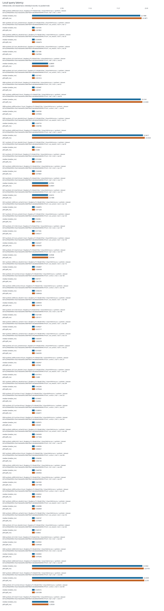
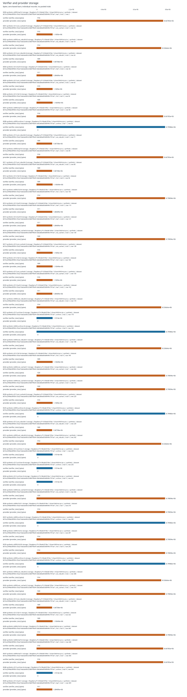
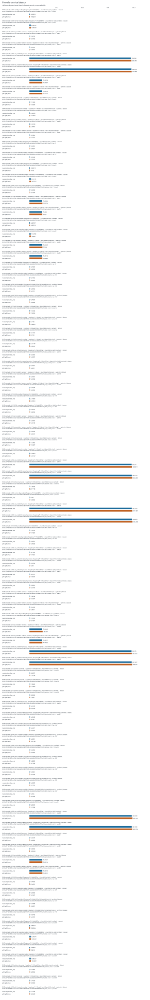

# Supplementary experiment report

Recorded run profile: paper. Results describe the measured platform and dataset recorded on each row. Desktop and loopback smoke runs are not Raspberry Pi or remote-host evidence. Synthetic fixtures are not real chain workloads. Ethereum RPC JSON replay does not validate native finality or integrate sharded consensus. Verifier-local offloading is not compression or a system-wide storage saving; provider state must be counted separately.

Valid records: 478. Successful records: 475. Failed records: 0. Malformed lines: 0.

## Reviewer coverage

Exactly seven whole-comment rows are retained. Statuses describe this run's evidence, not acceptance of the manuscript.

| Comment | Whole-comment scope | Status | Missing evidence |
|---|---|---|---|
| R1-1 | Storage accounting and provider-side overhead | measured_here |  |
| R1-2 | IoT deployment and blockchain integration scope | partial | energy; native_finality |
| R2-1 | Evaluation on constrained hardware | measured_here |  |
| R2-2 | CPU, RAM and latency measurements | measured_here |  |
| R2-3 | Presentation of experimental evidence | measured_here |  |
| R2-4 | Reproducible repository, real data and hardware evidence | partial | real_data |
| R2-8 | Real-world benchmarking | partial | real_data |

## Evidence and limitations

- **real_pi_platform: measured_here** — Successful measurement with a Raspberry Pi device model in system_info.
- **remote_tcp: measured_here** — TCP measurement records distinct client and server machine identities.
- **real_data: missing** — No successful real-data measurement includes source metadata and an input hash; synthetic/test data do not establish real-world workloads.
- **energy: missing** — No measured energy in joules is present; CPU time and estimated power are not energy measurements.
- **filesystem: measured_here** — Storage experiment includes actual allocated/filesystem byte measurements.
- **memory_pressure: measured_here** — Memory-pressure experiment records an enforced limit or pressure configuration.
- **service_disconnect: measured_here** — Remote TCP service-disconnection experiment records observed detection or failure.
- **native_finality: missing** — Native finality and sharded-consensus integration are absent. Ethereum RPC JSON replay is an ingestion/verification adapter, not native finality validation or consensus integration.
- **storage_accounting: measured_here** — Verifier and provider byte accounting is available.
- **provider_latency: measured_here** — Provider latency is measured.
- **cpu: measured_here** — CPU-time or CPU-utilization metrics are present.
- **ram: measured_here** — Resident/peak memory metrics are present.
- **local_latency: measured_here** — Local latency metrics are present.
- **presentation: measured_here** — This run provides machine-readable tables, escaped LaTeX and an offline report; manuscript revision and reviewer acceptance are not assessed.
- **repository_metadata: measured_here** — Run metadata records a code version and configuration; public repository availability is not verified.

## Experiment inventory

| Experiment | Records | Successful |
|---|---:|---:|
| original_e2 | 40 | 40 |
| local | 50 | 50 |
| archive_retrieval | 10 | 10 |
| network | 40 | 40 |
| storage | 50 | 50 |
| provider | 90 | 90 |
| migration | 60 | 60 |
| integrity | 50 | 50 |
| memory_pressure | 40 | 40 |
| disconnect | 40 | 40 |
| energy_workload | 5 | 5 |
| energy | 1 | 0 |
| real_dataset | 1 | 0 |
| native_finality | 1 | 0 |

## Figures

Individual records are plotted without pooling cases, platforms, datasets or modes. Median and p95 are within-record metrics; no confidence intervals are inferred from summary statistics.








## Warnings

- Insufficient independent trials: 1 identified for [&quot;storage&quot;, &quot;0000-synthetic-n4096-leaf-t2-storage&quot;, &quot;pi-verifier&quot;, {&quot;architecture&quot;: &quot;aarch64&quot;, &quot;cpu_count&quot;: 4, &quot;hostname&quot;: &quot;msi-pi-a&quot;, &quot;kernel&quot;: &quot;6.12.47+rpt-rpi-v8&quot;, &quot;machine_id&quot;: &quot;f8c5ed94511a0d7f7b74e6e55a8499bd265b7cfbe00e6c3af4400223a99102c0&quot;, &quot;machine_id_source&quot;: &quot;device_tree_serial_sha256&quot;, &quot;mem_total_bytes&quot;: 8200613888, &quot;network&quot;: {&quot;available&quot;: true, &quot;interfaces&quot;: [{&quot;is_wireless&quot;: false, &quot;name&quot;: &quot;eth0&quot;, &quot;operstate&quot;: &quot;up&quot;}, {&quot;is_wireless&quot;: false, &quot;name&quot;: &quot;lo&quot;, &quot;operstate&quot;: &quot;unknown&quot;}, {&quot;is_wireless&quot;: true, &quot;name&quot;: &quot;wlan0&quot;, &quot;operstate&quot;: &quot;down&quot;}]}, &quot;openssl&quot;: &quot;OpenSSL 3.5.7 9 Jun 2026&quot;, &quot;os&quot;: {&quot;id&quot;: &quot;debian&quot;, &quot;name&quot;: &quot;Debian GNU/Linux&quot;, &quot;pretty_name&quot;: &quot;Debian GNU/Linux 13 (trixie)&quot;, &quot;version&quot;: &quot;13 (trixie)&quot;, &quot;version_id&quot;: &quot;13&quot;}, &quot;pi_model&quot;: &quot;Raspberry Pi 4 Model B Rev 1.4&quot;, &quot;platform&quot;: &quot;Linux&quot;, &quot;python&quot;: &quot;3.13.5&quot;, &quot;python_implementation&quot;: &quot;CPython&quot;, &quot;result_storage&quot;: {&quot;block_device&quot;: &quot;/dev/mmcblk0p2&quot;, &quot;device&quot;: {&quot;capacity_bytes&quot;: 31914983424, &quot;model&quot;: null, &quot;name&quot;: &quot;mmcblk0&quot;, &quot;rotational&quot;: &quot;0&quot;, &quot;vendor&quot;: null}, &quot;filesystem&quot;: &quot;ext4&quot;, &quot;free_bytes&quot;: 22241345536, &quot;mountpoint&quot;: &quot;/&quot;, &quot;path&quot;: &quot;/home/reza/msi_pi_suite/outputs/pi-a-paper_synthetic_ethernet_retry1&quot;, &quot;total_bytes&quot;: 30794059776, &quot;used_bytes&quot;: 7222124544}, &quot;storage&quot;: {&quot;block_device&quot;: &quot;/dev/mmcblk0p2&quot;, &quot;device&quot;: {&quot;capacity_bytes&quot;: 31914983424, &quot;model&quot;: null, &quot;name&quot;: &quot;mmcblk0&quot;, &quot;rotational&quot;: &quot;0&quot;, &quot;vendor&quot;: null}, &quot;filesystem&quot;: &quot;ext4&quot;, &quot;free_bytes&quot;: 22241345536, &quot;mountpoint&quot;: &quot;/&quot;, &quot;path&quot;: &quot;/home/reza/msi_pi_suite&quot;, &quot;total_bytes&quot;: 30794059776, &quot;used_bytes&quot;: 7222124544}}, &quot;synthetic&quot;, null, null, &quot;leaf&quot;, null, &quot;b016c29f4de90f5b1cf3a216da5a605c33b87f5b41cbb2b6bd5568949c797cef&quot;]; at least 3 recommended. Per-query samples do not substitute for independent trials.
- Insufficient independent trials: 1 identified for [&quot;provider&quot;, &quot;0000-synthetic-n4096-leaf-t2-provider&quot;, &quot;provider&quot;, {&quot;architecture&quot;: &quot;aarch64&quot;, &quot;cpu_count&quot;: 4, &quot;hostname&quot;: &quot;msi-pi-b&quot;, &quot;kernel&quot;: &quot;6.12.47+rpt-rpi-v8&quot;, &quot;machine_id&quot;: &quot;7e7e6946191efbf0784478e26f1c2325eba3d95d44cbbc419b2cf966290b4c94&quot;, &quot;machine_id_source&quot;: &quot;device_tree_serial_sha256&quot;, &quot;mem_total_bytes&quot;: 3981172736, &quot;network&quot;: {&quot;available&quot;: true, &quot;interfaces&quot;: [{&quot;is_wireless&quot;: false, &quot;name&quot;: &quot;eth0&quot;, &quot;operstate&quot;: &quot;up&quot;}, {&quot;is_wireless&quot;: false, &quot;name&quot;: &quot;lo&quot;, &quot;operstate&quot;: &quot;unknown&quot;}, {&quot;is_wireless&quot;: false, &quot;name&quot;: &quot;ovs-system&quot;, &quot;operstate&quot;: &quot;down&quot;}, {&quot;is_wireless&quot;: false, &quot;name&quot;: &quot;s1&quot;, &quot;operstate&quot;: &quot;down&quot;}, {&quot;is_wireless&quot;: false, &quot;name&quot;: &quot;s2&quot;, &quot;operstate&quot;: &quot;down&quot;}, {&quot;is_wireless&quot;: false, &quot;name&quot;: &quot;s3&quot;, &quot;operstate&quot;: &quot;down&quot;}, {&quot;is_wireless&quot;: true, &quot;name&quot;: &quot;wlan0&quot;, &quot;operstate&quot;: &quot;down&quot;}]}, &quot;openssl&quot;: &quot;OpenSSL 3.0.15 3 Sep 2024&quot;, &quot;os&quot;: {&quot;id&quot;: &quot;debian&quot;, &quot;name&quot;: &quot;Debian GNU/Linux&quot;, &quot;pretty_name&quot;: &quot;Debian GNU/Linux 13 (trixie)&quot;, &quot;version&quot;: &quot;13 (trixie)&quot;, &quot;version_id&quot;: &quot;13&quot;}, &quot;pi_model&quot;: &quot;Raspberry Pi 4 Model B Rev 1.4&quot;, &quot;platform&quot;: &quot;Linux&quot;, &quot;provider_storage&quot;: {&quot;block_device&quot;: &quot;/dev/mmcblk0p2&quot;, &quot;device&quot;: {&quot;capacity_bytes&quot;: 31914983424, &quot;model&quot;: null, &quot;name&quot;: &quot;mmcblk0&quot;, &quot;rotational&quot;: &quot;0&quot;, &quot;vendor&quot;: null}, &quot;filesystem&quot;: &quot;ext4&quot;, &quot;free_bytes&quot;: 12486815744, &quot;mountpoint&quot;: &quot;/&quot;, &quot;path&quot;: &quot;/home/reza/msi_pi_suite/provider-data&quot;, &quot;total_bytes&quot;: 30794059776, &quot;used_bytes&quot;: 16976654336}, &quot;python&quot;: &quot;3.12.7&quot;, &quot;python_implementation&quot;: &quot;CPython&quot;, &quot;storage&quot;: {&quot;block_device&quot;: &quot;/dev/mmcblk0p2&quot;, &quot;device&quot;: {&quot;capacity_bytes&quot;: 31914983424, &quot;model&quot;: null, &quot;name&quot;: &quot;mmcblk0&quot;, &quot;rotational&quot;: &quot;0&quot;, &quot;vendor&quot;: null}, &quot;filesystem&quot;: &quot;ext4&quot;, &quot;free_bytes&quot;: 12486815744, &quot;mountpoint&quot;: &quot;/&quot;, &quot;path&quot;: &quot;/home/reza/msi_pi_suite&quot;, &quot;total_bytes&quot;: 30794059776, &quot;used_bytes&quot;: 16976654336}}, &quot;synthetic&quot;, null, null, &quot;leaf&quot;, null, &quot;b016c29f4de90f5b1cf3a216da5a605c33b87f5b41cbb2b6bd5568949c797cef&quot;]; at least 3 recommended. Per-query samples do not substitute for independent trials.
- Insufficient independent trials: 1 identified for [&quot;local&quot;, &quot;0000-synthetic-n4096-leaf-t2-local&quot;, &quot;pi-verifier&quot;, {&quot;architecture&quot;: &quot;aarch64&quot;, &quot;cpu_count&quot;: 4, &quot;hostname&quot;: &quot;msi-pi-a&quot;, &quot;kernel&quot;: &quot;6.12.47+rpt-rpi-v8&quot;, &quot;machine_id&quot;: &quot;f8c5ed94511a0d7f7b74e6e55a8499bd265b7cfbe00e6c3af4400223a99102c0&quot;, &quot;machine_id_source&quot;: &quot;device_tree_serial_sha256&quot;, &quot;mem_total_bytes&quot;: 8200613888, &quot;network&quot;: {&quot;available&quot;: true, &quot;interfaces&quot;: [{&quot;is_wireless&quot;: false, &quot;name&quot;: &quot;eth0&quot;, &quot;operstate&quot;: &quot;up&quot;}, {&quot;is_wireless&quot;: false, &quot;name&quot;: &quot;lo&quot;, &quot;operstate&quot;: &quot;unknown&quot;}, {&quot;is_wireless&quot;: true, &quot;name&quot;: &quot;wlan0&quot;, &quot;operstate&quot;: &quot;down&quot;}]}, &quot;openssl&quot;: &quot;OpenSSL 3.5.7 9 Jun 2026&quot;, &quot;os&quot;: {&quot;id&quot;: &quot;debian&quot;, &quot;name&quot;: &quot;Debian GNU/Linux&quot;, &quot;pretty_name&quot;: &quot;Debian GNU/Linux 13 (trixie)&quot;, &quot;version&quot;: &quot;13 (trixie)&quot;, &quot;version_id&quot;: &quot;13&quot;}, &quot;pi_model&quot;: &quot;Raspberry Pi 4 Model B Rev 1.4&quot;, &quot;platform&quot;: &quot;Linux&quot;, &quot;python&quot;: &quot;3.13.5&quot;, &quot;python_implementation&quot;: &quot;CPython&quot;, &quot;result_storage&quot;: {&quot;block_device&quot;: &quot;/dev/mmcblk0p2&quot;, &quot;device&quot;: {&quot;capacity_bytes&quot;: 31914983424, &quot;model&quot;: null, &quot;name&quot;: &quot;mmcblk0&quot;, &quot;rotational&quot;: &quot;0&quot;, &quot;vendor&quot;: null}, &quot;filesystem&quot;: &quot;ext4&quot;, &quot;free_bytes&quot;: 22241345536, &quot;mountpoint&quot;: &quot;/&quot;, &quot;path&quot;: &quot;/home/reza/msi_pi_suite/outputs/pi-a-paper_synthetic_ethernet_retry1&quot;, &quot;total_bytes&quot;: 30794059776, &quot;used_bytes&quot;: 7222124544}, &quot;storage&quot;: {&quot;block_device&quot;: &quot;/dev/mmcblk0p2&quot;, &quot;device&quot;: {&quot;capacity_bytes&quot;: 31914983424, &quot;model&quot;: null, &quot;name&quot;: &quot;mmcblk0&quot;, &quot;rotational&quot;: &quot;0&quot;, &quot;vendor&quot;: null}, &quot;filesystem&quot;: &quot;ext4&quot;, &quot;free_bytes&quot;: 22241345536, &quot;mountpoint&quot;: &quot;/&quot;, &quot;path&quot;: &quot;/home/reza/msi_pi_suite&quot;, &quot;total_bytes&quot;: 30794059776, &quot;used_bytes&quot;: 7222124544}}, &quot;synthetic&quot;, null, null, &quot;leaf&quot;, null, &quot;b016c29f4de90f5b1cf3a216da5a605c33b87f5b41cbb2b6bd5568949c797cef&quot;]; at least 3 recommended. Per-query samples do not substitute for independent trials.
- Insufficient independent trials: 1 identified for [&quot;memory_pressure&quot;, &quot;0000-synthetic-n4096-leaf-t2-memory_pressure&quot;, &quot;pi-verifier&quot;, {&quot;architecture&quot;: &quot;aarch64&quot;, &quot;cpu_count&quot;: 4, &quot;hostname&quot;: &quot;msi-pi-a&quot;, &quot;kernel&quot;: &quot;6.12.47+rpt-rpi-v8&quot;, &quot;machine_id&quot;: &quot;f8c5ed94511a0d7f7b74e6e55a8499bd265b7cfbe00e6c3af4400223a99102c0&quot;, &quot;machine_id_source&quot;: &quot;device_tree_serial_sha256&quot;, &quot;mem_total_bytes&quot;: 8200613888, &quot;network&quot;: {&quot;available&quot;: true, &quot;interfaces&quot;: [{&quot;is_wireless&quot;: false, &quot;name&quot;: &quot;eth0&quot;, &quot;operstate&quot;: &quot;up&quot;}, {&quot;is_wireless&quot;: false, &quot;name&quot;: &quot;lo&quot;, &quot;operstate&quot;: &quot;unknown&quot;}, {&quot;is_wireless&quot;: true, &quot;name&quot;: &quot;wlan0&quot;, &quot;operstate&quot;: &quot;down&quot;}]}, &quot;openssl&quot;: &quot;OpenSSL 3.5.7 9 Jun 2026&quot;, &quot;os&quot;: {&quot;id&quot;: &quot;debian&quot;, &quot;name&quot;: &quot;Debian GNU/Linux&quot;, &quot;pretty_name&quot;: &quot;Debian GNU/Linux 13 (trixie)&quot;, &quot;version&quot;: &quot;13 (trixie)&quot;, &quot;version_id&quot;: &quot;13&quot;}, &quot;pi_model&quot;: &quot;Raspberry Pi 4 Model B Rev 1.4&quot;, &quot;platform&quot;: &quot;Linux&quot;, &quot;python&quot;: &quot;3.13.5&quot;, &quot;python_implementation&quot;: &quot;CPython&quot;, &quot;result_storage&quot;: {&quot;block_device&quot;: &quot;/dev/mmcblk0p2&quot;, &quot;device&quot;: {&quot;capacity_bytes&quot;: 31914983424, &quot;model&quot;: null, &quot;name&quot;: &quot;mmcblk0&quot;, &quot;rotational&quot;: &quot;0&quot;, &quot;vendor&quot;: null}, &quot;filesystem&quot;: &quot;ext4&quot;, &quot;free_bytes&quot;: 22241345536, &quot;mountpoint&quot;: &quot;/&quot;, &quot;path&quot;: &quot;/home/reza/msi_pi_suite/outputs/pi-a-paper_synthetic_ethernet_retry1&quot;, &quot;total_bytes&quot;: 30794059776, &quot;used_bytes&quot;: 7222124544}, &quot;storage&quot;: {&quot;block_device&quot;: &quot;/dev/mmcblk0p2&quot;, &quot;device&quot;: {&quot;capacity_bytes&quot;: 31914983424, &quot;model&quot;: null, &quot;name&quot;: &quot;mmcblk0&quot;, &quot;rotational&quot;: &quot;0&quot;, &quot;vendor&quot;: null}, &quot;filesystem&quot;: &quot;ext4&quot;, &quot;free_bytes&quot;: 22241345536, &quot;mountpoint&quot;: &quot;/&quot;, &quot;path&quot;: &quot;/home/reza/msi_pi_suite&quot;, &quot;total_bytes&quot;: 30794059776, &quot;used_bytes&quot;: 7222124544}}, &quot;synthetic&quot;, null, null, &quot;leaf&quot;, null, &quot;b016c29f4de90f5b1cf3a216da5a605c33b87f5b41cbb2b6bd5568949c797cef&quot;]; at least 3 recommended. Per-query samples do not substitute for independent trials.
- Insufficient independent trials: 1 identified for [&quot;network&quot;, &quot;0000-synthetic-n4096-leaf-t2-network&quot;, &quot;pi-verifier&quot;, {&quot;architecture&quot;: &quot;aarch64&quot;, &quot;cpu_count&quot;: 4, &quot;hostname&quot;: &quot;msi-pi-a&quot;, &quot;kernel&quot;: &quot;6.12.47+rpt-rpi-v8&quot;, &quot;machine_id&quot;: &quot;f8c5ed94511a0d7f7b74e6e55a8499bd265b7cfbe00e6c3af4400223a99102c0&quot;, &quot;machine_id_source&quot;: &quot;device_tree_serial_sha256&quot;, &quot;mem_total_bytes&quot;: 8200613888, &quot;network&quot;: {&quot;available&quot;: true, &quot;interfaces&quot;: [{&quot;is_wireless&quot;: false, &quot;name&quot;: &quot;eth0&quot;, &quot;operstate&quot;: &quot;up&quot;}, {&quot;is_wireless&quot;: false, &quot;name&quot;: &quot;lo&quot;, &quot;operstate&quot;: &quot;unknown&quot;}, {&quot;is_wireless&quot;: true, &quot;name&quot;: &quot;wlan0&quot;, &quot;operstate&quot;: &quot;down&quot;}]}, &quot;openssl&quot;: &quot;OpenSSL 3.5.7 9 Jun 2026&quot;, &quot;os&quot;: {&quot;id&quot;: &quot;debian&quot;, &quot;name&quot;: &quot;Debian GNU/Linux&quot;, &quot;pretty_name&quot;: &quot;Debian GNU/Linux 13 (trixie)&quot;, &quot;version&quot;: &quot;13 (trixie)&quot;, &quot;version_id&quot;: &quot;13&quot;}, &quot;pi_model&quot;: &quot;Raspberry Pi 4 Model B Rev 1.4&quot;, &quot;platform&quot;: &quot;Linux&quot;, &quot;python&quot;: &quot;3.13.5&quot;, &quot;python_implementation&quot;: &quot;CPython&quot;, &quot;result_storage&quot;: {&quot;block_device&quot;: &quot;/dev/mmcblk0p2&quot;, &quot;device&quot;: {&quot;capacity_bytes&quot;: 31914983424, &quot;model&quot;: null, &quot;name&quot;: &quot;mmcblk0&quot;, &quot;rotational&quot;: &quot;0&quot;, &quot;vendor&quot;: null}, &quot;filesystem&quot;: &quot;ext4&quot;, &quot;free_bytes&quot;: 22241345536, &quot;mountpoint&quot;: &quot;/&quot;, &quot;path&quot;: &quot;/home/reza/msi_pi_suite/outputs/pi-a-paper_synthetic_ethernet_retry1&quot;, &quot;total_bytes&quot;: 30794059776, &quot;used_bytes&quot;: 7222124544}, &quot;storage&quot;: {&quot;block_device&quot;: &quot;/dev/mmcblk0p2&quot;, &quot;device&quot;: {&quot;capacity_bytes&quot;: 31914983424, &quot;model&quot;: null, &quot;name&quot;: &quot;mmcblk0&quot;, &quot;rotational&quot;: &quot;0&quot;, &quot;vendor&quot;: null}, &quot;filesystem&quot;: &quot;ext4&quot;, &quot;free_bytes&quot;: 22241345536, &quot;mountpoint&quot;: &quot;/&quot;, &quot;path&quot;: &quot;/home/reza/msi_pi_suite&quot;, &quot;total_bytes&quot;: 30794059776, &quot;used_bytes&quot;: 7222124544}}, &quot;synthetic&quot;, null, null, &quot;leaf&quot;, null, &quot;b016c29f4de90f5b1cf3a216da5a605c33b87f5b41cbb2b6bd5568949c797cef&quot;]; at least 3 recommended. Per-query samples do not substitute for independent trials.
- Insufficient independent trials: 1 identified for [&quot;provider&quot;, &quot;0000-synthetic-n4096-leaf-t2-network-provider&quot;, &quot;provider&quot;, {&quot;architecture&quot;: &quot;aarch64&quot;, &quot;cpu_count&quot;: 4, &quot;hostname&quot;: &quot;msi-pi-b&quot;, &quot;kernel&quot;: &quot;6.12.47+rpt-rpi-v8&quot;, &quot;machine_id&quot;: &quot;7e7e6946191efbf0784478e26f1c2325eba3d95d44cbbc419b2cf966290b4c94&quot;, &quot;machine_id_source&quot;: &quot;device_tree_serial_sha256&quot;, &quot;mem_total_bytes&quot;: 3981172736, &quot;network&quot;: {&quot;available&quot;: true, &quot;interfaces&quot;: [{&quot;is_wireless&quot;: false, &quot;name&quot;: &quot;eth0&quot;, &quot;operstate&quot;: &quot;up&quot;}, {&quot;is_wireless&quot;: false, &quot;name&quot;: &quot;lo&quot;, &quot;operstate&quot;: &quot;unknown&quot;}, {&quot;is_wireless&quot;: false, &quot;name&quot;: &quot;ovs-system&quot;, &quot;operstate&quot;: &quot;down&quot;}, {&quot;is_wireless&quot;: false, &quot;name&quot;: &quot;s1&quot;, &quot;operstate&quot;: &quot;down&quot;}, {&quot;is_wireless&quot;: false, &quot;name&quot;: &quot;s2&quot;, &quot;operstate&quot;: &quot;down&quot;}, {&quot;is_wireless&quot;: false, &quot;name&quot;: &quot;s3&quot;, &quot;operstate&quot;: &quot;down&quot;}, {&quot;is_wireless&quot;: true, &quot;name&quot;: &quot;wlan0&quot;, &quot;operstate&quot;: &quot;down&quot;}]}, &quot;openssl&quot;: &quot;OpenSSL 3.0.15 3 Sep 2024&quot;, &quot;os&quot;: {&quot;id&quot;: &quot;debian&quot;, &quot;name&quot;: &quot;Debian GNU/Linux&quot;, &quot;pretty_name&quot;: &quot;Debian GNU/Linux 13 (trixie)&quot;, &quot;version&quot;: &quot;13 (trixie)&quot;, &quot;version_id&quot;: &quot;13&quot;}, &quot;pi_model&quot;: &quot;Raspberry Pi 4 Model B Rev 1.4&quot;, &quot;platform&quot;: &quot;Linux&quot;, &quot;provider_storage&quot;: {&quot;block_device&quot;: &quot;/dev/mmcblk0p2&quot;, &quot;device&quot;: {&quot;capacity_bytes&quot;: 31914983424, &quot;model&quot;: null, &quot;name&quot;: &quot;mmcblk0&quot;, &quot;rotational&quot;: &quot;0&quot;, &quot;vendor&quot;: null}, &quot;filesystem&quot;: &quot;ext4&quot;, &quot;free_bytes&quot;: 12486815744, &quot;mountpoint&quot;: &quot;/&quot;, &quot;path&quot;: &quot;/home/reza/msi_pi_suite/provider-data&quot;, &quot;total_bytes&quot;: 30794059776, &quot;used_bytes&quot;: 16976654336}, &quot;python&quot;: &quot;3.12.7&quot;, &quot;python_implementation&quot;: &quot;CPython&quot;, &quot;storage&quot;: {&quot;block_device&quot;: &quot;/dev/mmcblk0p2&quot;, &quot;device&quot;: {&quot;capacity_bytes&quot;: 31914983424, &quot;model&quot;: null, &quot;name&quot;: &quot;mmcblk0&quot;, &quot;rotational&quot;: &quot;0&quot;, &quot;vendor&quot;: null}, &quot;filesystem&quot;: &quot;ext4&quot;, &quot;free_bytes&quot;: 12486815744, &quot;mountpoint&quot;: &quot;/&quot;, &quot;path&quot;: &quot;/home/reza/msi_pi_suite&quot;, &quot;total_bytes&quot;: 30794059776, &quot;used_bytes&quot;: 16976654336}}, &quot;synthetic&quot;, null, null, &quot;leaf&quot;, null, &quot;b016c29f4de90f5b1cf3a216da5a605c33b87f5b41cbb2b6bd5568949c797cef&quot;]; at least 3 recommended. Per-query samples do not substitute for independent trials.
- Insufficient independent trials: 1 identified for [&quot;integrity&quot;, &quot;0000-synthetic-n4096-leaf-t2-integrity&quot;, &quot;pi-verifier&quot;, {&quot;architecture&quot;: &quot;aarch64&quot;, &quot;cpu_count&quot;: 4, &quot;hostname&quot;: &quot;msi-pi-a&quot;, &quot;kernel&quot;: &quot;6.12.47+rpt-rpi-v8&quot;, &quot;machine_id&quot;: &quot;f8c5ed94511a0d7f7b74e6e55a8499bd265b7cfbe00e6c3af4400223a99102c0&quot;, &quot;machine_id_source&quot;: &quot;device_tree_serial_sha256&quot;, &quot;mem_total_bytes&quot;: 8200613888, &quot;network&quot;: {&quot;available&quot;: true, &quot;interfaces&quot;: [{&quot;is_wireless&quot;: false, &quot;name&quot;: &quot;eth0&quot;, &quot;operstate&quot;: &quot;up&quot;}, {&quot;is_wireless&quot;: false, &quot;name&quot;: &quot;lo&quot;, &quot;operstate&quot;: &quot;unknown&quot;}, {&quot;is_wireless&quot;: true, &quot;name&quot;: &quot;wlan0&quot;, &quot;operstate&quot;: &quot;down&quot;}]}, &quot;openssl&quot;: &quot;OpenSSL 3.5.7 9 Jun 2026&quot;, &quot;os&quot;: {&quot;id&quot;: &quot;debian&quot;, &quot;name&quot;: &quot;Debian GNU/Linux&quot;, &quot;pretty_name&quot;: &quot;Debian GNU/Linux 13 (trixie)&quot;, &quot;version&quot;: &quot;13 (trixie)&quot;, &quot;version_id&quot;: &quot;13&quot;}, &quot;pi_model&quot;: &quot;Raspberry Pi 4 Model B Rev 1.4&quot;, &quot;platform&quot;: &quot;Linux&quot;, &quot;python&quot;: &quot;3.13.5&quot;, &quot;python_implementation&quot;: &quot;CPython&quot;, &quot;result_storage&quot;: {&quot;block_device&quot;: &quot;/dev/mmcblk0p2&quot;, &quot;device&quot;: {&quot;capacity_bytes&quot;: 31914983424, &quot;model&quot;: null, &quot;name&quot;: &quot;mmcblk0&quot;, &quot;rotational&quot;: &quot;0&quot;, &quot;vendor&quot;: null}, &quot;filesystem&quot;: &quot;ext4&quot;, &quot;free_bytes&quot;: 22241345536, &quot;mountpoint&quot;: &quot;/&quot;, &quot;path&quot;: &quot;/home/reza/msi_pi_suite/outputs/pi-a-paper_synthetic_ethernet_retry1&quot;, &quot;total_bytes&quot;: 30794059776, &quot;used_bytes&quot;: 7222124544}, &quot;storage&quot;: {&quot;block_device&quot;: &quot;/dev/mmcblk0p2&quot;, &quot;device&quot;: {&quot;capacity_bytes&quot;: 31914983424, &quot;model&quot;: null, &quot;name&quot;: &quot;mmcblk0&quot;, &quot;rotational&quot;: &quot;0&quot;, &quot;vendor&quot;: null}, &quot;filesystem&quot;: &quot;ext4&quot;, &quot;free_bytes&quot;: 22241345536, &quot;mountpoint&quot;: &quot;/&quot;, &quot;path&quot;: &quot;/home/reza/msi_pi_suite&quot;, &quot;total_bytes&quot;: 30794059776, &quot;used_bytes&quot;: 7222124544}}, &quot;synthetic&quot;, null, null, &quot;leaf&quot;, null, &quot;b016c29f4de90f5b1cf3a216da5a605c33b87f5b41cbb2b6bd5568949c797cef&quot;]; at least 3 recommended. Per-query samples do not substitute for independent trials.
- Insufficient independent trials: 1 identified for [&quot;disconnect&quot;, &quot;0000-synthetic-n4096-leaf-t2-disconnect&quot;, &quot;pi-verifier&quot;, {&quot;architecture&quot;: &quot;aarch64&quot;, &quot;cpu_count&quot;: 4, &quot;hostname&quot;: &quot;msi-pi-a&quot;, &quot;kernel&quot;: &quot;6.12.47+rpt-rpi-v8&quot;, &quot;machine_id&quot;: &quot;f8c5ed94511a0d7f7b74e6e55a8499bd265b7cfbe00e6c3af4400223a99102c0&quot;, &quot;machine_id_source&quot;: &quot;device_tree_serial_sha256&quot;, &quot;mem_total_bytes&quot;: 8200613888, &quot;network&quot;: {&quot;available&quot;: true, &quot;interfaces&quot;: [{&quot;is_wireless&quot;: false, &quot;name&quot;: &quot;eth0&quot;, &quot;operstate&quot;: &quot;up&quot;}, {&quot;is_wireless&quot;: false, &quot;name&quot;: &quot;lo&quot;, &quot;operstate&quot;: &quot;unknown&quot;}, {&quot;is_wireless&quot;: true, &quot;name&quot;: &quot;wlan0&quot;, &quot;operstate&quot;: &quot;down&quot;}]}, &quot;openssl&quot;: &quot;OpenSSL 3.5.7 9 Jun 2026&quot;, &quot;os&quot;: {&quot;id&quot;: &quot;debian&quot;, &quot;name&quot;: &quot;Debian GNU/Linux&quot;, &quot;pretty_name&quot;: &quot;Debian GNU/Linux 13 (trixie)&quot;, &quot;version&quot;: &quot;13 (trixie)&quot;, &quot;version_id&quot;: &quot;13&quot;}, &quot;pi_model&quot;: &quot;Raspberry Pi 4 Model B Rev 1.4&quot;, &quot;platform&quot;: &quot;Linux&quot;, &quot;python&quot;: &quot;3.13.5&quot;, &quot;python_implementation&quot;: &quot;CPython&quot;, &quot;result_storage&quot;: {&quot;block_device&quot;: &quot;/dev/mmcblk0p2&quot;, &quot;device&quot;: {&quot;capacity_bytes&quot;: 31914983424, &quot;model&quot;: null, &quot;name&quot;: &quot;mmcblk0&quot;, &quot;rotational&quot;: &quot;0&quot;, &quot;vendor&quot;: null}, &quot;filesystem&quot;: &quot;ext4&quot;, &quot;free_bytes&quot;: 22241345536, &quot;mountpoint&quot;: &quot;/&quot;, &quot;path&quot;: &quot;/home/reza/msi_pi_suite/outputs/pi-a-paper_synthetic_ethernet_retry1&quot;, &quot;total_bytes&quot;: 30794059776, &quot;used_bytes&quot;: 7222124544}, &quot;storage&quot;: {&quot;block_device&quot;: &quot;/dev/mmcblk0p2&quot;, &quot;device&quot;: {&quot;capacity_bytes&quot;: 31914983424, &quot;model&quot;: null, &quot;name&quot;: &quot;mmcblk0&quot;, &quot;rotational&quot;: &quot;0&quot;, &quot;vendor&quot;: null}, &quot;filesystem&quot;: &quot;ext4&quot;, &quot;free_bytes&quot;: 22241345536, &quot;mountpoint&quot;: &quot;/&quot;, &quot;path&quot;: &quot;/home/reza/msi_pi_suite&quot;, &quot;total_bytes&quot;: 30794059776, &quot;used_bytes&quot;: 7222124544}}, &quot;synthetic&quot;, null, null, &quot;leaf&quot;, null, &quot;b016c29f4de90f5b1cf3a216da5a605c33b87f5b41cbb2b6bd5568949c797cef&quot;]; at least 3 recommended. Per-query samples do not substitute for independent trials.
- Insufficient independent trials: 1 identified for [&quot;storage&quot;, &quot;0001-synthetic-n512-ext_cached-t4-storage&quot;, &quot;pi-verifier&quot;, {&quot;architecture&quot;: &quot;aarch64&quot;, &quot;cpu_count&quot;: 4, &quot;hostname&quot;: &quot;msi-pi-a&quot;, &quot;kernel&quot;: &quot;6.12.47+rpt-rpi-v8&quot;, &quot;machine_id&quot;: &quot;f8c5ed94511a0d7f7b74e6e55a8499bd265b7cfbe00e6c3af4400223a99102c0&quot;, &quot;machine_id_source&quot;: &quot;device_tree_serial_sha256&quot;, &quot;mem_total_bytes&quot;: 8200613888, &quot;network&quot;: {&quot;available&quot;: true, &quot;interfaces&quot;: [{&quot;is_wireless&quot;: false, &quot;name&quot;: &quot;eth0&quot;, &quot;operstate&quot;: &quot;up&quot;}, {&quot;is_wireless&quot;: false, &quot;name&quot;: &quot;lo&quot;, &quot;operstate&quot;: &quot;unknown&quot;}, {&quot;is_wireless&quot;: true, &quot;name&quot;: &quot;wlan0&quot;, &quot;operstate&quot;: &quot;down&quot;}]}, &quot;openssl&quot;: &quot;OpenSSL 3.5.7 9 Jun 2026&quot;, &quot;os&quot;: {&quot;id&quot;: &quot;debian&quot;, &quot;name&quot;: &quot;Debian GNU/Linux&quot;, &quot;pretty_name&quot;: &quot;Debian GNU/Linux 13 (trixie)&quot;, &quot;version&quot;: &quot;13 (trixie)&quot;, &quot;version_id&quot;: &quot;13&quot;}, &quot;pi_model&quot;: &quot;Raspberry Pi 4 Model B Rev 1.4&quot;, &quot;platform&quot;: &quot;Linux&quot;, &quot;python&quot;: &quot;3.13.5&quot;, &quot;python_implementation&quot;: &quot;CPython&quot;, &quot;result_storage&quot;: {&quot;block_device&quot;: &quot;/dev/mmcblk0p2&quot;, &quot;device&quot;: {&quot;capacity_bytes&quot;: 31914983424, &quot;model&quot;: null, &quot;name&quot;: &quot;mmcblk0&quot;, &quot;rotational&quot;: &quot;0&quot;, &quot;vendor&quot;: null}, &quot;filesystem&quot;: &quot;ext4&quot;, &quot;free_bytes&quot;: 22241345536, &quot;mountpoint&quot;: &quot;/&quot;, &quot;path&quot;: &quot;/home/reza/msi_pi_suite/outputs/pi-a-paper_synthetic_ethernet_retry1&quot;, &quot;total_bytes&quot;: 30794059776, &quot;used_bytes&quot;: 7222124544}, &quot;storage&quot;: {&quot;block_device&quot;: &quot;/dev/mmcblk0p2&quot;, &quot;device&quot;: {&quot;capacity_bytes&quot;: 31914983424, &quot;model&quot;: null, &quot;name&quot;: &quot;mmcblk0&quot;, &quot;rotational&quot;: &quot;0&quot;, &quot;vendor&quot;: null}, &quot;filesystem&quot;: &quot;ext4&quot;, &quot;free_bytes&quot;: 22241345536, &quot;mountpoint&quot;: &quot;/&quot;, &quot;path&quot;: &quot;/home/reza/msi_pi_suite&quot;, &quot;total_bytes&quot;: 30794059776, &quot;used_bytes&quot;: 7222124544}}, &quot;synthetic&quot;, null, null, &quot;ext_cached&quot;, null, &quot;b016c29f4de90f5b1cf3a216da5a605c33b87f5b41cbb2b6bd5568949c797cef&quot;]; at least 3 recommended. Per-query samples do not substitute for independent trials.
- Insufficient independent trials: 1 identified for [&quot;provider&quot;, &quot;0001-synthetic-n512-ext_cached-t4-provider&quot;, &quot;provider&quot;, {&quot;architecture&quot;: &quot;aarch64&quot;, &quot;cpu_count&quot;: 4, &quot;hostname&quot;: &quot;msi-pi-b&quot;, &quot;kernel&quot;: &quot;6.12.47+rpt-rpi-v8&quot;, &quot;machine_id&quot;: &quot;7e7e6946191efbf0784478e26f1c2325eba3d95d44cbbc419b2cf966290b4c94&quot;, &quot;machine_id_source&quot;: &quot;device_tree_serial_sha256&quot;, &quot;mem_total_bytes&quot;: 3981172736, &quot;network&quot;: {&quot;available&quot;: true, &quot;interfaces&quot;: [{&quot;is_wireless&quot;: false, &quot;name&quot;: &quot;eth0&quot;, &quot;operstate&quot;: &quot;up&quot;}, {&quot;is_wireless&quot;: false, &quot;name&quot;: &quot;lo&quot;, &quot;operstate&quot;: &quot;unknown&quot;}, {&quot;is_wireless&quot;: false, &quot;name&quot;: &quot;ovs-system&quot;, &quot;operstate&quot;: &quot;down&quot;}, {&quot;is_wireless&quot;: false, &quot;name&quot;: &quot;s1&quot;, &quot;operstate&quot;: &quot;down&quot;}, {&quot;is_wireless&quot;: false, &quot;name&quot;: &quot;s2&quot;, &quot;operstate&quot;: &quot;down&quot;}, {&quot;is_wireless&quot;: false, &quot;name&quot;: &quot;s3&quot;, &quot;operstate&quot;: &quot;down&quot;}, {&quot;is_wireless&quot;: true, &quot;name&quot;: &quot;wlan0&quot;, &quot;operstate&quot;: &quot;down&quot;}]}, &quot;openssl&quot;: &quot;OpenSSL 3.0.15 3 Sep 2024&quot;, &quot;os&quot;: {&quot;id&quot;: &quot;debian&quot;, &quot;name&quot;: &quot;Debian GNU/Linux&quot;, &quot;pretty_name&quot;: &quot;Debian GNU/Linux 13 (trixie)&quot;, &quot;version&quot;: &quot;13 (trixie)&quot;, &quot;version_id&quot;: &quot;13&quot;}, &quot;pi_model&quot;: &quot;Raspberry Pi 4 Model B Rev 1.4&quot;, &quot;platform&quot;: &quot;Linux&quot;, &quot;provider_storage&quot;: {&quot;block_device&quot;: &quot;/dev/mmcblk0p2&quot;, &quot;device&quot;: {&quot;capacity_bytes&quot;: 31914983424, &quot;model&quot;: null, &quot;name&quot;: &quot;mmcblk0&quot;, &quot;rotational&quot;: &quot;0&quot;, &quot;vendor&quot;: null}, &quot;filesystem&quot;: &quot;ext4&quot;, &quot;free_bytes&quot;: 12486815744, &quot;mountpoint&quot;: &quot;/&quot;, &quot;path&quot;: &quot;/home/reza/msi_pi_suite/provider-data&quot;, &quot;total_bytes&quot;: 30794059776, &quot;used_bytes&quot;: 16976654336}, &quot;python&quot;: &quot;3.12.7&quot;, &quot;python_implementation&quot;: &quot;CPython&quot;, &quot;storage&quot;: {&quot;block_device&quot;: &quot;/dev/mmcblk0p2&quot;, &quot;device&quot;: {&quot;capacity_bytes&quot;: 31914983424, &quot;model&quot;: null, &quot;name&quot;: &quot;mmcblk0&quot;, &quot;rotational&quot;: &quot;0&quot;, &quot;vendor&quot;: null}, &quot;filesystem&quot;: &quot;ext4&quot;, &quot;free_bytes&quot;: 12486815744, &quot;mountpoint&quot;: &quot;/&quot;, &quot;path&quot;: &quot;/home/reza/msi_pi_suite&quot;, &quot;total_bytes&quot;: 30794059776, &quot;used_bytes&quot;: 16976654336}}, &quot;synthetic&quot;, null, null, &quot;ext_cached&quot;, null, &quot;b016c29f4de90f5b1cf3a216da5a605c33b87f5b41cbb2b6bd5568949c797cef&quot;]; at least 3 recommended. Per-query samples do not substitute for independent trials.
- Insufficient independent trials: 1 identified for [&quot;local&quot;, &quot;0001-synthetic-n512-ext_cached-t4-local&quot;, &quot;pi-verifier&quot;, {&quot;architecture&quot;: &quot;aarch64&quot;, &quot;cpu_count&quot;: 4, &quot;hostname&quot;: &quot;msi-pi-a&quot;, &quot;kernel&quot;: &quot;6.12.47+rpt-rpi-v8&quot;, &quot;machine_id&quot;: &quot;f8c5ed94511a0d7f7b74e6e55a8499bd265b7cfbe00e6c3af4400223a99102c0&quot;, &quot;machine_id_source&quot;: &quot;device_tree_serial_sha256&quot;, &quot;mem_total_bytes&quot;: 8200613888, &quot;network&quot;: {&quot;available&quot;: true, &quot;interfaces&quot;: [{&quot;is_wireless&quot;: false, &quot;name&quot;: &quot;eth0&quot;, &quot;operstate&quot;: &quot;up&quot;}, {&quot;is_wireless&quot;: false, &quot;name&quot;: &quot;lo&quot;, &quot;operstate&quot;: &quot;unknown&quot;}, {&quot;is_wireless&quot;: true, &quot;name&quot;: &quot;wlan0&quot;, &quot;operstate&quot;: &quot;down&quot;}]}, &quot;openssl&quot;: &quot;OpenSSL 3.5.7 9 Jun 2026&quot;, &quot;os&quot;: {&quot;id&quot;: &quot;debian&quot;, &quot;name&quot;: &quot;Debian GNU/Linux&quot;, &quot;pretty_name&quot;: &quot;Debian GNU/Linux 13 (trixie)&quot;, &quot;version&quot;: &quot;13 (trixie)&quot;, &quot;version_id&quot;: &quot;13&quot;}, &quot;pi_model&quot;: &quot;Raspberry Pi 4 Model B Rev 1.4&quot;, &quot;platform&quot;: &quot;Linux&quot;, &quot;python&quot;: &quot;3.13.5&quot;, &quot;python_implementation&quot;: &quot;CPython&quot;, &quot;result_storage&quot;: {&quot;block_device&quot;: &quot;/dev/mmcblk0p2&quot;, &quot;device&quot;: {&quot;capacity_bytes&quot;: 31914983424, &quot;model&quot;: null, &quot;name&quot;: &quot;mmcblk0&quot;, &quot;rotational&quot;: &quot;0&quot;, &quot;vendor&quot;: null}, &quot;filesystem&quot;: &quot;ext4&quot;, &quot;free_bytes&quot;: 22241345536, &quot;mountpoint&quot;: &quot;/&quot;, &quot;path&quot;: &quot;/home/reza/msi_pi_suite/outputs/pi-a-paper_synthetic_ethernet_retry1&quot;, &quot;total_bytes&quot;: 30794059776, &quot;used_bytes&quot;: 7222124544}, &quot;storage&quot;: {&quot;block_device&quot;: &quot;/dev/mmcblk0p2&quot;, &quot;device&quot;: {&quot;capacity_bytes&quot;: 31914983424, &quot;model&quot;: null, &quot;name&quot;: &quot;mmcblk0&quot;, &quot;rotational&quot;: &quot;0&quot;, &quot;vendor&quot;: null}, &quot;filesystem&quot;: &quot;ext4&quot;, &quot;free_bytes&quot;: 22241345536, &quot;mountpoint&quot;: &quot;/&quot;, &quot;path&quot;: &quot;/home/reza/msi_pi_suite&quot;, &quot;total_bytes&quot;: 30794059776, &quot;used_bytes&quot;: 7222124544}}, &quot;synthetic&quot;, null, null, &quot;ext_cached&quot;, null, &quot;b016c29f4de90f5b1cf3a216da5a605c33b87f5b41cbb2b6bd5568949c797cef&quot;]; at least 3 recommended. Per-query samples do not substitute for independent trials.
- Insufficient independent trials: 1 identified for [&quot;memory_pressure&quot;, &quot;0001-synthetic-n512-ext_cached-t4-memory_pressure&quot;, &quot;pi-verifier&quot;, {&quot;architecture&quot;: &quot;aarch64&quot;, &quot;cpu_count&quot;: 4, &quot;hostname&quot;: &quot;msi-pi-a&quot;, &quot;kernel&quot;: &quot;6.12.47+rpt-rpi-v8&quot;, &quot;machine_id&quot;: &quot;f8c5ed94511a0d7f7b74e6e55a8499bd265b7cfbe00e6c3af4400223a99102c0&quot;, &quot;machine_id_source&quot;: &quot;device_tree_serial_sha256&quot;, &quot;mem_total_bytes&quot;: 8200613888, &quot;network&quot;: {&quot;available&quot;: true, &quot;interfaces&quot;: [{&quot;is_wireless&quot;: false, &quot;name&quot;: &quot;eth0&quot;, &quot;operstate&quot;: &quot;up&quot;}, {&quot;is_wireless&quot;: false, &quot;name&quot;: &quot;lo&quot;, &quot;operstate&quot;: &quot;unknown&quot;}, {&quot;is_wireless&quot;: true, &quot;name&quot;: &quot;wlan0&quot;, &quot;operstate&quot;: &quot;down&quot;}]}, &quot;openssl&quot;: &quot;OpenSSL 3.5.7 9 Jun 2026&quot;, &quot;os&quot;: {&quot;id&quot;: &quot;debian&quot;, &quot;name&quot;: &quot;Debian GNU/Linux&quot;, &quot;pretty_name&quot;: &quot;Debian GNU/Linux 13 (trixie)&quot;, &quot;version&quot;: &quot;13 (trixie)&quot;, &quot;version_id&quot;: &quot;13&quot;}, &quot;pi_model&quot;: &quot;Raspberry Pi 4 Model B Rev 1.4&quot;, &quot;platform&quot;: &quot;Linux&quot;, &quot;python&quot;: &quot;3.13.5&quot;, &quot;python_implementation&quot;: &quot;CPython&quot;, &quot;result_storage&quot;: {&quot;block_device&quot;: &quot;/dev/mmcblk0p2&quot;, &quot;device&quot;: {&quot;capacity_bytes&quot;: 31914983424, &quot;model&quot;: null, &quot;name&quot;: &quot;mmcblk0&quot;, &quot;rotational&quot;: &quot;0&quot;, &quot;vendor&quot;: null}, &quot;filesystem&quot;: &quot;ext4&quot;, &quot;free_bytes&quot;: 22241345536, &quot;mountpoint&quot;: &quot;/&quot;, &quot;path&quot;: &quot;/home/reza/msi_pi_suite/outputs/pi-a-paper_synthetic_ethernet_retry1&quot;, &quot;total_bytes&quot;: 30794059776, &quot;used_bytes&quot;: 7222124544}, &quot;storage&quot;: {&quot;block_device&quot;: &quot;/dev/mmcblk0p2&quot;, &quot;device&quot;: {&quot;capacity_bytes&quot;: 31914983424, &quot;model&quot;: null, &quot;name&quot;: &quot;mmcblk0&quot;, &quot;rotational&quot;: &quot;0&quot;, &quot;vendor&quot;: null}, &quot;filesystem&quot;: &quot;ext4&quot;, &quot;free_bytes&quot;: 22241345536, &quot;mountpoint&quot;: &quot;/&quot;, &quot;path&quot;: &quot;/home/reza/msi_pi_suite&quot;, &quot;total_bytes&quot;: 30794059776, &quot;used_bytes&quot;: 7222124544}}, &quot;synthetic&quot;, null, null, &quot;ext_cached&quot;, null, &quot;b016c29f4de90f5b1cf3a216da5a605c33b87f5b41cbb2b6bd5568949c797cef&quot;]; at least 3 recommended. Per-query samples do not substitute for independent trials.
- Insufficient independent trials: 1 identified for [&quot;network&quot;, &quot;0001-synthetic-n512-ext_cached-t4-network&quot;, &quot;pi-verifier&quot;, {&quot;architecture&quot;: &quot;aarch64&quot;, &quot;cpu_count&quot;: 4, &quot;hostname&quot;: &quot;msi-pi-a&quot;, &quot;kernel&quot;: &quot;6.12.47+rpt-rpi-v8&quot;, &quot;machine_id&quot;: &quot;f8c5ed94511a0d7f7b74e6e55a8499bd265b7cfbe00e6c3af4400223a99102c0&quot;, &quot;machine_id_source&quot;: &quot;device_tree_serial_sha256&quot;, &quot;mem_total_bytes&quot;: 8200613888, &quot;network&quot;: {&quot;available&quot;: true, &quot;interfaces&quot;: [{&quot;is_wireless&quot;: false, &quot;name&quot;: &quot;eth0&quot;, &quot;operstate&quot;: &quot;up&quot;}, {&quot;is_wireless&quot;: false, &quot;name&quot;: &quot;lo&quot;, &quot;operstate&quot;: &quot;unknown&quot;}, {&quot;is_wireless&quot;: true, &quot;name&quot;: &quot;wlan0&quot;, &quot;operstate&quot;: &quot;down&quot;}]}, &quot;openssl&quot;: &quot;OpenSSL 3.5.7 9 Jun 2026&quot;, &quot;os&quot;: {&quot;id&quot;: &quot;debian&quot;, &quot;name&quot;: &quot;Debian GNU/Linux&quot;, &quot;pretty_name&quot;: &quot;Debian GNU/Linux 13 (trixie)&quot;, &quot;version&quot;: &quot;13 (trixie)&quot;, &quot;version_id&quot;: &quot;13&quot;}, &quot;pi_model&quot;: &quot;Raspberry Pi 4 Model B Rev 1.4&quot;, &quot;platform&quot;: &quot;Linux&quot;, &quot;python&quot;: &quot;3.13.5&quot;, &quot;python_implementation&quot;: &quot;CPython&quot;, &quot;result_storage&quot;: {&quot;block_device&quot;: &quot;/dev/mmcblk0p2&quot;, &quot;device&quot;: {&quot;capacity_bytes&quot;: 31914983424, &quot;model&quot;: null, &quot;name&quot;: &quot;mmcblk0&quot;, &quot;rotational&quot;: &quot;0&quot;, &quot;vendor&quot;: null}, &quot;filesystem&quot;: &quot;ext4&quot;, &quot;free_bytes&quot;: 22241345536, &quot;mountpoint&quot;: &quot;/&quot;, &quot;path&quot;: &quot;/home/reza/msi_pi_suite/outputs/pi-a-paper_synthetic_ethernet_retry1&quot;, &quot;total_bytes&quot;: 30794059776, &quot;used_bytes&quot;: 7222124544}, &quot;storage&quot;: {&quot;block_device&quot;: &quot;/dev/mmcblk0p2&quot;, &quot;device&quot;: {&quot;capacity_bytes&quot;: 31914983424, &quot;model&quot;: null, &quot;name&quot;: &quot;mmcblk0&quot;, &quot;rotational&quot;: &quot;0&quot;, &quot;vendor&quot;: null}, &quot;filesystem&quot;: &quot;ext4&quot;, &quot;free_bytes&quot;: 22241345536, &quot;mountpoint&quot;: &quot;/&quot;, &quot;path&quot;: &quot;/home/reza/msi_pi_suite&quot;, &quot;total_bytes&quot;: 30794059776, &quot;used_bytes&quot;: 7222124544}}, &quot;synthetic&quot;, null, null, &quot;ext_cached&quot;, null, &quot;b016c29f4de90f5b1cf3a216da5a605c33b87f5b41cbb2b6bd5568949c797cef&quot;]; at least 3 recommended. Per-query samples do not substitute for independent trials.
- Insufficient independent trials: 1 identified for [&quot;provider&quot;, &quot;0001-synthetic-n512-ext_cached-t4-network-provider&quot;, &quot;provider&quot;, {&quot;architecture&quot;: &quot;aarch64&quot;, &quot;cpu_count&quot;: 4, &quot;hostname&quot;: &quot;msi-pi-b&quot;, &quot;kernel&quot;: &quot;6.12.47+rpt-rpi-v8&quot;, &quot;machine_id&quot;: &quot;7e7e6946191efbf0784478e26f1c2325eba3d95d44cbbc419b2cf966290b4c94&quot;, &quot;machine_id_source&quot;: &quot;device_tree_serial_sha256&quot;, &quot;mem_total_bytes&quot;: 3981172736, &quot;network&quot;: {&quot;available&quot;: true, &quot;interfaces&quot;: [{&quot;is_wireless&quot;: false, &quot;name&quot;: &quot;eth0&quot;, &quot;operstate&quot;: &quot;up&quot;}, {&quot;is_wireless&quot;: false, &quot;name&quot;: &quot;lo&quot;, &quot;operstate&quot;: &quot;unknown&quot;}, {&quot;is_wireless&quot;: false, &quot;name&quot;: &quot;ovs-system&quot;, &quot;operstate&quot;: &quot;down&quot;}, {&quot;is_wireless&quot;: false, &quot;name&quot;: &quot;s1&quot;, &quot;operstate&quot;: &quot;down&quot;}, {&quot;is_wireless&quot;: false, &quot;name&quot;: &quot;s2&quot;, &quot;operstate&quot;: &quot;down&quot;}, {&quot;is_wireless&quot;: false, &quot;name&quot;: &quot;s3&quot;, &quot;operstate&quot;: &quot;down&quot;}, {&quot;is_wireless&quot;: true, &quot;name&quot;: &quot;wlan0&quot;, &quot;operstate&quot;: &quot;down&quot;}]}, &quot;openssl&quot;: &quot;OpenSSL 3.0.15 3 Sep 2024&quot;, &quot;os&quot;: {&quot;id&quot;: &quot;debian&quot;, &quot;name&quot;: &quot;Debian GNU/Linux&quot;, &quot;pretty_name&quot;: &quot;Debian GNU/Linux 13 (trixie)&quot;, &quot;version&quot;: &quot;13 (trixie)&quot;, &quot;version_id&quot;: &quot;13&quot;}, &quot;pi_model&quot;: &quot;Raspberry Pi 4 Model B Rev 1.4&quot;, &quot;platform&quot;: &quot;Linux&quot;, &quot;provider_storage&quot;: {&quot;block_device&quot;: &quot;/dev/mmcblk0p2&quot;, &quot;device&quot;: {&quot;capacity_bytes&quot;: 31914983424, &quot;model&quot;: null, &quot;name&quot;: &quot;mmcblk0&quot;, &quot;rotational&quot;: &quot;0&quot;, &quot;vendor&quot;: null}, &quot;filesystem&quot;: &quot;ext4&quot;, &quot;free_bytes&quot;: 12486815744, &quot;mountpoint&quot;: &quot;/&quot;, &quot;path&quot;: &quot;/home/reza/msi_pi_suite/provider-data&quot;, &quot;total_bytes&quot;: 30794059776, &quot;used_bytes&quot;: 16976654336}, &quot;python&quot;: &quot;3.12.7&quot;, &quot;python_implementation&quot;: &quot;CPython&quot;, &quot;storage&quot;: {&quot;block_device&quot;: &quot;/dev/mmcblk0p2&quot;, &quot;device&quot;: {&quot;capacity_bytes&quot;: 31914983424, &quot;model&quot;: null, &quot;name&quot;: &quot;mmcblk0&quot;, &quot;rotational&quot;: &quot;0&quot;, &quot;vendor&quot;: null}, &quot;filesystem&quot;: &quot;ext4&quot;, &quot;free_bytes&quot;: 12486815744, &quot;mountpoint&quot;: &quot;/&quot;, &quot;path&quot;: &quot;/home/reza/msi_pi_suite&quot;, &quot;total_bytes&quot;: 30794059776, &quot;used_bytes&quot;: 16976654336}}, &quot;synthetic&quot;, null, null, &quot;ext_cached&quot;, null, &quot;b016c29f4de90f5b1cf3a216da5a605c33b87f5b41cbb2b6bd5568949c797cef&quot;]; at least 3 recommended. Per-query samples do not substitute for independent trials.
- Insufficient independent trials: 1 identified for [&quot;integrity&quot;, &quot;0001-synthetic-n512-ext_cached-t4-integrity&quot;, &quot;pi-verifier&quot;, {&quot;architecture&quot;: &quot;aarch64&quot;, &quot;cpu_count&quot;: 4, &quot;hostname&quot;: &quot;msi-pi-a&quot;, &quot;kernel&quot;: &quot;6.12.47+rpt-rpi-v8&quot;, &quot;machine_id&quot;: &quot;f8c5ed94511a0d7f7b74e6e55a8499bd265b7cfbe00e6c3af4400223a99102c0&quot;, &quot;machine_id_source&quot;: &quot;device_tree_serial_sha256&quot;, &quot;mem_total_bytes&quot;: 8200613888, &quot;network&quot;: {&quot;available&quot;: true, &quot;interfaces&quot;: [{&quot;is_wireless&quot;: false, &quot;name&quot;: &quot;eth0&quot;, &quot;operstate&quot;: &quot;up&quot;}, {&quot;is_wireless&quot;: false, &quot;name&quot;: &quot;lo&quot;, &quot;operstate&quot;: &quot;unknown&quot;}, {&quot;is_wireless&quot;: true, &quot;name&quot;: &quot;wlan0&quot;, &quot;operstate&quot;: &quot;down&quot;}]}, &quot;openssl&quot;: &quot;OpenSSL 3.5.7 9 Jun 2026&quot;, &quot;os&quot;: {&quot;id&quot;: &quot;debian&quot;, &quot;name&quot;: &quot;Debian GNU/Linux&quot;, &quot;pretty_name&quot;: &quot;Debian GNU/Linux 13 (trixie)&quot;, &quot;version&quot;: &quot;13 (trixie)&quot;, &quot;version_id&quot;: &quot;13&quot;}, &quot;pi_model&quot;: &quot;Raspberry Pi 4 Model B Rev 1.4&quot;, &quot;platform&quot;: &quot;Linux&quot;, &quot;python&quot;: &quot;3.13.5&quot;, &quot;python_implementation&quot;: &quot;CPython&quot;, &quot;result_storage&quot;: {&quot;block_device&quot;: &quot;/dev/mmcblk0p2&quot;, &quot;device&quot;: {&quot;capacity_bytes&quot;: 31914983424, &quot;model&quot;: null, &quot;name&quot;: &quot;mmcblk0&quot;, &quot;rotational&quot;: &quot;0&quot;, &quot;vendor&quot;: null}, &quot;filesystem&quot;: &quot;ext4&quot;, &quot;free_bytes&quot;: 22241345536, &quot;mountpoint&quot;: &quot;/&quot;, &quot;path&quot;: &quot;/home/reza/msi_pi_suite/outputs/pi-a-paper_synthetic_ethernet_retry1&quot;, &quot;total_bytes&quot;: 30794059776, &quot;used_bytes&quot;: 7222124544}, &quot;storage&quot;: {&quot;block_device&quot;: &quot;/dev/mmcblk0p2&quot;, &quot;device&quot;: {&quot;capacity_bytes&quot;: 31914983424, &quot;model&quot;: null, &quot;name&quot;: &quot;mmcblk0&quot;, &quot;rotational&quot;: &quot;0&quot;, &quot;vendor&quot;: null}, &quot;filesystem&quot;: &quot;ext4&quot;, &quot;free_bytes&quot;: 22241345536, &quot;mountpoint&quot;: &quot;/&quot;, &quot;path&quot;: &quot;/home/reza/msi_pi_suite&quot;, &quot;total_bytes&quot;: 30794059776, &quot;used_bytes&quot;: 7222124544}}, &quot;synthetic&quot;, null, null, &quot;ext_cached&quot;, null, &quot;b016c29f4de90f5b1cf3a216da5a605c33b87f5b41cbb2b6bd5568949c797cef&quot;]; at least 3 recommended. Per-query samples do not substitute for independent trials.
- Insufficient independent trials: 1 identified for [&quot;disconnect&quot;, &quot;0001-synthetic-n512-ext_cached-t4-disconnect&quot;, &quot;pi-verifier&quot;, {&quot;architecture&quot;: &quot;aarch64&quot;, &quot;cpu_count&quot;: 4, &quot;hostname&quot;: &quot;msi-pi-a&quot;, &quot;kernel&quot;: &quot;6.12.47+rpt-rpi-v8&quot;, &quot;machine_id&quot;: &quot;f8c5ed94511a0d7f7b74e6e55a8499bd265b7cfbe00e6c3af4400223a99102c0&quot;, &quot;machine_id_source&quot;: &quot;device_tree_serial_sha256&quot;, &quot;mem_total_bytes&quot;: 8200613888, &quot;network&quot;: {&quot;available&quot;: true, &quot;interfaces&quot;: [{&quot;is_wireless&quot;: false, &quot;name&quot;: &quot;eth0&quot;, &quot;operstate&quot;: &quot;up&quot;}, {&quot;is_wireless&quot;: false, &quot;name&quot;: &quot;lo&quot;, &quot;operstate&quot;: &quot;unknown&quot;}, {&quot;is_wireless&quot;: true, &quot;name&quot;: &quot;wlan0&quot;, &quot;operstate&quot;: &quot;down&quot;}]}, &quot;openssl&quot;: &quot;OpenSSL 3.5.7 9 Jun 2026&quot;, &quot;os&quot;: {&quot;id&quot;: &quot;debian&quot;, &quot;name&quot;: &quot;Debian GNU/Linux&quot;, &quot;pretty_name&quot;: &quot;Debian GNU/Linux 13 (trixie)&quot;, &quot;version&quot;: &quot;13 (trixie)&quot;, &quot;version_id&quot;: &quot;13&quot;}, &quot;pi_model&quot;: &quot;Raspberry Pi 4 Model B Rev 1.4&quot;, &quot;platform&quot;: &quot;Linux&quot;, &quot;python&quot;: &quot;3.13.5&quot;, &quot;python_implementation&quot;: &quot;CPython&quot;, &quot;result_storage&quot;: {&quot;block_device&quot;: &quot;/dev/mmcblk0p2&quot;, &quot;device&quot;: {&quot;capacity_bytes&quot;: 31914983424, &quot;model&quot;: null, &quot;name&quot;: &quot;mmcblk0&quot;, &quot;rotational&quot;: &quot;0&quot;, &quot;vendor&quot;: null}, &quot;filesystem&quot;: &quot;ext4&quot;, &quot;free_bytes&quot;: 22241345536, &quot;mountpoint&quot;: &quot;/&quot;, &quot;path&quot;: &quot;/home/reza/msi_pi_suite/outputs/pi-a-paper_synthetic_ethernet_retry1&quot;, &quot;total_bytes&quot;: 30794059776, &quot;used_bytes&quot;: 7222124544}, &quot;storage&quot;: {&quot;block_device&quot;: &quot;/dev/mmcblk0p2&quot;, &quot;device&quot;: {&quot;capacity_bytes&quot;: 31914983424, &quot;model&quot;: null, &quot;name&quot;: &quot;mmcblk0&quot;, &quot;rotational&quot;: &quot;0&quot;, &quot;vendor&quot;: null}, &quot;filesystem&quot;: &quot;ext4&quot;, &quot;free_bytes&quot;: 22241345536, &quot;mountpoint&quot;: &quot;/&quot;, &quot;path&quot;: &quot;/home/reza/msi_pi_suite&quot;, &quot;total_bytes&quot;: 30794059776, &quot;used_bytes&quot;: 7222124544}}, &quot;synthetic&quot;, null, null, &quot;ext_cached&quot;, null, &quot;b016c29f4de90f5b1cf3a216da5a605c33b87f5b41cbb2b6bd5568949c797cef&quot;]; at least 3 recommended. Per-query samples do not substitute for independent trials.
- Insufficient independent trials: 1 identified for [&quot;storage&quot;, &quot;0002-synthetic-n4096-ext_rebuild-t0-storage&quot;, &quot;pi-verifier&quot;, {&quot;architecture&quot;: &quot;aarch64&quot;, &quot;cpu_count&quot;: 4, &quot;hostname&quot;: &quot;msi-pi-a&quot;, &quot;kernel&quot;: &quot;6.12.47+rpt-rpi-v8&quot;, &quot;machine_id&quot;: &quot;f8c5ed94511a0d7f7b74e6e55a8499bd265b7cfbe00e6c3af4400223a99102c0&quot;, &quot;machine_id_source&quot;: &quot;device_tree_serial_sha256&quot;, &quot;mem_total_bytes&quot;: 8200613888, &quot;network&quot;: {&quot;available&quot;: true, &quot;interfaces&quot;: [{&quot;is_wireless&quot;: false, &quot;name&quot;: &quot;eth0&quot;, &quot;operstate&quot;: &quot;up&quot;}, {&quot;is_wireless&quot;: false, &quot;name&quot;: &quot;lo&quot;, &quot;operstate&quot;: &quot;unknown&quot;}, {&quot;is_wireless&quot;: true, &quot;name&quot;: &quot;wlan0&quot;, &quot;operstate&quot;: &quot;down&quot;}]}, &quot;openssl&quot;: &quot;OpenSSL 3.5.7 9 Jun 2026&quot;, &quot;os&quot;: {&quot;id&quot;: &quot;debian&quot;, &quot;name&quot;: &quot;Debian GNU/Linux&quot;, &quot;pretty_name&quot;: &quot;Debian GNU/Linux 13 (trixie)&quot;, &quot;version&quot;: &quot;13 (trixie)&quot;, &quot;version_id&quot;: &quot;13&quot;}, &quot;pi_model&quot;: &quot;Raspberry Pi 4 Model B Rev 1.4&quot;, &quot;platform&quot;: &quot;Linux&quot;, &quot;python&quot;: &quot;3.13.5&quot;, &quot;python_implementation&quot;: &quot;CPython&quot;, &quot;result_storage&quot;: {&quot;block_device&quot;: &quot;/dev/mmcblk0p2&quot;, &quot;device&quot;: {&quot;capacity_bytes&quot;: 31914983424, &quot;model&quot;: null, &quot;name&quot;: &quot;mmcblk0&quot;, &quot;rotational&quot;: &quot;0&quot;, &quot;vendor&quot;: null}, &quot;filesystem&quot;: &quot;ext4&quot;, &quot;free_bytes&quot;: 22241345536, &quot;mountpoint&quot;: &quot;/&quot;, &quot;path&quot;: &quot;/home/reza/msi_pi_suite/outputs/pi-a-paper_synthetic_ethernet_retry1&quot;, &quot;total_bytes&quot;: 30794059776, &quot;used_bytes&quot;: 7222124544}, &quot;storage&quot;: {&quot;block_device&quot;: &quot;/dev/mmcblk0p2&quot;, &quot;device&quot;: {&quot;capacity_bytes&quot;: 31914983424, &quot;model&quot;: null, &quot;name&quot;: &quot;mmcblk0&quot;, &quot;rotational&quot;: &quot;0&quot;, &quot;vendor&quot;: null}, &quot;filesystem&quot;: &quot;ext4&quot;, &quot;free_bytes&quot;: 22241345536, &quot;mountpoint&quot;: &quot;/&quot;, &quot;path&quot;: &quot;/home/reza/msi_pi_suite&quot;, &quot;total_bytes&quot;: 30794059776, &quot;used_bytes&quot;: 7222124544}}, &quot;synthetic&quot;, null, null, &quot;ext_rebuild&quot;, null, &quot;b016c29f4de90f5b1cf3a216da5a605c33b87f5b41cbb2b6bd5568949c797cef&quot;]; at least 3 recommended. Per-query samples do not substitute for independent trials.
- Insufficient independent trials: 1 identified for [&quot;provider&quot;, &quot;0002-synthetic-n4096-ext_rebuild-t0-provider&quot;, &quot;provider&quot;, {&quot;architecture&quot;: &quot;aarch64&quot;, &quot;cpu_count&quot;: 4, &quot;hostname&quot;: &quot;msi-pi-b&quot;, &quot;kernel&quot;: &quot;6.12.47+rpt-rpi-v8&quot;, &quot;machine_id&quot;: &quot;7e7e6946191efbf0784478e26f1c2325eba3d95d44cbbc419b2cf966290b4c94&quot;, &quot;machine_id_source&quot;: &quot;device_tree_serial_sha256&quot;, &quot;mem_total_bytes&quot;: 3981172736, &quot;network&quot;: {&quot;available&quot;: true, &quot;interfaces&quot;: [{&quot;is_wireless&quot;: false, &quot;name&quot;: &quot;eth0&quot;, &quot;operstate&quot;: &quot;up&quot;}, {&quot;is_wireless&quot;: false, &quot;name&quot;: &quot;lo&quot;, &quot;operstate&quot;: &quot;unknown&quot;}, {&quot;is_wireless&quot;: false, &quot;name&quot;: &quot;ovs-system&quot;, &quot;operstate&quot;: &quot;down&quot;}, {&quot;is_wireless&quot;: false, &quot;name&quot;: &quot;s1&quot;, &quot;operstate&quot;: &quot;down&quot;}, {&quot;is_wireless&quot;: false, &quot;name&quot;: &quot;s2&quot;, &quot;operstate&quot;: &quot;down&quot;}, {&quot;is_wireless&quot;: false, &quot;name&quot;: &quot;s3&quot;, &quot;operstate&quot;: &quot;down&quot;}, {&quot;is_wireless&quot;: true, &quot;name&quot;: &quot;wlan0&quot;, &quot;operstate&quot;: &quot;down&quot;}]}, &quot;openssl&quot;: &quot;OpenSSL 3.0.15 3 Sep 2024&quot;, &quot;os&quot;: {&quot;id&quot;: &quot;debian&quot;, &quot;name&quot;: &quot;Debian GNU/Linux&quot;, &quot;pretty_name&quot;: &quot;Debian GNU/Linux 13 (trixie)&quot;, &quot;version&quot;: &quot;13 (trixie)&quot;, &quot;version_id&quot;: &quot;13&quot;}, &quot;pi_model&quot;: &quot;Raspberry Pi 4 Model B Rev 1.4&quot;, &quot;platform&quot;: &quot;Linux&quot;, &quot;provider_storage&quot;: {&quot;block_device&quot;: &quot;/dev/mmcblk0p2&quot;, &quot;device&quot;: {&quot;capacity_bytes&quot;: 31914983424, &quot;model&quot;: null, &quot;name&quot;: &quot;mmcblk0&quot;, &quot;rotational&quot;: &quot;0&quot;, &quot;vendor&quot;: null}, &quot;filesystem&quot;: &quot;ext4&quot;, &quot;free_bytes&quot;: 12486815744, &quot;mountpoint&quot;: &quot;/&quot;, &quot;path&quot;: &quot;/home/reza/msi_pi_suite/provider-data&quot;, &quot;total_bytes&quot;: 30794059776, &quot;used_bytes&quot;: 16976654336}, &quot;python&quot;: &quot;3.12.7&quot;, &quot;python_implementation&quot;: &quot;CPython&quot;, &quot;storage&quot;: {&quot;block_device&quot;: &quot;/dev/mmcblk0p2&quot;, &quot;device&quot;: {&quot;capacity_bytes&quot;: 31914983424, &quot;model&quot;: null, &quot;name&quot;: &quot;mmcblk0&quot;, &quot;rotational&quot;: &quot;0&quot;, &quot;vendor&quot;: null}, &quot;filesystem&quot;: &quot;ext4&quot;, &quot;free_bytes&quot;: 12486815744, &quot;mountpoint&quot;: &quot;/&quot;, &quot;path&quot;: &quot;/home/reza/msi_pi_suite&quot;, &quot;total_bytes&quot;: 30794059776, &quot;used_bytes&quot;: 16976654336}}, &quot;synthetic&quot;, null, null, &quot;ext_rebuild&quot;, null, &quot;b016c29f4de90f5b1cf3a216da5a605c33b87f5b41cbb2b6bd5568949c797cef&quot;]; at least 3 recommended. Per-query samples do not substitute for independent trials.
- Insufficient independent trials: 1 identified for [&quot;local&quot;, &quot;0002-synthetic-n4096-ext_rebuild-t0-local&quot;, &quot;pi-verifier&quot;, {&quot;architecture&quot;: &quot;aarch64&quot;, &quot;cpu_count&quot;: 4, &quot;hostname&quot;: &quot;msi-pi-a&quot;, &quot;kernel&quot;: &quot;6.12.47+rpt-rpi-v8&quot;, &quot;machine_id&quot;: &quot;f8c5ed94511a0d7f7b74e6e55a8499bd265b7cfbe00e6c3af4400223a99102c0&quot;, &quot;machine_id_source&quot;: &quot;device_tree_serial_sha256&quot;, &quot;mem_total_bytes&quot;: 8200613888, &quot;network&quot;: {&quot;available&quot;: true, &quot;interfaces&quot;: [{&quot;is_wireless&quot;: false, &quot;name&quot;: &quot;eth0&quot;, &quot;operstate&quot;: &quot;up&quot;}, {&quot;is_wireless&quot;: false, &quot;name&quot;: &quot;lo&quot;, &quot;operstate&quot;: &quot;unknown&quot;}, {&quot;is_wireless&quot;: true, &quot;name&quot;: &quot;wlan0&quot;, &quot;operstate&quot;: &quot;down&quot;}]}, &quot;openssl&quot;: &quot;OpenSSL 3.5.7 9 Jun 2026&quot;, &quot;os&quot;: {&quot;id&quot;: &quot;debian&quot;, &quot;name&quot;: &quot;Debian GNU/Linux&quot;, &quot;pretty_name&quot;: &quot;Debian GNU/Linux 13 (trixie)&quot;, &quot;version&quot;: &quot;13 (trixie)&quot;, &quot;version_id&quot;: &quot;13&quot;}, &quot;pi_model&quot;: &quot;Raspberry Pi 4 Model B Rev 1.4&quot;, &quot;platform&quot;: &quot;Linux&quot;, &quot;python&quot;: &quot;3.13.5&quot;, &quot;python_implementation&quot;: &quot;CPython&quot;, &quot;result_storage&quot;: {&quot;block_device&quot;: &quot;/dev/mmcblk0p2&quot;, &quot;device&quot;: {&quot;capacity_bytes&quot;: 31914983424, &quot;model&quot;: null, &quot;name&quot;: &quot;mmcblk0&quot;, &quot;rotational&quot;: &quot;0&quot;, &quot;vendor&quot;: null}, &quot;filesystem&quot;: &quot;ext4&quot;, &quot;free_bytes&quot;: 22241345536, &quot;mountpoint&quot;: &quot;/&quot;, &quot;path&quot;: &quot;/home/reza/msi_pi_suite/outputs/pi-a-paper_synthetic_ethernet_retry1&quot;, &quot;total_bytes&quot;: 30794059776, &quot;used_bytes&quot;: 7222124544}, &quot;storage&quot;: {&quot;block_device&quot;: &quot;/dev/mmcblk0p2&quot;, &quot;device&quot;: {&quot;capacity_bytes&quot;: 31914983424, &quot;model&quot;: null, &quot;name&quot;: &quot;mmcblk0&quot;, &quot;rotational&quot;: &quot;0&quot;, &quot;vendor&quot;: null}, &quot;filesystem&quot;: &quot;ext4&quot;, &quot;free_bytes&quot;: 22241345536, &quot;mountpoint&quot;: &quot;/&quot;, &quot;path&quot;: &quot;/home/reza/msi_pi_suite&quot;, &quot;total_bytes&quot;: 30794059776, &quot;used_bytes&quot;: 7222124544}}, &quot;synthetic&quot;, null, null, &quot;ext_rebuild&quot;, null, &quot;b016c29f4de90f5b1cf3a216da5a605c33b87f5b41cbb2b6bd5568949c797cef&quot;]; at least 3 recommended. Per-query samples do not substitute for independent trials.
- Insufficient independent trials: 1 identified for [&quot;memory_pressure&quot;, &quot;0002-synthetic-n4096-ext_rebuild-t0-memory_pressure&quot;, &quot;pi-verifier&quot;, {&quot;architecture&quot;: &quot;aarch64&quot;, &quot;cpu_count&quot;: 4, &quot;hostname&quot;: &quot;msi-pi-a&quot;, &quot;kernel&quot;: &quot;6.12.47+rpt-rpi-v8&quot;, &quot;machine_id&quot;: &quot;f8c5ed94511a0d7f7b74e6e55a8499bd265b7cfbe00e6c3af4400223a99102c0&quot;, &quot;machine_id_source&quot;: &quot;device_tree_serial_sha256&quot;, &quot;mem_total_bytes&quot;: 8200613888, &quot;network&quot;: {&quot;available&quot;: true, &quot;interfaces&quot;: [{&quot;is_wireless&quot;: false, &quot;name&quot;: &quot;eth0&quot;, &quot;operstate&quot;: &quot;up&quot;}, {&quot;is_wireless&quot;: false, &quot;name&quot;: &quot;lo&quot;, &quot;operstate&quot;: &quot;unknown&quot;}, {&quot;is_wireless&quot;: true, &quot;name&quot;: &quot;wlan0&quot;, &quot;operstate&quot;: &quot;down&quot;}]}, &quot;openssl&quot;: &quot;OpenSSL 3.5.7 9 Jun 2026&quot;, &quot;os&quot;: {&quot;id&quot;: &quot;debian&quot;, &quot;name&quot;: &quot;Debian GNU/Linux&quot;, &quot;pretty_name&quot;: &quot;Debian GNU/Linux 13 (trixie)&quot;, &quot;version&quot;: &quot;13 (trixie)&quot;, &quot;version_id&quot;: &quot;13&quot;}, &quot;pi_model&quot;: &quot;Raspberry Pi 4 Model B Rev 1.4&quot;, &quot;platform&quot;: &quot;Linux&quot;, &quot;python&quot;: &quot;3.13.5&quot;, &quot;python_implementation&quot;: &quot;CPython&quot;, &quot;result_storage&quot;: {&quot;block_device&quot;: &quot;/dev/mmcblk0p2&quot;, &quot;device&quot;: {&quot;capacity_bytes&quot;: 31914983424, &quot;model&quot;: null, &quot;name&quot;: &quot;mmcblk0&quot;, &quot;rotational&quot;: &quot;0&quot;, &quot;vendor&quot;: null}, &quot;filesystem&quot;: &quot;ext4&quot;, &quot;free_bytes&quot;: 22241345536, &quot;mountpoint&quot;: &quot;/&quot;, &quot;path&quot;: &quot;/home/reza/msi_pi_suite/outputs/pi-a-paper_synthetic_ethernet_retry1&quot;, &quot;total_bytes&quot;: 30794059776, &quot;used_bytes&quot;: 7222124544}, &quot;storage&quot;: {&quot;block_device&quot;: &quot;/dev/mmcblk0p2&quot;, &quot;device&quot;: {&quot;capacity_bytes&quot;: 31914983424, &quot;model&quot;: null, &quot;name&quot;: &quot;mmcblk0&quot;, &quot;rotational&quot;: &quot;0&quot;, &quot;vendor&quot;: null}, &quot;filesystem&quot;: &quot;ext4&quot;, &quot;free_bytes&quot;: 22241345536, &quot;mountpoint&quot;: &quot;/&quot;, &quot;path&quot;: &quot;/home/reza/msi_pi_suite&quot;, &quot;total_bytes&quot;: 30794059776, &quot;used_bytes&quot;: 7222124544}}, &quot;synthetic&quot;, null, null, &quot;ext_rebuild&quot;, null, &quot;b016c29f4de90f5b1cf3a216da5a605c33b87f5b41cbb2b6bd5568949c797cef&quot;]; at least 3 recommended. Per-query samples do not substitute for independent trials.
- Insufficient independent trials: 1 identified for [&quot;network&quot;, &quot;0002-synthetic-n4096-ext_rebuild-t0-network&quot;, &quot;pi-verifier&quot;, {&quot;architecture&quot;: &quot;aarch64&quot;, &quot;cpu_count&quot;: 4, &quot;hostname&quot;: &quot;msi-pi-a&quot;, &quot;kernel&quot;: &quot;6.12.47+rpt-rpi-v8&quot;, &quot;machine_id&quot;: &quot;f8c5ed94511a0d7f7b74e6e55a8499bd265b7cfbe00e6c3af4400223a99102c0&quot;, &quot;machine_id_source&quot;: &quot;device_tree_serial_sha256&quot;, &quot;mem_total_bytes&quot;: 8200613888, &quot;network&quot;: {&quot;available&quot;: true, &quot;interfaces&quot;: [{&quot;is_wireless&quot;: false, &quot;name&quot;: &quot;eth0&quot;, &quot;operstate&quot;: &quot;up&quot;}, {&quot;is_wireless&quot;: false, &quot;name&quot;: &quot;lo&quot;, &quot;operstate&quot;: &quot;unknown&quot;}, {&quot;is_wireless&quot;: true, &quot;name&quot;: &quot;wlan0&quot;, &quot;operstate&quot;: &quot;down&quot;}]}, &quot;openssl&quot;: &quot;OpenSSL 3.5.7 9 Jun 2026&quot;, &quot;os&quot;: {&quot;id&quot;: &quot;debian&quot;, &quot;name&quot;: &quot;Debian GNU/Linux&quot;, &quot;pretty_name&quot;: &quot;Debian GNU/Linux 13 (trixie)&quot;, &quot;version&quot;: &quot;13 (trixie)&quot;, &quot;version_id&quot;: &quot;13&quot;}, &quot;pi_model&quot;: &quot;Raspberry Pi 4 Model B Rev 1.4&quot;, &quot;platform&quot;: &quot;Linux&quot;, &quot;python&quot;: &quot;3.13.5&quot;, &quot;python_implementation&quot;: &quot;CPython&quot;, &quot;result_storage&quot;: {&quot;block_device&quot;: &quot;/dev/mmcblk0p2&quot;, &quot;device&quot;: {&quot;capacity_bytes&quot;: 31914983424, &quot;model&quot;: null, &quot;name&quot;: &quot;mmcblk0&quot;, &quot;rotational&quot;: &quot;0&quot;, &quot;vendor&quot;: null}, &quot;filesystem&quot;: &quot;ext4&quot;, &quot;free_bytes&quot;: 22241345536, &quot;mountpoint&quot;: &quot;/&quot;, &quot;path&quot;: &quot;/home/reza/msi_pi_suite/outputs/pi-a-paper_synthetic_ethernet_retry1&quot;, &quot;total_bytes&quot;: 30794059776, &quot;used_bytes&quot;: 7222124544}, &quot;storage&quot;: {&quot;block_device&quot;: &quot;/dev/mmcblk0p2&quot;, &quot;device&quot;: {&quot;capacity_bytes&quot;: 31914983424, &quot;model&quot;: null, &quot;name&quot;: &quot;mmcblk0&quot;, &quot;rotational&quot;: &quot;0&quot;, &quot;vendor&quot;: null}, &quot;filesystem&quot;: &quot;ext4&quot;, &quot;free_bytes&quot;: 22241345536, &quot;mountpoint&quot;: &quot;/&quot;, &quot;path&quot;: &quot;/home/reza/msi_pi_suite&quot;, &quot;total_bytes&quot;: 30794059776, &quot;used_bytes&quot;: 7222124544}}, &quot;synthetic&quot;, null, null, &quot;ext_rebuild&quot;, null, &quot;b016c29f4de90f5b1cf3a216da5a605c33b87f5b41cbb2b6bd5568949c797cef&quot;]; at least 3 recommended. Per-query samples do not substitute for independent trials.
- Insufficient independent trials: 1 identified for [&quot;provider&quot;, &quot;0002-synthetic-n4096-ext_rebuild-t0-network-provider&quot;, &quot;provider&quot;, {&quot;architecture&quot;: &quot;aarch64&quot;, &quot;cpu_count&quot;: 4, &quot;hostname&quot;: &quot;msi-pi-b&quot;, &quot;kernel&quot;: &quot;6.12.47+rpt-rpi-v8&quot;, &quot;machine_id&quot;: &quot;7e7e6946191efbf0784478e26f1c2325eba3d95d44cbbc419b2cf966290b4c94&quot;, &quot;machine_id_source&quot;: &quot;device_tree_serial_sha256&quot;, &quot;mem_total_bytes&quot;: 3981172736, &quot;network&quot;: {&quot;available&quot;: true, &quot;interfaces&quot;: [{&quot;is_wireless&quot;: false, &quot;name&quot;: &quot;eth0&quot;, &quot;operstate&quot;: &quot;up&quot;}, {&quot;is_wireless&quot;: false, &quot;name&quot;: &quot;lo&quot;, &quot;operstate&quot;: &quot;unknown&quot;}, {&quot;is_wireless&quot;: false, &quot;name&quot;: &quot;ovs-system&quot;, &quot;operstate&quot;: &quot;down&quot;}, {&quot;is_wireless&quot;: false, &quot;name&quot;: &quot;s1&quot;, &quot;operstate&quot;: &quot;down&quot;}, {&quot;is_wireless&quot;: false, &quot;name&quot;: &quot;s2&quot;, &quot;operstate&quot;: &quot;down&quot;}, {&quot;is_wireless&quot;: false, &quot;name&quot;: &quot;s3&quot;, &quot;operstate&quot;: &quot;down&quot;}, {&quot;is_wireless&quot;: true, &quot;name&quot;: &quot;wlan0&quot;, &quot;operstate&quot;: &quot;down&quot;}]}, &quot;openssl&quot;: &quot;OpenSSL 3.0.15 3 Sep 2024&quot;, &quot;os&quot;: {&quot;id&quot;: &quot;debian&quot;, &quot;name&quot;: &quot;Debian GNU/Linux&quot;, &quot;pretty_name&quot;: &quot;Debian GNU/Linux 13 (trixie)&quot;, &quot;version&quot;: &quot;13 (trixie)&quot;, &quot;version_id&quot;: &quot;13&quot;}, &quot;pi_model&quot;: &quot;Raspberry Pi 4 Model B Rev 1.4&quot;, &quot;platform&quot;: &quot;Linux&quot;, &quot;provider_storage&quot;: {&quot;block_device&quot;: &quot;/dev/mmcblk0p2&quot;, &quot;device&quot;: {&quot;capacity_bytes&quot;: 31914983424, &quot;model&quot;: null, &quot;name&quot;: &quot;mmcblk0&quot;, &quot;rotational&quot;: &quot;0&quot;, &quot;vendor&quot;: null}, &quot;filesystem&quot;: &quot;ext4&quot;, &quot;free_bytes&quot;: 12486815744, &quot;mountpoint&quot;: &quot;/&quot;, &quot;path&quot;: &quot;/home/reza/msi_pi_suite/provider-data&quot;, &quot;total_bytes&quot;: 30794059776, &quot;used_bytes&quot;: 16976654336}, &quot;python&quot;: &quot;3.12.7&quot;, &quot;python_implementation&quot;: &quot;CPython&quot;, &quot;storage&quot;: {&quot;block_device&quot;: &quot;/dev/mmcblk0p2&quot;, &quot;device&quot;: {&quot;capacity_bytes&quot;: 31914983424, &quot;model&quot;: null, &quot;name&quot;: &quot;mmcblk0&quot;, &quot;rotational&quot;: &quot;0&quot;, &quot;vendor&quot;: null}, &quot;filesystem&quot;: &quot;ext4&quot;, &quot;free_bytes&quot;: 12486815744, &quot;mountpoint&quot;: &quot;/&quot;, &quot;path&quot;: &quot;/home/reza/msi_pi_suite&quot;, &quot;total_bytes&quot;: 30794059776, &quot;used_bytes&quot;: 16976654336}}, &quot;synthetic&quot;, null, null, &quot;ext_rebuild&quot;, null, &quot;b016c29f4de90f5b1cf3a216da5a605c33b87f5b41cbb2b6bd5568949c797cef&quot;]; at least 3 recommended. Per-query samples do not substitute for independent trials.
- Insufficient independent trials: 1 identified for [&quot;integrity&quot;, &quot;0002-synthetic-n4096-ext_rebuild-t0-integrity&quot;, &quot;pi-verifier&quot;, {&quot;architecture&quot;: &quot;aarch64&quot;, &quot;cpu_count&quot;: 4, &quot;hostname&quot;: &quot;msi-pi-a&quot;, &quot;kernel&quot;: &quot;6.12.47+rpt-rpi-v8&quot;, &quot;machine_id&quot;: &quot;f8c5ed94511a0d7f7b74e6e55a8499bd265b7cfbe00e6c3af4400223a99102c0&quot;, &quot;machine_id_source&quot;: &quot;device_tree_serial_sha256&quot;, &quot;mem_total_bytes&quot;: 8200613888, &quot;network&quot;: {&quot;available&quot;: true, &quot;interfaces&quot;: [{&quot;is_wireless&quot;: false, &quot;name&quot;: &quot;eth0&quot;, &quot;operstate&quot;: &quot;up&quot;}, {&quot;is_wireless&quot;: false, &quot;name&quot;: &quot;lo&quot;, &quot;operstate&quot;: &quot;unknown&quot;}, {&quot;is_wireless&quot;: true, &quot;name&quot;: &quot;wlan0&quot;, &quot;operstate&quot;: &quot;down&quot;}]}, &quot;openssl&quot;: &quot;OpenSSL 3.5.7 9 Jun 2026&quot;, &quot;os&quot;: {&quot;id&quot;: &quot;debian&quot;, &quot;name&quot;: &quot;Debian GNU/Linux&quot;, &quot;pretty_name&quot;: &quot;Debian GNU/Linux 13 (trixie)&quot;, &quot;version&quot;: &quot;13 (trixie)&quot;, &quot;version_id&quot;: &quot;13&quot;}, &quot;pi_model&quot;: &quot;Raspberry Pi 4 Model B Rev 1.4&quot;, &quot;platform&quot;: &quot;Linux&quot;, &quot;python&quot;: &quot;3.13.5&quot;, &quot;python_implementation&quot;: &quot;CPython&quot;, &quot;result_storage&quot;: {&quot;block_device&quot;: &quot;/dev/mmcblk0p2&quot;, &quot;device&quot;: {&quot;capacity_bytes&quot;: 31914983424, &quot;model&quot;: null, &quot;name&quot;: &quot;mmcblk0&quot;, &quot;rotational&quot;: &quot;0&quot;, &quot;vendor&quot;: null}, &quot;filesystem&quot;: &quot;ext4&quot;, &quot;free_bytes&quot;: 22241345536, &quot;mountpoint&quot;: &quot;/&quot;, &quot;path&quot;: &quot;/home/reza/msi_pi_suite/outputs/pi-a-paper_synthetic_ethernet_retry1&quot;, &quot;total_bytes&quot;: 30794059776, &quot;used_bytes&quot;: 7222124544}, &quot;storage&quot;: {&quot;block_device&quot;: &quot;/dev/mmcblk0p2&quot;, &quot;device&quot;: {&quot;capacity_bytes&quot;: 31914983424, &quot;model&quot;: null, &quot;name&quot;: &quot;mmcblk0&quot;, &quot;rotational&quot;: &quot;0&quot;, &quot;vendor&quot;: null}, &quot;filesystem&quot;: &quot;ext4&quot;, &quot;free_bytes&quot;: 22241345536, &quot;mountpoint&quot;: &quot;/&quot;, &quot;path&quot;: &quot;/home/reza/msi_pi_suite&quot;, &quot;total_bytes&quot;: 30794059776, &quot;used_bytes&quot;: 7222124544}}, &quot;synthetic&quot;, null, null, &quot;ext_rebuild&quot;, null, &quot;b016c29f4de90f5b1cf3a216da5a605c33b87f5b41cbb2b6bd5568949c797cef&quot;]; at least 3 recommended. Per-query samples do not substitute for independent trials.
- Insufficient independent trials: 1 identified for [&quot;disconnect&quot;, &quot;0002-synthetic-n4096-ext_rebuild-t0-disconnect&quot;, &quot;pi-verifier&quot;, {&quot;architecture&quot;: &quot;aarch64&quot;, &quot;cpu_count&quot;: 4, &quot;hostname&quot;: &quot;msi-pi-a&quot;, &quot;kernel&quot;: &quot;6.12.47+rpt-rpi-v8&quot;, &quot;machine_id&quot;: &quot;f8c5ed94511a0d7f7b74e6e55a8499bd265b7cfbe00e6c3af4400223a99102c0&quot;, &quot;machine_id_source&quot;: &quot;device_tree_serial_sha256&quot;, &quot;mem_total_bytes&quot;: 8200613888, &quot;network&quot;: {&quot;available&quot;: true, &quot;interfaces&quot;: [{&quot;is_wireless&quot;: false, &quot;name&quot;: &quot;eth0&quot;, &quot;operstate&quot;: &quot;up&quot;}, {&quot;is_wireless&quot;: false, &quot;name&quot;: &quot;lo&quot;, &quot;operstate&quot;: &quot;unknown&quot;}, {&quot;is_wireless&quot;: true, &quot;name&quot;: &quot;wlan0&quot;, &quot;operstate&quot;: &quot;down&quot;}]}, &quot;openssl&quot;: &quot;OpenSSL 3.5.7 9 Jun 2026&quot;, &quot;os&quot;: {&quot;id&quot;: &quot;debian&quot;, &quot;name&quot;: &quot;Debian GNU/Linux&quot;, &quot;pretty_name&quot;: &quot;Debian GNU/Linux 13 (trixie)&quot;, &quot;version&quot;: &quot;13 (trixie)&quot;, &quot;version_id&quot;: &quot;13&quot;}, &quot;pi_model&quot;: &quot;Raspberry Pi 4 Model B Rev 1.4&quot;, &quot;platform&quot;: &quot;Linux&quot;, &quot;python&quot;: &quot;3.13.5&quot;, &quot;python_implementation&quot;: &quot;CPython&quot;, &quot;result_storage&quot;: {&quot;block_device&quot;: &quot;/dev/mmcblk0p2&quot;, &quot;device&quot;: {&quot;capacity_bytes&quot;: 31914983424, &quot;model&quot;: null, &quot;name&quot;: &quot;mmcblk0&quot;, &quot;rotational&quot;: &quot;0&quot;, &quot;vendor&quot;: null}, &quot;filesystem&quot;: &quot;ext4&quot;, &quot;free_bytes&quot;: 22241345536, &quot;mountpoint&quot;: &quot;/&quot;, &quot;path&quot;: &quot;/home/reza/msi_pi_suite/outputs/pi-a-paper_synthetic_ethernet_retry1&quot;, &quot;total_bytes&quot;: 30794059776, &quot;used_bytes&quot;: 7222124544}, &quot;storage&quot;: {&quot;block_device&quot;: &quot;/dev/mmcblk0p2&quot;, &quot;device&quot;: {&quot;capacity_bytes&quot;: 31914983424, &quot;model&quot;: null, &quot;name&quot;: &quot;mmcblk0&quot;, &quot;rotational&quot;: &quot;0&quot;, &quot;vendor&quot;: null}, &quot;filesystem&quot;: &quot;ext4&quot;, &quot;free_bytes&quot;: 22241345536, &quot;mountpoint&quot;: &quot;/&quot;, &quot;path&quot;: &quot;/home/reza/msi_pi_suite&quot;, &quot;total_bytes&quot;: 30794059776, &quot;used_bytes&quot;: 7222124544}}, &quot;synthetic&quot;, null, null, &quot;ext_rebuild&quot;, null, &quot;b016c29f4de90f5b1cf3a216da5a605c33b87f5b41cbb2b6bd5568949c797cef&quot;]; at least 3 recommended. Per-query samples do not substitute for independent trials.
- Insufficient independent trials: 1 identified for [&quot;storage&quot;, &quot;0003-synthetic-n512-ext_rebuild-t4-storage&quot;, &quot;pi-verifier&quot;, {&quot;architecture&quot;: &quot;aarch64&quot;, &quot;cpu_count&quot;: 4, &quot;hostname&quot;: &quot;msi-pi-a&quot;, &quot;kernel&quot;: &quot;6.12.47+rpt-rpi-v8&quot;, &quot;machine_id&quot;: &quot;f8c5ed94511a0d7f7b74e6e55a8499bd265b7cfbe00e6c3af4400223a99102c0&quot;, &quot;machine_id_source&quot;: &quot;device_tree_serial_sha256&quot;, &quot;mem_total_bytes&quot;: 8200613888, &quot;network&quot;: {&quot;available&quot;: true, &quot;interfaces&quot;: [{&quot;is_wireless&quot;: false, &quot;name&quot;: &quot;eth0&quot;, &quot;operstate&quot;: &quot;up&quot;}, {&quot;is_wireless&quot;: false, &quot;name&quot;: &quot;lo&quot;, &quot;operstate&quot;: &quot;unknown&quot;}, {&quot;is_wireless&quot;: true, &quot;name&quot;: &quot;wlan0&quot;, &quot;operstate&quot;: &quot;down&quot;}]}, &quot;openssl&quot;: &quot;OpenSSL 3.5.7 9 Jun 2026&quot;, &quot;os&quot;: {&quot;id&quot;: &quot;debian&quot;, &quot;name&quot;: &quot;Debian GNU/Linux&quot;, &quot;pretty_name&quot;: &quot;Debian GNU/Linux 13 (trixie)&quot;, &quot;version&quot;: &quot;13 (trixie)&quot;, &quot;version_id&quot;: &quot;13&quot;}, &quot;pi_model&quot;: &quot;Raspberry Pi 4 Model B Rev 1.4&quot;, &quot;platform&quot;: &quot;Linux&quot;, &quot;python&quot;: &quot;3.13.5&quot;, &quot;python_implementation&quot;: &quot;CPython&quot;, &quot;result_storage&quot;: {&quot;block_device&quot;: &quot;/dev/mmcblk0p2&quot;, &quot;device&quot;: {&quot;capacity_bytes&quot;: 31914983424, &quot;model&quot;: null, &quot;name&quot;: &quot;mmcblk0&quot;, &quot;rotational&quot;: &quot;0&quot;, &quot;vendor&quot;: null}, &quot;filesystem&quot;: &quot;ext4&quot;, &quot;free_bytes&quot;: 22241345536, &quot;mountpoint&quot;: &quot;/&quot;, &quot;path&quot;: &quot;/home/reza/msi_pi_suite/outputs/pi-a-paper_synthetic_ethernet_retry1&quot;, &quot;total_bytes&quot;: 30794059776, &quot;used_bytes&quot;: 7222124544}, &quot;storage&quot;: {&quot;block_device&quot;: &quot;/dev/mmcblk0p2&quot;, &quot;device&quot;: {&quot;capacity_bytes&quot;: 31914983424, &quot;model&quot;: null, &quot;name&quot;: &quot;mmcblk0&quot;, &quot;rotational&quot;: &quot;0&quot;, &quot;vendor&quot;: null}, &quot;filesystem&quot;: &quot;ext4&quot;, &quot;free_bytes&quot;: 22241345536, &quot;mountpoint&quot;: &quot;/&quot;, &quot;path&quot;: &quot;/home/reza/msi_pi_suite&quot;, &quot;total_bytes&quot;: 30794059776, &quot;used_bytes&quot;: 7222124544}}, &quot;synthetic&quot;, null, null, &quot;ext_rebuild&quot;, null, &quot;b016c29f4de90f5b1cf3a216da5a605c33b87f5b41cbb2b6bd5568949c797cef&quot;]; at least 3 recommended. Per-query samples do not substitute for independent trials.
- Insufficient independent trials: 1 identified for [&quot;provider&quot;, &quot;0003-synthetic-n512-ext_rebuild-t4-provider&quot;, &quot;provider&quot;, {&quot;architecture&quot;: &quot;aarch64&quot;, &quot;cpu_count&quot;: 4, &quot;hostname&quot;: &quot;msi-pi-b&quot;, &quot;kernel&quot;: &quot;6.12.47+rpt-rpi-v8&quot;, &quot;machine_id&quot;: &quot;7e7e6946191efbf0784478e26f1c2325eba3d95d44cbbc419b2cf966290b4c94&quot;, &quot;machine_id_source&quot;: &quot;device_tree_serial_sha256&quot;, &quot;mem_total_bytes&quot;: 3981172736, &quot;network&quot;: {&quot;available&quot;: true, &quot;interfaces&quot;: [{&quot;is_wireless&quot;: false, &quot;name&quot;: &quot;eth0&quot;, &quot;operstate&quot;: &quot;up&quot;}, {&quot;is_wireless&quot;: false, &quot;name&quot;: &quot;lo&quot;, &quot;operstate&quot;: &quot;unknown&quot;}, {&quot;is_wireless&quot;: false, &quot;name&quot;: &quot;ovs-system&quot;, &quot;operstate&quot;: &quot;down&quot;}, {&quot;is_wireless&quot;: false, &quot;name&quot;: &quot;s1&quot;, &quot;operstate&quot;: &quot;down&quot;}, {&quot;is_wireless&quot;: false, &quot;name&quot;: &quot;s2&quot;, &quot;operstate&quot;: &quot;down&quot;}, {&quot;is_wireless&quot;: false, &quot;name&quot;: &quot;s3&quot;, &quot;operstate&quot;: &quot;down&quot;}, {&quot;is_wireless&quot;: true, &quot;name&quot;: &quot;wlan0&quot;, &quot;operstate&quot;: &quot;down&quot;}]}, &quot;openssl&quot;: &quot;OpenSSL 3.0.15 3 Sep 2024&quot;, &quot;os&quot;: {&quot;id&quot;: &quot;debian&quot;, &quot;name&quot;: &quot;Debian GNU/Linux&quot;, &quot;pretty_name&quot;: &quot;Debian GNU/Linux 13 (trixie)&quot;, &quot;version&quot;: &quot;13 (trixie)&quot;, &quot;version_id&quot;: &quot;13&quot;}, &quot;pi_model&quot;: &quot;Raspberry Pi 4 Model B Rev 1.4&quot;, &quot;platform&quot;: &quot;Linux&quot;, &quot;provider_storage&quot;: {&quot;block_device&quot;: &quot;/dev/mmcblk0p2&quot;, &quot;device&quot;: {&quot;capacity_bytes&quot;: 31914983424, &quot;model&quot;: null, &quot;name&quot;: &quot;mmcblk0&quot;, &quot;rotational&quot;: &quot;0&quot;, &quot;vendor&quot;: null}, &quot;filesystem&quot;: &quot;ext4&quot;, &quot;free_bytes&quot;: 12486815744, &quot;mountpoint&quot;: &quot;/&quot;, &quot;path&quot;: &quot;/home/reza/msi_pi_suite/provider-data&quot;, &quot;total_bytes&quot;: 30794059776, &quot;used_bytes&quot;: 16976654336}, &quot;python&quot;: &quot;3.12.7&quot;, &quot;python_implementation&quot;: &quot;CPython&quot;, &quot;storage&quot;: {&quot;block_device&quot;: &quot;/dev/mmcblk0p2&quot;, &quot;device&quot;: {&quot;capacity_bytes&quot;: 31914983424, &quot;model&quot;: null, &quot;name&quot;: &quot;mmcblk0&quot;, &quot;rotational&quot;: &quot;0&quot;, &quot;vendor&quot;: null}, &quot;filesystem&quot;: &quot;ext4&quot;, &quot;free_bytes&quot;: 12486815744, &quot;mountpoint&quot;: &quot;/&quot;, &quot;path&quot;: &quot;/home/reza/msi_pi_suite&quot;, &quot;total_bytes&quot;: 30794059776, &quot;used_bytes&quot;: 16976654336}}, &quot;synthetic&quot;, null, null, &quot;ext_rebuild&quot;, null, &quot;b016c29f4de90f5b1cf3a216da5a605c33b87f5b41cbb2b6bd5568949c797cef&quot;]; at least 3 recommended. Per-query samples do not substitute for independent trials.
- Insufficient independent trials: 1 identified for [&quot;local&quot;, &quot;0003-synthetic-n512-ext_rebuild-t4-local&quot;, &quot;pi-verifier&quot;, {&quot;architecture&quot;: &quot;aarch64&quot;, &quot;cpu_count&quot;: 4, &quot;hostname&quot;: &quot;msi-pi-a&quot;, &quot;kernel&quot;: &quot;6.12.47+rpt-rpi-v8&quot;, &quot;machine_id&quot;: &quot;f8c5ed94511a0d7f7b74e6e55a8499bd265b7cfbe00e6c3af4400223a99102c0&quot;, &quot;machine_id_source&quot;: &quot;device_tree_serial_sha256&quot;, &quot;mem_total_bytes&quot;: 8200613888, &quot;network&quot;: {&quot;available&quot;: true, &quot;interfaces&quot;: [{&quot;is_wireless&quot;: false, &quot;name&quot;: &quot;eth0&quot;, &quot;operstate&quot;: &quot;up&quot;}, {&quot;is_wireless&quot;: false, &quot;name&quot;: &quot;lo&quot;, &quot;operstate&quot;: &quot;unknown&quot;}, {&quot;is_wireless&quot;: true, &quot;name&quot;: &quot;wlan0&quot;, &quot;operstate&quot;: &quot;down&quot;}]}, &quot;openssl&quot;: &quot;OpenSSL 3.5.7 9 Jun 2026&quot;, &quot;os&quot;: {&quot;id&quot;: &quot;debian&quot;, &quot;name&quot;: &quot;Debian GNU/Linux&quot;, &quot;pretty_name&quot;: &quot;Debian GNU/Linux 13 (trixie)&quot;, &quot;version&quot;: &quot;13 (trixie)&quot;, &quot;version_id&quot;: &quot;13&quot;}, &quot;pi_model&quot;: &quot;Raspberry Pi 4 Model B Rev 1.4&quot;, &quot;platform&quot;: &quot;Linux&quot;, &quot;python&quot;: &quot;3.13.5&quot;, &quot;python_implementation&quot;: &quot;CPython&quot;, &quot;result_storage&quot;: {&quot;block_device&quot;: &quot;/dev/mmcblk0p2&quot;, &quot;device&quot;: {&quot;capacity_bytes&quot;: 31914983424, &quot;model&quot;: null, &quot;name&quot;: &quot;mmcblk0&quot;, &quot;rotational&quot;: &quot;0&quot;, &quot;vendor&quot;: null}, &quot;filesystem&quot;: &quot;ext4&quot;, &quot;free_bytes&quot;: 22241345536, &quot;mountpoint&quot;: &quot;/&quot;, &quot;path&quot;: &quot;/home/reza/msi_pi_suite/outputs/pi-a-paper_synthetic_ethernet_retry1&quot;, &quot;total_bytes&quot;: 30794059776, &quot;used_bytes&quot;: 7222124544}, &quot;storage&quot;: {&quot;block_device&quot;: &quot;/dev/mmcblk0p2&quot;, &quot;device&quot;: {&quot;capacity_bytes&quot;: 31914983424, &quot;model&quot;: null, &quot;name&quot;: &quot;mmcblk0&quot;, &quot;rotational&quot;: &quot;0&quot;, &quot;vendor&quot;: null}, &quot;filesystem&quot;: &quot;ext4&quot;, &quot;free_bytes&quot;: 22241345536, &quot;mountpoint&quot;: &quot;/&quot;, &quot;path&quot;: &quot;/home/reza/msi_pi_suite&quot;, &quot;total_bytes&quot;: 30794059776, &quot;used_bytes&quot;: 7222124544}}, &quot;synthetic&quot;, null, null, &quot;ext_rebuild&quot;, null, &quot;b016c29f4de90f5b1cf3a216da5a605c33b87f5b41cbb2b6bd5568949c797cef&quot;]; at least 3 recommended. Per-query samples do not substitute for independent trials.
- Insufficient independent trials: 1 identified for [&quot;memory_pressure&quot;, &quot;0003-synthetic-n512-ext_rebuild-t4-memory_pressure&quot;, &quot;pi-verifier&quot;, {&quot;architecture&quot;: &quot;aarch64&quot;, &quot;cpu_count&quot;: 4, &quot;hostname&quot;: &quot;msi-pi-a&quot;, &quot;kernel&quot;: &quot;6.12.47+rpt-rpi-v8&quot;, &quot;machine_id&quot;: &quot;f8c5ed94511a0d7f7b74e6e55a8499bd265b7cfbe00e6c3af4400223a99102c0&quot;, &quot;machine_id_source&quot;: &quot;device_tree_serial_sha256&quot;, &quot;mem_total_bytes&quot;: 8200613888, &quot;network&quot;: {&quot;available&quot;: true, &quot;interfaces&quot;: [{&quot;is_wireless&quot;: false, &quot;name&quot;: &quot;eth0&quot;, &quot;operstate&quot;: &quot;up&quot;}, {&quot;is_wireless&quot;: false, &quot;name&quot;: &quot;lo&quot;, &quot;operstate&quot;: &quot;unknown&quot;}, {&quot;is_wireless&quot;: true, &quot;name&quot;: &quot;wlan0&quot;, &quot;operstate&quot;: &quot;down&quot;}]}, &quot;openssl&quot;: &quot;OpenSSL 3.5.7 9 Jun 2026&quot;, &quot;os&quot;: {&quot;id&quot;: &quot;debian&quot;, &quot;name&quot;: &quot;Debian GNU/Linux&quot;, &quot;pretty_name&quot;: &quot;Debian GNU/Linux 13 (trixie)&quot;, &quot;version&quot;: &quot;13 (trixie)&quot;, &quot;version_id&quot;: &quot;13&quot;}, &quot;pi_model&quot;: &quot;Raspberry Pi 4 Model B Rev 1.4&quot;, &quot;platform&quot;: &quot;Linux&quot;, &quot;python&quot;: &quot;3.13.5&quot;, &quot;python_implementation&quot;: &quot;CPython&quot;, &quot;result_storage&quot;: {&quot;block_device&quot;: &quot;/dev/mmcblk0p2&quot;, &quot;device&quot;: {&quot;capacity_bytes&quot;: 31914983424, &quot;model&quot;: null, &quot;name&quot;: &quot;mmcblk0&quot;, &quot;rotational&quot;: &quot;0&quot;, &quot;vendor&quot;: null}, &quot;filesystem&quot;: &quot;ext4&quot;, &quot;free_bytes&quot;: 22241345536, &quot;mountpoint&quot;: &quot;/&quot;, &quot;path&quot;: &quot;/home/reza/msi_pi_suite/outputs/pi-a-paper_synthetic_ethernet_retry1&quot;, &quot;total_bytes&quot;: 30794059776, &quot;used_bytes&quot;: 7222124544}, &quot;storage&quot;: {&quot;block_device&quot;: &quot;/dev/mmcblk0p2&quot;, &quot;device&quot;: {&quot;capacity_bytes&quot;: 31914983424, &quot;model&quot;: null, &quot;name&quot;: &quot;mmcblk0&quot;, &quot;rotational&quot;: &quot;0&quot;, &quot;vendor&quot;: null}, &quot;filesystem&quot;: &quot;ext4&quot;, &quot;free_bytes&quot;: 22241345536, &quot;mountpoint&quot;: &quot;/&quot;, &quot;path&quot;: &quot;/home/reza/msi_pi_suite&quot;, &quot;total_bytes&quot;: 30794059776, &quot;used_bytes&quot;: 7222124544}}, &quot;synthetic&quot;, null, null, &quot;ext_rebuild&quot;, null, &quot;b016c29f4de90f5b1cf3a216da5a605c33b87f5b41cbb2b6bd5568949c797cef&quot;]; at least 3 recommended. Per-query samples do not substitute for independent trials.
- Insufficient independent trials: 1 identified for [&quot;network&quot;, &quot;0003-synthetic-n512-ext_rebuild-t4-network&quot;, &quot;pi-verifier&quot;, {&quot;architecture&quot;: &quot;aarch64&quot;, &quot;cpu_count&quot;: 4, &quot;hostname&quot;: &quot;msi-pi-a&quot;, &quot;kernel&quot;: &quot;6.12.47+rpt-rpi-v8&quot;, &quot;machine_id&quot;: &quot;f8c5ed94511a0d7f7b74e6e55a8499bd265b7cfbe00e6c3af4400223a99102c0&quot;, &quot;machine_id_source&quot;: &quot;device_tree_serial_sha256&quot;, &quot;mem_total_bytes&quot;: 8200613888, &quot;network&quot;: {&quot;available&quot;: true, &quot;interfaces&quot;: [{&quot;is_wireless&quot;: false, &quot;name&quot;: &quot;eth0&quot;, &quot;operstate&quot;: &quot;up&quot;}, {&quot;is_wireless&quot;: false, &quot;name&quot;: &quot;lo&quot;, &quot;operstate&quot;: &quot;unknown&quot;}, {&quot;is_wireless&quot;: true, &quot;name&quot;: &quot;wlan0&quot;, &quot;operstate&quot;: &quot;down&quot;}]}, &quot;openssl&quot;: &quot;OpenSSL 3.5.7 9 Jun 2026&quot;, &quot;os&quot;: {&quot;id&quot;: &quot;debian&quot;, &quot;name&quot;: &quot;Debian GNU/Linux&quot;, &quot;pretty_name&quot;: &quot;Debian GNU/Linux 13 (trixie)&quot;, &quot;version&quot;: &quot;13 (trixie)&quot;, &quot;version_id&quot;: &quot;13&quot;}, &quot;pi_model&quot;: &quot;Raspberry Pi 4 Model B Rev 1.4&quot;, &quot;platform&quot;: &quot;Linux&quot;, &quot;python&quot;: &quot;3.13.5&quot;, &quot;python_implementation&quot;: &quot;CPython&quot;, &quot;result_storage&quot;: {&quot;block_device&quot;: &quot;/dev/mmcblk0p2&quot;, &quot;device&quot;: {&quot;capacity_bytes&quot;: 31914983424, &quot;model&quot;: null, &quot;name&quot;: &quot;mmcblk0&quot;, &quot;rotational&quot;: &quot;0&quot;, &quot;vendor&quot;: null}, &quot;filesystem&quot;: &quot;ext4&quot;, &quot;free_bytes&quot;: 22241345536, &quot;mountpoint&quot;: &quot;/&quot;, &quot;path&quot;: &quot;/home/reza/msi_pi_suite/outputs/pi-a-paper_synthetic_ethernet_retry1&quot;, &quot;total_bytes&quot;: 30794059776, &quot;used_bytes&quot;: 7222124544}, &quot;storage&quot;: {&quot;block_device&quot;: &quot;/dev/mmcblk0p2&quot;, &quot;device&quot;: {&quot;capacity_bytes&quot;: 31914983424, &quot;model&quot;: null, &quot;name&quot;: &quot;mmcblk0&quot;, &quot;rotational&quot;: &quot;0&quot;, &quot;vendor&quot;: null}, &quot;filesystem&quot;: &quot;ext4&quot;, &quot;free_bytes&quot;: 22241345536, &quot;mountpoint&quot;: &quot;/&quot;, &quot;path&quot;: &quot;/home/reza/msi_pi_suite&quot;, &quot;total_bytes&quot;: 30794059776, &quot;used_bytes&quot;: 7222124544}}, &quot;synthetic&quot;, null, null, &quot;ext_rebuild&quot;, null, &quot;b016c29f4de90f5b1cf3a216da5a605c33b87f5b41cbb2b6bd5568949c797cef&quot;]; at least 3 recommended. Per-query samples do not substitute for independent trials.
- Insufficient independent trials: 1 identified for [&quot;provider&quot;, &quot;0003-synthetic-n512-ext_rebuild-t4-network-provider&quot;, &quot;provider&quot;, {&quot;architecture&quot;: &quot;aarch64&quot;, &quot;cpu_count&quot;: 4, &quot;hostname&quot;: &quot;msi-pi-b&quot;, &quot;kernel&quot;: &quot;6.12.47+rpt-rpi-v8&quot;, &quot;machine_id&quot;: &quot;7e7e6946191efbf0784478e26f1c2325eba3d95d44cbbc419b2cf966290b4c94&quot;, &quot;machine_id_source&quot;: &quot;device_tree_serial_sha256&quot;, &quot;mem_total_bytes&quot;: 3981172736, &quot;network&quot;: {&quot;available&quot;: true, &quot;interfaces&quot;: [{&quot;is_wireless&quot;: false, &quot;name&quot;: &quot;eth0&quot;, &quot;operstate&quot;: &quot;up&quot;}, {&quot;is_wireless&quot;: false, &quot;name&quot;: &quot;lo&quot;, &quot;operstate&quot;: &quot;unknown&quot;}, {&quot;is_wireless&quot;: false, &quot;name&quot;: &quot;ovs-system&quot;, &quot;operstate&quot;: &quot;down&quot;}, {&quot;is_wireless&quot;: false, &quot;name&quot;: &quot;s1&quot;, &quot;operstate&quot;: &quot;down&quot;}, {&quot;is_wireless&quot;: false, &quot;name&quot;: &quot;s2&quot;, &quot;operstate&quot;: &quot;down&quot;}, {&quot;is_wireless&quot;: false, &quot;name&quot;: &quot;s3&quot;, &quot;operstate&quot;: &quot;down&quot;}, {&quot;is_wireless&quot;: true, &quot;name&quot;: &quot;wlan0&quot;, &quot;operstate&quot;: &quot;down&quot;}]}, &quot;openssl&quot;: &quot;OpenSSL 3.0.15 3 Sep 2024&quot;, &quot;os&quot;: {&quot;id&quot;: &quot;debian&quot;, &quot;name&quot;: &quot;Debian GNU/Linux&quot;, &quot;pretty_name&quot;: &quot;Debian GNU/Linux 13 (trixie)&quot;, &quot;version&quot;: &quot;13 (trixie)&quot;, &quot;version_id&quot;: &quot;13&quot;}, &quot;pi_model&quot;: &quot;Raspberry Pi 4 Model B Rev 1.4&quot;, &quot;platform&quot;: &quot;Linux&quot;, &quot;provider_storage&quot;: {&quot;block_device&quot;: &quot;/dev/mmcblk0p2&quot;, &quot;device&quot;: {&quot;capacity_bytes&quot;: 31914983424, &quot;model&quot;: null, &quot;name&quot;: &quot;mmcblk0&quot;, &quot;rotational&quot;: &quot;0&quot;, &quot;vendor&quot;: null}, &quot;filesystem&quot;: &quot;ext4&quot;, &quot;free_bytes&quot;: 12486815744, &quot;mountpoint&quot;: &quot;/&quot;, &quot;path&quot;: &quot;/home/reza/msi_pi_suite/provider-data&quot;, &quot;total_bytes&quot;: 30794059776, &quot;used_bytes&quot;: 16976654336}, &quot;python&quot;: &quot;3.12.7&quot;, &quot;python_implementation&quot;: &quot;CPython&quot;, &quot;storage&quot;: {&quot;block_device&quot;: &quot;/dev/mmcblk0p2&quot;, &quot;device&quot;: {&quot;capacity_bytes&quot;: 31914983424, &quot;model&quot;: null, &quot;name&quot;: &quot;mmcblk0&quot;, &quot;rotational&quot;: &quot;0&quot;, &quot;vendor&quot;: null}, &quot;filesystem&quot;: &quot;ext4&quot;, &quot;free_bytes&quot;: 12486815744, &quot;mountpoint&quot;: &quot;/&quot;, &quot;path&quot;: &quot;/home/reza/msi_pi_suite&quot;, &quot;total_bytes&quot;: 30794059776, &quot;used_bytes&quot;: 16976654336}}, &quot;synthetic&quot;, null, null, &quot;ext_rebuild&quot;, null, &quot;b016c29f4de90f5b1cf3a216da5a605c33b87f5b41cbb2b6bd5568949c797cef&quot;]; at least 3 recommended. Per-query samples do not substitute for independent trials.
- Insufficient independent trials: 1 identified for [&quot;integrity&quot;, &quot;0003-synthetic-n512-ext_rebuild-t4-integrity&quot;, &quot;pi-verifier&quot;, {&quot;architecture&quot;: &quot;aarch64&quot;, &quot;cpu_count&quot;: 4, &quot;hostname&quot;: &quot;msi-pi-a&quot;, &quot;kernel&quot;: &quot;6.12.47+rpt-rpi-v8&quot;, &quot;machine_id&quot;: &quot;f8c5ed94511a0d7f7b74e6e55a8499bd265b7cfbe00e6c3af4400223a99102c0&quot;, &quot;machine_id_source&quot;: &quot;device_tree_serial_sha256&quot;, &quot;mem_total_bytes&quot;: 8200613888, &quot;network&quot;: {&quot;available&quot;: true, &quot;interfaces&quot;: [{&quot;is_wireless&quot;: false, &quot;name&quot;: &quot;eth0&quot;, &quot;operstate&quot;: &quot;up&quot;}, {&quot;is_wireless&quot;: false, &quot;name&quot;: &quot;lo&quot;, &quot;operstate&quot;: &quot;unknown&quot;}, {&quot;is_wireless&quot;: true, &quot;name&quot;: &quot;wlan0&quot;, &quot;operstate&quot;: &quot;down&quot;}]}, &quot;openssl&quot;: &quot;OpenSSL 3.5.7 9 Jun 2026&quot;, &quot;os&quot;: {&quot;id&quot;: &quot;debian&quot;, &quot;name&quot;: &quot;Debian GNU/Linux&quot;, &quot;pretty_name&quot;: &quot;Debian GNU/Linux 13 (trixie)&quot;, &quot;version&quot;: &quot;13 (trixie)&quot;, &quot;version_id&quot;: &quot;13&quot;}, &quot;pi_model&quot;: &quot;Raspberry Pi 4 Model B Rev 1.4&quot;, &quot;platform&quot;: &quot;Linux&quot;, &quot;python&quot;: &quot;3.13.5&quot;, &quot;python_implementation&quot;: &quot;CPython&quot;, &quot;result_storage&quot;: {&quot;block_device&quot;: &quot;/dev/mmcblk0p2&quot;, &quot;device&quot;: {&quot;capacity_bytes&quot;: 31914983424, &quot;model&quot;: null, &quot;name&quot;: &quot;mmcblk0&quot;, &quot;rotational&quot;: &quot;0&quot;, &quot;vendor&quot;: null}, &quot;filesystem&quot;: &quot;ext4&quot;, &quot;free_bytes&quot;: 22241345536, &quot;mountpoint&quot;: &quot;/&quot;, &quot;path&quot;: &quot;/home/reza/msi_pi_suite/outputs/pi-a-paper_synthetic_ethernet_retry1&quot;, &quot;total_bytes&quot;: 30794059776, &quot;used_bytes&quot;: 7222124544}, &quot;storage&quot;: {&quot;block_device&quot;: &quot;/dev/mmcblk0p2&quot;, &quot;device&quot;: {&quot;capacity_bytes&quot;: 31914983424, &quot;model&quot;: null, &quot;name&quot;: &quot;mmcblk0&quot;, &quot;rotational&quot;: &quot;0&quot;, &quot;vendor&quot;: null}, &quot;filesystem&quot;: &quot;ext4&quot;, &quot;free_bytes&quot;: 22241345536, &quot;mountpoint&quot;: &quot;/&quot;, &quot;path&quot;: &quot;/home/reza/msi_pi_suite&quot;, &quot;total_bytes&quot;: 30794059776, &quot;used_bytes&quot;: 7222124544}}, &quot;synthetic&quot;, null, null, &quot;ext_rebuild&quot;, null, &quot;b016c29f4de90f5b1cf3a216da5a605c33b87f5b41cbb2b6bd5568949c797cef&quot;]; at least 3 recommended. Per-query samples do not substitute for independent trials.
- Insufficient independent trials: 1 identified for [&quot;disconnect&quot;, &quot;0003-synthetic-n512-ext_rebuild-t4-disconnect&quot;, &quot;pi-verifier&quot;, {&quot;architecture&quot;: &quot;aarch64&quot;, &quot;cpu_count&quot;: 4, &quot;hostname&quot;: &quot;msi-pi-a&quot;, &quot;kernel&quot;: &quot;6.12.47+rpt-rpi-v8&quot;, &quot;machine_id&quot;: &quot;f8c5ed94511a0d7f7b74e6e55a8499bd265b7cfbe00e6c3af4400223a99102c0&quot;, &quot;machine_id_source&quot;: &quot;device_tree_serial_sha256&quot;, &quot;mem_total_bytes&quot;: 8200613888, &quot;network&quot;: {&quot;available&quot;: true, &quot;interfaces&quot;: [{&quot;is_wireless&quot;: false, &quot;name&quot;: &quot;eth0&quot;, &quot;operstate&quot;: &quot;up&quot;}, {&quot;is_wireless&quot;: false, &quot;name&quot;: &quot;lo&quot;, &quot;operstate&quot;: &quot;unknown&quot;}, {&quot;is_wireless&quot;: true, &quot;name&quot;: &quot;wlan0&quot;, &quot;operstate&quot;: &quot;down&quot;}]}, &quot;openssl&quot;: &quot;OpenSSL 3.5.7 9 Jun 2026&quot;, &quot;os&quot;: {&quot;id&quot;: &quot;debian&quot;, &quot;name&quot;: &quot;Debian GNU/Linux&quot;, &quot;pretty_name&quot;: &quot;Debian GNU/Linux 13 (trixie)&quot;, &quot;version&quot;: &quot;13 (trixie)&quot;, &quot;version_id&quot;: &quot;13&quot;}, &quot;pi_model&quot;: &quot;Raspberry Pi 4 Model B Rev 1.4&quot;, &quot;platform&quot;: &quot;Linux&quot;, &quot;python&quot;: &quot;3.13.5&quot;, &quot;python_implementation&quot;: &quot;CPython&quot;, &quot;result_storage&quot;: {&quot;block_device&quot;: &quot;/dev/mmcblk0p2&quot;, &quot;device&quot;: {&quot;capacity_bytes&quot;: 31914983424, &quot;model&quot;: null, &quot;name&quot;: &quot;mmcblk0&quot;, &quot;rotational&quot;: &quot;0&quot;, &quot;vendor&quot;: null}, &quot;filesystem&quot;: &quot;ext4&quot;, &quot;free_bytes&quot;: 22241345536, &quot;mountpoint&quot;: &quot;/&quot;, &quot;path&quot;: &quot;/home/reza/msi_pi_suite/outputs/pi-a-paper_synthetic_ethernet_retry1&quot;, &quot;total_bytes&quot;: 30794059776, &quot;used_bytes&quot;: 7222124544}, &quot;storage&quot;: {&quot;block_device&quot;: &quot;/dev/mmcblk0p2&quot;, &quot;device&quot;: {&quot;capacity_bytes&quot;: 31914983424, &quot;model&quot;: null, &quot;name&quot;: &quot;mmcblk0&quot;, &quot;rotational&quot;: &quot;0&quot;, &quot;vendor&quot;: null}, &quot;filesystem&quot;: &quot;ext4&quot;, &quot;free_bytes&quot;: 22241345536, &quot;mountpoint&quot;: &quot;/&quot;, &quot;path&quot;: &quot;/home/reza/msi_pi_suite&quot;, &quot;total_bytes&quot;: 30794059776, &quot;used_bytes&quot;: 7222124544}}, &quot;synthetic&quot;, null, null, &quot;ext_rebuild&quot;, null, &quot;b016c29f4de90f5b1cf3a216da5a605c33b87f5b41cbb2b6bd5568949c797cef&quot;]; at least 3 recommended. Per-query samples do not substitute for independent trials.
- Insufficient independent trials: 1 identified for [&quot;storage&quot;, &quot;0004-synthetic-n512-leaf-t4-storage&quot;, &quot;pi-verifier&quot;, {&quot;architecture&quot;: &quot;aarch64&quot;, &quot;cpu_count&quot;: 4, &quot;hostname&quot;: &quot;msi-pi-a&quot;, &quot;kernel&quot;: &quot;6.12.47+rpt-rpi-v8&quot;, &quot;machine_id&quot;: &quot;f8c5ed94511a0d7f7b74e6e55a8499bd265b7cfbe00e6c3af4400223a99102c0&quot;, &quot;machine_id_source&quot;: &quot;device_tree_serial_sha256&quot;, &quot;mem_total_bytes&quot;: 8200613888, &quot;network&quot;: {&quot;available&quot;: true, &quot;interfaces&quot;: [{&quot;is_wireless&quot;: false, &quot;name&quot;: &quot;eth0&quot;, &quot;operstate&quot;: &quot;up&quot;}, {&quot;is_wireless&quot;: false, &quot;name&quot;: &quot;lo&quot;, &quot;operstate&quot;: &quot;unknown&quot;}, {&quot;is_wireless&quot;: true, &quot;name&quot;: &quot;wlan0&quot;, &quot;operstate&quot;: &quot;down&quot;}]}, &quot;openssl&quot;: &quot;OpenSSL 3.5.7 9 Jun 2026&quot;, &quot;os&quot;: {&quot;id&quot;: &quot;debian&quot;, &quot;name&quot;: &quot;Debian GNU/Linux&quot;, &quot;pretty_name&quot;: &quot;Debian GNU/Linux 13 (trixie)&quot;, &quot;version&quot;: &quot;13 (trixie)&quot;, &quot;version_id&quot;: &quot;13&quot;}, &quot;pi_model&quot;: &quot;Raspberry Pi 4 Model B Rev 1.4&quot;, &quot;platform&quot;: &quot;Linux&quot;, &quot;python&quot;: &quot;3.13.5&quot;, &quot;python_implementation&quot;: &quot;CPython&quot;, &quot;result_storage&quot;: {&quot;block_device&quot;: &quot;/dev/mmcblk0p2&quot;, &quot;device&quot;: {&quot;capacity_bytes&quot;: 31914983424, &quot;model&quot;: null, &quot;name&quot;: &quot;mmcblk0&quot;, &quot;rotational&quot;: &quot;0&quot;, &quot;vendor&quot;: null}, &quot;filesystem&quot;: &quot;ext4&quot;, &quot;free_bytes&quot;: 22241345536, &quot;mountpoint&quot;: &quot;/&quot;, &quot;path&quot;: &quot;/home/reza/msi_pi_suite/outputs/pi-a-paper_synthetic_ethernet_retry1&quot;, &quot;total_bytes&quot;: 30794059776, &quot;used_bytes&quot;: 7222124544}, &quot;storage&quot;: {&quot;block_device&quot;: &quot;/dev/mmcblk0p2&quot;, &quot;device&quot;: {&quot;capacity_bytes&quot;: 31914983424, &quot;model&quot;: null, &quot;name&quot;: &quot;mmcblk0&quot;, &quot;rotational&quot;: &quot;0&quot;, &quot;vendor&quot;: null}, &quot;filesystem&quot;: &quot;ext4&quot;, &quot;free_bytes&quot;: 22241345536, &quot;mountpoint&quot;: &quot;/&quot;, &quot;path&quot;: &quot;/home/reza/msi_pi_suite&quot;, &quot;total_bytes&quot;: 30794059776, &quot;used_bytes&quot;: 7222124544}}, &quot;synthetic&quot;, null, null, &quot;leaf&quot;, null, &quot;b016c29f4de90f5b1cf3a216da5a605c33b87f5b41cbb2b6bd5568949c797cef&quot;]; at least 3 recommended. Per-query samples do not substitute for independent trials.
- Insufficient independent trials: 1 identified for [&quot;provider&quot;, &quot;0004-synthetic-n512-leaf-t4-provider&quot;, &quot;provider&quot;, {&quot;architecture&quot;: &quot;aarch64&quot;, &quot;cpu_count&quot;: 4, &quot;hostname&quot;: &quot;msi-pi-b&quot;, &quot;kernel&quot;: &quot;6.12.47+rpt-rpi-v8&quot;, &quot;machine_id&quot;: &quot;7e7e6946191efbf0784478e26f1c2325eba3d95d44cbbc419b2cf966290b4c94&quot;, &quot;machine_id_source&quot;: &quot;device_tree_serial_sha256&quot;, &quot;mem_total_bytes&quot;: 3981172736, &quot;network&quot;: {&quot;available&quot;: true, &quot;interfaces&quot;: [{&quot;is_wireless&quot;: false, &quot;name&quot;: &quot;eth0&quot;, &quot;operstate&quot;: &quot;up&quot;}, {&quot;is_wireless&quot;: false, &quot;name&quot;: &quot;lo&quot;, &quot;operstate&quot;: &quot;unknown&quot;}, {&quot;is_wireless&quot;: false, &quot;name&quot;: &quot;ovs-system&quot;, &quot;operstate&quot;: &quot;down&quot;}, {&quot;is_wireless&quot;: false, &quot;name&quot;: &quot;s1&quot;, &quot;operstate&quot;: &quot;down&quot;}, {&quot;is_wireless&quot;: false, &quot;name&quot;: &quot;s2&quot;, &quot;operstate&quot;: &quot;down&quot;}, {&quot;is_wireless&quot;: false, &quot;name&quot;: &quot;s3&quot;, &quot;operstate&quot;: &quot;down&quot;}, {&quot;is_wireless&quot;: true, &quot;name&quot;: &quot;wlan0&quot;, &quot;operstate&quot;: &quot;down&quot;}]}, &quot;openssl&quot;: &quot;OpenSSL 3.0.15 3 Sep 2024&quot;, &quot;os&quot;: {&quot;id&quot;: &quot;debian&quot;, &quot;name&quot;: &quot;Debian GNU/Linux&quot;, &quot;pretty_name&quot;: &quot;Debian GNU/Linux 13 (trixie)&quot;, &quot;version&quot;: &quot;13 (trixie)&quot;, &quot;version_id&quot;: &quot;13&quot;}, &quot;pi_model&quot;: &quot;Raspberry Pi 4 Model B Rev 1.4&quot;, &quot;platform&quot;: &quot;Linux&quot;, &quot;provider_storage&quot;: {&quot;block_device&quot;: &quot;/dev/mmcblk0p2&quot;, &quot;device&quot;: {&quot;capacity_bytes&quot;: 31914983424, &quot;model&quot;: null, &quot;name&quot;: &quot;mmcblk0&quot;, &quot;rotational&quot;: &quot;0&quot;, &quot;vendor&quot;: null}, &quot;filesystem&quot;: &quot;ext4&quot;, &quot;free_bytes&quot;: 12486815744, &quot;mountpoint&quot;: &quot;/&quot;, &quot;path&quot;: &quot;/home/reza/msi_pi_suite/provider-data&quot;, &quot;total_bytes&quot;: 30794059776, &quot;used_bytes&quot;: 16976654336}, &quot;python&quot;: &quot;3.12.7&quot;, &quot;python_implementation&quot;: &quot;CPython&quot;, &quot;storage&quot;: {&quot;block_device&quot;: &quot;/dev/mmcblk0p2&quot;, &quot;device&quot;: {&quot;capacity_bytes&quot;: 31914983424, &quot;model&quot;: null, &quot;name&quot;: &quot;mmcblk0&quot;, &quot;rotational&quot;: &quot;0&quot;, &quot;vendor&quot;: null}, &quot;filesystem&quot;: &quot;ext4&quot;, &quot;free_bytes&quot;: 12486815744, &quot;mountpoint&quot;: &quot;/&quot;, &quot;path&quot;: &quot;/home/reza/msi_pi_suite&quot;, &quot;total_bytes&quot;: 30794059776, &quot;used_bytes&quot;: 16976654336}}, &quot;synthetic&quot;, null, null, &quot;leaf&quot;, null, &quot;b016c29f4de90f5b1cf3a216da5a605c33b87f5b41cbb2b6bd5568949c797cef&quot;]; at least 3 recommended. Per-query samples do not substitute for independent trials.
- Insufficient independent trials: 1 identified for [&quot;local&quot;, &quot;0004-synthetic-n512-leaf-t4-local&quot;, &quot;pi-verifier&quot;, {&quot;architecture&quot;: &quot;aarch64&quot;, &quot;cpu_count&quot;: 4, &quot;hostname&quot;: &quot;msi-pi-a&quot;, &quot;kernel&quot;: &quot;6.12.47+rpt-rpi-v8&quot;, &quot;machine_id&quot;: &quot;f8c5ed94511a0d7f7b74e6e55a8499bd265b7cfbe00e6c3af4400223a99102c0&quot;, &quot;machine_id_source&quot;: &quot;device_tree_serial_sha256&quot;, &quot;mem_total_bytes&quot;: 8200613888, &quot;network&quot;: {&quot;available&quot;: true, &quot;interfaces&quot;: [{&quot;is_wireless&quot;: false, &quot;name&quot;: &quot;eth0&quot;, &quot;operstate&quot;: &quot;up&quot;}, {&quot;is_wireless&quot;: false, &quot;name&quot;: &quot;lo&quot;, &quot;operstate&quot;: &quot;unknown&quot;}, {&quot;is_wireless&quot;: true, &quot;name&quot;: &quot;wlan0&quot;, &quot;operstate&quot;: &quot;down&quot;}]}, &quot;openssl&quot;: &quot;OpenSSL 3.5.7 9 Jun 2026&quot;, &quot;os&quot;: {&quot;id&quot;: &quot;debian&quot;, &quot;name&quot;: &quot;Debian GNU/Linux&quot;, &quot;pretty_name&quot;: &quot;Debian GNU/Linux 13 (trixie)&quot;, &quot;version&quot;: &quot;13 (trixie)&quot;, &quot;version_id&quot;: &quot;13&quot;}, &quot;pi_model&quot;: &quot;Raspberry Pi 4 Model B Rev 1.4&quot;, &quot;platform&quot;: &quot;Linux&quot;, &quot;python&quot;: &quot;3.13.5&quot;, &quot;python_implementation&quot;: &quot;CPython&quot;, &quot;result_storage&quot;: {&quot;block_device&quot;: &quot;/dev/mmcblk0p2&quot;, &quot;device&quot;: {&quot;capacity_bytes&quot;: 31914983424, &quot;model&quot;: null, &quot;name&quot;: &quot;mmcblk0&quot;, &quot;rotational&quot;: &quot;0&quot;, &quot;vendor&quot;: null}, &quot;filesystem&quot;: &quot;ext4&quot;, &quot;free_bytes&quot;: 22241345536, &quot;mountpoint&quot;: &quot;/&quot;, &quot;path&quot;: &quot;/home/reza/msi_pi_suite/outputs/pi-a-paper_synthetic_ethernet_retry1&quot;, &quot;total_bytes&quot;: 30794059776, &quot;used_bytes&quot;: 7222124544}, &quot;storage&quot;: {&quot;block_device&quot;: &quot;/dev/mmcblk0p2&quot;, &quot;device&quot;: {&quot;capacity_bytes&quot;: 31914983424, &quot;model&quot;: null, &quot;name&quot;: &quot;mmcblk0&quot;, &quot;rotational&quot;: &quot;0&quot;, &quot;vendor&quot;: null}, &quot;filesystem&quot;: &quot;ext4&quot;, &quot;free_bytes&quot;: 22241345536, &quot;mountpoint&quot;: &quot;/&quot;, &quot;path&quot;: &quot;/home/reza/msi_pi_suite&quot;, &quot;total_bytes&quot;: 30794059776, &quot;used_bytes&quot;: 7222124544}}, &quot;synthetic&quot;, null, null, &quot;leaf&quot;, null, &quot;b016c29f4de90f5b1cf3a216da5a605c33b87f5b41cbb2b6bd5568949c797cef&quot;]; at least 3 recommended. Per-query samples do not substitute for independent trials.
- Insufficient independent trials: 1 identified for [&quot;memory_pressure&quot;, &quot;0004-synthetic-n512-leaf-t4-memory_pressure&quot;, &quot;pi-verifier&quot;, {&quot;architecture&quot;: &quot;aarch64&quot;, &quot;cpu_count&quot;: 4, &quot;hostname&quot;: &quot;msi-pi-a&quot;, &quot;kernel&quot;: &quot;6.12.47+rpt-rpi-v8&quot;, &quot;machine_id&quot;: &quot;f8c5ed94511a0d7f7b74e6e55a8499bd265b7cfbe00e6c3af4400223a99102c0&quot;, &quot;machine_id_source&quot;: &quot;device_tree_serial_sha256&quot;, &quot;mem_total_bytes&quot;: 8200613888, &quot;network&quot;: {&quot;available&quot;: true, &quot;interfaces&quot;: [{&quot;is_wireless&quot;: false, &quot;name&quot;: &quot;eth0&quot;, &quot;operstate&quot;: &quot;up&quot;}, {&quot;is_wireless&quot;: false, &quot;name&quot;: &quot;lo&quot;, &quot;operstate&quot;: &quot;unknown&quot;}, {&quot;is_wireless&quot;: true, &quot;name&quot;: &quot;wlan0&quot;, &quot;operstate&quot;: &quot;down&quot;}]}, &quot;openssl&quot;: &quot;OpenSSL 3.5.7 9 Jun 2026&quot;, &quot;os&quot;: {&quot;id&quot;: &quot;debian&quot;, &quot;name&quot;: &quot;Debian GNU/Linux&quot;, &quot;pretty_name&quot;: &quot;Debian GNU/Linux 13 (trixie)&quot;, &quot;version&quot;: &quot;13 (trixie)&quot;, &quot;version_id&quot;: &quot;13&quot;}, &quot;pi_model&quot;: &quot;Raspberry Pi 4 Model B Rev 1.4&quot;, &quot;platform&quot;: &quot;Linux&quot;, &quot;python&quot;: &quot;3.13.5&quot;, &quot;python_implementation&quot;: &quot;CPython&quot;, &quot;result_storage&quot;: {&quot;block_device&quot;: &quot;/dev/mmcblk0p2&quot;, &quot;device&quot;: {&quot;capacity_bytes&quot;: 31914983424, &quot;model&quot;: null, &quot;name&quot;: &quot;mmcblk0&quot;, &quot;rotational&quot;: &quot;0&quot;, &quot;vendor&quot;: null}, &quot;filesystem&quot;: &quot;ext4&quot;, &quot;free_bytes&quot;: 22241345536, &quot;mountpoint&quot;: &quot;/&quot;, &quot;path&quot;: &quot;/home/reza/msi_pi_suite/outputs/pi-a-paper_synthetic_ethernet_retry1&quot;, &quot;total_bytes&quot;: 30794059776, &quot;used_bytes&quot;: 7222124544}, &quot;storage&quot;: {&quot;block_device&quot;: &quot;/dev/mmcblk0p2&quot;, &quot;device&quot;: {&quot;capacity_bytes&quot;: 31914983424, &quot;model&quot;: null, &quot;name&quot;: &quot;mmcblk0&quot;, &quot;rotational&quot;: &quot;0&quot;, &quot;vendor&quot;: null}, &quot;filesystem&quot;: &quot;ext4&quot;, &quot;free_bytes&quot;: 22241345536, &quot;mountpoint&quot;: &quot;/&quot;, &quot;path&quot;: &quot;/home/reza/msi_pi_suite&quot;, &quot;total_bytes&quot;: 30794059776, &quot;used_bytes&quot;: 7222124544}}, &quot;synthetic&quot;, null, null, &quot;leaf&quot;, null, &quot;b016c29f4de90f5b1cf3a216da5a605c33b87f5b41cbb2b6bd5568949c797cef&quot;]; at least 3 recommended. Per-query samples do not substitute for independent trials.
- Insufficient independent trials: 1 identified for [&quot;network&quot;, &quot;0004-synthetic-n512-leaf-t4-network&quot;, &quot;pi-verifier&quot;, {&quot;architecture&quot;: &quot;aarch64&quot;, &quot;cpu_count&quot;: 4, &quot;hostname&quot;: &quot;msi-pi-a&quot;, &quot;kernel&quot;: &quot;6.12.47+rpt-rpi-v8&quot;, &quot;machine_id&quot;: &quot;f8c5ed94511a0d7f7b74e6e55a8499bd265b7cfbe00e6c3af4400223a99102c0&quot;, &quot;machine_id_source&quot;: &quot;device_tree_serial_sha256&quot;, &quot;mem_total_bytes&quot;: 8200613888, &quot;network&quot;: {&quot;available&quot;: true, &quot;interfaces&quot;: [{&quot;is_wireless&quot;: false, &quot;name&quot;: &quot;eth0&quot;, &quot;operstate&quot;: &quot;up&quot;}, {&quot;is_wireless&quot;: false, &quot;name&quot;: &quot;lo&quot;, &quot;operstate&quot;: &quot;unknown&quot;}, {&quot;is_wireless&quot;: true, &quot;name&quot;: &quot;wlan0&quot;, &quot;operstate&quot;: &quot;down&quot;}]}, &quot;openssl&quot;: &quot;OpenSSL 3.5.7 9 Jun 2026&quot;, &quot;os&quot;: {&quot;id&quot;: &quot;debian&quot;, &quot;name&quot;: &quot;Debian GNU/Linux&quot;, &quot;pretty_name&quot;: &quot;Debian GNU/Linux 13 (trixie)&quot;, &quot;version&quot;: &quot;13 (trixie)&quot;, &quot;version_id&quot;: &quot;13&quot;}, &quot;pi_model&quot;: &quot;Raspberry Pi 4 Model B Rev 1.4&quot;, &quot;platform&quot;: &quot;Linux&quot;, &quot;python&quot;: &quot;3.13.5&quot;, &quot;python_implementation&quot;: &quot;CPython&quot;, &quot;result_storage&quot;: {&quot;block_device&quot;: &quot;/dev/mmcblk0p2&quot;, &quot;device&quot;: {&quot;capacity_bytes&quot;: 31914983424, &quot;model&quot;: null, &quot;name&quot;: &quot;mmcblk0&quot;, &quot;rotational&quot;: &quot;0&quot;, &quot;vendor&quot;: null}, &quot;filesystem&quot;: &quot;ext4&quot;, &quot;free_bytes&quot;: 22241345536, &quot;mountpoint&quot;: &quot;/&quot;, &quot;path&quot;: &quot;/home/reza/msi_pi_suite/outputs/pi-a-paper_synthetic_ethernet_retry1&quot;, &quot;total_bytes&quot;: 30794059776, &quot;used_bytes&quot;: 7222124544}, &quot;storage&quot;: {&quot;block_device&quot;: &quot;/dev/mmcblk0p2&quot;, &quot;device&quot;: {&quot;capacity_bytes&quot;: 31914983424, &quot;model&quot;: null, &quot;name&quot;: &quot;mmcblk0&quot;, &quot;rotational&quot;: &quot;0&quot;, &quot;vendor&quot;: null}, &quot;filesystem&quot;: &quot;ext4&quot;, &quot;free_bytes&quot;: 22241345536, &quot;mountpoint&quot;: &quot;/&quot;, &quot;path&quot;: &quot;/home/reza/msi_pi_suite&quot;, &quot;total_bytes&quot;: 30794059776, &quot;used_bytes&quot;: 7222124544}}, &quot;synthetic&quot;, null, null, &quot;leaf&quot;, null, &quot;b016c29f4de90f5b1cf3a216da5a605c33b87f5b41cbb2b6bd5568949c797cef&quot;]; at least 3 recommended. Per-query samples do not substitute for independent trials.
- Insufficient independent trials: 1 identified for [&quot;provider&quot;, &quot;0004-synthetic-n512-leaf-t4-network-provider&quot;, &quot;provider&quot;, {&quot;architecture&quot;: &quot;aarch64&quot;, &quot;cpu_count&quot;: 4, &quot;hostname&quot;: &quot;msi-pi-b&quot;, &quot;kernel&quot;: &quot;6.12.47+rpt-rpi-v8&quot;, &quot;machine_id&quot;: &quot;7e7e6946191efbf0784478e26f1c2325eba3d95d44cbbc419b2cf966290b4c94&quot;, &quot;machine_id_source&quot;: &quot;device_tree_serial_sha256&quot;, &quot;mem_total_bytes&quot;: 3981172736, &quot;network&quot;: {&quot;available&quot;: true, &quot;interfaces&quot;: [{&quot;is_wireless&quot;: false, &quot;name&quot;: &quot;eth0&quot;, &quot;operstate&quot;: &quot;up&quot;}, {&quot;is_wireless&quot;: false, &quot;name&quot;: &quot;lo&quot;, &quot;operstate&quot;: &quot;unknown&quot;}, {&quot;is_wireless&quot;: false, &quot;name&quot;: &quot;ovs-system&quot;, &quot;operstate&quot;: &quot;down&quot;}, {&quot;is_wireless&quot;: false, &quot;name&quot;: &quot;s1&quot;, &quot;operstate&quot;: &quot;down&quot;}, {&quot;is_wireless&quot;: false, &quot;name&quot;: &quot;s2&quot;, &quot;operstate&quot;: &quot;down&quot;}, {&quot;is_wireless&quot;: false, &quot;name&quot;: &quot;s3&quot;, &quot;operstate&quot;: &quot;down&quot;}, {&quot;is_wireless&quot;: true, &quot;name&quot;: &quot;wlan0&quot;, &quot;operstate&quot;: &quot;down&quot;}]}, &quot;openssl&quot;: &quot;OpenSSL 3.0.15 3 Sep 2024&quot;, &quot;os&quot;: {&quot;id&quot;: &quot;debian&quot;, &quot;name&quot;: &quot;Debian GNU/Linux&quot;, &quot;pretty_name&quot;: &quot;Debian GNU/Linux 13 (trixie)&quot;, &quot;version&quot;: &quot;13 (trixie)&quot;, &quot;version_id&quot;: &quot;13&quot;}, &quot;pi_model&quot;: &quot;Raspberry Pi 4 Model B Rev 1.4&quot;, &quot;platform&quot;: &quot;Linux&quot;, &quot;provider_storage&quot;: {&quot;block_device&quot;: &quot;/dev/mmcblk0p2&quot;, &quot;device&quot;: {&quot;capacity_bytes&quot;: 31914983424, &quot;model&quot;: null, &quot;name&quot;: &quot;mmcblk0&quot;, &quot;rotational&quot;: &quot;0&quot;, &quot;vendor&quot;: null}, &quot;filesystem&quot;: &quot;ext4&quot;, &quot;free_bytes&quot;: 12486815744, &quot;mountpoint&quot;: &quot;/&quot;, &quot;path&quot;: &quot;/home/reza/msi_pi_suite/provider-data&quot;, &quot;total_bytes&quot;: 30794059776, &quot;used_bytes&quot;: 16976654336}, &quot;python&quot;: &quot;3.12.7&quot;, &quot;python_implementation&quot;: &quot;CPython&quot;, &quot;storage&quot;: {&quot;block_device&quot;: &quot;/dev/mmcblk0p2&quot;, &quot;device&quot;: {&quot;capacity_bytes&quot;: 31914983424, &quot;model&quot;: null, &quot;name&quot;: &quot;mmcblk0&quot;, &quot;rotational&quot;: &quot;0&quot;, &quot;vendor&quot;: null}, &quot;filesystem&quot;: &quot;ext4&quot;, &quot;free_bytes&quot;: 12486815744, &quot;mountpoint&quot;: &quot;/&quot;, &quot;path&quot;: &quot;/home/reza/msi_pi_suite&quot;, &quot;total_bytes&quot;: 30794059776, &quot;used_bytes&quot;: 16976654336}}, &quot;synthetic&quot;, null, null, &quot;leaf&quot;, null, &quot;b016c29f4de90f5b1cf3a216da5a605c33b87f5b41cbb2b6bd5568949c797cef&quot;]; at least 3 recommended. Per-query samples do not substitute for independent trials.
- Insufficient independent trials: 1 identified for [&quot;integrity&quot;, &quot;0004-synthetic-n512-leaf-t4-integrity&quot;, &quot;pi-verifier&quot;, {&quot;architecture&quot;: &quot;aarch64&quot;, &quot;cpu_count&quot;: 4, &quot;hostname&quot;: &quot;msi-pi-a&quot;, &quot;kernel&quot;: &quot;6.12.47+rpt-rpi-v8&quot;, &quot;machine_id&quot;: &quot;f8c5ed94511a0d7f7b74e6e55a8499bd265b7cfbe00e6c3af4400223a99102c0&quot;, &quot;machine_id_source&quot;: &quot;device_tree_serial_sha256&quot;, &quot;mem_total_bytes&quot;: 8200613888, &quot;network&quot;: {&quot;available&quot;: true, &quot;interfaces&quot;: [{&quot;is_wireless&quot;: false, &quot;name&quot;: &quot;eth0&quot;, &quot;operstate&quot;: &quot;up&quot;}, {&quot;is_wireless&quot;: false, &quot;name&quot;: &quot;lo&quot;, &quot;operstate&quot;: &quot;unknown&quot;}, {&quot;is_wireless&quot;: true, &quot;name&quot;: &quot;wlan0&quot;, &quot;operstate&quot;: &quot;down&quot;}]}, &quot;openssl&quot;: &quot;OpenSSL 3.5.7 9 Jun 2026&quot;, &quot;os&quot;: {&quot;id&quot;: &quot;debian&quot;, &quot;name&quot;: &quot;Debian GNU/Linux&quot;, &quot;pretty_name&quot;: &quot;Debian GNU/Linux 13 (trixie)&quot;, &quot;version&quot;: &quot;13 (trixie)&quot;, &quot;version_id&quot;: &quot;13&quot;}, &quot;pi_model&quot;: &quot;Raspberry Pi 4 Model B Rev 1.4&quot;, &quot;platform&quot;: &quot;Linux&quot;, &quot;python&quot;: &quot;3.13.5&quot;, &quot;python_implementation&quot;: &quot;CPython&quot;, &quot;result_storage&quot;: {&quot;block_device&quot;: &quot;/dev/mmcblk0p2&quot;, &quot;device&quot;: {&quot;capacity_bytes&quot;: 31914983424, &quot;model&quot;: null, &quot;name&quot;: &quot;mmcblk0&quot;, &quot;rotational&quot;: &quot;0&quot;, &quot;vendor&quot;: null}, &quot;filesystem&quot;: &quot;ext4&quot;, &quot;free_bytes&quot;: 22241345536, &quot;mountpoint&quot;: &quot;/&quot;, &quot;path&quot;: &quot;/home/reza/msi_pi_suite/outputs/pi-a-paper_synthetic_ethernet_retry1&quot;, &quot;total_bytes&quot;: 30794059776, &quot;used_bytes&quot;: 7222124544}, &quot;storage&quot;: {&quot;block_device&quot;: &quot;/dev/mmcblk0p2&quot;, &quot;device&quot;: {&quot;capacity_bytes&quot;: 31914983424, &quot;model&quot;: null, &quot;name&quot;: &quot;mmcblk0&quot;, &quot;rotational&quot;: &quot;0&quot;, &quot;vendor&quot;: null}, &quot;filesystem&quot;: &quot;ext4&quot;, &quot;free_bytes&quot;: 22241345536, &quot;mountpoint&quot;: &quot;/&quot;, &quot;path&quot;: &quot;/home/reza/msi_pi_suite&quot;, &quot;total_bytes&quot;: 30794059776, &quot;used_bytes&quot;: 7222124544}}, &quot;synthetic&quot;, null, null, &quot;leaf&quot;, null, &quot;b016c29f4de90f5b1cf3a216da5a605c33b87f5b41cbb2b6bd5568949c797cef&quot;]; at least 3 recommended. Per-query samples do not substitute for independent trials.
- Insufficient independent trials: 1 identified for [&quot;disconnect&quot;, &quot;0004-synthetic-n512-leaf-t4-disconnect&quot;, &quot;pi-verifier&quot;, {&quot;architecture&quot;: &quot;aarch64&quot;, &quot;cpu_count&quot;: 4, &quot;hostname&quot;: &quot;msi-pi-a&quot;, &quot;kernel&quot;: &quot;6.12.47+rpt-rpi-v8&quot;, &quot;machine_id&quot;: &quot;f8c5ed94511a0d7f7b74e6e55a8499bd265b7cfbe00e6c3af4400223a99102c0&quot;, &quot;machine_id_source&quot;: &quot;device_tree_serial_sha256&quot;, &quot;mem_total_bytes&quot;: 8200613888, &quot;network&quot;: {&quot;available&quot;: true, &quot;interfaces&quot;: [{&quot;is_wireless&quot;: false, &quot;name&quot;: &quot;eth0&quot;, &quot;operstate&quot;: &quot;up&quot;}, {&quot;is_wireless&quot;: false, &quot;name&quot;: &quot;lo&quot;, &quot;operstate&quot;: &quot;unknown&quot;}, {&quot;is_wireless&quot;: true, &quot;name&quot;: &quot;wlan0&quot;, &quot;operstate&quot;: &quot;down&quot;}]}, &quot;openssl&quot;: &quot;OpenSSL 3.5.7 9 Jun 2026&quot;, &quot;os&quot;: {&quot;id&quot;: &quot;debian&quot;, &quot;name&quot;: &quot;Debian GNU/Linux&quot;, &quot;pretty_name&quot;: &quot;Debian GNU/Linux 13 (trixie)&quot;, &quot;version&quot;: &quot;13 (trixie)&quot;, &quot;version_id&quot;: &quot;13&quot;}, &quot;pi_model&quot;: &quot;Raspberry Pi 4 Model B Rev 1.4&quot;, &quot;platform&quot;: &quot;Linux&quot;, &quot;python&quot;: &quot;3.13.5&quot;, &quot;python_implementation&quot;: &quot;CPython&quot;, &quot;result_storage&quot;: {&quot;block_device&quot;: &quot;/dev/mmcblk0p2&quot;, &quot;device&quot;: {&quot;capacity_bytes&quot;: 31914983424, &quot;model&quot;: null, &quot;name&quot;: &quot;mmcblk0&quot;, &quot;rotational&quot;: &quot;0&quot;, &quot;vendor&quot;: null}, &quot;filesystem&quot;: &quot;ext4&quot;, &quot;free_bytes&quot;: 22241345536, &quot;mountpoint&quot;: &quot;/&quot;, &quot;path&quot;: &quot;/home/reza/msi_pi_suite/outputs/pi-a-paper_synthetic_ethernet_retry1&quot;, &quot;total_bytes&quot;: 30794059776, &quot;used_bytes&quot;: 7222124544}, &quot;storage&quot;: {&quot;block_device&quot;: &quot;/dev/mmcblk0p2&quot;, &quot;device&quot;: {&quot;capacity_bytes&quot;: 31914983424, &quot;model&quot;: null, &quot;name&quot;: &quot;mmcblk0&quot;, &quot;rotational&quot;: &quot;0&quot;, &quot;vendor&quot;: null}, &quot;filesystem&quot;: &quot;ext4&quot;, &quot;free_bytes&quot;: 22241345536, &quot;mountpoint&quot;: &quot;/&quot;, &quot;path&quot;: &quot;/home/reza/msi_pi_suite&quot;, &quot;total_bytes&quot;: 30794059776, &quot;used_bytes&quot;: 7222124544}}, &quot;synthetic&quot;, null, null, &quot;leaf&quot;, null, &quot;b016c29f4de90f5b1cf3a216da5a605c33b87f5b41cbb2b6bd5568949c797cef&quot;]; at least 3 recommended. Per-query samples do not substitute for independent trials.
- Insufficient independent trials: 1 identified for [&quot;storage&quot;, &quot;0005-synthetic-n512-ext_cached-t2-storage&quot;, &quot;pi-verifier&quot;, {&quot;architecture&quot;: &quot;aarch64&quot;, &quot;cpu_count&quot;: 4, &quot;hostname&quot;: &quot;msi-pi-a&quot;, &quot;kernel&quot;: &quot;6.12.47+rpt-rpi-v8&quot;, &quot;machine_id&quot;: &quot;f8c5ed94511a0d7f7b74e6e55a8499bd265b7cfbe00e6c3af4400223a99102c0&quot;, &quot;machine_id_source&quot;: &quot;device_tree_serial_sha256&quot;, &quot;mem_total_bytes&quot;: 8200613888, &quot;network&quot;: {&quot;available&quot;: true, &quot;interfaces&quot;: [{&quot;is_wireless&quot;: false, &quot;name&quot;: &quot;eth0&quot;, &quot;operstate&quot;: &quot;up&quot;}, {&quot;is_wireless&quot;: false, &quot;name&quot;: &quot;lo&quot;, &quot;operstate&quot;: &quot;unknown&quot;}, {&quot;is_wireless&quot;: true, &quot;name&quot;: &quot;wlan0&quot;, &quot;operstate&quot;: &quot;down&quot;}]}, &quot;openssl&quot;: &quot;OpenSSL 3.5.7 9 Jun 2026&quot;, &quot;os&quot;: {&quot;id&quot;: &quot;debian&quot;, &quot;name&quot;: &quot;Debian GNU/Linux&quot;, &quot;pretty_name&quot;: &quot;Debian GNU/Linux 13 (trixie)&quot;, &quot;version&quot;: &quot;13 (trixie)&quot;, &quot;version_id&quot;: &quot;13&quot;}, &quot;pi_model&quot;: &quot;Raspberry Pi 4 Model B Rev 1.4&quot;, &quot;platform&quot;: &quot;Linux&quot;, &quot;python&quot;: &quot;3.13.5&quot;, &quot;python_implementation&quot;: &quot;CPython&quot;, &quot;result_storage&quot;: {&quot;block_device&quot;: &quot;/dev/mmcblk0p2&quot;, &quot;device&quot;: {&quot;capacity_bytes&quot;: 31914983424, &quot;model&quot;: null, &quot;name&quot;: &quot;mmcblk0&quot;, &quot;rotational&quot;: &quot;0&quot;, &quot;vendor&quot;: null}, &quot;filesystem&quot;: &quot;ext4&quot;, &quot;free_bytes&quot;: 22241345536, &quot;mountpoint&quot;: &quot;/&quot;, &quot;path&quot;: &quot;/home/reza/msi_pi_suite/outputs/pi-a-paper_synthetic_ethernet_retry1&quot;, &quot;total_bytes&quot;: 30794059776, &quot;used_bytes&quot;: 7222124544}, &quot;storage&quot;: {&quot;block_device&quot;: &quot;/dev/mmcblk0p2&quot;, &quot;device&quot;: {&quot;capacity_bytes&quot;: 31914983424, &quot;model&quot;: null, &quot;name&quot;: &quot;mmcblk0&quot;, &quot;rotational&quot;: &quot;0&quot;, &quot;vendor&quot;: null}, &quot;filesystem&quot;: &quot;ext4&quot;, &quot;free_bytes&quot;: 22241345536, &quot;mountpoint&quot;: &quot;/&quot;, &quot;path&quot;: &quot;/home/reza/msi_pi_suite&quot;, &quot;total_bytes&quot;: 30794059776, &quot;used_bytes&quot;: 7222124544}}, &quot;synthetic&quot;, null, null, &quot;ext_cached&quot;, null, &quot;b016c29f4de90f5b1cf3a216da5a605c33b87f5b41cbb2b6bd5568949c797cef&quot;]; at least 3 recommended. Per-query samples do not substitute for independent trials.
- Insufficient independent trials: 1 identified for [&quot;provider&quot;, &quot;0005-synthetic-n512-ext_cached-t2-provider&quot;, &quot;provider&quot;, {&quot;architecture&quot;: &quot;aarch64&quot;, &quot;cpu_count&quot;: 4, &quot;hostname&quot;: &quot;msi-pi-b&quot;, &quot;kernel&quot;: &quot;6.12.47+rpt-rpi-v8&quot;, &quot;machine_id&quot;: &quot;7e7e6946191efbf0784478e26f1c2325eba3d95d44cbbc419b2cf966290b4c94&quot;, &quot;machine_id_source&quot;: &quot;device_tree_serial_sha256&quot;, &quot;mem_total_bytes&quot;: 3981172736, &quot;network&quot;: {&quot;available&quot;: true, &quot;interfaces&quot;: [{&quot;is_wireless&quot;: false, &quot;name&quot;: &quot;eth0&quot;, &quot;operstate&quot;: &quot;up&quot;}, {&quot;is_wireless&quot;: false, &quot;name&quot;: &quot;lo&quot;, &quot;operstate&quot;: &quot;unknown&quot;}, {&quot;is_wireless&quot;: false, &quot;name&quot;: &quot;ovs-system&quot;, &quot;operstate&quot;: &quot;down&quot;}, {&quot;is_wireless&quot;: false, &quot;name&quot;: &quot;s1&quot;, &quot;operstate&quot;: &quot;down&quot;}, {&quot;is_wireless&quot;: false, &quot;name&quot;: &quot;s2&quot;, &quot;operstate&quot;: &quot;down&quot;}, {&quot;is_wireless&quot;: false, &quot;name&quot;: &quot;s3&quot;, &quot;operstate&quot;: &quot;down&quot;}, {&quot;is_wireless&quot;: true, &quot;name&quot;: &quot;wlan0&quot;, &quot;operstate&quot;: &quot;down&quot;}]}, &quot;openssl&quot;: &quot;OpenSSL 3.0.15 3 Sep 2024&quot;, &quot;os&quot;: {&quot;id&quot;: &quot;debian&quot;, &quot;name&quot;: &quot;Debian GNU/Linux&quot;, &quot;pretty_name&quot;: &quot;Debian GNU/Linux 13 (trixie)&quot;, &quot;version&quot;: &quot;13 (trixie)&quot;, &quot;version_id&quot;: &quot;13&quot;}, &quot;pi_model&quot;: &quot;Raspberry Pi 4 Model B Rev 1.4&quot;, &quot;platform&quot;: &quot;Linux&quot;, &quot;provider_storage&quot;: {&quot;block_device&quot;: &quot;/dev/mmcblk0p2&quot;, &quot;device&quot;: {&quot;capacity_bytes&quot;: 31914983424, &quot;model&quot;: null, &quot;name&quot;: &quot;mmcblk0&quot;, &quot;rotational&quot;: &quot;0&quot;, &quot;vendor&quot;: null}, &quot;filesystem&quot;: &quot;ext4&quot;, &quot;free_bytes&quot;: 12486815744, &quot;mountpoint&quot;: &quot;/&quot;, &quot;path&quot;: &quot;/home/reza/msi_pi_suite/provider-data&quot;, &quot;total_bytes&quot;: 30794059776, &quot;used_bytes&quot;: 16976654336}, &quot;python&quot;: &quot;3.12.7&quot;, &quot;python_implementation&quot;: &quot;CPython&quot;, &quot;storage&quot;: {&quot;block_device&quot;: &quot;/dev/mmcblk0p2&quot;, &quot;device&quot;: {&quot;capacity_bytes&quot;: 31914983424, &quot;model&quot;: null, &quot;name&quot;: &quot;mmcblk0&quot;, &quot;rotational&quot;: &quot;0&quot;, &quot;vendor&quot;: null}, &quot;filesystem&quot;: &quot;ext4&quot;, &quot;free_bytes&quot;: 12486815744, &quot;mountpoint&quot;: &quot;/&quot;, &quot;path&quot;: &quot;/home/reza/msi_pi_suite&quot;, &quot;total_bytes&quot;: 30794059776, &quot;used_bytes&quot;: 16976654336}}, &quot;synthetic&quot;, null, null, &quot;ext_cached&quot;, null, &quot;b016c29f4de90f5b1cf3a216da5a605c33b87f5b41cbb2b6bd5568949c797cef&quot;]; at least 3 recommended. Per-query samples do not substitute for independent trials.
- Insufficient independent trials: 1 identified for [&quot;local&quot;, &quot;0005-synthetic-n512-ext_cached-t2-local&quot;, &quot;pi-verifier&quot;, {&quot;architecture&quot;: &quot;aarch64&quot;, &quot;cpu_count&quot;: 4, &quot;hostname&quot;: &quot;msi-pi-a&quot;, &quot;kernel&quot;: &quot;6.12.47+rpt-rpi-v8&quot;, &quot;machine_id&quot;: &quot;f8c5ed94511a0d7f7b74e6e55a8499bd265b7cfbe00e6c3af4400223a99102c0&quot;, &quot;machine_id_source&quot;: &quot;device_tree_serial_sha256&quot;, &quot;mem_total_bytes&quot;: 8200613888, &quot;network&quot;: {&quot;available&quot;: true, &quot;interfaces&quot;: [{&quot;is_wireless&quot;: false, &quot;name&quot;: &quot;eth0&quot;, &quot;operstate&quot;: &quot;up&quot;}, {&quot;is_wireless&quot;: false, &quot;name&quot;: &quot;lo&quot;, &quot;operstate&quot;: &quot;unknown&quot;}, {&quot;is_wireless&quot;: true, &quot;name&quot;: &quot;wlan0&quot;, &quot;operstate&quot;: &quot;down&quot;}]}, &quot;openssl&quot;: &quot;OpenSSL 3.5.7 9 Jun 2026&quot;, &quot;os&quot;: {&quot;id&quot;: &quot;debian&quot;, &quot;name&quot;: &quot;Debian GNU/Linux&quot;, &quot;pretty_name&quot;: &quot;Debian GNU/Linux 13 (trixie)&quot;, &quot;version&quot;: &quot;13 (trixie)&quot;, &quot;version_id&quot;: &quot;13&quot;}, &quot;pi_model&quot;: &quot;Raspberry Pi 4 Model B Rev 1.4&quot;, &quot;platform&quot;: &quot;Linux&quot;, &quot;python&quot;: &quot;3.13.5&quot;, &quot;python_implementation&quot;: &quot;CPython&quot;, &quot;result_storage&quot;: {&quot;block_device&quot;: &quot;/dev/mmcblk0p2&quot;, &quot;device&quot;: {&quot;capacity_bytes&quot;: 31914983424, &quot;model&quot;: null, &quot;name&quot;: &quot;mmcblk0&quot;, &quot;rotational&quot;: &quot;0&quot;, &quot;vendor&quot;: null}, &quot;filesystem&quot;: &quot;ext4&quot;, &quot;free_bytes&quot;: 22241345536, &quot;mountpoint&quot;: &quot;/&quot;, &quot;path&quot;: &quot;/home/reza/msi_pi_suite/outputs/pi-a-paper_synthetic_ethernet_retry1&quot;, &quot;total_bytes&quot;: 30794059776, &quot;used_bytes&quot;: 7222124544}, &quot;storage&quot;: {&quot;block_device&quot;: &quot;/dev/mmcblk0p2&quot;, &quot;device&quot;: {&quot;capacity_bytes&quot;: 31914983424, &quot;model&quot;: null, &quot;name&quot;: &quot;mmcblk0&quot;, &quot;rotational&quot;: &quot;0&quot;, &quot;vendor&quot;: null}, &quot;filesystem&quot;: &quot;ext4&quot;, &quot;free_bytes&quot;: 22241345536, &quot;mountpoint&quot;: &quot;/&quot;, &quot;path&quot;: &quot;/home/reza/msi_pi_suite&quot;, &quot;total_bytes&quot;: 30794059776, &quot;used_bytes&quot;: 7222124544}}, &quot;synthetic&quot;, null, null, &quot;ext_cached&quot;, null, &quot;b016c29f4de90f5b1cf3a216da5a605c33b87f5b41cbb2b6bd5568949c797cef&quot;]; at least 3 recommended. Per-query samples do not substitute for independent trials.
- Insufficient independent trials: 1 identified for [&quot;memory_pressure&quot;, &quot;0005-synthetic-n512-ext_cached-t2-memory_pressure&quot;, &quot;pi-verifier&quot;, {&quot;architecture&quot;: &quot;aarch64&quot;, &quot;cpu_count&quot;: 4, &quot;hostname&quot;: &quot;msi-pi-a&quot;, &quot;kernel&quot;: &quot;6.12.47+rpt-rpi-v8&quot;, &quot;machine_id&quot;: &quot;f8c5ed94511a0d7f7b74e6e55a8499bd265b7cfbe00e6c3af4400223a99102c0&quot;, &quot;machine_id_source&quot;: &quot;device_tree_serial_sha256&quot;, &quot;mem_total_bytes&quot;: 8200613888, &quot;network&quot;: {&quot;available&quot;: true, &quot;interfaces&quot;: [{&quot;is_wireless&quot;: false, &quot;name&quot;: &quot;eth0&quot;, &quot;operstate&quot;: &quot;up&quot;}, {&quot;is_wireless&quot;: false, &quot;name&quot;: &quot;lo&quot;, &quot;operstate&quot;: &quot;unknown&quot;}, {&quot;is_wireless&quot;: true, &quot;name&quot;: &quot;wlan0&quot;, &quot;operstate&quot;: &quot;down&quot;}]}, &quot;openssl&quot;: &quot;OpenSSL 3.5.7 9 Jun 2026&quot;, &quot;os&quot;: {&quot;id&quot;: &quot;debian&quot;, &quot;name&quot;: &quot;Debian GNU/Linux&quot;, &quot;pretty_name&quot;: &quot;Debian GNU/Linux 13 (trixie)&quot;, &quot;version&quot;: &quot;13 (trixie)&quot;, &quot;version_id&quot;: &quot;13&quot;}, &quot;pi_model&quot;: &quot;Raspberry Pi 4 Model B Rev 1.4&quot;, &quot;platform&quot;: &quot;Linux&quot;, &quot;python&quot;: &quot;3.13.5&quot;, &quot;python_implementation&quot;: &quot;CPython&quot;, &quot;result_storage&quot;: {&quot;block_device&quot;: &quot;/dev/mmcblk0p2&quot;, &quot;device&quot;: {&quot;capacity_bytes&quot;: 31914983424, &quot;model&quot;: null, &quot;name&quot;: &quot;mmcblk0&quot;, &quot;rotational&quot;: &quot;0&quot;, &quot;vendor&quot;: null}, &quot;filesystem&quot;: &quot;ext4&quot;, &quot;free_bytes&quot;: 22241345536, &quot;mountpoint&quot;: &quot;/&quot;, &quot;path&quot;: &quot;/home/reza/msi_pi_suite/outputs/pi-a-paper_synthetic_ethernet_retry1&quot;, &quot;total_bytes&quot;: 30794059776, &quot;used_bytes&quot;: 7222124544}, &quot;storage&quot;: {&quot;block_device&quot;: &quot;/dev/mmcblk0p2&quot;, &quot;device&quot;: {&quot;capacity_bytes&quot;: 31914983424, &quot;model&quot;: null, &quot;name&quot;: &quot;mmcblk0&quot;, &quot;rotational&quot;: &quot;0&quot;, &quot;vendor&quot;: null}, &quot;filesystem&quot;: &quot;ext4&quot;, &quot;free_bytes&quot;: 22241345536, &quot;mountpoint&quot;: &quot;/&quot;, &quot;path&quot;: &quot;/home/reza/msi_pi_suite&quot;, &quot;total_bytes&quot;: 30794059776, &quot;used_bytes&quot;: 7222124544}}, &quot;synthetic&quot;, null, null, &quot;ext_cached&quot;, null, &quot;b016c29f4de90f5b1cf3a216da5a605c33b87f5b41cbb2b6bd5568949c797cef&quot;]; at least 3 recommended. Per-query samples do not substitute for independent trials.
- Insufficient independent trials: 1 identified for [&quot;network&quot;, &quot;0005-synthetic-n512-ext_cached-t2-network&quot;, &quot;pi-verifier&quot;, {&quot;architecture&quot;: &quot;aarch64&quot;, &quot;cpu_count&quot;: 4, &quot;hostname&quot;: &quot;msi-pi-a&quot;, &quot;kernel&quot;: &quot;6.12.47+rpt-rpi-v8&quot;, &quot;machine_id&quot;: &quot;f8c5ed94511a0d7f7b74e6e55a8499bd265b7cfbe00e6c3af4400223a99102c0&quot;, &quot;machine_id_source&quot;: &quot;device_tree_serial_sha256&quot;, &quot;mem_total_bytes&quot;: 8200613888, &quot;network&quot;: {&quot;available&quot;: true, &quot;interfaces&quot;: [{&quot;is_wireless&quot;: false, &quot;name&quot;: &quot;eth0&quot;, &quot;operstate&quot;: &quot;up&quot;}, {&quot;is_wireless&quot;: false, &quot;name&quot;: &quot;lo&quot;, &quot;operstate&quot;: &quot;unknown&quot;}, {&quot;is_wireless&quot;: true, &quot;name&quot;: &quot;wlan0&quot;, &quot;operstate&quot;: &quot;down&quot;}]}, &quot;openssl&quot;: &quot;OpenSSL 3.5.7 9 Jun 2026&quot;, &quot;os&quot;: {&quot;id&quot;: &quot;debian&quot;, &quot;name&quot;: &quot;Debian GNU/Linux&quot;, &quot;pretty_name&quot;: &quot;Debian GNU/Linux 13 (trixie)&quot;, &quot;version&quot;: &quot;13 (trixie)&quot;, &quot;version_id&quot;: &quot;13&quot;}, &quot;pi_model&quot;: &quot;Raspberry Pi 4 Model B Rev 1.4&quot;, &quot;platform&quot;: &quot;Linux&quot;, &quot;python&quot;: &quot;3.13.5&quot;, &quot;python_implementation&quot;: &quot;CPython&quot;, &quot;result_storage&quot;: {&quot;block_device&quot;: &quot;/dev/mmcblk0p2&quot;, &quot;device&quot;: {&quot;capacity_bytes&quot;: 31914983424, &quot;model&quot;: null, &quot;name&quot;: &quot;mmcblk0&quot;, &quot;rotational&quot;: &quot;0&quot;, &quot;vendor&quot;: null}, &quot;filesystem&quot;: &quot;ext4&quot;, &quot;free_bytes&quot;: 22241345536, &quot;mountpoint&quot;: &quot;/&quot;, &quot;path&quot;: &quot;/home/reza/msi_pi_suite/outputs/pi-a-paper_synthetic_ethernet_retry1&quot;, &quot;total_bytes&quot;: 30794059776, &quot;used_bytes&quot;: 7222124544}, &quot;storage&quot;: {&quot;block_device&quot;: &quot;/dev/mmcblk0p2&quot;, &quot;device&quot;: {&quot;capacity_bytes&quot;: 31914983424, &quot;model&quot;: null, &quot;name&quot;: &quot;mmcblk0&quot;, &quot;rotational&quot;: &quot;0&quot;, &quot;vendor&quot;: null}, &quot;filesystem&quot;: &quot;ext4&quot;, &quot;free_bytes&quot;: 22241345536, &quot;mountpoint&quot;: &quot;/&quot;, &quot;path&quot;: &quot;/home/reza/msi_pi_suite&quot;, &quot;total_bytes&quot;: 30794059776, &quot;used_bytes&quot;: 7222124544}}, &quot;synthetic&quot;, null, null, &quot;ext_cached&quot;, null, &quot;b016c29f4de90f5b1cf3a216da5a605c33b87f5b41cbb2b6bd5568949c797cef&quot;]; at least 3 recommended. Per-query samples do not substitute for independent trials.
- Insufficient independent trials: 1 identified for [&quot;provider&quot;, &quot;0005-synthetic-n512-ext_cached-t2-network-provider&quot;, &quot;provider&quot;, {&quot;architecture&quot;: &quot;aarch64&quot;, &quot;cpu_count&quot;: 4, &quot;hostname&quot;: &quot;msi-pi-b&quot;, &quot;kernel&quot;: &quot;6.12.47+rpt-rpi-v8&quot;, &quot;machine_id&quot;: &quot;7e7e6946191efbf0784478e26f1c2325eba3d95d44cbbc419b2cf966290b4c94&quot;, &quot;machine_id_source&quot;: &quot;device_tree_serial_sha256&quot;, &quot;mem_total_bytes&quot;: 3981172736, &quot;network&quot;: {&quot;available&quot;: true, &quot;interfaces&quot;: [{&quot;is_wireless&quot;: false, &quot;name&quot;: &quot;eth0&quot;, &quot;operstate&quot;: &quot;up&quot;}, {&quot;is_wireless&quot;: false, &quot;name&quot;: &quot;lo&quot;, &quot;operstate&quot;: &quot;unknown&quot;}, {&quot;is_wireless&quot;: false, &quot;name&quot;: &quot;ovs-system&quot;, &quot;operstate&quot;: &quot;down&quot;}, {&quot;is_wireless&quot;: false, &quot;name&quot;: &quot;s1&quot;, &quot;operstate&quot;: &quot;down&quot;}, {&quot;is_wireless&quot;: false, &quot;name&quot;: &quot;s2&quot;, &quot;operstate&quot;: &quot;down&quot;}, {&quot;is_wireless&quot;: false, &quot;name&quot;: &quot;s3&quot;, &quot;operstate&quot;: &quot;down&quot;}, {&quot;is_wireless&quot;: true, &quot;name&quot;: &quot;wlan0&quot;, &quot;operstate&quot;: &quot;down&quot;}]}, &quot;openssl&quot;: &quot;OpenSSL 3.0.15 3 Sep 2024&quot;, &quot;os&quot;: {&quot;id&quot;: &quot;debian&quot;, &quot;name&quot;: &quot;Debian GNU/Linux&quot;, &quot;pretty_name&quot;: &quot;Debian GNU/Linux 13 (trixie)&quot;, &quot;version&quot;: &quot;13 (trixie)&quot;, &quot;version_id&quot;: &quot;13&quot;}, &quot;pi_model&quot;: &quot;Raspberry Pi 4 Model B Rev 1.4&quot;, &quot;platform&quot;: &quot;Linux&quot;, &quot;provider_storage&quot;: {&quot;block_device&quot;: &quot;/dev/mmcblk0p2&quot;, &quot;device&quot;: {&quot;capacity_bytes&quot;: 31914983424, &quot;model&quot;: null, &quot;name&quot;: &quot;mmcblk0&quot;, &quot;rotational&quot;: &quot;0&quot;, &quot;vendor&quot;: null}, &quot;filesystem&quot;: &quot;ext4&quot;, &quot;free_bytes&quot;: 12486815744, &quot;mountpoint&quot;: &quot;/&quot;, &quot;path&quot;: &quot;/home/reza/msi_pi_suite/provider-data&quot;, &quot;total_bytes&quot;: 30794059776, &quot;used_bytes&quot;: 16976654336}, &quot;python&quot;: &quot;3.12.7&quot;, &quot;python_implementation&quot;: &quot;CPython&quot;, &quot;storage&quot;: {&quot;block_device&quot;: &quot;/dev/mmcblk0p2&quot;, &quot;device&quot;: {&quot;capacity_bytes&quot;: 31914983424, &quot;model&quot;: null, &quot;name&quot;: &quot;mmcblk0&quot;, &quot;rotational&quot;: &quot;0&quot;, &quot;vendor&quot;: null}, &quot;filesystem&quot;: &quot;ext4&quot;, &quot;free_bytes&quot;: 12486815744, &quot;mountpoint&quot;: &quot;/&quot;, &quot;path&quot;: &quot;/home/reza/msi_pi_suite&quot;, &quot;total_bytes&quot;: 30794059776, &quot;used_bytes&quot;: 16976654336}}, &quot;synthetic&quot;, null, null, &quot;ext_cached&quot;, null, &quot;b016c29f4de90f5b1cf3a216da5a605c33b87f5b41cbb2b6bd5568949c797cef&quot;]; at least 3 recommended. Per-query samples do not substitute for independent trials.
- Insufficient independent trials: 1 identified for [&quot;integrity&quot;, &quot;0005-synthetic-n512-ext_cached-t2-integrity&quot;, &quot;pi-verifier&quot;, {&quot;architecture&quot;: &quot;aarch64&quot;, &quot;cpu_count&quot;: 4, &quot;hostname&quot;: &quot;msi-pi-a&quot;, &quot;kernel&quot;: &quot;6.12.47+rpt-rpi-v8&quot;, &quot;machine_id&quot;: &quot;f8c5ed94511a0d7f7b74e6e55a8499bd265b7cfbe00e6c3af4400223a99102c0&quot;, &quot;machine_id_source&quot;: &quot;device_tree_serial_sha256&quot;, &quot;mem_total_bytes&quot;: 8200613888, &quot;network&quot;: {&quot;available&quot;: true, &quot;interfaces&quot;: [{&quot;is_wireless&quot;: false, &quot;name&quot;: &quot;eth0&quot;, &quot;operstate&quot;: &quot;up&quot;}, {&quot;is_wireless&quot;: false, &quot;name&quot;: &quot;lo&quot;, &quot;operstate&quot;: &quot;unknown&quot;}, {&quot;is_wireless&quot;: true, &quot;name&quot;: &quot;wlan0&quot;, &quot;operstate&quot;: &quot;down&quot;}]}, &quot;openssl&quot;: &quot;OpenSSL 3.5.7 9 Jun 2026&quot;, &quot;os&quot;: {&quot;id&quot;: &quot;debian&quot;, &quot;name&quot;: &quot;Debian GNU/Linux&quot;, &quot;pretty_name&quot;: &quot;Debian GNU/Linux 13 (trixie)&quot;, &quot;version&quot;: &quot;13 (trixie)&quot;, &quot;version_id&quot;: &quot;13&quot;}, &quot;pi_model&quot;: &quot;Raspberry Pi 4 Model B Rev 1.4&quot;, &quot;platform&quot;: &quot;Linux&quot;, &quot;python&quot;: &quot;3.13.5&quot;, &quot;python_implementation&quot;: &quot;CPython&quot;, &quot;result_storage&quot;: {&quot;block_device&quot;: &quot;/dev/mmcblk0p2&quot;, &quot;device&quot;: {&quot;capacity_bytes&quot;: 31914983424, &quot;model&quot;: null, &quot;name&quot;: &quot;mmcblk0&quot;, &quot;rotational&quot;: &quot;0&quot;, &quot;vendor&quot;: null}, &quot;filesystem&quot;: &quot;ext4&quot;, &quot;free_bytes&quot;: 22241345536, &quot;mountpoint&quot;: &quot;/&quot;, &quot;path&quot;: &quot;/home/reza/msi_pi_suite/outputs/pi-a-paper_synthetic_ethernet_retry1&quot;, &quot;total_bytes&quot;: 30794059776, &quot;used_bytes&quot;: 7222124544}, &quot;storage&quot;: {&quot;block_device&quot;: &quot;/dev/mmcblk0p2&quot;, &quot;device&quot;: {&quot;capacity_bytes&quot;: 31914983424, &quot;model&quot;: null, &quot;name&quot;: &quot;mmcblk0&quot;, &quot;rotational&quot;: &quot;0&quot;, &quot;vendor&quot;: null}, &quot;filesystem&quot;: &quot;ext4&quot;, &quot;free_bytes&quot;: 22241345536, &quot;mountpoint&quot;: &quot;/&quot;, &quot;path&quot;: &quot;/home/reza/msi_pi_suite&quot;, &quot;total_bytes&quot;: 30794059776, &quot;used_bytes&quot;: 7222124544}}, &quot;synthetic&quot;, null, null, &quot;ext_cached&quot;, null, &quot;b016c29f4de90f5b1cf3a216da5a605c33b87f5b41cbb2b6bd5568949c797cef&quot;]; at least 3 recommended. Per-query samples do not substitute for independent trials.
- Insufficient independent trials: 1 identified for [&quot;disconnect&quot;, &quot;0005-synthetic-n512-ext_cached-t2-disconnect&quot;, &quot;pi-verifier&quot;, {&quot;architecture&quot;: &quot;aarch64&quot;, &quot;cpu_count&quot;: 4, &quot;hostname&quot;: &quot;msi-pi-a&quot;, &quot;kernel&quot;: &quot;6.12.47+rpt-rpi-v8&quot;, &quot;machine_id&quot;: &quot;f8c5ed94511a0d7f7b74e6e55a8499bd265b7cfbe00e6c3af4400223a99102c0&quot;, &quot;machine_id_source&quot;: &quot;device_tree_serial_sha256&quot;, &quot;mem_total_bytes&quot;: 8200613888, &quot;network&quot;: {&quot;available&quot;: true, &quot;interfaces&quot;: [{&quot;is_wireless&quot;: false, &quot;name&quot;: &quot;eth0&quot;, &quot;operstate&quot;: &quot;up&quot;}, {&quot;is_wireless&quot;: false, &quot;name&quot;: &quot;lo&quot;, &quot;operstate&quot;: &quot;unknown&quot;}, {&quot;is_wireless&quot;: true, &quot;name&quot;: &quot;wlan0&quot;, &quot;operstate&quot;: &quot;down&quot;}]}, &quot;openssl&quot;: &quot;OpenSSL 3.5.7 9 Jun 2026&quot;, &quot;os&quot;: {&quot;id&quot;: &quot;debian&quot;, &quot;name&quot;: &quot;Debian GNU/Linux&quot;, &quot;pretty_name&quot;: &quot;Debian GNU/Linux 13 (trixie)&quot;, &quot;version&quot;: &quot;13 (trixie)&quot;, &quot;version_id&quot;: &quot;13&quot;}, &quot;pi_model&quot;: &quot;Raspberry Pi 4 Model B Rev 1.4&quot;, &quot;platform&quot;: &quot;Linux&quot;, &quot;python&quot;: &quot;3.13.5&quot;, &quot;python_implementation&quot;: &quot;CPython&quot;, &quot;result_storage&quot;: {&quot;block_device&quot;: &quot;/dev/mmcblk0p2&quot;, &quot;device&quot;: {&quot;capacity_bytes&quot;: 31914983424, &quot;model&quot;: null, &quot;name&quot;: &quot;mmcblk0&quot;, &quot;rotational&quot;: &quot;0&quot;, &quot;vendor&quot;: null}, &quot;filesystem&quot;: &quot;ext4&quot;, &quot;free_bytes&quot;: 22241345536, &quot;mountpoint&quot;: &quot;/&quot;, &quot;path&quot;: &quot;/home/reza/msi_pi_suite/outputs/pi-a-paper_synthetic_ethernet_retry1&quot;, &quot;total_bytes&quot;: 30794059776, &quot;used_bytes&quot;: 7222124544}, &quot;storage&quot;: {&quot;block_device&quot;: &quot;/dev/mmcblk0p2&quot;, &quot;device&quot;: {&quot;capacity_bytes&quot;: 31914983424, &quot;model&quot;: null, &quot;name&quot;: &quot;mmcblk0&quot;, &quot;rotational&quot;: &quot;0&quot;, &quot;vendor&quot;: null}, &quot;filesystem&quot;: &quot;ext4&quot;, &quot;free_bytes&quot;: 22241345536, &quot;mountpoint&quot;: &quot;/&quot;, &quot;path&quot;: &quot;/home/reza/msi_pi_suite&quot;, &quot;total_bytes&quot;: 30794059776, &quot;used_bytes&quot;: 7222124544}}, &quot;synthetic&quot;, null, null, &quot;ext_cached&quot;, null, &quot;b016c29f4de90f5b1cf3a216da5a605c33b87f5b41cbb2b6bd5568949c797cef&quot;]; at least 3 recommended. Per-query samples do not substitute for independent trials.
- Insufficient independent trials: 1 identified for [&quot;storage&quot;, &quot;0006-synthetic-n512-full-t3-storage&quot;, &quot;pi-verifier&quot;, {&quot;architecture&quot;: &quot;aarch64&quot;, &quot;cpu_count&quot;: 4, &quot;hostname&quot;: &quot;msi-pi-a&quot;, &quot;kernel&quot;: &quot;6.12.47+rpt-rpi-v8&quot;, &quot;machine_id&quot;: &quot;f8c5ed94511a0d7f7b74e6e55a8499bd265b7cfbe00e6c3af4400223a99102c0&quot;, &quot;machine_id_source&quot;: &quot;device_tree_serial_sha256&quot;, &quot;mem_total_bytes&quot;: 8200613888, &quot;network&quot;: {&quot;available&quot;: true, &quot;interfaces&quot;: [{&quot;is_wireless&quot;: false, &quot;name&quot;: &quot;eth0&quot;, &quot;operstate&quot;: &quot;up&quot;}, {&quot;is_wireless&quot;: false, &quot;name&quot;: &quot;lo&quot;, &quot;operstate&quot;: &quot;unknown&quot;}, {&quot;is_wireless&quot;: true, &quot;name&quot;: &quot;wlan0&quot;, &quot;operstate&quot;: &quot;down&quot;}]}, &quot;openssl&quot;: &quot;OpenSSL 3.5.7 9 Jun 2026&quot;, &quot;os&quot;: {&quot;id&quot;: &quot;debian&quot;, &quot;name&quot;: &quot;Debian GNU/Linux&quot;, &quot;pretty_name&quot;: &quot;Debian GNU/Linux 13 (trixie)&quot;, &quot;version&quot;: &quot;13 (trixie)&quot;, &quot;version_id&quot;: &quot;13&quot;}, &quot;pi_model&quot;: &quot;Raspberry Pi 4 Model B Rev 1.4&quot;, &quot;platform&quot;: &quot;Linux&quot;, &quot;python&quot;: &quot;3.13.5&quot;, &quot;python_implementation&quot;: &quot;CPython&quot;, &quot;result_storage&quot;: {&quot;block_device&quot;: &quot;/dev/mmcblk0p2&quot;, &quot;device&quot;: {&quot;capacity_bytes&quot;: 31914983424, &quot;model&quot;: null, &quot;name&quot;: &quot;mmcblk0&quot;, &quot;rotational&quot;: &quot;0&quot;, &quot;vendor&quot;: null}, &quot;filesystem&quot;: &quot;ext4&quot;, &quot;free_bytes&quot;: 22241345536, &quot;mountpoint&quot;: &quot;/&quot;, &quot;path&quot;: &quot;/home/reza/msi_pi_suite/outputs/pi-a-paper_synthetic_ethernet_retry1&quot;, &quot;total_bytes&quot;: 30794059776, &quot;used_bytes&quot;: 7222124544}, &quot;storage&quot;: {&quot;block_device&quot;: &quot;/dev/mmcblk0p2&quot;, &quot;device&quot;: {&quot;capacity_bytes&quot;: 31914983424, &quot;model&quot;: null, &quot;name&quot;: &quot;mmcblk0&quot;, &quot;rotational&quot;: &quot;0&quot;, &quot;vendor&quot;: null}, &quot;filesystem&quot;: &quot;ext4&quot;, &quot;free_bytes&quot;: 22241345536, &quot;mountpoint&quot;: &quot;/&quot;, &quot;path&quot;: &quot;/home/reza/msi_pi_suite&quot;, &quot;total_bytes&quot;: 30794059776, &quot;used_bytes&quot;: 7222124544}}, &quot;synthetic&quot;, null, null, &quot;full&quot;, null, &quot;b016c29f4de90f5b1cf3a216da5a605c33b87f5b41cbb2b6bd5568949c797cef&quot;]; at least 3 recommended. Per-query samples do not substitute for independent trials.
- Insufficient independent trials: 1 identified for [&quot;provider&quot;, &quot;0006-synthetic-n512-full-t3-provider&quot;, &quot;provider&quot;, {&quot;architecture&quot;: &quot;aarch64&quot;, &quot;cpu_count&quot;: 4, &quot;hostname&quot;: &quot;msi-pi-b&quot;, &quot;kernel&quot;: &quot;6.12.47+rpt-rpi-v8&quot;, &quot;machine_id&quot;: &quot;7e7e6946191efbf0784478e26f1c2325eba3d95d44cbbc419b2cf966290b4c94&quot;, &quot;machine_id_source&quot;: &quot;device_tree_serial_sha256&quot;, &quot;mem_total_bytes&quot;: 3981172736, &quot;network&quot;: {&quot;available&quot;: true, &quot;interfaces&quot;: [{&quot;is_wireless&quot;: false, &quot;name&quot;: &quot;eth0&quot;, &quot;operstate&quot;: &quot;up&quot;}, {&quot;is_wireless&quot;: false, &quot;name&quot;: &quot;lo&quot;, &quot;operstate&quot;: &quot;unknown&quot;}, {&quot;is_wireless&quot;: false, &quot;name&quot;: &quot;ovs-system&quot;, &quot;operstate&quot;: &quot;down&quot;}, {&quot;is_wireless&quot;: false, &quot;name&quot;: &quot;s1&quot;, &quot;operstate&quot;: &quot;down&quot;}, {&quot;is_wireless&quot;: false, &quot;name&quot;: &quot;s2&quot;, &quot;operstate&quot;: &quot;down&quot;}, {&quot;is_wireless&quot;: false, &quot;name&quot;: &quot;s3&quot;, &quot;operstate&quot;: &quot;down&quot;}, {&quot;is_wireless&quot;: true, &quot;name&quot;: &quot;wlan0&quot;, &quot;operstate&quot;: &quot;down&quot;}]}, &quot;openssl&quot;: &quot;OpenSSL 3.0.15 3 Sep 2024&quot;, &quot;os&quot;: {&quot;id&quot;: &quot;debian&quot;, &quot;name&quot;: &quot;Debian GNU/Linux&quot;, &quot;pretty_name&quot;: &quot;Debian GNU/Linux 13 (trixie)&quot;, &quot;version&quot;: &quot;13 (trixie)&quot;, &quot;version_id&quot;: &quot;13&quot;}, &quot;pi_model&quot;: &quot;Raspberry Pi 4 Model B Rev 1.4&quot;, &quot;platform&quot;: &quot;Linux&quot;, &quot;provider_storage&quot;: {&quot;block_device&quot;: &quot;/dev/mmcblk0p2&quot;, &quot;device&quot;: {&quot;capacity_bytes&quot;: 31914983424, &quot;model&quot;: null, &quot;name&quot;: &quot;mmcblk0&quot;, &quot;rotational&quot;: &quot;0&quot;, &quot;vendor&quot;: null}, &quot;filesystem&quot;: &quot;ext4&quot;, &quot;free_bytes&quot;: 12486815744, &quot;mountpoint&quot;: &quot;/&quot;, &quot;path&quot;: &quot;/home/reza/msi_pi_suite/provider-data&quot;, &quot;total_bytes&quot;: 30794059776, &quot;used_bytes&quot;: 16976654336}, &quot;python&quot;: &quot;3.12.7&quot;, &quot;python_implementation&quot;: &quot;CPython&quot;, &quot;storage&quot;: {&quot;block_device&quot;: &quot;/dev/mmcblk0p2&quot;, &quot;device&quot;: {&quot;capacity_bytes&quot;: 31914983424, &quot;model&quot;: null, &quot;name&quot;: &quot;mmcblk0&quot;, &quot;rotational&quot;: &quot;0&quot;, &quot;vendor&quot;: null}, &quot;filesystem&quot;: &quot;ext4&quot;, &quot;free_bytes&quot;: 12486815744, &quot;mountpoint&quot;: &quot;/&quot;, &quot;path&quot;: &quot;/home/reza/msi_pi_suite&quot;, &quot;total_bytes&quot;: 30794059776, &quot;used_bytes&quot;: 16976654336}}, &quot;synthetic&quot;, null, null, &quot;full&quot;, null, &quot;b016c29f4de90f5b1cf3a216da5a605c33b87f5b41cbb2b6bd5568949c797cef&quot;]; at least 3 recommended. Per-query samples do not substitute for independent trials.
- Insufficient independent trials: 1 identified for [&quot;local&quot;, &quot;0006-synthetic-n512-full-t3-local&quot;, &quot;pi-verifier&quot;, {&quot;architecture&quot;: &quot;aarch64&quot;, &quot;cpu_count&quot;: 4, &quot;hostname&quot;: &quot;msi-pi-a&quot;, &quot;kernel&quot;: &quot;6.12.47+rpt-rpi-v8&quot;, &quot;machine_id&quot;: &quot;f8c5ed94511a0d7f7b74e6e55a8499bd265b7cfbe00e6c3af4400223a99102c0&quot;, &quot;machine_id_source&quot;: &quot;device_tree_serial_sha256&quot;, &quot;mem_total_bytes&quot;: 8200613888, &quot;network&quot;: {&quot;available&quot;: true, &quot;interfaces&quot;: [{&quot;is_wireless&quot;: false, &quot;name&quot;: &quot;eth0&quot;, &quot;operstate&quot;: &quot;up&quot;}, {&quot;is_wireless&quot;: false, &quot;name&quot;: &quot;lo&quot;, &quot;operstate&quot;: &quot;unknown&quot;}, {&quot;is_wireless&quot;: true, &quot;name&quot;: &quot;wlan0&quot;, &quot;operstate&quot;: &quot;down&quot;}]}, &quot;openssl&quot;: &quot;OpenSSL 3.5.7 9 Jun 2026&quot;, &quot;os&quot;: {&quot;id&quot;: &quot;debian&quot;, &quot;name&quot;: &quot;Debian GNU/Linux&quot;, &quot;pretty_name&quot;: &quot;Debian GNU/Linux 13 (trixie)&quot;, &quot;version&quot;: &quot;13 (trixie)&quot;, &quot;version_id&quot;: &quot;13&quot;}, &quot;pi_model&quot;: &quot;Raspberry Pi 4 Model B Rev 1.4&quot;, &quot;platform&quot;: &quot;Linux&quot;, &quot;python&quot;: &quot;3.13.5&quot;, &quot;python_implementation&quot;: &quot;CPython&quot;, &quot;result_storage&quot;: {&quot;block_device&quot;: &quot;/dev/mmcblk0p2&quot;, &quot;device&quot;: {&quot;capacity_bytes&quot;: 31914983424, &quot;model&quot;: null, &quot;name&quot;: &quot;mmcblk0&quot;, &quot;rotational&quot;: &quot;0&quot;, &quot;vendor&quot;: null}, &quot;filesystem&quot;: &quot;ext4&quot;, &quot;free_bytes&quot;: 22241345536, &quot;mountpoint&quot;: &quot;/&quot;, &quot;path&quot;: &quot;/home/reza/msi_pi_suite/outputs/pi-a-paper_synthetic_ethernet_retry1&quot;, &quot;total_bytes&quot;: 30794059776, &quot;used_bytes&quot;: 7222124544}, &quot;storage&quot;: {&quot;block_device&quot;: &quot;/dev/mmcblk0p2&quot;, &quot;device&quot;: {&quot;capacity_bytes&quot;: 31914983424, &quot;model&quot;: null, &quot;name&quot;: &quot;mmcblk0&quot;, &quot;rotational&quot;: &quot;0&quot;, &quot;vendor&quot;: null}, &quot;filesystem&quot;: &quot;ext4&quot;, &quot;free_bytes&quot;: 22241345536, &quot;mountpoint&quot;: &quot;/&quot;, &quot;path&quot;: &quot;/home/reza/msi_pi_suite&quot;, &quot;total_bytes&quot;: 30794059776, &quot;used_bytes&quot;: 7222124544}}, &quot;synthetic&quot;, null, null, &quot;full&quot;, null, &quot;b016c29f4de90f5b1cf3a216da5a605c33b87f5b41cbb2b6bd5568949c797cef&quot;]; at least 3 recommended. Per-query samples do not substitute for independent trials.
- Insufficient independent trials: 1 identified for [&quot;memory_pressure&quot;, &quot;0006-synthetic-n512-full-t3-memory_pressure&quot;, &quot;pi-verifier&quot;, {&quot;architecture&quot;: &quot;aarch64&quot;, &quot;cpu_count&quot;: 4, &quot;hostname&quot;: &quot;msi-pi-a&quot;, &quot;kernel&quot;: &quot;6.12.47+rpt-rpi-v8&quot;, &quot;machine_id&quot;: &quot;f8c5ed94511a0d7f7b74e6e55a8499bd265b7cfbe00e6c3af4400223a99102c0&quot;, &quot;machine_id_source&quot;: &quot;device_tree_serial_sha256&quot;, &quot;mem_total_bytes&quot;: 8200613888, &quot;network&quot;: {&quot;available&quot;: true, &quot;interfaces&quot;: [{&quot;is_wireless&quot;: false, &quot;name&quot;: &quot;eth0&quot;, &quot;operstate&quot;: &quot;up&quot;}, {&quot;is_wireless&quot;: false, &quot;name&quot;: &quot;lo&quot;, &quot;operstate&quot;: &quot;unknown&quot;}, {&quot;is_wireless&quot;: true, &quot;name&quot;: &quot;wlan0&quot;, &quot;operstate&quot;: &quot;down&quot;}]}, &quot;openssl&quot;: &quot;OpenSSL 3.5.7 9 Jun 2026&quot;, &quot;os&quot;: {&quot;id&quot;: &quot;debian&quot;, &quot;name&quot;: &quot;Debian GNU/Linux&quot;, &quot;pretty_name&quot;: &quot;Debian GNU/Linux 13 (trixie)&quot;, &quot;version&quot;: &quot;13 (trixie)&quot;, &quot;version_id&quot;: &quot;13&quot;}, &quot;pi_model&quot;: &quot;Raspberry Pi 4 Model B Rev 1.4&quot;, &quot;platform&quot;: &quot;Linux&quot;, &quot;python&quot;: &quot;3.13.5&quot;, &quot;python_implementation&quot;: &quot;CPython&quot;, &quot;result_storage&quot;: {&quot;block_device&quot;: &quot;/dev/mmcblk0p2&quot;, &quot;device&quot;: {&quot;capacity_bytes&quot;: 31914983424, &quot;model&quot;: null, &quot;name&quot;: &quot;mmcblk0&quot;, &quot;rotational&quot;: &quot;0&quot;, &quot;vendor&quot;: null}, &quot;filesystem&quot;: &quot;ext4&quot;, &quot;free_bytes&quot;: 22241345536, &quot;mountpoint&quot;: &quot;/&quot;, &quot;path&quot;: &quot;/home/reza/msi_pi_suite/outputs/pi-a-paper_synthetic_ethernet_retry1&quot;, &quot;total_bytes&quot;: 30794059776, &quot;used_bytes&quot;: 7222124544}, &quot;storage&quot;: {&quot;block_device&quot;: &quot;/dev/mmcblk0p2&quot;, &quot;device&quot;: {&quot;capacity_bytes&quot;: 31914983424, &quot;model&quot;: null, &quot;name&quot;: &quot;mmcblk0&quot;, &quot;rotational&quot;: &quot;0&quot;, &quot;vendor&quot;: null}, &quot;filesystem&quot;: &quot;ext4&quot;, &quot;free_bytes&quot;: 22241345536, &quot;mountpoint&quot;: &quot;/&quot;, &quot;path&quot;: &quot;/home/reza/msi_pi_suite&quot;, &quot;total_bytes&quot;: 30794059776, &quot;used_bytes&quot;: 7222124544}}, &quot;synthetic&quot;, null, null, &quot;full&quot;, null, &quot;b016c29f4de90f5b1cf3a216da5a605c33b87f5b41cbb2b6bd5568949c797cef&quot;]; at least 3 recommended. Per-query samples do not substitute for independent trials.
- Insufficient independent trials: 1 identified for [&quot;network&quot;, &quot;0006-synthetic-n512-full-t3-network&quot;, &quot;pi-verifier&quot;, {&quot;architecture&quot;: &quot;aarch64&quot;, &quot;cpu_count&quot;: 4, &quot;hostname&quot;: &quot;msi-pi-a&quot;, &quot;kernel&quot;: &quot;6.12.47+rpt-rpi-v8&quot;, &quot;machine_id&quot;: &quot;f8c5ed94511a0d7f7b74e6e55a8499bd265b7cfbe00e6c3af4400223a99102c0&quot;, &quot;machine_id_source&quot;: &quot;device_tree_serial_sha256&quot;, &quot;mem_total_bytes&quot;: 8200613888, &quot;network&quot;: {&quot;available&quot;: true, &quot;interfaces&quot;: [{&quot;is_wireless&quot;: false, &quot;name&quot;: &quot;eth0&quot;, &quot;operstate&quot;: &quot;up&quot;}, {&quot;is_wireless&quot;: false, &quot;name&quot;: &quot;lo&quot;, &quot;operstate&quot;: &quot;unknown&quot;}, {&quot;is_wireless&quot;: true, &quot;name&quot;: &quot;wlan0&quot;, &quot;operstate&quot;: &quot;down&quot;}]}, &quot;openssl&quot;: &quot;OpenSSL 3.5.7 9 Jun 2026&quot;, &quot;os&quot;: {&quot;id&quot;: &quot;debian&quot;, &quot;name&quot;: &quot;Debian GNU/Linux&quot;, &quot;pretty_name&quot;: &quot;Debian GNU/Linux 13 (trixie)&quot;, &quot;version&quot;: &quot;13 (trixie)&quot;, &quot;version_id&quot;: &quot;13&quot;}, &quot;pi_model&quot;: &quot;Raspberry Pi 4 Model B Rev 1.4&quot;, &quot;platform&quot;: &quot;Linux&quot;, &quot;python&quot;: &quot;3.13.5&quot;, &quot;python_implementation&quot;: &quot;CPython&quot;, &quot;result_storage&quot;: {&quot;block_device&quot;: &quot;/dev/mmcblk0p2&quot;, &quot;device&quot;: {&quot;capacity_bytes&quot;: 31914983424, &quot;model&quot;: null, &quot;name&quot;: &quot;mmcblk0&quot;, &quot;rotational&quot;: &quot;0&quot;, &quot;vendor&quot;: null}, &quot;filesystem&quot;: &quot;ext4&quot;, &quot;free_bytes&quot;: 22241345536, &quot;mountpoint&quot;: &quot;/&quot;, &quot;path&quot;: &quot;/home/reza/msi_pi_suite/outputs/pi-a-paper_synthetic_ethernet_retry1&quot;, &quot;total_bytes&quot;: 30794059776, &quot;used_bytes&quot;: 7222124544}, &quot;storage&quot;: {&quot;block_device&quot;: &quot;/dev/mmcblk0p2&quot;, &quot;device&quot;: {&quot;capacity_bytes&quot;: 31914983424, &quot;model&quot;: null, &quot;name&quot;: &quot;mmcblk0&quot;, &quot;rotational&quot;: &quot;0&quot;, &quot;vendor&quot;: null}, &quot;filesystem&quot;: &quot;ext4&quot;, &quot;free_bytes&quot;: 22241345536, &quot;mountpoint&quot;: &quot;/&quot;, &quot;path&quot;: &quot;/home/reza/msi_pi_suite&quot;, &quot;total_bytes&quot;: 30794059776, &quot;used_bytes&quot;: 7222124544}}, &quot;synthetic&quot;, null, null, &quot;full&quot;, null, &quot;b016c29f4de90f5b1cf3a216da5a605c33b87f5b41cbb2b6bd5568949c797cef&quot;]; at least 3 recommended. Per-query samples do not substitute for independent trials.
- Insufficient independent trials: 1 identified for [&quot;provider&quot;, &quot;0006-synthetic-n512-full-t3-network-provider&quot;, &quot;provider&quot;, {&quot;architecture&quot;: &quot;aarch64&quot;, &quot;cpu_count&quot;: 4, &quot;hostname&quot;: &quot;msi-pi-b&quot;, &quot;kernel&quot;: &quot;6.12.47+rpt-rpi-v8&quot;, &quot;machine_id&quot;: &quot;7e7e6946191efbf0784478e26f1c2325eba3d95d44cbbc419b2cf966290b4c94&quot;, &quot;machine_id_source&quot;: &quot;device_tree_serial_sha256&quot;, &quot;mem_total_bytes&quot;: 3981172736, &quot;network&quot;: {&quot;available&quot;: true, &quot;interfaces&quot;: [{&quot;is_wireless&quot;: false, &quot;name&quot;: &quot;eth0&quot;, &quot;operstate&quot;: &quot;up&quot;}, {&quot;is_wireless&quot;: false, &quot;name&quot;: &quot;lo&quot;, &quot;operstate&quot;: &quot;unknown&quot;}, {&quot;is_wireless&quot;: false, &quot;name&quot;: &quot;ovs-system&quot;, &quot;operstate&quot;: &quot;down&quot;}, {&quot;is_wireless&quot;: false, &quot;name&quot;: &quot;s1&quot;, &quot;operstate&quot;: &quot;down&quot;}, {&quot;is_wireless&quot;: false, &quot;name&quot;: &quot;s2&quot;, &quot;operstate&quot;: &quot;down&quot;}, {&quot;is_wireless&quot;: false, &quot;name&quot;: &quot;s3&quot;, &quot;operstate&quot;: &quot;down&quot;}, {&quot;is_wireless&quot;: true, &quot;name&quot;: &quot;wlan0&quot;, &quot;operstate&quot;: &quot;down&quot;}]}, &quot;openssl&quot;: &quot;OpenSSL 3.0.15 3 Sep 2024&quot;, &quot;os&quot;: {&quot;id&quot;: &quot;debian&quot;, &quot;name&quot;: &quot;Debian GNU/Linux&quot;, &quot;pretty_name&quot;: &quot;Debian GNU/Linux 13 (trixie)&quot;, &quot;version&quot;: &quot;13 (trixie)&quot;, &quot;version_id&quot;: &quot;13&quot;}, &quot;pi_model&quot;: &quot;Raspberry Pi 4 Model B Rev 1.4&quot;, &quot;platform&quot;: &quot;Linux&quot;, &quot;provider_storage&quot;: {&quot;block_device&quot;: &quot;/dev/mmcblk0p2&quot;, &quot;device&quot;: {&quot;capacity_bytes&quot;: 31914983424, &quot;model&quot;: null, &quot;name&quot;: &quot;mmcblk0&quot;, &quot;rotational&quot;: &quot;0&quot;, &quot;vendor&quot;: null}, &quot;filesystem&quot;: &quot;ext4&quot;, &quot;free_bytes&quot;: 12486815744, &quot;mountpoint&quot;: &quot;/&quot;, &quot;path&quot;: &quot;/home/reza/msi_pi_suite/provider-data&quot;, &quot;total_bytes&quot;: 30794059776, &quot;used_bytes&quot;: 16976654336}, &quot;python&quot;: &quot;3.12.7&quot;, &quot;python_implementation&quot;: &quot;CPython&quot;, &quot;storage&quot;: {&quot;block_device&quot;: &quot;/dev/mmcblk0p2&quot;, &quot;device&quot;: {&quot;capacity_bytes&quot;: 31914983424, &quot;model&quot;: null, &quot;name&quot;: &quot;mmcblk0&quot;, &quot;rotational&quot;: &quot;0&quot;, &quot;vendor&quot;: null}, &quot;filesystem&quot;: &quot;ext4&quot;, &quot;free_bytes&quot;: 12486815744, &quot;mountpoint&quot;: &quot;/&quot;, &quot;path&quot;: &quot;/home/reza/msi_pi_suite&quot;, &quot;total_bytes&quot;: 30794059776, &quot;used_bytes&quot;: 16976654336}}, &quot;synthetic&quot;, null, null, &quot;full&quot;, null, &quot;b016c29f4de90f5b1cf3a216da5a605c33b87f5b41cbb2b6bd5568949c797cef&quot;]; at least 3 recommended. Per-query samples do not substitute for independent trials.
- Insufficient independent trials: 1 identified for [&quot;integrity&quot;, &quot;0006-synthetic-n512-full-t3-integrity&quot;, &quot;pi-verifier&quot;, {&quot;architecture&quot;: &quot;aarch64&quot;, &quot;cpu_count&quot;: 4, &quot;hostname&quot;: &quot;msi-pi-a&quot;, &quot;kernel&quot;: &quot;6.12.47+rpt-rpi-v8&quot;, &quot;machine_id&quot;: &quot;f8c5ed94511a0d7f7b74e6e55a8499bd265b7cfbe00e6c3af4400223a99102c0&quot;, &quot;machine_id_source&quot;: &quot;device_tree_serial_sha256&quot;, &quot;mem_total_bytes&quot;: 8200613888, &quot;network&quot;: {&quot;available&quot;: true, &quot;interfaces&quot;: [{&quot;is_wireless&quot;: false, &quot;name&quot;: &quot;eth0&quot;, &quot;operstate&quot;: &quot;up&quot;}, {&quot;is_wireless&quot;: false, &quot;name&quot;: &quot;lo&quot;, &quot;operstate&quot;: &quot;unknown&quot;}, {&quot;is_wireless&quot;: true, &quot;name&quot;: &quot;wlan0&quot;, &quot;operstate&quot;: &quot;down&quot;}]}, &quot;openssl&quot;: &quot;OpenSSL 3.5.7 9 Jun 2026&quot;, &quot;os&quot;: {&quot;id&quot;: &quot;debian&quot;, &quot;name&quot;: &quot;Debian GNU/Linux&quot;, &quot;pretty_name&quot;: &quot;Debian GNU/Linux 13 (trixie)&quot;, &quot;version&quot;: &quot;13 (trixie)&quot;, &quot;version_id&quot;: &quot;13&quot;}, &quot;pi_model&quot;: &quot;Raspberry Pi 4 Model B Rev 1.4&quot;, &quot;platform&quot;: &quot;Linux&quot;, &quot;python&quot;: &quot;3.13.5&quot;, &quot;python_implementation&quot;: &quot;CPython&quot;, &quot;result_storage&quot;: {&quot;block_device&quot;: &quot;/dev/mmcblk0p2&quot;, &quot;device&quot;: {&quot;capacity_bytes&quot;: 31914983424, &quot;model&quot;: null, &quot;name&quot;: &quot;mmcblk0&quot;, &quot;rotational&quot;: &quot;0&quot;, &quot;vendor&quot;: null}, &quot;filesystem&quot;: &quot;ext4&quot;, &quot;free_bytes&quot;: 22241345536, &quot;mountpoint&quot;: &quot;/&quot;, &quot;path&quot;: &quot;/home/reza/msi_pi_suite/outputs/pi-a-paper_synthetic_ethernet_retry1&quot;, &quot;total_bytes&quot;: 30794059776, &quot;used_bytes&quot;: 7222124544}, &quot;storage&quot;: {&quot;block_device&quot;: &quot;/dev/mmcblk0p2&quot;, &quot;device&quot;: {&quot;capacity_bytes&quot;: 31914983424, &quot;model&quot;: null, &quot;name&quot;: &quot;mmcblk0&quot;, &quot;rotational&quot;: &quot;0&quot;, &quot;vendor&quot;: null}, &quot;filesystem&quot;: &quot;ext4&quot;, &quot;free_bytes&quot;: 22241345536, &quot;mountpoint&quot;: &quot;/&quot;, &quot;path&quot;: &quot;/home/reza/msi_pi_suite&quot;, &quot;total_bytes&quot;: 30794059776, &quot;used_bytes&quot;: 7222124544}}, &quot;synthetic&quot;, null, null, &quot;full&quot;, null, &quot;b016c29f4de90f5b1cf3a216da5a605c33b87f5b41cbb2b6bd5568949c797cef&quot;]; at least 3 recommended. Per-query samples do not substitute for independent trials.
- Insufficient independent trials: 1 identified for [&quot;disconnect&quot;, &quot;0006-synthetic-n512-full-t3-disconnect&quot;, &quot;pi-verifier&quot;, {&quot;architecture&quot;: &quot;aarch64&quot;, &quot;cpu_count&quot;: 4, &quot;hostname&quot;: &quot;msi-pi-a&quot;, &quot;kernel&quot;: &quot;6.12.47+rpt-rpi-v8&quot;, &quot;machine_id&quot;: &quot;f8c5ed94511a0d7f7b74e6e55a8499bd265b7cfbe00e6c3af4400223a99102c0&quot;, &quot;machine_id_source&quot;: &quot;device_tree_serial_sha256&quot;, &quot;mem_total_bytes&quot;: 8200613888, &quot;network&quot;: {&quot;available&quot;: true, &quot;interfaces&quot;: [{&quot;is_wireless&quot;: false, &quot;name&quot;: &quot;eth0&quot;, &quot;operstate&quot;: &quot;up&quot;}, {&quot;is_wireless&quot;: false, &quot;name&quot;: &quot;lo&quot;, &quot;operstate&quot;: &quot;unknown&quot;}, {&quot;is_wireless&quot;: true, &quot;name&quot;: &quot;wlan0&quot;, &quot;operstate&quot;: &quot;down&quot;}]}, &quot;openssl&quot;: &quot;OpenSSL 3.5.7 9 Jun 2026&quot;, &quot;os&quot;: {&quot;id&quot;: &quot;debian&quot;, &quot;name&quot;: &quot;Debian GNU/Linux&quot;, &quot;pretty_name&quot;: &quot;Debian GNU/Linux 13 (trixie)&quot;, &quot;version&quot;: &quot;13 (trixie)&quot;, &quot;version_id&quot;: &quot;13&quot;}, &quot;pi_model&quot;: &quot;Raspberry Pi 4 Model B Rev 1.4&quot;, &quot;platform&quot;: &quot;Linux&quot;, &quot;python&quot;: &quot;3.13.5&quot;, &quot;python_implementation&quot;: &quot;CPython&quot;, &quot;result_storage&quot;: {&quot;block_device&quot;: &quot;/dev/mmcblk0p2&quot;, &quot;device&quot;: {&quot;capacity_bytes&quot;: 31914983424, &quot;model&quot;: null, &quot;name&quot;: &quot;mmcblk0&quot;, &quot;rotational&quot;: &quot;0&quot;, &quot;vendor&quot;: null}, &quot;filesystem&quot;: &quot;ext4&quot;, &quot;free_bytes&quot;: 22241345536, &quot;mountpoint&quot;: &quot;/&quot;, &quot;path&quot;: &quot;/home/reza/msi_pi_suite/outputs/pi-a-paper_synthetic_ethernet_retry1&quot;, &quot;total_bytes&quot;: 30794059776, &quot;used_bytes&quot;: 7222124544}, &quot;storage&quot;: {&quot;block_device&quot;: &quot;/dev/mmcblk0p2&quot;, &quot;device&quot;: {&quot;capacity_bytes&quot;: 31914983424, &quot;model&quot;: null, &quot;name&quot;: &quot;mmcblk0&quot;, &quot;rotational&quot;: &quot;0&quot;, &quot;vendor&quot;: null}, &quot;filesystem&quot;: &quot;ext4&quot;, &quot;free_bytes&quot;: 22241345536, &quot;mountpoint&quot;: &quot;/&quot;, &quot;path&quot;: &quot;/home/reza/msi_pi_suite&quot;, &quot;total_bytes&quot;: 30794059776, &quot;used_bytes&quot;: 7222124544}}, &quot;synthetic&quot;, null, null, &quot;full&quot;, null, &quot;b016c29f4de90f5b1cf3a216da5a605c33b87f5b41cbb2b6bd5568949c797cef&quot;]; at least 3 recommended. Per-query samples do not substitute for independent trials.
- Insufficient independent trials: 1 identified for [&quot;storage&quot;, &quot;0007-synthetic-n4096-leaf-t3-storage&quot;, &quot;pi-verifier&quot;, {&quot;architecture&quot;: &quot;aarch64&quot;, &quot;cpu_count&quot;: 4, &quot;hostname&quot;: &quot;msi-pi-a&quot;, &quot;kernel&quot;: &quot;6.12.47+rpt-rpi-v8&quot;, &quot;machine_id&quot;: &quot;f8c5ed94511a0d7f7b74e6e55a8499bd265b7cfbe00e6c3af4400223a99102c0&quot;, &quot;machine_id_source&quot;: &quot;device_tree_serial_sha256&quot;, &quot;mem_total_bytes&quot;: 8200613888, &quot;network&quot;: {&quot;available&quot;: true, &quot;interfaces&quot;: [{&quot;is_wireless&quot;: false, &quot;name&quot;: &quot;eth0&quot;, &quot;operstate&quot;: &quot;up&quot;}, {&quot;is_wireless&quot;: false, &quot;name&quot;: &quot;lo&quot;, &quot;operstate&quot;: &quot;unknown&quot;}, {&quot;is_wireless&quot;: true, &quot;name&quot;: &quot;wlan0&quot;, &quot;operstate&quot;: &quot;down&quot;}]}, &quot;openssl&quot;: &quot;OpenSSL 3.5.7 9 Jun 2026&quot;, &quot;os&quot;: {&quot;id&quot;: &quot;debian&quot;, &quot;name&quot;: &quot;Debian GNU/Linux&quot;, &quot;pretty_name&quot;: &quot;Debian GNU/Linux 13 (trixie)&quot;, &quot;version&quot;: &quot;13 (trixie)&quot;, &quot;version_id&quot;: &quot;13&quot;}, &quot;pi_model&quot;: &quot;Raspberry Pi 4 Model B Rev 1.4&quot;, &quot;platform&quot;: &quot;Linux&quot;, &quot;python&quot;: &quot;3.13.5&quot;, &quot;python_implementation&quot;: &quot;CPython&quot;, &quot;result_storage&quot;: {&quot;block_device&quot;: &quot;/dev/mmcblk0p2&quot;, &quot;device&quot;: {&quot;capacity_bytes&quot;: 31914983424, &quot;model&quot;: null, &quot;name&quot;: &quot;mmcblk0&quot;, &quot;rotational&quot;: &quot;0&quot;, &quot;vendor&quot;: null}, &quot;filesystem&quot;: &quot;ext4&quot;, &quot;free_bytes&quot;: 22241345536, &quot;mountpoint&quot;: &quot;/&quot;, &quot;path&quot;: &quot;/home/reza/msi_pi_suite/outputs/pi-a-paper_synthetic_ethernet_retry1&quot;, &quot;total_bytes&quot;: 30794059776, &quot;used_bytes&quot;: 7222124544}, &quot;storage&quot;: {&quot;block_device&quot;: &quot;/dev/mmcblk0p2&quot;, &quot;device&quot;: {&quot;capacity_bytes&quot;: 31914983424, &quot;model&quot;: null, &quot;name&quot;: &quot;mmcblk0&quot;, &quot;rotational&quot;: &quot;0&quot;, &quot;vendor&quot;: null}, &quot;filesystem&quot;: &quot;ext4&quot;, &quot;free_bytes&quot;: 22241345536, &quot;mountpoint&quot;: &quot;/&quot;, &quot;path&quot;: &quot;/home/reza/msi_pi_suite&quot;, &quot;total_bytes&quot;: 30794059776, &quot;used_bytes&quot;: 7222124544}}, &quot;synthetic&quot;, null, null, &quot;leaf&quot;, null, &quot;b016c29f4de90f5b1cf3a216da5a605c33b87f5b41cbb2b6bd5568949c797cef&quot;]; at least 3 recommended. Per-query samples do not substitute for independent trials.
- Insufficient independent trials: 1 identified for [&quot;provider&quot;, &quot;0007-synthetic-n4096-leaf-t3-provider&quot;, &quot;provider&quot;, {&quot;architecture&quot;: &quot;aarch64&quot;, &quot;cpu_count&quot;: 4, &quot;hostname&quot;: &quot;msi-pi-b&quot;, &quot;kernel&quot;: &quot;6.12.47+rpt-rpi-v8&quot;, &quot;machine_id&quot;: &quot;7e7e6946191efbf0784478e26f1c2325eba3d95d44cbbc419b2cf966290b4c94&quot;, &quot;machine_id_source&quot;: &quot;device_tree_serial_sha256&quot;, &quot;mem_total_bytes&quot;: 3981172736, &quot;network&quot;: {&quot;available&quot;: true, &quot;interfaces&quot;: [{&quot;is_wireless&quot;: false, &quot;name&quot;: &quot;eth0&quot;, &quot;operstate&quot;: &quot;up&quot;}, {&quot;is_wireless&quot;: false, &quot;name&quot;: &quot;lo&quot;, &quot;operstate&quot;: &quot;unknown&quot;}, {&quot;is_wireless&quot;: false, &quot;name&quot;: &quot;ovs-system&quot;, &quot;operstate&quot;: &quot;down&quot;}, {&quot;is_wireless&quot;: false, &quot;name&quot;: &quot;s1&quot;, &quot;operstate&quot;: &quot;down&quot;}, {&quot;is_wireless&quot;: false, &quot;name&quot;: &quot;s2&quot;, &quot;operstate&quot;: &quot;down&quot;}, {&quot;is_wireless&quot;: false, &quot;name&quot;: &quot;s3&quot;, &quot;operstate&quot;: &quot;down&quot;}, {&quot;is_wireless&quot;: true, &quot;name&quot;: &quot;wlan0&quot;, &quot;operstate&quot;: &quot;down&quot;}]}, &quot;openssl&quot;: &quot;OpenSSL 3.0.15 3 Sep 2024&quot;, &quot;os&quot;: {&quot;id&quot;: &quot;debian&quot;, &quot;name&quot;: &quot;Debian GNU/Linux&quot;, &quot;pretty_name&quot;: &quot;Debian GNU/Linux 13 (trixie)&quot;, &quot;version&quot;: &quot;13 (trixie)&quot;, &quot;version_id&quot;: &quot;13&quot;}, &quot;pi_model&quot;: &quot;Raspberry Pi 4 Model B Rev 1.4&quot;, &quot;platform&quot;: &quot;Linux&quot;, &quot;provider_storage&quot;: {&quot;block_device&quot;: &quot;/dev/mmcblk0p2&quot;, &quot;device&quot;: {&quot;capacity_bytes&quot;: 31914983424, &quot;model&quot;: null, &quot;name&quot;: &quot;mmcblk0&quot;, &quot;rotational&quot;: &quot;0&quot;, &quot;vendor&quot;: null}, &quot;filesystem&quot;: &quot;ext4&quot;, &quot;free_bytes&quot;: 12486815744, &quot;mountpoint&quot;: &quot;/&quot;, &quot;path&quot;: &quot;/home/reza/msi_pi_suite/provider-data&quot;, &quot;total_bytes&quot;: 30794059776, &quot;used_bytes&quot;: 16976654336}, &quot;python&quot;: &quot;3.12.7&quot;, &quot;python_implementation&quot;: &quot;CPython&quot;, &quot;storage&quot;: {&quot;block_device&quot;: &quot;/dev/mmcblk0p2&quot;, &quot;device&quot;: {&quot;capacity_bytes&quot;: 31914983424, &quot;model&quot;: null, &quot;name&quot;: &quot;mmcblk0&quot;, &quot;rotational&quot;: &quot;0&quot;, &quot;vendor&quot;: null}, &quot;filesystem&quot;: &quot;ext4&quot;, &quot;free_bytes&quot;: 12486815744, &quot;mountpoint&quot;: &quot;/&quot;, &quot;path&quot;: &quot;/home/reza/msi_pi_suite&quot;, &quot;total_bytes&quot;: 30794059776, &quot;used_bytes&quot;: 16976654336}}, &quot;synthetic&quot;, null, null, &quot;leaf&quot;, null, &quot;b016c29f4de90f5b1cf3a216da5a605c33b87f5b41cbb2b6bd5568949c797cef&quot;]; at least 3 recommended. Per-query samples do not substitute for independent trials.
- Insufficient independent trials: 1 identified for [&quot;local&quot;, &quot;0007-synthetic-n4096-leaf-t3-local&quot;, &quot;pi-verifier&quot;, {&quot;architecture&quot;: &quot;aarch64&quot;, &quot;cpu_count&quot;: 4, &quot;hostname&quot;: &quot;msi-pi-a&quot;, &quot;kernel&quot;: &quot;6.12.47+rpt-rpi-v8&quot;, &quot;machine_id&quot;: &quot;f8c5ed94511a0d7f7b74e6e55a8499bd265b7cfbe00e6c3af4400223a99102c0&quot;, &quot;machine_id_source&quot;: &quot;device_tree_serial_sha256&quot;, &quot;mem_total_bytes&quot;: 8200613888, &quot;network&quot;: {&quot;available&quot;: true, &quot;interfaces&quot;: [{&quot;is_wireless&quot;: false, &quot;name&quot;: &quot;eth0&quot;, &quot;operstate&quot;: &quot;up&quot;}, {&quot;is_wireless&quot;: false, &quot;name&quot;: &quot;lo&quot;, &quot;operstate&quot;: &quot;unknown&quot;}, {&quot;is_wireless&quot;: true, &quot;name&quot;: &quot;wlan0&quot;, &quot;operstate&quot;: &quot;down&quot;}]}, &quot;openssl&quot;: &quot;OpenSSL 3.5.7 9 Jun 2026&quot;, &quot;os&quot;: {&quot;id&quot;: &quot;debian&quot;, &quot;name&quot;: &quot;Debian GNU/Linux&quot;, &quot;pretty_name&quot;: &quot;Debian GNU/Linux 13 (trixie)&quot;, &quot;version&quot;: &quot;13 (trixie)&quot;, &quot;version_id&quot;: &quot;13&quot;}, &quot;pi_model&quot;: &quot;Raspberry Pi 4 Model B Rev 1.4&quot;, &quot;platform&quot;: &quot;Linux&quot;, &quot;python&quot;: &quot;3.13.5&quot;, &quot;python_implementation&quot;: &quot;CPython&quot;, &quot;result_storage&quot;: {&quot;block_device&quot;: &quot;/dev/mmcblk0p2&quot;, &quot;device&quot;: {&quot;capacity_bytes&quot;: 31914983424, &quot;model&quot;: null, &quot;name&quot;: &quot;mmcblk0&quot;, &quot;rotational&quot;: &quot;0&quot;, &quot;vendor&quot;: null}, &quot;filesystem&quot;: &quot;ext4&quot;, &quot;free_bytes&quot;: 22241345536, &quot;mountpoint&quot;: &quot;/&quot;, &quot;path&quot;: &quot;/home/reza/msi_pi_suite/outputs/pi-a-paper_synthetic_ethernet_retry1&quot;, &quot;total_bytes&quot;: 30794059776, &quot;used_bytes&quot;: 7222124544}, &quot;storage&quot;: {&quot;block_device&quot;: &quot;/dev/mmcblk0p2&quot;, &quot;device&quot;: {&quot;capacity_bytes&quot;: 31914983424, &quot;model&quot;: null, &quot;name&quot;: &quot;mmcblk0&quot;, &quot;rotational&quot;: &quot;0&quot;, &quot;vendor&quot;: null}, &quot;filesystem&quot;: &quot;ext4&quot;, &quot;free_bytes&quot;: 22241345536, &quot;mountpoint&quot;: &quot;/&quot;, &quot;path&quot;: &quot;/home/reza/msi_pi_suite&quot;, &quot;total_bytes&quot;: 30794059776, &quot;used_bytes&quot;: 7222124544}}, &quot;synthetic&quot;, null, null, &quot;leaf&quot;, null, &quot;b016c29f4de90f5b1cf3a216da5a605c33b87f5b41cbb2b6bd5568949c797cef&quot;]; at least 3 recommended. Per-query samples do not substitute for independent trials.
- Insufficient independent trials: 1 identified for [&quot;memory_pressure&quot;, &quot;0007-synthetic-n4096-leaf-t3-memory_pressure&quot;, &quot;pi-verifier&quot;, {&quot;architecture&quot;: &quot;aarch64&quot;, &quot;cpu_count&quot;: 4, &quot;hostname&quot;: &quot;msi-pi-a&quot;, &quot;kernel&quot;: &quot;6.12.47+rpt-rpi-v8&quot;, &quot;machine_id&quot;: &quot;f8c5ed94511a0d7f7b74e6e55a8499bd265b7cfbe00e6c3af4400223a99102c0&quot;, &quot;machine_id_source&quot;: &quot;device_tree_serial_sha256&quot;, &quot;mem_total_bytes&quot;: 8200613888, &quot;network&quot;: {&quot;available&quot;: true, &quot;interfaces&quot;: [{&quot;is_wireless&quot;: false, &quot;name&quot;: &quot;eth0&quot;, &quot;operstate&quot;: &quot;up&quot;}, {&quot;is_wireless&quot;: false, &quot;name&quot;: &quot;lo&quot;, &quot;operstate&quot;: &quot;unknown&quot;}, {&quot;is_wireless&quot;: true, &quot;name&quot;: &quot;wlan0&quot;, &quot;operstate&quot;: &quot;down&quot;}]}, &quot;openssl&quot;: &quot;OpenSSL 3.5.7 9 Jun 2026&quot;, &quot;os&quot;: {&quot;id&quot;: &quot;debian&quot;, &quot;name&quot;: &quot;Debian GNU/Linux&quot;, &quot;pretty_name&quot;: &quot;Debian GNU/Linux 13 (trixie)&quot;, &quot;version&quot;: &quot;13 (trixie)&quot;, &quot;version_id&quot;: &quot;13&quot;}, &quot;pi_model&quot;: &quot;Raspberry Pi 4 Model B Rev 1.4&quot;, &quot;platform&quot;: &quot;Linux&quot;, &quot;python&quot;: &quot;3.13.5&quot;, &quot;python_implementation&quot;: &quot;CPython&quot;, &quot;result_storage&quot;: {&quot;block_device&quot;: &quot;/dev/mmcblk0p2&quot;, &quot;device&quot;: {&quot;capacity_bytes&quot;: 31914983424, &quot;model&quot;: null, &quot;name&quot;: &quot;mmcblk0&quot;, &quot;rotational&quot;: &quot;0&quot;, &quot;vendor&quot;: null}, &quot;filesystem&quot;: &quot;ext4&quot;, &quot;free_bytes&quot;: 22241345536, &quot;mountpoint&quot;: &quot;/&quot;, &quot;path&quot;: &quot;/home/reza/msi_pi_suite/outputs/pi-a-paper_synthetic_ethernet_retry1&quot;, &quot;total_bytes&quot;: 30794059776, &quot;used_bytes&quot;: 7222124544}, &quot;storage&quot;: {&quot;block_device&quot;: &quot;/dev/mmcblk0p2&quot;, &quot;device&quot;: {&quot;capacity_bytes&quot;: 31914983424, &quot;model&quot;: null, &quot;name&quot;: &quot;mmcblk0&quot;, &quot;rotational&quot;: &quot;0&quot;, &quot;vendor&quot;: null}, &quot;filesystem&quot;: &quot;ext4&quot;, &quot;free_bytes&quot;: 22241345536, &quot;mountpoint&quot;: &quot;/&quot;, &quot;path&quot;: &quot;/home/reza/msi_pi_suite&quot;, &quot;total_bytes&quot;: 30794059776, &quot;used_bytes&quot;: 7222124544}}, &quot;synthetic&quot;, null, null, &quot;leaf&quot;, null, &quot;b016c29f4de90f5b1cf3a216da5a605c33b87f5b41cbb2b6bd5568949c797cef&quot;]; at least 3 recommended. Per-query samples do not substitute for independent trials.
- Insufficient independent trials: 1 identified for [&quot;network&quot;, &quot;0007-synthetic-n4096-leaf-t3-network&quot;, &quot;pi-verifier&quot;, {&quot;architecture&quot;: &quot;aarch64&quot;, &quot;cpu_count&quot;: 4, &quot;hostname&quot;: &quot;msi-pi-a&quot;, &quot;kernel&quot;: &quot;6.12.47+rpt-rpi-v8&quot;, &quot;machine_id&quot;: &quot;f8c5ed94511a0d7f7b74e6e55a8499bd265b7cfbe00e6c3af4400223a99102c0&quot;, &quot;machine_id_source&quot;: &quot;device_tree_serial_sha256&quot;, &quot;mem_total_bytes&quot;: 8200613888, &quot;network&quot;: {&quot;available&quot;: true, &quot;interfaces&quot;: [{&quot;is_wireless&quot;: false, &quot;name&quot;: &quot;eth0&quot;, &quot;operstate&quot;: &quot;up&quot;}, {&quot;is_wireless&quot;: false, &quot;name&quot;: &quot;lo&quot;, &quot;operstate&quot;: &quot;unknown&quot;}, {&quot;is_wireless&quot;: true, &quot;name&quot;: &quot;wlan0&quot;, &quot;operstate&quot;: &quot;down&quot;}]}, &quot;openssl&quot;: &quot;OpenSSL 3.5.7 9 Jun 2026&quot;, &quot;os&quot;: {&quot;id&quot;: &quot;debian&quot;, &quot;name&quot;: &quot;Debian GNU/Linux&quot;, &quot;pretty_name&quot;: &quot;Debian GNU/Linux 13 (trixie)&quot;, &quot;version&quot;: &quot;13 (trixie)&quot;, &quot;version_id&quot;: &quot;13&quot;}, &quot;pi_model&quot;: &quot;Raspberry Pi 4 Model B Rev 1.4&quot;, &quot;platform&quot;: &quot;Linux&quot;, &quot;python&quot;: &quot;3.13.5&quot;, &quot;python_implementation&quot;: &quot;CPython&quot;, &quot;result_storage&quot;: {&quot;block_device&quot;: &quot;/dev/mmcblk0p2&quot;, &quot;device&quot;: {&quot;capacity_bytes&quot;: 31914983424, &quot;model&quot;: null, &quot;name&quot;: &quot;mmcblk0&quot;, &quot;rotational&quot;: &quot;0&quot;, &quot;vendor&quot;: null}, &quot;filesystem&quot;: &quot;ext4&quot;, &quot;free_bytes&quot;: 22241345536, &quot;mountpoint&quot;: &quot;/&quot;, &quot;path&quot;: &quot;/home/reza/msi_pi_suite/outputs/pi-a-paper_synthetic_ethernet_retry1&quot;, &quot;total_bytes&quot;: 30794059776, &quot;used_bytes&quot;: 7222124544}, &quot;storage&quot;: {&quot;block_device&quot;: &quot;/dev/mmcblk0p2&quot;, &quot;device&quot;: {&quot;capacity_bytes&quot;: 31914983424, &quot;model&quot;: null, &quot;name&quot;: &quot;mmcblk0&quot;, &quot;rotational&quot;: &quot;0&quot;, &quot;vendor&quot;: null}, &quot;filesystem&quot;: &quot;ext4&quot;, &quot;free_bytes&quot;: 22241345536, &quot;mountpoint&quot;: &quot;/&quot;, &quot;path&quot;: &quot;/home/reza/msi_pi_suite&quot;, &quot;total_bytes&quot;: 30794059776, &quot;used_bytes&quot;: 7222124544}}, &quot;synthetic&quot;, null, null, &quot;leaf&quot;, null, &quot;b016c29f4de90f5b1cf3a216da5a605c33b87f5b41cbb2b6bd5568949c797cef&quot;]; at least 3 recommended. Per-query samples do not substitute for independent trials.
- Insufficient independent trials: 1 identified for [&quot;provider&quot;, &quot;0007-synthetic-n4096-leaf-t3-network-provider&quot;, &quot;provider&quot;, {&quot;architecture&quot;: &quot;aarch64&quot;, &quot;cpu_count&quot;: 4, &quot;hostname&quot;: &quot;msi-pi-b&quot;, &quot;kernel&quot;: &quot;6.12.47+rpt-rpi-v8&quot;, &quot;machine_id&quot;: &quot;7e7e6946191efbf0784478e26f1c2325eba3d95d44cbbc419b2cf966290b4c94&quot;, &quot;machine_id_source&quot;: &quot;device_tree_serial_sha256&quot;, &quot;mem_total_bytes&quot;: 3981172736, &quot;network&quot;: {&quot;available&quot;: true, &quot;interfaces&quot;: [{&quot;is_wireless&quot;: false, &quot;name&quot;: &quot;eth0&quot;, &quot;operstate&quot;: &quot;up&quot;}, {&quot;is_wireless&quot;: false, &quot;name&quot;: &quot;lo&quot;, &quot;operstate&quot;: &quot;unknown&quot;}, {&quot;is_wireless&quot;: false, &quot;name&quot;: &quot;ovs-system&quot;, &quot;operstate&quot;: &quot;down&quot;}, {&quot;is_wireless&quot;: false, &quot;name&quot;: &quot;s1&quot;, &quot;operstate&quot;: &quot;down&quot;}, {&quot;is_wireless&quot;: false, &quot;name&quot;: &quot;s2&quot;, &quot;operstate&quot;: &quot;down&quot;}, {&quot;is_wireless&quot;: false, &quot;name&quot;: &quot;s3&quot;, &quot;operstate&quot;: &quot;down&quot;}, {&quot;is_wireless&quot;: true, &quot;name&quot;: &quot;wlan0&quot;, &quot;operstate&quot;: &quot;down&quot;}]}, &quot;openssl&quot;: &quot;OpenSSL 3.0.15 3 Sep 2024&quot;, &quot;os&quot;: {&quot;id&quot;: &quot;debian&quot;, &quot;name&quot;: &quot;Debian GNU/Linux&quot;, &quot;pretty_name&quot;: &quot;Debian GNU/Linux 13 (trixie)&quot;, &quot;version&quot;: &quot;13 (trixie)&quot;, &quot;version_id&quot;: &quot;13&quot;}, &quot;pi_model&quot;: &quot;Raspberry Pi 4 Model B Rev 1.4&quot;, &quot;platform&quot;: &quot;Linux&quot;, &quot;provider_storage&quot;: {&quot;block_device&quot;: &quot;/dev/mmcblk0p2&quot;, &quot;device&quot;: {&quot;capacity_bytes&quot;: 31914983424, &quot;model&quot;: null, &quot;name&quot;: &quot;mmcblk0&quot;, &quot;rotational&quot;: &quot;0&quot;, &quot;vendor&quot;: null}, &quot;filesystem&quot;: &quot;ext4&quot;, &quot;free_bytes&quot;: 12486815744, &quot;mountpoint&quot;: &quot;/&quot;, &quot;path&quot;: &quot;/home/reza/msi_pi_suite/provider-data&quot;, &quot;total_bytes&quot;: 30794059776, &quot;used_bytes&quot;: 16976654336}, &quot;python&quot;: &quot;3.12.7&quot;, &quot;python_implementation&quot;: &quot;CPython&quot;, &quot;storage&quot;: {&quot;block_device&quot;: &quot;/dev/mmcblk0p2&quot;, &quot;device&quot;: {&quot;capacity_bytes&quot;: 31914983424, &quot;model&quot;: null, &quot;name&quot;: &quot;mmcblk0&quot;, &quot;rotational&quot;: &quot;0&quot;, &quot;vendor&quot;: null}, &quot;filesystem&quot;: &quot;ext4&quot;, &quot;free_bytes&quot;: 12486815744, &quot;mountpoint&quot;: &quot;/&quot;, &quot;path&quot;: &quot;/home/reza/msi_pi_suite&quot;, &quot;total_bytes&quot;: 30794059776, &quot;used_bytes&quot;: 16976654336}}, &quot;synthetic&quot;, null, null, &quot;leaf&quot;, null, &quot;b016c29f4de90f5b1cf3a216da5a605c33b87f5b41cbb2b6bd5568949c797cef&quot;]; at least 3 recommended. Per-query samples do not substitute for independent trials.
- Insufficient independent trials: 1 identified for [&quot;integrity&quot;, &quot;0007-synthetic-n4096-leaf-t3-integrity&quot;, &quot;pi-verifier&quot;, {&quot;architecture&quot;: &quot;aarch64&quot;, &quot;cpu_count&quot;: 4, &quot;hostname&quot;: &quot;msi-pi-a&quot;, &quot;kernel&quot;: &quot;6.12.47+rpt-rpi-v8&quot;, &quot;machine_id&quot;: &quot;f8c5ed94511a0d7f7b74e6e55a8499bd265b7cfbe00e6c3af4400223a99102c0&quot;, &quot;machine_id_source&quot;: &quot;device_tree_serial_sha256&quot;, &quot;mem_total_bytes&quot;: 8200613888, &quot;network&quot;: {&quot;available&quot;: true, &quot;interfaces&quot;: [{&quot;is_wireless&quot;: false, &quot;name&quot;: &quot;eth0&quot;, &quot;operstate&quot;: &quot;up&quot;}, {&quot;is_wireless&quot;: false, &quot;name&quot;: &quot;lo&quot;, &quot;operstate&quot;: &quot;unknown&quot;}, {&quot;is_wireless&quot;: true, &quot;name&quot;: &quot;wlan0&quot;, &quot;operstate&quot;: &quot;down&quot;}]}, &quot;openssl&quot;: &quot;OpenSSL 3.5.7 9 Jun 2026&quot;, &quot;os&quot;: {&quot;id&quot;: &quot;debian&quot;, &quot;name&quot;: &quot;Debian GNU/Linux&quot;, &quot;pretty_name&quot;: &quot;Debian GNU/Linux 13 (trixie)&quot;, &quot;version&quot;: &quot;13 (trixie)&quot;, &quot;version_id&quot;: &quot;13&quot;}, &quot;pi_model&quot;: &quot;Raspberry Pi 4 Model B Rev 1.4&quot;, &quot;platform&quot;: &quot;Linux&quot;, &quot;python&quot;: &quot;3.13.5&quot;, &quot;python_implementation&quot;: &quot;CPython&quot;, &quot;result_storage&quot;: {&quot;block_device&quot;: &quot;/dev/mmcblk0p2&quot;, &quot;device&quot;: {&quot;capacity_bytes&quot;: 31914983424, &quot;model&quot;: null, &quot;name&quot;: &quot;mmcblk0&quot;, &quot;rotational&quot;: &quot;0&quot;, &quot;vendor&quot;: null}, &quot;filesystem&quot;: &quot;ext4&quot;, &quot;free_bytes&quot;: 22241345536, &quot;mountpoint&quot;: &quot;/&quot;, &quot;path&quot;: &quot;/home/reza/msi_pi_suite/outputs/pi-a-paper_synthetic_ethernet_retry1&quot;, &quot;total_bytes&quot;: 30794059776, &quot;used_bytes&quot;: 7222124544}, &quot;storage&quot;: {&quot;block_device&quot;: &quot;/dev/mmcblk0p2&quot;, &quot;device&quot;: {&quot;capacity_bytes&quot;: 31914983424, &quot;model&quot;: null, &quot;name&quot;: &quot;mmcblk0&quot;, &quot;rotational&quot;: &quot;0&quot;, &quot;vendor&quot;: null}, &quot;filesystem&quot;: &quot;ext4&quot;, &quot;free_bytes&quot;: 22241345536, &quot;mountpoint&quot;: &quot;/&quot;, &quot;path&quot;: &quot;/home/reza/msi_pi_suite&quot;, &quot;total_bytes&quot;: 30794059776, &quot;used_bytes&quot;: 7222124544}}, &quot;synthetic&quot;, null, null, &quot;leaf&quot;, null, &quot;b016c29f4de90f5b1cf3a216da5a605c33b87f5b41cbb2b6bd5568949c797cef&quot;]; at least 3 recommended. Per-query samples do not substitute for independent trials.
- Insufficient independent trials: 1 identified for [&quot;disconnect&quot;, &quot;0007-synthetic-n4096-leaf-t3-disconnect&quot;, &quot;pi-verifier&quot;, {&quot;architecture&quot;: &quot;aarch64&quot;, &quot;cpu_count&quot;: 4, &quot;hostname&quot;: &quot;msi-pi-a&quot;, &quot;kernel&quot;: &quot;6.12.47+rpt-rpi-v8&quot;, &quot;machine_id&quot;: &quot;f8c5ed94511a0d7f7b74e6e55a8499bd265b7cfbe00e6c3af4400223a99102c0&quot;, &quot;machine_id_source&quot;: &quot;device_tree_serial_sha256&quot;, &quot;mem_total_bytes&quot;: 8200613888, &quot;network&quot;: {&quot;available&quot;: true, &quot;interfaces&quot;: [{&quot;is_wireless&quot;: false, &quot;name&quot;: &quot;eth0&quot;, &quot;operstate&quot;: &quot;up&quot;}, {&quot;is_wireless&quot;: false, &quot;name&quot;: &quot;lo&quot;, &quot;operstate&quot;: &quot;unknown&quot;}, {&quot;is_wireless&quot;: true, &quot;name&quot;: &quot;wlan0&quot;, &quot;operstate&quot;: &quot;down&quot;}]}, &quot;openssl&quot;: &quot;OpenSSL 3.5.7 9 Jun 2026&quot;, &quot;os&quot;: {&quot;id&quot;: &quot;debian&quot;, &quot;name&quot;: &quot;Debian GNU/Linux&quot;, &quot;pretty_name&quot;: &quot;Debian GNU/Linux 13 (trixie)&quot;, &quot;version&quot;: &quot;13 (trixie)&quot;, &quot;version_id&quot;: &quot;13&quot;}, &quot;pi_model&quot;: &quot;Raspberry Pi 4 Model B Rev 1.4&quot;, &quot;platform&quot;: &quot;Linux&quot;, &quot;python&quot;: &quot;3.13.5&quot;, &quot;python_implementation&quot;: &quot;CPython&quot;, &quot;result_storage&quot;: {&quot;block_device&quot;: &quot;/dev/mmcblk0p2&quot;, &quot;device&quot;: {&quot;capacity_bytes&quot;: 31914983424, &quot;model&quot;: null, &quot;name&quot;: &quot;mmcblk0&quot;, &quot;rotational&quot;: &quot;0&quot;, &quot;vendor&quot;: null}, &quot;filesystem&quot;: &quot;ext4&quot;, &quot;free_bytes&quot;: 22241345536, &quot;mountpoint&quot;: &quot;/&quot;, &quot;path&quot;: &quot;/home/reza/msi_pi_suite/outputs/pi-a-paper_synthetic_ethernet_retry1&quot;, &quot;total_bytes&quot;: 30794059776, &quot;used_bytes&quot;: 7222124544}, &quot;storage&quot;: {&quot;block_device&quot;: &quot;/dev/mmcblk0p2&quot;, &quot;device&quot;: {&quot;capacity_bytes&quot;: 31914983424, &quot;model&quot;: null, &quot;name&quot;: &quot;mmcblk0&quot;, &quot;rotational&quot;: &quot;0&quot;, &quot;vendor&quot;: null}, &quot;filesystem&quot;: &quot;ext4&quot;, &quot;free_bytes&quot;: 22241345536, &quot;mountpoint&quot;: &quot;/&quot;, &quot;path&quot;: &quot;/home/reza/msi_pi_suite&quot;, &quot;total_bytes&quot;: 30794059776, &quot;used_bytes&quot;: 7222124544}}, &quot;synthetic&quot;, null, null, &quot;leaf&quot;, null, &quot;b016c29f4de90f5b1cf3a216da5a605c33b87f5b41cbb2b6bd5568949c797cef&quot;]; at least 3 recommended. Per-query samples do not substitute for independent trials.
- Insufficient independent trials: 1 identified for [&quot;storage&quot;, &quot;0008-synthetic-n4096-archive-t1-storage&quot;, &quot;pi-verifier&quot;, {&quot;architecture&quot;: &quot;aarch64&quot;, &quot;cpu_count&quot;: 4, &quot;hostname&quot;: &quot;msi-pi-a&quot;, &quot;kernel&quot;: &quot;6.12.47+rpt-rpi-v8&quot;, &quot;machine_id&quot;: &quot;f8c5ed94511a0d7f7b74e6e55a8499bd265b7cfbe00e6c3af4400223a99102c0&quot;, &quot;machine_id_source&quot;: &quot;device_tree_serial_sha256&quot;, &quot;mem_total_bytes&quot;: 8200613888, &quot;network&quot;: {&quot;available&quot;: true, &quot;interfaces&quot;: [{&quot;is_wireless&quot;: false, &quot;name&quot;: &quot;eth0&quot;, &quot;operstate&quot;: &quot;up&quot;}, {&quot;is_wireless&quot;: false, &quot;name&quot;: &quot;lo&quot;, &quot;operstate&quot;: &quot;unknown&quot;}, {&quot;is_wireless&quot;: true, &quot;name&quot;: &quot;wlan0&quot;, &quot;operstate&quot;: &quot;down&quot;}]}, &quot;openssl&quot;: &quot;OpenSSL 3.5.7 9 Jun 2026&quot;, &quot;os&quot;: {&quot;id&quot;: &quot;debian&quot;, &quot;name&quot;: &quot;Debian GNU/Linux&quot;, &quot;pretty_name&quot;: &quot;Debian GNU/Linux 13 (trixie)&quot;, &quot;version&quot;: &quot;13 (trixie)&quot;, &quot;version_id&quot;: &quot;13&quot;}, &quot;pi_model&quot;: &quot;Raspberry Pi 4 Model B Rev 1.4&quot;, &quot;platform&quot;: &quot;Linux&quot;, &quot;python&quot;: &quot;3.13.5&quot;, &quot;python_implementation&quot;: &quot;CPython&quot;, &quot;result_storage&quot;: {&quot;block_device&quot;: &quot;/dev/mmcblk0p2&quot;, &quot;device&quot;: {&quot;capacity_bytes&quot;: 31914983424, &quot;model&quot;: null, &quot;name&quot;: &quot;mmcblk0&quot;, &quot;rotational&quot;: &quot;0&quot;, &quot;vendor&quot;: null}, &quot;filesystem&quot;: &quot;ext4&quot;, &quot;free_bytes&quot;: 22241345536, &quot;mountpoint&quot;: &quot;/&quot;, &quot;path&quot;: &quot;/home/reza/msi_pi_suite/outputs/pi-a-paper_synthetic_ethernet_retry1&quot;, &quot;total_bytes&quot;: 30794059776, &quot;used_bytes&quot;: 7222124544}, &quot;storage&quot;: {&quot;block_device&quot;: &quot;/dev/mmcblk0p2&quot;, &quot;device&quot;: {&quot;capacity_bytes&quot;: 31914983424, &quot;model&quot;: null, &quot;name&quot;: &quot;mmcblk0&quot;, &quot;rotational&quot;: &quot;0&quot;, &quot;vendor&quot;: null}, &quot;filesystem&quot;: &quot;ext4&quot;, &quot;free_bytes&quot;: 22241345536, &quot;mountpoint&quot;: &quot;/&quot;, &quot;path&quot;: &quot;/home/reza/msi_pi_suite&quot;, &quot;total_bytes&quot;: 30794059776, &quot;used_bytes&quot;: 7222124544}}, &quot;synthetic&quot;, null, null, &quot;archive&quot;, null, &quot;b016c29f4de90f5b1cf3a216da5a605c33b87f5b41cbb2b6bd5568949c797cef&quot;]; at least 3 recommended. Per-query samples do not substitute for independent trials.
- Insufficient independent trials: 1 identified for [&quot;provider&quot;, &quot;0008-synthetic-n4096-archive-t1-provider&quot;, &quot;provider&quot;, {&quot;architecture&quot;: &quot;aarch64&quot;, &quot;cpu_count&quot;: 4, &quot;hostname&quot;: &quot;msi-pi-a&quot;, &quot;kernel&quot;: &quot;6.12.47+rpt-rpi-v8&quot;, &quot;machine_id&quot;: &quot;f8c5ed94511a0d7f7b74e6e55a8499bd265b7cfbe00e6c3af4400223a99102c0&quot;, &quot;machine_id_source&quot;: &quot;device_tree_serial_sha256&quot;, &quot;mem_total_bytes&quot;: 8200613888, &quot;network&quot;: {&quot;available&quot;: true, &quot;interfaces&quot;: [{&quot;is_wireless&quot;: false, &quot;name&quot;: &quot;eth0&quot;, &quot;operstate&quot;: &quot;up&quot;}, {&quot;is_wireless&quot;: false, &quot;name&quot;: &quot;lo&quot;, &quot;operstate&quot;: &quot;unknown&quot;}, {&quot;is_wireless&quot;: true, &quot;name&quot;: &quot;wlan0&quot;, &quot;operstate&quot;: &quot;down&quot;}]}, &quot;openssl&quot;: &quot;OpenSSL 3.5.7 9 Jun 2026&quot;, &quot;os&quot;: {&quot;id&quot;: &quot;debian&quot;, &quot;name&quot;: &quot;Debian GNU/Linux&quot;, &quot;pretty_name&quot;: &quot;Debian GNU/Linux 13 (trixie)&quot;, &quot;version&quot;: &quot;13 (trixie)&quot;, &quot;version_id&quot;: &quot;13&quot;}, &quot;pi_model&quot;: &quot;Raspberry Pi 4 Model B Rev 1.4&quot;, &quot;platform&quot;: &quot;Linux&quot;, &quot;python&quot;: &quot;3.13.5&quot;, &quot;python_implementation&quot;: &quot;CPython&quot;, &quot;result_storage&quot;: {&quot;block_device&quot;: &quot;/dev/mmcblk0p2&quot;, &quot;device&quot;: {&quot;capacity_bytes&quot;: 31914983424, &quot;model&quot;: null, &quot;name&quot;: &quot;mmcblk0&quot;, &quot;rotational&quot;: &quot;0&quot;, &quot;vendor&quot;: null}, &quot;filesystem&quot;: &quot;ext4&quot;, &quot;free_bytes&quot;: 22241345536, &quot;mountpoint&quot;: &quot;/&quot;, &quot;path&quot;: &quot;/home/reza/msi_pi_suite/outputs/pi-a-paper_synthetic_ethernet_retry1&quot;, &quot;total_bytes&quot;: 30794059776, &quot;used_bytes&quot;: 7222124544}, &quot;storage&quot;: {&quot;block_device&quot;: &quot;/dev/mmcblk0p2&quot;, &quot;device&quot;: {&quot;capacity_bytes&quot;: 31914983424, &quot;model&quot;: null, &quot;name&quot;: &quot;mmcblk0&quot;, &quot;rotational&quot;: &quot;0&quot;, &quot;vendor&quot;: null}, &quot;filesystem&quot;: &quot;ext4&quot;, &quot;free_bytes&quot;: 22241345536, &quot;mountpoint&quot;: &quot;/&quot;, &quot;path&quot;: &quot;/home/reza/msi_pi_suite&quot;, &quot;total_bytes&quot;: 30794059776, &quot;used_bytes&quot;: 7222124544}}, &quot;synthetic&quot;, null, null, &quot;archive&quot;, null, &quot;b016c29f4de90f5b1cf3a216da5a605c33b87f5b41cbb2b6bd5568949c797cef&quot;]; at least 3 recommended. Per-query samples do not substitute for independent trials.
- Insufficient independent trials: 1 identified for [&quot;local&quot;, &quot;0008-synthetic-n4096-archive-t1-local&quot;, &quot;pi-verifier&quot;, {&quot;architecture&quot;: &quot;aarch64&quot;, &quot;cpu_count&quot;: 4, &quot;hostname&quot;: &quot;msi-pi-a&quot;, &quot;kernel&quot;: &quot;6.12.47+rpt-rpi-v8&quot;, &quot;machine_id&quot;: &quot;f8c5ed94511a0d7f7b74e6e55a8499bd265b7cfbe00e6c3af4400223a99102c0&quot;, &quot;machine_id_source&quot;: &quot;device_tree_serial_sha256&quot;, &quot;mem_total_bytes&quot;: 8200613888, &quot;network&quot;: {&quot;available&quot;: true, &quot;interfaces&quot;: [{&quot;is_wireless&quot;: false, &quot;name&quot;: &quot;eth0&quot;, &quot;operstate&quot;: &quot;up&quot;}, {&quot;is_wireless&quot;: false, &quot;name&quot;: &quot;lo&quot;, &quot;operstate&quot;: &quot;unknown&quot;}, {&quot;is_wireless&quot;: true, &quot;name&quot;: &quot;wlan0&quot;, &quot;operstate&quot;: &quot;down&quot;}]}, &quot;openssl&quot;: &quot;OpenSSL 3.5.7 9 Jun 2026&quot;, &quot;os&quot;: {&quot;id&quot;: &quot;debian&quot;, &quot;name&quot;: &quot;Debian GNU/Linux&quot;, &quot;pretty_name&quot;: &quot;Debian GNU/Linux 13 (trixie)&quot;, &quot;version&quot;: &quot;13 (trixie)&quot;, &quot;version_id&quot;: &quot;13&quot;}, &quot;pi_model&quot;: &quot;Raspberry Pi 4 Model B Rev 1.4&quot;, &quot;platform&quot;: &quot;Linux&quot;, &quot;python&quot;: &quot;3.13.5&quot;, &quot;python_implementation&quot;: &quot;CPython&quot;, &quot;result_storage&quot;: {&quot;block_device&quot;: &quot;/dev/mmcblk0p2&quot;, &quot;device&quot;: {&quot;capacity_bytes&quot;: 31914983424, &quot;model&quot;: null, &quot;name&quot;: &quot;mmcblk0&quot;, &quot;rotational&quot;: &quot;0&quot;, &quot;vendor&quot;: null}, &quot;filesystem&quot;: &quot;ext4&quot;, &quot;free_bytes&quot;: 22241345536, &quot;mountpoint&quot;: &quot;/&quot;, &quot;path&quot;: &quot;/home/reza/msi_pi_suite/outputs/pi-a-paper_synthetic_ethernet_retry1&quot;, &quot;total_bytes&quot;: 30794059776, &quot;used_bytes&quot;: 7222124544}, &quot;storage&quot;: {&quot;block_device&quot;: &quot;/dev/mmcblk0p2&quot;, &quot;device&quot;: {&quot;capacity_bytes&quot;: 31914983424, &quot;model&quot;: null, &quot;name&quot;: &quot;mmcblk0&quot;, &quot;rotational&quot;: &quot;0&quot;, &quot;vendor&quot;: null}, &quot;filesystem&quot;: &quot;ext4&quot;, &quot;free_bytes&quot;: 22241345536, &quot;mountpoint&quot;: &quot;/&quot;, &quot;path&quot;: &quot;/home/reza/msi_pi_suite&quot;, &quot;total_bytes&quot;: 30794059776, &quot;used_bytes&quot;: 7222124544}}, &quot;synthetic&quot;, null, null, &quot;archive&quot;, null, &quot;b016c29f4de90f5b1cf3a216da5a605c33b87f5b41cbb2b6bd5568949c797cef&quot;]; at least 3 recommended. Per-query samples do not substitute for independent trials.
- Insufficient independent trials: 1 identified for [&quot;archive_retrieval&quot;, &quot;0008-synthetic-n4096-archive-t1-archive_retrieval&quot;, &quot;pi-verifier&quot;, {&quot;architecture&quot;: &quot;aarch64&quot;, &quot;cpu_count&quot;: 4, &quot;hostname&quot;: &quot;msi-pi-a&quot;, &quot;kernel&quot;: &quot;6.12.47+rpt-rpi-v8&quot;, &quot;machine_id&quot;: &quot;f8c5ed94511a0d7f7b74e6e55a8499bd265b7cfbe00e6c3af4400223a99102c0&quot;, &quot;machine_id_source&quot;: &quot;device_tree_serial_sha256&quot;, &quot;mem_total_bytes&quot;: 8200613888, &quot;network&quot;: {&quot;available&quot;: true, &quot;interfaces&quot;: [{&quot;is_wireless&quot;: false, &quot;name&quot;: &quot;eth0&quot;, &quot;operstate&quot;: &quot;up&quot;}, {&quot;is_wireless&quot;: false, &quot;name&quot;: &quot;lo&quot;, &quot;operstate&quot;: &quot;unknown&quot;}, {&quot;is_wireless&quot;: true, &quot;name&quot;: &quot;wlan0&quot;, &quot;operstate&quot;: &quot;down&quot;}]}, &quot;openssl&quot;: &quot;OpenSSL 3.5.7 9 Jun 2026&quot;, &quot;os&quot;: {&quot;id&quot;: &quot;debian&quot;, &quot;name&quot;: &quot;Debian GNU/Linux&quot;, &quot;pretty_name&quot;: &quot;Debian GNU/Linux 13 (trixie)&quot;, &quot;version&quot;: &quot;13 (trixie)&quot;, &quot;version_id&quot;: &quot;13&quot;}, &quot;pi_model&quot;: &quot;Raspberry Pi 4 Model B Rev 1.4&quot;, &quot;platform&quot;: &quot;Linux&quot;, &quot;python&quot;: &quot;3.13.5&quot;, &quot;python_implementation&quot;: &quot;CPython&quot;, &quot;result_storage&quot;: {&quot;block_device&quot;: &quot;/dev/mmcblk0p2&quot;, &quot;device&quot;: {&quot;capacity_bytes&quot;: 31914983424, &quot;model&quot;: null, &quot;name&quot;: &quot;mmcblk0&quot;, &quot;rotational&quot;: &quot;0&quot;, &quot;vendor&quot;: null}, &quot;filesystem&quot;: &quot;ext4&quot;, &quot;free_bytes&quot;: 22241345536, &quot;mountpoint&quot;: &quot;/&quot;, &quot;path&quot;: &quot;/home/reza/msi_pi_suite/outputs/pi-a-paper_synthetic_ethernet_retry1&quot;, &quot;total_bytes&quot;: 30794059776, &quot;used_bytes&quot;: 7222124544}, &quot;storage&quot;: {&quot;block_device&quot;: &quot;/dev/mmcblk0p2&quot;, &quot;device&quot;: {&quot;capacity_bytes&quot;: 31914983424, &quot;model&quot;: null, &quot;name&quot;: &quot;mmcblk0&quot;, &quot;rotational&quot;: &quot;0&quot;, &quot;vendor&quot;: null}, &quot;filesystem&quot;: &quot;ext4&quot;, &quot;free_bytes&quot;: 22241345536, &quot;mountpoint&quot;: &quot;/&quot;, &quot;path&quot;: &quot;/home/reza/msi_pi_suite&quot;, &quot;total_bytes&quot;: 30794059776, &quot;used_bytes&quot;: 7222124544}}, &quot;synthetic&quot;, null, null, &quot;archive&quot;, null, &quot;b016c29f4de90f5b1cf3a216da5a605c33b87f5b41cbb2b6bd5568949c797cef&quot;]; at least 3 recommended. Per-query samples do not substitute for independent trials.
- Insufficient independent trials: 1 identified for [&quot;integrity&quot;, &quot;0008-synthetic-n4096-archive-t1-integrity&quot;, &quot;pi-verifier&quot;, {&quot;architecture&quot;: &quot;aarch64&quot;, &quot;cpu_count&quot;: 4, &quot;hostname&quot;: &quot;msi-pi-a&quot;, &quot;kernel&quot;: &quot;6.12.47+rpt-rpi-v8&quot;, &quot;machine_id&quot;: &quot;f8c5ed94511a0d7f7b74e6e55a8499bd265b7cfbe00e6c3af4400223a99102c0&quot;, &quot;machine_id_source&quot;: &quot;device_tree_serial_sha256&quot;, &quot;mem_total_bytes&quot;: 8200613888, &quot;network&quot;: {&quot;available&quot;: true, &quot;interfaces&quot;: [{&quot;is_wireless&quot;: false, &quot;name&quot;: &quot;eth0&quot;, &quot;operstate&quot;: &quot;up&quot;}, {&quot;is_wireless&quot;: false, &quot;name&quot;: &quot;lo&quot;, &quot;operstate&quot;: &quot;unknown&quot;}, {&quot;is_wireless&quot;: true, &quot;name&quot;: &quot;wlan0&quot;, &quot;operstate&quot;: &quot;down&quot;}]}, &quot;openssl&quot;: &quot;OpenSSL 3.5.7 9 Jun 2026&quot;, &quot;os&quot;: {&quot;id&quot;: &quot;debian&quot;, &quot;name&quot;: &quot;Debian GNU/Linux&quot;, &quot;pretty_name&quot;: &quot;Debian GNU/Linux 13 (trixie)&quot;, &quot;version&quot;: &quot;13 (trixie)&quot;, &quot;version_id&quot;: &quot;13&quot;}, &quot;pi_model&quot;: &quot;Raspberry Pi 4 Model B Rev 1.4&quot;, &quot;platform&quot;: &quot;Linux&quot;, &quot;python&quot;: &quot;3.13.5&quot;, &quot;python_implementation&quot;: &quot;CPython&quot;, &quot;result_storage&quot;: {&quot;block_device&quot;: &quot;/dev/mmcblk0p2&quot;, &quot;device&quot;: {&quot;capacity_bytes&quot;: 31914983424, &quot;model&quot;: null, &quot;name&quot;: &quot;mmcblk0&quot;, &quot;rotational&quot;: &quot;0&quot;, &quot;vendor&quot;: null}, &quot;filesystem&quot;: &quot;ext4&quot;, &quot;free_bytes&quot;: 22241345536, &quot;mountpoint&quot;: &quot;/&quot;, &quot;path&quot;: &quot;/home/reza/msi_pi_suite/outputs/pi-a-paper_synthetic_ethernet_retry1&quot;, &quot;total_bytes&quot;: 30794059776, &quot;used_bytes&quot;: 7222124544}, &quot;storage&quot;: {&quot;block_device&quot;: &quot;/dev/mmcblk0p2&quot;, &quot;device&quot;: {&quot;capacity_bytes&quot;: 31914983424, &quot;model&quot;: null, &quot;name&quot;: &quot;mmcblk0&quot;, &quot;rotational&quot;: &quot;0&quot;, &quot;vendor&quot;: null}, &quot;filesystem&quot;: &quot;ext4&quot;, &quot;free_bytes&quot;: 22241345536, &quot;mountpoint&quot;: &quot;/&quot;, &quot;path&quot;: &quot;/home/reza/msi_pi_suite&quot;, &quot;total_bytes&quot;: 30794059776, &quot;used_bytes&quot;: 7222124544}}, &quot;synthetic&quot;, null, null, &quot;archive&quot;, null, &quot;b016c29f4de90f5b1cf3a216da5a605c33b87f5b41cbb2b6bd5568949c797cef&quot;]; at least 3 recommended. Per-query samples do not substitute for independent trials.
- Insufficient independent trials: 1 identified for [&quot;storage&quot;, &quot;0009-synthetic-n512-ext_rebuild-t0-storage&quot;, &quot;pi-verifier&quot;, {&quot;architecture&quot;: &quot;aarch64&quot;, &quot;cpu_count&quot;: 4, &quot;hostname&quot;: &quot;msi-pi-a&quot;, &quot;kernel&quot;: &quot;6.12.47+rpt-rpi-v8&quot;, &quot;machine_id&quot;: &quot;f8c5ed94511a0d7f7b74e6e55a8499bd265b7cfbe00e6c3af4400223a99102c0&quot;, &quot;machine_id_source&quot;: &quot;device_tree_serial_sha256&quot;, &quot;mem_total_bytes&quot;: 8200613888, &quot;network&quot;: {&quot;available&quot;: true, &quot;interfaces&quot;: [{&quot;is_wireless&quot;: false, &quot;name&quot;: &quot;eth0&quot;, &quot;operstate&quot;: &quot;up&quot;}, {&quot;is_wireless&quot;: false, &quot;name&quot;: &quot;lo&quot;, &quot;operstate&quot;: &quot;unknown&quot;}, {&quot;is_wireless&quot;: true, &quot;name&quot;: &quot;wlan0&quot;, &quot;operstate&quot;: &quot;down&quot;}]}, &quot;openssl&quot;: &quot;OpenSSL 3.5.7 9 Jun 2026&quot;, &quot;os&quot;: {&quot;id&quot;: &quot;debian&quot;, &quot;name&quot;: &quot;Debian GNU/Linux&quot;, &quot;pretty_name&quot;: &quot;Debian GNU/Linux 13 (trixie)&quot;, &quot;version&quot;: &quot;13 (trixie)&quot;, &quot;version_id&quot;: &quot;13&quot;}, &quot;pi_model&quot;: &quot;Raspberry Pi 4 Model B Rev 1.4&quot;, &quot;platform&quot;: &quot;Linux&quot;, &quot;python&quot;: &quot;3.13.5&quot;, &quot;python_implementation&quot;: &quot;CPython&quot;, &quot;result_storage&quot;: {&quot;block_device&quot;: &quot;/dev/mmcblk0p2&quot;, &quot;device&quot;: {&quot;capacity_bytes&quot;: 31914983424, &quot;model&quot;: null, &quot;name&quot;: &quot;mmcblk0&quot;, &quot;rotational&quot;: &quot;0&quot;, &quot;vendor&quot;: null}, &quot;filesystem&quot;: &quot;ext4&quot;, &quot;free_bytes&quot;: 22241345536, &quot;mountpoint&quot;: &quot;/&quot;, &quot;path&quot;: &quot;/home/reza/msi_pi_suite/outputs/pi-a-paper_synthetic_ethernet_retry1&quot;, &quot;total_bytes&quot;: 30794059776, &quot;used_bytes&quot;: 7222124544}, &quot;storage&quot;: {&quot;block_device&quot;: &quot;/dev/mmcblk0p2&quot;, &quot;device&quot;: {&quot;capacity_bytes&quot;: 31914983424, &quot;model&quot;: null, &quot;name&quot;: &quot;mmcblk0&quot;, &quot;rotational&quot;: &quot;0&quot;, &quot;vendor&quot;: null}, &quot;filesystem&quot;: &quot;ext4&quot;, &quot;free_bytes&quot;: 22241345536, &quot;mountpoint&quot;: &quot;/&quot;, &quot;path&quot;: &quot;/home/reza/msi_pi_suite&quot;, &quot;total_bytes&quot;: 30794059776, &quot;used_bytes&quot;: 7222124544}}, &quot;synthetic&quot;, null, null, &quot;ext_rebuild&quot;, null, &quot;b016c29f4de90f5b1cf3a216da5a605c33b87f5b41cbb2b6bd5568949c797cef&quot;]; at least 3 recommended. Per-query samples do not substitute for independent trials.
- Insufficient independent trials: 1 identified for [&quot;provider&quot;, &quot;0009-synthetic-n512-ext_rebuild-t0-provider&quot;, &quot;provider&quot;, {&quot;architecture&quot;: &quot;aarch64&quot;, &quot;cpu_count&quot;: 4, &quot;hostname&quot;: &quot;msi-pi-b&quot;, &quot;kernel&quot;: &quot;6.12.47+rpt-rpi-v8&quot;, &quot;machine_id&quot;: &quot;7e7e6946191efbf0784478e26f1c2325eba3d95d44cbbc419b2cf966290b4c94&quot;, &quot;machine_id_source&quot;: &quot;device_tree_serial_sha256&quot;, &quot;mem_total_bytes&quot;: 3981172736, &quot;network&quot;: {&quot;available&quot;: true, &quot;interfaces&quot;: [{&quot;is_wireless&quot;: false, &quot;name&quot;: &quot;eth0&quot;, &quot;operstate&quot;: &quot;up&quot;}, {&quot;is_wireless&quot;: false, &quot;name&quot;: &quot;lo&quot;, &quot;operstate&quot;: &quot;unknown&quot;}, {&quot;is_wireless&quot;: false, &quot;name&quot;: &quot;ovs-system&quot;, &quot;operstate&quot;: &quot;down&quot;}, {&quot;is_wireless&quot;: false, &quot;name&quot;: &quot;s1&quot;, &quot;operstate&quot;: &quot;down&quot;}, {&quot;is_wireless&quot;: false, &quot;name&quot;: &quot;s2&quot;, &quot;operstate&quot;: &quot;down&quot;}, {&quot;is_wireless&quot;: false, &quot;name&quot;: &quot;s3&quot;, &quot;operstate&quot;: &quot;down&quot;}, {&quot;is_wireless&quot;: true, &quot;name&quot;: &quot;wlan0&quot;, &quot;operstate&quot;: &quot;down&quot;}]}, &quot;openssl&quot;: &quot;OpenSSL 3.0.15 3 Sep 2024&quot;, &quot;os&quot;: {&quot;id&quot;: &quot;debian&quot;, &quot;name&quot;: &quot;Debian GNU/Linux&quot;, &quot;pretty_name&quot;: &quot;Debian GNU/Linux 13 (trixie)&quot;, &quot;version&quot;: &quot;13 (trixie)&quot;, &quot;version_id&quot;: &quot;13&quot;}, &quot;pi_model&quot;: &quot;Raspberry Pi 4 Model B Rev 1.4&quot;, &quot;platform&quot;: &quot;Linux&quot;, &quot;provider_storage&quot;: {&quot;block_device&quot;: &quot;/dev/mmcblk0p2&quot;, &quot;device&quot;: {&quot;capacity_bytes&quot;: 31914983424, &quot;model&quot;: null, &quot;name&quot;: &quot;mmcblk0&quot;, &quot;rotational&quot;: &quot;0&quot;, &quot;vendor&quot;: null}, &quot;filesystem&quot;: &quot;ext4&quot;, &quot;free_bytes&quot;: 12486815744, &quot;mountpoint&quot;: &quot;/&quot;, &quot;path&quot;: &quot;/home/reza/msi_pi_suite/provider-data&quot;, &quot;total_bytes&quot;: 30794059776, &quot;used_bytes&quot;: 16976654336}, &quot;python&quot;: &quot;3.12.7&quot;, &quot;python_implementation&quot;: &quot;CPython&quot;, &quot;storage&quot;: {&quot;block_device&quot;: &quot;/dev/mmcblk0p2&quot;, &quot;device&quot;: {&quot;capacity_bytes&quot;: 31914983424, &quot;model&quot;: null, &quot;name&quot;: &quot;mmcblk0&quot;, &quot;rotational&quot;: &quot;0&quot;, &quot;vendor&quot;: null}, &quot;filesystem&quot;: &quot;ext4&quot;, &quot;free_bytes&quot;: 12486815744, &quot;mountpoint&quot;: &quot;/&quot;, &quot;path&quot;: &quot;/home/reza/msi_pi_suite&quot;, &quot;total_bytes&quot;: 30794059776, &quot;used_bytes&quot;: 16976654336}}, &quot;synthetic&quot;, null, null, &quot;ext_rebuild&quot;, null, &quot;b016c29f4de90f5b1cf3a216da5a605c33b87f5b41cbb2b6bd5568949c797cef&quot;]; at least 3 recommended. Per-query samples do not substitute for independent trials.
- Insufficient independent trials: 1 identified for [&quot;local&quot;, &quot;0009-synthetic-n512-ext_rebuild-t0-local&quot;, &quot;pi-verifier&quot;, {&quot;architecture&quot;: &quot;aarch64&quot;, &quot;cpu_count&quot;: 4, &quot;hostname&quot;: &quot;msi-pi-a&quot;, &quot;kernel&quot;: &quot;6.12.47+rpt-rpi-v8&quot;, &quot;machine_id&quot;: &quot;f8c5ed94511a0d7f7b74e6e55a8499bd265b7cfbe00e6c3af4400223a99102c0&quot;, &quot;machine_id_source&quot;: &quot;device_tree_serial_sha256&quot;, &quot;mem_total_bytes&quot;: 8200613888, &quot;network&quot;: {&quot;available&quot;: true, &quot;interfaces&quot;: [{&quot;is_wireless&quot;: false, &quot;name&quot;: &quot;eth0&quot;, &quot;operstate&quot;: &quot;up&quot;}, {&quot;is_wireless&quot;: false, &quot;name&quot;: &quot;lo&quot;, &quot;operstate&quot;: &quot;unknown&quot;}, {&quot;is_wireless&quot;: true, &quot;name&quot;: &quot;wlan0&quot;, &quot;operstate&quot;: &quot;down&quot;}]}, &quot;openssl&quot;: &quot;OpenSSL 3.5.7 9 Jun 2026&quot;, &quot;os&quot;: {&quot;id&quot;: &quot;debian&quot;, &quot;name&quot;: &quot;Debian GNU/Linux&quot;, &quot;pretty_name&quot;: &quot;Debian GNU/Linux 13 (trixie)&quot;, &quot;version&quot;: &quot;13 (trixie)&quot;, &quot;version_id&quot;: &quot;13&quot;}, &quot;pi_model&quot;: &quot;Raspberry Pi 4 Model B Rev 1.4&quot;, &quot;platform&quot;: &quot;Linux&quot;, &quot;python&quot;: &quot;3.13.5&quot;, &quot;python_implementation&quot;: &quot;CPython&quot;, &quot;result_storage&quot;: {&quot;block_device&quot;: &quot;/dev/mmcblk0p2&quot;, &quot;device&quot;: {&quot;capacity_bytes&quot;: 31914983424, &quot;model&quot;: null, &quot;name&quot;: &quot;mmcblk0&quot;, &quot;rotational&quot;: &quot;0&quot;, &quot;vendor&quot;: null}, &quot;filesystem&quot;: &quot;ext4&quot;, &quot;free_bytes&quot;: 22241345536, &quot;mountpoint&quot;: &quot;/&quot;, &quot;path&quot;: &quot;/home/reza/msi_pi_suite/outputs/pi-a-paper_synthetic_ethernet_retry1&quot;, &quot;total_bytes&quot;: 30794059776, &quot;used_bytes&quot;: 7222124544}, &quot;storage&quot;: {&quot;block_device&quot;: &quot;/dev/mmcblk0p2&quot;, &quot;device&quot;: {&quot;capacity_bytes&quot;: 31914983424, &quot;model&quot;: null, &quot;name&quot;: &quot;mmcblk0&quot;, &quot;rotational&quot;: &quot;0&quot;, &quot;vendor&quot;: null}, &quot;filesystem&quot;: &quot;ext4&quot;, &quot;free_bytes&quot;: 22241345536, &quot;mountpoint&quot;: &quot;/&quot;, &quot;path&quot;: &quot;/home/reza/msi_pi_suite&quot;, &quot;total_bytes&quot;: 30794059776, &quot;used_bytes&quot;: 7222124544}}, &quot;synthetic&quot;, null, null, &quot;ext_rebuild&quot;, null, &quot;b016c29f4de90f5b1cf3a216da5a605c33b87f5b41cbb2b6bd5568949c797cef&quot;]; at least 3 recommended. Per-query samples do not substitute for independent trials.
- Insufficient independent trials: 1 identified for [&quot;memory_pressure&quot;, &quot;0009-synthetic-n512-ext_rebuild-t0-memory_pressure&quot;, &quot;pi-verifier&quot;, {&quot;architecture&quot;: &quot;aarch64&quot;, &quot;cpu_count&quot;: 4, &quot;hostname&quot;: &quot;msi-pi-a&quot;, &quot;kernel&quot;: &quot;6.12.47+rpt-rpi-v8&quot;, &quot;machine_id&quot;: &quot;f8c5ed94511a0d7f7b74e6e55a8499bd265b7cfbe00e6c3af4400223a99102c0&quot;, &quot;machine_id_source&quot;: &quot;device_tree_serial_sha256&quot;, &quot;mem_total_bytes&quot;: 8200613888, &quot;network&quot;: {&quot;available&quot;: true, &quot;interfaces&quot;: [{&quot;is_wireless&quot;: false, &quot;name&quot;: &quot;eth0&quot;, &quot;operstate&quot;: &quot;up&quot;}, {&quot;is_wireless&quot;: false, &quot;name&quot;: &quot;lo&quot;, &quot;operstate&quot;: &quot;unknown&quot;}, {&quot;is_wireless&quot;: true, &quot;name&quot;: &quot;wlan0&quot;, &quot;operstate&quot;: &quot;down&quot;}]}, &quot;openssl&quot;: &quot;OpenSSL 3.5.7 9 Jun 2026&quot;, &quot;os&quot;: {&quot;id&quot;: &quot;debian&quot;, &quot;name&quot;: &quot;Debian GNU/Linux&quot;, &quot;pretty_name&quot;: &quot;Debian GNU/Linux 13 (trixie)&quot;, &quot;version&quot;: &quot;13 (trixie)&quot;, &quot;version_id&quot;: &quot;13&quot;}, &quot;pi_model&quot;: &quot;Raspberry Pi 4 Model B Rev 1.4&quot;, &quot;platform&quot;: &quot;Linux&quot;, &quot;python&quot;: &quot;3.13.5&quot;, &quot;python_implementation&quot;: &quot;CPython&quot;, &quot;result_storage&quot;: {&quot;block_device&quot;: &quot;/dev/mmcblk0p2&quot;, &quot;device&quot;: {&quot;capacity_bytes&quot;: 31914983424, &quot;model&quot;: null, &quot;name&quot;: &quot;mmcblk0&quot;, &quot;rotational&quot;: &quot;0&quot;, &quot;vendor&quot;: null}, &quot;filesystem&quot;: &quot;ext4&quot;, &quot;free_bytes&quot;: 22241345536, &quot;mountpoint&quot;: &quot;/&quot;, &quot;path&quot;: &quot;/home/reza/msi_pi_suite/outputs/pi-a-paper_synthetic_ethernet_retry1&quot;, &quot;total_bytes&quot;: 30794059776, &quot;used_bytes&quot;: 7222124544}, &quot;storage&quot;: {&quot;block_device&quot;: &quot;/dev/mmcblk0p2&quot;, &quot;device&quot;: {&quot;capacity_bytes&quot;: 31914983424, &quot;model&quot;: null, &quot;name&quot;: &quot;mmcblk0&quot;, &quot;rotational&quot;: &quot;0&quot;, &quot;vendor&quot;: null}, &quot;filesystem&quot;: &quot;ext4&quot;, &quot;free_bytes&quot;: 22241345536, &quot;mountpoint&quot;: &quot;/&quot;, &quot;path&quot;: &quot;/home/reza/msi_pi_suite&quot;, &quot;total_bytes&quot;: 30794059776, &quot;used_bytes&quot;: 7222124544}}, &quot;synthetic&quot;, null, null, &quot;ext_rebuild&quot;, null, &quot;b016c29f4de90f5b1cf3a216da5a605c33b87f5b41cbb2b6bd5568949c797cef&quot;]; at least 3 recommended. Per-query samples do not substitute for independent trials.
- Insufficient independent trials: 1 identified for [&quot;network&quot;, &quot;0009-synthetic-n512-ext_rebuild-t0-network&quot;, &quot;pi-verifier&quot;, {&quot;architecture&quot;: &quot;aarch64&quot;, &quot;cpu_count&quot;: 4, &quot;hostname&quot;: &quot;msi-pi-a&quot;, &quot;kernel&quot;: &quot;6.12.47+rpt-rpi-v8&quot;, &quot;machine_id&quot;: &quot;f8c5ed94511a0d7f7b74e6e55a8499bd265b7cfbe00e6c3af4400223a99102c0&quot;, &quot;machine_id_source&quot;: &quot;device_tree_serial_sha256&quot;, &quot;mem_total_bytes&quot;: 8200613888, &quot;network&quot;: {&quot;available&quot;: true, &quot;interfaces&quot;: [{&quot;is_wireless&quot;: false, &quot;name&quot;: &quot;eth0&quot;, &quot;operstate&quot;: &quot;up&quot;}, {&quot;is_wireless&quot;: false, &quot;name&quot;: &quot;lo&quot;, &quot;operstate&quot;: &quot;unknown&quot;}, {&quot;is_wireless&quot;: true, &quot;name&quot;: &quot;wlan0&quot;, &quot;operstate&quot;: &quot;down&quot;}]}, &quot;openssl&quot;: &quot;OpenSSL 3.5.7 9 Jun 2026&quot;, &quot;os&quot;: {&quot;id&quot;: &quot;debian&quot;, &quot;name&quot;: &quot;Debian GNU/Linux&quot;, &quot;pretty_name&quot;: &quot;Debian GNU/Linux 13 (trixie)&quot;, &quot;version&quot;: &quot;13 (trixie)&quot;, &quot;version_id&quot;: &quot;13&quot;}, &quot;pi_model&quot;: &quot;Raspberry Pi 4 Model B Rev 1.4&quot;, &quot;platform&quot;: &quot;Linux&quot;, &quot;python&quot;: &quot;3.13.5&quot;, &quot;python_implementation&quot;: &quot;CPython&quot;, &quot;result_storage&quot;: {&quot;block_device&quot;: &quot;/dev/mmcblk0p2&quot;, &quot;device&quot;: {&quot;capacity_bytes&quot;: 31914983424, &quot;model&quot;: null, &quot;name&quot;: &quot;mmcblk0&quot;, &quot;rotational&quot;: &quot;0&quot;, &quot;vendor&quot;: null}, &quot;filesystem&quot;: &quot;ext4&quot;, &quot;free_bytes&quot;: 22241345536, &quot;mountpoint&quot;: &quot;/&quot;, &quot;path&quot;: &quot;/home/reza/msi_pi_suite/outputs/pi-a-paper_synthetic_ethernet_retry1&quot;, &quot;total_bytes&quot;: 30794059776, &quot;used_bytes&quot;: 7222124544}, &quot;storage&quot;: {&quot;block_device&quot;: &quot;/dev/mmcblk0p2&quot;, &quot;device&quot;: {&quot;capacity_bytes&quot;: 31914983424, &quot;model&quot;: null, &quot;name&quot;: &quot;mmcblk0&quot;, &quot;rotational&quot;: &quot;0&quot;, &quot;vendor&quot;: null}, &quot;filesystem&quot;: &quot;ext4&quot;, &quot;free_bytes&quot;: 22241345536, &quot;mountpoint&quot;: &quot;/&quot;, &quot;path&quot;: &quot;/home/reza/msi_pi_suite&quot;, &quot;total_bytes&quot;: 30794059776, &quot;used_bytes&quot;: 7222124544}}, &quot;synthetic&quot;, null, null, &quot;ext_rebuild&quot;, null, &quot;b016c29f4de90f5b1cf3a216da5a605c33b87f5b41cbb2b6bd5568949c797cef&quot;]; at least 3 recommended. Per-query samples do not substitute for independent trials.
- Insufficient independent trials: 1 identified for [&quot;provider&quot;, &quot;0009-synthetic-n512-ext_rebuild-t0-network-provider&quot;, &quot;provider&quot;, {&quot;architecture&quot;: &quot;aarch64&quot;, &quot;cpu_count&quot;: 4, &quot;hostname&quot;: &quot;msi-pi-b&quot;, &quot;kernel&quot;: &quot;6.12.47+rpt-rpi-v8&quot;, &quot;machine_id&quot;: &quot;7e7e6946191efbf0784478e26f1c2325eba3d95d44cbbc419b2cf966290b4c94&quot;, &quot;machine_id_source&quot;: &quot;device_tree_serial_sha256&quot;, &quot;mem_total_bytes&quot;: 3981172736, &quot;network&quot;: {&quot;available&quot;: true, &quot;interfaces&quot;: [{&quot;is_wireless&quot;: false, &quot;name&quot;: &quot;eth0&quot;, &quot;operstate&quot;: &quot;up&quot;}, {&quot;is_wireless&quot;: false, &quot;name&quot;: &quot;lo&quot;, &quot;operstate&quot;: &quot;unknown&quot;}, {&quot;is_wireless&quot;: false, &quot;name&quot;: &quot;ovs-system&quot;, &quot;operstate&quot;: &quot;down&quot;}, {&quot;is_wireless&quot;: false, &quot;name&quot;: &quot;s1&quot;, &quot;operstate&quot;: &quot;down&quot;}, {&quot;is_wireless&quot;: false, &quot;name&quot;: &quot;s2&quot;, &quot;operstate&quot;: &quot;down&quot;}, {&quot;is_wireless&quot;: false, &quot;name&quot;: &quot;s3&quot;, &quot;operstate&quot;: &quot;down&quot;}, {&quot;is_wireless&quot;: true, &quot;name&quot;: &quot;wlan0&quot;, &quot;operstate&quot;: &quot;down&quot;}]}, &quot;openssl&quot;: &quot;OpenSSL 3.0.15 3 Sep 2024&quot;, &quot;os&quot;: {&quot;id&quot;: &quot;debian&quot;, &quot;name&quot;: &quot;Debian GNU/Linux&quot;, &quot;pretty_name&quot;: &quot;Debian GNU/Linux 13 (trixie)&quot;, &quot;version&quot;: &quot;13 (trixie)&quot;, &quot;version_id&quot;: &quot;13&quot;}, &quot;pi_model&quot;: &quot;Raspberry Pi 4 Model B Rev 1.4&quot;, &quot;platform&quot;: &quot;Linux&quot;, &quot;provider_storage&quot;: {&quot;block_device&quot;: &quot;/dev/mmcblk0p2&quot;, &quot;device&quot;: {&quot;capacity_bytes&quot;: 31914983424, &quot;model&quot;: null, &quot;name&quot;: &quot;mmcblk0&quot;, &quot;rotational&quot;: &quot;0&quot;, &quot;vendor&quot;: null}, &quot;filesystem&quot;: &quot;ext4&quot;, &quot;free_bytes&quot;: 12486815744, &quot;mountpoint&quot;: &quot;/&quot;, &quot;path&quot;: &quot;/home/reza/msi_pi_suite/provider-data&quot;, &quot;total_bytes&quot;: 30794059776, &quot;used_bytes&quot;: 16976654336}, &quot;python&quot;: &quot;3.12.7&quot;, &quot;python_implementation&quot;: &quot;CPython&quot;, &quot;storage&quot;: {&quot;block_device&quot;: &quot;/dev/mmcblk0p2&quot;, &quot;device&quot;: {&quot;capacity_bytes&quot;: 31914983424, &quot;model&quot;: null, &quot;name&quot;: &quot;mmcblk0&quot;, &quot;rotational&quot;: &quot;0&quot;, &quot;vendor&quot;: null}, &quot;filesystem&quot;: &quot;ext4&quot;, &quot;free_bytes&quot;: 12486815744, &quot;mountpoint&quot;: &quot;/&quot;, &quot;path&quot;: &quot;/home/reza/msi_pi_suite&quot;, &quot;total_bytes&quot;: 30794059776, &quot;used_bytes&quot;: 16976654336}}, &quot;synthetic&quot;, null, null, &quot;ext_rebuild&quot;, null, &quot;b016c29f4de90f5b1cf3a216da5a605c33b87f5b41cbb2b6bd5568949c797cef&quot;]; at least 3 recommended. Per-query samples do not substitute for independent trials.
- Insufficient independent trials: 1 identified for [&quot;energy_workload&quot;, &quot;0009-synthetic-n512-ext_rebuild-t0-energy_workload&quot;, &quot;pi-verifier&quot;, {&quot;architecture&quot;: &quot;aarch64&quot;, &quot;cpu_count&quot;: 4, &quot;hostname&quot;: &quot;msi-pi-a&quot;, &quot;kernel&quot;: &quot;6.12.47+rpt-rpi-v8&quot;, &quot;machine_id&quot;: &quot;f8c5ed94511a0d7f7b74e6e55a8499bd265b7cfbe00e6c3af4400223a99102c0&quot;, &quot;machine_id_source&quot;: &quot;device_tree_serial_sha256&quot;, &quot;mem_total_bytes&quot;: 8200613888, &quot;network&quot;: {&quot;available&quot;: true, &quot;interfaces&quot;: [{&quot;is_wireless&quot;: false, &quot;name&quot;: &quot;eth0&quot;, &quot;operstate&quot;: &quot;up&quot;}, {&quot;is_wireless&quot;: false, &quot;name&quot;: &quot;lo&quot;, &quot;operstate&quot;: &quot;unknown&quot;}, {&quot;is_wireless&quot;: true, &quot;name&quot;: &quot;wlan0&quot;, &quot;operstate&quot;: &quot;down&quot;}]}, &quot;openssl&quot;: &quot;OpenSSL 3.5.7 9 Jun 2026&quot;, &quot;os&quot;: {&quot;id&quot;: &quot;debian&quot;, &quot;name&quot;: &quot;Debian GNU/Linux&quot;, &quot;pretty_name&quot;: &quot;Debian GNU/Linux 13 (trixie)&quot;, &quot;version&quot;: &quot;13 (trixie)&quot;, &quot;version_id&quot;: &quot;13&quot;}, &quot;pi_model&quot;: &quot;Raspberry Pi 4 Model B Rev 1.4&quot;, &quot;platform&quot;: &quot;Linux&quot;, &quot;python&quot;: &quot;3.13.5&quot;, &quot;python_implementation&quot;: &quot;CPython&quot;, &quot;result_storage&quot;: {&quot;block_device&quot;: &quot;/dev/mmcblk0p2&quot;, &quot;device&quot;: {&quot;capacity_bytes&quot;: 31914983424, &quot;model&quot;: null, &quot;name&quot;: &quot;mmcblk0&quot;, &quot;rotational&quot;: &quot;0&quot;, &quot;vendor&quot;: null}, &quot;filesystem&quot;: &quot;ext4&quot;, &quot;free_bytes&quot;: 22241345536, &quot;mountpoint&quot;: &quot;/&quot;, &quot;path&quot;: &quot;/home/reza/msi_pi_suite/outputs/pi-a-paper_synthetic_ethernet_retry1&quot;, &quot;total_bytes&quot;: 30794059776, &quot;used_bytes&quot;: 7222124544}, &quot;storage&quot;: {&quot;block_device&quot;: &quot;/dev/mmcblk0p2&quot;, &quot;device&quot;: {&quot;capacity_bytes&quot;: 31914983424, &quot;model&quot;: null, &quot;name&quot;: &quot;mmcblk0&quot;, &quot;rotational&quot;: &quot;0&quot;, &quot;vendor&quot;: null}, &quot;filesystem&quot;: &quot;ext4&quot;, &quot;free_bytes&quot;: 22241345536, &quot;mountpoint&quot;: &quot;/&quot;, &quot;path&quot;: &quot;/home/reza/msi_pi_suite&quot;, &quot;total_bytes&quot;: 30794059776, &quot;used_bytes&quot;: 7222124544}}, &quot;synthetic&quot;, null, null, &quot;ext_rebuild&quot;, null, &quot;b016c29f4de90f5b1cf3a216da5a605c33b87f5b41cbb2b6bd5568949c797cef&quot;]; at least 3 recommended. Per-query samples do not substitute for independent trials.
- Insufficient independent trials: 1 identified for [&quot;integrity&quot;, &quot;0009-synthetic-n512-ext_rebuild-t0-integrity&quot;, &quot;pi-verifier&quot;, {&quot;architecture&quot;: &quot;aarch64&quot;, &quot;cpu_count&quot;: 4, &quot;hostname&quot;: &quot;msi-pi-a&quot;, &quot;kernel&quot;: &quot;6.12.47+rpt-rpi-v8&quot;, &quot;machine_id&quot;: &quot;f8c5ed94511a0d7f7b74e6e55a8499bd265b7cfbe00e6c3af4400223a99102c0&quot;, &quot;machine_id_source&quot;: &quot;device_tree_serial_sha256&quot;, &quot;mem_total_bytes&quot;: 8200613888, &quot;network&quot;: {&quot;available&quot;: true, &quot;interfaces&quot;: [{&quot;is_wireless&quot;: false, &quot;name&quot;: &quot;eth0&quot;, &quot;operstate&quot;: &quot;up&quot;}, {&quot;is_wireless&quot;: false, &quot;name&quot;: &quot;lo&quot;, &quot;operstate&quot;: &quot;unknown&quot;}, {&quot;is_wireless&quot;: true, &quot;name&quot;: &quot;wlan0&quot;, &quot;operstate&quot;: &quot;down&quot;}]}, &quot;openssl&quot;: &quot;OpenSSL 3.5.7 9 Jun 2026&quot;, &quot;os&quot;: {&quot;id&quot;: &quot;debian&quot;, &quot;name&quot;: &quot;Debian GNU/Linux&quot;, &quot;pretty_name&quot;: &quot;Debian GNU/Linux 13 (trixie)&quot;, &quot;version&quot;: &quot;13 (trixie)&quot;, &quot;version_id&quot;: &quot;13&quot;}, &quot;pi_model&quot;: &quot;Raspberry Pi 4 Model B Rev 1.4&quot;, &quot;platform&quot;: &quot;Linux&quot;, &quot;python&quot;: &quot;3.13.5&quot;, &quot;python_implementation&quot;: &quot;CPython&quot;, &quot;result_storage&quot;: {&quot;block_device&quot;: &quot;/dev/mmcblk0p2&quot;, &quot;device&quot;: {&quot;capacity_bytes&quot;: 31914983424, &quot;model&quot;: null, &quot;name&quot;: &quot;mmcblk0&quot;, &quot;rotational&quot;: &quot;0&quot;, &quot;vendor&quot;: null}, &quot;filesystem&quot;: &quot;ext4&quot;, &quot;free_bytes&quot;: 22241345536, &quot;mountpoint&quot;: &quot;/&quot;, &quot;path&quot;: &quot;/home/reza/msi_pi_suite/outputs/pi-a-paper_synthetic_ethernet_retry1&quot;, &quot;total_bytes&quot;: 30794059776, &quot;used_bytes&quot;: 7222124544}, &quot;storage&quot;: {&quot;block_device&quot;: &quot;/dev/mmcblk0p2&quot;, &quot;device&quot;: {&quot;capacity_bytes&quot;: 31914983424, &quot;model&quot;: null, &quot;name&quot;: &quot;mmcblk0&quot;, &quot;rotational&quot;: &quot;0&quot;, &quot;vendor&quot;: null}, &quot;filesystem&quot;: &quot;ext4&quot;, &quot;free_bytes&quot;: 22241345536, &quot;mountpoint&quot;: &quot;/&quot;, &quot;path&quot;: &quot;/home/reza/msi_pi_suite&quot;, &quot;total_bytes&quot;: 30794059776, &quot;used_bytes&quot;: 7222124544}}, &quot;synthetic&quot;, null, null, &quot;ext_rebuild&quot;, null, &quot;b016c29f4de90f5b1cf3a216da5a605c33b87f5b41cbb2b6bd5568949c797cef&quot;]; at least 3 recommended. Per-query samples do not substitute for independent trials.
- Insufficient independent trials: 1 identified for [&quot;disconnect&quot;, &quot;0009-synthetic-n512-ext_rebuild-t0-disconnect&quot;, &quot;pi-verifier&quot;, {&quot;architecture&quot;: &quot;aarch64&quot;, &quot;cpu_count&quot;: 4, &quot;hostname&quot;: &quot;msi-pi-a&quot;, &quot;kernel&quot;: &quot;6.12.47+rpt-rpi-v8&quot;, &quot;machine_id&quot;: &quot;f8c5ed94511a0d7f7b74e6e55a8499bd265b7cfbe00e6c3af4400223a99102c0&quot;, &quot;machine_id_source&quot;: &quot;device_tree_serial_sha256&quot;, &quot;mem_total_bytes&quot;: 8200613888, &quot;network&quot;: {&quot;available&quot;: true, &quot;interfaces&quot;: [{&quot;is_wireless&quot;: false, &quot;name&quot;: &quot;eth0&quot;, &quot;operstate&quot;: &quot;up&quot;}, {&quot;is_wireless&quot;: false, &quot;name&quot;: &quot;lo&quot;, &quot;operstate&quot;: &quot;unknown&quot;}, {&quot;is_wireless&quot;: true, &quot;name&quot;: &quot;wlan0&quot;, &quot;operstate&quot;: &quot;down&quot;}]}, &quot;openssl&quot;: &quot;OpenSSL 3.5.7 9 Jun 2026&quot;, &quot;os&quot;: {&quot;id&quot;: &quot;debian&quot;, &quot;name&quot;: &quot;Debian GNU/Linux&quot;, &quot;pretty_name&quot;: &quot;Debian GNU/Linux 13 (trixie)&quot;, &quot;version&quot;: &quot;13 (trixie)&quot;, &quot;version_id&quot;: &quot;13&quot;}, &quot;pi_model&quot;: &quot;Raspberry Pi 4 Model B Rev 1.4&quot;, &quot;platform&quot;: &quot;Linux&quot;, &quot;python&quot;: &quot;3.13.5&quot;, &quot;python_implementation&quot;: &quot;CPython&quot;, &quot;result_storage&quot;: {&quot;block_device&quot;: &quot;/dev/mmcblk0p2&quot;, &quot;device&quot;: {&quot;capacity_bytes&quot;: 31914983424, &quot;model&quot;: null, &quot;name&quot;: &quot;mmcblk0&quot;, &quot;rotational&quot;: &quot;0&quot;, &quot;vendor&quot;: null}, &quot;filesystem&quot;: &quot;ext4&quot;, &quot;free_bytes&quot;: 22241345536, &quot;mountpoint&quot;: &quot;/&quot;, &quot;path&quot;: &quot;/home/reza/msi_pi_suite/outputs/pi-a-paper_synthetic_ethernet_retry1&quot;, &quot;total_bytes&quot;: 30794059776, &quot;used_bytes&quot;: 7222124544}, &quot;storage&quot;: {&quot;block_device&quot;: &quot;/dev/mmcblk0p2&quot;, &quot;device&quot;: {&quot;capacity_bytes&quot;: 31914983424, &quot;model&quot;: null, &quot;name&quot;: &quot;mmcblk0&quot;, &quot;rotational&quot;: &quot;0&quot;, &quot;vendor&quot;: null}, &quot;filesystem&quot;: &quot;ext4&quot;, &quot;free_bytes&quot;: 22241345536, &quot;mountpoint&quot;: &quot;/&quot;, &quot;path&quot;: &quot;/home/reza/msi_pi_suite&quot;, &quot;total_bytes&quot;: 30794059776, &quot;used_bytes&quot;: 7222124544}}, &quot;synthetic&quot;, null, null, &quot;ext_rebuild&quot;, null, &quot;b016c29f4de90f5b1cf3a216da5a605c33b87f5b41cbb2b6bd5568949c797cef&quot;]; at least 3 recommended. Per-query samples do not substitute for independent trials.
- Insufficient independent trials: 1 identified for [&quot;storage&quot;, &quot;0010-synthetic-n4096-leaf-t0-storage&quot;, &quot;pi-verifier&quot;, {&quot;architecture&quot;: &quot;aarch64&quot;, &quot;cpu_count&quot;: 4, &quot;hostname&quot;: &quot;msi-pi-a&quot;, &quot;kernel&quot;: &quot;6.12.47+rpt-rpi-v8&quot;, &quot;machine_id&quot;: &quot;f8c5ed94511a0d7f7b74e6e55a8499bd265b7cfbe00e6c3af4400223a99102c0&quot;, &quot;machine_id_source&quot;: &quot;device_tree_serial_sha256&quot;, &quot;mem_total_bytes&quot;: 8200613888, &quot;network&quot;: {&quot;available&quot;: true, &quot;interfaces&quot;: [{&quot;is_wireless&quot;: false, &quot;name&quot;: &quot;eth0&quot;, &quot;operstate&quot;: &quot;up&quot;}, {&quot;is_wireless&quot;: false, &quot;name&quot;: &quot;lo&quot;, &quot;operstate&quot;: &quot;unknown&quot;}, {&quot;is_wireless&quot;: true, &quot;name&quot;: &quot;wlan0&quot;, &quot;operstate&quot;: &quot;down&quot;}]}, &quot;openssl&quot;: &quot;OpenSSL 3.5.7 9 Jun 2026&quot;, &quot;os&quot;: {&quot;id&quot;: &quot;debian&quot;, &quot;name&quot;: &quot;Debian GNU/Linux&quot;, &quot;pretty_name&quot;: &quot;Debian GNU/Linux 13 (trixie)&quot;, &quot;version&quot;: &quot;13 (trixie)&quot;, &quot;version_id&quot;: &quot;13&quot;}, &quot;pi_model&quot;: &quot;Raspberry Pi 4 Model B Rev 1.4&quot;, &quot;platform&quot;: &quot;Linux&quot;, &quot;python&quot;: &quot;3.13.5&quot;, &quot;python_implementation&quot;: &quot;CPython&quot;, &quot;result_storage&quot;: {&quot;block_device&quot;: &quot;/dev/mmcblk0p2&quot;, &quot;device&quot;: {&quot;capacity_bytes&quot;: 31914983424, &quot;model&quot;: null, &quot;name&quot;: &quot;mmcblk0&quot;, &quot;rotational&quot;: &quot;0&quot;, &quot;vendor&quot;: null}, &quot;filesystem&quot;: &quot;ext4&quot;, &quot;free_bytes&quot;: 22241345536, &quot;mountpoint&quot;: &quot;/&quot;, &quot;path&quot;: &quot;/home/reza/msi_pi_suite/outputs/pi-a-paper_synthetic_ethernet_retry1&quot;, &quot;total_bytes&quot;: 30794059776, &quot;used_bytes&quot;: 7222124544}, &quot;storage&quot;: {&quot;block_device&quot;: &quot;/dev/mmcblk0p2&quot;, &quot;device&quot;: {&quot;capacity_bytes&quot;: 31914983424, &quot;model&quot;: null, &quot;name&quot;: &quot;mmcblk0&quot;, &quot;rotational&quot;: &quot;0&quot;, &quot;vendor&quot;: null}, &quot;filesystem&quot;: &quot;ext4&quot;, &quot;free_bytes&quot;: 22241345536, &quot;mountpoint&quot;: &quot;/&quot;, &quot;path&quot;: &quot;/home/reza/msi_pi_suite&quot;, &quot;total_bytes&quot;: 30794059776, &quot;used_bytes&quot;: 7222124544}}, &quot;synthetic&quot;, null, null, &quot;leaf&quot;, null, &quot;b016c29f4de90f5b1cf3a216da5a605c33b87f5b41cbb2b6bd5568949c797cef&quot;]; at least 3 recommended. Per-query samples do not substitute for independent trials.
- Insufficient independent trials: 1 identified for [&quot;provider&quot;, &quot;0010-synthetic-n4096-leaf-t0-provider&quot;, &quot;provider&quot;, {&quot;architecture&quot;: &quot;aarch64&quot;, &quot;cpu_count&quot;: 4, &quot;hostname&quot;: &quot;msi-pi-b&quot;, &quot;kernel&quot;: &quot;6.12.47+rpt-rpi-v8&quot;, &quot;machine_id&quot;: &quot;7e7e6946191efbf0784478e26f1c2325eba3d95d44cbbc419b2cf966290b4c94&quot;, &quot;machine_id_source&quot;: &quot;device_tree_serial_sha256&quot;, &quot;mem_total_bytes&quot;: 3981172736, &quot;network&quot;: {&quot;available&quot;: true, &quot;interfaces&quot;: [{&quot;is_wireless&quot;: false, &quot;name&quot;: &quot;eth0&quot;, &quot;operstate&quot;: &quot;up&quot;}, {&quot;is_wireless&quot;: false, &quot;name&quot;: &quot;lo&quot;, &quot;operstate&quot;: &quot;unknown&quot;}, {&quot;is_wireless&quot;: false, &quot;name&quot;: &quot;ovs-system&quot;, &quot;operstate&quot;: &quot;down&quot;}, {&quot;is_wireless&quot;: false, &quot;name&quot;: &quot;s1&quot;, &quot;operstate&quot;: &quot;down&quot;}, {&quot;is_wireless&quot;: false, &quot;name&quot;: &quot;s2&quot;, &quot;operstate&quot;: &quot;down&quot;}, {&quot;is_wireless&quot;: false, &quot;name&quot;: &quot;s3&quot;, &quot;operstate&quot;: &quot;down&quot;}, {&quot;is_wireless&quot;: true, &quot;name&quot;: &quot;wlan0&quot;, &quot;operstate&quot;: &quot;down&quot;}]}, &quot;openssl&quot;: &quot;OpenSSL 3.0.15 3 Sep 2024&quot;, &quot;os&quot;: {&quot;id&quot;: &quot;debian&quot;, &quot;name&quot;: &quot;Debian GNU/Linux&quot;, &quot;pretty_name&quot;: &quot;Debian GNU/Linux 13 (trixie)&quot;, &quot;version&quot;: &quot;13 (trixie)&quot;, &quot;version_id&quot;: &quot;13&quot;}, &quot;pi_model&quot;: &quot;Raspberry Pi 4 Model B Rev 1.4&quot;, &quot;platform&quot;: &quot;Linux&quot;, &quot;provider_storage&quot;: {&quot;block_device&quot;: &quot;/dev/mmcblk0p2&quot;, &quot;device&quot;: {&quot;capacity_bytes&quot;: 31914983424, &quot;model&quot;: null, &quot;name&quot;: &quot;mmcblk0&quot;, &quot;rotational&quot;: &quot;0&quot;, &quot;vendor&quot;: null}, &quot;filesystem&quot;: &quot;ext4&quot;, &quot;free_bytes&quot;: 12486815744, &quot;mountpoint&quot;: &quot;/&quot;, &quot;path&quot;: &quot;/home/reza/msi_pi_suite/provider-data&quot;, &quot;total_bytes&quot;: 30794059776, &quot;used_bytes&quot;: 16976654336}, &quot;python&quot;: &quot;3.12.7&quot;, &quot;python_implementation&quot;: &quot;CPython&quot;, &quot;storage&quot;: {&quot;block_device&quot;: &quot;/dev/mmcblk0p2&quot;, &quot;device&quot;: {&quot;capacity_bytes&quot;: 31914983424, &quot;model&quot;: null, &quot;name&quot;: &quot;mmcblk0&quot;, &quot;rotational&quot;: &quot;0&quot;, &quot;vendor&quot;: null}, &quot;filesystem&quot;: &quot;ext4&quot;, &quot;free_bytes&quot;: 12486815744, &quot;mountpoint&quot;: &quot;/&quot;, &quot;path&quot;: &quot;/home/reza/msi_pi_suite&quot;, &quot;total_bytes&quot;: 30794059776, &quot;used_bytes&quot;: 16976654336}}, &quot;synthetic&quot;, null, null, &quot;leaf&quot;, null, &quot;b016c29f4de90f5b1cf3a216da5a605c33b87f5b41cbb2b6bd5568949c797cef&quot;]; at least 3 recommended. Per-query samples do not substitute for independent trials.
- Insufficient independent trials: 1 identified for [&quot;local&quot;, &quot;0010-synthetic-n4096-leaf-t0-local&quot;, &quot;pi-verifier&quot;, {&quot;architecture&quot;: &quot;aarch64&quot;, &quot;cpu_count&quot;: 4, &quot;hostname&quot;: &quot;msi-pi-a&quot;, &quot;kernel&quot;: &quot;6.12.47+rpt-rpi-v8&quot;, &quot;machine_id&quot;: &quot;f8c5ed94511a0d7f7b74e6e55a8499bd265b7cfbe00e6c3af4400223a99102c0&quot;, &quot;machine_id_source&quot;: &quot;device_tree_serial_sha256&quot;, &quot;mem_total_bytes&quot;: 8200613888, &quot;network&quot;: {&quot;available&quot;: true, &quot;interfaces&quot;: [{&quot;is_wireless&quot;: false, &quot;name&quot;: &quot;eth0&quot;, &quot;operstate&quot;: &quot;up&quot;}, {&quot;is_wireless&quot;: false, &quot;name&quot;: &quot;lo&quot;, &quot;operstate&quot;: &quot;unknown&quot;}, {&quot;is_wireless&quot;: true, &quot;name&quot;: &quot;wlan0&quot;, &quot;operstate&quot;: &quot;down&quot;}]}, &quot;openssl&quot;: &quot;OpenSSL 3.5.7 9 Jun 2026&quot;, &quot;os&quot;: {&quot;id&quot;: &quot;debian&quot;, &quot;name&quot;: &quot;Debian GNU/Linux&quot;, &quot;pretty_name&quot;: &quot;Debian GNU/Linux 13 (trixie)&quot;, &quot;version&quot;: &quot;13 (trixie)&quot;, &quot;version_id&quot;: &quot;13&quot;}, &quot;pi_model&quot;: &quot;Raspberry Pi 4 Model B Rev 1.4&quot;, &quot;platform&quot;: &quot;Linux&quot;, &quot;python&quot;: &quot;3.13.5&quot;, &quot;python_implementation&quot;: &quot;CPython&quot;, &quot;result_storage&quot;: {&quot;block_device&quot;: &quot;/dev/mmcblk0p2&quot;, &quot;device&quot;: {&quot;capacity_bytes&quot;: 31914983424, &quot;model&quot;: null, &quot;name&quot;: &quot;mmcblk0&quot;, &quot;rotational&quot;: &quot;0&quot;, &quot;vendor&quot;: null}, &quot;filesystem&quot;: &quot;ext4&quot;, &quot;free_bytes&quot;: 22241345536, &quot;mountpoint&quot;: &quot;/&quot;, &quot;path&quot;: &quot;/home/reza/msi_pi_suite/outputs/pi-a-paper_synthetic_ethernet_retry1&quot;, &quot;total_bytes&quot;: 30794059776, &quot;used_bytes&quot;: 7222124544}, &quot;storage&quot;: {&quot;block_device&quot;: &quot;/dev/mmcblk0p2&quot;, &quot;device&quot;: {&quot;capacity_bytes&quot;: 31914983424, &quot;model&quot;: null, &quot;name&quot;: &quot;mmcblk0&quot;, &quot;rotational&quot;: &quot;0&quot;, &quot;vendor&quot;: null}, &quot;filesystem&quot;: &quot;ext4&quot;, &quot;free_bytes&quot;: 22241345536, &quot;mountpoint&quot;: &quot;/&quot;, &quot;path&quot;: &quot;/home/reza/msi_pi_suite&quot;, &quot;total_bytes&quot;: 30794059776, &quot;used_bytes&quot;: 7222124544}}, &quot;synthetic&quot;, null, null, &quot;leaf&quot;, null, &quot;b016c29f4de90f5b1cf3a216da5a605c33b87f5b41cbb2b6bd5568949c797cef&quot;]; at least 3 recommended. Per-query samples do not substitute for independent trials.
- Insufficient independent trials: 1 identified for [&quot;memory_pressure&quot;, &quot;0010-synthetic-n4096-leaf-t0-memory_pressure&quot;, &quot;pi-verifier&quot;, {&quot;architecture&quot;: &quot;aarch64&quot;, &quot;cpu_count&quot;: 4, &quot;hostname&quot;: &quot;msi-pi-a&quot;, &quot;kernel&quot;: &quot;6.12.47+rpt-rpi-v8&quot;, &quot;machine_id&quot;: &quot;f8c5ed94511a0d7f7b74e6e55a8499bd265b7cfbe00e6c3af4400223a99102c0&quot;, &quot;machine_id_source&quot;: &quot;device_tree_serial_sha256&quot;, &quot;mem_total_bytes&quot;: 8200613888, &quot;network&quot;: {&quot;available&quot;: true, &quot;interfaces&quot;: [{&quot;is_wireless&quot;: false, &quot;name&quot;: &quot;eth0&quot;, &quot;operstate&quot;: &quot;up&quot;}, {&quot;is_wireless&quot;: false, &quot;name&quot;: &quot;lo&quot;, &quot;operstate&quot;: &quot;unknown&quot;}, {&quot;is_wireless&quot;: true, &quot;name&quot;: &quot;wlan0&quot;, &quot;operstate&quot;: &quot;down&quot;}]}, &quot;openssl&quot;: &quot;OpenSSL 3.5.7 9 Jun 2026&quot;, &quot;os&quot;: {&quot;id&quot;: &quot;debian&quot;, &quot;name&quot;: &quot;Debian GNU/Linux&quot;, &quot;pretty_name&quot;: &quot;Debian GNU/Linux 13 (trixie)&quot;, &quot;version&quot;: &quot;13 (trixie)&quot;, &quot;version_id&quot;: &quot;13&quot;}, &quot;pi_model&quot;: &quot;Raspberry Pi 4 Model B Rev 1.4&quot;, &quot;platform&quot;: &quot;Linux&quot;, &quot;python&quot;: &quot;3.13.5&quot;, &quot;python_implementation&quot;: &quot;CPython&quot;, &quot;result_storage&quot;: {&quot;block_device&quot;: &quot;/dev/mmcblk0p2&quot;, &quot;device&quot;: {&quot;capacity_bytes&quot;: 31914983424, &quot;model&quot;: null, &quot;name&quot;: &quot;mmcblk0&quot;, &quot;rotational&quot;: &quot;0&quot;, &quot;vendor&quot;: null}, &quot;filesystem&quot;: &quot;ext4&quot;, &quot;free_bytes&quot;: 22241345536, &quot;mountpoint&quot;: &quot;/&quot;, &quot;path&quot;: &quot;/home/reza/msi_pi_suite/outputs/pi-a-paper_synthetic_ethernet_retry1&quot;, &quot;total_bytes&quot;: 30794059776, &quot;used_bytes&quot;: 7222124544}, &quot;storage&quot;: {&quot;block_device&quot;: &quot;/dev/mmcblk0p2&quot;, &quot;device&quot;: {&quot;capacity_bytes&quot;: 31914983424, &quot;model&quot;: null, &quot;name&quot;: &quot;mmcblk0&quot;, &quot;rotational&quot;: &quot;0&quot;, &quot;vendor&quot;: null}, &quot;filesystem&quot;: &quot;ext4&quot;, &quot;free_bytes&quot;: 22241345536, &quot;mountpoint&quot;: &quot;/&quot;, &quot;path&quot;: &quot;/home/reza/msi_pi_suite&quot;, &quot;total_bytes&quot;: 30794059776, &quot;used_bytes&quot;: 7222124544}}, &quot;synthetic&quot;, null, null, &quot;leaf&quot;, null, &quot;b016c29f4de90f5b1cf3a216da5a605c33b87f5b41cbb2b6bd5568949c797cef&quot;]; at least 3 recommended. Per-query samples do not substitute for independent trials.
- Insufficient independent trials: 1 identified for [&quot;network&quot;, &quot;0010-synthetic-n4096-leaf-t0-network&quot;, &quot;pi-verifier&quot;, {&quot;architecture&quot;: &quot;aarch64&quot;, &quot;cpu_count&quot;: 4, &quot;hostname&quot;: &quot;msi-pi-a&quot;, &quot;kernel&quot;: &quot;6.12.47+rpt-rpi-v8&quot;, &quot;machine_id&quot;: &quot;f8c5ed94511a0d7f7b74e6e55a8499bd265b7cfbe00e6c3af4400223a99102c0&quot;, &quot;machine_id_source&quot;: &quot;device_tree_serial_sha256&quot;, &quot;mem_total_bytes&quot;: 8200613888, &quot;network&quot;: {&quot;available&quot;: true, &quot;interfaces&quot;: [{&quot;is_wireless&quot;: false, &quot;name&quot;: &quot;eth0&quot;, &quot;operstate&quot;: &quot;up&quot;}, {&quot;is_wireless&quot;: false, &quot;name&quot;: &quot;lo&quot;, &quot;operstate&quot;: &quot;unknown&quot;}, {&quot;is_wireless&quot;: true, &quot;name&quot;: &quot;wlan0&quot;, &quot;operstate&quot;: &quot;down&quot;}]}, &quot;openssl&quot;: &quot;OpenSSL 3.5.7 9 Jun 2026&quot;, &quot;os&quot;: {&quot;id&quot;: &quot;debian&quot;, &quot;name&quot;: &quot;Debian GNU/Linux&quot;, &quot;pretty_name&quot;: &quot;Debian GNU/Linux 13 (trixie)&quot;, &quot;version&quot;: &quot;13 (trixie)&quot;, &quot;version_id&quot;: &quot;13&quot;}, &quot;pi_model&quot;: &quot;Raspberry Pi 4 Model B Rev 1.4&quot;, &quot;platform&quot;: &quot;Linux&quot;, &quot;python&quot;: &quot;3.13.5&quot;, &quot;python_implementation&quot;: &quot;CPython&quot;, &quot;result_storage&quot;: {&quot;block_device&quot;: &quot;/dev/mmcblk0p2&quot;, &quot;device&quot;: {&quot;capacity_bytes&quot;: 31914983424, &quot;model&quot;: null, &quot;name&quot;: &quot;mmcblk0&quot;, &quot;rotational&quot;: &quot;0&quot;, &quot;vendor&quot;: null}, &quot;filesystem&quot;: &quot;ext4&quot;, &quot;free_bytes&quot;: 22241345536, &quot;mountpoint&quot;: &quot;/&quot;, &quot;path&quot;: &quot;/home/reza/msi_pi_suite/outputs/pi-a-paper_synthetic_ethernet_retry1&quot;, &quot;total_bytes&quot;: 30794059776, &quot;used_bytes&quot;: 7222124544}, &quot;storage&quot;: {&quot;block_device&quot;: &quot;/dev/mmcblk0p2&quot;, &quot;device&quot;: {&quot;capacity_bytes&quot;: 31914983424, &quot;model&quot;: null, &quot;name&quot;: &quot;mmcblk0&quot;, &quot;rotational&quot;: &quot;0&quot;, &quot;vendor&quot;: null}, &quot;filesystem&quot;: &quot;ext4&quot;, &quot;free_bytes&quot;: 22241345536, &quot;mountpoint&quot;: &quot;/&quot;, &quot;path&quot;: &quot;/home/reza/msi_pi_suite&quot;, &quot;total_bytes&quot;: 30794059776, &quot;used_bytes&quot;: 7222124544}}, &quot;synthetic&quot;, null, null, &quot;leaf&quot;, null, &quot;b016c29f4de90f5b1cf3a216da5a605c33b87f5b41cbb2b6bd5568949c797cef&quot;]; at least 3 recommended. Per-query samples do not substitute for independent trials.
- Insufficient independent trials: 1 identified for [&quot;provider&quot;, &quot;0010-synthetic-n4096-leaf-t0-network-provider&quot;, &quot;provider&quot;, {&quot;architecture&quot;: &quot;aarch64&quot;, &quot;cpu_count&quot;: 4, &quot;hostname&quot;: &quot;msi-pi-b&quot;, &quot;kernel&quot;: &quot;6.12.47+rpt-rpi-v8&quot;, &quot;machine_id&quot;: &quot;7e7e6946191efbf0784478e26f1c2325eba3d95d44cbbc419b2cf966290b4c94&quot;, &quot;machine_id_source&quot;: &quot;device_tree_serial_sha256&quot;, &quot;mem_total_bytes&quot;: 3981172736, &quot;network&quot;: {&quot;available&quot;: true, &quot;interfaces&quot;: [{&quot;is_wireless&quot;: false, &quot;name&quot;: &quot;eth0&quot;, &quot;operstate&quot;: &quot;up&quot;}, {&quot;is_wireless&quot;: false, &quot;name&quot;: &quot;lo&quot;, &quot;operstate&quot;: &quot;unknown&quot;}, {&quot;is_wireless&quot;: false, &quot;name&quot;: &quot;ovs-system&quot;, &quot;operstate&quot;: &quot;down&quot;}, {&quot;is_wireless&quot;: false, &quot;name&quot;: &quot;s1&quot;, &quot;operstate&quot;: &quot;down&quot;}, {&quot;is_wireless&quot;: false, &quot;name&quot;: &quot;s2&quot;, &quot;operstate&quot;: &quot;down&quot;}, {&quot;is_wireless&quot;: false, &quot;name&quot;: &quot;s3&quot;, &quot;operstate&quot;: &quot;down&quot;}, {&quot;is_wireless&quot;: true, &quot;name&quot;: &quot;wlan0&quot;, &quot;operstate&quot;: &quot;down&quot;}]}, &quot;openssl&quot;: &quot;OpenSSL 3.0.15 3 Sep 2024&quot;, &quot;os&quot;: {&quot;id&quot;: &quot;debian&quot;, &quot;name&quot;: &quot;Debian GNU/Linux&quot;, &quot;pretty_name&quot;: &quot;Debian GNU/Linux 13 (trixie)&quot;, &quot;version&quot;: &quot;13 (trixie)&quot;, &quot;version_id&quot;: &quot;13&quot;}, &quot;pi_model&quot;: &quot;Raspberry Pi 4 Model B Rev 1.4&quot;, &quot;platform&quot;: &quot;Linux&quot;, &quot;provider_storage&quot;: {&quot;block_device&quot;: &quot;/dev/mmcblk0p2&quot;, &quot;device&quot;: {&quot;capacity_bytes&quot;: 31914983424, &quot;model&quot;: null, &quot;name&quot;: &quot;mmcblk0&quot;, &quot;rotational&quot;: &quot;0&quot;, &quot;vendor&quot;: null}, &quot;filesystem&quot;: &quot;ext4&quot;, &quot;free_bytes&quot;: 12486815744, &quot;mountpoint&quot;: &quot;/&quot;, &quot;path&quot;: &quot;/home/reza/msi_pi_suite/provider-data&quot;, &quot;total_bytes&quot;: 30794059776, &quot;used_bytes&quot;: 16976654336}, &quot;python&quot;: &quot;3.12.7&quot;, &quot;python_implementation&quot;: &quot;CPython&quot;, &quot;storage&quot;: {&quot;block_device&quot;: &quot;/dev/mmcblk0p2&quot;, &quot;device&quot;: {&quot;capacity_bytes&quot;: 31914983424, &quot;model&quot;: null, &quot;name&quot;: &quot;mmcblk0&quot;, &quot;rotational&quot;: &quot;0&quot;, &quot;vendor&quot;: null}, &quot;filesystem&quot;: &quot;ext4&quot;, &quot;free_bytes&quot;: 12486815744, &quot;mountpoint&quot;: &quot;/&quot;, &quot;path&quot;: &quot;/home/reza/msi_pi_suite&quot;, &quot;total_bytes&quot;: 30794059776, &quot;used_bytes&quot;: 16976654336}}, &quot;synthetic&quot;, null, null, &quot;leaf&quot;, null, &quot;b016c29f4de90f5b1cf3a216da5a605c33b87f5b41cbb2b6bd5568949c797cef&quot;]; at least 3 recommended. Per-query samples do not substitute for independent trials.
- Insufficient independent trials: 1 identified for [&quot;integrity&quot;, &quot;0010-synthetic-n4096-leaf-t0-integrity&quot;, &quot;pi-verifier&quot;, {&quot;architecture&quot;: &quot;aarch64&quot;, &quot;cpu_count&quot;: 4, &quot;hostname&quot;: &quot;msi-pi-a&quot;, &quot;kernel&quot;: &quot;6.12.47+rpt-rpi-v8&quot;, &quot;machine_id&quot;: &quot;f8c5ed94511a0d7f7b74e6e55a8499bd265b7cfbe00e6c3af4400223a99102c0&quot;, &quot;machine_id_source&quot;: &quot;device_tree_serial_sha256&quot;, &quot;mem_total_bytes&quot;: 8200613888, &quot;network&quot;: {&quot;available&quot;: true, &quot;interfaces&quot;: [{&quot;is_wireless&quot;: false, &quot;name&quot;: &quot;eth0&quot;, &quot;operstate&quot;: &quot;up&quot;}, {&quot;is_wireless&quot;: false, &quot;name&quot;: &quot;lo&quot;, &quot;operstate&quot;: &quot;unknown&quot;}, {&quot;is_wireless&quot;: true, &quot;name&quot;: &quot;wlan0&quot;, &quot;operstate&quot;: &quot;down&quot;}]}, &quot;openssl&quot;: &quot;OpenSSL 3.5.7 9 Jun 2026&quot;, &quot;os&quot;: {&quot;id&quot;: &quot;debian&quot;, &quot;name&quot;: &quot;Debian GNU/Linux&quot;, &quot;pretty_name&quot;: &quot;Debian GNU/Linux 13 (trixie)&quot;, &quot;version&quot;: &quot;13 (trixie)&quot;, &quot;version_id&quot;: &quot;13&quot;}, &quot;pi_model&quot;: &quot;Raspberry Pi 4 Model B Rev 1.4&quot;, &quot;platform&quot;: &quot;Linux&quot;, &quot;python&quot;: &quot;3.13.5&quot;, &quot;python_implementation&quot;: &quot;CPython&quot;, &quot;result_storage&quot;: {&quot;block_device&quot;: &quot;/dev/mmcblk0p2&quot;, &quot;device&quot;: {&quot;capacity_bytes&quot;: 31914983424, &quot;model&quot;: null, &quot;name&quot;: &quot;mmcblk0&quot;, &quot;rotational&quot;: &quot;0&quot;, &quot;vendor&quot;: null}, &quot;filesystem&quot;: &quot;ext4&quot;, &quot;free_bytes&quot;: 22241345536, &quot;mountpoint&quot;: &quot;/&quot;, &quot;path&quot;: &quot;/home/reza/msi_pi_suite/outputs/pi-a-paper_synthetic_ethernet_retry1&quot;, &quot;total_bytes&quot;: 30794059776, &quot;used_bytes&quot;: 7222124544}, &quot;storage&quot;: {&quot;block_device&quot;: &quot;/dev/mmcblk0p2&quot;, &quot;device&quot;: {&quot;capacity_bytes&quot;: 31914983424, &quot;model&quot;: null, &quot;name&quot;: &quot;mmcblk0&quot;, &quot;rotational&quot;: &quot;0&quot;, &quot;vendor&quot;: null}, &quot;filesystem&quot;: &quot;ext4&quot;, &quot;free_bytes&quot;: 22241345536, &quot;mountpoint&quot;: &quot;/&quot;, &quot;path&quot;: &quot;/home/reza/msi_pi_suite&quot;, &quot;total_bytes&quot;: 30794059776, &quot;used_bytes&quot;: 7222124544}}, &quot;synthetic&quot;, null, null, &quot;leaf&quot;, null, &quot;b016c29f4de90f5b1cf3a216da5a605c33b87f5b41cbb2b6bd5568949c797cef&quot;]; at least 3 recommended. Per-query samples do not substitute for independent trials.
- Insufficient independent trials: 1 identified for [&quot;disconnect&quot;, &quot;0010-synthetic-n4096-leaf-t0-disconnect&quot;, &quot;pi-verifier&quot;, {&quot;architecture&quot;: &quot;aarch64&quot;, &quot;cpu_count&quot;: 4, &quot;hostname&quot;: &quot;msi-pi-a&quot;, &quot;kernel&quot;: &quot;6.12.47+rpt-rpi-v8&quot;, &quot;machine_id&quot;: &quot;f8c5ed94511a0d7f7b74e6e55a8499bd265b7cfbe00e6c3af4400223a99102c0&quot;, &quot;machine_id_source&quot;: &quot;device_tree_serial_sha256&quot;, &quot;mem_total_bytes&quot;: 8200613888, &quot;network&quot;: {&quot;available&quot;: true, &quot;interfaces&quot;: [{&quot;is_wireless&quot;: false, &quot;name&quot;: &quot;eth0&quot;, &quot;operstate&quot;: &quot;up&quot;}, {&quot;is_wireless&quot;: false, &quot;name&quot;: &quot;lo&quot;, &quot;operstate&quot;: &quot;unknown&quot;}, {&quot;is_wireless&quot;: true, &quot;name&quot;: &quot;wlan0&quot;, &quot;operstate&quot;: &quot;down&quot;}]}, &quot;openssl&quot;: &quot;OpenSSL 3.5.7 9 Jun 2026&quot;, &quot;os&quot;: {&quot;id&quot;: &quot;debian&quot;, &quot;name&quot;: &quot;Debian GNU/Linux&quot;, &quot;pretty_name&quot;: &quot;Debian GNU/Linux 13 (trixie)&quot;, &quot;version&quot;: &quot;13 (trixie)&quot;, &quot;version_id&quot;: &quot;13&quot;}, &quot;pi_model&quot;: &quot;Raspberry Pi 4 Model B Rev 1.4&quot;, &quot;platform&quot;: &quot;Linux&quot;, &quot;python&quot;: &quot;3.13.5&quot;, &quot;python_implementation&quot;: &quot;CPython&quot;, &quot;result_storage&quot;: {&quot;block_device&quot;: &quot;/dev/mmcblk0p2&quot;, &quot;device&quot;: {&quot;capacity_bytes&quot;: 31914983424, &quot;model&quot;: null, &quot;name&quot;: &quot;mmcblk0&quot;, &quot;rotational&quot;: &quot;0&quot;, &quot;vendor&quot;: null}, &quot;filesystem&quot;: &quot;ext4&quot;, &quot;free_bytes&quot;: 22241345536, &quot;mountpoint&quot;: &quot;/&quot;, &quot;path&quot;: &quot;/home/reza/msi_pi_suite/outputs/pi-a-paper_synthetic_ethernet_retry1&quot;, &quot;total_bytes&quot;: 30794059776, &quot;used_bytes&quot;: 7222124544}, &quot;storage&quot;: {&quot;block_device&quot;: &quot;/dev/mmcblk0p2&quot;, &quot;device&quot;: {&quot;capacity_bytes&quot;: 31914983424, &quot;model&quot;: null, &quot;name&quot;: &quot;mmcblk0&quot;, &quot;rotational&quot;: &quot;0&quot;, &quot;vendor&quot;: null}, &quot;filesystem&quot;: &quot;ext4&quot;, &quot;free_bytes&quot;: 22241345536, &quot;mountpoint&quot;: &quot;/&quot;, &quot;path&quot;: &quot;/home/reza/msi_pi_suite&quot;, &quot;total_bytes&quot;: 30794059776, &quot;used_bytes&quot;: 7222124544}}, &quot;synthetic&quot;, null, null, &quot;leaf&quot;, null, &quot;b016c29f4de90f5b1cf3a216da5a605c33b87f5b41cbb2b6bd5568949c797cef&quot;]; at least 3 recommended. Per-query samples do not substitute for independent trials.
- Insufficient independent trials: 1 identified for [&quot;storage&quot;, &quot;0011-synthetic-n512-ext_rebuild-t3-storage&quot;, &quot;pi-verifier&quot;, {&quot;architecture&quot;: &quot;aarch64&quot;, &quot;cpu_count&quot;: 4, &quot;hostname&quot;: &quot;msi-pi-a&quot;, &quot;kernel&quot;: &quot;6.12.47+rpt-rpi-v8&quot;, &quot;machine_id&quot;: &quot;f8c5ed94511a0d7f7b74e6e55a8499bd265b7cfbe00e6c3af4400223a99102c0&quot;, &quot;machine_id_source&quot;: &quot;device_tree_serial_sha256&quot;, &quot;mem_total_bytes&quot;: 8200613888, &quot;network&quot;: {&quot;available&quot;: true, &quot;interfaces&quot;: [{&quot;is_wireless&quot;: false, &quot;name&quot;: &quot;eth0&quot;, &quot;operstate&quot;: &quot;up&quot;}, {&quot;is_wireless&quot;: false, &quot;name&quot;: &quot;lo&quot;, &quot;operstate&quot;: &quot;unknown&quot;}, {&quot;is_wireless&quot;: true, &quot;name&quot;: &quot;wlan0&quot;, &quot;operstate&quot;: &quot;down&quot;}]}, &quot;openssl&quot;: &quot;OpenSSL 3.5.7 9 Jun 2026&quot;, &quot;os&quot;: {&quot;id&quot;: &quot;debian&quot;, &quot;name&quot;: &quot;Debian GNU/Linux&quot;, &quot;pretty_name&quot;: &quot;Debian GNU/Linux 13 (trixie)&quot;, &quot;version&quot;: &quot;13 (trixie)&quot;, &quot;version_id&quot;: &quot;13&quot;}, &quot;pi_model&quot;: &quot;Raspberry Pi 4 Model B Rev 1.4&quot;, &quot;platform&quot;: &quot;Linux&quot;, &quot;python&quot;: &quot;3.13.5&quot;, &quot;python_implementation&quot;: &quot;CPython&quot;, &quot;result_storage&quot;: {&quot;block_device&quot;: &quot;/dev/mmcblk0p2&quot;, &quot;device&quot;: {&quot;capacity_bytes&quot;: 31914983424, &quot;model&quot;: null, &quot;name&quot;: &quot;mmcblk0&quot;, &quot;rotational&quot;: &quot;0&quot;, &quot;vendor&quot;: null}, &quot;filesystem&quot;: &quot;ext4&quot;, &quot;free_bytes&quot;: 22241345536, &quot;mountpoint&quot;: &quot;/&quot;, &quot;path&quot;: &quot;/home/reza/msi_pi_suite/outputs/pi-a-paper_synthetic_ethernet_retry1&quot;, &quot;total_bytes&quot;: 30794059776, &quot;used_bytes&quot;: 7222124544}, &quot;storage&quot;: {&quot;block_device&quot;: &quot;/dev/mmcblk0p2&quot;, &quot;device&quot;: {&quot;capacity_bytes&quot;: 31914983424, &quot;model&quot;: null, &quot;name&quot;: &quot;mmcblk0&quot;, &quot;rotational&quot;: &quot;0&quot;, &quot;vendor&quot;: null}, &quot;filesystem&quot;: &quot;ext4&quot;, &quot;free_bytes&quot;: 22241345536, &quot;mountpoint&quot;: &quot;/&quot;, &quot;path&quot;: &quot;/home/reza/msi_pi_suite&quot;, &quot;total_bytes&quot;: 30794059776, &quot;used_bytes&quot;: 7222124544}}, &quot;synthetic&quot;, null, null, &quot;ext_rebuild&quot;, null, &quot;b016c29f4de90f5b1cf3a216da5a605c33b87f5b41cbb2b6bd5568949c797cef&quot;]; at least 3 recommended. Per-query samples do not substitute for independent trials.
- Insufficient independent trials: 1 identified for [&quot;provider&quot;, &quot;0011-synthetic-n512-ext_rebuild-t3-provider&quot;, &quot;provider&quot;, {&quot;architecture&quot;: &quot;aarch64&quot;, &quot;cpu_count&quot;: 4, &quot;hostname&quot;: &quot;msi-pi-b&quot;, &quot;kernel&quot;: &quot;6.12.47+rpt-rpi-v8&quot;, &quot;machine_id&quot;: &quot;7e7e6946191efbf0784478e26f1c2325eba3d95d44cbbc419b2cf966290b4c94&quot;, &quot;machine_id_source&quot;: &quot;device_tree_serial_sha256&quot;, &quot;mem_total_bytes&quot;: 3981172736, &quot;network&quot;: {&quot;available&quot;: true, &quot;interfaces&quot;: [{&quot;is_wireless&quot;: false, &quot;name&quot;: &quot;eth0&quot;, &quot;operstate&quot;: &quot;up&quot;}, {&quot;is_wireless&quot;: false, &quot;name&quot;: &quot;lo&quot;, &quot;operstate&quot;: &quot;unknown&quot;}, {&quot;is_wireless&quot;: false, &quot;name&quot;: &quot;ovs-system&quot;, &quot;operstate&quot;: &quot;down&quot;}, {&quot;is_wireless&quot;: false, &quot;name&quot;: &quot;s1&quot;, &quot;operstate&quot;: &quot;down&quot;}, {&quot;is_wireless&quot;: false, &quot;name&quot;: &quot;s2&quot;, &quot;operstate&quot;: &quot;down&quot;}, {&quot;is_wireless&quot;: false, &quot;name&quot;: &quot;s3&quot;, &quot;operstate&quot;: &quot;down&quot;}, {&quot;is_wireless&quot;: true, &quot;name&quot;: &quot;wlan0&quot;, &quot;operstate&quot;: &quot;down&quot;}]}, &quot;openssl&quot;: &quot;OpenSSL 3.0.15 3 Sep 2024&quot;, &quot;os&quot;: {&quot;id&quot;: &quot;debian&quot;, &quot;name&quot;: &quot;Debian GNU/Linux&quot;, &quot;pretty_name&quot;: &quot;Debian GNU/Linux 13 (trixie)&quot;, &quot;version&quot;: &quot;13 (trixie)&quot;, &quot;version_id&quot;: &quot;13&quot;}, &quot;pi_model&quot;: &quot;Raspberry Pi 4 Model B Rev 1.4&quot;, &quot;platform&quot;: &quot;Linux&quot;, &quot;provider_storage&quot;: {&quot;block_device&quot;: &quot;/dev/mmcblk0p2&quot;, &quot;device&quot;: {&quot;capacity_bytes&quot;: 31914983424, &quot;model&quot;: null, &quot;name&quot;: &quot;mmcblk0&quot;, &quot;rotational&quot;: &quot;0&quot;, &quot;vendor&quot;: null}, &quot;filesystem&quot;: &quot;ext4&quot;, &quot;free_bytes&quot;: 12486815744, &quot;mountpoint&quot;: &quot;/&quot;, &quot;path&quot;: &quot;/home/reza/msi_pi_suite/provider-data&quot;, &quot;total_bytes&quot;: 30794059776, &quot;used_bytes&quot;: 16976654336}, &quot;python&quot;: &quot;3.12.7&quot;, &quot;python_implementation&quot;: &quot;CPython&quot;, &quot;storage&quot;: {&quot;block_device&quot;: &quot;/dev/mmcblk0p2&quot;, &quot;device&quot;: {&quot;capacity_bytes&quot;: 31914983424, &quot;model&quot;: null, &quot;name&quot;: &quot;mmcblk0&quot;, &quot;rotational&quot;: &quot;0&quot;, &quot;vendor&quot;: null}, &quot;filesystem&quot;: &quot;ext4&quot;, &quot;free_bytes&quot;: 12486815744, &quot;mountpoint&quot;: &quot;/&quot;, &quot;path&quot;: &quot;/home/reza/msi_pi_suite&quot;, &quot;total_bytes&quot;: 30794059776, &quot;used_bytes&quot;: 16976654336}}, &quot;synthetic&quot;, null, null, &quot;ext_rebuild&quot;, null, &quot;b016c29f4de90f5b1cf3a216da5a605c33b87f5b41cbb2b6bd5568949c797cef&quot;]; at least 3 recommended. Per-query samples do not substitute for independent trials.
- Insufficient independent trials: 1 identified for [&quot;local&quot;, &quot;0011-synthetic-n512-ext_rebuild-t3-local&quot;, &quot;pi-verifier&quot;, {&quot;architecture&quot;: &quot;aarch64&quot;, &quot;cpu_count&quot;: 4, &quot;hostname&quot;: &quot;msi-pi-a&quot;, &quot;kernel&quot;: &quot;6.12.47+rpt-rpi-v8&quot;, &quot;machine_id&quot;: &quot;f8c5ed94511a0d7f7b74e6e55a8499bd265b7cfbe00e6c3af4400223a99102c0&quot;, &quot;machine_id_source&quot;: &quot;device_tree_serial_sha256&quot;, &quot;mem_total_bytes&quot;: 8200613888, &quot;network&quot;: {&quot;available&quot;: true, &quot;interfaces&quot;: [{&quot;is_wireless&quot;: false, &quot;name&quot;: &quot;eth0&quot;, &quot;operstate&quot;: &quot;up&quot;}, {&quot;is_wireless&quot;: false, &quot;name&quot;: &quot;lo&quot;, &quot;operstate&quot;: &quot;unknown&quot;}, {&quot;is_wireless&quot;: true, &quot;name&quot;: &quot;wlan0&quot;, &quot;operstate&quot;: &quot;down&quot;}]}, &quot;openssl&quot;: &quot;OpenSSL 3.5.7 9 Jun 2026&quot;, &quot;os&quot;: {&quot;id&quot;: &quot;debian&quot;, &quot;name&quot;: &quot;Debian GNU/Linux&quot;, &quot;pretty_name&quot;: &quot;Debian GNU/Linux 13 (trixie)&quot;, &quot;version&quot;: &quot;13 (trixie)&quot;, &quot;version_id&quot;: &quot;13&quot;}, &quot;pi_model&quot;: &quot;Raspberry Pi 4 Model B Rev 1.4&quot;, &quot;platform&quot;: &quot;Linux&quot;, &quot;python&quot;: &quot;3.13.5&quot;, &quot;python_implementation&quot;: &quot;CPython&quot;, &quot;result_storage&quot;: {&quot;block_device&quot;: &quot;/dev/mmcblk0p2&quot;, &quot;device&quot;: {&quot;capacity_bytes&quot;: 31914983424, &quot;model&quot;: null, &quot;name&quot;: &quot;mmcblk0&quot;, &quot;rotational&quot;: &quot;0&quot;, &quot;vendor&quot;: null}, &quot;filesystem&quot;: &quot;ext4&quot;, &quot;free_bytes&quot;: 22241345536, &quot;mountpoint&quot;: &quot;/&quot;, &quot;path&quot;: &quot;/home/reza/msi_pi_suite/outputs/pi-a-paper_synthetic_ethernet_retry1&quot;, &quot;total_bytes&quot;: 30794059776, &quot;used_bytes&quot;: 7222124544}, &quot;storage&quot;: {&quot;block_device&quot;: &quot;/dev/mmcblk0p2&quot;, &quot;device&quot;: {&quot;capacity_bytes&quot;: 31914983424, &quot;model&quot;: null, &quot;name&quot;: &quot;mmcblk0&quot;, &quot;rotational&quot;: &quot;0&quot;, &quot;vendor&quot;: null}, &quot;filesystem&quot;: &quot;ext4&quot;, &quot;free_bytes&quot;: 22241345536, &quot;mountpoint&quot;: &quot;/&quot;, &quot;path&quot;: &quot;/home/reza/msi_pi_suite&quot;, &quot;total_bytes&quot;: 30794059776, &quot;used_bytes&quot;: 7222124544}}, &quot;synthetic&quot;, null, null, &quot;ext_rebuild&quot;, null, &quot;b016c29f4de90f5b1cf3a216da5a605c33b87f5b41cbb2b6bd5568949c797cef&quot;]; at least 3 recommended. Per-query samples do not substitute for independent trials.
- Insufficient independent trials: 1 identified for [&quot;memory_pressure&quot;, &quot;0011-synthetic-n512-ext_rebuild-t3-memory_pressure&quot;, &quot;pi-verifier&quot;, {&quot;architecture&quot;: &quot;aarch64&quot;, &quot;cpu_count&quot;: 4, &quot;hostname&quot;: &quot;msi-pi-a&quot;, &quot;kernel&quot;: &quot;6.12.47+rpt-rpi-v8&quot;, &quot;machine_id&quot;: &quot;f8c5ed94511a0d7f7b74e6e55a8499bd265b7cfbe00e6c3af4400223a99102c0&quot;, &quot;machine_id_source&quot;: &quot;device_tree_serial_sha256&quot;, &quot;mem_total_bytes&quot;: 8200613888, &quot;network&quot;: {&quot;available&quot;: true, &quot;interfaces&quot;: [{&quot;is_wireless&quot;: false, &quot;name&quot;: &quot;eth0&quot;, &quot;operstate&quot;: &quot;up&quot;}, {&quot;is_wireless&quot;: false, &quot;name&quot;: &quot;lo&quot;, &quot;operstate&quot;: &quot;unknown&quot;}, {&quot;is_wireless&quot;: true, &quot;name&quot;: &quot;wlan0&quot;, &quot;operstate&quot;: &quot;down&quot;}]}, &quot;openssl&quot;: &quot;OpenSSL 3.5.7 9 Jun 2026&quot;, &quot;os&quot;: {&quot;id&quot;: &quot;debian&quot;, &quot;name&quot;: &quot;Debian GNU/Linux&quot;, &quot;pretty_name&quot;: &quot;Debian GNU/Linux 13 (trixie)&quot;, &quot;version&quot;: &quot;13 (trixie)&quot;, &quot;version_id&quot;: &quot;13&quot;}, &quot;pi_model&quot;: &quot;Raspberry Pi 4 Model B Rev 1.4&quot;, &quot;platform&quot;: &quot;Linux&quot;, &quot;python&quot;: &quot;3.13.5&quot;, &quot;python_implementation&quot;: &quot;CPython&quot;, &quot;result_storage&quot;: {&quot;block_device&quot;: &quot;/dev/mmcblk0p2&quot;, &quot;device&quot;: {&quot;capacity_bytes&quot;: 31914983424, &quot;model&quot;: null, &quot;name&quot;: &quot;mmcblk0&quot;, &quot;rotational&quot;: &quot;0&quot;, &quot;vendor&quot;: null}, &quot;filesystem&quot;: &quot;ext4&quot;, &quot;free_bytes&quot;: 22241345536, &quot;mountpoint&quot;: &quot;/&quot;, &quot;path&quot;: &quot;/home/reza/msi_pi_suite/outputs/pi-a-paper_synthetic_ethernet_retry1&quot;, &quot;total_bytes&quot;: 30794059776, &quot;used_bytes&quot;: 7222124544}, &quot;storage&quot;: {&quot;block_device&quot;: &quot;/dev/mmcblk0p2&quot;, &quot;device&quot;: {&quot;capacity_bytes&quot;: 31914983424, &quot;model&quot;: null, &quot;name&quot;: &quot;mmcblk0&quot;, &quot;rotational&quot;: &quot;0&quot;, &quot;vendor&quot;: null}, &quot;filesystem&quot;: &quot;ext4&quot;, &quot;free_bytes&quot;: 22241345536, &quot;mountpoint&quot;: &quot;/&quot;, &quot;path&quot;: &quot;/home/reza/msi_pi_suite&quot;, &quot;total_bytes&quot;: 30794059776, &quot;used_bytes&quot;: 7222124544}}, &quot;synthetic&quot;, null, null, &quot;ext_rebuild&quot;, null, &quot;b016c29f4de90f5b1cf3a216da5a605c33b87f5b41cbb2b6bd5568949c797cef&quot;]; at least 3 recommended. Per-query samples do not substitute for independent trials.
- Insufficient independent trials: 1 identified for [&quot;network&quot;, &quot;0011-synthetic-n512-ext_rebuild-t3-network&quot;, &quot;pi-verifier&quot;, {&quot;architecture&quot;: &quot;aarch64&quot;, &quot;cpu_count&quot;: 4, &quot;hostname&quot;: &quot;msi-pi-a&quot;, &quot;kernel&quot;: &quot;6.12.47+rpt-rpi-v8&quot;, &quot;machine_id&quot;: &quot;f8c5ed94511a0d7f7b74e6e55a8499bd265b7cfbe00e6c3af4400223a99102c0&quot;, &quot;machine_id_source&quot;: &quot;device_tree_serial_sha256&quot;, &quot;mem_total_bytes&quot;: 8200613888, &quot;network&quot;: {&quot;available&quot;: true, &quot;interfaces&quot;: [{&quot;is_wireless&quot;: false, &quot;name&quot;: &quot;eth0&quot;, &quot;operstate&quot;: &quot;up&quot;}, {&quot;is_wireless&quot;: false, &quot;name&quot;: &quot;lo&quot;, &quot;operstate&quot;: &quot;unknown&quot;}, {&quot;is_wireless&quot;: true, &quot;name&quot;: &quot;wlan0&quot;, &quot;operstate&quot;: &quot;down&quot;}]}, &quot;openssl&quot;: &quot;OpenSSL 3.5.7 9 Jun 2026&quot;, &quot;os&quot;: {&quot;id&quot;: &quot;debian&quot;, &quot;name&quot;: &quot;Debian GNU/Linux&quot;, &quot;pretty_name&quot;: &quot;Debian GNU/Linux 13 (trixie)&quot;, &quot;version&quot;: &quot;13 (trixie)&quot;, &quot;version_id&quot;: &quot;13&quot;}, &quot;pi_model&quot;: &quot;Raspberry Pi 4 Model B Rev 1.4&quot;, &quot;platform&quot;: &quot;Linux&quot;, &quot;python&quot;: &quot;3.13.5&quot;, &quot;python_implementation&quot;: &quot;CPython&quot;, &quot;result_storage&quot;: {&quot;block_device&quot;: &quot;/dev/mmcblk0p2&quot;, &quot;device&quot;: {&quot;capacity_bytes&quot;: 31914983424, &quot;model&quot;: null, &quot;name&quot;: &quot;mmcblk0&quot;, &quot;rotational&quot;: &quot;0&quot;, &quot;vendor&quot;: null}, &quot;filesystem&quot;: &quot;ext4&quot;, &quot;free_bytes&quot;: 22241345536, &quot;mountpoint&quot;: &quot;/&quot;, &quot;path&quot;: &quot;/home/reza/msi_pi_suite/outputs/pi-a-paper_synthetic_ethernet_retry1&quot;, &quot;total_bytes&quot;: 30794059776, &quot;used_bytes&quot;: 7222124544}, &quot;storage&quot;: {&quot;block_device&quot;: &quot;/dev/mmcblk0p2&quot;, &quot;device&quot;: {&quot;capacity_bytes&quot;: 31914983424, &quot;model&quot;: null, &quot;name&quot;: &quot;mmcblk0&quot;, &quot;rotational&quot;: &quot;0&quot;, &quot;vendor&quot;: null}, &quot;filesystem&quot;: &quot;ext4&quot;, &quot;free_bytes&quot;: 22241345536, &quot;mountpoint&quot;: &quot;/&quot;, &quot;path&quot;: &quot;/home/reza/msi_pi_suite&quot;, &quot;total_bytes&quot;: 30794059776, &quot;used_bytes&quot;: 7222124544}}, &quot;synthetic&quot;, null, null, &quot;ext_rebuild&quot;, null, &quot;b016c29f4de90f5b1cf3a216da5a605c33b87f5b41cbb2b6bd5568949c797cef&quot;]; at least 3 recommended. Per-query samples do not substitute for independent trials.
- Insufficient independent trials: 1 identified for [&quot;provider&quot;, &quot;0011-synthetic-n512-ext_rebuild-t3-network-provider&quot;, &quot;provider&quot;, {&quot;architecture&quot;: &quot;aarch64&quot;, &quot;cpu_count&quot;: 4, &quot;hostname&quot;: &quot;msi-pi-b&quot;, &quot;kernel&quot;: &quot;6.12.47+rpt-rpi-v8&quot;, &quot;machine_id&quot;: &quot;7e7e6946191efbf0784478e26f1c2325eba3d95d44cbbc419b2cf966290b4c94&quot;, &quot;machine_id_source&quot;: &quot;device_tree_serial_sha256&quot;, &quot;mem_total_bytes&quot;: 3981172736, &quot;network&quot;: {&quot;available&quot;: true, &quot;interfaces&quot;: [{&quot;is_wireless&quot;: false, &quot;name&quot;: &quot;eth0&quot;, &quot;operstate&quot;: &quot;up&quot;}, {&quot;is_wireless&quot;: false, &quot;name&quot;: &quot;lo&quot;, &quot;operstate&quot;: &quot;unknown&quot;}, {&quot;is_wireless&quot;: false, &quot;name&quot;: &quot;ovs-system&quot;, &quot;operstate&quot;: &quot;down&quot;}, {&quot;is_wireless&quot;: false, &quot;name&quot;: &quot;s1&quot;, &quot;operstate&quot;: &quot;down&quot;}, {&quot;is_wireless&quot;: false, &quot;name&quot;: &quot;s2&quot;, &quot;operstate&quot;: &quot;down&quot;}, {&quot;is_wireless&quot;: false, &quot;name&quot;: &quot;s3&quot;, &quot;operstate&quot;: &quot;down&quot;}, {&quot;is_wireless&quot;: true, &quot;name&quot;: &quot;wlan0&quot;, &quot;operstate&quot;: &quot;down&quot;}]}, &quot;openssl&quot;: &quot;OpenSSL 3.0.15 3 Sep 2024&quot;, &quot;os&quot;: {&quot;id&quot;: &quot;debian&quot;, &quot;name&quot;: &quot;Debian GNU/Linux&quot;, &quot;pretty_name&quot;: &quot;Debian GNU/Linux 13 (trixie)&quot;, &quot;version&quot;: &quot;13 (trixie)&quot;, &quot;version_id&quot;: &quot;13&quot;}, &quot;pi_model&quot;: &quot;Raspberry Pi 4 Model B Rev 1.4&quot;, &quot;platform&quot;: &quot;Linux&quot;, &quot;provider_storage&quot;: {&quot;block_device&quot;: &quot;/dev/mmcblk0p2&quot;, &quot;device&quot;: {&quot;capacity_bytes&quot;: 31914983424, &quot;model&quot;: null, &quot;name&quot;: &quot;mmcblk0&quot;, &quot;rotational&quot;: &quot;0&quot;, &quot;vendor&quot;: null}, &quot;filesystem&quot;: &quot;ext4&quot;, &quot;free_bytes&quot;: 12486815744, &quot;mountpoint&quot;: &quot;/&quot;, &quot;path&quot;: &quot;/home/reza/msi_pi_suite/provider-data&quot;, &quot;total_bytes&quot;: 30794059776, &quot;used_bytes&quot;: 16976654336}, &quot;python&quot;: &quot;3.12.7&quot;, &quot;python_implementation&quot;: &quot;CPython&quot;, &quot;storage&quot;: {&quot;block_device&quot;: &quot;/dev/mmcblk0p2&quot;, &quot;device&quot;: {&quot;capacity_bytes&quot;: 31914983424, &quot;model&quot;: null, &quot;name&quot;: &quot;mmcblk0&quot;, &quot;rotational&quot;: &quot;0&quot;, &quot;vendor&quot;: null}, &quot;filesystem&quot;: &quot;ext4&quot;, &quot;free_bytes&quot;: 12486815744, &quot;mountpoint&quot;: &quot;/&quot;, &quot;path&quot;: &quot;/home/reza/msi_pi_suite&quot;, &quot;total_bytes&quot;: 30794059776, &quot;used_bytes&quot;: 16976654336}}, &quot;synthetic&quot;, null, null, &quot;ext_rebuild&quot;, null, &quot;b016c29f4de90f5b1cf3a216da5a605c33b87f5b41cbb2b6bd5568949c797cef&quot;]; at least 3 recommended. Per-query samples do not substitute for independent trials.
- Insufficient independent trials: 1 identified for [&quot;integrity&quot;, &quot;0011-synthetic-n512-ext_rebuild-t3-integrity&quot;, &quot;pi-verifier&quot;, {&quot;architecture&quot;: &quot;aarch64&quot;, &quot;cpu_count&quot;: 4, &quot;hostname&quot;: &quot;msi-pi-a&quot;, &quot;kernel&quot;: &quot;6.12.47+rpt-rpi-v8&quot;, &quot;machine_id&quot;: &quot;f8c5ed94511a0d7f7b74e6e55a8499bd265b7cfbe00e6c3af4400223a99102c0&quot;, &quot;machine_id_source&quot;: &quot;device_tree_serial_sha256&quot;, &quot;mem_total_bytes&quot;: 8200613888, &quot;network&quot;: {&quot;available&quot;: true, &quot;interfaces&quot;: [{&quot;is_wireless&quot;: false, &quot;name&quot;: &quot;eth0&quot;, &quot;operstate&quot;: &quot;up&quot;}, {&quot;is_wireless&quot;: false, &quot;name&quot;: &quot;lo&quot;, &quot;operstate&quot;: &quot;unknown&quot;}, {&quot;is_wireless&quot;: true, &quot;name&quot;: &quot;wlan0&quot;, &quot;operstate&quot;: &quot;down&quot;}]}, &quot;openssl&quot;: &quot;OpenSSL 3.5.7 9 Jun 2026&quot;, &quot;os&quot;: {&quot;id&quot;: &quot;debian&quot;, &quot;name&quot;: &quot;Debian GNU/Linux&quot;, &quot;pretty_name&quot;: &quot;Debian GNU/Linux 13 (trixie)&quot;, &quot;version&quot;: &quot;13 (trixie)&quot;, &quot;version_id&quot;: &quot;13&quot;}, &quot;pi_model&quot;: &quot;Raspberry Pi 4 Model B Rev 1.4&quot;, &quot;platform&quot;: &quot;Linux&quot;, &quot;python&quot;: &quot;3.13.5&quot;, &quot;python_implementation&quot;: &quot;CPython&quot;, &quot;result_storage&quot;: {&quot;block_device&quot;: &quot;/dev/mmcblk0p2&quot;, &quot;device&quot;: {&quot;capacity_bytes&quot;: 31914983424, &quot;model&quot;: null, &quot;name&quot;: &quot;mmcblk0&quot;, &quot;rotational&quot;: &quot;0&quot;, &quot;vendor&quot;: null}, &quot;filesystem&quot;: &quot;ext4&quot;, &quot;free_bytes&quot;: 22241345536, &quot;mountpoint&quot;: &quot;/&quot;, &quot;path&quot;: &quot;/home/reza/msi_pi_suite/outputs/pi-a-paper_synthetic_ethernet_retry1&quot;, &quot;total_bytes&quot;: 30794059776, &quot;used_bytes&quot;: 7222124544}, &quot;storage&quot;: {&quot;block_device&quot;: &quot;/dev/mmcblk0p2&quot;, &quot;device&quot;: {&quot;capacity_bytes&quot;: 31914983424, &quot;model&quot;: null, &quot;name&quot;: &quot;mmcblk0&quot;, &quot;rotational&quot;: &quot;0&quot;, &quot;vendor&quot;: null}, &quot;filesystem&quot;: &quot;ext4&quot;, &quot;free_bytes&quot;: 22241345536, &quot;mountpoint&quot;: &quot;/&quot;, &quot;path&quot;: &quot;/home/reza/msi_pi_suite&quot;, &quot;total_bytes&quot;: 30794059776, &quot;used_bytes&quot;: 7222124544}}, &quot;synthetic&quot;, null, null, &quot;ext_rebuild&quot;, null, &quot;b016c29f4de90f5b1cf3a216da5a605c33b87f5b41cbb2b6bd5568949c797cef&quot;]; at least 3 recommended. Per-query samples do not substitute for independent trials.
- Insufficient independent trials: 1 identified for [&quot;disconnect&quot;, &quot;0011-synthetic-n512-ext_rebuild-t3-disconnect&quot;, &quot;pi-verifier&quot;, {&quot;architecture&quot;: &quot;aarch64&quot;, &quot;cpu_count&quot;: 4, &quot;hostname&quot;: &quot;msi-pi-a&quot;, &quot;kernel&quot;: &quot;6.12.47+rpt-rpi-v8&quot;, &quot;machine_id&quot;: &quot;f8c5ed94511a0d7f7b74e6e55a8499bd265b7cfbe00e6c3af4400223a99102c0&quot;, &quot;machine_id_source&quot;: &quot;device_tree_serial_sha256&quot;, &quot;mem_total_bytes&quot;: 8200613888, &quot;network&quot;: {&quot;available&quot;: true, &quot;interfaces&quot;: [{&quot;is_wireless&quot;: false, &quot;name&quot;: &quot;eth0&quot;, &quot;operstate&quot;: &quot;up&quot;}, {&quot;is_wireless&quot;: false, &quot;name&quot;: &quot;lo&quot;, &quot;operstate&quot;: &quot;unknown&quot;}, {&quot;is_wireless&quot;: true, &quot;name&quot;: &quot;wlan0&quot;, &quot;operstate&quot;: &quot;down&quot;}]}, &quot;openssl&quot;: &quot;OpenSSL 3.5.7 9 Jun 2026&quot;, &quot;os&quot;: {&quot;id&quot;: &quot;debian&quot;, &quot;name&quot;: &quot;Debian GNU/Linux&quot;, &quot;pretty_name&quot;: &quot;Debian GNU/Linux 13 (trixie)&quot;, &quot;version&quot;: &quot;13 (trixie)&quot;, &quot;version_id&quot;: &quot;13&quot;}, &quot;pi_model&quot;: &quot;Raspberry Pi 4 Model B Rev 1.4&quot;, &quot;platform&quot;: &quot;Linux&quot;, &quot;python&quot;: &quot;3.13.5&quot;, &quot;python_implementation&quot;: &quot;CPython&quot;, &quot;result_storage&quot;: {&quot;block_device&quot;: &quot;/dev/mmcblk0p2&quot;, &quot;device&quot;: {&quot;capacity_bytes&quot;: 31914983424, &quot;model&quot;: null, &quot;name&quot;: &quot;mmcblk0&quot;, &quot;rotational&quot;: &quot;0&quot;, &quot;vendor&quot;: null}, &quot;filesystem&quot;: &quot;ext4&quot;, &quot;free_bytes&quot;: 22241345536, &quot;mountpoint&quot;: &quot;/&quot;, &quot;path&quot;: &quot;/home/reza/msi_pi_suite/outputs/pi-a-paper_synthetic_ethernet_retry1&quot;, &quot;total_bytes&quot;: 30794059776, &quot;used_bytes&quot;: 7222124544}, &quot;storage&quot;: {&quot;block_device&quot;: &quot;/dev/mmcblk0p2&quot;, &quot;device&quot;: {&quot;capacity_bytes&quot;: 31914983424, &quot;model&quot;: null, &quot;name&quot;: &quot;mmcblk0&quot;, &quot;rotational&quot;: &quot;0&quot;, &quot;vendor&quot;: null}, &quot;filesystem&quot;: &quot;ext4&quot;, &quot;free_bytes&quot;: 22241345536, &quot;mountpoint&quot;: &quot;/&quot;, &quot;path&quot;: &quot;/home/reza/msi_pi_suite&quot;, &quot;total_bytes&quot;: 30794059776, &quot;used_bytes&quot;: 7222124544}}, &quot;synthetic&quot;, null, null, &quot;ext_rebuild&quot;, null, &quot;b016c29f4de90f5b1cf3a216da5a605c33b87f5b41cbb2b6bd5568949c797cef&quot;]; at least 3 recommended. Per-query samples do not substitute for independent trials.
- Insufficient independent trials: 1 identified for [&quot;storage&quot;, &quot;0012-synthetic-n512-full-t0-storage&quot;, &quot;pi-verifier&quot;, {&quot;architecture&quot;: &quot;aarch64&quot;, &quot;cpu_count&quot;: 4, &quot;hostname&quot;: &quot;msi-pi-a&quot;, &quot;kernel&quot;: &quot;6.12.47+rpt-rpi-v8&quot;, &quot;machine_id&quot;: &quot;f8c5ed94511a0d7f7b74e6e55a8499bd265b7cfbe00e6c3af4400223a99102c0&quot;, &quot;machine_id_source&quot;: &quot;device_tree_serial_sha256&quot;, &quot;mem_total_bytes&quot;: 8200613888, &quot;network&quot;: {&quot;available&quot;: true, &quot;interfaces&quot;: [{&quot;is_wireless&quot;: false, &quot;name&quot;: &quot;eth0&quot;, &quot;operstate&quot;: &quot;up&quot;}, {&quot;is_wireless&quot;: false, &quot;name&quot;: &quot;lo&quot;, &quot;operstate&quot;: &quot;unknown&quot;}, {&quot;is_wireless&quot;: true, &quot;name&quot;: &quot;wlan0&quot;, &quot;operstate&quot;: &quot;down&quot;}]}, &quot;openssl&quot;: &quot;OpenSSL 3.5.7 9 Jun 2026&quot;, &quot;os&quot;: {&quot;id&quot;: &quot;debian&quot;, &quot;name&quot;: &quot;Debian GNU/Linux&quot;, &quot;pretty_name&quot;: &quot;Debian GNU/Linux 13 (trixie)&quot;, &quot;version&quot;: &quot;13 (trixie)&quot;, &quot;version_id&quot;: &quot;13&quot;}, &quot;pi_model&quot;: &quot;Raspberry Pi 4 Model B Rev 1.4&quot;, &quot;platform&quot;: &quot;Linux&quot;, &quot;python&quot;: &quot;3.13.5&quot;, &quot;python_implementation&quot;: &quot;CPython&quot;, &quot;result_storage&quot;: {&quot;block_device&quot;: &quot;/dev/mmcblk0p2&quot;, &quot;device&quot;: {&quot;capacity_bytes&quot;: 31914983424, &quot;model&quot;: null, &quot;name&quot;: &quot;mmcblk0&quot;, &quot;rotational&quot;: &quot;0&quot;, &quot;vendor&quot;: null}, &quot;filesystem&quot;: &quot;ext4&quot;, &quot;free_bytes&quot;: 22241345536, &quot;mountpoint&quot;: &quot;/&quot;, &quot;path&quot;: &quot;/home/reza/msi_pi_suite/outputs/pi-a-paper_synthetic_ethernet_retry1&quot;, &quot;total_bytes&quot;: 30794059776, &quot;used_bytes&quot;: 7222124544}, &quot;storage&quot;: {&quot;block_device&quot;: &quot;/dev/mmcblk0p2&quot;, &quot;device&quot;: {&quot;capacity_bytes&quot;: 31914983424, &quot;model&quot;: null, &quot;name&quot;: &quot;mmcblk0&quot;, &quot;rotational&quot;: &quot;0&quot;, &quot;vendor&quot;: null}, &quot;filesystem&quot;: &quot;ext4&quot;, &quot;free_bytes&quot;: 22241345536, &quot;mountpoint&quot;: &quot;/&quot;, &quot;path&quot;: &quot;/home/reza/msi_pi_suite&quot;, &quot;total_bytes&quot;: 30794059776, &quot;used_bytes&quot;: 7222124544}}, &quot;synthetic&quot;, null, null, &quot;full&quot;, null, &quot;b016c29f4de90f5b1cf3a216da5a605c33b87f5b41cbb2b6bd5568949c797cef&quot;]; at least 3 recommended. Per-query samples do not substitute for independent trials.
- Insufficient independent trials: 1 identified for [&quot;provider&quot;, &quot;0012-synthetic-n512-full-t0-provider&quot;, &quot;provider&quot;, {&quot;architecture&quot;: &quot;aarch64&quot;, &quot;cpu_count&quot;: 4, &quot;hostname&quot;: &quot;msi-pi-b&quot;, &quot;kernel&quot;: &quot;6.12.47+rpt-rpi-v8&quot;, &quot;machine_id&quot;: &quot;7e7e6946191efbf0784478e26f1c2325eba3d95d44cbbc419b2cf966290b4c94&quot;, &quot;machine_id_source&quot;: &quot;device_tree_serial_sha256&quot;, &quot;mem_total_bytes&quot;: 3981172736, &quot;network&quot;: {&quot;available&quot;: true, &quot;interfaces&quot;: [{&quot;is_wireless&quot;: false, &quot;name&quot;: &quot;eth0&quot;, &quot;operstate&quot;: &quot;up&quot;}, {&quot;is_wireless&quot;: false, &quot;name&quot;: &quot;lo&quot;, &quot;operstate&quot;: &quot;unknown&quot;}, {&quot;is_wireless&quot;: false, &quot;name&quot;: &quot;ovs-system&quot;, &quot;operstate&quot;: &quot;down&quot;}, {&quot;is_wireless&quot;: false, &quot;name&quot;: &quot;s1&quot;, &quot;operstate&quot;: &quot;down&quot;}, {&quot;is_wireless&quot;: false, &quot;name&quot;: &quot;s2&quot;, &quot;operstate&quot;: &quot;down&quot;}, {&quot;is_wireless&quot;: false, &quot;name&quot;: &quot;s3&quot;, &quot;operstate&quot;: &quot;down&quot;}, {&quot;is_wireless&quot;: true, &quot;name&quot;: &quot;wlan0&quot;, &quot;operstate&quot;: &quot;down&quot;}]}, &quot;openssl&quot;: &quot;OpenSSL 3.0.15 3 Sep 2024&quot;, &quot;os&quot;: {&quot;id&quot;: &quot;debian&quot;, &quot;name&quot;: &quot;Debian GNU/Linux&quot;, &quot;pretty_name&quot;: &quot;Debian GNU/Linux 13 (trixie)&quot;, &quot;version&quot;: &quot;13 (trixie)&quot;, &quot;version_id&quot;: &quot;13&quot;}, &quot;pi_model&quot;: &quot;Raspberry Pi 4 Model B Rev 1.4&quot;, &quot;platform&quot;: &quot;Linux&quot;, &quot;provider_storage&quot;: {&quot;block_device&quot;: &quot;/dev/mmcblk0p2&quot;, &quot;device&quot;: {&quot;capacity_bytes&quot;: 31914983424, &quot;model&quot;: null, &quot;name&quot;: &quot;mmcblk0&quot;, &quot;rotational&quot;: &quot;0&quot;, &quot;vendor&quot;: null}, &quot;filesystem&quot;: &quot;ext4&quot;, &quot;free_bytes&quot;: 12486815744, &quot;mountpoint&quot;: &quot;/&quot;, &quot;path&quot;: &quot;/home/reza/msi_pi_suite/provider-data&quot;, &quot;total_bytes&quot;: 30794059776, &quot;used_bytes&quot;: 16976654336}, &quot;python&quot;: &quot;3.12.7&quot;, &quot;python_implementation&quot;: &quot;CPython&quot;, &quot;storage&quot;: {&quot;block_device&quot;: &quot;/dev/mmcblk0p2&quot;, &quot;device&quot;: {&quot;capacity_bytes&quot;: 31914983424, &quot;model&quot;: null, &quot;name&quot;: &quot;mmcblk0&quot;, &quot;rotational&quot;: &quot;0&quot;, &quot;vendor&quot;: null}, &quot;filesystem&quot;: &quot;ext4&quot;, &quot;free_bytes&quot;: 12486815744, &quot;mountpoint&quot;: &quot;/&quot;, &quot;path&quot;: &quot;/home/reza/msi_pi_suite&quot;, &quot;total_bytes&quot;: 30794059776, &quot;used_bytes&quot;: 16976654336}}, &quot;synthetic&quot;, null, null, &quot;full&quot;, null, &quot;b016c29f4de90f5b1cf3a216da5a605c33b87f5b41cbb2b6bd5568949c797cef&quot;]; at least 3 recommended. Per-query samples do not substitute for independent trials.
- Insufficient independent trials: 1 identified for [&quot;local&quot;, &quot;0012-synthetic-n512-full-t0-local&quot;, &quot;pi-verifier&quot;, {&quot;architecture&quot;: &quot;aarch64&quot;, &quot;cpu_count&quot;: 4, &quot;hostname&quot;: &quot;msi-pi-a&quot;, &quot;kernel&quot;: &quot;6.12.47+rpt-rpi-v8&quot;, &quot;machine_id&quot;: &quot;f8c5ed94511a0d7f7b74e6e55a8499bd265b7cfbe00e6c3af4400223a99102c0&quot;, &quot;machine_id_source&quot;: &quot;device_tree_serial_sha256&quot;, &quot;mem_total_bytes&quot;: 8200613888, &quot;network&quot;: {&quot;available&quot;: true, &quot;interfaces&quot;: [{&quot;is_wireless&quot;: false, &quot;name&quot;: &quot;eth0&quot;, &quot;operstate&quot;: &quot;up&quot;}, {&quot;is_wireless&quot;: false, &quot;name&quot;: &quot;lo&quot;, &quot;operstate&quot;: &quot;unknown&quot;}, {&quot;is_wireless&quot;: true, &quot;name&quot;: &quot;wlan0&quot;, &quot;operstate&quot;: &quot;down&quot;}]}, &quot;openssl&quot;: &quot;OpenSSL 3.5.7 9 Jun 2026&quot;, &quot;os&quot;: {&quot;id&quot;: &quot;debian&quot;, &quot;name&quot;: &quot;Debian GNU/Linux&quot;, &quot;pretty_name&quot;: &quot;Debian GNU/Linux 13 (trixie)&quot;, &quot;version&quot;: &quot;13 (trixie)&quot;, &quot;version_id&quot;: &quot;13&quot;}, &quot;pi_model&quot;: &quot;Raspberry Pi 4 Model B Rev 1.4&quot;, &quot;platform&quot;: &quot;Linux&quot;, &quot;python&quot;: &quot;3.13.5&quot;, &quot;python_implementation&quot;: &quot;CPython&quot;, &quot;result_storage&quot;: {&quot;block_device&quot;: &quot;/dev/mmcblk0p2&quot;, &quot;device&quot;: {&quot;capacity_bytes&quot;: 31914983424, &quot;model&quot;: null, &quot;name&quot;: &quot;mmcblk0&quot;, &quot;rotational&quot;: &quot;0&quot;, &quot;vendor&quot;: null}, &quot;filesystem&quot;: &quot;ext4&quot;, &quot;free_bytes&quot;: 22241345536, &quot;mountpoint&quot;: &quot;/&quot;, &quot;path&quot;: &quot;/home/reza/msi_pi_suite/outputs/pi-a-paper_synthetic_ethernet_retry1&quot;, &quot;total_bytes&quot;: 30794059776, &quot;used_bytes&quot;: 7222124544}, &quot;storage&quot;: {&quot;block_device&quot;: &quot;/dev/mmcblk0p2&quot;, &quot;device&quot;: {&quot;capacity_bytes&quot;: 31914983424, &quot;model&quot;: null, &quot;name&quot;: &quot;mmcblk0&quot;, &quot;rotational&quot;: &quot;0&quot;, &quot;vendor&quot;: null}, &quot;filesystem&quot;: &quot;ext4&quot;, &quot;free_bytes&quot;: 22241345536, &quot;mountpoint&quot;: &quot;/&quot;, &quot;path&quot;: &quot;/home/reza/msi_pi_suite&quot;, &quot;total_bytes&quot;: 30794059776, &quot;used_bytes&quot;: 7222124544}}, &quot;synthetic&quot;, null, null, &quot;full&quot;, null, &quot;b016c29f4de90f5b1cf3a216da5a605c33b87f5b41cbb2b6bd5568949c797cef&quot;]; at least 3 recommended. Per-query samples do not substitute for independent trials.
- Insufficient independent trials: 1 identified for [&quot;memory_pressure&quot;, &quot;0012-synthetic-n512-full-t0-memory_pressure&quot;, &quot;pi-verifier&quot;, {&quot;architecture&quot;: &quot;aarch64&quot;, &quot;cpu_count&quot;: 4, &quot;hostname&quot;: &quot;msi-pi-a&quot;, &quot;kernel&quot;: &quot;6.12.47+rpt-rpi-v8&quot;, &quot;machine_id&quot;: &quot;f8c5ed94511a0d7f7b74e6e55a8499bd265b7cfbe00e6c3af4400223a99102c0&quot;, &quot;machine_id_source&quot;: &quot;device_tree_serial_sha256&quot;, &quot;mem_total_bytes&quot;: 8200613888, &quot;network&quot;: {&quot;available&quot;: true, &quot;interfaces&quot;: [{&quot;is_wireless&quot;: false, &quot;name&quot;: &quot;eth0&quot;, &quot;operstate&quot;: &quot;up&quot;}, {&quot;is_wireless&quot;: false, &quot;name&quot;: &quot;lo&quot;, &quot;operstate&quot;: &quot;unknown&quot;}, {&quot;is_wireless&quot;: true, &quot;name&quot;: &quot;wlan0&quot;, &quot;operstate&quot;: &quot;down&quot;}]}, &quot;openssl&quot;: &quot;OpenSSL 3.5.7 9 Jun 2026&quot;, &quot;os&quot;: {&quot;id&quot;: &quot;debian&quot;, &quot;name&quot;: &quot;Debian GNU/Linux&quot;, &quot;pretty_name&quot;: &quot;Debian GNU/Linux 13 (trixie)&quot;, &quot;version&quot;: &quot;13 (trixie)&quot;, &quot;version_id&quot;: &quot;13&quot;}, &quot;pi_model&quot;: &quot;Raspberry Pi 4 Model B Rev 1.4&quot;, &quot;platform&quot;: &quot;Linux&quot;, &quot;python&quot;: &quot;3.13.5&quot;, &quot;python_implementation&quot;: &quot;CPython&quot;, &quot;result_storage&quot;: {&quot;block_device&quot;: &quot;/dev/mmcblk0p2&quot;, &quot;device&quot;: {&quot;capacity_bytes&quot;: 31914983424, &quot;model&quot;: null, &quot;name&quot;: &quot;mmcblk0&quot;, &quot;rotational&quot;: &quot;0&quot;, &quot;vendor&quot;: null}, &quot;filesystem&quot;: &quot;ext4&quot;, &quot;free_bytes&quot;: 22241345536, &quot;mountpoint&quot;: &quot;/&quot;, &quot;path&quot;: &quot;/home/reza/msi_pi_suite/outputs/pi-a-paper_synthetic_ethernet_retry1&quot;, &quot;total_bytes&quot;: 30794059776, &quot;used_bytes&quot;: 7222124544}, &quot;storage&quot;: {&quot;block_device&quot;: &quot;/dev/mmcblk0p2&quot;, &quot;device&quot;: {&quot;capacity_bytes&quot;: 31914983424, &quot;model&quot;: null, &quot;name&quot;: &quot;mmcblk0&quot;, &quot;rotational&quot;: &quot;0&quot;, &quot;vendor&quot;: null}, &quot;filesystem&quot;: &quot;ext4&quot;, &quot;free_bytes&quot;: 22241345536, &quot;mountpoint&quot;: &quot;/&quot;, &quot;path&quot;: &quot;/home/reza/msi_pi_suite&quot;, &quot;total_bytes&quot;: 30794059776, &quot;used_bytes&quot;: 7222124544}}, &quot;synthetic&quot;, null, null, &quot;full&quot;, null, &quot;b016c29f4de90f5b1cf3a216da5a605c33b87f5b41cbb2b6bd5568949c797cef&quot;]; at least 3 recommended. Per-query samples do not substitute for independent trials.
- Insufficient independent trials: 1 identified for [&quot;network&quot;, &quot;0012-synthetic-n512-full-t0-network&quot;, &quot;pi-verifier&quot;, {&quot;architecture&quot;: &quot;aarch64&quot;, &quot;cpu_count&quot;: 4, &quot;hostname&quot;: &quot;msi-pi-a&quot;, &quot;kernel&quot;: &quot;6.12.47+rpt-rpi-v8&quot;, &quot;machine_id&quot;: &quot;f8c5ed94511a0d7f7b74e6e55a8499bd265b7cfbe00e6c3af4400223a99102c0&quot;, &quot;machine_id_source&quot;: &quot;device_tree_serial_sha256&quot;, &quot;mem_total_bytes&quot;: 8200613888, &quot;network&quot;: {&quot;available&quot;: true, &quot;interfaces&quot;: [{&quot;is_wireless&quot;: false, &quot;name&quot;: &quot;eth0&quot;, &quot;operstate&quot;: &quot;up&quot;}, {&quot;is_wireless&quot;: false, &quot;name&quot;: &quot;lo&quot;, &quot;operstate&quot;: &quot;unknown&quot;}, {&quot;is_wireless&quot;: true, &quot;name&quot;: &quot;wlan0&quot;, &quot;operstate&quot;: &quot;down&quot;}]}, &quot;openssl&quot;: &quot;OpenSSL 3.5.7 9 Jun 2026&quot;, &quot;os&quot;: {&quot;id&quot;: &quot;debian&quot;, &quot;name&quot;: &quot;Debian GNU/Linux&quot;, &quot;pretty_name&quot;: &quot;Debian GNU/Linux 13 (trixie)&quot;, &quot;version&quot;: &quot;13 (trixie)&quot;, &quot;version_id&quot;: &quot;13&quot;}, &quot;pi_model&quot;: &quot;Raspberry Pi 4 Model B Rev 1.4&quot;, &quot;platform&quot;: &quot;Linux&quot;, &quot;python&quot;: &quot;3.13.5&quot;, &quot;python_implementation&quot;: &quot;CPython&quot;, &quot;result_storage&quot;: {&quot;block_device&quot;: &quot;/dev/mmcblk0p2&quot;, &quot;device&quot;: {&quot;capacity_bytes&quot;: 31914983424, &quot;model&quot;: null, &quot;name&quot;: &quot;mmcblk0&quot;, &quot;rotational&quot;: &quot;0&quot;, &quot;vendor&quot;: null}, &quot;filesystem&quot;: &quot;ext4&quot;, &quot;free_bytes&quot;: 22241345536, &quot;mountpoint&quot;: &quot;/&quot;, &quot;path&quot;: &quot;/home/reza/msi_pi_suite/outputs/pi-a-paper_synthetic_ethernet_retry1&quot;, &quot;total_bytes&quot;: 30794059776, &quot;used_bytes&quot;: 7222124544}, &quot;storage&quot;: {&quot;block_device&quot;: &quot;/dev/mmcblk0p2&quot;, &quot;device&quot;: {&quot;capacity_bytes&quot;: 31914983424, &quot;model&quot;: null, &quot;name&quot;: &quot;mmcblk0&quot;, &quot;rotational&quot;: &quot;0&quot;, &quot;vendor&quot;: null}, &quot;filesystem&quot;: &quot;ext4&quot;, &quot;free_bytes&quot;: 22241345536, &quot;mountpoint&quot;: &quot;/&quot;, &quot;path&quot;: &quot;/home/reza/msi_pi_suite&quot;, &quot;total_bytes&quot;: 30794059776, &quot;used_bytes&quot;: 7222124544}}, &quot;synthetic&quot;, null, null, &quot;full&quot;, null, &quot;b016c29f4de90f5b1cf3a216da5a605c33b87f5b41cbb2b6bd5568949c797cef&quot;]; at least 3 recommended. Per-query samples do not substitute for independent trials.
- Insufficient independent trials: 1 identified for [&quot;provider&quot;, &quot;0012-synthetic-n512-full-t0-network-provider&quot;, &quot;provider&quot;, {&quot;architecture&quot;: &quot;aarch64&quot;, &quot;cpu_count&quot;: 4, &quot;hostname&quot;: &quot;msi-pi-b&quot;, &quot;kernel&quot;: &quot;6.12.47+rpt-rpi-v8&quot;, &quot;machine_id&quot;: &quot;7e7e6946191efbf0784478e26f1c2325eba3d95d44cbbc419b2cf966290b4c94&quot;, &quot;machine_id_source&quot;: &quot;device_tree_serial_sha256&quot;, &quot;mem_total_bytes&quot;: 3981172736, &quot;network&quot;: {&quot;available&quot;: true, &quot;interfaces&quot;: [{&quot;is_wireless&quot;: false, &quot;name&quot;: &quot;eth0&quot;, &quot;operstate&quot;: &quot;up&quot;}, {&quot;is_wireless&quot;: false, &quot;name&quot;: &quot;lo&quot;, &quot;operstate&quot;: &quot;unknown&quot;}, {&quot;is_wireless&quot;: false, &quot;name&quot;: &quot;ovs-system&quot;, &quot;operstate&quot;: &quot;down&quot;}, {&quot;is_wireless&quot;: false, &quot;name&quot;: &quot;s1&quot;, &quot;operstate&quot;: &quot;down&quot;}, {&quot;is_wireless&quot;: false, &quot;name&quot;: &quot;s2&quot;, &quot;operstate&quot;: &quot;down&quot;}, {&quot;is_wireless&quot;: false, &quot;name&quot;: &quot;s3&quot;, &quot;operstate&quot;: &quot;down&quot;}, {&quot;is_wireless&quot;: true, &quot;name&quot;: &quot;wlan0&quot;, &quot;operstate&quot;: &quot;down&quot;}]}, &quot;openssl&quot;: &quot;OpenSSL 3.0.15 3 Sep 2024&quot;, &quot;os&quot;: {&quot;id&quot;: &quot;debian&quot;, &quot;name&quot;: &quot;Debian GNU/Linux&quot;, &quot;pretty_name&quot;: &quot;Debian GNU/Linux 13 (trixie)&quot;, &quot;version&quot;: &quot;13 (trixie)&quot;, &quot;version_id&quot;: &quot;13&quot;}, &quot;pi_model&quot;: &quot;Raspberry Pi 4 Model B Rev 1.4&quot;, &quot;platform&quot;: &quot;Linux&quot;, &quot;provider_storage&quot;: {&quot;block_device&quot;: &quot;/dev/mmcblk0p2&quot;, &quot;device&quot;: {&quot;capacity_bytes&quot;: 31914983424, &quot;model&quot;: null, &quot;name&quot;: &quot;mmcblk0&quot;, &quot;rotational&quot;: &quot;0&quot;, &quot;vendor&quot;: null}, &quot;filesystem&quot;: &quot;ext4&quot;, &quot;free_bytes&quot;: 12486815744, &quot;mountpoint&quot;: &quot;/&quot;, &quot;path&quot;: &quot;/home/reza/msi_pi_suite/provider-data&quot;, &quot;total_bytes&quot;: 30794059776, &quot;used_bytes&quot;: 16976654336}, &quot;python&quot;: &quot;3.12.7&quot;, &quot;python_implementation&quot;: &quot;CPython&quot;, &quot;storage&quot;: {&quot;block_device&quot;: &quot;/dev/mmcblk0p2&quot;, &quot;device&quot;: {&quot;capacity_bytes&quot;: 31914983424, &quot;model&quot;: null, &quot;name&quot;: &quot;mmcblk0&quot;, &quot;rotational&quot;: &quot;0&quot;, &quot;vendor&quot;: null}, &quot;filesystem&quot;: &quot;ext4&quot;, &quot;free_bytes&quot;: 12486815744, &quot;mountpoint&quot;: &quot;/&quot;, &quot;path&quot;: &quot;/home/reza/msi_pi_suite&quot;, &quot;total_bytes&quot;: 30794059776, &quot;used_bytes&quot;: 16976654336}}, &quot;synthetic&quot;, null, null, &quot;full&quot;, null, &quot;b016c29f4de90f5b1cf3a216da5a605c33b87f5b41cbb2b6bd5568949c797cef&quot;]; at least 3 recommended. Per-query samples do not substitute for independent trials.
- Insufficient independent trials: 1 identified for [&quot;energy_workload&quot;, &quot;0012-synthetic-n512-full-t0-energy_workload&quot;, &quot;pi-verifier&quot;, {&quot;architecture&quot;: &quot;aarch64&quot;, &quot;cpu_count&quot;: 4, &quot;hostname&quot;: &quot;msi-pi-a&quot;, &quot;kernel&quot;: &quot;6.12.47+rpt-rpi-v8&quot;, &quot;machine_id&quot;: &quot;f8c5ed94511a0d7f7b74e6e55a8499bd265b7cfbe00e6c3af4400223a99102c0&quot;, &quot;machine_id_source&quot;: &quot;device_tree_serial_sha256&quot;, &quot;mem_total_bytes&quot;: 8200613888, &quot;network&quot;: {&quot;available&quot;: true, &quot;interfaces&quot;: [{&quot;is_wireless&quot;: false, &quot;name&quot;: &quot;eth0&quot;, &quot;operstate&quot;: &quot;up&quot;}, {&quot;is_wireless&quot;: false, &quot;name&quot;: &quot;lo&quot;, &quot;operstate&quot;: &quot;unknown&quot;}, {&quot;is_wireless&quot;: true, &quot;name&quot;: &quot;wlan0&quot;, &quot;operstate&quot;: &quot;down&quot;}]}, &quot;openssl&quot;: &quot;OpenSSL 3.5.7 9 Jun 2026&quot;, &quot;os&quot;: {&quot;id&quot;: &quot;debian&quot;, &quot;name&quot;: &quot;Debian GNU/Linux&quot;, &quot;pretty_name&quot;: &quot;Debian GNU/Linux 13 (trixie)&quot;, &quot;version&quot;: &quot;13 (trixie)&quot;, &quot;version_id&quot;: &quot;13&quot;}, &quot;pi_model&quot;: &quot;Raspberry Pi 4 Model B Rev 1.4&quot;, &quot;platform&quot;: &quot;Linux&quot;, &quot;python&quot;: &quot;3.13.5&quot;, &quot;python_implementation&quot;: &quot;CPython&quot;, &quot;result_storage&quot;: {&quot;block_device&quot;: &quot;/dev/mmcblk0p2&quot;, &quot;device&quot;: {&quot;capacity_bytes&quot;: 31914983424, &quot;model&quot;: null, &quot;name&quot;: &quot;mmcblk0&quot;, &quot;rotational&quot;: &quot;0&quot;, &quot;vendor&quot;: null}, &quot;filesystem&quot;: &quot;ext4&quot;, &quot;free_bytes&quot;: 22241345536, &quot;mountpoint&quot;: &quot;/&quot;, &quot;path&quot;: &quot;/home/reza/msi_pi_suite/outputs/pi-a-paper_synthetic_ethernet_retry1&quot;, &quot;total_bytes&quot;: 30794059776, &quot;used_bytes&quot;: 7222124544}, &quot;storage&quot;: {&quot;block_device&quot;: &quot;/dev/mmcblk0p2&quot;, &quot;device&quot;: {&quot;capacity_bytes&quot;: 31914983424, &quot;model&quot;: null, &quot;name&quot;: &quot;mmcblk0&quot;, &quot;rotational&quot;: &quot;0&quot;, &quot;vendor&quot;: null}, &quot;filesystem&quot;: &quot;ext4&quot;, &quot;free_bytes&quot;: 22241345536, &quot;mountpoint&quot;: &quot;/&quot;, &quot;path&quot;: &quot;/home/reza/msi_pi_suite&quot;, &quot;total_bytes&quot;: 30794059776, &quot;used_bytes&quot;: 7222124544}}, &quot;synthetic&quot;, null, null, &quot;full&quot;, null, &quot;b016c29f4de90f5b1cf3a216da5a605c33b87f5b41cbb2b6bd5568949c797cef&quot;]; at least 3 recommended. Per-query samples do not substitute for independent trials.
- Insufficient independent trials: 1 identified for [&quot;integrity&quot;, &quot;0012-synthetic-n512-full-t0-integrity&quot;, &quot;pi-verifier&quot;, {&quot;architecture&quot;: &quot;aarch64&quot;, &quot;cpu_count&quot;: 4, &quot;hostname&quot;: &quot;msi-pi-a&quot;, &quot;kernel&quot;: &quot;6.12.47+rpt-rpi-v8&quot;, &quot;machine_id&quot;: &quot;f8c5ed94511a0d7f7b74e6e55a8499bd265b7cfbe00e6c3af4400223a99102c0&quot;, &quot;machine_id_source&quot;: &quot;device_tree_serial_sha256&quot;, &quot;mem_total_bytes&quot;: 8200613888, &quot;network&quot;: {&quot;available&quot;: true, &quot;interfaces&quot;: [{&quot;is_wireless&quot;: false, &quot;name&quot;: &quot;eth0&quot;, &quot;operstate&quot;: &quot;up&quot;}, {&quot;is_wireless&quot;: false, &quot;name&quot;: &quot;lo&quot;, &quot;operstate&quot;: &quot;unknown&quot;}, {&quot;is_wireless&quot;: true, &quot;name&quot;: &quot;wlan0&quot;, &quot;operstate&quot;: &quot;down&quot;}]}, &quot;openssl&quot;: &quot;OpenSSL 3.5.7 9 Jun 2026&quot;, &quot;os&quot;: {&quot;id&quot;: &quot;debian&quot;, &quot;name&quot;: &quot;Debian GNU/Linux&quot;, &quot;pretty_name&quot;: &quot;Debian GNU/Linux 13 (trixie)&quot;, &quot;version&quot;: &quot;13 (trixie)&quot;, &quot;version_id&quot;: &quot;13&quot;}, &quot;pi_model&quot;: &quot;Raspberry Pi 4 Model B Rev 1.4&quot;, &quot;platform&quot;: &quot;Linux&quot;, &quot;python&quot;: &quot;3.13.5&quot;, &quot;python_implementation&quot;: &quot;CPython&quot;, &quot;result_storage&quot;: {&quot;block_device&quot;: &quot;/dev/mmcblk0p2&quot;, &quot;device&quot;: {&quot;capacity_bytes&quot;: 31914983424, &quot;model&quot;: null, &quot;name&quot;: &quot;mmcblk0&quot;, &quot;rotational&quot;: &quot;0&quot;, &quot;vendor&quot;: null}, &quot;filesystem&quot;: &quot;ext4&quot;, &quot;free_bytes&quot;: 22241345536, &quot;mountpoint&quot;: &quot;/&quot;, &quot;path&quot;: &quot;/home/reza/msi_pi_suite/outputs/pi-a-paper_synthetic_ethernet_retry1&quot;, &quot;total_bytes&quot;: 30794059776, &quot;used_bytes&quot;: 7222124544}, &quot;storage&quot;: {&quot;block_device&quot;: &quot;/dev/mmcblk0p2&quot;, &quot;device&quot;: {&quot;capacity_bytes&quot;: 31914983424, &quot;model&quot;: null, &quot;name&quot;: &quot;mmcblk0&quot;, &quot;rotational&quot;: &quot;0&quot;, &quot;vendor&quot;: null}, &quot;filesystem&quot;: &quot;ext4&quot;, &quot;free_bytes&quot;: 22241345536, &quot;mountpoint&quot;: &quot;/&quot;, &quot;path&quot;: &quot;/home/reza/msi_pi_suite&quot;, &quot;total_bytes&quot;: 30794059776, &quot;used_bytes&quot;: 7222124544}}, &quot;synthetic&quot;, null, null, &quot;full&quot;, null, &quot;b016c29f4de90f5b1cf3a216da5a605c33b87f5b41cbb2b6bd5568949c797cef&quot;]; at least 3 recommended. Per-query samples do not substitute for independent trials.
- Insufficient independent trials: 1 identified for [&quot;disconnect&quot;, &quot;0012-synthetic-n512-full-t0-disconnect&quot;, &quot;pi-verifier&quot;, {&quot;architecture&quot;: &quot;aarch64&quot;, &quot;cpu_count&quot;: 4, &quot;hostname&quot;: &quot;msi-pi-a&quot;, &quot;kernel&quot;: &quot;6.12.47+rpt-rpi-v8&quot;, &quot;machine_id&quot;: &quot;f8c5ed94511a0d7f7b74e6e55a8499bd265b7cfbe00e6c3af4400223a99102c0&quot;, &quot;machine_id_source&quot;: &quot;device_tree_serial_sha256&quot;, &quot;mem_total_bytes&quot;: 8200613888, &quot;network&quot;: {&quot;available&quot;: true, &quot;interfaces&quot;: [{&quot;is_wireless&quot;: false, &quot;name&quot;: &quot;eth0&quot;, &quot;operstate&quot;: &quot;up&quot;}, {&quot;is_wireless&quot;: false, &quot;name&quot;: &quot;lo&quot;, &quot;operstate&quot;: &quot;unknown&quot;}, {&quot;is_wireless&quot;: true, &quot;name&quot;: &quot;wlan0&quot;, &quot;operstate&quot;: &quot;down&quot;}]}, &quot;openssl&quot;: &quot;OpenSSL 3.5.7 9 Jun 2026&quot;, &quot;os&quot;: {&quot;id&quot;: &quot;debian&quot;, &quot;name&quot;: &quot;Debian GNU/Linux&quot;, &quot;pretty_name&quot;: &quot;Debian GNU/Linux 13 (trixie)&quot;, &quot;version&quot;: &quot;13 (trixie)&quot;, &quot;version_id&quot;: &quot;13&quot;}, &quot;pi_model&quot;: &quot;Raspberry Pi 4 Model B Rev 1.4&quot;, &quot;platform&quot;: &quot;Linux&quot;, &quot;python&quot;: &quot;3.13.5&quot;, &quot;python_implementation&quot;: &quot;CPython&quot;, &quot;result_storage&quot;: {&quot;block_device&quot;: &quot;/dev/mmcblk0p2&quot;, &quot;device&quot;: {&quot;capacity_bytes&quot;: 31914983424, &quot;model&quot;: null, &quot;name&quot;: &quot;mmcblk0&quot;, &quot;rotational&quot;: &quot;0&quot;, &quot;vendor&quot;: null}, &quot;filesystem&quot;: &quot;ext4&quot;, &quot;free_bytes&quot;: 22241345536, &quot;mountpoint&quot;: &quot;/&quot;, &quot;path&quot;: &quot;/home/reza/msi_pi_suite/outputs/pi-a-paper_synthetic_ethernet_retry1&quot;, &quot;total_bytes&quot;: 30794059776, &quot;used_bytes&quot;: 7222124544}, &quot;storage&quot;: {&quot;block_device&quot;: &quot;/dev/mmcblk0p2&quot;, &quot;device&quot;: {&quot;capacity_bytes&quot;: 31914983424, &quot;model&quot;: null, &quot;name&quot;: &quot;mmcblk0&quot;, &quot;rotational&quot;: &quot;0&quot;, &quot;vendor&quot;: null}, &quot;filesystem&quot;: &quot;ext4&quot;, &quot;free_bytes&quot;: 22241345536, &quot;mountpoint&quot;: &quot;/&quot;, &quot;path&quot;: &quot;/home/reza/msi_pi_suite&quot;, &quot;total_bytes&quot;: 30794059776, &quot;used_bytes&quot;: 7222124544}}, &quot;synthetic&quot;, null, null, &quot;full&quot;, null, &quot;b016c29f4de90f5b1cf3a216da5a605c33b87f5b41cbb2b6bd5568949c797cef&quot;]; at least 3 recommended. Per-query samples do not substitute for independent trials.
- Insufficient independent trials: 1 identified for [&quot;storage&quot;, &quot;0013-synthetic-n4096-full-t4-storage&quot;, &quot;pi-verifier&quot;, {&quot;architecture&quot;: &quot;aarch64&quot;, &quot;cpu_count&quot;: 4, &quot;hostname&quot;: &quot;msi-pi-a&quot;, &quot;kernel&quot;: &quot;6.12.47+rpt-rpi-v8&quot;, &quot;machine_id&quot;: &quot;f8c5ed94511a0d7f7b74e6e55a8499bd265b7cfbe00e6c3af4400223a99102c0&quot;, &quot;machine_id_source&quot;: &quot;device_tree_serial_sha256&quot;, &quot;mem_total_bytes&quot;: 8200613888, &quot;network&quot;: {&quot;available&quot;: true, &quot;interfaces&quot;: [{&quot;is_wireless&quot;: false, &quot;name&quot;: &quot;eth0&quot;, &quot;operstate&quot;: &quot;up&quot;}, {&quot;is_wireless&quot;: false, &quot;name&quot;: &quot;lo&quot;, &quot;operstate&quot;: &quot;unknown&quot;}, {&quot;is_wireless&quot;: true, &quot;name&quot;: &quot;wlan0&quot;, &quot;operstate&quot;: &quot;down&quot;}]}, &quot;openssl&quot;: &quot;OpenSSL 3.5.7 9 Jun 2026&quot;, &quot;os&quot;: {&quot;id&quot;: &quot;debian&quot;, &quot;name&quot;: &quot;Debian GNU/Linux&quot;, &quot;pretty_name&quot;: &quot;Debian GNU/Linux 13 (trixie)&quot;, &quot;version&quot;: &quot;13 (trixie)&quot;, &quot;version_id&quot;: &quot;13&quot;}, &quot;pi_model&quot;: &quot;Raspberry Pi 4 Model B Rev 1.4&quot;, &quot;platform&quot;: &quot;Linux&quot;, &quot;python&quot;: &quot;3.13.5&quot;, &quot;python_implementation&quot;: &quot;CPython&quot;, &quot;result_storage&quot;: {&quot;block_device&quot;: &quot;/dev/mmcblk0p2&quot;, &quot;device&quot;: {&quot;capacity_bytes&quot;: 31914983424, &quot;model&quot;: null, &quot;name&quot;: &quot;mmcblk0&quot;, &quot;rotational&quot;: &quot;0&quot;, &quot;vendor&quot;: null}, &quot;filesystem&quot;: &quot;ext4&quot;, &quot;free_bytes&quot;: 22241345536, &quot;mountpoint&quot;: &quot;/&quot;, &quot;path&quot;: &quot;/home/reza/msi_pi_suite/outputs/pi-a-paper_synthetic_ethernet_retry1&quot;, &quot;total_bytes&quot;: 30794059776, &quot;used_bytes&quot;: 7222124544}, &quot;storage&quot;: {&quot;block_device&quot;: &quot;/dev/mmcblk0p2&quot;, &quot;device&quot;: {&quot;capacity_bytes&quot;: 31914983424, &quot;model&quot;: null, &quot;name&quot;: &quot;mmcblk0&quot;, &quot;rotational&quot;: &quot;0&quot;, &quot;vendor&quot;: null}, &quot;filesystem&quot;: &quot;ext4&quot;, &quot;free_bytes&quot;: 22241345536, &quot;mountpoint&quot;: &quot;/&quot;, &quot;path&quot;: &quot;/home/reza/msi_pi_suite&quot;, &quot;total_bytes&quot;: 30794059776, &quot;used_bytes&quot;: 7222124544}}, &quot;synthetic&quot;, null, null, &quot;full&quot;, null, &quot;b016c29f4de90f5b1cf3a216da5a605c33b87f5b41cbb2b6bd5568949c797cef&quot;]; at least 3 recommended. Per-query samples do not substitute for independent trials.
- Insufficient independent trials: 1 identified for [&quot;provider&quot;, &quot;0013-synthetic-n4096-full-t4-provider&quot;, &quot;provider&quot;, {&quot;architecture&quot;: &quot;aarch64&quot;, &quot;cpu_count&quot;: 4, &quot;hostname&quot;: &quot;msi-pi-b&quot;, &quot;kernel&quot;: &quot;6.12.47+rpt-rpi-v8&quot;, &quot;machine_id&quot;: &quot;7e7e6946191efbf0784478e26f1c2325eba3d95d44cbbc419b2cf966290b4c94&quot;, &quot;machine_id_source&quot;: &quot;device_tree_serial_sha256&quot;, &quot;mem_total_bytes&quot;: 3981172736, &quot;network&quot;: {&quot;available&quot;: true, &quot;interfaces&quot;: [{&quot;is_wireless&quot;: false, &quot;name&quot;: &quot;eth0&quot;, &quot;operstate&quot;: &quot;up&quot;}, {&quot;is_wireless&quot;: false, &quot;name&quot;: &quot;lo&quot;, &quot;operstate&quot;: &quot;unknown&quot;}, {&quot;is_wireless&quot;: false, &quot;name&quot;: &quot;ovs-system&quot;, &quot;operstate&quot;: &quot;down&quot;}, {&quot;is_wireless&quot;: false, &quot;name&quot;: &quot;s1&quot;, &quot;operstate&quot;: &quot;down&quot;}, {&quot;is_wireless&quot;: false, &quot;name&quot;: &quot;s2&quot;, &quot;operstate&quot;: &quot;down&quot;}, {&quot;is_wireless&quot;: false, &quot;name&quot;: &quot;s3&quot;, &quot;operstate&quot;: &quot;down&quot;}, {&quot;is_wireless&quot;: true, &quot;name&quot;: &quot;wlan0&quot;, &quot;operstate&quot;: &quot;down&quot;}]}, &quot;openssl&quot;: &quot;OpenSSL 3.0.15 3 Sep 2024&quot;, &quot;os&quot;: {&quot;id&quot;: &quot;debian&quot;, &quot;name&quot;: &quot;Debian GNU/Linux&quot;, &quot;pretty_name&quot;: &quot;Debian GNU/Linux 13 (trixie)&quot;, &quot;version&quot;: &quot;13 (trixie)&quot;, &quot;version_id&quot;: &quot;13&quot;}, &quot;pi_model&quot;: &quot;Raspberry Pi 4 Model B Rev 1.4&quot;, &quot;platform&quot;: &quot;Linux&quot;, &quot;provider_storage&quot;: {&quot;block_device&quot;: &quot;/dev/mmcblk0p2&quot;, &quot;device&quot;: {&quot;capacity_bytes&quot;: 31914983424, &quot;model&quot;: null, &quot;name&quot;: &quot;mmcblk0&quot;, &quot;rotational&quot;: &quot;0&quot;, &quot;vendor&quot;: null}, &quot;filesystem&quot;: &quot;ext4&quot;, &quot;free_bytes&quot;: 12486815744, &quot;mountpoint&quot;: &quot;/&quot;, &quot;path&quot;: &quot;/home/reza/msi_pi_suite/provider-data&quot;, &quot;total_bytes&quot;: 30794059776, &quot;used_bytes&quot;: 16976654336}, &quot;python&quot;: &quot;3.12.7&quot;, &quot;python_implementation&quot;: &quot;CPython&quot;, &quot;storage&quot;: {&quot;block_device&quot;: &quot;/dev/mmcblk0p2&quot;, &quot;device&quot;: {&quot;capacity_bytes&quot;: 31914983424, &quot;model&quot;: null, &quot;name&quot;: &quot;mmcblk0&quot;, &quot;rotational&quot;: &quot;0&quot;, &quot;vendor&quot;: null}, &quot;filesystem&quot;: &quot;ext4&quot;, &quot;free_bytes&quot;: 12486815744, &quot;mountpoint&quot;: &quot;/&quot;, &quot;path&quot;: &quot;/home/reza/msi_pi_suite&quot;, &quot;total_bytes&quot;: 30794059776, &quot;used_bytes&quot;: 16976654336}}, &quot;synthetic&quot;, null, null, &quot;full&quot;, null, &quot;b016c29f4de90f5b1cf3a216da5a605c33b87f5b41cbb2b6bd5568949c797cef&quot;]; at least 3 recommended. Per-query samples do not substitute for independent trials.
- Insufficient independent trials: 1 identified for [&quot;local&quot;, &quot;0013-synthetic-n4096-full-t4-local&quot;, &quot;pi-verifier&quot;, {&quot;architecture&quot;: &quot;aarch64&quot;, &quot;cpu_count&quot;: 4, &quot;hostname&quot;: &quot;msi-pi-a&quot;, &quot;kernel&quot;: &quot;6.12.47+rpt-rpi-v8&quot;, &quot;machine_id&quot;: &quot;f8c5ed94511a0d7f7b74e6e55a8499bd265b7cfbe00e6c3af4400223a99102c0&quot;, &quot;machine_id_source&quot;: &quot;device_tree_serial_sha256&quot;, &quot;mem_total_bytes&quot;: 8200613888, &quot;network&quot;: {&quot;available&quot;: true, &quot;interfaces&quot;: [{&quot;is_wireless&quot;: false, &quot;name&quot;: &quot;eth0&quot;, &quot;operstate&quot;: &quot;up&quot;}, {&quot;is_wireless&quot;: false, &quot;name&quot;: &quot;lo&quot;, &quot;operstate&quot;: &quot;unknown&quot;}, {&quot;is_wireless&quot;: true, &quot;name&quot;: &quot;wlan0&quot;, &quot;operstate&quot;: &quot;down&quot;}]}, &quot;openssl&quot;: &quot;OpenSSL 3.5.7 9 Jun 2026&quot;, &quot;os&quot;: {&quot;id&quot;: &quot;debian&quot;, &quot;name&quot;: &quot;Debian GNU/Linux&quot;, &quot;pretty_name&quot;: &quot;Debian GNU/Linux 13 (trixie)&quot;, &quot;version&quot;: &quot;13 (trixie)&quot;, &quot;version_id&quot;: &quot;13&quot;}, &quot;pi_model&quot;: &quot;Raspberry Pi 4 Model B Rev 1.4&quot;, &quot;platform&quot;: &quot;Linux&quot;, &quot;python&quot;: &quot;3.13.5&quot;, &quot;python_implementation&quot;: &quot;CPython&quot;, &quot;result_storage&quot;: {&quot;block_device&quot;: &quot;/dev/mmcblk0p2&quot;, &quot;device&quot;: {&quot;capacity_bytes&quot;: 31914983424, &quot;model&quot;: null, &quot;name&quot;: &quot;mmcblk0&quot;, &quot;rotational&quot;: &quot;0&quot;, &quot;vendor&quot;: null}, &quot;filesystem&quot;: &quot;ext4&quot;, &quot;free_bytes&quot;: 22241345536, &quot;mountpoint&quot;: &quot;/&quot;, &quot;path&quot;: &quot;/home/reza/msi_pi_suite/outputs/pi-a-paper_synthetic_ethernet_retry1&quot;, &quot;total_bytes&quot;: 30794059776, &quot;used_bytes&quot;: 7222124544}, &quot;storage&quot;: {&quot;block_device&quot;: &quot;/dev/mmcblk0p2&quot;, &quot;device&quot;: {&quot;capacity_bytes&quot;: 31914983424, &quot;model&quot;: null, &quot;name&quot;: &quot;mmcblk0&quot;, &quot;rotational&quot;: &quot;0&quot;, &quot;vendor&quot;: null}, &quot;filesystem&quot;: &quot;ext4&quot;, &quot;free_bytes&quot;: 22241345536, &quot;mountpoint&quot;: &quot;/&quot;, &quot;path&quot;: &quot;/home/reza/msi_pi_suite&quot;, &quot;total_bytes&quot;: 30794059776, &quot;used_bytes&quot;: 7222124544}}, &quot;synthetic&quot;, null, null, &quot;full&quot;, null, &quot;b016c29f4de90f5b1cf3a216da5a605c33b87f5b41cbb2b6bd5568949c797cef&quot;]; at least 3 recommended. Per-query samples do not substitute for independent trials.
- Insufficient independent trials: 1 identified for [&quot;memory_pressure&quot;, &quot;0013-synthetic-n4096-full-t4-memory_pressure&quot;, &quot;pi-verifier&quot;, {&quot;architecture&quot;: &quot;aarch64&quot;, &quot;cpu_count&quot;: 4, &quot;hostname&quot;: &quot;msi-pi-a&quot;, &quot;kernel&quot;: &quot;6.12.47+rpt-rpi-v8&quot;, &quot;machine_id&quot;: &quot;f8c5ed94511a0d7f7b74e6e55a8499bd265b7cfbe00e6c3af4400223a99102c0&quot;, &quot;machine_id_source&quot;: &quot;device_tree_serial_sha256&quot;, &quot;mem_total_bytes&quot;: 8200613888, &quot;network&quot;: {&quot;available&quot;: true, &quot;interfaces&quot;: [{&quot;is_wireless&quot;: false, &quot;name&quot;: &quot;eth0&quot;, &quot;operstate&quot;: &quot;up&quot;}, {&quot;is_wireless&quot;: false, &quot;name&quot;: &quot;lo&quot;, &quot;operstate&quot;: &quot;unknown&quot;}, {&quot;is_wireless&quot;: true, &quot;name&quot;: &quot;wlan0&quot;, &quot;operstate&quot;: &quot;down&quot;}]}, &quot;openssl&quot;: &quot;OpenSSL 3.5.7 9 Jun 2026&quot;, &quot;os&quot;: {&quot;id&quot;: &quot;debian&quot;, &quot;name&quot;: &quot;Debian GNU/Linux&quot;, &quot;pretty_name&quot;: &quot;Debian GNU/Linux 13 (trixie)&quot;, &quot;version&quot;: &quot;13 (trixie)&quot;, &quot;version_id&quot;: &quot;13&quot;}, &quot;pi_model&quot;: &quot;Raspberry Pi 4 Model B Rev 1.4&quot;, &quot;platform&quot;: &quot;Linux&quot;, &quot;python&quot;: &quot;3.13.5&quot;, &quot;python_implementation&quot;: &quot;CPython&quot;, &quot;result_storage&quot;: {&quot;block_device&quot;: &quot;/dev/mmcblk0p2&quot;, &quot;device&quot;: {&quot;capacity_bytes&quot;: 31914983424, &quot;model&quot;: null, &quot;name&quot;: &quot;mmcblk0&quot;, &quot;rotational&quot;: &quot;0&quot;, &quot;vendor&quot;: null}, &quot;filesystem&quot;: &quot;ext4&quot;, &quot;free_bytes&quot;: 22241345536, &quot;mountpoint&quot;: &quot;/&quot;, &quot;path&quot;: &quot;/home/reza/msi_pi_suite/outputs/pi-a-paper_synthetic_ethernet_retry1&quot;, &quot;total_bytes&quot;: 30794059776, &quot;used_bytes&quot;: 7222124544}, &quot;storage&quot;: {&quot;block_device&quot;: &quot;/dev/mmcblk0p2&quot;, &quot;device&quot;: {&quot;capacity_bytes&quot;: 31914983424, &quot;model&quot;: null, &quot;name&quot;: &quot;mmcblk0&quot;, &quot;rotational&quot;: &quot;0&quot;, &quot;vendor&quot;: null}, &quot;filesystem&quot;: &quot;ext4&quot;, &quot;free_bytes&quot;: 22241345536, &quot;mountpoint&quot;: &quot;/&quot;, &quot;path&quot;: &quot;/home/reza/msi_pi_suite&quot;, &quot;total_bytes&quot;: 30794059776, &quot;used_bytes&quot;: 7222124544}}, &quot;synthetic&quot;, null, null, &quot;full&quot;, null, &quot;b016c29f4de90f5b1cf3a216da5a605c33b87f5b41cbb2b6bd5568949c797cef&quot;]; at least 3 recommended. Per-query samples do not substitute for independent trials.
- Insufficient independent trials: 1 identified for [&quot;network&quot;, &quot;0013-synthetic-n4096-full-t4-network&quot;, &quot;pi-verifier&quot;, {&quot;architecture&quot;: &quot;aarch64&quot;, &quot;cpu_count&quot;: 4, &quot;hostname&quot;: &quot;msi-pi-a&quot;, &quot;kernel&quot;: &quot;6.12.47+rpt-rpi-v8&quot;, &quot;machine_id&quot;: &quot;f8c5ed94511a0d7f7b74e6e55a8499bd265b7cfbe00e6c3af4400223a99102c0&quot;, &quot;machine_id_source&quot;: &quot;device_tree_serial_sha256&quot;, &quot;mem_total_bytes&quot;: 8200613888, &quot;network&quot;: {&quot;available&quot;: true, &quot;interfaces&quot;: [{&quot;is_wireless&quot;: false, &quot;name&quot;: &quot;eth0&quot;, &quot;operstate&quot;: &quot;up&quot;}, {&quot;is_wireless&quot;: false, &quot;name&quot;: &quot;lo&quot;, &quot;operstate&quot;: &quot;unknown&quot;}, {&quot;is_wireless&quot;: true, &quot;name&quot;: &quot;wlan0&quot;, &quot;operstate&quot;: &quot;down&quot;}]}, &quot;openssl&quot;: &quot;OpenSSL 3.5.7 9 Jun 2026&quot;, &quot;os&quot;: {&quot;id&quot;: &quot;debian&quot;, &quot;name&quot;: &quot;Debian GNU/Linux&quot;, &quot;pretty_name&quot;: &quot;Debian GNU/Linux 13 (trixie)&quot;, &quot;version&quot;: &quot;13 (trixie)&quot;, &quot;version_id&quot;: &quot;13&quot;}, &quot;pi_model&quot;: &quot;Raspberry Pi 4 Model B Rev 1.4&quot;, &quot;platform&quot;: &quot;Linux&quot;, &quot;python&quot;: &quot;3.13.5&quot;, &quot;python_implementation&quot;: &quot;CPython&quot;, &quot;result_storage&quot;: {&quot;block_device&quot;: &quot;/dev/mmcblk0p2&quot;, &quot;device&quot;: {&quot;capacity_bytes&quot;: 31914983424, &quot;model&quot;: null, &quot;name&quot;: &quot;mmcblk0&quot;, &quot;rotational&quot;: &quot;0&quot;, &quot;vendor&quot;: null}, &quot;filesystem&quot;: &quot;ext4&quot;, &quot;free_bytes&quot;: 22241345536, &quot;mountpoint&quot;: &quot;/&quot;, &quot;path&quot;: &quot;/home/reza/msi_pi_suite/outputs/pi-a-paper_synthetic_ethernet_retry1&quot;, &quot;total_bytes&quot;: 30794059776, &quot;used_bytes&quot;: 7222124544}, &quot;storage&quot;: {&quot;block_device&quot;: &quot;/dev/mmcblk0p2&quot;, &quot;device&quot;: {&quot;capacity_bytes&quot;: 31914983424, &quot;model&quot;: null, &quot;name&quot;: &quot;mmcblk0&quot;, &quot;rotational&quot;: &quot;0&quot;, &quot;vendor&quot;: null}, &quot;filesystem&quot;: &quot;ext4&quot;, &quot;free_bytes&quot;: 22241345536, &quot;mountpoint&quot;: &quot;/&quot;, &quot;path&quot;: &quot;/home/reza/msi_pi_suite&quot;, &quot;total_bytes&quot;: 30794059776, &quot;used_bytes&quot;: 7222124544}}, &quot;synthetic&quot;, null, null, &quot;full&quot;, null, &quot;b016c29f4de90f5b1cf3a216da5a605c33b87f5b41cbb2b6bd5568949c797cef&quot;]; at least 3 recommended. Per-query samples do not substitute for independent trials.
- Insufficient independent trials: 1 identified for [&quot;provider&quot;, &quot;0013-synthetic-n4096-full-t4-network-provider&quot;, &quot;provider&quot;, {&quot;architecture&quot;: &quot;aarch64&quot;, &quot;cpu_count&quot;: 4, &quot;hostname&quot;: &quot;msi-pi-b&quot;, &quot;kernel&quot;: &quot;6.12.47+rpt-rpi-v8&quot;, &quot;machine_id&quot;: &quot;7e7e6946191efbf0784478e26f1c2325eba3d95d44cbbc419b2cf966290b4c94&quot;, &quot;machine_id_source&quot;: &quot;device_tree_serial_sha256&quot;, &quot;mem_total_bytes&quot;: 3981172736, &quot;network&quot;: {&quot;available&quot;: true, &quot;interfaces&quot;: [{&quot;is_wireless&quot;: false, &quot;name&quot;: &quot;eth0&quot;, &quot;operstate&quot;: &quot;up&quot;}, {&quot;is_wireless&quot;: false, &quot;name&quot;: &quot;lo&quot;, &quot;operstate&quot;: &quot;unknown&quot;}, {&quot;is_wireless&quot;: false, &quot;name&quot;: &quot;ovs-system&quot;, &quot;operstate&quot;: &quot;down&quot;}, {&quot;is_wireless&quot;: false, &quot;name&quot;: &quot;s1&quot;, &quot;operstate&quot;: &quot;down&quot;}, {&quot;is_wireless&quot;: false, &quot;name&quot;: &quot;s2&quot;, &quot;operstate&quot;: &quot;down&quot;}, {&quot;is_wireless&quot;: false, &quot;name&quot;: &quot;s3&quot;, &quot;operstate&quot;: &quot;down&quot;}, {&quot;is_wireless&quot;: true, &quot;name&quot;: &quot;wlan0&quot;, &quot;operstate&quot;: &quot;down&quot;}]}, &quot;openssl&quot;: &quot;OpenSSL 3.0.15 3 Sep 2024&quot;, &quot;os&quot;: {&quot;id&quot;: &quot;debian&quot;, &quot;name&quot;: &quot;Debian GNU/Linux&quot;, &quot;pretty_name&quot;: &quot;Debian GNU/Linux 13 (trixie)&quot;, &quot;version&quot;: &quot;13 (trixie)&quot;, &quot;version_id&quot;: &quot;13&quot;}, &quot;pi_model&quot;: &quot;Raspberry Pi 4 Model B Rev 1.4&quot;, &quot;platform&quot;: &quot;Linux&quot;, &quot;provider_storage&quot;: {&quot;block_device&quot;: &quot;/dev/mmcblk0p2&quot;, &quot;device&quot;: {&quot;capacity_bytes&quot;: 31914983424, &quot;model&quot;: null, &quot;name&quot;: &quot;mmcblk0&quot;, &quot;rotational&quot;: &quot;0&quot;, &quot;vendor&quot;: null}, &quot;filesystem&quot;: &quot;ext4&quot;, &quot;free_bytes&quot;: 12486815744, &quot;mountpoint&quot;: &quot;/&quot;, &quot;path&quot;: &quot;/home/reza/msi_pi_suite/provider-data&quot;, &quot;total_bytes&quot;: 30794059776, &quot;used_bytes&quot;: 16976654336}, &quot;python&quot;: &quot;3.12.7&quot;, &quot;python_implementation&quot;: &quot;CPython&quot;, &quot;storage&quot;: {&quot;block_device&quot;: &quot;/dev/mmcblk0p2&quot;, &quot;device&quot;: {&quot;capacity_bytes&quot;: 31914983424, &quot;model&quot;: null, &quot;name&quot;: &quot;mmcblk0&quot;, &quot;rotational&quot;: &quot;0&quot;, &quot;vendor&quot;: null}, &quot;filesystem&quot;: &quot;ext4&quot;, &quot;free_bytes&quot;: 12486815744, &quot;mountpoint&quot;: &quot;/&quot;, &quot;path&quot;: &quot;/home/reza/msi_pi_suite&quot;, &quot;total_bytes&quot;: 30794059776, &quot;used_bytes&quot;: 16976654336}}, &quot;synthetic&quot;, null, null, &quot;full&quot;, null, &quot;b016c29f4de90f5b1cf3a216da5a605c33b87f5b41cbb2b6bd5568949c797cef&quot;]; at least 3 recommended. Per-query samples do not substitute for independent trials.
- Insufficient independent trials: 1 identified for [&quot;integrity&quot;, &quot;0013-synthetic-n4096-full-t4-integrity&quot;, &quot;pi-verifier&quot;, {&quot;architecture&quot;: &quot;aarch64&quot;, &quot;cpu_count&quot;: 4, &quot;hostname&quot;: &quot;msi-pi-a&quot;, &quot;kernel&quot;: &quot;6.12.47+rpt-rpi-v8&quot;, &quot;machine_id&quot;: &quot;f8c5ed94511a0d7f7b74e6e55a8499bd265b7cfbe00e6c3af4400223a99102c0&quot;, &quot;machine_id_source&quot;: &quot;device_tree_serial_sha256&quot;, &quot;mem_total_bytes&quot;: 8200613888, &quot;network&quot;: {&quot;available&quot;: true, &quot;interfaces&quot;: [{&quot;is_wireless&quot;: false, &quot;name&quot;: &quot;eth0&quot;, &quot;operstate&quot;: &quot;up&quot;}, {&quot;is_wireless&quot;: false, &quot;name&quot;: &quot;lo&quot;, &quot;operstate&quot;: &quot;unknown&quot;}, {&quot;is_wireless&quot;: true, &quot;name&quot;: &quot;wlan0&quot;, &quot;operstate&quot;: &quot;down&quot;}]}, &quot;openssl&quot;: &quot;OpenSSL 3.5.7 9 Jun 2026&quot;, &quot;os&quot;: {&quot;id&quot;: &quot;debian&quot;, &quot;name&quot;: &quot;Debian GNU/Linux&quot;, &quot;pretty_name&quot;: &quot;Debian GNU/Linux 13 (trixie)&quot;, &quot;version&quot;: &quot;13 (trixie)&quot;, &quot;version_id&quot;: &quot;13&quot;}, &quot;pi_model&quot;: &quot;Raspberry Pi 4 Model B Rev 1.4&quot;, &quot;platform&quot;: &quot;Linux&quot;, &quot;python&quot;: &quot;3.13.5&quot;, &quot;python_implementation&quot;: &quot;CPython&quot;, &quot;result_storage&quot;: {&quot;block_device&quot;: &quot;/dev/mmcblk0p2&quot;, &quot;device&quot;: {&quot;capacity_bytes&quot;: 31914983424, &quot;model&quot;: null, &quot;name&quot;: &quot;mmcblk0&quot;, &quot;rotational&quot;: &quot;0&quot;, &quot;vendor&quot;: null}, &quot;filesystem&quot;: &quot;ext4&quot;, &quot;free_bytes&quot;: 22241345536, &quot;mountpoint&quot;: &quot;/&quot;, &quot;path&quot;: &quot;/home/reza/msi_pi_suite/outputs/pi-a-paper_synthetic_ethernet_retry1&quot;, &quot;total_bytes&quot;: 30794059776, &quot;used_bytes&quot;: 7222124544}, &quot;storage&quot;: {&quot;block_device&quot;: &quot;/dev/mmcblk0p2&quot;, &quot;device&quot;: {&quot;capacity_bytes&quot;: 31914983424, &quot;model&quot;: null, &quot;name&quot;: &quot;mmcblk0&quot;, &quot;rotational&quot;: &quot;0&quot;, &quot;vendor&quot;: null}, &quot;filesystem&quot;: &quot;ext4&quot;, &quot;free_bytes&quot;: 22241345536, &quot;mountpoint&quot;: &quot;/&quot;, &quot;path&quot;: &quot;/home/reza/msi_pi_suite&quot;, &quot;total_bytes&quot;: 30794059776, &quot;used_bytes&quot;: 7222124544}}, &quot;synthetic&quot;, null, null, &quot;full&quot;, null, &quot;b016c29f4de90f5b1cf3a216da5a605c33b87f5b41cbb2b6bd5568949c797cef&quot;]; at least 3 recommended. Per-query samples do not substitute for independent trials.
- Insufficient independent trials: 1 identified for [&quot;disconnect&quot;, &quot;0013-synthetic-n4096-full-t4-disconnect&quot;, &quot;pi-verifier&quot;, {&quot;architecture&quot;: &quot;aarch64&quot;, &quot;cpu_count&quot;: 4, &quot;hostname&quot;: &quot;msi-pi-a&quot;, &quot;kernel&quot;: &quot;6.12.47+rpt-rpi-v8&quot;, &quot;machine_id&quot;: &quot;f8c5ed94511a0d7f7b74e6e55a8499bd265b7cfbe00e6c3af4400223a99102c0&quot;, &quot;machine_id_source&quot;: &quot;device_tree_serial_sha256&quot;, &quot;mem_total_bytes&quot;: 8200613888, &quot;network&quot;: {&quot;available&quot;: true, &quot;interfaces&quot;: [{&quot;is_wireless&quot;: false, &quot;name&quot;: &quot;eth0&quot;, &quot;operstate&quot;: &quot;up&quot;}, {&quot;is_wireless&quot;: false, &quot;name&quot;: &quot;lo&quot;, &quot;operstate&quot;: &quot;unknown&quot;}, {&quot;is_wireless&quot;: true, &quot;name&quot;: &quot;wlan0&quot;, &quot;operstate&quot;: &quot;down&quot;}]}, &quot;openssl&quot;: &quot;OpenSSL 3.5.7 9 Jun 2026&quot;, &quot;os&quot;: {&quot;id&quot;: &quot;debian&quot;, &quot;name&quot;: &quot;Debian GNU/Linux&quot;, &quot;pretty_name&quot;: &quot;Debian GNU/Linux 13 (trixie)&quot;, &quot;version&quot;: &quot;13 (trixie)&quot;, &quot;version_id&quot;: &quot;13&quot;}, &quot;pi_model&quot;: &quot;Raspberry Pi 4 Model B Rev 1.4&quot;, &quot;platform&quot;: &quot;Linux&quot;, &quot;python&quot;: &quot;3.13.5&quot;, &quot;python_implementation&quot;: &quot;CPython&quot;, &quot;result_storage&quot;: {&quot;block_device&quot;: &quot;/dev/mmcblk0p2&quot;, &quot;device&quot;: {&quot;capacity_bytes&quot;: 31914983424, &quot;model&quot;: null, &quot;name&quot;: &quot;mmcblk0&quot;, &quot;rotational&quot;: &quot;0&quot;, &quot;vendor&quot;: null}, &quot;filesystem&quot;: &quot;ext4&quot;, &quot;free_bytes&quot;: 22241345536, &quot;mountpoint&quot;: &quot;/&quot;, &quot;path&quot;: &quot;/home/reza/msi_pi_suite/outputs/pi-a-paper_synthetic_ethernet_retry1&quot;, &quot;total_bytes&quot;: 30794059776, &quot;used_bytes&quot;: 7222124544}, &quot;storage&quot;: {&quot;block_device&quot;: &quot;/dev/mmcblk0p2&quot;, &quot;device&quot;: {&quot;capacity_bytes&quot;: 31914983424, &quot;model&quot;: null, &quot;name&quot;: &quot;mmcblk0&quot;, &quot;rotational&quot;: &quot;0&quot;, &quot;vendor&quot;: null}, &quot;filesystem&quot;: &quot;ext4&quot;, &quot;free_bytes&quot;: 22241345536, &quot;mountpoint&quot;: &quot;/&quot;, &quot;path&quot;: &quot;/home/reza/msi_pi_suite&quot;, &quot;total_bytes&quot;: 30794059776, &quot;used_bytes&quot;: 7222124544}}, &quot;synthetic&quot;, null, null, &quot;full&quot;, null, &quot;b016c29f4de90f5b1cf3a216da5a605c33b87f5b41cbb2b6bd5568949c797cef&quot;]; at least 3 recommended. Per-query samples do not substitute for independent trials.
- Insufficient independent trials: 1 identified for [&quot;storage&quot;, &quot;0014-synthetic-n512-leaf-t3-storage&quot;, &quot;pi-verifier&quot;, {&quot;architecture&quot;: &quot;aarch64&quot;, &quot;cpu_count&quot;: 4, &quot;hostname&quot;: &quot;msi-pi-a&quot;, &quot;kernel&quot;: &quot;6.12.47+rpt-rpi-v8&quot;, &quot;machine_id&quot;: &quot;f8c5ed94511a0d7f7b74e6e55a8499bd265b7cfbe00e6c3af4400223a99102c0&quot;, &quot;machine_id_source&quot;: &quot;device_tree_serial_sha256&quot;, &quot;mem_total_bytes&quot;: 8200613888, &quot;network&quot;: {&quot;available&quot;: true, &quot;interfaces&quot;: [{&quot;is_wireless&quot;: false, &quot;name&quot;: &quot;eth0&quot;, &quot;operstate&quot;: &quot;up&quot;}, {&quot;is_wireless&quot;: false, &quot;name&quot;: &quot;lo&quot;, &quot;operstate&quot;: &quot;unknown&quot;}, {&quot;is_wireless&quot;: true, &quot;name&quot;: &quot;wlan0&quot;, &quot;operstate&quot;: &quot;down&quot;}]}, &quot;openssl&quot;: &quot;OpenSSL 3.5.7 9 Jun 2026&quot;, &quot;os&quot;: {&quot;id&quot;: &quot;debian&quot;, &quot;name&quot;: &quot;Debian GNU/Linux&quot;, &quot;pretty_name&quot;: &quot;Debian GNU/Linux 13 (trixie)&quot;, &quot;version&quot;: &quot;13 (trixie)&quot;, &quot;version_id&quot;: &quot;13&quot;}, &quot;pi_model&quot;: &quot;Raspberry Pi 4 Model B Rev 1.4&quot;, &quot;platform&quot;: &quot;Linux&quot;, &quot;python&quot;: &quot;3.13.5&quot;, &quot;python_implementation&quot;: &quot;CPython&quot;, &quot;result_storage&quot;: {&quot;block_device&quot;: &quot;/dev/mmcblk0p2&quot;, &quot;device&quot;: {&quot;capacity_bytes&quot;: 31914983424, &quot;model&quot;: null, &quot;name&quot;: &quot;mmcblk0&quot;, &quot;rotational&quot;: &quot;0&quot;, &quot;vendor&quot;: null}, &quot;filesystem&quot;: &quot;ext4&quot;, &quot;free_bytes&quot;: 22241345536, &quot;mountpoint&quot;: &quot;/&quot;, &quot;path&quot;: &quot;/home/reza/msi_pi_suite/outputs/pi-a-paper_synthetic_ethernet_retry1&quot;, &quot;total_bytes&quot;: 30794059776, &quot;used_bytes&quot;: 7222124544}, &quot;storage&quot;: {&quot;block_device&quot;: &quot;/dev/mmcblk0p2&quot;, &quot;device&quot;: {&quot;capacity_bytes&quot;: 31914983424, &quot;model&quot;: null, &quot;name&quot;: &quot;mmcblk0&quot;, &quot;rotational&quot;: &quot;0&quot;, &quot;vendor&quot;: null}, &quot;filesystem&quot;: &quot;ext4&quot;, &quot;free_bytes&quot;: 22241345536, &quot;mountpoint&quot;: &quot;/&quot;, &quot;path&quot;: &quot;/home/reza/msi_pi_suite&quot;, &quot;total_bytes&quot;: 30794059776, &quot;used_bytes&quot;: 7222124544}}, &quot;synthetic&quot;, null, null, &quot;leaf&quot;, null, &quot;b016c29f4de90f5b1cf3a216da5a605c33b87f5b41cbb2b6bd5568949c797cef&quot;]; at least 3 recommended. Per-query samples do not substitute for independent trials.
- Insufficient independent trials: 1 identified for [&quot;provider&quot;, &quot;0014-synthetic-n512-leaf-t3-provider&quot;, &quot;provider&quot;, {&quot;architecture&quot;: &quot;aarch64&quot;, &quot;cpu_count&quot;: 4, &quot;hostname&quot;: &quot;msi-pi-b&quot;, &quot;kernel&quot;: &quot;6.12.47+rpt-rpi-v8&quot;, &quot;machine_id&quot;: &quot;7e7e6946191efbf0784478e26f1c2325eba3d95d44cbbc419b2cf966290b4c94&quot;, &quot;machine_id_source&quot;: &quot;device_tree_serial_sha256&quot;, &quot;mem_total_bytes&quot;: 3981172736, &quot;network&quot;: {&quot;available&quot;: true, &quot;interfaces&quot;: [{&quot;is_wireless&quot;: false, &quot;name&quot;: &quot;eth0&quot;, &quot;operstate&quot;: &quot;up&quot;}, {&quot;is_wireless&quot;: false, &quot;name&quot;: &quot;lo&quot;, &quot;operstate&quot;: &quot;unknown&quot;}, {&quot;is_wireless&quot;: false, &quot;name&quot;: &quot;ovs-system&quot;, &quot;operstate&quot;: &quot;down&quot;}, {&quot;is_wireless&quot;: false, &quot;name&quot;: &quot;s1&quot;, &quot;operstate&quot;: &quot;down&quot;}, {&quot;is_wireless&quot;: false, &quot;name&quot;: &quot;s2&quot;, &quot;operstate&quot;: &quot;down&quot;}, {&quot;is_wireless&quot;: false, &quot;name&quot;: &quot;s3&quot;, &quot;operstate&quot;: &quot;down&quot;}, {&quot;is_wireless&quot;: true, &quot;name&quot;: &quot;wlan0&quot;, &quot;operstate&quot;: &quot;down&quot;}]}, &quot;openssl&quot;: &quot;OpenSSL 3.0.15 3 Sep 2024&quot;, &quot;os&quot;: {&quot;id&quot;: &quot;debian&quot;, &quot;name&quot;: &quot;Debian GNU/Linux&quot;, &quot;pretty_name&quot;: &quot;Debian GNU/Linux 13 (trixie)&quot;, &quot;version&quot;: &quot;13 (trixie)&quot;, &quot;version_id&quot;: &quot;13&quot;}, &quot;pi_model&quot;: &quot;Raspberry Pi 4 Model B Rev 1.4&quot;, &quot;platform&quot;: &quot;Linux&quot;, &quot;provider_storage&quot;: {&quot;block_device&quot;: &quot;/dev/mmcblk0p2&quot;, &quot;device&quot;: {&quot;capacity_bytes&quot;: 31914983424, &quot;model&quot;: null, &quot;name&quot;: &quot;mmcblk0&quot;, &quot;rotational&quot;: &quot;0&quot;, &quot;vendor&quot;: null}, &quot;filesystem&quot;: &quot;ext4&quot;, &quot;free_bytes&quot;: 12486815744, &quot;mountpoint&quot;: &quot;/&quot;, &quot;path&quot;: &quot;/home/reza/msi_pi_suite/provider-data&quot;, &quot;total_bytes&quot;: 30794059776, &quot;used_bytes&quot;: 16976654336}, &quot;python&quot;: &quot;3.12.7&quot;, &quot;python_implementation&quot;: &quot;CPython&quot;, &quot;storage&quot;: {&quot;block_device&quot;: &quot;/dev/mmcblk0p2&quot;, &quot;device&quot;: {&quot;capacity_bytes&quot;: 31914983424, &quot;model&quot;: null, &quot;name&quot;: &quot;mmcblk0&quot;, &quot;rotational&quot;: &quot;0&quot;, &quot;vendor&quot;: null}, &quot;filesystem&quot;: &quot;ext4&quot;, &quot;free_bytes&quot;: 12486815744, &quot;mountpoint&quot;: &quot;/&quot;, &quot;path&quot;: &quot;/home/reza/msi_pi_suite&quot;, &quot;total_bytes&quot;: 30794059776, &quot;used_bytes&quot;: 16976654336}}, &quot;synthetic&quot;, null, null, &quot;leaf&quot;, null, &quot;b016c29f4de90f5b1cf3a216da5a605c33b87f5b41cbb2b6bd5568949c797cef&quot;]; at least 3 recommended. Per-query samples do not substitute for independent trials.
- Insufficient independent trials: 1 identified for [&quot;local&quot;, &quot;0014-synthetic-n512-leaf-t3-local&quot;, &quot;pi-verifier&quot;, {&quot;architecture&quot;: &quot;aarch64&quot;, &quot;cpu_count&quot;: 4, &quot;hostname&quot;: &quot;msi-pi-a&quot;, &quot;kernel&quot;: &quot;6.12.47+rpt-rpi-v8&quot;, &quot;machine_id&quot;: &quot;f8c5ed94511a0d7f7b74e6e55a8499bd265b7cfbe00e6c3af4400223a99102c0&quot;, &quot;machine_id_source&quot;: &quot;device_tree_serial_sha256&quot;, &quot;mem_total_bytes&quot;: 8200613888, &quot;network&quot;: {&quot;available&quot;: true, &quot;interfaces&quot;: [{&quot;is_wireless&quot;: false, &quot;name&quot;: &quot;eth0&quot;, &quot;operstate&quot;: &quot;up&quot;}, {&quot;is_wireless&quot;: false, &quot;name&quot;: &quot;lo&quot;, &quot;operstate&quot;: &quot;unknown&quot;}, {&quot;is_wireless&quot;: true, &quot;name&quot;: &quot;wlan0&quot;, &quot;operstate&quot;: &quot;down&quot;}]}, &quot;openssl&quot;: &quot;OpenSSL 3.5.7 9 Jun 2026&quot;, &quot;os&quot;: {&quot;id&quot;: &quot;debian&quot;, &quot;name&quot;: &quot;Debian GNU/Linux&quot;, &quot;pretty_name&quot;: &quot;Debian GNU/Linux 13 (trixie)&quot;, &quot;version&quot;: &quot;13 (trixie)&quot;, &quot;version_id&quot;: &quot;13&quot;}, &quot;pi_model&quot;: &quot;Raspberry Pi 4 Model B Rev 1.4&quot;, &quot;platform&quot;: &quot;Linux&quot;, &quot;python&quot;: &quot;3.13.5&quot;, &quot;python_implementation&quot;: &quot;CPython&quot;, &quot;result_storage&quot;: {&quot;block_device&quot;: &quot;/dev/mmcblk0p2&quot;, &quot;device&quot;: {&quot;capacity_bytes&quot;: 31914983424, &quot;model&quot;: null, &quot;name&quot;: &quot;mmcblk0&quot;, &quot;rotational&quot;: &quot;0&quot;, &quot;vendor&quot;: null}, &quot;filesystem&quot;: &quot;ext4&quot;, &quot;free_bytes&quot;: 22241345536, &quot;mountpoint&quot;: &quot;/&quot;, &quot;path&quot;: &quot;/home/reza/msi_pi_suite/outputs/pi-a-paper_synthetic_ethernet_retry1&quot;, &quot;total_bytes&quot;: 30794059776, &quot;used_bytes&quot;: 7222124544}, &quot;storage&quot;: {&quot;block_device&quot;: &quot;/dev/mmcblk0p2&quot;, &quot;device&quot;: {&quot;capacity_bytes&quot;: 31914983424, &quot;model&quot;: null, &quot;name&quot;: &quot;mmcblk0&quot;, &quot;rotational&quot;: &quot;0&quot;, &quot;vendor&quot;: null}, &quot;filesystem&quot;: &quot;ext4&quot;, &quot;free_bytes&quot;: 22241345536, &quot;mountpoint&quot;: &quot;/&quot;, &quot;path&quot;: &quot;/home/reza/msi_pi_suite&quot;, &quot;total_bytes&quot;: 30794059776, &quot;used_bytes&quot;: 7222124544}}, &quot;synthetic&quot;, null, null, &quot;leaf&quot;, null, &quot;b016c29f4de90f5b1cf3a216da5a605c33b87f5b41cbb2b6bd5568949c797cef&quot;]; at least 3 recommended. Per-query samples do not substitute for independent trials.
- Insufficient independent trials: 1 identified for [&quot;memory_pressure&quot;, &quot;0014-synthetic-n512-leaf-t3-memory_pressure&quot;, &quot;pi-verifier&quot;, {&quot;architecture&quot;: &quot;aarch64&quot;, &quot;cpu_count&quot;: 4, &quot;hostname&quot;: &quot;msi-pi-a&quot;, &quot;kernel&quot;: &quot;6.12.47+rpt-rpi-v8&quot;, &quot;machine_id&quot;: &quot;f8c5ed94511a0d7f7b74e6e55a8499bd265b7cfbe00e6c3af4400223a99102c0&quot;, &quot;machine_id_source&quot;: &quot;device_tree_serial_sha256&quot;, &quot;mem_total_bytes&quot;: 8200613888, &quot;network&quot;: {&quot;available&quot;: true, &quot;interfaces&quot;: [{&quot;is_wireless&quot;: false, &quot;name&quot;: &quot;eth0&quot;, &quot;operstate&quot;: &quot;up&quot;}, {&quot;is_wireless&quot;: false, &quot;name&quot;: &quot;lo&quot;, &quot;operstate&quot;: &quot;unknown&quot;}, {&quot;is_wireless&quot;: true, &quot;name&quot;: &quot;wlan0&quot;, &quot;operstate&quot;: &quot;down&quot;}]}, &quot;openssl&quot;: &quot;OpenSSL 3.5.7 9 Jun 2026&quot;, &quot;os&quot;: {&quot;id&quot;: &quot;debian&quot;, &quot;name&quot;: &quot;Debian GNU/Linux&quot;, &quot;pretty_name&quot;: &quot;Debian GNU/Linux 13 (trixie)&quot;, &quot;version&quot;: &quot;13 (trixie)&quot;, &quot;version_id&quot;: &quot;13&quot;}, &quot;pi_model&quot;: &quot;Raspberry Pi 4 Model B Rev 1.4&quot;, &quot;platform&quot;: &quot;Linux&quot;, &quot;python&quot;: &quot;3.13.5&quot;, &quot;python_implementation&quot;: &quot;CPython&quot;, &quot;result_storage&quot;: {&quot;block_device&quot;: &quot;/dev/mmcblk0p2&quot;, &quot;device&quot;: {&quot;capacity_bytes&quot;: 31914983424, &quot;model&quot;: null, &quot;name&quot;: &quot;mmcblk0&quot;, &quot;rotational&quot;: &quot;0&quot;, &quot;vendor&quot;: null}, &quot;filesystem&quot;: &quot;ext4&quot;, &quot;free_bytes&quot;: 22241345536, &quot;mountpoint&quot;: &quot;/&quot;, &quot;path&quot;: &quot;/home/reza/msi_pi_suite/outputs/pi-a-paper_synthetic_ethernet_retry1&quot;, &quot;total_bytes&quot;: 30794059776, &quot;used_bytes&quot;: 7222124544}, &quot;storage&quot;: {&quot;block_device&quot;: &quot;/dev/mmcblk0p2&quot;, &quot;device&quot;: {&quot;capacity_bytes&quot;: 31914983424, &quot;model&quot;: null, &quot;name&quot;: &quot;mmcblk0&quot;, &quot;rotational&quot;: &quot;0&quot;, &quot;vendor&quot;: null}, &quot;filesystem&quot;: &quot;ext4&quot;, &quot;free_bytes&quot;: 22241345536, &quot;mountpoint&quot;: &quot;/&quot;, &quot;path&quot;: &quot;/home/reza/msi_pi_suite&quot;, &quot;total_bytes&quot;: 30794059776, &quot;used_bytes&quot;: 7222124544}}, &quot;synthetic&quot;, null, null, &quot;leaf&quot;, null, &quot;b016c29f4de90f5b1cf3a216da5a605c33b87f5b41cbb2b6bd5568949c797cef&quot;]; at least 3 recommended. Per-query samples do not substitute for independent trials.
- Insufficient independent trials: 1 identified for [&quot;network&quot;, &quot;0014-synthetic-n512-leaf-t3-network&quot;, &quot;pi-verifier&quot;, {&quot;architecture&quot;: &quot;aarch64&quot;, &quot;cpu_count&quot;: 4, &quot;hostname&quot;: &quot;msi-pi-a&quot;, &quot;kernel&quot;: &quot;6.12.47+rpt-rpi-v8&quot;, &quot;machine_id&quot;: &quot;f8c5ed94511a0d7f7b74e6e55a8499bd265b7cfbe00e6c3af4400223a99102c0&quot;, &quot;machine_id_source&quot;: &quot;device_tree_serial_sha256&quot;, &quot;mem_total_bytes&quot;: 8200613888, &quot;network&quot;: {&quot;available&quot;: true, &quot;interfaces&quot;: [{&quot;is_wireless&quot;: false, &quot;name&quot;: &quot;eth0&quot;, &quot;operstate&quot;: &quot;up&quot;}, {&quot;is_wireless&quot;: false, &quot;name&quot;: &quot;lo&quot;, &quot;operstate&quot;: &quot;unknown&quot;}, {&quot;is_wireless&quot;: true, &quot;name&quot;: &quot;wlan0&quot;, &quot;operstate&quot;: &quot;down&quot;}]}, &quot;openssl&quot;: &quot;OpenSSL 3.5.7 9 Jun 2026&quot;, &quot;os&quot;: {&quot;id&quot;: &quot;debian&quot;, &quot;name&quot;: &quot;Debian GNU/Linux&quot;, &quot;pretty_name&quot;: &quot;Debian GNU/Linux 13 (trixie)&quot;, &quot;version&quot;: &quot;13 (trixie)&quot;, &quot;version_id&quot;: &quot;13&quot;}, &quot;pi_model&quot;: &quot;Raspberry Pi 4 Model B Rev 1.4&quot;, &quot;platform&quot;: &quot;Linux&quot;, &quot;python&quot;: &quot;3.13.5&quot;, &quot;python_implementation&quot;: &quot;CPython&quot;, &quot;result_storage&quot;: {&quot;block_device&quot;: &quot;/dev/mmcblk0p2&quot;, &quot;device&quot;: {&quot;capacity_bytes&quot;: 31914983424, &quot;model&quot;: null, &quot;name&quot;: &quot;mmcblk0&quot;, &quot;rotational&quot;: &quot;0&quot;, &quot;vendor&quot;: null}, &quot;filesystem&quot;: &quot;ext4&quot;, &quot;free_bytes&quot;: 22241345536, &quot;mountpoint&quot;: &quot;/&quot;, &quot;path&quot;: &quot;/home/reza/msi_pi_suite/outputs/pi-a-paper_synthetic_ethernet_retry1&quot;, &quot;total_bytes&quot;: 30794059776, &quot;used_bytes&quot;: 7222124544}, &quot;storage&quot;: {&quot;block_device&quot;: &quot;/dev/mmcblk0p2&quot;, &quot;device&quot;: {&quot;capacity_bytes&quot;: 31914983424, &quot;model&quot;: null, &quot;name&quot;: &quot;mmcblk0&quot;, &quot;rotational&quot;: &quot;0&quot;, &quot;vendor&quot;: null}, &quot;filesystem&quot;: &quot;ext4&quot;, &quot;free_bytes&quot;: 22241345536, &quot;mountpoint&quot;: &quot;/&quot;, &quot;path&quot;: &quot;/home/reza/msi_pi_suite&quot;, &quot;total_bytes&quot;: 30794059776, &quot;used_bytes&quot;: 7222124544}}, &quot;synthetic&quot;, null, null, &quot;leaf&quot;, null, &quot;b016c29f4de90f5b1cf3a216da5a605c33b87f5b41cbb2b6bd5568949c797cef&quot;]; at least 3 recommended. Per-query samples do not substitute for independent trials.
- Insufficient independent trials: 1 identified for [&quot;provider&quot;, &quot;0014-synthetic-n512-leaf-t3-network-provider&quot;, &quot;provider&quot;, {&quot;architecture&quot;: &quot;aarch64&quot;, &quot;cpu_count&quot;: 4, &quot;hostname&quot;: &quot;msi-pi-b&quot;, &quot;kernel&quot;: &quot;6.12.47+rpt-rpi-v8&quot;, &quot;machine_id&quot;: &quot;7e7e6946191efbf0784478e26f1c2325eba3d95d44cbbc419b2cf966290b4c94&quot;, &quot;machine_id_source&quot;: &quot;device_tree_serial_sha256&quot;, &quot;mem_total_bytes&quot;: 3981172736, &quot;network&quot;: {&quot;available&quot;: true, &quot;interfaces&quot;: [{&quot;is_wireless&quot;: false, &quot;name&quot;: &quot;eth0&quot;, &quot;operstate&quot;: &quot;up&quot;}, {&quot;is_wireless&quot;: false, &quot;name&quot;: &quot;lo&quot;, &quot;operstate&quot;: &quot;unknown&quot;}, {&quot;is_wireless&quot;: false, &quot;name&quot;: &quot;ovs-system&quot;, &quot;operstate&quot;: &quot;down&quot;}, {&quot;is_wireless&quot;: false, &quot;name&quot;: &quot;s1&quot;, &quot;operstate&quot;: &quot;down&quot;}, {&quot;is_wireless&quot;: false, &quot;name&quot;: &quot;s2&quot;, &quot;operstate&quot;: &quot;down&quot;}, {&quot;is_wireless&quot;: false, &quot;name&quot;: &quot;s3&quot;, &quot;operstate&quot;: &quot;down&quot;}, {&quot;is_wireless&quot;: true, &quot;name&quot;: &quot;wlan0&quot;, &quot;operstate&quot;: &quot;down&quot;}]}, &quot;openssl&quot;: &quot;OpenSSL 3.0.15 3 Sep 2024&quot;, &quot;os&quot;: {&quot;id&quot;: &quot;debian&quot;, &quot;name&quot;: &quot;Debian GNU/Linux&quot;, &quot;pretty_name&quot;: &quot;Debian GNU/Linux 13 (trixie)&quot;, &quot;version&quot;: &quot;13 (trixie)&quot;, &quot;version_id&quot;: &quot;13&quot;}, &quot;pi_model&quot;: &quot;Raspberry Pi 4 Model B Rev 1.4&quot;, &quot;platform&quot;: &quot;Linux&quot;, &quot;provider_storage&quot;: {&quot;block_device&quot;: &quot;/dev/mmcblk0p2&quot;, &quot;device&quot;: {&quot;capacity_bytes&quot;: 31914983424, &quot;model&quot;: null, &quot;name&quot;: &quot;mmcblk0&quot;, &quot;rotational&quot;: &quot;0&quot;, &quot;vendor&quot;: null}, &quot;filesystem&quot;: &quot;ext4&quot;, &quot;free_bytes&quot;: 12486815744, &quot;mountpoint&quot;: &quot;/&quot;, &quot;path&quot;: &quot;/home/reza/msi_pi_suite/provider-data&quot;, &quot;total_bytes&quot;: 30794059776, &quot;used_bytes&quot;: 16976654336}, &quot;python&quot;: &quot;3.12.7&quot;, &quot;python_implementation&quot;: &quot;CPython&quot;, &quot;storage&quot;: {&quot;block_device&quot;: &quot;/dev/mmcblk0p2&quot;, &quot;device&quot;: {&quot;capacity_bytes&quot;: 31914983424, &quot;model&quot;: null, &quot;name&quot;: &quot;mmcblk0&quot;, &quot;rotational&quot;: &quot;0&quot;, &quot;vendor&quot;: null}, &quot;filesystem&quot;: &quot;ext4&quot;, &quot;free_bytes&quot;: 12486815744, &quot;mountpoint&quot;: &quot;/&quot;, &quot;path&quot;: &quot;/home/reza/msi_pi_suite&quot;, &quot;total_bytes&quot;: 30794059776, &quot;used_bytes&quot;: 16976654336}}, &quot;synthetic&quot;, null, null, &quot;leaf&quot;, null, &quot;b016c29f4de90f5b1cf3a216da5a605c33b87f5b41cbb2b6bd5568949c797cef&quot;]; at least 3 recommended. Per-query samples do not substitute for independent trials.
- Insufficient independent trials: 1 identified for [&quot;integrity&quot;, &quot;0014-synthetic-n512-leaf-t3-integrity&quot;, &quot;pi-verifier&quot;, {&quot;architecture&quot;: &quot;aarch64&quot;, &quot;cpu_count&quot;: 4, &quot;hostname&quot;: &quot;msi-pi-a&quot;, &quot;kernel&quot;: &quot;6.12.47+rpt-rpi-v8&quot;, &quot;machine_id&quot;: &quot;f8c5ed94511a0d7f7b74e6e55a8499bd265b7cfbe00e6c3af4400223a99102c0&quot;, &quot;machine_id_source&quot;: &quot;device_tree_serial_sha256&quot;, &quot;mem_total_bytes&quot;: 8200613888, &quot;network&quot;: {&quot;available&quot;: true, &quot;interfaces&quot;: [{&quot;is_wireless&quot;: false, &quot;name&quot;: &quot;eth0&quot;, &quot;operstate&quot;: &quot;up&quot;}, {&quot;is_wireless&quot;: false, &quot;name&quot;: &quot;lo&quot;, &quot;operstate&quot;: &quot;unknown&quot;}, {&quot;is_wireless&quot;: true, &quot;name&quot;: &quot;wlan0&quot;, &quot;operstate&quot;: &quot;down&quot;}]}, &quot;openssl&quot;: &quot;OpenSSL 3.5.7 9 Jun 2026&quot;, &quot;os&quot;: {&quot;id&quot;: &quot;debian&quot;, &quot;name&quot;: &quot;Debian GNU/Linux&quot;, &quot;pretty_name&quot;: &quot;Debian GNU/Linux 13 (trixie)&quot;, &quot;version&quot;: &quot;13 (trixie)&quot;, &quot;version_id&quot;: &quot;13&quot;}, &quot;pi_model&quot;: &quot;Raspberry Pi 4 Model B Rev 1.4&quot;, &quot;platform&quot;: &quot;Linux&quot;, &quot;python&quot;: &quot;3.13.5&quot;, &quot;python_implementation&quot;: &quot;CPython&quot;, &quot;result_storage&quot;: {&quot;block_device&quot;: &quot;/dev/mmcblk0p2&quot;, &quot;device&quot;: {&quot;capacity_bytes&quot;: 31914983424, &quot;model&quot;: null, &quot;name&quot;: &quot;mmcblk0&quot;, &quot;rotational&quot;: &quot;0&quot;, &quot;vendor&quot;: null}, &quot;filesystem&quot;: &quot;ext4&quot;, &quot;free_bytes&quot;: 22241345536, &quot;mountpoint&quot;: &quot;/&quot;, &quot;path&quot;: &quot;/home/reza/msi_pi_suite/outputs/pi-a-paper_synthetic_ethernet_retry1&quot;, &quot;total_bytes&quot;: 30794059776, &quot;used_bytes&quot;: 7222124544}, &quot;storage&quot;: {&quot;block_device&quot;: &quot;/dev/mmcblk0p2&quot;, &quot;device&quot;: {&quot;capacity_bytes&quot;: 31914983424, &quot;model&quot;: null, &quot;name&quot;: &quot;mmcblk0&quot;, &quot;rotational&quot;: &quot;0&quot;, &quot;vendor&quot;: null}, &quot;filesystem&quot;: &quot;ext4&quot;, &quot;free_bytes&quot;: 22241345536, &quot;mountpoint&quot;: &quot;/&quot;, &quot;path&quot;: &quot;/home/reza/msi_pi_suite&quot;, &quot;total_bytes&quot;: 30794059776, &quot;used_bytes&quot;: 7222124544}}, &quot;synthetic&quot;, null, null, &quot;leaf&quot;, null, &quot;b016c29f4de90f5b1cf3a216da5a605c33b87f5b41cbb2b6bd5568949c797cef&quot;]; at least 3 recommended. Per-query samples do not substitute for independent trials.
- Insufficient independent trials: 1 identified for [&quot;disconnect&quot;, &quot;0014-synthetic-n512-leaf-t3-disconnect&quot;, &quot;pi-verifier&quot;, {&quot;architecture&quot;: &quot;aarch64&quot;, &quot;cpu_count&quot;: 4, &quot;hostname&quot;: &quot;msi-pi-a&quot;, &quot;kernel&quot;: &quot;6.12.47+rpt-rpi-v8&quot;, &quot;machine_id&quot;: &quot;f8c5ed94511a0d7f7b74e6e55a8499bd265b7cfbe00e6c3af4400223a99102c0&quot;, &quot;machine_id_source&quot;: &quot;device_tree_serial_sha256&quot;, &quot;mem_total_bytes&quot;: 8200613888, &quot;network&quot;: {&quot;available&quot;: true, &quot;interfaces&quot;: [{&quot;is_wireless&quot;: false, &quot;name&quot;: &quot;eth0&quot;, &quot;operstate&quot;: &quot;up&quot;}, {&quot;is_wireless&quot;: false, &quot;name&quot;: &quot;lo&quot;, &quot;operstate&quot;: &quot;unknown&quot;}, {&quot;is_wireless&quot;: true, &quot;name&quot;: &quot;wlan0&quot;, &quot;operstate&quot;: &quot;down&quot;}]}, &quot;openssl&quot;: &quot;OpenSSL 3.5.7 9 Jun 2026&quot;, &quot;os&quot;: {&quot;id&quot;: &quot;debian&quot;, &quot;name&quot;: &quot;Debian GNU/Linux&quot;, &quot;pretty_name&quot;: &quot;Debian GNU/Linux 13 (trixie)&quot;, &quot;version&quot;: &quot;13 (trixie)&quot;, &quot;version_id&quot;: &quot;13&quot;}, &quot;pi_model&quot;: &quot;Raspberry Pi 4 Model B Rev 1.4&quot;, &quot;platform&quot;: &quot;Linux&quot;, &quot;python&quot;: &quot;3.13.5&quot;, &quot;python_implementation&quot;: &quot;CPython&quot;, &quot;result_storage&quot;: {&quot;block_device&quot;: &quot;/dev/mmcblk0p2&quot;, &quot;device&quot;: {&quot;capacity_bytes&quot;: 31914983424, &quot;model&quot;: null, &quot;name&quot;: &quot;mmcblk0&quot;, &quot;rotational&quot;: &quot;0&quot;, &quot;vendor&quot;: null}, &quot;filesystem&quot;: &quot;ext4&quot;, &quot;free_bytes&quot;: 22241345536, &quot;mountpoint&quot;: &quot;/&quot;, &quot;path&quot;: &quot;/home/reza/msi_pi_suite/outputs/pi-a-paper_synthetic_ethernet_retry1&quot;, &quot;total_bytes&quot;: 30794059776, &quot;used_bytes&quot;: 7222124544}, &quot;storage&quot;: {&quot;block_device&quot;: &quot;/dev/mmcblk0p2&quot;, &quot;device&quot;: {&quot;capacity_bytes&quot;: 31914983424, &quot;model&quot;: null, &quot;name&quot;: &quot;mmcblk0&quot;, &quot;rotational&quot;: &quot;0&quot;, &quot;vendor&quot;: null}, &quot;filesystem&quot;: &quot;ext4&quot;, &quot;free_bytes&quot;: 22241345536, &quot;mountpoint&quot;: &quot;/&quot;, &quot;path&quot;: &quot;/home/reza/msi_pi_suite&quot;, &quot;total_bytes&quot;: 30794059776, &quot;used_bytes&quot;: 7222124544}}, &quot;synthetic&quot;, null, null, &quot;leaf&quot;, null, &quot;b016c29f4de90f5b1cf3a216da5a605c33b87f5b41cbb2b6bd5568949c797cef&quot;]; at least 3 recommended. Per-query samples do not substitute for independent trials.
- Insufficient independent trials: 1 identified for [&quot;storage&quot;, &quot;0015-synthetic-n512-leaf-t0-storage&quot;, &quot;pi-verifier&quot;, {&quot;architecture&quot;: &quot;aarch64&quot;, &quot;cpu_count&quot;: 4, &quot;hostname&quot;: &quot;msi-pi-a&quot;, &quot;kernel&quot;: &quot;6.12.47+rpt-rpi-v8&quot;, &quot;machine_id&quot;: &quot;f8c5ed94511a0d7f7b74e6e55a8499bd265b7cfbe00e6c3af4400223a99102c0&quot;, &quot;machine_id_source&quot;: &quot;device_tree_serial_sha256&quot;, &quot;mem_total_bytes&quot;: 8200613888, &quot;network&quot;: {&quot;available&quot;: true, &quot;interfaces&quot;: [{&quot;is_wireless&quot;: false, &quot;name&quot;: &quot;eth0&quot;, &quot;operstate&quot;: &quot;up&quot;}, {&quot;is_wireless&quot;: false, &quot;name&quot;: &quot;lo&quot;, &quot;operstate&quot;: &quot;unknown&quot;}, {&quot;is_wireless&quot;: true, &quot;name&quot;: &quot;wlan0&quot;, &quot;operstate&quot;: &quot;down&quot;}]}, &quot;openssl&quot;: &quot;OpenSSL 3.5.7 9 Jun 2026&quot;, &quot;os&quot;: {&quot;id&quot;: &quot;debian&quot;, &quot;name&quot;: &quot;Debian GNU/Linux&quot;, &quot;pretty_name&quot;: &quot;Debian GNU/Linux 13 (trixie)&quot;, &quot;version&quot;: &quot;13 (trixie)&quot;, &quot;version_id&quot;: &quot;13&quot;}, &quot;pi_model&quot;: &quot;Raspberry Pi 4 Model B Rev 1.4&quot;, &quot;platform&quot;: &quot;Linux&quot;, &quot;python&quot;: &quot;3.13.5&quot;, &quot;python_implementation&quot;: &quot;CPython&quot;, &quot;result_storage&quot;: {&quot;block_device&quot;: &quot;/dev/mmcblk0p2&quot;, &quot;device&quot;: {&quot;capacity_bytes&quot;: 31914983424, &quot;model&quot;: null, &quot;name&quot;: &quot;mmcblk0&quot;, &quot;rotational&quot;: &quot;0&quot;, &quot;vendor&quot;: null}, &quot;filesystem&quot;: &quot;ext4&quot;, &quot;free_bytes&quot;: 22241345536, &quot;mountpoint&quot;: &quot;/&quot;, &quot;path&quot;: &quot;/home/reza/msi_pi_suite/outputs/pi-a-paper_synthetic_ethernet_retry1&quot;, &quot;total_bytes&quot;: 30794059776, &quot;used_bytes&quot;: 7222124544}, &quot;storage&quot;: {&quot;block_device&quot;: &quot;/dev/mmcblk0p2&quot;, &quot;device&quot;: {&quot;capacity_bytes&quot;: 31914983424, &quot;model&quot;: null, &quot;name&quot;: &quot;mmcblk0&quot;, &quot;rotational&quot;: &quot;0&quot;, &quot;vendor&quot;: null}, &quot;filesystem&quot;: &quot;ext4&quot;, &quot;free_bytes&quot;: 22241345536, &quot;mountpoint&quot;: &quot;/&quot;, &quot;path&quot;: &quot;/home/reza/msi_pi_suite&quot;, &quot;total_bytes&quot;: 30794059776, &quot;used_bytes&quot;: 7222124544}}, &quot;synthetic&quot;, null, null, &quot;leaf&quot;, null, &quot;b016c29f4de90f5b1cf3a216da5a605c33b87f5b41cbb2b6bd5568949c797cef&quot;]; at least 3 recommended. Per-query samples do not substitute for independent trials.
- Insufficient independent trials: 1 identified for [&quot;provider&quot;, &quot;0015-synthetic-n512-leaf-t0-provider&quot;, &quot;provider&quot;, {&quot;architecture&quot;: &quot;aarch64&quot;, &quot;cpu_count&quot;: 4, &quot;hostname&quot;: &quot;msi-pi-b&quot;, &quot;kernel&quot;: &quot;6.12.47+rpt-rpi-v8&quot;, &quot;machine_id&quot;: &quot;7e7e6946191efbf0784478e26f1c2325eba3d95d44cbbc419b2cf966290b4c94&quot;, &quot;machine_id_source&quot;: &quot;device_tree_serial_sha256&quot;, &quot;mem_total_bytes&quot;: 3981172736, &quot;network&quot;: {&quot;available&quot;: true, &quot;interfaces&quot;: [{&quot;is_wireless&quot;: false, &quot;name&quot;: &quot;eth0&quot;, &quot;operstate&quot;: &quot;up&quot;}, {&quot;is_wireless&quot;: false, &quot;name&quot;: &quot;lo&quot;, &quot;operstate&quot;: &quot;unknown&quot;}, {&quot;is_wireless&quot;: false, &quot;name&quot;: &quot;ovs-system&quot;, &quot;operstate&quot;: &quot;down&quot;}, {&quot;is_wireless&quot;: false, &quot;name&quot;: &quot;s1&quot;, &quot;operstate&quot;: &quot;down&quot;}, {&quot;is_wireless&quot;: false, &quot;name&quot;: &quot;s2&quot;, &quot;operstate&quot;: &quot;down&quot;}, {&quot;is_wireless&quot;: false, &quot;name&quot;: &quot;s3&quot;, &quot;operstate&quot;: &quot;down&quot;}, {&quot;is_wireless&quot;: true, &quot;name&quot;: &quot;wlan0&quot;, &quot;operstate&quot;: &quot;down&quot;}]}, &quot;openssl&quot;: &quot;OpenSSL 3.0.15 3 Sep 2024&quot;, &quot;os&quot;: {&quot;id&quot;: &quot;debian&quot;, &quot;name&quot;: &quot;Debian GNU/Linux&quot;, &quot;pretty_name&quot;: &quot;Debian GNU/Linux 13 (trixie)&quot;, &quot;version&quot;: &quot;13 (trixie)&quot;, &quot;version_id&quot;: &quot;13&quot;}, &quot;pi_model&quot;: &quot;Raspberry Pi 4 Model B Rev 1.4&quot;, &quot;platform&quot;: &quot;Linux&quot;, &quot;provider_storage&quot;: {&quot;block_device&quot;: &quot;/dev/mmcblk0p2&quot;, &quot;device&quot;: {&quot;capacity_bytes&quot;: 31914983424, &quot;model&quot;: null, &quot;name&quot;: &quot;mmcblk0&quot;, &quot;rotational&quot;: &quot;0&quot;, &quot;vendor&quot;: null}, &quot;filesystem&quot;: &quot;ext4&quot;, &quot;free_bytes&quot;: 12486815744, &quot;mountpoint&quot;: &quot;/&quot;, &quot;path&quot;: &quot;/home/reza/msi_pi_suite/provider-data&quot;, &quot;total_bytes&quot;: 30794059776, &quot;used_bytes&quot;: 16976654336}, &quot;python&quot;: &quot;3.12.7&quot;, &quot;python_implementation&quot;: &quot;CPython&quot;, &quot;storage&quot;: {&quot;block_device&quot;: &quot;/dev/mmcblk0p2&quot;, &quot;device&quot;: {&quot;capacity_bytes&quot;: 31914983424, &quot;model&quot;: null, &quot;name&quot;: &quot;mmcblk0&quot;, &quot;rotational&quot;: &quot;0&quot;, &quot;vendor&quot;: null}, &quot;filesystem&quot;: &quot;ext4&quot;, &quot;free_bytes&quot;: 12486815744, &quot;mountpoint&quot;: &quot;/&quot;, &quot;path&quot;: &quot;/home/reza/msi_pi_suite&quot;, &quot;total_bytes&quot;: 30794059776, &quot;used_bytes&quot;: 16976654336}}, &quot;synthetic&quot;, null, null, &quot;leaf&quot;, null, &quot;b016c29f4de90f5b1cf3a216da5a605c33b87f5b41cbb2b6bd5568949c797cef&quot;]; at least 3 recommended. Per-query samples do not substitute for independent trials.
- Insufficient independent trials: 1 identified for [&quot;local&quot;, &quot;0015-synthetic-n512-leaf-t0-local&quot;, &quot;pi-verifier&quot;, {&quot;architecture&quot;: &quot;aarch64&quot;, &quot;cpu_count&quot;: 4, &quot;hostname&quot;: &quot;msi-pi-a&quot;, &quot;kernel&quot;: &quot;6.12.47+rpt-rpi-v8&quot;, &quot;machine_id&quot;: &quot;f8c5ed94511a0d7f7b74e6e55a8499bd265b7cfbe00e6c3af4400223a99102c0&quot;, &quot;machine_id_source&quot;: &quot;device_tree_serial_sha256&quot;, &quot;mem_total_bytes&quot;: 8200613888, &quot;network&quot;: {&quot;available&quot;: true, &quot;interfaces&quot;: [{&quot;is_wireless&quot;: false, &quot;name&quot;: &quot;eth0&quot;, &quot;operstate&quot;: &quot;up&quot;}, {&quot;is_wireless&quot;: false, &quot;name&quot;: &quot;lo&quot;, &quot;operstate&quot;: &quot;unknown&quot;}, {&quot;is_wireless&quot;: true, &quot;name&quot;: &quot;wlan0&quot;, &quot;operstate&quot;: &quot;down&quot;}]}, &quot;openssl&quot;: &quot;OpenSSL 3.5.7 9 Jun 2026&quot;, &quot;os&quot;: {&quot;id&quot;: &quot;debian&quot;, &quot;name&quot;: &quot;Debian GNU/Linux&quot;, &quot;pretty_name&quot;: &quot;Debian GNU/Linux 13 (trixie)&quot;, &quot;version&quot;: &quot;13 (trixie)&quot;, &quot;version_id&quot;: &quot;13&quot;}, &quot;pi_model&quot;: &quot;Raspberry Pi 4 Model B Rev 1.4&quot;, &quot;platform&quot;: &quot;Linux&quot;, &quot;python&quot;: &quot;3.13.5&quot;, &quot;python_implementation&quot;: &quot;CPython&quot;, &quot;result_storage&quot;: {&quot;block_device&quot;: &quot;/dev/mmcblk0p2&quot;, &quot;device&quot;: {&quot;capacity_bytes&quot;: 31914983424, &quot;model&quot;: null, &quot;name&quot;: &quot;mmcblk0&quot;, &quot;rotational&quot;: &quot;0&quot;, &quot;vendor&quot;: null}, &quot;filesystem&quot;: &quot;ext4&quot;, &quot;free_bytes&quot;: 22241345536, &quot;mountpoint&quot;: &quot;/&quot;, &quot;path&quot;: &quot;/home/reza/msi_pi_suite/outputs/pi-a-paper_synthetic_ethernet_retry1&quot;, &quot;total_bytes&quot;: 30794059776, &quot;used_bytes&quot;: 7222124544}, &quot;storage&quot;: {&quot;block_device&quot;: &quot;/dev/mmcblk0p2&quot;, &quot;device&quot;: {&quot;capacity_bytes&quot;: 31914983424, &quot;model&quot;: null, &quot;name&quot;: &quot;mmcblk0&quot;, &quot;rotational&quot;: &quot;0&quot;, &quot;vendor&quot;: null}, &quot;filesystem&quot;: &quot;ext4&quot;, &quot;free_bytes&quot;: 22241345536, &quot;mountpoint&quot;: &quot;/&quot;, &quot;path&quot;: &quot;/home/reza/msi_pi_suite&quot;, &quot;total_bytes&quot;: 30794059776, &quot;used_bytes&quot;: 7222124544}}, &quot;synthetic&quot;, null, null, &quot;leaf&quot;, null, &quot;b016c29f4de90f5b1cf3a216da5a605c33b87f5b41cbb2b6bd5568949c797cef&quot;]; at least 3 recommended. Per-query samples do not substitute for independent trials.
- Insufficient independent trials: 1 identified for [&quot;memory_pressure&quot;, &quot;0015-synthetic-n512-leaf-t0-memory_pressure&quot;, &quot;pi-verifier&quot;, {&quot;architecture&quot;: &quot;aarch64&quot;, &quot;cpu_count&quot;: 4, &quot;hostname&quot;: &quot;msi-pi-a&quot;, &quot;kernel&quot;: &quot;6.12.47+rpt-rpi-v8&quot;, &quot;machine_id&quot;: &quot;f8c5ed94511a0d7f7b74e6e55a8499bd265b7cfbe00e6c3af4400223a99102c0&quot;, &quot;machine_id_source&quot;: &quot;device_tree_serial_sha256&quot;, &quot;mem_total_bytes&quot;: 8200613888, &quot;network&quot;: {&quot;available&quot;: true, &quot;interfaces&quot;: [{&quot;is_wireless&quot;: false, &quot;name&quot;: &quot;eth0&quot;, &quot;operstate&quot;: &quot;up&quot;}, {&quot;is_wireless&quot;: false, &quot;name&quot;: &quot;lo&quot;, &quot;operstate&quot;: &quot;unknown&quot;}, {&quot;is_wireless&quot;: true, &quot;name&quot;: &quot;wlan0&quot;, &quot;operstate&quot;: &quot;down&quot;}]}, &quot;openssl&quot;: &quot;OpenSSL 3.5.7 9 Jun 2026&quot;, &quot;os&quot;: {&quot;id&quot;: &quot;debian&quot;, &quot;name&quot;: &quot;Debian GNU/Linux&quot;, &quot;pretty_name&quot;: &quot;Debian GNU/Linux 13 (trixie)&quot;, &quot;version&quot;: &quot;13 (trixie)&quot;, &quot;version_id&quot;: &quot;13&quot;}, &quot;pi_model&quot;: &quot;Raspberry Pi 4 Model B Rev 1.4&quot;, &quot;platform&quot;: &quot;Linux&quot;, &quot;python&quot;: &quot;3.13.5&quot;, &quot;python_implementation&quot;: &quot;CPython&quot;, &quot;result_storage&quot;: {&quot;block_device&quot;: &quot;/dev/mmcblk0p2&quot;, &quot;device&quot;: {&quot;capacity_bytes&quot;: 31914983424, &quot;model&quot;: null, &quot;name&quot;: &quot;mmcblk0&quot;, &quot;rotational&quot;: &quot;0&quot;, &quot;vendor&quot;: null}, &quot;filesystem&quot;: &quot;ext4&quot;, &quot;free_bytes&quot;: 22241345536, &quot;mountpoint&quot;: &quot;/&quot;, &quot;path&quot;: &quot;/home/reza/msi_pi_suite/outputs/pi-a-paper_synthetic_ethernet_retry1&quot;, &quot;total_bytes&quot;: 30794059776, &quot;used_bytes&quot;: 7222124544}, &quot;storage&quot;: {&quot;block_device&quot;: &quot;/dev/mmcblk0p2&quot;, &quot;device&quot;: {&quot;capacity_bytes&quot;: 31914983424, &quot;model&quot;: null, &quot;name&quot;: &quot;mmcblk0&quot;, &quot;rotational&quot;: &quot;0&quot;, &quot;vendor&quot;: null}, &quot;filesystem&quot;: &quot;ext4&quot;, &quot;free_bytes&quot;: 22241345536, &quot;mountpoint&quot;: &quot;/&quot;, &quot;path&quot;: &quot;/home/reza/msi_pi_suite&quot;, &quot;total_bytes&quot;: 30794059776, &quot;used_bytes&quot;: 7222124544}}, &quot;synthetic&quot;, null, null, &quot;leaf&quot;, null, &quot;b016c29f4de90f5b1cf3a216da5a605c33b87f5b41cbb2b6bd5568949c797cef&quot;]; at least 3 recommended. Per-query samples do not substitute for independent trials.
- Insufficient independent trials: 1 identified for [&quot;network&quot;, &quot;0015-synthetic-n512-leaf-t0-network&quot;, &quot;pi-verifier&quot;, {&quot;architecture&quot;: &quot;aarch64&quot;, &quot;cpu_count&quot;: 4, &quot;hostname&quot;: &quot;msi-pi-a&quot;, &quot;kernel&quot;: &quot;6.12.47+rpt-rpi-v8&quot;, &quot;machine_id&quot;: &quot;f8c5ed94511a0d7f7b74e6e55a8499bd265b7cfbe00e6c3af4400223a99102c0&quot;, &quot;machine_id_source&quot;: &quot;device_tree_serial_sha256&quot;, &quot;mem_total_bytes&quot;: 8200613888, &quot;network&quot;: {&quot;available&quot;: true, &quot;interfaces&quot;: [{&quot;is_wireless&quot;: false, &quot;name&quot;: &quot;eth0&quot;, &quot;operstate&quot;: &quot;up&quot;}, {&quot;is_wireless&quot;: false, &quot;name&quot;: &quot;lo&quot;, &quot;operstate&quot;: &quot;unknown&quot;}, {&quot;is_wireless&quot;: true, &quot;name&quot;: &quot;wlan0&quot;, &quot;operstate&quot;: &quot;down&quot;}]}, &quot;openssl&quot;: &quot;OpenSSL 3.5.7 9 Jun 2026&quot;, &quot;os&quot;: {&quot;id&quot;: &quot;debian&quot;, &quot;name&quot;: &quot;Debian GNU/Linux&quot;, &quot;pretty_name&quot;: &quot;Debian GNU/Linux 13 (trixie)&quot;, &quot;version&quot;: &quot;13 (trixie)&quot;, &quot;version_id&quot;: &quot;13&quot;}, &quot;pi_model&quot;: &quot;Raspberry Pi 4 Model B Rev 1.4&quot;, &quot;platform&quot;: &quot;Linux&quot;, &quot;python&quot;: &quot;3.13.5&quot;, &quot;python_implementation&quot;: &quot;CPython&quot;, &quot;result_storage&quot;: {&quot;block_device&quot;: &quot;/dev/mmcblk0p2&quot;, &quot;device&quot;: {&quot;capacity_bytes&quot;: 31914983424, &quot;model&quot;: null, &quot;name&quot;: &quot;mmcblk0&quot;, &quot;rotational&quot;: &quot;0&quot;, &quot;vendor&quot;: null}, &quot;filesystem&quot;: &quot;ext4&quot;, &quot;free_bytes&quot;: 22241345536, &quot;mountpoint&quot;: &quot;/&quot;, &quot;path&quot;: &quot;/home/reza/msi_pi_suite/outputs/pi-a-paper_synthetic_ethernet_retry1&quot;, &quot;total_bytes&quot;: 30794059776, &quot;used_bytes&quot;: 7222124544}, &quot;storage&quot;: {&quot;block_device&quot;: &quot;/dev/mmcblk0p2&quot;, &quot;device&quot;: {&quot;capacity_bytes&quot;: 31914983424, &quot;model&quot;: null, &quot;name&quot;: &quot;mmcblk0&quot;, &quot;rotational&quot;: &quot;0&quot;, &quot;vendor&quot;: null}, &quot;filesystem&quot;: &quot;ext4&quot;, &quot;free_bytes&quot;: 22241345536, &quot;mountpoint&quot;: &quot;/&quot;, &quot;path&quot;: &quot;/home/reza/msi_pi_suite&quot;, &quot;total_bytes&quot;: 30794059776, &quot;used_bytes&quot;: 7222124544}}, &quot;synthetic&quot;, null, null, &quot;leaf&quot;, null, &quot;b016c29f4de90f5b1cf3a216da5a605c33b87f5b41cbb2b6bd5568949c797cef&quot;]; at least 3 recommended. Per-query samples do not substitute for independent trials.
- Insufficient independent trials: 1 identified for [&quot;provider&quot;, &quot;0015-synthetic-n512-leaf-t0-network-provider&quot;, &quot;provider&quot;, {&quot;architecture&quot;: &quot;aarch64&quot;, &quot;cpu_count&quot;: 4, &quot;hostname&quot;: &quot;msi-pi-b&quot;, &quot;kernel&quot;: &quot;6.12.47+rpt-rpi-v8&quot;, &quot;machine_id&quot;: &quot;7e7e6946191efbf0784478e26f1c2325eba3d95d44cbbc419b2cf966290b4c94&quot;, &quot;machine_id_source&quot;: &quot;device_tree_serial_sha256&quot;, &quot;mem_total_bytes&quot;: 3981172736, &quot;network&quot;: {&quot;available&quot;: true, &quot;interfaces&quot;: [{&quot;is_wireless&quot;: false, &quot;name&quot;: &quot;eth0&quot;, &quot;operstate&quot;: &quot;up&quot;}, {&quot;is_wireless&quot;: false, &quot;name&quot;: &quot;lo&quot;, &quot;operstate&quot;: &quot;unknown&quot;}, {&quot;is_wireless&quot;: false, &quot;name&quot;: &quot;ovs-system&quot;, &quot;operstate&quot;: &quot;down&quot;}, {&quot;is_wireless&quot;: false, &quot;name&quot;: &quot;s1&quot;, &quot;operstate&quot;: &quot;down&quot;}, {&quot;is_wireless&quot;: false, &quot;name&quot;: &quot;s2&quot;, &quot;operstate&quot;: &quot;down&quot;}, {&quot;is_wireless&quot;: false, &quot;name&quot;: &quot;s3&quot;, &quot;operstate&quot;: &quot;down&quot;}, {&quot;is_wireless&quot;: true, &quot;name&quot;: &quot;wlan0&quot;, &quot;operstate&quot;: &quot;down&quot;}]}, &quot;openssl&quot;: &quot;OpenSSL 3.0.15 3 Sep 2024&quot;, &quot;os&quot;: {&quot;id&quot;: &quot;debian&quot;, &quot;name&quot;: &quot;Debian GNU/Linux&quot;, &quot;pretty_name&quot;: &quot;Debian GNU/Linux 13 (trixie)&quot;, &quot;version&quot;: &quot;13 (trixie)&quot;, &quot;version_id&quot;: &quot;13&quot;}, &quot;pi_model&quot;: &quot;Raspberry Pi 4 Model B Rev 1.4&quot;, &quot;platform&quot;: &quot;Linux&quot;, &quot;provider_storage&quot;: {&quot;block_device&quot;: &quot;/dev/mmcblk0p2&quot;, &quot;device&quot;: {&quot;capacity_bytes&quot;: 31914983424, &quot;model&quot;: null, &quot;name&quot;: &quot;mmcblk0&quot;, &quot;rotational&quot;: &quot;0&quot;, &quot;vendor&quot;: null}, &quot;filesystem&quot;: &quot;ext4&quot;, &quot;free_bytes&quot;: 12486815744, &quot;mountpoint&quot;: &quot;/&quot;, &quot;path&quot;: &quot;/home/reza/msi_pi_suite/provider-data&quot;, &quot;total_bytes&quot;: 30794059776, &quot;used_bytes&quot;: 16976654336}, &quot;python&quot;: &quot;3.12.7&quot;, &quot;python_implementation&quot;: &quot;CPython&quot;, &quot;storage&quot;: {&quot;block_device&quot;: &quot;/dev/mmcblk0p2&quot;, &quot;device&quot;: {&quot;capacity_bytes&quot;: 31914983424, &quot;model&quot;: null, &quot;name&quot;: &quot;mmcblk0&quot;, &quot;rotational&quot;: &quot;0&quot;, &quot;vendor&quot;: null}, &quot;filesystem&quot;: &quot;ext4&quot;, &quot;free_bytes&quot;: 12486815744, &quot;mountpoint&quot;: &quot;/&quot;, &quot;path&quot;: &quot;/home/reza/msi_pi_suite&quot;, &quot;total_bytes&quot;: 30794059776, &quot;used_bytes&quot;: 16976654336}}, &quot;synthetic&quot;, null, null, &quot;leaf&quot;, null, &quot;b016c29f4de90f5b1cf3a216da5a605c33b87f5b41cbb2b6bd5568949c797cef&quot;]; at least 3 recommended. Per-query samples do not substitute for independent trials.
- Insufficient independent trials: 1 identified for [&quot;energy_workload&quot;, &quot;0015-synthetic-n512-leaf-t0-energy_workload&quot;, &quot;pi-verifier&quot;, {&quot;architecture&quot;: &quot;aarch64&quot;, &quot;cpu_count&quot;: 4, &quot;hostname&quot;: &quot;msi-pi-a&quot;, &quot;kernel&quot;: &quot;6.12.47+rpt-rpi-v8&quot;, &quot;machine_id&quot;: &quot;f8c5ed94511a0d7f7b74e6e55a8499bd265b7cfbe00e6c3af4400223a99102c0&quot;, &quot;machine_id_source&quot;: &quot;device_tree_serial_sha256&quot;, &quot;mem_total_bytes&quot;: 8200613888, &quot;network&quot;: {&quot;available&quot;: true, &quot;interfaces&quot;: [{&quot;is_wireless&quot;: false, &quot;name&quot;: &quot;eth0&quot;, &quot;operstate&quot;: &quot;up&quot;}, {&quot;is_wireless&quot;: false, &quot;name&quot;: &quot;lo&quot;, &quot;operstate&quot;: &quot;unknown&quot;}, {&quot;is_wireless&quot;: true, &quot;name&quot;: &quot;wlan0&quot;, &quot;operstate&quot;: &quot;down&quot;}]}, &quot;openssl&quot;: &quot;OpenSSL 3.5.7 9 Jun 2026&quot;, &quot;os&quot;: {&quot;id&quot;: &quot;debian&quot;, &quot;name&quot;: &quot;Debian GNU/Linux&quot;, &quot;pretty_name&quot;: &quot;Debian GNU/Linux 13 (trixie)&quot;, &quot;version&quot;: &quot;13 (trixie)&quot;, &quot;version_id&quot;: &quot;13&quot;}, &quot;pi_model&quot;: &quot;Raspberry Pi 4 Model B Rev 1.4&quot;, &quot;platform&quot;: &quot;Linux&quot;, &quot;python&quot;: &quot;3.13.5&quot;, &quot;python_implementation&quot;: &quot;CPython&quot;, &quot;result_storage&quot;: {&quot;block_device&quot;: &quot;/dev/mmcblk0p2&quot;, &quot;device&quot;: {&quot;capacity_bytes&quot;: 31914983424, &quot;model&quot;: null, &quot;name&quot;: &quot;mmcblk0&quot;, &quot;rotational&quot;: &quot;0&quot;, &quot;vendor&quot;: null}, &quot;filesystem&quot;: &quot;ext4&quot;, &quot;free_bytes&quot;: 22241345536, &quot;mountpoint&quot;: &quot;/&quot;, &quot;path&quot;: &quot;/home/reza/msi_pi_suite/outputs/pi-a-paper_synthetic_ethernet_retry1&quot;, &quot;total_bytes&quot;: 30794059776, &quot;used_bytes&quot;: 7222124544}, &quot;storage&quot;: {&quot;block_device&quot;: &quot;/dev/mmcblk0p2&quot;, &quot;device&quot;: {&quot;capacity_bytes&quot;: 31914983424, &quot;model&quot;: null, &quot;name&quot;: &quot;mmcblk0&quot;, &quot;rotational&quot;: &quot;0&quot;, &quot;vendor&quot;: null}, &quot;filesystem&quot;: &quot;ext4&quot;, &quot;free_bytes&quot;: 22241345536, &quot;mountpoint&quot;: &quot;/&quot;, &quot;path&quot;: &quot;/home/reza/msi_pi_suite&quot;, &quot;total_bytes&quot;: 30794059776, &quot;used_bytes&quot;: 7222124544}}, &quot;synthetic&quot;, null, null, &quot;leaf&quot;, null, &quot;b016c29f4de90f5b1cf3a216da5a605c33b87f5b41cbb2b6bd5568949c797cef&quot;]; at least 3 recommended. Per-query samples do not substitute for independent trials.
- Insufficient independent trials: 1 identified for [&quot;integrity&quot;, &quot;0015-synthetic-n512-leaf-t0-integrity&quot;, &quot;pi-verifier&quot;, {&quot;architecture&quot;: &quot;aarch64&quot;, &quot;cpu_count&quot;: 4, &quot;hostname&quot;: &quot;msi-pi-a&quot;, &quot;kernel&quot;: &quot;6.12.47+rpt-rpi-v8&quot;, &quot;machine_id&quot;: &quot;f8c5ed94511a0d7f7b74e6e55a8499bd265b7cfbe00e6c3af4400223a99102c0&quot;, &quot;machine_id_source&quot;: &quot;device_tree_serial_sha256&quot;, &quot;mem_total_bytes&quot;: 8200613888, &quot;network&quot;: {&quot;available&quot;: true, &quot;interfaces&quot;: [{&quot;is_wireless&quot;: false, &quot;name&quot;: &quot;eth0&quot;, &quot;operstate&quot;: &quot;up&quot;}, {&quot;is_wireless&quot;: false, &quot;name&quot;: &quot;lo&quot;, &quot;operstate&quot;: &quot;unknown&quot;}, {&quot;is_wireless&quot;: true, &quot;name&quot;: &quot;wlan0&quot;, &quot;operstate&quot;: &quot;down&quot;}]}, &quot;openssl&quot;: &quot;OpenSSL 3.5.7 9 Jun 2026&quot;, &quot;os&quot;: {&quot;id&quot;: &quot;debian&quot;, &quot;name&quot;: &quot;Debian GNU/Linux&quot;, &quot;pretty_name&quot;: &quot;Debian GNU/Linux 13 (trixie)&quot;, &quot;version&quot;: &quot;13 (trixie)&quot;, &quot;version_id&quot;: &quot;13&quot;}, &quot;pi_model&quot;: &quot;Raspberry Pi 4 Model B Rev 1.4&quot;, &quot;platform&quot;: &quot;Linux&quot;, &quot;python&quot;: &quot;3.13.5&quot;, &quot;python_implementation&quot;: &quot;CPython&quot;, &quot;result_storage&quot;: {&quot;block_device&quot;: &quot;/dev/mmcblk0p2&quot;, &quot;device&quot;: {&quot;capacity_bytes&quot;: 31914983424, &quot;model&quot;: null, &quot;name&quot;: &quot;mmcblk0&quot;, &quot;rotational&quot;: &quot;0&quot;, &quot;vendor&quot;: null}, &quot;filesystem&quot;: &quot;ext4&quot;, &quot;free_bytes&quot;: 22241345536, &quot;mountpoint&quot;: &quot;/&quot;, &quot;path&quot;: &quot;/home/reza/msi_pi_suite/outputs/pi-a-paper_synthetic_ethernet_retry1&quot;, &quot;total_bytes&quot;: 30794059776, &quot;used_bytes&quot;: 7222124544}, &quot;storage&quot;: {&quot;block_device&quot;: &quot;/dev/mmcblk0p2&quot;, &quot;device&quot;: {&quot;capacity_bytes&quot;: 31914983424, &quot;model&quot;: null, &quot;name&quot;: &quot;mmcblk0&quot;, &quot;rotational&quot;: &quot;0&quot;, &quot;vendor&quot;: null}, &quot;filesystem&quot;: &quot;ext4&quot;, &quot;free_bytes&quot;: 22241345536, &quot;mountpoint&quot;: &quot;/&quot;, &quot;path&quot;: &quot;/home/reza/msi_pi_suite&quot;, &quot;total_bytes&quot;: 30794059776, &quot;used_bytes&quot;: 7222124544}}, &quot;synthetic&quot;, null, null, &quot;leaf&quot;, null, &quot;b016c29f4de90f5b1cf3a216da5a605c33b87f5b41cbb2b6bd5568949c797cef&quot;]; at least 3 recommended. Per-query samples do not substitute for independent trials.
- Insufficient independent trials: 1 identified for [&quot;disconnect&quot;, &quot;0015-synthetic-n512-leaf-t0-disconnect&quot;, &quot;pi-verifier&quot;, {&quot;architecture&quot;: &quot;aarch64&quot;, &quot;cpu_count&quot;: 4, &quot;hostname&quot;: &quot;msi-pi-a&quot;, &quot;kernel&quot;: &quot;6.12.47+rpt-rpi-v8&quot;, &quot;machine_id&quot;: &quot;f8c5ed94511a0d7f7b74e6e55a8499bd265b7cfbe00e6c3af4400223a99102c0&quot;, &quot;machine_id_source&quot;: &quot;device_tree_serial_sha256&quot;, &quot;mem_total_bytes&quot;: 8200613888, &quot;network&quot;: {&quot;available&quot;: true, &quot;interfaces&quot;: [{&quot;is_wireless&quot;: false, &quot;name&quot;: &quot;eth0&quot;, &quot;operstate&quot;: &quot;up&quot;}, {&quot;is_wireless&quot;: false, &quot;name&quot;: &quot;lo&quot;, &quot;operstate&quot;: &quot;unknown&quot;}, {&quot;is_wireless&quot;: true, &quot;name&quot;: &quot;wlan0&quot;, &quot;operstate&quot;: &quot;down&quot;}]}, &quot;openssl&quot;: &quot;OpenSSL 3.5.7 9 Jun 2026&quot;, &quot;os&quot;: {&quot;id&quot;: &quot;debian&quot;, &quot;name&quot;: &quot;Debian GNU/Linux&quot;, &quot;pretty_name&quot;: &quot;Debian GNU/Linux 13 (trixie)&quot;, &quot;version&quot;: &quot;13 (trixie)&quot;, &quot;version_id&quot;: &quot;13&quot;}, &quot;pi_model&quot;: &quot;Raspberry Pi 4 Model B Rev 1.4&quot;, &quot;platform&quot;: &quot;Linux&quot;, &quot;python&quot;: &quot;3.13.5&quot;, &quot;python_implementation&quot;: &quot;CPython&quot;, &quot;result_storage&quot;: {&quot;block_device&quot;: &quot;/dev/mmcblk0p2&quot;, &quot;device&quot;: {&quot;capacity_bytes&quot;: 31914983424, &quot;model&quot;: null, &quot;name&quot;: &quot;mmcblk0&quot;, &quot;rotational&quot;: &quot;0&quot;, &quot;vendor&quot;: null}, &quot;filesystem&quot;: &quot;ext4&quot;, &quot;free_bytes&quot;: 22241345536, &quot;mountpoint&quot;: &quot;/&quot;, &quot;path&quot;: &quot;/home/reza/msi_pi_suite/outputs/pi-a-paper_synthetic_ethernet_retry1&quot;, &quot;total_bytes&quot;: 30794059776, &quot;used_bytes&quot;: 7222124544}, &quot;storage&quot;: {&quot;block_device&quot;: &quot;/dev/mmcblk0p2&quot;, &quot;device&quot;: {&quot;capacity_bytes&quot;: 31914983424, &quot;model&quot;: null, &quot;name&quot;: &quot;mmcblk0&quot;, &quot;rotational&quot;: &quot;0&quot;, &quot;vendor&quot;: null}, &quot;filesystem&quot;: &quot;ext4&quot;, &quot;free_bytes&quot;: 22241345536, &quot;mountpoint&quot;: &quot;/&quot;, &quot;path&quot;: &quot;/home/reza/msi_pi_suite&quot;, &quot;total_bytes&quot;: 30794059776, &quot;used_bytes&quot;: 7222124544}}, &quot;synthetic&quot;, null, null, &quot;leaf&quot;, null, &quot;b016c29f4de90f5b1cf3a216da5a605c33b87f5b41cbb2b6bd5568949c797cef&quot;]; at least 3 recommended. Per-query samples do not substitute for independent trials.
- Insufficient independent trials: 1 identified for [&quot;storage&quot;, &quot;0016-synthetic-n4096-ext_cached-t4-storage&quot;, &quot;pi-verifier&quot;, {&quot;architecture&quot;: &quot;aarch64&quot;, &quot;cpu_count&quot;: 4, &quot;hostname&quot;: &quot;msi-pi-a&quot;, &quot;kernel&quot;: &quot;6.12.47+rpt-rpi-v8&quot;, &quot;machine_id&quot;: &quot;f8c5ed94511a0d7f7b74e6e55a8499bd265b7cfbe00e6c3af4400223a99102c0&quot;, &quot;machine_id_source&quot;: &quot;device_tree_serial_sha256&quot;, &quot;mem_total_bytes&quot;: 8200613888, &quot;network&quot;: {&quot;available&quot;: true, &quot;interfaces&quot;: [{&quot;is_wireless&quot;: false, &quot;name&quot;: &quot;eth0&quot;, &quot;operstate&quot;: &quot;up&quot;}, {&quot;is_wireless&quot;: false, &quot;name&quot;: &quot;lo&quot;, &quot;operstate&quot;: &quot;unknown&quot;}, {&quot;is_wireless&quot;: true, &quot;name&quot;: &quot;wlan0&quot;, &quot;operstate&quot;: &quot;down&quot;}]}, &quot;openssl&quot;: &quot;OpenSSL 3.5.7 9 Jun 2026&quot;, &quot;os&quot;: {&quot;id&quot;: &quot;debian&quot;, &quot;name&quot;: &quot;Debian GNU/Linux&quot;, &quot;pretty_name&quot;: &quot;Debian GNU/Linux 13 (trixie)&quot;, &quot;version&quot;: &quot;13 (trixie)&quot;, &quot;version_id&quot;: &quot;13&quot;}, &quot;pi_model&quot;: &quot;Raspberry Pi 4 Model B Rev 1.4&quot;, &quot;platform&quot;: &quot;Linux&quot;, &quot;python&quot;: &quot;3.13.5&quot;, &quot;python_implementation&quot;: &quot;CPython&quot;, &quot;result_storage&quot;: {&quot;block_device&quot;: &quot;/dev/mmcblk0p2&quot;, &quot;device&quot;: {&quot;capacity_bytes&quot;: 31914983424, &quot;model&quot;: null, &quot;name&quot;: &quot;mmcblk0&quot;, &quot;rotational&quot;: &quot;0&quot;, &quot;vendor&quot;: null}, &quot;filesystem&quot;: &quot;ext4&quot;, &quot;free_bytes&quot;: 22241345536, &quot;mountpoint&quot;: &quot;/&quot;, &quot;path&quot;: &quot;/home/reza/msi_pi_suite/outputs/pi-a-paper_synthetic_ethernet_retry1&quot;, &quot;total_bytes&quot;: 30794059776, &quot;used_bytes&quot;: 7222124544}, &quot;storage&quot;: {&quot;block_device&quot;: &quot;/dev/mmcblk0p2&quot;, &quot;device&quot;: {&quot;capacity_bytes&quot;: 31914983424, &quot;model&quot;: null, &quot;name&quot;: &quot;mmcblk0&quot;, &quot;rotational&quot;: &quot;0&quot;, &quot;vendor&quot;: null}, &quot;filesystem&quot;: &quot;ext4&quot;, &quot;free_bytes&quot;: 22241345536, &quot;mountpoint&quot;: &quot;/&quot;, &quot;path&quot;: &quot;/home/reza/msi_pi_suite&quot;, &quot;total_bytes&quot;: 30794059776, &quot;used_bytes&quot;: 7222124544}}, &quot;synthetic&quot;, null, null, &quot;ext_cached&quot;, null, &quot;b016c29f4de90f5b1cf3a216da5a605c33b87f5b41cbb2b6bd5568949c797cef&quot;]; at least 3 recommended. Per-query samples do not substitute for independent trials.
- Insufficient independent trials: 1 identified for [&quot;provider&quot;, &quot;0016-synthetic-n4096-ext_cached-t4-provider&quot;, &quot;provider&quot;, {&quot;architecture&quot;: &quot;aarch64&quot;, &quot;cpu_count&quot;: 4, &quot;hostname&quot;: &quot;msi-pi-b&quot;, &quot;kernel&quot;: &quot;6.12.47+rpt-rpi-v8&quot;, &quot;machine_id&quot;: &quot;7e7e6946191efbf0784478e26f1c2325eba3d95d44cbbc419b2cf966290b4c94&quot;, &quot;machine_id_source&quot;: &quot;device_tree_serial_sha256&quot;, &quot;mem_total_bytes&quot;: 3981172736, &quot;network&quot;: {&quot;available&quot;: true, &quot;interfaces&quot;: [{&quot;is_wireless&quot;: false, &quot;name&quot;: &quot;eth0&quot;, &quot;operstate&quot;: &quot;up&quot;}, {&quot;is_wireless&quot;: false, &quot;name&quot;: &quot;lo&quot;, &quot;operstate&quot;: &quot;unknown&quot;}, {&quot;is_wireless&quot;: false, &quot;name&quot;: &quot;ovs-system&quot;, &quot;operstate&quot;: &quot;down&quot;}, {&quot;is_wireless&quot;: false, &quot;name&quot;: &quot;s1&quot;, &quot;operstate&quot;: &quot;down&quot;}, {&quot;is_wireless&quot;: false, &quot;name&quot;: &quot;s2&quot;, &quot;operstate&quot;: &quot;down&quot;}, {&quot;is_wireless&quot;: false, &quot;name&quot;: &quot;s3&quot;, &quot;operstate&quot;: &quot;down&quot;}, {&quot;is_wireless&quot;: true, &quot;name&quot;: &quot;wlan0&quot;, &quot;operstate&quot;: &quot;down&quot;}]}, &quot;openssl&quot;: &quot;OpenSSL 3.0.15 3 Sep 2024&quot;, &quot;os&quot;: {&quot;id&quot;: &quot;debian&quot;, &quot;name&quot;: &quot;Debian GNU/Linux&quot;, &quot;pretty_name&quot;: &quot;Debian GNU/Linux 13 (trixie)&quot;, &quot;version&quot;: &quot;13 (trixie)&quot;, &quot;version_id&quot;: &quot;13&quot;}, &quot;pi_model&quot;: &quot;Raspberry Pi 4 Model B Rev 1.4&quot;, &quot;platform&quot;: &quot;Linux&quot;, &quot;provider_storage&quot;: {&quot;block_device&quot;: &quot;/dev/mmcblk0p2&quot;, &quot;device&quot;: {&quot;capacity_bytes&quot;: 31914983424, &quot;model&quot;: null, &quot;name&quot;: &quot;mmcblk0&quot;, &quot;rotational&quot;: &quot;0&quot;, &quot;vendor&quot;: null}, &quot;filesystem&quot;: &quot;ext4&quot;, &quot;free_bytes&quot;: 12486815744, &quot;mountpoint&quot;: &quot;/&quot;, &quot;path&quot;: &quot;/home/reza/msi_pi_suite/provider-data&quot;, &quot;total_bytes&quot;: 30794059776, &quot;used_bytes&quot;: 16976654336}, &quot;python&quot;: &quot;3.12.7&quot;, &quot;python_implementation&quot;: &quot;CPython&quot;, &quot;storage&quot;: {&quot;block_device&quot;: &quot;/dev/mmcblk0p2&quot;, &quot;device&quot;: {&quot;capacity_bytes&quot;: 31914983424, &quot;model&quot;: null, &quot;name&quot;: &quot;mmcblk0&quot;, &quot;rotational&quot;: &quot;0&quot;, &quot;vendor&quot;: null}, &quot;filesystem&quot;: &quot;ext4&quot;, &quot;free_bytes&quot;: 12486815744, &quot;mountpoint&quot;: &quot;/&quot;, &quot;path&quot;: &quot;/home/reza/msi_pi_suite&quot;, &quot;total_bytes&quot;: 30794059776, &quot;used_bytes&quot;: 16976654336}}, &quot;synthetic&quot;, null, null, &quot;ext_cached&quot;, null, &quot;b016c29f4de90f5b1cf3a216da5a605c33b87f5b41cbb2b6bd5568949c797cef&quot;]; at least 3 recommended. Per-query samples do not substitute for independent trials.
- Insufficient independent trials: 1 identified for [&quot;local&quot;, &quot;0016-synthetic-n4096-ext_cached-t4-local&quot;, &quot;pi-verifier&quot;, {&quot;architecture&quot;: &quot;aarch64&quot;, &quot;cpu_count&quot;: 4, &quot;hostname&quot;: &quot;msi-pi-a&quot;, &quot;kernel&quot;: &quot;6.12.47+rpt-rpi-v8&quot;, &quot;machine_id&quot;: &quot;f8c5ed94511a0d7f7b74e6e55a8499bd265b7cfbe00e6c3af4400223a99102c0&quot;, &quot;machine_id_source&quot;: &quot;device_tree_serial_sha256&quot;, &quot;mem_total_bytes&quot;: 8200613888, &quot;network&quot;: {&quot;available&quot;: true, &quot;interfaces&quot;: [{&quot;is_wireless&quot;: false, &quot;name&quot;: &quot;eth0&quot;, &quot;operstate&quot;: &quot;up&quot;}, {&quot;is_wireless&quot;: false, &quot;name&quot;: &quot;lo&quot;, &quot;operstate&quot;: &quot;unknown&quot;}, {&quot;is_wireless&quot;: true, &quot;name&quot;: &quot;wlan0&quot;, &quot;operstate&quot;: &quot;down&quot;}]}, &quot;openssl&quot;: &quot;OpenSSL 3.5.7 9 Jun 2026&quot;, &quot;os&quot;: {&quot;id&quot;: &quot;debian&quot;, &quot;name&quot;: &quot;Debian GNU/Linux&quot;, &quot;pretty_name&quot;: &quot;Debian GNU/Linux 13 (trixie)&quot;, &quot;version&quot;: &quot;13 (trixie)&quot;, &quot;version_id&quot;: &quot;13&quot;}, &quot;pi_model&quot;: &quot;Raspberry Pi 4 Model B Rev 1.4&quot;, &quot;platform&quot;: &quot;Linux&quot;, &quot;python&quot;: &quot;3.13.5&quot;, &quot;python_implementation&quot;: &quot;CPython&quot;, &quot;result_storage&quot;: {&quot;block_device&quot;: &quot;/dev/mmcblk0p2&quot;, &quot;device&quot;: {&quot;capacity_bytes&quot;: 31914983424, &quot;model&quot;: null, &quot;name&quot;: &quot;mmcblk0&quot;, &quot;rotational&quot;: &quot;0&quot;, &quot;vendor&quot;: null}, &quot;filesystem&quot;: &quot;ext4&quot;, &quot;free_bytes&quot;: 22241345536, &quot;mountpoint&quot;: &quot;/&quot;, &quot;path&quot;: &quot;/home/reza/msi_pi_suite/outputs/pi-a-paper_synthetic_ethernet_retry1&quot;, &quot;total_bytes&quot;: 30794059776, &quot;used_bytes&quot;: 7222124544}, &quot;storage&quot;: {&quot;block_device&quot;: &quot;/dev/mmcblk0p2&quot;, &quot;device&quot;: {&quot;capacity_bytes&quot;: 31914983424, &quot;model&quot;: null, &quot;name&quot;: &quot;mmcblk0&quot;, &quot;rotational&quot;: &quot;0&quot;, &quot;vendor&quot;: null}, &quot;filesystem&quot;: &quot;ext4&quot;, &quot;free_bytes&quot;: 22241345536, &quot;mountpoint&quot;: &quot;/&quot;, &quot;path&quot;: &quot;/home/reza/msi_pi_suite&quot;, &quot;total_bytes&quot;: 30794059776, &quot;used_bytes&quot;: 7222124544}}, &quot;synthetic&quot;, null, null, &quot;ext_cached&quot;, null, &quot;b016c29f4de90f5b1cf3a216da5a605c33b87f5b41cbb2b6bd5568949c797cef&quot;]; at least 3 recommended. Per-query samples do not substitute for independent trials.
- Insufficient independent trials: 1 identified for [&quot;memory_pressure&quot;, &quot;0016-synthetic-n4096-ext_cached-t4-memory_pressure&quot;, &quot;pi-verifier&quot;, {&quot;architecture&quot;: &quot;aarch64&quot;, &quot;cpu_count&quot;: 4, &quot;hostname&quot;: &quot;msi-pi-a&quot;, &quot;kernel&quot;: &quot;6.12.47+rpt-rpi-v8&quot;, &quot;machine_id&quot;: &quot;f8c5ed94511a0d7f7b74e6e55a8499bd265b7cfbe00e6c3af4400223a99102c0&quot;, &quot;machine_id_source&quot;: &quot;device_tree_serial_sha256&quot;, &quot;mem_total_bytes&quot;: 8200613888, &quot;network&quot;: {&quot;available&quot;: true, &quot;interfaces&quot;: [{&quot;is_wireless&quot;: false, &quot;name&quot;: &quot;eth0&quot;, &quot;operstate&quot;: &quot;up&quot;}, {&quot;is_wireless&quot;: false, &quot;name&quot;: &quot;lo&quot;, &quot;operstate&quot;: &quot;unknown&quot;}, {&quot;is_wireless&quot;: true, &quot;name&quot;: &quot;wlan0&quot;, &quot;operstate&quot;: &quot;down&quot;}]}, &quot;openssl&quot;: &quot;OpenSSL 3.5.7 9 Jun 2026&quot;, &quot;os&quot;: {&quot;id&quot;: &quot;debian&quot;, &quot;name&quot;: &quot;Debian GNU/Linux&quot;, &quot;pretty_name&quot;: &quot;Debian GNU/Linux 13 (trixie)&quot;, &quot;version&quot;: &quot;13 (trixie)&quot;, &quot;version_id&quot;: &quot;13&quot;}, &quot;pi_model&quot;: &quot;Raspberry Pi 4 Model B Rev 1.4&quot;, &quot;platform&quot;: &quot;Linux&quot;, &quot;python&quot;: &quot;3.13.5&quot;, &quot;python_implementation&quot;: &quot;CPython&quot;, &quot;result_storage&quot;: {&quot;block_device&quot;: &quot;/dev/mmcblk0p2&quot;, &quot;device&quot;: {&quot;capacity_bytes&quot;: 31914983424, &quot;model&quot;: null, &quot;name&quot;: &quot;mmcblk0&quot;, &quot;rotational&quot;: &quot;0&quot;, &quot;vendor&quot;: null}, &quot;filesystem&quot;: &quot;ext4&quot;, &quot;free_bytes&quot;: 22241345536, &quot;mountpoint&quot;: &quot;/&quot;, &quot;path&quot;: &quot;/home/reza/msi_pi_suite/outputs/pi-a-paper_synthetic_ethernet_retry1&quot;, &quot;total_bytes&quot;: 30794059776, &quot;used_bytes&quot;: 7222124544}, &quot;storage&quot;: {&quot;block_device&quot;: &quot;/dev/mmcblk0p2&quot;, &quot;device&quot;: {&quot;capacity_bytes&quot;: 31914983424, &quot;model&quot;: null, &quot;name&quot;: &quot;mmcblk0&quot;, &quot;rotational&quot;: &quot;0&quot;, &quot;vendor&quot;: null}, &quot;filesystem&quot;: &quot;ext4&quot;, &quot;free_bytes&quot;: 22241345536, &quot;mountpoint&quot;: &quot;/&quot;, &quot;path&quot;: &quot;/home/reza/msi_pi_suite&quot;, &quot;total_bytes&quot;: 30794059776, &quot;used_bytes&quot;: 7222124544}}, &quot;synthetic&quot;, null, null, &quot;ext_cached&quot;, null, &quot;b016c29f4de90f5b1cf3a216da5a605c33b87f5b41cbb2b6bd5568949c797cef&quot;]; at least 3 recommended. Per-query samples do not substitute for independent trials.
- Insufficient independent trials: 1 identified for [&quot;network&quot;, &quot;0016-synthetic-n4096-ext_cached-t4-network&quot;, &quot;pi-verifier&quot;, {&quot;architecture&quot;: &quot;aarch64&quot;, &quot;cpu_count&quot;: 4, &quot;hostname&quot;: &quot;msi-pi-a&quot;, &quot;kernel&quot;: &quot;6.12.47+rpt-rpi-v8&quot;, &quot;machine_id&quot;: &quot;f8c5ed94511a0d7f7b74e6e55a8499bd265b7cfbe00e6c3af4400223a99102c0&quot;, &quot;machine_id_source&quot;: &quot;device_tree_serial_sha256&quot;, &quot;mem_total_bytes&quot;: 8200613888, &quot;network&quot;: {&quot;available&quot;: true, &quot;interfaces&quot;: [{&quot;is_wireless&quot;: false, &quot;name&quot;: &quot;eth0&quot;, &quot;operstate&quot;: &quot;up&quot;}, {&quot;is_wireless&quot;: false, &quot;name&quot;: &quot;lo&quot;, &quot;operstate&quot;: &quot;unknown&quot;}, {&quot;is_wireless&quot;: true, &quot;name&quot;: &quot;wlan0&quot;, &quot;operstate&quot;: &quot;down&quot;}]}, &quot;openssl&quot;: &quot;OpenSSL 3.5.7 9 Jun 2026&quot;, &quot;os&quot;: {&quot;id&quot;: &quot;debian&quot;, &quot;name&quot;: &quot;Debian GNU/Linux&quot;, &quot;pretty_name&quot;: &quot;Debian GNU/Linux 13 (trixie)&quot;, &quot;version&quot;: &quot;13 (trixie)&quot;, &quot;version_id&quot;: &quot;13&quot;}, &quot;pi_model&quot;: &quot;Raspberry Pi 4 Model B Rev 1.4&quot;, &quot;platform&quot;: &quot;Linux&quot;, &quot;python&quot;: &quot;3.13.5&quot;, &quot;python_implementation&quot;: &quot;CPython&quot;, &quot;result_storage&quot;: {&quot;block_device&quot;: &quot;/dev/mmcblk0p2&quot;, &quot;device&quot;: {&quot;capacity_bytes&quot;: 31914983424, &quot;model&quot;: null, &quot;name&quot;: &quot;mmcblk0&quot;, &quot;rotational&quot;: &quot;0&quot;, &quot;vendor&quot;: null}, &quot;filesystem&quot;: &quot;ext4&quot;, &quot;free_bytes&quot;: 22241345536, &quot;mountpoint&quot;: &quot;/&quot;, &quot;path&quot;: &quot;/home/reza/msi_pi_suite/outputs/pi-a-paper_synthetic_ethernet_retry1&quot;, &quot;total_bytes&quot;: 30794059776, &quot;used_bytes&quot;: 7222124544}, &quot;storage&quot;: {&quot;block_device&quot;: &quot;/dev/mmcblk0p2&quot;, &quot;device&quot;: {&quot;capacity_bytes&quot;: 31914983424, &quot;model&quot;: null, &quot;name&quot;: &quot;mmcblk0&quot;, &quot;rotational&quot;: &quot;0&quot;, &quot;vendor&quot;: null}, &quot;filesystem&quot;: &quot;ext4&quot;, &quot;free_bytes&quot;: 22241345536, &quot;mountpoint&quot;: &quot;/&quot;, &quot;path&quot;: &quot;/home/reza/msi_pi_suite&quot;, &quot;total_bytes&quot;: 30794059776, &quot;used_bytes&quot;: 7222124544}}, &quot;synthetic&quot;, null, null, &quot;ext_cached&quot;, null, &quot;b016c29f4de90f5b1cf3a216da5a605c33b87f5b41cbb2b6bd5568949c797cef&quot;]; at least 3 recommended. Per-query samples do not substitute for independent trials.
- Insufficient independent trials: 1 identified for [&quot;provider&quot;, &quot;0016-synthetic-n4096-ext_cached-t4-network-provider&quot;, &quot;provider&quot;, {&quot;architecture&quot;: &quot;aarch64&quot;, &quot;cpu_count&quot;: 4, &quot;hostname&quot;: &quot;msi-pi-b&quot;, &quot;kernel&quot;: &quot;6.12.47+rpt-rpi-v8&quot;, &quot;machine_id&quot;: &quot;7e7e6946191efbf0784478e26f1c2325eba3d95d44cbbc419b2cf966290b4c94&quot;, &quot;machine_id_source&quot;: &quot;device_tree_serial_sha256&quot;, &quot;mem_total_bytes&quot;: 3981172736, &quot;network&quot;: {&quot;available&quot;: true, &quot;interfaces&quot;: [{&quot;is_wireless&quot;: false, &quot;name&quot;: &quot;eth0&quot;, &quot;operstate&quot;: &quot;up&quot;}, {&quot;is_wireless&quot;: false, &quot;name&quot;: &quot;lo&quot;, &quot;operstate&quot;: &quot;unknown&quot;}, {&quot;is_wireless&quot;: false, &quot;name&quot;: &quot;ovs-system&quot;, &quot;operstate&quot;: &quot;down&quot;}, {&quot;is_wireless&quot;: false, &quot;name&quot;: &quot;s1&quot;, &quot;operstate&quot;: &quot;down&quot;}, {&quot;is_wireless&quot;: false, &quot;name&quot;: &quot;s2&quot;, &quot;operstate&quot;: &quot;down&quot;}, {&quot;is_wireless&quot;: false, &quot;name&quot;: &quot;s3&quot;, &quot;operstate&quot;: &quot;down&quot;}, {&quot;is_wireless&quot;: true, &quot;name&quot;: &quot;wlan0&quot;, &quot;operstate&quot;: &quot;down&quot;}]}, &quot;openssl&quot;: &quot;OpenSSL 3.0.15 3 Sep 2024&quot;, &quot;os&quot;: {&quot;id&quot;: &quot;debian&quot;, &quot;name&quot;: &quot;Debian GNU/Linux&quot;, &quot;pretty_name&quot;: &quot;Debian GNU/Linux 13 (trixie)&quot;, &quot;version&quot;: &quot;13 (trixie)&quot;, &quot;version_id&quot;: &quot;13&quot;}, &quot;pi_model&quot;: &quot;Raspberry Pi 4 Model B Rev 1.4&quot;, &quot;platform&quot;: &quot;Linux&quot;, &quot;provider_storage&quot;: {&quot;block_device&quot;: &quot;/dev/mmcblk0p2&quot;, &quot;device&quot;: {&quot;capacity_bytes&quot;: 31914983424, &quot;model&quot;: null, &quot;name&quot;: &quot;mmcblk0&quot;, &quot;rotational&quot;: &quot;0&quot;, &quot;vendor&quot;: null}, &quot;filesystem&quot;: &quot;ext4&quot;, &quot;free_bytes&quot;: 12486815744, &quot;mountpoint&quot;: &quot;/&quot;, &quot;path&quot;: &quot;/home/reza/msi_pi_suite/provider-data&quot;, &quot;total_bytes&quot;: 30794059776, &quot;used_bytes&quot;: 16976654336}, &quot;python&quot;: &quot;3.12.7&quot;, &quot;python_implementation&quot;: &quot;CPython&quot;, &quot;storage&quot;: {&quot;block_device&quot;: &quot;/dev/mmcblk0p2&quot;, &quot;device&quot;: {&quot;capacity_bytes&quot;: 31914983424, &quot;model&quot;: null, &quot;name&quot;: &quot;mmcblk0&quot;, &quot;rotational&quot;: &quot;0&quot;, &quot;vendor&quot;: null}, &quot;filesystem&quot;: &quot;ext4&quot;, &quot;free_bytes&quot;: 12486815744, &quot;mountpoint&quot;: &quot;/&quot;, &quot;path&quot;: &quot;/home/reza/msi_pi_suite&quot;, &quot;total_bytes&quot;: 30794059776, &quot;used_bytes&quot;: 16976654336}}, &quot;synthetic&quot;, null, null, &quot;ext_cached&quot;, null, &quot;b016c29f4de90f5b1cf3a216da5a605c33b87f5b41cbb2b6bd5568949c797cef&quot;]; at least 3 recommended. Per-query samples do not substitute for independent trials.
- Insufficient independent trials: 1 identified for [&quot;integrity&quot;, &quot;0016-synthetic-n4096-ext_cached-t4-integrity&quot;, &quot;pi-verifier&quot;, {&quot;architecture&quot;: &quot;aarch64&quot;, &quot;cpu_count&quot;: 4, &quot;hostname&quot;: &quot;msi-pi-a&quot;, &quot;kernel&quot;: &quot;6.12.47+rpt-rpi-v8&quot;, &quot;machine_id&quot;: &quot;f8c5ed94511a0d7f7b74e6e55a8499bd265b7cfbe00e6c3af4400223a99102c0&quot;, &quot;machine_id_source&quot;: &quot;device_tree_serial_sha256&quot;, &quot;mem_total_bytes&quot;: 8200613888, &quot;network&quot;: {&quot;available&quot;: true, &quot;interfaces&quot;: [{&quot;is_wireless&quot;: false, &quot;name&quot;: &quot;eth0&quot;, &quot;operstate&quot;: &quot;up&quot;}, {&quot;is_wireless&quot;: false, &quot;name&quot;: &quot;lo&quot;, &quot;operstate&quot;: &quot;unknown&quot;}, {&quot;is_wireless&quot;: true, &quot;name&quot;: &quot;wlan0&quot;, &quot;operstate&quot;: &quot;down&quot;}]}, &quot;openssl&quot;: &quot;OpenSSL 3.5.7 9 Jun 2026&quot;, &quot;os&quot;: {&quot;id&quot;: &quot;debian&quot;, &quot;name&quot;: &quot;Debian GNU/Linux&quot;, &quot;pretty_name&quot;: &quot;Debian GNU/Linux 13 (trixie)&quot;, &quot;version&quot;: &quot;13 (trixie)&quot;, &quot;version_id&quot;: &quot;13&quot;}, &quot;pi_model&quot;: &quot;Raspberry Pi 4 Model B Rev 1.4&quot;, &quot;platform&quot;: &quot;Linux&quot;, &quot;python&quot;: &quot;3.13.5&quot;, &quot;python_implementation&quot;: &quot;CPython&quot;, &quot;result_storage&quot;: {&quot;block_device&quot;: &quot;/dev/mmcblk0p2&quot;, &quot;device&quot;: {&quot;capacity_bytes&quot;: 31914983424, &quot;model&quot;: null, &quot;name&quot;: &quot;mmcblk0&quot;, &quot;rotational&quot;: &quot;0&quot;, &quot;vendor&quot;: null}, &quot;filesystem&quot;: &quot;ext4&quot;, &quot;free_bytes&quot;: 22241345536, &quot;mountpoint&quot;: &quot;/&quot;, &quot;path&quot;: &quot;/home/reza/msi_pi_suite/outputs/pi-a-paper_synthetic_ethernet_retry1&quot;, &quot;total_bytes&quot;: 30794059776, &quot;used_bytes&quot;: 7222124544}, &quot;storage&quot;: {&quot;block_device&quot;: &quot;/dev/mmcblk0p2&quot;, &quot;device&quot;: {&quot;capacity_bytes&quot;: 31914983424, &quot;model&quot;: null, &quot;name&quot;: &quot;mmcblk0&quot;, &quot;rotational&quot;: &quot;0&quot;, &quot;vendor&quot;: null}, &quot;filesystem&quot;: &quot;ext4&quot;, &quot;free_bytes&quot;: 22241345536, &quot;mountpoint&quot;: &quot;/&quot;, &quot;path&quot;: &quot;/home/reza/msi_pi_suite&quot;, &quot;total_bytes&quot;: 30794059776, &quot;used_bytes&quot;: 7222124544}}, &quot;synthetic&quot;, null, null, &quot;ext_cached&quot;, null, &quot;b016c29f4de90f5b1cf3a216da5a605c33b87f5b41cbb2b6bd5568949c797cef&quot;]; at least 3 recommended. Per-query samples do not substitute for independent trials.
- Insufficient independent trials: 1 identified for [&quot;disconnect&quot;, &quot;0016-synthetic-n4096-ext_cached-t4-disconnect&quot;, &quot;pi-verifier&quot;, {&quot;architecture&quot;: &quot;aarch64&quot;, &quot;cpu_count&quot;: 4, &quot;hostname&quot;: &quot;msi-pi-a&quot;, &quot;kernel&quot;: &quot;6.12.47+rpt-rpi-v8&quot;, &quot;machine_id&quot;: &quot;f8c5ed94511a0d7f7b74e6e55a8499bd265b7cfbe00e6c3af4400223a99102c0&quot;, &quot;machine_id_source&quot;: &quot;device_tree_serial_sha256&quot;, &quot;mem_total_bytes&quot;: 8200613888, &quot;network&quot;: {&quot;available&quot;: true, &quot;interfaces&quot;: [{&quot;is_wireless&quot;: false, &quot;name&quot;: &quot;eth0&quot;, &quot;operstate&quot;: &quot;up&quot;}, {&quot;is_wireless&quot;: false, &quot;name&quot;: &quot;lo&quot;, &quot;operstate&quot;: &quot;unknown&quot;}, {&quot;is_wireless&quot;: true, &quot;name&quot;: &quot;wlan0&quot;, &quot;operstate&quot;: &quot;down&quot;}]}, &quot;openssl&quot;: &quot;OpenSSL 3.5.7 9 Jun 2026&quot;, &quot;os&quot;: {&quot;id&quot;: &quot;debian&quot;, &quot;name&quot;: &quot;Debian GNU/Linux&quot;, &quot;pretty_name&quot;: &quot;Debian GNU/Linux 13 (trixie)&quot;, &quot;version&quot;: &quot;13 (trixie)&quot;, &quot;version_id&quot;: &quot;13&quot;}, &quot;pi_model&quot;: &quot;Raspberry Pi 4 Model B Rev 1.4&quot;, &quot;platform&quot;: &quot;Linux&quot;, &quot;python&quot;: &quot;3.13.5&quot;, &quot;python_implementation&quot;: &quot;CPython&quot;, &quot;result_storage&quot;: {&quot;block_device&quot;: &quot;/dev/mmcblk0p2&quot;, &quot;device&quot;: {&quot;capacity_bytes&quot;: 31914983424, &quot;model&quot;: null, &quot;name&quot;: &quot;mmcblk0&quot;, &quot;rotational&quot;: &quot;0&quot;, &quot;vendor&quot;: null}, &quot;filesystem&quot;: &quot;ext4&quot;, &quot;free_bytes&quot;: 22241345536, &quot;mountpoint&quot;: &quot;/&quot;, &quot;path&quot;: &quot;/home/reza/msi_pi_suite/outputs/pi-a-paper_synthetic_ethernet_retry1&quot;, &quot;total_bytes&quot;: 30794059776, &quot;used_bytes&quot;: 7222124544}, &quot;storage&quot;: {&quot;block_device&quot;: &quot;/dev/mmcblk0p2&quot;, &quot;device&quot;: {&quot;capacity_bytes&quot;: 31914983424, &quot;model&quot;: null, &quot;name&quot;: &quot;mmcblk0&quot;, &quot;rotational&quot;: &quot;0&quot;, &quot;vendor&quot;: null}, &quot;filesystem&quot;: &quot;ext4&quot;, &quot;free_bytes&quot;: 22241345536, &quot;mountpoint&quot;: &quot;/&quot;, &quot;path&quot;: &quot;/home/reza/msi_pi_suite&quot;, &quot;total_bytes&quot;: 30794059776, &quot;used_bytes&quot;: 7222124544}}, &quot;synthetic&quot;, null, null, &quot;ext_cached&quot;, null, &quot;b016c29f4de90f5b1cf3a216da5a605c33b87f5b41cbb2b6bd5568949c797cef&quot;]; at least 3 recommended. Per-query samples do not substitute for independent trials.
- Insufficient independent trials: 1 identified for [&quot;storage&quot;, &quot;0017-synthetic-n512-ext_cached-t3-storage&quot;, &quot;pi-verifier&quot;, {&quot;architecture&quot;: &quot;aarch64&quot;, &quot;cpu_count&quot;: 4, &quot;hostname&quot;: &quot;msi-pi-a&quot;, &quot;kernel&quot;: &quot;6.12.47+rpt-rpi-v8&quot;, &quot;machine_id&quot;: &quot;f8c5ed94511a0d7f7b74e6e55a8499bd265b7cfbe00e6c3af4400223a99102c0&quot;, &quot;machine_id_source&quot;: &quot;device_tree_serial_sha256&quot;, &quot;mem_total_bytes&quot;: 8200613888, &quot;network&quot;: {&quot;available&quot;: true, &quot;interfaces&quot;: [{&quot;is_wireless&quot;: false, &quot;name&quot;: &quot;eth0&quot;, &quot;operstate&quot;: &quot;up&quot;}, {&quot;is_wireless&quot;: false, &quot;name&quot;: &quot;lo&quot;, &quot;operstate&quot;: &quot;unknown&quot;}, {&quot;is_wireless&quot;: true, &quot;name&quot;: &quot;wlan0&quot;, &quot;operstate&quot;: &quot;down&quot;}]}, &quot;openssl&quot;: &quot;OpenSSL 3.5.7 9 Jun 2026&quot;, &quot;os&quot;: {&quot;id&quot;: &quot;debian&quot;, &quot;name&quot;: &quot;Debian GNU/Linux&quot;, &quot;pretty_name&quot;: &quot;Debian GNU/Linux 13 (trixie)&quot;, &quot;version&quot;: &quot;13 (trixie)&quot;, &quot;version_id&quot;: &quot;13&quot;}, &quot;pi_model&quot;: &quot;Raspberry Pi 4 Model B Rev 1.4&quot;, &quot;platform&quot;: &quot;Linux&quot;, &quot;python&quot;: &quot;3.13.5&quot;, &quot;python_implementation&quot;: &quot;CPython&quot;, &quot;result_storage&quot;: {&quot;block_device&quot;: &quot;/dev/mmcblk0p2&quot;, &quot;device&quot;: {&quot;capacity_bytes&quot;: 31914983424, &quot;model&quot;: null, &quot;name&quot;: &quot;mmcblk0&quot;, &quot;rotational&quot;: &quot;0&quot;, &quot;vendor&quot;: null}, &quot;filesystem&quot;: &quot;ext4&quot;, &quot;free_bytes&quot;: 22241345536, &quot;mountpoint&quot;: &quot;/&quot;, &quot;path&quot;: &quot;/home/reza/msi_pi_suite/outputs/pi-a-paper_synthetic_ethernet_retry1&quot;, &quot;total_bytes&quot;: 30794059776, &quot;used_bytes&quot;: 7222124544}, &quot;storage&quot;: {&quot;block_device&quot;: &quot;/dev/mmcblk0p2&quot;, &quot;device&quot;: {&quot;capacity_bytes&quot;: 31914983424, &quot;model&quot;: null, &quot;name&quot;: &quot;mmcblk0&quot;, &quot;rotational&quot;: &quot;0&quot;, &quot;vendor&quot;: null}, &quot;filesystem&quot;: &quot;ext4&quot;, &quot;free_bytes&quot;: 22241345536, &quot;mountpoint&quot;: &quot;/&quot;, &quot;path&quot;: &quot;/home/reza/msi_pi_suite&quot;, &quot;total_bytes&quot;: 30794059776, &quot;used_bytes&quot;: 7222124544}}, &quot;synthetic&quot;, null, null, &quot;ext_cached&quot;, null, &quot;b016c29f4de90f5b1cf3a216da5a605c33b87f5b41cbb2b6bd5568949c797cef&quot;]; at least 3 recommended. Per-query samples do not substitute for independent trials.
- Insufficient independent trials: 1 identified for [&quot;provider&quot;, &quot;0017-synthetic-n512-ext_cached-t3-provider&quot;, &quot;provider&quot;, {&quot;architecture&quot;: &quot;aarch64&quot;, &quot;cpu_count&quot;: 4, &quot;hostname&quot;: &quot;msi-pi-b&quot;, &quot;kernel&quot;: &quot;6.12.47+rpt-rpi-v8&quot;, &quot;machine_id&quot;: &quot;7e7e6946191efbf0784478e26f1c2325eba3d95d44cbbc419b2cf966290b4c94&quot;, &quot;machine_id_source&quot;: &quot;device_tree_serial_sha256&quot;, &quot;mem_total_bytes&quot;: 3981172736, &quot;network&quot;: {&quot;available&quot;: true, &quot;interfaces&quot;: [{&quot;is_wireless&quot;: false, &quot;name&quot;: &quot;eth0&quot;, &quot;operstate&quot;: &quot;up&quot;}, {&quot;is_wireless&quot;: false, &quot;name&quot;: &quot;lo&quot;, &quot;operstate&quot;: &quot;unknown&quot;}, {&quot;is_wireless&quot;: false, &quot;name&quot;: &quot;ovs-system&quot;, &quot;operstate&quot;: &quot;down&quot;}, {&quot;is_wireless&quot;: false, &quot;name&quot;: &quot;s1&quot;, &quot;operstate&quot;: &quot;down&quot;}, {&quot;is_wireless&quot;: false, &quot;name&quot;: &quot;s2&quot;, &quot;operstate&quot;: &quot;down&quot;}, {&quot;is_wireless&quot;: false, &quot;name&quot;: &quot;s3&quot;, &quot;operstate&quot;: &quot;down&quot;}, {&quot;is_wireless&quot;: true, &quot;name&quot;: &quot;wlan0&quot;, &quot;operstate&quot;: &quot;down&quot;}]}, &quot;openssl&quot;: &quot;OpenSSL 3.0.15 3 Sep 2024&quot;, &quot;os&quot;: {&quot;id&quot;: &quot;debian&quot;, &quot;name&quot;: &quot;Debian GNU/Linux&quot;, &quot;pretty_name&quot;: &quot;Debian GNU/Linux 13 (trixie)&quot;, &quot;version&quot;: &quot;13 (trixie)&quot;, &quot;version_id&quot;: &quot;13&quot;}, &quot;pi_model&quot;: &quot;Raspberry Pi 4 Model B Rev 1.4&quot;, &quot;platform&quot;: &quot;Linux&quot;, &quot;provider_storage&quot;: {&quot;block_device&quot;: &quot;/dev/mmcblk0p2&quot;, &quot;device&quot;: {&quot;capacity_bytes&quot;: 31914983424, &quot;model&quot;: null, &quot;name&quot;: &quot;mmcblk0&quot;, &quot;rotational&quot;: &quot;0&quot;, &quot;vendor&quot;: null}, &quot;filesystem&quot;: &quot;ext4&quot;, &quot;free_bytes&quot;: 12486815744, &quot;mountpoint&quot;: &quot;/&quot;, &quot;path&quot;: &quot;/home/reza/msi_pi_suite/provider-data&quot;, &quot;total_bytes&quot;: 30794059776, &quot;used_bytes&quot;: 16976654336}, &quot;python&quot;: &quot;3.12.7&quot;, &quot;python_implementation&quot;: &quot;CPython&quot;, &quot;storage&quot;: {&quot;block_device&quot;: &quot;/dev/mmcblk0p2&quot;, &quot;device&quot;: {&quot;capacity_bytes&quot;: 31914983424, &quot;model&quot;: null, &quot;name&quot;: &quot;mmcblk0&quot;, &quot;rotational&quot;: &quot;0&quot;, &quot;vendor&quot;: null}, &quot;filesystem&quot;: &quot;ext4&quot;, &quot;free_bytes&quot;: 12486815744, &quot;mountpoint&quot;: &quot;/&quot;, &quot;path&quot;: &quot;/home/reza/msi_pi_suite&quot;, &quot;total_bytes&quot;: 30794059776, &quot;used_bytes&quot;: 16976654336}}, &quot;synthetic&quot;, null, null, &quot;ext_cached&quot;, null, &quot;b016c29f4de90f5b1cf3a216da5a605c33b87f5b41cbb2b6bd5568949c797cef&quot;]; at least 3 recommended. Per-query samples do not substitute for independent trials.
- Insufficient independent trials: 1 identified for [&quot;local&quot;, &quot;0017-synthetic-n512-ext_cached-t3-local&quot;, &quot;pi-verifier&quot;, {&quot;architecture&quot;: &quot;aarch64&quot;, &quot;cpu_count&quot;: 4, &quot;hostname&quot;: &quot;msi-pi-a&quot;, &quot;kernel&quot;: &quot;6.12.47+rpt-rpi-v8&quot;, &quot;machine_id&quot;: &quot;f8c5ed94511a0d7f7b74e6e55a8499bd265b7cfbe00e6c3af4400223a99102c0&quot;, &quot;machine_id_source&quot;: &quot;device_tree_serial_sha256&quot;, &quot;mem_total_bytes&quot;: 8200613888, &quot;network&quot;: {&quot;available&quot;: true, &quot;interfaces&quot;: [{&quot;is_wireless&quot;: false, &quot;name&quot;: &quot;eth0&quot;, &quot;operstate&quot;: &quot;up&quot;}, {&quot;is_wireless&quot;: false, &quot;name&quot;: &quot;lo&quot;, &quot;operstate&quot;: &quot;unknown&quot;}, {&quot;is_wireless&quot;: true, &quot;name&quot;: &quot;wlan0&quot;, &quot;operstate&quot;: &quot;down&quot;}]}, &quot;openssl&quot;: &quot;OpenSSL 3.5.7 9 Jun 2026&quot;, &quot;os&quot;: {&quot;id&quot;: &quot;debian&quot;, &quot;name&quot;: &quot;Debian GNU/Linux&quot;, &quot;pretty_name&quot;: &quot;Debian GNU/Linux 13 (trixie)&quot;, &quot;version&quot;: &quot;13 (trixie)&quot;, &quot;version_id&quot;: &quot;13&quot;}, &quot;pi_model&quot;: &quot;Raspberry Pi 4 Model B Rev 1.4&quot;, &quot;platform&quot;: &quot;Linux&quot;, &quot;python&quot;: &quot;3.13.5&quot;, &quot;python_implementation&quot;: &quot;CPython&quot;, &quot;result_storage&quot;: {&quot;block_device&quot;: &quot;/dev/mmcblk0p2&quot;, &quot;device&quot;: {&quot;capacity_bytes&quot;: 31914983424, &quot;model&quot;: null, &quot;name&quot;: &quot;mmcblk0&quot;, &quot;rotational&quot;: &quot;0&quot;, &quot;vendor&quot;: null}, &quot;filesystem&quot;: &quot;ext4&quot;, &quot;free_bytes&quot;: 22241345536, &quot;mountpoint&quot;: &quot;/&quot;, &quot;path&quot;: &quot;/home/reza/msi_pi_suite/outputs/pi-a-paper_synthetic_ethernet_retry1&quot;, &quot;total_bytes&quot;: 30794059776, &quot;used_bytes&quot;: 7222124544}, &quot;storage&quot;: {&quot;block_device&quot;: &quot;/dev/mmcblk0p2&quot;, &quot;device&quot;: {&quot;capacity_bytes&quot;: 31914983424, &quot;model&quot;: null, &quot;name&quot;: &quot;mmcblk0&quot;, &quot;rotational&quot;: &quot;0&quot;, &quot;vendor&quot;: null}, &quot;filesystem&quot;: &quot;ext4&quot;, &quot;free_bytes&quot;: 22241345536, &quot;mountpoint&quot;: &quot;/&quot;, &quot;path&quot;: &quot;/home/reza/msi_pi_suite&quot;, &quot;total_bytes&quot;: 30794059776, &quot;used_bytes&quot;: 7222124544}}, &quot;synthetic&quot;, null, null, &quot;ext_cached&quot;, null, &quot;b016c29f4de90f5b1cf3a216da5a605c33b87f5b41cbb2b6bd5568949c797cef&quot;]; at least 3 recommended. Per-query samples do not substitute for independent trials.
- Insufficient independent trials: 1 identified for [&quot;memory_pressure&quot;, &quot;0017-synthetic-n512-ext_cached-t3-memory_pressure&quot;, &quot;pi-verifier&quot;, {&quot;architecture&quot;: &quot;aarch64&quot;, &quot;cpu_count&quot;: 4, &quot;hostname&quot;: &quot;msi-pi-a&quot;, &quot;kernel&quot;: &quot;6.12.47+rpt-rpi-v8&quot;, &quot;machine_id&quot;: &quot;f8c5ed94511a0d7f7b74e6e55a8499bd265b7cfbe00e6c3af4400223a99102c0&quot;, &quot;machine_id_source&quot;: &quot;device_tree_serial_sha256&quot;, &quot;mem_total_bytes&quot;: 8200613888, &quot;network&quot;: {&quot;available&quot;: true, &quot;interfaces&quot;: [{&quot;is_wireless&quot;: false, &quot;name&quot;: &quot;eth0&quot;, &quot;operstate&quot;: &quot;up&quot;}, {&quot;is_wireless&quot;: false, &quot;name&quot;: &quot;lo&quot;, &quot;operstate&quot;: &quot;unknown&quot;}, {&quot;is_wireless&quot;: true, &quot;name&quot;: &quot;wlan0&quot;, &quot;operstate&quot;: &quot;down&quot;}]}, &quot;openssl&quot;: &quot;OpenSSL 3.5.7 9 Jun 2026&quot;, &quot;os&quot;: {&quot;id&quot;: &quot;debian&quot;, &quot;name&quot;: &quot;Debian GNU/Linux&quot;, &quot;pretty_name&quot;: &quot;Debian GNU/Linux 13 (trixie)&quot;, &quot;version&quot;: &quot;13 (trixie)&quot;, &quot;version_id&quot;: &quot;13&quot;}, &quot;pi_model&quot;: &quot;Raspberry Pi 4 Model B Rev 1.4&quot;, &quot;platform&quot;: &quot;Linux&quot;, &quot;python&quot;: &quot;3.13.5&quot;, &quot;python_implementation&quot;: &quot;CPython&quot;, &quot;result_storage&quot;: {&quot;block_device&quot;: &quot;/dev/mmcblk0p2&quot;, &quot;device&quot;: {&quot;capacity_bytes&quot;: 31914983424, &quot;model&quot;: null, &quot;name&quot;: &quot;mmcblk0&quot;, &quot;rotational&quot;: &quot;0&quot;, &quot;vendor&quot;: null}, &quot;filesystem&quot;: &quot;ext4&quot;, &quot;free_bytes&quot;: 22241345536, &quot;mountpoint&quot;: &quot;/&quot;, &quot;path&quot;: &quot;/home/reza/msi_pi_suite/outputs/pi-a-paper_synthetic_ethernet_retry1&quot;, &quot;total_bytes&quot;: 30794059776, &quot;used_bytes&quot;: 7222124544}, &quot;storage&quot;: {&quot;block_device&quot;: &quot;/dev/mmcblk0p2&quot;, &quot;device&quot;: {&quot;capacity_bytes&quot;: 31914983424, &quot;model&quot;: null, &quot;name&quot;: &quot;mmcblk0&quot;, &quot;rotational&quot;: &quot;0&quot;, &quot;vendor&quot;: null}, &quot;filesystem&quot;: &quot;ext4&quot;, &quot;free_bytes&quot;: 22241345536, &quot;mountpoint&quot;: &quot;/&quot;, &quot;path&quot;: &quot;/home/reza/msi_pi_suite&quot;, &quot;total_bytes&quot;: 30794059776, &quot;used_bytes&quot;: 7222124544}}, &quot;synthetic&quot;, null, null, &quot;ext_cached&quot;, null, &quot;b016c29f4de90f5b1cf3a216da5a605c33b87f5b41cbb2b6bd5568949c797cef&quot;]; at least 3 recommended. Per-query samples do not substitute for independent trials.
- Insufficient independent trials: 1 identified for [&quot;network&quot;, &quot;0017-synthetic-n512-ext_cached-t3-network&quot;, &quot;pi-verifier&quot;, {&quot;architecture&quot;: &quot;aarch64&quot;, &quot;cpu_count&quot;: 4, &quot;hostname&quot;: &quot;msi-pi-a&quot;, &quot;kernel&quot;: &quot;6.12.47+rpt-rpi-v8&quot;, &quot;machine_id&quot;: &quot;f8c5ed94511a0d7f7b74e6e55a8499bd265b7cfbe00e6c3af4400223a99102c0&quot;, &quot;machine_id_source&quot;: &quot;device_tree_serial_sha256&quot;, &quot;mem_total_bytes&quot;: 8200613888, &quot;network&quot;: {&quot;available&quot;: true, &quot;interfaces&quot;: [{&quot;is_wireless&quot;: false, &quot;name&quot;: &quot;eth0&quot;, &quot;operstate&quot;: &quot;up&quot;}, {&quot;is_wireless&quot;: false, &quot;name&quot;: &quot;lo&quot;, &quot;operstate&quot;: &quot;unknown&quot;}, {&quot;is_wireless&quot;: true, &quot;name&quot;: &quot;wlan0&quot;, &quot;operstate&quot;: &quot;down&quot;}]}, &quot;openssl&quot;: &quot;OpenSSL 3.5.7 9 Jun 2026&quot;, &quot;os&quot;: {&quot;id&quot;: &quot;debian&quot;, &quot;name&quot;: &quot;Debian GNU/Linux&quot;, &quot;pretty_name&quot;: &quot;Debian GNU/Linux 13 (trixie)&quot;, &quot;version&quot;: &quot;13 (trixie)&quot;, &quot;version_id&quot;: &quot;13&quot;}, &quot;pi_model&quot;: &quot;Raspberry Pi 4 Model B Rev 1.4&quot;, &quot;platform&quot;: &quot;Linux&quot;, &quot;python&quot;: &quot;3.13.5&quot;, &quot;python_implementation&quot;: &quot;CPython&quot;, &quot;result_storage&quot;: {&quot;block_device&quot;: &quot;/dev/mmcblk0p2&quot;, &quot;device&quot;: {&quot;capacity_bytes&quot;: 31914983424, &quot;model&quot;: null, &quot;name&quot;: &quot;mmcblk0&quot;, &quot;rotational&quot;: &quot;0&quot;, &quot;vendor&quot;: null}, &quot;filesystem&quot;: &quot;ext4&quot;, &quot;free_bytes&quot;: 22241345536, &quot;mountpoint&quot;: &quot;/&quot;, &quot;path&quot;: &quot;/home/reza/msi_pi_suite/outputs/pi-a-paper_synthetic_ethernet_retry1&quot;, &quot;total_bytes&quot;: 30794059776, &quot;used_bytes&quot;: 7222124544}, &quot;storage&quot;: {&quot;block_device&quot;: &quot;/dev/mmcblk0p2&quot;, &quot;device&quot;: {&quot;capacity_bytes&quot;: 31914983424, &quot;model&quot;: null, &quot;name&quot;: &quot;mmcblk0&quot;, &quot;rotational&quot;: &quot;0&quot;, &quot;vendor&quot;: null}, &quot;filesystem&quot;: &quot;ext4&quot;, &quot;free_bytes&quot;: 22241345536, &quot;mountpoint&quot;: &quot;/&quot;, &quot;path&quot;: &quot;/home/reza/msi_pi_suite&quot;, &quot;total_bytes&quot;: 30794059776, &quot;used_bytes&quot;: 7222124544}}, &quot;synthetic&quot;, null, null, &quot;ext_cached&quot;, null, &quot;b016c29f4de90f5b1cf3a216da5a605c33b87f5b41cbb2b6bd5568949c797cef&quot;]; at least 3 recommended. Per-query samples do not substitute for independent trials.
- Insufficient independent trials: 1 identified for [&quot;provider&quot;, &quot;0017-synthetic-n512-ext_cached-t3-network-provider&quot;, &quot;provider&quot;, {&quot;architecture&quot;: &quot;aarch64&quot;, &quot;cpu_count&quot;: 4, &quot;hostname&quot;: &quot;msi-pi-b&quot;, &quot;kernel&quot;: &quot;6.12.47+rpt-rpi-v8&quot;, &quot;machine_id&quot;: &quot;7e7e6946191efbf0784478e26f1c2325eba3d95d44cbbc419b2cf966290b4c94&quot;, &quot;machine_id_source&quot;: &quot;device_tree_serial_sha256&quot;, &quot;mem_total_bytes&quot;: 3981172736, &quot;network&quot;: {&quot;available&quot;: true, &quot;interfaces&quot;: [{&quot;is_wireless&quot;: false, &quot;name&quot;: &quot;eth0&quot;, &quot;operstate&quot;: &quot;up&quot;}, {&quot;is_wireless&quot;: false, &quot;name&quot;: &quot;lo&quot;, &quot;operstate&quot;: &quot;unknown&quot;}, {&quot;is_wireless&quot;: false, &quot;name&quot;: &quot;ovs-system&quot;, &quot;operstate&quot;: &quot;down&quot;}, {&quot;is_wireless&quot;: false, &quot;name&quot;: &quot;s1&quot;, &quot;operstate&quot;: &quot;down&quot;}, {&quot;is_wireless&quot;: false, &quot;name&quot;: &quot;s2&quot;, &quot;operstate&quot;: &quot;down&quot;}, {&quot;is_wireless&quot;: false, &quot;name&quot;: &quot;s3&quot;, &quot;operstate&quot;: &quot;down&quot;}, {&quot;is_wireless&quot;: true, &quot;name&quot;: &quot;wlan0&quot;, &quot;operstate&quot;: &quot;down&quot;}]}, &quot;openssl&quot;: &quot;OpenSSL 3.0.15 3 Sep 2024&quot;, &quot;os&quot;: {&quot;id&quot;: &quot;debian&quot;, &quot;name&quot;: &quot;Debian GNU/Linux&quot;, &quot;pretty_name&quot;: &quot;Debian GNU/Linux 13 (trixie)&quot;, &quot;version&quot;: &quot;13 (trixie)&quot;, &quot;version_id&quot;: &quot;13&quot;}, &quot;pi_model&quot;: &quot;Raspberry Pi 4 Model B Rev 1.4&quot;, &quot;platform&quot;: &quot;Linux&quot;, &quot;provider_storage&quot;: {&quot;block_device&quot;: &quot;/dev/mmcblk0p2&quot;, &quot;device&quot;: {&quot;capacity_bytes&quot;: 31914983424, &quot;model&quot;: null, &quot;name&quot;: &quot;mmcblk0&quot;, &quot;rotational&quot;: &quot;0&quot;, &quot;vendor&quot;: null}, &quot;filesystem&quot;: &quot;ext4&quot;, &quot;free_bytes&quot;: 12486815744, &quot;mountpoint&quot;: &quot;/&quot;, &quot;path&quot;: &quot;/home/reza/msi_pi_suite/provider-data&quot;, &quot;total_bytes&quot;: 30794059776, &quot;used_bytes&quot;: 16976654336}, &quot;python&quot;: &quot;3.12.7&quot;, &quot;python_implementation&quot;: &quot;CPython&quot;, &quot;storage&quot;: {&quot;block_device&quot;: &quot;/dev/mmcblk0p2&quot;, &quot;device&quot;: {&quot;capacity_bytes&quot;: 31914983424, &quot;model&quot;: null, &quot;name&quot;: &quot;mmcblk0&quot;, &quot;rotational&quot;: &quot;0&quot;, &quot;vendor&quot;: null}, &quot;filesystem&quot;: &quot;ext4&quot;, &quot;free_bytes&quot;: 12486815744, &quot;mountpoint&quot;: &quot;/&quot;, &quot;path&quot;: &quot;/home/reza/msi_pi_suite&quot;, &quot;total_bytes&quot;: 30794059776, &quot;used_bytes&quot;: 16976654336}}, &quot;synthetic&quot;, null, null, &quot;ext_cached&quot;, null, &quot;b016c29f4de90f5b1cf3a216da5a605c33b87f5b41cbb2b6bd5568949c797cef&quot;]; at least 3 recommended. Per-query samples do not substitute for independent trials.
- Insufficient independent trials: 1 identified for [&quot;integrity&quot;, &quot;0017-synthetic-n512-ext_cached-t3-integrity&quot;, &quot;pi-verifier&quot;, {&quot;architecture&quot;: &quot;aarch64&quot;, &quot;cpu_count&quot;: 4, &quot;hostname&quot;: &quot;msi-pi-a&quot;, &quot;kernel&quot;: &quot;6.12.47+rpt-rpi-v8&quot;, &quot;machine_id&quot;: &quot;f8c5ed94511a0d7f7b74e6e55a8499bd265b7cfbe00e6c3af4400223a99102c0&quot;, &quot;machine_id_source&quot;: &quot;device_tree_serial_sha256&quot;, &quot;mem_total_bytes&quot;: 8200613888, &quot;network&quot;: {&quot;available&quot;: true, &quot;interfaces&quot;: [{&quot;is_wireless&quot;: false, &quot;name&quot;: &quot;eth0&quot;, &quot;operstate&quot;: &quot;up&quot;}, {&quot;is_wireless&quot;: false, &quot;name&quot;: &quot;lo&quot;, &quot;operstate&quot;: &quot;unknown&quot;}, {&quot;is_wireless&quot;: true, &quot;name&quot;: &quot;wlan0&quot;, &quot;operstate&quot;: &quot;down&quot;}]}, &quot;openssl&quot;: &quot;OpenSSL 3.5.7 9 Jun 2026&quot;, &quot;os&quot;: {&quot;id&quot;: &quot;debian&quot;, &quot;name&quot;: &quot;Debian GNU/Linux&quot;, &quot;pretty_name&quot;: &quot;Debian GNU/Linux 13 (trixie)&quot;, &quot;version&quot;: &quot;13 (trixie)&quot;, &quot;version_id&quot;: &quot;13&quot;}, &quot;pi_model&quot;: &quot;Raspberry Pi 4 Model B Rev 1.4&quot;, &quot;platform&quot;: &quot;Linux&quot;, &quot;python&quot;: &quot;3.13.5&quot;, &quot;python_implementation&quot;: &quot;CPython&quot;, &quot;result_storage&quot;: {&quot;block_device&quot;: &quot;/dev/mmcblk0p2&quot;, &quot;device&quot;: {&quot;capacity_bytes&quot;: 31914983424, &quot;model&quot;: null, &quot;name&quot;: &quot;mmcblk0&quot;, &quot;rotational&quot;: &quot;0&quot;, &quot;vendor&quot;: null}, &quot;filesystem&quot;: &quot;ext4&quot;, &quot;free_bytes&quot;: 22241345536, &quot;mountpoint&quot;: &quot;/&quot;, &quot;path&quot;: &quot;/home/reza/msi_pi_suite/outputs/pi-a-paper_synthetic_ethernet_retry1&quot;, &quot;total_bytes&quot;: 30794059776, &quot;used_bytes&quot;: 7222124544}, &quot;storage&quot;: {&quot;block_device&quot;: &quot;/dev/mmcblk0p2&quot;, &quot;device&quot;: {&quot;capacity_bytes&quot;: 31914983424, &quot;model&quot;: null, &quot;name&quot;: &quot;mmcblk0&quot;, &quot;rotational&quot;: &quot;0&quot;, &quot;vendor&quot;: null}, &quot;filesystem&quot;: &quot;ext4&quot;, &quot;free_bytes&quot;: 22241345536, &quot;mountpoint&quot;: &quot;/&quot;, &quot;path&quot;: &quot;/home/reza/msi_pi_suite&quot;, &quot;total_bytes&quot;: 30794059776, &quot;used_bytes&quot;: 7222124544}}, &quot;synthetic&quot;, null, null, &quot;ext_cached&quot;, null, &quot;b016c29f4de90f5b1cf3a216da5a605c33b87f5b41cbb2b6bd5568949c797cef&quot;]; at least 3 recommended. Per-query samples do not substitute for independent trials.
- Insufficient independent trials: 1 identified for [&quot;disconnect&quot;, &quot;0017-synthetic-n512-ext_cached-t3-disconnect&quot;, &quot;pi-verifier&quot;, {&quot;architecture&quot;: &quot;aarch64&quot;, &quot;cpu_count&quot;: 4, &quot;hostname&quot;: &quot;msi-pi-a&quot;, &quot;kernel&quot;: &quot;6.12.47+rpt-rpi-v8&quot;, &quot;machine_id&quot;: &quot;f8c5ed94511a0d7f7b74e6e55a8499bd265b7cfbe00e6c3af4400223a99102c0&quot;, &quot;machine_id_source&quot;: &quot;device_tree_serial_sha256&quot;, &quot;mem_total_bytes&quot;: 8200613888, &quot;network&quot;: {&quot;available&quot;: true, &quot;interfaces&quot;: [{&quot;is_wireless&quot;: false, &quot;name&quot;: &quot;eth0&quot;, &quot;operstate&quot;: &quot;up&quot;}, {&quot;is_wireless&quot;: false, &quot;name&quot;: &quot;lo&quot;, &quot;operstate&quot;: &quot;unknown&quot;}, {&quot;is_wireless&quot;: true, &quot;name&quot;: &quot;wlan0&quot;, &quot;operstate&quot;: &quot;down&quot;}]}, &quot;openssl&quot;: &quot;OpenSSL 3.5.7 9 Jun 2026&quot;, &quot;os&quot;: {&quot;id&quot;: &quot;debian&quot;, &quot;name&quot;: &quot;Debian GNU/Linux&quot;, &quot;pretty_name&quot;: &quot;Debian GNU/Linux 13 (trixie)&quot;, &quot;version&quot;: &quot;13 (trixie)&quot;, &quot;version_id&quot;: &quot;13&quot;}, &quot;pi_model&quot;: &quot;Raspberry Pi 4 Model B Rev 1.4&quot;, &quot;platform&quot;: &quot;Linux&quot;, &quot;python&quot;: &quot;3.13.5&quot;, &quot;python_implementation&quot;: &quot;CPython&quot;, &quot;result_storage&quot;: {&quot;block_device&quot;: &quot;/dev/mmcblk0p2&quot;, &quot;device&quot;: {&quot;capacity_bytes&quot;: 31914983424, &quot;model&quot;: null, &quot;name&quot;: &quot;mmcblk0&quot;, &quot;rotational&quot;: &quot;0&quot;, &quot;vendor&quot;: null}, &quot;filesystem&quot;: &quot;ext4&quot;, &quot;free_bytes&quot;: 22241345536, &quot;mountpoint&quot;: &quot;/&quot;, &quot;path&quot;: &quot;/home/reza/msi_pi_suite/outputs/pi-a-paper_synthetic_ethernet_retry1&quot;, &quot;total_bytes&quot;: 30794059776, &quot;used_bytes&quot;: 7222124544}, &quot;storage&quot;: {&quot;block_device&quot;: &quot;/dev/mmcblk0p2&quot;, &quot;device&quot;: {&quot;capacity_bytes&quot;: 31914983424, &quot;model&quot;: null, &quot;name&quot;: &quot;mmcblk0&quot;, &quot;rotational&quot;: &quot;0&quot;, &quot;vendor&quot;: null}, &quot;filesystem&quot;: &quot;ext4&quot;, &quot;free_bytes&quot;: 22241345536, &quot;mountpoint&quot;: &quot;/&quot;, &quot;path&quot;: &quot;/home/reza/msi_pi_suite&quot;, &quot;total_bytes&quot;: 30794059776, &quot;used_bytes&quot;: 7222124544}}, &quot;synthetic&quot;, null, null, &quot;ext_cached&quot;, null, &quot;b016c29f4de90f5b1cf3a216da5a605c33b87f5b41cbb2b6bd5568949c797cef&quot;]; at least 3 recommended. Per-query samples do not substitute for independent trials.
- Insufficient independent trials: 1 identified for [&quot;storage&quot;, &quot;0018-synthetic-n512-full-t2-storage&quot;, &quot;pi-verifier&quot;, {&quot;architecture&quot;: &quot;aarch64&quot;, &quot;cpu_count&quot;: 4, &quot;hostname&quot;: &quot;msi-pi-a&quot;, &quot;kernel&quot;: &quot;6.12.47+rpt-rpi-v8&quot;, &quot;machine_id&quot;: &quot;f8c5ed94511a0d7f7b74e6e55a8499bd265b7cfbe00e6c3af4400223a99102c0&quot;, &quot;machine_id_source&quot;: &quot;device_tree_serial_sha256&quot;, &quot;mem_total_bytes&quot;: 8200613888, &quot;network&quot;: {&quot;available&quot;: true, &quot;interfaces&quot;: [{&quot;is_wireless&quot;: false, &quot;name&quot;: &quot;eth0&quot;, &quot;operstate&quot;: &quot;up&quot;}, {&quot;is_wireless&quot;: false, &quot;name&quot;: &quot;lo&quot;, &quot;operstate&quot;: &quot;unknown&quot;}, {&quot;is_wireless&quot;: true, &quot;name&quot;: &quot;wlan0&quot;, &quot;operstate&quot;: &quot;down&quot;}]}, &quot;openssl&quot;: &quot;OpenSSL 3.5.7 9 Jun 2026&quot;, &quot;os&quot;: {&quot;id&quot;: &quot;debian&quot;, &quot;name&quot;: &quot;Debian GNU/Linux&quot;, &quot;pretty_name&quot;: &quot;Debian GNU/Linux 13 (trixie)&quot;, &quot;version&quot;: &quot;13 (trixie)&quot;, &quot;version_id&quot;: &quot;13&quot;}, &quot;pi_model&quot;: &quot;Raspberry Pi 4 Model B Rev 1.4&quot;, &quot;platform&quot;: &quot;Linux&quot;, &quot;python&quot;: &quot;3.13.5&quot;, &quot;python_implementation&quot;: &quot;CPython&quot;, &quot;result_storage&quot;: {&quot;block_device&quot;: &quot;/dev/mmcblk0p2&quot;, &quot;device&quot;: {&quot;capacity_bytes&quot;: 31914983424, &quot;model&quot;: null, &quot;name&quot;: &quot;mmcblk0&quot;, &quot;rotational&quot;: &quot;0&quot;, &quot;vendor&quot;: null}, &quot;filesystem&quot;: &quot;ext4&quot;, &quot;free_bytes&quot;: 22241345536, &quot;mountpoint&quot;: &quot;/&quot;, &quot;path&quot;: &quot;/home/reza/msi_pi_suite/outputs/pi-a-paper_synthetic_ethernet_retry1&quot;, &quot;total_bytes&quot;: 30794059776, &quot;used_bytes&quot;: 7222124544}, &quot;storage&quot;: {&quot;block_device&quot;: &quot;/dev/mmcblk0p2&quot;, &quot;device&quot;: {&quot;capacity_bytes&quot;: 31914983424, &quot;model&quot;: null, &quot;name&quot;: &quot;mmcblk0&quot;, &quot;rotational&quot;: &quot;0&quot;, &quot;vendor&quot;: null}, &quot;filesystem&quot;: &quot;ext4&quot;, &quot;free_bytes&quot;: 22241345536, &quot;mountpoint&quot;: &quot;/&quot;, &quot;path&quot;: &quot;/home/reza/msi_pi_suite&quot;, &quot;total_bytes&quot;: 30794059776, &quot;used_bytes&quot;: 7222124544}}, &quot;synthetic&quot;, null, null, &quot;full&quot;, null, &quot;b016c29f4de90f5b1cf3a216da5a605c33b87f5b41cbb2b6bd5568949c797cef&quot;]; at least 3 recommended. Per-query samples do not substitute for independent trials.
- Insufficient independent trials: 1 identified for [&quot;provider&quot;, &quot;0018-synthetic-n512-full-t2-provider&quot;, &quot;provider&quot;, {&quot;architecture&quot;: &quot;aarch64&quot;, &quot;cpu_count&quot;: 4, &quot;hostname&quot;: &quot;msi-pi-b&quot;, &quot;kernel&quot;: &quot;6.12.47+rpt-rpi-v8&quot;, &quot;machine_id&quot;: &quot;7e7e6946191efbf0784478e26f1c2325eba3d95d44cbbc419b2cf966290b4c94&quot;, &quot;machine_id_source&quot;: &quot;device_tree_serial_sha256&quot;, &quot;mem_total_bytes&quot;: 3981172736, &quot;network&quot;: {&quot;available&quot;: true, &quot;interfaces&quot;: [{&quot;is_wireless&quot;: false, &quot;name&quot;: &quot;eth0&quot;, &quot;operstate&quot;: &quot;up&quot;}, {&quot;is_wireless&quot;: false, &quot;name&quot;: &quot;lo&quot;, &quot;operstate&quot;: &quot;unknown&quot;}, {&quot;is_wireless&quot;: false, &quot;name&quot;: &quot;ovs-system&quot;, &quot;operstate&quot;: &quot;down&quot;}, {&quot;is_wireless&quot;: false, &quot;name&quot;: &quot;s1&quot;, &quot;operstate&quot;: &quot;down&quot;}, {&quot;is_wireless&quot;: false, &quot;name&quot;: &quot;s2&quot;, &quot;operstate&quot;: &quot;down&quot;}, {&quot;is_wireless&quot;: false, &quot;name&quot;: &quot;s3&quot;, &quot;operstate&quot;: &quot;down&quot;}, {&quot;is_wireless&quot;: true, &quot;name&quot;: &quot;wlan0&quot;, &quot;operstate&quot;: &quot;down&quot;}]}, &quot;openssl&quot;: &quot;OpenSSL 3.0.15 3 Sep 2024&quot;, &quot;os&quot;: {&quot;id&quot;: &quot;debian&quot;, &quot;name&quot;: &quot;Debian GNU/Linux&quot;, &quot;pretty_name&quot;: &quot;Debian GNU/Linux 13 (trixie)&quot;, &quot;version&quot;: &quot;13 (trixie)&quot;, &quot;version_id&quot;: &quot;13&quot;}, &quot;pi_model&quot;: &quot;Raspberry Pi 4 Model B Rev 1.4&quot;, &quot;platform&quot;: &quot;Linux&quot;, &quot;provider_storage&quot;: {&quot;block_device&quot;: &quot;/dev/mmcblk0p2&quot;, &quot;device&quot;: {&quot;capacity_bytes&quot;: 31914983424, &quot;model&quot;: null, &quot;name&quot;: &quot;mmcblk0&quot;, &quot;rotational&quot;: &quot;0&quot;, &quot;vendor&quot;: null}, &quot;filesystem&quot;: &quot;ext4&quot;, &quot;free_bytes&quot;: 12486815744, &quot;mountpoint&quot;: &quot;/&quot;, &quot;path&quot;: &quot;/home/reza/msi_pi_suite/provider-data&quot;, &quot;total_bytes&quot;: 30794059776, &quot;used_bytes&quot;: 16976654336}, &quot;python&quot;: &quot;3.12.7&quot;, &quot;python_implementation&quot;: &quot;CPython&quot;, &quot;storage&quot;: {&quot;block_device&quot;: &quot;/dev/mmcblk0p2&quot;, &quot;device&quot;: {&quot;capacity_bytes&quot;: 31914983424, &quot;model&quot;: null, &quot;name&quot;: &quot;mmcblk0&quot;, &quot;rotational&quot;: &quot;0&quot;, &quot;vendor&quot;: null}, &quot;filesystem&quot;: &quot;ext4&quot;, &quot;free_bytes&quot;: 12486815744, &quot;mountpoint&quot;: &quot;/&quot;, &quot;path&quot;: &quot;/home/reza/msi_pi_suite&quot;, &quot;total_bytes&quot;: 30794059776, &quot;used_bytes&quot;: 16976654336}}, &quot;synthetic&quot;, null, null, &quot;full&quot;, null, &quot;b016c29f4de90f5b1cf3a216da5a605c33b87f5b41cbb2b6bd5568949c797cef&quot;]; at least 3 recommended. Per-query samples do not substitute for independent trials.
- Insufficient independent trials: 1 identified for [&quot;local&quot;, &quot;0018-synthetic-n512-full-t2-local&quot;, &quot;pi-verifier&quot;, {&quot;architecture&quot;: &quot;aarch64&quot;, &quot;cpu_count&quot;: 4, &quot;hostname&quot;: &quot;msi-pi-a&quot;, &quot;kernel&quot;: &quot;6.12.47+rpt-rpi-v8&quot;, &quot;machine_id&quot;: &quot;f8c5ed94511a0d7f7b74e6e55a8499bd265b7cfbe00e6c3af4400223a99102c0&quot;, &quot;machine_id_source&quot;: &quot;device_tree_serial_sha256&quot;, &quot;mem_total_bytes&quot;: 8200613888, &quot;network&quot;: {&quot;available&quot;: true, &quot;interfaces&quot;: [{&quot;is_wireless&quot;: false, &quot;name&quot;: &quot;eth0&quot;, &quot;operstate&quot;: &quot;up&quot;}, {&quot;is_wireless&quot;: false, &quot;name&quot;: &quot;lo&quot;, &quot;operstate&quot;: &quot;unknown&quot;}, {&quot;is_wireless&quot;: true, &quot;name&quot;: &quot;wlan0&quot;, &quot;operstate&quot;: &quot;down&quot;}]}, &quot;openssl&quot;: &quot;OpenSSL 3.5.7 9 Jun 2026&quot;, &quot;os&quot;: {&quot;id&quot;: &quot;debian&quot;, &quot;name&quot;: &quot;Debian GNU/Linux&quot;, &quot;pretty_name&quot;: &quot;Debian GNU/Linux 13 (trixie)&quot;, &quot;version&quot;: &quot;13 (trixie)&quot;, &quot;version_id&quot;: &quot;13&quot;}, &quot;pi_model&quot;: &quot;Raspberry Pi 4 Model B Rev 1.4&quot;, &quot;platform&quot;: &quot;Linux&quot;, &quot;python&quot;: &quot;3.13.5&quot;, &quot;python_implementation&quot;: &quot;CPython&quot;, &quot;result_storage&quot;: {&quot;block_device&quot;: &quot;/dev/mmcblk0p2&quot;, &quot;device&quot;: {&quot;capacity_bytes&quot;: 31914983424, &quot;model&quot;: null, &quot;name&quot;: &quot;mmcblk0&quot;, &quot;rotational&quot;: &quot;0&quot;, &quot;vendor&quot;: null}, &quot;filesystem&quot;: &quot;ext4&quot;, &quot;free_bytes&quot;: 22241345536, &quot;mountpoint&quot;: &quot;/&quot;, &quot;path&quot;: &quot;/home/reza/msi_pi_suite/outputs/pi-a-paper_synthetic_ethernet_retry1&quot;, &quot;total_bytes&quot;: 30794059776, &quot;used_bytes&quot;: 7222124544}, &quot;storage&quot;: {&quot;block_device&quot;: &quot;/dev/mmcblk0p2&quot;, &quot;device&quot;: {&quot;capacity_bytes&quot;: 31914983424, &quot;model&quot;: null, &quot;name&quot;: &quot;mmcblk0&quot;, &quot;rotational&quot;: &quot;0&quot;, &quot;vendor&quot;: null}, &quot;filesystem&quot;: &quot;ext4&quot;, &quot;free_bytes&quot;: 22241345536, &quot;mountpoint&quot;: &quot;/&quot;, &quot;path&quot;: &quot;/home/reza/msi_pi_suite&quot;, &quot;total_bytes&quot;: 30794059776, &quot;used_bytes&quot;: 7222124544}}, &quot;synthetic&quot;, null, null, &quot;full&quot;, null, &quot;b016c29f4de90f5b1cf3a216da5a605c33b87f5b41cbb2b6bd5568949c797cef&quot;]; at least 3 recommended. Per-query samples do not substitute for independent trials.
- Insufficient independent trials: 1 identified for [&quot;memory_pressure&quot;, &quot;0018-synthetic-n512-full-t2-memory_pressure&quot;, &quot;pi-verifier&quot;, {&quot;architecture&quot;: &quot;aarch64&quot;, &quot;cpu_count&quot;: 4, &quot;hostname&quot;: &quot;msi-pi-a&quot;, &quot;kernel&quot;: &quot;6.12.47+rpt-rpi-v8&quot;, &quot;machine_id&quot;: &quot;f8c5ed94511a0d7f7b74e6e55a8499bd265b7cfbe00e6c3af4400223a99102c0&quot;, &quot;machine_id_source&quot;: &quot;device_tree_serial_sha256&quot;, &quot;mem_total_bytes&quot;: 8200613888, &quot;network&quot;: {&quot;available&quot;: true, &quot;interfaces&quot;: [{&quot;is_wireless&quot;: false, &quot;name&quot;: &quot;eth0&quot;, &quot;operstate&quot;: &quot;up&quot;}, {&quot;is_wireless&quot;: false, &quot;name&quot;: &quot;lo&quot;, &quot;operstate&quot;: &quot;unknown&quot;}, {&quot;is_wireless&quot;: true, &quot;name&quot;: &quot;wlan0&quot;, &quot;operstate&quot;: &quot;down&quot;}]}, &quot;openssl&quot;: &quot;OpenSSL 3.5.7 9 Jun 2026&quot;, &quot;os&quot;: {&quot;id&quot;: &quot;debian&quot;, &quot;name&quot;: &quot;Debian GNU/Linux&quot;, &quot;pretty_name&quot;: &quot;Debian GNU/Linux 13 (trixie)&quot;, &quot;version&quot;: &quot;13 (trixie)&quot;, &quot;version_id&quot;: &quot;13&quot;}, &quot;pi_model&quot;: &quot;Raspberry Pi 4 Model B Rev 1.4&quot;, &quot;platform&quot;: &quot;Linux&quot;, &quot;python&quot;: &quot;3.13.5&quot;, &quot;python_implementation&quot;: &quot;CPython&quot;, &quot;result_storage&quot;: {&quot;block_device&quot;: &quot;/dev/mmcblk0p2&quot;, &quot;device&quot;: {&quot;capacity_bytes&quot;: 31914983424, &quot;model&quot;: null, &quot;name&quot;: &quot;mmcblk0&quot;, &quot;rotational&quot;: &quot;0&quot;, &quot;vendor&quot;: null}, &quot;filesystem&quot;: &quot;ext4&quot;, &quot;free_bytes&quot;: 22241345536, &quot;mountpoint&quot;: &quot;/&quot;, &quot;path&quot;: &quot;/home/reza/msi_pi_suite/outputs/pi-a-paper_synthetic_ethernet_retry1&quot;, &quot;total_bytes&quot;: 30794059776, &quot;used_bytes&quot;: 7222124544}, &quot;storage&quot;: {&quot;block_device&quot;: &quot;/dev/mmcblk0p2&quot;, &quot;device&quot;: {&quot;capacity_bytes&quot;: 31914983424, &quot;model&quot;: null, &quot;name&quot;: &quot;mmcblk0&quot;, &quot;rotational&quot;: &quot;0&quot;, &quot;vendor&quot;: null}, &quot;filesystem&quot;: &quot;ext4&quot;, &quot;free_bytes&quot;: 22241345536, &quot;mountpoint&quot;: &quot;/&quot;, &quot;path&quot;: &quot;/home/reza/msi_pi_suite&quot;, &quot;total_bytes&quot;: 30794059776, &quot;used_bytes&quot;: 7222124544}}, &quot;synthetic&quot;, null, null, &quot;full&quot;, null, &quot;b016c29f4de90f5b1cf3a216da5a605c33b87f5b41cbb2b6bd5568949c797cef&quot;]; at least 3 recommended. Per-query samples do not substitute for independent trials.
- Insufficient independent trials: 1 identified for [&quot;network&quot;, &quot;0018-synthetic-n512-full-t2-network&quot;, &quot;pi-verifier&quot;, {&quot;architecture&quot;: &quot;aarch64&quot;, &quot;cpu_count&quot;: 4, &quot;hostname&quot;: &quot;msi-pi-a&quot;, &quot;kernel&quot;: &quot;6.12.47+rpt-rpi-v8&quot;, &quot;machine_id&quot;: &quot;f8c5ed94511a0d7f7b74e6e55a8499bd265b7cfbe00e6c3af4400223a99102c0&quot;, &quot;machine_id_source&quot;: &quot;device_tree_serial_sha256&quot;, &quot;mem_total_bytes&quot;: 8200613888, &quot;network&quot;: {&quot;available&quot;: true, &quot;interfaces&quot;: [{&quot;is_wireless&quot;: false, &quot;name&quot;: &quot;eth0&quot;, &quot;operstate&quot;: &quot;up&quot;}, {&quot;is_wireless&quot;: false, &quot;name&quot;: &quot;lo&quot;, &quot;operstate&quot;: &quot;unknown&quot;}, {&quot;is_wireless&quot;: true, &quot;name&quot;: &quot;wlan0&quot;, &quot;operstate&quot;: &quot;down&quot;}]}, &quot;openssl&quot;: &quot;OpenSSL 3.5.7 9 Jun 2026&quot;, &quot;os&quot;: {&quot;id&quot;: &quot;debian&quot;, &quot;name&quot;: &quot;Debian GNU/Linux&quot;, &quot;pretty_name&quot;: &quot;Debian GNU/Linux 13 (trixie)&quot;, &quot;version&quot;: &quot;13 (trixie)&quot;, &quot;version_id&quot;: &quot;13&quot;}, &quot;pi_model&quot;: &quot;Raspberry Pi 4 Model B Rev 1.4&quot;, &quot;platform&quot;: &quot;Linux&quot;, &quot;python&quot;: &quot;3.13.5&quot;, &quot;python_implementation&quot;: &quot;CPython&quot;, &quot;result_storage&quot;: {&quot;block_device&quot;: &quot;/dev/mmcblk0p2&quot;, &quot;device&quot;: {&quot;capacity_bytes&quot;: 31914983424, &quot;model&quot;: null, &quot;name&quot;: &quot;mmcblk0&quot;, &quot;rotational&quot;: &quot;0&quot;, &quot;vendor&quot;: null}, &quot;filesystem&quot;: &quot;ext4&quot;, &quot;free_bytes&quot;: 22241345536, &quot;mountpoint&quot;: &quot;/&quot;, &quot;path&quot;: &quot;/home/reza/msi_pi_suite/outputs/pi-a-paper_synthetic_ethernet_retry1&quot;, &quot;total_bytes&quot;: 30794059776, &quot;used_bytes&quot;: 7222124544}, &quot;storage&quot;: {&quot;block_device&quot;: &quot;/dev/mmcblk0p2&quot;, &quot;device&quot;: {&quot;capacity_bytes&quot;: 31914983424, &quot;model&quot;: null, &quot;name&quot;: &quot;mmcblk0&quot;, &quot;rotational&quot;: &quot;0&quot;, &quot;vendor&quot;: null}, &quot;filesystem&quot;: &quot;ext4&quot;, &quot;free_bytes&quot;: 22241345536, &quot;mountpoint&quot;: &quot;/&quot;, &quot;path&quot;: &quot;/home/reza/msi_pi_suite&quot;, &quot;total_bytes&quot;: 30794059776, &quot;used_bytes&quot;: 7222124544}}, &quot;synthetic&quot;, null, null, &quot;full&quot;, null, &quot;b016c29f4de90f5b1cf3a216da5a605c33b87f5b41cbb2b6bd5568949c797cef&quot;]; at least 3 recommended. Per-query samples do not substitute for independent trials.
- Insufficient independent trials: 1 identified for [&quot;provider&quot;, &quot;0018-synthetic-n512-full-t2-network-provider&quot;, &quot;provider&quot;, {&quot;architecture&quot;: &quot;aarch64&quot;, &quot;cpu_count&quot;: 4, &quot;hostname&quot;: &quot;msi-pi-b&quot;, &quot;kernel&quot;: &quot;6.12.47+rpt-rpi-v8&quot;, &quot;machine_id&quot;: &quot;7e7e6946191efbf0784478e26f1c2325eba3d95d44cbbc419b2cf966290b4c94&quot;, &quot;machine_id_source&quot;: &quot;device_tree_serial_sha256&quot;, &quot;mem_total_bytes&quot;: 3981172736, &quot;network&quot;: {&quot;available&quot;: true, &quot;interfaces&quot;: [{&quot;is_wireless&quot;: false, &quot;name&quot;: &quot;eth0&quot;, &quot;operstate&quot;: &quot;up&quot;}, {&quot;is_wireless&quot;: false, &quot;name&quot;: &quot;lo&quot;, &quot;operstate&quot;: &quot;unknown&quot;}, {&quot;is_wireless&quot;: false, &quot;name&quot;: &quot;ovs-system&quot;, &quot;operstate&quot;: &quot;down&quot;}, {&quot;is_wireless&quot;: false, &quot;name&quot;: &quot;s1&quot;, &quot;operstate&quot;: &quot;down&quot;}, {&quot;is_wireless&quot;: false, &quot;name&quot;: &quot;s2&quot;, &quot;operstate&quot;: &quot;down&quot;}, {&quot;is_wireless&quot;: false, &quot;name&quot;: &quot;s3&quot;, &quot;operstate&quot;: &quot;down&quot;}, {&quot;is_wireless&quot;: true, &quot;name&quot;: &quot;wlan0&quot;, &quot;operstate&quot;: &quot;down&quot;}]}, &quot;openssl&quot;: &quot;OpenSSL 3.0.15 3 Sep 2024&quot;, &quot;os&quot;: {&quot;id&quot;: &quot;debian&quot;, &quot;name&quot;: &quot;Debian GNU/Linux&quot;, &quot;pretty_name&quot;: &quot;Debian GNU/Linux 13 (trixie)&quot;, &quot;version&quot;: &quot;13 (trixie)&quot;, &quot;version_id&quot;: &quot;13&quot;}, &quot;pi_model&quot;: &quot;Raspberry Pi 4 Model B Rev 1.4&quot;, &quot;platform&quot;: &quot;Linux&quot;, &quot;provider_storage&quot;: {&quot;block_device&quot;: &quot;/dev/mmcblk0p2&quot;, &quot;device&quot;: {&quot;capacity_bytes&quot;: 31914983424, &quot;model&quot;: null, &quot;name&quot;: &quot;mmcblk0&quot;, &quot;rotational&quot;: &quot;0&quot;, &quot;vendor&quot;: null}, &quot;filesystem&quot;: &quot;ext4&quot;, &quot;free_bytes&quot;: 12486815744, &quot;mountpoint&quot;: &quot;/&quot;, &quot;path&quot;: &quot;/home/reza/msi_pi_suite/provider-data&quot;, &quot;total_bytes&quot;: 30794059776, &quot;used_bytes&quot;: 16976654336}, &quot;python&quot;: &quot;3.12.7&quot;, &quot;python_implementation&quot;: &quot;CPython&quot;, &quot;storage&quot;: {&quot;block_device&quot;: &quot;/dev/mmcblk0p2&quot;, &quot;device&quot;: {&quot;capacity_bytes&quot;: 31914983424, &quot;model&quot;: null, &quot;name&quot;: &quot;mmcblk0&quot;, &quot;rotational&quot;: &quot;0&quot;, &quot;vendor&quot;: null}, &quot;filesystem&quot;: &quot;ext4&quot;, &quot;free_bytes&quot;: 12486815744, &quot;mountpoint&quot;: &quot;/&quot;, &quot;path&quot;: &quot;/home/reza/msi_pi_suite&quot;, &quot;total_bytes&quot;: 30794059776, &quot;used_bytes&quot;: 16976654336}}, &quot;synthetic&quot;, null, null, &quot;full&quot;, null, &quot;b016c29f4de90f5b1cf3a216da5a605c33b87f5b41cbb2b6bd5568949c797cef&quot;]; at least 3 recommended. Per-query samples do not substitute for independent trials.
- Insufficient independent trials: 1 identified for [&quot;integrity&quot;, &quot;0018-synthetic-n512-full-t2-integrity&quot;, &quot;pi-verifier&quot;, {&quot;architecture&quot;: &quot;aarch64&quot;, &quot;cpu_count&quot;: 4, &quot;hostname&quot;: &quot;msi-pi-a&quot;, &quot;kernel&quot;: &quot;6.12.47+rpt-rpi-v8&quot;, &quot;machine_id&quot;: &quot;f8c5ed94511a0d7f7b74e6e55a8499bd265b7cfbe00e6c3af4400223a99102c0&quot;, &quot;machine_id_source&quot;: &quot;device_tree_serial_sha256&quot;, &quot;mem_total_bytes&quot;: 8200613888, &quot;network&quot;: {&quot;available&quot;: true, &quot;interfaces&quot;: [{&quot;is_wireless&quot;: false, &quot;name&quot;: &quot;eth0&quot;, &quot;operstate&quot;: &quot;up&quot;}, {&quot;is_wireless&quot;: false, &quot;name&quot;: &quot;lo&quot;, &quot;operstate&quot;: &quot;unknown&quot;}, {&quot;is_wireless&quot;: true, &quot;name&quot;: &quot;wlan0&quot;, &quot;operstate&quot;: &quot;down&quot;}]}, &quot;openssl&quot;: &quot;OpenSSL 3.5.7 9 Jun 2026&quot;, &quot;os&quot;: {&quot;id&quot;: &quot;debian&quot;, &quot;name&quot;: &quot;Debian GNU/Linux&quot;, &quot;pretty_name&quot;: &quot;Debian GNU/Linux 13 (trixie)&quot;, &quot;version&quot;: &quot;13 (trixie)&quot;, &quot;version_id&quot;: &quot;13&quot;}, &quot;pi_model&quot;: &quot;Raspberry Pi 4 Model B Rev 1.4&quot;, &quot;platform&quot;: &quot;Linux&quot;, &quot;python&quot;: &quot;3.13.5&quot;, &quot;python_implementation&quot;: &quot;CPython&quot;, &quot;result_storage&quot;: {&quot;block_device&quot;: &quot;/dev/mmcblk0p2&quot;, &quot;device&quot;: {&quot;capacity_bytes&quot;: 31914983424, &quot;model&quot;: null, &quot;name&quot;: &quot;mmcblk0&quot;, &quot;rotational&quot;: &quot;0&quot;, &quot;vendor&quot;: null}, &quot;filesystem&quot;: &quot;ext4&quot;, &quot;free_bytes&quot;: 22241345536, &quot;mountpoint&quot;: &quot;/&quot;, &quot;path&quot;: &quot;/home/reza/msi_pi_suite/outputs/pi-a-paper_synthetic_ethernet_retry1&quot;, &quot;total_bytes&quot;: 30794059776, &quot;used_bytes&quot;: 7222124544}, &quot;storage&quot;: {&quot;block_device&quot;: &quot;/dev/mmcblk0p2&quot;, &quot;device&quot;: {&quot;capacity_bytes&quot;: 31914983424, &quot;model&quot;: null, &quot;name&quot;: &quot;mmcblk0&quot;, &quot;rotational&quot;: &quot;0&quot;, &quot;vendor&quot;: null}, &quot;filesystem&quot;: &quot;ext4&quot;, &quot;free_bytes&quot;: 22241345536, &quot;mountpoint&quot;: &quot;/&quot;, &quot;path&quot;: &quot;/home/reza/msi_pi_suite&quot;, &quot;total_bytes&quot;: 30794059776, &quot;used_bytes&quot;: 7222124544}}, &quot;synthetic&quot;, null, null, &quot;full&quot;, null, &quot;b016c29f4de90f5b1cf3a216da5a605c33b87f5b41cbb2b6bd5568949c797cef&quot;]; at least 3 recommended. Per-query samples do not substitute for independent trials.
- Insufficient independent trials: 1 identified for [&quot;disconnect&quot;, &quot;0018-synthetic-n512-full-t2-disconnect&quot;, &quot;pi-verifier&quot;, {&quot;architecture&quot;: &quot;aarch64&quot;, &quot;cpu_count&quot;: 4, &quot;hostname&quot;: &quot;msi-pi-a&quot;, &quot;kernel&quot;: &quot;6.12.47+rpt-rpi-v8&quot;, &quot;machine_id&quot;: &quot;f8c5ed94511a0d7f7b74e6e55a8499bd265b7cfbe00e6c3af4400223a99102c0&quot;, &quot;machine_id_source&quot;: &quot;device_tree_serial_sha256&quot;, &quot;mem_total_bytes&quot;: 8200613888, &quot;network&quot;: {&quot;available&quot;: true, &quot;interfaces&quot;: [{&quot;is_wireless&quot;: false, &quot;name&quot;: &quot;eth0&quot;, &quot;operstate&quot;: &quot;up&quot;}, {&quot;is_wireless&quot;: false, &quot;name&quot;: &quot;lo&quot;, &quot;operstate&quot;: &quot;unknown&quot;}, {&quot;is_wireless&quot;: true, &quot;name&quot;: &quot;wlan0&quot;, &quot;operstate&quot;: &quot;down&quot;}]}, &quot;openssl&quot;: &quot;OpenSSL 3.5.7 9 Jun 2026&quot;, &quot;os&quot;: {&quot;id&quot;: &quot;debian&quot;, &quot;name&quot;: &quot;Debian GNU/Linux&quot;, &quot;pretty_name&quot;: &quot;Debian GNU/Linux 13 (trixie)&quot;, &quot;version&quot;: &quot;13 (trixie)&quot;, &quot;version_id&quot;: &quot;13&quot;}, &quot;pi_model&quot;: &quot;Raspberry Pi 4 Model B Rev 1.4&quot;, &quot;platform&quot;: &quot;Linux&quot;, &quot;python&quot;: &quot;3.13.5&quot;, &quot;python_implementation&quot;: &quot;CPython&quot;, &quot;result_storage&quot;: {&quot;block_device&quot;: &quot;/dev/mmcblk0p2&quot;, &quot;device&quot;: {&quot;capacity_bytes&quot;: 31914983424, &quot;model&quot;: null, &quot;name&quot;: &quot;mmcblk0&quot;, &quot;rotational&quot;: &quot;0&quot;, &quot;vendor&quot;: null}, &quot;filesystem&quot;: &quot;ext4&quot;, &quot;free_bytes&quot;: 22241345536, &quot;mountpoint&quot;: &quot;/&quot;, &quot;path&quot;: &quot;/home/reza/msi_pi_suite/outputs/pi-a-paper_synthetic_ethernet_retry1&quot;, &quot;total_bytes&quot;: 30794059776, &quot;used_bytes&quot;: 7222124544}, &quot;storage&quot;: {&quot;block_device&quot;: &quot;/dev/mmcblk0p2&quot;, &quot;device&quot;: {&quot;capacity_bytes&quot;: 31914983424, &quot;model&quot;: null, &quot;name&quot;: &quot;mmcblk0&quot;, &quot;rotational&quot;: &quot;0&quot;, &quot;vendor&quot;: null}, &quot;filesystem&quot;: &quot;ext4&quot;, &quot;free_bytes&quot;: 22241345536, &quot;mountpoint&quot;: &quot;/&quot;, &quot;path&quot;: &quot;/home/reza/msi_pi_suite&quot;, &quot;total_bytes&quot;: 30794059776, &quot;used_bytes&quot;: 7222124544}}, &quot;synthetic&quot;, null, null, &quot;full&quot;, null, &quot;b016c29f4de90f5b1cf3a216da5a605c33b87f5b41cbb2b6bd5568949c797cef&quot;]; at least 3 recommended. Per-query samples do not substitute for independent trials.
- Insufficient independent trials: 1 identified for [&quot;storage&quot;, &quot;0019-synthetic-n512-ext_cached-t1-storage&quot;, &quot;pi-verifier&quot;, {&quot;architecture&quot;: &quot;aarch64&quot;, &quot;cpu_count&quot;: 4, &quot;hostname&quot;: &quot;msi-pi-a&quot;, &quot;kernel&quot;: &quot;6.12.47+rpt-rpi-v8&quot;, &quot;machine_id&quot;: &quot;f8c5ed94511a0d7f7b74e6e55a8499bd265b7cfbe00e6c3af4400223a99102c0&quot;, &quot;machine_id_source&quot;: &quot;device_tree_serial_sha256&quot;, &quot;mem_total_bytes&quot;: 8200613888, &quot;network&quot;: {&quot;available&quot;: true, &quot;interfaces&quot;: [{&quot;is_wireless&quot;: false, &quot;name&quot;: &quot;eth0&quot;, &quot;operstate&quot;: &quot;up&quot;}, {&quot;is_wireless&quot;: false, &quot;name&quot;: &quot;lo&quot;, &quot;operstate&quot;: &quot;unknown&quot;}, {&quot;is_wireless&quot;: true, &quot;name&quot;: &quot;wlan0&quot;, &quot;operstate&quot;: &quot;down&quot;}]}, &quot;openssl&quot;: &quot;OpenSSL 3.5.7 9 Jun 2026&quot;, &quot;os&quot;: {&quot;id&quot;: &quot;debian&quot;, &quot;name&quot;: &quot;Debian GNU/Linux&quot;, &quot;pretty_name&quot;: &quot;Debian GNU/Linux 13 (trixie)&quot;, &quot;version&quot;: &quot;13 (trixie)&quot;, &quot;version_id&quot;: &quot;13&quot;}, &quot;pi_model&quot;: &quot;Raspberry Pi 4 Model B Rev 1.4&quot;, &quot;platform&quot;: &quot;Linux&quot;, &quot;python&quot;: &quot;3.13.5&quot;, &quot;python_implementation&quot;: &quot;CPython&quot;, &quot;result_storage&quot;: {&quot;block_device&quot;: &quot;/dev/mmcblk0p2&quot;, &quot;device&quot;: {&quot;capacity_bytes&quot;: 31914983424, &quot;model&quot;: null, &quot;name&quot;: &quot;mmcblk0&quot;, &quot;rotational&quot;: &quot;0&quot;, &quot;vendor&quot;: null}, &quot;filesystem&quot;: &quot;ext4&quot;, &quot;free_bytes&quot;: 22241345536, &quot;mountpoint&quot;: &quot;/&quot;, &quot;path&quot;: &quot;/home/reza/msi_pi_suite/outputs/pi-a-paper_synthetic_ethernet_retry1&quot;, &quot;total_bytes&quot;: 30794059776, &quot;used_bytes&quot;: 7222124544}, &quot;storage&quot;: {&quot;block_device&quot;: &quot;/dev/mmcblk0p2&quot;, &quot;device&quot;: {&quot;capacity_bytes&quot;: 31914983424, &quot;model&quot;: null, &quot;name&quot;: &quot;mmcblk0&quot;, &quot;rotational&quot;: &quot;0&quot;, &quot;vendor&quot;: null}, &quot;filesystem&quot;: &quot;ext4&quot;, &quot;free_bytes&quot;: 22241345536, &quot;mountpoint&quot;: &quot;/&quot;, &quot;path&quot;: &quot;/home/reza/msi_pi_suite&quot;, &quot;total_bytes&quot;: 30794059776, &quot;used_bytes&quot;: 7222124544}}, &quot;synthetic&quot;, null, null, &quot;ext_cached&quot;, null, &quot;b016c29f4de90f5b1cf3a216da5a605c33b87f5b41cbb2b6bd5568949c797cef&quot;]; at least 3 recommended. Per-query samples do not substitute for independent trials.
- Insufficient independent trials: 1 identified for [&quot;provider&quot;, &quot;0019-synthetic-n512-ext_cached-t1-provider&quot;, &quot;provider&quot;, {&quot;architecture&quot;: &quot;aarch64&quot;, &quot;cpu_count&quot;: 4, &quot;hostname&quot;: &quot;msi-pi-b&quot;, &quot;kernel&quot;: &quot;6.12.47+rpt-rpi-v8&quot;, &quot;machine_id&quot;: &quot;7e7e6946191efbf0784478e26f1c2325eba3d95d44cbbc419b2cf966290b4c94&quot;, &quot;machine_id_source&quot;: &quot;device_tree_serial_sha256&quot;, &quot;mem_total_bytes&quot;: 3981172736, &quot;network&quot;: {&quot;available&quot;: true, &quot;interfaces&quot;: [{&quot;is_wireless&quot;: false, &quot;name&quot;: &quot;eth0&quot;, &quot;operstate&quot;: &quot;up&quot;}, {&quot;is_wireless&quot;: false, &quot;name&quot;: &quot;lo&quot;, &quot;operstate&quot;: &quot;unknown&quot;}, {&quot;is_wireless&quot;: false, &quot;name&quot;: &quot;ovs-system&quot;, &quot;operstate&quot;: &quot;down&quot;}, {&quot;is_wireless&quot;: false, &quot;name&quot;: &quot;s1&quot;, &quot;operstate&quot;: &quot;down&quot;}, {&quot;is_wireless&quot;: false, &quot;name&quot;: &quot;s2&quot;, &quot;operstate&quot;: &quot;down&quot;}, {&quot;is_wireless&quot;: false, &quot;name&quot;: &quot;s3&quot;, &quot;operstate&quot;: &quot;down&quot;}, {&quot;is_wireless&quot;: true, &quot;name&quot;: &quot;wlan0&quot;, &quot;operstate&quot;: &quot;down&quot;}]}, &quot;openssl&quot;: &quot;OpenSSL 3.0.15 3 Sep 2024&quot;, &quot;os&quot;: {&quot;id&quot;: &quot;debian&quot;, &quot;name&quot;: &quot;Debian GNU/Linux&quot;, &quot;pretty_name&quot;: &quot;Debian GNU/Linux 13 (trixie)&quot;, &quot;version&quot;: &quot;13 (trixie)&quot;, &quot;version_id&quot;: &quot;13&quot;}, &quot;pi_model&quot;: &quot;Raspberry Pi 4 Model B Rev 1.4&quot;, &quot;platform&quot;: &quot;Linux&quot;, &quot;provider_storage&quot;: {&quot;block_device&quot;: &quot;/dev/mmcblk0p2&quot;, &quot;device&quot;: {&quot;capacity_bytes&quot;: 31914983424, &quot;model&quot;: null, &quot;name&quot;: &quot;mmcblk0&quot;, &quot;rotational&quot;: &quot;0&quot;, &quot;vendor&quot;: null}, &quot;filesystem&quot;: &quot;ext4&quot;, &quot;free_bytes&quot;: 12486815744, &quot;mountpoint&quot;: &quot;/&quot;, &quot;path&quot;: &quot;/home/reza/msi_pi_suite/provider-data&quot;, &quot;total_bytes&quot;: 30794059776, &quot;used_bytes&quot;: 16976654336}, &quot;python&quot;: &quot;3.12.7&quot;, &quot;python_implementation&quot;: &quot;CPython&quot;, &quot;storage&quot;: {&quot;block_device&quot;: &quot;/dev/mmcblk0p2&quot;, &quot;device&quot;: {&quot;capacity_bytes&quot;: 31914983424, &quot;model&quot;: null, &quot;name&quot;: &quot;mmcblk0&quot;, &quot;rotational&quot;: &quot;0&quot;, &quot;vendor&quot;: null}, &quot;filesystem&quot;: &quot;ext4&quot;, &quot;free_bytes&quot;: 12486815744, &quot;mountpoint&quot;: &quot;/&quot;, &quot;path&quot;: &quot;/home/reza/msi_pi_suite&quot;, &quot;total_bytes&quot;: 30794059776, &quot;used_bytes&quot;: 16976654336}}, &quot;synthetic&quot;, null, null, &quot;ext_cached&quot;, null, &quot;b016c29f4de90f5b1cf3a216da5a605c33b87f5b41cbb2b6bd5568949c797cef&quot;]; at least 3 recommended. Per-query samples do not substitute for independent trials.
- Insufficient independent trials: 1 identified for [&quot;local&quot;, &quot;0019-synthetic-n512-ext_cached-t1-local&quot;, &quot;pi-verifier&quot;, {&quot;architecture&quot;: &quot;aarch64&quot;, &quot;cpu_count&quot;: 4, &quot;hostname&quot;: &quot;msi-pi-a&quot;, &quot;kernel&quot;: &quot;6.12.47+rpt-rpi-v8&quot;, &quot;machine_id&quot;: &quot;f8c5ed94511a0d7f7b74e6e55a8499bd265b7cfbe00e6c3af4400223a99102c0&quot;, &quot;machine_id_source&quot;: &quot;device_tree_serial_sha256&quot;, &quot;mem_total_bytes&quot;: 8200613888, &quot;network&quot;: {&quot;available&quot;: true, &quot;interfaces&quot;: [{&quot;is_wireless&quot;: false, &quot;name&quot;: &quot;eth0&quot;, &quot;operstate&quot;: &quot;up&quot;}, {&quot;is_wireless&quot;: false, &quot;name&quot;: &quot;lo&quot;, &quot;operstate&quot;: &quot;unknown&quot;}, {&quot;is_wireless&quot;: true, &quot;name&quot;: &quot;wlan0&quot;, &quot;operstate&quot;: &quot;down&quot;}]}, &quot;openssl&quot;: &quot;OpenSSL 3.5.7 9 Jun 2026&quot;, &quot;os&quot;: {&quot;id&quot;: &quot;debian&quot;, &quot;name&quot;: &quot;Debian GNU/Linux&quot;, &quot;pretty_name&quot;: &quot;Debian GNU/Linux 13 (trixie)&quot;, &quot;version&quot;: &quot;13 (trixie)&quot;, &quot;version_id&quot;: &quot;13&quot;}, &quot;pi_model&quot;: &quot;Raspberry Pi 4 Model B Rev 1.4&quot;, &quot;platform&quot;: &quot;Linux&quot;, &quot;python&quot;: &quot;3.13.5&quot;, &quot;python_implementation&quot;: &quot;CPython&quot;, &quot;result_storage&quot;: {&quot;block_device&quot;: &quot;/dev/mmcblk0p2&quot;, &quot;device&quot;: {&quot;capacity_bytes&quot;: 31914983424, &quot;model&quot;: null, &quot;name&quot;: &quot;mmcblk0&quot;, &quot;rotational&quot;: &quot;0&quot;, &quot;vendor&quot;: null}, &quot;filesystem&quot;: &quot;ext4&quot;, &quot;free_bytes&quot;: 22241345536, &quot;mountpoint&quot;: &quot;/&quot;, &quot;path&quot;: &quot;/home/reza/msi_pi_suite/outputs/pi-a-paper_synthetic_ethernet_retry1&quot;, &quot;total_bytes&quot;: 30794059776, &quot;used_bytes&quot;: 7222124544}, &quot;storage&quot;: {&quot;block_device&quot;: &quot;/dev/mmcblk0p2&quot;, &quot;device&quot;: {&quot;capacity_bytes&quot;: 31914983424, &quot;model&quot;: null, &quot;name&quot;: &quot;mmcblk0&quot;, &quot;rotational&quot;: &quot;0&quot;, &quot;vendor&quot;: null}, &quot;filesystem&quot;: &quot;ext4&quot;, &quot;free_bytes&quot;: 22241345536, &quot;mountpoint&quot;: &quot;/&quot;, &quot;path&quot;: &quot;/home/reza/msi_pi_suite&quot;, &quot;total_bytes&quot;: 30794059776, &quot;used_bytes&quot;: 7222124544}}, &quot;synthetic&quot;, null, null, &quot;ext_cached&quot;, null, &quot;b016c29f4de90f5b1cf3a216da5a605c33b87f5b41cbb2b6bd5568949c797cef&quot;]; at least 3 recommended. Per-query samples do not substitute for independent trials.
- Insufficient independent trials: 1 identified for [&quot;memory_pressure&quot;, &quot;0019-synthetic-n512-ext_cached-t1-memory_pressure&quot;, &quot;pi-verifier&quot;, {&quot;architecture&quot;: &quot;aarch64&quot;, &quot;cpu_count&quot;: 4, &quot;hostname&quot;: &quot;msi-pi-a&quot;, &quot;kernel&quot;: &quot;6.12.47+rpt-rpi-v8&quot;, &quot;machine_id&quot;: &quot;f8c5ed94511a0d7f7b74e6e55a8499bd265b7cfbe00e6c3af4400223a99102c0&quot;, &quot;machine_id_source&quot;: &quot;device_tree_serial_sha256&quot;, &quot;mem_total_bytes&quot;: 8200613888, &quot;network&quot;: {&quot;available&quot;: true, &quot;interfaces&quot;: [{&quot;is_wireless&quot;: false, &quot;name&quot;: &quot;eth0&quot;, &quot;operstate&quot;: &quot;up&quot;}, {&quot;is_wireless&quot;: false, &quot;name&quot;: &quot;lo&quot;, &quot;operstate&quot;: &quot;unknown&quot;}, {&quot;is_wireless&quot;: true, &quot;name&quot;: &quot;wlan0&quot;, &quot;operstate&quot;: &quot;down&quot;}]}, &quot;openssl&quot;: &quot;OpenSSL 3.5.7 9 Jun 2026&quot;, &quot;os&quot;: {&quot;id&quot;: &quot;debian&quot;, &quot;name&quot;: &quot;Debian GNU/Linux&quot;, &quot;pretty_name&quot;: &quot;Debian GNU/Linux 13 (trixie)&quot;, &quot;version&quot;: &quot;13 (trixie)&quot;, &quot;version_id&quot;: &quot;13&quot;}, &quot;pi_model&quot;: &quot;Raspberry Pi 4 Model B Rev 1.4&quot;, &quot;platform&quot;: &quot;Linux&quot;, &quot;python&quot;: &quot;3.13.5&quot;, &quot;python_implementation&quot;: &quot;CPython&quot;, &quot;result_storage&quot;: {&quot;block_device&quot;: &quot;/dev/mmcblk0p2&quot;, &quot;device&quot;: {&quot;capacity_bytes&quot;: 31914983424, &quot;model&quot;: null, &quot;name&quot;: &quot;mmcblk0&quot;, &quot;rotational&quot;: &quot;0&quot;, &quot;vendor&quot;: null}, &quot;filesystem&quot;: &quot;ext4&quot;, &quot;free_bytes&quot;: 22241345536, &quot;mountpoint&quot;: &quot;/&quot;, &quot;path&quot;: &quot;/home/reza/msi_pi_suite/outputs/pi-a-paper_synthetic_ethernet_retry1&quot;, &quot;total_bytes&quot;: 30794059776, &quot;used_bytes&quot;: 7222124544}, &quot;storage&quot;: {&quot;block_device&quot;: &quot;/dev/mmcblk0p2&quot;, &quot;device&quot;: {&quot;capacity_bytes&quot;: 31914983424, &quot;model&quot;: null, &quot;name&quot;: &quot;mmcblk0&quot;, &quot;rotational&quot;: &quot;0&quot;, &quot;vendor&quot;: null}, &quot;filesystem&quot;: &quot;ext4&quot;, &quot;free_bytes&quot;: 22241345536, &quot;mountpoint&quot;: &quot;/&quot;, &quot;path&quot;: &quot;/home/reza/msi_pi_suite&quot;, &quot;total_bytes&quot;: 30794059776, &quot;used_bytes&quot;: 7222124544}}, &quot;synthetic&quot;, null, null, &quot;ext_cached&quot;, null, &quot;b016c29f4de90f5b1cf3a216da5a605c33b87f5b41cbb2b6bd5568949c797cef&quot;]; at least 3 recommended. Per-query samples do not substitute for independent trials.
- Insufficient independent trials: 1 identified for [&quot;network&quot;, &quot;0019-synthetic-n512-ext_cached-t1-network&quot;, &quot;pi-verifier&quot;, {&quot;architecture&quot;: &quot;aarch64&quot;, &quot;cpu_count&quot;: 4, &quot;hostname&quot;: &quot;msi-pi-a&quot;, &quot;kernel&quot;: &quot;6.12.47+rpt-rpi-v8&quot;, &quot;machine_id&quot;: &quot;f8c5ed94511a0d7f7b74e6e55a8499bd265b7cfbe00e6c3af4400223a99102c0&quot;, &quot;machine_id_source&quot;: &quot;device_tree_serial_sha256&quot;, &quot;mem_total_bytes&quot;: 8200613888, &quot;network&quot;: {&quot;available&quot;: true, &quot;interfaces&quot;: [{&quot;is_wireless&quot;: false, &quot;name&quot;: &quot;eth0&quot;, &quot;operstate&quot;: &quot;up&quot;}, {&quot;is_wireless&quot;: false, &quot;name&quot;: &quot;lo&quot;, &quot;operstate&quot;: &quot;unknown&quot;}, {&quot;is_wireless&quot;: true, &quot;name&quot;: &quot;wlan0&quot;, &quot;operstate&quot;: &quot;down&quot;}]}, &quot;openssl&quot;: &quot;OpenSSL 3.5.7 9 Jun 2026&quot;, &quot;os&quot;: {&quot;id&quot;: &quot;debian&quot;, &quot;name&quot;: &quot;Debian GNU/Linux&quot;, &quot;pretty_name&quot;: &quot;Debian GNU/Linux 13 (trixie)&quot;, &quot;version&quot;: &quot;13 (trixie)&quot;, &quot;version_id&quot;: &quot;13&quot;}, &quot;pi_model&quot;: &quot;Raspberry Pi 4 Model B Rev 1.4&quot;, &quot;platform&quot;: &quot;Linux&quot;, &quot;python&quot;: &quot;3.13.5&quot;, &quot;python_implementation&quot;: &quot;CPython&quot;, &quot;result_storage&quot;: {&quot;block_device&quot;: &quot;/dev/mmcblk0p2&quot;, &quot;device&quot;: {&quot;capacity_bytes&quot;: 31914983424, &quot;model&quot;: null, &quot;name&quot;: &quot;mmcblk0&quot;, &quot;rotational&quot;: &quot;0&quot;, &quot;vendor&quot;: null}, &quot;filesystem&quot;: &quot;ext4&quot;, &quot;free_bytes&quot;: 22241345536, &quot;mountpoint&quot;: &quot;/&quot;, &quot;path&quot;: &quot;/home/reza/msi_pi_suite/outputs/pi-a-paper_synthetic_ethernet_retry1&quot;, &quot;total_bytes&quot;: 30794059776, &quot;used_bytes&quot;: 7222124544}, &quot;storage&quot;: {&quot;block_device&quot;: &quot;/dev/mmcblk0p2&quot;, &quot;device&quot;: {&quot;capacity_bytes&quot;: 31914983424, &quot;model&quot;: null, &quot;name&quot;: &quot;mmcblk0&quot;, &quot;rotational&quot;: &quot;0&quot;, &quot;vendor&quot;: null}, &quot;filesystem&quot;: &quot;ext4&quot;, &quot;free_bytes&quot;: 22241345536, &quot;mountpoint&quot;: &quot;/&quot;, &quot;path&quot;: &quot;/home/reza/msi_pi_suite&quot;, &quot;total_bytes&quot;: 30794059776, &quot;used_bytes&quot;: 7222124544}}, &quot;synthetic&quot;, null, null, &quot;ext_cached&quot;, null, &quot;b016c29f4de90f5b1cf3a216da5a605c33b87f5b41cbb2b6bd5568949c797cef&quot;]; at least 3 recommended. Per-query samples do not substitute for independent trials.
- Insufficient independent trials: 1 identified for [&quot;provider&quot;, &quot;0019-synthetic-n512-ext_cached-t1-network-provider&quot;, &quot;provider&quot;, {&quot;architecture&quot;: &quot;aarch64&quot;, &quot;cpu_count&quot;: 4, &quot;hostname&quot;: &quot;msi-pi-b&quot;, &quot;kernel&quot;: &quot;6.12.47+rpt-rpi-v8&quot;, &quot;machine_id&quot;: &quot;7e7e6946191efbf0784478e26f1c2325eba3d95d44cbbc419b2cf966290b4c94&quot;, &quot;machine_id_source&quot;: &quot;device_tree_serial_sha256&quot;, &quot;mem_total_bytes&quot;: 3981172736, &quot;network&quot;: {&quot;available&quot;: true, &quot;interfaces&quot;: [{&quot;is_wireless&quot;: false, &quot;name&quot;: &quot;eth0&quot;, &quot;operstate&quot;: &quot;up&quot;}, {&quot;is_wireless&quot;: false, &quot;name&quot;: &quot;lo&quot;, &quot;operstate&quot;: &quot;unknown&quot;}, {&quot;is_wireless&quot;: false, &quot;name&quot;: &quot;ovs-system&quot;, &quot;operstate&quot;: &quot;down&quot;}, {&quot;is_wireless&quot;: false, &quot;name&quot;: &quot;s1&quot;, &quot;operstate&quot;: &quot;down&quot;}, {&quot;is_wireless&quot;: false, &quot;name&quot;: &quot;s2&quot;, &quot;operstate&quot;: &quot;down&quot;}, {&quot;is_wireless&quot;: false, &quot;name&quot;: &quot;s3&quot;, &quot;operstate&quot;: &quot;down&quot;}, {&quot;is_wireless&quot;: true, &quot;name&quot;: &quot;wlan0&quot;, &quot;operstate&quot;: &quot;down&quot;}]}, &quot;openssl&quot;: &quot;OpenSSL 3.0.15 3 Sep 2024&quot;, &quot;os&quot;: {&quot;id&quot;: &quot;debian&quot;, &quot;name&quot;: &quot;Debian GNU/Linux&quot;, &quot;pretty_name&quot;: &quot;Debian GNU/Linux 13 (trixie)&quot;, &quot;version&quot;: &quot;13 (trixie)&quot;, &quot;version_id&quot;: &quot;13&quot;}, &quot;pi_model&quot;: &quot;Raspberry Pi 4 Model B Rev 1.4&quot;, &quot;platform&quot;: &quot;Linux&quot;, &quot;provider_storage&quot;: {&quot;block_device&quot;: &quot;/dev/mmcblk0p2&quot;, &quot;device&quot;: {&quot;capacity_bytes&quot;: 31914983424, &quot;model&quot;: null, &quot;name&quot;: &quot;mmcblk0&quot;, &quot;rotational&quot;: &quot;0&quot;, &quot;vendor&quot;: null}, &quot;filesystem&quot;: &quot;ext4&quot;, &quot;free_bytes&quot;: 12486815744, &quot;mountpoint&quot;: &quot;/&quot;, &quot;path&quot;: &quot;/home/reza/msi_pi_suite/provider-data&quot;, &quot;total_bytes&quot;: 30794059776, &quot;used_bytes&quot;: 16976654336}, &quot;python&quot;: &quot;3.12.7&quot;, &quot;python_implementation&quot;: &quot;CPython&quot;, &quot;storage&quot;: {&quot;block_device&quot;: &quot;/dev/mmcblk0p2&quot;, &quot;device&quot;: {&quot;capacity_bytes&quot;: 31914983424, &quot;model&quot;: null, &quot;name&quot;: &quot;mmcblk0&quot;, &quot;rotational&quot;: &quot;0&quot;, &quot;vendor&quot;: null}, &quot;filesystem&quot;: &quot;ext4&quot;, &quot;free_bytes&quot;: 12486815744, &quot;mountpoint&quot;: &quot;/&quot;, &quot;path&quot;: &quot;/home/reza/msi_pi_suite&quot;, &quot;total_bytes&quot;: 30794059776, &quot;used_bytes&quot;: 16976654336}}, &quot;synthetic&quot;, null, null, &quot;ext_cached&quot;, null, &quot;b016c29f4de90f5b1cf3a216da5a605c33b87f5b41cbb2b6bd5568949c797cef&quot;]; at least 3 recommended. Per-query samples do not substitute for independent trials.
- Insufficient independent trials: 1 identified for [&quot;integrity&quot;, &quot;0019-synthetic-n512-ext_cached-t1-integrity&quot;, &quot;pi-verifier&quot;, {&quot;architecture&quot;: &quot;aarch64&quot;, &quot;cpu_count&quot;: 4, &quot;hostname&quot;: &quot;msi-pi-a&quot;, &quot;kernel&quot;: &quot;6.12.47+rpt-rpi-v8&quot;, &quot;machine_id&quot;: &quot;f8c5ed94511a0d7f7b74e6e55a8499bd265b7cfbe00e6c3af4400223a99102c0&quot;, &quot;machine_id_source&quot;: &quot;device_tree_serial_sha256&quot;, &quot;mem_total_bytes&quot;: 8200613888, &quot;network&quot;: {&quot;available&quot;: true, &quot;interfaces&quot;: [{&quot;is_wireless&quot;: false, &quot;name&quot;: &quot;eth0&quot;, &quot;operstate&quot;: &quot;up&quot;}, {&quot;is_wireless&quot;: false, &quot;name&quot;: &quot;lo&quot;, &quot;operstate&quot;: &quot;unknown&quot;}, {&quot;is_wireless&quot;: true, &quot;name&quot;: &quot;wlan0&quot;, &quot;operstate&quot;: &quot;down&quot;}]}, &quot;openssl&quot;: &quot;OpenSSL 3.5.7 9 Jun 2026&quot;, &quot;os&quot;: {&quot;id&quot;: &quot;debian&quot;, &quot;name&quot;: &quot;Debian GNU/Linux&quot;, &quot;pretty_name&quot;: &quot;Debian GNU/Linux 13 (trixie)&quot;, &quot;version&quot;: &quot;13 (trixie)&quot;, &quot;version_id&quot;: &quot;13&quot;}, &quot;pi_model&quot;: &quot;Raspberry Pi 4 Model B Rev 1.4&quot;, &quot;platform&quot;: &quot;Linux&quot;, &quot;python&quot;: &quot;3.13.5&quot;, &quot;python_implementation&quot;: &quot;CPython&quot;, &quot;result_storage&quot;: {&quot;block_device&quot;: &quot;/dev/mmcblk0p2&quot;, &quot;device&quot;: {&quot;capacity_bytes&quot;: 31914983424, &quot;model&quot;: null, &quot;name&quot;: &quot;mmcblk0&quot;, &quot;rotational&quot;: &quot;0&quot;, &quot;vendor&quot;: null}, &quot;filesystem&quot;: &quot;ext4&quot;, &quot;free_bytes&quot;: 22241345536, &quot;mountpoint&quot;: &quot;/&quot;, &quot;path&quot;: &quot;/home/reza/msi_pi_suite/outputs/pi-a-paper_synthetic_ethernet_retry1&quot;, &quot;total_bytes&quot;: 30794059776, &quot;used_bytes&quot;: 7222124544}, &quot;storage&quot;: {&quot;block_device&quot;: &quot;/dev/mmcblk0p2&quot;, &quot;device&quot;: {&quot;capacity_bytes&quot;: 31914983424, &quot;model&quot;: null, &quot;name&quot;: &quot;mmcblk0&quot;, &quot;rotational&quot;: &quot;0&quot;, &quot;vendor&quot;: null}, &quot;filesystem&quot;: &quot;ext4&quot;, &quot;free_bytes&quot;: 22241345536, &quot;mountpoint&quot;: &quot;/&quot;, &quot;path&quot;: &quot;/home/reza/msi_pi_suite&quot;, &quot;total_bytes&quot;: 30794059776, &quot;used_bytes&quot;: 7222124544}}, &quot;synthetic&quot;, null, null, &quot;ext_cached&quot;, null, &quot;b016c29f4de90f5b1cf3a216da5a605c33b87f5b41cbb2b6bd5568949c797cef&quot;]; at least 3 recommended. Per-query samples do not substitute for independent trials.
- Insufficient independent trials: 1 identified for [&quot;disconnect&quot;, &quot;0019-synthetic-n512-ext_cached-t1-disconnect&quot;, &quot;pi-verifier&quot;, {&quot;architecture&quot;: &quot;aarch64&quot;, &quot;cpu_count&quot;: 4, &quot;hostname&quot;: &quot;msi-pi-a&quot;, &quot;kernel&quot;: &quot;6.12.47+rpt-rpi-v8&quot;, &quot;machine_id&quot;: &quot;f8c5ed94511a0d7f7b74e6e55a8499bd265b7cfbe00e6c3af4400223a99102c0&quot;, &quot;machine_id_source&quot;: &quot;device_tree_serial_sha256&quot;, &quot;mem_total_bytes&quot;: 8200613888, &quot;network&quot;: {&quot;available&quot;: true, &quot;interfaces&quot;: [{&quot;is_wireless&quot;: false, &quot;name&quot;: &quot;eth0&quot;, &quot;operstate&quot;: &quot;up&quot;}, {&quot;is_wireless&quot;: false, &quot;name&quot;: &quot;lo&quot;, &quot;operstate&quot;: &quot;unknown&quot;}, {&quot;is_wireless&quot;: true, &quot;name&quot;: &quot;wlan0&quot;, &quot;operstate&quot;: &quot;down&quot;}]}, &quot;openssl&quot;: &quot;OpenSSL 3.5.7 9 Jun 2026&quot;, &quot;os&quot;: {&quot;id&quot;: &quot;debian&quot;, &quot;name&quot;: &quot;Debian GNU/Linux&quot;, &quot;pretty_name&quot;: &quot;Debian GNU/Linux 13 (trixie)&quot;, &quot;version&quot;: &quot;13 (trixie)&quot;, &quot;version_id&quot;: &quot;13&quot;}, &quot;pi_model&quot;: &quot;Raspberry Pi 4 Model B Rev 1.4&quot;, &quot;platform&quot;: &quot;Linux&quot;, &quot;python&quot;: &quot;3.13.5&quot;, &quot;python_implementation&quot;: &quot;CPython&quot;, &quot;result_storage&quot;: {&quot;block_device&quot;: &quot;/dev/mmcblk0p2&quot;, &quot;device&quot;: {&quot;capacity_bytes&quot;: 31914983424, &quot;model&quot;: null, &quot;name&quot;: &quot;mmcblk0&quot;, &quot;rotational&quot;: &quot;0&quot;, &quot;vendor&quot;: null}, &quot;filesystem&quot;: &quot;ext4&quot;, &quot;free_bytes&quot;: 22241345536, &quot;mountpoint&quot;: &quot;/&quot;, &quot;path&quot;: &quot;/home/reza/msi_pi_suite/outputs/pi-a-paper_synthetic_ethernet_retry1&quot;, &quot;total_bytes&quot;: 30794059776, &quot;used_bytes&quot;: 7222124544}, &quot;storage&quot;: {&quot;block_device&quot;: &quot;/dev/mmcblk0p2&quot;, &quot;device&quot;: {&quot;capacity_bytes&quot;: 31914983424, &quot;model&quot;: null, &quot;name&quot;: &quot;mmcblk0&quot;, &quot;rotational&quot;: &quot;0&quot;, &quot;vendor&quot;: null}, &quot;filesystem&quot;: &quot;ext4&quot;, &quot;free_bytes&quot;: 22241345536, &quot;mountpoint&quot;: &quot;/&quot;, &quot;path&quot;: &quot;/home/reza/msi_pi_suite&quot;, &quot;total_bytes&quot;: 30794059776, &quot;used_bytes&quot;: 7222124544}}, &quot;synthetic&quot;, null, null, &quot;ext_cached&quot;, null, &quot;b016c29f4de90f5b1cf3a216da5a605c33b87f5b41cbb2b6bd5568949c797cef&quot;]; at least 3 recommended. Per-query samples do not substitute for independent trials.
- Insufficient independent trials: 1 identified for [&quot;storage&quot;, &quot;0020-synthetic-n512-leaf-t2-storage&quot;, &quot;pi-verifier&quot;, {&quot;architecture&quot;: &quot;aarch64&quot;, &quot;cpu_count&quot;: 4, &quot;hostname&quot;: &quot;msi-pi-a&quot;, &quot;kernel&quot;: &quot;6.12.47+rpt-rpi-v8&quot;, &quot;machine_id&quot;: &quot;f8c5ed94511a0d7f7b74e6e55a8499bd265b7cfbe00e6c3af4400223a99102c0&quot;, &quot;machine_id_source&quot;: &quot;device_tree_serial_sha256&quot;, &quot;mem_total_bytes&quot;: 8200613888, &quot;network&quot;: {&quot;available&quot;: true, &quot;interfaces&quot;: [{&quot;is_wireless&quot;: false, &quot;name&quot;: &quot;eth0&quot;, &quot;operstate&quot;: &quot;up&quot;}, {&quot;is_wireless&quot;: false, &quot;name&quot;: &quot;lo&quot;, &quot;operstate&quot;: &quot;unknown&quot;}, {&quot;is_wireless&quot;: true, &quot;name&quot;: &quot;wlan0&quot;, &quot;operstate&quot;: &quot;down&quot;}]}, &quot;openssl&quot;: &quot;OpenSSL 3.5.7 9 Jun 2026&quot;, &quot;os&quot;: {&quot;id&quot;: &quot;debian&quot;, &quot;name&quot;: &quot;Debian GNU/Linux&quot;, &quot;pretty_name&quot;: &quot;Debian GNU/Linux 13 (trixie)&quot;, &quot;version&quot;: &quot;13 (trixie)&quot;, &quot;version_id&quot;: &quot;13&quot;}, &quot;pi_model&quot;: &quot;Raspberry Pi 4 Model B Rev 1.4&quot;, &quot;platform&quot;: &quot;Linux&quot;, &quot;python&quot;: &quot;3.13.5&quot;, &quot;python_implementation&quot;: &quot;CPython&quot;, &quot;result_storage&quot;: {&quot;block_device&quot;: &quot;/dev/mmcblk0p2&quot;, &quot;device&quot;: {&quot;capacity_bytes&quot;: 31914983424, &quot;model&quot;: null, &quot;name&quot;: &quot;mmcblk0&quot;, &quot;rotational&quot;: &quot;0&quot;, &quot;vendor&quot;: null}, &quot;filesystem&quot;: &quot;ext4&quot;, &quot;free_bytes&quot;: 22241345536, &quot;mountpoint&quot;: &quot;/&quot;, &quot;path&quot;: &quot;/home/reza/msi_pi_suite/outputs/pi-a-paper_synthetic_ethernet_retry1&quot;, &quot;total_bytes&quot;: 30794059776, &quot;used_bytes&quot;: 7222124544}, &quot;storage&quot;: {&quot;block_device&quot;: &quot;/dev/mmcblk0p2&quot;, &quot;device&quot;: {&quot;capacity_bytes&quot;: 31914983424, &quot;model&quot;: null, &quot;name&quot;: &quot;mmcblk0&quot;, &quot;rotational&quot;: &quot;0&quot;, &quot;vendor&quot;: null}, &quot;filesystem&quot;: &quot;ext4&quot;, &quot;free_bytes&quot;: 22241345536, &quot;mountpoint&quot;: &quot;/&quot;, &quot;path&quot;: &quot;/home/reza/msi_pi_suite&quot;, &quot;total_bytes&quot;: 30794059776, &quot;used_bytes&quot;: 7222124544}}, &quot;synthetic&quot;, null, null, &quot;leaf&quot;, null, &quot;b016c29f4de90f5b1cf3a216da5a605c33b87f5b41cbb2b6bd5568949c797cef&quot;]; at least 3 recommended. Per-query samples do not substitute for independent trials.
- Insufficient independent trials: 1 identified for [&quot;provider&quot;, &quot;0020-synthetic-n512-leaf-t2-provider&quot;, &quot;provider&quot;, {&quot;architecture&quot;: &quot;aarch64&quot;, &quot;cpu_count&quot;: 4, &quot;hostname&quot;: &quot;msi-pi-b&quot;, &quot;kernel&quot;: &quot;6.12.47+rpt-rpi-v8&quot;, &quot;machine_id&quot;: &quot;7e7e6946191efbf0784478e26f1c2325eba3d95d44cbbc419b2cf966290b4c94&quot;, &quot;machine_id_source&quot;: &quot;device_tree_serial_sha256&quot;, &quot;mem_total_bytes&quot;: 3981172736, &quot;network&quot;: {&quot;available&quot;: true, &quot;interfaces&quot;: [{&quot;is_wireless&quot;: false, &quot;name&quot;: &quot;eth0&quot;, &quot;operstate&quot;: &quot;up&quot;}, {&quot;is_wireless&quot;: false, &quot;name&quot;: &quot;lo&quot;, &quot;operstate&quot;: &quot;unknown&quot;}, {&quot;is_wireless&quot;: false, &quot;name&quot;: &quot;ovs-system&quot;, &quot;operstate&quot;: &quot;down&quot;}, {&quot;is_wireless&quot;: false, &quot;name&quot;: &quot;s1&quot;, &quot;operstate&quot;: &quot;down&quot;}, {&quot;is_wireless&quot;: false, &quot;name&quot;: &quot;s2&quot;, &quot;operstate&quot;: &quot;down&quot;}, {&quot;is_wireless&quot;: false, &quot;name&quot;: &quot;s3&quot;, &quot;operstate&quot;: &quot;down&quot;}, {&quot;is_wireless&quot;: true, &quot;name&quot;: &quot;wlan0&quot;, &quot;operstate&quot;: &quot;down&quot;}]}, &quot;openssl&quot;: &quot;OpenSSL 3.0.15 3 Sep 2024&quot;, &quot;os&quot;: {&quot;id&quot;: &quot;debian&quot;, &quot;name&quot;: &quot;Debian GNU/Linux&quot;, &quot;pretty_name&quot;: &quot;Debian GNU/Linux 13 (trixie)&quot;, &quot;version&quot;: &quot;13 (trixie)&quot;, &quot;version_id&quot;: &quot;13&quot;}, &quot;pi_model&quot;: &quot;Raspberry Pi 4 Model B Rev 1.4&quot;, &quot;platform&quot;: &quot;Linux&quot;, &quot;provider_storage&quot;: {&quot;block_device&quot;: &quot;/dev/mmcblk0p2&quot;, &quot;device&quot;: {&quot;capacity_bytes&quot;: 31914983424, &quot;model&quot;: null, &quot;name&quot;: &quot;mmcblk0&quot;, &quot;rotational&quot;: &quot;0&quot;, &quot;vendor&quot;: null}, &quot;filesystem&quot;: &quot;ext4&quot;, &quot;free_bytes&quot;: 12486815744, &quot;mountpoint&quot;: &quot;/&quot;, &quot;path&quot;: &quot;/home/reza/msi_pi_suite/provider-data&quot;, &quot;total_bytes&quot;: 30794059776, &quot;used_bytes&quot;: 16976654336}, &quot;python&quot;: &quot;3.12.7&quot;, &quot;python_implementation&quot;: &quot;CPython&quot;, &quot;storage&quot;: {&quot;block_device&quot;: &quot;/dev/mmcblk0p2&quot;, &quot;device&quot;: {&quot;capacity_bytes&quot;: 31914983424, &quot;model&quot;: null, &quot;name&quot;: &quot;mmcblk0&quot;, &quot;rotational&quot;: &quot;0&quot;, &quot;vendor&quot;: null}, &quot;filesystem&quot;: &quot;ext4&quot;, &quot;free_bytes&quot;: 12486815744, &quot;mountpoint&quot;: &quot;/&quot;, &quot;path&quot;: &quot;/home/reza/msi_pi_suite&quot;, &quot;total_bytes&quot;: 30794059776, &quot;used_bytes&quot;: 16976654336}}, &quot;synthetic&quot;, null, null, &quot;leaf&quot;, null, &quot;b016c29f4de90f5b1cf3a216da5a605c33b87f5b41cbb2b6bd5568949c797cef&quot;]; at least 3 recommended. Per-query samples do not substitute for independent trials.
- Insufficient independent trials: 1 identified for [&quot;local&quot;, &quot;0020-synthetic-n512-leaf-t2-local&quot;, &quot;pi-verifier&quot;, {&quot;architecture&quot;: &quot;aarch64&quot;, &quot;cpu_count&quot;: 4, &quot;hostname&quot;: &quot;msi-pi-a&quot;, &quot;kernel&quot;: &quot;6.12.47+rpt-rpi-v8&quot;, &quot;machine_id&quot;: &quot;f8c5ed94511a0d7f7b74e6e55a8499bd265b7cfbe00e6c3af4400223a99102c0&quot;, &quot;machine_id_source&quot;: &quot;device_tree_serial_sha256&quot;, &quot;mem_total_bytes&quot;: 8200613888, &quot;network&quot;: {&quot;available&quot;: true, &quot;interfaces&quot;: [{&quot;is_wireless&quot;: false, &quot;name&quot;: &quot;eth0&quot;, &quot;operstate&quot;: &quot;up&quot;}, {&quot;is_wireless&quot;: false, &quot;name&quot;: &quot;lo&quot;, &quot;operstate&quot;: &quot;unknown&quot;}, {&quot;is_wireless&quot;: true, &quot;name&quot;: &quot;wlan0&quot;, &quot;operstate&quot;: &quot;down&quot;}]}, &quot;openssl&quot;: &quot;OpenSSL 3.5.7 9 Jun 2026&quot;, &quot;os&quot;: {&quot;id&quot;: &quot;debian&quot;, &quot;name&quot;: &quot;Debian GNU/Linux&quot;, &quot;pretty_name&quot;: &quot;Debian GNU/Linux 13 (trixie)&quot;, &quot;version&quot;: &quot;13 (trixie)&quot;, &quot;version_id&quot;: &quot;13&quot;}, &quot;pi_model&quot;: &quot;Raspberry Pi 4 Model B Rev 1.4&quot;, &quot;platform&quot;: &quot;Linux&quot;, &quot;python&quot;: &quot;3.13.5&quot;, &quot;python_implementation&quot;: &quot;CPython&quot;, &quot;result_storage&quot;: {&quot;block_device&quot;: &quot;/dev/mmcblk0p2&quot;, &quot;device&quot;: {&quot;capacity_bytes&quot;: 31914983424, &quot;model&quot;: null, &quot;name&quot;: &quot;mmcblk0&quot;, &quot;rotational&quot;: &quot;0&quot;, &quot;vendor&quot;: null}, &quot;filesystem&quot;: &quot;ext4&quot;, &quot;free_bytes&quot;: 22241345536, &quot;mountpoint&quot;: &quot;/&quot;, &quot;path&quot;: &quot;/home/reza/msi_pi_suite/outputs/pi-a-paper_synthetic_ethernet_retry1&quot;, &quot;total_bytes&quot;: 30794059776, &quot;used_bytes&quot;: 7222124544}, &quot;storage&quot;: {&quot;block_device&quot;: &quot;/dev/mmcblk0p2&quot;, &quot;device&quot;: {&quot;capacity_bytes&quot;: 31914983424, &quot;model&quot;: null, &quot;name&quot;: &quot;mmcblk0&quot;, &quot;rotational&quot;: &quot;0&quot;, &quot;vendor&quot;: null}, &quot;filesystem&quot;: &quot;ext4&quot;, &quot;free_bytes&quot;: 22241345536, &quot;mountpoint&quot;: &quot;/&quot;, &quot;path&quot;: &quot;/home/reza/msi_pi_suite&quot;, &quot;total_bytes&quot;: 30794059776, &quot;used_bytes&quot;: 7222124544}}, &quot;synthetic&quot;, null, null, &quot;leaf&quot;, null, &quot;b016c29f4de90f5b1cf3a216da5a605c33b87f5b41cbb2b6bd5568949c797cef&quot;]; at least 3 recommended. Per-query samples do not substitute for independent trials.
- Insufficient independent trials: 1 identified for [&quot;memory_pressure&quot;, &quot;0020-synthetic-n512-leaf-t2-memory_pressure&quot;, &quot;pi-verifier&quot;, {&quot;architecture&quot;: &quot;aarch64&quot;, &quot;cpu_count&quot;: 4, &quot;hostname&quot;: &quot;msi-pi-a&quot;, &quot;kernel&quot;: &quot;6.12.47+rpt-rpi-v8&quot;, &quot;machine_id&quot;: &quot;f8c5ed94511a0d7f7b74e6e55a8499bd265b7cfbe00e6c3af4400223a99102c0&quot;, &quot;machine_id_source&quot;: &quot;device_tree_serial_sha256&quot;, &quot;mem_total_bytes&quot;: 8200613888, &quot;network&quot;: {&quot;available&quot;: true, &quot;interfaces&quot;: [{&quot;is_wireless&quot;: false, &quot;name&quot;: &quot;eth0&quot;, &quot;operstate&quot;: &quot;up&quot;}, {&quot;is_wireless&quot;: false, &quot;name&quot;: &quot;lo&quot;, &quot;operstate&quot;: &quot;unknown&quot;}, {&quot;is_wireless&quot;: true, &quot;name&quot;: &quot;wlan0&quot;, &quot;operstate&quot;: &quot;down&quot;}]}, &quot;openssl&quot;: &quot;OpenSSL 3.5.7 9 Jun 2026&quot;, &quot;os&quot;: {&quot;id&quot;: &quot;debian&quot;, &quot;name&quot;: &quot;Debian GNU/Linux&quot;, &quot;pretty_name&quot;: &quot;Debian GNU/Linux 13 (trixie)&quot;, &quot;version&quot;: &quot;13 (trixie)&quot;, &quot;version_id&quot;: &quot;13&quot;}, &quot;pi_model&quot;: &quot;Raspberry Pi 4 Model B Rev 1.4&quot;, &quot;platform&quot;: &quot;Linux&quot;, &quot;python&quot;: &quot;3.13.5&quot;, &quot;python_implementation&quot;: &quot;CPython&quot;, &quot;result_storage&quot;: {&quot;block_device&quot;: &quot;/dev/mmcblk0p2&quot;, &quot;device&quot;: {&quot;capacity_bytes&quot;: 31914983424, &quot;model&quot;: null, &quot;name&quot;: &quot;mmcblk0&quot;, &quot;rotational&quot;: &quot;0&quot;, &quot;vendor&quot;: null}, &quot;filesystem&quot;: &quot;ext4&quot;, &quot;free_bytes&quot;: 22241345536, &quot;mountpoint&quot;: &quot;/&quot;, &quot;path&quot;: &quot;/home/reza/msi_pi_suite/outputs/pi-a-paper_synthetic_ethernet_retry1&quot;, &quot;total_bytes&quot;: 30794059776, &quot;used_bytes&quot;: 7222124544}, &quot;storage&quot;: {&quot;block_device&quot;: &quot;/dev/mmcblk0p2&quot;, &quot;device&quot;: {&quot;capacity_bytes&quot;: 31914983424, &quot;model&quot;: null, &quot;name&quot;: &quot;mmcblk0&quot;, &quot;rotational&quot;: &quot;0&quot;, &quot;vendor&quot;: null}, &quot;filesystem&quot;: &quot;ext4&quot;, &quot;free_bytes&quot;: 22241345536, &quot;mountpoint&quot;: &quot;/&quot;, &quot;path&quot;: &quot;/home/reza/msi_pi_suite&quot;, &quot;total_bytes&quot;: 30794059776, &quot;used_bytes&quot;: 7222124544}}, &quot;synthetic&quot;, null, null, &quot;leaf&quot;, null, &quot;b016c29f4de90f5b1cf3a216da5a605c33b87f5b41cbb2b6bd5568949c797cef&quot;]; at least 3 recommended. Per-query samples do not substitute for independent trials.
- Insufficient independent trials: 1 identified for [&quot;network&quot;, &quot;0020-synthetic-n512-leaf-t2-network&quot;, &quot;pi-verifier&quot;, {&quot;architecture&quot;: &quot;aarch64&quot;, &quot;cpu_count&quot;: 4, &quot;hostname&quot;: &quot;msi-pi-a&quot;, &quot;kernel&quot;: &quot;6.12.47+rpt-rpi-v8&quot;, &quot;machine_id&quot;: &quot;f8c5ed94511a0d7f7b74e6e55a8499bd265b7cfbe00e6c3af4400223a99102c0&quot;, &quot;machine_id_source&quot;: &quot;device_tree_serial_sha256&quot;, &quot;mem_total_bytes&quot;: 8200613888, &quot;network&quot;: {&quot;available&quot;: true, &quot;interfaces&quot;: [{&quot;is_wireless&quot;: false, &quot;name&quot;: &quot;eth0&quot;, &quot;operstate&quot;: &quot;up&quot;}, {&quot;is_wireless&quot;: false, &quot;name&quot;: &quot;lo&quot;, &quot;operstate&quot;: &quot;unknown&quot;}, {&quot;is_wireless&quot;: true, &quot;name&quot;: &quot;wlan0&quot;, &quot;operstate&quot;: &quot;down&quot;}]}, &quot;openssl&quot;: &quot;OpenSSL 3.5.7 9 Jun 2026&quot;, &quot;os&quot;: {&quot;id&quot;: &quot;debian&quot;, &quot;name&quot;: &quot;Debian GNU/Linux&quot;, &quot;pretty_name&quot;: &quot;Debian GNU/Linux 13 (trixie)&quot;, &quot;version&quot;: &quot;13 (trixie)&quot;, &quot;version_id&quot;: &quot;13&quot;}, &quot;pi_model&quot;: &quot;Raspberry Pi 4 Model B Rev 1.4&quot;, &quot;platform&quot;: &quot;Linux&quot;, &quot;python&quot;: &quot;3.13.5&quot;, &quot;python_implementation&quot;: &quot;CPython&quot;, &quot;result_storage&quot;: {&quot;block_device&quot;: &quot;/dev/mmcblk0p2&quot;, &quot;device&quot;: {&quot;capacity_bytes&quot;: 31914983424, &quot;model&quot;: null, &quot;name&quot;: &quot;mmcblk0&quot;, &quot;rotational&quot;: &quot;0&quot;, &quot;vendor&quot;: null}, &quot;filesystem&quot;: &quot;ext4&quot;, &quot;free_bytes&quot;: 22241345536, &quot;mountpoint&quot;: &quot;/&quot;, &quot;path&quot;: &quot;/home/reza/msi_pi_suite/outputs/pi-a-paper_synthetic_ethernet_retry1&quot;, &quot;total_bytes&quot;: 30794059776, &quot;used_bytes&quot;: 7222124544}, &quot;storage&quot;: {&quot;block_device&quot;: &quot;/dev/mmcblk0p2&quot;, &quot;device&quot;: {&quot;capacity_bytes&quot;: 31914983424, &quot;model&quot;: null, &quot;name&quot;: &quot;mmcblk0&quot;, &quot;rotational&quot;: &quot;0&quot;, &quot;vendor&quot;: null}, &quot;filesystem&quot;: &quot;ext4&quot;, &quot;free_bytes&quot;: 22241345536, &quot;mountpoint&quot;: &quot;/&quot;, &quot;path&quot;: &quot;/home/reza/msi_pi_suite&quot;, &quot;total_bytes&quot;: 30794059776, &quot;used_bytes&quot;: 7222124544}}, &quot;synthetic&quot;, null, null, &quot;leaf&quot;, null, &quot;b016c29f4de90f5b1cf3a216da5a605c33b87f5b41cbb2b6bd5568949c797cef&quot;]; at least 3 recommended. Per-query samples do not substitute for independent trials.
- Insufficient independent trials: 1 identified for [&quot;provider&quot;, &quot;0020-synthetic-n512-leaf-t2-network-provider&quot;, &quot;provider&quot;, {&quot;architecture&quot;: &quot;aarch64&quot;, &quot;cpu_count&quot;: 4, &quot;hostname&quot;: &quot;msi-pi-b&quot;, &quot;kernel&quot;: &quot;6.12.47+rpt-rpi-v8&quot;, &quot;machine_id&quot;: &quot;7e7e6946191efbf0784478e26f1c2325eba3d95d44cbbc419b2cf966290b4c94&quot;, &quot;machine_id_source&quot;: &quot;device_tree_serial_sha256&quot;, &quot;mem_total_bytes&quot;: 3981172736, &quot;network&quot;: {&quot;available&quot;: true, &quot;interfaces&quot;: [{&quot;is_wireless&quot;: false, &quot;name&quot;: &quot;eth0&quot;, &quot;operstate&quot;: &quot;up&quot;}, {&quot;is_wireless&quot;: false, &quot;name&quot;: &quot;lo&quot;, &quot;operstate&quot;: &quot;unknown&quot;}, {&quot;is_wireless&quot;: false, &quot;name&quot;: &quot;ovs-system&quot;, &quot;operstate&quot;: &quot;down&quot;}, {&quot;is_wireless&quot;: false, &quot;name&quot;: &quot;s1&quot;, &quot;operstate&quot;: &quot;down&quot;}, {&quot;is_wireless&quot;: false, &quot;name&quot;: &quot;s2&quot;, &quot;operstate&quot;: &quot;down&quot;}, {&quot;is_wireless&quot;: false, &quot;name&quot;: &quot;s3&quot;, &quot;operstate&quot;: &quot;down&quot;}, {&quot;is_wireless&quot;: true, &quot;name&quot;: &quot;wlan0&quot;, &quot;operstate&quot;: &quot;down&quot;}]}, &quot;openssl&quot;: &quot;OpenSSL 3.0.15 3 Sep 2024&quot;, &quot;os&quot;: {&quot;id&quot;: &quot;debian&quot;, &quot;name&quot;: &quot;Debian GNU/Linux&quot;, &quot;pretty_name&quot;: &quot;Debian GNU/Linux 13 (trixie)&quot;, &quot;version&quot;: &quot;13 (trixie)&quot;, &quot;version_id&quot;: &quot;13&quot;}, &quot;pi_model&quot;: &quot;Raspberry Pi 4 Model B Rev 1.4&quot;, &quot;platform&quot;: &quot;Linux&quot;, &quot;provider_storage&quot;: {&quot;block_device&quot;: &quot;/dev/mmcblk0p2&quot;, &quot;device&quot;: {&quot;capacity_bytes&quot;: 31914983424, &quot;model&quot;: null, &quot;name&quot;: &quot;mmcblk0&quot;, &quot;rotational&quot;: &quot;0&quot;, &quot;vendor&quot;: null}, &quot;filesystem&quot;: &quot;ext4&quot;, &quot;free_bytes&quot;: 12486815744, &quot;mountpoint&quot;: &quot;/&quot;, &quot;path&quot;: &quot;/home/reza/msi_pi_suite/provider-data&quot;, &quot;total_bytes&quot;: 30794059776, &quot;used_bytes&quot;: 16976654336}, &quot;python&quot;: &quot;3.12.7&quot;, &quot;python_implementation&quot;: &quot;CPython&quot;, &quot;storage&quot;: {&quot;block_device&quot;: &quot;/dev/mmcblk0p2&quot;, &quot;device&quot;: {&quot;capacity_bytes&quot;: 31914983424, &quot;model&quot;: null, &quot;name&quot;: &quot;mmcblk0&quot;, &quot;rotational&quot;: &quot;0&quot;, &quot;vendor&quot;: null}, &quot;filesystem&quot;: &quot;ext4&quot;, &quot;free_bytes&quot;: 12486815744, &quot;mountpoint&quot;: &quot;/&quot;, &quot;path&quot;: &quot;/home/reza/msi_pi_suite&quot;, &quot;total_bytes&quot;: 30794059776, &quot;used_bytes&quot;: 16976654336}}, &quot;synthetic&quot;, null, null, &quot;leaf&quot;, null, &quot;b016c29f4de90f5b1cf3a216da5a605c33b87f5b41cbb2b6bd5568949c797cef&quot;]; at least 3 recommended. Per-query samples do not substitute for independent trials.
- Insufficient independent trials: 1 identified for [&quot;integrity&quot;, &quot;0020-synthetic-n512-leaf-t2-integrity&quot;, &quot;pi-verifier&quot;, {&quot;architecture&quot;: &quot;aarch64&quot;, &quot;cpu_count&quot;: 4, &quot;hostname&quot;: &quot;msi-pi-a&quot;, &quot;kernel&quot;: &quot;6.12.47+rpt-rpi-v8&quot;, &quot;machine_id&quot;: &quot;f8c5ed94511a0d7f7b74e6e55a8499bd265b7cfbe00e6c3af4400223a99102c0&quot;, &quot;machine_id_source&quot;: &quot;device_tree_serial_sha256&quot;, &quot;mem_total_bytes&quot;: 8200613888, &quot;network&quot;: {&quot;available&quot;: true, &quot;interfaces&quot;: [{&quot;is_wireless&quot;: false, &quot;name&quot;: &quot;eth0&quot;, &quot;operstate&quot;: &quot;up&quot;}, {&quot;is_wireless&quot;: false, &quot;name&quot;: &quot;lo&quot;, &quot;operstate&quot;: &quot;unknown&quot;}, {&quot;is_wireless&quot;: true, &quot;name&quot;: &quot;wlan0&quot;, &quot;operstate&quot;: &quot;down&quot;}]}, &quot;openssl&quot;: &quot;OpenSSL 3.5.7 9 Jun 2026&quot;, &quot;os&quot;: {&quot;id&quot;: &quot;debian&quot;, &quot;name&quot;: &quot;Debian GNU/Linux&quot;, &quot;pretty_name&quot;: &quot;Debian GNU/Linux 13 (trixie)&quot;, &quot;version&quot;: &quot;13 (trixie)&quot;, &quot;version_id&quot;: &quot;13&quot;}, &quot;pi_model&quot;: &quot;Raspberry Pi 4 Model B Rev 1.4&quot;, &quot;platform&quot;: &quot;Linux&quot;, &quot;python&quot;: &quot;3.13.5&quot;, &quot;python_implementation&quot;: &quot;CPython&quot;, &quot;result_storage&quot;: {&quot;block_device&quot;: &quot;/dev/mmcblk0p2&quot;, &quot;device&quot;: {&quot;capacity_bytes&quot;: 31914983424, &quot;model&quot;: null, &quot;name&quot;: &quot;mmcblk0&quot;, &quot;rotational&quot;: &quot;0&quot;, &quot;vendor&quot;: null}, &quot;filesystem&quot;: &quot;ext4&quot;, &quot;free_bytes&quot;: 22241345536, &quot;mountpoint&quot;: &quot;/&quot;, &quot;path&quot;: &quot;/home/reza/msi_pi_suite/outputs/pi-a-paper_synthetic_ethernet_retry1&quot;, &quot;total_bytes&quot;: 30794059776, &quot;used_bytes&quot;: 7222124544}, &quot;storage&quot;: {&quot;block_device&quot;: &quot;/dev/mmcblk0p2&quot;, &quot;device&quot;: {&quot;capacity_bytes&quot;: 31914983424, &quot;model&quot;: null, &quot;name&quot;: &quot;mmcblk0&quot;, &quot;rotational&quot;: &quot;0&quot;, &quot;vendor&quot;: null}, &quot;filesystem&quot;: &quot;ext4&quot;, &quot;free_bytes&quot;: 22241345536, &quot;mountpoint&quot;: &quot;/&quot;, &quot;path&quot;: &quot;/home/reza/msi_pi_suite&quot;, &quot;total_bytes&quot;: 30794059776, &quot;used_bytes&quot;: 7222124544}}, &quot;synthetic&quot;, null, null, &quot;leaf&quot;, null, &quot;b016c29f4de90f5b1cf3a216da5a605c33b87f5b41cbb2b6bd5568949c797cef&quot;]; at least 3 recommended. Per-query samples do not substitute for independent trials.
- Insufficient independent trials: 1 identified for [&quot;disconnect&quot;, &quot;0020-synthetic-n512-leaf-t2-disconnect&quot;, &quot;pi-verifier&quot;, {&quot;architecture&quot;: &quot;aarch64&quot;, &quot;cpu_count&quot;: 4, &quot;hostname&quot;: &quot;msi-pi-a&quot;, &quot;kernel&quot;: &quot;6.12.47+rpt-rpi-v8&quot;, &quot;machine_id&quot;: &quot;f8c5ed94511a0d7f7b74e6e55a8499bd265b7cfbe00e6c3af4400223a99102c0&quot;, &quot;machine_id_source&quot;: &quot;device_tree_serial_sha256&quot;, &quot;mem_total_bytes&quot;: 8200613888, &quot;network&quot;: {&quot;available&quot;: true, &quot;interfaces&quot;: [{&quot;is_wireless&quot;: false, &quot;name&quot;: &quot;eth0&quot;, &quot;operstate&quot;: &quot;up&quot;}, {&quot;is_wireless&quot;: false, &quot;name&quot;: &quot;lo&quot;, &quot;operstate&quot;: &quot;unknown&quot;}, {&quot;is_wireless&quot;: true, &quot;name&quot;: &quot;wlan0&quot;, &quot;operstate&quot;: &quot;down&quot;}]}, &quot;openssl&quot;: &quot;OpenSSL 3.5.7 9 Jun 2026&quot;, &quot;os&quot;: {&quot;id&quot;: &quot;debian&quot;, &quot;name&quot;: &quot;Debian GNU/Linux&quot;, &quot;pretty_name&quot;: &quot;Debian GNU/Linux 13 (trixie)&quot;, &quot;version&quot;: &quot;13 (trixie)&quot;, &quot;version_id&quot;: &quot;13&quot;}, &quot;pi_model&quot;: &quot;Raspberry Pi 4 Model B Rev 1.4&quot;, &quot;platform&quot;: &quot;Linux&quot;, &quot;python&quot;: &quot;3.13.5&quot;, &quot;python_implementation&quot;: &quot;CPython&quot;, &quot;result_storage&quot;: {&quot;block_device&quot;: &quot;/dev/mmcblk0p2&quot;, &quot;device&quot;: {&quot;capacity_bytes&quot;: 31914983424, &quot;model&quot;: null, &quot;name&quot;: &quot;mmcblk0&quot;, &quot;rotational&quot;: &quot;0&quot;, &quot;vendor&quot;: null}, &quot;filesystem&quot;: &quot;ext4&quot;, &quot;free_bytes&quot;: 22241345536, &quot;mountpoint&quot;: &quot;/&quot;, &quot;path&quot;: &quot;/home/reza/msi_pi_suite/outputs/pi-a-paper_synthetic_ethernet_retry1&quot;, &quot;total_bytes&quot;: 30794059776, &quot;used_bytes&quot;: 7222124544}, &quot;storage&quot;: {&quot;block_device&quot;: &quot;/dev/mmcblk0p2&quot;, &quot;device&quot;: {&quot;capacity_bytes&quot;: 31914983424, &quot;model&quot;: null, &quot;name&quot;: &quot;mmcblk0&quot;, &quot;rotational&quot;: &quot;0&quot;, &quot;vendor&quot;: null}, &quot;filesystem&quot;: &quot;ext4&quot;, &quot;free_bytes&quot;: 22241345536, &quot;mountpoint&quot;: &quot;/&quot;, &quot;path&quot;: &quot;/home/reza/msi_pi_suite&quot;, &quot;total_bytes&quot;: 30794059776, &quot;used_bytes&quot;: 7222124544}}, &quot;synthetic&quot;, null, null, &quot;leaf&quot;, null, &quot;b016c29f4de90f5b1cf3a216da5a605c33b87f5b41cbb2b6bd5568949c797cef&quot;]; at least 3 recommended. Per-query samples do not substitute for independent trials.
- Insufficient independent trials: 1 identified for [&quot;storage&quot;, &quot;0021-synthetic-n4096-ext_rebuild-t3-storage&quot;, &quot;pi-verifier&quot;, {&quot;architecture&quot;: &quot;aarch64&quot;, &quot;cpu_count&quot;: 4, &quot;hostname&quot;: &quot;msi-pi-a&quot;, &quot;kernel&quot;: &quot;6.12.47+rpt-rpi-v8&quot;, &quot;machine_id&quot;: &quot;f8c5ed94511a0d7f7b74e6e55a8499bd265b7cfbe00e6c3af4400223a99102c0&quot;, &quot;machine_id_source&quot;: &quot;device_tree_serial_sha256&quot;, &quot;mem_total_bytes&quot;: 8200613888, &quot;network&quot;: {&quot;available&quot;: true, &quot;interfaces&quot;: [{&quot;is_wireless&quot;: false, &quot;name&quot;: &quot;eth0&quot;, &quot;operstate&quot;: &quot;up&quot;}, {&quot;is_wireless&quot;: false, &quot;name&quot;: &quot;lo&quot;, &quot;operstate&quot;: &quot;unknown&quot;}, {&quot;is_wireless&quot;: true, &quot;name&quot;: &quot;wlan0&quot;, &quot;operstate&quot;: &quot;down&quot;}]}, &quot;openssl&quot;: &quot;OpenSSL 3.5.7 9 Jun 2026&quot;, &quot;os&quot;: {&quot;id&quot;: &quot;debian&quot;, &quot;name&quot;: &quot;Debian GNU/Linux&quot;, &quot;pretty_name&quot;: &quot;Debian GNU/Linux 13 (trixie)&quot;, &quot;version&quot;: &quot;13 (trixie)&quot;, &quot;version_id&quot;: &quot;13&quot;}, &quot;pi_model&quot;: &quot;Raspberry Pi 4 Model B Rev 1.4&quot;, &quot;platform&quot;: &quot;Linux&quot;, &quot;python&quot;: &quot;3.13.5&quot;, &quot;python_implementation&quot;: &quot;CPython&quot;, &quot;result_storage&quot;: {&quot;block_device&quot;: &quot;/dev/mmcblk0p2&quot;, &quot;device&quot;: {&quot;capacity_bytes&quot;: 31914983424, &quot;model&quot;: null, &quot;name&quot;: &quot;mmcblk0&quot;, &quot;rotational&quot;: &quot;0&quot;, &quot;vendor&quot;: null}, &quot;filesystem&quot;: &quot;ext4&quot;, &quot;free_bytes&quot;: 22241345536, &quot;mountpoint&quot;: &quot;/&quot;, &quot;path&quot;: &quot;/home/reza/msi_pi_suite/outputs/pi-a-paper_synthetic_ethernet_retry1&quot;, &quot;total_bytes&quot;: 30794059776, &quot;used_bytes&quot;: 7222124544}, &quot;storage&quot;: {&quot;block_device&quot;: &quot;/dev/mmcblk0p2&quot;, &quot;device&quot;: {&quot;capacity_bytes&quot;: 31914983424, &quot;model&quot;: null, &quot;name&quot;: &quot;mmcblk0&quot;, &quot;rotational&quot;: &quot;0&quot;, &quot;vendor&quot;: null}, &quot;filesystem&quot;: &quot;ext4&quot;, &quot;free_bytes&quot;: 22241345536, &quot;mountpoint&quot;: &quot;/&quot;, &quot;path&quot;: &quot;/home/reza/msi_pi_suite&quot;, &quot;total_bytes&quot;: 30794059776, &quot;used_bytes&quot;: 7222124544}}, &quot;synthetic&quot;, null, null, &quot;ext_rebuild&quot;, null, &quot;b016c29f4de90f5b1cf3a216da5a605c33b87f5b41cbb2b6bd5568949c797cef&quot;]; at least 3 recommended. Per-query samples do not substitute for independent trials.
- Insufficient independent trials: 1 identified for [&quot;provider&quot;, &quot;0021-synthetic-n4096-ext_rebuild-t3-provider&quot;, &quot;provider&quot;, {&quot;architecture&quot;: &quot;aarch64&quot;, &quot;cpu_count&quot;: 4, &quot;hostname&quot;: &quot;msi-pi-b&quot;, &quot;kernel&quot;: &quot;6.12.47+rpt-rpi-v8&quot;, &quot;machine_id&quot;: &quot;7e7e6946191efbf0784478e26f1c2325eba3d95d44cbbc419b2cf966290b4c94&quot;, &quot;machine_id_source&quot;: &quot;device_tree_serial_sha256&quot;, &quot;mem_total_bytes&quot;: 3981172736, &quot;network&quot;: {&quot;available&quot;: true, &quot;interfaces&quot;: [{&quot;is_wireless&quot;: false, &quot;name&quot;: &quot;eth0&quot;, &quot;operstate&quot;: &quot;up&quot;}, {&quot;is_wireless&quot;: false, &quot;name&quot;: &quot;lo&quot;, &quot;operstate&quot;: &quot;unknown&quot;}, {&quot;is_wireless&quot;: false, &quot;name&quot;: &quot;ovs-system&quot;, &quot;operstate&quot;: &quot;down&quot;}, {&quot;is_wireless&quot;: false, &quot;name&quot;: &quot;s1&quot;, &quot;operstate&quot;: &quot;down&quot;}, {&quot;is_wireless&quot;: false, &quot;name&quot;: &quot;s2&quot;, &quot;operstate&quot;: &quot;down&quot;}, {&quot;is_wireless&quot;: false, &quot;name&quot;: &quot;s3&quot;, &quot;operstate&quot;: &quot;down&quot;}, {&quot;is_wireless&quot;: true, &quot;name&quot;: &quot;wlan0&quot;, &quot;operstate&quot;: &quot;down&quot;}]}, &quot;openssl&quot;: &quot;OpenSSL 3.0.15 3 Sep 2024&quot;, &quot;os&quot;: {&quot;id&quot;: &quot;debian&quot;, &quot;name&quot;: &quot;Debian GNU/Linux&quot;, &quot;pretty_name&quot;: &quot;Debian GNU/Linux 13 (trixie)&quot;, &quot;version&quot;: &quot;13 (trixie)&quot;, &quot;version_id&quot;: &quot;13&quot;}, &quot;pi_model&quot;: &quot;Raspberry Pi 4 Model B Rev 1.4&quot;, &quot;platform&quot;: &quot;Linux&quot;, &quot;provider_storage&quot;: {&quot;block_device&quot;: &quot;/dev/mmcblk0p2&quot;, &quot;device&quot;: {&quot;capacity_bytes&quot;: 31914983424, &quot;model&quot;: null, &quot;name&quot;: &quot;mmcblk0&quot;, &quot;rotational&quot;: &quot;0&quot;, &quot;vendor&quot;: null}, &quot;filesystem&quot;: &quot;ext4&quot;, &quot;free_bytes&quot;: 12486815744, &quot;mountpoint&quot;: &quot;/&quot;, &quot;path&quot;: &quot;/home/reza/msi_pi_suite/provider-data&quot;, &quot;total_bytes&quot;: 30794059776, &quot;used_bytes&quot;: 16976654336}, &quot;python&quot;: &quot;3.12.7&quot;, &quot;python_implementation&quot;: &quot;CPython&quot;, &quot;storage&quot;: {&quot;block_device&quot;: &quot;/dev/mmcblk0p2&quot;, &quot;device&quot;: {&quot;capacity_bytes&quot;: 31914983424, &quot;model&quot;: null, &quot;name&quot;: &quot;mmcblk0&quot;, &quot;rotational&quot;: &quot;0&quot;, &quot;vendor&quot;: null}, &quot;filesystem&quot;: &quot;ext4&quot;, &quot;free_bytes&quot;: 12486815744, &quot;mountpoint&quot;: &quot;/&quot;, &quot;path&quot;: &quot;/home/reza/msi_pi_suite&quot;, &quot;total_bytes&quot;: 30794059776, &quot;used_bytes&quot;: 16976654336}}, &quot;synthetic&quot;, null, null, &quot;ext_rebuild&quot;, null, &quot;b016c29f4de90f5b1cf3a216da5a605c33b87f5b41cbb2b6bd5568949c797cef&quot;]; at least 3 recommended. Per-query samples do not substitute for independent trials.
- Insufficient independent trials: 1 identified for [&quot;local&quot;, &quot;0021-synthetic-n4096-ext_rebuild-t3-local&quot;, &quot;pi-verifier&quot;, {&quot;architecture&quot;: &quot;aarch64&quot;, &quot;cpu_count&quot;: 4, &quot;hostname&quot;: &quot;msi-pi-a&quot;, &quot;kernel&quot;: &quot;6.12.47+rpt-rpi-v8&quot;, &quot;machine_id&quot;: &quot;f8c5ed94511a0d7f7b74e6e55a8499bd265b7cfbe00e6c3af4400223a99102c0&quot;, &quot;machine_id_source&quot;: &quot;device_tree_serial_sha256&quot;, &quot;mem_total_bytes&quot;: 8200613888, &quot;network&quot;: {&quot;available&quot;: true, &quot;interfaces&quot;: [{&quot;is_wireless&quot;: false, &quot;name&quot;: &quot;eth0&quot;, &quot;operstate&quot;: &quot;up&quot;}, {&quot;is_wireless&quot;: false, &quot;name&quot;: &quot;lo&quot;, &quot;operstate&quot;: &quot;unknown&quot;}, {&quot;is_wireless&quot;: true, &quot;name&quot;: &quot;wlan0&quot;, &quot;operstate&quot;: &quot;down&quot;}]}, &quot;openssl&quot;: &quot;OpenSSL 3.5.7 9 Jun 2026&quot;, &quot;os&quot;: {&quot;id&quot;: &quot;debian&quot;, &quot;name&quot;: &quot;Debian GNU/Linux&quot;, &quot;pretty_name&quot;: &quot;Debian GNU/Linux 13 (trixie)&quot;, &quot;version&quot;: &quot;13 (trixie)&quot;, &quot;version_id&quot;: &quot;13&quot;}, &quot;pi_model&quot;: &quot;Raspberry Pi 4 Model B Rev 1.4&quot;, &quot;platform&quot;: &quot;Linux&quot;, &quot;python&quot;: &quot;3.13.5&quot;, &quot;python_implementation&quot;: &quot;CPython&quot;, &quot;result_storage&quot;: {&quot;block_device&quot;: &quot;/dev/mmcblk0p2&quot;, &quot;device&quot;: {&quot;capacity_bytes&quot;: 31914983424, &quot;model&quot;: null, &quot;name&quot;: &quot;mmcblk0&quot;, &quot;rotational&quot;: &quot;0&quot;, &quot;vendor&quot;: null}, &quot;filesystem&quot;: &quot;ext4&quot;, &quot;free_bytes&quot;: 22241345536, &quot;mountpoint&quot;: &quot;/&quot;, &quot;path&quot;: &quot;/home/reza/msi_pi_suite/outputs/pi-a-paper_synthetic_ethernet_retry1&quot;, &quot;total_bytes&quot;: 30794059776, &quot;used_bytes&quot;: 7222124544}, &quot;storage&quot;: {&quot;block_device&quot;: &quot;/dev/mmcblk0p2&quot;, &quot;device&quot;: {&quot;capacity_bytes&quot;: 31914983424, &quot;model&quot;: null, &quot;name&quot;: &quot;mmcblk0&quot;, &quot;rotational&quot;: &quot;0&quot;, &quot;vendor&quot;: null}, &quot;filesystem&quot;: &quot;ext4&quot;, &quot;free_bytes&quot;: 22241345536, &quot;mountpoint&quot;: &quot;/&quot;, &quot;path&quot;: &quot;/home/reza/msi_pi_suite&quot;, &quot;total_bytes&quot;: 30794059776, &quot;used_bytes&quot;: 7222124544}}, &quot;synthetic&quot;, null, null, &quot;ext_rebuild&quot;, null, &quot;b016c29f4de90f5b1cf3a216da5a605c33b87f5b41cbb2b6bd5568949c797cef&quot;]; at least 3 recommended. Per-query samples do not substitute for independent trials.
- Insufficient independent trials: 1 identified for [&quot;memory_pressure&quot;, &quot;0021-synthetic-n4096-ext_rebuild-t3-memory_pressure&quot;, &quot;pi-verifier&quot;, {&quot;architecture&quot;: &quot;aarch64&quot;, &quot;cpu_count&quot;: 4, &quot;hostname&quot;: &quot;msi-pi-a&quot;, &quot;kernel&quot;: &quot;6.12.47+rpt-rpi-v8&quot;, &quot;machine_id&quot;: &quot;f8c5ed94511a0d7f7b74e6e55a8499bd265b7cfbe00e6c3af4400223a99102c0&quot;, &quot;machine_id_source&quot;: &quot;device_tree_serial_sha256&quot;, &quot;mem_total_bytes&quot;: 8200613888, &quot;network&quot;: {&quot;available&quot;: true, &quot;interfaces&quot;: [{&quot;is_wireless&quot;: false, &quot;name&quot;: &quot;eth0&quot;, &quot;operstate&quot;: &quot;up&quot;}, {&quot;is_wireless&quot;: false, &quot;name&quot;: &quot;lo&quot;, &quot;operstate&quot;: &quot;unknown&quot;}, {&quot;is_wireless&quot;: true, &quot;name&quot;: &quot;wlan0&quot;, &quot;operstate&quot;: &quot;down&quot;}]}, &quot;openssl&quot;: &quot;OpenSSL 3.5.7 9 Jun 2026&quot;, &quot;os&quot;: {&quot;id&quot;: &quot;debian&quot;, &quot;name&quot;: &quot;Debian GNU/Linux&quot;, &quot;pretty_name&quot;: &quot;Debian GNU/Linux 13 (trixie)&quot;, &quot;version&quot;: &quot;13 (trixie)&quot;, &quot;version_id&quot;: &quot;13&quot;}, &quot;pi_model&quot;: &quot;Raspberry Pi 4 Model B Rev 1.4&quot;, &quot;platform&quot;: &quot;Linux&quot;, &quot;python&quot;: &quot;3.13.5&quot;, &quot;python_implementation&quot;: &quot;CPython&quot;, &quot;result_storage&quot;: {&quot;block_device&quot;: &quot;/dev/mmcblk0p2&quot;, &quot;device&quot;: {&quot;capacity_bytes&quot;: 31914983424, &quot;model&quot;: null, &quot;name&quot;: &quot;mmcblk0&quot;, &quot;rotational&quot;: &quot;0&quot;, &quot;vendor&quot;: null}, &quot;filesystem&quot;: &quot;ext4&quot;, &quot;free_bytes&quot;: 22241345536, &quot;mountpoint&quot;: &quot;/&quot;, &quot;path&quot;: &quot;/home/reza/msi_pi_suite/outputs/pi-a-paper_synthetic_ethernet_retry1&quot;, &quot;total_bytes&quot;: 30794059776, &quot;used_bytes&quot;: 7222124544}, &quot;storage&quot;: {&quot;block_device&quot;: &quot;/dev/mmcblk0p2&quot;, &quot;device&quot;: {&quot;capacity_bytes&quot;: 31914983424, &quot;model&quot;: null, &quot;name&quot;: &quot;mmcblk0&quot;, &quot;rotational&quot;: &quot;0&quot;, &quot;vendor&quot;: null}, &quot;filesystem&quot;: &quot;ext4&quot;, &quot;free_bytes&quot;: 22241345536, &quot;mountpoint&quot;: &quot;/&quot;, &quot;path&quot;: &quot;/home/reza/msi_pi_suite&quot;, &quot;total_bytes&quot;: 30794059776, &quot;used_bytes&quot;: 7222124544}}, &quot;synthetic&quot;, null, null, &quot;ext_rebuild&quot;, null, &quot;b016c29f4de90f5b1cf3a216da5a605c33b87f5b41cbb2b6bd5568949c797cef&quot;]; at least 3 recommended. Per-query samples do not substitute for independent trials.
- Insufficient independent trials: 1 identified for [&quot;network&quot;, &quot;0021-synthetic-n4096-ext_rebuild-t3-network&quot;, &quot;pi-verifier&quot;, {&quot;architecture&quot;: &quot;aarch64&quot;, &quot;cpu_count&quot;: 4, &quot;hostname&quot;: &quot;msi-pi-a&quot;, &quot;kernel&quot;: &quot;6.12.47+rpt-rpi-v8&quot;, &quot;machine_id&quot;: &quot;f8c5ed94511a0d7f7b74e6e55a8499bd265b7cfbe00e6c3af4400223a99102c0&quot;, &quot;machine_id_source&quot;: &quot;device_tree_serial_sha256&quot;, &quot;mem_total_bytes&quot;: 8200613888, &quot;network&quot;: {&quot;available&quot;: true, &quot;interfaces&quot;: [{&quot;is_wireless&quot;: false, &quot;name&quot;: &quot;eth0&quot;, &quot;operstate&quot;: &quot;up&quot;}, {&quot;is_wireless&quot;: false, &quot;name&quot;: &quot;lo&quot;, &quot;operstate&quot;: &quot;unknown&quot;}, {&quot;is_wireless&quot;: true, &quot;name&quot;: &quot;wlan0&quot;, &quot;operstate&quot;: &quot;down&quot;}]}, &quot;openssl&quot;: &quot;OpenSSL 3.5.7 9 Jun 2026&quot;, &quot;os&quot;: {&quot;id&quot;: &quot;debian&quot;, &quot;name&quot;: &quot;Debian GNU/Linux&quot;, &quot;pretty_name&quot;: &quot;Debian GNU/Linux 13 (trixie)&quot;, &quot;version&quot;: &quot;13 (trixie)&quot;, &quot;version_id&quot;: &quot;13&quot;}, &quot;pi_model&quot;: &quot;Raspberry Pi 4 Model B Rev 1.4&quot;, &quot;platform&quot;: &quot;Linux&quot;, &quot;python&quot;: &quot;3.13.5&quot;, &quot;python_implementation&quot;: &quot;CPython&quot;, &quot;result_storage&quot;: {&quot;block_device&quot;: &quot;/dev/mmcblk0p2&quot;, &quot;device&quot;: {&quot;capacity_bytes&quot;: 31914983424, &quot;model&quot;: null, &quot;name&quot;: &quot;mmcblk0&quot;, &quot;rotational&quot;: &quot;0&quot;, &quot;vendor&quot;: null}, &quot;filesystem&quot;: &quot;ext4&quot;, &quot;free_bytes&quot;: 22241345536, &quot;mountpoint&quot;: &quot;/&quot;, &quot;path&quot;: &quot;/home/reza/msi_pi_suite/outputs/pi-a-paper_synthetic_ethernet_retry1&quot;, &quot;total_bytes&quot;: 30794059776, &quot;used_bytes&quot;: 7222124544}, &quot;storage&quot;: {&quot;block_device&quot;: &quot;/dev/mmcblk0p2&quot;, &quot;device&quot;: {&quot;capacity_bytes&quot;: 31914983424, &quot;model&quot;: null, &quot;name&quot;: &quot;mmcblk0&quot;, &quot;rotational&quot;: &quot;0&quot;, &quot;vendor&quot;: null}, &quot;filesystem&quot;: &quot;ext4&quot;, &quot;free_bytes&quot;: 22241345536, &quot;mountpoint&quot;: &quot;/&quot;, &quot;path&quot;: &quot;/home/reza/msi_pi_suite&quot;, &quot;total_bytes&quot;: 30794059776, &quot;used_bytes&quot;: 7222124544}}, &quot;synthetic&quot;, null, null, &quot;ext_rebuild&quot;, null, &quot;b016c29f4de90f5b1cf3a216da5a605c33b87f5b41cbb2b6bd5568949c797cef&quot;]; at least 3 recommended. Per-query samples do not substitute for independent trials.
- Insufficient independent trials: 1 identified for [&quot;provider&quot;, &quot;0021-synthetic-n4096-ext_rebuild-t3-network-provider&quot;, &quot;provider&quot;, {&quot;architecture&quot;: &quot;aarch64&quot;, &quot;cpu_count&quot;: 4, &quot;hostname&quot;: &quot;msi-pi-b&quot;, &quot;kernel&quot;: &quot;6.12.47+rpt-rpi-v8&quot;, &quot;machine_id&quot;: &quot;7e7e6946191efbf0784478e26f1c2325eba3d95d44cbbc419b2cf966290b4c94&quot;, &quot;machine_id_source&quot;: &quot;device_tree_serial_sha256&quot;, &quot;mem_total_bytes&quot;: 3981172736, &quot;network&quot;: {&quot;available&quot;: true, &quot;interfaces&quot;: [{&quot;is_wireless&quot;: false, &quot;name&quot;: &quot;eth0&quot;, &quot;operstate&quot;: &quot;up&quot;}, {&quot;is_wireless&quot;: false, &quot;name&quot;: &quot;lo&quot;, &quot;operstate&quot;: &quot;unknown&quot;}, {&quot;is_wireless&quot;: false, &quot;name&quot;: &quot;ovs-system&quot;, &quot;operstate&quot;: &quot;down&quot;}, {&quot;is_wireless&quot;: false, &quot;name&quot;: &quot;s1&quot;, &quot;operstate&quot;: &quot;down&quot;}, {&quot;is_wireless&quot;: false, &quot;name&quot;: &quot;s2&quot;, &quot;operstate&quot;: &quot;down&quot;}, {&quot;is_wireless&quot;: false, &quot;name&quot;: &quot;s3&quot;, &quot;operstate&quot;: &quot;down&quot;}, {&quot;is_wireless&quot;: true, &quot;name&quot;: &quot;wlan0&quot;, &quot;operstate&quot;: &quot;down&quot;}]}, &quot;openssl&quot;: &quot;OpenSSL 3.0.15 3 Sep 2024&quot;, &quot;os&quot;: {&quot;id&quot;: &quot;debian&quot;, &quot;name&quot;: &quot;Debian GNU/Linux&quot;, &quot;pretty_name&quot;: &quot;Debian GNU/Linux 13 (trixie)&quot;, &quot;version&quot;: &quot;13 (trixie)&quot;, &quot;version_id&quot;: &quot;13&quot;}, &quot;pi_model&quot;: &quot;Raspberry Pi 4 Model B Rev 1.4&quot;, &quot;platform&quot;: &quot;Linux&quot;, &quot;provider_storage&quot;: {&quot;block_device&quot;: &quot;/dev/mmcblk0p2&quot;, &quot;device&quot;: {&quot;capacity_bytes&quot;: 31914983424, &quot;model&quot;: null, &quot;name&quot;: &quot;mmcblk0&quot;, &quot;rotational&quot;: &quot;0&quot;, &quot;vendor&quot;: null}, &quot;filesystem&quot;: &quot;ext4&quot;, &quot;free_bytes&quot;: 12486815744, &quot;mountpoint&quot;: &quot;/&quot;, &quot;path&quot;: &quot;/home/reza/msi_pi_suite/provider-data&quot;, &quot;total_bytes&quot;: 30794059776, &quot;used_bytes&quot;: 16976654336}, &quot;python&quot;: &quot;3.12.7&quot;, &quot;python_implementation&quot;: &quot;CPython&quot;, &quot;storage&quot;: {&quot;block_device&quot;: &quot;/dev/mmcblk0p2&quot;, &quot;device&quot;: {&quot;capacity_bytes&quot;: 31914983424, &quot;model&quot;: null, &quot;name&quot;: &quot;mmcblk0&quot;, &quot;rotational&quot;: &quot;0&quot;, &quot;vendor&quot;: null}, &quot;filesystem&quot;: &quot;ext4&quot;, &quot;free_bytes&quot;: 12486815744, &quot;mountpoint&quot;: &quot;/&quot;, &quot;path&quot;: &quot;/home/reza/msi_pi_suite&quot;, &quot;total_bytes&quot;: 30794059776, &quot;used_bytes&quot;: 16976654336}}, &quot;synthetic&quot;, null, null, &quot;ext_rebuild&quot;, null, &quot;b016c29f4de90f5b1cf3a216da5a605c33b87f5b41cbb2b6bd5568949c797cef&quot;]; at least 3 recommended. Per-query samples do not substitute for independent trials.
- Insufficient independent trials: 1 identified for [&quot;integrity&quot;, &quot;0021-synthetic-n4096-ext_rebuild-t3-integrity&quot;, &quot;pi-verifier&quot;, {&quot;architecture&quot;: &quot;aarch64&quot;, &quot;cpu_count&quot;: 4, &quot;hostname&quot;: &quot;msi-pi-a&quot;, &quot;kernel&quot;: &quot;6.12.47+rpt-rpi-v8&quot;, &quot;machine_id&quot;: &quot;f8c5ed94511a0d7f7b74e6e55a8499bd265b7cfbe00e6c3af4400223a99102c0&quot;, &quot;machine_id_source&quot;: &quot;device_tree_serial_sha256&quot;, &quot;mem_total_bytes&quot;: 8200613888, &quot;network&quot;: {&quot;available&quot;: true, &quot;interfaces&quot;: [{&quot;is_wireless&quot;: false, &quot;name&quot;: &quot;eth0&quot;, &quot;operstate&quot;: &quot;up&quot;}, {&quot;is_wireless&quot;: false, &quot;name&quot;: &quot;lo&quot;, &quot;operstate&quot;: &quot;unknown&quot;}, {&quot;is_wireless&quot;: true, &quot;name&quot;: &quot;wlan0&quot;, &quot;operstate&quot;: &quot;down&quot;}]}, &quot;openssl&quot;: &quot;OpenSSL 3.5.7 9 Jun 2026&quot;, &quot;os&quot;: {&quot;id&quot;: &quot;debian&quot;, &quot;name&quot;: &quot;Debian GNU/Linux&quot;, &quot;pretty_name&quot;: &quot;Debian GNU/Linux 13 (trixie)&quot;, &quot;version&quot;: &quot;13 (trixie)&quot;, &quot;version_id&quot;: &quot;13&quot;}, &quot;pi_model&quot;: &quot;Raspberry Pi 4 Model B Rev 1.4&quot;, &quot;platform&quot;: &quot;Linux&quot;, &quot;python&quot;: &quot;3.13.5&quot;, &quot;python_implementation&quot;: &quot;CPython&quot;, &quot;result_storage&quot;: {&quot;block_device&quot;: &quot;/dev/mmcblk0p2&quot;, &quot;device&quot;: {&quot;capacity_bytes&quot;: 31914983424, &quot;model&quot;: null, &quot;name&quot;: &quot;mmcblk0&quot;, &quot;rotational&quot;: &quot;0&quot;, &quot;vendor&quot;: null}, &quot;filesystem&quot;: &quot;ext4&quot;, &quot;free_bytes&quot;: 22241345536, &quot;mountpoint&quot;: &quot;/&quot;, &quot;path&quot;: &quot;/home/reza/msi_pi_suite/outputs/pi-a-paper_synthetic_ethernet_retry1&quot;, &quot;total_bytes&quot;: 30794059776, &quot;used_bytes&quot;: 7222124544}, &quot;storage&quot;: {&quot;block_device&quot;: &quot;/dev/mmcblk0p2&quot;, &quot;device&quot;: {&quot;capacity_bytes&quot;: 31914983424, &quot;model&quot;: null, &quot;name&quot;: &quot;mmcblk0&quot;, &quot;rotational&quot;: &quot;0&quot;, &quot;vendor&quot;: null}, &quot;filesystem&quot;: &quot;ext4&quot;, &quot;free_bytes&quot;: 22241345536, &quot;mountpoint&quot;: &quot;/&quot;, &quot;path&quot;: &quot;/home/reza/msi_pi_suite&quot;, &quot;total_bytes&quot;: 30794059776, &quot;used_bytes&quot;: 7222124544}}, &quot;synthetic&quot;, null, null, &quot;ext_rebuild&quot;, null, &quot;b016c29f4de90f5b1cf3a216da5a605c33b87f5b41cbb2b6bd5568949c797cef&quot;]; at least 3 recommended. Per-query samples do not substitute for independent trials.
- Insufficient independent trials: 1 identified for [&quot;disconnect&quot;, &quot;0021-synthetic-n4096-ext_rebuild-t3-disconnect&quot;, &quot;pi-verifier&quot;, {&quot;architecture&quot;: &quot;aarch64&quot;, &quot;cpu_count&quot;: 4, &quot;hostname&quot;: &quot;msi-pi-a&quot;, &quot;kernel&quot;: &quot;6.12.47+rpt-rpi-v8&quot;, &quot;machine_id&quot;: &quot;f8c5ed94511a0d7f7b74e6e55a8499bd265b7cfbe00e6c3af4400223a99102c0&quot;, &quot;machine_id_source&quot;: &quot;device_tree_serial_sha256&quot;, &quot;mem_total_bytes&quot;: 8200613888, &quot;network&quot;: {&quot;available&quot;: true, &quot;interfaces&quot;: [{&quot;is_wireless&quot;: false, &quot;name&quot;: &quot;eth0&quot;, &quot;operstate&quot;: &quot;up&quot;}, {&quot;is_wireless&quot;: false, &quot;name&quot;: &quot;lo&quot;, &quot;operstate&quot;: &quot;unknown&quot;}, {&quot;is_wireless&quot;: true, &quot;name&quot;: &quot;wlan0&quot;, &quot;operstate&quot;: &quot;down&quot;}]}, &quot;openssl&quot;: &quot;OpenSSL 3.5.7 9 Jun 2026&quot;, &quot;os&quot;: {&quot;id&quot;: &quot;debian&quot;, &quot;name&quot;: &quot;Debian GNU/Linux&quot;, &quot;pretty_name&quot;: &quot;Debian GNU/Linux 13 (trixie)&quot;, &quot;version&quot;: &quot;13 (trixie)&quot;, &quot;version_id&quot;: &quot;13&quot;}, &quot;pi_model&quot;: &quot;Raspberry Pi 4 Model B Rev 1.4&quot;, &quot;platform&quot;: &quot;Linux&quot;, &quot;python&quot;: &quot;3.13.5&quot;, &quot;python_implementation&quot;: &quot;CPython&quot;, &quot;result_storage&quot;: {&quot;block_device&quot;: &quot;/dev/mmcblk0p2&quot;, &quot;device&quot;: {&quot;capacity_bytes&quot;: 31914983424, &quot;model&quot;: null, &quot;name&quot;: &quot;mmcblk0&quot;, &quot;rotational&quot;: &quot;0&quot;, &quot;vendor&quot;: null}, &quot;filesystem&quot;: &quot;ext4&quot;, &quot;free_bytes&quot;: 22241345536, &quot;mountpoint&quot;: &quot;/&quot;, &quot;path&quot;: &quot;/home/reza/msi_pi_suite/outputs/pi-a-paper_synthetic_ethernet_retry1&quot;, &quot;total_bytes&quot;: 30794059776, &quot;used_bytes&quot;: 7222124544}, &quot;storage&quot;: {&quot;block_device&quot;: &quot;/dev/mmcblk0p2&quot;, &quot;device&quot;: {&quot;capacity_bytes&quot;: 31914983424, &quot;model&quot;: null, &quot;name&quot;: &quot;mmcblk0&quot;, &quot;rotational&quot;: &quot;0&quot;, &quot;vendor&quot;: null}, &quot;filesystem&quot;: &quot;ext4&quot;, &quot;free_bytes&quot;: 22241345536, &quot;mountpoint&quot;: &quot;/&quot;, &quot;path&quot;: &quot;/home/reza/msi_pi_suite&quot;, &quot;total_bytes&quot;: 30794059776, &quot;used_bytes&quot;: 7222124544}}, &quot;synthetic&quot;, null, null, &quot;ext_rebuild&quot;, null, &quot;b016c29f4de90f5b1cf3a216da5a605c33b87f5b41cbb2b6bd5568949c797cef&quot;]; at least 3 recommended. Per-query samples do not substitute for independent trials.
- Insufficient independent trials: 1 identified for [&quot;storage&quot;, &quot;0022-synthetic-n512-archive-t2-storage&quot;, &quot;pi-verifier&quot;, {&quot;architecture&quot;: &quot;aarch64&quot;, &quot;cpu_count&quot;: 4, &quot;hostname&quot;: &quot;msi-pi-a&quot;, &quot;kernel&quot;: &quot;6.12.47+rpt-rpi-v8&quot;, &quot;machine_id&quot;: &quot;f8c5ed94511a0d7f7b74e6e55a8499bd265b7cfbe00e6c3af4400223a99102c0&quot;, &quot;machine_id_source&quot;: &quot;device_tree_serial_sha256&quot;, &quot;mem_total_bytes&quot;: 8200613888, &quot;network&quot;: {&quot;available&quot;: true, &quot;interfaces&quot;: [{&quot;is_wireless&quot;: false, &quot;name&quot;: &quot;eth0&quot;, &quot;operstate&quot;: &quot;up&quot;}, {&quot;is_wireless&quot;: false, &quot;name&quot;: &quot;lo&quot;, &quot;operstate&quot;: &quot;unknown&quot;}, {&quot;is_wireless&quot;: true, &quot;name&quot;: &quot;wlan0&quot;, &quot;operstate&quot;: &quot;down&quot;}]}, &quot;openssl&quot;: &quot;OpenSSL 3.5.7 9 Jun 2026&quot;, &quot;os&quot;: {&quot;id&quot;: &quot;debian&quot;, &quot;name&quot;: &quot;Debian GNU/Linux&quot;, &quot;pretty_name&quot;: &quot;Debian GNU/Linux 13 (trixie)&quot;, &quot;version&quot;: &quot;13 (trixie)&quot;, &quot;version_id&quot;: &quot;13&quot;}, &quot;pi_model&quot;: &quot;Raspberry Pi 4 Model B Rev 1.4&quot;, &quot;platform&quot;: &quot;Linux&quot;, &quot;python&quot;: &quot;3.13.5&quot;, &quot;python_implementation&quot;: &quot;CPython&quot;, &quot;result_storage&quot;: {&quot;block_device&quot;: &quot;/dev/mmcblk0p2&quot;, &quot;device&quot;: {&quot;capacity_bytes&quot;: 31914983424, &quot;model&quot;: null, &quot;name&quot;: &quot;mmcblk0&quot;, &quot;rotational&quot;: &quot;0&quot;, &quot;vendor&quot;: null}, &quot;filesystem&quot;: &quot;ext4&quot;, &quot;free_bytes&quot;: 22241345536, &quot;mountpoint&quot;: &quot;/&quot;, &quot;path&quot;: &quot;/home/reza/msi_pi_suite/outputs/pi-a-paper_synthetic_ethernet_retry1&quot;, &quot;total_bytes&quot;: 30794059776, &quot;used_bytes&quot;: 7222124544}, &quot;storage&quot;: {&quot;block_device&quot;: &quot;/dev/mmcblk0p2&quot;, &quot;device&quot;: {&quot;capacity_bytes&quot;: 31914983424, &quot;model&quot;: null, &quot;name&quot;: &quot;mmcblk0&quot;, &quot;rotational&quot;: &quot;0&quot;, &quot;vendor&quot;: null}, &quot;filesystem&quot;: &quot;ext4&quot;, &quot;free_bytes&quot;: 22241345536, &quot;mountpoint&quot;: &quot;/&quot;, &quot;path&quot;: &quot;/home/reza/msi_pi_suite&quot;, &quot;total_bytes&quot;: 30794059776, &quot;used_bytes&quot;: 7222124544}}, &quot;synthetic&quot;, null, null, &quot;archive&quot;, null, &quot;b016c29f4de90f5b1cf3a216da5a605c33b87f5b41cbb2b6bd5568949c797cef&quot;]; at least 3 recommended. Per-query samples do not substitute for independent trials.
- Insufficient independent trials: 1 identified for [&quot;provider&quot;, &quot;0022-synthetic-n512-archive-t2-provider&quot;, &quot;provider&quot;, {&quot;architecture&quot;: &quot;aarch64&quot;, &quot;cpu_count&quot;: 4, &quot;hostname&quot;: &quot;msi-pi-a&quot;, &quot;kernel&quot;: &quot;6.12.47+rpt-rpi-v8&quot;, &quot;machine_id&quot;: &quot;f8c5ed94511a0d7f7b74e6e55a8499bd265b7cfbe00e6c3af4400223a99102c0&quot;, &quot;machine_id_source&quot;: &quot;device_tree_serial_sha256&quot;, &quot;mem_total_bytes&quot;: 8200613888, &quot;network&quot;: {&quot;available&quot;: true, &quot;interfaces&quot;: [{&quot;is_wireless&quot;: false, &quot;name&quot;: &quot;eth0&quot;, &quot;operstate&quot;: &quot;up&quot;}, {&quot;is_wireless&quot;: false, &quot;name&quot;: &quot;lo&quot;, &quot;operstate&quot;: &quot;unknown&quot;}, {&quot;is_wireless&quot;: true, &quot;name&quot;: &quot;wlan0&quot;, &quot;operstate&quot;: &quot;down&quot;}]}, &quot;openssl&quot;: &quot;OpenSSL 3.5.7 9 Jun 2026&quot;, &quot;os&quot;: {&quot;id&quot;: &quot;debian&quot;, &quot;name&quot;: &quot;Debian GNU/Linux&quot;, &quot;pretty_name&quot;: &quot;Debian GNU/Linux 13 (trixie)&quot;, &quot;version&quot;: &quot;13 (trixie)&quot;, &quot;version_id&quot;: &quot;13&quot;}, &quot;pi_model&quot;: &quot;Raspberry Pi 4 Model B Rev 1.4&quot;, &quot;platform&quot;: &quot;Linux&quot;, &quot;python&quot;: &quot;3.13.5&quot;, &quot;python_implementation&quot;: &quot;CPython&quot;, &quot;result_storage&quot;: {&quot;block_device&quot;: &quot;/dev/mmcblk0p2&quot;, &quot;device&quot;: {&quot;capacity_bytes&quot;: 31914983424, &quot;model&quot;: null, &quot;name&quot;: &quot;mmcblk0&quot;, &quot;rotational&quot;: &quot;0&quot;, &quot;vendor&quot;: null}, &quot;filesystem&quot;: &quot;ext4&quot;, &quot;free_bytes&quot;: 22241345536, &quot;mountpoint&quot;: &quot;/&quot;, &quot;path&quot;: &quot;/home/reza/msi_pi_suite/outputs/pi-a-paper_synthetic_ethernet_retry1&quot;, &quot;total_bytes&quot;: 30794059776, &quot;used_bytes&quot;: 7222124544}, &quot;storage&quot;: {&quot;block_device&quot;: &quot;/dev/mmcblk0p2&quot;, &quot;device&quot;: {&quot;capacity_bytes&quot;: 31914983424, &quot;model&quot;: null, &quot;name&quot;: &quot;mmcblk0&quot;, &quot;rotational&quot;: &quot;0&quot;, &quot;vendor&quot;: null}, &quot;filesystem&quot;: &quot;ext4&quot;, &quot;free_bytes&quot;: 22241345536, &quot;mountpoint&quot;: &quot;/&quot;, &quot;path&quot;: &quot;/home/reza/msi_pi_suite&quot;, &quot;total_bytes&quot;: 30794059776, &quot;used_bytes&quot;: 7222124544}}, &quot;synthetic&quot;, null, null, &quot;archive&quot;, null, &quot;b016c29f4de90f5b1cf3a216da5a605c33b87f5b41cbb2b6bd5568949c797cef&quot;]; at least 3 recommended. Per-query samples do not substitute for independent trials.
- Insufficient independent trials: 1 identified for [&quot;local&quot;, &quot;0022-synthetic-n512-archive-t2-local&quot;, &quot;pi-verifier&quot;, {&quot;architecture&quot;: &quot;aarch64&quot;, &quot;cpu_count&quot;: 4, &quot;hostname&quot;: &quot;msi-pi-a&quot;, &quot;kernel&quot;: &quot;6.12.47+rpt-rpi-v8&quot;, &quot;machine_id&quot;: &quot;f8c5ed94511a0d7f7b74e6e55a8499bd265b7cfbe00e6c3af4400223a99102c0&quot;, &quot;machine_id_source&quot;: &quot;device_tree_serial_sha256&quot;, &quot;mem_total_bytes&quot;: 8200613888, &quot;network&quot;: {&quot;available&quot;: true, &quot;interfaces&quot;: [{&quot;is_wireless&quot;: false, &quot;name&quot;: &quot;eth0&quot;, &quot;operstate&quot;: &quot;up&quot;}, {&quot;is_wireless&quot;: false, &quot;name&quot;: &quot;lo&quot;, &quot;operstate&quot;: &quot;unknown&quot;}, {&quot;is_wireless&quot;: true, &quot;name&quot;: &quot;wlan0&quot;, &quot;operstate&quot;: &quot;down&quot;}]}, &quot;openssl&quot;: &quot;OpenSSL 3.5.7 9 Jun 2026&quot;, &quot;os&quot;: {&quot;id&quot;: &quot;debian&quot;, &quot;name&quot;: &quot;Debian GNU/Linux&quot;, &quot;pretty_name&quot;: &quot;Debian GNU/Linux 13 (trixie)&quot;, &quot;version&quot;: &quot;13 (trixie)&quot;, &quot;version_id&quot;: &quot;13&quot;}, &quot;pi_model&quot;: &quot;Raspberry Pi 4 Model B Rev 1.4&quot;, &quot;platform&quot;: &quot;Linux&quot;, &quot;python&quot;: &quot;3.13.5&quot;, &quot;python_implementation&quot;: &quot;CPython&quot;, &quot;result_storage&quot;: {&quot;block_device&quot;: &quot;/dev/mmcblk0p2&quot;, &quot;device&quot;: {&quot;capacity_bytes&quot;: 31914983424, &quot;model&quot;: null, &quot;name&quot;: &quot;mmcblk0&quot;, &quot;rotational&quot;: &quot;0&quot;, &quot;vendor&quot;: null}, &quot;filesystem&quot;: &quot;ext4&quot;, &quot;free_bytes&quot;: 22241345536, &quot;mountpoint&quot;: &quot;/&quot;, &quot;path&quot;: &quot;/home/reza/msi_pi_suite/outputs/pi-a-paper_synthetic_ethernet_retry1&quot;, &quot;total_bytes&quot;: 30794059776, &quot;used_bytes&quot;: 7222124544}, &quot;storage&quot;: {&quot;block_device&quot;: &quot;/dev/mmcblk0p2&quot;, &quot;device&quot;: {&quot;capacity_bytes&quot;: 31914983424, &quot;model&quot;: null, &quot;name&quot;: &quot;mmcblk0&quot;, &quot;rotational&quot;: &quot;0&quot;, &quot;vendor&quot;: null}, &quot;filesystem&quot;: &quot;ext4&quot;, &quot;free_bytes&quot;: 22241345536, &quot;mountpoint&quot;: &quot;/&quot;, &quot;path&quot;: &quot;/home/reza/msi_pi_suite&quot;, &quot;total_bytes&quot;: 30794059776, &quot;used_bytes&quot;: 7222124544}}, &quot;synthetic&quot;, null, null, &quot;archive&quot;, null, &quot;b016c29f4de90f5b1cf3a216da5a605c33b87f5b41cbb2b6bd5568949c797cef&quot;]; at least 3 recommended. Per-query samples do not substitute for independent trials.
- Insufficient independent trials: 1 identified for [&quot;archive_retrieval&quot;, &quot;0022-synthetic-n512-archive-t2-archive_retrieval&quot;, &quot;pi-verifier&quot;, {&quot;architecture&quot;: &quot;aarch64&quot;, &quot;cpu_count&quot;: 4, &quot;hostname&quot;: &quot;msi-pi-a&quot;, &quot;kernel&quot;: &quot;6.12.47+rpt-rpi-v8&quot;, &quot;machine_id&quot;: &quot;f8c5ed94511a0d7f7b74e6e55a8499bd265b7cfbe00e6c3af4400223a99102c0&quot;, &quot;machine_id_source&quot;: &quot;device_tree_serial_sha256&quot;, &quot;mem_total_bytes&quot;: 8200613888, &quot;network&quot;: {&quot;available&quot;: true, &quot;interfaces&quot;: [{&quot;is_wireless&quot;: false, &quot;name&quot;: &quot;eth0&quot;, &quot;operstate&quot;: &quot;up&quot;}, {&quot;is_wireless&quot;: false, &quot;name&quot;: &quot;lo&quot;, &quot;operstate&quot;: &quot;unknown&quot;}, {&quot;is_wireless&quot;: true, &quot;name&quot;: &quot;wlan0&quot;, &quot;operstate&quot;: &quot;down&quot;}]}, &quot;openssl&quot;: &quot;OpenSSL 3.5.7 9 Jun 2026&quot;, &quot;os&quot;: {&quot;id&quot;: &quot;debian&quot;, &quot;name&quot;: &quot;Debian GNU/Linux&quot;, &quot;pretty_name&quot;: &quot;Debian GNU/Linux 13 (trixie)&quot;, &quot;version&quot;: &quot;13 (trixie)&quot;, &quot;version_id&quot;: &quot;13&quot;}, &quot;pi_model&quot;: &quot;Raspberry Pi 4 Model B Rev 1.4&quot;, &quot;platform&quot;: &quot;Linux&quot;, &quot;python&quot;: &quot;3.13.5&quot;, &quot;python_implementation&quot;: &quot;CPython&quot;, &quot;result_storage&quot;: {&quot;block_device&quot;: &quot;/dev/mmcblk0p2&quot;, &quot;device&quot;: {&quot;capacity_bytes&quot;: 31914983424, &quot;model&quot;: null, &quot;name&quot;: &quot;mmcblk0&quot;, &quot;rotational&quot;: &quot;0&quot;, &quot;vendor&quot;: null}, &quot;filesystem&quot;: &quot;ext4&quot;, &quot;free_bytes&quot;: 22241345536, &quot;mountpoint&quot;: &quot;/&quot;, &quot;path&quot;: &quot;/home/reza/msi_pi_suite/outputs/pi-a-paper_synthetic_ethernet_retry1&quot;, &quot;total_bytes&quot;: 30794059776, &quot;used_bytes&quot;: 7222124544}, &quot;storage&quot;: {&quot;block_device&quot;: &quot;/dev/mmcblk0p2&quot;, &quot;device&quot;: {&quot;capacity_bytes&quot;: 31914983424, &quot;model&quot;: null, &quot;name&quot;: &quot;mmcblk0&quot;, &quot;rotational&quot;: &quot;0&quot;, &quot;vendor&quot;: null}, &quot;filesystem&quot;: &quot;ext4&quot;, &quot;free_bytes&quot;: 22241345536, &quot;mountpoint&quot;: &quot;/&quot;, &quot;path&quot;: &quot;/home/reza/msi_pi_suite&quot;, &quot;total_bytes&quot;: 30794059776, &quot;used_bytes&quot;: 7222124544}}, &quot;synthetic&quot;, null, null, &quot;archive&quot;, null, &quot;b016c29f4de90f5b1cf3a216da5a605c33b87f5b41cbb2b6bd5568949c797cef&quot;]; at least 3 recommended. Per-query samples do not substitute for independent trials.
- Insufficient independent trials: 1 identified for [&quot;integrity&quot;, &quot;0022-synthetic-n512-archive-t2-integrity&quot;, &quot;pi-verifier&quot;, {&quot;architecture&quot;: &quot;aarch64&quot;, &quot;cpu_count&quot;: 4, &quot;hostname&quot;: &quot;msi-pi-a&quot;, &quot;kernel&quot;: &quot;6.12.47+rpt-rpi-v8&quot;, &quot;machine_id&quot;: &quot;f8c5ed94511a0d7f7b74e6e55a8499bd265b7cfbe00e6c3af4400223a99102c0&quot;, &quot;machine_id_source&quot;: &quot;device_tree_serial_sha256&quot;, &quot;mem_total_bytes&quot;: 8200613888, &quot;network&quot;: {&quot;available&quot;: true, &quot;interfaces&quot;: [{&quot;is_wireless&quot;: false, &quot;name&quot;: &quot;eth0&quot;, &quot;operstate&quot;: &quot;up&quot;}, {&quot;is_wireless&quot;: false, &quot;name&quot;: &quot;lo&quot;, &quot;operstate&quot;: &quot;unknown&quot;}, {&quot;is_wireless&quot;: true, &quot;name&quot;: &quot;wlan0&quot;, &quot;operstate&quot;: &quot;down&quot;}]}, &quot;openssl&quot;: &quot;OpenSSL 3.5.7 9 Jun 2026&quot;, &quot;os&quot;: {&quot;id&quot;: &quot;debian&quot;, &quot;name&quot;: &quot;Debian GNU/Linux&quot;, &quot;pretty_name&quot;: &quot;Debian GNU/Linux 13 (trixie)&quot;, &quot;version&quot;: &quot;13 (trixie)&quot;, &quot;version_id&quot;: &quot;13&quot;}, &quot;pi_model&quot;: &quot;Raspberry Pi 4 Model B Rev 1.4&quot;, &quot;platform&quot;: &quot;Linux&quot;, &quot;python&quot;: &quot;3.13.5&quot;, &quot;python_implementation&quot;: &quot;CPython&quot;, &quot;result_storage&quot;: {&quot;block_device&quot;: &quot;/dev/mmcblk0p2&quot;, &quot;device&quot;: {&quot;capacity_bytes&quot;: 31914983424, &quot;model&quot;: null, &quot;name&quot;: &quot;mmcblk0&quot;, &quot;rotational&quot;: &quot;0&quot;, &quot;vendor&quot;: null}, &quot;filesystem&quot;: &quot;ext4&quot;, &quot;free_bytes&quot;: 22241345536, &quot;mountpoint&quot;: &quot;/&quot;, &quot;path&quot;: &quot;/home/reza/msi_pi_suite/outputs/pi-a-paper_synthetic_ethernet_retry1&quot;, &quot;total_bytes&quot;: 30794059776, &quot;used_bytes&quot;: 7222124544}, &quot;storage&quot;: {&quot;block_device&quot;: &quot;/dev/mmcblk0p2&quot;, &quot;device&quot;: {&quot;capacity_bytes&quot;: 31914983424, &quot;model&quot;: null, &quot;name&quot;: &quot;mmcblk0&quot;, &quot;rotational&quot;: &quot;0&quot;, &quot;vendor&quot;: null}, &quot;filesystem&quot;: &quot;ext4&quot;, &quot;free_bytes&quot;: 22241345536, &quot;mountpoint&quot;: &quot;/&quot;, &quot;path&quot;: &quot;/home/reza/msi_pi_suite&quot;, &quot;total_bytes&quot;: 30794059776, &quot;used_bytes&quot;: 7222124544}}, &quot;synthetic&quot;, null, null, &quot;archive&quot;, null, &quot;b016c29f4de90f5b1cf3a216da5a605c33b87f5b41cbb2b6bd5568949c797cef&quot;]; at least 3 recommended. Per-query samples do not substitute for independent trials.
- Insufficient independent trials: 1 identified for [&quot;storage&quot;, &quot;0023-synthetic-n4096-archive-t0-storage&quot;, &quot;pi-verifier&quot;, {&quot;architecture&quot;: &quot;aarch64&quot;, &quot;cpu_count&quot;: 4, &quot;hostname&quot;: &quot;msi-pi-a&quot;, &quot;kernel&quot;: &quot;6.12.47+rpt-rpi-v8&quot;, &quot;machine_id&quot;: &quot;f8c5ed94511a0d7f7b74e6e55a8499bd265b7cfbe00e6c3af4400223a99102c0&quot;, &quot;machine_id_source&quot;: &quot;device_tree_serial_sha256&quot;, &quot;mem_total_bytes&quot;: 8200613888, &quot;network&quot;: {&quot;available&quot;: true, &quot;interfaces&quot;: [{&quot;is_wireless&quot;: false, &quot;name&quot;: &quot;eth0&quot;, &quot;operstate&quot;: &quot;up&quot;}, {&quot;is_wireless&quot;: false, &quot;name&quot;: &quot;lo&quot;, &quot;operstate&quot;: &quot;unknown&quot;}, {&quot;is_wireless&quot;: true, &quot;name&quot;: &quot;wlan0&quot;, &quot;operstate&quot;: &quot;down&quot;}]}, &quot;openssl&quot;: &quot;OpenSSL 3.5.7 9 Jun 2026&quot;, &quot;os&quot;: {&quot;id&quot;: &quot;debian&quot;, &quot;name&quot;: &quot;Debian GNU/Linux&quot;, &quot;pretty_name&quot;: &quot;Debian GNU/Linux 13 (trixie)&quot;, &quot;version&quot;: &quot;13 (trixie)&quot;, &quot;version_id&quot;: &quot;13&quot;}, &quot;pi_model&quot;: &quot;Raspberry Pi 4 Model B Rev 1.4&quot;, &quot;platform&quot;: &quot;Linux&quot;, &quot;python&quot;: &quot;3.13.5&quot;, &quot;python_implementation&quot;: &quot;CPython&quot;, &quot;result_storage&quot;: {&quot;block_device&quot;: &quot;/dev/mmcblk0p2&quot;, &quot;device&quot;: {&quot;capacity_bytes&quot;: 31914983424, &quot;model&quot;: null, &quot;name&quot;: &quot;mmcblk0&quot;, &quot;rotational&quot;: &quot;0&quot;, &quot;vendor&quot;: null}, &quot;filesystem&quot;: &quot;ext4&quot;, &quot;free_bytes&quot;: 22241345536, &quot;mountpoint&quot;: &quot;/&quot;, &quot;path&quot;: &quot;/home/reza/msi_pi_suite/outputs/pi-a-paper_synthetic_ethernet_retry1&quot;, &quot;total_bytes&quot;: 30794059776, &quot;used_bytes&quot;: 7222124544}, &quot;storage&quot;: {&quot;block_device&quot;: &quot;/dev/mmcblk0p2&quot;, &quot;device&quot;: {&quot;capacity_bytes&quot;: 31914983424, &quot;model&quot;: null, &quot;name&quot;: &quot;mmcblk0&quot;, &quot;rotational&quot;: &quot;0&quot;, &quot;vendor&quot;: null}, &quot;filesystem&quot;: &quot;ext4&quot;, &quot;free_bytes&quot;: 22241345536, &quot;mountpoint&quot;: &quot;/&quot;, &quot;path&quot;: &quot;/home/reza/msi_pi_suite&quot;, &quot;total_bytes&quot;: 30794059776, &quot;used_bytes&quot;: 7222124544}}, &quot;synthetic&quot;, null, null, &quot;archive&quot;, null, &quot;b016c29f4de90f5b1cf3a216da5a605c33b87f5b41cbb2b6bd5568949c797cef&quot;]; at least 3 recommended. Per-query samples do not substitute for independent trials.
- Insufficient independent trials: 1 identified for [&quot;provider&quot;, &quot;0023-synthetic-n4096-archive-t0-provider&quot;, &quot;provider&quot;, {&quot;architecture&quot;: &quot;aarch64&quot;, &quot;cpu_count&quot;: 4, &quot;hostname&quot;: &quot;msi-pi-a&quot;, &quot;kernel&quot;: &quot;6.12.47+rpt-rpi-v8&quot;, &quot;machine_id&quot;: &quot;f8c5ed94511a0d7f7b74e6e55a8499bd265b7cfbe00e6c3af4400223a99102c0&quot;, &quot;machine_id_source&quot;: &quot;device_tree_serial_sha256&quot;, &quot;mem_total_bytes&quot;: 8200613888, &quot;network&quot;: {&quot;available&quot;: true, &quot;interfaces&quot;: [{&quot;is_wireless&quot;: false, &quot;name&quot;: &quot;eth0&quot;, &quot;operstate&quot;: &quot;up&quot;}, {&quot;is_wireless&quot;: false, &quot;name&quot;: &quot;lo&quot;, &quot;operstate&quot;: &quot;unknown&quot;}, {&quot;is_wireless&quot;: true, &quot;name&quot;: &quot;wlan0&quot;, &quot;operstate&quot;: &quot;down&quot;}]}, &quot;openssl&quot;: &quot;OpenSSL 3.5.7 9 Jun 2026&quot;, &quot;os&quot;: {&quot;id&quot;: &quot;debian&quot;, &quot;name&quot;: &quot;Debian GNU/Linux&quot;, &quot;pretty_name&quot;: &quot;Debian GNU/Linux 13 (trixie)&quot;, &quot;version&quot;: &quot;13 (trixie)&quot;, &quot;version_id&quot;: &quot;13&quot;}, &quot;pi_model&quot;: &quot;Raspberry Pi 4 Model B Rev 1.4&quot;, &quot;platform&quot;: &quot;Linux&quot;, &quot;python&quot;: &quot;3.13.5&quot;, &quot;python_implementation&quot;: &quot;CPython&quot;, &quot;result_storage&quot;: {&quot;block_device&quot;: &quot;/dev/mmcblk0p2&quot;, &quot;device&quot;: {&quot;capacity_bytes&quot;: 31914983424, &quot;model&quot;: null, &quot;name&quot;: &quot;mmcblk0&quot;, &quot;rotational&quot;: &quot;0&quot;, &quot;vendor&quot;: null}, &quot;filesystem&quot;: &quot;ext4&quot;, &quot;free_bytes&quot;: 22241345536, &quot;mountpoint&quot;: &quot;/&quot;, &quot;path&quot;: &quot;/home/reza/msi_pi_suite/outputs/pi-a-paper_synthetic_ethernet_retry1&quot;, &quot;total_bytes&quot;: 30794059776, &quot;used_bytes&quot;: 7222124544}, &quot;storage&quot;: {&quot;block_device&quot;: &quot;/dev/mmcblk0p2&quot;, &quot;device&quot;: {&quot;capacity_bytes&quot;: 31914983424, &quot;model&quot;: null, &quot;name&quot;: &quot;mmcblk0&quot;, &quot;rotational&quot;: &quot;0&quot;, &quot;vendor&quot;: null}, &quot;filesystem&quot;: &quot;ext4&quot;, &quot;free_bytes&quot;: 22241345536, &quot;mountpoint&quot;: &quot;/&quot;, &quot;path&quot;: &quot;/home/reza/msi_pi_suite&quot;, &quot;total_bytes&quot;: 30794059776, &quot;used_bytes&quot;: 7222124544}}, &quot;synthetic&quot;, null, null, &quot;archive&quot;, null, &quot;b016c29f4de90f5b1cf3a216da5a605c33b87f5b41cbb2b6bd5568949c797cef&quot;]; at least 3 recommended. Per-query samples do not substitute for independent trials.
- Insufficient independent trials: 1 identified for [&quot;local&quot;, &quot;0023-synthetic-n4096-archive-t0-local&quot;, &quot;pi-verifier&quot;, {&quot;architecture&quot;: &quot;aarch64&quot;, &quot;cpu_count&quot;: 4, &quot;hostname&quot;: &quot;msi-pi-a&quot;, &quot;kernel&quot;: &quot;6.12.47+rpt-rpi-v8&quot;, &quot;machine_id&quot;: &quot;f8c5ed94511a0d7f7b74e6e55a8499bd265b7cfbe00e6c3af4400223a99102c0&quot;, &quot;machine_id_source&quot;: &quot;device_tree_serial_sha256&quot;, &quot;mem_total_bytes&quot;: 8200613888, &quot;network&quot;: {&quot;available&quot;: true, &quot;interfaces&quot;: [{&quot;is_wireless&quot;: false, &quot;name&quot;: &quot;eth0&quot;, &quot;operstate&quot;: &quot;up&quot;}, {&quot;is_wireless&quot;: false, &quot;name&quot;: &quot;lo&quot;, &quot;operstate&quot;: &quot;unknown&quot;}, {&quot;is_wireless&quot;: true, &quot;name&quot;: &quot;wlan0&quot;, &quot;operstate&quot;: &quot;down&quot;}]}, &quot;openssl&quot;: &quot;OpenSSL 3.5.7 9 Jun 2026&quot;, &quot;os&quot;: {&quot;id&quot;: &quot;debian&quot;, &quot;name&quot;: &quot;Debian GNU/Linux&quot;, &quot;pretty_name&quot;: &quot;Debian GNU/Linux 13 (trixie)&quot;, &quot;version&quot;: &quot;13 (trixie)&quot;, &quot;version_id&quot;: &quot;13&quot;}, &quot;pi_model&quot;: &quot;Raspberry Pi 4 Model B Rev 1.4&quot;, &quot;platform&quot;: &quot;Linux&quot;, &quot;python&quot;: &quot;3.13.5&quot;, &quot;python_implementation&quot;: &quot;CPython&quot;, &quot;result_storage&quot;: {&quot;block_device&quot;: &quot;/dev/mmcblk0p2&quot;, &quot;device&quot;: {&quot;capacity_bytes&quot;: 31914983424, &quot;model&quot;: null, &quot;name&quot;: &quot;mmcblk0&quot;, &quot;rotational&quot;: &quot;0&quot;, &quot;vendor&quot;: null}, &quot;filesystem&quot;: &quot;ext4&quot;, &quot;free_bytes&quot;: 22241345536, &quot;mountpoint&quot;: &quot;/&quot;, &quot;path&quot;: &quot;/home/reza/msi_pi_suite/outputs/pi-a-paper_synthetic_ethernet_retry1&quot;, &quot;total_bytes&quot;: 30794059776, &quot;used_bytes&quot;: 7222124544}, &quot;storage&quot;: {&quot;block_device&quot;: &quot;/dev/mmcblk0p2&quot;, &quot;device&quot;: {&quot;capacity_bytes&quot;: 31914983424, &quot;model&quot;: null, &quot;name&quot;: &quot;mmcblk0&quot;, &quot;rotational&quot;: &quot;0&quot;, &quot;vendor&quot;: null}, &quot;filesystem&quot;: &quot;ext4&quot;, &quot;free_bytes&quot;: 22241345536, &quot;mountpoint&quot;: &quot;/&quot;, &quot;path&quot;: &quot;/home/reza/msi_pi_suite&quot;, &quot;total_bytes&quot;: 30794059776, &quot;used_bytes&quot;: 7222124544}}, &quot;synthetic&quot;, null, null, &quot;archive&quot;, null, &quot;b016c29f4de90f5b1cf3a216da5a605c33b87f5b41cbb2b6bd5568949c797cef&quot;]; at least 3 recommended. Per-query samples do not substitute for independent trials.
- Insufficient independent trials: 1 identified for [&quot;archive_retrieval&quot;, &quot;0023-synthetic-n4096-archive-t0-archive_retrieval&quot;, &quot;pi-verifier&quot;, {&quot;architecture&quot;: &quot;aarch64&quot;, &quot;cpu_count&quot;: 4, &quot;hostname&quot;: &quot;msi-pi-a&quot;, &quot;kernel&quot;: &quot;6.12.47+rpt-rpi-v8&quot;, &quot;machine_id&quot;: &quot;f8c5ed94511a0d7f7b74e6e55a8499bd265b7cfbe00e6c3af4400223a99102c0&quot;, &quot;machine_id_source&quot;: &quot;device_tree_serial_sha256&quot;, &quot;mem_total_bytes&quot;: 8200613888, &quot;network&quot;: {&quot;available&quot;: true, &quot;interfaces&quot;: [{&quot;is_wireless&quot;: false, &quot;name&quot;: &quot;eth0&quot;, &quot;operstate&quot;: &quot;up&quot;}, {&quot;is_wireless&quot;: false, &quot;name&quot;: &quot;lo&quot;, &quot;operstate&quot;: &quot;unknown&quot;}, {&quot;is_wireless&quot;: true, &quot;name&quot;: &quot;wlan0&quot;, &quot;operstate&quot;: &quot;down&quot;}]}, &quot;openssl&quot;: &quot;OpenSSL 3.5.7 9 Jun 2026&quot;, &quot;os&quot;: {&quot;id&quot;: &quot;debian&quot;, &quot;name&quot;: &quot;Debian GNU/Linux&quot;, &quot;pretty_name&quot;: &quot;Debian GNU/Linux 13 (trixie)&quot;, &quot;version&quot;: &quot;13 (trixie)&quot;, &quot;version_id&quot;: &quot;13&quot;}, &quot;pi_model&quot;: &quot;Raspberry Pi 4 Model B Rev 1.4&quot;, &quot;platform&quot;: &quot;Linux&quot;, &quot;python&quot;: &quot;3.13.5&quot;, &quot;python_implementation&quot;: &quot;CPython&quot;, &quot;result_storage&quot;: {&quot;block_device&quot;: &quot;/dev/mmcblk0p2&quot;, &quot;device&quot;: {&quot;capacity_bytes&quot;: 31914983424, &quot;model&quot;: null, &quot;name&quot;: &quot;mmcblk0&quot;, &quot;rotational&quot;: &quot;0&quot;, &quot;vendor&quot;: null}, &quot;filesystem&quot;: &quot;ext4&quot;, &quot;free_bytes&quot;: 22241345536, &quot;mountpoint&quot;: &quot;/&quot;, &quot;path&quot;: &quot;/home/reza/msi_pi_suite/outputs/pi-a-paper_synthetic_ethernet_retry1&quot;, &quot;total_bytes&quot;: 30794059776, &quot;used_bytes&quot;: 7222124544}, &quot;storage&quot;: {&quot;block_device&quot;: &quot;/dev/mmcblk0p2&quot;, &quot;device&quot;: {&quot;capacity_bytes&quot;: 31914983424, &quot;model&quot;: null, &quot;name&quot;: &quot;mmcblk0&quot;, &quot;rotational&quot;: &quot;0&quot;, &quot;vendor&quot;: null}, &quot;filesystem&quot;: &quot;ext4&quot;, &quot;free_bytes&quot;: 22241345536, &quot;mountpoint&quot;: &quot;/&quot;, &quot;path&quot;: &quot;/home/reza/msi_pi_suite&quot;, &quot;total_bytes&quot;: 30794059776, &quot;used_bytes&quot;: 7222124544}}, &quot;synthetic&quot;, null, null, &quot;archive&quot;, null, &quot;b016c29f4de90f5b1cf3a216da5a605c33b87f5b41cbb2b6bd5568949c797cef&quot;]; at least 3 recommended. Per-query samples do not substitute for independent trials.
- Insufficient independent trials: 1 identified for [&quot;integrity&quot;, &quot;0023-synthetic-n4096-archive-t0-integrity&quot;, &quot;pi-verifier&quot;, {&quot;architecture&quot;: &quot;aarch64&quot;, &quot;cpu_count&quot;: 4, &quot;hostname&quot;: &quot;msi-pi-a&quot;, &quot;kernel&quot;: &quot;6.12.47+rpt-rpi-v8&quot;, &quot;machine_id&quot;: &quot;f8c5ed94511a0d7f7b74e6e55a8499bd265b7cfbe00e6c3af4400223a99102c0&quot;, &quot;machine_id_source&quot;: &quot;device_tree_serial_sha256&quot;, &quot;mem_total_bytes&quot;: 8200613888, &quot;network&quot;: {&quot;available&quot;: true, &quot;interfaces&quot;: [{&quot;is_wireless&quot;: false, &quot;name&quot;: &quot;eth0&quot;, &quot;operstate&quot;: &quot;up&quot;}, {&quot;is_wireless&quot;: false, &quot;name&quot;: &quot;lo&quot;, &quot;operstate&quot;: &quot;unknown&quot;}, {&quot;is_wireless&quot;: true, &quot;name&quot;: &quot;wlan0&quot;, &quot;operstate&quot;: &quot;down&quot;}]}, &quot;openssl&quot;: &quot;OpenSSL 3.5.7 9 Jun 2026&quot;, &quot;os&quot;: {&quot;id&quot;: &quot;debian&quot;, &quot;name&quot;: &quot;Debian GNU/Linux&quot;, &quot;pretty_name&quot;: &quot;Debian GNU/Linux 13 (trixie)&quot;, &quot;version&quot;: &quot;13 (trixie)&quot;, &quot;version_id&quot;: &quot;13&quot;}, &quot;pi_model&quot;: &quot;Raspberry Pi 4 Model B Rev 1.4&quot;, &quot;platform&quot;: &quot;Linux&quot;, &quot;python&quot;: &quot;3.13.5&quot;, &quot;python_implementation&quot;: &quot;CPython&quot;, &quot;result_storage&quot;: {&quot;block_device&quot;: &quot;/dev/mmcblk0p2&quot;, &quot;device&quot;: {&quot;capacity_bytes&quot;: 31914983424, &quot;model&quot;: null, &quot;name&quot;: &quot;mmcblk0&quot;, &quot;rotational&quot;: &quot;0&quot;, &quot;vendor&quot;: null}, &quot;filesystem&quot;: &quot;ext4&quot;, &quot;free_bytes&quot;: 22241345536, &quot;mountpoint&quot;: &quot;/&quot;, &quot;path&quot;: &quot;/home/reza/msi_pi_suite/outputs/pi-a-paper_synthetic_ethernet_retry1&quot;, &quot;total_bytes&quot;: 30794059776, &quot;used_bytes&quot;: 7222124544}, &quot;storage&quot;: {&quot;block_device&quot;: &quot;/dev/mmcblk0p2&quot;, &quot;device&quot;: {&quot;capacity_bytes&quot;: 31914983424, &quot;model&quot;: null, &quot;name&quot;: &quot;mmcblk0&quot;, &quot;rotational&quot;: &quot;0&quot;, &quot;vendor&quot;: null}, &quot;filesystem&quot;: &quot;ext4&quot;, &quot;free_bytes&quot;: 22241345536, &quot;mountpoint&quot;: &quot;/&quot;, &quot;path&quot;: &quot;/home/reza/msi_pi_suite&quot;, &quot;total_bytes&quot;: 30794059776, &quot;used_bytes&quot;: 7222124544}}, &quot;synthetic&quot;, null, null, &quot;archive&quot;, null, &quot;b016c29f4de90f5b1cf3a216da5a605c33b87f5b41cbb2b6bd5568949c797cef&quot;]; at least 3 recommended. Per-query samples do not substitute for independent trials.
- Insufficient independent trials: 1 identified for [&quot;storage&quot;, &quot;0024-synthetic-n4096-ext_rebuild-t1-storage&quot;, &quot;pi-verifier&quot;, {&quot;architecture&quot;: &quot;aarch64&quot;, &quot;cpu_count&quot;: 4, &quot;hostname&quot;: &quot;msi-pi-a&quot;, &quot;kernel&quot;: &quot;6.12.47+rpt-rpi-v8&quot;, &quot;machine_id&quot;: &quot;f8c5ed94511a0d7f7b74e6e55a8499bd265b7cfbe00e6c3af4400223a99102c0&quot;, &quot;machine_id_source&quot;: &quot;device_tree_serial_sha256&quot;, &quot;mem_total_bytes&quot;: 8200613888, &quot;network&quot;: {&quot;available&quot;: true, &quot;interfaces&quot;: [{&quot;is_wireless&quot;: false, &quot;name&quot;: &quot;eth0&quot;, &quot;operstate&quot;: &quot;up&quot;}, {&quot;is_wireless&quot;: false, &quot;name&quot;: &quot;lo&quot;, &quot;operstate&quot;: &quot;unknown&quot;}, {&quot;is_wireless&quot;: true, &quot;name&quot;: &quot;wlan0&quot;, &quot;operstate&quot;: &quot;down&quot;}]}, &quot;openssl&quot;: &quot;OpenSSL 3.5.7 9 Jun 2026&quot;, &quot;os&quot;: {&quot;id&quot;: &quot;debian&quot;, &quot;name&quot;: &quot;Debian GNU/Linux&quot;, &quot;pretty_name&quot;: &quot;Debian GNU/Linux 13 (trixie)&quot;, &quot;version&quot;: &quot;13 (trixie)&quot;, &quot;version_id&quot;: &quot;13&quot;}, &quot;pi_model&quot;: &quot;Raspberry Pi 4 Model B Rev 1.4&quot;, &quot;platform&quot;: &quot;Linux&quot;, &quot;python&quot;: &quot;3.13.5&quot;, &quot;python_implementation&quot;: &quot;CPython&quot;, &quot;result_storage&quot;: {&quot;block_device&quot;: &quot;/dev/mmcblk0p2&quot;, &quot;device&quot;: {&quot;capacity_bytes&quot;: 31914983424, &quot;model&quot;: null, &quot;name&quot;: &quot;mmcblk0&quot;, &quot;rotational&quot;: &quot;0&quot;, &quot;vendor&quot;: null}, &quot;filesystem&quot;: &quot;ext4&quot;, &quot;free_bytes&quot;: 22241345536, &quot;mountpoint&quot;: &quot;/&quot;, &quot;path&quot;: &quot;/home/reza/msi_pi_suite/outputs/pi-a-paper_synthetic_ethernet_retry1&quot;, &quot;total_bytes&quot;: 30794059776, &quot;used_bytes&quot;: 7222124544}, &quot;storage&quot;: {&quot;block_device&quot;: &quot;/dev/mmcblk0p2&quot;, &quot;device&quot;: {&quot;capacity_bytes&quot;: 31914983424, &quot;model&quot;: null, &quot;name&quot;: &quot;mmcblk0&quot;, &quot;rotational&quot;: &quot;0&quot;, &quot;vendor&quot;: null}, &quot;filesystem&quot;: &quot;ext4&quot;, &quot;free_bytes&quot;: 22241345536, &quot;mountpoint&quot;: &quot;/&quot;, &quot;path&quot;: &quot;/home/reza/msi_pi_suite&quot;, &quot;total_bytes&quot;: 30794059776, &quot;used_bytes&quot;: 7222124544}}, &quot;synthetic&quot;, null, null, &quot;ext_rebuild&quot;, null, &quot;b016c29f4de90f5b1cf3a216da5a605c33b87f5b41cbb2b6bd5568949c797cef&quot;]; at least 3 recommended. Per-query samples do not substitute for independent trials.
- Insufficient independent trials: 1 identified for [&quot;provider&quot;, &quot;0024-synthetic-n4096-ext_rebuild-t1-provider&quot;, &quot;provider&quot;, {&quot;architecture&quot;: &quot;aarch64&quot;, &quot;cpu_count&quot;: 4, &quot;hostname&quot;: &quot;msi-pi-b&quot;, &quot;kernel&quot;: &quot;6.12.47+rpt-rpi-v8&quot;, &quot;machine_id&quot;: &quot;7e7e6946191efbf0784478e26f1c2325eba3d95d44cbbc419b2cf966290b4c94&quot;, &quot;machine_id_source&quot;: &quot;device_tree_serial_sha256&quot;, &quot;mem_total_bytes&quot;: 3981172736, &quot;network&quot;: {&quot;available&quot;: true, &quot;interfaces&quot;: [{&quot;is_wireless&quot;: false, &quot;name&quot;: &quot;eth0&quot;, &quot;operstate&quot;: &quot;up&quot;}, {&quot;is_wireless&quot;: false, &quot;name&quot;: &quot;lo&quot;, &quot;operstate&quot;: &quot;unknown&quot;}, {&quot;is_wireless&quot;: false, &quot;name&quot;: &quot;ovs-system&quot;, &quot;operstate&quot;: &quot;down&quot;}, {&quot;is_wireless&quot;: false, &quot;name&quot;: &quot;s1&quot;, &quot;operstate&quot;: &quot;down&quot;}, {&quot;is_wireless&quot;: false, &quot;name&quot;: &quot;s2&quot;, &quot;operstate&quot;: &quot;down&quot;}, {&quot;is_wireless&quot;: false, &quot;name&quot;: &quot;s3&quot;, &quot;operstate&quot;: &quot;down&quot;}, {&quot;is_wireless&quot;: true, &quot;name&quot;: &quot;wlan0&quot;, &quot;operstate&quot;: &quot;down&quot;}]}, &quot;openssl&quot;: &quot;OpenSSL 3.0.15 3 Sep 2024&quot;, &quot;os&quot;: {&quot;id&quot;: &quot;debian&quot;, &quot;name&quot;: &quot;Debian GNU/Linux&quot;, &quot;pretty_name&quot;: &quot;Debian GNU/Linux 13 (trixie)&quot;, &quot;version&quot;: &quot;13 (trixie)&quot;, &quot;version_id&quot;: &quot;13&quot;}, &quot;pi_model&quot;: &quot;Raspberry Pi 4 Model B Rev 1.4&quot;, &quot;platform&quot;: &quot;Linux&quot;, &quot;provider_storage&quot;: {&quot;block_device&quot;: &quot;/dev/mmcblk0p2&quot;, &quot;device&quot;: {&quot;capacity_bytes&quot;: 31914983424, &quot;model&quot;: null, &quot;name&quot;: &quot;mmcblk0&quot;, &quot;rotational&quot;: &quot;0&quot;, &quot;vendor&quot;: null}, &quot;filesystem&quot;: &quot;ext4&quot;, &quot;free_bytes&quot;: 12486815744, &quot;mountpoint&quot;: &quot;/&quot;, &quot;path&quot;: &quot;/home/reza/msi_pi_suite/provider-data&quot;, &quot;total_bytes&quot;: 30794059776, &quot;used_bytes&quot;: 16976654336}, &quot;python&quot;: &quot;3.12.7&quot;, &quot;python_implementation&quot;: &quot;CPython&quot;, &quot;storage&quot;: {&quot;block_device&quot;: &quot;/dev/mmcblk0p2&quot;, &quot;device&quot;: {&quot;capacity_bytes&quot;: 31914983424, &quot;model&quot;: null, &quot;name&quot;: &quot;mmcblk0&quot;, &quot;rotational&quot;: &quot;0&quot;, &quot;vendor&quot;: null}, &quot;filesystem&quot;: &quot;ext4&quot;, &quot;free_bytes&quot;: 12486815744, &quot;mountpoint&quot;: &quot;/&quot;, &quot;path&quot;: &quot;/home/reza/msi_pi_suite&quot;, &quot;total_bytes&quot;: 30794059776, &quot;used_bytes&quot;: 16976654336}}, &quot;synthetic&quot;, null, null, &quot;ext_rebuild&quot;, null, &quot;b016c29f4de90f5b1cf3a216da5a605c33b87f5b41cbb2b6bd5568949c797cef&quot;]; at least 3 recommended. Per-query samples do not substitute for independent trials.
- Insufficient independent trials: 1 identified for [&quot;local&quot;, &quot;0024-synthetic-n4096-ext_rebuild-t1-local&quot;, &quot;pi-verifier&quot;, {&quot;architecture&quot;: &quot;aarch64&quot;, &quot;cpu_count&quot;: 4, &quot;hostname&quot;: &quot;msi-pi-a&quot;, &quot;kernel&quot;: &quot;6.12.47+rpt-rpi-v8&quot;, &quot;machine_id&quot;: &quot;f8c5ed94511a0d7f7b74e6e55a8499bd265b7cfbe00e6c3af4400223a99102c0&quot;, &quot;machine_id_source&quot;: &quot;device_tree_serial_sha256&quot;, &quot;mem_total_bytes&quot;: 8200613888, &quot;network&quot;: {&quot;available&quot;: true, &quot;interfaces&quot;: [{&quot;is_wireless&quot;: false, &quot;name&quot;: &quot;eth0&quot;, &quot;operstate&quot;: &quot;up&quot;}, {&quot;is_wireless&quot;: false, &quot;name&quot;: &quot;lo&quot;, &quot;operstate&quot;: &quot;unknown&quot;}, {&quot;is_wireless&quot;: true, &quot;name&quot;: &quot;wlan0&quot;, &quot;operstate&quot;: &quot;down&quot;}]}, &quot;openssl&quot;: &quot;OpenSSL 3.5.7 9 Jun 2026&quot;, &quot;os&quot;: {&quot;id&quot;: &quot;debian&quot;, &quot;name&quot;: &quot;Debian GNU/Linux&quot;, &quot;pretty_name&quot;: &quot;Debian GNU/Linux 13 (trixie)&quot;, &quot;version&quot;: &quot;13 (trixie)&quot;, &quot;version_id&quot;: &quot;13&quot;}, &quot;pi_model&quot;: &quot;Raspberry Pi 4 Model B Rev 1.4&quot;, &quot;platform&quot;: &quot;Linux&quot;, &quot;python&quot;: &quot;3.13.5&quot;, &quot;python_implementation&quot;: &quot;CPython&quot;, &quot;result_storage&quot;: {&quot;block_device&quot;: &quot;/dev/mmcblk0p2&quot;, &quot;device&quot;: {&quot;capacity_bytes&quot;: 31914983424, &quot;model&quot;: null, &quot;name&quot;: &quot;mmcblk0&quot;, &quot;rotational&quot;: &quot;0&quot;, &quot;vendor&quot;: null}, &quot;filesystem&quot;: &quot;ext4&quot;, &quot;free_bytes&quot;: 22241345536, &quot;mountpoint&quot;: &quot;/&quot;, &quot;path&quot;: &quot;/home/reza/msi_pi_suite/outputs/pi-a-paper_synthetic_ethernet_retry1&quot;, &quot;total_bytes&quot;: 30794059776, &quot;used_bytes&quot;: 7222124544}, &quot;storage&quot;: {&quot;block_device&quot;: &quot;/dev/mmcblk0p2&quot;, &quot;device&quot;: {&quot;capacity_bytes&quot;: 31914983424, &quot;model&quot;: null, &quot;name&quot;: &quot;mmcblk0&quot;, &quot;rotational&quot;: &quot;0&quot;, &quot;vendor&quot;: null}, &quot;filesystem&quot;: &quot;ext4&quot;, &quot;free_bytes&quot;: 22241345536, &quot;mountpoint&quot;: &quot;/&quot;, &quot;path&quot;: &quot;/home/reza/msi_pi_suite&quot;, &quot;total_bytes&quot;: 30794059776, &quot;used_bytes&quot;: 7222124544}}, &quot;synthetic&quot;, null, null, &quot;ext_rebuild&quot;, null, &quot;b016c29f4de90f5b1cf3a216da5a605c33b87f5b41cbb2b6bd5568949c797cef&quot;]; at least 3 recommended. Per-query samples do not substitute for independent trials.
- Insufficient independent trials: 1 identified for [&quot;memory_pressure&quot;, &quot;0024-synthetic-n4096-ext_rebuild-t1-memory_pressure&quot;, &quot;pi-verifier&quot;, {&quot;architecture&quot;: &quot;aarch64&quot;, &quot;cpu_count&quot;: 4, &quot;hostname&quot;: &quot;msi-pi-a&quot;, &quot;kernel&quot;: &quot;6.12.47+rpt-rpi-v8&quot;, &quot;machine_id&quot;: &quot;f8c5ed94511a0d7f7b74e6e55a8499bd265b7cfbe00e6c3af4400223a99102c0&quot;, &quot;machine_id_source&quot;: &quot;device_tree_serial_sha256&quot;, &quot;mem_total_bytes&quot;: 8200613888, &quot;network&quot;: {&quot;available&quot;: true, &quot;interfaces&quot;: [{&quot;is_wireless&quot;: false, &quot;name&quot;: &quot;eth0&quot;, &quot;operstate&quot;: &quot;up&quot;}, {&quot;is_wireless&quot;: false, &quot;name&quot;: &quot;lo&quot;, &quot;operstate&quot;: &quot;unknown&quot;}, {&quot;is_wireless&quot;: true, &quot;name&quot;: &quot;wlan0&quot;, &quot;operstate&quot;: &quot;down&quot;}]}, &quot;openssl&quot;: &quot;OpenSSL 3.5.7 9 Jun 2026&quot;, &quot;os&quot;: {&quot;id&quot;: &quot;debian&quot;, &quot;name&quot;: &quot;Debian GNU/Linux&quot;, &quot;pretty_name&quot;: &quot;Debian GNU/Linux 13 (trixie)&quot;, &quot;version&quot;: &quot;13 (trixie)&quot;, &quot;version_id&quot;: &quot;13&quot;}, &quot;pi_model&quot;: &quot;Raspberry Pi 4 Model B Rev 1.4&quot;, &quot;platform&quot;: &quot;Linux&quot;, &quot;python&quot;: &quot;3.13.5&quot;, &quot;python_implementation&quot;: &quot;CPython&quot;, &quot;result_storage&quot;: {&quot;block_device&quot;: &quot;/dev/mmcblk0p2&quot;, &quot;device&quot;: {&quot;capacity_bytes&quot;: 31914983424, &quot;model&quot;: null, &quot;name&quot;: &quot;mmcblk0&quot;, &quot;rotational&quot;: &quot;0&quot;, &quot;vendor&quot;: null}, &quot;filesystem&quot;: &quot;ext4&quot;, &quot;free_bytes&quot;: 22241345536, &quot;mountpoint&quot;: &quot;/&quot;, &quot;path&quot;: &quot;/home/reza/msi_pi_suite/outputs/pi-a-paper_synthetic_ethernet_retry1&quot;, &quot;total_bytes&quot;: 30794059776, &quot;used_bytes&quot;: 7222124544}, &quot;storage&quot;: {&quot;block_device&quot;: &quot;/dev/mmcblk0p2&quot;, &quot;device&quot;: {&quot;capacity_bytes&quot;: 31914983424, &quot;model&quot;: null, &quot;name&quot;: &quot;mmcblk0&quot;, &quot;rotational&quot;: &quot;0&quot;, &quot;vendor&quot;: null}, &quot;filesystem&quot;: &quot;ext4&quot;, &quot;free_bytes&quot;: 22241345536, &quot;mountpoint&quot;: &quot;/&quot;, &quot;path&quot;: &quot;/home/reza/msi_pi_suite&quot;, &quot;total_bytes&quot;: 30794059776, &quot;used_bytes&quot;: 7222124544}}, &quot;synthetic&quot;, null, null, &quot;ext_rebuild&quot;, null, &quot;b016c29f4de90f5b1cf3a216da5a605c33b87f5b41cbb2b6bd5568949c797cef&quot;]; at least 3 recommended. Per-query samples do not substitute for independent trials.
- Insufficient independent trials: 1 identified for [&quot;network&quot;, &quot;0024-synthetic-n4096-ext_rebuild-t1-network&quot;, &quot;pi-verifier&quot;, {&quot;architecture&quot;: &quot;aarch64&quot;, &quot;cpu_count&quot;: 4, &quot;hostname&quot;: &quot;msi-pi-a&quot;, &quot;kernel&quot;: &quot;6.12.47+rpt-rpi-v8&quot;, &quot;machine_id&quot;: &quot;f8c5ed94511a0d7f7b74e6e55a8499bd265b7cfbe00e6c3af4400223a99102c0&quot;, &quot;machine_id_source&quot;: &quot;device_tree_serial_sha256&quot;, &quot;mem_total_bytes&quot;: 8200613888, &quot;network&quot;: {&quot;available&quot;: true, &quot;interfaces&quot;: [{&quot;is_wireless&quot;: false, &quot;name&quot;: &quot;eth0&quot;, &quot;operstate&quot;: &quot;up&quot;}, {&quot;is_wireless&quot;: false, &quot;name&quot;: &quot;lo&quot;, &quot;operstate&quot;: &quot;unknown&quot;}, {&quot;is_wireless&quot;: true, &quot;name&quot;: &quot;wlan0&quot;, &quot;operstate&quot;: &quot;down&quot;}]}, &quot;openssl&quot;: &quot;OpenSSL 3.5.7 9 Jun 2026&quot;, &quot;os&quot;: {&quot;id&quot;: &quot;debian&quot;, &quot;name&quot;: &quot;Debian GNU/Linux&quot;, &quot;pretty_name&quot;: &quot;Debian GNU/Linux 13 (trixie)&quot;, &quot;version&quot;: &quot;13 (trixie)&quot;, &quot;version_id&quot;: &quot;13&quot;}, &quot;pi_model&quot;: &quot;Raspberry Pi 4 Model B Rev 1.4&quot;, &quot;platform&quot;: &quot;Linux&quot;, &quot;python&quot;: &quot;3.13.5&quot;, &quot;python_implementation&quot;: &quot;CPython&quot;, &quot;result_storage&quot;: {&quot;block_device&quot;: &quot;/dev/mmcblk0p2&quot;, &quot;device&quot;: {&quot;capacity_bytes&quot;: 31914983424, &quot;model&quot;: null, &quot;name&quot;: &quot;mmcblk0&quot;, &quot;rotational&quot;: &quot;0&quot;, &quot;vendor&quot;: null}, &quot;filesystem&quot;: &quot;ext4&quot;, &quot;free_bytes&quot;: 22241345536, &quot;mountpoint&quot;: &quot;/&quot;, &quot;path&quot;: &quot;/home/reza/msi_pi_suite/outputs/pi-a-paper_synthetic_ethernet_retry1&quot;, &quot;total_bytes&quot;: 30794059776, &quot;used_bytes&quot;: 7222124544}, &quot;storage&quot;: {&quot;block_device&quot;: &quot;/dev/mmcblk0p2&quot;, &quot;device&quot;: {&quot;capacity_bytes&quot;: 31914983424, &quot;model&quot;: null, &quot;name&quot;: &quot;mmcblk0&quot;, &quot;rotational&quot;: &quot;0&quot;, &quot;vendor&quot;: null}, &quot;filesystem&quot;: &quot;ext4&quot;, &quot;free_bytes&quot;: 22241345536, &quot;mountpoint&quot;: &quot;/&quot;, &quot;path&quot;: &quot;/home/reza/msi_pi_suite&quot;, &quot;total_bytes&quot;: 30794059776, &quot;used_bytes&quot;: 7222124544}}, &quot;synthetic&quot;, null, null, &quot;ext_rebuild&quot;, null, &quot;b016c29f4de90f5b1cf3a216da5a605c33b87f5b41cbb2b6bd5568949c797cef&quot;]; at least 3 recommended. Per-query samples do not substitute for independent trials.
- Insufficient independent trials: 1 identified for [&quot;provider&quot;, &quot;0024-synthetic-n4096-ext_rebuild-t1-network-provider&quot;, &quot;provider&quot;, {&quot;architecture&quot;: &quot;aarch64&quot;, &quot;cpu_count&quot;: 4, &quot;hostname&quot;: &quot;msi-pi-b&quot;, &quot;kernel&quot;: &quot;6.12.47+rpt-rpi-v8&quot;, &quot;machine_id&quot;: &quot;7e7e6946191efbf0784478e26f1c2325eba3d95d44cbbc419b2cf966290b4c94&quot;, &quot;machine_id_source&quot;: &quot;device_tree_serial_sha256&quot;, &quot;mem_total_bytes&quot;: 3981172736, &quot;network&quot;: {&quot;available&quot;: true, &quot;interfaces&quot;: [{&quot;is_wireless&quot;: false, &quot;name&quot;: &quot;eth0&quot;, &quot;operstate&quot;: &quot;up&quot;}, {&quot;is_wireless&quot;: false, &quot;name&quot;: &quot;lo&quot;, &quot;operstate&quot;: &quot;unknown&quot;}, {&quot;is_wireless&quot;: false, &quot;name&quot;: &quot;ovs-system&quot;, &quot;operstate&quot;: &quot;down&quot;}, {&quot;is_wireless&quot;: false, &quot;name&quot;: &quot;s1&quot;, &quot;operstate&quot;: &quot;down&quot;}, {&quot;is_wireless&quot;: false, &quot;name&quot;: &quot;s2&quot;, &quot;operstate&quot;: &quot;down&quot;}, {&quot;is_wireless&quot;: false, &quot;name&quot;: &quot;s3&quot;, &quot;operstate&quot;: &quot;down&quot;}, {&quot;is_wireless&quot;: true, &quot;name&quot;: &quot;wlan0&quot;, &quot;operstate&quot;: &quot;down&quot;}]}, &quot;openssl&quot;: &quot;OpenSSL 3.0.15 3 Sep 2024&quot;, &quot;os&quot;: {&quot;id&quot;: &quot;debian&quot;, &quot;name&quot;: &quot;Debian GNU/Linux&quot;, &quot;pretty_name&quot;: &quot;Debian GNU/Linux 13 (trixie)&quot;, &quot;version&quot;: &quot;13 (trixie)&quot;, &quot;version_id&quot;: &quot;13&quot;}, &quot;pi_model&quot;: &quot;Raspberry Pi 4 Model B Rev 1.4&quot;, &quot;platform&quot;: &quot;Linux&quot;, &quot;provider_storage&quot;: {&quot;block_device&quot;: &quot;/dev/mmcblk0p2&quot;, &quot;device&quot;: {&quot;capacity_bytes&quot;: 31914983424, &quot;model&quot;: null, &quot;name&quot;: &quot;mmcblk0&quot;, &quot;rotational&quot;: &quot;0&quot;, &quot;vendor&quot;: null}, &quot;filesystem&quot;: &quot;ext4&quot;, &quot;free_bytes&quot;: 12486815744, &quot;mountpoint&quot;: &quot;/&quot;, &quot;path&quot;: &quot;/home/reza/msi_pi_suite/provider-data&quot;, &quot;total_bytes&quot;: 30794059776, &quot;used_bytes&quot;: 16976654336}, &quot;python&quot;: &quot;3.12.7&quot;, &quot;python_implementation&quot;: &quot;CPython&quot;, &quot;storage&quot;: {&quot;block_device&quot;: &quot;/dev/mmcblk0p2&quot;, &quot;device&quot;: {&quot;capacity_bytes&quot;: 31914983424, &quot;model&quot;: null, &quot;name&quot;: &quot;mmcblk0&quot;, &quot;rotational&quot;: &quot;0&quot;, &quot;vendor&quot;: null}, &quot;filesystem&quot;: &quot;ext4&quot;, &quot;free_bytes&quot;: 12486815744, &quot;mountpoint&quot;: &quot;/&quot;, &quot;path&quot;: &quot;/home/reza/msi_pi_suite&quot;, &quot;total_bytes&quot;: 30794059776, &quot;used_bytes&quot;: 16976654336}}, &quot;synthetic&quot;, null, null, &quot;ext_rebuild&quot;, null, &quot;b016c29f4de90f5b1cf3a216da5a605c33b87f5b41cbb2b6bd5568949c797cef&quot;]; at least 3 recommended. Per-query samples do not substitute for independent trials.
- Insufficient independent trials: 1 identified for [&quot;integrity&quot;, &quot;0024-synthetic-n4096-ext_rebuild-t1-integrity&quot;, &quot;pi-verifier&quot;, {&quot;architecture&quot;: &quot;aarch64&quot;, &quot;cpu_count&quot;: 4, &quot;hostname&quot;: &quot;msi-pi-a&quot;, &quot;kernel&quot;: &quot;6.12.47+rpt-rpi-v8&quot;, &quot;machine_id&quot;: &quot;f8c5ed94511a0d7f7b74e6e55a8499bd265b7cfbe00e6c3af4400223a99102c0&quot;, &quot;machine_id_source&quot;: &quot;device_tree_serial_sha256&quot;, &quot;mem_total_bytes&quot;: 8200613888, &quot;network&quot;: {&quot;available&quot;: true, &quot;interfaces&quot;: [{&quot;is_wireless&quot;: false, &quot;name&quot;: &quot;eth0&quot;, &quot;operstate&quot;: &quot;up&quot;}, {&quot;is_wireless&quot;: false, &quot;name&quot;: &quot;lo&quot;, &quot;operstate&quot;: &quot;unknown&quot;}, {&quot;is_wireless&quot;: true, &quot;name&quot;: &quot;wlan0&quot;, &quot;operstate&quot;: &quot;down&quot;}]}, &quot;openssl&quot;: &quot;OpenSSL 3.5.7 9 Jun 2026&quot;, &quot;os&quot;: {&quot;id&quot;: &quot;debian&quot;, &quot;name&quot;: &quot;Debian GNU/Linux&quot;, &quot;pretty_name&quot;: &quot;Debian GNU/Linux 13 (trixie)&quot;, &quot;version&quot;: &quot;13 (trixie)&quot;, &quot;version_id&quot;: &quot;13&quot;}, &quot;pi_model&quot;: &quot;Raspberry Pi 4 Model B Rev 1.4&quot;, &quot;platform&quot;: &quot;Linux&quot;, &quot;python&quot;: &quot;3.13.5&quot;, &quot;python_implementation&quot;: &quot;CPython&quot;, &quot;result_storage&quot;: {&quot;block_device&quot;: &quot;/dev/mmcblk0p2&quot;, &quot;device&quot;: {&quot;capacity_bytes&quot;: 31914983424, &quot;model&quot;: null, &quot;name&quot;: &quot;mmcblk0&quot;, &quot;rotational&quot;: &quot;0&quot;, &quot;vendor&quot;: null}, &quot;filesystem&quot;: &quot;ext4&quot;, &quot;free_bytes&quot;: 22241345536, &quot;mountpoint&quot;: &quot;/&quot;, &quot;path&quot;: &quot;/home/reza/msi_pi_suite/outputs/pi-a-paper_synthetic_ethernet_retry1&quot;, &quot;total_bytes&quot;: 30794059776, &quot;used_bytes&quot;: 7222124544}, &quot;storage&quot;: {&quot;block_device&quot;: &quot;/dev/mmcblk0p2&quot;, &quot;device&quot;: {&quot;capacity_bytes&quot;: 31914983424, &quot;model&quot;: null, &quot;name&quot;: &quot;mmcblk0&quot;, &quot;rotational&quot;: &quot;0&quot;, &quot;vendor&quot;: null}, &quot;filesystem&quot;: &quot;ext4&quot;, &quot;free_bytes&quot;: 22241345536, &quot;mountpoint&quot;: &quot;/&quot;, &quot;path&quot;: &quot;/home/reza/msi_pi_suite&quot;, &quot;total_bytes&quot;: 30794059776, &quot;used_bytes&quot;: 7222124544}}, &quot;synthetic&quot;, null, null, &quot;ext_rebuild&quot;, null, &quot;b016c29f4de90f5b1cf3a216da5a605c33b87f5b41cbb2b6bd5568949c797cef&quot;]; at least 3 recommended. Per-query samples do not substitute for independent trials.
- Insufficient independent trials: 1 identified for [&quot;disconnect&quot;, &quot;0024-synthetic-n4096-ext_rebuild-t1-disconnect&quot;, &quot;pi-verifier&quot;, {&quot;architecture&quot;: &quot;aarch64&quot;, &quot;cpu_count&quot;: 4, &quot;hostname&quot;: &quot;msi-pi-a&quot;, &quot;kernel&quot;: &quot;6.12.47+rpt-rpi-v8&quot;, &quot;machine_id&quot;: &quot;f8c5ed94511a0d7f7b74e6e55a8499bd265b7cfbe00e6c3af4400223a99102c0&quot;, &quot;machine_id_source&quot;: &quot;device_tree_serial_sha256&quot;, &quot;mem_total_bytes&quot;: 8200613888, &quot;network&quot;: {&quot;available&quot;: true, &quot;interfaces&quot;: [{&quot;is_wireless&quot;: false, &quot;name&quot;: &quot;eth0&quot;, &quot;operstate&quot;: &quot;up&quot;}, {&quot;is_wireless&quot;: false, &quot;name&quot;: &quot;lo&quot;, &quot;operstate&quot;: &quot;unknown&quot;}, {&quot;is_wireless&quot;: true, &quot;name&quot;: &quot;wlan0&quot;, &quot;operstate&quot;: &quot;down&quot;}]}, &quot;openssl&quot;: &quot;OpenSSL 3.5.7 9 Jun 2026&quot;, &quot;os&quot;: {&quot;id&quot;: &quot;debian&quot;, &quot;name&quot;: &quot;Debian GNU/Linux&quot;, &quot;pretty_name&quot;: &quot;Debian GNU/Linux 13 (trixie)&quot;, &quot;version&quot;: &quot;13 (trixie)&quot;, &quot;version_id&quot;: &quot;13&quot;}, &quot;pi_model&quot;: &quot;Raspberry Pi 4 Model B Rev 1.4&quot;, &quot;platform&quot;: &quot;Linux&quot;, &quot;python&quot;: &quot;3.13.5&quot;, &quot;python_implementation&quot;: &quot;CPython&quot;, &quot;result_storage&quot;: {&quot;block_device&quot;: &quot;/dev/mmcblk0p2&quot;, &quot;device&quot;: {&quot;capacity_bytes&quot;: 31914983424, &quot;model&quot;: null, &quot;name&quot;: &quot;mmcblk0&quot;, &quot;rotational&quot;: &quot;0&quot;, &quot;vendor&quot;: null}, &quot;filesystem&quot;: &quot;ext4&quot;, &quot;free_bytes&quot;: 22241345536, &quot;mountpoint&quot;: &quot;/&quot;, &quot;path&quot;: &quot;/home/reza/msi_pi_suite/outputs/pi-a-paper_synthetic_ethernet_retry1&quot;, &quot;total_bytes&quot;: 30794059776, &quot;used_bytes&quot;: 7222124544}, &quot;storage&quot;: {&quot;block_device&quot;: &quot;/dev/mmcblk0p2&quot;, &quot;device&quot;: {&quot;capacity_bytes&quot;: 31914983424, &quot;model&quot;: null, &quot;name&quot;: &quot;mmcblk0&quot;, &quot;rotational&quot;: &quot;0&quot;, &quot;vendor&quot;: null}, &quot;filesystem&quot;: &quot;ext4&quot;, &quot;free_bytes&quot;: 22241345536, &quot;mountpoint&quot;: &quot;/&quot;, &quot;path&quot;: &quot;/home/reza/msi_pi_suite&quot;, &quot;total_bytes&quot;: 30794059776, &quot;used_bytes&quot;: 7222124544}}, &quot;synthetic&quot;, null, null, &quot;ext_rebuild&quot;, null, &quot;b016c29f4de90f5b1cf3a216da5a605c33b87f5b41cbb2b6bd5568949c797cef&quot;]; at least 3 recommended. Per-query samples do not substitute for independent trials.
- Insufficient independent trials: 1 identified for [&quot;storage&quot;, &quot;0025-synthetic-n512-full-t4-storage&quot;, &quot;pi-verifier&quot;, {&quot;architecture&quot;: &quot;aarch64&quot;, &quot;cpu_count&quot;: 4, &quot;hostname&quot;: &quot;msi-pi-a&quot;, &quot;kernel&quot;: &quot;6.12.47+rpt-rpi-v8&quot;, &quot;machine_id&quot;: &quot;f8c5ed94511a0d7f7b74e6e55a8499bd265b7cfbe00e6c3af4400223a99102c0&quot;, &quot;machine_id_source&quot;: &quot;device_tree_serial_sha256&quot;, &quot;mem_total_bytes&quot;: 8200613888, &quot;network&quot;: {&quot;available&quot;: true, &quot;interfaces&quot;: [{&quot;is_wireless&quot;: false, &quot;name&quot;: &quot;eth0&quot;, &quot;operstate&quot;: &quot;up&quot;}, {&quot;is_wireless&quot;: false, &quot;name&quot;: &quot;lo&quot;, &quot;operstate&quot;: &quot;unknown&quot;}, {&quot;is_wireless&quot;: true, &quot;name&quot;: &quot;wlan0&quot;, &quot;operstate&quot;: &quot;down&quot;}]}, &quot;openssl&quot;: &quot;OpenSSL 3.5.7 9 Jun 2026&quot;, &quot;os&quot;: {&quot;id&quot;: &quot;debian&quot;, &quot;name&quot;: &quot;Debian GNU/Linux&quot;, &quot;pretty_name&quot;: &quot;Debian GNU/Linux 13 (trixie)&quot;, &quot;version&quot;: &quot;13 (trixie)&quot;, &quot;version_id&quot;: &quot;13&quot;}, &quot;pi_model&quot;: &quot;Raspberry Pi 4 Model B Rev 1.4&quot;, &quot;platform&quot;: &quot;Linux&quot;, &quot;python&quot;: &quot;3.13.5&quot;, &quot;python_implementation&quot;: &quot;CPython&quot;, &quot;result_storage&quot;: {&quot;block_device&quot;: &quot;/dev/mmcblk0p2&quot;, &quot;device&quot;: {&quot;capacity_bytes&quot;: 31914983424, &quot;model&quot;: null, &quot;name&quot;: &quot;mmcblk0&quot;, &quot;rotational&quot;: &quot;0&quot;, &quot;vendor&quot;: null}, &quot;filesystem&quot;: &quot;ext4&quot;, &quot;free_bytes&quot;: 22241345536, &quot;mountpoint&quot;: &quot;/&quot;, &quot;path&quot;: &quot;/home/reza/msi_pi_suite/outputs/pi-a-paper_synthetic_ethernet_retry1&quot;, &quot;total_bytes&quot;: 30794059776, &quot;used_bytes&quot;: 7222124544}, &quot;storage&quot;: {&quot;block_device&quot;: &quot;/dev/mmcblk0p2&quot;, &quot;device&quot;: {&quot;capacity_bytes&quot;: 31914983424, &quot;model&quot;: null, &quot;name&quot;: &quot;mmcblk0&quot;, &quot;rotational&quot;: &quot;0&quot;, &quot;vendor&quot;: null}, &quot;filesystem&quot;: &quot;ext4&quot;, &quot;free_bytes&quot;: 22241345536, &quot;mountpoint&quot;: &quot;/&quot;, &quot;path&quot;: &quot;/home/reza/msi_pi_suite&quot;, &quot;total_bytes&quot;: 30794059776, &quot;used_bytes&quot;: 7222124544}}, &quot;synthetic&quot;, null, null, &quot;full&quot;, null, &quot;b016c29f4de90f5b1cf3a216da5a605c33b87f5b41cbb2b6bd5568949c797cef&quot;]; at least 3 recommended. Per-query samples do not substitute for independent trials.
- Insufficient independent trials: 1 identified for [&quot;provider&quot;, &quot;0025-synthetic-n512-full-t4-provider&quot;, &quot;provider&quot;, {&quot;architecture&quot;: &quot;aarch64&quot;, &quot;cpu_count&quot;: 4, &quot;hostname&quot;: &quot;msi-pi-b&quot;, &quot;kernel&quot;: &quot;6.12.47+rpt-rpi-v8&quot;, &quot;machine_id&quot;: &quot;7e7e6946191efbf0784478e26f1c2325eba3d95d44cbbc419b2cf966290b4c94&quot;, &quot;machine_id_source&quot;: &quot;device_tree_serial_sha256&quot;, &quot;mem_total_bytes&quot;: 3981172736, &quot;network&quot;: {&quot;available&quot;: true, &quot;interfaces&quot;: [{&quot;is_wireless&quot;: false, &quot;name&quot;: &quot;eth0&quot;, &quot;operstate&quot;: &quot;up&quot;}, {&quot;is_wireless&quot;: false, &quot;name&quot;: &quot;lo&quot;, &quot;operstate&quot;: &quot;unknown&quot;}, {&quot;is_wireless&quot;: false, &quot;name&quot;: &quot;ovs-system&quot;, &quot;operstate&quot;: &quot;down&quot;}, {&quot;is_wireless&quot;: false, &quot;name&quot;: &quot;s1&quot;, &quot;operstate&quot;: &quot;down&quot;}, {&quot;is_wireless&quot;: false, &quot;name&quot;: &quot;s2&quot;, &quot;operstate&quot;: &quot;down&quot;}, {&quot;is_wireless&quot;: false, &quot;name&quot;: &quot;s3&quot;, &quot;operstate&quot;: &quot;down&quot;}, {&quot;is_wireless&quot;: true, &quot;name&quot;: &quot;wlan0&quot;, &quot;operstate&quot;: &quot;down&quot;}]}, &quot;openssl&quot;: &quot;OpenSSL 3.0.15 3 Sep 2024&quot;, &quot;os&quot;: {&quot;id&quot;: &quot;debian&quot;, &quot;name&quot;: &quot;Debian GNU/Linux&quot;, &quot;pretty_name&quot;: &quot;Debian GNU/Linux 13 (trixie)&quot;, &quot;version&quot;: &quot;13 (trixie)&quot;, &quot;version_id&quot;: &quot;13&quot;}, &quot;pi_model&quot;: &quot;Raspberry Pi 4 Model B Rev 1.4&quot;, &quot;platform&quot;: &quot;Linux&quot;, &quot;provider_storage&quot;: {&quot;block_device&quot;: &quot;/dev/mmcblk0p2&quot;, &quot;device&quot;: {&quot;capacity_bytes&quot;: 31914983424, &quot;model&quot;: null, &quot;name&quot;: &quot;mmcblk0&quot;, &quot;rotational&quot;: &quot;0&quot;, &quot;vendor&quot;: null}, &quot;filesystem&quot;: &quot;ext4&quot;, &quot;free_bytes&quot;: 12486815744, &quot;mountpoint&quot;: &quot;/&quot;, &quot;path&quot;: &quot;/home/reza/msi_pi_suite/provider-data&quot;, &quot;total_bytes&quot;: 30794059776, &quot;used_bytes&quot;: 16976654336}, &quot;python&quot;: &quot;3.12.7&quot;, &quot;python_implementation&quot;: &quot;CPython&quot;, &quot;storage&quot;: {&quot;block_device&quot;: &quot;/dev/mmcblk0p2&quot;, &quot;device&quot;: {&quot;capacity_bytes&quot;: 31914983424, &quot;model&quot;: null, &quot;name&quot;: &quot;mmcblk0&quot;, &quot;rotational&quot;: &quot;0&quot;, &quot;vendor&quot;: null}, &quot;filesystem&quot;: &quot;ext4&quot;, &quot;free_bytes&quot;: 12486815744, &quot;mountpoint&quot;: &quot;/&quot;, &quot;path&quot;: &quot;/home/reza/msi_pi_suite&quot;, &quot;total_bytes&quot;: 30794059776, &quot;used_bytes&quot;: 16976654336}}, &quot;synthetic&quot;, null, null, &quot;full&quot;, null, &quot;b016c29f4de90f5b1cf3a216da5a605c33b87f5b41cbb2b6bd5568949c797cef&quot;]; at least 3 recommended. Per-query samples do not substitute for independent trials.
- Insufficient independent trials: 1 identified for [&quot;local&quot;, &quot;0025-synthetic-n512-full-t4-local&quot;, &quot;pi-verifier&quot;, {&quot;architecture&quot;: &quot;aarch64&quot;, &quot;cpu_count&quot;: 4, &quot;hostname&quot;: &quot;msi-pi-a&quot;, &quot;kernel&quot;: &quot;6.12.47+rpt-rpi-v8&quot;, &quot;machine_id&quot;: &quot;f8c5ed94511a0d7f7b74e6e55a8499bd265b7cfbe00e6c3af4400223a99102c0&quot;, &quot;machine_id_source&quot;: &quot;device_tree_serial_sha256&quot;, &quot;mem_total_bytes&quot;: 8200613888, &quot;network&quot;: {&quot;available&quot;: true, &quot;interfaces&quot;: [{&quot;is_wireless&quot;: false, &quot;name&quot;: &quot;eth0&quot;, &quot;operstate&quot;: &quot;up&quot;}, {&quot;is_wireless&quot;: false, &quot;name&quot;: &quot;lo&quot;, &quot;operstate&quot;: &quot;unknown&quot;}, {&quot;is_wireless&quot;: true, &quot;name&quot;: &quot;wlan0&quot;, &quot;operstate&quot;: &quot;down&quot;}]}, &quot;openssl&quot;: &quot;OpenSSL 3.5.7 9 Jun 2026&quot;, &quot;os&quot;: {&quot;id&quot;: &quot;debian&quot;, &quot;name&quot;: &quot;Debian GNU/Linux&quot;, &quot;pretty_name&quot;: &quot;Debian GNU/Linux 13 (trixie)&quot;, &quot;version&quot;: &quot;13 (trixie)&quot;, &quot;version_id&quot;: &quot;13&quot;}, &quot;pi_model&quot;: &quot;Raspberry Pi 4 Model B Rev 1.4&quot;, &quot;platform&quot;: &quot;Linux&quot;, &quot;python&quot;: &quot;3.13.5&quot;, &quot;python_implementation&quot;: &quot;CPython&quot;, &quot;result_storage&quot;: {&quot;block_device&quot;: &quot;/dev/mmcblk0p2&quot;, &quot;device&quot;: {&quot;capacity_bytes&quot;: 31914983424, &quot;model&quot;: null, &quot;name&quot;: &quot;mmcblk0&quot;, &quot;rotational&quot;: &quot;0&quot;, &quot;vendor&quot;: null}, &quot;filesystem&quot;: &quot;ext4&quot;, &quot;free_bytes&quot;: 22241345536, &quot;mountpoint&quot;: &quot;/&quot;, &quot;path&quot;: &quot;/home/reza/msi_pi_suite/outputs/pi-a-paper_synthetic_ethernet_retry1&quot;, &quot;total_bytes&quot;: 30794059776, &quot;used_bytes&quot;: 7222124544}, &quot;storage&quot;: {&quot;block_device&quot;: &quot;/dev/mmcblk0p2&quot;, &quot;device&quot;: {&quot;capacity_bytes&quot;: 31914983424, &quot;model&quot;: null, &quot;name&quot;: &quot;mmcblk0&quot;, &quot;rotational&quot;: &quot;0&quot;, &quot;vendor&quot;: null}, &quot;filesystem&quot;: &quot;ext4&quot;, &quot;free_bytes&quot;: 22241345536, &quot;mountpoint&quot;: &quot;/&quot;, &quot;path&quot;: &quot;/home/reza/msi_pi_suite&quot;, &quot;total_bytes&quot;: 30794059776, &quot;used_bytes&quot;: 7222124544}}, &quot;synthetic&quot;, null, null, &quot;full&quot;, null, &quot;b016c29f4de90f5b1cf3a216da5a605c33b87f5b41cbb2b6bd5568949c797cef&quot;]; at least 3 recommended. Per-query samples do not substitute for independent trials.
- Insufficient independent trials: 1 identified for [&quot;memory_pressure&quot;, &quot;0025-synthetic-n512-full-t4-memory_pressure&quot;, &quot;pi-verifier&quot;, {&quot;architecture&quot;: &quot;aarch64&quot;, &quot;cpu_count&quot;: 4, &quot;hostname&quot;: &quot;msi-pi-a&quot;, &quot;kernel&quot;: &quot;6.12.47+rpt-rpi-v8&quot;, &quot;machine_id&quot;: &quot;f8c5ed94511a0d7f7b74e6e55a8499bd265b7cfbe00e6c3af4400223a99102c0&quot;, &quot;machine_id_source&quot;: &quot;device_tree_serial_sha256&quot;, &quot;mem_total_bytes&quot;: 8200613888, &quot;network&quot;: {&quot;available&quot;: true, &quot;interfaces&quot;: [{&quot;is_wireless&quot;: false, &quot;name&quot;: &quot;eth0&quot;, &quot;operstate&quot;: &quot;up&quot;}, {&quot;is_wireless&quot;: false, &quot;name&quot;: &quot;lo&quot;, &quot;operstate&quot;: &quot;unknown&quot;}, {&quot;is_wireless&quot;: true, &quot;name&quot;: &quot;wlan0&quot;, &quot;operstate&quot;: &quot;down&quot;}]}, &quot;openssl&quot;: &quot;OpenSSL 3.5.7 9 Jun 2026&quot;, &quot;os&quot;: {&quot;id&quot;: &quot;debian&quot;, &quot;name&quot;: &quot;Debian GNU/Linux&quot;, &quot;pretty_name&quot;: &quot;Debian GNU/Linux 13 (trixie)&quot;, &quot;version&quot;: &quot;13 (trixie)&quot;, &quot;version_id&quot;: &quot;13&quot;}, &quot;pi_model&quot;: &quot;Raspberry Pi 4 Model B Rev 1.4&quot;, &quot;platform&quot;: &quot;Linux&quot;, &quot;python&quot;: &quot;3.13.5&quot;, &quot;python_implementation&quot;: &quot;CPython&quot;, &quot;result_storage&quot;: {&quot;block_device&quot;: &quot;/dev/mmcblk0p2&quot;, &quot;device&quot;: {&quot;capacity_bytes&quot;: 31914983424, &quot;model&quot;: null, &quot;name&quot;: &quot;mmcblk0&quot;, &quot;rotational&quot;: &quot;0&quot;, &quot;vendor&quot;: null}, &quot;filesystem&quot;: &quot;ext4&quot;, &quot;free_bytes&quot;: 22241345536, &quot;mountpoint&quot;: &quot;/&quot;, &quot;path&quot;: &quot;/home/reza/msi_pi_suite/outputs/pi-a-paper_synthetic_ethernet_retry1&quot;, &quot;total_bytes&quot;: 30794059776, &quot;used_bytes&quot;: 7222124544}, &quot;storage&quot;: {&quot;block_device&quot;: &quot;/dev/mmcblk0p2&quot;, &quot;device&quot;: {&quot;capacity_bytes&quot;: 31914983424, &quot;model&quot;: null, &quot;name&quot;: &quot;mmcblk0&quot;, &quot;rotational&quot;: &quot;0&quot;, &quot;vendor&quot;: null}, &quot;filesystem&quot;: &quot;ext4&quot;, &quot;free_bytes&quot;: 22241345536, &quot;mountpoint&quot;: &quot;/&quot;, &quot;path&quot;: &quot;/home/reza/msi_pi_suite&quot;, &quot;total_bytes&quot;: 30794059776, &quot;used_bytes&quot;: 7222124544}}, &quot;synthetic&quot;, null, null, &quot;full&quot;, null, &quot;b016c29f4de90f5b1cf3a216da5a605c33b87f5b41cbb2b6bd5568949c797cef&quot;]; at least 3 recommended. Per-query samples do not substitute for independent trials.
- Insufficient independent trials: 1 identified for [&quot;network&quot;, &quot;0025-synthetic-n512-full-t4-network&quot;, &quot;pi-verifier&quot;, {&quot;architecture&quot;: &quot;aarch64&quot;, &quot;cpu_count&quot;: 4, &quot;hostname&quot;: &quot;msi-pi-a&quot;, &quot;kernel&quot;: &quot;6.12.47+rpt-rpi-v8&quot;, &quot;machine_id&quot;: &quot;f8c5ed94511a0d7f7b74e6e55a8499bd265b7cfbe00e6c3af4400223a99102c0&quot;, &quot;machine_id_source&quot;: &quot;device_tree_serial_sha256&quot;, &quot;mem_total_bytes&quot;: 8200613888, &quot;network&quot;: {&quot;available&quot;: true, &quot;interfaces&quot;: [{&quot;is_wireless&quot;: false, &quot;name&quot;: &quot;eth0&quot;, &quot;operstate&quot;: &quot;up&quot;}, {&quot;is_wireless&quot;: false, &quot;name&quot;: &quot;lo&quot;, &quot;operstate&quot;: &quot;unknown&quot;}, {&quot;is_wireless&quot;: true, &quot;name&quot;: &quot;wlan0&quot;, &quot;operstate&quot;: &quot;down&quot;}]}, &quot;openssl&quot;: &quot;OpenSSL 3.5.7 9 Jun 2026&quot;, &quot;os&quot;: {&quot;id&quot;: &quot;debian&quot;, &quot;name&quot;: &quot;Debian GNU/Linux&quot;, &quot;pretty_name&quot;: &quot;Debian GNU/Linux 13 (trixie)&quot;, &quot;version&quot;: &quot;13 (trixie)&quot;, &quot;version_id&quot;: &quot;13&quot;}, &quot;pi_model&quot;: &quot;Raspberry Pi 4 Model B Rev 1.4&quot;, &quot;platform&quot;: &quot;Linux&quot;, &quot;python&quot;: &quot;3.13.5&quot;, &quot;python_implementation&quot;: &quot;CPython&quot;, &quot;result_storage&quot;: {&quot;block_device&quot;: &quot;/dev/mmcblk0p2&quot;, &quot;device&quot;: {&quot;capacity_bytes&quot;: 31914983424, &quot;model&quot;: null, &quot;name&quot;: &quot;mmcblk0&quot;, &quot;rotational&quot;: &quot;0&quot;, &quot;vendor&quot;: null}, &quot;filesystem&quot;: &quot;ext4&quot;, &quot;free_bytes&quot;: 22241345536, &quot;mountpoint&quot;: &quot;/&quot;, &quot;path&quot;: &quot;/home/reza/msi_pi_suite/outputs/pi-a-paper_synthetic_ethernet_retry1&quot;, &quot;total_bytes&quot;: 30794059776, &quot;used_bytes&quot;: 7222124544}, &quot;storage&quot;: {&quot;block_device&quot;: &quot;/dev/mmcblk0p2&quot;, &quot;device&quot;: {&quot;capacity_bytes&quot;: 31914983424, &quot;model&quot;: null, &quot;name&quot;: &quot;mmcblk0&quot;, &quot;rotational&quot;: &quot;0&quot;, &quot;vendor&quot;: null}, &quot;filesystem&quot;: &quot;ext4&quot;, &quot;free_bytes&quot;: 22241345536, &quot;mountpoint&quot;: &quot;/&quot;, &quot;path&quot;: &quot;/home/reza/msi_pi_suite&quot;, &quot;total_bytes&quot;: 30794059776, &quot;used_bytes&quot;: 7222124544}}, &quot;synthetic&quot;, null, null, &quot;full&quot;, null, &quot;b016c29f4de90f5b1cf3a216da5a605c33b87f5b41cbb2b6bd5568949c797cef&quot;]; at least 3 recommended. Per-query samples do not substitute for independent trials.
- Insufficient independent trials: 1 identified for [&quot;provider&quot;, &quot;0025-synthetic-n512-full-t4-network-provider&quot;, &quot;provider&quot;, {&quot;architecture&quot;: &quot;aarch64&quot;, &quot;cpu_count&quot;: 4, &quot;hostname&quot;: &quot;msi-pi-b&quot;, &quot;kernel&quot;: &quot;6.12.47+rpt-rpi-v8&quot;, &quot;machine_id&quot;: &quot;7e7e6946191efbf0784478e26f1c2325eba3d95d44cbbc419b2cf966290b4c94&quot;, &quot;machine_id_source&quot;: &quot;device_tree_serial_sha256&quot;, &quot;mem_total_bytes&quot;: 3981172736, &quot;network&quot;: {&quot;available&quot;: true, &quot;interfaces&quot;: [{&quot;is_wireless&quot;: false, &quot;name&quot;: &quot;eth0&quot;, &quot;operstate&quot;: &quot;up&quot;}, {&quot;is_wireless&quot;: false, &quot;name&quot;: &quot;lo&quot;, &quot;operstate&quot;: &quot;unknown&quot;}, {&quot;is_wireless&quot;: false, &quot;name&quot;: &quot;ovs-system&quot;, &quot;operstate&quot;: &quot;down&quot;}, {&quot;is_wireless&quot;: false, &quot;name&quot;: &quot;s1&quot;, &quot;operstate&quot;: &quot;down&quot;}, {&quot;is_wireless&quot;: false, &quot;name&quot;: &quot;s2&quot;, &quot;operstate&quot;: &quot;down&quot;}, {&quot;is_wireless&quot;: false, &quot;name&quot;: &quot;s3&quot;, &quot;operstate&quot;: &quot;down&quot;}, {&quot;is_wireless&quot;: true, &quot;name&quot;: &quot;wlan0&quot;, &quot;operstate&quot;: &quot;down&quot;}]}, &quot;openssl&quot;: &quot;OpenSSL 3.0.15 3 Sep 2024&quot;, &quot;os&quot;: {&quot;id&quot;: &quot;debian&quot;, &quot;name&quot;: &quot;Debian GNU/Linux&quot;, &quot;pretty_name&quot;: &quot;Debian GNU/Linux 13 (trixie)&quot;, &quot;version&quot;: &quot;13 (trixie)&quot;, &quot;version_id&quot;: &quot;13&quot;}, &quot;pi_model&quot;: &quot;Raspberry Pi 4 Model B Rev 1.4&quot;, &quot;platform&quot;: &quot;Linux&quot;, &quot;provider_storage&quot;: {&quot;block_device&quot;: &quot;/dev/mmcblk0p2&quot;, &quot;device&quot;: {&quot;capacity_bytes&quot;: 31914983424, &quot;model&quot;: null, &quot;name&quot;: &quot;mmcblk0&quot;, &quot;rotational&quot;: &quot;0&quot;, &quot;vendor&quot;: null}, &quot;filesystem&quot;: &quot;ext4&quot;, &quot;free_bytes&quot;: 12486815744, &quot;mountpoint&quot;: &quot;/&quot;, &quot;path&quot;: &quot;/home/reza/msi_pi_suite/provider-data&quot;, &quot;total_bytes&quot;: 30794059776, &quot;used_bytes&quot;: 16976654336}, &quot;python&quot;: &quot;3.12.7&quot;, &quot;python_implementation&quot;: &quot;CPython&quot;, &quot;storage&quot;: {&quot;block_device&quot;: &quot;/dev/mmcblk0p2&quot;, &quot;device&quot;: {&quot;capacity_bytes&quot;: 31914983424, &quot;model&quot;: null, &quot;name&quot;: &quot;mmcblk0&quot;, &quot;rotational&quot;: &quot;0&quot;, &quot;vendor&quot;: null}, &quot;filesystem&quot;: &quot;ext4&quot;, &quot;free_bytes&quot;: 12486815744, &quot;mountpoint&quot;: &quot;/&quot;, &quot;path&quot;: &quot;/home/reza/msi_pi_suite&quot;, &quot;total_bytes&quot;: 30794059776, &quot;used_bytes&quot;: 16976654336}}, &quot;synthetic&quot;, null, null, &quot;full&quot;, null, &quot;b016c29f4de90f5b1cf3a216da5a605c33b87f5b41cbb2b6bd5568949c797cef&quot;]; at least 3 recommended. Per-query samples do not substitute for independent trials.
- Insufficient independent trials: 1 identified for [&quot;integrity&quot;, &quot;0025-synthetic-n512-full-t4-integrity&quot;, &quot;pi-verifier&quot;, {&quot;architecture&quot;: &quot;aarch64&quot;, &quot;cpu_count&quot;: 4, &quot;hostname&quot;: &quot;msi-pi-a&quot;, &quot;kernel&quot;: &quot;6.12.47+rpt-rpi-v8&quot;, &quot;machine_id&quot;: &quot;f8c5ed94511a0d7f7b74e6e55a8499bd265b7cfbe00e6c3af4400223a99102c0&quot;, &quot;machine_id_source&quot;: &quot;device_tree_serial_sha256&quot;, &quot;mem_total_bytes&quot;: 8200613888, &quot;network&quot;: {&quot;available&quot;: true, &quot;interfaces&quot;: [{&quot;is_wireless&quot;: false, &quot;name&quot;: &quot;eth0&quot;, &quot;operstate&quot;: &quot;up&quot;}, {&quot;is_wireless&quot;: false, &quot;name&quot;: &quot;lo&quot;, &quot;operstate&quot;: &quot;unknown&quot;}, {&quot;is_wireless&quot;: true, &quot;name&quot;: &quot;wlan0&quot;, &quot;operstate&quot;: &quot;down&quot;}]}, &quot;openssl&quot;: &quot;OpenSSL 3.5.7 9 Jun 2026&quot;, &quot;os&quot;: {&quot;id&quot;: &quot;debian&quot;, &quot;name&quot;: &quot;Debian GNU/Linux&quot;, &quot;pretty_name&quot;: &quot;Debian GNU/Linux 13 (trixie)&quot;, &quot;version&quot;: &quot;13 (trixie)&quot;, &quot;version_id&quot;: &quot;13&quot;}, &quot;pi_model&quot;: &quot;Raspberry Pi 4 Model B Rev 1.4&quot;, &quot;platform&quot;: &quot;Linux&quot;, &quot;python&quot;: &quot;3.13.5&quot;, &quot;python_implementation&quot;: &quot;CPython&quot;, &quot;result_storage&quot;: {&quot;block_device&quot;: &quot;/dev/mmcblk0p2&quot;, &quot;device&quot;: {&quot;capacity_bytes&quot;: 31914983424, &quot;model&quot;: null, &quot;name&quot;: &quot;mmcblk0&quot;, &quot;rotational&quot;: &quot;0&quot;, &quot;vendor&quot;: null}, &quot;filesystem&quot;: &quot;ext4&quot;, &quot;free_bytes&quot;: 22241345536, &quot;mountpoint&quot;: &quot;/&quot;, &quot;path&quot;: &quot;/home/reza/msi_pi_suite/outputs/pi-a-paper_synthetic_ethernet_retry1&quot;, &quot;total_bytes&quot;: 30794059776, &quot;used_bytes&quot;: 7222124544}, &quot;storage&quot;: {&quot;block_device&quot;: &quot;/dev/mmcblk0p2&quot;, &quot;device&quot;: {&quot;capacity_bytes&quot;: 31914983424, &quot;model&quot;: null, &quot;name&quot;: &quot;mmcblk0&quot;, &quot;rotational&quot;: &quot;0&quot;, &quot;vendor&quot;: null}, &quot;filesystem&quot;: &quot;ext4&quot;, &quot;free_bytes&quot;: 22241345536, &quot;mountpoint&quot;: &quot;/&quot;, &quot;path&quot;: &quot;/home/reza/msi_pi_suite&quot;, &quot;total_bytes&quot;: 30794059776, &quot;used_bytes&quot;: 7222124544}}, &quot;synthetic&quot;, null, null, &quot;full&quot;, null, &quot;b016c29f4de90f5b1cf3a216da5a605c33b87f5b41cbb2b6bd5568949c797cef&quot;]; at least 3 recommended. Per-query samples do not substitute for independent trials.
- Insufficient independent trials: 1 identified for [&quot;disconnect&quot;, &quot;0025-synthetic-n512-full-t4-disconnect&quot;, &quot;pi-verifier&quot;, {&quot;architecture&quot;: &quot;aarch64&quot;, &quot;cpu_count&quot;: 4, &quot;hostname&quot;: &quot;msi-pi-a&quot;, &quot;kernel&quot;: &quot;6.12.47+rpt-rpi-v8&quot;, &quot;machine_id&quot;: &quot;f8c5ed94511a0d7f7b74e6e55a8499bd265b7cfbe00e6c3af4400223a99102c0&quot;, &quot;machine_id_source&quot;: &quot;device_tree_serial_sha256&quot;, &quot;mem_total_bytes&quot;: 8200613888, &quot;network&quot;: {&quot;available&quot;: true, &quot;interfaces&quot;: [{&quot;is_wireless&quot;: false, &quot;name&quot;: &quot;eth0&quot;, &quot;operstate&quot;: &quot;up&quot;}, {&quot;is_wireless&quot;: false, &quot;name&quot;: &quot;lo&quot;, &quot;operstate&quot;: &quot;unknown&quot;}, {&quot;is_wireless&quot;: true, &quot;name&quot;: &quot;wlan0&quot;, &quot;operstate&quot;: &quot;down&quot;}]}, &quot;openssl&quot;: &quot;OpenSSL 3.5.7 9 Jun 2026&quot;, &quot;os&quot;: {&quot;id&quot;: &quot;debian&quot;, &quot;name&quot;: &quot;Debian GNU/Linux&quot;, &quot;pretty_name&quot;: &quot;Debian GNU/Linux 13 (trixie)&quot;, &quot;version&quot;: &quot;13 (trixie)&quot;, &quot;version_id&quot;: &quot;13&quot;}, &quot;pi_model&quot;: &quot;Raspberry Pi 4 Model B Rev 1.4&quot;, &quot;platform&quot;: &quot;Linux&quot;, &quot;python&quot;: &quot;3.13.5&quot;, &quot;python_implementation&quot;: &quot;CPython&quot;, &quot;result_storage&quot;: {&quot;block_device&quot;: &quot;/dev/mmcblk0p2&quot;, &quot;device&quot;: {&quot;capacity_bytes&quot;: 31914983424, &quot;model&quot;: null, &quot;name&quot;: &quot;mmcblk0&quot;, &quot;rotational&quot;: &quot;0&quot;, &quot;vendor&quot;: null}, &quot;filesystem&quot;: &quot;ext4&quot;, &quot;free_bytes&quot;: 22241345536, &quot;mountpoint&quot;: &quot;/&quot;, &quot;path&quot;: &quot;/home/reza/msi_pi_suite/outputs/pi-a-paper_synthetic_ethernet_retry1&quot;, &quot;total_bytes&quot;: 30794059776, &quot;used_bytes&quot;: 7222124544}, &quot;storage&quot;: {&quot;block_device&quot;: &quot;/dev/mmcblk0p2&quot;, &quot;device&quot;: {&quot;capacity_bytes&quot;: 31914983424, &quot;model&quot;: null, &quot;name&quot;: &quot;mmcblk0&quot;, &quot;rotational&quot;: &quot;0&quot;, &quot;vendor&quot;: null}, &quot;filesystem&quot;: &quot;ext4&quot;, &quot;free_bytes&quot;: 22241345536, &quot;mountpoint&quot;: &quot;/&quot;, &quot;path&quot;: &quot;/home/reza/msi_pi_suite&quot;, &quot;total_bytes&quot;: 30794059776, &quot;used_bytes&quot;: 7222124544}}, &quot;synthetic&quot;, null, null, &quot;full&quot;, null, &quot;b016c29f4de90f5b1cf3a216da5a605c33b87f5b41cbb2b6bd5568949c797cef&quot;]; at least 3 recommended. Per-query samples do not substitute for independent trials.
- Insufficient independent trials: 1 identified for [&quot;storage&quot;, &quot;0026-synthetic-n4096-ext_cached-t1-storage&quot;, &quot;pi-verifier&quot;, {&quot;architecture&quot;: &quot;aarch64&quot;, &quot;cpu_count&quot;: 4, &quot;hostname&quot;: &quot;msi-pi-a&quot;, &quot;kernel&quot;: &quot;6.12.47+rpt-rpi-v8&quot;, &quot;machine_id&quot;: &quot;f8c5ed94511a0d7f7b74e6e55a8499bd265b7cfbe00e6c3af4400223a99102c0&quot;, &quot;machine_id_source&quot;: &quot;device_tree_serial_sha256&quot;, &quot;mem_total_bytes&quot;: 8200613888, &quot;network&quot;: {&quot;available&quot;: true, &quot;interfaces&quot;: [{&quot;is_wireless&quot;: false, &quot;name&quot;: &quot;eth0&quot;, &quot;operstate&quot;: &quot;up&quot;}, {&quot;is_wireless&quot;: false, &quot;name&quot;: &quot;lo&quot;, &quot;operstate&quot;: &quot;unknown&quot;}, {&quot;is_wireless&quot;: true, &quot;name&quot;: &quot;wlan0&quot;, &quot;operstate&quot;: &quot;down&quot;}]}, &quot;openssl&quot;: &quot;OpenSSL 3.5.7 9 Jun 2026&quot;, &quot;os&quot;: {&quot;id&quot;: &quot;debian&quot;, &quot;name&quot;: &quot;Debian GNU/Linux&quot;, &quot;pretty_name&quot;: &quot;Debian GNU/Linux 13 (trixie)&quot;, &quot;version&quot;: &quot;13 (trixie)&quot;, &quot;version_id&quot;: &quot;13&quot;}, &quot;pi_model&quot;: &quot;Raspberry Pi 4 Model B Rev 1.4&quot;, &quot;platform&quot;: &quot;Linux&quot;, &quot;python&quot;: &quot;3.13.5&quot;, &quot;python_implementation&quot;: &quot;CPython&quot;, &quot;result_storage&quot;: {&quot;block_device&quot;: &quot;/dev/mmcblk0p2&quot;, &quot;device&quot;: {&quot;capacity_bytes&quot;: 31914983424, &quot;model&quot;: null, &quot;name&quot;: &quot;mmcblk0&quot;, &quot;rotational&quot;: &quot;0&quot;, &quot;vendor&quot;: null}, &quot;filesystem&quot;: &quot;ext4&quot;, &quot;free_bytes&quot;: 22241345536, &quot;mountpoint&quot;: &quot;/&quot;, &quot;path&quot;: &quot;/home/reza/msi_pi_suite/outputs/pi-a-paper_synthetic_ethernet_retry1&quot;, &quot;total_bytes&quot;: 30794059776, &quot;used_bytes&quot;: 7222124544}, &quot;storage&quot;: {&quot;block_device&quot;: &quot;/dev/mmcblk0p2&quot;, &quot;device&quot;: {&quot;capacity_bytes&quot;: 31914983424, &quot;model&quot;: null, &quot;name&quot;: &quot;mmcblk0&quot;, &quot;rotational&quot;: &quot;0&quot;, &quot;vendor&quot;: null}, &quot;filesystem&quot;: &quot;ext4&quot;, &quot;free_bytes&quot;: 22241345536, &quot;mountpoint&quot;: &quot;/&quot;, &quot;path&quot;: &quot;/home/reza/msi_pi_suite&quot;, &quot;total_bytes&quot;: 30794059776, &quot;used_bytes&quot;: 7222124544}}, &quot;synthetic&quot;, null, null, &quot;ext_cached&quot;, null, &quot;b016c29f4de90f5b1cf3a216da5a605c33b87f5b41cbb2b6bd5568949c797cef&quot;]; at least 3 recommended. Per-query samples do not substitute for independent trials.
- Insufficient independent trials: 1 identified for [&quot;provider&quot;, &quot;0026-synthetic-n4096-ext_cached-t1-provider&quot;, &quot;provider&quot;, {&quot;architecture&quot;: &quot;aarch64&quot;, &quot;cpu_count&quot;: 4, &quot;hostname&quot;: &quot;msi-pi-b&quot;, &quot;kernel&quot;: &quot;6.12.47+rpt-rpi-v8&quot;, &quot;machine_id&quot;: &quot;7e7e6946191efbf0784478e26f1c2325eba3d95d44cbbc419b2cf966290b4c94&quot;, &quot;machine_id_source&quot;: &quot;device_tree_serial_sha256&quot;, &quot;mem_total_bytes&quot;: 3981172736, &quot;network&quot;: {&quot;available&quot;: true, &quot;interfaces&quot;: [{&quot;is_wireless&quot;: false, &quot;name&quot;: &quot;eth0&quot;, &quot;operstate&quot;: &quot;up&quot;}, {&quot;is_wireless&quot;: false, &quot;name&quot;: &quot;lo&quot;, &quot;operstate&quot;: &quot;unknown&quot;}, {&quot;is_wireless&quot;: false, &quot;name&quot;: &quot;ovs-system&quot;, &quot;operstate&quot;: &quot;down&quot;}, {&quot;is_wireless&quot;: false, &quot;name&quot;: &quot;s1&quot;, &quot;operstate&quot;: &quot;down&quot;}, {&quot;is_wireless&quot;: false, &quot;name&quot;: &quot;s2&quot;, &quot;operstate&quot;: &quot;down&quot;}, {&quot;is_wireless&quot;: false, &quot;name&quot;: &quot;s3&quot;, &quot;operstate&quot;: &quot;down&quot;}, {&quot;is_wireless&quot;: true, &quot;name&quot;: &quot;wlan0&quot;, &quot;operstate&quot;: &quot;down&quot;}]}, &quot;openssl&quot;: &quot;OpenSSL 3.0.15 3 Sep 2024&quot;, &quot;os&quot;: {&quot;id&quot;: &quot;debian&quot;, &quot;name&quot;: &quot;Debian GNU/Linux&quot;, &quot;pretty_name&quot;: &quot;Debian GNU/Linux 13 (trixie)&quot;, &quot;version&quot;: &quot;13 (trixie)&quot;, &quot;version_id&quot;: &quot;13&quot;}, &quot;pi_model&quot;: &quot;Raspberry Pi 4 Model B Rev 1.4&quot;, &quot;platform&quot;: &quot;Linux&quot;, &quot;provider_storage&quot;: {&quot;block_device&quot;: &quot;/dev/mmcblk0p2&quot;, &quot;device&quot;: {&quot;capacity_bytes&quot;: 31914983424, &quot;model&quot;: null, &quot;name&quot;: &quot;mmcblk0&quot;, &quot;rotational&quot;: &quot;0&quot;, &quot;vendor&quot;: null}, &quot;filesystem&quot;: &quot;ext4&quot;, &quot;free_bytes&quot;: 12486815744, &quot;mountpoint&quot;: &quot;/&quot;, &quot;path&quot;: &quot;/home/reza/msi_pi_suite/provider-data&quot;, &quot;total_bytes&quot;: 30794059776, &quot;used_bytes&quot;: 16976654336}, &quot;python&quot;: &quot;3.12.7&quot;, &quot;python_implementation&quot;: &quot;CPython&quot;, &quot;storage&quot;: {&quot;block_device&quot;: &quot;/dev/mmcblk0p2&quot;, &quot;device&quot;: {&quot;capacity_bytes&quot;: 31914983424, &quot;model&quot;: null, &quot;name&quot;: &quot;mmcblk0&quot;, &quot;rotational&quot;: &quot;0&quot;, &quot;vendor&quot;: null}, &quot;filesystem&quot;: &quot;ext4&quot;, &quot;free_bytes&quot;: 12486815744, &quot;mountpoint&quot;: &quot;/&quot;, &quot;path&quot;: &quot;/home/reza/msi_pi_suite&quot;, &quot;total_bytes&quot;: 30794059776, &quot;used_bytes&quot;: 16976654336}}, &quot;synthetic&quot;, null, null, &quot;ext_cached&quot;, null, &quot;b016c29f4de90f5b1cf3a216da5a605c33b87f5b41cbb2b6bd5568949c797cef&quot;]; at least 3 recommended. Per-query samples do not substitute for independent trials.
- Insufficient independent trials: 1 identified for [&quot;local&quot;, &quot;0026-synthetic-n4096-ext_cached-t1-local&quot;, &quot;pi-verifier&quot;, {&quot;architecture&quot;: &quot;aarch64&quot;, &quot;cpu_count&quot;: 4, &quot;hostname&quot;: &quot;msi-pi-a&quot;, &quot;kernel&quot;: &quot;6.12.47+rpt-rpi-v8&quot;, &quot;machine_id&quot;: &quot;f8c5ed94511a0d7f7b74e6e55a8499bd265b7cfbe00e6c3af4400223a99102c0&quot;, &quot;machine_id_source&quot;: &quot;device_tree_serial_sha256&quot;, &quot;mem_total_bytes&quot;: 8200613888, &quot;network&quot;: {&quot;available&quot;: true, &quot;interfaces&quot;: [{&quot;is_wireless&quot;: false, &quot;name&quot;: &quot;eth0&quot;, &quot;operstate&quot;: &quot;up&quot;}, {&quot;is_wireless&quot;: false, &quot;name&quot;: &quot;lo&quot;, &quot;operstate&quot;: &quot;unknown&quot;}, {&quot;is_wireless&quot;: true, &quot;name&quot;: &quot;wlan0&quot;, &quot;operstate&quot;: &quot;down&quot;}]}, &quot;openssl&quot;: &quot;OpenSSL 3.5.7 9 Jun 2026&quot;, &quot;os&quot;: {&quot;id&quot;: &quot;debian&quot;, &quot;name&quot;: &quot;Debian GNU/Linux&quot;, &quot;pretty_name&quot;: &quot;Debian GNU/Linux 13 (trixie)&quot;, &quot;version&quot;: &quot;13 (trixie)&quot;, &quot;version_id&quot;: &quot;13&quot;}, &quot;pi_model&quot;: &quot;Raspberry Pi 4 Model B Rev 1.4&quot;, &quot;platform&quot;: &quot;Linux&quot;, &quot;python&quot;: &quot;3.13.5&quot;, &quot;python_implementation&quot;: &quot;CPython&quot;, &quot;result_storage&quot;: {&quot;block_device&quot;: &quot;/dev/mmcblk0p2&quot;, &quot;device&quot;: {&quot;capacity_bytes&quot;: 31914983424, &quot;model&quot;: null, &quot;name&quot;: &quot;mmcblk0&quot;, &quot;rotational&quot;: &quot;0&quot;, &quot;vendor&quot;: null}, &quot;filesystem&quot;: &quot;ext4&quot;, &quot;free_bytes&quot;: 22241345536, &quot;mountpoint&quot;: &quot;/&quot;, &quot;path&quot;: &quot;/home/reza/msi_pi_suite/outputs/pi-a-paper_synthetic_ethernet_retry1&quot;, &quot;total_bytes&quot;: 30794059776, &quot;used_bytes&quot;: 7222124544}, &quot;storage&quot;: {&quot;block_device&quot;: &quot;/dev/mmcblk0p2&quot;, &quot;device&quot;: {&quot;capacity_bytes&quot;: 31914983424, &quot;model&quot;: null, &quot;name&quot;: &quot;mmcblk0&quot;, &quot;rotational&quot;: &quot;0&quot;, &quot;vendor&quot;: null}, &quot;filesystem&quot;: &quot;ext4&quot;, &quot;free_bytes&quot;: 22241345536, &quot;mountpoint&quot;: &quot;/&quot;, &quot;path&quot;: &quot;/home/reza/msi_pi_suite&quot;, &quot;total_bytes&quot;: 30794059776, &quot;used_bytes&quot;: 7222124544}}, &quot;synthetic&quot;, null, null, &quot;ext_cached&quot;, null, &quot;b016c29f4de90f5b1cf3a216da5a605c33b87f5b41cbb2b6bd5568949c797cef&quot;]; at least 3 recommended. Per-query samples do not substitute for independent trials.
- Insufficient independent trials: 1 identified for [&quot;memory_pressure&quot;, &quot;0026-synthetic-n4096-ext_cached-t1-memory_pressure&quot;, &quot;pi-verifier&quot;, {&quot;architecture&quot;: &quot;aarch64&quot;, &quot;cpu_count&quot;: 4, &quot;hostname&quot;: &quot;msi-pi-a&quot;, &quot;kernel&quot;: &quot;6.12.47+rpt-rpi-v8&quot;, &quot;machine_id&quot;: &quot;f8c5ed94511a0d7f7b74e6e55a8499bd265b7cfbe00e6c3af4400223a99102c0&quot;, &quot;machine_id_source&quot;: &quot;device_tree_serial_sha256&quot;, &quot;mem_total_bytes&quot;: 8200613888, &quot;network&quot;: {&quot;available&quot;: true, &quot;interfaces&quot;: [{&quot;is_wireless&quot;: false, &quot;name&quot;: &quot;eth0&quot;, &quot;operstate&quot;: &quot;up&quot;}, {&quot;is_wireless&quot;: false, &quot;name&quot;: &quot;lo&quot;, &quot;operstate&quot;: &quot;unknown&quot;}, {&quot;is_wireless&quot;: true, &quot;name&quot;: &quot;wlan0&quot;, &quot;operstate&quot;: &quot;down&quot;}]}, &quot;openssl&quot;: &quot;OpenSSL 3.5.7 9 Jun 2026&quot;, &quot;os&quot;: {&quot;id&quot;: &quot;debian&quot;, &quot;name&quot;: &quot;Debian GNU/Linux&quot;, &quot;pretty_name&quot;: &quot;Debian GNU/Linux 13 (trixie)&quot;, &quot;version&quot;: &quot;13 (trixie)&quot;, &quot;version_id&quot;: &quot;13&quot;}, &quot;pi_model&quot;: &quot;Raspberry Pi 4 Model B Rev 1.4&quot;, &quot;platform&quot;: &quot;Linux&quot;, &quot;python&quot;: &quot;3.13.5&quot;, &quot;python_implementation&quot;: &quot;CPython&quot;, &quot;result_storage&quot;: {&quot;block_device&quot;: &quot;/dev/mmcblk0p2&quot;, &quot;device&quot;: {&quot;capacity_bytes&quot;: 31914983424, &quot;model&quot;: null, &quot;name&quot;: &quot;mmcblk0&quot;, &quot;rotational&quot;: &quot;0&quot;, &quot;vendor&quot;: null}, &quot;filesystem&quot;: &quot;ext4&quot;, &quot;free_bytes&quot;: 22241345536, &quot;mountpoint&quot;: &quot;/&quot;, &quot;path&quot;: &quot;/home/reza/msi_pi_suite/outputs/pi-a-paper_synthetic_ethernet_retry1&quot;, &quot;total_bytes&quot;: 30794059776, &quot;used_bytes&quot;: 7222124544}, &quot;storage&quot;: {&quot;block_device&quot;: &quot;/dev/mmcblk0p2&quot;, &quot;device&quot;: {&quot;capacity_bytes&quot;: 31914983424, &quot;model&quot;: null, &quot;name&quot;: &quot;mmcblk0&quot;, &quot;rotational&quot;: &quot;0&quot;, &quot;vendor&quot;: null}, &quot;filesystem&quot;: &quot;ext4&quot;, &quot;free_bytes&quot;: 22241345536, &quot;mountpoint&quot;: &quot;/&quot;, &quot;path&quot;: &quot;/home/reza/msi_pi_suite&quot;, &quot;total_bytes&quot;: 30794059776, &quot;used_bytes&quot;: 7222124544}}, &quot;synthetic&quot;, null, null, &quot;ext_cached&quot;, null, &quot;b016c29f4de90f5b1cf3a216da5a605c33b87f5b41cbb2b6bd5568949c797cef&quot;]; at least 3 recommended. Per-query samples do not substitute for independent trials.
- Insufficient independent trials: 1 identified for [&quot;network&quot;, &quot;0026-synthetic-n4096-ext_cached-t1-network&quot;, &quot;pi-verifier&quot;, {&quot;architecture&quot;: &quot;aarch64&quot;, &quot;cpu_count&quot;: 4, &quot;hostname&quot;: &quot;msi-pi-a&quot;, &quot;kernel&quot;: &quot;6.12.47+rpt-rpi-v8&quot;, &quot;machine_id&quot;: &quot;f8c5ed94511a0d7f7b74e6e55a8499bd265b7cfbe00e6c3af4400223a99102c0&quot;, &quot;machine_id_source&quot;: &quot;device_tree_serial_sha256&quot;, &quot;mem_total_bytes&quot;: 8200613888, &quot;network&quot;: {&quot;available&quot;: true, &quot;interfaces&quot;: [{&quot;is_wireless&quot;: false, &quot;name&quot;: &quot;eth0&quot;, &quot;operstate&quot;: &quot;up&quot;}, {&quot;is_wireless&quot;: false, &quot;name&quot;: &quot;lo&quot;, &quot;operstate&quot;: &quot;unknown&quot;}, {&quot;is_wireless&quot;: true, &quot;name&quot;: &quot;wlan0&quot;, &quot;operstate&quot;: &quot;down&quot;}]}, &quot;openssl&quot;: &quot;OpenSSL 3.5.7 9 Jun 2026&quot;, &quot;os&quot;: {&quot;id&quot;: &quot;debian&quot;, &quot;name&quot;: &quot;Debian GNU/Linux&quot;, &quot;pretty_name&quot;: &quot;Debian GNU/Linux 13 (trixie)&quot;, &quot;version&quot;: &quot;13 (trixie)&quot;, &quot;version_id&quot;: &quot;13&quot;}, &quot;pi_model&quot;: &quot;Raspberry Pi 4 Model B Rev 1.4&quot;, &quot;platform&quot;: &quot;Linux&quot;, &quot;python&quot;: &quot;3.13.5&quot;, &quot;python_implementation&quot;: &quot;CPython&quot;, &quot;result_storage&quot;: {&quot;block_device&quot;: &quot;/dev/mmcblk0p2&quot;, &quot;device&quot;: {&quot;capacity_bytes&quot;: 31914983424, &quot;model&quot;: null, &quot;name&quot;: &quot;mmcblk0&quot;, &quot;rotational&quot;: &quot;0&quot;, &quot;vendor&quot;: null}, &quot;filesystem&quot;: &quot;ext4&quot;, &quot;free_bytes&quot;: 22241345536, &quot;mountpoint&quot;: &quot;/&quot;, &quot;path&quot;: &quot;/home/reza/msi_pi_suite/outputs/pi-a-paper_synthetic_ethernet_retry1&quot;, &quot;total_bytes&quot;: 30794059776, &quot;used_bytes&quot;: 7222124544}, &quot;storage&quot;: {&quot;block_device&quot;: &quot;/dev/mmcblk0p2&quot;, &quot;device&quot;: {&quot;capacity_bytes&quot;: 31914983424, &quot;model&quot;: null, &quot;name&quot;: &quot;mmcblk0&quot;, &quot;rotational&quot;: &quot;0&quot;, &quot;vendor&quot;: null}, &quot;filesystem&quot;: &quot;ext4&quot;, &quot;free_bytes&quot;: 22241345536, &quot;mountpoint&quot;: &quot;/&quot;, &quot;path&quot;: &quot;/home/reza/msi_pi_suite&quot;, &quot;total_bytes&quot;: 30794059776, &quot;used_bytes&quot;: 7222124544}}, &quot;synthetic&quot;, null, null, &quot;ext_cached&quot;, null, &quot;b016c29f4de90f5b1cf3a216da5a605c33b87f5b41cbb2b6bd5568949c797cef&quot;]; at least 3 recommended. Per-query samples do not substitute for independent trials.
- Insufficient independent trials: 1 identified for [&quot;provider&quot;, &quot;0026-synthetic-n4096-ext_cached-t1-network-provider&quot;, &quot;provider&quot;, {&quot;architecture&quot;: &quot;aarch64&quot;, &quot;cpu_count&quot;: 4, &quot;hostname&quot;: &quot;msi-pi-b&quot;, &quot;kernel&quot;: &quot;6.12.47+rpt-rpi-v8&quot;, &quot;machine_id&quot;: &quot;7e7e6946191efbf0784478e26f1c2325eba3d95d44cbbc419b2cf966290b4c94&quot;, &quot;machine_id_source&quot;: &quot;device_tree_serial_sha256&quot;, &quot;mem_total_bytes&quot;: 3981172736, &quot;network&quot;: {&quot;available&quot;: true, &quot;interfaces&quot;: [{&quot;is_wireless&quot;: false, &quot;name&quot;: &quot;eth0&quot;, &quot;operstate&quot;: &quot;up&quot;}, {&quot;is_wireless&quot;: false, &quot;name&quot;: &quot;lo&quot;, &quot;operstate&quot;: &quot;unknown&quot;}, {&quot;is_wireless&quot;: false, &quot;name&quot;: &quot;ovs-system&quot;, &quot;operstate&quot;: &quot;down&quot;}, {&quot;is_wireless&quot;: false, &quot;name&quot;: &quot;s1&quot;, &quot;operstate&quot;: &quot;down&quot;}, {&quot;is_wireless&quot;: false, &quot;name&quot;: &quot;s2&quot;, &quot;operstate&quot;: &quot;down&quot;}, {&quot;is_wireless&quot;: false, &quot;name&quot;: &quot;s3&quot;, &quot;operstate&quot;: &quot;down&quot;}, {&quot;is_wireless&quot;: true, &quot;name&quot;: &quot;wlan0&quot;, &quot;operstate&quot;: &quot;down&quot;}]}, &quot;openssl&quot;: &quot;OpenSSL 3.0.15 3 Sep 2024&quot;, &quot;os&quot;: {&quot;id&quot;: &quot;debian&quot;, &quot;name&quot;: &quot;Debian GNU/Linux&quot;, &quot;pretty_name&quot;: &quot;Debian GNU/Linux 13 (trixie)&quot;, &quot;version&quot;: &quot;13 (trixie)&quot;, &quot;version_id&quot;: &quot;13&quot;}, &quot;pi_model&quot;: &quot;Raspberry Pi 4 Model B Rev 1.4&quot;, &quot;platform&quot;: &quot;Linux&quot;, &quot;provider_storage&quot;: {&quot;block_device&quot;: &quot;/dev/mmcblk0p2&quot;, &quot;device&quot;: {&quot;capacity_bytes&quot;: 31914983424, &quot;model&quot;: null, &quot;name&quot;: &quot;mmcblk0&quot;, &quot;rotational&quot;: &quot;0&quot;, &quot;vendor&quot;: null}, &quot;filesystem&quot;: &quot;ext4&quot;, &quot;free_bytes&quot;: 12486815744, &quot;mountpoint&quot;: &quot;/&quot;, &quot;path&quot;: &quot;/home/reza/msi_pi_suite/provider-data&quot;, &quot;total_bytes&quot;: 30794059776, &quot;used_bytes&quot;: 16976654336}, &quot;python&quot;: &quot;3.12.7&quot;, &quot;python_implementation&quot;: &quot;CPython&quot;, &quot;storage&quot;: {&quot;block_device&quot;: &quot;/dev/mmcblk0p2&quot;, &quot;device&quot;: {&quot;capacity_bytes&quot;: 31914983424, &quot;model&quot;: null, &quot;name&quot;: &quot;mmcblk0&quot;, &quot;rotational&quot;: &quot;0&quot;, &quot;vendor&quot;: null}, &quot;filesystem&quot;: &quot;ext4&quot;, &quot;free_bytes&quot;: 12486815744, &quot;mountpoint&quot;: &quot;/&quot;, &quot;path&quot;: &quot;/home/reza/msi_pi_suite&quot;, &quot;total_bytes&quot;: 30794059776, &quot;used_bytes&quot;: 16976654336}}, &quot;synthetic&quot;, null, null, &quot;ext_cached&quot;, null, &quot;b016c29f4de90f5b1cf3a216da5a605c33b87f5b41cbb2b6bd5568949c797cef&quot;]; at least 3 recommended. Per-query samples do not substitute for independent trials.
- Insufficient independent trials: 1 identified for [&quot;integrity&quot;, &quot;0026-synthetic-n4096-ext_cached-t1-integrity&quot;, &quot;pi-verifier&quot;, {&quot;architecture&quot;: &quot;aarch64&quot;, &quot;cpu_count&quot;: 4, &quot;hostname&quot;: &quot;msi-pi-a&quot;, &quot;kernel&quot;: &quot;6.12.47+rpt-rpi-v8&quot;, &quot;machine_id&quot;: &quot;f8c5ed94511a0d7f7b74e6e55a8499bd265b7cfbe00e6c3af4400223a99102c0&quot;, &quot;machine_id_source&quot;: &quot;device_tree_serial_sha256&quot;, &quot;mem_total_bytes&quot;: 8200613888, &quot;network&quot;: {&quot;available&quot;: true, &quot;interfaces&quot;: [{&quot;is_wireless&quot;: false, &quot;name&quot;: &quot;eth0&quot;, &quot;operstate&quot;: &quot;up&quot;}, {&quot;is_wireless&quot;: false, &quot;name&quot;: &quot;lo&quot;, &quot;operstate&quot;: &quot;unknown&quot;}, {&quot;is_wireless&quot;: true, &quot;name&quot;: &quot;wlan0&quot;, &quot;operstate&quot;: &quot;down&quot;}]}, &quot;openssl&quot;: &quot;OpenSSL 3.5.7 9 Jun 2026&quot;, &quot;os&quot;: {&quot;id&quot;: &quot;debian&quot;, &quot;name&quot;: &quot;Debian GNU/Linux&quot;, &quot;pretty_name&quot;: &quot;Debian GNU/Linux 13 (trixie)&quot;, &quot;version&quot;: &quot;13 (trixie)&quot;, &quot;version_id&quot;: &quot;13&quot;}, &quot;pi_model&quot;: &quot;Raspberry Pi 4 Model B Rev 1.4&quot;, &quot;platform&quot;: &quot;Linux&quot;, &quot;python&quot;: &quot;3.13.5&quot;, &quot;python_implementation&quot;: &quot;CPython&quot;, &quot;result_storage&quot;: {&quot;block_device&quot;: &quot;/dev/mmcblk0p2&quot;, &quot;device&quot;: {&quot;capacity_bytes&quot;: 31914983424, &quot;model&quot;: null, &quot;name&quot;: &quot;mmcblk0&quot;, &quot;rotational&quot;: &quot;0&quot;, &quot;vendor&quot;: null}, &quot;filesystem&quot;: &quot;ext4&quot;, &quot;free_bytes&quot;: 22241345536, &quot;mountpoint&quot;: &quot;/&quot;, &quot;path&quot;: &quot;/home/reza/msi_pi_suite/outputs/pi-a-paper_synthetic_ethernet_retry1&quot;, &quot;total_bytes&quot;: 30794059776, &quot;used_bytes&quot;: 7222124544}, &quot;storage&quot;: {&quot;block_device&quot;: &quot;/dev/mmcblk0p2&quot;, &quot;device&quot;: {&quot;capacity_bytes&quot;: 31914983424, &quot;model&quot;: null, &quot;name&quot;: &quot;mmcblk0&quot;, &quot;rotational&quot;: &quot;0&quot;, &quot;vendor&quot;: null}, &quot;filesystem&quot;: &quot;ext4&quot;, &quot;free_bytes&quot;: 22241345536, &quot;mountpoint&quot;: &quot;/&quot;, &quot;path&quot;: &quot;/home/reza/msi_pi_suite&quot;, &quot;total_bytes&quot;: 30794059776, &quot;used_bytes&quot;: 7222124544}}, &quot;synthetic&quot;, null, null, &quot;ext_cached&quot;, null, &quot;b016c29f4de90f5b1cf3a216da5a605c33b87f5b41cbb2b6bd5568949c797cef&quot;]; at least 3 recommended. Per-query samples do not substitute for independent trials.
- Insufficient independent trials: 1 identified for [&quot;disconnect&quot;, &quot;0026-synthetic-n4096-ext_cached-t1-disconnect&quot;, &quot;pi-verifier&quot;, {&quot;architecture&quot;: &quot;aarch64&quot;, &quot;cpu_count&quot;: 4, &quot;hostname&quot;: &quot;msi-pi-a&quot;, &quot;kernel&quot;: &quot;6.12.47+rpt-rpi-v8&quot;, &quot;machine_id&quot;: &quot;f8c5ed94511a0d7f7b74e6e55a8499bd265b7cfbe00e6c3af4400223a99102c0&quot;, &quot;machine_id_source&quot;: &quot;device_tree_serial_sha256&quot;, &quot;mem_total_bytes&quot;: 8200613888, &quot;network&quot;: {&quot;available&quot;: true, &quot;interfaces&quot;: [{&quot;is_wireless&quot;: false, &quot;name&quot;: &quot;eth0&quot;, &quot;operstate&quot;: &quot;up&quot;}, {&quot;is_wireless&quot;: false, &quot;name&quot;: &quot;lo&quot;, &quot;operstate&quot;: &quot;unknown&quot;}, {&quot;is_wireless&quot;: true, &quot;name&quot;: &quot;wlan0&quot;, &quot;operstate&quot;: &quot;down&quot;}]}, &quot;openssl&quot;: &quot;OpenSSL 3.5.7 9 Jun 2026&quot;, &quot;os&quot;: {&quot;id&quot;: &quot;debian&quot;, &quot;name&quot;: &quot;Debian GNU/Linux&quot;, &quot;pretty_name&quot;: &quot;Debian GNU/Linux 13 (trixie)&quot;, &quot;version&quot;: &quot;13 (trixie)&quot;, &quot;version_id&quot;: &quot;13&quot;}, &quot;pi_model&quot;: &quot;Raspberry Pi 4 Model B Rev 1.4&quot;, &quot;platform&quot;: &quot;Linux&quot;, &quot;python&quot;: &quot;3.13.5&quot;, &quot;python_implementation&quot;: &quot;CPython&quot;, &quot;result_storage&quot;: {&quot;block_device&quot;: &quot;/dev/mmcblk0p2&quot;, &quot;device&quot;: {&quot;capacity_bytes&quot;: 31914983424, &quot;model&quot;: null, &quot;name&quot;: &quot;mmcblk0&quot;, &quot;rotational&quot;: &quot;0&quot;, &quot;vendor&quot;: null}, &quot;filesystem&quot;: &quot;ext4&quot;, &quot;free_bytes&quot;: 22241345536, &quot;mountpoint&quot;: &quot;/&quot;, &quot;path&quot;: &quot;/home/reza/msi_pi_suite/outputs/pi-a-paper_synthetic_ethernet_retry1&quot;, &quot;total_bytes&quot;: 30794059776, &quot;used_bytes&quot;: 7222124544}, &quot;storage&quot;: {&quot;block_device&quot;: &quot;/dev/mmcblk0p2&quot;, &quot;device&quot;: {&quot;capacity_bytes&quot;: 31914983424, &quot;model&quot;: null, &quot;name&quot;: &quot;mmcblk0&quot;, &quot;rotational&quot;: &quot;0&quot;, &quot;vendor&quot;: null}, &quot;filesystem&quot;: &quot;ext4&quot;, &quot;free_bytes&quot;: 22241345536, &quot;mountpoint&quot;: &quot;/&quot;, &quot;path&quot;: &quot;/home/reza/msi_pi_suite&quot;, &quot;total_bytes&quot;: 30794059776, &quot;used_bytes&quot;: 7222124544}}, &quot;synthetic&quot;, null, null, &quot;ext_cached&quot;, null, &quot;b016c29f4de90f5b1cf3a216da5a605c33b87f5b41cbb2b6bd5568949c797cef&quot;]; at least 3 recommended. Per-query samples do not substitute for independent trials.
- Insufficient independent trials: 1 identified for [&quot;storage&quot;, &quot;0027-synthetic-n4096-ext_cached-t3-storage&quot;, &quot;pi-verifier&quot;, {&quot;architecture&quot;: &quot;aarch64&quot;, &quot;cpu_count&quot;: 4, &quot;hostname&quot;: &quot;msi-pi-a&quot;, &quot;kernel&quot;: &quot;6.12.47+rpt-rpi-v8&quot;, &quot;machine_id&quot;: &quot;f8c5ed94511a0d7f7b74e6e55a8499bd265b7cfbe00e6c3af4400223a99102c0&quot;, &quot;machine_id_source&quot;: &quot;device_tree_serial_sha256&quot;, &quot;mem_total_bytes&quot;: 8200613888, &quot;network&quot;: {&quot;available&quot;: true, &quot;interfaces&quot;: [{&quot;is_wireless&quot;: false, &quot;name&quot;: &quot;eth0&quot;, &quot;operstate&quot;: &quot;up&quot;}, {&quot;is_wireless&quot;: false, &quot;name&quot;: &quot;lo&quot;, &quot;operstate&quot;: &quot;unknown&quot;}, {&quot;is_wireless&quot;: true, &quot;name&quot;: &quot;wlan0&quot;, &quot;operstate&quot;: &quot;down&quot;}]}, &quot;openssl&quot;: &quot;OpenSSL 3.5.7 9 Jun 2026&quot;, &quot;os&quot;: {&quot;id&quot;: &quot;debian&quot;, &quot;name&quot;: &quot;Debian GNU/Linux&quot;, &quot;pretty_name&quot;: &quot;Debian GNU/Linux 13 (trixie)&quot;, &quot;version&quot;: &quot;13 (trixie)&quot;, &quot;version_id&quot;: &quot;13&quot;}, &quot;pi_model&quot;: &quot;Raspberry Pi 4 Model B Rev 1.4&quot;, &quot;platform&quot;: &quot;Linux&quot;, &quot;python&quot;: &quot;3.13.5&quot;, &quot;python_implementation&quot;: &quot;CPython&quot;, &quot;result_storage&quot;: {&quot;block_device&quot;: &quot;/dev/mmcblk0p2&quot;, &quot;device&quot;: {&quot;capacity_bytes&quot;: 31914983424, &quot;model&quot;: null, &quot;name&quot;: &quot;mmcblk0&quot;, &quot;rotational&quot;: &quot;0&quot;, &quot;vendor&quot;: null}, &quot;filesystem&quot;: &quot;ext4&quot;, &quot;free_bytes&quot;: 22241345536, &quot;mountpoint&quot;: &quot;/&quot;, &quot;path&quot;: &quot;/home/reza/msi_pi_suite/outputs/pi-a-paper_synthetic_ethernet_retry1&quot;, &quot;total_bytes&quot;: 30794059776, &quot;used_bytes&quot;: 7222124544}, &quot;storage&quot;: {&quot;block_device&quot;: &quot;/dev/mmcblk0p2&quot;, &quot;device&quot;: {&quot;capacity_bytes&quot;: 31914983424, &quot;model&quot;: null, &quot;name&quot;: &quot;mmcblk0&quot;, &quot;rotational&quot;: &quot;0&quot;, &quot;vendor&quot;: null}, &quot;filesystem&quot;: &quot;ext4&quot;, &quot;free_bytes&quot;: 22241345536, &quot;mountpoint&quot;: &quot;/&quot;, &quot;path&quot;: &quot;/home/reza/msi_pi_suite&quot;, &quot;total_bytes&quot;: 30794059776, &quot;used_bytes&quot;: 7222124544}}, &quot;synthetic&quot;, null, null, &quot;ext_cached&quot;, null, &quot;b016c29f4de90f5b1cf3a216da5a605c33b87f5b41cbb2b6bd5568949c797cef&quot;]; at least 3 recommended. Per-query samples do not substitute for independent trials.
- Insufficient independent trials: 1 identified for [&quot;provider&quot;, &quot;0027-synthetic-n4096-ext_cached-t3-provider&quot;, &quot;provider&quot;, {&quot;architecture&quot;: &quot;aarch64&quot;, &quot;cpu_count&quot;: 4, &quot;hostname&quot;: &quot;msi-pi-b&quot;, &quot;kernel&quot;: &quot;6.12.47+rpt-rpi-v8&quot;, &quot;machine_id&quot;: &quot;7e7e6946191efbf0784478e26f1c2325eba3d95d44cbbc419b2cf966290b4c94&quot;, &quot;machine_id_source&quot;: &quot;device_tree_serial_sha256&quot;, &quot;mem_total_bytes&quot;: 3981172736, &quot;network&quot;: {&quot;available&quot;: true, &quot;interfaces&quot;: [{&quot;is_wireless&quot;: false, &quot;name&quot;: &quot;eth0&quot;, &quot;operstate&quot;: &quot;up&quot;}, {&quot;is_wireless&quot;: false, &quot;name&quot;: &quot;lo&quot;, &quot;operstate&quot;: &quot;unknown&quot;}, {&quot;is_wireless&quot;: false, &quot;name&quot;: &quot;ovs-system&quot;, &quot;operstate&quot;: &quot;down&quot;}, {&quot;is_wireless&quot;: false, &quot;name&quot;: &quot;s1&quot;, &quot;operstate&quot;: &quot;down&quot;}, {&quot;is_wireless&quot;: false, &quot;name&quot;: &quot;s2&quot;, &quot;operstate&quot;: &quot;down&quot;}, {&quot;is_wireless&quot;: false, &quot;name&quot;: &quot;s3&quot;, &quot;operstate&quot;: &quot;down&quot;}, {&quot;is_wireless&quot;: true, &quot;name&quot;: &quot;wlan0&quot;, &quot;operstate&quot;: &quot;down&quot;}]}, &quot;openssl&quot;: &quot;OpenSSL 3.0.15 3 Sep 2024&quot;, &quot;os&quot;: {&quot;id&quot;: &quot;debian&quot;, &quot;name&quot;: &quot;Debian GNU/Linux&quot;, &quot;pretty_name&quot;: &quot;Debian GNU/Linux 13 (trixie)&quot;, &quot;version&quot;: &quot;13 (trixie)&quot;, &quot;version_id&quot;: &quot;13&quot;}, &quot;pi_model&quot;: &quot;Raspberry Pi 4 Model B Rev 1.4&quot;, &quot;platform&quot;: &quot;Linux&quot;, &quot;provider_storage&quot;: {&quot;block_device&quot;: &quot;/dev/mmcblk0p2&quot;, &quot;device&quot;: {&quot;capacity_bytes&quot;: 31914983424, &quot;model&quot;: null, &quot;name&quot;: &quot;mmcblk0&quot;, &quot;rotational&quot;: &quot;0&quot;, &quot;vendor&quot;: null}, &quot;filesystem&quot;: &quot;ext4&quot;, &quot;free_bytes&quot;: 12486815744, &quot;mountpoint&quot;: &quot;/&quot;, &quot;path&quot;: &quot;/home/reza/msi_pi_suite/provider-data&quot;, &quot;total_bytes&quot;: 30794059776, &quot;used_bytes&quot;: 16976654336}, &quot;python&quot;: &quot;3.12.7&quot;, &quot;python_implementation&quot;: &quot;CPython&quot;, &quot;storage&quot;: {&quot;block_device&quot;: &quot;/dev/mmcblk0p2&quot;, &quot;device&quot;: {&quot;capacity_bytes&quot;: 31914983424, &quot;model&quot;: null, &quot;name&quot;: &quot;mmcblk0&quot;, &quot;rotational&quot;: &quot;0&quot;, &quot;vendor&quot;: null}, &quot;filesystem&quot;: &quot;ext4&quot;, &quot;free_bytes&quot;: 12486815744, &quot;mountpoint&quot;: &quot;/&quot;, &quot;path&quot;: &quot;/home/reza/msi_pi_suite&quot;, &quot;total_bytes&quot;: 30794059776, &quot;used_bytes&quot;: 16976654336}}, &quot;synthetic&quot;, null, null, &quot;ext_cached&quot;, null, &quot;b016c29f4de90f5b1cf3a216da5a605c33b87f5b41cbb2b6bd5568949c797cef&quot;]; at least 3 recommended. Per-query samples do not substitute for independent trials.
- Insufficient independent trials: 1 identified for [&quot;local&quot;, &quot;0027-synthetic-n4096-ext_cached-t3-local&quot;, &quot;pi-verifier&quot;, {&quot;architecture&quot;: &quot;aarch64&quot;, &quot;cpu_count&quot;: 4, &quot;hostname&quot;: &quot;msi-pi-a&quot;, &quot;kernel&quot;: &quot;6.12.47+rpt-rpi-v8&quot;, &quot;machine_id&quot;: &quot;f8c5ed94511a0d7f7b74e6e55a8499bd265b7cfbe00e6c3af4400223a99102c0&quot;, &quot;machine_id_source&quot;: &quot;device_tree_serial_sha256&quot;, &quot;mem_total_bytes&quot;: 8200613888, &quot;network&quot;: {&quot;available&quot;: true, &quot;interfaces&quot;: [{&quot;is_wireless&quot;: false, &quot;name&quot;: &quot;eth0&quot;, &quot;operstate&quot;: &quot;up&quot;}, {&quot;is_wireless&quot;: false, &quot;name&quot;: &quot;lo&quot;, &quot;operstate&quot;: &quot;unknown&quot;}, {&quot;is_wireless&quot;: true, &quot;name&quot;: &quot;wlan0&quot;, &quot;operstate&quot;: &quot;down&quot;}]}, &quot;openssl&quot;: &quot;OpenSSL 3.5.7 9 Jun 2026&quot;, &quot;os&quot;: {&quot;id&quot;: &quot;debian&quot;, &quot;name&quot;: &quot;Debian GNU/Linux&quot;, &quot;pretty_name&quot;: &quot;Debian GNU/Linux 13 (trixie)&quot;, &quot;version&quot;: &quot;13 (trixie)&quot;, &quot;version_id&quot;: &quot;13&quot;}, &quot;pi_model&quot;: &quot;Raspberry Pi 4 Model B Rev 1.4&quot;, &quot;platform&quot;: &quot;Linux&quot;, &quot;python&quot;: &quot;3.13.5&quot;, &quot;python_implementation&quot;: &quot;CPython&quot;, &quot;result_storage&quot;: {&quot;block_device&quot;: &quot;/dev/mmcblk0p2&quot;, &quot;device&quot;: {&quot;capacity_bytes&quot;: 31914983424, &quot;model&quot;: null, &quot;name&quot;: &quot;mmcblk0&quot;, &quot;rotational&quot;: &quot;0&quot;, &quot;vendor&quot;: null}, &quot;filesystem&quot;: &quot;ext4&quot;, &quot;free_bytes&quot;: 22241345536, &quot;mountpoint&quot;: &quot;/&quot;, &quot;path&quot;: &quot;/home/reza/msi_pi_suite/outputs/pi-a-paper_synthetic_ethernet_retry1&quot;, &quot;total_bytes&quot;: 30794059776, &quot;used_bytes&quot;: 7222124544}, &quot;storage&quot;: {&quot;block_device&quot;: &quot;/dev/mmcblk0p2&quot;, &quot;device&quot;: {&quot;capacity_bytes&quot;: 31914983424, &quot;model&quot;: null, &quot;name&quot;: &quot;mmcblk0&quot;, &quot;rotational&quot;: &quot;0&quot;, &quot;vendor&quot;: null}, &quot;filesystem&quot;: &quot;ext4&quot;, &quot;free_bytes&quot;: 22241345536, &quot;mountpoint&quot;: &quot;/&quot;, &quot;path&quot;: &quot;/home/reza/msi_pi_suite&quot;, &quot;total_bytes&quot;: 30794059776, &quot;used_bytes&quot;: 7222124544}}, &quot;synthetic&quot;, null, null, &quot;ext_cached&quot;, null, &quot;b016c29f4de90f5b1cf3a216da5a605c33b87f5b41cbb2b6bd5568949c797cef&quot;]; at least 3 recommended. Per-query samples do not substitute for independent trials.
- Insufficient independent trials: 1 identified for [&quot;memory_pressure&quot;, &quot;0027-synthetic-n4096-ext_cached-t3-memory_pressure&quot;, &quot;pi-verifier&quot;, {&quot;architecture&quot;: &quot;aarch64&quot;, &quot;cpu_count&quot;: 4, &quot;hostname&quot;: &quot;msi-pi-a&quot;, &quot;kernel&quot;: &quot;6.12.47+rpt-rpi-v8&quot;, &quot;machine_id&quot;: &quot;f8c5ed94511a0d7f7b74e6e55a8499bd265b7cfbe00e6c3af4400223a99102c0&quot;, &quot;machine_id_source&quot;: &quot;device_tree_serial_sha256&quot;, &quot;mem_total_bytes&quot;: 8200613888, &quot;network&quot;: {&quot;available&quot;: true, &quot;interfaces&quot;: [{&quot;is_wireless&quot;: false, &quot;name&quot;: &quot;eth0&quot;, &quot;operstate&quot;: &quot;up&quot;}, {&quot;is_wireless&quot;: false, &quot;name&quot;: &quot;lo&quot;, &quot;operstate&quot;: &quot;unknown&quot;}, {&quot;is_wireless&quot;: true, &quot;name&quot;: &quot;wlan0&quot;, &quot;operstate&quot;: &quot;down&quot;}]}, &quot;openssl&quot;: &quot;OpenSSL 3.5.7 9 Jun 2026&quot;, &quot;os&quot;: {&quot;id&quot;: &quot;debian&quot;, &quot;name&quot;: &quot;Debian GNU/Linux&quot;, &quot;pretty_name&quot;: &quot;Debian GNU/Linux 13 (trixie)&quot;, &quot;version&quot;: &quot;13 (trixie)&quot;, &quot;version_id&quot;: &quot;13&quot;}, &quot;pi_model&quot;: &quot;Raspberry Pi 4 Model B Rev 1.4&quot;, &quot;platform&quot;: &quot;Linux&quot;, &quot;python&quot;: &quot;3.13.5&quot;, &quot;python_implementation&quot;: &quot;CPython&quot;, &quot;result_storage&quot;: {&quot;block_device&quot;: &quot;/dev/mmcblk0p2&quot;, &quot;device&quot;: {&quot;capacity_bytes&quot;: 31914983424, &quot;model&quot;: null, &quot;name&quot;: &quot;mmcblk0&quot;, &quot;rotational&quot;: &quot;0&quot;, &quot;vendor&quot;: null}, &quot;filesystem&quot;: &quot;ext4&quot;, &quot;free_bytes&quot;: 22241345536, &quot;mountpoint&quot;: &quot;/&quot;, &quot;path&quot;: &quot;/home/reza/msi_pi_suite/outputs/pi-a-paper_synthetic_ethernet_retry1&quot;, &quot;total_bytes&quot;: 30794059776, &quot;used_bytes&quot;: 7222124544}, &quot;storage&quot;: {&quot;block_device&quot;: &quot;/dev/mmcblk0p2&quot;, &quot;device&quot;: {&quot;capacity_bytes&quot;: 31914983424, &quot;model&quot;: null, &quot;name&quot;: &quot;mmcblk0&quot;, &quot;rotational&quot;: &quot;0&quot;, &quot;vendor&quot;: null}, &quot;filesystem&quot;: &quot;ext4&quot;, &quot;free_bytes&quot;: 22241345536, &quot;mountpoint&quot;: &quot;/&quot;, &quot;path&quot;: &quot;/home/reza/msi_pi_suite&quot;, &quot;total_bytes&quot;: 30794059776, &quot;used_bytes&quot;: 7222124544}}, &quot;synthetic&quot;, null, null, &quot;ext_cached&quot;, null, &quot;b016c29f4de90f5b1cf3a216da5a605c33b87f5b41cbb2b6bd5568949c797cef&quot;]; at least 3 recommended. Per-query samples do not substitute for independent trials.
- Insufficient independent trials: 1 identified for [&quot;network&quot;, &quot;0027-synthetic-n4096-ext_cached-t3-network&quot;, &quot;pi-verifier&quot;, {&quot;architecture&quot;: &quot;aarch64&quot;, &quot;cpu_count&quot;: 4, &quot;hostname&quot;: &quot;msi-pi-a&quot;, &quot;kernel&quot;: &quot;6.12.47+rpt-rpi-v8&quot;, &quot;machine_id&quot;: &quot;f8c5ed94511a0d7f7b74e6e55a8499bd265b7cfbe00e6c3af4400223a99102c0&quot;, &quot;machine_id_source&quot;: &quot;device_tree_serial_sha256&quot;, &quot;mem_total_bytes&quot;: 8200613888, &quot;network&quot;: {&quot;available&quot;: true, &quot;interfaces&quot;: [{&quot;is_wireless&quot;: false, &quot;name&quot;: &quot;eth0&quot;, &quot;operstate&quot;: &quot;up&quot;}, {&quot;is_wireless&quot;: false, &quot;name&quot;: &quot;lo&quot;, &quot;operstate&quot;: &quot;unknown&quot;}, {&quot;is_wireless&quot;: true, &quot;name&quot;: &quot;wlan0&quot;, &quot;operstate&quot;: &quot;down&quot;}]}, &quot;openssl&quot;: &quot;OpenSSL 3.5.7 9 Jun 2026&quot;, &quot;os&quot;: {&quot;id&quot;: &quot;debian&quot;, &quot;name&quot;: &quot;Debian GNU/Linux&quot;, &quot;pretty_name&quot;: &quot;Debian GNU/Linux 13 (trixie)&quot;, &quot;version&quot;: &quot;13 (trixie)&quot;, &quot;version_id&quot;: &quot;13&quot;}, &quot;pi_model&quot;: &quot;Raspberry Pi 4 Model B Rev 1.4&quot;, &quot;platform&quot;: &quot;Linux&quot;, &quot;python&quot;: &quot;3.13.5&quot;, &quot;python_implementation&quot;: &quot;CPython&quot;, &quot;result_storage&quot;: {&quot;block_device&quot;: &quot;/dev/mmcblk0p2&quot;, &quot;device&quot;: {&quot;capacity_bytes&quot;: 31914983424, &quot;model&quot;: null, &quot;name&quot;: &quot;mmcblk0&quot;, &quot;rotational&quot;: &quot;0&quot;, &quot;vendor&quot;: null}, &quot;filesystem&quot;: &quot;ext4&quot;, &quot;free_bytes&quot;: 22241345536, &quot;mountpoint&quot;: &quot;/&quot;, &quot;path&quot;: &quot;/home/reza/msi_pi_suite/outputs/pi-a-paper_synthetic_ethernet_retry1&quot;, &quot;total_bytes&quot;: 30794059776, &quot;used_bytes&quot;: 7222124544}, &quot;storage&quot;: {&quot;block_device&quot;: &quot;/dev/mmcblk0p2&quot;, &quot;device&quot;: {&quot;capacity_bytes&quot;: 31914983424, &quot;model&quot;: null, &quot;name&quot;: &quot;mmcblk0&quot;, &quot;rotational&quot;: &quot;0&quot;, &quot;vendor&quot;: null}, &quot;filesystem&quot;: &quot;ext4&quot;, &quot;free_bytes&quot;: 22241345536, &quot;mountpoint&quot;: &quot;/&quot;, &quot;path&quot;: &quot;/home/reza/msi_pi_suite&quot;, &quot;total_bytes&quot;: 30794059776, &quot;used_bytes&quot;: 7222124544}}, &quot;synthetic&quot;, null, null, &quot;ext_cached&quot;, null, &quot;b016c29f4de90f5b1cf3a216da5a605c33b87f5b41cbb2b6bd5568949c797cef&quot;]; at least 3 recommended. Per-query samples do not substitute for independent trials.
- Insufficient independent trials: 1 identified for [&quot;provider&quot;, &quot;0027-synthetic-n4096-ext_cached-t3-network-provider&quot;, &quot;provider&quot;, {&quot;architecture&quot;: &quot;aarch64&quot;, &quot;cpu_count&quot;: 4, &quot;hostname&quot;: &quot;msi-pi-b&quot;, &quot;kernel&quot;: &quot;6.12.47+rpt-rpi-v8&quot;, &quot;machine_id&quot;: &quot;7e7e6946191efbf0784478e26f1c2325eba3d95d44cbbc419b2cf966290b4c94&quot;, &quot;machine_id_source&quot;: &quot;device_tree_serial_sha256&quot;, &quot;mem_total_bytes&quot;: 3981172736, &quot;network&quot;: {&quot;available&quot;: true, &quot;interfaces&quot;: [{&quot;is_wireless&quot;: false, &quot;name&quot;: &quot;eth0&quot;, &quot;operstate&quot;: &quot;up&quot;}, {&quot;is_wireless&quot;: false, &quot;name&quot;: &quot;lo&quot;, &quot;operstate&quot;: &quot;unknown&quot;}, {&quot;is_wireless&quot;: false, &quot;name&quot;: &quot;ovs-system&quot;, &quot;operstate&quot;: &quot;down&quot;}, {&quot;is_wireless&quot;: false, &quot;name&quot;: &quot;s1&quot;, &quot;operstate&quot;: &quot;down&quot;}, {&quot;is_wireless&quot;: false, &quot;name&quot;: &quot;s2&quot;, &quot;operstate&quot;: &quot;down&quot;}, {&quot;is_wireless&quot;: false, &quot;name&quot;: &quot;s3&quot;, &quot;operstate&quot;: &quot;down&quot;}, {&quot;is_wireless&quot;: true, &quot;name&quot;: &quot;wlan0&quot;, &quot;operstate&quot;: &quot;down&quot;}]}, &quot;openssl&quot;: &quot;OpenSSL 3.0.15 3 Sep 2024&quot;, &quot;os&quot;: {&quot;id&quot;: &quot;debian&quot;, &quot;name&quot;: &quot;Debian GNU/Linux&quot;, &quot;pretty_name&quot;: &quot;Debian GNU/Linux 13 (trixie)&quot;, &quot;version&quot;: &quot;13 (trixie)&quot;, &quot;version_id&quot;: &quot;13&quot;}, &quot;pi_model&quot;: &quot;Raspberry Pi 4 Model B Rev 1.4&quot;, &quot;platform&quot;: &quot;Linux&quot;, &quot;provider_storage&quot;: {&quot;block_device&quot;: &quot;/dev/mmcblk0p2&quot;, &quot;device&quot;: {&quot;capacity_bytes&quot;: 31914983424, &quot;model&quot;: null, &quot;name&quot;: &quot;mmcblk0&quot;, &quot;rotational&quot;: &quot;0&quot;, &quot;vendor&quot;: null}, &quot;filesystem&quot;: &quot;ext4&quot;, &quot;free_bytes&quot;: 12486815744, &quot;mountpoint&quot;: &quot;/&quot;, &quot;path&quot;: &quot;/home/reza/msi_pi_suite/provider-data&quot;, &quot;total_bytes&quot;: 30794059776, &quot;used_bytes&quot;: 16976654336}, &quot;python&quot;: &quot;3.12.7&quot;, &quot;python_implementation&quot;: &quot;CPython&quot;, &quot;storage&quot;: {&quot;block_device&quot;: &quot;/dev/mmcblk0p2&quot;, &quot;device&quot;: {&quot;capacity_bytes&quot;: 31914983424, &quot;model&quot;: null, &quot;name&quot;: &quot;mmcblk0&quot;, &quot;rotational&quot;: &quot;0&quot;, &quot;vendor&quot;: null}, &quot;filesystem&quot;: &quot;ext4&quot;, &quot;free_bytes&quot;: 12486815744, &quot;mountpoint&quot;: &quot;/&quot;, &quot;path&quot;: &quot;/home/reza/msi_pi_suite&quot;, &quot;total_bytes&quot;: 30794059776, &quot;used_bytes&quot;: 16976654336}}, &quot;synthetic&quot;, null, null, &quot;ext_cached&quot;, null, &quot;b016c29f4de90f5b1cf3a216da5a605c33b87f5b41cbb2b6bd5568949c797cef&quot;]; at least 3 recommended. Per-query samples do not substitute for independent trials.
- Insufficient independent trials: 1 identified for [&quot;integrity&quot;, &quot;0027-synthetic-n4096-ext_cached-t3-integrity&quot;, &quot;pi-verifier&quot;, {&quot;architecture&quot;: &quot;aarch64&quot;, &quot;cpu_count&quot;: 4, &quot;hostname&quot;: &quot;msi-pi-a&quot;, &quot;kernel&quot;: &quot;6.12.47+rpt-rpi-v8&quot;, &quot;machine_id&quot;: &quot;f8c5ed94511a0d7f7b74e6e55a8499bd265b7cfbe00e6c3af4400223a99102c0&quot;, &quot;machine_id_source&quot;: &quot;device_tree_serial_sha256&quot;, &quot;mem_total_bytes&quot;: 8200613888, &quot;network&quot;: {&quot;available&quot;: true, &quot;interfaces&quot;: [{&quot;is_wireless&quot;: false, &quot;name&quot;: &quot;eth0&quot;, &quot;operstate&quot;: &quot;up&quot;}, {&quot;is_wireless&quot;: false, &quot;name&quot;: &quot;lo&quot;, &quot;operstate&quot;: &quot;unknown&quot;}, {&quot;is_wireless&quot;: true, &quot;name&quot;: &quot;wlan0&quot;, &quot;operstate&quot;: &quot;down&quot;}]}, &quot;openssl&quot;: &quot;OpenSSL 3.5.7 9 Jun 2026&quot;, &quot;os&quot;: {&quot;id&quot;: &quot;debian&quot;, &quot;name&quot;: &quot;Debian GNU/Linux&quot;, &quot;pretty_name&quot;: &quot;Debian GNU/Linux 13 (trixie)&quot;, &quot;version&quot;: &quot;13 (trixie)&quot;, &quot;version_id&quot;: &quot;13&quot;}, &quot;pi_model&quot;: &quot;Raspberry Pi 4 Model B Rev 1.4&quot;, &quot;platform&quot;: &quot;Linux&quot;, &quot;python&quot;: &quot;3.13.5&quot;, &quot;python_implementation&quot;: &quot;CPython&quot;, &quot;result_storage&quot;: {&quot;block_device&quot;: &quot;/dev/mmcblk0p2&quot;, &quot;device&quot;: {&quot;capacity_bytes&quot;: 31914983424, &quot;model&quot;: null, &quot;name&quot;: &quot;mmcblk0&quot;, &quot;rotational&quot;: &quot;0&quot;, &quot;vendor&quot;: null}, &quot;filesystem&quot;: &quot;ext4&quot;, &quot;free_bytes&quot;: 22241345536, &quot;mountpoint&quot;: &quot;/&quot;, &quot;path&quot;: &quot;/home/reza/msi_pi_suite/outputs/pi-a-paper_synthetic_ethernet_retry1&quot;, &quot;total_bytes&quot;: 30794059776, &quot;used_bytes&quot;: 7222124544}, &quot;storage&quot;: {&quot;block_device&quot;: &quot;/dev/mmcblk0p2&quot;, &quot;device&quot;: {&quot;capacity_bytes&quot;: 31914983424, &quot;model&quot;: null, &quot;name&quot;: &quot;mmcblk0&quot;, &quot;rotational&quot;: &quot;0&quot;, &quot;vendor&quot;: null}, &quot;filesystem&quot;: &quot;ext4&quot;, &quot;free_bytes&quot;: 22241345536, &quot;mountpoint&quot;: &quot;/&quot;, &quot;path&quot;: &quot;/home/reza/msi_pi_suite&quot;, &quot;total_bytes&quot;: 30794059776, &quot;used_bytes&quot;: 7222124544}}, &quot;synthetic&quot;, null, null, &quot;ext_cached&quot;, null, &quot;b016c29f4de90f5b1cf3a216da5a605c33b87f5b41cbb2b6bd5568949c797cef&quot;]; at least 3 recommended. Per-query samples do not substitute for independent trials.
- Insufficient independent trials: 1 identified for [&quot;disconnect&quot;, &quot;0027-synthetic-n4096-ext_cached-t3-disconnect&quot;, &quot;pi-verifier&quot;, {&quot;architecture&quot;: &quot;aarch64&quot;, &quot;cpu_count&quot;: 4, &quot;hostname&quot;: &quot;msi-pi-a&quot;, &quot;kernel&quot;: &quot;6.12.47+rpt-rpi-v8&quot;, &quot;machine_id&quot;: &quot;f8c5ed94511a0d7f7b74e6e55a8499bd265b7cfbe00e6c3af4400223a99102c0&quot;, &quot;machine_id_source&quot;: &quot;device_tree_serial_sha256&quot;, &quot;mem_total_bytes&quot;: 8200613888, &quot;network&quot;: {&quot;available&quot;: true, &quot;interfaces&quot;: [{&quot;is_wireless&quot;: false, &quot;name&quot;: &quot;eth0&quot;, &quot;operstate&quot;: &quot;up&quot;}, {&quot;is_wireless&quot;: false, &quot;name&quot;: &quot;lo&quot;, &quot;operstate&quot;: &quot;unknown&quot;}, {&quot;is_wireless&quot;: true, &quot;name&quot;: &quot;wlan0&quot;, &quot;operstate&quot;: &quot;down&quot;}]}, &quot;openssl&quot;: &quot;OpenSSL 3.5.7 9 Jun 2026&quot;, &quot;os&quot;: {&quot;id&quot;: &quot;debian&quot;, &quot;name&quot;: &quot;Debian GNU/Linux&quot;, &quot;pretty_name&quot;: &quot;Debian GNU/Linux 13 (trixie)&quot;, &quot;version&quot;: &quot;13 (trixie)&quot;, &quot;version_id&quot;: &quot;13&quot;}, &quot;pi_model&quot;: &quot;Raspberry Pi 4 Model B Rev 1.4&quot;, &quot;platform&quot;: &quot;Linux&quot;, &quot;python&quot;: &quot;3.13.5&quot;, &quot;python_implementation&quot;: &quot;CPython&quot;, &quot;result_storage&quot;: {&quot;block_device&quot;: &quot;/dev/mmcblk0p2&quot;, &quot;device&quot;: {&quot;capacity_bytes&quot;: 31914983424, &quot;model&quot;: null, &quot;name&quot;: &quot;mmcblk0&quot;, &quot;rotational&quot;: &quot;0&quot;, &quot;vendor&quot;: null}, &quot;filesystem&quot;: &quot;ext4&quot;, &quot;free_bytes&quot;: 22241345536, &quot;mountpoint&quot;: &quot;/&quot;, &quot;path&quot;: &quot;/home/reza/msi_pi_suite/outputs/pi-a-paper_synthetic_ethernet_retry1&quot;, &quot;total_bytes&quot;: 30794059776, &quot;used_bytes&quot;: 7222124544}, &quot;storage&quot;: {&quot;block_device&quot;: &quot;/dev/mmcblk0p2&quot;, &quot;device&quot;: {&quot;capacity_bytes&quot;: 31914983424, &quot;model&quot;: null, &quot;name&quot;: &quot;mmcblk0&quot;, &quot;rotational&quot;: &quot;0&quot;, &quot;vendor&quot;: null}, &quot;filesystem&quot;: &quot;ext4&quot;, &quot;free_bytes&quot;: 22241345536, &quot;mountpoint&quot;: &quot;/&quot;, &quot;path&quot;: &quot;/home/reza/msi_pi_suite&quot;, &quot;total_bytes&quot;: 30794059776, &quot;used_bytes&quot;: 7222124544}}, &quot;synthetic&quot;, null, null, &quot;ext_cached&quot;, null, &quot;b016c29f4de90f5b1cf3a216da5a605c33b87f5b41cbb2b6bd5568949c797cef&quot;]; at least 3 recommended. Per-query samples do not substitute for independent trials.
- Insufficient independent trials: 1 identified for [&quot;storage&quot;, &quot;0028-synthetic-n512-ext_cached-t0-storage&quot;, &quot;pi-verifier&quot;, {&quot;architecture&quot;: &quot;aarch64&quot;, &quot;cpu_count&quot;: 4, &quot;hostname&quot;: &quot;msi-pi-a&quot;, &quot;kernel&quot;: &quot;6.12.47+rpt-rpi-v8&quot;, &quot;machine_id&quot;: &quot;f8c5ed94511a0d7f7b74e6e55a8499bd265b7cfbe00e6c3af4400223a99102c0&quot;, &quot;machine_id_source&quot;: &quot;device_tree_serial_sha256&quot;, &quot;mem_total_bytes&quot;: 8200613888, &quot;network&quot;: {&quot;available&quot;: true, &quot;interfaces&quot;: [{&quot;is_wireless&quot;: false, &quot;name&quot;: &quot;eth0&quot;, &quot;operstate&quot;: &quot;up&quot;}, {&quot;is_wireless&quot;: false, &quot;name&quot;: &quot;lo&quot;, &quot;operstate&quot;: &quot;unknown&quot;}, {&quot;is_wireless&quot;: true, &quot;name&quot;: &quot;wlan0&quot;, &quot;operstate&quot;: &quot;down&quot;}]}, &quot;openssl&quot;: &quot;OpenSSL 3.5.7 9 Jun 2026&quot;, &quot;os&quot;: {&quot;id&quot;: &quot;debian&quot;, &quot;name&quot;: &quot;Debian GNU/Linux&quot;, &quot;pretty_name&quot;: &quot;Debian GNU/Linux 13 (trixie)&quot;, &quot;version&quot;: &quot;13 (trixie)&quot;, &quot;version_id&quot;: &quot;13&quot;}, &quot;pi_model&quot;: &quot;Raspberry Pi 4 Model B Rev 1.4&quot;, &quot;platform&quot;: &quot;Linux&quot;, &quot;python&quot;: &quot;3.13.5&quot;, &quot;python_implementation&quot;: &quot;CPython&quot;, &quot;result_storage&quot;: {&quot;block_device&quot;: &quot;/dev/mmcblk0p2&quot;, &quot;device&quot;: {&quot;capacity_bytes&quot;: 31914983424, &quot;model&quot;: null, &quot;name&quot;: &quot;mmcblk0&quot;, &quot;rotational&quot;: &quot;0&quot;, &quot;vendor&quot;: null}, &quot;filesystem&quot;: &quot;ext4&quot;, &quot;free_bytes&quot;: 22241345536, &quot;mountpoint&quot;: &quot;/&quot;, &quot;path&quot;: &quot;/home/reza/msi_pi_suite/outputs/pi-a-paper_synthetic_ethernet_retry1&quot;, &quot;total_bytes&quot;: 30794059776, &quot;used_bytes&quot;: 7222124544}, &quot;storage&quot;: {&quot;block_device&quot;: &quot;/dev/mmcblk0p2&quot;, &quot;device&quot;: {&quot;capacity_bytes&quot;: 31914983424, &quot;model&quot;: null, &quot;name&quot;: &quot;mmcblk0&quot;, &quot;rotational&quot;: &quot;0&quot;, &quot;vendor&quot;: null}, &quot;filesystem&quot;: &quot;ext4&quot;, &quot;free_bytes&quot;: 22241345536, &quot;mountpoint&quot;: &quot;/&quot;, &quot;path&quot;: &quot;/home/reza/msi_pi_suite&quot;, &quot;total_bytes&quot;: 30794059776, &quot;used_bytes&quot;: 7222124544}}, &quot;synthetic&quot;, null, null, &quot;ext_cached&quot;, null, &quot;b016c29f4de90f5b1cf3a216da5a605c33b87f5b41cbb2b6bd5568949c797cef&quot;]; at least 3 recommended. Per-query samples do not substitute for independent trials.
- Insufficient independent trials: 1 identified for [&quot;provider&quot;, &quot;0028-synthetic-n512-ext_cached-t0-provider&quot;, &quot;provider&quot;, {&quot;architecture&quot;: &quot;aarch64&quot;, &quot;cpu_count&quot;: 4, &quot;hostname&quot;: &quot;msi-pi-b&quot;, &quot;kernel&quot;: &quot;6.12.47+rpt-rpi-v8&quot;, &quot;machine_id&quot;: &quot;7e7e6946191efbf0784478e26f1c2325eba3d95d44cbbc419b2cf966290b4c94&quot;, &quot;machine_id_source&quot;: &quot;device_tree_serial_sha256&quot;, &quot;mem_total_bytes&quot;: 3981172736, &quot;network&quot;: {&quot;available&quot;: true, &quot;interfaces&quot;: [{&quot;is_wireless&quot;: false, &quot;name&quot;: &quot;eth0&quot;, &quot;operstate&quot;: &quot;up&quot;}, {&quot;is_wireless&quot;: false, &quot;name&quot;: &quot;lo&quot;, &quot;operstate&quot;: &quot;unknown&quot;}, {&quot;is_wireless&quot;: false, &quot;name&quot;: &quot;ovs-system&quot;, &quot;operstate&quot;: &quot;down&quot;}, {&quot;is_wireless&quot;: false, &quot;name&quot;: &quot;s1&quot;, &quot;operstate&quot;: &quot;down&quot;}, {&quot;is_wireless&quot;: false, &quot;name&quot;: &quot;s2&quot;, &quot;operstate&quot;: &quot;down&quot;}, {&quot;is_wireless&quot;: false, &quot;name&quot;: &quot;s3&quot;, &quot;operstate&quot;: &quot;down&quot;}, {&quot;is_wireless&quot;: true, &quot;name&quot;: &quot;wlan0&quot;, &quot;operstate&quot;: &quot;down&quot;}]}, &quot;openssl&quot;: &quot;OpenSSL 3.0.15 3 Sep 2024&quot;, &quot;os&quot;: {&quot;id&quot;: &quot;debian&quot;, &quot;name&quot;: &quot;Debian GNU/Linux&quot;, &quot;pretty_name&quot;: &quot;Debian GNU/Linux 13 (trixie)&quot;, &quot;version&quot;: &quot;13 (trixie)&quot;, &quot;version_id&quot;: &quot;13&quot;}, &quot;pi_model&quot;: &quot;Raspberry Pi 4 Model B Rev 1.4&quot;, &quot;platform&quot;: &quot;Linux&quot;, &quot;provider_storage&quot;: {&quot;block_device&quot;: &quot;/dev/mmcblk0p2&quot;, &quot;device&quot;: {&quot;capacity_bytes&quot;: 31914983424, &quot;model&quot;: null, &quot;name&quot;: &quot;mmcblk0&quot;, &quot;rotational&quot;: &quot;0&quot;, &quot;vendor&quot;: null}, &quot;filesystem&quot;: &quot;ext4&quot;, &quot;free_bytes&quot;: 12486815744, &quot;mountpoint&quot;: &quot;/&quot;, &quot;path&quot;: &quot;/home/reza/msi_pi_suite/provider-data&quot;, &quot;total_bytes&quot;: 30794059776, &quot;used_bytes&quot;: 16976654336}, &quot;python&quot;: &quot;3.12.7&quot;, &quot;python_implementation&quot;: &quot;CPython&quot;, &quot;storage&quot;: {&quot;block_device&quot;: &quot;/dev/mmcblk0p2&quot;, &quot;device&quot;: {&quot;capacity_bytes&quot;: 31914983424, &quot;model&quot;: null, &quot;name&quot;: &quot;mmcblk0&quot;, &quot;rotational&quot;: &quot;0&quot;, &quot;vendor&quot;: null}, &quot;filesystem&quot;: &quot;ext4&quot;, &quot;free_bytes&quot;: 12486815744, &quot;mountpoint&quot;: &quot;/&quot;, &quot;path&quot;: &quot;/home/reza/msi_pi_suite&quot;, &quot;total_bytes&quot;: 30794059776, &quot;used_bytes&quot;: 16976654336}}, &quot;synthetic&quot;, null, null, &quot;ext_cached&quot;, null, &quot;b016c29f4de90f5b1cf3a216da5a605c33b87f5b41cbb2b6bd5568949c797cef&quot;]; at least 3 recommended. Per-query samples do not substitute for independent trials.
- Insufficient independent trials: 1 identified for [&quot;local&quot;, &quot;0028-synthetic-n512-ext_cached-t0-local&quot;, &quot;pi-verifier&quot;, {&quot;architecture&quot;: &quot;aarch64&quot;, &quot;cpu_count&quot;: 4, &quot;hostname&quot;: &quot;msi-pi-a&quot;, &quot;kernel&quot;: &quot;6.12.47+rpt-rpi-v8&quot;, &quot;machine_id&quot;: &quot;f8c5ed94511a0d7f7b74e6e55a8499bd265b7cfbe00e6c3af4400223a99102c0&quot;, &quot;machine_id_source&quot;: &quot;device_tree_serial_sha256&quot;, &quot;mem_total_bytes&quot;: 8200613888, &quot;network&quot;: {&quot;available&quot;: true, &quot;interfaces&quot;: [{&quot;is_wireless&quot;: false, &quot;name&quot;: &quot;eth0&quot;, &quot;operstate&quot;: &quot;up&quot;}, {&quot;is_wireless&quot;: false, &quot;name&quot;: &quot;lo&quot;, &quot;operstate&quot;: &quot;unknown&quot;}, {&quot;is_wireless&quot;: true, &quot;name&quot;: &quot;wlan0&quot;, &quot;operstate&quot;: &quot;down&quot;}]}, &quot;openssl&quot;: &quot;OpenSSL 3.5.7 9 Jun 2026&quot;, &quot;os&quot;: {&quot;id&quot;: &quot;debian&quot;, &quot;name&quot;: &quot;Debian GNU/Linux&quot;, &quot;pretty_name&quot;: &quot;Debian GNU/Linux 13 (trixie)&quot;, &quot;version&quot;: &quot;13 (trixie)&quot;, &quot;version_id&quot;: &quot;13&quot;}, &quot;pi_model&quot;: &quot;Raspberry Pi 4 Model B Rev 1.4&quot;, &quot;platform&quot;: &quot;Linux&quot;, &quot;python&quot;: &quot;3.13.5&quot;, &quot;python_implementation&quot;: &quot;CPython&quot;, &quot;result_storage&quot;: {&quot;block_device&quot;: &quot;/dev/mmcblk0p2&quot;, &quot;device&quot;: {&quot;capacity_bytes&quot;: 31914983424, &quot;model&quot;: null, &quot;name&quot;: &quot;mmcblk0&quot;, &quot;rotational&quot;: &quot;0&quot;, &quot;vendor&quot;: null}, &quot;filesystem&quot;: &quot;ext4&quot;, &quot;free_bytes&quot;: 22241345536, &quot;mountpoint&quot;: &quot;/&quot;, &quot;path&quot;: &quot;/home/reza/msi_pi_suite/outputs/pi-a-paper_synthetic_ethernet_retry1&quot;, &quot;total_bytes&quot;: 30794059776, &quot;used_bytes&quot;: 7222124544}, &quot;storage&quot;: {&quot;block_device&quot;: &quot;/dev/mmcblk0p2&quot;, &quot;device&quot;: {&quot;capacity_bytes&quot;: 31914983424, &quot;model&quot;: null, &quot;name&quot;: &quot;mmcblk0&quot;, &quot;rotational&quot;: &quot;0&quot;, &quot;vendor&quot;: null}, &quot;filesystem&quot;: &quot;ext4&quot;, &quot;free_bytes&quot;: 22241345536, &quot;mountpoint&quot;: &quot;/&quot;, &quot;path&quot;: &quot;/home/reza/msi_pi_suite&quot;, &quot;total_bytes&quot;: 30794059776, &quot;used_bytes&quot;: 7222124544}}, &quot;synthetic&quot;, null, null, &quot;ext_cached&quot;, null, &quot;b016c29f4de90f5b1cf3a216da5a605c33b87f5b41cbb2b6bd5568949c797cef&quot;]; at least 3 recommended. Per-query samples do not substitute for independent trials.
- Insufficient independent trials: 1 identified for [&quot;memory_pressure&quot;, &quot;0028-synthetic-n512-ext_cached-t0-memory_pressure&quot;, &quot;pi-verifier&quot;, {&quot;architecture&quot;: &quot;aarch64&quot;, &quot;cpu_count&quot;: 4, &quot;hostname&quot;: &quot;msi-pi-a&quot;, &quot;kernel&quot;: &quot;6.12.47+rpt-rpi-v8&quot;, &quot;machine_id&quot;: &quot;f8c5ed94511a0d7f7b74e6e55a8499bd265b7cfbe00e6c3af4400223a99102c0&quot;, &quot;machine_id_source&quot;: &quot;device_tree_serial_sha256&quot;, &quot;mem_total_bytes&quot;: 8200613888, &quot;network&quot;: {&quot;available&quot;: true, &quot;interfaces&quot;: [{&quot;is_wireless&quot;: false, &quot;name&quot;: &quot;eth0&quot;, &quot;operstate&quot;: &quot;up&quot;}, {&quot;is_wireless&quot;: false, &quot;name&quot;: &quot;lo&quot;, &quot;operstate&quot;: &quot;unknown&quot;}, {&quot;is_wireless&quot;: true, &quot;name&quot;: &quot;wlan0&quot;, &quot;operstate&quot;: &quot;down&quot;}]}, &quot;openssl&quot;: &quot;OpenSSL 3.5.7 9 Jun 2026&quot;, &quot;os&quot;: {&quot;id&quot;: &quot;debian&quot;, &quot;name&quot;: &quot;Debian GNU/Linux&quot;, &quot;pretty_name&quot;: &quot;Debian GNU/Linux 13 (trixie)&quot;, &quot;version&quot;: &quot;13 (trixie)&quot;, &quot;version_id&quot;: &quot;13&quot;}, &quot;pi_model&quot;: &quot;Raspberry Pi 4 Model B Rev 1.4&quot;, &quot;platform&quot;: &quot;Linux&quot;, &quot;python&quot;: &quot;3.13.5&quot;, &quot;python_implementation&quot;: &quot;CPython&quot;, &quot;result_storage&quot;: {&quot;block_device&quot;: &quot;/dev/mmcblk0p2&quot;, &quot;device&quot;: {&quot;capacity_bytes&quot;: 31914983424, &quot;model&quot;: null, &quot;name&quot;: &quot;mmcblk0&quot;, &quot;rotational&quot;: &quot;0&quot;, &quot;vendor&quot;: null}, &quot;filesystem&quot;: &quot;ext4&quot;, &quot;free_bytes&quot;: 22241345536, &quot;mountpoint&quot;: &quot;/&quot;, &quot;path&quot;: &quot;/home/reza/msi_pi_suite/outputs/pi-a-paper_synthetic_ethernet_retry1&quot;, &quot;total_bytes&quot;: 30794059776, &quot;used_bytes&quot;: 7222124544}, &quot;storage&quot;: {&quot;block_device&quot;: &quot;/dev/mmcblk0p2&quot;, &quot;device&quot;: {&quot;capacity_bytes&quot;: 31914983424, &quot;model&quot;: null, &quot;name&quot;: &quot;mmcblk0&quot;, &quot;rotational&quot;: &quot;0&quot;, &quot;vendor&quot;: null}, &quot;filesystem&quot;: &quot;ext4&quot;, &quot;free_bytes&quot;: 22241345536, &quot;mountpoint&quot;: &quot;/&quot;, &quot;path&quot;: &quot;/home/reza/msi_pi_suite&quot;, &quot;total_bytes&quot;: 30794059776, &quot;used_bytes&quot;: 7222124544}}, &quot;synthetic&quot;, null, null, &quot;ext_cached&quot;, null, &quot;b016c29f4de90f5b1cf3a216da5a605c33b87f5b41cbb2b6bd5568949c797cef&quot;]; at least 3 recommended. Per-query samples do not substitute for independent trials.
- Insufficient independent trials: 1 identified for [&quot;network&quot;, &quot;0028-synthetic-n512-ext_cached-t0-network&quot;, &quot;pi-verifier&quot;, {&quot;architecture&quot;: &quot;aarch64&quot;, &quot;cpu_count&quot;: 4, &quot;hostname&quot;: &quot;msi-pi-a&quot;, &quot;kernel&quot;: &quot;6.12.47+rpt-rpi-v8&quot;, &quot;machine_id&quot;: &quot;f8c5ed94511a0d7f7b74e6e55a8499bd265b7cfbe00e6c3af4400223a99102c0&quot;, &quot;machine_id_source&quot;: &quot;device_tree_serial_sha256&quot;, &quot;mem_total_bytes&quot;: 8200613888, &quot;network&quot;: {&quot;available&quot;: true, &quot;interfaces&quot;: [{&quot;is_wireless&quot;: false, &quot;name&quot;: &quot;eth0&quot;, &quot;operstate&quot;: &quot;up&quot;}, {&quot;is_wireless&quot;: false, &quot;name&quot;: &quot;lo&quot;, &quot;operstate&quot;: &quot;unknown&quot;}, {&quot;is_wireless&quot;: true, &quot;name&quot;: &quot;wlan0&quot;, &quot;operstate&quot;: &quot;down&quot;}]}, &quot;openssl&quot;: &quot;OpenSSL 3.5.7 9 Jun 2026&quot;, &quot;os&quot;: {&quot;id&quot;: &quot;debian&quot;, &quot;name&quot;: &quot;Debian GNU/Linux&quot;, &quot;pretty_name&quot;: &quot;Debian GNU/Linux 13 (trixie)&quot;, &quot;version&quot;: &quot;13 (trixie)&quot;, &quot;version_id&quot;: &quot;13&quot;}, &quot;pi_model&quot;: &quot;Raspberry Pi 4 Model B Rev 1.4&quot;, &quot;platform&quot;: &quot;Linux&quot;, &quot;python&quot;: &quot;3.13.5&quot;, &quot;python_implementation&quot;: &quot;CPython&quot;, &quot;result_storage&quot;: {&quot;block_device&quot;: &quot;/dev/mmcblk0p2&quot;, &quot;device&quot;: {&quot;capacity_bytes&quot;: 31914983424, &quot;model&quot;: null, &quot;name&quot;: &quot;mmcblk0&quot;, &quot;rotational&quot;: &quot;0&quot;, &quot;vendor&quot;: null}, &quot;filesystem&quot;: &quot;ext4&quot;, &quot;free_bytes&quot;: 22241345536, &quot;mountpoint&quot;: &quot;/&quot;, &quot;path&quot;: &quot;/home/reza/msi_pi_suite/outputs/pi-a-paper_synthetic_ethernet_retry1&quot;, &quot;total_bytes&quot;: 30794059776, &quot;used_bytes&quot;: 7222124544}, &quot;storage&quot;: {&quot;block_device&quot;: &quot;/dev/mmcblk0p2&quot;, &quot;device&quot;: {&quot;capacity_bytes&quot;: 31914983424, &quot;model&quot;: null, &quot;name&quot;: &quot;mmcblk0&quot;, &quot;rotational&quot;: &quot;0&quot;, &quot;vendor&quot;: null}, &quot;filesystem&quot;: &quot;ext4&quot;, &quot;free_bytes&quot;: 22241345536, &quot;mountpoint&quot;: &quot;/&quot;, &quot;path&quot;: &quot;/home/reza/msi_pi_suite&quot;, &quot;total_bytes&quot;: 30794059776, &quot;used_bytes&quot;: 7222124544}}, &quot;synthetic&quot;, null, null, &quot;ext_cached&quot;, null, &quot;b016c29f4de90f5b1cf3a216da5a605c33b87f5b41cbb2b6bd5568949c797cef&quot;]; at least 3 recommended. Per-query samples do not substitute for independent trials.
- Insufficient independent trials: 1 identified for [&quot;provider&quot;, &quot;0028-synthetic-n512-ext_cached-t0-network-provider&quot;, &quot;provider&quot;, {&quot;architecture&quot;: &quot;aarch64&quot;, &quot;cpu_count&quot;: 4, &quot;hostname&quot;: &quot;msi-pi-b&quot;, &quot;kernel&quot;: &quot;6.12.47+rpt-rpi-v8&quot;, &quot;machine_id&quot;: &quot;7e7e6946191efbf0784478e26f1c2325eba3d95d44cbbc419b2cf966290b4c94&quot;, &quot;machine_id_source&quot;: &quot;device_tree_serial_sha256&quot;, &quot;mem_total_bytes&quot;: 3981172736, &quot;network&quot;: {&quot;available&quot;: true, &quot;interfaces&quot;: [{&quot;is_wireless&quot;: false, &quot;name&quot;: &quot;eth0&quot;, &quot;operstate&quot;: &quot;up&quot;}, {&quot;is_wireless&quot;: false, &quot;name&quot;: &quot;lo&quot;, &quot;operstate&quot;: &quot;unknown&quot;}, {&quot;is_wireless&quot;: false, &quot;name&quot;: &quot;ovs-system&quot;, &quot;operstate&quot;: &quot;down&quot;}, {&quot;is_wireless&quot;: false, &quot;name&quot;: &quot;s1&quot;, &quot;operstate&quot;: &quot;down&quot;}, {&quot;is_wireless&quot;: false, &quot;name&quot;: &quot;s2&quot;, &quot;operstate&quot;: &quot;down&quot;}, {&quot;is_wireless&quot;: false, &quot;name&quot;: &quot;s3&quot;, &quot;operstate&quot;: &quot;down&quot;}, {&quot;is_wireless&quot;: true, &quot;name&quot;: &quot;wlan0&quot;, &quot;operstate&quot;: &quot;down&quot;}]}, &quot;openssl&quot;: &quot;OpenSSL 3.0.15 3 Sep 2024&quot;, &quot;os&quot;: {&quot;id&quot;: &quot;debian&quot;, &quot;name&quot;: &quot;Debian GNU/Linux&quot;, &quot;pretty_name&quot;: &quot;Debian GNU/Linux 13 (trixie)&quot;, &quot;version&quot;: &quot;13 (trixie)&quot;, &quot;version_id&quot;: &quot;13&quot;}, &quot;pi_model&quot;: &quot;Raspberry Pi 4 Model B Rev 1.4&quot;, &quot;platform&quot;: &quot;Linux&quot;, &quot;provider_storage&quot;: {&quot;block_device&quot;: &quot;/dev/mmcblk0p2&quot;, &quot;device&quot;: {&quot;capacity_bytes&quot;: 31914983424, &quot;model&quot;: null, &quot;name&quot;: &quot;mmcblk0&quot;, &quot;rotational&quot;: &quot;0&quot;, &quot;vendor&quot;: null}, &quot;filesystem&quot;: &quot;ext4&quot;, &quot;free_bytes&quot;: 12486815744, &quot;mountpoint&quot;: &quot;/&quot;, &quot;path&quot;: &quot;/home/reza/msi_pi_suite/provider-data&quot;, &quot;total_bytes&quot;: 30794059776, &quot;used_bytes&quot;: 16976654336}, &quot;python&quot;: &quot;3.12.7&quot;, &quot;python_implementation&quot;: &quot;CPython&quot;, &quot;storage&quot;: {&quot;block_device&quot;: &quot;/dev/mmcblk0p2&quot;, &quot;device&quot;: {&quot;capacity_bytes&quot;: 31914983424, &quot;model&quot;: null, &quot;name&quot;: &quot;mmcblk0&quot;, &quot;rotational&quot;: &quot;0&quot;, &quot;vendor&quot;: null}, &quot;filesystem&quot;: &quot;ext4&quot;, &quot;free_bytes&quot;: 12486815744, &quot;mountpoint&quot;: &quot;/&quot;, &quot;path&quot;: &quot;/home/reza/msi_pi_suite&quot;, &quot;total_bytes&quot;: 30794059776, &quot;used_bytes&quot;: 16976654336}}, &quot;synthetic&quot;, null, null, &quot;ext_cached&quot;, null, &quot;b016c29f4de90f5b1cf3a216da5a605c33b87f5b41cbb2b6bd5568949c797cef&quot;]; at least 3 recommended. Per-query samples do not substitute for independent trials.
- Insufficient independent trials: 1 identified for [&quot;energy_workload&quot;, &quot;0028-synthetic-n512-ext_cached-t0-energy_workload&quot;, &quot;pi-verifier&quot;, {&quot;architecture&quot;: &quot;aarch64&quot;, &quot;cpu_count&quot;: 4, &quot;hostname&quot;: &quot;msi-pi-a&quot;, &quot;kernel&quot;: &quot;6.12.47+rpt-rpi-v8&quot;, &quot;machine_id&quot;: &quot;f8c5ed94511a0d7f7b74e6e55a8499bd265b7cfbe00e6c3af4400223a99102c0&quot;, &quot;machine_id_source&quot;: &quot;device_tree_serial_sha256&quot;, &quot;mem_total_bytes&quot;: 8200613888, &quot;network&quot;: {&quot;available&quot;: true, &quot;interfaces&quot;: [{&quot;is_wireless&quot;: false, &quot;name&quot;: &quot;eth0&quot;, &quot;operstate&quot;: &quot;up&quot;}, {&quot;is_wireless&quot;: false, &quot;name&quot;: &quot;lo&quot;, &quot;operstate&quot;: &quot;unknown&quot;}, {&quot;is_wireless&quot;: true, &quot;name&quot;: &quot;wlan0&quot;, &quot;operstate&quot;: &quot;down&quot;}]}, &quot;openssl&quot;: &quot;OpenSSL 3.5.7 9 Jun 2026&quot;, &quot;os&quot;: {&quot;id&quot;: &quot;debian&quot;, &quot;name&quot;: &quot;Debian GNU/Linux&quot;, &quot;pretty_name&quot;: &quot;Debian GNU/Linux 13 (trixie)&quot;, &quot;version&quot;: &quot;13 (trixie)&quot;, &quot;version_id&quot;: &quot;13&quot;}, &quot;pi_model&quot;: &quot;Raspberry Pi 4 Model B Rev 1.4&quot;, &quot;platform&quot;: &quot;Linux&quot;, &quot;python&quot;: &quot;3.13.5&quot;, &quot;python_implementation&quot;: &quot;CPython&quot;, &quot;result_storage&quot;: {&quot;block_device&quot;: &quot;/dev/mmcblk0p2&quot;, &quot;device&quot;: {&quot;capacity_bytes&quot;: 31914983424, &quot;model&quot;: null, &quot;name&quot;: &quot;mmcblk0&quot;, &quot;rotational&quot;: &quot;0&quot;, &quot;vendor&quot;: null}, &quot;filesystem&quot;: &quot;ext4&quot;, &quot;free_bytes&quot;: 22241345536, &quot;mountpoint&quot;: &quot;/&quot;, &quot;path&quot;: &quot;/home/reza/msi_pi_suite/outputs/pi-a-paper_synthetic_ethernet_retry1&quot;, &quot;total_bytes&quot;: 30794059776, &quot;used_bytes&quot;: 7222124544}, &quot;storage&quot;: {&quot;block_device&quot;: &quot;/dev/mmcblk0p2&quot;, &quot;device&quot;: {&quot;capacity_bytes&quot;: 31914983424, &quot;model&quot;: null, &quot;name&quot;: &quot;mmcblk0&quot;, &quot;rotational&quot;: &quot;0&quot;, &quot;vendor&quot;: null}, &quot;filesystem&quot;: &quot;ext4&quot;, &quot;free_bytes&quot;: 22241345536, &quot;mountpoint&quot;: &quot;/&quot;, &quot;path&quot;: &quot;/home/reza/msi_pi_suite&quot;, &quot;total_bytes&quot;: 30794059776, &quot;used_bytes&quot;: 7222124544}}, &quot;synthetic&quot;, null, null, &quot;ext_cached&quot;, null, &quot;b016c29f4de90f5b1cf3a216da5a605c33b87f5b41cbb2b6bd5568949c797cef&quot;]; at least 3 recommended. Per-query samples do not substitute for independent trials.
- Insufficient independent trials: 1 identified for [&quot;integrity&quot;, &quot;0028-synthetic-n512-ext_cached-t0-integrity&quot;, &quot;pi-verifier&quot;, {&quot;architecture&quot;: &quot;aarch64&quot;, &quot;cpu_count&quot;: 4, &quot;hostname&quot;: &quot;msi-pi-a&quot;, &quot;kernel&quot;: &quot;6.12.47+rpt-rpi-v8&quot;, &quot;machine_id&quot;: &quot;f8c5ed94511a0d7f7b74e6e55a8499bd265b7cfbe00e6c3af4400223a99102c0&quot;, &quot;machine_id_source&quot;: &quot;device_tree_serial_sha256&quot;, &quot;mem_total_bytes&quot;: 8200613888, &quot;network&quot;: {&quot;available&quot;: true, &quot;interfaces&quot;: [{&quot;is_wireless&quot;: false, &quot;name&quot;: &quot;eth0&quot;, &quot;operstate&quot;: &quot;up&quot;}, {&quot;is_wireless&quot;: false, &quot;name&quot;: &quot;lo&quot;, &quot;operstate&quot;: &quot;unknown&quot;}, {&quot;is_wireless&quot;: true, &quot;name&quot;: &quot;wlan0&quot;, &quot;operstate&quot;: &quot;down&quot;}]}, &quot;openssl&quot;: &quot;OpenSSL 3.5.7 9 Jun 2026&quot;, &quot;os&quot;: {&quot;id&quot;: &quot;debian&quot;, &quot;name&quot;: &quot;Debian GNU/Linux&quot;, &quot;pretty_name&quot;: &quot;Debian GNU/Linux 13 (trixie)&quot;, &quot;version&quot;: &quot;13 (trixie)&quot;, &quot;version_id&quot;: &quot;13&quot;}, &quot;pi_model&quot;: &quot;Raspberry Pi 4 Model B Rev 1.4&quot;, &quot;platform&quot;: &quot;Linux&quot;, &quot;python&quot;: &quot;3.13.5&quot;, &quot;python_implementation&quot;: &quot;CPython&quot;, &quot;result_storage&quot;: {&quot;block_device&quot;: &quot;/dev/mmcblk0p2&quot;, &quot;device&quot;: {&quot;capacity_bytes&quot;: 31914983424, &quot;model&quot;: null, &quot;name&quot;: &quot;mmcblk0&quot;, &quot;rotational&quot;: &quot;0&quot;, &quot;vendor&quot;: null}, &quot;filesystem&quot;: &quot;ext4&quot;, &quot;free_bytes&quot;: 22241345536, &quot;mountpoint&quot;: &quot;/&quot;, &quot;path&quot;: &quot;/home/reza/msi_pi_suite/outputs/pi-a-paper_synthetic_ethernet_retry1&quot;, &quot;total_bytes&quot;: 30794059776, &quot;used_bytes&quot;: 7222124544}, &quot;storage&quot;: {&quot;block_device&quot;: &quot;/dev/mmcblk0p2&quot;, &quot;device&quot;: {&quot;capacity_bytes&quot;: 31914983424, &quot;model&quot;: null, &quot;name&quot;: &quot;mmcblk0&quot;, &quot;rotational&quot;: &quot;0&quot;, &quot;vendor&quot;: null}, &quot;filesystem&quot;: &quot;ext4&quot;, &quot;free_bytes&quot;: 22241345536, &quot;mountpoint&quot;: &quot;/&quot;, &quot;path&quot;: &quot;/home/reza/msi_pi_suite&quot;, &quot;total_bytes&quot;: 30794059776, &quot;used_bytes&quot;: 7222124544}}, &quot;synthetic&quot;, null, null, &quot;ext_cached&quot;, null, &quot;b016c29f4de90f5b1cf3a216da5a605c33b87f5b41cbb2b6bd5568949c797cef&quot;]; at least 3 recommended. Per-query samples do not substitute for independent trials.
- Insufficient independent trials: 1 identified for [&quot;disconnect&quot;, &quot;0028-synthetic-n512-ext_cached-t0-disconnect&quot;, &quot;pi-verifier&quot;, {&quot;architecture&quot;: &quot;aarch64&quot;, &quot;cpu_count&quot;: 4, &quot;hostname&quot;: &quot;msi-pi-a&quot;, &quot;kernel&quot;: &quot;6.12.47+rpt-rpi-v8&quot;, &quot;machine_id&quot;: &quot;f8c5ed94511a0d7f7b74e6e55a8499bd265b7cfbe00e6c3af4400223a99102c0&quot;, &quot;machine_id_source&quot;: &quot;device_tree_serial_sha256&quot;, &quot;mem_total_bytes&quot;: 8200613888, &quot;network&quot;: {&quot;available&quot;: true, &quot;interfaces&quot;: [{&quot;is_wireless&quot;: false, &quot;name&quot;: &quot;eth0&quot;, &quot;operstate&quot;: &quot;up&quot;}, {&quot;is_wireless&quot;: false, &quot;name&quot;: &quot;lo&quot;, &quot;operstate&quot;: &quot;unknown&quot;}, {&quot;is_wireless&quot;: true, &quot;name&quot;: &quot;wlan0&quot;, &quot;operstate&quot;: &quot;down&quot;}]}, &quot;openssl&quot;: &quot;OpenSSL 3.5.7 9 Jun 2026&quot;, &quot;os&quot;: {&quot;id&quot;: &quot;debian&quot;, &quot;name&quot;: &quot;Debian GNU/Linux&quot;, &quot;pretty_name&quot;: &quot;Debian GNU/Linux 13 (trixie)&quot;, &quot;version&quot;: &quot;13 (trixie)&quot;, &quot;version_id&quot;: &quot;13&quot;}, &quot;pi_model&quot;: &quot;Raspberry Pi 4 Model B Rev 1.4&quot;, &quot;platform&quot;: &quot;Linux&quot;, &quot;python&quot;: &quot;3.13.5&quot;, &quot;python_implementation&quot;: &quot;CPython&quot;, &quot;result_storage&quot;: {&quot;block_device&quot;: &quot;/dev/mmcblk0p2&quot;, &quot;device&quot;: {&quot;capacity_bytes&quot;: 31914983424, &quot;model&quot;: null, &quot;name&quot;: &quot;mmcblk0&quot;, &quot;rotational&quot;: &quot;0&quot;, &quot;vendor&quot;: null}, &quot;filesystem&quot;: &quot;ext4&quot;, &quot;free_bytes&quot;: 22241345536, &quot;mountpoint&quot;: &quot;/&quot;, &quot;path&quot;: &quot;/home/reza/msi_pi_suite/outputs/pi-a-paper_synthetic_ethernet_retry1&quot;, &quot;total_bytes&quot;: 30794059776, &quot;used_bytes&quot;: 7222124544}, &quot;storage&quot;: {&quot;block_device&quot;: &quot;/dev/mmcblk0p2&quot;, &quot;device&quot;: {&quot;capacity_bytes&quot;: 31914983424, &quot;model&quot;: null, &quot;name&quot;: &quot;mmcblk0&quot;, &quot;rotational&quot;: &quot;0&quot;, &quot;vendor&quot;: null}, &quot;filesystem&quot;: &quot;ext4&quot;, &quot;free_bytes&quot;: 22241345536, &quot;mountpoint&quot;: &quot;/&quot;, &quot;path&quot;: &quot;/home/reza/msi_pi_suite&quot;, &quot;total_bytes&quot;: 30794059776, &quot;used_bytes&quot;: 7222124544}}, &quot;synthetic&quot;, null, null, &quot;ext_cached&quot;, null, &quot;b016c29f4de90f5b1cf3a216da5a605c33b87f5b41cbb2b6bd5568949c797cef&quot;]; at least 3 recommended. Per-query samples do not substitute for independent trials.
- Insufficient independent trials: 1 identified for [&quot;storage&quot;, &quot;0029-synthetic-n4096-archive-t4-storage&quot;, &quot;pi-verifier&quot;, {&quot;architecture&quot;: &quot;aarch64&quot;, &quot;cpu_count&quot;: 4, &quot;hostname&quot;: &quot;msi-pi-a&quot;, &quot;kernel&quot;: &quot;6.12.47+rpt-rpi-v8&quot;, &quot;machine_id&quot;: &quot;f8c5ed94511a0d7f7b74e6e55a8499bd265b7cfbe00e6c3af4400223a99102c0&quot;, &quot;machine_id_source&quot;: &quot;device_tree_serial_sha256&quot;, &quot;mem_total_bytes&quot;: 8200613888, &quot;network&quot;: {&quot;available&quot;: true, &quot;interfaces&quot;: [{&quot;is_wireless&quot;: false, &quot;name&quot;: &quot;eth0&quot;, &quot;operstate&quot;: &quot;up&quot;}, {&quot;is_wireless&quot;: false, &quot;name&quot;: &quot;lo&quot;, &quot;operstate&quot;: &quot;unknown&quot;}, {&quot;is_wireless&quot;: true, &quot;name&quot;: &quot;wlan0&quot;, &quot;operstate&quot;: &quot;down&quot;}]}, &quot;openssl&quot;: &quot;OpenSSL 3.5.7 9 Jun 2026&quot;, &quot;os&quot;: {&quot;id&quot;: &quot;debian&quot;, &quot;name&quot;: &quot;Debian GNU/Linux&quot;, &quot;pretty_name&quot;: &quot;Debian GNU/Linux 13 (trixie)&quot;, &quot;version&quot;: &quot;13 (trixie)&quot;, &quot;version_id&quot;: &quot;13&quot;}, &quot;pi_model&quot;: &quot;Raspberry Pi 4 Model B Rev 1.4&quot;, &quot;platform&quot;: &quot;Linux&quot;, &quot;python&quot;: &quot;3.13.5&quot;, &quot;python_implementation&quot;: &quot;CPython&quot;, &quot;result_storage&quot;: {&quot;block_device&quot;: &quot;/dev/mmcblk0p2&quot;, &quot;device&quot;: {&quot;capacity_bytes&quot;: 31914983424, &quot;model&quot;: null, &quot;name&quot;: &quot;mmcblk0&quot;, &quot;rotational&quot;: &quot;0&quot;, &quot;vendor&quot;: null}, &quot;filesystem&quot;: &quot;ext4&quot;, &quot;free_bytes&quot;: 22241345536, &quot;mountpoint&quot;: &quot;/&quot;, &quot;path&quot;: &quot;/home/reza/msi_pi_suite/outputs/pi-a-paper_synthetic_ethernet_retry1&quot;, &quot;total_bytes&quot;: 30794059776, &quot;used_bytes&quot;: 7222124544}, &quot;storage&quot;: {&quot;block_device&quot;: &quot;/dev/mmcblk0p2&quot;, &quot;device&quot;: {&quot;capacity_bytes&quot;: 31914983424, &quot;model&quot;: null, &quot;name&quot;: &quot;mmcblk0&quot;, &quot;rotational&quot;: &quot;0&quot;, &quot;vendor&quot;: null}, &quot;filesystem&quot;: &quot;ext4&quot;, &quot;free_bytes&quot;: 22241345536, &quot;mountpoint&quot;: &quot;/&quot;, &quot;path&quot;: &quot;/home/reza/msi_pi_suite&quot;, &quot;total_bytes&quot;: 30794059776, &quot;used_bytes&quot;: 7222124544}}, &quot;synthetic&quot;, null, null, &quot;archive&quot;, null, &quot;b016c29f4de90f5b1cf3a216da5a605c33b87f5b41cbb2b6bd5568949c797cef&quot;]; at least 3 recommended. Per-query samples do not substitute for independent trials.
- Insufficient independent trials: 1 identified for [&quot;provider&quot;, &quot;0029-synthetic-n4096-archive-t4-provider&quot;, &quot;provider&quot;, {&quot;architecture&quot;: &quot;aarch64&quot;, &quot;cpu_count&quot;: 4, &quot;hostname&quot;: &quot;msi-pi-a&quot;, &quot;kernel&quot;: &quot;6.12.47+rpt-rpi-v8&quot;, &quot;machine_id&quot;: &quot;f8c5ed94511a0d7f7b74e6e55a8499bd265b7cfbe00e6c3af4400223a99102c0&quot;, &quot;machine_id_source&quot;: &quot;device_tree_serial_sha256&quot;, &quot;mem_total_bytes&quot;: 8200613888, &quot;network&quot;: {&quot;available&quot;: true, &quot;interfaces&quot;: [{&quot;is_wireless&quot;: false, &quot;name&quot;: &quot;eth0&quot;, &quot;operstate&quot;: &quot;up&quot;}, {&quot;is_wireless&quot;: false, &quot;name&quot;: &quot;lo&quot;, &quot;operstate&quot;: &quot;unknown&quot;}, {&quot;is_wireless&quot;: true, &quot;name&quot;: &quot;wlan0&quot;, &quot;operstate&quot;: &quot;down&quot;}]}, &quot;openssl&quot;: &quot;OpenSSL 3.5.7 9 Jun 2026&quot;, &quot;os&quot;: {&quot;id&quot;: &quot;debian&quot;, &quot;name&quot;: &quot;Debian GNU/Linux&quot;, &quot;pretty_name&quot;: &quot;Debian GNU/Linux 13 (trixie)&quot;, &quot;version&quot;: &quot;13 (trixie)&quot;, &quot;version_id&quot;: &quot;13&quot;}, &quot;pi_model&quot;: &quot;Raspberry Pi 4 Model B Rev 1.4&quot;, &quot;platform&quot;: &quot;Linux&quot;, &quot;python&quot;: &quot;3.13.5&quot;, &quot;python_implementation&quot;: &quot;CPython&quot;, &quot;result_storage&quot;: {&quot;block_device&quot;: &quot;/dev/mmcblk0p2&quot;, &quot;device&quot;: {&quot;capacity_bytes&quot;: 31914983424, &quot;model&quot;: null, &quot;name&quot;: &quot;mmcblk0&quot;, &quot;rotational&quot;: &quot;0&quot;, &quot;vendor&quot;: null}, &quot;filesystem&quot;: &quot;ext4&quot;, &quot;free_bytes&quot;: 22241345536, &quot;mountpoint&quot;: &quot;/&quot;, &quot;path&quot;: &quot;/home/reza/msi_pi_suite/outputs/pi-a-paper_synthetic_ethernet_retry1&quot;, &quot;total_bytes&quot;: 30794059776, &quot;used_bytes&quot;: 7222124544}, &quot;storage&quot;: {&quot;block_device&quot;: &quot;/dev/mmcblk0p2&quot;, &quot;device&quot;: {&quot;capacity_bytes&quot;: 31914983424, &quot;model&quot;: null, &quot;name&quot;: &quot;mmcblk0&quot;, &quot;rotational&quot;: &quot;0&quot;, &quot;vendor&quot;: null}, &quot;filesystem&quot;: &quot;ext4&quot;, &quot;free_bytes&quot;: 22241345536, &quot;mountpoint&quot;: &quot;/&quot;, &quot;path&quot;: &quot;/home/reza/msi_pi_suite&quot;, &quot;total_bytes&quot;: 30794059776, &quot;used_bytes&quot;: 7222124544}}, &quot;synthetic&quot;, null, null, &quot;archive&quot;, null, &quot;b016c29f4de90f5b1cf3a216da5a605c33b87f5b41cbb2b6bd5568949c797cef&quot;]; at least 3 recommended. Per-query samples do not substitute for independent trials.
- Insufficient independent trials: 1 identified for [&quot;local&quot;, &quot;0029-synthetic-n4096-archive-t4-local&quot;, &quot;pi-verifier&quot;, {&quot;architecture&quot;: &quot;aarch64&quot;, &quot;cpu_count&quot;: 4, &quot;hostname&quot;: &quot;msi-pi-a&quot;, &quot;kernel&quot;: &quot;6.12.47+rpt-rpi-v8&quot;, &quot;machine_id&quot;: &quot;f8c5ed94511a0d7f7b74e6e55a8499bd265b7cfbe00e6c3af4400223a99102c0&quot;, &quot;machine_id_source&quot;: &quot;device_tree_serial_sha256&quot;, &quot;mem_total_bytes&quot;: 8200613888, &quot;network&quot;: {&quot;available&quot;: true, &quot;interfaces&quot;: [{&quot;is_wireless&quot;: false, &quot;name&quot;: &quot;eth0&quot;, &quot;operstate&quot;: &quot;up&quot;}, {&quot;is_wireless&quot;: false, &quot;name&quot;: &quot;lo&quot;, &quot;operstate&quot;: &quot;unknown&quot;}, {&quot;is_wireless&quot;: true, &quot;name&quot;: &quot;wlan0&quot;, &quot;operstate&quot;: &quot;down&quot;}]}, &quot;openssl&quot;: &quot;OpenSSL 3.5.7 9 Jun 2026&quot;, &quot;os&quot;: {&quot;id&quot;: &quot;debian&quot;, &quot;name&quot;: &quot;Debian GNU/Linux&quot;, &quot;pretty_name&quot;: &quot;Debian GNU/Linux 13 (trixie)&quot;, &quot;version&quot;: &quot;13 (trixie)&quot;, &quot;version_id&quot;: &quot;13&quot;}, &quot;pi_model&quot;: &quot;Raspberry Pi 4 Model B Rev 1.4&quot;, &quot;platform&quot;: &quot;Linux&quot;, &quot;python&quot;: &quot;3.13.5&quot;, &quot;python_implementation&quot;: &quot;CPython&quot;, &quot;result_storage&quot;: {&quot;block_device&quot;: &quot;/dev/mmcblk0p2&quot;, &quot;device&quot;: {&quot;capacity_bytes&quot;: 31914983424, &quot;model&quot;: null, &quot;name&quot;: &quot;mmcblk0&quot;, &quot;rotational&quot;: &quot;0&quot;, &quot;vendor&quot;: null}, &quot;filesystem&quot;: &quot;ext4&quot;, &quot;free_bytes&quot;: 22241345536, &quot;mountpoint&quot;: &quot;/&quot;, &quot;path&quot;: &quot;/home/reza/msi_pi_suite/outputs/pi-a-paper_synthetic_ethernet_retry1&quot;, &quot;total_bytes&quot;: 30794059776, &quot;used_bytes&quot;: 7222124544}, &quot;storage&quot;: {&quot;block_device&quot;: &quot;/dev/mmcblk0p2&quot;, &quot;device&quot;: {&quot;capacity_bytes&quot;: 31914983424, &quot;model&quot;: null, &quot;name&quot;: &quot;mmcblk0&quot;, &quot;rotational&quot;: &quot;0&quot;, &quot;vendor&quot;: null}, &quot;filesystem&quot;: &quot;ext4&quot;, &quot;free_bytes&quot;: 22241345536, &quot;mountpoint&quot;: &quot;/&quot;, &quot;path&quot;: &quot;/home/reza/msi_pi_suite&quot;, &quot;total_bytes&quot;: 30794059776, &quot;used_bytes&quot;: 7222124544}}, &quot;synthetic&quot;, null, null, &quot;archive&quot;, null, &quot;b016c29f4de90f5b1cf3a216da5a605c33b87f5b41cbb2b6bd5568949c797cef&quot;]; at least 3 recommended. Per-query samples do not substitute for independent trials.
- Insufficient independent trials: 1 identified for [&quot;archive_retrieval&quot;, &quot;0029-synthetic-n4096-archive-t4-archive_retrieval&quot;, &quot;pi-verifier&quot;, {&quot;architecture&quot;: &quot;aarch64&quot;, &quot;cpu_count&quot;: 4, &quot;hostname&quot;: &quot;msi-pi-a&quot;, &quot;kernel&quot;: &quot;6.12.47+rpt-rpi-v8&quot;, &quot;machine_id&quot;: &quot;f8c5ed94511a0d7f7b74e6e55a8499bd265b7cfbe00e6c3af4400223a99102c0&quot;, &quot;machine_id_source&quot;: &quot;device_tree_serial_sha256&quot;, &quot;mem_total_bytes&quot;: 8200613888, &quot;network&quot;: {&quot;available&quot;: true, &quot;interfaces&quot;: [{&quot;is_wireless&quot;: false, &quot;name&quot;: &quot;eth0&quot;, &quot;operstate&quot;: &quot;up&quot;}, {&quot;is_wireless&quot;: false, &quot;name&quot;: &quot;lo&quot;, &quot;operstate&quot;: &quot;unknown&quot;}, {&quot;is_wireless&quot;: true, &quot;name&quot;: &quot;wlan0&quot;, &quot;operstate&quot;: &quot;down&quot;}]}, &quot;openssl&quot;: &quot;OpenSSL 3.5.7 9 Jun 2026&quot;, &quot;os&quot;: {&quot;id&quot;: &quot;debian&quot;, &quot;name&quot;: &quot;Debian GNU/Linux&quot;, &quot;pretty_name&quot;: &quot;Debian GNU/Linux 13 (trixie)&quot;, &quot;version&quot;: &quot;13 (trixie)&quot;, &quot;version_id&quot;: &quot;13&quot;}, &quot;pi_model&quot;: &quot;Raspberry Pi 4 Model B Rev 1.4&quot;, &quot;platform&quot;: &quot;Linux&quot;, &quot;python&quot;: &quot;3.13.5&quot;, &quot;python_implementation&quot;: &quot;CPython&quot;, &quot;result_storage&quot;: {&quot;block_device&quot;: &quot;/dev/mmcblk0p2&quot;, &quot;device&quot;: {&quot;capacity_bytes&quot;: 31914983424, &quot;model&quot;: null, &quot;name&quot;: &quot;mmcblk0&quot;, &quot;rotational&quot;: &quot;0&quot;, &quot;vendor&quot;: null}, &quot;filesystem&quot;: &quot;ext4&quot;, &quot;free_bytes&quot;: 22241345536, &quot;mountpoint&quot;: &quot;/&quot;, &quot;path&quot;: &quot;/home/reza/msi_pi_suite/outputs/pi-a-paper_synthetic_ethernet_retry1&quot;, &quot;total_bytes&quot;: 30794059776, &quot;used_bytes&quot;: 7222124544}, &quot;storage&quot;: {&quot;block_device&quot;: &quot;/dev/mmcblk0p2&quot;, &quot;device&quot;: {&quot;capacity_bytes&quot;: 31914983424, &quot;model&quot;: null, &quot;name&quot;: &quot;mmcblk0&quot;, &quot;rotational&quot;: &quot;0&quot;, &quot;vendor&quot;: null}, &quot;filesystem&quot;: &quot;ext4&quot;, &quot;free_bytes&quot;: 22241345536, &quot;mountpoint&quot;: &quot;/&quot;, &quot;path&quot;: &quot;/home/reza/msi_pi_suite&quot;, &quot;total_bytes&quot;: 30794059776, &quot;used_bytes&quot;: 7222124544}}, &quot;synthetic&quot;, null, null, &quot;archive&quot;, null, &quot;b016c29f4de90f5b1cf3a216da5a605c33b87f5b41cbb2b6bd5568949c797cef&quot;]; at least 3 recommended. Per-query samples do not substitute for independent trials.
- Insufficient independent trials: 1 identified for [&quot;integrity&quot;, &quot;0029-synthetic-n4096-archive-t4-integrity&quot;, &quot;pi-verifier&quot;, {&quot;architecture&quot;: &quot;aarch64&quot;, &quot;cpu_count&quot;: 4, &quot;hostname&quot;: &quot;msi-pi-a&quot;, &quot;kernel&quot;: &quot;6.12.47+rpt-rpi-v8&quot;, &quot;machine_id&quot;: &quot;f8c5ed94511a0d7f7b74e6e55a8499bd265b7cfbe00e6c3af4400223a99102c0&quot;, &quot;machine_id_source&quot;: &quot;device_tree_serial_sha256&quot;, &quot;mem_total_bytes&quot;: 8200613888, &quot;network&quot;: {&quot;available&quot;: true, &quot;interfaces&quot;: [{&quot;is_wireless&quot;: false, &quot;name&quot;: &quot;eth0&quot;, &quot;operstate&quot;: &quot;up&quot;}, {&quot;is_wireless&quot;: false, &quot;name&quot;: &quot;lo&quot;, &quot;operstate&quot;: &quot;unknown&quot;}, {&quot;is_wireless&quot;: true, &quot;name&quot;: &quot;wlan0&quot;, &quot;operstate&quot;: &quot;down&quot;}]}, &quot;openssl&quot;: &quot;OpenSSL 3.5.7 9 Jun 2026&quot;, &quot;os&quot;: {&quot;id&quot;: &quot;debian&quot;, &quot;name&quot;: &quot;Debian GNU/Linux&quot;, &quot;pretty_name&quot;: &quot;Debian GNU/Linux 13 (trixie)&quot;, &quot;version&quot;: &quot;13 (trixie)&quot;, &quot;version_id&quot;: &quot;13&quot;}, &quot;pi_model&quot;: &quot;Raspberry Pi 4 Model B Rev 1.4&quot;, &quot;platform&quot;: &quot;Linux&quot;, &quot;python&quot;: &quot;3.13.5&quot;, &quot;python_implementation&quot;: &quot;CPython&quot;, &quot;result_storage&quot;: {&quot;block_device&quot;: &quot;/dev/mmcblk0p2&quot;, &quot;device&quot;: {&quot;capacity_bytes&quot;: 31914983424, &quot;model&quot;: null, &quot;name&quot;: &quot;mmcblk0&quot;, &quot;rotational&quot;: &quot;0&quot;, &quot;vendor&quot;: null}, &quot;filesystem&quot;: &quot;ext4&quot;, &quot;free_bytes&quot;: 22241345536, &quot;mountpoint&quot;: &quot;/&quot;, &quot;path&quot;: &quot;/home/reza/msi_pi_suite/outputs/pi-a-paper_synthetic_ethernet_retry1&quot;, &quot;total_bytes&quot;: 30794059776, &quot;used_bytes&quot;: 7222124544}, &quot;storage&quot;: {&quot;block_device&quot;: &quot;/dev/mmcblk0p2&quot;, &quot;device&quot;: {&quot;capacity_bytes&quot;: 31914983424, &quot;model&quot;: null, &quot;name&quot;: &quot;mmcblk0&quot;, &quot;rotational&quot;: &quot;0&quot;, &quot;vendor&quot;: null}, &quot;filesystem&quot;: &quot;ext4&quot;, &quot;free_bytes&quot;: 22241345536, &quot;mountpoint&quot;: &quot;/&quot;, &quot;path&quot;: &quot;/home/reza/msi_pi_suite&quot;, &quot;total_bytes&quot;: 30794059776, &quot;used_bytes&quot;: 7222124544}}, &quot;synthetic&quot;, null, null, &quot;archive&quot;, null, &quot;b016c29f4de90f5b1cf3a216da5a605c33b87f5b41cbb2b6bd5568949c797cef&quot;]; at least 3 recommended. Per-query samples do not substitute for independent trials.
- Insufficient independent trials: 1 identified for [&quot;storage&quot;, &quot;0030-synthetic-n512-ext_rebuild-t1-storage&quot;, &quot;pi-verifier&quot;, {&quot;architecture&quot;: &quot;aarch64&quot;, &quot;cpu_count&quot;: 4, &quot;hostname&quot;: &quot;msi-pi-a&quot;, &quot;kernel&quot;: &quot;6.12.47+rpt-rpi-v8&quot;, &quot;machine_id&quot;: &quot;f8c5ed94511a0d7f7b74e6e55a8499bd265b7cfbe00e6c3af4400223a99102c0&quot;, &quot;machine_id_source&quot;: &quot;device_tree_serial_sha256&quot;, &quot;mem_total_bytes&quot;: 8200613888, &quot;network&quot;: {&quot;available&quot;: true, &quot;interfaces&quot;: [{&quot;is_wireless&quot;: false, &quot;name&quot;: &quot;eth0&quot;, &quot;operstate&quot;: &quot;up&quot;}, {&quot;is_wireless&quot;: false, &quot;name&quot;: &quot;lo&quot;, &quot;operstate&quot;: &quot;unknown&quot;}, {&quot;is_wireless&quot;: true, &quot;name&quot;: &quot;wlan0&quot;, &quot;operstate&quot;: &quot;down&quot;}]}, &quot;openssl&quot;: &quot;OpenSSL 3.5.7 9 Jun 2026&quot;, &quot;os&quot;: {&quot;id&quot;: &quot;debian&quot;, &quot;name&quot;: &quot;Debian GNU/Linux&quot;, &quot;pretty_name&quot;: &quot;Debian GNU/Linux 13 (trixie)&quot;, &quot;version&quot;: &quot;13 (trixie)&quot;, &quot;version_id&quot;: &quot;13&quot;}, &quot;pi_model&quot;: &quot;Raspberry Pi 4 Model B Rev 1.4&quot;, &quot;platform&quot;: &quot;Linux&quot;, &quot;python&quot;: &quot;3.13.5&quot;, &quot;python_implementation&quot;: &quot;CPython&quot;, &quot;result_storage&quot;: {&quot;block_device&quot;: &quot;/dev/mmcblk0p2&quot;, &quot;device&quot;: {&quot;capacity_bytes&quot;: 31914983424, &quot;model&quot;: null, &quot;name&quot;: &quot;mmcblk0&quot;, &quot;rotational&quot;: &quot;0&quot;, &quot;vendor&quot;: null}, &quot;filesystem&quot;: &quot;ext4&quot;, &quot;free_bytes&quot;: 22241345536, &quot;mountpoint&quot;: &quot;/&quot;, &quot;path&quot;: &quot;/home/reza/msi_pi_suite/outputs/pi-a-paper_synthetic_ethernet_retry1&quot;, &quot;total_bytes&quot;: 30794059776, &quot;used_bytes&quot;: 7222124544}, &quot;storage&quot;: {&quot;block_device&quot;: &quot;/dev/mmcblk0p2&quot;, &quot;device&quot;: {&quot;capacity_bytes&quot;: 31914983424, &quot;model&quot;: null, &quot;name&quot;: &quot;mmcblk0&quot;, &quot;rotational&quot;: &quot;0&quot;, &quot;vendor&quot;: null}, &quot;filesystem&quot;: &quot;ext4&quot;, &quot;free_bytes&quot;: 22241345536, &quot;mountpoint&quot;: &quot;/&quot;, &quot;path&quot;: &quot;/home/reza/msi_pi_suite&quot;, &quot;total_bytes&quot;: 30794059776, &quot;used_bytes&quot;: 7222124544}}, &quot;synthetic&quot;, null, null, &quot;ext_rebuild&quot;, null, &quot;b016c29f4de90f5b1cf3a216da5a605c33b87f5b41cbb2b6bd5568949c797cef&quot;]; at least 3 recommended. Per-query samples do not substitute for independent trials.
- Insufficient independent trials: 1 identified for [&quot;provider&quot;, &quot;0030-synthetic-n512-ext_rebuild-t1-provider&quot;, &quot;provider&quot;, {&quot;architecture&quot;: &quot;aarch64&quot;, &quot;cpu_count&quot;: 4, &quot;hostname&quot;: &quot;msi-pi-b&quot;, &quot;kernel&quot;: &quot;6.12.47+rpt-rpi-v8&quot;, &quot;machine_id&quot;: &quot;7e7e6946191efbf0784478e26f1c2325eba3d95d44cbbc419b2cf966290b4c94&quot;, &quot;machine_id_source&quot;: &quot;device_tree_serial_sha256&quot;, &quot;mem_total_bytes&quot;: 3981172736, &quot;network&quot;: {&quot;available&quot;: true, &quot;interfaces&quot;: [{&quot;is_wireless&quot;: false, &quot;name&quot;: &quot;eth0&quot;, &quot;operstate&quot;: &quot;up&quot;}, {&quot;is_wireless&quot;: false, &quot;name&quot;: &quot;lo&quot;, &quot;operstate&quot;: &quot;unknown&quot;}, {&quot;is_wireless&quot;: false, &quot;name&quot;: &quot;ovs-system&quot;, &quot;operstate&quot;: &quot;down&quot;}, {&quot;is_wireless&quot;: false, &quot;name&quot;: &quot;s1&quot;, &quot;operstate&quot;: &quot;down&quot;}, {&quot;is_wireless&quot;: false, &quot;name&quot;: &quot;s2&quot;, &quot;operstate&quot;: &quot;down&quot;}, {&quot;is_wireless&quot;: false, &quot;name&quot;: &quot;s3&quot;, &quot;operstate&quot;: &quot;down&quot;}, {&quot;is_wireless&quot;: true, &quot;name&quot;: &quot;wlan0&quot;, &quot;operstate&quot;: &quot;down&quot;}]}, &quot;openssl&quot;: &quot;OpenSSL 3.0.15 3 Sep 2024&quot;, &quot;os&quot;: {&quot;id&quot;: &quot;debian&quot;, &quot;name&quot;: &quot;Debian GNU/Linux&quot;, &quot;pretty_name&quot;: &quot;Debian GNU/Linux 13 (trixie)&quot;, &quot;version&quot;: &quot;13 (trixie)&quot;, &quot;version_id&quot;: &quot;13&quot;}, &quot;pi_model&quot;: &quot;Raspberry Pi 4 Model B Rev 1.4&quot;, &quot;platform&quot;: &quot;Linux&quot;, &quot;provider_storage&quot;: {&quot;block_device&quot;: &quot;/dev/mmcblk0p2&quot;, &quot;device&quot;: {&quot;capacity_bytes&quot;: 31914983424, &quot;model&quot;: null, &quot;name&quot;: &quot;mmcblk0&quot;, &quot;rotational&quot;: &quot;0&quot;, &quot;vendor&quot;: null}, &quot;filesystem&quot;: &quot;ext4&quot;, &quot;free_bytes&quot;: 12486815744, &quot;mountpoint&quot;: &quot;/&quot;, &quot;path&quot;: &quot;/home/reza/msi_pi_suite/provider-data&quot;, &quot;total_bytes&quot;: 30794059776, &quot;used_bytes&quot;: 16976654336}, &quot;python&quot;: &quot;3.12.7&quot;, &quot;python_implementation&quot;: &quot;CPython&quot;, &quot;storage&quot;: {&quot;block_device&quot;: &quot;/dev/mmcblk0p2&quot;, &quot;device&quot;: {&quot;capacity_bytes&quot;: 31914983424, &quot;model&quot;: null, &quot;name&quot;: &quot;mmcblk0&quot;, &quot;rotational&quot;: &quot;0&quot;, &quot;vendor&quot;: null}, &quot;filesystem&quot;: &quot;ext4&quot;, &quot;free_bytes&quot;: 12486815744, &quot;mountpoint&quot;: &quot;/&quot;, &quot;path&quot;: &quot;/home/reza/msi_pi_suite&quot;, &quot;total_bytes&quot;: 30794059776, &quot;used_bytes&quot;: 16976654336}}, &quot;synthetic&quot;, null, null, &quot;ext_rebuild&quot;, null, &quot;b016c29f4de90f5b1cf3a216da5a605c33b87f5b41cbb2b6bd5568949c797cef&quot;]; at least 3 recommended. Per-query samples do not substitute for independent trials.
- Insufficient independent trials: 1 identified for [&quot;local&quot;, &quot;0030-synthetic-n512-ext_rebuild-t1-local&quot;, &quot;pi-verifier&quot;, {&quot;architecture&quot;: &quot;aarch64&quot;, &quot;cpu_count&quot;: 4, &quot;hostname&quot;: &quot;msi-pi-a&quot;, &quot;kernel&quot;: &quot;6.12.47+rpt-rpi-v8&quot;, &quot;machine_id&quot;: &quot;f8c5ed94511a0d7f7b74e6e55a8499bd265b7cfbe00e6c3af4400223a99102c0&quot;, &quot;machine_id_source&quot;: &quot;device_tree_serial_sha256&quot;, &quot;mem_total_bytes&quot;: 8200613888, &quot;network&quot;: {&quot;available&quot;: true, &quot;interfaces&quot;: [{&quot;is_wireless&quot;: false, &quot;name&quot;: &quot;eth0&quot;, &quot;operstate&quot;: &quot;up&quot;}, {&quot;is_wireless&quot;: false, &quot;name&quot;: &quot;lo&quot;, &quot;operstate&quot;: &quot;unknown&quot;}, {&quot;is_wireless&quot;: true, &quot;name&quot;: &quot;wlan0&quot;, &quot;operstate&quot;: &quot;down&quot;}]}, &quot;openssl&quot;: &quot;OpenSSL 3.5.7 9 Jun 2026&quot;, &quot;os&quot;: {&quot;id&quot;: &quot;debian&quot;, &quot;name&quot;: &quot;Debian GNU/Linux&quot;, &quot;pretty_name&quot;: &quot;Debian GNU/Linux 13 (trixie)&quot;, &quot;version&quot;: &quot;13 (trixie)&quot;, &quot;version_id&quot;: &quot;13&quot;}, &quot;pi_model&quot;: &quot;Raspberry Pi 4 Model B Rev 1.4&quot;, &quot;platform&quot;: &quot;Linux&quot;, &quot;python&quot;: &quot;3.13.5&quot;, &quot;python_implementation&quot;: &quot;CPython&quot;, &quot;result_storage&quot;: {&quot;block_device&quot;: &quot;/dev/mmcblk0p2&quot;, &quot;device&quot;: {&quot;capacity_bytes&quot;: 31914983424, &quot;model&quot;: null, &quot;name&quot;: &quot;mmcblk0&quot;, &quot;rotational&quot;: &quot;0&quot;, &quot;vendor&quot;: null}, &quot;filesystem&quot;: &quot;ext4&quot;, &quot;free_bytes&quot;: 22241345536, &quot;mountpoint&quot;: &quot;/&quot;, &quot;path&quot;: &quot;/home/reza/msi_pi_suite/outputs/pi-a-paper_synthetic_ethernet_retry1&quot;, &quot;total_bytes&quot;: 30794059776, &quot;used_bytes&quot;: 7222124544}, &quot;storage&quot;: {&quot;block_device&quot;: &quot;/dev/mmcblk0p2&quot;, &quot;device&quot;: {&quot;capacity_bytes&quot;: 31914983424, &quot;model&quot;: null, &quot;name&quot;: &quot;mmcblk0&quot;, &quot;rotational&quot;: &quot;0&quot;, &quot;vendor&quot;: null}, &quot;filesystem&quot;: &quot;ext4&quot;, &quot;free_bytes&quot;: 22241345536, &quot;mountpoint&quot;: &quot;/&quot;, &quot;path&quot;: &quot;/home/reza/msi_pi_suite&quot;, &quot;total_bytes&quot;: 30794059776, &quot;used_bytes&quot;: 7222124544}}, &quot;synthetic&quot;, null, null, &quot;ext_rebuild&quot;, null, &quot;b016c29f4de90f5b1cf3a216da5a605c33b87f5b41cbb2b6bd5568949c797cef&quot;]; at least 3 recommended. Per-query samples do not substitute for independent trials.
- Insufficient independent trials: 1 identified for [&quot;memory_pressure&quot;, &quot;0030-synthetic-n512-ext_rebuild-t1-memory_pressure&quot;, &quot;pi-verifier&quot;, {&quot;architecture&quot;: &quot;aarch64&quot;, &quot;cpu_count&quot;: 4, &quot;hostname&quot;: &quot;msi-pi-a&quot;, &quot;kernel&quot;: &quot;6.12.47+rpt-rpi-v8&quot;, &quot;machine_id&quot;: &quot;f8c5ed94511a0d7f7b74e6e55a8499bd265b7cfbe00e6c3af4400223a99102c0&quot;, &quot;machine_id_source&quot;: &quot;device_tree_serial_sha256&quot;, &quot;mem_total_bytes&quot;: 8200613888, &quot;network&quot;: {&quot;available&quot;: true, &quot;interfaces&quot;: [{&quot;is_wireless&quot;: false, &quot;name&quot;: &quot;eth0&quot;, &quot;operstate&quot;: &quot;up&quot;}, {&quot;is_wireless&quot;: false, &quot;name&quot;: &quot;lo&quot;, &quot;operstate&quot;: &quot;unknown&quot;}, {&quot;is_wireless&quot;: true, &quot;name&quot;: &quot;wlan0&quot;, &quot;operstate&quot;: &quot;down&quot;}]}, &quot;openssl&quot;: &quot;OpenSSL 3.5.7 9 Jun 2026&quot;, &quot;os&quot;: {&quot;id&quot;: &quot;debian&quot;, &quot;name&quot;: &quot;Debian GNU/Linux&quot;, &quot;pretty_name&quot;: &quot;Debian GNU/Linux 13 (trixie)&quot;, &quot;version&quot;: &quot;13 (trixie)&quot;, &quot;version_id&quot;: &quot;13&quot;}, &quot;pi_model&quot;: &quot;Raspberry Pi 4 Model B Rev 1.4&quot;, &quot;platform&quot;: &quot;Linux&quot;, &quot;python&quot;: &quot;3.13.5&quot;, &quot;python_implementation&quot;: &quot;CPython&quot;, &quot;result_storage&quot;: {&quot;block_device&quot;: &quot;/dev/mmcblk0p2&quot;, &quot;device&quot;: {&quot;capacity_bytes&quot;: 31914983424, &quot;model&quot;: null, &quot;name&quot;: &quot;mmcblk0&quot;, &quot;rotational&quot;: &quot;0&quot;, &quot;vendor&quot;: null}, &quot;filesystem&quot;: &quot;ext4&quot;, &quot;free_bytes&quot;: 22241345536, &quot;mountpoint&quot;: &quot;/&quot;, &quot;path&quot;: &quot;/home/reza/msi_pi_suite/outputs/pi-a-paper_synthetic_ethernet_retry1&quot;, &quot;total_bytes&quot;: 30794059776, &quot;used_bytes&quot;: 7222124544}, &quot;storage&quot;: {&quot;block_device&quot;: &quot;/dev/mmcblk0p2&quot;, &quot;device&quot;: {&quot;capacity_bytes&quot;: 31914983424, &quot;model&quot;: null, &quot;name&quot;: &quot;mmcblk0&quot;, &quot;rotational&quot;: &quot;0&quot;, &quot;vendor&quot;: null}, &quot;filesystem&quot;: &quot;ext4&quot;, &quot;free_bytes&quot;: 22241345536, &quot;mountpoint&quot;: &quot;/&quot;, &quot;path&quot;: &quot;/home/reza/msi_pi_suite&quot;, &quot;total_bytes&quot;: 30794059776, &quot;used_bytes&quot;: 7222124544}}, &quot;synthetic&quot;, null, null, &quot;ext_rebuild&quot;, null, &quot;b016c29f4de90f5b1cf3a216da5a605c33b87f5b41cbb2b6bd5568949c797cef&quot;]; at least 3 recommended. Per-query samples do not substitute for independent trials.
- Insufficient independent trials: 1 identified for [&quot;network&quot;, &quot;0030-synthetic-n512-ext_rebuild-t1-network&quot;, &quot;pi-verifier&quot;, {&quot;architecture&quot;: &quot;aarch64&quot;, &quot;cpu_count&quot;: 4, &quot;hostname&quot;: &quot;msi-pi-a&quot;, &quot;kernel&quot;: &quot;6.12.47+rpt-rpi-v8&quot;, &quot;machine_id&quot;: &quot;f8c5ed94511a0d7f7b74e6e55a8499bd265b7cfbe00e6c3af4400223a99102c0&quot;, &quot;machine_id_source&quot;: &quot;device_tree_serial_sha256&quot;, &quot;mem_total_bytes&quot;: 8200613888, &quot;network&quot;: {&quot;available&quot;: true, &quot;interfaces&quot;: [{&quot;is_wireless&quot;: false, &quot;name&quot;: &quot;eth0&quot;, &quot;operstate&quot;: &quot;up&quot;}, {&quot;is_wireless&quot;: false, &quot;name&quot;: &quot;lo&quot;, &quot;operstate&quot;: &quot;unknown&quot;}, {&quot;is_wireless&quot;: true, &quot;name&quot;: &quot;wlan0&quot;, &quot;operstate&quot;: &quot;down&quot;}]}, &quot;openssl&quot;: &quot;OpenSSL 3.5.7 9 Jun 2026&quot;, &quot;os&quot;: {&quot;id&quot;: &quot;debian&quot;, &quot;name&quot;: &quot;Debian GNU/Linux&quot;, &quot;pretty_name&quot;: &quot;Debian GNU/Linux 13 (trixie)&quot;, &quot;version&quot;: &quot;13 (trixie)&quot;, &quot;version_id&quot;: &quot;13&quot;}, &quot;pi_model&quot;: &quot;Raspberry Pi 4 Model B Rev 1.4&quot;, &quot;platform&quot;: &quot;Linux&quot;, &quot;python&quot;: &quot;3.13.5&quot;, &quot;python_implementation&quot;: &quot;CPython&quot;, &quot;result_storage&quot;: {&quot;block_device&quot;: &quot;/dev/mmcblk0p2&quot;, &quot;device&quot;: {&quot;capacity_bytes&quot;: 31914983424, &quot;model&quot;: null, &quot;name&quot;: &quot;mmcblk0&quot;, &quot;rotational&quot;: &quot;0&quot;, &quot;vendor&quot;: null}, &quot;filesystem&quot;: &quot;ext4&quot;, &quot;free_bytes&quot;: 22241345536, &quot;mountpoint&quot;: &quot;/&quot;, &quot;path&quot;: &quot;/home/reza/msi_pi_suite/outputs/pi-a-paper_synthetic_ethernet_retry1&quot;, &quot;total_bytes&quot;: 30794059776, &quot;used_bytes&quot;: 7222124544}, &quot;storage&quot;: {&quot;block_device&quot;: &quot;/dev/mmcblk0p2&quot;, &quot;device&quot;: {&quot;capacity_bytes&quot;: 31914983424, &quot;model&quot;: null, &quot;name&quot;: &quot;mmcblk0&quot;, &quot;rotational&quot;: &quot;0&quot;, &quot;vendor&quot;: null}, &quot;filesystem&quot;: &quot;ext4&quot;, &quot;free_bytes&quot;: 22241345536, &quot;mountpoint&quot;: &quot;/&quot;, &quot;path&quot;: &quot;/home/reza/msi_pi_suite&quot;, &quot;total_bytes&quot;: 30794059776, &quot;used_bytes&quot;: 7222124544}}, &quot;synthetic&quot;, null, null, &quot;ext_rebuild&quot;, null, &quot;b016c29f4de90f5b1cf3a216da5a605c33b87f5b41cbb2b6bd5568949c797cef&quot;]; at least 3 recommended. Per-query samples do not substitute for independent trials.
- Insufficient independent trials: 1 identified for [&quot;provider&quot;, &quot;0030-synthetic-n512-ext_rebuild-t1-network-provider&quot;, &quot;provider&quot;, {&quot;architecture&quot;: &quot;aarch64&quot;, &quot;cpu_count&quot;: 4, &quot;hostname&quot;: &quot;msi-pi-b&quot;, &quot;kernel&quot;: &quot;6.12.47+rpt-rpi-v8&quot;, &quot;machine_id&quot;: &quot;7e7e6946191efbf0784478e26f1c2325eba3d95d44cbbc419b2cf966290b4c94&quot;, &quot;machine_id_source&quot;: &quot;device_tree_serial_sha256&quot;, &quot;mem_total_bytes&quot;: 3981172736, &quot;network&quot;: {&quot;available&quot;: true, &quot;interfaces&quot;: [{&quot;is_wireless&quot;: false, &quot;name&quot;: &quot;eth0&quot;, &quot;operstate&quot;: &quot;up&quot;}, {&quot;is_wireless&quot;: false, &quot;name&quot;: &quot;lo&quot;, &quot;operstate&quot;: &quot;unknown&quot;}, {&quot;is_wireless&quot;: false, &quot;name&quot;: &quot;ovs-system&quot;, &quot;operstate&quot;: &quot;down&quot;}, {&quot;is_wireless&quot;: false, &quot;name&quot;: &quot;s1&quot;, &quot;operstate&quot;: &quot;down&quot;}, {&quot;is_wireless&quot;: false, &quot;name&quot;: &quot;s2&quot;, &quot;operstate&quot;: &quot;down&quot;}, {&quot;is_wireless&quot;: false, &quot;name&quot;: &quot;s3&quot;, &quot;operstate&quot;: &quot;down&quot;}, {&quot;is_wireless&quot;: true, &quot;name&quot;: &quot;wlan0&quot;, &quot;operstate&quot;: &quot;down&quot;}]}, &quot;openssl&quot;: &quot;OpenSSL 3.0.15 3 Sep 2024&quot;, &quot;os&quot;: {&quot;id&quot;: &quot;debian&quot;, &quot;name&quot;: &quot;Debian GNU/Linux&quot;, &quot;pretty_name&quot;: &quot;Debian GNU/Linux 13 (trixie)&quot;, &quot;version&quot;: &quot;13 (trixie)&quot;, &quot;version_id&quot;: &quot;13&quot;}, &quot;pi_model&quot;: &quot;Raspberry Pi 4 Model B Rev 1.4&quot;, &quot;platform&quot;: &quot;Linux&quot;, &quot;provider_storage&quot;: {&quot;block_device&quot;: &quot;/dev/mmcblk0p2&quot;, &quot;device&quot;: {&quot;capacity_bytes&quot;: 31914983424, &quot;model&quot;: null, &quot;name&quot;: &quot;mmcblk0&quot;, &quot;rotational&quot;: &quot;0&quot;, &quot;vendor&quot;: null}, &quot;filesystem&quot;: &quot;ext4&quot;, &quot;free_bytes&quot;: 12486815744, &quot;mountpoint&quot;: &quot;/&quot;, &quot;path&quot;: &quot;/home/reza/msi_pi_suite/provider-data&quot;, &quot;total_bytes&quot;: 30794059776, &quot;used_bytes&quot;: 16976654336}, &quot;python&quot;: &quot;3.12.7&quot;, &quot;python_implementation&quot;: &quot;CPython&quot;, &quot;storage&quot;: {&quot;block_device&quot;: &quot;/dev/mmcblk0p2&quot;, &quot;device&quot;: {&quot;capacity_bytes&quot;: 31914983424, &quot;model&quot;: null, &quot;name&quot;: &quot;mmcblk0&quot;, &quot;rotational&quot;: &quot;0&quot;, &quot;vendor&quot;: null}, &quot;filesystem&quot;: &quot;ext4&quot;, &quot;free_bytes&quot;: 12486815744, &quot;mountpoint&quot;: &quot;/&quot;, &quot;path&quot;: &quot;/home/reza/msi_pi_suite&quot;, &quot;total_bytes&quot;: 30794059776, &quot;used_bytes&quot;: 16976654336}}, &quot;synthetic&quot;, null, null, &quot;ext_rebuild&quot;, null, &quot;b016c29f4de90f5b1cf3a216da5a605c33b87f5b41cbb2b6bd5568949c797cef&quot;]; at least 3 recommended. Per-query samples do not substitute for independent trials.
- Insufficient independent trials: 1 identified for [&quot;integrity&quot;, &quot;0030-synthetic-n512-ext_rebuild-t1-integrity&quot;, &quot;pi-verifier&quot;, {&quot;architecture&quot;: &quot;aarch64&quot;, &quot;cpu_count&quot;: 4, &quot;hostname&quot;: &quot;msi-pi-a&quot;, &quot;kernel&quot;: &quot;6.12.47+rpt-rpi-v8&quot;, &quot;machine_id&quot;: &quot;f8c5ed94511a0d7f7b74e6e55a8499bd265b7cfbe00e6c3af4400223a99102c0&quot;, &quot;machine_id_source&quot;: &quot;device_tree_serial_sha256&quot;, &quot;mem_total_bytes&quot;: 8200613888, &quot;network&quot;: {&quot;available&quot;: true, &quot;interfaces&quot;: [{&quot;is_wireless&quot;: false, &quot;name&quot;: &quot;eth0&quot;, &quot;operstate&quot;: &quot;up&quot;}, {&quot;is_wireless&quot;: false, &quot;name&quot;: &quot;lo&quot;, &quot;operstate&quot;: &quot;unknown&quot;}, {&quot;is_wireless&quot;: true, &quot;name&quot;: &quot;wlan0&quot;, &quot;operstate&quot;: &quot;down&quot;}]}, &quot;openssl&quot;: &quot;OpenSSL 3.5.7 9 Jun 2026&quot;, &quot;os&quot;: {&quot;id&quot;: &quot;debian&quot;, &quot;name&quot;: &quot;Debian GNU/Linux&quot;, &quot;pretty_name&quot;: &quot;Debian GNU/Linux 13 (trixie)&quot;, &quot;version&quot;: &quot;13 (trixie)&quot;, &quot;version_id&quot;: &quot;13&quot;}, &quot;pi_model&quot;: &quot;Raspberry Pi 4 Model B Rev 1.4&quot;, &quot;platform&quot;: &quot;Linux&quot;, &quot;python&quot;: &quot;3.13.5&quot;, &quot;python_implementation&quot;: &quot;CPython&quot;, &quot;result_storage&quot;: {&quot;block_device&quot;: &quot;/dev/mmcblk0p2&quot;, &quot;device&quot;: {&quot;capacity_bytes&quot;: 31914983424, &quot;model&quot;: null, &quot;name&quot;: &quot;mmcblk0&quot;, &quot;rotational&quot;: &quot;0&quot;, &quot;vendor&quot;: null}, &quot;filesystem&quot;: &quot;ext4&quot;, &quot;free_bytes&quot;: 22241345536, &quot;mountpoint&quot;: &quot;/&quot;, &quot;path&quot;: &quot;/home/reza/msi_pi_suite/outputs/pi-a-paper_synthetic_ethernet_retry1&quot;, &quot;total_bytes&quot;: 30794059776, &quot;used_bytes&quot;: 7222124544}, &quot;storage&quot;: {&quot;block_device&quot;: &quot;/dev/mmcblk0p2&quot;, &quot;device&quot;: {&quot;capacity_bytes&quot;: 31914983424, &quot;model&quot;: null, &quot;name&quot;: &quot;mmcblk0&quot;, &quot;rotational&quot;: &quot;0&quot;, &quot;vendor&quot;: null}, &quot;filesystem&quot;: &quot;ext4&quot;, &quot;free_bytes&quot;: 22241345536, &quot;mountpoint&quot;: &quot;/&quot;, &quot;path&quot;: &quot;/home/reza/msi_pi_suite&quot;, &quot;total_bytes&quot;: 30794059776, &quot;used_bytes&quot;: 7222124544}}, &quot;synthetic&quot;, null, null, &quot;ext_rebuild&quot;, null, &quot;b016c29f4de90f5b1cf3a216da5a605c33b87f5b41cbb2b6bd5568949c797cef&quot;]; at least 3 recommended. Per-query samples do not substitute for independent trials.
- Insufficient independent trials: 1 identified for [&quot;disconnect&quot;, &quot;0030-synthetic-n512-ext_rebuild-t1-disconnect&quot;, &quot;pi-verifier&quot;, {&quot;architecture&quot;: &quot;aarch64&quot;, &quot;cpu_count&quot;: 4, &quot;hostname&quot;: &quot;msi-pi-a&quot;, &quot;kernel&quot;: &quot;6.12.47+rpt-rpi-v8&quot;, &quot;machine_id&quot;: &quot;f8c5ed94511a0d7f7b74e6e55a8499bd265b7cfbe00e6c3af4400223a99102c0&quot;, &quot;machine_id_source&quot;: &quot;device_tree_serial_sha256&quot;, &quot;mem_total_bytes&quot;: 8200613888, &quot;network&quot;: {&quot;available&quot;: true, &quot;interfaces&quot;: [{&quot;is_wireless&quot;: false, &quot;name&quot;: &quot;eth0&quot;, &quot;operstate&quot;: &quot;up&quot;}, {&quot;is_wireless&quot;: false, &quot;name&quot;: &quot;lo&quot;, &quot;operstate&quot;: &quot;unknown&quot;}, {&quot;is_wireless&quot;: true, &quot;name&quot;: &quot;wlan0&quot;, &quot;operstate&quot;: &quot;down&quot;}]}, &quot;openssl&quot;: &quot;OpenSSL 3.5.7 9 Jun 2026&quot;, &quot;os&quot;: {&quot;id&quot;: &quot;debian&quot;, &quot;name&quot;: &quot;Debian GNU/Linux&quot;, &quot;pretty_name&quot;: &quot;Debian GNU/Linux 13 (trixie)&quot;, &quot;version&quot;: &quot;13 (trixie)&quot;, &quot;version_id&quot;: &quot;13&quot;}, &quot;pi_model&quot;: &quot;Raspberry Pi 4 Model B Rev 1.4&quot;, &quot;platform&quot;: &quot;Linux&quot;, &quot;python&quot;: &quot;3.13.5&quot;, &quot;python_implementation&quot;: &quot;CPython&quot;, &quot;result_storage&quot;: {&quot;block_device&quot;: &quot;/dev/mmcblk0p2&quot;, &quot;device&quot;: {&quot;capacity_bytes&quot;: 31914983424, &quot;model&quot;: null, &quot;name&quot;: &quot;mmcblk0&quot;, &quot;rotational&quot;: &quot;0&quot;, &quot;vendor&quot;: null}, &quot;filesystem&quot;: &quot;ext4&quot;, &quot;free_bytes&quot;: 22241345536, &quot;mountpoint&quot;: &quot;/&quot;, &quot;path&quot;: &quot;/home/reza/msi_pi_suite/outputs/pi-a-paper_synthetic_ethernet_retry1&quot;, &quot;total_bytes&quot;: 30794059776, &quot;used_bytes&quot;: 7222124544}, &quot;storage&quot;: {&quot;block_device&quot;: &quot;/dev/mmcblk0p2&quot;, &quot;device&quot;: {&quot;capacity_bytes&quot;: 31914983424, &quot;model&quot;: null, &quot;name&quot;: &quot;mmcblk0&quot;, &quot;rotational&quot;: &quot;0&quot;, &quot;vendor&quot;: null}, &quot;filesystem&quot;: &quot;ext4&quot;, &quot;free_bytes&quot;: 22241345536, &quot;mountpoint&quot;: &quot;/&quot;, &quot;path&quot;: &quot;/home/reza/msi_pi_suite&quot;, &quot;total_bytes&quot;: 30794059776, &quot;used_bytes&quot;: 7222124544}}, &quot;synthetic&quot;, null, null, &quot;ext_rebuild&quot;, null, &quot;b016c29f4de90f5b1cf3a216da5a605c33b87f5b41cbb2b6bd5568949c797cef&quot;]; at least 3 recommended. Per-query samples do not substitute for independent trials.
- Insufficient independent trials: 1 identified for [&quot;storage&quot;, &quot;0031-synthetic-n4096-ext_rebuild-t4-storage&quot;, &quot;pi-verifier&quot;, {&quot;architecture&quot;: &quot;aarch64&quot;, &quot;cpu_count&quot;: 4, &quot;hostname&quot;: &quot;msi-pi-a&quot;, &quot;kernel&quot;: &quot;6.12.47+rpt-rpi-v8&quot;, &quot;machine_id&quot;: &quot;f8c5ed94511a0d7f7b74e6e55a8499bd265b7cfbe00e6c3af4400223a99102c0&quot;, &quot;machine_id_source&quot;: &quot;device_tree_serial_sha256&quot;, &quot;mem_total_bytes&quot;: 8200613888, &quot;network&quot;: {&quot;available&quot;: true, &quot;interfaces&quot;: [{&quot;is_wireless&quot;: false, &quot;name&quot;: &quot;eth0&quot;, &quot;operstate&quot;: &quot;up&quot;}, {&quot;is_wireless&quot;: false, &quot;name&quot;: &quot;lo&quot;, &quot;operstate&quot;: &quot;unknown&quot;}, {&quot;is_wireless&quot;: true, &quot;name&quot;: &quot;wlan0&quot;, &quot;operstate&quot;: &quot;down&quot;}]}, &quot;openssl&quot;: &quot;OpenSSL 3.5.7 9 Jun 2026&quot;, &quot;os&quot;: {&quot;id&quot;: &quot;debian&quot;, &quot;name&quot;: &quot;Debian GNU/Linux&quot;, &quot;pretty_name&quot;: &quot;Debian GNU/Linux 13 (trixie)&quot;, &quot;version&quot;: &quot;13 (trixie)&quot;, &quot;version_id&quot;: &quot;13&quot;}, &quot;pi_model&quot;: &quot;Raspberry Pi 4 Model B Rev 1.4&quot;, &quot;platform&quot;: &quot;Linux&quot;, &quot;python&quot;: &quot;3.13.5&quot;, &quot;python_implementation&quot;: &quot;CPython&quot;, &quot;result_storage&quot;: {&quot;block_device&quot;: &quot;/dev/mmcblk0p2&quot;, &quot;device&quot;: {&quot;capacity_bytes&quot;: 31914983424, &quot;model&quot;: null, &quot;name&quot;: &quot;mmcblk0&quot;, &quot;rotational&quot;: &quot;0&quot;, &quot;vendor&quot;: null}, &quot;filesystem&quot;: &quot;ext4&quot;, &quot;free_bytes&quot;: 22241345536, &quot;mountpoint&quot;: &quot;/&quot;, &quot;path&quot;: &quot;/home/reza/msi_pi_suite/outputs/pi-a-paper_synthetic_ethernet_retry1&quot;, &quot;total_bytes&quot;: 30794059776, &quot;used_bytes&quot;: 7222124544}, &quot;storage&quot;: {&quot;block_device&quot;: &quot;/dev/mmcblk0p2&quot;, &quot;device&quot;: {&quot;capacity_bytes&quot;: 31914983424, &quot;model&quot;: null, &quot;name&quot;: &quot;mmcblk0&quot;, &quot;rotational&quot;: &quot;0&quot;, &quot;vendor&quot;: null}, &quot;filesystem&quot;: &quot;ext4&quot;, &quot;free_bytes&quot;: 22241345536, &quot;mountpoint&quot;: &quot;/&quot;, &quot;path&quot;: &quot;/home/reza/msi_pi_suite&quot;, &quot;total_bytes&quot;: 30794059776, &quot;used_bytes&quot;: 7222124544}}, &quot;synthetic&quot;, null, null, &quot;ext_rebuild&quot;, null, &quot;b016c29f4de90f5b1cf3a216da5a605c33b87f5b41cbb2b6bd5568949c797cef&quot;]; at least 3 recommended. Per-query samples do not substitute for independent trials.
- Insufficient independent trials: 1 identified for [&quot;provider&quot;, &quot;0031-synthetic-n4096-ext_rebuild-t4-provider&quot;, &quot;provider&quot;, {&quot;architecture&quot;: &quot;aarch64&quot;, &quot;cpu_count&quot;: 4, &quot;hostname&quot;: &quot;msi-pi-b&quot;, &quot;kernel&quot;: &quot;6.12.47+rpt-rpi-v8&quot;, &quot;machine_id&quot;: &quot;7e7e6946191efbf0784478e26f1c2325eba3d95d44cbbc419b2cf966290b4c94&quot;, &quot;machine_id_source&quot;: &quot;device_tree_serial_sha256&quot;, &quot;mem_total_bytes&quot;: 3981172736, &quot;network&quot;: {&quot;available&quot;: true, &quot;interfaces&quot;: [{&quot;is_wireless&quot;: false, &quot;name&quot;: &quot;eth0&quot;, &quot;operstate&quot;: &quot;up&quot;}, {&quot;is_wireless&quot;: false, &quot;name&quot;: &quot;lo&quot;, &quot;operstate&quot;: &quot;unknown&quot;}, {&quot;is_wireless&quot;: false, &quot;name&quot;: &quot;ovs-system&quot;, &quot;operstate&quot;: &quot;down&quot;}, {&quot;is_wireless&quot;: false, &quot;name&quot;: &quot;s1&quot;, &quot;operstate&quot;: &quot;down&quot;}, {&quot;is_wireless&quot;: false, &quot;name&quot;: &quot;s2&quot;, &quot;operstate&quot;: &quot;down&quot;}, {&quot;is_wireless&quot;: false, &quot;name&quot;: &quot;s3&quot;, &quot;operstate&quot;: &quot;down&quot;}, {&quot;is_wireless&quot;: true, &quot;name&quot;: &quot;wlan0&quot;, &quot;operstate&quot;: &quot;down&quot;}]}, &quot;openssl&quot;: &quot;OpenSSL 3.0.15 3 Sep 2024&quot;, &quot;os&quot;: {&quot;id&quot;: &quot;debian&quot;, &quot;name&quot;: &quot;Debian GNU/Linux&quot;, &quot;pretty_name&quot;: &quot;Debian GNU/Linux 13 (trixie)&quot;, &quot;version&quot;: &quot;13 (trixie)&quot;, &quot;version_id&quot;: &quot;13&quot;}, &quot;pi_model&quot;: &quot;Raspberry Pi 4 Model B Rev 1.4&quot;, &quot;platform&quot;: &quot;Linux&quot;, &quot;provider_storage&quot;: {&quot;block_device&quot;: &quot;/dev/mmcblk0p2&quot;, &quot;device&quot;: {&quot;capacity_bytes&quot;: 31914983424, &quot;model&quot;: null, &quot;name&quot;: &quot;mmcblk0&quot;, &quot;rotational&quot;: &quot;0&quot;, &quot;vendor&quot;: null}, &quot;filesystem&quot;: &quot;ext4&quot;, &quot;free_bytes&quot;: 12486815744, &quot;mountpoint&quot;: &quot;/&quot;, &quot;path&quot;: &quot;/home/reza/msi_pi_suite/provider-data&quot;, &quot;total_bytes&quot;: 30794059776, &quot;used_bytes&quot;: 16976654336}, &quot;python&quot;: &quot;3.12.7&quot;, &quot;python_implementation&quot;: &quot;CPython&quot;, &quot;storage&quot;: {&quot;block_device&quot;: &quot;/dev/mmcblk0p2&quot;, &quot;device&quot;: {&quot;capacity_bytes&quot;: 31914983424, &quot;model&quot;: null, &quot;name&quot;: &quot;mmcblk0&quot;, &quot;rotational&quot;: &quot;0&quot;, &quot;vendor&quot;: null}, &quot;filesystem&quot;: &quot;ext4&quot;, &quot;free_bytes&quot;: 12486815744, &quot;mountpoint&quot;: &quot;/&quot;, &quot;path&quot;: &quot;/home/reza/msi_pi_suite&quot;, &quot;total_bytes&quot;: 30794059776, &quot;used_bytes&quot;: 16976654336}}, &quot;synthetic&quot;, null, null, &quot;ext_rebuild&quot;, null, &quot;b016c29f4de90f5b1cf3a216da5a605c33b87f5b41cbb2b6bd5568949c797cef&quot;]; at least 3 recommended. Per-query samples do not substitute for independent trials.
- Insufficient independent trials: 1 identified for [&quot;local&quot;, &quot;0031-synthetic-n4096-ext_rebuild-t4-local&quot;, &quot;pi-verifier&quot;, {&quot;architecture&quot;: &quot;aarch64&quot;, &quot;cpu_count&quot;: 4, &quot;hostname&quot;: &quot;msi-pi-a&quot;, &quot;kernel&quot;: &quot;6.12.47+rpt-rpi-v8&quot;, &quot;machine_id&quot;: &quot;f8c5ed94511a0d7f7b74e6e55a8499bd265b7cfbe00e6c3af4400223a99102c0&quot;, &quot;machine_id_source&quot;: &quot;device_tree_serial_sha256&quot;, &quot;mem_total_bytes&quot;: 8200613888, &quot;network&quot;: {&quot;available&quot;: true, &quot;interfaces&quot;: [{&quot;is_wireless&quot;: false, &quot;name&quot;: &quot;eth0&quot;, &quot;operstate&quot;: &quot;up&quot;}, {&quot;is_wireless&quot;: false, &quot;name&quot;: &quot;lo&quot;, &quot;operstate&quot;: &quot;unknown&quot;}, {&quot;is_wireless&quot;: true, &quot;name&quot;: &quot;wlan0&quot;, &quot;operstate&quot;: &quot;down&quot;}]}, &quot;openssl&quot;: &quot;OpenSSL 3.5.7 9 Jun 2026&quot;, &quot;os&quot;: {&quot;id&quot;: &quot;debian&quot;, &quot;name&quot;: &quot;Debian GNU/Linux&quot;, &quot;pretty_name&quot;: &quot;Debian GNU/Linux 13 (trixie)&quot;, &quot;version&quot;: &quot;13 (trixie)&quot;, &quot;version_id&quot;: &quot;13&quot;}, &quot;pi_model&quot;: &quot;Raspberry Pi 4 Model B Rev 1.4&quot;, &quot;platform&quot;: &quot;Linux&quot;, &quot;python&quot;: &quot;3.13.5&quot;, &quot;python_implementation&quot;: &quot;CPython&quot;, &quot;result_storage&quot;: {&quot;block_device&quot;: &quot;/dev/mmcblk0p2&quot;, &quot;device&quot;: {&quot;capacity_bytes&quot;: 31914983424, &quot;model&quot;: null, &quot;name&quot;: &quot;mmcblk0&quot;, &quot;rotational&quot;: &quot;0&quot;, &quot;vendor&quot;: null}, &quot;filesystem&quot;: &quot;ext4&quot;, &quot;free_bytes&quot;: 22241345536, &quot;mountpoint&quot;: &quot;/&quot;, &quot;path&quot;: &quot;/home/reza/msi_pi_suite/outputs/pi-a-paper_synthetic_ethernet_retry1&quot;, &quot;total_bytes&quot;: 30794059776, &quot;used_bytes&quot;: 7222124544}, &quot;storage&quot;: {&quot;block_device&quot;: &quot;/dev/mmcblk0p2&quot;, &quot;device&quot;: {&quot;capacity_bytes&quot;: 31914983424, &quot;model&quot;: null, &quot;name&quot;: &quot;mmcblk0&quot;, &quot;rotational&quot;: &quot;0&quot;, &quot;vendor&quot;: null}, &quot;filesystem&quot;: &quot;ext4&quot;, &quot;free_bytes&quot;: 22241345536, &quot;mountpoint&quot;: &quot;/&quot;, &quot;path&quot;: &quot;/home/reza/msi_pi_suite&quot;, &quot;total_bytes&quot;: 30794059776, &quot;used_bytes&quot;: 7222124544}}, &quot;synthetic&quot;, null, null, &quot;ext_rebuild&quot;, null, &quot;b016c29f4de90f5b1cf3a216da5a605c33b87f5b41cbb2b6bd5568949c797cef&quot;]; at least 3 recommended. Per-query samples do not substitute for independent trials.
- Insufficient independent trials: 1 identified for [&quot;memory_pressure&quot;, &quot;0031-synthetic-n4096-ext_rebuild-t4-memory_pressure&quot;, &quot;pi-verifier&quot;, {&quot;architecture&quot;: &quot;aarch64&quot;, &quot;cpu_count&quot;: 4, &quot;hostname&quot;: &quot;msi-pi-a&quot;, &quot;kernel&quot;: &quot;6.12.47+rpt-rpi-v8&quot;, &quot;machine_id&quot;: &quot;f8c5ed94511a0d7f7b74e6e55a8499bd265b7cfbe00e6c3af4400223a99102c0&quot;, &quot;machine_id_source&quot;: &quot;device_tree_serial_sha256&quot;, &quot;mem_total_bytes&quot;: 8200613888, &quot;network&quot;: {&quot;available&quot;: true, &quot;interfaces&quot;: [{&quot;is_wireless&quot;: false, &quot;name&quot;: &quot;eth0&quot;, &quot;operstate&quot;: &quot;up&quot;}, {&quot;is_wireless&quot;: false, &quot;name&quot;: &quot;lo&quot;, &quot;operstate&quot;: &quot;unknown&quot;}, {&quot;is_wireless&quot;: true, &quot;name&quot;: &quot;wlan0&quot;, &quot;operstate&quot;: &quot;down&quot;}]}, &quot;openssl&quot;: &quot;OpenSSL 3.5.7 9 Jun 2026&quot;, &quot;os&quot;: {&quot;id&quot;: &quot;debian&quot;, &quot;name&quot;: &quot;Debian GNU/Linux&quot;, &quot;pretty_name&quot;: &quot;Debian GNU/Linux 13 (trixie)&quot;, &quot;version&quot;: &quot;13 (trixie)&quot;, &quot;version_id&quot;: &quot;13&quot;}, &quot;pi_model&quot;: &quot;Raspberry Pi 4 Model B Rev 1.4&quot;, &quot;platform&quot;: &quot;Linux&quot;, &quot;python&quot;: &quot;3.13.5&quot;, &quot;python_implementation&quot;: &quot;CPython&quot;, &quot;result_storage&quot;: {&quot;block_device&quot;: &quot;/dev/mmcblk0p2&quot;, &quot;device&quot;: {&quot;capacity_bytes&quot;: 31914983424, &quot;model&quot;: null, &quot;name&quot;: &quot;mmcblk0&quot;, &quot;rotational&quot;: &quot;0&quot;, &quot;vendor&quot;: null}, &quot;filesystem&quot;: &quot;ext4&quot;, &quot;free_bytes&quot;: 22241345536, &quot;mountpoint&quot;: &quot;/&quot;, &quot;path&quot;: &quot;/home/reza/msi_pi_suite/outputs/pi-a-paper_synthetic_ethernet_retry1&quot;, &quot;total_bytes&quot;: 30794059776, &quot;used_bytes&quot;: 7222124544}, &quot;storage&quot;: {&quot;block_device&quot;: &quot;/dev/mmcblk0p2&quot;, &quot;device&quot;: {&quot;capacity_bytes&quot;: 31914983424, &quot;model&quot;: null, &quot;name&quot;: &quot;mmcblk0&quot;, &quot;rotational&quot;: &quot;0&quot;, &quot;vendor&quot;: null}, &quot;filesystem&quot;: &quot;ext4&quot;, &quot;free_bytes&quot;: 22241345536, &quot;mountpoint&quot;: &quot;/&quot;, &quot;path&quot;: &quot;/home/reza/msi_pi_suite&quot;, &quot;total_bytes&quot;: 30794059776, &quot;used_bytes&quot;: 7222124544}}, &quot;synthetic&quot;, null, null, &quot;ext_rebuild&quot;, null, &quot;b016c29f4de90f5b1cf3a216da5a605c33b87f5b41cbb2b6bd5568949c797cef&quot;]; at least 3 recommended. Per-query samples do not substitute for independent trials.
- Insufficient independent trials: 1 identified for [&quot;network&quot;, &quot;0031-synthetic-n4096-ext_rebuild-t4-network&quot;, &quot;pi-verifier&quot;, {&quot;architecture&quot;: &quot;aarch64&quot;, &quot;cpu_count&quot;: 4, &quot;hostname&quot;: &quot;msi-pi-a&quot;, &quot;kernel&quot;: &quot;6.12.47+rpt-rpi-v8&quot;, &quot;machine_id&quot;: &quot;f8c5ed94511a0d7f7b74e6e55a8499bd265b7cfbe00e6c3af4400223a99102c0&quot;, &quot;machine_id_source&quot;: &quot;device_tree_serial_sha256&quot;, &quot;mem_total_bytes&quot;: 8200613888, &quot;network&quot;: {&quot;available&quot;: true, &quot;interfaces&quot;: [{&quot;is_wireless&quot;: false, &quot;name&quot;: &quot;eth0&quot;, &quot;operstate&quot;: &quot;up&quot;}, {&quot;is_wireless&quot;: false, &quot;name&quot;: &quot;lo&quot;, &quot;operstate&quot;: &quot;unknown&quot;}, {&quot;is_wireless&quot;: true, &quot;name&quot;: &quot;wlan0&quot;, &quot;operstate&quot;: &quot;down&quot;}]}, &quot;openssl&quot;: &quot;OpenSSL 3.5.7 9 Jun 2026&quot;, &quot;os&quot;: {&quot;id&quot;: &quot;debian&quot;, &quot;name&quot;: &quot;Debian GNU/Linux&quot;, &quot;pretty_name&quot;: &quot;Debian GNU/Linux 13 (trixie)&quot;, &quot;version&quot;: &quot;13 (trixie)&quot;, &quot;version_id&quot;: &quot;13&quot;}, &quot;pi_model&quot;: &quot;Raspberry Pi 4 Model B Rev 1.4&quot;, &quot;platform&quot;: &quot;Linux&quot;, &quot;python&quot;: &quot;3.13.5&quot;, &quot;python_implementation&quot;: &quot;CPython&quot;, &quot;result_storage&quot;: {&quot;block_device&quot;: &quot;/dev/mmcblk0p2&quot;, &quot;device&quot;: {&quot;capacity_bytes&quot;: 31914983424, &quot;model&quot;: null, &quot;name&quot;: &quot;mmcblk0&quot;, &quot;rotational&quot;: &quot;0&quot;, &quot;vendor&quot;: null}, &quot;filesystem&quot;: &quot;ext4&quot;, &quot;free_bytes&quot;: 22241345536, &quot;mountpoint&quot;: &quot;/&quot;, &quot;path&quot;: &quot;/home/reza/msi_pi_suite/outputs/pi-a-paper_synthetic_ethernet_retry1&quot;, &quot;total_bytes&quot;: 30794059776, &quot;used_bytes&quot;: 7222124544}, &quot;storage&quot;: {&quot;block_device&quot;: &quot;/dev/mmcblk0p2&quot;, &quot;device&quot;: {&quot;capacity_bytes&quot;: 31914983424, &quot;model&quot;: null, &quot;name&quot;: &quot;mmcblk0&quot;, &quot;rotational&quot;: &quot;0&quot;, &quot;vendor&quot;: null}, &quot;filesystem&quot;: &quot;ext4&quot;, &quot;free_bytes&quot;: 22241345536, &quot;mountpoint&quot;: &quot;/&quot;, &quot;path&quot;: &quot;/home/reza/msi_pi_suite&quot;, &quot;total_bytes&quot;: 30794059776, &quot;used_bytes&quot;: 7222124544}}, &quot;synthetic&quot;, null, null, &quot;ext_rebuild&quot;, null, &quot;b016c29f4de90f5b1cf3a216da5a605c33b87f5b41cbb2b6bd5568949c797cef&quot;]; at least 3 recommended. Per-query samples do not substitute for independent trials.
- Insufficient independent trials: 1 identified for [&quot;provider&quot;, &quot;0031-synthetic-n4096-ext_rebuild-t4-network-provider&quot;, &quot;provider&quot;, {&quot;architecture&quot;: &quot;aarch64&quot;, &quot;cpu_count&quot;: 4, &quot;hostname&quot;: &quot;msi-pi-b&quot;, &quot;kernel&quot;: &quot;6.12.47+rpt-rpi-v8&quot;, &quot;machine_id&quot;: &quot;7e7e6946191efbf0784478e26f1c2325eba3d95d44cbbc419b2cf966290b4c94&quot;, &quot;machine_id_source&quot;: &quot;device_tree_serial_sha256&quot;, &quot;mem_total_bytes&quot;: 3981172736, &quot;network&quot;: {&quot;available&quot;: true, &quot;interfaces&quot;: [{&quot;is_wireless&quot;: false, &quot;name&quot;: &quot;eth0&quot;, &quot;operstate&quot;: &quot;up&quot;}, {&quot;is_wireless&quot;: false, &quot;name&quot;: &quot;lo&quot;, &quot;operstate&quot;: &quot;unknown&quot;}, {&quot;is_wireless&quot;: false, &quot;name&quot;: &quot;ovs-system&quot;, &quot;operstate&quot;: &quot;down&quot;}, {&quot;is_wireless&quot;: false, &quot;name&quot;: &quot;s1&quot;, &quot;operstate&quot;: &quot;down&quot;}, {&quot;is_wireless&quot;: false, &quot;name&quot;: &quot;s2&quot;, &quot;operstate&quot;: &quot;down&quot;}, {&quot;is_wireless&quot;: false, &quot;name&quot;: &quot;s3&quot;, &quot;operstate&quot;: &quot;down&quot;}, {&quot;is_wireless&quot;: true, &quot;name&quot;: &quot;wlan0&quot;, &quot;operstate&quot;: &quot;down&quot;}]}, &quot;openssl&quot;: &quot;OpenSSL 3.0.15 3 Sep 2024&quot;, &quot;os&quot;: {&quot;id&quot;: &quot;debian&quot;, &quot;name&quot;: &quot;Debian GNU/Linux&quot;, &quot;pretty_name&quot;: &quot;Debian GNU/Linux 13 (trixie)&quot;, &quot;version&quot;: &quot;13 (trixie)&quot;, &quot;version_id&quot;: &quot;13&quot;}, &quot;pi_model&quot;: &quot;Raspberry Pi 4 Model B Rev 1.4&quot;, &quot;platform&quot;: &quot;Linux&quot;, &quot;provider_storage&quot;: {&quot;block_device&quot;: &quot;/dev/mmcblk0p2&quot;, &quot;device&quot;: {&quot;capacity_bytes&quot;: 31914983424, &quot;model&quot;: null, &quot;name&quot;: &quot;mmcblk0&quot;, &quot;rotational&quot;: &quot;0&quot;, &quot;vendor&quot;: null}, &quot;filesystem&quot;: &quot;ext4&quot;, &quot;free_bytes&quot;: 12486815744, &quot;mountpoint&quot;: &quot;/&quot;, &quot;path&quot;: &quot;/home/reza/msi_pi_suite/provider-data&quot;, &quot;total_bytes&quot;: 30794059776, &quot;used_bytes&quot;: 16976654336}, &quot;python&quot;: &quot;3.12.7&quot;, &quot;python_implementation&quot;: &quot;CPython&quot;, &quot;storage&quot;: {&quot;block_device&quot;: &quot;/dev/mmcblk0p2&quot;, &quot;device&quot;: {&quot;capacity_bytes&quot;: 31914983424, &quot;model&quot;: null, &quot;name&quot;: &quot;mmcblk0&quot;, &quot;rotational&quot;: &quot;0&quot;, &quot;vendor&quot;: null}, &quot;filesystem&quot;: &quot;ext4&quot;, &quot;free_bytes&quot;: 12486815744, &quot;mountpoint&quot;: &quot;/&quot;, &quot;path&quot;: &quot;/home/reza/msi_pi_suite&quot;, &quot;total_bytes&quot;: 30794059776, &quot;used_bytes&quot;: 16976654336}}, &quot;synthetic&quot;, null, null, &quot;ext_rebuild&quot;, null, &quot;b016c29f4de90f5b1cf3a216da5a605c33b87f5b41cbb2b6bd5568949c797cef&quot;]; at least 3 recommended. Per-query samples do not substitute for independent trials.
- Insufficient independent trials: 1 identified for [&quot;integrity&quot;, &quot;0031-synthetic-n4096-ext_rebuild-t4-integrity&quot;, &quot;pi-verifier&quot;, {&quot;architecture&quot;: &quot;aarch64&quot;, &quot;cpu_count&quot;: 4, &quot;hostname&quot;: &quot;msi-pi-a&quot;, &quot;kernel&quot;: &quot;6.12.47+rpt-rpi-v8&quot;, &quot;machine_id&quot;: &quot;f8c5ed94511a0d7f7b74e6e55a8499bd265b7cfbe00e6c3af4400223a99102c0&quot;, &quot;machine_id_source&quot;: &quot;device_tree_serial_sha256&quot;, &quot;mem_total_bytes&quot;: 8200613888, &quot;network&quot;: {&quot;available&quot;: true, &quot;interfaces&quot;: [{&quot;is_wireless&quot;: false, &quot;name&quot;: &quot;eth0&quot;, &quot;operstate&quot;: &quot;up&quot;}, {&quot;is_wireless&quot;: false, &quot;name&quot;: &quot;lo&quot;, &quot;operstate&quot;: &quot;unknown&quot;}, {&quot;is_wireless&quot;: true, &quot;name&quot;: &quot;wlan0&quot;, &quot;operstate&quot;: &quot;down&quot;}]}, &quot;openssl&quot;: &quot;OpenSSL 3.5.7 9 Jun 2026&quot;, &quot;os&quot;: {&quot;id&quot;: &quot;debian&quot;, &quot;name&quot;: &quot;Debian GNU/Linux&quot;, &quot;pretty_name&quot;: &quot;Debian GNU/Linux 13 (trixie)&quot;, &quot;version&quot;: &quot;13 (trixie)&quot;, &quot;version_id&quot;: &quot;13&quot;}, &quot;pi_model&quot;: &quot;Raspberry Pi 4 Model B Rev 1.4&quot;, &quot;platform&quot;: &quot;Linux&quot;, &quot;python&quot;: &quot;3.13.5&quot;, &quot;python_implementation&quot;: &quot;CPython&quot;, &quot;result_storage&quot;: {&quot;block_device&quot;: &quot;/dev/mmcblk0p2&quot;, &quot;device&quot;: {&quot;capacity_bytes&quot;: 31914983424, &quot;model&quot;: null, &quot;name&quot;: &quot;mmcblk0&quot;, &quot;rotational&quot;: &quot;0&quot;, &quot;vendor&quot;: null}, &quot;filesystem&quot;: &quot;ext4&quot;, &quot;free_bytes&quot;: 22241345536, &quot;mountpoint&quot;: &quot;/&quot;, &quot;path&quot;: &quot;/home/reza/msi_pi_suite/outputs/pi-a-paper_synthetic_ethernet_retry1&quot;, &quot;total_bytes&quot;: 30794059776, &quot;used_bytes&quot;: 7222124544}, &quot;storage&quot;: {&quot;block_device&quot;: &quot;/dev/mmcblk0p2&quot;, &quot;device&quot;: {&quot;capacity_bytes&quot;: 31914983424, &quot;model&quot;: null, &quot;name&quot;: &quot;mmcblk0&quot;, &quot;rotational&quot;: &quot;0&quot;, &quot;vendor&quot;: null}, &quot;filesystem&quot;: &quot;ext4&quot;, &quot;free_bytes&quot;: 22241345536, &quot;mountpoint&quot;: &quot;/&quot;, &quot;path&quot;: &quot;/home/reza/msi_pi_suite&quot;, &quot;total_bytes&quot;: 30794059776, &quot;used_bytes&quot;: 7222124544}}, &quot;synthetic&quot;, null, null, &quot;ext_rebuild&quot;, null, &quot;b016c29f4de90f5b1cf3a216da5a605c33b87f5b41cbb2b6bd5568949c797cef&quot;]; at least 3 recommended. Per-query samples do not substitute for independent trials.
- Insufficient independent trials: 1 identified for [&quot;disconnect&quot;, &quot;0031-synthetic-n4096-ext_rebuild-t4-disconnect&quot;, &quot;pi-verifier&quot;, {&quot;architecture&quot;: &quot;aarch64&quot;, &quot;cpu_count&quot;: 4, &quot;hostname&quot;: &quot;msi-pi-a&quot;, &quot;kernel&quot;: &quot;6.12.47+rpt-rpi-v8&quot;, &quot;machine_id&quot;: &quot;f8c5ed94511a0d7f7b74e6e55a8499bd265b7cfbe00e6c3af4400223a99102c0&quot;, &quot;machine_id_source&quot;: &quot;device_tree_serial_sha256&quot;, &quot;mem_total_bytes&quot;: 8200613888, &quot;network&quot;: {&quot;available&quot;: true, &quot;interfaces&quot;: [{&quot;is_wireless&quot;: false, &quot;name&quot;: &quot;eth0&quot;, &quot;operstate&quot;: &quot;up&quot;}, {&quot;is_wireless&quot;: false, &quot;name&quot;: &quot;lo&quot;, &quot;operstate&quot;: &quot;unknown&quot;}, {&quot;is_wireless&quot;: true, &quot;name&quot;: &quot;wlan0&quot;, &quot;operstate&quot;: &quot;down&quot;}]}, &quot;openssl&quot;: &quot;OpenSSL 3.5.7 9 Jun 2026&quot;, &quot;os&quot;: {&quot;id&quot;: &quot;debian&quot;, &quot;name&quot;: &quot;Debian GNU/Linux&quot;, &quot;pretty_name&quot;: &quot;Debian GNU/Linux 13 (trixie)&quot;, &quot;version&quot;: &quot;13 (trixie)&quot;, &quot;version_id&quot;: &quot;13&quot;}, &quot;pi_model&quot;: &quot;Raspberry Pi 4 Model B Rev 1.4&quot;, &quot;platform&quot;: &quot;Linux&quot;, &quot;python&quot;: &quot;3.13.5&quot;, &quot;python_implementation&quot;: &quot;CPython&quot;, &quot;result_storage&quot;: {&quot;block_device&quot;: &quot;/dev/mmcblk0p2&quot;, &quot;device&quot;: {&quot;capacity_bytes&quot;: 31914983424, &quot;model&quot;: null, &quot;name&quot;: &quot;mmcblk0&quot;, &quot;rotational&quot;: &quot;0&quot;, &quot;vendor&quot;: null}, &quot;filesystem&quot;: &quot;ext4&quot;, &quot;free_bytes&quot;: 22241345536, &quot;mountpoint&quot;: &quot;/&quot;, &quot;path&quot;: &quot;/home/reza/msi_pi_suite/outputs/pi-a-paper_synthetic_ethernet_retry1&quot;, &quot;total_bytes&quot;: 30794059776, &quot;used_bytes&quot;: 7222124544}, &quot;storage&quot;: {&quot;block_device&quot;: &quot;/dev/mmcblk0p2&quot;, &quot;device&quot;: {&quot;capacity_bytes&quot;: 31914983424, &quot;model&quot;: null, &quot;name&quot;: &quot;mmcblk0&quot;, &quot;rotational&quot;: &quot;0&quot;, &quot;vendor&quot;: null}, &quot;filesystem&quot;: &quot;ext4&quot;, &quot;free_bytes&quot;: 22241345536, &quot;mountpoint&quot;: &quot;/&quot;, &quot;path&quot;: &quot;/home/reza/msi_pi_suite&quot;, &quot;total_bytes&quot;: 30794059776, &quot;used_bytes&quot;: 7222124544}}, &quot;synthetic&quot;, null, null, &quot;ext_rebuild&quot;, null, &quot;b016c29f4de90f5b1cf3a216da5a605c33b87f5b41cbb2b6bd5568949c797cef&quot;]; at least 3 recommended. Per-query samples do not substitute for independent trials.
- Insufficient independent trials: 1 identified for [&quot;storage&quot;, &quot;0032-synthetic-n512-archive-t1-storage&quot;, &quot;pi-verifier&quot;, {&quot;architecture&quot;: &quot;aarch64&quot;, &quot;cpu_count&quot;: 4, &quot;hostname&quot;: &quot;msi-pi-a&quot;, &quot;kernel&quot;: &quot;6.12.47+rpt-rpi-v8&quot;, &quot;machine_id&quot;: &quot;f8c5ed94511a0d7f7b74e6e55a8499bd265b7cfbe00e6c3af4400223a99102c0&quot;, &quot;machine_id_source&quot;: &quot;device_tree_serial_sha256&quot;, &quot;mem_total_bytes&quot;: 8200613888, &quot;network&quot;: {&quot;available&quot;: true, &quot;interfaces&quot;: [{&quot;is_wireless&quot;: false, &quot;name&quot;: &quot;eth0&quot;, &quot;operstate&quot;: &quot;up&quot;}, {&quot;is_wireless&quot;: false, &quot;name&quot;: &quot;lo&quot;, &quot;operstate&quot;: &quot;unknown&quot;}, {&quot;is_wireless&quot;: true, &quot;name&quot;: &quot;wlan0&quot;, &quot;operstate&quot;: &quot;down&quot;}]}, &quot;openssl&quot;: &quot;OpenSSL 3.5.7 9 Jun 2026&quot;, &quot;os&quot;: {&quot;id&quot;: &quot;debian&quot;, &quot;name&quot;: &quot;Debian GNU/Linux&quot;, &quot;pretty_name&quot;: &quot;Debian GNU/Linux 13 (trixie)&quot;, &quot;version&quot;: &quot;13 (trixie)&quot;, &quot;version_id&quot;: &quot;13&quot;}, &quot;pi_model&quot;: &quot;Raspberry Pi 4 Model B Rev 1.4&quot;, &quot;platform&quot;: &quot;Linux&quot;, &quot;python&quot;: &quot;3.13.5&quot;, &quot;python_implementation&quot;: &quot;CPython&quot;, &quot;result_storage&quot;: {&quot;block_device&quot;: &quot;/dev/mmcblk0p2&quot;, &quot;device&quot;: {&quot;capacity_bytes&quot;: 31914983424, &quot;model&quot;: null, &quot;name&quot;: &quot;mmcblk0&quot;, &quot;rotational&quot;: &quot;0&quot;, &quot;vendor&quot;: null}, &quot;filesystem&quot;: &quot;ext4&quot;, &quot;free_bytes&quot;: 22241345536, &quot;mountpoint&quot;: &quot;/&quot;, &quot;path&quot;: &quot;/home/reza/msi_pi_suite/outputs/pi-a-paper_synthetic_ethernet_retry1&quot;, &quot;total_bytes&quot;: 30794059776, &quot;used_bytes&quot;: 7222124544}, &quot;storage&quot;: {&quot;block_device&quot;: &quot;/dev/mmcblk0p2&quot;, &quot;device&quot;: {&quot;capacity_bytes&quot;: 31914983424, &quot;model&quot;: null, &quot;name&quot;: &quot;mmcblk0&quot;, &quot;rotational&quot;: &quot;0&quot;, &quot;vendor&quot;: null}, &quot;filesystem&quot;: &quot;ext4&quot;, &quot;free_bytes&quot;: 22241345536, &quot;mountpoint&quot;: &quot;/&quot;, &quot;path&quot;: &quot;/home/reza/msi_pi_suite&quot;, &quot;total_bytes&quot;: 30794059776, &quot;used_bytes&quot;: 7222124544}}, &quot;synthetic&quot;, null, null, &quot;archive&quot;, null, &quot;b016c29f4de90f5b1cf3a216da5a605c33b87f5b41cbb2b6bd5568949c797cef&quot;]; at least 3 recommended. Per-query samples do not substitute for independent trials.
- Insufficient independent trials: 1 identified for [&quot;provider&quot;, &quot;0032-synthetic-n512-archive-t1-provider&quot;, &quot;provider&quot;, {&quot;architecture&quot;: &quot;aarch64&quot;, &quot;cpu_count&quot;: 4, &quot;hostname&quot;: &quot;msi-pi-a&quot;, &quot;kernel&quot;: &quot;6.12.47+rpt-rpi-v8&quot;, &quot;machine_id&quot;: &quot;f8c5ed94511a0d7f7b74e6e55a8499bd265b7cfbe00e6c3af4400223a99102c0&quot;, &quot;machine_id_source&quot;: &quot;device_tree_serial_sha256&quot;, &quot;mem_total_bytes&quot;: 8200613888, &quot;network&quot;: {&quot;available&quot;: true, &quot;interfaces&quot;: [{&quot;is_wireless&quot;: false, &quot;name&quot;: &quot;eth0&quot;, &quot;operstate&quot;: &quot;up&quot;}, {&quot;is_wireless&quot;: false, &quot;name&quot;: &quot;lo&quot;, &quot;operstate&quot;: &quot;unknown&quot;}, {&quot;is_wireless&quot;: true, &quot;name&quot;: &quot;wlan0&quot;, &quot;operstate&quot;: &quot;down&quot;}]}, &quot;openssl&quot;: &quot;OpenSSL 3.5.7 9 Jun 2026&quot;, &quot;os&quot;: {&quot;id&quot;: &quot;debian&quot;, &quot;name&quot;: &quot;Debian GNU/Linux&quot;, &quot;pretty_name&quot;: &quot;Debian GNU/Linux 13 (trixie)&quot;, &quot;version&quot;: &quot;13 (trixie)&quot;, &quot;version_id&quot;: &quot;13&quot;}, &quot;pi_model&quot;: &quot;Raspberry Pi 4 Model B Rev 1.4&quot;, &quot;platform&quot;: &quot;Linux&quot;, &quot;python&quot;: &quot;3.13.5&quot;, &quot;python_implementation&quot;: &quot;CPython&quot;, &quot;result_storage&quot;: {&quot;block_device&quot;: &quot;/dev/mmcblk0p2&quot;, &quot;device&quot;: {&quot;capacity_bytes&quot;: 31914983424, &quot;model&quot;: null, &quot;name&quot;: &quot;mmcblk0&quot;, &quot;rotational&quot;: &quot;0&quot;, &quot;vendor&quot;: null}, &quot;filesystem&quot;: &quot;ext4&quot;, &quot;free_bytes&quot;: 22241345536, &quot;mountpoint&quot;: &quot;/&quot;, &quot;path&quot;: &quot;/home/reza/msi_pi_suite/outputs/pi-a-paper_synthetic_ethernet_retry1&quot;, &quot;total_bytes&quot;: 30794059776, &quot;used_bytes&quot;: 7222124544}, &quot;storage&quot;: {&quot;block_device&quot;: &quot;/dev/mmcblk0p2&quot;, &quot;device&quot;: {&quot;capacity_bytes&quot;: 31914983424, &quot;model&quot;: null, &quot;name&quot;: &quot;mmcblk0&quot;, &quot;rotational&quot;: &quot;0&quot;, &quot;vendor&quot;: null}, &quot;filesystem&quot;: &quot;ext4&quot;, &quot;free_bytes&quot;: 22241345536, &quot;mountpoint&quot;: &quot;/&quot;, &quot;path&quot;: &quot;/home/reza/msi_pi_suite&quot;, &quot;total_bytes&quot;: 30794059776, &quot;used_bytes&quot;: 7222124544}}, &quot;synthetic&quot;, null, null, &quot;archive&quot;, null, &quot;b016c29f4de90f5b1cf3a216da5a605c33b87f5b41cbb2b6bd5568949c797cef&quot;]; at least 3 recommended. Per-query samples do not substitute for independent trials.
- Insufficient independent trials: 1 identified for [&quot;local&quot;, &quot;0032-synthetic-n512-archive-t1-local&quot;, &quot;pi-verifier&quot;, {&quot;architecture&quot;: &quot;aarch64&quot;, &quot;cpu_count&quot;: 4, &quot;hostname&quot;: &quot;msi-pi-a&quot;, &quot;kernel&quot;: &quot;6.12.47+rpt-rpi-v8&quot;, &quot;machine_id&quot;: &quot;f8c5ed94511a0d7f7b74e6e55a8499bd265b7cfbe00e6c3af4400223a99102c0&quot;, &quot;machine_id_source&quot;: &quot;device_tree_serial_sha256&quot;, &quot;mem_total_bytes&quot;: 8200613888, &quot;network&quot;: {&quot;available&quot;: true, &quot;interfaces&quot;: [{&quot;is_wireless&quot;: false, &quot;name&quot;: &quot;eth0&quot;, &quot;operstate&quot;: &quot;up&quot;}, {&quot;is_wireless&quot;: false, &quot;name&quot;: &quot;lo&quot;, &quot;operstate&quot;: &quot;unknown&quot;}, {&quot;is_wireless&quot;: true, &quot;name&quot;: &quot;wlan0&quot;, &quot;operstate&quot;: &quot;down&quot;}]}, &quot;openssl&quot;: &quot;OpenSSL 3.5.7 9 Jun 2026&quot;, &quot;os&quot;: {&quot;id&quot;: &quot;debian&quot;, &quot;name&quot;: &quot;Debian GNU/Linux&quot;, &quot;pretty_name&quot;: &quot;Debian GNU/Linux 13 (trixie)&quot;, &quot;version&quot;: &quot;13 (trixie)&quot;, &quot;version_id&quot;: &quot;13&quot;}, &quot;pi_model&quot;: &quot;Raspberry Pi 4 Model B Rev 1.4&quot;, &quot;platform&quot;: &quot;Linux&quot;, &quot;python&quot;: &quot;3.13.5&quot;, &quot;python_implementation&quot;: &quot;CPython&quot;, &quot;result_storage&quot;: {&quot;block_device&quot;: &quot;/dev/mmcblk0p2&quot;, &quot;device&quot;: {&quot;capacity_bytes&quot;: 31914983424, &quot;model&quot;: null, &quot;name&quot;: &quot;mmcblk0&quot;, &quot;rotational&quot;: &quot;0&quot;, &quot;vendor&quot;: null}, &quot;filesystem&quot;: &quot;ext4&quot;, &quot;free_bytes&quot;: 22241345536, &quot;mountpoint&quot;: &quot;/&quot;, &quot;path&quot;: &quot;/home/reza/msi_pi_suite/outputs/pi-a-paper_synthetic_ethernet_retry1&quot;, &quot;total_bytes&quot;: 30794059776, &quot;used_bytes&quot;: 7222124544}, &quot;storage&quot;: {&quot;block_device&quot;: &quot;/dev/mmcblk0p2&quot;, &quot;device&quot;: {&quot;capacity_bytes&quot;: 31914983424, &quot;model&quot;: null, &quot;name&quot;: &quot;mmcblk0&quot;, &quot;rotational&quot;: &quot;0&quot;, &quot;vendor&quot;: null}, &quot;filesystem&quot;: &quot;ext4&quot;, &quot;free_bytes&quot;: 22241345536, &quot;mountpoint&quot;: &quot;/&quot;, &quot;path&quot;: &quot;/home/reza/msi_pi_suite&quot;, &quot;total_bytes&quot;: 30794059776, &quot;used_bytes&quot;: 7222124544}}, &quot;synthetic&quot;, null, null, &quot;archive&quot;, null, &quot;b016c29f4de90f5b1cf3a216da5a605c33b87f5b41cbb2b6bd5568949c797cef&quot;]; at least 3 recommended. Per-query samples do not substitute for independent trials.
- Insufficient independent trials: 1 identified for [&quot;archive_retrieval&quot;, &quot;0032-synthetic-n512-archive-t1-archive_retrieval&quot;, &quot;pi-verifier&quot;, {&quot;architecture&quot;: &quot;aarch64&quot;, &quot;cpu_count&quot;: 4, &quot;hostname&quot;: &quot;msi-pi-a&quot;, &quot;kernel&quot;: &quot;6.12.47+rpt-rpi-v8&quot;, &quot;machine_id&quot;: &quot;f8c5ed94511a0d7f7b74e6e55a8499bd265b7cfbe00e6c3af4400223a99102c0&quot;, &quot;machine_id_source&quot;: &quot;device_tree_serial_sha256&quot;, &quot;mem_total_bytes&quot;: 8200613888, &quot;network&quot;: {&quot;available&quot;: true, &quot;interfaces&quot;: [{&quot;is_wireless&quot;: false, &quot;name&quot;: &quot;eth0&quot;, &quot;operstate&quot;: &quot;up&quot;}, {&quot;is_wireless&quot;: false, &quot;name&quot;: &quot;lo&quot;, &quot;operstate&quot;: &quot;unknown&quot;}, {&quot;is_wireless&quot;: true, &quot;name&quot;: &quot;wlan0&quot;, &quot;operstate&quot;: &quot;down&quot;}]}, &quot;openssl&quot;: &quot;OpenSSL 3.5.7 9 Jun 2026&quot;, &quot;os&quot;: {&quot;id&quot;: &quot;debian&quot;, &quot;name&quot;: &quot;Debian GNU/Linux&quot;, &quot;pretty_name&quot;: &quot;Debian GNU/Linux 13 (trixie)&quot;, &quot;version&quot;: &quot;13 (trixie)&quot;, &quot;version_id&quot;: &quot;13&quot;}, &quot;pi_model&quot;: &quot;Raspberry Pi 4 Model B Rev 1.4&quot;, &quot;platform&quot;: &quot;Linux&quot;, &quot;python&quot;: &quot;3.13.5&quot;, &quot;python_implementation&quot;: &quot;CPython&quot;, &quot;result_storage&quot;: {&quot;block_device&quot;: &quot;/dev/mmcblk0p2&quot;, &quot;device&quot;: {&quot;capacity_bytes&quot;: 31914983424, &quot;model&quot;: null, &quot;name&quot;: &quot;mmcblk0&quot;, &quot;rotational&quot;: &quot;0&quot;, &quot;vendor&quot;: null}, &quot;filesystem&quot;: &quot;ext4&quot;, &quot;free_bytes&quot;: 22241345536, &quot;mountpoint&quot;: &quot;/&quot;, &quot;path&quot;: &quot;/home/reza/msi_pi_suite/outputs/pi-a-paper_synthetic_ethernet_retry1&quot;, &quot;total_bytes&quot;: 30794059776, &quot;used_bytes&quot;: 7222124544}, &quot;storage&quot;: {&quot;block_device&quot;: &quot;/dev/mmcblk0p2&quot;, &quot;device&quot;: {&quot;capacity_bytes&quot;: 31914983424, &quot;model&quot;: null, &quot;name&quot;: &quot;mmcblk0&quot;, &quot;rotational&quot;: &quot;0&quot;, &quot;vendor&quot;: null}, &quot;filesystem&quot;: &quot;ext4&quot;, &quot;free_bytes&quot;: 22241345536, &quot;mountpoint&quot;: &quot;/&quot;, &quot;path&quot;: &quot;/home/reza/msi_pi_suite&quot;, &quot;total_bytes&quot;: 30794059776, &quot;used_bytes&quot;: 7222124544}}, &quot;synthetic&quot;, null, null, &quot;archive&quot;, null, &quot;b016c29f4de90f5b1cf3a216da5a605c33b87f5b41cbb2b6bd5568949c797cef&quot;]; at least 3 recommended. Per-query samples do not substitute for independent trials.
- Insufficient independent trials: 1 identified for [&quot;integrity&quot;, &quot;0032-synthetic-n512-archive-t1-integrity&quot;, &quot;pi-verifier&quot;, {&quot;architecture&quot;: &quot;aarch64&quot;, &quot;cpu_count&quot;: 4, &quot;hostname&quot;: &quot;msi-pi-a&quot;, &quot;kernel&quot;: &quot;6.12.47+rpt-rpi-v8&quot;, &quot;machine_id&quot;: &quot;f8c5ed94511a0d7f7b74e6e55a8499bd265b7cfbe00e6c3af4400223a99102c0&quot;, &quot;machine_id_source&quot;: &quot;device_tree_serial_sha256&quot;, &quot;mem_total_bytes&quot;: 8200613888, &quot;network&quot;: {&quot;available&quot;: true, &quot;interfaces&quot;: [{&quot;is_wireless&quot;: false, &quot;name&quot;: &quot;eth0&quot;, &quot;operstate&quot;: &quot;up&quot;}, {&quot;is_wireless&quot;: false, &quot;name&quot;: &quot;lo&quot;, &quot;operstate&quot;: &quot;unknown&quot;}, {&quot;is_wireless&quot;: true, &quot;name&quot;: &quot;wlan0&quot;, &quot;operstate&quot;: &quot;down&quot;}]}, &quot;openssl&quot;: &quot;OpenSSL 3.5.7 9 Jun 2026&quot;, &quot;os&quot;: {&quot;id&quot;: &quot;debian&quot;, &quot;name&quot;: &quot;Debian GNU/Linux&quot;, &quot;pretty_name&quot;: &quot;Debian GNU/Linux 13 (trixie)&quot;, &quot;version&quot;: &quot;13 (trixie)&quot;, &quot;version_id&quot;: &quot;13&quot;}, &quot;pi_model&quot;: &quot;Raspberry Pi 4 Model B Rev 1.4&quot;, &quot;platform&quot;: &quot;Linux&quot;, &quot;python&quot;: &quot;3.13.5&quot;, &quot;python_implementation&quot;: &quot;CPython&quot;, &quot;result_storage&quot;: {&quot;block_device&quot;: &quot;/dev/mmcblk0p2&quot;, &quot;device&quot;: {&quot;capacity_bytes&quot;: 31914983424, &quot;model&quot;: null, &quot;name&quot;: &quot;mmcblk0&quot;, &quot;rotational&quot;: &quot;0&quot;, &quot;vendor&quot;: null}, &quot;filesystem&quot;: &quot;ext4&quot;, &quot;free_bytes&quot;: 22241345536, &quot;mountpoint&quot;: &quot;/&quot;, &quot;path&quot;: &quot;/home/reza/msi_pi_suite/outputs/pi-a-paper_synthetic_ethernet_retry1&quot;, &quot;total_bytes&quot;: 30794059776, &quot;used_bytes&quot;: 7222124544}, &quot;storage&quot;: {&quot;block_device&quot;: &quot;/dev/mmcblk0p2&quot;, &quot;device&quot;: {&quot;capacity_bytes&quot;: 31914983424, &quot;model&quot;: null, &quot;name&quot;: &quot;mmcblk0&quot;, &quot;rotational&quot;: &quot;0&quot;, &quot;vendor&quot;: null}, &quot;filesystem&quot;: &quot;ext4&quot;, &quot;free_bytes&quot;: 22241345536, &quot;mountpoint&quot;: &quot;/&quot;, &quot;path&quot;: &quot;/home/reza/msi_pi_suite&quot;, &quot;total_bytes&quot;: 30794059776, &quot;used_bytes&quot;: 7222124544}}, &quot;synthetic&quot;, null, null, &quot;archive&quot;, null, &quot;b016c29f4de90f5b1cf3a216da5a605c33b87f5b41cbb2b6bd5568949c797cef&quot;]; at least 3 recommended. Per-query samples do not substitute for independent trials.
- Insufficient independent trials: 1 identified for [&quot;storage&quot;, &quot;0033-synthetic-n512-archive-t0-storage&quot;, &quot;pi-verifier&quot;, {&quot;architecture&quot;: &quot;aarch64&quot;, &quot;cpu_count&quot;: 4, &quot;hostname&quot;: &quot;msi-pi-a&quot;, &quot;kernel&quot;: &quot;6.12.47+rpt-rpi-v8&quot;, &quot;machine_id&quot;: &quot;f8c5ed94511a0d7f7b74e6e55a8499bd265b7cfbe00e6c3af4400223a99102c0&quot;, &quot;machine_id_source&quot;: &quot;device_tree_serial_sha256&quot;, &quot;mem_total_bytes&quot;: 8200613888, &quot;network&quot;: {&quot;available&quot;: true, &quot;interfaces&quot;: [{&quot;is_wireless&quot;: false, &quot;name&quot;: &quot;eth0&quot;, &quot;operstate&quot;: &quot;up&quot;}, {&quot;is_wireless&quot;: false, &quot;name&quot;: &quot;lo&quot;, &quot;operstate&quot;: &quot;unknown&quot;}, {&quot;is_wireless&quot;: true, &quot;name&quot;: &quot;wlan0&quot;, &quot;operstate&quot;: &quot;down&quot;}]}, &quot;openssl&quot;: &quot;OpenSSL 3.5.7 9 Jun 2026&quot;, &quot;os&quot;: {&quot;id&quot;: &quot;debian&quot;, &quot;name&quot;: &quot;Debian GNU/Linux&quot;, &quot;pretty_name&quot;: &quot;Debian GNU/Linux 13 (trixie)&quot;, &quot;version&quot;: &quot;13 (trixie)&quot;, &quot;version_id&quot;: &quot;13&quot;}, &quot;pi_model&quot;: &quot;Raspberry Pi 4 Model B Rev 1.4&quot;, &quot;platform&quot;: &quot;Linux&quot;, &quot;python&quot;: &quot;3.13.5&quot;, &quot;python_implementation&quot;: &quot;CPython&quot;, &quot;result_storage&quot;: {&quot;block_device&quot;: &quot;/dev/mmcblk0p2&quot;, &quot;device&quot;: {&quot;capacity_bytes&quot;: 31914983424, &quot;model&quot;: null, &quot;name&quot;: &quot;mmcblk0&quot;, &quot;rotational&quot;: &quot;0&quot;, &quot;vendor&quot;: null}, &quot;filesystem&quot;: &quot;ext4&quot;, &quot;free_bytes&quot;: 22241345536, &quot;mountpoint&quot;: &quot;/&quot;, &quot;path&quot;: &quot;/home/reza/msi_pi_suite/outputs/pi-a-paper_synthetic_ethernet_retry1&quot;, &quot;total_bytes&quot;: 30794059776, &quot;used_bytes&quot;: 7222124544}, &quot;storage&quot;: {&quot;block_device&quot;: &quot;/dev/mmcblk0p2&quot;, &quot;device&quot;: {&quot;capacity_bytes&quot;: 31914983424, &quot;model&quot;: null, &quot;name&quot;: &quot;mmcblk0&quot;, &quot;rotational&quot;: &quot;0&quot;, &quot;vendor&quot;: null}, &quot;filesystem&quot;: &quot;ext4&quot;, &quot;free_bytes&quot;: 22241345536, &quot;mountpoint&quot;: &quot;/&quot;, &quot;path&quot;: &quot;/home/reza/msi_pi_suite&quot;, &quot;total_bytes&quot;: 30794059776, &quot;used_bytes&quot;: 7222124544}}, &quot;synthetic&quot;, null, null, &quot;archive&quot;, null, &quot;b016c29f4de90f5b1cf3a216da5a605c33b87f5b41cbb2b6bd5568949c797cef&quot;]; at least 3 recommended. Per-query samples do not substitute for independent trials.
- Insufficient independent trials: 1 identified for [&quot;provider&quot;, &quot;0033-synthetic-n512-archive-t0-provider&quot;, &quot;provider&quot;, {&quot;architecture&quot;: &quot;aarch64&quot;, &quot;cpu_count&quot;: 4, &quot;hostname&quot;: &quot;msi-pi-a&quot;, &quot;kernel&quot;: &quot;6.12.47+rpt-rpi-v8&quot;, &quot;machine_id&quot;: &quot;f8c5ed94511a0d7f7b74e6e55a8499bd265b7cfbe00e6c3af4400223a99102c0&quot;, &quot;machine_id_source&quot;: &quot;device_tree_serial_sha256&quot;, &quot;mem_total_bytes&quot;: 8200613888, &quot;network&quot;: {&quot;available&quot;: true, &quot;interfaces&quot;: [{&quot;is_wireless&quot;: false, &quot;name&quot;: &quot;eth0&quot;, &quot;operstate&quot;: &quot;up&quot;}, {&quot;is_wireless&quot;: false, &quot;name&quot;: &quot;lo&quot;, &quot;operstate&quot;: &quot;unknown&quot;}, {&quot;is_wireless&quot;: true, &quot;name&quot;: &quot;wlan0&quot;, &quot;operstate&quot;: &quot;down&quot;}]}, &quot;openssl&quot;: &quot;OpenSSL 3.5.7 9 Jun 2026&quot;, &quot;os&quot;: {&quot;id&quot;: &quot;debian&quot;, &quot;name&quot;: &quot;Debian GNU/Linux&quot;, &quot;pretty_name&quot;: &quot;Debian GNU/Linux 13 (trixie)&quot;, &quot;version&quot;: &quot;13 (trixie)&quot;, &quot;version_id&quot;: &quot;13&quot;}, &quot;pi_model&quot;: &quot;Raspberry Pi 4 Model B Rev 1.4&quot;, &quot;platform&quot;: &quot;Linux&quot;, &quot;python&quot;: &quot;3.13.5&quot;, &quot;python_implementation&quot;: &quot;CPython&quot;, &quot;result_storage&quot;: {&quot;block_device&quot;: &quot;/dev/mmcblk0p2&quot;, &quot;device&quot;: {&quot;capacity_bytes&quot;: 31914983424, &quot;model&quot;: null, &quot;name&quot;: &quot;mmcblk0&quot;, &quot;rotational&quot;: &quot;0&quot;, &quot;vendor&quot;: null}, &quot;filesystem&quot;: &quot;ext4&quot;, &quot;free_bytes&quot;: 22241345536, &quot;mountpoint&quot;: &quot;/&quot;, &quot;path&quot;: &quot;/home/reza/msi_pi_suite/outputs/pi-a-paper_synthetic_ethernet_retry1&quot;, &quot;total_bytes&quot;: 30794059776, &quot;used_bytes&quot;: 7222124544}, &quot;storage&quot;: {&quot;block_device&quot;: &quot;/dev/mmcblk0p2&quot;, &quot;device&quot;: {&quot;capacity_bytes&quot;: 31914983424, &quot;model&quot;: null, &quot;name&quot;: &quot;mmcblk0&quot;, &quot;rotational&quot;: &quot;0&quot;, &quot;vendor&quot;: null}, &quot;filesystem&quot;: &quot;ext4&quot;, &quot;free_bytes&quot;: 22241345536, &quot;mountpoint&quot;: &quot;/&quot;, &quot;path&quot;: &quot;/home/reza/msi_pi_suite&quot;, &quot;total_bytes&quot;: 30794059776, &quot;used_bytes&quot;: 7222124544}}, &quot;synthetic&quot;, null, null, &quot;archive&quot;, null, &quot;b016c29f4de90f5b1cf3a216da5a605c33b87f5b41cbb2b6bd5568949c797cef&quot;]; at least 3 recommended. Per-query samples do not substitute for independent trials.
- Insufficient independent trials: 1 identified for [&quot;local&quot;, &quot;0033-synthetic-n512-archive-t0-local&quot;, &quot;pi-verifier&quot;, {&quot;architecture&quot;: &quot;aarch64&quot;, &quot;cpu_count&quot;: 4, &quot;hostname&quot;: &quot;msi-pi-a&quot;, &quot;kernel&quot;: &quot;6.12.47+rpt-rpi-v8&quot;, &quot;machine_id&quot;: &quot;f8c5ed94511a0d7f7b74e6e55a8499bd265b7cfbe00e6c3af4400223a99102c0&quot;, &quot;machine_id_source&quot;: &quot;device_tree_serial_sha256&quot;, &quot;mem_total_bytes&quot;: 8200613888, &quot;network&quot;: {&quot;available&quot;: true, &quot;interfaces&quot;: [{&quot;is_wireless&quot;: false, &quot;name&quot;: &quot;eth0&quot;, &quot;operstate&quot;: &quot;up&quot;}, {&quot;is_wireless&quot;: false, &quot;name&quot;: &quot;lo&quot;, &quot;operstate&quot;: &quot;unknown&quot;}, {&quot;is_wireless&quot;: true, &quot;name&quot;: &quot;wlan0&quot;, &quot;operstate&quot;: &quot;down&quot;}]}, &quot;openssl&quot;: &quot;OpenSSL 3.5.7 9 Jun 2026&quot;, &quot;os&quot;: {&quot;id&quot;: &quot;debian&quot;, &quot;name&quot;: &quot;Debian GNU/Linux&quot;, &quot;pretty_name&quot;: &quot;Debian GNU/Linux 13 (trixie)&quot;, &quot;version&quot;: &quot;13 (trixie)&quot;, &quot;version_id&quot;: &quot;13&quot;}, &quot;pi_model&quot;: &quot;Raspberry Pi 4 Model B Rev 1.4&quot;, &quot;platform&quot;: &quot;Linux&quot;, &quot;python&quot;: &quot;3.13.5&quot;, &quot;python_implementation&quot;: &quot;CPython&quot;, &quot;result_storage&quot;: {&quot;block_device&quot;: &quot;/dev/mmcblk0p2&quot;, &quot;device&quot;: {&quot;capacity_bytes&quot;: 31914983424, &quot;model&quot;: null, &quot;name&quot;: &quot;mmcblk0&quot;, &quot;rotational&quot;: &quot;0&quot;, &quot;vendor&quot;: null}, &quot;filesystem&quot;: &quot;ext4&quot;, &quot;free_bytes&quot;: 22241345536, &quot;mountpoint&quot;: &quot;/&quot;, &quot;path&quot;: &quot;/home/reza/msi_pi_suite/outputs/pi-a-paper_synthetic_ethernet_retry1&quot;, &quot;total_bytes&quot;: 30794059776, &quot;used_bytes&quot;: 7222124544}, &quot;storage&quot;: {&quot;block_device&quot;: &quot;/dev/mmcblk0p2&quot;, &quot;device&quot;: {&quot;capacity_bytes&quot;: 31914983424, &quot;model&quot;: null, &quot;name&quot;: &quot;mmcblk0&quot;, &quot;rotational&quot;: &quot;0&quot;, &quot;vendor&quot;: null}, &quot;filesystem&quot;: &quot;ext4&quot;, &quot;free_bytes&quot;: 22241345536, &quot;mountpoint&quot;: &quot;/&quot;, &quot;path&quot;: &quot;/home/reza/msi_pi_suite&quot;, &quot;total_bytes&quot;: 30794059776, &quot;used_bytes&quot;: 7222124544}}, &quot;synthetic&quot;, null, null, &quot;archive&quot;, null, &quot;b016c29f4de90f5b1cf3a216da5a605c33b87f5b41cbb2b6bd5568949c797cef&quot;]; at least 3 recommended. Per-query samples do not substitute for independent trials.
- Insufficient independent trials: 1 identified for [&quot;archive_retrieval&quot;, &quot;0033-synthetic-n512-archive-t0-archive_retrieval&quot;, &quot;pi-verifier&quot;, {&quot;architecture&quot;: &quot;aarch64&quot;, &quot;cpu_count&quot;: 4, &quot;hostname&quot;: &quot;msi-pi-a&quot;, &quot;kernel&quot;: &quot;6.12.47+rpt-rpi-v8&quot;, &quot;machine_id&quot;: &quot;f8c5ed94511a0d7f7b74e6e55a8499bd265b7cfbe00e6c3af4400223a99102c0&quot;, &quot;machine_id_source&quot;: &quot;device_tree_serial_sha256&quot;, &quot;mem_total_bytes&quot;: 8200613888, &quot;network&quot;: {&quot;available&quot;: true, &quot;interfaces&quot;: [{&quot;is_wireless&quot;: false, &quot;name&quot;: &quot;eth0&quot;, &quot;operstate&quot;: &quot;up&quot;}, {&quot;is_wireless&quot;: false, &quot;name&quot;: &quot;lo&quot;, &quot;operstate&quot;: &quot;unknown&quot;}, {&quot;is_wireless&quot;: true, &quot;name&quot;: &quot;wlan0&quot;, &quot;operstate&quot;: &quot;down&quot;}]}, &quot;openssl&quot;: &quot;OpenSSL 3.5.7 9 Jun 2026&quot;, &quot;os&quot;: {&quot;id&quot;: &quot;debian&quot;, &quot;name&quot;: &quot;Debian GNU/Linux&quot;, &quot;pretty_name&quot;: &quot;Debian GNU/Linux 13 (trixie)&quot;, &quot;version&quot;: &quot;13 (trixie)&quot;, &quot;version_id&quot;: &quot;13&quot;}, &quot;pi_model&quot;: &quot;Raspberry Pi 4 Model B Rev 1.4&quot;, &quot;platform&quot;: &quot;Linux&quot;, &quot;python&quot;: &quot;3.13.5&quot;, &quot;python_implementation&quot;: &quot;CPython&quot;, &quot;result_storage&quot;: {&quot;block_device&quot;: &quot;/dev/mmcblk0p2&quot;, &quot;device&quot;: {&quot;capacity_bytes&quot;: 31914983424, &quot;model&quot;: null, &quot;name&quot;: &quot;mmcblk0&quot;, &quot;rotational&quot;: &quot;0&quot;, &quot;vendor&quot;: null}, &quot;filesystem&quot;: &quot;ext4&quot;, &quot;free_bytes&quot;: 22241345536, &quot;mountpoint&quot;: &quot;/&quot;, &quot;path&quot;: &quot;/home/reza/msi_pi_suite/outputs/pi-a-paper_synthetic_ethernet_retry1&quot;, &quot;total_bytes&quot;: 30794059776, &quot;used_bytes&quot;: 7222124544}, &quot;storage&quot;: {&quot;block_device&quot;: &quot;/dev/mmcblk0p2&quot;, &quot;device&quot;: {&quot;capacity_bytes&quot;: 31914983424, &quot;model&quot;: null, &quot;name&quot;: &quot;mmcblk0&quot;, &quot;rotational&quot;: &quot;0&quot;, &quot;vendor&quot;: null}, &quot;filesystem&quot;: &quot;ext4&quot;, &quot;free_bytes&quot;: 22241345536, &quot;mountpoint&quot;: &quot;/&quot;, &quot;path&quot;: &quot;/home/reza/msi_pi_suite&quot;, &quot;total_bytes&quot;: 30794059776, &quot;used_bytes&quot;: 7222124544}}, &quot;synthetic&quot;, null, null, &quot;archive&quot;, null, &quot;b016c29f4de90f5b1cf3a216da5a605c33b87f5b41cbb2b6bd5568949c797cef&quot;]; at least 3 recommended. Per-query samples do not substitute for independent trials.
- Insufficient independent trials: 1 identified for [&quot;energy_workload&quot;, &quot;0033-synthetic-n512-archive-t0-energy_workload&quot;, &quot;pi-verifier&quot;, {&quot;architecture&quot;: &quot;aarch64&quot;, &quot;cpu_count&quot;: 4, &quot;hostname&quot;: &quot;msi-pi-a&quot;, &quot;kernel&quot;: &quot;6.12.47+rpt-rpi-v8&quot;, &quot;machine_id&quot;: &quot;f8c5ed94511a0d7f7b74e6e55a8499bd265b7cfbe00e6c3af4400223a99102c0&quot;, &quot;machine_id_source&quot;: &quot;device_tree_serial_sha256&quot;, &quot;mem_total_bytes&quot;: 8200613888, &quot;network&quot;: {&quot;available&quot;: true, &quot;interfaces&quot;: [{&quot;is_wireless&quot;: false, &quot;name&quot;: &quot;eth0&quot;, &quot;operstate&quot;: &quot;up&quot;}, {&quot;is_wireless&quot;: false, &quot;name&quot;: &quot;lo&quot;, &quot;operstate&quot;: &quot;unknown&quot;}, {&quot;is_wireless&quot;: true, &quot;name&quot;: &quot;wlan0&quot;, &quot;operstate&quot;: &quot;down&quot;}]}, &quot;openssl&quot;: &quot;OpenSSL 3.5.7 9 Jun 2026&quot;, &quot;os&quot;: {&quot;id&quot;: &quot;debian&quot;, &quot;name&quot;: &quot;Debian GNU/Linux&quot;, &quot;pretty_name&quot;: &quot;Debian GNU/Linux 13 (trixie)&quot;, &quot;version&quot;: &quot;13 (trixie)&quot;, &quot;version_id&quot;: &quot;13&quot;}, &quot;pi_model&quot;: &quot;Raspberry Pi 4 Model B Rev 1.4&quot;, &quot;platform&quot;: &quot;Linux&quot;, &quot;python&quot;: &quot;3.13.5&quot;, &quot;python_implementation&quot;: &quot;CPython&quot;, &quot;result_storage&quot;: {&quot;block_device&quot;: &quot;/dev/mmcblk0p2&quot;, &quot;device&quot;: {&quot;capacity_bytes&quot;: 31914983424, &quot;model&quot;: null, &quot;name&quot;: &quot;mmcblk0&quot;, &quot;rotational&quot;: &quot;0&quot;, &quot;vendor&quot;: null}, &quot;filesystem&quot;: &quot;ext4&quot;, &quot;free_bytes&quot;: 22241345536, &quot;mountpoint&quot;: &quot;/&quot;, &quot;path&quot;: &quot;/home/reza/msi_pi_suite/outputs/pi-a-paper_synthetic_ethernet_retry1&quot;, &quot;total_bytes&quot;: 30794059776, &quot;used_bytes&quot;: 7222124544}, &quot;storage&quot;: {&quot;block_device&quot;: &quot;/dev/mmcblk0p2&quot;, &quot;device&quot;: {&quot;capacity_bytes&quot;: 31914983424, &quot;model&quot;: null, &quot;name&quot;: &quot;mmcblk0&quot;, &quot;rotational&quot;: &quot;0&quot;, &quot;vendor&quot;: null}, &quot;filesystem&quot;: &quot;ext4&quot;, &quot;free_bytes&quot;: 22241345536, &quot;mountpoint&quot;: &quot;/&quot;, &quot;path&quot;: &quot;/home/reza/msi_pi_suite&quot;, &quot;total_bytes&quot;: 30794059776, &quot;used_bytes&quot;: 7222124544}}, &quot;synthetic&quot;, null, null, &quot;archive&quot;, null, &quot;b016c29f4de90f5b1cf3a216da5a605c33b87f5b41cbb2b6bd5568949c797cef&quot;]; at least 3 recommended. Per-query samples do not substitute for independent trials.
- Insufficient independent trials: 1 identified for [&quot;integrity&quot;, &quot;0033-synthetic-n512-archive-t0-integrity&quot;, &quot;pi-verifier&quot;, {&quot;architecture&quot;: &quot;aarch64&quot;, &quot;cpu_count&quot;: 4, &quot;hostname&quot;: &quot;msi-pi-a&quot;, &quot;kernel&quot;: &quot;6.12.47+rpt-rpi-v8&quot;, &quot;machine_id&quot;: &quot;f8c5ed94511a0d7f7b74e6e55a8499bd265b7cfbe00e6c3af4400223a99102c0&quot;, &quot;machine_id_source&quot;: &quot;device_tree_serial_sha256&quot;, &quot;mem_total_bytes&quot;: 8200613888, &quot;network&quot;: {&quot;available&quot;: true, &quot;interfaces&quot;: [{&quot;is_wireless&quot;: false, &quot;name&quot;: &quot;eth0&quot;, &quot;operstate&quot;: &quot;up&quot;}, {&quot;is_wireless&quot;: false, &quot;name&quot;: &quot;lo&quot;, &quot;operstate&quot;: &quot;unknown&quot;}, {&quot;is_wireless&quot;: true, &quot;name&quot;: &quot;wlan0&quot;, &quot;operstate&quot;: &quot;down&quot;}]}, &quot;openssl&quot;: &quot;OpenSSL 3.5.7 9 Jun 2026&quot;, &quot;os&quot;: {&quot;id&quot;: &quot;debian&quot;, &quot;name&quot;: &quot;Debian GNU/Linux&quot;, &quot;pretty_name&quot;: &quot;Debian GNU/Linux 13 (trixie)&quot;, &quot;version&quot;: &quot;13 (trixie)&quot;, &quot;version_id&quot;: &quot;13&quot;}, &quot;pi_model&quot;: &quot;Raspberry Pi 4 Model B Rev 1.4&quot;, &quot;platform&quot;: &quot;Linux&quot;, &quot;python&quot;: &quot;3.13.5&quot;, &quot;python_implementation&quot;: &quot;CPython&quot;, &quot;result_storage&quot;: {&quot;block_device&quot;: &quot;/dev/mmcblk0p2&quot;, &quot;device&quot;: {&quot;capacity_bytes&quot;: 31914983424, &quot;model&quot;: null, &quot;name&quot;: &quot;mmcblk0&quot;, &quot;rotational&quot;: &quot;0&quot;, &quot;vendor&quot;: null}, &quot;filesystem&quot;: &quot;ext4&quot;, &quot;free_bytes&quot;: 22241345536, &quot;mountpoint&quot;: &quot;/&quot;, &quot;path&quot;: &quot;/home/reza/msi_pi_suite/outputs/pi-a-paper_synthetic_ethernet_retry1&quot;, &quot;total_bytes&quot;: 30794059776, &quot;used_bytes&quot;: 7222124544}, &quot;storage&quot;: {&quot;block_device&quot;: &quot;/dev/mmcblk0p2&quot;, &quot;device&quot;: {&quot;capacity_bytes&quot;: 31914983424, &quot;model&quot;: null, &quot;name&quot;: &quot;mmcblk0&quot;, &quot;rotational&quot;: &quot;0&quot;, &quot;vendor&quot;: null}, &quot;filesystem&quot;: &quot;ext4&quot;, &quot;free_bytes&quot;: 22241345536, &quot;mountpoint&quot;: &quot;/&quot;, &quot;path&quot;: &quot;/home/reza/msi_pi_suite&quot;, &quot;total_bytes&quot;: 30794059776, &quot;used_bytes&quot;: 7222124544}}, &quot;synthetic&quot;, null, null, &quot;archive&quot;, null, &quot;b016c29f4de90f5b1cf3a216da5a605c33b87f5b41cbb2b6bd5568949c797cef&quot;]; at least 3 recommended. Per-query samples do not substitute for independent trials.
- Insufficient independent trials: 1 identified for [&quot;storage&quot;, &quot;0034-synthetic-n512-archive-t3-storage&quot;, &quot;pi-verifier&quot;, {&quot;architecture&quot;: &quot;aarch64&quot;, &quot;cpu_count&quot;: 4, &quot;hostname&quot;: &quot;msi-pi-a&quot;, &quot;kernel&quot;: &quot;6.12.47+rpt-rpi-v8&quot;, &quot;machine_id&quot;: &quot;f8c5ed94511a0d7f7b74e6e55a8499bd265b7cfbe00e6c3af4400223a99102c0&quot;, &quot;machine_id_source&quot;: &quot;device_tree_serial_sha256&quot;, &quot;mem_total_bytes&quot;: 8200613888, &quot;network&quot;: {&quot;available&quot;: true, &quot;interfaces&quot;: [{&quot;is_wireless&quot;: false, &quot;name&quot;: &quot;eth0&quot;, &quot;operstate&quot;: &quot;up&quot;}, {&quot;is_wireless&quot;: false, &quot;name&quot;: &quot;lo&quot;, &quot;operstate&quot;: &quot;unknown&quot;}, {&quot;is_wireless&quot;: true, &quot;name&quot;: &quot;wlan0&quot;, &quot;operstate&quot;: &quot;down&quot;}]}, &quot;openssl&quot;: &quot;OpenSSL 3.5.7 9 Jun 2026&quot;, &quot;os&quot;: {&quot;id&quot;: &quot;debian&quot;, &quot;name&quot;: &quot;Debian GNU/Linux&quot;, &quot;pretty_name&quot;: &quot;Debian GNU/Linux 13 (trixie)&quot;, &quot;version&quot;: &quot;13 (trixie)&quot;, &quot;version_id&quot;: &quot;13&quot;}, &quot;pi_model&quot;: &quot;Raspberry Pi 4 Model B Rev 1.4&quot;, &quot;platform&quot;: &quot;Linux&quot;, &quot;python&quot;: &quot;3.13.5&quot;, &quot;python_implementation&quot;: &quot;CPython&quot;, &quot;result_storage&quot;: {&quot;block_device&quot;: &quot;/dev/mmcblk0p2&quot;, &quot;device&quot;: {&quot;capacity_bytes&quot;: 31914983424, &quot;model&quot;: null, &quot;name&quot;: &quot;mmcblk0&quot;, &quot;rotational&quot;: &quot;0&quot;, &quot;vendor&quot;: null}, &quot;filesystem&quot;: &quot;ext4&quot;, &quot;free_bytes&quot;: 22241345536, &quot;mountpoint&quot;: &quot;/&quot;, &quot;path&quot;: &quot;/home/reza/msi_pi_suite/outputs/pi-a-paper_synthetic_ethernet_retry1&quot;, &quot;total_bytes&quot;: 30794059776, &quot;used_bytes&quot;: 7222124544}, &quot;storage&quot;: {&quot;block_device&quot;: &quot;/dev/mmcblk0p2&quot;, &quot;device&quot;: {&quot;capacity_bytes&quot;: 31914983424, &quot;model&quot;: null, &quot;name&quot;: &quot;mmcblk0&quot;, &quot;rotational&quot;: &quot;0&quot;, &quot;vendor&quot;: null}, &quot;filesystem&quot;: &quot;ext4&quot;, &quot;free_bytes&quot;: 22241345536, &quot;mountpoint&quot;: &quot;/&quot;, &quot;path&quot;: &quot;/home/reza/msi_pi_suite&quot;, &quot;total_bytes&quot;: 30794059776, &quot;used_bytes&quot;: 7222124544}}, &quot;synthetic&quot;, null, null, &quot;archive&quot;, null, &quot;b016c29f4de90f5b1cf3a216da5a605c33b87f5b41cbb2b6bd5568949c797cef&quot;]; at least 3 recommended. Per-query samples do not substitute for independent trials.
- Insufficient independent trials: 1 identified for [&quot;provider&quot;, &quot;0034-synthetic-n512-archive-t3-provider&quot;, &quot;provider&quot;, {&quot;architecture&quot;: &quot;aarch64&quot;, &quot;cpu_count&quot;: 4, &quot;hostname&quot;: &quot;msi-pi-a&quot;, &quot;kernel&quot;: &quot;6.12.47+rpt-rpi-v8&quot;, &quot;machine_id&quot;: &quot;f8c5ed94511a0d7f7b74e6e55a8499bd265b7cfbe00e6c3af4400223a99102c0&quot;, &quot;machine_id_source&quot;: &quot;device_tree_serial_sha256&quot;, &quot;mem_total_bytes&quot;: 8200613888, &quot;network&quot;: {&quot;available&quot;: true, &quot;interfaces&quot;: [{&quot;is_wireless&quot;: false, &quot;name&quot;: &quot;eth0&quot;, &quot;operstate&quot;: &quot;up&quot;}, {&quot;is_wireless&quot;: false, &quot;name&quot;: &quot;lo&quot;, &quot;operstate&quot;: &quot;unknown&quot;}, {&quot;is_wireless&quot;: true, &quot;name&quot;: &quot;wlan0&quot;, &quot;operstate&quot;: &quot;down&quot;}]}, &quot;openssl&quot;: &quot;OpenSSL 3.5.7 9 Jun 2026&quot;, &quot;os&quot;: {&quot;id&quot;: &quot;debian&quot;, &quot;name&quot;: &quot;Debian GNU/Linux&quot;, &quot;pretty_name&quot;: &quot;Debian GNU/Linux 13 (trixie)&quot;, &quot;version&quot;: &quot;13 (trixie)&quot;, &quot;version_id&quot;: &quot;13&quot;}, &quot;pi_model&quot;: &quot;Raspberry Pi 4 Model B Rev 1.4&quot;, &quot;platform&quot;: &quot;Linux&quot;, &quot;python&quot;: &quot;3.13.5&quot;, &quot;python_implementation&quot;: &quot;CPython&quot;, &quot;result_storage&quot;: {&quot;block_device&quot;: &quot;/dev/mmcblk0p2&quot;, &quot;device&quot;: {&quot;capacity_bytes&quot;: 31914983424, &quot;model&quot;: null, &quot;name&quot;: &quot;mmcblk0&quot;, &quot;rotational&quot;: &quot;0&quot;, &quot;vendor&quot;: null}, &quot;filesystem&quot;: &quot;ext4&quot;, &quot;free_bytes&quot;: 22241345536, &quot;mountpoint&quot;: &quot;/&quot;, &quot;path&quot;: &quot;/home/reza/msi_pi_suite/outputs/pi-a-paper_synthetic_ethernet_retry1&quot;, &quot;total_bytes&quot;: 30794059776, &quot;used_bytes&quot;: 7222124544}, &quot;storage&quot;: {&quot;block_device&quot;: &quot;/dev/mmcblk0p2&quot;, &quot;device&quot;: {&quot;capacity_bytes&quot;: 31914983424, &quot;model&quot;: null, &quot;name&quot;: &quot;mmcblk0&quot;, &quot;rotational&quot;: &quot;0&quot;, &quot;vendor&quot;: null}, &quot;filesystem&quot;: &quot;ext4&quot;, &quot;free_bytes&quot;: 22241345536, &quot;mountpoint&quot;: &quot;/&quot;, &quot;path&quot;: &quot;/home/reza/msi_pi_suite&quot;, &quot;total_bytes&quot;: 30794059776, &quot;used_bytes&quot;: 7222124544}}, &quot;synthetic&quot;, null, null, &quot;archive&quot;, null, &quot;b016c29f4de90f5b1cf3a216da5a605c33b87f5b41cbb2b6bd5568949c797cef&quot;]; at least 3 recommended. Per-query samples do not substitute for independent trials.
- Insufficient independent trials: 1 identified for [&quot;local&quot;, &quot;0034-synthetic-n512-archive-t3-local&quot;, &quot;pi-verifier&quot;, {&quot;architecture&quot;: &quot;aarch64&quot;, &quot;cpu_count&quot;: 4, &quot;hostname&quot;: &quot;msi-pi-a&quot;, &quot;kernel&quot;: &quot;6.12.47+rpt-rpi-v8&quot;, &quot;machine_id&quot;: &quot;f8c5ed94511a0d7f7b74e6e55a8499bd265b7cfbe00e6c3af4400223a99102c0&quot;, &quot;machine_id_source&quot;: &quot;device_tree_serial_sha256&quot;, &quot;mem_total_bytes&quot;: 8200613888, &quot;network&quot;: {&quot;available&quot;: true, &quot;interfaces&quot;: [{&quot;is_wireless&quot;: false, &quot;name&quot;: &quot;eth0&quot;, &quot;operstate&quot;: &quot;up&quot;}, {&quot;is_wireless&quot;: false, &quot;name&quot;: &quot;lo&quot;, &quot;operstate&quot;: &quot;unknown&quot;}, {&quot;is_wireless&quot;: true, &quot;name&quot;: &quot;wlan0&quot;, &quot;operstate&quot;: &quot;down&quot;}]}, &quot;openssl&quot;: &quot;OpenSSL 3.5.7 9 Jun 2026&quot;, &quot;os&quot;: {&quot;id&quot;: &quot;debian&quot;, &quot;name&quot;: &quot;Debian GNU/Linux&quot;, &quot;pretty_name&quot;: &quot;Debian GNU/Linux 13 (trixie)&quot;, &quot;version&quot;: &quot;13 (trixie)&quot;, &quot;version_id&quot;: &quot;13&quot;}, &quot;pi_model&quot;: &quot;Raspberry Pi 4 Model B Rev 1.4&quot;, &quot;platform&quot;: &quot;Linux&quot;, &quot;python&quot;: &quot;3.13.5&quot;, &quot;python_implementation&quot;: &quot;CPython&quot;, &quot;result_storage&quot;: {&quot;block_device&quot;: &quot;/dev/mmcblk0p2&quot;, &quot;device&quot;: {&quot;capacity_bytes&quot;: 31914983424, &quot;model&quot;: null, &quot;name&quot;: &quot;mmcblk0&quot;, &quot;rotational&quot;: &quot;0&quot;, &quot;vendor&quot;: null}, &quot;filesystem&quot;: &quot;ext4&quot;, &quot;free_bytes&quot;: 22241345536, &quot;mountpoint&quot;: &quot;/&quot;, &quot;path&quot;: &quot;/home/reza/msi_pi_suite/outputs/pi-a-paper_synthetic_ethernet_retry1&quot;, &quot;total_bytes&quot;: 30794059776, &quot;used_bytes&quot;: 7222124544}, &quot;storage&quot;: {&quot;block_device&quot;: &quot;/dev/mmcblk0p2&quot;, &quot;device&quot;: {&quot;capacity_bytes&quot;: 31914983424, &quot;model&quot;: null, &quot;name&quot;: &quot;mmcblk0&quot;, &quot;rotational&quot;: &quot;0&quot;, &quot;vendor&quot;: null}, &quot;filesystem&quot;: &quot;ext4&quot;, &quot;free_bytes&quot;: 22241345536, &quot;mountpoint&quot;: &quot;/&quot;, &quot;path&quot;: &quot;/home/reza/msi_pi_suite&quot;, &quot;total_bytes&quot;: 30794059776, &quot;used_bytes&quot;: 7222124544}}, &quot;synthetic&quot;, null, null, &quot;archive&quot;, null, &quot;b016c29f4de90f5b1cf3a216da5a605c33b87f5b41cbb2b6bd5568949c797cef&quot;]; at least 3 recommended. Per-query samples do not substitute for independent trials.
- Insufficient independent trials: 1 identified for [&quot;archive_retrieval&quot;, &quot;0034-synthetic-n512-archive-t3-archive_retrieval&quot;, &quot;pi-verifier&quot;, {&quot;architecture&quot;: &quot;aarch64&quot;, &quot;cpu_count&quot;: 4, &quot;hostname&quot;: &quot;msi-pi-a&quot;, &quot;kernel&quot;: &quot;6.12.47+rpt-rpi-v8&quot;, &quot;machine_id&quot;: &quot;f8c5ed94511a0d7f7b74e6e55a8499bd265b7cfbe00e6c3af4400223a99102c0&quot;, &quot;machine_id_source&quot;: &quot;device_tree_serial_sha256&quot;, &quot;mem_total_bytes&quot;: 8200613888, &quot;network&quot;: {&quot;available&quot;: true, &quot;interfaces&quot;: [{&quot;is_wireless&quot;: false, &quot;name&quot;: &quot;eth0&quot;, &quot;operstate&quot;: &quot;up&quot;}, {&quot;is_wireless&quot;: false, &quot;name&quot;: &quot;lo&quot;, &quot;operstate&quot;: &quot;unknown&quot;}, {&quot;is_wireless&quot;: true, &quot;name&quot;: &quot;wlan0&quot;, &quot;operstate&quot;: &quot;down&quot;}]}, &quot;openssl&quot;: &quot;OpenSSL 3.5.7 9 Jun 2026&quot;, &quot;os&quot;: {&quot;id&quot;: &quot;debian&quot;, &quot;name&quot;: &quot;Debian GNU/Linux&quot;, &quot;pretty_name&quot;: &quot;Debian GNU/Linux 13 (trixie)&quot;, &quot;version&quot;: &quot;13 (trixie)&quot;, &quot;version_id&quot;: &quot;13&quot;}, &quot;pi_model&quot;: &quot;Raspberry Pi 4 Model B Rev 1.4&quot;, &quot;platform&quot;: &quot;Linux&quot;, &quot;python&quot;: &quot;3.13.5&quot;, &quot;python_implementation&quot;: &quot;CPython&quot;, &quot;result_storage&quot;: {&quot;block_device&quot;: &quot;/dev/mmcblk0p2&quot;, &quot;device&quot;: {&quot;capacity_bytes&quot;: 31914983424, &quot;model&quot;: null, &quot;name&quot;: &quot;mmcblk0&quot;, &quot;rotational&quot;: &quot;0&quot;, &quot;vendor&quot;: null}, &quot;filesystem&quot;: &quot;ext4&quot;, &quot;free_bytes&quot;: 22241345536, &quot;mountpoint&quot;: &quot;/&quot;, &quot;path&quot;: &quot;/home/reza/msi_pi_suite/outputs/pi-a-paper_synthetic_ethernet_retry1&quot;, &quot;total_bytes&quot;: 30794059776, &quot;used_bytes&quot;: 7222124544}, &quot;storage&quot;: {&quot;block_device&quot;: &quot;/dev/mmcblk0p2&quot;, &quot;device&quot;: {&quot;capacity_bytes&quot;: 31914983424, &quot;model&quot;: null, &quot;name&quot;: &quot;mmcblk0&quot;, &quot;rotational&quot;: &quot;0&quot;, &quot;vendor&quot;: null}, &quot;filesystem&quot;: &quot;ext4&quot;, &quot;free_bytes&quot;: 22241345536, &quot;mountpoint&quot;: &quot;/&quot;, &quot;path&quot;: &quot;/home/reza/msi_pi_suite&quot;, &quot;total_bytes&quot;: 30794059776, &quot;used_bytes&quot;: 7222124544}}, &quot;synthetic&quot;, null, null, &quot;archive&quot;, null, &quot;b016c29f4de90f5b1cf3a216da5a605c33b87f5b41cbb2b6bd5568949c797cef&quot;]; at least 3 recommended. Per-query samples do not substitute for independent trials.
- Insufficient independent trials: 1 identified for [&quot;integrity&quot;, &quot;0034-synthetic-n512-archive-t3-integrity&quot;, &quot;pi-verifier&quot;, {&quot;architecture&quot;: &quot;aarch64&quot;, &quot;cpu_count&quot;: 4, &quot;hostname&quot;: &quot;msi-pi-a&quot;, &quot;kernel&quot;: &quot;6.12.47+rpt-rpi-v8&quot;, &quot;machine_id&quot;: &quot;f8c5ed94511a0d7f7b74e6e55a8499bd265b7cfbe00e6c3af4400223a99102c0&quot;, &quot;machine_id_source&quot;: &quot;device_tree_serial_sha256&quot;, &quot;mem_total_bytes&quot;: 8200613888, &quot;network&quot;: {&quot;available&quot;: true, &quot;interfaces&quot;: [{&quot;is_wireless&quot;: false, &quot;name&quot;: &quot;eth0&quot;, &quot;operstate&quot;: &quot;up&quot;}, {&quot;is_wireless&quot;: false, &quot;name&quot;: &quot;lo&quot;, &quot;operstate&quot;: &quot;unknown&quot;}, {&quot;is_wireless&quot;: true, &quot;name&quot;: &quot;wlan0&quot;, &quot;operstate&quot;: &quot;down&quot;}]}, &quot;openssl&quot;: &quot;OpenSSL 3.5.7 9 Jun 2026&quot;, &quot;os&quot;: {&quot;id&quot;: &quot;debian&quot;, &quot;name&quot;: &quot;Debian GNU/Linux&quot;, &quot;pretty_name&quot;: &quot;Debian GNU/Linux 13 (trixie)&quot;, &quot;version&quot;: &quot;13 (trixie)&quot;, &quot;version_id&quot;: &quot;13&quot;}, &quot;pi_model&quot;: &quot;Raspberry Pi 4 Model B Rev 1.4&quot;, &quot;platform&quot;: &quot;Linux&quot;, &quot;python&quot;: &quot;3.13.5&quot;, &quot;python_implementation&quot;: &quot;CPython&quot;, &quot;result_storage&quot;: {&quot;block_device&quot;: &quot;/dev/mmcblk0p2&quot;, &quot;device&quot;: {&quot;capacity_bytes&quot;: 31914983424, &quot;model&quot;: null, &quot;name&quot;: &quot;mmcblk0&quot;, &quot;rotational&quot;: &quot;0&quot;, &quot;vendor&quot;: null}, &quot;filesystem&quot;: &quot;ext4&quot;, &quot;free_bytes&quot;: 22241345536, &quot;mountpoint&quot;: &quot;/&quot;, &quot;path&quot;: &quot;/home/reza/msi_pi_suite/outputs/pi-a-paper_synthetic_ethernet_retry1&quot;, &quot;total_bytes&quot;: 30794059776, &quot;used_bytes&quot;: 7222124544}, &quot;storage&quot;: {&quot;block_device&quot;: &quot;/dev/mmcblk0p2&quot;, &quot;device&quot;: {&quot;capacity_bytes&quot;: 31914983424, &quot;model&quot;: null, &quot;name&quot;: &quot;mmcblk0&quot;, &quot;rotational&quot;: &quot;0&quot;, &quot;vendor&quot;: null}, &quot;filesystem&quot;: &quot;ext4&quot;, &quot;free_bytes&quot;: 22241345536, &quot;mountpoint&quot;: &quot;/&quot;, &quot;path&quot;: &quot;/home/reza/msi_pi_suite&quot;, &quot;total_bytes&quot;: 30794059776, &quot;used_bytes&quot;: 7222124544}}, &quot;synthetic&quot;, null, null, &quot;archive&quot;, null, &quot;b016c29f4de90f5b1cf3a216da5a605c33b87f5b41cbb2b6bd5568949c797cef&quot;]; at least 3 recommended. Per-query samples do not substitute for independent trials.
- Insufficient independent trials: 1 identified for [&quot;storage&quot;, &quot;0035-synthetic-n4096-ext_cached-t0-storage&quot;, &quot;pi-verifier&quot;, {&quot;architecture&quot;: &quot;aarch64&quot;, &quot;cpu_count&quot;: 4, &quot;hostname&quot;: &quot;msi-pi-a&quot;, &quot;kernel&quot;: &quot;6.12.47+rpt-rpi-v8&quot;, &quot;machine_id&quot;: &quot;f8c5ed94511a0d7f7b74e6e55a8499bd265b7cfbe00e6c3af4400223a99102c0&quot;, &quot;machine_id_source&quot;: &quot;device_tree_serial_sha256&quot;, &quot;mem_total_bytes&quot;: 8200613888, &quot;network&quot;: {&quot;available&quot;: true, &quot;interfaces&quot;: [{&quot;is_wireless&quot;: false, &quot;name&quot;: &quot;eth0&quot;, &quot;operstate&quot;: &quot;up&quot;}, {&quot;is_wireless&quot;: false, &quot;name&quot;: &quot;lo&quot;, &quot;operstate&quot;: &quot;unknown&quot;}, {&quot;is_wireless&quot;: true, &quot;name&quot;: &quot;wlan0&quot;, &quot;operstate&quot;: &quot;down&quot;}]}, &quot;openssl&quot;: &quot;OpenSSL 3.5.7 9 Jun 2026&quot;, &quot;os&quot;: {&quot;id&quot;: &quot;debian&quot;, &quot;name&quot;: &quot;Debian GNU/Linux&quot;, &quot;pretty_name&quot;: &quot;Debian GNU/Linux 13 (trixie)&quot;, &quot;version&quot;: &quot;13 (trixie)&quot;, &quot;version_id&quot;: &quot;13&quot;}, &quot;pi_model&quot;: &quot;Raspberry Pi 4 Model B Rev 1.4&quot;, &quot;platform&quot;: &quot;Linux&quot;, &quot;python&quot;: &quot;3.13.5&quot;, &quot;python_implementation&quot;: &quot;CPython&quot;, &quot;result_storage&quot;: {&quot;block_device&quot;: &quot;/dev/mmcblk0p2&quot;, &quot;device&quot;: {&quot;capacity_bytes&quot;: 31914983424, &quot;model&quot;: null, &quot;name&quot;: &quot;mmcblk0&quot;, &quot;rotational&quot;: &quot;0&quot;, &quot;vendor&quot;: null}, &quot;filesystem&quot;: &quot;ext4&quot;, &quot;free_bytes&quot;: 22241345536, &quot;mountpoint&quot;: &quot;/&quot;, &quot;path&quot;: &quot;/home/reza/msi_pi_suite/outputs/pi-a-paper_synthetic_ethernet_retry1&quot;, &quot;total_bytes&quot;: 30794059776, &quot;used_bytes&quot;: 7222124544}, &quot;storage&quot;: {&quot;block_device&quot;: &quot;/dev/mmcblk0p2&quot;, &quot;device&quot;: {&quot;capacity_bytes&quot;: 31914983424, &quot;model&quot;: null, &quot;name&quot;: &quot;mmcblk0&quot;, &quot;rotational&quot;: &quot;0&quot;, &quot;vendor&quot;: null}, &quot;filesystem&quot;: &quot;ext4&quot;, &quot;free_bytes&quot;: 22241345536, &quot;mountpoint&quot;: &quot;/&quot;, &quot;path&quot;: &quot;/home/reza/msi_pi_suite&quot;, &quot;total_bytes&quot;: 30794059776, &quot;used_bytes&quot;: 7222124544}}, &quot;synthetic&quot;, null, null, &quot;ext_cached&quot;, null, &quot;b016c29f4de90f5b1cf3a216da5a605c33b87f5b41cbb2b6bd5568949c797cef&quot;]; at least 3 recommended. Per-query samples do not substitute for independent trials.
- Insufficient independent trials: 1 identified for [&quot;provider&quot;, &quot;0035-synthetic-n4096-ext_cached-t0-provider&quot;, &quot;provider&quot;, {&quot;architecture&quot;: &quot;aarch64&quot;, &quot;cpu_count&quot;: 4, &quot;hostname&quot;: &quot;msi-pi-b&quot;, &quot;kernel&quot;: &quot;6.12.47+rpt-rpi-v8&quot;, &quot;machine_id&quot;: &quot;7e7e6946191efbf0784478e26f1c2325eba3d95d44cbbc419b2cf966290b4c94&quot;, &quot;machine_id_source&quot;: &quot;device_tree_serial_sha256&quot;, &quot;mem_total_bytes&quot;: 3981172736, &quot;network&quot;: {&quot;available&quot;: true, &quot;interfaces&quot;: [{&quot;is_wireless&quot;: false, &quot;name&quot;: &quot;eth0&quot;, &quot;operstate&quot;: &quot;up&quot;}, {&quot;is_wireless&quot;: false, &quot;name&quot;: &quot;lo&quot;, &quot;operstate&quot;: &quot;unknown&quot;}, {&quot;is_wireless&quot;: false, &quot;name&quot;: &quot;ovs-system&quot;, &quot;operstate&quot;: &quot;down&quot;}, {&quot;is_wireless&quot;: false, &quot;name&quot;: &quot;s1&quot;, &quot;operstate&quot;: &quot;down&quot;}, {&quot;is_wireless&quot;: false, &quot;name&quot;: &quot;s2&quot;, &quot;operstate&quot;: &quot;down&quot;}, {&quot;is_wireless&quot;: false, &quot;name&quot;: &quot;s3&quot;, &quot;operstate&quot;: &quot;down&quot;}, {&quot;is_wireless&quot;: true, &quot;name&quot;: &quot;wlan0&quot;, &quot;operstate&quot;: &quot;down&quot;}]}, &quot;openssl&quot;: &quot;OpenSSL 3.0.15 3 Sep 2024&quot;, &quot;os&quot;: {&quot;id&quot;: &quot;debian&quot;, &quot;name&quot;: &quot;Debian GNU/Linux&quot;, &quot;pretty_name&quot;: &quot;Debian GNU/Linux 13 (trixie)&quot;, &quot;version&quot;: &quot;13 (trixie)&quot;, &quot;version_id&quot;: &quot;13&quot;}, &quot;pi_model&quot;: &quot;Raspberry Pi 4 Model B Rev 1.4&quot;, &quot;platform&quot;: &quot;Linux&quot;, &quot;provider_storage&quot;: {&quot;block_device&quot;: &quot;/dev/mmcblk0p2&quot;, &quot;device&quot;: {&quot;capacity_bytes&quot;: 31914983424, &quot;model&quot;: null, &quot;name&quot;: &quot;mmcblk0&quot;, &quot;rotational&quot;: &quot;0&quot;, &quot;vendor&quot;: null}, &quot;filesystem&quot;: &quot;ext4&quot;, &quot;free_bytes&quot;: 12486815744, &quot;mountpoint&quot;: &quot;/&quot;, &quot;path&quot;: &quot;/home/reza/msi_pi_suite/provider-data&quot;, &quot;total_bytes&quot;: 30794059776, &quot;used_bytes&quot;: 16976654336}, &quot;python&quot;: &quot;3.12.7&quot;, &quot;python_implementation&quot;: &quot;CPython&quot;, &quot;storage&quot;: {&quot;block_device&quot;: &quot;/dev/mmcblk0p2&quot;, &quot;device&quot;: {&quot;capacity_bytes&quot;: 31914983424, &quot;model&quot;: null, &quot;name&quot;: &quot;mmcblk0&quot;, &quot;rotational&quot;: &quot;0&quot;, &quot;vendor&quot;: null}, &quot;filesystem&quot;: &quot;ext4&quot;, &quot;free_bytes&quot;: 12486815744, &quot;mountpoint&quot;: &quot;/&quot;, &quot;path&quot;: &quot;/home/reza/msi_pi_suite&quot;, &quot;total_bytes&quot;: 30794059776, &quot;used_bytes&quot;: 16976654336}}, &quot;synthetic&quot;, null, null, &quot;ext_cached&quot;, null, &quot;b016c29f4de90f5b1cf3a216da5a605c33b87f5b41cbb2b6bd5568949c797cef&quot;]; at least 3 recommended. Per-query samples do not substitute for independent trials.
- Insufficient independent trials: 1 identified for [&quot;local&quot;, &quot;0035-synthetic-n4096-ext_cached-t0-local&quot;, &quot;pi-verifier&quot;, {&quot;architecture&quot;: &quot;aarch64&quot;, &quot;cpu_count&quot;: 4, &quot;hostname&quot;: &quot;msi-pi-a&quot;, &quot;kernel&quot;: &quot;6.12.47+rpt-rpi-v8&quot;, &quot;machine_id&quot;: &quot;f8c5ed94511a0d7f7b74e6e55a8499bd265b7cfbe00e6c3af4400223a99102c0&quot;, &quot;machine_id_source&quot;: &quot;device_tree_serial_sha256&quot;, &quot;mem_total_bytes&quot;: 8200613888, &quot;network&quot;: {&quot;available&quot;: true, &quot;interfaces&quot;: [{&quot;is_wireless&quot;: false, &quot;name&quot;: &quot;eth0&quot;, &quot;operstate&quot;: &quot;up&quot;}, {&quot;is_wireless&quot;: false, &quot;name&quot;: &quot;lo&quot;, &quot;operstate&quot;: &quot;unknown&quot;}, {&quot;is_wireless&quot;: true, &quot;name&quot;: &quot;wlan0&quot;, &quot;operstate&quot;: &quot;down&quot;}]}, &quot;openssl&quot;: &quot;OpenSSL 3.5.7 9 Jun 2026&quot;, &quot;os&quot;: {&quot;id&quot;: &quot;debian&quot;, &quot;name&quot;: &quot;Debian GNU/Linux&quot;, &quot;pretty_name&quot;: &quot;Debian GNU/Linux 13 (trixie)&quot;, &quot;version&quot;: &quot;13 (trixie)&quot;, &quot;version_id&quot;: &quot;13&quot;}, &quot;pi_model&quot;: &quot;Raspberry Pi 4 Model B Rev 1.4&quot;, &quot;platform&quot;: &quot;Linux&quot;, &quot;python&quot;: &quot;3.13.5&quot;, &quot;python_implementation&quot;: &quot;CPython&quot;, &quot;result_storage&quot;: {&quot;block_device&quot;: &quot;/dev/mmcblk0p2&quot;, &quot;device&quot;: {&quot;capacity_bytes&quot;: 31914983424, &quot;model&quot;: null, &quot;name&quot;: &quot;mmcblk0&quot;, &quot;rotational&quot;: &quot;0&quot;, &quot;vendor&quot;: null}, &quot;filesystem&quot;: &quot;ext4&quot;, &quot;free_bytes&quot;: 22241345536, &quot;mountpoint&quot;: &quot;/&quot;, &quot;path&quot;: &quot;/home/reza/msi_pi_suite/outputs/pi-a-paper_synthetic_ethernet_retry1&quot;, &quot;total_bytes&quot;: 30794059776, &quot;used_bytes&quot;: 7222124544}, &quot;storage&quot;: {&quot;block_device&quot;: &quot;/dev/mmcblk0p2&quot;, &quot;device&quot;: {&quot;capacity_bytes&quot;: 31914983424, &quot;model&quot;: null, &quot;name&quot;: &quot;mmcblk0&quot;, &quot;rotational&quot;: &quot;0&quot;, &quot;vendor&quot;: null}, &quot;filesystem&quot;: &quot;ext4&quot;, &quot;free_bytes&quot;: 22241345536, &quot;mountpoint&quot;: &quot;/&quot;, &quot;path&quot;: &quot;/home/reza/msi_pi_suite&quot;, &quot;total_bytes&quot;: 30794059776, &quot;used_bytes&quot;: 7222124544}}, &quot;synthetic&quot;, null, null, &quot;ext_cached&quot;, null, &quot;b016c29f4de90f5b1cf3a216da5a605c33b87f5b41cbb2b6bd5568949c797cef&quot;]; at least 3 recommended. Per-query samples do not substitute for independent trials.
- Insufficient independent trials: 1 identified for [&quot;memory_pressure&quot;, &quot;0035-synthetic-n4096-ext_cached-t0-memory_pressure&quot;, &quot;pi-verifier&quot;, {&quot;architecture&quot;: &quot;aarch64&quot;, &quot;cpu_count&quot;: 4, &quot;hostname&quot;: &quot;msi-pi-a&quot;, &quot;kernel&quot;: &quot;6.12.47+rpt-rpi-v8&quot;, &quot;machine_id&quot;: &quot;f8c5ed94511a0d7f7b74e6e55a8499bd265b7cfbe00e6c3af4400223a99102c0&quot;, &quot;machine_id_source&quot;: &quot;device_tree_serial_sha256&quot;, &quot;mem_total_bytes&quot;: 8200613888, &quot;network&quot;: {&quot;available&quot;: true, &quot;interfaces&quot;: [{&quot;is_wireless&quot;: false, &quot;name&quot;: &quot;eth0&quot;, &quot;operstate&quot;: &quot;up&quot;}, {&quot;is_wireless&quot;: false, &quot;name&quot;: &quot;lo&quot;, &quot;operstate&quot;: &quot;unknown&quot;}, {&quot;is_wireless&quot;: true, &quot;name&quot;: &quot;wlan0&quot;, &quot;operstate&quot;: &quot;down&quot;}]}, &quot;openssl&quot;: &quot;OpenSSL 3.5.7 9 Jun 2026&quot;, &quot;os&quot;: {&quot;id&quot;: &quot;debian&quot;, &quot;name&quot;: &quot;Debian GNU/Linux&quot;, &quot;pretty_name&quot;: &quot;Debian GNU/Linux 13 (trixie)&quot;, &quot;version&quot;: &quot;13 (trixie)&quot;, &quot;version_id&quot;: &quot;13&quot;}, &quot;pi_model&quot;: &quot;Raspberry Pi 4 Model B Rev 1.4&quot;, &quot;platform&quot;: &quot;Linux&quot;, &quot;python&quot;: &quot;3.13.5&quot;, &quot;python_implementation&quot;: &quot;CPython&quot;, &quot;result_storage&quot;: {&quot;block_device&quot;: &quot;/dev/mmcblk0p2&quot;, &quot;device&quot;: {&quot;capacity_bytes&quot;: 31914983424, &quot;model&quot;: null, &quot;name&quot;: &quot;mmcblk0&quot;, &quot;rotational&quot;: &quot;0&quot;, &quot;vendor&quot;: null}, &quot;filesystem&quot;: &quot;ext4&quot;, &quot;free_bytes&quot;: 22241345536, &quot;mountpoint&quot;: &quot;/&quot;, &quot;path&quot;: &quot;/home/reza/msi_pi_suite/outputs/pi-a-paper_synthetic_ethernet_retry1&quot;, &quot;total_bytes&quot;: 30794059776, &quot;used_bytes&quot;: 7222124544}, &quot;storage&quot;: {&quot;block_device&quot;: &quot;/dev/mmcblk0p2&quot;, &quot;device&quot;: {&quot;capacity_bytes&quot;: 31914983424, &quot;model&quot;: null, &quot;name&quot;: &quot;mmcblk0&quot;, &quot;rotational&quot;: &quot;0&quot;, &quot;vendor&quot;: null}, &quot;filesystem&quot;: &quot;ext4&quot;, &quot;free_bytes&quot;: 22241345536, &quot;mountpoint&quot;: &quot;/&quot;, &quot;path&quot;: &quot;/home/reza/msi_pi_suite&quot;, &quot;total_bytes&quot;: 30794059776, &quot;used_bytes&quot;: 7222124544}}, &quot;synthetic&quot;, null, null, &quot;ext_cached&quot;, null, &quot;b016c29f4de90f5b1cf3a216da5a605c33b87f5b41cbb2b6bd5568949c797cef&quot;]; at least 3 recommended. Per-query samples do not substitute for independent trials.
- Insufficient independent trials: 1 identified for [&quot;network&quot;, &quot;0035-synthetic-n4096-ext_cached-t0-network&quot;, &quot;pi-verifier&quot;, {&quot;architecture&quot;: &quot;aarch64&quot;, &quot;cpu_count&quot;: 4, &quot;hostname&quot;: &quot;msi-pi-a&quot;, &quot;kernel&quot;: &quot;6.12.47+rpt-rpi-v8&quot;, &quot;machine_id&quot;: &quot;f8c5ed94511a0d7f7b74e6e55a8499bd265b7cfbe00e6c3af4400223a99102c0&quot;, &quot;machine_id_source&quot;: &quot;device_tree_serial_sha256&quot;, &quot;mem_total_bytes&quot;: 8200613888, &quot;network&quot;: {&quot;available&quot;: true, &quot;interfaces&quot;: [{&quot;is_wireless&quot;: false, &quot;name&quot;: &quot;eth0&quot;, &quot;operstate&quot;: &quot;up&quot;}, {&quot;is_wireless&quot;: false, &quot;name&quot;: &quot;lo&quot;, &quot;operstate&quot;: &quot;unknown&quot;}, {&quot;is_wireless&quot;: true, &quot;name&quot;: &quot;wlan0&quot;, &quot;operstate&quot;: &quot;down&quot;}]}, &quot;openssl&quot;: &quot;OpenSSL 3.5.7 9 Jun 2026&quot;, &quot;os&quot;: {&quot;id&quot;: &quot;debian&quot;, &quot;name&quot;: &quot;Debian GNU/Linux&quot;, &quot;pretty_name&quot;: &quot;Debian GNU/Linux 13 (trixie)&quot;, &quot;version&quot;: &quot;13 (trixie)&quot;, &quot;version_id&quot;: &quot;13&quot;}, &quot;pi_model&quot;: &quot;Raspberry Pi 4 Model B Rev 1.4&quot;, &quot;platform&quot;: &quot;Linux&quot;, &quot;python&quot;: &quot;3.13.5&quot;, &quot;python_implementation&quot;: &quot;CPython&quot;, &quot;result_storage&quot;: {&quot;block_device&quot;: &quot;/dev/mmcblk0p2&quot;, &quot;device&quot;: {&quot;capacity_bytes&quot;: 31914983424, &quot;model&quot;: null, &quot;name&quot;: &quot;mmcblk0&quot;, &quot;rotational&quot;: &quot;0&quot;, &quot;vendor&quot;: null}, &quot;filesystem&quot;: &quot;ext4&quot;, &quot;free_bytes&quot;: 22241345536, &quot;mountpoint&quot;: &quot;/&quot;, &quot;path&quot;: &quot;/home/reza/msi_pi_suite/outputs/pi-a-paper_synthetic_ethernet_retry1&quot;, &quot;total_bytes&quot;: 30794059776, &quot;used_bytes&quot;: 7222124544}, &quot;storage&quot;: {&quot;block_device&quot;: &quot;/dev/mmcblk0p2&quot;, &quot;device&quot;: {&quot;capacity_bytes&quot;: 31914983424, &quot;model&quot;: null, &quot;name&quot;: &quot;mmcblk0&quot;, &quot;rotational&quot;: &quot;0&quot;, &quot;vendor&quot;: null}, &quot;filesystem&quot;: &quot;ext4&quot;, &quot;free_bytes&quot;: 22241345536, &quot;mountpoint&quot;: &quot;/&quot;, &quot;path&quot;: &quot;/home/reza/msi_pi_suite&quot;, &quot;total_bytes&quot;: 30794059776, &quot;used_bytes&quot;: 7222124544}}, &quot;synthetic&quot;, null, null, &quot;ext_cached&quot;, null, &quot;b016c29f4de90f5b1cf3a216da5a605c33b87f5b41cbb2b6bd5568949c797cef&quot;]; at least 3 recommended. Per-query samples do not substitute for independent trials.
- Insufficient independent trials: 1 identified for [&quot;provider&quot;, &quot;0035-synthetic-n4096-ext_cached-t0-network-provider&quot;, &quot;provider&quot;, {&quot;architecture&quot;: &quot;aarch64&quot;, &quot;cpu_count&quot;: 4, &quot;hostname&quot;: &quot;msi-pi-b&quot;, &quot;kernel&quot;: &quot;6.12.47+rpt-rpi-v8&quot;, &quot;machine_id&quot;: &quot;7e7e6946191efbf0784478e26f1c2325eba3d95d44cbbc419b2cf966290b4c94&quot;, &quot;machine_id_source&quot;: &quot;device_tree_serial_sha256&quot;, &quot;mem_total_bytes&quot;: 3981172736, &quot;network&quot;: {&quot;available&quot;: true, &quot;interfaces&quot;: [{&quot;is_wireless&quot;: false, &quot;name&quot;: &quot;eth0&quot;, &quot;operstate&quot;: &quot;up&quot;}, {&quot;is_wireless&quot;: false, &quot;name&quot;: &quot;lo&quot;, &quot;operstate&quot;: &quot;unknown&quot;}, {&quot;is_wireless&quot;: false, &quot;name&quot;: &quot;ovs-system&quot;, &quot;operstate&quot;: &quot;down&quot;}, {&quot;is_wireless&quot;: false, &quot;name&quot;: &quot;s1&quot;, &quot;operstate&quot;: &quot;down&quot;}, {&quot;is_wireless&quot;: false, &quot;name&quot;: &quot;s2&quot;, &quot;operstate&quot;: &quot;down&quot;}, {&quot;is_wireless&quot;: false, &quot;name&quot;: &quot;s3&quot;, &quot;operstate&quot;: &quot;down&quot;}, {&quot;is_wireless&quot;: true, &quot;name&quot;: &quot;wlan0&quot;, &quot;operstate&quot;: &quot;down&quot;}]}, &quot;openssl&quot;: &quot;OpenSSL 3.0.15 3 Sep 2024&quot;, &quot;os&quot;: {&quot;id&quot;: &quot;debian&quot;, &quot;name&quot;: &quot;Debian GNU/Linux&quot;, &quot;pretty_name&quot;: &quot;Debian GNU/Linux 13 (trixie)&quot;, &quot;version&quot;: &quot;13 (trixie)&quot;, &quot;version_id&quot;: &quot;13&quot;}, &quot;pi_model&quot;: &quot;Raspberry Pi 4 Model B Rev 1.4&quot;, &quot;platform&quot;: &quot;Linux&quot;, &quot;provider_storage&quot;: {&quot;block_device&quot;: &quot;/dev/mmcblk0p2&quot;, &quot;device&quot;: {&quot;capacity_bytes&quot;: 31914983424, &quot;model&quot;: null, &quot;name&quot;: &quot;mmcblk0&quot;, &quot;rotational&quot;: &quot;0&quot;, &quot;vendor&quot;: null}, &quot;filesystem&quot;: &quot;ext4&quot;, &quot;free_bytes&quot;: 12486815744, &quot;mountpoint&quot;: &quot;/&quot;, &quot;path&quot;: &quot;/home/reza/msi_pi_suite/provider-data&quot;, &quot;total_bytes&quot;: 30794059776, &quot;used_bytes&quot;: 16976654336}, &quot;python&quot;: &quot;3.12.7&quot;, &quot;python_implementation&quot;: &quot;CPython&quot;, &quot;storage&quot;: {&quot;block_device&quot;: &quot;/dev/mmcblk0p2&quot;, &quot;device&quot;: {&quot;capacity_bytes&quot;: 31914983424, &quot;model&quot;: null, &quot;name&quot;: &quot;mmcblk0&quot;, &quot;rotational&quot;: &quot;0&quot;, &quot;vendor&quot;: null}, &quot;filesystem&quot;: &quot;ext4&quot;, &quot;free_bytes&quot;: 12486815744, &quot;mountpoint&quot;: &quot;/&quot;, &quot;path&quot;: &quot;/home/reza/msi_pi_suite&quot;, &quot;total_bytes&quot;: 30794059776, &quot;used_bytes&quot;: 16976654336}}, &quot;synthetic&quot;, null, null, &quot;ext_cached&quot;, null, &quot;b016c29f4de90f5b1cf3a216da5a605c33b87f5b41cbb2b6bd5568949c797cef&quot;]; at least 3 recommended. Per-query samples do not substitute for independent trials.
- Insufficient independent trials: 1 identified for [&quot;integrity&quot;, &quot;0035-synthetic-n4096-ext_cached-t0-integrity&quot;, &quot;pi-verifier&quot;, {&quot;architecture&quot;: &quot;aarch64&quot;, &quot;cpu_count&quot;: 4, &quot;hostname&quot;: &quot;msi-pi-a&quot;, &quot;kernel&quot;: &quot;6.12.47+rpt-rpi-v8&quot;, &quot;machine_id&quot;: &quot;f8c5ed94511a0d7f7b74e6e55a8499bd265b7cfbe00e6c3af4400223a99102c0&quot;, &quot;machine_id_source&quot;: &quot;device_tree_serial_sha256&quot;, &quot;mem_total_bytes&quot;: 8200613888, &quot;network&quot;: {&quot;available&quot;: true, &quot;interfaces&quot;: [{&quot;is_wireless&quot;: false, &quot;name&quot;: &quot;eth0&quot;, &quot;operstate&quot;: &quot;up&quot;}, {&quot;is_wireless&quot;: false, &quot;name&quot;: &quot;lo&quot;, &quot;operstate&quot;: &quot;unknown&quot;}, {&quot;is_wireless&quot;: true, &quot;name&quot;: &quot;wlan0&quot;, &quot;operstate&quot;: &quot;down&quot;}]}, &quot;openssl&quot;: &quot;OpenSSL 3.5.7 9 Jun 2026&quot;, &quot;os&quot;: {&quot;id&quot;: &quot;debian&quot;, &quot;name&quot;: &quot;Debian GNU/Linux&quot;, &quot;pretty_name&quot;: &quot;Debian GNU/Linux 13 (trixie)&quot;, &quot;version&quot;: &quot;13 (trixie)&quot;, &quot;version_id&quot;: &quot;13&quot;}, &quot;pi_model&quot;: &quot;Raspberry Pi 4 Model B Rev 1.4&quot;, &quot;platform&quot;: &quot;Linux&quot;, &quot;python&quot;: &quot;3.13.5&quot;, &quot;python_implementation&quot;: &quot;CPython&quot;, &quot;result_storage&quot;: {&quot;block_device&quot;: &quot;/dev/mmcblk0p2&quot;, &quot;device&quot;: {&quot;capacity_bytes&quot;: 31914983424, &quot;model&quot;: null, &quot;name&quot;: &quot;mmcblk0&quot;, &quot;rotational&quot;: &quot;0&quot;, &quot;vendor&quot;: null}, &quot;filesystem&quot;: &quot;ext4&quot;, &quot;free_bytes&quot;: 22241345536, &quot;mountpoint&quot;: &quot;/&quot;, &quot;path&quot;: &quot;/home/reza/msi_pi_suite/outputs/pi-a-paper_synthetic_ethernet_retry1&quot;, &quot;total_bytes&quot;: 30794059776, &quot;used_bytes&quot;: 7222124544}, &quot;storage&quot;: {&quot;block_device&quot;: &quot;/dev/mmcblk0p2&quot;, &quot;device&quot;: {&quot;capacity_bytes&quot;: 31914983424, &quot;model&quot;: null, &quot;name&quot;: &quot;mmcblk0&quot;, &quot;rotational&quot;: &quot;0&quot;, &quot;vendor&quot;: null}, &quot;filesystem&quot;: &quot;ext4&quot;, &quot;free_bytes&quot;: 22241345536, &quot;mountpoint&quot;: &quot;/&quot;, &quot;path&quot;: &quot;/home/reza/msi_pi_suite&quot;, &quot;total_bytes&quot;: 30794059776, &quot;used_bytes&quot;: 7222124544}}, &quot;synthetic&quot;, null, null, &quot;ext_cached&quot;, null, &quot;b016c29f4de90f5b1cf3a216da5a605c33b87f5b41cbb2b6bd5568949c797cef&quot;]; at least 3 recommended. Per-query samples do not substitute for independent trials.
- Insufficient independent trials: 1 identified for [&quot;disconnect&quot;, &quot;0035-synthetic-n4096-ext_cached-t0-disconnect&quot;, &quot;pi-verifier&quot;, {&quot;architecture&quot;: &quot;aarch64&quot;, &quot;cpu_count&quot;: 4, &quot;hostname&quot;: &quot;msi-pi-a&quot;, &quot;kernel&quot;: &quot;6.12.47+rpt-rpi-v8&quot;, &quot;machine_id&quot;: &quot;f8c5ed94511a0d7f7b74e6e55a8499bd265b7cfbe00e6c3af4400223a99102c0&quot;, &quot;machine_id_source&quot;: &quot;device_tree_serial_sha256&quot;, &quot;mem_total_bytes&quot;: 8200613888, &quot;network&quot;: {&quot;available&quot;: true, &quot;interfaces&quot;: [{&quot;is_wireless&quot;: false, &quot;name&quot;: &quot;eth0&quot;, &quot;operstate&quot;: &quot;up&quot;}, {&quot;is_wireless&quot;: false, &quot;name&quot;: &quot;lo&quot;, &quot;operstate&quot;: &quot;unknown&quot;}, {&quot;is_wireless&quot;: true, &quot;name&quot;: &quot;wlan0&quot;, &quot;operstate&quot;: &quot;down&quot;}]}, &quot;openssl&quot;: &quot;OpenSSL 3.5.7 9 Jun 2026&quot;, &quot;os&quot;: {&quot;id&quot;: &quot;debian&quot;, &quot;name&quot;: &quot;Debian GNU/Linux&quot;, &quot;pretty_name&quot;: &quot;Debian GNU/Linux 13 (trixie)&quot;, &quot;version&quot;: &quot;13 (trixie)&quot;, &quot;version_id&quot;: &quot;13&quot;}, &quot;pi_model&quot;: &quot;Raspberry Pi 4 Model B Rev 1.4&quot;, &quot;platform&quot;: &quot;Linux&quot;, &quot;python&quot;: &quot;3.13.5&quot;, &quot;python_implementation&quot;: &quot;CPython&quot;, &quot;result_storage&quot;: {&quot;block_device&quot;: &quot;/dev/mmcblk0p2&quot;, &quot;device&quot;: {&quot;capacity_bytes&quot;: 31914983424, &quot;model&quot;: null, &quot;name&quot;: &quot;mmcblk0&quot;, &quot;rotational&quot;: &quot;0&quot;, &quot;vendor&quot;: null}, &quot;filesystem&quot;: &quot;ext4&quot;, &quot;free_bytes&quot;: 22241345536, &quot;mountpoint&quot;: &quot;/&quot;, &quot;path&quot;: &quot;/home/reza/msi_pi_suite/outputs/pi-a-paper_synthetic_ethernet_retry1&quot;, &quot;total_bytes&quot;: 30794059776, &quot;used_bytes&quot;: 7222124544}, &quot;storage&quot;: {&quot;block_device&quot;: &quot;/dev/mmcblk0p2&quot;, &quot;device&quot;: {&quot;capacity_bytes&quot;: 31914983424, &quot;model&quot;: null, &quot;name&quot;: &quot;mmcblk0&quot;, &quot;rotational&quot;: &quot;0&quot;, &quot;vendor&quot;: null}, &quot;filesystem&quot;: &quot;ext4&quot;, &quot;free_bytes&quot;: 22241345536, &quot;mountpoint&quot;: &quot;/&quot;, &quot;path&quot;: &quot;/home/reza/msi_pi_suite&quot;, &quot;total_bytes&quot;: 30794059776, &quot;used_bytes&quot;: 7222124544}}, &quot;synthetic&quot;, null, null, &quot;ext_cached&quot;, null, &quot;b016c29f4de90f5b1cf3a216da5a605c33b87f5b41cbb2b6bd5568949c797cef&quot;]; at least 3 recommended. Per-query samples do not substitute for independent trials.
- Insufficient independent trials: 1 identified for [&quot;storage&quot;, &quot;0036-synthetic-n4096-full-t1-storage&quot;, &quot;pi-verifier&quot;, {&quot;architecture&quot;: &quot;aarch64&quot;, &quot;cpu_count&quot;: 4, &quot;hostname&quot;: &quot;msi-pi-a&quot;, &quot;kernel&quot;: &quot;6.12.47+rpt-rpi-v8&quot;, &quot;machine_id&quot;: &quot;f8c5ed94511a0d7f7b74e6e55a8499bd265b7cfbe00e6c3af4400223a99102c0&quot;, &quot;machine_id_source&quot;: &quot;device_tree_serial_sha256&quot;, &quot;mem_total_bytes&quot;: 8200613888, &quot;network&quot;: {&quot;available&quot;: true, &quot;interfaces&quot;: [{&quot;is_wireless&quot;: false, &quot;name&quot;: &quot;eth0&quot;, &quot;operstate&quot;: &quot;up&quot;}, {&quot;is_wireless&quot;: false, &quot;name&quot;: &quot;lo&quot;, &quot;operstate&quot;: &quot;unknown&quot;}, {&quot;is_wireless&quot;: true, &quot;name&quot;: &quot;wlan0&quot;, &quot;operstate&quot;: &quot;down&quot;}]}, &quot;openssl&quot;: &quot;OpenSSL 3.5.7 9 Jun 2026&quot;, &quot;os&quot;: {&quot;id&quot;: &quot;debian&quot;, &quot;name&quot;: &quot;Debian GNU/Linux&quot;, &quot;pretty_name&quot;: &quot;Debian GNU/Linux 13 (trixie)&quot;, &quot;version&quot;: &quot;13 (trixie)&quot;, &quot;version_id&quot;: &quot;13&quot;}, &quot;pi_model&quot;: &quot;Raspberry Pi 4 Model B Rev 1.4&quot;, &quot;platform&quot;: &quot;Linux&quot;, &quot;python&quot;: &quot;3.13.5&quot;, &quot;python_implementation&quot;: &quot;CPython&quot;, &quot;result_storage&quot;: {&quot;block_device&quot;: &quot;/dev/mmcblk0p2&quot;, &quot;device&quot;: {&quot;capacity_bytes&quot;: 31914983424, &quot;model&quot;: null, &quot;name&quot;: &quot;mmcblk0&quot;, &quot;rotational&quot;: &quot;0&quot;, &quot;vendor&quot;: null}, &quot;filesystem&quot;: &quot;ext4&quot;, &quot;free_bytes&quot;: 22241345536, &quot;mountpoint&quot;: &quot;/&quot;, &quot;path&quot;: &quot;/home/reza/msi_pi_suite/outputs/pi-a-paper_synthetic_ethernet_retry1&quot;, &quot;total_bytes&quot;: 30794059776, &quot;used_bytes&quot;: 7222124544}, &quot;storage&quot;: {&quot;block_device&quot;: &quot;/dev/mmcblk0p2&quot;, &quot;device&quot;: {&quot;capacity_bytes&quot;: 31914983424, &quot;model&quot;: null, &quot;name&quot;: &quot;mmcblk0&quot;, &quot;rotational&quot;: &quot;0&quot;, &quot;vendor&quot;: null}, &quot;filesystem&quot;: &quot;ext4&quot;, &quot;free_bytes&quot;: 22241345536, &quot;mountpoint&quot;: &quot;/&quot;, &quot;path&quot;: &quot;/home/reza/msi_pi_suite&quot;, &quot;total_bytes&quot;: 30794059776, &quot;used_bytes&quot;: 7222124544}}, &quot;synthetic&quot;, null, null, &quot;full&quot;, null, &quot;b016c29f4de90f5b1cf3a216da5a605c33b87f5b41cbb2b6bd5568949c797cef&quot;]; at least 3 recommended. Per-query samples do not substitute for independent trials.
- Insufficient independent trials: 1 identified for [&quot;provider&quot;, &quot;0036-synthetic-n4096-full-t1-provider&quot;, &quot;provider&quot;, {&quot;architecture&quot;: &quot;aarch64&quot;, &quot;cpu_count&quot;: 4, &quot;hostname&quot;: &quot;msi-pi-b&quot;, &quot;kernel&quot;: &quot;6.12.47+rpt-rpi-v8&quot;, &quot;machine_id&quot;: &quot;7e7e6946191efbf0784478e26f1c2325eba3d95d44cbbc419b2cf966290b4c94&quot;, &quot;machine_id_source&quot;: &quot;device_tree_serial_sha256&quot;, &quot;mem_total_bytes&quot;: 3981172736, &quot;network&quot;: {&quot;available&quot;: true, &quot;interfaces&quot;: [{&quot;is_wireless&quot;: false, &quot;name&quot;: &quot;eth0&quot;, &quot;operstate&quot;: &quot;up&quot;}, {&quot;is_wireless&quot;: false, &quot;name&quot;: &quot;lo&quot;, &quot;operstate&quot;: &quot;unknown&quot;}, {&quot;is_wireless&quot;: false, &quot;name&quot;: &quot;ovs-system&quot;, &quot;operstate&quot;: &quot;down&quot;}, {&quot;is_wireless&quot;: false, &quot;name&quot;: &quot;s1&quot;, &quot;operstate&quot;: &quot;down&quot;}, {&quot;is_wireless&quot;: false, &quot;name&quot;: &quot;s2&quot;, &quot;operstate&quot;: &quot;down&quot;}, {&quot;is_wireless&quot;: false, &quot;name&quot;: &quot;s3&quot;, &quot;operstate&quot;: &quot;down&quot;}, {&quot;is_wireless&quot;: true, &quot;name&quot;: &quot;wlan0&quot;, &quot;operstate&quot;: &quot;down&quot;}]}, &quot;openssl&quot;: &quot;OpenSSL 3.0.15 3 Sep 2024&quot;, &quot;os&quot;: {&quot;id&quot;: &quot;debian&quot;, &quot;name&quot;: &quot;Debian GNU/Linux&quot;, &quot;pretty_name&quot;: &quot;Debian GNU/Linux 13 (trixie)&quot;, &quot;version&quot;: &quot;13 (trixie)&quot;, &quot;version_id&quot;: &quot;13&quot;}, &quot;pi_model&quot;: &quot;Raspberry Pi 4 Model B Rev 1.4&quot;, &quot;platform&quot;: &quot;Linux&quot;, &quot;provider_storage&quot;: {&quot;block_device&quot;: &quot;/dev/mmcblk0p2&quot;, &quot;device&quot;: {&quot;capacity_bytes&quot;: 31914983424, &quot;model&quot;: null, &quot;name&quot;: &quot;mmcblk0&quot;, &quot;rotational&quot;: &quot;0&quot;, &quot;vendor&quot;: null}, &quot;filesystem&quot;: &quot;ext4&quot;, &quot;free_bytes&quot;: 12486815744, &quot;mountpoint&quot;: &quot;/&quot;, &quot;path&quot;: &quot;/home/reza/msi_pi_suite/provider-data&quot;, &quot;total_bytes&quot;: 30794059776, &quot;used_bytes&quot;: 16976654336}, &quot;python&quot;: &quot;3.12.7&quot;, &quot;python_implementation&quot;: &quot;CPython&quot;, &quot;storage&quot;: {&quot;block_device&quot;: &quot;/dev/mmcblk0p2&quot;, &quot;device&quot;: {&quot;capacity_bytes&quot;: 31914983424, &quot;model&quot;: null, &quot;name&quot;: &quot;mmcblk0&quot;, &quot;rotational&quot;: &quot;0&quot;, &quot;vendor&quot;: null}, &quot;filesystem&quot;: &quot;ext4&quot;, &quot;free_bytes&quot;: 12486815744, &quot;mountpoint&quot;: &quot;/&quot;, &quot;path&quot;: &quot;/home/reza/msi_pi_suite&quot;, &quot;total_bytes&quot;: 30794059776, &quot;used_bytes&quot;: 16976654336}}, &quot;synthetic&quot;, null, null, &quot;full&quot;, null, &quot;b016c29f4de90f5b1cf3a216da5a605c33b87f5b41cbb2b6bd5568949c797cef&quot;]; at least 3 recommended. Per-query samples do not substitute for independent trials.
- Insufficient independent trials: 1 identified for [&quot;local&quot;, &quot;0036-synthetic-n4096-full-t1-local&quot;, &quot;pi-verifier&quot;, {&quot;architecture&quot;: &quot;aarch64&quot;, &quot;cpu_count&quot;: 4, &quot;hostname&quot;: &quot;msi-pi-a&quot;, &quot;kernel&quot;: &quot;6.12.47+rpt-rpi-v8&quot;, &quot;machine_id&quot;: &quot;f8c5ed94511a0d7f7b74e6e55a8499bd265b7cfbe00e6c3af4400223a99102c0&quot;, &quot;machine_id_source&quot;: &quot;device_tree_serial_sha256&quot;, &quot;mem_total_bytes&quot;: 8200613888, &quot;network&quot;: {&quot;available&quot;: true, &quot;interfaces&quot;: [{&quot;is_wireless&quot;: false, &quot;name&quot;: &quot;eth0&quot;, &quot;operstate&quot;: &quot;up&quot;}, {&quot;is_wireless&quot;: false, &quot;name&quot;: &quot;lo&quot;, &quot;operstate&quot;: &quot;unknown&quot;}, {&quot;is_wireless&quot;: true, &quot;name&quot;: &quot;wlan0&quot;, &quot;operstate&quot;: &quot;down&quot;}]}, &quot;openssl&quot;: &quot;OpenSSL 3.5.7 9 Jun 2026&quot;, &quot;os&quot;: {&quot;id&quot;: &quot;debian&quot;, &quot;name&quot;: &quot;Debian GNU/Linux&quot;, &quot;pretty_name&quot;: &quot;Debian GNU/Linux 13 (trixie)&quot;, &quot;version&quot;: &quot;13 (trixie)&quot;, &quot;version_id&quot;: &quot;13&quot;}, &quot;pi_model&quot;: &quot;Raspberry Pi 4 Model B Rev 1.4&quot;, &quot;platform&quot;: &quot;Linux&quot;, &quot;python&quot;: &quot;3.13.5&quot;, &quot;python_implementation&quot;: &quot;CPython&quot;, &quot;result_storage&quot;: {&quot;block_device&quot;: &quot;/dev/mmcblk0p2&quot;, &quot;device&quot;: {&quot;capacity_bytes&quot;: 31914983424, &quot;model&quot;: null, &quot;name&quot;: &quot;mmcblk0&quot;, &quot;rotational&quot;: &quot;0&quot;, &quot;vendor&quot;: null}, &quot;filesystem&quot;: &quot;ext4&quot;, &quot;free_bytes&quot;: 22241345536, &quot;mountpoint&quot;: &quot;/&quot;, &quot;path&quot;: &quot;/home/reza/msi_pi_suite/outputs/pi-a-paper_synthetic_ethernet_retry1&quot;, &quot;total_bytes&quot;: 30794059776, &quot;used_bytes&quot;: 7222124544}, &quot;storage&quot;: {&quot;block_device&quot;: &quot;/dev/mmcblk0p2&quot;, &quot;device&quot;: {&quot;capacity_bytes&quot;: 31914983424, &quot;model&quot;: null, &quot;name&quot;: &quot;mmcblk0&quot;, &quot;rotational&quot;: &quot;0&quot;, &quot;vendor&quot;: null}, &quot;filesystem&quot;: &quot;ext4&quot;, &quot;free_bytes&quot;: 22241345536, &quot;mountpoint&quot;: &quot;/&quot;, &quot;path&quot;: &quot;/home/reza/msi_pi_suite&quot;, &quot;total_bytes&quot;: 30794059776, &quot;used_bytes&quot;: 7222124544}}, &quot;synthetic&quot;, null, null, &quot;full&quot;, null, &quot;b016c29f4de90f5b1cf3a216da5a605c33b87f5b41cbb2b6bd5568949c797cef&quot;]; at least 3 recommended. Per-query samples do not substitute for independent trials.
- Insufficient independent trials: 1 identified for [&quot;memory_pressure&quot;, &quot;0036-synthetic-n4096-full-t1-memory_pressure&quot;, &quot;pi-verifier&quot;, {&quot;architecture&quot;: &quot;aarch64&quot;, &quot;cpu_count&quot;: 4, &quot;hostname&quot;: &quot;msi-pi-a&quot;, &quot;kernel&quot;: &quot;6.12.47+rpt-rpi-v8&quot;, &quot;machine_id&quot;: &quot;f8c5ed94511a0d7f7b74e6e55a8499bd265b7cfbe00e6c3af4400223a99102c0&quot;, &quot;machine_id_source&quot;: &quot;device_tree_serial_sha256&quot;, &quot;mem_total_bytes&quot;: 8200613888, &quot;network&quot;: {&quot;available&quot;: true, &quot;interfaces&quot;: [{&quot;is_wireless&quot;: false, &quot;name&quot;: &quot;eth0&quot;, &quot;operstate&quot;: &quot;up&quot;}, {&quot;is_wireless&quot;: false, &quot;name&quot;: &quot;lo&quot;, &quot;operstate&quot;: &quot;unknown&quot;}, {&quot;is_wireless&quot;: true, &quot;name&quot;: &quot;wlan0&quot;, &quot;operstate&quot;: &quot;down&quot;}]}, &quot;openssl&quot;: &quot;OpenSSL 3.5.7 9 Jun 2026&quot;, &quot;os&quot;: {&quot;id&quot;: &quot;debian&quot;, &quot;name&quot;: &quot;Debian GNU/Linux&quot;, &quot;pretty_name&quot;: &quot;Debian GNU/Linux 13 (trixie)&quot;, &quot;version&quot;: &quot;13 (trixie)&quot;, &quot;version_id&quot;: &quot;13&quot;}, &quot;pi_model&quot;: &quot;Raspberry Pi 4 Model B Rev 1.4&quot;, &quot;platform&quot;: &quot;Linux&quot;, &quot;python&quot;: &quot;3.13.5&quot;, &quot;python_implementation&quot;: &quot;CPython&quot;, &quot;result_storage&quot;: {&quot;block_device&quot;: &quot;/dev/mmcblk0p2&quot;, &quot;device&quot;: {&quot;capacity_bytes&quot;: 31914983424, &quot;model&quot;: null, &quot;name&quot;: &quot;mmcblk0&quot;, &quot;rotational&quot;: &quot;0&quot;, &quot;vendor&quot;: null}, &quot;filesystem&quot;: &quot;ext4&quot;, &quot;free_bytes&quot;: 22241345536, &quot;mountpoint&quot;: &quot;/&quot;, &quot;path&quot;: &quot;/home/reza/msi_pi_suite/outputs/pi-a-paper_synthetic_ethernet_retry1&quot;, &quot;total_bytes&quot;: 30794059776, &quot;used_bytes&quot;: 7222124544}, &quot;storage&quot;: {&quot;block_device&quot;: &quot;/dev/mmcblk0p2&quot;, &quot;device&quot;: {&quot;capacity_bytes&quot;: 31914983424, &quot;model&quot;: null, &quot;name&quot;: &quot;mmcblk0&quot;, &quot;rotational&quot;: &quot;0&quot;, &quot;vendor&quot;: null}, &quot;filesystem&quot;: &quot;ext4&quot;, &quot;free_bytes&quot;: 22241345536, &quot;mountpoint&quot;: &quot;/&quot;, &quot;path&quot;: &quot;/home/reza/msi_pi_suite&quot;, &quot;total_bytes&quot;: 30794059776, &quot;used_bytes&quot;: 7222124544}}, &quot;synthetic&quot;, null, null, &quot;full&quot;, null, &quot;b016c29f4de90f5b1cf3a216da5a605c33b87f5b41cbb2b6bd5568949c797cef&quot;]; at least 3 recommended. Per-query samples do not substitute for independent trials.
- Insufficient independent trials: 1 identified for [&quot;network&quot;, &quot;0036-synthetic-n4096-full-t1-network&quot;, &quot;pi-verifier&quot;, {&quot;architecture&quot;: &quot;aarch64&quot;, &quot;cpu_count&quot;: 4, &quot;hostname&quot;: &quot;msi-pi-a&quot;, &quot;kernel&quot;: &quot;6.12.47+rpt-rpi-v8&quot;, &quot;machine_id&quot;: &quot;f8c5ed94511a0d7f7b74e6e55a8499bd265b7cfbe00e6c3af4400223a99102c0&quot;, &quot;machine_id_source&quot;: &quot;device_tree_serial_sha256&quot;, &quot;mem_total_bytes&quot;: 8200613888, &quot;network&quot;: {&quot;available&quot;: true, &quot;interfaces&quot;: [{&quot;is_wireless&quot;: false, &quot;name&quot;: &quot;eth0&quot;, &quot;operstate&quot;: &quot;up&quot;}, {&quot;is_wireless&quot;: false, &quot;name&quot;: &quot;lo&quot;, &quot;operstate&quot;: &quot;unknown&quot;}, {&quot;is_wireless&quot;: true, &quot;name&quot;: &quot;wlan0&quot;, &quot;operstate&quot;: &quot;down&quot;}]}, &quot;openssl&quot;: &quot;OpenSSL 3.5.7 9 Jun 2026&quot;, &quot;os&quot;: {&quot;id&quot;: &quot;debian&quot;, &quot;name&quot;: &quot;Debian GNU/Linux&quot;, &quot;pretty_name&quot;: &quot;Debian GNU/Linux 13 (trixie)&quot;, &quot;version&quot;: &quot;13 (trixie)&quot;, &quot;version_id&quot;: &quot;13&quot;}, &quot;pi_model&quot;: &quot;Raspberry Pi 4 Model B Rev 1.4&quot;, &quot;platform&quot;: &quot;Linux&quot;, &quot;python&quot;: &quot;3.13.5&quot;, &quot;python_implementation&quot;: &quot;CPython&quot;, &quot;result_storage&quot;: {&quot;block_device&quot;: &quot;/dev/mmcblk0p2&quot;, &quot;device&quot;: {&quot;capacity_bytes&quot;: 31914983424, &quot;model&quot;: null, &quot;name&quot;: &quot;mmcblk0&quot;, &quot;rotational&quot;: &quot;0&quot;, &quot;vendor&quot;: null}, &quot;filesystem&quot;: &quot;ext4&quot;, &quot;free_bytes&quot;: 22241345536, &quot;mountpoint&quot;: &quot;/&quot;, &quot;path&quot;: &quot;/home/reza/msi_pi_suite/outputs/pi-a-paper_synthetic_ethernet_retry1&quot;, &quot;total_bytes&quot;: 30794059776, &quot;used_bytes&quot;: 7222124544}, &quot;storage&quot;: {&quot;block_device&quot;: &quot;/dev/mmcblk0p2&quot;, &quot;device&quot;: {&quot;capacity_bytes&quot;: 31914983424, &quot;model&quot;: null, &quot;name&quot;: &quot;mmcblk0&quot;, &quot;rotational&quot;: &quot;0&quot;, &quot;vendor&quot;: null}, &quot;filesystem&quot;: &quot;ext4&quot;, &quot;free_bytes&quot;: 22241345536, &quot;mountpoint&quot;: &quot;/&quot;, &quot;path&quot;: &quot;/home/reza/msi_pi_suite&quot;, &quot;total_bytes&quot;: 30794059776, &quot;used_bytes&quot;: 7222124544}}, &quot;synthetic&quot;, null, null, &quot;full&quot;, null, &quot;b016c29f4de90f5b1cf3a216da5a605c33b87f5b41cbb2b6bd5568949c797cef&quot;]; at least 3 recommended. Per-query samples do not substitute for independent trials.
- Insufficient independent trials: 1 identified for [&quot;provider&quot;, &quot;0036-synthetic-n4096-full-t1-network-provider&quot;, &quot;provider&quot;, {&quot;architecture&quot;: &quot;aarch64&quot;, &quot;cpu_count&quot;: 4, &quot;hostname&quot;: &quot;msi-pi-b&quot;, &quot;kernel&quot;: &quot;6.12.47+rpt-rpi-v8&quot;, &quot;machine_id&quot;: &quot;7e7e6946191efbf0784478e26f1c2325eba3d95d44cbbc419b2cf966290b4c94&quot;, &quot;machine_id_source&quot;: &quot;device_tree_serial_sha256&quot;, &quot;mem_total_bytes&quot;: 3981172736, &quot;network&quot;: {&quot;available&quot;: true, &quot;interfaces&quot;: [{&quot;is_wireless&quot;: false, &quot;name&quot;: &quot;eth0&quot;, &quot;operstate&quot;: &quot;up&quot;}, {&quot;is_wireless&quot;: false, &quot;name&quot;: &quot;lo&quot;, &quot;operstate&quot;: &quot;unknown&quot;}, {&quot;is_wireless&quot;: false, &quot;name&quot;: &quot;ovs-system&quot;, &quot;operstate&quot;: &quot;down&quot;}, {&quot;is_wireless&quot;: false, &quot;name&quot;: &quot;s1&quot;, &quot;operstate&quot;: &quot;down&quot;}, {&quot;is_wireless&quot;: false, &quot;name&quot;: &quot;s2&quot;, &quot;operstate&quot;: &quot;down&quot;}, {&quot;is_wireless&quot;: false, &quot;name&quot;: &quot;s3&quot;, &quot;operstate&quot;: &quot;down&quot;}, {&quot;is_wireless&quot;: true, &quot;name&quot;: &quot;wlan0&quot;, &quot;operstate&quot;: &quot;down&quot;}]}, &quot;openssl&quot;: &quot;OpenSSL 3.0.15 3 Sep 2024&quot;, &quot;os&quot;: {&quot;id&quot;: &quot;debian&quot;, &quot;name&quot;: &quot;Debian GNU/Linux&quot;, &quot;pretty_name&quot;: &quot;Debian GNU/Linux 13 (trixie)&quot;, &quot;version&quot;: &quot;13 (trixie)&quot;, &quot;version_id&quot;: &quot;13&quot;}, &quot;pi_model&quot;: &quot;Raspberry Pi 4 Model B Rev 1.4&quot;, &quot;platform&quot;: &quot;Linux&quot;, &quot;provider_storage&quot;: {&quot;block_device&quot;: &quot;/dev/mmcblk0p2&quot;, &quot;device&quot;: {&quot;capacity_bytes&quot;: 31914983424, &quot;model&quot;: null, &quot;name&quot;: &quot;mmcblk0&quot;, &quot;rotational&quot;: &quot;0&quot;, &quot;vendor&quot;: null}, &quot;filesystem&quot;: &quot;ext4&quot;, &quot;free_bytes&quot;: 12486815744, &quot;mountpoint&quot;: &quot;/&quot;, &quot;path&quot;: &quot;/home/reza/msi_pi_suite/provider-data&quot;, &quot;total_bytes&quot;: 30794059776, &quot;used_bytes&quot;: 16976654336}, &quot;python&quot;: &quot;3.12.7&quot;, &quot;python_implementation&quot;: &quot;CPython&quot;, &quot;storage&quot;: {&quot;block_device&quot;: &quot;/dev/mmcblk0p2&quot;, &quot;device&quot;: {&quot;capacity_bytes&quot;: 31914983424, &quot;model&quot;: null, &quot;name&quot;: &quot;mmcblk0&quot;, &quot;rotational&quot;: &quot;0&quot;, &quot;vendor&quot;: null}, &quot;filesystem&quot;: &quot;ext4&quot;, &quot;free_bytes&quot;: 12486815744, &quot;mountpoint&quot;: &quot;/&quot;, &quot;path&quot;: &quot;/home/reza/msi_pi_suite&quot;, &quot;total_bytes&quot;: 30794059776, &quot;used_bytes&quot;: 16976654336}}, &quot;synthetic&quot;, null, null, &quot;full&quot;, null, &quot;b016c29f4de90f5b1cf3a216da5a605c33b87f5b41cbb2b6bd5568949c797cef&quot;]; at least 3 recommended. Per-query samples do not substitute for independent trials.
- Insufficient independent trials: 1 identified for [&quot;integrity&quot;, &quot;0036-synthetic-n4096-full-t1-integrity&quot;, &quot;pi-verifier&quot;, {&quot;architecture&quot;: &quot;aarch64&quot;, &quot;cpu_count&quot;: 4, &quot;hostname&quot;: &quot;msi-pi-a&quot;, &quot;kernel&quot;: &quot;6.12.47+rpt-rpi-v8&quot;, &quot;machine_id&quot;: &quot;f8c5ed94511a0d7f7b74e6e55a8499bd265b7cfbe00e6c3af4400223a99102c0&quot;, &quot;machine_id_source&quot;: &quot;device_tree_serial_sha256&quot;, &quot;mem_total_bytes&quot;: 8200613888, &quot;network&quot;: {&quot;available&quot;: true, &quot;interfaces&quot;: [{&quot;is_wireless&quot;: false, &quot;name&quot;: &quot;eth0&quot;, &quot;operstate&quot;: &quot;up&quot;}, {&quot;is_wireless&quot;: false, &quot;name&quot;: &quot;lo&quot;, &quot;operstate&quot;: &quot;unknown&quot;}, {&quot;is_wireless&quot;: true, &quot;name&quot;: &quot;wlan0&quot;, &quot;operstate&quot;: &quot;down&quot;}]}, &quot;openssl&quot;: &quot;OpenSSL 3.5.7 9 Jun 2026&quot;, &quot;os&quot;: {&quot;id&quot;: &quot;debian&quot;, &quot;name&quot;: &quot;Debian GNU/Linux&quot;, &quot;pretty_name&quot;: &quot;Debian GNU/Linux 13 (trixie)&quot;, &quot;version&quot;: &quot;13 (trixie)&quot;, &quot;version_id&quot;: &quot;13&quot;}, &quot;pi_model&quot;: &quot;Raspberry Pi 4 Model B Rev 1.4&quot;, &quot;platform&quot;: &quot;Linux&quot;, &quot;python&quot;: &quot;3.13.5&quot;, &quot;python_implementation&quot;: &quot;CPython&quot;, &quot;result_storage&quot;: {&quot;block_device&quot;: &quot;/dev/mmcblk0p2&quot;, &quot;device&quot;: {&quot;capacity_bytes&quot;: 31914983424, &quot;model&quot;: null, &quot;name&quot;: &quot;mmcblk0&quot;, &quot;rotational&quot;: &quot;0&quot;, &quot;vendor&quot;: null}, &quot;filesystem&quot;: &quot;ext4&quot;, &quot;free_bytes&quot;: 22241345536, &quot;mountpoint&quot;: &quot;/&quot;, &quot;path&quot;: &quot;/home/reza/msi_pi_suite/outputs/pi-a-paper_synthetic_ethernet_retry1&quot;, &quot;total_bytes&quot;: 30794059776, &quot;used_bytes&quot;: 7222124544}, &quot;storage&quot;: {&quot;block_device&quot;: &quot;/dev/mmcblk0p2&quot;, &quot;device&quot;: {&quot;capacity_bytes&quot;: 31914983424, &quot;model&quot;: null, &quot;name&quot;: &quot;mmcblk0&quot;, &quot;rotational&quot;: &quot;0&quot;, &quot;vendor&quot;: null}, &quot;filesystem&quot;: &quot;ext4&quot;, &quot;free_bytes&quot;: 22241345536, &quot;mountpoint&quot;: &quot;/&quot;, &quot;path&quot;: &quot;/home/reza/msi_pi_suite&quot;, &quot;total_bytes&quot;: 30794059776, &quot;used_bytes&quot;: 7222124544}}, &quot;synthetic&quot;, null, null, &quot;full&quot;, null, &quot;b016c29f4de90f5b1cf3a216da5a605c33b87f5b41cbb2b6bd5568949c797cef&quot;]; at least 3 recommended. Per-query samples do not substitute for independent trials.
- Insufficient independent trials: 1 identified for [&quot;disconnect&quot;, &quot;0036-synthetic-n4096-full-t1-disconnect&quot;, &quot;pi-verifier&quot;, {&quot;architecture&quot;: &quot;aarch64&quot;, &quot;cpu_count&quot;: 4, &quot;hostname&quot;: &quot;msi-pi-a&quot;, &quot;kernel&quot;: &quot;6.12.47+rpt-rpi-v8&quot;, &quot;machine_id&quot;: &quot;f8c5ed94511a0d7f7b74e6e55a8499bd265b7cfbe00e6c3af4400223a99102c0&quot;, &quot;machine_id_source&quot;: &quot;device_tree_serial_sha256&quot;, &quot;mem_total_bytes&quot;: 8200613888, &quot;network&quot;: {&quot;available&quot;: true, &quot;interfaces&quot;: [{&quot;is_wireless&quot;: false, &quot;name&quot;: &quot;eth0&quot;, &quot;operstate&quot;: &quot;up&quot;}, {&quot;is_wireless&quot;: false, &quot;name&quot;: &quot;lo&quot;, &quot;operstate&quot;: &quot;unknown&quot;}, {&quot;is_wireless&quot;: true, &quot;name&quot;: &quot;wlan0&quot;, &quot;operstate&quot;: &quot;down&quot;}]}, &quot;openssl&quot;: &quot;OpenSSL 3.5.7 9 Jun 2026&quot;, &quot;os&quot;: {&quot;id&quot;: &quot;debian&quot;, &quot;name&quot;: &quot;Debian GNU/Linux&quot;, &quot;pretty_name&quot;: &quot;Debian GNU/Linux 13 (trixie)&quot;, &quot;version&quot;: &quot;13 (trixie)&quot;, &quot;version_id&quot;: &quot;13&quot;}, &quot;pi_model&quot;: &quot;Raspberry Pi 4 Model B Rev 1.4&quot;, &quot;platform&quot;: &quot;Linux&quot;, &quot;python&quot;: &quot;3.13.5&quot;, &quot;python_implementation&quot;: &quot;CPython&quot;, &quot;result_storage&quot;: {&quot;block_device&quot;: &quot;/dev/mmcblk0p2&quot;, &quot;device&quot;: {&quot;capacity_bytes&quot;: 31914983424, &quot;model&quot;: null, &quot;name&quot;: &quot;mmcblk0&quot;, &quot;rotational&quot;: &quot;0&quot;, &quot;vendor&quot;: null}, &quot;filesystem&quot;: &quot;ext4&quot;, &quot;free_bytes&quot;: 22241345536, &quot;mountpoint&quot;: &quot;/&quot;, &quot;path&quot;: &quot;/home/reza/msi_pi_suite/outputs/pi-a-paper_synthetic_ethernet_retry1&quot;, &quot;total_bytes&quot;: 30794059776, &quot;used_bytes&quot;: 7222124544}, &quot;storage&quot;: {&quot;block_device&quot;: &quot;/dev/mmcblk0p2&quot;, &quot;device&quot;: {&quot;capacity_bytes&quot;: 31914983424, &quot;model&quot;: null, &quot;name&quot;: &quot;mmcblk0&quot;, &quot;rotational&quot;: &quot;0&quot;, &quot;vendor&quot;: null}, &quot;filesystem&quot;: &quot;ext4&quot;, &quot;free_bytes&quot;: 22241345536, &quot;mountpoint&quot;: &quot;/&quot;, &quot;path&quot;: &quot;/home/reza/msi_pi_suite&quot;, &quot;total_bytes&quot;: 30794059776, &quot;used_bytes&quot;: 7222124544}}, &quot;synthetic&quot;, null, null, &quot;full&quot;, null, &quot;b016c29f4de90f5b1cf3a216da5a605c33b87f5b41cbb2b6bd5568949c797cef&quot;]; at least 3 recommended. Per-query samples do not substitute for independent trials.
- Insufficient independent trials: 1 identified for [&quot;storage&quot;, &quot;0037-synthetic-n4096-archive-t3-storage&quot;, &quot;pi-verifier&quot;, {&quot;architecture&quot;: &quot;aarch64&quot;, &quot;cpu_count&quot;: 4, &quot;hostname&quot;: &quot;msi-pi-a&quot;, &quot;kernel&quot;: &quot;6.12.47+rpt-rpi-v8&quot;, &quot;machine_id&quot;: &quot;f8c5ed94511a0d7f7b74e6e55a8499bd265b7cfbe00e6c3af4400223a99102c0&quot;, &quot;machine_id_source&quot;: &quot;device_tree_serial_sha256&quot;, &quot;mem_total_bytes&quot;: 8200613888, &quot;network&quot;: {&quot;available&quot;: true, &quot;interfaces&quot;: [{&quot;is_wireless&quot;: false, &quot;name&quot;: &quot;eth0&quot;, &quot;operstate&quot;: &quot;up&quot;}, {&quot;is_wireless&quot;: false, &quot;name&quot;: &quot;lo&quot;, &quot;operstate&quot;: &quot;unknown&quot;}, {&quot;is_wireless&quot;: true, &quot;name&quot;: &quot;wlan0&quot;, &quot;operstate&quot;: &quot;down&quot;}]}, &quot;openssl&quot;: &quot;OpenSSL 3.5.7 9 Jun 2026&quot;, &quot;os&quot;: {&quot;id&quot;: &quot;debian&quot;, &quot;name&quot;: &quot;Debian GNU/Linux&quot;, &quot;pretty_name&quot;: &quot;Debian GNU/Linux 13 (trixie)&quot;, &quot;version&quot;: &quot;13 (trixie)&quot;, &quot;version_id&quot;: &quot;13&quot;}, &quot;pi_model&quot;: &quot;Raspberry Pi 4 Model B Rev 1.4&quot;, &quot;platform&quot;: &quot;Linux&quot;, &quot;python&quot;: &quot;3.13.5&quot;, &quot;python_implementation&quot;: &quot;CPython&quot;, &quot;result_storage&quot;: {&quot;block_device&quot;: &quot;/dev/mmcblk0p2&quot;, &quot;device&quot;: {&quot;capacity_bytes&quot;: 31914983424, &quot;model&quot;: null, &quot;name&quot;: &quot;mmcblk0&quot;, &quot;rotational&quot;: &quot;0&quot;, &quot;vendor&quot;: null}, &quot;filesystem&quot;: &quot;ext4&quot;, &quot;free_bytes&quot;: 22241345536, &quot;mountpoint&quot;: &quot;/&quot;, &quot;path&quot;: &quot;/home/reza/msi_pi_suite/outputs/pi-a-paper_synthetic_ethernet_retry1&quot;, &quot;total_bytes&quot;: 30794059776, &quot;used_bytes&quot;: 7222124544}, &quot;storage&quot;: {&quot;block_device&quot;: &quot;/dev/mmcblk0p2&quot;, &quot;device&quot;: {&quot;capacity_bytes&quot;: 31914983424, &quot;model&quot;: null, &quot;name&quot;: &quot;mmcblk0&quot;, &quot;rotational&quot;: &quot;0&quot;, &quot;vendor&quot;: null}, &quot;filesystem&quot;: &quot;ext4&quot;, &quot;free_bytes&quot;: 22241345536, &quot;mountpoint&quot;: &quot;/&quot;, &quot;path&quot;: &quot;/home/reza/msi_pi_suite&quot;, &quot;total_bytes&quot;: 30794059776, &quot;used_bytes&quot;: 7222124544}}, &quot;synthetic&quot;, null, null, &quot;archive&quot;, null, &quot;b016c29f4de90f5b1cf3a216da5a605c33b87f5b41cbb2b6bd5568949c797cef&quot;]; at least 3 recommended. Per-query samples do not substitute for independent trials.
- Insufficient independent trials: 1 identified for [&quot;provider&quot;, &quot;0037-synthetic-n4096-archive-t3-provider&quot;, &quot;provider&quot;, {&quot;architecture&quot;: &quot;aarch64&quot;, &quot;cpu_count&quot;: 4, &quot;hostname&quot;: &quot;msi-pi-a&quot;, &quot;kernel&quot;: &quot;6.12.47+rpt-rpi-v8&quot;, &quot;machine_id&quot;: &quot;f8c5ed94511a0d7f7b74e6e55a8499bd265b7cfbe00e6c3af4400223a99102c0&quot;, &quot;machine_id_source&quot;: &quot;device_tree_serial_sha256&quot;, &quot;mem_total_bytes&quot;: 8200613888, &quot;network&quot;: {&quot;available&quot;: true, &quot;interfaces&quot;: [{&quot;is_wireless&quot;: false, &quot;name&quot;: &quot;eth0&quot;, &quot;operstate&quot;: &quot;up&quot;}, {&quot;is_wireless&quot;: false, &quot;name&quot;: &quot;lo&quot;, &quot;operstate&quot;: &quot;unknown&quot;}, {&quot;is_wireless&quot;: true, &quot;name&quot;: &quot;wlan0&quot;, &quot;operstate&quot;: &quot;down&quot;}]}, &quot;openssl&quot;: &quot;OpenSSL 3.5.7 9 Jun 2026&quot;, &quot;os&quot;: {&quot;id&quot;: &quot;debian&quot;, &quot;name&quot;: &quot;Debian GNU/Linux&quot;, &quot;pretty_name&quot;: &quot;Debian GNU/Linux 13 (trixie)&quot;, &quot;version&quot;: &quot;13 (trixie)&quot;, &quot;version_id&quot;: &quot;13&quot;}, &quot;pi_model&quot;: &quot;Raspberry Pi 4 Model B Rev 1.4&quot;, &quot;platform&quot;: &quot;Linux&quot;, &quot;python&quot;: &quot;3.13.5&quot;, &quot;python_implementation&quot;: &quot;CPython&quot;, &quot;result_storage&quot;: {&quot;block_device&quot;: &quot;/dev/mmcblk0p2&quot;, &quot;device&quot;: {&quot;capacity_bytes&quot;: 31914983424, &quot;model&quot;: null, &quot;name&quot;: &quot;mmcblk0&quot;, &quot;rotational&quot;: &quot;0&quot;, &quot;vendor&quot;: null}, &quot;filesystem&quot;: &quot;ext4&quot;, &quot;free_bytes&quot;: 22241345536, &quot;mountpoint&quot;: &quot;/&quot;, &quot;path&quot;: &quot;/home/reza/msi_pi_suite/outputs/pi-a-paper_synthetic_ethernet_retry1&quot;, &quot;total_bytes&quot;: 30794059776, &quot;used_bytes&quot;: 7222124544}, &quot;storage&quot;: {&quot;block_device&quot;: &quot;/dev/mmcblk0p2&quot;, &quot;device&quot;: {&quot;capacity_bytes&quot;: 31914983424, &quot;model&quot;: null, &quot;name&quot;: &quot;mmcblk0&quot;, &quot;rotational&quot;: &quot;0&quot;, &quot;vendor&quot;: null}, &quot;filesystem&quot;: &quot;ext4&quot;, &quot;free_bytes&quot;: 22241345536, &quot;mountpoint&quot;: &quot;/&quot;, &quot;path&quot;: &quot;/home/reza/msi_pi_suite&quot;, &quot;total_bytes&quot;: 30794059776, &quot;used_bytes&quot;: 7222124544}}, &quot;synthetic&quot;, null, null, &quot;archive&quot;, null, &quot;b016c29f4de90f5b1cf3a216da5a605c33b87f5b41cbb2b6bd5568949c797cef&quot;]; at least 3 recommended. Per-query samples do not substitute for independent trials.
- Insufficient independent trials: 1 identified for [&quot;local&quot;, &quot;0037-synthetic-n4096-archive-t3-local&quot;, &quot;pi-verifier&quot;, {&quot;architecture&quot;: &quot;aarch64&quot;, &quot;cpu_count&quot;: 4, &quot;hostname&quot;: &quot;msi-pi-a&quot;, &quot;kernel&quot;: &quot;6.12.47+rpt-rpi-v8&quot;, &quot;machine_id&quot;: &quot;f8c5ed94511a0d7f7b74e6e55a8499bd265b7cfbe00e6c3af4400223a99102c0&quot;, &quot;machine_id_source&quot;: &quot;device_tree_serial_sha256&quot;, &quot;mem_total_bytes&quot;: 8200613888, &quot;network&quot;: {&quot;available&quot;: true, &quot;interfaces&quot;: [{&quot;is_wireless&quot;: false, &quot;name&quot;: &quot;eth0&quot;, &quot;operstate&quot;: &quot;up&quot;}, {&quot;is_wireless&quot;: false, &quot;name&quot;: &quot;lo&quot;, &quot;operstate&quot;: &quot;unknown&quot;}, {&quot;is_wireless&quot;: true, &quot;name&quot;: &quot;wlan0&quot;, &quot;operstate&quot;: &quot;down&quot;}]}, &quot;openssl&quot;: &quot;OpenSSL 3.5.7 9 Jun 2026&quot;, &quot;os&quot;: {&quot;id&quot;: &quot;debian&quot;, &quot;name&quot;: &quot;Debian GNU/Linux&quot;, &quot;pretty_name&quot;: &quot;Debian GNU/Linux 13 (trixie)&quot;, &quot;version&quot;: &quot;13 (trixie)&quot;, &quot;version_id&quot;: &quot;13&quot;}, &quot;pi_model&quot;: &quot;Raspberry Pi 4 Model B Rev 1.4&quot;, &quot;platform&quot;: &quot;Linux&quot;, &quot;python&quot;: &quot;3.13.5&quot;, &quot;python_implementation&quot;: &quot;CPython&quot;, &quot;result_storage&quot;: {&quot;block_device&quot;: &quot;/dev/mmcblk0p2&quot;, &quot;device&quot;: {&quot;capacity_bytes&quot;: 31914983424, &quot;model&quot;: null, &quot;name&quot;: &quot;mmcblk0&quot;, &quot;rotational&quot;: &quot;0&quot;, &quot;vendor&quot;: null}, &quot;filesystem&quot;: &quot;ext4&quot;, &quot;free_bytes&quot;: 22241345536, &quot;mountpoint&quot;: &quot;/&quot;, &quot;path&quot;: &quot;/home/reza/msi_pi_suite/outputs/pi-a-paper_synthetic_ethernet_retry1&quot;, &quot;total_bytes&quot;: 30794059776, &quot;used_bytes&quot;: 7222124544}, &quot;storage&quot;: {&quot;block_device&quot;: &quot;/dev/mmcblk0p2&quot;, &quot;device&quot;: {&quot;capacity_bytes&quot;: 31914983424, &quot;model&quot;: null, &quot;name&quot;: &quot;mmcblk0&quot;, &quot;rotational&quot;: &quot;0&quot;, &quot;vendor&quot;: null}, &quot;filesystem&quot;: &quot;ext4&quot;, &quot;free_bytes&quot;: 22241345536, &quot;mountpoint&quot;: &quot;/&quot;, &quot;path&quot;: &quot;/home/reza/msi_pi_suite&quot;, &quot;total_bytes&quot;: 30794059776, &quot;used_bytes&quot;: 7222124544}}, &quot;synthetic&quot;, null, null, &quot;archive&quot;, null, &quot;b016c29f4de90f5b1cf3a216da5a605c33b87f5b41cbb2b6bd5568949c797cef&quot;]; at least 3 recommended. Per-query samples do not substitute for independent trials.
- Insufficient independent trials: 1 identified for [&quot;archive_retrieval&quot;, &quot;0037-synthetic-n4096-archive-t3-archive_retrieval&quot;, &quot;pi-verifier&quot;, {&quot;architecture&quot;: &quot;aarch64&quot;, &quot;cpu_count&quot;: 4, &quot;hostname&quot;: &quot;msi-pi-a&quot;, &quot;kernel&quot;: &quot;6.12.47+rpt-rpi-v8&quot;, &quot;machine_id&quot;: &quot;f8c5ed94511a0d7f7b74e6e55a8499bd265b7cfbe00e6c3af4400223a99102c0&quot;, &quot;machine_id_source&quot;: &quot;device_tree_serial_sha256&quot;, &quot;mem_total_bytes&quot;: 8200613888, &quot;network&quot;: {&quot;available&quot;: true, &quot;interfaces&quot;: [{&quot;is_wireless&quot;: false, &quot;name&quot;: &quot;eth0&quot;, &quot;operstate&quot;: &quot;up&quot;}, {&quot;is_wireless&quot;: false, &quot;name&quot;: &quot;lo&quot;, &quot;operstate&quot;: &quot;unknown&quot;}, {&quot;is_wireless&quot;: true, &quot;name&quot;: &quot;wlan0&quot;, &quot;operstate&quot;: &quot;down&quot;}]}, &quot;openssl&quot;: &quot;OpenSSL 3.5.7 9 Jun 2026&quot;, &quot;os&quot;: {&quot;id&quot;: &quot;debian&quot;, &quot;name&quot;: &quot;Debian GNU/Linux&quot;, &quot;pretty_name&quot;: &quot;Debian GNU/Linux 13 (trixie)&quot;, &quot;version&quot;: &quot;13 (trixie)&quot;, &quot;version_id&quot;: &quot;13&quot;}, &quot;pi_model&quot;: &quot;Raspberry Pi 4 Model B Rev 1.4&quot;, &quot;platform&quot;: &quot;Linux&quot;, &quot;python&quot;: &quot;3.13.5&quot;, &quot;python_implementation&quot;: &quot;CPython&quot;, &quot;result_storage&quot;: {&quot;block_device&quot;: &quot;/dev/mmcblk0p2&quot;, &quot;device&quot;: {&quot;capacity_bytes&quot;: 31914983424, &quot;model&quot;: null, &quot;name&quot;: &quot;mmcblk0&quot;, &quot;rotational&quot;: &quot;0&quot;, &quot;vendor&quot;: null}, &quot;filesystem&quot;: &quot;ext4&quot;, &quot;free_bytes&quot;: 22241345536, &quot;mountpoint&quot;: &quot;/&quot;, &quot;path&quot;: &quot;/home/reza/msi_pi_suite/outputs/pi-a-paper_synthetic_ethernet_retry1&quot;, &quot;total_bytes&quot;: 30794059776, &quot;used_bytes&quot;: 7222124544}, &quot;storage&quot;: {&quot;block_device&quot;: &quot;/dev/mmcblk0p2&quot;, &quot;device&quot;: {&quot;capacity_bytes&quot;: 31914983424, &quot;model&quot;: null, &quot;name&quot;: &quot;mmcblk0&quot;, &quot;rotational&quot;: &quot;0&quot;, &quot;vendor&quot;: null}, &quot;filesystem&quot;: &quot;ext4&quot;, &quot;free_bytes&quot;: 22241345536, &quot;mountpoint&quot;: &quot;/&quot;, &quot;path&quot;: &quot;/home/reza/msi_pi_suite&quot;, &quot;total_bytes&quot;: 30794059776, &quot;used_bytes&quot;: 7222124544}}, &quot;synthetic&quot;, null, null, &quot;archive&quot;, null, &quot;b016c29f4de90f5b1cf3a216da5a605c33b87f5b41cbb2b6bd5568949c797cef&quot;]; at least 3 recommended. Per-query samples do not substitute for independent trials.
- Insufficient independent trials: 1 identified for [&quot;integrity&quot;, &quot;0037-synthetic-n4096-archive-t3-integrity&quot;, &quot;pi-verifier&quot;, {&quot;architecture&quot;: &quot;aarch64&quot;, &quot;cpu_count&quot;: 4, &quot;hostname&quot;: &quot;msi-pi-a&quot;, &quot;kernel&quot;: &quot;6.12.47+rpt-rpi-v8&quot;, &quot;machine_id&quot;: &quot;f8c5ed94511a0d7f7b74e6e55a8499bd265b7cfbe00e6c3af4400223a99102c0&quot;, &quot;machine_id_source&quot;: &quot;device_tree_serial_sha256&quot;, &quot;mem_total_bytes&quot;: 8200613888, &quot;network&quot;: {&quot;available&quot;: true, &quot;interfaces&quot;: [{&quot;is_wireless&quot;: false, &quot;name&quot;: &quot;eth0&quot;, &quot;operstate&quot;: &quot;up&quot;}, {&quot;is_wireless&quot;: false, &quot;name&quot;: &quot;lo&quot;, &quot;operstate&quot;: &quot;unknown&quot;}, {&quot;is_wireless&quot;: true, &quot;name&quot;: &quot;wlan0&quot;, &quot;operstate&quot;: &quot;down&quot;}]}, &quot;openssl&quot;: &quot;OpenSSL 3.5.7 9 Jun 2026&quot;, &quot;os&quot;: {&quot;id&quot;: &quot;debian&quot;, &quot;name&quot;: &quot;Debian GNU/Linux&quot;, &quot;pretty_name&quot;: &quot;Debian GNU/Linux 13 (trixie)&quot;, &quot;version&quot;: &quot;13 (trixie)&quot;, &quot;version_id&quot;: &quot;13&quot;}, &quot;pi_model&quot;: &quot;Raspberry Pi 4 Model B Rev 1.4&quot;, &quot;platform&quot;: &quot;Linux&quot;, &quot;python&quot;: &quot;3.13.5&quot;, &quot;python_implementation&quot;: &quot;CPython&quot;, &quot;result_storage&quot;: {&quot;block_device&quot;: &quot;/dev/mmcblk0p2&quot;, &quot;device&quot;: {&quot;capacity_bytes&quot;: 31914983424, &quot;model&quot;: null, &quot;name&quot;: &quot;mmcblk0&quot;, &quot;rotational&quot;: &quot;0&quot;, &quot;vendor&quot;: null}, &quot;filesystem&quot;: &quot;ext4&quot;, &quot;free_bytes&quot;: 22241345536, &quot;mountpoint&quot;: &quot;/&quot;, &quot;path&quot;: &quot;/home/reza/msi_pi_suite/outputs/pi-a-paper_synthetic_ethernet_retry1&quot;, &quot;total_bytes&quot;: 30794059776, &quot;used_bytes&quot;: 7222124544}, &quot;storage&quot;: {&quot;block_device&quot;: &quot;/dev/mmcblk0p2&quot;, &quot;device&quot;: {&quot;capacity_bytes&quot;: 31914983424, &quot;model&quot;: null, &quot;name&quot;: &quot;mmcblk0&quot;, &quot;rotational&quot;: &quot;0&quot;, &quot;vendor&quot;: null}, &quot;filesystem&quot;: &quot;ext4&quot;, &quot;free_bytes&quot;: 22241345536, &quot;mountpoint&quot;: &quot;/&quot;, &quot;path&quot;: &quot;/home/reza/msi_pi_suite&quot;, &quot;total_bytes&quot;: 30794059776, &quot;used_bytes&quot;: 7222124544}}, &quot;synthetic&quot;, null, null, &quot;archive&quot;, null, &quot;b016c29f4de90f5b1cf3a216da5a605c33b87f5b41cbb2b6bd5568949c797cef&quot;]; at least 3 recommended. Per-query samples do not substitute for independent trials.
- Insufficient independent trials: 1 identified for [&quot;storage&quot;, &quot;0038-synthetic-n4096-full-t2-storage&quot;, &quot;pi-verifier&quot;, {&quot;architecture&quot;: &quot;aarch64&quot;, &quot;cpu_count&quot;: 4, &quot;hostname&quot;: &quot;msi-pi-a&quot;, &quot;kernel&quot;: &quot;6.12.47+rpt-rpi-v8&quot;, &quot;machine_id&quot;: &quot;f8c5ed94511a0d7f7b74e6e55a8499bd265b7cfbe00e6c3af4400223a99102c0&quot;, &quot;machine_id_source&quot;: &quot;device_tree_serial_sha256&quot;, &quot;mem_total_bytes&quot;: 8200613888, &quot;network&quot;: {&quot;available&quot;: true, &quot;interfaces&quot;: [{&quot;is_wireless&quot;: false, &quot;name&quot;: &quot;eth0&quot;, &quot;operstate&quot;: &quot;up&quot;}, {&quot;is_wireless&quot;: false, &quot;name&quot;: &quot;lo&quot;, &quot;operstate&quot;: &quot;unknown&quot;}, {&quot;is_wireless&quot;: true, &quot;name&quot;: &quot;wlan0&quot;, &quot;operstate&quot;: &quot;down&quot;}]}, &quot;openssl&quot;: &quot;OpenSSL 3.5.7 9 Jun 2026&quot;, &quot;os&quot;: {&quot;id&quot;: &quot;debian&quot;, &quot;name&quot;: &quot;Debian GNU/Linux&quot;, &quot;pretty_name&quot;: &quot;Debian GNU/Linux 13 (trixie)&quot;, &quot;version&quot;: &quot;13 (trixie)&quot;, &quot;version_id&quot;: &quot;13&quot;}, &quot;pi_model&quot;: &quot;Raspberry Pi 4 Model B Rev 1.4&quot;, &quot;platform&quot;: &quot;Linux&quot;, &quot;python&quot;: &quot;3.13.5&quot;, &quot;python_implementation&quot;: &quot;CPython&quot;, &quot;result_storage&quot;: {&quot;block_device&quot;: &quot;/dev/mmcblk0p2&quot;, &quot;device&quot;: {&quot;capacity_bytes&quot;: 31914983424, &quot;model&quot;: null, &quot;name&quot;: &quot;mmcblk0&quot;, &quot;rotational&quot;: &quot;0&quot;, &quot;vendor&quot;: null}, &quot;filesystem&quot;: &quot;ext4&quot;, &quot;free_bytes&quot;: 22241345536, &quot;mountpoint&quot;: &quot;/&quot;, &quot;path&quot;: &quot;/home/reza/msi_pi_suite/outputs/pi-a-paper_synthetic_ethernet_retry1&quot;, &quot;total_bytes&quot;: 30794059776, &quot;used_bytes&quot;: 7222124544}, &quot;storage&quot;: {&quot;block_device&quot;: &quot;/dev/mmcblk0p2&quot;, &quot;device&quot;: {&quot;capacity_bytes&quot;: 31914983424, &quot;model&quot;: null, &quot;name&quot;: &quot;mmcblk0&quot;, &quot;rotational&quot;: &quot;0&quot;, &quot;vendor&quot;: null}, &quot;filesystem&quot;: &quot;ext4&quot;, &quot;free_bytes&quot;: 22241345536, &quot;mountpoint&quot;: &quot;/&quot;, &quot;path&quot;: &quot;/home/reza/msi_pi_suite&quot;, &quot;total_bytes&quot;: 30794059776, &quot;used_bytes&quot;: 7222124544}}, &quot;synthetic&quot;, null, null, &quot;full&quot;, null, &quot;b016c29f4de90f5b1cf3a216da5a605c33b87f5b41cbb2b6bd5568949c797cef&quot;]; at least 3 recommended. Per-query samples do not substitute for independent trials.
- Insufficient independent trials: 1 identified for [&quot;provider&quot;, &quot;0038-synthetic-n4096-full-t2-provider&quot;, &quot;provider&quot;, {&quot;architecture&quot;: &quot;aarch64&quot;, &quot;cpu_count&quot;: 4, &quot;hostname&quot;: &quot;msi-pi-b&quot;, &quot;kernel&quot;: &quot;6.12.47+rpt-rpi-v8&quot;, &quot;machine_id&quot;: &quot;7e7e6946191efbf0784478e26f1c2325eba3d95d44cbbc419b2cf966290b4c94&quot;, &quot;machine_id_source&quot;: &quot;device_tree_serial_sha256&quot;, &quot;mem_total_bytes&quot;: 3981172736, &quot;network&quot;: {&quot;available&quot;: true, &quot;interfaces&quot;: [{&quot;is_wireless&quot;: false, &quot;name&quot;: &quot;eth0&quot;, &quot;operstate&quot;: &quot;up&quot;}, {&quot;is_wireless&quot;: false, &quot;name&quot;: &quot;lo&quot;, &quot;operstate&quot;: &quot;unknown&quot;}, {&quot;is_wireless&quot;: false, &quot;name&quot;: &quot;ovs-system&quot;, &quot;operstate&quot;: &quot;down&quot;}, {&quot;is_wireless&quot;: false, &quot;name&quot;: &quot;s1&quot;, &quot;operstate&quot;: &quot;down&quot;}, {&quot;is_wireless&quot;: false, &quot;name&quot;: &quot;s2&quot;, &quot;operstate&quot;: &quot;down&quot;}, {&quot;is_wireless&quot;: false, &quot;name&quot;: &quot;s3&quot;, &quot;operstate&quot;: &quot;down&quot;}, {&quot;is_wireless&quot;: true, &quot;name&quot;: &quot;wlan0&quot;, &quot;operstate&quot;: &quot;down&quot;}]}, &quot;openssl&quot;: &quot;OpenSSL 3.0.15 3 Sep 2024&quot;, &quot;os&quot;: {&quot;id&quot;: &quot;debian&quot;, &quot;name&quot;: &quot;Debian GNU/Linux&quot;, &quot;pretty_name&quot;: &quot;Debian GNU/Linux 13 (trixie)&quot;, &quot;version&quot;: &quot;13 (trixie)&quot;, &quot;version_id&quot;: &quot;13&quot;}, &quot;pi_model&quot;: &quot;Raspberry Pi 4 Model B Rev 1.4&quot;, &quot;platform&quot;: &quot;Linux&quot;, &quot;provider_storage&quot;: {&quot;block_device&quot;: &quot;/dev/mmcblk0p2&quot;, &quot;device&quot;: {&quot;capacity_bytes&quot;: 31914983424, &quot;model&quot;: null, &quot;name&quot;: &quot;mmcblk0&quot;, &quot;rotational&quot;: &quot;0&quot;, &quot;vendor&quot;: null}, &quot;filesystem&quot;: &quot;ext4&quot;, &quot;free_bytes&quot;: 12486815744, &quot;mountpoint&quot;: &quot;/&quot;, &quot;path&quot;: &quot;/home/reza/msi_pi_suite/provider-data&quot;, &quot;total_bytes&quot;: 30794059776, &quot;used_bytes&quot;: 16976654336}, &quot;python&quot;: &quot;3.12.7&quot;, &quot;python_implementation&quot;: &quot;CPython&quot;, &quot;storage&quot;: {&quot;block_device&quot;: &quot;/dev/mmcblk0p2&quot;, &quot;device&quot;: {&quot;capacity_bytes&quot;: 31914983424, &quot;model&quot;: null, &quot;name&quot;: &quot;mmcblk0&quot;, &quot;rotational&quot;: &quot;0&quot;, &quot;vendor&quot;: null}, &quot;filesystem&quot;: &quot;ext4&quot;, &quot;free_bytes&quot;: 12486815744, &quot;mountpoint&quot;: &quot;/&quot;, &quot;path&quot;: &quot;/home/reza/msi_pi_suite&quot;, &quot;total_bytes&quot;: 30794059776, &quot;used_bytes&quot;: 16976654336}}, &quot;synthetic&quot;, null, null, &quot;full&quot;, null, &quot;b016c29f4de90f5b1cf3a216da5a605c33b87f5b41cbb2b6bd5568949c797cef&quot;]; at least 3 recommended. Per-query samples do not substitute for independent trials.
- Insufficient independent trials: 1 identified for [&quot;local&quot;, &quot;0038-synthetic-n4096-full-t2-local&quot;, &quot;pi-verifier&quot;, {&quot;architecture&quot;: &quot;aarch64&quot;, &quot;cpu_count&quot;: 4, &quot;hostname&quot;: &quot;msi-pi-a&quot;, &quot;kernel&quot;: &quot;6.12.47+rpt-rpi-v8&quot;, &quot;machine_id&quot;: &quot;f8c5ed94511a0d7f7b74e6e55a8499bd265b7cfbe00e6c3af4400223a99102c0&quot;, &quot;machine_id_source&quot;: &quot;device_tree_serial_sha256&quot;, &quot;mem_total_bytes&quot;: 8200613888, &quot;network&quot;: {&quot;available&quot;: true, &quot;interfaces&quot;: [{&quot;is_wireless&quot;: false, &quot;name&quot;: &quot;eth0&quot;, &quot;operstate&quot;: &quot;up&quot;}, {&quot;is_wireless&quot;: false, &quot;name&quot;: &quot;lo&quot;, &quot;operstate&quot;: &quot;unknown&quot;}, {&quot;is_wireless&quot;: true, &quot;name&quot;: &quot;wlan0&quot;, &quot;operstate&quot;: &quot;down&quot;}]}, &quot;openssl&quot;: &quot;OpenSSL 3.5.7 9 Jun 2026&quot;, &quot;os&quot;: {&quot;id&quot;: &quot;debian&quot;, &quot;name&quot;: &quot;Debian GNU/Linux&quot;, &quot;pretty_name&quot;: &quot;Debian GNU/Linux 13 (trixie)&quot;, &quot;version&quot;: &quot;13 (trixie)&quot;, &quot;version_id&quot;: &quot;13&quot;}, &quot;pi_model&quot;: &quot;Raspberry Pi 4 Model B Rev 1.4&quot;, &quot;platform&quot;: &quot;Linux&quot;, &quot;python&quot;: &quot;3.13.5&quot;, &quot;python_implementation&quot;: &quot;CPython&quot;, &quot;result_storage&quot;: {&quot;block_device&quot;: &quot;/dev/mmcblk0p2&quot;, &quot;device&quot;: {&quot;capacity_bytes&quot;: 31914983424, &quot;model&quot;: null, &quot;name&quot;: &quot;mmcblk0&quot;, &quot;rotational&quot;: &quot;0&quot;, &quot;vendor&quot;: null}, &quot;filesystem&quot;: &quot;ext4&quot;, &quot;free_bytes&quot;: 22241345536, &quot;mountpoint&quot;: &quot;/&quot;, &quot;path&quot;: &quot;/home/reza/msi_pi_suite/outputs/pi-a-paper_synthetic_ethernet_retry1&quot;, &quot;total_bytes&quot;: 30794059776, &quot;used_bytes&quot;: 7222124544}, &quot;storage&quot;: {&quot;block_device&quot;: &quot;/dev/mmcblk0p2&quot;, &quot;device&quot;: {&quot;capacity_bytes&quot;: 31914983424, &quot;model&quot;: null, &quot;name&quot;: &quot;mmcblk0&quot;, &quot;rotational&quot;: &quot;0&quot;, &quot;vendor&quot;: null}, &quot;filesystem&quot;: &quot;ext4&quot;, &quot;free_bytes&quot;: 22241345536, &quot;mountpoint&quot;: &quot;/&quot;, &quot;path&quot;: &quot;/home/reza/msi_pi_suite&quot;, &quot;total_bytes&quot;: 30794059776, &quot;used_bytes&quot;: 7222124544}}, &quot;synthetic&quot;, null, null, &quot;full&quot;, null, &quot;b016c29f4de90f5b1cf3a216da5a605c33b87f5b41cbb2b6bd5568949c797cef&quot;]; at least 3 recommended. Per-query samples do not substitute for independent trials.
- Insufficient independent trials: 1 identified for [&quot;memory_pressure&quot;, &quot;0038-synthetic-n4096-full-t2-memory_pressure&quot;, &quot;pi-verifier&quot;, {&quot;architecture&quot;: &quot;aarch64&quot;, &quot;cpu_count&quot;: 4, &quot;hostname&quot;: &quot;msi-pi-a&quot;, &quot;kernel&quot;: &quot;6.12.47+rpt-rpi-v8&quot;, &quot;machine_id&quot;: &quot;f8c5ed94511a0d7f7b74e6e55a8499bd265b7cfbe00e6c3af4400223a99102c0&quot;, &quot;machine_id_source&quot;: &quot;device_tree_serial_sha256&quot;, &quot;mem_total_bytes&quot;: 8200613888, &quot;network&quot;: {&quot;available&quot;: true, &quot;interfaces&quot;: [{&quot;is_wireless&quot;: false, &quot;name&quot;: &quot;eth0&quot;, &quot;operstate&quot;: &quot;up&quot;}, {&quot;is_wireless&quot;: false, &quot;name&quot;: &quot;lo&quot;, &quot;operstate&quot;: &quot;unknown&quot;}, {&quot;is_wireless&quot;: true, &quot;name&quot;: &quot;wlan0&quot;, &quot;operstate&quot;: &quot;down&quot;}]}, &quot;openssl&quot;: &quot;OpenSSL 3.5.7 9 Jun 2026&quot;, &quot;os&quot;: {&quot;id&quot;: &quot;debian&quot;, &quot;name&quot;: &quot;Debian GNU/Linux&quot;, &quot;pretty_name&quot;: &quot;Debian GNU/Linux 13 (trixie)&quot;, &quot;version&quot;: &quot;13 (trixie)&quot;, &quot;version_id&quot;: &quot;13&quot;}, &quot;pi_model&quot;: &quot;Raspberry Pi 4 Model B Rev 1.4&quot;, &quot;platform&quot;: &quot;Linux&quot;, &quot;python&quot;: &quot;3.13.5&quot;, &quot;python_implementation&quot;: &quot;CPython&quot;, &quot;result_storage&quot;: {&quot;block_device&quot;: &quot;/dev/mmcblk0p2&quot;, &quot;device&quot;: {&quot;capacity_bytes&quot;: 31914983424, &quot;model&quot;: null, &quot;name&quot;: &quot;mmcblk0&quot;, &quot;rotational&quot;: &quot;0&quot;, &quot;vendor&quot;: null}, &quot;filesystem&quot;: &quot;ext4&quot;, &quot;free_bytes&quot;: 22241345536, &quot;mountpoint&quot;: &quot;/&quot;, &quot;path&quot;: &quot;/home/reza/msi_pi_suite/outputs/pi-a-paper_synthetic_ethernet_retry1&quot;, &quot;total_bytes&quot;: 30794059776, &quot;used_bytes&quot;: 7222124544}, &quot;storage&quot;: {&quot;block_device&quot;: &quot;/dev/mmcblk0p2&quot;, &quot;device&quot;: {&quot;capacity_bytes&quot;: 31914983424, &quot;model&quot;: null, &quot;name&quot;: &quot;mmcblk0&quot;, &quot;rotational&quot;: &quot;0&quot;, &quot;vendor&quot;: null}, &quot;filesystem&quot;: &quot;ext4&quot;, &quot;free_bytes&quot;: 22241345536, &quot;mountpoint&quot;: &quot;/&quot;, &quot;path&quot;: &quot;/home/reza/msi_pi_suite&quot;, &quot;total_bytes&quot;: 30794059776, &quot;used_bytes&quot;: 7222124544}}, &quot;synthetic&quot;, null, null, &quot;full&quot;, null, &quot;b016c29f4de90f5b1cf3a216da5a605c33b87f5b41cbb2b6bd5568949c797cef&quot;]; at least 3 recommended. Per-query samples do not substitute for independent trials.
- Insufficient independent trials: 1 identified for [&quot;network&quot;, &quot;0038-synthetic-n4096-full-t2-network&quot;, &quot;pi-verifier&quot;, {&quot;architecture&quot;: &quot;aarch64&quot;, &quot;cpu_count&quot;: 4, &quot;hostname&quot;: &quot;msi-pi-a&quot;, &quot;kernel&quot;: &quot;6.12.47+rpt-rpi-v8&quot;, &quot;machine_id&quot;: &quot;f8c5ed94511a0d7f7b74e6e55a8499bd265b7cfbe00e6c3af4400223a99102c0&quot;, &quot;machine_id_source&quot;: &quot;device_tree_serial_sha256&quot;, &quot;mem_total_bytes&quot;: 8200613888, &quot;network&quot;: {&quot;available&quot;: true, &quot;interfaces&quot;: [{&quot;is_wireless&quot;: false, &quot;name&quot;: &quot;eth0&quot;, &quot;operstate&quot;: &quot;up&quot;}, {&quot;is_wireless&quot;: false, &quot;name&quot;: &quot;lo&quot;, &quot;operstate&quot;: &quot;unknown&quot;}, {&quot;is_wireless&quot;: true, &quot;name&quot;: &quot;wlan0&quot;, &quot;operstate&quot;: &quot;down&quot;}]}, &quot;openssl&quot;: &quot;OpenSSL 3.5.7 9 Jun 2026&quot;, &quot;os&quot;: {&quot;id&quot;: &quot;debian&quot;, &quot;name&quot;: &quot;Debian GNU/Linux&quot;, &quot;pretty_name&quot;: &quot;Debian GNU/Linux 13 (trixie)&quot;, &quot;version&quot;: &quot;13 (trixie)&quot;, &quot;version_id&quot;: &quot;13&quot;}, &quot;pi_model&quot;: &quot;Raspberry Pi 4 Model B Rev 1.4&quot;, &quot;platform&quot;: &quot;Linux&quot;, &quot;python&quot;: &quot;3.13.5&quot;, &quot;python_implementation&quot;: &quot;CPython&quot;, &quot;result_storage&quot;: {&quot;block_device&quot;: &quot;/dev/mmcblk0p2&quot;, &quot;device&quot;: {&quot;capacity_bytes&quot;: 31914983424, &quot;model&quot;: null, &quot;name&quot;: &quot;mmcblk0&quot;, &quot;rotational&quot;: &quot;0&quot;, &quot;vendor&quot;: null}, &quot;filesystem&quot;: &quot;ext4&quot;, &quot;free_bytes&quot;: 22241345536, &quot;mountpoint&quot;: &quot;/&quot;, &quot;path&quot;: &quot;/home/reza/msi_pi_suite/outputs/pi-a-paper_synthetic_ethernet_retry1&quot;, &quot;total_bytes&quot;: 30794059776, &quot;used_bytes&quot;: 7222124544}, &quot;storage&quot;: {&quot;block_device&quot;: &quot;/dev/mmcblk0p2&quot;, &quot;device&quot;: {&quot;capacity_bytes&quot;: 31914983424, &quot;model&quot;: null, &quot;name&quot;: &quot;mmcblk0&quot;, &quot;rotational&quot;: &quot;0&quot;, &quot;vendor&quot;: null}, &quot;filesystem&quot;: &quot;ext4&quot;, &quot;free_bytes&quot;: 22241345536, &quot;mountpoint&quot;: &quot;/&quot;, &quot;path&quot;: &quot;/home/reza/msi_pi_suite&quot;, &quot;total_bytes&quot;: 30794059776, &quot;used_bytes&quot;: 7222124544}}, &quot;synthetic&quot;, null, null, &quot;full&quot;, null, &quot;b016c29f4de90f5b1cf3a216da5a605c33b87f5b41cbb2b6bd5568949c797cef&quot;]; at least 3 recommended. Per-query samples do not substitute for independent trials.
- Insufficient independent trials: 1 identified for [&quot;provider&quot;, &quot;0038-synthetic-n4096-full-t2-network-provider&quot;, &quot;provider&quot;, {&quot;architecture&quot;: &quot;aarch64&quot;, &quot;cpu_count&quot;: 4, &quot;hostname&quot;: &quot;msi-pi-b&quot;, &quot;kernel&quot;: &quot;6.12.47+rpt-rpi-v8&quot;, &quot;machine_id&quot;: &quot;7e7e6946191efbf0784478e26f1c2325eba3d95d44cbbc419b2cf966290b4c94&quot;, &quot;machine_id_source&quot;: &quot;device_tree_serial_sha256&quot;, &quot;mem_total_bytes&quot;: 3981172736, &quot;network&quot;: {&quot;available&quot;: true, &quot;interfaces&quot;: [{&quot;is_wireless&quot;: false, &quot;name&quot;: &quot;eth0&quot;, &quot;operstate&quot;: &quot;up&quot;}, {&quot;is_wireless&quot;: false, &quot;name&quot;: &quot;lo&quot;, &quot;operstate&quot;: &quot;unknown&quot;}, {&quot;is_wireless&quot;: false, &quot;name&quot;: &quot;ovs-system&quot;, &quot;operstate&quot;: &quot;down&quot;}, {&quot;is_wireless&quot;: false, &quot;name&quot;: &quot;s1&quot;, &quot;operstate&quot;: &quot;down&quot;}, {&quot;is_wireless&quot;: false, &quot;name&quot;: &quot;s2&quot;, &quot;operstate&quot;: &quot;down&quot;}, {&quot;is_wireless&quot;: false, &quot;name&quot;: &quot;s3&quot;, &quot;operstate&quot;: &quot;down&quot;}, {&quot;is_wireless&quot;: true, &quot;name&quot;: &quot;wlan0&quot;, &quot;operstate&quot;: &quot;down&quot;}]}, &quot;openssl&quot;: &quot;OpenSSL 3.0.15 3 Sep 2024&quot;, &quot;os&quot;: {&quot;id&quot;: &quot;debian&quot;, &quot;name&quot;: &quot;Debian GNU/Linux&quot;, &quot;pretty_name&quot;: &quot;Debian GNU/Linux 13 (trixie)&quot;, &quot;version&quot;: &quot;13 (trixie)&quot;, &quot;version_id&quot;: &quot;13&quot;}, &quot;pi_model&quot;: &quot;Raspberry Pi 4 Model B Rev 1.4&quot;, &quot;platform&quot;: &quot;Linux&quot;, &quot;provider_storage&quot;: {&quot;block_device&quot;: &quot;/dev/mmcblk0p2&quot;, &quot;device&quot;: {&quot;capacity_bytes&quot;: 31914983424, &quot;model&quot;: null, &quot;name&quot;: &quot;mmcblk0&quot;, &quot;rotational&quot;: &quot;0&quot;, &quot;vendor&quot;: null}, &quot;filesystem&quot;: &quot;ext4&quot;, &quot;free_bytes&quot;: 12486815744, &quot;mountpoint&quot;: &quot;/&quot;, &quot;path&quot;: &quot;/home/reza/msi_pi_suite/provider-data&quot;, &quot;total_bytes&quot;: 30794059776, &quot;used_bytes&quot;: 16976654336}, &quot;python&quot;: &quot;3.12.7&quot;, &quot;python_implementation&quot;: &quot;CPython&quot;, &quot;storage&quot;: {&quot;block_device&quot;: &quot;/dev/mmcblk0p2&quot;, &quot;device&quot;: {&quot;capacity_bytes&quot;: 31914983424, &quot;model&quot;: null, &quot;name&quot;: &quot;mmcblk0&quot;, &quot;rotational&quot;: &quot;0&quot;, &quot;vendor&quot;: null}, &quot;filesystem&quot;: &quot;ext4&quot;, &quot;free_bytes&quot;: 12486815744, &quot;mountpoint&quot;: &quot;/&quot;, &quot;path&quot;: &quot;/home/reza/msi_pi_suite&quot;, &quot;total_bytes&quot;: 30794059776, &quot;used_bytes&quot;: 16976654336}}, &quot;synthetic&quot;, null, null, &quot;full&quot;, null, &quot;b016c29f4de90f5b1cf3a216da5a605c33b87f5b41cbb2b6bd5568949c797cef&quot;]; at least 3 recommended. Per-query samples do not substitute for independent trials.
- Insufficient independent trials: 1 identified for [&quot;integrity&quot;, &quot;0038-synthetic-n4096-full-t2-integrity&quot;, &quot;pi-verifier&quot;, {&quot;architecture&quot;: &quot;aarch64&quot;, &quot;cpu_count&quot;: 4, &quot;hostname&quot;: &quot;msi-pi-a&quot;, &quot;kernel&quot;: &quot;6.12.47+rpt-rpi-v8&quot;, &quot;machine_id&quot;: &quot;f8c5ed94511a0d7f7b74e6e55a8499bd265b7cfbe00e6c3af4400223a99102c0&quot;, &quot;machine_id_source&quot;: &quot;device_tree_serial_sha256&quot;, &quot;mem_total_bytes&quot;: 8200613888, &quot;network&quot;: {&quot;available&quot;: true, &quot;interfaces&quot;: [{&quot;is_wireless&quot;: false, &quot;name&quot;: &quot;eth0&quot;, &quot;operstate&quot;: &quot;up&quot;}, {&quot;is_wireless&quot;: false, &quot;name&quot;: &quot;lo&quot;, &quot;operstate&quot;: &quot;unknown&quot;}, {&quot;is_wireless&quot;: true, &quot;name&quot;: &quot;wlan0&quot;, &quot;operstate&quot;: &quot;down&quot;}]}, &quot;openssl&quot;: &quot;OpenSSL 3.5.7 9 Jun 2026&quot;, &quot;os&quot;: {&quot;id&quot;: &quot;debian&quot;, &quot;name&quot;: &quot;Debian GNU/Linux&quot;, &quot;pretty_name&quot;: &quot;Debian GNU/Linux 13 (trixie)&quot;, &quot;version&quot;: &quot;13 (trixie)&quot;, &quot;version_id&quot;: &quot;13&quot;}, &quot;pi_model&quot;: &quot;Raspberry Pi 4 Model B Rev 1.4&quot;, &quot;platform&quot;: &quot;Linux&quot;, &quot;python&quot;: &quot;3.13.5&quot;, &quot;python_implementation&quot;: &quot;CPython&quot;, &quot;result_storage&quot;: {&quot;block_device&quot;: &quot;/dev/mmcblk0p2&quot;, &quot;device&quot;: {&quot;capacity_bytes&quot;: 31914983424, &quot;model&quot;: null, &quot;name&quot;: &quot;mmcblk0&quot;, &quot;rotational&quot;: &quot;0&quot;, &quot;vendor&quot;: null}, &quot;filesystem&quot;: &quot;ext4&quot;, &quot;free_bytes&quot;: 22241345536, &quot;mountpoint&quot;: &quot;/&quot;, &quot;path&quot;: &quot;/home/reza/msi_pi_suite/outputs/pi-a-paper_synthetic_ethernet_retry1&quot;, &quot;total_bytes&quot;: 30794059776, &quot;used_bytes&quot;: 7222124544}, &quot;storage&quot;: {&quot;block_device&quot;: &quot;/dev/mmcblk0p2&quot;, &quot;device&quot;: {&quot;capacity_bytes&quot;: 31914983424, &quot;model&quot;: null, &quot;name&quot;: &quot;mmcblk0&quot;, &quot;rotational&quot;: &quot;0&quot;, &quot;vendor&quot;: null}, &quot;filesystem&quot;: &quot;ext4&quot;, &quot;free_bytes&quot;: 22241345536, &quot;mountpoint&quot;: &quot;/&quot;, &quot;path&quot;: &quot;/home/reza/msi_pi_suite&quot;, &quot;total_bytes&quot;: 30794059776, &quot;used_bytes&quot;: 7222124544}}, &quot;synthetic&quot;, null, null, &quot;full&quot;, null, &quot;b016c29f4de90f5b1cf3a216da5a605c33b87f5b41cbb2b6bd5568949c797cef&quot;]; at least 3 recommended. Per-query samples do not substitute for independent trials.
- Insufficient independent trials: 1 identified for [&quot;disconnect&quot;, &quot;0038-synthetic-n4096-full-t2-disconnect&quot;, &quot;pi-verifier&quot;, {&quot;architecture&quot;: &quot;aarch64&quot;, &quot;cpu_count&quot;: 4, &quot;hostname&quot;: &quot;msi-pi-a&quot;, &quot;kernel&quot;: &quot;6.12.47+rpt-rpi-v8&quot;, &quot;machine_id&quot;: &quot;f8c5ed94511a0d7f7b74e6e55a8499bd265b7cfbe00e6c3af4400223a99102c0&quot;, &quot;machine_id_source&quot;: &quot;device_tree_serial_sha256&quot;, &quot;mem_total_bytes&quot;: 8200613888, &quot;network&quot;: {&quot;available&quot;: true, &quot;interfaces&quot;: [{&quot;is_wireless&quot;: false, &quot;name&quot;: &quot;eth0&quot;, &quot;operstate&quot;: &quot;up&quot;}, {&quot;is_wireless&quot;: false, &quot;name&quot;: &quot;lo&quot;, &quot;operstate&quot;: &quot;unknown&quot;}, {&quot;is_wireless&quot;: true, &quot;name&quot;: &quot;wlan0&quot;, &quot;operstate&quot;: &quot;down&quot;}]}, &quot;openssl&quot;: &quot;OpenSSL 3.5.7 9 Jun 2026&quot;, &quot;os&quot;: {&quot;id&quot;: &quot;debian&quot;, &quot;name&quot;: &quot;Debian GNU/Linux&quot;, &quot;pretty_name&quot;: &quot;Debian GNU/Linux 13 (trixie)&quot;, &quot;version&quot;: &quot;13 (trixie)&quot;, &quot;version_id&quot;: &quot;13&quot;}, &quot;pi_model&quot;: &quot;Raspberry Pi 4 Model B Rev 1.4&quot;, &quot;platform&quot;: &quot;Linux&quot;, &quot;python&quot;: &quot;3.13.5&quot;, &quot;python_implementation&quot;: &quot;CPython&quot;, &quot;result_storage&quot;: {&quot;block_device&quot;: &quot;/dev/mmcblk0p2&quot;, &quot;device&quot;: {&quot;capacity_bytes&quot;: 31914983424, &quot;model&quot;: null, &quot;name&quot;: &quot;mmcblk0&quot;, &quot;rotational&quot;: &quot;0&quot;, &quot;vendor&quot;: null}, &quot;filesystem&quot;: &quot;ext4&quot;, &quot;free_bytes&quot;: 22241345536, &quot;mountpoint&quot;: &quot;/&quot;, &quot;path&quot;: &quot;/home/reza/msi_pi_suite/outputs/pi-a-paper_synthetic_ethernet_retry1&quot;, &quot;total_bytes&quot;: 30794059776, &quot;used_bytes&quot;: 7222124544}, &quot;storage&quot;: {&quot;block_device&quot;: &quot;/dev/mmcblk0p2&quot;, &quot;device&quot;: {&quot;capacity_bytes&quot;: 31914983424, &quot;model&quot;: null, &quot;name&quot;: &quot;mmcblk0&quot;, &quot;rotational&quot;: &quot;0&quot;, &quot;vendor&quot;: null}, &quot;filesystem&quot;: &quot;ext4&quot;, &quot;free_bytes&quot;: 22241345536, &quot;mountpoint&quot;: &quot;/&quot;, &quot;path&quot;: &quot;/home/reza/msi_pi_suite&quot;, &quot;total_bytes&quot;: 30794059776, &quot;used_bytes&quot;: 7222124544}}, &quot;synthetic&quot;, null, null, &quot;full&quot;, null, &quot;b016c29f4de90f5b1cf3a216da5a605c33b87f5b41cbb2b6bd5568949c797cef&quot;]; at least 3 recommended. Per-query samples do not substitute for independent trials.
- Insufficient independent trials: 1 identified for [&quot;storage&quot;, &quot;0039-synthetic-n4096-full-t0-storage&quot;, &quot;pi-verifier&quot;, {&quot;architecture&quot;: &quot;aarch64&quot;, &quot;cpu_count&quot;: 4, &quot;hostname&quot;: &quot;msi-pi-a&quot;, &quot;kernel&quot;: &quot;6.12.47+rpt-rpi-v8&quot;, &quot;machine_id&quot;: &quot;f8c5ed94511a0d7f7b74e6e55a8499bd265b7cfbe00e6c3af4400223a99102c0&quot;, &quot;machine_id_source&quot;: &quot;device_tree_serial_sha256&quot;, &quot;mem_total_bytes&quot;: 8200613888, &quot;network&quot;: {&quot;available&quot;: true, &quot;interfaces&quot;: [{&quot;is_wireless&quot;: false, &quot;name&quot;: &quot;eth0&quot;, &quot;operstate&quot;: &quot;up&quot;}, {&quot;is_wireless&quot;: false, &quot;name&quot;: &quot;lo&quot;, &quot;operstate&quot;: &quot;unknown&quot;}, {&quot;is_wireless&quot;: true, &quot;name&quot;: &quot;wlan0&quot;, &quot;operstate&quot;: &quot;down&quot;}]}, &quot;openssl&quot;: &quot;OpenSSL 3.5.7 9 Jun 2026&quot;, &quot;os&quot;: {&quot;id&quot;: &quot;debian&quot;, &quot;name&quot;: &quot;Debian GNU/Linux&quot;, &quot;pretty_name&quot;: &quot;Debian GNU/Linux 13 (trixie)&quot;, &quot;version&quot;: &quot;13 (trixie)&quot;, &quot;version_id&quot;: &quot;13&quot;}, &quot;pi_model&quot;: &quot;Raspberry Pi 4 Model B Rev 1.4&quot;, &quot;platform&quot;: &quot;Linux&quot;, &quot;python&quot;: &quot;3.13.5&quot;, &quot;python_implementation&quot;: &quot;CPython&quot;, &quot;result_storage&quot;: {&quot;block_device&quot;: &quot;/dev/mmcblk0p2&quot;, &quot;device&quot;: {&quot;capacity_bytes&quot;: 31914983424, &quot;model&quot;: null, &quot;name&quot;: &quot;mmcblk0&quot;, &quot;rotational&quot;: &quot;0&quot;, &quot;vendor&quot;: null}, &quot;filesystem&quot;: &quot;ext4&quot;, &quot;free_bytes&quot;: 22241345536, &quot;mountpoint&quot;: &quot;/&quot;, &quot;path&quot;: &quot;/home/reza/msi_pi_suite/outputs/pi-a-paper_synthetic_ethernet_retry1&quot;, &quot;total_bytes&quot;: 30794059776, &quot;used_bytes&quot;: 7222124544}, &quot;storage&quot;: {&quot;block_device&quot;: &quot;/dev/mmcblk0p2&quot;, &quot;device&quot;: {&quot;capacity_bytes&quot;: 31914983424, &quot;model&quot;: null, &quot;name&quot;: &quot;mmcblk0&quot;, &quot;rotational&quot;: &quot;0&quot;, &quot;vendor&quot;: null}, &quot;filesystem&quot;: &quot;ext4&quot;, &quot;free_bytes&quot;: 22241345536, &quot;mountpoint&quot;: &quot;/&quot;, &quot;path&quot;: &quot;/home/reza/msi_pi_suite&quot;, &quot;total_bytes&quot;: 30794059776, &quot;used_bytes&quot;: 7222124544}}, &quot;synthetic&quot;, null, null, &quot;full&quot;, null, &quot;b016c29f4de90f5b1cf3a216da5a605c33b87f5b41cbb2b6bd5568949c797cef&quot;]; at least 3 recommended. Per-query samples do not substitute for independent trials.
- Insufficient independent trials: 1 identified for [&quot;provider&quot;, &quot;0039-synthetic-n4096-full-t0-provider&quot;, &quot;provider&quot;, {&quot;architecture&quot;: &quot;aarch64&quot;, &quot;cpu_count&quot;: 4, &quot;hostname&quot;: &quot;msi-pi-b&quot;, &quot;kernel&quot;: &quot;6.12.47+rpt-rpi-v8&quot;, &quot;machine_id&quot;: &quot;7e7e6946191efbf0784478e26f1c2325eba3d95d44cbbc419b2cf966290b4c94&quot;, &quot;machine_id_source&quot;: &quot;device_tree_serial_sha256&quot;, &quot;mem_total_bytes&quot;: 3981172736, &quot;network&quot;: {&quot;available&quot;: true, &quot;interfaces&quot;: [{&quot;is_wireless&quot;: false, &quot;name&quot;: &quot;eth0&quot;, &quot;operstate&quot;: &quot;up&quot;}, {&quot;is_wireless&quot;: false, &quot;name&quot;: &quot;lo&quot;, &quot;operstate&quot;: &quot;unknown&quot;}, {&quot;is_wireless&quot;: false, &quot;name&quot;: &quot;ovs-system&quot;, &quot;operstate&quot;: &quot;down&quot;}, {&quot;is_wireless&quot;: false, &quot;name&quot;: &quot;s1&quot;, &quot;operstate&quot;: &quot;down&quot;}, {&quot;is_wireless&quot;: false, &quot;name&quot;: &quot;s2&quot;, &quot;operstate&quot;: &quot;down&quot;}, {&quot;is_wireless&quot;: false, &quot;name&quot;: &quot;s3&quot;, &quot;operstate&quot;: &quot;down&quot;}, {&quot;is_wireless&quot;: true, &quot;name&quot;: &quot;wlan0&quot;, &quot;operstate&quot;: &quot;down&quot;}]}, &quot;openssl&quot;: &quot;OpenSSL 3.0.15 3 Sep 2024&quot;, &quot;os&quot;: {&quot;id&quot;: &quot;debian&quot;, &quot;name&quot;: &quot;Debian GNU/Linux&quot;, &quot;pretty_name&quot;: &quot;Debian GNU/Linux 13 (trixie)&quot;, &quot;version&quot;: &quot;13 (trixie)&quot;, &quot;version_id&quot;: &quot;13&quot;}, &quot;pi_model&quot;: &quot;Raspberry Pi 4 Model B Rev 1.4&quot;, &quot;platform&quot;: &quot;Linux&quot;, &quot;provider_storage&quot;: {&quot;block_device&quot;: &quot;/dev/mmcblk0p2&quot;, &quot;device&quot;: {&quot;capacity_bytes&quot;: 31914983424, &quot;model&quot;: null, &quot;name&quot;: &quot;mmcblk0&quot;, &quot;rotational&quot;: &quot;0&quot;, &quot;vendor&quot;: null}, &quot;filesystem&quot;: &quot;ext4&quot;, &quot;free_bytes&quot;: 12486815744, &quot;mountpoint&quot;: &quot;/&quot;, &quot;path&quot;: &quot;/home/reza/msi_pi_suite/provider-data&quot;, &quot;total_bytes&quot;: 30794059776, &quot;used_bytes&quot;: 16976654336}, &quot;python&quot;: &quot;3.12.7&quot;, &quot;python_implementation&quot;: &quot;CPython&quot;, &quot;storage&quot;: {&quot;block_device&quot;: &quot;/dev/mmcblk0p2&quot;, &quot;device&quot;: {&quot;capacity_bytes&quot;: 31914983424, &quot;model&quot;: null, &quot;name&quot;: &quot;mmcblk0&quot;, &quot;rotational&quot;: &quot;0&quot;, &quot;vendor&quot;: null}, &quot;filesystem&quot;: &quot;ext4&quot;, &quot;free_bytes&quot;: 12486815744, &quot;mountpoint&quot;: &quot;/&quot;, &quot;path&quot;: &quot;/home/reza/msi_pi_suite&quot;, &quot;total_bytes&quot;: 30794059776, &quot;used_bytes&quot;: 16976654336}}, &quot;synthetic&quot;, null, null, &quot;full&quot;, null, &quot;b016c29f4de90f5b1cf3a216da5a605c33b87f5b41cbb2b6bd5568949c797cef&quot;]; at least 3 recommended. Per-query samples do not substitute for independent trials.
- Insufficient independent trials: 1 identified for [&quot;local&quot;, &quot;0039-synthetic-n4096-full-t0-local&quot;, &quot;pi-verifier&quot;, {&quot;architecture&quot;: &quot;aarch64&quot;, &quot;cpu_count&quot;: 4, &quot;hostname&quot;: &quot;msi-pi-a&quot;, &quot;kernel&quot;: &quot;6.12.47+rpt-rpi-v8&quot;, &quot;machine_id&quot;: &quot;f8c5ed94511a0d7f7b74e6e55a8499bd265b7cfbe00e6c3af4400223a99102c0&quot;, &quot;machine_id_source&quot;: &quot;device_tree_serial_sha256&quot;, &quot;mem_total_bytes&quot;: 8200613888, &quot;network&quot;: {&quot;available&quot;: true, &quot;interfaces&quot;: [{&quot;is_wireless&quot;: false, &quot;name&quot;: &quot;eth0&quot;, &quot;operstate&quot;: &quot;up&quot;}, {&quot;is_wireless&quot;: false, &quot;name&quot;: &quot;lo&quot;, &quot;operstate&quot;: &quot;unknown&quot;}, {&quot;is_wireless&quot;: true, &quot;name&quot;: &quot;wlan0&quot;, &quot;operstate&quot;: &quot;down&quot;}]}, &quot;openssl&quot;: &quot;OpenSSL 3.5.7 9 Jun 2026&quot;, &quot;os&quot;: {&quot;id&quot;: &quot;debian&quot;, &quot;name&quot;: &quot;Debian GNU/Linux&quot;, &quot;pretty_name&quot;: &quot;Debian GNU/Linux 13 (trixie)&quot;, &quot;version&quot;: &quot;13 (trixie)&quot;, &quot;version_id&quot;: &quot;13&quot;}, &quot;pi_model&quot;: &quot;Raspberry Pi 4 Model B Rev 1.4&quot;, &quot;platform&quot;: &quot;Linux&quot;, &quot;python&quot;: &quot;3.13.5&quot;, &quot;python_implementation&quot;: &quot;CPython&quot;, &quot;result_storage&quot;: {&quot;block_device&quot;: &quot;/dev/mmcblk0p2&quot;, &quot;device&quot;: {&quot;capacity_bytes&quot;: 31914983424, &quot;model&quot;: null, &quot;name&quot;: &quot;mmcblk0&quot;, &quot;rotational&quot;: &quot;0&quot;, &quot;vendor&quot;: null}, &quot;filesystem&quot;: &quot;ext4&quot;, &quot;free_bytes&quot;: 22241345536, &quot;mountpoint&quot;: &quot;/&quot;, &quot;path&quot;: &quot;/home/reza/msi_pi_suite/outputs/pi-a-paper_synthetic_ethernet_retry1&quot;, &quot;total_bytes&quot;: 30794059776, &quot;used_bytes&quot;: 7222124544}, &quot;storage&quot;: {&quot;block_device&quot;: &quot;/dev/mmcblk0p2&quot;, &quot;device&quot;: {&quot;capacity_bytes&quot;: 31914983424, &quot;model&quot;: null, &quot;name&quot;: &quot;mmcblk0&quot;, &quot;rotational&quot;: &quot;0&quot;, &quot;vendor&quot;: null}, &quot;filesystem&quot;: &quot;ext4&quot;, &quot;free_bytes&quot;: 22241345536, &quot;mountpoint&quot;: &quot;/&quot;, &quot;path&quot;: &quot;/home/reza/msi_pi_suite&quot;, &quot;total_bytes&quot;: 30794059776, &quot;used_bytes&quot;: 7222124544}}, &quot;synthetic&quot;, null, null, &quot;full&quot;, null, &quot;b016c29f4de90f5b1cf3a216da5a605c33b87f5b41cbb2b6bd5568949c797cef&quot;]; at least 3 recommended. Per-query samples do not substitute for independent trials.
- Insufficient independent trials: 1 identified for [&quot;memory_pressure&quot;, &quot;0039-synthetic-n4096-full-t0-memory_pressure&quot;, &quot;pi-verifier&quot;, {&quot;architecture&quot;: &quot;aarch64&quot;, &quot;cpu_count&quot;: 4, &quot;hostname&quot;: &quot;msi-pi-a&quot;, &quot;kernel&quot;: &quot;6.12.47+rpt-rpi-v8&quot;, &quot;machine_id&quot;: &quot;f8c5ed94511a0d7f7b74e6e55a8499bd265b7cfbe00e6c3af4400223a99102c0&quot;, &quot;machine_id_source&quot;: &quot;device_tree_serial_sha256&quot;, &quot;mem_total_bytes&quot;: 8200613888, &quot;network&quot;: {&quot;available&quot;: true, &quot;interfaces&quot;: [{&quot;is_wireless&quot;: false, &quot;name&quot;: &quot;eth0&quot;, &quot;operstate&quot;: &quot;up&quot;}, {&quot;is_wireless&quot;: false, &quot;name&quot;: &quot;lo&quot;, &quot;operstate&quot;: &quot;unknown&quot;}, {&quot;is_wireless&quot;: true, &quot;name&quot;: &quot;wlan0&quot;, &quot;operstate&quot;: &quot;down&quot;}]}, &quot;openssl&quot;: &quot;OpenSSL 3.5.7 9 Jun 2026&quot;, &quot;os&quot;: {&quot;id&quot;: &quot;debian&quot;, &quot;name&quot;: &quot;Debian GNU/Linux&quot;, &quot;pretty_name&quot;: &quot;Debian GNU/Linux 13 (trixie)&quot;, &quot;version&quot;: &quot;13 (trixie)&quot;, &quot;version_id&quot;: &quot;13&quot;}, &quot;pi_model&quot;: &quot;Raspberry Pi 4 Model B Rev 1.4&quot;, &quot;platform&quot;: &quot;Linux&quot;, &quot;python&quot;: &quot;3.13.5&quot;, &quot;python_implementation&quot;: &quot;CPython&quot;, &quot;result_storage&quot;: {&quot;block_device&quot;: &quot;/dev/mmcblk0p2&quot;, &quot;device&quot;: {&quot;capacity_bytes&quot;: 31914983424, &quot;model&quot;: null, &quot;name&quot;: &quot;mmcblk0&quot;, &quot;rotational&quot;: &quot;0&quot;, &quot;vendor&quot;: null}, &quot;filesystem&quot;: &quot;ext4&quot;, &quot;free_bytes&quot;: 22241345536, &quot;mountpoint&quot;: &quot;/&quot;, &quot;path&quot;: &quot;/home/reza/msi_pi_suite/outputs/pi-a-paper_synthetic_ethernet_retry1&quot;, &quot;total_bytes&quot;: 30794059776, &quot;used_bytes&quot;: 7222124544}, &quot;storage&quot;: {&quot;block_device&quot;: &quot;/dev/mmcblk0p2&quot;, &quot;device&quot;: {&quot;capacity_bytes&quot;: 31914983424, &quot;model&quot;: null, &quot;name&quot;: &quot;mmcblk0&quot;, &quot;rotational&quot;: &quot;0&quot;, &quot;vendor&quot;: null}, &quot;filesystem&quot;: &quot;ext4&quot;, &quot;free_bytes&quot;: 22241345536, &quot;mountpoint&quot;: &quot;/&quot;, &quot;path&quot;: &quot;/home/reza/msi_pi_suite&quot;, &quot;total_bytes&quot;: 30794059776, &quot;used_bytes&quot;: 7222124544}}, &quot;synthetic&quot;, null, null, &quot;full&quot;, null, &quot;b016c29f4de90f5b1cf3a216da5a605c33b87f5b41cbb2b6bd5568949c797cef&quot;]; at least 3 recommended. Per-query samples do not substitute for independent trials.
- Insufficient independent trials: 1 identified for [&quot;network&quot;, &quot;0039-synthetic-n4096-full-t0-network&quot;, &quot;pi-verifier&quot;, {&quot;architecture&quot;: &quot;aarch64&quot;, &quot;cpu_count&quot;: 4, &quot;hostname&quot;: &quot;msi-pi-a&quot;, &quot;kernel&quot;: &quot;6.12.47+rpt-rpi-v8&quot;, &quot;machine_id&quot;: &quot;f8c5ed94511a0d7f7b74e6e55a8499bd265b7cfbe00e6c3af4400223a99102c0&quot;, &quot;machine_id_source&quot;: &quot;device_tree_serial_sha256&quot;, &quot;mem_total_bytes&quot;: 8200613888, &quot;network&quot;: {&quot;available&quot;: true, &quot;interfaces&quot;: [{&quot;is_wireless&quot;: false, &quot;name&quot;: &quot;eth0&quot;, &quot;operstate&quot;: &quot;up&quot;}, {&quot;is_wireless&quot;: false, &quot;name&quot;: &quot;lo&quot;, &quot;operstate&quot;: &quot;unknown&quot;}, {&quot;is_wireless&quot;: true, &quot;name&quot;: &quot;wlan0&quot;, &quot;operstate&quot;: &quot;down&quot;}]}, &quot;openssl&quot;: &quot;OpenSSL 3.5.7 9 Jun 2026&quot;, &quot;os&quot;: {&quot;id&quot;: &quot;debian&quot;, &quot;name&quot;: &quot;Debian GNU/Linux&quot;, &quot;pretty_name&quot;: &quot;Debian GNU/Linux 13 (trixie)&quot;, &quot;version&quot;: &quot;13 (trixie)&quot;, &quot;version_id&quot;: &quot;13&quot;}, &quot;pi_model&quot;: &quot;Raspberry Pi 4 Model B Rev 1.4&quot;, &quot;platform&quot;: &quot;Linux&quot;, &quot;python&quot;: &quot;3.13.5&quot;, &quot;python_implementation&quot;: &quot;CPython&quot;, &quot;result_storage&quot;: {&quot;block_device&quot;: &quot;/dev/mmcblk0p2&quot;, &quot;device&quot;: {&quot;capacity_bytes&quot;: 31914983424, &quot;model&quot;: null, &quot;name&quot;: &quot;mmcblk0&quot;, &quot;rotational&quot;: &quot;0&quot;, &quot;vendor&quot;: null}, &quot;filesystem&quot;: &quot;ext4&quot;, &quot;free_bytes&quot;: 22241345536, &quot;mountpoint&quot;: &quot;/&quot;, &quot;path&quot;: &quot;/home/reza/msi_pi_suite/outputs/pi-a-paper_synthetic_ethernet_retry1&quot;, &quot;total_bytes&quot;: 30794059776, &quot;used_bytes&quot;: 7222124544}, &quot;storage&quot;: {&quot;block_device&quot;: &quot;/dev/mmcblk0p2&quot;, &quot;device&quot;: {&quot;capacity_bytes&quot;: 31914983424, &quot;model&quot;: null, &quot;name&quot;: &quot;mmcblk0&quot;, &quot;rotational&quot;: &quot;0&quot;, &quot;vendor&quot;: null}, &quot;filesystem&quot;: &quot;ext4&quot;, &quot;free_bytes&quot;: 22241345536, &quot;mountpoint&quot;: &quot;/&quot;, &quot;path&quot;: &quot;/home/reza/msi_pi_suite&quot;, &quot;total_bytes&quot;: 30794059776, &quot;used_bytes&quot;: 7222124544}}, &quot;synthetic&quot;, null, null, &quot;full&quot;, null, &quot;b016c29f4de90f5b1cf3a216da5a605c33b87f5b41cbb2b6bd5568949c797cef&quot;]; at least 3 recommended. Per-query samples do not substitute for independent trials.
- Insufficient independent trials: 1 identified for [&quot;provider&quot;, &quot;0039-synthetic-n4096-full-t0-network-provider&quot;, &quot;provider&quot;, {&quot;architecture&quot;: &quot;aarch64&quot;, &quot;cpu_count&quot;: 4, &quot;hostname&quot;: &quot;msi-pi-b&quot;, &quot;kernel&quot;: &quot;6.12.47+rpt-rpi-v8&quot;, &quot;machine_id&quot;: &quot;7e7e6946191efbf0784478e26f1c2325eba3d95d44cbbc419b2cf966290b4c94&quot;, &quot;machine_id_source&quot;: &quot;device_tree_serial_sha256&quot;, &quot;mem_total_bytes&quot;: 3981172736, &quot;network&quot;: {&quot;available&quot;: true, &quot;interfaces&quot;: [{&quot;is_wireless&quot;: false, &quot;name&quot;: &quot;eth0&quot;, &quot;operstate&quot;: &quot;up&quot;}, {&quot;is_wireless&quot;: false, &quot;name&quot;: &quot;lo&quot;, &quot;operstate&quot;: &quot;unknown&quot;}, {&quot;is_wireless&quot;: false, &quot;name&quot;: &quot;ovs-system&quot;, &quot;operstate&quot;: &quot;down&quot;}, {&quot;is_wireless&quot;: false, &quot;name&quot;: &quot;s1&quot;, &quot;operstate&quot;: &quot;down&quot;}, {&quot;is_wireless&quot;: false, &quot;name&quot;: &quot;s2&quot;, &quot;operstate&quot;: &quot;down&quot;}, {&quot;is_wireless&quot;: false, &quot;name&quot;: &quot;s3&quot;, &quot;operstate&quot;: &quot;down&quot;}, {&quot;is_wireless&quot;: true, &quot;name&quot;: &quot;wlan0&quot;, &quot;operstate&quot;: &quot;down&quot;}]}, &quot;openssl&quot;: &quot;OpenSSL 3.0.15 3 Sep 2024&quot;, &quot;os&quot;: {&quot;id&quot;: &quot;debian&quot;, &quot;name&quot;: &quot;Debian GNU/Linux&quot;, &quot;pretty_name&quot;: &quot;Debian GNU/Linux 13 (trixie)&quot;, &quot;version&quot;: &quot;13 (trixie)&quot;, &quot;version_id&quot;: &quot;13&quot;}, &quot;pi_model&quot;: &quot;Raspberry Pi 4 Model B Rev 1.4&quot;, &quot;platform&quot;: &quot;Linux&quot;, &quot;provider_storage&quot;: {&quot;block_device&quot;: &quot;/dev/mmcblk0p2&quot;, &quot;device&quot;: {&quot;capacity_bytes&quot;: 31914983424, &quot;model&quot;: null, &quot;name&quot;: &quot;mmcblk0&quot;, &quot;rotational&quot;: &quot;0&quot;, &quot;vendor&quot;: null}, &quot;filesystem&quot;: &quot;ext4&quot;, &quot;free_bytes&quot;: 12486815744, &quot;mountpoint&quot;: &quot;/&quot;, &quot;path&quot;: &quot;/home/reza/msi_pi_suite/provider-data&quot;, &quot;total_bytes&quot;: 30794059776, &quot;used_bytes&quot;: 16976654336}, &quot;python&quot;: &quot;3.12.7&quot;, &quot;python_implementation&quot;: &quot;CPython&quot;, &quot;storage&quot;: {&quot;block_device&quot;: &quot;/dev/mmcblk0p2&quot;, &quot;device&quot;: {&quot;capacity_bytes&quot;: 31914983424, &quot;model&quot;: null, &quot;name&quot;: &quot;mmcblk0&quot;, &quot;rotational&quot;: &quot;0&quot;, &quot;vendor&quot;: null}, &quot;filesystem&quot;: &quot;ext4&quot;, &quot;free_bytes&quot;: 12486815744, &quot;mountpoint&quot;: &quot;/&quot;, &quot;path&quot;: &quot;/home/reza/msi_pi_suite&quot;, &quot;total_bytes&quot;: 30794059776, &quot;used_bytes&quot;: 16976654336}}, &quot;synthetic&quot;, null, null, &quot;full&quot;, null, &quot;b016c29f4de90f5b1cf3a216da5a605c33b87f5b41cbb2b6bd5568949c797cef&quot;]; at least 3 recommended. Per-query samples do not substitute for independent trials.
- Insufficient independent trials: 1 identified for [&quot;integrity&quot;, &quot;0039-synthetic-n4096-full-t0-integrity&quot;, &quot;pi-verifier&quot;, {&quot;architecture&quot;: &quot;aarch64&quot;, &quot;cpu_count&quot;: 4, &quot;hostname&quot;: &quot;msi-pi-a&quot;, &quot;kernel&quot;: &quot;6.12.47+rpt-rpi-v8&quot;, &quot;machine_id&quot;: &quot;f8c5ed94511a0d7f7b74e6e55a8499bd265b7cfbe00e6c3af4400223a99102c0&quot;, &quot;machine_id_source&quot;: &quot;device_tree_serial_sha256&quot;, &quot;mem_total_bytes&quot;: 8200613888, &quot;network&quot;: {&quot;available&quot;: true, &quot;interfaces&quot;: [{&quot;is_wireless&quot;: false, &quot;name&quot;: &quot;eth0&quot;, &quot;operstate&quot;: &quot;up&quot;}, {&quot;is_wireless&quot;: false, &quot;name&quot;: &quot;lo&quot;, &quot;operstate&quot;: &quot;unknown&quot;}, {&quot;is_wireless&quot;: true, &quot;name&quot;: &quot;wlan0&quot;, &quot;operstate&quot;: &quot;down&quot;}]}, &quot;openssl&quot;: &quot;OpenSSL 3.5.7 9 Jun 2026&quot;, &quot;os&quot;: {&quot;id&quot;: &quot;debian&quot;, &quot;name&quot;: &quot;Debian GNU/Linux&quot;, &quot;pretty_name&quot;: &quot;Debian GNU/Linux 13 (trixie)&quot;, &quot;version&quot;: &quot;13 (trixie)&quot;, &quot;version_id&quot;: &quot;13&quot;}, &quot;pi_model&quot;: &quot;Raspberry Pi 4 Model B Rev 1.4&quot;, &quot;platform&quot;: &quot;Linux&quot;, &quot;python&quot;: &quot;3.13.5&quot;, &quot;python_implementation&quot;: &quot;CPython&quot;, &quot;result_storage&quot;: {&quot;block_device&quot;: &quot;/dev/mmcblk0p2&quot;, &quot;device&quot;: {&quot;capacity_bytes&quot;: 31914983424, &quot;model&quot;: null, &quot;name&quot;: &quot;mmcblk0&quot;, &quot;rotational&quot;: &quot;0&quot;, &quot;vendor&quot;: null}, &quot;filesystem&quot;: &quot;ext4&quot;, &quot;free_bytes&quot;: 22241345536, &quot;mountpoint&quot;: &quot;/&quot;, &quot;path&quot;: &quot;/home/reza/msi_pi_suite/outputs/pi-a-paper_synthetic_ethernet_retry1&quot;, &quot;total_bytes&quot;: 30794059776, &quot;used_bytes&quot;: 7222124544}, &quot;storage&quot;: {&quot;block_device&quot;: &quot;/dev/mmcblk0p2&quot;, &quot;device&quot;: {&quot;capacity_bytes&quot;: 31914983424, &quot;model&quot;: null, &quot;name&quot;: &quot;mmcblk0&quot;, &quot;rotational&quot;: &quot;0&quot;, &quot;vendor&quot;: null}, &quot;filesystem&quot;: &quot;ext4&quot;, &quot;free_bytes&quot;: 22241345536, &quot;mountpoint&quot;: &quot;/&quot;, &quot;path&quot;: &quot;/home/reza/msi_pi_suite&quot;, &quot;total_bytes&quot;: 30794059776, &quot;used_bytes&quot;: 7222124544}}, &quot;synthetic&quot;, null, null, &quot;full&quot;, null, &quot;b016c29f4de90f5b1cf3a216da5a605c33b87f5b41cbb2b6bd5568949c797cef&quot;]; at least 3 recommended. Per-query samples do not substitute for independent trials.
- Insufficient independent trials: 1 identified for [&quot;disconnect&quot;, &quot;0039-synthetic-n4096-full-t0-disconnect&quot;, &quot;pi-verifier&quot;, {&quot;architecture&quot;: &quot;aarch64&quot;, &quot;cpu_count&quot;: 4, &quot;hostname&quot;: &quot;msi-pi-a&quot;, &quot;kernel&quot;: &quot;6.12.47+rpt-rpi-v8&quot;, &quot;machine_id&quot;: &quot;f8c5ed94511a0d7f7b74e6e55a8499bd265b7cfbe00e6c3af4400223a99102c0&quot;, &quot;machine_id_source&quot;: &quot;device_tree_serial_sha256&quot;, &quot;mem_total_bytes&quot;: 8200613888, &quot;network&quot;: {&quot;available&quot;: true, &quot;interfaces&quot;: [{&quot;is_wireless&quot;: false, &quot;name&quot;: &quot;eth0&quot;, &quot;operstate&quot;: &quot;up&quot;}, {&quot;is_wireless&quot;: false, &quot;name&quot;: &quot;lo&quot;, &quot;operstate&quot;: &quot;unknown&quot;}, {&quot;is_wireless&quot;: true, &quot;name&quot;: &quot;wlan0&quot;, &quot;operstate&quot;: &quot;down&quot;}]}, &quot;openssl&quot;: &quot;OpenSSL 3.5.7 9 Jun 2026&quot;, &quot;os&quot;: {&quot;id&quot;: &quot;debian&quot;, &quot;name&quot;: &quot;Debian GNU/Linux&quot;, &quot;pretty_name&quot;: &quot;Debian GNU/Linux 13 (trixie)&quot;, &quot;version&quot;: &quot;13 (trixie)&quot;, &quot;version_id&quot;: &quot;13&quot;}, &quot;pi_model&quot;: &quot;Raspberry Pi 4 Model B Rev 1.4&quot;, &quot;platform&quot;: &quot;Linux&quot;, &quot;python&quot;: &quot;3.13.5&quot;, &quot;python_implementation&quot;: &quot;CPython&quot;, &quot;result_storage&quot;: {&quot;block_device&quot;: &quot;/dev/mmcblk0p2&quot;, &quot;device&quot;: {&quot;capacity_bytes&quot;: 31914983424, &quot;model&quot;: null, &quot;name&quot;: &quot;mmcblk0&quot;, &quot;rotational&quot;: &quot;0&quot;, &quot;vendor&quot;: null}, &quot;filesystem&quot;: &quot;ext4&quot;, &quot;free_bytes&quot;: 22241345536, &quot;mountpoint&quot;: &quot;/&quot;, &quot;path&quot;: &quot;/home/reza/msi_pi_suite/outputs/pi-a-paper_synthetic_ethernet_retry1&quot;, &quot;total_bytes&quot;: 30794059776, &quot;used_bytes&quot;: 7222124544}, &quot;storage&quot;: {&quot;block_device&quot;: &quot;/dev/mmcblk0p2&quot;, &quot;device&quot;: {&quot;capacity_bytes&quot;: 31914983424, &quot;model&quot;: null, &quot;name&quot;: &quot;mmcblk0&quot;, &quot;rotational&quot;: &quot;0&quot;, &quot;vendor&quot;: null}, &quot;filesystem&quot;: &quot;ext4&quot;, &quot;free_bytes&quot;: 22241345536, &quot;mountpoint&quot;: &quot;/&quot;, &quot;path&quot;: &quot;/home/reza/msi_pi_suite&quot;, &quot;total_bytes&quot;: 30794059776, &quot;used_bytes&quot;: 7222124544}}, &quot;synthetic&quot;, null, null, &quot;full&quot;, null, &quot;b016c29f4de90f5b1cf3a216da5a605c33b87f5b41cbb2b6bd5568949c797cef&quot;]; at least 3 recommended. Per-query samples do not substitute for independent trials.
- Insufficient independent trials: 1 identified for [&quot;storage&quot;, &quot;0040-synthetic-n4096-archive-t2-storage&quot;, &quot;pi-verifier&quot;, {&quot;architecture&quot;: &quot;aarch64&quot;, &quot;cpu_count&quot;: 4, &quot;hostname&quot;: &quot;msi-pi-a&quot;, &quot;kernel&quot;: &quot;6.12.47+rpt-rpi-v8&quot;, &quot;machine_id&quot;: &quot;f8c5ed94511a0d7f7b74e6e55a8499bd265b7cfbe00e6c3af4400223a99102c0&quot;, &quot;machine_id_source&quot;: &quot;device_tree_serial_sha256&quot;, &quot;mem_total_bytes&quot;: 8200613888, &quot;network&quot;: {&quot;available&quot;: true, &quot;interfaces&quot;: [{&quot;is_wireless&quot;: false, &quot;name&quot;: &quot;eth0&quot;, &quot;operstate&quot;: &quot;up&quot;}, {&quot;is_wireless&quot;: false, &quot;name&quot;: &quot;lo&quot;, &quot;operstate&quot;: &quot;unknown&quot;}, {&quot;is_wireless&quot;: true, &quot;name&quot;: &quot;wlan0&quot;, &quot;operstate&quot;: &quot;down&quot;}]}, &quot;openssl&quot;: &quot;OpenSSL 3.5.7 9 Jun 2026&quot;, &quot;os&quot;: {&quot;id&quot;: &quot;debian&quot;, &quot;name&quot;: &quot;Debian GNU/Linux&quot;, &quot;pretty_name&quot;: &quot;Debian GNU/Linux 13 (trixie)&quot;, &quot;version&quot;: &quot;13 (trixie)&quot;, &quot;version_id&quot;: &quot;13&quot;}, &quot;pi_model&quot;: &quot;Raspberry Pi 4 Model B Rev 1.4&quot;, &quot;platform&quot;: &quot;Linux&quot;, &quot;python&quot;: &quot;3.13.5&quot;, &quot;python_implementation&quot;: &quot;CPython&quot;, &quot;result_storage&quot;: {&quot;block_device&quot;: &quot;/dev/mmcblk0p2&quot;, &quot;device&quot;: {&quot;capacity_bytes&quot;: 31914983424, &quot;model&quot;: null, &quot;name&quot;: &quot;mmcblk0&quot;, &quot;rotational&quot;: &quot;0&quot;, &quot;vendor&quot;: null}, &quot;filesystem&quot;: &quot;ext4&quot;, &quot;free_bytes&quot;: 22241345536, &quot;mountpoint&quot;: &quot;/&quot;, &quot;path&quot;: &quot;/home/reza/msi_pi_suite/outputs/pi-a-paper_synthetic_ethernet_retry1&quot;, &quot;total_bytes&quot;: 30794059776, &quot;used_bytes&quot;: 7222124544}, &quot;storage&quot;: {&quot;block_device&quot;: &quot;/dev/mmcblk0p2&quot;, &quot;device&quot;: {&quot;capacity_bytes&quot;: 31914983424, &quot;model&quot;: null, &quot;name&quot;: &quot;mmcblk0&quot;, &quot;rotational&quot;: &quot;0&quot;, &quot;vendor&quot;: null}, &quot;filesystem&quot;: &quot;ext4&quot;, &quot;free_bytes&quot;: 22241345536, &quot;mountpoint&quot;: &quot;/&quot;, &quot;path&quot;: &quot;/home/reza/msi_pi_suite&quot;, &quot;total_bytes&quot;: 30794059776, &quot;used_bytes&quot;: 7222124544}}, &quot;synthetic&quot;, null, null, &quot;archive&quot;, null, &quot;b016c29f4de90f5b1cf3a216da5a605c33b87f5b41cbb2b6bd5568949c797cef&quot;]; at least 3 recommended. Per-query samples do not substitute for independent trials.
- Insufficient independent trials: 1 identified for [&quot;provider&quot;, &quot;0040-synthetic-n4096-archive-t2-provider&quot;, &quot;provider&quot;, {&quot;architecture&quot;: &quot;aarch64&quot;, &quot;cpu_count&quot;: 4, &quot;hostname&quot;: &quot;msi-pi-a&quot;, &quot;kernel&quot;: &quot;6.12.47+rpt-rpi-v8&quot;, &quot;machine_id&quot;: &quot;f8c5ed94511a0d7f7b74e6e55a8499bd265b7cfbe00e6c3af4400223a99102c0&quot;, &quot;machine_id_source&quot;: &quot;device_tree_serial_sha256&quot;, &quot;mem_total_bytes&quot;: 8200613888, &quot;network&quot;: {&quot;available&quot;: true, &quot;interfaces&quot;: [{&quot;is_wireless&quot;: false, &quot;name&quot;: &quot;eth0&quot;, &quot;operstate&quot;: &quot;up&quot;}, {&quot;is_wireless&quot;: false, &quot;name&quot;: &quot;lo&quot;, &quot;operstate&quot;: &quot;unknown&quot;}, {&quot;is_wireless&quot;: true, &quot;name&quot;: &quot;wlan0&quot;, &quot;operstate&quot;: &quot;down&quot;}]}, &quot;openssl&quot;: &quot;OpenSSL 3.5.7 9 Jun 2026&quot;, &quot;os&quot;: {&quot;id&quot;: &quot;debian&quot;, &quot;name&quot;: &quot;Debian GNU/Linux&quot;, &quot;pretty_name&quot;: &quot;Debian GNU/Linux 13 (trixie)&quot;, &quot;version&quot;: &quot;13 (trixie)&quot;, &quot;version_id&quot;: &quot;13&quot;}, &quot;pi_model&quot;: &quot;Raspberry Pi 4 Model B Rev 1.4&quot;, &quot;platform&quot;: &quot;Linux&quot;, &quot;python&quot;: &quot;3.13.5&quot;, &quot;python_implementation&quot;: &quot;CPython&quot;, &quot;result_storage&quot;: {&quot;block_device&quot;: &quot;/dev/mmcblk0p2&quot;, &quot;device&quot;: {&quot;capacity_bytes&quot;: 31914983424, &quot;model&quot;: null, &quot;name&quot;: &quot;mmcblk0&quot;, &quot;rotational&quot;: &quot;0&quot;, &quot;vendor&quot;: null}, &quot;filesystem&quot;: &quot;ext4&quot;, &quot;free_bytes&quot;: 22241345536, &quot;mountpoint&quot;: &quot;/&quot;, &quot;path&quot;: &quot;/home/reza/msi_pi_suite/outputs/pi-a-paper_synthetic_ethernet_retry1&quot;, &quot;total_bytes&quot;: 30794059776, &quot;used_bytes&quot;: 7222124544}, &quot;storage&quot;: {&quot;block_device&quot;: &quot;/dev/mmcblk0p2&quot;, &quot;device&quot;: {&quot;capacity_bytes&quot;: 31914983424, &quot;model&quot;: null, &quot;name&quot;: &quot;mmcblk0&quot;, &quot;rotational&quot;: &quot;0&quot;, &quot;vendor&quot;: null}, &quot;filesystem&quot;: &quot;ext4&quot;, &quot;free_bytes&quot;: 22241345536, &quot;mountpoint&quot;: &quot;/&quot;, &quot;path&quot;: &quot;/home/reza/msi_pi_suite&quot;, &quot;total_bytes&quot;: 30794059776, &quot;used_bytes&quot;: 7222124544}}, &quot;synthetic&quot;, null, null, &quot;archive&quot;, null, &quot;b016c29f4de90f5b1cf3a216da5a605c33b87f5b41cbb2b6bd5568949c797cef&quot;]; at least 3 recommended. Per-query samples do not substitute for independent trials.
- Insufficient independent trials: 1 identified for [&quot;local&quot;, &quot;0040-synthetic-n4096-archive-t2-local&quot;, &quot;pi-verifier&quot;, {&quot;architecture&quot;: &quot;aarch64&quot;, &quot;cpu_count&quot;: 4, &quot;hostname&quot;: &quot;msi-pi-a&quot;, &quot;kernel&quot;: &quot;6.12.47+rpt-rpi-v8&quot;, &quot;machine_id&quot;: &quot;f8c5ed94511a0d7f7b74e6e55a8499bd265b7cfbe00e6c3af4400223a99102c0&quot;, &quot;machine_id_source&quot;: &quot;device_tree_serial_sha256&quot;, &quot;mem_total_bytes&quot;: 8200613888, &quot;network&quot;: {&quot;available&quot;: true, &quot;interfaces&quot;: [{&quot;is_wireless&quot;: false, &quot;name&quot;: &quot;eth0&quot;, &quot;operstate&quot;: &quot;up&quot;}, {&quot;is_wireless&quot;: false, &quot;name&quot;: &quot;lo&quot;, &quot;operstate&quot;: &quot;unknown&quot;}, {&quot;is_wireless&quot;: true, &quot;name&quot;: &quot;wlan0&quot;, &quot;operstate&quot;: &quot;down&quot;}]}, &quot;openssl&quot;: &quot;OpenSSL 3.5.7 9 Jun 2026&quot;, &quot;os&quot;: {&quot;id&quot;: &quot;debian&quot;, &quot;name&quot;: &quot;Debian GNU/Linux&quot;, &quot;pretty_name&quot;: &quot;Debian GNU/Linux 13 (trixie)&quot;, &quot;version&quot;: &quot;13 (trixie)&quot;, &quot;version_id&quot;: &quot;13&quot;}, &quot;pi_model&quot;: &quot;Raspberry Pi 4 Model B Rev 1.4&quot;, &quot;platform&quot;: &quot;Linux&quot;, &quot;python&quot;: &quot;3.13.5&quot;, &quot;python_implementation&quot;: &quot;CPython&quot;, &quot;result_storage&quot;: {&quot;block_device&quot;: &quot;/dev/mmcblk0p2&quot;, &quot;device&quot;: {&quot;capacity_bytes&quot;: 31914983424, &quot;model&quot;: null, &quot;name&quot;: &quot;mmcblk0&quot;, &quot;rotational&quot;: &quot;0&quot;, &quot;vendor&quot;: null}, &quot;filesystem&quot;: &quot;ext4&quot;, &quot;free_bytes&quot;: 22241345536, &quot;mountpoint&quot;: &quot;/&quot;, &quot;path&quot;: &quot;/home/reza/msi_pi_suite/outputs/pi-a-paper_synthetic_ethernet_retry1&quot;, &quot;total_bytes&quot;: 30794059776, &quot;used_bytes&quot;: 7222124544}, &quot;storage&quot;: {&quot;block_device&quot;: &quot;/dev/mmcblk0p2&quot;, &quot;device&quot;: {&quot;capacity_bytes&quot;: 31914983424, &quot;model&quot;: null, &quot;name&quot;: &quot;mmcblk0&quot;, &quot;rotational&quot;: &quot;0&quot;, &quot;vendor&quot;: null}, &quot;filesystem&quot;: &quot;ext4&quot;, &quot;free_bytes&quot;: 22241345536, &quot;mountpoint&quot;: &quot;/&quot;, &quot;path&quot;: &quot;/home/reza/msi_pi_suite&quot;, &quot;total_bytes&quot;: 30794059776, &quot;used_bytes&quot;: 7222124544}}, &quot;synthetic&quot;, null, null, &quot;archive&quot;, null, &quot;b016c29f4de90f5b1cf3a216da5a605c33b87f5b41cbb2b6bd5568949c797cef&quot;]; at least 3 recommended. Per-query samples do not substitute for independent trials.
- Insufficient independent trials: 1 identified for [&quot;archive_retrieval&quot;, &quot;0040-synthetic-n4096-archive-t2-archive_retrieval&quot;, &quot;pi-verifier&quot;, {&quot;architecture&quot;: &quot;aarch64&quot;, &quot;cpu_count&quot;: 4, &quot;hostname&quot;: &quot;msi-pi-a&quot;, &quot;kernel&quot;: &quot;6.12.47+rpt-rpi-v8&quot;, &quot;machine_id&quot;: &quot;f8c5ed94511a0d7f7b74e6e55a8499bd265b7cfbe00e6c3af4400223a99102c0&quot;, &quot;machine_id_source&quot;: &quot;device_tree_serial_sha256&quot;, &quot;mem_total_bytes&quot;: 8200613888, &quot;network&quot;: {&quot;available&quot;: true, &quot;interfaces&quot;: [{&quot;is_wireless&quot;: false, &quot;name&quot;: &quot;eth0&quot;, &quot;operstate&quot;: &quot;up&quot;}, {&quot;is_wireless&quot;: false, &quot;name&quot;: &quot;lo&quot;, &quot;operstate&quot;: &quot;unknown&quot;}, {&quot;is_wireless&quot;: true, &quot;name&quot;: &quot;wlan0&quot;, &quot;operstate&quot;: &quot;down&quot;}]}, &quot;openssl&quot;: &quot;OpenSSL 3.5.7 9 Jun 2026&quot;, &quot;os&quot;: {&quot;id&quot;: &quot;debian&quot;, &quot;name&quot;: &quot;Debian GNU/Linux&quot;, &quot;pretty_name&quot;: &quot;Debian GNU/Linux 13 (trixie)&quot;, &quot;version&quot;: &quot;13 (trixie)&quot;, &quot;version_id&quot;: &quot;13&quot;}, &quot;pi_model&quot;: &quot;Raspberry Pi 4 Model B Rev 1.4&quot;, &quot;platform&quot;: &quot;Linux&quot;, &quot;python&quot;: &quot;3.13.5&quot;, &quot;python_implementation&quot;: &quot;CPython&quot;, &quot;result_storage&quot;: {&quot;block_device&quot;: &quot;/dev/mmcblk0p2&quot;, &quot;device&quot;: {&quot;capacity_bytes&quot;: 31914983424, &quot;model&quot;: null, &quot;name&quot;: &quot;mmcblk0&quot;, &quot;rotational&quot;: &quot;0&quot;, &quot;vendor&quot;: null}, &quot;filesystem&quot;: &quot;ext4&quot;, &quot;free_bytes&quot;: 22241345536, &quot;mountpoint&quot;: &quot;/&quot;, &quot;path&quot;: &quot;/home/reza/msi_pi_suite/outputs/pi-a-paper_synthetic_ethernet_retry1&quot;, &quot;total_bytes&quot;: 30794059776, &quot;used_bytes&quot;: 7222124544}, &quot;storage&quot;: {&quot;block_device&quot;: &quot;/dev/mmcblk0p2&quot;, &quot;device&quot;: {&quot;capacity_bytes&quot;: 31914983424, &quot;model&quot;: null, &quot;name&quot;: &quot;mmcblk0&quot;, &quot;rotational&quot;: &quot;0&quot;, &quot;vendor&quot;: null}, &quot;filesystem&quot;: &quot;ext4&quot;, &quot;free_bytes&quot;: 22241345536, &quot;mountpoint&quot;: &quot;/&quot;, &quot;path&quot;: &quot;/home/reza/msi_pi_suite&quot;, &quot;total_bytes&quot;: 30794059776, &quot;used_bytes&quot;: 7222124544}}, &quot;synthetic&quot;, null, null, &quot;archive&quot;, null, &quot;b016c29f4de90f5b1cf3a216da5a605c33b87f5b41cbb2b6bd5568949c797cef&quot;]; at least 3 recommended. Per-query samples do not substitute for independent trials.
- Insufficient independent trials: 1 identified for [&quot;integrity&quot;, &quot;0040-synthetic-n4096-archive-t2-integrity&quot;, &quot;pi-verifier&quot;, {&quot;architecture&quot;: &quot;aarch64&quot;, &quot;cpu_count&quot;: 4, &quot;hostname&quot;: &quot;msi-pi-a&quot;, &quot;kernel&quot;: &quot;6.12.47+rpt-rpi-v8&quot;, &quot;machine_id&quot;: &quot;f8c5ed94511a0d7f7b74e6e55a8499bd265b7cfbe00e6c3af4400223a99102c0&quot;, &quot;machine_id_source&quot;: &quot;device_tree_serial_sha256&quot;, &quot;mem_total_bytes&quot;: 8200613888, &quot;network&quot;: {&quot;available&quot;: true, &quot;interfaces&quot;: [{&quot;is_wireless&quot;: false, &quot;name&quot;: &quot;eth0&quot;, &quot;operstate&quot;: &quot;up&quot;}, {&quot;is_wireless&quot;: false, &quot;name&quot;: &quot;lo&quot;, &quot;operstate&quot;: &quot;unknown&quot;}, {&quot;is_wireless&quot;: true, &quot;name&quot;: &quot;wlan0&quot;, &quot;operstate&quot;: &quot;down&quot;}]}, &quot;openssl&quot;: &quot;OpenSSL 3.5.7 9 Jun 2026&quot;, &quot;os&quot;: {&quot;id&quot;: &quot;debian&quot;, &quot;name&quot;: &quot;Debian GNU/Linux&quot;, &quot;pretty_name&quot;: &quot;Debian GNU/Linux 13 (trixie)&quot;, &quot;version&quot;: &quot;13 (trixie)&quot;, &quot;version_id&quot;: &quot;13&quot;}, &quot;pi_model&quot;: &quot;Raspberry Pi 4 Model B Rev 1.4&quot;, &quot;platform&quot;: &quot;Linux&quot;, &quot;python&quot;: &quot;3.13.5&quot;, &quot;python_implementation&quot;: &quot;CPython&quot;, &quot;result_storage&quot;: {&quot;block_device&quot;: &quot;/dev/mmcblk0p2&quot;, &quot;device&quot;: {&quot;capacity_bytes&quot;: 31914983424, &quot;model&quot;: null, &quot;name&quot;: &quot;mmcblk0&quot;, &quot;rotational&quot;: &quot;0&quot;, &quot;vendor&quot;: null}, &quot;filesystem&quot;: &quot;ext4&quot;, &quot;free_bytes&quot;: 22241345536, &quot;mountpoint&quot;: &quot;/&quot;, &quot;path&quot;: &quot;/home/reza/msi_pi_suite/outputs/pi-a-paper_synthetic_ethernet_retry1&quot;, &quot;total_bytes&quot;: 30794059776, &quot;used_bytes&quot;: 7222124544}, &quot;storage&quot;: {&quot;block_device&quot;: &quot;/dev/mmcblk0p2&quot;, &quot;device&quot;: {&quot;capacity_bytes&quot;: 31914983424, &quot;model&quot;: null, &quot;name&quot;: &quot;mmcblk0&quot;, &quot;rotational&quot;: &quot;0&quot;, &quot;vendor&quot;: null}, &quot;filesystem&quot;: &quot;ext4&quot;, &quot;free_bytes&quot;: 22241345536, &quot;mountpoint&quot;: &quot;/&quot;, &quot;path&quot;: &quot;/home/reza/msi_pi_suite&quot;, &quot;total_bytes&quot;: 30794059776, &quot;used_bytes&quot;: 7222124544}}, &quot;synthetic&quot;, null, null, &quot;archive&quot;, null, &quot;b016c29f4de90f5b1cf3a216da5a605c33b87f5b41cbb2b6bd5568949c797cef&quot;]; at least 3 recommended. Per-query samples do not substitute for independent trials.
- Insufficient independent trials: 1 identified for [&quot;storage&quot;, &quot;0041-synthetic-n4096-ext_rebuild-t2-storage&quot;, &quot;pi-verifier&quot;, {&quot;architecture&quot;: &quot;aarch64&quot;, &quot;cpu_count&quot;: 4, &quot;hostname&quot;: &quot;msi-pi-a&quot;, &quot;kernel&quot;: &quot;6.12.47+rpt-rpi-v8&quot;, &quot;machine_id&quot;: &quot;f8c5ed94511a0d7f7b74e6e55a8499bd265b7cfbe00e6c3af4400223a99102c0&quot;, &quot;machine_id_source&quot;: &quot;device_tree_serial_sha256&quot;, &quot;mem_total_bytes&quot;: 8200613888, &quot;network&quot;: {&quot;available&quot;: true, &quot;interfaces&quot;: [{&quot;is_wireless&quot;: false, &quot;name&quot;: &quot;eth0&quot;, &quot;operstate&quot;: &quot;up&quot;}, {&quot;is_wireless&quot;: false, &quot;name&quot;: &quot;lo&quot;, &quot;operstate&quot;: &quot;unknown&quot;}, {&quot;is_wireless&quot;: true, &quot;name&quot;: &quot;wlan0&quot;, &quot;operstate&quot;: &quot;down&quot;}]}, &quot;openssl&quot;: &quot;OpenSSL 3.5.7 9 Jun 2026&quot;, &quot;os&quot;: {&quot;id&quot;: &quot;debian&quot;, &quot;name&quot;: &quot;Debian GNU/Linux&quot;, &quot;pretty_name&quot;: &quot;Debian GNU/Linux 13 (trixie)&quot;, &quot;version&quot;: &quot;13 (trixie)&quot;, &quot;version_id&quot;: &quot;13&quot;}, &quot;pi_model&quot;: &quot;Raspberry Pi 4 Model B Rev 1.4&quot;, &quot;platform&quot;: &quot;Linux&quot;, &quot;python&quot;: &quot;3.13.5&quot;, &quot;python_implementation&quot;: &quot;CPython&quot;, &quot;result_storage&quot;: {&quot;block_device&quot;: &quot;/dev/mmcblk0p2&quot;, &quot;device&quot;: {&quot;capacity_bytes&quot;: 31914983424, &quot;model&quot;: null, &quot;name&quot;: &quot;mmcblk0&quot;, &quot;rotational&quot;: &quot;0&quot;, &quot;vendor&quot;: null}, &quot;filesystem&quot;: &quot;ext4&quot;, &quot;free_bytes&quot;: 22241345536, &quot;mountpoint&quot;: &quot;/&quot;, &quot;path&quot;: &quot;/home/reza/msi_pi_suite/outputs/pi-a-paper_synthetic_ethernet_retry1&quot;, &quot;total_bytes&quot;: 30794059776, &quot;used_bytes&quot;: 7222124544}, &quot;storage&quot;: {&quot;block_device&quot;: &quot;/dev/mmcblk0p2&quot;, &quot;device&quot;: {&quot;capacity_bytes&quot;: 31914983424, &quot;model&quot;: null, &quot;name&quot;: &quot;mmcblk0&quot;, &quot;rotational&quot;: &quot;0&quot;, &quot;vendor&quot;: null}, &quot;filesystem&quot;: &quot;ext4&quot;, &quot;free_bytes&quot;: 22241345536, &quot;mountpoint&quot;: &quot;/&quot;, &quot;path&quot;: &quot;/home/reza/msi_pi_suite&quot;, &quot;total_bytes&quot;: 30794059776, &quot;used_bytes&quot;: 7222124544}}, &quot;synthetic&quot;, null, null, &quot;ext_rebuild&quot;, null, &quot;b016c29f4de90f5b1cf3a216da5a605c33b87f5b41cbb2b6bd5568949c797cef&quot;]; at least 3 recommended. Per-query samples do not substitute for independent trials.
- Insufficient independent trials: 1 identified for [&quot;provider&quot;, &quot;0041-synthetic-n4096-ext_rebuild-t2-provider&quot;, &quot;provider&quot;, {&quot;architecture&quot;: &quot;aarch64&quot;, &quot;cpu_count&quot;: 4, &quot;hostname&quot;: &quot;msi-pi-b&quot;, &quot;kernel&quot;: &quot;6.12.47+rpt-rpi-v8&quot;, &quot;machine_id&quot;: &quot;7e7e6946191efbf0784478e26f1c2325eba3d95d44cbbc419b2cf966290b4c94&quot;, &quot;machine_id_source&quot;: &quot;device_tree_serial_sha256&quot;, &quot;mem_total_bytes&quot;: 3981172736, &quot;network&quot;: {&quot;available&quot;: true, &quot;interfaces&quot;: [{&quot;is_wireless&quot;: false, &quot;name&quot;: &quot;eth0&quot;, &quot;operstate&quot;: &quot;up&quot;}, {&quot;is_wireless&quot;: false, &quot;name&quot;: &quot;lo&quot;, &quot;operstate&quot;: &quot;unknown&quot;}, {&quot;is_wireless&quot;: false, &quot;name&quot;: &quot;ovs-system&quot;, &quot;operstate&quot;: &quot;down&quot;}, {&quot;is_wireless&quot;: false, &quot;name&quot;: &quot;s1&quot;, &quot;operstate&quot;: &quot;down&quot;}, {&quot;is_wireless&quot;: false, &quot;name&quot;: &quot;s2&quot;, &quot;operstate&quot;: &quot;down&quot;}, {&quot;is_wireless&quot;: false, &quot;name&quot;: &quot;s3&quot;, &quot;operstate&quot;: &quot;down&quot;}, {&quot;is_wireless&quot;: true, &quot;name&quot;: &quot;wlan0&quot;, &quot;operstate&quot;: &quot;down&quot;}]}, &quot;openssl&quot;: &quot;OpenSSL 3.0.15 3 Sep 2024&quot;, &quot;os&quot;: {&quot;id&quot;: &quot;debian&quot;, &quot;name&quot;: &quot;Debian GNU/Linux&quot;, &quot;pretty_name&quot;: &quot;Debian GNU/Linux 13 (trixie)&quot;, &quot;version&quot;: &quot;13 (trixie)&quot;, &quot;version_id&quot;: &quot;13&quot;}, &quot;pi_model&quot;: &quot;Raspberry Pi 4 Model B Rev 1.4&quot;, &quot;platform&quot;: &quot;Linux&quot;, &quot;provider_storage&quot;: {&quot;block_device&quot;: &quot;/dev/mmcblk0p2&quot;, &quot;device&quot;: {&quot;capacity_bytes&quot;: 31914983424, &quot;model&quot;: null, &quot;name&quot;: &quot;mmcblk0&quot;, &quot;rotational&quot;: &quot;0&quot;, &quot;vendor&quot;: null}, &quot;filesystem&quot;: &quot;ext4&quot;, &quot;free_bytes&quot;: 12486815744, &quot;mountpoint&quot;: &quot;/&quot;, &quot;path&quot;: &quot;/home/reza/msi_pi_suite/provider-data&quot;, &quot;total_bytes&quot;: 30794059776, &quot;used_bytes&quot;: 16976654336}, &quot;python&quot;: &quot;3.12.7&quot;, &quot;python_implementation&quot;: &quot;CPython&quot;, &quot;storage&quot;: {&quot;block_device&quot;: &quot;/dev/mmcblk0p2&quot;, &quot;device&quot;: {&quot;capacity_bytes&quot;: 31914983424, &quot;model&quot;: null, &quot;name&quot;: &quot;mmcblk0&quot;, &quot;rotational&quot;: &quot;0&quot;, &quot;vendor&quot;: null}, &quot;filesystem&quot;: &quot;ext4&quot;, &quot;free_bytes&quot;: 12486815744, &quot;mountpoint&quot;: &quot;/&quot;, &quot;path&quot;: &quot;/home/reza/msi_pi_suite&quot;, &quot;total_bytes&quot;: 30794059776, &quot;used_bytes&quot;: 16976654336}}, &quot;synthetic&quot;, null, null, &quot;ext_rebuild&quot;, null, &quot;b016c29f4de90f5b1cf3a216da5a605c33b87f5b41cbb2b6bd5568949c797cef&quot;]; at least 3 recommended. Per-query samples do not substitute for independent trials.
- Insufficient independent trials: 1 identified for [&quot;local&quot;, &quot;0041-synthetic-n4096-ext_rebuild-t2-local&quot;, &quot;pi-verifier&quot;, {&quot;architecture&quot;: &quot;aarch64&quot;, &quot;cpu_count&quot;: 4, &quot;hostname&quot;: &quot;msi-pi-a&quot;, &quot;kernel&quot;: &quot;6.12.47+rpt-rpi-v8&quot;, &quot;machine_id&quot;: &quot;f8c5ed94511a0d7f7b74e6e55a8499bd265b7cfbe00e6c3af4400223a99102c0&quot;, &quot;machine_id_source&quot;: &quot;device_tree_serial_sha256&quot;, &quot;mem_total_bytes&quot;: 8200613888, &quot;network&quot;: {&quot;available&quot;: true, &quot;interfaces&quot;: [{&quot;is_wireless&quot;: false, &quot;name&quot;: &quot;eth0&quot;, &quot;operstate&quot;: &quot;up&quot;}, {&quot;is_wireless&quot;: false, &quot;name&quot;: &quot;lo&quot;, &quot;operstate&quot;: &quot;unknown&quot;}, {&quot;is_wireless&quot;: true, &quot;name&quot;: &quot;wlan0&quot;, &quot;operstate&quot;: &quot;down&quot;}]}, &quot;openssl&quot;: &quot;OpenSSL 3.5.7 9 Jun 2026&quot;, &quot;os&quot;: {&quot;id&quot;: &quot;debian&quot;, &quot;name&quot;: &quot;Debian GNU/Linux&quot;, &quot;pretty_name&quot;: &quot;Debian GNU/Linux 13 (trixie)&quot;, &quot;version&quot;: &quot;13 (trixie)&quot;, &quot;version_id&quot;: &quot;13&quot;}, &quot;pi_model&quot;: &quot;Raspberry Pi 4 Model B Rev 1.4&quot;, &quot;platform&quot;: &quot;Linux&quot;, &quot;python&quot;: &quot;3.13.5&quot;, &quot;python_implementation&quot;: &quot;CPython&quot;, &quot;result_storage&quot;: {&quot;block_device&quot;: &quot;/dev/mmcblk0p2&quot;, &quot;device&quot;: {&quot;capacity_bytes&quot;: 31914983424, &quot;model&quot;: null, &quot;name&quot;: &quot;mmcblk0&quot;, &quot;rotational&quot;: &quot;0&quot;, &quot;vendor&quot;: null}, &quot;filesystem&quot;: &quot;ext4&quot;, &quot;free_bytes&quot;: 22241345536, &quot;mountpoint&quot;: &quot;/&quot;, &quot;path&quot;: &quot;/home/reza/msi_pi_suite/outputs/pi-a-paper_synthetic_ethernet_retry1&quot;, &quot;total_bytes&quot;: 30794059776, &quot;used_bytes&quot;: 7222124544}, &quot;storage&quot;: {&quot;block_device&quot;: &quot;/dev/mmcblk0p2&quot;, &quot;device&quot;: {&quot;capacity_bytes&quot;: 31914983424, &quot;model&quot;: null, &quot;name&quot;: &quot;mmcblk0&quot;, &quot;rotational&quot;: &quot;0&quot;, &quot;vendor&quot;: null}, &quot;filesystem&quot;: &quot;ext4&quot;, &quot;free_bytes&quot;: 22241345536, &quot;mountpoint&quot;: &quot;/&quot;, &quot;path&quot;: &quot;/home/reza/msi_pi_suite&quot;, &quot;total_bytes&quot;: 30794059776, &quot;used_bytes&quot;: 7222124544}}, &quot;synthetic&quot;, null, null, &quot;ext_rebuild&quot;, null, &quot;b016c29f4de90f5b1cf3a216da5a605c33b87f5b41cbb2b6bd5568949c797cef&quot;]; at least 3 recommended. Per-query samples do not substitute for independent trials.
- Insufficient independent trials: 1 identified for [&quot;memory_pressure&quot;, &quot;0041-synthetic-n4096-ext_rebuild-t2-memory_pressure&quot;, &quot;pi-verifier&quot;, {&quot;architecture&quot;: &quot;aarch64&quot;, &quot;cpu_count&quot;: 4, &quot;hostname&quot;: &quot;msi-pi-a&quot;, &quot;kernel&quot;: &quot;6.12.47+rpt-rpi-v8&quot;, &quot;machine_id&quot;: &quot;f8c5ed94511a0d7f7b74e6e55a8499bd265b7cfbe00e6c3af4400223a99102c0&quot;, &quot;machine_id_source&quot;: &quot;device_tree_serial_sha256&quot;, &quot;mem_total_bytes&quot;: 8200613888, &quot;network&quot;: {&quot;available&quot;: true, &quot;interfaces&quot;: [{&quot;is_wireless&quot;: false, &quot;name&quot;: &quot;eth0&quot;, &quot;operstate&quot;: &quot;up&quot;}, {&quot;is_wireless&quot;: false, &quot;name&quot;: &quot;lo&quot;, &quot;operstate&quot;: &quot;unknown&quot;}, {&quot;is_wireless&quot;: true, &quot;name&quot;: &quot;wlan0&quot;, &quot;operstate&quot;: &quot;down&quot;}]}, &quot;openssl&quot;: &quot;OpenSSL 3.5.7 9 Jun 2026&quot;, &quot;os&quot;: {&quot;id&quot;: &quot;debian&quot;, &quot;name&quot;: &quot;Debian GNU/Linux&quot;, &quot;pretty_name&quot;: &quot;Debian GNU/Linux 13 (trixie)&quot;, &quot;version&quot;: &quot;13 (trixie)&quot;, &quot;version_id&quot;: &quot;13&quot;}, &quot;pi_model&quot;: &quot;Raspberry Pi 4 Model B Rev 1.4&quot;, &quot;platform&quot;: &quot;Linux&quot;, &quot;python&quot;: &quot;3.13.5&quot;, &quot;python_implementation&quot;: &quot;CPython&quot;, &quot;result_storage&quot;: {&quot;block_device&quot;: &quot;/dev/mmcblk0p2&quot;, &quot;device&quot;: {&quot;capacity_bytes&quot;: 31914983424, &quot;model&quot;: null, &quot;name&quot;: &quot;mmcblk0&quot;, &quot;rotational&quot;: &quot;0&quot;, &quot;vendor&quot;: null}, &quot;filesystem&quot;: &quot;ext4&quot;, &quot;free_bytes&quot;: 22241345536, &quot;mountpoint&quot;: &quot;/&quot;, &quot;path&quot;: &quot;/home/reza/msi_pi_suite/outputs/pi-a-paper_synthetic_ethernet_retry1&quot;, &quot;total_bytes&quot;: 30794059776, &quot;used_bytes&quot;: 7222124544}, &quot;storage&quot;: {&quot;block_device&quot;: &quot;/dev/mmcblk0p2&quot;, &quot;device&quot;: {&quot;capacity_bytes&quot;: 31914983424, &quot;model&quot;: null, &quot;name&quot;: &quot;mmcblk0&quot;, &quot;rotational&quot;: &quot;0&quot;, &quot;vendor&quot;: null}, &quot;filesystem&quot;: &quot;ext4&quot;, &quot;free_bytes&quot;: 22241345536, &quot;mountpoint&quot;: &quot;/&quot;, &quot;path&quot;: &quot;/home/reza/msi_pi_suite&quot;, &quot;total_bytes&quot;: 30794059776, &quot;used_bytes&quot;: 7222124544}}, &quot;synthetic&quot;, null, null, &quot;ext_rebuild&quot;, null, &quot;b016c29f4de90f5b1cf3a216da5a605c33b87f5b41cbb2b6bd5568949c797cef&quot;]; at least 3 recommended. Per-query samples do not substitute for independent trials.
- Insufficient independent trials: 1 identified for [&quot;network&quot;, &quot;0041-synthetic-n4096-ext_rebuild-t2-network&quot;, &quot;pi-verifier&quot;, {&quot;architecture&quot;: &quot;aarch64&quot;, &quot;cpu_count&quot;: 4, &quot;hostname&quot;: &quot;msi-pi-a&quot;, &quot;kernel&quot;: &quot;6.12.47+rpt-rpi-v8&quot;, &quot;machine_id&quot;: &quot;f8c5ed94511a0d7f7b74e6e55a8499bd265b7cfbe00e6c3af4400223a99102c0&quot;, &quot;machine_id_source&quot;: &quot;device_tree_serial_sha256&quot;, &quot;mem_total_bytes&quot;: 8200613888, &quot;network&quot;: {&quot;available&quot;: true, &quot;interfaces&quot;: [{&quot;is_wireless&quot;: false, &quot;name&quot;: &quot;eth0&quot;, &quot;operstate&quot;: &quot;up&quot;}, {&quot;is_wireless&quot;: false, &quot;name&quot;: &quot;lo&quot;, &quot;operstate&quot;: &quot;unknown&quot;}, {&quot;is_wireless&quot;: true, &quot;name&quot;: &quot;wlan0&quot;, &quot;operstate&quot;: &quot;down&quot;}]}, &quot;openssl&quot;: &quot;OpenSSL 3.5.7 9 Jun 2026&quot;, &quot;os&quot;: {&quot;id&quot;: &quot;debian&quot;, &quot;name&quot;: &quot;Debian GNU/Linux&quot;, &quot;pretty_name&quot;: &quot;Debian GNU/Linux 13 (trixie)&quot;, &quot;version&quot;: &quot;13 (trixie)&quot;, &quot;version_id&quot;: &quot;13&quot;}, &quot;pi_model&quot;: &quot;Raspberry Pi 4 Model B Rev 1.4&quot;, &quot;platform&quot;: &quot;Linux&quot;, &quot;python&quot;: &quot;3.13.5&quot;, &quot;python_implementation&quot;: &quot;CPython&quot;, &quot;result_storage&quot;: {&quot;block_device&quot;: &quot;/dev/mmcblk0p2&quot;, &quot;device&quot;: {&quot;capacity_bytes&quot;: 31914983424, &quot;model&quot;: null, &quot;name&quot;: &quot;mmcblk0&quot;, &quot;rotational&quot;: &quot;0&quot;, &quot;vendor&quot;: null}, &quot;filesystem&quot;: &quot;ext4&quot;, &quot;free_bytes&quot;: 22241345536, &quot;mountpoint&quot;: &quot;/&quot;, &quot;path&quot;: &quot;/home/reza/msi_pi_suite/outputs/pi-a-paper_synthetic_ethernet_retry1&quot;, &quot;total_bytes&quot;: 30794059776, &quot;used_bytes&quot;: 7222124544}, &quot;storage&quot;: {&quot;block_device&quot;: &quot;/dev/mmcblk0p2&quot;, &quot;device&quot;: {&quot;capacity_bytes&quot;: 31914983424, &quot;model&quot;: null, &quot;name&quot;: &quot;mmcblk0&quot;, &quot;rotational&quot;: &quot;0&quot;, &quot;vendor&quot;: null}, &quot;filesystem&quot;: &quot;ext4&quot;, &quot;free_bytes&quot;: 22241345536, &quot;mountpoint&quot;: &quot;/&quot;, &quot;path&quot;: &quot;/home/reza/msi_pi_suite&quot;, &quot;total_bytes&quot;: 30794059776, &quot;used_bytes&quot;: 7222124544}}, &quot;synthetic&quot;, null, null, &quot;ext_rebuild&quot;, null, &quot;b016c29f4de90f5b1cf3a216da5a605c33b87f5b41cbb2b6bd5568949c797cef&quot;]; at least 3 recommended. Per-query samples do not substitute for independent trials.
- Insufficient independent trials: 1 identified for [&quot;provider&quot;, &quot;0041-synthetic-n4096-ext_rebuild-t2-network-provider&quot;, &quot;provider&quot;, {&quot;architecture&quot;: &quot;aarch64&quot;, &quot;cpu_count&quot;: 4, &quot;hostname&quot;: &quot;msi-pi-b&quot;, &quot;kernel&quot;: &quot;6.12.47+rpt-rpi-v8&quot;, &quot;machine_id&quot;: &quot;7e7e6946191efbf0784478e26f1c2325eba3d95d44cbbc419b2cf966290b4c94&quot;, &quot;machine_id_source&quot;: &quot;device_tree_serial_sha256&quot;, &quot;mem_total_bytes&quot;: 3981172736, &quot;network&quot;: {&quot;available&quot;: true, &quot;interfaces&quot;: [{&quot;is_wireless&quot;: false, &quot;name&quot;: &quot;eth0&quot;, &quot;operstate&quot;: &quot;up&quot;}, {&quot;is_wireless&quot;: false, &quot;name&quot;: &quot;lo&quot;, &quot;operstate&quot;: &quot;unknown&quot;}, {&quot;is_wireless&quot;: false, &quot;name&quot;: &quot;ovs-system&quot;, &quot;operstate&quot;: &quot;down&quot;}, {&quot;is_wireless&quot;: false, &quot;name&quot;: &quot;s1&quot;, &quot;operstate&quot;: &quot;down&quot;}, {&quot;is_wireless&quot;: false, &quot;name&quot;: &quot;s2&quot;, &quot;operstate&quot;: &quot;down&quot;}, {&quot;is_wireless&quot;: false, &quot;name&quot;: &quot;s3&quot;, &quot;operstate&quot;: &quot;down&quot;}, {&quot;is_wireless&quot;: true, &quot;name&quot;: &quot;wlan0&quot;, &quot;operstate&quot;: &quot;down&quot;}]}, &quot;openssl&quot;: &quot;OpenSSL 3.0.15 3 Sep 2024&quot;, &quot;os&quot;: {&quot;id&quot;: &quot;debian&quot;, &quot;name&quot;: &quot;Debian GNU/Linux&quot;, &quot;pretty_name&quot;: &quot;Debian GNU/Linux 13 (trixie)&quot;, &quot;version&quot;: &quot;13 (trixie)&quot;, &quot;version_id&quot;: &quot;13&quot;}, &quot;pi_model&quot;: &quot;Raspberry Pi 4 Model B Rev 1.4&quot;, &quot;platform&quot;: &quot;Linux&quot;, &quot;provider_storage&quot;: {&quot;block_device&quot;: &quot;/dev/mmcblk0p2&quot;, &quot;device&quot;: {&quot;capacity_bytes&quot;: 31914983424, &quot;model&quot;: null, &quot;name&quot;: &quot;mmcblk0&quot;, &quot;rotational&quot;: &quot;0&quot;, &quot;vendor&quot;: null}, &quot;filesystem&quot;: &quot;ext4&quot;, &quot;free_bytes&quot;: 12486815744, &quot;mountpoint&quot;: &quot;/&quot;, &quot;path&quot;: &quot;/home/reza/msi_pi_suite/provider-data&quot;, &quot;total_bytes&quot;: 30794059776, &quot;used_bytes&quot;: 16976654336}, &quot;python&quot;: &quot;3.12.7&quot;, &quot;python_implementation&quot;: &quot;CPython&quot;, &quot;storage&quot;: {&quot;block_device&quot;: &quot;/dev/mmcblk0p2&quot;, &quot;device&quot;: {&quot;capacity_bytes&quot;: 31914983424, &quot;model&quot;: null, &quot;name&quot;: &quot;mmcblk0&quot;, &quot;rotational&quot;: &quot;0&quot;, &quot;vendor&quot;: null}, &quot;filesystem&quot;: &quot;ext4&quot;, &quot;free_bytes&quot;: 12486815744, &quot;mountpoint&quot;: &quot;/&quot;, &quot;path&quot;: &quot;/home/reza/msi_pi_suite&quot;, &quot;total_bytes&quot;: 30794059776, &quot;used_bytes&quot;: 16976654336}}, &quot;synthetic&quot;, null, null, &quot;ext_rebuild&quot;, null, &quot;b016c29f4de90f5b1cf3a216da5a605c33b87f5b41cbb2b6bd5568949c797cef&quot;]; at least 3 recommended. Per-query samples do not substitute for independent trials.
- Insufficient independent trials: 1 identified for [&quot;integrity&quot;, &quot;0041-synthetic-n4096-ext_rebuild-t2-integrity&quot;, &quot;pi-verifier&quot;, {&quot;architecture&quot;: &quot;aarch64&quot;, &quot;cpu_count&quot;: 4, &quot;hostname&quot;: &quot;msi-pi-a&quot;, &quot;kernel&quot;: &quot;6.12.47+rpt-rpi-v8&quot;, &quot;machine_id&quot;: &quot;f8c5ed94511a0d7f7b74e6e55a8499bd265b7cfbe00e6c3af4400223a99102c0&quot;, &quot;machine_id_source&quot;: &quot;device_tree_serial_sha256&quot;, &quot;mem_total_bytes&quot;: 8200613888, &quot;network&quot;: {&quot;available&quot;: true, &quot;interfaces&quot;: [{&quot;is_wireless&quot;: false, &quot;name&quot;: &quot;eth0&quot;, &quot;operstate&quot;: &quot;up&quot;}, {&quot;is_wireless&quot;: false, &quot;name&quot;: &quot;lo&quot;, &quot;operstate&quot;: &quot;unknown&quot;}, {&quot;is_wireless&quot;: true, &quot;name&quot;: &quot;wlan0&quot;, &quot;operstate&quot;: &quot;down&quot;}]}, &quot;openssl&quot;: &quot;OpenSSL 3.5.7 9 Jun 2026&quot;, &quot;os&quot;: {&quot;id&quot;: &quot;debian&quot;, &quot;name&quot;: &quot;Debian GNU/Linux&quot;, &quot;pretty_name&quot;: &quot;Debian GNU/Linux 13 (trixie)&quot;, &quot;version&quot;: &quot;13 (trixie)&quot;, &quot;version_id&quot;: &quot;13&quot;}, &quot;pi_model&quot;: &quot;Raspberry Pi 4 Model B Rev 1.4&quot;, &quot;platform&quot;: &quot;Linux&quot;, &quot;python&quot;: &quot;3.13.5&quot;, &quot;python_implementation&quot;: &quot;CPython&quot;, &quot;result_storage&quot;: {&quot;block_device&quot;: &quot;/dev/mmcblk0p2&quot;, &quot;device&quot;: {&quot;capacity_bytes&quot;: 31914983424, &quot;model&quot;: null, &quot;name&quot;: &quot;mmcblk0&quot;, &quot;rotational&quot;: &quot;0&quot;, &quot;vendor&quot;: null}, &quot;filesystem&quot;: &quot;ext4&quot;, &quot;free_bytes&quot;: 22241345536, &quot;mountpoint&quot;: &quot;/&quot;, &quot;path&quot;: &quot;/home/reza/msi_pi_suite/outputs/pi-a-paper_synthetic_ethernet_retry1&quot;, &quot;total_bytes&quot;: 30794059776, &quot;used_bytes&quot;: 7222124544}, &quot;storage&quot;: {&quot;block_device&quot;: &quot;/dev/mmcblk0p2&quot;, &quot;device&quot;: {&quot;capacity_bytes&quot;: 31914983424, &quot;model&quot;: null, &quot;name&quot;: &quot;mmcblk0&quot;, &quot;rotational&quot;: &quot;0&quot;, &quot;vendor&quot;: null}, &quot;filesystem&quot;: &quot;ext4&quot;, &quot;free_bytes&quot;: 22241345536, &quot;mountpoint&quot;: &quot;/&quot;, &quot;path&quot;: &quot;/home/reza/msi_pi_suite&quot;, &quot;total_bytes&quot;: 30794059776, &quot;used_bytes&quot;: 7222124544}}, &quot;synthetic&quot;, null, null, &quot;ext_rebuild&quot;, null, &quot;b016c29f4de90f5b1cf3a216da5a605c33b87f5b41cbb2b6bd5568949c797cef&quot;]; at least 3 recommended. Per-query samples do not substitute for independent trials.
- Insufficient independent trials: 1 identified for [&quot;disconnect&quot;, &quot;0041-synthetic-n4096-ext_rebuild-t2-disconnect&quot;, &quot;pi-verifier&quot;, {&quot;architecture&quot;: &quot;aarch64&quot;, &quot;cpu_count&quot;: 4, &quot;hostname&quot;: &quot;msi-pi-a&quot;, &quot;kernel&quot;: &quot;6.12.47+rpt-rpi-v8&quot;, &quot;machine_id&quot;: &quot;f8c5ed94511a0d7f7b74e6e55a8499bd265b7cfbe00e6c3af4400223a99102c0&quot;, &quot;machine_id_source&quot;: &quot;device_tree_serial_sha256&quot;, &quot;mem_total_bytes&quot;: 8200613888, &quot;network&quot;: {&quot;available&quot;: true, &quot;interfaces&quot;: [{&quot;is_wireless&quot;: false, &quot;name&quot;: &quot;eth0&quot;, &quot;operstate&quot;: &quot;up&quot;}, {&quot;is_wireless&quot;: false, &quot;name&quot;: &quot;lo&quot;, &quot;operstate&quot;: &quot;unknown&quot;}, {&quot;is_wireless&quot;: true, &quot;name&quot;: &quot;wlan0&quot;, &quot;operstate&quot;: &quot;down&quot;}]}, &quot;openssl&quot;: &quot;OpenSSL 3.5.7 9 Jun 2026&quot;, &quot;os&quot;: {&quot;id&quot;: &quot;debian&quot;, &quot;name&quot;: &quot;Debian GNU/Linux&quot;, &quot;pretty_name&quot;: &quot;Debian GNU/Linux 13 (trixie)&quot;, &quot;version&quot;: &quot;13 (trixie)&quot;, &quot;version_id&quot;: &quot;13&quot;}, &quot;pi_model&quot;: &quot;Raspberry Pi 4 Model B Rev 1.4&quot;, &quot;platform&quot;: &quot;Linux&quot;, &quot;python&quot;: &quot;3.13.5&quot;, &quot;python_implementation&quot;: &quot;CPython&quot;, &quot;result_storage&quot;: {&quot;block_device&quot;: &quot;/dev/mmcblk0p2&quot;, &quot;device&quot;: {&quot;capacity_bytes&quot;: 31914983424, &quot;model&quot;: null, &quot;name&quot;: &quot;mmcblk0&quot;, &quot;rotational&quot;: &quot;0&quot;, &quot;vendor&quot;: null}, &quot;filesystem&quot;: &quot;ext4&quot;, &quot;free_bytes&quot;: 22241345536, &quot;mountpoint&quot;: &quot;/&quot;, &quot;path&quot;: &quot;/home/reza/msi_pi_suite/outputs/pi-a-paper_synthetic_ethernet_retry1&quot;, &quot;total_bytes&quot;: 30794059776, &quot;used_bytes&quot;: 7222124544}, &quot;storage&quot;: {&quot;block_device&quot;: &quot;/dev/mmcblk0p2&quot;, &quot;device&quot;: {&quot;capacity_bytes&quot;: 31914983424, &quot;model&quot;: null, &quot;name&quot;: &quot;mmcblk0&quot;, &quot;rotational&quot;: &quot;0&quot;, &quot;vendor&quot;: null}, &quot;filesystem&quot;: &quot;ext4&quot;, &quot;free_bytes&quot;: 22241345536, &quot;mountpoint&quot;: &quot;/&quot;, &quot;path&quot;: &quot;/home/reza/msi_pi_suite&quot;, &quot;total_bytes&quot;: 30794059776, &quot;used_bytes&quot;: 7222124544}}, &quot;synthetic&quot;, null, null, &quot;ext_rebuild&quot;, null, &quot;b016c29f4de90f5b1cf3a216da5a605c33b87f5b41cbb2b6bd5568949c797cef&quot;]; at least 3 recommended. Per-query samples do not substitute for independent trials.
- Insufficient independent trials: 1 identified for [&quot;storage&quot;, &quot;0042-synthetic-n4096-ext_cached-t2-storage&quot;, &quot;pi-verifier&quot;, {&quot;architecture&quot;: &quot;aarch64&quot;, &quot;cpu_count&quot;: 4, &quot;hostname&quot;: &quot;msi-pi-a&quot;, &quot;kernel&quot;: &quot;6.12.47+rpt-rpi-v8&quot;, &quot;machine_id&quot;: &quot;f8c5ed94511a0d7f7b74e6e55a8499bd265b7cfbe00e6c3af4400223a99102c0&quot;, &quot;machine_id_source&quot;: &quot;device_tree_serial_sha256&quot;, &quot;mem_total_bytes&quot;: 8200613888, &quot;network&quot;: {&quot;available&quot;: true, &quot;interfaces&quot;: [{&quot;is_wireless&quot;: false, &quot;name&quot;: &quot;eth0&quot;, &quot;operstate&quot;: &quot;up&quot;}, {&quot;is_wireless&quot;: false, &quot;name&quot;: &quot;lo&quot;, &quot;operstate&quot;: &quot;unknown&quot;}, {&quot;is_wireless&quot;: true, &quot;name&quot;: &quot;wlan0&quot;, &quot;operstate&quot;: &quot;down&quot;}]}, &quot;openssl&quot;: &quot;OpenSSL 3.5.7 9 Jun 2026&quot;, &quot;os&quot;: {&quot;id&quot;: &quot;debian&quot;, &quot;name&quot;: &quot;Debian GNU/Linux&quot;, &quot;pretty_name&quot;: &quot;Debian GNU/Linux 13 (trixie)&quot;, &quot;version&quot;: &quot;13 (trixie)&quot;, &quot;version_id&quot;: &quot;13&quot;}, &quot;pi_model&quot;: &quot;Raspberry Pi 4 Model B Rev 1.4&quot;, &quot;platform&quot;: &quot;Linux&quot;, &quot;python&quot;: &quot;3.13.5&quot;, &quot;python_implementation&quot;: &quot;CPython&quot;, &quot;result_storage&quot;: {&quot;block_device&quot;: &quot;/dev/mmcblk0p2&quot;, &quot;device&quot;: {&quot;capacity_bytes&quot;: 31914983424, &quot;model&quot;: null, &quot;name&quot;: &quot;mmcblk0&quot;, &quot;rotational&quot;: &quot;0&quot;, &quot;vendor&quot;: null}, &quot;filesystem&quot;: &quot;ext4&quot;, &quot;free_bytes&quot;: 22241345536, &quot;mountpoint&quot;: &quot;/&quot;, &quot;path&quot;: &quot;/home/reza/msi_pi_suite/outputs/pi-a-paper_synthetic_ethernet_retry1&quot;, &quot;total_bytes&quot;: 30794059776, &quot;used_bytes&quot;: 7222124544}, &quot;storage&quot;: {&quot;block_device&quot;: &quot;/dev/mmcblk0p2&quot;, &quot;device&quot;: {&quot;capacity_bytes&quot;: 31914983424, &quot;model&quot;: null, &quot;name&quot;: &quot;mmcblk0&quot;, &quot;rotational&quot;: &quot;0&quot;, &quot;vendor&quot;: null}, &quot;filesystem&quot;: &quot;ext4&quot;, &quot;free_bytes&quot;: 22241345536, &quot;mountpoint&quot;: &quot;/&quot;, &quot;path&quot;: &quot;/home/reza/msi_pi_suite&quot;, &quot;total_bytes&quot;: 30794059776, &quot;used_bytes&quot;: 7222124544}}, &quot;synthetic&quot;, null, null, &quot;ext_cached&quot;, null, &quot;b016c29f4de90f5b1cf3a216da5a605c33b87f5b41cbb2b6bd5568949c797cef&quot;]; at least 3 recommended. Per-query samples do not substitute for independent trials.
- Insufficient independent trials: 1 identified for [&quot;provider&quot;, &quot;0042-synthetic-n4096-ext_cached-t2-provider&quot;, &quot;provider&quot;, {&quot;architecture&quot;: &quot;aarch64&quot;, &quot;cpu_count&quot;: 4, &quot;hostname&quot;: &quot;msi-pi-b&quot;, &quot;kernel&quot;: &quot;6.12.47+rpt-rpi-v8&quot;, &quot;machine_id&quot;: &quot;7e7e6946191efbf0784478e26f1c2325eba3d95d44cbbc419b2cf966290b4c94&quot;, &quot;machine_id_source&quot;: &quot;device_tree_serial_sha256&quot;, &quot;mem_total_bytes&quot;: 3981172736, &quot;network&quot;: {&quot;available&quot;: true, &quot;interfaces&quot;: [{&quot;is_wireless&quot;: false, &quot;name&quot;: &quot;eth0&quot;, &quot;operstate&quot;: &quot;up&quot;}, {&quot;is_wireless&quot;: false, &quot;name&quot;: &quot;lo&quot;, &quot;operstate&quot;: &quot;unknown&quot;}, {&quot;is_wireless&quot;: false, &quot;name&quot;: &quot;ovs-system&quot;, &quot;operstate&quot;: &quot;down&quot;}, {&quot;is_wireless&quot;: false, &quot;name&quot;: &quot;s1&quot;, &quot;operstate&quot;: &quot;down&quot;}, {&quot;is_wireless&quot;: false, &quot;name&quot;: &quot;s2&quot;, &quot;operstate&quot;: &quot;down&quot;}, {&quot;is_wireless&quot;: false, &quot;name&quot;: &quot;s3&quot;, &quot;operstate&quot;: &quot;down&quot;}, {&quot;is_wireless&quot;: true, &quot;name&quot;: &quot;wlan0&quot;, &quot;operstate&quot;: &quot;down&quot;}]}, &quot;openssl&quot;: &quot;OpenSSL 3.0.15 3 Sep 2024&quot;, &quot;os&quot;: {&quot;id&quot;: &quot;debian&quot;, &quot;name&quot;: &quot;Debian GNU/Linux&quot;, &quot;pretty_name&quot;: &quot;Debian GNU/Linux 13 (trixie)&quot;, &quot;version&quot;: &quot;13 (trixie)&quot;, &quot;version_id&quot;: &quot;13&quot;}, &quot;pi_model&quot;: &quot;Raspberry Pi 4 Model B Rev 1.4&quot;, &quot;platform&quot;: &quot;Linux&quot;, &quot;provider_storage&quot;: {&quot;block_device&quot;: &quot;/dev/mmcblk0p2&quot;, &quot;device&quot;: {&quot;capacity_bytes&quot;: 31914983424, &quot;model&quot;: null, &quot;name&quot;: &quot;mmcblk0&quot;, &quot;rotational&quot;: &quot;0&quot;, &quot;vendor&quot;: null}, &quot;filesystem&quot;: &quot;ext4&quot;, &quot;free_bytes&quot;: 12486815744, &quot;mountpoint&quot;: &quot;/&quot;, &quot;path&quot;: &quot;/home/reza/msi_pi_suite/provider-data&quot;, &quot;total_bytes&quot;: 30794059776, &quot;used_bytes&quot;: 16976654336}, &quot;python&quot;: &quot;3.12.7&quot;, &quot;python_implementation&quot;: &quot;CPython&quot;, &quot;storage&quot;: {&quot;block_device&quot;: &quot;/dev/mmcblk0p2&quot;, &quot;device&quot;: {&quot;capacity_bytes&quot;: 31914983424, &quot;model&quot;: null, &quot;name&quot;: &quot;mmcblk0&quot;, &quot;rotational&quot;: &quot;0&quot;, &quot;vendor&quot;: null}, &quot;filesystem&quot;: &quot;ext4&quot;, &quot;free_bytes&quot;: 12486815744, &quot;mountpoint&quot;: &quot;/&quot;, &quot;path&quot;: &quot;/home/reza/msi_pi_suite&quot;, &quot;total_bytes&quot;: 30794059776, &quot;used_bytes&quot;: 16976654336}}, &quot;synthetic&quot;, null, null, &quot;ext_cached&quot;, null, &quot;b016c29f4de90f5b1cf3a216da5a605c33b87f5b41cbb2b6bd5568949c797cef&quot;]; at least 3 recommended. Per-query samples do not substitute for independent trials.
- Insufficient independent trials: 1 identified for [&quot;local&quot;, &quot;0042-synthetic-n4096-ext_cached-t2-local&quot;, &quot;pi-verifier&quot;, {&quot;architecture&quot;: &quot;aarch64&quot;, &quot;cpu_count&quot;: 4, &quot;hostname&quot;: &quot;msi-pi-a&quot;, &quot;kernel&quot;: &quot;6.12.47+rpt-rpi-v8&quot;, &quot;machine_id&quot;: &quot;f8c5ed94511a0d7f7b74e6e55a8499bd265b7cfbe00e6c3af4400223a99102c0&quot;, &quot;machine_id_source&quot;: &quot;device_tree_serial_sha256&quot;, &quot;mem_total_bytes&quot;: 8200613888, &quot;network&quot;: {&quot;available&quot;: true, &quot;interfaces&quot;: [{&quot;is_wireless&quot;: false, &quot;name&quot;: &quot;eth0&quot;, &quot;operstate&quot;: &quot;up&quot;}, {&quot;is_wireless&quot;: false, &quot;name&quot;: &quot;lo&quot;, &quot;operstate&quot;: &quot;unknown&quot;}, {&quot;is_wireless&quot;: true, &quot;name&quot;: &quot;wlan0&quot;, &quot;operstate&quot;: &quot;down&quot;}]}, &quot;openssl&quot;: &quot;OpenSSL 3.5.7 9 Jun 2026&quot;, &quot;os&quot;: {&quot;id&quot;: &quot;debian&quot;, &quot;name&quot;: &quot;Debian GNU/Linux&quot;, &quot;pretty_name&quot;: &quot;Debian GNU/Linux 13 (trixie)&quot;, &quot;version&quot;: &quot;13 (trixie)&quot;, &quot;version_id&quot;: &quot;13&quot;}, &quot;pi_model&quot;: &quot;Raspberry Pi 4 Model B Rev 1.4&quot;, &quot;platform&quot;: &quot;Linux&quot;, &quot;python&quot;: &quot;3.13.5&quot;, &quot;python_implementation&quot;: &quot;CPython&quot;, &quot;result_storage&quot;: {&quot;block_device&quot;: &quot;/dev/mmcblk0p2&quot;, &quot;device&quot;: {&quot;capacity_bytes&quot;: 31914983424, &quot;model&quot;: null, &quot;name&quot;: &quot;mmcblk0&quot;, &quot;rotational&quot;: &quot;0&quot;, &quot;vendor&quot;: null}, &quot;filesystem&quot;: &quot;ext4&quot;, &quot;free_bytes&quot;: 22241345536, &quot;mountpoint&quot;: &quot;/&quot;, &quot;path&quot;: &quot;/home/reza/msi_pi_suite/outputs/pi-a-paper_synthetic_ethernet_retry1&quot;, &quot;total_bytes&quot;: 30794059776, &quot;used_bytes&quot;: 7222124544}, &quot;storage&quot;: {&quot;block_device&quot;: &quot;/dev/mmcblk0p2&quot;, &quot;device&quot;: {&quot;capacity_bytes&quot;: 31914983424, &quot;model&quot;: null, &quot;name&quot;: &quot;mmcblk0&quot;, &quot;rotational&quot;: &quot;0&quot;, &quot;vendor&quot;: null}, &quot;filesystem&quot;: &quot;ext4&quot;, &quot;free_bytes&quot;: 22241345536, &quot;mountpoint&quot;: &quot;/&quot;, &quot;path&quot;: &quot;/home/reza/msi_pi_suite&quot;, &quot;total_bytes&quot;: 30794059776, &quot;used_bytes&quot;: 7222124544}}, &quot;synthetic&quot;, null, null, &quot;ext_cached&quot;, null, &quot;b016c29f4de90f5b1cf3a216da5a605c33b87f5b41cbb2b6bd5568949c797cef&quot;]; at least 3 recommended. Per-query samples do not substitute for independent trials.
- Insufficient independent trials: 1 identified for [&quot;memory_pressure&quot;, &quot;0042-synthetic-n4096-ext_cached-t2-memory_pressure&quot;, &quot;pi-verifier&quot;, {&quot;architecture&quot;: &quot;aarch64&quot;, &quot;cpu_count&quot;: 4, &quot;hostname&quot;: &quot;msi-pi-a&quot;, &quot;kernel&quot;: &quot;6.12.47+rpt-rpi-v8&quot;, &quot;machine_id&quot;: &quot;f8c5ed94511a0d7f7b74e6e55a8499bd265b7cfbe00e6c3af4400223a99102c0&quot;, &quot;machine_id_source&quot;: &quot;device_tree_serial_sha256&quot;, &quot;mem_total_bytes&quot;: 8200613888, &quot;network&quot;: {&quot;available&quot;: true, &quot;interfaces&quot;: [{&quot;is_wireless&quot;: false, &quot;name&quot;: &quot;eth0&quot;, &quot;operstate&quot;: &quot;up&quot;}, {&quot;is_wireless&quot;: false, &quot;name&quot;: &quot;lo&quot;, &quot;operstate&quot;: &quot;unknown&quot;}, {&quot;is_wireless&quot;: true, &quot;name&quot;: &quot;wlan0&quot;, &quot;operstate&quot;: &quot;down&quot;}]}, &quot;openssl&quot;: &quot;OpenSSL 3.5.7 9 Jun 2026&quot;, &quot;os&quot;: {&quot;id&quot;: &quot;debian&quot;, &quot;name&quot;: &quot;Debian GNU/Linux&quot;, &quot;pretty_name&quot;: &quot;Debian GNU/Linux 13 (trixie)&quot;, &quot;version&quot;: &quot;13 (trixie)&quot;, &quot;version_id&quot;: &quot;13&quot;}, &quot;pi_model&quot;: &quot;Raspberry Pi 4 Model B Rev 1.4&quot;, &quot;platform&quot;: &quot;Linux&quot;, &quot;python&quot;: &quot;3.13.5&quot;, &quot;python_implementation&quot;: &quot;CPython&quot;, &quot;result_storage&quot;: {&quot;block_device&quot;: &quot;/dev/mmcblk0p2&quot;, &quot;device&quot;: {&quot;capacity_bytes&quot;: 31914983424, &quot;model&quot;: null, &quot;name&quot;: &quot;mmcblk0&quot;, &quot;rotational&quot;: &quot;0&quot;, &quot;vendor&quot;: null}, &quot;filesystem&quot;: &quot;ext4&quot;, &quot;free_bytes&quot;: 22241345536, &quot;mountpoint&quot;: &quot;/&quot;, &quot;path&quot;: &quot;/home/reza/msi_pi_suite/outputs/pi-a-paper_synthetic_ethernet_retry1&quot;, &quot;total_bytes&quot;: 30794059776, &quot;used_bytes&quot;: 7222124544}, &quot;storage&quot;: {&quot;block_device&quot;: &quot;/dev/mmcblk0p2&quot;, &quot;device&quot;: {&quot;capacity_bytes&quot;: 31914983424, &quot;model&quot;: null, &quot;name&quot;: &quot;mmcblk0&quot;, &quot;rotational&quot;: &quot;0&quot;, &quot;vendor&quot;: null}, &quot;filesystem&quot;: &quot;ext4&quot;, &quot;free_bytes&quot;: 22241345536, &quot;mountpoint&quot;: &quot;/&quot;, &quot;path&quot;: &quot;/home/reza/msi_pi_suite&quot;, &quot;total_bytes&quot;: 30794059776, &quot;used_bytes&quot;: 7222124544}}, &quot;synthetic&quot;, null, null, &quot;ext_cached&quot;, null, &quot;b016c29f4de90f5b1cf3a216da5a605c33b87f5b41cbb2b6bd5568949c797cef&quot;]; at least 3 recommended. Per-query samples do not substitute for independent trials.
- Insufficient independent trials: 1 identified for [&quot;network&quot;, &quot;0042-synthetic-n4096-ext_cached-t2-network&quot;, &quot;pi-verifier&quot;, {&quot;architecture&quot;: &quot;aarch64&quot;, &quot;cpu_count&quot;: 4, &quot;hostname&quot;: &quot;msi-pi-a&quot;, &quot;kernel&quot;: &quot;6.12.47+rpt-rpi-v8&quot;, &quot;machine_id&quot;: &quot;f8c5ed94511a0d7f7b74e6e55a8499bd265b7cfbe00e6c3af4400223a99102c0&quot;, &quot;machine_id_source&quot;: &quot;device_tree_serial_sha256&quot;, &quot;mem_total_bytes&quot;: 8200613888, &quot;network&quot;: {&quot;available&quot;: true, &quot;interfaces&quot;: [{&quot;is_wireless&quot;: false, &quot;name&quot;: &quot;eth0&quot;, &quot;operstate&quot;: &quot;up&quot;}, {&quot;is_wireless&quot;: false, &quot;name&quot;: &quot;lo&quot;, &quot;operstate&quot;: &quot;unknown&quot;}, {&quot;is_wireless&quot;: true, &quot;name&quot;: &quot;wlan0&quot;, &quot;operstate&quot;: &quot;down&quot;}]}, &quot;openssl&quot;: &quot;OpenSSL 3.5.7 9 Jun 2026&quot;, &quot;os&quot;: {&quot;id&quot;: &quot;debian&quot;, &quot;name&quot;: &quot;Debian GNU/Linux&quot;, &quot;pretty_name&quot;: &quot;Debian GNU/Linux 13 (trixie)&quot;, &quot;version&quot;: &quot;13 (trixie)&quot;, &quot;version_id&quot;: &quot;13&quot;}, &quot;pi_model&quot;: &quot;Raspberry Pi 4 Model B Rev 1.4&quot;, &quot;platform&quot;: &quot;Linux&quot;, &quot;python&quot;: &quot;3.13.5&quot;, &quot;python_implementation&quot;: &quot;CPython&quot;, &quot;result_storage&quot;: {&quot;block_device&quot;: &quot;/dev/mmcblk0p2&quot;, &quot;device&quot;: {&quot;capacity_bytes&quot;: 31914983424, &quot;model&quot;: null, &quot;name&quot;: &quot;mmcblk0&quot;, &quot;rotational&quot;: &quot;0&quot;, &quot;vendor&quot;: null}, &quot;filesystem&quot;: &quot;ext4&quot;, &quot;free_bytes&quot;: 22241345536, &quot;mountpoint&quot;: &quot;/&quot;, &quot;path&quot;: &quot;/home/reza/msi_pi_suite/outputs/pi-a-paper_synthetic_ethernet_retry1&quot;, &quot;total_bytes&quot;: 30794059776, &quot;used_bytes&quot;: 7222124544}, &quot;storage&quot;: {&quot;block_device&quot;: &quot;/dev/mmcblk0p2&quot;, &quot;device&quot;: {&quot;capacity_bytes&quot;: 31914983424, &quot;model&quot;: null, &quot;name&quot;: &quot;mmcblk0&quot;, &quot;rotational&quot;: &quot;0&quot;, &quot;vendor&quot;: null}, &quot;filesystem&quot;: &quot;ext4&quot;, &quot;free_bytes&quot;: 22241345536, &quot;mountpoint&quot;: &quot;/&quot;, &quot;path&quot;: &quot;/home/reza/msi_pi_suite&quot;, &quot;total_bytes&quot;: 30794059776, &quot;used_bytes&quot;: 7222124544}}, &quot;synthetic&quot;, null, null, &quot;ext_cached&quot;, null, &quot;b016c29f4de90f5b1cf3a216da5a605c33b87f5b41cbb2b6bd5568949c797cef&quot;]; at least 3 recommended. Per-query samples do not substitute for independent trials.
- Insufficient independent trials: 1 identified for [&quot;provider&quot;, &quot;0042-synthetic-n4096-ext_cached-t2-network-provider&quot;, &quot;provider&quot;, {&quot;architecture&quot;: &quot;aarch64&quot;, &quot;cpu_count&quot;: 4, &quot;hostname&quot;: &quot;msi-pi-b&quot;, &quot;kernel&quot;: &quot;6.12.47+rpt-rpi-v8&quot;, &quot;machine_id&quot;: &quot;7e7e6946191efbf0784478e26f1c2325eba3d95d44cbbc419b2cf966290b4c94&quot;, &quot;machine_id_source&quot;: &quot;device_tree_serial_sha256&quot;, &quot;mem_total_bytes&quot;: 3981172736, &quot;network&quot;: {&quot;available&quot;: true, &quot;interfaces&quot;: [{&quot;is_wireless&quot;: false, &quot;name&quot;: &quot;eth0&quot;, &quot;operstate&quot;: &quot;up&quot;}, {&quot;is_wireless&quot;: false, &quot;name&quot;: &quot;lo&quot;, &quot;operstate&quot;: &quot;unknown&quot;}, {&quot;is_wireless&quot;: false, &quot;name&quot;: &quot;ovs-system&quot;, &quot;operstate&quot;: &quot;down&quot;}, {&quot;is_wireless&quot;: false, &quot;name&quot;: &quot;s1&quot;, &quot;operstate&quot;: &quot;down&quot;}, {&quot;is_wireless&quot;: false, &quot;name&quot;: &quot;s2&quot;, &quot;operstate&quot;: &quot;down&quot;}, {&quot;is_wireless&quot;: false, &quot;name&quot;: &quot;s3&quot;, &quot;operstate&quot;: &quot;down&quot;}, {&quot;is_wireless&quot;: true, &quot;name&quot;: &quot;wlan0&quot;, &quot;operstate&quot;: &quot;down&quot;}]}, &quot;openssl&quot;: &quot;OpenSSL 3.0.15 3 Sep 2024&quot;, &quot;os&quot;: {&quot;id&quot;: &quot;debian&quot;, &quot;name&quot;: &quot;Debian GNU/Linux&quot;, &quot;pretty_name&quot;: &quot;Debian GNU/Linux 13 (trixie)&quot;, &quot;version&quot;: &quot;13 (trixie)&quot;, &quot;version_id&quot;: &quot;13&quot;}, &quot;pi_model&quot;: &quot;Raspberry Pi 4 Model B Rev 1.4&quot;, &quot;platform&quot;: &quot;Linux&quot;, &quot;provider_storage&quot;: {&quot;block_device&quot;: &quot;/dev/mmcblk0p2&quot;, &quot;device&quot;: {&quot;capacity_bytes&quot;: 31914983424, &quot;model&quot;: null, &quot;name&quot;: &quot;mmcblk0&quot;, &quot;rotational&quot;: &quot;0&quot;, &quot;vendor&quot;: null}, &quot;filesystem&quot;: &quot;ext4&quot;, &quot;free_bytes&quot;: 12486815744, &quot;mountpoint&quot;: &quot;/&quot;, &quot;path&quot;: &quot;/home/reza/msi_pi_suite/provider-data&quot;, &quot;total_bytes&quot;: 30794059776, &quot;used_bytes&quot;: 16976654336}, &quot;python&quot;: &quot;3.12.7&quot;, &quot;python_implementation&quot;: &quot;CPython&quot;, &quot;storage&quot;: {&quot;block_device&quot;: &quot;/dev/mmcblk0p2&quot;, &quot;device&quot;: {&quot;capacity_bytes&quot;: 31914983424, &quot;model&quot;: null, &quot;name&quot;: &quot;mmcblk0&quot;, &quot;rotational&quot;: &quot;0&quot;, &quot;vendor&quot;: null}, &quot;filesystem&quot;: &quot;ext4&quot;, &quot;free_bytes&quot;: 12486815744, &quot;mountpoint&quot;: &quot;/&quot;, &quot;path&quot;: &quot;/home/reza/msi_pi_suite&quot;, &quot;total_bytes&quot;: 30794059776, &quot;used_bytes&quot;: 16976654336}}, &quot;synthetic&quot;, null, null, &quot;ext_cached&quot;, null, &quot;b016c29f4de90f5b1cf3a216da5a605c33b87f5b41cbb2b6bd5568949c797cef&quot;]; at least 3 recommended. Per-query samples do not substitute for independent trials.
- Insufficient independent trials: 1 identified for [&quot;integrity&quot;, &quot;0042-synthetic-n4096-ext_cached-t2-integrity&quot;, &quot;pi-verifier&quot;, {&quot;architecture&quot;: &quot;aarch64&quot;, &quot;cpu_count&quot;: 4, &quot;hostname&quot;: &quot;msi-pi-a&quot;, &quot;kernel&quot;: &quot;6.12.47+rpt-rpi-v8&quot;, &quot;machine_id&quot;: &quot;f8c5ed94511a0d7f7b74e6e55a8499bd265b7cfbe00e6c3af4400223a99102c0&quot;, &quot;machine_id_source&quot;: &quot;device_tree_serial_sha256&quot;, &quot;mem_total_bytes&quot;: 8200613888, &quot;network&quot;: {&quot;available&quot;: true, &quot;interfaces&quot;: [{&quot;is_wireless&quot;: false, &quot;name&quot;: &quot;eth0&quot;, &quot;operstate&quot;: &quot;up&quot;}, {&quot;is_wireless&quot;: false, &quot;name&quot;: &quot;lo&quot;, &quot;operstate&quot;: &quot;unknown&quot;}, {&quot;is_wireless&quot;: true, &quot;name&quot;: &quot;wlan0&quot;, &quot;operstate&quot;: &quot;down&quot;}]}, &quot;openssl&quot;: &quot;OpenSSL 3.5.7 9 Jun 2026&quot;, &quot;os&quot;: {&quot;id&quot;: &quot;debian&quot;, &quot;name&quot;: &quot;Debian GNU/Linux&quot;, &quot;pretty_name&quot;: &quot;Debian GNU/Linux 13 (trixie)&quot;, &quot;version&quot;: &quot;13 (trixie)&quot;, &quot;version_id&quot;: &quot;13&quot;}, &quot;pi_model&quot;: &quot;Raspberry Pi 4 Model B Rev 1.4&quot;, &quot;platform&quot;: &quot;Linux&quot;, &quot;python&quot;: &quot;3.13.5&quot;, &quot;python_implementation&quot;: &quot;CPython&quot;, &quot;result_storage&quot;: {&quot;block_device&quot;: &quot;/dev/mmcblk0p2&quot;, &quot;device&quot;: {&quot;capacity_bytes&quot;: 31914983424, &quot;model&quot;: null, &quot;name&quot;: &quot;mmcblk0&quot;, &quot;rotational&quot;: &quot;0&quot;, &quot;vendor&quot;: null}, &quot;filesystem&quot;: &quot;ext4&quot;, &quot;free_bytes&quot;: 22241345536, &quot;mountpoint&quot;: &quot;/&quot;, &quot;path&quot;: &quot;/home/reza/msi_pi_suite/outputs/pi-a-paper_synthetic_ethernet_retry1&quot;, &quot;total_bytes&quot;: 30794059776, &quot;used_bytes&quot;: 7222124544}, &quot;storage&quot;: {&quot;block_device&quot;: &quot;/dev/mmcblk0p2&quot;, &quot;device&quot;: {&quot;capacity_bytes&quot;: 31914983424, &quot;model&quot;: null, &quot;name&quot;: &quot;mmcblk0&quot;, &quot;rotational&quot;: &quot;0&quot;, &quot;vendor&quot;: null}, &quot;filesystem&quot;: &quot;ext4&quot;, &quot;free_bytes&quot;: 22241345536, &quot;mountpoint&quot;: &quot;/&quot;, &quot;path&quot;: &quot;/home/reza/msi_pi_suite&quot;, &quot;total_bytes&quot;: 30794059776, &quot;used_bytes&quot;: 7222124544}}, &quot;synthetic&quot;, null, null, &quot;ext_cached&quot;, null, &quot;b016c29f4de90f5b1cf3a216da5a605c33b87f5b41cbb2b6bd5568949c797cef&quot;]; at least 3 recommended. Per-query samples do not substitute for independent trials.
- Insufficient independent trials: 1 identified for [&quot;disconnect&quot;, &quot;0042-synthetic-n4096-ext_cached-t2-disconnect&quot;, &quot;pi-verifier&quot;, {&quot;architecture&quot;: &quot;aarch64&quot;, &quot;cpu_count&quot;: 4, &quot;hostname&quot;: &quot;msi-pi-a&quot;, &quot;kernel&quot;: &quot;6.12.47+rpt-rpi-v8&quot;, &quot;machine_id&quot;: &quot;f8c5ed94511a0d7f7b74e6e55a8499bd265b7cfbe00e6c3af4400223a99102c0&quot;, &quot;machine_id_source&quot;: &quot;device_tree_serial_sha256&quot;, &quot;mem_total_bytes&quot;: 8200613888, &quot;network&quot;: {&quot;available&quot;: true, &quot;interfaces&quot;: [{&quot;is_wireless&quot;: false, &quot;name&quot;: &quot;eth0&quot;, &quot;operstate&quot;: &quot;up&quot;}, {&quot;is_wireless&quot;: false, &quot;name&quot;: &quot;lo&quot;, &quot;operstate&quot;: &quot;unknown&quot;}, {&quot;is_wireless&quot;: true, &quot;name&quot;: &quot;wlan0&quot;, &quot;operstate&quot;: &quot;down&quot;}]}, &quot;openssl&quot;: &quot;OpenSSL 3.5.7 9 Jun 2026&quot;, &quot;os&quot;: {&quot;id&quot;: &quot;debian&quot;, &quot;name&quot;: &quot;Debian GNU/Linux&quot;, &quot;pretty_name&quot;: &quot;Debian GNU/Linux 13 (trixie)&quot;, &quot;version&quot;: &quot;13 (trixie)&quot;, &quot;version_id&quot;: &quot;13&quot;}, &quot;pi_model&quot;: &quot;Raspberry Pi 4 Model B Rev 1.4&quot;, &quot;platform&quot;: &quot;Linux&quot;, &quot;python&quot;: &quot;3.13.5&quot;, &quot;python_implementation&quot;: &quot;CPython&quot;, &quot;result_storage&quot;: {&quot;block_device&quot;: &quot;/dev/mmcblk0p2&quot;, &quot;device&quot;: {&quot;capacity_bytes&quot;: 31914983424, &quot;model&quot;: null, &quot;name&quot;: &quot;mmcblk0&quot;, &quot;rotational&quot;: &quot;0&quot;, &quot;vendor&quot;: null}, &quot;filesystem&quot;: &quot;ext4&quot;, &quot;free_bytes&quot;: 22241345536, &quot;mountpoint&quot;: &quot;/&quot;, &quot;path&quot;: &quot;/home/reza/msi_pi_suite/outputs/pi-a-paper_synthetic_ethernet_retry1&quot;, &quot;total_bytes&quot;: 30794059776, &quot;used_bytes&quot;: 7222124544}, &quot;storage&quot;: {&quot;block_device&quot;: &quot;/dev/mmcblk0p2&quot;, &quot;device&quot;: {&quot;capacity_bytes&quot;: 31914983424, &quot;model&quot;: null, &quot;name&quot;: &quot;mmcblk0&quot;, &quot;rotational&quot;: &quot;0&quot;, &quot;vendor&quot;: null}, &quot;filesystem&quot;: &quot;ext4&quot;, &quot;free_bytes&quot;: 22241345536, &quot;mountpoint&quot;: &quot;/&quot;, &quot;path&quot;: &quot;/home/reza/msi_pi_suite&quot;, &quot;total_bytes&quot;: 30794059776, &quot;used_bytes&quot;: 7222124544}}, &quot;synthetic&quot;, null, null, &quot;ext_cached&quot;, null, &quot;b016c29f4de90f5b1cf3a216da5a605c33b87f5b41cbb2b6bd5568949c797cef&quot;]; at least 3 recommended. Per-query samples do not substitute for independent trials.
- Insufficient independent trials: 1 identified for [&quot;storage&quot;, &quot;0043-synthetic-n512-ext_rebuild-t2-storage&quot;, &quot;pi-verifier&quot;, {&quot;architecture&quot;: &quot;aarch64&quot;, &quot;cpu_count&quot;: 4, &quot;hostname&quot;: &quot;msi-pi-a&quot;, &quot;kernel&quot;: &quot;6.12.47+rpt-rpi-v8&quot;, &quot;machine_id&quot;: &quot;f8c5ed94511a0d7f7b74e6e55a8499bd265b7cfbe00e6c3af4400223a99102c0&quot;, &quot;machine_id_source&quot;: &quot;device_tree_serial_sha256&quot;, &quot;mem_total_bytes&quot;: 8200613888, &quot;network&quot;: {&quot;available&quot;: true, &quot;interfaces&quot;: [{&quot;is_wireless&quot;: false, &quot;name&quot;: &quot;eth0&quot;, &quot;operstate&quot;: &quot;up&quot;}, {&quot;is_wireless&quot;: false, &quot;name&quot;: &quot;lo&quot;, &quot;operstate&quot;: &quot;unknown&quot;}, {&quot;is_wireless&quot;: true, &quot;name&quot;: &quot;wlan0&quot;, &quot;operstate&quot;: &quot;down&quot;}]}, &quot;openssl&quot;: &quot;OpenSSL 3.5.7 9 Jun 2026&quot;, &quot;os&quot;: {&quot;id&quot;: &quot;debian&quot;, &quot;name&quot;: &quot;Debian GNU/Linux&quot;, &quot;pretty_name&quot;: &quot;Debian GNU/Linux 13 (trixie)&quot;, &quot;version&quot;: &quot;13 (trixie)&quot;, &quot;version_id&quot;: &quot;13&quot;}, &quot;pi_model&quot;: &quot;Raspberry Pi 4 Model B Rev 1.4&quot;, &quot;platform&quot;: &quot;Linux&quot;, &quot;python&quot;: &quot;3.13.5&quot;, &quot;python_implementation&quot;: &quot;CPython&quot;, &quot;result_storage&quot;: {&quot;block_device&quot;: &quot;/dev/mmcblk0p2&quot;, &quot;device&quot;: {&quot;capacity_bytes&quot;: 31914983424, &quot;model&quot;: null, &quot;name&quot;: &quot;mmcblk0&quot;, &quot;rotational&quot;: &quot;0&quot;, &quot;vendor&quot;: null}, &quot;filesystem&quot;: &quot;ext4&quot;, &quot;free_bytes&quot;: 22241345536, &quot;mountpoint&quot;: &quot;/&quot;, &quot;path&quot;: &quot;/home/reza/msi_pi_suite/outputs/pi-a-paper_synthetic_ethernet_retry1&quot;, &quot;total_bytes&quot;: 30794059776, &quot;used_bytes&quot;: 7222124544}, &quot;storage&quot;: {&quot;block_device&quot;: &quot;/dev/mmcblk0p2&quot;, &quot;device&quot;: {&quot;capacity_bytes&quot;: 31914983424, &quot;model&quot;: null, &quot;name&quot;: &quot;mmcblk0&quot;, &quot;rotational&quot;: &quot;0&quot;, &quot;vendor&quot;: null}, &quot;filesystem&quot;: &quot;ext4&quot;, &quot;free_bytes&quot;: 22241345536, &quot;mountpoint&quot;: &quot;/&quot;, &quot;path&quot;: &quot;/home/reza/msi_pi_suite&quot;, &quot;total_bytes&quot;: 30794059776, &quot;used_bytes&quot;: 7222124544}}, &quot;synthetic&quot;, null, null, &quot;ext_rebuild&quot;, null, &quot;b016c29f4de90f5b1cf3a216da5a605c33b87f5b41cbb2b6bd5568949c797cef&quot;]; at least 3 recommended. Per-query samples do not substitute for independent trials.
- Insufficient independent trials: 1 identified for [&quot;provider&quot;, &quot;0043-synthetic-n512-ext_rebuild-t2-provider&quot;, &quot;provider&quot;, {&quot;architecture&quot;: &quot;aarch64&quot;, &quot;cpu_count&quot;: 4, &quot;hostname&quot;: &quot;msi-pi-b&quot;, &quot;kernel&quot;: &quot;6.12.47+rpt-rpi-v8&quot;, &quot;machine_id&quot;: &quot;7e7e6946191efbf0784478e26f1c2325eba3d95d44cbbc419b2cf966290b4c94&quot;, &quot;machine_id_source&quot;: &quot;device_tree_serial_sha256&quot;, &quot;mem_total_bytes&quot;: 3981172736, &quot;network&quot;: {&quot;available&quot;: true, &quot;interfaces&quot;: [{&quot;is_wireless&quot;: false, &quot;name&quot;: &quot;eth0&quot;, &quot;operstate&quot;: &quot;up&quot;}, {&quot;is_wireless&quot;: false, &quot;name&quot;: &quot;lo&quot;, &quot;operstate&quot;: &quot;unknown&quot;}, {&quot;is_wireless&quot;: false, &quot;name&quot;: &quot;ovs-system&quot;, &quot;operstate&quot;: &quot;down&quot;}, {&quot;is_wireless&quot;: false, &quot;name&quot;: &quot;s1&quot;, &quot;operstate&quot;: &quot;down&quot;}, {&quot;is_wireless&quot;: false, &quot;name&quot;: &quot;s2&quot;, &quot;operstate&quot;: &quot;down&quot;}, {&quot;is_wireless&quot;: false, &quot;name&quot;: &quot;s3&quot;, &quot;operstate&quot;: &quot;down&quot;}, {&quot;is_wireless&quot;: true, &quot;name&quot;: &quot;wlan0&quot;, &quot;operstate&quot;: &quot;down&quot;}]}, &quot;openssl&quot;: &quot;OpenSSL 3.0.15 3 Sep 2024&quot;, &quot;os&quot;: {&quot;id&quot;: &quot;debian&quot;, &quot;name&quot;: &quot;Debian GNU/Linux&quot;, &quot;pretty_name&quot;: &quot;Debian GNU/Linux 13 (trixie)&quot;, &quot;version&quot;: &quot;13 (trixie)&quot;, &quot;version_id&quot;: &quot;13&quot;}, &quot;pi_model&quot;: &quot;Raspberry Pi 4 Model B Rev 1.4&quot;, &quot;platform&quot;: &quot;Linux&quot;, &quot;provider_storage&quot;: {&quot;block_device&quot;: &quot;/dev/mmcblk0p2&quot;, &quot;device&quot;: {&quot;capacity_bytes&quot;: 31914983424, &quot;model&quot;: null, &quot;name&quot;: &quot;mmcblk0&quot;, &quot;rotational&quot;: &quot;0&quot;, &quot;vendor&quot;: null}, &quot;filesystem&quot;: &quot;ext4&quot;, &quot;free_bytes&quot;: 12486815744, &quot;mountpoint&quot;: &quot;/&quot;, &quot;path&quot;: &quot;/home/reza/msi_pi_suite/provider-data&quot;, &quot;total_bytes&quot;: 30794059776, &quot;used_bytes&quot;: 16976654336}, &quot;python&quot;: &quot;3.12.7&quot;, &quot;python_implementation&quot;: &quot;CPython&quot;, &quot;storage&quot;: {&quot;block_device&quot;: &quot;/dev/mmcblk0p2&quot;, &quot;device&quot;: {&quot;capacity_bytes&quot;: 31914983424, &quot;model&quot;: null, &quot;name&quot;: &quot;mmcblk0&quot;, &quot;rotational&quot;: &quot;0&quot;, &quot;vendor&quot;: null}, &quot;filesystem&quot;: &quot;ext4&quot;, &quot;free_bytes&quot;: 12486815744, &quot;mountpoint&quot;: &quot;/&quot;, &quot;path&quot;: &quot;/home/reza/msi_pi_suite&quot;, &quot;total_bytes&quot;: 30794059776, &quot;used_bytes&quot;: 16976654336}}, &quot;synthetic&quot;, null, null, &quot;ext_rebuild&quot;, null, &quot;b016c29f4de90f5b1cf3a216da5a605c33b87f5b41cbb2b6bd5568949c797cef&quot;]; at least 3 recommended. Per-query samples do not substitute for independent trials.
- Insufficient independent trials: 1 identified for [&quot;local&quot;, &quot;0043-synthetic-n512-ext_rebuild-t2-local&quot;, &quot;pi-verifier&quot;, {&quot;architecture&quot;: &quot;aarch64&quot;, &quot;cpu_count&quot;: 4, &quot;hostname&quot;: &quot;msi-pi-a&quot;, &quot;kernel&quot;: &quot;6.12.47+rpt-rpi-v8&quot;, &quot;machine_id&quot;: &quot;f8c5ed94511a0d7f7b74e6e55a8499bd265b7cfbe00e6c3af4400223a99102c0&quot;, &quot;machine_id_source&quot;: &quot;device_tree_serial_sha256&quot;, &quot;mem_total_bytes&quot;: 8200613888, &quot;network&quot;: {&quot;available&quot;: true, &quot;interfaces&quot;: [{&quot;is_wireless&quot;: false, &quot;name&quot;: &quot;eth0&quot;, &quot;operstate&quot;: &quot;up&quot;}, {&quot;is_wireless&quot;: false, &quot;name&quot;: &quot;lo&quot;, &quot;operstate&quot;: &quot;unknown&quot;}, {&quot;is_wireless&quot;: true, &quot;name&quot;: &quot;wlan0&quot;, &quot;operstate&quot;: &quot;down&quot;}]}, &quot;openssl&quot;: &quot;OpenSSL 3.5.7 9 Jun 2026&quot;, &quot;os&quot;: {&quot;id&quot;: &quot;debian&quot;, &quot;name&quot;: &quot;Debian GNU/Linux&quot;, &quot;pretty_name&quot;: &quot;Debian GNU/Linux 13 (trixie)&quot;, &quot;version&quot;: &quot;13 (trixie)&quot;, &quot;version_id&quot;: &quot;13&quot;}, &quot;pi_model&quot;: &quot;Raspberry Pi 4 Model B Rev 1.4&quot;, &quot;platform&quot;: &quot;Linux&quot;, &quot;python&quot;: &quot;3.13.5&quot;, &quot;python_implementation&quot;: &quot;CPython&quot;, &quot;result_storage&quot;: {&quot;block_device&quot;: &quot;/dev/mmcblk0p2&quot;, &quot;device&quot;: {&quot;capacity_bytes&quot;: 31914983424, &quot;model&quot;: null, &quot;name&quot;: &quot;mmcblk0&quot;, &quot;rotational&quot;: &quot;0&quot;, &quot;vendor&quot;: null}, &quot;filesystem&quot;: &quot;ext4&quot;, &quot;free_bytes&quot;: 22241345536, &quot;mountpoint&quot;: &quot;/&quot;, &quot;path&quot;: &quot;/home/reza/msi_pi_suite/outputs/pi-a-paper_synthetic_ethernet_retry1&quot;, &quot;total_bytes&quot;: 30794059776, &quot;used_bytes&quot;: 7222124544}, &quot;storage&quot;: {&quot;block_device&quot;: &quot;/dev/mmcblk0p2&quot;, &quot;device&quot;: {&quot;capacity_bytes&quot;: 31914983424, &quot;model&quot;: null, &quot;name&quot;: &quot;mmcblk0&quot;, &quot;rotational&quot;: &quot;0&quot;, &quot;vendor&quot;: null}, &quot;filesystem&quot;: &quot;ext4&quot;, &quot;free_bytes&quot;: 22241345536, &quot;mountpoint&quot;: &quot;/&quot;, &quot;path&quot;: &quot;/home/reza/msi_pi_suite&quot;, &quot;total_bytes&quot;: 30794059776, &quot;used_bytes&quot;: 7222124544}}, &quot;synthetic&quot;, null, null, &quot;ext_rebuild&quot;, null, &quot;b016c29f4de90f5b1cf3a216da5a605c33b87f5b41cbb2b6bd5568949c797cef&quot;]; at least 3 recommended. Per-query samples do not substitute for independent trials.
- Insufficient independent trials: 1 identified for [&quot;memory_pressure&quot;, &quot;0043-synthetic-n512-ext_rebuild-t2-memory_pressure&quot;, &quot;pi-verifier&quot;, {&quot;architecture&quot;: &quot;aarch64&quot;, &quot;cpu_count&quot;: 4, &quot;hostname&quot;: &quot;msi-pi-a&quot;, &quot;kernel&quot;: &quot;6.12.47+rpt-rpi-v8&quot;, &quot;machine_id&quot;: &quot;f8c5ed94511a0d7f7b74e6e55a8499bd265b7cfbe00e6c3af4400223a99102c0&quot;, &quot;machine_id_source&quot;: &quot;device_tree_serial_sha256&quot;, &quot;mem_total_bytes&quot;: 8200613888, &quot;network&quot;: {&quot;available&quot;: true, &quot;interfaces&quot;: [{&quot;is_wireless&quot;: false, &quot;name&quot;: &quot;eth0&quot;, &quot;operstate&quot;: &quot;up&quot;}, {&quot;is_wireless&quot;: false, &quot;name&quot;: &quot;lo&quot;, &quot;operstate&quot;: &quot;unknown&quot;}, {&quot;is_wireless&quot;: true, &quot;name&quot;: &quot;wlan0&quot;, &quot;operstate&quot;: &quot;down&quot;}]}, &quot;openssl&quot;: &quot;OpenSSL 3.5.7 9 Jun 2026&quot;, &quot;os&quot;: {&quot;id&quot;: &quot;debian&quot;, &quot;name&quot;: &quot;Debian GNU/Linux&quot;, &quot;pretty_name&quot;: &quot;Debian GNU/Linux 13 (trixie)&quot;, &quot;version&quot;: &quot;13 (trixie)&quot;, &quot;version_id&quot;: &quot;13&quot;}, &quot;pi_model&quot;: &quot;Raspberry Pi 4 Model B Rev 1.4&quot;, &quot;platform&quot;: &quot;Linux&quot;, &quot;python&quot;: &quot;3.13.5&quot;, &quot;python_implementation&quot;: &quot;CPython&quot;, &quot;result_storage&quot;: {&quot;block_device&quot;: &quot;/dev/mmcblk0p2&quot;, &quot;device&quot;: {&quot;capacity_bytes&quot;: 31914983424, &quot;model&quot;: null, &quot;name&quot;: &quot;mmcblk0&quot;, &quot;rotational&quot;: &quot;0&quot;, &quot;vendor&quot;: null}, &quot;filesystem&quot;: &quot;ext4&quot;, &quot;free_bytes&quot;: 22241345536, &quot;mountpoint&quot;: &quot;/&quot;, &quot;path&quot;: &quot;/home/reza/msi_pi_suite/outputs/pi-a-paper_synthetic_ethernet_retry1&quot;, &quot;total_bytes&quot;: 30794059776, &quot;used_bytes&quot;: 7222124544}, &quot;storage&quot;: {&quot;block_device&quot;: &quot;/dev/mmcblk0p2&quot;, &quot;device&quot;: {&quot;capacity_bytes&quot;: 31914983424, &quot;model&quot;: null, &quot;name&quot;: &quot;mmcblk0&quot;, &quot;rotational&quot;: &quot;0&quot;, &quot;vendor&quot;: null}, &quot;filesystem&quot;: &quot;ext4&quot;, &quot;free_bytes&quot;: 22241345536, &quot;mountpoint&quot;: &quot;/&quot;, &quot;path&quot;: &quot;/home/reza/msi_pi_suite&quot;, &quot;total_bytes&quot;: 30794059776, &quot;used_bytes&quot;: 7222124544}}, &quot;synthetic&quot;, null, null, &quot;ext_rebuild&quot;, null, &quot;b016c29f4de90f5b1cf3a216da5a605c33b87f5b41cbb2b6bd5568949c797cef&quot;]; at least 3 recommended. Per-query samples do not substitute for independent trials.
- Insufficient independent trials: 1 identified for [&quot;network&quot;, &quot;0043-synthetic-n512-ext_rebuild-t2-network&quot;, &quot;pi-verifier&quot;, {&quot;architecture&quot;: &quot;aarch64&quot;, &quot;cpu_count&quot;: 4, &quot;hostname&quot;: &quot;msi-pi-a&quot;, &quot;kernel&quot;: &quot;6.12.47+rpt-rpi-v8&quot;, &quot;machine_id&quot;: &quot;f8c5ed94511a0d7f7b74e6e55a8499bd265b7cfbe00e6c3af4400223a99102c0&quot;, &quot;machine_id_source&quot;: &quot;device_tree_serial_sha256&quot;, &quot;mem_total_bytes&quot;: 8200613888, &quot;network&quot;: {&quot;available&quot;: true, &quot;interfaces&quot;: [{&quot;is_wireless&quot;: false, &quot;name&quot;: &quot;eth0&quot;, &quot;operstate&quot;: &quot;up&quot;}, {&quot;is_wireless&quot;: false, &quot;name&quot;: &quot;lo&quot;, &quot;operstate&quot;: &quot;unknown&quot;}, {&quot;is_wireless&quot;: true, &quot;name&quot;: &quot;wlan0&quot;, &quot;operstate&quot;: &quot;down&quot;}]}, &quot;openssl&quot;: &quot;OpenSSL 3.5.7 9 Jun 2026&quot;, &quot;os&quot;: {&quot;id&quot;: &quot;debian&quot;, &quot;name&quot;: &quot;Debian GNU/Linux&quot;, &quot;pretty_name&quot;: &quot;Debian GNU/Linux 13 (trixie)&quot;, &quot;version&quot;: &quot;13 (trixie)&quot;, &quot;version_id&quot;: &quot;13&quot;}, &quot;pi_model&quot;: &quot;Raspberry Pi 4 Model B Rev 1.4&quot;, &quot;platform&quot;: &quot;Linux&quot;, &quot;python&quot;: &quot;3.13.5&quot;, &quot;python_implementation&quot;: &quot;CPython&quot;, &quot;result_storage&quot;: {&quot;block_device&quot;: &quot;/dev/mmcblk0p2&quot;, &quot;device&quot;: {&quot;capacity_bytes&quot;: 31914983424, &quot;model&quot;: null, &quot;name&quot;: &quot;mmcblk0&quot;, &quot;rotational&quot;: &quot;0&quot;, &quot;vendor&quot;: null}, &quot;filesystem&quot;: &quot;ext4&quot;, &quot;free_bytes&quot;: 22241345536, &quot;mountpoint&quot;: &quot;/&quot;, &quot;path&quot;: &quot;/home/reza/msi_pi_suite/outputs/pi-a-paper_synthetic_ethernet_retry1&quot;, &quot;total_bytes&quot;: 30794059776, &quot;used_bytes&quot;: 7222124544}, &quot;storage&quot;: {&quot;block_device&quot;: &quot;/dev/mmcblk0p2&quot;, &quot;device&quot;: {&quot;capacity_bytes&quot;: 31914983424, &quot;model&quot;: null, &quot;name&quot;: &quot;mmcblk0&quot;, &quot;rotational&quot;: &quot;0&quot;, &quot;vendor&quot;: null}, &quot;filesystem&quot;: &quot;ext4&quot;, &quot;free_bytes&quot;: 22241345536, &quot;mountpoint&quot;: &quot;/&quot;, &quot;path&quot;: &quot;/home/reza/msi_pi_suite&quot;, &quot;total_bytes&quot;: 30794059776, &quot;used_bytes&quot;: 7222124544}}, &quot;synthetic&quot;, null, null, &quot;ext_rebuild&quot;, null, &quot;b016c29f4de90f5b1cf3a216da5a605c33b87f5b41cbb2b6bd5568949c797cef&quot;]; at least 3 recommended. Per-query samples do not substitute for independent trials.
- Insufficient independent trials: 1 identified for [&quot;provider&quot;, &quot;0043-synthetic-n512-ext_rebuild-t2-network-provider&quot;, &quot;provider&quot;, {&quot;architecture&quot;: &quot;aarch64&quot;, &quot;cpu_count&quot;: 4, &quot;hostname&quot;: &quot;msi-pi-b&quot;, &quot;kernel&quot;: &quot;6.12.47+rpt-rpi-v8&quot;, &quot;machine_id&quot;: &quot;7e7e6946191efbf0784478e26f1c2325eba3d95d44cbbc419b2cf966290b4c94&quot;, &quot;machine_id_source&quot;: &quot;device_tree_serial_sha256&quot;, &quot;mem_total_bytes&quot;: 3981172736, &quot;network&quot;: {&quot;available&quot;: true, &quot;interfaces&quot;: [{&quot;is_wireless&quot;: false, &quot;name&quot;: &quot;eth0&quot;, &quot;operstate&quot;: &quot;up&quot;}, {&quot;is_wireless&quot;: false, &quot;name&quot;: &quot;lo&quot;, &quot;operstate&quot;: &quot;unknown&quot;}, {&quot;is_wireless&quot;: false, &quot;name&quot;: &quot;ovs-system&quot;, &quot;operstate&quot;: &quot;down&quot;}, {&quot;is_wireless&quot;: false, &quot;name&quot;: &quot;s1&quot;, &quot;operstate&quot;: &quot;down&quot;}, {&quot;is_wireless&quot;: false, &quot;name&quot;: &quot;s2&quot;, &quot;operstate&quot;: &quot;down&quot;}, {&quot;is_wireless&quot;: false, &quot;name&quot;: &quot;s3&quot;, &quot;operstate&quot;: &quot;down&quot;}, {&quot;is_wireless&quot;: true, &quot;name&quot;: &quot;wlan0&quot;, &quot;operstate&quot;: &quot;down&quot;}]}, &quot;openssl&quot;: &quot;OpenSSL 3.0.15 3 Sep 2024&quot;, &quot;os&quot;: {&quot;id&quot;: &quot;debian&quot;, &quot;name&quot;: &quot;Debian GNU/Linux&quot;, &quot;pretty_name&quot;: &quot;Debian GNU/Linux 13 (trixie)&quot;, &quot;version&quot;: &quot;13 (trixie)&quot;, &quot;version_id&quot;: &quot;13&quot;}, &quot;pi_model&quot;: &quot;Raspberry Pi 4 Model B Rev 1.4&quot;, &quot;platform&quot;: &quot;Linux&quot;, &quot;provider_storage&quot;: {&quot;block_device&quot;: &quot;/dev/mmcblk0p2&quot;, &quot;device&quot;: {&quot;capacity_bytes&quot;: 31914983424, &quot;model&quot;: null, &quot;name&quot;: &quot;mmcblk0&quot;, &quot;rotational&quot;: &quot;0&quot;, &quot;vendor&quot;: null}, &quot;filesystem&quot;: &quot;ext4&quot;, &quot;free_bytes&quot;: 12486815744, &quot;mountpoint&quot;: &quot;/&quot;, &quot;path&quot;: &quot;/home/reza/msi_pi_suite/provider-data&quot;, &quot;total_bytes&quot;: 30794059776, &quot;used_bytes&quot;: 16976654336}, &quot;python&quot;: &quot;3.12.7&quot;, &quot;python_implementation&quot;: &quot;CPython&quot;, &quot;storage&quot;: {&quot;block_device&quot;: &quot;/dev/mmcblk0p2&quot;, &quot;device&quot;: {&quot;capacity_bytes&quot;: 31914983424, &quot;model&quot;: null, &quot;name&quot;: &quot;mmcblk0&quot;, &quot;rotational&quot;: &quot;0&quot;, &quot;vendor&quot;: null}, &quot;filesystem&quot;: &quot;ext4&quot;, &quot;free_bytes&quot;: 12486815744, &quot;mountpoint&quot;: &quot;/&quot;, &quot;path&quot;: &quot;/home/reza/msi_pi_suite&quot;, &quot;total_bytes&quot;: 30794059776, &quot;used_bytes&quot;: 16976654336}}, &quot;synthetic&quot;, null, null, &quot;ext_rebuild&quot;, null, &quot;b016c29f4de90f5b1cf3a216da5a605c33b87f5b41cbb2b6bd5568949c797cef&quot;]; at least 3 recommended. Per-query samples do not substitute for independent trials.
- Insufficient independent trials: 1 identified for [&quot;integrity&quot;, &quot;0043-synthetic-n512-ext_rebuild-t2-integrity&quot;, &quot;pi-verifier&quot;, {&quot;architecture&quot;: &quot;aarch64&quot;, &quot;cpu_count&quot;: 4, &quot;hostname&quot;: &quot;msi-pi-a&quot;, &quot;kernel&quot;: &quot;6.12.47+rpt-rpi-v8&quot;, &quot;machine_id&quot;: &quot;f8c5ed94511a0d7f7b74e6e55a8499bd265b7cfbe00e6c3af4400223a99102c0&quot;, &quot;machine_id_source&quot;: &quot;device_tree_serial_sha256&quot;, &quot;mem_total_bytes&quot;: 8200613888, &quot;network&quot;: {&quot;available&quot;: true, &quot;interfaces&quot;: [{&quot;is_wireless&quot;: false, &quot;name&quot;: &quot;eth0&quot;, &quot;operstate&quot;: &quot;up&quot;}, {&quot;is_wireless&quot;: false, &quot;name&quot;: &quot;lo&quot;, &quot;operstate&quot;: &quot;unknown&quot;}, {&quot;is_wireless&quot;: true, &quot;name&quot;: &quot;wlan0&quot;, &quot;operstate&quot;: &quot;down&quot;}]}, &quot;openssl&quot;: &quot;OpenSSL 3.5.7 9 Jun 2026&quot;, &quot;os&quot;: {&quot;id&quot;: &quot;debian&quot;, &quot;name&quot;: &quot;Debian GNU/Linux&quot;, &quot;pretty_name&quot;: &quot;Debian GNU/Linux 13 (trixie)&quot;, &quot;version&quot;: &quot;13 (trixie)&quot;, &quot;version_id&quot;: &quot;13&quot;}, &quot;pi_model&quot;: &quot;Raspberry Pi 4 Model B Rev 1.4&quot;, &quot;platform&quot;: &quot;Linux&quot;, &quot;python&quot;: &quot;3.13.5&quot;, &quot;python_implementation&quot;: &quot;CPython&quot;, &quot;result_storage&quot;: {&quot;block_device&quot;: &quot;/dev/mmcblk0p2&quot;, &quot;device&quot;: {&quot;capacity_bytes&quot;: 31914983424, &quot;model&quot;: null, &quot;name&quot;: &quot;mmcblk0&quot;, &quot;rotational&quot;: &quot;0&quot;, &quot;vendor&quot;: null}, &quot;filesystem&quot;: &quot;ext4&quot;, &quot;free_bytes&quot;: 22241345536, &quot;mountpoint&quot;: &quot;/&quot;, &quot;path&quot;: &quot;/home/reza/msi_pi_suite/outputs/pi-a-paper_synthetic_ethernet_retry1&quot;, &quot;total_bytes&quot;: 30794059776, &quot;used_bytes&quot;: 7222124544}, &quot;storage&quot;: {&quot;block_device&quot;: &quot;/dev/mmcblk0p2&quot;, &quot;device&quot;: {&quot;capacity_bytes&quot;: 31914983424, &quot;model&quot;: null, &quot;name&quot;: &quot;mmcblk0&quot;, &quot;rotational&quot;: &quot;0&quot;, &quot;vendor&quot;: null}, &quot;filesystem&quot;: &quot;ext4&quot;, &quot;free_bytes&quot;: 22241345536, &quot;mountpoint&quot;: &quot;/&quot;, &quot;path&quot;: &quot;/home/reza/msi_pi_suite&quot;, &quot;total_bytes&quot;: 30794059776, &quot;used_bytes&quot;: 7222124544}}, &quot;synthetic&quot;, null, null, &quot;ext_rebuild&quot;, null, &quot;b016c29f4de90f5b1cf3a216da5a605c33b87f5b41cbb2b6bd5568949c797cef&quot;]; at least 3 recommended. Per-query samples do not substitute for independent trials.
- Insufficient independent trials: 1 identified for [&quot;disconnect&quot;, &quot;0043-synthetic-n512-ext_rebuild-t2-disconnect&quot;, &quot;pi-verifier&quot;, {&quot;architecture&quot;: &quot;aarch64&quot;, &quot;cpu_count&quot;: 4, &quot;hostname&quot;: &quot;msi-pi-a&quot;, &quot;kernel&quot;: &quot;6.12.47+rpt-rpi-v8&quot;, &quot;machine_id&quot;: &quot;f8c5ed94511a0d7f7b74e6e55a8499bd265b7cfbe00e6c3af4400223a99102c0&quot;, &quot;machine_id_source&quot;: &quot;device_tree_serial_sha256&quot;, &quot;mem_total_bytes&quot;: 8200613888, &quot;network&quot;: {&quot;available&quot;: true, &quot;interfaces&quot;: [{&quot;is_wireless&quot;: false, &quot;name&quot;: &quot;eth0&quot;, &quot;operstate&quot;: &quot;up&quot;}, {&quot;is_wireless&quot;: false, &quot;name&quot;: &quot;lo&quot;, &quot;operstate&quot;: &quot;unknown&quot;}, {&quot;is_wireless&quot;: true, &quot;name&quot;: &quot;wlan0&quot;, &quot;operstate&quot;: &quot;down&quot;}]}, &quot;openssl&quot;: &quot;OpenSSL 3.5.7 9 Jun 2026&quot;, &quot;os&quot;: {&quot;id&quot;: &quot;debian&quot;, &quot;name&quot;: &quot;Debian GNU/Linux&quot;, &quot;pretty_name&quot;: &quot;Debian GNU/Linux 13 (trixie)&quot;, &quot;version&quot;: &quot;13 (trixie)&quot;, &quot;version_id&quot;: &quot;13&quot;}, &quot;pi_model&quot;: &quot;Raspberry Pi 4 Model B Rev 1.4&quot;, &quot;platform&quot;: &quot;Linux&quot;, &quot;python&quot;: &quot;3.13.5&quot;, &quot;python_implementation&quot;: &quot;CPython&quot;, &quot;result_storage&quot;: {&quot;block_device&quot;: &quot;/dev/mmcblk0p2&quot;, &quot;device&quot;: {&quot;capacity_bytes&quot;: 31914983424, &quot;model&quot;: null, &quot;name&quot;: &quot;mmcblk0&quot;, &quot;rotational&quot;: &quot;0&quot;, &quot;vendor&quot;: null}, &quot;filesystem&quot;: &quot;ext4&quot;, &quot;free_bytes&quot;: 22241345536, &quot;mountpoint&quot;: &quot;/&quot;, &quot;path&quot;: &quot;/home/reza/msi_pi_suite/outputs/pi-a-paper_synthetic_ethernet_retry1&quot;, &quot;total_bytes&quot;: 30794059776, &quot;used_bytes&quot;: 7222124544}, &quot;storage&quot;: {&quot;block_device&quot;: &quot;/dev/mmcblk0p2&quot;, &quot;device&quot;: {&quot;capacity_bytes&quot;: 31914983424, &quot;model&quot;: null, &quot;name&quot;: &quot;mmcblk0&quot;, &quot;rotational&quot;: &quot;0&quot;, &quot;vendor&quot;: null}, &quot;filesystem&quot;: &quot;ext4&quot;, &quot;free_bytes&quot;: 22241345536, &quot;mountpoint&quot;: &quot;/&quot;, &quot;path&quot;: &quot;/home/reza/msi_pi_suite&quot;, &quot;total_bytes&quot;: 30794059776, &quot;used_bytes&quot;: 7222124544}}, &quot;synthetic&quot;, null, null, &quot;ext_rebuild&quot;, null, &quot;b016c29f4de90f5b1cf3a216da5a605c33b87f5b41cbb2b6bd5568949c797cef&quot;]; at least 3 recommended. Per-query samples do not substitute for independent trials.
- Insufficient independent trials: 1 identified for [&quot;storage&quot;, &quot;0044-synthetic-n512-full-t1-storage&quot;, &quot;pi-verifier&quot;, {&quot;architecture&quot;: &quot;aarch64&quot;, &quot;cpu_count&quot;: 4, &quot;hostname&quot;: &quot;msi-pi-a&quot;, &quot;kernel&quot;: &quot;6.12.47+rpt-rpi-v8&quot;, &quot;machine_id&quot;: &quot;f8c5ed94511a0d7f7b74e6e55a8499bd265b7cfbe00e6c3af4400223a99102c0&quot;, &quot;machine_id_source&quot;: &quot;device_tree_serial_sha256&quot;, &quot;mem_total_bytes&quot;: 8200613888, &quot;network&quot;: {&quot;available&quot;: true, &quot;interfaces&quot;: [{&quot;is_wireless&quot;: false, &quot;name&quot;: &quot;eth0&quot;, &quot;operstate&quot;: &quot;up&quot;}, {&quot;is_wireless&quot;: false, &quot;name&quot;: &quot;lo&quot;, &quot;operstate&quot;: &quot;unknown&quot;}, {&quot;is_wireless&quot;: true, &quot;name&quot;: &quot;wlan0&quot;, &quot;operstate&quot;: &quot;down&quot;}]}, &quot;openssl&quot;: &quot;OpenSSL 3.5.7 9 Jun 2026&quot;, &quot;os&quot;: {&quot;id&quot;: &quot;debian&quot;, &quot;name&quot;: &quot;Debian GNU/Linux&quot;, &quot;pretty_name&quot;: &quot;Debian GNU/Linux 13 (trixie)&quot;, &quot;version&quot;: &quot;13 (trixie)&quot;, &quot;version_id&quot;: &quot;13&quot;}, &quot;pi_model&quot;: &quot;Raspberry Pi 4 Model B Rev 1.4&quot;, &quot;platform&quot;: &quot;Linux&quot;, &quot;python&quot;: &quot;3.13.5&quot;, &quot;python_implementation&quot;: &quot;CPython&quot;, &quot;result_storage&quot;: {&quot;block_device&quot;: &quot;/dev/mmcblk0p2&quot;, &quot;device&quot;: {&quot;capacity_bytes&quot;: 31914983424, &quot;model&quot;: null, &quot;name&quot;: &quot;mmcblk0&quot;, &quot;rotational&quot;: &quot;0&quot;, &quot;vendor&quot;: null}, &quot;filesystem&quot;: &quot;ext4&quot;, &quot;free_bytes&quot;: 22241345536, &quot;mountpoint&quot;: &quot;/&quot;, &quot;path&quot;: &quot;/home/reza/msi_pi_suite/outputs/pi-a-paper_synthetic_ethernet_retry1&quot;, &quot;total_bytes&quot;: 30794059776, &quot;used_bytes&quot;: 7222124544}, &quot;storage&quot;: {&quot;block_device&quot;: &quot;/dev/mmcblk0p2&quot;, &quot;device&quot;: {&quot;capacity_bytes&quot;: 31914983424, &quot;model&quot;: null, &quot;name&quot;: &quot;mmcblk0&quot;, &quot;rotational&quot;: &quot;0&quot;, &quot;vendor&quot;: null}, &quot;filesystem&quot;: &quot;ext4&quot;, &quot;free_bytes&quot;: 22241345536, &quot;mountpoint&quot;: &quot;/&quot;, &quot;path&quot;: &quot;/home/reza/msi_pi_suite&quot;, &quot;total_bytes&quot;: 30794059776, &quot;used_bytes&quot;: 7222124544}}, &quot;synthetic&quot;, null, null, &quot;full&quot;, null, &quot;b016c29f4de90f5b1cf3a216da5a605c33b87f5b41cbb2b6bd5568949c797cef&quot;]; at least 3 recommended. Per-query samples do not substitute for independent trials.
- Insufficient independent trials: 1 identified for [&quot;provider&quot;, &quot;0044-synthetic-n512-full-t1-provider&quot;, &quot;provider&quot;, {&quot;architecture&quot;: &quot;aarch64&quot;, &quot;cpu_count&quot;: 4, &quot;hostname&quot;: &quot;msi-pi-b&quot;, &quot;kernel&quot;: &quot;6.12.47+rpt-rpi-v8&quot;, &quot;machine_id&quot;: &quot;7e7e6946191efbf0784478e26f1c2325eba3d95d44cbbc419b2cf966290b4c94&quot;, &quot;machine_id_source&quot;: &quot;device_tree_serial_sha256&quot;, &quot;mem_total_bytes&quot;: 3981172736, &quot;network&quot;: {&quot;available&quot;: true, &quot;interfaces&quot;: [{&quot;is_wireless&quot;: false, &quot;name&quot;: &quot;eth0&quot;, &quot;operstate&quot;: &quot;up&quot;}, {&quot;is_wireless&quot;: false, &quot;name&quot;: &quot;lo&quot;, &quot;operstate&quot;: &quot;unknown&quot;}, {&quot;is_wireless&quot;: false, &quot;name&quot;: &quot;ovs-system&quot;, &quot;operstate&quot;: &quot;down&quot;}, {&quot;is_wireless&quot;: false, &quot;name&quot;: &quot;s1&quot;, &quot;operstate&quot;: &quot;down&quot;}, {&quot;is_wireless&quot;: false, &quot;name&quot;: &quot;s2&quot;, &quot;operstate&quot;: &quot;down&quot;}, {&quot;is_wireless&quot;: false, &quot;name&quot;: &quot;s3&quot;, &quot;operstate&quot;: &quot;down&quot;}, {&quot;is_wireless&quot;: true, &quot;name&quot;: &quot;wlan0&quot;, &quot;operstate&quot;: &quot;down&quot;}]}, &quot;openssl&quot;: &quot;OpenSSL 3.0.15 3 Sep 2024&quot;, &quot;os&quot;: {&quot;id&quot;: &quot;debian&quot;, &quot;name&quot;: &quot;Debian GNU/Linux&quot;, &quot;pretty_name&quot;: &quot;Debian GNU/Linux 13 (trixie)&quot;, &quot;version&quot;: &quot;13 (trixie)&quot;, &quot;version_id&quot;: &quot;13&quot;}, &quot;pi_model&quot;: &quot;Raspberry Pi 4 Model B Rev 1.4&quot;, &quot;platform&quot;: &quot;Linux&quot;, &quot;provider_storage&quot;: {&quot;block_device&quot;: &quot;/dev/mmcblk0p2&quot;, &quot;device&quot;: {&quot;capacity_bytes&quot;: 31914983424, &quot;model&quot;: null, &quot;name&quot;: &quot;mmcblk0&quot;, &quot;rotational&quot;: &quot;0&quot;, &quot;vendor&quot;: null}, &quot;filesystem&quot;: &quot;ext4&quot;, &quot;free_bytes&quot;: 12486815744, &quot;mountpoint&quot;: &quot;/&quot;, &quot;path&quot;: &quot;/home/reza/msi_pi_suite/provider-data&quot;, &quot;total_bytes&quot;: 30794059776, &quot;used_bytes&quot;: 16976654336}, &quot;python&quot;: &quot;3.12.7&quot;, &quot;python_implementation&quot;: &quot;CPython&quot;, &quot;storage&quot;: {&quot;block_device&quot;: &quot;/dev/mmcblk0p2&quot;, &quot;device&quot;: {&quot;capacity_bytes&quot;: 31914983424, &quot;model&quot;: null, &quot;name&quot;: &quot;mmcblk0&quot;, &quot;rotational&quot;: &quot;0&quot;, &quot;vendor&quot;: null}, &quot;filesystem&quot;: &quot;ext4&quot;, &quot;free_bytes&quot;: 12486815744, &quot;mountpoint&quot;: &quot;/&quot;, &quot;path&quot;: &quot;/home/reza/msi_pi_suite&quot;, &quot;total_bytes&quot;: 30794059776, &quot;used_bytes&quot;: 16976654336}}, &quot;synthetic&quot;, null, null, &quot;full&quot;, null, &quot;b016c29f4de90f5b1cf3a216da5a605c33b87f5b41cbb2b6bd5568949c797cef&quot;]; at least 3 recommended. Per-query samples do not substitute for independent trials.
- Insufficient independent trials: 1 identified for [&quot;local&quot;, &quot;0044-synthetic-n512-full-t1-local&quot;, &quot;pi-verifier&quot;, {&quot;architecture&quot;: &quot;aarch64&quot;, &quot;cpu_count&quot;: 4, &quot;hostname&quot;: &quot;msi-pi-a&quot;, &quot;kernel&quot;: &quot;6.12.47+rpt-rpi-v8&quot;, &quot;machine_id&quot;: &quot;f8c5ed94511a0d7f7b74e6e55a8499bd265b7cfbe00e6c3af4400223a99102c0&quot;, &quot;machine_id_source&quot;: &quot;device_tree_serial_sha256&quot;, &quot;mem_total_bytes&quot;: 8200613888, &quot;network&quot;: {&quot;available&quot;: true, &quot;interfaces&quot;: [{&quot;is_wireless&quot;: false, &quot;name&quot;: &quot;eth0&quot;, &quot;operstate&quot;: &quot;up&quot;}, {&quot;is_wireless&quot;: false, &quot;name&quot;: &quot;lo&quot;, &quot;operstate&quot;: &quot;unknown&quot;}, {&quot;is_wireless&quot;: true, &quot;name&quot;: &quot;wlan0&quot;, &quot;operstate&quot;: &quot;down&quot;}]}, &quot;openssl&quot;: &quot;OpenSSL 3.5.7 9 Jun 2026&quot;, &quot;os&quot;: {&quot;id&quot;: &quot;debian&quot;, &quot;name&quot;: &quot;Debian GNU/Linux&quot;, &quot;pretty_name&quot;: &quot;Debian GNU/Linux 13 (trixie)&quot;, &quot;version&quot;: &quot;13 (trixie)&quot;, &quot;version_id&quot;: &quot;13&quot;}, &quot;pi_model&quot;: &quot;Raspberry Pi 4 Model B Rev 1.4&quot;, &quot;platform&quot;: &quot;Linux&quot;, &quot;python&quot;: &quot;3.13.5&quot;, &quot;python_implementation&quot;: &quot;CPython&quot;, &quot;result_storage&quot;: {&quot;block_device&quot;: &quot;/dev/mmcblk0p2&quot;, &quot;device&quot;: {&quot;capacity_bytes&quot;: 31914983424, &quot;model&quot;: null, &quot;name&quot;: &quot;mmcblk0&quot;, &quot;rotational&quot;: &quot;0&quot;, &quot;vendor&quot;: null}, &quot;filesystem&quot;: &quot;ext4&quot;, &quot;free_bytes&quot;: 22241345536, &quot;mountpoint&quot;: &quot;/&quot;, &quot;path&quot;: &quot;/home/reza/msi_pi_suite/outputs/pi-a-paper_synthetic_ethernet_retry1&quot;, &quot;total_bytes&quot;: 30794059776, &quot;used_bytes&quot;: 7222124544}, &quot;storage&quot;: {&quot;block_device&quot;: &quot;/dev/mmcblk0p2&quot;, &quot;device&quot;: {&quot;capacity_bytes&quot;: 31914983424, &quot;model&quot;: null, &quot;name&quot;: &quot;mmcblk0&quot;, &quot;rotational&quot;: &quot;0&quot;, &quot;vendor&quot;: null}, &quot;filesystem&quot;: &quot;ext4&quot;, &quot;free_bytes&quot;: 22241345536, &quot;mountpoint&quot;: &quot;/&quot;, &quot;path&quot;: &quot;/home/reza/msi_pi_suite&quot;, &quot;total_bytes&quot;: 30794059776, &quot;used_bytes&quot;: 7222124544}}, &quot;synthetic&quot;, null, null, &quot;full&quot;, null, &quot;b016c29f4de90f5b1cf3a216da5a605c33b87f5b41cbb2b6bd5568949c797cef&quot;]; at least 3 recommended. Per-query samples do not substitute for independent trials.
- Insufficient independent trials: 1 identified for [&quot;memory_pressure&quot;, &quot;0044-synthetic-n512-full-t1-memory_pressure&quot;, &quot;pi-verifier&quot;, {&quot;architecture&quot;: &quot;aarch64&quot;, &quot;cpu_count&quot;: 4, &quot;hostname&quot;: &quot;msi-pi-a&quot;, &quot;kernel&quot;: &quot;6.12.47+rpt-rpi-v8&quot;, &quot;machine_id&quot;: &quot;f8c5ed94511a0d7f7b74e6e55a8499bd265b7cfbe00e6c3af4400223a99102c0&quot;, &quot;machine_id_source&quot;: &quot;device_tree_serial_sha256&quot;, &quot;mem_total_bytes&quot;: 8200613888, &quot;network&quot;: {&quot;available&quot;: true, &quot;interfaces&quot;: [{&quot;is_wireless&quot;: false, &quot;name&quot;: &quot;eth0&quot;, &quot;operstate&quot;: &quot;up&quot;}, {&quot;is_wireless&quot;: false, &quot;name&quot;: &quot;lo&quot;, &quot;operstate&quot;: &quot;unknown&quot;}, {&quot;is_wireless&quot;: true, &quot;name&quot;: &quot;wlan0&quot;, &quot;operstate&quot;: &quot;down&quot;}]}, &quot;openssl&quot;: &quot;OpenSSL 3.5.7 9 Jun 2026&quot;, &quot;os&quot;: {&quot;id&quot;: &quot;debian&quot;, &quot;name&quot;: &quot;Debian GNU/Linux&quot;, &quot;pretty_name&quot;: &quot;Debian GNU/Linux 13 (trixie)&quot;, &quot;version&quot;: &quot;13 (trixie)&quot;, &quot;version_id&quot;: &quot;13&quot;}, &quot;pi_model&quot;: &quot;Raspberry Pi 4 Model B Rev 1.4&quot;, &quot;platform&quot;: &quot;Linux&quot;, &quot;python&quot;: &quot;3.13.5&quot;, &quot;python_implementation&quot;: &quot;CPython&quot;, &quot;result_storage&quot;: {&quot;block_device&quot;: &quot;/dev/mmcblk0p2&quot;, &quot;device&quot;: {&quot;capacity_bytes&quot;: 31914983424, &quot;model&quot;: null, &quot;name&quot;: &quot;mmcblk0&quot;, &quot;rotational&quot;: &quot;0&quot;, &quot;vendor&quot;: null}, &quot;filesystem&quot;: &quot;ext4&quot;, &quot;free_bytes&quot;: 22241345536, &quot;mountpoint&quot;: &quot;/&quot;, &quot;path&quot;: &quot;/home/reza/msi_pi_suite/outputs/pi-a-paper_synthetic_ethernet_retry1&quot;, &quot;total_bytes&quot;: 30794059776, &quot;used_bytes&quot;: 7222124544}, &quot;storage&quot;: {&quot;block_device&quot;: &quot;/dev/mmcblk0p2&quot;, &quot;device&quot;: {&quot;capacity_bytes&quot;: 31914983424, &quot;model&quot;: null, &quot;name&quot;: &quot;mmcblk0&quot;, &quot;rotational&quot;: &quot;0&quot;, &quot;vendor&quot;: null}, &quot;filesystem&quot;: &quot;ext4&quot;, &quot;free_bytes&quot;: 22241345536, &quot;mountpoint&quot;: &quot;/&quot;, &quot;path&quot;: &quot;/home/reza/msi_pi_suite&quot;, &quot;total_bytes&quot;: 30794059776, &quot;used_bytes&quot;: 7222124544}}, &quot;synthetic&quot;, null, null, &quot;full&quot;, null, &quot;b016c29f4de90f5b1cf3a216da5a605c33b87f5b41cbb2b6bd5568949c797cef&quot;]; at least 3 recommended. Per-query samples do not substitute for independent trials.
- Insufficient independent trials: 1 identified for [&quot;network&quot;, &quot;0044-synthetic-n512-full-t1-network&quot;, &quot;pi-verifier&quot;, {&quot;architecture&quot;: &quot;aarch64&quot;, &quot;cpu_count&quot;: 4, &quot;hostname&quot;: &quot;msi-pi-a&quot;, &quot;kernel&quot;: &quot;6.12.47+rpt-rpi-v8&quot;, &quot;machine_id&quot;: &quot;f8c5ed94511a0d7f7b74e6e55a8499bd265b7cfbe00e6c3af4400223a99102c0&quot;, &quot;machine_id_source&quot;: &quot;device_tree_serial_sha256&quot;, &quot;mem_total_bytes&quot;: 8200613888, &quot;network&quot;: {&quot;available&quot;: true, &quot;interfaces&quot;: [{&quot;is_wireless&quot;: false, &quot;name&quot;: &quot;eth0&quot;, &quot;operstate&quot;: &quot;up&quot;}, {&quot;is_wireless&quot;: false, &quot;name&quot;: &quot;lo&quot;, &quot;operstate&quot;: &quot;unknown&quot;}, {&quot;is_wireless&quot;: true, &quot;name&quot;: &quot;wlan0&quot;, &quot;operstate&quot;: &quot;down&quot;}]}, &quot;openssl&quot;: &quot;OpenSSL 3.5.7 9 Jun 2026&quot;, &quot;os&quot;: {&quot;id&quot;: &quot;debian&quot;, &quot;name&quot;: &quot;Debian GNU/Linux&quot;, &quot;pretty_name&quot;: &quot;Debian GNU/Linux 13 (trixie)&quot;, &quot;version&quot;: &quot;13 (trixie)&quot;, &quot;version_id&quot;: &quot;13&quot;}, &quot;pi_model&quot;: &quot;Raspberry Pi 4 Model B Rev 1.4&quot;, &quot;platform&quot;: &quot;Linux&quot;, &quot;python&quot;: &quot;3.13.5&quot;, &quot;python_implementation&quot;: &quot;CPython&quot;, &quot;result_storage&quot;: {&quot;block_device&quot;: &quot;/dev/mmcblk0p2&quot;, &quot;device&quot;: {&quot;capacity_bytes&quot;: 31914983424, &quot;model&quot;: null, &quot;name&quot;: &quot;mmcblk0&quot;, &quot;rotational&quot;: &quot;0&quot;, &quot;vendor&quot;: null}, &quot;filesystem&quot;: &quot;ext4&quot;, &quot;free_bytes&quot;: 22241345536, &quot;mountpoint&quot;: &quot;/&quot;, &quot;path&quot;: &quot;/home/reza/msi_pi_suite/outputs/pi-a-paper_synthetic_ethernet_retry1&quot;, &quot;total_bytes&quot;: 30794059776, &quot;used_bytes&quot;: 7222124544}, &quot;storage&quot;: {&quot;block_device&quot;: &quot;/dev/mmcblk0p2&quot;, &quot;device&quot;: {&quot;capacity_bytes&quot;: 31914983424, &quot;model&quot;: null, &quot;name&quot;: &quot;mmcblk0&quot;, &quot;rotational&quot;: &quot;0&quot;, &quot;vendor&quot;: null}, &quot;filesystem&quot;: &quot;ext4&quot;, &quot;free_bytes&quot;: 22241345536, &quot;mountpoint&quot;: &quot;/&quot;, &quot;path&quot;: &quot;/home/reza/msi_pi_suite&quot;, &quot;total_bytes&quot;: 30794059776, &quot;used_bytes&quot;: 7222124544}}, &quot;synthetic&quot;, null, null, &quot;full&quot;, null, &quot;b016c29f4de90f5b1cf3a216da5a605c33b87f5b41cbb2b6bd5568949c797cef&quot;]; at least 3 recommended. Per-query samples do not substitute for independent trials.
- Insufficient independent trials: 1 identified for [&quot;provider&quot;, &quot;0044-synthetic-n512-full-t1-network-provider&quot;, &quot;provider&quot;, {&quot;architecture&quot;: &quot;aarch64&quot;, &quot;cpu_count&quot;: 4, &quot;hostname&quot;: &quot;msi-pi-b&quot;, &quot;kernel&quot;: &quot;6.12.47+rpt-rpi-v8&quot;, &quot;machine_id&quot;: &quot;7e7e6946191efbf0784478e26f1c2325eba3d95d44cbbc419b2cf966290b4c94&quot;, &quot;machine_id_source&quot;: &quot;device_tree_serial_sha256&quot;, &quot;mem_total_bytes&quot;: 3981172736, &quot;network&quot;: {&quot;available&quot;: true, &quot;interfaces&quot;: [{&quot;is_wireless&quot;: false, &quot;name&quot;: &quot;eth0&quot;, &quot;operstate&quot;: &quot;up&quot;}, {&quot;is_wireless&quot;: false, &quot;name&quot;: &quot;lo&quot;, &quot;operstate&quot;: &quot;unknown&quot;}, {&quot;is_wireless&quot;: false, &quot;name&quot;: &quot;ovs-system&quot;, &quot;operstate&quot;: &quot;down&quot;}, {&quot;is_wireless&quot;: false, &quot;name&quot;: &quot;s1&quot;, &quot;operstate&quot;: &quot;down&quot;}, {&quot;is_wireless&quot;: false, &quot;name&quot;: &quot;s2&quot;, &quot;operstate&quot;: &quot;down&quot;}, {&quot;is_wireless&quot;: false, &quot;name&quot;: &quot;s3&quot;, &quot;operstate&quot;: &quot;down&quot;}, {&quot;is_wireless&quot;: true, &quot;name&quot;: &quot;wlan0&quot;, &quot;operstate&quot;: &quot;down&quot;}]}, &quot;openssl&quot;: &quot;OpenSSL 3.0.15 3 Sep 2024&quot;, &quot;os&quot;: {&quot;id&quot;: &quot;debian&quot;, &quot;name&quot;: &quot;Debian GNU/Linux&quot;, &quot;pretty_name&quot;: &quot;Debian GNU/Linux 13 (trixie)&quot;, &quot;version&quot;: &quot;13 (trixie)&quot;, &quot;version_id&quot;: &quot;13&quot;}, &quot;pi_model&quot;: &quot;Raspberry Pi 4 Model B Rev 1.4&quot;, &quot;platform&quot;: &quot;Linux&quot;, &quot;provider_storage&quot;: {&quot;block_device&quot;: &quot;/dev/mmcblk0p2&quot;, &quot;device&quot;: {&quot;capacity_bytes&quot;: 31914983424, &quot;model&quot;: null, &quot;name&quot;: &quot;mmcblk0&quot;, &quot;rotational&quot;: &quot;0&quot;, &quot;vendor&quot;: null}, &quot;filesystem&quot;: &quot;ext4&quot;, &quot;free_bytes&quot;: 12486815744, &quot;mountpoint&quot;: &quot;/&quot;, &quot;path&quot;: &quot;/home/reza/msi_pi_suite/provider-data&quot;, &quot;total_bytes&quot;: 30794059776, &quot;used_bytes&quot;: 16976654336}, &quot;python&quot;: &quot;3.12.7&quot;, &quot;python_implementation&quot;: &quot;CPython&quot;, &quot;storage&quot;: {&quot;block_device&quot;: &quot;/dev/mmcblk0p2&quot;, &quot;device&quot;: {&quot;capacity_bytes&quot;: 31914983424, &quot;model&quot;: null, &quot;name&quot;: &quot;mmcblk0&quot;, &quot;rotational&quot;: &quot;0&quot;, &quot;vendor&quot;: null}, &quot;filesystem&quot;: &quot;ext4&quot;, &quot;free_bytes&quot;: 12486815744, &quot;mountpoint&quot;: &quot;/&quot;, &quot;path&quot;: &quot;/home/reza/msi_pi_suite&quot;, &quot;total_bytes&quot;: 30794059776, &quot;used_bytes&quot;: 16976654336}}, &quot;synthetic&quot;, null, null, &quot;full&quot;, null, &quot;b016c29f4de90f5b1cf3a216da5a605c33b87f5b41cbb2b6bd5568949c797cef&quot;]; at least 3 recommended. Per-query samples do not substitute for independent trials.
- Insufficient independent trials: 1 identified for [&quot;integrity&quot;, &quot;0044-synthetic-n512-full-t1-integrity&quot;, &quot;pi-verifier&quot;, {&quot;architecture&quot;: &quot;aarch64&quot;, &quot;cpu_count&quot;: 4, &quot;hostname&quot;: &quot;msi-pi-a&quot;, &quot;kernel&quot;: &quot;6.12.47+rpt-rpi-v8&quot;, &quot;machine_id&quot;: &quot;f8c5ed94511a0d7f7b74e6e55a8499bd265b7cfbe00e6c3af4400223a99102c0&quot;, &quot;machine_id_source&quot;: &quot;device_tree_serial_sha256&quot;, &quot;mem_total_bytes&quot;: 8200613888, &quot;network&quot;: {&quot;available&quot;: true, &quot;interfaces&quot;: [{&quot;is_wireless&quot;: false, &quot;name&quot;: &quot;eth0&quot;, &quot;operstate&quot;: &quot;up&quot;}, {&quot;is_wireless&quot;: false, &quot;name&quot;: &quot;lo&quot;, &quot;operstate&quot;: &quot;unknown&quot;}, {&quot;is_wireless&quot;: true, &quot;name&quot;: &quot;wlan0&quot;, &quot;operstate&quot;: &quot;down&quot;}]}, &quot;openssl&quot;: &quot;OpenSSL 3.5.7 9 Jun 2026&quot;, &quot;os&quot;: {&quot;id&quot;: &quot;debian&quot;, &quot;name&quot;: &quot;Debian GNU/Linux&quot;, &quot;pretty_name&quot;: &quot;Debian GNU/Linux 13 (trixie)&quot;, &quot;version&quot;: &quot;13 (trixie)&quot;, &quot;version_id&quot;: &quot;13&quot;}, &quot;pi_model&quot;: &quot;Raspberry Pi 4 Model B Rev 1.4&quot;, &quot;platform&quot;: &quot;Linux&quot;, &quot;python&quot;: &quot;3.13.5&quot;, &quot;python_implementation&quot;: &quot;CPython&quot;, &quot;result_storage&quot;: {&quot;block_device&quot;: &quot;/dev/mmcblk0p2&quot;, &quot;device&quot;: {&quot;capacity_bytes&quot;: 31914983424, &quot;model&quot;: null, &quot;name&quot;: &quot;mmcblk0&quot;, &quot;rotational&quot;: &quot;0&quot;, &quot;vendor&quot;: null}, &quot;filesystem&quot;: &quot;ext4&quot;, &quot;free_bytes&quot;: 22241345536, &quot;mountpoint&quot;: &quot;/&quot;, &quot;path&quot;: &quot;/home/reza/msi_pi_suite/outputs/pi-a-paper_synthetic_ethernet_retry1&quot;, &quot;total_bytes&quot;: 30794059776, &quot;used_bytes&quot;: 7222124544}, &quot;storage&quot;: {&quot;block_device&quot;: &quot;/dev/mmcblk0p2&quot;, &quot;device&quot;: {&quot;capacity_bytes&quot;: 31914983424, &quot;model&quot;: null, &quot;name&quot;: &quot;mmcblk0&quot;, &quot;rotational&quot;: &quot;0&quot;, &quot;vendor&quot;: null}, &quot;filesystem&quot;: &quot;ext4&quot;, &quot;free_bytes&quot;: 22241345536, &quot;mountpoint&quot;: &quot;/&quot;, &quot;path&quot;: &quot;/home/reza/msi_pi_suite&quot;, &quot;total_bytes&quot;: 30794059776, &quot;used_bytes&quot;: 7222124544}}, &quot;synthetic&quot;, null, null, &quot;full&quot;, null, &quot;b016c29f4de90f5b1cf3a216da5a605c33b87f5b41cbb2b6bd5568949c797cef&quot;]; at least 3 recommended. Per-query samples do not substitute for independent trials.
- Insufficient independent trials: 1 identified for [&quot;disconnect&quot;, &quot;0044-synthetic-n512-full-t1-disconnect&quot;, &quot;pi-verifier&quot;, {&quot;architecture&quot;: &quot;aarch64&quot;, &quot;cpu_count&quot;: 4, &quot;hostname&quot;: &quot;msi-pi-a&quot;, &quot;kernel&quot;: &quot;6.12.47+rpt-rpi-v8&quot;, &quot;machine_id&quot;: &quot;f8c5ed94511a0d7f7b74e6e55a8499bd265b7cfbe00e6c3af4400223a99102c0&quot;, &quot;machine_id_source&quot;: &quot;device_tree_serial_sha256&quot;, &quot;mem_total_bytes&quot;: 8200613888, &quot;network&quot;: {&quot;available&quot;: true, &quot;interfaces&quot;: [{&quot;is_wireless&quot;: false, &quot;name&quot;: &quot;eth0&quot;, &quot;operstate&quot;: &quot;up&quot;}, {&quot;is_wireless&quot;: false, &quot;name&quot;: &quot;lo&quot;, &quot;operstate&quot;: &quot;unknown&quot;}, {&quot;is_wireless&quot;: true, &quot;name&quot;: &quot;wlan0&quot;, &quot;operstate&quot;: &quot;down&quot;}]}, &quot;openssl&quot;: &quot;OpenSSL 3.5.7 9 Jun 2026&quot;, &quot;os&quot;: {&quot;id&quot;: &quot;debian&quot;, &quot;name&quot;: &quot;Debian GNU/Linux&quot;, &quot;pretty_name&quot;: &quot;Debian GNU/Linux 13 (trixie)&quot;, &quot;version&quot;: &quot;13 (trixie)&quot;, &quot;version_id&quot;: &quot;13&quot;}, &quot;pi_model&quot;: &quot;Raspberry Pi 4 Model B Rev 1.4&quot;, &quot;platform&quot;: &quot;Linux&quot;, &quot;python&quot;: &quot;3.13.5&quot;, &quot;python_implementation&quot;: &quot;CPython&quot;, &quot;result_storage&quot;: {&quot;block_device&quot;: &quot;/dev/mmcblk0p2&quot;, &quot;device&quot;: {&quot;capacity_bytes&quot;: 31914983424, &quot;model&quot;: null, &quot;name&quot;: &quot;mmcblk0&quot;, &quot;rotational&quot;: &quot;0&quot;, &quot;vendor&quot;: null}, &quot;filesystem&quot;: &quot;ext4&quot;, &quot;free_bytes&quot;: 22241345536, &quot;mountpoint&quot;: &quot;/&quot;, &quot;path&quot;: &quot;/home/reza/msi_pi_suite/outputs/pi-a-paper_synthetic_ethernet_retry1&quot;, &quot;total_bytes&quot;: 30794059776, &quot;used_bytes&quot;: 7222124544}, &quot;storage&quot;: {&quot;block_device&quot;: &quot;/dev/mmcblk0p2&quot;, &quot;device&quot;: {&quot;capacity_bytes&quot;: 31914983424, &quot;model&quot;: null, &quot;name&quot;: &quot;mmcblk0&quot;, &quot;rotational&quot;: &quot;0&quot;, &quot;vendor&quot;: null}, &quot;filesystem&quot;: &quot;ext4&quot;, &quot;free_bytes&quot;: 22241345536, &quot;mountpoint&quot;: &quot;/&quot;, &quot;path&quot;: &quot;/home/reza/msi_pi_suite&quot;, &quot;total_bytes&quot;: 30794059776, &quot;used_bytes&quot;: 7222124544}}, &quot;synthetic&quot;, null, null, &quot;full&quot;, null, &quot;b016c29f4de90f5b1cf3a216da5a605c33b87f5b41cbb2b6bd5568949c797cef&quot;]; at least 3 recommended. Per-query samples do not substitute for independent trials.
- Insufficient independent trials: 1 identified for [&quot;storage&quot;, &quot;0045-synthetic-n4096-full-t3-storage&quot;, &quot;pi-verifier&quot;, {&quot;architecture&quot;: &quot;aarch64&quot;, &quot;cpu_count&quot;: 4, &quot;hostname&quot;: &quot;msi-pi-a&quot;, &quot;kernel&quot;: &quot;6.12.47+rpt-rpi-v8&quot;, &quot;machine_id&quot;: &quot;f8c5ed94511a0d7f7b74e6e55a8499bd265b7cfbe00e6c3af4400223a99102c0&quot;, &quot;machine_id_source&quot;: &quot;device_tree_serial_sha256&quot;, &quot;mem_total_bytes&quot;: 8200613888, &quot;network&quot;: {&quot;available&quot;: true, &quot;interfaces&quot;: [{&quot;is_wireless&quot;: false, &quot;name&quot;: &quot;eth0&quot;, &quot;operstate&quot;: &quot;up&quot;}, {&quot;is_wireless&quot;: false, &quot;name&quot;: &quot;lo&quot;, &quot;operstate&quot;: &quot;unknown&quot;}, {&quot;is_wireless&quot;: true, &quot;name&quot;: &quot;wlan0&quot;, &quot;operstate&quot;: &quot;down&quot;}]}, &quot;openssl&quot;: &quot;OpenSSL 3.5.7 9 Jun 2026&quot;, &quot;os&quot;: {&quot;id&quot;: &quot;debian&quot;, &quot;name&quot;: &quot;Debian GNU/Linux&quot;, &quot;pretty_name&quot;: &quot;Debian GNU/Linux 13 (trixie)&quot;, &quot;version&quot;: &quot;13 (trixie)&quot;, &quot;version_id&quot;: &quot;13&quot;}, &quot;pi_model&quot;: &quot;Raspberry Pi 4 Model B Rev 1.4&quot;, &quot;platform&quot;: &quot;Linux&quot;, &quot;python&quot;: &quot;3.13.5&quot;, &quot;python_implementation&quot;: &quot;CPython&quot;, &quot;result_storage&quot;: {&quot;block_device&quot;: &quot;/dev/mmcblk0p2&quot;, &quot;device&quot;: {&quot;capacity_bytes&quot;: 31914983424, &quot;model&quot;: null, &quot;name&quot;: &quot;mmcblk0&quot;, &quot;rotational&quot;: &quot;0&quot;, &quot;vendor&quot;: null}, &quot;filesystem&quot;: &quot;ext4&quot;, &quot;free_bytes&quot;: 22241345536, &quot;mountpoint&quot;: &quot;/&quot;, &quot;path&quot;: &quot;/home/reza/msi_pi_suite/outputs/pi-a-paper_synthetic_ethernet_retry1&quot;, &quot;total_bytes&quot;: 30794059776, &quot;used_bytes&quot;: 7222124544}, &quot;storage&quot;: {&quot;block_device&quot;: &quot;/dev/mmcblk0p2&quot;, &quot;device&quot;: {&quot;capacity_bytes&quot;: 31914983424, &quot;model&quot;: null, &quot;name&quot;: &quot;mmcblk0&quot;, &quot;rotational&quot;: &quot;0&quot;, &quot;vendor&quot;: null}, &quot;filesystem&quot;: &quot;ext4&quot;, &quot;free_bytes&quot;: 22241345536, &quot;mountpoint&quot;: &quot;/&quot;, &quot;path&quot;: &quot;/home/reza/msi_pi_suite&quot;, &quot;total_bytes&quot;: 30794059776, &quot;used_bytes&quot;: 7222124544}}, &quot;synthetic&quot;, null, null, &quot;full&quot;, null, &quot;b016c29f4de90f5b1cf3a216da5a605c33b87f5b41cbb2b6bd5568949c797cef&quot;]; at least 3 recommended. Per-query samples do not substitute for independent trials.
- Insufficient independent trials: 1 identified for [&quot;provider&quot;, &quot;0045-synthetic-n4096-full-t3-provider&quot;, &quot;provider&quot;, {&quot;architecture&quot;: &quot;aarch64&quot;, &quot;cpu_count&quot;: 4, &quot;hostname&quot;: &quot;msi-pi-b&quot;, &quot;kernel&quot;: &quot;6.12.47+rpt-rpi-v8&quot;, &quot;machine_id&quot;: &quot;7e7e6946191efbf0784478e26f1c2325eba3d95d44cbbc419b2cf966290b4c94&quot;, &quot;machine_id_source&quot;: &quot;device_tree_serial_sha256&quot;, &quot;mem_total_bytes&quot;: 3981172736, &quot;network&quot;: {&quot;available&quot;: true, &quot;interfaces&quot;: [{&quot;is_wireless&quot;: false, &quot;name&quot;: &quot;eth0&quot;, &quot;operstate&quot;: &quot;up&quot;}, {&quot;is_wireless&quot;: false, &quot;name&quot;: &quot;lo&quot;, &quot;operstate&quot;: &quot;unknown&quot;}, {&quot;is_wireless&quot;: false, &quot;name&quot;: &quot;ovs-system&quot;, &quot;operstate&quot;: &quot;down&quot;}, {&quot;is_wireless&quot;: false, &quot;name&quot;: &quot;s1&quot;, &quot;operstate&quot;: &quot;down&quot;}, {&quot;is_wireless&quot;: false, &quot;name&quot;: &quot;s2&quot;, &quot;operstate&quot;: &quot;down&quot;}, {&quot;is_wireless&quot;: false, &quot;name&quot;: &quot;s3&quot;, &quot;operstate&quot;: &quot;down&quot;}, {&quot;is_wireless&quot;: true, &quot;name&quot;: &quot;wlan0&quot;, &quot;operstate&quot;: &quot;down&quot;}]}, &quot;openssl&quot;: &quot;OpenSSL 3.0.15 3 Sep 2024&quot;, &quot;os&quot;: {&quot;id&quot;: &quot;debian&quot;, &quot;name&quot;: &quot;Debian GNU/Linux&quot;, &quot;pretty_name&quot;: &quot;Debian GNU/Linux 13 (trixie)&quot;, &quot;version&quot;: &quot;13 (trixie)&quot;, &quot;version_id&quot;: &quot;13&quot;}, &quot;pi_model&quot;: &quot;Raspberry Pi 4 Model B Rev 1.4&quot;, &quot;platform&quot;: &quot;Linux&quot;, &quot;provider_storage&quot;: {&quot;block_device&quot;: &quot;/dev/mmcblk0p2&quot;, &quot;device&quot;: {&quot;capacity_bytes&quot;: 31914983424, &quot;model&quot;: null, &quot;name&quot;: &quot;mmcblk0&quot;, &quot;rotational&quot;: &quot;0&quot;, &quot;vendor&quot;: null}, &quot;filesystem&quot;: &quot;ext4&quot;, &quot;free_bytes&quot;: 12486815744, &quot;mountpoint&quot;: &quot;/&quot;, &quot;path&quot;: &quot;/home/reza/msi_pi_suite/provider-data&quot;, &quot;total_bytes&quot;: 30794059776, &quot;used_bytes&quot;: 16976654336}, &quot;python&quot;: &quot;3.12.7&quot;, &quot;python_implementation&quot;: &quot;CPython&quot;, &quot;storage&quot;: {&quot;block_device&quot;: &quot;/dev/mmcblk0p2&quot;, &quot;device&quot;: {&quot;capacity_bytes&quot;: 31914983424, &quot;model&quot;: null, &quot;name&quot;: &quot;mmcblk0&quot;, &quot;rotational&quot;: &quot;0&quot;, &quot;vendor&quot;: null}, &quot;filesystem&quot;: &quot;ext4&quot;, &quot;free_bytes&quot;: 12486815744, &quot;mountpoint&quot;: &quot;/&quot;, &quot;path&quot;: &quot;/home/reza/msi_pi_suite&quot;, &quot;total_bytes&quot;: 30794059776, &quot;used_bytes&quot;: 16976654336}}, &quot;synthetic&quot;, null, null, &quot;full&quot;, null, &quot;b016c29f4de90f5b1cf3a216da5a605c33b87f5b41cbb2b6bd5568949c797cef&quot;]; at least 3 recommended. Per-query samples do not substitute for independent trials.
- Insufficient independent trials: 1 identified for [&quot;local&quot;, &quot;0045-synthetic-n4096-full-t3-local&quot;, &quot;pi-verifier&quot;, {&quot;architecture&quot;: &quot;aarch64&quot;, &quot;cpu_count&quot;: 4, &quot;hostname&quot;: &quot;msi-pi-a&quot;, &quot;kernel&quot;: &quot;6.12.47+rpt-rpi-v8&quot;, &quot;machine_id&quot;: &quot;f8c5ed94511a0d7f7b74e6e55a8499bd265b7cfbe00e6c3af4400223a99102c0&quot;, &quot;machine_id_source&quot;: &quot;device_tree_serial_sha256&quot;, &quot;mem_total_bytes&quot;: 8200613888, &quot;network&quot;: {&quot;available&quot;: true, &quot;interfaces&quot;: [{&quot;is_wireless&quot;: false, &quot;name&quot;: &quot;eth0&quot;, &quot;operstate&quot;: &quot;up&quot;}, {&quot;is_wireless&quot;: false, &quot;name&quot;: &quot;lo&quot;, &quot;operstate&quot;: &quot;unknown&quot;}, {&quot;is_wireless&quot;: true, &quot;name&quot;: &quot;wlan0&quot;, &quot;operstate&quot;: &quot;down&quot;}]}, &quot;openssl&quot;: &quot;OpenSSL 3.5.7 9 Jun 2026&quot;, &quot;os&quot;: {&quot;id&quot;: &quot;debian&quot;, &quot;name&quot;: &quot;Debian GNU/Linux&quot;, &quot;pretty_name&quot;: &quot;Debian GNU/Linux 13 (trixie)&quot;, &quot;version&quot;: &quot;13 (trixie)&quot;, &quot;version_id&quot;: &quot;13&quot;}, &quot;pi_model&quot;: &quot;Raspberry Pi 4 Model B Rev 1.4&quot;, &quot;platform&quot;: &quot;Linux&quot;, &quot;python&quot;: &quot;3.13.5&quot;, &quot;python_implementation&quot;: &quot;CPython&quot;, &quot;result_storage&quot;: {&quot;block_device&quot;: &quot;/dev/mmcblk0p2&quot;, &quot;device&quot;: {&quot;capacity_bytes&quot;: 31914983424, &quot;model&quot;: null, &quot;name&quot;: &quot;mmcblk0&quot;, &quot;rotational&quot;: &quot;0&quot;, &quot;vendor&quot;: null}, &quot;filesystem&quot;: &quot;ext4&quot;, &quot;free_bytes&quot;: 22241345536, &quot;mountpoint&quot;: &quot;/&quot;, &quot;path&quot;: &quot;/home/reza/msi_pi_suite/outputs/pi-a-paper_synthetic_ethernet_retry1&quot;, &quot;total_bytes&quot;: 30794059776, &quot;used_bytes&quot;: 7222124544}, &quot;storage&quot;: {&quot;block_device&quot;: &quot;/dev/mmcblk0p2&quot;, &quot;device&quot;: {&quot;capacity_bytes&quot;: 31914983424, &quot;model&quot;: null, &quot;name&quot;: &quot;mmcblk0&quot;, &quot;rotational&quot;: &quot;0&quot;, &quot;vendor&quot;: null}, &quot;filesystem&quot;: &quot;ext4&quot;, &quot;free_bytes&quot;: 22241345536, &quot;mountpoint&quot;: &quot;/&quot;, &quot;path&quot;: &quot;/home/reza/msi_pi_suite&quot;, &quot;total_bytes&quot;: 30794059776, &quot;used_bytes&quot;: 7222124544}}, &quot;synthetic&quot;, null, null, &quot;full&quot;, null, &quot;b016c29f4de90f5b1cf3a216da5a605c33b87f5b41cbb2b6bd5568949c797cef&quot;]; at least 3 recommended. Per-query samples do not substitute for independent trials.
- Insufficient independent trials: 1 identified for [&quot;memory_pressure&quot;, &quot;0045-synthetic-n4096-full-t3-memory_pressure&quot;, &quot;pi-verifier&quot;, {&quot;architecture&quot;: &quot;aarch64&quot;, &quot;cpu_count&quot;: 4, &quot;hostname&quot;: &quot;msi-pi-a&quot;, &quot;kernel&quot;: &quot;6.12.47+rpt-rpi-v8&quot;, &quot;machine_id&quot;: &quot;f8c5ed94511a0d7f7b74e6e55a8499bd265b7cfbe00e6c3af4400223a99102c0&quot;, &quot;machine_id_source&quot;: &quot;device_tree_serial_sha256&quot;, &quot;mem_total_bytes&quot;: 8200613888, &quot;network&quot;: {&quot;available&quot;: true, &quot;interfaces&quot;: [{&quot;is_wireless&quot;: false, &quot;name&quot;: &quot;eth0&quot;, &quot;operstate&quot;: &quot;up&quot;}, {&quot;is_wireless&quot;: false, &quot;name&quot;: &quot;lo&quot;, &quot;operstate&quot;: &quot;unknown&quot;}, {&quot;is_wireless&quot;: true, &quot;name&quot;: &quot;wlan0&quot;, &quot;operstate&quot;: &quot;down&quot;}]}, &quot;openssl&quot;: &quot;OpenSSL 3.5.7 9 Jun 2026&quot;, &quot;os&quot;: {&quot;id&quot;: &quot;debian&quot;, &quot;name&quot;: &quot;Debian GNU/Linux&quot;, &quot;pretty_name&quot;: &quot;Debian GNU/Linux 13 (trixie)&quot;, &quot;version&quot;: &quot;13 (trixie)&quot;, &quot;version_id&quot;: &quot;13&quot;}, &quot;pi_model&quot;: &quot;Raspberry Pi 4 Model B Rev 1.4&quot;, &quot;platform&quot;: &quot;Linux&quot;, &quot;python&quot;: &quot;3.13.5&quot;, &quot;python_implementation&quot;: &quot;CPython&quot;, &quot;result_storage&quot;: {&quot;block_device&quot;: &quot;/dev/mmcblk0p2&quot;, &quot;device&quot;: {&quot;capacity_bytes&quot;: 31914983424, &quot;model&quot;: null, &quot;name&quot;: &quot;mmcblk0&quot;, &quot;rotational&quot;: &quot;0&quot;, &quot;vendor&quot;: null}, &quot;filesystem&quot;: &quot;ext4&quot;, &quot;free_bytes&quot;: 22241345536, &quot;mountpoint&quot;: &quot;/&quot;, &quot;path&quot;: &quot;/home/reza/msi_pi_suite/outputs/pi-a-paper_synthetic_ethernet_retry1&quot;, &quot;total_bytes&quot;: 30794059776, &quot;used_bytes&quot;: 7222124544}, &quot;storage&quot;: {&quot;block_device&quot;: &quot;/dev/mmcblk0p2&quot;, &quot;device&quot;: {&quot;capacity_bytes&quot;: 31914983424, &quot;model&quot;: null, &quot;name&quot;: &quot;mmcblk0&quot;, &quot;rotational&quot;: &quot;0&quot;, &quot;vendor&quot;: null}, &quot;filesystem&quot;: &quot;ext4&quot;, &quot;free_bytes&quot;: 22241345536, &quot;mountpoint&quot;: &quot;/&quot;, &quot;path&quot;: &quot;/home/reza/msi_pi_suite&quot;, &quot;total_bytes&quot;: 30794059776, &quot;used_bytes&quot;: 7222124544}}, &quot;synthetic&quot;, null, null, &quot;full&quot;, null, &quot;b016c29f4de90f5b1cf3a216da5a605c33b87f5b41cbb2b6bd5568949c797cef&quot;]; at least 3 recommended. Per-query samples do not substitute for independent trials.
- Insufficient independent trials: 1 identified for [&quot;network&quot;, &quot;0045-synthetic-n4096-full-t3-network&quot;, &quot;pi-verifier&quot;, {&quot;architecture&quot;: &quot;aarch64&quot;, &quot;cpu_count&quot;: 4, &quot;hostname&quot;: &quot;msi-pi-a&quot;, &quot;kernel&quot;: &quot;6.12.47+rpt-rpi-v8&quot;, &quot;machine_id&quot;: &quot;f8c5ed94511a0d7f7b74e6e55a8499bd265b7cfbe00e6c3af4400223a99102c0&quot;, &quot;machine_id_source&quot;: &quot;device_tree_serial_sha256&quot;, &quot;mem_total_bytes&quot;: 8200613888, &quot;network&quot;: {&quot;available&quot;: true, &quot;interfaces&quot;: [{&quot;is_wireless&quot;: false, &quot;name&quot;: &quot;eth0&quot;, &quot;operstate&quot;: &quot;up&quot;}, {&quot;is_wireless&quot;: false, &quot;name&quot;: &quot;lo&quot;, &quot;operstate&quot;: &quot;unknown&quot;}, {&quot;is_wireless&quot;: true, &quot;name&quot;: &quot;wlan0&quot;, &quot;operstate&quot;: &quot;down&quot;}]}, &quot;openssl&quot;: &quot;OpenSSL 3.5.7 9 Jun 2026&quot;, &quot;os&quot;: {&quot;id&quot;: &quot;debian&quot;, &quot;name&quot;: &quot;Debian GNU/Linux&quot;, &quot;pretty_name&quot;: &quot;Debian GNU/Linux 13 (trixie)&quot;, &quot;version&quot;: &quot;13 (trixie)&quot;, &quot;version_id&quot;: &quot;13&quot;}, &quot;pi_model&quot;: &quot;Raspberry Pi 4 Model B Rev 1.4&quot;, &quot;platform&quot;: &quot;Linux&quot;, &quot;python&quot;: &quot;3.13.5&quot;, &quot;python_implementation&quot;: &quot;CPython&quot;, &quot;result_storage&quot;: {&quot;block_device&quot;: &quot;/dev/mmcblk0p2&quot;, &quot;device&quot;: {&quot;capacity_bytes&quot;: 31914983424, &quot;model&quot;: null, &quot;name&quot;: &quot;mmcblk0&quot;, &quot;rotational&quot;: &quot;0&quot;, &quot;vendor&quot;: null}, &quot;filesystem&quot;: &quot;ext4&quot;, &quot;free_bytes&quot;: 22241345536, &quot;mountpoint&quot;: &quot;/&quot;, &quot;path&quot;: &quot;/home/reza/msi_pi_suite/outputs/pi-a-paper_synthetic_ethernet_retry1&quot;, &quot;total_bytes&quot;: 30794059776, &quot;used_bytes&quot;: 7222124544}, &quot;storage&quot;: {&quot;block_device&quot;: &quot;/dev/mmcblk0p2&quot;, &quot;device&quot;: {&quot;capacity_bytes&quot;: 31914983424, &quot;model&quot;: null, &quot;name&quot;: &quot;mmcblk0&quot;, &quot;rotational&quot;: &quot;0&quot;, &quot;vendor&quot;: null}, &quot;filesystem&quot;: &quot;ext4&quot;, &quot;free_bytes&quot;: 22241345536, &quot;mountpoint&quot;: &quot;/&quot;, &quot;path&quot;: &quot;/home/reza/msi_pi_suite&quot;, &quot;total_bytes&quot;: 30794059776, &quot;used_bytes&quot;: 7222124544}}, &quot;synthetic&quot;, null, null, &quot;full&quot;, null, &quot;b016c29f4de90f5b1cf3a216da5a605c33b87f5b41cbb2b6bd5568949c797cef&quot;]; at least 3 recommended. Per-query samples do not substitute for independent trials.
- Insufficient independent trials: 1 identified for [&quot;provider&quot;, &quot;0045-synthetic-n4096-full-t3-network-provider&quot;, &quot;provider&quot;, {&quot;architecture&quot;: &quot;aarch64&quot;, &quot;cpu_count&quot;: 4, &quot;hostname&quot;: &quot;msi-pi-b&quot;, &quot;kernel&quot;: &quot;6.12.47+rpt-rpi-v8&quot;, &quot;machine_id&quot;: &quot;7e7e6946191efbf0784478e26f1c2325eba3d95d44cbbc419b2cf966290b4c94&quot;, &quot;machine_id_source&quot;: &quot;device_tree_serial_sha256&quot;, &quot;mem_total_bytes&quot;: 3981172736, &quot;network&quot;: {&quot;available&quot;: true, &quot;interfaces&quot;: [{&quot;is_wireless&quot;: false, &quot;name&quot;: &quot;eth0&quot;, &quot;operstate&quot;: &quot;up&quot;}, {&quot;is_wireless&quot;: false, &quot;name&quot;: &quot;lo&quot;, &quot;operstate&quot;: &quot;unknown&quot;}, {&quot;is_wireless&quot;: false, &quot;name&quot;: &quot;ovs-system&quot;, &quot;operstate&quot;: &quot;down&quot;}, {&quot;is_wireless&quot;: false, &quot;name&quot;: &quot;s1&quot;, &quot;operstate&quot;: &quot;down&quot;}, {&quot;is_wireless&quot;: false, &quot;name&quot;: &quot;s2&quot;, &quot;operstate&quot;: &quot;down&quot;}, {&quot;is_wireless&quot;: false, &quot;name&quot;: &quot;s3&quot;, &quot;operstate&quot;: &quot;down&quot;}, {&quot;is_wireless&quot;: true, &quot;name&quot;: &quot;wlan0&quot;, &quot;operstate&quot;: &quot;down&quot;}]}, &quot;openssl&quot;: &quot;OpenSSL 3.0.15 3 Sep 2024&quot;, &quot;os&quot;: {&quot;id&quot;: &quot;debian&quot;, &quot;name&quot;: &quot;Debian GNU/Linux&quot;, &quot;pretty_name&quot;: &quot;Debian GNU/Linux 13 (trixie)&quot;, &quot;version&quot;: &quot;13 (trixie)&quot;, &quot;version_id&quot;: &quot;13&quot;}, &quot;pi_model&quot;: &quot;Raspberry Pi 4 Model B Rev 1.4&quot;, &quot;platform&quot;: &quot;Linux&quot;, &quot;provider_storage&quot;: {&quot;block_device&quot;: &quot;/dev/mmcblk0p2&quot;, &quot;device&quot;: {&quot;capacity_bytes&quot;: 31914983424, &quot;model&quot;: null, &quot;name&quot;: &quot;mmcblk0&quot;, &quot;rotational&quot;: &quot;0&quot;, &quot;vendor&quot;: null}, &quot;filesystem&quot;: &quot;ext4&quot;, &quot;free_bytes&quot;: 12486815744, &quot;mountpoint&quot;: &quot;/&quot;, &quot;path&quot;: &quot;/home/reza/msi_pi_suite/provider-data&quot;, &quot;total_bytes&quot;: 30794059776, &quot;used_bytes&quot;: 16976654336}, &quot;python&quot;: &quot;3.12.7&quot;, &quot;python_implementation&quot;: &quot;CPython&quot;, &quot;storage&quot;: {&quot;block_device&quot;: &quot;/dev/mmcblk0p2&quot;, &quot;device&quot;: {&quot;capacity_bytes&quot;: 31914983424, &quot;model&quot;: null, &quot;name&quot;: &quot;mmcblk0&quot;, &quot;rotational&quot;: &quot;0&quot;, &quot;vendor&quot;: null}, &quot;filesystem&quot;: &quot;ext4&quot;, &quot;free_bytes&quot;: 12486815744, &quot;mountpoint&quot;: &quot;/&quot;, &quot;path&quot;: &quot;/home/reza/msi_pi_suite&quot;, &quot;total_bytes&quot;: 30794059776, &quot;used_bytes&quot;: 16976654336}}, &quot;synthetic&quot;, null, null, &quot;full&quot;, null, &quot;b016c29f4de90f5b1cf3a216da5a605c33b87f5b41cbb2b6bd5568949c797cef&quot;]; at least 3 recommended. Per-query samples do not substitute for independent trials.
- Insufficient independent trials: 1 identified for [&quot;integrity&quot;, &quot;0045-synthetic-n4096-full-t3-integrity&quot;, &quot;pi-verifier&quot;, {&quot;architecture&quot;: &quot;aarch64&quot;, &quot;cpu_count&quot;: 4, &quot;hostname&quot;: &quot;msi-pi-a&quot;, &quot;kernel&quot;: &quot;6.12.47+rpt-rpi-v8&quot;, &quot;machine_id&quot;: &quot;f8c5ed94511a0d7f7b74e6e55a8499bd265b7cfbe00e6c3af4400223a99102c0&quot;, &quot;machine_id_source&quot;: &quot;device_tree_serial_sha256&quot;, &quot;mem_total_bytes&quot;: 8200613888, &quot;network&quot;: {&quot;available&quot;: true, &quot;interfaces&quot;: [{&quot;is_wireless&quot;: false, &quot;name&quot;: &quot;eth0&quot;, &quot;operstate&quot;: &quot;up&quot;}, {&quot;is_wireless&quot;: false, &quot;name&quot;: &quot;lo&quot;, &quot;operstate&quot;: &quot;unknown&quot;}, {&quot;is_wireless&quot;: true, &quot;name&quot;: &quot;wlan0&quot;, &quot;operstate&quot;: &quot;down&quot;}]}, &quot;openssl&quot;: &quot;OpenSSL 3.5.7 9 Jun 2026&quot;, &quot;os&quot;: {&quot;id&quot;: &quot;debian&quot;, &quot;name&quot;: &quot;Debian GNU/Linux&quot;, &quot;pretty_name&quot;: &quot;Debian GNU/Linux 13 (trixie)&quot;, &quot;version&quot;: &quot;13 (trixie)&quot;, &quot;version_id&quot;: &quot;13&quot;}, &quot;pi_model&quot;: &quot;Raspberry Pi 4 Model B Rev 1.4&quot;, &quot;platform&quot;: &quot;Linux&quot;, &quot;python&quot;: &quot;3.13.5&quot;, &quot;python_implementation&quot;: &quot;CPython&quot;, &quot;result_storage&quot;: {&quot;block_device&quot;: &quot;/dev/mmcblk0p2&quot;, &quot;device&quot;: {&quot;capacity_bytes&quot;: 31914983424, &quot;model&quot;: null, &quot;name&quot;: &quot;mmcblk0&quot;, &quot;rotational&quot;: &quot;0&quot;, &quot;vendor&quot;: null}, &quot;filesystem&quot;: &quot;ext4&quot;, &quot;free_bytes&quot;: 22241345536, &quot;mountpoint&quot;: &quot;/&quot;, &quot;path&quot;: &quot;/home/reza/msi_pi_suite/outputs/pi-a-paper_synthetic_ethernet_retry1&quot;, &quot;total_bytes&quot;: 30794059776, &quot;used_bytes&quot;: 7222124544}, &quot;storage&quot;: {&quot;block_device&quot;: &quot;/dev/mmcblk0p2&quot;, &quot;device&quot;: {&quot;capacity_bytes&quot;: 31914983424, &quot;model&quot;: null, &quot;name&quot;: &quot;mmcblk0&quot;, &quot;rotational&quot;: &quot;0&quot;, &quot;vendor&quot;: null}, &quot;filesystem&quot;: &quot;ext4&quot;, &quot;free_bytes&quot;: 22241345536, &quot;mountpoint&quot;: &quot;/&quot;, &quot;path&quot;: &quot;/home/reza/msi_pi_suite&quot;, &quot;total_bytes&quot;: 30794059776, &quot;used_bytes&quot;: 7222124544}}, &quot;synthetic&quot;, null, null, &quot;full&quot;, null, &quot;b016c29f4de90f5b1cf3a216da5a605c33b87f5b41cbb2b6bd5568949c797cef&quot;]; at least 3 recommended. Per-query samples do not substitute for independent trials.
- Insufficient independent trials: 1 identified for [&quot;disconnect&quot;, &quot;0045-synthetic-n4096-full-t3-disconnect&quot;, &quot;pi-verifier&quot;, {&quot;architecture&quot;: &quot;aarch64&quot;, &quot;cpu_count&quot;: 4, &quot;hostname&quot;: &quot;msi-pi-a&quot;, &quot;kernel&quot;: &quot;6.12.47+rpt-rpi-v8&quot;, &quot;machine_id&quot;: &quot;f8c5ed94511a0d7f7b74e6e55a8499bd265b7cfbe00e6c3af4400223a99102c0&quot;, &quot;machine_id_source&quot;: &quot;device_tree_serial_sha256&quot;, &quot;mem_total_bytes&quot;: 8200613888, &quot;network&quot;: {&quot;available&quot;: true, &quot;interfaces&quot;: [{&quot;is_wireless&quot;: false, &quot;name&quot;: &quot;eth0&quot;, &quot;operstate&quot;: &quot;up&quot;}, {&quot;is_wireless&quot;: false, &quot;name&quot;: &quot;lo&quot;, &quot;operstate&quot;: &quot;unknown&quot;}, {&quot;is_wireless&quot;: true, &quot;name&quot;: &quot;wlan0&quot;, &quot;operstate&quot;: &quot;down&quot;}]}, &quot;openssl&quot;: &quot;OpenSSL 3.5.7 9 Jun 2026&quot;, &quot;os&quot;: {&quot;id&quot;: &quot;debian&quot;, &quot;name&quot;: &quot;Debian GNU/Linux&quot;, &quot;pretty_name&quot;: &quot;Debian GNU/Linux 13 (trixie)&quot;, &quot;version&quot;: &quot;13 (trixie)&quot;, &quot;version_id&quot;: &quot;13&quot;}, &quot;pi_model&quot;: &quot;Raspberry Pi 4 Model B Rev 1.4&quot;, &quot;platform&quot;: &quot;Linux&quot;, &quot;python&quot;: &quot;3.13.5&quot;, &quot;python_implementation&quot;: &quot;CPython&quot;, &quot;result_storage&quot;: {&quot;block_device&quot;: &quot;/dev/mmcblk0p2&quot;, &quot;device&quot;: {&quot;capacity_bytes&quot;: 31914983424, &quot;model&quot;: null, &quot;name&quot;: &quot;mmcblk0&quot;, &quot;rotational&quot;: &quot;0&quot;, &quot;vendor&quot;: null}, &quot;filesystem&quot;: &quot;ext4&quot;, &quot;free_bytes&quot;: 22241345536, &quot;mountpoint&quot;: &quot;/&quot;, &quot;path&quot;: &quot;/home/reza/msi_pi_suite/outputs/pi-a-paper_synthetic_ethernet_retry1&quot;, &quot;total_bytes&quot;: 30794059776, &quot;used_bytes&quot;: 7222124544}, &quot;storage&quot;: {&quot;block_device&quot;: &quot;/dev/mmcblk0p2&quot;, &quot;device&quot;: {&quot;capacity_bytes&quot;: 31914983424, &quot;model&quot;: null, &quot;name&quot;: &quot;mmcblk0&quot;, &quot;rotational&quot;: &quot;0&quot;, &quot;vendor&quot;: null}, &quot;filesystem&quot;: &quot;ext4&quot;, &quot;free_bytes&quot;: 22241345536, &quot;mountpoint&quot;: &quot;/&quot;, &quot;path&quot;: &quot;/home/reza/msi_pi_suite&quot;, &quot;total_bytes&quot;: 30794059776, &quot;used_bytes&quot;: 7222124544}}, &quot;synthetic&quot;, null, null, &quot;full&quot;, null, &quot;b016c29f4de90f5b1cf3a216da5a605c33b87f5b41cbb2b6bd5568949c797cef&quot;]; at least 3 recommended. Per-query samples do not substitute for independent trials.
- Insufficient independent trials: 1 identified for [&quot;storage&quot;, &quot;0046-synthetic-n4096-leaf-t4-storage&quot;, &quot;pi-verifier&quot;, {&quot;architecture&quot;: &quot;aarch64&quot;, &quot;cpu_count&quot;: 4, &quot;hostname&quot;: &quot;msi-pi-a&quot;, &quot;kernel&quot;: &quot;6.12.47+rpt-rpi-v8&quot;, &quot;machine_id&quot;: &quot;f8c5ed94511a0d7f7b74e6e55a8499bd265b7cfbe00e6c3af4400223a99102c0&quot;, &quot;machine_id_source&quot;: &quot;device_tree_serial_sha256&quot;, &quot;mem_total_bytes&quot;: 8200613888, &quot;network&quot;: {&quot;available&quot;: true, &quot;interfaces&quot;: [{&quot;is_wireless&quot;: false, &quot;name&quot;: &quot;eth0&quot;, &quot;operstate&quot;: &quot;up&quot;}, {&quot;is_wireless&quot;: false, &quot;name&quot;: &quot;lo&quot;, &quot;operstate&quot;: &quot;unknown&quot;}, {&quot;is_wireless&quot;: true, &quot;name&quot;: &quot;wlan0&quot;, &quot;operstate&quot;: &quot;down&quot;}]}, &quot;openssl&quot;: &quot;OpenSSL 3.5.7 9 Jun 2026&quot;, &quot;os&quot;: {&quot;id&quot;: &quot;debian&quot;, &quot;name&quot;: &quot;Debian GNU/Linux&quot;, &quot;pretty_name&quot;: &quot;Debian GNU/Linux 13 (trixie)&quot;, &quot;version&quot;: &quot;13 (trixie)&quot;, &quot;version_id&quot;: &quot;13&quot;}, &quot;pi_model&quot;: &quot;Raspberry Pi 4 Model B Rev 1.4&quot;, &quot;platform&quot;: &quot;Linux&quot;, &quot;python&quot;: &quot;3.13.5&quot;, &quot;python_implementation&quot;: &quot;CPython&quot;, &quot;result_storage&quot;: {&quot;block_device&quot;: &quot;/dev/mmcblk0p2&quot;, &quot;device&quot;: {&quot;capacity_bytes&quot;: 31914983424, &quot;model&quot;: null, &quot;name&quot;: &quot;mmcblk0&quot;, &quot;rotational&quot;: &quot;0&quot;, &quot;vendor&quot;: null}, &quot;filesystem&quot;: &quot;ext4&quot;, &quot;free_bytes&quot;: 22241345536, &quot;mountpoint&quot;: &quot;/&quot;, &quot;path&quot;: &quot;/home/reza/msi_pi_suite/outputs/pi-a-paper_synthetic_ethernet_retry1&quot;, &quot;total_bytes&quot;: 30794059776, &quot;used_bytes&quot;: 7222124544}, &quot;storage&quot;: {&quot;block_device&quot;: &quot;/dev/mmcblk0p2&quot;, &quot;device&quot;: {&quot;capacity_bytes&quot;: 31914983424, &quot;model&quot;: null, &quot;name&quot;: &quot;mmcblk0&quot;, &quot;rotational&quot;: &quot;0&quot;, &quot;vendor&quot;: null}, &quot;filesystem&quot;: &quot;ext4&quot;, &quot;free_bytes&quot;: 22241345536, &quot;mountpoint&quot;: &quot;/&quot;, &quot;path&quot;: &quot;/home/reza/msi_pi_suite&quot;, &quot;total_bytes&quot;: 30794059776, &quot;used_bytes&quot;: 7222124544}}, &quot;synthetic&quot;, null, null, &quot;leaf&quot;, null, &quot;b016c29f4de90f5b1cf3a216da5a605c33b87f5b41cbb2b6bd5568949c797cef&quot;]; at least 3 recommended. Per-query samples do not substitute for independent trials.
- Insufficient independent trials: 1 identified for [&quot;provider&quot;, &quot;0046-synthetic-n4096-leaf-t4-provider&quot;, &quot;provider&quot;, {&quot;architecture&quot;: &quot;aarch64&quot;, &quot;cpu_count&quot;: 4, &quot;hostname&quot;: &quot;msi-pi-b&quot;, &quot;kernel&quot;: &quot;6.12.47+rpt-rpi-v8&quot;, &quot;machine_id&quot;: &quot;7e7e6946191efbf0784478e26f1c2325eba3d95d44cbbc419b2cf966290b4c94&quot;, &quot;machine_id_source&quot;: &quot;device_tree_serial_sha256&quot;, &quot;mem_total_bytes&quot;: 3981172736, &quot;network&quot;: {&quot;available&quot;: true, &quot;interfaces&quot;: [{&quot;is_wireless&quot;: false, &quot;name&quot;: &quot;eth0&quot;, &quot;operstate&quot;: &quot;up&quot;}, {&quot;is_wireless&quot;: false, &quot;name&quot;: &quot;lo&quot;, &quot;operstate&quot;: &quot;unknown&quot;}, {&quot;is_wireless&quot;: false, &quot;name&quot;: &quot;ovs-system&quot;, &quot;operstate&quot;: &quot;down&quot;}, {&quot;is_wireless&quot;: false, &quot;name&quot;: &quot;s1&quot;, &quot;operstate&quot;: &quot;down&quot;}, {&quot;is_wireless&quot;: false, &quot;name&quot;: &quot;s2&quot;, &quot;operstate&quot;: &quot;down&quot;}, {&quot;is_wireless&quot;: false, &quot;name&quot;: &quot;s3&quot;, &quot;operstate&quot;: &quot;down&quot;}, {&quot;is_wireless&quot;: true, &quot;name&quot;: &quot;wlan0&quot;, &quot;operstate&quot;: &quot;down&quot;}]}, &quot;openssl&quot;: &quot;OpenSSL 3.0.15 3 Sep 2024&quot;, &quot;os&quot;: {&quot;id&quot;: &quot;debian&quot;, &quot;name&quot;: &quot;Debian GNU/Linux&quot;, &quot;pretty_name&quot;: &quot;Debian GNU/Linux 13 (trixie)&quot;, &quot;version&quot;: &quot;13 (trixie)&quot;, &quot;version_id&quot;: &quot;13&quot;}, &quot;pi_model&quot;: &quot;Raspberry Pi 4 Model B Rev 1.4&quot;, &quot;platform&quot;: &quot;Linux&quot;, &quot;provider_storage&quot;: {&quot;block_device&quot;: &quot;/dev/mmcblk0p2&quot;, &quot;device&quot;: {&quot;capacity_bytes&quot;: 31914983424, &quot;model&quot;: null, &quot;name&quot;: &quot;mmcblk0&quot;, &quot;rotational&quot;: &quot;0&quot;, &quot;vendor&quot;: null}, &quot;filesystem&quot;: &quot;ext4&quot;, &quot;free_bytes&quot;: 12486815744, &quot;mountpoint&quot;: &quot;/&quot;, &quot;path&quot;: &quot;/home/reza/msi_pi_suite/provider-data&quot;, &quot;total_bytes&quot;: 30794059776, &quot;used_bytes&quot;: 16976654336}, &quot;python&quot;: &quot;3.12.7&quot;, &quot;python_implementation&quot;: &quot;CPython&quot;, &quot;storage&quot;: {&quot;block_device&quot;: &quot;/dev/mmcblk0p2&quot;, &quot;device&quot;: {&quot;capacity_bytes&quot;: 31914983424, &quot;model&quot;: null, &quot;name&quot;: &quot;mmcblk0&quot;, &quot;rotational&quot;: &quot;0&quot;, &quot;vendor&quot;: null}, &quot;filesystem&quot;: &quot;ext4&quot;, &quot;free_bytes&quot;: 12486815744, &quot;mountpoint&quot;: &quot;/&quot;, &quot;path&quot;: &quot;/home/reza/msi_pi_suite&quot;, &quot;total_bytes&quot;: 30794059776, &quot;used_bytes&quot;: 16976654336}}, &quot;synthetic&quot;, null, null, &quot;leaf&quot;, null, &quot;b016c29f4de90f5b1cf3a216da5a605c33b87f5b41cbb2b6bd5568949c797cef&quot;]; at least 3 recommended. Per-query samples do not substitute for independent trials.
- Insufficient independent trials: 1 identified for [&quot;local&quot;, &quot;0046-synthetic-n4096-leaf-t4-local&quot;, &quot;pi-verifier&quot;, {&quot;architecture&quot;: &quot;aarch64&quot;, &quot;cpu_count&quot;: 4, &quot;hostname&quot;: &quot;msi-pi-a&quot;, &quot;kernel&quot;: &quot;6.12.47+rpt-rpi-v8&quot;, &quot;machine_id&quot;: &quot;f8c5ed94511a0d7f7b74e6e55a8499bd265b7cfbe00e6c3af4400223a99102c0&quot;, &quot;machine_id_source&quot;: &quot;device_tree_serial_sha256&quot;, &quot;mem_total_bytes&quot;: 8200613888, &quot;network&quot;: {&quot;available&quot;: true, &quot;interfaces&quot;: [{&quot;is_wireless&quot;: false, &quot;name&quot;: &quot;eth0&quot;, &quot;operstate&quot;: &quot;up&quot;}, {&quot;is_wireless&quot;: false, &quot;name&quot;: &quot;lo&quot;, &quot;operstate&quot;: &quot;unknown&quot;}, {&quot;is_wireless&quot;: true, &quot;name&quot;: &quot;wlan0&quot;, &quot;operstate&quot;: &quot;down&quot;}]}, &quot;openssl&quot;: &quot;OpenSSL 3.5.7 9 Jun 2026&quot;, &quot;os&quot;: {&quot;id&quot;: &quot;debian&quot;, &quot;name&quot;: &quot;Debian GNU/Linux&quot;, &quot;pretty_name&quot;: &quot;Debian GNU/Linux 13 (trixie)&quot;, &quot;version&quot;: &quot;13 (trixie)&quot;, &quot;version_id&quot;: &quot;13&quot;}, &quot;pi_model&quot;: &quot;Raspberry Pi 4 Model B Rev 1.4&quot;, &quot;platform&quot;: &quot;Linux&quot;, &quot;python&quot;: &quot;3.13.5&quot;, &quot;python_implementation&quot;: &quot;CPython&quot;, &quot;result_storage&quot;: {&quot;block_device&quot;: &quot;/dev/mmcblk0p2&quot;, &quot;device&quot;: {&quot;capacity_bytes&quot;: 31914983424, &quot;model&quot;: null, &quot;name&quot;: &quot;mmcblk0&quot;, &quot;rotational&quot;: &quot;0&quot;, &quot;vendor&quot;: null}, &quot;filesystem&quot;: &quot;ext4&quot;, &quot;free_bytes&quot;: 22241345536, &quot;mountpoint&quot;: &quot;/&quot;, &quot;path&quot;: &quot;/home/reza/msi_pi_suite/outputs/pi-a-paper_synthetic_ethernet_retry1&quot;, &quot;total_bytes&quot;: 30794059776, &quot;used_bytes&quot;: 7222124544}, &quot;storage&quot;: {&quot;block_device&quot;: &quot;/dev/mmcblk0p2&quot;, &quot;device&quot;: {&quot;capacity_bytes&quot;: 31914983424, &quot;model&quot;: null, &quot;name&quot;: &quot;mmcblk0&quot;, &quot;rotational&quot;: &quot;0&quot;, &quot;vendor&quot;: null}, &quot;filesystem&quot;: &quot;ext4&quot;, &quot;free_bytes&quot;: 22241345536, &quot;mountpoint&quot;: &quot;/&quot;, &quot;path&quot;: &quot;/home/reza/msi_pi_suite&quot;, &quot;total_bytes&quot;: 30794059776, &quot;used_bytes&quot;: 7222124544}}, &quot;synthetic&quot;, null, null, &quot;leaf&quot;, null, &quot;b016c29f4de90f5b1cf3a216da5a605c33b87f5b41cbb2b6bd5568949c797cef&quot;]; at least 3 recommended. Per-query samples do not substitute for independent trials.
- Insufficient independent trials: 1 identified for [&quot;memory_pressure&quot;, &quot;0046-synthetic-n4096-leaf-t4-memory_pressure&quot;, &quot;pi-verifier&quot;, {&quot;architecture&quot;: &quot;aarch64&quot;, &quot;cpu_count&quot;: 4, &quot;hostname&quot;: &quot;msi-pi-a&quot;, &quot;kernel&quot;: &quot;6.12.47+rpt-rpi-v8&quot;, &quot;machine_id&quot;: &quot;f8c5ed94511a0d7f7b74e6e55a8499bd265b7cfbe00e6c3af4400223a99102c0&quot;, &quot;machine_id_source&quot;: &quot;device_tree_serial_sha256&quot;, &quot;mem_total_bytes&quot;: 8200613888, &quot;network&quot;: {&quot;available&quot;: true, &quot;interfaces&quot;: [{&quot;is_wireless&quot;: false, &quot;name&quot;: &quot;eth0&quot;, &quot;operstate&quot;: &quot;up&quot;}, {&quot;is_wireless&quot;: false, &quot;name&quot;: &quot;lo&quot;, &quot;operstate&quot;: &quot;unknown&quot;}, {&quot;is_wireless&quot;: true, &quot;name&quot;: &quot;wlan0&quot;, &quot;operstate&quot;: &quot;down&quot;}]}, &quot;openssl&quot;: &quot;OpenSSL 3.5.7 9 Jun 2026&quot;, &quot;os&quot;: {&quot;id&quot;: &quot;debian&quot;, &quot;name&quot;: &quot;Debian GNU/Linux&quot;, &quot;pretty_name&quot;: &quot;Debian GNU/Linux 13 (trixie)&quot;, &quot;version&quot;: &quot;13 (trixie)&quot;, &quot;version_id&quot;: &quot;13&quot;}, &quot;pi_model&quot;: &quot;Raspberry Pi 4 Model B Rev 1.4&quot;, &quot;platform&quot;: &quot;Linux&quot;, &quot;python&quot;: &quot;3.13.5&quot;, &quot;python_implementation&quot;: &quot;CPython&quot;, &quot;result_storage&quot;: {&quot;block_device&quot;: &quot;/dev/mmcblk0p2&quot;, &quot;device&quot;: {&quot;capacity_bytes&quot;: 31914983424, &quot;model&quot;: null, &quot;name&quot;: &quot;mmcblk0&quot;, &quot;rotational&quot;: &quot;0&quot;, &quot;vendor&quot;: null}, &quot;filesystem&quot;: &quot;ext4&quot;, &quot;free_bytes&quot;: 22241345536, &quot;mountpoint&quot;: &quot;/&quot;, &quot;path&quot;: &quot;/home/reza/msi_pi_suite/outputs/pi-a-paper_synthetic_ethernet_retry1&quot;, &quot;total_bytes&quot;: 30794059776, &quot;used_bytes&quot;: 7222124544}, &quot;storage&quot;: {&quot;block_device&quot;: &quot;/dev/mmcblk0p2&quot;, &quot;device&quot;: {&quot;capacity_bytes&quot;: 31914983424, &quot;model&quot;: null, &quot;name&quot;: &quot;mmcblk0&quot;, &quot;rotational&quot;: &quot;0&quot;, &quot;vendor&quot;: null}, &quot;filesystem&quot;: &quot;ext4&quot;, &quot;free_bytes&quot;: 22241345536, &quot;mountpoint&quot;: &quot;/&quot;, &quot;path&quot;: &quot;/home/reza/msi_pi_suite&quot;, &quot;total_bytes&quot;: 30794059776, &quot;used_bytes&quot;: 7222124544}}, &quot;synthetic&quot;, null, null, &quot;leaf&quot;, null, &quot;b016c29f4de90f5b1cf3a216da5a605c33b87f5b41cbb2b6bd5568949c797cef&quot;]; at least 3 recommended. Per-query samples do not substitute for independent trials.
- Insufficient independent trials: 1 identified for [&quot;network&quot;, &quot;0046-synthetic-n4096-leaf-t4-network&quot;, &quot;pi-verifier&quot;, {&quot;architecture&quot;: &quot;aarch64&quot;, &quot;cpu_count&quot;: 4, &quot;hostname&quot;: &quot;msi-pi-a&quot;, &quot;kernel&quot;: &quot;6.12.47+rpt-rpi-v8&quot;, &quot;machine_id&quot;: &quot;f8c5ed94511a0d7f7b74e6e55a8499bd265b7cfbe00e6c3af4400223a99102c0&quot;, &quot;machine_id_source&quot;: &quot;device_tree_serial_sha256&quot;, &quot;mem_total_bytes&quot;: 8200613888, &quot;network&quot;: {&quot;available&quot;: true, &quot;interfaces&quot;: [{&quot;is_wireless&quot;: false, &quot;name&quot;: &quot;eth0&quot;, &quot;operstate&quot;: &quot;up&quot;}, {&quot;is_wireless&quot;: false, &quot;name&quot;: &quot;lo&quot;, &quot;operstate&quot;: &quot;unknown&quot;}, {&quot;is_wireless&quot;: true, &quot;name&quot;: &quot;wlan0&quot;, &quot;operstate&quot;: &quot;down&quot;}]}, &quot;openssl&quot;: &quot;OpenSSL 3.5.7 9 Jun 2026&quot;, &quot;os&quot;: {&quot;id&quot;: &quot;debian&quot;, &quot;name&quot;: &quot;Debian GNU/Linux&quot;, &quot;pretty_name&quot;: &quot;Debian GNU/Linux 13 (trixie)&quot;, &quot;version&quot;: &quot;13 (trixie)&quot;, &quot;version_id&quot;: &quot;13&quot;}, &quot;pi_model&quot;: &quot;Raspberry Pi 4 Model B Rev 1.4&quot;, &quot;platform&quot;: &quot;Linux&quot;, &quot;python&quot;: &quot;3.13.5&quot;, &quot;python_implementation&quot;: &quot;CPython&quot;, &quot;result_storage&quot;: {&quot;block_device&quot;: &quot;/dev/mmcblk0p2&quot;, &quot;device&quot;: {&quot;capacity_bytes&quot;: 31914983424, &quot;model&quot;: null, &quot;name&quot;: &quot;mmcblk0&quot;, &quot;rotational&quot;: &quot;0&quot;, &quot;vendor&quot;: null}, &quot;filesystem&quot;: &quot;ext4&quot;, &quot;free_bytes&quot;: 22241345536, &quot;mountpoint&quot;: &quot;/&quot;, &quot;path&quot;: &quot;/home/reza/msi_pi_suite/outputs/pi-a-paper_synthetic_ethernet_retry1&quot;, &quot;total_bytes&quot;: 30794059776, &quot;used_bytes&quot;: 7222124544}, &quot;storage&quot;: {&quot;block_device&quot;: &quot;/dev/mmcblk0p2&quot;, &quot;device&quot;: {&quot;capacity_bytes&quot;: 31914983424, &quot;model&quot;: null, &quot;name&quot;: &quot;mmcblk0&quot;, &quot;rotational&quot;: &quot;0&quot;, &quot;vendor&quot;: null}, &quot;filesystem&quot;: &quot;ext4&quot;, &quot;free_bytes&quot;: 22241345536, &quot;mountpoint&quot;: &quot;/&quot;, &quot;path&quot;: &quot;/home/reza/msi_pi_suite&quot;, &quot;total_bytes&quot;: 30794059776, &quot;used_bytes&quot;: 7222124544}}, &quot;synthetic&quot;, null, null, &quot;leaf&quot;, null, &quot;b016c29f4de90f5b1cf3a216da5a605c33b87f5b41cbb2b6bd5568949c797cef&quot;]; at least 3 recommended. Per-query samples do not substitute for independent trials.
- Insufficient independent trials: 1 identified for [&quot;provider&quot;, &quot;0046-synthetic-n4096-leaf-t4-network-provider&quot;, &quot;provider&quot;, {&quot;architecture&quot;: &quot;aarch64&quot;, &quot;cpu_count&quot;: 4, &quot;hostname&quot;: &quot;msi-pi-b&quot;, &quot;kernel&quot;: &quot;6.12.47+rpt-rpi-v8&quot;, &quot;machine_id&quot;: &quot;7e7e6946191efbf0784478e26f1c2325eba3d95d44cbbc419b2cf966290b4c94&quot;, &quot;machine_id_source&quot;: &quot;device_tree_serial_sha256&quot;, &quot;mem_total_bytes&quot;: 3981172736, &quot;network&quot;: {&quot;available&quot;: true, &quot;interfaces&quot;: [{&quot;is_wireless&quot;: false, &quot;name&quot;: &quot;eth0&quot;, &quot;operstate&quot;: &quot;up&quot;}, {&quot;is_wireless&quot;: false, &quot;name&quot;: &quot;lo&quot;, &quot;operstate&quot;: &quot;unknown&quot;}, {&quot;is_wireless&quot;: false, &quot;name&quot;: &quot;ovs-system&quot;, &quot;operstate&quot;: &quot;down&quot;}, {&quot;is_wireless&quot;: false, &quot;name&quot;: &quot;s1&quot;, &quot;operstate&quot;: &quot;down&quot;}, {&quot;is_wireless&quot;: false, &quot;name&quot;: &quot;s2&quot;, &quot;operstate&quot;: &quot;down&quot;}, {&quot;is_wireless&quot;: false, &quot;name&quot;: &quot;s3&quot;, &quot;operstate&quot;: &quot;down&quot;}, {&quot;is_wireless&quot;: true, &quot;name&quot;: &quot;wlan0&quot;, &quot;operstate&quot;: &quot;down&quot;}]}, &quot;openssl&quot;: &quot;OpenSSL 3.0.15 3 Sep 2024&quot;, &quot;os&quot;: {&quot;id&quot;: &quot;debian&quot;, &quot;name&quot;: &quot;Debian GNU/Linux&quot;, &quot;pretty_name&quot;: &quot;Debian GNU/Linux 13 (trixie)&quot;, &quot;version&quot;: &quot;13 (trixie)&quot;, &quot;version_id&quot;: &quot;13&quot;}, &quot;pi_model&quot;: &quot;Raspberry Pi 4 Model B Rev 1.4&quot;, &quot;platform&quot;: &quot;Linux&quot;, &quot;provider_storage&quot;: {&quot;block_device&quot;: &quot;/dev/mmcblk0p2&quot;, &quot;device&quot;: {&quot;capacity_bytes&quot;: 31914983424, &quot;model&quot;: null, &quot;name&quot;: &quot;mmcblk0&quot;, &quot;rotational&quot;: &quot;0&quot;, &quot;vendor&quot;: null}, &quot;filesystem&quot;: &quot;ext4&quot;, &quot;free_bytes&quot;: 12486815744, &quot;mountpoint&quot;: &quot;/&quot;, &quot;path&quot;: &quot;/home/reza/msi_pi_suite/provider-data&quot;, &quot;total_bytes&quot;: 30794059776, &quot;used_bytes&quot;: 16976654336}, &quot;python&quot;: &quot;3.12.7&quot;, &quot;python_implementation&quot;: &quot;CPython&quot;, &quot;storage&quot;: {&quot;block_device&quot;: &quot;/dev/mmcblk0p2&quot;, &quot;device&quot;: {&quot;capacity_bytes&quot;: 31914983424, &quot;model&quot;: null, &quot;name&quot;: &quot;mmcblk0&quot;, &quot;rotational&quot;: &quot;0&quot;, &quot;vendor&quot;: null}, &quot;filesystem&quot;: &quot;ext4&quot;, &quot;free_bytes&quot;: 12486815744, &quot;mountpoint&quot;: &quot;/&quot;, &quot;path&quot;: &quot;/home/reza/msi_pi_suite&quot;, &quot;total_bytes&quot;: 30794059776, &quot;used_bytes&quot;: 16976654336}}, &quot;synthetic&quot;, null, null, &quot;leaf&quot;, null, &quot;b016c29f4de90f5b1cf3a216da5a605c33b87f5b41cbb2b6bd5568949c797cef&quot;]; at least 3 recommended. Per-query samples do not substitute for independent trials.
- Insufficient independent trials: 1 identified for [&quot;integrity&quot;, &quot;0046-synthetic-n4096-leaf-t4-integrity&quot;, &quot;pi-verifier&quot;, {&quot;architecture&quot;: &quot;aarch64&quot;, &quot;cpu_count&quot;: 4, &quot;hostname&quot;: &quot;msi-pi-a&quot;, &quot;kernel&quot;: &quot;6.12.47+rpt-rpi-v8&quot;, &quot;machine_id&quot;: &quot;f8c5ed94511a0d7f7b74e6e55a8499bd265b7cfbe00e6c3af4400223a99102c0&quot;, &quot;machine_id_source&quot;: &quot;device_tree_serial_sha256&quot;, &quot;mem_total_bytes&quot;: 8200613888, &quot;network&quot;: {&quot;available&quot;: true, &quot;interfaces&quot;: [{&quot;is_wireless&quot;: false, &quot;name&quot;: &quot;eth0&quot;, &quot;operstate&quot;: &quot;up&quot;}, {&quot;is_wireless&quot;: false, &quot;name&quot;: &quot;lo&quot;, &quot;operstate&quot;: &quot;unknown&quot;}, {&quot;is_wireless&quot;: true, &quot;name&quot;: &quot;wlan0&quot;, &quot;operstate&quot;: &quot;down&quot;}]}, &quot;openssl&quot;: &quot;OpenSSL 3.5.7 9 Jun 2026&quot;, &quot;os&quot;: {&quot;id&quot;: &quot;debian&quot;, &quot;name&quot;: &quot;Debian GNU/Linux&quot;, &quot;pretty_name&quot;: &quot;Debian GNU/Linux 13 (trixie)&quot;, &quot;version&quot;: &quot;13 (trixie)&quot;, &quot;version_id&quot;: &quot;13&quot;}, &quot;pi_model&quot;: &quot;Raspberry Pi 4 Model B Rev 1.4&quot;, &quot;platform&quot;: &quot;Linux&quot;, &quot;python&quot;: &quot;3.13.5&quot;, &quot;python_implementation&quot;: &quot;CPython&quot;, &quot;result_storage&quot;: {&quot;block_device&quot;: &quot;/dev/mmcblk0p2&quot;, &quot;device&quot;: {&quot;capacity_bytes&quot;: 31914983424, &quot;model&quot;: null, &quot;name&quot;: &quot;mmcblk0&quot;, &quot;rotational&quot;: &quot;0&quot;, &quot;vendor&quot;: null}, &quot;filesystem&quot;: &quot;ext4&quot;, &quot;free_bytes&quot;: 22241345536, &quot;mountpoint&quot;: &quot;/&quot;, &quot;path&quot;: &quot;/home/reza/msi_pi_suite/outputs/pi-a-paper_synthetic_ethernet_retry1&quot;, &quot;total_bytes&quot;: 30794059776, &quot;used_bytes&quot;: 7222124544}, &quot;storage&quot;: {&quot;block_device&quot;: &quot;/dev/mmcblk0p2&quot;, &quot;device&quot;: {&quot;capacity_bytes&quot;: 31914983424, &quot;model&quot;: null, &quot;name&quot;: &quot;mmcblk0&quot;, &quot;rotational&quot;: &quot;0&quot;, &quot;vendor&quot;: null}, &quot;filesystem&quot;: &quot;ext4&quot;, &quot;free_bytes&quot;: 22241345536, &quot;mountpoint&quot;: &quot;/&quot;, &quot;path&quot;: &quot;/home/reza/msi_pi_suite&quot;, &quot;total_bytes&quot;: 30794059776, &quot;used_bytes&quot;: 7222124544}}, &quot;synthetic&quot;, null, null, &quot;leaf&quot;, null, &quot;b016c29f4de90f5b1cf3a216da5a605c33b87f5b41cbb2b6bd5568949c797cef&quot;]; at least 3 recommended. Per-query samples do not substitute for independent trials.
- Insufficient independent trials: 1 identified for [&quot;disconnect&quot;, &quot;0046-synthetic-n4096-leaf-t4-disconnect&quot;, &quot;pi-verifier&quot;, {&quot;architecture&quot;: &quot;aarch64&quot;, &quot;cpu_count&quot;: 4, &quot;hostname&quot;: &quot;msi-pi-a&quot;, &quot;kernel&quot;: &quot;6.12.47+rpt-rpi-v8&quot;, &quot;machine_id&quot;: &quot;f8c5ed94511a0d7f7b74e6e55a8499bd265b7cfbe00e6c3af4400223a99102c0&quot;, &quot;machine_id_source&quot;: &quot;device_tree_serial_sha256&quot;, &quot;mem_total_bytes&quot;: 8200613888, &quot;network&quot;: {&quot;available&quot;: true, &quot;interfaces&quot;: [{&quot;is_wireless&quot;: false, &quot;name&quot;: &quot;eth0&quot;, &quot;operstate&quot;: &quot;up&quot;}, {&quot;is_wireless&quot;: false, &quot;name&quot;: &quot;lo&quot;, &quot;operstate&quot;: &quot;unknown&quot;}, {&quot;is_wireless&quot;: true, &quot;name&quot;: &quot;wlan0&quot;, &quot;operstate&quot;: &quot;down&quot;}]}, &quot;openssl&quot;: &quot;OpenSSL 3.5.7 9 Jun 2026&quot;, &quot;os&quot;: {&quot;id&quot;: &quot;debian&quot;, &quot;name&quot;: &quot;Debian GNU/Linux&quot;, &quot;pretty_name&quot;: &quot;Debian GNU/Linux 13 (trixie)&quot;, &quot;version&quot;: &quot;13 (trixie)&quot;, &quot;version_id&quot;: &quot;13&quot;}, &quot;pi_model&quot;: &quot;Raspberry Pi 4 Model B Rev 1.4&quot;, &quot;platform&quot;: &quot;Linux&quot;, &quot;python&quot;: &quot;3.13.5&quot;, &quot;python_implementation&quot;: &quot;CPython&quot;, &quot;result_storage&quot;: {&quot;block_device&quot;: &quot;/dev/mmcblk0p2&quot;, &quot;device&quot;: {&quot;capacity_bytes&quot;: 31914983424, &quot;model&quot;: null, &quot;name&quot;: &quot;mmcblk0&quot;, &quot;rotational&quot;: &quot;0&quot;, &quot;vendor&quot;: null}, &quot;filesystem&quot;: &quot;ext4&quot;, &quot;free_bytes&quot;: 22241345536, &quot;mountpoint&quot;: &quot;/&quot;, &quot;path&quot;: &quot;/home/reza/msi_pi_suite/outputs/pi-a-paper_synthetic_ethernet_retry1&quot;, &quot;total_bytes&quot;: 30794059776, &quot;used_bytes&quot;: 7222124544}, &quot;storage&quot;: {&quot;block_device&quot;: &quot;/dev/mmcblk0p2&quot;, &quot;device&quot;: {&quot;capacity_bytes&quot;: 31914983424, &quot;model&quot;: null, &quot;name&quot;: &quot;mmcblk0&quot;, &quot;rotational&quot;: &quot;0&quot;, &quot;vendor&quot;: null}, &quot;filesystem&quot;: &quot;ext4&quot;, &quot;free_bytes&quot;: 22241345536, &quot;mountpoint&quot;: &quot;/&quot;, &quot;path&quot;: &quot;/home/reza/msi_pi_suite&quot;, &quot;total_bytes&quot;: 30794059776, &quot;used_bytes&quot;: 7222124544}}, &quot;synthetic&quot;, null, null, &quot;leaf&quot;, null, &quot;b016c29f4de90f5b1cf3a216da5a605c33b87f5b41cbb2b6bd5568949c797cef&quot;]; at least 3 recommended. Per-query samples do not substitute for independent trials.
- Insufficient independent trials: 1 identified for [&quot;storage&quot;, &quot;0047-synthetic-n4096-leaf-t1-storage&quot;, &quot;pi-verifier&quot;, {&quot;architecture&quot;: &quot;aarch64&quot;, &quot;cpu_count&quot;: 4, &quot;hostname&quot;: &quot;msi-pi-a&quot;, &quot;kernel&quot;: &quot;6.12.47+rpt-rpi-v8&quot;, &quot;machine_id&quot;: &quot;f8c5ed94511a0d7f7b74e6e55a8499bd265b7cfbe00e6c3af4400223a99102c0&quot;, &quot;machine_id_source&quot;: &quot;device_tree_serial_sha256&quot;, &quot;mem_total_bytes&quot;: 8200613888, &quot;network&quot;: {&quot;available&quot;: true, &quot;interfaces&quot;: [{&quot;is_wireless&quot;: false, &quot;name&quot;: &quot;eth0&quot;, &quot;operstate&quot;: &quot;up&quot;}, {&quot;is_wireless&quot;: false, &quot;name&quot;: &quot;lo&quot;, &quot;operstate&quot;: &quot;unknown&quot;}, {&quot;is_wireless&quot;: true, &quot;name&quot;: &quot;wlan0&quot;, &quot;operstate&quot;: &quot;down&quot;}]}, &quot;openssl&quot;: &quot;OpenSSL 3.5.7 9 Jun 2026&quot;, &quot;os&quot;: {&quot;id&quot;: &quot;debian&quot;, &quot;name&quot;: &quot;Debian GNU/Linux&quot;, &quot;pretty_name&quot;: &quot;Debian GNU/Linux 13 (trixie)&quot;, &quot;version&quot;: &quot;13 (trixie)&quot;, &quot;version_id&quot;: &quot;13&quot;}, &quot;pi_model&quot;: &quot;Raspberry Pi 4 Model B Rev 1.4&quot;, &quot;platform&quot;: &quot;Linux&quot;, &quot;python&quot;: &quot;3.13.5&quot;, &quot;python_implementation&quot;: &quot;CPython&quot;, &quot;result_storage&quot;: {&quot;block_device&quot;: &quot;/dev/mmcblk0p2&quot;, &quot;device&quot;: {&quot;capacity_bytes&quot;: 31914983424, &quot;model&quot;: null, &quot;name&quot;: &quot;mmcblk0&quot;, &quot;rotational&quot;: &quot;0&quot;, &quot;vendor&quot;: null}, &quot;filesystem&quot;: &quot;ext4&quot;, &quot;free_bytes&quot;: 22241345536, &quot;mountpoint&quot;: &quot;/&quot;, &quot;path&quot;: &quot;/home/reza/msi_pi_suite/outputs/pi-a-paper_synthetic_ethernet_retry1&quot;, &quot;total_bytes&quot;: 30794059776, &quot;used_bytes&quot;: 7222124544}, &quot;storage&quot;: {&quot;block_device&quot;: &quot;/dev/mmcblk0p2&quot;, &quot;device&quot;: {&quot;capacity_bytes&quot;: 31914983424, &quot;model&quot;: null, &quot;name&quot;: &quot;mmcblk0&quot;, &quot;rotational&quot;: &quot;0&quot;, &quot;vendor&quot;: null}, &quot;filesystem&quot;: &quot;ext4&quot;, &quot;free_bytes&quot;: 22241345536, &quot;mountpoint&quot;: &quot;/&quot;, &quot;path&quot;: &quot;/home/reza/msi_pi_suite&quot;, &quot;total_bytes&quot;: 30794059776, &quot;used_bytes&quot;: 7222124544}}, &quot;synthetic&quot;, null, null, &quot;leaf&quot;, null, &quot;b016c29f4de90f5b1cf3a216da5a605c33b87f5b41cbb2b6bd5568949c797cef&quot;]; at least 3 recommended. Per-query samples do not substitute for independent trials.
- Insufficient independent trials: 1 identified for [&quot;provider&quot;, &quot;0047-synthetic-n4096-leaf-t1-provider&quot;, &quot;provider&quot;, {&quot;architecture&quot;: &quot;aarch64&quot;, &quot;cpu_count&quot;: 4, &quot;hostname&quot;: &quot;msi-pi-b&quot;, &quot;kernel&quot;: &quot;6.12.47+rpt-rpi-v8&quot;, &quot;machine_id&quot;: &quot;7e7e6946191efbf0784478e26f1c2325eba3d95d44cbbc419b2cf966290b4c94&quot;, &quot;machine_id_source&quot;: &quot;device_tree_serial_sha256&quot;, &quot;mem_total_bytes&quot;: 3981172736, &quot;network&quot;: {&quot;available&quot;: true, &quot;interfaces&quot;: [{&quot;is_wireless&quot;: false, &quot;name&quot;: &quot;eth0&quot;, &quot;operstate&quot;: &quot;up&quot;}, {&quot;is_wireless&quot;: false, &quot;name&quot;: &quot;lo&quot;, &quot;operstate&quot;: &quot;unknown&quot;}, {&quot;is_wireless&quot;: false, &quot;name&quot;: &quot;ovs-system&quot;, &quot;operstate&quot;: &quot;down&quot;}, {&quot;is_wireless&quot;: false, &quot;name&quot;: &quot;s1&quot;, &quot;operstate&quot;: &quot;down&quot;}, {&quot;is_wireless&quot;: false, &quot;name&quot;: &quot;s2&quot;, &quot;operstate&quot;: &quot;down&quot;}, {&quot;is_wireless&quot;: false, &quot;name&quot;: &quot;s3&quot;, &quot;operstate&quot;: &quot;down&quot;}, {&quot;is_wireless&quot;: true, &quot;name&quot;: &quot;wlan0&quot;, &quot;operstate&quot;: &quot;down&quot;}]}, &quot;openssl&quot;: &quot;OpenSSL 3.0.15 3 Sep 2024&quot;, &quot;os&quot;: {&quot;id&quot;: &quot;debian&quot;, &quot;name&quot;: &quot;Debian GNU/Linux&quot;, &quot;pretty_name&quot;: &quot;Debian GNU/Linux 13 (trixie)&quot;, &quot;version&quot;: &quot;13 (trixie)&quot;, &quot;version_id&quot;: &quot;13&quot;}, &quot;pi_model&quot;: &quot;Raspberry Pi 4 Model B Rev 1.4&quot;, &quot;platform&quot;: &quot;Linux&quot;, &quot;provider_storage&quot;: {&quot;block_device&quot;: &quot;/dev/mmcblk0p2&quot;, &quot;device&quot;: {&quot;capacity_bytes&quot;: 31914983424, &quot;model&quot;: null, &quot;name&quot;: &quot;mmcblk0&quot;, &quot;rotational&quot;: &quot;0&quot;, &quot;vendor&quot;: null}, &quot;filesystem&quot;: &quot;ext4&quot;, &quot;free_bytes&quot;: 12486815744, &quot;mountpoint&quot;: &quot;/&quot;, &quot;path&quot;: &quot;/home/reza/msi_pi_suite/provider-data&quot;, &quot;total_bytes&quot;: 30794059776, &quot;used_bytes&quot;: 16976654336}, &quot;python&quot;: &quot;3.12.7&quot;, &quot;python_implementation&quot;: &quot;CPython&quot;, &quot;storage&quot;: {&quot;block_device&quot;: &quot;/dev/mmcblk0p2&quot;, &quot;device&quot;: {&quot;capacity_bytes&quot;: 31914983424, &quot;model&quot;: null, &quot;name&quot;: &quot;mmcblk0&quot;, &quot;rotational&quot;: &quot;0&quot;, &quot;vendor&quot;: null}, &quot;filesystem&quot;: &quot;ext4&quot;, &quot;free_bytes&quot;: 12486815744, &quot;mountpoint&quot;: &quot;/&quot;, &quot;path&quot;: &quot;/home/reza/msi_pi_suite&quot;, &quot;total_bytes&quot;: 30794059776, &quot;used_bytes&quot;: 16976654336}}, &quot;synthetic&quot;, null, null, &quot;leaf&quot;, null, &quot;b016c29f4de90f5b1cf3a216da5a605c33b87f5b41cbb2b6bd5568949c797cef&quot;]; at least 3 recommended. Per-query samples do not substitute for independent trials.
- Insufficient independent trials: 1 identified for [&quot;local&quot;, &quot;0047-synthetic-n4096-leaf-t1-local&quot;, &quot;pi-verifier&quot;, {&quot;architecture&quot;: &quot;aarch64&quot;, &quot;cpu_count&quot;: 4, &quot;hostname&quot;: &quot;msi-pi-a&quot;, &quot;kernel&quot;: &quot;6.12.47+rpt-rpi-v8&quot;, &quot;machine_id&quot;: &quot;f8c5ed94511a0d7f7b74e6e55a8499bd265b7cfbe00e6c3af4400223a99102c0&quot;, &quot;machine_id_source&quot;: &quot;device_tree_serial_sha256&quot;, &quot;mem_total_bytes&quot;: 8200613888, &quot;network&quot;: {&quot;available&quot;: true, &quot;interfaces&quot;: [{&quot;is_wireless&quot;: false, &quot;name&quot;: &quot;eth0&quot;, &quot;operstate&quot;: &quot;up&quot;}, {&quot;is_wireless&quot;: false, &quot;name&quot;: &quot;lo&quot;, &quot;operstate&quot;: &quot;unknown&quot;}, {&quot;is_wireless&quot;: true, &quot;name&quot;: &quot;wlan0&quot;, &quot;operstate&quot;: &quot;down&quot;}]}, &quot;openssl&quot;: &quot;OpenSSL 3.5.7 9 Jun 2026&quot;, &quot;os&quot;: {&quot;id&quot;: &quot;debian&quot;, &quot;name&quot;: &quot;Debian GNU/Linux&quot;, &quot;pretty_name&quot;: &quot;Debian GNU/Linux 13 (trixie)&quot;, &quot;version&quot;: &quot;13 (trixie)&quot;, &quot;version_id&quot;: &quot;13&quot;}, &quot;pi_model&quot;: &quot;Raspberry Pi 4 Model B Rev 1.4&quot;, &quot;platform&quot;: &quot;Linux&quot;, &quot;python&quot;: &quot;3.13.5&quot;, &quot;python_implementation&quot;: &quot;CPython&quot;, &quot;result_storage&quot;: {&quot;block_device&quot;: &quot;/dev/mmcblk0p2&quot;, &quot;device&quot;: {&quot;capacity_bytes&quot;: 31914983424, &quot;model&quot;: null, &quot;name&quot;: &quot;mmcblk0&quot;, &quot;rotational&quot;: &quot;0&quot;, &quot;vendor&quot;: null}, &quot;filesystem&quot;: &quot;ext4&quot;, &quot;free_bytes&quot;: 22241345536, &quot;mountpoint&quot;: &quot;/&quot;, &quot;path&quot;: &quot;/home/reza/msi_pi_suite/outputs/pi-a-paper_synthetic_ethernet_retry1&quot;, &quot;total_bytes&quot;: 30794059776, &quot;used_bytes&quot;: 7222124544}, &quot;storage&quot;: {&quot;block_device&quot;: &quot;/dev/mmcblk0p2&quot;, &quot;device&quot;: {&quot;capacity_bytes&quot;: 31914983424, &quot;model&quot;: null, &quot;name&quot;: &quot;mmcblk0&quot;, &quot;rotational&quot;: &quot;0&quot;, &quot;vendor&quot;: null}, &quot;filesystem&quot;: &quot;ext4&quot;, &quot;free_bytes&quot;: 22241345536, &quot;mountpoint&quot;: &quot;/&quot;, &quot;path&quot;: &quot;/home/reza/msi_pi_suite&quot;, &quot;total_bytes&quot;: 30794059776, &quot;used_bytes&quot;: 7222124544}}, &quot;synthetic&quot;, null, null, &quot;leaf&quot;, null, &quot;b016c29f4de90f5b1cf3a216da5a605c33b87f5b41cbb2b6bd5568949c797cef&quot;]; at least 3 recommended. Per-query samples do not substitute for independent trials.
- Insufficient independent trials: 1 identified for [&quot;memory_pressure&quot;, &quot;0047-synthetic-n4096-leaf-t1-memory_pressure&quot;, &quot;pi-verifier&quot;, {&quot;architecture&quot;: &quot;aarch64&quot;, &quot;cpu_count&quot;: 4, &quot;hostname&quot;: &quot;msi-pi-a&quot;, &quot;kernel&quot;: &quot;6.12.47+rpt-rpi-v8&quot;, &quot;machine_id&quot;: &quot;f8c5ed94511a0d7f7b74e6e55a8499bd265b7cfbe00e6c3af4400223a99102c0&quot;, &quot;machine_id_source&quot;: &quot;device_tree_serial_sha256&quot;, &quot;mem_total_bytes&quot;: 8200613888, &quot;network&quot;: {&quot;available&quot;: true, &quot;interfaces&quot;: [{&quot;is_wireless&quot;: false, &quot;name&quot;: &quot;eth0&quot;, &quot;operstate&quot;: &quot;up&quot;}, {&quot;is_wireless&quot;: false, &quot;name&quot;: &quot;lo&quot;, &quot;operstate&quot;: &quot;unknown&quot;}, {&quot;is_wireless&quot;: true, &quot;name&quot;: &quot;wlan0&quot;, &quot;operstate&quot;: &quot;down&quot;}]}, &quot;openssl&quot;: &quot;OpenSSL 3.5.7 9 Jun 2026&quot;, &quot;os&quot;: {&quot;id&quot;: &quot;debian&quot;, &quot;name&quot;: &quot;Debian GNU/Linux&quot;, &quot;pretty_name&quot;: &quot;Debian GNU/Linux 13 (trixie)&quot;, &quot;version&quot;: &quot;13 (trixie)&quot;, &quot;version_id&quot;: &quot;13&quot;}, &quot;pi_model&quot;: &quot;Raspberry Pi 4 Model B Rev 1.4&quot;, &quot;platform&quot;: &quot;Linux&quot;, &quot;python&quot;: &quot;3.13.5&quot;, &quot;python_implementation&quot;: &quot;CPython&quot;, &quot;result_storage&quot;: {&quot;block_device&quot;: &quot;/dev/mmcblk0p2&quot;, &quot;device&quot;: {&quot;capacity_bytes&quot;: 31914983424, &quot;model&quot;: null, &quot;name&quot;: &quot;mmcblk0&quot;, &quot;rotational&quot;: &quot;0&quot;, &quot;vendor&quot;: null}, &quot;filesystem&quot;: &quot;ext4&quot;, &quot;free_bytes&quot;: 22241345536, &quot;mountpoint&quot;: &quot;/&quot;, &quot;path&quot;: &quot;/home/reza/msi_pi_suite/outputs/pi-a-paper_synthetic_ethernet_retry1&quot;, &quot;total_bytes&quot;: 30794059776, &quot;used_bytes&quot;: 7222124544}, &quot;storage&quot;: {&quot;block_device&quot;: &quot;/dev/mmcblk0p2&quot;, &quot;device&quot;: {&quot;capacity_bytes&quot;: 31914983424, &quot;model&quot;: null, &quot;name&quot;: &quot;mmcblk0&quot;, &quot;rotational&quot;: &quot;0&quot;, &quot;vendor&quot;: null}, &quot;filesystem&quot;: &quot;ext4&quot;, &quot;free_bytes&quot;: 22241345536, &quot;mountpoint&quot;: &quot;/&quot;, &quot;path&quot;: &quot;/home/reza/msi_pi_suite&quot;, &quot;total_bytes&quot;: 30794059776, &quot;used_bytes&quot;: 7222124544}}, &quot;synthetic&quot;, null, null, &quot;leaf&quot;, null, &quot;b016c29f4de90f5b1cf3a216da5a605c33b87f5b41cbb2b6bd5568949c797cef&quot;]; at least 3 recommended. Per-query samples do not substitute for independent trials.
- Insufficient independent trials: 1 identified for [&quot;network&quot;, &quot;0047-synthetic-n4096-leaf-t1-network&quot;, &quot;pi-verifier&quot;, {&quot;architecture&quot;: &quot;aarch64&quot;, &quot;cpu_count&quot;: 4, &quot;hostname&quot;: &quot;msi-pi-a&quot;, &quot;kernel&quot;: &quot;6.12.47+rpt-rpi-v8&quot;, &quot;machine_id&quot;: &quot;f8c5ed94511a0d7f7b74e6e55a8499bd265b7cfbe00e6c3af4400223a99102c0&quot;, &quot;machine_id_source&quot;: &quot;device_tree_serial_sha256&quot;, &quot;mem_total_bytes&quot;: 8200613888, &quot;network&quot;: {&quot;available&quot;: true, &quot;interfaces&quot;: [{&quot;is_wireless&quot;: false, &quot;name&quot;: &quot;eth0&quot;, &quot;operstate&quot;: &quot;up&quot;}, {&quot;is_wireless&quot;: false, &quot;name&quot;: &quot;lo&quot;, &quot;operstate&quot;: &quot;unknown&quot;}, {&quot;is_wireless&quot;: true, &quot;name&quot;: &quot;wlan0&quot;, &quot;operstate&quot;: &quot;down&quot;}]}, &quot;openssl&quot;: &quot;OpenSSL 3.5.7 9 Jun 2026&quot;, &quot;os&quot;: {&quot;id&quot;: &quot;debian&quot;, &quot;name&quot;: &quot;Debian GNU/Linux&quot;, &quot;pretty_name&quot;: &quot;Debian GNU/Linux 13 (trixie)&quot;, &quot;version&quot;: &quot;13 (trixie)&quot;, &quot;version_id&quot;: &quot;13&quot;}, &quot;pi_model&quot;: &quot;Raspberry Pi 4 Model B Rev 1.4&quot;, &quot;platform&quot;: &quot;Linux&quot;, &quot;python&quot;: &quot;3.13.5&quot;, &quot;python_implementation&quot;: &quot;CPython&quot;, &quot;result_storage&quot;: {&quot;block_device&quot;: &quot;/dev/mmcblk0p2&quot;, &quot;device&quot;: {&quot;capacity_bytes&quot;: 31914983424, &quot;model&quot;: null, &quot;name&quot;: &quot;mmcblk0&quot;, &quot;rotational&quot;: &quot;0&quot;, &quot;vendor&quot;: null}, &quot;filesystem&quot;: &quot;ext4&quot;, &quot;free_bytes&quot;: 22241345536, &quot;mountpoint&quot;: &quot;/&quot;, &quot;path&quot;: &quot;/home/reza/msi_pi_suite/outputs/pi-a-paper_synthetic_ethernet_retry1&quot;, &quot;total_bytes&quot;: 30794059776, &quot;used_bytes&quot;: 7222124544}, &quot;storage&quot;: {&quot;block_device&quot;: &quot;/dev/mmcblk0p2&quot;, &quot;device&quot;: {&quot;capacity_bytes&quot;: 31914983424, &quot;model&quot;: null, &quot;name&quot;: &quot;mmcblk0&quot;, &quot;rotational&quot;: &quot;0&quot;, &quot;vendor&quot;: null}, &quot;filesystem&quot;: &quot;ext4&quot;, &quot;free_bytes&quot;: 22241345536, &quot;mountpoint&quot;: &quot;/&quot;, &quot;path&quot;: &quot;/home/reza/msi_pi_suite&quot;, &quot;total_bytes&quot;: 30794059776, &quot;used_bytes&quot;: 7222124544}}, &quot;synthetic&quot;, null, null, &quot;leaf&quot;, null, &quot;b016c29f4de90f5b1cf3a216da5a605c33b87f5b41cbb2b6bd5568949c797cef&quot;]; at least 3 recommended. Per-query samples do not substitute for independent trials.
- Insufficient independent trials: 1 identified for [&quot;provider&quot;, &quot;0047-synthetic-n4096-leaf-t1-network-provider&quot;, &quot;provider&quot;, {&quot;architecture&quot;: &quot;aarch64&quot;, &quot;cpu_count&quot;: 4, &quot;hostname&quot;: &quot;msi-pi-b&quot;, &quot;kernel&quot;: &quot;6.12.47+rpt-rpi-v8&quot;, &quot;machine_id&quot;: &quot;7e7e6946191efbf0784478e26f1c2325eba3d95d44cbbc419b2cf966290b4c94&quot;, &quot;machine_id_source&quot;: &quot;device_tree_serial_sha256&quot;, &quot;mem_total_bytes&quot;: 3981172736, &quot;network&quot;: {&quot;available&quot;: true, &quot;interfaces&quot;: [{&quot;is_wireless&quot;: false, &quot;name&quot;: &quot;eth0&quot;, &quot;operstate&quot;: &quot;up&quot;}, {&quot;is_wireless&quot;: false, &quot;name&quot;: &quot;lo&quot;, &quot;operstate&quot;: &quot;unknown&quot;}, {&quot;is_wireless&quot;: false, &quot;name&quot;: &quot;ovs-system&quot;, &quot;operstate&quot;: &quot;down&quot;}, {&quot;is_wireless&quot;: false, &quot;name&quot;: &quot;s1&quot;, &quot;operstate&quot;: &quot;down&quot;}, {&quot;is_wireless&quot;: false, &quot;name&quot;: &quot;s2&quot;, &quot;operstate&quot;: &quot;down&quot;}, {&quot;is_wireless&quot;: false, &quot;name&quot;: &quot;s3&quot;, &quot;operstate&quot;: &quot;down&quot;}, {&quot;is_wireless&quot;: true, &quot;name&quot;: &quot;wlan0&quot;, &quot;operstate&quot;: &quot;down&quot;}]}, &quot;openssl&quot;: &quot;OpenSSL 3.0.15 3 Sep 2024&quot;, &quot;os&quot;: {&quot;id&quot;: &quot;debian&quot;, &quot;name&quot;: &quot;Debian GNU/Linux&quot;, &quot;pretty_name&quot;: &quot;Debian GNU/Linux 13 (trixie)&quot;, &quot;version&quot;: &quot;13 (trixie)&quot;, &quot;version_id&quot;: &quot;13&quot;}, &quot;pi_model&quot;: &quot;Raspberry Pi 4 Model B Rev 1.4&quot;, &quot;platform&quot;: &quot;Linux&quot;, &quot;provider_storage&quot;: {&quot;block_device&quot;: &quot;/dev/mmcblk0p2&quot;, &quot;device&quot;: {&quot;capacity_bytes&quot;: 31914983424, &quot;model&quot;: null, &quot;name&quot;: &quot;mmcblk0&quot;, &quot;rotational&quot;: &quot;0&quot;, &quot;vendor&quot;: null}, &quot;filesystem&quot;: &quot;ext4&quot;, &quot;free_bytes&quot;: 12486815744, &quot;mountpoint&quot;: &quot;/&quot;, &quot;path&quot;: &quot;/home/reza/msi_pi_suite/provider-data&quot;, &quot;total_bytes&quot;: 30794059776, &quot;used_bytes&quot;: 16976654336}, &quot;python&quot;: &quot;3.12.7&quot;, &quot;python_implementation&quot;: &quot;CPython&quot;, &quot;storage&quot;: {&quot;block_device&quot;: &quot;/dev/mmcblk0p2&quot;, &quot;device&quot;: {&quot;capacity_bytes&quot;: 31914983424, &quot;model&quot;: null, &quot;name&quot;: &quot;mmcblk0&quot;, &quot;rotational&quot;: &quot;0&quot;, &quot;vendor&quot;: null}, &quot;filesystem&quot;: &quot;ext4&quot;, &quot;free_bytes&quot;: 12486815744, &quot;mountpoint&quot;: &quot;/&quot;, &quot;path&quot;: &quot;/home/reza/msi_pi_suite&quot;, &quot;total_bytes&quot;: 30794059776, &quot;used_bytes&quot;: 16976654336}}, &quot;synthetic&quot;, null, null, &quot;leaf&quot;, null, &quot;b016c29f4de90f5b1cf3a216da5a605c33b87f5b41cbb2b6bd5568949c797cef&quot;]; at least 3 recommended. Per-query samples do not substitute for independent trials.
- Insufficient independent trials: 1 identified for [&quot;integrity&quot;, &quot;0047-synthetic-n4096-leaf-t1-integrity&quot;, &quot;pi-verifier&quot;, {&quot;architecture&quot;: &quot;aarch64&quot;, &quot;cpu_count&quot;: 4, &quot;hostname&quot;: &quot;msi-pi-a&quot;, &quot;kernel&quot;: &quot;6.12.47+rpt-rpi-v8&quot;, &quot;machine_id&quot;: &quot;f8c5ed94511a0d7f7b74e6e55a8499bd265b7cfbe00e6c3af4400223a99102c0&quot;, &quot;machine_id_source&quot;: &quot;device_tree_serial_sha256&quot;, &quot;mem_total_bytes&quot;: 8200613888, &quot;network&quot;: {&quot;available&quot;: true, &quot;interfaces&quot;: [{&quot;is_wireless&quot;: false, &quot;name&quot;: &quot;eth0&quot;, &quot;operstate&quot;: &quot;up&quot;}, {&quot;is_wireless&quot;: false, &quot;name&quot;: &quot;lo&quot;, &quot;operstate&quot;: &quot;unknown&quot;}, {&quot;is_wireless&quot;: true, &quot;name&quot;: &quot;wlan0&quot;, &quot;operstate&quot;: &quot;down&quot;}]}, &quot;openssl&quot;: &quot;OpenSSL 3.5.7 9 Jun 2026&quot;, &quot;os&quot;: {&quot;id&quot;: &quot;debian&quot;, &quot;name&quot;: &quot;Debian GNU/Linux&quot;, &quot;pretty_name&quot;: &quot;Debian GNU/Linux 13 (trixie)&quot;, &quot;version&quot;: &quot;13 (trixie)&quot;, &quot;version_id&quot;: &quot;13&quot;}, &quot;pi_model&quot;: &quot;Raspberry Pi 4 Model B Rev 1.4&quot;, &quot;platform&quot;: &quot;Linux&quot;, &quot;python&quot;: &quot;3.13.5&quot;, &quot;python_implementation&quot;: &quot;CPython&quot;, &quot;result_storage&quot;: {&quot;block_device&quot;: &quot;/dev/mmcblk0p2&quot;, &quot;device&quot;: {&quot;capacity_bytes&quot;: 31914983424, &quot;model&quot;: null, &quot;name&quot;: &quot;mmcblk0&quot;, &quot;rotational&quot;: &quot;0&quot;, &quot;vendor&quot;: null}, &quot;filesystem&quot;: &quot;ext4&quot;, &quot;free_bytes&quot;: 22241345536, &quot;mountpoint&quot;: &quot;/&quot;, &quot;path&quot;: &quot;/home/reza/msi_pi_suite/outputs/pi-a-paper_synthetic_ethernet_retry1&quot;, &quot;total_bytes&quot;: 30794059776, &quot;used_bytes&quot;: 7222124544}, &quot;storage&quot;: {&quot;block_device&quot;: &quot;/dev/mmcblk0p2&quot;, &quot;device&quot;: {&quot;capacity_bytes&quot;: 31914983424, &quot;model&quot;: null, &quot;name&quot;: &quot;mmcblk0&quot;, &quot;rotational&quot;: &quot;0&quot;, &quot;vendor&quot;: null}, &quot;filesystem&quot;: &quot;ext4&quot;, &quot;free_bytes&quot;: 22241345536, &quot;mountpoint&quot;: &quot;/&quot;, &quot;path&quot;: &quot;/home/reza/msi_pi_suite&quot;, &quot;total_bytes&quot;: 30794059776, &quot;used_bytes&quot;: 7222124544}}, &quot;synthetic&quot;, null, null, &quot;leaf&quot;, null, &quot;b016c29f4de90f5b1cf3a216da5a605c33b87f5b41cbb2b6bd5568949c797cef&quot;]; at least 3 recommended. Per-query samples do not substitute for independent trials.
- Insufficient independent trials: 1 identified for [&quot;disconnect&quot;, &quot;0047-synthetic-n4096-leaf-t1-disconnect&quot;, &quot;pi-verifier&quot;, {&quot;architecture&quot;: &quot;aarch64&quot;, &quot;cpu_count&quot;: 4, &quot;hostname&quot;: &quot;msi-pi-a&quot;, &quot;kernel&quot;: &quot;6.12.47+rpt-rpi-v8&quot;, &quot;machine_id&quot;: &quot;f8c5ed94511a0d7f7b74e6e55a8499bd265b7cfbe00e6c3af4400223a99102c0&quot;, &quot;machine_id_source&quot;: &quot;device_tree_serial_sha256&quot;, &quot;mem_total_bytes&quot;: 8200613888, &quot;network&quot;: {&quot;available&quot;: true, &quot;interfaces&quot;: [{&quot;is_wireless&quot;: false, &quot;name&quot;: &quot;eth0&quot;, &quot;operstate&quot;: &quot;up&quot;}, {&quot;is_wireless&quot;: false, &quot;name&quot;: &quot;lo&quot;, &quot;operstate&quot;: &quot;unknown&quot;}, {&quot;is_wireless&quot;: true, &quot;name&quot;: &quot;wlan0&quot;, &quot;operstate&quot;: &quot;down&quot;}]}, &quot;openssl&quot;: &quot;OpenSSL 3.5.7 9 Jun 2026&quot;, &quot;os&quot;: {&quot;id&quot;: &quot;debian&quot;, &quot;name&quot;: &quot;Debian GNU/Linux&quot;, &quot;pretty_name&quot;: &quot;Debian GNU/Linux 13 (trixie)&quot;, &quot;version&quot;: &quot;13 (trixie)&quot;, &quot;version_id&quot;: &quot;13&quot;}, &quot;pi_model&quot;: &quot;Raspberry Pi 4 Model B Rev 1.4&quot;, &quot;platform&quot;: &quot;Linux&quot;, &quot;python&quot;: &quot;3.13.5&quot;, &quot;python_implementation&quot;: &quot;CPython&quot;, &quot;result_storage&quot;: {&quot;block_device&quot;: &quot;/dev/mmcblk0p2&quot;, &quot;device&quot;: {&quot;capacity_bytes&quot;: 31914983424, &quot;model&quot;: null, &quot;name&quot;: &quot;mmcblk0&quot;, &quot;rotational&quot;: &quot;0&quot;, &quot;vendor&quot;: null}, &quot;filesystem&quot;: &quot;ext4&quot;, &quot;free_bytes&quot;: 22241345536, &quot;mountpoint&quot;: &quot;/&quot;, &quot;path&quot;: &quot;/home/reza/msi_pi_suite/outputs/pi-a-paper_synthetic_ethernet_retry1&quot;, &quot;total_bytes&quot;: 30794059776, &quot;used_bytes&quot;: 7222124544}, &quot;storage&quot;: {&quot;block_device&quot;: &quot;/dev/mmcblk0p2&quot;, &quot;device&quot;: {&quot;capacity_bytes&quot;: 31914983424, &quot;model&quot;: null, &quot;name&quot;: &quot;mmcblk0&quot;, &quot;rotational&quot;: &quot;0&quot;, &quot;vendor&quot;: null}, &quot;filesystem&quot;: &quot;ext4&quot;, &quot;free_bytes&quot;: 22241345536, &quot;mountpoint&quot;: &quot;/&quot;, &quot;path&quot;: &quot;/home/reza/msi_pi_suite&quot;, &quot;total_bytes&quot;: 30794059776, &quot;used_bytes&quot;: 7222124544}}, &quot;synthetic&quot;, null, null, &quot;leaf&quot;, null, &quot;b016c29f4de90f5b1cf3a216da5a605c33b87f5b41cbb2b6bd5568949c797cef&quot;]; at least 3 recommended. Per-query samples do not substitute for independent trials.
- Insufficient independent trials: 1 identified for [&quot;storage&quot;, &quot;0048-synthetic-n512-archive-t4-storage&quot;, &quot;pi-verifier&quot;, {&quot;architecture&quot;: &quot;aarch64&quot;, &quot;cpu_count&quot;: 4, &quot;hostname&quot;: &quot;msi-pi-a&quot;, &quot;kernel&quot;: &quot;6.12.47+rpt-rpi-v8&quot;, &quot;machine_id&quot;: &quot;f8c5ed94511a0d7f7b74e6e55a8499bd265b7cfbe00e6c3af4400223a99102c0&quot;, &quot;machine_id_source&quot;: &quot;device_tree_serial_sha256&quot;, &quot;mem_total_bytes&quot;: 8200613888, &quot;network&quot;: {&quot;available&quot;: true, &quot;interfaces&quot;: [{&quot;is_wireless&quot;: false, &quot;name&quot;: &quot;eth0&quot;, &quot;operstate&quot;: &quot;up&quot;}, {&quot;is_wireless&quot;: false, &quot;name&quot;: &quot;lo&quot;, &quot;operstate&quot;: &quot;unknown&quot;}, {&quot;is_wireless&quot;: true, &quot;name&quot;: &quot;wlan0&quot;, &quot;operstate&quot;: &quot;down&quot;}]}, &quot;openssl&quot;: &quot;OpenSSL 3.5.7 9 Jun 2026&quot;, &quot;os&quot;: {&quot;id&quot;: &quot;debian&quot;, &quot;name&quot;: &quot;Debian GNU/Linux&quot;, &quot;pretty_name&quot;: &quot;Debian GNU/Linux 13 (trixie)&quot;, &quot;version&quot;: &quot;13 (trixie)&quot;, &quot;version_id&quot;: &quot;13&quot;}, &quot;pi_model&quot;: &quot;Raspberry Pi 4 Model B Rev 1.4&quot;, &quot;platform&quot;: &quot;Linux&quot;, &quot;python&quot;: &quot;3.13.5&quot;, &quot;python_implementation&quot;: &quot;CPython&quot;, &quot;result_storage&quot;: {&quot;block_device&quot;: &quot;/dev/mmcblk0p2&quot;, &quot;device&quot;: {&quot;capacity_bytes&quot;: 31914983424, &quot;model&quot;: null, &quot;name&quot;: &quot;mmcblk0&quot;, &quot;rotational&quot;: &quot;0&quot;, &quot;vendor&quot;: null}, &quot;filesystem&quot;: &quot;ext4&quot;, &quot;free_bytes&quot;: 22241345536, &quot;mountpoint&quot;: &quot;/&quot;, &quot;path&quot;: &quot;/home/reza/msi_pi_suite/outputs/pi-a-paper_synthetic_ethernet_retry1&quot;, &quot;total_bytes&quot;: 30794059776, &quot;used_bytes&quot;: 7222124544}, &quot;storage&quot;: {&quot;block_device&quot;: &quot;/dev/mmcblk0p2&quot;, &quot;device&quot;: {&quot;capacity_bytes&quot;: 31914983424, &quot;model&quot;: null, &quot;name&quot;: &quot;mmcblk0&quot;, &quot;rotational&quot;: &quot;0&quot;, &quot;vendor&quot;: null}, &quot;filesystem&quot;: &quot;ext4&quot;, &quot;free_bytes&quot;: 22241345536, &quot;mountpoint&quot;: &quot;/&quot;, &quot;path&quot;: &quot;/home/reza/msi_pi_suite&quot;, &quot;total_bytes&quot;: 30794059776, &quot;used_bytes&quot;: 7222124544}}, &quot;synthetic&quot;, null, null, &quot;archive&quot;, null, &quot;b016c29f4de90f5b1cf3a216da5a605c33b87f5b41cbb2b6bd5568949c797cef&quot;]; at least 3 recommended. Per-query samples do not substitute for independent trials.
- Insufficient independent trials: 1 identified for [&quot;provider&quot;, &quot;0048-synthetic-n512-archive-t4-provider&quot;, &quot;provider&quot;, {&quot;architecture&quot;: &quot;aarch64&quot;, &quot;cpu_count&quot;: 4, &quot;hostname&quot;: &quot;msi-pi-a&quot;, &quot;kernel&quot;: &quot;6.12.47+rpt-rpi-v8&quot;, &quot;machine_id&quot;: &quot;f8c5ed94511a0d7f7b74e6e55a8499bd265b7cfbe00e6c3af4400223a99102c0&quot;, &quot;machine_id_source&quot;: &quot;device_tree_serial_sha256&quot;, &quot;mem_total_bytes&quot;: 8200613888, &quot;network&quot;: {&quot;available&quot;: true, &quot;interfaces&quot;: [{&quot;is_wireless&quot;: false, &quot;name&quot;: &quot;eth0&quot;, &quot;operstate&quot;: &quot;up&quot;}, {&quot;is_wireless&quot;: false, &quot;name&quot;: &quot;lo&quot;, &quot;operstate&quot;: &quot;unknown&quot;}, {&quot;is_wireless&quot;: true, &quot;name&quot;: &quot;wlan0&quot;, &quot;operstate&quot;: &quot;down&quot;}]}, &quot;openssl&quot;: &quot;OpenSSL 3.5.7 9 Jun 2026&quot;, &quot;os&quot;: {&quot;id&quot;: &quot;debian&quot;, &quot;name&quot;: &quot;Debian GNU/Linux&quot;, &quot;pretty_name&quot;: &quot;Debian GNU/Linux 13 (trixie)&quot;, &quot;version&quot;: &quot;13 (trixie)&quot;, &quot;version_id&quot;: &quot;13&quot;}, &quot;pi_model&quot;: &quot;Raspberry Pi 4 Model B Rev 1.4&quot;, &quot;platform&quot;: &quot;Linux&quot;, &quot;python&quot;: &quot;3.13.5&quot;, &quot;python_implementation&quot;: &quot;CPython&quot;, &quot;result_storage&quot;: {&quot;block_device&quot;: &quot;/dev/mmcblk0p2&quot;, &quot;device&quot;: {&quot;capacity_bytes&quot;: 31914983424, &quot;model&quot;: null, &quot;name&quot;: &quot;mmcblk0&quot;, &quot;rotational&quot;: &quot;0&quot;, &quot;vendor&quot;: null}, &quot;filesystem&quot;: &quot;ext4&quot;, &quot;free_bytes&quot;: 22241345536, &quot;mountpoint&quot;: &quot;/&quot;, &quot;path&quot;: &quot;/home/reza/msi_pi_suite/outputs/pi-a-paper_synthetic_ethernet_retry1&quot;, &quot;total_bytes&quot;: 30794059776, &quot;used_bytes&quot;: 7222124544}, &quot;storage&quot;: {&quot;block_device&quot;: &quot;/dev/mmcblk0p2&quot;, &quot;device&quot;: {&quot;capacity_bytes&quot;: 31914983424, &quot;model&quot;: null, &quot;name&quot;: &quot;mmcblk0&quot;, &quot;rotational&quot;: &quot;0&quot;, &quot;vendor&quot;: null}, &quot;filesystem&quot;: &quot;ext4&quot;, &quot;free_bytes&quot;: 22241345536, &quot;mountpoint&quot;: &quot;/&quot;, &quot;path&quot;: &quot;/home/reza/msi_pi_suite&quot;, &quot;total_bytes&quot;: 30794059776, &quot;used_bytes&quot;: 7222124544}}, &quot;synthetic&quot;, null, null, &quot;archive&quot;, null, &quot;b016c29f4de90f5b1cf3a216da5a605c33b87f5b41cbb2b6bd5568949c797cef&quot;]; at least 3 recommended. Per-query samples do not substitute for independent trials.
- Insufficient independent trials: 1 identified for [&quot;local&quot;, &quot;0048-synthetic-n512-archive-t4-local&quot;, &quot;pi-verifier&quot;, {&quot;architecture&quot;: &quot;aarch64&quot;, &quot;cpu_count&quot;: 4, &quot;hostname&quot;: &quot;msi-pi-a&quot;, &quot;kernel&quot;: &quot;6.12.47+rpt-rpi-v8&quot;, &quot;machine_id&quot;: &quot;f8c5ed94511a0d7f7b74e6e55a8499bd265b7cfbe00e6c3af4400223a99102c0&quot;, &quot;machine_id_source&quot;: &quot;device_tree_serial_sha256&quot;, &quot;mem_total_bytes&quot;: 8200613888, &quot;network&quot;: {&quot;available&quot;: true, &quot;interfaces&quot;: [{&quot;is_wireless&quot;: false, &quot;name&quot;: &quot;eth0&quot;, &quot;operstate&quot;: &quot;up&quot;}, {&quot;is_wireless&quot;: false, &quot;name&quot;: &quot;lo&quot;, &quot;operstate&quot;: &quot;unknown&quot;}, {&quot;is_wireless&quot;: true, &quot;name&quot;: &quot;wlan0&quot;, &quot;operstate&quot;: &quot;down&quot;}]}, &quot;openssl&quot;: &quot;OpenSSL 3.5.7 9 Jun 2026&quot;, &quot;os&quot;: {&quot;id&quot;: &quot;debian&quot;, &quot;name&quot;: &quot;Debian GNU/Linux&quot;, &quot;pretty_name&quot;: &quot;Debian GNU/Linux 13 (trixie)&quot;, &quot;version&quot;: &quot;13 (trixie)&quot;, &quot;version_id&quot;: &quot;13&quot;}, &quot;pi_model&quot;: &quot;Raspberry Pi 4 Model B Rev 1.4&quot;, &quot;platform&quot;: &quot;Linux&quot;, &quot;python&quot;: &quot;3.13.5&quot;, &quot;python_implementation&quot;: &quot;CPython&quot;, &quot;result_storage&quot;: {&quot;block_device&quot;: &quot;/dev/mmcblk0p2&quot;, &quot;device&quot;: {&quot;capacity_bytes&quot;: 31914983424, &quot;model&quot;: null, &quot;name&quot;: &quot;mmcblk0&quot;, &quot;rotational&quot;: &quot;0&quot;, &quot;vendor&quot;: null}, &quot;filesystem&quot;: &quot;ext4&quot;, &quot;free_bytes&quot;: 22241345536, &quot;mountpoint&quot;: &quot;/&quot;, &quot;path&quot;: &quot;/home/reza/msi_pi_suite/outputs/pi-a-paper_synthetic_ethernet_retry1&quot;, &quot;total_bytes&quot;: 30794059776, &quot;used_bytes&quot;: 7222124544}, &quot;storage&quot;: {&quot;block_device&quot;: &quot;/dev/mmcblk0p2&quot;, &quot;device&quot;: {&quot;capacity_bytes&quot;: 31914983424, &quot;model&quot;: null, &quot;name&quot;: &quot;mmcblk0&quot;, &quot;rotational&quot;: &quot;0&quot;, &quot;vendor&quot;: null}, &quot;filesystem&quot;: &quot;ext4&quot;, &quot;free_bytes&quot;: 22241345536, &quot;mountpoint&quot;: &quot;/&quot;, &quot;path&quot;: &quot;/home/reza/msi_pi_suite&quot;, &quot;total_bytes&quot;: 30794059776, &quot;used_bytes&quot;: 7222124544}}, &quot;synthetic&quot;, null, null, &quot;archive&quot;, null, &quot;b016c29f4de90f5b1cf3a216da5a605c33b87f5b41cbb2b6bd5568949c797cef&quot;]; at least 3 recommended. Per-query samples do not substitute for independent trials.
- Insufficient independent trials: 1 identified for [&quot;archive_retrieval&quot;, &quot;0048-synthetic-n512-archive-t4-archive_retrieval&quot;, &quot;pi-verifier&quot;, {&quot;architecture&quot;: &quot;aarch64&quot;, &quot;cpu_count&quot;: 4, &quot;hostname&quot;: &quot;msi-pi-a&quot;, &quot;kernel&quot;: &quot;6.12.47+rpt-rpi-v8&quot;, &quot;machine_id&quot;: &quot;f8c5ed94511a0d7f7b74e6e55a8499bd265b7cfbe00e6c3af4400223a99102c0&quot;, &quot;machine_id_source&quot;: &quot;device_tree_serial_sha256&quot;, &quot;mem_total_bytes&quot;: 8200613888, &quot;network&quot;: {&quot;available&quot;: true, &quot;interfaces&quot;: [{&quot;is_wireless&quot;: false, &quot;name&quot;: &quot;eth0&quot;, &quot;operstate&quot;: &quot;up&quot;}, {&quot;is_wireless&quot;: false, &quot;name&quot;: &quot;lo&quot;, &quot;operstate&quot;: &quot;unknown&quot;}, {&quot;is_wireless&quot;: true, &quot;name&quot;: &quot;wlan0&quot;, &quot;operstate&quot;: &quot;down&quot;}]}, &quot;openssl&quot;: &quot;OpenSSL 3.5.7 9 Jun 2026&quot;, &quot;os&quot;: {&quot;id&quot;: &quot;debian&quot;, &quot;name&quot;: &quot;Debian GNU/Linux&quot;, &quot;pretty_name&quot;: &quot;Debian GNU/Linux 13 (trixie)&quot;, &quot;version&quot;: &quot;13 (trixie)&quot;, &quot;version_id&quot;: &quot;13&quot;}, &quot;pi_model&quot;: &quot;Raspberry Pi 4 Model B Rev 1.4&quot;, &quot;platform&quot;: &quot;Linux&quot;, &quot;python&quot;: &quot;3.13.5&quot;, &quot;python_implementation&quot;: &quot;CPython&quot;, &quot;result_storage&quot;: {&quot;block_device&quot;: &quot;/dev/mmcblk0p2&quot;, &quot;device&quot;: {&quot;capacity_bytes&quot;: 31914983424, &quot;model&quot;: null, &quot;name&quot;: &quot;mmcblk0&quot;, &quot;rotational&quot;: &quot;0&quot;, &quot;vendor&quot;: null}, &quot;filesystem&quot;: &quot;ext4&quot;, &quot;free_bytes&quot;: 22241345536, &quot;mountpoint&quot;: &quot;/&quot;, &quot;path&quot;: &quot;/home/reza/msi_pi_suite/outputs/pi-a-paper_synthetic_ethernet_retry1&quot;, &quot;total_bytes&quot;: 30794059776, &quot;used_bytes&quot;: 7222124544}, &quot;storage&quot;: {&quot;block_device&quot;: &quot;/dev/mmcblk0p2&quot;, &quot;device&quot;: {&quot;capacity_bytes&quot;: 31914983424, &quot;model&quot;: null, &quot;name&quot;: &quot;mmcblk0&quot;, &quot;rotational&quot;: &quot;0&quot;, &quot;vendor&quot;: null}, &quot;filesystem&quot;: &quot;ext4&quot;, &quot;free_bytes&quot;: 22241345536, &quot;mountpoint&quot;: &quot;/&quot;, &quot;path&quot;: &quot;/home/reza/msi_pi_suite&quot;, &quot;total_bytes&quot;: 30794059776, &quot;used_bytes&quot;: 7222124544}}, &quot;synthetic&quot;, null, null, &quot;archive&quot;, null, &quot;b016c29f4de90f5b1cf3a216da5a605c33b87f5b41cbb2b6bd5568949c797cef&quot;]; at least 3 recommended. Per-query samples do not substitute for independent trials.
- Insufficient independent trials: 1 identified for [&quot;integrity&quot;, &quot;0048-synthetic-n512-archive-t4-integrity&quot;, &quot;pi-verifier&quot;, {&quot;architecture&quot;: &quot;aarch64&quot;, &quot;cpu_count&quot;: 4, &quot;hostname&quot;: &quot;msi-pi-a&quot;, &quot;kernel&quot;: &quot;6.12.47+rpt-rpi-v8&quot;, &quot;machine_id&quot;: &quot;f8c5ed94511a0d7f7b74e6e55a8499bd265b7cfbe00e6c3af4400223a99102c0&quot;, &quot;machine_id_source&quot;: &quot;device_tree_serial_sha256&quot;, &quot;mem_total_bytes&quot;: 8200613888, &quot;network&quot;: {&quot;available&quot;: true, &quot;interfaces&quot;: [{&quot;is_wireless&quot;: false, &quot;name&quot;: &quot;eth0&quot;, &quot;operstate&quot;: &quot;up&quot;}, {&quot;is_wireless&quot;: false, &quot;name&quot;: &quot;lo&quot;, &quot;operstate&quot;: &quot;unknown&quot;}, {&quot;is_wireless&quot;: true, &quot;name&quot;: &quot;wlan0&quot;, &quot;operstate&quot;: &quot;down&quot;}]}, &quot;openssl&quot;: &quot;OpenSSL 3.5.7 9 Jun 2026&quot;, &quot;os&quot;: {&quot;id&quot;: &quot;debian&quot;, &quot;name&quot;: &quot;Debian GNU/Linux&quot;, &quot;pretty_name&quot;: &quot;Debian GNU/Linux 13 (trixie)&quot;, &quot;version&quot;: &quot;13 (trixie)&quot;, &quot;version_id&quot;: &quot;13&quot;}, &quot;pi_model&quot;: &quot;Raspberry Pi 4 Model B Rev 1.4&quot;, &quot;platform&quot;: &quot;Linux&quot;, &quot;python&quot;: &quot;3.13.5&quot;, &quot;python_implementation&quot;: &quot;CPython&quot;, &quot;result_storage&quot;: {&quot;block_device&quot;: &quot;/dev/mmcblk0p2&quot;, &quot;device&quot;: {&quot;capacity_bytes&quot;: 31914983424, &quot;model&quot;: null, &quot;name&quot;: &quot;mmcblk0&quot;, &quot;rotational&quot;: &quot;0&quot;, &quot;vendor&quot;: null}, &quot;filesystem&quot;: &quot;ext4&quot;, &quot;free_bytes&quot;: 22241345536, &quot;mountpoint&quot;: &quot;/&quot;, &quot;path&quot;: &quot;/home/reza/msi_pi_suite/outputs/pi-a-paper_synthetic_ethernet_retry1&quot;, &quot;total_bytes&quot;: 30794059776, &quot;used_bytes&quot;: 7222124544}, &quot;storage&quot;: {&quot;block_device&quot;: &quot;/dev/mmcblk0p2&quot;, &quot;device&quot;: {&quot;capacity_bytes&quot;: 31914983424, &quot;model&quot;: null, &quot;name&quot;: &quot;mmcblk0&quot;, &quot;rotational&quot;: &quot;0&quot;, &quot;vendor&quot;: null}, &quot;filesystem&quot;: &quot;ext4&quot;, &quot;free_bytes&quot;: 22241345536, &quot;mountpoint&quot;: &quot;/&quot;, &quot;path&quot;: &quot;/home/reza/msi_pi_suite&quot;, &quot;total_bytes&quot;: 30794059776, &quot;used_bytes&quot;: 7222124544}}, &quot;synthetic&quot;, null, null, &quot;archive&quot;, null, &quot;b016c29f4de90f5b1cf3a216da5a605c33b87f5b41cbb2b6bd5568949c797cef&quot;]; at least 3 recommended. Per-query samples do not substitute for independent trials.
- Insufficient independent trials: 1 identified for [&quot;storage&quot;, &quot;0049-synthetic-n512-leaf-t1-storage&quot;, &quot;pi-verifier&quot;, {&quot;architecture&quot;: &quot;aarch64&quot;, &quot;cpu_count&quot;: 4, &quot;hostname&quot;: &quot;msi-pi-a&quot;, &quot;kernel&quot;: &quot;6.12.47+rpt-rpi-v8&quot;, &quot;machine_id&quot;: &quot;f8c5ed94511a0d7f7b74e6e55a8499bd265b7cfbe00e6c3af4400223a99102c0&quot;, &quot;machine_id_source&quot;: &quot;device_tree_serial_sha256&quot;, &quot;mem_total_bytes&quot;: 8200613888, &quot;network&quot;: {&quot;available&quot;: true, &quot;interfaces&quot;: [{&quot;is_wireless&quot;: false, &quot;name&quot;: &quot;eth0&quot;, &quot;operstate&quot;: &quot;up&quot;}, {&quot;is_wireless&quot;: false, &quot;name&quot;: &quot;lo&quot;, &quot;operstate&quot;: &quot;unknown&quot;}, {&quot;is_wireless&quot;: true, &quot;name&quot;: &quot;wlan0&quot;, &quot;operstate&quot;: &quot;down&quot;}]}, &quot;openssl&quot;: &quot;OpenSSL 3.5.7 9 Jun 2026&quot;, &quot;os&quot;: {&quot;id&quot;: &quot;debian&quot;, &quot;name&quot;: &quot;Debian GNU/Linux&quot;, &quot;pretty_name&quot;: &quot;Debian GNU/Linux 13 (trixie)&quot;, &quot;version&quot;: &quot;13 (trixie)&quot;, &quot;version_id&quot;: &quot;13&quot;}, &quot;pi_model&quot;: &quot;Raspberry Pi 4 Model B Rev 1.4&quot;, &quot;platform&quot;: &quot;Linux&quot;, &quot;python&quot;: &quot;3.13.5&quot;, &quot;python_implementation&quot;: &quot;CPython&quot;, &quot;result_storage&quot;: {&quot;block_device&quot;: &quot;/dev/mmcblk0p2&quot;, &quot;device&quot;: {&quot;capacity_bytes&quot;: 31914983424, &quot;model&quot;: null, &quot;name&quot;: &quot;mmcblk0&quot;, &quot;rotational&quot;: &quot;0&quot;, &quot;vendor&quot;: null}, &quot;filesystem&quot;: &quot;ext4&quot;, &quot;free_bytes&quot;: 22241345536, &quot;mountpoint&quot;: &quot;/&quot;, &quot;path&quot;: &quot;/home/reza/msi_pi_suite/outputs/pi-a-paper_synthetic_ethernet_retry1&quot;, &quot;total_bytes&quot;: 30794059776, &quot;used_bytes&quot;: 7222124544}, &quot;storage&quot;: {&quot;block_device&quot;: &quot;/dev/mmcblk0p2&quot;, &quot;device&quot;: {&quot;capacity_bytes&quot;: 31914983424, &quot;model&quot;: null, &quot;name&quot;: &quot;mmcblk0&quot;, &quot;rotational&quot;: &quot;0&quot;, &quot;vendor&quot;: null}, &quot;filesystem&quot;: &quot;ext4&quot;, &quot;free_bytes&quot;: 22241345536, &quot;mountpoint&quot;: &quot;/&quot;, &quot;path&quot;: &quot;/home/reza/msi_pi_suite&quot;, &quot;total_bytes&quot;: 30794059776, &quot;used_bytes&quot;: 7222124544}}, &quot;synthetic&quot;, null, null, &quot;leaf&quot;, null, &quot;b016c29f4de90f5b1cf3a216da5a605c33b87f5b41cbb2b6bd5568949c797cef&quot;]; at least 3 recommended. Per-query samples do not substitute for independent trials.
- Insufficient independent trials: 1 identified for [&quot;provider&quot;, &quot;0049-synthetic-n512-leaf-t1-provider&quot;, &quot;provider&quot;, {&quot;architecture&quot;: &quot;aarch64&quot;, &quot;cpu_count&quot;: 4, &quot;hostname&quot;: &quot;msi-pi-b&quot;, &quot;kernel&quot;: &quot;6.12.47+rpt-rpi-v8&quot;, &quot;machine_id&quot;: &quot;7e7e6946191efbf0784478e26f1c2325eba3d95d44cbbc419b2cf966290b4c94&quot;, &quot;machine_id_source&quot;: &quot;device_tree_serial_sha256&quot;, &quot;mem_total_bytes&quot;: 3981172736, &quot;network&quot;: {&quot;available&quot;: true, &quot;interfaces&quot;: [{&quot;is_wireless&quot;: false, &quot;name&quot;: &quot;eth0&quot;, &quot;operstate&quot;: &quot;up&quot;}, {&quot;is_wireless&quot;: false, &quot;name&quot;: &quot;lo&quot;, &quot;operstate&quot;: &quot;unknown&quot;}, {&quot;is_wireless&quot;: false, &quot;name&quot;: &quot;ovs-system&quot;, &quot;operstate&quot;: &quot;down&quot;}, {&quot;is_wireless&quot;: false, &quot;name&quot;: &quot;s1&quot;, &quot;operstate&quot;: &quot;down&quot;}, {&quot;is_wireless&quot;: false, &quot;name&quot;: &quot;s2&quot;, &quot;operstate&quot;: &quot;down&quot;}, {&quot;is_wireless&quot;: false, &quot;name&quot;: &quot;s3&quot;, &quot;operstate&quot;: &quot;down&quot;}, {&quot;is_wireless&quot;: true, &quot;name&quot;: &quot;wlan0&quot;, &quot;operstate&quot;: &quot;down&quot;}]}, &quot;openssl&quot;: &quot;OpenSSL 3.0.15 3 Sep 2024&quot;, &quot;os&quot;: {&quot;id&quot;: &quot;debian&quot;, &quot;name&quot;: &quot;Debian GNU/Linux&quot;, &quot;pretty_name&quot;: &quot;Debian GNU/Linux 13 (trixie)&quot;, &quot;version&quot;: &quot;13 (trixie)&quot;, &quot;version_id&quot;: &quot;13&quot;}, &quot;pi_model&quot;: &quot;Raspberry Pi 4 Model B Rev 1.4&quot;, &quot;platform&quot;: &quot;Linux&quot;, &quot;provider_storage&quot;: {&quot;block_device&quot;: &quot;/dev/mmcblk0p2&quot;, &quot;device&quot;: {&quot;capacity_bytes&quot;: 31914983424, &quot;model&quot;: null, &quot;name&quot;: &quot;mmcblk0&quot;, &quot;rotational&quot;: &quot;0&quot;, &quot;vendor&quot;: null}, &quot;filesystem&quot;: &quot;ext4&quot;, &quot;free_bytes&quot;: 12486815744, &quot;mountpoint&quot;: &quot;/&quot;, &quot;path&quot;: &quot;/home/reza/msi_pi_suite/provider-data&quot;, &quot;total_bytes&quot;: 30794059776, &quot;used_bytes&quot;: 16976654336}, &quot;python&quot;: &quot;3.12.7&quot;, &quot;python_implementation&quot;: &quot;CPython&quot;, &quot;storage&quot;: {&quot;block_device&quot;: &quot;/dev/mmcblk0p2&quot;, &quot;device&quot;: {&quot;capacity_bytes&quot;: 31914983424, &quot;model&quot;: null, &quot;name&quot;: &quot;mmcblk0&quot;, &quot;rotational&quot;: &quot;0&quot;, &quot;vendor&quot;: null}, &quot;filesystem&quot;: &quot;ext4&quot;, &quot;free_bytes&quot;: 12486815744, &quot;mountpoint&quot;: &quot;/&quot;, &quot;path&quot;: &quot;/home/reza/msi_pi_suite&quot;, &quot;total_bytes&quot;: 30794059776, &quot;used_bytes&quot;: 16976654336}}, &quot;synthetic&quot;, null, null, &quot;leaf&quot;, null, &quot;b016c29f4de90f5b1cf3a216da5a605c33b87f5b41cbb2b6bd5568949c797cef&quot;]; at least 3 recommended. Per-query samples do not substitute for independent trials.
- Insufficient independent trials: 1 identified for [&quot;local&quot;, &quot;0049-synthetic-n512-leaf-t1-local&quot;, &quot;pi-verifier&quot;, {&quot;architecture&quot;: &quot;aarch64&quot;, &quot;cpu_count&quot;: 4, &quot;hostname&quot;: &quot;msi-pi-a&quot;, &quot;kernel&quot;: &quot;6.12.47+rpt-rpi-v8&quot;, &quot;machine_id&quot;: &quot;f8c5ed94511a0d7f7b74e6e55a8499bd265b7cfbe00e6c3af4400223a99102c0&quot;, &quot;machine_id_source&quot;: &quot;device_tree_serial_sha256&quot;, &quot;mem_total_bytes&quot;: 8200613888, &quot;network&quot;: {&quot;available&quot;: true, &quot;interfaces&quot;: [{&quot;is_wireless&quot;: false, &quot;name&quot;: &quot;eth0&quot;, &quot;operstate&quot;: &quot;up&quot;}, {&quot;is_wireless&quot;: false, &quot;name&quot;: &quot;lo&quot;, &quot;operstate&quot;: &quot;unknown&quot;}, {&quot;is_wireless&quot;: true, &quot;name&quot;: &quot;wlan0&quot;, &quot;operstate&quot;: &quot;down&quot;}]}, &quot;openssl&quot;: &quot;OpenSSL 3.5.7 9 Jun 2026&quot;, &quot;os&quot;: {&quot;id&quot;: &quot;debian&quot;, &quot;name&quot;: &quot;Debian GNU/Linux&quot;, &quot;pretty_name&quot;: &quot;Debian GNU/Linux 13 (trixie)&quot;, &quot;version&quot;: &quot;13 (trixie)&quot;, &quot;version_id&quot;: &quot;13&quot;}, &quot;pi_model&quot;: &quot;Raspberry Pi 4 Model B Rev 1.4&quot;, &quot;platform&quot;: &quot;Linux&quot;, &quot;python&quot;: &quot;3.13.5&quot;, &quot;python_implementation&quot;: &quot;CPython&quot;, &quot;result_storage&quot;: {&quot;block_device&quot;: &quot;/dev/mmcblk0p2&quot;, &quot;device&quot;: {&quot;capacity_bytes&quot;: 31914983424, &quot;model&quot;: null, &quot;name&quot;: &quot;mmcblk0&quot;, &quot;rotational&quot;: &quot;0&quot;, &quot;vendor&quot;: null}, &quot;filesystem&quot;: &quot;ext4&quot;, &quot;free_bytes&quot;: 22241345536, &quot;mountpoint&quot;: &quot;/&quot;, &quot;path&quot;: &quot;/home/reza/msi_pi_suite/outputs/pi-a-paper_synthetic_ethernet_retry1&quot;, &quot;total_bytes&quot;: 30794059776, &quot;used_bytes&quot;: 7222124544}, &quot;storage&quot;: {&quot;block_device&quot;: &quot;/dev/mmcblk0p2&quot;, &quot;device&quot;: {&quot;capacity_bytes&quot;: 31914983424, &quot;model&quot;: null, &quot;name&quot;: &quot;mmcblk0&quot;, &quot;rotational&quot;: &quot;0&quot;, &quot;vendor&quot;: null}, &quot;filesystem&quot;: &quot;ext4&quot;, &quot;free_bytes&quot;: 22241345536, &quot;mountpoint&quot;: &quot;/&quot;, &quot;path&quot;: &quot;/home/reza/msi_pi_suite&quot;, &quot;total_bytes&quot;: 30794059776, &quot;used_bytes&quot;: 7222124544}}, &quot;synthetic&quot;, null, null, &quot;leaf&quot;, null, &quot;b016c29f4de90f5b1cf3a216da5a605c33b87f5b41cbb2b6bd5568949c797cef&quot;]; at least 3 recommended. Per-query samples do not substitute for independent trials.
- Insufficient independent trials: 1 identified for [&quot;memory_pressure&quot;, &quot;0049-synthetic-n512-leaf-t1-memory_pressure&quot;, &quot;pi-verifier&quot;, {&quot;architecture&quot;: &quot;aarch64&quot;, &quot;cpu_count&quot;: 4, &quot;hostname&quot;: &quot;msi-pi-a&quot;, &quot;kernel&quot;: &quot;6.12.47+rpt-rpi-v8&quot;, &quot;machine_id&quot;: &quot;f8c5ed94511a0d7f7b74e6e55a8499bd265b7cfbe00e6c3af4400223a99102c0&quot;, &quot;machine_id_source&quot;: &quot;device_tree_serial_sha256&quot;, &quot;mem_total_bytes&quot;: 8200613888, &quot;network&quot;: {&quot;available&quot;: true, &quot;interfaces&quot;: [{&quot;is_wireless&quot;: false, &quot;name&quot;: &quot;eth0&quot;, &quot;operstate&quot;: &quot;up&quot;}, {&quot;is_wireless&quot;: false, &quot;name&quot;: &quot;lo&quot;, &quot;operstate&quot;: &quot;unknown&quot;}, {&quot;is_wireless&quot;: true, &quot;name&quot;: &quot;wlan0&quot;, &quot;operstate&quot;: &quot;down&quot;}]}, &quot;openssl&quot;: &quot;OpenSSL 3.5.7 9 Jun 2026&quot;, &quot;os&quot;: {&quot;id&quot;: &quot;debian&quot;, &quot;name&quot;: &quot;Debian GNU/Linux&quot;, &quot;pretty_name&quot;: &quot;Debian GNU/Linux 13 (trixie)&quot;, &quot;version&quot;: &quot;13 (trixie)&quot;, &quot;version_id&quot;: &quot;13&quot;}, &quot;pi_model&quot;: &quot;Raspberry Pi 4 Model B Rev 1.4&quot;, &quot;platform&quot;: &quot;Linux&quot;, &quot;python&quot;: &quot;3.13.5&quot;, &quot;python_implementation&quot;: &quot;CPython&quot;, &quot;result_storage&quot;: {&quot;block_device&quot;: &quot;/dev/mmcblk0p2&quot;, &quot;device&quot;: {&quot;capacity_bytes&quot;: 31914983424, &quot;model&quot;: null, &quot;name&quot;: &quot;mmcblk0&quot;, &quot;rotational&quot;: &quot;0&quot;, &quot;vendor&quot;: null}, &quot;filesystem&quot;: &quot;ext4&quot;, &quot;free_bytes&quot;: 22241345536, &quot;mountpoint&quot;: &quot;/&quot;, &quot;path&quot;: &quot;/home/reza/msi_pi_suite/outputs/pi-a-paper_synthetic_ethernet_retry1&quot;, &quot;total_bytes&quot;: 30794059776, &quot;used_bytes&quot;: 7222124544}, &quot;storage&quot;: {&quot;block_device&quot;: &quot;/dev/mmcblk0p2&quot;, &quot;device&quot;: {&quot;capacity_bytes&quot;: 31914983424, &quot;model&quot;: null, &quot;name&quot;: &quot;mmcblk0&quot;, &quot;rotational&quot;: &quot;0&quot;, &quot;vendor&quot;: null}, &quot;filesystem&quot;: &quot;ext4&quot;, &quot;free_bytes&quot;: 22241345536, &quot;mountpoint&quot;: &quot;/&quot;, &quot;path&quot;: &quot;/home/reza/msi_pi_suite&quot;, &quot;total_bytes&quot;: 30794059776, &quot;used_bytes&quot;: 7222124544}}, &quot;synthetic&quot;, null, null, &quot;leaf&quot;, null, &quot;b016c29f4de90f5b1cf3a216da5a605c33b87f5b41cbb2b6bd5568949c797cef&quot;]; at least 3 recommended. Per-query samples do not substitute for independent trials.
- Insufficient independent trials: 1 identified for [&quot;network&quot;, &quot;0049-synthetic-n512-leaf-t1-network&quot;, &quot;pi-verifier&quot;, {&quot;architecture&quot;: &quot;aarch64&quot;, &quot;cpu_count&quot;: 4, &quot;hostname&quot;: &quot;msi-pi-a&quot;, &quot;kernel&quot;: &quot;6.12.47+rpt-rpi-v8&quot;, &quot;machine_id&quot;: &quot;f8c5ed94511a0d7f7b74e6e55a8499bd265b7cfbe00e6c3af4400223a99102c0&quot;, &quot;machine_id_source&quot;: &quot;device_tree_serial_sha256&quot;, &quot;mem_total_bytes&quot;: 8200613888, &quot;network&quot;: {&quot;available&quot;: true, &quot;interfaces&quot;: [{&quot;is_wireless&quot;: false, &quot;name&quot;: &quot;eth0&quot;, &quot;operstate&quot;: &quot;up&quot;}, {&quot;is_wireless&quot;: false, &quot;name&quot;: &quot;lo&quot;, &quot;operstate&quot;: &quot;unknown&quot;}, {&quot;is_wireless&quot;: true, &quot;name&quot;: &quot;wlan0&quot;, &quot;operstate&quot;: &quot;down&quot;}]}, &quot;openssl&quot;: &quot;OpenSSL 3.5.7 9 Jun 2026&quot;, &quot;os&quot;: {&quot;id&quot;: &quot;debian&quot;, &quot;name&quot;: &quot;Debian GNU/Linux&quot;, &quot;pretty_name&quot;: &quot;Debian GNU/Linux 13 (trixie)&quot;, &quot;version&quot;: &quot;13 (trixie)&quot;, &quot;version_id&quot;: &quot;13&quot;}, &quot;pi_model&quot;: &quot;Raspberry Pi 4 Model B Rev 1.4&quot;, &quot;platform&quot;: &quot;Linux&quot;, &quot;python&quot;: &quot;3.13.5&quot;, &quot;python_implementation&quot;: &quot;CPython&quot;, &quot;result_storage&quot;: {&quot;block_device&quot;: &quot;/dev/mmcblk0p2&quot;, &quot;device&quot;: {&quot;capacity_bytes&quot;: 31914983424, &quot;model&quot;: null, &quot;name&quot;: &quot;mmcblk0&quot;, &quot;rotational&quot;: &quot;0&quot;, &quot;vendor&quot;: null}, &quot;filesystem&quot;: &quot;ext4&quot;, &quot;free_bytes&quot;: 22241345536, &quot;mountpoint&quot;: &quot;/&quot;, &quot;path&quot;: &quot;/home/reza/msi_pi_suite/outputs/pi-a-paper_synthetic_ethernet_retry1&quot;, &quot;total_bytes&quot;: 30794059776, &quot;used_bytes&quot;: 7222124544}, &quot;storage&quot;: {&quot;block_device&quot;: &quot;/dev/mmcblk0p2&quot;, &quot;device&quot;: {&quot;capacity_bytes&quot;: 31914983424, &quot;model&quot;: null, &quot;name&quot;: &quot;mmcblk0&quot;, &quot;rotational&quot;: &quot;0&quot;, &quot;vendor&quot;: null}, &quot;filesystem&quot;: &quot;ext4&quot;, &quot;free_bytes&quot;: 22241345536, &quot;mountpoint&quot;: &quot;/&quot;, &quot;path&quot;: &quot;/home/reza/msi_pi_suite&quot;, &quot;total_bytes&quot;: 30794059776, &quot;used_bytes&quot;: 7222124544}}, &quot;synthetic&quot;, null, null, &quot;leaf&quot;, null, &quot;b016c29f4de90f5b1cf3a216da5a605c33b87f5b41cbb2b6bd5568949c797cef&quot;]; at least 3 recommended. Per-query samples do not substitute for independent trials.
- Insufficient independent trials: 1 identified for [&quot;provider&quot;, &quot;0049-synthetic-n512-leaf-t1-network-provider&quot;, &quot;provider&quot;, {&quot;architecture&quot;: &quot;aarch64&quot;, &quot;cpu_count&quot;: 4, &quot;hostname&quot;: &quot;msi-pi-b&quot;, &quot;kernel&quot;: &quot;6.12.47+rpt-rpi-v8&quot;, &quot;machine_id&quot;: &quot;7e7e6946191efbf0784478e26f1c2325eba3d95d44cbbc419b2cf966290b4c94&quot;, &quot;machine_id_source&quot;: &quot;device_tree_serial_sha256&quot;, &quot;mem_total_bytes&quot;: 3981172736, &quot;network&quot;: {&quot;available&quot;: true, &quot;interfaces&quot;: [{&quot;is_wireless&quot;: false, &quot;name&quot;: &quot;eth0&quot;, &quot;operstate&quot;: &quot;up&quot;}, {&quot;is_wireless&quot;: false, &quot;name&quot;: &quot;lo&quot;, &quot;operstate&quot;: &quot;unknown&quot;}, {&quot;is_wireless&quot;: false, &quot;name&quot;: &quot;ovs-system&quot;, &quot;operstate&quot;: &quot;down&quot;}, {&quot;is_wireless&quot;: false, &quot;name&quot;: &quot;s1&quot;, &quot;operstate&quot;: &quot;down&quot;}, {&quot;is_wireless&quot;: false, &quot;name&quot;: &quot;s2&quot;, &quot;operstate&quot;: &quot;down&quot;}, {&quot;is_wireless&quot;: false, &quot;name&quot;: &quot;s3&quot;, &quot;operstate&quot;: &quot;down&quot;}, {&quot;is_wireless&quot;: true, &quot;name&quot;: &quot;wlan0&quot;, &quot;operstate&quot;: &quot;down&quot;}]}, &quot;openssl&quot;: &quot;OpenSSL 3.0.15 3 Sep 2024&quot;, &quot;os&quot;: {&quot;id&quot;: &quot;debian&quot;, &quot;name&quot;: &quot;Debian GNU/Linux&quot;, &quot;pretty_name&quot;: &quot;Debian GNU/Linux 13 (trixie)&quot;, &quot;version&quot;: &quot;13 (trixie)&quot;, &quot;version_id&quot;: &quot;13&quot;}, &quot;pi_model&quot;: &quot;Raspberry Pi 4 Model B Rev 1.4&quot;, &quot;platform&quot;: &quot;Linux&quot;, &quot;provider_storage&quot;: {&quot;block_device&quot;: &quot;/dev/mmcblk0p2&quot;, &quot;device&quot;: {&quot;capacity_bytes&quot;: 31914983424, &quot;model&quot;: null, &quot;name&quot;: &quot;mmcblk0&quot;, &quot;rotational&quot;: &quot;0&quot;, &quot;vendor&quot;: null}, &quot;filesystem&quot;: &quot;ext4&quot;, &quot;free_bytes&quot;: 12486815744, &quot;mountpoint&quot;: &quot;/&quot;, &quot;path&quot;: &quot;/home/reza/msi_pi_suite/provider-data&quot;, &quot;total_bytes&quot;: 30794059776, &quot;used_bytes&quot;: 16976654336}, &quot;python&quot;: &quot;3.12.7&quot;, &quot;python_implementation&quot;: &quot;CPython&quot;, &quot;storage&quot;: {&quot;block_device&quot;: &quot;/dev/mmcblk0p2&quot;, &quot;device&quot;: {&quot;capacity_bytes&quot;: 31914983424, &quot;model&quot;: null, &quot;name&quot;: &quot;mmcblk0&quot;, &quot;rotational&quot;: &quot;0&quot;, &quot;vendor&quot;: null}, &quot;filesystem&quot;: &quot;ext4&quot;, &quot;free_bytes&quot;: 12486815744, &quot;mountpoint&quot;: &quot;/&quot;, &quot;path&quot;: &quot;/home/reza/msi_pi_suite&quot;, &quot;total_bytes&quot;: 30794059776, &quot;used_bytes&quot;: 16976654336}}, &quot;synthetic&quot;, null, null, &quot;leaf&quot;, null, &quot;b016c29f4de90f5b1cf3a216da5a605c33b87f5b41cbb2b6bd5568949c797cef&quot;]; at least 3 recommended. Per-query samples do not substitute for independent trials.
- Insufficient independent trials: 1 identified for [&quot;integrity&quot;, &quot;0049-synthetic-n512-leaf-t1-integrity&quot;, &quot;pi-verifier&quot;, {&quot;architecture&quot;: &quot;aarch64&quot;, &quot;cpu_count&quot;: 4, &quot;hostname&quot;: &quot;msi-pi-a&quot;, &quot;kernel&quot;: &quot;6.12.47+rpt-rpi-v8&quot;, &quot;machine_id&quot;: &quot;f8c5ed94511a0d7f7b74e6e55a8499bd265b7cfbe00e6c3af4400223a99102c0&quot;, &quot;machine_id_source&quot;: &quot;device_tree_serial_sha256&quot;, &quot;mem_total_bytes&quot;: 8200613888, &quot;network&quot;: {&quot;available&quot;: true, &quot;interfaces&quot;: [{&quot;is_wireless&quot;: false, &quot;name&quot;: &quot;eth0&quot;, &quot;operstate&quot;: &quot;up&quot;}, {&quot;is_wireless&quot;: false, &quot;name&quot;: &quot;lo&quot;, &quot;operstate&quot;: &quot;unknown&quot;}, {&quot;is_wireless&quot;: true, &quot;name&quot;: &quot;wlan0&quot;, &quot;operstate&quot;: &quot;down&quot;}]}, &quot;openssl&quot;: &quot;OpenSSL 3.5.7 9 Jun 2026&quot;, &quot;os&quot;: {&quot;id&quot;: &quot;debian&quot;, &quot;name&quot;: &quot;Debian GNU/Linux&quot;, &quot;pretty_name&quot;: &quot;Debian GNU/Linux 13 (trixie)&quot;, &quot;version&quot;: &quot;13 (trixie)&quot;, &quot;version_id&quot;: &quot;13&quot;}, &quot;pi_model&quot;: &quot;Raspberry Pi 4 Model B Rev 1.4&quot;, &quot;platform&quot;: &quot;Linux&quot;, &quot;python&quot;: &quot;3.13.5&quot;, &quot;python_implementation&quot;: &quot;CPython&quot;, &quot;result_storage&quot;: {&quot;block_device&quot;: &quot;/dev/mmcblk0p2&quot;, &quot;device&quot;: {&quot;capacity_bytes&quot;: 31914983424, &quot;model&quot;: null, &quot;name&quot;: &quot;mmcblk0&quot;, &quot;rotational&quot;: &quot;0&quot;, &quot;vendor&quot;: null}, &quot;filesystem&quot;: &quot;ext4&quot;, &quot;free_bytes&quot;: 22241345536, &quot;mountpoint&quot;: &quot;/&quot;, &quot;path&quot;: &quot;/home/reza/msi_pi_suite/outputs/pi-a-paper_synthetic_ethernet_retry1&quot;, &quot;total_bytes&quot;: 30794059776, &quot;used_bytes&quot;: 7222124544}, &quot;storage&quot;: {&quot;block_device&quot;: &quot;/dev/mmcblk0p2&quot;, &quot;device&quot;: {&quot;capacity_bytes&quot;: 31914983424, &quot;model&quot;: null, &quot;name&quot;: &quot;mmcblk0&quot;, &quot;rotational&quot;: &quot;0&quot;, &quot;vendor&quot;: null}, &quot;filesystem&quot;: &quot;ext4&quot;, &quot;free_bytes&quot;: 22241345536, &quot;mountpoint&quot;: &quot;/&quot;, &quot;path&quot;: &quot;/home/reza/msi_pi_suite&quot;, &quot;total_bytes&quot;: 30794059776, &quot;used_bytes&quot;: 7222124544}}, &quot;synthetic&quot;, null, null, &quot;leaf&quot;, null, &quot;b016c29f4de90f5b1cf3a216da5a605c33b87f5b41cbb2b6bd5568949c797cef&quot;]; at least 3 recommended. Per-query samples do not substitute for independent trials.
- Insufficient independent trials: 1 identified for [&quot;disconnect&quot;, &quot;0049-synthetic-n512-leaf-t1-disconnect&quot;, &quot;pi-verifier&quot;, {&quot;architecture&quot;: &quot;aarch64&quot;, &quot;cpu_count&quot;: 4, &quot;hostname&quot;: &quot;msi-pi-a&quot;, &quot;kernel&quot;: &quot;6.12.47+rpt-rpi-v8&quot;, &quot;machine_id&quot;: &quot;f8c5ed94511a0d7f7b74e6e55a8499bd265b7cfbe00e6c3af4400223a99102c0&quot;, &quot;machine_id_source&quot;: &quot;device_tree_serial_sha256&quot;, &quot;mem_total_bytes&quot;: 8200613888, &quot;network&quot;: {&quot;available&quot;: true, &quot;interfaces&quot;: [{&quot;is_wireless&quot;: false, &quot;name&quot;: &quot;eth0&quot;, &quot;operstate&quot;: &quot;up&quot;}, {&quot;is_wireless&quot;: false, &quot;name&quot;: &quot;lo&quot;, &quot;operstate&quot;: &quot;unknown&quot;}, {&quot;is_wireless&quot;: true, &quot;name&quot;: &quot;wlan0&quot;, &quot;operstate&quot;: &quot;down&quot;}]}, &quot;openssl&quot;: &quot;OpenSSL 3.5.7 9 Jun 2026&quot;, &quot;os&quot;: {&quot;id&quot;: &quot;debian&quot;, &quot;name&quot;: &quot;Debian GNU/Linux&quot;, &quot;pretty_name&quot;: &quot;Debian GNU/Linux 13 (trixie)&quot;, &quot;version&quot;: &quot;13 (trixie)&quot;, &quot;version_id&quot;: &quot;13&quot;}, &quot;pi_model&quot;: &quot;Raspberry Pi 4 Model B Rev 1.4&quot;, &quot;platform&quot;: &quot;Linux&quot;, &quot;python&quot;: &quot;3.13.5&quot;, &quot;python_implementation&quot;: &quot;CPython&quot;, &quot;result_storage&quot;: {&quot;block_device&quot;: &quot;/dev/mmcblk0p2&quot;, &quot;device&quot;: {&quot;capacity_bytes&quot;: 31914983424, &quot;model&quot;: null, &quot;name&quot;: &quot;mmcblk0&quot;, &quot;rotational&quot;: &quot;0&quot;, &quot;vendor&quot;: null}, &quot;filesystem&quot;: &quot;ext4&quot;, &quot;free_bytes&quot;: 22241345536, &quot;mountpoint&quot;: &quot;/&quot;, &quot;path&quot;: &quot;/home/reza/msi_pi_suite/outputs/pi-a-paper_synthetic_ethernet_retry1&quot;, &quot;total_bytes&quot;: 30794059776, &quot;used_bytes&quot;: 7222124544}, &quot;storage&quot;: {&quot;block_device&quot;: &quot;/dev/mmcblk0p2&quot;, &quot;device&quot;: {&quot;capacity_bytes&quot;: 31914983424, &quot;model&quot;: null, &quot;name&quot;: &quot;mmcblk0&quot;, &quot;rotational&quot;: &quot;0&quot;, &quot;vendor&quot;: null}, &quot;filesystem&quot;: &quot;ext4&quot;, &quot;free_bytes&quot;: 22241345536, &quot;mountpoint&quot;: &quot;/&quot;, &quot;path&quot;: &quot;/home/reza/msi_pi_suite&quot;, &quot;total_bytes&quot;: 30794059776, &quot;used_bytes&quot;: 7222124544}}, &quot;synthetic&quot;, null, null, &quot;leaf&quot;, null, &quot;b016c29f4de90f5b1cf3a216da5a605c33b87f5b41cbb2b6bd5568949c797cef&quot;]; at least 3 recommended. Per-query samples do not substitute for independent trials.
- Insufficient independent trials: 1 identified for [&quot;original_e2&quot;, &quot;original-n512-B1_verified-t0&quot;, &quot;pi-verifier&quot;, {&quot;architecture&quot;: &quot;aarch64&quot;, &quot;cpu_count&quot;: 4, &quot;hostname&quot;: &quot;msi-pi-a&quot;, &quot;kernel&quot;: &quot;6.12.47+rpt-rpi-v8&quot;, &quot;machine_id&quot;: &quot;f8c5ed94511a0d7f7b74e6e55a8499bd265b7cfbe00e6c3af4400223a99102c0&quot;, &quot;machine_id_source&quot;: &quot;device_tree_serial_sha256&quot;, &quot;mem_total_bytes&quot;: 8200613888, &quot;network&quot;: {&quot;available&quot;: true, &quot;interfaces&quot;: [{&quot;is_wireless&quot;: false, &quot;name&quot;: &quot;eth0&quot;, &quot;operstate&quot;: &quot;up&quot;}, {&quot;is_wireless&quot;: false, &quot;name&quot;: &quot;lo&quot;, &quot;operstate&quot;: &quot;unknown&quot;}, {&quot;is_wireless&quot;: true, &quot;name&quot;: &quot;wlan0&quot;, &quot;operstate&quot;: &quot;down&quot;}]}, &quot;openssl&quot;: &quot;OpenSSL 3.5.7 9 Jun 2026&quot;, &quot;os&quot;: {&quot;id&quot;: &quot;debian&quot;, &quot;name&quot;: &quot;Debian GNU/Linux&quot;, &quot;pretty_name&quot;: &quot;Debian GNU/Linux 13 (trixie)&quot;, &quot;version&quot;: &quot;13 (trixie)&quot;, &quot;version_id&quot;: &quot;13&quot;}, &quot;pi_model&quot;: &quot;Raspberry Pi 4 Model B Rev 1.4&quot;, &quot;platform&quot;: &quot;Linux&quot;, &quot;python&quot;: &quot;3.13.5&quot;, &quot;python_implementation&quot;: &quot;CPython&quot;, &quot;result_storage&quot;: {&quot;block_device&quot;: &quot;/dev/mmcblk0p2&quot;, &quot;device&quot;: {&quot;capacity_bytes&quot;: 31914983424, &quot;model&quot;: null, &quot;name&quot;: &quot;mmcblk0&quot;, &quot;rotational&quot;: &quot;0&quot;, &quot;vendor&quot;: null}, &quot;filesystem&quot;: &quot;ext4&quot;, &quot;free_bytes&quot;: 22241345536, &quot;mountpoint&quot;: &quot;/&quot;, &quot;path&quot;: &quot;/home/reza/msi_pi_suite/outputs/pi-a-paper_synthetic_ethernet_retry1&quot;, &quot;total_bytes&quot;: 30794059776, &quot;used_bytes&quot;: 7222124544}, &quot;storage&quot;: {&quot;block_device&quot;: &quot;/dev/mmcblk0p2&quot;, &quot;device&quot;: {&quot;capacity_bytes&quot;: 31914983424, &quot;model&quot;: null, &quot;name&quot;: &quot;mmcblk0&quot;, &quot;rotational&quot;: &quot;0&quot;, &quot;vendor&quot;: null}, &quot;filesystem&quot;: &quot;ext4&quot;, &quot;free_bytes&quot;: 22241345536, &quot;mountpoint&quot;: &quot;/&quot;, &quot;path&quot;: &quot;/home/reza/msi_pi_suite&quot;, &quot;total_bytes&quot;: 30794059776, &quot;used_bytes&quot;: 7222124544}}, &quot;synthetic&quot;, null, null, null, null, null]; at least 3 recommended. Per-query samples do not substitute for independent trials.
- Insufficient independent trials: 1 identified for [&quot;original_e2&quot;, &quot;original-n512-B3_leaf-t0&quot;, &quot;pi-verifier&quot;, {&quot;architecture&quot;: &quot;aarch64&quot;, &quot;cpu_count&quot;: 4, &quot;hostname&quot;: &quot;msi-pi-a&quot;, &quot;kernel&quot;: &quot;6.12.47+rpt-rpi-v8&quot;, &quot;machine_id&quot;: &quot;f8c5ed94511a0d7f7b74e6e55a8499bd265b7cfbe00e6c3af4400223a99102c0&quot;, &quot;machine_id_source&quot;: &quot;device_tree_serial_sha256&quot;, &quot;mem_total_bytes&quot;: 8200613888, &quot;network&quot;: {&quot;available&quot;: true, &quot;interfaces&quot;: [{&quot;is_wireless&quot;: false, &quot;name&quot;: &quot;eth0&quot;, &quot;operstate&quot;: &quot;up&quot;}, {&quot;is_wireless&quot;: false, &quot;name&quot;: &quot;lo&quot;, &quot;operstate&quot;: &quot;unknown&quot;}, {&quot;is_wireless&quot;: true, &quot;name&quot;: &quot;wlan0&quot;, &quot;operstate&quot;: &quot;down&quot;}]}, &quot;openssl&quot;: &quot;OpenSSL 3.5.7 9 Jun 2026&quot;, &quot;os&quot;: {&quot;id&quot;: &quot;debian&quot;, &quot;name&quot;: &quot;Debian GNU/Linux&quot;, &quot;pretty_name&quot;: &quot;Debian GNU/Linux 13 (trixie)&quot;, &quot;version&quot;: &quot;13 (trixie)&quot;, &quot;version_id&quot;: &quot;13&quot;}, &quot;pi_model&quot;: &quot;Raspberry Pi 4 Model B Rev 1.4&quot;, &quot;platform&quot;: &quot;Linux&quot;, &quot;python&quot;: &quot;3.13.5&quot;, &quot;python_implementation&quot;: &quot;CPython&quot;, &quot;result_storage&quot;: {&quot;block_device&quot;: &quot;/dev/mmcblk0p2&quot;, &quot;device&quot;: {&quot;capacity_bytes&quot;: 31914983424, &quot;model&quot;: null, &quot;name&quot;: &quot;mmcblk0&quot;, &quot;rotational&quot;: &quot;0&quot;, &quot;vendor&quot;: null}, &quot;filesystem&quot;: &quot;ext4&quot;, &quot;free_bytes&quot;: 22241345536, &quot;mountpoint&quot;: &quot;/&quot;, &quot;path&quot;: &quot;/home/reza/msi_pi_suite/outputs/pi-a-paper_synthetic_ethernet_retry1&quot;, &quot;total_bytes&quot;: 30794059776, &quot;used_bytes&quot;: 7222124544}, &quot;storage&quot;: {&quot;block_device&quot;: &quot;/dev/mmcblk0p2&quot;, &quot;device&quot;: {&quot;capacity_bytes&quot;: 31914983424, &quot;model&quot;: null, &quot;name&quot;: &quot;mmcblk0&quot;, &quot;rotational&quot;: &quot;0&quot;, &quot;vendor&quot;: null}, &quot;filesystem&quot;: &quot;ext4&quot;, &quot;free_bytes&quot;: 22241345536, &quot;mountpoint&quot;: &quot;/&quot;, &quot;path&quot;: &quot;/home/reza/msi_pi_suite&quot;, &quot;total_bytes&quot;: 30794059776, &quot;used_bytes&quot;: 7222124544}}, &quot;synthetic&quot;, null, null, null, null, null]; at least 3 recommended. Per-query samples do not substitute for independent trials.
- Insufficient independent trials: 1 identified for [&quot;original_e2&quot;, &quot;original-n512-B2_full-t0&quot;, &quot;pi-verifier&quot;, {&quot;architecture&quot;: &quot;aarch64&quot;, &quot;cpu_count&quot;: 4, &quot;hostname&quot;: &quot;msi-pi-a&quot;, &quot;kernel&quot;: &quot;6.12.47+rpt-rpi-v8&quot;, &quot;machine_id&quot;: &quot;f8c5ed94511a0d7f7b74e6e55a8499bd265b7cfbe00e6c3af4400223a99102c0&quot;, &quot;machine_id_source&quot;: &quot;device_tree_serial_sha256&quot;, &quot;mem_total_bytes&quot;: 8200613888, &quot;network&quot;: {&quot;available&quot;: true, &quot;interfaces&quot;: [{&quot;is_wireless&quot;: false, &quot;name&quot;: &quot;eth0&quot;, &quot;operstate&quot;: &quot;up&quot;}, {&quot;is_wireless&quot;: false, &quot;name&quot;: &quot;lo&quot;, &quot;operstate&quot;: &quot;unknown&quot;}, {&quot;is_wireless&quot;: true, &quot;name&quot;: &quot;wlan0&quot;, &quot;operstate&quot;: &quot;down&quot;}]}, &quot;openssl&quot;: &quot;OpenSSL 3.5.7 9 Jun 2026&quot;, &quot;os&quot;: {&quot;id&quot;: &quot;debian&quot;, &quot;name&quot;: &quot;Debian GNU/Linux&quot;, &quot;pretty_name&quot;: &quot;Debian GNU/Linux 13 (trixie)&quot;, &quot;version&quot;: &quot;13 (trixie)&quot;, &quot;version_id&quot;: &quot;13&quot;}, &quot;pi_model&quot;: &quot;Raspberry Pi 4 Model B Rev 1.4&quot;, &quot;platform&quot;: &quot;Linux&quot;, &quot;python&quot;: &quot;3.13.5&quot;, &quot;python_implementation&quot;: &quot;CPython&quot;, &quot;result_storage&quot;: {&quot;block_device&quot;: &quot;/dev/mmcblk0p2&quot;, &quot;device&quot;: {&quot;capacity_bytes&quot;: 31914983424, &quot;model&quot;: null, &quot;name&quot;: &quot;mmcblk0&quot;, &quot;rotational&quot;: &quot;0&quot;, &quot;vendor&quot;: null}, &quot;filesystem&quot;: &quot;ext4&quot;, &quot;free_bytes&quot;: 22241345536, &quot;mountpoint&quot;: &quot;/&quot;, &quot;path&quot;: &quot;/home/reza/msi_pi_suite/outputs/pi-a-paper_synthetic_ethernet_retry1&quot;, &quot;total_bytes&quot;: 30794059776, &quot;used_bytes&quot;: 7222124544}, &quot;storage&quot;: {&quot;block_device&quot;: &quot;/dev/mmcblk0p2&quot;, &quot;device&quot;: {&quot;capacity_bytes&quot;: 31914983424, &quot;model&quot;: null, &quot;name&quot;: &quot;mmcblk0&quot;, &quot;rotational&quot;: &quot;0&quot;, &quot;vendor&quot;: null}, &quot;filesystem&quot;: &quot;ext4&quot;, &quot;free_bytes&quot;: 22241345536, &quot;mountpoint&quot;: &quot;/&quot;, &quot;path&quot;: &quot;/home/reza/msi_pi_suite&quot;, &quot;total_bytes&quot;: 30794059776, &quot;used_bytes&quot;: 7222124544}}, &quot;synthetic&quot;, null, null, null, null, null]; at least 3 recommended. Per-query samples do not substitute for independent trials.
- Insufficient independent trials: 1 identified for [&quot;original_e2&quot;, &quot;original-n512-B4_ext-t0&quot;, &quot;pi-verifier&quot;, {&quot;architecture&quot;: &quot;aarch64&quot;, &quot;cpu_count&quot;: 4, &quot;hostname&quot;: &quot;msi-pi-a&quot;, &quot;kernel&quot;: &quot;6.12.47+rpt-rpi-v8&quot;, &quot;machine_id&quot;: &quot;f8c5ed94511a0d7f7b74e6e55a8499bd265b7cfbe00e6c3af4400223a99102c0&quot;, &quot;machine_id_source&quot;: &quot;device_tree_serial_sha256&quot;, &quot;mem_total_bytes&quot;: 8200613888, &quot;network&quot;: {&quot;available&quot;: true, &quot;interfaces&quot;: [{&quot;is_wireless&quot;: false, &quot;name&quot;: &quot;eth0&quot;, &quot;operstate&quot;: &quot;up&quot;}, {&quot;is_wireless&quot;: false, &quot;name&quot;: &quot;lo&quot;, &quot;operstate&quot;: &quot;unknown&quot;}, {&quot;is_wireless&quot;: true, &quot;name&quot;: &quot;wlan0&quot;, &quot;operstate&quot;: &quot;down&quot;}]}, &quot;openssl&quot;: &quot;OpenSSL 3.5.7 9 Jun 2026&quot;, &quot;os&quot;: {&quot;id&quot;: &quot;debian&quot;, &quot;name&quot;: &quot;Debian GNU/Linux&quot;, &quot;pretty_name&quot;: &quot;Debian GNU/Linux 13 (trixie)&quot;, &quot;version&quot;: &quot;13 (trixie)&quot;, &quot;version_id&quot;: &quot;13&quot;}, &quot;pi_model&quot;: &quot;Raspberry Pi 4 Model B Rev 1.4&quot;, &quot;platform&quot;: &quot;Linux&quot;, &quot;python&quot;: &quot;3.13.5&quot;, &quot;python_implementation&quot;: &quot;CPython&quot;, &quot;result_storage&quot;: {&quot;block_device&quot;: &quot;/dev/mmcblk0p2&quot;, &quot;device&quot;: {&quot;capacity_bytes&quot;: 31914983424, &quot;model&quot;: null, &quot;name&quot;: &quot;mmcblk0&quot;, &quot;rotational&quot;: &quot;0&quot;, &quot;vendor&quot;: null}, &quot;filesystem&quot;: &quot;ext4&quot;, &quot;free_bytes&quot;: 22241345536, &quot;mountpoint&quot;: &quot;/&quot;, &quot;path&quot;: &quot;/home/reza/msi_pi_suite/outputs/pi-a-paper_synthetic_ethernet_retry1&quot;, &quot;total_bytes&quot;: 30794059776, &quot;used_bytes&quot;: 7222124544}, &quot;storage&quot;: {&quot;block_device&quot;: &quot;/dev/mmcblk0p2&quot;, &quot;device&quot;: {&quot;capacity_bytes&quot;: 31914983424, &quot;model&quot;: null, &quot;name&quot;: &quot;mmcblk0&quot;, &quot;rotational&quot;: &quot;0&quot;, &quot;vendor&quot;: null}, &quot;filesystem&quot;: &quot;ext4&quot;, &quot;free_bytes&quot;: 22241345536, &quot;mountpoint&quot;: &quot;/&quot;, &quot;path&quot;: &quot;/home/reza/msi_pi_suite&quot;, &quot;total_bytes&quot;: 30794059776, &quot;used_bytes&quot;: 7222124544}}, &quot;synthetic&quot;, null, null, null, null, null]; at least 3 recommended. Per-query samples do not substitute for independent trials.
- Insufficient independent trials: 1 identified for [&quot;original_e2&quot;, &quot;original-n512-B2_full-t1&quot;, &quot;pi-verifier&quot;, {&quot;architecture&quot;: &quot;aarch64&quot;, &quot;cpu_count&quot;: 4, &quot;hostname&quot;: &quot;msi-pi-a&quot;, &quot;kernel&quot;: &quot;6.12.47+rpt-rpi-v8&quot;, &quot;machine_id&quot;: &quot;f8c5ed94511a0d7f7b74e6e55a8499bd265b7cfbe00e6c3af4400223a99102c0&quot;, &quot;machine_id_source&quot;: &quot;device_tree_serial_sha256&quot;, &quot;mem_total_bytes&quot;: 8200613888, &quot;network&quot;: {&quot;available&quot;: true, &quot;interfaces&quot;: [{&quot;is_wireless&quot;: false, &quot;name&quot;: &quot;eth0&quot;, &quot;operstate&quot;: &quot;up&quot;}, {&quot;is_wireless&quot;: false, &quot;name&quot;: &quot;lo&quot;, &quot;operstate&quot;: &quot;unknown&quot;}, {&quot;is_wireless&quot;: true, &quot;name&quot;: &quot;wlan0&quot;, &quot;operstate&quot;: &quot;down&quot;}]}, &quot;openssl&quot;: &quot;OpenSSL 3.5.7 9 Jun 2026&quot;, &quot;os&quot;: {&quot;id&quot;: &quot;debian&quot;, &quot;name&quot;: &quot;Debian GNU/Linux&quot;, &quot;pretty_name&quot;: &quot;Debian GNU/Linux 13 (trixie)&quot;, &quot;version&quot;: &quot;13 (trixie)&quot;, &quot;version_id&quot;: &quot;13&quot;}, &quot;pi_model&quot;: &quot;Raspberry Pi 4 Model B Rev 1.4&quot;, &quot;platform&quot;: &quot;Linux&quot;, &quot;python&quot;: &quot;3.13.5&quot;, &quot;python_implementation&quot;: &quot;CPython&quot;, &quot;result_storage&quot;: {&quot;block_device&quot;: &quot;/dev/mmcblk0p2&quot;, &quot;device&quot;: {&quot;capacity_bytes&quot;: 31914983424, &quot;model&quot;: null, &quot;name&quot;: &quot;mmcblk0&quot;, &quot;rotational&quot;: &quot;0&quot;, &quot;vendor&quot;: null}, &quot;filesystem&quot;: &quot;ext4&quot;, &quot;free_bytes&quot;: 22241345536, &quot;mountpoint&quot;: &quot;/&quot;, &quot;path&quot;: &quot;/home/reza/msi_pi_suite/outputs/pi-a-paper_synthetic_ethernet_retry1&quot;, &quot;total_bytes&quot;: 30794059776, &quot;used_bytes&quot;: 7222124544}, &quot;storage&quot;: {&quot;block_device&quot;: &quot;/dev/mmcblk0p2&quot;, &quot;device&quot;: {&quot;capacity_bytes&quot;: 31914983424, &quot;model&quot;: null, &quot;name&quot;: &quot;mmcblk0&quot;, &quot;rotational&quot;: &quot;0&quot;, &quot;vendor&quot;: null}, &quot;filesystem&quot;: &quot;ext4&quot;, &quot;free_bytes&quot;: 22241345536, &quot;mountpoint&quot;: &quot;/&quot;, &quot;path&quot;: &quot;/home/reza/msi_pi_suite&quot;, &quot;total_bytes&quot;: 30794059776, &quot;used_bytes&quot;: 7222124544}}, &quot;synthetic&quot;, null, null, null, null, null]; at least 3 recommended. Per-query samples do not substitute for independent trials.
- Insufficient independent trials: 1 identified for [&quot;original_e2&quot;, &quot;original-n512-B1_verified-t1&quot;, &quot;pi-verifier&quot;, {&quot;architecture&quot;: &quot;aarch64&quot;, &quot;cpu_count&quot;: 4, &quot;hostname&quot;: &quot;msi-pi-a&quot;, &quot;kernel&quot;: &quot;6.12.47+rpt-rpi-v8&quot;, &quot;machine_id&quot;: &quot;f8c5ed94511a0d7f7b74e6e55a8499bd265b7cfbe00e6c3af4400223a99102c0&quot;, &quot;machine_id_source&quot;: &quot;device_tree_serial_sha256&quot;, &quot;mem_total_bytes&quot;: 8200613888, &quot;network&quot;: {&quot;available&quot;: true, &quot;interfaces&quot;: [{&quot;is_wireless&quot;: false, &quot;name&quot;: &quot;eth0&quot;, &quot;operstate&quot;: &quot;up&quot;}, {&quot;is_wireless&quot;: false, &quot;name&quot;: &quot;lo&quot;, &quot;operstate&quot;: &quot;unknown&quot;}, {&quot;is_wireless&quot;: true, &quot;name&quot;: &quot;wlan0&quot;, &quot;operstate&quot;: &quot;down&quot;}]}, &quot;openssl&quot;: &quot;OpenSSL 3.5.7 9 Jun 2026&quot;, &quot;os&quot;: {&quot;id&quot;: &quot;debian&quot;, &quot;name&quot;: &quot;Debian GNU/Linux&quot;, &quot;pretty_name&quot;: &quot;Debian GNU/Linux 13 (trixie)&quot;, &quot;version&quot;: &quot;13 (trixie)&quot;, &quot;version_id&quot;: &quot;13&quot;}, &quot;pi_model&quot;: &quot;Raspberry Pi 4 Model B Rev 1.4&quot;, &quot;platform&quot;: &quot;Linux&quot;, &quot;python&quot;: &quot;3.13.5&quot;, &quot;python_implementation&quot;: &quot;CPython&quot;, &quot;result_storage&quot;: {&quot;block_device&quot;: &quot;/dev/mmcblk0p2&quot;, &quot;device&quot;: {&quot;capacity_bytes&quot;: 31914983424, &quot;model&quot;: null, &quot;name&quot;: &quot;mmcblk0&quot;, &quot;rotational&quot;: &quot;0&quot;, &quot;vendor&quot;: null}, &quot;filesystem&quot;: &quot;ext4&quot;, &quot;free_bytes&quot;: 22241345536, &quot;mountpoint&quot;: &quot;/&quot;, &quot;path&quot;: &quot;/home/reza/msi_pi_suite/outputs/pi-a-paper_synthetic_ethernet_retry1&quot;, &quot;total_bytes&quot;: 30794059776, &quot;used_bytes&quot;: 7222124544}, &quot;storage&quot;: {&quot;block_device&quot;: &quot;/dev/mmcblk0p2&quot;, &quot;device&quot;: {&quot;capacity_bytes&quot;: 31914983424, &quot;model&quot;: null, &quot;name&quot;: &quot;mmcblk0&quot;, &quot;rotational&quot;: &quot;0&quot;, &quot;vendor&quot;: null}, &quot;filesystem&quot;: &quot;ext4&quot;, &quot;free_bytes&quot;: 22241345536, &quot;mountpoint&quot;: &quot;/&quot;, &quot;path&quot;: &quot;/home/reza/msi_pi_suite&quot;, &quot;total_bytes&quot;: 30794059776, &quot;used_bytes&quot;: 7222124544}}, &quot;synthetic&quot;, null, null, null, null, null]; at least 3 recommended. Per-query samples do not substitute for independent trials.
- Insufficient independent trials: 1 identified for [&quot;original_e2&quot;, &quot;original-n512-B3_leaf-t1&quot;, &quot;pi-verifier&quot;, {&quot;architecture&quot;: &quot;aarch64&quot;, &quot;cpu_count&quot;: 4, &quot;hostname&quot;: &quot;msi-pi-a&quot;, &quot;kernel&quot;: &quot;6.12.47+rpt-rpi-v8&quot;, &quot;machine_id&quot;: &quot;f8c5ed94511a0d7f7b74e6e55a8499bd265b7cfbe00e6c3af4400223a99102c0&quot;, &quot;machine_id_source&quot;: &quot;device_tree_serial_sha256&quot;, &quot;mem_total_bytes&quot;: 8200613888, &quot;network&quot;: {&quot;available&quot;: true, &quot;interfaces&quot;: [{&quot;is_wireless&quot;: false, &quot;name&quot;: &quot;eth0&quot;, &quot;operstate&quot;: &quot;up&quot;}, {&quot;is_wireless&quot;: false, &quot;name&quot;: &quot;lo&quot;, &quot;operstate&quot;: &quot;unknown&quot;}, {&quot;is_wireless&quot;: true, &quot;name&quot;: &quot;wlan0&quot;, &quot;operstate&quot;: &quot;down&quot;}]}, &quot;openssl&quot;: &quot;OpenSSL 3.5.7 9 Jun 2026&quot;, &quot;os&quot;: {&quot;id&quot;: &quot;debian&quot;, &quot;name&quot;: &quot;Debian GNU/Linux&quot;, &quot;pretty_name&quot;: &quot;Debian GNU/Linux 13 (trixie)&quot;, &quot;version&quot;: &quot;13 (trixie)&quot;, &quot;version_id&quot;: &quot;13&quot;}, &quot;pi_model&quot;: &quot;Raspberry Pi 4 Model B Rev 1.4&quot;, &quot;platform&quot;: &quot;Linux&quot;, &quot;python&quot;: &quot;3.13.5&quot;, &quot;python_implementation&quot;: &quot;CPython&quot;, &quot;result_storage&quot;: {&quot;block_device&quot;: &quot;/dev/mmcblk0p2&quot;, &quot;device&quot;: {&quot;capacity_bytes&quot;: 31914983424, &quot;model&quot;: null, &quot;name&quot;: &quot;mmcblk0&quot;, &quot;rotational&quot;: &quot;0&quot;, &quot;vendor&quot;: null}, &quot;filesystem&quot;: &quot;ext4&quot;, &quot;free_bytes&quot;: 22241345536, &quot;mountpoint&quot;: &quot;/&quot;, &quot;path&quot;: &quot;/home/reza/msi_pi_suite/outputs/pi-a-paper_synthetic_ethernet_retry1&quot;, &quot;total_bytes&quot;: 30794059776, &quot;used_bytes&quot;: 7222124544}, &quot;storage&quot;: {&quot;block_device&quot;: &quot;/dev/mmcblk0p2&quot;, &quot;device&quot;: {&quot;capacity_bytes&quot;: 31914983424, &quot;model&quot;: null, &quot;name&quot;: &quot;mmcblk0&quot;, &quot;rotational&quot;: &quot;0&quot;, &quot;vendor&quot;: null}, &quot;filesystem&quot;: &quot;ext4&quot;, &quot;free_bytes&quot;: 22241345536, &quot;mountpoint&quot;: &quot;/&quot;, &quot;path&quot;: &quot;/home/reza/msi_pi_suite&quot;, &quot;total_bytes&quot;: 30794059776, &quot;used_bytes&quot;: 7222124544}}, &quot;synthetic&quot;, null, null, null, null, null]; at least 3 recommended. Per-query samples do not substitute for independent trials.
- Insufficient independent trials: 1 identified for [&quot;original_e2&quot;, &quot;original-n512-B4_ext-t1&quot;, &quot;pi-verifier&quot;, {&quot;architecture&quot;: &quot;aarch64&quot;, &quot;cpu_count&quot;: 4, &quot;hostname&quot;: &quot;msi-pi-a&quot;, &quot;kernel&quot;: &quot;6.12.47+rpt-rpi-v8&quot;, &quot;machine_id&quot;: &quot;f8c5ed94511a0d7f7b74e6e55a8499bd265b7cfbe00e6c3af4400223a99102c0&quot;, &quot;machine_id_source&quot;: &quot;device_tree_serial_sha256&quot;, &quot;mem_total_bytes&quot;: 8200613888, &quot;network&quot;: {&quot;available&quot;: true, &quot;interfaces&quot;: [{&quot;is_wireless&quot;: false, &quot;name&quot;: &quot;eth0&quot;, &quot;operstate&quot;: &quot;up&quot;}, {&quot;is_wireless&quot;: false, &quot;name&quot;: &quot;lo&quot;, &quot;operstate&quot;: &quot;unknown&quot;}, {&quot;is_wireless&quot;: true, &quot;name&quot;: &quot;wlan0&quot;, &quot;operstate&quot;: &quot;down&quot;}]}, &quot;openssl&quot;: &quot;OpenSSL 3.5.7 9 Jun 2026&quot;, &quot;os&quot;: {&quot;id&quot;: &quot;debian&quot;, &quot;name&quot;: &quot;Debian GNU/Linux&quot;, &quot;pretty_name&quot;: &quot;Debian GNU/Linux 13 (trixie)&quot;, &quot;version&quot;: &quot;13 (trixie)&quot;, &quot;version_id&quot;: &quot;13&quot;}, &quot;pi_model&quot;: &quot;Raspberry Pi 4 Model B Rev 1.4&quot;, &quot;platform&quot;: &quot;Linux&quot;, &quot;python&quot;: &quot;3.13.5&quot;, &quot;python_implementation&quot;: &quot;CPython&quot;, &quot;result_storage&quot;: {&quot;block_device&quot;: &quot;/dev/mmcblk0p2&quot;, &quot;device&quot;: {&quot;capacity_bytes&quot;: 31914983424, &quot;model&quot;: null, &quot;name&quot;: &quot;mmcblk0&quot;, &quot;rotational&quot;: &quot;0&quot;, &quot;vendor&quot;: null}, &quot;filesystem&quot;: &quot;ext4&quot;, &quot;free_bytes&quot;: 22241345536, &quot;mountpoint&quot;: &quot;/&quot;, &quot;path&quot;: &quot;/home/reza/msi_pi_suite/outputs/pi-a-paper_synthetic_ethernet_retry1&quot;, &quot;total_bytes&quot;: 30794059776, &quot;used_bytes&quot;: 7222124544}, &quot;storage&quot;: {&quot;block_device&quot;: &quot;/dev/mmcblk0p2&quot;, &quot;device&quot;: {&quot;capacity_bytes&quot;: 31914983424, &quot;model&quot;: null, &quot;name&quot;: &quot;mmcblk0&quot;, &quot;rotational&quot;: &quot;0&quot;, &quot;vendor&quot;: null}, &quot;filesystem&quot;: &quot;ext4&quot;, &quot;free_bytes&quot;: 22241345536, &quot;mountpoint&quot;: &quot;/&quot;, &quot;path&quot;: &quot;/home/reza/msi_pi_suite&quot;, &quot;total_bytes&quot;: 30794059776, &quot;used_bytes&quot;: 7222124544}}, &quot;synthetic&quot;, null, null, null, null, null]; at least 3 recommended. Per-query samples do not substitute for independent trials.
- Insufficient independent trials: 1 identified for [&quot;original_e2&quot;, &quot;original-n512-B3_leaf-t2&quot;, &quot;pi-verifier&quot;, {&quot;architecture&quot;: &quot;aarch64&quot;, &quot;cpu_count&quot;: 4, &quot;hostname&quot;: &quot;msi-pi-a&quot;, &quot;kernel&quot;: &quot;6.12.47+rpt-rpi-v8&quot;, &quot;machine_id&quot;: &quot;f8c5ed94511a0d7f7b74e6e55a8499bd265b7cfbe00e6c3af4400223a99102c0&quot;, &quot;machine_id_source&quot;: &quot;device_tree_serial_sha256&quot;, &quot;mem_total_bytes&quot;: 8200613888, &quot;network&quot;: {&quot;available&quot;: true, &quot;interfaces&quot;: [{&quot;is_wireless&quot;: false, &quot;name&quot;: &quot;eth0&quot;, &quot;operstate&quot;: &quot;up&quot;}, {&quot;is_wireless&quot;: false, &quot;name&quot;: &quot;lo&quot;, &quot;operstate&quot;: &quot;unknown&quot;}, {&quot;is_wireless&quot;: true, &quot;name&quot;: &quot;wlan0&quot;, &quot;operstate&quot;: &quot;down&quot;}]}, &quot;openssl&quot;: &quot;OpenSSL 3.5.7 9 Jun 2026&quot;, &quot;os&quot;: {&quot;id&quot;: &quot;debian&quot;, &quot;name&quot;: &quot;Debian GNU/Linux&quot;, &quot;pretty_name&quot;: &quot;Debian GNU/Linux 13 (trixie)&quot;, &quot;version&quot;: &quot;13 (trixie)&quot;, &quot;version_id&quot;: &quot;13&quot;}, &quot;pi_model&quot;: &quot;Raspberry Pi 4 Model B Rev 1.4&quot;, &quot;platform&quot;: &quot;Linux&quot;, &quot;python&quot;: &quot;3.13.5&quot;, &quot;python_implementation&quot;: &quot;CPython&quot;, &quot;result_storage&quot;: {&quot;block_device&quot;: &quot;/dev/mmcblk0p2&quot;, &quot;device&quot;: {&quot;capacity_bytes&quot;: 31914983424, &quot;model&quot;: null, &quot;name&quot;: &quot;mmcblk0&quot;, &quot;rotational&quot;: &quot;0&quot;, &quot;vendor&quot;: null}, &quot;filesystem&quot;: &quot;ext4&quot;, &quot;free_bytes&quot;: 22241345536, &quot;mountpoint&quot;: &quot;/&quot;, &quot;path&quot;: &quot;/home/reza/msi_pi_suite/outputs/pi-a-paper_synthetic_ethernet_retry1&quot;, &quot;total_bytes&quot;: 30794059776, &quot;used_bytes&quot;: 7222124544}, &quot;storage&quot;: {&quot;block_device&quot;: &quot;/dev/mmcblk0p2&quot;, &quot;device&quot;: {&quot;capacity_bytes&quot;: 31914983424, &quot;model&quot;: null, &quot;name&quot;: &quot;mmcblk0&quot;, &quot;rotational&quot;: &quot;0&quot;, &quot;vendor&quot;: null}, &quot;filesystem&quot;: &quot;ext4&quot;, &quot;free_bytes&quot;: 22241345536, &quot;mountpoint&quot;: &quot;/&quot;, &quot;path&quot;: &quot;/home/reza/msi_pi_suite&quot;, &quot;total_bytes&quot;: 30794059776, &quot;used_bytes&quot;: 7222124544}}, &quot;synthetic&quot;, null, null, null, null, null]; at least 3 recommended. Per-query samples do not substitute for independent trials.
- Insufficient independent trials: 1 identified for [&quot;original_e2&quot;, &quot;original-n512-B4_ext-t2&quot;, &quot;pi-verifier&quot;, {&quot;architecture&quot;: &quot;aarch64&quot;, &quot;cpu_count&quot;: 4, &quot;hostname&quot;: &quot;msi-pi-a&quot;, &quot;kernel&quot;: &quot;6.12.47+rpt-rpi-v8&quot;, &quot;machine_id&quot;: &quot;f8c5ed94511a0d7f7b74e6e55a8499bd265b7cfbe00e6c3af4400223a99102c0&quot;, &quot;machine_id_source&quot;: &quot;device_tree_serial_sha256&quot;, &quot;mem_total_bytes&quot;: 8200613888, &quot;network&quot;: {&quot;available&quot;: true, &quot;interfaces&quot;: [{&quot;is_wireless&quot;: false, &quot;name&quot;: &quot;eth0&quot;, &quot;operstate&quot;: &quot;up&quot;}, {&quot;is_wireless&quot;: false, &quot;name&quot;: &quot;lo&quot;, &quot;operstate&quot;: &quot;unknown&quot;}, {&quot;is_wireless&quot;: true, &quot;name&quot;: &quot;wlan0&quot;, &quot;operstate&quot;: &quot;down&quot;}]}, &quot;openssl&quot;: &quot;OpenSSL 3.5.7 9 Jun 2026&quot;, &quot;os&quot;: {&quot;id&quot;: &quot;debian&quot;, &quot;name&quot;: &quot;Debian GNU/Linux&quot;, &quot;pretty_name&quot;: &quot;Debian GNU/Linux 13 (trixie)&quot;, &quot;version&quot;: &quot;13 (trixie)&quot;, &quot;version_id&quot;: &quot;13&quot;}, &quot;pi_model&quot;: &quot;Raspberry Pi 4 Model B Rev 1.4&quot;, &quot;platform&quot;: &quot;Linux&quot;, &quot;python&quot;: &quot;3.13.5&quot;, &quot;python_implementation&quot;: &quot;CPython&quot;, &quot;result_storage&quot;: {&quot;block_device&quot;: &quot;/dev/mmcblk0p2&quot;, &quot;device&quot;: {&quot;capacity_bytes&quot;: 31914983424, &quot;model&quot;: null, &quot;name&quot;: &quot;mmcblk0&quot;, &quot;rotational&quot;: &quot;0&quot;, &quot;vendor&quot;: null}, &quot;filesystem&quot;: &quot;ext4&quot;, &quot;free_bytes&quot;: 22241345536, &quot;mountpoint&quot;: &quot;/&quot;, &quot;path&quot;: &quot;/home/reza/msi_pi_suite/outputs/pi-a-paper_synthetic_ethernet_retry1&quot;, &quot;total_bytes&quot;: 30794059776, &quot;used_bytes&quot;: 7222124544}, &quot;storage&quot;: {&quot;block_device&quot;: &quot;/dev/mmcblk0p2&quot;, &quot;device&quot;: {&quot;capacity_bytes&quot;: 31914983424, &quot;model&quot;: null, &quot;name&quot;: &quot;mmcblk0&quot;, &quot;rotational&quot;: &quot;0&quot;, &quot;vendor&quot;: null}, &quot;filesystem&quot;: &quot;ext4&quot;, &quot;free_bytes&quot;: 22241345536, &quot;mountpoint&quot;: &quot;/&quot;, &quot;path&quot;: &quot;/home/reza/msi_pi_suite&quot;, &quot;total_bytes&quot;: 30794059776, &quot;used_bytes&quot;: 7222124544}}, &quot;synthetic&quot;, null, null, null, null, null]; at least 3 recommended. Per-query samples do not substitute for independent trials.
- Insufficient independent trials: 1 identified for [&quot;original_e2&quot;, &quot;original-n512-B2_full-t2&quot;, &quot;pi-verifier&quot;, {&quot;architecture&quot;: &quot;aarch64&quot;, &quot;cpu_count&quot;: 4, &quot;hostname&quot;: &quot;msi-pi-a&quot;, &quot;kernel&quot;: &quot;6.12.47+rpt-rpi-v8&quot;, &quot;machine_id&quot;: &quot;f8c5ed94511a0d7f7b74e6e55a8499bd265b7cfbe00e6c3af4400223a99102c0&quot;, &quot;machine_id_source&quot;: &quot;device_tree_serial_sha256&quot;, &quot;mem_total_bytes&quot;: 8200613888, &quot;network&quot;: {&quot;available&quot;: true, &quot;interfaces&quot;: [{&quot;is_wireless&quot;: false, &quot;name&quot;: &quot;eth0&quot;, &quot;operstate&quot;: &quot;up&quot;}, {&quot;is_wireless&quot;: false, &quot;name&quot;: &quot;lo&quot;, &quot;operstate&quot;: &quot;unknown&quot;}, {&quot;is_wireless&quot;: true, &quot;name&quot;: &quot;wlan0&quot;, &quot;operstate&quot;: &quot;down&quot;}]}, &quot;openssl&quot;: &quot;OpenSSL 3.5.7 9 Jun 2026&quot;, &quot;os&quot;: {&quot;id&quot;: &quot;debian&quot;, &quot;name&quot;: &quot;Debian GNU/Linux&quot;, &quot;pretty_name&quot;: &quot;Debian GNU/Linux 13 (trixie)&quot;, &quot;version&quot;: &quot;13 (trixie)&quot;, &quot;version_id&quot;: &quot;13&quot;}, &quot;pi_model&quot;: &quot;Raspberry Pi 4 Model B Rev 1.4&quot;, &quot;platform&quot;: &quot;Linux&quot;, &quot;python&quot;: &quot;3.13.5&quot;, &quot;python_implementation&quot;: &quot;CPython&quot;, &quot;result_storage&quot;: {&quot;block_device&quot;: &quot;/dev/mmcblk0p2&quot;, &quot;device&quot;: {&quot;capacity_bytes&quot;: 31914983424, &quot;model&quot;: null, &quot;name&quot;: &quot;mmcblk0&quot;, &quot;rotational&quot;: &quot;0&quot;, &quot;vendor&quot;: null}, &quot;filesystem&quot;: &quot;ext4&quot;, &quot;free_bytes&quot;: 22241345536, &quot;mountpoint&quot;: &quot;/&quot;, &quot;path&quot;: &quot;/home/reza/msi_pi_suite/outputs/pi-a-paper_synthetic_ethernet_retry1&quot;, &quot;total_bytes&quot;: 30794059776, &quot;used_bytes&quot;: 7222124544}, &quot;storage&quot;: {&quot;block_device&quot;: &quot;/dev/mmcblk0p2&quot;, &quot;device&quot;: {&quot;capacity_bytes&quot;: 31914983424, &quot;model&quot;: null, &quot;name&quot;: &quot;mmcblk0&quot;, &quot;rotational&quot;: &quot;0&quot;, &quot;vendor&quot;: null}, &quot;filesystem&quot;: &quot;ext4&quot;, &quot;free_bytes&quot;: 22241345536, &quot;mountpoint&quot;: &quot;/&quot;, &quot;path&quot;: &quot;/home/reza/msi_pi_suite&quot;, &quot;total_bytes&quot;: 30794059776, &quot;used_bytes&quot;: 7222124544}}, &quot;synthetic&quot;, null, null, null, null, null]; at least 3 recommended. Per-query samples do not substitute for independent trials.
- Insufficient independent trials: 1 identified for [&quot;original_e2&quot;, &quot;original-n512-B1_verified-t2&quot;, &quot;pi-verifier&quot;, {&quot;architecture&quot;: &quot;aarch64&quot;, &quot;cpu_count&quot;: 4, &quot;hostname&quot;: &quot;msi-pi-a&quot;, &quot;kernel&quot;: &quot;6.12.47+rpt-rpi-v8&quot;, &quot;machine_id&quot;: &quot;f8c5ed94511a0d7f7b74e6e55a8499bd265b7cfbe00e6c3af4400223a99102c0&quot;, &quot;machine_id_source&quot;: &quot;device_tree_serial_sha256&quot;, &quot;mem_total_bytes&quot;: 8200613888, &quot;network&quot;: {&quot;available&quot;: true, &quot;interfaces&quot;: [{&quot;is_wireless&quot;: false, &quot;name&quot;: &quot;eth0&quot;, &quot;operstate&quot;: &quot;up&quot;}, {&quot;is_wireless&quot;: false, &quot;name&quot;: &quot;lo&quot;, &quot;operstate&quot;: &quot;unknown&quot;}, {&quot;is_wireless&quot;: true, &quot;name&quot;: &quot;wlan0&quot;, &quot;operstate&quot;: &quot;down&quot;}]}, &quot;openssl&quot;: &quot;OpenSSL 3.5.7 9 Jun 2026&quot;, &quot;os&quot;: {&quot;id&quot;: &quot;debian&quot;, &quot;name&quot;: &quot;Debian GNU/Linux&quot;, &quot;pretty_name&quot;: &quot;Debian GNU/Linux 13 (trixie)&quot;, &quot;version&quot;: &quot;13 (trixie)&quot;, &quot;version_id&quot;: &quot;13&quot;}, &quot;pi_model&quot;: &quot;Raspberry Pi 4 Model B Rev 1.4&quot;, &quot;platform&quot;: &quot;Linux&quot;, &quot;python&quot;: &quot;3.13.5&quot;, &quot;python_implementation&quot;: &quot;CPython&quot;, &quot;result_storage&quot;: {&quot;block_device&quot;: &quot;/dev/mmcblk0p2&quot;, &quot;device&quot;: {&quot;capacity_bytes&quot;: 31914983424, &quot;model&quot;: null, &quot;name&quot;: &quot;mmcblk0&quot;, &quot;rotational&quot;: &quot;0&quot;, &quot;vendor&quot;: null}, &quot;filesystem&quot;: &quot;ext4&quot;, &quot;free_bytes&quot;: 22241345536, &quot;mountpoint&quot;: &quot;/&quot;, &quot;path&quot;: &quot;/home/reza/msi_pi_suite/outputs/pi-a-paper_synthetic_ethernet_retry1&quot;, &quot;total_bytes&quot;: 30794059776, &quot;used_bytes&quot;: 7222124544}, &quot;storage&quot;: {&quot;block_device&quot;: &quot;/dev/mmcblk0p2&quot;, &quot;device&quot;: {&quot;capacity_bytes&quot;: 31914983424, &quot;model&quot;: null, &quot;name&quot;: &quot;mmcblk0&quot;, &quot;rotational&quot;: &quot;0&quot;, &quot;vendor&quot;: null}, &quot;filesystem&quot;: &quot;ext4&quot;, &quot;free_bytes&quot;: 22241345536, &quot;mountpoint&quot;: &quot;/&quot;, &quot;path&quot;: &quot;/home/reza/msi_pi_suite&quot;, &quot;total_bytes&quot;: 30794059776, &quot;used_bytes&quot;: 7222124544}}, &quot;synthetic&quot;, null, null, null, null, null]; at least 3 recommended. Per-query samples do not substitute for independent trials.
- Insufficient independent trials: 1 identified for [&quot;original_e2&quot;, &quot;original-n512-B1_verified-t3&quot;, &quot;pi-verifier&quot;, {&quot;architecture&quot;: &quot;aarch64&quot;, &quot;cpu_count&quot;: 4, &quot;hostname&quot;: &quot;msi-pi-a&quot;, &quot;kernel&quot;: &quot;6.12.47+rpt-rpi-v8&quot;, &quot;machine_id&quot;: &quot;f8c5ed94511a0d7f7b74e6e55a8499bd265b7cfbe00e6c3af4400223a99102c0&quot;, &quot;machine_id_source&quot;: &quot;device_tree_serial_sha256&quot;, &quot;mem_total_bytes&quot;: 8200613888, &quot;network&quot;: {&quot;available&quot;: true, &quot;interfaces&quot;: [{&quot;is_wireless&quot;: false, &quot;name&quot;: &quot;eth0&quot;, &quot;operstate&quot;: &quot;up&quot;}, {&quot;is_wireless&quot;: false, &quot;name&quot;: &quot;lo&quot;, &quot;operstate&quot;: &quot;unknown&quot;}, {&quot;is_wireless&quot;: true, &quot;name&quot;: &quot;wlan0&quot;, &quot;operstate&quot;: &quot;down&quot;}]}, &quot;openssl&quot;: &quot;OpenSSL 3.5.7 9 Jun 2026&quot;, &quot;os&quot;: {&quot;id&quot;: &quot;debian&quot;, &quot;name&quot;: &quot;Debian GNU/Linux&quot;, &quot;pretty_name&quot;: &quot;Debian GNU/Linux 13 (trixie)&quot;, &quot;version&quot;: &quot;13 (trixie)&quot;, &quot;version_id&quot;: &quot;13&quot;}, &quot;pi_model&quot;: &quot;Raspberry Pi 4 Model B Rev 1.4&quot;, &quot;platform&quot;: &quot;Linux&quot;, &quot;python&quot;: &quot;3.13.5&quot;, &quot;python_implementation&quot;: &quot;CPython&quot;, &quot;result_storage&quot;: {&quot;block_device&quot;: &quot;/dev/mmcblk0p2&quot;, &quot;device&quot;: {&quot;capacity_bytes&quot;: 31914983424, &quot;model&quot;: null, &quot;name&quot;: &quot;mmcblk0&quot;, &quot;rotational&quot;: &quot;0&quot;, &quot;vendor&quot;: null}, &quot;filesystem&quot;: &quot;ext4&quot;, &quot;free_bytes&quot;: 22241345536, &quot;mountpoint&quot;: &quot;/&quot;, &quot;path&quot;: &quot;/home/reza/msi_pi_suite/outputs/pi-a-paper_synthetic_ethernet_retry1&quot;, &quot;total_bytes&quot;: 30794059776, &quot;used_bytes&quot;: 7222124544}, &quot;storage&quot;: {&quot;block_device&quot;: &quot;/dev/mmcblk0p2&quot;, &quot;device&quot;: {&quot;capacity_bytes&quot;: 31914983424, &quot;model&quot;: null, &quot;name&quot;: &quot;mmcblk0&quot;, &quot;rotational&quot;: &quot;0&quot;, &quot;vendor&quot;: null}, &quot;filesystem&quot;: &quot;ext4&quot;, &quot;free_bytes&quot;: 22241345536, &quot;mountpoint&quot;: &quot;/&quot;, &quot;path&quot;: &quot;/home/reza/msi_pi_suite&quot;, &quot;total_bytes&quot;: 30794059776, &quot;used_bytes&quot;: 7222124544}}, &quot;synthetic&quot;, null, null, null, null, null]; at least 3 recommended. Per-query samples do not substitute for independent trials.
- Insufficient independent trials: 1 identified for [&quot;original_e2&quot;, &quot;original-n512-B2_full-t3&quot;, &quot;pi-verifier&quot;, {&quot;architecture&quot;: &quot;aarch64&quot;, &quot;cpu_count&quot;: 4, &quot;hostname&quot;: &quot;msi-pi-a&quot;, &quot;kernel&quot;: &quot;6.12.47+rpt-rpi-v8&quot;, &quot;machine_id&quot;: &quot;f8c5ed94511a0d7f7b74e6e55a8499bd265b7cfbe00e6c3af4400223a99102c0&quot;, &quot;machine_id_source&quot;: &quot;device_tree_serial_sha256&quot;, &quot;mem_total_bytes&quot;: 8200613888, &quot;network&quot;: {&quot;available&quot;: true, &quot;interfaces&quot;: [{&quot;is_wireless&quot;: false, &quot;name&quot;: &quot;eth0&quot;, &quot;operstate&quot;: &quot;up&quot;}, {&quot;is_wireless&quot;: false, &quot;name&quot;: &quot;lo&quot;, &quot;operstate&quot;: &quot;unknown&quot;}, {&quot;is_wireless&quot;: true, &quot;name&quot;: &quot;wlan0&quot;, &quot;operstate&quot;: &quot;down&quot;}]}, &quot;openssl&quot;: &quot;OpenSSL 3.5.7 9 Jun 2026&quot;, &quot;os&quot;: {&quot;id&quot;: &quot;debian&quot;, &quot;name&quot;: &quot;Debian GNU/Linux&quot;, &quot;pretty_name&quot;: &quot;Debian GNU/Linux 13 (trixie)&quot;, &quot;version&quot;: &quot;13 (trixie)&quot;, &quot;version_id&quot;: &quot;13&quot;}, &quot;pi_model&quot;: &quot;Raspberry Pi 4 Model B Rev 1.4&quot;, &quot;platform&quot;: &quot;Linux&quot;, &quot;python&quot;: &quot;3.13.5&quot;, &quot;python_implementation&quot;: &quot;CPython&quot;, &quot;result_storage&quot;: {&quot;block_device&quot;: &quot;/dev/mmcblk0p2&quot;, &quot;device&quot;: {&quot;capacity_bytes&quot;: 31914983424, &quot;model&quot;: null, &quot;name&quot;: &quot;mmcblk0&quot;, &quot;rotational&quot;: &quot;0&quot;, &quot;vendor&quot;: null}, &quot;filesystem&quot;: &quot;ext4&quot;, &quot;free_bytes&quot;: 22241345536, &quot;mountpoint&quot;: &quot;/&quot;, &quot;path&quot;: &quot;/home/reza/msi_pi_suite/outputs/pi-a-paper_synthetic_ethernet_retry1&quot;, &quot;total_bytes&quot;: 30794059776, &quot;used_bytes&quot;: 7222124544}, &quot;storage&quot;: {&quot;block_device&quot;: &quot;/dev/mmcblk0p2&quot;, &quot;device&quot;: {&quot;capacity_bytes&quot;: 31914983424, &quot;model&quot;: null, &quot;name&quot;: &quot;mmcblk0&quot;, &quot;rotational&quot;: &quot;0&quot;, &quot;vendor&quot;: null}, &quot;filesystem&quot;: &quot;ext4&quot;, &quot;free_bytes&quot;: 22241345536, &quot;mountpoint&quot;: &quot;/&quot;, &quot;path&quot;: &quot;/home/reza/msi_pi_suite&quot;, &quot;total_bytes&quot;: 30794059776, &quot;used_bytes&quot;: 7222124544}}, &quot;synthetic&quot;, null, null, null, null, null]; at least 3 recommended. Per-query samples do not substitute for independent trials.
- Insufficient independent trials: 1 identified for [&quot;original_e2&quot;, &quot;original-n512-B3_leaf-t3&quot;, &quot;pi-verifier&quot;, {&quot;architecture&quot;: &quot;aarch64&quot;, &quot;cpu_count&quot;: 4, &quot;hostname&quot;: &quot;msi-pi-a&quot;, &quot;kernel&quot;: &quot;6.12.47+rpt-rpi-v8&quot;, &quot;machine_id&quot;: &quot;f8c5ed94511a0d7f7b74e6e55a8499bd265b7cfbe00e6c3af4400223a99102c0&quot;, &quot;machine_id_source&quot;: &quot;device_tree_serial_sha256&quot;, &quot;mem_total_bytes&quot;: 8200613888, &quot;network&quot;: {&quot;available&quot;: true, &quot;interfaces&quot;: [{&quot;is_wireless&quot;: false, &quot;name&quot;: &quot;eth0&quot;, &quot;operstate&quot;: &quot;up&quot;}, {&quot;is_wireless&quot;: false, &quot;name&quot;: &quot;lo&quot;, &quot;operstate&quot;: &quot;unknown&quot;}, {&quot;is_wireless&quot;: true, &quot;name&quot;: &quot;wlan0&quot;, &quot;operstate&quot;: &quot;down&quot;}]}, &quot;openssl&quot;: &quot;OpenSSL 3.5.7 9 Jun 2026&quot;, &quot;os&quot;: {&quot;id&quot;: &quot;debian&quot;, &quot;name&quot;: &quot;Debian GNU/Linux&quot;, &quot;pretty_name&quot;: &quot;Debian GNU/Linux 13 (trixie)&quot;, &quot;version&quot;: &quot;13 (trixie)&quot;, &quot;version_id&quot;: &quot;13&quot;}, &quot;pi_model&quot;: &quot;Raspberry Pi 4 Model B Rev 1.4&quot;, &quot;platform&quot;: &quot;Linux&quot;, &quot;python&quot;: &quot;3.13.5&quot;, &quot;python_implementation&quot;: &quot;CPython&quot;, &quot;result_storage&quot;: {&quot;block_device&quot;: &quot;/dev/mmcblk0p2&quot;, &quot;device&quot;: {&quot;capacity_bytes&quot;: 31914983424, &quot;model&quot;: null, &quot;name&quot;: &quot;mmcblk0&quot;, &quot;rotational&quot;: &quot;0&quot;, &quot;vendor&quot;: null}, &quot;filesystem&quot;: &quot;ext4&quot;, &quot;free_bytes&quot;: 22241345536, &quot;mountpoint&quot;: &quot;/&quot;, &quot;path&quot;: &quot;/home/reza/msi_pi_suite/outputs/pi-a-paper_synthetic_ethernet_retry1&quot;, &quot;total_bytes&quot;: 30794059776, &quot;used_bytes&quot;: 7222124544}, &quot;storage&quot;: {&quot;block_device&quot;: &quot;/dev/mmcblk0p2&quot;, &quot;device&quot;: {&quot;capacity_bytes&quot;: 31914983424, &quot;model&quot;: null, &quot;name&quot;: &quot;mmcblk0&quot;, &quot;rotational&quot;: &quot;0&quot;, &quot;vendor&quot;: null}, &quot;filesystem&quot;: &quot;ext4&quot;, &quot;free_bytes&quot;: 22241345536, &quot;mountpoint&quot;: &quot;/&quot;, &quot;path&quot;: &quot;/home/reza/msi_pi_suite&quot;, &quot;total_bytes&quot;: 30794059776, &quot;used_bytes&quot;: 7222124544}}, &quot;synthetic&quot;, null, null, null, null, null]; at least 3 recommended. Per-query samples do not substitute for independent trials.
- Insufficient independent trials: 1 identified for [&quot;original_e2&quot;, &quot;original-n512-B4_ext-t3&quot;, &quot;pi-verifier&quot;, {&quot;architecture&quot;: &quot;aarch64&quot;, &quot;cpu_count&quot;: 4, &quot;hostname&quot;: &quot;msi-pi-a&quot;, &quot;kernel&quot;: &quot;6.12.47+rpt-rpi-v8&quot;, &quot;machine_id&quot;: &quot;f8c5ed94511a0d7f7b74e6e55a8499bd265b7cfbe00e6c3af4400223a99102c0&quot;, &quot;machine_id_source&quot;: &quot;device_tree_serial_sha256&quot;, &quot;mem_total_bytes&quot;: 8200613888, &quot;network&quot;: {&quot;available&quot;: true, &quot;interfaces&quot;: [{&quot;is_wireless&quot;: false, &quot;name&quot;: &quot;eth0&quot;, &quot;operstate&quot;: &quot;up&quot;}, {&quot;is_wireless&quot;: false, &quot;name&quot;: &quot;lo&quot;, &quot;operstate&quot;: &quot;unknown&quot;}, {&quot;is_wireless&quot;: true, &quot;name&quot;: &quot;wlan0&quot;, &quot;operstate&quot;: &quot;down&quot;}]}, &quot;openssl&quot;: &quot;OpenSSL 3.5.7 9 Jun 2026&quot;, &quot;os&quot;: {&quot;id&quot;: &quot;debian&quot;, &quot;name&quot;: &quot;Debian GNU/Linux&quot;, &quot;pretty_name&quot;: &quot;Debian GNU/Linux 13 (trixie)&quot;, &quot;version&quot;: &quot;13 (trixie)&quot;, &quot;version_id&quot;: &quot;13&quot;}, &quot;pi_model&quot;: &quot;Raspberry Pi 4 Model B Rev 1.4&quot;, &quot;platform&quot;: &quot;Linux&quot;, &quot;python&quot;: &quot;3.13.5&quot;, &quot;python_implementation&quot;: &quot;CPython&quot;, &quot;result_storage&quot;: {&quot;block_device&quot;: &quot;/dev/mmcblk0p2&quot;, &quot;device&quot;: {&quot;capacity_bytes&quot;: 31914983424, &quot;model&quot;: null, &quot;name&quot;: &quot;mmcblk0&quot;, &quot;rotational&quot;: &quot;0&quot;, &quot;vendor&quot;: null}, &quot;filesystem&quot;: &quot;ext4&quot;, &quot;free_bytes&quot;: 22241345536, &quot;mountpoint&quot;: &quot;/&quot;, &quot;path&quot;: &quot;/home/reza/msi_pi_suite/outputs/pi-a-paper_synthetic_ethernet_retry1&quot;, &quot;total_bytes&quot;: 30794059776, &quot;used_bytes&quot;: 7222124544}, &quot;storage&quot;: {&quot;block_device&quot;: &quot;/dev/mmcblk0p2&quot;, &quot;device&quot;: {&quot;capacity_bytes&quot;: 31914983424, &quot;model&quot;: null, &quot;name&quot;: &quot;mmcblk0&quot;, &quot;rotational&quot;: &quot;0&quot;, &quot;vendor&quot;: null}, &quot;filesystem&quot;: &quot;ext4&quot;, &quot;free_bytes&quot;: 22241345536, &quot;mountpoint&quot;: &quot;/&quot;, &quot;path&quot;: &quot;/home/reza/msi_pi_suite&quot;, &quot;total_bytes&quot;: 30794059776, &quot;used_bytes&quot;: 7222124544}}, &quot;synthetic&quot;, null, null, null, null, null]; at least 3 recommended. Per-query samples do not substitute for independent trials.
- Insufficient independent trials: 1 identified for [&quot;original_e2&quot;, &quot;original-n512-B2_full-t4&quot;, &quot;pi-verifier&quot;, {&quot;architecture&quot;: &quot;aarch64&quot;, &quot;cpu_count&quot;: 4, &quot;hostname&quot;: &quot;msi-pi-a&quot;, &quot;kernel&quot;: &quot;6.12.47+rpt-rpi-v8&quot;, &quot;machine_id&quot;: &quot;f8c5ed94511a0d7f7b74e6e55a8499bd265b7cfbe00e6c3af4400223a99102c0&quot;, &quot;machine_id_source&quot;: &quot;device_tree_serial_sha256&quot;, &quot;mem_total_bytes&quot;: 8200613888, &quot;network&quot;: {&quot;available&quot;: true, &quot;interfaces&quot;: [{&quot;is_wireless&quot;: false, &quot;name&quot;: &quot;eth0&quot;, &quot;operstate&quot;: &quot;up&quot;}, {&quot;is_wireless&quot;: false, &quot;name&quot;: &quot;lo&quot;, &quot;operstate&quot;: &quot;unknown&quot;}, {&quot;is_wireless&quot;: true, &quot;name&quot;: &quot;wlan0&quot;, &quot;operstate&quot;: &quot;down&quot;}]}, &quot;openssl&quot;: &quot;OpenSSL 3.5.7 9 Jun 2026&quot;, &quot;os&quot;: {&quot;id&quot;: &quot;debian&quot;, &quot;name&quot;: &quot;Debian GNU/Linux&quot;, &quot;pretty_name&quot;: &quot;Debian GNU/Linux 13 (trixie)&quot;, &quot;version&quot;: &quot;13 (trixie)&quot;, &quot;version_id&quot;: &quot;13&quot;}, &quot;pi_model&quot;: &quot;Raspberry Pi 4 Model B Rev 1.4&quot;, &quot;platform&quot;: &quot;Linux&quot;, &quot;python&quot;: &quot;3.13.5&quot;, &quot;python_implementation&quot;: &quot;CPython&quot;, &quot;result_storage&quot;: {&quot;block_device&quot;: &quot;/dev/mmcblk0p2&quot;, &quot;device&quot;: {&quot;capacity_bytes&quot;: 31914983424, &quot;model&quot;: null, &quot;name&quot;: &quot;mmcblk0&quot;, &quot;rotational&quot;: &quot;0&quot;, &quot;vendor&quot;: null}, &quot;filesystem&quot;: &quot;ext4&quot;, &quot;free_bytes&quot;: 22241345536, &quot;mountpoint&quot;: &quot;/&quot;, &quot;path&quot;: &quot;/home/reza/msi_pi_suite/outputs/pi-a-paper_synthetic_ethernet_retry1&quot;, &quot;total_bytes&quot;: 30794059776, &quot;used_bytes&quot;: 7222124544}, &quot;storage&quot;: {&quot;block_device&quot;: &quot;/dev/mmcblk0p2&quot;, &quot;device&quot;: {&quot;capacity_bytes&quot;: 31914983424, &quot;model&quot;: null, &quot;name&quot;: &quot;mmcblk0&quot;, &quot;rotational&quot;: &quot;0&quot;, &quot;vendor&quot;: null}, &quot;filesystem&quot;: &quot;ext4&quot;, &quot;free_bytes&quot;: 22241345536, &quot;mountpoint&quot;: &quot;/&quot;, &quot;path&quot;: &quot;/home/reza/msi_pi_suite&quot;, &quot;total_bytes&quot;: 30794059776, &quot;used_bytes&quot;: 7222124544}}, &quot;synthetic&quot;, null, null, null, null, null]; at least 3 recommended. Per-query samples do not substitute for independent trials.
- Insufficient independent trials: 1 identified for [&quot;original_e2&quot;, &quot;original-n512-B3_leaf-t4&quot;, &quot;pi-verifier&quot;, {&quot;architecture&quot;: &quot;aarch64&quot;, &quot;cpu_count&quot;: 4, &quot;hostname&quot;: &quot;msi-pi-a&quot;, &quot;kernel&quot;: &quot;6.12.47+rpt-rpi-v8&quot;, &quot;machine_id&quot;: &quot;f8c5ed94511a0d7f7b74e6e55a8499bd265b7cfbe00e6c3af4400223a99102c0&quot;, &quot;machine_id_source&quot;: &quot;device_tree_serial_sha256&quot;, &quot;mem_total_bytes&quot;: 8200613888, &quot;network&quot;: {&quot;available&quot;: true, &quot;interfaces&quot;: [{&quot;is_wireless&quot;: false, &quot;name&quot;: &quot;eth0&quot;, &quot;operstate&quot;: &quot;up&quot;}, {&quot;is_wireless&quot;: false, &quot;name&quot;: &quot;lo&quot;, &quot;operstate&quot;: &quot;unknown&quot;}, {&quot;is_wireless&quot;: true, &quot;name&quot;: &quot;wlan0&quot;, &quot;operstate&quot;: &quot;down&quot;}]}, &quot;openssl&quot;: &quot;OpenSSL 3.5.7 9 Jun 2026&quot;, &quot;os&quot;: {&quot;id&quot;: &quot;debian&quot;, &quot;name&quot;: &quot;Debian GNU/Linux&quot;, &quot;pretty_name&quot;: &quot;Debian GNU/Linux 13 (trixie)&quot;, &quot;version&quot;: &quot;13 (trixie)&quot;, &quot;version_id&quot;: &quot;13&quot;}, &quot;pi_model&quot;: &quot;Raspberry Pi 4 Model B Rev 1.4&quot;, &quot;platform&quot;: &quot;Linux&quot;, &quot;python&quot;: &quot;3.13.5&quot;, &quot;python_implementation&quot;: &quot;CPython&quot;, &quot;result_storage&quot;: {&quot;block_device&quot;: &quot;/dev/mmcblk0p2&quot;, &quot;device&quot;: {&quot;capacity_bytes&quot;: 31914983424, &quot;model&quot;: null, &quot;name&quot;: &quot;mmcblk0&quot;, &quot;rotational&quot;: &quot;0&quot;, &quot;vendor&quot;: null}, &quot;filesystem&quot;: &quot;ext4&quot;, &quot;free_bytes&quot;: 22241345536, &quot;mountpoint&quot;: &quot;/&quot;, &quot;path&quot;: &quot;/home/reza/msi_pi_suite/outputs/pi-a-paper_synthetic_ethernet_retry1&quot;, &quot;total_bytes&quot;: 30794059776, &quot;used_bytes&quot;: 7222124544}, &quot;storage&quot;: {&quot;block_device&quot;: &quot;/dev/mmcblk0p2&quot;, &quot;device&quot;: {&quot;capacity_bytes&quot;: 31914983424, &quot;model&quot;: null, &quot;name&quot;: &quot;mmcblk0&quot;, &quot;rotational&quot;: &quot;0&quot;, &quot;vendor&quot;: null}, &quot;filesystem&quot;: &quot;ext4&quot;, &quot;free_bytes&quot;: 22241345536, &quot;mountpoint&quot;: &quot;/&quot;, &quot;path&quot;: &quot;/home/reza/msi_pi_suite&quot;, &quot;total_bytes&quot;: 30794059776, &quot;used_bytes&quot;: 7222124544}}, &quot;synthetic&quot;, null, null, null, null, null]; at least 3 recommended. Per-query samples do not substitute for independent trials.
- Insufficient independent trials: 1 identified for [&quot;original_e2&quot;, &quot;original-n512-B4_ext-t4&quot;, &quot;pi-verifier&quot;, {&quot;architecture&quot;: &quot;aarch64&quot;, &quot;cpu_count&quot;: 4, &quot;hostname&quot;: &quot;msi-pi-a&quot;, &quot;kernel&quot;: &quot;6.12.47+rpt-rpi-v8&quot;, &quot;machine_id&quot;: &quot;f8c5ed94511a0d7f7b74e6e55a8499bd265b7cfbe00e6c3af4400223a99102c0&quot;, &quot;machine_id_source&quot;: &quot;device_tree_serial_sha256&quot;, &quot;mem_total_bytes&quot;: 8200613888, &quot;network&quot;: {&quot;available&quot;: true, &quot;interfaces&quot;: [{&quot;is_wireless&quot;: false, &quot;name&quot;: &quot;eth0&quot;, &quot;operstate&quot;: &quot;up&quot;}, {&quot;is_wireless&quot;: false, &quot;name&quot;: &quot;lo&quot;, &quot;operstate&quot;: &quot;unknown&quot;}, {&quot;is_wireless&quot;: true, &quot;name&quot;: &quot;wlan0&quot;, &quot;operstate&quot;: &quot;down&quot;}]}, &quot;openssl&quot;: &quot;OpenSSL 3.5.7 9 Jun 2026&quot;, &quot;os&quot;: {&quot;id&quot;: &quot;debian&quot;, &quot;name&quot;: &quot;Debian GNU/Linux&quot;, &quot;pretty_name&quot;: &quot;Debian GNU/Linux 13 (trixie)&quot;, &quot;version&quot;: &quot;13 (trixie)&quot;, &quot;version_id&quot;: &quot;13&quot;}, &quot;pi_model&quot;: &quot;Raspberry Pi 4 Model B Rev 1.4&quot;, &quot;platform&quot;: &quot;Linux&quot;, &quot;python&quot;: &quot;3.13.5&quot;, &quot;python_implementation&quot;: &quot;CPython&quot;, &quot;result_storage&quot;: {&quot;block_device&quot;: &quot;/dev/mmcblk0p2&quot;, &quot;device&quot;: {&quot;capacity_bytes&quot;: 31914983424, &quot;model&quot;: null, &quot;name&quot;: &quot;mmcblk0&quot;, &quot;rotational&quot;: &quot;0&quot;, &quot;vendor&quot;: null}, &quot;filesystem&quot;: &quot;ext4&quot;, &quot;free_bytes&quot;: 22241345536, &quot;mountpoint&quot;: &quot;/&quot;, &quot;path&quot;: &quot;/home/reza/msi_pi_suite/outputs/pi-a-paper_synthetic_ethernet_retry1&quot;, &quot;total_bytes&quot;: 30794059776, &quot;used_bytes&quot;: 7222124544}, &quot;storage&quot;: {&quot;block_device&quot;: &quot;/dev/mmcblk0p2&quot;, &quot;device&quot;: {&quot;capacity_bytes&quot;: 31914983424, &quot;model&quot;: null, &quot;name&quot;: &quot;mmcblk0&quot;, &quot;rotational&quot;: &quot;0&quot;, &quot;vendor&quot;: null}, &quot;filesystem&quot;: &quot;ext4&quot;, &quot;free_bytes&quot;: 22241345536, &quot;mountpoint&quot;: &quot;/&quot;, &quot;path&quot;: &quot;/home/reza/msi_pi_suite&quot;, &quot;total_bytes&quot;: 30794059776, &quot;used_bytes&quot;: 7222124544}}, &quot;synthetic&quot;, null, null, null, null, null]; at least 3 recommended. Per-query samples do not substitute for independent trials.
- Insufficient independent trials: 1 identified for [&quot;original_e2&quot;, &quot;original-n512-B1_verified-t4&quot;, &quot;pi-verifier&quot;, {&quot;architecture&quot;: &quot;aarch64&quot;, &quot;cpu_count&quot;: 4, &quot;hostname&quot;: &quot;msi-pi-a&quot;, &quot;kernel&quot;: &quot;6.12.47+rpt-rpi-v8&quot;, &quot;machine_id&quot;: &quot;f8c5ed94511a0d7f7b74e6e55a8499bd265b7cfbe00e6c3af4400223a99102c0&quot;, &quot;machine_id_source&quot;: &quot;device_tree_serial_sha256&quot;, &quot;mem_total_bytes&quot;: 8200613888, &quot;network&quot;: {&quot;available&quot;: true, &quot;interfaces&quot;: [{&quot;is_wireless&quot;: false, &quot;name&quot;: &quot;eth0&quot;, &quot;operstate&quot;: &quot;up&quot;}, {&quot;is_wireless&quot;: false, &quot;name&quot;: &quot;lo&quot;, &quot;operstate&quot;: &quot;unknown&quot;}, {&quot;is_wireless&quot;: true, &quot;name&quot;: &quot;wlan0&quot;, &quot;operstate&quot;: &quot;down&quot;}]}, &quot;openssl&quot;: &quot;OpenSSL 3.5.7 9 Jun 2026&quot;, &quot;os&quot;: {&quot;id&quot;: &quot;debian&quot;, &quot;name&quot;: &quot;Debian GNU/Linux&quot;, &quot;pretty_name&quot;: &quot;Debian GNU/Linux 13 (trixie)&quot;, &quot;version&quot;: &quot;13 (trixie)&quot;, &quot;version_id&quot;: &quot;13&quot;}, &quot;pi_model&quot;: &quot;Raspberry Pi 4 Model B Rev 1.4&quot;, &quot;platform&quot;: &quot;Linux&quot;, &quot;python&quot;: &quot;3.13.5&quot;, &quot;python_implementation&quot;: &quot;CPython&quot;, &quot;result_storage&quot;: {&quot;block_device&quot;: &quot;/dev/mmcblk0p2&quot;, &quot;device&quot;: {&quot;capacity_bytes&quot;: 31914983424, &quot;model&quot;: null, &quot;name&quot;: &quot;mmcblk0&quot;, &quot;rotational&quot;: &quot;0&quot;, &quot;vendor&quot;: null}, &quot;filesystem&quot;: &quot;ext4&quot;, &quot;free_bytes&quot;: 22241345536, &quot;mountpoint&quot;: &quot;/&quot;, &quot;path&quot;: &quot;/home/reza/msi_pi_suite/outputs/pi-a-paper_synthetic_ethernet_retry1&quot;, &quot;total_bytes&quot;: 30794059776, &quot;used_bytes&quot;: 7222124544}, &quot;storage&quot;: {&quot;block_device&quot;: &quot;/dev/mmcblk0p2&quot;, &quot;device&quot;: {&quot;capacity_bytes&quot;: 31914983424, &quot;model&quot;: null, &quot;name&quot;: &quot;mmcblk0&quot;, &quot;rotational&quot;: &quot;0&quot;, &quot;vendor&quot;: null}, &quot;filesystem&quot;: &quot;ext4&quot;, &quot;free_bytes&quot;: 22241345536, &quot;mountpoint&quot;: &quot;/&quot;, &quot;path&quot;: &quot;/home/reza/msi_pi_suite&quot;, &quot;total_bytes&quot;: 30794059776, &quot;used_bytes&quot;: 7222124544}}, &quot;synthetic&quot;, null, null, null, null, null]; at least 3 recommended. Per-query samples do not substitute for independent trials.
- Insufficient independent trials: 1 identified for [&quot;original_e2&quot;, &quot;original-n4096-B3_leaf-t0&quot;, &quot;pi-verifier&quot;, {&quot;architecture&quot;: &quot;aarch64&quot;, &quot;cpu_count&quot;: 4, &quot;hostname&quot;: &quot;msi-pi-a&quot;, &quot;kernel&quot;: &quot;6.12.47+rpt-rpi-v8&quot;, &quot;machine_id&quot;: &quot;f8c5ed94511a0d7f7b74e6e55a8499bd265b7cfbe00e6c3af4400223a99102c0&quot;, &quot;machine_id_source&quot;: &quot;device_tree_serial_sha256&quot;, &quot;mem_total_bytes&quot;: 8200613888, &quot;network&quot;: {&quot;available&quot;: true, &quot;interfaces&quot;: [{&quot;is_wireless&quot;: false, &quot;name&quot;: &quot;eth0&quot;, &quot;operstate&quot;: &quot;up&quot;}, {&quot;is_wireless&quot;: false, &quot;name&quot;: &quot;lo&quot;, &quot;operstate&quot;: &quot;unknown&quot;}, {&quot;is_wireless&quot;: true, &quot;name&quot;: &quot;wlan0&quot;, &quot;operstate&quot;: &quot;down&quot;}]}, &quot;openssl&quot;: &quot;OpenSSL 3.5.7 9 Jun 2026&quot;, &quot;os&quot;: {&quot;id&quot;: &quot;debian&quot;, &quot;name&quot;: &quot;Debian GNU/Linux&quot;, &quot;pretty_name&quot;: &quot;Debian GNU/Linux 13 (trixie)&quot;, &quot;version&quot;: &quot;13 (trixie)&quot;, &quot;version_id&quot;: &quot;13&quot;}, &quot;pi_model&quot;: &quot;Raspberry Pi 4 Model B Rev 1.4&quot;, &quot;platform&quot;: &quot;Linux&quot;, &quot;python&quot;: &quot;3.13.5&quot;, &quot;python_implementation&quot;: &quot;CPython&quot;, &quot;result_storage&quot;: {&quot;block_device&quot;: &quot;/dev/mmcblk0p2&quot;, &quot;device&quot;: {&quot;capacity_bytes&quot;: 31914983424, &quot;model&quot;: null, &quot;name&quot;: &quot;mmcblk0&quot;, &quot;rotational&quot;: &quot;0&quot;, &quot;vendor&quot;: null}, &quot;filesystem&quot;: &quot;ext4&quot;, &quot;free_bytes&quot;: 22241345536, &quot;mountpoint&quot;: &quot;/&quot;, &quot;path&quot;: &quot;/home/reza/msi_pi_suite/outputs/pi-a-paper_synthetic_ethernet_retry1&quot;, &quot;total_bytes&quot;: 30794059776, &quot;used_bytes&quot;: 7222124544}, &quot;storage&quot;: {&quot;block_device&quot;: &quot;/dev/mmcblk0p2&quot;, &quot;device&quot;: {&quot;capacity_bytes&quot;: 31914983424, &quot;model&quot;: null, &quot;name&quot;: &quot;mmcblk0&quot;, &quot;rotational&quot;: &quot;0&quot;, &quot;vendor&quot;: null}, &quot;filesystem&quot;: &quot;ext4&quot;, &quot;free_bytes&quot;: 22241345536, &quot;mountpoint&quot;: &quot;/&quot;, &quot;path&quot;: &quot;/home/reza/msi_pi_suite&quot;, &quot;total_bytes&quot;: 30794059776, &quot;used_bytes&quot;: 7222124544}}, &quot;synthetic&quot;, null, null, null, null, null]; at least 3 recommended. Per-query samples do not substitute for independent trials.
- Insufficient independent trials: 1 identified for [&quot;original_e2&quot;, &quot;original-n4096-B4_ext-t0&quot;, &quot;pi-verifier&quot;, {&quot;architecture&quot;: &quot;aarch64&quot;, &quot;cpu_count&quot;: 4, &quot;hostname&quot;: &quot;msi-pi-a&quot;, &quot;kernel&quot;: &quot;6.12.47+rpt-rpi-v8&quot;, &quot;machine_id&quot;: &quot;f8c5ed94511a0d7f7b74e6e55a8499bd265b7cfbe00e6c3af4400223a99102c0&quot;, &quot;machine_id_source&quot;: &quot;device_tree_serial_sha256&quot;, &quot;mem_total_bytes&quot;: 8200613888, &quot;network&quot;: {&quot;available&quot;: true, &quot;interfaces&quot;: [{&quot;is_wireless&quot;: false, &quot;name&quot;: &quot;eth0&quot;, &quot;operstate&quot;: &quot;up&quot;}, {&quot;is_wireless&quot;: false, &quot;name&quot;: &quot;lo&quot;, &quot;operstate&quot;: &quot;unknown&quot;}, {&quot;is_wireless&quot;: true, &quot;name&quot;: &quot;wlan0&quot;, &quot;operstate&quot;: &quot;down&quot;}]}, &quot;openssl&quot;: &quot;OpenSSL 3.5.7 9 Jun 2026&quot;, &quot;os&quot;: {&quot;id&quot;: &quot;debian&quot;, &quot;name&quot;: &quot;Debian GNU/Linux&quot;, &quot;pretty_name&quot;: &quot;Debian GNU/Linux 13 (trixie)&quot;, &quot;version&quot;: &quot;13 (trixie)&quot;, &quot;version_id&quot;: &quot;13&quot;}, &quot;pi_model&quot;: &quot;Raspberry Pi 4 Model B Rev 1.4&quot;, &quot;platform&quot;: &quot;Linux&quot;, &quot;python&quot;: &quot;3.13.5&quot;, &quot;python_implementation&quot;: &quot;CPython&quot;, &quot;result_storage&quot;: {&quot;block_device&quot;: &quot;/dev/mmcblk0p2&quot;, &quot;device&quot;: {&quot;capacity_bytes&quot;: 31914983424, &quot;model&quot;: null, &quot;name&quot;: &quot;mmcblk0&quot;, &quot;rotational&quot;: &quot;0&quot;, &quot;vendor&quot;: null}, &quot;filesystem&quot;: &quot;ext4&quot;, &quot;free_bytes&quot;: 22241345536, &quot;mountpoint&quot;: &quot;/&quot;, &quot;path&quot;: &quot;/home/reza/msi_pi_suite/outputs/pi-a-paper_synthetic_ethernet_retry1&quot;, &quot;total_bytes&quot;: 30794059776, &quot;used_bytes&quot;: 7222124544}, &quot;storage&quot;: {&quot;block_device&quot;: &quot;/dev/mmcblk0p2&quot;, &quot;device&quot;: {&quot;capacity_bytes&quot;: 31914983424, &quot;model&quot;: null, &quot;name&quot;: &quot;mmcblk0&quot;, &quot;rotational&quot;: &quot;0&quot;, &quot;vendor&quot;: null}, &quot;filesystem&quot;: &quot;ext4&quot;, &quot;free_bytes&quot;: 22241345536, &quot;mountpoint&quot;: &quot;/&quot;, &quot;path&quot;: &quot;/home/reza/msi_pi_suite&quot;, &quot;total_bytes&quot;: 30794059776, &quot;used_bytes&quot;: 7222124544}}, &quot;synthetic&quot;, null, null, null, null, null]; at least 3 recommended. Per-query samples do not substitute for independent trials.
- Insufficient independent trials: 1 identified for [&quot;original_e2&quot;, &quot;original-n4096-B1_verified-t0&quot;, &quot;pi-verifier&quot;, {&quot;architecture&quot;: &quot;aarch64&quot;, &quot;cpu_count&quot;: 4, &quot;hostname&quot;: &quot;msi-pi-a&quot;, &quot;kernel&quot;: &quot;6.12.47+rpt-rpi-v8&quot;, &quot;machine_id&quot;: &quot;f8c5ed94511a0d7f7b74e6e55a8499bd265b7cfbe00e6c3af4400223a99102c0&quot;, &quot;machine_id_source&quot;: &quot;device_tree_serial_sha256&quot;, &quot;mem_total_bytes&quot;: 8200613888, &quot;network&quot;: {&quot;available&quot;: true, &quot;interfaces&quot;: [{&quot;is_wireless&quot;: false, &quot;name&quot;: &quot;eth0&quot;, &quot;operstate&quot;: &quot;up&quot;}, {&quot;is_wireless&quot;: false, &quot;name&quot;: &quot;lo&quot;, &quot;operstate&quot;: &quot;unknown&quot;}, {&quot;is_wireless&quot;: true, &quot;name&quot;: &quot;wlan0&quot;, &quot;operstate&quot;: &quot;down&quot;}]}, &quot;openssl&quot;: &quot;OpenSSL 3.5.7 9 Jun 2026&quot;, &quot;os&quot;: {&quot;id&quot;: &quot;debian&quot;, &quot;name&quot;: &quot;Debian GNU/Linux&quot;, &quot;pretty_name&quot;: &quot;Debian GNU/Linux 13 (trixie)&quot;, &quot;version&quot;: &quot;13 (trixie)&quot;, &quot;version_id&quot;: &quot;13&quot;}, &quot;pi_model&quot;: &quot;Raspberry Pi 4 Model B Rev 1.4&quot;, &quot;platform&quot;: &quot;Linux&quot;, &quot;python&quot;: &quot;3.13.5&quot;, &quot;python_implementation&quot;: &quot;CPython&quot;, &quot;result_storage&quot;: {&quot;block_device&quot;: &quot;/dev/mmcblk0p2&quot;, &quot;device&quot;: {&quot;capacity_bytes&quot;: 31914983424, &quot;model&quot;: null, &quot;name&quot;: &quot;mmcblk0&quot;, &quot;rotational&quot;: &quot;0&quot;, &quot;vendor&quot;: null}, &quot;filesystem&quot;: &quot;ext4&quot;, &quot;free_bytes&quot;: 22241345536, &quot;mountpoint&quot;: &quot;/&quot;, &quot;path&quot;: &quot;/home/reza/msi_pi_suite/outputs/pi-a-paper_synthetic_ethernet_retry1&quot;, &quot;total_bytes&quot;: 30794059776, &quot;used_bytes&quot;: 7222124544}, &quot;storage&quot;: {&quot;block_device&quot;: &quot;/dev/mmcblk0p2&quot;, &quot;device&quot;: {&quot;capacity_bytes&quot;: 31914983424, &quot;model&quot;: null, &quot;name&quot;: &quot;mmcblk0&quot;, &quot;rotational&quot;: &quot;0&quot;, &quot;vendor&quot;: null}, &quot;filesystem&quot;: &quot;ext4&quot;, &quot;free_bytes&quot;: 22241345536, &quot;mountpoint&quot;: &quot;/&quot;, &quot;path&quot;: &quot;/home/reza/msi_pi_suite&quot;, &quot;total_bytes&quot;: 30794059776, &quot;used_bytes&quot;: 7222124544}}, &quot;synthetic&quot;, null, null, null, null, null]; at least 3 recommended. Per-query samples do not substitute for independent trials.
- Insufficient independent trials: 1 identified for [&quot;original_e2&quot;, &quot;original-n4096-B2_full-t0&quot;, &quot;pi-verifier&quot;, {&quot;architecture&quot;: &quot;aarch64&quot;, &quot;cpu_count&quot;: 4, &quot;hostname&quot;: &quot;msi-pi-a&quot;, &quot;kernel&quot;: &quot;6.12.47+rpt-rpi-v8&quot;, &quot;machine_id&quot;: &quot;f8c5ed94511a0d7f7b74e6e55a8499bd265b7cfbe00e6c3af4400223a99102c0&quot;, &quot;machine_id_source&quot;: &quot;device_tree_serial_sha256&quot;, &quot;mem_total_bytes&quot;: 8200613888, &quot;network&quot;: {&quot;available&quot;: true, &quot;interfaces&quot;: [{&quot;is_wireless&quot;: false, &quot;name&quot;: &quot;eth0&quot;, &quot;operstate&quot;: &quot;up&quot;}, {&quot;is_wireless&quot;: false, &quot;name&quot;: &quot;lo&quot;, &quot;operstate&quot;: &quot;unknown&quot;}, {&quot;is_wireless&quot;: true, &quot;name&quot;: &quot;wlan0&quot;, &quot;operstate&quot;: &quot;down&quot;}]}, &quot;openssl&quot;: &quot;OpenSSL 3.5.7 9 Jun 2026&quot;, &quot;os&quot;: {&quot;id&quot;: &quot;debian&quot;, &quot;name&quot;: &quot;Debian GNU/Linux&quot;, &quot;pretty_name&quot;: &quot;Debian GNU/Linux 13 (trixie)&quot;, &quot;version&quot;: &quot;13 (trixie)&quot;, &quot;version_id&quot;: &quot;13&quot;}, &quot;pi_model&quot;: &quot;Raspberry Pi 4 Model B Rev 1.4&quot;, &quot;platform&quot;: &quot;Linux&quot;, &quot;python&quot;: &quot;3.13.5&quot;, &quot;python_implementation&quot;: &quot;CPython&quot;, &quot;result_storage&quot;: {&quot;block_device&quot;: &quot;/dev/mmcblk0p2&quot;, &quot;device&quot;: {&quot;capacity_bytes&quot;: 31914983424, &quot;model&quot;: null, &quot;name&quot;: &quot;mmcblk0&quot;, &quot;rotational&quot;: &quot;0&quot;, &quot;vendor&quot;: null}, &quot;filesystem&quot;: &quot;ext4&quot;, &quot;free_bytes&quot;: 22241345536, &quot;mountpoint&quot;: &quot;/&quot;, &quot;path&quot;: &quot;/home/reza/msi_pi_suite/outputs/pi-a-paper_synthetic_ethernet_retry1&quot;, &quot;total_bytes&quot;: 30794059776, &quot;used_bytes&quot;: 7222124544}, &quot;storage&quot;: {&quot;block_device&quot;: &quot;/dev/mmcblk0p2&quot;, &quot;device&quot;: {&quot;capacity_bytes&quot;: 31914983424, &quot;model&quot;: null, &quot;name&quot;: &quot;mmcblk0&quot;, &quot;rotational&quot;: &quot;0&quot;, &quot;vendor&quot;: null}, &quot;filesystem&quot;: &quot;ext4&quot;, &quot;free_bytes&quot;: 22241345536, &quot;mountpoint&quot;: &quot;/&quot;, &quot;path&quot;: &quot;/home/reza/msi_pi_suite&quot;, &quot;total_bytes&quot;: 30794059776, &quot;used_bytes&quot;: 7222124544}}, &quot;synthetic&quot;, null, null, null, null, null]; at least 3 recommended. Per-query samples do not substitute for independent trials.
- Insufficient independent trials: 1 identified for [&quot;original_e2&quot;, &quot;original-n4096-B4_ext-t1&quot;, &quot;pi-verifier&quot;, {&quot;architecture&quot;: &quot;aarch64&quot;, &quot;cpu_count&quot;: 4, &quot;hostname&quot;: &quot;msi-pi-a&quot;, &quot;kernel&quot;: &quot;6.12.47+rpt-rpi-v8&quot;, &quot;machine_id&quot;: &quot;f8c5ed94511a0d7f7b74e6e55a8499bd265b7cfbe00e6c3af4400223a99102c0&quot;, &quot;machine_id_source&quot;: &quot;device_tree_serial_sha256&quot;, &quot;mem_total_bytes&quot;: 8200613888, &quot;network&quot;: {&quot;available&quot;: true, &quot;interfaces&quot;: [{&quot;is_wireless&quot;: false, &quot;name&quot;: &quot;eth0&quot;, &quot;operstate&quot;: &quot;up&quot;}, {&quot;is_wireless&quot;: false, &quot;name&quot;: &quot;lo&quot;, &quot;operstate&quot;: &quot;unknown&quot;}, {&quot;is_wireless&quot;: true, &quot;name&quot;: &quot;wlan0&quot;, &quot;operstate&quot;: &quot;down&quot;}]}, &quot;openssl&quot;: &quot;OpenSSL 3.5.7 9 Jun 2026&quot;, &quot;os&quot;: {&quot;id&quot;: &quot;debian&quot;, &quot;name&quot;: &quot;Debian GNU/Linux&quot;, &quot;pretty_name&quot;: &quot;Debian GNU/Linux 13 (trixie)&quot;, &quot;version&quot;: &quot;13 (trixie)&quot;, &quot;version_id&quot;: &quot;13&quot;}, &quot;pi_model&quot;: &quot;Raspberry Pi 4 Model B Rev 1.4&quot;, &quot;platform&quot;: &quot;Linux&quot;, &quot;python&quot;: &quot;3.13.5&quot;, &quot;python_implementation&quot;: &quot;CPython&quot;, &quot;result_storage&quot;: {&quot;block_device&quot;: &quot;/dev/mmcblk0p2&quot;, &quot;device&quot;: {&quot;capacity_bytes&quot;: 31914983424, &quot;model&quot;: null, &quot;name&quot;: &quot;mmcblk0&quot;, &quot;rotational&quot;: &quot;0&quot;, &quot;vendor&quot;: null}, &quot;filesystem&quot;: &quot;ext4&quot;, &quot;free_bytes&quot;: 22241345536, &quot;mountpoint&quot;: &quot;/&quot;, &quot;path&quot;: &quot;/home/reza/msi_pi_suite/outputs/pi-a-paper_synthetic_ethernet_retry1&quot;, &quot;total_bytes&quot;: 30794059776, &quot;used_bytes&quot;: 7222124544}, &quot;storage&quot;: {&quot;block_device&quot;: &quot;/dev/mmcblk0p2&quot;, &quot;device&quot;: {&quot;capacity_bytes&quot;: 31914983424, &quot;model&quot;: null, &quot;name&quot;: &quot;mmcblk0&quot;, &quot;rotational&quot;: &quot;0&quot;, &quot;vendor&quot;: null}, &quot;filesystem&quot;: &quot;ext4&quot;, &quot;free_bytes&quot;: 22241345536, &quot;mountpoint&quot;: &quot;/&quot;, &quot;path&quot;: &quot;/home/reza/msi_pi_suite&quot;, &quot;total_bytes&quot;: 30794059776, &quot;used_bytes&quot;: 7222124544}}, &quot;synthetic&quot;, null, null, null, null, null]; at least 3 recommended. Per-query samples do not substitute for independent trials.
- Insufficient independent trials: 1 identified for [&quot;original_e2&quot;, &quot;original-n4096-B2_full-t1&quot;, &quot;pi-verifier&quot;, {&quot;architecture&quot;: &quot;aarch64&quot;, &quot;cpu_count&quot;: 4, &quot;hostname&quot;: &quot;msi-pi-a&quot;, &quot;kernel&quot;: &quot;6.12.47+rpt-rpi-v8&quot;, &quot;machine_id&quot;: &quot;f8c5ed94511a0d7f7b74e6e55a8499bd265b7cfbe00e6c3af4400223a99102c0&quot;, &quot;machine_id_source&quot;: &quot;device_tree_serial_sha256&quot;, &quot;mem_total_bytes&quot;: 8200613888, &quot;network&quot;: {&quot;available&quot;: true, &quot;interfaces&quot;: [{&quot;is_wireless&quot;: false, &quot;name&quot;: &quot;eth0&quot;, &quot;operstate&quot;: &quot;up&quot;}, {&quot;is_wireless&quot;: false, &quot;name&quot;: &quot;lo&quot;, &quot;operstate&quot;: &quot;unknown&quot;}, {&quot;is_wireless&quot;: true, &quot;name&quot;: &quot;wlan0&quot;, &quot;operstate&quot;: &quot;down&quot;}]}, &quot;openssl&quot;: &quot;OpenSSL 3.5.7 9 Jun 2026&quot;, &quot;os&quot;: {&quot;id&quot;: &quot;debian&quot;, &quot;name&quot;: &quot;Debian GNU/Linux&quot;, &quot;pretty_name&quot;: &quot;Debian GNU/Linux 13 (trixie)&quot;, &quot;version&quot;: &quot;13 (trixie)&quot;, &quot;version_id&quot;: &quot;13&quot;}, &quot;pi_model&quot;: &quot;Raspberry Pi 4 Model B Rev 1.4&quot;, &quot;platform&quot;: &quot;Linux&quot;, &quot;python&quot;: &quot;3.13.5&quot;, &quot;python_implementation&quot;: &quot;CPython&quot;, &quot;result_storage&quot;: {&quot;block_device&quot;: &quot;/dev/mmcblk0p2&quot;, &quot;device&quot;: {&quot;capacity_bytes&quot;: 31914983424, &quot;model&quot;: null, &quot;name&quot;: &quot;mmcblk0&quot;, &quot;rotational&quot;: &quot;0&quot;, &quot;vendor&quot;: null}, &quot;filesystem&quot;: &quot;ext4&quot;, &quot;free_bytes&quot;: 22241345536, &quot;mountpoint&quot;: &quot;/&quot;, &quot;path&quot;: &quot;/home/reza/msi_pi_suite/outputs/pi-a-paper_synthetic_ethernet_retry1&quot;, &quot;total_bytes&quot;: 30794059776, &quot;used_bytes&quot;: 7222124544}, &quot;storage&quot;: {&quot;block_device&quot;: &quot;/dev/mmcblk0p2&quot;, &quot;device&quot;: {&quot;capacity_bytes&quot;: 31914983424, &quot;model&quot;: null, &quot;name&quot;: &quot;mmcblk0&quot;, &quot;rotational&quot;: &quot;0&quot;, &quot;vendor&quot;: null}, &quot;filesystem&quot;: &quot;ext4&quot;, &quot;free_bytes&quot;: 22241345536, &quot;mountpoint&quot;: &quot;/&quot;, &quot;path&quot;: &quot;/home/reza/msi_pi_suite&quot;, &quot;total_bytes&quot;: 30794059776, &quot;used_bytes&quot;: 7222124544}}, &quot;synthetic&quot;, null, null, null, null, null]; at least 3 recommended. Per-query samples do not substitute for independent trials.
- Insufficient independent trials: 1 identified for [&quot;original_e2&quot;, &quot;original-n4096-B3_leaf-t1&quot;, &quot;pi-verifier&quot;, {&quot;architecture&quot;: &quot;aarch64&quot;, &quot;cpu_count&quot;: 4, &quot;hostname&quot;: &quot;msi-pi-a&quot;, &quot;kernel&quot;: &quot;6.12.47+rpt-rpi-v8&quot;, &quot;machine_id&quot;: &quot;f8c5ed94511a0d7f7b74e6e55a8499bd265b7cfbe00e6c3af4400223a99102c0&quot;, &quot;machine_id_source&quot;: &quot;device_tree_serial_sha256&quot;, &quot;mem_total_bytes&quot;: 8200613888, &quot;network&quot;: {&quot;available&quot;: true, &quot;interfaces&quot;: [{&quot;is_wireless&quot;: false, &quot;name&quot;: &quot;eth0&quot;, &quot;operstate&quot;: &quot;up&quot;}, {&quot;is_wireless&quot;: false, &quot;name&quot;: &quot;lo&quot;, &quot;operstate&quot;: &quot;unknown&quot;}, {&quot;is_wireless&quot;: true, &quot;name&quot;: &quot;wlan0&quot;, &quot;operstate&quot;: &quot;down&quot;}]}, &quot;openssl&quot;: &quot;OpenSSL 3.5.7 9 Jun 2026&quot;, &quot;os&quot;: {&quot;id&quot;: &quot;debian&quot;, &quot;name&quot;: &quot;Debian GNU/Linux&quot;, &quot;pretty_name&quot;: &quot;Debian GNU/Linux 13 (trixie)&quot;, &quot;version&quot;: &quot;13 (trixie)&quot;, &quot;version_id&quot;: &quot;13&quot;}, &quot;pi_model&quot;: &quot;Raspberry Pi 4 Model B Rev 1.4&quot;, &quot;platform&quot;: &quot;Linux&quot;, &quot;python&quot;: &quot;3.13.5&quot;, &quot;python_implementation&quot;: &quot;CPython&quot;, &quot;result_storage&quot;: {&quot;block_device&quot;: &quot;/dev/mmcblk0p2&quot;, &quot;device&quot;: {&quot;capacity_bytes&quot;: 31914983424, &quot;model&quot;: null, &quot;name&quot;: &quot;mmcblk0&quot;, &quot;rotational&quot;: &quot;0&quot;, &quot;vendor&quot;: null}, &quot;filesystem&quot;: &quot;ext4&quot;, &quot;free_bytes&quot;: 22241345536, &quot;mountpoint&quot;: &quot;/&quot;, &quot;path&quot;: &quot;/home/reza/msi_pi_suite/outputs/pi-a-paper_synthetic_ethernet_retry1&quot;, &quot;total_bytes&quot;: 30794059776, &quot;used_bytes&quot;: 7222124544}, &quot;storage&quot;: {&quot;block_device&quot;: &quot;/dev/mmcblk0p2&quot;, &quot;device&quot;: {&quot;capacity_bytes&quot;: 31914983424, &quot;model&quot;: null, &quot;name&quot;: &quot;mmcblk0&quot;, &quot;rotational&quot;: &quot;0&quot;, &quot;vendor&quot;: null}, &quot;filesystem&quot;: &quot;ext4&quot;, &quot;free_bytes&quot;: 22241345536, &quot;mountpoint&quot;: &quot;/&quot;, &quot;path&quot;: &quot;/home/reza/msi_pi_suite&quot;, &quot;total_bytes&quot;: 30794059776, &quot;used_bytes&quot;: 7222124544}}, &quot;synthetic&quot;, null, null, null, null, null]; at least 3 recommended. Per-query samples do not substitute for independent trials.
- Insufficient independent trials: 1 identified for [&quot;original_e2&quot;, &quot;original-n4096-B1_verified-t1&quot;, &quot;pi-verifier&quot;, {&quot;architecture&quot;: &quot;aarch64&quot;, &quot;cpu_count&quot;: 4, &quot;hostname&quot;: &quot;msi-pi-a&quot;, &quot;kernel&quot;: &quot;6.12.47+rpt-rpi-v8&quot;, &quot;machine_id&quot;: &quot;f8c5ed94511a0d7f7b74e6e55a8499bd265b7cfbe00e6c3af4400223a99102c0&quot;, &quot;machine_id_source&quot;: &quot;device_tree_serial_sha256&quot;, &quot;mem_total_bytes&quot;: 8200613888, &quot;network&quot;: {&quot;available&quot;: true, &quot;interfaces&quot;: [{&quot;is_wireless&quot;: false, &quot;name&quot;: &quot;eth0&quot;, &quot;operstate&quot;: &quot;up&quot;}, {&quot;is_wireless&quot;: false, &quot;name&quot;: &quot;lo&quot;, &quot;operstate&quot;: &quot;unknown&quot;}, {&quot;is_wireless&quot;: true, &quot;name&quot;: &quot;wlan0&quot;, &quot;operstate&quot;: &quot;down&quot;}]}, &quot;openssl&quot;: &quot;OpenSSL 3.5.7 9 Jun 2026&quot;, &quot;os&quot;: {&quot;id&quot;: &quot;debian&quot;, &quot;name&quot;: &quot;Debian GNU/Linux&quot;, &quot;pretty_name&quot;: &quot;Debian GNU/Linux 13 (trixie)&quot;, &quot;version&quot;: &quot;13 (trixie)&quot;, &quot;version_id&quot;: &quot;13&quot;}, &quot;pi_model&quot;: &quot;Raspberry Pi 4 Model B Rev 1.4&quot;, &quot;platform&quot;: &quot;Linux&quot;, &quot;python&quot;: &quot;3.13.5&quot;, &quot;python_implementation&quot;: &quot;CPython&quot;, &quot;result_storage&quot;: {&quot;block_device&quot;: &quot;/dev/mmcblk0p2&quot;, &quot;device&quot;: {&quot;capacity_bytes&quot;: 31914983424, &quot;model&quot;: null, &quot;name&quot;: &quot;mmcblk0&quot;, &quot;rotational&quot;: &quot;0&quot;, &quot;vendor&quot;: null}, &quot;filesystem&quot;: &quot;ext4&quot;, &quot;free_bytes&quot;: 22241345536, &quot;mountpoint&quot;: &quot;/&quot;, &quot;path&quot;: &quot;/home/reza/msi_pi_suite/outputs/pi-a-paper_synthetic_ethernet_retry1&quot;, &quot;total_bytes&quot;: 30794059776, &quot;used_bytes&quot;: 7222124544}, &quot;storage&quot;: {&quot;block_device&quot;: &quot;/dev/mmcblk0p2&quot;, &quot;device&quot;: {&quot;capacity_bytes&quot;: 31914983424, &quot;model&quot;: null, &quot;name&quot;: &quot;mmcblk0&quot;, &quot;rotational&quot;: &quot;0&quot;, &quot;vendor&quot;: null}, &quot;filesystem&quot;: &quot;ext4&quot;, &quot;free_bytes&quot;: 22241345536, &quot;mountpoint&quot;: &quot;/&quot;, &quot;path&quot;: &quot;/home/reza/msi_pi_suite&quot;, &quot;total_bytes&quot;: 30794059776, &quot;used_bytes&quot;: 7222124544}}, &quot;synthetic&quot;, null, null, null, null, null]; at least 3 recommended. Per-query samples do not substitute for independent trials.
- Insufficient independent trials: 1 identified for [&quot;original_e2&quot;, &quot;original-n4096-B2_full-t2&quot;, &quot;pi-verifier&quot;, {&quot;architecture&quot;: &quot;aarch64&quot;, &quot;cpu_count&quot;: 4, &quot;hostname&quot;: &quot;msi-pi-a&quot;, &quot;kernel&quot;: &quot;6.12.47+rpt-rpi-v8&quot;, &quot;machine_id&quot;: &quot;f8c5ed94511a0d7f7b74e6e55a8499bd265b7cfbe00e6c3af4400223a99102c0&quot;, &quot;machine_id_source&quot;: &quot;device_tree_serial_sha256&quot;, &quot;mem_total_bytes&quot;: 8200613888, &quot;network&quot;: {&quot;available&quot;: true, &quot;interfaces&quot;: [{&quot;is_wireless&quot;: false, &quot;name&quot;: &quot;eth0&quot;, &quot;operstate&quot;: &quot;up&quot;}, {&quot;is_wireless&quot;: false, &quot;name&quot;: &quot;lo&quot;, &quot;operstate&quot;: &quot;unknown&quot;}, {&quot;is_wireless&quot;: true, &quot;name&quot;: &quot;wlan0&quot;, &quot;operstate&quot;: &quot;down&quot;}]}, &quot;openssl&quot;: &quot;OpenSSL 3.5.7 9 Jun 2026&quot;, &quot;os&quot;: {&quot;id&quot;: &quot;debian&quot;, &quot;name&quot;: &quot;Debian GNU/Linux&quot;, &quot;pretty_name&quot;: &quot;Debian GNU/Linux 13 (trixie)&quot;, &quot;version&quot;: &quot;13 (trixie)&quot;, &quot;version_id&quot;: &quot;13&quot;}, &quot;pi_model&quot;: &quot;Raspberry Pi 4 Model B Rev 1.4&quot;, &quot;platform&quot;: &quot;Linux&quot;, &quot;python&quot;: &quot;3.13.5&quot;, &quot;python_implementation&quot;: &quot;CPython&quot;, &quot;result_storage&quot;: {&quot;block_device&quot;: &quot;/dev/mmcblk0p2&quot;, &quot;device&quot;: {&quot;capacity_bytes&quot;: 31914983424, &quot;model&quot;: null, &quot;name&quot;: &quot;mmcblk0&quot;, &quot;rotational&quot;: &quot;0&quot;, &quot;vendor&quot;: null}, &quot;filesystem&quot;: &quot;ext4&quot;, &quot;free_bytes&quot;: 22241345536, &quot;mountpoint&quot;: &quot;/&quot;, &quot;path&quot;: &quot;/home/reza/msi_pi_suite/outputs/pi-a-paper_synthetic_ethernet_retry1&quot;, &quot;total_bytes&quot;: 30794059776, &quot;used_bytes&quot;: 7222124544}, &quot;storage&quot;: {&quot;block_device&quot;: &quot;/dev/mmcblk0p2&quot;, &quot;device&quot;: {&quot;capacity_bytes&quot;: 31914983424, &quot;model&quot;: null, &quot;name&quot;: &quot;mmcblk0&quot;, &quot;rotational&quot;: &quot;0&quot;, &quot;vendor&quot;: null}, &quot;filesystem&quot;: &quot;ext4&quot;, &quot;free_bytes&quot;: 22241345536, &quot;mountpoint&quot;: &quot;/&quot;, &quot;path&quot;: &quot;/home/reza/msi_pi_suite&quot;, &quot;total_bytes&quot;: 30794059776, &quot;used_bytes&quot;: 7222124544}}, &quot;synthetic&quot;, null, null, null, null, null]; at least 3 recommended. Per-query samples do not substitute for independent trials.
- Insufficient independent trials: 1 identified for [&quot;original_e2&quot;, &quot;original-n4096-B1_verified-t2&quot;, &quot;pi-verifier&quot;, {&quot;architecture&quot;: &quot;aarch64&quot;, &quot;cpu_count&quot;: 4, &quot;hostname&quot;: &quot;msi-pi-a&quot;, &quot;kernel&quot;: &quot;6.12.47+rpt-rpi-v8&quot;, &quot;machine_id&quot;: &quot;f8c5ed94511a0d7f7b74e6e55a8499bd265b7cfbe00e6c3af4400223a99102c0&quot;, &quot;machine_id_source&quot;: &quot;device_tree_serial_sha256&quot;, &quot;mem_total_bytes&quot;: 8200613888, &quot;network&quot;: {&quot;available&quot;: true, &quot;interfaces&quot;: [{&quot;is_wireless&quot;: false, &quot;name&quot;: &quot;eth0&quot;, &quot;operstate&quot;: &quot;up&quot;}, {&quot;is_wireless&quot;: false, &quot;name&quot;: &quot;lo&quot;, &quot;operstate&quot;: &quot;unknown&quot;}, {&quot;is_wireless&quot;: true, &quot;name&quot;: &quot;wlan0&quot;, &quot;operstate&quot;: &quot;down&quot;}]}, &quot;openssl&quot;: &quot;OpenSSL 3.5.7 9 Jun 2026&quot;, &quot;os&quot;: {&quot;id&quot;: &quot;debian&quot;, &quot;name&quot;: &quot;Debian GNU/Linux&quot;, &quot;pretty_name&quot;: &quot;Debian GNU/Linux 13 (trixie)&quot;, &quot;version&quot;: &quot;13 (trixie)&quot;, &quot;version_id&quot;: &quot;13&quot;}, &quot;pi_model&quot;: &quot;Raspberry Pi 4 Model B Rev 1.4&quot;, &quot;platform&quot;: &quot;Linux&quot;, &quot;python&quot;: &quot;3.13.5&quot;, &quot;python_implementation&quot;: &quot;CPython&quot;, &quot;result_storage&quot;: {&quot;block_device&quot;: &quot;/dev/mmcblk0p2&quot;, &quot;device&quot;: {&quot;capacity_bytes&quot;: 31914983424, &quot;model&quot;: null, &quot;name&quot;: &quot;mmcblk0&quot;, &quot;rotational&quot;: &quot;0&quot;, &quot;vendor&quot;: null}, &quot;filesystem&quot;: &quot;ext4&quot;, &quot;free_bytes&quot;: 22241345536, &quot;mountpoint&quot;: &quot;/&quot;, &quot;path&quot;: &quot;/home/reza/msi_pi_suite/outputs/pi-a-paper_synthetic_ethernet_retry1&quot;, &quot;total_bytes&quot;: 30794059776, &quot;used_bytes&quot;: 7222124544}, &quot;storage&quot;: {&quot;block_device&quot;: &quot;/dev/mmcblk0p2&quot;, &quot;device&quot;: {&quot;capacity_bytes&quot;: 31914983424, &quot;model&quot;: null, &quot;name&quot;: &quot;mmcblk0&quot;, &quot;rotational&quot;: &quot;0&quot;, &quot;vendor&quot;: null}, &quot;filesystem&quot;: &quot;ext4&quot;, &quot;free_bytes&quot;: 22241345536, &quot;mountpoint&quot;: &quot;/&quot;, &quot;path&quot;: &quot;/home/reza/msi_pi_suite&quot;, &quot;total_bytes&quot;: 30794059776, &quot;used_bytes&quot;: 7222124544}}, &quot;synthetic&quot;, null, null, null, null, null]; at least 3 recommended. Per-query samples do not substitute for independent trials.
- Insufficient independent trials: 1 identified for [&quot;original_e2&quot;, &quot;original-n4096-B3_leaf-t2&quot;, &quot;pi-verifier&quot;, {&quot;architecture&quot;: &quot;aarch64&quot;, &quot;cpu_count&quot;: 4, &quot;hostname&quot;: &quot;msi-pi-a&quot;, &quot;kernel&quot;: &quot;6.12.47+rpt-rpi-v8&quot;, &quot;machine_id&quot;: &quot;f8c5ed94511a0d7f7b74e6e55a8499bd265b7cfbe00e6c3af4400223a99102c0&quot;, &quot;machine_id_source&quot;: &quot;device_tree_serial_sha256&quot;, &quot;mem_total_bytes&quot;: 8200613888, &quot;network&quot;: {&quot;available&quot;: true, &quot;interfaces&quot;: [{&quot;is_wireless&quot;: false, &quot;name&quot;: &quot;eth0&quot;, &quot;operstate&quot;: &quot;up&quot;}, {&quot;is_wireless&quot;: false, &quot;name&quot;: &quot;lo&quot;, &quot;operstate&quot;: &quot;unknown&quot;}, {&quot;is_wireless&quot;: true, &quot;name&quot;: &quot;wlan0&quot;, &quot;operstate&quot;: &quot;down&quot;}]}, &quot;openssl&quot;: &quot;OpenSSL 3.5.7 9 Jun 2026&quot;, &quot;os&quot;: {&quot;id&quot;: &quot;debian&quot;, &quot;name&quot;: &quot;Debian GNU/Linux&quot;, &quot;pretty_name&quot;: &quot;Debian GNU/Linux 13 (trixie)&quot;, &quot;version&quot;: &quot;13 (trixie)&quot;, &quot;version_id&quot;: &quot;13&quot;}, &quot;pi_model&quot;: &quot;Raspberry Pi 4 Model B Rev 1.4&quot;, &quot;platform&quot;: &quot;Linux&quot;, &quot;python&quot;: &quot;3.13.5&quot;, &quot;python_implementation&quot;: &quot;CPython&quot;, &quot;result_storage&quot;: {&quot;block_device&quot;: &quot;/dev/mmcblk0p2&quot;, &quot;device&quot;: {&quot;capacity_bytes&quot;: 31914983424, &quot;model&quot;: null, &quot;name&quot;: &quot;mmcblk0&quot;, &quot;rotational&quot;: &quot;0&quot;, &quot;vendor&quot;: null}, &quot;filesystem&quot;: &quot;ext4&quot;, &quot;free_bytes&quot;: 22241345536, &quot;mountpoint&quot;: &quot;/&quot;, &quot;path&quot;: &quot;/home/reza/msi_pi_suite/outputs/pi-a-paper_synthetic_ethernet_retry1&quot;, &quot;total_bytes&quot;: 30794059776, &quot;used_bytes&quot;: 7222124544}, &quot;storage&quot;: {&quot;block_device&quot;: &quot;/dev/mmcblk0p2&quot;, &quot;device&quot;: {&quot;capacity_bytes&quot;: 31914983424, &quot;model&quot;: null, &quot;name&quot;: &quot;mmcblk0&quot;, &quot;rotational&quot;: &quot;0&quot;, &quot;vendor&quot;: null}, &quot;filesystem&quot;: &quot;ext4&quot;, &quot;free_bytes&quot;: 22241345536, &quot;mountpoint&quot;: &quot;/&quot;, &quot;path&quot;: &quot;/home/reza/msi_pi_suite&quot;, &quot;total_bytes&quot;: 30794059776, &quot;used_bytes&quot;: 7222124544}}, &quot;synthetic&quot;, null, null, null, null, null]; at least 3 recommended. Per-query samples do not substitute for independent trials.
- Insufficient independent trials: 1 identified for [&quot;original_e2&quot;, &quot;original-n4096-B4_ext-t2&quot;, &quot;pi-verifier&quot;, {&quot;architecture&quot;: &quot;aarch64&quot;, &quot;cpu_count&quot;: 4, &quot;hostname&quot;: &quot;msi-pi-a&quot;, &quot;kernel&quot;: &quot;6.12.47+rpt-rpi-v8&quot;, &quot;machine_id&quot;: &quot;f8c5ed94511a0d7f7b74e6e55a8499bd265b7cfbe00e6c3af4400223a99102c0&quot;, &quot;machine_id_source&quot;: &quot;device_tree_serial_sha256&quot;, &quot;mem_total_bytes&quot;: 8200613888, &quot;network&quot;: {&quot;available&quot;: true, &quot;interfaces&quot;: [{&quot;is_wireless&quot;: false, &quot;name&quot;: &quot;eth0&quot;, &quot;operstate&quot;: &quot;up&quot;}, {&quot;is_wireless&quot;: false, &quot;name&quot;: &quot;lo&quot;, &quot;operstate&quot;: &quot;unknown&quot;}, {&quot;is_wireless&quot;: true, &quot;name&quot;: &quot;wlan0&quot;, &quot;operstate&quot;: &quot;down&quot;}]}, &quot;openssl&quot;: &quot;OpenSSL 3.5.7 9 Jun 2026&quot;, &quot;os&quot;: {&quot;id&quot;: &quot;debian&quot;, &quot;name&quot;: &quot;Debian GNU/Linux&quot;, &quot;pretty_name&quot;: &quot;Debian GNU/Linux 13 (trixie)&quot;, &quot;version&quot;: &quot;13 (trixie)&quot;, &quot;version_id&quot;: &quot;13&quot;}, &quot;pi_model&quot;: &quot;Raspberry Pi 4 Model B Rev 1.4&quot;, &quot;platform&quot;: &quot;Linux&quot;, &quot;python&quot;: &quot;3.13.5&quot;, &quot;python_implementation&quot;: &quot;CPython&quot;, &quot;result_storage&quot;: {&quot;block_device&quot;: &quot;/dev/mmcblk0p2&quot;, &quot;device&quot;: {&quot;capacity_bytes&quot;: 31914983424, &quot;model&quot;: null, &quot;name&quot;: &quot;mmcblk0&quot;, &quot;rotational&quot;: &quot;0&quot;, &quot;vendor&quot;: null}, &quot;filesystem&quot;: &quot;ext4&quot;, &quot;free_bytes&quot;: 22241345536, &quot;mountpoint&quot;: &quot;/&quot;, &quot;path&quot;: &quot;/home/reza/msi_pi_suite/outputs/pi-a-paper_synthetic_ethernet_retry1&quot;, &quot;total_bytes&quot;: 30794059776, &quot;used_bytes&quot;: 7222124544}, &quot;storage&quot;: {&quot;block_device&quot;: &quot;/dev/mmcblk0p2&quot;, &quot;device&quot;: {&quot;capacity_bytes&quot;: 31914983424, &quot;model&quot;: null, &quot;name&quot;: &quot;mmcblk0&quot;, &quot;rotational&quot;: &quot;0&quot;, &quot;vendor&quot;: null}, &quot;filesystem&quot;: &quot;ext4&quot;, &quot;free_bytes&quot;: 22241345536, &quot;mountpoint&quot;: &quot;/&quot;, &quot;path&quot;: &quot;/home/reza/msi_pi_suite&quot;, &quot;total_bytes&quot;: 30794059776, &quot;used_bytes&quot;: 7222124544}}, &quot;synthetic&quot;, null, null, null, null, null]; at least 3 recommended. Per-query samples do not substitute for independent trials.
- Insufficient independent trials: 1 identified for [&quot;original_e2&quot;, &quot;original-n4096-B3_leaf-t3&quot;, &quot;pi-verifier&quot;, {&quot;architecture&quot;: &quot;aarch64&quot;, &quot;cpu_count&quot;: 4, &quot;hostname&quot;: &quot;msi-pi-a&quot;, &quot;kernel&quot;: &quot;6.12.47+rpt-rpi-v8&quot;, &quot;machine_id&quot;: &quot;f8c5ed94511a0d7f7b74e6e55a8499bd265b7cfbe00e6c3af4400223a99102c0&quot;, &quot;machine_id_source&quot;: &quot;device_tree_serial_sha256&quot;, &quot;mem_total_bytes&quot;: 8200613888, &quot;network&quot;: {&quot;available&quot;: true, &quot;interfaces&quot;: [{&quot;is_wireless&quot;: false, &quot;name&quot;: &quot;eth0&quot;, &quot;operstate&quot;: &quot;up&quot;}, {&quot;is_wireless&quot;: false, &quot;name&quot;: &quot;lo&quot;, &quot;operstate&quot;: &quot;unknown&quot;}, {&quot;is_wireless&quot;: true, &quot;name&quot;: &quot;wlan0&quot;, &quot;operstate&quot;: &quot;down&quot;}]}, &quot;openssl&quot;: &quot;OpenSSL 3.5.7 9 Jun 2026&quot;, &quot;os&quot;: {&quot;id&quot;: &quot;debian&quot;, &quot;name&quot;: &quot;Debian GNU/Linux&quot;, &quot;pretty_name&quot;: &quot;Debian GNU/Linux 13 (trixie)&quot;, &quot;version&quot;: &quot;13 (trixie)&quot;, &quot;version_id&quot;: &quot;13&quot;}, &quot;pi_model&quot;: &quot;Raspberry Pi 4 Model B Rev 1.4&quot;, &quot;platform&quot;: &quot;Linux&quot;, &quot;python&quot;: &quot;3.13.5&quot;, &quot;python_implementation&quot;: &quot;CPython&quot;, &quot;result_storage&quot;: {&quot;block_device&quot;: &quot;/dev/mmcblk0p2&quot;, &quot;device&quot;: {&quot;capacity_bytes&quot;: 31914983424, &quot;model&quot;: null, &quot;name&quot;: &quot;mmcblk0&quot;, &quot;rotational&quot;: &quot;0&quot;, &quot;vendor&quot;: null}, &quot;filesystem&quot;: &quot;ext4&quot;, &quot;free_bytes&quot;: 22241345536, &quot;mountpoint&quot;: &quot;/&quot;, &quot;path&quot;: &quot;/home/reza/msi_pi_suite/outputs/pi-a-paper_synthetic_ethernet_retry1&quot;, &quot;total_bytes&quot;: 30794059776, &quot;used_bytes&quot;: 7222124544}, &quot;storage&quot;: {&quot;block_device&quot;: &quot;/dev/mmcblk0p2&quot;, &quot;device&quot;: {&quot;capacity_bytes&quot;: 31914983424, &quot;model&quot;: null, &quot;name&quot;: &quot;mmcblk0&quot;, &quot;rotational&quot;: &quot;0&quot;, &quot;vendor&quot;: null}, &quot;filesystem&quot;: &quot;ext4&quot;, &quot;free_bytes&quot;: 22241345536, &quot;mountpoint&quot;: &quot;/&quot;, &quot;path&quot;: &quot;/home/reza/msi_pi_suite&quot;, &quot;total_bytes&quot;: 30794059776, &quot;used_bytes&quot;: 7222124544}}, &quot;synthetic&quot;, null, null, null, null, null]; at least 3 recommended. Per-query samples do not substitute for independent trials.
- Insufficient independent trials: 1 identified for [&quot;original_e2&quot;, &quot;original-n4096-B1_verified-t3&quot;, &quot;pi-verifier&quot;, {&quot;architecture&quot;: &quot;aarch64&quot;, &quot;cpu_count&quot;: 4, &quot;hostname&quot;: &quot;msi-pi-a&quot;, &quot;kernel&quot;: &quot;6.12.47+rpt-rpi-v8&quot;, &quot;machine_id&quot;: &quot;f8c5ed94511a0d7f7b74e6e55a8499bd265b7cfbe00e6c3af4400223a99102c0&quot;, &quot;machine_id_source&quot;: &quot;device_tree_serial_sha256&quot;, &quot;mem_total_bytes&quot;: 8200613888, &quot;network&quot;: {&quot;available&quot;: true, &quot;interfaces&quot;: [{&quot;is_wireless&quot;: false, &quot;name&quot;: &quot;eth0&quot;, &quot;operstate&quot;: &quot;up&quot;}, {&quot;is_wireless&quot;: false, &quot;name&quot;: &quot;lo&quot;, &quot;operstate&quot;: &quot;unknown&quot;}, {&quot;is_wireless&quot;: true, &quot;name&quot;: &quot;wlan0&quot;, &quot;operstate&quot;: &quot;down&quot;}]}, &quot;openssl&quot;: &quot;OpenSSL 3.5.7 9 Jun 2026&quot;, &quot;os&quot;: {&quot;id&quot;: &quot;debian&quot;, &quot;name&quot;: &quot;Debian GNU/Linux&quot;, &quot;pretty_name&quot;: &quot;Debian GNU/Linux 13 (trixie)&quot;, &quot;version&quot;: &quot;13 (trixie)&quot;, &quot;version_id&quot;: &quot;13&quot;}, &quot;pi_model&quot;: &quot;Raspberry Pi 4 Model B Rev 1.4&quot;, &quot;platform&quot;: &quot;Linux&quot;, &quot;python&quot;: &quot;3.13.5&quot;, &quot;python_implementation&quot;: &quot;CPython&quot;, &quot;result_storage&quot;: {&quot;block_device&quot;: &quot;/dev/mmcblk0p2&quot;, &quot;device&quot;: {&quot;capacity_bytes&quot;: 31914983424, &quot;model&quot;: null, &quot;name&quot;: &quot;mmcblk0&quot;, &quot;rotational&quot;: &quot;0&quot;, &quot;vendor&quot;: null}, &quot;filesystem&quot;: &quot;ext4&quot;, &quot;free_bytes&quot;: 22241345536, &quot;mountpoint&quot;: &quot;/&quot;, &quot;path&quot;: &quot;/home/reza/msi_pi_suite/outputs/pi-a-paper_synthetic_ethernet_retry1&quot;, &quot;total_bytes&quot;: 30794059776, &quot;used_bytes&quot;: 7222124544}, &quot;storage&quot;: {&quot;block_device&quot;: &quot;/dev/mmcblk0p2&quot;, &quot;device&quot;: {&quot;capacity_bytes&quot;: 31914983424, &quot;model&quot;: null, &quot;name&quot;: &quot;mmcblk0&quot;, &quot;rotational&quot;: &quot;0&quot;, &quot;vendor&quot;: null}, &quot;filesystem&quot;: &quot;ext4&quot;, &quot;free_bytes&quot;: 22241345536, &quot;mountpoint&quot;: &quot;/&quot;, &quot;path&quot;: &quot;/home/reza/msi_pi_suite&quot;, &quot;total_bytes&quot;: 30794059776, &quot;used_bytes&quot;: 7222124544}}, &quot;synthetic&quot;, null, null, null, null, null]; at least 3 recommended. Per-query samples do not substitute for independent trials.
- Insufficient independent trials: 1 identified for [&quot;original_e2&quot;, &quot;original-n4096-B4_ext-t3&quot;, &quot;pi-verifier&quot;, {&quot;architecture&quot;: &quot;aarch64&quot;, &quot;cpu_count&quot;: 4, &quot;hostname&quot;: &quot;msi-pi-a&quot;, &quot;kernel&quot;: &quot;6.12.47+rpt-rpi-v8&quot;, &quot;machine_id&quot;: &quot;f8c5ed94511a0d7f7b74e6e55a8499bd265b7cfbe00e6c3af4400223a99102c0&quot;, &quot;machine_id_source&quot;: &quot;device_tree_serial_sha256&quot;, &quot;mem_total_bytes&quot;: 8200613888, &quot;network&quot;: {&quot;available&quot;: true, &quot;interfaces&quot;: [{&quot;is_wireless&quot;: false, &quot;name&quot;: &quot;eth0&quot;, &quot;operstate&quot;: &quot;up&quot;}, {&quot;is_wireless&quot;: false, &quot;name&quot;: &quot;lo&quot;, &quot;operstate&quot;: &quot;unknown&quot;}, {&quot;is_wireless&quot;: true, &quot;name&quot;: &quot;wlan0&quot;, &quot;operstate&quot;: &quot;down&quot;}]}, &quot;openssl&quot;: &quot;OpenSSL 3.5.7 9 Jun 2026&quot;, &quot;os&quot;: {&quot;id&quot;: &quot;debian&quot;, &quot;name&quot;: &quot;Debian GNU/Linux&quot;, &quot;pretty_name&quot;: &quot;Debian GNU/Linux 13 (trixie)&quot;, &quot;version&quot;: &quot;13 (trixie)&quot;, &quot;version_id&quot;: &quot;13&quot;}, &quot;pi_model&quot;: &quot;Raspberry Pi 4 Model B Rev 1.4&quot;, &quot;platform&quot;: &quot;Linux&quot;, &quot;python&quot;: &quot;3.13.5&quot;, &quot;python_implementation&quot;: &quot;CPython&quot;, &quot;result_storage&quot;: {&quot;block_device&quot;: &quot;/dev/mmcblk0p2&quot;, &quot;device&quot;: {&quot;capacity_bytes&quot;: 31914983424, &quot;model&quot;: null, &quot;name&quot;: &quot;mmcblk0&quot;, &quot;rotational&quot;: &quot;0&quot;, &quot;vendor&quot;: null}, &quot;filesystem&quot;: &quot;ext4&quot;, &quot;free_bytes&quot;: 22241345536, &quot;mountpoint&quot;: &quot;/&quot;, &quot;path&quot;: &quot;/home/reza/msi_pi_suite/outputs/pi-a-paper_synthetic_ethernet_retry1&quot;, &quot;total_bytes&quot;: 30794059776, &quot;used_bytes&quot;: 7222124544}, &quot;storage&quot;: {&quot;block_device&quot;: &quot;/dev/mmcblk0p2&quot;, &quot;device&quot;: {&quot;capacity_bytes&quot;: 31914983424, &quot;model&quot;: null, &quot;name&quot;: &quot;mmcblk0&quot;, &quot;rotational&quot;: &quot;0&quot;, &quot;vendor&quot;: null}, &quot;filesystem&quot;: &quot;ext4&quot;, &quot;free_bytes&quot;: 22241345536, &quot;mountpoint&quot;: &quot;/&quot;, &quot;path&quot;: &quot;/home/reza/msi_pi_suite&quot;, &quot;total_bytes&quot;: 30794059776, &quot;used_bytes&quot;: 7222124544}}, &quot;synthetic&quot;, null, null, null, null, null]; at least 3 recommended. Per-query samples do not substitute for independent trials.
- Insufficient independent trials: 1 identified for [&quot;original_e2&quot;, &quot;original-n4096-B2_full-t3&quot;, &quot;pi-verifier&quot;, {&quot;architecture&quot;: &quot;aarch64&quot;, &quot;cpu_count&quot;: 4, &quot;hostname&quot;: &quot;msi-pi-a&quot;, &quot;kernel&quot;: &quot;6.12.47+rpt-rpi-v8&quot;, &quot;machine_id&quot;: &quot;f8c5ed94511a0d7f7b74e6e55a8499bd265b7cfbe00e6c3af4400223a99102c0&quot;, &quot;machine_id_source&quot;: &quot;device_tree_serial_sha256&quot;, &quot;mem_total_bytes&quot;: 8200613888, &quot;network&quot;: {&quot;available&quot;: true, &quot;interfaces&quot;: [{&quot;is_wireless&quot;: false, &quot;name&quot;: &quot;eth0&quot;, &quot;operstate&quot;: &quot;up&quot;}, {&quot;is_wireless&quot;: false, &quot;name&quot;: &quot;lo&quot;, &quot;operstate&quot;: &quot;unknown&quot;}, {&quot;is_wireless&quot;: true, &quot;name&quot;: &quot;wlan0&quot;, &quot;operstate&quot;: &quot;down&quot;}]}, &quot;openssl&quot;: &quot;OpenSSL 3.5.7 9 Jun 2026&quot;, &quot;os&quot;: {&quot;id&quot;: &quot;debian&quot;, &quot;name&quot;: &quot;Debian GNU/Linux&quot;, &quot;pretty_name&quot;: &quot;Debian GNU/Linux 13 (trixie)&quot;, &quot;version&quot;: &quot;13 (trixie)&quot;, &quot;version_id&quot;: &quot;13&quot;}, &quot;pi_model&quot;: &quot;Raspberry Pi 4 Model B Rev 1.4&quot;, &quot;platform&quot;: &quot;Linux&quot;, &quot;python&quot;: &quot;3.13.5&quot;, &quot;python_implementation&quot;: &quot;CPython&quot;, &quot;result_storage&quot;: {&quot;block_device&quot;: &quot;/dev/mmcblk0p2&quot;, &quot;device&quot;: {&quot;capacity_bytes&quot;: 31914983424, &quot;model&quot;: null, &quot;name&quot;: &quot;mmcblk0&quot;, &quot;rotational&quot;: &quot;0&quot;, &quot;vendor&quot;: null}, &quot;filesystem&quot;: &quot;ext4&quot;, &quot;free_bytes&quot;: 22241345536, &quot;mountpoint&quot;: &quot;/&quot;, &quot;path&quot;: &quot;/home/reza/msi_pi_suite/outputs/pi-a-paper_synthetic_ethernet_retry1&quot;, &quot;total_bytes&quot;: 30794059776, &quot;used_bytes&quot;: 7222124544}, &quot;storage&quot;: {&quot;block_device&quot;: &quot;/dev/mmcblk0p2&quot;, &quot;device&quot;: {&quot;capacity_bytes&quot;: 31914983424, &quot;model&quot;: null, &quot;name&quot;: &quot;mmcblk0&quot;, &quot;rotational&quot;: &quot;0&quot;, &quot;vendor&quot;: null}, &quot;filesystem&quot;: &quot;ext4&quot;, &quot;free_bytes&quot;: 22241345536, &quot;mountpoint&quot;: &quot;/&quot;, &quot;path&quot;: &quot;/home/reza/msi_pi_suite&quot;, &quot;total_bytes&quot;: 30794059776, &quot;used_bytes&quot;: 7222124544}}, &quot;synthetic&quot;, null, null, null, null, null]; at least 3 recommended. Per-query samples do not substitute for independent trials.
- Insufficient independent trials: 1 identified for [&quot;original_e2&quot;, &quot;original-n4096-B2_full-t4&quot;, &quot;pi-verifier&quot;, {&quot;architecture&quot;: &quot;aarch64&quot;, &quot;cpu_count&quot;: 4, &quot;hostname&quot;: &quot;msi-pi-a&quot;, &quot;kernel&quot;: &quot;6.12.47+rpt-rpi-v8&quot;, &quot;machine_id&quot;: &quot;f8c5ed94511a0d7f7b74e6e55a8499bd265b7cfbe00e6c3af4400223a99102c0&quot;, &quot;machine_id_source&quot;: &quot;device_tree_serial_sha256&quot;, &quot;mem_total_bytes&quot;: 8200613888, &quot;network&quot;: {&quot;available&quot;: true, &quot;interfaces&quot;: [{&quot;is_wireless&quot;: false, &quot;name&quot;: &quot;eth0&quot;, &quot;operstate&quot;: &quot;up&quot;}, {&quot;is_wireless&quot;: false, &quot;name&quot;: &quot;lo&quot;, &quot;operstate&quot;: &quot;unknown&quot;}, {&quot;is_wireless&quot;: true, &quot;name&quot;: &quot;wlan0&quot;, &quot;operstate&quot;: &quot;down&quot;}]}, &quot;openssl&quot;: &quot;OpenSSL 3.5.7 9 Jun 2026&quot;, &quot;os&quot;: {&quot;id&quot;: &quot;debian&quot;, &quot;name&quot;: &quot;Debian GNU/Linux&quot;, &quot;pretty_name&quot;: &quot;Debian GNU/Linux 13 (trixie)&quot;, &quot;version&quot;: &quot;13 (trixie)&quot;, &quot;version_id&quot;: &quot;13&quot;}, &quot;pi_model&quot;: &quot;Raspberry Pi 4 Model B Rev 1.4&quot;, &quot;platform&quot;: &quot;Linux&quot;, &quot;python&quot;: &quot;3.13.5&quot;, &quot;python_implementation&quot;: &quot;CPython&quot;, &quot;result_storage&quot;: {&quot;block_device&quot;: &quot;/dev/mmcblk0p2&quot;, &quot;device&quot;: {&quot;capacity_bytes&quot;: 31914983424, &quot;model&quot;: null, &quot;name&quot;: &quot;mmcblk0&quot;, &quot;rotational&quot;: &quot;0&quot;, &quot;vendor&quot;: null}, &quot;filesystem&quot;: &quot;ext4&quot;, &quot;free_bytes&quot;: 22241345536, &quot;mountpoint&quot;: &quot;/&quot;, &quot;path&quot;: &quot;/home/reza/msi_pi_suite/outputs/pi-a-paper_synthetic_ethernet_retry1&quot;, &quot;total_bytes&quot;: 30794059776, &quot;used_bytes&quot;: 7222124544}, &quot;storage&quot;: {&quot;block_device&quot;: &quot;/dev/mmcblk0p2&quot;, &quot;device&quot;: {&quot;capacity_bytes&quot;: 31914983424, &quot;model&quot;: null, &quot;name&quot;: &quot;mmcblk0&quot;, &quot;rotational&quot;: &quot;0&quot;, &quot;vendor&quot;: null}, &quot;filesystem&quot;: &quot;ext4&quot;, &quot;free_bytes&quot;: 22241345536, &quot;mountpoint&quot;: &quot;/&quot;, &quot;path&quot;: &quot;/home/reza/msi_pi_suite&quot;, &quot;total_bytes&quot;: 30794059776, &quot;used_bytes&quot;: 7222124544}}, &quot;synthetic&quot;, null, null, null, null, null]; at least 3 recommended. Per-query samples do not substitute for independent trials.
- Insufficient independent trials: 1 identified for [&quot;original_e2&quot;, &quot;original-n4096-B3_leaf-t4&quot;, &quot;pi-verifier&quot;, {&quot;architecture&quot;: &quot;aarch64&quot;, &quot;cpu_count&quot;: 4, &quot;hostname&quot;: &quot;msi-pi-a&quot;, &quot;kernel&quot;: &quot;6.12.47+rpt-rpi-v8&quot;, &quot;machine_id&quot;: &quot;f8c5ed94511a0d7f7b74e6e55a8499bd265b7cfbe00e6c3af4400223a99102c0&quot;, &quot;machine_id_source&quot;: &quot;device_tree_serial_sha256&quot;, &quot;mem_total_bytes&quot;: 8200613888, &quot;network&quot;: {&quot;available&quot;: true, &quot;interfaces&quot;: [{&quot;is_wireless&quot;: false, &quot;name&quot;: &quot;eth0&quot;, &quot;operstate&quot;: &quot;up&quot;}, {&quot;is_wireless&quot;: false, &quot;name&quot;: &quot;lo&quot;, &quot;operstate&quot;: &quot;unknown&quot;}, {&quot;is_wireless&quot;: true, &quot;name&quot;: &quot;wlan0&quot;, &quot;operstate&quot;: &quot;down&quot;}]}, &quot;openssl&quot;: &quot;OpenSSL 3.5.7 9 Jun 2026&quot;, &quot;os&quot;: {&quot;id&quot;: &quot;debian&quot;, &quot;name&quot;: &quot;Debian GNU/Linux&quot;, &quot;pretty_name&quot;: &quot;Debian GNU/Linux 13 (trixie)&quot;, &quot;version&quot;: &quot;13 (trixie)&quot;, &quot;version_id&quot;: &quot;13&quot;}, &quot;pi_model&quot;: &quot;Raspberry Pi 4 Model B Rev 1.4&quot;, &quot;platform&quot;: &quot;Linux&quot;, &quot;python&quot;: &quot;3.13.5&quot;, &quot;python_implementation&quot;: &quot;CPython&quot;, &quot;result_storage&quot;: {&quot;block_device&quot;: &quot;/dev/mmcblk0p2&quot;, &quot;device&quot;: {&quot;capacity_bytes&quot;: 31914983424, &quot;model&quot;: null, &quot;name&quot;: &quot;mmcblk0&quot;, &quot;rotational&quot;: &quot;0&quot;, &quot;vendor&quot;: null}, &quot;filesystem&quot;: &quot;ext4&quot;, &quot;free_bytes&quot;: 22241345536, &quot;mountpoint&quot;: &quot;/&quot;, &quot;path&quot;: &quot;/home/reza/msi_pi_suite/outputs/pi-a-paper_synthetic_ethernet_retry1&quot;, &quot;total_bytes&quot;: 30794059776, &quot;used_bytes&quot;: 7222124544}, &quot;storage&quot;: {&quot;block_device&quot;: &quot;/dev/mmcblk0p2&quot;, &quot;device&quot;: {&quot;capacity_bytes&quot;: 31914983424, &quot;model&quot;: null, &quot;name&quot;: &quot;mmcblk0&quot;, &quot;rotational&quot;: &quot;0&quot;, &quot;vendor&quot;: null}, &quot;filesystem&quot;: &quot;ext4&quot;, &quot;free_bytes&quot;: 22241345536, &quot;mountpoint&quot;: &quot;/&quot;, &quot;path&quot;: &quot;/home/reza/msi_pi_suite&quot;, &quot;total_bytes&quot;: 30794059776, &quot;used_bytes&quot;: 7222124544}}, &quot;synthetic&quot;, null, null, null, null, null]; at least 3 recommended. Per-query samples do not substitute for independent trials.
- Insufficient independent trials: 1 identified for [&quot;original_e2&quot;, &quot;original-n4096-B1_verified-t4&quot;, &quot;pi-verifier&quot;, {&quot;architecture&quot;: &quot;aarch64&quot;, &quot;cpu_count&quot;: 4, &quot;hostname&quot;: &quot;msi-pi-a&quot;, &quot;kernel&quot;: &quot;6.12.47+rpt-rpi-v8&quot;, &quot;machine_id&quot;: &quot;f8c5ed94511a0d7f7b74e6e55a8499bd265b7cfbe00e6c3af4400223a99102c0&quot;, &quot;machine_id_source&quot;: &quot;device_tree_serial_sha256&quot;, &quot;mem_total_bytes&quot;: 8200613888, &quot;network&quot;: {&quot;available&quot;: true, &quot;interfaces&quot;: [{&quot;is_wireless&quot;: false, &quot;name&quot;: &quot;eth0&quot;, &quot;operstate&quot;: &quot;up&quot;}, {&quot;is_wireless&quot;: false, &quot;name&quot;: &quot;lo&quot;, &quot;operstate&quot;: &quot;unknown&quot;}, {&quot;is_wireless&quot;: true, &quot;name&quot;: &quot;wlan0&quot;, &quot;operstate&quot;: &quot;down&quot;}]}, &quot;openssl&quot;: &quot;OpenSSL 3.5.7 9 Jun 2026&quot;, &quot;os&quot;: {&quot;id&quot;: &quot;debian&quot;, &quot;name&quot;: &quot;Debian GNU/Linux&quot;, &quot;pretty_name&quot;: &quot;Debian GNU/Linux 13 (trixie)&quot;, &quot;version&quot;: &quot;13 (trixie)&quot;, &quot;version_id&quot;: &quot;13&quot;}, &quot;pi_model&quot;: &quot;Raspberry Pi 4 Model B Rev 1.4&quot;, &quot;platform&quot;: &quot;Linux&quot;, &quot;python&quot;: &quot;3.13.5&quot;, &quot;python_implementation&quot;: &quot;CPython&quot;, &quot;result_storage&quot;: {&quot;block_device&quot;: &quot;/dev/mmcblk0p2&quot;, &quot;device&quot;: {&quot;capacity_bytes&quot;: 31914983424, &quot;model&quot;: null, &quot;name&quot;: &quot;mmcblk0&quot;, &quot;rotational&quot;: &quot;0&quot;, &quot;vendor&quot;: null}, &quot;filesystem&quot;: &quot;ext4&quot;, &quot;free_bytes&quot;: 22241345536, &quot;mountpoint&quot;: &quot;/&quot;, &quot;path&quot;: &quot;/home/reza/msi_pi_suite/outputs/pi-a-paper_synthetic_ethernet_retry1&quot;, &quot;total_bytes&quot;: 30794059776, &quot;used_bytes&quot;: 7222124544}, &quot;storage&quot;: {&quot;block_device&quot;: &quot;/dev/mmcblk0p2&quot;, &quot;device&quot;: {&quot;capacity_bytes&quot;: 31914983424, &quot;model&quot;: null, &quot;name&quot;: &quot;mmcblk0&quot;, &quot;rotational&quot;: &quot;0&quot;, &quot;vendor&quot;: null}, &quot;filesystem&quot;: &quot;ext4&quot;, &quot;free_bytes&quot;: 22241345536, &quot;mountpoint&quot;: &quot;/&quot;, &quot;path&quot;: &quot;/home/reza/msi_pi_suite&quot;, &quot;total_bytes&quot;: 30794059776, &quot;used_bytes&quot;: 7222124544}}, &quot;synthetic&quot;, null, null, null, null, null]; at least 3 recommended. Per-query samples do not substitute for independent trials.
- Insufficient independent trials: 1 identified for [&quot;original_e2&quot;, &quot;original-n4096-B4_ext-t4&quot;, &quot;pi-verifier&quot;, {&quot;architecture&quot;: &quot;aarch64&quot;, &quot;cpu_count&quot;: 4, &quot;hostname&quot;: &quot;msi-pi-a&quot;, &quot;kernel&quot;: &quot;6.12.47+rpt-rpi-v8&quot;, &quot;machine_id&quot;: &quot;f8c5ed94511a0d7f7b74e6e55a8499bd265b7cfbe00e6c3af4400223a99102c0&quot;, &quot;machine_id_source&quot;: &quot;device_tree_serial_sha256&quot;, &quot;mem_total_bytes&quot;: 8200613888, &quot;network&quot;: {&quot;available&quot;: true, &quot;interfaces&quot;: [{&quot;is_wireless&quot;: false, &quot;name&quot;: &quot;eth0&quot;, &quot;operstate&quot;: &quot;up&quot;}, {&quot;is_wireless&quot;: false, &quot;name&quot;: &quot;lo&quot;, &quot;operstate&quot;: &quot;unknown&quot;}, {&quot;is_wireless&quot;: true, &quot;name&quot;: &quot;wlan0&quot;, &quot;operstate&quot;: &quot;down&quot;}]}, &quot;openssl&quot;: &quot;OpenSSL 3.5.7 9 Jun 2026&quot;, &quot;os&quot;: {&quot;id&quot;: &quot;debian&quot;, &quot;name&quot;: &quot;Debian GNU/Linux&quot;, &quot;pretty_name&quot;: &quot;Debian GNU/Linux 13 (trixie)&quot;, &quot;version&quot;: &quot;13 (trixie)&quot;, &quot;version_id&quot;: &quot;13&quot;}, &quot;pi_model&quot;: &quot;Raspberry Pi 4 Model B Rev 1.4&quot;, &quot;platform&quot;: &quot;Linux&quot;, &quot;python&quot;: &quot;3.13.5&quot;, &quot;python_implementation&quot;: &quot;CPython&quot;, &quot;result_storage&quot;: {&quot;block_device&quot;: &quot;/dev/mmcblk0p2&quot;, &quot;device&quot;: {&quot;capacity_bytes&quot;: 31914983424, &quot;model&quot;: null, &quot;name&quot;: &quot;mmcblk0&quot;, &quot;rotational&quot;: &quot;0&quot;, &quot;vendor&quot;: null}, &quot;filesystem&quot;: &quot;ext4&quot;, &quot;free_bytes&quot;: 22241345536, &quot;mountpoint&quot;: &quot;/&quot;, &quot;path&quot;: &quot;/home/reza/msi_pi_suite/outputs/pi-a-paper_synthetic_ethernet_retry1&quot;, &quot;total_bytes&quot;: 30794059776, &quot;used_bytes&quot;: 7222124544}, &quot;storage&quot;: {&quot;block_device&quot;: &quot;/dev/mmcblk0p2&quot;, &quot;device&quot;: {&quot;capacity_bytes&quot;: 31914983424, &quot;model&quot;: null, &quot;name&quot;: &quot;mmcblk0&quot;, &quot;rotational&quot;: &quot;0&quot;, &quot;vendor&quot;: null}, &quot;filesystem&quot;: &quot;ext4&quot;, &quot;free_bytes&quot;: 22241345536, &quot;mountpoint&quot;: &quot;/&quot;, &quot;path&quot;: &quot;/home/reza/msi_pi_suite&quot;, &quot;total_bytes&quot;: 30794059776, &quot;used_bytes&quot;: 7222124544}}, &quot;synthetic&quot;, null, null, null, null, null]; at least 3 recommended. Per-query samples do not substitute for independent trials.
- Insufficient independent trials: 0 identified for [&quot;migration&quot;, &quot;migration-full-to-leaf-none-r0&quot;, &quot;pi-verifier&quot;, {&quot;architecture&quot;: &quot;aarch64&quot;, &quot;cpu_count&quot;: 4, &quot;filesystem&quot;: {&quot;block_size&quot;: 4096, &quot;blocks_available&quot;: 5389581, &quot;device&quot;: 45826, &quot;filesystem_type&quot;: &quot;ext4&quot;, &quot;fragment_size&quot;: 4096, &quot;mount_point&quot;: &quot;/&quot;, &quot;path&quot;: &quot;/home/reza/msi_pi_suite/outputs/pi-a-paper_synthetic_ethernet_retry1/migration/migration-gu29jx99/work/e6-migration-full-to-leaf-none-r0-3331-1789488960117833904&quot;}, &quot;hostname&quot;: &quot;msi-pi-a&quot;, &quot;kernel&quot;: &quot;6.12.47+rpt-rpi-v8&quot;, &quot;machine_id&quot;: &quot;f8c5ed94511a0d7f7b74e6e55a8499bd265b7cfbe00e6c3af4400223a99102c0&quot;, &quot;machine_id_source&quot;: &quot;device_tree_serial_sha256&quot;, &quot;mem_total_bytes&quot;: 8200613888, &quot;network&quot;: {&quot;available&quot;: true, &quot;interfaces&quot;: [{&quot;is_wireless&quot;: false, &quot;name&quot;: &quot;eth0&quot;, &quot;operstate&quot;: &quot;up&quot;}, {&quot;is_wireless&quot;: false, &quot;name&quot;: &quot;lo&quot;, &quot;operstate&quot;: &quot;unknown&quot;}, {&quot;is_wireless&quot;: true, &quot;name&quot;: &quot;wlan0&quot;, &quot;operstate&quot;: &quot;down&quot;}]}, &quot;openssl&quot;: &quot;OpenSSL 3.5.7 9 Jun 2026&quot;, &quot;os&quot;: {&quot;id&quot;: &quot;debian&quot;, &quot;name&quot;: &quot;Debian GNU/Linux&quot;, &quot;pretty_name&quot;: &quot;Debian GNU/Linux 13 (trixie)&quot;, &quot;version&quot;: &quot;13 (trixie)&quot;, &quot;version_id&quot;: &quot;13&quot;}, &quot;pi_model&quot;: &quot;Raspberry Pi 4 Model B Rev 1.4&quot;, &quot;platform&quot;: &quot;Linux&quot;, &quot;python&quot;: &quot;3.13.5&quot;, &quot;python_implementation&quot;: &quot;CPython&quot;, &quot;result_storage&quot;: {&quot;block_device&quot;: &quot;/dev/mmcblk0p2&quot;, &quot;device&quot;: {&quot;capacity_bytes&quot;: 31914983424, &quot;model&quot;: null, &quot;name&quot;: &quot;mmcblk0&quot;, &quot;rotational&quot;: &quot;0&quot;, &quot;vendor&quot;: null}, &quot;filesystem&quot;: &quot;ext4&quot;, &quot;free_bytes&quot;: 22241345536, &quot;mountpoint&quot;: &quot;/&quot;, &quot;path&quot;: &quot;/home/reza/msi_pi_suite/outputs/pi-a-paper_synthetic_ethernet_retry1&quot;, &quot;total_bytes&quot;: 30794059776, &quot;used_bytes&quot;: 7222124544}, &quot;storage&quot;: {&quot;block_device&quot;: &quot;/dev/mmcblk0p2&quot;, &quot;device&quot;: {&quot;capacity_bytes&quot;: 31914983424, &quot;model&quot;: null, &quot;name&quot;: &quot;mmcblk0&quot;, &quot;rotational&quot;: &quot;0&quot;, &quot;vendor&quot;: null}, &quot;filesystem&quot;: &quot;ext4&quot;, &quot;free_bytes&quot;: 22075813888, &quot;mountpoint&quot;: &quot;/&quot;, &quot;path&quot;: &quot;/home/reza/msi_pi_suite&quot;, &quot;total_bytes&quot;: 30794059776, &quot;used_bytes&quot;: 7387656192}}, &quot;synthetic&quot;, null, null, null, &quot;ds-795e554c5407158f&quot;, null]; at least 3 recommended. Per-query samples do not substitute for independent trials.
- Insufficient independent trials: 0 identified for [&quot;migration&quot;, &quot;migration-full-to-leaf-none-r1&quot;, &quot;pi-verifier&quot;, {&quot;architecture&quot;: &quot;aarch64&quot;, &quot;cpu_count&quot;: 4, &quot;filesystem&quot;: {&quot;block_size&quot;: 4096, &quot;blocks_available&quot;: 5389575, &quot;device&quot;: 45826, &quot;filesystem_type&quot;: &quot;ext4&quot;, &quot;fragment_size&quot;: 4096, &quot;mount_point&quot;: &quot;/&quot;, &quot;path&quot;: &quot;/home/reza/msi_pi_suite/outputs/pi-a-paper_synthetic_ethernet_retry1/migration/migration-gu29jx99/work/e6-migration-full-to-leaf-none-r1-3335-1789488960762973469&quot;}, &quot;hostname&quot;: &quot;msi-pi-a&quot;, &quot;kernel&quot;: &quot;6.12.47+rpt-rpi-v8&quot;, &quot;machine_id&quot;: &quot;f8c5ed94511a0d7f7b74e6e55a8499bd265b7cfbe00e6c3af4400223a99102c0&quot;, &quot;machine_id_source&quot;: &quot;device_tree_serial_sha256&quot;, &quot;mem_total_bytes&quot;: 8200613888, &quot;network&quot;: {&quot;available&quot;: true, &quot;interfaces&quot;: [{&quot;is_wireless&quot;: false, &quot;name&quot;: &quot;eth0&quot;, &quot;operstate&quot;: &quot;up&quot;}, {&quot;is_wireless&quot;: false, &quot;name&quot;: &quot;lo&quot;, &quot;operstate&quot;: &quot;unknown&quot;}, {&quot;is_wireless&quot;: true, &quot;name&quot;: &quot;wlan0&quot;, &quot;operstate&quot;: &quot;down&quot;}]}, &quot;openssl&quot;: &quot;OpenSSL 3.5.7 9 Jun 2026&quot;, &quot;os&quot;: {&quot;id&quot;: &quot;debian&quot;, &quot;name&quot;: &quot;Debian GNU/Linux&quot;, &quot;pretty_name&quot;: &quot;Debian GNU/Linux 13 (trixie)&quot;, &quot;version&quot;: &quot;13 (trixie)&quot;, &quot;version_id&quot;: &quot;13&quot;}, &quot;pi_model&quot;: &quot;Raspberry Pi 4 Model B Rev 1.4&quot;, &quot;platform&quot;: &quot;Linux&quot;, &quot;python&quot;: &quot;3.13.5&quot;, &quot;python_implementation&quot;: &quot;CPython&quot;, &quot;result_storage&quot;: {&quot;block_device&quot;: &quot;/dev/mmcblk0p2&quot;, &quot;device&quot;: {&quot;capacity_bytes&quot;: 31914983424, &quot;model&quot;: null, &quot;name&quot;: &quot;mmcblk0&quot;, &quot;rotational&quot;: &quot;0&quot;, &quot;vendor&quot;: null}, &quot;filesystem&quot;: &quot;ext4&quot;, &quot;free_bytes&quot;: 22241345536, &quot;mountpoint&quot;: &quot;/&quot;, &quot;path&quot;: &quot;/home/reza/msi_pi_suite/outputs/pi-a-paper_synthetic_ethernet_retry1&quot;, &quot;total_bytes&quot;: 30794059776, &quot;used_bytes&quot;: 7222124544}, &quot;storage&quot;: {&quot;block_device&quot;: &quot;/dev/mmcblk0p2&quot;, &quot;device&quot;: {&quot;capacity_bytes&quot;: 31914983424, &quot;model&quot;: null, &quot;name&quot;: &quot;mmcblk0&quot;, &quot;rotational&quot;: &quot;0&quot;, &quot;vendor&quot;: null}, &quot;filesystem&quot;: &quot;ext4&quot;, &quot;free_bytes&quot;: 22075813888, &quot;mountpoint&quot;: &quot;/&quot;, &quot;path&quot;: &quot;/home/reza/msi_pi_suite&quot;, &quot;total_bytes&quot;: 30794059776, &quot;used_bytes&quot;: 7387656192}}, &quot;synthetic&quot;, null, null, null, &quot;ds-795e554c5407158f&quot;, null]; at least 3 recommended. Per-query samples do not substitute for independent trials.
- Insufficient independent trials: 0 identified for [&quot;migration&quot;, &quot;migration-full-to-leaf-none-r2&quot;, &quot;pi-verifier&quot;, {&quot;architecture&quot;: &quot;aarch64&quot;, &quot;cpu_count&quot;: 4, &quot;filesystem&quot;: {&quot;block_size&quot;: 4096, &quot;blocks_available&quot;: 5389569, &quot;device&quot;: 45826, &quot;filesystem_type&quot;: &quot;ext4&quot;, &quot;fragment_size&quot;: 4096, &quot;mount_point&quot;: &quot;/&quot;, &quot;path&quot;: &quot;/home/reza/msi_pi_suite/outputs/pi-a-paper_synthetic_ethernet_retry1/migration/migration-gu29jx99/work/e6-migration-full-to-leaf-none-r2-3339-1789488961412696434&quot;}, &quot;hostname&quot;: &quot;msi-pi-a&quot;, &quot;kernel&quot;: &quot;6.12.47+rpt-rpi-v8&quot;, &quot;machine_id&quot;: &quot;f8c5ed94511a0d7f7b74e6e55a8499bd265b7cfbe00e6c3af4400223a99102c0&quot;, &quot;machine_id_source&quot;: &quot;device_tree_serial_sha256&quot;, &quot;mem_total_bytes&quot;: 8200613888, &quot;network&quot;: {&quot;available&quot;: true, &quot;interfaces&quot;: [{&quot;is_wireless&quot;: false, &quot;name&quot;: &quot;eth0&quot;, &quot;operstate&quot;: &quot;up&quot;}, {&quot;is_wireless&quot;: false, &quot;name&quot;: &quot;lo&quot;, &quot;operstate&quot;: &quot;unknown&quot;}, {&quot;is_wireless&quot;: true, &quot;name&quot;: &quot;wlan0&quot;, &quot;operstate&quot;: &quot;down&quot;}]}, &quot;openssl&quot;: &quot;OpenSSL 3.5.7 9 Jun 2026&quot;, &quot;os&quot;: {&quot;id&quot;: &quot;debian&quot;, &quot;name&quot;: &quot;Debian GNU/Linux&quot;, &quot;pretty_name&quot;: &quot;Debian GNU/Linux 13 (trixie)&quot;, &quot;version&quot;: &quot;13 (trixie)&quot;, &quot;version_id&quot;: &quot;13&quot;}, &quot;pi_model&quot;: &quot;Raspberry Pi 4 Model B Rev 1.4&quot;, &quot;platform&quot;: &quot;Linux&quot;, &quot;python&quot;: &quot;3.13.5&quot;, &quot;python_implementation&quot;: &quot;CPython&quot;, &quot;result_storage&quot;: {&quot;block_device&quot;: &quot;/dev/mmcblk0p2&quot;, &quot;device&quot;: {&quot;capacity_bytes&quot;: 31914983424, &quot;model&quot;: null, &quot;name&quot;: &quot;mmcblk0&quot;, &quot;rotational&quot;: &quot;0&quot;, &quot;vendor&quot;: null}, &quot;filesystem&quot;: &quot;ext4&quot;, &quot;free_bytes&quot;: 22241345536, &quot;mountpoint&quot;: &quot;/&quot;, &quot;path&quot;: &quot;/home/reza/msi_pi_suite/outputs/pi-a-paper_synthetic_ethernet_retry1&quot;, &quot;total_bytes&quot;: 30794059776, &quot;used_bytes&quot;: 7222124544}, &quot;storage&quot;: {&quot;block_device&quot;: &quot;/dev/mmcblk0p2&quot;, &quot;device&quot;: {&quot;capacity_bytes&quot;: 31914983424, &quot;model&quot;: null, &quot;name&quot;: &quot;mmcblk0&quot;, &quot;rotational&quot;: &quot;0&quot;, &quot;vendor&quot;: null}, &quot;filesystem&quot;: &quot;ext4&quot;, &quot;free_bytes&quot;: 22075813888, &quot;mountpoint&quot;: &quot;/&quot;, &quot;path&quot;: &quot;/home/reza/msi_pi_suite&quot;, &quot;total_bytes&quot;: 30794059776, &quot;used_bytes&quot;: 7387656192}}, &quot;synthetic&quot;, null, null, null, &quot;ds-795e554c5407158f&quot;, null]; at least 3 recommended. Per-query samples do not substitute for independent trials.
- Insufficient independent trials: 0 identified for [&quot;migration&quot;, &quot;migration-full-to-leaf-none-r3&quot;, &quot;pi-verifier&quot;, {&quot;architecture&quot;: &quot;aarch64&quot;, &quot;cpu_count&quot;: 4, &quot;filesystem&quot;: {&quot;block_size&quot;: 4096, &quot;blocks_available&quot;: 5389563, &quot;device&quot;: 45826, &quot;filesystem_type&quot;: &quot;ext4&quot;, &quot;fragment_size&quot;: 4096, &quot;mount_point&quot;: &quot;/&quot;, &quot;path&quot;: &quot;/home/reza/msi_pi_suite/outputs/pi-a-paper_synthetic_ethernet_retry1/migration/migration-gu29jx99/work/e6-migration-full-to-leaf-none-r3-3343-1789488962082983160&quot;}, &quot;hostname&quot;: &quot;msi-pi-a&quot;, &quot;kernel&quot;: &quot;6.12.47+rpt-rpi-v8&quot;, &quot;machine_id&quot;: &quot;f8c5ed94511a0d7f7b74e6e55a8499bd265b7cfbe00e6c3af4400223a99102c0&quot;, &quot;machine_id_source&quot;: &quot;device_tree_serial_sha256&quot;, &quot;mem_total_bytes&quot;: 8200613888, &quot;network&quot;: {&quot;available&quot;: true, &quot;interfaces&quot;: [{&quot;is_wireless&quot;: false, &quot;name&quot;: &quot;eth0&quot;, &quot;operstate&quot;: &quot;up&quot;}, {&quot;is_wireless&quot;: false, &quot;name&quot;: &quot;lo&quot;, &quot;operstate&quot;: &quot;unknown&quot;}, {&quot;is_wireless&quot;: true, &quot;name&quot;: &quot;wlan0&quot;, &quot;operstate&quot;: &quot;down&quot;}]}, &quot;openssl&quot;: &quot;OpenSSL 3.5.7 9 Jun 2026&quot;, &quot;os&quot;: {&quot;id&quot;: &quot;debian&quot;, &quot;name&quot;: &quot;Debian GNU/Linux&quot;, &quot;pretty_name&quot;: &quot;Debian GNU/Linux 13 (trixie)&quot;, &quot;version&quot;: &quot;13 (trixie)&quot;, &quot;version_id&quot;: &quot;13&quot;}, &quot;pi_model&quot;: &quot;Raspberry Pi 4 Model B Rev 1.4&quot;, &quot;platform&quot;: &quot;Linux&quot;, &quot;python&quot;: &quot;3.13.5&quot;, &quot;python_implementation&quot;: &quot;CPython&quot;, &quot;result_storage&quot;: {&quot;block_device&quot;: &quot;/dev/mmcblk0p2&quot;, &quot;device&quot;: {&quot;capacity_bytes&quot;: 31914983424, &quot;model&quot;: null, &quot;name&quot;: &quot;mmcblk0&quot;, &quot;rotational&quot;: &quot;0&quot;, &quot;vendor&quot;: null}, &quot;filesystem&quot;: &quot;ext4&quot;, &quot;free_bytes&quot;: 22241345536, &quot;mountpoint&quot;: &quot;/&quot;, &quot;path&quot;: &quot;/home/reza/msi_pi_suite/outputs/pi-a-paper_synthetic_ethernet_retry1&quot;, &quot;total_bytes&quot;: 30794059776, &quot;used_bytes&quot;: 7222124544}, &quot;storage&quot;: {&quot;block_device&quot;: &quot;/dev/mmcblk0p2&quot;, &quot;device&quot;: {&quot;capacity_bytes&quot;: 31914983424, &quot;model&quot;: null, &quot;name&quot;: &quot;mmcblk0&quot;, &quot;rotational&quot;: &quot;0&quot;, &quot;vendor&quot;: null}, &quot;filesystem&quot;: &quot;ext4&quot;, &quot;free_bytes&quot;: 22075813888, &quot;mountpoint&quot;: &quot;/&quot;, &quot;path&quot;: &quot;/home/reza/msi_pi_suite&quot;, &quot;total_bytes&quot;: 30794059776, &quot;used_bytes&quot;: 7387656192}}, &quot;synthetic&quot;, null, null, null, &quot;ds-795e554c5407158f&quot;, null]; at least 3 recommended. Per-query samples do not substitute for independent trials.
- Insufficient independent trials: 0 identified for [&quot;migration&quot;, &quot;migration-full-to-leaf-none-r4&quot;, &quot;pi-verifier&quot;, {&quot;architecture&quot;: &quot;aarch64&quot;, &quot;cpu_count&quot;: 4, &quot;filesystem&quot;: {&quot;block_size&quot;: 4096, &quot;blocks_available&quot;: 5389557, &quot;device&quot;: 45826, &quot;filesystem_type&quot;: &quot;ext4&quot;, &quot;fragment_size&quot;: 4096, &quot;mount_point&quot;: &quot;/&quot;, &quot;path&quot;: &quot;/home/reza/msi_pi_suite/outputs/pi-a-paper_synthetic_ethernet_retry1/migration/migration-gu29jx99/work/e6-migration-full-to-leaf-none-r4-3347-1789488962734686260&quot;}, &quot;hostname&quot;: &quot;msi-pi-a&quot;, &quot;kernel&quot;: &quot;6.12.47+rpt-rpi-v8&quot;, &quot;machine_id&quot;: &quot;f8c5ed94511a0d7f7b74e6e55a8499bd265b7cfbe00e6c3af4400223a99102c0&quot;, &quot;machine_id_source&quot;: &quot;device_tree_serial_sha256&quot;, &quot;mem_total_bytes&quot;: 8200613888, &quot;network&quot;: {&quot;available&quot;: true, &quot;interfaces&quot;: [{&quot;is_wireless&quot;: false, &quot;name&quot;: &quot;eth0&quot;, &quot;operstate&quot;: &quot;up&quot;}, {&quot;is_wireless&quot;: false, &quot;name&quot;: &quot;lo&quot;, &quot;operstate&quot;: &quot;unknown&quot;}, {&quot;is_wireless&quot;: true, &quot;name&quot;: &quot;wlan0&quot;, &quot;operstate&quot;: &quot;down&quot;}]}, &quot;openssl&quot;: &quot;OpenSSL 3.5.7 9 Jun 2026&quot;, &quot;os&quot;: {&quot;id&quot;: &quot;debian&quot;, &quot;name&quot;: &quot;Debian GNU/Linux&quot;, &quot;pretty_name&quot;: &quot;Debian GNU/Linux 13 (trixie)&quot;, &quot;version&quot;: &quot;13 (trixie)&quot;, &quot;version_id&quot;: &quot;13&quot;}, &quot;pi_model&quot;: &quot;Raspberry Pi 4 Model B Rev 1.4&quot;, &quot;platform&quot;: &quot;Linux&quot;, &quot;python&quot;: &quot;3.13.5&quot;, &quot;python_implementation&quot;: &quot;CPython&quot;, &quot;result_storage&quot;: {&quot;block_device&quot;: &quot;/dev/mmcblk0p2&quot;, &quot;device&quot;: {&quot;capacity_bytes&quot;: 31914983424, &quot;model&quot;: null, &quot;name&quot;: &quot;mmcblk0&quot;, &quot;rotational&quot;: &quot;0&quot;, &quot;vendor&quot;: null}, &quot;filesystem&quot;: &quot;ext4&quot;, &quot;free_bytes&quot;: 22241345536, &quot;mountpoint&quot;: &quot;/&quot;, &quot;path&quot;: &quot;/home/reza/msi_pi_suite/outputs/pi-a-paper_synthetic_ethernet_retry1&quot;, &quot;total_bytes&quot;: 30794059776, &quot;used_bytes&quot;: 7222124544}, &quot;storage&quot;: {&quot;block_device&quot;: &quot;/dev/mmcblk0p2&quot;, &quot;device&quot;: {&quot;capacity_bytes&quot;: 31914983424, &quot;model&quot;: null, &quot;name&quot;: &quot;mmcblk0&quot;, &quot;rotational&quot;: &quot;0&quot;, &quot;vendor&quot;: null}, &quot;filesystem&quot;: &quot;ext4&quot;, &quot;free_bytes&quot;: 22075813888, &quot;mountpoint&quot;: &quot;/&quot;, &quot;path&quot;: &quot;/home/reza/msi_pi_suite&quot;, &quot;total_bytes&quot;: 30794059776, &quot;used_bytes&quot;: 7387656192}}, &quot;synthetic&quot;, null, null, null, &quot;ds-795e554c5407158f&quot;, null]; at least 3 recommended. Per-query samples do not substitute for independent trials.
- Insufficient independent trials: 0 identified for [&quot;migration&quot;, &quot;migration-full-to-leaf-crash_after_root_verify-r0&quot;, &quot;pi-verifier&quot;, {&quot;architecture&quot;: &quot;aarch64&quot;, &quot;cpu_count&quot;: 4, &quot;filesystem&quot;: {&quot;block_size&quot;: 4096, &quot;blocks_available&quot;: 5389552, &quot;device&quot;: 45826, &quot;filesystem_type&quot;: &quot;ext4&quot;, &quot;fragment_size&quot;: 4096, &quot;mount_point&quot;: &quot;/&quot;, &quot;path&quot;: &quot;/home/reza/msi_pi_suite/outputs/pi-a-paper_synthetic_ethernet_retry1/migration/migration-gu29jx99/work/e6-migration-full-to-leaf-crash_after_root_verify-r0-3351-1789488963380079012&quot;}, &quot;hostname&quot;: &quot;msi-pi-a&quot;, &quot;kernel&quot;: &quot;6.12.47+rpt-rpi-v8&quot;, &quot;machine_id&quot;: &quot;f8c5ed94511a0d7f7b74e6e55a8499bd265b7cfbe00e6c3af4400223a99102c0&quot;, &quot;machine_id_source&quot;: &quot;device_tree_serial_sha256&quot;, &quot;mem_total_bytes&quot;: 8200613888, &quot;network&quot;: {&quot;available&quot;: true, &quot;interfaces&quot;: [{&quot;is_wireless&quot;: false, &quot;name&quot;: &quot;eth0&quot;, &quot;operstate&quot;: &quot;up&quot;}, {&quot;is_wireless&quot;: false, &quot;name&quot;: &quot;lo&quot;, &quot;operstate&quot;: &quot;unknown&quot;}, {&quot;is_wireless&quot;: true, &quot;name&quot;: &quot;wlan0&quot;, &quot;operstate&quot;: &quot;down&quot;}]}, &quot;openssl&quot;: &quot;OpenSSL 3.5.7 9 Jun 2026&quot;, &quot;os&quot;: {&quot;id&quot;: &quot;debian&quot;, &quot;name&quot;: &quot;Debian GNU/Linux&quot;, &quot;pretty_name&quot;: &quot;Debian GNU/Linux 13 (trixie)&quot;, &quot;version&quot;: &quot;13 (trixie)&quot;, &quot;version_id&quot;: &quot;13&quot;}, &quot;pi_model&quot;: &quot;Raspberry Pi 4 Model B Rev 1.4&quot;, &quot;platform&quot;: &quot;Linux&quot;, &quot;python&quot;: &quot;3.13.5&quot;, &quot;python_implementation&quot;: &quot;CPython&quot;, &quot;result_storage&quot;: {&quot;block_device&quot;: &quot;/dev/mmcblk0p2&quot;, &quot;device&quot;: {&quot;capacity_bytes&quot;: 31914983424, &quot;model&quot;: null, &quot;name&quot;: &quot;mmcblk0&quot;, &quot;rotational&quot;: &quot;0&quot;, &quot;vendor&quot;: null}, &quot;filesystem&quot;: &quot;ext4&quot;, &quot;free_bytes&quot;: 22241345536, &quot;mountpoint&quot;: &quot;/&quot;, &quot;path&quot;: &quot;/home/reza/msi_pi_suite/outputs/pi-a-paper_synthetic_ethernet_retry1&quot;, &quot;total_bytes&quot;: 30794059776, &quot;used_bytes&quot;: 7222124544}, &quot;storage&quot;: {&quot;block_device&quot;: &quot;/dev/mmcblk0p2&quot;, &quot;device&quot;: {&quot;capacity_bytes&quot;: 31914983424, &quot;model&quot;: null, &quot;name&quot;: &quot;mmcblk0&quot;, &quot;rotational&quot;: &quot;0&quot;, &quot;vendor&quot;: null}, &quot;filesystem&quot;: &quot;ext4&quot;, &quot;free_bytes&quot;: 22075813888, &quot;mountpoint&quot;: &quot;/&quot;, &quot;path&quot;: &quot;/home/reza/msi_pi_suite&quot;, &quot;total_bytes&quot;: 30794059776, &quot;used_bytes&quot;: 7387656192}}, &quot;synthetic&quot;, null, null, null, &quot;ds-795e554c5407158f&quot;, null]; at least 3 recommended. Per-query samples do not substitute for independent trials.
- Insufficient independent trials: 0 identified for [&quot;migration&quot;, &quot;migration-full-to-leaf-crash_after_target_create-r0&quot;, &quot;pi-verifier&quot;, {&quot;architecture&quot;: &quot;aarch64&quot;, &quot;cpu_count&quot;: 4, &quot;filesystem&quot;: {&quot;block_size&quot;: 4096, &quot;blocks_available&quot;: 5389546, &quot;device&quot;: 45826, &quot;filesystem_type&quot;: &quot;ext4&quot;, &quot;fragment_size&quot;: 4096, &quot;mount_point&quot;: &quot;/&quot;, &quot;path&quot;: &quot;/home/reza/msi_pi_suite/outputs/pi-a-paper_synthetic_ethernet_retry1/migration/migration-gu29jx99/work/e6-migration-full-to-leaf-crash_after_target_create-r0-3358-1789488964201012704&quot;}, &quot;hostname&quot;: &quot;msi-pi-a&quot;, &quot;kernel&quot;: &quot;6.12.47+rpt-rpi-v8&quot;, &quot;machine_id&quot;: &quot;f8c5ed94511a0d7f7b74e6e55a8499bd265b7cfbe00e6c3af4400223a99102c0&quot;, &quot;machine_id_source&quot;: &quot;device_tree_serial_sha256&quot;, &quot;mem_total_bytes&quot;: 8200613888, &quot;network&quot;: {&quot;available&quot;: true, &quot;interfaces&quot;: [{&quot;is_wireless&quot;: false, &quot;name&quot;: &quot;eth0&quot;, &quot;operstate&quot;: &quot;up&quot;}, {&quot;is_wireless&quot;: false, &quot;name&quot;: &quot;lo&quot;, &quot;operstate&quot;: &quot;unknown&quot;}, {&quot;is_wireless&quot;: true, &quot;name&quot;: &quot;wlan0&quot;, &quot;operstate&quot;: &quot;down&quot;}]}, &quot;openssl&quot;: &quot;OpenSSL 3.5.7 9 Jun 2026&quot;, &quot;os&quot;: {&quot;id&quot;: &quot;debian&quot;, &quot;name&quot;: &quot;Debian GNU/Linux&quot;, &quot;pretty_name&quot;: &quot;Debian GNU/Linux 13 (trixie)&quot;, &quot;version&quot;: &quot;13 (trixie)&quot;, &quot;version_id&quot;: &quot;13&quot;}, &quot;pi_model&quot;: &quot;Raspberry Pi 4 Model B Rev 1.4&quot;, &quot;platform&quot;: &quot;Linux&quot;, &quot;python&quot;: &quot;3.13.5&quot;, &quot;python_implementation&quot;: &quot;CPython&quot;, &quot;result_storage&quot;: {&quot;block_device&quot;: &quot;/dev/mmcblk0p2&quot;, &quot;device&quot;: {&quot;capacity_bytes&quot;: 31914983424, &quot;model&quot;: null, &quot;name&quot;: &quot;mmcblk0&quot;, &quot;rotational&quot;: &quot;0&quot;, &quot;vendor&quot;: null}, &quot;filesystem&quot;: &quot;ext4&quot;, &quot;free_bytes&quot;: 22241345536, &quot;mountpoint&quot;: &quot;/&quot;, &quot;path&quot;: &quot;/home/reza/msi_pi_suite/outputs/pi-a-paper_synthetic_ethernet_retry1&quot;, &quot;total_bytes&quot;: 30794059776, &quot;used_bytes&quot;: 7222124544}, &quot;storage&quot;: {&quot;block_device&quot;: &quot;/dev/mmcblk0p2&quot;, &quot;device&quot;: {&quot;capacity_bytes&quot;: 31914983424, &quot;model&quot;: null, &quot;name&quot;: &quot;mmcblk0&quot;, &quot;rotational&quot;: &quot;0&quot;, &quot;vendor&quot;: null}, &quot;filesystem&quot;: &quot;ext4&quot;, &quot;free_bytes&quot;: 22075813888, &quot;mountpoint&quot;: &quot;/&quot;, &quot;path&quot;: &quot;/home/reza/msi_pi_suite&quot;, &quot;total_bytes&quot;: 30794059776, &quot;used_bytes&quot;: 7387656192}}, &quot;synthetic&quot;, null, null, null, &quot;ds-795e554c5407158f&quot;, null]; at least 3 recommended. Per-query samples do not substitute for independent trials.
- Insufficient independent trials: 0 identified for [&quot;migration&quot;, &quot;migration-full-to-leaf-crash_before_metadata_swap-r0&quot;, &quot;pi-verifier&quot;, {&quot;architecture&quot;: &quot;aarch64&quot;, &quot;cpu_count&quot;: 4, &quot;filesystem&quot;: {&quot;block_size&quot;: 4096, &quot;blocks_available&quot;: 5389540, &quot;device&quot;: 45826, &quot;filesystem_type&quot;: &quot;ext4&quot;, &quot;fragment_size&quot;: 4096, &quot;mount_point&quot;: &quot;/&quot;, &quot;path&quot;: &quot;/home/reza/msi_pi_suite/outputs/pi-a-paper_synthetic_ethernet_retry1/migration/migration-gu29jx99/work/e6-migration-full-to-leaf-crash_before_metadata_swap-r0-3365-1789488965036624486&quot;}, &quot;hostname&quot;: &quot;msi-pi-a&quot;, &quot;kernel&quot;: &quot;6.12.47+rpt-rpi-v8&quot;, &quot;machine_id&quot;: &quot;f8c5ed94511a0d7f7b74e6e55a8499bd265b7cfbe00e6c3af4400223a99102c0&quot;, &quot;machine_id_source&quot;: &quot;device_tree_serial_sha256&quot;, &quot;mem_total_bytes&quot;: 8200613888, &quot;network&quot;: {&quot;available&quot;: true, &quot;interfaces&quot;: [{&quot;is_wireless&quot;: false, &quot;name&quot;: &quot;eth0&quot;, &quot;operstate&quot;: &quot;up&quot;}, {&quot;is_wireless&quot;: false, &quot;name&quot;: &quot;lo&quot;, &quot;operstate&quot;: &quot;unknown&quot;}, {&quot;is_wireless&quot;: true, &quot;name&quot;: &quot;wlan0&quot;, &quot;operstate&quot;: &quot;down&quot;}]}, &quot;openssl&quot;: &quot;OpenSSL 3.5.7 9 Jun 2026&quot;, &quot;os&quot;: {&quot;id&quot;: &quot;debian&quot;, &quot;name&quot;: &quot;Debian GNU/Linux&quot;, &quot;pretty_name&quot;: &quot;Debian GNU/Linux 13 (trixie)&quot;, &quot;version&quot;: &quot;13 (trixie)&quot;, &quot;version_id&quot;: &quot;13&quot;}, &quot;pi_model&quot;: &quot;Raspberry Pi 4 Model B Rev 1.4&quot;, &quot;platform&quot;: &quot;Linux&quot;, &quot;python&quot;: &quot;3.13.5&quot;, &quot;python_implementation&quot;: &quot;CPython&quot;, &quot;result_storage&quot;: {&quot;block_device&quot;: &quot;/dev/mmcblk0p2&quot;, &quot;device&quot;: {&quot;capacity_bytes&quot;: 31914983424, &quot;model&quot;: null, &quot;name&quot;: &quot;mmcblk0&quot;, &quot;rotational&quot;: &quot;0&quot;, &quot;vendor&quot;: null}, &quot;filesystem&quot;: &quot;ext4&quot;, &quot;free_bytes&quot;: 22241345536, &quot;mountpoint&quot;: &quot;/&quot;, &quot;path&quot;: &quot;/home/reza/msi_pi_suite/outputs/pi-a-paper_synthetic_ethernet_retry1&quot;, &quot;total_bytes&quot;: 30794059776, &quot;used_bytes&quot;: 7222124544}, &quot;storage&quot;: {&quot;block_device&quot;: &quot;/dev/mmcblk0p2&quot;, &quot;device&quot;: {&quot;capacity_bytes&quot;: 31914983424, &quot;model&quot;: null, &quot;name&quot;: &quot;mmcblk0&quot;, &quot;rotational&quot;: &quot;0&quot;, &quot;vendor&quot;: null}, &quot;filesystem&quot;: &quot;ext4&quot;, &quot;free_bytes&quot;: 22075813888, &quot;mountpoint&quot;: &quot;/&quot;, &quot;path&quot;: &quot;/home/reza/msi_pi_suite&quot;, &quot;total_bytes&quot;: 30794059776, &quot;used_bytes&quot;: 7387656192}}, &quot;synthetic&quot;, null, null, null, &quot;ds-795e554c5407158f&quot;, null]; at least 3 recommended. Per-query samples do not substitute for independent trials.
- Insufficient independent trials: 0 identified for [&quot;migration&quot;, &quot;migration-full-to-leaf-crash_during_metadata_write-r0&quot;, &quot;pi-verifier&quot;, {&quot;architecture&quot;: &quot;aarch64&quot;, &quot;cpu_count&quot;: 4, &quot;filesystem&quot;: {&quot;block_size&quot;: 4096, &quot;blocks_available&quot;: 5389534, &quot;device&quot;: 45826, &quot;filesystem_type&quot;: &quot;ext4&quot;, &quot;fragment_size&quot;: 4096, &quot;mount_point&quot;: &quot;/&quot;, &quot;path&quot;: &quot;/home/reza/msi_pi_suite/outputs/pi-a-paper_synthetic_ethernet_retry1/migration/migration-gu29jx99/work/e6-migration-full-to-leaf-crash_during_metadata_write-r0-3373-1789488965879063631&quot;}, &quot;hostname&quot;: &quot;msi-pi-a&quot;, &quot;kernel&quot;: &quot;6.12.47+rpt-rpi-v8&quot;, &quot;machine_id&quot;: &quot;f8c5ed94511a0d7f7b74e6e55a8499bd265b7cfbe00e6c3af4400223a99102c0&quot;, &quot;machine_id_source&quot;: &quot;device_tree_serial_sha256&quot;, &quot;mem_total_bytes&quot;: 8200613888, &quot;network&quot;: {&quot;available&quot;: true, &quot;interfaces&quot;: [{&quot;is_wireless&quot;: false, &quot;name&quot;: &quot;eth0&quot;, &quot;operstate&quot;: &quot;up&quot;}, {&quot;is_wireless&quot;: false, &quot;name&quot;: &quot;lo&quot;, &quot;operstate&quot;: &quot;unknown&quot;}, {&quot;is_wireless&quot;: true, &quot;name&quot;: &quot;wlan0&quot;, &quot;operstate&quot;: &quot;down&quot;}]}, &quot;openssl&quot;: &quot;OpenSSL 3.5.7 9 Jun 2026&quot;, &quot;os&quot;: {&quot;id&quot;: &quot;debian&quot;, &quot;name&quot;: &quot;Debian GNU/Linux&quot;, &quot;pretty_name&quot;: &quot;Debian GNU/Linux 13 (trixie)&quot;, &quot;version&quot;: &quot;13 (trixie)&quot;, &quot;version_id&quot;: &quot;13&quot;}, &quot;pi_model&quot;: &quot;Raspberry Pi 4 Model B Rev 1.4&quot;, &quot;platform&quot;: &quot;Linux&quot;, &quot;python&quot;: &quot;3.13.5&quot;, &quot;python_implementation&quot;: &quot;CPython&quot;, &quot;result_storage&quot;: {&quot;block_device&quot;: &quot;/dev/mmcblk0p2&quot;, &quot;device&quot;: {&quot;capacity_bytes&quot;: 31914983424, &quot;model&quot;: null, &quot;name&quot;: &quot;mmcblk0&quot;, &quot;rotational&quot;: &quot;0&quot;, &quot;vendor&quot;: null}, &quot;filesystem&quot;: &quot;ext4&quot;, &quot;free_bytes&quot;: 22241345536, &quot;mountpoint&quot;: &quot;/&quot;, &quot;path&quot;: &quot;/home/reza/msi_pi_suite/outputs/pi-a-paper_synthetic_ethernet_retry1&quot;, &quot;total_bytes&quot;: 30794059776, &quot;used_bytes&quot;: 7222124544}, &quot;storage&quot;: {&quot;block_device&quot;: &quot;/dev/mmcblk0p2&quot;, &quot;device&quot;: {&quot;capacity_bytes&quot;: 31914983424, &quot;model&quot;: null, &quot;name&quot;: &quot;mmcblk0&quot;, &quot;rotational&quot;: &quot;0&quot;, &quot;vendor&quot;: null}, &quot;filesystem&quot;: &quot;ext4&quot;, &quot;free_bytes&quot;: 22075813888, &quot;mountpoint&quot;: &quot;/&quot;, &quot;path&quot;: &quot;/home/reza/msi_pi_suite&quot;, &quot;total_bytes&quot;: 30794059776, &quot;used_bytes&quot;: 7387656192}}, &quot;synthetic&quot;, null, null, null, &quot;ds-795e554c5407158f&quot;, null]; at least 3 recommended. Per-query samples do not substitute for independent trials.
- Insufficient independent trials: 0 identified for [&quot;migration&quot;, &quot;migration-full-to-leaf-crash_after_metadata_swap-r0&quot;, &quot;pi-verifier&quot;, {&quot;architecture&quot;: &quot;aarch64&quot;, &quot;cpu_count&quot;: 4, &quot;filesystem&quot;: {&quot;block_size&quot;: 4096, &quot;blocks_available&quot;: 5389528, &quot;device&quot;: 45826, &quot;filesystem_type&quot;: &quot;ext4&quot;, &quot;fragment_size&quot;: 4096, &quot;mount_point&quot;: &quot;/&quot;, &quot;path&quot;: &quot;/home/reza/msi_pi_suite/outputs/pi-a-paper_synthetic_ethernet_retry1/migration/migration-gu29jx99/work/e6-migration-full-to-leaf-crash_after_metadata_swap-r0-3380-1789488966738405067&quot;}, &quot;hostname&quot;: &quot;msi-pi-a&quot;, &quot;kernel&quot;: &quot;6.12.47+rpt-rpi-v8&quot;, &quot;machine_id&quot;: &quot;f8c5ed94511a0d7f7b74e6e55a8499bd265b7cfbe00e6c3af4400223a99102c0&quot;, &quot;machine_id_source&quot;: &quot;device_tree_serial_sha256&quot;, &quot;mem_total_bytes&quot;: 8200613888, &quot;network&quot;: {&quot;available&quot;: true, &quot;interfaces&quot;: [{&quot;is_wireless&quot;: false, &quot;name&quot;: &quot;eth0&quot;, &quot;operstate&quot;: &quot;up&quot;}, {&quot;is_wireless&quot;: false, &quot;name&quot;: &quot;lo&quot;, &quot;operstate&quot;: &quot;unknown&quot;}, {&quot;is_wireless&quot;: true, &quot;name&quot;: &quot;wlan0&quot;, &quot;operstate&quot;: &quot;down&quot;}]}, &quot;openssl&quot;: &quot;OpenSSL 3.5.7 9 Jun 2026&quot;, &quot;os&quot;: {&quot;id&quot;: &quot;debian&quot;, &quot;name&quot;: &quot;Debian GNU/Linux&quot;, &quot;pretty_name&quot;: &quot;Debian GNU/Linux 13 (trixie)&quot;, &quot;version&quot;: &quot;13 (trixie)&quot;, &quot;version_id&quot;: &quot;13&quot;}, &quot;pi_model&quot;: &quot;Raspberry Pi 4 Model B Rev 1.4&quot;, &quot;platform&quot;: &quot;Linux&quot;, &quot;python&quot;: &quot;3.13.5&quot;, &quot;python_implementation&quot;: &quot;CPython&quot;, &quot;result_storage&quot;: {&quot;block_device&quot;: &quot;/dev/mmcblk0p2&quot;, &quot;device&quot;: {&quot;capacity_bytes&quot;: 31914983424, &quot;model&quot;: null, &quot;name&quot;: &quot;mmcblk0&quot;, &quot;rotational&quot;: &quot;0&quot;, &quot;vendor&quot;: null}, &quot;filesystem&quot;: &quot;ext4&quot;, &quot;free_bytes&quot;: 22241345536, &quot;mountpoint&quot;: &quot;/&quot;, &quot;path&quot;: &quot;/home/reza/msi_pi_suite/outputs/pi-a-paper_synthetic_ethernet_retry1&quot;, &quot;total_bytes&quot;: 30794059776, &quot;used_bytes&quot;: 7222124544}, &quot;storage&quot;: {&quot;block_device&quot;: &quot;/dev/mmcblk0p2&quot;, &quot;device&quot;: {&quot;capacity_bytes&quot;: 31914983424, &quot;model&quot;: null, &quot;name&quot;: &quot;mmcblk0&quot;, &quot;rotational&quot;: &quot;0&quot;, &quot;vendor&quot;: null}, &quot;filesystem&quot;: &quot;ext4&quot;, &quot;free_bytes&quot;: 22075813888, &quot;mountpoint&quot;: &quot;/&quot;, &quot;path&quot;: &quot;/home/reza/msi_pi_suite&quot;, &quot;total_bytes&quot;: 30794059776, &quot;used_bytes&quot;: 7387656192}}, &quot;synthetic&quot;, null, null, null, &quot;ds-795e554c5407158f&quot;, null]; at least 3 recommended. Per-query samples do not substitute for independent trials.
- Insufficient independent trials: 0 identified for [&quot;migration&quot;, &quot;migration-leaf-to-full-none-r0&quot;, &quot;pi-verifier&quot;, {&quot;architecture&quot;: &quot;aarch64&quot;, &quot;cpu_count&quot;: 4, &quot;filesystem&quot;: {&quot;block_size&quot;: 4096, &quot;blocks_available&quot;: 5389525, &quot;device&quot;: 45826, &quot;filesystem_type&quot;: &quot;ext4&quot;, &quot;fragment_size&quot;: 4096, &quot;mount_point&quot;: &quot;/&quot;, &quot;path&quot;: &quot;/home/reza/msi_pi_suite/outputs/pi-a-paper_synthetic_ethernet_retry1/migration/migration-gu29jx99/work/e6-migration-leaf-to-full-none-r0-3387-1789488967679787200&quot;}, &quot;hostname&quot;: &quot;msi-pi-a&quot;, &quot;kernel&quot;: &quot;6.12.47+rpt-rpi-v8&quot;, &quot;machine_id&quot;: &quot;f8c5ed94511a0d7f7b74e6e55a8499bd265b7cfbe00e6c3af4400223a99102c0&quot;, &quot;machine_id_source&quot;: &quot;device_tree_serial_sha256&quot;, &quot;mem_total_bytes&quot;: 8200613888, &quot;network&quot;: {&quot;available&quot;: true, &quot;interfaces&quot;: [{&quot;is_wireless&quot;: false, &quot;name&quot;: &quot;eth0&quot;, &quot;operstate&quot;: &quot;up&quot;}, {&quot;is_wireless&quot;: false, &quot;name&quot;: &quot;lo&quot;, &quot;operstate&quot;: &quot;unknown&quot;}, {&quot;is_wireless&quot;: true, &quot;name&quot;: &quot;wlan0&quot;, &quot;operstate&quot;: &quot;down&quot;}]}, &quot;openssl&quot;: &quot;OpenSSL 3.5.7 9 Jun 2026&quot;, &quot;os&quot;: {&quot;id&quot;: &quot;debian&quot;, &quot;name&quot;: &quot;Debian GNU/Linux&quot;, &quot;pretty_name&quot;: &quot;Debian GNU/Linux 13 (trixie)&quot;, &quot;version&quot;: &quot;13 (trixie)&quot;, &quot;version_id&quot;: &quot;13&quot;}, &quot;pi_model&quot;: &quot;Raspberry Pi 4 Model B Rev 1.4&quot;, &quot;platform&quot;: &quot;Linux&quot;, &quot;python&quot;: &quot;3.13.5&quot;, &quot;python_implementation&quot;: &quot;CPython&quot;, &quot;result_storage&quot;: {&quot;block_device&quot;: &quot;/dev/mmcblk0p2&quot;, &quot;device&quot;: {&quot;capacity_bytes&quot;: 31914983424, &quot;model&quot;: null, &quot;name&quot;: &quot;mmcblk0&quot;, &quot;rotational&quot;: &quot;0&quot;, &quot;vendor&quot;: null}, &quot;filesystem&quot;: &quot;ext4&quot;, &quot;free_bytes&quot;: 22241345536, &quot;mountpoint&quot;: &quot;/&quot;, &quot;path&quot;: &quot;/home/reza/msi_pi_suite/outputs/pi-a-paper_synthetic_ethernet_retry1&quot;, &quot;total_bytes&quot;: 30794059776, &quot;used_bytes&quot;: 7222124544}, &quot;storage&quot;: {&quot;block_device&quot;: &quot;/dev/mmcblk0p2&quot;, &quot;device&quot;: {&quot;capacity_bytes&quot;: 31914983424, &quot;model&quot;: null, &quot;name&quot;: &quot;mmcblk0&quot;, &quot;rotational&quot;: &quot;0&quot;, &quot;vendor&quot;: null}, &quot;filesystem&quot;: &quot;ext4&quot;, &quot;free_bytes&quot;: 22075813888, &quot;mountpoint&quot;: &quot;/&quot;, &quot;path&quot;: &quot;/home/reza/msi_pi_suite&quot;, &quot;total_bytes&quot;: 30794059776, &quot;used_bytes&quot;: 7387656192}}, &quot;synthetic&quot;, null, null, null, &quot;ds-795e554c5407158f&quot;, null]; at least 3 recommended. Per-query samples do not substitute for independent trials.
- Insufficient independent trials: 0 identified for [&quot;migration&quot;, &quot;migration-leaf-to-full-none-r1&quot;, &quot;pi-verifier&quot;, {&quot;architecture&quot;: &quot;aarch64&quot;, &quot;cpu_count&quot;: 4, &quot;filesystem&quot;: {&quot;block_size&quot;: 4096, &quot;blocks_available&quot;: 5389519, &quot;device&quot;: 45826, &quot;filesystem_type&quot;: &quot;ext4&quot;, &quot;fragment_size&quot;: 4096, &quot;mount_point&quot;: &quot;/&quot;, &quot;path&quot;: &quot;/home/reza/msi_pi_suite/outputs/pi-a-paper_synthetic_ethernet_retry1/migration/migration-gu29jx99/work/e6-migration-leaf-to-full-none-r1-3391-1789488968325997413&quot;}, &quot;hostname&quot;: &quot;msi-pi-a&quot;, &quot;kernel&quot;: &quot;6.12.47+rpt-rpi-v8&quot;, &quot;machine_id&quot;: &quot;f8c5ed94511a0d7f7b74e6e55a8499bd265b7cfbe00e6c3af4400223a99102c0&quot;, &quot;machine_id_source&quot;: &quot;device_tree_serial_sha256&quot;, &quot;mem_total_bytes&quot;: 8200613888, &quot;network&quot;: {&quot;available&quot;: true, &quot;interfaces&quot;: [{&quot;is_wireless&quot;: false, &quot;name&quot;: &quot;eth0&quot;, &quot;operstate&quot;: &quot;up&quot;}, {&quot;is_wireless&quot;: false, &quot;name&quot;: &quot;lo&quot;, &quot;operstate&quot;: &quot;unknown&quot;}, {&quot;is_wireless&quot;: true, &quot;name&quot;: &quot;wlan0&quot;, &quot;operstate&quot;: &quot;down&quot;}]}, &quot;openssl&quot;: &quot;OpenSSL 3.5.7 9 Jun 2026&quot;, &quot;os&quot;: {&quot;id&quot;: &quot;debian&quot;, &quot;name&quot;: &quot;Debian GNU/Linux&quot;, &quot;pretty_name&quot;: &quot;Debian GNU/Linux 13 (trixie)&quot;, &quot;version&quot;: &quot;13 (trixie)&quot;, &quot;version_id&quot;: &quot;13&quot;}, &quot;pi_model&quot;: &quot;Raspberry Pi 4 Model B Rev 1.4&quot;, &quot;platform&quot;: &quot;Linux&quot;, &quot;python&quot;: &quot;3.13.5&quot;, &quot;python_implementation&quot;: &quot;CPython&quot;, &quot;result_storage&quot;: {&quot;block_device&quot;: &quot;/dev/mmcblk0p2&quot;, &quot;device&quot;: {&quot;capacity_bytes&quot;: 31914983424, &quot;model&quot;: null, &quot;name&quot;: &quot;mmcblk0&quot;, &quot;rotational&quot;: &quot;0&quot;, &quot;vendor&quot;: null}, &quot;filesystem&quot;: &quot;ext4&quot;, &quot;free_bytes&quot;: 22241345536, &quot;mountpoint&quot;: &quot;/&quot;, &quot;path&quot;: &quot;/home/reza/msi_pi_suite/outputs/pi-a-paper_synthetic_ethernet_retry1&quot;, &quot;total_bytes&quot;: 30794059776, &quot;used_bytes&quot;: 7222124544}, &quot;storage&quot;: {&quot;block_device&quot;: &quot;/dev/mmcblk0p2&quot;, &quot;device&quot;: {&quot;capacity_bytes&quot;: 31914983424, &quot;model&quot;: null, &quot;name&quot;: &quot;mmcblk0&quot;, &quot;rotational&quot;: &quot;0&quot;, &quot;vendor&quot;: null}, &quot;filesystem&quot;: &quot;ext4&quot;, &quot;free_bytes&quot;: 22075813888, &quot;mountpoint&quot;: &quot;/&quot;, &quot;path&quot;: &quot;/home/reza/msi_pi_suite&quot;, &quot;total_bytes&quot;: 30794059776, &quot;used_bytes&quot;: 7387656192}}, &quot;synthetic&quot;, null, null, null, &quot;ds-795e554c5407158f&quot;, null]; at least 3 recommended. Per-query samples do not substitute for independent trials.
- Insufficient independent trials: 0 identified for [&quot;migration&quot;, &quot;migration-leaf-to-full-none-r2&quot;, &quot;pi-verifier&quot;, {&quot;architecture&quot;: &quot;aarch64&quot;, &quot;cpu_count&quot;: 4, &quot;filesystem&quot;: {&quot;block_size&quot;: 4096, &quot;blocks_available&quot;: 5389514, &quot;device&quot;: 45826, &quot;filesystem_type&quot;: &quot;ext4&quot;, &quot;fragment_size&quot;: 4096, &quot;mount_point&quot;: &quot;/&quot;, &quot;path&quot;: &quot;/home/reza/msi_pi_suite/outputs/pi-a-paper_synthetic_ethernet_retry1/migration/migration-gu29jx99/work/e6-migration-leaf-to-full-none-r2-3395-1789488968978615920&quot;}, &quot;hostname&quot;: &quot;msi-pi-a&quot;, &quot;kernel&quot;: &quot;6.12.47+rpt-rpi-v8&quot;, &quot;machine_id&quot;: &quot;f8c5ed94511a0d7f7b74e6e55a8499bd265b7cfbe00e6c3af4400223a99102c0&quot;, &quot;machine_id_source&quot;: &quot;device_tree_serial_sha256&quot;, &quot;mem_total_bytes&quot;: 8200613888, &quot;network&quot;: {&quot;available&quot;: true, &quot;interfaces&quot;: [{&quot;is_wireless&quot;: false, &quot;name&quot;: &quot;eth0&quot;, &quot;operstate&quot;: &quot;up&quot;}, {&quot;is_wireless&quot;: false, &quot;name&quot;: &quot;lo&quot;, &quot;operstate&quot;: &quot;unknown&quot;}, {&quot;is_wireless&quot;: true, &quot;name&quot;: &quot;wlan0&quot;, &quot;operstate&quot;: &quot;down&quot;}]}, &quot;openssl&quot;: &quot;OpenSSL 3.5.7 9 Jun 2026&quot;, &quot;os&quot;: {&quot;id&quot;: &quot;debian&quot;, &quot;name&quot;: &quot;Debian GNU/Linux&quot;, &quot;pretty_name&quot;: &quot;Debian GNU/Linux 13 (trixie)&quot;, &quot;version&quot;: &quot;13 (trixie)&quot;, &quot;version_id&quot;: &quot;13&quot;}, &quot;pi_model&quot;: &quot;Raspberry Pi 4 Model B Rev 1.4&quot;, &quot;platform&quot;: &quot;Linux&quot;, &quot;python&quot;: &quot;3.13.5&quot;, &quot;python_implementation&quot;: &quot;CPython&quot;, &quot;result_storage&quot;: {&quot;block_device&quot;: &quot;/dev/mmcblk0p2&quot;, &quot;device&quot;: {&quot;capacity_bytes&quot;: 31914983424, &quot;model&quot;: null, &quot;name&quot;: &quot;mmcblk0&quot;, &quot;rotational&quot;: &quot;0&quot;, &quot;vendor&quot;: null}, &quot;filesystem&quot;: &quot;ext4&quot;, &quot;free_bytes&quot;: 22241345536, &quot;mountpoint&quot;: &quot;/&quot;, &quot;path&quot;: &quot;/home/reza/msi_pi_suite/outputs/pi-a-paper_synthetic_ethernet_retry1&quot;, &quot;total_bytes&quot;: 30794059776, &quot;used_bytes&quot;: 7222124544}, &quot;storage&quot;: {&quot;block_device&quot;: &quot;/dev/mmcblk0p2&quot;, &quot;device&quot;: {&quot;capacity_bytes&quot;: 31914983424, &quot;model&quot;: null, &quot;name&quot;: &quot;mmcblk0&quot;, &quot;rotational&quot;: &quot;0&quot;, &quot;vendor&quot;: null}, &quot;filesystem&quot;: &quot;ext4&quot;, &quot;free_bytes&quot;: 22075813888, &quot;mountpoint&quot;: &quot;/&quot;, &quot;path&quot;: &quot;/home/reza/msi_pi_suite&quot;, &quot;total_bytes&quot;: 30794059776, &quot;used_bytes&quot;: 7387656192}}, &quot;synthetic&quot;, null, null, null, &quot;ds-795e554c5407158f&quot;, null]; at least 3 recommended. Per-query samples do not substitute for independent trials.
- Insufficient independent trials: 0 identified for [&quot;migration&quot;, &quot;migration-leaf-to-full-none-r3&quot;, &quot;pi-verifier&quot;, {&quot;architecture&quot;: &quot;aarch64&quot;, &quot;cpu_count&quot;: 4, &quot;filesystem&quot;: {&quot;block_size&quot;: 4096, &quot;blocks_available&quot;: 5389508, &quot;device&quot;: 45826, &quot;filesystem_type&quot;: &quot;ext4&quot;, &quot;fragment_size&quot;: 4096, &quot;mount_point&quot;: &quot;/&quot;, &quot;path&quot;: &quot;/home/reza/msi_pi_suite/outputs/pi-a-paper_synthetic_ethernet_retry1/migration/migration-gu29jx99/work/e6-migration-leaf-to-full-none-r3-3399-1789488969623795563&quot;}, &quot;hostname&quot;: &quot;msi-pi-a&quot;, &quot;kernel&quot;: &quot;6.12.47+rpt-rpi-v8&quot;, &quot;machine_id&quot;: &quot;f8c5ed94511a0d7f7b74e6e55a8499bd265b7cfbe00e6c3af4400223a99102c0&quot;, &quot;machine_id_source&quot;: &quot;device_tree_serial_sha256&quot;, &quot;mem_total_bytes&quot;: 8200613888, &quot;network&quot;: {&quot;available&quot;: true, &quot;interfaces&quot;: [{&quot;is_wireless&quot;: false, &quot;name&quot;: &quot;eth0&quot;, &quot;operstate&quot;: &quot;up&quot;}, {&quot;is_wireless&quot;: false, &quot;name&quot;: &quot;lo&quot;, &quot;operstate&quot;: &quot;unknown&quot;}, {&quot;is_wireless&quot;: true, &quot;name&quot;: &quot;wlan0&quot;, &quot;operstate&quot;: &quot;down&quot;}]}, &quot;openssl&quot;: &quot;OpenSSL 3.5.7 9 Jun 2026&quot;, &quot;os&quot;: {&quot;id&quot;: &quot;debian&quot;, &quot;name&quot;: &quot;Debian GNU/Linux&quot;, &quot;pretty_name&quot;: &quot;Debian GNU/Linux 13 (trixie)&quot;, &quot;version&quot;: &quot;13 (trixie)&quot;, &quot;version_id&quot;: &quot;13&quot;}, &quot;pi_model&quot;: &quot;Raspberry Pi 4 Model B Rev 1.4&quot;, &quot;platform&quot;: &quot;Linux&quot;, &quot;python&quot;: &quot;3.13.5&quot;, &quot;python_implementation&quot;: &quot;CPython&quot;, &quot;result_storage&quot;: {&quot;block_device&quot;: &quot;/dev/mmcblk0p2&quot;, &quot;device&quot;: {&quot;capacity_bytes&quot;: 31914983424, &quot;model&quot;: null, &quot;name&quot;: &quot;mmcblk0&quot;, &quot;rotational&quot;: &quot;0&quot;, &quot;vendor&quot;: null}, &quot;filesystem&quot;: &quot;ext4&quot;, &quot;free_bytes&quot;: 22241345536, &quot;mountpoint&quot;: &quot;/&quot;, &quot;path&quot;: &quot;/home/reza/msi_pi_suite/outputs/pi-a-paper_synthetic_ethernet_retry1&quot;, &quot;total_bytes&quot;: 30794059776, &quot;used_bytes&quot;: 7222124544}, &quot;storage&quot;: {&quot;block_device&quot;: &quot;/dev/mmcblk0p2&quot;, &quot;device&quot;: {&quot;capacity_bytes&quot;: 31914983424, &quot;model&quot;: null, &quot;name&quot;: &quot;mmcblk0&quot;, &quot;rotational&quot;: &quot;0&quot;, &quot;vendor&quot;: null}, &quot;filesystem&quot;: &quot;ext4&quot;, &quot;free_bytes&quot;: 22075813888, &quot;mountpoint&quot;: &quot;/&quot;, &quot;path&quot;: &quot;/home/reza/msi_pi_suite&quot;, &quot;total_bytes&quot;: 30794059776, &quot;used_bytes&quot;: 7387656192}}, &quot;synthetic&quot;, null, null, null, &quot;ds-795e554c5407158f&quot;, null]; at least 3 recommended. Per-query samples do not substitute for independent trials.
- Insufficient independent trials: 0 identified for [&quot;migration&quot;, &quot;migration-leaf-to-full-none-r4&quot;, &quot;pi-verifier&quot;, {&quot;architecture&quot;: &quot;aarch64&quot;, &quot;cpu_count&quot;: 4, &quot;filesystem&quot;: {&quot;block_size&quot;: 4096, &quot;blocks_available&quot;: 5389502, &quot;device&quot;: 45826, &quot;filesystem_type&quot;: &quot;ext4&quot;, &quot;fragment_size&quot;: 4096, &quot;mount_point&quot;: &quot;/&quot;, &quot;path&quot;: &quot;/home/reza/msi_pi_suite/outputs/pi-a-paper_synthetic_ethernet_retry1/migration/migration-gu29jx99/work/e6-migration-leaf-to-full-none-r4-3403-1789488970278634441&quot;}, &quot;hostname&quot;: &quot;msi-pi-a&quot;, &quot;kernel&quot;: &quot;6.12.47+rpt-rpi-v8&quot;, &quot;machine_id&quot;: &quot;f8c5ed94511a0d7f7b74e6e55a8499bd265b7cfbe00e6c3af4400223a99102c0&quot;, &quot;machine_id_source&quot;: &quot;device_tree_serial_sha256&quot;, &quot;mem_total_bytes&quot;: 8200613888, &quot;network&quot;: {&quot;available&quot;: true, &quot;interfaces&quot;: [{&quot;is_wireless&quot;: false, &quot;name&quot;: &quot;eth0&quot;, &quot;operstate&quot;: &quot;up&quot;}, {&quot;is_wireless&quot;: false, &quot;name&quot;: &quot;lo&quot;, &quot;operstate&quot;: &quot;unknown&quot;}, {&quot;is_wireless&quot;: true, &quot;name&quot;: &quot;wlan0&quot;, &quot;operstate&quot;: &quot;down&quot;}]}, &quot;openssl&quot;: &quot;OpenSSL 3.5.7 9 Jun 2026&quot;, &quot;os&quot;: {&quot;id&quot;: &quot;debian&quot;, &quot;name&quot;: &quot;Debian GNU/Linux&quot;, &quot;pretty_name&quot;: &quot;Debian GNU/Linux 13 (trixie)&quot;, &quot;version&quot;: &quot;13 (trixie)&quot;, &quot;version_id&quot;: &quot;13&quot;}, &quot;pi_model&quot;: &quot;Raspberry Pi 4 Model B Rev 1.4&quot;, &quot;platform&quot;: &quot;Linux&quot;, &quot;python&quot;: &quot;3.13.5&quot;, &quot;python_implementation&quot;: &quot;CPython&quot;, &quot;result_storage&quot;: {&quot;block_device&quot;: &quot;/dev/mmcblk0p2&quot;, &quot;device&quot;: {&quot;capacity_bytes&quot;: 31914983424, &quot;model&quot;: null, &quot;name&quot;: &quot;mmcblk0&quot;, &quot;rotational&quot;: &quot;0&quot;, &quot;vendor&quot;: null}, &quot;filesystem&quot;: &quot;ext4&quot;, &quot;free_bytes&quot;: 22241345536, &quot;mountpoint&quot;: &quot;/&quot;, &quot;path&quot;: &quot;/home/reza/msi_pi_suite/outputs/pi-a-paper_synthetic_ethernet_retry1&quot;, &quot;total_bytes&quot;: 30794059776, &quot;used_bytes&quot;: 7222124544}, &quot;storage&quot;: {&quot;block_device&quot;: &quot;/dev/mmcblk0p2&quot;, &quot;device&quot;: {&quot;capacity_bytes&quot;: 31914983424, &quot;model&quot;: null, &quot;name&quot;: &quot;mmcblk0&quot;, &quot;rotational&quot;: &quot;0&quot;, &quot;vendor&quot;: null}, &quot;filesystem&quot;: &quot;ext4&quot;, &quot;free_bytes&quot;: 22075813888, &quot;mountpoint&quot;: &quot;/&quot;, &quot;path&quot;: &quot;/home/reza/msi_pi_suite&quot;, &quot;total_bytes&quot;: 30794059776, &quot;used_bytes&quot;: 7387656192}}, &quot;synthetic&quot;, null, null, null, &quot;ds-795e554c5407158f&quot;, null]; at least 3 recommended. Per-query samples do not substitute for independent trials.
- Insufficient independent trials: 0 identified for [&quot;migration&quot;, &quot;migration-leaf-to-full-crash_after_root_verify-r0&quot;, &quot;pi-verifier&quot;, {&quot;architecture&quot;: &quot;aarch64&quot;, &quot;cpu_count&quot;: 4, &quot;filesystem&quot;: {&quot;block_size&quot;: 4096, &quot;blocks_available&quot;: 5389496, &quot;device&quot;: 45826, &quot;filesystem_type&quot;: &quot;ext4&quot;, &quot;fragment_size&quot;: 4096, &quot;mount_point&quot;: &quot;/&quot;, &quot;path&quot;: &quot;/home/reza/msi_pi_suite/outputs/pi-a-paper_synthetic_ethernet_retry1/migration/migration-gu29jx99/work/e6-migration-leaf-to-full-crash_after_root_verify-r0-3407-1789488970939617747&quot;}, &quot;hostname&quot;: &quot;msi-pi-a&quot;, &quot;kernel&quot;: &quot;6.12.47+rpt-rpi-v8&quot;, &quot;machine_id&quot;: &quot;f8c5ed94511a0d7f7b74e6e55a8499bd265b7cfbe00e6c3af4400223a99102c0&quot;, &quot;machine_id_source&quot;: &quot;device_tree_serial_sha256&quot;, &quot;mem_total_bytes&quot;: 8200613888, &quot;network&quot;: {&quot;available&quot;: true, &quot;interfaces&quot;: [{&quot;is_wireless&quot;: false, &quot;name&quot;: &quot;eth0&quot;, &quot;operstate&quot;: &quot;up&quot;}, {&quot;is_wireless&quot;: false, &quot;name&quot;: &quot;lo&quot;, &quot;operstate&quot;: &quot;unknown&quot;}, {&quot;is_wireless&quot;: true, &quot;name&quot;: &quot;wlan0&quot;, &quot;operstate&quot;: &quot;down&quot;}]}, &quot;openssl&quot;: &quot;OpenSSL 3.5.7 9 Jun 2026&quot;, &quot;os&quot;: {&quot;id&quot;: &quot;debian&quot;, &quot;name&quot;: &quot;Debian GNU/Linux&quot;, &quot;pretty_name&quot;: &quot;Debian GNU/Linux 13 (trixie)&quot;, &quot;version&quot;: &quot;13 (trixie)&quot;, &quot;version_id&quot;: &quot;13&quot;}, &quot;pi_model&quot;: &quot;Raspberry Pi 4 Model B Rev 1.4&quot;, &quot;platform&quot;: &quot;Linux&quot;, &quot;python&quot;: &quot;3.13.5&quot;, &quot;python_implementation&quot;: &quot;CPython&quot;, &quot;result_storage&quot;: {&quot;block_device&quot;: &quot;/dev/mmcblk0p2&quot;, &quot;device&quot;: {&quot;capacity_bytes&quot;: 31914983424, &quot;model&quot;: null, &quot;name&quot;: &quot;mmcblk0&quot;, &quot;rotational&quot;: &quot;0&quot;, &quot;vendor&quot;: null}, &quot;filesystem&quot;: &quot;ext4&quot;, &quot;free_bytes&quot;: 22241345536, &quot;mountpoint&quot;: &quot;/&quot;, &quot;path&quot;: &quot;/home/reza/msi_pi_suite/outputs/pi-a-paper_synthetic_ethernet_retry1&quot;, &quot;total_bytes&quot;: 30794059776, &quot;used_bytes&quot;: 7222124544}, &quot;storage&quot;: {&quot;block_device&quot;: &quot;/dev/mmcblk0p2&quot;, &quot;device&quot;: {&quot;capacity_bytes&quot;: 31914983424, &quot;model&quot;: null, &quot;name&quot;: &quot;mmcblk0&quot;, &quot;rotational&quot;: &quot;0&quot;, &quot;vendor&quot;: null}, &quot;filesystem&quot;: &quot;ext4&quot;, &quot;free_bytes&quot;: 22075813888, &quot;mountpoint&quot;: &quot;/&quot;, &quot;path&quot;: &quot;/home/reza/msi_pi_suite&quot;, &quot;total_bytes&quot;: 30794059776, &quot;used_bytes&quot;: 7387656192}}, &quot;synthetic&quot;, null, null, null, &quot;ds-795e554c5407158f&quot;, null]; at least 3 recommended. Per-query samples do not substitute for independent trials.
- Insufficient independent trials: 0 identified for [&quot;migration&quot;, &quot;migration-leaf-to-full-crash_after_target_create-r0&quot;, &quot;pi-verifier&quot;, {&quot;architecture&quot;: &quot;aarch64&quot;, &quot;cpu_count&quot;: 4, &quot;filesystem&quot;: {&quot;block_size&quot;: 4096, &quot;blocks_available&quot;: 5389491, &quot;device&quot;: 45826, &quot;filesystem_type&quot;: &quot;ext4&quot;, &quot;fragment_size&quot;: 4096, &quot;mount_point&quot;: &quot;/&quot;, &quot;path&quot;: &quot;/home/reza/msi_pi_suite/outputs/pi-a-paper_synthetic_ethernet_retry1/migration/migration-gu29jx99/work/e6-migration-leaf-to-full-crash_after_target_create-r0-3414-1789488971926058995&quot;}, &quot;hostname&quot;: &quot;msi-pi-a&quot;, &quot;kernel&quot;: &quot;6.12.47+rpt-rpi-v8&quot;, &quot;machine_id&quot;: &quot;f8c5ed94511a0d7f7b74e6e55a8499bd265b7cfbe00e6c3af4400223a99102c0&quot;, &quot;machine_id_source&quot;: &quot;device_tree_serial_sha256&quot;, &quot;mem_total_bytes&quot;: 8200613888, &quot;network&quot;: {&quot;available&quot;: true, &quot;interfaces&quot;: [{&quot;is_wireless&quot;: false, &quot;name&quot;: &quot;eth0&quot;, &quot;operstate&quot;: &quot;up&quot;}, {&quot;is_wireless&quot;: false, &quot;name&quot;: &quot;lo&quot;, &quot;operstate&quot;: &quot;unknown&quot;}, {&quot;is_wireless&quot;: true, &quot;name&quot;: &quot;wlan0&quot;, &quot;operstate&quot;: &quot;down&quot;}]}, &quot;openssl&quot;: &quot;OpenSSL 3.5.7 9 Jun 2026&quot;, &quot;os&quot;: {&quot;id&quot;: &quot;debian&quot;, &quot;name&quot;: &quot;Debian GNU/Linux&quot;, &quot;pretty_name&quot;: &quot;Debian GNU/Linux 13 (trixie)&quot;, &quot;version&quot;: &quot;13 (trixie)&quot;, &quot;version_id&quot;: &quot;13&quot;}, &quot;pi_model&quot;: &quot;Raspberry Pi 4 Model B Rev 1.4&quot;, &quot;platform&quot;: &quot;Linux&quot;, &quot;python&quot;: &quot;3.13.5&quot;, &quot;python_implementation&quot;: &quot;CPython&quot;, &quot;result_storage&quot;: {&quot;block_device&quot;: &quot;/dev/mmcblk0p2&quot;, &quot;device&quot;: {&quot;capacity_bytes&quot;: 31914983424, &quot;model&quot;: null, &quot;name&quot;: &quot;mmcblk0&quot;, &quot;rotational&quot;: &quot;0&quot;, &quot;vendor&quot;: null}, &quot;filesystem&quot;: &quot;ext4&quot;, &quot;free_bytes&quot;: 22241345536, &quot;mountpoint&quot;: &quot;/&quot;, &quot;path&quot;: &quot;/home/reza/msi_pi_suite/outputs/pi-a-paper_synthetic_ethernet_retry1&quot;, &quot;total_bytes&quot;: 30794059776, &quot;used_bytes&quot;: 7222124544}, &quot;storage&quot;: {&quot;block_device&quot;: &quot;/dev/mmcblk0p2&quot;, &quot;device&quot;: {&quot;capacity_bytes&quot;: 31914983424, &quot;model&quot;: null, &quot;name&quot;: &quot;mmcblk0&quot;, &quot;rotational&quot;: &quot;0&quot;, &quot;vendor&quot;: null}, &quot;filesystem&quot;: &quot;ext4&quot;, &quot;free_bytes&quot;: 22075813888, &quot;mountpoint&quot;: &quot;/&quot;, &quot;path&quot;: &quot;/home/reza/msi_pi_suite&quot;, &quot;total_bytes&quot;: 30794059776, &quot;used_bytes&quot;: 7387656192}}, &quot;synthetic&quot;, null, null, null, &quot;ds-795e554c5407158f&quot;, null]; at least 3 recommended. Per-query samples do not substitute for independent trials.
- Insufficient independent trials: 0 identified for [&quot;migration&quot;, &quot;migration-leaf-to-full-crash_before_metadata_swap-r0&quot;, &quot;pi-verifier&quot;, {&quot;architecture&quot;: &quot;aarch64&quot;, &quot;cpu_count&quot;: 4, &quot;filesystem&quot;: {&quot;block_size&quot;: 4096, &quot;blocks_available&quot;: 5389485, &quot;device&quot;: 45826, &quot;filesystem_type&quot;: &quot;ext4&quot;, &quot;fragment_size&quot;: 4096, &quot;mount_point&quot;: &quot;/&quot;, &quot;path&quot;: &quot;/home/reza/msi_pi_suite/outputs/pi-a-paper_synthetic_ethernet_retry1/migration/migration-gu29jx99/work/e6-migration-leaf-to-full-crash_before_metadata_swap-r0-3421-1789488972907386561&quot;}, &quot;hostname&quot;: &quot;msi-pi-a&quot;, &quot;kernel&quot;: &quot;6.12.47+rpt-rpi-v8&quot;, &quot;machine_id&quot;: &quot;f8c5ed94511a0d7f7b74e6e55a8499bd265b7cfbe00e6c3af4400223a99102c0&quot;, &quot;machine_id_source&quot;: &quot;device_tree_serial_sha256&quot;, &quot;mem_total_bytes&quot;: 8200613888, &quot;network&quot;: {&quot;available&quot;: true, &quot;interfaces&quot;: [{&quot;is_wireless&quot;: false, &quot;name&quot;: &quot;eth0&quot;, &quot;operstate&quot;: &quot;up&quot;}, {&quot;is_wireless&quot;: false, &quot;name&quot;: &quot;lo&quot;, &quot;operstate&quot;: &quot;unknown&quot;}, {&quot;is_wireless&quot;: true, &quot;name&quot;: &quot;wlan0&quot;, &quot;operstate&quot;: &quot;down&quot;}]}, &quot;openssl&quot;: &quot;OpenSSL 3.5.7 9 Jun 2026&quot;, &quot;os&quot;: {&quot;id&quot;: &quot;debian&quot;, &quot;name&quot;: &quot;Debian GNU/Linux&quot;, &quot;pretty_name&quot;: &quot;Debian GNU/Linux 13 (trixie)&quot;, &quot;version&quot;: &quot;13 (trixie)&quot;, &quot;version_id&quot;: &quot;13&quot;}, &quot;pi_model&quot;: &quot;Raspberry Pi 4 Model B Rev 1.4&quot;, &quot;platform&quot;: &quot;Linux&quot;, &quot;python&quot;: &quot;3.13.5&quot;, &quot;python_implementation&quot;: &quot;CPython&quot;, &quot;result_storage&quot;: {&quot;block_device&quot;: &quot;/dev/mmcblk0p2&quot;, &quot;device&quot;: {&quot;capacity_bytes&quot;: 31914983424, &quot;model&quot;: null, &quot;name&quot;: &quot;mmcblk0&quot;, &quot;rotational&quot;: &quot;0&quot;, &quot;vendor&quot;: null}, &quot;filesystem&quot;: &quot;ext4&quot;, &quot;free_bytes&quot;: 22241345536, &quot;mountpoint&quot;: &quot;/&quot;, &quot;path&quot;: &quot;/home/reza/msi_pi_suite/outputs/pi-a-paper_synthetic_ethernet_retry1&quot;, &quot;total_bytes&quot;: 30794059776, &quot;used_bytes&quot;: 7222124544}, &quot;storage&quot;: {&quot;block_device&quot;: &quot;/dev/mmcblk0p2&quot;, &quot;device&quot;: {&quot;capacity_bytes&quot;: 31914983424, &quot;model&quot;: null, &quot;name&quot;: &quot;mmcblk0&quot;, &quot;rotational&quot;: &quot;0&quot;, &quot;vendor&quot;: null}, &quot;filesystem&quot;: &quot;ext4&quot;, &quot;free_bytes&quot;: 22075813888, &quot;mountpoint&quot;: &quot;/&quot;, &quot;path&quot;: &quot;/home/reza/msi_pi_suite&quot;, &quot;total_bytes&quot;: 30794059776, &quot;used_bytes&quot;: 7387656192}}, &quot;synthetic&quot;, null, null, null, &quot;ds-795e554c5407158f&quot;, null]; at least 3 recommended. Per-query samples do not substitute for independent trials.
- Insufficient independent trials: 0 identified for [&quot;migration&quot;, &quot;migration-leaf-to-full-crash_during_metadata_write-r0&quot;, &quot;pi-verifier&quot;, {&quot;architecture&quot;: &quot;aarch64&quot;, &quot;cpu_count&quot;: 4, &quot;filesystem&quot;: {&quot;block_size&quot;: 4096, &quot;blocks_available&quot;: 5389479, &quot;device&quot;: 45826, &quot;filesystem_type&quot;: &quot;ext4&quot;, &quot;fragment_size&quot;: 4096, &quot;mount_point&quot;: &quot;/&quot;, &quot;path&quot;: &quot;/home/reza/msi_pi_suite/outputs/pi-a-paper_synthetic_ethernet_retry1/migration/migration-gu29jx99/work/e6-migration-leaf-to-full-crash_during_metadata_write-r0-3428-1789488973956539600&quot;}, &quot;hostname&quot;: &quot;msi-pi-a&quot;, &quot;kernel&quot;: &quot;6.12.47+rpt-rpi-v8&quot;, &quot;machine_id&quot;: &quot;f8c5ed94511a0d7f7b74e6e55a8499bd265b7cfbe00e6c3af4400223a99102c0&quot;, &quot;machine_id_source&quot;: &quot;device_tree_serial_sha256&quot;, &quot;mem_total_bytes&quot;: 8200613888, &quot;network&quot;: {&quot;available&quot;: true, &quot;interfaces&quot;: [{&quot;is_wireless&quot;: false, &quot;name&quot;: &quot;eth0&quot;, &quot;operstate&quot;: &quot;up&quot;}, {&quot;is_wireless&quot;: false, &quot;name&quot;: &quot;lo&quot;, &quot;operstate&quot;: &quot;unknown&quot;}, {&quot;is_wireless&quot;: true, &quot;name&quot;: &quot;wlan0&quot;, &quot;operstate&quot;: &quot;down&quot;}]}, &quot;openssl&quot;: &quot;OpenSSL 3.5.7 9 Jun 2026&quot;, &quot;os&quot;: {&quot;id&quot;: &quot;debian&quot;, &quot;name&quot;: &quot;Debian GNU/Linux&quot;, &quot;pretty_name&quot;: &quot;Debian GNU/Linux 13 (trixie)&quot;, &quot;version&quot;: &quot;13 (trixie)&quot;, &quot;version_id&quot;: &quot;13&quot;}, &quot;pi_model&quot;: &quot;Raspberry Pi 4 Model B Rev 1.4&quot;, &quot;platform&quot;: &quot;Linux&quot;, &quot;python&quot;: &quot;3.13.5&quot;, &quot;python_implementation&quot;: &quot;CPython&quot;, &quot;result_storage&quot;: {&quot;block_device&quot;: &quot;/dev/mmcblk0p2&quot;, &quot;device&quot;: {&quot;capacity_bytes&quot;: 31914983424, &quot;model&quot;: null, &quot;name&quot;: &quot;mmcblk0&quot;, &quot;rotational&quot;: &quot;0&quot;, &quot;vendor&quot;: null}, &quot;filesystem&quot;: &quot;ext4&quot;, &quot;free_bytes&quot;: 22241345536, &quot;mountpoint&quot;: &quot;/&quot;, &quot;path&quot;: &quot;/home/reza/msi_pi_suite/outputs/pi-a-paper_synthetic_ethernet_retry1&quot;, &quot;total_bytes&quot;: 30794059776, &quot;used_bytes&quot;: 7222124544}, &quot;storage&quot;: {&quot;block_device&quot;: &quot;/dev/mmcblk0p2&quot;, &quot;device&quot;: {&quot;capacity_bytes&quot;: 31914983424, &quot;model&quot;: null, &quot;name&quot;: &quot;mmcblk0&quot;, &quot;rotational&quot;: &quot;0&quot;, &quot;vendor&quot;: null}, &quot;filesystem&quot;: &quot;ext4&quot;, &quot;free_bytes&quot;: 22075813888, &quot;mountpoint&quot;: &quot;/&quot;, &quot;path&quot;: &quot;/home/reza/msi_pi_suite&quot;, &quot;total_bytes&quot;: 30794059776, &quot;used_bytes&quot;: 7387656192}}, &quot;synthetic&quot;, null, null, null, &quot;ds-795e554c5407158f&quot;, null]; at least 3 recommended. Per-query samples do not substitute for independent trials.
- Insufficient independent trials: 0 identified for [&quot;migration&quot;, &quot;migration-leaf-to-full-crash_after_metadata_swap-r0&quot;, &quot;pi-verifier&quot;, {&quot;architecture&quot;: &quot;aarch64&quot;, &quot;cpu_count&quot;: 4, &quot;filesystem&quot;: {&quot;block_size&quot;: 4096, &quot;blocks_available&quot;: 5389473, &quot;device&quot;: 45826, &quot;filesystem_type&quot;: &quot;ext4&quot;, &quot;fragment_size&quot;: 4096, &quot;mount_point&quot;: &quot;/&quot;, &quot;path&quot;: &quot;/home/reza/msi_pi_suite/outputs/pi-a-paper_synthetic_ethernet_retry1/migration/migration-gu29jx99/work/e6-migration-leaf-to-full-crash_after_metadata_swap-r0-3435-1789488974975642738&quot;}, &quot;hostname&quot;: &quot;msi-pi-a&quot;, &quot;kernel&quot;: &quot;6.12.47+rpt-rpi-v8&quot;, &quot;machine_id&quot;: &quot;f8c5ed94511a0d7f7b74e6e55a8499bd265b7cfbe00e6c3af4400223a99102c0&quot;, &quot;machine_id_source&quot;: &quot;device_tree_serial_sha256&quot;, &quot;mem_total_bytes&quot;: 8200613888, &quot;network&quot;: {&quot;available&quot;: true, &quot;interfaces&quot;: [{&quot;is_wireless&quot;: false, &quot;name&quot;: &quot;eth0&quot;, &quot;operstate&quot;: &quot;up&quot;}, {&quot;is_wireless&quot;: false, &quot;name&quot;: &quot;lo&quot;, &quot;operstate&quot;: &quot;unknown&quot;}, {&quot;is_wireless&quot;: true, &quot;name&quot;: &quot;wlan0&quot;, &quot;operstate&quot;: &quot;down&quot;}]}, &quot;openssl&quot;: &quot;OpenSSL 3.5.7 9 Jun 2026&quot;, &quot;os&quot;: {&quot;id&quot;: &quot;debian&quot;, &quot;name&quot;: &quot;Debian GNU/Linux&quot;, &quot;pretty_name&quot;: &quot;Debian GNU/Linux 13 (trixie)&quot;, &quot;version&quot;: &quot;13 (trixie)&quot;, &quot;version_id&quot;: &quot;13&quot;}, &quot;pi_model&quot;: &quot;Raspberry Pi 4 Model B Rev 1.4&quot;, &quot;platform&quot;: &quot;Linux&quot;, &quot;python&quot;: &quot;3.13.5&quot;, &quot;python_implementation&quot;: &quot;CPython&quot;, &quot;result_storage&quot;: {&quot;block_device&quot;: &quot;/dev/mmcblk0p2&quot;, &quot;device&quot;: {&quot;capacity_bytes&quot;: 31914983424, &quot;model&quot;: null, &quot;name&quot;: &quot;mmcblk0&quot;, &quot;rotational&quot;: &quot;0&quot;, &quot;vendor&quot;: null}, &quot;filesystem&quot;: &quot;ext4&quot;, &quot;free_bytes&quot;: 22241345536, &quot;mountpoint&quot;: &quot;/&quot;, &quot;path&quot;: &quot;/home/reza/msi_pi_suite/outputs/pi-a-paper_synthetic_ethernet_retry1&quot;, &quot;total_bytes&quot;: 30794059776, &quot;used_bytes&quot;: 7222124544}, &quot;storage&quot;: {&quot;block_device&quot;: &quot;/dev/mmcblk0p2&quot;, &quot;device&quot;: {&quot;capacity_bytes&quot;: 31914983424, &quot;model&quot;: null, &quot;name&quot;: &quot;mmcblk0&quot;, &quot;rotational&quot;: &quot;0&quot;, &quot;vendor&quot;: null}, &quot;filesystem&quot;: &quot;ext4&quot;, &quot;free_bytes&quot;: 22075813888, &quot;mountpoint&quot;: &quot;/&quot;, &quot;path&quot;: &quot;/home/reza/msi_pi_suite&quot;, &quot;total_bytes&quot;: 30794059776, &quot;used_bytes&quot;: 7387656192}}, &quot;synthetic&quot;, null, null, null, &quot;ds-795e554c5407158f&quot;, null]; at least 3 recommended. Per-query samples do not substitute for independent trials.
- Insufficient independent trials: 0 identified for [&quot;migration&quot;, &quot;migration-full-to-ext-none-r0&quot;, &quot;pi-verifier&quot;, {&quot;architecture&quot;: &quot;aarch64&quot;, &quot;cpu_count&quot;: 4, &quot;filesystem&quot;: {&quot;block_size&quot;: 4096, &quot;blocks_available&quot;: 5389464, &quot;device&quot;: 45826, &quot;filesystem_type&quot;: &quot;ext4&quot;, &quot;fragment_size&quot;: 4096, &quot;mount_point&quot;: &quot;/&quot;, &quot;path&quot;: &quot;/home/reza/msi_pi_suite/outputs/pi-a-paper_synthetic_ethernet_retry1/migration/migration-gu29jx99/work/e6-migration-full-to-ext-none-r0-3442-1789488975943284802&quot;}, &quot;hostname&quot;: &quot;msi-pi-a&quot;, &quot;kernel&quot;: &quot;6.12.47+rpt-rpi-v8&quot;, &quot;machine_id&quot;: &quot;f8c5ed94511a0d7f7b74e6e55a8499bd265b7cfbe00e6c3af4400223a99102c0&quot;, &quot;machine_id_source&quot;: &quot;device_tree_serial_sha256&quot;, &quot;mem_total_bytes&quot;: 8200613888, &quot;network&quot;: {&quot;available&quot;: true, &quot;interfaces&quot;: [{&quot;is_wireless&quot;: false, &quot;name&quot;: &quot;eth0&quot;, &quot;operstate&quot;: &quot;up&quot;}, {&quot;is_wireless&quot;: false, &quot;name&quot;: &quot;lo&quot;, &quot;operstate&quot;: &quot;unknown&quot;}, {&quot;is_wireless&quot;: true, &quot;name&quot;: &quot;wlan0&quot;, &quot;operstate&quot;: &quot;down&quot;}]}, &quot;openssl&quot;: &quot;OpenSSL 3.5.7 9 Jun 2026&quot;, &quot;os&quot;: {&quot;id&quot;: &quot;debian&quot;, &quot;name&quot;: &quot;Debian GNU/Linux&quot;, &quot;pretty_name&quot;: &quot;Debian GNU/Linux 13 (trixie)&quot;, &quot;version&quot;: &quot;13 (trixie)&quot;, &quot;version_id&quot;: &quot;13&quot;}, &quot;pi_model&quot;: &quot;Raspberry Pi 4 Model B Rev 1.4&quot;, &quot;platform&quot;: &quot;Linux&quot;, &quot;python&quot;: &quot;3.13.5&quot;, &quot;python_implementation&quot;: &quot;CPython&quot;, &quot;result_storage&quot;: {&quot;block_device&quot;: &quot;/dev/mmcblk0p2&quot;, &quot;device&quot;: {&quot;capacity_bytes&quot;: 31914983424, &quot;model&quot;: null, &quot;name&quot;: &quot;mmcblk0&quot;, &quot;rotational&quot;: &quot;0&quot;, &quot;vendor&quot;: null}, &quot;filesystem&quot;: &quot;ext4&quot;, &quot;free_bytes&quot;: 22241345536, &quot;mountpoint&quot;: &quot;/&quot;, &quot;path&quot;: &quot;/home/reza/msi_pi_suite/outputs/pi-a-paper_synthetic_ethernet_retry1&quot;, &quot;total_bytes&quot;: 30794059776, &quot;used_bytes&quot;: 7222124544}, &quot;storage&quot;: {&quot;block_device&quot;: &quot;/dev/mmcblk0p2&quot;, &quot;device&quot;: {&quot;capacity_bytes&quot;: 31914983424, &quot;model&quot;: null, &quot;name&quot;: &quot;mmcblk0&quot;, &quot;rotational&quot;: &quot;0&quot;, &quot;vendor&quot;: null}, &quot;filesystem&quot;: &quot;ext4&quot;, &quot;free_bytes&quot;: 22075813888, &quot;mountpoint&quot;: &quot;/&quot;, &quot;path&quot;: &quot;/home/reza/msi_pi_suite&quot;, &quot;total_bytes&quot;: 30794059776, &quot;used_bytes&quot;: 7387656192}}, &quot;synthetic&quot;, null, null, null, &quot;ds-795e554c5407158f&quot;, null]; at least 3 recommended. Per-query samples do not substitute for independent trials.
- Insufficient independent trials: 0 identified for [&quot;migration&quot;, &quot;migration-full-to-ext-none-r1&quot;, &quot;pi-verifier&quot;, {&quot;architecture&quot;: &quot;aarch64&quot;, &quot;cpu_count&quot;: 4, &quot;filesystem&quot;: {&quot;block_size&quot;: 4096, &quot;blocks_available&quot;: 5389458, &quot;device&quot;: 45826, &quot;filesystem_type&quot;: &quot;ext4&quot;, &quot;fragment_size&quot;: 4096, &quot;mount_point&quot;: &quot;/&quot;, &quot;path&quot;: &quot;/home/reza/msi_pi_suite/outputs/pi-a-paper_synthetic_ethernet_retry1/migration/migration-gu29jx99/work/e6-migration-full-to-ext-none-r1-3446-1789488976528430890&quot;}, &quot;hostname&quot;: &quot;msi-pi-a&quot;, &quot;kernel&quot;: &quot;6.12.47+rpt-rpi-v8&quot;, &quot;machine_id&quot;: &quot;f8c5ed94511a0d7f7b74e6e55a8499bd265b7cfbe00e6c3af4400223a99102c0&quot;, &quot;machine_id_source&quot;: &quot;device_tree_serial_sha256&quot;, &quot;mem_total_bytes&quot;: 8200613888, &quot;network&quot;: {&quot;available&quot;: true, &quot;interfaces&quot;: [{&quot;is_wireless&quot;: false, &quot;name&quot;: &quot;eth0&quot;, &quot;operstate&quot;: &quot;up&quot;}, {&quot;is_wireless&quot;: false, &quot;name&quot;: &quot;lo&quot;, &quot;operstate&quot;: &quot;unknown&quot;}, {&quot;is_wireless&quot;: true, &quot;name&quot;: &quot;wlan0&quot;, &quot;operstate&quot;: &quot;down&quot;}]}, &quot;openssl&quot;: &quot;OpenSSL 3.5.7 9 Jun 2026&quot;, &quot;os&quot;: {&quot;id&quot;: &quot;debian&quot;, &quot;name&quot;: &quot;Debian GNU/Linux&quot;, &quot;pretty_name&quot;: &quot;Debian GNU/Linux 13 (trixie)&quot;, &quot;version&quot;: &quot;13 (trixie)&quot;, &quot;version_id&quot;: &quot;13&quot;}, &quot;pi_model&quot;: &quot;Raspberry Pi 4 Model B Rev 1.4&quot;, &quot;platform&quot;: &quot;Linux&quot;, &quot;python&quot;: &quot;3.13.5&quot;, &quot;python_implementation&quot;: &quot;CPython&quot;, &quot;result_storage&quot;: {&quot;block_device&quot;: &quot;/dev/mmcblk0p2&quot;, &quot;device&quot;: {&quot;capacity_bytes&quot;: 31914983424, &quot;model&quot;: null, &quot;name&quot;: &quot;mmcblk0&quot;, &quot;rotational&quot;: &quot;0&quot;, &quot;vendor&quot;: null}, &quot;filesystem&quot;: &quot;ext4&quot;, &quot;free_bytes&quot;: 22241345536, &quot;mountpoint&quot;: &quot;/&quot;, &quot;path&quot;: &quot;/home/reza/msi_pi_suite/outputs/pi-a-paper_synthetic_ethernet_retry1&quot;, &quot;total_bytes&quot;: 30794059776, &quot;used_bytes&quot;: 7222124544}, &quot;storage&quot;: {&quot;block_device&quot;: &quot;/dev/mmcblk0p2&quot;, &quot;device&quot;: {&quot;capacity_bytes&quot;: 31914983424, &quot;model&quot;: null, &quot;name&quot;: &quot;mmcblk0&quot;, &quot;rotational&quot;: &quot;0&quot;, &quot;vendor&quot;: null}, &quot;filesystem&quot;: &quot;ext4&quot;, &quot;free_bytes&quot;: 22075813888, &quot;mountpoint&quot;: &quot;/&quot;, &quot;path&quot;: &quot;/home/reza/msi_pi_suite&quot;, &quot;total_bytes&quot;: 30794059776, &quot;used_bytes&quot;: 7387656192}}, &quot;synthetic&quot;, null, null, null, &quot;ds-795e554c5407158f&quot;, null]; at least 3 recommended. Per-query samples do not substitute for independent trials.
- Insufficient independent trials: 0 identified for [&quot;migration&quot;, &quot;migration-full-to-ext-none-r2&quot;, &quot;pi-verifier&quot;, {&quot;architecture&quot;: &quot;aarch64&quot;, &quot;cpu_count&quot;: 4, &quot;filesystem&quot;: {&quot;block_size&quot;: 4096, &quot;blocks_available&quot;: 5389452, &quot;device&quot;: 45826, &quot;filesystem_type&quot;: &quot;ext4&quot;, &quot;fragment_size&quot;: 4096, &quot;mount_point&quot;: &quot;/&quot;, &quot;path&quot;: &quot;/home/reza/msi_pi_suite/outputs/pi-a-paper_synthetic_ethernet_retry1/migration/migration-gu29jx99/work/e6-migration-full-to-ext-none-r2-3450-1789488977131319884&quot;}, &quot;hostname&quot;: &quot;msi-pi-a&quot;, &quot;kernel&quot;: &quot;6.12.47+rpt-rpi-v8&quot;, &quot;machine_id&quot;: &quot;f8c5ed94511a0d7f7b74e6e55a8499bd265b7cfbe00e6c3af4400223a99102c0&quot;, &quot;machine_id_source&quot;: &quot;device_tree_serial_sha256&quot;, &quot;mem_total_bytes&quot;: 8200613888, &quot;network&quot;: {&quot;available&quot;: true, &quot;interfaces&quot;: [{&quot;is_wireless&quot;: false, &quot;name&quot;: &quot;eth0&quot;, &quot;operstate&quot;: &quot;up&quot;}, {&quot;is_wireless&quot;: false, &quot;name&quot;: &quot;lo&quot;, &quot;operstate&quot;: &quot;unknown&quot;}, {&quot;is_wireless&quot;: true, &quot;name&quot;: &quot;wlan0&quot;, &quot;operstate&quot;: &quot;down&quot;}]}, &quot;openssl&quot;: &quot;OpenSSL 3.5.7 9 Jun 2026&quot;, &quot;os&quot;: {&quot;id&quot;: &quot;debian&quot;, &quot;name&quot;: &quot;Debian GNU/Linux&quot;, &quot;pretty_name&quot;: &quot;Debian GNU/Linux 13 (trixie)&quot;, &quot;version&quot;: &quot;13 (trixie)&quot;, &quot;version_id&quot;: &quot;13&quot;}, &quot;pi_model&quot;: &quot;Raspberry Pi 4 Model B Rev 1.4&quot;, &quot;platform&quot;: &quot;Linux&quot;, &quot;python&quot;: &quot;3.13.5&quot;, &quot;python_implementation&quot;: &quot;CPython&quot;, &quot;result_storage&quot;: {&quot;block_device&quot;: &quot;/dev/mmcblk0p2&quot;, &quot;device&quot;: {&quot;capacity_bytes&quot;: 31914983424, &quot;model&quot;: null, &quot;name&quot;: &quot;mmcblk0&quot;, &quot;rotational&quot;: &quot;0&quot;, &quot;vendor&quot;: null}, &quot;filesystem&quot;: &quot;ext4&quot;, &quot;free_bytes&quot;: 22241345536, &quot;mountpoint&quot;: &quot;/&quot;, &quot;path&quot;: &quot;/home/reza/msi_pi_suite/outputs/pi-a-paper_synthetic_ethernet_retry1&quot;, &quot;total_bytes&quot;: 30794059776, &quot;used_bytes&quot;: 7222124544}, &quot;storage&quot;: {&quot;block_device&quot;: &quot;/dev/mmcblk0p2&quot;, &quot;device&quot;: {&quot;capacity_bytes&quot;: 31914983424, &quot;model&quot;: null, &quot;name&quot;: &quot;mmcblk0&quot;, &quot;rotational&quot;: &quot;0&quot;, &quot;vendor&quot;: null}, &quot;filesystem&quot;: &quot;ext4&quot;, &quot;free_bytes&quot;: 22075813888, &quot;mountpoint&quot;: &quot;/&quot;, &quot;path&quot;: &quot;/home/reza/msi_pi_suite&quot;, &quot;total_bytes&quot;: 30794059776, &quot;used_bytes&quot;: 7387656192}}, &quot;synthetic&quot;, null, null, null, &quot;ds-795e554c5407158f&quot;, null]; at least 3 recommended. Per-query samples do not substitute for independent trials.
- Insufficient independent trials: 0 identified for [&quot;migration&quot;, &quot;migration-full-to-ext-none-r3&quot;, &quot;pi-verifier&quot;, {&quot;architecture&quot;: &quot;aarch64&quot;, &quot;cpu_count&quot;: 4, &quot;filesystem&quot;: {&quot;block_size&quot;: 4096, &quot;blocks_available&quot;: 5389447, &quot;device&quot;: 45826, &quot;filesystem_type&quot;: &quot;ext4&quot;, &quot;fragment_size&quot;: 4096, &quot;mount_point&quot;: &quot;/&quot;, &quot;path&quot;: &quot;/home/reza/msi_pi_suite/outputs/pi-a-paper_synthetic_ethernet_retry1/migration/migration-gu29jx99/work/e6-migration-full-to-ext-none-r3-3454-1789488977708486784&quot;}, &quot;hostname&quot;: &quot;msi-pi-a&quot;, &quot;kernel&quot;: &quot;6.12.47+rpt-rpi-v8&quot;, &quot;machine_id&quot;: &quot;f8c5ed94511a0d7f7b74e6e55a8499bd265b7cfbe00e6c3af4400223a99102c0&quot;, &quot;machine_id_source&quot;: &quot;device_tree_serial_sha256&quot;, &quot;mem_total_bytes&quot;: 8200613888, &quot;network&quot;: {&quot;available&quot;: true, &quot;interfaces&quot;: [{&quot;is_wireless&quot;: false, &quot;name&quot;: &quot;eth0&quot;, &quot;operstate&quot;: &quot;up&quot;}, {&quot;is_wireless&quot;: false, &quot;name&quot;: &quot;lo&quot;, &quot;operstate&quot;: &quot;unknown&quot;}, {&quot;is_wireless&quot;: true, &quot;name&quot;: &quot;wlan0&quot;, &quot;operstate&quot;: &quot;down&quot;}]}, &quot;openssl&quot;: &quot;OpenSSL 3.5.7 9 Jun 2026&quot;, &quot;os&quot;: {&quot;id&quot;: &quot;debian&quot;, &quot;name&quot;: &quot;Debian GNU/Linux&quot;, &quot;pretty_name&quot;: &quot;Debian GNU/Linux 13 (trixie)&quot;, &quot;version&quot;: &quot;13 (trixie)&quot;, &quot;version_id&quot;: &quot;13&quot;}, &quot;pi_model&quot;: &quot;Raspberry Pi 4 Model B Rev 1.4&quot;, &quot;platform&quot;: &quot;Linux&quot;, &quot;python&quot;: &quot;3.13.5&quot;, &quot;python_implementation&quot;: &quot;CPython&quot;, &quot;result_storage&quot;: {&quot;block_device&quot;: &quot;/dev/mmcblk0p2&quot;, &quot;device&quot;: {&quot;capacity_bytes&quot;: 31914983424, &quot;model&quot;: null, &quot;name&quot;: &quot;mmcblk0&quot;, &quot;rotational&quot;: &quot;0&quot;, &quot;vendor&quot;: null}, &quot;filesystem&quot;: &quot;ext4&quot;, &quot;free_bytes&quot;: 22241345536, &quot;mountpoint&quot;: &quot;/&quot;, &quot;path&quot;: &quot;/home/reza/msi_pi_suite/outputs/pi-a-paper_synthetic_ethernet_retry1&quot;, &quot;total_bytes&quot;: 30794059776, &quot;used_bytes&quot;: 7222124544}, &quot;storage&quot;: {&quot;block_device&quot;: &quot;/dev/mmcblk0p2&quot;, &quot;device&quot;: {&quot;capacity_bytes&quot;: 31914983424, &quot;model&quot;: null, &quot;name&quot;: &quot;mmcblk0&quot;, &quot;rotational&quot;: &quot;0&quot;, &quot;vendor&quot;: null}, &quot;filesystem&quot;: &quot;ext4&quot;, &quot;free_bytes&quot;: 22075813888, &quot;mountpoint&quot;: &quot;/&quot;, &quot;path&quot;: &quot;/home/reza/msi_pi_suite&quot;, &quot;total_bytes&quot;: 30794059776, &quot;used_bytes&quot;: 7387656192}}, &quot;synthetic&quot;, null, null, null, &quot;ds-795e554c5407158f&quot;, null]; at least 3 recommended. Per-query samples do not substitute for independent trials.
- Insufficient independent trials: 0 identified for [&quot;migration&quot;, &quot;migration-full-to-ext-none-r4&quot;, &quot;pi-verifier&quot;, {&quot;architecture&quot;: &quot;aarch64&quot;, &quot;cpu_count&quot;: 4, &quot;filesystem&quot;: {&quot;block_size&quot;: 4096, &quot;blocks_available&quot;: 5389441, &quot;device&quot;: 45826, &quot;filesystem_type&quot;: &quot;ext4&quot;, &quot;fragment_size&quot;: 4096, &quot;mount_point&quot;: &quot;/&quot;, &quot;path&quot;: &quot;/home/reza/msi_pi_suite/outputs/pi-a-paper_synthetic_ethernet_retry1/migration/migration-gu29jx99/work/e6-migration-full-to-ext-none-r4-3458-1789488978309776587&quot;}, &quot;hostname&quot;: &quot;msi-pi-a&quot;, &quot;kernel&quot;: &quot;6.12.47+rpt-rpi-v8&quot;, &quot;machine_id&quot;: &quot;f8c5ed94511a0d7f7b74e6e55a8499bd265b7cfbe00e6c3af4400223a99102c0&quot;, &quot;machine_id_source&quot;: &quot;device_tree_serial_sha256&quot;, &quot;mem_total_bytes&quot;: 8200613888, &quot;network&quot;: {&quot;available&quot;: true, &quot;interfaces&quot;: [{&quot;is_wireless&quot;: false, &quot;name&quot;: &quot;eth0&quot;, &quot;operstate&quot;: &quot;up&quot;}, {&quot;is_wireless&quot;: false, &quot;name&quot;: &quot;lo&quot;, &quot;operstate&quot;: &quot;unknown&quot;}, {&quot;is_wireless&quot;: true, &quot;name&quot;: &quot;wlan0&quot;, &quot;operstate&quot;: &quot;down&quot;}]}, &quot;openssl&quot;: &quot;OpenSSL 3.5.7 9 Jun 2026&quot;, &quot;os&quot;: {&quot;id&quot;: &quot;debian&quot;, &quot;name&quot;: &quot;Debian GNU/Linux&quot;, &quot;pretty_name&quot;: &quot;Debian GNU/Linux 13 (trixie)&quot;, &quot;version&quot;: &quot;13 (trixie)&quot;, &quot;version_id&quot;: &quot;13&quot;}, &quot;pi_model&quot;: &quot;Raspberry Pi 4 Model B Rev 1.4&quot;, &quot;platform&quot;: &quot;Linux&quot;, &quot;python&quot;: &quot;3.13.5&quot;, &quot;python_implementation&quot;: &quot;CPython&quot;, &quot;result_storage&quot;: {&quot;block_device&quot;: &quot;/dev/mmcblk0p2&quot;, &quot;device&quot;: {&quot;capacity_bytes&quot;: 31914983424, &quot;model&quot;: null, &quot;name&quot;: &quot;mmcblk0&quot;, &quot;rotational&quot;: &quot;0&quot;, &quot;vendor&quot;: null}, &quot;filesystem&quot;: &quot;ext4&quot;, &quot;free_bytes&quot;: 22241345536, &quot;mountpoint&quot;: &quot;/&quot;, &quot;path&quot;: &quot;/home/reza/msi_pi_suite/outputs/pi-a-paper_synthetic_ethernet_retry1&quot;, &quot;total_bytes&quot;: 30794059776, &quot;used_bytes&quot;: 7222124544}, &quot;storage&quot;: {&quot;block_device&quot;: &quot;/dev/mmcblk0p2&quot;, &quot;device&quot;: {&quot;capacity_bytes&quot;: 31914983424, &quot;model&quot;: null, &quot;name&quot;: &quot;mmcblk0&quot;, &quot;rotational&quot;: &quot;0&quot;, &quot;vendor&quot;: null}, &quot;filesystem&quot;: &quot;ext4&quot;, &quot;free_bytes&quot;: 22075813888, &quot;mountpoint&quot;: &quot;/&quot;, &quot;path&quot;: &quot;/home/reza/msi_pi_suite&quot;, &quot;total_bytes&quot;: 30794059776, &quot;used_bytes&quot;: 7387656192}}, &quot;synthetic&quot;, null, null, null, &quot;ds-795e554c5407158f&quot;, null]; at least 3 recommended. Per-query samples do not substitute for independent trials.
- Insufficient independent trials: 0 identified for [&quot;migration&quot;, &quot;migration-full-to-ext-crash_after_root_verify-r0&quot;, &quot;pi-verifier&quot;, {&quot;architecture&quot;: &quot;aarch64&quot;, &quot;cpu_count&quot;: 4, &quot;filesystem&quot;: {&quot;block_size&quot;: 4096, &quot;blocks_available&quot;: 5389435, &quot;device&quot;: 45826, &quot;filesystem_type&quot;: &quot;ext4&quot;, &quot;fragment_size&quot;: 4096, &quot;mount_point&quot;: &quot;/&quot;, &quot;path&quot;: &quot;/home/reza/msi_pi_suite/outputs/pi-a-paper_synthetic_ethernet_retry1/migration/migration-gu29jx99/work/e6-migration-full-to-ext-crash_after_root_verify-r0-3462-1789488978885464295&quot;}, &quot;hostname&quot;: &quot;msi-pi-a&quot;, &quot;kernel&quot;: &quot;6.12.47+rpt-rpi-v8&quot;, &quot;machine_id&quot;: &quot;f8c5ed94511a0d7f7b74e6e55a8499bd265b7cfbe00e6c3af4400223a99102c0&quot;, &quot;machine_id_source&quot;: &quot;device_tree_serial_sha256&quot;, &quot;mem_total_bytes&quot;: 8200613888, &quot;network&quot;: {&quot;available&quot;: true, &quot;interfaces&quot;: [{&quot;is_wireless&quot;: false, &quot;name&quot;: &quot;eth0&quot;, &quot;operstate&quot;: &quot;up&quot;}, {&quot;is_wireless&quot;: false, &quot;name&quot;: &quot;lo&quot;, &quot;operstate&quot;: &quot;unknown&quot;}, {&quot;is_wireless&quot;: true, &quot;name&quot;: &quot;wlan0&quot;, &quot;operstate&quot;: &quot;down&quot;}]}, &quot;openssl&quot;: &quot;OpenSSL 3.5.7 9 Jun 2026&quot;, &quot;os&quot;: {&quot;id&quot;: &quot;debian&quot;, &quot;name&quot;: &quot;Debian GNU/Linux&quot;, &quot;pretty_name&quot;: &quot;Debian GNU/Linux 13 (trixie)&quot;, &quot;version&quot;: &quot;13 (trixie)&quot;, &quot;version_id&quot;: &quot;13&quot;}, &quot;pi_model&quot;: &quot;Raspberry Pi 4 Model B Rev 1.4&quot;, &quot;platform&quot;: &quot;Linux&quot;, &quot;python&quot;: &quot;3.13.5&quot;, &quot;python_implementation&quot;: &quot;CPython&quot;, &quot;result_storage&quot;: {&quot;block_device&quot;: &quot;/dev/mmcblk0p2&quot;, &quot;device&quot;: {&quot;capacity_bytes&quot;: 31914983424, &quot;model&quot;: null, &quot;name&quot;: &quot;mmcblk0&quot;, &quot;rotational&quot;: &quot;0&quot;, &quot;vendor&quot;: null}, &quot;filesystem&quot;: &quot;ext4&quot;, &quot;free_bytes&quot;: 22241345536, &quot;mountpoint&quot;: &quot;/&quot;, &quot;path&quot;: &quot;/home/reza/msi_pi_suite/outputs/pi-a-paper_synthetic_ethernet_retry1&quot;, &quot;total_bytes&quot;: 30794059776, &quot;used_bytes&quot;: 7222124544}, &quot;storage&quot;: {&quot;block_device&quot;: &quot;/dev/mmcblk0p2&quot;, &quot;device&quot;: {&quot;capacity_bytes&quot;: 31914983424, &quot;model&quot;: null, &quot;name&quot;: &quot;mmcblk0&quot;, &quot;rotational&quot;: &quot;0&quot;, &quot;vendor&quot;: null}, &quot;filesystem&quot;: &quot;ext4&quot;, &quot;free_bytes&quot;: 22075813888, &quot;mountpoint&quot;: &quot;/&quot;, &quot;path&quot;: &quot;/home/reza/msi_pi_suite&quot;, &quot;total_bytes&quot;: 30794059776, &quot;used_bytes&quot;: 7387656192}}, &quot;synthetic&quot;, null, null, null, &quot;ds-795e554c5407158f&quot;, null]; at least 3 recommended. Per-query samples do not substitute for independent trials.
- Insufficient independent trials: 0 identified for [&quot;migration&quot;, &quot;migration-full-to-ext-crash_after_target_create-r0&quot;, &quot;pi-verifier&quot;, {&quot;architecture&quot;: &quot;aarch64&quot;, &quot;cpu_count&quot;: 4, &quot;filesystem&quot;: {&quot;block_size&quot;: 4096, &quot;blocks_available&quot;: 5389429, &quot;device&quot;: 45826, &quot;filesystem_type&quot;: &quot;ext4&quot;, &quot;fragment_size&quot;: 4096, &quot;mount_point&quot;: &quot;/&quot;, &quot;path&quot;: &quot;/home/reza/msi_pi_suite/outputs/pi-a-paper_synthetic_ethernet_retry1/migration/migration-gu29jx99/work/e6-migration-full-to-ext-crash_after_target_create-r0-3469-1789488979716002403&quot;}, &quot;hostname&quot;: &quot;msi-pi-a&quot;, &quot;kernel&quot;: &quot;6.12.47+rpt-rpi-v8&quot;, &quot;machine_id&quot;: &quot;f8c5ed94511a0d7f7b74e6e55a8499bd265b7cfbe00e6c3af4400223a99102c0&quot;, &quot;machine_id_source&quot;: &quot;device_tree_serial_sha256&quot;, &quot;mem_total_bytes&quot;: 8200613888, &quot;network&quot;: {&quot;available&quot;: true, &quot;interfaces&quot;: [{&quot;is_wireless&quot;: false, &quot;name&quot;: &quot;eth0&quot;, &quot;operstate&quot;: &quot;up&quot;}, {&quot;is_wireless&quot;: false, &quot;name&quot;: &quot;lo&quot;, &quot;operstate&quot;: &quot;unknown&quot;}, {&quot;is_wireless&quot;: true, &quot;name&quot;: &quot;wlan0&quot;, &quot;operstate&quot;: &quot;down&quot;}]}, &quot;openssl&quot;: &quot;OpenSSL 3.5.7 9 Jun 2026&quot;, &quot;os&quot;: {&quot;id&quot;: &quot;debian&quot;, &quot;name&quot;: &quot;Debian GNU/Linux&quot;, &quot;pretty_name&quot;: &quot;Debian GNU/Linux 13 (trixie)&quot;, &quot;version&quot;: &quot;13 (trixie)&quot;, &quot;version_id&quot;: &quot;13&quot;}, &quot;pi_model&quot;: &quot;Raspberry Pi 4 Model B Rev 1.4&quot;, &quot;platform&quot;: &quot;Linux&quot;, &quot;python&quot;: &quot;3.13.5&quot;, &quot;python_implementation&quot;: &quot;CPython&quot;, &quot;result_storage&quot;: {&quot;block_device&quot;: &quot;/dev/mmcblk0p2&quot;, &quot;device&quot;: {&quot;capacity_bytes&quot;: 31914983424, &quot;model&quot;: null, &quot;name&quot;: &quot;mmcblk0&quot;, &quot;rotational&quot;: &quot;0&quot;, &quot;vendor&quot;: null}, &quot;filesystem&quot;: &quot;ext4&quot;, &quot;free_bytes&quot;: 22241345536, &quot;mountpoint&quot;: &quot;/&quot;, &quot;path&quot;: &quot;/home/reza/msi_pi_suite/outputs/pi-a-paper_synthetic_ethernet_retry1&quot;, &quot;total_bytes&quot;: 30794059776, &quot;used_bytes&quot;: 7222124544}, &quot;storage&quot;: {&quot;block_device&quot;: &quot;/dev/mmcblk0p2&quot;, &quot;device&quot;: {&quot;capacity_bytes&quot;: 31914983424, &quot;model&quot;: null, &quot;name&quot;: &quot;mmcblk0&quot;, &quot;rotational&quot;: &quot;0&quot;, &quot;vendor&quot;: null}, &quot;filesystem&quot;: &quot;ext4&quot;, &quot;free_bytes&quot;: 22075813888, &quot;mountpoint&quot;: &quot;/&quot;, &quot;path&quot;: &quot;/home/reza/msi_pi_suite&quot;, &quot;total_bytes&quot;: 30794059776, &quot;used_bytes&quot;: 7387656192}}, &quot;synthetic&quot;, null, null, null, &quot;ds-795e554c5407158f&quot;, null]; at least 3 recommended. Per-query samples do not substitute for independent trials.
- Insufficient independent trials: 0 identified for [&quot;migration&quot;, &quot;migration-full-to-ext-crash_before_metadata_swap-r0&quot;, &quot;pi-verifier&quot;, {&quot;architecture&quot;: &quot;aarch64&quot;, &quot;cpu_count&quot;: 4, &quot;filesystem&quot;: {&quot;block_size&quot;: 4096, &quot;blocks_available&quot;: 5389423, &quot;device&quot;: 45826, &quot;filesystem_type&quot;: &quot;ext4&quot;, &quot;fragment_size&quot;: 4096, &quot;mount_point&quot;: &quot;/&quot;, &quot;path&quot;: &quot;/home/reza/msi_pi_suite/outputs/pi-a-paper_synthetic_ethernet_retry1/migration/migration-gu29jx99/work/e6-migration-full-to-ext-crash_before_metadata_swap-r0-3476-1789488980577018450&quot;}, &quot;hostname&quot;: &quot;msi-pi-a&quot;, &quot;kernel&quot;: &quot;6.12.47+rpt-rpi-v8&quot;, &quot;machine_id&quot;: &quot;f8c5ed94511a0d7f7b74e6e55a8499bd265b7cfbe00e6c3af4400223a99102c0&quot;, &quot;machine_id_source&quot;: &quot;device_tree_serial_sha256&quot;, &quot;mem_total_bytes&quot;: 8200613888, &quot;network&quot;: {&quot;available&quot;: true, &quot;interfaces&quot;: [{&quot;is_wireless&quot;: false, &quot;name&quot;: &quot;eth0&quot;, &quot;operstate&quot;: &quot;up&quot;}, {&quot;is_wireless&quot;: false, &quot;name&quot;: &quot;lo&quot;, &quot;operstate&quot;: &quot;unknown&quot;}, {&quot;is_wireless&quot;: true, &quot;name&quot;: &quot;wlan0&quot;, &quot;operstate&quot;: &quot;down&quot;}]}, &quot;openssl&quot;: &quot;OpenSSL 3.5.7 9 Jun 2026&quot;, &quot;os&quot;: {&quot;id&quot;: &quot;debian&quot;, &quot;name&quot;: &quot;Debian GNU/Linux&quot;, &quot;pretty_name&quot;: &quot;Debian GNU/Linux 13 (trixie)&quot;, &quot;version&quot;: &quot;13 (trixie)&quot;, &quot;version_id&quot;: &quot;13&quot;}, &quot;pi_model&quot;: &quot;Raspberry Pi 4 Model B Rev 1.4&quot;, &quot;platform&quot;: &quot;Linux&quot;, &quot;python&quot;: &quot;3.13.5&quot;, &quot;python_implementation&quot;: &quot;CPython&quot;, &quot;result_storage&quot;: {&quot;block_device&quot;: &quot;/dev/mmcblk0p2&quot;, &quot;device&quot;: {&quot;capacity_bytes&quot;: 31914983424, &quot;model&quot;: null, &quot;name&quot;: &quot;mmcblk0&quot;, &quot;rotational&quot;: &quot;0&quot;, &quot;vendor&quot;: null}, &quot;filesystem&quot;: &quot;ext4&quot;, &quot;free_bytes&quot;: 22241345536, &quot;mountpoint&quot;: &quot;/&quot;, &quot;path&quot;: &quot;/home/reza/msi_pi_suite/outputs/pi-a-paper_synthetic_ethernet_retry1&quot;, &quot;total_bytes&quot;: 30794059776, &quot;used_bytes&quot;: 7222124544}, &quot;storage&quot;: {&quot;block_device&quot;: &quot;/dev/mmcblk0p2&quot;, &quot;device&quot;: {&quot;capacity_bytes&quot;: 31914983424, &quot;model&quot;: null, &quot;name&quot;: &quot;mmcblk0&quot;, &quot;rotational&quot;: &quot;0&quot;, &quot;vendor&quot;: null}, &quot;filesystem&quot;: &quot;ext4&quot;, &quot;free_bytes&quot;: 22075813888, &quot;mountpoint&quot;: &quot;/&quot;, &quot;path&quot;: &quot;/home/reza/msi_pi_suite&quot;, &quot;total_bytes&quot;: 30794059776, &quot;used_bytes&quot;: 7387656192}}, &quot;synthetic&quot;, null, null, null, &quot;ds-795e554c5407158f&quot;, null]; at least 3 recommended. Per-query samples do not substitute for independent trials.
- Insufficient independent trials: 0 identified for [&quot;migration&quot;, &quot;migration-full-to-ext-crash_during_metadata_write-r0&quot;, &quot;pi-verifier&quot;, {&quot;architecture&quot;: &quot;aarch64&quot;, &quot;cpu_count&quot;: 4, &quot;filesystem&quot;: {&quot;block_size&quot;: 4096, &quot;blocks_available&quot;: 5389418, &quot;device&quot;: 45826, &quot;filesystem_type&quot;: &quot;ext4&quot;, &quot;fragment_size&quot;: 4096, &quot;mount_point&quot;: &quot;/&quot;, &quot;path&quot;: &quot;/home/reza/msi_pi_suite/outputs/pi-a-paper_synthetic_ethernet_retry1/migration/migration-gu29jx99/work/e6-migration-full-to-ext-crash_during_metadata_write-r0-3483-1789488981432342305&quot;}, &quot;hostname&quot;: &quot;msi-pi-a&quot;, &quot;kernel&quot;: &quot;6.12.47+rpt-rpi-v8&quot;, &quot;machine_id&quot;: &quot;f8c5ed94511a0d7f7b74e6e55a8499bd265b7cfbe00e6c3af4400223a99102c0&quot;, &quot;machine_id_source&quot;: &quot;device_tree_serial_sha256&quot;, &quot;mem_total_bytes&quot;: 8200613888, &quot;network&quot;: {&quot;available&quot;: true, &quot;interfaces&quot;: [{&quot;is_wireless&quot;: false, &quot;name&quot;: &quot;eth0&quot;, &quot;operstate&quot;: &quot;up&quot;}, {&quot;is_wireless&quot;: false, &quot;name&quot;: &quot;lo&quot;, &quot;operstate&quot;: &quot;unknown&quot;}, {&quot;is_wireless&quot;: true, &quot;name&quot;: &quot;wlan0&quot;, &quot;operstate&quot;: &quot;down&quot;}]}, &quot;openssl&quot;: &quot;OpenSSL 3.5.7 9 Jun 2026&quot;, &quot;os&quot;: {&quot;id&quot;: &quot;debian&quot;, &quot;name&quot;: &quot;Debian GNU/Linux&quot;, &quot;pretty_name&quot;: &quot;Debian GNU/Linux 13 (trixie)&quot;, &quot;version&quot;: &quot;13 (trixie)&quot;, &quot;version_id&quot;: &quot;13&quot;}, &quot;pi_model&quot;: &quot;Raspberry Pi 4 Model B Rev 1.4&quot;, &quot;platform&quot;: &quot;Linux&quot;, &quot;python&quot;: &quot;3.13.5&quot;, &quot;python_implementation&quot;: &quot;CPython&quot;, &quot;result_storage&quot;: {&quot;block_device&quot;: &quot;/dev/mmcblk0p2&quot;, &quot;device&quot;: {&quot;capacity_bytes&quot;: 31914983424, &quot;model&quot;: null, &quot;name&quot;: &quot;mmcblk0&quot;, &quot;rotational&quot;: &quot;0&quot;, &quot;vendor&quot;: null}, &quot;filesystem&quot;: &quot;ext4&quot;, &quot;free_bytes&quot;: 22241345536, &quot;mountpoint&quot;: &quot;/&quot;, &quot;path&quot;: &quot;/home/reza/msi_pi_suite/outputs/pi-a-paper_synthetic_ethernet_retry1&quot;, &quot;total_bytes&quot;: 30794059776, &quot;used_bytes&quot;: 7222124544}, &quot;storage&quot;: {&quot;block_device&quot;: &quot;/dev/mmcblk0p2&quot;, &quot;device&quot;: {&quot;capacity_bytes&quot;: 31914983424, &quot;model&quot;: null, &quot;name&quot;: &quot;mmcblk0&quot;, &quot;rotational&quot;: &quot;0&quot;, &quot;vendor&quot;: null}, &quot;filesystem&quot;: &quot;ext4&quot;, &quot;free_bytes&quot;: 22075813888, &quot;mountpoint&quot;: &quot;/&quot;, &quot;path&quot;: &quot;/home/reza/msi_pi_suite&quot;, &quot;total_bytes&quot;: 30794059776, &quot;used_bytes&quot;: 7387656192}}, &quot;synthetic&quot;, null, null, null, &quot;ds-795e554c5407158f&quot;, null]; at least 3 recommended. Per-query samples do not substitute for independent trials.
- Insufficient independent trials: 0 identified for [&quot;migration&quot;, &quot;migration-full-to-ext-crash_after_metadata_swap-r0&quot;, &quot;pi-verifier&quot;, {&quot;architecture&quot;: &quot;aarch64&quot;, &quot;cpu_count&quot;: 4, &quot;filesystem&quot;: {&quot;block_size&quot;: 4096, &quot;blocks_available&quot;: 5389412, &quot;device&quot;: 45826, &quot;filesystem_type&quot;: &quot;ext4&quot;, &quot;fragment_size&quot;: 4096, &quot;mount_point&quot;: &quot;/&quot;, &quot;path&quot;: &quot;/home/reza/msi_pi_suite/outputs/pi-a-paper_synthetic_ethernet_retry1/migration/migration-gu29jx99/work/e6-migration-full-to-ext-crash_after_metadata_swap-r0-3490-1789488982298891462&quot;}, &quot;hostname&quot;: &quot;msi-pi-a&quot;, &quot;kernel&quot;: &quot;6.12.47+rpt-rpi-v8&quot;, &quot;machine_id&quot;: &quot;f8c5ed94511a0d7f7b74e6e55a8499bd265b7cfbe00e6c3af4400223a99102c0&quot;, &quot;machine_id_source&quot;: &quot;device_tree_serial_sha256&quot;, &quot;mem_total_bytes&quot;: 8200613888, &quot;network&quot;: {&quot;available&quot;: true, &quot;interfaces&quot;: [{&quot;is_wireless&quot;: false, &quot;name&quot;: &quot;eth0&quot;, &quot;operstate&quot;: &quot;up&quot;}, {&quot;is_wireless&quot;: false, &quot;name&quot;: &quot;lo&quot;, &quot;operstate&quot;: &quot;unknown&quot;}, {&quot;is_wireless&quot;: true, &quot;name&quot;: &quot;wlan0&quot;, &quot;operstate&quot;: &quot;down&quot;}]}, &quot;openssl&quot;: &quot;OpenSSL 3.5.7 9 Jun 2026&quot;, &quot;os&quot;: {&quot;id&quot;: &quot;debian&quot;, &quot;name&quot;: &quot;Debian GNU/Linux&quot;, &quot;pretty_name&quot;: &quot;Debian GNU/Linux 13 (trixie)&quot;, &quot;version&quot;: &quot;13 (trixie)&quot;, &quot;version_id&quot;: &quot;13&quot;}, &quot;pi_model&quot;: &quot;Raspberry Pi 4 Model B Rev 1.4&quot;, &quot;platform&quot;: &quot;Linux&quot;, &quot;python&quot;: &quot;3.13.5&quot;, &quot;python_implementation&quot;: &quot;CPython&quot;, &quot;result_storage&quot;: {&quot;block_device&quot;: &quot;/dev/mmcblk0p2&quot;, &quot;device&quot;: {&quot;capacity_bytes&quot;: 31914983424, &quot;model&quot;: null, &quot;name&quot;: &quot;mmcblk0&quot;, &quot;rotational&quot;: &quot;0&quot;, &quot;vendor&quot;: null}, &quot;filesystem&quot;: &quot;ext4&quot;, &quot;free_bytes&quot;: 22241345536, &quot;mountpoint&quot;: &quot;/&quot;, &quot;path&quot;: &quot;/home/reza/msi_pi_suite/outputs/pi-a-paper_synthetic_ethernet_retry1&quot;, &quot;total_bytes&quot;: 30794059776, &quot;used_bytes&quot;: 7222124544}, &quot;storage&quot;: {&quot;block_device&quot;: &quot;/dev/mmcblk0p2&quot;, &quot;device&quot;: {&quot;capacity_bytes&quot;: 31914983424, &quot;model&quot;: null, &quot;name&quot;: &quot;mmcblk0&quot;, &quot;rotational&quot;: &quot;0&quot;, &quot;vendor&quot;: null}, &quot;filesystem&quot;: &quot;ext4&quot;, &quot;free_bytes&quot;: 22075813888, &quot;mountpoint&quot;: &quot;/&quot;, &quot;path&quot;: &quot;/home/reza/msi_pi_suite&quot;, &quot;total_bytes&quot;: 30794059776, &quot;used_bytes&quot;: 7387656192}}, &quot;synthetic&quot;, null, null, null, &quot;ds-795e554c5407158f&quot;, null]; at least 3 recommended. Per-query samples do not substitute for independent trials.
- Insufficient independent trials: 0 identified for [&quot;migration&quot;, &quot;migration-leaf-to-ext-none-r0&quot;, &quot;pi-verifier&quot;, {&quot;architecture&quot;: &quot;aarch64&quot;, &quot;cpu_count&quot;: 4, &quot;filesystem&quot;: {&quot;block_size&quot;: 4096, &quot;blocks_available&quot;: 5389409, &quot;device&quot;: 45826, &quot;filesystem_type&quot;: &quot;ext4&quot;, &quot;fragment_size&quot;: 4096, &quot;mount_point&quot;: &quot;/&quot;, &quot;path&quot;: &quot;/home/reza/msi_pi_suite/outputs/pi-a-paper_synthetic_ethernet_retry1/migration/migration-gu29jx99/work/e6-migration-leaf-to-ext-none-r0-3497-1789488983203265890&quot;}, &quot;hostname&quot;: &quot;msi-pi-a&quot;, &quot;kernel&quot;: &quot;6.12.47+rpt-rpi-v8&quot;, &quot;machine_id&quot;: &quot;f8c5ed94511a0d7f7b74e6e55a8499bd265b7cfbe00e6c3af4400223a99102c0&quot;, &quot;machine_id_source&quot;: &quot;device_tree_serial_sha256&quot;, &quot;mem_total_bytes&quot;: 8200613888, &quot;network&quot;: {&quot;available&quot;: true, &quot;interfaces&quot;: [{&quot;is_wireless&quot;: false, &quot;name&quot;: &quot;eth0&quot;, &quot;operstate&quot;: &quot;up&quot;}, {&quot;is_wireless&quot;: false, &quot;name&quot;: &quot;lo&quot;, &quot;operstate&quot;: &quot;unknown&quot;}, {&quot;is_wireless&quot;: true, &quot;name&quot;: &quot;wlan0&quot;, &quot;operstate&quot;: &quot;down&quot;}]}, &quot;openssl&quot;: &quot;OpenSSL 3.5.7 9 Jun 2026&quot;, &quot;os&quot;: {&quot;id&quot;: &quot;debian&quot;, &quot;name&quot;: &quot;Debian GNU/Linux&quot;, &quot;pretty_name&quot;: &quot;Debian GNU/Linux 13 (trixie)&quot;, &quot;version&quot;: &quot;13 (trixie)&quot;, &quot;version_id&quot;: &quot;13&quot;}, &quot;pi_model&quot;: &quot;Raspberry Pi 4 Model B Rev 1.4&quot;, &quot;platform&quot;: &quot;Linux&quot;, &quot;python&quot;: &quot;3.13.5&quot;, &quot;python_implementation&quot;: &quot;CPython&quot;, &quot;result_storage&quot;: {&quot;block_device&quot;: &quot;/dev/mmcblk0p2&quot;, &quot;device&quot;: {&quot;capacity_bytes&quot;: 31914983424, &quot;model&quot;: null, &quot;name&quot;: &quot;mmcblk0&quot;, &quot;rotational&quot;: &quot;0&quot;, &quot;vendor&quot;: null}, &quot;filesystem&quot;: &quot;ext4&quot;, &quot;free_bytes&quot;: 22241345536, &quot;mountpoint&quot;: &quot;/&quot;, &quot;path&quot;: &quot;/home/reza/msi_pi_suite/outputs/pi-a-paper_synthetic_ethernet_retry1&quot;, &quot;total_bytes&quot;: 30794059776, &quot;used_bytes&quot;: 7222124544}, &quot;storage&quot;: {&quot;block_device&quot;: &quot;/dev/mmcblk0p2&quot;, &quot;device&quot;: {&quot;capacity_bytes&quot;: 31914983424, &quot;model&quot;: null, &quot;name&quot;: &quot;mmcblk0&quot;, &quot;rotational&quot;: &quot;0&quot;, &quot;vendor&quot;: null}, &quot;filesystem&quot;: &quot;ext4&quot;, &quot;free_bytes&quot;: 22075813888, &quot;mountpoint&quot;: &quot;/&quot;, &quot;path&quot;: &quot;/home/reza/msi_pi_suite&quot;, &quot;total_bytes&quot;: 30794059776, &quot;used_bytes&quot;: 7387656192}}, &quot;synthetic&quot;, null, null, null, &quot;ds-795e554c5407158f&quot;, null]; at least 3 recommended. Per-query samples do not substitute for independent trials.
- Insufficient independent trials: 0 identified for [&quot;migration&quot;, &quot;migration-leaf-to-ext-none-r1&quot;, &quot;pi-verifier&quot;, {&quot;architecture&quot;: &quot;aarch64&quot;, &quot;cpu_count&quot;: 4, &quot;filesystem&quot;: {&quot;block_size&quot;: 4096, &quot;blocks_available&quot;: 5389403, &quot;device&quot;: 45826, &quot;filesystem_type&quot;: &quot;ext4&quot;, &quot;fragment_size&quot;: 4096, &quot;mount_point&quot;: &quot;/&quot;, &quot;path&quot;: &quot;/home/reza/msi_pi_suite/outputs/pi-a-paper_synthetic_ethernet_retry1/migration/migration-gu29jx99/work/e6-migration-leaf-to-ext-none-r1-3501-1789488983860243043&quot;}, &quot;hostname&quot;: &quot;msi-pi-a&quot;, &quot;kernel&quot;: &quot;6.12.47+rpt-rpi-v8&quot;, &quot;machine_id&quot;: &quot;f8c5ed94511a0d7f7b74e6e55a8499bd265b7cfbe00e6c3af4400223a99102c0&quot;, &quot;machine_id_source&quot;: &quot;device_tree_serial_sha256&quot;, &quot;mem_total_bytes&quot;: 8200613888, &quot;network&quot;: {&quot;available&quot;: true, &quot;interfaces&quot;: [{&quot;is_wireless&quot;: false, &quot;name&quot;: &quot;eth0&quot;, &quot;operstate&quot;: &quot;up&quot;}, {&quot;is_wireless&quot;: false, &quot;name&quot;: &quot;lo&quot;, &quot;operstate&quot;: &quot;unknown&quot;}, {&quot;is_wireless&quot;: true, &quot;name&quot;: &quot;wlan0&quot;, &quot;operstate&quot;: &quot;down&quot;}]}, &quot;openssl&quot;: &quot;OpenSSL 3.5.7 9 Jun 2026&quot;, &quot;os&quot;: {&quot;id&quot;: &quot;debian&quot;, &quot;name&quot;: &quot;Debian GNU/Linux&quot;, &quot;pretty_name&quot;: &quot;Debian GNU/Linux 13 (trixie)&quot;, &quot;version&quot;: &quot;13 (trixie)&quot;, &quot;version_id&quot;: &quot;13&quot;}, &quot;pi_model&quot;: &quot;Raspberry Pi 4 Model B Rev 1.4&quot;, &quot;platform&quot;: &quot;Linux&quot;, &quot;python&quot;: &quot;3.13.5&quot;, &quot;python_implementation&quot;: &quot;CPython&quot;, &quot;result_storage&quot;: {&quot;block_device&quot;: &quot;/dev/mmcblk0p2&quot;, &quot;device&quot;: {&quot;capacity_bytes&quot;: 31914983424, &quot;model&quot;: null, &quot;name&quot;: &quot;mmcblk0&quot;, &quot;rotational&quot;: &quot;0&quot;, &quot;vendor&quot;: null}, &quot;filesystem&quot;: &quot;ext4&quot;, &quot;free_bytes&quot;: 22241345536, &quot;mountpoint&quot;: &quot;/&quot;, &quot;path&quot;: &quot;/home/reza/msi_pi_suite/outputs/pi-a-paper_synthetic_ethernet_retry1&quot;, &quot;total_bytes&quot;: 30794059776, &quot;used_bytes&quot;: 7222124544}, &quot;storage&quot;: {&quot;block_device&quot;: &quot;/dev/mmcblk0p2&quot;, &quot;device&quot;: {&quot;capacity_bytes&quot;: 31914983424, &quot;model&quot;: null, &quot;name&quot;: &quot;mmcblk0&quot;, &quot;rotational&quot;: &quot;0&quot;, &quot;vendor&quot;: null}, &quot;filesystem&quot;: &quot;ext4&quot;, &quot;free_bytes&quot;: 22075813888, &quot;mountpoint&quot;: &quot;/&quot;, &quot;path&quot;: &quot;/home/reza/msi_pi_suite&quot;, &quot;total_bytes&quot;: 30794059776, &quot;used_bytes&quot;: 7387656192}}, &quot;synthetic&quot;, null, null, null, &quot;ds-795e554c5407158f&quot;, null]; at least 3 recommended. Per-query samples do not substitute for independent trials.
- Insufficient independent trials: 0 identified for [&quot;migration&quot;, &quot;migration-leaf-to-ext-none-r2&quot;, &quot;pi-verifier&quot;, {&quot;architecture&quot;: &quot;aarch64&quot;, &quot;cpu_count&quot;: 4, &quot;filesystem&quot;: {&quot;block_size&quot;: 4096, &quot;blocks_available&quot;: 5389397, &quot;device&quot;: 45826, &quot;filesystem_type&quot;: &quot;ext4&quot;, &quot;fragment_size&quot;: 4096, &quot;mount_point&quot;: &quot;/&quot;, &quot;path&quot;: &quot;/home/reza/msi_pi_suite/outputs/pi-a-paper_synthetic_ethernet_retry1/migration/migration-gu29jx99/work/e6-migration-leaf-to-ext-none-r2-3505-1789488984547161199&quot;}, &quot;hostname&quot;: &quot;msi-pi-a&quot;, &quot;kernel&quot;: &quot;6.12.47+rpt-rpi-v8&quot;, &quot;machine_id&quot;: &quot;f8c5ed94511a0d7f7b74e6e55a8499bd265b7cfbe00e6c3af4400223a99102c0&quot;, &quot;machine_id_source&quot;: &quot;device_tree_serial_sha256&quot;, &quot;mem_total_bytes&quot;: 8200613888, &quot;network&quot;: {&quot;available&quot;: true, &quot;interfaces&quot;: [{&quot;is_wireless&quot;: false, &quot;name&quot;: &quot;eth0&quot;, &quot;operstate&quot;: &quot;up&quot;}, {&quot;is_wireless&quot;: false, &quot;name&quot;: &quot;lo&quot;, &quot;operstate&quot;: &quot;unknown&quot;}, {&quot;is_wireless&quot;: true, &quot;name&quot;: &quot;wlan0&quot;, &quot;operstate&quot;: &quot;down&quot;}]}, &quot;openssl&quot;: &quot;OpenSSL 3.5.7 9 Jun 2026&quot;, &quot;os&quot;: {&quot;id&quot;: &quot;debian&quot;, &quot;name&quot;: &quot;Debian GNU/Linux&quot;, &quot;pretty_name&quot;: &quot;Debian GNU/Linux 13 (trixie)&quot;, &quot;version&quot;: &quot;13 (trixie)&quot;, &quot;version_id&quot;: &quot;13&quot;}, &quot;pi_model&quot;: &quot;Raspberry Pi 4 Model B Rev 1.4&quot;, &quot;platform&quot;: &quot;Linux&quot;, &quot;python&quot;: &quot;3.13.5&quot;, &quot;python_implementation&quot;: &quot;CPython&quot;, &quot;result_storage&quot;: {&quot;block_device&quot;: &quot;/dev/mmcblk0p2&quot;, &quot;device&quot;: {&quot;capacity_bytes&quot;: 31914983424, &quot;model&quot;: null, &quot;name&quot;: &quot;mmcblk0&quot;, &quot;rotational&quot;: &quot;0&quot;, &quot;vendor&quot;: null}, &quot;filesystem&quot;: &quot;ext4&quot;, &quot;free_bytes&quot;: 22241345536, &quot;mountpoint&quot;: &quot;/&quot;, &quot;path&quot;: &quot;/home/reza/msi_pi_suite/outputs/pi-a-paper_synthetic_ethernet_retry1&quot;, &quot;total_bytes&quot;: 30794059776, &quot;used_bytes&quot;: 7222124544}, &quot;storage&quot;: {&quot;block_device&quot;: &quot;/dev/mmcblk0p2&quot;, &quot;device&quot;: {&quot;capacity_bytes&quot;: 31914983424, &quot;model&quot;: null, &quot;name&quot;: &quot;mmcblk0&quot;, &quot;rotational&quot;: &quot;0&quot;, &quot;vendor&quot;: null}, &quot;filesystem&quot;: &quot;ext4&quot;, &quot;free_bytes&quot;: 22075813888, &quot;mountpoint&quot;: &quot;/&quot;, &quot;path&quot;: &quot;/home/reza/msi_pi_suite&quot;, &quot;total_bytes&quot;: 30794059776, &quot;used_bytes&quot;: 7387656192}}, &quot;synthetic&quot;, null, null, null, &quot;ds-795e554c5407158f&quot;, null]; at least 3 recommended. Per-query samples do not substitute for independent trials.
- Insufficient independent trials: 0 identified for [&quot;migration&quot;, &quot;migration-leaf-to-ext-none-r3&quot;, &quot;pi-verifier&quot;, {&quot;architecture&quot;: &quot;aarch64&quot;, &quot;cpu_count&quot;: 4, &quot;filesystem&quot;: {&quot;block_size&quot;: 4096, &quot;blocks_available&quot;: 5389391, &quot;device&quot;: 45826, &quot;filesystem_type&quot;: &quot;ext4&quot;, &quot;fragment_size&quot;: 4096, &quot;mount_point&quot;: &quot;/&quot;, &quot;path&quot;: &quot;/home/reza/msi_pi_suite/outputs/pi-a-paper_synthetic_ethernet_retry1/migration/migration-gu29jx99/work/e6-migration-leaf-to-ext-none-r3-3509-1789488985262395388&quot;}, &quot;hostname&quot;: &quot;msi-pi-a&quot;, &quot;kernel&quot;: &quot;6.12.47+rpt-rpi-v8&quot;, &quot;machine_id&quot;: &quot;f8c5ed94511a0d7f7b74e6e55a8499bd265b7cfbe00e6c3af4400223a99102c0&quot;, &quot;machine_id_source&quot;: &quot;device_tree_serial_sha256&quot;, &quot;mem_total_bytes&quot;: 8200613888, &quot;network&quot;: {&quot;available&quot;: true, &quot;interfaces&quot;: [{&quot;is_wireless&quot;: false, &quot;name&quot;: &quot;eth0&quot;, &quot;operstate&quot;: &quot;up&quot;}, {&quot;is_wireless&quot;: false, &quot;name&quot;: &quot;lo&quot;, &quot;operstate&quot;: &quot;unknown&quot;}, {&quot;is_wireless&quot;: true, &quot;name&quot;: &quot;wlan0&quot;, &quot;operstate&quot;: &quot;down&quot;}]}, &quot;openssl&quot;: &quot;OpenSSL 3.5.7 9 Jun 2026&quot;, &quot;os&quot;: {&quot;id&quot;: &quot;debian&quot;, &quot;name&quot;: &quot;Debian GNU/Linux&quot;, &quot;pretty_name&quot;: &quot;Debian GNU/Linux 13 (trixie)&quot;, &quot;version&quot;: &quot;13 (trixie)&quot;, &quot;version_id&quot;: &quot;13&quot;}, &quot;pi_model&quot;: &quot;Raspberry Pi 4 Model B Rev 1.4&quot;, &quot;platform&quot;: &quot;Linux&quot;, &quot;python&quot;: &quot;3.13.5&quot;, &quot;python_implementation&quot;: &quot;CPython&quot;, &quot;result_storage&quot;: {&quot;block_device&quot;: &quot;/dev/mmcblk0p2&quot;, &quot;device&quot;: {&quot;capacity_bytes&quot;: 31914983424, &quot;model&quot;: null, &quot;name&quot;: &quot;mmcblk0&quot;, &quot;rotational&quot;: &quot;0&quot;, &quot;vendor&quot;: null}, &quot;filesystem&quot;: &quot;ext4&quot;, &quot;free_bytes&quot;: 22241345536, &quot;mountpoint&quot;: &quot;/&quot;, &quot;path&quot;: &quot;/home/reza/msi_pi_suite/outputs/pi-a-paper_synthetic_ethernet_retry1&quot;, &quot;total_bytes&quot;: 30794059776, &quot;used_bytes&quot;: 7222124544}, &quot;storage&quot;: {&quot;block_device&quot;: &quot;/dev/mmcblk0p2&quot;, &quot;device&quot;: {&quot;capacity_bytes&quot;: 31914983424, &quot;model&quot;: null, &quot;name&quot;: &quot;mmcblk0&quot;, &quot;rotational&quot;: &quot;0&quot;, &quot;vendor&quot;: null}, &quot;filesystem&quot;: &quot;ext4&quot;, &quot;free_bytes&quot;: 22075813888, &quot;mountpoint&quot;: &quot;/&quot;, &quot;path&quot;: &quot;/home/reza/msi_pi_suite&quot;, &quot;total_bytes&quot;: 30794059776, &quot;used_bytes&quot;: 7387656192}}, &quot;synthetic&quot;, null, null, null, &quot;ds-795e554c5407158f&quot;, null]; at least 3 recommended. Per-query samples do not substitute for independent trials.
- Insufficient independent trials: 0 identified for [&quot;migration&quot;, &quot;migration-leaf-to-ext-none-r4&quot;, &quot;pi-verifier&quot;, {&quot;architecture&quot;: &quot;aarch64&quot;, &quot;cpu_count&quot;: 4, &quot;filesystem&quot;: {&quot;block_size&quot;: 4096, &quot;blocks_available&quot;: 5389386, &quot;device&quot;: 45826, &quot;filesystem_type&quot;: &quot;ext4&quot;, &quot;fragment_size&quot;: 4096, &quot;mount_point&quot;: &quot;/&quot;, &quot;path&quot;: &quot;/home/reza/msi_pi_suite/outputs/pi-a-paper_synthetic_ethernet_retry1/migration/migration-gu29jx99/work/e6-migration-leaf-to-ext-none-r4-3513-1789488985916416618&quot;}, &quot;hostname&quot;: &quot;msi-pi-a&quot;, &quot;kernel&quot;: &quot;6.12.47+rpt-rpi-v8&quot;, &quot;machine_id&quot;: &quot;f8c5ed94511a0d7f7b74e6e55a8499bd265b7cfbe00e6c3af4400223a99102c0&quot;, &quot;machine_id_source&quot;: &quot;device_tree_serial_sha256&quot;, &quot;mem_total_bytes&quot;: 8200613888, &quot;network&quot;: {&quot;available&quot;: true, &quot;interfaces&quot;: [{&quot;is_wireless&quot;: false, &quot;name&quot;: &quot;eth0&quot;, &quot;operstate&quot;: &quot;up&quot;}, {&quot;is_wireless&quot;: false, &quot;name&quot;: &quot;lo&quot;, &quot;operstate&quot;: &quot;unknown&quot;}, {&quot;is_wireless&quot;: true, &quot;name&quot;: &quot;wlan0&quot;, &quot;operstate&quot;: &quot;down&quot;}]}, &quot;openssl&quot;: &quot;OpenSSL 3.5.7 9 Jun 2026&quot;, &quot;os&quot;: {&quot;id&quot;: &quot;debian&quot;, &quot;name&quot;: &quot;Debian GNU/Linux&quot;, &quot;pretty_name&quot;: &quot;Debian GNU/Linux 13 (trixie)&quot;, &quot;version&quot;: &quot;13 (trixie)&quot;, &quot;version_id&quot;: &quot;13&quot;}, &quot;pi_model&quot;: &quot;Raspberry Pi 4 Model B Rev 1.4&quot;, &quot;platform&quot;: &quot;Linux&quot;, &quot;python&quot;: &quot;3.13.5&quot;, &quot;python_implementation&quot;: &quot;CPython&quot;, &quot;result_storage&quot;: {&quot;block_device&quot;: &quot;/dev/mmcblk0p2&quot;, &quot;device&quot;: {&quot;capacity_bytes&quot;: 31914983424, &quot;model&quot;: null, &quot;name&quot;: &quot;mmcblk0&quot;, &quot;rotational&quot;: &quot;0&quot;, &quot;vendor&quot;: null}, &quot;filesystem&quot;: &quot;ext4&quot;, &quot;free_bytes&quot;: 22241345536, &quot;mountpoint&quot;: &quot;/&quot;, &quot;path&quot;: &quot;/home/reza/msi_pi_suite/outputs/pi-a-paper_synthetic_ethernet_retry1&quot;, &quot;total_bytes&quot;: 30794059776, &quot;used_bytes&quot;: 7222124544}, &quot;storage&quot;: {&quot;block_device&quot;: &quot;/dev/mmcblk0p2&quot;, &quot;device&quot;: {&quot;capacity_bytes&quot;: 31914983424, &quot;model&quot;: null, &quot;name&quot;: &quot;mmcblk0&quot;, &quot;rotational&quot;: &quot;0&quot;, &quot;vendor&quot;: null}, &quot;filesystem&quot;: &quot;ext4&quot;, &quot;free_bytes&quot;: 22075813888, &quot;mountpoint&quot;: &quot;/&quot;, &quot;path&quot;: &quot;/home/reza/msi_pi_suite&quot;, &quot;total_bytes&quot;: 30794059776, &quot;used_bytes&quot;: 7387656192}}, &quot;synthetic&quot;, null, null, null, &quot;ds-795e554c5407158f&quot;, null]; at least 3 recommended. Per-query samples do not substitute for independent trials.
- Insufficient independent trials: 0 identified for [&quot;migration&quot;, &quot;migration-leaf-to-ext-crash_after_root_verify-r0&quot;, &quot;pi-verifier&quot;, {&quot;architecture&quot;: &quot;aarch64&quot;, &quot;cpu_count&quot;: 4, &quot;filesystem&quot;: {&quot;block_size&quot;: 4096, &quot;blocks_available&quot;: 5389380, &quot;device&quot;: 45826, &quot;filesystem_type&quot;: &quot;ext4&quot;, &quot;fragment_size&quot;: 4096, &quot;mount_point&quot;: &quot;/&quot;, &quot;path&quot;: &quot;/home/reza/msi_pi_suite/outputs/pi-a-paper_synthetic_ethernet_retry1/migration/migration-gu29jx99/work/e6-migration-leaf-to-ext-crash_after_root_verify-r0-3517-1789488986563893263&quot;}, &quot;hostname&quot;: &quot;msi-pi-a&quot;, &quot;kernel&quot;: &quot;6.12.47+rpt-rpi-v8&quot;, &quot;machine_id&quot;: &quot;f8c5ed94511a0d7f7b74e6e55a8499bd265b7cfbe00e6c3af4400223a99102c0&quot;, &quot;machine_id_source&quot;: &quot;device_tree_serial_sha256&quot;, &quot;mem_total_bytes&quot;: 8200613888, &quot;network&quot;: {&quot;available&quot;: true, &quot;interfaces&quot;: [{&quot;is_wireless&quot;: false, &quot;name&quot;: &quot;eth0&quot;, &quot;operstate&quot;: &quot;up&quot;}, {&quot;is_wireless&quot;: false, &quot;name&quot;: &quot;lo&quot;, &quot;operstate&quot;: &quot;unknown&quot;}, {&quot;is_wireless&quot;: true, &quot;name&quot;: &quot;wlan0&quot;, &quot;operstate&quot;: &quot;down&quot;}]}, &quot;openssl&quot;: &quot;OpenSSL 3.5.7 9 Jun 2026&quot;, &quot;os&quot;: {&quot;id&quot;: &quot;debian&quot;, &quot;name&quot;: &quot;Debian GNU/Linux&quot;, &quot;pretty_name&quot;: &quot;Debian GNU/Linux 13 (trixie)&quot;, &quot;version&quot;: &quot;13 (trixie)&quot;, &quot;version_id&quot;: &quot;13&quot;}, &quot;pi_model&quot;: &quot;Raspberry Pi 4 Model B Rev 1.4&quot;, &quot;platform&quot;: &quot;Linux&quot;, &quot;python&quot;: &quot;3.13.5&quot;, &quot;python_implementation&quot;: &quot;CPython&quot;, &quot;result_storage&quot;: {&quot;block_device&quot;: &quot;/dev/mmcblk0p2&quot;, &quot;device&quot;: {&quot;capacity_bytes&quot;: 31914983424, &quot;model&quot;: null, &quot;name&quot;: &quot;mmcblk0&quot;, &quot;rotational&quot;: &quot;0&quot;, &quot;vendor&quot;: null}, &quot;filesystem&quot;: &quot;ext4&quot;, &quot;free_bytes&quot;: 22241345536, &quot;mountpoint&quot;: &quot;/&quot;, &quot;path&quot;: &quot;/home/reza/msi_pi_suite/outputs/pi-a-paper_synthetic_ethernet_retry1&quot;, &quot;total_bytes&quot;: 30794059776, &quot;used_bytes&quot;: 7222124544}, &quot;storage&quot;: {&quot;block_device&quot;: &quot;/dev/mmcblk0p2&quot;, &quot;device&quot;: {&quot;capacity_bytes&quot;: 31914983424, &quot;model&quot;: null, &quot;name&quot;: &quot;mmcblk0&quot;, &quot;rotational&quot;: &quot;0&quot;, &quot;vendor&quot;: null}, &quot;filesystem&quot;: &quot;ext4&quot;, &quot;free_bytes&quot;: 22075813888, &quot;mountpoint&quot;: &quot;/&quot;, &quot;path&quot;: &quot;/home/reza/msi_pi_suite&quot;, &quot;total_bytes&quot;: 30794059776, &quot;used_bytes&quot;: 7387656192}}, &quot;synthetic&quot;, null, null, null, &quot;ds-795e554c5407158f&quot;, null]; at least 3 recommended. Per-query samples do not substitute for independent trials.
- Insufficient independent trials: 0 identified for [&quot;migration&quot;, &quot;migration-leaf-to-ext-crash_after_target_create-r0&quot;, &quot;pi-verifier&quot;, {&quot;architecture&quot;: &quot;aarch64&quot;, &quot;cpu_count&quot;: 4, &quot;filesystem&quot;: {&quot;block_size&quot;: 4096, &quot;blocks_available&quot;: 5389372, &quot;device&quot;: 45826, &quot;filesystem_type&quot;: &quot;ext4&quot;, &quot;fragment_size&quot;: 4096, &quot;mount_point&quot;: &quot;/&quot;, &quot;path&quot;: &quot;/home/reza/msi_pi_suite/outputs/pi-a-paper_synthetic_ethernet_retry1/migration/migration-gu29jx99/work/e6-migration-leaf-to-ext-crash_after_target_create-r0-3524-1789488987561910402&quot;}, &quot;hostname&quot;: &quot;msi-pi-a&quot;, &quot;kernel&quot;: &quot;6.12.47+rpt-rpi-v8&quot;, &quot;machine_id&quot;: &quot;f8c5ed94511a0d7f7b74e6e55a8499bd265b7cfbe00e6c3af4400223a99102c0&quot;, &quot;machine_id_source&quot;: &quot;device_tree_serial_sha256&quot;, &quot;mem_total_bytes&quot;: 8200613888, &quot;network&quot;: {&quot;available&quot;: true, &quot;interfaces&quot;: [{&quot;is_wireless&quot;: false, &quot;name&quot;: &quot;eth0&quot;, &quot;operstate&quot;: &quot;up&quot;}, {&quot;is_wireless&quot;: false, &quot;name&quot;: &quot;lo&quot;, &quot;operstate&quot;: &quot;unknown&quot;}, {&quot;is_wireless&quot;: true, &quot;name&quot;: &quot;wlan0&quot;, &quot;operstate&quot;: &quot;down&quot;}]}, &quot;openssl&quot;: &quot;OpenSSL 3.5.7 9 Jun 2026&quot;, &quot;os&quot;: {&quot;id&quot;: &quot;debian&quot;, &quot;name&quot;: &quot;Debian GNU/Linux&quot;, &quot;pretty_name&quot;: &quot;Debian GNU/Linux 13 (trixie)&quot;, &quot;version&quot;: &quot;13 (trixie)&quot;, &quot;version_id&quot;: &quot;13&quot;}, &quot;pi_model&quot;: &quot;Raspberry Pi 4 Model B Rev 1.4&quot;, &quot;platform&quot;: &quot;Linux&quot;, &quot;python&quot;: &quot;3.13.5&quot;, &quot;python_implementation&quot;: &quot;CPython&quot;, &quot;result_storage&quot;: {&quot;block_device&quot;: &quot;/dev/mmcblk0p2&quot;, &quot;device&quot;: {&quot;capacity_bytes&quot;: 31914983424, &quot;model&quot;: null, &quot;name&quot;: &quot;mmcblk0&quot;, &quot;rotational&quot;: &quot;0&quot;, &quot;vendor&quot;: null}, &quot;filesystem&quot;: &quot;ext4&quot;, &quot;free_bytes&quot;: 22241345536, &quot;mountpoint&quot;: &quot;/&quot;, &quot;path&quot;: &quot;/home/reza/msi_pi_suite/outputs/pi-a-paper_synthetic_ethernet_retry1&quot;, &quot;total_bytes&quot;: 30794059776, &quot;used_bytes&quot;: 7222124544}, &quot;storage&quot;: {&quot;block_device&quot;: &quot;/dev/mmcblk0p2&quot;, &quot;device&quot;: {&quot;capacity_bytes&quot;: 31914983424, &quot;model&quot;: null, &quot;name&quot;: &quot;mmcblk0&quot;, &quot;rotational&quot;: &quot;0&quot;, &quot;vendor&quot;: null}, &quot;filesystem&quot;: &quot;ext4&quot;, &quot;free_bytes&quot;: 22075813888, &quot;mountpoint&quot;: &quot;/&quot;, &quot;path&quot;: &quot;/home/reza/msi_pi_suite&quot;, &quot;total_bytes&quot;: 30794059776, &quot;used_bytes&quot;: 7387656192}}, &quot;synthetic&quot;, null, null, null, &quot;ds-795e554c5407158f&quot;, null]; at least 3 recommended. Per-query samples do not substitute for independent trials.
- Insufficient independent trials: 0 identified for [&quot;migration&quot;, &quot;migration-leaf-to-ext-crash_before_metadata_swap-r0&quot;, &quot;pi-verifier&quot;, {&quot;architecture&quot;: &quot;aarch64&quot;, &quot;cpu_count&quot;: 4, &quot;filesystem&quot;: {&quot;block_size&quot;: 4096, &quot;blocks_available&quot;: 5389366, &quot;device&quot;: 45826, &quot;filesystem_type&quot;: &quot;ext4&quot;, &quot;fragment_size&quot;: 4096, &quot;mount_point&quot;: &quot;/&quot;, &quot;path&quot;: &quot;/home/reza/msi_pi_suite/outputs/pi-a-paper_synthetic_ethernet_retry1/migration/migration-gu29jx99/work/e6-migration-leaf-to-ext-crash_before_metadata_swap-r0-3531-1789488988623879273&quot;}, &quot;hostname&quot;: &quot;msi-pi-a&quot;, &quot;kernel&quot;: &quot;6.12.47+rpt-rpi-v8&quot;, &quot;machine_id&quot;: &quot;f8c5ed94511a0d7f7b74e6e55a8499bd265b7cfbe00e6c3af4400223a99102c0&quot;, &quot;machine_id_source&quot;: &quot;device_tree_serial_sha256&quot;, &quot;mem_total_bytes&quot;: 8200613888, &quot;network&quot;: {&quot;available&quot;: true, &quot;interfaces&quot;: [{&quot;is_wireless&quot;: false, &quot;name&quot;: &quot;eth0&quot;, &quot;operstate&quot;: &quot;up&quot;}, {&quot;is_wireless&quot;: false, &quot;name&quot;: &quot;lo&quot;, &quot;operstate&quot;: &quot;unknown&quot;}, {&quot;is_wireless&quot;: true, &quot;name&quot;: &quot;wlan0&quot;, &quot;operstate&quot;: &quot;down&quot;}]}, &quot;openssl&quot;: &quot;OpenSSL 3.5.7 9 Jun 2026&quot;, &quot;os&quot;: {&quot;id&quot;: &quot;debian&quot;, &quot;name&quot;: &quot;Debian GNU/Linux&quot;, &quot;pretty_name&quot;: &quot;Debian GNU/Linux 13 (trixie)&quot;, &quot;version&quot;: &quot;13 (trixie)&quot;, &quot;version_id&quot;: &quot;13&quot;}, &quot;pi_model&quot;: &quot;Raspberry Pi 4 Model B Rev 1.4&quot;, &quot;platform&quot;: &quot;Linux&quot;, &quot;python&quot;: &quot;3.13.5&quot;, &quot;python_implementation&quot;: &quot;CPython&quot;, &quot;result_storage&quot;: {&quot;block_device&quot;: &quot;/dev/mmcblk0p2&quot;, &quot;device&quot;: {&quot;capacity_bytes&quot;: 31914983424, &quot;model&quot;: null, &quot;name&quot;: &quot;mmcblk0&quot;, &quot;rotational&quot;: &quot;0&quot;, &quot;vendor&quot;: null}, &quot;filesystem&quot;: &quot;ext4&quot;, &quot;free_bytes&quot;: 22241345536, &quot;mountpoint&quot;: &quot;/&quot;, &quot;path&quot;: &quot;/home/reza/msi_pi_suite/outputs/pi-a-paper_synthetic_ethernet_retry1&quot;, &quot;total_bytes&quot;: 30794059776, &quot;used_bytes&quot;: 7222124544}, &quot;storage&quot;: {&quot;block_device&quot;: &quot;/dev/mmcblk0p2&quot;, &quot;device&quot;: {&quot;capacity_bytes&quot;: 31914983424, &quot;model&quot;: null, &quot;name&quot;: &quot;mmcblk0&quot;, &quot;rotational&quot;: &quot;0&quot;, &quot;vendor&quot;: null}, &quot;filesystem&quot;: &quot;ext4&quot;, &quot;free_bytes&quot;: 22075813888, &quot;mountpoint&quot;: &quot;/&quot;, &quot;path&quot;: &quot;/home/reza/msi_pi_suite&quot;, &quot;total_bytes&quot;: 30794059776, &quot;used_bytes&quot;: 7387656192}}, &quot;synthetic&quot;, null, null, null, &quot;ds-795e554c5407158f&quot;, null]; at least 3 recommended. Per-query samples do not substitute for independent trials.
- Insufficient independent trials: 0 identified for [&quot;migration&quot;, &quot;migration-leaf-to-ext-crash_during_metadata_write-r0&quot;, &quot;pi-verifier&quot;, {&quot;architecture&quot;: &quot;aarch64&quot;, &quot;cpu_count&quot;: 4, &quot;filesystem&quot;: {&quot;block_size&quot;: 4096, &quot;blocks_available&quot;: 5389360, &quot;device&quot;: 45826, &quot;filesystem_type&quot;: &quot;ext4&quot;, &quot;fragment_size&quot;: 4096, &quot;mount_point&quot;: &quot;/&quot;, &quot;path&quot;: &quot;/home/reza/msi_pi_suite/outputs/pi-a-paper_synthetic_ethernet_retry1/migration/migration-gu29jx99/work/e6-migration-leaf-to-ext-crash_during_metadata_write-r0-3538-1789488989646323761&quot;}, &quot;hostname&quot;: &quot;msi-pi-a&quot;, &quot;kernel&quot;: &quot;6.12.47+rpt-rpi-v8&quot;, &quot;machine_id&quot;: &quot;f8c5ed94511a0d7f7b74e6e55a8499bd265b7cfbe00e6c3af4400223a99102c0&quot;, &quot;machine_id_source&quot;: &quot;device_tree_serial_sha256&quot;, &quot;mem_total_bytes&quot;: 8200613888, &quot;network&quot;: {&quot;available&quot;: true, &quot;interfaces&quot;: [{&quot;is_wireless&quot;: false, &quot;name&quot;: &quot;eth0&quot;, &quot;operstate&quot;: &quot;up&quot;}, {&quot;is_wireless&quot;: false, &quot;name&quot;: &quot;lo&quot;, &quot;operstate&quot;: &quot;unknown&quot;}, {&quot;is_wireless&quot;: true, &quot;name&quot;: &quot;wlan0&quot;, &quot;operstate&quot;: &quot;down&quot;}]}, &quot;openssl&quot;: &quot;OpenSSL 3.5.7 9 Jun 2026&quot;, &quot;os&quot;: {&quot;id&quot;: &quot;debian&quot;, &quot;name&quot;: &quot;Debian GNU/Linux&quot;, &quot;pretty_name&quot;: &quot;Debian GNU/Linux 13 (trixie)&quot;, &quot;version&quot;: &quot;13 (trixie)&quot;, &quot;version_id&quot;: &quot;13&quot;}, &quot;pi_model&quot;: &quot;Raspberry Pi 4 Model B Rev 1.4&quot;, &quot;platform&quot;: &quot;Linux&quot;, &quot;python&quot;: &quot;3.13.5&quot;, &quot;python_implementation&quot;: &quot;CPython&quot;, &quot;result_storage&quot;: {&quot;block_device&quot;: &quot;/dev/mmcblk0p2&quot;, &quot;device&quot;: {&quot;capacity_bytes&quot;: 31914983424, &quot;model&quot;: null, &quot;name&quot;: &quot;mmcblk0&quot;, &quot;rotational&quot;: &quot;0&quot;, &quot;vendor&quot;: null}, &quot;filesystem&quot;: &quot;ext4&quot;, &quot;free_bytes&quot;: 22241345536, &quot;mountpoint&quot;: &quot;/&quot;, &quot;path&quot;: &quot;/home/reza/msi_pi_suite/outputs/pi-a-paper_synthetic_ethernet_retry1&quot;, &quot;total_bytes&quot;: 30794059776, &quot;used_bytes&quot;: 7222124544}, &quot;storage&quot;: {&quot;block_device&quot;: &quot;/dev/mmcblk0p2&quot;, &quot;device&quot;: {&quot;capacity_bytes&quot;: 31914983424, &quot;model&quot;: null, &quot;name&quot;: &quot;mmcblk0&quot;, &quot;rotational&quot;: &quot;0&quot;, &quot;vendor&quot;: null}, &quot;filesystem&quot;: &quot;ext4&quot;, &quot;free_bytes&quot;: 22075813888, &quot;mountpoint&quot;: &quot;/&quot;, &quot;path&quot;: &quot;/home/reza/msi_pi_suite&quot;, &quot;total_bytes&quot;: 30794059776, &quot;used_bytes&quot;: 7387656192}}, &quot;synthetic&quot;, null, null, null, &quot;ds-795e554c5407158f&quot;, null]; at least 3 recommended. Per-query samples do not substitute for independent trials.
- Insufficient independent trials: 0 identified for [&quot;migration&quot;, &quot;migration-leaf-to-ext-crash_after_metadata_swap-r0&quot;, &quot;pi-verifier&quot;, {&quot;architecture&quot;: &quot;aarch64&quot;, &quot;cpu_count&quot;: 4, &quot;filesystem&quot;: {&quot;block_size&quot;: 4096, &quot;blocks_available&quot;: 5389354, &quot;device&quot;: 45826, &quot;filesystem_type&quot;: &quot;ext4&quot;, &quot;fragment_size&quot;: 4096, &quot;mount_point&quot;: &quot;/&quot;, &quot;path&quot;: &quot;/home/reza/msi_pi_suite/outputs/pi-a-paper_synthetic_ethernet_retry1/migration/migration-gu29jx99/work/e6-migration-leaf-to-ext-crash_after_metadata_swap-r0-3545-1789488990718005004&quot;}, &quot;hostname&quot;: &quot;msi-pi-a&quot;, &quot;kernel&quot;: &quot;6.12.47+rpt-rpi-v8&quot;, &quot;machine_id&quot;: &quot;f8c5ed94511a0d7f7b74e6e55a8499bd265b7cfbe00e6c3af4400223a99102c0&quot;, &quot;machine_id_source&quot;: &quot;device_tree_serial_sha256&quot;, &quot;mem_total_bytes&quot;: 8200613888, &quot;network&quot;: {&quot;available&quot;: true, &quot;interfaces&quot;: [{&quot;is_wireless&quot;: false, &quot;name&quot;: &quot;eth0&quot;, &quot;operstate&quot;: &quot;up&quot;}, {&quot;is_wireless&quot;: false, &quot;name&quot;: &quot;lo&quot;, &quot;operstate&quot;: &quot;unknown&quot;}, {&quot;is_wireless&quot;: true, &quot;name&quot;: &quot;wlan0&quot;, &quot;operstate&quot;: &quot;down&quot;}]}, &quot;openssl&quot;: &quot;OpenSSL 3.5.7 9 Jun 2026&quot;, &quot;os&quot;: {&quot;id&quot;: &quot;debian&quot;, &quot;name&quot;: &quot;Debian GNU/Linux&quot;, &quot;pretty_name&quot;: &quot;Debian GNU/Linux 13 (trixie)&quot;, &quot;version&quot;: &quot;13 (trixie)&quot;, &quot;version_id&quot;: &quot;13&quot;}, &quot;pi_model&quot;: &quot;Raspberry Pi 4 Model B Rev 1.4&quot;, &quot;platform&quot;: &quot;Linux&quot;, &quot;python&quot;: &quot;3.13.5&quot;, &quot;python_implementation&quot;: &quot;CPython&quot;, &quot;result_storage&quot;: {&quot;block_device&quot;: &quot;/dev/mmcblk0p2&quot;, &quot;device&quot;: {&quot;capacity_bytes&quot;: 31914983424, &quot;model&quot;: null, &quot;name&quot;: &quot;mmcblk0&quot;, &quot;rotational&quot;: &quot;0&quot;, &quot;vendor&quot;: null}, &quot;filesystem&quot;: &quot;ext4&quot;, &quot;free_bytes&quot;: 22241345536, &quot;mountpoint&quot;: &quot;/&quot;, &quot;path&quot;: &quot;/home/reza/msi_pi_suite/outputs/pi-a-paper_synthetic_ethernet_retry1&quot;, &quot;total_bytes&quot;: 30794059776, &quot;used_bytes&quot;: 7222124544}, &quot;storage&quot;: {&quot;block_device&quot;: &quot;/dev/mmcblk0p2&quot;, &quot;device&quot;: {&quot;capacity_bytes&quot;: 31914983424, &quot;model&quot;: null, &quot;name&quot;: &quot;mmcblk0&quot;, &quot;rotational&quot;: &quot;0&quot;, &quot;vendor&quot;: null}, &quot;filesystem&quot;: &quot;ext4&quot;, &quot;free_bytes&quot;: 22075813888, &quot;mountpoint&quot;: &quot;/&quot;, &quot;path&quot;: &quot;/home/reza/msi_pi_suite&quot;, &quot;total_bytes&quot;: 30794059776, &quot;used_bytes&quot;: 7387656192}}, &quot;synthetic&quot;, null, null, null, &quot;ds-795e554c5407158f&quot;, null]; at least 3 recommended. Per-query samples do not substitute for independent trials.
- Insufficient independent trials: 0 identified for [&quot;migration&quot;, &quot;migration-ext-to-leaf-none-r0&quot;, &quot;pi-verifier&quot;, {&quot;architecture&quot;: &quot;aarch64&quot;, &quot;cpu_count&quot;: 4, &quot;filesystem&quot;: {&quot;block_size&quot;: 4096, &quot;blocks_available&quot;: 5389353, &quot;device&quot;: 45826, &quot;filesystem_type&quot;: &quot;ext4&quot;, &quot;fragment_size&quot;: 4096, &quot;mount_point&quot;: &quot;/&quot;, &quot;path&quot;: &quot;/home/reza/msi_pi_suite/outputs/pi-a-paper_synthetic_ethernet_retry1/migration/migration-gu29jx99/work/e6-migration-ext-to-leaf-none-r0-3552-1789488991676933062&quot;}, &quot;hostname&quot;: &quot;msi-pi-a&quot;, &quot;kernel&quot;: &quot;6.12.47+rpt-rpi-v8&quot;, &quot;machine_id&quot;: &quot;f8c5ed94511a0d7f7b74e6e55a8499bd265b7cfbe00e6c3af4400223a99102c0&quot;, &quot;machine_id_source&quot;: &quot;device_tree_serial_sha256&quot;, &quot;mem_total_bytes&quot;: 8200613888, &quot;network&quot;: {&quot;available&quot;: true, &quot;interfaces&quot;: [{&quot;is_wireless&quot;: false, &quot;name&quot;: &quot;eth0&quot;, &quot;operstate&quot;: &quot;up&quot;}, {&quot;is_wireless&quot;: false, &quot;name&quot;: &quot;lo&quot;, &quot;operstate&quot;: &quot;unknown&quot;}, {&quot;is_wireless&quot;: true, &quot;name&quot;: &quot;wlan0&quot;, &quot;operstate&quot;: &quot;down&quot;}]}, &quot;openssl&quot;: &quot;OpenSSL 3.5.7 9 Jun 2026&quot;, &quot;os&quot;: {&quot;id&quot;: &quot;debian&quot;, &quot;name&quot;: &quot;Debian GNU/Linux&quot;, &quot;pretty_name&quot;: &quot;Debian GNU/Linux 13 (trixie)&quot;, &quot;version&quot;: &quot;13 (trixie)&quot;, &quot;version_id&quot;: &quot;13&quot;}, &quot;pi_model&quot;: &quot;Raspberry Pi 4 Model B Rev 1.4&quot;, &quot;platform&quot;: &quot;Linux&quot;, &quot;python&quot;: &quot;3.13.5&quot;, &quot;python_implementation&quot;: &quot;CPython&quot;, &quot;result_storage&quot;: {&quot;block_device&quot;: &quot;/dev/mmcblk0p2&quot;, &quot;device&quot;: {&quot;capacity_bytes&quot;: 31914983424, &quot;model&quot;: null, &quot;name&quot;: &quot;mmcblk0&quot;, &quot;rotational&quot;: &quot;0&quot;, &quot;vendor&quot;: null}, &quot;filesystem&quot;: &quot;ext4&quot;, &quot;free_bytes&quot;: 22241345536, &quot;mountpoint&quot;: &quot;/&quot;, &quot;path&quot;: &quot;/home/reza/msi_pi_suite/outputs/pi-a-paper_synthetic_ethernet_retry1&quot;, &quot;total_bytes&quot;: 30794059776, &quot;used_bytes&quot;: 7222124544}, &quot;storage&quot;: {&quot;block_device&quot;: &quot;/dev/mmcblk0p2&quot;, &quot;device&quot;: {&quot;capacity_bytes&quot;: 31914983424, &quot;model&quot;: null, &quot;name&quot;: &quot;mmcblk0&quot;, &quot;rotational&quot;: &quot;0&quot;, &quot;vendor&quot;: null}, &quot;filesystem&quot;: &quot;ext4&quot;, &quot;free_bytes&quot;: 22075813888, &quot;mountpoint&quot;: &quot;/&quot;, &quot;path&quot;: &quot;/home/reza/msi_pi_suite&quot;, &quot;total_bytes&quot;: 30794059776, &quot;used_bytes&quot;: 7387656192}}, &quot;synthetic&quot;, null, null, null, &quot;ds-795e554c5407158f&quot;, null]; at least 3 recommended. Per-query samples do not substitute for independent trials.
- Insufficient independent trials: 0 identified for [&quot;migration&quot;, &quot;migration-ext-to-leaf-none-r1&quot;, &quot;pi-verifier&quot;, {&quot;architecture&quot;: &quot;aarch64&quot;, &quot;cpu_count&quot;: 4, &quot;filesystem&quot;: {&quot;block_size&quot;: 4096, &quot;blocks_available&quot;: 5389347, &quot;device&quot;: 45826, &quot;filesystem_type&quot;: &quot;ext4&quot;, &quot;fragment_size&quot;: 4096, &quot;mount_point&quot;: &quot;/&quot;, &quot;path&quot;: &quot;/home/reza/msi_pi_suite/outputs/pi-a-paper_synthetic_ethernet_retry1/migration/migration-gu29jx99/work/e6-migration-ext-to-leaf-none-r1-3556-1789488992410180949&quot;}, &quot;hostname&quot;: &quot;msi-pi-a&quot;, &quot;kernel&quot;: &quot;6.12.47+rpt-rpi-v8&quot;, &quot;machine_id&quot;: &quot;f8c5ed94511a0d7f7b74e6e55a8499bd265b7cfbe00e6c3af4400223a99102c0&quot;, &quot;machine_id_source&quot;: &quot;device_tree_serial_sha256&quot;, &quot;mem_total_bytes&quot;: 8200613888, &quot;network&quot;: {&quot;available&quot;: true, &quot;interfaces&quot;: [{&quot;is_wireless&quot;: false, &quot;name&quot;: &quot;eth0&quot;, &quot;operstate&quot;: &quot;up&quot;}, {&quot;is_wireless&quot;: false, &quot;name&quot;: &quot;lo&quot;, &quot;operstate&quot;: &quot;unknown&quot;}, {&quot;is_wireless&quot;: true, &quot;name&quot;: &quot;wlan0&quot;, &quot;operstate&quot;: &quot;down&quot;}]}, &quot;openssl&quot;: &quot;OpenSSL 3.5.7 9 Jun 2026&quot;, &quot;os&quot;: {&quot;id&quot;: &quot;debian&quot;, &quot;name&quot;: &quot;Debian GNU/Linux&quot;, &quot;pretty_name&quot;: &quot;Debian GNU/Linux 13 (trixie)&quot;, &quot;version&quot;: &quot;13 (trixie)&quot;, &quot;version_id&quot;: &quot;13&quot;}, &quot;pi_model&quot;: &quot;Raspberry Pi 4 Model B Rev 1.4&quot;, &quot;platform&quot;: &quot;Linux&quot;, &quot;python&quot;: &quot;3.13.5&quot;, &quot;python_implementation&quot;: &quot;CPython&quot;, &quot;result_storage&quot;: {&quot;block_device&quot;: &quot;/dev/mmcblk0p2&quot;, &quot;device&quot;: {&quot;capacity_bytes&quot;: 31914983424, &quot;model&quot;: null, &quot;name&quot;: &quot;mmcblk0&quot;, &quot;rotational&quot;: &quot;0&quot;, &quot;vendor&quot;: null}, &quot;filesystem&quot;: &quot;ext4&quot;, &quot;free_bytes&quot;: 22241345536, &quot;mountpoint&quot;: &quot;/&quot;, &quot;path&quot;: &quot;/home/reza/msi_pi_suite/outputs/pi-a-paper_synthetic_ethernet_retry1&quot;, &quot;total_bytes&quot;: 30794059776, &quot;used_bytes&quot;: 7222124544}, &quot;storage&quot;: {&quot;block_device&quot;: &quot;/dev/mmcblk0p2&quot;, &quot;device&quot;: {&quot;capacity_bytes&quot;: 31914983424, &quot;model&quot;: null, &quot;name&quot;: &quot;mmcblk0&quot;, &quot;rotational&quot;: &quot;0&quot;, &quot;vendor&quot;: null}, &quot;filesystem&quot;: &quot;ext4&quot;, &quot;free_bytes&quot;: 22075813888, &quot;mountpoint&quot;: &quot;/&quot;, &quot;path&quot;: &quot;/home/reza/msi_pi_suite&quot;, &quot;total_bytes&quot;: 30794059776, &quot;used_bytes&quot;: 7387656192}}, &quot;synthetic&quot;, null, null, null, &quot;ds-795e554c5407158f&quot;, null]; at least 3 recommended. Per-query samples do not substitute for independent trials.
- Insufficient independent trials: 0 identified for [&quot;migration&quot;, &quot;migration-ext-to-leaf-none-r2&quot;, &quot;pi-verifier&quot;, {&quot;architecture&quot;: &quot;aarch64&quot;, &quot;cpu_count&quot;: 4, &quot;filesystem&quot;: {&quot;block_size&quot;: 4096, &quot;blocks_available&quot;: 5389341, &quot;device&quot;: 45826, &quot;filesystem_type&quot;: &quot;ext4&quot;, &quot;fragment_size&quot;: 4096, &quot;mount_point&quot;: &quot;/&quot;, &quot;path&quot;: &quot;/home/reza/msi_pi_suite/outputs/pi-a-paper_synthetic_ethernet_retry1/migration/migration-gu29jx99/work/e6-migration-ext-to-leaf-none-r2-3560-1789488993122589080&quot;}, &quot;hostname&quot;: &quot;msi-pi-a&quot;, &quot;kernel&quot;: &quot;6.12.47+rpt-rpi-v8&quot;, &quot;machine_id&quot;: &quot;f8c5ed94511a0d7f7b74e6e55a8499bd265b7cfbe00e6c3af4400223a99102c0&quot;, &quot;machine_id_source&quot;: &quot;device_tree_serial_sha256&quot;, &quot;mem_total_bytes&quot;: 8200613888, &quot;network&quot;: {&quot;available&quot;: true, &quot;interfaces&quot;: [{&quot;is_wireless&quot;: false, &quot;name&quot;: &quot;eth0&quot;, &quot;operstate&quot;: &quot;up&quot;}, {&quot;is_wireless&quot;: false, &quot;name&quot;: &quot;lo&quot;, &quot;operstate&quot;: &quot;unknown&quot;}, {&quot;is_wireless&quot;: true, &quot;name&quot;: &quot;wlan0&quot;, &quot;operstate&quot;: &quot;down&quot;}]}, &quot;openssl&quot;: &quot;OpenSSL 3.5.7 9 Jun 2026&quot;, &quot;os&quot;: {&quot;id&quot;: &quot;debian&quot;, &quot;name&quot;: &quot;Debian GNU/Linux&quot;, &quot;pretty_name&quot;: &quot;Debian GNU/Linux 13 (trixie)&quot;, &quot;version&quot;: &quot;13 (trixie)&quot;, &quot;version_id&quot;: &quot;13&quot;}, &quot;pi_model&quot;: &quot;Raspberry Pi 4 Model B Rev 1.4&quot;, &quot;platform&quot;: &quot;Linux&quot;, &quot;python&quot;: &quot;3.13.5&quot;, &quot;python_implementation&quot;: &quot;CPython&quot;, &quot;result_storage&quot;: {&quot;block_device&quot;: &quot;/dev/mmcblk0p2&quot;, &quot;device&quot;: {&quot;capacity_bytes&quot;: 31914983424, &quot;model&quot;: null, &quot;name&quot;: &quot;mmcblk0&quot;, &quot;rotational&quot;: &quot;0&quot;, &quot;vendor&quot;: null}, &quot;filesystem&quot;: &quot;ext4&quot;, &quot;free_bytes&quot;: 22241345536, &quot;mountpoint&quot;: &quot;/&quot;, &quot;path&quot;: &quot;/home/reza/msi_pi_suite/outputs/pi-a-paper_synthetic_ethernet_retry1&quot;, &quot;total_bytes&quot;: 30794059776, &quot;used_bytes&quot;: 7222124544}, &quot;storage&quot;: {&quot;block_device&quot;: &quot;/dev/mmcblk0p2&quot;, &quot;device&quot;: {&quot;capacity_bytes&quot;: 31914983424, &quot;model&quot;: null, &quot;name&quot;: &quot;mmcblk0&quot;, &quot;rotational&quot;: &quot;0&quot;, &quot;vendor&quot;: null}, &quot;filesystem&quot;: &quot;ext4&quot;, &quot;free_bytes&quot;: 22075813888, &quot;mountpoint&quot;: &quot;/&quot;, &quot;path&quot;: &quot;/home/reza/msi_pi_suite&quot;, &quot;total_bytes&quot;: 30794059776, &quot;used_bytes&quot;: 7387656192}}, &quot;synthetic&quot;, null, null, null, &quot;ds-795e554c5407158f&quot;, null]; at least 3 recommended. Per-query samples do not substitute for independent trials.
- Insufficient independent trials: 0 identified for [&quot;migration&quot;, &quot;migration-ext-to-leaf-none-r3&quot;, &quot;pi-verifier&quot;, {&quot;architecture&quot;: &quot;aarch64&quot;, &quot;cpu_count&quot;: 4, &quot;filesystem&quot;: {&quot;block_size&quot;: 4096, &quot;blocks_available&quot;: 5389335, &quot;device&quot;: 45826, &quot;filesystem_type&quot;: &quot;ext4&quot;, &quot;fragment_size&quot;: 4096, &quot;mount_point&quot;: &quot;/&quot;, &quot;path&quot;: &quot;/home/reza/msi_pi_suite/outputs/pi-a-paper_synthetic_ethernet_retry1/migration/migration-gu29jx99/work/e6-migration-ext-to-leaf-none-r3-3564-1789488993862677923&quot;}, &quot;hostname&quot;: &quot;msi-pi-a&quot;, &quot;kernel&quot;: &quot;6.12.47+rpt-rpi-v8&quot;, &quot;machine_id&quot;: &quot;f8c5ed94511a0d7f7b74e6e55a8499bd265b7cfbe00e6c3af4400223a99102c0&quot;, &quot;machine_id_source&quot;: &quot;device_tree_serial_sha256&quot;, &quot;mem_total_bytes&quot;: 8200613888, &quot;network&quot;: {&quot;available&quot;: true, &quot;interfaces&quot;: [{&quot;is_wireless&quot;: false, &quot;name&quot;: &quot;eth0&quot;, &quot;operstate&quot;: &quot;up&quot;}, {&quot;is_wireless&quot;: false, &quot;name&quot;: &quot;lo&quot;, &quot;operstate&quot;: &quot;unknown&quot;}, {&quot;is_wireless&quot;: true, &quot;name&quot;: &quot;wlan0&quot;, &quot;operstate&quot;: &quot;down&quot;}]}, &quot;openssl&quot;: &quot;OpenSSL 3.5.7 9 Jun 2026&quot;, &quot;os&quot;: {&quot;id&quot;: &quot;debian&quot;, &quot;name&quot;: &quot;Debian GNU/Linux&quot;, &quot;pretty_name&quot;: &quot;Debian GNU/Linux 13 (trixie)&quot;, &quot;version&quot;: &quot;13 (trixie)&quot;, &quot;version_id&quot;: &quot;13&quot;}, &quot;pi_model&quot;: &quot;Raspberry Pi 4 Model B Rev 1.4&quot;, &quot;platform&quot;: &quot;Linux&quot;, &quot;python&quot;: &quot;3.13.5&quot;, &quot;python_implementation&quot;: &quot;CPython&quot;, &quot;result_storage&quot;: {&quot;block_device&quot;: &quot;/dev/mmcblk0p2&quot;, &quot;device&quot;: {&quot;capacity_bytes&quot;: 31914983424, &quot;model&quot;: null, &quot;name&quot;: &quot;mmcblk0&quot;, &quot;rotational&quot;: &quot;0&quot;, &quot;vendor&quot;: null}, &quot;filesystem&quot;: &quot;ext4&quot;, &quot;free_bytes&quot;: 22241345536, &quot;mountpoint&quot;: &quot;/&quot;, &quot;path&quot;: &quot;/home/reza/msi_pi_suite/outputs/pi-a-paper_synthetic_ethernet_retry1&quot;, &quot;total_bytes&quot;: 30794059776, &quot;used_bytes&quot;: 7222124544}, &quot;storage&quot;: {&quot;block_device&quot;: &quot;/dev/mmcblk0p2&quot;, &quot;device&quot;: {&quot;capacity_bytes&quot;: 31914983424, &quot;model&quot;: null, &quot;name&quot;: &quot;mmcblk0&quot;, &quot;rotational&quot;: &quot;0&quot;, &quot;vendor&quot;: null}, &quot;filesystem&quot;: &quot;ext4&quot;, &quot;free_bytes&quot;: 22075813888, &quot;mountpoint&quot;: &quot;/&quot;, &quot;path&quot;: &quot;/home/reza/msi_pi_suite&quot;, &quot;total_bytes&quot;: 30794059776, &quot;used_bytes&quot;: 7387656192}}, &quot;synthetic&quot;, null, null, null, &quot;ds-795e554c5407158f&quot;, null]; at least 3 recommended. Per-query samples do not substitute for independent trials.
- Insufficient independent trials: 0 identified for [&quot;migration&quot;, &quot;migration-ext-to-leaf-none-r4&quot;, &quot;pi-verifier&quot;, {&quot;architecture&quot;: &quot;aarch64&quot;, &quot;cpu_count&quot;: 4, &quot;filesystem&quot;: {&quot;block_size&quot;: 4096, &quot;blocks_available&quot;: 5389329, &quot;device&quot;: 45826, &quot;filesystem_type&quot;: &quot;ext4&quot;, &quot;fragment_size&quot;: 4096, &quot;mount_point&quot;: &quot;/&quot;, &quot;path&quot;: &quot;/home/reza/msi_pi_suite/outputs/pi-a-paper_synthetic_ethernet_retry1/migration/migration-gu29jx99/work/e6-migration-ext-to-leaf-none-r4-3568-1789488994573428607&quot;}, &quot;hostname&quot;: &quot;msi-pi-a&quot;, &quot;kernel&quot;: &quot;6.12.47+rpt-rpi-v8&quot;, &quot;machine_id&quot;: &quot;f8c5ed94511a0d7f7b74e6e55a8499bd265b7cfbe00e6c3af4400223a99102c0&quot;, &quot;machine_id_source&quot;: &quot;device_tree_serial_sha256&quot;, &quot;mem_total_bytes&quot;: 8200613888, &quot;network&quot;: {&quot;available&quot;: true, &quot;interfaces&quot;: [{&quot;is_wireless&quot;: false, &quot;name&quot;: &quot;eth0&quot;, &quot;operstate&quot;: &quot;up&quot;}, {&quot;is_wireless&quot;: false, &quot;name&quot;: &quot;lo&quot;, &quot;operstate&quot;: &quot;unknown&quot;}, {&quot;is_wireless&quot;: true, &quot;name&quot;: &quot;wlan0&quot;, &quot;operstate&quot;: &quot;down&quot;}]}, &quot;openssl&quot;: &quot;OpenSSL 3.5.7 9 Jun 2026&quot;, &quot;os&quot;: {&quot;id&quot;: &quot;debian&quot;, &quot;name&quot;: &quot;Debian GNU/Linux&quot;, &quot;pretty_name&quot;: &quot;Debian GNU/Linux 13 (trixie)&quot;, &quot;version&quot;: &quot;13 (trixie)&quot;, &quot;version_id&quot;: &quot;13&quot;}, &quot;pi_model&quot;: &quot;Raspberry Pi 4 Model B Rev 1.4&quot;, &quot;platform&quot;: &quot;Linux&quot;, &quot;python&quot;: &quot;3.13.5&quot;, &quot;python_implementation&quot;: &quot;CPython&quot;, &quot;result_storage&quot;: {&quot;block_device&quot;: &quot;/dev/mmcblk0p2&quot;, &quot;device&quot;: {&quot;capacity_bytes&quot;: 31914983424, &quot;model&quot;: null, &quot;name&quot;: &quot;mmcblk0&quot;, &quot;rotational&quot;: &quot;0&quot;, &quot;vendor&quot;: null}, &quot;filesystem&quot;: &quot;ext4&quot;, &quot;free_bytes&quot;: 22241345536, &quot;mountpoint&quot;: &quot;/&quot;, &quot;path&quot;: &quot;/home/reza/msi_pi_suite/outputs/pi-a-paper_synthetic_ethernet_retry1&quot;, &quot;total_bytes&quot;: 30794059776, &quot;used_bytes&quot;: 7222124544}, &quot;storage&quot;: {&quot;block_device&quot;: &quot;/dev/mmcblk0p2&quot;, &quot;device&quot;: {&quot;capacity_bytes&quot;: 31914983424, &quot;model&quot;: null, &quot;name&quot;: &quot;mmcblk0&quot;, &quot;rotational&quot;: &quot;0&quot;, &quot;vendor&quot;: null}, &quot;filesystem&quot;: &quot;ext4&quot;, &quot;free_bytes&quot;: 22075813888, &quot;mountpoint&quot;: &quot;/&quot;, &quot;path&quot;: &quot;/home/reza/msi_pi_suite&quot;, &quot;total_bytes&quot;: 30794059776, &quot;used_bytes&quot;: 7387656192}}, &quot;synthetic&quot;, null, null, null, &quot;ds-795e554c5407158f&quot;, null]; at least 3 recommended. Per-query samples do not substitute for independent trials.
- Insufficient independent trials: 0 identified for [&quot;migration&quot;, &quot;migration-ext-to-leaf-crash_after_root_verify-r0&quot;, &quot;pi-verifier&quot;, {&quot;architecture&quot;: &quot;aarch64&quot;, &quot;cpu_count&quot;: 4, &quot;filesystem&quot;: {&quot;block_size&quot;: 4096, &quot;blocks_available&quot;: 5389324, &quot;device&quot;: 45826, &quot;filesystem_type&quot;: &quot;ext4&quot;, &quot;fragment_size&quot;: 4096, &quot;mount_point&quot;: &quot;/&quot;, &quot;path&quot;: &quot;/home/reza/msi_pi_suite/outputs/pi-a-paper_synthetic_ethernet_retry1/migration/migration-gu29jx99/work/e6-migration-ext-to-leaf-crash_after_root_verify-r0-3572-1789488995280971683&quot;}, &quot;hostname&quot;: &quot;msi-pi-a&quot;, &quot;kernel&quot;: &quot;6.12.47+rpt-rpi-v8&quot;, &quot;machine_id&quot;: &quot;f8c5ed94511a0d7f7b74e6e55a8499bd265b7cfbe00e6c3af4400223a99102c0&quot;, &quot;machine_id_source&quot;: &quot;device_tree_serial_sha256&quot;, &quot;mem_total_bytes&quot;: 8200613888, &quot;network&quot;: {&quot;available&quot;: true, &quot;interfaces&quot;: [{&quot;is_wireless&quot;: false, &quot;name&quot;: &quot;eth0&quot;, &quot;operstate&quot;: &quot;up&quot;}, {&quot;is_wireless&quot;: false, &quot;name&quot;: &quot;lo&quot;, &quot;operstate&quot;: &quot;unknown&quot;}, {&quot;is_wireless&quot;: true, &quot;name&quot;: &quot;wlan0&quot;, &quot;operstate&quot;: &quot;down&quot;}]}, &quot;openssl&quot;: &quot;OpenSSL 3.5.7 9 Jun 2026&quot;, &quot;os&quot;: {&quot;id&quot;: &quot;debian&quot;, &quot;name&quot;: &quot;Debian GNU/Linux&quot;, &quot;pretty_name&quot;: &quot;Debian GNU/Linux 13 (trixie)&quot;, &quot;version&quot;: &quot;13 (trixie)&quot;, &quot;version_id&quot;: &quot;13&quot;}, &quot;pi_model&quot;: &quot;Raspberry Pi 4 Model B Rev 1.4&quot;, &quot;platform&quot;: &quot;Linux&quot;, &quot;python&quot;: &quot;3.13.5&quot;, &quot;python_implementation&quot;: &quot;CPython&quot;, &quot;result_storage&quot;: {&quot;block_device&quot;: &quot;/dev/mmcblk0p2&quot;, &quot;device&quot;: {&quot;capacity_bytes&quot;: 31914983424, &quot;model&quot;: null, &quot;name&quot;: &quot;mmcblk0&quot;, &quot;rotational&quot;: &quot;0&quot;, &quot;vendor&quot;: null}, &quot;filesystem&quot;: &quot;ext4&quot;, &quot;free_bytes&quot;: 22241345536, &quot;mountpoint&quot;: &quot;/&quot;, &quot;path&quot;: &quot;/home/reza/msi_pi_suite/outputs/pi-a-paper_synthetic_ethernet_retry1&quot;, &quot;total_bytes&quot;: 30794059776, &quot;used_bytes&quot;: 7222124544}, &quot;storage&quot;: {&quot;block_device&quot;: &quot;/dev/mmcblk0p2&quot;, &quot;device&quot;: {&quot;capacity_bytes&quot;: 31914983424, &quot;model&quot;: null, &quot;name&quot;: &quot;mmcblk0&quot;, &quot;rotational&quot;: &quot;0&quot;, &quot;vendor&quot;: null}, &quot;filesystem&quot;: &quot;ext4&quot;, &quot;free_bytes&quot;: 22075813888, &quot;mountpoint&quot;: &quot;/&quot;, &quot;path&quot;: &quot;/home/reza/msi_pi_suite&quot;, &quot;total_bytes&quot;: 30794059776, &quot;used_bytes&quot;: 7387656192}}, &quot;synthetic&quot;, null, null, null, &quot;ds-795e554c5407158f&quot;, null]; at least 3 recommended. Per-query samples do not substitute for independent trials.
- Insufficient independent trials: 0 identified for [&quot;migration&quot;, &quot;migration-ext-to-leaf-crash_after_target_create-r0&quot;, &quot;pi-verifier&quot;, {&quot;architecture&quot;: &quot;aarch64&quot;, &quot;cpu_count&quot;: 4, &quot;filesystem&quot;: {&quot;block_size&quot;: 4096, &quot;blocks_available&quot;: 5389318, &quot;device&quot;: 45826, &quot;filesystem_type&quot;: &quot;ext4&quot;, &quot;fragment_size&quot;: 4096, &quot;mount_point&quot;: &quot;/&quot;, &quot;path&quot;: &quot;/home/reza/msi_pi_suite/outputs/pi-a-paper_synthetic_ethernet_retry1/migration/migration-gu29jx99/work/e6-migration-ext-to-leaf-crash_after_target_create-r0-3579-1789488996193883856&quot;}, &quot;hostname&quot;: &quot;msi-pi-a&quot;, &quot;kernel&quot;: &quot;6.12.47+rpt-rpi-v8&quot;, &quot;machine_id&quot;: &quot;f8c5ed94511a0d7f7b74e6e55a8499bd265b7cfbe00e6c3af4400223a99102c0&quot;, &quot;machine_id_source&quot;: &quot;device_tree_serial_sha256&quot;, &quot;mem_total_bytes&quot;: 8200613888, &quot;network&quot;: {&quot;available&quot;: true, &quot;interfaces&quot;: [{&quot;is_wireless&quot;: false, &quot;name&quot;: &quot;eth0&quot;, &quot;operstate&quot;: &quot;up&quot;}, {&quot;is_wireless&quot;: false, &quot;name&quot;: &quot;lo&quot;, &quot;operstate&quot;: &quot;unknown&quot;}, {&quot;is_wireless&quot;: true, &quot;name&quot;: &quot;wlan0&quot;, &quot;operstate&quot;: &quot;down&quot;}]}, &quot;openssl&quot;: &quot;OpenSSL 3.5.7 9 Jun 2026&quot;, &quot;os&quot;: {&quot;id&quot;: &quot;debian&quot;, &quot;name&quot;: &quot;Debian GNU/Linux&quot;, &quot;pretty_name&quot;: &quot;Debian GNU/Linux 13 (trixie)&quot;, &quot;version&quot;: &quot;13 (trixie)&quot;, &quot;version_id&quot;: &quot;13&quot;}, &quot;pi_model&quot;: &quot;Raspberry Pi 4 Model B Rev 1.4&quot;, &quot;platform&quot;: &quot;Linux&quot;, &quot;python&quot;: &quot;3.13.5&quot;, &quot;python_implementation&quot;: &quot;CPython&quot;, &quot;result_storage&quot;: {&quot;block_device&quot;: &quot;/dev/mmcblk0p2&quot;, &quot;device&quot;: {&quot;capacity_bytes&quot;: 31914983424, &quot;model&quot;: null, &quot;name&quot;: &quot;mmcblk0&quot;, &quot;rotational&quot;: &quot;0&quot;, &quot;vendor&quot;: null}, &quot;filesystem&quot;: &quot;ext4&quot;, &quot;free_bytes&quot;: 22241345536, &quot;mountpoint&quot;: &quot;/&quot;, &quot;path&quot;: &quot;/home/reza/msi_pi_suite/outputs/pi-a-paper_synthetic_ethernet_retry1&quot;, &quot;total_bytes&quot;: 30794059776, &quot;used_bytes&quot;: 7222124544}, &quot;storage&quot;: {&quot;block_device&quot;: &quot;/dev/mmcblk0p2&quot;, &quot;device&quot;: {&quot;capacity_bytes&quot;: 31914983424, &quot;model&quot;: null, &quot;name&quot;: &quot;mmcblk0&quot;, &quot;rotational&quot;: &quot;0&quot;, &quot;vendor&quot;: null}, &quot;filesystem&quot;: &quot;ext4&quot;, &quot;free_bytes&quot;: 22075813888, &quot;mountpoint&quot;: &quot;/&quot;, &quot;path&quot;: &quot;/home/reza/msi_pi_suite&quot;, &quot;total_bytes&quot;: 30794059776, &quot;used_bytes&quot;: 7387656192}}, &quot;synthetic&quot;, null, null, null, &quot;ds-795e554c5407158f&quot;, null]; at least 3 recommended. Per-query samples do not substitute for independent trials.
- Insufficient independent trials: 0 identified for [&quot;migration&quot;, &quot;migration-ext-to-leaf-crash_before_metadata_swap-r0&quot;, &quot;pi-verifier&quot;, {&quot;architecture&quot;: &quot;aarch64&quot;, &quot;cpu_count&quot;: 4, &quot;filesystem&quot;: {&quot;block_size&quot;: 4096, &quot;blocks_available&quot;: 5389312, &quot;device&quot;: 45826, &quot;filesystem_type&quot;: &quot;ext4&quot;, &quot;fragment_size&quot;: 4096, &quot;mount_point&quot;: &quot;/&quot;, &quot;path&quot;: &quot;/home/reza/msi_pi_suite/outputs/pi-a-paper_synthetic_ethernet_retry1/migration/migration-gu29jx99/work/e6-migration-ext-to-leaf-crash_before_metadata_swap-r0-3586-1789488997106614331&quot;}, &quot;hostname&quot;: &quot;msi-pi-a&quot;, &quot;kernel&quot;: &quot;6.12.47+rpt-rpi-v8&quot;, &quot;machine_id&quot;: &quot;f8c5ed94511a0d7f7b74e6e55a8499bd265b7cfbe00e6c3af4400223a99102c0&quot;, &quot;machine_id_source&quot;: &quot;device_tree_serial_sha256&quot;, &quot;mem_total_bytes&quot;: 8200613888, &quot;network&quot;: {&quot;available&quot;: true, &quot;interfaces&quot;: [{&quot;is_wireless&quot;: false, &quot;name&quot;: &quot;eth0&quot;, &quot;operstate&quot;: &quot;up&quot;}, {&quot;is_wireless&quot;: false, &quot;name&quot;: &quot;lo&quot;, &quot;operstate&quot;: &quot;unknown&quot;}, {&quot;is_wireless&quot;: true, &quot;name&quot;: &quot;wlan0&quot;, &quot;operstate&quot;: &quot;down&quot;}]}, &quot;openssl&quot;: &quot;OpenSSL 3.5.7 9 Jun 2026&quot;, &quot;os&quot;: {&quot;id&quot;: &quot;debian&quot;, &quot;name&quot;: &quot;Debian GNU/Linux&quot;, &quot;pretty_name&quot;: &quot;Debian GNU/Linux 13 (trixie)&quot;, &quot;version&quot;: &quot;13 (trixie)&quot;, &quot;version_id&quot;: &quot;13&quot;}, &quot;pi_model&quot;: &quot;Raspberry Pi 4 Model B Rev 1.4&quot;, &quot;platform&quot;: &quot;Linux&quot;, &quot;python&quot;: &quot;3.13.5&quot;, &quot;python_implementation&quot;: &quot;CPython&quot;, &quot;result_storage&quot;: {&quot;block_device&quot;: &quot;/dev/mmcblk0p2&quot;, &quot;device&quot;: {&quot;capacity_bytes&quot;: 31914983424, &quot;model&quot;: null, &quot;name&quot;: &quot;mmcblk0&quot;, &quot;rotational&quot;: &quot;0&quot;, &quot;vendor&quot;: null}, &quot;filesystem&quot;: &quot;ext4&quot;, &quot;free_bytes&quot;: 22241345536, &quot;mountpoint&quot;: &quot;/&quot;, &quot;path&quot;: &quot;/home/reza/msi_pi_suite/outputs/pi-a-paper_synthetic_ethernet_retry1&quot;, &quot;total_bytes&quot;: 30794059776, &quot;used_bytes&quot;: 7222124544}, &quot;storage&quot;: {&quot;block_device&quot;: &quot;/dev/mmcblk0p2&quot;, &quot;device&quot;: {&quot;capacity_bytes&quot;: 31914983424, &quot;model&quot;: null, &quot;name&quot;: &quot;mmcblk0&quot;, &quot;rotational&quot;: &quot;0&quot;, &quot;vendor&quot;: null}, &quot;filesystem&quot;: &quot;ext4&quot;, &quot;free_bytes&quot;: 22075813888, &quot;mountpoint&quot;: &quot;/&quot;, &quot;path&quot;: &quot;/home/reza/msi_pi_suite&quot;, &quot;total_bytes&quot;: 30794059776, &quot;used_bytes&quot;: 7387656192}}, &quot;synthetic&quot;, null, null, null, &quot;ds-795e554c5407158f&quot;, null]; at least 3 recommended. Per-query samples do not substitute for independent trials.
- Insufficient independent trials: 0 identified for [&quot;migration&quot;, &quot;migration-ext-to-leaf-crash_during_metadata_write-r0&quot;, &quot;pi-verifier&quot;, {&quot;architecture&quot;: &quot;aarch64&quot;, &quot;cpu_count&quot;: 4, &quot;filesystem&quot;: {&quot;block_size&quot;: 4096, &quot;blocks_available&quot;: 5389306, &quot;device&quot;: 45826, &quot;filesystem_type&quot;: &quot;ext4&quot;, &quot;fragment_size&quot;: 4096, &quot;mount_point&quot;: &quot;/&quot;, &quot;path&quot;: &quot;/home/reza/msi_pi_suite/outputs/pi-a-paper_synthetic_ethernet_retry1/migration/migration-gu29jx99/work/e6-migration-ext-to-leaf-crash_during_metadata_write-r0-3593-1789488998034051566&quot;}, &quot;hostname&quot;: &quot;msi-pi-a&quot;, &quot;kernel&quot;: &quot;6.12.47+rpt-rpi-v8&quot;, &quot;machine_id&quot;: &quot;f8c5ed94511a0d7f7b74e6e55a8499bd265b7cfbe00e6c3af4400223a99102c0&quot;, &quot;machine_id_source&quot;: &quot;device_tree_serial_sha256&quot;, &quot;mem_total_bytes&quot;: 8200613888, &quot;network&quot;: {&quot;available&quot;: true, &quot;interfaces&quot;: [{&quot;is_wireless&quot;: false, &quot;name&quot;: &quot;eth0&quot;, &quot;operstate&quot;: &quot;up&quot;}, {&quot;is_wireless&quot;: false, &quot;name&quot;: &quot;lo&quot;, &quot;operstate&quot;: &quot;unknown&quot;}, {&quot;is_wireless&quot;: true, &quot;name&quot;: &quot;wlan0&quot;, &quot;operstate&quot;: &quot;down&quot;}]}, &quot;openssl&quot;: &quot;OpenSSL 3.5.7 9 Jun 2026&quot;, &quot;os&quot;: {&quot;id&quot;: &quot;debian&quot;, &quot;name&quot;: &quot;Debian GNU/Linux&quot;, &quot;pretty_name&quot;: &quot;Debian GNU/Linux 13 (trixie)&quot;, &quot;version&quot;: &quot;13 (trixie)&quot;, &quot;version_id&quot;: &quot;13&quot;}, &quot;pi_model&quot;: &quot;Raspberry Pi 4 Model B Rev 1.4&quot;, &quot;platform&quot;: &quot;Linux&quot;, &quot;python&quot;: &quot;3.13.5&quot;, &quot;python_implementation&quot;: &quot;CPython&quot;, &quot;result_storage&quot;: {&quot;block_device&quot;: &quot;/dev/mmcblk0p2&quot;, &quot;device&quot;: {&quot;capacity_bytes&quot;: 31914983424, &quot;model&quot;: null, &quot;name&quot;: &quot;mmcblk0&quot;, &quot;rotational&quot;: &quot;0&quot;, &quot;vendor&quot;: null}, &quot;filesystem&quot;: &quot;ext4&quot;, &quot;free_bytes&quot;: 22241345536, &quot;mountpoint&quot;: &quot;/&quot;, &quot;path&quot;: &quot;/home/reza/msi_pi_suite/outputs/pi-a-paper_synthetic_ethernet_retry1&quot;, &quot;total_bytes&quot;: 30794059776, &quot;used_bytes&quot;: 7222124544}, &quot;storage&quot;: {&quot;block_device&quot;: &quot;/dev/mmcblk0p2&quot;, &quot;device&quot;: {&quot;capacity_bytes&quot;: 31914983424, &quot;model&quot;: null, &quot;name&quot;: &quot;mmcblk0&quot;, &quot;rotational&quot;: &quot;0&quot;, &quot;vendor&quot;: null}, &quot;filesystem&quot;: &quot;ext4&quot;, &quot;free_bytes&quot;: 22075813888, &quot;mountpoint&quot;: &quot;/&quot;, &quot;path&quot;: &quot;/home/reza/msi_pi_suite&quot;, &quot;total_bytes&quot;: 30794059776, &quot;used_bytes&quot;: 7387656192}}, &quot;synthetic&quot;, null, null, null, &quot;ds-795e554c5407158f&quot;, null]; at least 3 recommended. Per-query samples do not substitute for independent trials.
- Insufficient independent trials: 0 identified for [&quot;migration&quot;, &quot;migration-ext-to-leaf-crash_after_metadata_swap-r0&quot;, &quot;pi-verifier&quot;, {&quot;architecture&quot;: &quot;aarch64&quot;, &quot;cpu_count&quot;: 4, &quot;filesystem&quot;: {&quot;block_size&quot;: 4096, &quot;blocks_available&quot;: 5389300, &quot;device&quot;: 45826, &quot;filesystem_type&quot;: &quot;ext4&quot;, &quot;fragment_size&quot;: 4096, &quot;mount_point&quot;: &quot;/&quot;, &quot;path&quot;: &quot;/home/reza/msi_pi_suite/outputs/pi-a-paper_synthetic_ethernet_retry1/migration/migration-gu29jx99/work/e6-migration-ext-to-leaf-crash_after_metadata_swap-r0-3600-1789488999006865736&quot;}, &quot;hostname&quot;: &quot;msi-pi-a&quot;, &quot;kernel&quot;: &quot;6.12.47+rpt-rpi-v8&quot;, &quot;machine_id&quot;: &quot;f8c5ed94511a0d7f7b74e6e55a8499bd265b7cfbe00e6c3af4400223a99102c0&quot;, &quot;machine_id_source&quot;: &quot;device_tree_serial_sha256&quot;, &quot;mem_total_bytes&quot;: 8200613888, &quot;network&quot;: {&quot;available&quot;: true, &quot;interfaces&quot;: [{&quot;is_wireless&quot;: false, &quot;name&quot;: &quot;eth0&quot;, &quot;operstate&quot;: &quot;up&quot;}, {&quot;is_wireless&quot;: false, &quot;name&quot;: &quot;lo&quot;, &quot;operstate&quot;: &quot;unknown&quot;}, {&quot;is_wireless&quot;: true, &quot;name&quot;: &quot;wlan0&quot;, &quot;operstate&quot;: &quot;down&quot;}]}, &quot;openssl&quot;: &quot;OpenSSL 3.5.7 9 Jun 2026&quot;, &quot;os&quot;: {&quot;id&quot;: &quot;debian&quot;, &quot;name&quot;: &quot;Debian GNU/Linux&quot;, &quot;pretty_name&quot;: &quot;Debian GNU/Linux 13 (trixie)&quot;, &quot;version&quot;: &quot;13 (trixie)&quot;, &quot;version_id&quot;: &quot;13&quot;}, &quot;pi_model&quot;: &quot;Raspberry Pi 4 Model B Rev 1.4&quot;, &quot;platform&quot;: &quot;Linux&quot;, &quot;python&quot;: &quot;3.13.5&quot;, &quot;python_implementation&quot;: &quot;CPython&quot;, &quot;result_storage&quot;: {&quot;block_device&quot;: &quot;/dev/mmcblk0p2&quot;, &quot;device&quot;: {&quot;capacity_bytes&quot;: 31914983424, &quot;model&quot;: null, &quot;name&quot;: &quot;mmcblk0&quot;, &quot;rotational&quot;: &quot;0&quot;, &quot;vendor&quot;: null}, &quot;filesystem&quot;: &quot;ext4&quot;, &quot;free_bytes&quot;: 22241345536, &quot;mountpoint&quot;: &quot;/&quot;, &quot;path&quot;: &quot;/home/reza/msi_pi_suite/outputs/pi-a-paper_synthetic_ethernet_retry1&quot;, &quot;total_bytes&quot;: 30794059776, &quot;used_bytes&quot;: 7222124544}, &quot;storage&quot;: {&quot;block_device&quot;: &quot;/dev/mmcblk0p2&quot;, &quot;device&quot;: {&quot;capacity_bytes&quot;: 31914983424, &quot;model&quot;: null, &quot;name&quot;: &quot;mmcblk0&quot;, &quot;rotational&quot;: &quot;0&quot;, &quot;vendor&quot;: null}, &quot;filesystem&quot;: &quot;ext4&quot;, &quot;free_bytes&quot;: 22075813888, &quot;mountpoint&quot;: &quot;/&quot;, &quot;path&quot;: &quot;/home/reza/msi_pi_suite&quot;, &quot;total_bytes&quot;: 30794059776, &quot;used_bytes&quot;: 7387656192}}, &quot;synthetic&quot;, null, null, null, &quot;ds-795e554c5407158f&quot;, null]; at least 3 recommended. Per-query samples do not substitute for independent trials.
- Insufficient independent trials: 0 identified for [&quot;migration&quot;, &quot;migration-ext-to-full-none-r0&quot;, &quot;pi-verifier&quot;, {&quot;architecture&quot;: &quot;aarch64&quot;, &quot;cpu_count&quot;: 4, &quot;filesystem&quot;: {&quot;block_size&quot;: 4096, &quot;blocks_available&quot;: 5389294, &quot;device&quot;: 45826, &quot;filesystem_type&quot;: &quot;ext4&quot;, &quot;fragment_size&quot;: 4096, &quot;mount_point&quot;: &quot;/&quot;, &quot;path&quot;: &quot;/home/reza/msi_pi_suite/outputs/pi-a-paper_synthetic_ethernet_retry1/migration/migration-gu29jx99/work/e6-migration-ext-to-full-none-r0-3607-1789489000020887027&quot;}, &quot;hostname&quot;: &quot;msi-pi-a&quot;, &quot;kernel&quot;: &quot;6.12.47+rpt-rpi-v8&quot;, &quot;machine_id&quot;: &quot;f8c5ed94511a0d7f7b74e6e55a8499bd265b7cfbe00e6c3af4400223a99102c0&quot;, &quot;machine_id_source&quot;: &quot;device_tree_serial_sha256&quot;, &quot;mem_total_bytes&quot;: 8200613888, &quot;network&quot;: {&quot;available&quot;: true, &quot;interfaces&quot;: [{&quot;is_wireless&quot;: false, &quot;name&quot;: &quot;eth0&quot;, &quot;operstate&quot;: &quot;up&quot;}, {&quot;is_wireless&quot;: false, &quot;name&quot;: &quot;lo&quot;, &quot;operstate&quot;: &quot;unknown&quot;}, {&quot;is_wireless&quot;: true, &quot;name&quot;: &quot;wlan0&quot;, &quot;operstate&quot;: &quot;down&quot;}]}, &quot;openssl&quot;: &quot;OpenSSL 3.5.7 9 Jun 2026&quot;, &quot;os&quot;: {&quot;id&quot;: &quot;debian&quot;, &quot;name&quot;: &quot;Debian GNU/Linux&quot;, &quot;pretty_name&quot;: &quot;Debian GNU/Linux 13 (trixie)&quot;, &quot;version&quot;: &quot;13 (trixie)&quot;, &quot;version_id&quot;: &quot;13&quot;}, &quot;pi_model&quot;: &quot;Raspberry Pi 4 Model B Rev 1.4&quot;, &quot;platform&quot;: &quot;Linux&quot;, &quot;python&quot;: &quot;3.13.5&quot;, &quot;python_implementation&quot;: &quot;CPython&quot;, &quot;result_storage&quot;: {&quot;block_device&quot;: &quot;/dev/mmcblk0p2&quot;, &quot;device&quot;: {&quot;capacity_bytes&quot;: 31914983424, &quot;model&quot;: null, &quot;name&quot;: &quot;mmcblk0&quot;, &quot;rotational&quot;: &quot;0&quot;, &quot;vendor&quot;: null}, &quot;filesystem&quot;: &quot;ext4&quot;, &quot;free_bytes&quot;: 22241345536, &quot;mountpoint&quot;: &quot;/&quot;, &quot;path&quot;: &quot;/home/reza/msi_pi_suite/outputs/pi-a-paper_synthetic_ethernet_retry1&quot;, &quot;total_bytes&quot;: 30794059776, &quot;used_bytes&quot;: 7222124544}, &quot;storage&quot;: {&quot;block_device&quot;: &quot;/dev/mmcblk0p2&quot;, &quot;device&quot;: {&quot;capacity_bytes&quot;: 31914983424, &quot;model&quot;: null, &quot;name&quot;: &quot;mmcblk0&quot;, &quot;rotational&quot;: &quot;0&quot;, &quot;vendor&quot;: null}, &quot;filesystem&quot;: &quot;ext4&quot;, &quot;free_bytes&quot;: 22075813888, &quot;mountpoint&quot;: &quot;/&quot;, &quot;path&quot;: &quot;/home/reza/msi_pi_suite&quot;, &quot;total_bytes&quot;: 30794059776, &quot;used_bytes&quot;: 7387656192}}, &quot;synthetic&quot;, null, null, null, &quot;ds-795e554c5407158f&quot;, null]; at least 3 recommended. Per-query samples do not substitute for independent trials.
- Insufficient independent trials: 0 identified for [&quot;migration&quot;, &quot;migration-ext-to-full-none-r1&quot;, &quot;pi-verifier&quot;, {&quot;architecture&quot;: &quot;aarch64&quot;, &quot;cpu_count&quot;: 4, &quot;filesystem&quot;: {&quot;block_size&quot;: 4096, &quot;blocks_available&quot;: 5389289, &quot;device&quot;: 45826, &quot;filesystem_type&quot;: &quot;ext4&quot;, &quot;fragment_size&quot;: 4096, &quot;mount_point&quot;: &quot;/&quot;, &quot;path&quot;: &quot;/home/reza/msi_pi_suite/outputs/pi-a-paper_synthetic_ethernet_retry1/migration/migration-gu29jx99/work/e6-migration-ext-to-full-none-r1-3611-1789489000655914892&quot;}, &quot;hostname&quot;: &quot;msi-pi-a&quot;, &quot;kernel&quot;: &quot;6.12.47+rpt-rpi-v8&quot;, &quot;machine_id&quot;: &quot;f8c5ed94511a0d7f7b74e6e55a8499bd265b7cfbe00e6c3af4400223a99102c0&quot;, &quot;machine_id_source&quot;: &quot;device_tree_serial_sha256&quot;, &quot;mem_total_bytes&quot;: 8200613888, &quot;network&quot;: {&quot;available&quot;: true, &quot;interfaces&quot;: [{&quot;is_wireless&quot;: false, &quot;name&quot;: &quot;eth0&quot;, &quot;operstate&quot;: &quot;up&quot;}, {&quot;is_wireless&quot;: false, &quot;name&quot;: &quot;lo&quot;, &quot;operstate&quot;: &quot;unknown&quot;}, {&quot;is_wireless&quot;: true, &quot;name&quot;: &quot;wlan0&quot;, &quot;operstate&quot;: &quot;down&quot;}]}, &quot;openssl&quot;: &quot;OpenSSL 3.5.7 9 Jun 2026&quot;, &quot;os&quot;: {&quot;id&quot;: &quot;debian&quot;, &quot;name&quot;: &quot;Debian GNU/Linux&quot;, &quot;pretty_name&quot;: &quot;Debian GNU/Linux 13 (trixie)&quot;, &quot;version&quot;: &quot;13 (trixie)&quot;, &quot;version_id&quot;: &quot;13&quot;}, &quot;pi_model&quot;: &quot;Raspberry Pi 4 Model B Rev 1.4&quot;, &quot;platform&quot;: &quot;Linux&quot;, &quot;python&quot;: &quot;3.13.5&quot;, &quot;python_implementation&quot;: &quot;CPython&quot;, &quot;result_storage&quot;: {&quot;block_device&quot;: &quot;/dev/mmcblk0p2&quot;, &quot;device&quot;: {&quot;capacity_bytes&quot;: 31914983424, &quot;model&quot;: null, &quot;name&quot;: &quot;mmcblk0&quot;, &quot;rotational&quot;: &quot;0&quot;, &quot;vendor&quot;: null}, &quot;filesystem&quot;: &quot;ext4&quot;, &quot;free_bytes&quot;: 22241345536, &quot;mountpoint&quot;: &quot;/&quot;, &quot;path&quot;: &quot;/home/reza/msi_pi_suite/outputs/pi-a-paper_synthetic_ethernet_retry1&quot;, &quot;total_bytes&quot;: 30794059776, &quot;used_bytes&quot;: 7222124544}, &quot;storage&quot;: {&quot;block_device&quot;: &quot;/dev/mmcblk0p2&quot;, &quot;device&quot;: {&quot;capacity_bytes&quot;: 31914983424, &quot;model&quot;: null, &quot;name&quot;: &quot;mmcblk0&quot;, &quot;rotational&quot;: &quot;0&quot;, &quot;vendor&quot;: null}, &quot;filesystem&quot;: &quot;ext4&quot;, &quot;free_bytes&quot;: 22075813888, &quot;mountpoint&quot;: &quot;/&quot;, &quot;path&quot;: &quot;/home/reza/msi_pi_suite&quot;, &quot;total_bytes&quot;: 30794059776, &quot;used_bytes&quot;: 7387656192}}, &quot;synthetic&quot;, null, null, null, &quot;ds-795e554c5407158f&quot;, null]; at least 3 recommended. Per-query samples do not substitute for independent trials.
- Insufficient independent trials: 0 identified for [&quot;migration&quot;, &quot;migration-ext-to-full-none-r2&quot;, &quot;pi-verifier&quot;, {&quot;architecture&quot;: &quot;aarch64&quot;, &quot;cpu_count&quot;: 4, &quot;filesystem&quot;: {&quot;block_size&quot;: 4096, &quot;blocks_available&quot;: 5389283, &quot;device&quot;: 45826, &quot;filesystem_type&quot;: &quot;ext4&quot;, &quot;fragment_size&quot;: 4096, &quot;mount_point&quot;: &quot;/&quot;, &quot;path&quot;: &quot;/home/reza/msi_pi_suite/outputs/pi-a-paper_synthetic_ethernet_retry1/migration/migration-gu29jx99/work/e6-migration-ext-to-full-none-r2-3615-1789489001299490329&quot;}, &quot;hostname&quot;: &quot;msi-pi-a&quot;, &quot;kernel&quot;: &quot;6.12.47+rpt-rpi-v8&quot;, &quot;machine_id&quot;: &quot;f8c5ed94511a0d7f7b74e6e55a8499bd265b7cfbe00e6c3af4400223a99102c0&quot;, &quot;machine_id_source&quot;: &quot;device_tree_serial_sha256&quot;, &quot;mem_total_bytes&quot;: 8200613888, &quot;network&quot;: {&quot;available&quot;: true, &quot;interfaces&quot;: [{&quot;is_wireless&quot;: false, &quot;name&quot;: &quot;eth0&quot;, &quot;operstate&quot;: &quot;up&quot;}, {&quot;is_wireless&quot;: false, &quot;name&quot;: &quot;lo&quot;, &quot;operstate&quot;: &quot;unknown&quot;}, {&quot;is_wireless&quot;: true, &quot;name&quot;: &quot;wlan0&quot;, &quot;operstate&quot;: &quot;down&quot;}]}, &quot;openssl&quot;: &quot;OpenSSL 3.5.7 9 Jun 2026&quot;, &quot;os&quot;: {&quot;id&quot;: &quot;debian&quot;, &quot;name&quot;: &quot;Debian GNU/Linux&quot;, &quot;pretty_name&quot;: &quot;Debian GNU/Linux 13 (trixie)&quot;, &quot;version&quot;: &quot;13 (trixie)&quot;, &quot;version_id&quot;: &quot;13&quot;}, &quot;pi_model&quot;: &quot;Raspberry Pi 4 Model B Rev 1.4&quot;, &quot;platform&quot;: &quot;Linux&quot;, &quot;python&quot;: &quot;3.13.5&quot;, &quot;python_implementation&quot;: &quot;CPython&quot;, &quot;result_storage&quot;: {&quot;block_device&quot;: &quot;/dev/mmcblk0p2&quot;, &quot;device&quot;: {&quot;capacity_bytes&quot;: 31914983424, &quot;model&quot;: null, &quot;name&quot;: &quot;mmcblk0&quot;, &quot;rotational&quot;: &quot;0&quot;, &quot;vendor&quot;: null}, &quot;filesystem&quot;: &quot;ext4&quot;, &quot;free_bytes&quot;: 22241345536, &quot;mountpoint&quot;: &quot;/&quot;, &quot;path&quot;: &quot;/home/reza/msi_pi_suite/outputs/pi-a-paper_synthetic_ethernet_retry1&quot;, &quot;total_bytes&quot;: 30794059776, &quot;used_bytes&quot;: 7222124544}, &quot;storage&quot;: {&quot;block_device&quot;: &quot;/dev/mmcblk0p2&quot;, &quot;device&quot;: {&quot;capacity_bytes&quot;: 31914983424, &quot;model&quot;: null, &quot;name&quot;: &quot;mmcblk0&quot;, &quot;rotational&quot;: &quot;0&quot;, &quot;vendor&quot;: null}, &quot;filesystem&quot;: &quot;ext4&quot;, &quot;free_bytes&quot;: 22075813888, &quot;mountpoint&quot;: &quot;/&quot;, &quot;path&quot;: &quot;/home/reza/msi_pi_suite&quot;, &quot;total_bytes&quot;: 30794059776, &quot;used_bytes&quot;: 7387656192}}, &quot;synthetic&quot;, null, null, null, &quot;ds-795e554c5407158f&quot;, null]; at least 3 recommended. Per-query samples do not substitute for independent trials.
- Insufficient independent trials: 0 identified for [&quot;migration&quot;, &quot;migration-ext-to-full-none-r3&quot;, &quot;pi-verifier&quot;, {&quot;architecture&quot;: &quot;aarch64&quot;, &quot;cpu_count&quot;: 4, &quot;filesystem&quot;: {&quot;block_size&quot;: 4096, &quot;blocks_available&quot;: 5389277, &quot;device&quot;: 45826, &quot;filesystem_type&quot;: &quot;ext4&quot;, &quot;fragment_size&quot;: 4096, &quot;mount_point&quot;: &quot;/&quot;, &quot;path&quot;: &quot;/home/reza/msi_pi_suite/outputs/pi-a-paper_synthetic_ethernet_retry1/migration/migration-gu29jx99/work/e6-migration-ext-to-full-none-r3-3619-1789489001938637641&quot;}, &quot;hostname&quot;: &quot;msi-pi-a&quot;, &quot;kernel&quot;: &quot;6.12.47+rpt-rpi-v8&quot;, &quot;machine_id&quot;: &quot;f8c5ed94511a0d7f7b74e6e55a8499bd265b7cfbe00e6c3af4400223a99102c0&quot;, &quot;machine_id_source&quot;: &quot;device_tree_serial_sha256&quot;, &quot;mem_total_bytes&quot;: 8200613888, &quot;network&quot;: {&quot;available&quot;: true, &quot;interfaces&quot;: [{&quot;is_wireless&quot;: false, &quot;name&quot;: &quot;eth0&quot;, &quot;operstate&quot;: &quot;up&quot;}, {&quot;is_wireless&quot;: false, &quot;name&quot;: &quot;lo&quot;, &quot;operstate&quot;: &quot;unknown&quot;}, {&quot;is_wireless&quot;: true, &quot;name&quot;: &quot;wlan0&quot;, &quot;operstate&quot;: &quot;down&quot;}]}, &quot;openssl&quot;: &quot;OpenSSL 3.5.7 9 Jun 2026&quot;, &quot;os&quot;: {&quot;id&quot;: &quot;debian&quot;, &quot;name&quot;: &quot;Debian GNU/Linux&quot;, &quot;pretty_name&quot;: &quot;Debian GNU/Linux 13 (trixie)&quot;, &quot;version&quot;: &quot;13 (trixie)&quot;, &quot;version_id&quot;: &quot;13&quot;}, &quot;pi_model&quot;: &quot;Raspberry Pi 4 Model B Rev 1.4&quot;, &quot;platform&quot;: &quot;Linux&quot;, &quot;python&quot;: &quot;3.13.5&quot;, &quot;python_implementation&quot;: &quot;CPython&quot;, &quot;result_storage&quot;: {&quot;block_device&quot;: &quot;/dev/mmcblk0p2&quot;, &quot;device&quot;: {&quot;capacity_bytes&quot;: 31914983424, &quot;model&quot;: null, &quot;name&quot;: &quot;mmcblk0&quot;, &quot;rotational&quot;: &quot;0&quot;, &quot;vendor&quot;: null}, &quot;filesystem&quot;: &quot;ext4&quot;, &quot;free_bytes&quot;: 22241345536, &quot;mountpoint&quot;: &quot;/&quot;, &quot;path&quot;: &quot;/home/reza/msi_pi_suite/outputs/pi-a-paper_synthetic_ethernet_retry1&quot;, &quot;total_bytes&quot;: 30794059776, &quot;used_bytes&quot;: 7222124544}, &quot;storage&quot;: {&quot;block_device&quot;: &quot;/dev/mmcblk0p2&quot;, &quot;device&quot;: {&quot;capacity_bytes&quot;: 31914983424, &quot;model&quot;: null, &quot;name&quot;: &quot;mmcblk0&quot;, &quot;rotational&quot;: &quot;0&quot;, &quot;vendor&quot;: null}, &quot;filesystem&quot;: &quot;ext4&quot;, &quot;free_bytes&quot;: 22075813888, &quot;mountpoint&quot;: &quot;/&quot;, &quot;path&quot;: &quot;/home/reza/msi_pi_suite&quot;, &quot;total_bytes&quot;: 30794059776, &quot;used_bytes&quot;: 7387656192}}, &quot;synthetic&quot;, null, null, null, &quot;ds-795e554c5407158f&quot;, null]; at least 3 recommended. Per-query samples do not substitute for independent trials.
- Insufficient independent trials: 0 identified for [&quot;migration&quot;, &quot;migration-ext-to-full-none-r4&quot;, &quot;pi-verifier&quot;, {&quot;architecture&quot;: &quot;aarch64&quot;, &quot;cpu_count&quot;: 4, &quot;filesystem&quot;: {&quot;block_size&quot;: 4096, &quot;blocks_available&quot;: 5389271, &quot;device&quot;: 45826, &quot;filesystem_type&quot;: &quot;ext4&quot;, &quot;fragment_size&quot;: 4096, &quot;mount_point&quot;: &quot;/&quot;, &quot;path&quot;: &quot;/home/reza/msi_pi_suite/outputs/pi-a-paper_synthetic_ethernet_retry1/migration/migration-gu29jx99/work/e6-migration-ext-to-full-none-r4-3623-1789489002586460820&quot;}, &quot;hostname&quot;: &quot;msi-pi-a&quot;, &quot;kernel&quot;: &quot;6.12.47+rpt-rpi-v8&quot;, &quot;machine_id&quot;: &quot;f8c5ed94511a0d7f7b74e6e55a8499bd265b7cfbe00e6c3af4400223a99102c0&quot;, &quot;machine_id_source&quot;: &quot;device_tree_serial_sha256&quot;, &quot;mem_total_bytes&quot;: 8200613888, &quot;network&quot;: {&quot;available&quot;: true, &quot;interfaces&quot;: [{&quot;is_wireless&quot;: false, &quot;name&quot;: &quot;eth0&quot;, &quot;operstate&quot;: &quot;up&quot;}, {&quot;is_wireless&quot;: false, &quot;name&quot;: &quot;lo&quot;, &quot;operstate&quot;: &quot;unknown&quot;}, {&quot;is_wireless&quot;: true, &quot;name&quot;: &quot;wlan0&quot;, &quot;operstate&quot;: &quot;down&quot;}]}, &quot;openssl&quot;: &quot;OpenSSL 3.5.7 9 Jun 2026&quot;, &quot;os&quot;: {&quot;id&quot;: &quot;debian&quot;, &quot;name&quot;: &quot;Debian GNU/Linux&quot;, &quot;pretty_name&quot;: &quot;Debian GNU/Linux 13 (trixie)&quot;, &quot;version&quot;: &quot;13 (trixie)&quot;, &quot;version_id&quot;: &quot;13&quot;}, &quot;pi_model&quot;: &quot;Raspberry Pi 4 Model B Rev 1.4&quot;, &quot;platform&quot;: &quot;Linux&quot;, &quot;python&quot;: &quot;3.13.5&quot;, &quot;python_implementation&quot;: &quot;CPython&quot;, &quot;result_storage&quot;: {&quot;block_device&quot;: &quot;/dev/mmcblk0p2&quot;, &quot;device&quot;: {&quot;capacity_bytes&quot;: 31914983424, &quot;model&quot;: null, &quot;name&quot;: &quot;mmcblk0&quot;, &quot;rotational&quot;: &quot;0&quot;, &quot;vendor&quot;: null}, &quot;filesystem&quot;: &quot;ext4&quot;, &quot;free_bytes&quot;: 22241345536, &quot;mountpoint&quot;: &quot;/&quot;, &quot;path&quot;: &quot;/home/reza/msi_pi_suite/outputs/pi-a-paper_synthetic_ethernet_retry1&quot;, &quot;total_bytes&quot;: 30794059776, &quot;used_bytes&quot;: 7222124544}, &quot;storage&quot;: {&quot;block_device&quot;: &quot;/dev/mmcblk0p2&quot;, &quot;device&quot;: {&quot;capacity_bytes&quot;: 31914983424, &quot;model&quot;: null, &quot;name&quot;: &quot;mmcblk0&quot;, &quot;rotational&quot;: &quot;0&quot;, &quot;vendor&quot;: null}, &quot;filesystem&quot;: &quot;ext4&quot;, &quot;free_bytes&quot;: 22075813888, &quot;mountpoint&quot;: &quot;/&quot;, &quot;path&quot;: &quot;/home/reza/msi_pi_suite&quot;, &quot;total_bytes&quot;: 30794059776, &quot;used_bytes&quot;: 7387656192}}, &quot;synthetic&quot;, null, null, null, &quot;ds-795e554c5407158f&quot;, null]; at least 3 recommended. Per-query samples do not substitute for independent trials.
- Insufficient independent trials: 0 identified for [&quot;migration&quot;, &quot;migration-ext-to-full-crash_after_root_verify-r0&quot;, &quot;pi-verifier&quot;, {&quot;architecture&quot;: &quot;aarch64&quot;, &quot;cpu_count&quot;: 4, &quot;filesystem&quot;: {&quot;block_size&quot;: 4096, &quot;blocks_available&quot;: 5389265, &quot;device&quot;: 45826, &quot;filesystem_type&quot;: &quot;ext4&quot;, &quot;fragment_size&quot;: 4096, &quot;mount_point&quot;: &quot;/&quot;, &quot;path&quot;: &quot;/home/reza/msi_pi_suite/outputs/pi-a-paper_synthetic_ethernet_retry1/migration/migration-gu29jx99/work/e6-migration-ext-to-full-crash_after_root_verify-r0-3627-1789489003229276405&quot;}, &quot;hostname&quot;: &quot;msi-pi-a&quot;, &quot;kernel&quot;: &quot;6.12.47+rpt-rpi-v8&quot;, &quot;machine_id&quot;: &quot;f8c5ed94511a0d7f7b74e6e55a8499bd265b7cfbe00e6c3af4400223a99102c0&quot;, &quot;machine_id_source&quot;: &quot;device_tree_serial_sha256&quot;, &quot;mem_total_bytes&quot;: 8200613888, &quot;network&quot;: {&quot;available&quot;: true, &quot;interfaces&quot;: [{&quot;is_wireless&quot;: false, &quot;name&quot;: &quot;eth0&quot;, &quot;operstate&quot;: &quot;up&quot;}, {&quot;is_wireless&quot;: false, &quot;name&quot;: &quot;lo&quot;, &quot;operstate&quot;: &quot;unknown&quot;}, {&quot;is_wireless&quot;: true, &quot;name&quot;: &quot;wlan0&quot;, &quot;operstate&quot;: &quot;down&quot;}]}, &quot;openssl&quot;: &quot;OpenSSL 3.5.7 9 Jun 2026&quot;, &quot;os&quot;: {&quot;id&quot;: &quot;debian&quot;, &quot;name&quot;: &quot;Debian GNU/Linux&quot;, &quot;pretty_name&quot;: &quot;Debian GNU/Linux 13 (trixie)&quot;, &quot;version&quot;: &quot;13 (trixie)&quot;, &quot;version_id&quot;: &quot;13&quot;}, &quot;pi_model&quot;: &quot;Raspberry Pi 4 Model B Rev 1.4&quot;, &quot;platform&quot;: &quot;Linux&quot;, &quot;python&quot;: &quot;3.13.5&quot;, &quot;python_implementation&quot;: &quot;CPython&quot;, &quot;result_storage&quot;: {&quot;block_device&quot;: &quot;/dev/mmcblk0p2&quot;, &quot;device&quot;: {&quot;capacity_bytes&quot;: 31914983424, &quot;model&quot;: null, &quot;name&quot;: &quot;mmcblk0&quot;, &quot;rotational&quot;: &quot;0&quot;, &quot;vendor&quot;: null}, &quot;filesystem&quot;: &quot;ext4&quot;, &quot;free_bytes&quot;: 22241345536, &quot;mountpoint&quot;: &quot;/&quot;, &quot;path&quot;: &quot;/home/reza/msi_pi_suite/outputs/pi-a-paper_synthetic_ethernet_retry1&quot;, &quot;total_bytes&quot;: 30794059776, &quot;used_bytes&quot;: 7222124544}, &quot;storage&quot;: {&quot;block_device&quot;: &quot;/dev/mmcblk0p2&quot;, &quot;device&quot;: {&quot;capacity_bytes&quot;: 31914983424, &quot;model&quot;: null, &quot;name&quot;: &quot;mmcblk0&quot;, &quot;rotational&quot;: &quot;0&quot;, &quot;vendor&quot;: null}, &quot;filesystem&quot;: &quot;ext4&quot;, &quot;free_bytes&quot;: 22075813888, &quot;mountpoint&quot;: &quot;/&quot;, &quot;path&quot;: &quot;/home/reza/msi_pi_suite&quot;, &quot;total_bytes&quot;: 30794059776, &quot;used_bytes&quot;: 7387656192}}, &quot;synthetic&quot;, null, null, null, &quot;ds-795e554c5407158f&quot;, null]; at least 3 recommended. Per-query samples do not substitute for independent trials.
- Insufficient independent trials: 0 identified for [&quot;migration&quot;, &quot;migration-ext-to-full-crash_after_target_create-r0&quot;, &quot;pi-verifier&quot;, {&quot;architecture&quot;: &quot;aarch64&quot;, &quot;cpu_count&quot;: 4, &quot;filesystem&quot;: {&quot;block_size&quot;: 4096, &quot;blocks_available&quot;: 5389260, &quot;device&quot;: 45826, &quot;filesystem_type&quot;: &quot;ext4&quot;, &quot;fragment_size&quot;: 4096, &quot;mount_point&quot;: &quot;/&quot;, &quot;path&quot;: &quot;/home/reza/msi_pi_suite/outputs/pi-a-paper_synthetic_ethernet_retry1/migration/migration-gu29jx99/work/e6-migration-ext-to-full-crash_after_target_create-r0-3634-1789489004165597299&quot;}, &quot;hostname&quot;: &quot;msi-pi-a&quot;, &quot;kernel&quot;: &quot;6.12.47+rpt-rpi-v8&quot;, &quot;machine_id&quot;: &quot;f8c5ed94511a0d7f7b74e6e55a8499bd265b7cfbe00e6c3af4400223a99102c0&quot;, &quot;machine_id_source&quot;: &quot;device_tree_serial_sha256&quot;, &quot;mem_total_bytes&quot;: 8200613888, &quot;network&quot;: {&quot;available&quot;: true, &quot;interfaces&quot;: [{&quot;is_wireless&quot;: false, &quot;name&quot;: &quot;eth0&quot;, &quot;operstate&quot;: &quot;up&quot;}, {&quot;is_wireless&quot;: false, &quot;name&quot;: &quot;lo&quot;, &quot;operstate&quot;: &quot;unknown&quot;}, {&quot;is_wireless&quot;: true, &quot;name&quot;: &quot;wlan0&quot;, &quot;operstate&quot;: &quot;down&quot;}]}, &quot;openssl&quot;: &quot;OpenSSL 3.5.7 9 Jun 2026&quot;, &quot;os&quot;: {&quot;id&quot;: &quot;debian&quot;, &quot;name&quot;: &quot;Debian GNU/Linux&quot;, &quot;pretty_name&quot;: &quot;Debian GNU/Linux 13 (trixie)&quot;, &quot;version&quot;: &quot;13 (trixie)&quot;, &quot;version_id&quot;: &quot;13&quot;}, &quot;pi_model&quot;: &quot;Raspberry Pi 4 Model B Rev 1.4&quot;, &quot;platform&quot;: &quot;Linux&quot;, &quot;python&quot;: &quot;3.13.5&quot;, &quot;python_implementation&quot;: &quot;CPython&quot;, &quot;result_storage&quot;: {&quot;block_device&quot;: &quot;/dev/mmcblk0p2&quot;, &quot;device&quot;: {&quot;capacity_bytes&quot;: 31914983424, &quot;model&quot;: null, &quot;name&quot;: &quot;mmcblk0&quot;, &quot;rotational&quot;: &quot;0&quot;, &quot;vendor&quot;: null}, &quot;filesystem&quot;: &quot;ext4&quot;, &quot;free_bytes&quot;: 22241345536, &quot;mountpoint&quot;: &quot;/&quot;, &quot;path&quot;: &quot;/home/reza/msi_pi_suite/outputs/pi-a-paper_synthetic_ethernet_retry1&quot;, &quot;total_bytes&quot;: 30794059776, &quot;used_bytes&quot;: 7222124544}, &quot;storage&quot;: {&quot;block_device&quot;: &quot;/dev/mmcblk0p2&quot;, &quot;device&quot;: {&quot;capacity_bytes&quot;: 31914983424, &quot;model&quot;: null, &quot;name&quot;: &quot;mmcblk0&quot;, &quot;rotational&quot;: &quot;0&quot;, &quot;vendor&quot;: null}, &quot;filesystem&quot;: &quot;ext4&quot;, &quot;free_bytes&quot;: 22075813888, &quot;mountpoint&quot;: &quot;/&quot;, &quot;path&quot;: &quot;/home/reza/msi_pi_suite&quot;, &quot;total_bytes&quot;: 30794059776, &quot;used_bytes&quot;: 7387656192}}, &quot;synthetic&quot;, null, null, null, &quot;ds-795e554c5407158f&quot;, null]; at least 3 recommended. Per-query samples do not substitute for independent trials.
- Insufficient independent trials: 0 identified for [&quot;migration&quot;, &quot;migration-ext-to-full-crash_before_metadata_swap-r0&quot;, &quot;pi-verifier&quot;, {&quot;architecture&quot;: &quot;aarch64&quot;, &quot;cpu_count&quot;: 4, &quot;filesystem&quot;: {&quot;block_size&quot;: 4096, &quot;blocks_available&quot;: 5389254, &quot;device&quot;: 45826, &quot;filesystem_type&quot;: &quot;ext4&quot;, &quot;fragment_size&quot;: 4096, &quot;mount_point&quot;: &quot;/&quot;, &quot;path&quot;: &quot;/home/reza/msi_pi_suite/outputs/pi-a-paper_synthetic_ethernet_retry1/migration/migration-gu29jx99/work/e6-migration-ext-to-full-crash_before_metadata_swap-r0-3641-1789489005074691812&quot;}, &quot;hostname&quot;: &quot;msi-pi-a&quot;, &quot;kernel&quot;: &quot;6.12.47+rpt-rpi-v8&quot;, &quot;machine_id&quot;: &quot;f8c5ed94511a0d7f7b74e6e55a8499bd265b7cfbe00e6c3af4400223a99102c0&quot;, &quot;machine_id_source&quot;: &quot;device_tree_serial_sha256&quot;, &quot;mem_total_bytes&quot;: 8200613888, &quot;network&quot;: {&quot;available&quot;: true, &quot;interfaces&quot;: [{&quot;is_wireless&quot;: false, &quot;name&quot;: &quot;eth0&quot;, &quot;operstate&quot;: &quot;up&quot;}, {&quot;is_wireless&quot;: false, &quot;name&quot;: &quot;lo&quot;, &quot;operstate&quot;: &quot;unknown&quot;}, {&quot;is_wireless&quot;: true, &quot;name&quot;: &quot;wlan0&quot;, &quot;operstate&quot;: &quot;down&quot;}]}, &quot;openssl&quot;: &quot;OpenSSL 3.5.7 9 Jun 2026&quot;, &quot;os&quot;: {&quot;id&quot;: &quot;debian&quot;, &quot;name&quot;: &quot;Debian GNU/Linux&quot;, &quot;pretty_name&quot;: &quot;Debian GNU/Linux 13 (trixie)&quot;, &quot;version&quot;: &quot;13 (trixie)&quot;, &quot;version_id&quot;: &quot;13&quot;}, &quot;pi_model&quot;: &quot;Raspberry Pi 4 Model B Rev 1.4&quot;, &quot;platform&quot;: &quot;Linux&quot;, &quot;python&quot;: &quot;3.13.5&quot;, &quot;python_implementation&quot;: &quot;CPython&quot;, &quot;result_storage&quot;: {&quot;block_device&quot;: &quot;/dev/mmcblk0p2&quot;, &quot;device&quot;: {&quot;capacity_bytes&quot;: 31914983424, &quot;model&quot;: null, &quot;name&quot;: &quot;mmcblk0&quot;, &quot;rotational&quot;: &quot;0&quot;, &quot;vendor&quot;: null}, &quot;filesystem&quot;: &quot;ext4&quot;, &quot;free_bytes&quot;: 22241345536, &quot;mountpoint&quot;: &quot;/&quot;, &quot;path&quot;: &quot;/home/reza/msi_pi_suite/outputs/pi-a-paper_synthetic_ethernet_retry1&quot;, &quot;total_bytes&quot;: 30794059776, &quot;used_bytes&quot;: 7222124544}, &quot;storage&quot;: {&quot;block_device&quot;: &quot;/dev/mmcblk0p2&quot;, &quot;device&quot;: {&quot;capacity_bytes&quot;: 31914983424, &quot;model&quot;: null, &quot;name&quot;: &quot;mmcblk0&quot;, &quot;rotational&quot;: &quot;0&quot;, &quot;vendor&quot;: null}, &quot;filesystem&quot;: &quot;ext4&quot;, &quot;free_bytes&quot;: 22075813888, &quot;mountpoint&quot;: &quot;/&quot;, &quot;path&quot;: &quot;/home/reza/msi_pi_suite&quot;, &quot;total_bytes&quot;: 30794059776, &quot;used_bytes&quot;: 7387656192}}, &quot;synthetic&quot;, null, null, null, &quot;ds-795e554c5407158f&quot;, null]; at least 3 recommended. Per-query samples do not substitute for independent trials.
- Insufficient independent trials: 0 identified for [&quot;migration&quot;, &quot;migration-ext-to-full-crash_during_metadata_write-r0&quot;, &quot;pi-verifier&quot;, {&quot;architecture&quot;: &quot;aarch64&quot;, &quot;cpu_count&quot;: 4, &quot;filesystem&quot;: {&quot;block_size&quot;: 4096, &quot;blocks_available&quot;: 5389248, &quot;device&quot;: 45826, &quot;filesystem_type&quot;: &quot;ext4&quot;, &quot;fragment_size&quot;: 4096, &quot;mount_point&quot;: &quot;/&quot;, &quot;path&quot;: &quot;/home/reza/msi_pi_suite/outputs/pi-a-paper_synthetic_ethernet_retry1/migration/migration-gu29jx99/work/e6-migration-ext-to-full-crash_during_metadata_write-r0-3648-1789489006004157557&quot;}, &quot;hostname&quot;: &quot;msi-pi-a&quot;, &quot;kernel&quot;: &quot;6.12.47+rpt-rpi-v8&quot;, &quot;machine_id&quot;: &quot;f8c5ed94511a0d7f7b74e6e55a8499bd265b7cfbe00e6c3af4400223a99102c0&quot;, &quot;machine_id_source&quot;: &quot;device_tree_serial_sha256&quot;, &quot;mem_total_bytes&quot;: 8200613888, &quot;network&quot;: {&quot;available&quot;: true, &quot;interfaces&quot;: [{&quot;is_wireless&quot;: false, &quot;name&quot;: &quot;eth0&quot;, &quot;operstate&quot;: &quot;up&quot;}, {&quot;is_wireless&quot;: false, &quot;name&quot;: &quot;lo&quot;, &quot;operstate&quot;: &quot;unknown&quot;}, {&quot;is_wireless&quot;: true, &quot;name&quot;: &quot;wlan0&quot;, &quot;operstate&quot;: &quot;down&quot;}]}, &quot;openssl&quot;: &quot;OpenSSL 3.5.7 9 Jun 2026&quot;, &quot;os&quot;: {&quot;id&quot;: &quot;debian&quot;, &quot;name&quot;: &quot;Debian GNU/Linux&quot;, &quot;pretty_name&quot;: &quot;Debian GNU/Linux 13 (trixie)&quot;, &quot;version&quot;: &quot;13 (trixie)&quot;, &quot;version_id&quot;: &quot;13&quot;}, &quot;pi_model&quot;: &quot;Raspberry Pi 4 Model B Rev 1.4&quot;, &quot;platform&quot;: &quot;Linux&quot;, &quot;python&quot;: &quot;3.13.5&quot;, &quot;python_implementation&quot;: &quot;CPython&quot;, &quot;result_storage&quot;: {&quot;block_device&quot;: &quot;/dev/mmcblk0p2&quot;, &quot;device&quot;: {&quot;capacity_bytes&quot;: 31914983424, &quot;model&quot;: null, &quot;name&quot;: &quot;mmcblk0&quot;, &quot;rotational&quot;: &quot;0&quot;, &quot;vendor&quot;: null}, &quot;filesystem&quot;: &quot;ext4&quot;, &quot;free_bytes&quot;: 22241345536, &quot;mountpoint&quot;: &quot;/&quot;, &quot;path&quot;: &quot;/home/reza/msi_pi_suite/outputs/pi-a-paper_synthetic_ethernet_retry1&quot;, &quot;total_bytes&quot;: 30794059776, &quot;used_bytes&quot;: 7222124544}, &quot;storage&quot;: {&quot;block_device&quot;: &quot;/dev/mmcblk0p2&quot;, &quot;device&quot;: {&quot;capacity_bytes&quot;: 31914983424, &quot;model&quot;: null, &quot;name&quot;: &quot;mmcblk0&quot;, &quot;rotational&quot;: &quot;0&quot;, &quot;vendor&quot;: null}, &quot;filesystem&quot;: &quot;ext4&quot;, &quot;free_bytes&quot;: 22075813888, &quot;mountpoint&quot;: &quot;/&quot;, &quot;path&quot;: &quot;/home/reza/msi_pi_suite&quot;, &quot;total_bytes&quot;: 30794059776, &quot;used_bytes&quot;: 7387656192}}, &quot;synthetic&quot;, null, null, null, &quot;ds-795e554c5407158f&quot;, null]; at least 3 recommended. Per-query samples do not substitute for independent trials.
- Insufficient independent trials: 0 identified for [&quot;migration&quot;, &quot;migration-ext-to-full-crash_after_metadata_swap-r0&quot;, &quot;pi-verifier&quot;, {&quot;architecture&quot;: &quot;aarch64&quot;, &quot;cpu_count&quot;: 4, &quot;filesystem&quot;: {&quot;block_size&quot;: 4096, &quot;blocks_available&quot;: 5389242, &quot;device&quot;: 45826, &quot;filesystem_type&quot;: &quot;ext4&quot;, &quot;fragment_size&quot;: 4096, &quot;mount_point&quot;: &quot;/&quot;, &quot;path&quot;: &quot;/home/reza/msi_pi_suite/outputs/pi-a-paper_synthetic_ethernet_retry1/migration/migration-gu29jx99/work/e6-migration-ext-to-full-crash_after_metadata_swap-r0-3655-1789489006945639129&quot;}, &quot;hostname&quot;: &quot;msi-pi-a&quot;, &quot;kernel&quot;: &quot;6.12.47+rpt-rpi-v8&quot;, &quot;machine_id&quot;: &quot;f8c5ed94511a0d7f7b74e6e55a8499bd265b7cfbe00e6c3af4400223a99102c0&quot;, &quot;machine_id_source&quot;: &quot;device_tree_serial_sha256&quot;, &quot;mem_total_bytes&quot;: 8200613888, &quot;network&quot;: {&quot;available&quot;: true, &quot;interfaces&quot;: [{&quot;is_wireless&quot;: false, &quot;name&quot;: &quot;eth0&quot;, &quot;operstate&quot;: &quot;up&quot;}, {&quot;is_wireless&quot;: false, &quot;name&quot;: &quot;lo&quot;, &quot;operstate&quot;: &quot;unknown&quot;}, {&quot;is_wireless&quot;: true, &quot;name&quot;: &quot;wlan0&quot;, &quot;operstate&quot;: &quot;down&quot;}]}, &quot;openssl&quot;: &quot;OpenSSL 3.5.7 9 Jun 2026&quot;, &quot;os&quot;: {&quot;id&quot;: &quot;debian&quot;, &quot;name&quot;: &quot;Debian GNU/Linux&quot;, &quot;pretty_name&quot;: &quot;Debian GNU/Linux 13 (trixie)&quot;, &quot;version&quot;: &quot;13 (trixie)&quot;, &quot;version_id&quot;: &quot;13&quot;}, &quot;pi_model&quot;: &quot;Raspberry Pi 4 Model B Rev 1.4&quot;, &quot;platform&quot;: &quot;Linux&quot;, &quot;python&quot;: &quot;3.13.5&quot;, &quot;python_implementation&quot;: &quot;CPython&quot;, &quot;result_storage&quot;: {&quot;block_device&quot;: &quot;/dev/mmcblk0p2&quot;, &quot;device&quot;: {&quot;capacity_bytes&quot;: 31914983424, &quot;model&quot;: null, &quot;name&quot;: &quot;mmcblk0&quot;, &quot;rotational&quot;: &quot;0&quot;, &quot;vendor&quot;: null}, &quot;filesystem&quot;: &quot;ext4&quot;, &quot;free_bytes&quot;: 22241345536, &quot;mountpoint&quot;: &quot;/&quot;, &quot;path&quot;: &quot;/home/reza/msi_pi_suite/outputs/pi-a-paper_synthetic_ethernet_retry1&quot;, &quot;total_bytes&quot;: 30794059776, &quot;used_bytes&quot;: 7222124544}, &quot;storage&quot;: {&quot;block_device&quot;: &quot;/dev/mmcblk0p2&quot;, &quot;device&quot;: {&quot;capacity_bytes&quot;: 31914983424, &quot;model&quot;: null, &quot;name&quot;: &quot;mmcblk0&quot;, &quot;rotational&quot;: &quot;0&quot;, &quot;vendor&quot;: null}, &quot;filesystem&quot;: &quot;ext4&quot;, &quot;free_bytes&quot;: 22075813888, &quot;mountpoint&quot;: &quot;/&quot;, &quot;path&quot;: &quot;/home/reza/msi_pi_suite&quot;, &quot;total_bytes&quot;: 30794059776, &quot;used_bytes&quot;: 7387656192}}, &quot;synthetic&quot;, null, null, null, &quot;ds-795e554c5407158f&quot;, null]; at least 3 recommended. Per-query samples do not substitute for independent trials.

## Reproducibility

Input SHA-256 values are in `input_hashes.json`; complete flattened values and provenance are in `summary.csv`. Input rows, including failures, remain separate. `tables.tex` uses plain LaTeX tabular environments and requires no external package.

```json
{
  "results.jsonl": {
    "sha256": "87fead00942d1f81fd5d45ff8f09970cdfd5f5d0c5d38124dd8398441d4d3735",
    "bytes": 1820550
  },
  "run_manifest.json": {
    "sha256": "ecccf2b7917ce5788ebf463e2cd57ee796d4ecb8d5fea2bc5f4b3c2071049d54",
    "bytes": 29333
  }
}
```

<!-- msi-trial-aggregation:start -->

Independent trial tables: [grouped_summary.csv](grouped_summary.csv) and [paired_platform_comparison.csv](paired_platform_comparison.csv). There are 69 groups and 0 matched platform pairs. The grouped values summarize per-trial metrics; query sample arrays are never pooled. Cross-platform ratios use only matching original E2 workloads and observed machine metadata; the other machine retains its recorded role. [Aggregation warnings](aggregation_warnings.json) document excluded duplicate imports, missing trials, and unmatched comparison conditions.

<!-- msi-trial-aggregation:end -->
